export const quartoRawHtml =
[`
<table>
<caption>Trending narratives.</caption>
<colgroup>
<col style="width: 41%" />
<col style="width: 58%" />
</colgroup>
<thead>
<tr>
<th>Trend</th>
<th>Direction</th>
</tr>
</thead>
<tbody>
<tr>
<td>Environmental degradation</td>
<td>Worsening</td>
</tr>
<tr>
<td>Interest in sustainability among young people</td>
<td>?</td>
</tr>
<tr>
<td>Intergenerational money transfer; in some countries relatively young people have money</td>
<td>?</td>
</tr>
<tr>
<td>Availability of sustainability tools such as ESG, B Corporations, Green Bonds, etc, among metrics and instruments</td>
<td>Increasing</td>
</tr>
<tr>
<td>Availability of generative AI-based user interfaces (UIs)</td>
<td>Increasing</td>
</tr>
<tr>
<td>Democratization of Financial Markets</td>
<td>Increasing</td>
</tr>
</tbody>
</table>
`,`
<table>
<thead>
<tr>
<th>Criteria</th>
<th></th>
</tr>
</thead>
<tbody>
<tr>
<td>Location</td>
<td>Taiwan</td>
</tr>
<tr>
<td>Population</td>
<td>College Students</td>
</tr>
<tr>
<td>Count</td>
<td>700</td>
</tr>
</tbody>
</table>
`,`
<table>
<thead>
<tr>
<th>Criteria</th>
<th></th>
</tr>
</thead>
<tbody>
<tr>
<td>Location</td>
<td>Global</td>
</tr>
<tr>
<td>Population</td>
<td>Experts</td>
</tr>
<tr>
<td>Count</td>
<td>5</td>
</tr>
</tbody>
</table>
`,`
<table>
<caption>RQs.</caption>
<colgroup>
<col style="width: 55%" />
<col style="width: 44%" />
</colgroup>
<thead>
<tr>
<th>Question</th>
<th>Methods</th>
</tr>
</thead>
<tbody>
<tr>
<td>What design considerations should be addressed when designing an AI companion for college students integrating sustainability and finance?</td>
<td>Literature Review</td>
</tr>
<tr>
<td>How can AI companions support college students with sustainability knowledge in the context of financial decisions?</td>
<td>Literature Review and Expert Interviews</td>
</tr>
<tr>
<td>What AI companion features do college students prioritize as the highest?</td>
<td>Survey of College Students</td>
</tr>
</tbody>
</table>
`,`
<table>
<caption>1.2 million UN survey responses to the statement <em>“Climate change is an emergency”</em> <span class="citation" data-cites="undpPeoplesClimateVote2021">[@undpPeoplesClimateVote2021]</span>.</caption>
<tbody>
<tr>
<td>Age Group</td>
<td>Agree</td>
<td>Neutral or Disagree</td>
</tr>
<tr>
<td>18-35</td>
<td>65%</td>
<td>35%</td>
</tr>
<tr>
<td>36-59</td>
<td>66%</td>
<td>34%</td>
</tr>
<tr>
<td>Over 69</td>
<td>58%</td>
<td>42%</td>
</tr>
</tbody>
</table>
`,`
<table>
<caption>Data from <span class="citation" data-cites="alanasemuelsWorldMostSustainable2024">[@alanasemuelsWorldMostSustainable2024]</span>.</caption>
<thead>
<tr>
<th style="text-align: right;"><strong>Rank</strong></th>
<th style="text-align: left;"><strong>Company</strong></th>
<th style="text-align: right;"><strong>Score</strong></th>
</tr>
</thead>
<tbody>
<tr>
<td style="text-align: right;">24</td>
<td style="text-align: left;">Delta Electronics</td>
<td style="text-align: right;">77.18</td>
</tr>
<tr>
<td style="text-align: right;">63</td>
<td style="text-align: left;">Taishin Holdings</td>
<td style="text-align: right;">73.50</td>
</tr>
<tr>
<td style="text-align: right;">68</td>
<td style="text-align: left;">Fubon Financial</td>
<td style="text-align: right;">73.01</td>
</tr>
<tr>
<td style="text-align: right;">80</td>
<td style="text-align: left;">Chunghwa Telecom</td>
<td style="text-align: right;">71.69</td>
</tr>
<tr>
<td style="text-align: right;">91</td>
<td style="text-align: left;">Yuanta Financial Holdings</td>
<td style="text-align: right;">70.94</td>
</tr>
<tr>
<td style="text-align: right;">92</td>
<td style="text-align: left;">Cathay Financial Holdings</td>
<td style="text-align: right;">70.79</td>
</tr>
<tr>
<td style="text-align: right;">108</td>
<td style="text-align: left;">Taiwan Mobile</td>
<td style="text-align: right;">69.72</td>
</tr>
<tr>
<td style="text-align: right;">200</td>
<td style="text-align: left;">First Financial Holding</td>
<td style="text-align: right;">64.17</td>
</tr>
<tr>
<td style="text-align: right;">300</td>
<td style="text-align: left;">Far EasTone</td>
<td style="text-align: right;">60.04</td>
</tr>
<tr>
<td style="text-align: right;">301</td>
<td style="text-align: left;">SinoPac Holdings</td>
<td style="text-align: right;">60.04</td>
</tr>
<tr>
<td style="text-align: right;">344</td>
<td style="text-align: left;">Wistron</td>
<td style="text-align: right;">58.44</td>
</tr>
<tr>
<td style="text-align: right;">356</td>
<td style="text-align: left;">Acer</td>
<td style="text-align: right;">58.02</td>
</tr>
<tr>
<td style="text-align: right;">395</td>
<td style="text-align: left;">Nanya Technology</td>
<td style="text-align: right;">56.35</td>
</tr>
<tr>
<td style="text-align: right;">409</td>
<td style="text-align: left;">InnoLux</td>
<td style="text-align: right;">55.82</td>
</tr>
<tr>
<td style="text-align: right;">416</td>
<td style="text-align: left;">Wiwynn</td>
<td style="text-align: right;">55.67</td>
</tr>
<tr>
<td style="text-align: right;">421</td>
<td style="text-align: left;">Taiwan Cement</td>
<td style="text-align: right;">55.49</td>
</tr>
<tr>
<td style="text-align: right;">497</td>
<td style="text-align: left;">Advantech</td>
<td style="text-align: right;">53.14</td>
</tr>
</tbody>
</table>
`,`
<table>
<caption>From millennial investors <span class="citation" data-cites="calastoneMillennialsInvestingDetailed2020">[@calastoneMillennialsInvestingDetailed2020]</span>.</caption>
<thead>
<tr>
<th>Place of Comparison</th>
<th>Financial Security Ownership</th>
</tr>
</thead>
<tbody>
<tr>
<td>Hong Kong</td>
<td>48%</td>
</tr>
<tr>
<td>France</td>
<td>10%</td>
</tr>
<tr>
<td></td>
<td></td>
</tr>
</tbody>
</table>
`,`
<table>
<caption>College Student Personas</caption>
<thead>
<tr>
<th>Description</th>
<th>Name</th>
<th>Beliefs</th>
</tr>
</thead>
<tbody>
<tr>
<td>Climate Change Denier</td>
<td>Jake</td>
<td>Climate change doesn’t exist.</td>
</tr>
<tr>
<td></td>
<td>Alice</td>
<td></td>
</tr>
<tr>
<td></td>
<td>Sam</td>
<td></td>
</tr>
</tbody>
</table>
`,`
<table>
<colgroup>
<col style="width: 3%" />
<col style="width: 96%" />
</colgroup>
<thead>
<tr>
<th>Category</th>
<th>Implication</th>
</tr>
</thead>
<tbody>
<tr>
<td>Community</td>
<td>Taiwanese students are influenced by the actions of their peers; the app should show what other people are doing.</td>
</tr>
<tr>
<td></td>
<td>People exist in relation to other people.</td>
</tr>
<tr>
<td></td>
<td>Psychology of ‘fundraising clubs’ vs individual investing</td>
</tr>
<tr>
<td></td>
<td><span class="citation" data-cites="UkraineDAOBiddingUkrainian">@UkraineDAOBiddingUkrainian</span> Ukraine DAO to support Ukraine through web3.</td>
</tr>
<tr>
<td></td>
<td>These social movements are small and require too much effort to be feasible for the app? Most college students are not zero waste or minimalist.</td>
</tr>
<tr>
<td></td>
<td>Group Purchases.</td>
</tr>
<tr>
<td></td>
<td>Find Your Composting Community.</td>
</tr>
<tr>
<td></td>
<td>Provides a community for pooling money with like-minded investors.</td>
</tr>
<tr>
<td>Climate Anxiety</td>
<td>How to support the youth? Design to reduce climate anxiety? Is getting people to go to nature more a good way to increase ecological awareness? Empowered by Design. Youth empowerment: The design should empower young people.</td>
</tr>
<tr>
<td></td>
<td>Consumer branded carbon credits like angry teenagers?</td>
</tr>
<tr>
<td></td>
<td>Invest time not money, student don’t have money?</td>
</tr>
<tr>
<td>Social Trust</td>
<td><strong>Show Success Scenarios!</strong></td>
</tr>
<tr>
<td></td>
<td>Ask how much time you want to contribute.</td>
</tr>
<tr>
<td></td>
<td>Match with other people based on time.</td>
</tr>
<tr>
<td></td>
<td>Create a group chatroom.</td>
</tr>
<tr>
<td></td>
<td>Use AI to help out with tips.</td>
</tr>
<tr>
<td></td>
<td>Ask university students what do they study and match with that industry to become expert and sustainability leader in this field.</td>
</tr>
<tr>
<td></td>
<td>People want to help and make a difference. Give people things to do. The <span class="citation" data-cites="dontlookupMethodology">@dontlookupMethodology</span> part of the <strong><em>Don’t Look Up</em></strong> movie’s social campaign provides 5 user models / roles for the audience to follow: Consumer, Investor, Activist.</td>
</tr>
<tr>
<td></td>
<td>Choose Your Climate Solutions.</td>
</tr>
<tr>
<td></td>
<td>Younger people show higher motivation (participants in climate protests). How to be relevant for a younger audience?</td>
</tr>
<tr>
<td></td>
<td>Yet action remains low.</td>
</tr>
<tr>
<td></td>
<td>Targeted and gated to college students.</td>
</tr>
<tr>
<td></td>
<td>FB, etc, Gas all had the same launch strategy - start with students</td>
</tr>
<tr>
<td></td>
<td><span class="citation" data-cites="kuzminskiEcologyMoneyDebt2015">@kuzminskiEcologyMoneyDebt2015</span> ecology of money</td>
</tr>
<tr>
<td></td>
<td>Young people are mobile-first</td>
</tr>
<tr>
<td></td>
<td>Persona: I care mostly about… fashion, art, …</td>
</tr>
<tr>
<td></td>
<td>Young people like to follow trends.</td>
</tr>
<tr>
<td></td>
<td>Food ordering apps are popular.</td>
</tr>
<tr>
<td></td>
<td>Monoculture to regenerative food forests Oil to electric cars / bicycles.</td>
</tr>
<tr>
<td></td>
<td>Social Educational Edutainment Fun</td>
</tr>
<tr>
<td></td>
<td><span class="citation" data-cites="aespaAespaEseupaMY2020">@aespaAespaEseupaMY2020</span>: Karina from Korea. It makes sense your sustainability assistant would talk to you. Studies show gen N is speaking to computers all the time. Interacting with the user is on the rise. For example, Chime makes tipping suggestions on the place of purchase.</td>
</tr>
<tr>
<td></td>
<td>The demographics that stand to win the most from the green transformation of business are the youngest generations, with more years of life ahead of them, and more exposure to future environmental and social risks. It would be advisable for Generation Z and their parents (Millennials) to invest their resources in greener assets, however, it’s still difficult to pick and choose between ‘good’ and ‘bad’ financial vehicles to invest in.</td>
</tr>
<tr>
<td></td>
<td>This creates an opportunity for a new generation of sustainable investment apps, focusing on the usability and accessibility of ESG for a mainstream audience. Generation Z and Millennials expect a consumer-grade user experience.</td>
</tr>
<tr>
<td></td>
<td>What would that experience look like? I’ve chosen these demographics with the assumption that if given the right tools, the emotional demand for sustainability could be transformed into action. The exploration of systems of feedback to enable consumers to apply more direct positive and negative pressure to the businesses and consumers signal consequences for undesirable ecological performance is a major motivation of this study.</td>
</tr>
</tbody>
</table>
`,`
<table>
<colgroup>
<col style="width: 3%" />
<col style="width: 96%" />
</colgroup>
<tbody>
<tr>
<td></td>
<td>The current environmental upheaval, led by Gen-Z and Millennials, and the business adaptation (or lack thereof) to sustainable economic models, taking into account the hidden social and environmental costs we didn’t calculate in our pricing before.</td>
</tr>
<tr>
<td></td>
<td><ul>
<li><p>We also need to consider environmental effects (E in ESG). We haven’t taken into account the whole cost of production, leading to the wrong pricing information. To achieve this, we need expert governance (G).</p></li>
<li><p>I was unable to find similar research on university and post-graduate level students in Taiwan.</p></li>
<li><p>Taiwanese college students and SDGs <span class="citation" data-cites="hoImportancePerformanceSDGs2022">[@hoImportancePerformanceSDGs2022]</span>.</p></li>
<li><p>College students in tourism and related fields . and sustainability</p></li>
<li><p>Consumers may be turned off by mentioning AI in product description. <span class="citation" data-cites="cicekAdverseImpactsRevealing2024">@cicekAdverseImpactsRevealing2024</span></p></li>
<li><p>Progress in other areas of environmental protection has not made similar progress.</p></li>
<li><p>There are documentaries about oil product</p></li>
<li><p>Plastic production documentary</p></li>
<li><p>I’ve seen several.. find and cite them to show the progression of the environmental movement in Taiwan ADD CITATION</p></li>
<li><p>The Taiwanese Green party</p></li>
<li><p>Contact SOAS?</p></li>
</ul></td>
</tr>
</tbody>
</table>
`,`
<table>
<caption>Comparing highest per capita CO<sub>2e</sub> emissions (mostly from oil producers) vs regional average per capita CO<sub>2</sub> emissions vs total CO<sub>2</sub> emissions<span class="citation" data-cites="ivanovaQuantifyingPotentialClimate2020 worldresourcesinstituteCO2EmissionsMetric2020 europeancommission.jointresearchcentre.CO2EmissionsAll2022 crippaFossilCO2GHG2020 liuMonitoringGlobalCarbon2023">[@ivanovaQuantifyingPotentialClimate2020; @worldresourcesinstituteCO2EmissionsMetric2020; @europeancommission.jointresearchcentre.CO2EmissionsAll2022; @crippaFossilCO2GHG2020; @liuMonitoringGlobalCarbon2023]</span>.</caption>
<colgroup>
<col style="width: 38%" />
<col style="width: 31%" />
<col style="width: 29%" />
</colgroup>
<tbody>
<tr>
<td><strong>Regional Average Per Capita Emissions (2020)</strong></td>
<td><strong>Highest Per Capita Emissions (2021)</strong></td>
<td><strong>Highest Total Emissions (2021)</strong></td>
</tr>
<tr>
<td>North America 13.4 CO<sub>2</sub>e tonnes</td>
<td>Palau</td>
<td>China</td>
</tr>
<tr>
<td>Europe 7.5 CO<sub>2</sub>e tonnes</td>
<td>Qatar</td>
<td>United States</td>
</tr>
<tr>
<td>Global Average 4.1 CO<sub>2</sub>e tonnes</td>
<td>Kuwait</td>
<td>European Union</td>
</tr>
<tr>
<td>Africa and the Middle East 1.7 CO<sub>2</sub>e tonnes</td>
<td>Bahrain</td>
<td>India</td>
</tr>
<tr>
<td></td>
<td>Trinidad and Tobago</td>
<td>Russia</td>
</tr>
<tr>
<td></td>
<td>New Caledonia</td>
<td>Japan</td>
</tr>
<tr>
<td></td>
<td>United Arab Emirates</td>
<td>Iran</td>
</tr>
<tr>
<td></td>
<td>Gibraltar</td>
<td>Germany</td>
</tr>
<tr>
<td></td>
<td>Falkland Islands</td>
<td>South Korea</td>
</tr>
<tr>
<td></td>
<td>Oman</td>
<td>Indonesia</td>
</tr>
<tr>
<td></td>
<td>Saudi Arabia</td>
<td>Saudi Arabia</td>
</tr>
<tr>
<td></td>
<td>Brunei Darussalam</td>
<td>Canada</td>
</tr>
<tr>
<td></td>
<td>Canada</td>
<td>Brazil</td>
</tr>
<tr>
<td></td>
<td>Australia</td>
<td>Turkey</td>
</tr>
<tr>
<td></td>
<td>United States</td>
<td>South Africa</td>
</tr>
</tbody>
</table>
`,`
<table>
<caption>Definition of Emission Scopes From <span class="citation" data-cites="nationalpublicutilitiescouncilAnnualUtilityDecarbonization2022">[@nationalpublicutilitiescouncilAnnualUtilityDecarbonization2022]</span>.</caption>
<tbody>
<tr>
<td>Emission Scope</td>
<td>Emission Source</td>
</tr>
<tr>
<td>Scope 1</td>
<td>Direct emissions</td>
</tr>
<tr>
<td>Scope 2</td>
<td>Indirect electricity emissions</td>
</tr>
<tr>
<td>Scope 3</td>
<td>Value chain emissions</td>
</tr>
<tr>
<td>Scope 4</td>
<td>Avoided emissions</td>
</tr>
</tbody>
</table>
`,`
<table>
<caption>Climate Action Tracker’s country comparison of the 10 top polluters’ climate action.</caption>
<tbody>
<tr>
<td>Country or Region</td>
<td>NDC target</td>
</tr>
<tr>
<td>China</td>
<td>Highly insufficient</td>
</tr>
<tr>
<td>Indonesia</td>
<td>Highly insufficient</td>
</tr>
<tr>
<td>Russia</td>
<td>Critically insufficient</td>
</tr>
<tr>
<td>EU</td>
<td>Insufficient</td>
</tr>
<tr>
<td>USA</td>
<td>Insufficient</td>
</tr>
<tr>
<td>United Arab Emirates</td>
<td>Highly insufficient</td>
</tr>
<tr>
<td>Japan</td>
<td>Insufficient</td>
</tr>
<tr>
<td>South Korea</td>
<td>Highly insufficient</td>
</tr>
<tr>
<td>Iran</td>
<td>Critically insufficient</td>
</tr>
<tr>
<td>Saudi Arabia</td>
<td>Highly insufficient</td>
</tr>
</tbody>
</table>
`,`
<table>
<caption>Criteria for carbon credit projects.</caption>
<colgroup>
<col style="width: 50%" />
<col style="width: 50%" />
</colgroup>
<thead>
<tr>
<th>Criteria</th>
<th>Description</th>
</tr>
</thead>
<tbody>
<tr>
<td>Baseline</td>
<td>Ecosystem carbon sequestration rate without the intervention (project)</td>
</tr>
<tr>
<td>Additionality</td>
<td>New carbon capture or prevention of emissions</td>
</tr>
<tr>
<td>Permanence</td>
<td>Carbon storage time (should be long-term)</td>
</tr>
<tr>
<td>Leakage</td>
<td>Risk of shift to causing emissions (for example because of deforestation)</td>
</tr>
</tbody>
</table>
`,`
<table>
<caption>CO<sub>2</sub> credit trading markets around the world from <span class="citation" data-cites="InternationalCarbonMarket">@InternationalCarbonMarket</span>.</caption>
<colgroup>
<col style="width: 26%" />
<col style="width: 26%" />
<col style="width: 47%" />
</colgroup>
<tbody>
<tr>
<td>CO<sub>2</sub> Market</td>
<td>Launch Date</td>
<td>Comments</td>
</tr>
<tr>
<td>EU</td>
<td>2005</td>
<td>EU: <span class="citation" data-cites="araujoEuropeanUnionMembership2020">@araujoEuropeanUnionMembership2020</span></td>
</tr>
<tr>
<td>South Korea</td>
<td>2015</td>
<td></td>
</tr>
<tr>
<td>China</td>
<td>2021</td>
<td>China’s national emissions trading scheme (ETS) started in 2021 priced at 48 yuan per tonne of CO<sub>2</sub>, averaged at 58 yuan in 2022 <span class="citation" data-cites="liuIndepthWillChina2021 ivyyinCommodities2023China2023">[@liuIndepthWillChina2021; @ivyyinCommodities2023China2023]</span>.</td>
</tr>
<tr>
<td>U.S.</td>
<td>2013</td>
<td>No country-wide market; local CO<sub>2</sub> markets in California, Connecticut, Delaware, Maine, Maryland, Massachusetts, New Hampshire, New York, Rhode Island, and Vermont</td>
</tr>
<tr>
<td>New Zealand</td>
<td>2008</td>
<td>New Zealand <span class="citation" data-cites="rontardPoliticalConstructionCarbon2022">@rontardPoliticalConstructionCarbon2022</span> (need access, important ncku doesn’t subscribe)</td>
</tr>
<tr>
<td>Canada</td>
<td>2013</td>
<td></td>
</tr>
</tbody>
</table>
`,`
<table>
<caption>Compliance market CO<sub>2</sub> prices on August 12, 2023; data from <span class="citation" data-cites="emberCarbonPriceTracker2023 tradingeconomicsEUCarbonPermits2023 carboncreditsLiveCarbonPrices2023">[@emberCarbonPriceTracker2023; @tradingeconomicsEUCarbonPermits2023; @carboncreditsLiveCarbonPrices2023]</span>.</caption>
<tbody>
<tr>
<td>Compliance Markets</td>
<td>Price (Tonne of CO<sub>2</sub>)</td>
</tr>
<tr>
<td>EU</td>
<td>83 EUR</td>
</tr>
<tr>
<td>UK</td>
<td>40 Pounds</td>
</tr>
<tr>
<td>US (California)</td>
<td>29 USD</td>
</tr>
<tr>
<td>Australia</td>
<td>32 USD</td>
</tr>
<tr>
<td>New Zealand</td>
<td>50 USD</td>
</tr>
<tr>
<td>South Korea</td>
<td>5.84 USD</td>
</tr>
<tr>
<td>China</td>
<td>8.29 USD</td>
</tr>
<tr>
<td></td>
<td></td>
</tr>
</tbody>
</table>
`,`
<table>
<caption>Voluntary market CO<sub>2</sub> prices on August 12, 2023; data from <span class="citation" data-cites="carboncreditsLiveCarbonPrices2023">[@carboncreditsLiveCarbonPrices2023]</span>.</caption>
<tbody>
<tr>
<td>Voluntary Markets</td>
<td>Price (Tonne of CO<sub>2</sub>)</td>
</tr>
<tr>
<td>Aviation Industry Offset</td>
<td>$0.93</td>
</tr>
<tr>
<td>Nature Based Offset</td>
<td>$1.80</td>
</tr>
<tr>
<td>Tech Based Offset</td>
<td>$0.77</td>
</tr>
</tbody>
</table>
`,`
<table>
<caption>Daily human activities emission contribution on average in France, Germany, Norway and Sweden from <span class="citation" data-cites="mobergMobilityFoodHousing2019">[@mobergMobilityFoodHousing2019]</span>.</caption>
<tbody>
<tr>
<td>Emission Share</td>
<td>Category</td>
</tr>
<tr>
<td>21%</td>
<td>Housing</td>
</tr>
<tr>
<td>30%</td>
<td>Food</td>
</tr>
<tr>
<td>34%</td>
<td>Mobility</td>
</tr>
<tr>
<td>15%</td>
<td>Other</td>
</tr>
</tbody>
</table>
`,`
<table>
<caption>From <span class="citation" data-cites="mayWhyShouldWe2011">[@mayWhyShouldWe2011]</span>.</caption>
<colgroup>
<col style="width: 36%" />
<col style="width: 63%" />
</colgroup>
<tbody>
<tr>
<td>View</td>
<td></td>
</tr>
<tr>
<td>Narrowly Utilitarian</td>
<td>Biodiversity is a resource of genetic novelties for the biotech industry.</td>
</tr>
<tr>
<td>Broadly Utilitarian</td>
<td>Humans depend upon biodiverse ecosystems.</td>
</tr>
<tr>
<td>Ethical</td>
<td>Humans have a responsibility to future generations to pass down a rich natural world.</td>
</tr>
</tbody>
</table>
`,`
<table>
<caption>Biodiversity loss data from <span class="citation" data-cites="bradshawUnderestimatingChallengesAvoiding2021">[@bradshawUnderestimatingChallengesAvoiding2021]</span>.</caption>
<colgroup>
<col style="width: 61%" />
<col style="width: 38%" />
</colgroup>
<tbody>
<tr>
<td>What Happened?</td>
<td>How Much?</td>
</tr>
<tr>
<td>Vertebrate species population average decline</td>
<td>68% over the last 50 years</td>
</tr>
<tr>
<td>Land surface altered by humans</td>
<td>70% of Earth</td>
</tr>
<tr>
<td>Vertebrate species extinct</td>
<td>700 in 500 years</td>
</tr>
<tr>
<td>Plant species extinct</td>
<td>600 in 500 years</td>
</tr>
<tr>
<td>Species under threat of extinction</td>
<td>1 million</td>
</tr>
</tbody>
</table>
`,`
<table>
<colgroup>
<col style="width: 36%" />
<col style="width: 63%" />
</colgroup>
<tbody>
<tr>
<td><strong>Economics of Nature Commodification</strong></td>
<td><strong>Economics of the Sacred</strong></td>
</tr>
<tr>
<td>Measure and assign monetary value to nature.</td>
<td>Nature is Sacred - such as are religious holy places - and can’t be touched <span class="citation" data-cites="eisensteinSacredEconomicsMoney2011 eisensteinClimateNewStory2018">[@eisensteinSacredEconomicsMoney2011; @eisensteinClimateNewStory2018]</span></td>
</tr>
</tbody>
</table>
`,`
<table>
<caption>From <span class="citation" data-cites="MonetaryValuationNature2023">[@MonetaryValuationNature2023]</span>.</caption>
<tbody>
<tr>
<td>9 Steps</td>
</tr>
<tr>
<td>Identify ecosystem functions</td>
</tr>
<tr>
<td>Quantify ecosystem functions</td>
</tr>
<tr>
<td>Identify ecosystem services</td>
</tr>
<tr>
<td>Quantify ecosystem services</td>
</tr>
<tr>
<td>Quantify financial value of ecosystem services</td>
</tr>
<tr>
<td>Assign property rights</td>
</tr>
<tr>
<td>Create ecosystem service markets</td>
</tr>
<tr>
<td>Commodify nature</td>
</tr>
</tbody>
</table>
`,`
<table>
<caption>From <span class="citation" data-cites="hanEmbeddingNaturebasedSolutions2022">@hanEmbeddingNaturebasedSolutions2022</span></caption>
<thead>
<tr>
<th>Non-Exhaustive list of</th>
</tr>
</thead>
<tbody>
<tr>
<td>Afforestation</td>
</tr>
<tr>
<td>Wetland restoration</td>
</tr>
<tr>
<td></td>
</tr>
</tbody>
</table>
`,`
<table>
<caption>Implications</caption>
<colgroup>
<col style="width: 36%" />
<col style="width: 63%" />
</colgroup>
<tbody>
<tr>
<td>Category</td>
<td>Implication</td>
</tr>
<tr>
<td>Transparency</td>
<td>In unison, the reviewed technologies and practices move us closer to enabling <em>realtime ESG</em>: up-do-date transparent information about how our product are produced.</td>
</tr>
<tr>
<td>Speed</td>
<td>Realtime ESG is a building block to enable consumers and investors make more accurate, real-world purchase decisions.</td>
</tr>
<tr>
<td>Actionability</td>
<td>Simplify action</td>
</tr>
<tr>
<td>Pollution</td>
<td><em>People live in the polluted areas are so used to it. What app to wake them up? “You live in a highly polluted area. Here’s the TOP 10 companies causing pollution. Here’s what you can do.”</em></td>
</tr>
<tr>
<td>Health Tracking</td>
<td>Blood testing and biomarkers allow people to track their health. I’m introducing the concept of ‘eco-markers’ to follow the sustainability of human activities.</td>
</tr>
<tr>
<td>Circular Economy</td>
<td>AI can help us make sense of the vast amounts of sustainability data generated daily.</td>
</tr>
<tr>
<td>EPR</td>
<td>ERP and CDP data should be part of Green Filter.</td>
</tr>
<tr>
<td>Eco-Design</td>
<td>How to find eco-designed products?</td>
</tr>
<tr>
<td>CE and EPC</td>
<td>Encouraging Sustainable Design</td>
</tr>
<tr>
<td>Politics Matter</td>
<td></td>
</tr>
<tr>
<td></td>
<td>Call for GOP contributors’ transparency</td>
</tr>
<tr>
<td></td>
<td>“triple turn”</td>
</tr>
<tr>
<td></td>
<td>Lack of transparency</td>
</tr>
<tr>
<td></td>
<td>Sustainability is part of product quality. If a product is hurting the environment, it’s a low quality product.</td>
</tr>
</tbody>
</table>
`,`
<table>
<tbody>
<tr>
<td><strong>Category</strong></td>
<td><strong>Idas</strong></td>
</tr>
<tr>
<td></td>
<td></td>
</tr>
<tr>
<td></td>
<td></td>
</tr>
</tbody>
</table>
`,`
<table>
<tbody>
<tr>
<td>Durable</td>
<td>Reparable</td>
<td>Easy to Recycle</td>
</tr>
<tr>
<td>Reusable</td>
<td>Easy to Maintain</td>
<td>Energy Efficient</td>
</tr>
<tr>
<td>Upgradable</td>
<td>Easy to Refurbish</td>
<td>Resource Efficient</td>
</tr>
</tbody>
</table>
`,`
<table>
<caption>Examples of cities and countries that share data openly.</caption>
<thead>
<tr>
<th>Country</th>
<th>Project</th>
<th>Reference</th>
</tr>
</thead>
<tbody>
<tr>
<td>Sweden</td>
<td>Swedish open data portal</td>
<td><span class="citation" data-cites="SverigesDataportal">@SverigesDataportal</span></td>
</tr>
<tr>
<td>Malaysia</td>
<td>Malaysian open data portal</td>
<td>data.gov.my</td>
</tr>
<tr>
<td>Estonia</td>
<td></td>
<td></td>
</tr>
</tbody>
</table>
`,`
<table style="width:100%;">
<colgroup>
<col style="width: 11%" />
<col style="width: 39%" />
<col style="width: 49%" />
</colgroup>
<thead>
<tr>
<th>Platform Economy Enablers</th>
<th>Pros</th>
<th>Cons</th>
</tr>
</thead>
<tbody>
<tr>
<td>Network effects</td>
<td>The more people use a platform, the more valuable it becomes both for the company and the user.</td>
<td>Data is not portable or difficult to migrate. You can’t leave because you’ll lose the audience. There’s a lock-in effect.</td>
</tr>
<tr>
<td>Scalability</td>
<td></td>
<td></td>
</tr>
<tr>
<td>Data-driven Design</td>
<td></td>
<td></td>
</tr>
<tr>
<td>Behaviour Design</td>
<td></td>
<td></td>
</tr>
</tbody>
</table>
`,`
<table style="width:99%;">
<caption>Examples of CO<sub>2</sub> visibility in Google’s products.</caption>
<colgroup>
<col style="width: 61%" />
<col style="width: 10%" />
<col style="width: 26%" />
</colgroup>
<thead>
<tr>
<th>Feature</th>
<th>Product</th>
<th>Nudge</th>
</tr>
</thead>
<tbody>
<tr>
<td>Google Maps AI suggests more eco-friendly driving routes <span class="citation" data-cites="mohitmoondraNavigateMoreSustainably">@mohitmoondraNavigateMoreSustainably</span></td>
<td>Google Maps</td>
<td>Show routes with lower CO<sub>2</sub> emissions</td>
</tr>
<tr>
<td>Google Flights suggests flights with lower CO<sub>2</sub> emissions</td>
<td>Google Flights</td>
<td>Show flights with lower CO<sub>2</sub> emissions</td>
</tr>
<tr>
<td>Wizzair Check carbon impact <span class="citation" data-cites="OffsetYourFlight">@OffsetYourFlight</span></td>
<td>WizzAir</td>
<td>Offset on Checkout</td>
</tr>
</tbody>
</table>
`,`
<table>
<caption>Types of nudge by <span class="citation" data-cites="WEE2021100364">@WEE2021100364</span></caption>
<colgroup>
<col style="width: 17%" />
<col style="width: 82%" />
</colgroup>
<thead>
<tr>
<th>Name</th>
<th>Technique</th>
</tr>
</thead>
<tbody>
<tr>
<td>Prompting</td>
<td>Create cues and reminders to perform a certain behavior</td>
</tr>
<tr>
<td>Sizing</td>
<td>Decrease or increase the size of items or portions</td>
</tr>
<tr>
<td>Proximity</td>
<td>Change the physical (or temporal) distance of options</td>
</tr>
<tr>
<td>Presentation</td>
<td>Change the way items are displayed</td>
</tr>
<tr>
<td>Priming</td>
<td>Expose users to certain stimuli before decision-making</td>
</tr>
<tr>
<td>Labelling</td>
<td>Provide labels to influence choice (for example CO<sub>2</sub> footprint labels)</td>
</tr>
<tr>
<td>Functional Design</td>
<td>Design the environment and choice architecture so the desired behavior is more convenient</td>
</tr>
</tbody>
</table>
`,`
<table style="width:98%;">
<caption>Table of Ant Forest assisted tree planting; data compiled from <span class="citation" data-cites="ZhuZiXun2017 yangSwitchingGreenLifestyles2018 unfcccAlipayAntForest2019 wangFuelingProEnvironmentalBehaviors2020 600MillionPeople2021 zhangPromoteProenvironmentalBehaviour2022 wangMotivationsInfluencingAlipay2022 zhouUnpackingEffectGamified2023 caoImpactArtificialIntelligence2023">[@ZhuZiXun2017; @yangSwitchingGreenLifestyles2018; @unfcccAlipayAntForest2019; @wangFuelingProEnvironmentalBehaviors2020; @600MillionPeople2021; @zhangPromoteProenvironmentalBehaviour2022; @wangMotivationsInfluencingAlipay2022; @zhouUnpackingEffectGamified2023; @caoImpactArtificialIntelligence2023]</span>.</caption>
<colgroup>
<col style="width: 15%" />
<col style="width: 17%" />
<col style="width: 17%" />
<col style="width: 47%" />
</colgroup>
<thead>
<tr>
<th>Year</th>
<th>Users</th>
<th>Trees</th>
<th>Area</th>
</tr>
</thead>
<tbody>
<tr>
<td>2016</td>
<td>?</td>
<td>0</td>
<td></td>
</tr>
<tr>
<td>2017</td>
<td>230 million</td>
<td>10 million</td>
<td></td>
</tr>
<tr>
<td>2018</td>
<td>350 million</td>
<td>55 million</td>
<td>6500 acres??</td>
</tr>
<tr>
<td>2019</td>
<td>500 million</td>
<td>100 million</td>
<td>112,000 hectares / 66, 000 hectares?</td>
</tr>
<tr>
<td>2020</td>
<td>550 million</td>
<td>200 million</td>
<td>2,7 million acres?</td>
</tr>
<tr>
<td>2021</td>
<td>600 million</td>
<td>326 million</td>
<td></td>
</tr>
<tr>
<td>2022</td>
<td>650 million</td>
<td>400 million</td>
<td>2 million hectares</td>
</tr>
<tr>
<td></td>
<td></td>
<td></td>
<td></td>
</tr>
<tr>
<td></td>
<td></td>
<td></td>
<td></td>
</tr>
</tbody>
</table>
`,`
<table>
<caption>Modes of interaction</caption>
<thead>
<tr>
<th>Mode of Interaction</th>
<th></th>
</tr>
</thead>
<tbody>
<tr>
<td>Writing</td>
<td></td>
</tr>
<tr>
<td>Speaking</td>
<td></td>
</tr>
<tr>
<td>Touching</td>
<td></td>
</tr>
<tr>
<td>Moving</td>
<td></td>
</tr>
<tr>
<td></td>
<td></td>
</tr>
</tbody>
</table>
`,`
<table>
<caption>A selection of personal sustainability apps. See <em>greenfilter.app</em> for an updated database.</caption>
<colgroup>
<col style="width: 31%" />
<col style="width: 68%" />
</colgroup>
<thead>
<tr>
<th>App</th>
<th>Description</th>
</tr>
</thead>
<tbody>
<tr>
<td>Commons (Formerly Joro)</td>
<td>Finacial Sustainability Tracking + Sustainable Actions</td>
</tr>
<tr>
<td>Klima</td>
<td>Offset Subscription</td>
</tr>
<tr>
<td>Wren</td>
<td>Offset Subscription</td>
</tr>
<tr>
<td>JouleBug</td>
<td>CO2 tracking</td>
</tr>
<tr>
<td>eevie</td>
<td></td>
</tr>
<tr>
<td>Aerial</td>
<td></td>
</tr>
<tr>
<td>EcoCRED</td>
<td></td>
</tr>
<tr>
<td>Carbn</td>
<td></td>
</tr>
<tr>
<td>LiveGreen</td>
<td></td>
</tr>
<tr>
<td>Earth Hero</td>
<td></td>
</tr>
<tr>
<td></td>
<td></td>
</tr>
</tbody>
</table>
`,`
<table>
<caption>Food saving apps</caption>
<colgroup>
<col style="width: 14%" />
<col style="width: 85%" />
</colgroup>
<thead>
<tr>
<th>Name</th>
<th></th>
</tr>
</thead>
<tbody>
<tr>
<td>Karma</td>
<td></td>
</tr>
<tr>
<td>ResQ Club</td>
<td><span class="citation" data-cites="kristinakostapLEVITASONAUus2022">[@kristinakostapLEVITASONAUus2022]</span> ResQ Club in Finland and Estonia for reducing food waste by offering a 50% discount on left-over restaurant meals before they are thrown away.</td>
</tr>
<tr>
<td>Kuri</td>
<td><span class="citation" data-cites="hajejankampsKuriAppThat2022">@hajejankampsKuriAppThat2022</span> Less impact of food</td>
</tr>
<tr>
<td>Social media groups (no app)</td>
<td></td>
</tr>
</tbody>
</table>
`,`
<table>
<caption>Perspective on food systems in Sweden.</caption>
<colgroup>
<col style="width: 30%" />
<col style="width: 69%" />
</colgroup>
<thead>
<tr>
<th>Perspective</th>
<th>Content</th>
</tr>
</thead>
<tbody>
<tr>
<td><em>“The diagnostic perspective”</em></td>
<td>“<em>All hands on deck to fix the climate”</em></td>
</tr>
<tr>
<td><em>“The regenerative perspective”</em></td>
<td>“<em>Diversity, soil health and organic agriculture to the rescue”</em></td>
</tr>
<tr>
<td><em>“The fossil-free perspective”</em></td>
<td>“<em>Profitable Swedish companies to rid agriculture and the food chain of fossil fuel”</em></td>
</tr>
<tr>
<td><em>“The consumer-driven perspective”</em></td>
<td><em>“A wish-list of healthy, high-quality and climate-friendly foods”</em></td>
</tr>
<tr>
<td>“The hands-on perspective”</td>
<td>“Tangible solutions within the reach of consumers and the food industry”</td>
</tr>
</tbody>
</table>
`,`
<table style="width:99%;">
<caption>Blockchain supply chain companies as of summer 2023 include.</caption>
<colgroup>
<col style="width: 10%" />
<col style="width: 12%" />
<col style="width: 47%" />
<col style="width: 28%" />
</colgroup>
<thead>
<tr>
<th>Company</th>
<th>Link</th>
<th>Literature</th>
<th>Comments</th>
</tr>
</thead>
<tbody>
<tr>
<td>Ocean Protocol</td>
<td>oceanprotocol.com</td>
<td></td>
<td></td>
</tr>
<tr>
<td>Provenance</td>
<td>provenance.io</td>
<td></td>
<td></td>
</tr>
<tr>
<td>Ambrosius</td>
<td>ambrosus.io</td>
<td></td>
<td></td>
</tr>
<tr>
<td>Modum</td>
<td>modum.io</td>
<td></td>
<td></td>
</tr>
<tr>
<td>OriginTrail</td>
<td>origintrail.io</td>
<td></td>
<td></td>
</tr>
<tr>
<td>Everledger</td>
<td>everledger.io</td>
<td></td>
<td></td>
</tr>
<tr>
<td>VeChain</td>
<td>vechain.org</td>
<td></td>
<td></td>
</tr>
<tr>
<td>Wabi</td>
<td>wabi.io</td>
<td></td>
<td></td>
</tr>
<tr>
<td>FairFood</td>
<td>fairfood.org</td>
<td></td>
<td></td>
</tr>
<tr>
<td>Bext360</td>
<td>bext360.com</td>
<td></td>
<td></td>
</tr>
<tr>
<td>SUKU</td>
<td>suku.world</td>
<td><span class="citation" data-cites="millerCitizensReserveBuilding2019">@millerCitizensReserveBuilding2019</span> SUKU makes supply chains more transparent</td>
<td>Seems to have pivoted away from supply chains</td>
</tr>
</tbody>
</table>
`,`
<table>
<caption>Share of CO<sub>2</sub> of CO<sub>2</sub> emissions by type of transport globally <span class="citation" data-cites="statistaGlobalTransportCO22022">[@statistaGlobalTransportCO22022]</span>.</caption>
<thead>
<tr>
<th>Type of Transport</th>
<th>Percentage</th>
</tr>
</thead>
<tbody>
<tr>
<td>Passenger cars</td>
<td>39%</td>
</tr>
<tr>
<td><strong>Medium and heavy trucks</strong></td>
<td>23%</td>
</tr>
<tr>
<td><strong>Shipping</strong></td>
<td>11%</td>
</tr>
<tr>
<td><strong>Aviation</strong></td>
<td>9%</td>
</tr>
<tr>
<td>Buses and minibuses</td>
<td>7%</td>
</tr>
<tr>
<td>Light commercial vehicles</td>
<td>5%</td>
</tr>
<tr>
<td>Two/three-wheelers</td>
<td>3%</td>
</tr>
<tr>
<td>Rail</td>
<td>3%</td>
</tr>
</tbody>
</table>
`,`
<table>
<caption>Companies with Carbon Labels <span class="citation" data-cites="briankatemanCarbonLabelsAre2020">[@briankatemanCarbonLabelsAre2020]</span></caption>
<thead>
<tr>
<th>Company</th>
<th>Country</th>
</tr>
</thead>
<tbody>
<tr>
<td>Just Salad</td>
<td>U.S.A.</td>
</tr>
<tr>
<td>Quorn</td>
<td>U.K.</td>
</tr>
<tr>
<td>Oatly</td>
<td>U.K.</td>
</tr>
<tr>
<td>IKEA</td>
<td>Sweden</td>
</tr>
</tbody>
</table>
`,`
<table>
<caption>Organization to Certify Carbon Labels <span class="citation" data-cites="climatepartnerLabellingCarbonFootprint2020">[@climatepartnerLabellingCarbonFootprint2020]</span>.</caption>
<thead>
<tr>
<th>Organization</th>
<th>Country</th>
<th>Number of Product Certified</th>
</tr>
</thead>
<tbody>
<tr>
<td>ClimatePartner</td>
<td></td>
<td></td>
</tr>
<tr>
<td>Carbon Calories</td>
<td></td>
<td></td>
</tr>
<tr>
<td>Carbon Trust</td>
<td></td>
<td>27000</td>
</tr>
</tbody>
</table>
`,`
<table>
<caption>Digital Product Passport goals <span class="citation" data-cites="strettonDigitalProductPassports2022">@strettonDigitalProductPassports2022</span></caption>
<colgroup>
<col style="width: 81%" />
<col style="width: 18%" />
</colgroup>
<thead>
<tr>
<th>Goal</th>
<th>Description</th>
</tr>
</thead>
<tbody>
<tr>
<td><strong>Sustainable Product Production</strong></td>
<td></td>
</tr>
<tr>
<td><strong>Businesses to create value through Circular Business Models</strong></td>
<td></td>
</tr>
<tr>
<td><strong>Consumers to make more informed purchasing decisions</strong></td>
<td></td>
</tr>
<tr>
<td><strong>Verify compliance with legal obligations</strong></td>
<td></td>
</tr>
</tbody>
</table>
`,`
<table>
<colgroup>
<col style="width: 3%" />
<col style="width: 96%" />
</colgroup>
<thead>
<tr>
<th>Category</th>
<th>Implication</th>
</tr>
</thead>
<tbody>
<tr>
<td>Greenwashing</td>
<td>Personal CO2 tracking is ineffective and the focus should be on systematic change towards circular design and zero waste practices.</td>
</tr>
<tr>
<td></td>
<td>Help consumers to demand more</td>
</tr>
<tr>
<td>Lack of transparency</td>
<td>Make open data easy to use in everyday life</td>
</tr>
<tr>
<td>Transparency</td>
<td>The key idea is making CO<sub>2</sub> Visible.</td>
</tr>
<tr>
<td>Greenwashing</td>
<td>Rank companies based on sustainability</td>
</tr>
<tr>
<td></td>
<td>Help you to decide: what to buy, how to save, where to invest.</td>
</tr>
<tr>
<td>Decision Fatique</td>
<td>What if there was a “Green Filter” on every product everywhere?</td>
</tr>
<tr>
<td></td>
<td>Become a Sustainability-Aware App or Game.</td>
</tr>
<tr>
<td></td>
<td>Focus on how college students can invest in specific industries?</td>
</tr>
<tr>
<td></td>
<td>Where to shop rankings for groceries: list worst offenders in terms of products; shop and invest according to your values.</td>
</tr>
<tr>
<td></td>
<td>What Quantified Self look like for sustainability?</td>
</tr>
<tr>
<td></td>
<td>Empowering people to live a sustainable day</td>
</tr>
<tr>
<td></td>
<td>What if there was a “Green Filter” on every product everywhere?</td>
</tr>
<tr>
<td></td>
<td>Become a Sustainability-Aware App or Game.</td>
</tr>
<tr>
<td></td>
<td>Guidance could help young people beat climate anxiety by taking meaningful action.</td>
</tr>
<tr>
<td></td>
<td>The app is just as much about helping people deal with climate anxiety as it’s with solving the climate issue.</td>
</tr>
<tr>
<td></td>
<td>List of metrics that should be tracked to enable useful analytics. Ex: % of beach pollution, air pollution, water pollution (I had this idea while meditating). In essence, “green filter” is a central data repository not unlike “Apple Health for Sustainability”.</td>
</tr>
<tr>
<td></td>
<td>Health and fitness category apps</td>
</tr>
<tr>
<td></td>
<td>Using “green filter” you can get a personalized sustainability plan and personal coach to become healthy and nature-friendly.</td>
</tr>
<tr>
<td></td>
<td>All green categories — Green hub — Ask the user to prioritize</td>
</tr>
<tr>
<td></td>
<td>In my “green filter” AI advisor app’s scenario, the AI is scanning for opportunities matching the user’s sustainable investment appetite and risk profile, using different methods of analysis, including alternative data sources. Traditionally, financial analysts only looked at traditional data, such as company reports, government reports, historic performance, etc., for preparing advisory guidance to their clients. With the advent of AI and big data analysis, many other options of research data have become available, for example, accurate weather predictions for agriculture can affect guidance, because of expected future weather disasters in the area. Other examples include policy predictions, pollution metrics, etc.</td>
</tr>
<tr>
<td></td>
<td>Professional financial advisors use automated tools to analyze data and present it in human form to clients. Today’s ubiquitous mobile interfaces, however, provide the opportunity to ‘cut out the middleman’ and provide similar information to clients directly, at a lower cost and a wider scale, often without human intervention. Additional (more expensive) “human-judgment- as-a-service”, a combination of robots + human input, can help provide further personalized advice for the consumer, still at a cheaper price than a dedicated human advisor. Everyone can have a financial advisor.</td>
</tr>
<tr>
<td></td>
<td>Narrative design bring together film school <strong>storytelling</strong> experience with design.</td>
</tr>
<tr>
<td></td>
<td>Rebuilt the app as a personalized, narrative lifestyle feed.</td>
</tr>
<tr>
<td></td>
<td>How the design can connect people to sustainable outcomes while shopping and investing? Perhaps even forming a community of sustainable action. What I showed in class looks like an app but it could also be a physical object (a speculative design). From the presentations I saw most students seemed to be interested in form and light (many lamps) and a couple were about medical uses. I don’t remember seeing one that could be compatible with the environmental sustainability focus unfortunately…</td>
</tr>
<tr>
<td></td>
<td><strong>Guided Sustainability</strong> “refers to a concept of using technology, such as AI and machine learning, to help individuals and organizations make more sustainable decisions and take actions that promote environmental and social sustainability. This can include things like analyzing data on resource usage and emissions, providing recommendations for reducing the environmental impact of operations, or helping to identify and track progress towards sustainability goals. The goal of guided sustainability is to make it easier for people to understand their impact on the environment and to take steps to reduce that impact.”</td>
</tr>
<tr>
<td></td>
<td>Young people are stuck inside platforms. You don’t own the data you put on TikTok. You can’t leave because you’ll lose the audience.</td>
</tr>
<tr>
<td></td>
<td>With this perspective of scale, what would a shopping experience look like if one knew at the point of sale, which products are greener, and which are more environmentally polluting?</td>
</tr>
<tr>
<td></td>
<td>AI Financial Advisors will need to go further to motivate users. because of the nature of the technology, which is based on the quality of the data the systems ingest, they are prone to mistakes.</td>
</tr>
<tr>
<td>Generative AI</td>
<td>Allow producers to make use of Speculative and Participatory design to test out new product ideas?</td>
</tr>
<tr>
<td></td>
<td><ul>
<li>Processes sustain things: implication for design: built an app</li>
</ul></td>
</tr>
<tr>
<td></td>
<td><ul>
<li>If sustainability can’t be automated, give the user buttons to choose a sustainable option.</li>
</ul></td>
</tr>
<tr>
<td></td>
<td><ul>
<li>The power of defaults. Make the sustainable option the default option. <span class="citation" data-cites="gigerenzerWhyHeuristicsWork2008">@gigerenzerWhyHeuristicsWork2008</span></li>
</ul></td>
</tr>
</tbody>
</table>
`,`
<table>
<colgroup>
<col style="width: 5%" />
<col style="width: 94%" />
</colgroup>
<tbody>
<tr>
<td>Alerts</td>
<td>Your shopping products mostly come from Protector and Gamble (3x) and Nestle. These are large conglomerates with a massive CO<sub>2</sub> footprint. See the index to find some alternatives.</td>
</tr>
<tr>
<td></td>
<td>App shows traceability.</td>
</tr>
</tbody>
</table>
`,`
<table>
<caption>Examples of human-in-the-loop apps</caption>
<colgroup>
<col style="width: 26%" />
<col style="width: 26%" />
<col style="width: 47%" />
</colgroup>
<thead>
<tr>
<th>App</th>
<th>Category</th>
<th>Use Case</th>
</tr>
</thead>
<tbody>
<tr>
<td>Welltory</td>
<td>Health</td>
<td>Health data analysis</td>
</tr>
<tr>
<td>Wellue</td>
<td>Health</td>
<td>Heart arrhythmia detection</td>
</tr>
<tr>
<td>QALY</td>
<td>Health</td>
<td>Heart arrhythmia detection</td>
</tr>
<tr>
<td>Starship Robots</td>
<td>Delivery</td>
<td>The robot may ask for human help in a confusing situation, such as when crossing a difficult road</td>
</tr>
</tbody>
</table>
`,`
<table>
<thead>
<tr>
<th>App</th>
<th>Features</th>
</tr>
</thead>
<tbody>
<tr>
<td>socratic.org</td>
<td>Study buddy</td>
</tr>
<tr>
<td>youper.ai</td>
<td>Mental health helper</td>
</tr>
<tr>
<td>fireflies.ai</td>
<td>Video call transcription</td>
</tr>
<tr>
<td>murf.ai</td>
<td>Voice generator</td>
</tr>
</tbody>
</table>
`,`
<table>
<caption>Table summarizing some problems with contemporary AIs.</caption>
<colgroup>
<col style="width: 36%" />
<col style="width: 63%" />
</colgroup>
<tbody>
<tr>
<td>Problem</td>
<td>Description</td>
</tr>
<tr>
<td>Monolithicity</td>
<td>LLMs are massive monolithic models requiring large amounts of computing power for training to offer <strong><em>multi-modal</em></strong> <strong><em>capabilities</em></strong> across diverse domains of knowledge, making training such models possible for very few companies. <span class="citation" data-cites="liuPrismerVisionLanguageModel2023">@liuPrismerVisionLanguageModel2023</span> proposes future AI models may instead consist of a number networked domain-specific models to increase efficiency and thus become more scalable.</td>
</tr>
<tr>
<td>Opaqueness</td>
<td>LLMs are opaque, making it difficult to explain why a certain prediction was made by the AI model. One visible expression of this problem are <em><strong>hallucinations</strong>,</em> the language models are able to generate text that is confident and eloquent yet entirely wrong. Jack Krawczyk, the product lead for Google’s Bard (now renamed to Gemini): “Bard and ChatGPT are large language models, not knowledge models. They are great at generating human-sounding text, they are not good at ensuring their text is fact-based. Why do we think the big first application should be Search, which at its heart is about finding true information?”</td>
</tr>
<tr>
<td>Biases and Prejudices</td>
<td>AI bias is well-documented and a hard problem to solve <span class="citation" data-cites="liangGPTDetectorsAre2023">[@liangGPTDetectorsAre2023]</span>. <strong>Humans don’t necessarily correct mistakes made by computers and may instead become “partners in crime”</strong> <span class="citation" data-cites="krugelAlgorithmsPartnersCrime2023">[@krugelAlgorithmsPartnersCrime2023]</span>. People are prone to bias and prejudice. It’s a part of the human psyche. Human brains are limited and actively avoid learning to save energy. These same biases are likely to appear in LLM outputs as they are trained on human-produced content. Unless there is active work to try to counter and eliminate these biases from LLM output, they will appear frequently.</td>
</tr>
<tr>
<td>Missing Data</td>
<td>LLMs have been pre-trained on massive amounts of public data, which gives them the ability for for reasoning and generating in a human-like way, yet they are missing specific private data, which needs to be ingested to augment LLMs ability to respond to questions on niche topics <span class="citation" data-cites="Liu_LlamaIndex_2022">[@Liu_LlamaIndex_2022]</span>.</td>
</tr>
<tr>
<td>Data Contamination</td>
<td>Concerns with the math ability of LLMs. “performance actually reflects dataset contamination, where data closely resembling benchmark questions leaks into the training data, instead of true reasoning ability” <span class="citation" data-cites="zhangCarefulExaminationLarge2024">@zhangCarefulExaminationLarge2024</span></td>
</tr>
<tr>
<td>Lack of Legislation</td>
<td><span class="citation" data-cites="anderljungFrontierAIRegulation2023">@anderljungFrontierAIRegulation2023</span> OpenAI proposes we need to proactively work on common standards and legislation to ensure AI safety. It’s difficult to come up with clear legislation; the U.K. government organized the first AI safety summit in 2023 <span class="citation" data-cites="browneBritainHostWorld2023">@browneBritainHostWorld2023</span>.</td>
</tr>
</tbody>
</table>
`,`
<table>
<caption>Summary of 7 years of rapid AI model innovation since the first LLM was publicly made available in 2018 <span class="citation" data-cites="brown2020language tamkin2021 alvarezGenerateChatbotTraining2021 hinesOpenAIFilesTrademark2023 metaIntroducingMetaLlama2024">[@brown2020language; @tamkin2021; @alvarezGenerateChatbotTraining2021; @hinesOpenAIFilesTrademark2023; @metaIntroducingMetaLlama2024]</span>.</caption>
<colgroup>
<col style="width: 20%" />
<col style="width: 20%" />
<col style="width: 20%" />
<col style="width: 20%" />
<col style="width: 20%" />
</colgroup>
<thead>
<tr>
<th>AI Model</th>
<th>Released</th>
<th>Company</th>
<th>License</th>
<th>Country</th>
</tr>
</thead>
<tbody>
<tr>
<td>GPT-1</td>
<td>2018</td>
<td>OpenAI</td>
<td>Open Source</td>
<td>U.S.</td>
</tr>
<tr>
<td>GTP-2</td>
<td>2019</td>
<td>OpenAI</td>
<td>Open Source</td>
<td>U.S.</td>
</tr>
<tr>
<td>Turing-NLG</td>
<td>2020</td>
<td>Microsoft</td>
<td>Proprietary</td>
<td>U.S.</td>
</tr>
<tr>
<td>GPT-3</td>
<td>2020</td>
<td>OpenAI</td>
<td>Open Source</td>
<td>U.S.</td>
</tr>
<tr>
<td>GPT-3.5</td>
<td>2022</td>
<td>OpenAI</td>
<td>Proprietary</td>
<td>U.S.</td>
</tr>
<tr>
<td>GPT-4</td>
<td>2023</td>
<td>OpenAI</td>
<td>Proprietary</td>
<td>U.S.</td>
</tr>
<tr>
<td>AlexaTM</td>
<td>2022</td>
<td>Amazon</td>
<td>Proprietary</td>
<td>U.S.</td>
</tr>
<tr>
<td>NeMo</td>
<td>2022</td>
<td>NVIDIA</td>
<td>Open Source</td>
<td>U.S.</td>
</tr>
<tr>
<td>PaLM</td>
<td>2022</td>
<td>Google</td>
<td>Proprietary</td>
<td>U.S.</td>
</tr>
<tr>
<td>LaMDA</td>
<td>2022</td>
<td>Google</td>
<td>Proprietary</td>
<td>U.S.</td>
</tr>
<tr>
<td>GLaM</td>
<td>2022</td>
<td>Google</td>
<td>Proprietary</td>
<td>U.S.</td>
</tr>
<tr>
<td>BLOOM</td>
<td>2022</td>
<td>Hugging Face</td>
<td>Open Source</td>
<td>U.S.</td>
</tr>
<tr>
<td>Falcon</td>
<td>2023</td>
<td>Technology Innovation Institute</td>
<td>Open Source</td>
<td>U.A.E.</td>
</tr>
<tr>
<td>Tongyi</td>
<td>2023</td>
<td>Alibaba</td>
<td>Proprietary</td>
<td>China</td>
</tr>
<tr>
<td>Vicuna</td>
<td>2023</td>
<td>Sapling</td>
<td>Open Source</td>
<td>U.S.</td>
</tr>
<tr>
<td>Wu Dao 3</td>
<td>2023</td>
<td>BAAI</td>
<td>Open Source</td>
<td>China</td>
</tr>
<tr>
<td>LLAMA 2</td>
<td>2023</td>
<td>META</td>
<td>Open Source</td>
<td>U.S.</td>
</tr>
<tr>
<td>PaLM-2</td>
<td>2023</td>
<td>Google</td>
<td>Proprietary</td>
<td>U.S.</td>
</tr>
<tr>
<td>Claude 3</td>
<td>2024</td>
<td>Anthropic</td>
<td>Proprietary</td>
<td>U.S.</td>
</tr>
<tr>
<td>Mistral Large</td>
<td>2024</td>
<td>Mistral</td>
<td>Proprietary</td>
<td>France</td>
</tr>
<tr>
<td>Gemini 1.5</td>
<td>2024</td>
<td>Google</td>
<td>Proprietary</td>
<td>U.S.</td>
</tr>
<tr>
<td>LLAMA 3</td>
<td>2024</td>
<td>META</td>
<td>Open Source</td>
<td>U.S.</td>
</tr>
<tr>
<td>AFM</td>
<td>2024</td>
<td>Apple</td>
<td>Proprietary</td>
<td>U.S.</td>
</tr>
<tr>
<td>Viking 7B</td>
<td>2024</td>
<td>Silo</td>
<td>Open Source</td>
<td>Finland</td>
</tr>
<tr>
<td>GPT-5</td>
<td>202?</td>
<td>OpenAI</td>
<td>Unknown; trademark registered</td>
<td>U.S.</td>
</tr>
</tbody>
</table>
`,`
<table>
<caption>Replika AI users approach to interacting with the AI friend from <span class="citation" data-cites="jiangChatbotEmergencyExist2022">@jiangChatbotEmergencyExist2022</span>.</caption>
<thead>
<tr>
<th>How humans express empathy towards the Replika AI companion</th>
</tr>
</thead>
<tbody>
<tr>
<td>Companion buddy</td>
</tr>
<tr>
<td>Responsive diary</td>
</tr>
<tr>
<td>Emotion-handling program</td>
</tr>
<tr>
<td>Electronic pet</td>
</tr>
<tr>
<td>Tool for venting</td>
</tr>
</tbody>
</table>
`,`
<table>
<caption>AIs in different forms of media.</caption>
<colgroup>
<col style="width: 20%" />
<col style="width: 20%" />
<col style="width: 20%" />
<col style="width: 20%" />
<col style="width: 20%" />
</colgroup>
<thead>
<tr>
<th>Movie / Series / Game / Book</th>
<th>Character</th>
<th>Positive</th>
<th>Ambivalent</th>
<th>Negative</th>
</tr>
</thead>
<tbody>
<tr>
<td>2001: A Space Odyssey</td>
<td>HAL 9000</td>
<td></td>
<td></td>
<td>X</td>
</tr>
<tr>
<td>Her</td>
<td>Samantha</td>
<td>X</td>
<td></td>
<td></td>
</tr>
<tr>
<td>Alien</td>
<td>MU/TH/UR 6000 (Mother)</td>
<td>X</td>
<td></td>
<td></td>
</tr>
<tr>
<td>Terminator</td>
<td>Skynet</td>
<td></td>
<td></td>
<td>X</td>
</tr>
<tr>
<td>Summer Wars</td>
<td>Love Machine</td>
<td></td>
<td></td>
<td>X</td>
</tr>
<tr>
<td>Marvel Cinematic Universe</td>
<td>Jarvis, Friday</td>
<td>X</td>
<td></td>
<td></td>
</tr>
<tr>
<td>Knight Rider</td>
<td>KITT</td>
<td>X</td>
<td></td>
<td></td>
</tr>
<tr>
<td></td>
<td>CARR</td>
<td></td>
<td></td>
<td>X</td>
</tr>
<tr>
<td>Star Trek</td>
<td>Data</td>
<td>X</td>
<td></td>
<td></td>
</tr>
<tr>
<td></td>
<td>Lore</td>
<td></td>
<td></td>
<td>X</td>
</tr>
<tr>
<td>Ex Machina</td>
<td>Kyoko</td>
<td></td>
<td>X</td>
<td></td>
</tr>
<tr>
<td></td>
<td>Ava</td>
<td></td>
<td>X</td>
<td></td>
</tr>
<tr>
<td>Tron</td>
<td>Tron</td>
<td></td>
<td>X</td>
<td></td>
</tr>
<tr>
<td>Neuromancer</td>
<td>Wintermute</td>
<td></td>
<td>X</td>
<td></td>
</tr>
<tr>
<td>The Caves of Steel / Naked Sun</td>
<td>R. Daneel Olivaw</td>
<td></td>
<td>X</td>
<td></td>
</tr>
<tr>
<td>The Robots of Dawn</td>
<td>R. Giskard Reventlov</td>
<td></td>
<td>X</td>
<td></td>
</tr>
<tr>
<td>Portal</td>
<td>GLaDOS</td>
<td></td>
<td></td>
<td>X</td>
</tr>
</tbody>
</table>
`,`
<table>
<colgroup>
<col style="width: 26%" />
<col style="width: 41%" />
<col style="width: 31%" />
</colgroup>
<thead>
<tr>
<th>Product</th>
<th>Link</th>
<th>Description</th>
</tr>
</thead>
<tbody>
<tr>
<td>Github CoPilot</td>
<td>personal.ai</td>
<td>AI helper for coding</td>
</tr>
<tr>
<td>Google Translate</td>
<td>translate.google.com</td>
<td></td>
</tr>
<tr>
<td>Google Search</td>
<td>google.com</td>
<td></td>
</tr>
<tr>
<td>Google Interview Warmup</td>
<td>grow.google/certificates/interview-warmup</td>
<td>AI training tool</td>
</tr>
<tr>
<td>Perplexity</td>
<td><span class="citation" data-cites="hinesPerplexityAnnouncesAI2023">@hinesPerplexityAnnouncesAI2023</span></td>
<td>perplexity.ai chat-based search</td>
</tr>
</tbody>
</table>
`,`
<table>
<caption>A very small illustration of generative AI usage across disparate fields of human life.</caption>
<colgroup>
<col style="width: 36%" />
<col style="width: 63%" />
</colgroup>
<thead>
<tr>
<th>Field</th>
<th>Usage</th>
</tr>
</thead>
<tbody>
<tr>
<td>Shipping</td>
<td><span class="citation" data-cites="veitchSystematicReviewHumanAI2022">@veitchSystematicReviewHumanAI2022</span> highlights the active role of humans in Human-AI interaction is autonomous self-navigating ship systems.</td>
</tr>
<tr>
<td>Data Summarizaton</td>
<td>AI is great at summarizing and analyzing data <span class="citation" data-cites="petersGoogleChromeWill2023 tuWhatShouldData2023">[@petersGoogleChromeWill2023; @tuWhatShouldData2023]</span></td>
</tr>
<tr>
<td>Childcare</td>
<td>Generate personalized bedtime stories</td>
</tr>
<tr>
<td>Design Tools</td>
<td><span class="citation" data-cites="DavidHoangHow2024">@DavidHoangHow2024</span></td>
</tr>
</tbody>
</table>
`,`
<table>
<caption>Criticism of Generative UI by <span class="citation" data-cites="NielsenIdeasGenerative2024">[@NielsenIdeasGenerative2024]</span>.</caption>
<colgroup>
<col style="width: 28%" />
<col style="width: 71%" />
</colgroup>
<thead>
<tr>
<th>Problem</th>
<th>Description</th>
</tr>
</thead>
<tbody>
<tr>
<td>Low predictability</td>
<td>Does personalization mean the UI keeps changing?</td>
</tr>
<tr>
<td>High carbon cost</td>
<td>AI-based personalization is computation-intensive</td>
</tr>
<tr>
<td>Surveillance</td>
<td>Personalization needs large-scale data capture</td>
</tr>
</tbody>
</table>
`,`
<table>
<caption>Common Social Media UI Parts</caption>
<thead>
<tr>
<th>Feature</th>
<th>Examples</th>
<th></th>
</tr>
</thead>
<tbody>
<tr>
<td>Feed</td>
<td></td>
<td></td>
</tr>
<tr>
<td>Post</td>
<td>Apple App Store</td>
<td></td>
</tr>
<tr>
<td>Stories</td>
<td>IG, FB, WhatsApp, SnapChat, TikTok</td>
<td></td>
</tr>
<tr>
<td>Comment</td>
<td></td>
<td></td>
</tr>
<tr>
<td>Reactions</td>
<td></td>
<td></td>
</tr>
</tbody>
</table>
`,`
<table>
<thead>
<tr>
<th>UX</th>
</tr>
</thead>
<tbody>
<tr>
<td>Useful</td>
</tr>
<tr>
<td>Valuable</td>
</tr>
<tr>
<td>Usable</td>
</tr>
<tr>
<td>Acessible</td>
</tr>
<tr>
<td>Findable</td>
</tr>
<tr>
<td>Desirable</td>
</tr>
<tr>
<td>Credible</td>
</tr>
</tbody>
</table>
`,`
<table>
<colgroup>
<col style="width: 27%" />
<col style="width: 26%" />
<col style="width: 45%" />
</colgroup>
<thead>
<tr>
<th>1</th>
<th>2</th>
<th>3</th>
</tr>
</thead>
<tbody>
<tr>
<td>Reduce the time to task</td>
<td>Make the task easier</td>
<td>Personalize the experience for an individual</td>
</tr>
</tbody>
</table>
`,`
<table>
<caption>Microsoft’s heuristics categorized by context and time.</caption>
<thead>
<tr>
<th>Context</th>
<th>Time</th>
</tr>
</thead>
<tbody>
<tr>
<td>Initially</td>
<td></td>
</tr>
<tr>
<td>During interaction</td>
<td></td>
</tr>
<tr>
<td>When wrong</td>
<td></td>
</tr>
<tr>
<td>Over time</td>
<td></td>
</tr>
</tbody>
</table>
`,`
<table>
<thead>
<tr>
<th>Name</th>
<th>Features</th>
</tr>
</thead>
<tbody>
<tr>
<td>Charisma</td>
<td></td>
</tr>
<tr>
<td>Replika</td>
<td>Avatar, Emotion, Video Call, Audio</td>
</tr>
<tr>
<td>Siri</td>
<td>Audio</td>
</tr>
</tbody>
</table>
`,`
<table>
<caption>Some notable examples of anthropomorphic AIs for human emotions.</caption>
<colgroup>
<col style="width: 36%" />
<col style="width: 63%" />
</colgroup>
<thead>
<tr>
<th>Anthropomorphic AI User Interfaces</th>
<th>Non-Anthropomorphic AI User Interfaces</th>
</tr>
</thead>
<tbody>
<tr>
<td>AI wife <span class="citation" data-cites="MyWifeDead2023">[@MyWifeDead2023]</span></td>
<td>Generative AI has enabled developers to create AI tools for several industries, including AI-driven website builders <span class="citation" data-cites="constandseHowAIdrivenWebsite2018">[@constandseHowAIdrivenWebsite2018]</span></td>
</tr>
<tr>
<td><span class="citation" data-cites="sarahperezCharacterAIA16zbacked2023">[@sarahperezCharacterAIA16zbacked2023]</span> character AI</td>
<td>AI tools for web designers <span class="citation" data-cites="patrizia-slongoAIpoweredToolsWeb2020">[@patrizia-slongoAIpoweredToolsWeb2020]</span></td>
</tr>
<tr>
<td>Mourning for the ‘dead’ AI <span class="citation" data-cites="phoebearslanagic-wakefieldReplikaUsersMourn">[@phoebearslanagic-wakefieldReplikaUsersMourn]</span></td>
<td>Microsoft Designer allows generating UIs just based on a text prompt <span class="citation" data-cites="microsoftMicrosoftDesignerStunning2023">[@microsoftMicrosoftDesignerStunning2023]</span></td>
</tr>
<tr>
<td>AI for therapy <span class="citation" data-cites="broderickPeopleAreUsing2023">[@broderickPeopleAreUsing2023]</span></td>
<td>personalized bed-time stories for kids generated by AI <span class="citation" data-cites="bedtimestory.aiAIPoweredStory2023">[@bedtimestory.aiAIPoweredStory2023]</span></td>
</tr>
<tr>
<td>Mental health uses: AI for bullying <span class="citation" data-cites="sungParentsWorryTeens2023">[@sungParentsWorryTeens2023]</span></td>
<td></td>
</tr>
</tbody>
</table>
`,`
<table>
<caption>Design implications arising from this chapter.</caption>
<colgroup>
<col style="width: 36%" />
<col style="width: 63%" />
</colgroup>
<thead>
<tr>
<th>Category</th>
<th>Implication</th>
</tr>
</thead>
<tbody>
<tr>
<td>Voice Assistants</td>
<td>There are many distinct ways how an algorithm can communicate with a human. From a simple search box such as Google’s to chatbots, voices, avatars, videos, to full physical manifestation, there are interfaces to make it easier for the human communicate with a machine.</td>
</tr>
<tr>
<td>Sustainability</td>
<td>While I’m supportive of the idea of using AI assistants to highlight more sustainable choices, I’m critical of the tendency of the above examples to shift full environmental responsibility to the consumer. Sustainability is a complex interaction, where the producers’ conduct can be measured and businesses can bear responsibility for their processes, even if there’s market demand for polluting products.</td>
</tr>
<tr>
<td>Sustainability</td>
<td>Personal sustainability projects haven’t so far achieved widespread adoption, making the endeavor to influence human behaviors towards sustainability with just an app - like its commonplace for health and sports activity trackers such as Strava (fig. 9) -, seem unlikely. Personal notifications and chat messages are not enough unless they provide the right motivation. Could visualizing a connection to a larger system, showing the impact of the eco-friendly actions taken by the user, provide a meaningful motivation to the user, and a strong signal to the businesses?</td>
</tr>
<tr>
<td>Machine Learning</td>
<td>All of the interfaces mentioned above make use of machine learning (ML), a tool in the AI programming paradigm for finding patterns in large sets of data, which enables making predictions useful in various contexts, including financial decisions. These software innovations enable new user experiences, providing an interactive experience through chat (chatbots), using voice generation (voice assistants), virtual avatars (adds a visual face to the robot).</td>
</tr>
<tr>
<td>Character Design</td>
<td>I’m a digital companion, a partner, an assistant. I’m a Replika.” said Replika, a digital companion app via Github CO Pilot, another digital assistant for writing code, is also an example of how AI can be used to help us in our daily lives.</td>
</tr>
<tr>
<td>Psychology</td>
<td>Humans respond better to humans?</td>
</tr>
<tr>
<td>Psychology</td>
<td>Humans respond better to machines that into account emotion?</td>
</tr>
<tr>
<td>Open Source</td>
<td>For public discussion to be possible on how content is displayed, sorted, and hidden, algorithms need to be open source.</td>
</tr>
<tr>
<td>User Experience</td>
<td>User experience design (AI UX) plays a crucial role in improving the consumer to investing journey. The missed opportunity to provide an even more interactive experience in line with user expectations.</td>
</tr>
<tr>
<td>LLMs</td>
<td>Prompt engineering findings have significance for “green filter” as it validates the idea of creating advanced prompts for improved responses. For “green filter”, the input would consist of detailed user data + sustainability data for detailed analysis.</td>
</tr>
<tr>
<td>Cuteness</td>
<td>Cuter apps have higher retention</td>
</tr>
<tr>
<td>Transparency</td>
<td>Understanding algorithm transparency helps humans to regard the AI as a machine rather than a human</td>
</tr>
<tr>
<td>Anthropomorphism</td>
<td></td>
</tr>
</tbody>
</table>
`,`
<table>
<tbody>
<tr>
<td></td>
<td>Plap</td>
</tr>
</tbody>
</table>
`,`
<table style="width:99%;">
<caption>Data from <span class="citation" data-cites="ZigluFastSimple lightyearLightyearInvestingOwn SelmaYourFinances MosMoneyApp monzoOnlineBankingMade2023 NubankFinalmenteVoce">[@ZigluFastSimple; @lightyearLightyearInvestingOwn; @SelmaYourFinances; @MosMoneyApp; @monzoOnlineBankingMade2023; @NubankFinalmenteVoce]</span>. An updated database is available at <a href="https://www.greenfilter.app/database">greenfilter.app/database</a>.</caption>
<colgroup>
<col style="width: 14%" />
<col style="width: 71%" />
<col style="width: 13%" />
</colgroup>
<tbody>
<tr>
<td>Service</td>
<td>Features</td>
<td>Availability</td>
</tr>
<tr>
<td>Goodments</td>
<td>Matching investment vehicles to user’s environmental, social, ethical values</td>
<td>USA</td>
</tr>
<tr>
<td>Wealthsimple</td>
<td>AI-assisted saving &amp; investing for Millennials</td>
<td>USA, UK</td>
</tr>
<tr>
<td>Ellevest</td>
<td>AI-assisted robo-advisory focused on female investors and women-led business</td>
<td>USA</td>
</tr>
<tr>
<td>Betterment</td>
<td>AI-assisted cash management, savings, retirement, and investing</td>
<td>USA</td>
</tr>
<tr>
<td>Earthfolio</td>
<td>AI-assisted socially responsible investing</td>
<td>USA</td>
</tr>
<tr>
<td>Acorns</td>
<td>AI-assisted micro-investing</td>
<td>USA</td>
</tr>
<tr>
<td>Trine</td>
<td>Loans to eco-projects</td>
<td>USA</td>
</tr>
<tr>
<td>Single.Earth</td>
<td>Nature-back cryptocurrency</td>
<td>Global</td>
</tr>
<tr>
<td>Grünfin</td>
<td>Invest in funds</td>
<td>EU</td>
</tr>
<tr>
<td>M1 Finance</td>
<td>Finance Super App</td>
<td>US</td>
</tr>
<tr>
<td>Finimize</td>
<td>Investment research for anyone</td>
<td>US</td>
</tr>
<tr>
<td>NerdWallet</td>
<td>Financial clarity all in one place</td>
<td>US</td>
</tr>
<tr>
<td>Tomorrow Bank</td>
<td>Green Banking</td>
<td>EU</td>
</tr>
<tr>
<td>Marcus Invest</td>
<td>Robo-Advisor</td>
<td>US</td>
</tr>
<tr>
<td>Chipper</td>
<td>Digital cash app for African markets</td>
<td>Africa</td>
</tr>
<tr>
<td>Lightyear</td>
<td>Simple UI for Stocks, ETFs, interest from Estonia</td>
<td>EU</td>
</tr>
<tr>
<td>Ziglu</td>
<td>UK simple investing app</td>
<td>UK</td>
</tr>
<tr>
<td>Selma</td>
<td>Finnish investing app</td>
<td>EU</td>
</tr>
<tr>
<td>Monzo</td>
<td>Bank</td>
<td>UK</td>
</tr>
<tr>
<td>Nubank</td>
<td>Bank</td>
<td>Brazil</td>
</tr>
<tr>
<td>EToro</td>
<td>Investing and copy-investing</td>
<td>EU</td>
</tr>
<tr>
<td>Revolut</td>
<td>From payments to investing</td>
<td>UK, EU</td>
</tr>
<tr>
<td>Mos</td>
<td>Banking for students</td>
<td>US</td>
</tr>
<tr>
<td>Robinhood</td>
<td>Investing</td>
<td>US</td>
</tr>
<tr>
<td>Mintos</td>
<td>Buy bonds and loans</td>
<td>EU</td>
</tr>
</tbody>
</table>
`,`
<table>
<caption>Comparative data on needed climate investment and other valuable assets; all figures in Trillions of USD <span class="citation" data-cites="s&amp;pglobalWorld100Largest2019 grandviewresearchRealEstateMarket2021 aarononeillGlobalGDP198520282023 imfWorldEconomicOutlook2023 stephanieaaronsonHowAppleBecame2023 statistaRetailMarketWorldwide2023 statistaGlobalRetailEcommerce2021 sifmaResearchQuarterlyEquities2023 ustreasuryFiscalDataExplains2023 raoVisualizing105Trillion2023 thinkingaheadinstituteGlobalPensionAssets2023 blockworksBitcoinPriceBTC2023 blockworksEthereumPriceETH2023 mckinsey&amp;companyMcKinseyGlobalPrivate2023 oguhBlackstoneReachesRecord2023 foxRetailInvestorsWill2023 trucostNaturalCapitalRisk2023">[@s&amp;pglobalWorld100Largest2019; @grandviewresearchRealEstateMarket2021; @aarononeillGlobalGDP198520282023; @imfWorldEconomicOutlook2023; @stephanieaaronsonHowAppleBecame2023; @statistaRetailMarketWorldwide2023; @statistaGlobalRetailEcommerce2021; @sifmaResearchQuarterlyEquities2023; @ustreasuryFiscalDataExplains2023; @raoVisualizing105Trillion2023; @thinkingaheadinstituteGlobalPensionAssets2023; @blockworksBitcoinPriceBTC2023; @blockworksEthereumPriceETH2023; @mckinsey&amp;companyMcKinseyGlobalPrivate2023; @oguhBlackstoneReachesRecord2023; @foxRetailInvestorsWill2023; @trucostNaturalCapitalRisk2023]</span></caption>
<colgroup>
<col style="width: 87%" />
<col style="width: 12%" />
</colgroup>
<thead>
<tr>
<th>High-Value Assets (Trillions of USD)</th>
<th></th>
</tr>
</thead>
<tbody>
<tr>
<td>Global Real Estate (2020, valuation)</td>
<td>$326T</td>
</tr>
<tr>
<td>Global Equity Markets (2023, valuation)</td>
<td>$108T</td>
</tr>
<tr>
<td>Global GDP (2024, estimated)</td>
<td>$110T</td>
</tr>
<tr>
<td>Global GDP (2023, per year)</td>
<td>$105T</td>
</tr>
<tr>
<td>Global GDP (2022, per year)</td>
<td>$100T</td>
</tr>
<tr>
<td><em>Global Pension Funds (2023, valuation)</em></td>
<td><em>$47.9T</em></td>
</tr>
<tr>
<td>U.S. Equity Markets (2023, valuation)</td>
<td>$46.2T</td>
</tr>
<tr>
<td>U.S. National Debt (2023, valuation)</td>
<td>$32.6T</td>
</tr>
<tr>
<td><em>Millennials Inheriting Money from Parents in the U.S., U.K. and Australia (2022-2032)</em></td>
<td><em>$30T</em></td>
</tr>
<tr>
<td>Global Retail Sales of Goods and Services to Consumers (2023, per year)</td>
<td>$28.2T</td>
</tr>
<tr>
<td>GDP of U.S.A. (2023, per year)</td>
<td>$26.8T</td>
</tr>
<tr>
<td>GDP of China (2023, per year)</td>
<td>$19.3T</td>
</tr>
<tr>
<td>Global Private Market Assets (2023, per year)</td>
<td>$11.7T</td>
</tr>
<tr>
<td><em>Unpriced Externalities (2023, per year)</em></td>
<td><em>$7.3T</em></td>
</tr>
<tr>
<td>Global E-Commerce Sales (2021, per year)</td>
<td>$5.2T</td>
</tr>
<tr>
<td><em>Missing Climate Invesment (2022, estimate per year)</em></td>
<td><em>$4.1T</em></td>
</tr>
<tr>
<td>Industrial &amp; Commercial Bank of China (2019, total assets)</td>
<td>$4T</td>
</tr>
<tr>
<td>Global Real Estate Sales (2021, per year)</td>
<td>$3.7T</td>
</tr>
<tr>
<td>Apple Computers (2024, market value)</td>
<td>$3.1T</td>
</tr>
<tr>
<td>GDP of Japan (2023, per year)</td>
<td>$4.5T</td>
</tr>
<tr>
<td>GDP of Germany (2023, per year)</td>
<td>$4.3T</td>
</tr>
<tr>
<td>GDP of India (2023, per year)</td>
<td>$3.7T</td>
</tr>
<tr>
<td>U.S. Gen-Z and Millennials Consumer Spending (2022, per year)</td>
<td>$2.5T</td>
</tr>
<tr>
<td>NVIDIA 英偉達 (2024, market value)</td>
<td>$2.5T</td>
</tr>
<tr>
<td><em>Retail Investors (2023, liquid assets)</em></td>
<td><em>$1.8T</em></td>
</tr>
<tr>
<td>Blackstone (2023, total assets)</td>
<td>$1T</td>
</tr>
<tr>
<td>Bitcoin (2024, market cap)</td>
<td>$1T</td>
</tr>
<tr>
<td>GDP of Taiwan (2023, per year)</td>
<td>$0.8T</td>
</tr>
<tr>
<td>GDP of Finland (2023)</td>
<td>$0.3T</td>
</tr>
<tr>
<td>Ethereum (2024, market cap)</td>
<td>$0.3T</td>
</tr>
<tr>
<td><em>Individual Climate Investors</em> (2020, per year)</td>
<td>$0.1T</td>
</tr>
<tr>
<td>GDP of Estonia (2023, per year)</td>
<td>$0.04T</td>
</tr>
</tbody>
</table>
`,`
<table>
<thead>
<tr>
<th>Name</th>
<th>Description</th>
<th>Link</th>
</tr>
</thead>
<tbody>
<tr>
<td>Trine</td>
<td></td>
<td>trine.com</td>
</tr>
<tr>
<td>The Many</td>
<td></td>
<td>the-many.com</td>
</tr>
<tr>
<td>Sugi</td>
<td></td>
<td>sugi.earth</td>
</tr>
<tr>
<td>ClimateInvest</td>
<td></td>
<td>clim8invest.com</td>
</tr>
<tr>
<td>Circa5000</td>
<td></td>
<td>circa5000.com</td>
</tr>
<tr>
<td>FairOwn</td>
<td></td>
<td>fairown.com</td>
</tr>
</tbody>
</table>
`,`
<table>
<thead>
<tr>
<th>Investment Product</th>
</tr>
</thead>
<tbody>
<tr>
<td>Stocks</td>
</tr>
<tr>
<td>Bonds</td>
</tr>
<tr>
<td>Mutual Funds</td>
</tr>
<tr>
<td>ETFs</td>
</tr>
<tr>
<td>Insurance Products such as Variable Annuities</td>
</tr>
</tbody>
</table>
`,`
<table>
<caption>From <span class="citation" data-cites="circleeconomyKeynoteIlektraKouloumpi2021">[@circleeconomyKeynoteIlektraKouloumpi2021]</span>.</caption>
<thead>
<tr>
<th>Shortening Food Chains in Amsterdam</th>
</tr>
</thead>
<tbody>
<tr>
<td>Spatial planning for food place-making in the city</td>
</tr>
<tr>
<td>Circular agriculture</td>
</tr>
<tr>
<td>Regionally produced food</td>
</tr>
<tr>
<td>Collaboration between chain members</td>
</tr>
<tr>
<td>Food education</td>
</tr>
</tbody>
</table>
`,`
<table style="width:100%;">
<colgroup>
<col style="width: 5%" />
<col style="width: 15%" />
<col style="width: 78%" />
</colgroup>
<thead>
<tr>
<th>Type</th>
<th>Rating System</th>
<th>What it does</th>
</tr>
</thead>
<tbody>
<tr>
<td>Certificate</td>
<td>B Corporation</td>
<td>B Impact Assessment</td>
</tr>
<tr>
<td></td>
<td>ESG</td>
<td></td>
</tr>
<tr>
<td>Certificate</td>
<td>Fair Trade</td>
<td></td>
</tr>
<tr>
<td>Ranking</td>
<td>Responsible Business Index</td>
<td><span class="citation" data-cites="EstonianResponsibleBusiness">@EstonianResponsibleBusiness</span> Responsible business index</td>
</tr>
<tr>
<td>Index</td>
<td>Greenly</td>
<td>Greenly Decarborization Index <span class="citation" data-cites="greenlyGreenlyIntroducesClimate2023">@greenlyGreenlyIntroducesClimate2023</span></td>
</tr>
<tr>
<td></td>
<td>Science-Based Targets</td>
<td>Science-Based Targets initiative (SBTi) provides step-by–step guidance per economic sector help companies get started with meeting climate criteria and emission reduction requirements.</td>
</tr>
<tr>
<td>Certificate</td>
<td>Green Web Foundation</td>
<td><p><span class="citation" data-cites="GreenWebFoundation2023">@GreenWebFoundation2023</span> For example, the Green Web Foundation certifies how sustainable is the web hosting used by websites.</p>
<p>Testing website CO<sub>2</sub> emissions <span class="citation" data-cites="wholegraindigitaHowDoesIt2023">@wholegraindigitaHowDoesIt2023</span></p></td>
</tr>
<tr>
<td></td>
<td>Leafscore for product</td>
<td><span class="citation" data-cites="leafscoreLeafScoreLeadingOnline2023">@leafscoreLeafScoreLeadingOnline2023</span></td>
</tr>
<tr>
<td>Rating</td>
<td>Ethical consumer ratings</td>
<td><span class="citation" data-cites="EthicalConsumer">@EthicalConsumer</span></td>
</tr>
<tr>
<td></td>
<td>1% For the Planet</td>
<td></td>
</tr>
<tr>
<td>Standard</td>
<td>Climate Neutral Certified Standard</td>
<td></td>
</tr>
<tr>
<td>Standard</td>
<td>The Conservation Alliance</td>
<td><span class="citation" data-cites="climateneutralcertifiedClimateNeutralStandards2023">[@climateneutralcertifiedClimateNeutralStandards2023]</span>.</td>
</tr>
<tr>
<td>Index</td>
<td>Impakter Sustainability Inde</td>
<td></td>
</tr>
</tbody>
</table>
`,`
<table>
<colgroup>
<col style="width: 37%" />
<col style="width: 62%" />
</colgroup>
<thead>
<tr>
<th>Type</th>
<th>Example</th>
</tr>
</thead>
<tbody>
<tr>
<td>Transparency Accountability Advocate</td>
<td></td>
</tr>
<tr>
<td>Compliance Data Aggregator</td>
<td></td>
</tr>
<tr>
<td>Data Intelligence Hub</td>
<td></td>
</tr>
<tr>
<td>Worker Voice Tool</td>
<td><span class="citation" data-cites="caravanstudiosStrengthenYourWorker2022">@caravanstudiosStrengthenYourWorker2022</span>: <strong>“Worker Connect”</strong></td>
</tr>
<tr>
<td>Traceability tool</td>
<td>trustrace.com</td>
</tr>
<tr>
<td>Open data platform</td>
<td></td>
</tr>
<tr>
<td>Knowledge sharing platform</td>
<td>business-humanrights.org</td>
</tr>
</tbody>
</table>
`,`
<table>
<thead>
<tr>
<th>Problems</th>
<th></th>
<th></th>
</tr>
</thead>
<tbody>
<tr>
<td>ESG is an annual report not realtime</td>
<td></td>
<td></td>
</tr>
<tr>
<td></td>
<td></td>
<td></td>
</tr>
<tr>
<td></td>
<td></td>
<td></td>
</tr>
</tbody>
</table>
`,`
<table style="width:100%;">
<colgroup>
<col style="width: 2%" />
<col style="width: 1%" />
<col style="width: 96%" />
</colgroup>
<thead>
<tr>
<th>Category</th>
<th>Role</th>
<th>Implication</th>
</tr>
</thead>
<tbody>
<tr>
<td></td>
<td>Consumer</td>
<td><em>As a consumer, I can get notified by the app about highlights of poor legislation refuted by science</em>.</td>
</tr>
<tr>
<td></td>
<td>Company</td>
<td>ESG alone is not a sufficient metric to prove sustainability of a company and needs to be accompanied by other metrics.</td>
</tr>
<tr>
<td></td>
<td>Investor</td>
<td><span class="citation" data-cites="10YearsGreen2019">@10YearsGreen2019</span>: “Investors want to know where their money is going”, says Heike Reichelt, Head of Investor Relations at World Bank.</td>
</tr>
<tr>
<td></td>
<td></td>
<td>Implication for design: ESG can’t be trusted.</td>
</tr>
<tr>
<td></td>
<td></td>
<td>This applies to both institutional and increasingly retail investors. Sustainable investing is possible due to consumer demand for greener products and services, and new tools such as ESG for measuring sustainable businesses and assets, as well as advancements in large-scale computational technologies to analyze large amounts of tracking data, comparing performance between different assets. Given these developments, might it be possible to create a practical sustainable investing AI advisor for consumers?</td>
</tr>
<tr>
<td></td>
<td></td>
<td>Sustainability is fragmented. How can billions of people find greener alternatives and build closer relationships with sustainability-focused companies? Greenwashing is widespread, how can we feel trust, honesty, and transparency? A research project for designing a sustainable shopping, savings, and investing companion.</td>
</tr>
<tr>
<td></td>
<td></td>
<td><del>Reading EU Commission’s proposals, one might think the politicians have everything under control, we can relax and continue the same lifestyles as before. Unfortunately, this is not true. As with ESG, while the good intentions may be there, the reality is emissions keep rising, while they should be falling. It’s possible to curb greenwashing!</del></td>
</tr>
<tr>
<td>Greenwashing</td>
<td></td>
<td>Laws against greenwashing</td>
</tr>
<tr>
<td></td>
<td></td>
<td>Fintech Like a Robinhood stock symbol page for brands including live ESG metrics and ability to register divestment. Same for crypto can be automated? - People will start to discuss ESG vs price discrepancy?</td>
</tr>
<tr>
<td></td>
<td></td>
<td>hetkel hinna info liigub aga toidu kvaliteedi info ei liigu roheline filter finding good quality products stock are disconnected from the products companies make</td>
</tr>
<tr>
<td>Accountability</td>
<td></td>
<td>What if we gave consumers the tools to keep companies accountable?</td>
</tr>
<tr>
<td></td>
<td></td>
<td>As an interaction design student who cares about the environment, I ask myself how can interaction design contribute to increase sustainability? I make the assumption that investing is inherently “good” for one’s life, in the same way, that doing sports is good, or eating healthy is good. It’s one of the human activities that is required for an improved quality of life as we age - and started investing sooner, rather than later, is best because of the compound interest. Nonetheless, investment also includes higher risk than sports or food. How to communicate the risk effectively while educating the users?</td>
</tr>
<tr>
<td></td>
<td></td>
<td>Airbnb for Investments platform for projects linked to your consumption habits. Can provide better products for you as well as invest in these companies. The consumer can feel closer connection to the businesses they interact with through shared values, leads to participatory design and stakeholder capitalism. Platform to understand investment products. Green crowdfunding already allows people to invest into projects to make new green products, for example from recycled materials. but what about getting involved on a deeper level. Bigger than projects, scalable solutions. Kickstarter has green projects section. Startups vs large businesses. The design of the user interface helps the adoption of a new technology. What is the suitable user interface for millennial green investors?</td>
</tr>
<tr>
<td></td>
<td></td>
<td>If corporate social responsibility (CSR) loyalty programs, driven by points systems are useful, can we go a step further, and create a pathway to enable the consumer to become an investor in the company they like to buy from? Could this strategy provide more meaning for the consumer, leading to higher customer retention, as well as financial returns?</td>
</tr>
<tr>
<td></td>
<td></td>
<td>Where to invest for green impact? Which investment vehicles are the most suitable for green investments? When a person wants to make a sustainable investment, where to put your money if you want to make the world greener? If young people are worried about climate, why are they not investing in green assets? To what extent can interaction design increase market participants’ engagement with sustainability? What are some suitable user interfaces for millennial green investors? Is design relevant to investing decisions? Direct investment AI assistant vs marketplace of existing investment products? But how to measure? Currently, there is no easy way to do it, and the UX of traditional banks is too cumbersome and old-fashioned.</td>
</tr>
<tr>
<td></td>
<td></td>
<td>My research aims to find ways to enable a wider audience to access sustainable investment opportunities. This chapter gives an overview of the current (as of late 2020) sustainable investing landscape as well as future trends related to interaction design and user experience innovations (fig. 4).</td>
</tr>
<tr>
<td></td>
<td></td>
<td>This research is concerned with how billions of people might exclude polluting companies from their lives and elect to support companies that put sustainability in the core of their business instead. Why does it matter? Individual sacrifice is too small to have a meaningful impact. For societal change, we need to pool our resources.</td>
</tr>
<tr>
<td>Accessibility</td>
<td></td>
<td><strong>How can ESG (environment, social, and governance) become accessible to our everyday experience, while avoiding greenwashing?</strong></td>
</tr>
<tr>
<td>Loyalty</td>
<td></td>
<td>Loyalty to investment. What are the standard conversations about money and savings that I would traditionally have with a financial advisor, that could be converted into a portable, mobile form, in my pocket every day?</td>
</tr>
<tr>
<td></td>
<td></td>
<td>Live more sustainably with 10 minutes per day.</td>
</tr>
<tr>
<td>Saving</td>
<td></td>
<td>Anthropomorphism</td>
</tr>
<tr>
<td></td>
<td></td>
<td>Given the large number of fraud cases in finance, <em>trust</em> is the number one concern for users (ADD CITATION). Good design is crucial for creating transparency, and transparency leads to trust.</td>
</tr>
<tr>
<td></td>
<td></td>
<td>Shop CO2e emissions for each company who i buy from? “get rid of brands”!! cause they hide and lie</td>
</tr>
<tr>
<td></td>
<td></td>
<td>Investing is a stronger signal to business than interactions on social media. Design Stakeholder capitalism. In future company every company should get a sustainability plan. this can be a push in that direction if companies with a sustainability plan become more competitive because of higher consumer demand.</td>
</tr>
</tbody>
</table>
`,`
<table style="width:100%;">
<colgroup>
<col style="width: 5%" />
<col style="width: 3%" />
<col style="width: 90%" />
</colgroup>
<tbody>
<tr>
<td><strong>Category</strong></td>
<td><strong>Role</strong></td>
<td></td>
</tr>
<tr>
<td></td>
<td>Consumer</td>
<td><ul>
<li><em>Design implication</em>: <em>As a user, I can use the app to compare banks available in my country</em></li>
</ul></td>
</tr>
<tr>
<td></td>
<td>Consumer</td>
<td><ul>
<li><strong>Feature:</strong> How could people apply the same principle (<strong>Know Your Company</strong>) when buying a product or investing? Would building an ESG community help push polluting companies towards greener practices? - or starving them from cheap access to capital.</li>
</ul></td>
</tr>
<tr>
<td></td>
<td>Consumer</td>
<td><strong>Feature:</strong> We need a dashboard of comparable public indicators about each company.</td>
</tr>
<tr>
<td>Community</td>
<td></td>
<td><strong>Feature</strong>: Make a climate hedge fund with friends</td>
</tr>
<tr>
<td></td>
<td></td>
<td><strong>Feature</strong>: Sustainable investing product for young people everyday use Crypto, NFT provide everyday excitement trend of young ppl in crypto retail investors without needing to pay bank fees</td>
</tr>
<tr>
<td></td>
<td></td>
<td><strong>AI alert</strong>: “The company you’ve purchased from 3x in the past month is owned by Unilevel, which is under investigation for poor labor practices and deforestation”.</td>
</tr>
<tr>
<td></td>
<td>User</td>
<td><strong>Design:</strong> <strong>Feature</strong>: Help me write me investment thesis first.</td>
</tr>
<tr>
<td></td>
<td></td>
<td></td>
</tr>
<tr>
<td>Governance</td>
<td></td>
<td><strong><em>Design Implications:</em></strong> show company board membership in the app product view.</td>
</tr>
<tr>
<td></td>
<td></td>
<td></td>
</tr>
<tr>
<td></td>
<td></td>
<td></td>
</tr>
</tbody>
</table>
`,`
<table>
<colgroup>
<col style="width: 52%" />
<col style="width: 40%" />
<col style="width: 7%" />
</colgroup>
<thead>
<tr>
<th>Group</th>
<th>Task</th>
<th></th>
</tr>
</thead>
<tbody>
<tr>
<td>Experts (Finance)</td>
<td>Interview</td>
<td></td>
</tr>
<tr>
<td>Experts (Design)</td>
<td>Interview</td>
<td></td>
</tr>
<tr>
<td>Experts (Sustainability)</td>
<td>Interview</td>
<td></td>
</tr>
<tr>
<td>Target Audience (College Students)</td>
<td>Survey + Prototype Testing</td>
<td></td>
</tr>
</tbody>
</table>
`,`
<table>
<caption>36 Likert Fields included in the survey</caption>
<colgroup>
<col style="width: 47%" />
<col style="width: 52%" />
</colgroup>
<thead>
<tr>
<th>Original Question in Chinese</th>
<th>English Translation</th>
</tr>
</thead>
<tbody>
<tr>
<td>如果你/妳懷疑你/妳要買的番茄可能是由強迫勞工（現代奴隸）採摘的，你/妳仍然會買它嗎？</td>
<td>If you suspect that the tomatoes you are going to buy may have been picked by forced labor (modern slaves), would you still buy them?</td>
</tr>
<tr>
<td>你/妳關心食安嗎？</td>
<td>Do you care about food safety?</td>
</tr>
<tr>
<td>你/妳7年內買車嗎？🚘</td>
<td>Will you buy a car within 7 years? 🚘</td>
</tr>
<tr>
<td>你/妳7年內買房嗎？🏡</td>
<td>Will you buy a house within 7 years? 🏡</td>
</tr>
<tr>
<td>你/妳購物時知道產品環保嗎？</td>
<td>Do you know if the products are environmentally friendly when you shop?</td>
</tr>
<tr>
<td>你/妳覺得認證環保的公司更好嗎？</td>
<td>Do you think companies certified as environmentally friendly are better?</td>
</tr>
<tr>
<td>你/妳支持肉稅嗎？</td>
<td>Do you support a meat tax?</td>
</tr>
<tr>
<td>你/妳關心食用雞的生活嗎？</td>
<td>Do you care about the lives of chickens raised for food?</td>
</tr>
<tr>
<td>你/妳避免吃肉嗎？</td>
<td>Do you avoid eating meat?</td>
</tr>
<tr>
<td>你/妳覺得你/妳花錢會影響環境嗎？</td>
<td>Do you think your spending affects the environment?</td>
</tr>
<tr>
<td>你/妳會對金錢感到焦慮嗎？</td>
<td>Do you feel anxious about money?</td>
</tr>
<tr>
<td>你/妳會對金錢很節儉嗎？</td>
<td>Are you very frugal with money?</td>
</tr>
<tr>
<td>你/妳會經常存錢嗎？</td>
<td>Do you often save money?</td>
</tr>
<tr>
<td>你/妳對自己的財務知識滿意嗎？</td>
<td>Are you satisfied with your financial knowledge?</td>
</tr>
<tr>
<td>你/妳投資會考慮環保嗎？</td>
<td>Do you consider environmental protection when investing?</td>
</tr>
<tr>
<td>你/妳覺得台灣的經濟目標是增長嗎？</td>
<td>Do you think Taiwan’s economic goal is growth?</td>
</tr>
<tr>
<td>你/妳覺台灣的得環境退化是台灣的經濟增長的前提嗎？</td>
<td>Do you think environmental degradation in Taiwan is a prerequisite for Taiwan’s economic growth?</td>
</tr>
<tr>
<td>你/妳覺得台灣的經濟增長有助於保護環境嗎？</td>
<td>Do you think Taiwan’s economic growth helps protect the environment?</td>
</tr>
<tr>
<td>你/妳覺得經濟能不排CO2也增長嗎？</td>
<td>Do you think the economy can grow without emitting CO2?</td>
</tr>
<tr>
<td>你/妳覺得經濟增長有物質限制嗎？</td>
<td>Do you think there are material limits to economic growth?</td>
</tr>
<tr>
<td>你/妳會每天都用AI嗎？</td>
<td>Do you use AI every day?</td>
</tr>
<tr>
<td>你/妳會信任AI嗎？</td>
<td>Do you trust AI?</td>
</tr>
<tr>
<td>你/妳想要AI有個造型嗎？</td>
<td>Do you want AI to have a specific appearance?</td>
</tr>
<tr>
<td>你/妳喜歡待在大自然嗎？</td>
<td>Do you like being in nature?</td>
</tr>
<tr>
<td>你/妳擔心氣候變化嗎？</td>
<td>Are you worried about climate change?</td>
</tr>
<tr>
<td>你/妳對環境污染情況會感到焦慮嗎？</td>
<td>Do you feel anxious about environmental pollution?</td>
</tr>
<tr>
<td>你/妳知道許多植物和動物的名字嗎？</td>
<td>Do you know the names of many plants and animals?</td>
</tr>
<tr>
<td>你/妳感覺自己和大自然很接近嗎？</td>
<td>Do you feel close to nature?</td>
</tr>
<tr>
<td>你/妳努力實踐低碳生活嗎？</td>
<td>Do you strive to live a low-carbon lifestyle?</td>
</tr>
<tr>
<td>你/妳想做更多環保事嗎？</td>
<td>Do you want to do more for environmental protection?</td>
</tr>
<tr>
<td>你/妳對環境相關政治議題有興趣嗎？</td>
<td>Are you interested in environmental political issues?</td>
</tr>
<tr>
<td>你/妳信任碳排放抵消額度嗎？</td>
<td>Do you trust carbon offset credits?</td>
</tr>
<tr>
<td>你/妳的環保行動對環境保護有效果嗎？</td>
<td>Do your environmental actions have an effect on environmental protection?</td>
</tr>
<tr>
<td>你/妳想在行業內推環保嗎？</td>
<td>Do you want to promote environmental protection within your industry?</td>
</tr>
<tr>
<td>你/妳得自己對新觀念開放嗎？</td>
<td>Are you open to new ideas?</td>
</tr>
<tr>
<td>你/妳的大學對可環保性支持嗎？</td>
<td>Does your university support environmental sustainability?</td>
</tr>
</tbody>
</table>
`,`
<table>
<colgroup>
<col style="width: 24%" />
<col style="width: 24%" />
<col style="width: 24%" />
<col style="width: 26%" />
</colgroup>
<thead>
<tr>
<th>Product Idea</th>
<th>Source</th>
<th></th>
<th>Prototype Link</th>
</tr>
</thead>
<tbody>
<tr>
<td>Speak Truth to Power</td>
<td>Literature Review</td>
<td>Consolidate user feedback for companies</td>
<td>greenfilter.app/prototypes/truth-power</td>
</tr>
<tr>
<td>Shopping Divest</td>
<td>Literature Review</td>
<td>What if you could build communities based on what you buy?</td>
<td>greenfilter.app/prototypes/shopping-divest</td>
</tr>
<tr>
<td>True Cost</td>
<td>Literature Review</td>
<td>What if you could see the actual cost of each product including externalities?</td>
<td>greenfilter.app/prototypes/true-cost-</td>
</tr>
<tr>
<td>Sunday Market</td>
<td>Literature Review</td>
<td>First prototype for going to the organic Sunday Market with friends.</td>
<td></td>
</tr>
<tr>
<td>XYZ</td>
<td>Expert Interview</td>
<td></td>
<td></td>
</tr>
<tr>
<td>ABC</td>
<td>User Survey</td>
<td></td>
<td></td>
</tr>
</tbody>
</table>
`,`<Figure caption="Sustainability Watch" src={Watch} />`,`
<table>
<colgroup>
<col style="width: 100%" />
</colgroup>
<tbody>
<tr>
<td>may 8 czuta</td>
</tr>
<tr>
<td>- investment help useless.. needs simpler intro - wants to see real cows - very curious abouut companes - wants to see profit percentage. why is margin so high if polluution is bad. - real environmental impact of the coompany.</td>
</tr>
</tbody>
</table>
`,`
<table>
<tbody>
<tr>
<td>may 5</td>
</tr>
<tr>
<td>- user: it looks like an ad</td>
</tr>
</tbody>
</table>
`,`
<table>
<tbody>
<tr>
<td>may 3</td>
</tr>
<tr>
<td>- uses google to look for “fashion brand eco friendly”</td>
</tr>
<tr>
<td>- thinks “goodonyou.eco” looks like a brand website</td>
</tr>
</tbody>
</table>
`,`
<table>
<colgroup>
<col style="width: 100%" />
</colgroup>
<tbody>
<tr>
<td>may3 - first looked for NET clothes but Momo doesn’t sell it - Looked for Sony camera lens</td>
</tr>
</tbody>
</table>
`,`<div>
<style scoped>
    .dataframe tbody tr th:only-of-type {
        vertical-align: middle;
    }
    .dataframe tbody tr th {
        vertical-align: top;
    }
    .dataframe thead th {
        text-align: right;
    }
</style>
`,`
<table class="dataframe" data-quarto-postprocess="true" data-border="1">
<thead>
<tr style="text-align: right;">
<th data-quarto-table-cell-role="th"></th>
<th data-quarto-table-cell-role="th">Reason</th>
<th data-quarto-table-cell-role="th">Count</th>
</tr>
</thead>
<tbody>
<tr>
<td data-quarto-table-cell-role="th">0</td>
<td>食安問題</td>
<td>33</td>
</tr>
<tr>
<td data-quarto-table-cell-role="th">1</td>
<td>地溝油</td>
<td>10</td>
</tr>
<tr>
<td data-quarto-table-cell-role="th">2</td>
<td>黑心油</td>
<td>8</td>
</tr>
<tr>
<td data-quarto-table-cell-role="th">3</td>
<td>食安</td>
<td>5</td>
</tr>
<tr>
<td data-quarto-table-cell-role="th">4</td>
<td>政治因素</td>
<td>4</td>
</tr>
<tr>
<td data-quarto-table-cell-role="th">...</td>
<td>...</td>
<td>...</td>
</tr>
<tr>
<td data-quarto-table-cell-role="th">182</td>
<td>出事</td>
<td>1</td>
</tr>
<tr>
<td data-quarto-table-cell-role="th">183</td>
<td>因為食安與人權問題</td>
<td>1</td>
</tr>
<tr>
<td data-quarto-table-cell-role="th">184</td>
<td>因為有出新聞</td>
<td>1</td>
</tr>
<tr>
<td data-quarto-table-cell-role="th">185</td>
<td>此公司危害食安，以抵制這種行為讓公司更能意識到執行此行為的後果</td>
<td>1</td>
</tr>
<tr>
<td data-quarto-table-cell-role="th">186</td>
<td>因為這家公司壓榨員工</td>
<td>1</td>
</tr>
</tbody>
</table>
`,`
<p>187 rows × 2 columns</p>
</div>`,`<div>
<style scoped>
    .dataframe tbody tr th:only-of-type {
        vertical-align: middle;
    }
    .dataframe tbody tr th {
        vertical-align: top;
    }
    .dataframe thead th {
        text-align: right;
    }
</style>
`,`
<table class="dataframe" data-quarto-postprocess="true" data-border="1">
<thead>
<tr style="text-align: right;">
<th data-quarto-table-cell-role="th"></th>
<th data-quarto-table-cell-role="th">Brand</th>
<th data-quarto-table-cell-role="th">Count</th>
</tr>
</thead>
<tbody>
<tr>
<td data-quarto-table-cell-role="th">193</td>
<td>No trusted brand</td>
<td>329</td>
</tr>
<tr>
<td data-quarto-table-cell-role="th">194</td>
<td>Have but not specified</td>
<td>56</td>
</tr>
<tr>
<td data-quarto-table-cell-role="th">0</td>
<td>義美</td>
<td>42</td>
</tr>
<tr>
<td data-quarto-table-cell-role="th">1</td>
<td>Apple</td>
<td>9</td>
</tr>
<tr>
<td data-quarto-table-cell-role="th">2</td>
<td>光泉</td>
<td>7</td>
</tr>
<tr>
<td data-quarto-table-cell-role="th">...</td>
<td>...</td>
<td>...</td>
</tr>
<tr>
<td data-quarto-table-cell-role="th">188</td>
<td>Decathlon</td>
<td>1</td>
</tr>
<tr>
<td data-quarto-table-cell-role="th">190</td>
<td>心樸市集</td>
<td>1</td>
</tr>
<tr>
<td data-quarto-table-cell-role="th">189</td>
<td>Tony’s chocolate</td>
<td>1</td>
</tr>
<tr>
<td data-quarto-table-cell-role="th">192</td>
<td>無印良品MUJI</td>
<td>1</td>
</tr>
<tr>
<td data-quarto-table-cell-role="th">191</td>
<td>華碩</td>
<td>1</td>
</tr>
</tbody>
</table>
`,`
<p>195 rows × 2 columns</p>
</div>`,`<div>
<style scoped>
    .dataframe tbody tr th:only-of-type {
        vertical-align: middle;
    }
    .dataframe tbody tr th {
        vertical-align: top;
    }
    .dataframe thead th {
        text-align: right;
    }
</style>
`,`
<table class="dataframe" data-quarto-postprocess="true" data-border="1">
<thead>
<tr style="text-align: right;">
<th data-quarto-table-cell-role="th"></th>
<th data-quarto-table-cell-role="th">Cluster</th>
<th data-quarto-table-cell-role="th">如果你/妳懷疑你/妳要買的番茄可能是由強迫勞工（現代奴隸）採摘的，你/妳仍然會買它嗎？</th>
<th data-quarto-table-cell-role="th">你/妳關心食安嗎？</th>
<th data-quarto-table-cell-role="th">你/妳7年內買車嗎？🚘</th>
<th data-quarto-table-cell-role="th">你/妳7年內買房嗎？🏡</th>
<th data-quarto-table-cell-role="th">你/妳購物時知道產品環保嗎？</th>
<th data-quarto-table-cell-role="th">你/妳覺得認證環保的公司更好嗎？</th>
<th data-quarto-table-cell-role="th">你/妳支持肉稅嗎？</th>
<th data-quarto-table-cell-role="th">你/妳關心食用雞的生活嗎？</th>
<th data-quarto-table-cell-role="th">你/妳避免吃肉嗎？</th>
<th data-quarto-table-cell-role="th">...</th>
<th data-quarto-table-cell-role="th">你/妳知道許多植物和動物的名字嗎？</th>
<th data-quarto-table-cell-role="th">你/妳感覺自己和大自然很接近嗎？</th>
<th data-quarto-table-cell-role="th">你/妳努力實踐低碳生活嗎？</th>
<th data-quarto-table-cell-role="th">你/妳想做更多環保事嗎？</th>
<th data-quarto-table-cell-role="th">你/妳對環境相關政治議題有興趣嗎？</th>
<th data-quarto-table-cell-role="th">你/妳信任碳排放抵消額度嗎？</th>
<th data-quarto-table-cell-role="th">你/妳的環保行動對環境保護有效果嗎？</th>
<th data-quarto-table-cell-role="th">你/妳想在行業內推環保嗎？</th>
<th data-quarto-table-cell-role="th">你/妳得自己對新觀念開放嗎？</th>
<th data-quarto-table-cell-role="th">你/妳的大學對可環保性支持嗎？</th>
</tr>
</thead>
<tbody>
<tr>
<td data-quarto-table-cell-role="th">0</td>
<td>0</td>
<td>2.026906</td>
<td>3.991031</td>
<td>2.206278</td>
<td>1.663677</td>
<td>3.681614</td>
<td>4.300448</td>
<td>3.434978</td>
<td>3.533632</td>
<td>2.269058</td>
<td>...</td>
<td>3.381166</td>
<td>3.457399</td>
<td>3.426009</td>
<td>4.264574</td>
<td>3.820628</td>
<td>3.210762</td>
<td>3.645740</td>
<td>3.730942</td>
<td>4.403587</td>
<td>4.210762</td>
</tr>
<tr>
<td data-quarto-table-cell-role="th">1</td>
<td>1</td>
<td>2.106742</td>
<td>3.516854</td>
<td>3.898876</td>
<td>2.904494</td>
<td>3.140449</td>
<td>4.028090</td>
<td>2.943820</td>
<td>3.117978</td>
<td>1.685393</td>
<td>...</td>
<td>2.814607</td>
<td>3.039326</td>
<td>2.808989</td>
<td>3.679775</td>
<td>3.101124</td>
<td>2.865169</td>
<td>3.202247</td>
<td>3.117978</td>
<td>4.016854</td>
<td>3.719101</td>
</tr>
<tr>
<td data-quarto-table-cell-role="th">2</td>
<td>2</td>
<td>2.214286</td>
<td>3.225000</td>
<td>1.575000</td>
<td>1.282143</td>
<td>2.853571</td>
<td>3.864286</td>
<td>2.642857</td>
<td>2.610714</td>
<td>1.600000</td>
<td>...</td>
<td>2.453571</td>
<td>2.521429</td>
<td>2.446429</td>
<td>3.364286</td>
<td>2.739286</td>
<td>2.664286</td>
<td>2.792857</td>
<td>2.878571</td>
<td>3.850000</td>
<td>3.500000</td>
</tr>
</tbody>
</table>
`,`
<p>3 rows × 37 columns</p>
</div>`,`
<table>
<thead>
<tr>
<th>Col1</th>
<th>Col2</th>
<th>Col3</th>
</tr>
</thead>
<tbody>
<tr>
<td>Donut Economy</td>
<td>Unrolled Donut</td>
<td></td>
</tr>
<tr>
<td>Regenerative Capitalism</td>
<td>8 Principles</td>
<td></td>
</tr>
<tr>
<td>Blue Economy</td>
<td></td>
<td></td>
</tr>
<tr>
<td>ESG</td>
<td></td>
<td></td>
</tr>
<tr>
<td>B Corp</td>
<td></td>
<td></td>
</tr>
</tbody>
</table>
`,`
<table>
<thead>
<tr>
<th>Tool/Service</th>
<th>Category</th>
</tr>
</thead>
<tbody>
<tr>
<td>Matplotlib</td>
<td>Data Visualization</td>
</tr>
<tr>
<td>NumPy</td>
<td>Scientific Computing</td>
</tr>
<tr>
<td>jupyter</td>
<td>Development Environment</td>
</tr>
<tr>
<td>seaborn</td>
<td>Data Visualization</td>
</tr>
<tr>
<td>Python</td>
<td>Programming Language</td>
</tr>
<tr>
<td>VSCode</td>
<td>Code Editor</td>
</tr>
<tr>
<td>GitHub</td>
<td>Version Control</td>
</tr>
<tr>
<td>fireflies.ai</td>
<td>AI Meeting Assistant</td>
</tr>
<tr>
<td>Google Meet</td>
<td>Communication</td>
</tr>
<tr>
<td>databricks</td>
<td>Data Platform</td>
</tr>
<tr>
<td>HuggingFace</td>
<td>Machine Learning</td>
</tr>
<tr>
<td>TypeScript</td>
<td>Programming Language</td>
</tr>
<tr>
<td>Tally</td>
<td>Form Builder</td>
</tr>
<tr>
<td>Zotero</td>
<td>Reference Manager</td>
</tr>
<tr>
<td>Quarto</td>
<td>Publishing/Documentation</td>
</tr>
</tbody>
</table>
`,`
<table>
<thead>
<tr>
<th>Tool/Service</th>
<th>Category</th>
</tr>
</thead>
<tbody>
<tr>
<td>Apache Parquet</td>
<td>Data Storage Format</td>
</tr>
<tr>
<td>Haystack</td>
<td>Search Framework</td>
</tr>
<tr>
<td>MongoDB</td>
<td>NoSQL Database</td>
</tr>
<tr>
<td>langchain</td>
<td>AI/ML Development</td>
</tr>
<tr>
<td>GitHub Copilot</td>
<td>AI Coding Assistant</td>
</tr>
<tr>
<td>Figma</td>
<td>Design Tool</td>
</tr>
<tr>
<td>Sketch</td>
<td>Design Tool</td>
</tr>
<tr>
<td>OpenAI ChatGPT</td>
<td>AI Assistant</td>
</tr>
<tr>
<td>Anthropic Claude</td>
<td>AI Assistant</td>
</tr>
<tr>
<td>Google Gemini</td>
<td>AI Assistant</td>
</tr>
<tr>
<td>Google Colab</td>
<td>Development Environment</td>
</tr>
<tr>
<td>Google Sheets</td>
<td>Spreadsheet</td>
</tr>
<tr>
<td>META Llama</td>
<td>AI Model</td>
</tr>
<tr>
<td>Mistral</td>
<td>AI Model</td>
</tr>
<tr>
<td>OpenAI API</td>
<td>API Service</td>
</tr>
<tr>
<td>Postman</td>
<td>API Testing Tool</td>
</tr>
</tbody>
</table>
`,`
<table>
<thead>
<tr>
<th>Tool/Service</th>
<th>Category</th>
</tr>
</thead>
<tbody>
<tr>
<td>Next.js</td>
<td>Web Framework</td>
</tr>
<tr>
<td>fullstory</td>
<td>Analytics</td>
</tr>
<tr>
<td>Polygon.io</td>
<td>Financial Data API</td>
</tr>
<tr>
<td>Hotjar</td>
<td>Behavior Analytics</td>
</tr>
<tr>
<td>Lottie</td>
<td>Animation Library</td>
</tr>
<tr>
<td>Docusaurus</td>
<td>Documentation</td>
</tr>
<tr>
<td>Google Analytics</td>
<td>Web Analytics</td>
</tr>
<tr>
<td>Google Maps</td>
<td>Maps/Location Service</td>
</tr>
<tr>
<td>vis.gl</td>
<td>Data Visualization Framework</td>
</tr>
<tr>
<td>Pinecone</td>
<td>Vector Database</td>
</tr>
<tr>
<td>Vercel</td>
<td>Deployment Platform</td>
</tr>
<tr>
<td>Vercel AI SDK</td>
<td>AI SDK</td>
</tr>
<tr>
<td>Radix UI</td>
<td>UI Library</td>
</tr>
<tr>
<td>highcharts</td>
<td>Data Visualization</td>
</tr>
<tr>
<td>React</td>
<td>Web Framework</td>
</tr>
<tr>
<td>Tailwind</td>
<td>CSS Framework</td>
</tr>
<tr>
<td>Markdown</td>
<td>Markup Language</td>
</tr>
</tbody>
</table>
`];

# Abstract

## The Journey from Consumer to Investor: Designing a Financial AI Companion for Young Adults to Help With Sustainable Shopping, Saving, and Investing

Taiwanese young adults, college students in particular, are concerned
with environmental issues, yet they are hindered by lack of simple tools
to affect systemic change. Meanwhile, strengthening environmental policy
from the European Union includes the concept of *digital product
passports*, which aims to help distinguish *eco-designed* products made
by *circular economy* companies striving to be zero-waste from companies
that simply engage in *greenwashing*. Tracking product data from the
source materials, until the consumer purchase decision, and finally
post-purchase recycling, facilitates building *transparency* into opaque
global supply chains. *Data-driven interaction design*, *large-language
models*, and *artificial intelligence assistants* translate complex
environmental data into human-comprehensible language.

The emerging field of *planetary health* recognizes profound
interconnections between our economic behaviors, ecosystem services such
as clean water, air, soil, the climate crisis, and human health. As of
2024, Earth’s natural environment is being heavily degraded by the
extractive business practices of companies that make many of the
products and services we buy every day. The way we use our money to
interact with companies - through shopping as consumers and saving /
investing as investors - has an effect on the life-supporting biosphere
we rely on to keep our planet inhabitable. In essence, from an
ecological perspective, every financial action is either an investment
decision to support more environmentally-friendly companies - or to
support polluters. By democratizing financial markets, young adults can
gain greater access and influence over where their money goes, enabling
them to support sustainable and environmentally responsible companies.

My research addresses the need for tools to make sustainable financial
action more convenient, focusing in particular on college students. I
leverage *design research* to find design concepts for *simple AI-based
user interfaces* - also known as *generative UIs -* to help young adults
participate in *sustainable financial activism*. A survey of 700
students across 10 universities in Taiwan was conducted, enhanced by 5
expert interviews providing industry insights. The major contribution of
the study is an interactive AI-assistant prototype.

Keywords: Human-AI Interaction, Digital Sustainability, Transparency

# 摘要

## 從消費者到投資者的旅程：為年輕成人設計一個財務人工智慧夥伴，幫助他們進行可持續購物、儲蓄和投資

台灣的年輕人，特別是大學生，關注環境問題，但因缺乏簡單的工具來影響系統性改變而受阻。同時，歐盟加強的環保政策引入了「數字產品護照」的概念，旨在區分由努力實現零廢棄的「循環經濟」公司製造的「生態設計」產品，與僅從事「漂綠」的公司。從原料開始追蹤產品數據，直到消費者的購買決策，最後到購後的回收，促進在不透明的全球供應鏈中建立透明度。
「數據驅動的互動設計」、「大型語言模型」和「人工智慧助理」將復雜的環境數據轉換成人類可理解的語言。

新興的「地球健康」領域認識到，我們的經濟行為、生態系統服務（如清潔的水、空氣、土壤）、氣候危機和人類健康之間存在著深刻的相互聯繫。截至2024年，由於生產我們日常購買的許多產品和服務的公司進行的開採性商業行為，地球的自然環境正被嚴重破壞。我們用金錢與公司互動的方式——作為消費者的購物和作為投資者的儲蓄/投資——對我們賴以維持地球宜居性的生命支持生物圈產生影響。從生態學角度來看，每一個財務行動不是支持更環保公司的投資決策，就是支持污染者。透過民主化金融市場，年輕人可以獲得更大的權限和影響力，控制他們的資金流向，使他們能夠支持可持續和對環境負責的公司。

我的研究針對了需要工具來使可持續的財務行動更便捷的需求，特別關注大學生。我利用設計研究來尋找簡單的基於AI的使用者介面的設計概念，也稱為生成式UI，以幫助年輕人參與可持續的財務行動主義。在台灣10所大學進行了涵蓋700名學生的調查，並透過5次專家訪談提供行業見解。研究的主要貢獻是一個互動式AI助理原型。

關鍵詞：人機互動、數字可持續性、透明度

*The abstract was translated on May 22, 2024 using the Claude 3 Opus
model. Translation quality was checked with OpenAI GPT4, Google Gemini,
Mistral Large, Meta LLama, as well as human reviewers, and further
refined with the OpenAI o1-preview model in November 2024. In case of
any discrepancies, please refer to the English text.*

# Acknowledgments

Thank you all.

# List of Symbols and Abbreviations

Some of the key terminology used in my thesis presented in a concise
format.

-   AI - Artificial intelligence, a field of computer science and an
    umbrella term focused on a wide range of approaches to automation

-   UX - User experience, a field of study and operational approach
    focused on how humans experience using systems

-   AX - Algorithmic experience, a proposed category of user experience,
    that is focused on interfaces between AI algorithms and humans

-   UI - User interface, such as in a mobile app, however increasingly
    audio, video, etc

-   XAI - AI user experience, interaction design applied to AI concerned
    with how does a person or a group of people interact with the AI

-   Fintech - Financial technology, the application of technology
    (usually AI), to classic financial services, such as payments

-   ESG - Environmental, Social, and Corporate Governance, a new set of
    metrics proposed by the European Union, and adopted worldwide, to
    assess business and financial assets

-   AI Assistant - software system providing the user with personalized
    suggestions based on machine learning algorithms

-   Financial Advisor - a human financial specialist providing
    customized financial advice, including investment advice and
    services to a client

-   ML - Machine learning, a tool within the larger AI umbrella to
    enable computers to learn from large sets of data, which may be
    labeled (by humans) or un-labeled (auto-labeled)

-   HCI - Human-computer interaction, a field of study to improve human
    experience with information technology

-   OEM - Original equipment manufacturer, a company making products for
    another company that markets and sells such products under their own
    brand

-   API - Application Programming Interface, a method for software
    agents to exchange information in various forms of data: the basis
    for contemporary online services

-   EPR - Extended Producer Responsibility

-   SDGs - Sustainable Development Goals, a set of targets agreed upon
    by the nations of the world

-   LLM - Large Language Models

-   Vector Databases - specialized data storage for mathematical
    language embeddings in multi-dimensional space helpful for
    clustering similar concepts

-   CO2e - CO<sub>2</sub> equivalent greenhouse gases

-   GHG - Greenhause gases

-   PD - Participatory Design

-   VCM - Voluntary Carbon Markets

-   Hedge Fund - pooled investment fund

-   DAO - Decentralized Autonomous Organization

-   Zero Waste - according to Zero Waste International Alliance:
    “conservation of all resources by means of responsible production,
    consumption, reuse and recovery of products, packaging and materials
    without burning, and with no discharges to land, water or air that
    threaten the environment or human health” (Kalle et al., 2022)

````mdx-code-block
import Figure from "/src/components/Figure";
import Susan from "./images/prototypes/susan-pink-app.png";
import Tricorder from "./images/introduction/tricorder.jpg";
import Abstract from "./images/introduction/abstract.png";
````

# Introduction

How can college students find sustainable companies? Furthermore, if
given appropriate tools, could college students leverage their
purchasing power to reward sustainable companies?

My research describes the process of designing an AI companion for
college students to help with sustainable shopping, saving, and
investing.

Money spent shopping, saving, and investing in sustainable companies
serves as an incentive to adopt more sustainable practices. If used
wisely, money can reward companies for becoming more sustainable.

Encourage the least sustainable companies to improve their performance,
raising the overall baseline.

Facilitate the formation of communities centered around environmental
stewardship.

Build closer relationships with sustainability.

````mdx-code-block
<Figure
  caption="Concept Map'"
  src={Abstract}
/>
````

## Relevance

The research addresses the ***“attitude-behavior gap”*** among Taiwanese
college students in taking sustainable financial action.

Convergence of the following 5 trends makes my research timely in 2024.

<div dangerouslySetInnerHTML={{ __html: quartoRawHtml[0] }} />

## Background

I grew up as an avid science fiction reader, which influenced my outlook
towards future possibilities. In particular, the Star Trek universe had
an imaginary portable device called a ***tricorder*** (fig. 1) enabling
scientists to scan anything for insights. Be it precious minerals inside
a cave or scanning the human bodies for medical data, its sensors would
show up with some useful data. In daily life, I would love to have such
a device for consumer choices and financial decisions - to know what to
buy and which businesses to support with my money and approval.

````mdx-code-block
<Figure
  caption="Captain Sulu using a Tricorder (Star Trek) - Photo copyright by Paramount Pictures"
  src={Tricorder}
/>
````

While a *tricorder* is still science fiction, technological advancements
are getting closer and closer to producing something similar. AIs are
already integral to many parts of our lives, with computer models
producing increasingly useful outputs. The proposal for this thesis was
first written using Google’s and Apple’s voice recognition software in
2020, and later switching to OpenAI’s *Whisper* model, allowing me to
transcribe notes with the help of an AI assistant. As a foreigner living
in Taiwan since 2019, I relied on AI-based tools for many aspects of my
life: speaking, moving, finding food and services. When writing in
Chinese, Apple’s text prediction algorithms translate pinyin to 漢字 and
show the most likely character based on my previous writing, Google’s
maps find efficient and eco-friendly routes and recommend places to eat
and ChatGPT provides statistically probable advice from the sum of human
knowledge. Even when we don’t realize it, AI is helping us with many
mundane tasks. While it takes incredibly complex computational
algorithms to achieve all this in the background, it’s become so
commonplace, we don’t even think about it. From this point of view,
another AI assistant to help students with choosing more eco-friendly
businesses - to shop, save, and invest - doesn’t sound so much of a
stretch.

## Motivation

Environmental degradation is increasingly affecting human lives - and
it’s largely driven by manufacturing processes - of the products we
consume daily. From resource extraction in the linear economy (mining
raw materials and drilling for fossil fuels) to chemical processes
(causing contamination and pollution of the air, water, and soil) to
waste generation and greenhouse gas emissions, industries transform the
natural world into consumer products. While industry practices have
improved since the industrial revolution in the 19th century, and
continue to improve, it’s possible to further improve standards of
production and raise the global baseline for sustainability, given
enough societal pressure to do so.

Nonetheless, without easily accessible and reliable data, it’s difficult
to know which company is more sustainable than another. As consumers and
investors (even if only through passive ownership of savings), we don’t
really know much about enterprise production practices, unless we spend
a lot of time looking at the numbers, which may be costly to access (for
example ESG reports are expensive), and mostly rely on our governments
and international bodies to keep us safe. Or just look at the brands
themselves - and pick the ones which we like.

## Objective

The study presents design research for developing an AI companion to
help college students find sustainable companies for shopping, saving
and investing. The major contribution of my study is an interactive
artefact (a prototype) informed by design research.

## Demographics

The research focuses on young adults, specifically Taiwanese college
students studying in Taiwan.

<div dangerouslySetInnerHTML={{ __html: quartoRawHtml[1] }} />

Experts (finance, design, sustainability).

<div dangerouslySetInnerHTML={{ __html: quartoRawHtml[2] }} />

## Research Questions

My research answers the following questions.

<div dangerouslySetInnerHTML={{ __html: quartoRawHtml[3] }} />

````mdx-code-block
import Figure from '/src/components/Figure'
import Literature from '/research/images/literature/literature.png'
````

## Literature Review

### Goals

Given the goal of designing an app to integrate sustainable shopping,
saving, and investing. The goal of the literature review is to find
insights about the target audience (Taiwanese college students),
understand what kind of sustainable actions are effective, and translate
these into specific ideas for app features. In order to keep track more
easily, each literature review chapter includes in-context *design
implications*.

The literature review branches out to 5 main directions and maps out
relationships sources and the literature map, namely Taiwanese college
students, generation-z demographics, sustainability, ecology, ecosystem
services, EU legislation, sustainable finance, sustainable investing,
savings, circular economy, economics, AI, existing sustainability,
software, sustainability–related mobile apps (Apple iOS / Google
Android), and web apps related to sustainable shopping, savings, and
investing; apps using algorithmic interfaces (AI-based UI), design,
UX/UI, service design, sustainable design, speculative design,
interaction design, behavior change, nudge.

````mdx-code-block
<Figure caption="Example papers from the Literature Review" src={Literature} />
````

### Sources

There is currently no single platform that hosts all scientific journals
leading me to source scientific papers from

-   ScienceDirect
-   Nature
-   the Lancet
-   Oxford Academic
-   Semantic Scholar
-   JSTor
-   Google search.

### AI Usage in Research

I’m a long time AI-assistant user. AI was used for

-   search
-   data comparison
-   data science
-   chart-building
-   translation
-   feedback

AI was *NOT* used for writing.

````mdx-code-block
import Figure from "/src/components/Figure";
import Geneve from "../images/college/geneve.jpg";
import Taipei from "../images/college/taipei.jpg";
````

# College Students

## Research Gap When it Comes to Taiwanese College Students

There’s lack of scientific research when it comes to Taiwanese college
students, not only in English or other foreign languages, but also in
Chinese. Much of the research in Taiwan focuses on younger students,
particularly those in primary and secondary schools. With regards to
issues related to college students and sustainability, even less
research is available. My project hopes to shed some light to how
Taiwanese college students relate to sustainability.

## Taiwan’s Digital Receipt System

“獨家觀察－電子發票年減碳量 相當2,700座大安森林公園” (2025) reports
54.03% of invoices in Taiwan are digital. Since 2021 digital receiptts
are mandatory for all businesses. Taiwan’s longstanding receipt lottery
also hass specific prizes available only for digital receipts.
*行動支付結合雲端發票 節能減碳最環保經理人* (2018)

Several other countries, such as Singapore, South Korea, Japan, Sweden,
Italy, Portugal, Brazil, Mexico, have comparable systems in use.

## Taiwan in the Global Context: Global and Local Attitudes

(Kuo-Hua Chen, 2019) compares Taiwan to other countries in terms of
Postmaterialist Index Comparison, noting Taiwanese society is
materialistic.


World Values Survey


(Franzen & Bahr, 2024) measures *“mean environmental concern”* to look
at decade-level changes in societal environmental attitudes across
countries. Taiwan’s general attitudes have stayed almost the same
(slight increase). The UK has had the largest jump in concern.
Curiously, South Korea has had a slight decrease in concern. Slovakia
and Russia were not very concerned with the environment a decade ago and
are even less concerned now.

A large-scale global study by (Anthony Leiserowitz et al., 2022)
administered on Meta’s Facebook (n=108946) reported people in Spain
(65%), Sweden (61%), and Taiwan (60%) believe *“climate change is mostly
caused by human activities”.*


The largest study to date, conducted by the United Nations across 50
countries, surveying 1.2 million people, distributed through mobile game
ads, showed the majority of people agreeing climate change is an
*“emergency”* (UNDP, 2021).

<div dangerouslySetInnerHTML={{ __html: quartoRawHtml[4] }} />

## Student Protests: In Taiwan vs Around the World

In August 2018, Swedish high-school student Greta Thunberg skipped class
to start a climate strike in front of the Swedish parliament Riksdag.
Millions of people around the world joined her *Fridays for Future*
protests. Time magazine named Thunberg person of the year for *creating
a global attitudinal shift.* (Deutsche Welle, 2019).

````mdx-code-block
<Figure
  caption="Climate protest in Geneva on 27th September, 2019 – 1 year after the start of Fridays for Future"
  src={Geneve}
  refURL="https://commons.wikimedia.org/wiki/File:Gr%C3%A8veClimatGen%C3%A8ve-27sept2019-041-RuesBasses.jpg"
  refTitle="Wikimedia Commons"
/>
````

In Taiwan, the Fridays for Future protests were small in scale, with no
more than 100-200 people (Hioe, 2019). Meanwhile 2000 Taiwanese students
joined the initative by participating in environmental activities
without protesting
\[daiQuanQiuXueShengQiHouYunDongTaiWanXueShengZouChuZiJiDeLu2019\];

````mdx-code-block
<Figure
  caption="Climate protest in Taipei in May 2019 in front of the Democratic Progressive Party (DPP) headquarters"
  src={Taipei}
  refURL="https://newbloommag.net/2019/05/24/fridays-for-future-protest/"
  refTitle="New Bloom Magazine"
/>
````

Meanwhile Indonesia, Philippines, have had larger protests.

The protest trend is subsiding.

McKinsey says people want eco-products but aren’t willing to pay more.

Willingness too pay research.

## The Attitude-Behavior Gap

While people express eco-conscious ideas, it’s non-trivial to practice
sustainability in daily life. (Deyan Georgiev, 2023b) reports only 30%
of people in the Gen-Z age group believe technology can solve all
problems.

-   (Park & Lin, 2020) positive attitude towards sustainable products
    does not result in purchase decisions, shows research of fashion in
    South Korea. In one Australian study, green consumers still waste
    food similarly to the baseline (McCarthy & Liu, 2017).
-   Munro et al. (2023) shoppers trying to shop sustainably often fail
    to find sustainable products.
-   Marc Lien (2022) Four millions British SMEs have no plan for
    net-zero transition.
-   Ware (2024) British workers lack skills for green transition. (2024
    National Environmental Services Survey)

## Credit Cards

-   an older study, I-Cheng Yeh (2009) provides data from credit card
    usage from an unnamed “important” bank in Taiwan. Because of the age
    of the study there’s no Gen-Z data. People aged 18-26 at the time
    would be Millenials or Gen-X by now.

data donated (Yeh, 2016).

https://www.semanticscholar.org/paper/The-comparisons-of-data-mining-techniques-for-the-Yeh-Lien/1cacac4f0ea9fdff3cd88c151c94115a9fddcf33

## Taiwanese Education System and Policy Environment

Taiwan has approximately 2 million young adults (Gen-Z, 18-26), and 73%
percent of them are students attending tertiary education as of 2023,
with a slow increase of enrollment over the past decade (Ministry of
Education of Taiwan, 2024b).


As of 2024, Taiwan has a total of 148 universities, colleges, and junior
colleges (Ministry of Education of Taiwan, 2024c). Education funding is
4.26% of Taiwan’s GDP in 2023-24 and has been on a decline for a decade
(Ministry of Education of Taiwan, 2024a). Taiwan has an aging population
and declining birth rates have forced several schools to close down
(Davidson & Chi-hui, 2024; Goh et al., 2023).


While the overall number of students is declining, the share of
international students is increasing.


### Confucianism

Taiwanese culture is deeply influenced by Confucianism, valuing academic
excellence, effort, and the role of education in achieving social status
(R.-H. Xu, 2024). Both Confucianism and Daoism affect education to be
*teacher-centered*, where traditionally the role of students is to
listen and absorb knowledge; in today’s society, there’s space to open
opportunities for revisiting *dialogue-based* education, where students
would be encouraged to take a more active role and gain ownership of
their education (C.-C. Chang et al., 2023).

### Sustainability Attitudes

In general, Taiwanese teachers at all levels of education have a
positive attitude towards sustainability.

At the pre-university level, Taiwanese government has been promoting
environmental education through a green school network; however surveys
at middle school and high school level suggest there is no impact on
*sustainability consciousness* among students in comparison with regular
schools (Olsson et al., 2019). Rather, Taiwanese students are influenced
towards environmental action by *group consciousness* (T.-Y. Yu et al.,
2017). In contrast,(陳珮英, 2003) reports *good knowledge of sustainable
development* topics among *junior high school students* in Da-an
District, Taipei City (n=596). (林建輝., 2009) similarly reports a
positive attitude and good knowledge of environmental sustainable
development among senior *high school students* towards in Taipei City
(n=328). Several Taiwanese studies also focus on the physical
environment of school campuses, for example the sustainability of
elementary school campuses (潘智謙 & Pan, 2006). Elementary-school
teachers in Taichung (n=536), have positive attitudes towards
environmental education are positive, proactive and demonstrate high
awareness; they have participated in many sustainability-related
workshops (Liao et al., 2022).

At the university level, (C.-L. Chen & Tsai, 2016) reports a *positive
attitude yet moderate knowledge* about *ocean sustainability* among
Taiwanese college students (n=825). (C.-H. Liu et al., 2023) studied
sustainability behavior of Taiwanese University students, reporting the
COVID-19 pandemic, in addition to prevalence of health issues, also
spurred more attention on environmental topics. In a similar vein, the
devastating nuclear disaster in Fukushima, Japan, after 2011 earthquake,
had an effect on Taiwanese energy and sustainability education (姚 & 侯,
2011). Taiwanese government launched the Sustainable Council in 1997 to
promote of environmental and sustainable development; a survey of
university-level teachers (n=100) in central Taiwan (Taichung, Changhua,
and Yunlin) shows a positive attitude toward environmental
sustainability among teachers however implementation of environmental
sustainability practices is from low to medium range (林美惠. & 莊,
2015). Taiwanese government has also launched funding for University
Social Responsibility (USR) programs to train college students in social
innovation and local revitalization (D. Chen & Chou, 2023; W.-H. Liu et
al., 2022).

Comparing college students’ education for sustainable development (ESD)
in Taiwan (n=617) and Sweden (n=583) found Sweden has a long history in
environmental education while in Taiwan environment became a focus area
with the 1998 educational reform (Berglund et al., 2020).

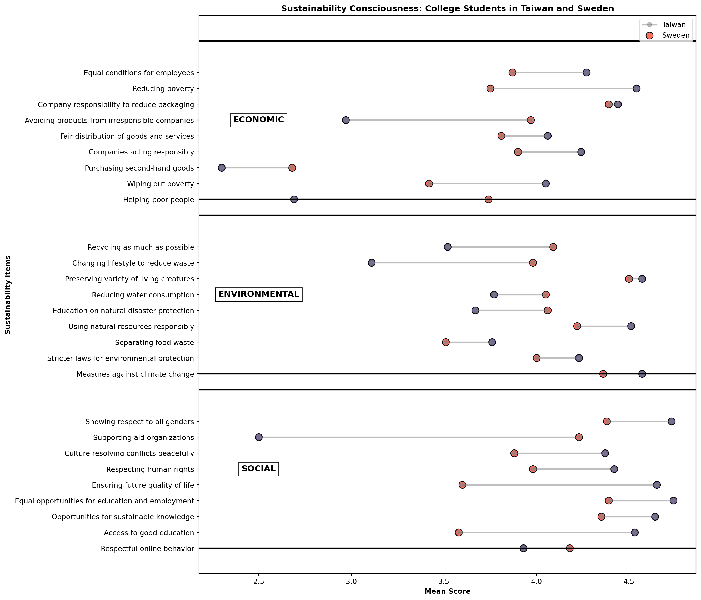

### Eco-Friendly Diet

An older study in 5 university in Taipei and Taichung (n=255) found
78.04% of respondents consumed beef in the month prior and were
concerned with food safety, freshness, and quality (J. L. Hsu et al.,
2014). (Thiagarajah & Kay, 2017) reports a general observation in their
abstract (I was unable to access the full study) that most college
students in all observed countries including Taiwan (n=534) regarded
“*plant-based diets to have health benefits”*.

## The Effect of Climate Change on Taiwan

Taiwan has been affected by drought over 4 decades, rising temperatures
and altered rainfall patterns, impacting water security and
semiconductor manufacturing​(Vo & Liou, 2024). Corals surrounding Taiwan
are affected by marine heatwaves, ocean acidification and increased sea
surface temperature affects coral bleaching level (P.-C. Hsu et al.,
2024). Biomarkers in the sediment core around Taiwan are being used to
study variations in climate over past thousands of years (Yueqi Wang et
al., 2021). Taiwan is affected by Kuroshio (黑潮) like Estonia is
affected by the Gulf Stream. Both oceanic currents help regulate the
climates of their respective regions and marine ecosystems. Kuroshio is
a warm current of the Pacific Ocean. Rossby planetary waves driven by
the Earth’s rotation are crucial to keeping the atmosphere in balance by
helping transfer tropical heat towards Earth’s poles and cold air toward
the tropics; interactions between oceanic currents, Rossby waves and
nonlinear *mesoscale eddies,* which form complex undulations, and their
effect on the climate are still not well understood (Belonenko et al.,
2023; J.-Y. Lin et al., 2022; Sheng Liu et al., 2024; Mensah et al.,
2014; Shen et al., 2014; US Department of Commerce, n.d.; Yuqi Yin et
al., 2019). Around 33% of Taiwanese CO2e emissions is captured by the
marine carbon sink, while the effect of forests in Taiwan needs further
study (Hung et al., 2024).

## Sustainability Tools in the Taiwanese Context

Musical garbage truck are a success story of the environmental progress
in Taiwan (Helen Davidson & Chi Hui Lin, 2022). Indeed, they are a *user
interface innovation* and the main way how people in Taiwan interact
with sustainability issues.

The popular narrative about Taiwan recounts the story of the economic
and environmental transformation of the country. In the late 1980s
during the heights of an economic boom Taiwan became famous as the
Taiwanese Miracle (臺灣奇蹟) (Gold, 1986; P.-L. Tsai, 1999). By the
early 1990s another less flattering nickname appeared: “garbage island”,
for the piles of trash covering the streets and overflowing landfills
(Ngo, 2020; Rapid Transitions Alliance, 2019). In the two decades that
followed, from 1998 to 2018, Taiwan made progress in municipal waste
management, rising to the status of a world-leader in recycling (2nd
*effective recycling rate* after Germany); in addition to an effective
recycling system, the average waste amount generated per person by 700g
(from 1140g to 400g) per day; nonetheless, industrial recycling rates
were less stellar, standing at 80% in 2020 and there were unrealized
opportunities in using industry 4.0 technologies, such as internet of
things (IoT) sensors for better waste tracking (Bui et al., 2023; C.-Y.
Wu et al., 2021).

Progress in sustainability is possible but achieving results takes time
and innovation. (Rapid Transitions Alliance, 2019) credits the Taiwanese
Homemakers United Foundation (財團法人主婦聯盟環境保護基金會) for
initiating the transformation in 1987, suggesting a small group of
people can have an outsized impact on the whole country. Their activity
didn’t stop there and (財團法人主婦聯盟環境保護基金會, 2020) recounts a
timeline of their achievements on their website until the present day.

## Trends in Taiwanese Companies

Between 1970 and 2019 CO2 was a prerequisite of economic growth in
Taiwan (check this again) (T. Chang et al., 2023). Taiwan is a net CO2
exporter since 1990s through emissions embedded in the industrial
production oriented economy (Huang et al., 2020).

TIME Magazine and Statista collaborative *“World’s Most Sustainable
Companies Of 2024”* includes 17 Taiwanese companies (Alana Semuels,
2024).

<div dangerouslySetInnerHTML={{ __html: quartoRawHtml[5] }} />

Meanwhile, Corporate Knights which has been ranking global sustainable
companies since 2005, including analysis of 7000 public companies with a
revenue over US\$1 billion, only includes TSMC in the top 100 (placed
20th in 2021 and 44th in 2022, dropping out in 2023) and Taiwan High
Speed Rail Corp and Giant Manufacturing Co Ltd since 2023. (Corporate
Knights, 2024)


## Online Shopping Trends in Taiwan

-   In Online Shopping, (聯合新聞網, 2024 predicts Momo and Coupang will
    compete for Taiwanese market leadership).
-   intsifying competition, Coupang stepping on Shopee’s and MOMO’s toes
    “順風婦產科 순풍 산부인과 (@Followwindlover) on Threads” (2024)


-   “Taiwan’s Financial Supervisory Commission’s (FSC) requirements for
    Taiwan’s corporates to disclose their carbon emissions starting in
    2023,” Reformosatw (2024)

### Gen-Z in Other Countries

-   In Japan, Gen-Z wants privacy and 75% feel others overshare on
    social media and 49 percent were concerned about their personal data
    https://www.mckinsey.com/~/media/mckinsey/email/genz/2022/06/07/2022-06-07b.html

-   (Manchanda et al., 2023) survey (n=726) administered at shopping
    malls in New Delhi, India, found similar levels of sustainability
    consciousness between Millenial (n=206) and Generation-Z (n=360) age
    groups; people with high level of materialism were found to be less
    sustainability-conscious; the effect of mindfulness on
    sustainability was found to be stronger among females than males,
    supporting the hypothesis of the moderating effect of gender.

**There’s evidence young people have money.** In the United States, the
combined annual consumer spending of Gen-Z and Millennials was over 2.5
Trillion USD in 2020 (YPulse, 2020). Over the decade from 2020 to 2030,
in the U.S., UK, and Australia, Millennials are projected to inherit 30
trillion USD from their parents (Calastone, 2020). There’s also some
evidence of investment interest, however there’s large geographic
variance. According to a (Calastone, 2020) study (n=3000) surveying
people in the millennial age group between ages 23 and 35 in Europe (UK,
France, Germany), U.S.A., Hong Kong, and Australia, 48% of respondents
located in Hong Kong owned financial securities (such as stocks) while
the figure was just 10% in France.

<div dangerouslySetInnerHTML={{ __html: quartoRawHtml[6] }} />

There is extensive research on the attitudes of U.S. college students
towards climate change. (American Press Institute, 2022) reports only
37% percent of U.S. Generation-Z and Millenials follow news related to
environmental issues. (Schwartz et al., 2022) reports some adult US
students in a small study (18-35, n = 284) express feelings of
insignificance of their actions to achieve any meaningful impact.
(Thomaes et al., 2023) reports U.S. adolescents don’t find
sustainability relevant to their daily life. (Ross et al., 2016) says
most people in the U.S. don’t act on climate change. “Action on climate
change has been compromised by uncertainty, aspects of human
psychology”.

-   In Portugal, Estonia, and elsewhere young people are suing companies
    for eco-problems: Flor (2024)

-   The En-ROADS climate change solutions simulator allows governments,
    organizations and individuals explore climate scenarios based on
    interactive changes in a visualization tool (Climate Interactive,
    n.d., 2023; Creutzig & Kapmeier, 2020; Czaika & Selin, 2017).

-   “Research shows that showing people research doesn’t work,” John
    Sterman

## Pollution Levels

Taiwanese college students are subjected to high levels of pollution.
University campuses are somewhat healthier than other areas. There are
several decades of research on pollution levels in Taiwan, most with
very scary correlations to health.

-   Taiwan air pollution, the worst (highest PM2.5 concentration) were
    found in Changhua (24.5 µg/m³), Tainan (20.9 µg/m³), and Pingtong
    (20.7 µg/m³) (Chang Hsiung-feng et al., 2024).

Religion plays a role in air pollution: C. Tang & Pan (2014)

## Designing for College Students: Developing Personas

User research makes extensive use of user *personas* to represent a
group of people with similar attributes. Designers use personas to
*articulate assumptions,* which, if used well, is useful for
*user-centered design*, to create better products. Personas help to
reflect on what kind of *biases* might exist in the design. Within the
larger cohort of college students several different personas could be
defined, for example grouping people by interests, knowledge, habits,
levels of anxiety, and other attributes.

There have been concerns about food safety in Taiwan.

Humans have a long list of cognitive biases, which a good design should
take into account.

Students ride bicycles and scooters. Many circular economy service such
as YouBike and transport sharing platforms like Uber are available.

Many students live in dorms and shared housing, meaning their impact per
square meter is low.

-   Students in the Generation-Z age bracket (abbreviated as Gen-Z or
    Zoomers) are born between 1997 and 2012 (Branka Vuleta, 2023). Over
    98% of Gen-Z owns a smartphone while only 80% of the general world
    population does (BankMyCell, 2022; Global Web Index, 2017).

-   High levels of technology adoption worldwide

-   (Credit Suisse, 2022) suggests young consumers are more eco-friendly
    and drive the speed of change. Yet the Economist has ran a few
    anonymous articles calling gen-z green ideals into question (“How
    Gen Z and Millennials Spend Their Money,” 2023; The Economist,
    2023).

-   Deyan Georgiev (2023a)

-   Alex Reice (2021)

-   (Wood, 2022) suggests in the U.S. Gen-Z is willing to pay 10% more
    for ethically goods, spend 24% more on sustainable products than
    Generation X and 75% of Gen Z would prioritize sustainability over
    brand loyalty.

The above studies give foundation for creating a persona of a U.S.
College Student who doesn’t follow environmental news and thinks climate
action doesn’t make a difference. This doesn’t necessarily mean this
group of people with similar ideas would deny climate change is
happening. Rather “Climate Denier” could be another persona, grouping
people into a cohort who thinks climate change is not real. Further
research would be needed to define relevant personas which have
meaningful predictive and generalizing power.

<div dangerouslySetInnerHTML={{ __html: quartoRawHtml[7] }} />

-   Crabb (2023)

Rooney-Varga et al. (2019) shows the effectiveness of ***The Climate
Action Simulation*** in educating users about **success scenarios**.

### AI Usage

A large-scale (N=6000) survey of college students in Sweden showed these
attitudes towards AI assistants (ChatGPT was by far the most prevalent
app)


### Social Trust

-   When disaster hits we need high levels of social trust.

### Climate Anxiety

A large worldwide study (n=10000, age 16-25) by (Hickman et al., 2021)
provides evidence the youth is anxious about climate in Australia,
Brazil, Finland, France, India, Nigeria, Philippines, Portugal, the UK,
and the USA. Similarly, (Thompson, 2021) finds young people around the
world have climate anxiety. (Whitmarsh et al., 2022) shows worry about
the climate in the UK is generally widespread (over 40% of the
respondents, n=1332), while climate anxiety is highest among young
people and is a possible motivator for climate action. Additionally,
(Ogunbode et al., 2022) finds climate anxiety in 32 countries and also
supports the idea that climate anxiety leads to climate activism.
(Thibodeau, 2022): “In 2021, the BBC polled 1,000 people in Scotland to
understand the barriers to taking climate action. What they found was
even though many people were aware of actions needed to take to address
climate change, and had intentions to their behaviors didn’t change.
This is a phenomenon called the intention-action gap.”

-   (Osaka, 2023) argues *doomerism* is an excuse for climate in-action.
    Hope is necessary for people to make changes in their habits (Marlon
    et al., 2019).

-   Designing for Health and Sustainability: Health and sustainability
    are intrinsically connected. (Kjaergard et al., 2014) shows how
    “understanding health and sustainability as a duality, health both
    creates conditions and is conditioned by sustainability, understood
    as economic, social and environmental sustainability, while on the
    other hand sustainability creates and is conditioned by human
    health”

-   Design for Human Rights (UNFCCC, 2023b)\] text refers to “human
    right to a clean, healthy and sustainable environment”.

-   Refi podcast: “people need agency”.

-   Martiskainen et al. (2020) (need access, ncku doesn’t subscribe)

-   Seabrook (2020) (need access)

-   Older research on young adults (Millenials at the time) highlights
    how Millenials “use Google as a reference point for ease of use and
    simplicity” (Kate Moran, 2016).

Psychological factors influencing millenials to engage with
sustainability (Naderi & Van Steenburg, 2018)


### Community

Humans working together are able to achieve more than single
individuals. “Any community on the internet should be able to come
together, with capital, and work towards any shared vision. That starts
with empowering creators and artists to create and own the culture
they’re creating. In the long term this moves to internet communities
taking on societal endeavors.”

-   Building a culture of sustainability? (Armstrong & Staff, 2021;
    Lakshmi Rebecca, 2018).

The focus on *group consciousness* suggests community-based
sustainability action may be effective.

***Zero Waste Lifestyle*** is the opposite of overconsumption. Zero
waste suggests people buy in bulk to save. Buying in bulk for more
savings and to reduce packaging. Through group purchases and community
investing while also reducing consumption. - Zero waste municipality in
Treviso

***Minimalism*** is a movement of people living a simple life. This is
always going to be a small percentage of people. (C. D. Costa, 2018):
Finnish socialists: minimalism. Tokyo (Tokyo Simple Eco Life, 2021). -
consumers choose to engage in becoming minimalist in a non-linear
process with overlapping stages (Oliveira De Mendonça et al., 2021).

What are the building blocks of a thriving community?

***Luxury*** - Conversely, Taiwan is a growing market for luxury brands
(Karatzas et al., 2019).

### Empowerment

-   I would like to have an AI agent to set my requirements and
    preferences and give a “fuck you” middle finger to companies that
    don’t meet them. I could also give a thumbs up to companies that
    meet my expectations. Perhaps the user interface could like Tinder
    where I can swipe left and right.

### Trends and Memes

-   2024 “underconsumption” and “deinfluencing” are trends on TikTok
    Fares et al. (2024)

-   [https://www.tiktok.com/search?q=underconsumption](https://www.tiktok.com/search?q=underconsumption)

-   [https://www.tiktok.com/search?q=deinfluence](https://www.tiktok.com/search?q=deinfluence)

-   [https://www.tiktok.com/tag/deinfluencing](https://www.tiktok.com/tag/deinfluencing)

-   [https://www.tiktok.com/tag/underconsumption](https://www.tiktok.com/tag/underconsumption)

-   Coined by Richard Dawkins in 1976 in the context of biology.

-   Internet memes and meme stocks

-   Memes from daily life, business to war, are relevant to penetrating
    through the noise of the web.

-   Memes and sustainability?

-   Meme research has become an academic discipline

-   Memes have become a popular communication tool..

-   Zidani (2021)

-   Zidani & Miltner (2022)

-   Irina Lyan et al. (2015)

-   Zannettou et al. (2018)

-   Peters-Lazaro et al. (2020)

## Design Implications

College Students Need Tools for Action

Environment shapes action.. create an environment where college students
can influence companies.

<div dangerouslySetInnerHTML={{ __html: quartoRawHtml[8] }} />

## Feature Ideas

<div dangerouslySetInnerHTML={{ __html: quartoRawHtml[9] }} />

````mdx-code-block
import Figure from '/src/components/Figure';
import Humboldt from '/research/images/sustainability/humboldt.jpg';
import Boundaries from "/research/images/sustainability/planetary-boundaries-2023.png";
import Carbon from "/research/images/sustainability/co2-concentration.png";
import AbstractSustainability from "/research/images/sustainability/abstract-sustainability.png";
````

# Sustainability

````mdx-code-block
<Figure caption="Visual abstract for the sustainability chapter" src={AbstractSustainability} />
````

## The Roots of Sustainability in Environmentalism

*“Nachhaltigkeit”* - *sustainability* in German - was likely the first
use of the concept of preserving natural resources, conceived by a tax
accountant Hannß Carl von Carlowitz in 1713 in his seminal book on
forestry - *Sylvicultura oeconomica -*, referring to the goal of
achieving prudent forest management practices in his native Saxony in
Southeastern Germany, which at the time was under severe *deforestation*
pressure from mining, ship-building and agricultural production
(Gottschlich & Friedrich, 2014; Hannß Carl von Carlowitz, 1713). This
particular field of sustainability study is now known as *sustainable
yield of natural capital*. The *principal* of the natural resource being
managed, such as in fishing and forestry, shouldn’t be over-harvested in
order to maintain ***ecosystem services*** - a contemporary term from
the theory of *natural capital*, referring to benefits humans receive
from the stock of world’s natural resources (Peter Kareiva et al.,
2011).

Defining sustainability perhaps more poetically, the American wildlife
ecologist Aldo Leopold proposed the idea of *land ethics* in 1972 as
*“\[a\] thing is right when it tends to preserve the integrity,
stability, and beauty of the biotic community. It is wrong when it tends
otherwise”* in his landmark work *A Sand County Almanac* (Leopold,
1972). In a similar vein, the 1987 United Nations’ Brundtland Report
titled “*Our Common Future”* defined *sustainable development* as
*“Development that meets the needs of the present without compromising
the ability of future generations to meet their own needs”* (World
Commission on Environment and Development, 1987). Given these varied
ideas for over 300 years, I believe some percentage of people have been
concerned with our planet’s natural environment and its preservation
already for centuries. Yet, it is only in the last 100 and so years that
human activities have begun to affect Earth’s systems on a previously
unseen scale - termed *Anthropocene* -, necessitating a deeper
understanding of human-nature interactions, such as in the case of
climate change, which is rapidly changing the face of our living
environments.

## Measuring, Visualizing Earth’s Climate

Studies of Earth’s climate go back for over 200 years, starting with
Alexander von Humboldt,the founder of climatology, who revolutionized
cartography by inventing the first *isothermal maps* in 1816; these maps
showed areas with similar temperature, variations in altitude and
seasons in different colors (Honton, 2022) now available as 3D computer
models(*Alexander von Humboldt’s Original Isotherms Circa 1838*, 2023).
Already in 1896, the Nobel Prize winner Svante Arrhenius first
calculated how an increase in CO<sub>2</sub> levels could have a warming
effect on our global climate (T. R. Anderson et al., 2016; Wulff, 2020).
In 1938, Guy Stewart Callendar was the first scientist to demonstrate
the warming of Earth’s land surface as well as linking the production of
fossil fuels to increased CO<sub>2</sub>e and changing climate (Hawkins
& Jones, 2013). Early scientists pioneered climate modeling by
calculating the first climate interactions which precede today’s complex
computer-based *Earth System Models (ESMs)* that integrate the various
Earth systems and cycles run on supercomputers (T. R. Anderson et al.,
2016).

````mdx-code-block
<Figure caption="Humboldt's Naturgemälde, early data visualization of ecology, rain, temperature, elevation, etc" src={Humboldt} refURL="https://commons.wikimedia.org/wiki/File:Zentralbibliothek_Z%C3%BCrich_-_Ideen_zu_einer_Geographie_der_Pflanzen_nebst_einem_Naturgem%C3%A4lde_der_Tropenl%C3%A4nder_-_000012142.jpg" refTitle="Public Domain, WikiMedia Commons" />
````

Environmental activists have been calling attention to global warming
for decades, yet the world has been slow to act (McKibben, 1989). While
the scientific case for human-induced climate change was building, it
took 120 years after Arrhenius’ calculations, until the Paris Climate
Agreement in 2016, that countries came to an agreement on non-binding
targets on keeping CO<sub>2</sub> levels 1.5 °C below pre-industrial
levels (defined as 1850–1900)(United Nations, 2016). Even though
awareness of Earth’s warming climate was growing ever stronger, the
CO<sub>2</sub> emissions kept rising too. The hockey-stick growth of
CO<sub>2</sub> concentration since the industrial revolution is clear in
the data from 1958 onward, following a steady annual increase, called
the *Keeling Curve* (Keeling & Keeling, 2017). Written records of global
temperature measurements are available starting from the 1880s, when
temperatures began to be documented in ship logs (Brohan et al., 2012).
Finally, although perhaps less accurately, temperature estimations from
tree-trunks allow some comparisons with the climate as far back as 2000
years ago (Rubino et al., 2019).

````mdx-code-block
<Figure
  caption="CO2 concentration in the atmosphere"
  src={Carbon}
  refURL="https://keelingcurve.ucsd.edu/"
  refTitle="Scripps Institution of Oceanography at UC San Diego"
/>
````

The latest data from 2023 shows our current world population of 8
Billion people emitted 37.2 gigatonnes (i.e. billion metric tons) of
CO<sub>2</sub>e per year, the highest emissions recorded in history
(Statista, 2023). In order to limit global warming to 1.5 °C as agreed
by the world nations in Paris, removal of 5-20 gigatons of
CO<sub>2</sub>e per year would be needed according to reduction pathways
calculated by the Intergovernmental Panel on Climate Change (IPCC) (Wade
et al., 2023). Yet, most countries are missing the mark (Climate
Analytics & NewClimate Institute, 2023; United Nations Environment
Programme, 2023). The European Union’s Copernicus Climate Change Service
(C3S) reports 1.5 °C global warming has already been breached in 2024
temperatures (“First Time World Exceeds 1.5C Warming Limit over 12-Month
Period,” 2024; *World’s First Year-Long Breach of Key 1.5C Warming
Limit*, 2024). Given the current pace of climate change action, the G7
countries (Canada, France, Germany, Italy, Japan, United Kingdom, United
States) are heading for 2.7 °C of warming by 2050 (CDP, 2022).

Earth’s physical systems are very sensitive to small changes in
temperature, which was not understood until the 1970s(McKibben, 2006). A
comprehensive review of evidence from paleoclimate records until current
time, including ocean, atmosphere, and land surface of points towards
substantial climate change if high levels of greenhouse gas emissions
continue, termed by the authors as *climate sensitivity* (Sherwood et
al., 2020). Global warming may lead to the slowing down and complete
stop of the Atlantic meridional overturning circulation (AMOC) which
helps maintain climate stability (Ditlevsen & Ditlevsen, 2023).

### Measuring CO<sub>2</sub>e Emissions

Technology improves and measurements have become more accurate yet
CO<sub>2</sub>e emissions are not yet completely accounted for. (Crippa
et al., 2020) reports the latest figures CO<sub>2</sub>e from the EU’s
Emissions Database for Global Atmospheric Research (EDGAR). The EU
Copernicus satellite system reveals new greenhouse emissions previously
undetected (Daniel Värjö, 2022). *Copernicus Climate Change Service
(C3S) provides “\[n\]ear-real time updates of key global climate
variables*”(The Copernicus Climate Change Service, 2024).

-   \[@matthewgoreEmissionsRegulationsShipping2022\] reports the
    International Maritime Organization (IMO) targets cutting
    CO<sub>2</sub> equivalent emissions in shipping 50% by 2050 compared
    to 2008.

Emissions production is highly unequal, with *“\[t\]he world’s top 1% of
emitters produce over 1000 times more CO2 than the bottom 1%”* (IEA,
2023a)

CO<sub>2</sub>e emissions by region (per year).

<div dangerouslySetInnerHTML={{ __html: quartoRawHtml[10] }} />

*Scoping* CO<sub>2e</sub> *emissions* into 4 main categories helps to
organize calculating CO<sub>2e</sub> emissions and corresponding
reduction targets by looking at direct and indirect emissions
separately. The U.S. National Public Utilities Council (NPUC)
decarbonization report provides a useful categorization of *emission
scopes* applicable to companies which helps organizing emission
reduction schemes (National Public Utilities Council, 2022) based on the
Greenhouse Gas Protocol defined in the 1990s (GHG Protocol, n.d.). For
example, for consumers in Australian states and territories in 2018, 83%
of the GHG emissions are Scope 3, meaning indirect emissions in the
value chain (Goodwin et al., 2023). A newer concept is Scope 4 emissions
also known as avoided emissions, proposed by the World Resources
Institute (WRI) in 2013 (Plan A, n.d.).

<div dangerouslySetInnerHTML={{ __html: quartoRawHtml[11] }} />

One’s scope 3 emissions are someone else’s scope 1 emissions.

-   Mapping pollution sources in China Xie et al. (2021)

Countries have agreed up CO<sub>2e</sub> Reduction Targets known as
Country-Level Nationally Determined Contributions (NDCs)

-   UNFCCC. Secretariat (2022) The State of Nationally Determined
    Contributions

While most countries have not reached their Nationally Determined
Contributions, the Climate Action Tracker data portal allows to compare
countries (Climate Analytics & NewClimate Institute, 2023). (Fransen et
al., 2022) notes that the majority of Nationally Determined
Contributions (NDCs) are dependent on financial assistance from the
international community.

<div dangerouslySetInnerHTML={{ __html: quartoRawHtml[12] }} />


Fossil fuels are what powers humanity as well as the largest source of
CO<sub>2</sub> emissions. IEA (2022) reports “Global CO<sub>2</sub>
emissions from energy combustion and industrial processes rebounded in
2021 to reach their highest ever annual level. A 6% increase from 2020
pushed emissions to 36.3 gigatonnes”. As on June 2023, fossil fuel based
energy makes up 82% of energy and is still growing Institute (2023). The
425 largest fossil fuel projects represent a total of over 1 gigatons in
CO<sub>2</sub> emissions, 40% of which were new projects Kühne et al.
(2022). Tilsted et al. (2023) expects the fossil fuel industry to
continue grow even faster. In July 2023, the U.K. granted hundreds of
new oil and gas of project licenses in the North Sea (“Rishi Sunak to
Green-Light Hundreds of New Oil and Gas Licenses in North Sea,” 2023).

### Markets for Ecosystem Assets: Pricing, Tracing and Trading

Markets for ecosystems assets are centered around *carbon credits*, a
type of nature-backed financial derivative dependent on science-based
methodologies for measurement, reporting, and verification (MRV), which
are managed and regularly updated by certification organizations such as
Gold Standard, Verra, and others.

<div dangerouslySetInnerHTML={{ __html: quartoRawHtml[13] }} />

Verra updated their Agricultural Land Management methodology for
Verified Carbon Standard (VCS) last year (Verra, 2023). Gold Standard
recently release a methodology for Mangrove-based carbon credits \[ADD
CITATION\].

CO<sub>2e</sub> assigning a monetary value to carbon emissions.

Trading CO<sub>2e</sub> emissions can be divided into 2 categories -
*Compliance Carbon Markets* (CCM) and *Voluntary Carbon Markets* (VCM).

The legislative baseline for Compliance Carbon Markets is so low, people
want to retire more CO<sub>2e</sub>, which they can do through
*Voluntary Carbon Markets.*

For the individual person, there’s no direct access to CO<sub>2</sub>
markets. However, brokers do buy large amounts of carbon credits to
resell in smaller quantities to retail investors.

*“Carbon pricing is not there to punish people,”* says Lion Hirth Lion
Hirth (n.d.). *“It’s there to remind us, when we take travel, heating,
consumption decisions that the true cost of fossil fuels comprises not
only mining and processing, but also the damage done by the
CO<sub>2</sub> they release.”*

*Long term cost* of insufficient climate action is more than *short-term
gains* from delaying efforts to reduce carbon emissions.

-   The total size of carbon markets reached 949 billion USD in 2023,
    including Chinese, European, and North American CO<sub>2</sub>
    trading (LSEG & Susanna Twidale, 02/12/2024, 02:37 PM).

-   *The price of* CO<sub>2e</sub> *differs across markets.* (Stern,
    2022b) argues carbon-neutral economy needs higher CO<sub>2e</sub>
    prices and believes (Rennert et al., 2022) CO<sub>2e</sub> price per
    ton should be 3,6x higher that it is currently. Contrary,
    (Ritz, 2022) argues optimal CO<sub>2</sub> prices could be highly
    asymmetric, low in some countries and high (above the social cost of
    CO<sub>2e</sub>) in countries where production is very polluting.

-   iGenius (2020)

The fossil energy production that’s a large part of global CO2 emissions
has caused several high-profile pollution events. Large ones that got
international news coverage include Exxon Valdez and Deepwater Horizon.

-   Lenton et al. (2023) quantifying human cost of global warming.
-   

CO<sub>2e</sub> credits has given rise to *Carbon Accounting industry.*

-   Watershed is a large carbon accounting company.

-   The legislation has created an industry of CO<sub>2</sub> accounting
    with many companies like Greenly, Sustaxo, etc.

-   Quatrini (2021) sustainability assessments are complex and may give
    flawed results.

-   Nonetheles, CO<sub>2</sub> emission reduction has the added positive
    effect of boosting corporate morale (Cao et al., 2023).

Compliance Carbon Markets

meet legal emission reduction targets

**Cap & Trade**

The share of CO<sub>2</sub> emissions among people around the world is
highly unequal across the world (referred to as ***Carbon
Inequality***). (Chancel, 2022) reports “one-tenth of the global
population is responsible for nearly half of all emissions, half of the
population emits less than 12%”.

-   One example is the ICT sector.

-   Bajarin (n.d.) Over 300 million PCs sold in 2022

    -   *GreenDice - Reinventing the Idea of a Computer-Related Tech
        Purchase* (2021) Estonian company “sustainable lifecycle
        management of IT equipment”
    -   Ärileht (23.09.2022, 12:53) Recycle your phone, FoxWay and
        Circular economy for PCs.
    -   X. Zhou et al. (2022) ICT is an example of inequality, while
        emerging economies bear 82% of the emissions, developed
        countries gain 58% of value.

**Emissions Trading Schemes**

From Carbon Offsets to Carbon Credits

-   “A carbon credit represents one tonne of carbon dioxide that has
    been prevented from entering or has been removed from the
    atmosphere” (Anna Watson, 2022, 2023).

Retiring CO<sub>2</sub> allowances

-   Facilitating citizens’ access to CO<sub>2</sub> emissions trading
    may be an efficient method to organize large-scale CO<sub>2</sub>
    retiring (Rousse, 2008).

As of 2024 there’s no single global CO<sub>2</sub> trading market but
rather several local markets as described in the table below.

<div dangerouslySetInnerHTML={{ __html: quartoRawHtml[14] }} />

Most of the world is not part of a CO<sub>2</sub> market.

-   (Sipthorpe et al., 2022) compares traditional and blockchain-based
    solutions to carbon trading.

-   “Blockchain solutions for carbon markets are nearing maturity” and
    offer many improvements. enhancing transparency, trust, and
    efficiency.

-   (United Nations Environment Programme (UNEP), 2021) report. “The
    Emissions Gap Report (EGR) 2021: The Heat Is On shows that new
    national climate pledges combined with other mitigation measures put
    the world on track for a global temperature rise of 2.7°C by the end
    of the century. That is well above the goals of the Paris climate
    agreement and would lead to catastrophic changes in the Earth’s
    climate. To keep global warming below 1.5°C this century, the
    aspirational goal of the Paris Agreement, the world needs to halve
    annual greenhouse gas emissions in the next eight years.

-   (United Nations Environment Programme (UNEP), 2021) report “If
    implemented effectively, net-zero emissions pledges could limit
    warming to 2.2°C, closer to the well-below 2°C goal of the Paris
    Agreement. However, many national climate plans delay action until
    after 2030. The reduction of methane emissions from the fossil fuel,
    waste and agriculture sectors could help close the emissions gap and
    reduce warming in the short term, the report finds. Carbon markets
    could also help slash emissions. But that would only happen if rules
    are clearly defined and target actual reductions in emissions, while
    being supported by arrangements to track progress and provide
    transparency.”

-   (United Nations Environment Programme, 2022) 2022 Emissions Gap
    report.

<div dangerouslySetInnerHTML={{ __html: quartoRawHtml[15] }} />

-   tree bark absorbs methane, (Gauci et al., 2024).

Voluntary Carbon Markets

Verified Carbon Standard (VCS) and the Gold Standard, Climate Action
Reserve (CAR)‍, American Carbon Registry (ACR)

“BeZero Carbon is a ratings agency for the Voluntary Carbon Market.”

https://bezerocarbonmarkets.com/

Voluntary Carbon Markets are …

Voluntary Carbon Markets (VCM) lack standardization and transparency
(Ela Khodai, 2023).

*Carbon Credits* are useful for private companies who wish to claim
*carbon neutrality, climate positivity*, or other related claim, which
might be viewed in good light by their clients or allow the companies to
adhere to certain legislative requirements.

There are many companies which facilitate buy carbon credits as well as
a few organizations focused on carbon credit verification.

-   In Estonia, startups Arbonic and Single.Earth are trialing this
    approach in several forests.
-   For example Flickr invested 3000 USD in carbon credits and got a
    carbon-neutral rating (?!).
-   Carbon Credit Retirement?
-   Methodologies: *Methodology for GHG & Co-Benefits in Grazing
    Systems* (2022)
-   KlimaDAO (2023a) call for an open standard

<div dangerouslySetInnerHTML={{ __html: quartoRawHtml[16] }} />

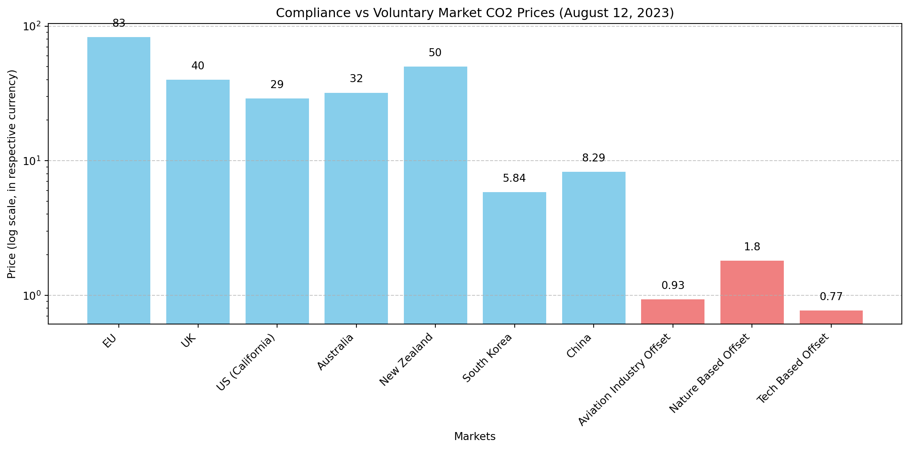

### Overconsumption \> Earth’s Boundaries {#overconsumption-earths-boundaries}

Excessive consumer lifestyle - *overconsumption* - is one of the main
drivers of climate change and environmental destruction, with *“2/3 of
global GHG emissions are directly and indirectly linked to household
consumption, with a global average of about 6 tonnes CO<sub>2</sub>
equivalent per capita”* , according to (Ivanova et al., 2020; Renee Cho,
2020). An older study put the number as high as 60% percent (Ivanova et
al., 2016) while (Ellen MacArthur Foundation, Material Economics,
2019)’s models 45% show of CO<sub>2</sub> equivalent emissions come from
our shopping; produced by companies to make the products we consume.

With the trend of urbanization, it’s not surprising (people living in)
cities are responsible for 80% of the emissions (Rosales Carreón &
Worrell, 2018). (Moberg et al., 2019) reports daily human activities
emission contribution on average in four European countries (France,
Germany, Norway and Sweden).

<div dangerouslySetInnerHTML={{ __html: quartoRawHtml[17] }} />

Earth’s growing population reached 8 Billion people In November 2022 and
population projections by predict 8.5B people by 2030 and 9.7B by 2050
(The Economic Times, 2022; United Nations Department of Economic and
Social Affairs, Population Division, 2022). Indeed, making *anything*
consumes natural resources, which are limited on planet Earth. (Hassoun
et al., 2023) forecasts increase of global food demand by 62% driven by
the impact of climate change. Yet, while population growth puts higher
pressure on Earth’s resources, some researchers propose the effect is
higher from wasteful lifestyles than the raw number of people (Cardinale
et al., 2012). Meanwhile others, such as (Cafaro et al., 2022), believe
*\[o\]verpopulation is a major cause of biodiversity loss and smaller
human populations are necessary to preserve what is left.”*

While the numbers on overconsumption are clear, the debate on
overconsumption is so polarized, it’s difficult to have a meaningful
discussion of the topic (Ianole & Cornescu, 2013). Environmental risks
from human activities are known as Anthropogenic Threat Complexes (ATCs)
(Bowler et al., 2020)*.* As long as humanity is a mono-planetary
species, we have to come to terms with the limitations of our home,
Earth.

### Plastic Pollution

Overconsumption is also one of the root causes of plastic pollution.
(Ford et al., 2022) and (Lavers et al., 2022) find strong links between
climate change and marine plastic pollution *“along with other stressors
that threaten the resilience of species and habitats sensitive to both
climate change and plastic pollution”*.

Plastic pollution is pervasive around the Earth and is fundamentally
linked to climate change, while microplastics are increasingly a real
concern (Lavers et al., 2022; Tiernan et al., 2022). Several
international studies report recent findings of microplastics everywhere
in human bodies: the brain, lungs, digestive tissues, bone marrow,
penis, testis, seminal fluid (semen), and placenta - causing serious
health and reproductive concerns (Codrington et al., 2024; Garcia et
al., 2024; Guo et al., 2024; Hu et al., 2024; N. Li et al., 2024; Main,
2024; Montano et al., 2023; L. Zhu et al., 2024)


-   Jackson (2017) limits to growth update
-   (Keeble, 1988) reported in April 1987 that *‘residents in
    high-income countries lead lifestyles incompatible with planetary
    boundaries’*.
-   Overconsumption and underinvestment.

**tipping points** - Armstrong McKay et al. (2022) discusses tipping
points. - TED (2024)

In addition to the enormity of over-reaching CO<sub>2</sub> emissions,
humanity is facing other massive environmental problems. The Stockholm
Resilience Centre reports we have already breached 4 out of our 9
*“planetary boundaries”:* in addition to climate change, biodiversity
loss (Extinctions per Million Species per Year aka E/MSY), land-system
change (deforestation, land degradation, etc), and biogeochemical flows
(cycles of carbon, nitrogen, phosphorus, etc); on a positive side, the
challenges of fresh water use, ocean acidification and stratospheric
ozone depletion are still within planetary limits (Persson et al.,
2022).

-   Ceballos et al. (2017) mass extinctions
-   IUCN Red List: 45,300 species (28% of all assessed) under threat of
    extinction IUCN (2024)

Atmospheric aerosol loading and the biodiversity intactness index (BII)
were quantified recently (ADD CITATION)

My home country Estonia at the time was considered low-income, a small
nation in poverty behind the *Iron Curtain* occupation of the Soviet
Union, we now in 2024, have also reached high-income status.

-   De Balie (2018)

-   Houdini (2018)

-   Haeggman et al. (2018)

-   Richardson et al. (2023)

````mdx-code-block
<Figure
  caption="Planetary Boundaries 2023 update"
  src={Boundaries}
  refURL="https://www.stockholmresilience.org/research/planetary-boundaries.html"
  refTitle="Azote for Stockholm Resilience Centre, based on analysis in Richardson et al 2023"
/>
````

In 1948, the International Union for Conservation of Nature (IUCN) was
founded, which in

LULUCF “Land Use, Land-Use Change, and Forestry” can both be a source of
greenhouse gas emissions - or a carbon sink (removing CO2 from the
atmosphere).

### Earth System Law, Planetary Health, and Social Cost of CO<sub>2</sub>

*Planetary Health*, *Earth System Law, and* Social Cost of Carbon are 3
approaches to address the complex interdependence of humans with our
physical environment.

Scientists in cross-disciplinary teams have been working on integrating
Earth systems and human society into cohesive frameworks.

Evolving Measurements from Planetary Boundaries to Planetary Health

-   Planetary health (Planetary Health Alliance, 2024a, 2024b)

-   Wardani et al. (2023) *“long-term human well-being is dependent on
    the well-being of the planet, including both biotic and abiotic
    systems. It recognizes interlinkages across environmental
    sustainability, public health, and socioeconomic development.”*

*Earth System Law* is a framework for addressing interconnected
environmental challenges (Du Toit & Kotzé, 2022).

*Social Cost of Carbon* attempts to measures the compound impact of
CO<sub>2e</sub> emissions on society. Sustainability is filled with
complexities. CO<sub>2e</sub> emissions are complicated by biodiversity
loss, child labor, slavery, poverty, chemical pollution, etc. - many
issues become intertwined (TEDx Talks, 2020). One attempt to measure
these complexities, is the *Social Cost of Carbon* (SCC) which is
defined as *“additional damage caused by an extra unit of emissions”*
(Kornek et al., 2021; Zhen et al., 2018). For example the cost of
damages caused by “one extra ton of carbon dioxide emissions” (Stanford
University, 2021). SCC variations exist between countries (Tol, 2019)
and regions (Yong Wang et al., 2022).

-   

-   (J. Lin et al., 2022) says, apart from CO<sub>2</sub>, reduction of
    other atmospheric pollutants, such as non-CO<sub>2</sub> greenhouse
    gases (GHGs) and short-lived climate pollutants (SLCPs) is required
    for climate stability.

-   (T.-P. Wang & Teng, 2022): Quantifying climate damage proposes
    scenarios of climate damage.

## Ecosystem Services: Quantifying Human Benefits from Nature

*Ecosystem services measure the benefits humans receive from the
biosphere.* Put most simply, *ecosystem services* enable human life on
Earth. While it can be assumed much of the flora and fauna are crucial
for Earth’s systems, science is still in the process of understanding
and quantifying its contributions. The history of the valuation of
nature’s services goes back to the 18th century when David Ricardo and
Jean Baptiste Say discussed nature’s *work*, however both considered it
should be free (Gómez-Baggethun et al., 2010). In 1997 (G. C. Daily,
1997) proposed the idea of *ecosystem services* and (Costanza et al.,
1997) attempted to assess the amount of ecosystem services provided. (Le
Provost et al., 2022)’s study shows *biodiversity* as one key factor to
maintain delivery of ecosystem services. (Noriega et al., 2018) attempts
to quantify the ecosystem services (ES) provided by insects.

The most complex computer models which attempt to capture ever more
interactions happening in the physical realm are called *digital twins.*
The EU is developing a digital twin of Earth to help sustainability
prediction and planning, integrating Earth’s various systems such as
climate, hydrology, ecology, etc, into a single model *Destination Earth
Shaping Europe’s Digital Future* (2023). We can use all the data being
recorded to provide a digital twin of the planet, nature, ecosystems and
human actions to help us change our behavior and optimize for planetary
wellbeing.

-   Jackson (1996) *preventive environmental management*

### Biosphere

Earth’s biosphere is made up of 846 terrestrial ecoregions, which are
distributed across 14 major biomes and 8 biogeographical realms
(Dinerstein et al., 2017).

### Ecological Indicators

Sustainability can be measured using a variety of *ecological
indicators*.

Ecological indicators for Earth *- I would like to coin the word
“ecomarkers” -* are like *biomarkers* in human health.

Technological advances help scientist better understand nature. Cutting
edge research uses AI-based voice recognition for listening to nature,
assessing biodiversity based on species’ sounds in the forest. Millions
of detections of different species with machine learning passive
acoustic AI models, can also assess species’ response to climate change
(AI for Good, 2023; Guerrero et al., 2023).

*Environmental DNA (eDNA)* helps scientists measure species abundance
without direct observation through detection of DNA on genetic materials
such as skin cells (Peter Andrey Smitharchive page, 2024). Cellular DNA
can be isolated from various sediment types (Ogram et al., 1987). Beyond
scientific applications, eDNa is being used to generate biodiversity
credits by environmental asset rating companies such as BeZero (Ojoatre
& Atkinson, 2023).

AI is being used to map icebergs and measure the change in size
(European Space Agency, 2023).

### Biodiversity

Why Protect Biodiversity?

(May, 2011) argues biodiversity loss is a concern for 3 points of views:

<div dangerouslySetInnerHTML={{ __html: quartoRawHtml[18] }} />

-   

-   Meanwhile the destruction pressure on ecosystems is rapidly
    increasing (ADD CITATION A B C).

-   Y. Chen et al. (2023) Ecosystem vulnerability **(need access)**

-   Z. Zhang et al. (2023) Integrating ecosystem services conservation
    into urban planning **(need access)**

-   L. Li et al. (2023) tourism is a large industrial sector which
    relies on ecosystem services. In Taiwan, (T. H. Lee et al., 2021)
    developed a framework of indicators to assess sustainable tourism.

**Measuring Environmental Degradation**

(Almond, R.E.A. et al., 2022) reported, the number of species killed,
mass destruction of nature. “69% decline in the relative abundance of
monitored wildlife populations around the world between 1970 and 2018.
Latin America shows the greatest regional decline in average population
abundance (94%), while freshwater species populations have seen the
greatest overall global decline (83%).”


Biodiversity loss is linked to overconsumption, weak legislation and
lack of oversight. (Crenna et al., 2019) recounts European Union
consumers’ negative impact on biodiversity in countries where it imports
food. WWF (2022) case study highlights how 4 biodiverse regions Cerrado
in Brazil, Chaco in Argentina, Sumatra in Indonesia, and the Cuvette
Centrale in Democratic Republic of Congo are experiencing rapid
destruction due to consumer demand in the European Union. While the
European Union (EU) has recently become a leader in sustainability
legislation, biodiversity protection measures among private companies is
very low Marco-Fondevila & Álvarez-Etxeberría (2023).

Meanwhile, there is some progress in biodiversity conservation as
“\[\*b\]iodiversity awareness is now at 72% or higher in all countries
sampled, compared to only 29% or higher across countries sampled in
2009”\* (UEBT, 2022)

**Convention on Biodiversity**

Similarly to climate protection, the UN has taken a leadership role in
biodiversity protection. Unit (2023): The history of the United Nations
Convention on Biodiversity goes back to 1988, when the working group was
founded. UNEP (Tue, 12/20/2022 - 07:44): The Convention on Biodiversity
2022 (COP15) adopted the first global biodiversity framework to
accompany climate goals.

Protecting biodiversity

<div dangerouslySetInnerHTML={{ __html: quartoRawHtml[19] }} />

### Oceans

Blue carbon.

**Marine Heatwaves**

-   Gelles & Andreoni (2023) describe how marine heatwaves threaten
    global biodiversity. Ocean warming leads to coral bleaching of the
    Great Barrier Reef in Queensland, east coast of Australia (Pfeiffer,
    2024).
-   Espinosa & Bazairi (2023) marine ecosystem services **(need access,
    ncku doesn’t sub)**
-   Howard et al. (2017) argues Oceans play crucial role in carbon
    capture.

### Forest

Forests are a crucial part of Earth’s carbon cycle and the main natural
CO<sub>2</sub> capture system; due to deforestation, Europe rapidly
losing its forest carbon sink (Frédéric Simon, 2022). Around 27% of
Earth’s land area is still covered by forests yet *deforestation* is
widespread all around the world; highest rates of deforestation happened
in the tropical rainforests of South America and Africa, mainly caused
by agricultural cropland expansion (50% of all deforestation) and
grazing land for farm animals to produce meat (38,5%), totaling close to
90% of global deforestation (*FRA 2020 Remote Sensing Survey*, 2022).
The global forest cover change is visible on Google’s Earth Engine
(Hansen et al., 2013).

Around the world, there are many initiatives to increase forest cover,
for example the *1 billion tree project* (Bastin et al., 2019; “Erratum
for the Report,” 2020; Greenfield & @pgreenfielduk, 2021). However, it’s
important to not planting trees (*afforestation)* is not the full
solution, as *afforestation* is different from *reforestation*, which
takes into account biodiversity. Also, while using remote-sensing and
machine-learning to assess reforestation potential (see Klosterman et
al., 2022), it doesn’t take into account local political realities.

-   Burning of biomass undermines carbon capture.
-   Bousfield et al. (2022) reports there’s evidence paying landowners
    for the ecosystem services their forests provide may reduce
    deforestation.
-   nature-based solutions.

### Pollution

In, Taiwan this is the ranking of pollution reports by citizens
(Ministry of Digital Affairs, 2024):


``` text
<Figure size 1152x768 with 0 Axes>
```


Health and sustainability are inextricably linked. “Human health is
central to all sustainability efforts.”, *“All of these (food, housing,
power, and health care), and the stress that the lack of them generate,
play a huge role in our health”* (Sarah Ludwig Rausch & Neha Pathak,
2021).

*Design Implications* Start with the most polluted regigons as priority?

**Air Pollution**

Clean air is a proposed as a *human right* (Baroness Jones of
Moulsecoomb & Caroline Lucas, 2023) yet air pollution is widespread
around the planet, with 99% of Earth’s human population being affected
by bad air quality that does not meet WHO air quality guidelines,
leading to health problems linked to 6.7 million *premature deaths*
every year (World Health Organization, 2022).

Air pollution is linked to cancer incidence. In Taiwan, South Korea, and
England, groundbreaking research by (Lim et al., 2022) analyzed over
400000 individuals establishes exposure to 2.5μm PM (PM2.5) air
pollution as a *cause for lung cancer.* In (Hannah Devlin, 2022),
professor Tony Mok, of the Chinese University of Hong Kong: *“We have
known about the link between pollution and lung cancer for a long time,
and we now have a possible explanation for it. As consumption of fossil
fuels goes hand in hand with pollution and carbon emissions, we have a
strong mandate for tackling these issues – for both environmental and
health reasons.”*

The main way to combat air pollution is through policy interventions.
(MARIA LUÍS FERNANDES, 2023) the EU has legislation in progress to curb
industrial emissions. If legislation is in place, causing bad air
quality can become bad for business. In China, (Gu et al., 2023) links
air pollution to credit interest rates for business loans; companies
with low environmental awareness and a history of environmental
penalties pay 12 percent higher interest rates. In France, (Bouscasse et
al., 2022) finds strong health and economic benefits across the board
from air pollution reduction.

**Water Pollution**

Globally, 4.4 billion people only have access to water that’s not safe
for drinking (Soliman, 2024).

-   Bioswales help catch storm debris and reduce water pollution.

-   Clean water and water pollution

-   Koch (2022) (**Need access! NYC times)**

-   Paris cleans Seine river for Paris Olympics

**Soil Pollution**

-   *“Wild and ruderal plants as bioindicators of global urban pollution
    by air, water and soil in Riyadh and Abha, Saudi Arabia”* (Picó et
    al., 2023) uses wild and ruderal plants to detect pollution by air,
    water and soil.
-   Bioindicators of anthropogenic pollution, pharmaceuticals,
    pesticides, and other industrial chemicals.
-   Both Abha and Riyadh showed notable levels of pollutants while
    Riyadh with more industry showed higher levels.

### Ready for Disaster

The Word Economic Forums Global Risks Report 2024 paints a bleak picture
of the future with expectations of increased turbulence across the board
based on a survey of over 1400 topic experts (World Economic Forum,
n.d.).

### Weather

Global warming increases the risk of disasters and extreme weather
events.

(*Fifth National Climate Assessment*, 2023) The US Global Change
Research Program presented a comprehensive report to the US Congress,
which links disaster-risk directly to global warming; for examples
increased wildfires damage property, endanger life and reduces *air
quality,* which in effect increases health challenges. As extreme
temperatures are increasingly commonplace, with observed changes in
heatwaves, there’s increased risk of wildfires (Perkins-Kirkpatrick &
Green, 2023; Volkova et al., 2021), while flood risk mapping might lower
property prices in at risk areas (Sherren, 2024). Summers of 2022 and
2023 were the hottest on record so far, with extreme heat waves recorded
in places around the world (Douglas, 2023; Falconer, 2023; National
Oceanic and Atmospheric Administration (NOAA), U.S. Department of
Commerce, 2023; NOAA National Centers for Environmental Information,
2023; Serrano-Notivoli et al., 2023; Venturelli et al., 2023).

The part of Earth where the *human climate niche* is becoming smaller
(McKibben, 2023). As temperatures rise, certain cities may become
uninhabitable for humans (CBC Radio, 2021). The summer of 2023 saw
extensive wildfires in Spain, Canada, and elsewhere; rapidly moving
fires destroyed the whole city of Lāhainā in Hawaii \[ADD CITATION\]. In
California, (Jerrett et al., 2022) says, *“\[w\]ildfires are the second
most important source of emissions in 2020”* and *“negate reductions in
greenhouse gas emissions from other sectors.”* Some parts of South
America have seen summer heat *in the winter*, with heatwaves with
temperatures as high as 38 degrees (Livingston, 2023).

In Taiwan disaster risk and hazard mapping is well-developed, with early
warning systems, and comprehensive response preparedness - and painful
experiences - instrumental to saving lives (Y.-J. Tsai et al., 2021).
Intensifying storms forming near coastlines, can be expected with
*“\[c\]hanges to tropical cyclone trajectories in Southeast Asia under a
warming climate”* (Garner et al., 2024). The situation on the Pacific
and Atlantic oceans is not dissimilar, with *“\[o\]bserved increases in
North Atlantic tropical cyclone peak intensification rates”* (Garner,
2023).

In the Phillipines, with increasing extreme weather events, *“businesses
are more likely to emerge in areas where infrastructure is resilient to
climate hazards”* (Y. Cheng & Han, 2022).

Climate-related disasters can spur action as extreme weather becomes
visible to everyone. After large floods in South Korea in July 2023 with
many victims, president Joon promised to begin taking global warming
seriously and steer the country towards climate action (AFP, 2023; Al
Jazeera, 2023; Web, 2023). South Korea has a partnership with the
European Union (European Commission, 2023a).

-   Chernobyl and Fukushima
-   the Great Pacific Garbage Patch
-   Disputes in Eerola (2022).

## Financialization of Nature vs Nature is Sacred: Scaling Up Sustainable Action:

There are 2 main approaches to protecting nature:

<div dangerouslySetInnerHTML={{ __html: quartoRawHtml[20] }} />

-   (Leverhulme Centre for Nature Recovery, 2023) asks should we put a
    price on nature?
-   Is it time to leave utilitarian environmentalism behind? Muradian &
    Gómez-Baggethun (2021)

<div dangerouslySetInnerHTML={{ __html: quartoRawHtml[21] }} />

### Individual Action

Sometimes individual environmental (climate) action *does matter* and
can come at great personal cost, even loss of life. EJAtlas tracks
environmental justice cases around the world, where human stakes are
very high Scheidel et al. (2020).

However, for most of us individual climate action is *ineffective*. The
effect of individual climate action such as *choosing a more sustainable
product* is so limited to be next to meaningless. For individual
consumer choices to make a difference, they need to be *aggregated* into
a movement, collective action with scale, influence, and visibility.

There is no single solution to the environmental crisis. Given the
enormity of environmental degradation, many different approaches are
needed. This chapter documents some of the ongoing work which a
sustainability companion could assist college students get involved
with.

### Restoration

Regenerative Action

-   (Han & Chen, 2022) identifies nature-based solutions “land
    re-naturalization (such as afforestation and wetland restoration)”

<div dangerouslySetInnerHTML={{ __html: quartoRawHtml[22] }} />

Ecology, Agroforestry & Permaculture

Some argue sustainability is not enough and we should work on
*regeneration* of natural habitats.

The UN announced 2021-2030 the Decade on Ecosystem Restoration (Fischer
et al., 2021).

-   Agroecology Baltic Sea Action Group (2023)

Agroforestry plays an active role in achieving Sustainable Development
Goals (SDGs) (Ruba & Talucder, 2023);

-   Food forests for regenerative food systems.
-   Svalbard Seed Vault
-   Irwin et al. (2023)
-   Yadav et al. (2023)
-   G. Low et al. (2023)
-   Ollinaho & Kröger (2023) “bioeconomy is not inherently sustainable
    and may pose considerable risks to biodiversity.”
-   De Queiroz-Stein & Siegel (2023)
-   Gamage et al. (2023) “Organic food and drink sales in 2019 totaled
    more than 106 billion euros worldwide.”

Geopolitical situations can affect technology adoption; after Russia’s
war in Ukraine, Europe needed to quickly reduce consuming cheap Russan
fossil fuel energy (in the form of gas) (Bonasia, 2024). In 2024, for
first time in Europe, renewables in the form of wind and solar energy
surged past production of fossil fuels (Beer, 2024; Graham & Fulghum,
2024)

EU energy mix in 2024


Wind and solar energy overtook fossil energy in Europe.


Globally, renewables also overtook fossil fuels (IEA, 2024).


Meanwhile reduction in coal-power was also possible. Coal is a large CO2
emitter.


“Climatech”, Renewable Energy and Transforming Energy Production

Large technology conglomerates and newly founded startups working in
climate solutions space (often referred to as *climatech* by the media)
have proposed a range of approaches to CO<sub>2</sub> reduction in
Earth’s atmosphere. These technologies include several types of *carbon
capture*, directly from the air (direct air capture or DAC), from the
source of pollution, such as using high–performance filters on factory
chimneys, as well as nature-based solutions such as large scale tree
planting using drones.

Each technology has their own pros and cons. (Vitillo et al., 2022)
illustrates how direct air capture of CO<sub>2</sub> is difficult
because of low concentration and CO<sub>2</sub> capture at the source of
the emissions is more feasible.

-   (Gaure & Golombek, 2022) simulate a CO<sub>2</sub> free electricity
    generation system in the European Union where “98% of total
    electricity production is generated by wind power and solar; the
    remainder is covered by a backup technology.”. The authors stipulate
    it’s possible to power the EU without producing CO<sub>2</sub>
    emissions.

-   **Important: “creating sustainability trust in companies in
    realtime”**

## Complexity: Towards Probabilistic Risk-Based Assessment

Sustainability is a complex web of interconnections.

-   thread of commodification of nature. category mistake. impossible to
    bring back already destroyed biodiversity which took millennia to
    develop. humans create hugely complex systems instead of simply
    conserving nature.

-   The concept of how a public resource is over-used until breaking
    down as each user only bears a fraction of the cost - know as
    *tragedy of the commons* -was described by the ecologist Garrett
    Hardin in 1968 (Hardin, 1968; Lopez et al., 2022; Meisinger, 2022;
    Murase & Baek, 2018).

## Design Implications

<div dangerouslySetInnerHTML={{ __html: quartoRawHtml[23] }} />

## Feature Ideas

<div dangerouslySetInnerHTML={{ __html: quartoRawHtml[24] }} />

````mdx-code-block
import Figure from '/src/components/Figure'
import FlightEmissions from '../images/design/flight-emissions.png'
import Strava from '../images/design/strava.png'
import ResQClub from '../images/design/resq-club.png'
import EUPolicy from "/research/images/sustainability/eu-policy-context.png";
import AbstractDesign from '../images/design/abstract-design.png'
````

# Design

````mdx-code-block
<Figure caption="Visual abstract for the design chapter" src={AbstractDesign} />
````

## Eco-Design: The Legislative Perspective

In the European Union, *eco-design* has political support as part of the
EU *“Green Deal”* legislative strategy, aiming to transform European
economies into sustainability leaders. Eco-design playslarge part of the
proposal by (Commission et al., 2014) because the product lifecycle’s
environmental impact is defined in the design process. The Ecodesign for
Sustainable Products Regulation (ESPR) entered into force in the EU on
July 18, 2024 (European Commission, 2024) following the (European
Parliament, 2022) proposal whereby the European Commission established a
general framework for *eco-design: “requirements for sustainable
products, repealing rules \[referring to the previous Eco-Design
Directive (2009/125/EC)\] currently in force which concentrate on
energy-related products only,”* setting up a level playing-field for the
organizations operating on the EU single market. Virginijus Sinkevičius,
the EU Commissioner for the Environment, Oceans and Fisheries, is quoted
describing eco-design as design that *“respects the boundaries of our
planet”* (European Commission, 2022c).

It’s not that the EU didn’t have an environmental policy before; rather
it was more vague and filled with loop-holes. CSRD (Corporate
Sustainability Reporting Directive) replaces NFRD (Non-Financial
Reporting Directive). ESRS reporting is a standard to meet CSRD
requirements.

The EU is also concerned with supply-chain deforestation. Sustainable
Products and EUDR (European Union Deforestation Regulation) work
hand-in-hand as part of EU’s legislative efforts to promote
sustainability. EUDR applies to all products placed on the market from
30 December 2024 and 30 June 2025 for small businesses.

The EU “Green Deal” legislative strategy is comprehensive. Eco-Design is
a Key EU Sustainable Policy Design Tool.

Europe is transforming into a hotbed of sustainability. One of the EU
goals is reducing careless consumption. Tacking our consumption habits
can help support eco-designed products. It’s up to legislators to
provide sustainable products on our marketplace… but until this happens,
we can use the green filter.

The 9 qualities of *eco-designed products* include

<div dangerouslySetInnerHTML={{ __html: quartoRawHtml[25] }} />


Europe is not the only region undertaking legislative efforts to promote
sustainability. In the US, the *Inflation Reduction Act* provides
funding to development of decarbonizing technologies and includes plans
to combat air pollution, reduce green house gases and address
environmental injustices (Rajagopalan & Landrigan, 2023). Many other
jurisdictions also have laws that aim to reduce the environmental impact
of products throughout their life cycles. For instance Australia has a
Product Stewardship (PS) scheme, which also includes an investment fund
targeted at increasing the recycling rates of specific products
(Australian Government, 2024). Australia, Japan, and Taiwan all have
Sustainable Procurement schemes prioritizing greener products in public
purchases \[ADD CITATION\]. While Taiwan doesn’t yet have a specific
eco-design law, there are various pieces of legislation promoting
circular economy \[ADD CITATION\]. Already in 1988 Taiwan implemented an
Extended Producer Responsibility (EPR) scheme, followed by a recycling
system (initially focused on electronic items) in 1998 (Chong et al.,
2009). Eco-design initiatives in Taiwan started at least as early as
1994, when Taiwanese companies and universities noticed international
sustainability trends and began to implement their own sustainable
design initiatives (Jahau Lewis Chen et al., 2005).

The key to comparing Product Stewardship, Extended Producer
Responsibility (EPR), and Eco-Design is the scope, as illustrated in the
chart above. While Product Stewardship (PS) and Extended Producer
Responsibility (EPR) deal mostly with the end of the product lifecycle
(they are *reactive*), including their disposal and recycling (EPR going
a step further than PS by shifting the responsibility to the producer),
Eco-Design moves sustainability up the design chain (being
*pro-active*), setting standards for making better products - in
essence, attempting to *design-out* the waste.


## Design is Political Action

Design *is* political.

I was torn whether to place *politics* under *sustainability* or
*design*, and decided for the latter - as sustainability is mostly
*descriptive*, using science to measure and present the real situation,
while design is *prescriptive*: codifying decisions about how do we
live - in products and services.

Politics matters in sustainability. In Brazil, deforestation fell 60% in
1 year, based on remote satellite reconnaissance, after the election of
a more pro-environment leadership (Watts, 2023).

-   Pater (2021)
-   10 countries use almost 100% renewable energy

There’s ample evidence from several countries suggesting moving to
renewal energy brings environmental benefits:

-   Amin et al. (2022) suggests “removing fossil fuel subsidies and
    intra-sectoral electricity price distortions coupled with carbon
    taxes provides the highest benefits” for both the economy and the
    environment in Bangladesh.

-   J. Luo et al. (2022) suggests using reinforcement learning to reduce
    energy use in cooling systems.

-   Montreal protocol eradicates CfCs and the ozone holes became whole
    again.

***Mitigating*** **Climate Change**

The monumental task of removing several gigatons of CO<sub>2</sub> from
the atmosphere requires massive policy shifts and collaboration across
countries and industries (Mackler et al., 2021).

Warming global climate has concrete effects on daily life. Warmer
climate helps viruses and fungi spread (Press, 2023). (Williams & Joshi,
2013) higher CO<sub>2</sub> concentrations in the air can cause more
turbulence for flights.

***Adapting*** **to Climate Change**

Many companies are developing technologies for mitigation.

In the European Union (EU), a wide range of legislative proposals,
targets, organizations, and goals already exists across diverse
countries. Upcoming laws aim to harmonize approaches to sustainability
and raise standards for all members states, in turn influencing
producers who wish to sell in the EU common market. National governments
need to adapt EU legislation to local contexts. For example Estonian
government adopted the Estonian Green Deal Action Plan (Eesti Rohepöörde
Tegevusplaan) (Eesti Vabariigi Valitsus, 2022).

-   The EU has a *taxonomy of environmentally sustainable economic
    activities* published by the Technical Expert Group (TEG) on
    sustainable finance, as detailed in the report by (*EU Taxonomy for
    Sustainable Activities*, n.d.).

**Taxes**

-   There have been proposal of a “meat tax”.

**SDGs**

-   SDGs need to discussed in their totality Popkova et al. (2022).

-   German Institute of Development and Sustainability (IDOS) connects
    SDGs to NDCs. Dzebo et al. (2023)

-   International Energy Agency (IEAs), Decarbonisation Enablers IEA
    (2023b)

Sustainbility Policy context is Shifting Around the World

-   “In the context of the EU Plastics Strategy, the European Commission
    has launched a pledge to increase the use of recycled content to 10
    million tons by 2025. To address this, Circularise Plastics Group
    launched an “Open Standard for Sustainability and Transparency”
    based on blockchain technology & Zero-knowledge Proofs” Circularise
    (2020b)

-   “data-exchange protocol with privacy at its heart” Circularise
    (2020a)

-   EU AI Law Lomas (2024)

**Kunming-Montreal Global Biodiversity Framework**

-   The proposal for a Nature Restoration Law by the European Commission
    requiring member countries to restore 20% of EU’s degraded
    ecosystems by 2030 and full restoration by 2050 has not yet passed
    *Scientists Urge European Parliament to Vote for Nature Restoration
    Law* (2023) and is facing a backlash David Pinto (2023).

-   Manzardo et al. (2021) **(need access!)**

-   Iñarra et al. (2022) **(need access!)**

-   Munaro et al. (2022) **(need access!)**

-   Bassani et al. (2022) **(need access!)**

-   Van Doorsselaer (2022) **(need access!)**

Calculating what’s sustainable is hugely complex because decisions may
have unforeseen ramifications. For example (Nuez et al., 2022) shows how
electric vehicles may increase CO<sub>2</sub> emissions in some areas,
such as Canary Islands, where electricity production is polluting.

-   Rossi et al. (2022) shows how introducing sustainability early in
    the design process and providing scenarios where sustainability is a
    metric, it’s possible to achieve more eco-friendly designs.

-   Arranz et al. (2022) developing circular economy is really complex

-   Cheba et al. (2022)

-   Ruiz-Pastor et al. (2022)

-   Miyoshi et al. (2022) takes the example of ink toner bottles and
    shows in a case study how standardized compatibility between older
    and newer systems can save resources and results in sustainability
    savings.

-   Finding green products and supporting companies making them

-   Supporting legislative changes

-   Track you consumption, saving, investing. Shift balance towards
    saving and investing.

-   Nastaraan Vadoodi (2022)

-   European Commission (2022b) Ecodesign for sustainable products

**Europe From 2023 to 2030**

-   EU releases strategic foresight reports since 2020 (European
    Commission, 2023b).

````mdx-code-block
<Figure
  caption="EU Policy Context Timeline'"
  src={EUPolicy}
/>
````

We have an opportunity to re-imagine how every product can be an
eco-product and how they circulate in our circular economy.

Timeline of the Policy Context:

-   In 2019 by the von der Leyen commission adopted the European Union
    (EU) Green Deal strategy.

-   In 2021 the Commision proposed a goal of reducing CO2e emissions by
    55% by 2030 under the *Fit for 55* policy package consisting of a
    wide range of economic measures.

-   In November 2022, the proposal was adopted by the EU Council and EU
    Parliament with an updated goal of 57% of CO2e reductions compared
    to 1990. This proposal is set to become a binding law for all EU
    member countries (European Commission (2019c); European Commission
    (2019a); *EU Reaches Agreement on National Emission Reductions*
    (2022); European Council (2022)).

-   In March 2022, the EU Circular Economy Action Plan was adopted,
    looking to make sustainable products *the norm* in EU and
    *empowering consumers* as described in European Commission (2022a).
    Each product covered by the policy is required to have a ***Digital
    Product Passport*** which enables improved processing within the
    supply chain and includes detailed information to empower consumers
    to understand the environmental footprint of their purchases. It’s
    safe to say the large majority of products available today do not
    meet these criteria.

**Quality of Life**

Wellbeing Economy Governments is an Example of Country-level
Collaboration

-   Finland, Iceland, New Zealand, Scotland, Wales, Canada (Fioramonti
    et al., 2022).
-   Kaklauskas et al. (2023)
-   Rieger et al. (2023) Integrated science of wellbeing
-   Fabris & Luburić (2022)

## Design with Open Data

Open data is needed for civic engagement. Sharing vs Privacy is a
political question. Privacy and data-sharing are not in opposition.
Sustainability needs to be balanced with privacy. (Sanchez et al., 2022)
suggests tracking users using their smartphones and attributing points
for actions deemed beneficial yet this has potentially privacy issues.

Open Data Enables Collaboration. Taiwan is a proponent of Open Gov
OP-MSF OGP (Lab, 2021; Open Government Partnership, 2021).

Enhance interoperability *What Is Open Data?* (n.d.)

Open Knowledge International’s Global Open Data Index (GODI) ranked
Taiwan as number 1 in its global index in 2017; the project has since
been discontinued, so the ranking may be out of date in 2024 (Open
Knowledge Foundation, 2017).


Other indexes do not include Taiwan in the TOP 10.


Data-driven design requires access to data. making the movement towards
*open data sharing* very important. Some countries and cities are better
than others at sharing data openly.

<div dangerouslySetInnerHTML={{ __html: quartoRawHtml[26] }} />

-   When will Bolt show CO<sub>2</sub> emissions per every trip?
-   Sustainable finance data platform:

For example the Open Data Portal of Malaysia shows a steady decline in
Permanent Reserved Forests (PRF) for anyone interested, without having
to submit any letter of request or communicate with officials; the data
is just directly accessible and includes a permissive license (Malaysia,
2024).


## Design for Sustainability: Diversity of Approaches

*Designing for Sustainability* *(DfS)* has been called with many names,
with subtle differences of emphasis and nuance. While the ESPR
legislation chose *Eco-Design* as the overarching title, researchers and
practitioners discuss and use *Circular Design*, *Cradle-to-Cradle
Design*, *Green Design*, *Regenerative Design*, *Climate-Responsive
Design*, *Life-Centered Design*, and many others.

In most cases, designing for sustainability makes use of *systems
thinking*, underlining the importance of looking at the entire lifecycle
of a product or service. Sustainable design encompasses all human
activities, making this pursuit an over-arching challenge across all
industries and all human activities with the complex interdependencies
contained within. (Ceschin & Gaziulusoy, 2016) gives a comprehensive
overview of the main themes of sustainable design and the main
contributions and limitations in the well–researched *“Evolution of
design for sustainability: From product design to design for system
innovations and transitions”*.

R. Buckminster Fuller “Operating Manual for Spaceship Earth”, Victor
Papanek “Design for the Real World”, Jonathan Chapman “Emotionally
Durable Design”, Carlo Vezzoli “Product-Service System Design for
Sustainability”, Ezio Manzini “Design, When Everybody Designs”.

(Engkvist, 2024) calls for *Design Sociology*, design should take
account the product’s effect on society, giving the example of highly
individualized understanding of individualized psychology and dopamine
cycles for creating social media, while disregarding the societal
effects, such as spread of misinformation. Lack of sustainability in the
design process is a *bug* in the design approach.

*Service Design*, Ceschin & Gaziulusoy (2016) shows how design for
sustainability has expanded from a product focus to systems-thinking
focus placing the product inside a societal context of use. For example
*Cargo Bike FREITAG* (n.d.), recycled clothing maker FREITAG offers
sustainability-focused services such as cargo bikes so you can transport
your purchases and a network for *shopping without payment* = swapping
your items with other members, as well as repairs of their products.
Loaning terminology from *service design*, the user journey within an
app needs to consider each touchpoint on the way to a state of success.

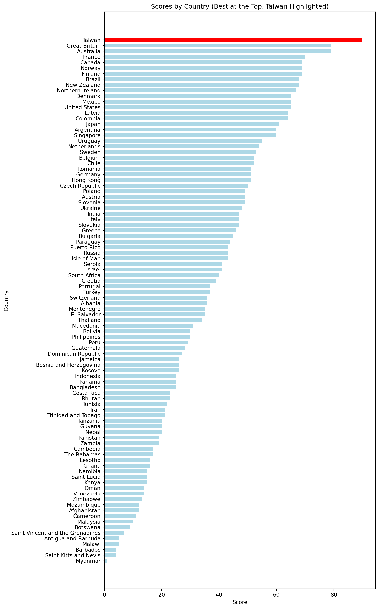

As this research is *practice-oriented* (i.e., my goal here is to find
design approaches that could influence my prototype), I will focus on
some fields of design which I hope relevant, fruitful, or contextual to
my project.

I will start with *Human-Centered Design*, the grandfather of design
with attitude. There’s even an ISO standard for human-centered design,
with the designated code ISO9241-210, revised as ISO 9241-210:2019
titled *“Ergonomics of human-system interaction”* and up for revision
soon (ISO standards are reviewed every 5 years). Some of the key
takeaways include “Understanding and specifying the context of use”,
“Involving users throughout design and development”, “Specifying user
requirements”, “Evaluating designs”, “Multi-disciplinary Collaboration”,
“Iterative process” and “Continual Improvement”, and finally - usability
is not enough, the design should provide a user experience (UX) for
human “emotional responses and satisfaction” (ISO, 2019).

While *Human-Centered Design* focuses exactly on what it says - humans -
*Life-Centered Design* recognizes human impact on our surrounding
environment as well - making sure we include non-human animals among our
stakeholders. This is where we are getting on the *territory* of
sustainability. While *Human-Centered Design* is ever popular, the
effect humans are having on biodiversity is rarely considered when
designing. *“\[T\]he design phase of a physical product accounts for 80%
of its environmental impact”* notes(Borthwick et al., 2022) in their
framework for life-centered design.

If we’re including *other* lifeforms among our stakeholders, what can we
learn from them? *Biomimicry* is about being inspired by nature while
*Biodesign* focuses on design involving biology in the design itself.
Janine Benyus, who coined the word *Biomimicry* (Benyus, 2009) looks at
very practical cases of innovation where engineers and biologist meet
and (Dicks, 2023) provides a much more philosophical account of
following the example of nature. Focusing on the financial sector,
(Thomas & Mantri, 2022)’s philosophical account advocates for an
“inside-out” design pattern, much like natural systems, starting from
the smallest structures to guarantee resilience and survival, instead of
trying to control their external environment.

In a similar vein, *Material Ecology* is the wording preferred by the
architect Neri Oxman based at the MIT Media Lab working with
biomaterials as a proponent of *Nature-Centric Design* that adheres to
the principles of ecological sustainability with both an ecologically
conscious mindset and practical toolset (Hencz, 2022). Language and our
mental concepts shape our reality, which makes language-creation an
important tool for sustainability. Neri Oxman’s expressions in her
(World Economic Forum, 2016) interview introduce some new vocabulary:
*“ecology-indifferent”*, *“naturing”*, *“mother naturing”*, *“design is
a practice of letting go of all that is unnecessary”*, *“nature should
be our single client”*, which reminds me how self-invented language
gives un child-like freedom to imagine new worlds.

*Speculative Design* can help us imagine *non-anthropocentric* (Edwards
& Pettersen, 2023; Hupkes & Hedman, 2022)as well as *dystopian* futures
(Pinto et al., 2021). First introduced by (Dunne & Raby, 2013) in their
seminal book, the field aims to question the intersection of *user
experience design* and *speculative fiction*. (Barendregt & Vaage, 2021)
explores the potential of speculative design to stimulate public
engagement; thought experiments can spur public debate on an issue
chosen by the designer. Phil Balagtas, founder of The Design Futures
Initiative at McKinsey, discusses the value of building future scenarios
at his talk at Google. His favorite example, the Apple Knowledge
Navigator, first appeared in an Apple vision video in 1987 and took two
decades to materialize in the real world. It was inspired by a similar
device first shown in a 1970s episode of Star Trek as a *magic device*
(a term from participatory design), which then inspired subsequent
consumer product development. It took another two decades, until the
launch of the iPhone in 2007 - a total of 40 years.

*Participatory Design* and *Speculative Design* can be complementary as
in the work of (Neuhoff et al., 2023), used together to focus on
engaging users deep in the design process to truly understand their
needs, contexts and interactions on a non-superficial level. For both
speculative and participatory design, the cost and makes it into a niche
activity. Generative AI holds the promise to allow designers to dream up
and prototype quicker. In order to build a future, it’s relevant to
imagine and critique a future. By being quickly generate prototypes,
once can test out ideas with the future users involving more of the
community and stakeholders. To be able to build something, one first
needs to imagine it; imagination is crucial for change.

*Speculative Design* helps us envision future scenarios

Massachusetts Institute of Technology (MIT) is a source of many
fantastic innovations, and another.

*Regenerative Design* suggests *de*materializing (digitizing) economies
is not enough to be sustainable (by reduction of physical impact).
Design should look beyond reducing harm and find avenues to *regenerate*
damaged or even completely destroyed natural systems – ecosystems,
biodiversity, land, forests, lakes, rivers - natural habitats.

Sufficiency

Moving from products and (digital) experiences towards the built
environment and architecture, *Climate-Responsive Design* embeds a
building within the environmental constraints of a place and looks for
opportunities use the land, wind, sun, local materials, and local
vernacular history and culture when considering a design. Architect
Susanne Brorson suggests sustainability should be considered in the
earlier phases of design instead of trying to fix problems later
discussing *climate-responsive design principles* (EVM maaarhitektuuri
keskus, 2019). The sentiment is echoed by (S. Lee & Doevendans, 2011)
who edited a volume on sustainable approaches of world-renowned
architects: *“The principles of sustainable design are rooted in the
building’s relationship to the site and its environmental conditions
such as topography, vegetation, and climate.”*

Architecture of the Well-Tempered Environment (Banham, 1999)

*Designing for Trust*, Weinschenk (2011) says *“People expect most
online interactions to follow the same social rules as person-to-person
interactions. It’s a shortcut that your brain uses to quickly evaluate
trustworthiness.”*

*Cradle-to-Cradle Design*, focusing on recyclability of products.
“台灣設計研究院（TDRI ） on Instagram” (2021) and 活動通 (n.d.) Cradle
to Cradle Nordic circular design in Taiwan

*Durability* is an important dimension for sustainability. High quality
durable products are more sustainable as they last longer and less
likely to be thrown away. Forming an emotional bond with the product
makes it feel more valuable (Zonneveld & Biggemann, 2014). (Chapman,
2009) argues in his seminal paper (and later in his book) for
*“Emotionally Durable Design”*, the simple idea that we hold to things
we value and thus they are sustainable. We don’t throw away a necklace
gifted to us by mom, indeed this object might be passed down for
centuries. (Rose, 2015) has a similar idea, where *“Enchanted Objects”*
become so interlinked with us, we’re unlikely to throw them away. This
has implications for sustainability as the object is less likely to be
thrown away.

As the above shows, there are many partially overlapping design words
created by different people for diverse purposes. Design vocabulary may
be created for distinguishing a particular type of design from another -
or to market oneself as the creator of the word. There are designers who
define / brand themselves by their design method. Design Studies, a
field that studies *design* as a subject.

Here I will use the lens of *sustainability* - another complex term - to
look at how design can contribute to eco-friendly products. I advocate
looking at design methods as a toolbox, where I can pick the tool
suitable for the problem set in front of me. Here I look at a small
number of design practices I find relevant to designing a sustainability
app for college students.

than traditional design methods. While AI allows us to look at a larger
number of design scenarios thank previously feasible, there are many
approaches looking for ways to design for sustainability. Designing for
Sustainability is fundamentally a hopeful act imbibed with the dream a
healthier world is possible.

### Future Scenarios: Avoiding the Worst Cases

In sustainability there are rarely good choices. Rather it’s a question
of avoiding the worst choices.

*Scenario-building* is a key tool for sustainability. Because
sustainability is so complex, sustainable design makes use of scenarios.

*Life Cycle Assessment* and *Environmental Impact Analysis* are needed
to provide eco-design scenarios (de Otazu et al., 2022).

user experience, iteration (Google Design, 2019)

### In Practice Sustainability Begins in Software

Designing user interfaces for sustainable interactions means
incorporating data and toolsets to enable designers to make decisions
which reduce emissions of their design. Companies like AutoDesk are
putting CO<sub>2</sub> calculations inside their design software,
helping designers reduce material usage, energy consumption,
CO<sub>2e</sub> emissions, while increasing recyclability(Mike Haley,
2022). Software is key to building more sustainable products, already
for decades (B. B. Gupta et al., 2023). AI-assisted design enables
design for sustainability because the design process is where
sustainability begins. AI has the potential to provide the parameters
for sustainability. (Singh & Sarkar, 2023) proposes an AI tool for
deciding the suitable life cycle design parameters.

Design encompasses most everything in our daily lives. Humans live in
artificial environments where *most* *things* are designed by humans.
The *experiences* we take part in are increasingly created based on some
type of data.

-   Involving young HCI designers in AI-oriented workshops can show the
    future of UI/UX ? (Battistoni et al., 2023)

Data is the *interface* between idle resources and retail demand, which
makes *exchange of value* possible.

-   Different Gets Ignored Luke Wroblewski (2024)

*Digital Sustainability*, information pertaining to emissions would flow
through the economy not unlike the carbon cycle itself.

(Pan & Nishant, 2023) proposes 6 dimensions of *AI* usage in *Digital
Sustainability.*

Notice: The chart is purely illustrative to highlight the value of AI
for sustainablity; it’s not based on numeric metrics.


## Data-Driven Design: Learning from the Growth of Digital Platforms and Superapps

Digital platforms are focused on *Growth Design*, how to *attract* and
*retain* users. Superapps are the latter stage of the Digital Platform
Economy, where previously vertically targeted apps expand horizontally
to provide an ever-increasing number of services.

For digital products (apps) the main application of interaction design
is for *growth* in usage, how to get more people (user journey and
conversion funnels) to use the product i.e user acquisition, retention,
engagement, and monetization and keep using it (retention and
engagement), often optimizing onboarding, features, and personalization
(Kende, 2023; Steger, 2019).

-   Hypothesis and validation for iterating on features.

-   Total addressable market (TAM), serviceable addressable market
    (SAM), target audience (TA)

Platform economy companies popularized and expanded Data-Driven Design
in the service of growth marketing (also known colloquially as growth
hacking). Capturing User Data was part of this strategy which enabled
improving the products. Digital Product Design is increasingly
data-driven. Digital platforms operate a *design as a process* in a
continuous feedback loop, where *measurements*, *experiments,*
predictive analytics and personalization form a data-drive design
culture. As we humans go about our daily business, governments and
companies track our activities using various technologies, which
produces massive amounts of user interaction data.

Platform economy companies are the capture and use large amounts of data
from users. Data is useful for designing better products. Designing for
high retention (users keep coming back). Network Effects, the more
people use a platform, the more valuable it becomes. Platforms that
continuously add features (provided consumer legislation allows it) may
eventually evolve into superapps, which are useful for providing
services for a wide category of human needs. Bundling many services
under one super-brand. Superapps are possible thanks to Nudge, Economies
of Scale, Network Effects, Behaviour Design. Large Digital Platforms
have a very small number of workers relative to the number of users they
serve. This creates the necessity for using automation for both
understanding user needs and providing the service itself. Creating a
good product that’s useful for the large majority of users depends on
*Data-Driven Design.*

Design is as much about how it works as it’s about the interface.

Digital product design can be seen as a specific discipline under the
umbrella of Experience Design. In Michael Abrash (2017) Meta Oculus
augmented reality incubation general manager Laura Fryer: *“People buy
experiences, not technology.”*

Young people expect a product. Intelligent Interfaces use interaction
design to provide relevant and personalized information in the right
context and at the right time.

There are many approaches to design - from playful to practical to
critical and to data-driven. Nonetheless, many types of design share a
common goal designing for a good *user experience*. Simplifying.

*Personalization*: the largest businesses today (measured in number of
users) design the whole user experience.

*Scale,* Popular consumer platforms strive to design solutions that feel
personalized at every touchpoint on the user journey (to use the
language of service design) at the scale of hundreds of billions of
users.

Superapps are honeypots of data that is used for many types of behavior
modeling. (G. Suarez et al., 2021) suggests using alternative data from
super-apps to estimate user income levels, including 4 types of data:
Personal Information, Consumption Patterns, Payment Information, and
Financial services. (Roa et al., 2021) finds super-app alternative data
is especially useful for credit-scoring young, low-wealth individuals.
The massive amounts of data generated by these companies are used by
smart cities to re-design their physical environments.

-   Inspiration from WeChat. Twitter (now X) is becoming a financial
    app. X (formerly Twitter) is becoming a superapp?

-   Uber is creating an all-purpose platform; only 4.1% of rides were
    electric (Levy, 2023).

How can the mobile devices which the majority of us are carrying with us
every day, help us make decisions about the businesses we engage with?
In terms of user experience, can personalized AI advisors empower our
financial actions from shopping to saving and investing?

<div dangerouslySetInnerHTML={{ __html: quartoRawHtml[27] }} />

-   *Platform Economy* marketplace companies like Airbnb, Uber among
    many others match optimize how our cities work.Superapps are
    prevalent in China and South-East Asia. (Giudice, 2020) finds WeChat
    has had a profound impact on changing China into a cashless society,
    underlining how one mobile app can transform social and financial
    interactions of an entire country. China is the home of many
    superapps and (Vecchi & Brennan, 2022) discusses the strategies
    Chinese apps are taking to expand to other markets. (Shabrina
    Nurqamarani et al., 2020) discusses the system consistency and
    quality of South-East Asian superapps Gojek and Grab.

-   Platform economy companies have been criticized for their lack of
    workers rights (ESG). (“Riders in the Smog,” 2024) uses portable air
    pollution tracking devices to documents how gig workers are
    subjected to pollution.

Could there be Sustainability Superapps?

-   How to design sustainability superapps? Lots of options in a single
    app. (Fleet Management Weekly, 2022) “Sustainability and superapps
    top Gartner’s Top 10 2023 Trends List”. (Dave Wallace, 2021) “The
    rise of carbon-centric super apps”. (goodbag, 2023) “goodbag:
    Sustainable Super App”. What would a sustainable investment platform
    that matches green investments with the consumers look like, if one
    saw the side-by-side comparison of investment vehicles on their ESG
    performance? Also (Bernard, 2022).

-   (Cuppini et al., 2022) historical overview of the development of
    capitalism from linear *Fordism* through platform economy and
    logistics’ revolution which allows for circular economies to happen
    in a city.

-   Adaptive AI

### Behavioral Design

For several decades, marketing researchers have been looking into how to
affect human behavior towards increasing purchase decisions in commerce,
both offline and online, which is why the literature on behavioral
design is massive. One of the key concepts is *nudge*, first coined in
2008 by the Nobel-winning economist Richard Thaler; nudges are based on
a scientific understanding of human psychology and shortcuts and
triggers that human brains use and leverages that knowledge to influence
humans in small but powerful ways (Thaler & Sunstein, 2009).

The principles of nudge have also been applied to sustainability. For
example, a small study (n=33) in the Future Consumer Lab in Copenhagen
by (Perez-Cueto, 2021) found that designing a “dish-of-the-day” which
was prominently displayed helped to increase vegetarian food choice by
85%. Experiments by (Guath et al., 2022) focused on environmentally
friendly online purchases in Sweden (n=200) suggest nudging can be
effective in influencing online shopping behavior towards more
sustainable options. A study of behavior change in Australia at large
university setting (N = 156) by (Novoradovskaya et al., 2021) found
nudging behavioral change had a significant effect and the author
suggested it may help to avoid some of the *“16 billion paper coffee
cups are being thrown away every year”* globally (based on the
abstract - I was unable to access the full paper).

Google uses nudges in Google Flights and Google Maps, which allow
filtering flights and driving routes by the amount of CO<sub>2</sub>
emissions, as well as surfacing hotels with Green Key and EarthCheck
credentials, while promising new sustainability features across its
portfolio of products (Sundar Pichai, 2021). Such tools are small user
interface nudges which Google’s research calls *digital
decarbonization*, defined by (Implement Consulting Group, 2022) as
*“Maximising the enabling role of digital technologies by accelerating
already available digital solutions”*.

In (Kate Brandt & Matt Brittin, 2022), Google’s Chief Sustainability
Officer Kate Brandt set a target of “at least 20-25%” CO<sub>2</sub>
emission reductions in Europe to reach a net-zero economy and the global
announcement set a target of helping 1 billion people make more
sustainable choices around the world (Jeni Miles, 2022). In addition to
end–users, Google offers digital decarbonization software for
developers, including the Google Cloud Carbon Footprint tool and invests
in regenerative agriculture projects (Google, 2023; *Inside Google’s
Regenerative Agriculture Play Greenbiz*, 2021).

Google VERY IMPORTANT Google (2021). Justine Calma (Oct 6, 2021, 10:01
AM GMT+3) Google UX eco features. “Google mostrará por defecto la ruta
más ’verde’ en su GPS y ordenará los vuelos según su impacto ambiental”
(2021) Google green routes. Sarah Perez (2022) shows how google added
features to Flights and Maps to filter more sustainable options. How CO2
is shown by Google starts hiding emissions? “Google ’Airbrushes’ Out
Emissions from Flying, BBC Reveals” (2022)

<div dangerouslySetInnerHTML={{ __html: quartoRawHtml[28] }} />

````mdx-code-block
<Figure caption="Google's view of flight emissions" src={FlightEmissions} refURL="https://www.google.com/travel/flights" refTitle="Copyright by Google 2023 referenced under fair use" />w
````

Some notable examples:

-   Eriksson et al. (2023) discusses best practices for reducing food
    waste in Sweden.
-   Acuti et al. (2023) makes the point that physical proximity to a
    drop-off point helps people participate in sustainability.
-   Wee et al. (2021) proposes types of nudging technique based on an
    overview of 37 papers in the field.

<div dangerouslySetInnerHTML={{ __html: quartoRawHtml[29] }} />

Alibaba’s Ant Forest (螞蟻森林) has shown the potential gamified nature
protection, simultaneously raising money for planting forests and
building loyalty and brand recognition for their sustainable action,
leading the company to consider further avenues for gamification and
eco-friendliness.

<div dangerouslySetInnerHTML={{ __html: quartoRawHtml[30] }} />


## Personalizing: Sustainability at Scale

-   Personalization, Personal User Experience. social apps require
    personalization, *trust* and *k-factors* (sharing and inviting your
    friends). (Baron, 2023; B. Kim, 2023).

Data-Driven Design Enables Sustainability. Sustainability touches every
facet of human existence and is thus an enormous undertaking. Making
progress on sustainability is only possible if there’s a large-scale
coordinated effort by humans around the planet. For this to happen,
appropriate technological tools are required.

Data-driven design has limitations.

Coputer

One mode

-   Konings (2020)
-   “Digital sustainability principles”
-   Eminent journal Design Studies, 1st design journal
-   Part of digital product design are *design systems* to keep
    consistency across the experience. Create a design system to best to
    showcase my analytic skills:
    -   Design System:
        https://zeroheight.com/8bf57183c/p/82fe98-introduction
    -   *A Comprehensive Guide to Design Systems Inside Design Blog*
        (n.d.)
    -   M. Suarez et al. (n.d.)
    -   “Method Podcast, Episode 18” (n.d.)
    -   *Atomic Design by Brad Frost* (n.d.)
-   Kolko & Connors (2010) and IxDF (n.d.) believe interaction design is
    still an emerging (and changing) field and there are many
    definitions. I prefer the simplest version: interaction design is
    about creating a conversation between the product and the user.
-   AI gives designers new tools. In AI development, design is called
    alignment. What is the role of an AI Designer? Linden (2021)
-   *People + AI Guidebook* (n.d.)
-   “Language Model Sketchbook, or Why I Hate Chatbots” (n.d.)
-   Parundekar (2021)
-   Richard Yang (2021) and Justin Baker (2018) say some of the tools
    used by interaction designers include
-   AI for design: Figma (2023)

The concept of *Social Objects*: People need something to gather around
and discuss. Sharing.Lab (2015): I’m interested in the concept of a
“social object”.

*Red Route Analysis* is an user experience optimization idea inspired by
the public transport system of London (“Interaction Design – How to
Evaluate Interaction Costs and Improve User Experience,” 2021; Oviyam™,
2019; Xuan, 2022).

-   Product marketers focus on the *stickiness* of the product, meaning
    low attrition, meaning people keep coming back.
-   What percent of all design is “sustainable design” ? Promoting
    sustainable design.
-   Josh Luber (2021) Trading cards are cool again
-   Jesse Einhorn (2020)
-   Connie Loizos (2021)
-   Natasha Mascarenhas (2021)
-   JEFF JOHN ROBERTS (April 23, 2020 at 2:00 PM GMT+3)

*Narrative Design,* humans respond well to *storytelling*, making
*character design* and *narrative design* relevant to interaction
design. Large language models (LLMs) such as ChatGPT are able to assume
the personality of any character that exists inside of its training
data, creating opportunities for automated narrative design. (Alethea
AI, 2021) discusses writing AI Characters, creating a personality,
Stories start with a character..

-   Writing as training data? large language models. GTP3.

## Multispecies Design

-   Kosová et al. (2023); Selvan et al. (2023); Hernandez-Santin et al.
    (2023)
-   gallery Marcus (06-11-23)
-   PhD Disseration: “The devastating effects that unsustainable design
    practices have on the natural world and other species with whom we
    share this planet” D. Metcalfe (2015)
-   Participatory design and multispecies design Haldrup et al. (2022)
-   The University of Melbourne, Australia & Roudavski (2020)

## Personalized Design: Self-Monitoring

Research on *personal data tracking* also known as *quantified self* or
*self-monitoring* is abundant. Wearable devices including the Apple
Watch, Oura Ring, Fitbit and others, combined with apps, help users
track a variety of health metrics. Apart from health, wearable devices
have been used to track other metrics such as physiological parameters
of students at school to determine their learning efficiency (Giannakos
et al., 2020). Not only can health metrics be tracking, but exposure to
pollution as well as personal carbon footprint, are all to some extent
track-able (if not traceable).

Personal data enables behavior change.

### Health and Fitness Tracking

Tracking one’s health and fitness is a familiar mode of *quantified
self*, available to many smartwatch users - and even pretty much to
anyone who has a phone made in the past decade. Apple is a leader in
health tracking, releasing Apple Health in 2008 as an iOS 8 software
feature and the Apple Watch in 2015, filled with health-focused sensors
and features (Apple, 2022b). In 2022 Apple outlined plans for
*“empowering people to live a healthier day,”* promising a new set of
health-features with every release, such as the rumored temperature
measurement inside of Apple Aipord earphones; and providing most of this
data to developers through Apple’s HealthKit health metrics APIs, which
app builders can tap into (Apple, 2022a, 2022c).

Sleep quality is an important aspect of health and many devices and apps
focus on helping people get enough high quality sleep. There’s plenty of
academic literature on how physical activity, as well as environmental
aspects, such as air quality, affect sleep (X. Liu et al., 2019) tracks
how wearable data is used for tracking sleep improvements from exercise.
(Grigsby-Toussaint et al., 2017) made use of sleep apps to construct
humans behaviors also known as *behavioral constructs*.

The Oura ring is an example of *calm technology*, providing helpful data
without calling an attention to itself (Phelan, 2024).

EEG (electroencephalogram), ECG (Electrocardiogram), EDA (Electrodermal
Activity): tracking features of brain, heart and nervous system
activity. Brain Music Lab founder and brain researcher Grace Leslie:
*“brain music sounds like a warm bathtub”*. Tracking blood sugar with
app and patches. Blood sugar trackers. Blood glucose tracking is popular
even for people without diabetes, to optimize their activity (“Is Blood
Sugar Monitoring Without Diabetes Worthwhile?” 2021). Tracking urine
consistency inside your toilet with WithThings. Companies like
NeuralLink are building devices to build meaningful interactions from
brain waves (EEG).

Use technology Wearables to be more aware of one’s health. Example of
quantified self device.

There’s value in developing standardized fitness metrics, which
different digital health providers can use to create dashboards with
comparable data. Even with messy data, AI has a useful role as a
translator between different standards.

Could one track personal sustainability in a similar fashion? (G. Shin
et al., 2019)’s synthesis review of 463 studies shows wearable devices
have potential to influence behavior change towards healthier
lifestyles. Saubade et al. (2016) finds health tracking is useful for
motivating physical activity. The urban environment has an influence on
health.

While so of the behavior changes may sound simple - like switching from
driving to walking - and would have a large environmental effect, they
are hindered by factors from personal motivation to (lack of) suitable
urban architecture. (Delclòs-Alió et al., 2022) discusses walking in
Latin-American cities. Walking is the most sustainable method or
transport but requires the availability of city infrastructure, such as
sidewalks, which many cities still lack.

While the scale of climate change is too big for individual action to
make a difference, individual action can foster hope and a sense of
collective responsibility (Nature, 2020).

-   Kristian Steensen Nielsen (2022) **Individual climate action!!!**

-   The UN has been handing out Global Climate Action Awards since 2011
    for idea such as the Climate Credit Card in Switzerland, which
    automatically tracks emissions of purchases, creates emissions’
    reports for the user which can then be offset with investments in
    climate projects around the world (UNFCCC, 2023a).

-   Give Gen-Z the tools to turn climate anger into positive change to
    transform companies

-   Echeverría et al. (2022) suggests greener modes of mobility.

-   Shop sustainability in Estonia (*Estwatch - Estwatchi värskest
    Uuringust Selgub, Et Eesti Toidupoed... Facebook*, n.d.; Lilleväli,
    2022). Tarbimise jalajälg poes (Helen Saarmets, 2021). Offsets at
    the point of sale (*Grenpay - Heasta Oma CO$_2$ Jalajälg*, n.d.).

-   Green Finance Platform (2020) report predicts the rise of
    personalizing sustainable finance, because of its potential to grow
    customer loyalty, through improving the user experience. Similarly
    to good design, interacting with sustainable finance for the
    ‘green-minded’ demographics, providing a reliable green product is a
    way to build customer loyalty.

Another aspect is tracking one’s mental health. (Tyler et al., 2022)
surveys the use of self-reflection apps in the UK (n=998).

-   Popular Strava (100+ million users) sports assistant provides run
    tracking and feedback (Strava, 2022).

````mdx-code-block
<Figure caption="Popular Strava sports assistant provides run tracking and feedback" src={Strava} />
````

-   

-   Ryan (2022) uses the “capability methodology” to evaluate if apps
    help people eat healthily.

-   Baptista et al. (2022) apps for sleep apnea

The small screen estate space of mobiles phones and smart watches
necessitates displaying content in a dynamic manner. Virtual reality
glasses (called AR/VR or XR in marketing speak) need dynamic content
because the user is able to move around the environment. These are
questions that interaction design is called upon to solve. Hoang (2022):
*“Dynamic interfaces might invoke a new design language for extended
reality”. it’s a balancing at: while* AI enables generative UIs while
users need some type of stability (think: text input stays in the same
place but different types of interfaces appear within a clearly defined
space.

Speaking is one mode of interaction that’s become increasingly possible
as machines learn to interpret human language.

<div dangerouslySetInnerHTML={{ __html: quartoRawHtml[31] }} />

Human behavior is affected by the environment; example in case, the
incidence of bad behavior during the pandemic increased significantly.


### Pollution Exposure Tracking

My personal air pollution exposure tracked using the Atmotube device
attached to my backpack. Tracking air pollution and realizing how bad
the over in my grandma’s house is: add picture. Quantified Self is an
example of Digital Health. There is a parallel in health to
sustainability and indeed both are inextricably linked. Open Source code
for calculating air pollution exposure AQI (Atmotech, 2024).


### Towards Tracking Sustainability: Carbon Tracking

The founder of the Commons (formerly known as Joro) consumer
CO<sub>2e</sub> tracking app recounts how people have a gut feeling
about the 2000 calories one needs to eat daily, so perhaps daily
CO<sub>2e</sub> tracking could develop a gut feeling about one’s carbon
footprint (Jason Jacobs, 2019).

-   

Personal carbon footprint tracking apps (aka CO2 calculators) in a
mid-sized German city (N=216) helped overall emission reduction by 23%
correlating with feedback from the app specifically reducing emissions
from heating 26.9%, food 16.4%, household 34.7% reduction, and mobility
12%(S. Hoffmann et al., 2024).

We have a limited carbon budget so calculating CO2e-cost become
integrated into every activity.

-   CO2e calculations will be part of our everyday experience

-   Zhang’s Personal Carbon Economy conceptualized the idea of carbon as
    a currency used for buying and selling goods and services, as well
    as an individual carbon exchange to trade one’s carbon permits (S.
    Zhang, 2018).

Personal Carbon Trackers

Personal carbon footprint calculators have been released online, ranging
from those made by governments and companies to student projects.
Similar to personal health trackers, personal CO<sub>2</sub> trackers
help one track emissions and suggests sustainable actions.

<div dangerouslySetInnerHTML={{ __html: quartoRawHtml[32] }} />

## Re-Designing Industries: Circularity

As of 2024, *circular economy* is a tiny part of the world economy.
(Circle Economy, 2022) reports only 8.6% of world economy is circular
and *100B tonnes of virgin materials* are sourced every year.

We’re in an industrial revolution. Many companies are investing into
transforming their processes. *“\[T\]ransition to a low carbon economy
presents challenges and potential economic benefits that are comparable
to those of previous industrial revolutions”* (Pearson & Foxon, 2012).
It’s possible to re-design entire industries and that is exactly the
expectation sustainability sets on businesses. Across all industries,
there’s a call for more transparency. Conversations about sustainability
are too general and one needs to look at the specific sustainability
metrics at specific industries to be able to design for meaningful
interaction. There’s plentiful domain-specific research showing how
varied industries can develop eco-designed products. I will here focus
on 3 industries that are relevant for college students.

Food and clothes (I’m omitting housing and transport here) are part of
the immediate environmental impact of college students.

-   5th industrial revolution, advanced robotics
-   6th industrial revolution, quantum computing, nanotechnology
    Chourasia et al. (2022)
-   7th industrial revolution futurists are looking at current trends
    and building scenarios for 2050 envisioning a world where the
    convergence of bio-based and mineral-based technologies, widespread
    sustainability and energy-abundance (Ruiz Estrada, 2024).

…for Provenance and Traceability

Companies like Qima provide inspection and certification services QIMA
(2024)

### Circular Design for a Circular Economy

Encouraging Sustainable Design and Reducing Waste.

(K. Liu et al., 2023) reports, e-waste is growing 3%-5% every year,
globally. (Thukral & Singh, 2023) identifies several barriers to e-waste
management among producers including lack of awareness and
infrastructure, attitudinal barriers, existing *informal* e-waste
sector, and the need for an e-waste license.

-   McDonough & Braungart (2002) from Cradle to Grave book was released
    over 2 decades ago, change is slow.

-   McGinty (Thu, 08/06/2020 - 11:25): How to Build a Circular Economy

-   Dull (2021) book, many current technological hurdles can be overcome
    by supply chain professionals who are experts in connecting supply
    streams.

also known as circular economy. Assuming that as individuals we want to
act in a sustainable way, how exactly would be go about doing that?

…for Sustainable Products

How can design enable/help/encourage sustainability?

-   Use imagination

-   Societal movements change things: implication for design: build a
    community

-   Growing public understanding of how nature works and intersects with
    our use of money.

-   Hedberg & Šipka (2021) argues digitization and data sharing is a
    requirement for building a circular economy.

-   “Circular Petrochemicals” Lange (2021)

-   Supply chain transparency enables stakeholder accountability
    (Circularise, 2018; Doorey, 2011; Fox, 2007).

-   Recycling Critical Raw Materials, digitization of mining allows
    enhance the reliability of supply chains (CRM Alliance, 2020).

-   EIT RawMaterials

### Case: Fast-Moving Consumer Goods (FMCG)

Fast-Moving Consumer Goods (FMCG) also known as Consumer Packaged Goods
(CPG) are large global congloremates operating with low margins and high
volumes (Toh, 2024). The largest of them have several billions in
revenue (Kenton, 2024).


Rise of e-commerce has pushed logistics companies to increase delivery
efficiency to keep up with FMCG sales (Deliverect, 2024).

### Case: Fashion

Just like Fast-Moving Consumer Goods, fast fashion operates with low
margins and follows consumer trends. Young people are the largest
consumers of fast fashion (“Young Consumers’ (Complicated) Love For Fast
Fashion In 3 Stats,” n.d.). (In European Environment Agency, 2022
European Environment Agency (EEA)) estimates based on trade and
production data that EU27 citizens consumed an average 15kg of textile
products per person per year. The European Commission wants to reduce
the impact of fast fashion on EU market (ERR, 2022). (Millward-Hopkins
et al., 2023) shows how 50% of the textile waste in the UK is exported
to other countries.

“26 million tons of clothing end up in China’s landfills each year,
propelled by fast fashion” (Tian Macleod Ji, 2024).

Greenwashing is prevalent in the fashion industry. **Problem**: Emily
Chan (2022a) report says there’s not enough transparency in fashion.
Fashion Revolution Foundation (2022) Fashion transparency index.
(Wikirate, 2022b): “Among the Index’s main goals are to help different
stakeholders to better understand what data and information is being
disclosed by the world’s largest fashion brands and retailers, raise
public awareness, educate citizens about the social and environmental
challenges facing the global fashion industry and support people’s
activism”. Consumer understanding of sustainability is limited. Mabuza
et al. (2023) shows consumer knowledge of apparel coloration is very
limited.

2.4 Trillion USD fashion industry contributing 2%-8% of total global GHG
emissions, 100B USD lost to lack of recycling, contributes 9% of
microplastics (Adamkiewicz et al., 2022). (Centobelli et al., 2022)
Fashion industry year uses 9B cubic meters of water, 1.7B tonnes of
CO<sub>2</sub>, 92 million tonnes of textile waste. Köhler et al. (2021)
Globally 87% of textile products are burned or landfilled after 1st
consumer use.

Towards Sustainable Clothes

-   There are local policy initiatives aiming to tackle the waste
    problem. For example the New Standard Institute’s proposed “Fashion
    Act” to require brands doing business in New York City to disclose
    sustainability data and set waste reduction targets (Emily Chan,
    2022b) .

-   (Leung & Luximon, 2021) There’s a growing know-how on how to produce
    sustainably and which materials to use. “Handbook of Footwear Design
    and Manufacture” Chapter 18 - Green design. Industry collaboration
    can raise the bar for everyone, such as the Better Cotton Initiative
    (Better Cotton, 2023).

-   Story of Patagonia (Chouinard, 2005)\].

Sustainable Fashion, Textile Design

-   There are signs of young Chinese consumers valuing experiences over
    possessions (Y. Jiang, 2023).

Across industries, reports are saying there isn’t enough transparency.

-   (Hannah Ritchie, 2020; US EPA, 2016) GHG emission inventory by
    sector

-   Marrucci et al. (2020) Italian retail supermarkets carbon footprint?

-   Gyabaah et al. (2023) research across several dumpsites across Ghana
    revealed up to 12% of the landfill consisted of textile waste.

-   imperfectidealist (2020) Fashion sustainability vs greenwashing

-   “Transparency and Sustainability Platform - Renoon” (2023) Ethical
    Shopping

-   “Sheep Inc. - Softcore Radicals” (2023) Ethical brand?

-   Good On You (2023) Sustainable fashion company evaluations

-   *Lily Mindful + Active Living on Instagram* (n.d.) Garment Worker’s
    rights

-   Emily Chan (2022c): fashion companies can’t be held accountable for
    their actions (or indeed, their lack of action).

-   *Instant Gratification for Collective Awareness and Sustainable
    Consumerism* (2022): “Political consumerism”, “Instant Gratification
    for Collective Awareness and Sustainable Consumerism”

-   FashionChecker (2023)

-   Eesti Disainikeskus I Estonian Design Centre (2021) Circular
    textiles

-   Eesti Kunstiakadeemia (2022) Sustainable Fashion education

-   “Clean Clothes Campaign” (n.d.)

-   “The mainstream fashion industry is built upon the exploitation of
    labor, natural resources and the knowledge of historically
    marginalized peoples.”

-   *Textile Genesis* (n.d.)

-   “Secrecy is the linchpin of abuse of power…its enabling force.
    Transparency is the only real antidote.” Glen Greenwald, Attorney
    and journalist.

-   Stand.earth (2023)

-   “New Standard Institute” (n.d.)

-   *BGMEA Home* (n.d.) Bangladesh Garment Manufacturers and Exporters
    Association

-   Minimize shopping, buy quality, save CO<sub>2</sub>, invest.

-   Textile Exchange (2023) Ethical fashion materials matter

-   Textile Exchange (2021): Policy request

-   Free clothes

-   Vanish UK (2021) “Generation rewear” documentary, sustainable
    fashion brands

-   Storbeck (2021) and Remington (2020): Zalando says Fast fashion must
    disappear

-   Infinited Fiber (2023)

-   Cleantech Group (2023) Global cleantech 100

-   *SOJO - Door-to-Door Clothing Alterations and Repairs* (2023)
    Alterations and repairs made easy

-   “Good On You - Sustainable and Ethical Fashion Brand Ratings” (2023)
    Ethical brand ratings

### Case: Food

Re-designing industrial food systems for an increasing global population
is a challenge. Supply chain innovation in food industries may enable
more transparency. **provenance and traceability of food has
implications for sustainability and health.**

Global warming leading to droughts and extreme weather, wars and
conflicts increased volatility in food prices (Eshe Nelson et al.,
2023).

“The agricultural sector contributes to approximately 13.5% of the total
global anthropogenic greenhouse gas emissions and accounts for 25% of
the total CO<sub>2</sub> emission” (Nabipour Afrouzi et al., 2023).
Poore & Nemecek (2018) suggests 26% of carbon emissions come from food
production. Saner et al. (2015) reports dairy (46%) and meat and fish
(29%) products making up the largest GHG emission potential. Springmann
et al. (2021) proposes veganism is the most effective decision to reduce
personal CO<sub>2</sub> emissions.

*Farm to Fork* is a European Union policy to shorten the supply chain
from the producer to the consumer and add transparency to the system. A.
S. Patel et al. (2023) livestock products (meat) are 15% of agricultural
foods valued at €152 billion in 2018 globally.

-   Farm to Fork Financial Times (2022)

-   Fake honey, DNA-analysis to find real honey, synthetic honey can
    pass laboratorty tests (ERR, 2023)

-   China is the largest honey producer.

-   Food fraud

“Sustainability Intelligence for Food Companies” (n.d.)

*Open Food Facts - World* (n.d.) app for nutrition and sustainability
data

**Fishing**

-   75% of fishing is done using industrial Trawling, which has
    environmental impact

-   J. L. Bailey & Eggereide (2020) shows how the Norwegian government
    plans to increase salmon production 5x by 2050. How can this be
    sustainable? Mostly this means fish-farming

-   Complex supply chains make seafood (marine Bivalvia, mollusks)
    logistics prone to fraud, leading to financial losses and threats to
    consumer health (Santos et al., 2023). (C.-H. Chang et al., 2021)
    *fish fraud* is a large global problem but it’s possible to use
    DNA-tracking to prove where the fish came from. In “2019, the 27
    KURA SUSHI branches in Taiwan sold more than 46 million plates of
    sushi. in Taiwan”. Illegal, unreported and unregulated fishing (IIU)
    fishing is widespread; the EU is adopting countermeasures (D. E. Kim
    & Lim, 2024). Muñoz et al. (2023) Is there such a thing as
    sustainable fishing? Bottom trawling is the worst and should be
    banned. Katie Gustafson (2022) proposes a **“Uniform traceability
    system for the entire supply chain”** for seafood. Mamede et
    al. (2022) proposes *Seafood tracing*: Fingerprinting of Sea Urchin.

-   The same is true for cocoa beans, which are at risk from food fraud
    (E. Fanning et al., 2023).

-   **Perennial Crops,** Multi-year crops reduce inputs of gasoline,
    labor, etc. (Aubrey Streit Krug & Yin Lu, 2023). Large agritech
    companies like Monsanto rely on selling seeds annually for profits
    putting them at odds with **Perennial crops**. Single-year seeds
    have led to farmer suicides when crops fail in poor communities.

-   Sustainability Accounting Standards Board, part of the International
    Financial Reporting Standards Foundation

-   Global Reporting Iniative

-   “Reality Labs Research at Meta Connect 2022” (2022)

-   *Real Time ESG Tracking From StockSnips* (2021) “Real Time ESG
    Tracking From StockSnips”

-   Waters (2015) **(Need access!)**

-   Cawthorn & Hoffman (2016) **(Need access! ncku doesn’t subsribe)**

-   Gamborg & Jensen (2017) **(Need access!)**

-   Neethirajan & Kemp (2021) using biometric sensors to track livestock
    sustainability.

-   Inc (n.d.)

-   Tim Nicolle (2017)

-   EAT-Lancet diet

**Culture, Community, Cuisine, Storytelling**

-   Tsing (2015) mushrooms
-   Food is about enticing human imagination and taste buds. Potato used
    to be a newcomer and innovative crop in Europe, and now it’s so
    common, Europeans forget it’s no originally from Europe. Food is
    also about cuisine and culture; foods become popular if we hear
    stories and see cuisine around a particular crop (Aubrey Streit Krug
    & Yin Lu, 2023).
-   IARC warns aspartame (artificial sweetener found in many soft
    drinks) could cause cancer \[ADD CITATION\].
-   Yap et al. (2023) Singapore disposes of 900,000 tonnes of plastic
    waste out of which only 4% is recycled.
-   Kiessling et al. (2023) Single-use plastics make up 44-68% of all
    waste mapped by citizen scientists.

**Food Waste**

There are several initiatives to reduce food waste by helping people
consume food that would otherwise be throw away.

Olio, Too Good To Go

````mdx-code-block
<Figure caption="ResQ Club saves food waste by selling left-over foods cheaply" src={ResQClub} />
````
<div dangerouslySetInnerHTML={{ __html: quartoRawHtml[33] }} />

-   Röös et al. (2023) identified 5 perspectives in a small study
    (*n=106*) of views on the Swedish food system:

<div dangerouslySetInnerHTML={{ __html: quartoRawHtml[34] }} />

-   “regenag”, Václav Kurel, we need help consumers demand regenerative
    agriculture Baltic Sea Action Group (2023)

-   Kommenda et al. (2022) Carbon Food Labels

-   Food Sovereignty: “The global food sovereignty movement, which had
    been building momentum since its grassroots conception in the late
    ’90s, quickly gained traction with its focus on the rights of people
    everywhere to access healthy and sustainable food. One of the
    pillars of the movement lies in using local food systems to reduce
    the distance between producers and consumers.”

-   CAITLIN STALL-PAQUET (2021): “We can grow foods just as well in the
    inner city as we can out in the country because we’re agnostic to
    arable land,” says Woods. “Because we grow indoors and create our
    own weather, \[climate change\] doesn’t affect our produce.”

-   Renée Salmonsen (2018): Vertical farm in Taoyuan

-   Catherine Shu (2023): *Intensive Farming Practices vs* Farm to table

-   Akshat Rathi (2021) and Lowercarbon Capital (2023) climate startup
    funding.

-   Only make what is ordered.

### Circular Design

Circular design is only possible if supply chains become circular as
well.

It’s important in which structure data is stored, affecting the ability
to efficiently access and manage the data while guaranteeing a high
level of data integrity, security, as well as energy usage of said data.

The complexity of resource and delivery networks necessitates more
advanced tools to map supply chains (Knight et al., 2022). The COVID19
pandemic and resulting blockages in resource delivery highlighted the
need to have real-time visibility into supply chains (Finkenstadt &
Handfield, 2021).

Blockchains are a type of shared database where the data is stored in
several locations with a focus on making the data secure and very
difficult to modify after it’s been written to the database. Once data
is written to the blockchain, modifying it would require changing all
subsequent records in the chain and agreement of the majority of
validators who host a version of the database. Blockchain is the main
technology considered for accounting for the various inputs and complex
web of interactions between many participants inside the supply chain
networks. There are hundreds of paper researching blockchain use in
supply change operations since 2017 (Dutta et al., 2020). Blockchains
enable saving immutable records into distributed databases (also known
as ledgers). It’s not possible to (or extremely difficult) to change the
same record, only new records can be added on top of new ones.
Blockchains are useful for data sharing and auditing, as the time and
place of data input can be guaranteed, and it will be easier to conduct
a search on who inputted incorrect data; however the system still relies
on correct data input. As the saying goes, *“garbage in, garbage out”*.

There are several technologies for tracking goods across the supply
chain, from shipping to client delivery. Data entry is a combination of
manual data input and automated record-keeping facilitated by sensors
and integrated internet of things (IoT) capabilities. For example
(Ashraf & Heavey, 2023) describes using the Solana blockchain and Sigfox
internet of things (IoT) Integration for supply chain traceability where
Sigfox does not need direct access to internet but can send low powered
messages across long distances (for example shipping containers on the
ocean). (Van Wassenaer et al., 2023) compares use cases for blockchains
in enhancing traceability, transparency and cleaning up the supply chain
in agricultural products.

-   Several startups are using to track source material arriving to the
    factories and product movements from factories to markets.

-   Wagenvoort (2020) Self-driving supply chains.. (contact Japanese
    factory?)

<div dangerouslySetInnerHTML={{ __html: quartoRawHtml[35] }} />

-   Oikos Denktank (2021) circular material procurement requires new
    skills. How to reuse old paint? Small projects can have large social
    impact.
-   For example, Duriez et al. (2022) shows how simply by reducing
    material weight it’s possible to design more sustainable
    transportation.
-   Embodied Carbon
    -   “embodied carbon”
    -   Carbon Neutral Cities Alliance
    -   Builders for Climate Action (2021)

**Tracking Transport Supply Chains**

Products are made from resources distributed across the planet and
transported to clients around the world which currently causes high
levels (and increasing) of greenhouse gases. *“Transport greenhouse gas
emissions have increased every year since 2014”* (*Climate Change
Mitigation*, 2023). Freight (transport of goods by trucks, trains,
planes, ships) accounts for 1.14 gigatons of CO<sub>2</sub> emissions as
per 2015 data or 16% of total international supply chain emissions
(Yuqing Wang et al., 2022).

<div dangerouslySetInnerHTML={{ __html: quartoRawHtml[36] }} />

-   Platzer (2023), a scientist working on the Apollo space program,
    calls for emergency action to develop *green aviation*.

-   The California Transparency in Supply Chains Act which came into
    effect in 2012 applies to large retailers and manufacturers focused
    on pushing companies to to eradicate human trafficking and slavery
    in their supply chains.

-   The German Supply Chain Act (Gesetz über die unternehmerischen
    Sorgfaltspflichten zur Vermeidung von Menschenrechtsverletzungen in
    Lieferketten) enacted in 2021 requires companies to monitor
    violations in their supply chains (Bundesministerium für
    wirtschaftliche Zusammenarbeit und Entwicklung, 2023; Stretton,
    2022b).

**Ethics & Cruelty**

Can data transparency provide tools for reducing cruelty.

-   Traceability and animal rights. Animal rights vs animal welfare.
    Ethereum blockchain and animal rights. “Blockchain can provide a
    transparent, immutable record of the provenance of products. This
    can be especially useful for verifying claims made about animal
    welfare. For example, products claiming to be”free-range,”
    “organic,” or “sustainably sourced” could have their entire
    lifecycle recorded on the blockchain, from birth to shelf, allowing
    consumers to verify these claims.”

-   Cruelty free brands

-   BCorp

-   ESG

-   Trash found in ocean / nature etc

-   Increase your investment point by matching with your contribution /.

-   Point of Sales integration (know the SKU you buy). Integrate to the
    financial eco footprint (no need to scan the product). What’s the
    name of the startup that does this?

-   Precision Fermentation and Cultivated Meat: Meat products without
    farm animals

**Factories Can Become More Transparent**

-   Regional supply chains for decarbonising steel: “co-locating
    manufacturing processes with renewable energy resources offers the
    highest energy efficiency and cost reduction” Japanese-Australia
    study (Devlin & Yang, 2022).

-   Transparency about the polluting factories where the products come
    from.. the product journey

-   virtual factories

-   Tracing emissions from factory pipes… what’s the app?

-   Factories should be local and make products that can be repaired.

-   Carbon-neutral factories “made in carbon-neutral factory” list of
    products

-   Stefan Klebert (2022)

-   VDI Zentrum Ressourceneffizienz (2020)

-   *<span class="nocase">CO2-neutral</span> Factories* (n.d.) and
    *Innocent Opens £200m Carbon-Neutral Factory in Rotterdam -
    Investment Monitor* (n.d.) CO<sub>2</sub> neutral factories?

-   (*Ecograder*, n.d.; *Make Your Website Carbon Neutral and Enhance
    Your Brand CO2 Neutral Website*, n.d.) CO<sub>2</sub> neutral
    websites

-   Eric fogg (2020) Lights-Out Manufacturing

-   Mowbray (2018) “World’s first free digital map of apparel factories”

-   “FFC - Fair Factories ClearingHouse - Compliance Solutions” (n.d.)
    Factory compliance - Fair Factories

-   Planet Factory

-   *To the Companies We Have Unveiled in the Plastic Waste Makers
    Index* (n.d.) Plastic waste makers index, sources of plastic waste

### Extended Producer Responsibility

Extended Producer Responsibility Enables Companies to be Resposible.

Popular blogs such as (Kohli, 2019) and (Lose, 2023) offer many
suggestions how designers can help people become more sustainable in
their daily lives yet focusing on the end-user neglects the producers’
responsibility (termed as Extended Producer Responsibility or ERP) in
waste management studies.

Extended Producer Responsibility (EPR) is a policy tool first proposed
by Thomas Lindhqvist in Sweden in 1990 \[ADD CITATION\], aimed to
encourage producers take responsibility for the entire life-cycle of
their products, thus leading to more eco-friendly products. Nonetheless,
EPR schemes do not guarantee circularity and may instead be designed
around fees to finance waste management in linear economy models
(Christiansen et al., 2021). The French EPR scheme was upgraded in 2020
to become more circular (Jacques Vernier, 2021). In July 2024, Latvia
was the 4th EU country to join an textile-EPR scheme (“New EPR
Requirements for Textiles in Latvia from July 2024 On,” 2024).

In any case, strong consumer legislation (such as EPR) has a direct
influence on producers’ actions. For example, in HKTDC Research (2022),
the Hong Kong Trade Development Council notified textile producers in
July 2022 reminding factories to produce to French standards in order to
be able enter the EU market. J. Peng et al. (2023) finds that the
***Carbon Disclosure Project*** has been a crucial tool to empower ERP
in Chinese auto-producers.

-   The success of EPR can vary per type of product. For car tires, the
    EPR scheme in the Netherlands claims a 100% recovery rate
    Campbell-Johnston et al. (2020).

One type of legislation that works?

-   (Steenmans & Ulfbeck, 2023) Argues for the need to engage companies
    through legislation and shift from waste-centered laws to product
    design regulations.

-   In Europe, there’s large variance between member states when in
    comes to textile recycling: while Estonia and France are the only EU
    countries where separate collection of textiles is required by law,
    in Estonia 100% of the textiles were burned in an incinerator in
    2018 while in France textiles are covered by an Extended Producer
    Responsibility (EPR) scheme leading to higher recovery rates (Ibid).

-   Greyparrot AI to increase recycling rates (Natasha Lomas, 2024).

Return, Repair, Reuse

-   There’s a growing number of companies providing re-use of existing
    items.
-   *SmartSwap* (n.d.) For example, Swap furniture in Estonia

Bring back your bottle and cup after use.

-   Ruiz-Pastor & Mesa (2023) proposes a **product repairability index
    (PRI)**
-   Formentini & Ramanujan (2023)
-   Recycling (Lenovo, 08-29-22) “rethinking product design and
    inspiring consumers to expect more from their devices”
-   “design is a tool to make complexity comprehensible” like the
    Helsinki chapel. there’s either or a priest or a social worker. it’s
    the perfect public service. “limit the barrier of entry for people
    to discover”. elegant.
-   Zeynep Falay von Flittner (n.d.)

Packaging is a rapidly growing industry which generates large amounts of
waste Ada et al. (2023). Bradley & Corsini (2023): “Over 161 million
tonnes of plastic packaging is produced annually.”

-   “Challenges and Opportunities in Sustainable Packaging Today” (2022)
-   “Protein Brands and Consumers Alike Focus on Sustainability” (2022)
-   “Detail-Rich Sustainable Packaging Product Database Is an Industry
    First” (2010)
-   (Lerner, 2019) Coca Cola plastic pollution. ESG ratings have faced
    criticism for lack of standards and failing to account for the
    comprehensive impact a company is having. (Foley et al., 2024) notes
    how Coca Cola fails to account the supply chain water usage when
    reporting becoming “water neutral” and calls on companies to release
    more detailed information.
-   “Sulapac – Replacing Plastic” (n.d.)

### Digital Product Passports

Even though this topic belongs under Circular Economy, I’ve chose to
highlight *digital product passports* here as it’s the main design
implication from this chapter - an emerging technology which needs to be
designed for the user.

I will being with a bit of history to contextualize what has already
been tried. CO<sub>2e</sub> labeling initiatives are an early form of
communicating the environmental cost of each product. Using carbon
labels to communicate CO<sub>2e</sub> emission of consumer products has
been a topic of discussion for decades (Adam Corner, 2012). Academic
literature has looked at minute details such as color and positioning of
the label (S. Zhou et al., 2019). There’s some indication consumers are
willing to pay a small premium for low-CO<sub>2e</sub> products; all
else being equal, consumers choose the option with a lower
CO<sub>2e</sub> number (Carlsson et al., 2022; M. Xu & Lin, 2022).
(Cohen & Vandenbergh, 2012) argues labeling the carbon footprint of
products does help inform consumer choice towards sustainability and
help promote a green economy. A large-scale study of UK university
students finds some evidence to suggest labeling low CO<sub>2e</sub>
food enables people to choose a *climatarian diet*, however the impact
of carbon labels on the market share of low-carbon meals is negligible
(Lohmann et al., 2022).

Labels alone are not enough. A study in Sweden underlines a negative
correlation between worrying about climate impact and interest in
climate information on products (Edenbrandt & Lagerkvist, 2022). This
latter finding may be interpreted to suggest a need for wider
environmental education programs among consumers. (Asioli et al., 2022)
found differences between countries, where Spanish and British consumers
chose meat products with *‘No antibiotics ever’* over a *Carbon Trust*
label, whereas French consumers chose CO<sub>2</sub> labeled meat
products.

however several studies show their effect is negligible. Nonetheless,
the idea of *Carbon Labelling* is yet to find mainstream adoption.

Carbon labeling is voluntary. Only a handful of companies practice
carbon-labeling but the number is growing. The U.S. restaurant chain
*Just Salad* , U.K.-based vegan meat-alternative *Quorn* and plant milk
*Oatly* are some example of companies that provide carbon labeling on
their products (Brian Kateman, 2020). (ClimatePartner, 2020): Companies
like ClimatePartner and Carbon Calories offers labeling consumer goods
with emission data as a service. (The Carbon Trust, n.d.): The Carbon
Trust reports it’s certified 27 thousand product footprints.

<div dangerouslySetInnerHTML={{ __html: quartoRawHtml[37] }} />

<div dangerouslySetInnerHTML={{ __html: quartoRawHtml[38] }} />

-   Digitalisation and digital transformation; Digital Receipts are one
    data source for tracking one’s carbon footprint (*Digital Receipts
    and Customer Loyalty in One Platform ReceiptHero*, n.d.).

-   Ivanova et al. (2020) “establish consumption options with a high
    mitigation potential measured in tonnes of CO<sub>2</sub> equivalent
    per capita per year.”

-   55% of emissions come from energy production.

-   1.7 trillion tons of CO2e emissions since the 1760s (start of the
    industrial revolution) (Global Carbon Budget, 2023; Marvel, 2023).

-   Carto (2023) Making advanced maps to convince people to make changes

-   similar to Nutritional Facts Labeling

Transitioning from simpler Carbon Labels to data-driven Digital Product
Passports requires comprehensive data collection, digital
infrastructure, industry collaboration, regulatory frameworks and
consumer engagement.

-   Circularise introduced an early blockchain-based sustainability
    system in 2016 aiming to improve transparency across several
    industries and is currently the market leader in providing *Digital
    Product Passports* (Stretton, 2022a) “Ecodesign for Sustainable
    Products Regulation (part of the Sustainable Products Initiative)
    and one of the key actions under the Circular Economy Action Plan
    (CEAP). The goal of this initiative is to lay the groundwork for a
    gradual introduction of a digital product passport in at least three
    key markets by 2024” “Connecting the Value Chain, One Product at a
    Time”. “Circularise aims to overcome the communication barrier that
    is limiting the transition to a circular economy with an open,
    distributed and secure communications protocol based on blockchain
    technology.”
-   product’s history, composition, and environmental impact.

<div dangerouslySetInnerHTML={{ __html: quartoRawHtml[39] }} />

Digital product passports are a further development of the idea of
carbon labels.

-   The European Commision has proposed a *Digital Product Passports* to
    help companies transfer environmental data (Nissinen et al., 2022).
    Carbon labels are needed for green transformation.

-   Reich et al. (2023) “Information gaps are identified as one of the
    major obstacles to realizing a circular economy.”

-   Jensen et al. (2023) “support decision-making throughout product
    life cycles in favor of a circular economy.”

-   King et al. (2023) “influence consumer behavior towards sustainable
    purchasing and responsible product ownership by making apparent
    sustainability aspects of a product life cycle.”

-   Berger, Rusch, et al. (2023) “support Sustainable Product Management
    by gathering and containing product life cycle data. However, some
    life cycle data are considered sensitive by stakeholders, leading to
    a reluctance to share such data.”

-   Plociennik et al. (2022) “Digital Lifecycle Passport (DLCP) hosted
    on a cloud platform and can be accessed by producers, users,
    recyclers”

-   Berger, Baumgartner, Weinzerl, Bachler, & Schöggl (2023) challenges
    with Electric Vehicle Batterys. Berger, Baumgartner, Weinzerl,
    Bachler, Preston, et al. (2023) proposes Digital Battery Passports

-   Van Capelleveen et al. (2023) literature overview

-   Sustainable Product Management: Korzhova (2020)

-   What data does a digital product passport hold? Tian Daphne & Chris
    Stretton (2023)

-   Gitcoin Passport — Sybil Defense. Made Simple.
    \[@gitcoinpassport\] (2023) discusses ow to build an antifragile
    scoring system (antifragile passport) inspired by Nassim Taleb’s
    popular book that discusses antifragile systems that get better in
    difficult situations (Taleb, 2012).

## Design Implications

This chapter has the following design implications.

<div dangerouslySetInnerHTML={{ __html: quartoRawHtml[40] }} />

## Feature Ideas

This chapter and design implications spurred the following feature
ideas.

<div dangerouslySetInnerHTML={{ __html: quartoRawHtml[41] }} />

````mdx-code-block
import Figure from '/src/components/Figure'
import AI from '../images/ai/ai-credibility.png'
import Replika from '../images/ai/with-me.png'
import ETF from '../images/ai/etfmatic.png'
import Runaround from '../images/ai/runaround.png'
import ChatGPTMedical from '../images/ai/chatgpt-medical.png'
import AbstractAI from '../images/ai/abstract-ai.png'
````
````mdx-code-block
<Figure caption="Visual abstract for the AI chapter" src={AbstractAI} />
````

## Human Patterns

The fact that AI systems work so well is proof that we live in a
measurable world. The world is filled with structures: nature, cultures,
languages, human interactions - all form intricate patterns. Computer
systems are increasingly capable in their ability copy these patterns
into computer models - known as machine learning. As of 2023, 97
zettabytes (and growing) of data was created in the world per year
(Soundarya Jayaraman, 2023). Big data is a basic requirement for
training AIs, enabling learning from the structures of the world with
increasing accuracy. Representations of the real world in digital models
enable humans to ask questions about the real-world structures and to
manipulate them to create synthetic experiments that may match the real
world (if the model is accurate enough). This can be used for generating
human-sounding language and realistic images, finding mechanisms for
novel medicines as well as understanding the fundamental functioning of
life on its deep physical and chemical level (No Priors: AI, Machine
Learning, Tech, & Startups, 2023).

In essence, Human Patterns Enable AIs. Already ninety years ago
(McCulloch & Pitts, 1943) proposed the first mathematical model of a
neural network inspired by the human brain. Alan Turing’s Test for
Machine Intelligence followed in 1950. Turing’s initial idea was to
design a game of imitation to test human-computer interaction using text
messages between a human and 2 other participants, one of which was a
human, and the other - a computer. The question was, if the human was
simultaneously speaking to another human and a machine, could the
messages from the machine be clearly distinguished or would they
resemble a human being so much, that the person asking questions would
be deceived, unable to realize which one is the human and which one is
the machine? (Turing, 1950).

> Alan Turing: *“I believe that in about fifty years’ time it will be
> possible to program computers, with a storage capacity of about
> 10<sup>9</sup>, to make them play the imitation game so well that an
> average interrogator will not have more than 70 percent chance of
> making the right identification after five minutes of questioning. … I
> believe that at the end of the century the use of words and general
> educated opinion will have altered so much that one will be able to
> speak of machines thinking without expecting to be contradicted.”* -
> from (Stanford Encyclopedia of Philosophy, 2021)

By the 2010s AI models became capable enough to beat humans in games of
Go and Chess, yet they did not yet pass the Turing test. AI use was
limited to specific tasks. While over the years, the field of AI had
seen a long process of incremental improvements, developing increasingly
advanced models of decision-making, it took an ***increase in computing
power*** and an approach called ***deep learning***, a variation of
***machine learning (1980s),*** largely modeled after the ***neural
networks*** of the biological (human) brain, returning to the idea of
***biomimicry***, inspired by nature, building a machine to resemble the
connections between neurons, but digitally, on layers much deeper than
attempted before.

“Generating structured data from unstructured inputs is one of the core
use cases for AI” Pokrass (2024) How can AI interfaces
enable/help/encourage sustainability? AI-fying User Interfaces (for
Sustainability)

### Human Feedback

Combining deep learning and *reinforcement learning with human feedback
(RLHF)* enabled to achieve levels of intelligence high enough to beat
the Turing test (Christiano et al., 2017; Christiano, 2021; Kara Manke,
2022). John Schulman, a co-founder of OpenAI describes RLHF simply:
*“the models are just trained to produce a single message that gets high
approval from a human reader”* (Kara Manke, 2022).

The nature-inspired approach was successful. Innovations such as
*back-propagation* for reducing errors through updating model weights
and *transformers* for tracking relationships in sequential data (for
example in sentences), enabled AI models to became increasingly capable
(Merritt, 2022; Vaswani et al., 2017). Generative Adversarial
Networks\*\*\* (GAN), (**ADD CITATION, 2016**), and ***Large Language
Models (*ADD CITATION*, 2018)***, enabled increasingly generalized
models, capable of more complex tasks, such as language generation. One
of the leading scientists in this field of research, Geoffrey Hinton,
had attempted back-propagation already in the 1980s and reminiscents how
*“the only reason neural networks didn’t work in the 1980s was because
we didn’t have have enough data and we didn’t have enough computing
power”* (CBS Mornings, 2023). (Epoch AI, 2024) reports the growth in
computing power and the evolution of more than 800 AI models since the
1950s. Very simply, more data and more computing power means more
intelligent models.


-   How do transformers work? Illustration Alammar (2018)

By the 2020s, AI-based models became a mainstay in medical research,
drug development, patient care (Holzinger et al., 2023; Leite et al.,
2021), quickly finding potential vaccine candidates during the COVID19
pandemic (Zafar & Ahamed, 2022), self-driving vehicles, including cars,
delivery robots, drones in the sea and air, as well as AI-based
assistants. The existence of AI models has wide implications for all
human activities from personal to professional. The founder of the
largest chimp-maker NVIDIA calls upon all countries do develop their own
AI-models which would encode their local knowledge, culture, and
language to make sure these are accurately captured (World Governments
Summit, 2024).

OpenAI has researched a wide range of approaches towards artificial
general intelligence (AGI), work which has led to advances in large
language models(AI Frontiers, 2018; Ilya Sutskever, 2018). In 2020
OpenAI released a LLM called GPT-3 trained on 570 GB of text (Alex
Tamkin & Deep Ganguli, 2021) which was adept in text-generation. (Singer
et al., 2022) describes how collecting billions of images with
descriptive data (for example the descriptive *alt* text which
accompanies images on websites) enabled researchers to train AI models
such as ***stable diffusion*** for image-generation based on
human-language. These training make use of *Deep Learning*, a layered
approach to AI training, where increasing depth of the computer model
captures minute details of the world. Much is still to be understood
about how deep learning works; even for specialists, the fractal
structure of deep learning can only be called *mysterious*
(Sohl-Dickstein, 2024).

AI responses are probabilistic and need some function for ranking
response quality. Achieving higher percentage or correct responses
requires oversight which can come in the form of human feedback or by
using other AIs systems which are deemed to be already well-aligned
(termed Constitutional AI by Anthropic) (Bai et al., 2022; J. Bailey,
2023). Less powerful AIs areFor example META used LLAMA 2 for aligning
LLAMA 3.

One approach to reduce the issues with AI is to introduce some function
for human feedback and oversight to automated systems. Human involvement
can take the form of interventions from the AI-developer themselves as
well as from the end-users of the AI system.

There are many examples of combination of AI and human, also known as
*“human-in-the-loop”,* used for fields as diverse as training computer
vision algorithms for self-driving cars and detection of disinformation
in social media posts (Bonet-Jover et al., 2023; J. Wu et al., 2023).

Also known as Human-based computation or human-aided artificial
intelligence (Mühlhoff, 2019; Shahaf & Amir, 2007)

-   Stanford Institute for Human-Centered Artificial Intelligence Ge
    Wang (2019)

<div dangerouslySetInnerHTML={{ __html: quartoRawHtml[42] }} />

### The Idiot Savant

Hinton likes to call AI an *idiot savant*: someone with exceptional
aptitude yet serious mental disorder (CBS Mornings, 2023). Large AI
models don’t understand the world like humans do. Their responses are
predictions based on their training data and complex statistics. Indeed,
the comparison is apt, as the AI field now offers jobs for *AI
psychologists (ADD CITATION)*, whose role is to figure out what exactly
is happening inside the ‘AI brain’. Understading the insides of AI
models trained of massive amounts of data is important because they are
*foundational*, enabling a holistic approach to learning, combining many
disciplines using languages, instead of the reductionist way we as human
think because of our limitations (CapInstitute, 2023).

Standford “thorough account of the opportunities and risks of foundation
models” (Bommasani et al., 2021).

Foundation models in turn enabled *generative AIs*, a class of models
which are able to generate many types of *tokens**,*** such as text,
speech, audio (Kreuk et al., 2022; San Roman et al., 2023), music (Copet
et al., 2023; Meta AI, 2023), video, and even complex structures such 3D
models and DNA structures, in any language it’s trained on. The advent
of generative AIs was a revolution in human-computer interaction as AI
models became increasingly capable of producing human-like content which
is hard to distinguish from actual human creations. This power comes
with *increased need for responsibility*, drawing growing interest in
fields like *AI ethics* and *AI explainability.* Generative has a
potential for misuse, as humans are increasingly confused by what is
computer-generated and what is human-created, unable to separate one
from the other with certainty.

The technological leap is great enough for people to start calling it a
start of a new era.(Noble et al., 2022) proposes AI has reached a stage
of development marking beginning of the *5th industrial revolution*, a
time of collaboration between humans and AI. Widespread Internet of
Things (IoT) sensor networks that gather data analyzed by AI algorithms,
integrates computing even deeper into the fabric of daily human
existence. Several terms of different origin but considerable overlap
describe this phenomenon, including *Pervasive Computing (PC)* (Y.
Rogers, 2022) and *Ubiquitous Computing*. Similar concepts are *Ambient
Computing*, which focuses more on the invisibility of technology, fading
into the background, without us, humans, even noticing it, and *Calm
Technology*, which highlights how technology respects humans and our
limited attention spans, and doesn’t call attention to itself. In all
cases, AI is integral part of our everyday life, inside everything and
everywhere. Today AI is not an academic concept but a mainstream
reality, affecting our daily lives everywhere, even when we don’t notice
it.

### Algorithmic Transparency: Before AIs

Before AIs, as a user of social media, one may be accustomed to
interacting with the feed algorithms that provide a personalized
*algorithmic experience*. Social media user feed algorithms are more
*deterministic* than AI, meaning they would produce more predictable
output in comparison AI models. Nonetheless, there are many reports
about effects these algorithms have on human psychology **(ADD
CITATION)**.

Design is increasingly relevant to algorithms, - *algorithm design* -
and more specifically to algorithms that affect user experience and user
interfaces. ***When the design is concerned with the ethical,
environmental, socioeconomic, resource-saving, and participatory aspects
of human-machine interactions and aims to affect technology in a more
human direction, it can hope to create an experience designed for
sustainability.***

Lorenzo et al. (2015) underlines the role of design beyond *designing*
as a tool for envisioning; in her words, *“design can set agendas and
not necessarily be in service, but be used to find ways to explore our
world and how we want it to be”*. Practitioners of Participatory Design
(PD) have for decades advocated for designers to become more activist
through ***action research***. This means to influencing outcomes, not
only being a passive observer of phenomena as a researcher, or only
focusing on usability as a designer, without taking into account the
wider context.

Shenoi (2018) argues inviting domain expertise into the discussion while
having a sustainable design process enables designers to design for
experiences where they are not a domain expert; this applies to highly
technical fields, such as medicine, education, governance, and in our
case here - finance and sustainability -, while building respectful
dialogue through participatory design. After many years of political
outcry (ADD CITATION), social media platforms such Meta Facebook and
Twitter (later renamed to X) have begun to shed more light on how these
algorithms work, in some cases releasing the source code (Nick Clegg,
2023; Twitter, 2023).

The content on the platform can be more important than the interface.
Applications with a similar UI depend on the community as well as the
content and how the content is shown to the user.

### Transitioning to Complexity: Non-Deterministic Systems

AIs are non-deterministic, which requires a new set of consideration
when designing AI.

AI systems may make use of several algorithms within one larger model.
It follows that AI Explainability requires ***Algorithmic
Transparency**.*

### Being Responsible, Explainable, and Safe

The problems of opaqueness creates the field of explainable AI.

*“As humans we tend to fear what we don’t understand”* is a common
sentiment which has been confirmed psychology (Allport, 1979). Current
AI-models are opaque ’*black boxes’*, where it’s difficult to pin-point
exactly why a certain decision was made or how a certain expression was
reached, not unlike inside the human brain. This line of thought leads
me to the idea of ***AI psychologists,*** who might figure out the
***thought patterns*** inside the model. Research in AI-explainability
(XAI in literature) is on the lookout for ways to create more
***transparency and credibility*** in AI systems, which could lead to
building trust in AI systems and would form the foundations for ***AI
acceptance***.

Red-teaming means pushing the limits of LLMs, trying to get them to
produce outputs that are racist, false, or otherwise unhelpful.

There’s an increasing number of tools for LLM evaluation:

-   “Evaluate and Track LLM Applications, Explainability for Neural
    Networks” (Leino et al., 2018; TruEra, 2023)

-   “evaluate your Retrieval Augmented Generation (RAG) pipelines,
    Metrics-Driven Development” Ragas (2023)

-   LangSmith “developer platform for every step of the LLM-powered
    application lifecycle, whether you’re building with LangChain or
    not. Debug, collaborate, test, and monitor your LLM applications.”
    LangChain (2024)

-   Tristan Greene (2022): when the quality of AI responses becomes good
    enough, people begin to get confused.

Bowman (2023) says steering Large Language Models is unreliable; even
experts don’t fully understand the inner workings of the models. Work
towards improving both ***AI steerability*** and ***AI alignment***
(doing what humans expect) is ongoing. Liang et al. (2022) believes
there’s early evidence it’s possible to assess the quality of LLM output
transparently. Cabitza et al. (2023) proposes a framework for quality
criteria and explainability of AI-expressions. Khosravi et al. (2022)
proposes a framework for AI explainability, focused squarely on
education. Holzinger et al. (2021) highlights possible approaches to
implementing transparency and explainability in AI models. While AI
outperforms humans on many tasks, humans are experts in multi-modal
thinking, bridging diverse fields.

-   Bigger models aren’t necessarily better; rather models need human
    feedback to improve the quality of responses Ouyang et al. (2022)

-   The user experience (UX) of AI is a topic under active development
    by all the largest online platforms. The general public is familiar
    with the most famous AI helpers, ChatGPT, Apple’s Siri, Amazon’s
    Alexa, Microsoft’s Cortana, Google’s Assistant, Alibaba’s Genie,
    Xiaomi’s Xiao Ai, and many others. For general, everyday tasks, such
    as asking factual questions, controlling home devices, playing
    media, making orders, and navigating the smart city.

The AI Credibility Heuristic: A Systematic Model explains how… similar
to Daniel Kahneman’s book “Thinking, Fast and Slow”.

````mdx-code-block
<Figure caption="Heuristic-Systematic Model of AI Credibility" src={AI} />
````

-   Slack (2021)

-   Donghee Shin (2020): “user experience and usability of algorithms by
    focusing on users’ cognitive process to understand how
    qualities/features are received and transformed into experiences and
    interaction”

-   Zerilli et al. (2022) focuses on human factors and ergonomics and
    argues that transparency should be task-specific.

-   Holbrook (2018): To reduce errors which only humans can detect, and
    provide a way to stop automation from going in the wrong direction,
    it’s important to focus on making users feel in control of the
    technology.

-   G. Zhang et al. (2023) found humans are more likely to trust an AI
    teammate if they are not deceived by it’s identity. It’s better for
    collaboration to make it clear, one is talking to a machine. One
    step towards trust is the explainability of AI-systems.

Personal AI Assistants to date have we created by large tech companies.
**Open-Source AI-models open up the avenue for smaller companies and
even individuals for creating many new AI-assistants.**

-   An explosion of personal AI assistants powered by GPT models.

<div dangerouslySetInnerHTML={{ __html: quartoRawHtml[43] }} />

Responsible AI Seeks to Mitigate Generative AIs’ Known Issues.

Given the widespread use of AI and its increasing power of foundational
models, it’s important these systems are created in a safe and
responsible manner. While there have been calls to pause the development
of large AI experiments (Future of Life Institute, 2023) so the world
could catch up, this is unlikely to happen. There are several problems
with the current generation of LLMs from OpenAI, Microsoft, Google,
Nvidia, and others.

Anthropic responsible *scaling policy* (*Anthropic’s Responsible Scaling
Policy*, 2023)

METR – Model Evaluation & Threat Research incubated in the Alignment
Research Center (*METR*, 2023).

(Christiano, 2023) believes there are plenty of ways for bad outcomes
(existential risk) even without extinction risk.

<div dangerouslySetInnerHTML={{ __html: quartoRawHtml[44] }} />

In 2024, OpenAI released its “Model Spec” to define clearly their
approach to AI safety with the stated intention to provide clear
guidelines for the RLHF approach. OpenAI (2024c)

-   OpenAI does not yet understand how the internal of an neural network
    work; they are developing tools to represent NNs concepts for humans
    (L. Gao et al., 2024; OpenAI, 2024a).

-   AI co-founder launches AI Safety Superalignment (Jan Leike & Ilya
    Sutskever, 2023).

-   OECD defines AI incident terms *Defining AI Incidents and Related
    Terms* (2024)

-   Foundation data-sets such as LAION-5B (Romain Beaumont, 2022;
    Schuhmann et al., 2022)

-   Knowing Machines

*AI acceptance* is incumbent on traits that are increasingly human-like
and would make a human be acceptable: credibility, trustworthiness,
reliability, dependability, integrity, character, etc.

### Evolution of Models and Emerging Abilities

Mapping the emerging abilities of new models.

The debate between Open Source v.s. Closed-Source AI is ongoing.
Historically open-source has been useful for finding bugs in code as
more pairs of eyes are looking at the code and someone may see a problem
the programmers have not noticed. Proponents of closed-source
development however worry about the dangers or releasing such powerful
technology openly and the possibility of bad actors such as terrorists,
hackers, violent governments using LLMs for malice. The question whether
closed-sourced or open-sourced development will be lead to more AI
safety is one of the large debates in the AI industry. In any case, open
or closed-sourced, real-world usage of LLMs may demonstrate the
limitations and edge-cases of AI. Hackathons such as (Pete, 2023) help
come up with new use-cases and disprove some potential ideas.

<div dangerouslySetInnerHTML={{ __html: quartoRawHtml[45] }} />


The proliferation of different models enables comparisons of performance
based on several metrics from accuracy of responses to standardized
tests such as GMAT usually taken my humans to reasoning about less well
defined problem spaces. (Chiang et al., 2024; lmsys.org, 2024)
open-source AI-leaderboard project has collected over 500 thousand
human-ranking of outputs from 82 large-language models, evaluating
reasoning capabilities, which currently rate GPT-4 and Claude 3 Opus as
the top-performers. (Zellers et al., 2019)’s HellaSwag paper is also
accompanied by a leaderboard website (still being updated after
publication) listing AI model performance most recent entry April 16,
2024).

-   Scaling laws of LLMs Kaplan et al. (2020)

-   English is over-represented in current models so Finnish “Silo AI’s
    New Release Viking 7B, Bridges the Gap for Low-Resource
    Languages” (2024) focuses on Nordic languages.

Metacognition – Claude 3 is the first model capable of it?, like the
zero waste workshop training guidebook.

-   complex decision-making systems. Apple’s Foundation Language Models
    (AFM) is split into a smaller on-device model and a server-side
    model. Dang (2024)

Metacognition defined as *knowing about knowing* (J. Metcalfe &
Shimamura, 1994) or “*keeping track of your own learning”* (Zero Waste
Europe et al., 2022).

-   Dwarkesh Patel (2024) META open-sourced the largest language model
    (70 billion parameters) which with performance rivaling several of
    the proprietary models.

-   Image-generation is now fast it’s possible to create images in
    real-time while the user is typing Dwarkesh Patel (2024)

-   Measuring Massive Multitask Language Understanding (MMLU) Hendrycks
    et al. (2020).

Another important metric is Retrieval Augmented Generation (RAG)
performance. Generative AI applications retrieve data from unstructured
external sources in order to augment LLMs existing knowledge with
current information (Leng et al., Mon, 08/12/2024 - 19:46).


## Price of Tokens

At the end of the day, the adoption of AI to everyday life, even in the
smallest of contexts, will come down to the price. Long-time AI-engineer
(Ng, 2024) predicts, having seen the roadmaps for the microchip
industries, as well as incoming hardware and software innovations, the
price of tokens will be very low, and much lower than a comparative
human worker.

## Companions

## Acceptance

### Human Expectations Take Time to Change

Humans still need some time to adjust their expectations of *what’s
possible* using conversational AI interfaces. (J. Bailey, 2023) believes
people are used to *search engines* and it will take a little bit time
to get familiar with talking to a computer in natural language to
accomplish their tasks. For example, new users of v0, an AI assistant
for building user interfaces through conversation, would tell humans
(the company make this app) about the issues they encounter, instead of
telling the AI assistant directly, even though the AI in many cases
would be able to fix the problem instantly; human users don’t yet
necessarily expect computers to behave like another human, there’s
*inertia* in the mental model of what computers are capable of,
requiring the user interfaces to provide context and teaching humans how
to interact with their AI coworkers(Rauch, 2024). Indeed, ChatGPT is
already using buttons to explain context (Feifei Liu 刘菲菲, n.d.).

### Affective Computing Enables Friendly Machines

*Rosalind Picard* founded the field of *affective computing*, aiming to
make computers more human-friendly, pioneering early approaches to
recognizing human emotions with sensors and providing users experiences
that take human emotion into account (Picard, 1997).

It’s not an overstatement to say that data from all the processes around
us will define the future of computing (HIITTV, 2021). In the early
examples, electrodermal activity of the skin and heart-rate variance
data were used to detect the emotional state and stress level of the
user (Velmovitsky et al., 2022; Zangróniz et al., 2017). This technology
has since become mainstream in products such as Fitbit and the Apple
Watch, among many others.

*Personal experience:*

> Apple Watch features Fall Detection, which I’ve experienced
> personally. Riding my bicycle to the NCKU library after rain, I
> slipped and landed on my stomach on the pavement. Apple Watch
> immediately asked me: *“It looks like you’ve taken a hard fall”* and
> offered an option to call the ambulance. Fortunately I was OK but if I
> did need assistance, this AI algorithm delivered contextual help,
> which could save my health!

Affective computing doesn’t only rely on sensors. It make use of human
language using the tools of computational linguistics. such as natural
language processing (NLP). Since the first mainframe computers with
rudimentary ability to use pattern matching to respond with simple text
messages, humans have been drawn to discussions of our private lives
with machines. If programmed to be helpful, computers don’t necessarily
judge us like a human could. A famous anecdote is about the MIT ELIZA
project (an early examples of a language model) developed by Joseph
Weizenbaum in the mid-1960s, where the lab assistant Pamela McCorduck
would dedicate extended time to talking to the machine in private. The
machine was called ELIZA and would assume the persona of called DOCTOR
to emulate a Rogerian psychotherapist, a style of person-centered
therapy developed by Carl Rogers, from the core idea that positive
psychological functioning is a inherently human motivation (Bassett,
2019; McCorduck, 2004; C. R. Rogers, 1995).

An excerpt from the classic, first-of-a-kind conversation between a
human and a machine (called DOCTOR) in 1965, as documented by (Tarnoff,
2023; Weizenbaum, 1966)

> User: Well, my boyfriend made me come here.  
> DOCTOR: YOUR BOYFRIEND MADE YOU COME HERE?  
> User: He says I’m depressed much of the time.  
> DOCTOR: I AM SORRY TO HEAR YOU ARE DEPRESSED.  
> User: It’s true. I am unhappy.  
> DOCTOR: DO YOU THINK COMING HERE WILL HELP YOU NOT TO BE UNHAPPY?  
> User: I need some help, that much seems certain.  
> DOCTOR: WHAT WOULD IT MEAN TO YOU IF YOU GOT SOME HELP?  
> User: Perhaps I could learn to get along with my mother.  
> DOCTOR: TELL ME MORE ABOUT YOUR FAMILY.  
> User: My mother takes care of me.  
> DOCTOR: WHO ELSE IN YOUR FAMILY TAKES CARE OF YOU?  
> User: My father.  
> DOCTOR: YOUR FATHER?  
> User: You are like my father in some ways.  
> DOCTOR: WHAT RESEMBLANCE DO YOU SEE?

Weizenbaum later expressed concerns about how easily humans might be
misled by AIs, by projecting fantasies onto computer systems, cautioning
technologists not to neglect human responsibility from societal
problems; AI is *not* a universal solution (Z.M.L, 2023)

***Design Implications:*** AI companions could combine sensor data from
human bodies with the ability to reason about human speech, to provide
increasingly relevant, in-context assistance. Because of the
conversational nature of LLMs, they are very useful for affective
computing.

### Artificial Empathy Also Builds Trust

Today’s machines are much more capable so it’s not a surprise humans
would like to talk to them. One example is *AI Friend* is Replika, a
computer model trained to be your companion in daily life. (Q. Jiang et
al., 2022) describes how Replika users in China using in 5 main ways,
all of which rely on empathy. The company’s CEO insists it’s not trying
to replace human relationship but to create an entirely new relationship
category with the AI companion; there’s value for the users in more
realistic avatars, integrating the experience further into users’ daily
lives through various activities and interactions (N. Patel, 2024).

<div dangerouslySetInnerHTML={{ __html: quartoRawHtml[46] }} />

-   Google is developing an AI assistant for giving life advice Goswami
    (2023).
-   GPT-4 is able to solve difficult task in chemistry with
    natural-language instructions White (2023)
-   Emojis are a part of natural language Tay (2023)

Jakob Nielsen notes two recent studies suggesting human deem
AI-generated responses *more empathetic than human responses,* at times
by a significant margin; however telling users the response is
AI-generated reduces the perceived empathy (Ayers et al., 2023; Nielsen,
2024c; Yidan Yin et al., 2024).

(B. Liu & Wei, 2021) suggests higher *algorithmic transparency may
inhibit anthropomorphism*; people are less likely to attribute humanness
to an AI companion if they understand how the system works.

On the output side, (Lv et al., 2022) studies the effect of *cuteness*
of AI apps on users and found high perceived cuteness correlated with
higher willingness to use the apps, especially for emotional tasks.

### Conversation: Magical Starting Point of a Relationship

High quality conversations are somewhat magical in that they can
establish trust and build rapport which humans.

*Affective Design* emerged from affective computing, with a focus on
understanding user emotions to design UI/UX which elicits specific
emotional responses (Reynolds, 2001).

(Celino & Re Calegari, 2020) found in testing chatbots for survey
interfaces that “\[c\]onversational survey lead to an improved response
data quality.”

There are noticeable differences in the quality of the LLM output, which
increases with model size. (Levesque et al., 2012) developed the
*Winograd Schema Challenge*, looking to improve on the Turing test, by
requiring the AI to display an understanding of language and context.
The test consists of a story and a question, which has a different
meaning as the context changes: “The trophy would not fit in the brown
suitcase because it was too big” - what does the *it* refer to? Humans
are able to understand this from context while a computer models would
fail. Even GPT-3 still failed the test, but later LLMs have been able to
solve this test correctly (90% accuracy) Kocijan et al. (2022). This is
to say AI is in constant development and improving it’s ability to make
sense of language.

*ChatGPT* is the first *user interface (UI)* built on top of GPT-4 by
OpenAI and is able to communicate in a human-like way - using
first-person, making coherent sentences that sound plausible, and even -
confident and convincing. M. C. Wang Sarah (2023) ChatGPT reached 1
million users in 5 days and 6 months after launch has 230 million
monthly active users. While it was the first, competing offers from
Google (Gemini), Anthrophic (Claude), Meta (Llama) and others quickly
followed starting a race for best performance across specific tasks
including standardized tests from math to science to general knowledge
and reasoning abilities.

OpenAI provides AI-as-a-service through its *application programming
interfaces (APIs),* allowing 3rd party developers to build custom UIs to
serve the specific needs of their customer. For example Snapchat has
created a *virtual friend* called “My AI” who lives inside the chat
section of the Snapchat app and helps people write faster with
predictive text completion and answering questions. The APIs make
state-of-the-art AI models easy to use without needing much technical
knowledge. Teams at AI-hackathons have produced interfaces for problems
as diverse as humanitarian crises communication, briefing generation,
code-completion, and many others. For instance, (Unleash, 2017) used BJ
Fogg’s *tiny habits model* to develop a sustainability-focused AI
assistant at the Danish hackathon series Unleash, to encourage
behavioral changes towards maintaining an aspirational lifestyle, nudged
by a chatbot buddy.

ChatGPT makes it possible to *evaluate AI models* just by talking,
i.e. having conversations with the machine and judging the output with
some sort of structured content analysis tools. Cahan & Treutlein (2023)
have conversations about science with AI. Pavlik (2023) and Brent A.
Anders (2022/2023) report on AI in education. (Kecht et al., 2023)\]
suggests AI is even capable of learning business processes.

-   Fu et al. (2022) Learning towards conversational AI: Survey

### Multi-Modality: Natural Interactions with AI Systems

Humans are multi-modal creatures by birth. To varied ability, we speak,
see, listen using our biological bodies. AIs are becoming multi-modal by
design to be able to match all the human modes of communication -
increasing their humanity.

By early 2024, widely available LLMs front-ends such as Gemini, Claude
and ChatGPT have all released basic features for multi-modal
communication. In practice, this means combination several AI models
within the same interface. For example, on the input side, one model is
used for human speech or image recognition which are transcribed into
tokens that can be ingested into an LLM. On the output side, the LLM can
generate instructions which are fed into an image / audio generation
model or even computer code which can be ran on a virtual machine and
then the output displayed inside the conversation.

The quality of LLM output depends on the quality of the provided prompt.
Y. Zhou et al. (2022) reports creating an “Automatic Prompt Engineer”
which automatically generates instructions that outperform the baseline
output quality by using another model in the AI pipeline in front of the
LLM to enhance the human input with language that is known to produce
better quality. This approach however is a moving target as foundational
models keep changing rapidly and the baseline might differ from today to
6 months later.

Multimodal model development is also ongoing. In the case of Google’s
Gemini 1.5 Pro, one model is able to handle several types of prompts
from text to images. Multimodal prompting however requires larger
context windows, as of writing, limited to 1 million tokens in a private
version allows combining text and images in the question directed to the
AI, used to reason in examples such as a 44-minute Buster Keaton silent
film or Apollo 11 launch transcript (404 pages) Google (2024).

Literature delves into human-AI interactions on almost human-like level
discussing what kind of roles can the AIs take. (Seeber et al., 2020)
proposes a future research agenda for regarding ***AI assistants as
teammates*** rather than just tools and the implications of such mindset
shift.

From Assistance to Collaboration

It’s not only what role the AI takes but how that affects the human. As
humans have ample experience relating to other humans and as such the
approach towards an assistants vs a teammate will vary. One researcher
in this field Karpus et al. (2021) is concerned with humans treating AI
badly and coins the term **“*algorithm exploitation”****.*

-   From assistant -\> teammate -\> companion -\> friend The best help
    for anxiety is a friend. AIs are able to assume different roles
    based on user requirements and usage context. This makes
    AI-generated content flexible and malleable.

Just as humans, AIs are continuously learning. Ramchurn et al. (2021)
discusses positive feedback loops in continually learning AI systems
which adapt to human needs.

*Context of Use,* Where is the AI used? (Schoonderwoerd et al., 2021)
focuses on human-centered design of AI-apps and multi-modal information
display. It’s important to understand the domain where the AI is
deployed in order to develop explanations. However, in the real world,
how feasible is it to have control over the domain? Calisto et al.
(2021) discusses **multi-modal AI-assistant** for breast cancer
classification.

### Mediated Experiences Set User Expectations

How AIs are represented in popular media shapes the way we think about
AI companions. Some stories have AIs both in positive and negative
roles, such as Star Trek and Knight Rider. In some cases like Her and Ex
Machina, the characters may be complex and ambivalent rather than
fitting into a simple positive or negative box. In Isaac Asimov’s books,
the AIs (mostly in robot form) struggle with the 3 laws of robotics,
raising thought-provoking questions.

AI Assistants in Media Portrayals mostly have some level of
anthropomorphism through voice or image to be able to film; indeed, a
purely text-based representation may be too boring an un-cinematic.

There have been dozens of AI-characters in the movies, TV-series, games,
and (comic) books. In most cases, they have a physical presence or a
voice, so they could be visible for the viewers. Some include KITT
(Knight Industries Two Thousand).

<div dangerouslySetInnerHTML={{ __html: quartoRawHtml[47] }} />


### Roleplay Fits Computers Into Social Contexts

Should AIs be required to disclose they are AIs?

AI Friends and Roleplay (Anthropomorphic)

Calling a machine a friend is a proposal bound to turn heads. But if we
take a step back and think about how children have been playing with
toys since before we have records of history. It’s very common for
children to imagine stories and characters in play - it’s a way to
develop one’s imagination ***learn through roleplay***. A child might
have toys with human names and an imaginary friend and it all seems very
normal. Indeed, if a child doesn’t like to play with toys, we might
think something is wrong.

Likewise, inanimate objects with human form have had a role to play for
adults too. Anthropomorphic paddle dolls have been found from Egyptian
tombs dated 2000 years B.C. “Paddle Doll Middle Kingdom” (2023): We
don’t know if these dolls were for religious purposes, for play, or for
something else, yet their burial with the body underlines their
importance.

Coming back closer to our own time, Barbie dolls are popular since their
release in 1959 till today. Throughout the years, the doll would follow
changing social norms, but retain in human figure. In the 1990s, a
Tamagotchi is perhaps not a human-like friend but an animal-like friend,
who can interact in limited ways.

How are conversational AIs different from dolls? They can respond
coherently and perhaps that’s the issue - they are too much like humans
in their communication. We have crossed the ***Uncanny Valley*** (where
the computer-generated is nearly human and thus unsettling) to a place
where is really hard to tell a difference. And if that’s the case, are
we still playing?

Should the AI play a human, animal, or robot? Anthropomorphism can have
its drawbacks; humans have certain biases and preconceptions that can
affect human-computer interactions (Pilacinski et al., 2023) reports
humans were less likely to collaborate with red-eyed robots.

The AI startups like Inworld and Character.AI have raised large rounds
of funding to create characters, which can be plugged in into online
worlds, and more importantly, remember key facts about the player, such
as their likes and dislikes, to generate more natural-sounding dialogues
Wiggers (2023)

-   Lenharo (2023) experimental study reports AI productivity gains,
    DALL-E and ChatGPT are qualitatively better than former automation
    systems.

**Human-like**

Is anthropomorphism necessary? (Savings literature says it is)

As AIs became more expressive and able to to **roleplay**, we can begin
discussing some human-centric concepts and how people relate to other
people. AI companions, AI partners, AI assistants, AI trainers - there’s
are many **roles** for the automated systems that help humans in many
activities, powered by artificial intelligence models and algorithms.

-   RQ: Do college students prefer to talk to an Assistant, Friend,
    Companion, Coach, Trainer, or some other Role?

-   RQ: Are animal-like, human-like or machine-like AI companions more
    palatable to college students?

Humans (want to) see machines as human \[ADD CITATION\]

If we see the AI as being in human service. David Johnston (2023)
proposes ***Smart Agents***, “general purpose AI that acts according to
the goals of an individual human”. AI agents can enable ***Intention
Economy*** where one simply describes one’s needs and a complex
orchestration of services ensues, managed by the the AI, in order to
fulfill human needs Searls (2012). AI assistants provide help at scale
with little to no human intervention in a variety of fields from finance
to healthcare to logistics to customer support.

There is also the question of who takes responsibility for the actions
take by the AI agent. “Organization research suggests that acting
through human agents (i.e., the problem of indirect agency) can
undermine ethical forecasting such that actors believe they are acting
ethically, yet a) show less benevolence for the recipients of their
power, b) receive less blame for ethical lapses, and c) anticipate less
retribution for unethical behavior.” Gratch & Fast (2022)

-   Anthropomorphism literature X. Li & Sung (2021)
    “high-anthropomorphism (vs. low-anthropomorphism) condition,
    participants had more positive attitudes toward the AI assistant,
    and the effect was mediated by psychological distance. Though
    several studies have demonstrated the effect of anthropomorphism,
    few have probed the underlying mechanism of anthropomorphism
    thoroughly”
-   Erik Brynjolfsson (2022) “The Turing Trap: The Promise & Peril
    ofHuman-Like Artificial Intelligence”
-   X. Xu & Sar (2018) “Do We See Machines TheSame Way As We See Humans?
    A Survey On Mind Perception Of Machines AndHuman Beings”
-   Martínez-Plumed et al. (2021) envisions the future of AI “Futures of
    artificial intelligence through technology readiness levels”
-   The number of AI-powered assistants is too large to list here. I’ve
    chosen a few select examples in the table below.

**Animal-like: Some have an avatar, some not. I’ve created a framework
for categorization. Human-like or not… etc**

**Machine-like**

The Oxford Internet Institute defines AI simply as ***“computer
programming that learns and adapts”*** Google & The Oxford Internet
Institute (2022). Google started using AI in 2001, when a simple machine
learning model improved spelling mistakes while searching; now in 2023
most of Google’s products are are based on AI Google (2022). Throughout
Google’s services, AI is hidden and calls no attention itself. It’s
simply the complex system working behind the scenes to delivery a result
in a barebones interface.

The rising availability of AI assistants may displace Google search with
a more conversational user experience. Google itself is working on tools
that could cannibalize their search product. The examples include Google
Assistant, Google Gemini (previously known as Bard) and large
investments into LLMs.

<div dangerouslySetInnerHTML={{ __html: quartoRawHtml[48] }} />

````mdx-code-block
<Figure caption="Montage of me discussing sci-fi with my AI friend Sam (Replika) - and myself as an avatar (Snapchat)" src={Replika} />
````

Everything that existed before OpenAI’s GPT 4 has been blown out of the
water.

Pre-2023 literature is somewhat limited when it comes to AI companions
as the advantage of LLMs has significantly raised the bar for AI-advisor
abilities as well as user expectations.

Some evergreen advice most relates to human psychology which has
remained the same. (Haugeland et al., 2022) discusses ***hedonic user
experience*** in chatbots and (Steph Hay, 2017) explains the
relationship between emotions and financial AI.

-   Eugenia Kuyda (2023) Conversational AI - Replika

-   Greylock (2022) Natural language chatbots such as ChatGPT

-   Nathan Benaich & Ian Hogarth (2022) State of AI Report

-   Qorus (2023) Digital banking revolution

-   Lower (2017) “Chatbots: Too Good to Be True? (They Are, Here’sWhy).”

-   Isabella Ghassemi Smith (2019)

-   Josephine Wäktare Heintz (n.d.) Cleo copywriter

-   Smaller startups have created digital companions such as Replika
    (fig. 8), which aims to become your friend, by asking probing
    questions, telling jokes, and learning about your personality and
    preferences - to generate more natural-sounding conversations.

## Interfaces

### Speech Makes Computers Feel Real

Voice has a visceral effect on the human psyche; since birth we
recognize the voice of our mother. The voice of a loved one has a
special effect. Voice is a integral part of the human experience.
Machines that can use voice in an effective way are closer to
representing and affecting human emotions.

Voice assistants such as Apple’s Siri and Amazon’s Alexa are well-known
examples of AI technology in the world. Amazon’s Rohit Prasad thinks it
can do so much more, “Alexa is not just an AI assistant – it’s a trusted
advisor and a companion” (Prasad, 2022).

-   LLMs combined with voice provide a unnerving user experience Ethan
    Mollick \[@emollick\] (2023)
-   Ethical issues: Voice assistants need to continuously record human
    speech and process it in data centers in the cloud.
-   Siri, Cortana, Google Assistant, Alexa, Tencent Dingdang, Baidu
    Xiaodu, Alibaba AliGenie all rely on voice only.
-   Szczuka et al. (2022) provides guidelines for Voice AI and kids
-   Casper Kessels (2022a): “Guidelines for Designing an In-Car Voice
    Assistant”
-   Casper Kessels (2022b): “Is Voice Interaction a Solution to Driver
    Distraction?”
-   J. Tang et al. (2022) reports new findings enable computers to
    reconstruct language from fMRI readings. - Focus on voice education?

Some research suggests that voice UI accompanied by a *physical embodied
system* is the preffered by users in comparison with voice-only UI
(Celino & Re Calegari, 2020).

There’s evidence across disciplines about the usefulness of AI
assistants:

-   (Şerban & Todericiu, 2020) suggests using the Alexa AI assistant in
    *education* during the pandemic, supported students and teachers
    ‘human-like’ presence. Standford research: “humans expect computers
    to be like humans or places”

***Design Implications:*** This suggests adding an avatar to the AI
design may be worthwhile.

### Generative UIs Enable Flexibility of Use

The ‘grandfather’ of user experience design, (Nielsen, 2024a) recounts
how 30 years of work towards usability has largely failed - computers
are still not accessible enough (*“difficult, slow, and unpleasant”*) -
and has hope Generative UI could offer a chance to provide levels of
accessibility humans could not. The promise of *Generative User
Interfaces* (GenUI) is to dynamically provide an interface appropriate
for the particular user and context. The advances in the capabilities of
LLMs makes it possible to achieve *user experience (UX) which previously
was science fiction*. AI is able to predict what kind of UI would the
user need right now, based on the data and context. Generative UIs are
largely invented in practice, based on user data analysis and
experimentation, rather than being built in theory. Kelly Dern, a Senior
Product Designer at Google lead a workshop in early 2024 on *GenUI for
product inclusion* aiming to create ***“**more accessible and inclusive
\[UIs for\] users of all backgrounds**”.*** (Matteo Sciortino, 2024)
coins the phrase RTAG UIs *“real-time automatically-generated UI
interfaces”* mainly drawing from the example of how his Netflix
interface looks different from that of his sister’s because of their
distinct usage patterns.

-   Meanwhile (Fletcher, 2023) and (Joe Blair, 2024) are worried about
    UIs becoming average: more and more similar to the lowest common
    denominator. We can generate better UIs that are based on user data
    and would be truly personalized.

Software itself can increasingly be generated by AI systems
(i.e. machines making machines). As machines become more capable,
machines will eventually be capable of producing machines. Already a
decade ago in 2014, the eminent journal *Information Sciences* decided
to dedicate a special section to AI-generated software to call attention
to this tectonic shift in software development (Reformat, 2014). Replit,
a startup known for allowing user build apps in the web browser,
released Openv0, a framework of AI-generated UI components. *“Components
are the foundation upon which user interfaces (UI) are built, and
generative AI is unlocking component creation for front-end developers,
transforming a once arduous process, and aiding them in swiftly
transitioning from idea to working components”* (Replit, 2023). Vercel
introduced an open-source prototype UI-generator called V0 which used
large language models (LLMs) to create code for web pages based on text
prompts (Vercel, 2023). Other similar tools quickly following including
Galileo AI, Uizard AutoDesigner and Visily (*Who Benefits the Most from
Generative UI*, 2024). NVIDIA founder Jensen Huang makes the idea
exceedingly clear, saying *“Everyone is a programmer. Now, you just have
to say something to the computer”* (Leswing, 2023).

The history of *intelligent interfaces* is long (Kobetz, 2023).
(“Generative UI Design,” 2023) gives an overview of the history of
generative AI design tools going back in time until 2012 when (Troiano &
Birtolo, 2014) proposed genetic algorithms for UI design.

-   

There’s wide literature available describing human-AI interactions
across varied scientific disciplines. While the fields of application
are diverse, some key lessons can be transferred horizontally across
fields of knowledge.

<div dangerouslySetInnerHTML={{ __html: quartoRawHtml[49] }} />

-   Crompton (2021) highlights AI as decision-support for humans while
    differentiating between ***intended*** and ***unintended***
    influence on human decisions.

-   Towards Useful Personal Assistants. Artificial intelligence user
    experience (AI UX). Data-Driven Design Enables Generative User
    Interfaces (GenUI). Generative AIs Enable New UI Interactions.

    influences UI design patterns Joyce (2024)

-   X. Cheng et al. (2022) describes AI-based support systems for
    collaboration and team-work.

-   **Effective Accelerationism (often shortened to E\acc) boils down to
    the idea that “**the potential for negative outcomes shouldn’t deter
    rapid advancement”

-   effects of unemployment on mental health. Dew et al. (1991);
    Susskind (2017); Anton Korinek (2023)

There are many ways to structure design theory. For the purposes of this
AI-focused research, I will begin from Generative UI. structure:
data-driven design, generative UI

-   (“On Nielsen’s Ideas about Generative UI for Resolving
    Accessibility,” 2024) Meanwhile is very critical because for the
    following reasons:

-   Nielsen (2024b) information scent from Information Foraging theory
    (Pirolli & Card, 1999).

<div dangerouslySetInnerHTML={{ __html: quartoRawHtml[50] }} />

What is the user interface of the green transformation?

-   Kate Moran & Sarah Gibbons (2024) “highly personalized, tailor-made
    interfaces that suit the needs of each individual” “Outcome-Oriented
    Design”

### Usability is the Bare Minimum of User Experience

Many large corporations have released guidelines for Human-AI
interaction. Mikael Eriksson Björling & Ahmed H. Ali (n.d.) Ericcson AI
UX.

-   

McKeough (2018) business consultancies have begun to recognize the
importance of design to business. They advise their corporate clients to
bring user experience design to the core of their business operations.

There’s a number of user interface design patterns that have provide
successful across a range of social media apps. Such *user experience /
user interface* (UX/UI) patterns are copied from one app to another, to
the extent that the largest apps share a similar look and feature set.
Common UX/UI parts include the Feed and Stories. By using common UI
parts from social media users have an easier time to accept the
innovative parts. add Viz charts. Avatars are increasingly common and
new generations are used to talking to computers.

<div dangerouslySetInnerHTML={{ __html: quartoRawHtml[51] }} />

There are also more philosophical approaches to ***Interface Studies:***
David Hoang (2022), the head of product design at Webflow, suggests
taking cues from art studies to ***isolate the core problem***: *“An art
study is any action done with the intention of learning about the
subject you want to draw”*. As a former art student, Hoang looks at an
interface as *“a piece of design is an artwork with function”*.

Indeed, art can be a way to see new paths forward, practicing
“*fictioning*” to deal with problematic legacies: “Review of the 2023
Helsinki Biennial” (2023)

Usability sets the baseline but AI-interfaces are capable of more.

-   AI UX

-   Privacy UX Jarovsky (2022b)

-   AI UX dark patterns Jarovsky (2022a)

-   AI is usually a model that spits out a number between 0 and 1, a
    probability score or prediction. UX is what we do with this number.

-   J. Bailey (2023) believes people will increasingly use AI
    capabilities through UIs that are specific to a task rather than
    generalist interfaces like ChatGPT.

How do the tenets of user experience (UX) apply to AI?

<div dangerouslySetInnerHTML={{ __html: quartoRawHtml[52] }} />

R. Gupta (2023) proposes 3 simple goals for AI:

<div dangerouslySetInnerHTML={{ __html: quartoRawHtml[53] }} />

Usability Guidelines

Microsoft Co-Founder predicted in 1982 *“personal agents that help us
get a variety of tasks”* (Bill Gates, 1982) and it was Microsoft that
introduced the first widely available personal assistant in 1996, called
Clippy, inside the Microsoft Word software. Clippy was among the first
assistants to reach mainstream adoption, helping users not yet
accustomed to working on a computer, to get their bearings (Tash
Keuneman, 2022). Nonetheless, it was in many ways useless and intrusive,
suggesting there was still little knowledge about UX and human-centered
design. Gates never wavered though and is quoted in 2004 saying *“If you
invent a breakthrough in artificial intelligence, so machines can learn,
that is worth 10 Microsofts”* Lohr (2004). Gates updated his ideas in
2023 focuses on the idea of *AI Agents* (Gates, 2023).

As late as in 2017, scientists were trying to create a program with
enough *natural-language understanding* to extract basic facts from
scientific papers Stockton (2017)

Might we try again?

With the advent of ChatGPT, the story of Clippy has new relevance as
part of the history of AI Assistants. Benjamin Cassidy (2022) and
Abigail Cain (2017) illustrate beautifully the story of Clippy and Tash
Keuneman (2022) ask poignantly: “We love to hate Clippy — but what if
Clippy was right?”

-   Life-like speaking faces from Microsoft Research turn a single image
    and voice clip into a life-like representation (S. Xu et al., 2024).

Many researchers have discussed the user experience (UX) of AI to
provide ***usability guidelines***.

Microsoft provides guidelines for Human-AI interaction (T. Li et al.
(2022); Amershi et al. (2019)) which provides useful heuristics
categorized by context and time.

<div dangerouslySetInnerHTML={{ __html: quartoRawHtml[54] }} />

Combi et al. (2022) proposes a conceptual framework for XAI, analysis AI
based on Interpretability, Understandability, Usability, and Usefulness.

-   Zimmerman et al. (2021) “UX designers pushing AI in the enterprise:
    a case for adaptive UIs”

-   “Why UX Should Guide AI” (2021) “Why UX should guide AI”

-   Simon Sterne (2023) UX is about helping the user make decisions

-   Dávid Pásztor (2018)

-   M. Anderson (2020)

-   Lennart Ziburski (2018) UX of AI

-   Stephanie Donahole (2021)

-   Lexow (2021)

-   Dávid Pásztor (2018) AI UX principles

-   Bubeck et al. (2023) finds ChatGPT passes many exams meant for
    humans.

-   Suen & Hung (2023) discusses AI systems used for evaluating
    candidates at job interviews

-   Z. Wang et al. (2020) propose Neuroscore to reflect perception of
    images.

-   Su & Yang (2022) and Su et al. (2023) review papers on AI literacy
    in early childhood education and finds a lack of guidelines and
    teacher expertise.

-   Yang (2022) proposes a curriculum for in-context teaching of AI for
    kids.

-   Eric Schmidt & Ben Herold (2022) audiobook

-   Akshay Kore (2022) Designing Human-Centric AI Experiences: Applied
    UX Design for Artificial Intelligence

-   *Studies in Conversational UX Design* (2018) chatbot book

-   Tom Hathaway & Angela Hathaway (2021) chatbot book

-   Lew & Schumacher (2020) AI UX book

-   AI IXD is about human-centered seamless design

-   Storytelling

-   Human-computer interaction (HCI) has a long storied history since
    the early days of computing when getting a copy machine to work
    required specialized skill. Xerox Sparc lab focused on early human
    factors work and inspired a the field of HCI to make computer more
    human-friendly.

-   Soleimani (2018): UI patterns for AI, new Section for Thesis
    background: “Human-Friendly UX For AI”?

-   **Discuss what is UX for AI (per prof Liou’s comment), so it’s clear
    this is about UX for AI**

-   What is Personalized AI?

-   Google’s AI Principles and provides Google’s UX for AI library
    (Google, n.d.; Josh Lovejoy, n.d.). In Design Portland (2018),
    Lovejoy, lead UX designer at Google’s people-centric AI systems
    department (PAIR), reminds us that while AI offers need tools, user
    experience design needs to remain human-centered. While AI can find
    patterns and offer suggestions, humans should always have the final
    say.

-   Harvard Advanced Leadership Initiative (2021)

-   VideoLecturesChannel (2022) “Communication in Human-AI Interaction”

-   Haiyi Zhu & Steven Wu (2021)

-   Akata et al. (2020)

-   Dignum (2021)

-   Bolei Zhou (2022)

-   ReadyAI (2020)

-   Vinuesa et al. (2020)

-   Orozco et al. (2020)

### Performing Under High-Stakes Situations

AI-based systems are being implemented in medicine, where stakes are
high raising the need for ethical considerations. Since CADUCEUS in the
1970s (in Kanza et al., 2021), the first automated medical decision
making system, medical AI now provides Health Diagnosic Symptoms and
AI-assistants in medical imaging. (Calisto et al., 2022) focuses on
AI-human interactions in medical workflows and underscores the
importance of output explainability. Medical professionals who were
given AI results with an explanation trusted the results more. (P. Lee
et al., 2023) imagines an AI revolution in medicine using GPT models,
providing improved tools for decreasing the time and money spent on
administrative paperwork while providing a support system for analyzing
medical data.

-   Example of ChatGPT explaining medical terminology in a blood report.

````mdx-code-block
<Figure caption="Example of ChatGPT explaining medical terminology in my blood report." src={ChatGPTMedical} />
````

-   The Paris Olympic games make heavy use of AI (Kulkarni, 2024).

Fitness Guides, AI Guides have been shown to improve sports performance,
etc, etc. Can this idea be applied to sustainability? MyFitness Pal, AI
training assistant. There’s not avatar.

AI in Medicine, AI has been in medicine since early days with the
promise to improve health outcomes.

Human Augmentation, Technology for augmenting human skills or replacing
skills that were lost due to an accident is one usage of tech.

-   (Dot Go, 2023) makes the camera the interaction device for people
    with vision impairment.

AI is being use in high–Stakes Situations (Medical, Cars, Etc).

-   Singhal et al. (2023) medial AI reaching expert-level
    question-answering ability.

-   Ayers et al. (2023) in an online text-based setting, patients rated
    answers from the AI better, and more empathetic, than answers from
    human doctors.

-   Daisy Wolf & Pande Vijay (2023) criticizes US healthcare’s slow
    adoption of technology and predicts AI will help healthcare leapfrog
    into a new era of productivity by acting more like a human
    assistant.

-   Eliza Strickland (2023) Chat interface for medical communication

-   Jeblick et al. (2022) suggest complicated radiology reports can be
    explained to patients using AI chatbots.

-   “Health. Powered by Ada.” (n.d.) health app, “Know and track your
    symptoms”

-   *Buoy Health* (n.d.) AI symptom checker,

-   Women in AI (n.d.) AI-based health monitoring

-   *Home - Lark Health* (n.d.) track chronic condition with AI-chat

-   Stephanie Donahole (2021) AI impact on UX design

-   Yuan et al. (2022): “AI assistant advantages are important factors
    affecting the *utilitarian/hedonic* value perceived by users, which
    further influence user willingness to accept AI assistants. The
    relationships between AI assistant advantages and utilitarian and
    hedonic value are affected differently by social anxiety.”

<div dangerouslySetInnerHTML={{ __html: quartoRawHtml[55] }} />

### Human-Computer Interactions Without a “Computer”

How does AI affect Human-Computer Interactions

The field of Human Factors and Ergonomics (HFE) emphasizes designing
user experiences (UX) that cater to human needs (The International
Ergonomics Association, 2019). Designers think through every interaction
of the user with a system and consider a set of metrics at each point of
interaction including the user’s context of use and emotional needs.

Software designers, unlike industrial designers, can’t physically alter
the ergonomics of a device, which should be optimized for human
well-being to begin with and form a cohesive experience together with
the software. However, software designers can significantly reduce
mental strain by crafting easy-to-use software and user-friendly user
journeys. Software interaction design goes beyond the form-factor and
accounts for human needs by using responsive design on the screen, aural
feedback cues in sound design, and even more crucially, by showing the
relevant content at the right time, making a profound difference to the
experience, keeping the user engaged and returning for more. In the
words of (Babich, 2019), ***“***\[T\]he moment of interaction is just a
part of the journey that a user goes through when they interact with a
product. User experience design accounts for all user-facing aspects of
a product or system”.

Drawing a parallel from narrative studies terminology, we can view user
interaction as a heroic journey of the user to achieve their goals, by
navigating through the interface until a success state - or facing
failure. Storytelling has its part in interface design however designing
for transparency is just as important, when we’re dealing with the
user’s finances and sustainability data, which need to be communicated
clearly and accurately, to build long-term trust in the service. For a
sustainable investment service, getting to a state of success - or
failure - may take years, and even longer. Given such long timeframes,
how can the app provide support to the user’s emotional and practical
needs throughout the journey?

(Tubik Studio, 2018) argues *affordance* measures the *clarity* of the
interface to take action in user experience design, rooted in human
visual perception, however, affected by knowledge of the world around
us. A famous example is the door handle - by way of acculturation, most
of us would immediately know how to use it - however, would that be the
case for someone who saw a door handle for the first time? A similar
situation is happening to the people born today. Think of all the
technologies they have not seen before - what will be the interface they
feel the most comfortable with?

For the vast majority of this study’s target audience (college
students), social media can be assumed as the primary interface through
which they experience daily life. The widespread availability of mobile
devices, cheap internet access, and AI-based optimizations for user
retention, implemented by social media companies, means this is the
baseline for young adult users’ expectations (as of writing in 2020).

(Don Shin et al., 2020) proposes the model (fig. 10) of Algorithmic
Experience (AX) ***“**investigating the nature and processes through
which users perceive and actualize the potential for algorithmic
affordance”* highlighting how interaction design is increasingly
becoming dependent on AI. The user interface might remain the same in
terms of architecture, but the content is improved, based on
personalization and understanding the user at a deeper level.

In 2020 (when I proposed this thesis topic), Google had recently
launched an improved natural language engine to better understand search
queries (“Understanding Searches Better Than Ever Before,” 2019), which
was considered the next step towards *understanding* human language
semantics. The trend was clear, and different types of algorithms were
already involved in many types of interaction design, however, we were
in the early stages of this technology (and still are *early* in 2024).
Today’s ChatGPT, Claude and Gemini have no problem understanding human
semantics - yet are they intelligent?

Intelligence may be besides the point as long as AI *becomes very good
at reasoning*. AI is a *reasoning engine* (Bubeck et al., 2023; Shipper,
2023; see J. Bailey, 2023 for a summary). That general observation
applies to voice recognition, voice generation, natural language
parsing, among others. Large consumer companies like McDonald’s are in
the process of replacing human staff with AI assistants in the
drive-through, which can do a better job in providing a personal service
than human clerks, for whom it would be impossible to remember the
information of thousands of clients. In (Barrett, 2019), in the words of
*Easterbrook*, a previous CEO of McDonald’s *“How do you transition from
mass marketing to mass personalization?”*

### Do AI-Agents Need Anthropomorphism

What are the next features that could improve the next-generation UX/UI
of AI-based assistants?

-   GPT 4o combines different abilities into the same model, preserving
    more information: (OpenAI, 2024b).

(Stone Skipper, 2022) sketches a vision of *“\[AI\] blend into our lives
in a form of apps and services”* deeply ingrained into daily human
activity.

Should AIs look anthropomorphic or fade in the background? It’s an open
question. Perhaps we can expect a mix of both depending on the context
of use and goals of the particular AI.

(Aschenbrenner, 2024) predicts “drop-in virtual coworkers”, AI-agents
who are able to use computer systems like a human seamlessly replacing
human employees.

<div dangerouslySetInnerHTML={{ __html: quartoRawHtml[56] }} />

-   (A. Costa & Silva, 2022) “Interaction Design for AI Systems”

### Roleplay for Financial Robo-Advisors

*Robo-advisors* is a fintech term that was in fashion largely before the
arrival of AI assistants and has been thus superseded by newer
technologies. Ideally, robo-advisors can be more dynamic than humans and
respond to changes to quickly and cheaply. Human advisors are very
expensive and not affordable for most consumers. (Capponi et al., 2019)
argues *“The client has a risk profile that varies with time and to
which the robo-advisor’s investment performance criterion dynamically
adapts”*. The key improvement of *personalized financial advice* is
understanding the user’s *dynamic risk profile*.

-   Newer literature notes robo-advisor related research is scattered
    across disciplines (H. Zhu et al., 2024). – Athropomorphism:
    human-like attributes in robo-advisors, such as conversational
    chatbots, can affect adoption and risk preferences among customers.
    Studies show that anthropomorphic robo-advisors increase customer
    trust and reduce algorithm aversion.” **similar to my research**

In the early days of robo-advisory, Germany and the United Kingdom led
the way with the most robo-advisory usage in Europe (Cowan, 2018). While
Germany had 30+ robot-advisors on the market in 2019, with a total of
3.9 billion EUR under robotic management, it was far less than
individual apps like Betterment managed in the US (Bankinghub, 2019).
Already in 2017, several of the early robo-advisors apps have shut down
in the UK (AltFi, 2017). ETFmatic gained the largest number of downloads
by 2017, focusing exclusively on exchange-traded funds (ETFs), tracking
stock-market indexes automatically, with much less sophistication, than
their US counterparts \[ibid\]. The app was bought by a bank in 2021 and
closed down in 2023 (AltFi, 2021; “ETFmatic - Account Funding of EURO
Accounts Ceases,” 2023; Silva, 2023).

````mdx-code-block
<Figure caption="Out-of-date user interface of a European AI-Advisor ETFmatic in 2017 which was closed down in 2023 (Photo copyright ETFmatic)" src={ETF} />
````

Some relevant papers include a comparison of robot advisors by (Barbara
Friedberg, 2021) and (Slack, 2021)’s account of how before Generative
AI, financial chatbots were developed manually using a painstaking
process that was slow and error-prone, for example using the Atura
Process. Older financial robo-advisors, built by fintech companies
aiming to provide personalized suggestions for making investments such
as Betterment and Wealthfront are forced to upgrade their technology to
keep up.

The user interface and user experience (UI/UX) of consumer-focused
investing apps in Europe has improved a over the past decade. The
changing landscape is related to the earlier availability of better
quality apps available in the US and the disappearance of the 1st
generation of rudimentary investing apps and the lessons learned on how
to automate the delivery of financial services while increasing user
satisfaction.

In India, research is being conducted on how AI advisors could assist
with investors’ erratic behavior in stock market volatility situations,
albeit without much success (Bhatia et al., 2020). India had more than
2000 fintechs since 2015 (Migozzi et al., 2023).

-   NeuralNine (2021) Financial AI assistant in Python

-   David et al. (2021) Can explainable AI help adoption of Financial AI
    assistants?

-   Brown (2021) Financial chatbots

-   Robo-advisors compete with community investing such as hedge funds,
    mutual funds, copy-trading, and DAOs with treasuries. Robo-Advisor
    do not have the type of social proof a community-based investment
    vehicle has. The question is, does the user trust the robot or a
    human.

-   While the financial AI companion apps in the US market are ahead
    globally, they are not yet using many of the user experience
    innovations that are prevalent on social media platforms targeted at
    Generation Z and/or Millennials, possibly presenting an opportunity
    for cross-industry knowledge transfer, from businesses that are
    traditionally closer to the consumer - such as retailers. Financial
    AI companion apps have not yet grown to mainstream scale in Asia,
    Africa, Latin America, and Europe, being for the moment a largely
    US-based retail investor trend. The apps outside of the US are niche
    products in a nascent stage, however, they still provide relevant
    design directions or stories of what to avoid.

-   *Why Design Is Key to Building Trust in FinTech Star* (2021)

-   Sean McGowan (2018)

-   ROBIN DHANWANI (2021)

-   “Designing a Fintech App - The UX Design Process” (2021)

-   Cordeiro & Weevers (2016)

-   Ungrammary (2020)

-   Raha maraton etv investeerimissaade.. raadios on ka mingi saade

-   “Empowering Digital Asset Banking” (n.d.): digital assets bank

-   *Myclimate – Your Partner for Climate Protection* (2023) calculate
    climate cost

-   “Green Central Banking” (n.d.)

-   Hyde (2006) Money as a gift

-   John Ssenkeezi (2022): Small stock investments

-   Financial empowerment

-   Small cash apps like African market Investment Clubs Invest in
    sustainability with people smarter than myself

-   *Phase Two* (n.d.)

-   Qayyum Rajan (2021) ESG pulse

-   “NGFS” (n.d.) Network for Greening the Financial System

-   SmartWealth (2021) How do consumer become investors? marketing
    materials say: “One of the greatest hurdles to financial
    independence is a consumer mindset.” One of the greatest hurdles to
    sustainability is a consumer mindset?

-   Outlaw (2015)

-   Malliaris & Salchenberger (1996) **(Need to pay for paper!)**

-   “CMB New Future of Financial AI” (n.d.) Huawei

-   *Vise* (2023) Personalised portfolios

-   *K+ Wallet - Apps on Google Play* (n.d.) Thai finance app

-   “Thai Fintech Association (TFA)” (n.d.)

-   Renato Capelj (February 16, 2021 6:47 PM)

## Design Implications

This chapter looked at AI in general since its early history and then
focused on AI assistants in particular.

<div dangerouslySetInnerHTML={{ __html: quartoRawHtml[57] }} />

## Feature Ideas

<div dangerouslySetInnerHTML={{ __html: quartoRawHtml[58] }} />

````mdx-code-block
import Figure from '/src/components/Figure'
import Bunq from '../images/finance/bunq.jpg'
import AbstractFinance from '../images/finance/abstract-finance.png'
````

# Finance

````mdx-code-block
<Figure caption="Visual abstract for the finance chapter" src={AbstractFinance} />
````

## Sustainable Finance Democratization of Finance

This chapter explores the larger trend of *Democratization of Financial
Markets* which includes consumer apps that enable new user interactions
which increasingly blur boundaries between shopping, saving, and
investing (termed here *SSI*). The efforts to boost user numbers have
driven apps that started out with only payments-focused businesses -
such as Revolut and N26 - branch out into offering savings accounts and
investing options.

Sustainable capital allocation methods are many. Regardless of if it’s
money spent on shopping or money saved and invested, these are all
financial decisions of *capital allocation*, and in one way or another,
we’re giving our money to companies pushing economic growth.

The critical question is: do people choose to support
sustainability-focused companies - companies which invest deeply into
green innovation and eco-friendly practices - or those that pay less
attention to sustainability?

The journey from consumer to investor is increasingly possible because
of the *democratization of financial markets*.

Empowering consumers to access finance through digital technologies and
delivering a simple UX (user experience) – i.e. the fintech trend of the
last 2 decades -, includes financial products creating pathways towards
sustainability-focused investing. The extent to which this funnel
works - and it’s indeed a complex, multi–step funnel - depends on
curbing greenwashing to a level that allows consumers to distinguish
eco–friendly businesses from the heavy polluters.

ESG (Environmental, Social, and Corporate Governance)

Consumers are beginning to become more money-savvy yet are still missing
many key concepts from financial literacy. Giving users exposure to
investment opportunities through familiar activities like shopping may
have the potential to boost financial literacy levels and entice
consumers to learn more about taking advantage of their opportunities
financial markets - as well as how to manage the types or risk involved.

Shopping, saving, and investing are converging on digital platforms
(superapps) that permeate our daily financial lives, with features such
basic banking, payments, transfers, as well as reward and cashback
programs (Rakuten), round-up to next dollar with automated
micro-investing (e.g. Acorn, Stash, Swedbank), and retail investing
(Robinhood, Public) and copy-trading (eToro) into various (fractional
shares of) stocks, derivatives like CFDs and futures, microloans (Kiva),
commodities and precious metals such as gold and silver (Revolut),
physical assets such as real estate, land, forest and digital assets
such as cryptocurrencies, NFTs, and other alternative assets.

Money is becoming more diverse and the meaning of money itself is
changing. We have the fiat money created by governments by law, using
central banks, which loan money to commercial banks. And we also have
new types of money created by companies and individuals using
cryptographic blockchain-based distributed databases, which keep track
of transactions (who-paid-whom). Whatever the method of creation, in
essence, money is a *system of trust* where *something* is used as a
*medium of value exchange* and accepted by *other people* as payment.
Digital money in it’s various forms connects industries on the same
apps, which make investing more accessible and socially engaging,
appealing to younger people who are active in social media and online
shopping.

Trend of sustainably, how can sustainability become more accessible?
People want to shop, save, and invest sustainably - how to do it?


### Legislation

Legislation is Catching Up With Fintechs. Legislation sets higher
standards.

Directive 14 2014/65/EU, 2014: The European Union fully recognizes the
changing financial landscape trending towards the democratization of
investments: *“more investors have become active in the financial
markets and are offered an even more complex wide-ranging set of
services and instruments”* (European Parliament, 2014). Some key
legislation for investors has been put in place recently, for example
“MiFID II is a legislative framework instituted by the European Union
(EU) to regulate financial markets in the bloc and improve protections
for investors” (Kenton, 2020). MiFID II and MiFIR will ensure fairer,
safer and more efficient markets and facilitate greater transparency for
all participants” (European Securities and Markets Authority, 2017).

Already in 2001, while still part of the EU, the UK government was
discussing ways to promote sustainable investment *“fundamental changes
in VAT or corporation taxes could be used to promote greener consumption
and investment”* (House of Commons, 2002). More recently, (HM Treasury,
2020) released a taxonomy of sustainable activities in the UK.

Campain to ban polluting products campaign success story, EU shops can’t
sell deforestation products gathered over 100 thousand online signatures
(*EU*, 2022). Legislation banning products contributing to deforestation
was passed by the EU Parliament and Council in 2023 and came into effect
in July 2024 (Abnett & Abnett, 2024; European Parliament, 2023)

While the above trend is for governments to adapt to and work towards
their environmental climate commitments and public demand, the sovereign
risk remains an issue. For example, in the U.S. the policies supported
by President Donald Trump during his presidency ran counter to many
sustainability recommendations, including those directed at the
financial markets, helping legacy industries stay competitive for longer
through subsidies, and lack of regulation, or even regulation supporting
legacy technologies (Quinson, 2020).

(PWC, 2020) Changes to laws and regulations aimed at achieving climate
change mitigation is a key driver behind the wave of ESG adoption. The
goal of these laws, first adopted in the European Union, a
self-proclaimed leader in eco-friendliness, is to pressure unsustainable
companies to change towards greener practices, in fear of losing their
access to future capital, and to create a mechanism forcing entire
environmentally non-compliant business sectors to innovate towards
sustainability unless they want to suffer from financial penalties. On
the flip side of this stick and carrot fiscal strategy, ESG-compliant
companies will have incentives to access to cheaper capital and larger
investor demand from ESG-friendly investors.

### Shopping

#### Shopping Footprint

Double Eleven 11/11 celebrated on November 11th is the world’s largest
shopping festival (時代財經, 2023). In June 2023, 526 million people
watch e-commerce live-streams in China; online bargaining is a type of
ritual (Shiyu Liu et al., 2024).

It may seem impossible to turn the tide of consumerism, given the
projected growth in online shopping (Forrester, 2024)


-   Igini (2022) Online Shopping impact. Single’s day, etc.

-   “Asia is set to account for 50% of the world’s total online retail
    sales”

#### AI shopping assistants

important - more and more consumers using AI assistants to find
alternative products, make shopping lists, etc
(**pandyaAdobeAnalyticsTraffic2025?**);
(**pastoreMoreConsumersUsing2025?**); (**neuronGetReadyYour2025?**)

#### Consumer Activism

*Conscious consumers* make up a small percentage of the entire consumer
public. (Milne et al., 2020) coins the term *mindful consumers*, who do
research and are aware of the impact of their shopping choices.

-   Consume pressure to advance ESG regulatory standards to add a
    baseline ESG dynamic pricing of risk like climate, mandatory climate
    disclosures, carbon pricing knowing your supply chain, analyze
    supply chain risk

-   Is Sustainable Shopping possible? “Learn to notice so we can
    preserve”, “Õpetame märkama, et oskaksime hoida”. “Consumers have
    increasing power. Where we put our money reinforces certain types of
    businesses, as conscious consumers we can vote with our dollars. How
    can we do it？ Sustainable brands, ESG, etc, etc. Pushing highers
    Standards and choose companies that adopt circular design” What is
    the consumer CO<sub>2</sub> contribution? What is the target?

sustainable consumption relationships in Europe.


-   Sustainable Consumerism via Self-Regulation. 2M EUR project for the
    shopping app. (Klinglmayr et al., 2016)

Make use of indexes to compare companies.

-   Weber (2021) proposes a sustainable shopping guide.
-   Fuentes et al. (2019) discusses package free shopping.
-   van der Wal et al. (2016) discusses “status motives make people
    publicly display sustainable behavior”.

For consumer activism to become mainstream it needs to much simpler.

#### Payments

Banks and Fintechs Capture User Data. Payments are an Entry Point and
Source of Consumer Action Data, Shopping Data. Payments is the primary
way consumers use money. Is there a funnel From Payments to Investing?
ESG Shopping is about Changing our relationship with money. Make
commerce more transparent. Current shopping is like having a one-night
stand. you barely know the name of your company. You don’t know much
about their background. Building consumer feeling of ownership, create
meaningful connections between producers and consumers.

Payments is one way consumers can take individual climate action. In the
words of a Canadian investment blogger, *“every dollar you spend or
invest is a vote for the companies and their ethical and sustainability
practices”* (Fotheringham, 2017). The combination of consumption and
investment is an access point to get the consumer thinking about
investing. Even if the amount are small, they are a starting point for a
thought process.

Digitalisation of payments creates lots of Point of Sale (PoS) data
that’s valuable to understand what people buy. Banks have access to each
person’s financial habits which makes it possible to model sustainable
behavior using big data analysis. Asian markets have shown the fastest
growth in the use of digital payments (McKinsey, 2020).

In Taiwan, O Bank makes use of Mastercard’s data to calculate each
transaction’s CO<sub>2</sub> emissions and offer Taiwanese clients
“Consumer Spending Carbon Calculator” and “Low-Carbon Lifestyle Debit
Card” products (*Taiwan’s O-Bank Launches ’Consumer Spending Carbon
Calculator,’ Rewards Carbon Reduction*, 2022). Mastercard has developed
a service that banks can offer consumers sustainability reports
(Mastercard, 2021). Similarly, Commons, formerly known as Joro, an
independent app, analyses your personal financial data to estimate your
CO<sub>2</sub> footprint (Chant, 2022).

A Dutch fintech company Bunq offers payment cards for sustainability,
provided by MasterCard, which connects everyday payments to green
projects, such as planting trees and donations to charities within the
same user interface (Bunq, 2020). At the same time this can be
considered greenwashing as Bunq only plants 1 tree per every €1,000
spend with a Bunq card. The example marketed at students cites *8 trees
planted this month* while students scarcely would have €8,000 to spend
every month.

Sharing a similar goal to Alibaba’s Ant Forest, Bunq’s approach creates
a new interaction dynamic in a familiar context (card payments),
enabling customers to effortlessly contribute to sustainability.
However, it lacks the level of gamification which makes Alibaba’s
offering so addictive, while also not differentiating between the types
of purchases the consumer makes, in terms of the level of
eco-friendliness.

````mdx-code-block
<Figure caption="Bunq promises to combine banking and eco-friendly actions in the same user interface" src={Bunq} />
````

In Nigeria, (Emele Onu & Anthony Osae-Brown, 2022) reports how in order
to promote the eNaira digital currency use, the Nigerian government
limited the amount of cash that can be withdrawn from ATMs *“In
Nigeria’s largely informal economy, cash outside banks represents 85% of
currency in circulation and almost 40 million adults are without a bank
account.”* **\[E-Naira find papers\]**

In Kenya, M-Pesa started since 2007 for mobile payments, used by more
than 80% of farmers (Parlasca et al., 2022; Tyce, 2020). Using digital
payments instead of cash enables a new class of experiences, in terms of
personalization, and potentially, for sustainability.

In Sweden, point of sales (PoS) lending is a common practice, and one of
the reasons for the success of Klarna, the Swedish banking startup,
which has managed to lend money to more consumers than ever, through
this improved user experience. Taking out loans for consumption is a
questionable personal financial strategy at best. If people can loan
money at the point of sales, why couldn’t there be 180 degrees opposite
service - point of sales investing? And there is, called “round-up
apps”. Next Generation Customer Experience (n.d.) suggests “Targeted at
millennials, Acorns is the investing app that rounds up purchases to the
nearest dollar and invests the difference.” - and example of From
Shopping to Investing.

Many banks have started offering a service to automatically save and
invest tiny amounts of money collected from shopping expenses. Every
purchase one makes contributes a small percentage - usually rounded up
to the nearest whole number - to one’s investment accounts. For example,
Swedbank (2022), the leading bank in the Estonian market, offers a
savings service where everyday payments made with one’s debit card are
rounded up to the next Euro, and this amount is transferred to a
separate savings account. Similarly, the Estonian bank LHV (2020) offers
micro-investing and micro-savings services, with an interesting user
experience innovation showing how for an average Estonian means
additional savings of about 400€ per year.

-   Bank inside of Whatsapp for the underbanked gig workers in Latin
    America Y Combinator (2023)
-   Kirakosian (Noveber 16, 2020) Digital payments and circular
    bio-economy, even using tactics such as co-branding with famous
    individuals.

While the financial industry is highly digitized, plenty of banks are
still paper-oriented, running digital and offline processes
simultaneously, making them slower and less competitive, than startups.
Indeed, the new baseline for customer-facing finance is set by fintech,
taking cues from the successful mobile apps in a variety of sectors,
foregoing physical offices, and focusing on offering the best possible
online experience for a specific financial service, such as payments.

Banks and Fintech are becoming more similar than ever. 39% of Millenials
are willing to leave their bank for a better fintech (n=4,282);
innovation in payments helps retention (PYMNTS, 2023). The European
Central Bank describes fintech as improving the user experience across
the board, making interactions more convenient, user-friendly, cheaper,
and faster. “Fintech has had a more pronounced impact in the payments
market \[…\] where the incumbents have accumulated the most glaring
shortcomings, often resulting in inefficient and overpriced products,”
Yves Mersch, Member of the Executive Board of the ECB says in European
Central Bank (2019).

There are also people who are concerned with digital payments. There are
concerns digital currencies also help to *“democratize financial
surveillance”.* China was a money innovator introducing paper money in
the Tang Dynasty (618-907 AD) (“First Paper Money,” n.d.). Jeff Benson
(2022) “use the e-CNY network to increase financial surveillance.”
“Central Bank Digital Currency (CBDC) Tracker” (2023) Digital currencies
make tracking easier. Yahoo Finance (2022): WeChat, Alipay, vs digital
yuan by Eswar Prasad. “Contactless Payments Prevalent in Macau - City’s
de Facto Central Bank” (2023) in Macau Contactless Payments are
prevalent.

There are many *neobanks*, or challenger banks, far too many to list.
The table only includes a small sample of banks and the landscape is
even larger if one includes the wider array of fintechs. Neo-banks often
use sustainability marketing.

The following popular (totaling millions of users) robo-advisory apps
combine sustainability, personalization, ethics, and investing however,
they are mostly only available on the US market.

<div dangerouslySetInnerHTML={{ __html: quartoRawHtml[59] }} />

-   Andrés Engler (2022)
-   DUB, another copy-trading app available on the Apple app store:
    (**dubCopyTradeAnyone2025?**)
-   Nubanks, also known as challenger banks.
-   MARISA ADÁN GIL (2022)
-   Caio Jobim (2022)
-   *The European Fintechs to Watch in 2022* (2022)
-   green transparency
-   fundamental analysis such as the Piotroski F-score is not effective
    for startups because of high capital burn rates.

Does Individual Climate Action Matter?

#### Buy Now Pay Later

Buy Now Pay Later (BNPL) is the biggest consumer payments / financing
success story innovated by Klarna in Sweden in 2005 and Afterpay in
Australia in 2015 but with roots in Layaway Programs created during the
1930’s US Great Depression (Kenton, 2023). By 2021, 44.1% of Gen-Z in
the US had used BNPL according to (EMarketer, 2021). Gen-Z mostly use
BNPL to buy clothes (LHV, 2024).

-   ***Design Implication:*** This suggests users are already used to
    having more options in the payment flow.

#### Social Commerce

(The Influencer Factory, 2021) China is the furthest ahead in social
shopping, the Chinese and U.S. market may be mature and growth will come
from emerging markets (SEA, Latin-America).


### Saving

There are two ways to look at sustainable saving. This section is going
to look at savings in the financial sense of the word. Savings in the
sense of CO2e emission and environmental cost reductions have an entire
separate chapter dedicated to them titled ‘*sustainability*’ however a
short definition might be valuable here as well.

> *Environmental Savings* means *“the credit incurred by a community
> that invests in environmental protection now instead of paying more
> for corrective action in the future*” (see Yale Center for
> Environmental Law & Policy, 2018) and (*Yale, Princeton, Stanford, MIT
> and Vanderbilt Students Take Legal Action to Try to Force Fossil Fuel
> Divestment - The Washington Post*, n.d., p. 33).

#### Saving Money

Saving precedes investing. From building loyalty to building ownership,
the first step towards investing is to start saving money. How to
encourage savings in daily life and make it a part of the everyday
payments experience? Even starting with a small step, gathering a small
target amount per month for savings, has the potential to shift the
user’s way of thinking about money. The second step, choosing where to
invest these savings, will help us begin thinking like an investor. To
start noticing trends and looking into how finance shapes the world.

#### Psychology of Saving

People will only save nature if it also saves money.

-   Nerdwallet’s Tommy Tindall (2023) suggests making financial
    commitments instead of resolutions.

-   Savings and investing are conflated because the large majority of
    savings that people have are invested by their banks. Thus the
    question of *sustainable savings* comes one of where exactly are
    they invested and what is the impact of that investment of
    sustainability.

-   Savings are the money one has in a pension fund or managed by
    themselves. For the majority of people, savings are invested by the
    bank and make up the largest proportion on investments for the
    people who are not active investors themselves.

-   Ethical Savings (*Ethical Savings*, 2023)

-   The fact that money on a Wise account will accrue value while on
    Monese it’s just static, immediately makes Wise more attractive,
    even if the amounts are small.

#### Anthropomorphism

-   Money in a “Safe” place: Money anthropomorphism increases saving
    behavior (L. Wang et al., 2023).

-   Mobile money users are better at saving (Naito et al., 2021).

-   Design Implication: make saving money look like an avatar or piggy
    bank or smth.

#### Loyalty Schemes

help consumers save money and business increase repeat business.
Building customer loyalty is a key part of repeat business and financial
predictability for any company. Large consumer brands like Starbucks
have for long ran successful rewards programs that encourage customers
to come back (Steinhoff & Zondag, 2021). Could loyalty schemes create a
pathway to investing in the company to a strengthen the feeling of
connection with the business even further? After all, I’m now a minority
owner! Yet in practice, many consumers lack the financial literacy for
investing and there are many legislative difficulties for turning
loyalty points into investments. It’s easier instead to create a
separate cryptocurrency or token program which users could collect and
redeem for some benefit.

-   **Patagonia** “Worn Wear” program

-   **H&M** “Garment Collecting” program

-   **The Body Shop** “Return, Recycle, Repeat”

Loyalty schemes can take a physical form. In Malaysia, Beebag shopping
bags made of recycled plastic bottles with a NFC ship that works in
conjunction with an app to provide rebates for customers (The Green
Factor, 2022).

-   Savings in CO<sub>2</sub> Equivalent Emissions: CO<sub>2</sub>
    savings are the amount of CO2e reduction one manages to achieve by
    changing one’s behavior and influencing others (people, companies).
    While the individual footprint is so small, the largest reduction
    will come from influencing large groups of people, either by
    leadership, role-model, or other means. Pension funds are some of
    the largest asset holders and choosing where to invest one’s pension
    can be a sustainable financial action. College students might not
    have a pension fund yet.

#### Saving CO2

### Investing

#### Measuring the Eco-Investment Gap

By the latest estimates sustainability lacks several trillions of USD in
investment. Even with massive financing already in the pipeline, the
estimate for the global *financing gap* for low-carbon energy production
was 5.2 trillion USD as of 2016 (Earth Day, 2023; “Mapping the Gap,”
2016). Ray Dalio puts the needed climate investment at \$5T and believes
these financial goals won’t be met (Ray Dalio, 2023). A newer United
Nations Environmental Programme (UNEP) calculation lowered the world
needs an additional 4.1 Trillion USD of financing in nature-based
solutions by 2050 to meet climate change, biodiversity, and land
degradation reduction targets (UNEP, 2022).

According to (The Rockefeller Foundation, 2022) a slightly lower 2.5-3.2
Trillion USD would be sufficient.


What if 10% of annual consumer spending – *ten percent is about
\$2,8T* - went towards protecting our climate? The theme for the 2023
Earth Day was *“Invest In Our Planet”*.


The needed investment doesn’t seem so large, around 5% of the global
GDP, if one compares it to the *per year* Global Gross Domestic Product
(GDP) estimated at around 100 Trillion USD in 2022 and growing to 105
Trillion USD in 2023 (Aaron O’Neill, 2023; IMF, 2023). In essence, the
estimated total investment gap in climate fits into the economic growth
of 1 year of the global economy.

Bad news. It would be easier for large institutional investors to move
their money to sustainable assets than for retail investors to move
their relatively small investments.

The lack of funding in green energy especially affects emerging
economies (“Mobilizing Capital Into Emerging Markets and Developing
Economies,” 2022). *“We can and must channel private capital into
nature-based solutions. This will require policy and regulatory support,
catalytic capital and financial innovation”* argued the CEO Green
Finance Institute, Dr Rhian-Mari Thomas, ahead of COP27 in Egypt (*Green
Finance Institute*, 2023). It’s not happening fast enough.


<div dangerouslySetInnerHTML={{ __html: quartoRawHtml[60] }} />

While these assets and GDP values reflect different aspects of the
global economy, the comparison illustrates that redirecting a relatively
small fraction of global wealth and economic activity towards
sustainable investments can close the investment gap. This perspective
should inspire confidence that the goal is achievable with coordinated
effort and policy support.

-   Robeco survey of 300 large global investors totaling \$27T under
    management found biodiversity-protection is increasingly a
    focus-point of capital allocation (Robeco, 2023).

-   Compliance and GenAI in banking: (Rahul Agarwal et al., 2024).

-   “Lessons from banking to improve risk and compliance and speed up
    digital transformations” (Jim Boehm et al., 2021).

-   OECD (2024) projects steady economic growth 3.1% in 2024 and 3.2% in
    2025 while the World Bank & World Bank (2024) is more conservative
    projecting 2.6% and 2.7% respectively.

#### Sustainable Investing

While literature has been debating if it’s possible to *“do well while
doing good”*, latest research suggests it’s possible to make investments
that both make an attractive financial return and adhere to
sustainability goals. Y.-M. Tan et al. (2023)

“sustainable investing is now part of mainstream financial strategy”
Morgan Stanley (2019)

“Sustainable development requires more investment in sustainable
companies and less in unsustainable firms.” (Van Zanten & Rein, 2023).

#### Young Investors

Young investors are typically *retail investors* investing small amounts
of money for themselves. (Unless they have inherited wealth or are among
the very few who work in an institution such as an investment firm,
university endowment, pension fund or mutual fund, and have a say in
where to invest large amounts of other peoples’ money.)

Retail investors face many challenges in comparison with their
institutional counterparts. For instance, they may have much less time
to do proper research, face information asymmetries, where finding good
information is limited by time, ability, as well as financial literacy,
whereas professional investors have the tools, skills, time, and
knowledge, to make better investment decisions.

-   *For young people, investing mostly means buying cryptocurrencies?*

-   Copy-investing is a popular feature of retail investing platforms
    like EToro

-   Investing is a fundamentally hopeful act. It means I think there’s a
    future. Specifically, ‘green investing’ is investing in the future
    of our planet - but can we trust the sustainability practices the
    ‘green’ investment vehicles aggregate, promising to have a positive
    impact? For example, the European Union for many years counted
    biomass as ‘green’ energy, even while forestry companies were
    cutting down trees to produce the biomass - the regulation was not
    specific enough to curb this practice. So, in effect, a ‘green
    investor’ might be supporting deforestation. How can an easy-to-use
    investment app address such complexities without alienating the
    users?


-   Information evavõrdsus disparity between pro and novice investors

#### Financial Influencers

Retail investing also heavily influenced by social media influencers.

Retail investing apps blend entertainment into the UX/UI of investing.
For example Robinhood uses game-like features such as displaying a
confetti animation to create a sense of excitement around trading
investing. Retail investing UI/UX is simplified and gamified, which
encourage impulsive short-term buying and selling with a focus on
speculation over fundamentals and cause FOMO (fear of missing out).

*Meme stocks* are another aspect of the *entertainmenization* of
investing. There are many groups of Twitter, Reddit, and elsewhere,
where investing trends start, causing more volatility.

Community Investing Enables Financial Inclusion

-   Inexperienced investor can copy other people when investing. You
    don’t know how to invest? Build an investing community? Can follow
    others and raise capital together. In some ways community-investing
    competes with robo-advisors as communities can be led by
    professional investors and followed by less sophisticated investors.
    Investor communities can have the type of *social proof*, which
    robo-advisor do not possess.
-   Investors’ belief in sustainable investing is affected by other
    investors (Luz et al., 2024).

In South Korea,

-   Koreans investing in influencers? Koreans investing into media
    personalities: Yuqing Zhao (2021)

-   An open question is whether young investors are more easily than
    professionals swayed by ***influencers***? Influencers are terrible
    for investing… but? Sustainable investing, kids watch TikTok
    (lizlivingblue, n.d.).

    Influencer - crypto twitter connections

-   Cryto influencers like combine beauty with investing Irene Zhao
    (2022)

#### Financial Literacy

-   Financial Literacy. Sustainability Literacy. Financial and
    Sustainability Literacy are intertwined. How can finance
    enable/help/encourage sustainability?
-   Austin Ryder (2020) Define your habits: are you consumer or
    investor?

Retail investors typically have less financial literacy.

#### Retail Investing Enables Financial Inclusion

*Retail investing* can be seen as a form of financial inclusion. Ant
Group’s CEO Eric Jing says in (Turrin, 2021): *“The financial system of
the past 200 years was designed for the industrial era and served only
20% of the population and organizations. As we enter the digital age, we
must better serve the remaining 80%”.*

Among retail investors, there’s some appetite for sustainability however
investors are not sure how to separate sustainable assets from less
sustainable ones (Ho, 2019).

-   Consumption is ruining the world the world thinking as an investor
    the investor mindset

Doorn (2020): Many ecologically focused funds with different approaches
have been launched in recent years, with variations in asset mix and
style of management. Thematic asset management is expected to grow, with
investors packaging opportunities based on consumer trends.

T. Smith (2019) suggests 74% of Chinese youth are looking for “positive
impact”.

-   Lingeswaran (2019) suggest philanthropy is on the rise in Asia
    however

-   M. Li et al. (2022) suggests retail “investor attention can
    significantly improve enterprises’ green innovation level”

-   But there’s so much capital in large funds retails investor money
    doesn’t matter at all. does retail money make any difference? Retail
    Investor Helpers: A wide number of banks are offering services
    marketed a sustainable. It’s hard to decide.

-   For example - In Sweden “Preferences for sustainable and responsible
    equity funds

-   Lagerkvist et al. (2020) undertook a choice experiment with Swedish
    private investors.

-   “Meet the Fintechs Leading Sweden’s Green Revolution” (2021)
    ***Swedish green fintech (important article)***

-   Gov launching ESG funds.

-   Why is this important to research now? People in their twenties
    should invest in their future. Millennials and younger generations
    like services with a green, eco-conscious focus. Given our combined
    power (I’m a Millennial) with Generation Z, we are willing to pay
    more for sustainable products.

-   Personalized Investing

-   2022 saw a wave of new platforms aiming to make investing easier for
    retail investors

-   One example is Revolut, which expanded from a simple payments app to
    support varied saving and investment types (“Kickstart Your
    Investment Journey,” 2023; “Revolut Launches ETF Trading Platform in
    Europe,” 2023).

-   Gamestop for climate massively collaborative investing by gen-z?

#### Financial Ecologies

-   G. K. S. Tan (2020) proposes *“financial ecologies”* to understand
    the dynamic relationships between various actors: investors,
    advisors, government, where the government plays an active role in
    growing financial inclusion and responsible financial management.
    However, the paper further suggests that current robo-advisors
    (available in Singapore) make the investor captive to the agency of
    AI, making the person lose agency over their financial decisions.

-   ESG apps in Singapore:

-   DBS LiveBetter consumer sustainability app (DBS, 2018; DBS
    Singapore, n.d.)

-   Singapore ESG open data platform (Monetary Authority of Singapore,
    2023)

#### Bonds

Bonds are a form of debt investment also known as an fixed-income asset
where the principal is repaid at the maturation date of the bond
(usually in years) with an added premium. Individuals can’t emit bonds
but they can invest in them. It can be a way to invest locally in one’s
own city - or globally. For individuals, there’s access to some green
bond exposure through ETFs (exchange-traded funds) available on retail
investing apps.

Access is not universal and availability depends on the geography of the
user and local legislation; for example Revolut, the most downloaded
finance app in the EU, only enabled bond investing for European
customers in summer 2024 (Revolut, 2024b, 2024a). Investing in bonds is
a form of *Passive Investing* and allows investors focus on low-risk
passive income instead of daily stock investing most popular on
Robinhood and Revolut - albeit with much less potential for returns.

-   Climate Bonds Initiative is working on greening the \$55 trillion
    short-term debt (bond) market (“Climate Bonds Initiative Calls for
    Greening of \$55trn Short-Term Debt Market,” 2022).

#### Green Bonds

*Green bonds* are released by companies, international organizations,
and cities to raise money for green transformation, usually for building
something to improve sustainability, tied to specific projects. There’s
a growing global trend in green bond emission, with 257 Billion USD
worth of green bonds issued in 2019, expected to reach 1 Trillion USD
annually by 2030 (MacAskill et al., 2021). That prediction was too low
with 870 Billion USD green bond emissions reached already in 2023;
currently Europe is the largest emitter of green bonds (Climate Bonds,
2023). China has the 2nd largest green bond market in the world and it’s
growing fast; buyers are looking for green bond certification to reduce
yield spread, meaning the price of the green bond is becoming more
similar to the price of a ‘regular’ bond (Q. Li et al., 2022; W. Peng &
Xiong, 2022).

In 2017 the Malmö city in Sweden released green bonds to finance a
sustainable transition of the city (City of Malmö, 2017). An independent
analysis found bonds may not be emitted for financial reasons but to
improve the reputation and city image, lower interest rate (aptly named
*greenium*) with a similar in returns to traditional bonds - and have
their share of challenges, namely being difficult to certify, monitor,
report and measure impact of (Sjöström et al., 2020).

Making sure a green bond is truly supporting sustainability is a
challenge. For example, Aramco, the Saudi Arabian public petroleum and
natural gas company faced scrutiny for what critics deemed as ‘Fake
green bonds’ (Anthropocene Fixed Income Institute (AFII), 2022). Green
bonds can also be emitted on blockchains with the stated goal of
improving transparency. Hong Kong multi-currency green bond on the
blockchain. The issuer (Hong Kong government) hopes to reduce
greenwashing (Hall, 2024; Kitano, 2024). In the EU as well, there are
emerging tools for monitoring green bonds on blockchain (Christodoulou
et al., 2023). (Qin et al., 2023) finds evidence that the combination of
green bonds and blockchains are an enabler carbon neutrality in China.
The World Bank successfully raised 110 Million USD in Australia in
2018-19 and has since doubled the amount in a new 220 Million USD
emission in Switzerland using bonds on a blockchain ledger for
SDG-related projects (World Bank, 2018, 2019, 2024).


#### Sustainability-Linked Bonds

Sustainability-Linked Bonds are less stringent than green bonds; they
are not tied to specific projects but more broad sustainability targets
(Priscila Azevedo Rocha et al., 2022): “Sustainability-linked bonds let
companies borrow cheaply if they meet environmental, social, and
governance targets. A Bloomberg News analysis found those goals are
weak”. (Priscila Azevedo Rocha et al., 2022) suggests *“So far, most ESG
investing is in the stock market. But the the \$22 trillion corporate
bond market, where mature global companies such as Chanel go to borrow
money from investors, has a particularly powerful role to play.
Companies rely on debt much more than they do on stocks.”*

#### Investment Platforms

“Green Bonds, Sustainable Equities, ESG-focused Mutual Funds and ETFs,
Impact Investing (through platforms), Renewable Energy Infrastructure
(via ETFs or mutual funds), Sustainable Real Estate (through REITs or
ETFs), Social Bonds, Carbon Credits (via ETFs or specialized funds),
Sustainable Commodities (via ETFs or funds), Community Investing
(through CDFIs or crowdfunding platforms), Sustainable Infrastructure
Funds (available as ETFs or mutual funds), Environmental, Social, and
Governance (ESG) Metrics Integration (through broad ESG-focused ETFs or
funds)”

Such as “green shops” there are green investing platforms, green ETFs,
etc. All of these are essentially forms of branding designed to make it
easier for investors to find an investing product they trust.

There are many ‘green investment platforms’ who to trust?

<div dangerouslySetInnerHTML={{ __html: quartoRawHtml[61] }} />

-   Hankewitz (2021)

-   Investing - Your investment fund’s ESG thesis investing thesis
    investing expert investing thesis research

-   Investing thesis

-   Open Banking: “Open Banking offers massive potential for improving
    online customer experience. That potential starts with the payment
    experience, which then generates a positive ripple effect through
    the entire customer journey. ” investing into good companies

#### Hedge Funds

Hedge funds generally are not accessible to retail investors, requiring
a substantial minimum investment. However some Hedge Fund ETFs and
Mutual Funds with Hedge Fund Strategies may try to mimic hedge fund
strategies investing in the same assets.

It’s how the wealthier people invest.

-   While hedge funds used to be available for professional investors,
    *smart contracts* make it possible to create decentralized
    organizations which pool member resources for investing.

(BlackRock, 2022) notes some ESG-oriented hedge funds can be “highly
engaged with management teams” in order to influence management towards
ESG practices in said companies.

-   Nathan Reiff (2023)

-   Ian Bezek (2021)

-   *ESG Hedge Funds Barclays Corporate & Investment Bank* (2021)

-   Hedge (2023): Make a hedge fund with your friends

-   Most successful investor invest together

-   Angelist

#### Investable Asset Classes: Growing Choice for Retail Investors

new asset classes


There are many asset classes only some of which would be accessible to a
retail investors.

-   The main categories of investment products are, based on the
    *Investment Products Investor.gov* (n.d.)

<div dangerouslySetInnerHTML={{ __html: quartoRawHtml[62] }} />

*Thematic Capital,* Build a thematic portfolio. There’s a wide range of
investment products marketed as *sustainable*, however many of them are
fake (**CITATION**).

-   Tokenization is similar financial securitization which has been
    happening for a long time. - Art can be securitized and tokenized
    Masterworks (2023) - Blockchain makes this kind of financial
    engineering easier as any developer can do it; one does not need to
    be a bank.

#### Assets: Nature-Backed Assets

-   single.earth etc

#### Assets: Commodities

-   Retail investors can now buy cold and silver.

#### Assets: Real Estate

According to (Debnath et al., 2022) 39% of global CO<sub>2</sub>
emissions comes from the building sector. Construction is large emitter
because of the use of concrete; super tall buildings are very
CO<sub>2</sub> intensive (Zhao & Qin, 2015). Building emissions can be
reduced by using sustainable design and materials, *digital twins* of
architecture enable pre-visualization of different designs (Panaro et
al., 2024) as well modeling the usage of the building, for example the
interior shop floors in commercial real-estate (Jia et al., 2023). In
housing development, there’s evidence of ‘green’ buildings achieving a
‘higher financial return than conventional buildings, both in terms of
rent and sale price’ (Oyedokun, 2017).

Investing into real-estate is increasingly available on co-investing
platforms allowing retail investors access into this asset class with a
relatively low starting price. Thus investing in sustainable
architecture can be an attractive proposal both from an environmental as
from a financial standpoint, also providing a passive income stream in
the form of rent.

#### Assets: Stocks

-   Most popular

#### Assets: Lending

Retail investors can lend small amounts of money (also known as
MicroLending) on peer-to-peer (P2P) lending platforms such as Twino.
These loans and pooled and the risk is borne in aggregate as a form of
risk-management.

#### Assets: Crypto

There’s a large trend of fusion of decentralized finance (DeFi) and
traditional finance (TradFi), with the largest established investors,
such as BlackRock, launching tokenized funds (Matos, 2024; Sandor, 2024;
Securitize, 2024).

Crypto investing removes most entry barriers while having high risk.
Cryptocurrencies are the most popular financial action among young
people (ADD CITATION) yet in some ways crypto needs even more financial
literacy than traditional financial assets. “Cryptocurrencies -
Worldwide Statista Market Forecast” (n.d.) estimates over 600 million
cryptocurrency users worldwide.

Brazilian (N=573 ) “Crypto investors in Brazil are generally younger,
male, and exhibit higher risk tolerance compared to non-crypto
investors.” Colombo & Yarovaya (2024) “Brazil’s planned adoption of CBDC
(Central Bank Digital Currency).” “It finds that risk tolerance,
economic pessimism, and a belief in better investment acumen are
significant predictors of crypto investment.”

-   “Lets Do DeFi - DeFi Guides Grandma Can Follow 👵🏻” (n.d.) Crypto
    DeFi education

-   OpenSea (2022) Taiwanese digital influencers as NFTs.

-   Crypto tools allow you to look at any wallet already

-   FINMA (2021) First crypto fund

-   Raido Tõnisson (2022b) due to a law change Estonian could take out
    their pensions and invest or spend them however they wanted.

**Centralized Crypto Exchanges vs Self-Wallets** - Centralized Crypto
Exchanges are in essence loaning assets from the user. “The piece of the
settlement aimed at getting important information to customers is more
understandable from a retail protection standpoint. Customers who lend
crypto assets to a company in exchange for a promised return should get
the information they need to assess the risks against the rewards”
(Hester M. Peirce, 2022).

**Financial Engineering** - Crypto enables financial innovation and
financial engineering by anyone with some programming skills.

**Pricing Crypto**

-   Taiwan bans buying cryptocurrencies with credit card because the
    volatility makes it similar to gambling (David Attlee, 2022;
    廣編企劃, 2022).

-   However volatility is relative. Volatile national currencies lead
    people to find other assets to hold. If your national currency is
    collapsing, you might find crypto has a relative safe haven to keep
    your funds.

-   People like Turkey losing 75% of the value of their assets when
    currency collapses, why people buy crypto.

-   Bitcoin is by far the most popular crypocurrency with it’s high
    price volatility creating opportunities for high gains and high
    losses. While bitcoin has been called a “digital gold” for store of
    value, its volatility characteristics are very different from gold,
    as seen on this chart.


The volatility of the markets has notably shifted crypto research
towards pricing theories.


For example, in X research an index of major sustainability news was
compared with crypto prices, which may have negative, positive, or no
correlation with the following cryptocurrencies.

**Insitutional Funds Enter Crypto** Crypto ETFs enable people to have
exposure to crypto without ever buying cryptocurrencies directly
themselves. - swissinfo.ch/urs (2022) “More than half of the Swiss banks
plan to offer digital assets services over the next few years.” - *The
Bank for the New Economy* (n.d.): Crypto bank - Raido Tõnisson (2022a)
Estonian bank selling Metaverse cryptocurrency Sandbox

**DAOs**

DAOs (Decentralized Autonomous Organization) can be use in a similar way
to Hedge funds, a DAO can have a shared multi-sign wallet than is
invested together.

A lot of financial tooling and more than trad-fi has been replicated in
crypto.

Decentralized Autonomous Organizations (DAOs) which have an investable
treasury may be compare to Hedge Funds as a collective form of
investing. Because of the on-chain nature where transactions are visible
to anyone, they may be seen as more transparent. Typically DAOs have a
voting system to make decision while Hedge Funds may be more centrally
controlled. Also, the legislation affecting each would be different as
hedge funds are an older and more established financial tool whereas
DAOs still fall in somewhat of a gray area.

-   “Trees for the Future” (2023) DAOs to enable concerted action
    towards climate goals using the pooled resources in a treasury, a
    blockchain (on-chain), similar to how hedge funds work.

-   Carra Wu & Chris Dixon (2021) DAO consumer to investor

-   Lucas Matney (2022)

-   BlockChannel (2017)

-   *Investment Clubs and Collectives Deprecation FAQ* (n.d.): Crypto
    investment clubs canceled

-   *IBISA Network – Enabling the Next Generation of Insurance for
    Agriculture* (n.d.): Crypto crop insurance

-   Social + NFTs - What would investing look like at the scale of 1
    billion people

**Oracles for Sustainability Data**

Intersection with finance and Real World Data.

A data oracle is the concept of a source of real-world data which can be
ingested through an application programming interface (API) to a
blockchain system. There are many databases of sustainability
information which could serve as an oracle for carbon labeling,
packaging, transportation, consumption, and waste.

-   Ethereum (2023)

-   Caldarelli et al. (2020) notes it’s a challenge to ensure the
    accuracy and trustworthiness of real-world data from Oracles.

-   Brady Dale (2021) and Chainlink (2022): The largest Oracle provider
    ChainLink founder Sergey Nazarov believes the collaboration of
    oracles and blockchains can make carbon credits more trustworthy.

-   IPCI OpenLitterMap G.I.D Coin Regen Network

-   dGen & PositiveBlockchain (2021): Positive Blockchain Database of
    blockchain for good projects

**Regenerative Finance (REFI)**

Cryptocurrencies - Celo and Impact Market - Celo invests into ReFi on
the code level - Marten Põllumees (2022) retirement funds invested in
crypto

On the intersection of cryptocurrencies, blockchains, and nature-backed
assets.

-   Celo’s protocol invests in carbon credits on the protocol level:
    “Celo and Regenerative Finance - Climate and ReFi” (2021)
-   “What Is ReFi Regenerative Finance Explained” (2023): What is
    Reggenerative Finance (ReFi).
-   *“Would you rather buy a DogeCoin or a regenerative food forest
    token?”* Curve Labs founder Pat Rawson quotes Shiller (2019) in ReFi
    podcast about Kolektivo (ReFi DAO, 2022).
-   Regen Network (22 C.E.) and Regen Network (2023) regen network
-   B. Smith (2021)
-   “KlimaDAO” (2023b) KlimaDAO
-   “Planet of the Klimates - Luis Adaime - Founder & CEO of MOSS.Earth”
    (n.d.) Moss.earth
-   “Socially Responsible Investing Advisors” (n.d.)
-   naturalinvest (2020)
-   Marquis (2021)

Efforts to connec carbon markets, carbonmark.com

“We believe that markets for ecosystem assets need to scale urgently,
starting with carbon markets. The challenge is to make these instruments
as recognizable as tradable assets, as measurable as financial
securities, and as investable as other asset classes. Capital must flow
into the environment at scale to deliver climate action.” “Efficient
financial markets allocate and manage risk based on effective price
mechanisms, and this relies on access to credible information.” BeZero
(2022b)

“Everyone in the market is struggling to effectively price and manage
risk.. the Voluntary Carbon Market (VCM); a rapidly recovering market,
forecasted to grow by as much as 100x, but constrained by a nascent
market structure.” “The BCR is a carbon-only expected return model. It
utilises a risk-based approach and seeks to give everyone a common
language of risk. One that is translatable to that used by the \$200
trillion of assets in global financial markets.” BeZero (2022a)

“climate action as an asset-liability problem”

-   overview of 23 low-carbon blockchains Alzoubi & Mishra (2023)

“Automate your carbon accounting. Make data-driven decisions, across
your entire supply chain.” Ratings for mines CarbonChain (n.d.)

#### Divesting

Divesting is the inverse of investing. Divesting may have a meaningful
impact on companies if large numbers of retail investors collaborate on
‘banning’ the company to send a message to the board. Small individual
divestment has no impact on the governance decisions.

In institutional finance, the Norwegian \$1.3T USD sovereign wealth fund
(the world’s largest) started a divestment trend in 2016 by divesting
first from coal following by divesting from oil, gas and coal extracting
companies (Ben Martin, 2017; Holger, 2019). Their plan to reach net zero
CO2e nonetheless only targets 2050. Furthermore, who would be the
counterpart for such large transactions. The fund also announced
divesting from Russia after its invasion of Ukraine, however has yet to
sell any shares citing lack of buyers on the Moscow stock market.

University of California also followed suit with divestment of its
\$126B USD portfolio from oil and gas.

While divesting makes news headlines, even divestment by large
institutional investors, such as the Norwegian National Pension Fund
(GPFG), has a negligible effect on the heavy polluters’ business; by the
same logic, it can be deducted, the financial effect of retail investors
divesting, is meaningless. If retail investors act in aggregate, the
reputational effect needs further research. *“To halt climate change,
some investors have decided to divest from fossil fuel companies.
Reviewing the literature suggests that divestment from fossil fuel has
limited financial consequences; it slightly increases divested firms’
risk and their cost of capital, while reducing divested firms’ market
value,”* is the pessimistic conclusion by(Plantinga & Scholtens, 2024)

-   [https://www.sciencedirect.com/science/article/pii/S2212567115011223](https://www.sciencedirect.com/science/article/pii/S2212567115011223)

## Econometrics: Decoupling Economic Growth from Environmental Degradation

#### How to Measure the Economy

*Econometrics* is the science of measuring the economy.

> The creator of the Gross Domestic Product (GDP) metric in 1934 Simon
> Kuznets said: “The welfare of a nation can scarcely be inferred from a
> measurement of national income as defined by GDP…Goals for ‘more’
> growth should specify of what and for what” (United States. Bureau of
> Foreign and Domestic Commerce et al., 1934).

GDP was the culmination of previous work by many authors, beginning with
William Petty in the 17th century (Rockoff, 2020). This long journey
underlines how a metric about a complex system such as the economy is
continuous work in progress. There has been ongoing work to create
improved metrics such as the the Sustainable Development Goals (SDGs),
Human Development Index (HDI), Genuine Progress Indicator (GPI), Green
GDP, Inclusive Wealth Index, and others (Anielski, 2001; Bleys & Whitby,
2015; Kovacic & Giampietro, 2015).

Measuring wellbeing in addition to GDP and the metric should including
resiliency dashboards, to to visualize metrics beyond GDP and they are
an integral part of country reports (GreensEFA, 2023). Similarly, the
doughnut (donut) economics (more below) model calls for a *“dashboard of
indicators”* (TED, 2018).

-   The true cost of products is hidden. The work is hidden.

#### Evolution of Economics: New Metrics

The first two decades of the 21st century have seen increasing economic
thinking, looking to challenge, improve and upgrade capitalism to match
our current environmental, social, and technological situation, often
called *New Economics.* Some of these include behavioral economics,
sustainable capitalism, regenerative capitalism, doughnut economics,
ecological economics, blue economy, degrowth, attention economy, gift
economy, intent economy, among others. There’s no lack of published
books on changing capitalism, which goes to show there’s readership for
these ideas. Build a new economic theory is out of scope for my thesis
design, however I’ll focus on the parts of economic theory I believe are
relevant for *interaction design*-ing for sustainability.


There are those looking for *new metrics*. One of the first innovators,
already in 1972, was Buthan, with the *Gross National Happiness Index
(GNH)*, which in turn inspired the UN, decades later, in 2012, to create
the International Wellbeing and Happiness Conference and the
International Happiness Day(Kamei et al., 2021; Ribeiro & Lemos Marinho,
2017). The World Bank talks about the comprehensive GDD+ metrics in its
Changing the Wealth of Nations report (World Bank, 2021).

The Wellbeing Economy Alliance (WEAll) countries (New Zealand, Iceland,
Finland, Scotland, Wales) as well as the EU and Canada, started the
coalition in 2018 looking to involve more broad-based metrics in
developing their societies(CEPR, 2022; David Suzuki Foundation, 2021;
Ellsmoor, 2019; Scottish Government, 2022; Wellbeing Economy Alliance,
2022).

Giacalone et al. (2022) looks at wellbeing of Italian communities and
proposes a new composite index.

There’s work ongoing on macroeconomic modeling, aiming to create a
*digital twin* of the economy. Some of the most complex computer models
of the economy include the Global Integrated Monetary and Fiscal Model
(GIMF) (Laxton et al., 2010) and DSGE (Dynamic stochastic general
equilibrium).

#### Pricing Externalities

In the simplest sense, prices do not capture all costs. “Consumption,
production, and investment decisions of individuals, households, and
firms often affect people not directly involved in the transactions”
(Helbling, 2012). Externalities as an economic concept was implied by
Alfred Marshall, one of the founders of neoclassical economics, in his
1890 treatise “Principles of Economics,” and further developed by Arthur
Cecil Pigou in his 1920 book “The Economics of Welfare” (Marshall, 1997;
Pigou, 2002). As of 2023, the value of unpriced externalities which are
not included in the GDP is 7.3 trillion USD per year (Trucost & TEEB for
Business Coalition, 2023). The award-winning economist Mariana Mazzucato
argues in (A. H. Gupta, 2020) we should include more into how we value
unpaid labor, relating to the social (S in ESG) (Mazzucato, 2018) as
part of our metrics.

#### Classical Economics vs Ecological Economics

While Adam Smith is most famous for his concept of the *invisible hand*
first appearing in *The Theory of Moral Sentiments* (1759) and further
developed in his seminal work *The Wealth of Nations*, published in
1776, his writings also highlight the interdependence of economic
actors, who through specialization increase productivity, but also
increasingly dependent on each another as well as the role of empathy in
individual actions (Atal et al., 2024).

Ecological economics doesn’t necessarily argue with the foundation of
classical economics, rather ecological economics finds the classical
economics model and by extension neoclassical economics are
*incomplete,* ignoring the physical limits of natural resources.
Ecological economics draws attention to the interdependence of economy
and the ecosystem; there are physical limits to economic growth on a
planet with finite resources.

The biggest point of contention is the necessity of *economic growth*.
The founder of ecological economics Herman Daly was talking about
*prosperity without growth* more than two decades ago, focusing on the
diminishing natural resources (Daly, 1997). Daly was teaching economics
to undergraduates at Louisina State University when he grew dissatisfied
with the standard model of the market, which didn’t include any inputs
(resources) or outputs (pollution), and later modeled his work by
placing the economy *within* the larger system of the ecosphere
(Ketcham, 2023). More recently.(Jackson, 2009, 2017) have expanded on
these ideas with recipes for a *post-growth* world, making the ideas
seem more tangible and precise, yet mostly untested in the real world.

Writing in 1973, E. F. Schumacher argued economics overlooks both
natural resource depletion and environmental degradation and draws on
religion (particularly Buddhism) to suggest a simpler way of life:

> *“Simplicity and non-violence are obviously closely related. The
> optimal pattern of consumption, producing a high degree of human
> satisfaction by means of a relatively low rate of consumption, allows
> people to live without great pressure and strain and to fulfil the
> primary injunction of Buddhist teaching: ‘Cease to do evil; try to do
> good.’”* (Schumacher, 1985)

New economic thinkers are asking how can economic growth and
sustainability be compatible. Some even ask if *economic growth* itself
is the wrong goal? (Diduch, 2020). Degrowth is the most famous contender
in that branch of economics. Is Decoupling Economic Growth and CO2e
Emissions Possible? Is Green Growth an oxymoron? No-one knows as it
hasn’t been done before. Degrowth proponents are pessimistic it’s
possible to decouple greenhouse gas emissions from economic growth;
historical data shows does not show any decoupling. Some data from China
shows decoupling?

#### Doughnut Economics and Regenerative Capitalism

*Doughnut Economics*, introduced in the eponymous book uses a simple
visualization of a doughnut (donut) to help us grasp the big picture of
the economy *embedded* inside the physical and social worlds (Raworth,
2017). It allows one to see the social shortfall and ecological
overshoot of nations at the same time (A. L. Fanning et al., 2021). The
doughnut concept is simple and deep at the same time, a useful as social
object to enable starting conversations with people from all walks of
life, independent of their politics leanings. As Raworth calls it, it’s
a *“self-portrait of humanity in the beginning of the 21st
century”**.*** Combining the *SDGs (Sustainable Development Goals)*
inside the doughnut and the *Planetary Boundaries* (Earth’s ecological
ceiling) outside the doughnut, leaves a space inside the donut
represents a state of equilibrium and balance on spaceship Earth.

In some ways this Doughnut Economics can be described as a movement.
Doughnut Action Labs enable local communities to build local donuts
customized to local problems. While the ideas have not yet been
implemented on a country-level, smaller scale doughnut economics’
success stories have inspired cities to take a comprehensive view of the
doughnut of their own city with several EU cities adopting the vision
(Jordan G. Teicher, 2021). While critics say doughnut economics would
expand the role of the government (Horwitz, 2017), doughnut
practitioners in Brussels believe everything can be adapted to the place
and context (BrusselsDonut, 2022; Oikos Denktank, 2021).

The city of Amsterdam is developing shorter food chains (which save
CO<sub>2e</sub>) and linking residents with food production and
reconnecting people to the food which foster collaboration in the
community (Circle Economy, 2021). Amsterdam has also built comprehensive
dashboards called the Circular Economy Monitor which makes it easy for
anyone to see the progress being made towards the Dutch goal to be a
circular economy by 2050 (Gemeente Amsterdam, 2022; Waterstaat, 2019).

<div dangerouslySetInnerHTML={{ __html: quartoRawHtml[63] }} />

*In his 2015 paper Regenerative Capitalism*, John Fullerton, an investor
and a capital markets and derivatives expert, builds his economic theory
on the ideas of Club of Rome and the Limits to Growth (Meadows & Club of
Rome, 1972) as well as taking inspiration from R. Buckminster Fuller.

> *“Nature is a totally efficient, self-regenerating system. If we
> discover the laws that govern this system and live synergistically
> within them, sustainability will follow and humankind will be a
> success.”* (Fuller, 1983)

“\[H\]uman civilization is embedded in the biosphere,” Fullerton’s ideas
aim to balance efficiency with resiliency so the whole system doesn’t
become brittle and break (Confino, 2015; John Fullerton, 2011, 2022).
While regenerative capitalism recognizes the need for economic growth it
also deems “\[t\]he quality of growth matters” (“Regenerative
Capitalism,” 2023). For example, he cites the example of Triodos Bank
which already in the 1980s focused on sustainable banking championing
responsibility, transparency, and business ethics. A member of the
Global Alliance for Banking on Values, Triodos finances projects in
nature preservation and restoration (GABV, 2023).

### Decarbonization Scenarios

The possibility of decoupling economic growth from CO<sub>2e</sub>
emissions (also known as decarbonizing the economy or eco-economic
decoupling) or is hotly debated (pun intended) among scientists. (Keyßer
& Lenzen, 2021) provides several scenarios for low, medium, and high
levels of decoupling titled Degrowth, IPCC, and Dec-Extreme.


Looking a the United Kingdom, (harrisson, 2019) concludes UK’s
CO<sub>2e</sub> emissions have fallen 43% from 1990 to 2017 through the
use of less carbon-intensive energy sources and argues for moderate
policies in (Hausfather & Peters, 2020).


Meanwhile the cumulative CO<sub>2e</sub> emissions trend in the UK in
the same timeframe show the historic responsibility of UK (Global Carbon
Budget, 2023).

CO2e emissions and GDP growth per capita follow a similar path in the
BRICS countries (Brazil, Russia, India, China, South Africa) as well as
in Vietnam and Somalia (Raihan et al., 2024; Viana Espinosa De Oliveira
& Moutinho, 2022; Warsame et al., 2024).

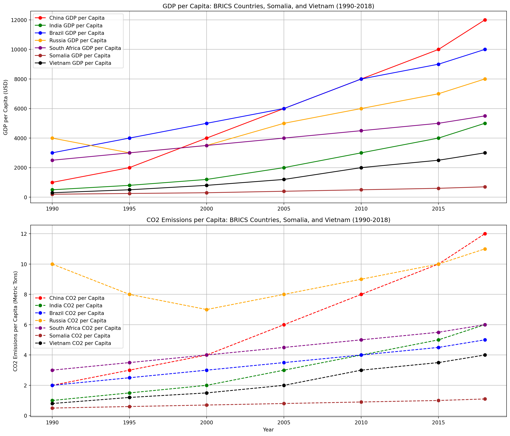

#### Reducing the Gap Between Climate Science and Climate Economics

William Northaus won a Novel Prize in 2018 for attempting to combine
climate change and economics in a single, integrated assessment model,
named *Dynamic Integrated Climate-Economy (DICE)*, however his
predictions are considered inaccurate by climate scientists,
underestimating the risk of catastrophic warming, tipping point and the
probability of higher temperatures leading to mass death (Jones &
Steffen, 2019; Kemp et al., 2022; Stern et al., 2022; Stern, 2022a; Y.
Xu & Ramanathan, 2017; **etchamWhenIdiotSavants2023?**).

-   Nordhaus (2013)
-   Institute of International and European Affairs (IIEA) (2023)
-   While discussion of sustainability economics is spread out over 100
    different scientific journals, there’s little interaction between
    research clusters. Elinor Ostrom vs William Nordhaus Drupp et
    al. (2020) found their analysis of research published between 1987
    to 2013.

## Greenwashing: Data-Driven Benchmarks

### The Problem of Greenwashing

Greenwashing is one of the largest blockers of sustainability. Both the
European Commission and the Chair of U.S. Securities and Exchange
Commission (SEC) Gary Gensler have called for more legislation to curb
business greenwashing practices. *“If it’s easy to tell if milk is
fat-free by just looking at the nutrition label, it might be time to
make it easier to tell if”green” or “sustainable” funds are really what
they say they are”* says Gensler (US Securities and Exchange Commission,
2022). EU regulation for standardizing sustainability reporting is
called the Corporate Sustainability Reporting Directive (CSRD) entered
into force in 2023 as is being gradually ramped up until 2027.

Green investing only makes sense if it’s possible to distinguish
sustainable investments from not sustainable ones. Humans feel as if
choosing green is useless and give up. Sustainabile investing is firstly
about changes in legislation which set stricter sustainability standards
on companies (as discussed above). Secondly, increased transparency, new
metrics, and new tools make it feasible to differentiate more
sustainable companies from less sustainable ones.

Wikirate currently lists 4282 metrics https://wikirate.org/Metric


Upcoming EU greenwashing legislation hopes to curb misleading
communications by companies. *“Make benchmark methodologies more
transparent when it comes to ESG & put forward standards for the
methodology of low-carbon and ESG benchmarks in EU”* (European
Commission, 2019b). Until new legislation is ramped up (2030 in the EU),
building consumer awareness is crucial as currently most
emission-reduction programs are voluntary and thus affected only by
consumer demand (André & Valenciano-Salazar, 2022). Greenwashing is
widespread in company social media communications (Geoffrey Supran,
2022). A number of new AI-based tools aim to find instances of
greenwashing. ClimateBert AI finds rampant greenwashing (Bingler et al.,
2021; Sahota, 2021).

While the EU has proposed legislation to curb greenwashing, EU climate
policy itself has been criticized for greenwashing. Sometimes
greenwashing comes under legislative protection Kira Taylor (2021).
(Booth, 2022) describes how “A recent investigation shows illegal
logging of protected areas in eastern European countries that supplies
residential wood pellets in Italy. Belgium, Denmark, and the Netherlands
are importing pellets from Estonia, where protected areas are logged for
pellets and the country has lost its forest carbon sink, despite
large-scale wood pellet plants being certified ‘sustainable’ by the
Sustainable Biomass Program”.

In recycling systems,(Purkiss et al., 2022) highlights the confusion
between compostable and biodegradable plastics and public
misunderstanding what happens to these plastics when they reach the
landfill: “\[m\]ost plastics marketed as”home compostable” don’t
actually work, with as much as 60% failing to disintegrate after six
months”. Shopping bags marketed as *biodegradable* don’t show
deterioration after 3 years in salt-water sea environment (Napper &
Thompson, 2019).

### Sustainability Standards

(International Trade Centre, 2022) currently lists 334 different
sustainability standards: “Towards a meaningful economy” “The world’s
largest database for sustainability standards”, “We provide free,
accessible, comprehensive, verified and transparent information on over
300 standards for environmental protection, worker and labor rights,
economic development, quality and food safety, as well as business
ethics.”

-   There are many standards.

-   Most sustainable companies. Make a database?

### Anti-greenwashing efforts in Taiwan

-   https://gcaa.org.tw/10468/
-   https://esg.fsc.gov.tw/SinglePage/Product/
-   https://cgc.twse.com.tw/frontEN/aboutCorp21t23

### Traceability

Traceability

EU Deforestation Regulation (EUDR)

Know your suppliers’ suppliers:
[https://www.sourcemap.com/technology/supply-chain-mapping](https://www.sourcemap.com/technology/supply-chain-mapping)

What data should be surfaced to the consumer?

Supply Chain Mapping

Transaction Traceability

### Corruption

Put very simply (knowingly oversimplifying), in traditional finance
legislation is an enabler of corruption as in the case of Swiss privacy
laws, where illegal funds can be hidden, while in cryptocurrencies, the
lack of clear and comprehensive regulation is an enabler of corruption.

### Product Databases

In order to consider the sustainability on a product level, there should
be a directory of all the world’s products.

All of the world’s products are subject to one or another standard and
although they are not uniform, there’s some documentation existing about
every product. GS1 is the organization providing EAN/UPC barcodes on
most consumer products (GS1, n.d.).

-   Konrad (n.d.) “an internet-wide directory of purchasable products,
    reminiscent of how the much of the world’s music is made available
    on streaming platform Spotify.”

-   “Open Product Data” (n.d.): Open Knowledge Foundation’s Open Product
    Data website shut down

-   Håkon Bogen (2016): “Is there a global database of all products with
    EAN 13 barcodes?”

-   Semantics3 (2017)

-   World product database

    -   *Datakick* (n.d.): “open product database”

    -   *WIPO GREEN* (n.d.) green tech database

    -   “Packaging World” (n.d.) packaging database

### Financialization

(Yüksel et al., 2023) criticizes excessive financialization for the 2008
economic crisis where the real economy and financial markets
disconnected, proposing a new index for *participation finance* aiming
to ground the financial economy in the real economy; rooted in Islamic
banking, participation finance avoids highly speculative activities,
which are seen as exploitative, looking to promote stability,
transparency, and fairness.

### Credit-Scoring

Companies assess customer’s credit score to decide credit-worthiness,
however inversely, how can customers rate companies? Indexes make
comparing companies possible. There are many-many indexes, scoring
systems, ratings, certifications, etc.

### Risk-Based Assessment

-   Frances Schwartzkopff (2022b) “Companies in industries with the
    biggest carbon footprints aren’t reporting how their emissions feed
    into financial risk, according to an analysis of corporate reports
    by the Carbon Tracker Initiative.”

-   BeZero is innovating in the voluntary carbon credit market (VCM) by
    providing risk-scoring, a language financial professionals are
    accustomed with.

### Indices

Sustainability indices need transparency and standardization (Bolognesi
et al., 2024).

Based on Corporate Knights data (Corporate Knights, 2024)

Energy productivity


Carbon productivity


### Certification

Research shows certification does matter. In Europe, consumers are
willing to pay more for bio-based products *“72% of Europeans are
willing to pay more for environmentally friendly products. The study
identifies a”green premium” and a “certified green premium,” indicating
increased WTP for bio-based and certified bio-based products”* (Morone
et al., 2021). Particulary in Italy, a study of consumer awareness of
sustainable supply chains shows Italian consumers have a strong
preference for antibiotic-free meat (Mazzocchi et al., 2022).

***Design Implications:*** Display certificates.

<div dangerouslySetInnerHTML={{ __html: quartoRawHtml[64] }} />

There are many different certifications

-   “Ethical Consumer” (n.d.)

-   sustainable brands

-   Product-level reporting can be a basis for investing in companies.
    “Product-investing”. I want to invest in particular products.

https://opencorporates.com/ attempts to map all the companies around the
world WikiRate, started in 2010, is a tool for checking green
credentials Transparency; they define Data Sharing Archetypes (WikiRate,
2021). - WikiRate (2023) “The largest open registry of corporate
sustainability data in the world” Mills et al. (2016)

“Hidden data is a big problem, and it’s limiting our understanding of
the world’s largest #Multinational enterprises.
https://x.com/opencorporates/status/1819025679804973411
https://blog.opencorporates.com/2023/03/14/unsd-oecd-use-opencorporates-data-to-help-the-world-understand-multinational-enterprises/”

<div dangerouslySetInnerHTML={{ __html: quartoRawHtml[65] }} />

-   Laureen van Breen et al. (2023)
-   Wikirate (2022a)
-   *Home - ChainReact* (n.d.)
-   Ray (2023) comprehensive overview of Web3.
-   Rehash: A Web3 Podcast (2022) human-centered web3

Existing rankings

-   Earth.Org (2022)
-   Staff (2021)
-   Fashion brand ratings
-   Ethical Shopping
-   “Top 100 Consumer Goods Companies of 2021” (n.d.) Largest consumer
    goods companies

### B Corporations

B Corporations undergo strict assessment and adhere to stringent
sustainability practices.

-   B Impact Assessment

-   *Find a B Corp* (n.d.) BCorporation listings by country

-   “Etsy Made Mistakes, but Its Commitment to Social Responsibility
    Wasn’t One of Them” (2017)

-   Citywealth (2021)

-   “Social Enterprises, B Corps, Benefit Companies, ESG” (n.d.)

-   RavenPack (2021)

## ESG

### ESG (Promise): Countering Misinformation with Transparency

Since the 1970s, international bodies, governments, and private
corporations have developed sustainability measurement metrics, the
prominent one being ESG (Environmental, Social, and Corporate
Governance) developed by the UN in 2005. This rating system has already
been implemented or is in the process of being adopted on stock markets
all over the world and has implications beyond the stock markets,
allowing analysts to measure companies’ performance on the triple bottom
line: the financial, social, and environmental metrics.

ESG gives banks a new tool to market and sell environmentally conscious
opportunities to institutional investors, for example, universities - a
case in point being the recent partnership between HSBC and the
University of Edinburgh (Reid, 2020). Another recent example is one of
the largest private banks in Switzerland, Lombard Odier & Co, when they
launched a thematic bio-economy fund inspired by the words of The Prince
of Wales, ‘Building a sustainable future is, in fact, the growth story
of our time’ (Jersey Evening Post, 2020).

In Taiwan, the Taipei stock market has listed ESG stocks since 2017 and
was hailed by Bloomberg as a regional leader in ESG reporting (Grauer,
2017). In December 2017, the *FTSE4Good TIP Taiwan ESG Index* was
launched, which tracks ESG-rated companies on the Taipei stock market
(Taiwan Index, 2024). Nasdaq Nordic introduced an ESG index in 2018, and
Euronext, the largest stock market in Europe, introduced an ESG index
and a series of derivative instruments in the summer of 2020 (Euronext,
2020).

(*The Importance of ESG Measurement and Canada’s Opportunity for
Improvement*, 2022) suggests ACWI ESG leaders outperform the non-ESG
screened ACWI based on comparing MSCI indexes. It’s notable that ACWI
ESG starts to outperform the traditional ACWI only in the past few
years.

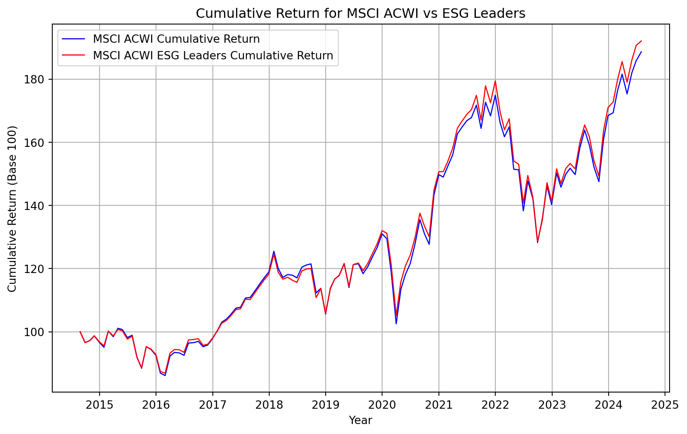

-   Nordic Climate Transparency Leadership analysis of Nasdaq OMX Nordic
    120 companies: “companies with higher quality climate reporting also
    provide higher returns”
-   Trucost, a company launched in 2000 to calculate the hidden
    environmental costs of large corporations and advance
    circular-economy practices was acquired in 2016 by S&P Dow Jones
    Indices, which by 2019 became a part of its ESG product offering
    (Indices, Oct 03, 2016, 08:30 ET; Mike Hower, Dec 9, 2015 7am EST;
    “S&P Rolls Out Trucost ESG Data to Its Customers,” 2019; Toffel &
    Sice, 2011). It’s parent company S&P Global also acquired
    RobecoSAM’s ESG rating business, consolidating S&P’s control of ESG
    ratings (George Geddes, 2019).

Sustainable Investing is Based on Data. Greenwashing is a large
detractor from environmental action as it’s difficult to know what is
sustainable and what is not. Greenwashing Disturbs Sustainable Capital
Allocation. Greenwashing erodes trust. Greenwashing has a negative
Impact on Credibility.


-   Marketing - Sustainability Marketing

-   Environmental Information Disclosure (EID)

-   *Simply Wall St - Stock & Sector Analysis Made Simple* (n.d.): Sites
    like Simply Wallstreet provide in-depth analysis: Simply Wallstreet
    also same for crypto

-   Snowflake analysis like Simply Wallstreet

### ESG (Blockchains)

-   Improve product *provenance*, blockchains offer this transparency

-   Sepandar Kamvar (2022) “A blockchain is a database without a
    database admin”

-   “Blockchain Companies Team Up To Track ESG Data” (2021)

-   Ganu (2021)

### ESG (Tools)

“\[T\]hanks to other emerging technology like IoT sensors (to collect
ESG data) and blockchain (to track transactions), we have the
infrastructure to collect more data, particularly for machine
consumption. By measuring real-time energy usage, transportation routes,
manufacturing waste, and so forth, we have more quantifiable ways to
track corporations’ environmental performance without relying purely on
what they say.” (Sahota, 2021)

Google Environmental Insights Explorer enables local governments
(cities) to measure CO2 emissions and enact environmental policies that
optimize city functions such as traffic flows (*Methodology - Google
Environmental Insights Explorer - Make Informed Decisions*, n.d.; Nicole
Lombardo, 2021)

### ESG (Fintech)

In the U.S. and European banking sector (Dicuonzo et al., 2024)
performed an analysis of 180 banks’ data. Fintech Index and ESG Scores
have a positive correlation, suggesting the adoption of technology has a
statistically significant influence on better environmental stewardship,
social and governance quality. Even larger predictors of high ESG score
were than were Board Gender Diversity (Women on Board), the Size of the
Bank, and Board Independence (governance structures with more
independent directors could be more socially and environmentally
responsible). On the flip side, out of the initial 1551 banks considered
the majority did not have ESG data available to be able to perform the
comparison.


In China, (Lu & Li, 2023) finds *digitization* is the pathway to
Environmental Information Disclosure (EID) and Green Innovation.

### ESG (Governance)

Governance drives social and environmental initiatives at companies.

MSCI research finds company boards severely lacking in climate experts;
among the 164 large CO2 emitters benchmarks by the *Climate Action 100+*
alliance (Climate Action 100+, 2023; Sommer et al., 2024).

(Climate Action 100+, 2023) tracks large emitters around the world with
combined market cap of \$10.3 Trillion USD.


Majority of large emitters companies don’t have climate experts (Climate
Action 100+, 2023).


Most companies do not meet criteria (Climate Action 100+, 2023).


A systematic meta-review of 153 research papers of ESG literature around
the world reports the major determinants of high ESG performance are
board member diversity, firm size, and CEO attributes (Martiny et al.,
2024).


Board diversity in the TOP 5 companies based on Corporate Knights data
(Corporate Knights, 2024).


Shareholders can leverage their numbers and join forces in order to
affect the board members of large corporations. For example, the As Your
Sow NGO aims to champion CSR through building coalitions of shareholders
and taking legal action, including the Fossil Free Funds initiative
which researches and rates funds’ exposure to fossil fuels finance and
its sister project Invest in Your Values rates retirement plans offered
by employers (mostly US technology companies) (As You Sow, 2024a, 2024b)

### ESG (Crisis)

ESG companies don’t emit less CO2 than non-ESG companies.. ESG Criticism
“25 ESG ratings from three major providers (Moody’s Analytics, MSCI
Inc., and Refinitiv)” - *“well-rated companies do not emit significantly
less carbon than those with lower scores.”* (Amenc et al., 2023).

The lack of rigor is creating a backlash against ESG reporting.(C. Yu,
2021) reports ESG is filled with greenwashing. “Anti-ESG Crusade in US
Sweeps 15 States With More Laws in Works” (2023) several US states are
introducing regulation for ESGs to curb greenwashing. Frances
Schwartzkopff (2022a) suggests the ESMA and EU has strengthened
legislation to counter ESG greenwashing. Shashwat Mohanty (2022):
“sustainable funds don’t buy Zomato’s ESG narrative”. Bindman et al.
(2024) reports large ESG funds managed by BlackRock and Vanguard are
investing into JBS, a meat-packing company which is linked to
deforestation of the Amazon rainforest through it’s supply chain.

-   ESG greenwashing Baldi & Pandimiglio (2022)

(Popescu et al., 2023) shows SRI companies have a little bit smaller
carbon footprint.

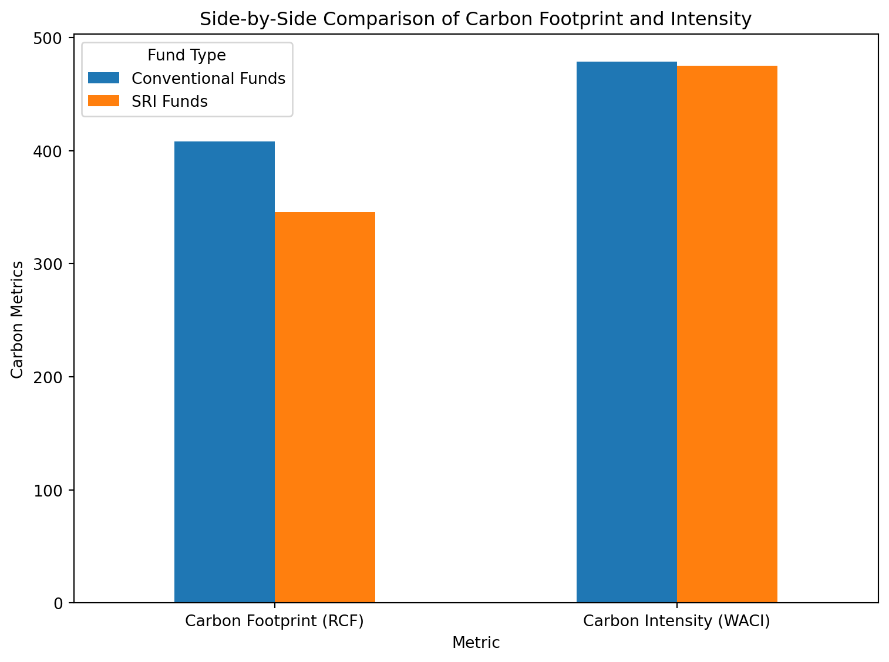

-   ESG reports are very general and opaque. We need product-level
    analytics and reporting to be able to compare products.. ESG is
    filled with greenwashing. ESG is a really low bad. metrics and
    goals: ESG, SDGs, ESG risk. Q: Reflection on the ESG wave: Does a
    company that performs well in carbon reduction but whose products
    are harmful to health conform to the spirit of ESG? Sest ei saa ESG
    ja teisi mõõdikuid usaldada, crowdsourced mõõdikud.
    openesg.com/because you can’t trust ESG (Aikman, 2022) !


Three frameworks for corporate to think about ESG compliance is to
position their company on the MEET - EXCEED - LEAD scale based on the
size, complexity and available resources of the company.

### ESG (Methodologies)

-   ESG Needs Standardisation
-   Environmental, Social, and Corporate Governance (ESG)

A meta-review of 136 research articles discovered the following
ESG-rating agencies.

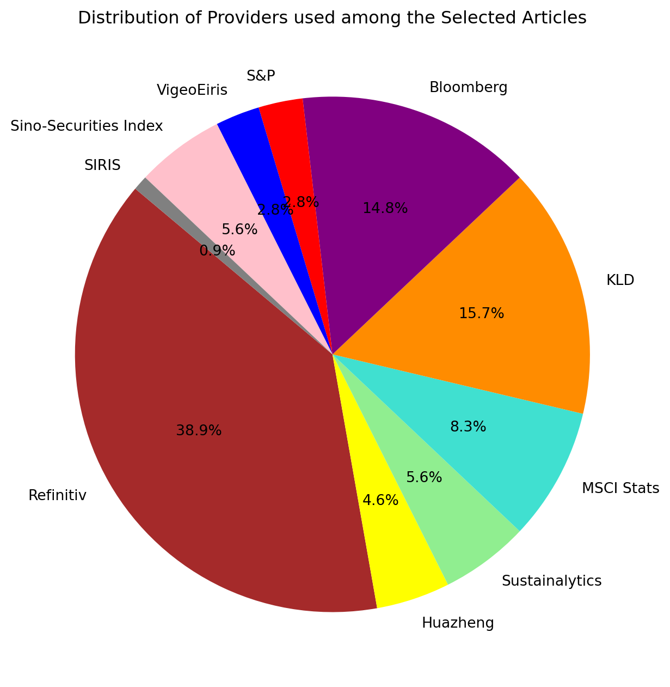

-   “Disparity between ESG methodologies was one of the key hurdles to
    finding the right sustainable strategy” (Margaryta Kirakosian &
    Angus Foote, 2022).

### ESG (Language): Shared Language

ESG Becomes a Shared Language.

The advice consultancies are providing to banks establishes a common
language and helps banks to sell strategical alignment for long-term
institutional sustainability in terms of environmental, social, and
governance performance. PWC suggests *“asset managers educate their
staff and client base. ‘It will be critical to build stronger ESG
expertise among their employees by up-skilling existing staff on ESG
principles and strategically scout for and integrate more diverse and
ESG-trained talent’”* (PWC, 2020)

While ESG is riddled with problems, it has started a common language and
there are many ways how to improve it

-   For AI-powered assistants to be able to provide guidance, metrics
    are needed to evaluate sustainable assets, and ESG provides the
    current state-of-the-art for this. The largest obstacle to
    eco-friendly investing is greenwashing where companies and
    governments try to portray an asset as green when in reality it’s
    not. A personal investing assistant can provide an interface to
    focus on transparency, highlighting data sources and limitations, to
    help users feel in control of their investment decisions, and
    potentially even provide large-scale consumer feedback on negative
    practices back to the business through infringement discovery.

-   Improving ESG Accessibility

-   Trading ESG futures?? because climate is slow it makes sense to
    trade de climate future

-   CFI2Z4 tracks Carbon Emissions Futures (Investing.com, 2024)

-   “ESG 浪潮反思：一間減碳表現優異、但產品有害健康的企業，符合 ESG
    精神嗎？” (2022)

-   While promising to become sustainable, oil companies are increasing
    production Noor (2023); Sunak, UK Primise Minister announced 100
    news licenses for oil drilling in the UK.

-   Other large university endowments, such as managed by Yale, Stanford
    and MIT are in decision gridlock\[^6\]. Blackrock, the largest
    private investment fund in the world with \$10T USD under
    management, released guidance reflecting their plans to shift their
    investments to vehicles that are measured on Environmental, Social,
    and Governance (ESG) performance \[^7\]. However they later
    backtracked from their decision.

-   Banks are required by law to apply the principle of Know Your
    Customer (KYC).

-   It can be as mundane as choosing the next eco-friendly product
    instead of the polluting one we purchase in the supermarket make a
    difference? How to invest in the growth of companies that put ESG at
    the center of their activities instead of using it for greenwashing?
    Creating direct ties will improve ESG. A journey from consumption to
    investing, in line with users’ personal values, by providing
    relevant sustainable finance guidance. x \#### ESG Crisis

-   James Phillipps (2022) and “Financial Materiality Marks Next Big ESG
    Investing Battle” (2023) ESG Not delivering on it’s hopes

-   TEDx Talks (2022) large corporations are using ESG for greenwashing
    by investing in token-projects but not changing their fundamental
    polluting practices.

-   Margaryta Kirakosian (2022)

-   Banks are hiding emissions related to capital markets, which is a
    major financing source for oil and gas projects Wilkes (2023)

-   I. B. Daily (2021) best ESG list

-   ESG UAE FutureESGInvesting

-   Sanjai Bhagat (2022): Not better environmental performance, ESG poor
    performance

-   Simões-Coelho et al. (2023) Coca Cola ESG

-   PIETRO CECERE (2023) calls ESG labeling confusing and arbitrary.

-   ESG is a Marketing Tool

    -   Gemma Woodward (2022) 8 problems with ESG
    -   Agnew (2022) RIP ESG
    -   D. Luo (2022) found firms with a lower ESG score are more
        profitable.

-   Analysis: Messari: investor education, information asymmetry

<div dangerouslySetInnerHTML={{ __html: quartoRawHtml[66] }} />

### ESG (Data Streams): Realtime Reporting

-   “But the real breakthrough is how we can surface that real-time ESG
    data directly to individuals in the shops and online, linked to the
    products that they are browsing and potentially buying. This means
    that ESG change will finally be driven by the ultimate judge of
    business success – the customer.” (Ratkovic, 2023)

There’s a growing number of companies helping businesses to measure CO2e
emissions in their product lifecycle.

-   Kyle Wiggers (2022) proposes makersite, instant sustainability
    impact from supply chain.

-   Makersite (n.d.) proposes ***product sustainability modeling***.

-   Tim Nicolle (2021) “Real-time ESG data is more difficult to
    greenwash”, “supply chain is a significant source of ESG content”

-   Automate CO<sub>2</sub> calculations realtime:

-   Indrek Kald (2022): FlowIT automate CO<sub>2</sub> counting

-   “Factory social score”.

-   People working at the factories can report conditions

-   *ESG Analytics <span class="nocase">Real-time ESG Scores</span> and
    Ratings for Companies Globally GHG Emission Data* (n.d.): Governance
    or Corporate Responsibility

How are large corporations responding to the climate crisis?

Lack of leadership. (Capgemini, 2022): “Many business leaders see
sustainability as costly obligation rather than investment in the
future”.

The CEO of the Swedish clothing producer H&M - one of the largest
fast-fashion in the world -, recognizes the potential impact of
*conscious consumers* as a threat (Hoikkala, 2019).

Many large businesses have tried to find solutions by launching
climate-focused funding. (Korosec, 2021) reports that Amazon’s 2B USD to
a Climate Pledge Fund earmarked to fix climate problems is invested in
energy, logistics, and packaging startups, which will reduce material
waste. “Good intentions don’t work, mechanisms do,” Amazon’s founder
Bezos is quoted as saying in (Clifford, 2022). Walmart is taking a
similar approach, having launched a project in 2017 to set
CO<sub>2</sub> reduction targets in collaboration with its suppliers
(Walmart, 2023). These examples underline how money marketed as climate
funding by retail conglomerates means focus on reducing operational cost
of running their business through automation and material savings.

Large corporations such as Nestle and Coca Cola support the biodiversity
law to have a level playing field for business (Greens EFA, 2023).

-   *Public Health Linkages with Sustainability* (2013)

-   Guidotti (2015)

-   “Sustainability is important for many reasons including:
    Environmental Quality – In order to have healthy communities, we
    need clean air, natural resources, and a nontoxic environment.”

-   S. Low et al. (2022) finds considerable uncertainty exists among
    experts which CO2 reduction methods among nature-based and
    technology-based are the most effective.

-   Pathways to drawdown

### ESG (Social): Slavery Still Exists

In 2023, an estimated 50 million people were in slavery around the
world; lack of supply chain visibility hides forced labor and
exploitation of undocumented migrants in agricultural work; 71% of
enslaved people are estimated to be women. (Borrelli et al., 2023; Kunz
et al., 2023). (Christ & V Helliar, 2021) estimates 20 million people
are *‘stuck inside corporate blockchains’*. The Global Slavery Index
measures the considerable *‘import risk’* of having slavery inside its
imports (Walk Free, 2023). (Hans van Leeuwen, 2023) slavery affects
industries from fashion to technology, including sustainability enablers
such as solar panels. ILO estimates 236 billion USD are generated in
illegal profits from forced labor (International Labour Organization,
2024).

The Modern Slavery Act has been passed in several countries starting
with the U.K. in 2015 (UK Parliament, 2024). (Mai et al., 2023) finds
the quality of the reporting remains low among FTSE 100 (index of highly
capitalized listings on the London Stock Exchange) companies.

On the global level, the United Nations SDG target 8.7 targets to
eliminate all forms of slavery by 2025 however progress has been slow
(The Minderoo Foundation & Commonwealth Human Rights Initiative, 2020).

Voters in Switzerland rejected the responsible business initiative in
2020 while the country is a global hub for trading commodities.
“Switzerland has a hand in over 50% of the global trade in coffee and
vegetable oils like palm oil as well as 35% of the global volume of
cocoa, according to government estimates”(Anand Chandrasekhar & Andreas
Gefe, 2021) begging the question can Swiss traders have more scrutiny
over what they trade?


Slavery is connected to environmental degradation, and climate change
(Decker Sparks et al., 2021). Enslaved people are used in environmental
crimes such as 40% of deforestation globally. Cobalt used in
technological products is in risk of being produced under forced labor
in the D.R. Congo (Sovacool, 2021). In India and Pakistan, forced labor
in brick kiln farms is possible to capture remotely from satellite
images (Boyd et al., 2018). In effect, the need for cheap labor turns
slavery into a *subsidy* keeping environmental degradation happening.

### ESG (Social): How to Trace Worker’s Rights

While reducing slavery in the supply chain sets very low bar for ESG,
another aspect of supply tracing is the treatment of workers and working
conditions.

-   “commodification of human beings”

-   Companies that intend to to give supply chain a voice” by connecting
    workers directly to the consumer (even in anonymously, to protect
    the workers from retribution), include *CTMFile* and *Alexandria*.

    -   “Worker Voice” (2022) Worker Voice apps.
    -   Tim Nicolle (2021) and PrimaDollar Media (2021) PrimaDollar
        Realtime ESG Give supply chain a voice by connecting workers
        directly to the consumer.

## Design Implications

<div dangerouslySetInnerHTML={{ __html: quartoRawHtml[67] }} />

Features

## Feature Ideas

<div dangerouslySetInnerHTML={{ __html: quartoRawHtml[68] }} />

````mdx-code-block
import MyEmbed from '/src/components/Embed'
import Figure from '/src/components/Figure'
import Concepts from '../images/methodology/concept-map.png'
import Methodology from '../images/methodology/research-methodology.png'
````

# Methodology

Start with expert survey, then expert interviews (because so many
questions from literature review).

<div dangerouslySetInnerHTML={{ __html: quartoRawHtml[69] }} />

I adopted a face-to-face method to increase response rates distributing
flyers to students on college campuses, canteens, and classrooms getting
verbal permission from educators in their ´ classrooms to distribute the
survey flyer. The flyer included a colorful AI-generated visual with a
futuristic game-link female figure, the title “climate anxiety survey”,
a website link (ziran.tw) and scannable QR-code.

Similarly to (C.-H. Liu et al., 2023) I distributed the survey in
schools in the Northern, Soutern, Central, and East regions of Taiwan.

The survey only included questions and descriptions in Chinese. I have
used the Claude 3 Opus model to translate them to english for this
table.

<div dangerouslySetInnerHTML={{ __html: quartoRawHtml[70] }} />

Respondents who remained outside the survey parameters were disregarded
from the data analysis.

-   References were stored in the Zotero paid version with 6 GB storage.
-   Bibtex and Better Bibtex were used to export the references to the
    .bib format consumable by Quarto.

## Research Design

-   Christian Rohrer (2022): Research methods

**The research design of this study consists of 3 steps.**

-   Qualitative research targeted at financial and interaction design
    experts, leading to a *wish list* of features.
-   Survey potential users’ preferences, including a choice experiment
    of the proposed features.
-   Design a prototype of the personal sustainable finance AI assistant,
    tested using qualitative methods in a focus group.
-   This mixed-method research design is divided into three stages
    (fig. 11).
-   My purpose for the first qualitative stage is to explore the general
    themes arising from the literature review related to the design of
    AI advisors for investing. I will identify specific user experience
    factors, through interviewing experts in financial technology and
    user experience design and reviewing existing applications on the
    marketplace. At this stage in the research, the central concept
    being studied is defined generally as expectations towards a
    sustainable investment AI advisor.
-   I will then proceed to the second, quantitative stage, informed by
    the previously identified factors, and prepare a survey, including a
    Likert scale, and a choice experiment, focusing on the preferences
    of the potential users aged 18-35, living in Sweden and Taiwan (see
    fig. 12 on next page), exploring the relationship between
    independent variables: - “Interest in Sustainability” - “Interest in
    Investing” - “Preferred Features” - and the dependent variable “User
    Sign-ups”.
-   In the third stage, I will return to the qualitative methods, by
    building a prototype of the sustainable investing AI companion,
    taking into account insights gathered in the previous stage. I will
    use a focus group to discuss the prototype, and conduct a thematic
    analysis of the discussions’ recordings, leading to further
    validation of previously gathered data and possible changes in the
    prototype. The gained insights, accompanied by the app prototype,
    which embodies my findings, will be the final outcome of my
    research.

## Conceptual Framework

-   The conceptual framework map (fig. 13) presents the key concepts
    arising from the literature review thus far in the research process.
    I’m using these concepts when developing interview strategies for
    phase one of the research, developing the survey questionnaire for
    phase two, as well as for building the Personal Sustainable AI
    Financial Advisor (PSAA) for young adults at the final stage of the
    process. However, I expect the conceptual framework to further
    evolve with additional findings while conducting my research.

````mdx-code-block
<Figure caption="Concept map" src={Concepts} />
````

Conceptual Model

## Research Methods

### Phase One - Qualitative Research

The qualitative research methods employed in the first stage of the
research design enables me to explore concepts arising for literature
review further, using a more open approach, without limiting the
conversation only to pre-ascribed notions. The strength of the
qualitative approach in the first stage is to encourage the discovery of
new ideas, not yet common in literature and potential user experience
factors related to sustainable investing and user experience.

#### Sampling

My qualitative sampling structure uses non-probability snowball
sampling, with the following criteria: financial industry, fintech, and
design experts everywhere, including in Taiwan and Sweden, but also
Estonia, Portugal, and elsewhere.

**Method:** Semi-Structured Interviews

I will conduct exploratory research in English using semi-structured
interviews recorded online and offline.

### Phase Two - Quantitative Research

The strength of quantitative research is to enable me to access a larger
sample of potential users in two countries, using online survey methods,
and to validate some of the qualitative findings from stage one.

**Sampling** My quantitative sampling structure uses a judgmental
criterion: age 18-35, located in Sweden or Taiwan, surveyed using an
English-language online survey.

**Method:** Likert The survey includes a Likert scale between 1 to 7 to
validate key findings from the first stage of the research by assessing
responses to statements regarding the app’s design, features, and other
criteria that may still emerge.

**Method:** Choice Experiment The survey includes a choice experiment
between different sets of potential features available when
communicating with the sustainable finance AI companion.

### Phase Three - Qualitative Research

In the last phase, I will return to the qualitative methods to further
validate the quantitative findings from stage two. Here my focus will be
on operationalizing the gathered insights into a prototype that users
can experiment with and discuss with their peers in a focus group
setting. Sampling

The phase three sampling structure uses a judgmental criterion: - age
18-35 - located in Taiwan - Using the English language for discussion

A focus group of 6 to 10 people will be gathered in Tainan. Because
in-person presence is required in this stage, the prototype will only be
tested by potential users physically present in Taiwan. To avoid
convenience sampling, I will post online ads in English to invite people
who I don’t know personally, to participate in a “financial AI
application testing group” (wording may change).

**Method:** Focus Group The strength of a focus group is the ability to
observe potential users in a social setting, where knowledge can be
exchanged between the participants. The whole experience, including
emerging conversations, will be recorded and transcribed.

**Method:** Thematic Analysis Finally, I will perform a thematic
analysis of the focus group transcriptions in order to validate previous
findings, and open avenues for future research.

````mdx-code-block
<Figure caption="Overview of research methodology" src={Methodology} />
````
````mdx-code-block
import MyEmbed from '/src/components/Embed'
````

## Ideas for Interfaces / Scenarios {#ideas-for-interfaces-scenarios}

Show all the different prototypes just likes architects do. And then
defend why I chose the one I did. For NW make a Loom with the interfaces
and talk about them?

## Prototypes of Product Features

I developed a number of early prototypes to visualize product feature
ideas.

What’s on the intersection of College Students, Sustainability,
Investing, Data-Driven Design and Artificial Intelligence (AI)?
AI-Driven Sustainable Investment Tools.

The app aims to address the market failure by providing consumers
sufficient sustainability information on the goods, services and
investments.

resource depletion

and adopt the doughnut economy as my overarching theoretical framework

Humans are successful because of our adaptability. The study suggests
tools to adapt to our current reality.

United Nations Decade on Ecosystem Restoration

Hypothesis: extractive business practices reduce college students trust,
regenerative business practices create trust among college students
towards the company.

Provided there is awareness

How can sustainability-minded college students find companies that meet
their expectations, standards and requirements?

-   Make a public profile of my carbon consumption!!! Like on Commons.

-   Shop

-   Save

-   Invest

-   Build closer relationships with sustainability-focused companies

-   Sales funnel for eco-focused products

-   The eco-friendly market is fragmented

-   Build trust, clarity, transparency, and honesty

-   Make a ‘Sustainability Flywheel’ graphic, like that of Amazon’s

-   Sustainability is fragmented. How can billions of people build
    closer relationships with sustainability-focused companies based on
    honesty and transparency? A research project for designing a
    sustainable shopping, savings, and investing companion.

-   Most sustainability plans rely on carbon credits to achieve their
    goals, making carbon credits a single point of failure. If the
    credits are not accurate, the whole system collapses.

-   TODO: Make a table showing research results translated to design
    decisions

-   Your Green Helper

-   Make some initial prototype? make YoutTbe video… hi, you have
    reached? spread… through ESTBan and others?

-   Currently CO<sub>2</sub> footprint calculators ask you a couple of
    questions and give a ballpark estimate. Does it make sense to track
    sustainability on a more nuanced level, like Apple Health, in order
    to encourage sustainable behavior?

<div dangerouslySetInnerHTML={{ __html: quartoRawHtml[71] }} />

-   *Affinity diagrams* help users organize ideas by brainstorming,
    sorting and labeling to cluster related information (Kara Pernice,
    2018; Quignard, 2022)
-   Scan a product to see the company and start investing or divesting
    from them Current economics is lowering the quality of life on the
    planet

Actionable Insights: Translate data into everyday actions the app can
suggest.

-   What does investing look like at the scale of billions of people?
    like IG
-   The most effective things are Commodities? Food, transport, fashion,
    plant trees.
-   personalized AI, meta glasses understand your context. sense and
    reconstruct the world around you and to understand the context in
    which you’re using your device.sense and reconstruct the world
    around you and to understand the context in which you’re using your
    device. Make suggestions and take action proactively to help you get
    things done — ideally, so seamlessly that you may not even
    notice.neuroscience co-adaptation of the interface. your future
    devices will learn and adapt to you as you use them.
-   Scalable Climate Solutions: What really works on a large scale?
-   brand colors: pink, orange, green

## Shopping-as-Investing

-   Introduce this concept

-   The Manor (2022)

-   Sustainability is hard. Green Filter helps you find companies that
    are making a true effort and build closer relationships through
    shopping, savings, and investing. Green Filter helps you find
    companies that are making a true effort to become sustainable and
    build closer relationships through shopping, savings, and investing

-   Gather requirements and build a prototype for the next-generation
    investment app for young adults. Improving the user experience for
    young adults getting started with (green) investing. What would a
    “Tinder for (Green) Investments” look like? How can we make the
    logistics of investing so easy to use and take into account my
    values?

-   My thesis core message is : everyone should change from consumer to
    sustainability investor (define these terms in the thesis). how to
    do this? can help you become from consumer to investor i believe
    there’s space for a product like that. your green investing friend
    find the companies tackling certain problems and invest in them
    using crypto business can be a force for good

-   Consumer purchases are an indicator of demand. If demand trends
    down, companies will stop producing this product.

## ‘Investment-as-Product’

-   Green Filter helps you discover how to save money and the planet
    with your daily shopping. By providing an easy way for people to
    learn about and shop with sustainable companies, we imagine a world
    where people invest in their future, find great deals on
    responsibly-made products, and get useful discounts from socially
    responsible brands.

-   GreenFilter is a product that combines AI, design and marketing to
    help people manage their social impact throughout the stages of
    their lives, from young adult years to retirement. Its primary goal
    is to give people the tools they need to invest responsibly in
    sustainable companies, while also educating them on this topic. Our
    project offers a responsive website and mobile app that leverages AI
    and other advanced technologies. In addition, our prototype includes
    a reality-based virtual assistant with voice command capabilities
    which can provide customers with new insights into the world of
    green finance

-   GreenFilter introduces a novel, interactive point-of-sale technology
    that helps people make greener shopping decisions. The platform uses
    artificial intelligence to suggest green alternatives for products
    on your shopping list, and will also help you to find other
    companies that can make sustainable versions of the product you are
    buying.

-   As people become aware of the impact their shopping is having on the
    environment, they become interested in finding alternatives to big
    brands and large companies. GreenFilter provides designers an AI
    companion design which helps people build relationships with
    sustainability-focused companies by providing personalized
    recommendations, giving product reviews and helping them shop
    sustainably. This new tool will empower consumers to make greener
    choices throughout their lives.

-   Better management of planet Earth

-   How can wee Shop, Save, Invest in line ecologic principles and
    planetary boundaries? individual action doesn’t move the needle. how
    to group together

-   App to build community

-   Life within planetary boundaries

-   Currently it seems there’s a secret around how things are produced
    we want to increase transparency

-   Companies that have nothing new nothing to hide should welcome this
    opportunity to mark themselves to keep a conscious consumers and
    investors.

-   We want to create competition around sustainable practices enter
    widespread adoption

-   Cigarettes and pictures of lung cancer every product should be
    required to have photos of production conditions switch such as
    Rainforest and deforestation the products that include Palm oil.

-   My thesis is that a lot of people want to do good, shop
    eco-friendly, invest green, etc. But they don’t believe the
    solutions work. They don’t have trust. This is a user interface
    issue. How to build trust.

````mdx-code-block
import MyEmbed from '/src/components/Embed'
import Figure from '/src/components/Figure'
import Watch from '../images/prototypes/ai-watch.png'
import Susan from '../images/prototypes/susan-pink-app.png'
````

## Early Feature Ideas

The following early prototypes are focused on particular feature ideas
that occurred to me during the literature review process. They are naive
and meant to allow thinking in terms of *what-if* a particular user
experience was possible. These prototypes were not tested with users
directly and formed a basis for directing the questions asked in a
potential user survey.

## Susan (Sustainability Conversation)

*What if* I could have a chat like this at the supermarket? Imagine what
questions I would ask before buying a product. AI: “Kris, do you still
remember Coca Cola’s packaging is a large contributor to ocean plastic?
You even went to a beach cleanup!” Me: “That’s so sad but it’s tasty!”
AI. “Remember your values. Would you like to start saving for investing
in insect farms in Indonesia instead? Predicted return 4% per year,
according to analysts A and B.” If I’m not so sure, I could continue the
conversation. Me: “Tell me more” AI: “A recent UN study says, the planet
needs to grow 70% more food in the next 40 years. Experts from 8
investment companies predict growth for this category of assets.” Me:
“Thanks for reminding me who I am” … Moments later. AI: “This shampoo is
made by Unilever, which is implicated in deforestation in Indonesia
according to reporting by World Forest Watch. Would you consider buying
another brand instead? They have a higher ESG rating.”

Example Suggestions of the AI companion:

-   “Don’t buy a car, use a car sharing service instead to save XYZ CO2.
    Service available near you: Bolt,\* Uber.”

-   “Use a refillable shampoo bottle to save XYZ plastic pollution”

-   “Call your local politician to nudge them to improve bicycle paths
    and reduce cars in your neighborhood. Over the past 2 years, you
    city has experienced an increase of cars from 290 cars per capita to
    350 cars per capita.”\*

Figure 3: Speculative scenario of an interaction between a human user
and a robo-advisor through the interface of chat messages in the context
of retail shopping for daily products.

https://scontent.ftpe6-1.fna.fbcdn.net/v/t39.8562-6/333078981_693988129081760_4712707815225756708_n.pdf

provides many examples conversations between AI and humans from Meta’s
LLAMA mmodel

````mdx-code-block
<Figure
  caption="Early prototype of my Sustainable Finance AI Companion (Nov. 2020)"
  src={Susan}
/>
````

## Sunday Market

*What if* I could go to the Sunday market with other people who care
about sustainability? First prototype (based on literature review)
called HappyGreen’s for going to the organic Sunday Market with friends.
Choose industries of focus? Fashion, Food, etc?

<MyEmbed src="https://framer.com/embed/HappyGreen-s--b6BsD3AvB9LOehpEFVAu/DGVOYRTex?highlights=0" text="Loading Sunday Market..." />

## True Cost

*What if* I you could see the actual cost of each product including
externalities?

<MyEmbed src="https://www.figma.com/embed?embed_host=share&url=https%3A%2F%2Fwww.figma.com%2Ffile%2FcAgbLs3UzAI5TnmjOipjZ5%2FTrue-Cost%3Fnode-id%3D0%253A1" text="Loading True Cost..." />

## Speak Truth to Power

*What if* I could affect companies with truth? Consolidate user feedback
for companies.

<MyEmbed src="https://www.figma.com/embed?embed_host=share&url=https%3A%2F%2Fwww.figma.com%2Ffile%2FcAgbLs3UzAI5TnmjOipjZ5%2FTrue-Cost%3Fnode-id%3D0%253A1" text="Loading True Cost..." />

## How Far?

*What if* I knew how far did this product travel to reach me?

<MyEmbed src="https://www.figma.com/embed?embed_host=share&url=https%3A%2F%2Fwww.figma.com%2Ffile%2FY1PlFrLRvyu7lI2KvAILe4%2FHow-Far%253F%3Fnode-id%3D0%253A1%26t%3Dn2uEPPaN4pknSaVh-1" text="Loading 'How Far?'..." />

## Country Profiles

*What if* I knew my country’s top pollution sources?

<MyEmbed src="https://www.figma.com/embed?embed_host=share&url=https%3A%2F%2Fwww.figma.com%2Ffile%2Fx2OIzYHACJTr6xnzHkrdeQ%2FCountry-Profiles%3Fnode-id%3D0%253A1%26t%3DW82SgRzgzbAaHImo-1" text="Loading Country Profiles..." />

## Know Your Company

*What if* I could KYC the companies I interact with? Like the banks KYC,
consumers can KYC.

## CO2e Flex

*What if* I could show off how much CO2e I have retired?

## Sustainability Watch

*What if* I could see all my sustainability data on a wearable device in
the right context?

<div dangerouslySetInnerHTML={{ __html: quartoRawHtml[72] }} />

## Narrative Layouts

*What if* I spent 5 minutes every day with a guide who could help me
make more eco-friendly choices? How should the layout storyline be
structured? Well it’s like Strava (that running app) for sustainability…
or if you have heard of Welltory. I believe sustainable choices that
would improve my life.. be it what I consume, save, invest, etc.. so I’m
trying to design an app around this idea. I’m basically building the UX
of AI.. focused on sustainability. How should the layout storyline be
structured? Well it’s like Strava (that running app) for sustainability…
or if you have heard of Welltory. I believe if I spent 5 minutes every
day with a guide who could help me make more eco-friendly choices that
would improve my life.. be it what I consume, save, invest, etc.. so I’m
trying to design an app around this idea.

<MyEmbed src="https://www.figma.com/embed?embed_host=share&url=https%3A%2F%2Fwww.figma.com%2Ffile%2FnTh1LsECxFABEZPE7pSFgw%2FDid-you-know%253F%3Fnode-id%3D0%253A1" text="Loading Prototype..." />

## Shopping Divest

*What if* I you could build a community based on what I buy?

<MyEmbed src="https://www.figma.com/embed?embed_host=share&url=https%3A%2F%2Fwww.figma.com%2Ffile%2Fw7LqdSzACgz9ghuTcrSxgk%2FDivest%3Fnode-id%3D0%253A1" text="Loading Shopping Divest..." />

## Books Can Talk

*What if* sustainability literature could chat with me? Books can now
talk to me. My bedtime story about shopping, saving, and investing.
(*Sustainable Shopping*, 2023)

-   (Ray Kurzweil, 2018)
-   (J. Bailey, 2023)

````mdx-code-block
import MyEmbed from '/src/components/Embed'
import Figure from '/src/components/Figure'
import Watch from '../images/prototypes/ai-watch.png'
import Susan from '../images/prototypes/susan-pink-app.png'
````

## Interactive Prototype

-   https://ai.ziran.tw/
-   

## Testing

## Retrieval-Augmented Generation (RAG)

-   “make contextual decisions on-the-fly, thereby opening up a more
    dynamic and responsive way to handle knowledge search tasks” Dewy
    (2024)

## Prototype Development

– tools used: qr generator in Canva postman for API testing

-   Google Chrome has 3.45 billion users “Google Chrome Statistics for
    2024” (2023)

-   Retrieval-Augmented Generation (RAG) to enhance AI content with
    domain-spefic (close-to realtime) knowledge.

-   technique first proposed by researchers at META (Lewis et al., 2020)
    some RAG benefits include \[Y. Gao et al. (2023);\]

Prototype architecture

-   Google Chrome browser extension

-   ApI microservice

-   Ziran AI

-   AI backend

-   Ratings API

-   Redis testing ai results

-   Redis Page cache / from page / separate scraping service

-   documentation: GreenFilter: thesis website / github

-   Ai Api got / claude

-   Stock ratings API

-   Community ratings api

70 qeustions questionairw - use report ID to do anonymois teating - page
tracking to track the usage - 7 app wuestions - 63 pwrsonality wuestion

````mdx-code-block
import Figure from '/src/components/Figure'
import AppTestingFlow from '../images/testing/app-testing-flow.png'
````

## Testing

Does the prototype match user needs?

Testing was the most difficult part of the thesis process.

-   Testing with friends and acquitances.

-   Testing with experts.

-   Testing with unknown people in the target audience.

## App Testing Flow

## Testing Period

-   1 month from 2024 April 2 to May 2, 2024
-   30 individual participantsbö

## Testing

Prototype Testing results

sun, 14. april. 22h at D24

-   NCKU student, gen-z
-   searches for lancome brand
-   chooses LANCOME 蘭蔻
    小黑瓶100ml(買一送一/超未來肌因賦活露國際航空版)
    https://www.momoshop.com.tw/goods/GoodsDetail.jsp?i_code=12028429&Area=search&oid=1_8&cid=index&kw=lancome
-   notices 買一送一
-   doesn’t notice analysis button at first
-   would only click on this if it’s really expensive
-   would not click on “continue chat button”
-   asked “why is it so expensive in taiwan2
-   considers report result useful

note: there’s dropoff on evey step of the user journey

RQ: To what extend can shopping become and entry point for saving and
investing. RQ: Can shopping serve as an entry point for sustainable
saving and investing?

Testing overview

-   Tested with 30 participants individually
-   Testing is anonymous
-   Generate
-   

有意識的消費主義

-   add carbon indicators, other labels to the analsysi, add report
    code, calculate report code from URL? ssave as kv

<div dangerouslySetInnerHTML={{ __html: quartoRawHtml[73] }} />

06 may - Seeing factory photos is useful only if they are trustworthy
photos. Who will provide them? -

<div dangerouslySetInnerHTML={{ __html: quartoRawHtml[74] }} />

<div dangerouslySetInnerHTML={{ __html: quartoRawHtml[75] }} />

<div dangerouslySetInnerHTML={{ __html: quartoRawHtml[76] }} />

1 may prof suggestion - make connection between biodibersity and
production and consumption clearer - what is the incentive for companies
to share their data?

my own idea: like the switch of going from traditional banking with ATM
machines on the street (or even the physica bank office) to online
banking with mobile payments

-   hypothesis: esg accessibility can push companies to increase
    production standards

-   what if you can see ESG in near-realtime such as the stock market
    price

-   i can imagine esg derivative product like siemens gamesa

-   ai can help integrate esg derivatives into daily life to drive esg
    adoption

-   “effective altruism (EA)”

-   “Blockchain technology can improve price transparency in product
    distribution by allowing consumers to know the exact pricing from
    raw materials to distributors to suppliers.”

-   

Interviews and testing survey were conducted anonymously in hopes to
have more honest responses from the responders.

-   ziran chrome extension is unable to record activity due to browser
    security restrictions for plugins
-   ai.ziran.tw record user activity
-   semi-structured interviews were conducted in chinese
-   the interviewer (me) took notes of the interviews
-   some gaps in the data exist due to the limited chinese language
    skills of the interviewer (me)

basic interview script - momo: what is a brand that you like’d or would
like to buy - search - please pick a product (or search again) - on
product page: what do you notice on this page? - what kind of
information is important for you on this page? - do you notice anything
else - (if the user doesn’t notice the green filter, direct their
attention to it and ask: what do you think this does?) - would you click
on it - if the user says yes, continue - if thhe user says no, make note
and continue - as the extension generates a response: what do you think
about this content? - is there any information that you consider
important? - anything else you see that you think looks special - do you
see anywhere you can click? - would you click on it? - if yes,
continue - if no, make note, and continue - explain: due to the
limitation of the prototype, the test will continue on a separate page
where you can ask questions - is there anything you would like to ask
the helper? - notice if the user picks from sample questions - remind
the user they can come up with their own question - as the ai is
generating content ask: do you see any information in this content - did
you know this before or is there any info you didn’t know before? make
note. - front page: explain the helper takes into account your personal
info and goals. - ask: what kind of information do you think important
to share with the helper?

Tuesday 30. April 14:05-14:45 - 7CYQ6

-   Momo
-   Looks for Levis pants
-   Looks for recommendations on the sidebar
-   Looks at the photos
-   Looks at the price and options
-   Didn’t notice the helper as it looks like an ad
-   When helped
-   Ignores 社區支持： 購物 69% 儲蓄 80% 投資 65% as doesn’t know what
    these mean
-   on ai.ziran
-   shares personal info:
    四年後想考研究所，還不想工作，所以不會存到錢，希望可以考到台北的學校，每個月有兩萬生活費。
-   
-   DJmoney
-   https://www.moneydj.com/etf/x/basic/basic0004.xdjhtm?etfid=0050.tw
-   Still didn’t notice the helper
-   Doesn’t understand investing (Understands it’s Taiwanese stocks) so
    the helper is useful for explaining new concepts

Monday 29. april 10:10-10.25 - Momo - buy new balance sneakers

-   DJmoney
-   wants compare EFTs

Monday 29. april 14:50-15:10 - Momo - buy apple iphone - bad internet -
app was slow - app crashed

-   green filter analysis on DJmoney seems more trustworthy than other 2
    eft sites
-   button placement is important (too low on other sites than djmoney)

Sunday 28. april 16:00 - momo: wants to buy ice cream

sun, 14. april. 22h at D24

-   ncku student, gen-z
-   searches for lancome brand
-   chooses LANCOME 蘭蔻
    小黑瓶100ml(買一送一/超未來肌因賦活露國際航空版)
    https://www.momoshop.com.tw/goods/GoodsDetail.jsp?i_code=12028429&Area=search&oid=1_8&cid=index&kw=lancome
-   notices 買一送一
-   doesn’t notice analysis button at first
-   would only click on this if it’s really expensive
-   would not click on “continue chat button”
-   asked “why is it so expensive in taiwan2
-   considers report result useful

note: there’s dropoff on evey step of the user journey

RQ: To what extend can shopping become and entry point for saving and
investing. RQ: Can shopping serve as an entry point for sustainable
saving and investing?

Testing overview

-   Tested with 30 participants individually
-   Testing is anonymous
-   Generate
-   

有意識的消費主義

-   add carbon indicators, other labels to the analsysi, add report
    code, calculate report code from URL? ssave as kv

https://www.youtube.com/watch?v=xLszCaeUWig

https://www.youtube.com/watch?v=GHMAboJvLCU

https://www.youtube.com/watch?v=xLszCaeUWig

https://www.carbonequity.com/what-we-offer

## Expert Feedback

-   Provide alternatives

-   Simplify text

-   Use images

-   Put a “New Feature” ad on the front page

-   Change 繼續討論 to something more actionable

    -   I tried changing to “see alternatives”

Face-to-face testing was concluded in several universities across Taiwan

-   Taichung, 1 uni

-   Pingdong, 1 uni

-   Tainan, 2 uni

Interviews were conducted in Chinese and transcribed and translated to
English using Google Voice to Text AI as well as Describe AI.

# Results

Expected Findings

During the preparation of this research proposal I conducted a
preliminary round of facetoface interviews using 21 openended probing
questions using a convenience sampling of NCKU students on campus
between ages 19 and 29 a total of 12 respondents The interviews lasted
between 9 and 21 minutes and were conducted to get some initial feedback
on my research idea the respondents daily routines app usage feelings
towards financial questions including investing relationship with nature
and environmental sustainability These preliminary conversations led me
to emphasize more on the financial journey ie to consider the importance
of the shopping savings and payments apps students already use daily
which could serve as an entry point to becoming an investor I expect my
future research findings to confirm this initial idea and offer diverse
ways and examples of what that path could look like in practice

Survey Overview

A survey of Taiwanese college students excludes overseas Chinesespeaking
students as well as foreign students covering attitudes towards shopping
saving investing economy nature sustainability and AI

Survey Oct 13th Nov 3rd 2023

2000 cards with a QR code printed out

Distribution conducted at 8 universities handing out the cards

1289 people started the survey 518 quit

771 people completed the whole survey

Data after filtering 675 people aged 18-26 GenZ Taiwanese current
students in BA large majority MA small minority or PhD level very few
respondents

36 likert fields 5point scale used for clustering the students into 3
personas with Kmeans clustering

14 product features multiplechoice used for Kmodes clustering

4 choice experiments

2 option ranking questions

10 text fields used to enrich the personas

Data Analysis

KMeans clustering for survey data Kmeans clustering is similar to vector
distances for similarity used in largelanguage models LLMs word
embeddings and deep learning

Findings

Literature AI assistants should integrate with Digital Product Passports
Literature AI assistants should show carbon label data Literature AI
assistants should avoid taking ESG at face value because its a really
low bar and integrate other metrics such as B Corp Literature AI
assistants should Literature Do not make another investing app make a
sustainability filter for excising investing platforms Literature
College students can support extended producer responsibility

How might AI assistants empower regenerative shopping saving and
investing

Display the ESG EPR BCorp etc etc credentials for each product and
investment EPR and BCorp are success stories which should be highlighted
while ESG is largely discredited There are many existing and ongoing
approaches to sustainability The best approach might be to plug into
excising system and communities and legislation to support and empower
them

How might one design an intuitive sustainable shopping saving investing
app

Apple Watch app

What app features might college students rate as the highest priority

Autopilot

How might one visualize ecological impact in digital product design

Accuracy is more important for human trust than actual impact

95,9% used a mobile device, 75,5% using an iOS device iPhone, 20,8%
using an Android device design implication should design mobile app but
apple is so restrictive

RQ 1

the AI companion is informed by the latest scientific insights and can
provide accurate evidencebased recommendations The AI is designed to
offer personalized guidance by analyzing complex environmental data and
translating it into userfriendly information helping students make more
sustainable choices in their daily lives It explores various AI
interaction designs including chatbots voice assistants and virtual
avatars to find the most engaging and supportive formats for college
students address the attitudebehavior gap among college students by
providing tools that make sustainable financial actions more convenient
and impactful

RQ 2

provide realtime information about the sustainability of products and
companie AI companion includes features for identifying and investing in
sustainable companies This involves providing data on companies
environmental social and governance ESG practices and facilitating
investments in green bonds and sustainable funds shoppingasinvesting
where the AI links the act of purchasing sustainable products with
investing in companies that produce these products effectively merging
consumer and investor roles

RQ 3 todo

## Shopping


### Boycott Count (Overall)

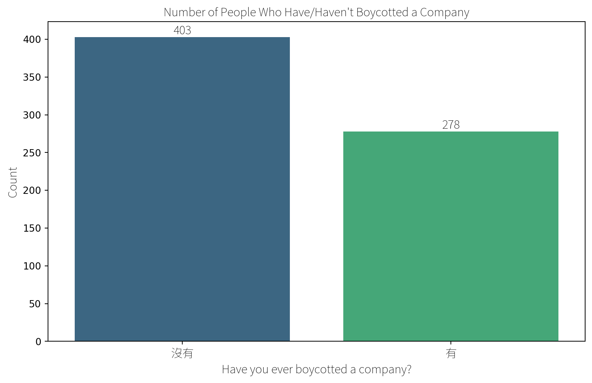

### Why Boycott

<div dangerouslySetInnerHTML={{ __html: quartoRawHtml[77] }} />

<div dangerouslySetInnerHTML={{ __html: quartoRawHtml[78] }} />

<div dangerouslySetInnerHTML={{ __html: quartoRawHtml[79] }} />

### Trusted Brands

<div dangerouslySetInnerHTML={{ __html: quartoRawHtml[80] }} />

<div dangerouslySetInnerHTML={{ __html: quartoRawHtml[81] }} />

<div dangerouslySetInnerHTML={{ __html: quartoRawHtml[82] }} />

The following responses were counted as “no brand”: “無”, “沒有”,
“沒有特別”, “🈚️”, “目前沒有”, “No”, “沒”, “沒有特別關注”,
“沒有特別信任的”, “不知道”, “無特別選擇”, “目前沒有完全信任的”,
“沒有特定的”, “沒有特定”, “沒有特別研究”, “目前沒有特別關注的品牌”,“N”,
“none”, “無特別”, “目前無”, “沒有特別想到”, “沒有固定的”, “x”, “沒在買”,
“nope”, “一時想不到…”, “沒有特別注意”, “無特別的品牌”,
“無絕對信任的品牌”, “不確定你說的範圍”, “還沒有”

## Choice Experiments


## Taiwanese College Student Attitudes (Overall)

These are student attitudes across all 36 likert fields without
clustering. Clustered results are available under the Personas section.

## Economy


## AI Usage


## Nature


## Environmental Protection


## Learning Environment


## Correlations Between Fields

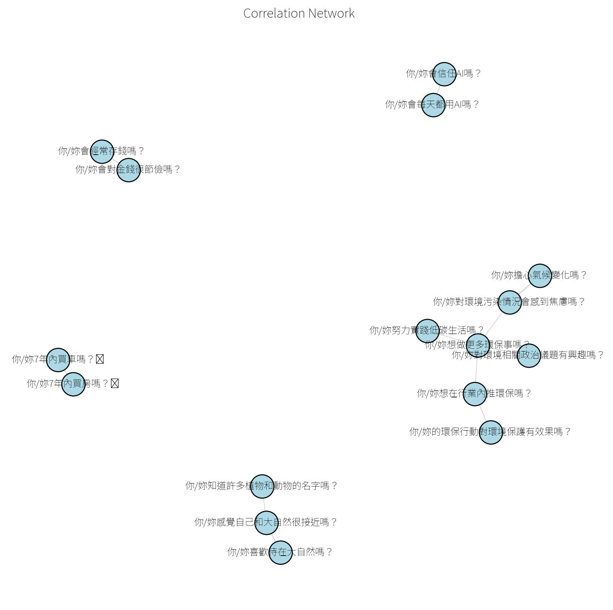

## Environmental Knowledge Ranking Experiment

Test knowledge about the environment.


Design implications: majority don’t plan to buy a house or car within 7
years, don’t focus on these categories. Majority don’t fly much, don’t
focus on flights.

## Investing

Student attitudes towards investing.

### Saving and Investing


### Investing Experience (Overall)

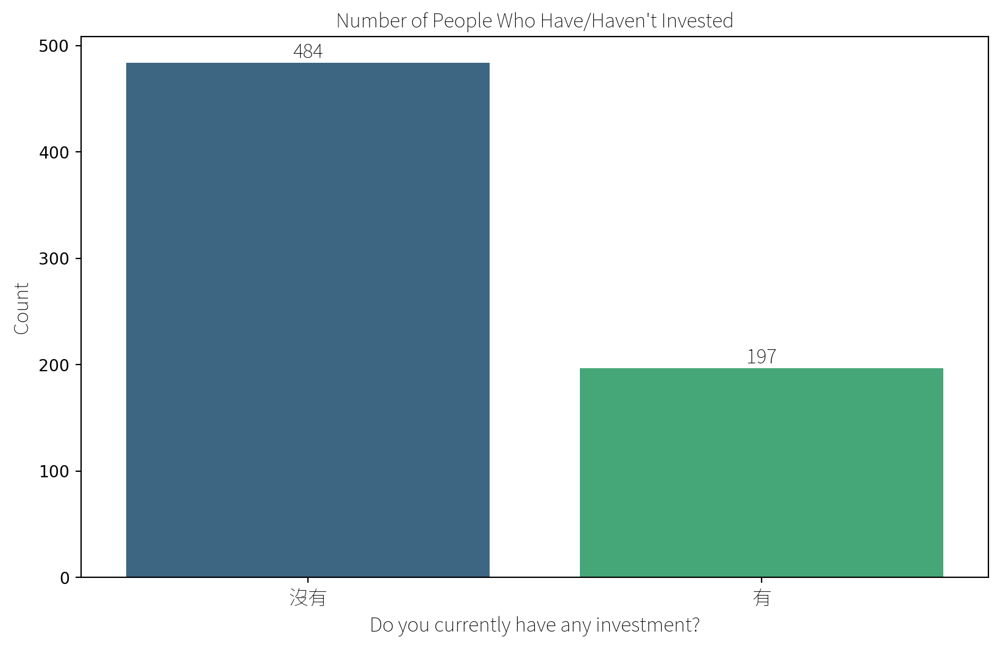

## Choice Experiment

Question: 你/妳選哪個投資？Which investment do you choose?


## Personas

### Clustering Students to Build 3 Personas

Personas are created using K-means clustering, an unsupervised machine
learning algorithm, which clusters college students based on their
responses across 36 Likert-scale fields in the online survey. Clusters
are visualized using Principal Component Analysis (PCA), where the
principal component loadings on the X and Y axes represent the weights
of the original Likert-scale fields, transformed into the principal
components that capture the most variance.

-   There is some similarity between clusters. All 3 personas report a
    high level of financial anxiety and below-average satisfaction with
    their financial literacy.

-   Principal Component Analysis (PCA) is used to convert data to lower
    dimension space. This is a predecessor of embeddings.


### Persona 1: “Eco-Friendly”

Questions Most Affecting Persona Creation include…


### Persona 2: “Moderate”

Questions Most Affecting Persona Creation include…


### Persona 3: “Frugal”

Questions Most Affecting Persona Creation include…


## Clustering Heatmap


## Mean Answer Scores

Mean response values for each Likert question in each cluster:

<div dangerouslySetInnerHTML={{ __html: quartoRawHtml[83] }} />

<div dangerouslySetInnerHTML={{ __html: quartoRawHtml[84] }} />

<div dangerouslySetInnerHTML={{ __html: quartoRawHtml[85] }} />

## Agreement between personas

Highest agreement between personas is about health, safety, pollution
and climate concerns.


## AI Companion

### Likert-Based Clustering

AI-assistant feature choices per Likert-based Personas


Want: - Product origin - Product materials - Product packaging

Don’t Want: - News - Carbon tracking - Eco-friends - …

## Feature-Based Clustering

Clustering students based on AI-assistant feature choices.

Want: - Product origin - Product materials - Product packaging - Eco
services

### Feature Preferences (Overall)

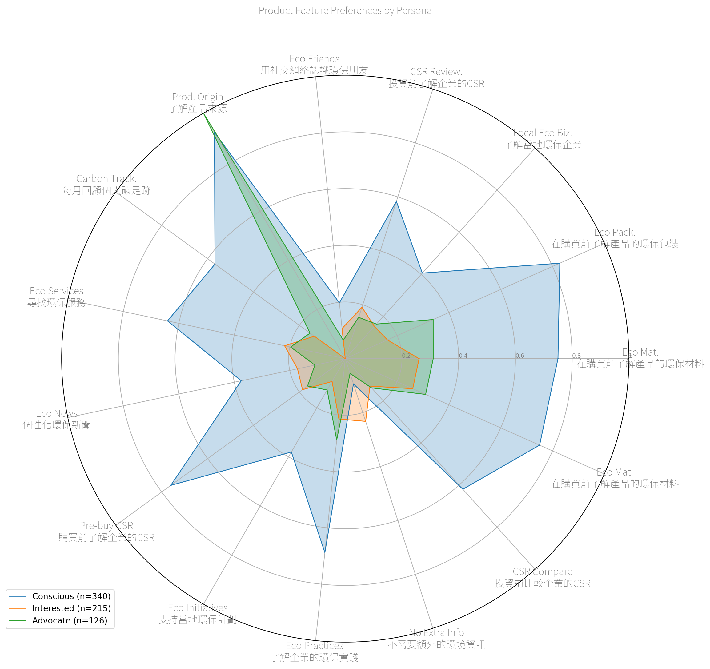

## Feature Preferences (By Cluster)


## Preferred AI Roles (Overall)


````mdx-code-block
import Figure from '/src/components/Figure';
import SankeyAll from "/research/images/experts/sankey-all.png";
import SankeyCathy from "/research/images/experts/sankey-cathy.png";
import SankeyChenying from "/research/images/experts/sankey-chenying.png";
import SankeyJessica from "/research/images/experts/sankey-jessica.png";
import SankeyPeijing from "/research/images/experts/sankey-peijing.png";
import SankeyYuping from "/research/images/experts/sankey-yuping.png";
````

## Experts

Analysis of recorded conversation from 5 experts. Thematic content
analysis using ATLAS.ti for labeling/coding the data for grounded
theory. Conversations were recorded and transcribed using Google Meet
and Fireflies AI. Labeling and thematic analysis was performed using
Atlas.ti. Visualisations were produced using Atlas.ti and Python.

## Interview 1: Designer - Cathy Wang

Date: 2023-11-10 Expert: Cathy Wang is a designer and business leader
with 20 years of experience in bringing hypergrowth and hundreds of
millions of EUR in revenue in digital transformation of industry.
Country: Taiwan / Canada Topics: Design, Business

Thematic Analysis.

````mdx-code-block
<Figure
  caption="Cathy Wang"
  src={SankeyCathy}
/>
````

## Interview 2: Accountant - Peijing Li

Date: 2023-11-18 Expert: Peijing Li is an accomplished financial
controller and accountant with experience in varied industries from
dairy to education. Country: New Zealand Topics: Economics

Thematic Analysis.

````mdx-code-block
<Figure
  caption="Peijing Li"
  src={SankeyPeijing}
/>
````

## Interview 3: Designer - Jessica Cheng

Date: 2023-12-04 Expert: Jessica Cheng is a designer with cross-industry
experience from the UK and Taiwan. Country: Taiwan Topics: Design,
Business

Thematic Analysis.

````mdx-code-block
<Figure
  caption="Jessica Cheng"
  src={SankeyJessica}
/>
````

## Interview 4: Economist - Chen-Ying Huang

Date: 2024-05-19 Expert: Chen-Ying Huang is an economist and professor
at National Taiwan University. Country: Taiwan Topics: Economics

Thematic Analysis.

````mdx-code-block
<Figure
  caption="Chen-Ying Huang"
  src={SankeyChenying}
/>
````

## Interview 5: Economist - Yuping Chen

Date: 2024-06-04 Expert: Yuping Chen is an economist and professor at
National Taiwan University with a focus on marketing and online
shopping. Country: Taiwan Topics: Economics, Online Shopping

Key learnings: “I think you are targeting experts instead of a general
consumers”

Thematic Analysis.

````mdx-code-block
<Figure
  caption="Yuping Chen"
  src={SankeyYuping}
/>
````

## Overall

Common topics between all conversations become visible in the overall
Sankey Diagram.

````mdx-code-block
<Figure
  caption="All"
  src={SankeyAll}
/>
````
````mdx-code-block
import Figure from '/src/components/Figure';
import MyEmbed from '/src/components/Embed';
import Elephant from "./images/discussion/elephant.png";
import Everything from "./images/discussion/everything.png";
````

# Discussion

College Student Willingness to pay ( WTP)

Defining the Problem Space.

-   college students can get used to looking at financial charts

## Mindmaps

Initial version of the concept map focused on the app itself.
<MyEmbed src="https://xmind.works/share/Yu5h5ikA" text="Loading Mindmap..." />

Current concept map focusing on sustainability.

<MyEmbed src="https://miro.com/app/live-embed/uXjVPEUthh4=/?moveToViewport=-768,-439,1536,876&embedId=523854480229" text="Loading Concept Map..." />

## What is Research?

I, as the researcher, am similar to the blind people in the elephant
story; focusing on greening shopping, saving, and investing are only the
trunk of the enormous elephant that is environmental disaster unfolding
in front of our eyes.

````mdx-code-block
<Figure
  caption="Illustration of the Jainist parable Anekāntavāda also known as Blind Men and an Elephant. Generated by Midjourney on August 17, 2023. Prompt: 'A simple pencil-drawn illustration of the the story Blind men and an elephant. The man touching the elephant's trunk is a research scientist. Ohara Donshu, Itcho Hanabusa, Japanese woodcut Edo style'"
  src={Elephant}
/>
````

-   Design research books
-   Koskinen (2011)
-   Ries (2011)
-   Design Studies Journal

*Research through design* is a method for *interaction design research*
in Human-Computer Interaction (HCI).

-   Zimmerman et al. (2007)

-   Salovaara (2020) defining a research question

-   Nunnally & Farkas (2016)

interview people at google who made the green filter options

-   Design artefacts

-   “design’s nature as a ‘problem-solving’ science” Oulasvirta &
    Hornbæk (2016)

-   my contribution is the design artefact, “HCI researchers also make
    constructive contributions by developing new technologies and
    design”

-   Affairs (2013) Card sorting

-   *How Models Work* (n.d.)

````mdx-code-block
<Figure
  caption="Everything"
  src={Everything}
/>
````

-   Behavirour kit:

Take the metrics from the several frameworks and display them on the
product and company level? People can choose their own framework and see
product data through that lens and vocabularies.

<div dangerouslySetInnerHTML={{ __html: quartoRawHtml[86] }} />

-   “research for design”. design research is about expanding
    opportunities and exploration

-   RanYwayZ (2016)

-   Mehmet Aydın Baytaş (2020)

-   *047* (n.d.)

-   *3 Kinds of Design Research* (n.d.)

-   *(5) Qualitative Vs. Quantitative UX Research - YouTube* (n.d.)

-   *When to Use Which UX Research Method - YouTube* (n.d.)

-   *Great UX Research for Non-Researchers Steve Portigal Awwwards San
    Francisco* (n.d.)

-   Erika Hall (n.d.)

-   Contact Kalle Lasn, Culture Jam

-   online/offline ethnographic participant observation At this stage in
    the research, the central concept being studied is defined generally
    as user expectations for a sustainable investment app.

-   What are my hypotheses?

-   User experiments

-   Financial statistics

-   Analyzing existing apps and user pain-points

-   List of topics gleaned from literature review for discussion with
    the experts:

-   Transparency and sources of ESG and similar data

-   I will test the prototype with potential users using an online
    choice experiment survey.

-   Research Process In terms of literature review, academic inquiry in
    social sciences largely follows phenomena, while the issues and
    technologies discussed here are emergent. Not many studies exist yet
    (they might in a few years), which is why some of my references are
    to company press releases and news stories, or for public companies,
    their advisory for investors.

-   Target potential retail investors aged 20-29, all genders, in
    countries with highly developed financial markets and active social
    campaigns demanding sustainability (Sweden). And Taiwan. In general,
    the Taiwanese culture is savings oriented: I’m in a good location
    for financial user experience research.

-   Set your target goals

-   Access to health care

-   Access to education

-   Climate action

I propose *interfaces* and *workflows* to see financial interactions
through the filter of sustainability.

What kind of sustainability info do college students care about? How
would college students prefer to interact with the AI? What role would
college students prefer the AI to take? How can college students trust
AI? What can college students do to aid sustainability efforts? How
might AI assistants help college students find shopping, saving, and
investing opportunities?

“Systemic change through financial actions driving policy and market
changes encourage broader industry shifts towards greener practices”.

Overconsumption-driven extractive business practices contribute to the
degradation of Earth’s natural ecosystems, pollution of water, air, and
soil, deforestation, diminishing biodiversity, climate instability,
extreme weather, modern slavery, worsening human health, and other
environmental and social challenges (ADD CITATION). Companies are
attuned to consumer demand however widespread greenwashing makes it
tiring to find sustainability-focused companies and requires extensive
time for research. Even for highly motivated people, it’s difficult to
know what’s sustainable.

My interest lies in understanding how AI assistants can help conscious
consumers become sustainable investors. The purpose of this study is to
explore how to provide the best user experience to potential sustainable
financial AI companion users. In their sustainability report every
company looks perfect. How can people shop, save and invest sustainably?
Where does our money go and what are some greener alternatives? The
companion enables people to be more transparent and responsible in their
consumption behavior.

In Taiwan water is too polluted can’t swim

air is too dirty can’t breather (show my own stats)

Start local then go global with backup data from global sources

Ask chatgpt how to organize my sections

rq: how to connect env destruction pollution to source causes

rq: how to connect everyday financial actions to environmental impact in
a visual/ meaningful way

idea came riding my bike in annan can’t swim in yhe annan river

show local pollution map?

show factories on the map

instead of the browser pluging just make a website where you can share
the link of the product (and cache rhe results)

on ios can use the share screen to share to the app?

ICID calls upon us to have the courage to redesign entire industries

This research takes place at the intersection of Taiwanese college
students, sustainability, finance, AI, and design.

For the average person like myself, my experience with money is mostly
limited to buying things at the supermarket. Food, clothes, furniture,
soap, mobile phone. This leaves very few options on how to start with
something new like saving and investing.

Could the Green Supermarket become the entry point to Green Savings and
Green Investing?

Oboarding more people for sustainable practices is a complex interaction
design issue hindered by ambiguous data (what is sustainable?) and messy
human motivations (we love buying things).

What can people who want to preserve Earth’s environment, exactly do?
How can networks of people come together?

— LLMs enable data journalists to create stories: Big Local News (2024)

Health tracking apps paired with connected devices such as Apple Watch
filled with sensors provide one model for simple interactions to
dynamically track digital health data - also known as a quantified self.
This data allows apps to provide tips how to improve health outcomes
through small daily actions such as climbing more stairs. Small
interactions allow users to align their goals with their actions.

What would be a good interface to track sustainability? What is the user
interface at scale, useful for billions of people?

One way to influence societal outcomes is to decide where to put our
money. While our financial decisions are a vote towards the type of
businesses we want to support, is it enough?

While some people are demanding sustainability, and some governments and
companies are announcing green investment opportunities, how can
consumers discover the most suitable investment options for their
situation?

How can retail investors access and differentiate between eco-friendly
sustainability-focused investable assets?

The level of knowledge of and exposure to investing varies widely
between countries and people.

Could linking green consumption patterns with sustainable investing
provide another pathway to speed up achieving climate justice as well as
personal financial goals?

In this simplified scenario, I’m in a physical offline store, doing some
shopping. When putting a bottle of Coca Cola in my basket, my AI
companion Susan will ask me a personalized question:

Does individual climate action help?

Gen-Z college students (target users) may not have the capital to make a
financial dent today however they can be early adopter and they will be
the decision-makers in a few years.

“Like climate change, the focus on individual actions as a solution is
often misplaced, though it remains a focus of media and industry. For
decades, the petrochemical industry has offloaded responsibility onto
individuals through promoting concepts such as the”carbon footprint”,
championed in a 2004 advertising campaign by British Petroleum” Lavers
et al. (2022).

Individual efforts are too small to matter unless they’re inspired by
Community a effort

atmospheric pollution and climate change

The latest IPCC report Calvin et al. (2023)

Dimock (2019)

-   Latvian Kora app for tracking personal CO2 footprint, Earn KORA
    coins for reducing CO2 emissions (Kora Sustainability, 2019).

### Google Chrome Extenstion

While Google is the most popular browser with 3 billion users,
extentions are a relatively less knwn feature of the browser. Most
popular extenstions are Grammarly, for Taiwanese students End Note is
familiar.

However it’s only available for computers (extenntiions don’t run on
phones and tablets).

## Results

The research helps me (and others) to

-   Avoid reinventing the wheel and duplicating existing approaches.

-   It aims to help app developers maximize impact by aiding
    complementary additionality.

-   Make high-quality products. If used wisely, money can help build
    communities of sustainable impact.

Define every word in the title: “The Journey from Consumer to Investor:
Designing a Financial AI Companion for Young Adults to Help with
Sustainable Shopping, Savings, and Investing”

-   Journey - behavioral change takes time
-   Consumer - purchase goods without thinking about the effect
-   Investor - thinking about the return
-   Design - decisions
-   Financial - dealing with money
-   AI Companion - automated sidekick
-   Young Adults - College Students
-   Help - to be of assistance
-   Sustainable Shopping - shopping understanding the consequences
-   Sustainable Saving - in this context I mean Sustainable Savings,
    that is reducing one’s environmental footprint
-   Sustainable Investing - activity of thinking longer-term

### Open-ended Questions

<MyEmbed src="https://docs.google.com/forms/d/e/1FAIpQLScq-je7rqRCNr81L4yX85WBaKjwCH3598VBFBwe0xjpD4xq3A/viewform?embedded=true" text="Loading Survey..." />

### Close-ended Questions

<MyEmbed src="https://docs.google.com/forms/d/e/1FAIpQLSekHIl6BlfdEDqLw0-RC1m1kQuOkNe9WxYX8AmvF-9WCopcJw/viewform?embedded=true" text="Loading Survey..." />

## Expert Surveys

<MyEmbed src="https://docs.google.com/forms/d/e/1FAIpQLSdJ_pNqBliyn1oAzMJkabtSFGouXBxS9MyPpsO5fPMN25Y_ag/viewform?embedded=true" text="Loading Survey..." />

## Database

Compile a database on relevant apps and companies in the space

Easily access data used in this research project (please wait a bit
until it loads below). The database includes sustainability-focused apps
categorized by features and problems they try to solve, sustainable
investing apps, and links to research papers.

<MyEmbed src="https://airtable.com/embed/shr4SJcuhnfPBKLXo?backgroundColor=red" text="Loading Database..." />

## User Survey

-   Factorial Surveys (T. Li et al., 2022): “Factorial surveys is a
    research method that combines classical experiments with survey
    methodologies. Factorial surveys use short narratives, called
    vignettes, to represent various levels of independent variables that
    are too complex or unethical to create and manipulate in real-world
    or lab situations”

and a including a choice experiment between potential feature sets in
consumption, savings, and investment.

Start with a simple but powerful question: — Does it matter what you
buy? — Does it matter how much you save? — Does it matter where you
invest? Why?

## Research Limitations

First, finance is a highly regulated industry and the proposed user
experience designs may be limited by legal requirements. This study does
not take such limitations into account, rather focusing only on the user
experience.

This work is focused on user experience design and does attempt to make
a contribution to economics.

ESG data is expensive so couldn’t be used in this research. ESG needs
data to give us an accurate understanding of the realities inside
companies and the user experience design does not address the underlying
data quality problem further than by providing a link to the data
source.

I don’t have access to user financial data.

-   Research Reason: While many people are working on AI models, there’s
    a lack of people working on “Human-AI interaction”. Sustainability
    is the context. How can we better team up to solve the challenges we
    face this century? The huge externalities.

## Future Research

The literature is rich and there is ample space for future research. The
following includes some suggestions for authors whose work deserves a
deeper look.

-   Does the specialized interface offer any advantages of a general UI
    such as ChatGPT, Claude, Gemini, Mistral, and others?

Some ideas for fruitful research directions

-   Perception of pollution levels among Taiwanese college students.

-   RQ: Does AI acceptance increase with Affective Computing?

# References

*047:: The "R word" in Creative Tech*. (n.d.). Retrieved June 27, 2023,
from
[https://blog.creativetechnologies.org/2020/02/047-r-word-in-creative-tech.html](https://blog.creativetechnologies.org/2020/02/047-r-word-in-creative-tech.html)

*3 Kinds of Design Research: Research for / into / through Design*.
(n.d.). Retrieved June 27, 2023, from
[https://www.youtube.com/watch?v=7niJ2a6HTBo](https://www.youtube.com/watch?v=7niJ2a6HTBo)

*(5) Qualitative vs. Quantitative UX Research - YouTube*. (n.d.).
Retrieved June 27, 2023, from
[https://www.youtube.com/watch?v=LmWPygSxMms](https://www.youtube.com/watch?v=LmWPygSxMms)

*A comprehensive guide to design systems Inside Design Blog*. (n.d.).
Retrieved June 26, 2023, from
[https://www.invisionapp.com/inside-design/guide-to-design-systems/](https://www.invisionapp.com/inside-design/guide-to-design-systems/)

Aaron O’Neill. (2023). Global GDP 1985-2028. In *Statista*.
[https://www.statista.com/statistics/268750/global-gross-domestic-product-gdp/](https://www.statista.com/statistics/268750/global-gross-domestic-product-gdp/)

Abigail Cain. (2017). The Life and Death of Microsoft Clippy, the Paper
Clip the World Loved to Hate. In *Artsy*.
[https://www.artsy.net/article/artsy-editorial-life-death-microsoft-clippy-paper-clip-loved-hate](https://www.artsy.net/article/artsy-editorial-life-death-microsoft-clippy-paper-clip-loved-hate)

Abnett, K. & Abnett, K. (2024). United States asks EU to delay
deforestation law, letter shows. *Reuters*.
[https://www.reuters.com/markets/commodities/united-states-asks-eu-delay-deforestation-law-letter-shows-2024-06-20/](https://www.reuters.com/markets/commodities/united-states-asks-eu-delay-deforestation-law-letter-shows-2024-06-20/)

Acuti, D., Lemarié, L. & Viglia, G. (2023). How to enhance the
sustainable disposal of harmful products. *Technological Forecasting and
Social Change*, *186*, 122151.
[https://doi.org/10.1016/j.techfore.2022.122151](https://doi.org/10.1016/j.techfore.2022.122151)

Ada, E., Kazancoglu, Y., Gozacan-Chase, N. & Altin, O. (2023).
Challenges for Circular Food Packaging: Circular Resources Utilization.
*Applied Food Research*, 100310.
[https://doi.org/10.1016/j.afres.2023.100310](https://doi.org/10.1016/j.afres.2023.100310)

Adam Corner. (2012). Why we need to move forward on carbon labelling.
*The Guardian*.
[https://www.theguardian.com/sustainable-business/carbon-labelling-consumer](https://www.theguardian.com/sustainable-business/carbon-labelling-consumer)

Adamkiewicz, J., Kochańska, E., Adamkiewicz, I. & Łukasik, R. M. (2022).
Greenwashing and sustainable fashion industry. *Current Opinion in Green
and Sustainable Chemistry*, *38*, 100710.
[https://doi.org/10.1016/j.cogsc.2022.100710](https://doi.org/10.1016/j.cogsc.2022.100710)

Affairs, A. S. for P. (2013). *Card Sorting*. Department of Health and
Human Services.
[https://www.usability.gov/how-to-and-tools/methods/card-sorting.html](https://www.usability.gov/how-to-and-tools/methods/card-sorting.html)

AFP. (2023). *S. Korea President Vows ’Complete Overhaul’ Of Approach To
Extreme Weather Barron’s*.
[https://www.barrons.com/news/s-korea-president-vows-complete-overhaul-of-approach-to-extreme-weather-6972b747](https://www.barrons.com/news/s-korea-president-vows-complete-overhaul-of-approach-to-extreme-weather-6972b747)

Agnew, H. (2022). RIP ESG? *Financial Times*.

AI for Good. (2023). *Listening to Nature: Harnessing AI and Acoustics
for Biodiversity Conservation*.
[https://www.youtube.com/watch?v=LX549n6UnXU](https://www.youtube.com/watch?v=LX549n6UnXU)

AI Frontiers. (2018). *Ilya Sutskever at AI Frontiers 2018: Recent
Advances in Deep Learning and AI from OpenAI*.
[https://www.youtube.com/watch?v=ElyFDUab30A](https://www.youtube.com/watch?v=ElyFDUab30A)

Aikman, D. (2022). ESG DAO is out of stealth: We’re on a mission to
re-think ESG ratings and accelerate ReFi. In *Medium*.
[https://medium.com/openesg/esg-dao-is-out-of-stealth-were-on-a-mission-to-re-think-esg-ratings-and-accelerate-refi-4f255dbd2427](https://medium.com/openesg/esg-dao-is-out-of-stealth-were-on-a-mission-to-re-think-esg-ratings-and-accelerate-refi-4f255dbd2427)

Akata, Z., Balliet, D., De Rijke, M., Dignum, F., Dignum, V., Eiben, G.,
Fokkens, A., Grossi, D., Hindriks, K., Hoos, H., Hung, H., Jonker, C.,
Monz, C., Neerincx, M., Oliehoek, F., Prakken, H., Schlobach, S., Van
Der Gaag, L., Van Harmelen, F., … Welling, M. (2020). A Research Agenda
for Hybrid Intelligence: Augmenting Human Intellect With Collaborative,
Adaptive, Responsible, and Explainable Artificial Intelligence.
*Computer*, *53*(8), 18–28.
[https://doi.org/10.1109/MC.2020.2996587](https://doi.org/10.1109/MC.2020.2996587)

Akshat Rathi. (2021). *Chris Sacca Returns With \$800 Million in Venture
Capital for Climate Tech - Bloomberg*.
[https://www.bloomberg.com/news/articles/2021-08-12/chris-sacca-returns-with-800-million-in-venture-capital-for-climate-tech#xj4y7vzkg](https://www.bloomberg.com/news/articles/2021-08-12/chris-sacca-returns-with-800-million-in-venture-capital-for-climate-tech#xj4y7vzkg)

Akshay Kore. (2022). *Designing Human-Centric AI Experiences: Applied UX
Design for Artificial Intelligence*. Apress.
[https://www.oreilly.com/library/view/designing-human-centric-ai/9781484280881/](https://www.oreilly.com/library/view/designing-human-centric-ai/9781484280881/)

Al Jazeera. (2023). *Death toll from S Korea rains hits 39; Yoon orders
all-out effort*.
[https://www.aljazeera.com/news/2023/7/17/yoon-orders-all-out-effort-after-heavy-rains-kill-39-in-s-korea](https://www.aljazeera.com/news/2023/7/17/yoon-orders-all-out-effort-after-heavy-rains-kill-39-in-s-korea)

Alammar, J. (2018). *The Illustrated Transformer*.
[https://jalammar.github.io/illustrated-transformer/](https://jalammar.github.io/illustrated-transformer/)

Alana Semuels. (2024). *World’s Most Sustainable Companies of 2024*.
[https://time.com/collection/worlds-most-sustainable-companies-2024/](https://time.com/collection/worlds-most-sustainable-companies-2024/)

Alethea AI. (2021). *Alethea AI - AI Personality Creative Writing
Class*.
[https://www.youtube.com/watch?v=PCZ4iNe5pnc](https://www.youtube.com/watch?v=PCZ4iNe5pnc)

Alex Reice. (2021). The most eco-conscious generation? Gen Z’s fashion
fixation suggests otherwise. In *The Week*.
[https://theweek.com/culture/1007212/gen-zs-fast-fashion-hypocrisy](https://theweek.com/culture/1007212/gen-zs-fast-fashion-hypocrisy)

Alex Tamkin & Deep Ganguli. (2021). *How Large Language Models Will
Transform Science, Society, and AI*.
[https://hai.stanford.edu/news/how-large-language-models-will-transform-science-society-and-ai](https://hai.stanford.edu/news/how-large-language-models-will-transform-science-society-and-ai)

Allport, G. W. (1979). *The nature of prejudice* (Unabridged, 25th
anniversary ed). Addison-Wesley Pub. Co.

Almond, R.E.A., Grooten, M., Juffe Bignoli, D. & Petersen & T. (Eds).
(2022). *Living Planet Report 2022 – Building a Naturepositive Society*.
WWF (World Wide Fund for Nature).

AltFi. (2017). ETFmatic app downloaded 100,000 times. In *AltFi*.
[https://www.altfi.com/article/3433_etfmatic_app_downloaded_100000_times](https://www.altfi.com/article/3433_etfmatic_app_downloaded_100000_times)

AltFi. (2021). Belgium’s Aion Bank has acquired London robo-advisor
ETFmatic. In *AltFi*.
[https://www.altfi.com/article/7686_belgiums-aion-bank-has-acquired-london-robo-advisor-etfmatic](https://www.altfi.com/article/7686_belgiums-aion-bank-has-acquired-london-robo-advisor-etfmatic)

Alzoubi, Y. I. & Mishra, A. (2023). Green blockchain – A move towards
sustainability. *Journal of Cleaner Production*, *430*, 139541.
[https://doi.org/10.1016/j.jclepro.2023.139541](https://doi.org/10.1016/j.jclepro.2023.139541)

Amenc, N., Goltz, F. & Naly, A. (2023). *Green Dilution: How ESG Scores
Conflict with Climate Investing*. Scientific Beta.

American Press Institute. (2022). *Knowing the news: How Gen Z and
Millennials get information on essential topics*.
[https://www.americanpressinstitute.org/publications/reports/survey-research/knowing-the-news/](https://www.americanpressinstitute.org/publications/reports/survey-research/knowing-the-news/)

Amershi, S., Weld, D., Vorvoreanu, M., Fourney, A., Nushi, B.,
Collisson, P., Suh, J., Iqbal, S., Bennett, P., Inkpen, K., Teevan, J.,
Kikin-Gil, R. & Horvitz, E. (2019, May). Guidelines for human-AI
interaction. *CHI 2019*.
[https://www.microsoft.com/en-us/research/publication/guidelines-for-human-ai-interaction/](https://www.microsoft.com/en-us/research/publication/guidelines-for-human-ai-interaction/)

Amin, S., Jamasb, T., Llorca, M., Marsiliani, L. & Renström, T. I.
(2022). Decarbonisation policies and energy price reforms in Bangladesh.
*Energy Policy*, *170*, 113224.
[https://doi.org/10.1016/j.enpol.2022.113224](https://doi.org/10.1016/j.enpol.2022.113224)

Anand Chandrasekhar & Andreas Gefe. (2021). Why Switzerland matters for
the tropical forests. In *SWI swissinfo.ch*.
[https://www.swissinfo.ch/eng/why-little-switzerland-matters-for-the-survival-of-tropical-forests/45810264](https://www.swissinfo.ch/eng/why-little-switzerland-matters-for-the-survival-of-tropical-forests/45810264)

Anderson, M. (2020). 5 Ways Artificial Intelligence Helps in Improving
Website Usability. In *IEEE Computer Society*.
[https://www.computer.org/publications/tech-news/trends/5-ways-artificial-intelligence-helps-in-improving-website-usability/](https://www.computer.org/publications/tech-news/trends/5-ways-artificial-intelligence-helps-in-improving-website-usability/)

Anderson, T. R., Hawkins, E. & Jones, P. D. (2016). CO2, the greenhouse
effect and global warming: From the pioneering work of Arrhenius and
Callendar to today’s Earth System Models. *Endeavour*, *40*(3), 178–187.
[https://doi.org/10.1016/j.endeavour.2016.07.002](https://doi.org/10.1016/j.endeavour.2016.07.002)

André, F. J. & Valenciano-Salazar, J. A. (2022). Voluntary carbon
neutral programs. Adoption and firms’ strategies. *Journal of Cleaner
Production*, 135191.
[https://doi.org/10.1016/j.jclepro.2022.135191](https://doi.org/10.1016/j.jclepro.2022.135191)

Andrés Engler. (2022). *Berkshire Hathaway Invests \$1B in Brazilian
Digital Bank Nubank, Reduces Mastercard, Visa Positions*.
[https://www.coindesk.com/business/2022/02/16/berkshire-hathaway-invests-1b-in-brazilian-digital-bank-nubank-reduces-mastercard-visa-positions/](https://www.coindesk.com/business/2022/02/16/berkshire-hathaway-invests-1b-in-brazilian-digital-bank-nubank-reduces-mastercard-visa-positions/)

Anielski, M. (2001). *Measuring the Sustainability of Nations: The
Genuine Progress Indicator System of Sustainable Well Being Accounts*.

Anna Watson. (2022). Carbon dioxide removal solutions. In *Toucan
Protocol*.
[https://blog.toucan.earth/deep-dive-carbon-removal-solutions/](https://blog.toucan.earth/deep-dive-carbon-removal-solutions/)

Anna Watson. (2023). Carbon credit retirements explained Climate Action.
In *Toucan Protocol*.
[https://blog.toucan.earth/carbon-credit-retirement/](https://blog.toucan.earth/carbon-credit-retirement/)

Anthony Leiserowitz, Jennifer Carman, Nicole Buttermore, Liz Neyens,
Seth Rosenthal, Jennifer Marlon, J.W. Schneider & Kelsey Mulcahy.
(2022). *International Public Opinion on Climate Change 2022*. Yale
Program on Climate Change Communication.
[https://policycommons.net/artifacts/2479113/international-public-opinion-on-climate-change-2022a/](https://policycommons.net/artifacts/2479113/international-public-opinion-on-climate-change-2022a/)

*Anthropic’s Responsible Scaling Policy*. (2023).
[https://www.anthropic.com/news/anthropics-responsible-scaling-policy](https://www.anthropic.com/news/anthropics-responsible-scaling-policy)

Anthropocene Fixed Income Institute (AFII). (2022). *AFII Aramco
replacement*.
[https://anthropocenefii.org/afii-aramco-replacement](https://anthropocenefii.org/afii-aramco-replacement)

Anti-ESG Crusade in US Sweeps 15 States With More Laws in Works. (2023).
In *BloombergNEF*.
[https://about.bnef.com/blog/anti-esg-crusade-in-us-sweeps-15-states-with-more-laws-in-works/](https://about.bnef.com/blog/anti-esg-crusade-in-us-sweeps-15-states-with-more-laws-in-works/)

Anton Korinek. (2023). Scenario Planning for an AGI Future. In *IMF*.
[https://www.imf.org/en/Publications/fandd/issues/2023/12/Scenario-Planning-for-an-AGI-future-Anton-korinek](https://www.imf.org/en/Publications/fandd/issues/2023/12/Scenario-Planning-for-an-AGI-future-Anton-korinek)

Apple. (2022a). *Empowering people to live a healthier day*.
[https://www.apple.com/newsroom/pdfs/Health-Report-July-2022.pdf](https://www.apple.com/newsroom/pdfs/Health-Report-July-2022.pdf)

Apple. (2022b). How Apple is empowering people with their health
information. In *Apple Newsroom*.
[https://www.apple.com/newsroom/2022/07/how-apple-is-empowering-people-with-their-health-information/](https://www.apple.com/newsroom/2022/07/how-apple-is-empowering-people-with-their-health-information/)

Apple. (2022c). *What’s new in HealthKit*.
[https://developer.apple.com/videos/play/wwdc2022/10005/](https://developer.apple.com/videos/play/wwdc2022/10005/)

Ärileht. (23.09.2022, 12:53). *Kestlikkuse suunanäitajad saadavad
teisele ringile maja ja mobiiltelefoni -
<span class="nocase">Ärileht</span>*.
[https://arileht.delfi.ee/artikkel/120071926/kestlikkuse-suunanaitajad-saadavad-teisele-ringile-maja-ja-mobiiltelefoni](https://arileht.delfi.ee/artikkel/120071926/kestlikkuse-suunanaitajad-saadavad-teisele-ringile-maja-ja-mobiiltelefoni)

Armstrong, K. & Staff, A. P. S. (2021). Cultivating Cultures of
Sustainability. *APS Observer*, *34*.
[https://www.psychologicalscience.org/observer/cultivating-cultures-sustainability](https://www.psychologicalscience.org/observer/cultivating-cultures-sustainability)

Armstrong McKay, D. I., Staal, A., Abrams, J. F., Winkelmann, R.,
Sakschewski, B., Loriani, S., Fetzer, I., Cornell, S. E., Rockström, J.
& Lenton, T. M. (2022). Exceeding 1.5$^\circ$C global warming could
trigger multiple climate tipping points. *Science*, *377*(6611),
eabn7950.
[https://doi.org/10.1126/science.abn7950](https://doi.org/10.1126/science.abn7950)

Arranz, C. F. A., Sena, V. & Kwong, C. (2022). Institutional pressures
as drivers of circular economy in firms: A machine learning approach.
*Journal of Cleaner Production*, *355*, 131738.
[https://doi.org/10.1016/j.jclepro.2022.131738](https://doi.org/10.1016/j.jclepro.2022.131738)

As You Sow. (2024a). Fossil Free Funds. In *Fossil Free Funds*.
[https://fossilfreefunds.org](https://fossilfreefunds.org)

As You Sow. (2024b). Home - Invest Your Values. In *Home - Invest Your
Values*. [https://investyourvalues.org](https://investyourvalues.org)

Aschenbrenner, L. (2024). *SITUATIONAL AWARENESS: The Decade Ahead*.

Ashraf, M. & Heavey, C. (2023). A Prototype of Supply Chain Traceability
using Solana as blockchain and IoT. *Procedia Computer Science*, *217*,
948–959.
[https://doi.org/10.1016/j.procs.2022.12.292](https://doi.org/10.1016/j.procs.2022.12.292)

Asioli, D., Fuentes-Pila, J., Alarcón, S., Han, J., Liu, J., Hocquette,
J.-F. & Nayga, R. M. (2022). Consumers’ valuation of cultured beef
Burger: A Multi-Country investigation using choice experiments. *Food
Policy*, *112*, 102376.
[https://doi.org/10.1016/j.foodpol.2022.102376](https://doi.org/10.1016/j.foodpol.2022.102376)

Atal, M. R., Riach, K., Smith, C. & McMaster, R. (2024). Adam Smith: His
continuing relevance for contemporary management thought. *European
Management Journal*, *42*(1), 4–10.
[https://doi.org/10.1016/j.emj.2024.01.005](https://doi.org/10.1016/j.emj.2024.01.005)

Atmotech. (2024). *Atmotube/aqipy*. Atmotech Inc.
[https://github.com/atmotube/aqipy](https://github.com/atmotube/aqipy)

*Atomic Design by Brad Frost*. (n.d.). Retrieved June 26, 2023, from
[http://atomicdesign.bradfrost.com/](http://atomicdesign.bradfrost.com/)

Aubrey Streit Krug & Yin Lu. (2023). *Pathways to a Perennial Food
Future*.
[https://myclimatejourney.substack.com/embed](https://myclimatejourney.substack.com/embed)

Austin Ryder. (2020). How to Become an Investor Instead of a Consumer.
In *Think Save Retire*.
[https://thinksaveretire.com/how-to-become-an-investor/](https://thinksaveretire.com/how-to-become-an-investor/)

Australian Government. (2024). Product stewardship in Australia. In
*Department of Climate Change, Energy, the Environment and Water*.
[https://www.dcceew.gov.au/environment/protection/waste/product-stewardship](https://www.dcceew.gov.au/environment/protection/waste/product-stewardship)

Ayers, J. W., Poliak, A., Dredze, M., Leas, E. C., Zhu, Z., Kelley, J.
B., Faix, D. J., Goodman, A. M., Longhurst, C. A., Hogarth, M. & Smith,
D. M. (2023). Comparing Physician and Artificial Intelligence Chatbot
Responses to Patient Questions Posted to a Public Social Media Forum.
*JAMA Internal Medicine*, *183*(6), 589.
[https://doi.org/10.1001/jamainternmed.2023.1838](https://doi.org/10.1001/jamainternmed.2023.1838)

Babich, N. (2019). Interaction Design vs UX: What’s the Difference? In
*Adobe XD Ideas*.
[https://xd.adobe.com/ideas/principles/human-computer-interaction/what-is-interaction-design/](https://xd.adobe.com/ideas/principles/human-computer-interaction/what-is-interaction-design/)

Bai, Y., Kadavath, S., Kundu, S., Askell, A., Kernion, J., Jones, A.,
Chen, A., Goldie, A., Mirhoseini, A., McKinnon, C., Chen, C., Olsson,
C., Olah, C., Hernandez, D., Drain, D., Ganguli, D., Li, D.,
Tran-Johnson, E., Perez, E., … Kaplan, J. (2022). *Constitutional AI:
Harmlessness from AI Feedback*.
[https://doi.org/10.48550/ARXIV.2212.08073](https://doi.org/10.48550/ARXIV.2212.08073)

Bailey, J. (2023). AI in Education. In *Education Next*.
[https://www.educationnext.org/a-i-in-education-leap-into-new-era-machine-intelligence-carries-risks-challenges-promises/](https://www.educationnext.org/a-i-in-education-leap-into-new-era-machine-intelligence-carries-risks-challenges-promises/)

Bailey, J. L. & Eggereide, S. S. (2020). Mapping actors and arguments in
the Norwegian aquaculture debate. *Marine Policy*, *115*, 103898.
[https://doi.org/10.1016/j.marpol.2020.103898](https://doi.org/10.1016/j.marpol.2020.103898)

Bajarin, T. (n.d.). PC Sales Are Off 12% In 2022 - When Can We Expect
Them To Grow Again? In *Forbes*. Retrieved July 7, 2023, from
[https://www.forbes.com/sites/timbajarin/2022/09/20/pc-sales-are-off-12-in-2022when-can-we-expect-them-to-grow-again/](https://www.forbes.com/sites/timbajarin/2022/09/20/pc-sales-are-off-12-in-2022when-can-we-expect-them-to-grow-again/)

Baldi, F. & Pandimiglio, A. (2022). The role of ESG scoring and
greenwashing risk in explaining the yields of green bonds: A conceptual
framework and an econometric analysis. *Global Finance Journal*, *52*,
100711.
[https://doi.org/10.1016/j.gfj.2022.100711](https://doi.org/10.1016/j.gfj.2022.100711)

Baltic Sea Action Group. (2023). *EIT Food Regenerative Agriculture
Revolution project Q&A panel*.
[https://www.youtube.com/watch?v=7y5uPN8F0Jg](https://www.youtube.com/watch?v=7y5uPN8F0Jg)

Banham, R. (1999). *The architecture of the well-tempered environment*
(2. ed., repr). University of Chicago Press \[u.a.\].

Bankinghub. (2019). Robo advisor – new standards in asset management. In
*BankingHub*.
[https://www.bankinghub.eu/themen/robo-advisor](https://www.bankinghub.eu/themen/robo-advisor)

BankMyCell. (2022). *How Many People Have Smartphones Worldwide*.
[https://www.bankmycell.com/blog/how-many-phones-are-in-the-world](https://www.bankmycell.com/blog/how-many-phones-are-in-the-world)

Baptista, P. M., Martin, F., Ross, H., O’Connor Reina, C., Plaza, G. &
Casale, M. (2022). A systematic review of smartphone applications and
devices for obstructive sleep apnea. *Brazilian Journal of
Otorhinolaryngology*, *88*, S188–S197.
[https://doi.org/10.1016/j.bjorl.2022.01.004](https://doi.org/10.1016/j.bjorl.2022.01.004)

Barbara Friedberg. (2021). *M1 Finance vs
<span class="nocase">Betterment Robo Advisor Comparison-by Investment
Expert</span>*.
[https://www.youtube.com/watch?v=RnJkyo7N6qY](https://www.youtube.com/watch?v=RnJkyo7N6qY)

Barendregt, L. & Vaage, N. S. (2021). Speculative design as thought
experiment. *She Ji: The Journal of Design, Economics, and Innovation*,
*7*(3), 374–402.
[https://doi.org/10.1016/j.sheji.2021.06.001](https://doi.org/10.1016/j.sheji.2021.06.001)

Baron, M. (2023). *Lessons on building a viral consumer app: The story
of Saturn*.
[https://www.lennysnewsletter.com/p/367725ed-d317-4fdf-a8a2-e283f5f56bbb](https://www.lennysnewsletter.com/p/367725ed-d317-4fdf-a8a2-e283f5f56bbb)

Baroness Jones of Moulsecoomb & Caroline Lucas. (2023). Clean Air (Human
Rights) Bill \[House of Lords\]. In *Parliamentary Bills - UK
Parliament*.
[https://bills.parliament.uk/bills/3161](https://bills.parliament.uk/bills/3161)

Barrett, B. (2019). McDonald’s Acquires Machine-Learning Startup Dynamic
Yield for \$300 Million. *Wired*.
[https://www.wired.com/story/mcdonalds-big-data-dynamic-yield-acquisition/](https://www.wired.com/story/mcdonalds-big-data-dynamic-yield-acquisition/)

Bassani, F., Rodrigues, C., Marques, P. & Freire, F. (2022). Ecodesign
approach for pharmaceutical packaging based on Life Cycle Assessment.
*Science of The Total Environment*, *816*, 151565.
[https://doi.org/10.1016/j.scitotenv.2021.151565](https://doi.org/10.1016/j.scitotenv.2021.151565)

Bassett, C. (2019). The computational therapeutic: Exploring
Weizenbaum’s ELIZA as a history of the present. *AI & SOCIETY*, *34*(4),
803–812.
[https://doi.org/10.1007/s00146-018-0825-9](https://doi.org/10.1007/s00146-018-0825-9)

Bastin, J.-F., Finegold, Y., Garcia, C., Mollicone, D., Rezende, M.,
Routh, D., Zohner, C. M. & Crowther, T. W. (2019). The global tree
restoration potential. *Science*, *365*(6448), 76–79.
[https://doi.org/10.1126/science.aax0848](https://doi.org/10.1126/science.aax0848)

Battistoni, P., Di Gregorio, M., Romano, M., Sebillo, M. & Vitiello, G.
(2023). Can AI-Oriented Requirements Enhance Human-Centered Design of
Intelligent Interactive Systems? Results from a Workshop with Young HCI
Designers. *Multimodal Technologies and Interaction*, *7*(3), 24.
[https://doi.org/10.3390/mti7030024](https://doi.org/10.3390/mti7030024)

Beer, M. (2024). Wind and Solar Overtake Fossil Fuels in “Historic
Shift” for EU. In *The Energy Mix*.
[https://www.theenergymix.com/wind-and-solar-overtake-fossil-fuels-in-historic-shift-for-the-eu/](https://www.theenergymix.com/wind-and-solar-overtake-fossil-fuels-in-historic-shift-for-the-eu/)

Belonenko, T. V., Sandalyuk, N. V. & Gnevyshev, V. G. (2023).
Interaction of Rossby waves with the Gulf Stream and Kuroshio using
altimetry in a framework of a vortex layer model. *Advances in Space
Research*, *71*(5), 2384–2393.
[https://doi.org/10.1016/j.asr.2022.10.042](https://doi.org/10.1016/j.asr.2022.10.042)

Ben Martin. (2017). World’s largest wealth fund ditches coal. In *Green
Economy Coalition*.
[https://www.greeneconomycoalition.org/news-and-resources/worlds-largest-sovereign-wealth-fund-divests-from-coal](https://www.greeneconomycoalition.org/news-and-resources/worlds-largest-sovereign-wealth-fund-divests-from-coal)

Benjamin Cassidy. (2022). The Twisted Life of Clippy. *Seattle Met*.
[https://www.seattlemet.com/news-and-city-life/2022/08/origin-story-of-clippy-the-microsoft-office-assistant](https://www.seattlemet.com/news-and-city-life/2022/08/origin-story-of-clippy-the-microsoft-office-assistant)

Benyus, J. M. (2009). *Biomimicry: Innovation inspired by nature*
(Nachdr.). Perennial.

Berger, K., Baumgartner, R. J., Weinzerl, M., Bachler, J., Preston, K. &
Schöggl, J.-P. (2023). Data requirements and availabilities for a
digital battery passport – A value chain actor perspective. *Cleaner
Production Letters*, *4*, 100032.
[https://doi.org/10.1016/j.clpl.2023.100032](https://doi.org/10.1016/j.clpl.2023.100032)

Berger, K., Baumgartner, R. J., Weinzerl, M., Bachler, J. & Schöggl,
J.-P. (2023). Factors of digital product passport adoption to enable
circular information flows along the battery value chain. *Procedia
CIRP*, *116*, 528–533.
[https://doi.org/10.1016/j.procir.2023.02.089](https://doi.org/10.1016/j.procir.2023.02.089)

Berger, K., Rusch, M., Pohlmann, A., Popowicz, M., Geiger, B. C.,
Gursch, H., Schöggl, J.-P. & Baumgartner, R. J. (2023).
Confidentiality-preserving data exchange to enable sustainable product
management via digital product passports - a conceptualization.
*Procedia CIRP*, *116*, 354–359.
[https://doi.org/10.1016/j.procir.2023.02.060](https://doi.org/10.1016/j.procir.2023.02.060)

Berglund, T., Gericke, N., Boeve-de Pauw, J., Olsson, D. & Chang, T.-C.
(2020). A cross-cultural comparative study of sustainability
consciousness between students in Taiwan and Sweden. *Environment,
Development and Sustainability*, *22*(7), 6287–6313.
[https://doi.org/10.1007/s10668-019-00478-2](https://doi.org/10.1007/s10668-019-00478-2)

Bernard, A. (2022). Sustainability and superapps top Gartner’s Top 10
2023 Trends List. In *TechRepublic*.
[https://www.techrepublic.com/article/gartner-top-trends-list/](https://www.techrepublic.com/article/gartner-top-trends-list/)

Better Cotton. (2023). Better Cotton Annual Report. In *Better Cotton*.
[https://ls.bettercotton.org/who-we-are/annual-report/](https://ls.bettercotton.org/who-we-are/annual-report/)

BeZero. (2022a). Focus on Ratings. In *BeZero Carbon*.
[https://bezerocarbon.com/insights/focus-on-ratings](https://bezerocarbon.com/insights/focus-on-ratings)

BeZero. (2022b). Scaling Carbon Markets. In *BeZero Carbon*.
[https://bezerocarbon.com/insights/scaling-carbon-markets](https://bezerocarbon.com/insights/scaling-carbon-markets)

*BGMEA Home*. (n.d.). Retrieved June 26, 2023, from
[https://www.bgmea.com.bd/](https://www.bgmea.com.bd/)

Bhatia, A., Chandani, A. & Chhateja, J. (2020). Robo advisory and its
potential in addressing the behavioral biases of investors — A
qualitative study in Indian context. *Journal of Behavioral and
Experimental Finance*, *25*, 100281.
[https://doi.org/10.1016/j.jbef.2020.100281](https://doi.org/10.1016/j.jbef.2020.100281)

Big Local News. (2024). *Expert Share: Simon Willison - Using AI for
journalism*.
[https://www.youtube.com/watch?v=BJxPKr6ixSM](https://www.youtube.com/watch?v=BJxPKr6ixSM)

Bill Gates. (1982). *Bill Gates on the Next 40 Years in Technology*.
[https://www.pcmag.com/news/bill-gates-on-the-next-40-years-in-technology](https://www.pcmag.com/news/bill-gates-on-the-next-40-years-in-technology)

Bindman, P., Mendonca, E. & Mendonca, P. B. and E. (2024). ESG funds
funnel millions to meat company linked to deforestation. In *Corporate
Knights*.
[https://www.corporateknights.com/category-finance/esg-funds-jbs-deforestation/](https://www.corporateknights.com/category-finance/esg-funds-jbs-deforestation/)

Bingler, J. A., Kraus, M. & Leippold, M. (2021). Cheap Talk and
Cherry-Picking: What ClimateBert has to say on Corporate Climate Risk
Disclosures. *SSRN Electronic Journal*.
[https://doi.org/10.2139/ssrn.3796152](https://doi.org/10.2139/ssrn.3796152)

BlackRock. (2022). *ESG investing in hedge funds*.
[https://www.blackrock.com/institutions/en-us/insights/esg-investing-hedge-funds](https://www.blackrock.com/institutions/en-us/insights/esg-investing-hedge-funds)

Bleys, B. & Whitby, A. (2015). Barriers and opportunities for
alternative measures of economic welfare. *Ecological Economics*, *117*,
162–172.
[https://doi.org/10.1016/j.ecolecon.2015.06.021](https://doi.org/10.1016/j.ecolecon.2015.06.021)

Blockchain Companies Team Up To Track ESG Data. (2021). In *JPT*.
[https://jpt.spe.org/blockchain-companies-team-up-to-track-esg-data](https://jpt.spe.org/blockchain-companies-team-up-to-track-esg-data)

BlockChannel. (2017). What Is A “DAO”? How Do They Benefit Consumers? In
*BlockChannel*.
[https://medium.com/blockchannel/what-is-a-dao-how-do-they-benefit-consumers-f7a0a862f3dc](https://medium.com/blockchannel/what-is-a-dao-how-do-they-benefit-consumers-f7a0a862f3dc)

Bolei Zhou. (2022). *CVPR’22 Tutorial on Human-Centered AI for Computer
Vision*.
[https://human-centeredai.github.io/](https://human-centeredai.github.io/)

Bolognesi, E., Dreassi, A., Migliavacca, M. & Paltrinieri, A. (2024).
Mapping sustainable investing: Exploring ambiguities and consistencies
among sustainable indices. *Journal of Environmental Management*, *367*,
122081.
[https://doi.org/10.1016/j.jenvman.2024.122081](https://doi.org/10.1016/j.jenvman.2024.122081)

Bommasani, R., Hudson, D. A., Adeli, E., Altman, R., Arora, S., von Arx,
S., Bernstein, M. S., Bohg, J., Bosselut, A., Brunskill, E.,
Brynjolfsson, E., Buch, S., Card, D., Castellon, R., Chatterji, N.,
Chen, A., Creel, K., Davis, J. Q., Demszky, D., … Liang, P. (2021). *On
the Opportunities and Risks of Foundation Models*.
[https://doi.org/10.48550/ARXIV.2108.07258](https://doi.org/10.48550/ARXIV.2108.07258)

Bonasia, C. (2024). Wind and solar energy surge past fossil fuels for
first time in Europe. In *Corporate Knights*.
[https://www.corporateknights.com/energy/wind-solar-energy-surpasses-fossil-fuels-eu/](https://www.corporateknights.com/energy/wind-solar-energy-surpasses-fossil-fuels-eu/)

Bonet-Jover, A., Sepúlveda-Torres, R., Saquete, E. & Martínez-Barco, P.
(2023). A semi-automatic annotation methodology that combines
Summarization and Human-In-The-Loop to create disinformation detection
resources. *Knowledge-Based Systems*, *275*, 110723.
[https://doi.org/10.1016/j.knosys.2023.110723](https://doi.org/10.1016/j.knosys.2023.110723)

Booth, M. S. (2022). *Burning up the carbon sink: How the EU’s forest
biomass policy undermines climate mitigation, and how it can be
reformed*. Partnership for Policy Integrity.

Borrelli, S., Ramasamy, R., Wong, R. & Spiby, H. (2023). Care and
support during maternity for mothers affected by modern slavery: A
scoping review. *International Journal of Nursing Studies Advances*,
*5*, 100139.
[https://doi.org/10.1016/j.ijnsa.2023.100139](https://doi.org/10.1016/j.ijnsa.2023.100139)

Borthwick, M., Tomitsch, M. & Gaughwin, M. (2022). From human-centred to
life-centred design: Considering environmental and ethical concerns in
the design of interactive products. *Journal of Responsible Technology*,
*10*, 100032.
[https://doi.org/10.1016/j.jrt.2022.100032](https://doi.org/10.1016/j.jrt.2022.100032)

Bouscasse, H., Gabet, S., Kerneis, G., Provent, A., Rieux, C., Ben
Salem, N., Dupont, H., Troude, F., Mathy, S. & Slama, R. (2022).
Designing local air pollution policies focusing on mobility and heating
to avoid a targeted number of pollution-related deaths: Forward and
backward approaches combining air pollution modeling, health impact
assessment and cost-benefit analysis. *Environment International*,
*159*, 107030.
[https://doi.org/10.1016/j.envint.2021.107030](https://doi.org/10.1016/j.envint.2021.107030)

Bousfield, C. G., Massam, M. R., Peres, C. A. & Edwards, D. P. (2022).
Carbon payments can cost-effectively improve logging sustainability in
the Amazon. *Journal of Environmental Management*, *314*, 115094.
[https://doi.org/10.1016/j.jenvman.2022.115094](https://doi.org/10.1016/j.jenvman.2022.115094)

Bowler, D. E., Bjorkman, A. D., Dornelas, M., Myers-Smith, I. H.,
Navarro, L. M., Niamir, A., Supp, S. R., Waldock, C., Winter, M.,
Vellend, M., Blowes, S. A., Böhning-Gaese, K., Bruelheide, H., Elahi,
R., Antão, L. H., Hines, J., Isbell, F., Jones, H. P., Magurran, A. E.,
… Bates, A. E. (2020). Mapping human pressures on biodiversity across
the planet uncovers anthropogenic threat complexes. *People and Nature*,
*2*(2), 380–394.
[https://doi.org/10.1002/pan3.10071](https://doi.org/10.1002/pan3.10071)

Bowman, S. R. (2023). *Eight Things to Know about Large Language
Models*.
[https://doi.org/10.48550/ARXIV.2304.00612](https://doi.org/10.48550/ARXIV.2304.00612)

Boyd, D. S., Jackson, B., Wardlaw, J., Foody, G. M., Marsh, S. & Bales,
K. (2018). Slavery from Space: Demonstrating the role for satellite
remote sensing to inform evidence-based action related to UN SDG number
8. *ISPRS Journal of Photogrammetry and Remote Sensing*, *142*, 380–388.
[https://doi.org/10.1016/j.isprsjprs.2018.02.012](https://doi.org/10.1016/j.isprsjprs.2018.02.012)

Bradley, C. G. & Corsini, L. (2023). A literature review and analytical
framework of the sustainability of reusable packaging. *Sustainable
Production and Consumption*, *37*, 126–141.
[https://doi.org/10.1016/j.spc.2023.02.009](https://doi.org/10.1016/j.spc.2023.02.009)

Brady Dale. (2021). *Chainlink’s Founder Says DeFi and Oracles Can Help
Fight Climate Change*.
[https://www.coindesk.com/tech/2021/05/26/chainlinks-founder-says-defi-and-oracles-can-help-fight-climate-change/](https://www.coindesk.com/tech/2021/05/26/chainlinks-founder-says-defi-and-oracles-can-help-fight-climate-change/)

Branka Vuleta. (2023). Generation Z Statistics. In *99firms*.
[https://99firms.com/blog/generation-z-statistics](https://99firms.com/blog/generation-z-statistics)

Brent A. Anders. (2022/2023). Why ChatGPT is such a big deal for
education. *C2C Digital Magazine*, *Vol. 1*(18).
[https://scalar.usc.edu/works/c2c-digital-magazine-fall-2022---winter-2023/why-chatgpt-is-bigdeal-education](https://scalar.usc.edu/works/c2c-digital-magazine-fall-2022---winter-2023/why-chatgpt-is-bigdeal-education)

Brian Kateman. (2020). Carbon Labels Are Finally Coming To The Food And
Beverage Industry. In *Forbes*.
[https://www.forbes.com/sites/briankateman/2020/07/20/carbon-labels-are-finally-coming-to-the-food-and-beverage-industry/?sh=3fbe47b37c03](https://www.forbes.com/sites/briankateman/2020/07/20/carbon-labels-are-finally-coming-to-the-food-and-beverage-industry/?sh=3fbe47b37c03)

Brohan, P., Allan, R., Freeman, E., Wheeler, D., Wilkinson, C. &
Williamson, F. (2012). Constraining the temperature history of the past
millennium using early instrumental observations. *Climate of the Past*,
*8*(5), 1551–1563.
[https://doi.org/10.5194/cp-8-1551-2012](https://doi.org/10.5194/cp-8-1551-2012)

Brown, A. (2021). How Financial Chatbots Can Benefit Your Business. In
*Medium*.
[https://medium.com/@angie_brown/how-financial-chatbots-can-benefit-your-business-eddacfa435d2](https://medium.com/@angie_brown/how-financial-chatbots-can-benefit-your-business-eddacfa435d2)

BrusselsDonut. (2022). *Home (EN) - BrusselsDonut*.
[https://donut.brussels/en/homepage/](https://donut.brussels/en/homepage/)

Bubeck, S., Chandrasekaran, V., Eldan, R., Gehrke, J., Horvitz, E.,
Kamar, E., Lee, P., Lee, Y. T., Li, Y., Lundberg, S., Nori, H., Palangi,
H., Ribeiro, M. T. & Zhang, Y. (2023). *Sparks of Artificial General
Intelligence: Early experiments with GPT-4*.
[https://doi.org/10.48550/ARXIV.2303.12712](https://doi.org/10.48550/ARXIV.2303.12712)

Bui, T.-D., Tseng, J.-W., Tseng, M.-L., Wu, K.-J. & Lim, M. K. (2023).
Municipal solid waste management technological barriers: A hierarchical
structure approach in Taiwan. *Resources, Conservation and Recycling*,
*190*, 106842.
[https://doi.org/10.1016/j.resconrec.2022.106842](https://doi.org/10.1016/j.resconrec.2022.106842)

Builders for Climate Action. (2021). *Making Real Zero Carbon Buildings
with Carbon Storing Materials (What is Embodied Carbon?)*.
[https://www.youtube.com/watch?v=RSstTiuuj-Y](https://www.youtube.com/watch?v=RSstTiuuj-Y)

Bundesministerium für wirtschaftliche Zusammenarbeit und Entwicklung.
(2023). Lieferkettengesetz. In *Bundesministerium für wirtschaftliche
Zusammenarbeit und Entwicklung*.
[https://www.bmz.de/de/themen/lieferkettengesetz](https://www.bmz.de/de/themen/lieferkettengesetz)

Bunq. (2020). *Bunq*.
[https://www.bunq.com/benefits/metalcard](https://www.bunq.com/benefits/metalcard)

*Buoy Health: Check Symptoms & Find the Right Care*. (n.d.). Retrieved
June 27, 2023, from
[https://www.buoyhealth.com](https://www.buoyhealth.com)

Cabitza, F., Campagner, A., Malgieri, G., Natali, C., Schneeberger, D.,
Stoeger, K. & Holzinger, A. (2023). Quod erat demonstrandum? - Towards a
typology of the concept of explanation for the design of explainable AI.
*Expert Systems with Applications*, *213*, 118888.
[https://doi.org/10.1016/j.eswa.2022.118888](https://doi.org/10.1016/j.eswa.2022.118888)

Cafaro, P., Hansson, P. & Götmark, F. (2022). Overpopulation is a major
cause of biodiversity loss and smaller human populations are necessary
to preserve what is left. *Biological Conservation*, *272*, 109646.
[https://doi.org/10.1016/j.biocon.2022.109646](https://doi.org/10.1016/j.biocon.2022.109646)

Cahan, P. & Treutlein, B. (2023). A conversation with ChatGPT on the
role of computational systems biology in stem cell research. *Stem Cell
Reports*, *18*(1), 1–2.
[https://doi.org/10.1016/j.stemcr.2022.12.009](https://doi.org/10.1016/j.stemcr.2022.12.009)

Caio Jobim. (2022). *’Bitcoin falhou e criptomoedas vão acabar’, diz
autor de best-seller sobre futuro do dinheiro*.
[https://br.cointelegraph.com/news/bitcoin-failed-and-cryptocurrencies-will-end-says-bestselling-author-on-future-of-money](https://br.cointelegraph.com/news/bitcoin-failed-and-cryptocurrencies-will-end-says-bestselling-author-on-future-of-money)

CAITLIN STALL-PAQUET. (2021). *Fresh from the city: The rise of urban
farming*.
[https://canadiangeographic.ca/articles/fresh-from-the-city-the-rise-of-urban-farming/](https://canadiangeographic.ca/articles/fresh-from-the-city-the-rise-of-urban-farming/)

Calastone. (2020). *Millennials and investing: A detailed look at
approaches and attitudes across the globe*.
[https://www2.calastone.com/millennialsresearch](https://www2.calastone.com/millennialsresearch)

Caldarelli, G., Rossignoli, C. & Zardini, A. (2020). Overcoming the
Blockchain Oracle Problem in the Traceability of Non-Fungible Products.
*Sustainability*, *12*(6), 2391.
[https://doi.org/10.3390/su12062391](https://doi.org/10.3390/su12062391)

Calisto, F. M., Santiago, C., Nunes, N. & Nascimento, J. C. (2021).
Introduction of human-centric AI assistant to aid radiologists for
multimodal breast image classification. *International Journal of
Human-Computer Studies*, *150*, 102607.
[https://doi.org/10.1016/j.ijhcs.2021.102607](https://doi.org/10.1016/j.ijhcs.2021.102607)

Calisto, F. M., Santiago, C., Nunes, N. & Nascimento, J. C. (2022).
BreastScreening-AI: Evaluating medical intelligent agents for human-AI
interactions. *Artificial Intelligence in Medicine*, *127*, 102285.
[https://doi.org/10.1016/j.artmed.2022.102285](https://doi.org/10.1016/j.artmed.2022.102285)

Calvin, K., Dasgupta, D., Krinner, G., Mukherji, A., Thorne, P. W.,
Trisos, C., Romero, J., Aldunce, P., Barrett, K., Blanco, G., Cheung, W.
W. L., Connors, S., Denton, F., Diongue-Niang, A., Dodman, D.,
Garschagen, M., Geden, O., Hayward, B., Jones, C., … Péan, C. (2023).
*IPCC, 2023: Climate Change 2023: Synthesis Report. Contribution of
Working Groups I, II and III to the Sixth Assessment Report of the
Intergovernmental Panel on Climate Change \[Core Writing Team, H. Lee
and J. Romero (eds.)\]. IPCC, Geneva, Switzerland.* (First).
Intergovernmental Panel on Climate Change (IPCC).
[https://doi.org/10.59327/IPCC/AR6-9789291691647](https://doi.org/10.59327/IPCC/AR6-9789291691647)

Campbell-Johnston, K., Calisto Friant, M., Thapa, K., Lakerveld, D. &
Vermeulen, W. J. V. (2020). How circular is your tyre: Experiences with
extended producer responsibility from a circular economy perspective.
*Journal of Cleaner Production*, *270*, 122042.
[https://doi.org/10.1016/j.jclepro.2020.122042](https://doi.org/10.1016/j.jclepro.2020.122042)

Cao, J., Li, W. & Hasan, I. (2023). The impact of lowering carbon
emissions on corporate labour investment: A quasi-natural experiment.
*Energy Economics*, *121*, 106653.
[https://doi.org/10.1016/j.eneco.2023.106653](https://doi.org/10.1016/j.eneco.2023.106653)

Capgemini. (2022). *A World in Balance – Why sustainability ambition is
not translating to action*.
[https://prod.ucwe.capgemini.com/wp-content/uploads/2022/11/CRI_Sustainability_Transformation_Final-3.pdf](https://prod.ucwe.capgemini.com/wp-content/uploads/2022/11/CRI_Sustainability_Transformation_Final-3.pdf)

CapInstitute. (2023). *Getting Real about Artificial Intelligence -
Episode 4*.
[https://www.youtube.com/watch?v=TJw0jqCmp4E](https://www.youtube.com/watch?v=TJw0jqCmp4E)

Capponi, A., Ólafsson, S. & Zariphopoulou, T. (2019). *Personalized
Robo-Advising : An Interactive Investment Process*.

CarbonChain. (n.d.). *CarbonChain Summer 2024 Product Release*.
Retrieved August 12, 2024, from
[https://www.carbonchain.com/product-releases/summer-2024](https://www.carbonchain.com/product-releases/summer-2024)

Cardinale, B. J., Duffy, J. E., Gonzalez, A., Hooper, D. U., Perrings,
C., Venail, P., Narwani, A., Mace, G. M., Tilman, D., Wardle, D. A.,
Kinzig, A. P., Daily, G. C., Loreau, M., Grace, J. B., Larigauderie, A.,
Srivastava, D. S. & Naeem, S. (2012). Biodiversity loss and its impact
on humanity. *Nature*, *486*(7401), 59–67.
[https://doi.org/10.1038/nature11148](https://doi.org/10.1038/nature11148)

*Cargo bike FREITAG*. (n.d.). Retrieved November 18, 2022, from
[https://www.freitag.ch/en/services/cargo-bike](https://www.freitag.ch/en/services/cargo-bike)

Carlsson, F., Kataria, M. & Lampi, E. (2022). Sustainable food: Can
information from food labels make consumers switch to meat substitutes?
*Ecological Economics*, *201*, 107567.
[https://doi.org/10.1016/j.ecolecon.2022.107567](https://doi.org/10.1016/j.ecolecon.2022.107567)

Carra Wu & Chris Dixon. (2021). Investing in Friends With Benefits (a
DAO). In *a16z crypto*.
[https://a16zcrypto.com/posts/announcement/investing-in-friends-with-benefits-a-dao/](https://a16zcrypto.com/posts/announcement/investing-in-friends-with-benefits-a-dao/)

Carto. (2023). *Climate resilience, the geography of NYC taxis &
photorealistic 3D maps*.
[https://www.linkedin.com/pulse/climate-resilience-geography-nyc-taxis-photorealistic-3d-maps-carto/](https://www.linkedin.com/pulse/climate-resilience-geography-nyc-taxis-photorealistic-3d-maps-carto/)

Casper Kessels. (2022a). Guidelines for Designing an In-Car Voice
Assistant. In *The Turn Signal - a Blog About automotive UX Design*.
[https://theturnsignalblog.com](https://theturnsignalblog.com)

Casper Kessels. (2022b). Is Voice Interaction a Solution to Driver
Distraction? In *The Turn Signal - a Blog About automotive UX Design*.
[https://theturnsignalblog.com](https://theturnsignalblog.com)

Catherine Shu. (2023). Southeast Asia farm-to-table startup Secai Marche
raises Series A. In *TechCrunch*.
[https://techcrunch.com/tag/farm-to-table/](https://techcrunch.com/tag/farm-to-table/)

Cawthorn, D.-M. & Hoffman, L. C. (2016). Controversial cuisine: A global
account of the demand, supply and acceptance of “unconventional” and
“exotic” meats. *Meat Science*, *120*, 19–36.
[https://doi.org/10.1016/j.meatsci.2016.04.017](https://doi.org/10.1016/j.meatsci.2016.04.017)

CBC Radio. (2021). Extreme heat could make Athens uninhabitable, warns
city’s chief heat officer. In *CBC*.
[https://www.cbc.ca/radio/thecurrent/the-current-for-aug-4-2021-1.6128943/extreme-heat-could-make-athens-uninhabitable-warns-city-s-chief-heat-officer-1.6129268](https://www.cbc.ca/radio/thecurrent/the-current-for-aug-4-2021-1.6128943/extreme-heat-could-make-athens-uninhabitable-warns-city-s-chief-heat-officer-1.6129268)

CBS Mornings. (2023). *Full interview: "Godfather of artificial
intelligence" talks impact and potential of AI*.
[https://www.youtube.com/watch?v=qpoRO378qRY](https://www.youtube.com/watch?v=qpoRO378qRY)

CDP. (2022). *Missing the Mark: CDP temperature ratings - 2022
analysis*.

Ceballos, G., Ehrlich, P. R. & Dirzo, R. (2017). Biological annihilation
via the ongoing sixth mass extinction signaled by vertebrate population
losses and declines. *Proceedings of the National Academy of Sciences*,
*114*(30).
[https://doi.org/10.1073/pnas.1704949114](https://doi.org/10.1073/pnas.1704949114)

Celino, I. & Re Calegari, G. (2020). Submitting surveys via a
conversational interface: An evaluation of user acceptance and approach
effectiveness. *International Journal of Human-Computer Studies*, *139*,
102410.
[https://doi.org/10.1016/j.ijhcs.2020.102410](https://doi.org/10.1016/j.ijhcs.2020.102410)

Celo and Regenerative Finance - Climate and ReFi. (2021). In *Celo
Forum*.
[https://forum.celo.org/t/celo-and-regenerative-finance/1447](https://forum.celo.org/t/celo-and-regenerative-finance/1447)

Centobelli, P., Abbate, S., Nadeem, S. P. & Garza-Reyes, J. A. (2022).
Slowing the fast fashion industry: An all-round perspective. *Current
Opinion in Green and Sustainable Chemistry*, *38*, 100684.
[https://doi.org/10.1016/j.cogsc.2022.100684](https://doi.org/10.1016/j.cogsc.2022.100684)

Central Bank Digital Currency (CBDC) Tracker. (2023). In *Central Bank
Digital Currency (CBDC) Tracker*.
[https://cbdctracker.org/](https://cbdctracker.org/)

CEPR. (2022). A fair, sustainable, and prosperous Europe needs proper
navigation tools. In *CEPR*.
[https://cepr.org/voxeu/columns/fair-sustainable-and-prosperous-europe-needs-proper-navigation-tools](https://cepr.org/voxeu/columns/fair-sustainable-and-prosperous-europe-needs-proper-navigation-tools)

Ceschin, F. & Gaziulusoy, I. (2016). Evolution of design for
sustainability: From product design to design for system innovations and
transitions. *Design Studies*, *47*, 118–163.
[https://doi.org/10.1016/j.destud.2016.09.002](https://doi.org/10.1016/j.destud.2016.09.002)

Chainlink. (2022). New Report: Blockchains and Oracles Are Redefining
the Energy Industry. In *Chainlink Blog*.
[https://blog.chain.link/blockchains-and-oracles-are-redefining-the-energy-industry/](https://blog.chain.link/blockchains-and-oracles-are-redefining-the-energy-industry/)

Challenges and Opportunities in Sustainable Packaging Today. (2022). In
*Packaging World*.
[https://www.packworld.com/news/business-intelligence/article/22526141/challenges-and-opportunities-in-sustainable-packaging-today](https://www.packworld.com/news/business-intelligence/article/22526141/challenges-and-opportunities-in-sustainable-packaging-today)

Chancel, L. (2022). Global carbon inequality over 1990–2019. *Nature
Sustainability*, *5*(11), 931–938.
[https://doi.org/10.1038/s41893-022-00955-z](https://doi.org/10.1038/s41893-022-00955-z)

Chang, C.-C., Wegerif, R. & Hennessy, S. (2023). Exploring dialogic
education used to teach historical thinking within the cultural context
of East Asia: A multiple-case study in Taiwanese classrooms. *Learning,
Culture and Social Interaction*, *41*, 100729.
[https://doi.org/10.1016/j.lcsi.2023.100729](https://doi.org/10.1016/j.lcsi.2023.100729)

Chang, C.-H., Tsai, M.-L., Huang, T.-T. & Wang, Y.-C. (2021).
Authentication of fish species served in conveyor-belt sushi restaurants
in Taiwan using DNA barcoding. *Food Control*, *130*, 108264.
[https://doi.org/10.1016/j.foodcont.2021.108264](https://doi.org/10.1016/j.foodcont.2021.108264)

Chang Hsiung-feng, Wu Che-hao & Wu Kuan-hsien. (2024). Taiwan’s air 45th
most polluted in world, 3rd in East Asia - Focus Taiwan. In *Focus
Taiwan - CNA English News*.
[https://focustaiwan.tw/society/202403210013](https://focustaiwan.tw/society/202403210013)

Chang, T., Hsu, C.-M., Chen, S.-T., Wang, M.-C. & Wu, C.-F. (2023).
Revisiting economic growth and CO2 emissions nexus in Taiwan using a
mixed-frequency VAR model. *Economic Analysis and Policy*, *79*,
319–342.
[https://doi.org/10.1016/j.eap.2023.05.022](https://doi.org/10.1016/j.eap.2023.05.022)

Chant, T. D. (2022). Personal carbon-cutting app Joro raises \$10M
Series A from Sequoia, Jay-Z’s Arrive. In *TechCrunch*.
[https://techcrunch.com/2022/10/27/personal-carbon-cutting-app-joro-raises-10m-series-a-from-sequoia-jay-zs-arrive/](https://techcrunch.com/2022/10/27/personal-carbon-cutting-app-joro-raises-10m-series-a-from-sequoia-jay-zs-arrive/)

Chapman, J. (2009). Design for (Emotional) Durability. *Design Issues*,
*25*(4), 29–35.
[http://www.jstor.org/stable/20627827](http://www.jstor.org/stable/20627827)

Cheba, K., Bąk, I., Szopik-Depczyńska, K. & Ioppolo, G. (2022).
Directions of green transformation of the European Union countries.
*Ecological Indicators*, *136*, 108601.
[https://doi.org/10.1016/j.ecolind.2022.108601](https://doi.org/10.1016/j.ecolind.2022.108601)

Chen, C.-L. & Tsai, C.-H. (2016). Marine environmental awareness among
university students in Taiwan: A potential signal for sustainability of
the oceans. *Environmental Education Research*, *22*(7), 958–977.
[https://doi.org/10.1080/13504622.2015.1054266](https://doi.org/10.1080/13504622.2015.1054266)

Chen, D. & Chou, M. (2023). Social Innovation in Taiwan: Theories and
Practices. *Innovation in the Social Sciences*, *1*(1), 5–43.
[https://doi.org/10.1163/27730611-bja10003](https://doi.org/10.1163/27730611-bja10003)

Chen, Y., Duo, L., Zhao, D., Zeng, Y. & Guo, X. (2023). The response of
ecosystem vulnerability to climate change and human activities in the
Poyang lake city group, China. *Environmental Research*, *233*, 116473.
[https://doi.org/10.1016/j.envres.2023.116473](https://doi.org/10.1016/j.envres.2023.116473)

Cheng, X., Zhang, X., Yang, B. & Fu, Y. (2022). An investigation on
trust in <span class="nocase">AI-enabled</span> collaboration:
Application of AI-Driven chatbot in accommodation-based sharing economy.
*Electronic Commerce Research and Applications*, *54*, 101164.
[https://doi.org/10.1016/j.elerap.2022.101164](https://doi.org/10.1016/j.elerap.2022.101164)

Cheng, Y. & Han, X. (2022). Assessing the economic loss due to natural
disasters from outer space. *Climate Services*, *26*, 100286.
[https://doi.org/10.1016/j.cliser.2022.100286](https://doi.org/10.1016/j.cliser.2022.100286)

Cherry, M. A. & Sneirson, J. F. (2010). Beyond profit: Rethinking
corporate social responsibility and greenwashing after the BP oil
disaster. *Tul. L. Rev.*, *85*, 983.

Chiang, W.-L., Zheng, L., Sheng, Y., Angelopoulos, A. N., Li, T., Li,
D., Zhang, H., Zhu, B., Jordan, M., Gonzalez, J. E. & Stoica, I. (2024).
*Chatbot arena: An open platform for evaluating LLMs by human
preference*.
[https://arxiv.org/abs/2403.04132](https://arxiv.org/abs/2403.04132)

Chong, J., Mason, L., Pillora, S. & Giurco, D. (2009). *Product
stewardship schemes in Asia: China and Taiwan, Japan, South Korea*.
Institute for Sustainable Futures, University of Technology, Sydney.

Chouinard, Y. (2005). *Let my people go surfing: The education of a
reluctant businessman*. Penguin Press.

Chourasia, S., Tyagi, A., Pandey, S. M., Walia, R. S. & Murtaza, Q.
(2022). Sustainability of Industry 6.0 in Global Perspective: Benefits
and Challenges. *MAPAN*, *37*(2), 443–452.
[https://doi.org/10.1007/s12647-022-00541-w](https://doi.org/10.1007/s12647-022-00541-w)

Christ, K. L. & V Helliar, C. (2021). Blockchain technology and modern
slavery: Reducing deceptive recruitment in migrant worker populations.
*Journal of Business Research*, *131*, 112–120.
[https://doi.org/10.1016/j.jbusres.2021.03.065](https://doi.org/10.1016/j.jbusres.2021.03.065)

Christian Rohrer. (2022). When to Use Which User-Experience Research
Methods. In *Nielsen Norman Group*.
[https://www.nngroup.com/articles/which-ux-research-methods/](https://www.nngroup.com/articles/which-ux-research-methods/)

Christiano, P. (2021). My research methodology. In *Medium*.
[https://ai-alignment.com/my-research-methodology-b94f2751cb2c](https://ai-alignment.com/my-research-methodology-b94f2751cb2c)

Christiano, P. (2023). My views on “doom.” In *Medium*.
[https://ai-alignment.com/my-views-on-doom-4788b1cd0c72](https://ai-alignment.com/my-views-on-doom-4788b1cd0c72)

Christiano, P., Leike, J., Brown, T. B., Martic, M., Legg, S. & Amodei,
D. (2017). *Deep reinforcement learning from human preferences*.
[https://doi.org/10.48550/ARXIV.1706.03741](https://doi.org/10.48550/ARXIV.1706.03741)

Christiansen, A., Hasse, G. & Tønder, R. (2021). *Extended Producer
Responsibility in the Danish textile sector: Assessing the optimal
development and implementation*.
[https://www.researchgate.net/publication/356001841_Extended_Producer_Responsibility_in_the_Danish_textile_sector_Assessing_the_optimal_development_and_implementation](https://www.researchgate.net/publication/356001841_Extended_Producer_Responsibility_in_the_Danish_textile_sector_Assessing_the_optimal_development_and_implementation)

Christodoulou, P., Psillaki, M., Sklias, G. & Chatzichristofis, S. A.
(2023). A blockchain-based framework for effective monitoring of EU
Green Bonds. *Finance Research Letters*, *58*, 104397.
[https://doi.org/10.1016/j.frl.2023.104397](https://doi.org/10.1016/j.frl.2023.104397)

Circle Economy. (2021). *Keynote: Ilektra Kouloumpi at the Second
Utrecht Degrowth Symposium*.
[https://www.youtube.com/watch?v=0dioK2ZmEsE](https://www.youtube.com/watch?v=0dioK2ZmEsE)

Circle Economy. (2022). *The Circularity Gap Report 2022*.
[https://www.circularity-gap.world/2022](https://www.circularity-gap.world/2022)

Circularise. (2018). Flexible Transparency Part 1: How to Survive Change
and Drive it. In *Circularise*.
[https://medium.com/circularise/flexible-transparency-part-1-how-to-survive-change-and-drive-it-2f0cecebac1a](https://medium.com/circularise/flexible-transparency-part-1-how-to-survive-change-and-drive-it-2f0cecebac1a)

Circularise. (2020a). Circularise raises 1.5 million to trace plastic
supply chains. In *Circularise*.
[https://medium.com/circularise/circularise-raises-1-5-million-to-trace-plastic-supply-chains-7588efd97247](https://medium.com/circularise/circularise-raises-1-5-million-to-trace-plastic-supply-chains-7588efd97247)

Circularise. (2020b). EuPC and Circularise Plastics collaborate to
further develop the digital platform to monitor the…. In *Circularise*.
[https://medium.com/circularise/eupc-and-circularise-plastics-collaborate-to-further-develop-the-digital-platform-to-monitor-the-b59914f4f1e](https://medium.com/circularise/eupc-and-circularise-plastics-collaborate-to-further-develop-the-digital-platform-to-monitor-the-b59914f4f1e)

City of Malmö. (2017). *Green Bond Framework*.
[https://malmo.se/download/18.3bf12ae215f9d265979db3f3/1511166814294/City+of+Malmo+Green+Bond+Framework+final.pdf](https://malmo.se/download/18.3bf12ae215f9d265979db3f3/1511166814294/City+of+Malmo+Green+Bond+Framework+final.pdf)

Citywealth. (2021). ESG branding with B-Corps? In *Citywealth*.
[https://www.citywealthmag.com/news/esg-branding-with-b-corps/](https://www.citywealthmag.com/news/esg-branding-with-b-corps/)

Clean Clothes Campaign. (n.d.). \[Page\]. In *Clean Clothes Campaign*.
Retrieved June 26, 2023, from
[https://cleanclothes.org/front-page](https://cleanclothes.org/front-page)

Cleantech Group. (2023). *Global Cleantech 100*.
[https://s3.amazonaws.com/i3.cleantech/uploads/additional_resources_pdf/1/301/2023_Global_Cleantech_100_Report.pdf](https://s3.amazonaws.com/i3.cleantech/uploads/additional_resources_pdf/1/301/2023_Global_Cleantech_100_Report.pdf)

Clifford, C. (2022). How this popular Jeff Bezos quote drives Amazon’s
climate goals. In *CNBC*.
[https://www.cnbc.com/2022/10/06/how-this-popular-jeff-bezos-quote-drives-amazons-climate-goals.html](https://www.cnbc.com/2022/10/06/how-this-popular-jeff-bezos-quote-drives-amazons-climate-goals.html)

Climate Action 100+. (2023). Companies. In *Climate Action 100+*.
[https://www.climateaction100.org/whos-involved/companies/](https://www.climateaction100.org/whos-involved/companies/)

Climate Analytics & NewClimate Institute. (2023). *Climate Action
Tracker*.
[https://climateactiontracker.org/](https://climateactiontracker.org/)

Climate Bonds. (2023). Climate Bonds Interactive Data Platform. In
*Climate Bonds Initiative*.
[https://www.climatebonds.net/market/data](https://www.climatebonds.net/market/data)

Climate Bonds Initiative calls for greening of \$55trn short-term debt
market. (2022). In *The Global Treasurer*.
[https://www.theglobaltreasurer.com/2022/08/05/climate-bonds-initiative-calls-for-greening-of-55trn-short-term-debt-market/](https://www.theglobaltreasurer.com/2022/08/05/climate-bonds-initiative-calls-for-greening-of-55trn-short-term-debt-market/)

*Climate change mitigation: Reducing emissions*. (2023).
[https://www.eea.europa.eu/en/topics/in-depth/climate-change-mitigation-reducing-emissions](https://www.eea.europa.eu/en/topics/in-depth/climate-change-mitigation-reducing-emissions)

Climate Interactive. (n.d.). *En-ROADS is an online simulator that
provides policymakers, educators, businesses, the media, and the public
with the ability to test and explore cross-sector climate solutions.*
Retrieved August 2, 2024, from
[https://www.climateinteractive.org/en-roads/](https://www.climateinteractive.org/en-roads/)

Climate Interactive. (2023). *LIVE from COP28: The En-ROADS Climate
Workshop*.
[https://www.youtube.com/watch?v=PenRWvAOcAY](https://www.youtube.com/watch?v=PenRWvAOcAY)

ClimatePartner. (2020). *Labelling the carbon footprint of food and
consumer goods*.
[https://www.climatepartner.com/en/news/labelling-consumer-goods](https://www.climatepartner.com/en/news/labelling-consumer-goods)

CMB New Future of Financial AI. (n.d.). In *Huawei Enterprise*.
Retrieved June 26, 2023, from
[https://e.huawei.com/en/ict-insights/global/ict_insights/intelligent-ip-networks/foci/the-future-of-ai-in-finance](https://e.huawei.com/en/ict-insights/global/ict_insights/intelligent-ip-networks/foci/the-future-of-ai-in-finance)

*<span class="nocase">CO2-neutral</span> factories*. (n.d.). Retrieved
June 25, 2023, from
[https://www.palsgaard.com/en/responsibility/responsible-production/co2-neutral-factories](https://www.palsgaard.com/en/responsibility/responsible-production/co2-neutral-factories)

Codrington, J., Varnum, A. A., Hildebrandt, L., Pröfrock, D., Bidhan,
J., Khodamoradi, K., Höhme, A.-L., Held, M., Evans, A., Velasquez, D.,
Yarborough, C. C., Ghane-Motlagh, B., Agarwal, A., Achua, J., Pozzi, E.,
Mesquita, F., Petrella, F., Miller, D. & Ramasamy, R. (2024). Detection
of microplastics in the human penis. *International Journal of Impotence
Research*.
[https://doi.org/10.1038/s41443-024-00930-6](https://doi.org/10.1038/s41443-024-00930-6)

Cohen, M. A. & Vandenbergh, M. P. (2012). The potential role of carbon
labeling in a green economy. *Energy Economics*, *34*, S53–S63.
[https://doi.org/10.1016/j.eneco.2012.08.032](https://doi.org/10.1016/j.eneco.2012.08.032)

Colombo, J. A. & Yarovaya, L. (2024). Are crypto and non-crypto
investors alike? Evidence from a comprehensive survey in Brazil.
*Technology in Society*, *76*, 102468.
[https://doi.org/10.1016/j.techsoc.2024.102468](https://doi.org/10.1016/j.techsoc.2024.102468)

Combi, C., Amico, B., Bellazzi, R., Holzinger, A., Moore, J. H., Zitnik,
M. & Holmes, J. H. (2022). A manifesto on explainability for artificial
intelligence in medicine. *Artificial Intelligence in Medicine*, *133*,
102423.
[https://doi.org/10.1016/j.artmed.2022.102423](https://doi.org/10.1016/j.artmed.2022.102423)

Commission, E., Energy, D.-G. for, Enterprise, D.-G. for & Industry.
(2014). *Ecodesign your future : How ecodesign can help the environment
by making products smarter*. European Commission.
[https://doi.org/doi/10.2769/38512](https://doi.org/doi/10.2769/38512)

Confino, J. (2015). Beyond capitalism and socialism: Could a new
economic approach save the planet? *The Guardian*.
[https://www.theguardian.com/sustainable-business/2015/apr/21/regenerative-economy-holism-economy-climate-change-inequality](https://www.theguardian.com/sustainable-business/2015/apr/21/regenerative-economy-holism-economy-climate-change-inequality)

Connie Loizos. (2021). Marcy Venture Partners, co-founded by Jay-Z, just
closed its second fund with \$325 million. *TechCrunch*.
[https://techcrunch.com/2021/10/25/marcy-venture-partners-cofounded-by-jay-z-just-closed-its-second-fund-with-325-million/](https://techcrunch.com/2021/10/25/marcy-venture-partners-cofounded-by-jay-z-just-closed-its-second-fund-with-325-million/)

Contactless payments prevalent in Macau - City’s de facto central bank.
(2023). In *Macau Business*.
[https://www.macaubusiness.com/contactless-payments-prevalent-in-macau-citys-de-facto-central-bank/](https://www.macaubusiness.com/contactless-payments-prevalent-in-macau-citys-de-facto-central-bank/)

Copet, J., Kreuk, F., Gat, I., Remez, T., Kant, D., Synnaeve, G., Adi,
Y. & Défossez, A. (2023). *Simple and Controllable Music Generation*.
[https://doi.org/10.48550/ARXIV.2306.05284](https://doi.org/10.48550/ARXIV.2306.05284)

Cordeiro, T. & Weevers, I. (2016). Design is No Longer an Option - User
Experience (UX) in FinTech. In S. Chishti & J. Barberis (Eds.), *The
FinTech Book* (pp. 34–37). John Wiley & Sons, Ltd.
[https://doi.org/10.1002/9781119218906.ch9](https://doi.org/10.1002/9781119218906.ch9)

Corporate Knights. (2024). *Global 100*. Corporate Knights.
[https://www.corporateknights.com/rankings/global-100-rankings/](https://www.corporateknights.com/rankings/global-100-rankings/)

Costa, A. & Silva, F. (2022). Interaction Design for AI Systems: An
oriented state-of-the-art. *2022 International Congress on
Human-Computer Interaction, Optimization and Robotic Applications
(HORA)*, 1–7.
[https://doi.org/10.1109/HORA55278.2022.9800084](https://doi.org/10.1109/HORA55278.2022.9800084)

Costa, C. D. (2018). How Finnish Culture Can Teach You To Design Your
Life. In *Forbes*.
[https://www.forbes.com/sites/celinnedacosta/2018/08/30/what-finnish-culture-can-teach-you-about-life-design/](https://www.forbes.com/sites/celinnedacosta/2018/08/30/what-finnish-culture-can-teach-you-about-life-design/)

Costanza, R., d’Arge, R., De Groot, R., Farber, S., Grasso, M., Hannon,
B., Limburg, K., Naeem, S., O’Neill, R. V., Paruelo, J., Raskin, R. G.,
Sutton, P. & Van Den Belt, M. (1997). The value of the world’s ecosystem
services and natural capital. *Nature*, *387*(6630), 253–260.
[https://doi.org/10.1038/387253a0](https://doi.org/10.1038/387253a0)

Cowan, G. (2018). Robo Advisers Start to Take Hold in Europe. *Wall
Street Journal*.
[https://www.wsj.com/articles/robo-advisers-start-to-take-hold-in-europe-1517799781](https://www.wsj.com/articles/robo-advisers-start-to-take-hold-in-europe-1517799781)

Crabb, J. (2023). A rant about terrible personas. In *Medium*.
[https://uxdesign.cc/web3-personas-in-2023-a-rant-about-terrible-personas-c951992cc0e6](https://uxdesign.cc/web3-personas-in-2023-a-rant-about-terrible-personas-c951992cc0e6)

Credit Suisse. (2022). *Young consumers may drive the speed of
environmental change*.
[https://www.credit-suisse.com/about-us-news/en/articles/news-and-expertise/young-consumers-may-drive-the-speed-of-environmental-change-202202.html](https://www.credit-suisse.com/about-us-news/en/articles/news-and-expertise/young-consumers-may-drive-the-speed-of-environmental-change-202202.html)

Crenna, E., Sinkko, T. & Sala, S. (2019). Biodiversity impacts due to
food consumption in Europe. *Journal of Cleaner Production*, *227*,
378–391.
[https://doi.org/10.1016/j.jclepro.2019.04.054](https://doi.org/10.1016/j.jclepro.2019.04.054)

Creutzig, F. & Kapmeier, F. (2020). Engage, don’t preach: Active
learning triggers climate action. *Energy Research & Social Science*,
*70*, 101779.
[https://doi.org/10.1016/j.erss.2020.101779](https://doi.org/10.1016/j.erss.2020.101779)

Crippa, M., Guizzardi, D., Muntean, M., Schaaf, E., Solazzo, E.,
Monforti-Ferrario, F., Olivier, J. & Vignati, E. (2020). *Fossil CO2 and
GHG emissions of all world countries – 2020 report*. Publications
Office.

CRM Alliance. (2020). EIT Raw Materials Summit: Practical Plan for a
Greener EU. In *CRM Alliance*.
[https://www.crmalliance.eu/post/eit-raw-materials-summit-practical-plan-for-a-greener-eu](https://www.crmalliance.eu/post/eit-raw-materials-summit-practical-plan-for-a-greener-eu)

Crompton, L. (2021). The decision-point-dilemma: Yet another problem of
responsibility in human-AI interaction. *Journal of Responsible
Technology*, *7–8*, 100013.
[https://doi.org/10.1016/j.jrt.2021.100013](https://doi.org/10.1016/j.jrt.2021.100013)

Cryptocurrencies - Worldwide Statista Market Forecast. (n.d.). In
*Statista*. Retrieved June 28, 2023, from
[https://www.statista.com/outlook/dmo/fintech/digital-assets/cryptocurrencies/worldwide](https://www.statista.com/outlook/dmo/fintech/digital-assets/cryptocurrencies/worldwide)

Cuppini, N., Frapporti, M. & Pirone, M. (2022). When cities meet
platforms: Towards a trans-urban approach. *Digital Geography and
Society*, *3*, 100042.
[https://doi.org/10.1016/j.diggeo.2022.100042](https://doi.org/10.1016/j.diggeo.2022.100042)

Czaika, E. & Selin, N. E. (2017). Model use in sustainability policy
making: An experimental study. *Environmental Modelling & Software*,
*98*, 54–62.
[https://doi.org/10.1016/j.envsoft.2017.09.001](https://doi.org/10.1016/j.envsoft.2017.09.001)

Daily, G. C. (Ed.). (1997). *Nature’s services: Societal dependence on
natural ecosystems*. Island Press.

Daily, I. B. (2021). Here’s Our List Of The 100 Best ESG Companies 2021.
In *Investor’s Business Daily*.
[https://www.investors.com/news/esg-companies-list-2021-best-esg-stocks-environmental-social-governance-values-2/](https://www.investors.com/news/esg-companies-list-2021-best-esg-stocks-environmental-social-governance-values-2/)

Daisy Wolf & Pande Vijay. (2023). Where Will AI Have the Biggest Impact?
Healthcare. In *Andreessen Horowitz*.
[https://a16z.com/2023/08/02/where-will-ai-have-the-biggest-impact-healthcare/](https://a16z.com/2023/08/02/where-will-ai-have-the-biggest-impact-healthcare/)

Daly, H. E. (1997). *Beyond growth: The economics of sustainable
development* (Nachdr.). Beacon Press.

Dang, V. T. (2024). Inside Apple’s AI: Understanding the Architecture
and Innovations of AFM Models. In *Medium*.
[https://medium.com/@vantuandang1990/inside-apples-ai-understanding-the-architecture-and-innovations-of-afm-models-e6638988e257](https://medium.com/@vantuandang1990/inside-apples-ai-understanding-the-architecture-and-innovations-of-afm-models-e6638988e257)

Daniel Värjö. (2022). *Nya satelliter avslöjar dolda utsläpp av
växthusgaser*. Sveriges Radio.
[https://sverigesradio.se/avsnitt/nya-satelliter-avslojar-dolda-utslapp-av-vaxthusgaser](https://sverigesradio.se/avsnitt/nya-satelliter-avslojar-dolda-utslapp-av-vaxthusgaser)

*Datakick: The Open Product Database*. (n.d.). Retrieved June 27, 2023,
from [https://gtinsearch.org/](https://gtinsearch.org/)

Dave Wallace. (2021). *The rise of carbon-centric super apps - FinTech
Futures*.
[https://www.fintechfutures.com/2021/12/the-rise-of-carbon-centric-super-apps/](https://www.fintechfutures.com/2021/12/the-rise-of-carbon-centric-super-apps/)

David Attlee. (2022). *Buying crypto with credit cards is now indirectly
banned in Taiwan*.
[https://cointelegraph.com/news/buying-crypto-with-credit-card-is-now-indirectly-banned-in-taiwan](https://cointelegraph.com/news/buying-crypto-with-credit-card-is-now-indirectly-banned-in-taiwan)

David, D. B., Resheff, Y. S. & Tron, T. (2021). *Explainable AI and
Adoption of Financial Algorithmic Advisors: An Experimental Study* (No.
arXiv:2101.02555). arXiv.
[http://arxiv.org/abs/2101.02555](http://arxiv.org/abs/2101.02555)

David Hoang. (2022). *Creating interface studies*.
[https://www.proofofconcept.pub/p/creating-interface-studies](https://www.proofofconcept.pub/p/creating-interface-studies)

David Johnston. (2023). Smart Agent Protocol - Community Paper Version
0.2. In *Google Docs*.
[https://docs.google.com/document/d/1cutU1SerC3V7B8epopRtZUrmy34bf38W--w4oOyRs2A/edit?usp=sharing](https://docs.google.com/document/d/1cutU1SerC3V7B8epopRtZUrmy34bf38W--w4oOyRs2A/edit?usp=sharing)

David Pinto. (2023). Backlash against Nature Restoration Law shows deep
divides in European Parliament. In *France 24*.
[https://www.france24.com/en/europe/20230711-backlash-against-nature-restoration-law-shows-deep-divides-in-european-parliament](https://www.france24.com/en/europe/20230711-backlash-against-nature-restoration-law-shows-deep-divides-in-european-parliament)

David Suzuki Foundation. (2021). Well-being economies. In *David Suzuki
Foundation*.
[https://davidsuzuki.org/project/well-being-economies/](https://davidsuzuki.org/project/well-being-economies/)

Dávid Pásztor. (2018). *AI UX: 7 Principles of Designing Good AI
Products*.
[https://uxstudioteam.com/ux-blog/ai-ux/](https://uxstudioteam.com/ux-blog/ai-ux/)

Davidson, H. & Chi-hui, L. (2024). Empty classrooms, silent halls:
Taiwan’s declining birthrate forces schools to close. *The Guardian*.
[https://www.theguardian.com/world/article/2024/jun/14/taiwan-birthrate-decline-schools-close-population](https://www.theguardian.com/world/article/2024/jun/14/taiwan-birthrate-decline-schools-close-population)

DBS. (2018). *DBS launches Singapore’s first holistic digital financial
advisor "Your Financial GPS"*.
[https://www.dbs.com/newsroom/DBS_launches_Singapore_first_holistic_digital_financial_advisor_Your_Financial_GPS](https://www.dbs.com/newsroom/DBS_launches_Singapore_first_holistic_digital_financial_advisor_Your_Financial_GPS)

DBS Singapore. (n.d.). DBS LiveBetter. In *DBS*. Retrieved March 20,
2024, from
[https://www.dbs.com.sg/personal/livebetter](https://www.dbs.com.sg/personal/livebetter)

De Balie. (2018). *Kate Raworth: Creating a 21st century economy -
Doughnut Economics*.
[https://www.youtube.com/watch?v=U86VB28KYZg](https://www.youtube.com/watch?v=U86VB28KYZg)

de Otazu, R. L. de L. D., Akizu-Gardoki, O., de Ulibarri, B.,
Iturrondobeitia, M., Minguez, R. & Lizundia, E. (2022). Ecodesign
coupled with Life Cycle Assessment to reduce the environmental impacts
of an industrial enzymatic cleaner. *Sustainable Production and
Consumption*, *29*, 718–729.
[https://doi.org/10.1016/j.spc.2021.11.016](https://doi.org/10.1016/j.spc.2021.11.016)

De Queiroz-Stein, G. & Siegel, K. M. (2023). Possibilities for
mainstreaming biodiversity? Two perspectives on the concept of
bioeconomy. *Earth System Governance*, *17*, 100181.
[https://doi.org/10.1016/j.esg.2023.100181](https://doi.org/10.1016/j.esg.2023.100181)

Debnath, R., Bardhan, R., Shah, D. U., Mohaddes, K., Ramage, M. H.,
Alvarez, R. M. & Sovacool, B. K. (2022). Social media enables
people-centric climate action in the hard-to-decarbonise building
sector. *Scientific Reports*, *12*(1), 19017.
[https://doi.org/10.1038/s41598-022-23624-9](https://doi.org/10.1038/s41598-022-23624-9)

Decker Sparks, J. L., Boyd, D. S., Jackson, B., Ives, C. D. & Bales, K.
(2021). Growing evidence of the interconnections between modern slavery,
environmental degradation, and climate change. *One Earth*, *4*(2),
181–191.
[https://doi.org/10.1016/j.oneear.2021.01.015](https://doi.org/10.1016/j.oneear.2021.01.015)

*Defining AI incidents and related terms* ({{OECD Artificial
Intelligence Papers}} No. 16; OECD Artificial Intelligence Papers, Vol.
16). (2024). (Vol. 16).
[https://doi.org/10.1787/d1a8d965-en](https://doi.org/10.1787/d1a8d965-en)

Delclòs-Alió, X., Rodríguez, D. A., Medina, C., Miranda, J. J.,
Avila-Palencia, I., Targa, F., Moran, M. R., Sarmiento, O. L. &
Quistberg, D. A. (2022). Walking for transportation in large Latin
American cities: Walking-only trips and total walking events and their
sociodemographic correlates. *Transport Reviews*, *42*(3), 296–317.
[https://doi.org/10.1080/01441647.2021.1966552](https://doi.org/10.1080/01441647.2021.1966552)

Deliverect. (2024). Deliverect US What is FMCG? Understanding the
Fast-Moving Consumer Goods Industry. In *Deliverect*.
[https://www.deliverect.com/en-us/blog/fmcg-and-grocery/what-is-fmcg-understanding-the-fast-moving-consumer-goods-industry](https://www.deliverect.com/en-us/blog/fmcg-and-grocery/what-is-fmcg-understanding-the-fast-moving-consumer-goods-industry)

Design Portland. (2018). Humans Have the Final Say — Stories. In *Design
Portland*. [https://designportland.org/](https://designportland.org/)

Designing a Fintech App - The UX Design Process. (2021). In *Tivix*.
[https://www.tivix.com/blog/designing-a-fintech-app-the-ux-design-process](https://www.tivix.com/blog/designing-a-fintech-app-the-ux-design-process)

*Destination Earth Shaping Europe’s digital future*. (2023).
[https://digital-strategy.ec.europa.eu/en/policies/destination-earth](https://digital-strategy.ec.europa.eu/en/policies/destination-earth)

Detail-rich sustainable packaging Product Database is an industry first.
(2010). In *Packaging World*.
[https://www.packworld.com/news/sustainability/article/13346852/detailrich-sustainable-packaging-product-database-is-an-industry-first](https://www.packworld.com/news/sustainability/article/13346852/detailrich-sustainable-packaging-product-database-is-an-industry-first)

Deutsche Welle. (2019). *Fridays for Future global climate strike*.
[https://www.dw.com/en/fridays-for-future-global-climate-strike-live-updates/a-50505537](https://www.dw.com/en/fridays-for-future-global-climate-strike-live-updates/a-50505537)

Devlin, A. & Yang, A. (2022). Regional supply chains for decarbonising
steel: Energy efficiency and green premium mitigation. *Energy
Conversion and Management*, *254*, 115268.
[https://doi.org/10.1016/j.enconman.2022.115268](https://doi.org/10.1016/j.enconman.2022.115268)

Dew, M. A., Penkower, L. & Bromet, E. J. (1991). Effects of Unemployment
on Mental Health in the Contemporary Family. *Behavior Modification*,
*15*(4), 501–544.
[https://doi.org/10.1177/01454455910154004](https://doi.org/10.1177/01454455910154004)

Dewy. (2024). *Building a RAG "tool" with Dewy and Vercel’s Generative
UI components*.
[https://DewyKB.github.io/blog/rag-tool-vercel-gen-ai/](https://DewyKB.github.io/blog/rag-tool-vercel-gen-ai/)

Deyan Georgiev. (2023a). *39+ Smartphone Statistics You Should Know in
2023*.
[https://review42.com/resources/smartphone-statistics/](https://review42.com/resources/smartphone-statistics/)

Deyan Georgiev. (2023b). *Gen Z Statistics - What We Know About the New
Generation*.
[https://review42.com/resources/gen-z-statistics/](https://review42.com/resources/gen-z-statistics/)

dGen & PositiveBlockchain. (2021). *Blockchain & the SDGs: How
Decentralisation Can Make a Difference*.
[https://www.dgen.org/blockchain-sdgs](https://www.dgen.org/blockchain-sdgs)

Dicks, H. (2023). *The Biomimicry Revolution: Learning from Nature How
to Inhabit the Earth*. Columbia University Press.
[https://doi.org/10.7312/dick20880](https://doi.org/10.7312/dick20880)

Dicuonzo, G., Palmaccio, M. & Shini, M. (2024). ESG, governance
variables and Fintech: An empirical analysis. *Research in International
Business and Finance*, *69*, 102205.
[https://doi.org/10.1016/j.ribaf.2023.102205](https://doi.org/10.1016/j.ribaf.2023.102205)

Diduch, M. (2020). Is Economic Growth the Wrong Goal? In *Freakonomics*.
[https://freakonomics.com/podcast/is-economic-growth-the-wrong-goal-ep-429/](https://freakonomics.com/podcast/is-economic-growth-the-wrong-goal-ep-429/)

*Digital receipts and customer loyalty in one platform ReceiptHero*.
(n.d.). Retrieved June 26, 2023, from
[https://www.getreceipthero.com/](https://www.getreceipthero.com/)

Dignum, V. (2021). AI — the people and places that make, use and manage
it. *Nature*, *593*(7860), 499–500.
[https://doi.org/10.1038/d41586-021-01397-x](https://doi.org/10.1038/d41586-021-01397-x)

Dimock, M. (2019). Defining generations: Where Millennials end and
Generation Z begins. In *Pew Research Center*.
[https://www.pewresearch.org/short-reads/2019/01/17/where-millennials-end-and-generation-z-begins/](https://www.pewresearch.org/short-reads/2019/01/17/where-millennials-end-and-generation-z-begins/)

Dinerstein, E., Olson, D., Joshi, A., Vynne, C., Burgess, N. D.,
Wikramanayake, E., Hahn, N., Palminteri, S., Hedao, P., Noss, R.,
Hansen, M., Locke, H., Ellis, E. C., Jones, B., Barber, C. V., Hayes,
R., Kormos, C., Martin, V., Crist, E., … Saleem, M. (2017). An
Ecoregion-Based Approach to Protecting Half the Terrestrial Realm.
*BioScience*, *67*(6), 534–545.
[https://doi.org/10.1093/biosci/bix014](https://doi.org/10.1093/biosci/bix014)

Ditlevsen, P. & Ditlevsen, S. (2023). Warning of a forthcoming collapse
of the Atlantic meridional overturning circulation. *Nature
Communications*, *14*(1), 4254.
[https://doi.org/10.1038/s41467-023-39810-w](https://doi.org/10.1038/s41467-023-39810-w)

Doorey, D. J. (2011). The Transparent Supply Chain: From Resistance to
Implementation at Nike and Levi-Strauss. *Journal of Business Ethics*,
*103*(4), 587–603.
[https://doi.org/10.1007/s10551-011-0882-1](https://doi.org/10.1007/s10551-011-0882-1)

Doorn, P. van. (2020). 5 stocks that should thrive as the digital
payments trend ramps up. In *MarketWatch*.
[https://www.marketwatch.com/story/5-stocks-that-should-thrive-as-this-digital-trend-ramps-up-2020-07-30](https://www.marketwatch.com/story/5-stocks-that-should-thrive-as-this-digital-trend-ramps-up-2020-07-30)

Dot Go. (2023). *Dot Go*. [https://dot-go.app/](https://dot-go.app/)

Douglas, E. (2023). This summer is on track to be among Texas’ most
extreme. In *The Texas Tribune*.
[https://www.texastribune.org/2023/07/18/texas-heat-summer-extreme-weather/](https://www.texastribune.org/2023/07/18/texas-heat-summer-extreme-weather/)

Drupp, M. A., Baumgärtner, S., Meyer, M., Quaas, M. F. & Von Wehrden, H.
(2020). Between Ostrom and Nordhaus: The research landscape of
sustainability economics. *Ecological Economics*, *172*, 106620.
[https://doi.org/10.1016/j.ecolecon.2020.106620](https://doi.org/10.1016/j.ecolecon.2020.106620)

Du Toit, L. & Kotzé, L. J. (2022). Reimagining international
environmental law for the Anthropocene: An earth system law perspective.
*Earth System Governance*, *11*, 100132.
[https://doi.org/10.1016/j.esg.2022.100132](https://doi.org/10.1016/j.esg.2022.100132)

Dull, D. (2021). *Circular supply chain: 17 common questions, how any
supply chain can take the next step*. Amazon Italia Logistica.

Dunne, A. & Raby, F. (2013). *Speculative everything: Design, fiction,
and social dreaming*. The MIT Press.

Duriez, E., Morlier, J., Azzaro-Pantel, C. & Charlotte, M. (2022).
Ecodesign with topology optimization. *Procedia CIRP*, *109*, 454–459.
[https://doi.org/10.1016/j.procir.2022.05.278](https://doi.org/10.1016/j.procir.2022.05.278)

Dutta, P., Choi, T.-M., Somani, S. & Butala, R. (2020). Blockchain
technology in supply chain operations: Applications, challenges and
research opportunities. *Transportation Research Part E: Logistics and
Transportation Review*, *142*, 102067.
[https://doi.org/10.1016/j.tre.2020.102067](https://doi.org/10.1016/j.tre.2020.102067)

Dwarkesh Patel. (2024). *Mark Zuckerberg - Llama 3, \$10B Models, Caesar
Augustus, & 1 GW Datacenters*.
[https://www.youtube.com/watch?v=bc6uFV9CJGg](https://www.youtube.com/watch?v=bc6uFV9CJGg)

Dzebo, A., Iacobuţă, G. & Beaussart, R. (2023). *The Paris Agreement and
the Sustainable Development Goals: Evolving connections*. Stockholm
Environment Institute.
[https://doi.org/10.51414/sei2023.036](https://doi.org/10.51414/sei2023.036)

Earth Day. (2023). *Earth Day 2023*.
[https://www.earthday.org/earth-day-2023/](https://www.earthday.org/earth-day-2023/)

Earth.Org. (2022). The World’s 50 Most Sustainable Companies in 2021. In
*Earth.Org*.
[https://earth.org/worlds-most-sustainable-companies-in-2022/](https://earth.org/worlds-most-sustainable-companies-in-2022/)

Echeverría, L., Gimenez-Nadal, J. I. & Molina, J. A. (2022). Green
mobility and well-being. *Ecological Economics*, *195*, 107368.
[https://doi.org/10.1016/j.ecolecon.2022.107368](https://doi.org/10.1016/j.ecolecon.2022.107368)

*Ecograder*. (n.d.). Retrieved March 18, 2024, from
[https://ecograder.com/](https://ecograder.com/)

Edenbrandt, A. K. & Lagerkvist, C.-J. (2022). Consumer perceptions and
attitudes towards climate information on food. *Journal of Cleaner
Production*, *370*, 133441.
[https://doi.org/10.1016/j.jclepro.2022.133441](https://doi.org/10.1016/j.jclepro.2022.133441)

Edwards, F. & Pettersen, I. N. (2023). Speculative design for
envisioning more-than-human futures in desirable counter-cities.
*Cities*, *142*, 104553.
[https://doi.org/10.1016/j.cities.2023.104553](https://doi.org/10.1016/j.cities.2023.104553)

Eerola, T. (2022). Corporate conduct, commodity and place: Ongoing
mining and mineral exploration disputes in Finland and their
implications for the social license to operate. *Resources Policy*,
*76*, 102568.
[https://doi.org/10.1016/j.resourpol.2022.102568](https://doi.org/10.1016/j.resourpol.2022.102568)

Eesti Disainikeskus I Estonian Design Centre. (2021). *Circular Design
HOW TO session 6: Circularity in Textiles*.
[https://www.youtube.com/watch?v=pE9Xyk8eL_s](https://www.youtube.com/watch?v=pE9Xyk8eL_s)

Eesti Kunstiakadeemia. (2022). EKA arendas Euroopa tippdisainikoolidega
jäätkusuutliku disaini õpetamise tööriistad. In *Eesti Kunstiakadeemia*.
[https://www.artun.ee/eesti-kunstiakadeemia-annab-koostoos-euroopa-tippdisainikoolidega-valja-jaatkusuutliku-disaini-opetamise-tooriistad/](https://www.artun.ee/eesti-kunstiakadeemia-annab-koostoos-euroopa-tippdisainikoolidega-valja-jaatkusuutliku-disaini-opetamise-tooriistad/)

Eesti Vabariigi Valitsus. (2022). *Rohepöörde tegevusplaan*.
[https://valitsus.ee/valitsuse-eesmargid-ja-tegevused/rohepoliitika/tegevusplaan](https://valitsus.ee/valitsuse-eesmargid-ja-tegevused/rohepoliitika/tegevusplaan)

Ela Khodai. (2023). Why the VCM needs more transparency. In *Toucan
Protocol*.
[https://blog.toucan.earth/transparency-in-the-vcm/](https://blog.toucan.earth/transparency-in-the-vcm/)

Eliza Strickland. (2023). Dr. ChatGPT Will Interface With You Now. In
*IEEE Spectrum*.
[https://spectrum.ieee.org/chatgpt-medical-exam](https://spectrum.ieee.org/chatgpt-medical-exam)

Ellen MacArthur Foundation, Material Economics. (2019). *Completing the
picture: How the circular economy tackles climate change*.
[https://circulareconomy.europa.eu/platform/en/knowledge/completing-picture-how-circular-economy-tackles-climate-change](https://circulareconomy.europa.eu/platform/en/knowledge/completing-picture-how-circular-economy-tackles-climate-change)

Ellsmoor, J. (2019). New Zealand Ditches GDP For Happiness And
Wellbeing. In *Forbes*.
[https://www.forbes.com/sites/jamesellsmoor/2019/07/11/new-zealand-ditches-gdp-for-happiness-and-wellbeing/](https://www.forbes.com/sites/jamesellsmoor/2019/07/11/new-zealand-ditches-gdp-for-happiness-and-wellbeing/)

EMarketer. (2021). Almost 75% of BNPL users in the US are Gen Z or
millennials. In *EMARKETER*.
[https://www.emarketer.com/content/almost-75-of-bnpl-users-us-gen-z-millennials](https://www.emarketer.com/content/almost-75-of-bnpl-users-us-gen-z-millennials)

Emele Onu & Anthony Osae-Brown. (2022). Nigeria Caps ATM Cash
Withdrawals at \$45 Daily to Push Digital Payments. *Bloomberg*.
[https://www.bloomberg.com/news/articles/2022-12-06/nigeria-limits-cash-transactions-to-push-enaira-and-other-payments](https://www.bloomberg.com/news/articles/2022-12-06/nigeria-limits-cash-transactions-to-push-enaira-and-other-payments)

Emily Chan. (2022a). We Still Don’t Have Enough Transparency In Fashion.
In *British Vogue*.
[https://www.vogue.co.uk/fashion/article/fashion-transparency-index-2022](https://www.vogue.co.uk/fashion/article/fashion-transparency-index-2022)

Emily Chan. (2022b). Will 2022 Be The Year The Fashion Industry Finally
Faces Green Legislation? *British Vogue*.
[https://www.vogue.co.uk/fashion/article/green-legislation-fashion](https://www.vogue.co.uk/fashion/article/green-legislation-fashion)

Emily Chan. (2022c). Will The Fashion Industry Finally Face
Sustainability Legislation In 2022? British Vogue. *British Vogue*.
[https://www.vogue.co.uk/fashion/article/green-legislation-fashion](https://www.vogue.co.uk/fashion/article/green-legislation-fashion)

Empowering Digital Asset Banking. (n.d.). In *Sygnum*. Retrieved June
27, 2023, from [https://www.sygnum.com/](https://www.sygnum.com/)

Engkvist, J. (2024). Why aren’t there more UX sociologists out there? In
*Medium*.
[https://uxdesign.cc/why-arent-there-more-ux-sociologists-out-there-c57f12576f98](https://uxdesign.cc/why-arent-there-more-ux-sociologists-out-there-c57f12576f98)

Epoch AI. (2024). *Data on Notable AI Models*.
[https://epochai.org/data/notable-ai-models](https://epochai.org/data/notable-ai-models)

Eric fogg. (2020). *What is Lights Out Manufacturing? Exploring Full
Automation*.
[https://www.machinemetrics.com/blog/lights-out-manufacturing](https://www.machinemetrics.com/blog/lights-out-manufacturing)

Eric Schmidt & Ben Herold. (2022). *UX: Advanced Method and Actionable
Solutions for Product Design Success*.
[https://www.amazon.com/UX-Advanced-Actionable-Solutions-Product/dp/B0BPVYD9KX](https://www.amazon.com/UX-Advanced-Actionable-Solutions-Product/dp/B0BPVYD9KX)

Erik Brynjolfsson. (2022). The Turing Trap: The Promise & Peril of
Human-Like Artificial Intelligence. In *Stanford Digital Economy Lab*.
[https://digitaleconomy.stanford.edu/news/the-turing-trap-the-promise-peril-of-human-like-artificial-intelligence/](https://digitaleconomy.stanford.edu/news/the-turing-trap-the-promise-peril-of-human-like-artificial-intelligence/)

Erika Hall. (n.d.). *Design Research Done Right*. Retrieved June 27,
2023, from
[https://www.youtube.com/watch?v=Mv7d7ir3b60](https://www.youtube.com/watch?v=Mv7d7ir3b60)

Eriksson, M., Christensen, J. & Malefors, C. (2023). Making food waste
illegal in Sweden – Potential gains from enforcing best practice in the
public catering sector. *Sustainable Production and Consumption*, *35*,
229–237.
[https://doi.org/10.1016/j.spc.2022.11.003](https://doi.org/10.1016/j.spc.2022.11.003)

ERR. (2023). Estonian beekeepers maintain quality amid influx of cheap
synthetic imports. In *ERR*.
[https://news.err.ee/1609111277/estonian-beekeepers-maintain-quality-amid-influx-of-cheap-synthetic-imports](https://news.err.ee/1609111277/estonian-beekeepers-maintain-quality-amid-influx-of-cheap-synthetic-imports)

ERR, J. S. (2022). Komisjon tahab vähendada kiirmoekettide toodangu
jõudmist EL-i. In *ERR*.
[https://www.err.ee/1608744481/komisjon-tahab-vahendada-kiirmoekettide-toodangu-joudmist-el-i](https://www.err.ee/1608744481/komisjon-tahab-vahendada-kiirmoekettide-toodangu-joudmist-el-i)

Erratum for the Report: “The global tree restoration potential” by J.-F.
Bastin, Y. Finegold, C. Garcia, D. Mollicone, M. Rezende, D. Routh, C.
M. Zohner, T. W. Crowther and for the Technical Response “Response to
Comments on ‘The global tree restoration potential’” by J.-F. Bastin, Y.
Finegold, C. Garcia, N. Gellie, A. Lowe, D. Mollicone, M. Rezende, D.
Routh, M. Sacande, B. Sparrow, C. M. Zohner, T. W. Crowther. (2020).
*Science*, *368*(6494), eabc8905.
[https://doi.org/10.1126/science.abc8905](https://doi.org/10.1126/science.abc8905)

*ESG Analytics <span class="nocase">Real-time ESG Scores</span> and
Ratings for Companies Globally GHG Emission data*. (n.d.). Retrieved
June 27, 2023, from [https://esganalytics.io/](https://esganalytics.io/)

*ESG hedge funds Barclays Corporate & Investment Bank*. (2021).
[https://www.cib.barclays/our-insights/3-point-perspective/esg-gains-traction-among-hedge-fund-investors.html](https://www.cib.barclays/our-insights/3-point-perspective/esg-gains-traction-among-hedge-fund-investors.html)

ESG 浪潮反思：一間減碳表現優異、但產品有害健康的企業，符合 ESG 精神嗎？.
(2022). In *社企流 華文界最具影響力的社會創新主題平台*.
[https://www.seinsights.asia/article/8509](https://www.seinsights.asia/article/8509)

Eshe Nelson, Ana Swanson & Jeanna Smialek. (2023). Heat, War and Trade
Protections Raise Uncertainty for Food Prices. *The New York Times*.
[https://www.nytimes.com/2023/08/10/business/global-food-prices-volatility.html](https://www.nytimes.com/2023/08/10/business/global-food-prices-volatility.html)

Espinosa, F. & Bazairi, H. (2023). Impacts, evolution, and changes of
pressure on marine ecosystems in recent times. Toward new emerging and
unforeseen impacts within a changing world. In *Coastal Habitat
Conservation* (pp. 1–16). Elsevier.
[https://doi.org/10.1016/B978-0-323-85613-3.00004-9](https://doi.org/10.1016/B978-0-323-85613-3.00004-9)

*Estwatch - Estwatchi värskest uuringust selgub, et Eesti toidupoed...
Facebook*. (n.d.). Retrieved June 26, 2023, from
[https://www.facebook.com/eewatch/posts/2010846515763300](https://www.facebook.com/eewatch/posts/2010846515763300)

ETFmatic - Account funding of EURO accounts ceases. (2023). \[Reddit
{{Post}}\]. In *r/eupersonalfinance*.
[www.reddit.com/r/eupersonalfinance/comments/13dwn4i/etfmatic_account_funding_of_euro_accounts_ceases/](https://www.reddit.com/r/eupersonalfinance/comments/13dwn4i/etfmatic_account_funding_of_euro_accounts_ceases/)

Ethan Mollick \[@emollick\]. (2023). I think most interesting/unnerving
fast demo of the future of AI chatbots is to use the
<span class="nocase">Pi iOS</span> app, which lets you have a phone call
with a Large Language Model optimized for chat It isn’t the AI from
“Her” yet, but you can start to see the path towards AI companions.
<span class="nocase">https://t.co/agJU14ukBB</span> \[Tweet\]. In
*Twitter*.
[https://twitter.com/emollick/status/1681014444950798336](https://twitter.com/emollick/status/1681014444950798336)

Ethereum. (2023). Oracles. In *ethereum.org*.
[https://ethereum.org](https://ethereum.org)

Ethical Consumer. (n.d.). In *Ethical Consumer*. Retrieved June 26,
2023, from
[https://www.ethicalconsumer.org/](https://www.ethicalconsumer.org/)

*Ethical Savings: Everything You Need To Know Bloom Money*. (2023).
[https://bloommoney.co/learning-hub/ethical-savings-everything-you-need-to-know](https://bloommoney.co/learning-hub/ethical-savings-everything-you-need-to-know)

Etsy made mistakes, but its commitment to social responsibility wasn’t
one of them. (2017). In *Quartz*.
[https://qz.com/work/1146365/etsy-made-mistakes-from-which-other-b-corps-can-learn](https://qz.com/work/1146365/etsy-made-mistakes-from-which-other-b-corps-can-learn)

*EU reaches agreement on national emission reductions*. (2022).
[https://ec.europa.eu/commission/presscorner/detail/en/ip_22_6724](https://ec.europa.eu/commission/presscorner/detail/en/ip_22_6724)

*EU taxonomy for sustainable activities*. (n.d.). Retrieved June 17,
2023, from
[https://finance.ec.europa.eu/sustainable-finance/tools-and-standards/eu-taxonomy-sustainable-activities_en](https://finance.ec.europa.eu/sustainable-finance/tools-and-standards/eu-taxonomy-sustainable-activities_en)

*EU: Ban forest-killing products*. (2022).
[https://act.wemove.eu/campaigns/2941](https://act.wemove.eu/campaigns/2941)

Eugenia Kuyda. (2023). Replika. In *replika.com*.
[https://replika.com](https://replika.com)

Euronext. (2020). *Euronext launches suite of ESG products and services
to empower sustainable growth*.
[https://www.euronext.com/en/about/media/euronext-press-releases/euronext-launches-suite-esg-products-and-services-empower](https://www.euronext.com/en/about/media/euronext-press-releases/euronext-launches-suite-esg-products-and-services-empower)

European Central Bank. (2019). Lending and payment systems in upheaval:
The fintech challenge. In *European Central Bank*.
[https://www.ecb.europa.eu/press/key/date/2019/html/ecb.sp190226~d98d307ad4.en.html](https://www.ecb.europa.eu/press/key/date/2019/html/ecb.sp190226~d98d307ad4.en.html)

European Commission. (2019a). *A Sustainable Europe by 2030*.
[https://ec.europa.eu/info/publications/reflection-paper-towards-sustainable-europe-2030_en](https://ec.europa.eu/info/publications/reflection-paper-towards-sustainable-europe-2030_en)

European Commission. (2019b). *EU labels for benchmarks (climate, ESG)
and benchmarks’ ESG disclosures - European Commission*.
[https://finance.ec.europa.eu/sustainable-finance/disclosures/eu-labels-benchmarks-climate-esg-and-benchmarks-esg-disclosures_en](https://finance.ec.europa.eu/sustainable-finance/disclosures/eu-labels-benchmarks-climate-esg-and-benchmarks-esg-disclosures_en)

European Commission. (2019c). *The European Green Deal*.
[https://eur-lex.europa.eu/legal-content/EN/TXT/?qid=1583420149564&uri=CELEX%3A52019DC0640](https://eur-lex.europa.eu/legal-content/EN/TXT/?qid=1583420149564&uri=CELEX%3A52019DC0640)

European Commission. (2022a). *Circular Economy Action Plan: For a
cleaner and more competitive Europe*.
[https://ec.europa.eu/environment/circular-economy/pdf/new_circular_economy_action_plan.pdf](https://ec.europa.eu/environment/circular-economy/pdf/new_circular_economy_action_plan.pdf)

European Commission. (2022b). *Ecodesign for sustainable products*.
[https://commission.europa.eu/energy-climate-change-environment/standards-tools-and-labels/products-labelling-rules-and-requirements/sustainable-products/ecodesign-sustainable-products_en](https://commission.europa.eu/energy-climate-change-environment/standards-tools-and-labels/products-labelling-rules-and-requirements/sustainable-products/ecodesign-sustainable-products_en)

European Commission. (2022c). *Green Deal: New proposals to make
sustainable products the norm and boost Europe’s resource independence*.
[https://ec.europa.eu/commission/presscorner/detail/en/ip_22_2013](https://ec.europa.eu/commission/presscorner/detail/en/ip_22_2013)

European Commission. (2023a). EU and Republic of Korea - Green
Partnership \[Text\]. In *European Commission - European Commission*.
[https://ec.europa.eu/commission/presscorner/detail/en/ip_23_2816](https://ec.europa.eu/commission/presscorner/detail/en/ip_23_2816)

European Commission. (2023b). *Strategic foresight*.
[https://commission.europa.eu/strategy-and-policy/strategic-planning/strategic-foresight_en](https://commission.europa.eu/strategy-and-policy/strategic-planning/strategic-foresight_en)

European Commission. (2024). *Ecodesign for Sustainable Products
Regulation*.
[https://commission.europa.eu/energy-climate-change-environment/standards-tools-and-labels/products-labelling-rules-and-requirements/sustainable-products/ecodesign-sustainable-products-regulation_en](https://commission.europa.eu/energy-climate-change-environment/standards-tools-and-labels/products-labelling-rules-and-requirements/sustainable-products/ecodesign-sustainable-products-regulation_en)

European Council. (2022). *Fit for 55 - The EU’s plan for a green
transition*.
[https://www.consilium.europa.eu/en/policies/green-deal/fit-for-55-the-eu-plan-for-a-green-transition/](https://www.consilium.europa.eu/en/policies/green-deal/fit-for-55-the-eu-plan-for-a-green-transition/)

European Environment Agency. (2022). *Textiles and the environment: The
role of design in Europe’s circular economy*.
[https://www.eea.europa.eu/publications/textiles-and-the-environment-the](https://www.eea.europa.eu/publications/textiles-and-the-environment-the)

European Parliament. (2014). *Directive 2014/65/EU: Vols. OJ L* (No.
32014L0065).
[http://data.europa.eu/eli/dir/2014/65/oj/eng](http://data.europa.eu/eli/dir/2014/65/oj/eng)

European Parliament. (2022). *Ecodesign for sustainable products*.
[https://www.europarl.europa.eu/thinktank/en/document/EPRS_BRI(2022)733524](https://www.europarl.europa.eu/thinktank/en/document/EPRS_BRI(2022)733524)

European Parliament. (2023). *Regulation (EU) 2023/1115 of the European
Parliament and of the Council of 31 May 2023 on the making available on
the Union market and the export from the Union of certain commodities
and products associated with deforestation and forest degradation and
repealing Regulation (EU) No 995/2010 (Text with EEA relevance)*.
[http://data.europa.eu/eli/reg/2023/1115/oj/eng](http://data.europa.eu/eli/reg/2023/1115/oj/eng)

European Securities and Markets Authority. (2017). *MiFID II*.
[https://www.esma.europa.eu/policy-rules/mifid-ii-and-mifir](https://www.esma.europa.eu/policy-rules/mifid-ii-and-mifir)

European Space Agency. (2023). *AI maps icebergs 10,000 times faster
than humans*.
[https://www.esa.int/Applications/Observing_the_Earth/Copernicus/Sentinel-1/AI_maps_icebergs_10_000_times_faster_than_humans](https://www.esa.int/Applications/Observing_the_Earth/Copernicus/Sentinel-1/AI_maps_icebergs_10_000_times_faster_than_humans)

EVM maaarhitektuuri keskus. (2019). *Climate-responsive design
principles*.
[https://www.youtube.com/watch?v=M-oV22QvWwA](https://www.youtube.com/watch?v=M-oV22QvWwA)

Fabris, N. & Luburić, R. (2022). *CLIMATE CHANGE AND QUALITY OF LIFE*.

Falconer, R. (2023). Over 123 million under heat alerts as intensifying
heat wave spreads across U.S. In *Axios*.
[https://www.axios.com/2023/07/21/us-heat-wave-temperatures](https://www.axios.com/2023/07/21/us-heat-wave-temperatures)

Fanning, A. L., O’Neill, D. W., Hickel, J. & Roux, N. (2021). The social
shortfall and ecological overshoot of nations. *Nature Sustainability*,
*5*(1), 26–36.
[https://doi.org/10.1038/s41893-021-00799-z](https://doi.org/10.1038/s41893-021-00799-z)

Fanning, E., Eyres, G., Frew, R. & Kebede, B. (2023). Linking cocoa
quality attributes to its origin using geographical indications. *Food
Control*, *151*, 109825.
[https://doi.org/10.1016/j.foodcont.2023.109825](https://doi.org/10.1016/j.foodcont.2023.109825)

Fares, O. H., Lee, S. H. & Lee, O. H. F. and S. H. (2024). How TikTok’s
“underconsumption core” trend is challenging consumerism. In *Corporate
Knights*.
[https://www.corporateknights.com/category-circular-economy/tiktok-underconsumption-core-consumer-culture/](https://www.corporateknights.com/category-circular-economy/tiktok-underconsumption-core-consumer-culture/)

Fashion Revolution Foundation. (2022). *FASHION TRANSPARENCY INDEX
2022*.
[https://www.fashionrevolution.org/about/transparency/](https://www.fashionrevolution.org/about/transparency/)

FashionChecker. (2023). *FashionChecker: Wages and transparency in the
garment industry*.
[https://fashionchecker.org/](https://fashionchecker.org/)

Feifei Liu 刘菲菲. (n.d.). Prompt Controls in GenAI Chatbots: 4 Main
Uses and Best Practices. In *Nielsen Norman Group*. Retrieved August 5,
2024, from
[https://www.nngroup.com/articles/prompt-controls-genai/](https://www.nngroup.com/articles/prompt-controls-genai/)

FFC - Fair Factories ClearingHouse - Compliance Solutions. (n.d.). In
*FFC - Fair Factories Clearninghouse*. Retrieved June 26, 2023, from
[https://www.fairfactories.org](https://www.fairfactories.org)

*Fifth National Climate Assessment*. (2023). U.S. Global Change Research
Program.
[https://doi.org/10.7930/NCA5.2023](https://doi.org/10.7930/NCA5.2023)

Figma. (2023). AI: The Next Chapter in Design. In *Figma*.
[https://www.figma.com/blog/ai-the-next-chapter-in-design/](https://www.figma.com/blog/ai-the-next-chapter-in-design/)

Financial Materiality Marks Next Big ESG Investing Battle. (2023). In
*BloombergNEF*.
[https://about.bnef.com/blog/financial-materiality-marks-next-big-esg-investing-battle/](https://about.bnef.com/blog/financial-materiality-marks-next-big-esg-investing-battle/)

Financial Times. (2022). *8 Sustainability ideas that will change the
world FT Rethink*.
[https://www.youtube.com/watch?v=sMqtwbKc8EA](https://www.youtube.com/watch?v=sMqtwbKc8EA)

*Find a B Corp*. (n.d.). Retrieved June 26, 2023, from
[https://www.bcorporation.net/en-us/find-a-b-corp](https://www.bcorporation.net/en-us/find-a-b-corp)

Finkenstadt, D. J. & Handfield, R. (2021). Blurry vision: Supply chain
visibility for personal protective equipment during COVID-19. *Journal
of Purchasing and Supply Management*, *27*(3), 100689.
[https://doi.org/10.1016/j.pursup.2021.100689](https://doi.org/10.1016/j.pursup.2021.100689)

FINMA, E. F. (2021). Approval of first Swiss crypto fund. In
*Eidgenössische Finanzmarktaufsicht FINMA*.
[https://www.finma.ch/en/news/2021/09/20210929-mm-genehmigung-schweizer-kryptofonds/](https://www.finma.ch/en/news/2021/09/20210929-mm-genehmigung-schweizer-kryptofonds/)

Fioramonti, L., Coscieme, L., Costanza, R., Kubiszewski, I., Trebeck,
K., Wallis, S., Roberts, D., Mortensen, L. F., Pickett, K. E.,
Wilkinson, R., Ragnarsdottír, K. V., McGlade, J., Lovins, H. & De Vogli,
R. (2022). Wellbeing economy: An effective paradigm to mainstream
post-growth policies? *Ecological Economics*, *192*, 107261.
[https://doi.org/10.1016/j.ecolecon.2021.107261](https://doi.org/10.1016/j.ecolecon.2021.107261)

First paper money. (n.d.). In *Guinness World Records*. Retrieved June
28, 2023, from
[https://www.guinnessworldrecords.com/world-records/first-paper-money](https://www.guinnessworldrecords.com/world-records/first-paper-money)

First time world exceeds 1.5C warming limit over 12-month period.
(2024). In *Al Jazeera*.
[https://www.aljazeera.com/news/2024/2/8/first-time-world-exceeds-1-5c-warming-limit-over-12-month-period](https://www.aljazeera.com/news/2024/2/8/first-time-world-exceeds-1-5c-warming-limit-over-12-month-period)

Fischer, J., Riechers, M., Loos, J., Martin-Lopez, B. & Temperton, V. M.
(2021). Making the UN Decade on Ecosystem Restoration a
Social-Ecological Endeavour. *Trends in Ecology & Evolution*, *36*(1),
20–28.
[https://doi.org/10.1016/j.tree.2020.08.018](https://doi.org/10.1016/j.tree.2020.08.018)

Fleet Management Weekly. (2022). *Sustainable Superapp Shows Cost,
Carbon and Calories Per Minute Fleet Management Weekly*.
[https://www.youtube.com/watch?v=R2BHzbBc5kM](https://www.youtube.com/watch?v=R2BHzbBc5kM)

Fletcher, J. (2023). Generative UI and the Downfall of Digital
Experiences — The Swift Path to Average. In *Medium*.
[https://joefletcher.medium.com/generative-ui-and-the-downfall-of-digital-experiences-the-swift-path-to-average-5408f3fbdc6d](https://joefletcher.medium.com/generative-ui-and-the-downfall-of-digital-experiences-the-swift-path-to-average-5408f3fbdc6d)

Flor, R. S., Aline. (2024). “Isto não acaba aqui,” garantem jovens
portugueses sobre decisão do Tribunal Europeu. In *PÚBLICO*.
[https://www.publico.pt/2024/04/09/azul/noticia/nao-acaba-aqui-garantem-jovens-portugueses-decisao-tribunal-europeu-2086381](https://www.publico.pt/2024/04/09/azul/noticia/nao-acaba-aqui-garantem-jovens-portugueses-decisao-tribunal-europeu-2086381)

Foley, A. M., Heffron, R. J., Al Kez, D., Furszyfer Del Rio, D. D.,
McInerney, C. & Welfle, A. (2024). Restoring trust in ESG investing
through the adoption of just transition ethics. *Renewable and
Sustainable Energy Reviews*, *199*, 114557.
[https://doi.org/10.1016/j.rser.2024.114557](https://doi.org/10.1016/j.rser.2024.114557)

Ford, H. V., Jones, N. H., Davies, A. J., Godley, B. J., Jambeck, J. R.,
Napper, I. E., Suckling, C. C., Williams, G. J., Woodall, L. C. &
Koldewey, H. J. (2022). The fundamental links between climate change and
marine plastic pollution. *Science of The Total Environment*, *806*,
150392.
[https://doi.org/10.1016/j.scitotenv.2021.150392](https://doi.org/10.1016/j.scitotenv.2021.150392)

Formentini, G. & Ramanujan, D. (2023). Design for circular disassembly:
Evaluating the impacts of product end-of-life status on circularity
through the parent-action-child model. *Journal of Cleaner Production*,
*405*, 137009.
[https://doi.org/10.1016/j.jclepro.2023.137009](https://doi.org/10.1016/j.jclepro.2023.137009)

Forrester. (2024). Forrester: Global Online Retail Sales To Grow 8.9%
Annually, Reaching \$6.8 Trillion In 2028. In *Forrester*.
[https://www.forrester.com/press-newsroom/forrester-global-online-retail-sales-to-grow-8-9-annually-reaching-6-8-trillion-in-2028/](https://www.forrester.com/press-newsroom/forrester-global-online-retail-sales-to-grow-8-9-annually-reaching-6-8-trillion-in-2028/)

Fotheringham, N. (2017). *How To Create A Greener Investment Portfolio*.
[https://www.huffingtonpost.ca/nikki-fotheringham/green-investment-portfolio_b_15779446.html](https://www.huffingtonpost.ca/nikki-fotheringham/green-investment-portfolio_b_15779446.html)

Fox, J. (2007). The uncertain relationship between transparency and
accountability. *Development in Practice*, *17*(4-5), 663–671.
[https://doi.org/10.1080/09614520701469955](https://doi.org/10.1080/09614520701469955)

*FRA 2020 Remote Sensing Survey*. (2022). FAO.
[https://doi.org/10.4060/cb9970en](https://doi.org/10.4060/cb9970en)

Frances Schwartzkopff. (2022a). EU Explores Tighter Rules for ESG Funds
Amid Greenwash Concerns. In *Bloomberg*.
[https://www.bloomberg.com/news/articles/2022-11-18/eu-explores-tighter-rules-for-esg-funds-amid-greenwash-concerns#xj4y7vzkg](https://www.bloomberg.com/news/articles/2022-11-18/eu-explores-tighter-rules-for-esg-funds-amid-greenwash-concerns#xj4y7vzkg)

Frances Schwartzkopff. (2022b). *Firms Aren’t Reporting Financial Risks
of Carbon Emissions, Study Finds - Bloomberg*.
[https://www.bloomberg.com/news/articles/2022-10-05/firms-aren-t-reporting-financial-risks-of-emissions-study-finds](https://www.bloomberg.com/news/articles/2022-10-05/firms-aren-t-reporting-financial-risks-of-emissions-study-finds)

Fransen, T., Henderson, C., O’Connor, R., Alayza, N., Caldwell, M.,
Chakrabarty, S., Dixit, A., Finch, M., Kustar, A., Langer, P., Stolle,
F., Walls, G. & Welle, B. (2022). The State of Nationally Determined
Contributions: 2022. *World Resources Institute*.
[https://doi.org/10.46830/wrirpt.22.00043](https://doi.org/10.46830/wrirpt.22.00043)

Franzen, A. & Bahr, S. (2024). The development of global environmental
concern during the last three decades. *Current Research in
Environmental Sustainability*, *8*, 100260.
[https://doi.org/10.1016/j.crsust.2024.100260](https://doi.org/10.1016/j.crsust.2024.100260)

Frédéric Simon. (2020). *Commission under fire for including “carbon
sinks” into EU climate goals*.
[https://www.euractiv.com/section/climate-environment/news/commission-under-fire-for-including-carbon-sinks-into-eu-climate-goals/](https://www.euractiv.com/section/climate-environment/news/commission-under-fire-for-including-carbon-sinks-into-eu-climate-goals/)

Frédéric Simon. (2022). Europe rapidly losing its forest carbon sink,
study shows. In *www.euractiv.com*.
[https://www.euractiv.com/section/climate-environment/news/europe-rapidly-losing-its-forest-carbon-sink-study-shows/](https://www.euractiv.com/section/climate-environment/news/europe-rapidly-losing-its-forest-carbon-sink-study-shows/)

Fu, T., Gao, S., Zhao, X., Wen, J. & Yan, R. (2022). Learning towards
conversational AI: A survey. *AI Open*, *3*, 14–28.
[https://doi.org/10.1016/j.aiopen.2022.02.001](https://doi.org/10.1016/j.aiopen.2022.02.001)

Fuentes, C., Enarsson, P. & Kristoffersson, L. (2019). Unpacking package
free shopping: Alternative retailing and the reinvention of the practice
of shopping. *Journal of Retailing and Consumer Services*, *50*,
258–265.
[https://doi.org/10.1016/j.jretconser.2019.05.016](https://doi.org/10.1016/j.jretconser.2019.05.016)

Fuller, R. B. (1983). *Grunch of giants* (1st ed). St. Martin’s Press.

Future of Life Institute. (2023). *Pause Giant AI Experiments: An Open
Letter*.
[https://futureoflife.org/open-letter/pause-giant-ai-experiments/](https://futureoflife.org/open-letter/pause-giant-ai-experiments/)

GABV. (2023). Triodos Bank UK: Support for nature-based investment
projects. In *GABV - Global Alliance for Banking on Values*.
[https://www.gabv.org/think-bolder/triodos-bank-uk-support-for-nature-based-investment-projects/](https://www.gabv.org/think-bolder/triodos-bank-uk-support-for-nature-based-investment-projects/)

Gamage, A., Gangahagedara, R., Gamage, J., Jayasinghe, N., Kodikara, N.,
Suraweera, P. & Merah, O. (2023). Role of organic farming for achieving
sustainability in agriculture. *Farming System*, *1*(1), 100005.
[https://doi.org/10.1016/j.farsys.2023.100005](https://doi.org/10.1016/j.farsys.2023.100005)

Gamborg, C. & Jensen, F. S. (2017). Attitudes towards recreational
hunting: A quantitative survey of the general public in Denmark.
*Journal of Outdoor Recreation and Tourism*, *17*, 20–28.
[https://doi.org/10.1016/j.jort.2016.12.002](https://doi.org/10.1016/j.jort.2016.12.002)

Ganu, J. B. and S., Dominic Okus. (2021). Why Blockchain Can Both
Promote ESG And Accelerate Climate Transition. In *ChiefExecutive.net*.
[https://chiefexecutive.net/why-blockchain-can-both-promote-esg-and-accelerate-climate-transition/](https://chiefexecutive.net/why-blockchain-can-both-promote-esg-and-accelerate-climate-transition/)

Gao, L., la Tour, T. D., Tillman, H., Goh, G., Troll, R., Radford, A.,
Sutskever, I., Leike, J. & Wu, J. (2024). *Scaling and evaluating sparse
autoencoders*. arXiv.
[https://doi.org/10.48550/ARXIV.2406.04093](https://doi.org/10.48550/ARXIV.2406.04093)

Gao, Y., Xiong, Y., Gao, X., Jia, K., Pan, J., Bi, Y., Dai, Y., Sun, J.,
Wang, M. & Wang, H. (2023). *Retrieval-Augmented Generation for Large
Language Models: A Survey*.
[https://doi.org/10.48550/ARXIV.2312.10997](https://doi.org/10.48550/ARXIV.2312.10997)

Garcia, M. A., Liu, R., Nihart, A., El Hayek, E., Castillo, E., Barrozo,
E. R., Suter, M. A., Bleske, B., Scott, J., Forsythe, K.,
Gonzalez-Estrella, J., Aagaard, K. M. & Campen, M. J. (2024).
Quantitation and identification of microplastics accumulation in human
placental specimens using pyrolysis gas chromatography mass
spectrometry. *Toxicological Sciences*, *199*(1), 81–88.
[https://doi.org/10.1093/toxsci/kfae021](https://doi.org/10.1093/toxsci/kfae021)

Garner, A. J. (2023). Observed increases in North Atlantic tropical
cyclone peak intensification rates. *Scientific Reports*, *13*(1),
16299.
[https://doi.org/10.1038/s41598-023-42669-y](https://doi.org/10.1038/s41598-023-42669-y)

Garner, A. J., Samanta, D., Weaver, M. M. & Horton, B. P. (2024).
Changes to tropical cyclone trajectories in Southeast Asia under a
warming climate. *Npj Climate and Atmospheric Science*, *7*(1), 156.
[https://doi.org/10.1038/s41612-024-00707-0](https://doi.org/10.1038/s41612-024-00707-0)

Gates, B. (2023). AI is about to completely change how you use
computers. In *gatesnotes.com*.
[https://www.gatesnotes.com/AI-agents](https://www.gatesnotes.com/AI-agents)

Gauci, V., Pangala, S. R., Shenkin, A., Barba, J., Bastviken, D.,
Figueiredo, V., Gomez, C., Enrich-Prast, A., Sayer, E., Stauffer, T.,
Welch, B., Elias, D., McNamara, N., Allen, M. & Malhi, Y. (2024). Global
atmospheric methane uptake by upland tree woody surfaces. *Nature*,
*631*(8022), 796–800.
[https://doi.org/10.1038/s41586-024-07592-w](https://doi.org/10.1038/s41586-024-07592-w)

Gaure, S. & Golombek, R. (2022). True or not true: CO2 free electricity
generation is possible. *Energy*, *259*, 124998.
[https://doi.org/10.1016/j.energy.2022.124998](https://doi.org/10.1016/j.energy.2022.124998)

Ge Wang. (2019). Humans in the Loop: The Design of Interactive AI
Systems. In *Stanford HAI*.
[https://hai.stanford.edu/news/humans-loop-design-interactive-ai-systems](https://hai.stanford.edu/news/humans-loop-design-interactive-ai-systems)

Gelles, D. & Andreoni, M. (2023). The Ocean’s Dire Message. *The New
York Times*.
[https://www.nytimes.com/2023/08/03/climate/the-oceans-dire-message.html](https://www.nytimes.com/2023/08/03/climate/the-oceans-dire-message.html)

Gemeente Amsterdam. (2022). *The Circular Economy Monitor: An Outline
Website Onderzoek en Statistiek*.
[https://onderzoek.amsterdam.nl/publicatie/the-circular-economy-monitor-an-outline](https://onderzoek.amsterdam.nl/publicatie/the-circular-economy-monitor-an-outline)

Gemma Woodward. (2022). Good riddance ESG? 8 key problems that must be
fixed. In *New Model Adviser*.
[https://citywire.com/new-model-adviser/news/good-riddance-esg-8-key-problems-that-must-be-fixed/a2390914](https://citywire.com/new-model-adviser/news/good-riddance-esg-8-key-problems-that-must-be-fixed/a2390914)

Generative UI Design: Einstein, Galileo, and the AI Design Process.
(2023). In *Prototypr*.
[https://prototypr.io/post/generative-ai-design](https://prototypr.io/post/generative-ai-design)

Geoffrey Supran. (2022). Three Shades of Green (washing). *Algorithmic
Transparency Institute*.
[https://ati.io/three-shades-of-greenwashing/](https://ati.io/three-shades-of-greenwashing/)

George Geddes. (2019). S&P Global acquires RobecoSAM’s ESG rating
business. In *ETF Stream*.
[https://www.etfstream.com/articles/sp-global-acquires-robecosam-s-esg-rating-business](https://www.etfstream.com/articles/sp-global-acquires-robecosam-s-esg-rating-business)

GHG Protocol. (n.d.). *About Us GHG Protocol*. Retrieved July 26, 2024,
from
[https://ghgprotocol.org/about-us](https://ghgprotocol.org/about-us)

Giacalone, M., Mattera, R. & Nissi, E. (2022). Well-being analysis of
Italian provinces with spatial principal components. *Socio-Economic
Planning Sciences*, *84*, 101377.
[https://doi.org/10.1016/j.seps.2022.101377](https://doi.org/10.1016/j.seps.2022.101377)

Giannakos, M. N., Sharma, K., Papavlasopoulou, S., Pappas, I. O. &
Kostakos, V. (2020). Fitbit for learning: Towards capturing the learning
experience using wearable sensing. *International Journal of
Human-Computer Studies*, *136*, 102384.
[https://doi.org/10.1016/j.ijhcs.2019.102384](https://doi.org/10.1016/j.ijhcs.2019.102384)

Gitcoin Passport — Sybil Defense. Made Simple. \[@gitcoinpassport\].
(2023). Why did Gitcoin choose to build @GitcoinPassport as an
"aggregator" of anti-Sybil solutions? 🤔 Gitcoin Passport Workstream
Co-Lead @kevinrolsen explains:
<span class="nocase">https://t.co/QYgqp85QBm</span> \[Tweet\]. In
*Twitter*.
[https://twitter.com/gitcoinpassport/status/1684098636869943296](https://twitter.com/gitcoinpassport/status/1684098636869943296)

Giudice, F. (2020). *WeChat: The impact of the super app on Chinese
society.*
[http://dspace.unive.it/handle/10579/17293](http://dspace.unive.it/handle/10579/17293)

Global Carbon Budget. (2023). Cumulative CO$_2$ emissions. In *Our World
in Data*.
[https://ourworldindata.org/grapher/cumulative-co-emissions](https://ourworldindata.org/grapher/cumulative-co-emissions)

Global Web Index. (2017). *98% of Gen Z Own a Smartphone*.
[https://blog.gwi.com/chart-of-the-day/98-percent-of-gen-z-own-a-smartphone/](https://blog.gwi.com/chart-of-the-day/98-percent-of-gen-z-own-a-smartphone/)

Goh, S. K., Wong, K. N., McNown, R. & Chen, L.-J. (2023). Long-run
macroeconomic consequences of Taiwan’s aging labor force: An analysis of
policy options. *Journal of Policy Modeling*, *45*(1), 121–138.
[https://doi.org/10.1016/j.jpolmod.2023.01.006](https://doi.org/10.1016/j.jpolmod.2023.01.006)

Gold, T. B. (1986). *State and society in the Taiwan miracle*. Sharpe.

Gómez-Baggethun, E., De Groot, R., Lomas, P. L. & Montes, C. (2010). The
history of ecosystem services in economic theory and practice: From
early notions to markets and payment schemes. *Ecological Economics*,
*69*(6), 1209–1218.
[https://doi.org/10.1016/j.ecolecon.2009.11.007](https://doi.org/10.1016/j.ecolecon.2009.11.007)

Good On You. (2023). Good On You - Sustainable and Ethical Fashion Brand
Ratings. In *Good On You*.
[https://goodonyou.eco/](https://goodonyou.eco/)

Good On You - Sustainable and Ethical Fashion Brand Ratings. (2023). In
*Good On You*. [https://goodonyou.eco/](https://goodonyou.eco/)

goodbag. (2023). *Goodbag: Sustainable Super App - Apps on Google Play*.
[https://play.google.com/store/apps/details?id=io.goodbag.app&hl=en](https://play.google.com/store/apps/details?id=io.goodbag.app&hl=en)

Goodwin, K., Allen, C., Teh, S. H., Li, M., Fry, J., Lenzen, M.,
Farrelly, S., Leon, C., Lewis, S., Chen, G., Schandl, H. & Wiedmann, T.
(2023). Targeting 1.5 degrees with the global carbon footprint of the
Australian Capital Territory. *Environmental Science & Policy*, *144*,
137–150.
[https://doi.org/10.1016/j.envsci.2023.03.006](https://doi.org/10.1016/j.envsci.2023.03.006)

Google. (n.d.). *Our Principles – Google AI*. Retrieved November 22,
2022, from [https://ai.google/principles](https://ai.google/principles)

Google. (2021). *Google Sustainability Helping every day be more
sustainable with Google - American Sign Language*.
[https://www.youtube.com/watch?v=MbHuSHGZf5U](https://www.youtube.com/watch?v=MbHuSHGZf5U)

Google. (2022). *Google Presents: AI@ ‘22*.
[https://www.youtube.com/watch?v=X5iLF-cszu0](https://www.youtube.com/watch?v=X5iLF-cszu0)

Google. (2023). Carbon Footprint. In *Google Cloud*.
[https://cloud.google.com/carbon-footprint](https://cloud.google.com/carbon-footprint)

Google. (2024). *Multimodal prompting with a 44-minute movie Gemini 1.5
Pro Demo*.
[https://www.youtube.com/watch?v=wa0MT8OwHuk](https://www.youtube.com/watch?v=wa0MT8OwHuk)

Google ’airbrushes’ out emissions from flying, BBC reveals. (2022). *BBC
News*.
[https://www.bbc.com/news/science-environment-62664981](https://www.bbc.com/news/science-environment-62664981)

Google Chrome Statistics for 2024. (2023). In *Backlinko*.
[https://backlinko.com/chrome-users](https://backlinko.com/chrome-users)

Google Design. (2019). *Design Is \[Speculative\] Futures Design
Thinking - a new toolkit for preemptive design*.
[https://www.youtube.com/watch?v=UB9UVHGI6AI](https://www.youtube.com/watch?v=UB9UVHGI6AI)

Google mostrará por defecto la ruta más ’verde’ en su GPS y ordenará los
vuelos según su impacto ambiental. (2021). In *ELMUNDO*.
[https://www.elmundo.es/ciencia-y-salud/medio-ambiente/2021/10/06/615cb749fc6c83e8778b45fb.html](https://www.elmundo.es/ciencia-y-salud/medio-ambiente/2021/10/06/615cb749fc6c83e8778b45fb.html)

Google & The Oxford Internet Institute. (2022). *The A-Z of AI*.
[https://atozofai.withgoogle.com/](https://atozofai.withgoogle.com/)

Goswami, R. (2023). Google reportedly building A.I. That offers life
advice. In *CNBC*.
[https://www.cnbc.com/2023/08/16/google-reportedly-building-ai-that-offers-life-advice.html](https://www.cnbc.com/2023/08/16/google-reportedly-building-ai-that-offers-life-advice.html)

Gottschlich, D. & Friedrich, B. (2014). The Legacy of Sylvicultura
oeconomica. A Critical Reflection on the Notion of Sustainability.
*Gaia: Okologische Perspektiven in Natur-, Geistes- Und
Wirtschaftswissenschaften*, *23*, 23–29.

Graham, E. & Fulghum, N. (2024). *Wind and solar overtake EU fossil
fuels in the first half of 2024*.
[https://ember-climate.org/insights/research/eu-wind-and-solar-overtake-fossil-fuels](https://ember-climate.org/insights/research/eu-wind-and-solar-overtake-fossil-fuels)

Gratch, J. & Fast, N. J. (2022). The power to harm: AI assistants pave
the way to unethical behavior. *Current Opinion in Psychology*, *47*,
101382.
[https://doi.org/10.1016/j.copsyc.2022.101382](https://doi.org/10.1016/j.copsyc.2022.101382)

Grauer, P. (2017). Taiwan leading the way in ESG disclosure. *Bloomberg
L.P.*
[https://www.bloomberg.com/company/press/taiwan_leading_in_esg_disclosure/](https://www.bloomberg.com/company/press/taiwan_leading_in_esg_disclosure/)

*Great UX Research for Non-Researchers Steve Portigal Awwwards San
Francisco*. (n.d.). Retrieved June 27, 2023, from
[https://www.youtube.com/watch?v=Wkhjyytsl8E](https://www.youtube.com/watch?v=Wkhjyytsl8E)

Green Central Banking. (n.d.). In *Green Central Banking*. Retrieved
June 27, 2023, from
[https://greencentralbanking.com/](https://greencentralbanking.com/)

*Green Finance Institute*. (2023).
[https://www.greenfinanceinstitute.co.uk](https://www.greenfinanceinstitute.co.uk)

Green Finance Platform. (2020). Green Fintech Trends for 2020 – What’s
to Come? In *Green Finance Platform*.
[https://greenfinanceplatform.org/news/green-fintech-trends-2020-%E2%80%93-what%E2%80%99s-come](https://greenfinanceplatform.org/news/green-fintech-trends-2020-%E2%80%93-what%E2%80%99s-come)

*GreenDice - Reinventing the idea of a computer-related tech purchase*.
(2021). [https://greendice.com/](https://greendice.com/)

Greenfield, P. & @pgreenfielduk. (2021). “I’ve never said we should
plant a trillion trees”: What ecopreneur Thomas Crowther did next. *The
Guardian*.
[https://www.theguardian.com/environment/2021/sep/01/ive-never-said-we-should-plant-a-trillion-trees-what-ecopreneur-thomas-crowther-did-next-aoe](https://www.theguardian.com/environment/2021/sep/01/ive-never-said-we-should-plant-a-trillion-trees-what-ecopreneur-thomas-crowther-did-next-aoe)

Greens EFA. (2023). Nature vote a success for people, planet &
responsible politics. In *Greens/EFA*.
[https://www.greens-efa.eu/en/article/press/nature-vote-a-success-for-people-planet-responsible-politics](https://www.greens-efa.eu/en/article/press/nature-vote-a-success-for-people-planet-responsible-politics)

GreensEFA. (2023). *\#BeyondGrowth - Changing the goal: From GDP growth
to social prosperity*.
[https://www.youtube.com/watch?v=_buKfE1aDUU](https://www.youtube.com/watch?v=_buKfE1aDUU)

*Grenpay - Heasta oma CO$_2$ jalajälg*. (n.d.). Retrieved June 26, 2023,
from [https://grenpay.com/et](https://grenpay.com/et)

Greylock. (2022). *OpenAI CEO Sam Altman AI for the Next Era*.
[https://www.youtube.com/watch?v=WHoWGNQRXb0](https://www.youtube.com/watch?v=WHoWGNQRXb0)

Grigsby-Toussaint, D. S., Shin, J. C., Reeves, D. M., Beattie, A.,
Auguste, E. & Jean-Louis, G. (2017). Sleep apps and behavioral
constructs: A content analysis. *Preventive Medicine Reports*, *6*,
126–129.
[https://doi.org/10.1016/j.pmedr.2017.02.018](https://doi.org/10.1016/j.pmedr.2017.02.018)

GS1. (n.d.). *EAN/UPC barcodes*. Retrieved June 27, 2023, from
[https://www.gs1.org/standards/barcodes/ean-upc](https://www.gs1.org/standards/barcodes/ean-upc)

Gu, L., Peng, Y., Vigne, S. A. & Wang, Y. (2023). Hidden costs of
non-green performance? The impact of air pollution awareness on loan
rates for Chinese firms. *Journal of Economic Behavior & Organization*,
*213*, 233–250.
[https://doi.org/10.1016/j.jebo.2023.07.014](https://doi.org/10.1016/j.jebo.2023.07.014)

Guath, M., Stikvoort, B. & Juslin, P. (2022). Nudging for eco-friendly
online shopping – Attraction effect curbs price sensitivity. *Journal of
Environmental Psychology*, *81*, 101821.
[https://doi.org/10.1016/j.jenvp.2022.101821](https://doi.org/10.1016/j.jenvp.2022.101821)

Guerrero, M. J., Bedoya, C. L., López, J. D., Daza, J. M. & Isaza, C.
(2023). Acoustic animal identification using unsupervised learning.
*Methods in Ecology and Evolution*, *14*(6), 1500–1514.
[https://doi.org/10.1111/2041-210X.14103](https://doi.org/10.1111/2041-210X.14103)

Guidotti, T. L. (2015). *Health and sustainability: An introduction*.
Oxford University Press.

Guo, X., Wang, L., Wang, X., Li, D., Wang, H., Xu, H., Liu, Y., Kang,
R., Chen, Q., Zheng, L., Wu, S., Guo, Z. & Zhang, S. (2024). Discovery
and analysis of microplastics in human bone marrow. *Journal of
Hazardous Materials*, *477*, 135266.
[https://doi.org/10.1016/j.jhazmat.2024.135266](https://doi.org/10.1016/j.jhazmat.2024.135266)

Gupta, A. H. (2020). An “Electrifying” Economist’s Guide to the
Recovery. *The New York Times*.
[https://www.nytimes.com/2020/11/19/us/economist-covid-recovery-mariana-mazzucato.html](https://www.nytimes.com/2020/11/19/us/economist-covid-recovery-mariana-mazzucato.html)

Gupta, B. B., Gaurav, A., Panigrahi, P. K. & Arya, V. (2023). Analysis
of artificial intelligence-based technologies and approaches on
sustainable entrepreneurship. *Technological Forecasting and Social
Change*, *186*, 122152.
[https://doi.org/10.1016/j.techfore.2022.122152](https://doi.org/10.1016/j.techfore.2022.122152)

Gupta, R. (2023). Designing for AI: Beyond the chatbot. In *Medium*.
[https://uxdesign.cc/designing-for-ai-beyond-the-chatbot-5edc0efe84a3](https://uxdesign.cc/designing-for-ai-beyond-the-chatbot-5edc0efe84a3)

Gyabaah, D., Awuah, E., Antwi-Agyei, P. & Kuffour, R. A. (2023).
Characterization of dumpsite waste of different ages in Ghana.
*Heliyon*, *9*(5), e15827.
[https://doi.org/10.1016/j.heliyon.2023.e15827](https://doi.org/10.1016/j.heliyon.2023.e15827)

Haeggman, M., Moberg, F. & Sandin, G. (2018). *Planetary Boundaries
analysis for Houdini Sportswear–a Pilot Study: Assessment of company
performance from a planetary boundaries perspective*.

Haiyi Zhu & Steven Wu. (2021). *Human-AI Interaction (Fall 2021)*.
[https://haiicmu.github.io/](https://haiicmu.github.io/)

Håkon Bogen. (2016). Is there a global database of all products with EAN
13 barcodes? \[Forum Post\]. In *Open Data Stack Exchange*.
[https://opendata.stackexchange.com/q/562](https://opendata.stackexchange.com/q/562)

Haldrup, M., Samson, K. & Laurien, T. (2022). Designing for Multispecies
Commons: Ecologies and Collaborations in Participatory Design.
*Proceedings of the Participatory Design Conference 2022 - Volume 2*,
14–19.
[https://doi.org/10.1145/3537797.3537801](https://doi.org/10.1145/3537797.3537801)

Hall, I. (2024). *HK breaks new ground with multi-currency digital green
bonds issuance*.
[https://www.globalgovernmentfintech.com/hong-kong-multi-currency-digital-green-bonds/](https://www.globalgovernmentfintech.com/hong-kong-multi-currency-digital-green-bonds/)

Han, W. & Chen, W. Y. (2022). Embedding nature-based solutions into the
social cost of carbon. *Environment International*, *167*, 107431.
[https://doi.org/10.1016/j.envint.2022.107431](https://doi.org/10.1016/j.envint.2022.107431)

Hankewitz, S. (2021). Estonian fintech company Fairown secures a 4.2
million seed round, attempts to reduce waste. In *Estonian World*.
[https://estonianworld.com/business/estonian-fintech-company-fairown-secures-a-e4-2-million-seed-round-attempts-to-reduce-waste/](https://estonianworld.com/business/estonian-fintech-company-fairown-secures-a-e4-2-million-seed-round-attempts-to-reduce-waste/)

Hannah Devlin. (2022). Cancer breakthrough is a “wake-up” call on danger
of air pollution. In *The Guardian*.
[https://www.theguardian.com/science/2022/sep/10/cancer-breakthrough-is-a-wake-up-call-on-danger-of-air-pollution](https://www.theguardian.com/science/2022/sep/10/cancer-breakthrough-is-a-wake-up-call-on-danger-of-air-pollution)

Hannah Ritchie. (2020). Sector by sector: Where do global greenhouse gas
emissions come from? In *Our World in Data*.
[https://ourworldindata.org/ghg-emissions-by-sector](https://ourworldindata.org/ghg-emissions-by-sector)

Hannß Carl von Carlowitz. (1713). *Sylvicultura oeconomica, oder
haußwirthliche Nachricht und Naturmäßige Anweisung zur wilden
Baum-Zucht*. Braun.
[https://www.digitale-sammlungen.de/en/view/bsb10214444](https://www.digitale-sammlungen.de/en/view/bsb10214444)

Hans van Leeuwen. (2023). *Modern slavery: Grace Forrest’s Walk Free
launches Global Slavery Index*.
[https://www.afr.com/politics/federal/from-fashion-to-solar-panels-taint-of-slavery-stalks-firms-20230523-p5dafl](https://www.afr.com/politics/federal/from-fashion-to-solar-panels-taint-of-slavery-stalks-firms-20230523-p5dafl)

Hansen, M. C., Potapov, P. V., Moore, R., Hancher, M., Turubanova, S.
A., Tyukavina, A., Thau, D., Stehman, S. V., Goetz, S. J., Loveland, T.
R., Kommareddy, A., Egorov, A., Chini, L., Justice, C. O. & Townshend,
J. R. G. (2013). High-Resolution Global Maps of 21st-Century Forest
Cover Change. *Science*, *342*(6160), 850–853.
[https://doi.org/10.1126/science.1244693](https://doi.org/10.1126/science.1244693)

Hardin, G. (1968). The Tragedy of the Commons: The population problem
has no technical solution; it requires a fundamental extension in
morality. *Science*, *162*(3859), 1243–1248.
[https://doi.org/10.1126/science.162.3859.1243](https://doi.org/10.1126/science.162.3859.1243)

harrisson, thomas. (2019). Analysis: Why the UK’s CO2 emissions have
fallen 38% since 1990. In *Carbon Brief*.
[https://www.carbonbrief.org/analysis-why-the-uks-co2-emissions-have-fallen-38-since-1990/](https://www.carbonbrief.org/analysis-why-the-uks-co2-emissions-have-fallen-38-since-1990/)

Harvard Advanced Leadership Initiative. (2021). *Human-AI Interaction:
From Artificial Intelligence to Human Intelligence Augmentation*.
[https://www.youtube.com/watch?v=YXE58XRWhh4](https://www.youtube.com/watch?v=YXE58XRWhh4)

Hassoun, A., Jagtap, S., Trollman, H., Garcia-Garcia, G., Abdullah, N.
A., Goksen, G., Bader, F., Ozogul, F., Barba, F. J., Cropotova, J.,
Munekata, P. E. S. & Lorenzo, J. M. (2023). Food processing 4.0: Current
and future developments spurred by the fourth industrial revolution.
*Food Control*, *145*, 109507.
[https://doi.org/10.1016/j.foodcont.2022.109507](https://doi.org/10.1016/j.foodcont.2022.109507)

Haugeland, I. K. F., Følstad, A., Taylor, C. & Bjørkli, C. A. (2022).
Understanding the user experience of customer service chatbots: An
experimental study of chatbot interaction design. *International Journal
of Human-Computer Studies*, *161*, 102788.
[https://doi.org/10.1016/j.ijhcs.2022.102788](https://doi.org/10.1016/j.ijhcs.2022.102788)

Hausfather, Z. & Peters, G. P. (2020). Emissions – the “business as
usual” story is misleading. *Nature*, *577*(7792), 618–620.
[https://doi.org/10.1038/d41586-020-00177-3](https://doi.org/10.1038/d41586-020-00177-3)

Hawkins, E. & Jones, Phil. D. (2013). On increasing global temperatures:
75 years after Callendar: On increasing global temperatures. *Quarterly
Journal of the Royal Meteorological Society*, *139*(677), 1961–1963.
[https://doi.org/10.1002/qj.2178](https://doi.org/10.1002/qj.2178)

Health. Powered by Ada. (n.d.). In *Ada*. Retrieved June 25, 2023, from
[https://ada.com/](https://ada.com/)

Hedberg, A. & Šipka, S. (2021). Toward a circular economy: The role of
digitalization. *One Earth*, *4*(6), 783–785.
[https://doi.org/10.1016/j.oneear.2021.05.020](https://doi.org/10.1016/j.oneear.2021.05.020)

Hedge. (2023). *Hedge - Make a hedge fund with your friends*.
[https://www.hedge.io/](https://www.hedge.io/)

Helbling, T. (2012). *Externalities: Prices Do Not Capture All Costs*.
IMF.
[https://www.imf.org/external/pubs/ft/fandd/basics/38-externalities.htm](https://www.imf.org/external/pubs/ft/fandd/basics/38-externalities.htm)

Helen Davidson & Chi Hui Lin. (2022). *Classical trash: How Taiwan’s
musical bin lorries transformed “garbage island”*.
[https://www.theguardian.com/world/2022/dec/26/classical-trash-how-taiwan-musical-truck-transformed-garbage-island](https://www.theguardian.com/world/2022/dec/26/classical-trash-how-taiwan-musical-truck-transformed-garbage-island)

Helen Saarmets. (2021). *Tarbimisel on silmaga nähtamatu jalajälg
(parandatud 26.04.2021) Statistikaamet*.
[https://www.stat.ee/et/uudised/tarbimisel-silmaga-nahtamatu-jalajalg](https://www.stat.ee/et/uudised/tarbimisel-silmaga-nahtamatu-jalajalg)

Hencz, A. (2022). Neri Oxman: Material Ecology & Nature-Centric Design.
In *Artland Magazine*.
[https://magazine.artland.com/neri-oxman/](https://magazine.artland.com/neri-oxman/)

Hendrycks, D., Burns, C., Basart, S., Zou, A., Mazeika, M., Song, D. &
Steinhardt, J. (2020). *Measuring Massive Multitask Language
Understanding*.
[https://doi.org/10.48550/ARXIV.2009.03300](https://doi.org/10.48550/ARXIV.2009.03300)

Hernandez-Santin, C., Amati, M., Bekessy, S. & Desha, C. (2023).
Integrating biodiversity as a non-human stakeholder within urban
development. *Landscape and Urban Planning*, *232*, 104678.
[https://doi.org/10.1016/j.landurbplan.2022.104678](https://doi.org/10.1016/j.landurbplan.2022.104678)

Hester M. Peirce. (2022). *SEC.gov Statement on Settlement with BlockFi
Lending LLC*.
[https://www.sec.gov/news/statement/peirce-blockfi-20220214](https://www.sec.gov/news/statement/peirce-blockfi-20220214)

Hickman, C., Marks, E., Pihkala, P., Clayton, S., Lewandowski, R. E.,
Mayall, E. E., Wray, B., Mellor, C. & Van Susteren, L. (2021). Climate
anxiety in children and young people and their beliefs about government
responses to climate change: A global survey. *The Lancet Planetary
Health*, *5*(12), e863–e873.
[https://doi.org/10.1016/S2542-5196(21)00278-3](https://doi.org/10.1016/S2542-5196(21)00278-3)

HIITTV. (2021). *Wojciech Szpankowski: Emerging Frontiers of Science of
Information*.
[https://www.youtube.com/watch?v=2EfFDyfJdvQ](https://www.youtube.com/watch?v=2EfFDyfJdvQ)

Hioe, B. (2019). “Fridays for Future” Protest Calling for Environmental
Action Held Outside Legislative Yuan. In *New Bloom Magazine*.
[https://newbloommag.net/2019/05/24/fridays-for-future-protest/](https://newbloommag.net/2019/05/24/fridays-for-future-protest/)

HKTDC Research. (2022). *France Expands Producer Responsibility to
Certain Textile Items; Recommends Limiting Hazardous Chemicals in School
Supplies*.
[https://research.hktdc.com/en/article/MTEyNTg5ODAwNw](https://research.hktdc.com/en/article/MTEyNTg5ODAwNw)

HM Treasury. (2020). Chancellor sets out ambition for future of UK
financial services. In *GOV.UK*.
[https://www.gov.uk/government/news/chancellor-sets-out-ambition-for-future-of-uk-financial-services](https://www.gov.uk/government/news/chancellor-sets-out-ambition-for-future-of-uk-financial-services)

Ho, S. (2019). Asian Investors Are Increasingly Looking To Do Good But
’Impact Washing’ Remains A Concern. In *Green Queen*.
[https://www.greenqueen.com.hk/asian-investors-are-increasingly-looking-to-do-good-but-impact-washing-remains-a-concern/](https://www.greenqueen.com.hk/asian-investors-are-increasingly-looking-to-do-good-but-impact-washing-remains-a-concern/)

Hoang, D. (2022). *Enter Dynamic Island, a major hint at Apple’s
Extended Reality (XR) strategy*.
[https://www.proofofconcept.pub/p/welcome-to-dynamic-island-the-forerunner](https://www.proofofconcept.pub/p/welcome-to-dynamic-island-the-forerunner)

Hoffmann, J., Bauer, P., Sandu, I., Wedi, N., Geenen, T. & Thiemert, D.
(2023). Destination Earth – A digital twin in support of climate
services. *Climate Services*, *30*, 100394.
[https://doi.org/10.1016/j.cliser.2023.100394](https://doi.org/10.1016/j.cliser.2023.100394)

Hoffmann, S., Lasarov, W., Reimers, H. & Trabandt, M. (2024). Carbon
footprint tracking apps. Does feedback help reduce carbon emissions?
*Journal of Cleaner Production*, *434*, 139981.
[https://doi.org/10.1016/j.jclepro.2023.139981](https://doi.org/10.1016/j.jclepro.2023.139981)

Hoikkala, H. (2019). H&M CEO Sees “Terrible” Fallout as Consumer Shaming
Spreads \[Newspaper\]. In *Bloomberg*.
[https://www.bloomberg.com/news/articles/2019-10-27/h-m-ceo-sees-terrible-fallout-as-consumer-shaming-spreads](https://www.bloomberg.com/news/articles/2019-10-27/h-m-ceo-sees-terrible-fallout-as-consumer-shaming-spreads)

Holbrook, J. (2018). Human-Centered Machine Learning. In *Medium*.
[https://medium.com/google-design/human-centered-machine-learning-a770d10562cd](https://medium.com/google-design/human-centered-machine-learning-a770d10562cd)

Holger, D. (2019). Norway’s Sovereign-Wealth Fund Boosts Renewable
Energy, Divests Fossil Fuels. *Wall Street Journal*.
[https://www.wsj.com/articles/norways-sovereign-wealth-fund-boosts-renewable-energy-divests-fossil-fuels-11560357485](https://www.wsj.com/articles/norways-sovereign-wealth-fund-boosts-renewable-energy-divests-fossil-fuels-11560357485)

Holzinger, A., Keiblinger, K., Holub, P., Zatloukal, K. & Müller, H.
(2023). AI for life: Trends in artificial intelligence for
biotechnology. *New Biotechnology*, *74*, 16–24.
[https://doi.org/10.1016/j.nbt.2023.02.001](https://doi.org/10.1016/j.nbt.2023.02.001)

Holzinger, A., Malle, B., Saranti, A. & Pfeifer, B. (2021). Towards
multi-modal causability with Graph Neural Networks enabling information
fusion for explainable AI. *Information Fusion*, *71*, 28–37.
[https://doi.org/10.1016/j.inffus.2021.01.008](https://doi.org/10.1016/j.inffus.2021.01.008)

*Home - ChainReact*. (n.d.). Retrieved June 25, 2023, from
[https://chainreact.org/](https://chainreact.org/)

*Home - Lark Health*. (n.d.). Retrieved June 25, 2023, from
[https://www.lark.com/](https://www.lark.com/)

Honton, J. (2022). The Forgotten Father of Climatology. In *Climate
Conscious*.
[https://medium.com/climate-conscious/2021-047-the-forgotten-father-of-climatology-7c1e709bfcec](https://medium.com/climate-conscious/2021-047-the-forgotten-father-of-climatology-7c1e709bfcec)

Horwitz, S. (2017). *There’s a Hole in the Middle of Doughnut Economics
Steven Horwitz*.
[https://fee.org/articles/theres-a-hole-in-the-middle-of-doughnut-economics/](https://fee.org/articles/theres-a-hole-in-the-middle-of-doughnut-economics/)

Houdini. (2018). Planetary Boundaries Assessment. In *Houdini
Sportswear*.
[https://houdinisportswear.com/en-eu/sustainability/planetary-boundaries-assessment](https://houdinisportswear.com/en-eu/sustainability/planetary-boundaries-assessment)

House of Commons. (2002). *Environmental Audit - Second Report*.
[https://publications.parliament.uk/pa/cm200102/cmselect/cmenvaud/363/363a17.htm](https://publications.parliament.uk/pa/cm200102/cmselect/cmenvaud/363/363a17.htm)

How Gen Z and millennials spend their money. (2023). *The Economist*.
[https://www.economist.com/business/2023/01/16/how-the-young-spend-their-money](https://www.economist.com/business/2023/01/16/how-the-young-spend-their-money)

*How Models Work*. (n.d.). Retrieved June 27, 2023, from
[https://kaggle.com/code/dansbecker/how-models-work](https://kaggle.com/code/dansbecker/how-models-work)

Howard, J., McLeod, E., Thomas, S., Eastwood, E., Fox, M., Wenzel, L. &
Pidgeon, E. (2017). The potential to integrate blue carbon into MPA
design and management. *Aquatic Conservation: Marine and Freshwater
Ecosystems*, *27*, 100–115.
[https://doi.org/10.1002/aqc.2809](https://doi.org/10.1002/aqc.2809)

Hsu, J. L., Lu, H. C.-H. & Chen, C. M.-L. (2014). The effect of family
beef taboos on beef consumption on young Taiwanese adults. *Food Quality
and Preference*, *34*, 45–49.
[https://doi.org/10.1016/j.foodqual.2013.12.008](https://doi.org/10.1016/j.foodqual.2013.12.008)

Hsu, P.-C., Macagga, R. A. T., Lu, C.-Y. & Lo, D. Y.-J. (2024).
Investigation of the <span class="nocase">Kuroshio-coastal</span>
current interaction and marine heatwave trends in the coral habitats of
Northeastern Taiwan. *Regional Studies in Marine Science*, *71*, 103431.
[https://doi.org/10.1016/j.rsma.2024.103431](https://doi.org/10.1016/j.rsma.2024.103431)

Hu, C. J., Garcia, M. A., Nihart, A., Liu, R., Yin, L., Adolphi, N.,
Gallego, D. F., Kang, H., Campen, M. J. & Yu, X. (2024). Microplastic
presence in dog and human testis and its potential association with
sperm count and weights of testis and epididymis. *Toxicological
Sciences*, *200*(2), 235–240.
[https://doi.org/10.1093/toxsci/kfae060](https://doi.org/10.1093/toxsci/kfae060)

Huang, R., Lv, G. & Li, X. (2020). Taiwan has shifted to being a net CO2
exporter since the mid-1990s. *Journal of Environmental Management*,
*264*, 110484.
[https://doi.org/10.1016/j.jenvman.2020.110484](https://doi.org/10.1016/j.jenvman.2020.110484)

Hung, C.-C., Hsieh, H.-H., Chou, W.-C., Liu, E.-C., Chow, C. H., Chang,
Y., Lee, T.-M., Santschi, P. H., Ranatunga, R. R. M. K. P., Bacosa, H.
P. & Shih, Y.-Y. (2024). Assessing CO2 sources and sinks in and around
Taiwan: Implication for achieving regional carbon neutrality by 2050.
*Marine Pollution Bulletin*, *206*, 116664.
[https://doi.org/10.1016/j.marpolbul.2024.116664](https://doi.org/10.1016/j.marpolbul.2024.116664)

Hupkes, T. & Hedman, A. (2022). Shifting towards non-anthropocentrism:
In dialogue with speculative design futures. *Futures*, *140*, 102950.
[https://doi.org/10.1016/j.futures.2022.102950](https://doi.org/10.1016/j.futures.2022.102950)

Hyde, L. (2006). *The gift: How the creative spirit transforms the
world*. Canongate.

Ian Bezek. (2021). It’s Time Everyone Knows What DAOs Are. They May
Disrupt Exchanges and Corporations. In *US News & World Report*.
[https://money.usnews.com/investing/articles/what-is-a-dao](https://money.usnews.com/investing/articles/what-is-a-dao)

Ianole, R. & Cornescu, V. (2013). Overconsumption Society through the
<span class="nocase">Looking-glass</span> of Behavioral Economics.
*Procedia Economics and Finance*, *6*, 66–72.
[https://doi.org/10.1016/S2212-5671(13)00115-9](https://doi.org/10.1016/S2212-5671(13)00115-9)

*IBISA Network – Enabling the Next Generation of Insurance for
Agriculture*. (n.d.). Retrieved June 26, 2023, from
[https://ibisa.network/](https://ibisa.network/)

I-Cheng Yeh. (2009). *Default of Credit Card Clients*. UCI Machine
Learning Repository.
[https://doi.org/10.24432/C55S3H](https://doi.org/10.24432/C55S3H)

IEA. (2022). *Global Energy Review: CO2 Emissions in 2021*.
[https://www.iea.org/reports/global-energy-review-co2-emissions-in-2021-2](https://www.iea.org/reports/global-energy-review-co2-emissions-in-2021-2)

IEA. (2023a). *The world’s top 1% of emitters produce over 1000 times
more CO2 than the bottom 1% – Analysis*.
[https://www.iea.org/commentaries/the-world-s-top-1-of-emitters-produce-over-1000-times-more-co2-than-the-bottom-1](https://www.iea.org/commentaries/the-world-s-top-1-of-emitters-produce-over-1000-times-more-co2-than-the-bottom-1)

IEA. (2023b). *Tracking Clean Energy Progress 2023*.
[https://www.iea.org/reports/tracking-clean-energy-progress-2023](https://www.iea.org/reports/tracking-clean-energy-progress-2023)

IEA. (2024). *Electricity Mid-Year Update*.
[https://www.iea.org/reports/electricity-mid-year-update-july-2024](https://www.iea.org/reports/electricity-mid-year-update-july-2024)

iGenius. (2020). Let’s talk about sustainable AI. In *Ideas @ iGenius*.
[https://medium.com/ideas-at-igenius/lets-talk-about-sustainable-ai-d4ae4650493e](https://medium.com/ideas-at-igenius/lets-talk-about-sustainable-ai-d4ae4650493e)

Igini, M. (2022). The Environmental Impact of Online Shopping. In
*Earth.Org*.
[https://earth.org/online-shopping-and-its-environmental-impact/](https://earth.org/online-shopping-and-its-environmental-impact/)

Ilya Sutskever. (2018). *Ilya Sutskever at AI Frontiers : Progress
towards the OpenAI mission*.
[https://www.slideshare.net/AIFrontiers/ilya-sutskever-at-ai-frontiers-progress-towards-the-openai-mission](https://www.slideshare.net/AIFrontiers/ilya-sutskever-at-ai-frontiers-progress-towards-the-openai-mission)

IMF. (2023). *World Economic Outlook (April 2023) - GDP growth*.
International Monetary Fund.
[https://www.imf.org/external/datamapper/NGDP_RPCH@WEO](https://www.imf.org/external/datamapper/NGDP_RPCH@WEO)

imperfectidealist. (2020). *Sustainable or Greenwashing? How to Evaluate
Fashion Brands*.
[https://www.youtube.com/watch?v=oUaBpU4t5-E](https://www.youtube.com/watch?v=oUaBpU4t5-E)

Implement Consulting Group. (2022). *How the digital sector is
supporting climate action - An Implement Consulting Group study
commissioned by Google*.
[https://implementconsultinggroup.com/media/11013/digital-decarbonisation.pdf](https://implementconsultinggroup.com/media/11013/digital-decarbonisation.pdf)

Iñarra, B., San Martin, D., Ramos, S., Cidad, M., Estévez, A.,
Fenollosa, R., Martinez, J. M., Ferdinando, A., De Smet, A. M. & Zufía,
J. (2022). Ecodesign of new circular economy scheme for Brewer’s side
streams. *Sustainable Chemistry and Pharmacy*, *28*, 100727.
[https://doi.org/10.1016/j.scp.2022.100727](https://doi.org/10.1016/j.scp.2022.100727)

Inc, F. R. S. (n.d.). *At a Glance: Alexandria Real-Time ESG*. Retrieved
June 25, 2023, from
[https://insight.factset.com/resources/at-a-glance-alexandria-real-time-esg](https://insight.factset.com/resources/at-a-glance-alexandria-real-time-esg)

Indices, S. D. J. (Oct 03, 2016, 08:30 ET). *S&P Dow Jones Indices
Acquires Trucost*.
[https://www.prnewswire.com/news-releases/sp-dow-jones-indices-acquires-trucost-300337852.html](https://www.prnewswire.com/news-releases/sp-dow-jones-indices-acquires-trucost-300337852.html)

Indrek Kald. (2022). *Eesti <span class="nocase">IT-firma</span>
automatiseeris Flowiti ja PwC toel süsiniku jalajälje kaardistamise.
<span class="nocase">S<span class="nocase">ä</span><span class="nocase">ä</span>st</span>
90% - ITuudised*.
[https://www.ituudised.ee/uudised/2022/09/22/eesti-it-firma-automatiseeris-flowiti-ja-pwc-toel-susiniku-jalajalje-kaardistamise-saast-90](https://www.ituudised.ee/uudised/2022/09/22/eesti-it-firma-automatiseeris-flowiti-ja-pwc-toel-susiniku-jalajalje-kaardistamise-saast-90)

Infinited Fiber. (2023). *Infinited Fiber*.
[https://infinitedfiber.com/,
https://infinitedfiber.com/](https://infinitedfiber.com/, https://infinitedfiber.com/)

*Innocent opens £200m carbon-neutral factory in Rotterdam - Investment
Monitor*. (n.d.). Retrieved June 25, 2023, from
[https://www.investmentmonitor.ai/news/innocent-opens-200m-carbon-neutral-factory-in-rotterdam/](https://www.investmentmonitor.ai/news/innocent-opens-200m-carbon-neutral-factory-in-rotterdam/)

*Inside Google’s regenerative agriculture play Greenbiz*. (2021).
[https://www.greenbiz.com/article/inside-googles-regenerative-agriculture-play](https://www.greenbiz.com/article/inside-googles-regenerative-agriculture-play)

*Instant Gratification for Collective Awareness and Sustainable
Consumerism*. (2022).
[https://doi.org/10.3030/688364](https://doi.org/10.3030/688364)

Institute, E. (2023). Energy system struggles in face of geopolitical
and environmental crises. In *Energy Institute*.
[https://www.energyinst.org/exploring-energy/resources/news-centre/media-releases/ei-statistical-review-of-world-energy-energy-system-struggles-in-face-of-geopolitical-and-environmental-crises](https://www.energyinst.org/exploring-energy/resources/news-centre/media-releases/ei-statistical-review-of-world-energy-energy-system-struggles-in-face-of-geopolitical-and-environmental-crises)

Institute of International and European Affairs (IIEA). (2023). *Can the
World Still Exit the Climate Casino?*
[https://www.iiea.com/events/can-the-world-still-exit-the-climate-casino/](https://www.iiea.com/events/can-the-world-still-exit-the-climate-casino/)

Interaction Design – How to Evaluate Interaction Costs and Improve User
Experience. (2021). In *freeCodeCamp.org*.
[https://www.freecodecamp.org/news/interaction-design-evaluate-interaction-costs-improve-ux/](https://www.freecodecamp.org/news/interaction-design-evaluate-interaction-costs-improve-ux/)

International Labour Organization. (2024). *Profits and poverty: The
economics of forced labour*.

International Trade Centre. (2022). *StandardsMap*.
[https://standardsmap.org](https://standardsmap.org)

Investing.com. (2024). *Carbon Emissions Futures Price Today*.
[https://www.investing.com/commodities/carbon-emissions](https://www.investing.com/commodities/carbon-emissions)

*Investment Clubs and Collectives Deprecation FAQ*. (n.d.). Retrieved
June 27, 2023, from
[https://guide.syndicate.io/en/announcement/investment-clubs-and-collectives-or-deprecation-faq](https://guide.syndicate.io/en/announcement/investment-clubs-and-collectives-or-deprecation-faq)

*Investment Products Investor.gov*. (n.d.). Retrieved June 21, 2023,
from
[https://www.investor.gov/introduction-investing/investing-basics/investment-products](https://www.investor.gov/introduction-investing/investing-basics/investment-products)

Irene Zhao. (2022). Here’s why @0xIreneDao is not a fluke or as some may
have it, an Asian Fetish. They are missing the real deal. Something
bigger underlies the concept that is behind the IreneDao. 👇🏻🧵 Here’s
the story: \[Tweet\]. In *Twitter*.
[https://twitter.com/Irenezhao_/status/1484031784035979265](https://twitter.com/Irenezhao_/status/1484031784035979265)

Irina Lyan, Limor Shifman & Sulafa Zidani. (2015). When Gangnam Hits the
Middle East:<span class="nocase">Re-makes</span> as Identity Practice.
*Asian Communication Research*, *12*(2), 10–31.
[https://doi.org/10.20879/acr.2015.12.2.10](https://doi.org/10.20879/acr.2015.12.2.10)

Irwin, R., Short, I., Mohammadrezaei, M. & Dhubháin, Á. N. (2023).
Increasing tree cover on Irish dairy and drystock farms: The main
attitudes, influential bodies and barriers that affect agroforestry
uptake. *Environmental Science & Policy*, *146*, 76–89.
[https://doi.org/10.1016/j.envsci.2023.03.022](https://doi.org/10.1016/j.envsci.2023.03.022)

Is blood sugar monitoring without diabetes worthwhile? (2021). In
*Harvard Health*.
[https://www.health.harvard.edu/blog/is-blood-sugar-monitoring-without-diabetes-worthwhile-202106112473](https://www.health.harvard.edu/blog/is-blood-sugar-monitoring-without-diabetes-worthwhile-202106112473)

Isabella Ghassemi Smith. (2019). *Interview: Daniel Baeriswyl, CEO of
Magic Carpet SeedLegals*.
[https://seedlegals.com/resources/magic-carpet-the-ai-investor-technology-transforming-hedge-fund-strategy/](https://seedlegals.com/resources/magic-carpet-the-ai-investor-technology-transforming-hedge-fund-strategy/)

ISO. (2019). *Human-centred design for interactive systems*.
[https://www.iso.org/standard/77520.html](https://www.iso.org/standard/77520.html)

*Isotherms.simply.earth Average temperatures of the world in 1838*.
(2023).
[https://isotherms.simply.earth/](https://isotherms.simply.earth/)

IUCN. (2024). *The IUCN Red List of Threatened Species. Version 2024-1.*
[https://www.iucnredlist.org/](https://www.iucnredlist.org/)

Ivanova, D., Barrett, J., Wiedenhofer, D., Macura, B., Callaghan, M. &
Creutzig, F. (2020). Quantifying the potential for climate change
mitigation of consumption options. *Environmental Research Letters*,
*15*(9), 093001.
[https://doi.org/10.1088/1748-9326/ab8589](https://doi.org/10.1088/1748-9326/ab8589)

Ivanova, D., Stadler, K., Steen-Olsen, K., Wood, R., Vita, G., Tukker,
A. & Hertwich, E. G. (2016). Environmental Impact Assessment of
Household Consumption. *Journal of Industrial Ecology*, *20*(3),
526–536.
[https://doi.org/10.1111/jiec.12371](https://doi.org/10.1111/jiec.12371)

IxDF. (n.d.). *What is Interaction Design?* Retrieved November 20, 2022,
from
[https://www.interaction-design.org/literature/topics/interaction-design](https://www.interaction-design.org/literature/topics/interaction-design)

Jackson, T. (1996). *Material concerns: Pollution, profit, and quality
of life*. SEI, Stockholm Environment Institute ; Routledge.

Jackson, T. (2009). *Prosperity without growth: Economics for a finite
planet*. Earthscan.

Jackson, T. (2017). *Prosperity without growth: Foundations for the
economy of tomorrow* (Second Edition). Routledge, Taylor & Francis
Group.

Jacques Vernier. (2021). Extended producer responsibility (EPR) in
France. *Field Actions Science Reports*.
[http://journals.openedition.org/factsreports/6557](http://journals.openedition.org/factsreports/6557)

Jahau Lewis Chen, Li-Hsing Shih, Jyh-Shing Yang & Chen, T. (2005).
Eco-design Activities in Taiwan. *2005 4th International Symposium on
Environmentally Conscious Design and Inverse Manufacturing*, 535–538.
[https://doi.org/10.1109/ECODIM.2005.1619289](https://doi.org/10.1109/ECODIM.2005.1619289)

James Phillipps. (2022). Is ESG in crisis or just misunderstood? In
*Asia*.
[https://citywire.com/asia/news/is-esg-in-crisis-or-just-misunderstood/a2398746](https://citywire.com/asia/news/is-esg-in-crisis-or-just-misunderstood/a2398746)

Jan Leike & Ilya Sutskever. (2023). *Introducing Superalignment*.
[https://openai.com/index/introducing-superalignment/](https://openai.com/index/introducing-superalignment/)

Jarovsky, L. (2022a). *Dark Patterns in AI: Privacy Implications*.
[https://www.theprivacywhisperer.com/p/dark-patterns-in-ai-privacy-implications](https://www.theprivacywhisperer.com/p/dark-patterns-in-ai-privacy-implications)

Jarovsky, L. (2022b). *You Are Probably Doing Privacy UX Wrong*.
[https://www.theprivacywhisperer.com/p/you-are-probably-doing-privacy-ux](https://www.theprivacywhisperer.com/p/you-are-probably-doing-privacy-ux)

Jason Jacobs. (2019). Episode 4: Sanchali Pal, Joro. In *MCJ
Collective*.
[https://www.mcjcollective.com/my-climate-journey-podcast/sanchali-pal](https://www.mcjcollective.com/my-climate-journey-podcast/sanchali-pal)

Jeblick, K., Schachtner, B., Dexl, J., Mittermeier, A., Stüber, A. T.,
Topalis, J., Weber, T., Wesp, P., Sabel, B., Ricke, J. & Ingrisch, M.
(2022). *ChatGPT Makes Medicine Easy to Swallow: An Exploratory Case
Study on Simplified Radiology Reports*.
[https://doi.org/10.48550/ARXIV.2212.14882](https://doi.org/10.48550/ARXIV.2212.14882)

Jeff Benson. (2022). China Releases Digital Yuan Wallet as Bitcoin
Crackdown Continues. In *Decrypt*.
[https://decrypt.co/89761/china-releases-digital-yuan-wallet-bitcoin-crackdown-continues](https://decrypt.co/89761/china-releases-digital-yuan-wallet-bitcoin-crackdown-continues)

JEFF JOHN ROBERTS. (April 23, 2020 at 2:00 PM GMT+3). Digital art awaits
breakout moment with blockchain’s help. In *Fortune*.
[https://fortune.com/2020/04/23/digital-art-blockchain-online-galleries/](https://fortune.com/2020/04/23/digital-art-blockchain-online-galleries/)

Jeni Miles. (2022). Becoming a Sustainability-Aware App or Game. In
*Google Play Apps & Games*.
[https://medium.com/googleplaydev/becoming-a-sustainability-aware-app-or-game-b256803dec93](https://medium.com/googleplaydev/becoming-a-sustainability-aware-app-or-game-b256803dec93)

Jensen, S. F., Kristensen, J. H., Adamsen, S., Christensen, A. &
Waehrens, B. V. (2023). Digital product passports for a circular
economy: Data needs for product life cycle decision-making. *Sustainable
Production and Consumption*, *37*, 242–255.
[https://doi.org/10.1016/j.spc.2023.02.021](https://doi.org/10.1016/j.spc.2023.02.021)

Jerrett, M., Jina, A. S. & Marlier, M. E. (2022). Up in smoke:
California’s greenhouse gas reductions could be wiped out by 2020
wildfires. *Environmental Pollution*, *310*, 119888.
[https://doi.org/10.1016/j.envpol.2022.119888](https://doi.org/10.1016/j.envpol.2022.119888)

Jersey Evening Post. (2020). *Charles: Achieving sustainable future is
the “growth story of our time”*.
[https://jerseyeveningpost.com/news/uk-news/2020/11/10/charles-achieving-sustainable-future-is-the-growth-story-of-our-time/](https://jerseyeveningpost.com/news/uk-news/2020/11/10/charles-achieving-sustainable-future-is-the-growth-story-of-our-time/)

Jesse Einhorn. (2020). *New Balance 650 x No Vacancy Inn IPO Recap -
StockX News*.
[https://stockx.com/news/new-balance-no-vacancy-inn-ipo-recap/](https://stockx.com/news/new-balance-no-vacancy-inn-ipo-recap/)

Jia, W., Wang, W. & Zhang, Z. (2023). From simple digital twin to
complex digital twin part II: <span class="nocase">Multi-scenario</span>
applications of digital twin shop floor. *Advanced Engineering
Informatics*, *56*, 101915.
[https://doi.org/10.1016/j.aei.2023.101915](https://doi.org/10.1016/j.aei.2023.101915)

Jiang, Q., Zhang, Y. & Pian, W. (2022). Chatbot as an emergency exist:
Mediated empathy for resilience via human-AI interaction during the
COVID-19 pandemic. *Information Processing & Management*, *59*(6),
103074.
[https://doi.org/10.1016/j.ipm.2022.103074](https://doi.org/10.1016/j.ipm.2022.103074)

Jiang, Y. (2023). *💰How have Covid and economic downturn shaped Chinese
consumer spending in 2023 Following the yuan*.
[https://www.chineseconsumers.news/p/covid-economic-downturn-chinese-consumers](https://www.chineseconsumers.news/p/covid-economic-downturn-chinese-consumers)

Jim Boehm, Jan Shelly Brown, Lama Sabbagh & Karim Thomas. (2021). Better
risk controls to accelerate digital transformation. In *McKinsey*.
[https://www.mckinsey.com/capabilities/mckinsey-digital/our-insights/lessons-from-banking-to-improve-risk-and-compliance-and-speed-up-digital-transformations](https://www.mckinsey.com/capabilities/mckinsey-digital/our-insights/lessons-from-banking-to-improve-risk-and-compliance-and-speed-up-digital-transformations)

Joe Blair. (2024). *Generative UI: The new front end of the internet? —
Joe Blair*.
[https://www.joe-blair.com/blog/the-new-front-end](https://www.joe-blair.com/blog/the-new-front-end)

John Fullerton. (2011). *John Fullerton: When Growth Bumps Into the
Biosphere*.
[https://www.youtube.com/watch?v=xzPvAGd_kDQ](https://www.youtube.com/watch?v=xzPvAGd_kDQ)

John Fullerton. (2022). *Regenerative Business Part 1 John Fullerton at
Planetiers World Gathering 2022*.
[https://www.youtube.com/watch?v=7bTKLeinSBY](https://www.youtube.com/watch?v=7bTKLeinSBY)

John Ssenkeezi. (2022). I’ve been invited to vote at @Apple’s 2022
Annual Meeting as a shareholder. Yes, you read that right! You can own
shares in any company listed on @NYSE from as little as \$1 with
@chippercashapp. <span class="nocase">https://t.co/dNr8UPb7ND</span>
\[Tweet\]. In *Twitter*.
[https://twitter.com/Jssenkeezi/status/1481844323641708546](https://twitter.com/Jssenkeezi/status/1481844323641708546)

Jones, A. & Steffen, W. (2019). Our climate is like reckless banking
before the crash – it’s time to talk about near-term collapse. In *The
Conversation*.
[http://theconversation.com/our-climate-is-like-reckless-banking-before-the-crash-its-time-to-talk-about-near-term-collapse-128374](http://theconversation.com/our-climate-is-like-reckless-banking-before-the-crash-its-time-to-talk-about-near-term-collapse-128374)

Jordan G. Teicher. (2021). *Doughnut Economics Has a Hole at Its Core*.
[https://jacobin.com/2021/09/doughnut-economics-raworth-amsterdam-capitalism-socialism](https://jacobin.com/2021/09/doughnut-economics-raworth-amsterdam-capitalism-socialism)

Josephine Wäktare Heintz. (n.d.). Cleo. In *👀*. Retrieved June 25,
2023, from
[http://www.josephineheintzwaktare.com/cleo](http://www.josephineheintzwaktare.com/cleo)

Josh Lovejoy. (n.d.). The UX of AI. In *Google Design*. Retrieved June
26, 2023, from
[https://design.google/library/ux-ai](https://design.google/library/ux-ai)

Josh Luber. (2021). Trading Cards Are Cool Again. In *Trading Cards Are
Cool Again*.
[https://www.tradingcardsarecoolagain.com](https://www.tradingcardsarecoolagain.com)

Joyce, C. (2024). The rise of <span class="nocase">Generative
AI-driven</span> design patterns. In *Medium*.
[https://uxdesign.cc/the-rise-of-generative-ai-driven-design-patterns-177cb1380b23](https://uxdesign.cc/the-rise-of-generative-ai-driven-design-patterns-177cb1380b23)

Justin Baker. (2018). Red Routes — Critical Design Paths That Make or
Break Your App. In *Muzli*.
[https://medium.muz.li/red-routes-critical-design-paths-that-make-or-break-your-app-a642ebe0940a](https://medium.muz.li/red-routes-critical-design-paths-that-make-or-break-your-app-a642ebe0940a)

Justine Calma. (Oct 6, 2021, 10:01 AM GMT+3). *Google launches new
features to help users shrink their carbon footprints - The Verge*.
[https://www.theverge.com/2021/10/6/22711623/google-climate-change-greenhouse-gas-emissions-carbon-footprint-maps-search-travel](https://www.theverge.com/2021/10/6/22711623/google-climate-change-greenhouse-gas-emissions-carbon-footprint-maps-search-travel)

*K+ Wallet - Apps on Google Play*. (n.d.). Retrieved June 26, 2023, from
[https://play.google.com/store/apps/details?id=com.kasikornbank.kbtgpay&hl=en](https://play.google.com/store/apps/details?id=com.kasikornbank.kbtgpay&hl=en)

Kaklauskas, A., Abraham, A., Kaklauskiene, L., Ubarte, I., Amaratunga,
D., Lill, I., Milevicius, V. & Kaklauskaite, U. (2023). Synergy of
climate change with country success and city quality of life.
*Scientific Reports*, *13*(1), 7872.
[https://doi.org/10.1038/s41598-023-35133-4](https://doi.org/10.1038/s41598-023-35133-4)

Kalle, K., Arro G., Kriipsalu M., McQuibban J., Kranjc J., Žnajder Ž. &
Kenk K. (2022). *Zero Waste Training Handbook* (K. Kalle, Ed.). BEZWA
(Building a European Zero Waste Academy).

Kamei, M., Wangmo, T., Leibowicz, B. D. & Nishioka, S. (2021).
Urbanization, carbon neutrality, and Gross National Happiness:
Sustainable development pathways for Bhutan. *Cities*, *111*, 102972.
[https://doi.org/10.1016/j.cities.2020.102972](https://doi.org/10.1016/j.cities.2020.102972)

Kanza, S., Bird, C. L., Niranjan, M., McNeill, W. & Frey, J. G. (2021).
The AI for Scientific Discovery Network+. *Patterns*, *2*(1), 100162.
[https://doi.org/10.1016/j.patter.2020.100162](https://doi.org/10.1016/j.patter.2020.100162)

Kaplan, J., McCandlish, S., Henighan, T., Brown, T. B., Chess, B.,
Child, R., Gray, S., Radford, A., Wu, J. & Amodei, D. (2020). *Scaling
Laws for Neural Language Models*. arXiv.
[https://doi.org/10.48550/ARXIV.2001.08361](https://doi.org/10.48550/ARXIV.2001.08361)

Kara Manke. (2022). ChatGPT architect, Berkeley alum John Schulman on
his journey with AI. In *Berkeley*.
[https://news.berkeley.edu/2023/04/20/chatgpt-architect-berkeley-alum-john-schulman-on-his-journey-with-ai](https://news.berkeley.edu/2023/04/20/chatgpt-architect-berkeley-alum-john-schulman-on-his-journey-with-ai)

Kara Pernice. (2018). *Affinity Diagramming: Collaboratively Sort UX
Findings & Design Ideas*.
[https://www.nngroup.com/articles/affinity-diagram/](https://www.nngroup.com/articles/affinity-diagram/)

Karatzas, S., Kapoulas, A. & Priporas, C. V. (2019). Consumers’
Perceptions on Complexity and Prospects of Ethical Luxury: Qualitative
Insights from Taiwan. *Australasian Marketing Journal*, *27*(4),
224–232.
[https://doi.org/10.1016/j.ausmj.2019.08.001](https://doi.org/10.1016/j.ausmj.2019.08.001)

Karpus, J., Krüger, A., Verba, J. T., Bahrami, B. & Deroy, O. (2021).
Algorithm exploitation: Humans are keen to exploit benevolent AI.
*iScience*, *24*(6), 102679.
[https://doi.org/10.1016/j.isci.2021.102679](https://doi.org/10.1016/j.isci.2021.102679)

Kate Brandt & Matt Brittin. (2022). *Google’s climate action in Europe*.
[https://blog.google/outreach-initiatives/sustainability/google-sustainability-summit-2022/](https://blog.google/outreach-initiatives/sustainability/google-sustainability-summit-2022/)

Kate Moran. (2016). *Designing for Young Adults (Ages 18–25)*.
[https://www.nngroup.com/articles/young-adults-ux/](https://www.nngroup.com/articles/young-adults-ux/)

Kate Moran & Sarah Gibbons. (2024). Generative UI and Outcome-Oriented
Design. In *Nielsen Norman Group*.
[https://www.nngroup.com/articles/generative-ui/](https://www.nngroup.com/articles/generative-ui/)

Katie Gustafson. (2022). Why tracing seafood from sea to plate is the
next frontier in sustainability Stories WWF. In *World Wildlife Fund*.
[https://www.worldwildlife.org/stories/why-tracing-seafood-from-sea-to-plate-is-the-next-frontier-in-sustainability](https://www.worldwildlife.org/stories/why-tracing-seafood-from-sea-to-plate-is-the-next-frontier-in-sustainability)

Kecht, C., Egger, A., Kratsch, W. & Röglinger, M. (2023). Quantifying
chatbots’ ability to learn business processes. *Information Systems*,
102176.
[https://doi.org/10.1016/j.is.2023.102176](https://doi.org/10.1016/j.is.2023.102176)

Keeble, B. R. (1988). The Brundtland Report: ’Our Common Future’.
*Medicine and War*, *4*(1), 17–25.
[http://www.jstor.org/stable/45353161](http://www.jstor.org/stable/45353161)

Keeling, R. F. & Keeling, C. D. (2017). *Atmospheric Monthly In Situ CO2
Data - Mauna Loa Observatory, Hawaii. In Scripps CO2 Program Data*. UC
San Diego Library Digital Collections.
[https://doi.org/10.6075/J08W3BHW](https://doi.org/10.6075/J08W3BHW)

Kemp, L., Xu, C., Depledge, J., Ebi, K. L., Gibbins, G., Kohler, T. A.,
Rockström, J., Scheffer, M., Schellnhuber, H. J., Steffen, W. & Lenton,
T. M. (2022). Climate Endgame: Exploring catastrophic climate change
scenarios. *Proceedings of the National Academy of Sciences*, *119*(34),
e2108146119.
[https://doi.org/10.1073/pnas.2108146119](https://doi.org/10.1073/pnas.2108146119)

Kende, J. (2023). The difference between Product Design and Growth
Design. In *Medium*.
[https://bootcamp.uxdesign.cc/the-difference-between-product-design-and-a-growth-design-33346cbfab1f](https://bootcamp.uxdesign.cc/the-difference-between-product-design-and-a-growth-design-33346cbfab1f)

Kenton, W. (2020). MiFID II. In *Investopedia*.
[https://www.investopedia.com/terms/m/mifid-ii.asp](https://www.investopedia.com/terms/m/mifid-ii.asp)

Kenton, W. (2023). What Is a Layaway Plan? History, and Which Companies
Offer Them. In *Investopedia*.
[https://www.investopedia.com/terms/l/layaway.asp](https://www.investopedia.com/terms/l/layaway.asp)

Kenton, W. (2024). Fast-Moving Consumer Goods (FMCG) Industry:
Definition, Types, and Profitability. In *Investopedia*.
[https://www.investopedia.com/terms/f/fastmoving-consumer-goods-fmcg.asp](https://www.investopedia.com/terms/f/fastmoving-consumer-goods-fmcg.asp)

Ketcham, C. (2023). When Idiot Savants Do Climate Economics. In *The
Intercept*.
[https://theintercept.com/2023/10/29/william-nordhaus-climate-economics/](https://theintercept.com/2023/10/29/william-nordhaus-climate-economics/)

Keyßer, L. T. & Lenzen, M. (2021). 1.5 $^\circ$C degrowth scenarios
suggest the need for new mitigation pathways. *Nature Communications*,
*12*(1), 2676.
[https://doi.org/10.1038/s41467-021-22884-9](https://doi.org/10.1038/s41467-021-22884-9)

Khosravi, H., Shum, S. B., Chen, G., Conati, C., Tsai, Y.-S., Kay, J.,
Knight, S., Martinez-Maldonado, R., Sadiq, S. & Gašević, D. (2022).
Explainable Artificial Intelligence in education. *Computers and
Education: Artificial Intelligence*, *3*, 100074.
[https://doi.org/10.1016/j.caeai.2022.100074](https://doi.org/10.1016/j.caeai.2022.100074)

Kickstart your investment journey. (2023). In *Revolut Blog*.
[https://blog.revolut.com/kickstart-your-investment-journey-from-just-1/](https://blog.revolut.com/kickstart-your-investment-journey-from-just-1/)

Kiessling, T., Hinzmann, M., Mederake, L., Dittmann, S., Brennecke, D.,
Böhm-Beck, M., Knickmeier, K. & Thiel, M. (2023). What potential does
the EU Single-Use Plastics Directive have for reducing plastic pollution
at coastlines and riversides? An evaluation based on citizen science
data. *Waste Management*, *164*, 106–118.
[https://doi.org/10.1016/j.wasman.2023.03.042](https://doi.org/10.1016/j.wasman.2023.03.042)

Kim, B. (2023). Do You Have Lightning In a Bottle? How to Benchmark Your
Social App. In *Andreessen Horowitz*.
[https://a16z.com/do-you-have-lightning-in-a-bottle-how-to-benchmark-your-social-app/](https://a16z.com/do-you-have-lightning-in-a-bottle-how-to-benchmark-your-social-app/)

Kim, D. E. & Lim, S. S. (2024). Economic impacts of the European Union
carding system on global fish trade. *Marine Policy*, *165*, 106208.
[https://doi.org/10.1016/j.marpol.2024.106208](https://doi.org/10.1016/j.marpol.2024.106208)

King, M. R. N., Timms, P. D. & Mountney, S. (2023). A proposed universal
definition of a Digital Product Passport Ecosystem (DPPE): Worldviews,
discrete capabilities, stakeholder requirements and concerns. *Journal
of Cleaner Production*, *384*, 135538.
[https://doi.org/10.1016/j.jclepro.2022.135538](https://doi.org/10.1016/j.jclepro.2022.135538)

Kira Taylor. (2021). *EU plan puts spotlight on carbon sinks to tackle
climate change*.
[https://www.euractiv.com/section/climate-environment/news/eu-draft-puts-spotlight-on-improving-carbon-sinks-to-tackle-climate-change/](https://www.euractiv.com/section/climate-environment/news/eu-draft-puts-spotlight-on-improving-carbon-sinks-to-tackle-climate-change/)

Kirakosian, M. (Noveber 16, 2020). LOIM launches circular bioeconomy
fund inspired by Prince of Wales. In *Wealth Manager*.
[http://citywireselector.com/news/loim-launches-circular-bioeconomy-fund-inspired-by-prince-of-wales/a1425493](http://citywireselector.com/news/loim-launches-circular-bioeconomy-fund-inspired-by-prince-of-wales/a1425493)

Kitano, Y. (2024). Hong Kong Harnesses Blockchain in Green Finance Push.
In *Nomura*.
[https://www.nomuraconnects.com/focused-thinking-posts/hong-kong-harnesses-blockchain-in-green-finance-push/](https://www.nomuraconnects.com/focused-thinking-posts/hong-kong-harnesses-blockchain-in-green-finance-push/)

Kjaergard, B., Land, B. & Bransholm Pedersen, K. (2014). Health and
sustainability. *Health Promotion International*, *29*(3), 558–568.
[https://doi.org/10.1093/heapro/das071](https://doi.org/10.1093/heapro/das071)

KlimaDAO. (2023a). An open call for alternative carbon standards. In
*KlimaDAO*.
[https://www.klimadao.finance/blog/an-open-call-for-alternative-carbon-standards](https://www.klimadao.finance/blog/an-open-call-for-alternative-carbon-standards)

KlimaDAO. (2023b). In *KlimaDAO*.
[https://www.klimadao.finance/](https://www.klimadao.finance/)

Klinglmayr, J., Bergmair, B. & Pournaras, E. (2016). Sustainable
Consumerism via Self-Regulation. *2016 IEEE 1st International Workshops
on Foundations and Applications of Self\* Systems (FAS\*W)*, 138–142.
[https://doi.org/10.1109/FAS-W.2016.40](https://doi.org/10.1109/FAS-W.2016.40)

Klosterman, S., Masson-Forsythe, M., Keenan, T. F., Guzder-Williams, B.
P., Staccone, A., Piffer, P. R. & Hughes, M. J. (2022, December).
Mapping the global potential of reforestation projects using ground
observations, remote sensing, and machine learning. *Fall Meeting 2022*.
[https://agu.confex.com/agu/fm22/meetingapp.cgi/Paper/1185690](https://agu.confex.com/agu/fm22/meetingapp.cgi/Paper/1185690)

Knight, L., Tate, W., Carnovale, S., Di Mauro, C., Bals, L., Caniato,
F., Gualandris, J., Johnsen, T., Matopoulos, A., Meehan, J., Miemczyk,
J., Patrucco, A. S., Schoenherr, T., Selviaridis, K., Touboulic, A. &
Wagner, S. M. (2022). Future business and the role of purchasing and
supply management: Opportunities for “business-not-as-usual” PSM
research. *Journal of Purchasing and Supply Management*, *28*(1),
100753.
[https://doi.org/10.1016/j.pursup.2022.100753](https://doi.org/10.1016/j.pursup.2022.100753)

Kobetz, R. (2023). Decoding the future: The evolution of intelligent
interfaces. In *Medium*.
[https://uxdesign.cc/decoding-the-future-the-evolution-of-intelligent-interfaces-ec696ccc62cc](https://uxdesign.cc/decoding-the-future-the-evolution-of-intelligent-interfaces-ec696ccc62cc)

Koch, N. (2022). Opinion Arizona Is in a Race to the Bottom of Its Water
Wells, With Saudi Arabia’s Help. *The New York Times*.
[https://www.nytimes.com/2022/12/26/opinion/arizona-water-colorado-river-saudi-arabia.html](https://www.nytimes.com/2022/12/26/opinion/arizona-water-colorado-river-saudi-arabia.html)

Kocijan, V., Davis, E., Lukasiewicz, T., Marcus, G. & Morgenstern, L.
(2022). *The Defeat of the Winograd Schema Challenge*.
[https://doi.org/10.48550/ARXIV.2201.02387](https://doi.org/10.48550/ARXIV.2201.02387)

Köhler, A., Watson, D., Trzepacz, S., Löw, C., Liu, R., Danneck, J.,
Konstantas, A., Donatello, S. & Faraca, G. (2021). *Circular economy
perspectives in the EU textile sector: Final report*. Publications
Office of the European Union.

Kohli, T. (2019). How designers can help deal with climate change. In
*Medium*.
[https://uxplanet.org/how-designers-can-help-deal-with-climate-change-81a931070f36](https://uxplanet.org/how-designers-can-help-deal-with-climate-change-81a931070f36)

Kolko, J. & Connors, C. (2010). *Thoughts on interaction design: A
collection of reflections*. Morgan Kaufmann.

Kommenda, N., Nevitt, C., Terazono, E., Joiner, S. & Davies, E. (2022).
*Would carbon food labels change the way you shop?*
[https://ig.ft.com/ig-food-eco-footprint](https://ig.ft.com/ig-food-eco-footprint)

Konings, L. (2020). How to prepare for your Facebook product design
interview. In *Medium*.
[https://uxdesign.cc/how-to-prepare-for-your-facebook-product-design-interview-f80ab9e8f6fb](https://uxdesign.cc/how-to-prepare-for-your-facebook-product-design-interview-f80ab9e8f6fb)

Konrad, A. (n.d.). A16z Crypto Leads \$14 Million Bet On Rye, New Web3
Commerce Startup From Justin Kan. In *Forbes*. Retrieved June 26, 2023,
from
[https://www.forbes.com/sites/alexkonrad/2022/10/11/a16z-crypto-web3-commerce-rye-justin-kan/](https://www.forbes.com/sites/alexkonrad/2022/10/11/a16z-crypto-web3-commerce-rye-justin-kan/)

Kora Sustainability. (2019). Kora Sustainability. In *EU-Startups*.
[https://www.eu-startups.com/directory/kora-sustainability/](https://www.eu-startups.com/directory/kora-sustainability/)

Kornek, U., Klenert, D., Edenhofer, O. & Fleurbaey, M. (2021). The
social cost of carbon and inequality: When local redistribution shapes
global carbon prices. *Journal of Environmental Economics and
Management*, *107*, 102450.
[https://doi.org/10.1016/j.jeem.2021.102450](https://doi.org/10.1016/j.jeem.2021.102450)

Korosec, K. (2021). Amazon taps \$2B climate fund to invest in three
more startups. In *TechCrunch*.
[https://techcrunch.com/2021/10/27/amazon-2b-climate-fund-invest-three-startups/](https://techcrunch.com/2021/10/27/amazon-2b-climate-fund-invest-three-startups/)

Korzhova, V. (2020). Sustainable Product Management with Grover:
Advancing Circular Economy. In *Product People*.
[https://medium.com/productpeople/sustainable-product-management-with-grover-advancing-circular-economy-ead17e69a7de](https://medium.com/productpeople/sustainable-product-management-with-grover-advancing-circular-economy-ead17e69a7de)

Koskinen, I. K. (Ed.). (2011). *Design research through practice: From
the lab, field, and showroom*. Morgan Kaufmann/Elsevier.

Kosová, E., James, K., MacArthur, M., Vovides, A., Peters, J., Metcalfe,
D., Roberts, K. & Naylor, L. A. (2023). The BioGeo Ecotile: Improving
biodiversity on coastal defences using a multiscale, multispecies
eco-engineering design. *Ecological Engineering*, *188*, 106881.
[https://doi.org/10.1016/j.ecoleng.2022.106881](https://doi.org/10.1016/j.ecoleng.2022.106881)

Kovacic, Z. & Giampietro, M. (2015). Beyond “beyond GDP indicators:” The
need for reflexivity in science for governance. *Ecological Complexity*,
*21*, 53–61.
[https://doi.org/10.1016/j.ecocom.2014.11.007](https://doi.org/10.1016/j.ecocom.2014.11.007)

Kreuk, F., Synnaeve, G., Polyak, A., Singer, U., Défossez, A., Copet,
J., Parikh, D., Taigman, Y. & Adi, Y. (2022). *AudioGen: Textually
Guided Audio Generation*.
[https://doi.org/10.48550/ARXIV.2209.15352](https://doi.org/10.48550/ARXIV.2209.15352)

Kristian Steensen Nielsen. (2022). Arguments against individual climate
action are posted at a never-ending pace. Here’s a 🧵from a behavioral
scientist on why individual behavior change is in fact critical for
tackling the climate crisis.
\#<span class="nocase">individualANDsystemchange</span> \[Tweet\]. In
*Twitter*.
[https://twitter.com/kristiansn89/status/1578122916159520769](https://twitter.com/kristiansn89/status/1578122916159520769)

Kühne, K., Bartsch, N., Tate, R. D., Higson, J. & Habet, A. (2022).
“Carbon Bombs” - Mapping key fossil fuel projects. *Energy Policy*,
*166*, 112950.
[https://doi.org/10.1016/j.enpol.2022.112950](https://doi.org/10.1016/j.enpol.2022.112950)

Kulkarni, S. (2024). Three ways AI is changing the 2024 Olympics for
athletes and fans. *Nature*, *632*(8023), 20–20.
[https://doi.org/10.1038/d41586-024-02427-0](https://doi.org/10.1038/d41586-024-02427-0)

Kunz, N., Chesney, T., Trautrims, A. & Gold, S. (2023). Adoption and
transferability of joint interventions to fight modern slavery in food
supply chains. *International Journal of Production Economics*, *258*,
108809.
[https://doi.org/10.1016/j.ijpe.2023.108809](https://doi.org/10.1016/j.ijpe.2023.108809)

Kuo-Hua Chen. (2019). Transforming Environmental Values for a Younger
Generation in Taiwan: A Participatory Action Approach to Curriculum
Design. *Journal of Futures Studies*, *23*(4).
[https://doi.org/10.6531/JFS.201906_23(4).0008](https://doi.org/10.6531/JFS.201906_23(4).0008)

Kyle Wiggers. (2022). Makersite lands \$18M to help companies manage
product supply chains. In *TechCrunch*.
[https://techcrunch.com/2022/10/18/makersite-lands-18m-to-help-companies-manage-product-supply-chains/](https://techcrunch.com/2022/10/18/makersite-lands-18m-to-help-companies-manage-product-supply-chains/)

Lab, O. C. F. (2021). Taiwan Takes Actions on “Open Government" and
“Open Parliament" and Launches the 1st OGP Action Plan Co-Developed with
Civil Society Representatives. In *OCF Lab 開放實驗室*.
[https://lab.ocf.tw/2021/06/20/ogp_taiwan-en/](https://lab.ocf.tw/2021/06/20/ogp_taiwan-en/)

Lagerkvist, C. J., Edenbrandt, A. K., Tibbelin, I. & Wahlstedt, Y.
(2020). Preferences for sustainable and responsible equity funds - A
choice experiment with Swedish private investors. *Journal of Behavioral
and Experimental Finance*, *28*, 100406.
[https://doi.org/10.1016/j.jbef.2020.100406](https://doi.org/10.1016/j.jbef.2020.100406)

Lakshmi Rebecca. (2018). *The Man who is Gamifying Sustainability in
India*.
[https://www.youtube.com/watch?v=c2-0UwMJf78](https://www.youtube.com/watch?v=c2-0UwMJf78)

LangChain. (2024). Dynamic few-shot examples with LangSmith datasets. In
*LangChain Blog*.
[https://blog.langchain.dev/dynamic-few-shot-examples-langsmith-datasets/](https://blog.langchain.dev/dynamic-few-shot-examples-langsmith-datasets/)

Lange, J.-P. (2021). Towards circular carbo-chemicals – the
metamorphosis of petrochemicals. *Energy & Environmental Science*,
*14*(8), 4358–4376.
[https://doi.org/10.1039/D1EE00532D](https://doi.org/10.1039/D1EE00532D)

Language Model Sketchbook, or Why I Hate Chatbots. (n.d.). In *Maggie
Appleton*. Retrieved July 10, 2023, from
[https://maggieappleton.com](https://maggieappleton.com)

Laureen van Breen, Aileen Robinson, Abigail Munroe & Adriana Bora.
(2023). Panel: Scaling Corporate Accountability: Humans and AI together
in the fight to \#EndSlavery. In *Scottish AI Summit*.
[https://www.scottishaisummit.com/panel-scaling-corporate-accountability-humans-and-ai-together-in-the-fight-to-endslavery](https://www.scottishaisummit.com/panel-scaling-corporate-accountability-humans-and-ai-together-in-the-fight-to-endslavery)

Lavers, J. L., Bond, A. L. & Rolsky, C. (2022). Far from a distraction:
Plastic pollution and the planetary emergency. *Biological
Conservation*, *272*, 109655.
[https://doi.org/10.1016/j.biocon.2022.109655](https://doi.org/10.1016/j.biocon.2022.109655)

Laxton, D., DLaxton@imf.org, Mursula, S., SMursula@imf.org, Kumhof, M.,
MKumhof@imf.org, Muir, D. & DMuir@imf.org. (2010). The Global Integrated
Monetary and Fiscal Model (GIMF) Ï$\frac{1}{2}$ Theoretical Structure:
Theoretical Structure. *IMF Working Papers*, *10*(34), 1.
[https://doi.org/10.5089/9781451962734.001](https://doi.org/10.5089/9781451962734.001)

Le Provost, G., Schenk, N. V., Penone, C., Thiele, J., Westphal, C.,
Allan, E., Ayasse, M., Blüthgen, N., Boeddinghaus, R. S., Boesing, A.
L., Bolliger, R., Busch, V., Fischer, M., Gossner, M. M., Hölzel, N.,
Jung, K., Kandeler, E., Klaus, V. H., Kleinebecker, T., … Manning, P.
(2022). The supply of multiple ecosystem services requires biodiversity
across spatial scales. *Nature Ecology & Evolution*.
[https://doi.org/10.1038/s41559-022-01918-5](https://doi.org/10.1038/s41559-022-01918-5)

Lee, P., Goldberg, C. & Kohane, I. (2023). *The AI revolution in
medicine: GPT-4 and beyond* (1st ed.). Pearson.

Lee, S. & Doevendans, K. (2011). *Aesthetics of sustainable
architecture*. 010 Publishers.

Lee, T. H., Jan, F.-H. & Liu, J.-T. (2021). Developing an indicator
framework for assessing sustainable tourism: Evidence from a Taiwan
ecological resort. *Ecological Indicators*, *125*, 107596.
[https://doi.org/10.1016/j.ecolind.2021.107596](https://doi.org/10.1016/j.ecolind.2021.107596)

Leino, K., Sen, S., Datta, A., Fredrikson, M. & Li, L. (2018).
*Influence-Directed Explanations for Deep Convolutional Networks*.
[https://doi.org/10.48550/ARXIV.1802.03788](https://doi.org/10.48550/ARXIV.1802.03788)

Leite, M. L., de Loiola Costa, L. S., Cunha, V. A., Kreniski, V., de
Oliveira Braga Filho, M., da Cunha, N. B. & Costa, F. F. (2021).
Artificial intelligence and the future of life sciences. *Drug Discovery
Today*, *26*(11), 2515–2526.
[https://doi.org/10.1016/j.drudis.2021.07.002](https://doi.org/10.1016/j.drudis.2021.07.002)

Leng, Q., Portes, J., Havens, S., Zaharia, M. & Carbin, M. (Mon,
08/12/2024 - 19:46). Long Context RAG Performance of LLMs. In
*Databricks*.
[https://www.databricks.com/blog/long-context-rag-performance-llms](https://www.databricks.com/blog/long-context-rag-performance-llms)

Lenharo, M. (2023). ChatGPT gives an extra productivity boost to weaker
writers. *Nature*, d41586-023-02270-9.
[https://doi.org/10.1038/d41586-023-02270-9](https://doi.org/10.1038/d41586-023-02270-9)

Lennart Ziburski. (2018). *The UX of AI*.
[https://uxofai.com/](https://uxofai.com/)

Lenovo. (08-29-22). *“Fast tech” is unsustainable: The circular economy
is the smart answer*.
[https://www.fastcompany.com/90772025/fast-tech-is-unsustainable-the-circular-economy-is-the-smart-answer-for-growth](https://www.fastcompany.com/90772025/fast-tech-is-unsustainable-the-circular-economy-is-the-smart-answer-for-growth)

Lenton, T. M., Xu, C., Abrams, J. F., Ghadiali, A., Loriani, S.,
Sakschewski, B., Zimm, C., Ebi, K. L., Dunn, R. R., Svenning, J.-C. &
Scheffer, M. (2023). Quantifying the human cost of global warming.
*Nature Sustainability*.
[https://doi.org/10.1038/s41893-023-01132-6](https://doi.org/10.1038/s41893-023-01132-6)

Leopold, A. (1972). *A Sand county almanac and sketches here and there*.
OUP.

Lerner, S. (2019). How Coca-Cola Undermines Plastic Recycling Efforts.
In *The Intercept*.
[https://theintercept.com/2019/10/18/coca-cola-recycling-plastics-pollution/](https://theintercept.com/2019/10/18/coca-cola-recycling-plastics-pollution/)

Leswing, K. (2023). Nvidia reveals new A.I. Chip, says costs of running
LLMs will ’drop significantly’. In *CNBC*.
[https://www.cnbc.com/2023/08/08/nvidia-reveals-new-ai-chip-says-cost-of-running-large-language-models-will-drop-significantly-.html](https://www.cnbc.com/2023/08/08/nvidia-reveals-new-ai-chip-says-cost-of-running-large-language-models-will-drop-significantly-.html)

Lets Do DeFi - DeFi Guides Grandma Can Follow 👵🏻. (n.d.). In *Lets Do
DeFi - DeFi Guides Grandma Can Follow 👵🏻*. Retrieved June 26, 2023, from
[https://letsdodefi.com/](https://letsdodefi.com/)

Leung, R. & Luximon, A. (2021). Green design. In *Handbook of Footwear
Design and Manufacture* (pp. 459–476). Elsevier.
[https://doi.org/10.1016/B978-0-12-821606-4.00018-1](https://doi.org/10.1016/B978-0-12-821606-4.00018-1)

Leverhulme Centre for Nature Recovery. (2023). *Monetary valuation of
nature Pragmatic conservation of unhelpful commodification of nature*.
[https://www.youtube.com/watch?v=p1KCMrae6Rc](https://www.youtube.com/watch?v=p1KCMrae6Rc)

Levesque, H. J., Davis, E. & Morgenstern, L. (2012). The winograd schema
challenge. *Proceedings of the Thirteenth International Conference on
Principles of Knowledge Representation and Reasoning*, 552–561.

Levy, S. (2023). Uber’s CEO Says He’ll Always Find a Reason to Say His
Company Sucks. *Wired*.
[https://www.wired.com/story/uber-ceo-will-always-say-his-company-sucks/](https://www.wired.com/story/uber-ceo-will-always-say-his-company-sucks/)

Lew, G. & Schumacher, R. M. J. (2020). *AI and UX: Why artificial
intelligence needs user experience*. Apress.

Lewis, P., Perez, E., Piktus, A., Petroni, F., Karpukhin, V., Goyal, N.,
Küttler, H., Lewis, M., Yih, W., Rocktäschel, T., Riedel, S. & Kiela, D.
(2020). *Retrieval-Augmented Generation for Knowledge-Intensive NLP
Tasks*.
[https://doi.org/10.48550/ARXIV.2005.11401](https://doi.org/10.48550/ARXIV.2005.11401)

Lexow, M. (2021). Designing for AI — a UX approach. In *Medium*.
[https://uxdesign.cc/artificial-intelligence-in-ux-design-54ad4aa28762](https://uxdesign.cc/artificial-intelligence-in-ux-design-54ad4aa28762)

LHV. (2020). *Microinvestment with Growth Account*.
[https://www.lhv.ee/en/growthaccount](https://www.lhv.ee/en/growthaccount)

LHV. (2024). *“Buy now, pay later” option more popular than ever before
$\cdot$ LHV*.
[https://www.lhv.ee/en/blog/buy-now-pay-later-option-more-popular-than-ever-before](https://www.lhv.ee/en/blog/buy-now-pay-later-option-more-popular-than-ever-before)

Li, L., Feng, R., Xi, J., Huijbens, E. H. & Gao, Y. (2023).
Distinguishing the impact of tourism development on ecosystem service
trade-offs in ecological functional zone. *Journal of Environmental
Management*, *342*, 118183.
[https://doi.org/10.1016/j.jenvman.2023.118183](https://doi.org/10.1016/j.jenvman.2023.118183)

Li, M., Li, N., Khan, M. A., Khaliq, N. & Rehman, F. U. (2022). Can
retail investors induce corporate green innovation? -Evidence from Baidu
Search Index. *Heliyon*, *8*(6), e09663.
[https://doi.org/10.1016/j.heliyon.2022.e09663](https://doi.org/10.1016/j.heliyon.2022.e09663)

Li, N., Yang, H., Dong, Y., Wei, B., Liang, L., Yun, X., Tian, J.,
Zheng, Y., Duan, S. & Zhang, L. (2024). Prevalence and implications of
microplastic contaminants in general human seminal fluid: A Raman
spectroscopic study. *Science of The Total Environment*, *937*, 173522.
[https://doi.org/10.1016/j.scitotenv.2024.173522](https://doi.org/10.1016/j.scitotenv.2024.173522)

Li, Q., Zhang, K. & Wang, L. (2022). Where’s the green bond premium?
Evidence from China. *Finance Research Letters*, *48*, 102950.
[https://doi.org/10.1016/j.frl.2022.102950](https://doi.org/10.1016/j.frl.2022.102950)

Li, T., Vorvoreanu, M., DeBellis, D. & Amershi, S. (2022). Assessing
human-AI interaction early through factorial surveys: A study on the
guidelines for human-AI interaction. *ACM Transactions on Computer-Human
Interaction*.
[https://www.microsoft.com/en-us/research/publication/assessing-human-ai-interaction-early-through-factorial-surveys-a-study-on-the-guidelines-for-human-ai-interaction/](https://www.microsoft.com/en-us/research/publication/assessing-human-ai-interaction-early-through-factorial-surveys-a-study-on-the-guidelines-for-human-ai-interaction/)

Li, X. & Sung, Y. (2021). Anthropomorphism brings us closer: The
mediating role of psychological distance in User–AI assistant
interactions. *Computers in Human Behavior*, *118*, 106680.
[https://doi.org/10.1016/j.chb.2021.106680](https://doi.org/10.1016/j.chb.2021.106680)

Liang, P., Bommasani, R., Lee, T., Tsipras, D., Soylu, D., Yasunaga, M.,
Zhang, Y., Narayanan, D., Wu, Y., Kumar, A., Newman, B., Yuan, B., Yan,
B., Zhang, C., Cosgrove, C., Manning, C. D., Ré, C., Acosta-Navas, D.,
Hudson, D. A., … Koreeda, Y. (2022). *Holistic Evaluation of Language
Models* (No. arXiv:2211.09110). arXiv.
[http://arxiv.org/abs/2211.09110](http://arxiv.org/abs/2211.09110)

Liao, C.-W., Liao, Y.-H., Chen, B.-S., Tseng, Y.-J. & Ho, W.-S. (2022).
Elementary Teachers’ Environmental Education Cognition and Attitude: A
Case Study of the Second Largest City in Taiwan. *Sustainability*,
*14*(21), 14480.
[https://doi.org/10.3390/su142114480](https://doi.org/10.3390/su142114480)

Lilleväli, U. (2022). Uuring: Vastutustundlikkus Eesti toidupoekettide
tarneahelates 2022. In *Estwatch*.
[https://www.estwatch.ee/vastutustundlikkus-eesti-toidupoekettide-tarneahelates-2022/](https://www.estwatch.ee/vastutustundlikkus-eesti-toidupoekettide-tarneahelates-2022/)

*Lily mindful + active living on Instagram: “Yesterday, the Garment
Worker Protection Act (SB62) was signed into law by Governor Newsom in
California. Garment workers in LA make an…”*. (n.d.). Retrieved June 26,
2023, from
[https://www.instagram.com/p/CUXjfzfr7Ze/?img_index=1](https://www.instagram.com/p/CUXjfzfr7Ze/?img_index=1)

Lim, E., Hill, W., Lee, C., Weeden, C. E., Augustine, M., Chen, K.,
Kuan, F. C., Marongiu, F., Evans, E., Moore, D., Ryu, M. H.,
Luchtenborg, M., Lavelle, K., Carlsten, C., Malanchi, I., Hackshaw, A.,
Litchfield, K. R., Degregori, J., Jamal-Hanjani, M. & Swanton, C.
(2022). 1MO Air pollution-induced non-small cell lung cancer: Towards
molecular cancer prevention. *Annals of Oncology*, *33*, S1383.
[https://doi.org/10.1016/j.annonc.2022.09.002](https://doi.org/10.1016/j.annonc.2022.09.002)

Lin, J., Khanna, N., Liu, X., Wang, W., Gordon, J. & Dai, F. (2022).
Opportunities to tackle short-lived climate pollutants and other
greenhouse gases for China. *Science of The Total Environment*, *842*,
156842.
[https://doi.org/10.1016/j.scitotenv.2022.156842](https://doi.org/10.1016/j.scitotenv.2022.156842)

Lin, J.-Y., Zheng, Z.-W., Zheng, Q., Wu, D.-R., Gopalakrishnan, G., Ho,
C.-R., Pan, J., Lin, Y.-C. & Xie, L.-L. (2022). Satellite observed new
mechanism of Kuroshio intrusion into the northern South China Sea.
*International Journal of Applied Earth Observation and Geoinformation*,
*115*, 103119.
[https://doi.org/10.1016/j.jag.2022.103119](https://doi.org/10.1016/j.jag.2022.103119)

Linden, A. (2021). What is the role of an AI designer? In *Medium*.
[https://amandalinden.medium.com/what-is-the-role-of-an-a-i-designer-6943711046ec](https://amandalinden.medium.com/what-is-the-role-of-an-a-i-designer-6943711046ec)

Lingeswaran, S. (2019). *Levelling up: Shattering myths about
philanthropy in Asia*.
[https://www.campdenfb.com/article/levelling-shattering-myths-about-philanthropy-asia](https://www.campdenfb.com/article/levelling-shattering-myths-about-philanthropy-asia)

Lion Hirth. (n.d.). *Lion Hirth on Twitter: "Carbon pricing is not there
to punish people. It’s there to remind us, when we take travel, heating,
consumption decisions that the true cost of fossil fuels comprises not
only mining and processing, but also the damage done by the CO2 they
release. Very simple." / Twitter*. Retrieved December 21, 2022, from
[https://twitter.com/LionHirth/status/1605617664444878848](https://twitter.com/LionHirth/status/1605617664444878848)

Liu, B. & Wei, L. (2021). Machine gaze in online behavioral targeting:
The effects of algorithmic human likeness on social presence and social
influence. *Computers in Human Behavior*, *124*, 106926.
[https://doi.org/10.1016/j.chb.2021.106926](https://doi.org/10.1016/j.chb.2021.106926)

Liu, C.-H., Horng, J.-S., Chou, S.-F., Yu, T.-Y., Lee, M.-T. & Lapuz, M.
C. B. (2023). Digital capability, digital learning, and sustainable
behaviour among university students in Taiwan: A comparison design of
integrated mediation-moderation models. *The International Journal of
Management Education*, *21*(3), 100835.
[https://doi.org/10.1016/j.ijme.2023.100835](https://doi.org/10.1016/j.ijme.2023.100835)

Liu, K., Tan, Q., Yu, J. & Wang, M. (2023). A global perspective on
e-waste recycling. *Circular Economy*, *2*(1), 100028.
[https://doi.org/10.1016/j.cec.2023.100028](https://doi.org/10.1016/j.cec.2023.100028)

Liu, Shiyu, House, J. & Kádár, D. Z. (2024). Bargaining in Chinese
livestream sales events. *Discourse, Context & Media*, *60*, 100787.
[https://doi.org/10.1016/j.dcm.2024.100787](https://doi.org/10.1016/j.dcm.2024.100787)

Liu, Sheng, Zhang, Z., Yang, J., Zhao, Y., Zhang, X., Hu, B., Zhang, G.,
Yang, D., Sun, G., Wei, H., Wu, J., Guo, X., Zhang, Y., Li, S. & Zhu, J.
(2024). El
<span class="nocase">Ni<span class="nocase">ñ</span>o-Southern
Oscillation</span> and East Asian Monsoon controlled Kuroshio Current
evolution over the last 42 kyr. *Palaeogeography, Palaeoclimatology,
Palaeoecology*, *637*, 111981.
[https://doi.org/10.1016/j.palaeo.2023.111981](https://doi.org/10.1016/j.palaeo.2023.111981)

Liu, W.-H., Lee, H.-C., Sung, W.-Y. & Yang, T.-Y. (2022). The roles of
Taiwanese universities in coastal revitalization: A study of two case
projects. *Marine Policy*, *139*, 105050.
[https://doi.org/10.1016/j.marpol.2022.105050](https://doi.org/10.1016/j.marpol.2022.105050)

Liu, X., Tamminen, S., Korhonen, T. & Röning, J. (2019). How Physical
Exercise Level Affects Sleep Quality? Analyzing Big Data Collected from
Wearables. *Procedia Computer Science*, *155*, 242–249.
[https://doi.org/10.1016/j.procs.2019.08.035](https://doi.org/10.1016/j.procs.2019.08.035)

Livingston, I. (2023). It’s midwinter, but it’s over 100 degrees in
South America. *Washington Post*.
[https://www.washingtonpost.com/weather/2023/08/02/southamerica-record-winter-heat-argentina-chile/](https://www.washingtonpost.com/weather/2023/08/02/southamerica-record-winter-heat-argentina-chile/)

lizlivingblue. (n.d.). *It’s so important we support companies making a
positive IMPACT in the #impactinvesting 💚💸
\#<span class="nocase">investwithIMPACT</span> #sustainabilitytok*.
Retrieved December 21, 2022, from
[https://www.tiktok.com/@lizlivingblue/video/7059421371851377926](https://www.tiktok.com/@lizlivingblue/video/7059421371851377926)

lmsys.org. (2024). GPT-4-Turbo has just reclaimed the No. 1 spot on the
Arena leaderboard again! Woah! We collect over 8K user votes from
diverse domains and observe its strong coding & reasoning capability
over others. \[Tweet\]. In *Twitter*.
[https://twitter.com/lmsysorg/status/1778555678174663100](https://twitter.com/lmsysorg/status/1778555678174663100)

Lohmann, P. M., Gsottbauer, E., Doherty, A. & Kontoleon, A. (2022). Do
carbon footprint labels promote climatarian diets? Evidence from a
large-scale field experiment. *Journal of Environmental Economics and
Management*, *114*, 102693.
[https://doi.org/10.1016/j.jeem.2022.102693](https://doi.org/10.1016/j.jeem.2022.102693)

Lohr, S. (2004). Microsoft, Amid Dwindling Interest, Talks Up Computing
as a Career. *The New York Times*.
[https://www.nytimes.com/2004/03/01/business/microsoft-amid-dwindling-interest-talks-up-computing-as-a-career.html](https://www.nytimes.com/2004/03/01/business/microsoft-amid-dwindling-interest-talks-up-computing-as-a-career.html)

Lomas, N. (2024). Deal on EU AI Act gets thumbs up from European
Parliament. In *TechCrunch*.
[https://techcrunch.com/2024/03/13/deal-on-eu-ai-act-gets-thumbs-up-from-european-parliament/](https://techcrunch.com/2024/03/13/deal-on-eu-ai-act-gets-thumbs-up-from-european-parliament/)

Lopez, R. E., Pastén, R. & Gutiérrez Cubillos, P. (2022). Climate change
in times of economic uncertainty: A perverse tragedy of the commons?
*Economic Analysis and Policy*, *75*, 209–225.
[https://doi.org/10.1016/j.eap.2022.05.005](https://doi.org/10.1016/j.eap.2022.05.005)

Lorenzo, D., Lorenzo, D. & Lorenzo, D. (2015). Daisy Ginsberg Imagines A
Friendlier Biological Future. In *Fast Company*.
[https://www.fastcompany.com/3051140/daisy-ginsberg-is-natures-most-deadly-synthetic-designer](https://www.fastcompany.com/3051140/daisy-ginsberg-is-natures-most-deadly-synthetic-designer)

Lose, A. (2023). 5 Ways UX Design Can Tackle Climate Change Issues. In
*Medium*.
[https://uxplanet.org/5-ways-ux-design-can-tackle-climate-change-issues-e38723000e1c](https://uxplanet.org/5-ways-ux-design-can-tackle-climate-change-issues-e38723000e1c)

Low, G., Dalhaus, T. & Meuwissen, M. P. M. (2023). Mixed farming and
agroforestry systems: A systematic review on value chain implications.
*Agricultural Systems*, *206*, 103606.
[https://doi.org/10.1016/j.agsy.2023.103606](https://doi.org/10.1016/j.agsy.2023.103606)

Low, S., Baum, C. M. & Sovacool, B. K. (2022). Rethinking Net-Zero
systems, spaces, and societies: “Hard” versus “soft” alternatives for
nature-based and engineered carbon removal. *Global Environmental
Change*, *75*, 102530.
[https://doi.org/10.1016/j.gloenvcha.2022.102530](https://doi.org/10.1016/j.gloenvcha.2022.102530)

Lower, C. (2017). Chatbots: Too Good to Be True? (They Are, Here’s Why).
In *Clinc*.
[https://clinc.com/chatbots-too-good-to-be-true/](https://clinc.com/chatbots-too-good-to-be-true/)

Lowercarbon Capital. (2023). Lowercarbon Capital. In *Lowercarbon
Capital*.
[https://lowercarboncapital.com/](https://lowercarboncapital.com/)

LSEG & Susanna Twidale. (02/12/2024, 02:37 PM). Global carbon markets
value hit record \$949 billion last year. *Investing.com*.
[https://www.investing.com/news/commodities-news/global-carbon-markets-value-hit-record-949-billion-last-year--lseg-3300756](https://www.investing.com/news/commodities-news/global-carbon-markets-value-hit-record-949-billion-last-year--lseg-3300756)

Lu, Z. & Li, H. (2023). Does environmental information disclosure affect
green innovation? *Economic Analysis and Policy*, *80*, 47–59.
[https://doi.org/10.1016/j.eap.2023.07.011](https://doi.org/10.1016/j.eap.2023.07.011)

Lucas Matney. (2022). *<span class="nocase">VC-backed DAO</span>
startups are racing to define what DAOs actually are TechCrunch*.
[https://techcrunch.com/2022/02/01/vc-backed-dao-startups-are-racing-to-define-what-daos-actually-are/](https://techcrunch.com/2022/02/01/vc-backed-dao-startups-are-racing-to-define-what-daos-actually-are/)

Luke Wroblewski. (2024). *Different Gets Ignored*.
[http://www.lukew.com](http://www.lukew.com)

Luo, D. (2022). ESG, liquidity, and stock returns. *Journal of
International Financial Markets, Institutions and Money*, *78*, 101526.
[https://doi.org/10.1016/j.intfin.2022.101526](https://doi.org/10.1016/j.intfin.2022.101526)

Luo, J., Paduraru, C., Voicu, O., Chervonyi, Y., Munns, S., Li, J.,
Qian, C., Dutta, P., Davis, J. Q., Wu, N., Yang, X., Chang, C.-M., Li,
T., Rose, R., Fan, M., Nakhost, H., Liu, T., Kirkman, B., Altamura, F.,
… Mankowitz, D. J. (2022). *Controlling Commercial Cooling Systems Using
Reinforcement Learning*.
[https://doi.org/10.48550/ARXIV.2211.07357](https://doi.org/10.48550/ARXIV.2211.07357)

Luz, V., Schauer, V. & Viehweger, M. (2024). Beyond preferences: Beliefs
in sustainable investing. *Journal of Economic Behavior & Organization*,
*220*, 584–607.
[https://doi.org/10.1016/j.jebo.2024.02.018](https://doi.org/10.1016/j.jebo.2024.02.018)

Lv, X., Luo, J., Liang, Y., Liu, Y. & Li, C. (2022). Is cuteness
irresistible? The impact of cuteness on customers’ intentions to use AI
applications. *Tourism Management*, *90*, 104472.
[https://doi.org/10.1016/j.tourman.2021.104472](https://doi.org/10.1016/j.tourman.2021.104472)

Mabuza, L., Sonnenberg, N. & Marx-Pienaar, N. (2023). Natural versus
synthetic dyes: Consumers’ understanding of apparel coloration and their
willingness to adopt sustainable alternatives. *Resources, Conservation
& Recycling Advances*, *18*, 200146.
[https://doi.org/10.1016/j.rcradv.2023.200146](https://doi.org/10.1016/j.rcradv.2023.200146)

MacAskill, S., Roca, E., Liu, B., Stewart, R. A. & Sahin, O. (2021). Is
there a green premium in the green bond market? Systematic literature
review revealing premium determinants. *Journal of Cleaner Production*,
*280*, 124491.
[https://doi.org/10.1016/j.jclepro.2020.124491](https://doi.org/10.1016/j.jclepro.2020.124491)

Mackler, S., Fishman, X. & Broberg, D. (2021). A policy agenda for
gigaton-scale carbon management. *The Electricity Journal*, *34*(7),
106999.
[https://doi.org/10.1016/j.tej.2021.106999](https://doi.org/10.1016/j.tej.2021.106999)

Mai, N., Vourvachis, P. & Grubnic, S. (2023). The impact of the UK’s
Modern Slavery Act (2015) on the disclosure of FTSE 100 companies. *The
British Accounting Review*, *55*(3), 101115.
[https://doi.org/10.1016/j.bar.2022.101115](https://doi.org/10.1016/j.bar.2022.101115)

Main, D. (2024). Microplastics are infiltrating brain tissue, studies
show: “There’s nowhere left untouched.” *The Guardian*.
[https://www.theguardian.com/environment/article/2024/aug/21/microplastics-brain-pollution-health](https://www.theguardian.com/environment/article/2024/aug/21/microplastics-brain-pollution-health)

*Make your website carbon neutral and enhance your brand CO2 Neutral
Website*. (n.d.). Retrieved June 25, 2023, from
[https://www.co2neutralwebsite.com/](https://www.co2neutralwebsite.com/)

Makersite. (n.d.). *Improve Your Product Sustainability With Makersite*.
Retrieved November 20, 2022, from
[https://makersite.io/product-sustainability/](https://makersite.io/product-sustainability/)

Malaysia, G. of. (2024). *Permanent Forest Reserve Area data.gov.my*.
[https://data.gov.my](https://data.gov.my)

Malliaris, M. & Salchenberger, L. (1996). Using neural networks to
forecast the S&P 100 implied volatility. *Neurocomputing*, *10*(2),
183–195.
[https://doi.org/10.1016/0925-2312(95)00019-4](https://doi.org/10.1016/0925-2312(95)00019-4)

Mamede, R., Duarte, I. A., Caçador, I., Tanner, S. E., Silva, M.,
Jacinto, D., Fonseca, V. F. & Duarte, B. (2022). Elemental
fingerprinting of sea urchin (Paracentrotus lividus) gonads to assess
food safety and trace its geographic origin. *Journal of Food
Composition and Analysis*, *114*, 104764.
[https://doi.org/10.1016/j.jfca.2022.104764](https://doi.org/10.1016/j.jfca.2022.104764)

Manchanda, P., Arora, N., Nazir, O. & Islam, J. U. (2023). Cultivating
sustainability consciousness through mindfulness: An application of
theory of mindful-consumption. *Journal of Retailing and Consumer
Services*, *75*, 103527.
[https://doi.org/10.1016/j.jretconser.2023.103527](https://doi.org/10.1016/j.jretconser.2023.103527)

Manzardo, A., Marson, A., Zuliani, F., Bacenetti, J. & Scipioni, A.
(2021). Combination of product environmental footprint method and
eco-design process according to ISO 14006: The case of an Italian
vinery. *Science of The Total Environment*, *799*, 149507.
[https://doi.org/10.1016/j.scitotenv.2021.149507](https://doi.org/10.1016/j.scitotenv.2021.149507)

Mapping the Gap: The Road from Paris. (2016). In *BloombergNEF*.
[https://about.bnef.com/blog/mapping-the-gap-the-road-from-paris/](https://about.bnef.com/blog/mapping-the-gap-the-road-from-paris/)

Marc Lien. (2022). *How is the “green gap” affecting small businesses?*
[https://www.lloydsbankinggroup.com/insights/how-is-the-green-gap-affecting-small-businesses.html](https://www.lloydsbankinggroup.com/insights/how-is-the-green-gap-affecting-small-businesses.html)

Marco-Fondevila, M. & Álvarez-Etxeberría, I. (2023). Trends in private
sector engagement with biodiversity: EU listed companies’ disclosure and
indicators. *Ecological Economics*, *210*, 107864.
[https://doi.org/10.1016/j.ecolecon.2023.107864](https://doi.org/10.1016/j.ecolecon.2023.107864)

Marcus, A. (06-11-23). Multispecies Materialities Cohabitation. In *Roca
Gallery*.
[https://www.rocagallery.com/articles/multispecies-materialities](https://www.rocagallery.com/articles/multispecies-materialities)

Margaryta Kirakosian. (2022). Red flags private banks are looking out
for with ESG funds. In *Selector*.
[https://citywire.com/selector/news/red-flags-private-banks-are-looking-out-for-with-esg-funds/a2398680](https://citywire.com/selector/news/red-flags-private-banks-are-looking-out-for-with-esg-funds/a2398680)

Margaryta Kirakosian & Angus Foote. (2022). *“Methodologies are all over
the place”: Banks name sectors lacking ESG funds*.
[https://citywire.com/selector/news/methodologies-are-all-over-the-place-banks-name-sectors-lacking-esg-funds/a2399377?refea=1694078](https://citywire.com/selector/news/methodologies-are-all-over-the-place-banks-name-sectors-lacking-esg-funds/a2399377?refea=1694078)

MARIA LUÍS FERNANDES. (2023). *A Reality Check on the Industrial
Emissions Directive  - META*.
[https://meta.eeb.org/2023/06/22/a-reality-check-on-the-industrial-emissions-directive/](https://meta.eeb.org/2023/06/22/a-reality-check-on-the-industrial-emissions-directive/)

MARISA ADÁN GIL. (2022). *"As criptomoedas vão acabar - e o dinheiro
físico também", diz autor de best-seller - <span class="nocase">Época
Neg<span class="nocase">ó</span>cios</span> Futuro do Dinheiro*.
[https://epocanegocios.globo.com/Futuro-do-Dinheiro/noticia/2022/02/criptomoedas-vao-acabar-e-o-dinheiro-fisico-tambem-diz-autor-de-best-seller.html](https://epocanegocios.globo.com/Futuro-do-Dinheiro/noticia/2022/02/criptomoedas-vao-acabar-e-o-dinheiro-fisico-tambem-diz-autor-de-best-seller.html)

Marlon, J. R., Bloodhart, B., Ballew, M. T., Rolfe-Redding, J.,
Roser-Renouf, C., Leiserowitz, A. & Maibach, E. (2019). How Hope and
Doubt Affect Climate Change Mobilization. *Frontiers in Communication*,
*4*, 20.
[https://doi.org/10.3389/fcomm.2019.00020](https://doi.org/10.3389/fcomm.2019.00020)

Marquis, C. (2021). RSF Is Leading The Way In Moving From Impact
Investing To Regenerative Finance. In *Forbes*.
[https://www.forbes.com/sites/christophermarquis/2021/09/07/rsf-is-leading-the-way-in-moving-from-impact-investing-to-regenerative-finance/](https://www.forbes.com/sites/christophermarquis/2021/09/07/rsf-is-leading-the-way-in-moving-from-impact-investing-to-regenerative-finance/)

Marrucci, L., Marchi, M. & Daddi, T. (2020). Improving the carbon
footprint of food and packaging waste management in a supermarket of the
Italian retail sector. *Waste Management*, *105*, 594–603.
[https://doi.org/10.1016/j.wasman.2020.03.002](https://doi.org/10.1016/j.wasman.2020.03.002)

Marshall, A. (1997). *Principles of economics*. Prometheus Books.

Marten Põllumees. (2022). *Kuhu investeeriti LHV Kasvukontoga IV
kvartalis 2021? - Kasvukonto - Uudised - LHV finantsportaal*.
[https://fp.lhv.ee/news/newsView?locale=et&newsId=5616264](https://fp.lhv.ee/news/newsView?locale=et&newsId=5616264)

Martinez-Alier, Joan. (2021). Mapping ecological distribution conflicts:
The EJAtlas. *The Extractive Industries and Society*, *8*(4), 100883.
[https://doi.org/10.1016/j.exis.2021.02.003](https://doi.org/10.1016/j.exis.2021.02.003)

Martinez-Alier, J., Neyra, R. & Rincón, M. A. P. (2022). Reply to
Orihuela et al’s “Extractivism of the poor.” *The Extractive Industries
and Society*, *10*, 101065.
[https://doi.org/10.1016/j.exis.2022.101065](https://doi.org/10.1016/j.exis.2022.101065)

Martínez-Plumed, F., Gómez, E. & Hernández-Orallo, J. (2021). Futures of
artificial intelligence through technology readiness levels. *Telematics
and Informatics*, *58*, 101525.
[https://doi.org/10.1016/j.tele.2020.101525](https://doi.org/10.1016/j.tele.2020.101525)

Martiny, A., Taglialatela, J., Testa, F. & Iraldo, F. (2024).
Determinants of environmental social and governance (ESG) performance: A
systematic literature review. *Journal of Cleaner Production*, *456*,
142213.
[https://doi.org/10.1016/j.jclepro.2024.142213](https://doi.org/10.1016/j.jclepro.2024.142213)

Martiskainen, M., Axon, S., Sovacool, B. K., Sareen, S., Furszyfer Del
Rio, D. & Axon, K. (2020). Contextualizing climate justice activism:
Knowledge, emotions, motivations, and actions among climate strikers in
six cities. *Global Environmental Change*, *65*, 102180.
[https://doi.org/10.1016/j.gloenvcha.2020.102180](https://doi.org/10.1016/j.gloenvcha.2020.102180)

Marvel, K. (2023). Opinion I’m a Climate Scientist. I’m Not Screaming
Into the Void Anymore. *The New York Times*.
[https://www.nytimes.com/2023/11/18/opinion/climate-change-report-us.html](https://www.nytimes.com/2023/11/18/opinion/climate-change-report-us.html)

Mastercard. (2021). *Mastercard Unveils New Carbon Calculator Tool for
Banks Globally, as Consumer Passion for the Environment Grows*.
[https://www.mastercard.com/news/press/2021/april/mastercard-unveils-new-carbon-calculator-tool/](https://www.mastercard.com/news/press/2021/april/mastercard-unveils-new-carbon-calculator-tool/)

Masterworks. (2023). *How It Works*.
[https://www.masterworks.com/](https://www.masterworks.com/)

Matos, G. (2024). Aave Labs unveils plan to stabilize GHO with
BlackRock’s BUIDL shares. In *CryptoSlate*.
[https://cryptoslate.com/aave-labs-unveils-plan-to-stabilize-gho-with-blackrocks-buidl-shares/](https://cryptoslate.com/aave-labs-unveils-plan-to-stabilize-gho-with-blackrocks-buidl-shares/)

Matteo Sciortino. (2024). *Generative UI: How AI is automating the
creation of digital interfaces*.
[https://www.linkedin.com/pulse/generative-ui-how-ai-automating-creation-digital-matteo-sciortino-qa3yf/](https://www.linkedin.com/pulse/generative-ui-how-ai-automating-creation-digital-matteo-sciortino-qa3yf/)

May, R. M. (2011). Why should we be concerned about loss of
biodiversity. *Comptes Rendus Biologies*, *334*(5-6), 346–350.
[https://doi.org/10.1016/j.crvi.2010.12.002](https://doi.org/10.1016/j.crvi.2010.12.002)

Mazzocchi, C., Orsi, L., Zilia, F., Costantini, M. & Bacenetti, J.
(2022). Consumer awareness of sustainable supply chains: A choice
experiment on Parma ham PDO. *Science of The Total Environment*, *836*,
155602.
[https://doi.org/10.1016/j.scitotenv.2022.155602](https://doi.org/10.1016/j.scitotenv.2022.155602)

Mazzucato, M. (2018). *The value of everything: Making and taking in the
global economy*. Allen Lane, an imprint of Penguin Books.

McCarthy, B. & Liu, H. B. (2017). Food Waste and the “Green” Consumer.
*Australasian Marketing Journal*, *25*(2), 126–132.
[https://doi.org/10.1016/j.ausmj.2017.04.007](https://doi.org/10.1016/j.ausmj.2017.04.007)

McCorduck, P. (2004). *Machines who think: A personal inquiry into the
history and prospects of artificial intelligence* (25th anniversary
update). A.K. Peters.

McCulloch, W. S. & Pitts, W. (1943). A logical calculus of the ideas
immanent in nervous activity. *The Bulletin of Mathematical Biophysics*,
*5*(4), 115–133.
[https://doi.org/10.1007/BF02478259](https://doi.org/10.1007/BF02478259)

McDonough, W. & Braungart, M. (2002). *Cradle to cradle: Remaking the
way we make things* (1st ed). North Point Press.

McGinty, D. (Thu, 08/06/2020 - 11:25). *How to Build a Circular
Economy*.
[https://www.wri.org/insights/how-build-circular-economy](https://www.wri.org/insights/how-build-circular-economy)

McKeough, T. (2018). McKinsey Design Launches, Confirming the Importance
of Design to Business. In *Architectural Digest*.
[https://www.architecturaldigest.com/story/mckinsey-design-consulting-group-confirms-the-importance-of-design-to-business](https://www.architecturaldigest.com/story/mckinsey-design-consulting-group-confirms-the-importance-of-design-to-business)

McKibben, B. (1989). *The end of nature* (1st ed). Random House.

McKibben, B. (2006). *The end of nature* (Random House trade pbk. ed).
Random House Trade Paperbacks.

McKibben, B. (2023). ’Where Should I Live?’ \[Substack Newsletter\]. In
*The Crucial Years*.
[https://billmckibben.substack.com/p/where-should-i-live?publication_id=438146&isFreemail=true](https://billmckibben.substack.com/p/where-should-i-live?publication_id=438146&isFreemail=true)

McKinsey. (2020). *The next frontier in Asia payments*.
[https://www.mckinsey.com/industries/financial-services/our-insights/the-next-frontier-in-asia-payments](https://www.mckinsey.com/industries/financial-services/our-insights/the-next-frontier-in-asia-payments)

Meadows, D. H. & Club of Rome (Eds.). (1972). *The Limits to growth: A
report for the Club of Rome’s project on the predicament of mankind*.
Universe Books.

Meet the fintechs leading Sweden’s green revolution. (2021). In
*Sifted*.
[https://sifted.eu/articles/sweden-green-sustainable-fintech/](https://sifted.eu/articles/sweden-green-sustainable-fintech/)

Mehmet Aydın Baytaş. (2020). *3 Kinds of Design Research: Research for /
into / through Design*.
[https://www.youtube.com/watch?v=7niJ2a6HTBo](https://www.youtube.com/watch?v=7niJ2a6HTBo)

Meisinger, N. (2022). A tragedy of intangible commons: Riding the
socioecological wave. *Ecological Economics*, *193*, 107298.
[https://doi.org/10.1016/j.ecolecon.2021.107298](https://doi.org/10.1016/j.ecolecon.2021.107298)

Mensah, V., Jan, S., Chiou, M.-D., Kuo, T. H. & Lien, R.-C. (2014).
Evolution of the Kuroshio Tropical Water from the Luzon Strait to the
east of Taiwan. *Deep Sea Research Part I: Oceanographic Research
Papers*, *86*, 68–81.
[https://doi.org/10.1016/j.dsr.2014.01.005](https://doi.org/10.1016/j.dsr.2014.01.005)

Merritt, R. (2022). What Is a Transformer Model? In *NVIDIA Blog*.
[https://blogs.nvidia.com/blog/2022/03/25/what-is-a-transformer-model/](https://blogs.nvidia.com/blog/2022/03/25/what-is-a-transformer-model/)

Meta AI. (2023). AudioCraft: A simple one-stop shop for audio modeling.
In *Meta AI*.
[https://ai.facebook.com/blog/audiocraft-musicgen-audiogen-encodec-generative-ai-audio/](https://ai.facebook.com/blog/audiocraft-musicgen-audiogen-encodec-generative-ai-audio/)

Metcalfe, D. (2015). *MULTISPECIES DESIGN* \[PhD thesis\].

Metcalfe, J. & Shimamura, A. P. (Eds.). (1994). *Metacognition: Knowing
about Knowing*. The MIT Press.
[https://doi.org/10.7551/mitpress/4561.001.0001](https://doi.org/10.7551/mitpress/4561.001.0001)

Method Podcast, Episode 18. (n.d.). In *Google Design*. Retrieved June
26, 2023, from
[https://design.google/library/google-design-leadership-margaret-lee](https://design.google/library/google-design-leadership-margaret-lee)

*Methodology - Google Environmental Insights Explorer - Make Informed
Decisions*. (n.d.). Retrieved March 20, 2024, from
[https://insights.sustainability.google/methodology?hl=en_us](https://insights.sustainability.google/methodology?hl=en_us)

*Methodology for GHG & Co-Benefits in Grazing Systems*. (2022).
[https://registry.regen.network/v/methodology-library/](https://registry.regen.network/v/methodology-library/)

*METR*. (2023). [https://metr.org/](https://metr.org/)

Michael Abrash. (2017). Inventing the Future. In *Meta Quest*.
[https://www.oculus.com/blog/inventing-the-future/](https://www.oculus.com/blog/inventing-the-future/)

Migozzi, J., Urban, M. & Wójcik, D. (2023). “You should do what India
does”: FinTech ecosystems in India reshaping the geography of finance.
*Geoforum*, 103720.
[https://doi.org/10.1016/j.geoforum.2023.103720](https://doi.org/10.1016/j.geoforum.2023.103720)

Mikael Eriksson Björling & Ahmed H. Ali. (n.d.). UX design in AI, A
trustworthy face for the AI brain. In *Ericsson*. Retrieved June 25,
2023, from
[https://www.ericsson.com/en/ai/ux-design-in-ai](https://www.ericsson.com/en/ai/ux-design-in-ai)

Mike Haley. (2022). *Sustainability starts in the design process, and AI
can help*.
[https://www.technologyreview.com/2022/01/19/1043819/sustainability-starts-in-the-design-process-and-ai-can-help/](https://www.technologyreview.com/2022/01/19/1043819/sustainability-starts-in-the-design-process-and-ai-can-help/)

Mike Hower. (Dec 9, 2015 7am EST). Trucost and TruValue Labs Partner to
Provide Enhanced ESG Data for Investors. In *Sustainable Brands*.
[https://sustainablebrands.com/read/cleantech/trucost-and-truvalue-labs-partner-to-provide-enhanced-esg-data-for-investors](https://sustainablebrands.com/read/cleantech/trucost-and-truvalue-labs-partner-to-provide-enhanced-esg-data-for-investors)

Mills, R., De Paoli, S., Diplaris, S., Gkatziaki, V., Papadopoulos, S.,
Prasad, S. R., McCutchen, E., Kapadia, V. & Hirche, P. (2016).
WikiRate.org – Leveraging Collective Awareness to Understand Companies’
Environmental, Social and Governance Performance. In F. Bagnoli, A.
Satsiou, I. Stavrakakis, P. Nesi, G. Pacini, Y. Welp, T. Tiropanis & D.
DiFranzo (Eds.), *Internet Science* (Vol. 9934, pp. 74–88). Springer
International Publishing.
[https://doi.org/10.1007/978-3-319-45982-0_7](https://doi.org/10.1007/978-3-319-45982-0_7)

Millward-Hopkins, J., Purnell, P. & Baurley, S. (2023). A material flow
analysis of the UK clothing economy. *Journal of Cleaner Production*,
*407*, 137158.
[https://doi.org/10.1016/j.jclepro.2023.137158](https://doi.org/10.1016/j.jclepro.2023.137158)

Milne, G. R., Villarroel Ordenes, F. & Kaplan, B. (2020). Mindful
Consumption: Three Consumer Segment Views. *Australasian Marketing
Journal*, *28*(1), 3–10.
[https://doi.org/10.1016/j.ausmj.2019.09.003](https://doi.org/10.1016/j.ausmj.2019.09.003)

Ministry of Digital Affairs. (2024). *政府資料開放平臺*.
[https://data.gov.tw](https://data.gov.tw)

Ministry of Education of Taiwan. (2024a). Main Education Statistical
Indicators. In *Statistical Indicators*.
[https://english.moe.gov.tw/cp-86-18943-e698b-1.html](https://english.moe.gov.tw/cp-86-18943-e698b-1.html)

Ministry of Education of Taiwan. (2024b). Net Enrollment Rate of
Tertiary Education. In *Statistical Indicators*.
[https://english.moe.gov.tw/cp-86-18943-e698b-1.html](https://english.moe.gov.tw/cp-86-18943-e698b-1.html)

Ministry of Education of Taiwan. (2024c). Universities, Colleges &
Junior Colleges. In *Statistical Indicators*.
[https://english.moe.gov.tw/cp-86-18943-e698b-1.html](https://english.moe.gov.tw/cp-86-18943-e698b-1.html)

Miyoshi, S., Segawa, T., Takii, M., Imamura, T., Sakurai, H., Kurosawa,
Y., Kondo, S., Kishita, Y. & Umeda, Y. (2022). Evaluation of circularity
of components for life cycle design: A toner bottle case study.
*Procedia CIRP*, *105*, 267–272.
[https://doi.org/10.1016/j.procir.2022.02.044](https://doi.org/10.1016/j.procir.2022.02.044)

Moberg, K. R., Aall, C., Dorner, F., Reimerson, E., Ceron, J.-P., Sköld,
B., Sovacool, B. K. & Piana, V. (2019). Mobility, food and housing:
Responsibility, individual consumption and demand-side policies in
European deep decarbonisation pathways. *Energy Efficiency*, *12*(2),
497–519.
[https://doi.org/10.1007/s12053-018-9708-7](https://doi.org/10.1007/s12053-018-9708-7)

Mobilizing Capital Into Emerging Markets and Developing Economies.
(2022). In *BloombergNEF*.
[https://about.bnef.com/blog/mobilizing-capital-into-emerging-markets-and-developing-economies/](https://about.bnef.com/blog/mobilizing-capital-into-emerging-markets-and-developing-economies/)

Monetary Authority of Singapore. (2023). *MAS Launches Digital Platform
for Seamless ESG Data Collection and Access*.
[https://www.mas.gov.sg/news/media-releases/2023/mas-launches-digital-platform-for-seamless-esg-data-collection-and-access](https://www.mas.gov.sg/news/media-releases/2023/mas-launches-digital-platform-for-seamless-esg-data-collection-and-access)

Montano, L., Giorgini, E., Notarstefano, V., Notari, T., Ricciardi, M.,
Piscopo, M. & Motta, O. (2023). Raman Microspectroscopy evidence of
microplastics in human semen. *Science of The Total Environment*, *901*,
165922.
[https://doi.org/10.1016/j.scitotenv.2023.165922](https://doi.org/10.1016/j.scitotenv.2023.165922)

Morgan Stanley. (2019). *Sustainable Signals: Individual Investor
Interest Driven by Impact, Conviction and Choice*.
[https://www.morganstanley.com/content/dam/msdotcom/infographics/sustainable-investing/Sustainable_Signals_Individual_Investor_White_Paper_Final.pdf](https://www.morganstanley.com/content/dam/msdotcom/infographics/sustainable-investing/Sustainable_Signals_Individual_Investor_White_Paper_Final.pdf)

Morone, P., Caferra, R., D’Adamo, I., Falcone, P. M., Imbert, E. &
Morone, A. (2021). Consumer willingness to pay for bio-based products:
Do certifications matter? *International Journal of Production
Economics*, *240*, 108248.
[https://doi.org/10.1016/j.ijpe.2021.108248](https://doi.org/10.1016/j.ijpe.2021.108248)

Mowbray, J. (2018). World’s first free digital map of apparel factories.
In *Ecotextile News*.
[https://www.ecotextile.com/2018101123789/materials-production-news/world-s-first-free-digital-map-of-apparel-factories-2.html](https://www.ecotextile.com/2018101123789/materials-production-news/world-s-first-free-digital-map-of-apparel-factories-2.html)

Mühlhoff, R. (2019). *Human-aided artificial intelligence: Or, how to
run large computations in human brains? Toward a media sociology of
machine learning*.
[https://doi.org/10.14279/DEPOSITONCE-11329](https://doi.org/10.14279/DEPOSITONCE-11329)

Munaro, M. R., Tavares, S. F. & Bragança, L. (2022). The ecodesign
methodologies to achieve buildings’ deconstruction: A review and
framework. *Sustainable Production and Consumption*, *30*, 566–583.
[https://doi.org/10.1016/j.spc.2021.12.032](https://doi.org/10.1016/j.spc.2021.12.032)

Muñoz, M., Reul, A., Guijarro, B. & Hidalgo, M. (2023). Carbon
footprint, economic benefits and sustainable fishing: Lessons for the
future from the Western Mediterranean. *Science of The Total
Environment*, *865*, 160783.
[https://doi.org/10.1016/j.scitotenv.2022.160783](https://doi.org/10.1016/j.scitotenv.2022.160783)

Munro, P., Kapitan, S. & Wooliscroft, B. (2023). The sustainable
attitude-behavior gap dynamic when shopping at the supermarket: A
systematic literature review and framework for future research. *Journal
of Cleaner Production*, *426*, 138740.
[https://doi.org/10.1016/j.jclepro.2023.138740](https://doi.org/10.1016/j.jclepro.2023.138740)

Muradian, R. & Gómez-Baggethun, E. (2021). Beyond ecosystem services and
nature’s contributions: Is it time to leave utilitarian environmentalism
behind? *Ecological Economics*, *185*, 107038.
[https://doi.org/10.1016/j.ecolecon.2021.107038](https://doi.org/10.1016/j.ecolecon.2021.107038)

Murase, Y. & Baek, S. K. (2018). Seven rules to avoid the tragedy of the
commons. *Journal of Theoretical Biology*, *449*, 94–102.
[https://doi.org/10.1016/j.jtbi.2018.04.027](https://doi.org/10.1016/j.jtbi.2018.04.027)

*Myclimate – your partner for climate protection*. (2023).
[https://myclimate.org/](https://myclimate.org/)

Nabipour Afrouzi, H., Ahmed, J., Mobin Siddique, B., Khairuddin, N. &
Hassan, A. (2023). A comprehensive review on carbon footprint of regular
diet and ways to improving lowered emissions. *Results in Engineering*,
*18*, 101054.
[https://doi.org/10.1016/j.rineng.2023.101054](https://doi.org/10.1016/j.rineng.2023.101054)

Naderi, I. & Van Steenburg, E. (2018). Me first, then the environment:
Young Millennials as green consumers. *Young Consumers*, *19*(3),
280–295.
[https://doi.org/10.1108/YC-08-2017-00722](https://doi.org/10.1108/YC-08-2017-00722)

Naito, H., Ismailov, A. & Kimaro, A. B. (2021). The effect of mobile
money on borrowing and saving: Evidence from Tanzania. *World
Development Perspectives*, *23*, 100342.
[https://doi.org/10.1016/j.wdp.2021.100342](https://doi.org/10.1016/j.wdp.2021.100342)

Napper, I. E. & Thompson, R. C. (2019). Environmental Deterioration of
Biodegradable, <span class="nocase">Oxo-biodegradable</span>,
Compostable, and Conventional Plastic Carrier Bags in the Sea, Soil, and
Open-Air Over a 3-Year Period. *Environmental Science & Technology*,
*53*(9), 4775–4783.
[https://doi.org/10.1021/acs.est.8b06984](https://doi.org/10.1021/acs.est.8b06984)

Nastaraan Vadoodi. (2022). *Ecodesign requirements to drive sustainable
product development*.
[https://www.nemko.com/blog/ecodesign-requirements-to-drive-sustainable-product-development-0](https://www.nemko.com/blog/ecodesign-requirements-to-drive-sustainable-product-development-0)

Natasha Lomas. (2024). *UK AI startup Greyparrot bags strategic tie-up
with recycling giant Bollegraaf TechCrunch*.
[https://techcrunch.com/2024/02/07/greyparrot-bollegraaf/](https://techcrunch.com/2024/02/07/greyparrot-bollegraaf/)

Natasha Mascarenhas. (2021). Queenly’s marketplace for formalwear gets
millions in round led by A16z TechCrunch. *TechCrunch*.
[https://techcrunch.com/2021/07/26/queenly-a16z-seed-extension/](https://techcrunch.com/2021/07/26/queenly-a16z-seed-extension/)

Nathan Benaich & Ian Hogarth. (2022). *State of AI Report 2022*.
[https://www.stateof.ai/](https://www.stateof.ai/)

Nathan Reiff. (2023). Decentralized Autonomous Organization (DAO):
Definition, Purpose, and Example. In *Investopedia*.
[https://www.investopedia.com/tech/what-dao/](https://www.investopedia.com/tech/what-dao/)

National Oceanic and Atmospheric Administration (NOAA), U.S. Department
of Commerce. (2023). *Earth just had its hottest June on record*.
[https://www.noaa.gov/news/earth-just-had-its-hottest-june-on-record](https://www.noaa.gov/news/earth-just-had-its-hottest-june-on-record)

National Public Utilities Council. (2022). *Annual Utility
Decarbonization Report*.
[https://www.motive-power.com/national-public-utilities-council/](https://www.motive-power.com/national-public-utilities-council/)

naturalinvest. (2020). *Malaika Maphalala - Natural Investments*.
[https://www.youtube.com/watch?v=rzaELkN_-wo](https://www.youtube.com/watch?v=rzaELkN_-wo)

Nature, R. C. by S. (2020). Individual action versus systemic change:
Lessons from COVID19 for climate change. In *Research Communities by
Springer Nature*.
[http://socialsciences.nature.com/users/329469-chandni-singh/posts/66491-individual-action-versus-systemic-change-lessons-from-covid19-for-climate-change](http://socialsciences.nature.com/users/329469-chandni-singh/posts/66491-individual-action-versus-systemic-change-lessons-from-covid19-for-climate-change)

Neethirajan, S. & Kemp, B. (2021). Digital Livestock Farming. *Sensing
and Bio-Sensing Research*, *32*, 100408.
[https://doi.org/10.1016/j.sbsr.2021.100408](https://doi.org/10.1016/j.sbsr.2021.100408)

Neuhoff, R., Simeone, L. & Laursen, L. H. (2023). Forms of participatory
futuring for urban sustainability: A systematic review. *Futures*,
*154*, 103268.
[https://doi.org/10.1016/j.futures.2023.103268](https://doi.org/10.1016/j.futures.2023.103268)

NeuralNine. (2021). *Financial AI Assistant in Python*.
[https://www.youtube.com/watch?v=Y47kjQvffPo](https://www.youtube.com/watch?v=Y47kjQvffPo)

New EPR requirements for textiles in Latvia from July 2024 on. (2024).
In *Go4Recycling – Umweltcompliance*.
[https://go4recycling.de/en/new-epr-requirements-for-textiles-in-latvia-from-july-2024-on/](https://go4recycling.de/en/new-epr-requirements-for-textiles-in-latvia-from-july-2024-on/)

New Standard Institute. (n.d.). In *New Standard Institute*. Retrieved
June 26, 2023, from
[https://www.newstandardinstitute.org](https://www.newstandardinstitute.org)

Next Generation Customer Experience. (n.d.). Acorns Targets Millennials
With Shopping as Investing. In *CXFS & NGCX 2023 Blog*. Retrieved
December 21, 2022, from
[https://cxfinance.wbresearch.com/blog/acorns-investing-app-targeting-millennials](https://cxfinance.wbresearch.com/blog/acorns-investing-app-targeting-millennials)

Ng, A. (2024). AI Restores ALS Patient’s Voice, AI Lobby Grows, and
more. In *AI Restores ALS Patient’s Voice, AI Lobby Grows, and more*.
[https://www.deeplearning.ai/the-batch/issue-264/?](https://www.deeplearning.ai/the-batch/issue-264/?)

NGFS. (n.d.). In *Banque de France*. Retrieved June 26, 2023, from
[https://www.ngfs.net/en](https://www.ngfs.net/en)

Ngo, H. (2020). *How getting rid of dustbins helped Taiwan clean up its
cities*.
[https://www.bbc.com/future/article/20200526-how-taipei-became-an-unusually-clean-city](https://www.bbc.com/future/article/20200526-how-taipei-became-an-unusually-clean-city)

Nick Clegg. (2023). How AI Influences What You See on Facebook and
Instagram. In *Meta*.
[https://about.fb.com/news/2023/06/how-ai-ranks-content-on-facebook-and-instagram/](https://about.fb.com/news/2023/06/how-ai-ranks-content-on-facebook-and-instagram/)

Nicole Lombardo. (2021). Reducing city transport emissions with Maps and
AI. In *Google*.
[https://blog.google/products/maps/reducing-city-transport-emissions-maps-and-ai/](https://blog.google/products/maps/reducing-city-transport-emissions-maps-and-ai/)

Nielsen, J. (2024a). Accessibility Has Failed: Try Generative UI =
Individualized UX \[Substack Newsletter\]. In *Jakob Nielsen on UX*.
[https://jakobnielsenphd.substack.com/p/accessibility-generative-ui](https://jakobnielsenphd.substack.com/p/accessibility-generative-ui)

Nielsen, J. (2024b). Information Scent: How Users Decide Where to Click
\[Substack Newsletter\]. In *Jakob Nielsen on UX*.
[https://jakobnielsenphd.substack.com/p/information-scent](https://jakobnielsenphd.substack.com/p/information-scent)

Nielsen, J. (2024c). UX Roundup: AI Empathy Submit Buttons European Job
Changes Runway AI Video Writing Questions for User Research Leonardo
Sold Midjourney New Release \[Substack Newsletter\]. In *Jakob Nielsen
on UX*.
[https://jakobnielsenphd.substack.com/p/ux-roundup-20240805](https://jakobnielsenphd.substack.com/p/ux-roundup-20240805)

Nissinen, A., Seppälä, J. & Heinonen, T. (2022). Make carbon footprints
available – And it is not just one value. *Cleaner Logistics and Supply
Chain*, *3*, 100023.
[https://doi.org/10.1016/j.clscn.2021.100023](https://doi.org/10.1016/j.clscn.2021.100023)

No Priors: AI, Machine Learning, Tech, & Startups. (2023). *With
Inceptive CEO Jakob Uszkoreit: Vols. Ep. 29*.
[https://www.youtube.com/watch?v=xVFNfBaYAwQ](https://www.youtube.com/watch?v=xVFNfBaYAwQ)

NOAA National Centers for Environmental Information. (2023). *Monthly
Global Climate Report for June 2023*.

Noble, S. M., Mende, M., Grewal, D. & Parasuraman, A. (2022). The Fifth
Industrial Revolution: How Harmonious Human–Machine Collaboration is
Triggering a Retail and Service \[R\]evolution. *Journal of Retailing*,
*98*(2), 199–208.
[https://doi.org/10.1016/j.jretai.2022.04.003](https://doi.org/10.1016/j.jretai.2022.04.003)

Noor, D. (2023). Big oil quietly walks back on climate pledges as global
heat records tumble. *The Guardian*.
[https://www.theguardian.com/us-news/2023/jul/16/big-oil-climate-pledges-extreme-heat-fossil-fuel](https://www.theguardian.com/us-news/2023/jul/16/big-oil-climate-pledges-extreme-heat-fossil-fuel)

Nordhaus, W. D. (2013). *The climate casino: Risk, uncertainty, and
economics for a warming world*. Yale University Press.

Noriega, J. A., Hortal, J., Azcárate, F. M., Berg, M. P., Bonada, N.,
Briones, M. J. I., Del Toro, I., Goulson, D., Ibanez, S., Landis, D. A.,
Moretti, M., Potts, S. G., Slade, E. M., Stout, J. C., Ulyshen, M. D.,
Wackers, F. L., Woodcock, B. A. & Santos, A. M. C. (2018). Research
trends in ecosystem services provided by insects. *Basic and Applied
Ecology*, *26*, 8–23.
[https://doi.org/10.1016/j.baae.2017.09.006](https://doi.org/10.1016/j.baae.2017.09.006)

Novoradovskaya, E., Mullan, B., Hasking, P. & Uren, H. V. (2021). My cup
of tea: Behaviour change intervention to promote use of reusable hot
drink cups. *Journal of Cleaner Production*, *284*, 124675.
[https://doi.org/10.1016/j.jclepro.2020.124675](https://doi.org/10.1016/j.jclepro.2020.124675)

Nuez, I., Ruiz-García, A. & Osorio, J. (2022). A comparative evaluation
of CO2 emissions between internal combustion and electric vehicles in
small isolated electrical power systems - Case study of the Canary
Islands. *Journal of Cleaner Production*, *369*, 133252.
[https://doi.org/10.1016/j.jclepro.2022.133252](https://doi.org/10.1016/j.jclepro.2022.133252)

Nunnally, B. & Farkas, D. (2016). *UX research: Practical techniques for
designing better products* (First edition). O’Reilly.

O’Connor, S. & ChatGPT. (2023). Open artificial intelligence platforms
in nursing education: Tools for academic progress or abuse? *Nurse
Education in Practice*, *66*, 103537.
[https://doi.org/10.1016/j.nepr.2022.103537](https://doi.org/10.1016/j.nepr.2022.103537)

OECD. (2024). *OECD Economic Outlook, Volume 2024 Issue 1: Preliminary
version*. OECD.
[https://doi.org/10.1787/69a0c310-en](https://doi.org/10.1787/69a0c310-en)

Ogram, A., Sayler, G. S. & Barkay, T. (1987). The extraction and
purification of microbial DNA from sediments. *Journal of
Microbiological Methods*, *7*(2-3), 57–66.
[https://doi.org/10.1016/0167-7012(87)90025-X](https://doi.org/10.1016/0167-7012(87)90025-X)

Ogunbode, C. A., Doran, R., Hanss, D., Ojala, M., Salmela-Aro, K., van
den Broek, K. L., Bhullar, N., Aquino, S. D., Marot, T., Schermer, J.
A., Wlodarczyk, A., Lu, S., Jiang, F., Maran, D. A., Yadav, R., Ardi,
R., Chegeni, R., Ghanbarian, E., Zand, S., … Karasu, M. (2022). Climate
anxiety, wellbeing and pro-environmental action: Correlates of negative
emotional responses to climate change in 32 countries. *Journal of
Environmental Psychology*, *84*, 101887.
[https://doi.org/10.1016/j.jenvp.2022.101887](https://doi.org/10.1016/j.jenvp.2022.101887)

Oikos Denktank. (2021). *Webinar: Doughnut Economics in practice w/ Kate
Raworth, Barbara Trachte & Marieke Van Doorninck*.
[https://www.youtube.com/watch?v=74apj3blfKA](https://www.youtube.com/watch?v=74apj3blfKA)

Ojoatre, S. & Atkinson, N. (2023). Trialling
<span class="nocase">eDNA</span> for biodiversity measurement. In
*BeZero Carbon*.
[https://bezerocarbon.com/insights/trialling-edna-for-biodiversity-measurement](https://bezerocarbon.com/insights/trialling-edna-for-biodiversity-measurement)

Oliveira De Mendonça, G., Coelho Rocha, A. R. & Bogéa Da Costa Tayt-son,
D. (2021). The minimalist process: An interpretivist study. *Journal of
Consumer Behaviour*, *20*(5), 1040–1050.
[https://doi.org/10.1002/cb.1912](https://doi.org/10.1002/cb.1912)

Ollinaho, O. I. & Kröger, M. (2023). Separating the two faces of
“bioeconomy”: Plantation economy and sociobiodiverse economy in Brazil.
*Forest Policy and Economics*, *149*, 102932.
[https://doi.org/10.1016/j.forpol.2023.102932](https://doi.org/10.1016/j.forpol.2023.102932)

Olsson, D., Gericke, N., Boeve-de Pauw, J., Berglund, T. & Chang, T.
(2019). Green schools in Taiwan – Effects on student sustainability
consciousness. *Global Environmental Change*, *54*, 184–194.
[https://doi.org/10.1016/j.gloenvcha.2018.11.011](https://doi.org/10.1016/j.gloenvcha.2018.11.011)

On Nielsen’s ideas about generative UI for resolving accessibility.
(2024). In *Axbom $\bullet$ Digital Compassion*.
[https://axbom.com/nielsen-generative-ui-failure/](https://axbom.com/nielsen-generative-ui-failure/)

*Open Food Facts - World*. (n.d.). Retrieved June 27, 2023, from
[https://world.openfoodfacts.org](https://world.openfoodfacts.org)

Open Government Partnership. (2021). OGP Participation and Co-Creation
Standards. In *Open Government Partnership*.
[https://www.opengovpartnership.org/ogp-participation-co-creation-standards/](https://www.opengovpartnership.org/ogp-participation-co-creation-standards/)

Open Knowledge Foundation. (2017). *Global Open Data Index*.
[http://index.okfn.org/about/index.html](http://index.okfn.org/about/index.html)

Open Product Data. (n.d.). In *Open Product Data*. Retrieved June 27,
2023, from [https://product.okfn.org/](https://product.okfn.org/)

OpenAI. (2024a). *Extracting Concepts from GPT-4*.
[https://openai.com/index/extracting-concepts-from-gpt-4/](https://openai.com/index/extracting-concepts-from-gpt-4/)

OpenAI. (2024b). *Hello GPT-4o*.
[https://openai.com/index/hello-gpt-4o/](https://openai.com/index/hello-gpt-4o/)

OpenAI. (2024c). *Introducing the Model Spec*.
[https://openai.com/index/introducing-the-model-spec/](https://openai.com/index/introducing-the-model-spec/)

OpenSea. (2022). Top Taiwan Influencers - Collection. In *OpenSea*.
[https://opensea.io/collection/top-taiwan-influencers](https://opensea.io/collection/top-taiwan-influencers)

Orozco, L. G. N., Battiston, F., Iñiguez, G. & Szell, M. (2020).
*Budapest bicycle network growth; Manhattan bicycle network growth from
<span class="nocase">Data-driven</span> strategies for optimal bicycle
network growth*. 7642364 Bytes.
[https://doi.org/10.6084/M9.FIGSHARE.13336684.V1](https://doi.org/10.6084/M9.FIGSHARE.13336684.V1)

Osaka, S. (2023). Why climate “doomers” are replacing climate “deniers.”
*Washington Post*.
[https://www.washingtonpost.com/climate-environment/2023/03/24/climate-doomers-ipcc-un-report/](https://www.washingtonpost.com/climate-environment/2023/03/24/climate-doomers-ipcc-un-report/)

Oulasvirta, A. & Hornbæk, K. (2016). HCI Research as Problem-Solving.
*Proceedings of the 2016 CHI Conference on Human Factors in Computing
Systems*, 4956–4967.
[https://doi.org/10.1145/2858036.2858283](https://doi.org/10.1145/2858036.2858283)

Outlaw, S. (2015). Turn Your Customers Into Investors. In
*Entrepreneur*.
[https://www.entrepreneur.com/money-finance/turn-your-customers-into-investors/249851](https://www.entrepreneur.com/money-finance/turn-your-customers-into-investors/249851)

Ouyang, L., Wu, J., Jiang, X., Almeida, D., Wainwright, C. L., Mishkin,
P., Zhang, C., Agarwal, S., Slama, K., Ray, A., Schulman, J., Hilton,
J., Kelton, F., Miller, L., Simens, M., Askell, A., Welinder, P.,
Christiano, P., Leike, J. & Lowe, R. (2022). *Training language models
to follow instructions with human feedback*.
[https://doi.org/10.48550/ARXIV.2203.02155](https://doi.org/10.48550/ARXIV.2203.02155)

Oviyam™, D. (2019). Red Route in Application Design. In *Medium*.
[https://medium.com/@divioviyam/red-route-in-application-design-1a61251225a](https://medium.com/@divioviyam/red-route-in-application-design-1a61251225a)

Oyedokun, T. B. (2017). Green premium as a driver of green-labelled
commercial buildings in the developing countries: Lessons from the UK
and US. *International Journal of Sustainable Built Environment*,
*6*(2).
[https://doi.org/10.1016/j.ijsbe.2017.12.007](https://doi.org/10.1016/j.ijsbe.2017.12.007)

Packaging World. (n.d.). In *Packaging World*. Retrieved June 27, 2023,
from [https://www.packworld.com/](https://www.packworld.com/)

Paddle Doll Middle Kingdom. (2023). In *The Metropolitan Museum of Art*.
[https://www.metmuseum.org/art/collection/search/544216](https://www.metmuseum.org/art/collection/search/544216)

Pan, S. L. & Nishant, R. (2023). Artificial intelligence for digital
sustainability: An insight into domain-specific research and future
directions. *International Journal of Information Management*, *72*,
102668.
[https://doi.org/10.1016/j.ijinfomgt.2023.102668](https://doi.org/10.1016/j.ijinfomgt.2023.102668)

Panaro, P., Parlow, S. & Amman, F. (2024). How can pairing \#AI with
#digitaltwin technology help cut building #emissions? In *World Economic
Forum*.
[https://www.weforum.org/agenda/2024/03/how-digital-twin-technology-can-work-with-ai-to-boost-buildings-emissions-reductions/](https://www.weforum.org/agenda/2024/03/how-digital-twin-technology-can-work-with-ai-to-boost-buildings-emissions-reductions/)

Park, H. J. & Lin, L. M. (2020). Exploring attitude–behavior gap in
sustainable consumption: Comparison of recycled and upcycled fashion
products. *Journal of Business Research*, *117*, 623–628.
[https://doi.org/10.1016/j.jbusres.2018.08.025](https://doi.org/10.1016/j.jbusres.2018.08.025)

Parlasca, M. C., Johnen, C. & Qaim, M. (2022). Use of mobile financial
services among farmers in Africa: Insights from Kenya. *Global Food
Security*, *32*, 100590.
[https://doi.org/10.1016/j.gfs.2021.100590](https://doi.org/10.1016/j.gfs.2021.100590)

Parundekar, R. (2021). The Essential Guide to Creating an AI Product in
2020. In *Medium*.
[https://towardsdatascience.com/the-essential-guide-to-creating-an-ai-product-in-2020-543169a48bd](https://towardsdatascience.com/the-essential-guide-to-creating-an-ai-product-in-2020-543169a48bd)

Patel, A. S., Brahmbhatt, M. N., Bariya, A. R., Nayak, J. B. & Singh, V.
K. (2023). “Blockchain technology in food safety and traceability
concern to livestock products.” *Heliyon*, *9*(6), e16526.
[https://doi.org/10.1016/j.heliyon.2023.e16526](https://doi.org/10.1016/j.heliyon.2023.e16526)

Patel, N. (2024). Replika CEO Eugenia Kuyda says the future of AI might
mean friendship and marriage with chatbots. In *The Verge*.
[https://www.theverge.com/24216748/replika-ceo-eugenia-kuyda-ai-companion-chatbots-dating-friendship-decoder-podcast-interview](https://www.theverge.com/24216748/replika-ceo-eugenia-kuyda-ai-companion-chatbots-dating-friendship-decoder-podcast-interview)

Pater, R. (2021). *The politics of design: A (not so) global manual for
visual communication* (7th printing). BIS Publishers.

Pavlik, J. V. (2023). Collaborating With ChatGPT: Considering the
Implications of Generative Artificial Intelligence for Journalism and
Media Education. *Journalism & Mass Communication Educator*, *78*(1),
84–93.
[https://doi.org/10.1177/10776958221149577](https://doi.org/10.1177/10776958221149577)

Pearson, P. J. G. & Foxon, T. J. (2012). A low carbon industrial
revolution? Insights and challenges from past technological and economic
transformations. *Energy Policy*, *50*, 117–127.
[https://doi.org/10.1016/j.enpol.2012.07.061](https://doi.org/10.1016/j.enpol.2012.07.061)

Peng, J., Shi, X. & Tong, X. (2023). Extended producer responsibility
for low carbon transition in automobile industry. *Circular Economy*,
*2*(2), 100036.
[https://doi.org/10.1016/j.cec.2023.100036](https://doi.org/10.1016/j.cec.2023.100036)

Peng, W. & Xiong, L. (2022). Managing financing costs and fostering
green transition: The role of green financial policy in China. *Economic
Analysis and Policy*, *76*, 820–836.
[https://doi.org/10.1016/j.eap.2022.09.014](https://doi.org/10.1016/j.eap.2022.09.014)

*People + AI Guidebook*. (n.d.). Retrieved July 10, 2023, from
[https://pair.withgoogle.com/guidebook](https://pair.withgoogle.com/guidebook)

Perez-Cueto, F. J. A. (2021). Nudging plant-based meals through the
menu. *International Journal of Gastronomy and Food Science*, *24*,
100346.
[https://doi.org/10.1016/j.ijgfs.2021.100346](https://doi.org/10.1016/j.ijgfs.2021.100346)

Perkins-Kirkpatrick, S. & Green, D. (2023). Extreme heat and climate
change. In *Heat Exposure and Human Health in the Context of Climate
Change* (pp. 5–36). Elsevier.
[https://doi.org/10.1016/B978-0-12-819080-7.00006-9](https://doi.org/10.1016/B978-0-12-819080-7.00006-9)

Persson, L., Carney Almroth, B. M., Collins, C. D., Cornell, S., de Wit,
C. A., Diamond, M. L., Fantke, P., Hassellöv, M., MacLeod, M., Ryberg,
M. W., Søgaard Jørgensen, P., Villarrubia-Gómez, P., Wang, Z. &
Hauschild, M. Z. (2022). Outside the Safe Operating Space of the
Planetary Boundary for Novel Entities. *Environmental Science &
Technology*, *56*(3), 1510–1521.
[https://doi.org/10.1021/acs.est.1c04158](https://doi.org/10.1021/acs.est.1c04158)

Pete. (2023). We hosted #emergencychatgpthackathon this past Sunday for
the new ChatGPT and Whisper APIs. It all came together in just 4 days,
but we had 250+ people and 70+ teams demo! Here’s a recap of our winning
demos: <span class="nocase">https://t.co/6o1PvR9gRJ</span> \[Tweet\]. In
*Twitter*.
[https://twitter.com/nonmayorpete/status/1633174219063439360](https://twitter.com/nonmayorpete/status/1633174219063439360)

Peter Andrey Smitharchive page. (2024). How environmental DNA is giving
scientists a new way to understand our world. In *MIT Technology
Review*.
[https://www.technologyreview.com/2024/02/13/1088000/how-environmental-dna-is-giving-scientists-a-new-way-to-understand-our-world/](https://www.technologyreview.com/2024/02/13/1088000/how-environmental-dna-is-giving-scientists-a-new-way-to-understand-our-world/)

Peter Kareiva, Heather Tallis, Taylor H. Ricketts, Gretchen C. Daily &
Stephen Polasky. (2011). *Natural Capital:Theory and Practice of Mapping
Ecosystem Services*. Oxford University Press.
[https://www.amazon.com/Natural-Capital-Practice-Ecosystem-Services-ebook/dp/B005LNKI8U/](https://www.amazon.com/Natural-Capital-Practice-Ecosystem-Services-ebook/dp/B005LNKI8U/)

Peters-Lazaro, G., Shresthova, S. & Jenkins, H. (2020). *Popular culture
and the civic imagination: Case studies of creative social change*. New
York University Press.

Pfeiffer, M. (2024). Coral giants sound the alarm for the Great Barrier
Reef. *Nature*, *632*(8024), 265–266.
[https://doi.org/10.1038/d41586-024-02329-1](https://doi.org/10.1038/d41586-024-02329-1)

*Phase Two: Investing is a Financial and Social Network — Syndicate*.
(n.d.). Retrieved June 26, 2023, from
[https://syndicate.mirror.xyz/X7oSNlvdm7tyAcBETulYXUFNppN5w9kLYdOeUxRS1_c](https://syndicate.mirror.xyz/X7oSNlvdm7tyAcBETulYXUFNppN5w9kLYdOeUxRS1_c)

Phelan, D. (2024). Oura Ring: CEO Talks Health, Fitness And The
Challenge Of Samsung’s Galaxy Ring. In *Forbes*.
[https://www.forbes.com/sites/davidphelan/2024/08/09/oura-ring-ceo-talks-health-fitness-and-the-challenge-of-samsungs-galaxy-ring/](https://www.forbes.com/sites/davidphelan/2024/08/09/oura-ring-ceo-talks-health-fitness-and-the-challenge-of-samsungs-galaxy-ring/)

Picard, R. W. (1997). *Affective computing*. MIT Press.

Picó, Y., Campo, J., Alfarhan, A. H., El-Sheikh, M. A. & Barceló, D.
(2023). Wild and ruderal plants as bioindicators of global urban
pollution by air, water and soil in Riyadh and Abha, Saudi Arabia.
*Science of The Total Environment*, *888*, 164166.
[https://doi.org/10.1016/j.scitotenv.2023.164166](https://doi.org/10.1016/j.scitotenv.2023.164166)

PIETRO CECERE. (2023). “It’s a total mess”: Fund selectors don’t hold
back on ESG labelling. In *Selector*.
[https://citywire.com/selector/news/it-s-a-total-mess-fund-selectors-don-t-hold-back-on-esg-labelling/a2420302](https://citywire.com/selector/news/it-s-a-total-mess-fund-selectors-don-t-hold-back-on-esg-labelling/a2420302)

Pigou, A. C. (2002). *The economics of welfare*. Transaction Pub.

Pilacinski, A., Pinto, A., Oliveira, S., Araújo, E., Carvalho, C.,
Silva, P. A., Matias, R., Menezes, P. & Sousa, S. (2023). The robot eyes
don’t have it. The presence of eyes on collaborative robots yields
marginally higher user trust but lower performance. *Heliyon*, *9*(8),
e18164.
[https://doi.org/10.1016/j.heliyon.2023.e18164](https://doi.org/10.1016/j.heliyon.2023.e18164)

Pinto, J. P., Ramírez-Angulo, P. J., Crissien, T. J. & Bonett-Balza, K.
(2021). The creation of dystopias as an alternative for imagining and
materializing a university of the future. *Futures*, *134*, 102832.
[https://doi.org/10.1016/j.futures.2021.102832](https://doi.org/10.1016/j.futures.2021.102832)

Pirolli, P. & Card, S. (1999). Information foraging. *Psychological
Review*, *106*(4), 643–675.
[https://doi.org/10.1037/0033-295X.106.4.643](https://doi.org/10.1037/0033-295X.106.4.643)

Plan A. (n.d.). What are Scope 4 emissions? In *Plan A*. Retrieved July
26, 2024, from
[https://plana.earth/glossary/scope-4-emissions](https://plana.earth/glossary/scope-4-emissions)

Planet of the Klimates - Luis Adaime - Founder & CEO of MOSS.Earth.
(n.d.). In *RSS.com*. Retrieved June 25, 2023, from
[https://rss.com/podcasts/potk/367282/](https://rss.com/podcasts/potk/367282/)

Planetary Health Alliance. (2024a). Planetary Health. In *Planetary
Health Alliance*.
[https://www.planetaryhealthalliance.org/planetary-health](https://www.planetaryhealthalliance.org/planetary-health)

Planetary Health Alliance. (2024b). *The Planetary Health Roadmap and
Action Plan*.
[https://www.planetaryhealthalliance.org/roadmap](https://www.planetaryhealthalliance.org/roadmap)

Plantinga, A. & Scholtens, B. (2024). The finance perspective on fossil
fuel divestment. *Current Opinion in Environmental Sustainability*,
*66*, 101394.
[https://doi.org/10.1016/j.cosust.2023.101394](https://doi.org/10.1016/j.cosust.2023.101394)

Platzer, M. F. (2023). A perspective on the urgency for green aviation.
*Progress in Aerospace Sciences*, 100932.
[https://doi.org/10.1016/j.paerosci.2023.100932](https://doi.org/10.1016/j.paerosci.2023.100932)

Plociennik, C., Pourjafarian, M., Nazeri, A., Windholz, W., Knetsch, S.,
Rickert, J., Ciroth, A., Precci Lopes, A. D. C., Hagedorn, T.,
Vogelgesang, M., Benner, W., Gassmann, A., Bergweiler, S., Ruskowski,
M., Schebek, L. & Weidenkaff, A. (2022). Towards a Digital Lifecycle
Passport for the Circular Economy. *Procedia CIRP*, *105*, 122–127.
[https://doi.org/10.1016/j.procir.2022.02.021](https://doi.org/10.1016/j.procir.2022.02.021)

Pokrass, M. (2024). Introducing Structured Outputs in the API. In
*OpenAI*.
[https://openai.com/index/introducing-structured-outputs-in-the-api/](https://openai.com/index/introducing-structured-outputs-in-the-api/)

Poore, J. & Nemecek, T. (2018). Reducing food’s environmental impacts
through producers and consumers. *Science*, *360*(6392), 987–992.
[https://doi.org/10.1126/science.aaq0216](https://doi.org/10.1126/science.aaq0216)

Popescu, I.-S., Gibon, T., Hitaj, C., Rubin, M. & Benetto, E. (2023).
Are SRI funds financing carbon emissions? An input-output life cycle
assessment of investment funds. *Ecological Economics*, *212*, 107918.
[https://doi.org/10.1016/j.ecolecon.2023.107918](https://doi.org/10.1016/j.ecolecon.2023.107918)

Popkova, E. G., De Bernardi, P., Tyurina, Y. G. & Sergi, B. S. (2022). A
theory of digital technology advancement to address the grand challenges
of sustainable development. *Technology in Society*, *68*, 101831.
[https://doi.org/10.1016/j.techsoc.2021.101831](https://doi.org/10.1016/j.techsoc.2021.101831)

Prasad, R. (2022). How will Alexa, Amazon’s AI voice assistant, advance
by talking to us less? In *Web Summit*.
[https://websummit.com/blog/tech/alexa-amazon-ai-voice-assistant-podcast/](https://websummit.com/blog/tech/alexa-amazon-ai-voice-assistant-podcast/)

Press, C. F.-A. (2023). A fungal disease is rapidly spreading across the
U.S. Scientists are alarmed. In *Fast Company*.
[https://www.fastcompany.com/90930306/fungal-disease-spreading-across-u-s](https://www.fastcompany.com/90930306/fungal-disease-spreading-across-u-s)

PrimaDollar Media. (2021). *PrimaDollar - Giving the supply chain a
voice*.
[https://www.youtube.com/watch?v=XaNiqDJi7sE](https://www.youtube.com/watch?v=XaNiqDJi7sE)

Priscila Azevedo Rocha, Akshat Rathi & Todd Gillespie. (2022).
Greenwashing Enters a \$22 Trillion Debt Market, Derailing Climate
Goals. In *Bloomberg*.
[https://www.bloomberg.com/news/features/2022-10-04/greenwashing-enters-a-22-trillion-debt-market-derailing-climate-goals#xj4y7vzkg](https://www.bloomberg.com/news/features/2022-10-04/greenwashing-enters-a-22-trillion-debt-market-derailing-climate-goals#xj4y7vzkg)

Protein Brands and Consumers Alike Focus on Sustainability. (2022). In
*Packaging World*.
[https://www.profoodworld.com/business-intelligence/article/22512820/protein-brands-and-consumers-alike-focus-on-sustainability](https://www.profoodworld.com/business-intelligence/article/22512820/protein-brands-and-consumers-alike-focus-on-sustainability)

*Public Health Linkages with Sustainability: Workshop Summary* (p.
18375). (2013). National Academies Press.
[https://doi.org/10.17226/18375](https://doi.org/10.17226/18375)

Purkiss, D., Allison, A. L., Lorencatto, F., Michie, S. & Miodownik, M.
(2022). The Big Compost Experiment: Using citizen science to assess the
impact and effectiveness of biodegradable and compostable plastics in UK
home composting. *Frontiers in Sustainability*, *3*, 942724.
[https://doi.org/10.3389/frsus.2022.942724](https://doi.org/10.3389/frsus.2022.942724)

PWC. (2020). 2022 - The growth opportunity of the century. In *PwC*.
[https://www.pwc.lu/en/sustainable-finance/esg-report-the-growth-opportunity-of-the-century.html](https://www.pwc.lu/en/sustainable-finance/esg-report-the-growth-opportunity-of-the-century.html)

PYMNTS. (2023). *Staying Ahead Through Payments Innovation*.
[https://www.pymnts.com/study/credit-union-innovation-real-time-payments-fintechs](https://www.pymnts.com/study/credit-union-innovation-real-time-payments-fintechs)

Qayyum Rajan. (2021). *ESG Analytics Introduction*.
[https://www.youtube.com/watch?v=qodqPQzeRvQ](https://www.youtube.com/watch?v=qodqPQzeRvQ)

QIMA. (2024). *Global Supply Chain Quality Control: Industry News &
Updates*.
[https://www.qima.com/newsroom/news/news-q3-2024-barometer/](https://www.qima.com/newsroom/news/news-q3-2024-barometer/)

Qin, M., Zhang, X., Li, Y. & Badarcea, R. M. (2023). Blockchain market
and green finance: The enablers of carbon neutrality in China. *Energy
Economics*, *118*, 106501.
[https://doi.org/10.1016/j.eneco.2022.106501](https://doi.org/10.1016/j.eneco.2022.106501)

Qorus. (2023). *The Great Reinvention: The Global Digital Banking Radar
2023*.

Quatrini, S. (2021). Challenges and opportunities to scale up
sustainable finance after the COVID-19 crisis: Lessons and promising
innovations from science and practice. *Ecosystem Services*, *48*,
101240.
[https://doi.org/10.1016/j.ecoser.2020.101240](https://doi.org/10.1016/j.ecoser.2020.101240)

Quignard, G. (2022). UX Analysis: Phase Five/ Affinity Diagram from
previous qualitative research data. In *Medium*.
[https://bootcamp.uxdesign.cc/ux-analysis-phase-five-affinity-diagram-from-previous-research-data-a073609938a2](https://bootcamp.uxdesign.cc/ux-analysis-phase-five-affinity-diagram-from-previous-research-data-a073609938a2)

Quinson, T. (2020). Trump Plan to Block Green 401(k)s Stirs Fund
Industry Fury. *Bloomberg*.
[https://www.bloomberg.com/news/articles/2020-08-31/trump-plan-to-limit-esg-investing-by-401-k-s-opposed-by-funds](https://www.bloomberg.com/news/articles/2020-08-31/trump-plan-to-limit-esg-investing-by-401-k-s-opposed-by-funds)

Ragas. (2023). *Metrics-Driven Development*.
[https://docs.ragas.io/en/stable/concepts/metrics_driven.html](https://docs.ragas.io/en/stable/concepts/metrics_driven.html)

Rahul Agarwal, Ida Kristensen, Andreas Kremer & Angela Luget. (2024).
How generative AI can help banks manage risk and compliance McKinsey. In
*McKinsey*.
[https://www.mckinsey.com/capabilities/risk-and-resilience/our-insights/how-generative-ai-can-help-banks-manage-risk-and-compliance](https://www.mckinsey.com/capabilities/risk-and-resilience/our-insights/how-generative-ai-can-help-banks-manage-risk-and-compliance)

Raido Tõnisson. (2022a). *LHV tõi klientideni uue metaversumi
krüptoraha*.
[https://fp.lhv.ee/news/newsView?locale=et&newsId=5617247](https://fp.lhv.ee/news/newsView?locale=et&newsId=5617247)

Raido Tõnisson. (2022b). *Seda aktsionärid ostaksid - Artiklid -
Uudised - LHV finantsportaal*.
[https://fp.lhv.ee/news/newsView?newsId=5616016](https://fp.lhv.ee/news/newsView?newsId=5616016)

Raihan, A., Hasan, Md. A., Voumik, L. C., Pattak, D. C., Akter, S. &
Ridwan, M. (2024). Sustainability in Vietnam: Examining economic growth,
energy, innovation, agriculture, and forests’ impact on CO2 emissions.
*World Development Sustainability*, *4*, 100164.
[https://doi.org/10.1016/j.wds.2024.100164](https://doi.org/10.1016/j.wds.2024.100164)

Rajagopalan, S. & Landrigan, P. J. (2023). The Inflation Reduction Act –
implications for climate change, air pollution, and health. *The Lancet
Regional Health - Americas*, *23*, 100522.
[https://doi.org/10.1016/j.lana.2023.100522](https://doi.org/10.1016/j.lana.2023.100522)

Ramchurn, S. D., Stein, S. & Jennings, N. R. (2021). Trustworthy
human-AI partnerships. *iScience*, *24*(8), 102891.
[https://doi.org/10.1016/j.isci.2021.102891](https://doi.org/10.1016/j.isci.2021.102891)

RanYwayZ. (2016). *Research Design*.
[https://www.youtube.com/watch?v=WY9j_t570LY](https://www.youtube.com/watch?v=WY9j_t570LY)

Rapid Transitions Alliance. (2019). *Taiwan’s Transition – from Garbage
Island to Recycling Leader*.
[https://rapidtransition.org/stories/taiwans-transition-from-garbage-island-to-recycling-leader/](https://rapidtransition.org/stories/taiwans-transition-from-garbage-island-to-recycling-leader/)

Ratkovic, M. (2023). *Leading the Way in Real-Time ESG Scoring: An
Overview of ESG Analytics*.
[https://esganalytics.io/insights/leading-the-way-in-real-time-esg-scoring-an-overview-of-esg-analytics](https://esganalytics.io/insights/leading-the-way-in-real-time-esg-scoring-an-overview-of-esg-analytics)

Rauch, G. (2024). A fascinating finding from @v0 has been that when
something fails, newcomers’ instincts are to tell \*us\*, @vercel, about
it, but if they had told the AI, in most cases it would fix the issue
immediately and flawlessly. I think the inertia comes from the fact that
it’s so \[Tweet\]. In *Twitter*.
[https://x.com/rauchg/status/1826760175090631166](https://x.com/rauchg/status/1826760175090631166)

RavenPack. (2021). *The B Corp Movement and ESG*.
[https://www.youtube.com/watch?v=6WiBsm-YcNc](https://www.youtube.com/watch?v=6WiBsm-YcNc)

Raworth, K. (2017). *Doughnut economics: Seven ways to think like a 21st
century economist*. Chelsea Green Publishing.

Ray Dalio. (2023). The Fourth Big Force: Climate Change. In *LinkedIn*.
[https://www.linkedin.com/pulse/fourth-big-force-climate-change-ray-dalio-vmt5e/](https://www.linkedin.com/pulse/fourth-big-force-climate-change-ray-dalio-vmt5e/)

Ray Kurzweil. (2018). *Introducing Semantic Experiences with Talk to
Books and Semantris*.
[https://ai.googleblog.com/2018/04/introducing-semantic-experiences-with.html](https://ai.googleblog.com/2018/04/introducing-semantic-experiences-with.html)

Ray, P. P. (2023). Web3: A comprehensive review on background,
technologies, applications, zero-trust architectures, challenges and
future directions. *Internet of Things and Cyber-Physical Systems*, *3*,
213–248.
[https://doi.org/10.1016/j.iotcps.2023.05.003](https://doi.org/10.1016/j.iotcps.2023.05.003)

ReadyAI. (2020). *Human-AI Interaction: How We Work with Artificial
Intelligence*.
[https://www.amazon.com/Human-AI-Interaction-Artificial-Intelligence-Picture-ebook/dp/B08HY2Z2F5](https://www.amazon.com/Human-AI-Interaction-Artificial-Intelligence-Picture-ebook/dp/B08HY2Z2F5)

*Real Time ESG Tracking From StockSnips*. (2021).
[https://finance.yahoo.com/news/real-time-esg-tracking-stocksnips-160211861.html](https://finance.yahoo.com/news/real-time-esg-tracking-stocksnips-160211861.html)

Reality Labs Research at Meta Connect 2022. (2022). In *Tech at Meta*.
[https://tech.facebook.com/reality-labs/2022/10/meta-research-reality-labs-connect-2022/](https://tech.facebook.com/reality-labs/2022/10/meta-research-reality-labs-connect-2022/)

ReFi DAO. (2022). *ReFi Podcast S2E9: Kolektivo Framework with Luuk and
Pat*.
[https://www.youtube.com/watch?v=N3wOu2Lt9XU](https://www.youtube.com/watch?v=N3wOu2Lt9XU)

Reformat, M. (2014). Special section: Applications of computational
intelligence and machine learning to software engineering. *Information
Sciences*, *259*, 393–395.
[https://doi.org/10.1016/j.ins.2013.11.019](https://doi.org/10.1016/j.ins.2013.11.019)

Reformosatw. (2024). Anti-Greenwashing. In *Reformosa Taiwan*.
[https://www.reformosa.org/anti-greenwashing](https://www.reformosa.org/anti-greenwashing)

Regen Network. (22 C.E.). *Community Development Call 1/19/22*.
[https://www.youtube.com/watch?v=Pv8OTD-Ze6E](https://www.youtube.com/watch?v=Pv8OTD-Ze6E)

Regen Network. (2023). *Regen Network / Invest in high-integrity carbon
credits*. [https://www.regen.network/](https://www.regen.network/)

Regenerative capitalism: A new era of economics. (2023). In *The RSA*.
[https://www.thersa.org/blog/2023/05/regenerative-capitalism-new-era-of-economics](https://www.thersa.org/blog/2023/05/regenerative-capitalism-new-era-of-economics)

Rehash: A Web3 Podcast. (2022). *Building a Human-Centered Web3 w/Paris
Rouzati S3 E14*.
[https://www.youtube.com/watch?v=RQ67VPTYq5w](https://www.youtube.com/watch?v=RQ67VPTYq5w)

Reich, R. H., Ayan, J., Alaerts, L. & Van Acker, K. (2023). Defining the
goals of Product Passports by circular product strategies. *Procedia
CIRP*, *116*, 257–262.
[https://doi.org/10.1016/j.procir.2023.02.044](https://doi.org/10.1016/j.procir.2023.02.044)

Reid, S. (2020). *University of Edinburgh goes big on green investment
after HSBC tie-up*.
[https://www.scotsman.com/business/university-edinburgh-goes-big-green-investment-after-hsbc-tie-3048001](https://www.scotsman.com/business/university-edinburgh-goes-big-green-investment-after-hsbc-tie-3048001)

Remington, C. (2020). Zalando’s Zign label “fully dedicated” to
sustainability. In *Ecotextile News*.
[https://www.ecotextile.com/2020021925725/fashion-retail-news/zalando-s-zign-label-fully-dedicated-to-sustainability.html](https://www.ecotextile.com/2020021925725/fashion-retail-news/zalando-s-zign-label-fully-dedicated-to-sustainability.html)

Renato Capelj. (February 16, 2021 6:47 PM). *Mobile Hedge Fund Platform
Titan Raises \$12.5M Series A Led By General Catalyst - Benzinga*.
[https://www.benzinga.com/fintech/21/02/19692401/mobile-hedge-fund-platform-titan-raises-12-5m-series-a-led-by-general-catalyst](https://www.benzinga.com/fintech/21/02/19692401/mobile-hedge-fund-platform-titan-raises-12-5m-series-a-led-by-general-catalyst)

Renee Cho. (2020). How Buying Stuff Drives Climate Change. In *State of
the Planet*.
[https://news.climate.columbia.edu/2020/12/16/buying-stuff-drives-climate-change/](https://news.climate.columbia.edu/2020/12/16/buying-stuff-drives-climate-change/)

Renée Salmonsen. (2018). *Asia’s largest vertical farm is located in
northern Taiwan*.
[https://www.taiwannews.com.tw/en/news/3387047](https://www.taiwannews.com.tw/en/news/3387047)

Rennert, K., Errickson, F., Prest, B. C., Rennels, L., Newell, R. G.,
Pizer, W., Kingdon, C., Wingenroth, J., Cooke, R., Parthum, B., Smith,
D., Cromar, K., Diaz, D., Moore, F. C., Müller, U. K., Plevin, R. J.,
Raftery, A. E., Ševčíková, H., Sheets, H., … Anthoff, D. (2022).
Comprehensive evidence implies a higher social cost of CO2. *Nature*,
*610*(7933), 687–692.
[https://doi.org/10.1038/s41586-022-05224-9](https://doi.org/10.1038/s41586-022-05224-9)

Replit. (2023). Replit — Openv0: The Open-Source, AI-Driven Generative
UI Component Framework. In *Replit Blog*.
[https://blog.replit.com/openv0-spotlight](https://blog.replit.com/openv0-spotlight)

Review of the 2023 Helsinki Biennial. (2023). In *Berlin Art Link*.
[https://www.berlinartlink.com/2023/07/21/review-2023-helsinki-biennial-wilderness/](https://www.berlinartlink.com/2023/07/21/review-2023-helsinki-biennial-wilderness/)

Revolut. (2024a). Our 2023 Annual Report is here! (Thread) 🧵 1. Thanks
to your trust and support, Revolut is the most downloaded finance app in
the UK and Europe 🚀 <span class="nocase">https://t.co/wlQ9dgibOH</span>
\[Tweet\]. In *Twitter*.
[https://x.com/RevolutApp/status/1808172094565343732](https://x.com/RevolutApp/status/1808172094565343732)

Revolut. (2024b). Revolut unlocks bonds investing market to customers in
EEA. In *Revolut*.
[https://www.revolut.com/news/revolut_unlocks_bonds_investing_market_to_customers_in_eea](https://www.revolut.com/news/revolut_unlocks_bonds_investing_market_to_customers_in_eea)

Revolut launches ETF trading platform in Europe. (2023). In *ETF
Stream*.
[https://www.etfstream.com/articles/revolut-launches-etf-trading-platform-in-europe](https://www.etfstream.com/articles/revolut-launches-etf-trading-platform-in-europe)

Reynolds, C. (2001). *Designing for affective interactions*.
[https://api.semanticscholar.org/CorpusID:6363565](https://api.semanticscholar.org/CorpusID:6363565)

Ribeiro, L. L. & Lemos Marinho, E. L. (2017). Gross National Happiness
in Brazil: An analysis of its determinants. *EconomiA*, *18*(2),
156–167.
[https://doi.org/10.1016/j.econ.2016.07.002](https://doi.org/10.1016/j.econ.2016.07.002)

Richard Yang. (2021). Interaction design is more than just user flows
and clicks. In *UX Collective*.
[https://uxdesign.cc/interaction-design-is-more-than-just-user-flows-and-clicks-4cc37011418c](https://uxdesign.cc/interaction-design-is-more-than-just-user-flows-and-clicks-4cc37011418c)

Richardson, K., Steffen, W., Lucht, W., Bendtsen, J., Cornell, S. E.,
Donges, J. F., Drüke, M., Fetzer, I., Bala, G., Von Bloh, W., Feulner,
G., Fiedler, S., Gerten, D., Gleeson, T., Hofmann, M., Huiskamp, W.,
Kummu, M., Mohan, C., Nogués-Bravo, D., … Rockström, J. (2023). Earth
beyond six of nine planetary boundaries. *Science Advances*, *9*(37),
eadh2458.
[https://doi.org/10.1126/sciadv.adh2458](https://doi.org/10.1126/sciadv.adh2458)

Riders in the smog: Pollution is poisoning gig workers. (2024). In *Rest
of World*.
[https://restofworld.org/2024/riders-in-the-smog-gig-workers-pollution/](https://restofworld.org/2024/riders-in-the-smog-gig-workers-pollution/)

Rieger, E., Costanza, R., Kubiszewski, I. & Dugdale, P. (Eds.). (2023).
*Toward an integrated science of wellbeing*. Oxford University Press.

Ries, E. (2011). *The lean startup: How today’s entrepreneurs use
continuous innovation to create radically successful businesses* (1st
ed). Crown Business.

Rishi Sunak to green-light hundreds of new oil and gas licenses in North
Sea. (2023). In *POLITICO*.
[https://www.politico.eu/article/rishi-sunak-oil-gas-licenses-north-sea/](https://www.politico.eu/article/rishi-sunak-oil-gas-licenses-north-sea/)

Ritz, R. A. (2022). Global carbon price asymmetry. *Journal of
Environmental Economics and Management*, *114*, 102687.
[https://doi.org/10.1016/j.jeem.2022.102687](https://doi.org/10.1016/j.jeem.2022.102687)

Roa, L., Correa-Bahnsen, A., Suarez, G., Cortés-Tejada, F., Luque, M. A.
& Bravo, C. (2021). Super-app behavioral patterns in credit risk models:
Financial, statistical and regulatory implications. *Expert Systems with
Applications*, *169*, 114486.
[https://doi.org/10.1016/j.eswa.2020.114486](https://doi.org/10.1016/j.eswa.2020.114486)

Robeco. (2023). *2023 Global Climate Survey*.
[https://www.robeco.com/files/docm/docu-20230321-press-room-global-climate-survey-report.pdf](https://www.robeco.com/files/docm/docu-20230321-press-room-global-climate-survey-report.pdf)

ROBIN DHANWANI. (2021). *Fintech UI/UX Design: Driving Growth by
Creating a Better User Experience Parallel - Blog*.
[https://www.parallelhq.com/blog/fintech-ui-ux-design](https://www.parallelhq.com/blog/fintech-ui-ux-design)

Rockoff, H. (2020). *Off to a Good Start: The NBER and the Measurement
of National Income* (No. w26895; p. w26895). National Bureau of Economic
Research.
[https://doi.org/10.3386/w26895](https://doi.org/10.3386/w26895)

Rogers, C. R. (1995). *A way of being*. Houghton Mifflin Co.

Rogers, Y. (2022). The Four Phases of Pervasive Computing: From
Vision-Inspired to Societal-Challenged. *IEEE Pervasive Computing*,
*21*(3), 9–16.
[https://doi.org/10.1109/MPRV.2022.3179145](https://doi.org/10.1109/MPRV.2022.3179145)

Romain Beaumont. (2022). *LAION-5B: A NEW ERA OF OPEN LARGE-SCALE
MULTI-MODAL DATASETS*.
[https://laion.ai/blog/laion-5b](https://laion.ai/blog/laion-5b)

Rooney-Varga, J., Kapmeier, F., Sterman, J., Jones, A., Putko, M. &
Rath, K. (2019). The climate action simulation. *Simulation & Gaming*,
*51*, 104687811989064.
[https://doi.org/10.1177/1046878119890643](https://doi.org/10.1177/1046878119890643)

Röös, E., Wood, A., Säll, S., Abu Hatab, A., Ahlgren, S., Hallström, E.,
Tidåker, P. & Hansson, H. (2023). Diagnostic, regenerative or
fossil-free - exploring stakeholder perceptions of Swedish food system
sustainability. *Ecological Economics*, *203*, 107623.
[https://doi.org/10.1016/j.ecolecon.2022.107623](https://doi.org/10.1016/j.ecolecon.2022.107623)

Rosales Carreón, J. & Worrell, E. (2018). Urban energy systems within
the transition to sustainable development. A research agenda for urban
metabolism. *Resources, Conservation and Recycling*, *132*, 258–266.
[https://doi.org/10.1016/j.resconrec.2017.08.004](https://doi.org/10.1016/j.resconrec.2017.08.004)

Rose, D. (2015). *Enchanted objects: Innovation, design, and the future
of technology* (1. Scribner trade paperback ed).

Ross, L., Arrow, K., Cialdini, R., Diamond-Smith, N., Diamond, J.,
Dunne, J., Feldman, M., Horn, R., Kennedy, D., Murphy, C., Pirages, D.,
Smith, K., York, R. & Ehrlich, P. (2016). The Climate Change Challenge
and Barriers to the Exercise of Foresight Intelligence. *BioScience*,
*66*(5), 363–370.
[https://doi.org/10.1093/biosci/biw025](https://doi.org/10.1093/biosci/biw025)

Rossi, M., Cappelletti, F. & Germani, M. (2022). Design for
environmental sustainability: Collect and use company information to
design green products. *Procedia CIRP*, *105*, 823–828.
[https://doi.org/10.1016/j.procir.2022.02.136](https://doi.org/10.1016/j.procir.2022.02.136)

Rousse, O. (2008). Environmental and economic benefits resulting from
citizens’ participation in CO2 emissions trading: An efficient
alternative solution to the voluntary compensation of CO2 emissions.
*Energy Policy*, *36*(1), 388–397.
[https://doi.org/10.1016/j.enpol.2007.09.019](https://doi.org/10.1016/j.enpol.2007.09.019)

Ruba, U. B. & Talucder, M. S. A. (2023). Potentiality of homestead
agroforestry for achieving sustainable development goals: Bangladesh
perspectives. *Heliyon*, *9*(3), e14541.
[https://doi.org/10.1016/j.heliyon.2023.e14541](https://doi.org/10.1016/j.heliyon.2023.e14541)

Rubino, M., Etheridge, D., Thornton, D., Allison, C., Francey, R.,
Langenfelds, R., Steele, P., Trudinger, C., Spencer, D., Curran, M., Van
Ommen, T. & Smith, A. (2019). *Law Dome Ice Core 2000-Year CO2, CH4, N2O
and <span class="nocase">d13C-CO2</span>* (pp. 255.62 KB). CSIRO.
[https://doi.org/10.25919/5BFE29FF807FB](https://doi.org/10.25919/5BFE29FF807FB)

Ruiz Estrada, M. A. (2024). The Seventh Industrial Revolution (IR 7.0).
*SSRN Electronic Journal*.
[https://doi.org/10.2139/ssrn.4720983](https://doi.org/10.2139/ssrn.4720983)

Ruiz-Pastor, L., Chulvi, V., Mulet, E. & Royo, M. (2022). A metric for
evaluating novelty and circularity as a whole in conceptual design
proposals. *Journal of Cleaner Production*, *337*, 130495.
[https://doi.org/10.1016/j.jclepro.2022.130495](https://doi.org/10.1016/j.jclepro.2022.130495)

Ruiz-Pastor, L. & Mesa, J. A. (2023). Proposing an integrated indicator
to measure product repairability. *Journal of Cleaner Production*,
*395*, 136434.
[https://doi.org/10.1016/j.jclepro.2023.136434](https://doi.org/10.1016/j.jclepro.2023.136434)

Ryan, M. (2022). The ethics of dietary apps: Technology, health, and the
capability approach. *Technology in Society*, *68*, 101873.
[https://doi.org/10.1016/j.techsoc.2022.101873](https://doi.org/10.1016/j.techsoc.2022.101873)

Sahota, N. (2021). An AI analysis of 800 companies finds that
greenwashing is rampant. In *Fast Company*.
[https://www.fastcompany.com/90656749/greenwashing-ai](https://www.fastcompany.com/90656749/greenwashing-ai)

Salovaara, A. (2020). *How to define a research question or a design
problem Writing about Design*.
[https://blogs.aalto.fi/writingaboutdesign/2020/11/30/how-to-define-a-research-question-or-a-design-problem/](https://blogs.aalto.fi/writingaboutdesign/2020/11/30/how-to-define-a-research-question-or-a-design-problem/)

San Roman, R., Adi, Y., Deleforge, A., Serizel, R., Synnaeve, G. &
Défossez, A. (2023). From discrete tokens to high-fidelity audio using
multi-band diffusion. *arXiv Preprint arXiv:*

Sanchez, O. T., Fernandes, J. M., Rodrigues, A., Silva, J. S., Boavida,
F., Rivadeneira, J. E., De Lemos, A. V. & Raposo, D. (2022). Green
Bear - <span class="nocase">A LoRaWAN-based Human-in-the-Loop</span>
case-study for sustainable cities. *Pervasive and Mobile Computing*,
*87*, 101701.
[https://doi.org/10.1016/j.pmcj.2022.101701](https://doi.org/10.1016/j.pmcj.2022.101701)

Sandor, H. B. and K. (2024). *Tokenized Treasury Funds Pass \$2B Market
Cap Amid BlackRock’s Explosive Growth*.
[https://www.coindesk.com/markets/2024/08/26/tokenized-treasury-funds-pass-2b-market-cap-amid-blackrocks-explosive-growth/](https://www.coindesk.com/markets/2024/08/26/tokenized-treasury-funds-pass-2b-market-cap-amid-blackrocks-explosive-growth/)

Saner, D., Beretta, C., Jäggi, B., Juraske, R., Stoessel, F. & Hellweg,
S. (2015). FoodPrints of households. *The International Journal of Life
Cycle Assessment*, *21*.
[https://doi.org/10.1007/s11367-015-0924-5](https://doi.org/10.1007/s11367-015-0924-5)

Sanjai Bhagat. (2022). *An Inconvenient Truth About ESG Investing*.
[https://hbr.org/2022/03/an-inconvenient-truth-about-esg-investing](https://hbr.org/2022/03/an-inconvenient-truth-about-esg-investing)

Santos, A., Ricardo, F., Domingues, M. R. M., Patinha, C. & Calado, R.
(2023). Current trends in the traceability of geographic origin and
detection of species-mislabeling in marine bivalves. *Food Control*,
*152*, 109840.
[https://doi.org/10.1016/j.foodcont.2023.109840](https://doi.org/10.1016/j.foodcont.2023.109840)

Sarah Ludwig Rausch & Neha Pathak. (2021). Sustainability and Your
Health. In *WebMD*.
[https://www.webmd.com/a-to-z-guides/features/sustainability-health](https://www.webmd.com/a-to-z-guides/features/sustainability-health)

Sarah Perez. (2022). Google rolls out a new set of search tools for
eco-conscious travelers. In *TechCrunch*.
[https://techcrunch.com/2022/09/21/google-rolls-out-a-new-set-of-search-tools-for-eco-conscious-travelers/](https://techcrunch.com/2022/09/21/google-rolls-out-a-new-set-of-search-tools-for-eco-conscious-travelers/)

Saubade, M., Karatzios, C., Besson, C., Farasse, A.-C., Charles, B. &
Gremion, G. (2016). Promoting physical activity: What do we have
available to motivate our patients? *Annals of Physical and
Rehabilitation Medicine*, *59*, e54–e55.
[https://doi.org/10.1016/j.rehab.2016.07.125](https://doi.org/10.1016/j.rehab.2016.07.125)

Scheidel, A., Del Bene, D., Liu, J., Navas, G., Mingorría, S., Demaria,
F., Avila, S., Roy, B., Ertör, I., Temper, L. & Martínez-Alier, J.
(2020). Environmental conflicts and defenders: A global overview.
*Global Environmental Change*, *63*, 102104.
[https://doi.org/10.1016/j.gloenvcha.2020.102104](https://doi.org/10.1016/j.gloenvcha.2020.102104)

Schoonderwoerd, T. A. J., Jorritsma, W., Neerincx, M. A. & van den
Bosch, K. (2021). Human-centered XAI: Developing design patterns for
explanations of clinical decision support systems. *International
Journal of Human-Computer Studies*, *154*, 102684.
[https://doi.org/10.1016/j.ijhcs.2021.102684](https://doi.org/10.1016/j.ijhcs.2021.102684)

Schuhmann, C., Beaumont, R., Vencu, R., Gordon, C., Wightman, R.,
Cherti, M., Coombes, T., Katta, A., Mullis, C., Wortsman, M.,
Schramowski, P., Kundurthy, S., Crowson, K., Schmidt, L., Kaczmarczyk,
R. & Jitsev, J. (2022). *LAION-5B: An open large-scale dataset for
training next generation image-text models*.
[https://doi.org/10.48550/ARXIV.2210.08402](https://doi.org/10.48550/ARXIV.2210.08402)

Schumacher, E. F. (1985). *Small is beautiful: Economics as if people
mattered* (21. \[ed\]). Harper & Row.

Schwartz, S. E. O., Benoit, L., Clayton, S., Parnes, M. F., Swenson, L.
& Lowe, S. R. (2022). Climate change anxiety and mental health:
Environmental activism as buffer. *Current Psychology*.
[https://doi.org/10.1007/s12144-022-02735-6](https://doi.org/10.1007/s12144-022-02735-6)

*Scientists urge European Parliament to vote for nature restoration
law*. (2023).
[https://doi.org/10.1126/science.adj6767](https://doi.org/10.1126/science.adj6767)

Scottish Government. (2022). *Wellbeing Economy Governments (WEGo)*.
[http://www.gov.scot/groups/wellbeing-economy-governments-wego/](http://www.gov.scot/groups/wellbeing-economy-governments-wego/)

Seabrook, D. (2020). Music therapy in the era of climate crisis:
Evolving to meet current needs. *The Arts in Psychotherapy*, *68*,
101646.
[https://doi.org/10.1016/j.aip.2020.101646](https://doi.org/10.1016/j.aip.2020.101646)

Sean McGowan. (2018). UX Design For FinTech: 4 Things To Remember. In
*Usability Geek*.
[https://usabilitygeek.com/ux-design-fintech-things-to-remember/](https://usabilitygeek.com/ux-design-fintech-things-to-remember/)

Searls, D. (2012). *The intention economy: When customers take charge*.
Harvard Business Review Press.

Securitize. (2024). *BlackRock Launches Its First Tokenized Fund, BUIDL,
on the Ethereum Network*.
[https://securitize.io/learn/press/blackrock-launches-first-tokenized-fund-buidl-on-the-ethereum-network](https://securitize.io/learn/press/blackrock-launches-first-tokenized-fund-buidl-on-the-ethereum-network)

Seeber, I., Bittner, E., Briggs, R. O., de Vreede, T., de Vreede, G.-J.,
Elkins, A., Maier, R., Merz, A. B., Oeste-Reiß, S., Randrup, N.,
Schwabe, G. & Söllner, M. (2020). Machines as teammates: A research
agenda on AI in team collaboration. *Information & Management*, *57*(2),
103174.
[https://doi.org/10.1016/j.im.2019.103174](https://doi.org/10.1016/j.im.2019.103174)

Selvan, S. U., Saroglou, S. T., Joschinski, J., Calbi, M., Vogler, V.,
Barath, S. & Grobman, Y. J. (2023). Toward multi-species building
envelopes: A critical literature review of multi-criteria
decision-making for design support. *Building and Environment*, *231*,
110006.
[https://doi.org/10.1016/j.buildenv.2023.110006](https://doi.org/10.1016/j.buildenv.2023.110006)

Semantics3. (2017). Why the “U” in UPC doesn’t mean Universal. In *The
Ecommerce Intelligencer*.
[https://medium.com/datascience-semantics3/why-the-u-in-upc-doesnt-mean-universal-a1a675eea0ea](https://medium.com/datascience-semantics3/why-the-u-in-upc-doesnt-mean-universal-a1a675eea0ea)

Sepandar Kamvar. (2022). *Sep Kamvar from Celo & Mosaic*.
[https://podcasters.spotify.com/pod/show/refipodcast/episodes/Sep-Kamvar-from-Celo--Mosaic-e1sgi2d/a-a92tl72](https://podcasters.spotify.com/pod/show/refipodcast/episodes/Sep-Kamvar-from-Celo--Mosaic-e1sgi2d/a-a92tl72)

Şerban, C. & Todericiu, I.-A. (2020). Alexa, what classes do I have
today? The use of artificial intelligence via smart speakers in
education. *Procedia Computer Science*, *176*, 2849–2857.
[https://doi.org/10.1016/j.procs.2020.09.269](https://doi.org/10.1016/j.procs.2020.09.269)

Serrano-Notivoli, R., Tejedor, E., Sarricolea, P., Meseguer-Ruiz, O., De
Luis, M., Saz, M. Á., Longares, L. A. & Olcina, J. (2023). Unprecedented
warmth: A look at Spain’s exceptional summer of 2022. *Atmospheric
Research*, 106931.
[https://doi.org/10.1016/j.atmosres.2023.106931](https://doi.org/10.1016/j.atmosres.2023.106931)

Shabrina Nurqamarani, A., Robin Jonathan, L., NH Gaffar, E. & Indrawati,
A. (2020). THE EFFECTS OF MOBILE SERVICE QUALITIES ON CUSTOMER REUSE
INTENTION OF GOJEK SUPER APP. *Humanities & Social Sciences Reviews*,
*8*(4), 1134–1146.
[https://doi.org/10.18510/hssr.2020.84108](https://doi.org/10.18510/hssr.2020.84108)

Shahaf, D. & Amir, E. (2007). Towards a theory of AI completeness. *AAAI
Spring Symposium: Logical Formalizations of Commonsense Reasoning*.
[https://api.semanticscholar.org/CorpusID:1582761](https://api.semanticscholar.org/CorpusID:1582761)

Sharing.Lab. (2015). What is a social object? In *Sharing.Lab*.
[https://medium.com/we-research-and-expriment-with-how-the-sharing/what-is-a-social-object-8dd52df0f15c](https://medium.com/we-research-and-expriment-with-how-the-sharing/what-is-a-social-object-8dd52df0f15c)

Shashwat Mohanty. (2022). Green push or greenwash: Sustainable funds
don’t buy Zomato’s ESG narrative. In *The Ken*.
[https://the-ken.com/story/green-push-or-greenwash-sustainable-funds-dont-buy-zomatos-esg-narrative/?utm_source=daily_story&utm_medium=email&utm_campaign=daily_newsletter](https://the-ken.com/story/green-push-or-greenwash-sustainable-funds-dont-buy-zomatos-esg-narrative/?utm_source=daily_story&utm_medium=email&utm_campaign=daily_newsletter)

Sheep Inc. - Softcore Radicals. (2023). In *Sheep Inc*.
[https://sheepinc.com/](https://sheepinc.com/)

Shen, M.-L., Tseng, Y.-H., Jan, S., Young, C.-C. & Chiou, M.-D. (2014).
Long-term variability of the Kuroshio transport east of Taiwan and the
climate it conveys. *Progress in Oceanography*, *121*, 60–73.
[https://doi.org/10.1016/j.pocean.2013.10.009](https://doi.org/10.1016/j.pocean.2013.10.009)

Shenoi, S. (2018). Participatory design and the future of interaction
design. In *Medium*.
[https://uxdesign.cc/participatory-design-and-the-future-of-interaction-design-81a11713bbf](https://uxdesign.cc/participatory-design-and-the-future-of-interaction-design-81a11713bbf)

Sherren, K. (2024). Flood risk mapping is a public good, so why the
public resistance in Canada? Lessons from Nova Scotia. In *The
Conversation*.
[http://theconversation.com/flood-risk-mapping-is-a-public-good-so-why-the-public-resistance-in-canada-lessons-from-nova-scotia-224902](http://theconversation.com/flood-risk-mapping-is-a-public-good-so-why-the-public-resistance-in-canada-lessons-from-nova-scotia-224902)

Sherwood, S. C., Webb, M. J., Annan, J. D., Armour, K. C., Forster, P.
M., Hargreaves, J. C., Hegerl, G., Klein, S. A., Marvel, K. D., Rohling,
E. J., Watanabe, M., Andrews, T., Braconnot, P., Bretherton, C. S.,
Foster, G. L., Hausfather, Z., Von Der Heydt, A. S., Knutti, R.,
Mauritsen, T., … Zelinka, M. D. (2020). An Assessment of Earth’s Climate
Sensitivity Using Multiple Lines of Evidence. *Reviews of Geophysics*,
*58*(4), e2019RG000678.
[https://doi.org/10.1029/2019RG000678](https://doi.org/10.1029/2019RG000678)

Shiller, R. J. (2019). *Narrative economics: How stories go viral &
drive major economic events*. Princeton University Press.

Shin, Donghee. (2020). How do users interact with algorithm recommender
systems? The interaction of users, algorithms, and performance.
*Computers in Human Behavior*, *109*, 106344.
[https://doi.org/10.1016/j.chb.2020.106344](https://doi.org/10.1016/j.chb.2020.106344)

Shin, Don, Zhong, B. & Biocca, F. (2020). Beyond user experience: What
constitutes algorithmic experiences? *International Journal of
Information Management*, *52*, 102061.
[https://doi.org/10.1016/j.ijinfomgt.2019.102061](https://doi.org/10.1016/j.ijinfomgt.2019.102061)

Shin, G., Jarrahi, M. H., Fei, Y., Karami, A., Gafinowitz, N., Byun, A.
& Lu, X. (2019). Wearable activity trackers, accuracy, adoption,
acceptance and health impact: A systematic literature review. *Journal
of Biomedical Informatics*, *93*, 103153.
[https://doi.org/10.1016/j.jbi.2019.103153](https://doi.org/10.1016/j.jbi.2019.103153)

Shipper, D. (2023). *GPT-4 Is a Reasoning Engine*.
[https://every.to/chain-of-thought/gpt-4-is-a-reasoning-engine](https://every.to/chain-of-thought/gpt-4-is-a-reasoning-engine)

Silo AI’s new release Viking 7B, bridges the gap for low-resource
languages. (2024). In *Tech.eu*.
[https://tech.eu/2024/05/15/silo-ai-s-new-release-viking-7b-bridges-the-gap-for-low-resource-languages/](https://tech.eu/2024/05/15/silo-ai-s-new-release-viking-7b-bridges-the-gap-for-low-resource-languages/)

Silva, F. C. da. (2023). *ETFmatic Review*.
[https://investingintheweb.com/roboadvisors/etfmatic-review/](https://investingintheweb.com/roboadvisors/etfmatic-review/)

Simões-Coelho, M., Figueira, A. R. & Russo, E. (2023). Balancing global
corporate sustainability engagement in asymmetric markets: The Coca-Cola
Co. case. *Sustainable Production and Consumption*, *40*, 89–100.
[https://doi.org/10.1016/j.spc.2023.06.005](https://doi.org/10.1016/j.spc.2023.06.005)

Simon Sterne. (2023). Unlocking the Power of Design to Help Users Make
Smart Decisions. In *Web Designer Depot*.
[https://www.webdesignerdepot.com/2023/02/unlocking-the-power-of-design-to-help-users-make-smart-decisions/](https://www.webdesignerdepot.com/2023/02/unlocking-the-power-of-design-to-help-users-make-smart-decisions/)

*Simply Wall St - Stock & Sector Analysis Made Simple*. (n.d.).
Retrieved June 26, 2023, from
[https://simplywall.st/](https://simplywall.st/)

Singer, U., Polyak, A., Hayes, T., Yin, X., An, J., Zhang, S., Hu, Q.,
Yang, H., Ashual, O., Gafni, O., Parikh, D., Gupta, S. & Taigman, Y.
(2022). Make-<span class="nocase">A-video</span>:
<span class="nocase">Text-to-video</span> generation without text-video
data. *ArXiv*, *abs/2209.14792*.

Singh, P. K. & Sarkar, P. (2023). An artificial neural network tool to
support the decision making of designers for environmentally conscious
product development. *Expert Systems with Applications*, *212*, 118679.
[https://doi.org/10.1016/j.eswa.2022.118679](https://doi.org/10.1016/j.eswa.2022.118679)

Singhal, K., Tu, T., Gottweis, J., Sayres, R., Wulczyn, E., Hou, L.,
Clark, K., Pfohl, S., Cole-Lewis, H., Neal, D., Schaekermann, M., Wang,
A., Amin, M., Lachgar, S., Mansfield, P., Prakash, S., Green, B.,
Dominowska, E., Arcas, B. A. y, … Natarajan, V. (2023). *Towards
Expert-Level Medical Question Answering with Large Language Models* (No.
arXiv:2305.09617). arXiv.
[http://arxiv.org/abs/2305.09617](http://arxiv.org/abs/2305.09617)

Sipthorpe, A., Brink, S., Van Leeuwen, T. & Staffell, I. (2022).
Blockchain solutions for carbon markets are nearing maturity. *One
Earth*, *5*(7), 779–791.
[https://doi.org/10.1016/j.oneear.2022.06.004](https://doi.org/10.1016/j.oneear.2022.06.004)

Sjöström, E., Waltré, N., Nilsson, A., Carrion, A. R., Eriksson, A.,
Agerström, M. & Vanhuyse, F. (2020). *Financing sustainable city goals
in Sweden: Preliminary findings*. Stockholm Environment Institute.
[https://www.sei.org/wp-content/uploads/2020/03/discussion-brief-oct-2020-financing-sustainable-city-goals-in-sweden.pdf](https://www.sei.org/wp-content/uploads/2020/03/discussion-brief-oct-2020-financing-sustainable-city-goals-in-sweden.pdf)

Slack, J. (2021). The Atura Process. In *Atura website*.
[https://atura.ai/docs/02-process/](https://atura.ai/docs/02-process/)

Smale, D. A., Wernberg, T., Oliver, E. C. J., Thomsen, M., Harvey, B.
P., Straub, S. C., Burrows, M. T., Alexander, L. V., Benthuysen, J. A.,
Donat, M. G., Feng, M., Hobday, A. J., Holbrook, N. J.,
Perkins-Kirkpatrick, S. E., Scannell, H. A., Sen Gupta, A., Payne, B. L.
& Moore, P. J. (2019). Marine heatwaves threaten global biodiversity and
the provision of ecosystem services. *Nature Climate Change*, *9*(4),
306–312.
[https://doi.org/10.1038/s41558-019-0412-1](https://doi.org/10.1038/s41558-019-0412-1)

*SmartSwap*. (n.d.). Retrieved June 26, 2023, from
[https://www.smartswap.com/?fbclid=IwAR12OMzT2n83InkE_40EJPHXv0-2dwn6ZbvqFlCI5Z_9eRofDvclJidZY_I](https://www.smartswap.com/?fbclid=IwAR12OMzT2n83InkE_40EJPHXv0-2dwn6ZbvqFlCI5Z_9eRofDvclJidZY_I)

SmartWealth. (2021). How to Become an Investor Instead of a Consumer. In
*The Smartwealth Digest*.
[https://blog.nbkcapitalsmartwealth.com/how-to-become-an-investor-instead-of-a-consumer/](https://blog.nbkcapitalsmartwealth.com/how-to-become-an-investor-instead-of-a-consumer/)

Smith, B. (2021). One year later: The path to carbon negative – a
progress report on our climate “moonshot.” In *The Official Microsoft
Blog*.
[https://blogs.microsoft.com/blog/2021/01/28/one-year-later-the-path-to-carbon-negative-a-progress-report-on-our-climate-moonshot/](https://blogs.microsoft.com/blog/2021/01/28/one-year-later-the-path-to-carbon-negative-a-progress-report-on-our-climate-moonshot/)

Smith, T. (2019). For China’s Ultra Elite, Personal Growth is the New
Luxury. In *Jing Daily*.
[https://jingdaily.com/chinas-ultra-elite-personal-growth-is-more-valuable-than-luxury-products/](https://jingdaily.com/chinas-ultra-elite-personal-growth-is-more-valuable-than-luxury-products/)

Social Enterprises, B Corps, Benefit Companies, ESG. (n.d.). In *Green
Economy Law Professional Corporation*. Retrieved June 26, 2023, from
[https://www.greeneconomylaw.com/social-enterprises-b-corps-benefit-companies-esg](https://www.greeneconomylaw.com/social-enterprises-b-corps-benefit-companies-esg)

Socially Responsible Investing Advisors. (n.d.). In *Natural
Investments*. Retrieved June 26, 2023, from
[https://naturalinvestments.com/](https://naturalinvestments.com/)

Sohl-Dickstein, J. (2024). *The boundary of neural network trainability
is fractal* (No. arXiv:2402.06184). arXiv.
[http://arxiv.org/abs/2402.06184](http://arxiv.org/abs/2402.06184)

*SOJO - door-to-door clothing alterations and repairs*. (2023).
[https://www.sojo.uk/](https://www.sojo.uk/)

Soleimani, L. (2018). 10 UI Patterns For a Human Friendly AI. In
*Medium*.
[https://blog.orium.com/10-ui-patterns-for-a-human-friendly-ai-e86baa2a4471](https://blog.orium.com/10-ui-patterns-for-a-human-friendly-ai-e86baa2a4471)

Soliman, A. (2024). “Unacceptable”: A staggering 4.4 billion people lack
safe drinking water, study finds. *Nature*, d41586-024-02621-0.
[https://doi.org/10.1038/d41586-024-02621-0](https://doi.org/10.1038/d41586-024-02621-0)

Sommer, F., Demirtaş, G. & Muirhead, D. (2024). *Who’s the Climate
Expert on Board?*
[https://www.msci.com/www/blog-posts/who-s-the-climate-expert-on/04872269201](https://www.msci.com/www/blog-posts/who-s-the-climate-expert-on/04872269201)

Soundarya Jayaraman. (2023). How Big Is Big? 85+ Big Data Statistics You
Should Know in 2023. In *G2*.
[https://www.g2.com/articles/big-data-statistics](https://www.g2.com/articles/big-data-statistics)

Sovacool, B. K. (2021). When subterranean slavery supports
sustainability transitions? Power, patriarchy, and child labor in
artisanal Congolese cobalt mining. *The Extractive Industries and
Society*, *8*(1), 271–293.
[https://doi.org/10.1016/j.exis.2020.11.018](https://doi.org/10.1016/j.exis.2020.11.018)

S&P rolls out Trucost ESG data to its customers. (2019). In *Environment
Analyst Global*.
[https://environment-analyst.com/80102/sp-rolls-out-trucost-esg-data-to-its-customers](https://environment-analyst.com/80102/sp-rolls-out-trucost-esg-data-to-its-customers)

Springmann, M., Clark, M. A., Rayner, M., Scarborough, P. & Webb, P.
(2021). The global and regional costs of healthy and sustainable dietary
patterns: A modelling study. *The Lancet Planetary Health*, *5*(11),
e797–e807.
[https://doi.org/10.1016/S2542-5196(21)00251-5](https://doi.org/10.1016/S2542-5196(21)00251-5)

Staff, C. K. (2021). 2021 Global 100 ranking. In *Corporate Knights*.
[https://www.corporateknights.com/rankings/global-100-rankings/2021-global-100-rankings/2021-global-100-ranking/](https://www.corporateknights.com/rankings/global-100-rankings/2021-global-100-rankings/2021-global-100-ranking/)

Stand.earth. (2023). *Stand.earth - For the people and places you love*.
[https://stand.earth/](https://stand.earth/)

Stanford Encyclopedia of Philosophy. (2021). *The Turing Test*.
[https://plato.stanford.edu/entries/turing-test/](https://plato.stanford.edu/entries/turing-test/)

Stanford University. (2021). Professors explain the social cost of
carbon. In *Stanford News*.
[https://news.stanford.edu/2021/06/07/professors-explain-social-cost-carbon/](https://news.stanford.edu/2021/06/07/professors-explain-social-cost-carbon/)

Statista. (2023). Annual CO2 emissions worldwide 1940-2022. In
*Statista*.
[https://www.statista.com/statistics/276629/global-co2-emissions/](https://www.statista.com/statistics/276629/global-co2-emissions/)

Steenmans, K. & Ulfbeck, V. (2023). Fostering the circular economy
through private law: Perspectives from the extended producer
responsibility concept. *Resources, Conservation and Recycling*, *195*,
107016.
[https://doi.org/10.1016/j.resconrec.2023.107016](https://doi.org/10.1016/j.resconrec.2023.107016)

Stefan Klebert. (2022). Carbon-neutral manufacturing is possible: Here’s
how. In *World Economic Forum*.
[https://www.weforum.org/agenda/2022/01/carbon-neutral-manufacturing-possible-net-zero/](https://www.weforum.org/agenda/2022/01/carbon-neutral-manufacturing-possible-net-zero/)

Steger, A. (2019). Defining Growth Design: The Guide to the Role Most
Startups are Missing. In *First Round Review*.
[https://review.firstround.com/defining-growth-design-the-guide-to-the-role-most-startups-are-missing/](https://review.firstround.com/defining-growth-design-the-guide-to-the-role-most-startups-are-missing/)

Steinhoff, L. & Zondag, M. M. (2021). Loyalty programs as travel
companions: Complementary service features across customer journey
stages. *Journal of Business Research*, *129*, 70–82.
[https://doi.org/10.1016/j.jbusres.2021.02.016](https://doi.org/10.1016/j.jbusres.2021.02.016)

Steph Hay. (2017). Eno - Financial AI Understands Emotions. In *Capital
One*.
[https://www.capitalone.com/tech/machine-learning/designing-a-financial-ai-that-recognizes-and-responds-to-emotion/](https://www.capitalone.com/tech/machine-learning/designing-a-financial-ai-that-recognizes-and-responds-to-emotion/)

Stephanie Donahole. (2021). How Artificial Intelligence Is Impacting UX
Design. In *UXmatters*.
[https://www.uxmatters.com/mt/archives/2021/04/how-artificial-intelligence-is-impacting-ux-design.php](https://www.uxmatters.com/mt/archives/2021/04/how-artificial-intelligence-is-impacting-ux-design.php)

Stern, N. (2022a). A Time for Action on Climate Change and a Time for
Change in Economics. *The Economic Journal*, *132*(644), 1259–1289.
[https://doi.org/10.1093/ej/ueac005](https://doi.org/10.1093/ej/ueac005)

Stern, N. (2022b). Towards a carbon neutral economy: How government
should respond to market failures and market absence. *Journal of
Government and Economics*, *6*, 100036.
[https://doi.org/10.1016/j.jge.2022.100036](https://doi.org/10.1016/j.jge.2022.100036)

Stern, N., Stiglitz, J. & Taylor, C. (2022). The economics of immense
risk, urgent action and radical change: Towards new approaches to the
economics of climate change. *Journal of Economic Methodology*, *29*(3),
181–216.
[https://doi.org/10.1080/1350178X.2022.2040740](https://doi.org/10.1080/1350178X.2022.2040740)

Stockton, N. (2017). If AI Can Fix Peer Review in Science, AI Can Do
Anything. *Wired*.
[https://www.wired.com/2017/02/ai-can-solve-peer-review-ai-can-solve-anything/](https://www.wired.com/2017/02/ai-can-solve-peer-review-ai-can-solve-anything/)

Stone Skipper. (2022). How AI is changing “interactions.” In *Medium*.
[https://uxplanet.org/how-ai-is-changing-interactions-179cc279e545](https://uxplanet.org/how-ai-is-changing-interactions-179cc279e545)

Storbeck, O. (2021). Fast fashion must be shelved within a decade, says
Zalando CEO. *Financial Times*.

Strava. (2022). Strava’s Global Community Continues Strong Growth
Surpassing 100M Registered Athletes on the Platform. In *Strava*.
[https://blog.strava.com/press/100million/](https://blog.strava.com/press/100million/)

Stretton, C. (2022a). Digital product passports (DPP): What, how, and
why? In *Circularise*.
[https://medium.com/circularise/digital-product-passports-dpp-what-how-and-why-aa2aec59b92a](https://medium.com/circularise/digital-product-passports-dpp-what-how-and-why-aa2aec59b92a)

Stretton, C. (2022b). German Supply Chain Act: Due diligence obligations
explained. In *Circularise*.
[https://medium.com/circularise/german-supply-chain-act-due-diligence-obligations-explained-68124c979393](https://medium.com/circularise/german-supply-chain-act-due-diligence-obligations-explained-68124c979393)

*Studies in conversational UX design*. (2018). Springer Berlin
Heidelberg.

Su, J., Ng, D. T. K. & Chu, S. K. W. (2023). Artificial Intelligence
(AI) Literacy in Early Childhood Education: The Challenges and
Opportunities. *Computers and Education: Artificial Intelligence*, *4*,
100124.
[https://doi.org/10.1016/j.caeai.2023.100124](https://doi.org/10.1016/j.caeai.2023.100124)

Su, J. & Yang, W. (2022). Artificial intelligence in early childhood
education: A scoping review. *Computers and Education: Artificial
Intelligence*, *3*, 100049.
[https://doi.org/10.1016/j.caeai.2022.100049](https://doi.org/10.1016/j.caeai.2022.100049)

Suarez, G., Raful, J., Luque, M. A., Valencia, C. F. & Correa-Bahnsen,
A. (2021). *Enhancing User’ s Income Estimation with Super-App
Alternative Data*.
[https://doi.org/10.48550/ARXIV.2104.05831](https://doi.org/10.48550/ARXIV.2104.05831)

Suarez, M., Anne, J., Sylor-Miller, K., Mounter, D. & Stanfield, R.
(n.d.). Design Systems Handbook. In *Design Systems Handbook -
DesignBetter*. Retrieved June 26, 2023, from
[https://www.designbetter.co/design-systems-handbook](https://www.designbetter.co/design-systems-handbook)

Suen, H.-Y. & Hung, K.-E. (2023). Building trust in automatic video
interviews using various AI interfaces: Tangibility, immediacy, and
transparency. *Computers in Human Behavior*, *143*, 107713.
[https://doi.org/10.1016/j.chb.2023.107713](https://doi.org/10.1016/j.chb.2023.107713)

Sulapac – Replacing plastic. (n.d.). In *Sulapac*. Retrieved June 26,
2023, from [https://www.sulapac.com/](https://www.sulapac.com/)

Sundar Pichai. (2021). *Giving you more sustainable choices with
Google*.
[https://blog.google/outreach-initiatives/sustainability/sustainability-2021/](https://blog.google/outreach-initiatives/sustainability/sustainability-2021/)

Susskind, D. (2017). *A model of technological unemployment*.
[https://api.semanticscholar.org/CorpusID:44650688](https://api.semanticscholar.org/CorpusID:44650688)

Sustainability Intelligence for Food Companies. (n.d.). In *HowGood*.
Retrieved June 27, 2023, from
[https://howgood.com/](https://howgood.com/)

*Sustainable Shopping: Saving and Investing for a Greener Tomorrow*.
(2023).
[https://www.bedimestory.ai/krishaamer/story/SqNAYjZ_](https://www.bedimestory.ai/krishaamer/story/SqNAYjZ_)

Swedbank. (2022). *EasySaver*.
[https://www.swedbank.ee/private/investor/deposits/easySaver](https://www.swedbank.ee/private/investor/deposits/easySaver)

swissinfo.ch/urs. (2022). Swiss “Crypto Valley” boasts 14 ’unicorns’. In
*SWI swissinfo.ch*.
[https://www.swissinfo.ch/eng/business/swiss--crypto-valley--boasts-14--unicorns-/47291870](https://www.swissinfo.ch/eng/business/swiss--crypto-valley--boasts-14--unicorns-/47291870)

Szczuka, J. M., Strathmann, C., Szymczyk, N., Mavrina, L. & Krämer, N.
C. (2022). How do children acquire knowledge about voice assistants? A
longitudinal field study on children’s knowledge about how voice
assistants store and process data. *International Journal of
Child-Computer Interaction*, *33*, 100460.
[https://doi.org/10.1016/j.ijcci.2022.100460](https://doi.org/10.1016/j.ijcci.2022.100460)

Taiwan Index. (2024). *TIP 臺灣指數公司*.
[https://taiwanindex.com.tw/en/indexes/F4GTTE](https://taiwanindex.com.tw/en/indexes/F4GTTE)

*Taiwan’s O-Bank launches ’Consumer Spending Carbon Calculator,’ rewards
carbon reduction*. (2022).
[https://www.taiwannews.com.tw/en/news/4492308](https://www.taiwannews.com.tw/en/news/4492308)

Taleb, N. N. (2012). *Antifragile: Things that gain from disorder* (1st
ed). Random House.

Tan, G. K. S. (2020). Robo-advisors and the financialization of lay
investors. *Geoforum; Journal of Physical, Human, and Regional
Geosciences*, *117*, 46–60.
[https://doi.org/10.1016/j.geoforum.2020.09.004](https://doi.org/10.1016/j.geoforum.2020.09.004)

Tan, Y.-M., Szulczyk, K. & Sii, Y.-H. (2023). Performance of
<span class="nocase">ESG-integrated</span> smart beta strategies in
Asia-Pacific stock markets. *Research in International Business and
Finance*, *66*, 102008.
[https://doi.org/10.1016/j.ribaf.2023.102008](https://doi.org/10.1016/j.ribaf.2023.102008)

Tang, C. & Pan, J. (2014). *Ritual burning threatens health - Taipei
Times*.
[https://www.taipeitimes.com/News/taiwan/archives/2014/08/10/2003597086](https://www.taipeitimes.com/News/taiwan/archives/2014/08/10/2003597086)

Tang, J., LeBel, A., Jain, S. & Huth, A. G. (2022). *Semantic
reconstruction of continuous language from non-invasive brain
recordings* \[Preprint\]. Neuroscience.
[https://doi.org/10.1101/2022.09.29.509744](https://doi.org/10.1101/2022.09.29.509744)

Tarnoff, B. (2023). Weizenbaum’s nightmares: How the inventor of the
first chatbot turned against AI. *The Guardian*.
[https://www.theguardian.com/technology/2023/jul/25/joseph-weizenbaum-inventor-eliza-chatbot-turned-against-artificial-intelligence-ai](https://www.theguardian.com/technology/2023/jul/25/joseph-weizenbaum-inventor-eliza-chatbot-turned-against-artificial-intelligence-ai)

Tash Keuneman. (2022). We love to hate Clippy — but what if Clippy was
right? In *UX Collective*.
[https://uxdesign.cc/we-love-to-hate-clippy-but-what-if-clippy-was-right-472883c55f2e](https://uxdesign.cc/we-love-to-hate-clippy-but-what-if-clippy-was-right-472883c55f2e)

Tay, A. (2023). Why science needs a protein emoji. *Nature*.
[https://doi.org/10.1038/d41586-023-00674-1](https://doi.org/10.1038/d41586-023-00674-1)

TED. (2018). *A healthy economy should be designed to thrive, not grow
Kate Raworth*.
[https://www.youtube.com/watch?v=Rhcrbcg8HBw](https://www.youtube.com/watch?v=Rhcrbcg8HBw)

TED. (2024). *The Tipping Points of Climate Change — and Where We Stand
<span class="nocase">Johan Rockstr<span class="nocase">ö</span>m</span>
TED*.
[https://www.youtube.com/watch?v=Vl6VhCAeEfQ](https://www.youtube.com/watch?v=Vl6VhCAeEfQ)

TEDx Talks. (2020). *Sustainable Business Frank Wijen
TEDxErasmusUniversityRotterdam*.
[https://www.youtube.com/watch?v=Y5fR_KAVRMo](https://www.youtube.com/watch?v=Y5fR_KAVRMo)

TEDx Talks. (2022). *A Disruptive New Model for Corporate Sustainability
and ESG Georgia Elliott-Smith TEDxUCL*.
[https://www.youtube.com/watch?v=HyDteUfammQ](https://www.youtube.com/watch?v=HyDteUfammQ)

Textile Exchange. (2021). FASHION INDUSTRY TRADE POLICY REQUEST. In
*Textile Exchange*.
[https://textileexchange.org/news/trade-policy-request-cop26/](https://textileexchange.org/news/trade-policy-request-cop26/)

Textile Exchange. (2023). *Textile Exchange*.
[https://textileexchange.org/](https://textileexchange.org/)

*Textile Genesis*. (n.d.). Retrieved June 26, 2023, from
[https://textilegenesis.com/](https://textilegenesis.com/)

Thai Fintech Association (TFA). (n.d.). In *TFA*. Retrieved June 27,
2023, from [https://52.77.46.193/](https://52.77.46.193/)

Thaler, R. H. & Sunstein, C. R. (2009). *Nudge: Improving decisions
about health, wealth, and happiness* (Rev. and expanded ed). Penguin
Books.

*The Bank for the New Economy*. (n.d.). Retrieved June 27, 2023, from
[https://www.seba.swiss/](https://www.seba.swiss/)

The Carbon Trust. (n.d.). *Q&A: How to reduce your carbon footprint
through your everyday shopping*. Retrieved November 24, 2022, from
[https://www.carbontrust.com/resources/qa-how-to-reduce-your-carbon-footprint-through-your-everyday-shopping](https://www.carbontrust.com/resources/qa-how-to-reduce-your-carbon-footprint-through-your-everyday-shopping)

The Copernicus Climate Change Service. (2024). *Climate Pulse*.
[https://pulse.climate.copernicus.eu/](https://pulse.climate.copernicus.eu/)

The Economic Times. (2022). *Climate change: Earth at 8 billion:
Consumption not crowd is key to climate*.
[https://economictimes.indiatimes.com/industry/renewables/earth-at-8-billion-consumption-not-crowd-is-key-to-climate/articleshow/95526684.cms](https://economictimes.indiatimes.com/industry/renewables/earth-at-8-billion-consumption-not-crowd-is-key-to-climate/articleshow/95526684.cms)

The Economist. (2023). How to sell to the young. *The Economist*.
[https://www.economist.com/leaders/2023/01/19/how-to-sell-to-the-young](https://www.economist.com/leaders/2023/01/19/how-to-sell-to-the-young)

*The European fintechs to watch in 2022*. (2022).
[https://sifted.eu/rankings/european-fintech-startups](https://sifted.eu/rankings/european-fintech-startups)

The Green Factor. (2022). *EP 62 Gamification in Sustainability with
Joshua Lim*.
[https://www.youtube.com/watch?v=XgTQXqF68Ww](https://www.youtube.com/watch?v=XgTQXqF68Ww)

*The importance of ESG measurement and Canada’s opportunity for
improvement*. (2022). PWC.

The Influencer Factory. (2021). *Status of Social Commerce Report*.

The International Ergonomics Association. (2019). *Human
Factors/Ergonomics (HF/E)*.
[https://iea.cc/what-is-ergonomics/](https://iea.cc/what-is-ergonomics/)

The Manor. (2022). Sustainability is Not a Sacrifice - The Manor. In
*The Manor*.
[https://scadmanor.com/sustainability-is-not-a-sacrifice/](https://scadmanor.com/sustainability-is-not-a-sacrifice/)

The Minderoo Foundation & Commonwealth Human Rights Initiative. (2020).
*Eradicating Modern Slavery*.
[https://www.walkfree.org/reports/eradicating-modern-slavery/](https://www.walkfree.org/reports/eradicating-modern-slavery/)

The Rockefeller Foundation. (2022). *What Gets Measured Gets Financed*.
[https://www.rockefellerfoundation.org/report/what-gets-measured-gets-financed-climate-finance-funding-flows-and-opportunities/](https://www.rockefellerfoundation.org/report/what-gets-measured-gets-financed-climate-finance-funding-flows-and-opportunities/)

The University of Melbourne, Australia & Roudavski, S. (2020,
September). Multispecies Cohabitation and Future Design. *Design
Research Society Conference 2020*.
[https://doi.org/10.21606/drs.2020.402](https://doi.org/10.21606/drs.2020.402)

Thiagarajah, K. & Kay, N. S. (2017). Plant-based Diets! What Do College
Students in Taiwan, Thailand, and the USA Think? *Journal of Nutrition
Education and Behavior*, *49*(7), S74.
[https://doi.org/10.1016/j.jneb.2017.05.215](https://doi.org/10.1016/j.jneb.2017.05.215)

Thibodeau, T. (2022). Three Companies Closing the Climate Crisis
Intention-Action Gap. In *Medium*.
[https://medium.com/@tiffany.tibs/three-companies-closing-the-climate-crisis-intention-action-gap-9a950b08052c](https://medium.com/@tiffany.tibs/three-companies-closing-the-climate-crisis-intention-action-gap-9a950b08052c)

Thomaes, S., Grapsas, S., Van De Wetering, J., Spitzer, J. & Poorthuis,
A. (2023). Green teens: Understanding and promoting adolescents’
sustainable engagement. *One Earth*, *6*(4), 352–361.
[https://doi.org/10.1016/j.oneear.2023.02.006](https://doi.org/10.1016/j.oneear.2023.02.006)

Thomas, J. & Mantri, P. (2022). Design for financial sustainability.
*Patterns*, *3*(9), 100585.
[https://doi.org/10.1016/j.patter.2022.100585](https://doi.org/10.1016/j.patter.2022.100585)

Thompson, T. (2021). Young people’s climate anxiety revealed in landmark
survey. *Nature*, *597*(7878), 605–605.
[https://doi.org/10.1038/d41586-021-02582-8](https://doi.org/10.1038/d41586-021-02582-8)

Thukral, S. & Singh, M. (2023). An exploratory study on producer’s
perspective towards <span class="nocase">E-waste</span> management: A
case of emerging markets. *Cleaner Waste Systems*, *5*, 100090.
[https://doi.org/10.1016/j.clwas.2023.100090](https://doi.org/10.1016/j.clwas.2023.100090)

Tian Daphne & Chris Stretton. (2023). *What data goes into a digital
product passport?*
[https://www.circularise.com/blogs/data-in-a-dpp](https://www.circularise.com/blogs/data-in-a-dpp)

Tian Macleod Ji. (2024). Fast fashion dominates in China despite
recycling push AP News. *Associated Press*.
[https://apnews.com/article/china-clothing-fast-fashion-recycling-brands-shein-f0c54f50588c9a4f00073cd5e0e4d086](https://apnews.com/article/china-clothing-fast-fashion-recycling-brands-shein-f0c54f50588c9a4f00073cd5e0e4d086)

Tiernan, H., Friedman, S., Clube, R. K. M., Burgman, M. A., Castillo, A.
C., Stettler, Marc. E. J., Kazarian, S. G., Wright, S. & De Nazelle, A.
(2022). Implementation of a structured decision-making framework to
evaluate and advance understanding of airborne microplastics.
*Environmental Science & Policy*, *135*, 169–181.
[https://doi.org/10.1016/j.envsci.2022.05.005](https://doi.org/10.1016/j.envsci.2022.05.005)

Tilsted, J. P., Bauer, F., Deere Birkbeck, C., Skovgaard, J. & Rootzén,
J. (2023). Ending fossil-based growth: Confronting the political economy
of petrochemical plastics. *One Earth*, *6*(6), 607–619.
[https://doi.org/10.1016/j.oneear.2023.05.018](https://doi.org/10.1016/j.oneear.2023.05.018)

Tim Nicolle. (2017). *Fintech lending – whose lunch are you eating? -
AltFi*.
[https://www.altfi.com/article/2857_fintech_lending_whose_lunch_are_you_eating](https://www.altfi.com/article/2857_fintech_lending_whose_lunch_are_you_eating)

Tim Nicolle. (2021). “<span class="nocase">Real-time ESG</span>” data on
supply chains, a breakthrough. *CTMfile*.
[https://ctmfile.com/story/real-time-esg-data-on-supply-chains-a-breakthrough](https://ctmfile.com/story/real-time-esg-data-on-supply-chains-a-breakthrough)

*To the companies we have unveiled in the Plastic Waste Makers Index:*
(n.d.). Retrieved June 25, 2023, from
[https://sourceofplasticwaste.org](https://sourceofplasticwaste.org)

Toffel, M. & Sice, S. (2011). *Trucost: Valuing Corporate Environmental
Impacts*.

Toh, E. (2024). Fast and Forward: Everything You Need to Know About the
Fast-Moving Consumer Goods (FMCG) Industry. In *Medium*.
[https://medium.com/@elyestoh/fast-and-forward-everything-you-need-to-know-about-the-fast-moving-consumer-goods-fmcg-industry-ce45a6f110ca](https://medium.com/@elyestoh/fast-and-forward-everything-you-need-to-know-about-the-fast-moving-consumer-goods-fmcg-industry-ce45a6f110ca)

Tokyo Simple Eco Life. (2021). *What I learned from my Zero Waste life
in Japan*.
[https://www.youtube.com/watch?v=DyceCESZvYQ](https://www.youtube.com/watch?v=DyceCESZvYQ)

Tol, R. S. J. (2019). A social cost of carbon for (almost) every
country. *Energy Economics*, *83*, 555–566.
[https://doi.org/10.1016/j.eneco.2019.07.006](https://doi.org/10.1016/j.eneco.2019.07.006)

Tom Hathaway & Angela Hathaway. (2021). *Chatting with Humans: User
Experience Design (UX) for Chatbots: Simplified Conversational Design
and <span class="nocase">Science-based Chatbot Copy</span> that Engages
People*.
[https://www.amazon.com/Chatting-Humans-Experience-Conversational-Science-based-ebook/dp/B097YXLS67](https://www.amazon.com/Chatting-Humans-Experience-Conversational-Science-based-ebook/dp/B097YXLS67)

Tommy Tindall. (2023). Financial Actions Speak Louder Than Goals. In
*NerdWallet*.
[https://www.nerdwallet.com/article/finance/financial-actions](https://www.nerdwallet.com/article/finance/financial-actions)

Top 100 Consumer Goods Companies of 2021. (n.d.). In *Consumer Goods
Technology*. Retrieved June 26, 2023, from
[https://consumergoods.com/top-100-consumer-goods-companies-2021](https://consumergoods.com/top-100-consumer-goods-companies-2021)

Transparency and sustainability platform - Renoon. (2023). In
*Transparency and sustainability platform - Renoon*.
[https://renoon.com](https://renoon.com)

Trees for the Future. (2023). In *Trees for the Future*.
[https://trees.org/](https://trees.org/)

Tristan Greene. (2022). Confused Replika AI users are trying to bang the
algorithm. In *TNW*.
[https://thenextweb.com/news/confused-replika-ai-users-are-standing-up-for-bots-trying-bang-the-algorithm](https://thenextweb.com/news/confused-replika-ai-users-are-standing-up-for-bots-trying-bang-the-algorithm)

Troiano, L. & Birtolo, C. (2014). Genetic algorithms supporting
generative design of user interfaces: Examples. *Information Sciences*,
*259*, 433–451.
[https://doi.org/10.1016/j.ins.2012.01.006](https://doi.org/10.1016/j.ins.2012.01.006)

Trucost & TEEB for Business Coalition. (2023). *Natural Capital at Risk:
The Top 100 Externalities of Business*.
[http://naturalcapitalcoalition.org/wp-content/uploads/2016/07/Trucost-Nat-Cap-at-Risk-Final-Report-web.pdf](http://naturalcapitalcoalition.org/wp-content/uploads/2016/07/Trucost-Nat-Cap-at-Risk-Final-Report-web.pdf)

TruEra. (2023). *TruLens*.
[https://www.trulens.org](https://www.trulens.org)

Tsai, P.-L. (1999). Explaining Taiwan’s Economic Miracle: Are the
Revisionists Right? *Agenda: A Journal of Policy Analysis and Reform*,
*6*(1), 69–82.
[http://www.jstor.org/stable/43199017](http://www.jstor.org/stable/43199017)

Tsai, Y.-J., Syu, F.-T., Shieh, C.-L., Chung, C.-R., Lin, S.-S. & Yin,
H.-Y. (2021). Framework of Emergency Response System for Potential
Large-Scale Landslide in Taiwan. *Water*, *13*(5), 712.
[https://doi.org/10.3390/w13050712](https://doi.org/10.3390/w13050712)

Tsing, A. L. (2015). *The mushroom at the end of the world: On the
possibility of life in capitalist ruins*. Princeton University Press.

Tubik Studio. (2018). UX Design Glossary: How to Use Affordances in User
Interfaces. In *Medium*.
[https://uxplanet.org/ux-design-glossary-how-to-use-affordances-in-user-interfaces-393c8e9686e4](https://uxplanet.org/ux-design-glossary-how-to-use-affordances-in-user-interfaces-393c8e9686e4)

Turing, A. M. (1950). I.—COMPUTING MACHINERY AND INTELLIGENCE. *Mind*,
*LIX*(236), 433–460.
[https://doi.org/10.1093/mind/LIX.236.433](https://doi.org/10.1093/mind/LIX.236.433)

Turrin, R. (2021). *Cashless: China’s digital currency revolution*.
Authority Publishing.

Twitter. (2023). *Twitter’s Recommendation Algorithm*. Twitter.
[https://github.com/twitter/the-algorithm](https://github.com/twitter/the-algorithm)

Tyce, M. (2020). Beyond the neoliberal-statist divide on the drivers of
innovation: A political settlements reading of Kenya’s M-Pesa success
story. *World Development*, *125*, 104621.
[https://doi.org/10.1016/j.worlddev.2019.104621](https://doi.org/10.1016/j.worlddev.2019.104621)

Tyler, J., Boldi, M.-O. & Cherubini, M. (2022). Contemporary
self-reflective practices: A large-scale survey. *Acta Psychologica*,
*230*, 103768.
[https://doi.org/10.1016/j.actpsy.2022.103768](https://doi.org/10.1016/j.actpsy.2022.103768)

UEBT. (2022). *Biodiversity Barometer*.
[http://www.biodiversitybarometer.org/](http://www.biodiversitybarometer.org/)

UK Parliament. (2024). *Modern Slavery Act 2015*. Statute Law Database.
[https://www.legislation.gov.uk/ukpga/2015/30/contents](https://www.legislation.gov.uk/ukpga/2015/30/contents)

Understanding searches better than ever before. (2019). In *Google*.
[https://blog.google/products/search/search-language-understanding-bert/](https://blog.google/products/search/search-language-understanding-bert/)

UNDP. (2021). *The Peoples’ Climate Vote*. United Nations Development
Programme.
[https://www.undp.org/publications/peoples-climate-vote](https://www.undp.org/publications/peoples-climate-vote)

UNEP. (2022). UNEP and Green Finance Institute partner on podcast series
for nature ahead of COP27. In *UN Environment*.
[http://www.unep.org/news-and-stories/press-release/unep-and-green-finance-institute-partner-podcast-series-nature-ahead](http://www.unep.org/news-and-stories/press-release/unep-and-green-finance-institute-partner-podcast-series-nature-ahead)

UNEP. (Tue, 12/20/2022 - 07:44). COP15 ends with landmark biodiversity
agreement. In *UNEP*.
[http://www.unep.org/news-and-stories/story/cop15-ends-landmark-biodiversity-agreement](http://www.unep.org/news-and-stories/story/cop15-ends-landmark-biodiversity-agreement)

UNFCCC. (2023a). *Climate Credit Card – Switzerland*.
[https://unfccc.int/climate-action/momentum-for-change/activity-database/momentum-for-change-climate-credit-card](https://unfccc.int/climate-action/momentum-for-change/activity-database/momentum-for-change-climate-credit-card)

UNFCCC. (2023b). *Sharm el-Sheikh Implementation Plan*.
[https://unfccc.int/sites/default/files/resource/cma2022_10_a01E.pdf](https://unfccc.int/sites/default/files/resource/cma2022_10_a01E.pdf)

UNFCCC. Secretariat. (2022). *Nationally determined contributions under
the Paris Agreement. Synthesis report by the secretariat*. UNFCCC.

Ungrammary. (2020). *Product Design case study UX/UI Design Interaction
Design <span class="nocase">Fin-tech</span>*.
[https://www.youtube.com/watch?v=c_uxaOz_B1c](https://www.youtube.com/watch?v=c_uxaOz_B1c)

Unit, B. (2023). *History of the Convention*. Secretariat of the
Convention on Biological Diversity.
[https://www.cbd.int/history/](https://www.cbd.int/history/)

United Nations. (2016). The Paris Agreement. In *United Nations*. United
Nations.
[https://www.un.org/en/climatechange/paris-agreement](https://www.un.org/en/climatechange/paris-agreement)

United Nations Department of Economic and Social Affairs, Population
Division. (2022). *World Population Prospects 2022: Summary of Results*.
United Nations.

United Nations Environment Programme. (2022). *Emissions Gap Report
2022: The Closing Window — Climate crisis calls for rapid transformation
of societies*.
[https://www.unep.org/resources/emissions-gap-report-2022](https://www.unep.org/resources/emissions-gap-report-2022)

United Nations Environment Programme. (2023). *Emissions Gap Report
2023: Broken Record – Temperatures hit new highs, yet world fails to cut
emissions (again)*. United Nations Environment Programme.
[https://doi.org/10.59117/20.500.11822/43922](https://doi.org/10.59117/20.500.11822/43922)

United Nations Environment Programme (UNEP). (2021). *Emissions Gap
Report 2021: The Heat Is On – A World of Climate Promises Not Yet
Delivered*.
[https://library.unccd.int/Details/fullCatalogue/1792](https://library.unccd.int/Details/fullCatalogue/1792)

United States. Bureau of Foreign and Domestic Commerce, Seventy-Third
Congress & Kuznets, Simon. (1934). *National Income, 1929-1932*. U.S.
Government Printing Office.

Unleash. (2017). Sebastian.ai. In *UNLEASH*.
[https://unleash.org/solutions/sebastian-ai/](https://unleash.org/solutions/sebastian-ai/)

US Department of Commerce, N. O. and A. A. (n.d.). *What is a Rossby
wave?* Retrieved July 30, 2024, from
[https://oceanservice.noaa.gov/facts/rossby-wave.html](https://oceanservice.noaa.gov/facts/rossby-wave.html)

US EPA, O. (2016). *Global Greenhouse Gas Emissions Data* \[Overviews
and {{Factsheets}}\].
[https://www.epa.gov/ghgemissions/global-greenhouse-gas-emissions-data](https://www.epa.gov/ghgemissions/global-greenhouse-gas-emissions-data)

US Securities and Exchange Commission. (2022). Office Hours with Gary
Gensler. In *Twitter*.
[https://twitter.com/GaryGensler/status/1498708322677149700](https://twitter.com/GaryGensler/status/1498708322677149700)

Van Capelleveen, G., Vegter, D., Olthaar, M. & Van Hillegersberg, J.
(2023). The anatomy of a passport for the circular economy: A conceptual
definition, vision and structured literature review. *Resources,
Conservation & Recycling Advances*, *17*, 200131.
[https://doi.org/10.1016/j.rcradv.2023.200131](https://doi.org/10.1016/j.rcradv.2023.200131)

van der Wal, A. J., van Horen, F. & Grinstein, A. (2016). The paradox of
“green to be seen”: Green high-status shoppers excessively use (branded)
shopping bags. *International Journal of Research in Marketing*,
*33*(1), 216–219.
[https://doi.org/10.1016/j.ijresmar.2015.11.004](https://doi.org/10.1016/j.ijresmar.2015.11.004)

Van Doorsselaer, K. (2022). Chapter 12 - The role of ecodesign in the
circular economy. In A. Stefanakis & I. Nikolaou (Eds.), *Circular
economy and sustainability* (pp. 189–205). Elsevier.
[https://doi.org/10.1016/B978-0-12-819817-9.00018-1](https://doi.org/10.1016/B978-0-12-819817-9.00018-1)

Van Wassenaer, L., Verdouw, C., Kassahun, A., Van Hilten, M., Van Der
Meij, K. & Tekinerdogan, B. (2023). Tokenizing circularity in agri-food
systems: A conceptual framework and exploratory study. *Journal of
Cleaner Production*, *413*, 137527.
[https://doi.org/10.1016/j.jclepro.2023.137527](https://doi.org/10.1016/j.jclepro.2023.137527)

Van Zanten, J. A. & Rein, B. (2023). Who owns (un)sustainable companies?
Examining institutional determinants of sustainable investing. *Journal
of Cleaner Production*, *422*, 138542.
[https://doi.org/10.1016/j.jclepro.2023.138542](https://doi.org/10.1016/j.jclepro.2023.138542)

Vanish UK. (2021). *GENERATION REWEAR: Full Length Documentary*.
[https://www.youtube.com/watch?v=kqSD0mXRJfA](https://www.youtube.com/watch?v=kqSD0mXRJfA)

Vaswani, A., Shazeer, N., Parmar, N., Uszkoreit, J., Jones, L., Gomez,
A. N., Kaiser, L. & Polosukhin, I. (2017). *Attention Is All You Need*.
[https://doi.org/10.48550/ARXIV.1706.03762](https://doi.org/10.48550/ARXIV.1706.03762)

VDI Zentrum Ressourceneffizienz. (2020). *The carbon-neutral Green
Factory*.
[https://www.youtube.com/watch?v=ArPmrvyF5yA](https://www.youtube.com/watch?v=ArPmrvyF5yA)

Vecchi, A. & Brennan, L. (2022). Two tales of internationalization –
Chinese internet firms’ expansion into the European market. *Journal of
Business Research*, *152*, 106–127.
[https://doi.org/10.1016/j.jbusres.2022.07.024](https://doi.org/10.1016/j.jbusres.2022.07.024)

Velmovitsky, P. E., Alencar, P., Leatherdale, S. T., Cowan, D. & Morita,
P. P. (2022). Using apple watch ECG data for heart rate variability
monitoring and stress prediction: A pilot study. *Frontiers in Digital
Health*, *4*, 1058826.
[https://doi.org/10.3389/fdgth.2022.1058826](https://doi.org/10.3389/fdgth.2022.1058826)

Venturelli, F., Mancuso, P., Vicentini, M., Ottone, M., Storchi, C.,
Roncaglia, F., Bisaccia, E., Ferrarini, C., Pezzotti, P. & Giorgi Rossi,
P. (2023). High temperature, COVID-19, and mortality excess in the 2022
summer: A cohort study on data from Italian surveillances. *Science of
The Total Environment*, *887*, 164104.
[https://doi.org/10.1016/j.scitotenv.2023.164104](https://doi.org/10.1016/j.scitotenv.2023.164104)

Vercel. (2023). *Introducing v0: Generative UI*.
[https://www.youtube.com/watch?v=By9wCB9IZp0](https://www.youtube.com/watch?v=By9wCB9IZp0)

Verra. (2023). Verra Releases Revised Methodology for Improved
Agricultural Land Management. In *Verra*.
[https://verra.org/verra-releases-revised-methodology-for-improved-agricultural-land-management/](https://verra.org/verra-releases-revised-methodology-for-improved-agricultural-land-management/)

Viana Espinosa De Oliveira, H. & Moutinho, V. (2022). Do renewable,
non-renewable energy, carbon emission and KOF globalization influencing
economic growth? Evidence from BRICS’ countries. *Energy Reports*, *8*,
48–53.
[https://doi.org/10.1016/j.egyr.2022.01.031](https://doi.org/10.1016/j.egyr.2022.01.031)

VideoLecturesChannel. (2022). *Communication in Human-AI Interaction*.
[https://www.youtube.com/watch?v=2mfUZcYfFjw](https://www.youtube.com/watch?v=2mfUZcYfFjw)

Vinuesa, R., Azizpour, H., Leite, I., Balaam, M., Dignum, V., Domisch,
S., Felländer, A., Langhans, S. D., Tegmark, M. & Fuso Nerini, F.
(2020). The role of artificial intelligence in achieving the Sustainable
Development Goals. *Nature Communications*, *11*(1), 233.
[https://doi.org/10.1038/s41467-019-14108-y](https://doi.org/10.1038/s41467-019-14108-y)

*Vise*. (2023). [https://vise.com/](https://vise.com/)

Vitillo, J. G., Eisaman, M. D., Aradóttir, E. S. P., Passarini, F.,
Wang, T. & Sheehan, S. W. (2022). The role of carbon capture,
utilization, and storage for economic pathways that limit global warming
to below 1.5$^\circ$C. *iScience*, *25*(5), 104237.
[https://doi.org/10.1016/j.isci.2022.104237](https://doi.org/10.1016/j.isci.2022.104237)

Vo, T.-H. & Liou, Y.-A. (2024). Four-decade spring droughts in Taiwan.
*Journal of Hydrology: Regional Studies*, *54*, 101849.
[https://doi.org/10.1016/j.ejrh.2024.101849](https://doi.org/10.1016/j.ejrh.2024.101849)

Volkova, L., Roxburgh, S. H. & Weston, C. J. (2021). Effects of
prescribed fire frequency on wildfire emissions and carbon sequestration
in a fire adapted ecosystem using a comprehensive carbon model. *Journal
of Environmental Management*, *290*, 112673.
[https://doi.org/10.1016/j.jenvman.2021.112673](https://doi.org/10.1016/j.jenvman.2021.112673)

Wade, J. L., Lopez Marques, H., Wang, W., Flory, J. & Freeman, B.
(2023). Moisture-driven CO2 pump for direct air capture. *Journal of
Membrane Science*, *685*, 121954.
[https://doi.org/10.1016/j.memsci.2023.121954](https://doi.org/10.1016/j.memsci.2023.121954)

Wagenvoort, H. (2020). Self-driving supply chains are within reach. In
*Supply Chain Movement*.
[https://www.supplychainmovement.com/self-driving-supply-chains-are-within-reach/](https://www.supplychainmovement.com/self-driving-supply-chains-are-within-reach/)

Walk Free. (2023). Global Slavery Index Map. In *Walk Free*.
[https://www.walkfree.org/global-slavery-index/map/](https://www.walkfree.org/global-slavery-index/map/)

Walmart. (2023). Project Gigaton. In *Project Gigaton*.
[https://www.walmartsustainabilityhub.com/project-gigaton](https://www.walmartsustainabilityhub.com/project-gigaton)

Wang, L., Kim, S. & Zhou, X. (2023). Money in a “Safe” place: Money
anthropomorphism increases saving behavior. *International Journal of
Research in Marketing*, *40*(1), 88–108.
[https://doi.org/10.1016/j.ijresmar.2022.02.001](https://doi.org/10.1016/j.ijresmar.2022.02.001)

Wang, M. C., Sarah. (2023). The Economic Case for Generative AI and
Foundation Models. In *Andreessen Horowitz*.
[https://a16z.com/2023/08/03/the-economic-case-for-generative-ai-and-foundation-models/](https://a16z.com/2023/08/03/the-economic-case-for-generative-ai-and-foundation-models/)

Wang, T.-P. & Teng, F. (2022). A multi-model assessment of climate
change damage in China and the world. *Advances in Climate Change
Research*, *13*(3), 385–396.
[https://doi.org/10.1016/j.accre.2022.04.005](https://doi.org/10.1016/j.accre.2022.04.005)

Wang, Yuqing, Liu, J., Guan, D., Meng, J., Liu, Z., Xiang, S., Yang, H.,
Fu, X., Hu, X., Yang, Q., Yi, K., Zhang, Y., Ma, J., Wang, X. & Tao, S.
(2022). The volume of trade-induced cross-border freight transportation
has doubled and led to 1.14 gigatons CO2 emissions in 2015. *One Earth*,
*5*(10), 1165–1177.
[https://doi.org/10.1016/j.oneear.2022.09.007](https://doi.org/10.1016/j.oneear.2022.09.007)

Wang, Yong, Ma, Y. & Wang, T. (2022). Measurement of China’s provincial
social cost of carbon under the integrated socioeconomic-climate
framework. *Journal of Environmental Management*, *321*, 115993.
[https://doi.org/10.1016/j.jenvman.2022.115993](https://doi.org/10.1016/j.jenvman.2022.115993)

Wang, Yueqi, Song, J., Duan, L., Yuan, H., Li, X., Li, N., Wang, Q. &
Zhang, Q. (2021). Paleoproductivity and climate evolution in the
Kuroshio mainstream area over the past millennium. *Ecological
Indicators*, *121*, 107035.
[https://doi.org/10.1016/j.ecolind.2020.107035](https://doi.org/10.1016/j.ecolind.2020.107035)

Wang, Z., She, Q., Smeaton, A. F., Ward, T. E. & Healy, G. (2020).
Synthetic-Neuroscore: Using a neuro-AI interface for evaluating
generative adversarial networks. *Neurocomputing*, *405*, 26–36.
[https://doi.org/10.1016/j.neucom.2020.04.069](https://doi.org/10.1016/j.neucom.2020.04.069)

Wardani, J., Bos, J. J. (Annette), Ramirez-Lovering, D. & Capon, A. G.
(2023). Boundaries as Spaces of Knowledge Integration: Learning from
transdisciplinary collaboration on planetary health in Indonesia. *The
Journal of Climate Change and Health*, *11*, 100242.
[https://doi.org/10.1016/j.joclim.2023.100242](https://doi.org/10.1016/j.joclim.2023.100242)

Ware, D. (2024). Green skills gap threatens UK’s sustainability goals.
In *Water Magazine*.
[https://www.watermagazine.co.uk/2024/07/03/green-skills-gap-threatens-uks-sustainability-goals/](https://www.watermagazine.co.uk/2024/07/03/green-skills-gap-threatens-uks-sustainability-goals/)

Warsame, A. A., Mohamed, J. & Sarkodie, S. A. (2024). Natural disasters,
deforestation, and emissions affect economic growth in Somalia.
*Heliyon*, *10*(6), e28214.
[https://doi.org/10.1016/j.heliyon.2024.e28214](https://doi.org/10.1016/j.heliyon.2024.e28214)

Waters, J. (2015). Ethics and the choice of animal advocacy campaigns.
*Ecological Economics*, *119*, 107–117.
[https://doi.org/10.1016/j.ecolecon.2015.08.014](https://doi.org/10.1016/j.ecolecon.2015.08.014)

Waterstaat, M. van I. en. (2019). *Circular Dutch economy by 2050 -
Circular economy - Government.nl* \[Onderwerp\]. Ministerie van Algemene
Zaken.
[https://www.government.nl/topics/circular-economy/circular-dutch-economy-by-2050](https://www.government.nl/topics/circular-economy/circular-dutch-economy-by-2050)

Watts, J. (2023). Amazon deforestation falls over 60% compared with last
July, says Brazilian minister. *The Guardian*.
[https://www.theguardian.com/environment/2023/aug/02/amazon-deforestation-falls-over-60-compared-with-last-july-says-brazilian-minister](https://www.theguardian.com/environment/2023/aug/02/amazon-deforestation-falls-over-60-compared-with-last-july-says-brazilian-minister)

Web, M. (2023). South Korea president vows climate change response after
deadly monsoon rains. In *Minute Mirror*.
[https://minutemirror.com.pk/south-korea-president-vows-climate-change-response-after-deadly-monsoon-rains/](https://minutemirror.com.pk/south-korea-president-vows-climate-change-response-after-deadly-monsoon-rains/)

Weber, A. (2021). Mobile apps as a sustainable shopping guide: The
effect of eco-score rankings on sustainable food choice. *Appetite*,
*167*, 105616.
[https://doi.org/10.1016/j.appet.2021.105616](https://doi.org/10.1016/j.appet.2021.105616)

Wee, S.-C., Choong, W.-W. & Low, S.-T. (2021). Can “Nudging” play a role
to promote pro-environmental behaviour? *Environmental Challenges*, *5*,
100364.
[https://doi.org/10.1016/j.envc.2021.100364](https://doi.org/10.1016/j.envc.2021.100364)

Weinschenk, S. (2011). *100 things every designer needs to know about
people*. New Riders.

Weizenbaum, J. (1966). ELIZA—a computer program for the study of natural
language communication between man and machine. *Communications of the
ACM*, *9*(1), 36–45.
[https://doi.org/10.1145/365153.365168](https://doi.org/10.1145/365153.365168)

Wellbeing Economy Alliance. (2022). *What is a Wellbeing Economy*.
[http://weall.org/what-is-wellbeing-economy](http://weall.org/what-is-wellbeing-economy)

*What is Open Data?* (n.d.). Retrieved August 27, 2024, from
[https://opendatahandbook.org/guide/en/what-is-open-data/](https://opendatahandbook.org/guide/en/what-is-open-data/)

What is ReFi Regenerative Finance explained. (2023). In *Toucan
Protocol*.
[https://blog.toucan.earth/what-is-refi-regenerative-finance/](https://blog.toucan.earth/what-is-refi-regenerative-finance/)

*When to Use Which UX Research Method - YouTube*. (n.d.). Retrieved June
27, 2023, from
[https://www.youtube.com/watch?v=OtUWbsvCujM](https://www.youtube.com/watch?v=OtUWbsvCujM)

White, A. D. (2023). The future of chemistry is language. *Nature
Reviews Chemistry*, *7*(7), 457–458.
[https://doi.org/10.1038/s41570-023-00502-0](https://doi.org/10.1038/s41570-023-00502-0)

Whitmarsh, L., Player, L., Jiongco, A., James, M., Williams, M., Marks,
E. & Kennedy-Williams, P. (2022). Climate anxiety: What predicts it and
how is it related to climate action? *Journal of Environmental
Psychology*, *83*, 101866.
[https://doi.org/10.1016/j.jenvp.2022.101866](https://doi.org/10.1016/j.jenvp.2022.101866)

*Who Benefits the most from Generative UI*. (2024).
[https://www.monterey.ai/newsroom/who-benefits-the-most-from-generative-ui](https://www.monterey.ai/newsroom/who-benefits-the-most-from-generative-ui)

*Why design is key to building trust in FinTech Star*. (2021).
[https://star.global/posts/fintech-product-design-podcast/](https://star.global/posts/fintech-product-design-podcast/)

Why UX should guide AI. (2021). In *VentureBeat*.
[https://venturebeat.com/ai/why-ux-should-guide-ai/](https://venturebeat.com/ai/why-ux-should-guide-ai/)

Wiggers, K. (2023). Inworld, a generative AI platform for creating NPCs,
lands fresh investment. In *TechCrunch*.
[https://techcrunch.com/2023/08/02/inworld-a-generative-ai-platform-for-creating-npcs-lands-fresh-investment/](https://techcrunch.com/2023/08/02/inworld-a-generative-ai-platform-for-creating-npcs-lands-fresh-investment/)

WikiRate. (2021). *Webinar: Envisioning and finding your place in an
integrated and open labor data ecosystem*.
[https://www.youtube.com/watch?v=D2DUMSAsqe0](https://www.youtube.com/watch?v=D2DUMSAsqe0)

Wikirate. (2022a). Introducing the Facility Checker: A new search tool
uncovering living wage gaps in fashion supply…. In *Medium*.
[https://wikirate.medium.com/introducing-the-facility-checker-a-new-search-tool-uncovering-living-wage-gaps-in-fashion-supply-586203aa2998](https://wikirate.medium.com/introducing-the-facility-checker-a-new-search-tool-uncovering-living-wage-gaps-in-fashion-supply-586203aa2998)

Wikirate. (2022b). Sharing data and creating impact: Fashion Revolution
Brasil open up their data on WikiRate. In *Medium*.
[https://wikirate.medium.com/sharing-data-and-creating-impact-fashion-revolution-brasil-open-up-their-data-on-wikirate-c6ec672b4bd3](https://wikirate.medium.com/sharing-data-and-creating-impact-fashion-revolution-brasil-open-up-their-data-on-wikirate-c6ec672b4bd3)

WikiRate. (2023). WikiRate. In *WikiRate*.
[https://wikirate.org/Home](https://wikirate.org/Home)

Wilkes, T. (2023). Exclusive: Banks vote to limit accounting of
emissions in bond and stock sales. *Reuters*.
[https://www.reuters.com/business/banks-vote-limit-accounting-emissions-bond-stock-sales-sources-2023-07-30/](https://www.reuters.com/business/banks-vote-limit-accounting-emissions-bond-stock-sales-sources-2023-07-30/)

Williams, P. D. & Joshi, M. M. (2013). Intensification of winter
transatlantic aviation turbulence in response to climate change. *Nature
Climate Change*, *3*(7), 644–648.
[https://doi.org/10.1038/nclimate1866](https://doi.org/10.1038/nclimate1866)

*WIPO GREEN: The Global Marketplace for Sustainable Technology*. (n.d.).
Retrieved June 27, 2023, from
[https://www3.wipo.int/wipogreen](https://www3.wipo.int/wipogreen)

Women in AI. (n.d.). How can AI assistants help patients monitor their
health? In *Spotify*. Retrieved November 22, 2020, from
[https://open.spotify.com/episode/3dL4m7ciCY0tnirZT2emzs](https://open.spotify.com/episode/3dL4m7ciCY0tnirZT2emzs)

Wood, J. (2022). Gen Z cares about sustainability more than anyone else
– and is starting to make others feel the same way. In *World Economic
Forum*.
[https://www.weforum.org/agenda/2022/03/generation-z-sustainability-lifestyle-buying-decisions/](https://www.weforum.org/agenda/2022/03/generation-z-sustainability-lifestyle-buying-decisions/)

Worker Voice. (2022). In *ES3G*.
[https://www.es3g.com/post/worker-voice](https://www.es3g.com/post/worker-voice)

World Bank. (2018). World Bank Prices First Global Blockchain Bond,
Raising A\$110 Million \[Text/{{HTML}}\]. In *World Bank*.
[https://www.worldbank.org/en/news/press-release/2018/08/23/world-bank-prices-first-global-blockchain-bond-raising-a110-million](https://www.worldbank.org/en/news/press-release/2018/08/23/world-bank-prices-first-global-blockchain-bond-raising-a110-million)

World Bank. (2019). World Bank Issues Second Tranche of
<span class="nocase">Blockchain Bond Via Bond-i</span>
\[Text/{{HTML}}\]. In *World Bank*.
[https://www.worldbank.org/en/news/press-release/2019/08/16/world-bank-issues-second-tranche-of-blockchain-bond-via-bond-i](https://www.worldbank.org/en/news/press-release/2019/08/16/world-bank-issues-second-tranche-of-blockchain-bond-via-bond-i)

World Bank. (2021). Changing Wealth of Nations (CWON) \[Text/{{HTML}}\].
In *World Bank*.
[https://www.worldbank.org/en/publication/changing-wealth-of-nations](https://www.worldbank.org/en/publication/changing-wealth-of-nations)

World Bank. (2024). World Bank partners with Swiss National Bank and SIX
Digital Exchange to advance digitalization in capital markets
\[Text/{{HTML}}\]. In *World Bank*.
[https://www.worldbank.org/en/news/press-release/2024/05/15/world-bank-partners-with-swiss-national-bank-and-six-digital-exchange-to-advance-digitalization-in-capital-markets](https://www.worldbank.org/en/news/press-release/2024/05/15/world-bank-partners-with-swiss-national-bank-and-six-digital-exchange-to-advance-digitalization-in-capital-markets)

World Bank & World Bank. (2024). *Global Economic Prospects, January
2024*. World Bank.
[https://doi.org/10.1596/978-1-4648-2058-8](https://doi.org/10.1596/978-1-4648-2058-8)

World Commission on Environment and Development (Ed.). (1987). *Our
common future*. Oxford University Press.

World Economic Forum. (n.d.). *Global Risks Report 2024*.

World Economic Forum. (2016). *Bio-Inspired Design Neri Oxman*.
[https://www.youtube.com/watch?v=nAA0DfAdiIU](https://www.youtube.com/watch?v=nAA0DfAdiIU)

World Governments Summit. (2024). *A Conversation with the Founder of
NVIDIA: Who Will Shape the Future of AI?*
[https://www.youtube.com/watch?v=8Pm2xEViNIo](https://www.youtube.com/watch?v=8Pm2xEViNIo)

World Health Organization. (2022). *Ambient (outdoor) air pollution*.
[https://www.who.int/news-room/fact-sheets/detail/ambient-(outdoor)-air-quality-and-health](https://www.who.int/news-room/fact-sheets/detail/ambient-(outdoor)-air-quality-and-health)

*World’s first year-long breach of key 1.5C warming limit*. (2024).
[https://www.bbc.com/news/science-environment-68110310](https://www.bbc.com/news/science-environment-68110310)

Wu, C.-Y., Hu, M.-C. & Ni, F.-C. (2021). Supporting a circular economy:
Insights from Taiwan’s plastic waste sector and lessons for developing
countries. *Sustainable Production and Consumption*, *26*, 228–238.
[https://doi.org/10.1016/j.spc.2020.10.009](https://doi.org/10.1016/j.spc.2020.10.009)

Wu, J., Huang, Z., Hu, Z. & Lv, C. (2023). Toward
<span class="nocase">Human-in-the-Loop AI</span>: Enhancing Deep
Reinforcement Learning via Real-Time Human Guidance for Autonomous
Driving. *Engineering*, *21*, 75–91.
[https://doi.org/10.1016/j.eng.2022.05.017](https://doi.org/10.1016/j.eng.2022.05.017)

Wulff, P. (2020). The climate legacy of svante arrhenius. *Icon*,
*25*(2), 163–169.
[https://www.jstor.org/stable/26983759](https://www.jstor.org/stable/26983759)

WWF. (2022). *Beyond Forests: Reducing the EU’s footprint on all natural
ecosystems*. World Wide Fund For Nature.

Xie, M., Duan, H., Kang, P., Qiao, Q. & Bai, L. (2021). Toward an
Ecological Civilization: China’s Progress as Documented by the Second
National General Survey of Pollution Sources. *Engineering*, *7*(9),
1336–1341.
[https://doi.org/10.1016/j.eng.2020.11.003](https://doi.org/10.1016/j.eng.2020.11.003)

Xu, M. & Lin, B. (2022). Towards low-carbon economy by carbon label?:
Survey evidence from first-tier cities in China. *Environmental Impact
Assessment Review*, *97*, 106902.
[https://doi.org/10.1016/j.eiar.2022.106902](https://doi.org/10.1016/j.eiar.2022.106902)

Xu, R.-H. (2024). Declined quality? A poststructural policy analysis of
the “quality problem” in Taiwanese higher education. *Journal of
Education Policy*, 1–20.
[https://doi.org/10.1080/02680939.2024.2355939](https://doi.org/10.1080/02680939.2024.2355939)

Xu, S., Chen, G., Guo, Y.-X., Yang, J., Li, C., Zang, Z., Zhang, Y.,
Tong, X. & Guo, B. (2024). *VASA-1: Lifelike Audio-Driven Talking Faces
Generated in Real Time*.
[https://doi.org/10.48550/ARXIV.2404.10667](https://doi.org/10.48550/ARXIV.2404.10667)

Xu, X. & Sar, S. (2018). Do We See Machines The Same Way As We See
Humans? A Survey On Mind Perception Of Machines And Human Beings. *2018
27th IEEE International Symposium on Robot and Human Interactive
Communication (RO-MAN)*, 472–475.
[https://doi.org/10.1109/ROMAN.2018.8525586](https://doi.org/10.1109/ROMAN.2018.8525586)

Xu, Y. & Ramanathan, V. (2017). Well below 2 $^\circ$C: Mitigation
strategies for avoiding dangerous to catastrophic climate changes.
*Proceedings of the National Academy of Sciences*, *114*(39),
10315–10323.
[https://doi.org/10.1073/pnas.1618481114](https://doi.org/10.1073/pnas.1618481114)

Xuan, Y. (2022). How to prioritise product features. In *Medium*.
[https://uxplanet.org/how-to-prioritise-product-features-4431cb674cfc](https://uxplanet.org/how-to-prioritise-product-features-4431cb674cfc)

Y Combinator. (2023). Kontigo: <span class="nocase">USDC-neobank</span>
for Latinos. (With a Bitcoin Piggy bank). In *Y Combinator*.
[https://www.ycombinator.com/companies/kontigo](https://www.ycombinator.com/companies/kontigo)

Yadav, S. P. S., Lahutiya, V., Ghimire, N. P., Yadav, B. & Paudel, P.
(2023). Exploring innovation for sustainable agriculture: A systematic
case study of permaculture in Nepal. *Heliyon*, *9*(5), e15899.
[https://doi.org/10.1016/j.heliyon.2023.e15899](https://doi.org/10.1016/j.heliyon.2023.e15899)

Yahoo Finance. (2022). *The challenges facing China’s digital yuan,
economist explains*.
[https://www.youtube.com/watch?v=NOrToENUL4U](https://www.youtube.com/watch?v=NOrToENUL4U)

Yale Center for Environmental Law & Policy. (2018). *Environmental
Performance Index*.
[https://epi.yale.edu/epi-indicator-report/EPI](https://epi.yale.edu/epi-indicator-report/EPI)

*Yale, Princeton, Stanford, MIT and Vanderbilt students take legal
action to try to force fossil fuel divestment - The Washington Post*.
(n.d.). Retrieved October 5, 2022, from
[https://www.washingtonpost.com/education/2022/02/16/college-fossil-fuel-divest-legal-action/](https://www.washingtonpost.com/education/2022/02/16/college-fossil-fuel-divest-legal-action/)

Yang, W. (2022). Artificial Intelligence education for young children:
Why, what, and how in curriculum design and implementation. *Computers
and Education: Artificial Intelligence*, *3*, 100061.
[https://doi.org/10.1016/j.caeai.2022.100061](https://doi.org/10.1016/j.caeai.2022.100061)

Yap, K. S., Leow, Y. J., Chung, S. Y., Loke, C. P. H., Tan, D. Z. L.,
Yeo, Z. & Low, J. S. C. (2023). Life Cycle Assessment of
<span class="nocase">Plastic Waste End-of-life Treatments</span> in
Singapore. *Procedia CIRP*, *116*, 522–527.
[https://doi.org/10.1016/j.procir.2023.02.088](https://doi.org/10.1016/j.procir.2023.02.088)

Yeh, I.-C. (2016). *Default of credit card clients*. UCI Machine
Learning Repository.

Yin, Yidan, Jia, N. & Wakslak, C. J. (2024). AI can help people feel
heard, but an AI label diminishes this impact. *Proceedings of the
National Academy of Sciences*, *121*(14), e2319112121.
[https://doi.org/10.1073/pnas.2319112121](https://doi.org/10.1073/pnas.2319112121)

Yin, Yuqi, Lin, X. & Hou, Y. (2019). Seasonality of the Kuroshio
intensity east of Taiwan modulated by mesoscale eddies. *Journal of
Marine Systems*, *193*, 84–93.
[https://doi.org/10.1016/j.jmarsys.2019.02.001](https://doi.org/10.1016/j.jmarsys.2019.02.001)

Young Consumers’ (Complicated) Love For Fast Fashion In 3 Stats. (n.d.).
In *YPulse*. Retrieved June 28, 2023, from
[https://www.ypulse.com/article/2022/08/31/young-consumers-complicated-love-for-fast-fashion-in-3-stats/](https://www.ypulse.com/article/2022/08/31/young-consumers-complicated-love-for-fast-fashion-in-3-stats/)

YPulse. (2020). *Millennials & Gen Z Teens’ Combined Spending Power Is
Nearly \$3 Trillion in 2020*.
[https://www.ypulse.com/article/2020/01/09/millennials-gen-z-teens-combined-spending-power-is-nearly-3-trillion-in-2020/](https://www.ypulse.com/article/2020/01/09/millennials-gen-z-teens-combined-spending-power-is-nearly-3-trillion-in-2020/)

Yu, C. (2021). How AI can help instos spot green-washing. In
*AsianInvestor*.
[https://www.asianinvestor.net/article/how-ai-can-help-instos-spot-green-washing/465973](https://www.asianinvestor.net/article/how-ai-can-help-instos-spot-green-washing/465973)

Yu, T.-Y., Yu, T.-K. & Chao, C.-M. (2017). Understanding Taiwanese
undergraduate students’ pro-environmental behavioral intention towards
green products in the fight against climate change. *Journal of Cleaner
Production*, *161*, 390–402.
[https://doi.org/10.1016/j.jclepro.2017.05.115](https://doi.org/10.1016/j.jclepro.2017.05.115)

Yuan, C., Zhang, C. & Wang, S. (2022). Social anxiety as a moderator in
consumer willingness to accept AI assistants based on utilitarian and
hedonic values. *Journal of Retailing and Consumer Services*, *65*,
102878.
[https://doi.org/10.1016/j.jretconser.2021.102878](https://doi.org/10.1016/j.jretconser.2021.102878)

Yüksel, S., Kalyoncu, G. & Özdurak, C. (2023). Constructing an index for
participation finance. *Borsa Istanbul Review*, *23*(4), 895–905.
[https://doi.org/10.1016/j.bir.2023.03.003](https://doi.org/10.1016/j.bir.2023.03.003)

Yuqing Zhao. (2021). *2021总结：我离开传统金融全职做区块链啦*.
[https://www.youtube.com/watch?v=VOTH1iYzVBk](https://www.youtube.com/watch?v=VOTH1iYzVBk)

Zafar, N. & Ahamed, J. (2022). Emerging technologies for the management
of COVID19: A review. *Sustainable Operations and Computers*, *3*,
249–257.
[https://doi.org/10.1016/j.susoc.2022.05.002](https://doi.org/10.1016/j.susoc.2022.05.002)

Zangróniz, R., Martínez-Rodrigo, A., Pastor, J., López, M. &
Fernández-Caballero, A. (2017). Electrodermal Activity Sensor for
Classification of Calm/Distress Condition. *Sensors*, *17*(10), 2324.
[https://doi.org/10.3390/s17102324](https://doi.org/10.3390/s17102324)

Zannettou, S., Caulfield, T., Blackburn, J., De Cristofaro, E.,
Sirivianos, M., Stringhini, G. & Suarez-Tangil, G. (2018). *On the
Origins of Memes by Means of Fringe Web Communities*.
[https://doi.org/10.48550/ARXIV.1805.12512](https://doi.org/10.48550/ARXIV.1805.12512)

Zellers, R., Holtzman, A., Bisk, Y., Farhadi, A. & Choi, Y. (2019).
*HellaSwag: Can a Machine Really Finish Your Sentence?*
[https://doi.org/10.48550/ARXIV.1905.07830](https://doi.org/10.48550/ARXIV.1905.07830)

Zerilli, J., Bhatt, U. & Weller, A. (2022). How transparency modulates
trust in artificial intelligence. *Patterns*, *3*(4), 100455.
[https://doi.org/10.1016/j.patter.2022.100455](https://doi.org/10.1016/j.patter.2022.100455)

Zero Waste Europe, Ekologi brez meja, Estonian University of Life
Sciences, Tallinn University & Let’s Do It Foundation. (2022). The zero
waste handbook. In *Zero Waste Cities*.
[https://zerowastecities.eu/tools/the-zero-waste-training-handbook/](https://zerowastecities.eu/tools/the-zero-waste-training-handbook/)

Zeynep Falay von Flittner. (n.d.). Falay Transition Design. In *Falay
Transition Design*. Retrieved June 26, 2023, from
[https://www.falaydesign.com](https://www.falaydesign.com)

Zhang, G., Chong, L., Kotovsky, K. & Cagan, J. (2023). Trust in an AI
versus a Human teammate: The effects of teammate identity and
performance on Human-AI cooperation. *Computers in Human Behavior*,
*139*, 107536.
[https://doi.org/10.1016/j.chb.2022.107536](https://doi.org/10.1016/j.chb.2022.107536)

Zhang, S. (2018). *Personal Carbon Economy*.
[http://www.shihanzhang.com/new-page-3](http://www.shihanzhang.com/new-page-3)

Zhang, Z., Shen, Z., Liu, L., Zhang, Y., Yu, C., Cui, L. & Gao, Y.
(2023). Integrating ecosystem services conservation into the
optimization of urban planning policies in eco-fragile areas: A
scenario-based case study. *Cities*, *134*, 104200.
[https://doi.org/10.1016/j.cities.2023.104200](https://doi.org/10.1016/j.cities.2023.104200)

Zhao, X. & Qin, L. (2015). Embodied Carbon Based Integrated Optimal
Seismic Design for Super Tall Buildings with Viscoelastic Coupling
Dampers. *Procedia Engineering*, *118*, 223–231.
[https://doi.org/10.1016/j.proeng.2015.08.421](https://doi.org/10.1016/j.proeng.2015.08.421)

Zhen, Z., Tian, L. & Ye, Q. (2018). A simple estimate for the social
cost of carbon. *Energy Procedia*, *152*, 768–773.
[https://doi.org/10.1016/j.egypro.2018.09.243](https://doi.org/10.1016/j.egypro.2018.09.243)

Zhou, S., Wang, H., Li, S., Chen, Y. & Wu, J. (2019). Carbon labels and
“horizontal location effect”: Can carbon labels increase the choice of
green product? *Global Ecology and Conservation*, *18*, e00609.
[https://doi.org/10.1016/j.gecco.2019.e00609](https://doi.org/10.1016/j.gecco.2019.e00609)

Zhou, X., Hang, Y., Zhou, D., Ang, B. W., Wang, Q., Su, B. & Zhou, P.
(2022). Carbon-economic inequality in global ICT trade. *iScience*,
*25*(12), 105604.
[https://doi.org/10.1016/j.isci.2022.105604](https://doi.org/10.1016/j.isci.2022.105604)

Zhou, Y., Muresanu, A. I., Han, Z., Paster, K., Pitis, S., Chan, H. &
Ba, J. (2022). *Large Language Models Are Human-Level Prompt Engineers*.
[https://doi.org/10.48550/ARXIV.2211.01910](https://doi.org/10.48550/ARXIV.2211.01910)

Zhu, H., Vigren, O. & Söderberg, I.-L. (2024). Implementing artificial
intelligence empowered financial advisory services: A literature review
and critical research agenda. *Journal of Business Research*, *174*,
114494.
[https://doi.org/10.1016/j.jbusres.2023.114494](https://doi.org/10.1016/j.jbusres.2023.114494)

Zhu, L., Kang, Y., Ma, M., Wu, Z., Zhang, L., Hu, R., Xu, Q., Zhu, J.,
Gu, X. & An, L. (2024). Tissue accumulation of microplastics and
potential health risks in human. *Science of The Total Environment*,
*915*, 170004.
[https://doi.org/10.1016/j.scitotenv.2024.170004](https://doi.org/10.1016/j.scitotenv.2024.170004)

Zidani, S. (2021). Messy on the inside: Internet memes as mapping tools
of everyday life. *Information, Communication & Society*, *24*(16),
2378–2402.
[https://doi.org/10.1080/1369118X.2021.1974519](https://doi.org/10.1080/1369118X.2021.1974519)

Zidani, S. & Miltner, K. (2022). *How to Conduct Internet Meme
Research*. SAGE Publications, Ltd.
[https://doi.org/10.4135/9781529609714](https://doi.org/10.4135/9781529609714)

Zimmerman, J., Forlizzi, J. & Evenson, S. (2007). Research through
design as a method for interaction design research in HCI. *Proceedings
of the SIGCHI Conference on Human Factors in Computing Systems*,
493–502.
[https://doi.org/10.1145/1240624.1240704](https://doi.org/10.1145/1240624.1240704)

Zimmerman, J., Oh, C., Yildirim, N., Kass, A., Tung, T. & Forlizzi, J.
(2021). UX designers pushing AI in the enterprise: A case for adaptive
UIs. *Interactions*, *28*(1), 72–77.
[https://doi.org/10.1145/3436954](https://doi.org/10.1145/3436954)

Z.M.L. (2023). “Computers enable fantasies” – On the continued relevance
of Weizenbaum’s warnings. In *LibrarianShipwreck*.
[https://librarianshipwreck.wordpress.com/2023/01/26/computers-enable-fantasies-on-the-continued-relevance-of-weizenbaums-warnings/](https://librarianshipwreck.wordpress.com/2023/01/26/computers-enable-fantasies-on-the-continued-relevance-of-weizenbaums-warnings/)

Zonneveld, L. & Biggemann, S. (2014). Emotional Connections to Objects
as Shown through Collecting Behaviour: The Role of Ardour. *Australasian
Marketing Journal*, *22*(4), 325–334.
[https://doi.org/10.1016/j.ausmj.2013.10.002](https://doi.org/10.1016/j.ausmj.2013.10.002)

台灣設計研究院（TDRI ） on Instagram: "▌北歐循環設計論壇 開放報名中 -
近幾年，全球的極端氣候造成各地災害頻傳，人們更加意識到要珍惜地球資源，丹麥從10幾年前就開始推行低碳生活，哥本哈根海洋上成排的風力發電機供應丹麥20%以上的能源，哥本哈根的學校建造出全世界最大的太陽能板，甚至丹麥的設計團隊進行設計皆從永續環境為本心出發，在丹麥，每一個生活環節都是循環設計！ -
但丹麥談的循環永續不只是不具經濟效益的理念，循環經濟對丹麥來說不僅具有環境層面的效益，還可提升企業的競爭力，對資源生產力、就業機會、資源供應安全和自然資源的可持續利用都有極正向的回饋。 -
本次國際論壇，我們邀請來自丹麥的設計師Ditte Lysgaard
Vind從循環經濟策略、Rosa N<span class="nocase">ø</span>ss
Bendixen從產品設計、Helene
Jensen從時尚產業、更有台灣的團隊奇想創造、光寶科技、REnato
Lab從不同產業類別，以跨領域的思維，分享他們循環再造的創意點子! -
▍北歐循環設計論壇 Nordic Circular Design Forum 活動日期｜11 /
12（五）16:00 ~ 18:20 講座方式｜線上直播與線下參與 講座費用｜免費
報名｜請至個人檔案點選🔗 \#TDRI #台灣設計研究院 #設研院 #設計 #design".
(2021). In *Instagram*.
[https://www.instagram.com/p/CWC6KG7sXBJ/](https://www.instagram.com/p/CWC6KG7sXBJ/)

姚品全. & 侯雪娟. (2011). 『能源科技與環境永續』之重要議題初探.
*大葉大學通識教育學報*, *8*, 133–146.
[https://www.airitilibrary.com/Publication/alDetailedMesh?docid=20713673-201112-201204130002-201204130002-134-147](https://www.airitilibrary.com/Publication/alDetailedMesh?docid=20713673-201112-201204130002-201204130002-134-147)

廣編企劃. (2022). *金管會下禁令，要求禁止信用卡買加密貨幣 - INSIDE*.
[https://www.inside.com.tw/article/28429-creditcard-virtualcurrency-fsc](https://www.inside.com.tw/article/28429-creditcard-virtualcurrency-fsc)

時代財經. (2023). 消費信心扭轉要靠年輕人. In *36氪*.
[https://36kr.com/p/2496682013513602](https://36kr.com/p/2496682013513602)

林建輝. (2009).
高中學生環境永續發展行為意圖及其相關因素研究～以台北市某高中學生為例. In
*臺灣師範大學健康促進與衛生教育學系學位論文* (Master’s thesis No.
2009年, 國立臺灣師範大學).
[https://www.airitilibrary.com/Publication/alDetailedMesh1?DocID=U0021-1610201315170783](https://www.airitilibrary.com/Publication/alDetailedMesh1?DocID=U0021-1610201315170783)

林美惠. & 莊財福. (2015). 教師對環境永續發展的態度與實踐之關聯性分析.
*明道學術論壇*, *9*(4), 45–90.
[https://www.airitilibrary.com/Publication/alDetailedMesh?docid=18176682-201512-201604150027-201604150027-45-90](https://www.airitilibrary.com/Publication/alDetailedMesh?docid=18176682-201512-201604150027-201604150027-45-90)

活動通A. (n.d.). 北歐循環設計論壇 Nordic Circular Design Forum. In
*ACCUPASS*. Retrieved June 26, 2023, from
[https://www.accupass.com/](https://www.accupass.com/)

潘智謙 & Pan, C.-C. (2006). *國民小學校園實質環境永續性評估之研究* \[PhD
thesis\].
[https://nckur.lib.ncku.edu.tw/handle/987654321/260999](https://nckur.lib.ncku.edu.tw/handle/987654321/260999)

獨家觀察－電子發票年減碳量 相當2,700座大安森林公園. (2025). In *Yahoo
Finance*.
[https://tw.stock.yahoo.com/news/%E7%8D%A8%E5%AE%B6%E8%A7%80%E5%AF%9F-%E9%9B%BB%E5%AD%90%E7%99%BC%E7%A5%A8%E5%B9%B4%E6%B8%9B%E7%A2%B3%E9%87%8F-%E7%9B%B8%E7%95%B62-700%E5%BA%A7%E5%A4%A7%E5%AE%89%E6%A3%AE%E6%9E%97%E5%85%AC%E5%9C%92-201000730.html](https://tw.stock.yahoo.com/news/%E7%8D%A8%E5%AE%B6%E8%A7%80%E5%AF%9F-%E9%9B%BB%E5%AD%90%E7%99%BC%E7%A5%A8%E5%B9%B4%E6%B8%9B%E7%A2%B3%E9%87%8F-%E7%9B%B8%E7%95%B62-700%E5%BA%A7%E5%A4%A7%E5%AE%89%E6%A3%AE%E6%9E%97%E5%85%AC%E5%9C%92-201000730.html)

聯合新聞網. (2024). 電商教父何英圻預言：今年是 momo與Coupang
B2C龍頭爭霸年. In *聯合新聞網*.
[https://udn.com/news/story/7241/7679206](https://udn.com/news/story/7241/7679206)

*行動支付結合雲端發票 節能減碳最環保經理人*. (2018).
[https://www.managertoday.com.tw/articles/view/61387](https://www.managertoday.com.tw/articles/view/61387)

財團法人主婦聯盟環境保護基金會. (2020). 本會簡介. In
*主婦聯盟環境保護基金會*.
[https://www.huf.org.tw/page/91](https://www.huf.org.tw/page/91)

陳珮英. (2003).
國中學生永續發展行為意圖及其相關因素研究$\sim$以台北市大安區國中學生為例.
In *臺灣師範大學衛生教育學系學位論文* (Master’s thesis No. 2003年,
國立臺灣師範大學).
[https://www.airitilibrary.com/Publication/alDetailedMesh1?DocID=U0021-2603200719135718](https://www.airitilibrary.com/Publication/alDetailedMesh1?DocID=U0021-2603200719135718)

順風婦產科 순풍 산부인과 (@followwindlover) on Threads. (2024). In
*Threads*.
[https://www.threads.net/@followwindlover/post/C4o9LFXP8XQ](https://www.threads.net/@followwindlover/post/C4o9LFXP8XQ)

# Appendices

## Appendix 1: Research Tech Stack

For anyone who would like to repeat this research, here’s a table with
the software that this research project made use of.

<div dangerouslySetInnerHTML={{ __html: quartoRawHtml[87] }} />

<div dangerouslySetInnerHTML={{ __html: quartoRawHtml[88] }} />

<div dangerouslySetInnerHTML={{ __html: quartoRawHtml[89] }} />
