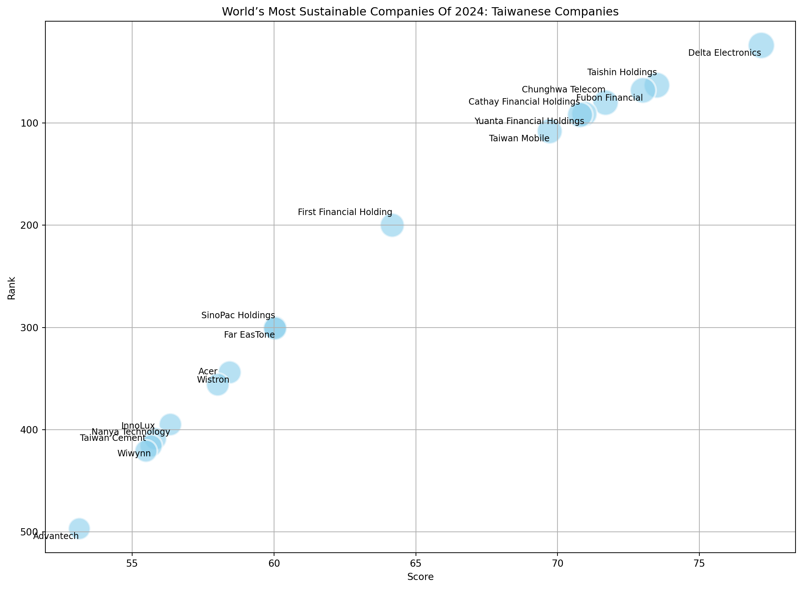
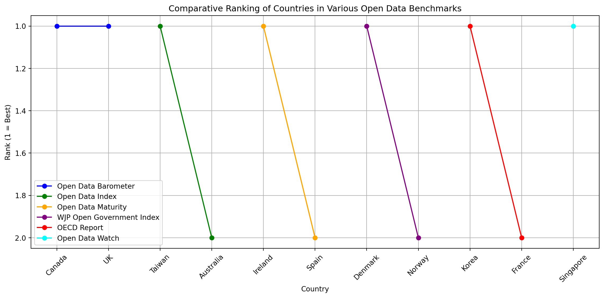
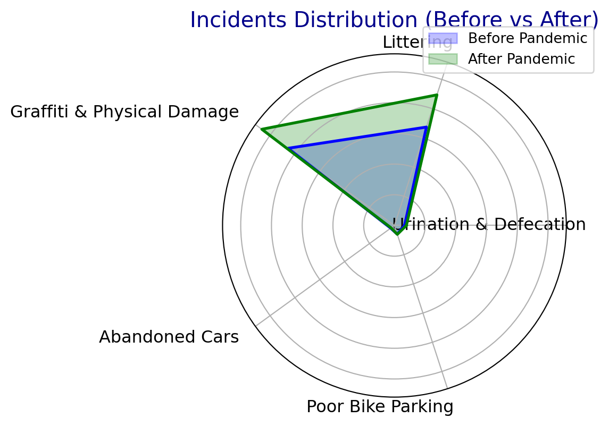
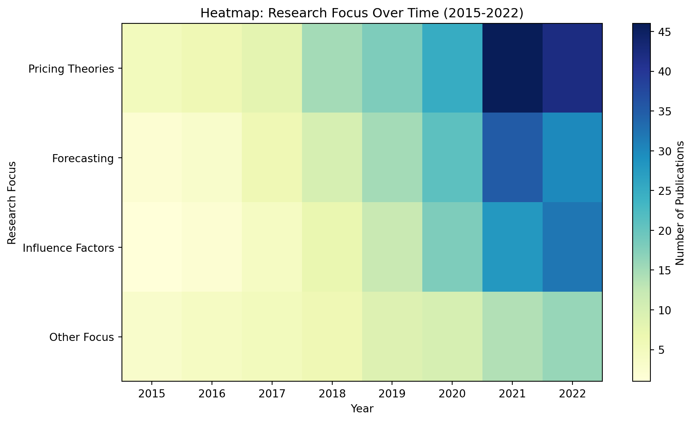
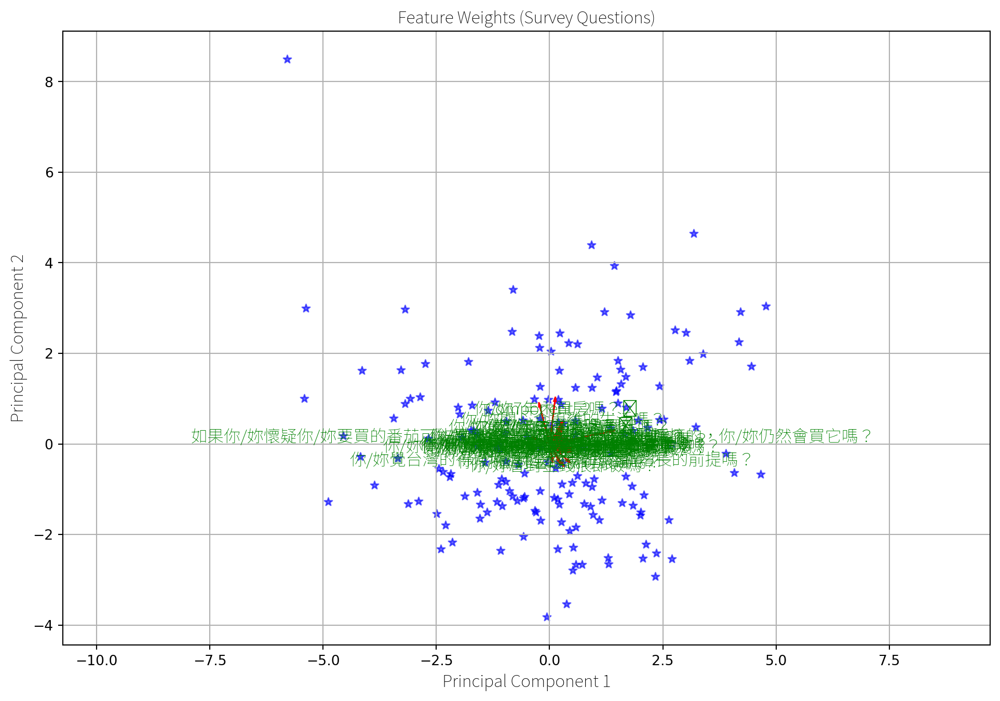
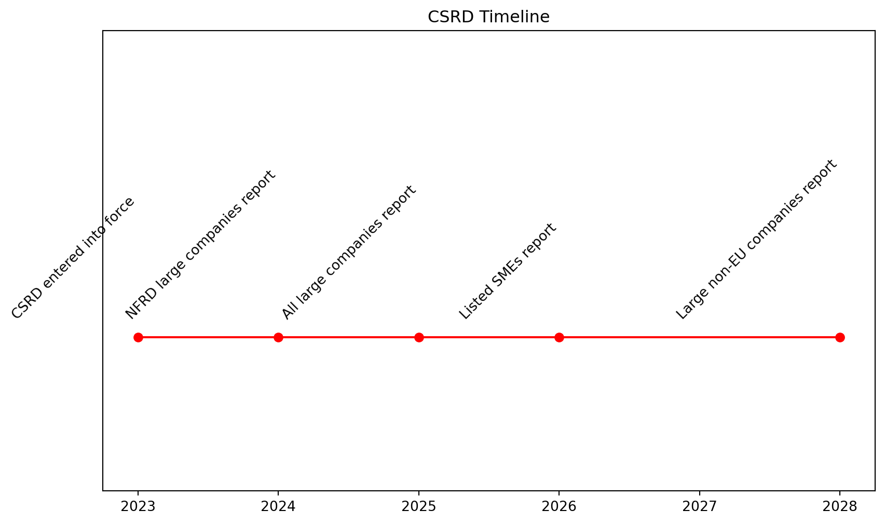
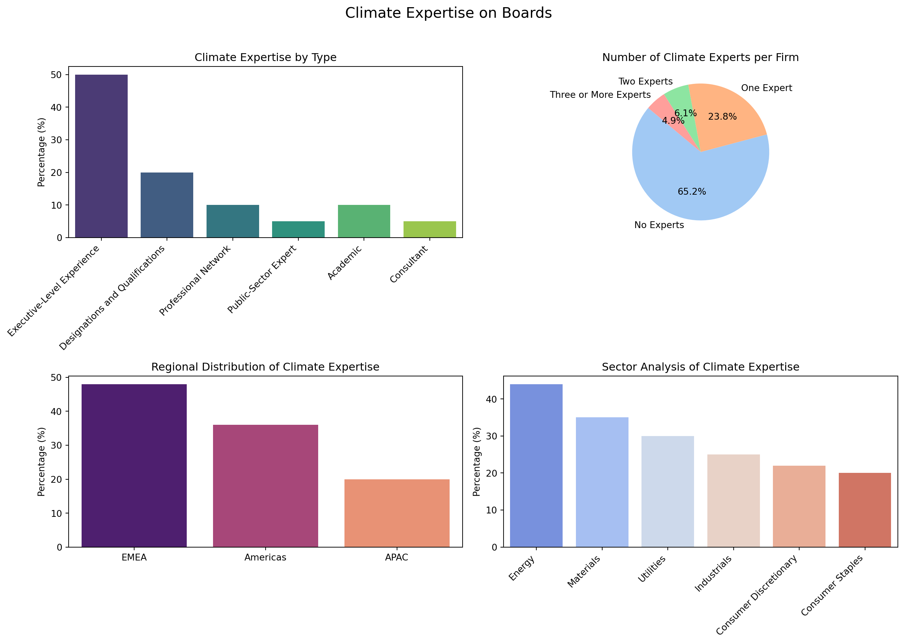

export const quartoRawHtml =
[`
<table>
<caption>Trending narratives.</caption>
<colgroup>
<col style="width: 41%" />
<col style="width: 58%" />
</colgroup>
<thead>
<tr>
<th>Trend</th>
<th>Direction</th>
</tr>
</thead>
<tbody>
<tr>
<td>Environmental degradation</td>
<td>Worsening</td>
</tr>
<tr>
<td>Interest in sustainability among young people</td>
<td>?</td>
</tr>
<tr>
<td>Intergenerational money transfer; in some countries relatively young people have money</td>
<td>?</td>
</tr>
<tr>
<td>Availability of sustainability tools such as ESG, B Corporations, Green Bonds, etc, among metrics and instruments</td>
<td>Increasing</td>
</tr>
<tr>
<td>Availability of generative AI-based user interfaces (UIs)</td>
<td>Increasing</td>
</tr>
<tr>
<td>Democratization of Financial Markets</td>
<td>Increasing</td>
</tr>
</tbody>
</table>
`,`
<table>
<thead>
<tr>
<th>Criteria</th>
<th></th>
</tr>
</thead>
<tbody>
<tr>
<td>Location</td>
<td>Taiwan</td>
</tr>
<tr>
<td>Population</td>
<td>College Students</td>
</tr>
<tr>
<td>Count</td>
<td>700</td>
</tr>
</tbody>
</table>
`,`
<table>
<thead>
<tr>
<th>Criteria</th>
<th></th>
</tr>
</thead>
<tbody>
<tr>
<td>Location</td>
<td>Global</td>
</tr>
<tr>
<td>Population</td>
<td>Experts</td>
</tr>
<tr>
<td>Count</td>
<td>5</td>
</tr>
</tbody>
</table>
`,`
<table>
<caption>RQs.</caption>
<colgroup>
<col style="width: 55%" />
<col style="width: 44%" />
</colgroup>
<thead>
<tr>
<th>Question</th>
<th>Methods</th>
</tr>
</thead>
<tbody>
<tr>
<td>What design considerations should be addressed when designing an AI companion for college students integrating sustainability and finance?</td>
<td>Literature Review</td>
</tr>
<tr>
<td>How can AI companions support college students with sustainability knowledge in the context of financial decisions?</td>
<td>Literature Review and Expert Interviews</td>
</tr>
<tr>
<td>What AI companion features do college students prioritize as the highest?</td>
<td>Survey of College Students</td>
</tr>
</tbody>
</table>
`,`
<table>
<caption>1.2 million UN survey responses to the statement <em>“Climate change is an emergency”</em> <span class="citation" data-cites="undpPeoplesClimateVote2021">[@undpPeoplesClimateVote2021]</span>.</caption>
<tbody>
<tr>
<td>Age Group</td>
<td>Agree</td>
<td>Neutral or Disagree</td>
</tr>
<tr>
<td>18-35</td>
<td>65%</td>
<td>35%</td>
</tr>
<tr>
<td>36-59</td>
<td>66%</td>
<td>34%</td>
</tr>
<tr>
<td>Over 69</td>
<td>58%</td>
<td>42%</td>
</tr>
</tbody>
</table>
`,`
<table>
<caption>Data from <span class="citation" data-cites="alanasemuelsWorldMostSustainable2024">[@alanasemuelsWorldMostSustainable2024]</span>.</caption>
<thead>
<tr>
<th style="text-align: right;"><strong>Rank</strong></th>
<th style="text-align: left;"><strong>Company</strong></th>
<th style="text-align: right;"><strong>Score</strong></th>
</tr>
</thead>
<tbody>
<tr>
<td style="text-align: right;">24</td>
<td style="text-align: left;">Delta Electronics</td>
<td style="text-align: right;">77.18</td>
</tr>
<tr>
<td style="text-align: right;">63</td>
<td style="text-align: left;">Taishin Holdings</td>
<td style="text-align: right;">73.50</td>
</tr>
<tr>
<td style="text-align: right;">68</td>
<td style="text-align: left;">Fubon Financial</td>
<td style="text-align: right;">73.01</td>
</tr>
<tr>
<td style="text-align: right;">80</td>
<td style="text-align: left;">Chunghwa Telecom</td>
<td style="text-align: right;">71.69</td>
</tr>
<tr>
<td style="text-align: right;">91</td>
<td style="text-align: left;">Yuanta Financial Holdings</td>
<td style="text-align: right;">70.94</td>
</tr>
<tr>
<td style="text-align: right;">92</td>
<td style="text-align: left;">Cathay Financial Holdings</td>
<td style="text-align: right;">70.79</td>
</tr>
<tr>
<td style="text-align: right;">108</td>
<td style="text-align: left;">Taiwan Mobile</td>
<td style="text-align: right;">69.72</td>
</tr>
<tr>
<td style="text-align: right;">200</td>
<td style="text-align: left;">First Financial Holding</td>
<td style="text-align: right;">64.17</td>
</tr>
<tr>
<td style="text-align: right;">300</td>
<td style="text-align: left;">Far EasTone</td>
<td style="text-align: right;">60.04</td>
</tr>
<tr>
<td style="text-align: right;">301</td>
<td style="text-align: left;">SinoPac Holdings</td>
<td style="text-align: right;">60.04</td>
</tr>
<tr>
<td style="text-align: right;">344</td>
<td style="text-align: left;">Wistron</td>
<td style="text-align: right;">58.44</td>
</tr>
<tr>
<td style="text-align: right;">356</td>
<td style="text-align: left;">Acer</td>
<td style="text-align: right;">58.02</td>
</tr>
<tr>
<td style="text-align: right;">395</td>
<td style="text-align: left;">Nanya Technology</td>
<td style="text-align: right;">56.35</td>
</tr>
<tr>
<td style="text-align: right;">409</td>
<td style="text-align: left;">InnoLux</td>
<td style="text-align: right;">55.82</td>
</tr>
<tr>
<td style="text-align: right;">416</td>
<td style="text-align: left;">Wiwynn</td>
<td style="text-align: right;">55.67</td>
</tr>
<tr>
<td style="text-align: right;">421</td>
<td style="text-align: left;">Taiwan Cement</td>
<td style="text-align: right;">55.49</td>
</tr>
<tr>
<td style="text-align: right;">497</td>
<td style="text-align: left;">Advantech</td>
<td style="text-align: right;">53.14</td>
</tr>
</tbody>
</table>
`,`
<table>
<caption>From millennial investors <span class="citation" data-cites="calastoneMillennialsInvestingDetailed2020">[@calastoneMillennialsInvestingDetailed2020]</span>.</caption>
<thead>
<tr>
<th>Place of Comparison</th>
<th>Financial Security Ownership</th>
</tr>
</thead>
<tbody>
<tr>
<td>Hong Kong</td>
<td>48%</td>
</tr>
<tr>
<td>France</td>
<td>10%</td>
</tr>
<tr>
<td></td>
<td></td>
</tr>
</tbody>
</table>
`,`
<table>
<caption>College Student Personas</caption>
<thead>
<tr>
<th>Description</th>
<th>Name</th>
<th>Beliefs</th>
</tr>
</thead>
<tbody>
<tr>
<td>Climate Change Denier</td>
<td>Jake</td>
<td>Climate change doesn’t exist.</td>
</tr>
<tr>
<td></td>
<td>Alice</td>
<td></td>
</tr>
<tr>
<td></td>
<td>Sam</td>
<td></td>
</tr>
</tbody>
</table>
`,`
<table>
<colgroup>
<col style="width: 3%" />
<col style="width: 96%" />
</colgroup>
<thead>
<tr>
<th>Category</th>
<th>Implication</th>
</tr>
</thead>
<tbody>
<tr>
<td>Community</td>
<td>Taiwanese students are influenced by the actions of their peers; the app should show what other people are doing.</td>
</tr>
<tr>
<td></td>
<td>People exist in relation to other people.</td>
</tr>
<tr>
<td></td>
<td>Psychology of ‘fundraising clubs’ vs individual investing</td>
</tr>
<tr>
<td></td>
<td><span class="citation" data-cites="UkraineDAOBiddingUkrainian">@UkraineDAOBiddingUkrainian</span> Ukraine DAO to support Ukraine through web3.</td>
</tr>
<tr>
<td></td>
<td>These social movements are small and require too much effort to be feasible for the app? Most college students are not zero waste or minimalist.</td>
</tr>
<tr>
<td></td>
<td>Group Purchases.</td>
</tr>
<tr>
<td></td>
<td>Find Your Composting Community.</td>
</tr>
<tr>
<td></td>
<td>Provides a community for pooling money with like-minded investors.</td>
</tr>
<tr>
<td>Climate Anxiety</td>
<td>How to support the youth? Design to reduce climate anxiety? Is getting people to go to nature more a good way to increase ecological awareness? Empowered by Design. Youth empowerment: The design should empower young people.</td>
</tr>
<tr>
<td></td>
<td>Consumer branded carbon credits like angry teenagers?</td>
</tr>
<tr>
<td></td>
<td>Invest time not money, student don’t have money?</td>
</tr>
<tr>
<td>Social Trust</td>
<td><strong>Show Success Scenarios!</strong></td>
</tr>
<tr>
<td></td>
<td>Ask how much time you want to contribute.</td>
</tr>
<tr>
<td></td>
<td>Match with other people based on time.</td>
</tr>
<tr>
<td></td>
<td>Create a group chatroom.</td>
</tr>
<tr>
<td></td>
<td>Use AI to help out with tips.</td>
</tr>
<tr>
<td></td>
<td>Ask university students what do they study and match with that industry to become expert and sustainability leader in this field.</td>
</tr>
<tr>
<td></td>
<td>People want to help and make a difference. Give people things to do. The <span class="citation" data-cites="dontlookupMethodology">@dontlookupMethodology</span> part of the <strong><em>Don’t Look Up</em></strong> movie’s social campaign provides 5 user models / roles for the audience to follow: Consumer, Investor, Activist.</td>
</tr>
<tr>
<td></td>
<td>Choose Your Climate Solutions.</td>
</tr>
<tr>
<td></td>
<td>Younger people show higher motivation (participants in climate protests). How to be relevant for a younger audience?</td>
</tr>
<tr>
<td></td>
<td>Yet action remains low.</td>
</tr>
<tr>
<td></td>
<td>Targeted and gated to college students.</td>
</tr>
<tr>
<td></td>
<td>FB, etc, Gas all had the same launch strategy - start with students</td>
</tr>
<tr>
<td></td>
<td><span class="citation" data-cites="kuzminskiEcologyMoneyDebt2015">@kuzminskiEcologyMoneyDebt2015</span> ecology of money</td>
</tr>
<tr>
<td></td>
<td>Young people are mobile-first</td>
</tr>
<tr>
<td></td>
<td>Persona: I care mostly about… fashion, art, …</td>
</tr>
<tr>
<td></td>
<td>Young people like to follow trends.</td>
</tr>
<tr>
<td></td>
<td>Food ordering apps are popular.</td>
</tr>
<tr>
<td></td>
<td>Monoculture to regenerative food forests Oil to electric cars / bicycles.</td>
</tr>
<tr>
<td></td>
<td>Social Educational Edutainment Fun</td>
</tr>
<tr>
<td></td>
<td><span class="citation" data-cites="aespaAespaEseupaMY2020">@aespaAespaEseupaMY2020</span>: Karina from Korea. It makes sense your sustainability assistant would talk to you. Studies show gen N is speaking to computers all the time. Interacting with the user is on the rise. For example, Chime makes tipping suggestions on the place of purchase.</td>
</tr>
<tr>
<td></td>
<td>The demographics that stand to win the most from the green transformation of business are the youngest generations, with more years of life ahead of them, and more exposure to future environmental and social risks. It would be advisable for Generation Z and their parents (Millennials) to invest their resources in greener assets, however, it’s still difficult to pick and choose between ‘good’ and ‘bad’ financial vehicles to invest in.</td>
</tr>
<tr>
<td></td>
<td>This creates an opportunity for a new generation of sustainable investment apps, focusing on the usability and accessibility of ESG for a mainstream audience. Generation Z and Millennials expect a consumer-grade user experience.</td>
</tr>
<tr>
<td></td>
<td>What would that experience look like? I’ve chosen these demographics with the assumption that if given the right tools, the emotional demand for sustainability could be transformed into action. The exploration of systems of feedback to enable consumers to apply more direct positive and negative pressure to the businesses and consumers signal consequences for undesirable ecological performance is a major motivation of this study.</td>
</tr>
</tbody>
</table>
`,`
<table>
<colgroup>
<col style="width: 3%" />
<col style="width: 96%" />
</colgroup>
<tbody>
<tr>
<td></td>
<td>The current environmental upheaval, led by Gen-Z and Millennials, and the business adaptation (or lack thereof) to sustainable economic models, taking into account the hidden social and environmental costs we didn’t calculate in our pricing before.</td>
</tr>
<tr>
<td></td>
<td><ul>
<li><p>We also need to consider environmental effects (E in ESG). We haven’t taken into account the whole cost of production, leading to the wrong pricing information. To achieve this, we need expert governance (G).</p></li>
<li><p>I was unable to find similar research on university and post-graduate level students in Taiwan.</p></li>
<li><p>Taiwanese college students and SDGs <span class="citation" data-cites="hoImportancePerformanceSDGs2022">[@hoImportancePerformanceSDGs2022]</span>.</p></li>
<li><p>College students in tourism and related fields . and sustainability</p></li>
<li><p>Consumers may be turned off by mentioning AI in product description. <span class="citation" data-cites="cicekAdverseImpactsRevealing2024">@cicekAdverseImpactsRevealing2024</span></p></li>
<li><p>Progress in other areas of environmental protection has not made similar progress.</p></li>
<li><p>There are documentaries about oil product</p></li>
<li><p>Plastic production documentary</p></li>
<li><p>I’ve seen several.. find and cite them to show the progression of the environmental movement in Taiwan ADD CITATION</p></li>
<li><p>The Taiwanese Green party</p></li>
<li><p>Contact SOAS?</p></li>
</ul></td>
</tr>
</tbody>
</table>
`,`
<table>
<caption>Comparing highest per capita CO<sub>2e</sub> emissions (mostly from oil producers) vs regional average per capita CO<sub>2</sub> emissions vs total CO<sub>2</sub> emissions<span class="citation" data-cites="ivanovaQuantifyingPotentialClimate2020 worldresourcesinstituteCO2EmissionsMetric2020 europeancommission.jointresearchcentre.CO2EmissionsAll2022 crippaFossilCO2GHG2020 liuMonitoringGlobalCarbon2023">[@ivanovaQuantifyingPotentialClimate2020; @worldresourcesinstituteCO2EmissionsMetric2020; @europeancommission.jointresearchcentre.CO2EmissionsAll2022; @crippaFossilCO2GHG2020; @liuMonitoringGlobalCarbon2023]</span>.</caption>
<colgroup>
<col style="width: 38%" />
<col style="width: 31%" />
<col style="width: 29%" />
</colgroup>
<tbody>
<tr>
<td><strong>Regional Average Per Capita Emissions (2020)</strong></td>
<td><strong>Highest Per Capita Emissions (2021)</strong></td>
<td><strong>Highest Total Emissions (2021)</strong></td>
</tr>
<tr>
<td>North America 13.4 CO<sub>2</sub>e tonnes</td>
<td>Palau</td>
<td>China</td>
</tr>
<tr>
<td>Europe 7.5 CO<sub>2</sub>e tonnes</td>
<td>Qatar</td>
<td>United States</td>
</tr>
<tr>
<td>Global Average 4.1 CO<sub>2</sub>e tonnes</td>
<td>Kuwait</td>
<td>European Union</td>
</tr>
<tr>
<td>Africa and the Middle East 1.7 CO<sub>2</sub>e tonnes</td>
<td>Bahrain</td>
<td>India</td>
</tr>
<tr>
<td></td>
<td>Trinidad and Tobago</td>
<td>Russia</td>
</tr>
<tr>
<td></td>
<td>New Caledonia</td>
<td>Japan</td>
</tr>
<tr>
<td></td>
<td>United Arab Emirates</td>
<td>Iran</td>
</tr>
<tr>
<td></td>
<td>Gibraltar</td>
<td>Germany</td>
</tr>
<tr>
<td></td>
<td>Falkland Islands</td>
<td>South Korea</td>
</tr>
<tr>
<td></td>
<td>Oman</td>
<td>Indonesia</td>
</tr>
<tr>
<td></td>
<td>Saudi Arabia</td>
<td>Saudi Arabia</td>
</tr>
<tr>
<td></td>
<td>Brunei Darussalam</td>
<td>Canada</td>
</tr>
<tr>
<td></td>
<td>Canada</td>
<td>Brazil</td>
</tr>
<tr>
<td></td>
<td>Australia</td>
<td>Turkey</td>
</tr>
<tr>
<td></td>
<td>United States</td>
<td>South Africa</td>
</tr>
</tbody>
</table>
`,`
<table>
<caption>Definition of Emission Scopes From <span class="citation" data-cites="nationalpublicutilitiescouncilAnnualUtilityDecarbonization2022">[@nationalpublicutilitiescouncilAnnualUtilityDecarbonization2022]</span>.</caption>
<tbody>
<tr>
<td>Emission Scope</td>
<td>Emission Source</td>
</tr>
<tr>
<td>Scope 1</td>
<td>Direct emissions</td>
</tr>
<tr>
<td>Scope 2</td>
<td>Indirect electricity emissions</td>
</tr>
<tr>
<td>Scope 3</td>
<td>Value chain emissions</td>
</tr>
<tr>
<td>Scope 4</td>
<td>Avoided emissions</td>
</tr>
</tbody>
</table>
`,`
<table>
<caption>Climate Action Tracker’s country comparison of the 10 top polluters’ climate action.</caption>
<tbody>
<tr>
<td>Country or Region</td>
<td>NDC target</td>
</tr>
<tr>
<td>China</td>
<td>Highly insufficient</td>
</tr>
<tr>
<td>Indonesia</td>
<td>Highly insufficient</td>
</tr>
<tr>
<td>Russia</td>
<td>Critically insufficient</td>
</tr>
<tr>
<td>EU</td>
<td>Insufficient</td>
</tr>
<tr>
<td>USA</td>
<td>Insufficient</td>
</tr>
<tr>
<td>United Arab Emirates</td>
<td>Highly insufficient</td>
</tr>
<tr>
<td>Japan</td>
<td>Insufficient</td>
</tr>
<tr>
<td>South Korea</td>
<td>Highly insufficient</td>
</tr>
<tr>
<td>Iran</td>
<td>Critically insufficient</td>
</tr>
<tr>
<td>Saudi Arabia</td>
<td>Highly insufficient</td>
</tr>
</tbody>
</table>
`,`
<table>
<caption>Criteria for carbon credit projects.</caption>
<colgroup>
<col style="width: 50%" />
<col style="width: 50%" />
</colgroup>
<thead>
<tr>
<th>Criteria</th>
<th>Description</th>
</tr>
</thead>
<tbody>
<tr>
<td>Baseline</td>
<td>Ecosystem carbon sequestration rate without the intervention (project)</td>
</tr>
<tr>
<td>Additionality</td>
<td>New carbon capture or prevention of emissions</td>
</tr>
<tr>
<td>Permanence</td>
<td>Carbon storage time (should be long-term)</td>
</tr>
<tr>
<td>Leakage</td>
<td>Risk of shift to causing emissions (for example because of deforestation)</td>
</tr>
</tbody>
</table>
`,`
<table>
<caption>CO<sub>2</sub> credit trading markets around the world from <span class="citation" data-cites="InternationalCarbonMarket">@InternationalCarbonMarket</span>.</caption>
<colgroup>
<col style="width: 26%" />
<col style="width: 26%" />
<col style="width: 47%" />
</colgroup>
<tbody>
<tr>
<td>CO<sub>2</sub> Market</td>
<td>Launch Date</td>
<td>Comments</td>
</tr>
<tr>
<td>EU</td>
<td>2005</td>
<td>EU: <span class="citation" data-cites="araujoEuropeanUnionMembership2020">@araujoEuropeanUnionMembership2020</span></td>
</tr>
<tr>
<td>South Korea</td>
<td>2015</td>
<td></td>
</tr>
<tr>
<td>China</td>
<td>2021</td>
<td>China’s national emissions trading scheme (ETS) started in 2021 priced at 48 yuan per tonne of CO<sub>2</sub>, averaged at 58 yuan in 2022 <span class="citation" data-cites="liuIndepthWillChina2021 ivyyinCommodities2023China2023">[@liuIndepthWillChina2021; @ivyyinCommodities2023China2023]</span>.</td>
</tr>
<tr>
<td>U.S.</td>
<td>2013</td>
<td>No country-wide market; local CO<sub>2</sub> markets in California, Connecticut, Delaware, Maine, Maryland, Massachusetts, New Hampshire, New York, Rhode Island, and Vermont</td>
</tr>
<tr>
<td>New Zealand</td>
<td>2008</td>
<td>New Zealand <span class="citation" data-cites="rontardPoliticalConstructionCarbon2022">@rontardPoliticalConstructionCarbon2022</span> (need access, important ncku doesn’t subscribe)</td>
</tr>
<tr>
<td>Canada</td>
<td>2013</td>
<td></td>
</tr>
</tbody>
</table>
`,`
<table>
<caption>Compliance market CO<sub>2</sub> prices on August 12, 2023; data from <span class="citation" data-cites="emberCarbonPriceTracker2023 tradingeconomicsEUCarbonPermits2023 carboncreditsLiveCarbonPrices2023">[@emberCarbonPriceTracker2023; @tradingeconomicsEUCarbonPermits2023; @carboncreditsLiveCarbonPrices2023]</span>.</caption>
<tbody>
<tr>
<td>Compliance Markets</td>
<td>Price (Tonne of CO<sub>2</sub>)</td>
</tr>
<tr>
<td>EU</td>
<td>83 EUR</td>
</tr>
<tr>
<td>UK</td>
<td>40 Pounds</td>
</tr>
<tr>
<td>US (California)</td>
<td>29 USD</td>
</tr>
<tr>
<td>Australia</td>
<td>32 USD</td>
</tr>
<tr>
<td>New Zealand</td>
<td>50 USD</td>
</tr>
<tr>
<td>South Korea</td>
<td>5.84 USD</td>
</tr>
<tr>
<td>China</td>
<td>8.29 USD</td>
</tr>
<tr>
<td></td>
<td></td>
</tr>
</tbody>
</table>
`,`
<table>
<caption>Voluntary market CO<sub>2</sub> prices on August 12, 2023; data from <span class="citation" data-cites="carboncreditsLiveCarbonPrices2023">[@carboncreditsLiveCarbonPrices2023]</span>.</caption>
<tbody>
<tr>
<td>Voluntary Markets</td>
<td>Price (Tonne of CO<sub>2</sub>)</td>
</tr>
<tr>
<td>Aviation Industry Offset</td>
<td>$0.93</td>
</tr>
<tr>
<td>Nature Based Offset</td>
<td>$1.80</td>
</tr>
<tr>
<td>Tech Based Offset</td>
<td>$0.77</td>
</tr>
</tbody>
</table>
`,`
<table>
<caption>Daily human activities emission contribution on average in France, Germany, Norway and Sweden from <span class="citation" data-cites="mobergMobilityFoodHousing2019">[@mobergMobilityFoodHousing2019]</span>.</caption>
<tbody>
<tr>
<td>Emission Share</td>
<td>Category</td>
</tr>
<tr>
<td>21%</td>
<td>Housing</td>
</tr>
<tr>
<td>30%</td>
<td>Food</td>
</tr>
<tr>
<td>34%</td>
<td>Mobility</td>
</tr>
<tr>
<td>15%</td>
<td>Other</td>
</tr>
</tbody>
</table>
`,`
<table>
<caption>From <span class="citation" data-cites="mayWhyShouldWe2011">[@mayWhyShouldWe2011]</span>.</caption>
<colgroup>
<col style="width: 36%" />
<col style="width: 63%" />
</colgroup>
<tbody>
<tr>
<td>View</td>
<td></td>
</tr>
<tr>
<td>Narrowly Utilitarian</td>
<td>Biodiversity is a resource of genetic novelties for the biotech industry.</td>
</tr>
<tr>
<td>Broadly Utilitarian</td>
<td>Humans depend upon biodiverse ecosystems.</td>
</tr>
<tr>
<td>Ethical</td>
<td>Humans have a responsibility to future generations to pass down a rich natural world.</td>
</tr>
</tbody>
</table>
`,`
<table>
<caption>Biodiversity loss data from <span class="citation" data-cites="bradshawUnderestimatingChallengesAvoiding2021">[@bradshawUnderestimatingChallengesAvoiding2021]</span>.</caption>
<colgroup>
<col style="width: 61%" />
<col style="width: 38%" />
</colgroup>
<tbody>
<tr>
<td>What Happened?</td>
<td>How Much?</td>
</tr>
<tr>
<td>Vertebrate species population average decline</td>
<td>68% over the last 50 years</td>
</tr>
<tr>
<td>Land surface altered by humans</td>
<td>70% of Earth</td>
</tr>
<tr>
<td>Vertebrate species extinct</td>
<td>700 in 500 years</td>
</tr>
<tr>
<td>Plant species extinct</td>
<td>600 in 500 years</td>
</tr>
<tr>
<td>Species under threat of extinction</td>
<td>1 million</td>
</tr>
</tbody>
</table>
`,`
<table>
<colgroup>
<col style="width: 36%" />
<col style="width: 63%" />
</colgroup>
<tbody>
<tr>
<td><strong>Economics of Nature Commodification</strong></td>
<td><strong>Economics of the Sacred</strong></td>
</tr>
<tr>
<td>Measure and assign monetary value to nature.</td>
<td>Nature is Sacred - such as are religious holy places - and can’t be touched <span class="citation" data-cites="eisensteinSacredEconomicsMoney2011 eisensteinClimateNewStory2018">[@eisensteinSacredEconomicsMoney2011; @eisensteinClimateNewStory2018]</span></td>
</tr>
</tbody>
</table>
`,`
<table>
<caption>From <span class="citation" data-cites="MonetaryValuationNature2023">[@MonetaryValuationNature2023]</span>.</caption>
<tbody>
<tr>
<td>9 Steps</td>
</tr>
<tr>
<td>Identify ecosystem functions</td>
</tr>
<tr>
<td>Quantify ecosystem functions</td>
</tr>
<tr>
<td>Identify ecosystem services</td>
</tr>
<tr>
<td>Quantify ecosystem services</td>
</tr>
<tr>
<td>Quantify financial value of ecosystem services</td>
</tr>
<tr>
<td>Assign property rights</td>
</tr>
<tr>
<td>Create ecosystem service markets</td>
</tr>
<tr>
<td>Commodify nature</td>
</tr>
</tbody>
</table>
`,`
<table>
<caption>From <span class="citation" data-cites="hanEmbeddingNaturebasedSolutions2022">@hanEmbeddingNaturebasedSolutions2022</span></caption>
<thead>
<tr>
<th>Non-Exhaustive list of</th>
</tr>
</thead>
<tbody>
<tr>
<td>Afforestation</td>
</tr>
<tr>
<td>Wetland restoration</td>
</tr>
<tr>
<td></td>
</tr>
</tbody>
</table>
`,`
<table>
<caption>Implications</caption>
<colgroup>
<col style="width: 36%" />
<col style="width: 63%" />
</colgroup>
<tbody>
<tr>
<td>Category</td>
<td>Implication</td>
</tr>
<tr>
<td>Transparency</td>
<td>In unison, the reviewed technologies and practices move us closer to enabling <em>realtime ESG</em>: up-do-date transparent information about how our product are produced.</td>
</tr>
<tr>
<td>Speed</td>
<td>Realtime ESG is a building block to enable consumers and investors make more accurate, real-world purchase decisions.</td>
</tr>
<tr>
<td>Actionability</td>
<td>Simplify action</td>
</tr>
<tr>
<td>Pollution</td>
<td><em>People live in the polluted areas are so used to it. What app to wake them up? “You live in a highly polluted area. Here’s the TOP 10 companies causing pollution. Here’s what you can do.”</em></td>
</tr>
<tr>
<td>Health Tracking</td>
<td>Blood testing and biomarkers allow people to track their health. I’m introducing the concept of ‘eco-markers’ to follow the sustainability of human activities.</td>
</tr>
<tr>
<td>Circular Economy</td>
<td>AI can help us make sense of the vast amounts of sustainability data generated daily.</td>
</tr>
<tr>
<td>EPR</td>
<td>ERP and CDP data should be part of Green Filter.</td>
</tr>
<tr>
<td>Eco-Design</td>
<td>How to find eco-designed products?</td>
</tr>
<tr>
<td>CE and EPC</td>
<td>Encouraging Sustainable Design</td>
</tr>
<tr>
<td>Politics Matter</td>
<td></td>
</tr>
<tr>
<td></td>
<td>Call for GOP contributors’ transparency</td>
</tr>
<tr>
<td></td>
<td>“triple turn”</td>
</tr>
<tr>
<td></td>
<td>Lack of transparency</td>
</tr>
<tr>
<td></td>
<td>Sustainability is part of product quality. If a product is hurting the environment, it’s a low quality product.</td>
</tr>
</tbody>
</table>
`,`
<table>
<tbody>
<tr>
<td><strong>Category</strong></td>
<td><strong>Idas</strong></td>
</tr>
<tr>
<td></td>
<td></td>
</tr>
<tr>
<td></td>
<td></td>
</tr>
</tbody>
</table>
`,`
<table>
<tbody>
<tr>
<td>Durable</td>
<td>Reparable</td>
<td>Easy to Recycle</td>
</tr>
<tr>
<td>Reusable</td>
<td>Easy to Maintain</td>
<td>Energy Efficient</td>
</tr>
<tr>
<td>Upgradable</td>
<td>Easy to Refurbish</td>
<td>Resource Efficient</td>
</tr>
</tbody>
</table>
`,`
<table>
<caption>Examples of cities and countries that share data openly.</caption>
<thead>
<tr>
<th>Country</th>
<th>Project</th>
<th>Reference</th>
</tr>
</thead>
<tbody>
<tr>
<td>Sweden</td>
<td>Swedish open data portal</td>
<td><span class="citation" data-cites="SverigesDataportal">@SverigesDataportal</span></td>
</tr>
<tr>
<td>Malaysia</td>
<td>Malaysian open data portal</td>
<td>data.gov.my</td>
</tr>
<tr>
<td>Estonia</td>
<td></td>
<td></td>
</tr>
</tbody>
</table>
`,`
<table style="width:100%;">
<colgroup>
<col style="width: 11%" />
<col style="width: 39%" />
<col style="width: 49%" />
</colgroup>
<thead>
<tr>
<th>Platform Economy Enablers</th>
<th>Pros</th>
<th>Cons</th>
</tr>
</thead>
<tbody>
<tr>
<td>Network effects</td>
<td>The more people use a platform, the more valuable it becomes both for the company and the user.</td>
<td>Data is not portable or difficult to migrate. You can’t leave because you’ll lose the audience. There’s a lock-in effect.</td>
</tr>
<tr>
<td>Scalability</td>
<td></td>
<td></td>
</tr>
<tr>
<td>Data-driven Design</td>
<td></td>
<td></td>
</tr>
<tr>
<td>Behaviour Design</td>
<td></td>
<td></td>
</tr>
</tbody>
</table>
`,`
<table style="width:99%;">
<caption>Examples of CO<sub>2</sub> visibility in Google’s products.</caption>
<colgroup>
<col style="width: 61%" />
<col style="width: 10%" />
<col style="width: 26%" />
</colgroup>
<thead>
<tr>
<th>Feature</th>
<th>Product</th>
<th>Nudge</th>
</tr>
</thead>
<tbody>
<tr>
<td>Google Maps AI suggests more eco-friendly driving routes <span class="citation" data-cites="mohitmoondraNavigateMoreSustainably">@mohitmoondraNavigateMoreSustainably</span></td>
<td>Google Maps</td>
<td>Show routes with lower CO<sub>2</sub> emissions</td>
</tr>
<tr>
<td>Google Flights suggests flights with lower CO<sub>2</sub> emissions</td>
<td>Google Flights</td>
<td>Show flights with lower CO<sub>2</sub> emissions</td>
</tr>
<tr>
<td>Wizzair Check carbon impact <span class="citation" data-cites="OffsetYourFlight">@OffsetYourFlight</span></td>
<td>WizzAir</td>
<td>Offset on Checkout</td>
</tr>
</tbody>
</table>
`,`
<table>
<caption>Types of nudge by <span class="citation" data-cites="WEE2021100364">@WEE2021100364</span></caption>
<colgroup>
<col style="width: 17%" />
<col style="width: 82%" />
</colgroup>
<thead>
<tr>
<th>Name</th>
<th>Technique</th>
</tr>
</thead>
<tbody>
<tr>
<td>Prompting</td>
<td>Create cues and reminders to perform a certain behavior</td>
</tr>
<tr>
<td>Sizing</td>
<td>Decrease or increase the size of items or portions</td>
</tr>
<tr>
<td>Proximity</td>
<td>Change the physical (or temporal) distance of options</td>
</tr>
<tr>
<td>Presentation</td>
<td>Change the way items are displayed</td>
</tr>
<tr>
<td>Priming</td>
<td>Expose users to certain stimuli before decision-making</td>
</tr>
<tr>
<td>Labelling</td>
<td>Provide labels to influence choice (for example CO<sub>2</sub> footprint labels)</td>
</tr>
<tr>
<td>Functional Design</td>
<td>Design the environment and choice architecture so the desired behavior is more convenient</td>
</tr>
</tbody>
</table>
`,`
<table style="width:98%;">
<caption>Table of Ant Forest assisted tree planting; data compiled from <span class="citation" data-cites="ZhuZiXun2017 yangSwitchingGreenLifestyles2018 unfcccAlipayAntForest2019 wangFuelingProEnvironmentalBehaviors2020 600MillionPeople2021 zhangPromoteProenvironmentalBehaviour2022 wangMotivationsInfluencingAlipay2022 zhouUnpackingEffectGamified2023 caoImpactArtificialIntelligence2023">[@ZhuZiXun2017; @yangSwitchingGreenLifestyles2018; @unfcccAlipayAntForest2019; @wangFuelingProEnvironmentalBehaviors2020; @600MillionPeople2021; @zhangPromoteProenvironmentalBehaviour2022; @wangMotivationsInfluencingAlipay2022; @zhouUnpackingEffectGamified2023; @caoImpactArtificialIntelligence2023]</span>.</caption>
<colgroup>
<col style="width: 15%" />
<col style="width: 17%" />
<col style="width: 17%" />
<col style="width: 47%" />
</colgroup>
<thead>
<tr>
<th>Year</th>
<th>Users</th>
<th>Trees</th>
<th>Area</th>
</tr>
</thead>
<tbody>
<tr>
<td>2016</td>
<td>?</td>
<td>0</td>
<td></td>
</tr>
<tr>
<td>2017</td>
<td>230 million</td>
<td>10 million</td>
<td></td>
</tr>
<tr>
<td>2018</td>
<td>350 million</td>
<td>55 million</td>
<td>6500 acres??</td>
</tr>
<tr>
<td>2019</td>
<td>500 million</td>
<td>100 million</td>
<td>112,000 hectares / 66, 000 hectares?</td>
</tr>
<tr>
<td>2020</td>
<td>550 million</td>
<td>200 million</td>
<td>2,7 million acres?</td>
</tr>
<tr>
<td>2021</td>
<td>600 million</td>
<td>326 million</td>
<td></td>
</tr>
<tr>
<td>2022</td>
<td>650 million</td>
<td>400 million</td>
<td>2 million hectares</td>
</tr>
<tr>
<td></td>
<td></td>
<td></td>
<td></td>
</tr>
<tr>
<td></td>
<td></td>
<td></td>
<td></td>
</tr>
</tbody>
</table>
`,`
<table>
<caption>Modes of interaction</caption>
<thead>
<tr>
<th>Mode of Interaction</th>
<th></th>
</tr>
</thead>
<tbody>
<tr>
<td>Writing</td>
<td></td>
</tr>
<tr>
<td>Speaking</td>
<td></td>
</tr>
<tr>
<td>Touching</td>
<td></td>
</tr>
<tr>
<td>Moving</td>
<td></td>
</tr>
<tr>
<td></td>
<td></td>
</tr>
</tbody>
</table>
`,`
<table>
<caption>A selection of personal sustainability apps. See <em>greenfilter.app</em> for an updated database.</caption>
<colgroup>
<col style="width: 31%" />
<col style="width: 68%" />
</colgroup>
<thead>
<tr>
<th>App</th>
<th>Description</th>
</tr>
</thead>
<tbody>
<tr>
<td>Commons (Formerly Joro)</td>
<td>Finacial Sustainability Tracking + Sustainable Actions</td>
</tr>
<tr>
<td>Klima</td>
<td>Offset Subscription</td>
</tr>
<tr>
<td>Wren</td>
<td>Offset Subscription</td>
</tr>
<tr>
<td>JouleBug</td>
<td>CO2 tracking</td>
</tr>
<tr>
<td>eevie</td>
<td></td>
</tr>
<tr>
<td>Aerial</td>
<td></td>
</tr>
<tr>
<td>EcoCRED</td>
<td></td>
</tr>
<tr>
<td>Carbn</td>
<td></td>
</tr>
<tr>
<td>LiveGreen</td>
<td></td>
</tr>
<tr>
<td>Earth Hero</td>
<td></td>
</tr>
<tr>
<td></td>
<td></td>
</tr>
</tbody>
</table>
`,`
<table>
<caption>Food saving apps</caption>
<colgroup>
<col style="width: 14%" />
<col style="width: 85%" />
</colgroup>
<thead>
<tr>
<th>Name</th>
<th></th>
</tr>
</thead>
<tbody>
<tr>
<td>Karma</td>
<td></td>
</tr>
<tr>
<td>ResQ Club</td>
<td><span class="citation" data-cites="kristinakostapLEVITASONAUus2022">[@kristinakostapLEVITASONAUus2022]</span> ResQ Club in Finland and Estonia for reducing food waste by offering a 50% discount on left-over restaurant meals before they are thrown away.</td>
</tr>
<tr>
<td>Kuri</td>
<td><span class="citation" data-cites="hajejankampsKuriAppThat2022">@hajejankampsKuriAppThat2022</span> Less impact of food</td>
</tr>
<tr>
<td>Social media groups (no app)</td>
<td></td>
</tr>
</tbody>
</table>
`,`
<table>
<caption>Perspective on food systems in Sweden.</caption>
<colgroup>
<col style="width: 30%" />
<col style="width: 69%" />
</colgroup>
<thead>
<tr>
<th>Perspective</th>
<th>Content</th>
</tr>
</thead>
<tbody>
<tr>
<td><em>“The diagnostic perspective”</em></td>
<td>“<em>All hands on deck to fix the climate”</em></td>
</tr>
<tr>
<td><em>“The regenerative perspective”</em></td>
<td>“<em>Diversity, soil health and organic agriculture to the rescue”</em></td>
</tr>
<tr>
<td><em>“The fossil-free perspective”</em></td>
<td>“<em>Profitable Swedish companies to rid agriculture and the food chain of fossil fuel”</em></td>
</tr>
<tr>
<td><em>“The consumer-driven perspective”</em></td>
<td><em>“A wish-list of healthy, high-quality and climate-friendly foods”</em></td>
</tr>
<tr>
<td>“The hands-on perspective”</td>
<td>“Tangible solutions within the reach of consumers and the food industry”</td>
</tr>
</tbody>
</table>
`,`
<table style="width:99%;">
<caption>Blockchain supply chain companies as of summer 2023 include.</caption>
<colgroup>
<col style="width: 10%" />
<col style="width: 12%" />
<col style="width: 47%" />
<col style="width: 28%" />
</colgroup>
<thead>
<tr>
<th>Company</th>
<th>Link</th>
<th>Literature</th>
<th>Comments</th>
</tr>
</thead>
<tbody>
<tr>
<td>Ocean Protocol</td>
<td>oceanprotocol.com</td>
<td></td>
<td></td>
</tr>
<tr>
<td>Provenance</td>
<td>provenance.io</td>
<td></td>
<td></td>
</tr>
<tr>
<td>Ambrosius</td>
<td>ambrosus.io</td>
<td></td>
<td></td>
</tr>
<tr>
<td>Modum</td>
<td>modum.io</td>
<td></td>
<td></td>
</tr>
<tr>
<td>OriginTrail</td>
<td>origintrail.io</td>
<td></td>
<td></td>
</tr>
<tr>
<td>Everledger</td>
<td>everledger.io</td>
<td></td>
<td></td>
</tr>
<tr>
<td>VeChain</td>
<td>vechain.org</td>
<td></td>
<td></td>
</tr>
<tr>
<td>Wabi</td>
<td>wabi.io</td>
<td></td>
<td></td>
</tr>
<tr>
<td>FairFood</td>
<td>fairfood.org</td>
<td></td>
<td></td>
</tr>
<tr>
<td>Bext360</td>
<td>bext360.com</td>
<td></td>
<td></td>
</tr>
<tr>
<td>SUKU</td>
<td>suku.world</td>
<td><span class="citation" data-cites="millerCitizensReserveBuilding2019">@millerCitizensReserveBuilding2019</span> SUKU makes supply chains more transparent</td>
<td>Seems to have pivoted away from supply chains</td>
</tr>
</tbody>
</table>
`,`
<table>
<caption>Share of CO<sub>2</sub> of CO<sub>2</sub> emissions by type of transport globally <span class="citation" data-cites="statistaGlobalTransportCO22022">[@statistaGlobalTransportCO22022]</span>.</caption>
<thead>
<tr>
<th>Type of Transport</th>
<th>Percentage</th>
</tr>
</thead>
<tbody>
<tr>
<td>Passenger cars</td>
<td>39%</td>
</tr>
<tr>
<td><strong>Medium and heavy trucks</strong></td>
<td>23%</td>
</tr>
<tr>
<td><strong>Shipping</strong></td>
<td>11%</td>
</tr>
<tr>
<td><strong>Aviation</strong></td>
<td>9%</td>
</tr>
<tr>
<td>Buses and minibuses</td>
<td>7%</td>
</tr>
<tr>
<td>Light commercial vehicles</td>
<td>5%</td>
</tr>
<tr>
<td>Two/three-wheelers</td>
<td>3%</td>
</tr>
<tr>
<td>Rail</td>
<td>3%</td>
</tr>
</tbody>
</table>
`,`
<table>
<caption>Companies with Carbon Labels <span class="citation" data-cites="briankatemanCarbonLabelsAre2020">[@briankatemanCarbonLabelsAre2020]</span></caption>
<thead>
<tr>
<th>Company</th>
<th>Country</th>
</tr>
</thead>
<tbody>
<tr>
<td>Just Salad</td>
<td>U.S.A.</td>
</tr>
<tr>
<td>Quorn</td>
<td>U.K.</td>
</tr>
<tr>
<td>Oatly</td>
<td>U.K.</td>
</tr>
<tr>
<td>IKEA</td>
<td>Sweden</td>
</tr>
</tbody>
</table>
`,`
<table>
<caption>Organization to Certify Carbon Labels <span class="citation" data-cites="climatepartnerLabellingCarbonFootprint2020">[@climatepartnerLabellingCarbonFootprint2020]</span>.</caption>
<thead>
<tr>
<th>Organization</th>
<th>Country</th>
<th>Number of Product Certified</th>
</tr>
</thead>
<tbody>
<tr>
<td>ClimatePartner</td>
<td></td>
<td></td>
</tr>
<tr>
<td>Carbon Calories</td>
<td></td>
<td></td>
</tr>
<tr>
<td>Carbon Trust</td>
<td></td>
<td>27000</td>
</tr>
</tbody>
</table>
`,`
<table>
<caption>Digital Product Passport goals <span class="citation" data-cites="strettonDigitalProductPassports2022">@strettonDigitalProductPassports2022</span></caption>
<colgroup>
<col style="width: 81%" />
<col style="width: 18%" />
</colgroup>
<thead>
<tr>
<th>Goal</th>
<th>Description</th>
</tr>
</thead>
<tbody>
<tr>
<td><strong>Sustainable Product Production</strong></td>
<td></td>
</tr>
<tr>
<td><strong>Businesses to create value through Circular Business Models</strong></td>
<td></td>
</tr>
<tr>
<td><strong>Consumers to make more informed purchasing decisions</strong></td>
<td></td>
</tr>
<tr>
<td><strong>Verify compliance with legal obligations</strong></td>
<td></td>
</tr>
</tbody>
</table>
`,`
<table>
<colgroup>
<col style="width: 3%" />
<col style="width: 96%" />
</colgroup>
<thead>
<tr>
<th>Category</th>
<th>Implication</th>
</tr>
</thead>
<tbody>
<tr>
<td>Greenwashing</td>
<td>Personal CO2 tracking is ineffective and the focus should be on systematic change towards circular design and zero waste practices.</td>
</tr>
<tr>
<td></td>
<td>Help consumers to demand more</td>
</tr>
<tr>
<td>Lack of transparency</td>
<td>Make open data easy to use in everyday life</td>
</tr>
<tr>
<td>Transparency</td>
<td>The key idea is making CO<sub>2</sub> Visible.</td>
</tr>
<tr>
<td>Greenwashing</td>
<td>Rank companies based on sustainability</td>
</tr>
<tr>
<td></td>
<td>Help you to decide: what to buy, how to save, where to invest.</td>
</tr>
<tr>
<td>Decision Fatique</td>
<td>What if there was a “Green Filter” on every product everywhere?</td>
</tr>
<tr>
<td></td>
<td>Become a Sustainability-Aware App or Game.</td>
</tr>
<tr>
<td></td>
<td>Focus on how college students can invest in specific industries?</td>
</tr>
<tr>
<td></td>
<td>Where to shop rankings for groceries: list worst offenders in terms of products; shop and invest according to your values.</td>
</tr>
<tr>
<td></td>
<td>What Quantified Self look like for sustainability?</td>
</tr>
<tr>
<td></td>
<td>Empowering people to live a sustainable day</td>
</tr>
<tr>
<td></td>
<td>What if there was a “Green Filter” on every product everywhere?</td>
</tr>
<tr>
<td></td>
<td>Become a Sustainability-Aware App or Game.</td>
</tr>
<tr>
<td></td>
<td>Guidance could help young people beat climate anxiety by taking meaningful action.</td>
</tr>
<tr>
<td></td>
<td>The app is just as much about helping people deal with climate anxiety as it’s with solving the climate issue.</td>
</tr>
<tr>
<td></td>
<td>List of metrics that should be tracked to enable useful analytics. Ex: % of beach pollution, air pollution, water pollution (I had this idea while meditating). In essence, “green filter” is a central data repository not unlike “Apple Health for Sustainability”.</td>
</tr>
<tr>
<td></td>
<td>Health and fitness category apps</td>
</tr>
<tr>
<td></td>
<td>Using “green filter” you can get a personalized sustainability plan and personal coach to become healthy and nature-friendly.</td>
</tr>
<tr>
<td></td>
<td>All green categories — Green hub — Ask the user to prioritize</td>
</tr>
<tr>
<td></td>
<td>In my “green filter” AI advisor app’s scenario, the AI is scanning for opportunities matching the user’s sustainable investment appetite and risk profile, using different methods of analysis, including alternative data sources. Traditionally, financial analysts only looked at traditional data, such as company reports, government reports, historic performance, etc., for preparing advisory guidance to their clients. With the advent of AI and big data analysis, many other options of research data have become available, for example, accurate weather predictions for agriculture can affect guidance, because of expected future weather disasters in the area. Other examples include policy predictions, pollution metrics, etc.</td>
</tr>
<tr>
<td></td>
<td>Professional financial advisors use automated tools to analyze data and present it in human form to clients. Today’s ubiquitous mobile interfaces, however, provide the opportunity to ‘cut out the middleman’ and provide similar information to clients directly, at a lower cost and a wider scale, often without human intervention. Additional (more expensive) “human-judgment- as-a-service”, a combination of robots + human input, can help provide further personalized advice for the consumer, still at a cheaper price than a dedicated human advisor. Everyone can have a financial advisor.</td>
</tr>
<tr>
<td></td>
<td>Narrative design bring together film school <strong>storytelling</strong> experience with design.</td>
</tr>
<tr>
<td></td>
<td>Rebuilt the app as a personalized, narrative lifestyle feed.</td>
</tr>
<tr>
<td></td>
<td>How the design can connect people to sustainable outcomes while shopping and investing? Perhaps even forming a community of sustainable action. What I showed in class looks like an app but it could also be a physical object (a speculative design). From the presentations I saw most students seemed to be interested in form and light (many lamps) and a couple were about medical uses. I don’t remember seeing one that could be compatible with the environmental sustainability focus unfortunately…</td>
</tr>
<tr>
<td></td>
<td><strong>Guided Sustainability</strong> “refers to a concept of using technology, such as AI and machine learning, to help individuals and organizations make more sustainable decisions and take actions that promote environmental and social sustainability. This can include things like analyzing data on resource usage and emissions, providing recommendations for reducing the environmental impact of operations, or helping to identify and track progress towards sustainability goals. The goal of guided sustainability is to make it easier for people to understand their impact on the environment and to take steps to reduce that impact.”</td>
</tr>
<tr>
<td></td>
<td>Young people are stuck inside platforms. You don’t own the data you put on TikTok. You can’t leave because you’ll lose the audience.</td>
</tr>
<tr>
<td></td>
<td>With this perspective of scale, what would a shopping experience look like if one knew at the point of sale, which products are greener, and which are more environmentally polluting?</td>
</tr>
<tr>
<td></td>
<td>AI Financial Advisors will need to go further to motivate users. because of the nature of the technology, which is based on the quality of the data the systems ingest, they are prone to mistakes.</td>
</tr>
<tr>
<td>Generative AI</td>
<td>Allow producers to make use of Speculative and Participatory design to test out new product ideas?</td>
</tr>
<tr>
<td></td>
<td><ul>
<li>Processes sustain things: implication for design: built an app</li>
</ul></td>
</tr>
<tr>
<td></td>
<td><ul>
<li>If sustainability can’t be automated, give the user buttons to choose a sustainable option.</li>
</ul></td>
</tr>
<tr>
<td></td>
<td><ul>
<li>The power of defaults. Make the sustainable option the default option. <span class="citation" data-cites="gigerenzerWhyHeuristicsWork2008">@gigerenzerWhyHeuristicsWork2008</span></li>
</ul></td>
</tr>
</tbody>
</table>
`,`
<table>
<colgroup>
<col style="width: 5%" />
<col style="width: 94%" />
</colgroup>
<tbody>
<tr>
<td>Alerts</td>
<td>Your shopping products mostly come from Protector and Gamble (3x) and Nestle. These are large conglomerates with a massive CO<sub>2</sub> footprint. See the index to find some alternatives.</td>
</tr>
<tr>
<td></td>
<td>App shows traceability.</td>
</tr>
</tbody>
</table>
`,`
<table>
<colgroup>
<col style="width: 52%" />
<col style="width: 40%" />
<col style="width: 7%" />
</colgroup>
<thead>
<tr>
<th>Group</th>
<th>Task</th>
<th></th>
</tr>
</thead>
<tbody>
<tr>
<td>Experts (Finance)</td>
<td>Interview</td>
<td></td>
</tr>
<tr>
<td>Experts (Design)</td>
<td>Interview</td>
<td></td>
</tr>
<tr>
<td>Experts (Sustainability)</td>
<td>Interview</td>
<td></td>
</tr>
<tr>
<td>Target Audience (College Students)</td>
<td>Survey + Prototype Testing</td>
<td></td>
</tr>
</tbody>
</table>
`,`
<table>
<caption>36 Likert Fields included in the survey</caption>
<colgroup>
<col style="width: 47%" />
<col style="width: 52%" />
</colgroup>
<thead>
<tr>
<th>Original Question in Chinese</th>
<th>English Translation</th>
</tr>
</thead>
<tbody>
<tr>
<td>如果你/妳懷疑你/妳要買的番茄可能是由強迫勞工（現代奴隸）採摘的，你/妳仍然會買它嗎？</td>
<td>If you suspect that the tomatoes you are going to buy may have been picked by forced labor (modern slaves), would you still buy them?</td>
</tr>
<tr>
<td>你/妳關心食安嗎？</td>
<td>Do you care about food safety?</td>
</tr>
<tr>
<td>你/妳7年內買車嗎？🚘</td>
<td>Will you buy a car within 7 years? 🚘</td>
</tr>
<tr>
<td>你/妳7年內買房嗎？🏡</td>
<td>Will you buy a house within 7 years? 🏡</td>
</tr>
<tr>
<td>你/妳購物時知道產品環保嗎？</td>
<td>Do you know if the products are environmentally friendly when you shop?</td>
</tr>
<tr>
<td>你/妳覺得認證環保的公司更好嗎？</td>
<td>Do you think companies certified as environmentally friendly are better?</td>
</tr>
<tr>
<td>你/妳支持肉稅嗎？</td>
<td>Do you support a meat tax?</td>
</tr>
<tr>
<td>你/妳關心食用雞的生活嗎？</td>
<td>Do you care about the lives of chickens raised for food?</td>
</tr>
<tr>
<td>你/妳避免吃肉嗎？</td>
<td>Do you avoid eating meat?</td>
</tr>
<tr>
<td>你/妳覺得你/妳花錢會影響環境嗎？</td>
<td>Do you think your spending affects the environment?</td>
</tr>
<tr>
<td>你/妳會對金錢感到焦慮嗎？</td>
<td>Do you feel anxious about money?</td>
</tr>
<tr>
<td>你/妳會對金錢很節儉嗎？</td>
<td>Are you very frugal with money?</td>
</tr>
<tr>
<td>你/妳會經常存錢嗎？</td>
<td>Do you often save money?</td>
</tr>
<tr>
<td>你/妳對自己的財務知識滿意嗎？</td>
<td>Are you satisfied with your financial knowledge?</td>
</tr>
<tr>
<td>你/妳投資會考慮環保嗎？</td>
<td>Do you consider environmental protection when investing?</td>
</tr>
<tr>
<td>你/妳覺得台灣的經濟目標是增長嗎？</td>
<td>Do you think Taiwan’s economic goal is growth?</td>
</tr>
<tr>
<td>你/妳覺台灣的得環境退化是台灣的經濟增長的前提嗎？</td>
<td>Do you think environmental degradation in Taiwan is a prerequisite for Taiwan’s economic growth?</td>
</tr>
<tr>
<td>你/妳覺得台灣的經濟增長有助於保護環境嗎？</td>
<td>Do you think Taiwan’s economic growth helps protect the environment?</td>
</tr>
<tr>
<td>你/妳覺得經濟能不排CO2也增長嗎？</td>
<td>Do you think the economy can grow without emitting CO2?</td>
</tr>
<tr>
<td>你/妳覺得經濟增長有物質限制嗎？</td>
<td>Do you think there are material limits to economic growth?</td>
</tr>
<tr>
<td>你/妳會每天都用AI嗎？</td>
<td>Do you use AI every day?</td>
</tr>
<tr>
<td>你/妳會信任AI嗎？</td>
<td>Do you trust AI?</td>
</tr>
<tr>
<td>你/妳想要AI有個造型嗎？</td>
<td>Do you want AI to have a specific appearance?</td>
</tr>
<tr>
<td>你/妳喜歡待在大自然嗎？</td>
<td>Do you like being in nature?</td>
</tr>
<tr>
<td>你/妳擔心氣候變化嗎？</td>
<td>Are you worried about climate change?</td>
</tr>
<tr>
<td>你/妳對環境污染情況會感到焦慮嗎？</td>
<td>Do you feel anxious about environmental pollution?</td>
</tr>
<tr>
<td>你/妳知道許多植物和動物的名字嗎？</td>
<td>Do you know the names of many plants and animals?</td>
</tr>
<tr>
<td>你/妳感覺自己和大自然很接近嗎？</td>
<td>Do you feel close to nature?</td>
</tr>
<tr>
<td>你/妳努力實踐低碳生活嗎？</td>
<td>Do you strive to live a low-carbon lifestyle?</td>
</tr>
<tr>
<td>你/妳想做更多環保事嗎？</td>
<td>Do you want to do more for environmental protection?</td>
</tr>
<tr>
<td>你/妳對環境相關政治議題有興趣嗎？</td>
<td>Are you interested in environmental political issues?</td>
</tr>
<tr>
<td>你/妳信任碳排放抵消額度嗎？</td>
<td>Do you trust carbon offset credits?</td>
</tr>
<tr>
<td>你/妳的環保行動對環境保護有效果嗎？</td>
<td>Do your environmental actions have an effect on environmental protection?</td>
</tr>
<tr>
<td>你/妳想在行業內推環保嗎？</td>
<td>Do you want to promote environmental protection within your industry?</td>
</tr>
<tr>
<td>你/妳得自己對新觀念開放嗎？</td>
<td>Are you open to new ideas?</td>
</tr>
<tr>
<td>你/妳的大學對可環保性支持嗎？</td>
<td>Does your university support environmental sustainability?</td>
</tr>
</tbody>
</table>
`,`
<table>
<colgroup>
<col style="width: 24%" />
<col style="width: 24%" />
<col style="width: 24%" />
<col style="width: 26%" />
</colgroup>
<thead>
<tr>
<th>Product Idea</th>
<th>Source</th>
<th></th>
<th>Prototype Link</th>
</tr>
</thead>
<tbody>
<tr>
<td>Speak Truth to Power</td>
<td>Literature Review</td>
<td>Consolidate user feedback for companies</td>
<td>greenfilter.app/prototypes/truth-power</td>
</tr>
<tr>
<td>Shopping Divest</td>
<td>Literature Review</td>
<td>What if you could build communities based on what you buy?</td>
<td>greenfilter.app/prototypes/shopping-divest</td>
</tr>
<tr>
<td>True Cost</td>
<td>Literature Review</td>
<td>What if you could see the actual cost of each product including externalities?</td>
<td>greenfilter.app/prototypes/true-cost-</td>
</tr>
<tr>
<td>Sunday Market</td>
<td>Literature Review</td>
<td>First prototype for going to the organic Sunday Market with friends.</td>
<td></td>
</tr>
<tr>
<td>XYZ</td>
<td>Expert Interview</td>
<td></td>
<td></td>
</tr>
<tr>
<td>ABC</td>
<td>User Survey</td>
<td></td>
<td></td>
</tr>
</tbody>
</table>
`,`<Figure caption="Sustainability Watch" src={Watch} />`,`
<table>
<colgroup>
<col style="width: 100%" />
</colgroup>
<tbody>
<tr>
<td>may 8 czuta</td>
</tr>
<tr>
<td>- investment help useless.. needs simpler intro - wants to see real cows - very curious abouut companes - wants to see profit percentage. why is margin so high if polluution is bad. - real environmental impact of the coompany.</td>
</tr>
</tbody>
</table>
`,`
<table>
<tbody>
<tr>
<td>may 5</td>
</tr>
<tr>
<td>- user: it looks like an ad</td>
</tr>
</tbody>
</table>
`,`
<table>
<tbody>
<tr>
<td>may 3</td>
</tr>
<tr>
<td>- uses google to look for “fashion brand eco friendly”</td>
</tr>
<tr>
<td>- thinks “goodonyou.eco” looks like a brand website</td>
</tr>
</tbody>
</table>
`,`
<table>
<colgroup>
<col style="width: 100%" />
</colgroup>
<tbody>
<tr>
<td>may3 - first looked for NET clothes but Momo doesn’t sell it - Looked for Sony camera lens</td>
</tr>
</tbody>
</table>
`,`<div>
<style scoped>
    .dataframe tbody tr th:only-of-type {
        vertical-align: middle;
    }
    .dataframe tbody tr th {
        vertical-align: top;
    }
    .dataframe thead th {
        text-align: right;
    }
</style>
`,`
<table class="dataframe" data-quarto-postprocess="true" data-border="1">
<thead>
<tr style="text-align: right;">
<th data-quarto-table-cell-role="th"></th>
<th data-quarto-table-cell-role="th">Reason</th>
<th data-quarto-table-cell-role="th">Count</th>
</tr>
</thead>
<tbody>
<tr>
<td data-quarto-table-cell-role="th">0</td>
<td>食安問題</td>
<td>33</td>
</tr>
<tr>
<td data-quarto-table-cell-role="th">1</td>
<td>地溝油</td>
<td>10</td>
</tr>
<tr>
<td data-quarto-table-cell-role="th">2</td>
<td>黑心油</td>
<td>8</td>
</tr>
<tr>
<td data-quarto-table-cell-role="th">3</td>
<td>食安</td>
<td>5</td>
</tr>
<tr>
<td data-quarto-table-cell-role="th">4</td>
<td>政治因素</td>
<td>4</td>
</tr>
<tr>
<td data-quarto-table-cell-role="th">...</td>
<td>...</td>
<td>...</td>
</tr>
<tr>
<td data-quarto-table-cell-role="th">182</td>
<td>出事</td>
<td>1</td>
</tr>
<tr>
<td data-quarto-table-cell-role="th">183</td>
<td>因為食安與人權問題</td>
<td>1</td>
</tr>
<tr>
<td data-quarto-table-cell-role="th">184</td>
<td>因為有出新聞</td>
<td>1</td>
</tr>
<tr>
<td data-quarto-table-cell-role="th">185</td>
<td>此公司危害食安，以抵制這種行為讓公司更能意識到執行此行為的後果</td>
<td>1</td>
</tr>
<tr>
<td data-quarto-table-cell-role="th">186</td>
<td>因為這家公司壓榨員工</td>
<td>1</td>
</tr>
</tbody>
</table>
`,`
<p>187 rows × 2 columns</p>
</div>`,`<div>
<style scoped>
    .dataframe tbody tr th:only-of-type {
        vertical-align: middle;
    }
    .dataframe tbody tr th {
        vertical-align: top;
    }
    .dataframe thead th {
        text-align: right;
    }
</style>
`,`
<table class="dataframe" data-quarto-postprocess="true" data-border="1">
<thead>
<tr style="text-align: right;">
<th data-quarto-table-cell-role="th"></th>
<th data-quarto-table-cell-role="th">Brand</th>
<th data-quarto-table-cell-role="th">Count</th>
</tr>
</thead>
<tbody>
<tr>
<td data-quarto-table-cell-role="th">193</td>
<td>No trusted brand</td>
<td>329</td>
</tr>
<tr>
<td data-quarto-table-cell-role="th">194</td>
<td>Have but not specified</td>
<td>56</td>
</tr>
<tr>
<td data-quarto-table-cell-role="th">0</td>
<td>義美</td>
<td>42</td>
</tr>
<tr>
<td data-quarto-table-cell-role="th">1</td>
<td>Apple</td>
<td>9</td>
</tr>
<tr>
<td data-quarto-table-cell-role="th">2</td>
<td>光泉</td>
<td>7</td>
</tr>
<tr>
<td data-quarto-table-cell-role="th">...</td>
<td>...</td>
<td>...</td>
</tr>
<tr>
<td data-quarto-table-cell-role="th">188</td>
<td>Decathlon</td>
<td>1</td>
</tr>
<tr>
<td data-quarto-table-cell-role="th">190</td>
<td>心樸市集</td>
<td>1</td>
</tr>
<tr>
<td data-quarto-table-cell-role="th">189</td>
<td>Tony’s chocolate</td>
<td>1</td>
</tr>
<tr>
<td data-quarto-table-cell-role="th">192</td>
<td>無印良品MUJI</td>
<td>1</td>
</tr>
<tr>
<td data-quarto-table-cell-role="th">191</td>
<td>華碩</td>
<td>1</td>
</tr>
</tbody>
</table>
`,`
<p>195 rows × 2 columns</p>
</div>`,`<div>
<style scoped>
    .dataframe tbody tr th:only-of-type {
        vertical-align: middle;
    }
    .dataframe tbody tr th {
        vertical-align: top;
    }
    .dataframe thead th {
        text-align: right;
    }
</style>
`,`
<table class="dataframe" data-quarto-postprocess="true" data-border="1">
<thead>
<tr style="text-align: right;">
<th data-quarto-table-cell-role="th"></th>
<th data-quarto-table-cell-role="th">Cluster</th>
<th data-quarto-table-cell-role="th">如果你/妳懷疑你/妳要買的番茄可能是由強迫勞工（現代奴隸）採摘的，你/妳仍然會買它嗎？</th>
<th data-quarto-table-cell-role="th">你/妳關心食安嗎？</th>
<th data-quarto-table-cell-role="th">你/妳7年內買車嗎？🚘</th>
<th data-quarto-table-cell-role="th">你/妳7年內買房嗎？🏡</th>
<th data-quarto-table-cell-role="th">你/妳購物時知道產品環保嗎？</th>
<th data-quarto-table-cell-role="th">你/妳覺得認證環保的公司更好嗎？</th>
<th data-quarto-table-cell-role="th">你/妳支持肉稅嗎？</th>
<th data-quarto-table-cell-role="th">你/妳關心食用雞的生活嗎？</th>
<th data-quarto-table-cell-role="th">你/妳避免吃肉嗎？</th>
<th data-quarto-table-cell-role="th">...</th>
<th data-quarto-table-cell-role="th">你/妳知道許多植物和動物的名字嗎？</th>
<th data-quarto-table-cell-role="th">你/妳感覺自己和大自然很接近嗎？</th>
<th data-quarto-table-cell-role="th">你/妳努力實踐低碳生活嗎？</th>
<th data-quarto-table-cell-role="th">你/妳想做更多環保事嗎？</th>
<th data-quarto-table-cell-role="th">你/妳對環境相關政治議題有興趣嗎？</th>
<th data-quarto-table-cell-role="th">你/妳信任碳排放抵消額度嗎？</th>
<th data-quarto-table-cell-role="th">你/妳的環保行動對環境保護有效果嗎？</th>
<th data-quarto-table-cell-role="th">你/妳想在行業內推環保嗎？</th>
<th data-quarto-table-cell-role="th">你/妳得自己對新觀念開放嗎？</th>
<th data-quarto-table-cell-role="th">你/妳的大學對可環保性支持嗎？</th>
</tr>
</thead>
<tbody>
<tr>
<td data-quarto-table-cell-role="th">0</td>
<td>0</td>
<td>2.026906</td>
<td>3.991031</td>
<td>2.206278</td>
<td>1.663677</td>
<td>3.681614</td>
<td>4.300448</td>
<td>3.434978</td>
<td>3.533632</td>
<td>2.269058</td>
<td>...</td>
<td>3.381166</td>
<td>3.457399</td>
<td>3.426009</td>
<td>4.264574</td>
<td>3.820628</td>
<td>3.210762</td>
<td>3.645740</td>
<td>3.730942</td>
<td>4.403587</td>
<td>4.210762</td>
</tr>
<tr>
<td data-quarto-table-cell-role="th">1</td>
<td>1</td>
<td>2.106742</td>
<td>3.516854</td>
<td>3.898876</td>
<td>2.904494</td>
<td>3.140449</td>
<td>4.028090</td>
<td>2.943820</td>
<td>3.117978</td>
<td>1.685393</td>
<td>...</td>
<td>2.814607</td>
<td>3.039326</td>
<td>2.808989</td>
<td>3.679775</td>
<td>3.101124</td>
<td>2.865169</td>
<td>3.202247</td>
<td>3.117978</td>
<td>4.016854</td>
<td>3.719101</td>
</tr>
<tr>
<td data-quarto-table-cell-role="th">2</td>
<td>2</td>
<td>2.214286</td>
<td>3.225000</td>
<td>1.575000</td>
<td>1.282143</td>
<td>2.853571</td>
<td>3.864286</td>
<td>2.642857</td>
<td>2.610714</td>
<td>1.600000</td>
<td>...</td>
<td>2.453571</td>
<td>2.521429</td>
<td>2.446429</td>
<td>3.364286</td>
<td>2.739286</td>
<td>2.664286</td>
<td>2.792857</td>
<td>2.878571</td>
<td>3.850000</td>
<td>3.500000</td>
</tr>
</tbody>
</table>
`,`
<p>3 rows × 37 columns</p>
</div>`,`
<table>
<thead>
<tr>
<th>Col1</th>
<th>Col2</th>
<th>Col3</th>
</tr>
</thead>
<tbody>
<tr>
<td>Donut Economy</td>
<td>Unrolled Donut</td>
<td></td>
</tr>
<tr>
<td>Regenerative Capitalism</td>
<td>8 Principles</td>
<td></td>
</tr>
<tr>
<td>Blue Economy</td>
<td></td>
<td></td>
</tr>
<tr>
<td>ESG</td>
<td></td>
<td></td>
</tr>
<tr>
<td>B Corp</td>
<td></td>
<td></td>
</tr>
</tbody>
</table>
`,`
<table>
<thead>
<tr>
<th>Tool/Service</th>
<th>Category</th>
</tr>
</thead>
<tbody>
<tr>
<td>Matplotlib</td>
<td>Data Visualization</td>
</tr>
<tr>
<td>NumPy</td>
<td>Scientific Computing</td>
</tr>
<tr>
<td>jupyter</td>
<td>Development Environment</td>
</tr>
<tr>
<td>seaborn</td>
<td>Data Visualization</td>
</tr>
<tr>
<td>Python</td>
<td>Programming Language</td>
</tr>
<tr>
<td>VSCode</td>
<td>Code Editor</td>
</tr>
<tr>
<td>GitHub</td>
<td>Version Control</td>
</tr>
<tr>
<td>fireflies.ai</td>
<td>AI Meeting Assistant</td>
</tr>
<tr>
<td>Google Meet</td>
<td>Communication</td>
</tr>
<tr>
<td>databricks</td>
<td>Data Platform</td>
</tr>
<tr>
<td>HuggingFace</td>
<td>Machine Learning</td>
</tr>
<tr>
<td>TypeScript</td>
<td>Programming Language</td>
</tr>
<tr>
<td>Tally</td>
<td>Form Builder</td>
</tr>
<tr>
<td>Zotero</td>
<td>Reference Manager</td>
</tr>
<tr>
<td>Quarto</td>
<td>Publishing/Documentation</td>
</tr>
</tbody>
</table>
`,`
<table>
<thead>
<tr>
<th>Tool/Service</th>
<th>Category</th>
</tr>
</thead>
<tbody>
<tr>
<td>Apache Parquet</td>
<td>Data Storage Format</td>
</tr>
<tr>
<td>Haystack</td>
<td>Search Framework</td>
</tr>
<tr>
<td>MongoDB</td>
<td>NoSQL Database</td>
</tr>
<tr>
<td>langchain</td>
<td>AI/ML Development</td>
</tr>
<tr>
<td>GitHub Copilot</td>
<td>AI Coding Assistant</td>
</tr>
<tr>
<td>Figma</td>
<td>Design Tool</td>
</tr>
<tr>
<td>Sketch</td>
<td>Design Tool</td>
</tr>
<tr>
<td>OpenAI ChatGPT</td>
<td>AI Assistant</td>
</tr>
<tr>
<td>Anthropic Claude</td>
<td>AI Assistant</td>
</tr>
<tr>
<td>Google Gemini</td>
<td>AI Assistant</td>
</tr>
<tr>
<td>Google Colab</td>
<td>Development Environment</td>
</tr>
<tr>
<td>Google Sheets</td>
<td>Spreadsheet</td>
</tr>
<tr>
<td>META Llama</td>
<td>AI Model</td>
</tr>
<tr>
<td>Mistral</td>
<td>AI Model</td>
</tr>
<tr>
<td>OpenAI API</td>
<td>API Service</td>
</tr>
<tr>
<td>Postman</td>
<td>API Testing Tool</td>
</tr>
</tbody>
</table>
`,`
<table>
<thead>
<tr>
<th>Tool/Service</th>
<th>Category</th>
</tr>
</thead>
<tbody>
<tr>
<td>Next.js</td>
<td>Web Framework</td>
</tr>
<tr>
<td>fullstory</td>
<td>Analytics</td>
</tr>
<tr>
<td>Polygon.io</td>
<td>Financial Data API</td>
</tr>
<tr>
<td>Hotjar</td>
<td>Behavior Analytics</td>
</tr>
<tr>
<td>Lottie</td>
<td>Animation Library</td>
</tr>
<tr>
<td>Docusaurus</td>
<td>Documentation</td>
</tr>
<tr>
<td>Google Analytics</td>
<td>Web Analytics</td>
</tr>
<tr>
<td>Google Maps</td>
<td>Maps/Location Service</td>
</tr>
<tr>
<td>vis.gl</td>
<td>Data Visualization Framework</td>
</tr>
<tr>
<td>Pinecone</td>
<td>Vector Database</td>
</tr>
<tr>
<td>Vercel</td>
<td>Deployment Platform</td>
</tr>
<tr>
<td>Vercel AI SDK</td>
<td>AI SDK</td>
</tr>
<tr>
<td>Radix UI</td>
<td>UI Library</td>
</tr>
<tr>
<td>highcharts</td>
<td>Data Visualization</td>
</tr>
<tr>
<td>React</td>
<td>Web Framework</td>
</tr>
<tr>
<td>Tailwind</td>
<td>CSS Framework</td>
</tr>
<tr>
<td>Markdown</td>
<td>Markup Language</td>
</tr>
</tbody>
</table>
`];

# Abstract

## The Journey from Consumer to Investor: Designing a Financial AI Companion for Young Adults to Help With Sustainable Shopping, Saving, and Investing

Taiwanese young adults, college students in particular, are concerned
with environmental issues, yet they are hindered by lack of simple tools
to affect systemic change. Meanwhile, strengthening environmental policy
from the European Union includes the concept of *digital product
passports*, which aims to help distinguish *eco-designed* products made
by *circular economy* companies striving to be zero-waste from companies
that simply engage in *greenwashing*. Tracking product data from the
source materials, until the consumer purchase decision, and finally
post-purchase recycling, facilitates building *transparency* into opaque
global supply chains. *Data-driven interaction design*, *large-language
models*, and *artificial intelligence assistants* translate complex
environmental data into human-comprehensible language.

The emerging field of *planetary health* recognizes profound
interconnections between our economic behaviors, ecosystem services such
as clean water, air, soil, the climate crisis, and human health. As of
2024, Earth’s natural environment is being heavily degraded by the
extractive business practices of companies that make many of the
products and services we buy every day. The way we use our money to
interact with companies - through shopping as consumers and saving /
investing as investors - has an effect on the life-supporting biosphere
we rely on to keep our planet inhabitable. In essence, from an
ecological perspective, every financial action is either an investment
decision to support more environmentally-friendly companies - or to
support polluters. By democratizing financial markets, young adults can
gain greater access and influence over where their money goes, enabling
them to support sustainable and environmentally responsible companies.

My research addresses the need for tools to make sustainable financial
action more convenient, focusing in particular on college students. I
leverage *design research* to find design concepts for *simple AI-based
user interfaces* - also known as *generative UIs -* to help young adults
participate in *sustainable financial activism*. A survey of 700
students across 10 universities in Taiwan was conducted, enhanced by 5
expert interviews providing industry insights. The major contribution of
the study is an interactive AI-assistant prototype.

Keywords: Human-AI Interaction, Digital Sustainability, Transparency

# 摘要

## 從消費者到投資者的旅程：為年輕成人設計一個財務人工智慧夥伴，幫助他們進行可持續購物、儲蓄和投資

台灣的年輕人，特別是大學生，關注環境問題，但因缺乏簡單的工具來影響系統性改變而受阻。同時，歐盟加強的環保政策引入了「數字產品護照」的概念，旨在區分由努力實現零廢棄的「循環經濟」公司製造的「生態設計」產品，與僅從事「漂綠」的公司。從原料開始追蹤產品數據，直到消費者的購買決策，最後到購後的回收，促進在不透明的全球供應鏈中建立透明度。
「數據驅動的互動設計」、「大型語言模型」和「人工智慧助理」將復雜的環境數據轉換成人類可理解的語言。

新興的「地球健康」領域認識到，我們的經濟行為、生態系統服務（如清潔的水、空氣、土壤）、氣候危機和人類健康之間存在著深刻的相互聯繫。截至2024年，由於生產我們日常購買的許多產品和服務的公司進行的開採性商業行為，地球的自然環境正被嚴重破壞。我們用金錢與公司互動的方式——作為消費者的購物和作為投資者的儲蓄/投資——對我們賴以維持地球宜居性的生命支持生物圈產生影響。從生態學角度來看，每一個財務行動不是支持更環保公司的投資決策，就是支持污染者。透過民主化金融市場，年輕人可以獲得更大的權限和影響力，控制他們的資金流向，使他們能夠支持可持續和對環境負責的公司。

我的研究針對了需要工具來使可持續的財務行動更便捷的需求，特別關注大學生。我利用設計研究來尋找簡單的基於AI的使用者介面的設計概念，也稱為生成式UI，以幫助年輕人參與可持續的財務行動主義。在台灣10所大學進行了涵蓋700名學生的調查，並透過5次專家訪談提供行業見解。研究的主要貢獻是一個互動式AI助理原型。

關鍵詞：人機互動、數字可持續性、透明度

*The abstract was translated on May 22, 2024 using the Claude 3 Opus
model. Translation quality was checked with OpenAI GPT4, Google Gemini,
Mistral Large, Meta LLama, as well as human reviewers, and further
refined with the OpenAI o1-preview model in November 2024. In case of
any discrepancies, please refer to the English text.*

# Acknowledgments

Thank you all.

# List of Symbols and Abbreviations

Some of the key terminology used in my thesis presented in a concise
format.

-   AI - Artificial intelligence, a field of computer science and an
    umbrella term focused on a wide range of approaches to automation

-   UX - User experience, a field of study and operational approach
    focused on how humans experience using systems

-   AX - Algorithmic experience, a proposed category of user experience,
    that is focused on interfaces between AI algorithms and humans

-   UI - User interface, such as in a mobile app, however increasingly
    audio, video, etc

-   XAI - AI user experience, interaction design applied to AI concerned
    with how does a person or a group of people interact with the AI

-   Fintech - Financial technology, the application of technology
    (usually AI), to classic financial services, such as payments

-   ESG - Environmental, Social, and Corporate Governance, a new set of
    metrics proposed by the European Union, and adopted worldwide, to
    assess business and financial assets

-   AI Assistant - software system providing the user with personalized
    suggestions based on machine learning algorithms

-   Financial Advisor - a human financial specialist providing
    customized financial advice, including investment advice and
    services to a client

-   ML - Machine learning, a tool within the larger AI umbrella to
    enable computers to learn from large sets of data, which may be
    labeled (by humans) or un-labeled (auto-labeled)

-   HCI - Human-computer interaction, a field of study to improve human
    experience with information technology

-   OEM - Original equipment manufacturer, a company making products for
    another company that markets and sells such products under their own
    brand

-   API - Application Programming Interface, a method for software
    agents to exchange information in various forms of data: the basis
    for contemporary online services

-   EPR - Extended Producer Responsibility

-   SDGs - Sustainable Development Goals, a set of targets agreed upon
    by the nations of the world

-   LLM - Large Language Models

-   Vector Databases - specialized data storage for mathematical
    language embeddings in multi-dimensional space helpful for
    clustering similar concepts

-   CO2e - CO<sub>2</sub> equivalent greenhouse gases

-   GHG - Greenhause gases

-   PD - Participatory Design

-   VCM - Voluntary Carbon Markets

-   Hedge Fund - pooled investment fund

-   DAO - Decentralized Autonomous Organization

-   Zero Waste - according to Zero Waste International Alliance:
    “conservation of all resources by means of responsible production,
    consumption, reuse and recovery of products, packaging and materials
    without burning, and with no discharges to land, water or air that
    threaten the environment or human health” (Kalle et al., 2022)

````mdx-code-block
import Figure from "/src/components/Figure";
import Susan from "./images/prototypes/susan-pink-app.png";
import Tricorder from "./images/introduction/tricorder.jpg";
import Abstract from "./images/introduction/abstract.png";
````

# Introduction

How can college students find sustainable companies? Furthermore, if
given appropriate tools, could college students leverage their
purchasing power to reward sustainable companies?

My research describes the process of designing an AI companion for
college students to help with sustainable shopping, saving, and
investing.

Money spent shopping, saving, and investing in sustainable companies
serves as an incentive to adopt more sustainable practices. If used
wisely, money can reward companies for becoming more sustainable.

Encourage the least sustainable companies to improve their performance,
raising the overall baseline.

Facilitate the formation of communities centered around environmental
stewardship.

Build closer relationships with sustainability.

````mdx-code-block
<Figure
  caption="Concept Map'"
  src={Abstract}
/>
````

## Relevance

The research addresses the ***“attitude-behavior gap”*** among Taiwanese
college students in taking sustainable financial action.

Convergence of the following 5 trends makes my research timely in 2024.

<div dangerouslySetInnerHTML={{ __html: quartoRawHtml[0] }} />

## Background

I grew up as an avid science fiction reader, which influenced my outlook
towards future possibilities. In particular, the Star Trek universe had
an imaginary portable device called a ***tricorder*** (fig. 1) enabling
scientists to scan anything for insights. Be it precious minerals inside
a cave or scanning the human bodies for medical data, its sensors would
show up with some useful data. In daily life, I would love to have such
a device for consumer choices and financial decisions - to know what to
buy and which businesses to support with my money and approval.

````mdx-code-block
<Figure
  caption="Captain Sulu using a Tricorder (Star Trek) - Photo copyright by Paramount Pictures"
  src={Tricorder}
/>
````

While a *tricorder* is still science fiction, technological advancements
are getting closer and closer to producing something similar. AIs are
already integral to many parts of our lives, with computer models
producing increasingly useful outputs. The proposal for this thesis was
first written using Google’s and Apple’s voice recognition software in
2020, and later switching to OpenAI’s *Whisper* model, allowing me to
transcribe notes with the help of an AI assistant. As a foreigner living
in Taiwan since 2019, I relied on AI-based tools for many aspects of my
life: speaking, moving, finding food and services. When writing in
Chinese, Apple’s text prediction algorithms translate pinyin to 漢字 and
show the most likely character based on my previous writing, Google’s
maps find efficient and eco-friendly routes and recommend places to eat
and ChatGPT provides statistically probable advice from the sum of human
knowledge. Even when we don’t realize it, AI is helping us with many
mundane tasks. While it takes incredibly complex computational
algorithms to achieve all this in the background, it’s become so
commonplace, we don’t even think about it. From this point of view,
another AI assistant to help students with choosing more eco-friendly
businesses - to shop, save, and invest - doesn’t sound so much of a
stretch.

## Motivation

Environmental degradation is increasingly affecting human lives - and
it’s largely driven by manufacturing processes - of the products we
consume daily. From resource extraction in the linear economy (mining
raw materials and drilling for fossil fuels) to chemical processes
(causing contamination and pollution of the air, water, and soil) to
waste generation and greenhouse gas emissions, industries transform the
natural world into consumer products. While industry practices have
improved since the industrial revolution in the 19th century, and
continue to improve, it’s possible to further improve standards of
production and raise the global baseline for sustainability, given
enough societal pressure to do so.

Nonetheless, without easily accessible and reliable data, it’s difficult
to know which company is more sustainable than another. As consumers and
investors (even if only through passive ownership of savings), we don’t
really know much about enterprise production practices, unless we spend
a lot of time looking at the numbers, which may be costly to access (for
example ESG reports are expensive), and mostly rely on our governments
and international bodies to keep us safe. Or just look at the brands
themselves - and pick the ones which we like.

## Objective

The study presents design research for developing an AI companion to
help college students find sustainable companies for shopping, saving
and investing. The major contribution of my study is an interactive
artefact (a prototype) informed by design research.

## Demographics

The research focuses on young adults, specifically Taiwanese college
students studying in Taiwan.

<div dangerouslySetInnerHTML={{ __html: quartoRawHtml[1] }} />

Experts (finance, design, sustainability).

<div dangerouslySetInnerHTML={{ __html: quartoRawHtml[2] }} />

## Research Questions

My research answers the following questions.

<div dangerouslySetInnerHTML={{ __html: quartoRawHtml[3] }} />

````mdx-code-block
import Figure from '/src/components/Figure'
import Literature from '/research/images/literature/literature.png'
````

## Literature Review

### Goals

Given the goal of designing an app to integrate sustainable shopping,
saving, and investing. The goal of the literature review is to find
insights about the target audience (Taiwanese college students),
understand what kind of sustainable actions are effective, and translate
these into specific ideas for app features. In order to keep track more
easily, each literature review chapter includes in-context *design
implications*.

The literature review branches out to 5 main directions and maps out
relationships sources and the literature map, namely Taiwanese college
students, generation-z demographics, sustainability, ecology, ecosystem
services, EU legislation, sustainable finance, sustainable investing,
savings, circular economy, economics, AI, existing sustainability,
software, sustainability–related mobile apps (Apple iOS / Google
Android), and web apps related to sustainable shopping, savings, and
investing; apps using algorithmic interfaces (AI-based UI), design,
UX/UI, service design, sustainable design, speculative design,
interaction design, behavior change, nudge.

````mdx-code-block
<Figure caption="Example papers from the Literature Review" src={Literature} />
````

### Sources

There is currently no single platform that hosts all scientific journals
leading me to source scientific papers from

-   ScienceDirect
-   Nature
-   the Lancet
-   Oxford Academic
-   Semantic Scholar
-   JSTor
-   Google search.

### AI Usage in Research

I’m a long time AI-assistant user. AI was used for

-   search
-   data comparison
-   data science
-   chart-building
-   translation
-   feedback

AI was *NOT* used for writing.

````mdx-code-block
import Figure from "/src/components/Figure";
import Geneve from "../images/college/geneve.jpg";
import Taipei from "../images/college/taipei.jpg";
````

# College Students

## Research Gap When it Comes to Taiwanese College Students

There’s lack of scientific research when it comes to Taiwanese college
students, not only in English or other foreign languages, but also in
Chinese. Much of the research in Taiwan focuses on younger students,
particularly those in primary and secondary schools. With regards to
issues related to college students and sustainability, even less
research is available. My project hopes to shed some light to how
Taiwanese college students relate to sustainability.

## Taiwan’s Digital Receipt System

“獨家觀察－電子發票年減碳量 相當2,700座大安森林公園” (2025) reports
54.03% of invoices in Taiwan are digital. Since 2021 digital receiptts
are mandatory for all businesses. Taiwan’s longstanding receipt lottery
also hass specific prizes available only for digital receipts.
*行動支付結合雲端發票 節能減碳最環保經理人* (2018)

Several other countries, such as Singapore, South Korea, Japan, Sweden,
Italy, Portugal, Brazil, Mexico, have comparable systems in use.

## Taiwan in the Global Context: Global and Local Attitudes

(Kuo-Hua Chen, 2019) compares Taiwan to other countries in terms of
Postmaterialist Index Comparison, noting Taiwanese society is
materialistic.


World Values Survey


(Franzen & Bahr, 2024) measures *“mean environmental concern”* to look
at decade-level changes in societal environmental attitudes across
countries. Taiwan’s general attitudes have stayed almost the same
(slight increase). The UK has had the largest jump in concern.
Curiously, South Korea has had a slight decrease in concern. Slovakia
and Russia were not very concerned with the environment a decade ago and
are even less concerned now.

A large-scale global study by (Anthony Leiserowitz et al., 2022)
administered on Meta’s Facebook (n=108946) reported people in Spain
(65%), Sweden (61%), and Taiwan (60%) believe *“climate change is mostly
caused by human activities”.*


The largest study to date, conducted by the United Nations across 50
countries, surveying 1.2 million people, distributed through mobile game
ads, showed the majority of people agreeing climate change is an
*“emergency”* (UNDP, 2021).

<div dangerouslySetInnerHTML={{ __html: quartoRawHtml[4] }} />

## Student Protests: In Taiwan vs Around the World

In August 2018, Swedish high-school student Greta Thunberg skipped class
to start a climate strike in front of the Swedish parliament Riksdag.
Millions of people around the world joined her *Fridays for Future*
protests. Time magazine named Thunberg person of the year for *creating
a global attitudinal shift.* (Deutsche Welle, 2019).

````mdx-code-block
<Figure
  caption="Climate protest in Geneva on 27th September, 2019 – 1 year after the start of Fridays for Future"
  src={Geneve}
  refURL="https://commons.wikimedia.org/wiki/File:Gr%C3%A8veClimatGen%C3%A8ve-27sept2019-041-RuesBasses.jpg"
  refTitle="Wikimedia Commons"
/>
````

In Taiwan, the Fridays for Future protests were small in scale, with no
more than 100-200 people (Hioe, 2019). Meanwhile 2000 Taiwanese students
joined the initative by participating in environmental activities
without protesting
\[daiQuanQiuXueShengQiHouYunDongTaiWanXueShengZouChuZiJiDeLu2019\];

````mdx-code-block
<Figure
  caption="Climate protest in Taipei in May 2019 in front of the Democratic Progressive Party (DPP) headquarters"
  src={Taipei}
  refURL="https://newbloommag.net/2019/05/24/fridays-for-future-protest/"
  refTitle="New Bloom Magazine"
/>
````

Meanwhile Indonesia, Philippines, have had larger protests.

The protest trend is subsiding.

McKinsey says people want eco-products but aren’t willing to pay more.

Willingness too pay research.

## The Attitude-Behavior Gap

While people express eco-conscious ideas, it’s non-trivial to practice
sustainability in daily life. (Deyan Georgiev, 2023b) reports only 30%
of people in the Gen-Z age group believe technology can solve all
problems.

-   (Park & Lin, 2020) positive attitude towards sustainable products
    does not result in purchase decisions, shows research of fashion in
    South Korea. In one Australian study, green consumers still waste
    food similarly to the baseline (McCarthy & Liu, 2017).
-   Munro et al. (2023) shoppers trying to shop sustainably often fail
    to find sustainable products.
-   Marc Lien (2022) Four millions British SMEs have no plan for
    net-zero transition.
-   Ware (2024) British workers lack skills for green transition. (2024
    National Environmental Services Survey)

## Credit Cards

-   an older study, I-Cheng Yeh (2009) provides data from credit card
    usage from an unnamed “important” bank in Taiwan. Because of the age
    of the study there’s no Gen-Z data. People aged 18-26 at the time
    would be Millenials or Gen-X by now.

data donated (Yeh, 2016).

https://www.semanticscholar.org/paper/The-comparisons-of-data-mining-techniques-for-the-Yeh-Lien/1cacac4f0ea9fdff3cd88c151c94115a9fddcf33

## Taiwanese Education System and Policy Environment

Taiwan has approximately 2 million young adults (Gen-Z, 18-26), and 73%
percent of them are students attending tertiary education as of 2023,
with a slow increase of enrollment over the past decade (Ministry of
Education of Taiwan, 2024b).


As of 2024, Taiwan has a total of 148 universities, colleges, and junior
colleges (Ministry of Education of Taiwan, 2024c). Education funding is
4.26% of Taiwan’s GDP in 2023-24 and has been on a decline for a decade
(Ministry of Education of Taiwan, 2024a). Taiwan has an aging population
and declining birth rates have forced several schools to close down
(Davidson & Chi-hui, 2024; Goh et al., 2023).


While the overall number of students is declining, the share of
international students is increasing.


### Confucianism

Taiwanese culture is deeply influenced by Confucianism, valuing academic
excellence, effort, and the role of education in achieving social status
(R.-H. Xu, 2024). Both Confucianism and Daoism affect education to be
*teacher-centered*, where traditionally the role of students is to
listen and absorb knowledge; in today’s society, there’s space to open
opportunities for revisiting *dialogue-based* education, where students
would be encouraged to take a more active role and gain ownership of
their education (C.-C. Chang et al., 2023).

### Sustainability Attitudes

In general, Taiwanese teachers at all levels of education have a
positive attitude towards sustainability.

At the pre-university level, Taiwanese government has been promoting
environmental education through a green school network; however surveys
at middle school and high school level suggest there is no impact on
*sustainability consciousness* among students in comparison with regular
schools (Olsson et al., 2019). Rather, Taiwanese students are influenced
towards environmental action by *group consciousness* (Yu et al., 2017).
In contrast,(陳珮英, 2003) reports *good knowledge of sustainable
development* topics among *junior high school students* in Da-an
District, Taipei City (n=596). (林建輝., 2009) similarly reports a
positive attitude and good knowledge of environmental sustainable
development among senior *high school students* towards in Taipei City
(n=328). Several Taiwanese studies also focus on the physical
environment of school campuses, for example the sustainability of
elementary school campuses (潘智謙 & Pan, 2006). Elementary-school
teachers in Taichung (n=536), have positive attitudes towards
environmental education are positive, proactive and demonstrate high
awareness; they have participated in many sustainability-related
workshops (Liao et al., 2022).

At the university level, (C.-L. Chen & Tsai, 2016) reports a *positive
attitude yet moderate knowledge* about *ocean sustainability* among
Taiwanese college students (n=825). (C.-H. Liu et al., 2023) studied
sustainability behavior of Taiwanese University students, reporting the
COVID-19 pandemic, in addition to prevalence of health issues, also
spurred more attention on environmental topics. In a similar vein, the
devastating nuclear disaster in Fukushima, Japan, after 2011 earthquake,
had an effect on Taiwanese energy and sustainability education (姚 & 侯,
2011). Taiwanese government launched the Sustainable Council in 1997 to
promote of environmental and sustainable development; a survey of
university-level teachers (n=100) in central Taiwan (Taichung, Changhua,
and Yunlin) shows a positive attitude toward environmental
sustainability among teachers however implementation of environmental
sustainability practices is from low to medium range (林美惠. & 莊,
2015). Taiwanese government has also launched funding for University
Social Responsibility (USR) programs to train college students in social
innovation and local revitalization (D. Chen & Chou, 2023; W.-H. Liu et
al., 2022).

Comparing college students’ education for sustainable development (ESD)
in Taiwan (n=617) and Sweden (n=583) found Sweden has a long history in
environmental education while in Taiwan environment became a focus area
with the 1998 educational reform (Berglund et al., 2020).


### Eco-Friendly Diet

An older study in 5 university in Taipei and Taichung (n=255) found
78.04% of respondents consumed beef in the month prior and were
concerned with food safety, freshness, and quality (J. L. Hsu et al.,
2014). (Thiagarajah & Kay, 2017) reports a general observation in their
abstract (I was unable to access the full study) that most college
students in all observed countries including Taiwan (n=534) regarded
“*plant-based diets to have health benefits”*.

## The Effect of Climate Change on Taiwan

Taiwan has been affected by drought over 4 decades, rising temperatures
and altered rainfall patterns, impacting water security and
semiconductor manufacturing​(Vo & Liou, 2024). Corals surrounding Taiwan
are affected by marine heatwaves, ocean acidification and increased sea
surface temperature affects coral bleaching level (P.-C. Hsu et al.,
2024). Biomarkers in the sediment core around Taiwan are being used to
study variations in climate over past thousands of years (Yueqi Wang et
al., 2021). Taiwan is affected by Kuroshio (黑潮) like Estonia is
affected by the Gulf Stream. Both oceanic currents help regulate the
climates of their respective regions and marine ecosystems. Kuroshio is
a warm current of the Pacific Ocean. Rossby planetary waves driven by
the Earth’s rotation are crucial to keeping the atmosphere in balance by
helping transfer tropical heat towards Earth’s poles and cold air toward
the tropics; interactions between oceanic currents, Rossby waves and
nonlinear *mesoscale eddies,* which form complex undulations, and their
effect on the climate are still not well understood (Belonenko et al.,
2023; J.-Y. Lin et al., 2022; S. Liu et al., 2024; Mensah et al., 2014;
Shen et al., 2014; US Department of Commerce, n.d.; Yin et al., 2019).
Around 33% of Taiwanese CO2e emissions is captured by the marine carbon
sink, while the effect of forests in Taiwan needs further study (Hung et
al., 2024).

## Sustainability Tools in the Taiwanese Context

Musical garbage truck are a success story of the environmental progress
in Taiwan (Helen Davidson & Chi Hui Lin, 2022). Indeed, they are a *user
interface innovation* and the main way how people in Taiwan interact
with sustainability issues.

The popular narrative about Taiwan recounts the story of the economic
and environmental transformation of the country. In the late 1980s
during the heights of an economic boom Taiwan became famous as the
Taiwanese Miracle (臺灣奇蹟) (Gold, 1986; P.-L. Tsai, 1999). By the
early 1990s another less flattering nickname appeared: “garbage island”,
for the piles of trash covering the streets and overflowing landfills
(Ngo, 2020; Rapid Transitions Alliance, 2019). In the two decades that
followed, from 1998 to 2018, Taiwan made progress in municipal waste
management, rising to the status of a world-leader in recycling (2nd
*effective recycling rate* after Germany); in addition to an effective
recycling system, the average waste amount generated per person by 700g
(from 1140g to 400g) per day; nonetheless, industrial recycling rates
were less stellar, standing at 80% in 2020 and there were unrealized
opportunities in using industry 4.0 technologies, such as internet of
things (IoT) sensors for better waste tracking (Bui et al., 2023; Wu et
al., 2021).

Progress in sustainability is possible but achieving results takes time
and innovation. (Rapid Transitions Alliance, 2019) credits the Taiwanese
Homemakers United Foundation (財團法人主婦聯盟環境保護基金會) for
initiating the transformation in 1987, suggesting a small group of
people can have an outsized impact on the whole country. Their activity
didn’t stop there and (財團法人主婦聯盟環境保護基金會, 2020) recounts a
timeline of their achievements on their website until the present day.

## Trends in Taiwanese Companies

Between 1970 and 2019 CO2 was a prerequisite of economic growth in
Taiwan (check this again) (T. Chang et al., 2023). Taiwan is a net CO2
exporter since 1990s through emissions embedded in the industrial
production oriented economy (Huang et al., 2020).

TIME Magazine and Statista collaborative *“World’s Most Sustainable
Companies Of 2024”* includes 17 Taiwanese companies (Alana Semuels,
2024).

<div dangerouslySetInnerHTML={{ __html: quartoRawHtml[5] }} />

Meanwhile, Corporate Knights which has been ranking global sustainable
companies since 2005, including analysis of 7000 public companies with a
revenue over US\$1 billion, only includes TSMC in the top 100 (placed
20th in 2021 and 44th in 2022, dropping out in 2023) and Taiwan High
Speed Rail Corp and Giant Manufacturing Co Ltd since 2023. (Corporate
Knights, 2024)


## Online Shopping Trends in Taiwan

-   In Online Shopping, (聯合新聞網, 2024 predicts Momo and Coupang will
    compete for Taiwanese market leadership).
-   intsifying competition, Coupang stepping on Shopee’s and MOMO’s toes
    “順風婦產科 순풍 산부인과 (@Followwindlover) on Threads” (2024)



-   “Taiwan’s Financial Supervisory Commission’s (FSC) requirements for
    Taiwan’s corporates to disclose their carbon emissions starting in
    2023,” Reformosatw (2024)

### Gen-Z in Other Countries

-   In Japan, Gen-Z wants privacy and 75% feel others overshare on
    social media and 49 percent were concerned about their personal data
    https://www.mckinsey.com/~/media/mckinsey/email/genz/2022/06/07/2022-06-07b.html

-   (Manchanda et al., 2023) survey (n=726) administered at shopping
    malls in New Delhi, India, found similar levels of sustainability
    consciousness between Millenial (n=206) and Generation-Z (n=360) age
    groups; people with high level of materialism were found to be less
    sustainability-conscious; the effect of mindfulness on
    sustainability was found to be stronger among females than males,
    supporting the hypothesis of the moderating effect of gender.

**There’s evidence young people have money.** In the United States, the
combined annual consumer spending of Gen-Z and Millennials was over 2.5
Trillion USD in 2020 (YPulse, 2020). Over the decade from 2020 to 2030,
in the U.S., UK, and Australia, Millennials are projected to inherit 30
trillion USD from their parents (Calastone, 2020). There’s also some
evidence of investment interest, however there’s large geographic
variance. According to a (Calastone, 2020) study (n=3000) surveying
people in the millennial age group between ages 23 and 35 in Europe (UK,
France, Germany), U.S.A., Hong Kong, and Australia, 48% of respondents
located in Hong Kong owned financial securities (such as stocks) while
the figure was just 10% in France.

<div dangerouslySetInnerHTML={{ __html: quartoRawHtml[6] }} />

There is extensive research on the attitudes of U.S. college students
towards climate change. (American Press Institute, 2022) reports only
37% percent of U.S. Generation-Z and Millenials follow news related to
environmental issues. (Schwartz et al., 2022) reports some adult US
students in a small study (18-35, n = 284) express feelings of
insignificance of their actions to achieve any meaningful impact.
(Thomaes et al., 2023) reports U.S. adolescents don’t find
sustainability relevant to their daily life. (Ross et al., 2016) says
most people in the U.S. don’t act on climate change. “Action on climate
change has been compromised by uncertainty, aspects of human
psychology”.

-   In Portugal, Estonia, and elsewhere young people are suing companies
    for eco-problems: Flor (2024)

-   The En-ROADS climate change solutions simulator allows governments,
    organizations and individuals explore climate scenarios based on
    interactive changes in a visualization tool (Climate Interactive,
    n.d., 2023; Creutzig & Kapmeier, 2020; Czaika & Selin, 2017).

-   “Research shows that showing people research doesn’t work,” John
    Sterman

## Pollution Levels

Taiwanese college students are subjected to high levels of pollution.
University campuses are somewhat healthier than other areas. There are
several decades of research on pollution levels in Taiwan, most with
very scary correlations to health.

-   Taiwan air pollution, the worst (highest PM2.5 concentration) were
    found in Changhua (24.5 µg/m³), Tainan (20.9 µg/m³), and Pingtong
    (20.7 µg/m³) (Chang Hsiung-feng et al., 2024).

Religion plays a role in air pollution: Tang & Pan (2014)

## Designing for College Students: Developing Personas

User research makes extensive use of user *personas* to represent a
group of people with similar attributes. Designers use personas to
*articulate assumptions,* which, if used well, is useful for
*user-centered design*, to create better products. Personas help to
reflect on what kind of *biases* might exist in the design. Within the
larger cohort of college students several different personas could be
defined, for example grouping people by interests, knowledge, habits,
levels of anxiety, and other attributes.

There have been concerns about food safety in Taiwan.

Humans have a long list of cognitive biases, which a good design should
take into account.

Students ride bicycles and scooters. Many circular economy service such
as YouBike and transport sharing platforms like Uber are available.

Many students live in dorms and shared housing, meaning their impact per
square meter is low.

-   Students in the Generation-Z age bracket (abbreviated as Gen-Z or
    Zoomers) are born between 1997 and 2012 (Branka Vuleta, 2023). Over
    98% of Gen-Z owns a smartphone while only 80% of the general world
    population does (BankMyCell, 2022; Global Web Index, 2017).

-   High levels of technology adoption worldwide

-   (Credit Suisse, 2022) suggests young consumers are more eco-friendly
    and drive the speed of change. Yet the Economist has ran a few
    anonymous articles calling gen-z green ideals into question (“How
    Gen Z and Millennials Spend Their Money,” 2023; The Economist,
    2023).

-   Deyan Georgiev (2023a)

-   Alex Reice (2021)

-   (Wood, 2022) suggests in the U.S. Gen-Z is willing to pay 10% more
    for ethically goods, spend 24% more on sustainable products than
    Generation X and 75% of Gen Z would prioritize sustainability over
    brand loyalty.

The above studies give foundation for creating a persona of a U.S.
College Student who doesn’t follow environmental news and thinks climate
action doesn’t make a difference. This doesn’t necessarily mean this
group of people with similar ideas would deny climate change is
happening. Rather “Climate Denier” could be another persona, grouping
people into a cohort who thinks climate change is not real. Further
research would be needed to define relevant personas which have
meaningful predictive and generalizing power.

<div dangerouslySetInnerHTML={{ __html: quartoRawHtml[7] }} />

-   Crabb (2023)

Rooney-Varga et al. (2019) shows the effectiveness of ***The Climate
Action Simulation*** in educating users about **success scenarios**.

### AI Usage

A large-scale (N=6000) survey of college students in Sweden showed these
attitudes towards AI assistants (ChatGPT was by far the most prevalent
app)


### Social Trust

-   When disaster hits we need high levels of social trust.

### Climate Anxiety

A large worldwide study (n=10000, age 16-25) by (Hickman et al., 2021)
provides evidence the youth is anxious about climate in Australia,
Brazil, Finland, France, India, Nigeria, Philippines, Portugal, the UK,
and the USA. Similarly, (Thompson, 2021) finds young people around the
world have climate anxiety. (Whitmarsh et al., 2022) shows worry about
the climate in the UK is generally widespread (over 40% of the
respondents, n=1332), while climate anxiety is highest among young
people and is a possible motivator for climate action. Additionally,
(Ogunbode et al., 2022) finds climate anxiety in 32 countries and also
supports the idea that climate anxiety leads to climate activism.
(Thibodeau, 2022): “In 2021, the BBC polled 1,000 people in Scotland to
understand the barriers to taking climate action. What they found was
even though many people were aware of actions needed to take to address
climate change, and had intentions to their behaviors didn’t change.
This is a phenomenon called the intention-action gap.”

-   (Osaka, 2023) argues *doomerism* is an excuse for climate in-action.
    Hope is necessary for people to make changes in their habits (Marlon
    et al., 2019).

-   Designing for Health and Sustainability: Health and sustainability
    are intrinsically connected. (Kjaergard et al., 2014) shows how
    “understanding health and sustainability as a duality, health both
    creates conditions and is conditioned by sustainability, understood
    as economic, social and environmental sustainability, while on the
    other hand sustainability creates and is conditioned by human
    health”

-   Design for Human Rights (UNFCCC, 2023b)\] text refers to “human
    right to a clean, healthy and sustainable environment”.

-   Refi podcast: “people need agency”.

-   Martiskainen et al. (2020) (need access, ncku doesn’t subscribe)

-   Seabrook (2020) (need access)

-   Older research on young adults (Millenials at the time) highlights
    how Millenials “use Google as a reference point for ease of use and
    simplicity” (Kate Moran, 2016).

Psychological factors influencing millenials to engage with
sustainability (Naderi & Van Steenburg, 2018)


### Community

Humans working together are able to achieve more than single
individuals. “Any community on the internet should be able to come
together, with capital, and work towards any shared vision. That starts
with empowering creators and artists to create and own the culture
they’re creating. In the long term this moves to internet communities
taking on societal endeavors.”

-   Building a culture of sustainability? (Armstrong & Staff, 2021;
    Lakshmi Rebecca, 2018).

The focus on *group consciousness* suggests community-based
sustainability action may be effective.

***Zero Waste Lifestyle*** is the opposite of overconsumption. Zero
waste suggests people buy in bulk to save. Buying in bulk for more
savings and to reduce packaging. Through group purchases and community
investing while also reducing consumption. - Zero waste municipality in
Treviso

***Minimalism*** is a movement of people living a simple life. This is
always going to be a small percentage of people. (Costa, 2018): Finnish
socialists: minimalism. Tokyo (Tokyo Simple Eco Life, 2021). - consumers
choose to engage in becoming minimalist in a non-linear process with
overlapping stages (Oliveira De Mendonça et al., 2021).

What are the building blocks of a thriving community?

***Luxury*** - Conversely, Taiwan is a growing market for luxury brands
(Karatzas et al., 2019).

### Empowerment

-   I would like to have an AI agent to set my requirements and
    preferences and give a “fuck you” middle finger to companies that
    don’t meet them. I could also give a thumbs up to companies that
    meet my expectations. Perhaps the user interface could like Tinder
    where I can swipe left and right.

### Trends and Memes

-   2024 “underconsumption” and “deinfluencing” are trends on TikTok
    Fares et al. (2024)

-   [https://www.tiktok.com/search?q=underconsumption](https://www.tiktok.com/search?q=underconsumption)

-   [https://www.tiktok.com/search?q=deinfluence](https://www.tiktok.com/search?q=deinfluence)

-   [https://www.tiktok.com/tag/deinfluencing](https://www.tiktok.com/tag/deinfluencing)

-   [https://www.tiktok.com/tag/underconsumption](https://www.tiktok.com/tag/underconsumption)

-   Coined by Richard Dawkins in 1976 in the context of biology.

-   Internet memes and meme stocks

-   Memes from daily life, business to war, are relevant to penetrating
    through the noise of the web.

-   Memes and sustainability?

-   Meme research has become an academic discipline

-   Memes have become a popular communication tool..

-   Zidani (2021)

-   Zidani & Miltner (2022)

-   Irina Lyan et al. (2015)

-   Zannettou et al. (2018)

-   Peters-Lazaro et al. (2020)

## Design Implications

College Students Need Tools for Action

Environment shapes action.. create an environment where college students
can influence companies.

<div dangerouslySetInnerHTML={{ __html: quartoRawHtml[8] }} />

## Feature Ideas

<div dangerouslySetInnerHTML={{ __html: quartoRawHtml[9] }} />

````mdx-code-block
import Figure from '/src/components/Figure';
import Humboldt from '/research/images/sustainability/humboldt.jpg';
import Boundaries from "/research/images/sustainability/planetary-boundaries-2023.png";
import Carbon from "/research/images/sustainability/co2-concentration.png";
import AbstractSustainability from "/research/images/sustainability/abstract-sustainability.png";
````

# Sustainability

````mdx-code-block
<Figure caption="Visual abstract for the sustainability chapter" src={AbstractSustainability} />
````

## The Roots of Sustainability in Environmentalism

*“Nachhaltigkeit”* - *sustainability* in German - was likely the first
use of the concept of preserving natural resources, conceived by a tax
accountant Hannß Carl von Carlowitz in 1713 in his seminal book on
forestry - *Sylvicultura oeconomica -*, referring to the goal of
achieving prudent forest management practices in his native Saxony in
Southeastern Germany, which at the time was under severe *deforestation*
pressure from mining, ship-building and agricultural production
(Gottschlich & Friedrich, 2014; Hannß Carl von Carlowitz, 1713). This
particular field of sustainability study is now known as *sustainable
yield of natural capital*. The *principal* of the natural resource being
managed, such as in fishing and forestry, shouldn’t be over-harvested in
order to maintain ***ecosystem services*** - a contemporary term from
the theory of *natural capital*, referring to benefits humans receive
from the stock of world’s natural resources (Peter Kareiva et al.,
2011).

Defining sustainability perhaps more poetically, the American wildlife
ecologist Aldo Leopold proposed the idea of *land ethics* in 1972 as
*“\[a\] thing is right when it tends to preserve the integrity,
stability, and beauty of the biotic community. It is wrong when it tends
otherwise”* in his landmark work *A Sand County Almanac* (Leopold,
1972). In a similar vein, the 1987 United Nations’ Brundtland Report
titled “*Our Common Future”* defined *sustainable development* as
*“Development that meets the needs of the present without compromising
the ability of future generations to meet their own needs”* (World
Commission on Environment and Development, 1987). Given these varied
ideas for over 300 years, I believe some percentage of people have been
concerned with our planet’s natural environment and its preservation
already for centuries. Yet, it is only in the last 100 and so years that
human activities have begun to affect Earth’s systems on a previously
unseen scale - termed *Anthropocene* -, necessitating a deeper
understanding of human-nature interactions, such as in the case of
climate change, which is rapidly changing the face of our living
environments.

## Measuring, Visualizing Earth’s Climate

Studies of Earth’s climate go back for over 200 years, starting with
Alexander von Humboldt,the founder of climatology, who revolutionized
cartography by inventing the first *isothermal maps* in 1816; these maps
showed areas with similar temperature, variations in altitude and
seasons in different colors (Honton, 2022) now available as 3D computer
models(*Alexander von Humboldt’s Original Isotherms Circa 1838*, 2023).
Already in 1896, the Nobel Prize winner Svante Arrhenius first
calculated how an increase in CO<sub>2</sub> levels could have a warming
effect on our global climate (Anderson et al., 2016; Wulff, 2020). In
1938, Guy Stewart Callendar was the first scientist to demonstrate the
warming of Earth’s land surface as well as linking the production of
fossil fuels to increased CO<sub>2</sub>e and changing climate (Hawkins
& Jones, 2013). Early scientists pioneered climate modeling by
calculating the first climate interactions which precede today’s complex
computer-based *Earth System Models (ESMs)* that integrate the various
Earth systems and cycles run on supercomputers (Anderson et al., 2016).

````mdx-code-block
<Figure caption="Humboldt's Naturgemälde, early data visualization of ecology, rain, temperature, elevation, etc" src={Humboldt} refURL="https://commons.wikimedia.org/wiki/File:Zentralbibliothek_Z%C3%BCrich_-_Ideen_zu_einer_Geographie_der_Pflanzen_nebst_einem_Naturgem%C3%A4lde_der_Tropenl%C3%A4nder_-_000012142.jpg" refTitle="Public Domain, WikiMedia Commons" />
````

Environmental activists have been calling attention to global warming
for decades, yet the world has been slow to act (McKibben, 1989). While
the scientific case for human-induced climate change was building, it
took 120 years after Arrhenius’ calculations, until the Paris Climate
Agreement in 2016, that countries came to an agreement on non-binding
targets on keeping CO<sub>2</sub> levels 1.5 °C below pre-industrial
levels (defined as 1850–1900)(United Nations, 2016). Even though
awareness of Earth’s warming climate was growing ever stronger, the
CO<sub>2</sub> emissions kept rising too. The hockey-stick growth of
CO<sub>2</sub> concentration since the industrial revolution is clear in
the data from 1958 onward, following a steady annual increase, called
the *Keeling Curve* (Keeling & Keeling, 2017). Written records of global
temperature measurements are available starting from the 1880s, when
temperatures began to be documented in ship logs (Brohan et al., 2012).
Finally, although perhaps less accurately, temperature estimations from
tree-trunks allow some comparisons with the climate as far back as 2000
years ago (Rubino et al., 2019).

````mdx-code-block
<Figure
  caption="CO2 concentration in the atmosphere"
  src={Carbon}
  refURL="https://keelingcurve.ucsd.edu/"
  refTitle="Scripps Institution of Oceanography at UC San Diego"
/>
````

The latest data from 2023 shows our current world population of 8
Billion people emitted 37.2 gigatonnes (i.e. billion metric tons) of
CO<sub>2</sub>e per year, the highest emissions recorded in history
(Statista, 2023). In order to limit global warming to 1.5 °C as agreed
by the world nations in Paris, removal of 5-20 gigatons of
CO<sub>2</sub>e per year would be needed according to reduction pathways
calculated by the Intergovernmental Panel on Climate Change (IPCC) (Wade
et al., 2023). Yet, most countries are missing the mark (Climate
Analytics & NewClimate Institute, 2023; United Nations Environment
Programme, 2023). The European Union’s Copernicus Climate Change Service
(C3S) reports 1.5 °C global warming has already been breached in 2024
temperatures (“First Time World Exceeds 1.5C Warming Limit over 12-Month
Period,” 2024; *World’s First Year-Long Breach of Key 1.5C Warming
Limit*, 2024). Given the current pace of climate change action, the G7
countries (Canada, France, Germany, Italy, Japan, United Kingdom, United
States) are heading for 2.7 °C of warming by 2050 (CDP, 2022).

Earth’s physical systems are very sensitive to small changes in
temperature, which was not understood until the 1970s(McKibben, 2006). A
comprehensive review of evidence from paleoclimate records until current
time, including ocean, atmosphere, and land surface of points towards
substantial climate change if high levels of greenhouse gas emissions
continue, termed by the authors as *climate sensitivity* (Sherwood et
al., 2020). Global warming may lead to the slowing down and complete
stop of the Atlantic meridional overturning circulation (AMOC) which
helps maintain climate stability (Ditlevsen & Ditlevsen, 2023).

### Measuring CO<sub>2</sub>e Emissions

Technology improves and measurements have become more accurate yet
CO<sub>2</sub>e emissions are not yet completely accounted for. (Crippa
et al., 2020) reports the latest figures CO<sub>2</sub>e from the EU’s
Emissions Database for Global Atmospheric Research (EDGAR). The EU
Copernicus satellite system reveals new greenhouse emissions previously
undetected (Daniel Värjö, 2022). *Copernicus Climate Change Service
(C3S) provides “\[n\]ear-real time updates of key global climate
variables*”(The Copernicus Climate Change Service, 2024).

-   \[@matthewgoreEmissionsRegulationsShipping2022\] reports the
    International Maritime Organization (IMO) targets cutting
    CO<sub>2</sub> equivalent emissions in shipping 50% by 2050 compared
    to 2008.

Emissions production is highly unequal, with *“\[t\]he world’s top 1% of
emitters produce over 1000 times more CO2 than the bottom 1%”* (IEA,
2023a)

CO<sub>2</sub>e emissions by region (per year).

<div dangerouslySetInnerHTML={{ __html: quartoRawHtml[10] }} />

*Scoping* CO<sub>2e</sub> *emissions* into 4 main categories helps to
organize calculating CO<sub>2e</sub> emissions and corresponding
reduction targets by looking at direct and indirect emissions
separately. The U.S. National Public Utilities Council (NPUC)
decarbonization report provides a useful categorization of *emission
scopes* applicable to companies which helps organizing emission
reduction schemes (National Public Utilities Council, 2022) based on the
Greenhouse Gas Protocol defined in the 1990s (GHG Protocol, n.d.). For
example, for consumers in Australian states and territories in 2018, 83%
of the GHG emissions are Scope 3, meaning indirect emissions in the
value chain (Goodwin et al., 2023). A newer concept is Scope 4 emissions
also known as avoided emissions, proposed by the World Resources
Institute (WRI) in 2013 (Plan A, n.d.).

<div dangerouslySetInnerHTML={{ __html: quartoRawHtml[11] }} />

One’s scope 3 emissions are someone else’s scope 1 emissions.

-   Mapping pollution sources in China Xie et al. (2021)

Countries have agreed up CO<sub>2e</sub> Reduction Targets known as
Country-Level Nationally Determined Contributions (NDCs)

-   UNFCCC. Secretariat (2022) The State of Nationally Determined
    Contributions

While most countries have not reached their Nationally Determined
Contributions, the Climate Action Tracker data portal allows to compare
countries (Climate Analytics & NewClimate Institute, 2023). (Fransen et
al., 2022) notes that the majority of Nationally Determined
Contributions (NDCs) are dependent on financial assistance from the
international community.

<div dangerouslySetInnerHTML={{ __html: quartoRawHtml[12] }} />


Fossil fuels are what powers humanity as well as the largest source of
CO<sub>2</sub> emissions. IEA (2022) reports “Global CO<sub>2</sub>
emissions from energy combustion and industrial processes rebounded in
2021 to reach their highest ever annual level. A 6% increase from 2020
pushed emissions to 36.3 gigatonnes”. As on June 2023, fossil fuel based
energy makes up 82% of energy and is still growing Institute (2023). The
425 largest fossil fuel projects represent a total of over 1 gigatons in
CO<sub>2</sub> emissions, 40% of which were new projects Kühne et al.
(2022). Tilsted et al. (2023) expects the fossil fuel industry to
continue grow even faster. In July 2023, the U.K. granted hundreds of
new oil and gas of project licenses in the North Sea (“Rishi Sunak to
Green-Light Hundreds of New Oil and Gas Licenses in North Sea,” 2023).

### Markets for Ecosystem Assets: Pricing, Tracing and Trading

Markets for ecosystems assets are centered around *carbon credits*, a
type of nature-backed financial derivative dependent on science-based
methodologies for measurement, reporting, and verification (MRV), which
are managed and regularly updated by certification organizations such as
Gold Standard, Verra, and others.

<div dangerouslySetInnerHTML={{ __html: quartoRawHtml[13] }} />

Verra updated their Agricultural Land Management methodology for
Verified Carbon Standard (VCS) last year (Verra, 2023). Gold Standard
recently release a methodology for Mangrove-based carbon credits \[ADD
CITATION\].

CO<sub>2e</sub> assigning a monetary value to carbon emissions.

Trading CO<sub>2e</sub> emissions can be divided into 2 categories -
*Compliance Carbon Markets* (CCM) and *Voluntary Carbon Markets* (VCM).

The legislative baseline for Compliance Carbon Markets is so low, people
want to retire more CO<sub>2e</sub>, which they can do through
*Voluntary Carbon Markets.*

For the individual person, there’s no direct access to CO<sub>2</sub>
markets. However, brokers do buy large amounts of carbon credits to
resell in smaller quantities to retail investors.

*“Carbon pricing is not there to punish people,”* says Lion Hirth Lion
Hirth (n.d.). *“It’s there to remind us, when we take travel, heating,
consumption decisions that the true cost of fossil fuels comprises not
only mining and processing, but also the damage done by the
CO<sub>2</sub> they release.”*

*Long term cost* of insufficient climate action is more than *short-term
gains* from delaying efforts to reduce carbon emissions.

-   The total size of carbon markets reached 949 billion USD in 2023,
    including Chinese, European, and North American CO<sub>2</sub>
    trading (LSEG & Susanna Twidale, 02/12/2024, 02:37 PM).

-   *The price of* CO<sub>2e</sub> *differs across markets.*
    (Stern, 2022) argues carbon-neutral economy needs higher
    CO<sub>2e</sub> prices and believes (Rennert et al., 2022)
    CO<sub>2e</sub> price per ton should be 3,6x higher that it is
    currently. Contrary, (Ritz, 2022) argues optimal CO<sub>2</sub>
    prices could be highly asymmetric, low in some countries and high
    (above the social cost of CO<sub>2e</sub>) in countries where
    production is very polluting.

-   iGenius (2020)

The fossil energy production that’s a large part of global CO2 emissions
has caused several high-profile pollution events. Large ones that got
international news coverage include Exxon Valdez and Deepwater Horizon.

-   Lenton et al. (2023) quantifying human cost of global warming.
-   

CO<sub>2e</sub> credits has given rise to *Carbon Accounting industry.*

-   Watershed is a large carbon accounting company.

-   The legislation has created an industry of CO<sub>2</sub> accounting
    with many companies like Greenly, Sustaxo, etc.

-   Quatrini (2021) sustainability assessments are complex and may give
    flawed results.

-   Nonetheles, CO<sub>2</sub> emission reduction has the added positive
    effect of boosting corporate morale (Cao et al., 2023).

Compliance Carbon Markets

meet legal emission reduction targets

**Cap & Trade**

The share of CO<sub>2</sub> emissions among people around the world is
highly unequal across the world (referred to as ***Carbon
Inequality***). (Chancel, 2022) reports “one-tenth of the global
population is responsible for nearly half of all emissions, half of the
population emits less than 12%”.

-   One example is the ICT sector.

-   Bajarin (n.d.) Over 300 million PCs sold in 2022

    -   *GreenDice - Reinventing the Idea of a Computer-Related Tech
        Purchase* (2021) Estonian company “sustainable lifecycle
        management of IT equipment”
    -   Ärileht (23.09.2022, 12:53) Recycle your phone, FoxWay and
        Circular economy for PCs.
    -   X. Zhou et al. (2022) ICT is an example of inequality, while
        emerging economies bear 82% of the emissions, developed
        countries gain 58% of value.

**Emissions Trading Schemes**

From Carbon Offsets to Carbon Credits

-   “A carbon credit represents one tonne of carbon dioxide that has
    been prevented from entering or has been removed from the
    atmosphere” (Anna Watson, 2022, 2023).

Retiring CO<sub>2</sub> allowances

-   Facilitating citizens’ access to CO<sub>2</sub> emissions trading
    may be an efficient method to organize large-scale CO<sub>2</sub>
    retiring (Rousse, 2008).

As of 2024 there’s no single global CO<sub>2</sub> trading market but
rather several local markets as described in the table below.

<div dangerouslySetInnerHTML={{ __html: quartoRawHtml[14] }} />

Most of the world is not part of a CO<sub>2</sub> market.

-   (Sipthorpe et al., 2022) compares traditional and blockchain-based
    solutions to carbon trading.

-   “Blockchain solutions for carbon markets are nearing maturity” and
    offer many improvements. enhancing transparency, trust, and
    efficiency.

-   (United Nations Environment Programme (UNEP), 2021) report. “The
    Emissions Gap Report (EGR) 2021: The Heat Is On shows that new
    national climate pledges combined with other mitigation measures put
    the world on track for a global temperature rise of 2.7°C by the end
    of the century. That is well above the goals of the Paris climate
    agreement and would lead to catastrophic changes in the Earth’s
    climate. To keep global warming below 1.5°C this century, the
    aspirational goal of the Paris Agreement, the world needs to halve
    annual greenhouse gas emissions in the next eight years.

-   (United Nations Environment Programme (UNEP), 2021) report “If
    implemented effectively, net-zero emissions pledges could limit
    warming to 2.2°C, closer to the well-below 2°C goal of the Paris
    Agreement. However, many national climate plans delay action until
    after 2030. The reduction of methane emissions from the fossil fuel,
    waste and agriculture sectors could help close the emissions gap and
    reduce warming in the short term, the report finds. Carbon markets
    could also help slash emissions. But that would only happen if rules
    are clearly defined and target actual reductions in emissions, while
    being supported by arrangements to track progress and provide
    transparency.”

-   (United Nations Environment Programme, 2022) 2022 Emissions Gap
    report.

<div dangerouslySetInnerHTML={{ __html: quartoRawHtml[15] }} />

-   tree bark absorbs methane, (Gauci et al., 2024).

Voluntary Carbon Markets

Verified Carbon Standard (VCS) and the Gold Standard, Climate Action
Reserve (CAR)‍, American Carbon Registry (ACR)

“BeZero Carbon is a ratings agency for the Voluntary Carbon Market.”

https://bezerocarbonmarkets.com/

Voluntary Carbon Markets are …

Voluntary Carbon Markets (VCM) lack standardization and transparency
(Ela Khodai, 2023).

*Carbon Credits* are useful for private companies who wish to claim
*carbon neutrality, climate positivity*, or other related claim, which
might be viewed in good light by their clients or allow the companies to
adhere to certain legislative requirements.

There are many companies which facilitate buy carbon credits as well as
a few organizations focused on carbon credit verification.

-   In Estonia, startups Arbonic and Single.Earth are trialing this
    approach in several forests.
-   For example Flickr invested 3000 USD in carbon credits and got a
    carbon-neutral rating (?!).
-   Carbon Credit Retirement?
-   Methodologies: *Methodology for GHG & Co-Benefits in Grazing
    Systems* (2022)
-   KlimaDAO (2023) call for an open standard

<div dangerouslySetInnerHTML={{ __html: quartoRawHtml[16] }} />


### Overconsumption \> Earth’s Boundaries {#overconsumption-earths-boundaries}

Excessive consumer lifestyle - *overconsumption* - is one of the main
drivers of climate change and environmental destruction, with *“2/3 of
global GHG emissions are directly and indirectly linked to household
consumption, with a global average of about 6 tonnes CO<sub>2</sub>
equivalent per capita”* , according to (Ivanova et al., 2020; Renee Cho,
2020). An older study put the number as high as 60% percent (Ivanova et
al., 2016) while (Ellen MacArthur Foundation, Material Economics,
2019)’s models 45% show of CO<sub>2</sub> equivalent emissions come from
our shopping; produced by companies to make the products we consume.

With the trend of urbanization, it’s not surprising (people living in)
cities are responsible for 80% of the emissions (Rosales Carreón &
Worrell, 2018). (Moberg et al., 2019) reports daily human activities
emission contribution on average in four European countries (France,
Germany, Norway and Sweden).

<div dangerouslySetInnerHTML={{ __html: quartoRawHtml[17] }} />

Earth’s growing population reached 8 Billion people In November 2022 and
population projections by predict 8.5B people by 2030 and 9.7B by 2050
(The Economic Times, 2022; United Nations Department of Economic and
Social Affairs, Population Division, 2022). Indeed, making *anything*
consumes natural resources, which are limited on planet Earth. (Hassoun
et al., 2023) forecasts increase of global food demand by 62% driven by
the impact of climate change. Yet, while population growth puts higher
pressure on Earth’s resources, some researchers propose the effect is
higher from wasteful lifestyles than the raw number of people (Cardinale
et al., 2012). Meanwhile others, such as (Cafaro et al., 2022), believe
*\[o\]verpopulation is a major cause of biodiversity loss and smaller
human populations are necessary to preserve what is left.”*

While the numbers on overconsumption are clear, the debate on
overconsumption is so polarized, it’s difficult to have a meaningful
discussion of the topic (Ianole & Cornescu, 2013). Environmental risks
from human activities are known as Anthropogenic Threat Complexes (ATCs)
(Bowler et al., 2020)*.* As long as humanity is a mono-planetary
species, we have to come to terms with the limitations of our home,
Earth.

### Plastic Pollution

Overconsumption is also one of the root causes of plastic pollution.
(Ford et al., 2022) and (Lavers et al., 2022) find strong links between
climate change and marine plastic pollution *“along with other stressors
that threaten the resilience of species and habitats sensitive to both
climate change and plastic pollution”*.

Plastic pollution is pervasive around the Earth and is fundamentally
linked to climate change, while microplastics are increasingly a real
concern (Lavers et al., 2022; Tiernan et al., 2022). Several
international studies report recent findings of microplastics everywhere
in human bodies: the brain, lungs, digestive tissues, bone marrow,
penis, testis, seminal fluid (semen), and placenta - causing serious
health and reproductive concerns (Codrington et al., 2024; Garcia et
al., 2024; Guo et al., 2024; Hu et al., 2024; N. Li et al., 2024; Main,
2024; Montano et al., 2023; Zhu et al., 2024)


-   Jackson (2017) limits to growth update
-   (Keeble, 1988) reported in April 1987 that *‘residents in
    high-income countries lead lifestyles incompatible with planetary
    boundaries’*.
-   Overconsumption and underinvestment.

**tipping points** - Armstrong McKay et al. (2022) discusses tipping
points. - TED (2024)

In addition to the enormity of over-reaching CO<sub>2</sub> emissions,
humanity is facing other massive environmental problems. The Stockholm
Resilience Centre reports we have already breached 4 out of our 9
*“planetary boundaries”:* in addition to climate change, biodiversity
loss (Extinctions per Million Species per Year aka E/MSY), land-system
change (deforestation, land degradation, etc), and biogeochemical flows
(cycles of carbon, nitrogen, phosphorus, etc); on a positive side, the
challenges of fresh water use, ocean acidification and stratospheric
ozone depletion are still within planetary limits (Persson et al.,
2022).

-   Ceballos et al. (2017) mass extinctions
-   IUCN Red List: 45,300 species (28% of all assessed) under threat of
    extinction IUCN (2024)

Atmospheric aerosol loading and the biodiversity intactness index (BII)
were quantified recently (ADD CITATION)

My home country Estonia at the time was considered low-income, a small
nation in poverty behind the *Iron Curtain* occupation of the Soviet
Union, we now in 2024, have also reached high-income status.

-   De Balie (2018)

-   Houdini (2018)

-   Haeggman et al. (2018)

-   Richardson et al. (2023)

````mdx-code-block
<Figure
  caption="Planetary Boundaries 2023 update"
  src={Boundaries}
  refURL="https://www.stockholmresilience.org/research/planetary-boundaries.html"
  refTitle="Azote for Stockholm Resilience Centre, based on analysis in Richardson et al 2023"
/>
````

In 1948, the International Union for Conservation of Nature (IUCN) was
founded, which in

LULUCF “Land Use, Land-Use Change, and Forestry” can both be a source of
greenhouse gas emissions - or a carbon sink (removing CO2 from the
atmosphere).

### Earth System Law, Planetary Health, and Social Cost of CO<sub>2</sub>

*Planetary Health*, *Earth System Law, and* Social Cost of Carbon are 3
approaches to address the complex interdependence of humans with our
physical environment.

Scientists in cross-disciplinary teams have been working on integrating
Earth systems and human society into cohesive frameworks.

Evolving Measurements from Planetary Boundaries to Planetary Health

-   Planetary health (Planetary Health Alliance, 2024a, 2024b)

-   Wardani et al. (2023) *“long-term human well-being is dependent on
    the well-being of the planet, including both biotic and abiotic
    systems. It recognizes interlinkages across environmental
    sustainability, public health, and socioeconomic development.”*

*Earth System Law* is a framework for addressing interconnected
environmental challenges (Du Toit & Kotzé, 2022).

*Social Cost of Carbon* attempts to measures the compound impact of
CO<sub>2e</sub> emissions on society. Sustainability is filled with
complexities. CO<sub>2e</sub> emissions are complicated by biodiversity
loss, child labor, slavery, poverty, chemical pollution, etc. - many
issues become intertwined (TEDx Talks, 2020). One attempt to measure
these complexities, is the *Social Cost of Carbon* (SCC) which is
defined as *“additional damage caused by an extra unit of emissions”*
(Kornek et al., 2021; Zhen et al., 2018). For example the cost of
damages caused by “one extra ton of carbon dioxide emissions” (Stanford
University, 2021). SCC variations exist between countries (Tol, 2019)
and regions (Yong Wang et al., 2022).

-   

-   (J. Lin et al., 2022) says, apart from CO<sub>2</sub>, reduction of
    other atmospheric pollutants, such as non-CO<sub>2</sub> greenhouse
    gases (GHGs) and short-lived climate pollutants (SLCPs) is required
    for climate stability.

-   (T.-P. Wang & Teng, 2022): Quantifying climate damage proposes
    scenarios of climate damage.

## Ecosystem Services: Quantifying Human Benefits from Nature

*Ecosystem services measure the benefits humans receive from the
biosphere.* Put most simply, *ecosystem services* enable human life on
Earth. While it can be assumed much of the flora and fauna are crucial
for Earth’s systems, science is still in the process of understanding
and quantifying its contributions. The history of the valuation of
nature’s services goes back to the 18th century when David Ricardo and
Jean Baptiste Say discussed nature’s *work*, however both considered it
should be free (Gómez-Baggethun et al., 2010). In 1997 (Daily, 1997)
proposed the idea of *ecosystem services* and (Costanza et al., 1997)
attempted to assess the amount of ecosystem services provided. (Le
Provost et al., 2022)’s study shows *biodiversity* as one key factor to
maintain delivery of ecosystem services. (Noriega et al., 2018) attempts
to quantify the ecosystem services (ES) provided by insects.

The most complex computer models which attempt to capture ever more
interactions happening in the physical realm are called *digital twins.*
The EU is developing a digital twin of Earth to help sustainability
prediction and planning, integrating Earth’s various systems such as
climate, hydrology, ecology, etc, into a single model *Destination Earth
Shaping Europe’s Digital Future* (2023). We can use all the data being
recorded to provide a digital twin of the planet, nature, ecosystems and
human actions to help us change our behavior and optimize for planetary
wellbeing.

-   Jackson (1996) *preventive environmental management*

### Biosphere

Earth’s biosphere is made up of 846 terrestrial ecoregions, which are
distributed across 14 major biomes and 8 biogeographical realms
(Dinerstein et al., 2017).

### Ecological Indicators

Sustainability can be measured using a variety of *ecological
indicators*.

Ecological indicators for Earth *- I would like to coin the word
“ecomarkers” -* are like *biomarkers* in human health.

Technological advances help scientist better understand nature. Cutting
edge research uses AI-based voice recognition for listening to nature,
assessing biodiversity based on species’ sounds in the forest. Millions
of detections of different species with machine learning passive
acoustic AI models, can also assess species’ response to climate change
(AI for Good, 2023; Guerrero et al., 2023).

*Environmental DNA (eDNA)* helps scientists measure species abundance
without direct observation through detection of DNA on genetic materials
such as skin cells (Peter Andrey Smitharchive page, 2024). Cellular DNA
can be isolated from various sediment types (Ogram et al., 1987). Beyond
scientific applications, eDNa is being used to generate biodiversity
credits by environmental asset rating companies such as BeZero (Ojoatre
& Atkinson, 2023).

AI is being used to map icebergs and measure the change in size
(European Space Agency, 2023).

### Biodiversity

Why Protect Biodiversity?

(May, 2011) argues biodiversity loss is a concern for 3 points of views:

<div dangerouslySetInnerHTML={{ __html: quartoRawHtml[18] }} />

-   

-   Meanwhile the destruction pressure on ecosystems is rapidly
    increasing (ADD CITATION A B C).

-   Y. Chen et al. (2023) Ecosystem vulnerability **(need access)**

-   Z. Zhang et al. (2023) Integrating ecosystem services conservation
    into urban planning **(need access)**

-   L. Li et al. (2023) tourism is a large industrial sector which
    relies on ecosystem services. In Taiwan, (T. H. Lee et al., 2021)
    developed a framework of indicators to assess sustainable tourism.

**Measuring Environmental Degradation**

(Almond, R.E.A. et al., 2022) reported, the number of species killed,
mass destruction of nature. “69% decline in the relative abundance of
monitored wildlife populations around the world between 1970 and 2018.
Latin America shows the greatest regional decline in average population
abundance (94%), while freshwater species populations have seen the
greatest overall global decline (83%).”


Biodiversity loss is linked to overconsumption, weak legislation and
lack of oversight. (Crenna et al., 2019) recounts European Union
consumers’ negative impact on biodiversity in countries where it imports
food. WWF (2022) case study highlights how 4 biodiverse regions Cerrado
in Brazil, Chaco in Argentina, Sumatra in Indonesia, and the Cuvette
Centrale in Democratic Republic of Congo are experiencing rapid
destruction due to consumer demand in the European Union. While the
European Union (EU) has recently become a leader in sustainability
legislation, biodiversity protection measures among private companies is
very low Marco-Fondevila & Álvarez-Etxeberría (2023).

Meanwhile, there is some progress in biodiversity conservation as
“\[\*b\]iodiversity awareness is now at 72% or higher in all countries
sampled, compared to only 29% or higher across countries sampled in
2009”\* (UEBT, 2022)

**Convention on Biodiversity**

Similarly to climate protection, the UN has taken a leadership role in
biodiversity protection. Unit (2023): The history of the United Nations
Convention on Biodiversity goes back to 1988, when the working group was
founded. UNEP (Tue, 12/20/2022 - 07:44): The Convention on Biodiversity
2022 (COP15) adopted the first global biodiversity framework to
accompany climate goals.

Protecting biodiversity

<div dangerouslySetInnerHTML={{ __html: quartoRawHtml[19] }} />

### Oceans

Blue carbon.

**Marine Heatwaves**

-   Gelles & Andreoni (2023) describe how marine heatwaves threaten
    global biodiversity. Ocean warming leads to coral bleaching of the
    Great Barrier Reef in Queensland, east coast of Australia (Pfeiffer,
    2024).
-   Espinosa & Bazairi (2023) marine ecosystem services **(need access,
    ncku doesn’t sub)**
-   Howard et al. (2017) argues Oceans play crucial role in carbon
    capture.

### Forest

Forests are a crucial part of Earth’s carbon cycle and the main natural
CO<sub>2</sub> capture system; due to deforestation, Europe rapidly
losing its forest carbon sink (Frédéric Simon, 2022). Around 27% of
Earth’s land area is still covered by forests yet *deforestation* is
widespread all around the world; highest rates of deforestation happened
in the tropical rainforests of South America and Africa, mainly caused
by agricultural cropland expansion (50% of all deforestation) and
grazing land for farm animals to produce meat (38,5%), totaling close to
90% of global deforestation (*FRA 2020 Remote Sensing Survey*, 2022).
The global forest cover change is visible on Google’s Earth Engine
(Hansen et al., 2013).

Around the world, there are many initiatives to increase forest cover,
for example the *1 billion tree project* (Bastin et al., 2019; “Erratum
for the Report,” 2020; Greenfield & @pgreenfielduk, 2021). However, it’s
important to not planting trees (*afforestation)* is not the full
solution, as *afforestation* is different from *reforestation*, which
takes into account biodiversity. Also, while using remote-sensing and
machine-learning to assess reforestation potential (see Klosterman et
al., 2022), it doesn’t take into account local political realities.

-   Burning of biomass undermines carbon capture.
-   Bousfield et al. (2022) reports there’s evidence paying landowners
    for the ecosystem services their forests provide may reduce
    deforestation.
-   nature-based solutions.

### Pollution

In, Taiwan this is the ranking of pollution reports by citizens
(Ministry of Digital Affairs, 2024):


``` text
<Figure size 1152x768 with 0 Axes>
```


Health and sustainability are inextricably linked. “Human health is
central to all sustainability efforts.”, *“All of these (food, housing,
power, and health care), and the stress that the lack of them generate,
play a huge role in our health”* (Sarah Ludwig Rausch & Neha Pathak,
2021).

*Design Implications* Start with the most polluted regigons as priority?

**Air Pollution**

Clean air is a proposed as a *human right* (Baroness Jones of
Moulsecoomb & Caroline Lucas, 2023) yet air pollution is widespread
around the planet, with 99% of Earth’s human population being affected
by bad air quality that does not meet WHO air quality guidelines,
leading to health problems linked to 6.7 million *premature deaths*
every year (World Health Organization, 2022).

Air pollution is linked to cancer incidence. In Taiwan, South Korea, and
England, groundbreaking research by (Lim et al., 2022) analyzed over
400000 individuals establishes exposure to 2.5μm PM (PM2.5) air
pollution as a *cause for lung cancer.* In (Hannah Devlin, 2022),
professor Tony Mok, of the Chinese University of Hong Kong: *“We have
known about the link between pollution and lung cancer for a long time,
and we now have a possible explanation for it. As consumption of fossil
fuels goes hand in hand with pollution and carbon emissions, we have a
strong mandate for tackling these issues – for both environmental and
health reasons.”*

The main way to combat air pollution is through policy interventions.
(MARIA LUÍS FERNANDES, 2023) the EU has legislation in progress to curb
industrial emissions. If legislation is in place, causing bad air
quality can become bad for business. In China, (Gu et al., 2023) links
air pollution to credit interest rates for business loans; companies
with low environmental awareness and a history of environmental
penalties pay 12 percent higher interest rates. In France, (Bouscasse et
al., 2022) finds strong health and economic benefits across the board
from air pollution reduction.

**Water Pollution**

Globally, 4.4 billion people only have access to water that’s not safe
for drinking (Soliman, 2024).

-   Bioswales help catch storm debris and reduce water pollution.

-   Clean water and water pollution

-   Koch (2022) (**Need access! NYC times)**

-   Paris cleans Seine river for Paris Olympics

**Soil Pollution**

-   *“Wild and ruderal plants as bioindicators of global urban pollution
    by air, water and soil in Riyadh and Abha, Saudi Arabia”* (Picó et
    al., 2023) uses wild and ruderal plants to detect pollution by air,
    water and soil.
-   Bioindicators of anthropogenic pollution, pharmaceuticals,
    pesticides, and other industrial chemicals.
-   Both Abha and Riyadh showed notable levels of pollutants while
    Riyadh with more industry showed higher levels.

### Ready for Disaster

The Word Economic Forums Global Risks Report 2024 paints a bleak picture
of the future with expectations of increased turbulence across the board
based on a survey of over 1400 topic experts (World Economic Forum,
n.d.).

### Weather

Global warming increases the risk of disasters and extreme weather
events.

(*Fifth National Climate Assessment*, 2023) The US Global Change
Research Program presented a comprehensive report to the US Congress,
which links disaster-risk directly to global warming; for examples
increased wildfires damage property, endanger life and reduces *air
quality,* which in effect increases health challenges. As extreme
temperatures are increasingly commonplace, with observed changes in
heatwaves, there’s increased risk of wildfires (Perkins-Kirkpatrick &
Green, 2023; Volkova et al., 2021), while flood risk mapping might lower
property prices in at risk areas (Sherren, 2024). Summers of 2022 and
2023 were the hottest on record so far, with extreme heat waves recorded
in places around the world (Douglas, 2023; Falconer, 2023; National
Oceanic and Atmospheric Administration (NOAA), U.S. Department of
Commerce, 2023; NOAA National Centers for Environmental Information,
2023; Serrano-Notivoli et al., 2023; Venturelli et al., 2023).

The part of Earth where the *human climate niche* is becoming smaller
(McKibben, 2023). As temperatures rise, certain cities may become
uninhabitable for humans (CBC Radio, 2021). The summer of 2023 saw
extensive wildfires in Spain, Canada, and elsewhere; rapidly moving
fires destroyed the whole city of Lāhainā in Hawaii \[ADD CITATION\]. In
California, (Jerrett et al., 2022) says, *“\[w\]ildfires are the second
most important source of emissions in 2020”* and *“negate reductions in
greenhouse gas emissions from other sectors.”* Some parts of South
America have seen summer heat *in the winter*, with heatwaves with
temperatures as high as 38 degrees (Livingston, 2023).

In Taiwan disaster risk and hazard mapping is well-developed, with early
warning systems, and comprehensive response preparedness - and painful
experiences - instrumental to saving lives (Y.-J. Tsai et al., 2021).
Intensifying storms forming near coastlines, can be expected with
*“\[c\]hanges to tropical cyclone trajectories in Southeast Asia under a
warming climate”* (Garner et al., 2024). The situation on the Pacific
and Atlantic oceans is not dissimilar, with *“\[o\]bserved increases in
North Atlantic tropical cyclone peak intensification rates”* (Garner,
2023).

In the Phillipines, with increasing extreme weather events, *“businesses
are more likely to emerge in areas where infrastructure is resilient to
climate hazards”* (Cheng & Han, 2022).

Climate-related disasters can spur action as extreme weather becomes
visible to everyone. After large floods in South Korea in July 2023 with
many victims, president Joon promised to begin taking global warming
seriously and steer the country towards climate action (AFP, 2023; Al
Jazeera, 2023; Web, 2023). South Korea has a partnership with the
European Union (European Commission, 2023a).

-   Chernobyl and Fukushima
-   the Great Pacific Garbage Patch
-   Disputes in Eerola (2022).

## Financialization of Nature vs Nature is Sacred: Scaling Up Sustainable Action:

There are 2 main approaches to protecting nature:

<div dangerouslySetInnerHTML={{ __html: quartoRawHtml[20] }} />

-   (Leverhulme Centre for Nature Recovery, 2023) asks should we put a
    price on nature?
-   Is it time to leave utilitarian environmentalism behind? Muradian &
    Gómez-Baggethun (2021)

<div dangerouslySetInnerHTML={{ __html: quartoRawHtml[21] }} />

### Individual Action

Sometimes individual environmental (climate) action *does matter* and
can come at great personal cost, even loss of life. EJAtlas tracks
environmental justice cases around the world, where human stakes are
very high Scheidel et al. (2020).

However, for most of us individual climate action is *ineffective*. The
effect of individual climate action such as *choosing a more sustainable
product* is so limited to be next to meaningless. For individual
consumer choices to make a difference, they need to be *aggregated* into
a movement, collective action with scale, influence, and visibility.

There is no single solution to the environmental crisis. Given the
enormity of environmental degradation, many different approaches are
needed. This chapter documents some of the ongoing work which a
sustainability companion could assist college students get involved
with.

### Restoration

Regenerative Action

-   (Han & Chen, 2022) identifies nature-based solutions “land
    re-naturalization (such as afforestation and wetland restoration)”

<div dangerouslySetInnerHTML={{ __html: quartoRawHtml[22] }} />

Ecology, Agroforestry & Permaculture

Some argue sustainability is not enough and we should work on
*regeneration* of natural habitats.

The UN announced 2021-2030 the Decade on Ecosystem Restoration (Fischer
et al., 2021).

-   Agroecology Baltic Sea Action Group (2023)

Agroforestry plays an active role in achieving Sustainable Development
Goals (SDGs) (Ruba & Talucder, 2023);

-   Food forests for regenerative food systems.
-   Svalbard Seed Vault
-   Irwin et al. (2023)
-   Yadav et al. (2023)
-   Low et al. (2023)
-   Ollinaho & Kröger (2023) “bioeconomy is not inherently sustainable
    and may pose considerable risks to biodiversity.”
-   De Queiroz-Stein & Siegel (2023)
-   Gamage et al. (2023) “Organic food and drink sales in 2019 totaled
    more than 106 billion euros worldwide.”

Geopolitical situations can affect technology adoption; after Russia’s
war in Ukraine, Europe needed to quickly reduce consuming cheap Russan
fossil fuel energy (in the form of gas) (Bonasia, 2024). In 2024, for
first time in Europe, renewables in the form of wind and solar energy
surged past production of fossil fuels (Beer, 2024; Graham & Fulghum,
2024)

EU energy mix in 2024


Wind and solar energy overtook fossil energy in Europe.


Globally, renewables also overtook fossil fuels (IEA, 2024).


Meanwhile reduction in coal-power was also possible. Coal is a large CO2
emitter.


“Climatech”, Renewable Energy and Transforming Energy Production

Large technology conglomerates and newly founded startups working in
climate solutions space (often referred to as *climatech* by the media)
have proposed a range of approaches to CO<sub>2</sub> reduction in
Earth’s atmosphere. These technologies include several types of *carbon
capture*, directly from the air (direct air capture or DAC), from the
source of pollution, such as using high–performance filters on factory
chimneys, as well as nature-based solutions such as large scale tree
planting using drones.

Each technology has their own pros and cons. (Vitillo et al., 2022)
illustrates how direct air capture of CO<sub>2</sub> is difficult
because of low concentration and CO<sub>2</sub> capture at the source of
the emissions is more feasible.

-   (Gaure & Golombek, 2022) simulate a CO<sub>2</sub> free electricity
    generation system in the European Union where “98% of total
    electricity production is generated by wind power and solar; the
    remainder is covered by a backup technology.”. The authors stipulate
    it’s possible to power the EU without producing CO<sub>2</sub>
    emissions.

-   **Important: “creating sustainability trust in companies in
    realtime”**

## Complexity: Towards Probabilistic Risk-Based Assessment

Sustainability is a complex web of interconnections.

-   thread of commodification of nature. category mistake. impossible to
    bring back already destroyed biodiversity which took millennia to
    develop. humans create hugely complex systems instead of simply
    conserving nature.

-   The concept of how a public resource is over-used until breaking
    down as each user only bears a fraction of the cost - know as
    *tragedy of the commons* -was described by the ecologist Garrett
    Hardin in 1968 (Hardin, 1968; Lopez et al., 2022; Meisinger, 2022;
    Murase & Baek, 2018).

## Design Implications

<div dangerouslySetInnerHTML={{ __html: quartoRawHtml[23] }} />

## Feature Ideas

<div dangerouslySetInnerHTML={{ __html: quartoRawHtml[24] }} />

````mdx-code-block
import Figure from '/src/components/Figure'
import FlightEmissions from '../images/design/flight-emissions.png'
import Strava from '../images/design/strava.png'
import ResQClub from '../images/design/resq-club.png'
import EUPolicy from "/research/images/sustainability/eu-policy-context.png";
import AbstractDesign from '../images/design/abstract-design.png'
````

# Design

````mdx-code-block
<Figure caption="Visual abstract for the design chapter" src={AbstractDesign} />
````

## Eco-Design: The Legislative Perspective

In the European Union, *eco-design* has political support as part of the
EU *“Green Deal”* legislative strategy, aiming to transform European
economies into sustainability leaders. Eco-design playslarge part of the
proposal by (Commission et al., 2014) because the product lifecycle’s
environmental impact is defined in the design process. The Ecodesign for
Sustainable Products Regulation (ESPR) entered into force in the EU on
July 18, 2024 (European Commission, 2024) following the (European
Parliament, 2022) proposal whereby the European Commission established a
general framework for *eco-design: “requirements for sustainable
products, repealing rules \[referring to the previous Eco-Design
Directive (2009/125/EC)\] currently in force which concentrate on
energy-related products only,”* setting up a level playing-field for the
organizations operating on the EU single market. Virginijus Sinkevičius,
the EU Commissioner for the Environment, Oceans and Fisheries, is quoted
describing eco-design as design that *“respects the boundaries of our
planet”* (European Commission, 2022c).

It’s not that the EU didn’t have an environmental policy before; rather
it was more vague and filled with loop-holes. CSRD (Corporate
Sustainability Reporting Directive) replaces NFRD (Non-Financial
Reporting Directive). ESRS reporting is a standard to meet CSRD
requirements.

The EU is also concerned with supply-chain deforestation. Sustainable
Products and EUDR (European Union Deforestation Regulation) work
hand-in-hand as part of EU’s legislative efforts to promote
sustainability. EUDR applies to all products placed on the market from
30 December 2024 and 30 June 2025 for small businesses.

The EU “Green Deal” legislative strategy is comprehensive. Eco-Design is
a Key EU Sustainable Policy Design Tool.

Europe is transforming into a hotbed of sustainability. One of the EU
goals is reducing careless consumption. Tacking our consumption habits
can help support eco-designed products. It’s up to legislators to
provide sustainable products on our marketplace… but until this happens,
we can use the green filter.

The 9 qualities of *eco-designed products* include

<div dangerouslySetInnerHTML={{ __html: quartoRawHtml[25] }} />


Europe is not the only region undertaking legislative efforts to promote
sustainability. In the US, the *Inflation Reduction Act* provides
funding to development of decarbonizing technologies and includes plans
to combat air pollution, reduce green house gases and address
environmental injustices (Rajagopalan & Landrigan, 2023). Many other
jurisdictions also have laws that aim to reduce the environmental impact
of products throughout their life cycles. For instance Australia has a
Product Stewardship (PS) scheme, which also includes an investment fund
targeted at increasing the recycling rates of specific products
(Australian Government, 2024). Australia, Japan, and Taiwan all have
Sustainable Procurement schemes prioritizing greener products in public
purchases \[ADD CITATION\]. While Taiwan doesn’t yet have a specific
eco-design law, there are various pieces of legislation promoting
circular economy \[ADD CITATION\]. Already in 1988 Taiwan implemented an
Extended Producer Responsibility (EPR) scheme, followed by a recycling
system (initially focused on electronic items) in 1998 (Chong et al.,
2009). Eco-design initiatives in Taiwan started at least as early as
1994, when Taiwanese companies and universities noticed international
sustainability trends and began to implement their own sustainable
design initiatives (Jahau Lewis Chen et al., 2005).

The key to comparing Product Stewardship, Extended Producer
Responsibility (EPR), and Eco-Design is the scope, as illustrated in the
chart above. While Product Stewardship (PS) and Extended Producer
Responsibility (EPR) deal mostly with the end of the product lifecycle
(they are *reactive*), including their disposal and recycling (EPR going
a step further than PS by shifting the responsibility to the producer),
Eco-Design moves sustainability up the design chain (being
*pro-active*), setting standards for making better products - in
essence, attempting to *design-out* the waste.


## Design is Political Action

Design *is* political.

I was torn whether to place *politics* under *sustainability* or
*design*, and decided for the latter - as sustainability is mostly
*descriptive*, using science to measure and present the real situation,
while design is *prescriptive*: codifying decisions about how do we
live - in products and services.

Politics matters in sustainability. In Brazil, deforestation fell 60% in
1 year, based on remote satellite reconnaissance, after the election of
a more pro-environment leadership (Watts, 2023).

-   Pater (2021)
-   10 countries use almost 100% renewable energy

There’s ample evidence from several countries suggesting moving to
renewal energy brings environmental benefits:

-   Amin et al. (2022) suggests “removing fossil fuel subsidies and
    intra-sectoral electricity price distortions coupled with carbon
    taxes provides the highest benefits” for both the economy and the
    environment in Bangladesh.

-   Luo et al. (2022) suggests using reinforcement learning to reduce
    energy use in cooling systems.

-   Montreal protocol eradicates CfCs and the ozone holes became whole
    again.

***Mitigating*** **Climate Change**

The monumental task of removing several gigatons of CO<sub>2</sub> from
the atmosphere requires massive policy shifts and collaboration across
countries and industries (Mackler et al., 2021).

Warming global climate has concrete effects on daily life. Warmer
climate helps viruses and fungi spread (Press, 2023). (Williams & Joshi,
2013) higher CO<sub>2</sub> concentrations in the air can cause more
turbulence for flights.

***Adapting*** **to Climate Change**

Many companies are developing technologies for mitigation.

In the European Union (EU), a wide range of legislative proposals,
targets, organizations, and goals already exists across diverse
countries. Upcoming laws aim to harmonize approaches to sustainability
and raise standards for all members states, in turn influencing
producers who wish to sell in the EU common market. National governments
need to adapt EU legislation to local contexts. For example Estonian
government adopted the Estonian Green Deal Action Plan (Eesti Rohepöörde
Tegevusplaan) (Eesti Vabariigi Valitsus, 2022).

-   The EU has a *taxonomy of environmentally sustainable economic
    activities* published by the Technical Expert Group (TEG) on
    sustainable finance, as detailed in the report by (*EU Taxonomy for
    Sustainable Activities*, n.d.).

**Taxes**

-   There have been proposal of a “meat tax”.

**SDGs**

-   SDGs need to discussed in their totality Popkova et al. (2022).

-   German Institute of Development and Sustainability (IDOS) connects
    SDGs to NDCs. Dzebo et al. (2023)

-   International Energy Agency (IEAs), Decarbonisation Enablers IEA
    (2023b)

Sustainbility Policy context is Shifting Around the World

-   “In the context of the EU Plastics Strategy, the European Commission
    has launched a pledge to increase the use of recycled content to 10
    million tons by 2025. To address this, Circularise Plastics Group
    launched an “Open Standard for Sustainability and Transparency”
    based on blockchain technology & Zero-knowledge Proofs” Circularise
    (2020b)

-   “data-exchange protocol with privacy at its heart” Circularise
    (2020a)

-   EU AI Law Lomas (2024)

**Kunming-Montreal Global Biodiversity Framework**

-   The proposal for a Nature Restoration Law by the European Commission
    requiring member countries to restore 20% of EU’s degraded
    ecosystems by 2030 and full restoration by 2050 has not yet passed
    *Scientists Urge European Parliament to Vote for Nature Restoration
    Law* (2023) and is facing a backlash David Pinto (2023).

-   Manzardo et al. (2021) **(need access!)**

-   Iñarra et al. (2022) **(need access!)**

-   Munaro et al. (2022) **(need access!)**

-   Bassani et al. (2022) **(need access!)**

-   Van Doorsselaer (2022) **(need access!)**

Calculating what’s sustainable is hugely complex because decisions may
have unforeseen ramifications. For example (Nuez et al., 2022) shows how
electric vehicles may increase CO<sub>2</sub> emissions in some areas,
such as Canary Islands, where electricity production is polluting.

-   Rossi et al. (2022) shows how introducing sustainability early in
    the design process and providing scenarios where sustainability is a
    metric, it’s possible to achieve more eco-friendly designs.

-   Arranz et al. (2022) developing circular economy is really complex

-   Cheba et al. (2022)

-   Ruiz-Pastor et al. (2022)

-   Miyoshi et al. (2022) takes the example of ink toner bottles and
    shows in a case study how standardized compatibility between older
    and newer systems can save resources and results in sustainability
    savings.

-   Finding green products and supporting companies making them

-   Supporting legislative changes

-   Track you consumption, saving, investing. Shift balance towards
    saving and investing.

-   Nastaraan Vadoodi (2022)

-   European Commission (2022b) Ecodesign for sustainable products

**Europe From 2023 to 2030**

-   EU releases strategic foresight reports since 2020 (European
    Commission, 2023b).

````mdx-code-block
<Figure
  caption="EU Policy Context Timeline'"
  src={EUPolicy}
/>
````

We have an opportunity to re-imagine how every product can be an
eco-product and how they circulate in our circular economy.

Timeline of the Policy Context:

-   In 2019 by the von der Leyen commission adopted the European Union
    (EU) Green Deal strategy.

-   In 2021 the Commision proposed a goal of reducing CO2e emissions by
    55% by 2030 under the *Fit for 55* policy package consisting of a
    wide range of economic measures.

-   In November 2022, the proposal was adopted by the EU Council and EU
    Parliament with an updated goal of 57% of CO2e reductions compared
    to 1990. This proposal is set to become a binding law for all EU
    member countries (European Commission (2019b); European Commission
    (2019a); *EU Reaches Agreement on National Emission Reductions*
    (2022); European Council (2022)).

-   In March 2022, the EU Circular Economy Action Plan was adopted,
    looking to make sustainable products *the norm* in EU and
    *empowering consumers* as described in European Commission (2022a).
    Each product covered by the policy is required to have a ***Digital
    Product Passport*** which enables improved processing within the
    supply chain and includes detailed information to empower consumers
    to understand the environmental footprint of their purchases. It’s
    safe to say the large majority of products available today do not
    meet these criteria.

**Quality of Life**

Wellbeing Economy Governments is an Example of Country-level
Collaboration

-   Finland, Iceland, New Zealand, Scotland, Wales, Canada (Fioramonti
    et al., 2022).
-   Kaklauskas et al. (2023)
-   Rieger et al. (2023) Integrated science of wellbeing
-   Fabris & Luburić (2022)

## Design with Open Data

Open data is needed for civic engagement. Sharing vs Privacy is a
political question. Privacy and data-sharing are not in opposition.
Sustainability needs to be balanced with privacy. (Sanchez et al., 2022)
suggests tracking users using their smartphones and attributing points
for actions deemed beneficial yet this has potentially privacy issues.

Open Data Enables Collaboration. Taiwan is a proponent of Open Gov
OP-MSF OGP (Lab, 2021; Open Government Partnership, 2021).

Enhance interoperability *What Is Open Data?* (n.d.)

Open Knowledge International’s Global Open Data Index (GODI) ranked
Taiwan as number 1 in its global index in 2017; the project has since
been discontinued, so the ranking may be out of date in 2024 (Open
Knowledge Foundation, 2017).


Other indexes do not include Taiwan in the TOP 10.


Data-driven design requires access to data. making the movement towards
*open data sharing* very important. Some countries and cities are better
than others at sharing data openly.

<div dangerouslySetInnerHTML={{ __html: quartoRawHtml[26] }} />

-   When will Bolt show CO<sub>2</sub> emissions per every trip?
-   Sustainable finance data platform:

For example the Open Data Portal of Malaysia shows a steady decline in
Permanent Reserved Forests (PRF) for anyone interested, without having
to submit any letter of request or communicate with officials; the data
is just directly accessible and includes a permissive license (Malaysia,
2024).


## Design for Sustainability: Diversity of Approaches

*Designing for Sustainability* *(DfS)* has been called with many names,
with subtle differences of emphasis and nuance. While the ESPR
legislation chose *Eco-Design* as the overarching title, researchers and
practitioners discuss and use *Circular Design*, *Cradle-to-Cradle
Design*, *Green Design*, *Regenerative Design*, *Climate-Responsive
Design*, *Life-Centered Design*, and many others.

In most cases, designing for sustainability makes use of *systems
thinking*, underlining the importance of looking at the entire lifecycle
of a product or service. Sustainable design encompasses all human
activities, making this pursuit an over-arching challenge across all
industries and all human activities with the complex interdependencies
contained within. (Ceschin & Gaziulusoy, 2016) gives a comprehensive
overview of the main themes of sustainable design and the main
contributions and limitations in the well–researched *“Evolution of
design for sustainability: From product design to design for system
innovations and transitions”*.

R. Buckminster Fuller “Operating Manual for Spaceship Earth”, Victor
Papanek “Design for the Real World”, Jonathan Chapman “Emotionally
Durable Design”, Carlo Vezzoli “Product-Service System Design for
Sustainability”, Ezio Manzini “Design, When Everybody Designs”.

(Engkvist, 2024) calls for *Design Sociology*, design should take
account the product’s effect on society, giving the example of highly
individualized understanding of individualized psychology and dopamine
cycles for creating social media, while disregarding the societal
effects, such as spread of misinformation. Lack of sustainability in the
design process is a *bug* in the design approach.

*Service Design*, Ceschin & Gaziulusoy (2016) shows how design for
sustainability has expanded from a product focus to systems-thinking
focus placing the product inside a societal context of use. For example
*Cargo Bike FREITAG* (n.d.), recycled clothing maker FREITAG offers
sustainability-focused services such as cargo bikes so you can transport
your purchases and a network for *shopping without payment* = swapping
your items with other members, as well as repairs of their products.
Loaning terminology from *service design*, the user journey within an
app needs to consider each touchpoint on the way to a state of success.


As this research is *practice-oriented* (i.e., my goal here is to find
design approaches that could influence my prototype), I will focus on
some fields of design which I hope relevant, fruitful, or contextual to
my project.

I will start with *Human-Centered Design*, the grandfather of design
with attitude. There’s even an ISO standard for human-centered design,
with the designated code ISO9241-210, revised as ISO 9241-210:2019
titled *“Ergonomics of human-system interaction”* and up for revision
soon (ISO standards are reviewed every 5 years). Some of the key
takeaways include “Understanding and specifying the context of use”,
“Involving users throughout design and development”, “Specifying user
requirements”, “Evaluating designs”, “Multi-disciplinary Collaboration”,
“Iterative process” and “Continual Improvement”, and finally - usability
is not enough, the design should provide a user experience (UX) for
human “emotional responses and satisfaction” (ISO, 2019).

While *Human-Centered Design* focuses exactly on what it says - humans -
*Life-Centered Design* recognizes human impact on our surrounding
environment as well - making sure we include non-human animals among our
stakeholders. This is where we are getting on the *territory* of
sustainability. While *Human-Centered Design* is ever popular, the
effect humans are having on biodiversity is rarely considered when
designing. *“\[T\]he design phase of a physical product accounts for 80%
of its environmental impact”* notes(Borthwick et al., 2022) in their
framework for life-centered design.

If we’re including *other* lifeforms among our stakeholders, what can we
learn from them? *Biomimicry* is about being inspired by nature while
*Biodesign* focuses on design involving biology in the design itself.
Janine Benyus, who coined the word *Biomimicry* (Benyus, 2009) looks at
very practical cases of innovation where engineers and biologist meet
and (Dicks, 2023) provides a much more philosophical account of
following the example of nature. Focusing on the financial sector,
(Thomas & Mantri, 2022)’s philosophical account advocates for an
“inside-out” design pattern, much like natural systems, starting from
the smallest structures to guarantee resilience and survival, instead of
trying to control their external environment.

In a similar vein, *Material Ecology* is the wording preferred by the
architect Neri Oxman based at the MIT Media Lab working with
biomaterials as a proponent of *Nature-Centric Design* that adheres to
the principles of ecological sustainability with both an ecologically
conscious mindset and practical toolset (Hencz, 2022). Language and our
mental concepts shape our reality, which makes language-creation an
important tool for sustainability. Neri Oxman’s expressions in her
(World Economic Forum, 2016) interview introduce some new vocabulary:
*“ecology-indifferent”*, *“naturing”*, *“mother naturing”*, *“design is
a practice of letting go of all that is unnecessary”*, *“nature should
be our single client”*, which reminds me how self-invented language
gives un child-like freedom to imagine new worlds.

*Speculative Design* can help us imagine *non-anthropocentric* (Edwards
& Pettersen, 2023; Hupkes & Hedman, 2022)as well as *dystopian* futures
(Pinto et al., 2021). First introduced by (Dunne & Raby, 2013) in their
seminal book, the field aims to question the intersection of *user
experience design* and *speculative fiction*. (Barendregt & Vaage, 2021)
explores the potential of speculative design to stimulate public
engagement; thought experiments can spur public debate on an issue
chosen by the designer. Phil Balagtas, founder of The Design Futures
Initiative at McKinsey, discusses the value of building future scenarios
at his talk at Google. His favorite example, the Apple Knowledge
Navigator, first appeared in an Apple vision video in 1987 and took two
decades to materialize in the real world. It was inspired by a similar
device first shown in a 1970s episode of Star Trek as a *magic device*
(a term from participatory design), which then inspired subsequent
consumer product development. It took another two decades, until the
launch of the iPhone in 2007 - a total of 40 years.

*Participatory Design* and *Speculative Design* can be complementary as
in the work of (Neuhoff et al., 2023), used together to focus on
engaging users deep in the design process to truly understand their
needs, contexts and interactions on a non-superficial level. For both
speculative and participatory design, the cost and makes it into a niche
activity. Generative AI holds the promise to allow designers to dream up
and prototype quicker. In order to build a future, it’s relevant to
imagine and critique a future. By being quickly generate prototypes,
once can test out ideas with the future users involving more of the
community and stakeholders. To be able to build something, one first
needs to imagine it; imagination is crucial for change.

*Speculative Design* helps us envision future scenarios

Massachusetts Institute of Technology (MIT) is a source of many
fantastic innovations, and another.

*Regenerative Design* suggests *de*materializing (digitizing) economies
is not enough to be sustainable (by reduction of physical impact).
Design should look beyond reducing harm and find avenues to *regenerate*
damaged or even completely destroyed natural systems – ecosystems,
biodiversity, land, forests, lakes, rivers - natural habitats.

Sufficiency

Moving from products and (digital) experiences towards the built
environment and architecture, *Climate-Responsive Design* embeds a
building within the environmental constraints of a place and looks for
opportunities use the land, wind, sun, local materials, and local
vernacular history and culture when considering a design. Architect
Susanne Brorson suggests sustainability should be considered in the
earlier phases of design instead of trying to fix problems later
discussing *climate-responsive design principles* (EVM maaarhitektuuri
keskus, 2019). The sentiment is echoed by (S. Lee & Doevendans, 2011)
who edited a volume on sustainable approaches of world-renowned
architects: *“The principles of sustainable design are rooted in the
building’s relationship to the site and its environmental conditions
such as topography, vegetation, and climate.”*

Architecture of the Well-Tempered Environment (Banham, 1999)

*Designing for Trust*, Weinschenk (2011) says *“People expect most
online interactions to follow the same social rules as person-to-person
interactions. It’s a shortcut that your brain uses to quickly evaluate
trustworthiness.”*

*Cradle-to-Cradle Design*, focusing on recyclability of products.
“台灣設計研究院（TDRI ） on Instagram” (2021) and 活動通 (n.d.) Cradle
to Cradle Nordic circular design in Taiwan

*Durability* is an important dimension for sustainability. High quality
durable products are more sustainable as they last longer and less
likely to be thrown away. Forming an emotional bond with the product
makes it feel more valuable (Zonneveld & Biggemann, 2014). (Chapman,
2009) argues in his seminal paper (and later in his book) for
*“Emotionally Durable Design”*, the simple idea that we hold to things
we value and thus they are sustainable. We don’t throw away a necklace
gifted to us by mom, indeed this object might be passed down for
centuries. (Rose, 2015) has a similar idea, where *“Enchanted Objects”*
become so interlinked with us, we’re unlikely to throw them away. This
has implications for sustainability as the object is less likely to be
thrown away.

As the above shows, there are many partially overlapping design words
created by different people for diverse purposes. Design vocabulary may
be created for distinguishing a particular type of design from another -
or to market oneself as the creator of the word. There are designers who
define / brand themselves by their design method. Design Studies, a
field that studies *design* as a subject.

Here I will use the lens of *sustainability* - another complex term - to
look at how design can contribute to eco-friendly products. I advocate
looking at design methods as a toolbox, where I can pick the tool
suitable for the problem set in front of me. Here I look at a small
number of design practices I find relevant to designing a sustainability
app for college students.

than traditional design methods. While AI allows us to look at a larger
number of design scenarios thank previously feasible, there are many
approaches looking for ways to design for sustainability. Designing for
Sustainability is fundamentally a hopeful act imbibed with the dream a
healthier world is possible.

### Future Scenarios: Avoiding the Worst Cases

In sustainability there are rarely good choices. Rather it’s a question
of avoiding the worst choices.

*Scenario-building* is a key tool for sustainability. Because
sustainability is so complex, sustainable design makes use of scenarios.

*Life Cycle Assessment* and *Environmental Impact Analysis* are needed
to provide eco-design scenarios (de Otazu et al., 2022).

user experience, iteration (Google Design, 2019)

### In Practice Sustainability Begins in Software

Designing user interfaces for sustainable interactions means
incorporating data and toolsets to enable designers to make decisions
which reduce emissions of their design. Companies like AutoDesk are
putting CO<sub>2</sub> calculations inside their design software,
helping designers reduce material usage, energy consumption,
CO<sub>2e</sub> emissions, while increasing recyclability(Mike Haley,
2022). Software is key to building more sustainable products, already
for decades (Gupta et al., 2023). AI-assisted design enables design for
sustainability because the design process is where sustainability
begins. AI has the potential to provide the parameters for
sustainability. (Singh & Sarkar, 2023) proposes an AI tool for deciding
the suitable life cycle design parameters.

Design encompasses most everything in our daily lives. Humans live in
artificial environments where *most* *things* are designed by humans.
The *experiences* we take part in are increasingly created based on some
type of data.

-   Involving young HCI designers in AI-oriented workshops can show the
    future of UI/UX ? (Battistoni et al., 2023)

Data is the *interface* between idle resources and retail demand, which
makes *exchange of value* possible.

-   Different Gets Ignored Luke Wroblewski (2024)

*Digital Sustainability*, information pertaining to emissions would flow
through the economy not unlike the carbon cycle itself.

(Pan & Nishant, 2023) proposes 6 dimensions of *AI* usage in *Digital
Sustainability.*

Notice: The chart is purely illustrative to highlight the value of AI
for sustainablity; it’s not based on numeric metrics.



## Data-Driven Design: Learning from the Growth of Digital Platforms and Superapps

Digital platforms are focused on *Growth Design*, how to *attract* and
*retain* users. Superapps are the latter stage of the Digital Platform
Economy, where previously vertically targeted apps expand horizontally
to provide an ever-increasing number of services.

For digital products (apps) the main application of interaction design
is for *growth* in usage, how to get more people (user journey and
conversion funnels) to use the product i.e user acquisition, retention,
engagement, and monetization and keep using it (retention and
engagement), often optimizing onboarding, features, and personalization
(Kende, 2023; Steger, 2019).

-   Hypothesis and validation for iterating on features.

-   Total addressable market (TAM), serviceable addressable market
    (SAM), target audience (TA)

Platform economy companies popularized and expanded Data-Driven Design
in the service of growth marketing (also known colloquially as growth
hacking). Capturing User Data was part of this strategy which enabled
improving the products. Digital Product Design is increasingly
data-driven. Digital platforms operate a *design as a process* in a
continuous feedback loop, where *measurements*, *experiments,*
predictive analytics and personalization form a data-drive design
culture. As we humans go about our daily business, governments and
companies track our activities using various technologies, which
produces massive amounts of user interaction data.

Platform economy companies are the capture and use large amounts of data
from users. Data is useful for designing better products. Designing for
high retention (users keep coming back). Network Effects, the more
people use a platform, the more valuable it becomes. Platforms that
continuously add features (provided consumer legislation allows it) may
eventually evolve into superapps, which are useful for providing
services for a wide category of human needs. Bundling many services
under one super-brand. Superapps are possible thanks to Nudge, Economies
of Scale, Network Effects, Behaviour Design. Large Digital Platforms
have a very small number of workers relative to the number of users they
serve. This creates the necessity for using automation for both
understanding user needs and providing the service itself. Creating a
good product that’s useful for the large majority of users depends on
*Data-Driven Design.*

Design is as much about how it works as it’s about the interface.

Digital product design can be seen as a specific discipline under the
umbrella of Experience Design. In Michael Abrash (2017) Meta Oculus
augmented reality incubation general manager Laura Fryer: *“People buy
experiences, not technology.”*

Young people expect a product. Intelligent Interfaces use interaction
design to provide relevant and personalized information in the right
context and at the right time.

There are many approaches to design - from playful to practical to
critical and to data-driven. Nonetheless, many types of design share a
common goal designing for a good *user experience*. Simplifying.

*Personalization*: the largest businesses today (measured in number of
users) design the whole user experience.

*Scale,* Popular consumer platforms strive to design solutions that feel
personalized at every touchpoint on the user journey (to use the
language of service design) at the scale of hundreds of billions of
users.

Superapps are honeypots of data that is used for many types of behavior
modeling. (G. Suarez et al., 2021) suggests using alternative data from
super-apps to estimate user income levels, including 4 types of data:
Personal Information, Consumption Patterns, Payment Information, and
Financial services. (Roa et al., 2021) finds super-app alternative data
is especially useful for credit-scoring young, low-wealth individuals.
The massive amounts of data generated by these companies are used by
smart cities to re-design their physical environments.

-   Inspiration from WeChat. Twitter (now X) is becoming a financial
    app. X (formerly Twitter) is becoming a superapp?

-   Uber is creating an all-purpose platform; only 4.1% of rides were
    electric (Levy, 2023).

How can the mobile devices which the majority of us are carrying with us
every day, help us make decisions about the businesses we engage with?
In terms of user experience, can personalized AI advisors empower our
financial actions from shopping to saving and investing?

<div dangerouslySetInnerHTML={{ __html: quartoRawHtml[27] }} />

-   *Platform Economy* marketplace companies like Airbnb, Uber among
    many others match optimize how our cities work.Superapps are
    prevalent in China and South-East Asia. (Giudice, 2020) finds WeChat
    has had a profound impact on changing China into a cashless society,
    underlining how one mobile app can transform social and financial
    interactions of an entire country. China is the home of many
    superapps and (Vecchi & Brennan, 2022) discusses the strategies
    Chinese apps are taking to expand to other markets. (Shabrina
    Nurqamarani et al., 2020) discusses the system consistency and
    quality of South-East Asian superapps Gojek and Grab.

-   Platform economy companies have been criticized for their lack of
    workers rights (ESG). (“Riders in the Smog,” 2024) uses portable air
    pollution tracking devices to documents how gig workers are
    subjected to pollution.

Could there be Sustainability Superapps?

-   How to design sustainability superapps? Lots of options in a single
    app. (Fleet Management Weekly, 2022) “Sustainability and superapps
    top Gartner’s Top 10 2023 Trends List”. (Dave Wallace, 2021) “The
    rise of carbon-centric super apps”. (goodbag, 2023) “goodbag:
    Sustainable Super App”. What would a sustainable investment platform
    that matches green investments with the consumers look like, if one
    saw the side-by-side comparison of investment vehicles on their ESG
    performance? Also (Bernard, 2022).

-   (Cuppini et al., 2022) historical overview of the development of
    capitalism from linear *Fordism* through platform economy and
    logistics’ revolution which allows for circular economies to happen
    in a city.

-   Adaptive AI

### Behavioral Design

For several decades, marketing researchers have been looking into how to
affect human behavior towards increasing purchase decisions in commerce,
both offline and online, which is why the literature on behavioral
design is massive. One of the key concepts is *nudge*, first coined in
2008 by the Nobel-winning economist Richard Thaler; nudges are based on
a scientific understanding of human psychology and shortcuts and
triggers that human brains use and leverages that knowledge to influence
humans in small but powerful ways (Thaler & Sunstein, 2009).

The principles of nudge have also been applied to sustainability. For
example, a small study (n=33) in the Future Consumer Lab in Copenhagen
by (Perez-Cueto, 2021) found that designing a “dish-of-the-day” which
was prominently displayed helped to increase vegetarian food choice by
85%. Experiments by (Guath et al., 2022) focused on environmentally
friendly online purchases in Sweden (n=200) suggest nudging can be
effective in influencing online shopping behavior towards more
sustainable options. A study of behavior change in Australia at large
university setting (N = 156) by (Novoradovskaya et al., 2021) found
nudging behavioral change had a significant effect and the author
suggested it may help to avoid some of the *“16 billion paper coffee
cups are being thrown away every year”* globally (based on the
abstract - I was unable to access the full paper).

Google uses nudges in Google Flights and Google Maps, which allow
filtering flights and driving routes by the amount of CO<sub>2</sub>
emissions, as well as surfacing hotels with Green Key and EarthCheck
credentials, while promising new sustainability features across its
portfolio of products (Sundar Pichai, 2021). Such tools are small user
interface nudges which Google’s research calls *digital
decarbonization*, defined by (Implement Consulting Group, 2022) as
*“Maximising the enabling role of digital technologies by accelerating
already available digital solutions”*.

In (Kate Brandt & Matt Brittin, 2022), Google’s Chief Sustainability
Officer Kate Brandt set a target of “at least 20-25%” CO<sub>2</sub>
emission reductions in Europe to reach a net-zero economy and the global
announcement set a target of helping 1 billion people make more
sustainable choices around the world (Jeni Miles, 2022). In addition to
end–users, Google offers digital decarbonization software for
developers, including the Google Cloud Carbon Footprint tool and invests
in regenerative agriculture projects (Google, 2023; *Inside Google’s
Regenerative Agriculture Play Greenbiz*, 2021).

Google VERY IMPORTANT Google (2021). Justine Calma (Oct 6, 2021, 10:01
AM GMT+3) Google UX eco features. “Google mostrará por defecto la ruta
más ’verde’ en su GPS y ordenará los vuelos según su impacto ambiental”
(2021) Google green routes. Sarah Perez (2022) shows how google added
features to Flights and Maps to filter more sustainable options. How CO2
is shown by Google starts hiding emissions? “Google ’Airbrushes’ Out
Emissions from Flying, BBC Reveals” (2022)

<div dangerouslySetInnerHTML={{ __html: quartoRawHtml[28] }} />

````mdx-code-block
<Figure caption="Google's view of flight emissions" src={FlightEmissions} refURL="https://www.google.com/travel/flights" refTitle="Copyright by Google 2023 referenced under fair use" />w
````

Some notable examples:

-   Eriksson et al. (2023) discusses best practices for reducing food
    waste in Sweden.
-   Acuti et al. (2023) makes the point that physical proximity to a
    drop-off point helps people participate in sustainability.
-   Wee et al. (2021) proposes types of nudging technique based on an
    overview of 37 papers in the field.

<div dangerouslySetInnerHTML={{ __html: quartoRawHtml[29] }} />

Alibaba’s Ant Forest (螞蟻森林) has shown the potential gamified nature
protection, simultaneously raising money for planting forests and
building loyalty and brand recognition for their sustainable action,
leading the company to consider further avenues for gamification and
eco-friendliness.

<div dangerouslySetInnerHTML={{ __html: quartoRawHtml[30] }} />


## Personalizing: Sustainability at Scale

-   Personalization, Personal User Experience. social apps require
    personalization, *trust* and *k-factors* (sharing and inviting your
    friends). (Baron, 2023; B. Kim, 2023).

Data-Driven Design Enables Sustainability. Sustainability touches every
facet of human existence and is thus an enormous undertaking. Making
progress on sustainability is only possible if there’s a large-scale
coordinated effort by humans around the planet. For this to happen,
appropriate technological tools are required.

Data-driven design has limitations.

Coputer

One mode

-   Konings (2020)
-   “Digital sustainability principles”
-   Eminent journal Design Studies, 1st design journal
-   Part of digital product design are *design systems* to keep
    consistency across the experience. Create a design system to best to
    showcase my analytic skills:
    -   Design System:
        https://zeroheight.com/8bf57183c/p/82fe98-introduction
    -   *A Comprehensive Guide to Design Systems Inside Design Blog*
        (n.d.)
    -   M. Suarez et al. (n.d.)
    -   “Method Podcast, Episode 18” (n.d.)
    -   *Atomic Design by Brad Frost* (n.d.)
-   Kolko & Connors (2010) and IxDF (n.d.) believe interaction design is
    still an emerging (and changing) field and there are many
    definitions. I prefer the simplest version: interaction design is
    about creating a conversation between the product and the user.
-   AI gives designers new tools. In AI development, design is called
    alignment. What is the role of an AI Designer? Linden (2021)
-   *People + AI Guidebook* (n.d.)
-   “Language Model Sketchbook, or Why I Hate Chatbots” (n.d.)
-   Parundekar (2021)
-   Richard Yang (2021) and Justin Baker (2018) say some of the tools
    used by interaction designers include
-   AI for design: Figma (2023)

The concept of *Social Objects*: People need something to gather around
and discuss. Sharing.Lab (2015): I’m interested in the concept of a
“social object”.

*Red Route Analysis* is an user experience optimization idea inspired by
the public transport system of London (“Interaction Design – How to
Evaluate Interaction Costs and Improve User Experience,” 2021; Oviyam™,
2019; Xuan, 2022).

-   Product marketers focus on the *stickiness* of the product, meaning
    low attrition, meaning people keep coming back.
-   What percent of all design is “sustainable design” ? Promoting
    sustainable design.
-   Josh Luber (2021) Trading cards are cool again
-   Jesse Einhorn (2020)
-   Connie Loizos (2021)
-   Natasha Mascarenhas (2021)
-   JEFF JOHN ROBERTS (April 23, 2020 at 2:00 PM GMT+3)

*Narrative Design,* humans respond well to *storytelling*, making
*character design* and *narrative design* relevant to interaction
design. Large language models (LLMs) such as ChatGPT are able to assume
the personality of any character that exists inside of its training
data, creating opportunities for automated narrative design. (Alethea
AI, 2021) discusses writing AI Characters, creating a personality,
Stories start with a character..

-   Writing as training data? large language models. GTP3.

## Multispecies Design

-   Kosová et al. (2023); Selvan et al. (2023); Hernandez-Santin et al.
    (2023)
-   gallery Marcus (06-11-23)
-   PhD Disseration: “The devastating effects that unsustainable design
    practices have on the natural world and other species with whom we
    share this planet” Metcalfe (2015)
-   Participatory design and multispecies design Haldrup et al. (2022)
-   The University of Melbourne, Australia & Roudavski (2020)

## Personalized Design: Self-Monitoring

Research on *personal data tracking* also known as *quantified self* or
*self-monitoring* is abundant. Wearable devices including the Apple
Watch, Oura Ring, Fitbit and others, combined with apps, help users
track a variety of health metrics. Apart from health, wearable devices
have been used to track other metrics such as physiological parameters
of students at school to determine their learning efficiency (Giannakos
et al., 2020). Not only can health metrics be tracking, but exposure to
pollution as well as personal carbon footprint, are all to some extent
track-able (if not traceable).

Personal data enables behavior change.

### Health and Fitness Tracking

Tracking one’s health and fitness is a familiar mode of *quantified
self*, available to many smartwatch users - and even pretty much to
anyone who has a phone made in the past decade. Apple is a leader in
health tracking, releasing Apple Health in 2008 as an iOS 8 software
feature and the Apple Watch in 2015, filled with health-focused sensors
and features (Apple, 2022b). In 2022 Apple outlined plans for
*“empowering people to live a healthier day,”* promising a new set of
health-features with every release, such as the rumored temperature
measurement inside of Apple Aipord earphones; and providing most of this
data to developers through Apple’s HealthKit health metrics APIs, which
app builders can tap into (Apple, 2022a, 2022c).

Sleep quality is an important aspect of health and many devices and apps
focus on helping people get enough high quality sleep. There’s plenty of
academic literature on how physical activity, as well as environmental
aspects, such as air quality, affect sleep (X. Liu et al., 2019) tracks
how wearable data is used for tracking sleep improvements from exercise.
(Grigsby-Toussaint et al., 2017) made use of sleep apps to construct
humans behaviors also known as *behavioral constructs*.

The Oura ring is an example of *calm technology*, providing helpful data
without calling an attention to itself (Phelan, 2024).

EEG (electroencephalogram), ECG (Electrocardiogram), EDA (Electrodermal
Activity): tracking features of brain, heart and nervous system
activity. Brain Music Lab founder and brain researcher Grace Leslie:
*“brain music sounds like a warm bathtub”*. Tracking blood sugar with
app and patches. Blood sugar trackers. Blood glucose tracking is popular
even for people without diabetes, to optimize their activity (“Is Blood
Sugar Monitoring Without Diabetes Worthwhile?” 2021). Tracking urine
consistency inside your toilet with WithThings. Companies like
NeuralLink are building devices to build meaningful interactions from
brain waves (EEG).

Use technology Wearables to be more aware of one’s health. Example of
quantified self device.

There’s value in developing standardized fitness metrics, which
different digital health providers can use to create dashboards with
comparable data. Even with messy data, AI has a useful role as a
translator between different standards.

Could one track personal sustainability in a similar fashion? (Shin et
al., 2019)’s synthesis review of 463 studies shows wearable devices have
potential to influence behavior change towards healthier lifestyles.
Saubade et al. (2016) finds health tracking is useful for motivating
physical activity. The urban environment has an influence on health.

While so of the behavior changes may sound simple - like switching from
driving to walking - and would have a large environmental effect, they
are hindered by factors from personal motivation to (lack of) suitable
urban architecture. (Delclòs-Alió et al., 2022) discusses walking in
Latin-American cities. Walking is the most sustainable method or
transport but requires the availability of city infrastructure, such as
sidewalks, which many cities still lack.

While the scale of climate change is too big for individual action to
make a difference, individual action can foster hope and a sense of
collective responsibility (Nature, 2020).

-   Kristian Steensen Nielsen (2022) **Individual climate action!!!**

-   The UN has been handing out Global Climate Action Awards since 2011
    for idea such as the Climate Credit Card in Switzerland, which
    automatically tracks emissions of purchases, creates emissions’
    reports for the user which can then be offset with investments in
    climate projects around the world (UNFCCC, 2023a).

-   Give Gen-Z the tools to turn climate anger into positive change to
    transform companies

-   Echeverría et al. (2022) suggests greener modes of mobility.

-   Shop sustainability in Estonia (*Estwatch - Estwatchi värskest
    Uuringust Selgub, Et Eesti Toidupoed... Facebook*, n.d.; Lilleväli,
    2022). Tarbimise jalajälg poes (Helen Saarmets, 2021). Offsets at
    the point of sale (*Grenpay - Heasta Oma CO$_2$ Jalajälg*, n.d.).

-   Green Finance Platform (2020) report predicts the rise of
    personalizing sustainable finance, because of its potential to grow
    customer loyalty, through improving the user experience. Similarly
    to good design, interacting with sustainable finance for the
    ‘green-minded’ demographics, providing a reliable green product is a
    way to build customer loyalty.

Another aspect is tracking one’s mental health. (Tyler et al., 2022)
surveys the use of self-reflection apps in the UK (n=998).

-   Popular Strava (100+ million users) sports assistant provides run
    tracking and feedback (Strava, 2022).

````mdx-code-block
<Figure caption="Popular Strava sports assistant provides run tracking and feedback" src={Strava} />
````

-   

-   Ryan (2022) uses the “capability methodology” to evaluate if apps
    help people eat healthily.

-   Baptista et al. (2022) apps for sleep apnea

The small screen estate space of mobiles phones and smart watches
necessitates displaying content in a dynamic manner. Virtual reality
glasses (called AR/VR or XR in marketing speak) need dynamic content
because the user is able to move around the environment. These are
questions that interaction design is called upon to solve. Hoang (2022):
*“Dynamic interfaces might invoke a new design language for extended
reality”. it’s a balancing at: while* AI enables generative UIs while
users need some type of stability (think: text input stays in the same
place but different types of interfaces appear within a clearly defined
space.

Speaking is one mode of interaction that’s become increasingly possible
as machines learn to interpret human language.

<div dangerouslySetInnerHTML={{ __html: quartoRawHtml[31] }} />

Human behavior is affected by the environment; example in case, the
incidence of bad behavior during the pandemic increased significantly.


### Pollution Exposure Tracking

My personal air pollution exposure tracked using the Atmotube device
attached to my backpack. Tracking air pollution and realizing how bad
the over in my grandma’s house is: add picture. Quantified Self is an
example of Digital Health. There is a parallel in health to
sustainability and indeed both are inextricably linked. Open Source code
for calculating air pollution exposure AQI (Atmotech, 2024).



### Towards Tracking Sustainability: Carbon Tracking

The founder of the Commons (formerly known as Joro) consumer
CO<sub>2e</sub> tracking app recounts how people have a gut feeling
about the 2000 calories one needs to eat daily, so perhaps daily
CO<sub>2e</sub> tracking could develop a gut feeling about one’s carbon
footprint (Jason Jacobs, 2019).

-   

Personal carbon footprint tracking apps (aka CO2 calculators) in a
mid-sized German city (N=216) helped overall emission reduction by 23%
correlating with feedback from the app specifically reducing emissions
from heating 26.9%, food 16.4%, household 34.7% reduction, and mobility
12%(S. Hoffmann et al., 2024).

We have a limited carbon budget so calculating CO2e-cost become
integrated into every activity.

-   CO2e calculations will be part of our everyday experience

-   Zhang’s Personal Carbon Economy conceptualized the idea of carbon as
    a currency used for buying and selling goods and services, as well
    as an individual carbon exchange to trade one’s carbon permits (S.
    Zhang, 2018).

Personal Carbon Trackers

Personal carbon footprint calculators have been released online, ranging
from those made by governments and companies to student projects.
Similar to personal health trackers, personal CO<sub>2</sub> trackers
help one track emissions and suggests sustainable actions.

<div dangerouslySetInnerHTML={{ __html: quartoRawHtml[32] }} />

## Re-Designing Industries: Circularity

As of 2024, *circular economy* is a tiny part of the world economy.
(Circle Economy, 2022) reports only 8.6% of world economy is circular
and *100B tonnes of virgin materials* are sourced every year.

We’re in an industrial revolution. Many companies are investing into
transforming their processes. *“\[T\]ransition to a low carbon economy
presents challenges and potential economic benefits that are comparable
to those of previous industrial revolutions”* (Pearson & Foxon, 2012).
It’s possible to re-design entire industries and that is exactly the
expectation sustainability sets on businesses. Across all industries,
there’s a call for more transparency. Conversations about sustainability
are too general and one needs to look at the specific sustainability
metrics at specific industries to be able to design for meaningful
interaction. There’s plentiful domain-specific research showing how
varied industries can develop eco-designed products. I will here focus
on 3 industries that are relevant for college students.

Food and clothes (I’m omitting housing and transport here) are part of
the immediate environmental impact of college students.

-   5th industrial revolution, advanced robotics
-   6th industrial revolution, quantum computing, nanotechnology
    Chourasia et al. (2022)
-   7th industrial revolution futurists are looking at current trends
    and building scenarios for 2050 envisioning a world where the
    convergence of bio-based and mineral-based technologies, widespread
    sustainability and energy-abundance (Ruiz Estrada, 2024).

…for Provenance and Traceability

Companies like Qima provide inspection and certification services QIMA
(2024)

### Circular Design for a Circular Economy

Encouraging Sustainable Design and Reducing Waste.

(K. Liu et al., 2023) reports, e-waste is growing 3%-5% every year,
globally. (Thukral & Singh, 2023) identifies several barriers to e-waste
management among producers including lack of awareness and
infrastructure, attitudinal barriers, existing *informal* e-waste
sector, and the need for an e-waste license.

-   McDonough & Braungart (2002) from Cradle to Grave book was released
    over 2 decades ago, change is slow.

-   McGinty (Thu, 08/06/2020 - 11:25): How to Build a Circular Economy

-   Dull (2021) book, many current technological hurdles can be overcome
    by supply chain professionals who are experts in connecting supply
    streams.

also known as circular economy. Assuming that as individuals we want to
act in a sustainable way, how exactly would be go about doing that?

…for Sustainable Products

How can design enable/help/encourage sustainability?

-   Use imagination

-   Societal movements change things: implication for design: build a
    community

-   Growing public understanding of how nature works and intersects with
    our use of money.

-   Hedberg & Šipka (2021) argues digitization and data sharing is a
    requirement for building a circular economy.

-   “Circular Petrochemicals” Lange (2021)

-   Supply chain transparency enables stakeholder accountability
    (Circularise, 2018; Doorey, 2011; Fox, 2007).

-   Recycling Critical Raw Materials, digitization of mining allows
    enhance the reliability of supply chains (CRM Alliance, 2020).

-   EIT RawMaterials

### Case: Fast-Moving Consumer Goods (FMCG)

Fast-Moving Consumer Goods (FMCG) also known as Consumer Packaged Goods
(CPG) are large global congloremates operating with low margins and high
volumes (Toh, 2024). The largest of them have several billions in
revenue (Kenton, 2024).


Rise of e-commerce has pushed logistics companies to increase delivery
efficiency to keep up with FMCG sales (Deliverect, 2024).

### Case: Fashion

Just like Fast-Moving Consumer Goods, fast fashion operates with low
margins and follows consumer trends. Young people are the largest
consumers of fast fashion (“Young Consumers’ (Complicated) Love For Fast
Fashion In 3 Stats,” n.d.). (In European Environment Agency, 2022
European Environment Agency (EEA)) estimates based on trade and
production data that EU27 citizens consumed an average 15kg of textile
products per person per year. The European Commission wants to reduce
the impact of fast fashion on EU market (ERR, 2022). (Millward-Hopkins
et al., 2023) shows how 50% of the textile waste in the UK is exported
to other countries.

“26 million tons of clothing end up in China’s landfills each year,
propelled by fast fashion” (Tian Macleod Ji, 2024).

Greenwashing is prevalent in the fashion industry. **Problem**: Emily
Chan (2022a) report says there’s not enough transparency in fashion.
Fashion Revolution Foundation (2022) Fashion transparency index.
(Wikirate, 2022): “Among the Index’s main goals are to help different
stakeholders to better understand what data and information is being
disclosed by the world’s largest fashion brands and retailers, raise
public awareness, educate citizens about the social and environmental
challenges facing the global fashion industry and support people’s
activism”. Consumer understanding of sustainability is limited. Mabuza
et al. (2023) shows consumer knowledge of apparel coloration is very
limited.

2.4 Trillion USD fashion industry contributing 2%-8% of total global GHG
emissions, 100B USD lost to lack of recycling, contributes 9% of
microplastics (Adamkiewicz et al., 2022). (Centobelli et al., 2022)
Fashion industry year uses 9B cubic meters of water, 1.7B tonnes of
CO<sub>2</sub>, 92 million tonnes of textile waste. Köhler et al. (2021)
Globally 87% of textile products are burned or landfilled after 1st
consumer use.

Towards Sustainable Clothes

-   There are local policy initiatives aiming to tackle the waste
    problem. For example the New Standard Institute’s proposed “Fashion
    Act” to require brands doing business in New York City to disclose
    sustainability data and set waste reduction targets (Emily Chan,
    2022b) .

-   (Leung & Luximon, 2021) There’s a growing know-how on how to produce
    sustainably and which materials to use. “Handbook of Footwear Design
    and Manufacture” Chapter 18 - Green design. Industry collaboration
    can raise the bar for everyone, such as the Better Cotton Initiative
    (Better Cotton, 2023).

-   Story of Patagonia (Chouinard, 2005)\].

Sustainable Fashion, Textile Design

-   There are signs of young Chinese consumers valuing experiences over
    possessions (Jiang, 2023).

Across industries, reports are saying there isn’t enough transparency.

-   (Hannah Ritchie, 2020; US EPA, 2016) GHG emission inventory by
    sector

-   Marrucci et al. (2020) Italian retail supermarkets carbon footprint?

-   Gyabaah et al. (2023) research across several dumpsites across Ghana
    revealed up to 12% of the landfill consisted of textile waste.

-   imperfectidealist (2020) Fashion sustainability vs greenwashing

-   “Transparency and Sustainability Platform - Renoon” (2023) Ethical
    Shopping

-   “Sheep Inc. - Softcore Radicals” (2023) Ethical brand?

-   Good On You (2023) Sustainable fashion company evaluations

-   *Lily Mindful + Active Living on Instagram* (n.d.) Garment Worker’s
    rights

-   Emily Chan (2022c): fashion companies can’t be held accountable for
    their actions (or indeed, their lack of action).

-   *Instant Gratification for Collective Awareness and Sustainable
    Consumerism* (2022): “Political consumerism”, “Instant Gratification
    for Collective Awareness and Sustainable Consumerism”

-   FashionChecker (2023)

-   Eesti Disainikeskus I Estonian Design Centre (2021) Circular
    textiles

-   Eesti Kunstiakadeemia (2022) Sustainable Fashion education

-   “Clean Clothes Campaign” (n.d.)

-   “The mainstream fashion industry is built upon the exploitation of
    labor, natural resources and the knowledge of historically
    marginalized peoples.”

-   *Textile Genesis* (n.d.)

-   “Secrecy is the linchpin of abuse of power…its enabling force.
    Transparency is the only real antidote.” Glen Greenwald, Attorney
    and journalist.

-   Stand.earth (2023)

-   “New Standard Institute” (n.d.)

-   *BGMEA Home* (n.d.) Bangladesh Garment Manufacturers and Exporters
    Association

-   Minimize shopping, buy quality, save CO<sub>2</sub>, invest.

-   Textile Exchange (2023) Ethical fashion materials matter

-   Textile Exchange (2021): Policy request

-   Free clothes

-   Vanish UK (2021) “Generation rewear” documentary, sustainable
    fashion brands

-   Storbeck (2021) and Remington (2020): Zalando says Fast fashion must
    disappear

-   Infinited Fiber (2023)

-   Cleantech Group (2023) Global cleantech 100

-   *SOJO - Door-to-Door Clothing Alterations and Repairs* (2023)
    Alterations and repairs made easy

-   “Good On You - Sustainable and Ethical Fashion Brand Ratings” (2023)
    Ethical brand ratings

### Case: Food

Re-designing industrial food systems for an increasing global population
is a challenge. Supply chain innovation in food industries may enable
more transparency. **provenance and traceability of food has
implications for sustainability and health.**

Global warming leading to droughts and extreme weather, wars and
conflicts increased volatility in food prices (Eshe Nelson et al.,
2023).

“The agricultural sector contributes to approximately 13.5% of the total
global anthropogenic greenhouse gas emissions and accounts for 25% of
the total CO<sub>2</sub> emission” (Nabipour Afrouzi et al., 2023).
Poore & Nemecek (2018) suggests 26% of carbon emissions come from food
production. Saner et al. (2015) reports dairy (46%) and meat and fish
(29%) products making up the largest GHG emission potential. Springmann
et al. (2021) proposes veganism is the most effective decision to reduce
personal CO<sub>2</sub> emissions.

*Farm to Fork* is a European Union policy to shorten the supply chain
from the producer to the consumer and add transparency to the system.
Patel et al. (2023) livestock products (meat) are 15% of agricultural
foods valued at €152 billion in 2018 globally.

-   Farm to Fork Financial Times (2022)

-   Fake honey, DNA-analysis to find real honey, synthetic honey can
    pass laboratorty tests (ERR, 2023)

-   China is the largest honey producer.

-   Food fraud

“Sustainability Intelligence for Food Companies” (n.d.)

*Open Food Facts - World* (n.d.) app for nutrition and sustainability
data

**Fishing**

-   75% of fishing is done using industrial Trawling, which has
    environmental impact

-   J. L. Bailey & Eggereide (2020) shows how the Norwegian government
    plans to increase salmon production 5x by 2050. How can this be
    sustainable? Mostly this means fish-farming

-   Complex supply chains make seafood (marine Bivalvia, mollusks)
    logistics prone to fraud, leading to financial losses and threats to
    consumer health (Santos et al., 2023). (C.-H. Chang et al., 2021)
    *fish fraud* is a large global problem but it’s possible to use
    DNA-tracking to prove where the fish came from. In “2019, the 27
    KURA SUSHI branches in Taiwan sold more than 46 million plates of
    sushi. in Taiwan”. Illegal, unreported and unregulated fishing (IIU)
    fishing is widespread; the EU is adopting countermeasures (D. E. Kim
    & Lim, 2024). Muñoz et al. (2023) Is there such a thing as
    sustainable fishing? Bottom trawling is the worst and should be
    banned. Katie Gustafson (2022) proposes a **“Uniform traceability
    system for the entire supply chain”** for seafood. Mamede et
    al. (2022) proposes *Seafood tracing*: Fingerprinting of Sea Urchin.

-   The same is true for cocoa beans, which are at risk from food fraud
    (Fanning et al., 2023).

-   **Perennial Crops,** Multi-year crops reduce inputs of gasoline,
    labor, etc. (Aubrey Streit Krug & Yin Lu, 2023). Large agritech
    companies like Monsanto rely on selling seeds annually for profits
    putting them at odds with **Perennial crops**. Single-year seeds
    have led to farmer suicides when crops fail in poor communities.

-   Sustainability Accounting Standards Board, part of the International
    Financial Reporting Standards Foundation

-   Global Reporting Iniative

-   “Reality Labs Research at Meta Connect 2022” (2022)

-   *Real Time ESG Tracking From StockSnips* (2021) “Real Time ESG
    Tracking From StockSnips”

-   Waters (2015) **(Need access!)**

-   Cawthorn & Hoffman (2016) **(Need access! ncku doesn’t subsribe)**

-   Gamborg & Jensen (2017) **(Need access!)**

-   Neethirajan & Kemp (2021) using biometric sensors to track livestock
    sustainability.

-   Inc (n.d.)

-   Tim Nicolle (2017)

-   EAT-Lancet diet

**Culture, Community, Cuisine, Storytelling**

-   Tsing (2015) mushrooms
-   Food is about enticing human imagination and taste buds. Potato used
    to be a newcomer and innovative crop in Europe, and now it’s so
    common, Europeans forget it’s no originally from Europe. Food is
    also about cuisine and culture; foods become popular if we hear
    stories and see cuisine around a particular crop (Aubrey Streit Krug
    & Yin Lu, 2023).
-   IARC warns aspartame (artificial sweetener found in many soft
    drinks) could cause cancer \[ADD CITATION\].
-   Yap et al. (2023) Singapore disposes of 900,000 tonnes of plastic
    waste out of which only 4% is recycled.
-   Kiessling et al. (2023) Single-use plastics make up 44-68% of all
    waste mapped by citizen scientists.

**Food Waste**

There are several initiatives to reduce food waste by helping people
consume food that would otherwise be throw away.

Olio, Too Good To Go

````mdx-code-block
<Figure caption="ResQ Club saves food waste by selling left-over foods cheaply" src={ResQClub} />
````
<div dangerouslySetInnerHTML={{ __html: quartoRawHtml[33] }} />

-   Röös et al. (2023) identified 5 perspectives in a small study
    (*n=106*) of views on the Swedish food system:

<div dangerouslySetInnerHTML={{ __html: quartoRawHtml[34] }} />

-   “regenag”, Václav Kurel, we need help consumers demand regenerative
    agriculture Baltic Sea Action Group (2023)

-   Kommenda et al. (2022) Carbon Food Labels

-   Food Sovereignty: “The global food sovereignty movement, which had
    been building momentum since its grassroots conception in the late
    ’90s, quickly gained traction with its focus on the rights of people
    everywhere to access healthy and sustainable food. One of the
    pillars of the movement lies in using local food systems to reduce
    the distance between producers and consumers.”

-   CAITLIN STALL-PAQUET (2021): “We can grow foods just as well in the
    inner city as we can out in the country because we’re agnostic to
    arable land,” says Woods. “Because we grow indoors and create our
    own weather, \[climate change\] doesn’t affect our produce.”

-   Renée Salmonsen (2018): Vertical farm in Taoyuan

-   Catherine Shu (2023): *Intensive Farming Practices vs* Farm to table

-   Akshat Rathi (2021) and Lowercarbon Capital (2023) climate startup
    funding.

-   Only make what is ordered.

### Circular Design

Circular design is only possible if supply chains become circular as
well.

It’s important in which structure data is stored, affecting the ability
to efficiently access and manage the data while guaranteeing a high
level of data integrity, security, as well as energy usage of said data.

The complexity of resource and delivery networks necessitates more
advanced tools to map supply chains (Knight et al., 2022). The COVID19
pandemic and resulting blockages in resource delivery highlighted the
need to have real-time visibility into supply chains (Finkenstadt &
Handfield, 2021).

Blockchains are a type of shared database where the data is stored in
several locations with a focus on making the data secure and very
difficult to modify after it’s been written to the database. Once data
is written to the blockchain, modifying it would require changing all
subsequent records in the chain and agreement of the majority of
validators who host a version of the database. Blockchain is the main
technology considered for accounting for the various inputs and complex
web of interactions between many participants inside the supply chain
networks. There are hundreds of paper researching blockchain use in
supply change operations since 2017 (Dutta et al., 2020). Blockchains
enable saving immutable records into distributed databases (also known
as ledgers). It’s not possible to (or extremely difficult) to change the
same record, only new records can be added on top of new ones.
Blockchains are useful for data sharing and auditing, as the time and
place of data input can be guaranteed, and it will be easier to conduct
a search on who inputted incorrect data; however the system still relies
on correct data input. As the saying goes, *“garbage in, garbage out”*.

There are several technologies for tracking goods across the supply
chain, from shipping to client delivery. Data entry is a combination of
manual data input and automated record-keeping facilitated by sensors
and integrated internet of things (IoT) capabilities. For example
(Ashraf & Heavey, 2023) describes using the Solana blockchain and Sigfox
internet of things (IoT) Integration for supply chain traceability where
Sigfox does not need direct access to internet but can send low powered
messages across long distances (for example shipping containers on the
ocean). (Van Wassenaer et al., 2023) compares use cases for blockchains
in enhancing traceability, transparency and cleaning up the supply chain
in agricultural products.

-   Several startups are using to track source material arriving to the
    factories and product movements from factories to markets.

-   Wagenvoort (2020) Self-driving supply chains.. (contact Japanese
    factory?)

<div dangerouslySetInnerHTML={{ __html: quartoRawHtml[35] }} />

-   Oikos Denktank (2021) circular material procurement requires new
    skills. How to reuse old paint? Small projects can have large social
    impact.
-   For example, Duriez et al. (2022) shows how simply by reducing
    material weight it’s possible to design more sustainable
    transportation.
-   Embodied Carbon
    -   “embodied carbon”
    -   Carbon Neutral Cities Alliance
    -   Builders for Climate Action (2021)

**Tracking Transport Supply Chains**

Products are made from resources distributed across the planet and
transported to clients around the world which currently causes high
levels (and increasing) of greenhouse gases. *“Transport greenhouse gas
emissions have increased every year since 2014”* (*Climate Change
Mitigation*, 2023). Freight (transport of goods by trucks, trains,
planes, ships) accounts for 1.14 gigatons of CO<sub>2</sub> emissions as
per 2015 data or 16% of total international supply chain emissions
(Yuqing Wang et al., 2022).

<div dangerouslySetInnerHTML={{ __html: quartoRawHtml[36] }} />

-   Platzer (2023), a scientist working on the Apollo space program,
    calls for emergency action to develop *green aviation*.

-   The California Transparency in Supply Chains Act which came into
    effect in 2012 applies to large retailers and manufacturers focused
    on pushing companies to to eradicate human trafficking and slavery
    in their supply chains.

-   The German Supply Chain Act (Gesetz über die unternehmerischen
    Sorgfaltspflichten zur Vermeidung von Menschenrechtsverletzungen in
    Lieferketten) enacted in 2021 requires companies to monitor
    violations in their supply chains (Bundesministerium für
    wirtschaftliche Zusammenarbeit und Entwicklung, 2023; Stretton,
    2022b).

**Ethics & Cruelty**

Can data transparency provide tools for reducing cruelty.

-   Traceability and animal rights. Animal rights vs animal welfare.
    Ethereum blockchain and animal rights. “Blockchain can provide a
    transparent, immutable record of the provenance of products. This
    can be especially useful for verifying claims made about animal
    welfare. For example, products claiming to be”free-range,”
    “organic,” or “sustainably sourced” could have their entire
    lifecycle recorded on the blockchain, from birth to shelf, allowing
    consumers to verify these claims.”

-   Cruelty free brands

-   BCorp

-   ESG

-   Trash found in ocean / nature etc

-   Increase your investment point by matching with your contribution /.

-   Point of Sales integration (know the SKU you buy). Integrate to the
    financial eco footprint (no need to scan the product). What’s the
    name of the startup that does this?

-   Precision Fermentation and Cultivated Meat: Meat products without
    farm animals

**Factories Can Become More Transparent**

-   Regional supply chains for decarbonising steel: “co-locating
    manufacturing processes with renewable energy resources offers the
    highest energy efficiency and cost reduction” Japanese-Australia
    study (Devlin & Yang, 2022).

-   Transparency about the polluting factories where the products come
    from.. the product journey

-   virtual factories

-   Tracing emissions from factory pipes… what’s the app?

-   Factories should be local and make products that can be repaired.

-   Carbon-neutral factories “made in carbon-neutral factory” list of
    products

-   Stefan Klebert (2022)

-   VDI Zentrum Ressourceneffizienz (2020)

-   *<span class="nocase">CO2-neutral</span> Factories* (n.d.) and
    *Innocent Opens £200m Carbon-Neutral Factory in Rotterdam -
    Investment Monitor* (n.d.) CO<sub>2</sub> neutral factories?

-   (*Ecograder*, n.d.; *Make Your Website Carbon Neutral and Enhance
    Your Brand CO2 Neutral Website*, n.d.) CO<sub>2</sub> neutral
    websites

-   Eric fogg (2020) Lights-Out Manufacturing

-   Mowbray (2018) “World’s first free digital map of apparel factories”

-   “FFC - Fair Factories ClearingHouse - Compliance Solutions” (n.d.)
    Factory compliance - Fair Factories

-   Planet Factory

-   *To the Companies We Have Unveiled in the Plastic Waste Makers
    Index* (n.d.) Plastic waste makers index, sources of plastic waste

### Extended Producer Responsibility

Extended Producer Responsibility Enables Companies to be Resposible.

Popular blogs such as (Kohli, 2019) and (Lose, 2023) offer many
suggestions how designers can help people become more sustainable in
their daily lives yet focusing on the end-user neglects the producers’
responsibility (termed as Extended Producer Responsibility or ERP) in
waste management studies.

Extended Producer Responsibility (EPR) is a policy tool first proposed
by Thomas Lindhqvist in Sweden in 1990 \[ADD CITATION\], aimed to
encourage producers take responsibility for the entire life-cycle of
their products, thus leading to more eco-friendly products. Nonetheless,
EPR schemes do not guarantee circularity and may instead be designed
around fees to finance waste management in linear economy models
(Christiansen et al., 2021). The French EPR scheme was upgraded in 2020
to become more circular (Jacques Vernier, 2021). In July 2024, Latvia
was the 4th EU country to join an textile-EPR scheme (“New EPR
Requirements for Textiles in Latvia from July 2024 On,” 2024).

In any case, strong consumer legislation (such as EPR) has a direct
influence on producers’ actions. For example, in HKTDC Research (2022),
the Hong Kong Trade Development Council notified textile producers in
July 2022 reminding factories to produce to French standards in order to
be able enter the EU market. Peng et al. (2023) finds that the ***Carbon
Disclosure Project*** has been a crucial tool to empower ERP in Chinese
auto-producers.

-   The success of EPR can vary per type of product. For car tires, the
    EPR scheme in the Netherlands claims a 100% recovery rate
    Campbell-Johnston et al. (2020).

One type of legislation that works?

-   (Steenmans & Ulfbeck, 2023) Argues for the need to engage companies
    through legislation and shift from waste-centered laws to product
    design regulations.

-   In Europe, there’s large variance between member states when in
    comes to textile recycling: while Estonia and France are the only EU
    countries where separate collection of textiles is required by law,
    in Estonia 100% of the textiles were burned in an incinerator in
    2018 while in France textiles are covered by an Extended Producer
    Responsibility (EPR) scheme leading to higher recovery rates (Ibid).

-   Greyparrot AI to increase recycling rates (Natasha Lomas, 2024).

Return, Repair, Reuse

-   There’s a growing number of companies providing re-use of existing
    items.
-   *SmartSwap* (n.d.) For example, Swap furniture in Estonia

Bring back your bottle and cup after use.

-   Ruiz-Pastor & Mesa (2023) proposes a **product repairability index
    (PRI)**
-   Formentini & Ramanujan (2023)
-   Recycling (Lenovo, 08-29-22) “rethinking product design and
    inspiring consumers to expect more from their devices”
-   “design is a tool to make complexity comprehensible” like the
    Helsinki chapel. there’s either or a priest or a social worker. it’s
    the perfect public service. “limit the barrier of entry for people
    to discover”. elegant.
-   Zeynep Falay von Flittner (n.d.)

Packaging is a rapidly growing industry which generates large amounts of
waste Ada et al. (2023). Bradley & Corsini (2023): “Over 161 million
tonnes of plastic packaging is produced annually.”

-   “Challenges and Opportunities in Sustainable Packaging Today” (2022)
-   “Protein Brands and Consumers Alike Focus on Sustainability” (2022)
-   “Detail-Rich Sustainable Packaging Product Database Is an Industry
    First” (2010)
-   (Lerner, 2019) Coca Cola plastic pollution. ESG ratings have faced
    criticism for lack of standards and failing to account for the
    comprehensive impact a company is having. (Foley et al., 2024) notes
    how Coca Cola fails to account the supply chain water usage when
    reporting becoming “water neutral” and calls on companies to release
    more detailed information.
-   “Sulapac – Replacing Plastic” (n.d.)

### Digital Product Passports

Even though this topic belongs under Circular Economy, I’ve chose to
highlight *digital product passports* here as it’s the main design
implication from this chapter - an emerging technology which needs to be
designed for the user.

I will being with a bit of history to contextualize what has already
been tried. CO<sub>2e</sub> labeling initiatives are an early form of
communicating the environmental cost of each product. Using carbon
labels to communicate CO<sub>2e</sub> emission of consumer products has
been a topic of discussion for decades (Adam Corner, 2012). Academic
literature has looked at minute details such as color and positioning of
the label (S. Zhou et al., 2019). There’s some indication consumers are
willing to pay a small premium for low-CO<sub>2e</sub> products; all
else being equal, consumers choose the option with a lower
CO<sub>2e</sub> number (Carlsson et al., 2022; M. Xu & Lin, 2022).
(Cohen & Vandenbergh, 2012) argues labeling the carbon footprint of
products does help inform consumer choice towards sustainability and
help promote a green economy. A large-scale study of UK university
students finds some evidence to suggest labeling low CO<sub>2e</sub>
food enables people to choose a *climatarian diet*, however the impact
of carbon labels on the market share of low-carbon meals is negligible
(Lohmann et al., 2022).

Labels alone are not enough. A study in Sweden underlines a negative
correlation between worrying about climate impact and interest in
climate information on products (Edenbrandt & Lagerkvist, 2022). This
latter finding may be interpreted to suggest a need for wider
environmental education programs among consumers. (Asioli et al., 2022)
found differences between countries, where Spanish and British consumers
chose meat products with *‘No antibiotics ever’* over a *Carbon Trust*
label, whereas French consumers chose CO<sub>2</sub> labeled meat
products.

however several studies show their effect is negligible. Nonetheless,
the idea of *Carbon Labelling* is yet to find mainstream adoption.

Carbon labeling is voluntary. Only a handful of companies practice
carbon-labeling but the number is growing. The U.S. restaurant chain
*Just Salad* , U.K.-based vegan meat-alternative *Quorn* and plant milk
*Oatly* are some example of companies that provide carbon labeling on
their products (Brian Kateman, 2020). (ClimatePartner, 2020): Companies
like ClimatePartner and Carbon Calories offers labeling consumer goods
with emission data as a service. (The Carbon Trust, n.d.): The Carbon
Trust reports it’s certified 27 thousand product footprints.

<div dangerouslySetInnerHTML={{ __html: quartoRawHtml[37] }} />

<div dangerouslySetInnerHTML={{ __html: quartoRawHtml[38] }} />

-   Digitalisation and digital transformation; Digital Receipts are one
    data source for tracking one’s carbon footprint (*Digital Receipts
    and Customer Loyalty in One Platform ReceiptHero*, n.d.).

-   Ivanova et al. (2020) “establish consumption options with a high
    mitigation potential measured in tonnes of CO<sub>2</sub> equivalent
    per capita per year.”

-   55% of emissions come from energy production.

-   1.7 trillion tons of CO2e emissions since the 1760s (start of the
    industrial revolution) (Global Carbon Budget, 2023; Marvel, 2023).

-   Carto (2023) Making advanced maps to convince people to make changes

-   similar to Nutritional Facts Labeling

Transitioning from simpler Carbon Labels to data-driven Digital Product
Passports requires comprehensive data collection, digital
infrastructure, industry collaboration, regulatory frameworks and
consumer engagement.

-   Circularise introduced an early blockchain-based sustainability
    system in 2016 aiming to improve transparency across several
    industries and is currently the market leader in providing *Digital
    Product Passports* (Stretton, 2022a) “Ecodesign for Sustainable
    Products Regulation (part of the Sustainable Products Initiative)
    and one of the key actions under the Circular Economy Action Plan
    (CEAP). The goal of this initiative is to lay the groundwork for a
    gradual introduction of a digital product passport in at least three
    key markets by 2024” “Connecting the Value Chain, One Product at a
    Time”. “Circularise aims to overcome the communication barrier that
    is limiting the transition to a circular economy with an open,
    distributed and secure communications protocol based on blockchain
    technology.”
-   product’s history, composition, and environmental impact.

<div dangerouslySetInnerHTML={{ __html: quartoRawHtml[39] }} />

Digital product passports are a further development of the idea of
carbon labels.

-   The European Commision has proposed a *Digital Product Passports* to
    help companies transfer environmental data (Nissinen et al., 2022).
    Carbon labels are needed for green transformation.

-   Reich et al. (2023) “Information gaps are identified as one of the
    major obstacles to realizing a circular economy.”

-   Jensen et al. (2023) “support decision-making throughout product
    life cycles in favor of a circular economy.”

-   King et al. (2023) “influence consumer behavior towards sustainable
    purchasing and responsible product ownership by making apparent
    sustainability aspects of a product life cycle.”

-   Berger, Rusch, et al. (2023) “support Sustainable Product Management
    by gathering and containing product life cycle data. However, some
    life cycle data are considered sensitive by stakeholders, leading to
    a reluctance to share such data.”

-   Plociennik et al. (2022) “Digital Lifecycle Passport (DLCP) hosted
    on a cloud platform and can be accessed by producers, users,
    recyclers”

-   Berger, Baumgartner, Weinzerl, Bachler, & Schöggl (2023) challenges
    with Electric Vehicle Batterys. Berger, Baumgartner, Weinzerl,
    Bachler, Preston, et al. (2023) proposes Digital Battery Passports

-   Van Capelleveen et al. (2023) literature overview

-   Sustainable Product Management: Korzhova (2020)

-   What data does a digital product passport hold? Tian Daphne & Chris
    Stretton (2023)

-   Gitcoin Passport — Sybil Defense. Made Simple.
    \[@gitcoinpassport\] (2023) discusses ow to build an antifragile
    scoring system (antifragile passport) inspired by Nassim Taleb’s
    popular book that discusses antifragile systems that get better in
    difficult situations (Taleb, 2012).

## Design Implications

This chapter has the following design implications.

<div dangerouslySetInnerHTML={{ __html: quartoRawHtml[40] }} />

## Feature Ideas

This chapter and design implications spurred the following feature
ideas.

<div dangerouslySetInnerHTML={{ __html: quartoRawHtml[41] }} />

````mdx-code-block
import MyEmbed from '/src/components/Embed'
import Figure from '/src/components/Figure'
import Concepts from '../images/methodology/concept-map.png'
import Methodology from '../images/methodology/research-methodology.png'
````

# Methodology

Start with expert survey, then expert interviews (because so many
questions from literature review).

<div dangerouslySetInnerHTML={{ __html: quartoRawHtml[42] }} />

I adopted a face-to-face method to increase response rates distributing
flyers to students on college campuses, canteens, and classrooms getting
verbal permission from educators in their ´ classrooms to distribute the
survey flyer. The flyer included a colorful AI-generated visual with a
futuristic game-link female figure, the title “climate anxiety survey”,
a website link (ziran.tw) and scannable QR-code.

Similarly to (C.-H. Liu et al., 2023) I distributed the survey in
schools in the Northern, Soutern, Central, and East regions of Taiwan.

The survey only included questions and descriptions in Chinese. I have
used the Claude 3 Opus model to translate them to english for this
table.

<div dangerouslySetInnerHTML={{ __html: quartoRawHtml[43] }} />

Respondents who remained outside the survey parameters were disregarded
from the data analysis.

-   References were stored in the Zotero paid version with 6 GB storage.
-   Bibtex and Better Bibtex were used to export the references to the
    .bib format consumable by Quarto.

## Research Design

-   Christian Rohrer (2022): Research methods

-   Interview transcript from Descript and Google Speech-to-Text model
    were combined using Gemini 2.5 Pro Experimental 03-25
    (gemini-2.5-pro-exp-03-25) model.

**The research design of this study consists of 3 steps.**

-   Qualitative research targeted at financial and interaction design
    experts, leading to a *wish list* of features.
-   Survey potential users’ preferences, including a choice experiment
    of the proposed features.
-   Design a prototype of the personal sustainable finance AI assistant,
    tested using qualitative methods in a focus group.
-   This mixed-method research design is divided into three stages
    (fig. 11).
-   My purpose for the first qualitative stage is to explore the general
    themes arising from the literature review related to the design of
    AI advisors for investing. I will identify specific user experience
    factors, through interviewing experts in financial technology and
    user experience design and reviewing existing applications on the
    marketplace. At this stage in the research, the central concept
    being studied is defined generally as expectations towards a
    sustainable investment AI advisor.
-   I will then proceed to the second, quantitative stage, informed by
    the previously identified factors, and prepare a survey, including a
    Likert scale, and a choice experiment, focusing on the preferences
    of the potential users aged 18-35, living in Sweden and Taiwan (see
    fig. 12 on next page), exploring the relationship between
    independent variables: - “Interest in Sustainability” - “Interest in
    Investing” - “Preferred Features” - and the dependent variable “User
    Sign-ups”.
-   In the third stage, I will return to the qualitative methods, by
    building a prototype of the sustainable investing AI companion,
    taking into account insights gathered in the previous stage. I will
    use a focus group to discuss the prototype, and conduct a thematic
    analysis of the discussions’ recordings, leading to further
    validation of previously gathered data and possible changes in the
    prototype. The gained insights, accompanied by the app prototype,
    which embodies my findings, will be the final outcome of my
    research.

## Conceptual Framework

-   The conceptual framework map (fig. 13) presents the key concepts
    arising from the literature review thus far in the research process.
    I’m using these concepts when developing interview strategies for
    phase one of the research, developing the survey questionnaire for
    phase two, as well as for building the Personal Sustainable AI
    Financial Advisor (PSAA) for young adults at the final stage of the
    process. However, I expect the conceptual framework to further
    evolve with additional findings while conducting my research.

````mdx-code-block
<Figure caption="Concept map" src={Concepts} />
````

Conceptual Model

## Research Methods

### Phase One - Qualitative Research

The qualitative research methods employed in the first stage of the
research design enables me to explore concepts arising for literature
review further, using a more open approach, without limiting the
conversation only to pre-ascribed notions. The strength of the
qualitative approach in the first stage is to encourage the discovery of
new ideas, not yet common in literature and potential user experience
factors related to sustainable investing and user experience.

#### Sampling

My qualitative sampling structure uses non-probability snowball
sampling, with the following criteria: financial industry, fintech, and
design experts everywhere, including in Taiwan and Sweden, but also
Estonia, Portugal, and elsewhere.

**Method:** Semi-Structured Interviews

I will conduct exploratory research in English using semi-structured
interviews recorded online and offline.

### Phase Two - Quantitative Research

The strength of quantitative research is to enable me to access a larger
sample of potential users in two countries, using online survey methods,
and to validate some of the qualitative findings from stage one.

**Sampling** My quantitative sampling structure uses a judgmental
criterion: age 18-35, located in Sweden or Taiwan, surveyed using an
English-language online survey.

**Method:** Likert The survey includes a Likert scale between 1 to 7 to
validate key findings from the first stage of the research by assessing
responses to statements regarding the app’s design, features, and other
criteria that may still emerge.

**Method:** Choice Experiment The survey includes a choice experiment
between different sets of potential features available when
communicating with the sustainable finance AI companion.

### Phase Three - Qualitative Research

In the last phase, I will return to the qualitative methods to further
validate the quantitative findings from stage two. Here my focus will be
on operationalizing the gathered insights into a prototype that users
can experiment with and discuss with their peers in a focus group
setting. Sampling

The phase three sampling structure uses a judgmental criterion: - age
18-35 - located in Taiwan - Using the English language for discussion

A focus group of 6 to 10 people will be gathered in Tainan. Because
in-person presence is required in this stage, the prototype will only be
tested by potential users physically present in Taiwan. To avoid
convenience sampling, I will post online ads in English to invite people
who I don’t know personally, to participate in a “financial AI
application testing group” (wording may change).

**Method:** Focus Group The strength of a focus group is the ability to
observe potential users in a social setting, where knowledge can be
exchanged between the participants. The whole experience, including
emerging conversations, will be recorded and transcribed.

**Method:** Thematic Analysis Finally, I will perform a thematic
analysis of the focus group transcriptions in order to validate previous
findings, and open avenues for future research.

````mdx-code-block
<Figure caption="Overview of research methodology" src={Methodology} />
````
````mdx-code-block
import MyEmbed from '/src/components/Embed'
````

## Ideas for Interfaces / Scenarios {#ideas-for-interfaces-scenarios}

Show all the different prototypes just likes architects do. And then
defend why I chose the one I did. For NW make a Loom with the interfaces
and talk about them?

## Prototypes of Product Features

I developed a number of early prototypes to visualize product feature
ideas.

What’s on the intersection of College Students, Sustainability,
Investing, Data-Driven Design and Artificial Intelligence (AI)?
AI-Driven Sustainable Investment Tools.

The app aims to address the market failure by providing consumers
sufficient sustainability information on the goods, services and
investments.

resource depletion

and adopt the doughnut economy as my overarching theoretical framework

Humans are successful because of our adaptability. The study suggests
tools to adapt to our current reality.

United Nations Decade on Ecosystem Restoration

Hypothesis: extractive business practices reduce college students trust,
regenerative business practices create trust among college students
towards the company.

Provided there is awareness

How can sustainability-minded college students find companies that meet
their expectations, standards and requirements?

-   Make a public profile of my carbon consumption!!! Like on Commons.

-   Shop

-   Save

-   Invest

-   Build closer relationships with sustainability-focused companies

-   Sales funnel for eco-focused products

-   The eco-friendly market is fragmented

-   Build trust, clarity, transparency, and honesty

-   Make a ‘Sustainability Flywheel’ graphic, like that of Amazon’s

-   Sustainability is fragmented. How can billions of people build
    closer relationships with sustainability-focused companies based on
    honesty and transparency? A research project for designing a
    sustainable shopping, savings, and investing companion.

-   Most sustainability plans rely on carbon credits to achieve their
    goals, making carbon credits a single point of failure. If the
    credits are not accurate, the whole system collapses.

-   TODO: Make a table showing research results translated to design
    decisions

-   Your Green Helper

-   Make some initial prototype? make YoutTbe video… hi, you have
    reached? spread… through ESTBan and others?

-   Currently CO<sub>2</sub> footprint calculators ask you a couple of
    questions and give a ballpark estimate. Does it make sense to track
    sustainability on a more nuanced level, like Apple Health, in order
    to encourage sustainable behavior?

<div dangerouslySetInnerHTML={{ __html: quartoRawHtml[44] }} />

-   *Affinity diagrams* help users organize ideas by brainstorming,
    sorting and labeling to cluster related information (Kara Pernice,
    2018; Quignard, 2022)
-   Scan a product to see the company and start investing or divesting
    from them Current economics is lowering the quality of life on the
    planet

Actionable Insights: Translate data into everyday actions the app can
suggest.

-   What does investing look like at the scale of billions of people?
    like IG
-   The most effective things are Commodities? Food, transport, fashion,
    plant trees.
-   personalized AI, meta glasses understand your context. sense and
    reconstruct the world around you and to understand the context in
    which you’re using your device.sense and reconstruct the world
    around you and to understand the context in which you’re using your
    device. Make suggestions and take action proactively to help you get
    things done — ideally, so seamlessly that you may not even
    notice.neuroscience co-adaptation of the interface. your future
    devices will learn and adapt to you as you use them.
-   Scalable Climate Solutions: What really works on a large scale?
-   brand colors: pink, orange, green

## Shopping-as-Investing

-   Introduce this concept

-   The Manor (2022)

-   Sustainability is hard. Green Filter helps you find companies that
    are making a true effort and build closer relationships through
    shopping, savings, and investing. Green Filter helps you find
    companies that are making a true effort to become sustainable and
    build closer relationships through shopping, savings, and investing

-   Gather requirements and build a prototype for the next-generation
    investment app for young adults. Improving the user experience for
    young adults getting started with (green) investing. What would a
    “Tinder for (Green) Investments” look like? How can we make the
    logistics of investing so easy to use and take into account my
    values?

-   My thesis core message is : everyone should change from consumer to
    sustainability investor (define these terms in the thesis). how to
    do this? can help you become from consumer to investor i believe
    there’s space for a product like that. your green investing friend
    find the companies tackling certain problems and invest in them
    using crypto business can be a force for good

-   Consumer purchases are an indicator of demand. If demand trends
    down, companies will stop producing this product.

## ‘Investment-as-Product’

-   Green Filter helps you discover how to save money and the planet
    with your daily shopping. By providing an easy way for people to
    learn about and shop with sustainable companies, we imagine a world
    where people invest in their future, find great deals on
    responsibly-made products, and get useful discounts from socially
    responsible brands.

-   GreenFilter is a product that combines AI, design and marketing to
    help people manage their social impact throughout the stages of
    their lives, from young adult years to retirement. Its primary goal
    is to give people the tools they need to invest responsibly in
    sustainable companies, while also educating them on this topic. Our
    project offers a responsive website and mobile app that leverages AI
    and other advanced technologies. In addition, our prototype includes
    a reality-based virtual assistant with voice command capabilities
    which can provide customers with new insights into the world of
    green finance

-   GreenFilter introduces a novel, interactive point-of-sale technology
    that helps people make greener shopping decisions. The platform uses
    artificial intelligence to suggest green alternatives for products
    on your shopping list, and will also help you to find other
    companies that can make sustainable versions of the product you are
    buying.

-   As people become aware of the impact their shopping is having on the
    environment, they become interested in finding alternatives to big
    brands and large companies. GreenFilter provides designers an AI
    companion design which helps people build relationships with
    sustainability-focused companies by providing personalized
    recommendations, giving product reviews and helping them shop
    sustainably. This new tool will empower consumers to make greener
    choices throughout their lives.

-   Better management of planet Earth

-   How can wee Shop, Save, Invest in line ecologic principles and
    planetary boundaries? individual action doesn’t move the needle. how
    to group together

-   App to build community

-   Life within planetary boundaries

-   Currently it seems there’s a secret around how things are produced
    we want to increase transparency

-   Companies that have nothing new nothing to hide should welcome this
    opportunity to mark themselves to keep a conscious consumers and
    investors.

-   We want to create competition around sustainable practices enter
    widespread adoption

-   Cigarettes and pictures of lung cancer every product should be
    required to have photos of production conditions switch such as
    Rainforest and deforestation the products that include Palm oil.

-   My thesis is that a lot of people want to do good, shop
    eco-friendly, invest green, etc. But they don’t believe the
    solutions work. They don’t have trust. This is a user interface
    issue. How to build trust.

````mdx-code-block
import MyEmbed from '/src/components/Embed'
import Figure from '/src/components/Figure'
import Watch from '../images/prototypes/ai-watch.png'
import Susan from '../images/prototypes/susan-pink-app.png'
````

## Early Feature Ideas

The following early prototypes are focused on particular feature ideas
that occurred to me during the literature review process. They are naive
and meant to allow thinking in terms of *what-if* a particular user
experience was possible. These prototypes were not tested with users
directly and formed a basis for directing the questions asked in a
potential user survey.

## Susan (Sustainability Conversation)

*What if* I could have a chat like this at the supermarket? Imagine what
questions I would ask before buying a product. AI: “Kris, do you still
remember Coca Cola’s packaging is a large contributor to ocean plastic?
You even went to a beach cleanup!” Me: “That’s so sad but it’s tasty!”
AI. “Remember your values. Would you like to start saving for investing
in insect farms in Indonesia instead? Predicted return 4% per year,
according to analysts A and B.” If I’m not so sure, I could continue the
conversation. Me: “Tell me more” AI: “A recent UN study says, the planet
needs to grow 70% more food in the next 40 years. Experts from 8
investment companies predict growth for this category of assets.” Me:
“Thanks for reminding me who I am” … Moments later. AI: “This shampoo is
made by Unilever, which is implicated in deforestation in Indonesia
according to reporting by World Forest Watch. Would you consider buying
another brand instead? They have a higher ESG rating.”

Example Suggestions of the AI companion:

-   “Don’t buy a car, use a car sharing service instead to save XYZ CO2.
    Service available near you: Bolt,\* Uber.”

-   “Use a refillable shampoo bottle to save XYZ plastic pollution”

-   “Call your local politician to nudge them to improve bicycle paths
    and reduce cars in your neighborhood. Over the past 2 years, you
    city has experienced an increase of cars from 290 cars per capita to
    350 cars per capita.”\*

Figure 3: Speculative scenario of an interaction between a human user
and a robo-advisor through the interface of chat messages in the context
of retail shopping for daily products.

https://scontent.ftpe6-1.fna.fbcdn.net/v/t39.8562-6/333078981_693988129081760_4712707815225756708_n.pdf

provides many examples conversations between AI and humans from Meta’s
LLAMA mmodel

````mdx-code-block
<Figure
  caption="Early prototype of my Sustainable Finance AI Companion (Nov. 2020)"
  src={Susan}
/>
````

## Sunday Market

*What if* I could go to the Sunday market with other people who care
about sustainability? First prototype (based on literature review)
called HappyGreen’s for going to the organic Sunday Market with friends.
Choose industries of focus? Fashion, Food, etc?

<MyEmbed src="https://framer.com/embed/HappyGreen-s--b6BsD3AvB9LOehpEFVAu/DGVOYRTex?highlights=0" text="Loading Sunday Market..." />

## True Cost

*What if* I you could see the actual cost of each product including
externalities?

<MyEmbed src="https://www.figma.com/embed?embed_host=share&url=https%3A%2F%2Fwww.figma.com%2Ffile%2FcAgbLs3UzAI5TnmjOipjZ5%2FTrue-Cost%3Fnode-id%3D0%253A1" text="Loading True Cost..." />

## Speak Truth to Power

*What if* I could affect companies with truth? Consolidate user feedback
for companies.

<MyEmbed src="https://www.figma.com/embed?embed_host=share&url=https%3A%2F%2Fwww.figma.com%2Ffile%2FcAgbLs3UzAI5TnmjOipjZ5%2FTrue-Cost%3Fnode-id%3D0%253A1" text="Loading True Cost..." />

## How Far?

*What if* I knew how far did this product travel to reach me?

<MyEmbed src="https://www.figma.com/embed?embed_host=share&url=https%3A%2F%2Fwww.figma.com%2Ffile%2FY1PlFrLRvyu7lI2KvAILe4%2FHow-Far%253F%3Fnode-id%3D0%253A1%26t%3Dn2uEPPaN4pknSaVh-1" text="Loading 'How Far?'..." />

## Country Profiles

*What if* I knew my country’s top pollution sources?

<MyEmbed src="https://www.figma.com/embed?embed_host=share&url=https%3A%2F%2Fwww.figma.com%2Ffile%2Fx2OIzYHACJTr6xnzHkrdeQ%2FCountry-Profiles%3Fnode-id%3D0%253A1%26t%3DW82SgRzgzbAaHImo-1" text="Loading Country Profiles..." />

## Know Your Company

*What if* I could KYC the companies I interact with? Like the banks KYC,
consumers can KYC.

## CO2e Flex

*What if* I could show off how much CO2e I have retired?

## Sustainability Watch

*What if* I could see all my sustainability data on a wearable device in
the right context?

<div dangerouslySetInnerHTML={{ __html: quartoRawHtml[45] }} />

## Narrative Layouts

*What if* I spent 5 minutes every day with a guide who could help me
make more eco-friendly choices? How should the layout storyline be
structured? Well it’s like Strava (that running app) for sustainability…
or if you have heard of Welltory. I believe sustainable choices that
would improve my life.. be it what I consume, save, invest, etc.. so I’m
trying to design an app around this idea. I’m basically building the UX
of AI.. focused on sustainability. How should the layout storyline be
structured? Well it’s like Strava (that running app) for sustainability…
or if you have heard of Welltory. I believe if I spent 5 minutes every
day with a guide who could help me make more eco-friendly choices that
would improve my life.. be it what I consume, save, invest, etc.. so I’m
trying to design an app around this idea.

<MyEmbed src="https://www.figma.com/embed?embed_host=share&url=https%3A%2F%2Fwww.figma.com%2Ffile%2FnTh1LsECxFABEZPE7pSFgw%2FDid-you-know%253F%3Fnode-id%3D0%253A1" text="Loading Prototype..." />

## Shopping Divest

*What if* I you could build a community based on what I buy?

<MyEmbed src="https://www.figma.com/embed?embed_host=share&url=https%3A%2F%2Fwww.figma.com%2Ffile%2Fw7LqdSzACgz9ghuTcrSxgk%2FDivest%3Fnode-id%3D0%253A1" text="Loading Shopping Divest..." />

## Books Can Talk

*What if* sustainability literature could chat with me? Books can now
talk to me. My bedtime story about shopping, saving, and investing.
(*Sustainable Shopping*, 2023)

-   (Ray Kurzweil, 2018)
-   (J. Bailey, 2023)

````mdx-code-block
import MyEmbed from '/src/components/Embed'
import Figure from '/src/components/Figure'
import Watch from '../images/prototypes/ai-watch.png'
import Susan from '../images/prototypes/susan-pink-app.png'
````

## Interactive Prototype

-   https://ai.ziran.tw/
-   

## Testing

## Retrieval-Augmented Generation (RAG)

-   “make contextual decisions on-the-fly, thereby opening up a more
    dynamic and responsive way to handle knowledge search tasks” Dewy
    (2024)

## Prototype Development

– tools used: qr generator in Canva postman for API testing

-   Google Chrome has 3.45 billion users “Google Chrome Statistics for
    2024” (2023)

-   Retrieval-Augmented Generation (RAG) to enhance AI content with
    domain-spefic (close-to realtime) knowledge.

-   technique first proposed by researchers at META (Lewis et al., 2020)
    some RAG benefits include \[Gao et al. (2023);\]

Prototype architecture

-   Google Chrome browser extension

-   ApI microservice

-   Ziran AI

-   AI backend

-   Ratings API

-   Redis testing ai results

-   Redis Page cache / from page / separate scraping service

-   documentation: GreenFilter: thesis website / github

-   Ai Api got / claude

-   Stock ratings API

-   Community ratings api

70 qeustions questionairw - use report ID to do anonymois teating - page
tracking to track the usage - 7 app wuestions - 63 pwrsonality wuestion

````mdx-code-block
import Figure from '/src/components/Figure'
import AppTestingFlow from '../images/testing/app-testing-flow.png'
````

## Testing

Does the prototype match user needs?

Testing was the most difficult part of the thesis process.

-   Testing with friends and acquitances.

-   Testing with experts.

-   Testing with unknown people in the target audience.

## App Testing Flow

## Testing Period

-   1 month from 2024 April 2 to May 2, 2024
-   30 individual participantsbö

## Testing

Prototype Testing results

sun, 14. april. 22h at D24

-   NCKU student, gen-z
-   searches for lancome brand
-   chooses LANCOME 蘭蔻
    小黑瓶100ml(買一送一/超未來肌因賦活露國際航空版)
    https://www.momoshop.com.tw/goods/GoodsDetail.jsp?i_code=12028429&Area=search&oid=1_8&cid=index&kw=lancome
-   notices 買一送一
-   doesn’t notice analysis button at first
-   would only click on this if it’s really expensive
-   would not click on “continue chat button”
-   asked “why is it so expensive in taiwan2
-   considers report result useful

note: there’s dropoff on evey step of the user journey

RQ: To what extend can shopping become and entry point for saving and
investing. RQ: Can shopping serve as an entry point for sustainable
saving and investing?

Testing overview

-   Tested with 30 participants individually
-   Testing is anonymous
-   Generate
-   

有意識的消費主義

-   add carbon indicators, other labels to the analsysi, add report
    code, calculate report code from URL? ssave as kv

<div dangerouslySetInnerHTML={{ __html: quartoRawHtml[46] }} />

06 may - Seeing factory photos is useful only if they are trustworthy
photos. Who will provide them? -

<div dangerouslySetInnerHTML={{ __html: quartoRawHtml[47] }} />

<div dangerouslySetInnerHTML={{ __html: quartoRawHtml[48] }} />

<div dangerouslySetInnerHTML={{ __html: quartoRawHtml[49] }} />

1 may prof suggestion - make connection between biodibersity and
production and consumption clearer - what is the incentive for companies
to share their data?

my own idea: like the switch of going from traditional banking with ATM
machines on the street (or even the physica bank office) to online
banking with mobile payments

-   hypothesis: esg accessibility can push companies to increase
    production standards

-   what if you can see ESG in near-realtime such as the stock market
    price

-   i can imagine esg derivative product like siemens gamesa

-   ai can help integrate esg derivatives into daily life to drive esg
    adoption

-   “effective altruism (EA)”

-   “Blockchain technology can improve price transparency in product
    distribution by allowing consumers to know the exact pricing from
    raw materials to distributors to suppliers.”

-   

Interviews and testing survey were conducted anonymously in hopes to
have more honest responses from the responders.

-   ziran chrome extension is unable to record activity due to browser
    security restrictions for plugins
-   ai.ziran.tw record user activity
-   semi-structured interviews were conducted in chinese
-   the interviewer (me) took notes of the interviews
-   some gaps in the data exist due to the limited chinese language
    skills of the interviewer (me)

basic interview script - momo: what is a brand that you like’d or would
like to buy - search - please pick a product (or search again) - on
product page: what do you notice on this page? - what kind of
information is important for you on this page? - do you notice anything
else - (if the user doesn’t notice the green filter, direct their
attention to it and ask: what do you think this does?) - would you click
on it - if the user says yes, continue - if thhe user says no, make note
and continue - as the extension generates a response: what do you think
about this content? - is there any information that you consider
important? - anything else you see that you think looks special - do you
see anywhere you can click? - would you click on it? - if yes,
continue - if no, make note, and continue - explain: due to the
limitation of the prototype, the test will continue on a separate page
where you can ask questions - is there anything you would like to ask
the helper? - notice if the user picks from sample questions - remind
the user they can come up with their own question - as the ai is
generating content ask: do you see any information in this content - did
you know this before or is there any info you didn’t know before? make
note. - front page: explain the helper takes into account your personal
info and goals. - ask: what kind of information do you think important
to share with the helper?

Tuesday 30. April 14:05-14:45 - 7CYQ6

-   Momo
-   Looks for Levis pants
-   Looks for recommendations on the sidebar
-   Looks at the photos
-   Looks at the price and options
-   Didn’t notice the helper as it looks like an ad
-   When helped
-   Ignores 社區支持： 購物 69% 儲蓄 80% 投資 65% as doesn’t know what
    these mean
-   on ai.ziran
-   shares personal info:
    四年後想考研究所，還不想工作，所以不會存到錢，希望可以考到台北的學校，每個月有兩萬生活費。
-   
-   DJmoney
-   https://www.moneydj.com/etf/x/basic/basic0004.xdjhtm?etfid=0050.tw
-   Still didn’t notice the helper
-   Doesn’t understand investing (Understands it’s Taiwanese stocks) so
    the helper is useful for explaining new concepts

Monday 29. april 10:10-10.25 - Momo - buy new balance sneakers

-   DJmoney
-   wants compare EFTs

Monday 29. april 14:50-15:10 - Momo - buy apple iphone - bad internet -
app was slow - app crashed

-   green filter analysis on DJmoney seems more trustworthy than other 2
    eft sites
-   button placement is important (too low on other sites than djmoney)

Sunday 28. april 16:00 - momo: wants to buy ice cream

sun, 14. april. 22h at D24

-   ncku student, gen-z
-   searches for lancome brand
-   chooses LANCOME 蘭蔻
    小黑瓶100ml(買一送一/超未來肌因賦活露國際航空版)
    https://www.momoshop.com.tw/goods/GoodsDetail.jsp?i_code=12028429&Area=search&oid=1_8&cid=index&kw=lancome
-   notices 買一送一
-   doesn’t notice analysis button at first
-   would only click on this if it’s really expensive
-   would not click on “continue chat button”
-   asked “why is it so expensive in taiwan2
-   considers report result useful

note: there’s dropoff on evey step of the user journey

RQ: To what extend can shopping become and entry point for saving and
investing. RQ: Can shopping serve as an entry point for sustainable
saving and investing?

Testing overview

-   Tested with 30 participants individually
-   Testing is anonymous
-   Generate
-   

有意識的消費主義

-   add carbon indicators, other labels to the analsysi, add report
    code, calculate report code from URL? ssave as kv

https://www.youtube.com/watch?v=xLszCaeUWig

https://www.youtube.com/watch?v=GHMAboJvLCU

https://www.youtube.com/watch?v=xLszCaeUWig

https://www.carbonequity.com/what-we-offer

## Expert Feedback

-   Provide alternatives

-   Simplify text

-   Use images

-   Put a “New Feature” ad on the front page

-   Change 繼續討論 to something more actionable

    -   I tried changing to “see alternatives”

Face-to-face testing was concluded in several universities across Taiwan

-   Taichung, 1 uni

-   Pingdong, 1 uni

-   Tainan, 2 uni

Interviews were conducted in Chinese and transcribed and translated to
English using Google Voice to Text AI as well as Describe AI.

# Results

Expected Findings

During the preparation of this research proposal I conducted a
preliminary round of facetoface interviews using 21 openended probing
questions using a convenience sampling of NCKU students on campus
between ages 19 and 29 a total of 12 respondents The interviews lasted
between 9 and 21 minutes and were conducted to get some initial feedback
on my research idea the respondents daily routines app usage feelings
towards financial questions including investing relationship with nature
and environmental sustainability These preliminary conversations led me
to emphasize more on the financial journey ie to consider the importance
of the shopping savings and payments apps students already use daily
which could serve as an entry point to becoming an investor I expect my
future research findings to confirm this initial idea and offer diverse
ways and examples of what that path could look like in practice

Survey Overview

A survey of Taiwanese college students excludes overseas Chinesespeaking
students as well as foreign students covering attitudes towards shopping
saving investing economy nature sustainability and AI

Survey Oct 13th Nov 3rd 2023

2000 cards with a QR code printed out

Distribution conducted at 8 universities handing out the cards

1289 people started the survey 518 quit

771 people completed the whole survey

Data after filtering 675 people aged 18-26 GenZ Taiwanese current
students in BA large majority MA small minority or PhD level very few
respondents

36 likert fields 5point scale used for clustering the students into 3
personas with Kmeans clustering

14 product features multiplechoice used for Kmodes clustering

4 choice experiments

2 option ranking questions

10 text fields used to enrich the personas

Data Analysis

KMeans clustering for survey data Kmeans clustering is similar to vector
distances for similarity used in largelanguage models LLMs word
embeddings and deep learning

Findings

Literature AI assistants should integrate with Digital Product Passports
Literature AI assistants should show carbon label data Literature AI
assistants should avoid taking ESG at face value because its a really
low bar and integrate other metrics such as B Corp Literature AI
assistants should Literature Do not make another investing app make a
sustainability filter for excising investing platforms Literature
College students can support extended producer responsibility

How might AI assistants empower regenerative shopping saving and
investing

Display the ESG EPR BCorp etc etc credentials for each product and
investment EPR and BCorp are success stories which should be highlighted
while ESG is largely discredited There are many existing and ongoing
approaches to sustainability The best approach might be to plug into
excising system and communities and legislation to support and empower
them

How might one design an intuitive sustainable shopping saving investing
app

Apple Watch app

What app features might college students rate as the highest priority

Autopilot

How might one visualize ecological impact in digital product design

Accuracy is more important for human trust than actual impact

95,9% used a mobile device, 75,5% using an iOS device iPhone, 20,8%
using an Android device design implication should design mobile app but
apple is so restrictive

RQ 1

the AI companion is informed by the latest scientific insights and can
provide accurate evidencebased recommendations The AI is designed to
offer personalized guidance by analyzing complex environmental data and
translating it into userfriendly information helping students make more
sustainable choices in their daily lives It explores various AI
interaction designs including chatbots voice assistants and virtual
avatars to find the most engaging and supportive formats for college
students address the attitudebehavior gap among college students by
providing tools that make sustainable financial actions more convenient
and impactful

RQ 2

provide realtime information about the sustainability of products and
companie AI companion includes features for identifying and investing in
sustainable companies This involves providing data on companies
environmental social and governance ESG practices and facilitating
investments in green bonds and sustainable funds shoppingasinvesting
where the AI links the act of purchasing sustainable products with
investing in companies that produce these products effectively merging
consumer and investor roles

RQ 3 todo

## Shopping


### Boycott Count (Overall)


### Why Boycott

<div dangerouslySetInnerHTML={{ __html: quartoRawHtml[50] }} />

<div dangerouslySetInnerHTML={{ __html: quartoRawHtml[51] }} />

<div dangerouslySetInnerHTML={{ __html: quartoRawHtml[52] }} />

### Trusted Brands

<div dangerouslySetInnerHTML={{ __html: quartoRawHtml[53] }} />

<div dangerouslySetInnerHTML={{ __html: quartoRawHtml[54] }} />

<div dangerouslySetInnerHTML={{ __html: quartoRawHtml[55] }} />

The following responses were counted as “no brand”: “無”, “沒有”,
“沒有特別”, “🈚️”, “目前沒有”, “No”, “沒”, “沒有特別關注”,
“沒有特別信任的”, “不知道”, “無特別選擇”, “目前沒有完全信任的”,
“沒有特定的”, “沒有特定”, “沒有特別研究”, “目前沒有特別關注的品牌”,“N”,
“none”, “無特別”, “目前無”, “沒有特別想到”, “沒有固定的”, “x”, “沒在買”,
“nope”, “一時想不到…”, “沒有特別注意”, “無特別的品牌”,
“無絕對信任的品牌”, “不確定你說的範圍”, “還沒有”

## Choice Experiments


## Taiwanese College Student Attitudes (Overall)

These are student attitudes across all 36 likert fields without
clustering. Clustered results are available under the Personas section.

## Economy


## AI Usage


## Nature


## Environmental Protection


## Learning Environment


## Correlations Between Fields


## Environmental Knowledge Ranking Experiment

Test knowledge about the environment.


Design implications: majority don’t plan to buy a house or car within 7
years, don’t focus on these categories. Majority don’t fly much, don’t
focus on flights.

## Investing

Student attitudes towards investing.

### Saving and Investing


### Investing Experience (Overall)


## Choice Experiment

Question: 你/妳選哪個投資？Which investment do you choose?



## Personas

### Clustering Students to Build 3 Personas

Personas are created using K-means clustering, an unsupervised machine
learning algorithm, which clusters college students based on their
responses across 36 Likert-scale fields in the online survey. Clusters
are visualized using Principal Component Analysis (PCA), where the
principal component loadings on the X and Y axes represent the weights
of the original Likert-scale fields, transformed into the principal
components that capture the most variance.

-   There is some similarity between clusters. All 3 personas report a
    high level of financial anxiety and below-average satisfaction with
    their financial literacy.

-   Principal Component Analysis (PCA) is used to convert data to lower
    dimension space. This is a predecessor of embeddings.


### Persona 1: “Eco-Friendly”

Questions Most Affecting Persona Creation include…


### Persona 2: “Moderate”

Questions Most Affecting Persona Creation include…





### Persona 3: “Frugal”

Questions Most Affecting Persona Creation include…




## Clustering Heatmap


## Mean Answer Scores

Mean response values for each Likert question in each cluster:

<div dangerouslySetInnerHTML={{ __html: quartoRawHtml[56] }} />

<div dangerouslySetInnerHTML={{ __html: quartoRawHtml[57] }} />

<div dangerouslySetInnerHTML={{ __html: quartoRawHtml[58] }} />

## Agreement between personas

Highest agreement between personas is about health, safety, pollution
and climate concerns.


## AI Companion

### Likert-Based Clustering

AI-assistant feature choices per Likert-based Personas



Want: - Product origin - Product materials - Product packaging

Don’t Want: - News - Carbon tracking - Eco-friends - …

## Feature-Based Clustering

Clustering students based on AI-assistant feature choices.

Want: - Product origin - Product materials - Product packaging - Eco
services

### Feature Preferences (Overall)


## Feature Preferences (By Cluster)


## Preferred AI Roles (Overall)


````mdx-code-block
import Figure from '/src/components/Figure';
import SankeyAll from "/research/images/experts/sankey-all.png";
import SankeyCathy from "/research/images/experts/sankey-cathy.png";
import SankeyChenying from "/research/images/experts/sankey-chenying.png";
import SankeyJessica from "/research/images/experts/sankey-jessica.png";
import SankeyPeijing from "/research/images/experts/sankey-peijing.png";
import SankeyYuping from "/research/images/experts/sankey-yuping.png";
````

## Experts

Analysis of recorded conversation from 5 experts. Thematic content
analysis using ATLAS.ti for labeling/coding the data for grounded
theory. Conversations were recorded and transcribed using Google Meet
and Fireflies AI. Labeling and thematic analysis was performed using
Atlas.ti. Visualisations were produced using Atlas.ti and Python.

## Interview 1: Designer - Cathy Wang

Date: 2023-11-10 Expert: Cathy Wang is a designer and business leader
with 20 years of experience in bringing hypergrowth and hundreds of
millions of EUR in revenue in digital transformation of industry.
Country: Taiwan / Canada Topics: Design, Business

Thematic Analysis.

````mdx-code-block
<Figure
  caption="Cathy Wang"
  src={SankeyCathy}
/>
````

## Interview 2: Accountant - Peijing Li

Date: 2023-11-18 Expert: Peijing Li is an accomplished financial
controller and accountant with experience in varied industries from
dairy to education. Country: New Zealand Topics: Economics

Thematic Analysis.

````mdx-code-block
<Figure
  caption="Peijing Li"
  src={SankeyPeijing}
/>
````

## Interview 3: Designer - Jessica Cheng

Date: 2023-12-04 Expert: Jessica Cheng is a designer with cross-industry
experience from the UK and Taiwan. Country: Taiwan Topics: Design,
Business

Thematic Analysis.

````mdx-code-block
<Figure
  caption="Jessica Cheng"
  src={SankeyJessica}
/>
````

## Interview 4: Economist - Chen-Ying Huang

Date: 2024-05-19 Expert: Chen-Ying Huang is an economist and professor
at National Taiwan University. Country: Taiwan Topics: Economics

Thematic Analysis.

````mdx-code-block
<Figure
  caption="Chen-Ying Huang"
  src={SankeyChenying}
/>
````

## Interview 5: Economist - Yuping Chen

Date: 2024-06-04 Expert: Yuping Chen is an economist and professor at
National Taiwan University with a focus on marketing and online
shopping. Country: Taiwan Topics: Economics, Online Shopping

Key learnings: “I think you are targeting experts instead of a general
consumers”

Thematic Analysis.

````mdx-code-block
<Figure
  caption="Yuping Chen"
  src={SankeyYuping}
/>
````

## Overall

Common topics between all conversations become visible in the overall
Sankey Diagram.

````mdx-code-block
<Figure
  caption="All"
  src={SankeyAll}
/>
````
````mdx-code-block
import Figure from '/src/components/Figure';
import MyEmbed from '/src/components/Embed';
import Elephant from "./images/discussion/elephant.png";
import Everything from "./images/discussion/everything.png";
````

# Discussion

College Student Willingness to pay ( WTP)

Defining the Problem Space.

-   college students can get used to looking at financial charts

## Mindmaps

Initial version of the concept map focused on the app itself.
<MyEmbed src="https://xmind.works/share/Yu5h5ikA" text="Loading Mindmap..." />

Current concept map focusing on sustainability.

<MyEmbed src="https://miro.com/app/live-embed/uXjVPEUthh4=/?moveToViewport=-768,-439,1536,876&embedId=523854480229" text="Loading Concept Map..." />

## What is Research?

I, as the researcher, am similar to the blind people in the elephant
story; focusing on greening shopping, saving, and investing are only the
trunk of the enormous elephant that is environmental disaster unfolding
in front of our eyes.

````mdx-code-block
<Figure
  caption="Illustration of the Jainist parable Anekāntavāda also known as Blind Men and an Elephant. Generated by Midjourney on August 17, 2023. Prompt: 'A simple pencil-drawn illustration of the the story Blind men and an elephant. The man touching the elephant's trunk is a research scientist. Ohara Donshu, Itcho Hanabusa, Japanese woodcut Edo style'"
  src={Elephant}
/>
````

-   Design research books
-   Koskinen (2011)
-   Ries (2011)
-   Design Studies Journal

*Research through design* is a method for *interaction design research*
in Human-Computer Interaction (HCI).

-   Zimmerman et al. (2007)

-   Salovaara (2020) defining a research question

-   Nunnally & Farkas (2016)

interview people at google who made the green filter options

-   Design artefacts

-   “design’s nature as a ‘problem-solving’ science” Oulasvirta &
    Hornbæk (2016)

-   my contribution is the design artefact, “HCI researchers also make
    constructive contributions by developing new technologies and
    design”

-   Affairs (2013) Card sorting

-   *How Models Work* (n.d.)

````mdx-code-block
<Figure
  caption="Everything"
  src={Everything}
/>
````

-   Behavirour kit:

Take the metrics from the several frameworks and display them on the
product and company level? People can choose their own framework and see
product data through that lens and vocabularies.

<div dangerouslySetInnerHTML={{ __html: quartoRawHtml[59] }} />

-   “research for design”. design research is about expanding
    opportunities and exploration

-   RanYwayZ (2016)

-   Mehmet Aydın Baytaş (2020)

-   *047* (n.d.)

-   *3 Kinds of Design Research* (n.d.)

-   *(5) Qualitative Vs. Quantitative UX Research - YouTube* (n.d.)

-   *When to Use Which UX Research Method - YouTube* (n.d.)

-   *Great UX Research for Non-Researchers Steve Portigal Awwwards San
    Francisco* (n.d.)

-   Erika Hall (n.d.)

-   Contact Kalle Lasn, Culture Jam

-   online/offline ethnographic participant observation At this stage in
    the research, the central concept being studied is defined generally
    as user expectations for a sustainable investment app.

-   What are my hypotheses?

-   User experiments

-   Financial statistics

-   Analyzing existing apps and user pain-points

-   List of topics gleaned from literature review for discussion with
    the experts:

-   Transparency and sources of ESG and similar data

-   I will test the prototype with potential users using an online
    choice experiment survey.

-   Research Process In terms of literature review, academic inquiry in
    social sciences largely follows phenomena, while the issues and
    technologies discussed here are emergent. Not many studies exist yet
    (they might in a few years), which is why some of my references are
    to company press releases and news stories, or for public companies,
    their advisory for investors.

-   Target potential retail investors aged 20-29, all genders, in
    countries with highly developed financial markets and active social
    campaigns demanding sustainability (Sweden). And Taiwan. In general,
    the Taiwanese culture is savings oriented: I’m in a good location
    for financial user experience research.

-   Set your target goals

-   Access to health care

-   Access to education

-   Climate action

I propose *interfaces* and *workflows* to see financial interactions
through the filter of sustainability.

What kind of sustainability info do college students care about? How
would college students prefer to interact with the AI? What role would
college students prefer the AI to take? How can college students trust
AI? What can college students do to aid sustainability efforts? How
might AI assistants help college students find shopping, saving, and
investing opportunities?

“Systemic change through financial actions driving policy and market
changes encourage broader industry shifts towards greener practices”.

Overconsumption-driven extractive business practices contribute to the
degradation of Earth’s natural ecosystems, pollution of water, air, and
soil, deforestation, diminishing biodiversity, climate instability,
extreme weather, modern slavery, worsening human health, and other
environmental and social challenges (ADD CITATION). Companies are
attuned to consumer demand however widespread greenwashing makes it
tiring to find sustainability-focused companies and requires extensive
time for research. Even for highly motivated people, it’s difficult to
know what’s sustainable.

My interest lies in understanding how AI assistants can help conscious
consumers become sustainable investors. The purpose of this study is to
explore how to provide the best user experience to potential sustainable
financial AI companion users. In their sustainability report every
company looks perfect. How can people shop, save and invest sustainably?
Where does our money go and what are some greener alternatives? The
companion enables people to be more transparent and responsible in their
consumption behavior.

In Taiwan water is too polluted can’t swim

air is too dirty can’t breather (show my own stats)

Start local then go global with backup data from global sources

Ask chatgpt how to organize my sections

rq: how to connect env destruction pollution to source causes

rq: how to connect everyday financial actions to environmental impact in
a visual/ meaningful way

idea came riding my bike in annan can’t swim in yhe annan river

show local pollution map?

show factories on the map

instead of the browser pluging just make a website where you can share
the link of the product (and cache rhe results)

on ios can use the share screen to share to the app?

ICID calls upon us to have the courage to redesign entire industries

This research takes place at the intersection of Taiwanese college
students, sustainability, finance, AI, and design.

For the average person like myself, my experience with money is mostly
limited to buying things at the supermarket. Food, clothes, furniture,
soap, mobile phone. This leaves very few options on how to start with
something new like saving and investing.

Could the Green Supermarket become the entry point to Green Savings and
Green Investing?

Oboarding more people for sustainable practices is a complex interaction
design issue hindered by ambiguous data (what is sustainable?) and messy
human motivations (we love buying things).

What can people who want to preserve Earth’s environment, exactly do?
How can networks of people come together?

— LLMs enable data journalists to create stories: Big Local News (2024)

Health tracking apps paired with connected devices such as Apple Watch
filled with sensors provide one model for simple interactions to
dynamically track digital health data - also known as a quantified self.
This data allows apps to provide tips how to improve health outcomes
through small daily actions such as climbing more stairs. Small
interactions allow users to align their goals with their actions.

What would be a good interface to track sustainability? What is the user
interface at scale, useful for billions of people?

One way to influence societal outcomes is to decide where to put our
money. While our financial decisions are a vote towards the type of
businesses we want to support, is it enough?

While some people are demanding sustainability, and some governments and
companies are announcing green investment opportunities, how can
consumers discover the most suitable investment options for their
situation?

How can retail investors access and differentiate between eco-friendly
sustainability-focused investable assets?

The level of knowledge of and exposure to investing varies widely
between countries and people.

Could linking green consumption patterns with sustainable investing
provide another pathway to speed up achieving climate justice as well as
personal financial goals?

In this simplified scenario, I’m in a physical offline store, doing some
shopping. When putting a bottle of Coca Cola in my basket, my AI
companion Susan will ask me a personalized question:

Does individual climate action help?

Gen-Z college students (target users) may not have the capital to make a
financial dent today however they can be early adopter and they will be
the decision-makers in a few years.

“Like climate change, the focus on individual actions as a solution is
often misplaced, though it remains a focus of media and industry. For
decades, the petrochemical industry has offloaded responsibility onto
individuals through promoting concepts such as the”carbon footprint”,
championed in a 2004 advertising campaign by British Petroleum” Lavers
et al. (2022).

Individual efforts are too small to matter unless they’re inspired by
Community a effort

atmospheric pollution and climate change

The latest IPCC report Calvin et al. (2023)

Dimock (2019)

-   Latvian Kora app for tracking personal CO2 footprint, Earn KORA
    coins for reducing CO2 emissions (Kora Sustainability, 2019).

### Google Chrome Extenstion

While Google is the most popular browser with 3 billion users,
extentions are a relatively less knwn feature of the browser. Most
popular extenstions are Grammarly, for Taiwanese students End Note is
familiar.

However it’s only available for computers (extenntiions don’t run on
phones and tablets).

## Results

The research helps me (and others) to

-   Avoid reinventing the wheel and duplicating existing approaches.

-   It aims to help app developers maximize impact by aiding
    complementary additionality.

-   Make high-quality products. If used wisely, money can help build
    communities of sustainable impact.

Define every word in the title: “The Journey from Consumer to Investor:
Designing a Financial AI Companion for Young Adults to Help with
Sustainable Shopping, Savings, and Investing”

-   Journey - behavioral change takes time
-   Consumer - purchase goods without thinking about the effect
-   Investor - thinking about the return
-   Design - decisions
-   Financial - dealing with money
-   AI Companion - automated sidekick
-   Young Adults - College Students
-   Help - to be of assistance
-   Sustainable Shopping - shopping understanding the consequences
-   Sustainable Saving - in this context I mean Sustainable Savings,
    that is reducing one’s environmental footprint
-   Sustainable Investing - activity of thinking longer-term

### Open-ended Questions

<MyEmbed src="https://docs.google.com/forms/d/e/1FAIpQLScq-je7rqRCNr81L4yX85WBaKjwCH3598VBFBwe0xjpD4xq3A/viewform?embedded=true" text="Loading Survey..." />

### Close-ended Questions

<MyEmbed src="https://docs.google.com/forms/d/e/1FAIpQLSekHIl6BlfdEDqLw0-RC1m1kQuOkNe9WxYX8AmvF-9WCopcJw/viewform?embedded=true" text="Loading Survey..." />

## Expert Surveys

<MyEmbed src="https://docs.google.com/forms/d/e/1FAIpQLSdJ_pNqBliyn1oAzMJkabtSFGouXBxS9MyPpsO5fPMN25Y_ag/viewform?embedded=true" text="Loading Survey..." />

## Database

Compile a database on relevant apps and companies in the space

Easily access data used in this research project (please wait a bit
until it loads below). The database includes sustainability-focused apps
categorized by features and problems they try to solve, sustainable
investing apps, and links to research papers.

<MyEmbed src="https://airtable.com/embed/shr4SJcuhnfPBKLXo?backgroundColor=red" text="Loading Database..." />

## User Survey

-   Factorial Surveys (T. Li et al., 2022): “Factorial surveys is a
    research method that combines classical experiments with survey
    methodologies. Factorial surveys use short narratives, called
    vignettes, to represent various levels of independent variables that
    are too complex or unethical to create and manipulate in real-world
    or lab situations”

and a including a choice experiment between potential feature sets in
consumption, savings, and investment.

Start with a simple but powerful question: — Does it matter what you
buy? — Does it matter how much you save? — Does it matter where you
invest? Why?

## Research Limitations

First, finance is a highly regulated industry and the proposed user
experience designs may be limited by legal requirements. This study does
not take such limitations into account, rather focusing only on the user
experience.

This work is focused on user experience design and does attempt to make
a contribution to economics.

ESG data is expensive so couldn’t be used in this research. ESG needs
data to give us an accurate understanding of the realities inside
companies and the user experience design does not address the underlying
data quality problem further than by providing a link to the data
source.

I don’t have access to user financial data.

-   Research Reason: While many people are working on AI models, there’s
    a lack of people working on “Human-AI interaction”. Sustainability
    is the context. How can we better team up to solve the challenges we
    face this century? The huge externalities.

## Future Research

The literature is rich and there is ample space for future research. The
following includes some suggestions for authors whose work deserves a
deeper look.

-   Does the specialized interface offer any advantages of a general UI
    such as ChatGPT, Claude, Gemini, Mistral, and others?

Some ideas for fruitful research directions

-   Perception of pollution levels among Taiwanese college students.

-   RQ: Does AI acceptance increase with Affective Computing?

# References

*047:: The "R word" in Creative Tech*. (n.d.). Retrieved June 27, 2023,
from
[https://blog.creativetechnologies.org/2020/02/047-r-word-in-creative-tech.html](https://blog.creativetechnologies.org/2020/02/047-r-word-in-creative-tech.html)

*3 Kinds of Design Research: Research for / into / through Design*.
(n.d.). Retrieved June 27, 2023, from
[https://www.youtube.com/watch?v=7niJ2a6HTBo](https://www.youtube.com/watch?v=7niJ2a6HTBo)

*(5) Qualitative vs. Quantitative UX Research - YouTube*. (n.d.).
Retrieved June 27, 2023, from
[https://www.youtube.com/watch?v=LmWPygSxMms](https://www.youtube.com/watch?v=LmWPygSxMms)

*A comprehensive guide to design systems Inside Design Blog*. (n.d.).
Retrieved June 26, 2023, from
[https://www.invisionapp.com/inside-design/guide-to-design-systems/](https://www.invisionapp.com/inside-design/guide-to-design-systems/)

Acuti, D., Lemarié, L. & Viglia, G. (2023). How to enhance the
sustainable disposal of harmful products. *Technological Forecasting and
Social Change*, *186*, 122151.
[https://doi.org/10.1016/j.techfore.2022.122151](https://doi.org/10.1016/j.techfore.2022.122151)

Ada, E., Kazancoglu, Y., Gozacan-Chase, N. & Altin, O. (2023).
Challenges for Circular Food Packaging: Circular Resources Utilization.
*Applied Food Research*, 100310.
[https://doi.org/10.1016/j.afres.2023.100310](https://doi.org/10.1016/j.afres.2023.100310)

Adam Corner. (2012). Why we need to move forward on carbon labelling.
*The Guardian*.
[https://www.theguardian.com/sustainable-business/carbon-labelling-consumer](https://www.theguardian.com/sustainable-business/carbon-labelling-consumer)

Adamkiewicz, J., Kochańska, E., Adamkiewicz, I. & Łukasik, R. M. (2022).
Greenwashing and sustainable fashion industry. *Current Opinion in Green
and Sustainable Chemistry*, *38*, 100710.
[https://doi.org/10.1016/j.cogsc.2022.100710](https://doi.org/10.1016/j.cogsc.2022.100710)

Affairs, A. S. for P. (2013). *Card Sorting*. Department of Health and
Human Services.
[https://www.usability.gov/how-to-and-tools/methods/card-sorting.html](https://www.usability.gov/how-to-and-tools/methods/card-sorting.html)

AFP. (2023). *S. Korea President Vows ’Complete Overhaul’ Of Approach To
Extreme Weather Barron’s*.
[https://www.barrons.com/news/s-korea-president-vows-complete-overhaul-of-approach-to-extreme-weather-6972b747](https://www.barrons.com/news/s-korea-president-vows-complete-overhaul-of-approach-to-extreme-weather-6972b747)

AI for Good. (2023). *Listening to Nature: Harnessing AI and Acoustics
for Biodiversity Conservation*.
[https://www.youtube.com/watch?v=LX549n6UnXU](https://www.youtube.com/watch?v=LX549n6UnXU)

Akshat Rathi. (2021). *Chris Sacca Returns With \$800 Million in Venture
Capital for Climate Tech - Bloomberg*.
[https://www.bloomberg.com/news/articles/2021-08-12/chris-sacca-returns-with-800-million-in-venture-capital-for-climate-tech#xj4y7vzkg](https://www.bloomberg.com/news/articles/2021-08-12/chris-sacca-returns-with-800-million-in-venture-capital-for-climate-tech#xj4y7vzkg)

Al Jazeera. (2023). *Death toll from S Korea rains hits 39; Yoon orders
all-out effort*.
[https://www.aljazeera.com/news/2023/7/17/yoon-orders-all-out-effort-after-heavy-rains-kill-39-in-s-korea](https://www.aljazeera.com/news/2023/7/17/yoon-orders-all-out-effort-after-heavy-rains-kill-39-in-s-korea)

Alana Semuels. (2024). *World’s Most Sustainable Companies of 2024*.
[https://time.com/collection/worlds-most-sustainable-companies-2024/](https://time.com/collection/worlds-most-sustainable-companies-2024/)

Alethea AI. (2021). *Alethea AI - AI Personality Creative Writing
Class*.
[https://www.youtube.com/watch?v=PCZ4iNe5pnc](https://www.youtube.com/watch?v=PCZ4iNe5pnc)

Alex Reice. (2021). The most eco-conscious generation? Gen Z’s fashion
fixation suggests otherwise. In *The Week*.
[https://theweek.com/culture/1007212/gen-zs-fast-fashion-hypocrisy](https://theweek.com/culture/1007212/gen-zs-fast-fashion-hypocrisy)

Almond, R.E.A., Grooten, M., Juffe Bignoli, D. & Petersen & T. (Eds).
(2022). *Living Planet Report 2022 – Building a Naturepositive Society*.
WWF (World Wide Fund for Nature).

American Press Institute. (2022). *Knowing the news: How Gen Z and
Millennials get information on essential topics*.
[https://www.americanpressinstitute.org/publications/reports/survey-research/knowing-the-news/](https://www.americanpressinstitute.org/publications/reports/survey-research/knowing-the-news/)

Amin, S., Jamasb, T., Llorca, M., Marsiliani, L. & Renström, T. I.
(2022). Decarbonisation policies and energy price reforms in Bangladesh.
*Energy Policy*, *170*, 113224.
[https://doi.org/10.1016/j.enpol.2022.113224](https://doi.org/10.1016/j.enpol.2022.113224)

Anderson, T. R., Hawkins, E. & Jones, P. D. (2016). CO2, the greenhouse
effect and global warming: From the pioneering work of Arrhenius and
Callendar to today’s Earth System Models. *Endeavour*, *40*(3), 178–187.
[https://doi.org/10.1016/j.endeavour.2016.07.002](https://doi.org/10.1016/j.endeavour.2016.07.002)

Anna Watson. (2022). Carbon dioxide removal solutions. In *Toucan
Protocol*.
[https://blog.toucan.earth/deep-dive-carbon-removal-solutions/](https://blog.toucan.earth/deep-dive-carbon-removal-solutions/)

Anna Watson. (2023). Carbon credit retirements explained Climate Action.
In *Toucan Protocol*.
[https://blog.toucan.earth/carbon-credit-retirement/](https://blog.toucan.earth/carbon-credit-retirement/)

Anthony Leiserowitz, Jennifer Carman, Nicole Buttermore, Liz Neyens,
Seth Rosenthal, Jennifer Marlon, J.W. Schneider & Kelsey Mulcahy.
(2022). *International Public Opinion on Climate Change 2022*. Yale
Program on Climate Change Communication.
[https://policycommons.net/artifacts/2479113/international-public-opinion-on-climate-change-2022a/](https://policycommons.net/artifacts/2479113/international-public-opinion-on-climate-change-2022a/)

Apple. (2022a). *Empowering people to live a healthier day*.
[https://www.apple.com/newsroom/pdfs/Health-Report-July-2022.pdf](https://www.apple.com/newsroom/pdfs/Health-Report-July-2022.pdf)

Apple. (2022b). How Apple is empowering people with their health
information. In *Apple Newsroom*.
[https://www.apple.com/newsroom/2022/07/how-apple-is-empowering-people-with-their-health-information/](https://www.apple.com/newsroom/2022/07/how-apple-is-empowering-people-with-their-health-information/)

Apple. (2022c). *What’s new in HealthKit*.
[https://developer.apple.com/videos/play/wwdc2022/10005/](https://developer.apple.com/videos/play/wwdc2022/10005/)

Ärileht. (23.09.2022, 12:53). *Kestlikkuse suunanäitajad saadavad
teisele ringile maja ja mobiiltelefoni -
<span class="nocase">Ärileht</span>*.
[https://arileht.delfi.ee/artikkel/120071926/kestlikkuse-suunanaitajad-saadavad-teisele-ringile-maja-ja-mobiiltelefoni](https://arileht.delfi.ee/artikkel/120071926/kestlikkuse-suunanaitajad-saadavad-teisele-ringile-maja-ja-mobiiltelefoni)

Armstrong, K. & Staff, A. P. S. (2021). Cultivating Cultures of
Sustainability. *APS Observer*, *34*.
[https://www.psychologicalscience.org/observer/cultivating-cultures-sustainability](https://www.psychologicalscience.org/observer/cultivating-cultures-sustainability)

Armstrong McKay, D. I., Staal, A., Abrams, J. F., Winkelmann, R.,
Sakschewski, B., Loriani, S., Fetzer, I., Cornell, S. E., Rockström, J.
& Lenton, T. M. (2022). Exceeding 1.5$^\circ$C global warming could
trigger multiple climate tipping points. *Science*, *377*(6611),
eabn7950.
[https://doi.org/10.1126/science.abn7950](https://doi.org/10.1126/science.abn7950)

Arranz, C. F. A., Sena, V. & Kwong, C. (2022). Institutional pressures
as drivers of circular economy in firms: A machine learning approach.
*Journal of Cleaner Production*, *355*, 131738.
[https://doi.org/10.1016/j.jclepro.2022.131738](https://doi.org/10.1016/j.jclepro.2022.131738)

Ashraf, M. & Heavey, C. (2023). A Prototype of Supply Chain Traceability
using Solana as blockchain and IoT. *Procedia Computer Science*, *217*,
948–959.
[https://doi.org/10.1016/j.procs.2022.12.292](https://doi.org/10.1016/j.procs.2022.12.292)

Asioli, D., Fuentes-Pila, J., Alarcón, S., Han, J., Liu, J., Hocquette,
J.-F. & Nayga, R. M. (2022). Consumers’ valuation of cultured beef
Burger: A Multi-Country investigation using choice experiments. *Food
Policy*, *112*, 102376.
[https://doi.org/10.1016/j.foodpol.2022.102376](https://doi.org/10.1016/j.foodpol.2022.102376)

Atmotech. (2024). *Atmotube/aqipy*. Atmotech Inc.
[https://github.com/atmotube/aqipy](https://github.com/atmotube/aqipy)

*Atomic Design by Brad Frost*. (n.d.). Retrieved June 26, 2023, from
[http://atomicdesign.bradfrost.com/](http://atomicdesign.bradfrost.com/)

Aubrey Streit Krug & Yin Lu. (2023). *Pathways to a Perennial Food
Future*.
[https://myclimatejourney.substack.com/embed](https://myclimatejourney.substack.com/embed)

Australian Government. (2024). Product stewardship in Australia. In
*Department of Climate Change, Energy, the Environment and Water*.
[https://www.dcceew.gov.au/environment/protection/waste/product-stewardship](https://www.dcceew.gov.au/environment/protection/waste/product-stewardship)

Bailey, J. (2023). AI in Education. In *Education Next*.
[https://www.educationnext.org/a-i-in-education-leap-into-new-era-machine-intelligence-carries-risks-challenges-promises/](https://www.educationnext.org/a-i-in-education-leap-into-new-era-machine-intelligence-carries-risks-challenges-promises/)

Bailey, J. L. & Eggereide, S. S. (2020). Mapping actors and arguments in
the Norwegian aquaculture debate. *Marine Policy*, *115*, 103898.
[https://doi.org/10.1016/j.marpol.2020.103898](https://doi.org/10.1016/j.marpol.2020.103898)

Bajarin, T. (n.d.). PC Sales Are Off 12% In 2022 - When Can We Expect
Them To Grow Again? In *Forbes*. Retrieved July 7, 2023, from
[https://www.forbes.com/sites/timbajarin/2022/09/20/pc-sales-are-off-12-in-2022when-can-we-expect-them-to-grow-again/](https://www.forbes.com/sites/timbajarin/2022/09/20/pc-sales-are-off-12-in-2022when-can-we-expect-them-to-grow-again/)

Baltic Sea Action Group. (2023). *EIT Food Regenerative Agriculture
Revolution project Q&A panel*.
[https://www.youtube.com/watch?v=7y5uPN8F0Jg](https://www.youtube.com/watch?v=7y5uPN8F0Jg)

Banham, R. (1999). *The architecture of the well-tempered environment*
(2. ed., repr). University of Chicago Press \[u.a.\].

BankMyCell. (2022). *How Many People Have Smartphones Worldwide*.
[https://www.bankmycell.com/blog/how-many-phones-are-in-the-world](https://www.bankmycell.com/blog/how-many-phones-are-in-the-world)

Baptista, P. M., Martin, F., Ross, H., O’Connor Reina, C., Plaza, G. &
Casale, M. (2022). A systematic review of smartphone applications and
devices for obstructive sleep apnea. *Brazilian Journal of
Otorhinolaryngology*, *88*, S188–S197.
[https://doi.org/10.1016/j.bjorl.2022.01.004](https://doi.org/10.1016/j.bjorl.2022.01.004)

Barendregt, L. & Vaage, N. S. (2021). Speculative design as thought
experiment. *She Ji: The Journal of Design, Economics, and Innovation*,
*7*(3), 374–402.
[https://doi.org/10.1016/j.sheji.2021.06.001](https://doi.org/10.1016/j.sheji.2021.06.001)

Baron, M. (2023). *Lessons on building a viral consumer app: The story
of Saturn*.
[https://www.lennysnewsletter.com/p/367725ed-d317-4fdf-a8a2-e283f5f56bbb](https://www.lennysnewsletter.com/p/367725ed-d317-4fdf-a8a2-e283f5f56bbb)

Baroness Jones of Moulsecoomb & Caroline Lucas. (2023). Clean Air (Human
Rights) Bill \[House of Lords\]. In *Parliamentary Bills - UK
Parliament*.
[https://bills.parliament.uk/bills/3161](https://bills.parliament.uk/bills/3161)

Bassani, F., Rodrigues, C., Marques, P. & Freire, F. (2022). Ecodesign
approach for pharmaceutical packaging based on Life Cycle Assessment.
*Science of The Total Environment*, *816*, 151565.
[https://doi.org/10.1016/j.scitotenv.2021.151565](https://doi.org/10.1016/j.scitotenv.2021.151565)

Bastin, J.-F., Finegold, Y., Garcia, C., Mollicone, D., Rezende, M.,
Routh, D., Zohner, C. M. & Crowther, T. W. (2019). The global tree
restoration potential. *Science*, *365*(6448), 76–79.
[https://doi.org/10.1126/science.aax0848](https://doi.org/10.1126/science.aax0848)

Battistoni, P., Di Gregorio, M., Romano, M., Sebillo, M. & Vitiello, G.
(2023). Can AI-Oriented Requirements Enhance Human-Centered Design of
Intelligent Interactive Systems? Results from a Workshop with Young HCI
Designers. *Multimodal Technologies and Interaction*, *7*(3), 24.
[https://doi.org/10.3390/mti7030024](https://doi.org/10.3390/mti7030024)

Beer, M. (2024). Wind and Solar Overtake Fossil Fuels in “Historic
Shift” for EU. In *The Energy Mix*.
[https://www.theenergymix.com/wind-and-solar-overtake-fossil-fuels-in-historic-shift-for-the-eu/](https://www.theenergymix.com/wind-and-solar-overtake-fossil-fuels-in-historic-shift-for-the-eu/)

Belonenko, T. V., Sandalyuk, N. V. & Gnevyshev, V. G. (2023).
Interaction of Rossby waves with the Gulf Stream and Kuroshio using
altimetry in a framework of a vortex layer model. *Advances in Space
Research*, *71*(5), 2384–2393.
[https://doi.org/10.1016/j.asr.2022.10.042](https://doi.org/10.1016/j.asr.2022.10.042)

Benyus, J. M. (2009). *Biomimicry: Innovation inspired by nature*
(Nachdr.). Perennial.

Berger, K., Baumgartner, R. J., Weinzerl, M., Bachler, J., Preston, K. &
Schöggl, J.-P. (2023). Data requirements and availabilities for a
digital battery passport – A value chain actor perspective. *Cleaner
Production Letters*, *4*, 100032.
[https://doi.org/10.1016/j.clpl.2023.100032](https://doi.org/10.1016/j.clpl.2023.100032)

Berger, K., Baumgartner, R. J., Weinzerl, M., Bachler, J. & Schöggl,
J.-P. (2023). Factors of digital product passport adoption to enable
circular information flows along the battery value chain. *Procedia
CIRP*, *116*, 528–533.
[https://doi.org/10.1016/j.procir.2023.02.089](https://doi.org/10.1016/j.procir.2023.02.089)

Berger, K., Rusch, M., Pohlmann, A., Popowicz, M., Geiger, B. C.,
Gursch, H., Schöggl, J.-P. & Baumgartner, R. J. (2023).
Confidentiality-preserving data exchange to enable sustainable product
management via digital product passports - a conceptualization.
*Procedia CIRP*, *116*, 354–359.
[https://doi.org/10.1016/j.procir.2023.02.060](https://doi.org/10.1016/j.procir.2023.02.060)

Berglund, T., Gericke, N., Boeve-de Pauw, J., Olsson, D. & Chang, T.-C.
(2020). A cross-cultural comparative study of sustainability
consciousness between students in Taiwan and Sweden. *Environment,
Development and Sustainability*, *22*(7), 6287–6313.
[https://doi.org/10.1007/s10668-019-00478-2](https://doi.org/10.1007/s10668-019-00478-2)

Bernard, A. (2022). Sustainability and superapps top Gartner’s Top 10
2023 Trends List. In *TechRepublic*.
[https://www.techrepublic.com/article/gartner-top-trends-list/](https://www.techrepublic.com/article/gartner-top-trends-list/)

Better Cotton. (2023). Better Cotton Annual Report. In *Better Cotton*.
[https://ls.bettercotton.org/who-we-are/annual-report/](https://ls.bettercotton.org/who-we-are/annual-report/)

*BGMEA Home*. (n.d.). Retrieved June 26, 2023, from
[https://www.bgmea.com.bd/](https://www.bgmea.com.bd/)

Big Local News. (2024). *Expert Share: Simon Willison - Using AI for
journalism*.
[https://www.youtube.com/watch?v=BJxPKr6ixSM](https://www.youtube.com/watch?v=BJxPKr6ixSM)

Bonasia, C. (2024). Wind and solar energy surge past fossil fuels for
first time in Europe. In *Corporate Knights*.
[https://www.corporateknights.com/energy/wind-solar-energy-surpasses-fossil-fuels-eu/](https://www.corporateknights.com/energy/wind-solar-energy-surpasses-fossil-fuels-eu/)

Borthwick, M., Tomitsch, M. & Gaughwin, M. (2022). From human-centred to
life-centred design: Considering environmental and ethical concerns in
the design of interactive products. *Journal of Responsible Technology*,
*10*, 100032.
[https://doi.org/10.1016/j.jrt.2022.100032](https://doi.org/10.1016/j.jrt.2022.100032)

Bouscasse, H., Gabet, S., Kerneis, G., Provent, A., Rieux, C., Ben
Salem, N., Dupont, H., Troude, F., Mathy, S. & Slama, R. (2022).
Designing local air pollution policies focusing on mobility and heating
to avoid a targeted number of pollution-related deaths: Forward and
backward approaches combining air pollution modeling, health impact
assessment and cost-benefit analysis. *Environment International*,
*159*, 107030.
[https://doi.org/10.1016/j.envint.2021.107030](https://doi.org/10.1016/j.envint.2021.107030)

Bousfield, C. G., Massam, M. R., Peres, C. A. & Edwards, D. P. (2022).
Carbon payments can cost-effectively improve logging sustainability in
the Amazon. *Journal of Environmental Management*, *314*, 115094.
[https://doi.org/10.1016/j.jenvman.2022.115094](https://doi.org/10.1016/j.jenvman.2022.115094)

Bowler, D. E., Bjorkman, A. D., Dornelas, M., Myers-Smith, I. H.,
Navarro, L. M., Niamir, A., Supp, S. R., Waldock, C., Winter, M.,
Vellend, M., Blowes, S. A., Böhning-Gaese, K., Bruelheide, H., Elahi,
R., Antão, L. H., Hines, J., Isbell, F., Jones, H. P., Magurran, A. E.,
… Bates, A. E. (2020). Mapping human pressures on biodiversity across
the planet uncovers anthropogenic threat complexes. *People and Nature*,
*2*(2), 380–394.
[https://doi.org/10.1002/pan3.10071](https://doi.org/10.1002/pan3.10071)

Bradley, C. G. & Corsini, L. (2023). A literature review and analytical
framework of the sustainability of reusable packaging. *Sustainable
Production and Consumption*, *37*, 126–141.
[https://doi.org/10.1016/j.spc.2023.02.009](https://doi.org/10.1016/j.spc.2023.02.009)

Branka Vuleta. (2023). Generation Z Statistics. In *99firms*.
[https://99firms.com/blog/generation-z-statistics](https://99firms.com/blog/generation-z-statistics)

Brian Kateman. (2020). Carbon Labels Are Finally Coming To The Food And
Beverage Industry. In *Forbes*.
[https://www.forbes.com/sites/briankateman/2020/07/20/carbon-labels-are-finally-coming-to-the-food-and-beverage-industry/?sh=3fbe47b37c03](https://www.forbes.com/sites/briankateman/2020/07/20/carbon-labels-are-finally-coming-to-the-food-and-beverage-industry/?sh=3fbe47b37c03)

Brohan, P., Allan, R., Freeman, E., Wheeler, D., Wilkinson, C. &
Williamson, F. (2012). Constraining the temperature history of the past
millennium using early instrumental observations. *Climate of the Past*,
*8*(5), 1551–1563.
[https://doi.org/10.5194/cp-8-1551-2012](https://doi.org/10.5194/cp-8-1551-2012)

Bui, T.-D., Tseng, J.-W., Tseng, M.-L., Wu, K.-J. & Lim, M. K. (2023).
Municipal solid waste management technological barriers: A hierarchical
structure approach in Taiwan. *Resources, Conservation and Recycling*,
*190*, 106842.
[https://doi.org/10.1016/j.resconrec.2022.106842](https://doi.org/10.1016/j.resconrec.2022.106842)

Builders for Climate Action. (2021). *Making Real Zero Carbon Buildings
with Carbon Storing Materials (What is Embodied Carbon?)*.
[https://www.youtube.com/watch?v=RSstTiuuj-Y](https://www.youtube.com/watch?v=RSstTiuuj-Y)

Bundesministerium für wirtschaftliche Zusammenarbeit und Entwicklung.
(2023). Lieferkettengesetz. In *Bundesministerium für wirtschaftliche
Zusammenarbeit und Entwicklung*.
[https://www.bmz.de/de/themen/lieferkettengesetz](https://www.bmz.de/de/themen/lieferkettengesetz)

Cafaro, P., Hansson, P. & Götmark, F. (2022). Overpopulation is a major
cause of biodiversity loss and smaller human populations are necessary
to preserve what is left. *Biological Conservation*, *272*, 109646.
[https://doi.org/10.1016/j.biocon.2022.109646](https://doi.org/10.1016/j.biocon.2022.109646)

CAITLIN STALL-PAQUET. (2021). *Fresh from the city: The rise of urban
farming*.
[https://canadiangeographic.ca/articles/fresh-from-the-city-the-rise-of-urban-farming/](https://canadiangeographic.ca/articles/fresh-from-the-city-the-rise-of-urban-farming/)

Calastone. (2020). *Millennials and investing: A detailed look at
approaches and attitudes across the globe*.
[https://www2.calastone.com/millennialsresearch](https://www2.calastone.com/millennialsresearch)

Calvin, K., Dasgupta, D., Krinner, G., Mukherji, A., Thorne, P. W.,
Trisos, C., Romero, J., Aldunce, P., Barrett, K., Blanco, G., Cheung, W.
W. L., Connors, S., Denton, F., Diongue-Niang, A., Dodman, D.,
Garschagen, M., Geden, O., Hayward, B., Jones, C., … Péan, C. (2023).
*IPCC, 2023: Climate Change 2023: Synthesis Report. Contribution of
Working Groups I, II and III to the Sixth Assessment Report of the
Intergovernmental Panel on Climate Change \[Core Writing Team, H. Lee
and J. Romero (eds.)\]. IPCC, Geneva, Switzerland.* (First).
Intergovernmental Panel on Climate Change (IPCC).
[https://doi.org/10.59327/IPCC/AR6-9789291691647](https://doi.org/10.59327/IPCC/AR6-9789291691647)

Campbell-Johnston, K., Calisto Friant, M., Thapa, K., Lakerveld, D. &
Vermeulen, W. J. V. (2020). How circular is your tyre: Experiences with
extended producer responsibility from a circular economy perspective.
*Journal of Cleaner Production*, *270*, 122042.
[https://doi.org/10.1016/j.jclepro.2020.122042](https://doi.org/10.1016/j.jclepro.2020.122042)

Cao, J., Li, W. & Hasan, I. (2023). The impact of lowering carbon
emissions on corporate labour investment: A quasi-natural experiment.
*Energy Economics*, *121*, 106653.
[https://doi.org/10.1016/j.eneco.2023.106653](https://doi.org/10.1016/j.eneco.2023.106653)

Cardinale, B. J., Duffy, J. E., Gonzalez, A., Hooper, D. U., Perrings,
C., Venail, P., Narwani, A., Mace, G. M., Tilman, D., Wardle, D. A.,
Kinzig, A. P., Daily, G. C., Loreau, M., Grace, J. B., Larigauderie, A.,
Srivastava, D. S. & Naeem, S. (2012). Biodiversity loss and its impact
on humanity. *Nature*, *486*(7401), 59–67.
[https://doi.org/10.1038/nature11148](https://doi.org/10.1038/nature11148)

*Cargo bike FREITAG*. (n.d.). Retrieved November 18, 2022, from
[https://www.freitag.ch/en/services/cargo-bike](https://www.freitag.ch/en/services/cargo-bike)

Carlsson, F., Kataria, M. & Lampi, E. (2022). Sustainable food: Can
information from food labels make consumers switch to meat substitutes?
*Ecological Economics*, *201*, 107567.
[https://doi.org/10.1016/j.ecolecon.2022.107567](https://doi.org/10.1016/j.ecolecon.2022.107567)

Carto. (2023). *Climate resilience, the geography of NYC taxis &
photorealistic 3D maps*.
[https://www.linkedin.com/pulse/climate-resilience-geography-nyc-taxis-photorealistic-3d-maps-carto/](https://www.linkedin.com/pulse/climate-resilience-geography-nyc-taxis-photorealistic-3d-maps-carto/)

Catherine Shu. (2023). Southeast Asia farm-to-table startup Secai Marche
raises Series A. In *TechCrunch*.
[https://techcrunch.com/tag/farm-to-table/](https://techcrunch.com/tag/farm-to-table/)

Cawthorn, D.-M. & Hoffman, L. C. (2016). Controversial cuisine: A global
account of the demand, supply and acceptance of “unconventional” and
“exotic” meats. *Meat Science*, *120*, 19–36.
[https://doi.org/10.1016/j.meatsci.2016.04.017](https://doi.org/10.1016/j.meatsci.2016.04.017)

CBC Radio. (2021). Extreme heat could make Athens uninhabitable, warns
city’s chief heat officer. In *CBC*.
[https://www.cbc.ca/radio/thecurrent/the-current-for-aug-4-2021-1.6128943/extreme-heat-could-make-athens-uninhabitable-warns-city-s-chief-heat-officer-1.6129268](https://www.cbc.ca/radio/thecurrent/the-current-for-aug-4-2021-1.6128943/extreme-heat-could-make-athens-uninhabitable-warns-city-s-chief-heat-officer-1.6129268)

CDP. (2022). *Missing the Mark: CDP temperature ratings - 2022
analysis*.

Ceballos, G., Ehrlich, P. R. & Dirzo, R. (2017). Biological annihilation
via the ongoing sixth mass extinction signaled by vertebrate population
losses and declines. *Proceedings of the National Academy of Sciences*,
*114*(30).
[https://doi.org/10.1073/pnas.1704949114](https://doi.org/10.1073/pnas.1704949114)

Centobelli, P., Abbate, S., Nadeem, S. P. & Garza-Reyes, J. A. (2022).
Slowing the fast fashion industry: An all-round perspective. *Current
Opinion in Green and Sustainable Chemistry*, *38*, 100684.
[https://doi.org/10.1016/j.cogsc.2022.100684](https://doi.org/10.1016/j.cogsc.2022.100684)

Ceschin, F. & Gaziulusoy, I. (2016). Evolution of design for
sustainability: From product design to design for system innovations and
transitions. *Design Studies*, *47*, 118–163.
[https://doi.org/10.1016/j.destud.2016.09.002](https://doi.org/10.1016/j.destud.2016.09.002)

Challenges and Opportunities in Sustainable Packaging Today. (2022). In
*Packaging World*.
[https://www.packworld.com/news/business-intelligence/article/22526141/challenges-and-opportunities-in-sustainable-packaging-today](https://www.packworld.com/news/business-intelligence/article/22526141/challenges-and-opportunities-in-sustainable-packaging-today)

Chancel, L. (2022). Global carbon inequality over 1990–2019. *Nature
Sustainability*, *5*(11), 931–938.
[https://doi.org/10.1038/s41893-022-00955-z](https://doi.org/10.1038/s41893-022-00955-z)

Chang, C.-C., Wegerif, R. & Hennessy, S. (2023). Exploring dialogic
education used to teach historical thinking within the cultural context
of East Asia: A multiple-case study in Taiwanese classrooms. *Learning,
Culture and Social Interaction*, *41*, 100729.
[https://doi.org/10.1016/j.lcsi.2023.100729](https://doi.org/10.1016/j.lcsi.2023.100729)

Chang, C.-H., Tsai, M.-L., Huang, T.-T. & Wang, Y.-C. (2021).
Authentication of fish species served in conveyor-belt sushi restaurants
in Taiwan using DNA barcoding. *Food Control*, *130*, 108264.
[https://doi.org/10.1016/j.foodcont.2021.108264](https://doi.org/10.1016/j.foodcont.2021.108264)

Chang Hsiung-feng, Wu Che-hao & Wu Kuan-hsien. (2024). Taiwan’s air 45th
most polluted in world, 3rd in East Asia - Focus Taiwan. In *Focus
Taiwan - CNA English News*.
[https://focustaiwan.tw/society/202403210013](https://focustaiwan.tw/society/202403210013)

Chang, T., Hsu, C.-M., Chen, S.-T., Wang, M.-C. & Wu, C.-F. (2023).
Revisiting economic growth and CO2 emissions nexus in Taiwan using a
mixed-frequency VAR model. *Economic Analysis and Policy*, *79*,
319–342.
[https://doi.org/10.1016/j.eap.2023.05.022](https://doi.org/10.1016/j.eap.2023.05.022)

Chapman, J. (2009). Design for (Emotional) Durability. *Design Issues*,
*25*(4), 29–35.
[http://www.jstor.org/stable/20627827](http://www.jstor.org/stable/20627827)

Cheba, K., Bąk, I., Szopik-Depczyńska, K. & Ioppolo, G. (2022).
Directions of green transformation of the European Union countries.
*Ecological Indicators*, *136*, 108601.
[https://doi.org/10.1016/j.ecolind.2022.108601](https://doi.org/10.1016/j.ecolind.2022.108601)

Chen, C.-L. & Tsai, C.-H. (2016). Marine environmental awareness among
university students in Taiwan: A potential signal for sustainability of
the oceans. *Environmental Education Research*, *22*(7), 958–977.
[https://doi.org/10.1080/13504622.2015.1054266](https://doi.org/10.1080/13504622.2015.1054266)

Chen, D. & Chou, M. (2023). Social Innovation in Taiwan: Theories and
Practices. *Innovation in the Social Sciences*, *1*(1), 5–43.
[https://doi.org/10.1163/27730611-bja10003](https://doi.org/10.1163/27730611-bja10003)

Chen, Y., Duo, L., Zhao, D., Zeng, Y. & Guo, X. (2023). The response of
ecosystem vulnerability to climate change and human activities in the
Poyang lake city group, China. *Environmental Research*, *233*, 116473.
[https://doi.org/10.1016/j.envres.2023.116473](https://doi.org/10.1016/j.envres.2023.116473)

Cheng, Y. & Han, X. (2022). Assessing the economic loss due to natural
disasters from outer space. *Climate Services*, *26*, 100286.
[https://doi.org/10.1016/j.cliser.2022.100286](https://doi.org/10.1016/j.cliser.2022.100286)

Cherry, M. A. & Sneirson, J. F. (2010). Beyond profit: Rethinking
corporate social responsibility and greenwashing after the BP oil
disaster. *Tul. L. Rev.*, *85*, 983.

Chong, J., Mason, L., Pillora, S. & Giurco, D. (2009). *Product
stewardship schemes in Asia: China and Taiwan, Japan, South Korea*.
Institute for Sustainable Futures, University of Technology, Sydney.

Chouinard, Y. (2005). *Let my people go surfing: The education of a
reluctant businessman*. Penguin Press.

Chourasia, S., Tyagi, A., Pandey, S. M., Walia, R. S. & Murtaza, Q.
(2022). Sustainability of Industry 6.0 in Global Perspective: Benefits
and Challenges. *MAPAN*, *37*(2), 443–452.
[https://doi.org/10.1007/s12647-022-00541-w](https://doi.org/10.1007/s12647-022-00541-w)

Christian Rohrer. (2022). When to Use Which User-Experience Research
Methods. In *Nielsen Norman Group*.
[https://www.nngroup.com/articles/which-ux-research-methods/](https://www.nngroup.com/articles/which-ux-research-methods/)

Christiansen, A., Hasse, G. & Tønder, R. (2021). *Extended Producer
Responsibility in the Danish textile sector: Assessing the optimal
development and implementation*.
[https://www.researchgate.net/publication/356001841_Extended_Producer_Responsibility_in_the_Danish_textile_sector_Assessing_the_optimal_development_and_implementation](https://www.researchgate.net/publication/356001841_Extended_Producer_Responsibility_in_the_Danish_textile_sector_Assessing_the_optimal_development_and_implementation)

Circle Economy. (2022). *The Circularity Gap Report 2022*.
[https://www.circularity-gap.world/2022](https://www.circularity-gap.world/2022)

Circularise. (2018). Flexible Transparency Part 1: How to Survive Change
and Drive it. In *Circularise*.
[https://medium.com/circularise/flexible-transparency-part-1-how-to-survive-change-and-drive-it-2f0cecebac1a](https://medium.com/circularise/flexible-transparency-part-1-how-to-survive-change-and-drive-it-2f0cecebac1a)

Circularise. (2020a). Circularise raises 1.5 million to trace plastic
supply chains. In *Circularise*.
[https://medium.com/circularise/circularise-raises-1-5-million-to-trace-plastic-supply-chains-7588efd97247](https://medium.com/circularise/circularise-raises-1-5-million-to-trace-plastic-supply-chains-7588efd97247)

Circularise. (2020b). EuPC and Circularise Plastics collaborate to
further develop the digital platform to monitor the…. In *Circularise*.
[https://medium.com/circularise/eupc-and-circularise-plastics-collaborate-to-further-develop-the-digital-platform-to-monitor-the-b59914f4f1e](https://medium.com/circularise/eupc-and-circularise-plastics-collaborate-to-further-develop-the-digital-platform-to-monitor-the-b59914f4f1e)

Clean Clothes Campaign. (n.d.). \[Page\]. In *Clean Clothes Campaign*.
Retrieved June 26, 2023, from
[https://cleanclothes.org/front-page](https://cleanclothes.org/front-page)

Cleantech Group. (2023). *Global Cleantech 100*.
[https://s3.amazonaws.com/i3.cleantech/uploads/additional_resources_pdf/1/301/2023_Global_Cleantech_100_Report.pdf](https://s3.amazonaws.com/i3.cleantech/uploads/additional_resources_pdf/1/301/2023_Global_Cleantech_100_Report.pdf)

Climate Analytics & NewClimate Institute. (2023). *Climate Action
Tracker*.
[https://climateactiontracker.org/](https://climateactiontracker.org/)

*Climate change mitigation: Reducing emissions*. (2023).
[https://www.eea.europa.eu/en/topics/in-depth/climate-change-mitigation-reducing-emissions](https://www.eea.europa.eu/en/topics/in-depth/climate-change-mitigation-reducing-emissions)

Climate Interactive. (n.d.). *En-ROADS is an online simulator that
provides policymakers, educators, businesses, the media, and the public
with the ability to test and explore cross-sector climate solutions.*
Retrieved August 2, 2024, from
[https://www.climateinteractive.org/en-roads/](https://www.climateinteractive.org/en-roads/)

Climate Interactive. (2023). *LIVE from COP28: The En-ROADS Climate
Workshop*.
[https://www.youtube.com/watch?v=PenRWvAOcAY](https://www.youtube.com/watch?v=PenRWvAOcAY)

ClimatePartner. (2020). *Labelling the carbon footprint of food and
consumer goods*.
[https://www.climatepartner.com/en/news/labelling-consumer-goods](https://www.climatepartner.com/en/news/labelling-consumer-goods)

*<span class="nocase">CO2-neutral</span> factories*. (n.d.). Retrieved
June 25, 2023, from
[https://www.palsgaard.com/en/responsibility/responsible-production/co2-neutral-factories](https://www.palsgaard.com/en/responsibility/responsible-production/co2-neutral-factories)

Codrington, J., Varnum, A. A., Hildebrandt, L., Pröfrock, D., Bidhan,
J., Khodamoradi, K., Höhme, A.-L., Held, M., Evans, A., Velasquez, D.,
Yarborough, C. C., Ghane-Motlagh, B., Agarwal, A., Achua, J., Pozzi, E.,
Mesquita, F., Petrella, F., Miller, D. & Ramasamy, R. (2024). Detection
of microplastics in the human penis. *International Journal of Impotence
Research*.
[https://doi.org/10.1038/s41443-024-00930-6](https://doi.org/10.1038/s41443-024-00930-6)

Cohen, M. A. & Vandenbergh, M. P. (2012). The potential role of carbon
labeling in a green economy. *Energy Economics*, *34*, S53–S63.
[https://doi.org/10.1016/j.eneco.2012.08.032](https://doi.org/10.1016/j.eneco.2012.08.032)

Commission, E., Energy, D.-G. for, Enterprise, D.-G. for & Industry.
(2014). *Ecodesign your future : How ecodesign can help the environment
by making products smarter*. European Commission.
[https://doi.org/doi/10.2769/38512](https://doi.org/doi/10.2769/38512)

Connie Loizos. (2021). Marcy Venture Partners, co-founded by Jay-Z, just
closed its second fund with \$325 million. *TechCrunch*.
[https://techcrunch.com/2021/10/25/marcy-venture-partners-cofounded-by-jay-z-just-closed-its-second-fund-with-325-million/](https://techcrunch.com/2021/10/25/marcy-venture-partners-cofounded-by-jay-z-just-closed-its-second-fund-with-325-million/)

Corporate Knights. (2024). *Global 100*. Corporate Knights.
[https://www.corporateknights.com/rankings/global-100-rankings/](https://www.corporateknights.com/rankings/global-100-rankings/)

Costa, C. D. (2018). How Finnish Culture Can Teach You To Design Your
Life. In *Forbes*.
[https://www.forbes.com/sites/celinnedacosta/2018/08/30/what-finnish-culture-can-teach-you-about-life-design/](https://www.forbes.com/sites/celinnedacosta/2018/08/30/what-finnish-culture-can-teach-you-about-life-design/)

Costanza, R., d’Arge, R., De Groot, R., Farber, S., Grasso, M., Hannon,
B., Limburg, K., Naeem, S., O’Neill, R. V., Paruelo, J., Raskin, R. G.,
Sutton, P. & Van Den Belt, M. (1997). The value of the world’s ecosystem
services and natural capital. *Nature*, *387*(6630), 253–260.
[https://doi.org/10.1038/387253a0](https://doi.org/10.1038/387253a0)

Crabb, J. (2023). A rant about terrible personas. In *Medium*.
[https://uxdesign.cc/web3-personas-in-2023-a-rant-about-terrible-personas-c951992cc0e6](https://uxdesign.cc/web3-personas-in-2023-a-rant-about-terrible-personas-c951992cc0e6)

Credit Suisse. (2022). *Young consumers may drive the speed of
environmental change*.
[https://www.credit-suisse.com/about-us-news/en/articles/news-and-expertise/young-consumers-may-drive-the-speed-of-environmental-change-202202.html](https://www.credit-suisse.com/about-us-news/en/articles/news-and-expertise/young-consumers-may-drive-the-speed-of-environmental-change-202202.html)

Crenna, E., Sinkko, T. & Sala, S. (2019). Biodiversity impacts due to
food consumption in Europe. *Journal of Cleaner Production*, *227*,
378–391.
[https://doi.org/10.1016/j.jclepro.2019.04.054](https://doi.org/10.1016/j.jclepro.2019.04.054)

Creutzig, F. & Kapmeier, F. (2020). Engage, don’t preach: Active
learning triggers climate action. *Energy Research & Social Science*,
*70*, 101779.
[https://doi.org/10.1016/j.erss.2020.101779](https://doi.org/10.1016/j.erss.2020.101779)

Crippa, M., Guizzardi, D., Muntean, M., Schaaf, E., Solazzo, E.,
Monforti-Ferrario, F., Olivier, J. & Vignati, E. (2020). *Fossil CO2 and
GHG emissions of all world countries – 2020 report*. Publications
Office.

CRM Alliance. (2020). EIT Raw Materials Summit: Practical Plan for a
Greener EU. In *CRM Alliance*.
[https://www.crmalliance.eu/post/eit-raw-materials-summit-practical-plan-for-a-greener-eu](https://www.crmalliance.eu/post/eit-raw-materials-summit-practical-plan-for-a-greener-eu)

Cuppini, N., Frapporti, M. & Pirone, M. (2022). When cities meet
platforms: Towards a trans-urban approach. *Digital Geography and
Society*, *3*, 100042.
[https://doi.org/10.1016/j.diggeo.2022.100042](https://doi.org/10.1016/j.diggeo.2022.100042)

Czaika, E. & Selin, N. E. (2017). Model use in sustainability policy
making: An experimental study. *Environmental Modelling & Software*,
*98*, 54–62.
[https://doi.org/10.1016/j.envsoft.2017.09.001](https://doi.org/10.1016/j.envsoft.2017.09.001)

Daily, G. C. (Ed.). (1997). *Nature’s services: Societal dependence on
natural ecosystems*. Island Press.

Daniel Värjö. (2022). *Nya satelliter avslöjar dolda utsläpp av
växthusgaser*. Sveriges Radio.
[https://sverigesradio.se/avsnitt/nya-satelliter-avslojar-dolda-utslapp-av-vaxthusgaser](https://sverigesradio.se/avsnitt/nya-satelliter-avslojar-dolda-utslapp-av-vaxthusgaser)

Dave Wallace. (2021). *The rise of carbon-centric super apps - FinTech
Futures*.
[https://www.fintechfutures.com/2021/12/the-rise-of-carbon-centric-super-apps/](https://www.fintechfutures.com/2021/12/the-rise-of-carbon-centric-super-apps/)

David Pinto. (2023). Backlash against Nature Restoration Law shows deep
divides in European Parliament. In *France 24*.
[https://www.france24.com/en/europe/20230711-backlash-against-nature-restoration-law-shows-deep-divides-in-european-parliament](https://www.france24.com/en/europe/20230711-backlash-against-nature-restoration-law-shows-deep-divides-in-european-parliament)

Davidson, H. & Chi-hui, L. (2024). Empty classrooms, silent halls:
Taiwan’s declining birthrate forces schools to close. *The Guardian*.
[https://www.theguardian.com/world/article/2024/jun/14/taiwan-birthrate-decline-schools-close-population](https://www.theguardian.com/world/article/2024/jun/14/taiwan-birthrate-decline-schools-close-population)

De Balie. (2018). *Kate Raworth: Creating a 21st century economy -
Doughnut Economics*.
[https://www.youtube.com/watch?v=U86VB28KYZg](https://www.youtube.com/watch?v=U86VB28KYZg)

de Otazu, R. L. de L. D., Akizu-Gardoki, O., de Ulibarri, B.,
Iturrondobeitia, M., Minguez, R. & Lizundia, E. (2022). Ecodesign
coupled with Life Cycle Assessment to reduce the environmental impacts
of an industrial enzymatic cleaner. *Sustainable Production and
Consumption*, *29*, 718–729.
[https://doi.org/10.1016/j.spc.2021.11.016](https://doi.org/10.1016/j.spc.2021.11.016)

De Queiroz-Stein, G. & Siegel, K. M. (2023). Possibilities for
mainstreaming biodiversity? Two perspectives on the concept of
bioeconomy. *Earth System Governance*, *17*, 100181.
[https://doi.org/10.1016/j.esg.2023.100181](https://doi.org/10.1016/j.esg.2023.100181)

Delclòs-Alió, X., Rodríguez, D. A., Medina, C., Miranda, J. J.,
Avila-Palencia, I., Targa, F., Moran, M. R., Sarmiento, O. L. &
Quistberg, D. A. (2022). Walking for transportation in large Latin
American cities: Walking-only trips and total walking events and their
sociodemographic correlates. *Transport Reviews*, *42*(3), 296–317.
[https://doi.org/10.1080/01441647.2021.1966552](https://doi.org/10.1080/01441647.2021.1966552)

Deliverect. (2024). Deliverect US What is FMCG? Understanding the
Fast-Moving Consumer Goods Industry. In *Deliverect*.
[https://www.deliverect.com/en-us/blog/fmcg-and-grocery/what-is-fmcg-understanding-the-fast-moving-consumer-goods-industry](https://www.deliverect.com/en-us/blog/fmcg-and-grocery/what-is-fmcg-understanding-the-fast-moving-consumer-goods-industry)

*Destination Earth Shaping Europe’s digital future*. (2023).
[https://digital-strategy.ec.europa.eu/en/policies/destination-earth](https://digital-strategy.ec.europa.eu/en/policies/destination-earth)

Detail-rich sustainable packaging Product Database is an industry first.
(2010). In *Packaging World*.
[https://www.packworld.com/news/sustainability/article/13346852/detailrich-sustainable-packaging-product-database-is-an-industry-first](https://www.packworld.com/news/sustainability/article/13346852/detailrich-sustainable-packaging-product-database-is-an-industry-first)

Deutsche Welle. (2019). *Fridays for Future global climate strike*.
[https://www.dw.com/en/fridays-for-future-global-climate-strike-live-updates/a-50505537](https://www.dw.com/en/fridays-for-future-global-climate-strike-live-updates/a-50505537)

Devlin, A. & Yang, A. (2022). Regional supply chains for decarbonising
steel: Energy efficiency and green premium mitigation. *Energy
Conversion and Management*, *254*, 115268.
[https://doi.org/10.1016/j.enconman.2022.115268](https://doi.org/10.1016/j.enconman.2022.115268)

Dewy. (2024). *Building a RAG "tool" with Dewy and Vercel’s Generative
UI components*.
[https://DewyKB.github.io/blog/rag-tool-vercel-gen-ai/](https://DewyKB.github.io/blog/rag-tool-vercel-gen-ai/)

Deyan Georgiev. (2023a). *39+ Smartphone Statistics You Should Know in
2023*.
[https://review42.com/resources/smartphone-statistics/](https://review42.com/resources/smartphone-statistics/)

Deyan Georgiev. (2023b). *Gen Z Statistics - What We Know About the New
Generation*.
[https://review42.com/resources/gen-z-statistics/](https://review42.com/resources/gen-z-statistics/)

Dicks, H. (2023). *The Biomimicry Revolution: Learning from Nature How
to Inhabit the Earth*. Columbia University Press.
[https://doi.org/10.7312/dick20880](https://doi.org/10.7312/dick20880)

*Digital receipts and customer loyalty in one platform ReceiptHero*.
(n.d.). Retrieved June 26, 2023, from
[https://www.getreceipthero.com/](https://www.getreceipthero.com/)

Dimock, M. (2019). Defining generations: Where Millennials end and
Generation Z begins. In *Pew Research Center*.
[https://www.pewresearch.org/short-reads/2019/01/17/where-millennials-end-and-generation-z-begins/](https://www.pewresearch.org/short-reads/2019/01/17/where-millennials-end-and-generation-z-begins/)

Dinerstein, E., Olson, D., Joshi, A., Vynne, C., Burgess, N. D.,
Wikramanayake, E., Hahn, N., Palminteri, S., Hedao, P., Noss, R.,
Hansen, M., Locke, H., Ellis, E. C., Jones, B., Barber, C. V., Hayes,
R., Kormos, C., Martin, V., Crist, E., … Saleem, M. (2017). An
Ecoregion-Based Approach to Protecting Half the Terrestrial Realm.
*BioScience*, *67*(6), 534–545.
[https://doi.org/10.1093/biosci/bix014](https://doi.org/10.1093/biosci/bix014)

Ditlevsen, P. & Ditlevsen, S. (2023). Warning of a forthcoming collapse
of the Atlantic meridional overturning circulation. *Nature
Communications*, *14*(1), 4254.
[https://doi.org/10.1038/s41467-023-39810-w](https://doi.org/10.1038/s41467-023-39810-w)

Doorey, D. J. (2011). The Transparent Supply Chain: From Resistance to
Implementation at Nike and Levi-Strauss. *Journal of Business Ethics*,
*103*(4), 587–603.
[https://doi.org/10.1007/s10551-011-0882-1](https://doi.org/10.1007/s10551-011-0882-1)

Douglas, E. (2023). This summer is on track to be among Texas’ most
extreme. In *The Texas Tribune*.
[https://www.texastribune.org/2023/07/18/texas-heat-summer-extreme-weather/](https://www.texastribune.org/2023/07/18/texas-heat-summer-extreme-weather/)

Du Toit, L. & Kotzé, L. J. (2022). Reimagining international
environmental law for the Anthropocene: An earth system law perspective.
*Earth System Governance*, *11*, 100132.
[https://doi.org/10.1016/j.esg.2022.100132](https://doi.org/10.1016/j.esg.2022.100132)

Dull, D. (2021). *Circular supply chain: 17 common questions, how any
supply chain can take the next step*. Amazon Italia Logistica.

Dunne, A. & Raby, F. (2013). *Speculative everything: Design, fiction,
and social dreaming*. The MIT Press.

Duriez, E., Morlier, J., Azzaro-Pantel, C. & Charlotte, M. (2022).
Ecodesign with topology optimization. *Procedia CIRP*, *109*, 454–459.
[https://doi.org/10.1016/j.procir.2022.05.278](https://doi.org/10.1016/j.procir.2022.05.278)

Dutta, P., Choi, T.-M., Somani, S. & Butala, R. (2020). Blockchain
technology in supply chain operations: Applications, challenges and
research opportunities. *Transportation Research Part E: Logistics and
Transportation Review*, *142*, 102067.
[https://doi.org/10.1016/j.tre.2020.102067](https://doi.org/10.1016/j.tre.2020.102067)

Dzebo, A., Iacobuţă, G. & Beaussart, R. (2023). *The Paris Agreement and
the Sustainable Development Goals: Evolving connections*. Stockholm
Environment Institute.
[https://doi.org/10.51414/sei2023.036](https://doi.org/10.51414/sei2023.036)

Echeverría, L., Gimenez-Nadal, J. I. & Molina, J. A. (2022). Green
mobility and well-being. *Ecological Economics*, *195*, 107368.
[https://doi.org/10.1016/j.ecolecon.2022.107368](https://doi.org/10.1016/j.ecolecon.2022.107368)

*Ecograder*. (n.d.). Retrieved March 18, 2024, from
[https://ecograder.com/](https://ecograder.com/)

Edenbrandt, A. K. & Lagerkvist, C.-J. (2022). Consumer perceptions and
attitudes towards climate information on food. *Journal of Cleaner
Production*, *370*, 133441.
[https://doi.org/10.1016/j.jclepro.2022.133441](https://doi.org/10.1016/j.jclepro.2022.133441)

Edwards, F. & Pettersen, I. N. (2023). Speculative design for
envisioning more-than-human futures in desirable counter-cities.
*Cities*, *142*, 104553.
[https://doi.org/10.1016/j.cities.2023.104553](https://doi.org/10.1016/j.cities.2023.104553)

Eerola, T. (2022). Corporate conduct, commodity and place: Ongoing
mining and mineral exploration disputes in Finland and their
implications for the social license to operate. *Resources Policy*,
*76*, 102568.
[https://doi.org/10.1016/j.resourpol.2022.102568](https://doi.org/10.1016/j.resourpol.2022.102568)

Eesti Disainikeskus I Estonian Design Centre. (2021). *Circular Design
HOW TO session 6: Circularity in Textiles*.
[https://www.youtube.com/watch?v=pE9Xyk8eL_s](https://www.youtube.com/watch?v=pE9Xyk8eL_s)

Eesti Kunstiakadeemia. (2022). EKA arendas Euroopa tippdisainikoolidega
jäätkusuutliku disaini õpetamise tööriistad. In *Eesti Kunstiakadeemia*.
[https://www.artun.ee/eesti-kunstiakadeemia-annab-koostoos-euroopa-tippdisainikoolidega-valja-jaatkusuutliku-disaini-opetamise-tooriistad/](https://www.artun.ee/eesti-kunstiakadeemia-annab-koostoos-euroopa-tippdisainikoolidega-valja-jaatkusuutliku-disaini-opetamise-tooriistad/)

Eesti Vabariigi Valitsus. (2022). *Rohepöörde tegevusplaan*.
[https://valitsus.ee/valitsuse-eesmargid-ja-tegevused/rohepoliitika/tegevusplaan](https://valitsus.ee/valitsuse-eesmargid-ja-tegevused/rohepoliitika/tegevusplaan)

Ela Khodai. (2023). Why the VCM needs more transparency. In *Toucan
Protocol*.
[https://blog.toucan.earth/transparency-in-the-vcm/](https://blog.toucan.earth/transparency-in-the-vcm/)

Ellen MacArthur Foundation, Material Economics. (2019). *Completing the
picture: How the circular economy tackles climate change*.
[https://circulareconomy.europa.eu/platform/en/knowledge/completing-picture-how-circular-economy-tackles-climate-change](https://circulareconomy.europa.eu/platform/en/knowledge/completing-picture-how-circular-economy-tackles-climate-change)

Emily Chan. (2022a). We Still Don’t Have Enough Transparency In Fashion.
In *British Vogue*.
[https://www.vogue.co.uk/fashion/article/fashion-transparency-index-2022](https://www.vogue.co.uk/fashion/article/fashion-transparency-index-2022)

Emily Chan. (2022b). Will 2022 Be The Year The Fashion Industry Finally
Faces Green Legislation? *British Vogue*.
[https://www.vogue.co.uk/fashion/article/green-legislation-fashion](https://www.vogue.co.uk/fashion/article/green-legislation-fashion)

Emily Chan. (2022c). Will The Fashion Industry Finally Face
Sustainability Legislation In 2022? British Vogue. *British Vogue*.
[https://www.vogue.co.uk/fashion/article/green-legislation-fashion](https://www.vogue.co.uk/fashion/article/green-legislation-fashion)

Engkvist, J. (2024). Why aren’t there more UX sociologists out there? In
*Medium*.
[https://uxdesign.cc/why-arent-there-more-ux-sociologists-out-there-c57f12576f98](https://uxdesign.cc/why-arent-there-more-ux-sociologists-out-there-c57f12576f98)

Eric fogg. (2020). *What is Lights Out Manufacturing? Exploring Full
Automation*.
[https://www.machinemetrics.com/blog/lights-out-manufacturing](https://www.machinemetrics.com/blog/lights-out-manufacturing)

Erika Hall. (n.d.). *Design Research Done Right*. Retrieved June 27,
2023, from
[https://www.youtube.com/watch?v=Mv7d7ir3b60](https://www.youtube.com/watch?v=Mv7d7ir3b60)

Eriksson, M., Christensen, J. & Malefors, C. (2023). Making food waste
illegal in Sweden – Potential gains from enforcing best practice in the
public catering sector. *Sustainable Production and Consumption*, *35*,
229–237.
[https://doi.org/10.1016/j.spc.2022.11.003](https://doi.org/10.1016/j.spc.2022.11.003)

ERR. (2023). Estonian beekeepers maintain quality amid influx of cheap
synthetic imports. In *ERR*.
[https://news.err.ee/1609111277/estonian-beekeepers-maintain-quality-amid-influx-of-cheap-synthetic-imports](https://news.err.ee/1609111277/estonian-beekeepers-maintain-quality-amid-influx-of-cheap-synthetic-imports)

ERR, J. S. (2022). Komisjon tahab vähendada kiirmoekettide toodangu
jõudmist EL-i. In *ERR*.
[https://www.err.ee/1608744481/komisjon-tahab-vahendada-kiirmoekettide-toodangu-joudmist-el-i](https://www.err.ee/1608744481/komisjon-tahab-vahendada-kiirmoekettide-toodangu-joudmist-el-i)

Erratum for the Report: “The global tree restoration potential” by J.-F.
Bastin, Y. Finegold, C. Garcia, D. Mollicone, M. Rezende, D. Routh, C.
M. Zohner, T. W. Crowther and for the Technical Response “Response to
Comments on ‘The global tree restoration potential’” by J.-F. Bastin, Y.
Finegold, C. Garcia, N. Gellie, A. Lowe, D. Mollicone, M. Rezende, D.
Routh, M. Sacande, B. Sparrow, C. M. Zohner, T. W. Crowther. (2020).
*Science*, *368*(6494), eabc8905.
[https://doi.org/10.1126/science.abc8905](https://doi.org/10.1126/science.abc8905)

Eshe Nelson, Ana Swanson & Jeanna Smialek. (2023). Heat, War and Trade
Protections Raise Uncertainty for Food Prices. *The New York Times*.
[https://www.nytimes.com/2023/08/10/business/global-food-prices-volatility.html](https://www.nytimes.com/2023/08/10/business/global-food-prices-volatility.html)

Espinosa, F. & Bazairi, H. (2023). Impacts, evolution, and changes of
pressure on marine ecosystems in recent times. Toward new emerging and
unforeseen impacts within a changing world. In *Coastal Habitat
Conservation* (pp. 1–16). Elsevier.
[https://doi.org/10.1016/B978-0-323-85613-3.00004-9](https://doi.org/10.1016/B978-0-323-85613-3.00004-9)

*Estwatch - Estwatchi värskest uuringust selgub, et Eesti toidupoed...
Facebook*. (n.d.). Retrieved June 26, 2023, from
[https://www.facebook.com/eewatch/posts/2010846515763300](https://www.facebook.com/eewatch/posts/2010846515763300)

*EU reaches agreement on national emission reductions*. (2022).
[https://ec.europa.eu/commission/presscorner/detail/en/ip_22_6724](https://ec.europa.eu/commission/presscorner/detail/en/ip_22_6724)

*EU taxonomy for sustainable activities*. (n.d.). Retrieved June 17,
2023, from
[https://finance.ec.europa.eu/sustainable-finance/tools-and-standards/eu-taxonomy-sustainable-activities_en](https://finance.ec.europa.eu/sustainable-finance/tools-and-standards/eu-taxonomy-sustainable-activities_en)

European Commission. (2019a). *A Sustainable Europe by 2030*.
[https://ec.europa.eu/info/publications/reflection-paper-towards-sustainable-europe-2030_en](https://ec.europa.eu/info/publications/reflection-paper-towards-sustainable-europe-2030_en)

European Commission. (2019b). *The European Green Deal*.
[https://eur-lex.europa.eu/legal-content/EN/TXT/?qid=1583420149564&uri=CELEX%3A52019DC0640](https://eur-lex.europa.eu/legal-content/EN/TXT/?qid=1583420149564&uri=CELEX%3A52019DC0640)

European Commission. (2022a). *Circular Economy Action Plan: For a
cleaner and more competitive Europe*.
[https://ec.europa.eu/environment/circular-economy/pdf/new_circular_economy_action_plan.pdf](https://ec.europa.eu/environment/circular-economy/pdf/new_circular_economy_action_plan.pdf)

European Commission. (2022b). *Ecodesign for sustainable products*.
[https://commission.europa.eu/energy-climate-change-environment/standards-tools-and-labels/products-labelling-rules-and-requirements/sustainable-products/ecodesign-sustainable-products_en](https://commission.europa.eu/energy-climate-change-environment/standards-tools-and-labels/products-labelling-rules-and-requirements/sustainable-products/ecodesign-sustainable-products_en)

European Commission. (2022c). *Green Deal: New proposals to make
sustainable products the norm and boost Europe’s resource independence*.
[https://ec.europa.eu/commission/presscorner/detail/en/ip_22_2013](https://ec.europa.eu/commission/presscorner/detail/en/ip_22_2013)

European Commission. (2023a). EU and Republic of Korea - Green
Partnership \[Text\]. In *European Commission - European Commission*.
[https://ec.europa.eu/commission/presscorner/detail/en/ip_23_2816](https://ec.europa.eu/commission/presscorner/detail/en/ip_23_2816)

European Commission. (2023b). *Strategic foresight*.
[https://commission.europa.eu/strategy-and-policy/strategic-planning/strategic-foresight_en](https://commission.europa.eu/strategy-and-policy/strategic-planning/strategic-foresight_en)

European Commission. (2024). *Ecodesign for Sustainable Products
Regulation*.
[https://commission.europa.eu/energy-climate-change-environment/standards-tools-and-labels/products-labelling-rules-and-requirements/sustainable-products/ecodesign-sustainable-products-regulation_en](https://commission.europa.eu/energy-climate-change-environment/standards-tools-and-labels/products-labelling-rules-and-requirements/sustainable-products/ecodesign-sustainable-products-regulation_en)

European Council. (2022). *Fit for 55 - The EU’s plan for a green
transition*.
[https://www.consilium.europa.eu/en/policies/green-deal/fit-for-55-the-eu-plan-for-a-green-transition/](https://www.consilium.europa.eu/en/policies/green-deal/fit-for-55-the-eu-plan-for-a-green-transition/)

European Environment Agency. (2022). *Textiles and the environment: The
role of design in Europe’s circular economy*.
[https://www.eea.europa.eu/publications/textiles-and-the-environment-the](https://www.eea.europa.eu/publications/textiles-and-the-environment-the)

European Parliament. (2022). *Ecodesign for sustainable products*.
[https://www.europarl.europa.eu/thinktank/en/document/EPRS_BRI(2022)733524](https://www.europarl.europa.eu/thinktank/en/document/EPRS_BRI(2022)733524)

European Space Agency. (2023). *AI maps icebergs 10,000 times faster
than humans*.
[https://www.esa.int/Applications/Observing_the_Earth/Copernicus/Sentinel-1/AI_maps_icebergs_10_000_times_faster_than_humans](https://www.esa.int/Applications/Observing_the_Earth/Copernicus/Sentinel-1/AI_maps_icebergs_10_000_times_faster_than_humans)

EVM maaarhitektuuri keskus. (2019). *Climate-responsive design
principles*.
[https://www.youtube.com/watch?v=M-oV22QvWwA](https://www.youtube.com/watch?v=M-oV22QvWwA)

Fabris, N. & Luburić, R. (2022). *CLIMATE CHANGE AND QUALITY OF LIFE*.

Falconer, R. (2023). Over 123 million under heat alerts as intensifying
heat wave spreads across U.S. In *Axios*.
[https://www.axios.com/2023/07/21/us-heat-wave-temperatures](https://www.axios.com/2023/07/21/us-heat-wave-temperatures)

Fanning, E., Eyres, G., Frew, R. & Kebede, B. (2023). Linking cocoa
quality attributes to its origin using geographical indications. *Food
Control*, *151*, 109825.
[https://doi.org/10.1016/j.foodcont.2023.109825](https://doi.org/10.1016/j.foodcont.2023.109825)

Fares, O. H., Lee, S. H. & Lee, O. H. F. and S. H. (2024). How TikTok’s
“underconsumption core” trend is challenging consumerism. In *Corporate
Knights*.
[https://www.corporateknights.com/category-circular-economy/tiktok-underconsumption-core-consumer-culture/](https://www.corporateknights.com/category-circular-economy/tiktok-underconsumption-core-consumer-culture/)

Fashion Revolution Foundation. (2022). *FASHION TRANSPARENCY INDEX
2022*.
[https://www.fashionrevolution.org/about/transparency/](https://www.fashionrevolution.org/about/transparency/)

FashionChecker. (2023). *FashionChecker: Wages and transparency in the
garment industry*.
[https://fashionchecker.org/](https://fashionchecker.org/)

FFC - Fair Factories ClearingHouse - Compliance Solutions. (n.d.). In
*FFC - Fair Factories Clearninghouse*. Retrieved June 26, 2023, from
[https://www.fairfactories.org](https://www.fairfactories.org)

*Fifth National Climate Assessment*. (2023). U.S. Global Change Research
Program.
[https://doi.org/10.7930/NCA5.2023](https://doi.org/10.7930/NCA5.2023)

Figma. (2023). AI: The Next Chapter in Design. In *Figma*.
[https://www.figma.com/blog/ai-the-next-chapter-in-design/](https://www.figma.com/blog/ai-the-next-chapter-in-design/)

Financial Times. (2022). *8 Sustainability ideas that will change the
world FT Rethink*.
[https://www.youtube.com/watch?v=sMqtwbKc8EA](https://www.youtube.com/watch?v=sMqtwbKc8EA)

Finkenstadt, D. J. & Handfield, R. (2021). Blurry vision: Supply chain
visibility for personal protective equipment during COVID-19. *Journal
of Purchasing and Supply Management*, *27*(3), 100689.
[https://doi.org/10.1016/j.pursup.2021.100689](https://doi.org/10.1016/j.pursup.2021.100689)

Fioramonti, L., Coscieme, L., Costanza, R., Kubiszewski, I., Trebeck,
K., Wallis, S., Roberts, D., Mortensen, L. F., Pickett, K. E.,
Wilkinson, R., Ragnarsdottír, K. V., McGlade, J., Lovins, H. & De Vogli,
R. (2022). Wellbeing economy: An effective paradigm to mainstream
post-growth policies? *Ecological Economics*, *192*, 107261.
[https://doi.org/10.1016/j.ecolecon.2021.107261](https://doi.org/10.1016/j.ecolecon.2021.107261)

First time world exceeds 1.5C warming limit over 12-month period.
(2024). In *Al Jazeera*.
[https://www.aljazeera.com/news/2024/2/8/first-time-world-exceeds-1-5c-warming-limit-over-12-month-period](https://www.aljazeera.com/news/2024/2/8/first-time-world-exceeds-1-5c-warming-limit-over-12-month-period)

Fischer, J., Riechers, M., Loos, J., Martin-Lopez, B. & Temperton, V. M.
(2021). Making the UN Decade on Ecosystem Restoration a
Social-Ecological Endeavour. *Trends in Ecology & Evolution*, *36*(1),
20–28.
[https://doi.org/10.1016/j.tree.2020.08.018](https://doi.org/10.1016/j.tree.2020.08.018)

Fleet Management Weekly. (2022). *Sustainable Superapp Shows Cost,
Carbon and Calories Per Minute Fleet Management Weekly*.
[https://www.youtube.com/watch?v=R2BHzbBc5kM](https://www.youtube.com/watch?v=R2BHzbBc5kM)

Flor, R. S., Aline. (2024). “Isto não acaba aqui,” garantem jovens
portugueses sobre decisão do Tribunal Europeu. In *PÚBLICO*.
[https://www.publico.pt/2024/04/09/azul/noticia/nao-acaba-aqui-garantem-jovens-portugueses-decisao-tribunal-europeu-2086381](https://www.publico.pt/2024/04/09/azul/noticia/nao-acaba-aqui-garantem-jovens-portugueses-decisao-tribunal-europeu-2086381)

Foley, A. M., Heffron, R. J., Al Kez, D., Furszyfer Del Rio, D. D.,
McInerney, C. & Welfle, A. (2024). Restoring trust in ESG investing
through the adoption of just transition ethics. *Renewable and
Sustainable Energy Reviews*, *199*, 114557.
[https://doi.org/10.1016/j.rser.2024.114557](https://doi.org/10.1016/j.rser.2024.114557)

Ford, H. V., Jones, N. H., Davies, A. J., Godley, B. J., Jambeck, J. R.,
Napper, I. E., Suckling, C. C., Williams, G. J., Woodall, L. C. &
Koldewey, H. J. (2022). The fundamental links between climate change and
marine plastic pollution. *Science of The Total Environment*, *806*,
150392.
[https://doi.org/10.1016/j.scitotenv.2021.150392](https://doi.org/10.1016/j.scitotenv.2021.150392)

Formentini, G. & Ramanujan, D. (2023). Design for circular disassembly:
Evaluating the impacts of product end-of-life status on circularity
through the parent-action-child model. *Journal of Cleaner Production*,
*405*, 137009.
[https://doi.org/10.1016/j.jclepro.2023.137009](https://doi.org/10.1016/j.jclepro.2023.137009)

Fox, J. (2007). The uncertain relationship between transparency and
accountability. *Development in Practice*, *17*(4-5), 663–671.
[https://doi.org/10.1080/09614520701469955](https://doi.org/10.1080/09614520701469955)

*FRA 2020 Remote Sensing Survey*. (2022). FAO.
[https://doi.org/10.4060/cb9970en](https://doi.org/10.4060/cb9970en)

Fransen, T., Henderson, C., O’Connor, R., Alayza, N., Caldwell, M.,
Chakrabarty, S., Dixit, A., Finch, M., Kustar, A., Langer, P., Stolle,
F., Walls, G. & Welle, B. (2022). The State of Nationally Determined
Contributions: 2022. *World Resources Institute*.
[https://doi.org/10.46830/wrirpt.22.00043](https://doi.org/10.46830/wrirpt.22.00043)

Franzen, A. & Bahr, S. (2024). The development of global environmental
concern during the last three decades. *Current Research in
Environmental Sustainability*, *8*, 100260.
[https://doi.org/10.1016/j.crsust.2024.100260](https://doi.org/10.1016/j.crsust.2024.100260)

Frédéric Simon. (2022). Europe rapidly losing its forest carbon sink,
study shows. In *www.euractiv.com*.
[https://www.euractiv.com/section/climate-environment/news/europe-rapidly-losing-its-forest-carbon-sink-study-shows/](https://www.euractiv.com/section/climate-environment/news/europe-rapidly-losing-its-forest-carbon-sink-study-shows/)

Gamage, A., Gangahagedara, R., Gamage, J., Jayasinghe, N., Kodikara, N.,
Suraweera, P. & Merah, O. (2023). Role of organic farming for achieving
sustainability in agriculture. *Farming System*, *1*(1), 100005.
[https://doi.org/10.1016/j.farsys.2023.100005](https://doi.org/10.1016/j.farsys.2023.100005)

Gamborg, C. & Jensen, F. S. (2017). Attitudes towards recreational
hunting: A quantitative survey of the general public in Denmark.
*Journal of Outdoor Recreation and Tourism*, *17*, 20–28.
[https://doi.org/10.1016/j.jort.2016.12.002](https://doi.org/10.1016/j.jort.2016.12.002)

Gao, Y., Xiong, Y., Gao, X., Jia, K., Pan, J., Bi, Y., Dai, Y., Sun, J.,
Wang, M. & Wang, H. (2023). *Retrieval-Augmented Generation for Large
Language Models: A Survey*.
[https://doi.org/10.48550/ARXIV.2312.10997](https://doi.org/10.48550/ARXIV.2312.10997)

Garcia, M. A., Liu, R., Nihart, A., El Hayek, E., Castillo, E., Barrozo,
E. R., Suter, M. A., Bleske, B., Scott, J., Forsythe, K.,
Gonzalez-Estrella, J., Aagaard, K. M. & Campen, M. J. (2024).
Quantitation and identification of microplastics accumulation in human
placental specimens using pyrolysis gas chromatography mass
spectrometry. *Toxicological Sciences*, *199*(1), 81–88.
[https://doi.org/10.1093/toxsci/kfae021](https://doi.org/10.1093/toxsci/kfae021)

Garner, A. J. (2023). Observed increases in North Atlantic tropical
cyclone peak intensification rates. *Scientific Reports*, *13*(1),
16299.
[https://doi.org/10.1038/s41598-023-42669-y](https://doi.org/10.1038/s41598-023-42669-y)

Garner, A. J., Samanta, D., Weaver, M. M. & Horton, B. P. (2024).
Changes to tropical cyclone trajectories in Southeast Asia under a
warming climate. *Npj Climate and Atmospheric Science*, *7*(1), 156.
[https://doi.org/10.1038/s41612-024-00707-0](https://doi.org/10.1038/s41612-024-00707-0)

Gauci, V., Pangala, S. R., Shenkin, A., Barba, J., Bastviken, D.,
Figueiredo, V., Gomez, C., Enrich-Prast, A., Sayer, E., Stauffer, T.,
Welch, B., Elias, D., McNamara, N., Allen, M. & Malhi, Y. (2024). Global
atmospheric methane uptake by upland tree woody surfaces. *Nature*,
*631*(8022), 796–800.
[https://doi.org/10.1038/s41586-024-07592-w](https://doi.org/10.1038/s41586-024-07592-w)

Gaure, S. & Golombek, R. (2022). True or not true: CO2 free electricity
generation is possible. *Energy*, *259*, 124998.
[https://doi.org/10.1016/j.energy.2022.124998](https://doi.org/10.1016/j.energy.2022.124998)

Gelles, D. & Andreoni, M. (2023). The Ocean’s Dire Message. *The New
York Times*.
[https://www.nytimes.com/2023/08/03/climate/the-oceans-dire-message.html](https://www.nytimes.com/2023/08/03/climate/the-oceans-dire-message.html)

GHG Protocol. (n.d.). *About Us GHG Protocol*. Retrieved July 26, 2024,
from
[https://ghgprotocol.org/about-us](https://ghgprotocol.org/about-us)

Giannakos, M. N., Sharma, K., Papavlasopoulou, S., Pappas, I. O. &
Kostakos, V. (2020). Fitbit for learning: Towards capturing the learning
experience using wearable sensing. *International Journal of
Human-Computer Studies*, *136*, 102384.
[https://doi.org/10.1016/j.ijhcs.2019.102384](https://doi.org/10.1016/j.ijhcs.2019.102384)

Gitcoin Passport — Sybil Defense. Made Simple. \[@gitcoinpassport\].
(2023). Why did Gitcoin choose to build @GitcoinPassport as an
"aggregator" of anti-Sybil solutions? 🤔 Gitcoin Passport Workstream
Co-Lead @kevinrolsen explains:
<span class="nocase">https://t.co/QYgqp85QBm</span> \[Tweet\]. In
*Twitter*.
[https://twitter.com/gitcoinpassport/status/1684098636869943296](https://twitter.com/gitcoinpassport/status/1684098636869943296)

Giudice, F. (2020). *WeChat: The impact of the super app on Chinese
society.*
[http://dspace.unive.it/handle/10579/17293](http://dspace.unive.it/handle/10579/17293)

Global Carbon Budget. (2023). Cumulative CO$_2$ emissions. In *Our World
in Data*.
[https://ourworldindata.org/grapher/cumulative-co-emissions](https://ourworldindata.org/grapher/cumulative-co-emissions)

Global Web Index. (2017). *98% of Gen Z Own a Smartphone*.
[https://blog.gwi.com/chart-of-the-day/98-percent-of-gen-z-own-a-smartphone/](https://blog.gwi.com/chart-of-the-day/98-percent-of-gen-z-own-a-smartphone/)

Goh, S. K., Wong, K. N., McNown, R. & Chen, L.-J. (2023). Long-run
macroeconomic consequences of Taiwan’s aging labor force: An analysis of
policy options. *Journal of Policy Modeling*, *45*(1), 121–138.
[https://doi.org/10.1016/j.jpolmod.2023.01.006](https://doi.org/10.1016/j.jpolmod.2023.01.006)

Gold, T. B. (1986). *State and society in the Taiwan miracle*. Sharpe.

Gómez-Baggethun, E., De Groot, R., Lomas, P. L. & Montes, C. (2010). The
history of ecosystem services in economic theory and practice: From
early notions to markets and payment schemes. *Ecological Economics*,
*69*(6), 1209–1218.
[https://doi.org/10.1016/j.ecolecon.2009.11.007](https://doi.org/10.1016/j.ecolecon.2009.11.007)

Good On You. (2023). Good On You - Sustainable and Ethical Fashion Brand
Ratings. In *Good On You*.
[https://goodonyou.eco/](https://goodonyou.eco/)

Good On You - Sustainable and Ethical Fashion Brand Ratings. (2023). In
*Good On You*. [https://goodonyou.eco/](https://goodonyou.eco/)

goodbag. (2023). *Goodbag: Sustainable Super App - Apps on Google Play*.
[https://play.google.com/store/apps/details?id=io.goodbag.app&hl=en](https://play.google.com/store/apps/details?id=io.goodbag.app&hl=en)

Goodwin, K., Allen, C., Teh, S. H., Li, M., Fry, J., Lenzen, M.,
Farrelly, S., Leon, C., Lewis, S., Chen, G., Schandl, H. & Wiedmann, T.
(2023). Targeting 1.5 degrees with the global carbon footprint of the
Australian Capital Territory. *Environmental Science & Policy*, *144*,
137–150.
[https://doi.org/10.1016/j.envsci.2023.03.006](https://doi.org/10.1016/j.envsci.2023.03.006)

Google. (2021). *Google Sustainability Helping every day be more
sustainable with Google - American Sign Language*.
[https://www.youtube.com/watch?v=MbHuSHGZf5U](https://www.youtube.com/watch?v=MbHuSHGZf5U)

Google. (2023). Carbon Footprint. In *Google Cloud*.
[https://cloud.google.com/carbon-footprint](https://cloud.google.com/carbon-footprint)

Google ’airbrushes’ out emissions from flying, BBC reveals. (2022). *BBC
News*.
[https://www.bbc.com/news/science-environment-62664981](https://www.bbc.com/news/science-environment-62664981)

Google Chrome Statistics for 2024. (2023). In *Backlinko*.
[https://backlinko.com/chrome-users](https://backlinko.com/chrome-users)

Google Design. (2019). *Design Is \[Speculative\] Futures Design
Thinking - a new toolkit for preemptive design*.
[https://www.youtube.com/watch?v=UB9UVHGI6AI](https://www.youtube.com/watch?v=UB9UVHGI6AI)

Google mostrará por defecto la ruta más ’verde’ en su GPS y ordenará los
vuelos según su impacto ambiental. (2021). In *ELMUNDO*.
[https://www.elmundo.es/ciencia-y-salud/medio-ambiente/2021/10/06/615cb749fc6c83e8778b45fb.html](https://www.elmundo.es/ciencia-y-salud/medio-ambiente/2021/10/06/615cb749fc6c83e8778b45fb.html)

Gottschlich, D. & Friedrich, B. (2014). The Legacy of Sylvicultura
oeconomica. A Critical Reflection on the Notion of Sustainability.
*Gaia: Okologische Perspektiven in Natur-, Geistes- Und
Wirtschaftswissenschaften*, *23*, 23–29.

Graham, E. & Fulghum, N. (2024). *Wind and solar overtake EU fossil
fuels in the first half of 2024*.
[https://ember-climate.org/insights/research/eu-wind-and-solar-overtake-fossil-fuels](https://ember-climate.org/insights/research/eu-wind-and-solar-overtake-fossil-fuels)

*Great UX Research for Non-Researchers Steve Portigal Awwwards San
Francisco*. (n.d.). Retrieved June 27, 2023, from
[https://www.youtube.com/watch?v=Wkhjyytsl8E](https://www.youtube.com/watch?v=Wkhjyytsl8E)

Green Finance Platform. (2020). Green Fintech Trends for 2020 – What’s
to Come? In *Green Finance Platform*.
[https://greenfinanceplatform.org/news/green-fintech-trends-2020-%E2%80%93-what%E2%80%99s-come](https://greenfinanceplatform.org/news/green-fintech-trends-2020-%E2%80%93-what%E2%80%99s-come)

*GreenDice - Reinventing the idea of a computer-related tech purchase*.
(2021). [https://greendice.com/](https://greendice.com/)

Greenfield, P. & @pgreenfielduk. (2021). “I’ve never said we should
plant a trillion trees”: What ecopreneur Thomas Crowther did next. *The
Guardian*.
[https://www.theguardian.com/environment/2021/sep/01/ive-never-said-we-should-plant-a-trillion-trees-what-ecopreneur-thomas-crowther-did-next-aoe](https://www.theguardian.com/environment/2021/sep/01/ive-never-said-we-should-plant-a-trillion-trees-what-ecopreneur-thomas-crowther-did-next-aoe)

*Grenpay - Heasta oma CO$_2$ jalajälg*. (n.d.). Retrieved June 26, 2023,
from [https://grenpay.com/et](https://grenpay.com/et)

Grigsby-Toussaint, D. S., Shin, J. C., Reeves, D. M., Beattie, A.,
Auguste, E. & Jean-Louis, G. (2017). Sleep apps and behavioral
constructs: A content analysis. *Preventive Medicine Reports*, *6*,
126–129.
[https://doi.org/10.1016/j.pmedr.2017.02.018](https://doi.org/10.1016/j.pmedr.2017.02.018)

Gu, L., Peng, Y., Vigne, S. A. & Wang, Y. (2023). Hidden costs of
non-green performance? The impact of air pollution awareness on loan
rates for Chinese firms. *Journal of Economic Behavior & Organization*,
*213*, 233–250.
[https://doi.org/10.1016/j.jebo.2023.07.014](https://doi.org/10.1016/j.jebo.2023.07.014)

Guath, M., Stikvoort, B. & Juslin, P. (2022). Nudging for eco-friendly
online shopping – Attraction effect curbs price sensitivity. *Journal of
Environmental Psychology*, *81*, 101821.
[https://doi.org/10.1016/j.jenvp.2022.101821](https://doi.org/10.1016/j.jenvp.2022.101821)

Guerrero, M. J., Bedoya, C. L., López, J. D., Daza, J. M. & Isaza, C.
(2023). Acoustic animal identification using unsupervised learning.
*Methods in Ecology and Evolution*, *14*(6), 1500–1514.
[https://doi.org/10.1111/2041-210X.14103](https://doi.org/10.1111/2041-210X.14103)

Guo, X., Wang, L., Wang, X., Li, D., Wang, H., Xu, H., Liu, Y., Kang,
R., Chen, Q., Zheng, L., Wu, S., Guo, Z. & Zhang, S. (2024). Discovery
and analysis of microplastics in human bone marrow. *Journal of
Hazardous Materials*, *477*, 135266.
[https://doi.org/10.1016/j.jhazmat.2024.135266](https://doi.org/10.1016/j.jhazmat.2024.135266)

Gupta, B. B., Gaurav, A., Panigrahi, P. K. & Arya, V. (2023). Analysis
of artificial intelligence-based technologies and approaches on
sustainable entrepreneurship. *Technological Forecasting and Social
Change*, *186*, 122152.
[https://doi.org/10.1016/j.techfore.2022.122152](https://doi.org/10.1016/j.techfore.2022.122152)

Gyabaah, D., Awuah, E., Antwi-Agyei, P. & Kuffour, R. A. (2023).
Characterization of dumpsite waste of different ages in Ghana.
*Heliyon*, *9*(5), e15827.
[https://doi.org/10.1016/j.heliyon.2023.e15827](https://doi.org/10.1016/j.heliyon.2023.e15827)

Haeggman, M., Moberg, F. & Sandin, G. (2018). *Planetary Boundaries
analysis for Houdini Sportswear–a Pilot Study: Assessment of company
performance from a planetary boundaries perspective*.

Haldrup, M., Samson, K. & Laurien, T. (2022). Designing for Multispecies
Commons: Ecologies and Collaborations in Participatory Design.
*Proceedings of the Participatory Design Conference 2022 - Volume 2*,
14–19.
[https://doi.org/10.1145/3537797.3537801](https://doi.org/10.1145/3537797.3537801)

Han, W. & Chen, W. Y. (2022). Embedding nature-based solutions into the
social cost of carbon. *Environment International*, *167*, 107431.
[https://doi.org/10.1016/j.envint.2022.107431](https://doi.org/10.1016/j.envint.2022.107431)

Hannah Devlin. (2022). Cancer breakthrough is a “wake-up” call on danger
of air pollution. In *The Guardian*.
[https://www.theguardian.com/science/2022/sep/10/cancer-breakthrough-is-a-wake-up-call-on-danger-of-air-pollution](https://www.theguardian.com/science/2022/sep/10/cancer-breakthrough-is-a-wake-up-call-on-danger-of-air-pollution)

Hannah Ritchie. (2020). Sector by sector: Where do global greenhouse gas
emissions come from? In *Our World in Data*.
[https://ourworldindata.org/ghg-emissions-by-sector](https://ourworldindata.org/ghg-emissions-by-sector)

Hannß Carl von Carlowitz. (1713). *Sylvicultura oeconomica, oder
haußwirthliche Nachricht und Naturmäßige Anweisung zur wilden
Baum-Zucht*. Braun.
[https://www.digitale-sammlungen.de/en/view/bsb10214444](https://www.digitale-sammlungen.de/en/view/bsb10214444)

Hansen, M. C., Potapov, P. V., Moore, R., Hancher, M., Turubanova, S.
A., Tyukavina, A., Thau, D., Stehman, S. V., Goetz, S. J., Loveland, T.
R., Kommareddy, A., Egorov, A., Chini, L., Justice, C. O. & Townshend,
J. R. G. (2013). High-Resolution Global Maps of 21st-Century Forest
Cover Change. *Science*, *342*(6160), 850–853.
[https://doi.org/10.1126/science.1244693](https://doi.org/10.1126/science.1244693)

Hardin, G. (1968). The Tragedy of the Commons: The population problem
has no technical solution; it requires a fundamental extension in
morality. *Science*, *162*(3859), 1243–1248.
[https://doi.org/10.1126/science.162.3859.1243](https://doi.org/10.1126/science.162.3859.1243)

Hassoun, A., Jagtap, S., Trollman, H., Garcia-Garcia, G., Abdullah, N.
A., Goksen, G., Bader, F., Ozogul, F., Barba, F. J., Cropotova, J.,
Munekata, P. E. S. & Lorenzo, J. M. (2023). Food processing 4.0: Current
and future developments spurred by the fourth industrial revolution.
*Food Control*, *145*, 109507.
[https://doi.org/10.1016/j.foodcont.2022.109507](https://doi.org/10.1016/j.foodcont.2022.109507)

Hawkins, E. & Jones, Phil. D. (2013). On increasing global temperatures:
75 years after Callendar: On increasing global temperatures. *Quarterly
Journal of the Royal Meteorological Society*, *139*(677), 1961–1963.
[https://doi.org/10.1002/qj.2178](https://doi.org/10.1002/qj.2178)

Hedberg, A. & Šipka, S. (2021). Toward a circular economy: The role of
digitalization. *One Earth*, *4*(6), 783–785.
[https://doi.org/10.1016/j.oneear.2021.05.020](https://doi.org/10.1016/j.oneear.2021.05.020)

Helen Davidson & Chi Hui Lin. (2022). *Classical trash: How Taiwan’s
musical bin lorries transformed “garbage island”*.
[https://www.theguardian.com/world/2022/dec/26/classical-trash-how-taiwan-musical-truck-transformed-garbage-island](https://www.theguardian.com/world/2022/dec/26/classical-trash-how-taiwan-musical-truck-transformed-garbage-island)

Helen Saarmets. (2021). *Tarbimisel on silmaga nähtamatu jalajälg
(parandatud 26.04.2021) Statistikaamet*.
[https://www.stat.ee/et/uudised/tarbimisel-silmaga-nahtamatu-jalajalg](https://www.stat.ee/et/uudised/tarbimisel-silmaga-nahtamatu-jalajalg)

Hencz, A. (2022). Neri Oxman: Material Ecology & Nature-Centric Design.
In *Artland Magazine*.
[https://magazine.artland.com/neri-oxman/](https://magazine.artland.com/neri-oxman/)

Hernandez-Santin, C., Amati, M., Bekessy, S. & Desha, C. (2023).
Integrating biodiversity as a non-human stakeholder within urban
development. *Landscape and Urban Planning*, *232*, 104678.
[https://doi.org/10.1016/j.landurbplan.2022.104678](https://doi.org/10.1016/j.landurbplan.2022.104678)

Hickman, C., Marks, E., Pihkala, P., Clayton, S., Lewandowski, R. E.,
Mayall, E. E., Wray, B., Mellor, C. & Van Susteren, L. (2021). Climate
anxiety in children and young people and their beliefs about government
responses to climate change: A global survey. *The Lancet Planetary
Health*, *5*(12), e863–e873.
[https://doi.org/10.1016/S2542-5196(21)00278-3](https://doi.org/10.1016/S2542-5196(21)00278-3)

Hioe, B. (2019). “Fridays for Future” Protest Calling for Environmental
Action Held Outside Legislative Yuan. In *New Bloom Magazine*.
[https://newbloommag.net/2019/05/24/fridays-for-future-protest/](https://newbloommag.net/2019/05/24/fridays-for-future-protest/)

HKTDC Research. (2022). *France Expands Producer Responsibility to
Certain Textile Items; Recommends Limiting Hazardous Chemicals in School
Supplies*.
[https://research.hktdc.com/en/article/MTEyNTg5ODAwNw](https://research.hktdc.com/en/article/MTEyNTg5ODAwNw)

Hoang, D. (2022). *Enter Dynamic Island, a major hint at Apple’s
Extended Reality (XR) strategy*.
[https://www.proofofconcept.pub/p/welcome-to-dynamic-island-the-forerunner](https://www.proofofconcept.pub/p/welcome-to-dynamic-island-the-forerunner)

Hoffmann, J., Bauer, P., Sandu, I., Wedi, N., Geenen, T. & Thiemert, D.
(2023). Destination Earth – A digital twin in support of climate
services. *Climate Services*, *30*, 100394.
[https://doi.org/10.1016/j.cliser.2023.100394](https://doi.org/10.1016/j.cliser.2023.100394)

Hoffmann, S., Lasarov, W., Reimers, H. & Trabandt, M. (2024). Carbon
footprint tracking apps. Does feedback help reduce carbon emissions?
*Journal of Cleaner Production*, *434*, 139981.
[https://doi.org/10.1016/j.jclepro.2023.139981](https://doi.org/10.1016/j.jclepro.2023.139981)

Honton, J. (2022). The Forgotten Father of Climatology. In *Climate
Conscious*.
[https://medium.com/climate-conscious/2021-047-the-forgotten-father-of-climatology-7c1e709bfcec](https://medium.com/climate-conscious/2021-047-the-forgotten-father-of-climatology-7c1e709bfcec)

Houdini. (2018). Planetary Boundaries Assessment. In *Houdini
Sportswear*.
[https://houdinisportswear.com/en-eu/sustainability/planetary-boundaries-assessment](https://houdinisportswear.com/en-eu/sustainability/planetary-boundaries-assessment)

How Gen Z and millennials spend their money. (2023). *The Economist*.
[https://www.economist.com/business/2023/01/16/how-the-young-spend-their-money](https://www.economist.com/business/2023/01/16/how-the-young-spend-their-money)

*How Models Work*. (n.d.). Retrieved June 27, 2023, from
[https://kaggle.com/code/dansbecker/how-models-work](https://kaggle.com/code/dansbecker/how-models-work)

Howard, J., McLeod, E., Thomas, S., Eastwood, E., Fox, M., Wenzel, L. &
Pidgeon, E. (2017). The potential to integrate blue carbon into MPA
design and management. *Aquatic Conservation: Marine and Freshwater
Ecosystems*, *27*, 100–115.
[https://doi.org/10.1002/aqc.2809](https://doi.org/10.1002/aqc.2809)

Hsu, J. L., Lu, H. C.-H. & Chen, C. M.-L. (2014). The effect of family
beef taboos on beef consumption on young Taiwanese adults. *Food Quality
and Preference*, *34*, 45–49.
[https://doi.org/10.1016/j.foodqual.2013.12.008](https://doi.org/10.1016/j.foodqual.2013.12.008)

Hsu, P.-C., Macagga, R. A. T., Lu, C.-Y. & Lo, D. Y.-J. (2024).
Investigation of the <span class="nocase">Kuroshio-coastal</span>
current interaction and marine heatwave trends in the coral habitats of
Northeastern Taiwan. *Regional Studies in Marine Science*, *71*, 103431.
[https://doi.org/10.1016/j.rsma.2024.103431](https://doi.org/10.1016/j.rsma.2024.103431)

Hu, C. J., Garcia, M. A., Nihart, A., Liu, R., Yin, L., Adolphi, N.,
Gallego, D. F., Kang, H., Campen, M. J. & Yu, X. (2024). Microplastic
presence in dog and human testis and its potential association with
sperm count and weights of testis and epididymis. *Toxicological
Sciences*, *200*(2), 235–240.
[https://doi.org/10.1093/toxsci/kfae060](https://doi.org/10.1093/toxsci/kfae060)

Huang, R., Lv, G. & Li, X. (2020). Taiwan has shifted to being a net CO2
exporter since the mid-1990s. *Journal of Environmental Management*,
*264*, 110484.
[https://doi.org/10.1016/j.jenvman.2020.110484](https://doi.org/10.1016/j.jenvman.2020.110484)

Hung, C.-C., Hsieh, H.-H., Chou, W.-C., Liu, E.-C., Chow, C. H., Chang,
Y., Lee, T.-M., Santschi, P. H., Ranatunga, R. R. M. K. P., Bacosa, H.
P. & Shih, Y.-Y. (2024). Assessing CO2 sources and sinks in and around
Taiwan: Implication for achieving regional carbon neutrality by 2050.
*Marine Pollution Bulletin*, *206*, 116664.
[https://doi.org/10.1016/j.marpolbul.2024.116664](https://doi.org/10.1016/j.marpolbul.2024.116664)

Hupkes, T. & Hedman, A. (2022). Shifting towards non-anthropocentrism:
In dialogue with speculative design futures. *Futures*, *140*, 102950.
[https://doi.org/10.1016/j.futures.2022.102950](https://doi.org/10.1016/j.futures.2022.102950)

Ianole, R. & Cornescu, V. (2013). Overconsumption Society through the
<span class="nocase">Looking-glass</span> of Behavioral Economics.
*Procedia Economics and Finance*, *6*, 66–72.
[https://doi.org/10.1016/S2212-5671(13)00115-9](https://doi.org/10.1016/S2212-5671(13)00115-9)

I-Cheng Yeh. (2009). *Default of Credit Card Clients*. UCI Machine
Learning Repository.
[https://doi.org/10.24432/C55S3H](https://doi.org/10.24432/C55S3H)

IEA. (2022). *Global Energy Review: CO2 Emissions in 2021*.
[https://www.iea.org/reports/global-energy-review-co2-emissions-in-2021-2](https://www.iea.org/reports/global-energy-review-co2-emissions-in-2021-2)

IEA. (2023a). *The world’s top 1% of emitters produce over 1000 times
more CO2 than the bottom 1% – Analysis*.
[https://www.iea.org/commentaries/the-world-s-top-1-of-emitters-produce-over-1000-times-more-co2-than-the-bottom-1](https://www.iea.org/commentaries/the-world-s-top-1-of-emitters-produce-over-1000-times-more-co2-than-the-bottom-1)

IEA. (2023b). *Tracking Clean Energy Progress 2023*.
[https://www.iea.org/reports/tracking-clean-energy-progress-2023](https://www.iea.org/reports/tracking-clean-energy-progress-2023)

IEA. (2024). *Electricity Mid-Year Update*.
[https://www.iea.org/reports/electricity-mid-year-update-july-2024](https://www.iea.org/reports/electricity-mid-year-update-july-2024)

iGenius. (2020). Let’s talk about sustainable AI. In *Ideas @ iGenius*.
[https://medium.com/ideas-at-igenius/lets-talk-about-sustainable-ai-d4ae4650493e](https://medium.com/ideas-at-igenius/lets-talk-about-sustainable-ai-d4ae4650493e)

imperfectidealist. (2020). *Sustainable or Greenwashing? How to Evaluate
Fashion Brands*.
[https://www.youtube.com/watch?v=oUaBpU4t5-E](https://www.youtube.com/watch?v=oUaBpU4t5-E)

Implement Consulting Group. (2022). *How the digital sector is
supporting climate action - An Implement Consulting Group study
commissioned by Google*.
[https://implementconsultinggroup.com/media/11013/digital-decarbonisation.pdf](https://implementconsultinggroup.com/media/11013/digital-decarbonisation.pdf)

Iñarra, B., San Martin, D., Ramos, S., Cidad, M., Estévez, A.,
Fenollosa, R., Martinez, J. M., Ferdinando, A., De Smet, A. M. & Zufía,
J. (2022). Ecodesign of new circular economy scheme for Brewer’s side
streams. *Sustainable Chemistry and Pharmacy*, *28*, 100727.
[https://doi.org/10.1016/j.scp.2022.100727](https://doi.org/10.1016/j.scp.2022.100727)

Inc, F. R. S. (n.d.). *At a Glance: Alexandria Real-Time ESG*. Retrieved
June 25, 2023, from
[https://insight.factset.com/resources/at-a-glance-alexandria-real-time-esg](https://insight.factset.com/resources/at-a-glance-alexandria-real-time-esg)

Infinited Fiber. (2023). *Infinited Fiber*.
[https://infinitedfiber.com/,
https://infinitedfiber.com/](https://infinitedfiber.com/, https://infinitedfiber.com/)

*Innocent opens £200m carbon-neutral factory in Rotterdam - Investment
Monitor*. (n.d.). Retrieved June 25, 2023, from
[https://www.investmentmonitor.ai/news/innocent-opens-200m-carbon-neutral-factory-in-rotterdam/](https://www.investmentmonitor.ai/news/innocent-opens-200m-carbon-neutral-factory-in-rotterdam/)

*Inside Google’s regenerative agriculture play Greenbiz*. (2021).
[https://www.greenbiz.com/article/inside-googles-regenerative-agriculture-play](https://www.greenbiz.com/article/inside-googles-regenerative-agriculture-play)

*Instant Gratification for Collective Awareness and Sustainable
Consumerism*. (2022).
[https://doi.org/10.3030/688364](https://doi.org/10.3030/688364)

Institute, E. (2023). Energy system struggles in face of geopolitical
and environmental crises. In *Energy Institute*.
[https://www.energyinst.org/exploring-energy/resources/news-centre/media-releases/ei-statistical-review-of-world-energy-energy-system-struggles-in-face-of-geopolitical-and-environmental-crises](https://www.energyinst.org/exploring-energy/resources/news-centre/media-releases/ei-statistical-review-of-world-energy-energy-system-struggles-in-face-of-geopolitical-and-environmental-crises)

Interaction Design – How to Evaluate Interaction Costs and Improve User
Experience. (2021). In *freeCodeCamp.org*.
[https://www.freecodecamp.org/news/interaction-design-evaluate-interaction-costs-improve-ux/](https://www.freecodecamp.org/news/interaction-design-evaluate-interaction-costs-improve-ux/)

Irina Lyan, Limor Shifman & Sulafa Zidani. (2015). When Gangnam Hits the
Middle East:<span class="nocase">Re-makes</span> as Identity Practice.
*Asian Communication Research*, *12*(2), 10–31.
[https://doi.org/10.20879/acr.2015.12.2.10](https://doi.org/10.20879/acr.2015.12.2.10)

Irwin, R., Short, I., Mohammadrezaei, M. & Dhubháin, Á. N. (2023).
Increasing tree cover on Irish dairy and drystock farms: The main
attitudes, influential bodies and barriers that affect agroforestry
uptake. *Environmental Science & Policy*, *146*, 76–89.
[https://doi.org/10.1016/j.envsci.2023.03.022](https://doi.org/10.1016/j.envsci.2023.03.022)

Is blood sugar monitoring without diabetes worthwhile? (2021). In
*Harvard Health*.
[https://www.health.harvard.edu/blog/is-blood-sugar-monitoring-without-diabetes-worthwhile-202106112473](https://www.health.harvard.edu/blog/is-blood-sugar-monitoring-without-diabetes-worthwhile-202106112473)

ISO. (2019). *Human-centred design for interactive systems*.
[https://www.iso.org/standard/77520.html](https://www.iso.org/standard/77520.html)

*Isotherms.simply.earth Average temperatures of the world in 1838*.
(2023).
[https://isotherms.simply.earth/](https://isotherms.simply.earth/)

IUCN. (2024). *The IUCN Red List of Threatened Species. Version 2024-1.*
[https://www.iucnredlist.org/](https://www.iucnredlist.org/)

Ivanova, D., Barrett, J., Wiedenhofer, D., Macura, B., Callaghan, M. &
Creutzig, F. (2020). Quantifying the potential for climate change
mitigation of consumption options. *Environmental Research Letters*,
*15*(9), 093001.
[https://doi.org/10.1088/1748-9326/ab8589](https://doi.org/10.1088/1748-9326/ab8589)

Ivanova, D., Stadler, K., Steen-Olsen, K., Wood, R., Vita, G., Tukker,
A. & Hertwich, E. G. (2016). Environmental Impact Assessment of
Household Consumption. *Journal of Industrial Ecology*, *20*(3),
526–536.
[https://doi.org/10.1111/jiec.12371](https://doi.org/10.1111/jiec.12371)

IxDF. (n.d.). *What is Interaction Design?* Retrieved November 20, 2022,
from
[https://www.interaction-design.org/literature/topics/interaction-design](https://www.interaction-design.org/literature/topics/interaction-design)

Jackson, T. (1996). *Material concerns: Pollution, profit, and quality
of life*. SEI, Stockholm Environment Institute ; Routledge.

Jackson, T. (2017). *Prosperity without growth: Foundations for the
economy of tomorrow* (Second Edition). Routledge, Taylor & Francis
Group.

Jacques Vernier. (2021). Extended producer responsibility (EPR) in
France. *Field Actions Science Reports*.
[http://journals.openedition.org/factsreports/6557](http://journals.openedition.org/factsreports/6557)

Jahau Lewis Chen, Li-Hsing Shih, Jyh-Shing Yang & Chen, T. (2005).
Eco-design Activities in Taiwan. *2005 4th International Symposium on
Environmentally Conscious Design and Inverse Manufacturing*, 535–538.
[https://doi.org/10.1109/ECODIM.2005.1619289](https://doi.org/10.1109/ECODIM.2005.1619289)

Jason Jacobs. (2019). Episode 4: Sanchali Pal, Joro. In *MCJ
Collective*.
[https://www.mcjcollective.com/my-climate-journey-podcast/sanchali-pal](https://www.mcjcollective.com/my-climate-journey-podcast/sanchali-pal)

JEFF JOHN ROBERTS. (April 23, 2020 at 2:00 PM GMT+3). Digital art awaits
breakout moment with blockchain’s help. In *Fortune*.
[https://fortune.com/2020/04/23/digital-art-blockchain-online-galleries/](https://fortune.com/2020/04/23/digital-art-blockchain-online-galleries/)

Jeni Miles. (2022). Becoming a Sustainability-Aware App or Game. In
*Google Play Apps & Games*.
[https://medium.com/googleplaydev/becoming-a-sustainability-aware-app-or-game-b256803dec93](https://medium.com/googleplaydev/becoming-a-sustainability-aware-app-or-game-b256803dec93)

Jensen, S. F., Kristensen, J. H., Adamsen, S., Christensen, A. &
Waehrens, B. V. (2023). Digital product passports for a circular
economy: Data needs for product life cycle decision-making. *Sustainable
Production and Consumption*, *37*, 242–255.
[https://doi.org/10.1016/j.spc.2023.02.021](https://doi.org/10.1016/j.spc.2023.02.021)

Jerrett, M., Jina, A. S. & Marlier, M. E. (2022). Up in smoke:
California’s greenhouse gas reductions could be wiped out by 2020
wildfires. *Environmental Pollution*, *310*, 119888.
[https://doi.org/10.1016/j.envpol.2022.119888](https://doi.org/10.1016/j.envpol.2022.119888)

Jesse Einhorn. (2020). *New Balance 650 x No Vacancy Inn IPO Recap -
StockX News*.
[https://stockx.com/news/new-balance-no-vacancy-inn-ipo-recap/](https://stockx.com/news/new-balance-no-vacancy-inn-ipo-recap/)

Jiang, Y. (2023). *💰How have Covid and economic downturn shaped Chinese
consumer spending in 2023 Following the yuan*.
[https://www.chineseconsumers.news/p/covid-economic-downturn-chinese-consumers](https://www.chineseconsumers.news/p/covid-economic-downturn-chinese-consumers)

Josh Luber. (2021). Trading Cards Are Cool Again. In *Trading Cards Are
Cool Again*.
[https://www.tradingcardsarecoolagain.com](https://www.tradingcardsarecoolagain.com)

Justin Baker. (2018). Red Routes — Critical Design Paths That Make or
Break Your App. In *Muzli*.
[https://medium.muz.li/red-routes-critical-design-paths-that-make-or-break-your-app-a642ebe0940a](https://medium.muz.li/red-routes-critical-design-paths-that-make-or-break-your-app-a642ebe0940a)

Justine Calma. (Oct 6, 2021, 10:01 AM GMT+3). *Google launches new
features to help users shrink their carbon footprints - The Verge*.
[https://www.theverge.com/2021/10/6/22711623/google-climate-change-greenhouse-gas-emissions-carbon-footprint-maps-search-travel](https://www.theverge.com/2021/10/6/22711623/google-climate-change-greenhouse-gas-emissions-carbon-footprint-maps-search-travel)

Kaklauskas, A., Abraham, A., Kaklauskiene, L., Ubarte, I., Amaratunga,
D., Lill, I., Milevicius, V. & Kaklauskaite, U. (2023). Synergy of
climate change with country success and city quality of life.
*Scientific Reports*, *13*(1), 7872.
[https://doi.org/10.1038/s41598-023-35133-4](https://doi.org/10.1038/s41598-023-35133-4)

Kalle, K., Arro G., Kriipsalu M., McQuibban J., Kranjc J., Žnajder Ž. &
Kenk K. (2022). *Zero Waste Training Handbook* (K. Kalle, Ed.). BEZWA
(Building a European Zero Waste Academy).

Kara Pernice. (2018). *Affinity Diagramming: Collaboratively Sort UX
Findings & Design Ideas*.
[https://www.nngroup.com/articles/affinity-diagram/](https://www.nngroup.com/articles/affinity-diagram/)

Karatzas, S., Kapoulas, A. & Priporas, C. V. (2019). Consumers’
Perceptions on Complexity and Prospects of Ethical Luxury: Qualitative
Insights from Taiwan. *Australasian Marketing Journal*, *27*(4),
224–232.
[https://doi.org/10.1016/j.ausmj.2019.08.001](https://doi.org/10.1016/j.ausmj.2019.08.001)

Kate Brandt & Matt Brittin. (2022). *Google’s climate action in Europe*.
[https://blog.google/outreach-initiatives/sustainability/google-sustainability-summit-2022/](https://blog.google/outreach-initiatives/sustainability/google-sustainability-summit-2022/)

Kate Moran. (2016). *Designing for Young Adults (Ages 18–25)*.
[https://www.nngroup.com/articles/young-adults-ux/](https://www.nngroup.com/articles/young-adults-ux/)

Katie Gustafson. (2022). Why tracing seafood from sea to plate is the
next frontier in sustainability Stories WWF. In *World Wildlife Fund*.
[https://www.worldwildlife.org/stories/why-tracing-seafood-from-sea-to-plate-is-the-next-frontier-in-sustainability](https://www.worldwildlife.org/stories/why-tracing-seafood-from-sea-to-plate-is-the-next-frontier-in-sustainability)

Keeble, B. R. (1988). The Brundtland Report: ’Our Common Future’.
*Medicine and War*, *4*(1), 17–25.
[http://www.jstor.org/stable/45353161](http://www.jstor.org/stable/45353161)

Keeling, R. F. & Keeling, C. D. (2017). *Atmospheric Monthly In Situ CO2
Data - Mauna Loa Observatory, Hawaii. In Scripps CO2 Program Data*. UC
San Diego Library Digital Collections.
[https://doi.org/10.6075/J08W3BHW](https://doi.org/10.6075/J08W3BHW)

Kende, J. (2023). The difference between Product Design and Growth
Design. In *Medium*.
[https://bootcamp.uxdesign.cc/the-difference-between-product-design-and-a-growth-design-33346cbfab1f](https://bootcamp.uxdesign.cc/the-difference-between-product-design-and-a-growth-design-33346cbfab1f)

Kenton, W. (2024). Fast-Moving Consumer Goods (FMCG) Industry:
Definition, Types, and Profitability. In *Investopedia*.
[https://www.investopedia.com/terms/f/fastmoving-consumer-goods-fmcg.asp](https://www.investopedia.com/terms/f/fastmoving-consumer-goods-fmcg.asp)

Kiessling, T., Hinzmann, M., Mederake, L., Dittmann, S., Brennecke, D.,
Böhm-Beck, M., Knickmeier, K. & Thiel, M. (2023). What potential does
the EU Single-Use Plastics Directive have for reducing plastic pollution
at coastlines and riversides? An evaluation based on citizen science
data. *Waste Management*, *164*, 106–118.
[https://doi.org/10.1016/j.wasman.2023.03.042](https://doi.org/10.1016/j.wasman.2023.03.042)

Kim, B. (2023). Do You Have Lightning In a Bottle? How to Benchmark Your
Social App. In *Andreessen Horowitz*.
[https://a16z.com/do-you-have-lightning-in-a-bottle-how-to-benchmark-your-social-app/](https://a16z.com/do-you-have-lightning-in-a-bottle-how-to-benchmark-your-social-app/)

Kim, D. E. & Lim, S. S. (2024). Economic impacts of the European Union
carding system on global fish trade. *Marine Policy*, *165*, 106208.
[https://doi.org/10.1016/j.marpol.2024.106208](https://doi.org/10.1016/j.marpol.2024.106208)

King, M. R. N., Timms, P. D. & Mountney, S. (2023). A proposed universal
definition of a Digital Product Passport Ecosystem (DPPE): Worldviews,
discrete capabilities, stakeholder requirements and concerns. *Journal
of Cleaner Production*, *384*, 135538.
[https://doi.org/10.1016/j.jclepro.2022.135538](https://doi.org/10.1016/j.jclepro.2022.135538)

Kjaergard, B., Land, B. & Bransholm Pedersen, K. (2014). Health and
sustainability. *Health Promotion International*, *29*(3), 558–568.
[https://doi.org/10.1093/heapro/das071](https://doi.org/10.1093/heapro/das071)

KlimaDAO. (2023). An open call for alternative carbon standards. In
*KlimaDAO*.
[https://www.klimadao.finance/blog/an-open-call-for-alternative-carbon-standards](https://www.klimadao.finance/blog/an-open-call-for-alternative-carbon-standards)

Klosterman, S., Masson-Forsythe, M., Keenan, T. F., Guzder-Williams, B.
P., Staccone, A., Piffer, P. R. & Hughes, M. J. (2022, December).
Mapping the global potential of reforestation projects using ground
observations, remote sensing, and machine learning. *Fall Meeting 2022*.
[https://agu.confex.com/agu/fm22/meetingapp.cgi/Paper/1185690](https://agu.confex.com/agu/fm22/meetingapp.cgi/Paper/1185690)

Knight, L., Tate, W., Carnovale, S., Di Mauro, C., Bals, L., Caniato,
F., Gualandris, J., Johnsen, T., Matopoulos, A., Meehan, J., Miemczyk,
J., Patrucco, A. S., Schoenherr, T., Selviaridis, K., Touboulic, A. &
Wagner, S. M. (2022). Future business and the role of purchasing and
supply management: Opportunities for “business-not-as-usual” PSM
research. *Journal of Purchasing and Supply Management*, *28*(1),
100753.
[https://doi.org/10.1016/j.pursup.2022.100753](https://doi.org/10.1016/j.pursup.2022.100753)

Koch, N. (2022). Opinion Arizona Is in a Race to the Bottom of Its Water
Wells, With Saudi Arabia’s Help. *The New York Times*.
[https://www.nytimes.com/2022/12/26/opinion/arizona-water-colorado-river-saudi-arabia.html](https://www.nytimes.com/2022/12/26/opinion/arizona-water-colorado-river-saudi-arabia.html)

Köhler, A., Watson, D., Trzepacz, S., Löw, C., Liu, R., Danneck, J.,
Konstantas, A., Donatello, S. & Faraca, G. (2021). *Circular economy
perspectives in the EU textile sector: Final report*. Publications
Office of the European Union.

Kohli, T. (2019). How designers can help deal with climate change. In
*Medium*.
[https://uxplanet.org/how-designers-can-help-deal-with-climate-change-81a931070f36](https://uxplanet.org/how-designers-can-help-deal-with-climate-change-81a931070f36)

Kolko, J. & Connors, C. (2010). *Thoughts on interaction design: A
collection of reflections*. Morgan Kaufmann.

Kommenda, N., Nevitt, C., Terazono, E., Joiner, S. & Davies, E. (2022).
*Would carbon food labels change the way you shop?*
[https://ig.ft.com/ig-food-eco-footprint](https://ig.ft.com/ig-food-eco-footprint)

Konings, L. (2020). How to prepare for your Facebook product design
interview. In *Medium*.
[https://uxdesign.cc/how-to-prepare-for-your-facebook-product-design-interview-f80ab9e8f6fb](https://uxdesign.cc/how-to-prepare-for-your-facebook-product-design-interview-f80ab9e8f6fb)

Kora Sustainability. (2019). Kora Sustainability. In *EU-Startups*.
[https://www.eu-startups.com/directory/kora-sustainability/](https://www.eu-startups.com/directory/kora-sustainability/)

Kornek, U., Klenert, D., Edenhofer, O. & Fleurbaey, M. (2021). The
social cost of carbon and inequality: When local redistribution shapes
global carbon prices. *Journal of Environmental Economics and
Management*, *107*, 102450.
[https://doi.org/10.1016/j.jeem.2021.102450](https://doi.org/10.1016/j.jeem.2021.102450)

Korzhova, V. (2020). Sustainable Product Management with Grover:
Advancing Circular Economy. In *Product People*.
[https://medium.com/productpeople/sustainable-product-management-with-grover-advancing-circular-economy-ead17e69a7de](https://medium.com/productpeople/sustainable-product-management-with-grover-advancing-circular-economy-ead17e69a7de)

Koskinen, I. K. (Ed.). (2011). *Design research through practice: From
the lab, field, and showroom*. Morgan Kaufmann/Elsevier.

Kosová, E., James, K., MacArthur, M., Vovides, A., Peters, J., Metcalfe,
D., Roberts, K. & Naylor, L. A. (2023). The BioGeo Ecotile: Improving
biodiversity on coastal defences using a multiscale, multispecies
eco-engineering design. *Ecological Engineering*, *188*, 106881.
[https://doi.org/10.1016/j.ecoleng.2022.106881](https://doi.org/10.1016/j.ecoleng.2022.106881)

Kristian Steensen Nielsen. (2022). Arguments against individual climate
action are posted at a never-ending pace. Here’s a 🧵from a behavioral
scientist on why individual behavior change is in fact critical for
tackling the climate crisis.
\#<span class="nocase">individualANDsystemchange</span> \[Tweet\]. In
*Twitter*.
[https://twitter.com/kristiansn89/status/1578122916159520769](https://twitter.com/kristiansn89/status/1578122916159520769)

Kühne, K., Bartsch, N., Tate, R. D., Higson, J. & Habet, A. (2022).
“Carbon Bombs” - Mapping key fossil fuel projects. *Energy Policy*,
*166*, 112950.
[https://doi.org/10.1016/j.enpol.2022.112950](https://doi.org/10.1016/j.enpol.2022.112950)

Kuo-Hua Chen. (2019). Transforming Environmental Values for a Younger
Generation in Taiwan: A Participatory Action Approach to Curriculum
Design. *Journal of Futures Studies*, *23*(4).
[https://doi.org/10.6531/JFS.201906_23(4).0008](https://doi.org/10.6531/JFS.201906_23(4).0008)

Lab, O. C. F. (2021). Taiwan Takes Actions on “Open Government" and
“Open Parliament" and Launches the 1st OGP Action Plan Co-Developed with
Civil Society Representatives. In *OCF Lab 開放實驗室*.
[https://lab.ocf.tw/2021/06/20/ogp_taiwan-en/](https://lab.ocf.tw/2021/06/20/ogp_taiwan-en/)

Lakshmi Rebecca. (2018). *The Man who is Gamifying Sustainability in
India*.
[https://www.youtube.com/watch?v=c2-0UwMJf78](https://www.youtube.com/watch?v=c2-0UwMJf78)

Lange, J.-P. (2021). Towards circular carbo-chemicals – the
metamorphosis of petrochemicals. *Energy & Environmental Science*,
*14*(8), 4358–4376.
[https://doi.org/10.1039/D1EE00532D](https://doi.org/10.1039/D1EE00532D)

Language Model Sketchbook, or Why I Hate Chatbots. (n.d.). In *Maggie
Appleton*. Retrieved July 10, 2023, from
[https://maggieappleton.com](https://maggieappleton.com)

Lavers, J. L., Bond, A. L. & Rolsky, C. (2022). Far from a distraction:
Plastic pollution and the planetary emergency. *Biological
Conservation*, *272*, 109655.
[https://doi.org/10.1016/j.biocon.2022.109655](https://doi.org/10.1016/j.biocon.2022.109655)

Le Provost, G., Schenk, N. V., Penone, C., Thiele, J., Westphal, C.,
Allan, E., Ayasse, M., Blüthgen, N., Boeddinghaus, R. S., Boesing, A.
L., Bolliger, R., Busch, V., Fischer, M., Gossner, M. M., Hölzel, N.,
Jung, K., Kandeler, E., Klaus, V. H., Kleinebecker, T., … Manning, P.
(2022). The supply of multiple ecosystem services requires biodiversity
across spatial scales. *Nature Ecology & Evolution*.
[https://doi.org/10.1038/s41559-022-01918-5](https://doi.org/10.1038/s41559-022-01918-5)

Lee, S. & Doevendans, K. (2011). *Aesthetics of sustainable
architecture*. 010 Publishers.

Lee, T. H., Jan, F.-H. & Liu, J.-T. (2021). Developing an indicator
framework for assessing sustainable tourism: Evidence from a Taiwan
ecological resort. *Ecological Indicators*, *125*, 107596.
[https://doi.org/10.1016/j.ecolind.2021.107596](https://doi.org/10.1016/j.ecolind.2021.107596)

Lenovo. (08-29-22). *“Fast tech” is unsustainable: The circular economy
is the smart answer*.
[https://www.fastcompany.com/90772025/fast-tech-is-unsustainable-the-circular-economy-is-the-smart-answer-for-growth](https://www.fastcompany.com/90772025/fast-tech-is-unsustainable-the-circular-economy-is-the-smart-answer-for-growth)

Lenton, T. M., Xu, C., Abrams, J. F., Ghadiali, A., Loriani, S.,
Sakschewski, B., Zimm, C., Ebi, K. L., Dunn, R. R., Svenning, J.-C. &
Scheffer, M. (2023). Quantifying the human cost of global warming.
*Nature Sustainability*.
[https://doi.org/10.1038/s41893-023-01132-6](https://doi.org/10.1038/s41893-023-01132-6)

Leopold, A. (1972). *A Sand county almanac and sketches here and there*.
OUP.

Lerner, S. (2019). How Coca-Cola Undermines Plastic Recycling Efforts.
In *The Intercept*.
[https://theintercept.com/2019/10/18/coca-cola-recycling-plastics-pollution/](https://theintercept.com/2019/10/18/coca-cola-recycling-plastics-pollution/)

Leung, R. & Luximon, A. (2021). Green design. In *Handbook of Footwear
Design and Manufacture* (pp. 459–476). Elsevier.
[https://doi.org/10.1016/B978-0-12-821606-4.00018-1](https://doi.org/10.1016/B978-0-12-821606-4.00018-1)

Leverhulme Centre for Nature Recovery. (2023). *Monetary valuation of
nature Pragmatic conservation of unhelpful commodification of nature*.
[https://www.youtube.com/watch?v=p1KCMrae6Rc](https://www.youtube.com/watch?v=p1KCMrae6Rc)

Levy, S. (2023). Uber’s CEO Says He’ll Always Find a Reason to Say His
Company Sucks. *Wired*.
[https://www.wired.com/story/uber-ceo-will-always-say-his-company-sucks/](https://www.wired.com/story/uber-ceo-will-always-say-his-company-sucks/)

Lewis, P., Perez, E., Piktus, A., Petroni, F., Karpukhin, V., Goyal, N.,
Küttler, H., Lewis, M., Yih, W., Rocktäschel, T., Riedel, S. & Kiela, D.
(2020). *Retrieval-Augmented Generation for Knowledge-Intensive NLP
Tasks*.
[https://doi.org/10.48550/ARXIV.2005.11401](https://doi.org/10.48550/ARXIV.2005.11401)

Li, L., Feng, R., Xi, J., Huijbens, E. H. & Gao, Y. (2023).
Distinguishing the impact of tourism development on ecosystem service
trade-offs in ecological functional zone. *Journal of Environmental
Management*, *342*, 118183.
[https://doi.org/10.1016/j.jenvman.2023.118183](https://doi.org/10.1016/j.jenvman.2023.118183)

Li, N., Yang, H., Dong, Y., Wei, B., Liang, L., Yun, X., Tian, J.,
Zheng, Y., Duan, S. & Zhang, L. (2024). Prevalence and implications of
microplastic contaminants in general human seminal fluid: A Raman
spectroscopic study. *Science of The Total Environment*, *937*, 173522.
[https://doi.org/10.1016/j.scitotenv.2024.173522](https://doi.org/10.1016/j.scitotenv.2024.173522)

Li, T., Vorvoreanu, M., DeBellis, D. & Amershi, S. (2022). Assessing
human-AI interaction early through factorial surveys: A study on the
guidelines for human-AI interaction. *ACM Transactions on Computer-Human
Interaction*.
[https://www.microsoft.com/en-us/research/publication/assessing-human-ai-interaction-early-through-factorial-surveys-a-study-on-the-guidelines-for-human-ai-interaction/](https://www.microsoft.com/en-us/research/publication/assessing-human-ai-interaction-early-through-factorial-surveys-a-study-on-the-guidelines-for-human-ai-interaction/)

Liao, C.-W., Liao, Y.-H., Chen, B.-S., Tseng, Y.-J. & Ho, W.-S. (2022).
Elementary Teachers’ Environmental Education Cognition and Attitude: A
Case Study of the Second Largest City in Taiwan. *Sustainability*,
*14*(21), 14480.
[https://doi.org/10.3390/su142114480](https://doi.org/10.3390/su142114480)

Lilleväli, U. (2022). Uuring: Vastutustundlikkus Eesti toidupoekettide
tarneahelates 2022. In *Estwatch*.
[https://www.estwatch.ee/vastutustundlikkus-eesti-toidupoekettide-tarneahelates-2022/](https://www.estwatch.ee/vastutustundlikkus-eesti-toidupoekettide-tarneahelates-2022/)

*Lily mindful + active living on Instagram: “Yesterday, the Garment
Worker Protection Act (SB62) was signed into law by Governor Newsom in
California. Garment workers in LA make an…”*. (n.d.). Retrieved June 26,
2023, from
[https://www.instagram.com/p/CUXjfzfr7Ze/?img_index=1](https://www.instagram.com/p/CUXjfzfr7Ze/?img_index=1)

Lim, E., Hill, W., Lee, C., Weeden, C. E., Augustine, M., Chen, K.,
Kuan, F. C., Marongiu, F., Evans, E., Moore, D., Ryu, M. H.,
Luchtenborg, M., Lavelle, K., Carlsten, C., Malanchi, I., Hackshaw, A.,
Litchfield, K. R., Degregori, J., Jamal-Hanjani, M. & Swanton, C.
(2022). 1MO Air pollution-induced non-small cell lung cancer: Towards
molecular cancer prevention. *Annals of Oncology*, *33*, S1383.
[https://doi.org/10.1016/j.annonc.2022.09.002](https://doi.org/10.1016/j.annonc.2022.09.002)

Lin, J., Khanna, N., Liu, X., Wang, W., Gordon, J. & Dai, F. (2022).
Opportunities to tackle short-lived climate pollutants and other
greenhouse gases for China. *Science of The Total Environment*, *842*,
156842.
[https://doi.org/10.1016/j.scitotenv.2022.156842](https://doi.org/10.1016/j.scitotenv.2022.156842)

Lin, J.-Y., Zheng, Z.-W., Zheng, Q., Wu, D.-R., Gopalakrishnan, G., Ho,
C.-R., Pan, J., Lin, Y.-C. & Xie, L.-L. (2022). Satellite observed new
mechanism of Kuroshio intrusion into the northern South China Sea.
*International Journal of Applied Earth Observation and Geoinformation*,
*115*, 103119.
[https://doi.org/10.1016/j.jag.2022.103119](https://doi.org/10.1016/j.jag.2022.103119)

Linden, A. (2021). What is the role of an AI designer? In *Medium*.
[https://amandalinden.medium.com/what-is-the-role-of-an-a-i-designer-6943711046ec](https://amandalinden.medium.com/what-is-the-role-of-an-a-i-designer-6943711046ec)

Lion Hirth. (n.d.). *Lion Hirth on Twitter: "Carbon pricing is not there
to punish people. It’s there to remind us, when we take travel, heating,
consumption decisions that the true cost of fossil fuels comprises not
only mining and processing, but also the damage done by the CO2 they
release. Very simple." / Twitter*. Retrieved December 21, 2022, from
[https://twitter.com/LionHirth/status/1605617664444878848](https://twitter.com/LionHirth/status/1605617664444878848)

Liu, C.-H., Horng, J.-S., Chou, S.-F., Yu, T.-Y., Lee, M.-T. & Lapuz, M.
C. B. (2023). Digital capability, digital learning, and sustainable
behaviour among university students in Taiwan: A comparison design of
integrated mediation-moderation models. *The International Journal of
Management Education*, *21*(3), 100835.
[https://doi.org/10.1016/j.ijme.2023.100835](https://doi.org/10.1016/j.ijme.2023.100835)

Liu, K., Tan, Q., Yu, J. & Wang, M. (2023). A global perspective on
e-waste recycling. *Circular Economy*, *2*(1), 100028.
[https://doi.org/10.1016/j.cec.2023.100028](https://doi.org/10.1016/j.cec.2023.100028)

Liu, S., Zhang, Z., Yang, J., Zhao, Y., Zhang, X., Hu, B., Zhang, G.,
Yang, D., Sun, G., Wei, H., Wu, J., Guo, X., Zhang, Y., Li, S. & Zhu, J.
(2024). El
<span class="nocase">Ni<span class="nocase">ñ</span>o-Southern
Oscillation</span> and East Asian Monsoon controlled Kuroshio Current
evolution over the last 42 kyr. *Palaeogeography, Palaeoclimatology,
Palaeoecology*, *637*, 111981.
[https://doi.org/10.1016/j.palaeo.2023.111981](https://doi.org/10.1016/j.palaeo.2023.111981)

Liu, W.-H., Lee, H.-C., Sung, W.-Y. & Yang, T.-Y. (2022). The roles of
Taiwanese universities in coastal revitalization: A study of two case
projects. *Marine Policy*, *139*, 105050.
[https://doi.org/10.1016/j.marpol.2022.105050](https://doi.org/10.1016/j.marpol.2022.105050)

Liu, X., Tamminen, S., Korhonen, T. & Röning, J. (2019). How Physical
Exercise Level Affects Sleep Quality? Analyzing Big Data Collected from
Wearables. *Procedia Computer Science*, *155*, 242–249.
[https://doi.org/10.1016/j.procs.2019.08.035](https://doi.org/10.1016/j.procs.2019.08.035)

Livingston, I. (2023). It’s midwinter, but it’s over 100 degrees in
South America. *Washington Post*.
[https://www.washingtonpost.com/weather/2023/08/02/southamerica-record-winter-heat-argentina-chile/](https://www.washingtonpost.com/weather/2023/08/02/southamerica-record-winter-heat-argentina-chile/)

Lohmann, P. M., Gsottbauer, E., Doherty, A. & Kontoleon, A. (2022). Do
carbon footprint labels promote climatarian diets? Evidence from a
large-scale field experiment. *Journal of Environmental Economics and
Management*, *114*, 102693.
[https://doi.org/10.1016/j.jeem.2022.102693](https://doi.org/10.1016/j.jeem.2022.102693)

Lomas, N. (2024). Deal on EU AI Act gets thumbs up from European
Parliament. In *TechCrunch*.
[https://techcrunch.com/2024/03/13/deal-on-eu-ai-act-gets-thumbs-up-from-european-parliament/](https://techcrunch.com/2024/03/13/deal-on-eu-ai-act-gets-thumbs-up-from-european-parliament/)

Lopez, R. E., Pastén, R. & Gutiérrez Cubillos, P. (2022). Climate change
in times of economic uncertainty: A perverse tragedy of the commons?
*Economic Analysis and Policy*, *75*, 209–225.
[https://doi.org/10.1016/j.eap.2022.05.005](https://doi.org/10.1016/j.eap.2022.05.005)

Lose, A. (2023). 5 Ways UX Design Can Tackle Climate Change Issues. In
*Medium*.
[https://uxplanet.org/5-ways-ux-design-can-tackle-climate-change-issues-e38723000e1c](https://uxplanet.org/5-ways-ux-design-can-tackle-climate-change-issues-e38723000e1c)

Low, G., Dalhaus, T. & Meuwissen, M. P. M. (2023). Mixed farming and
agroforestry systems: A systematic review on value chain implications.
*Agricultural Systems*, *206*, 103606.
[https://doi.org/10.1016/j.agsy.2023.103606](https://doi.org/10.1016/j.agsy.2023.103606)

Lowercarbon Capital. (2023). Lowercarbon Capital. In *Lowercarbon
Capital*.
[https://lowercarboncapital.com/](https://lowercarboncapital.com/)

LSEG & Susanna Twidale. (02/12/2024, 02:37 PM). Global carbon markets
value hit record \$949 billion last year. *Investing.com*.
[https://www.investing.com/news/commodities-news/global-carbon-markets-value-hit-record-949-billion-last-year--lseg-3300756](https://www.investing.com/news/commodities-news/global-carbon-markets-value-hit-record-949-billion-last-year--lseg-3300756)

Luke Wroblewski. (2024). *Different Gets Ignored*.
[http://www.lukew.com](http://www.lukew.com)

Luo, J., Paduraru, C., Voicu, O., Chervonyi, Y., Munns, S., Li, J.,
Qian, C., Dutta, P., Davis, J. Q., Wu, N., Yang, X., Chang, C.-M., Li,
T., Rose, R., Fan, M., Nakhost, H., Liu, T., Kirkman, B., Altamura, F.,
… Mankowitz, D. J. (2022). *Controlling Commercial Cooling Systems Using
Reinforcement Learning*.
[https://doi.org/10.48550/ARXIV.2211.07357](https://doi.org/10.48550/ARXIV.2211.07357)

Mabuza, L., Sonnenberg, N. & Marx-Pienaar, N. (2023). Natural versus
synthetic dyes: Consumers’ understanding of apparel coloration and their
willingness to adopt sustainable alternatives. *Resources, Conservation
& Recycling Advances*, *18*, 200146.
[https://doi.org/10.1016/j.rcradv.2023.200146](https://doi.org/10.1016/j.rcradv.2023.200146)

Mackler, S., Fishman, X. & Broberg, D. (2021). A policy agenda for
gigaton-scale carbon management. *The Electricity Journal*, *34*(7),
106999.
[https://doi.org/10.1016/j.tej.2021.106999](https://doi.org/10.1016/j.tej.2021.106999)

Main, D. (2024). Microplastics are infiltrating brain tissue, studies
show: “There’s nowhere left untouched.” *The Guardian*.
[https://www.theguardian.com/environment/article/2024/aug/21/microplastics-brain-pollution-health](https://www.theguardian.com/environment/article/2024/aug/21/microplastics-brain-pollution-health)

*Make your website carbon neutral and enhance your brand CO2 Neutral
Website*. (n.d.). Retrieved June 25, 2023, from
[https://www.co2neutralwebsite.com/](https://www.co2neutralwebsite.com/)

Malaysia, G. of. (2024). *Permanent Forest Reserve Area data.gov.my*.
[https://data.gov.my](https://data.gov.my)

Mamede, R., Duarte, I. A., Caçador, I., Tanner, S. E., Silva, M.,
Jacinto, D., Fonseca, V. F. & Duarte, B. (2022). Elemental
fingerprinting of sea urchin (Paracentrotus lividus) gonads to assess
food safety and trace its geographic origin. *Journal of Food
Composition and Analysis*, *114*, 104764.
[https://doi.org/10.1016/j.jfca.2022.104764](https://doi.org/10.1016/j.jfca.2022.104764)

Manchanda, P., Arora, N., Nazir, O. & Islam, J. U. (2023). Cultivating
sustainability consciousness through mindfulness: An application of
theory of mindful-consumption. *Journal of Retailing and Consumer
Services*, *75*, 103527.
[https://doi.org/10.1016/j.jretconser.2023.103527](https://doi.org/10.1016/j.jretconser.2023.103527)

Manzardo, A., Marson, A., Zuliani, F., Bacenetti, J. & Scipioni, A.
(2021). Combination of product environmental footprint method and
eco-design process according to ISO 14006: The case of an Italian
vinery. *Science of The Total Environment*, *799*, 149507.
[https://doi.org/10.1016/j.scitotenv.2021.149507](https://doi.org/10.1016/j.scitotenv.2021.149507)

Marc Lien. (2022). *How is the “green gap” affecting small businesses?*
[https://www.lloydsbankinggroup.com/insights/how-is-the-green-gap-affecting-small-businesses.html](https://www.lloydsbankinggroup.com/insights/how-is-the-green-gap-affecting-small-businesses.html)

Marco-Fondevila, M. & Álvarez-Etxeberría, I. (2023). Trends in private
sector engagement with biodiversity: EU listed companies’ disclosure and
indicators. *Ecological Economics*, *210*, 107864.
[https://doi.org/10.1016/j.ecolecon.2023.107864](https://doi.org/10.1016/j.ecolecon.2023.107864)

Marcus, A. (06-11-23). Multispecies Materialities Cohabitation. In *Roca
Gallery*.
[https://www.rocagallery.com/articles/multispecies-materialities](https://www.rocagallery.com/articles/multispecies-materialities)

MARIA LUÍS FERNANDES. (2023). *A Reality Check on the Industrial
Emissions Directive  - META*.
[https://meta.eeb.org/2023/06/22/a-reality-check-on-the-industrial-emissions-directive/](https://meta.eeb.org/2023/06/22/a-reality-check-on-the-industrial-emissions-directive/)

Marlon, J. R., Bloodhart, B., Ballew, M. T., Rolfe-Redding, J.,
Roser-Renouf, C., Leiserowitz, A. & Maibach, E. (2019). How Hope and
Doubt Affect Climate Change Mobilization. *Frontiers in Communication*,
*4*, 20.
[https://doi.org/10.3389/fcomm.2019.00020](https://doi.org/10.3389/fcomm.2019.00020)

Marrucci, L., Marchi, M. & Daddi, T. (2020). Improving the carbon
footprint of food and packaging waste management in a supermarket of the
Italian retail sector. *Waste Management*, *105*, 594–603.
[https://doi.org/10.1016/j.wasman.2020.03.002](https://doi.org/10.1016/j.wasman.2020.03.002)

Martinez-Alier, Joan. (2021). Mapping ecological distribution conflicts:
The EJAtlas. *The Extractive Industries and Society*, *8*(4), 100883.
[https://doi.org/10.1016/j.exis.2021.02.003](https://doi.org/10.1016/j.exis.2021.02.003)

Martinez-Alier, J., Neyra, R. & Rincón, M. A. P. (2022). Reply to
Orihuela et al’s “Extractivism of the poor.” *The Extractive Industries
and Society*, *10*, 101065.
[https://doi.org/10.1016/j.exis.2022.101065](https://doi.org/10.1016/j.exis.2022.101065)

Martiskainen, M., Axon, S., Sovacool, B. K., Sareen, S., Furszyfer Del
Rio, D. & Axon, K. (2020). Contextualizing climate justice activism:
Knowledge, emotions, motivations, and actions among climate strikers in
six cities. *Global Environmental Change*, *65*, 102180.
[https://doi.org/10.1016/j.gloenvcha.2020.102180](https://doi.org/10.1016/j.gloenvcha.2020.102180)

Marvel, K. (2023). Opinion I’m a Climate Scientist. I’m Not Screaming
Into the Void Anymore. *The New York Times*.
[https://www.nytimes.com/2023/11/18/opinion/climate-change-report-us.html](https://www.nytimes.com/2023/11/18/opinion/climate-change-report-us.html)

May, R. M. (2011). Why should we be concerned about loss of
biodiversity. *Comptes Rendus Biologies*, *334*(5-6), 346–350.
[https://doi.org/10.1016/j.crvi.2010.12.002](https://doi.org/10.1016/j.crvi.2010.12.002)

McCarthy, B. & Liu, H. B. (2017). Food Waste and the “Green” Consumer.
*Australasian Marketing Journal*, *25*(2), 126–132.
[https://doi.org/10.1016/j.ausmj.2017.04.007](https://doi.org/10.1016/j.ausmj.2017.04.007)

McDonough, W. & Braungart, M. (2002). *Cradle to cradle: Remaking the
way we make things* (1st ed). North Point Press.

McGinty, D. (Thu, 08/06/2020 - 11:25). *How to Build a Circular
Economy*.
[https://www.wri.org/insights/how-build-circular-economy](https://www.wri.org/insights/how-build-circular-economy)

McKibben, B. (1989). *The end of nature* (1st ed). Random House.

McKibben, B. (2006). *The end of nature* (Random House trade pbk. ed).
Random House Trade Paperbacks.

McKibben, B. (2023). ’Where Should I Live?’ \[Substack Newsletter\]. In
*The Crucial Years*.
[https://billmckibben.substack.com/p/where-should-i-live?publication_id=438146&isFreemail=true](https://billmckibben.substack.com/p/where-should-i-live?publication_id=438146&isFreemail=true)

Mehmet Aydın Baytaş. (2020). *3 Kinds of Design Research: Research for /
into / through Design*.
[https://www.youtube.com/watch?v=7niJ2a6HTBo](https://www.youtube.com/watch?v=7niJ2a6HTBo)

Meisinger, N. (2022). A tragedy of intangible commons: Riding the
socioecological wave. *Ecological Economics*, *193*, 107298.
[https://doi.org/10.1016/j.ecolecon.2021.107298](https://doi.org/10.1016/j.ecolecon.2021.107298)

Mensah, V., Jan, S., Chiou, M.-D., Kuo, T. H. & Lien, R.-C. (2014).
Evolution of the Kuroshio Tropical Water from the Luzon Strait to the
east of Taiwan. *Deep Sea Research Part I: Oceanographic Research
Papers*, *86*, 68–81.
[https://doi.org/10.1016/j.dsr.2014.01.005](https://doi.org/10.1016/j.dsr.2014.01.005)

Metcalfe, D. (2015). *MULTISPECIES DESIGN* \[PhD thesis\].

Method Podcast, Episode 18. (n.d.). In *Google Design*. Retrieved June
26, 2023, from
[https://design.google/library/google-design-leadership-margaret-lee](https://design.google/library/google-design-leadership-margaret-lee)

*Methodology for GHG & Co-Benefits in Grazing Systems*. (2022).
[https://registry.regen.network/v/methodology-library/](https://registry.regen.network/v/methodology-library/)

Michael Abrash. (2017). Inventing the Future. In *Meta Quest*.
[https://www.oculus.com/blog/inventing-the-future/](https://www.oculus.com/blog/inventing-the-future/)

Mike Haley. (2022). *Sustainability starts in the design process, and AI
can help*.
[https://www.technologyreview.com/2022/01/19/1043819/sustainability-starts-in-the-design-process-and-ai-can-help/](https://www.technologyreview.com/2022/01/19/1043819/sustainability-starts-in-the-design-process-and-ai-can-help/)

Millward-Hopkins, J., Purnell, P. & Baurley, S. (2023). A material flow
analysis of the UK clothing economy. *Journal of Cleaner Production*,
*407*, 137158.
[https://doi.org/10.1016/j.jclepro.2023.137158](https://doi.org/10.1016/j.jclepro.2023.137158)

Ministry of Digital Affairs. (2024). *政府資料開放平臺*.
[https://data.gov.tw](https://data.gov.tw)

Ministry of Education of Taiwan. (2024a). Main Education Statistical
Indicators. In *Statistical Indicators*.
[https://english.moe.gov.tw/cp-86-18943-e698b-1.html](https://english.moe.gov.tw/cp-86-18943-e698b-1.html)

Ministry of Education of Taiwan. (2024b). Net Enrollment Rate of
Tertiary Education. In *Statistical Indicators*.
[https://english.moe.gov.tw/cp-86-18943-e698b-1.html](https://english.moe.gov.tw/cp-86-18943-e698b-1.html)

Ministry of Education of Taiwan. (2024c). Universities, Colleges &
Junior Colleges. In *Statistical Indicators*.
[https://english.moe.gov.tw/cp-86-18943-e698b-1.html](https://english.moe.gov.tw/cp-86-18943-e698b-1.html)

Miyoshi, S., Segawa, T., Takii, M., Imamura, T., Sakurai, H., Kurosawa,
Y., Kondo, S., Kishita, Y. & Umeda, Y. (2022). Evaluation of circularity
of components for life cycle design: A toner bottle case study.
*Procedia CIRP*, *105*, 267–272.
[https://doi.org/10.1016/j.procir.2022.02.044](https://doi.org/10.1016/j.procir.2022.02.044)

Moberg, K. R., Aall, C., Dorner, F., Reimerson, E., Ceron, J.-P., Sköld,
B., Sovacool, B. K. & Piana, V. (2019). Mobility, food and housing:
Responsibility, individual consumption and demand-side policies in
European deep decarbonisation pathways. *Energy Efficiency*, *12*(2),
497–519.
[https://doi.org/10.1007/s12053-018-9708-7](https://doi.org/10.1007/s12053-018-9708-7)

Montano, L., Giorgini, E., Notarstefano, V., Notari, T., Ricciardi, M.,
Piscopo, M. & Motta, O. (2023). Raman Microspectroscopy evidence of
microplastics in human semen. *Science of The Total Environment*, *901*,
165922.
[https://doi.org/10.1016/j.scitotenv.2023.165922](https://doi.org/10.1016/j.scitotenv.2023.165922)

Mowbray, J. (2018). World’s first free digital map of apparel factories.
In *Ecotextile News*.
[https://www.ecotextile.com/2018101123789/materials-production-news/world-s-first-free-digital-map-of-apparel-factories-2.html](https://www.ecotextile.com/2018101123789/materials-production-news/world-s-first-free-digital-map-of-apparel-factories-2.html)

Munaro, M. R., Tavares, S. F. & Bragança, L. (2022). The ecodesign
methodologies to achieve buildings’ deconstruction: A review and
framework. *Sustainable Production and Consumption*, *30*, 566–583.
[https://doi.org/10.1016/j.spc.2021.12.032](https://doi.org/10.1016/j.spc.2021.12.032)

Muñoz, M., Reul, A., Guijarro, B. & Hidalgo, M. (2023). Carbon
footprint, economic benefits and sustainable fishing: Lessons for the
future from the Western Mediterranean. *Science of The Total
Environment*, *865*, 160783.
[https://doi.org/10.1016/j.scitotenv.2022.160783](https://doi.org/10.1016/j.scitotenv.2022.160783)

Munro, P., Kapitan, S. & Wooliscroft, B. (2023). The sustainable
attitude-behavior gap dynamic when shopping at the supermarket: A
systematic literature review and framework for future research. *Journal
of Cleaner Production*, *426*, 138740.
[https://doi.org/10.1016/j.jclepro.2023.138740](https://doi.org/10.1016/j.jclepro.2023.138740)

Muradian, R. & Gómez-Baggethun, E. (2021). Beyond ecosystem services and
nature’s contributions: Is it time to leave utilitarian environmentalism
behind? *Ecological Economics*, *185*, 107038.
[https://doi.org/10.1016/j.ecolecon.2021.107038](https://doi.org/10.1016/j.ecolecon.2021.107038)

Murase, Y. & Baek, S. K. (2018). Seven rules to avoid the tragedy of the
commons. *Journal of Theoretical Biology*, *449*, 94–102.
[https://doi.org/10.1016/j.jtbi.2018.04.027](https://doi.org/10.1016/j.jtbi.2018.04.027)

Nabipour Afrouzi, H., Ahmed, J., Mobin Siddique, B., Khairuddin, N. &
Hassan, A. (2023). A comprehensive review on carbon footprint of regular
diet and ways to improving lowered emissions. *Results in Engineering*,
*18*, 101054.
[https://doi.org/10.1016/j.rineng.2023.101054](https://doi.org/10.1016/j.rineng.2023.101054)

Naderi, I. & Van Steenburg, E. (2018). Me first, then the environment:
Young Millennials as green consumers. *Young Consumers*, *19*(3),
280–295.
[https://doi.org/10.1108/YC-08-2017-00722](https://doi.org/10.1108/YC-08-2017-00722)

Nastaraan Vadoodi. (2022). *Ecodesign requirements to drive sustainable
product development*.
[https://www.nemko.com/blog/ecodesign-requirements-to-drive-sustainable-product-development-0](https://www.nemko.com/blog/ecodesign-requirements-to-drive-sustainable-product-development-0)

Natasha Lomas. (2024). *UK AI startup Greyparrot bags strategic tie-up
with recycling giant Bollegraaf TechCrunch*.
[https://techcrunch.com/2024/02/07/greyparrot-bollegraaf/](https://techcrunch.com/2024/02/07/greyparrot-bollegraaf/)

Natasha Mascarenhas. (2021). Queenly’s marketplace for formalwear gets
millions in round led by A16z TechCrunch. *TechCrunch*.
[https://techcrunch.com/2021/07/26/queenly-a16z-seed-extension/](https://techcrunch.com/2021/07/26/queenly-a16z-seed-extension/)

National Oceanic and Atmospheric Administration (NOAA), U.S. Department
of Commerce. (2023). *Earth just had its hottest June on record*.
[https://www.noaa.gov/news/earth-just-had-its-hottest-june-on-record](https://www.noaa.gov/news/earth-just-had-its-hottest-june-on-record)

National Public Utilities Council. (2022). *Annual Utility
Decarbonization Report*.
[https://www.motive-power.com/national-public-utilities-council/](https://www.motive-power.com/national-public-utilities-council/)

Nature, R. C. by S. (2020). Individual action versus systemic change:
Lessons from COVID19 for climate change. In *Research Communities by
Springer Nature*.
[http://socialsciences.nature.com/users/329469-chandni-singh/posts/66491-individual-action-versus-systemic-change-lessons-from-covid19-for-climate-change](http://socialsciences.nature.com/users/329469-chandni-singh/posts/66491-individual-action-versus-systemic-change-lessons-from-covid19-for-climate-change)

Neethirajan, S. & Kemp, B. (2021). Digital Livestock Farming. *Sensing
and Bio-Sensing Research*, *32*, 100408.
[https://doi.org/10.1016/j.sbsr.2021.100408](https://doi.org/10.1016/j.sbsr.2021.100408)

Neuhoff, R., Simeone, L. & Laursen, L. H. (2023). Forms of participatory
futuring for urban sustainability: A systematic review. *Futures*,
*154*, 103268.
[https://doi.org/10.1016/j.futures.2023.103268](https://doi.org/10.1016/j.futures.2023.103268)

New EPR requirements for textiles in Latvia from July 2024 on. (2024).
In *Go4Recycling – Umweltcompliance*.
[https://go4recycling.de/en/new-epr-requirements-for-textiles-in-latvia-from-july-2024-on/](https://go4recycling.de/en/new-epr-requirements-for-textiles-in-latvia-from-july-2024-on/)

New Standard Institute. (n.d.). In *New Standard Institute*. Retrieved
June 26, 2023, from
[https://www.newstandardinstitute.org](https://www.newstandardinstitute.org)

Ngo, H. (2020). *How getting rid of dustbins helped Taiwan clean up its
cities*.
[https://www.bbc.com/future/article/20200526-how-taipei-became-an-unusually-clean-city](https://www.bbc.com/future/article/20200526-how-taipei-became-an-unusually-clean-city)

Nissinen, A., Seppälä, J. & Heinonen, T. (2022). Make carbon footprints
available – And it is not just one value. *Cleaner Logistics and Supply
Chain*, *3*, 100023.
[https://doi.org/10.1016/j.clscn.2021.100023](https://doi.org/10.1016/j.clscn.2021.100023)

NOAA National Centers for Environmental Information. (2023). *Monthly
Global Climate Report for June 2023*.

Noriega, J. A., Hortal, J., Azcárate, F. M., Berg, M. P., Bonada, N.,
Briones, M. J. I., Del Toro, I., Goulson, D., Ibanez, S., Landis, D. A.,
Moretti, M., Potts, S. G., Slade, E. M., Stout, J. C., Ulyshen, M. D.,
Wackers, F. L., Woodcock, B. A. & Santos, A. M. C. (2018). Research
trends in ecosystem services provided by insects. *Basic and Applied
Ecology*, *26*, 8–23.
[https://doi.org/10.1016/j.baae.2017.09.006](https://doi.org/10.1016/j.baae.2017.09.006)

Novoradovskaya, E., Mullan, B., Hasking, P. & Uren, H. V. (2021). My cup
of tea: Behaviour change intervention to promote use of reusable hot
drink cups. *Journal of Cleaner Production*, *284*, 124675.
[https://doi.org/10.1016/j.jclepro.2020.124675](https://doi.org/10.1016/j.jclepro.2020.124675)

Nuez, I., Ruiz-García, A. & Osorio, J. (2022). A comparative evaluation
of CO2 emissions between internal combustion and electric vehicles in
small isolated electrical power systems - Case study of the Canary
Islands. *Journal of Cleaner Production*, *369*, 133252.
[https://doi.org/10.1016/j.jclepro.2022.133252](https://doi.org/10.1016/j.jclepro.2022.133252)

Nunnally, B. & Farkas, D. (2016). *UX research: Practical techniques for
designing better products* (First edition). O’Reilly.

Ogram, A., Sayler, G. S. & Barkay, T. (1987). The extraction and
purification of microbial DNA from sediments. *Journal of
Microbiological Methods*, *7*(2-3), 57–66.
[https://doi.org/10.1016/0167-7012(87)90025-X](https://doi.org/10.1016/0167-7012(87)90025-X)

Ogunbode, C. A., Doran, R., Hanss, D., Ojala, M., Salmela-Aro, K., van
den Broek, K. L., Bhullar, N., Aquino, S. D., Marot, T., Schermer, J.
A., Wlodarczyk, A., Lu, S., Jiang, F., Maran, D. A., Yadav, R., Ardi,
R., Chegeni, R., Ghanbarian, E., Zand, S., … Karasu, M. (2022). Climate
anxiety, wellbeing and pro-environmental action: Correlates of negative
emotional responses to climate change in 32 countries. *Journal of
Environmental Psychology*, *84*, 101887.
[https://doi.org/10.1016/j.jenvp.2022.101887](https://doi.org/10.1016/j.jenvp.2022.101887)

Oikos Denktank. (2021). *Webinar: Doughnut Economics in practice w/ Kate
Raworth, Barbara Trachte & Marieke Van Doorninck*.
[https://www.youtube.com/watch?v=74apj3blfKA](https://www.youtube.com/watch?v=74apj3blfKA)

Ojoatre, S. & Atkinson, N. (2023). Trialling
<span class="nocase">eDNA</span> for biodiversity measurement. In
*BeZero Carbon*.
[https://bezerocarbon.com/insights/trialling-edna-for-biodiversity-measurement](https://bezerocarbon.com/insights/trialling-edna-for-biodiversity-measurement)

Oliveira De Mendonça, G., Coelho Rocha, A. R. & Bogéa Da Costa Tayt-son,
D. (2021). The minimalist process: An interpretivist study. *Journal of
Consumer Behaviour*, *20*(5), 1040–1050.
[https://doi.org/10.1002/cb.1912](https://doi.org/10.1002/cb.1912)

Ollinaho, O. I. & Kröger, M. (2023). Separating the two faces of
“bioeconomy”: Plantation economy and sociobiodiverse economy in Brazil.
*Forest Policy and Economics*, *149*, 102932.
[https://doi.org/10.1016/j.forpol.2023.102932](https://doi.org/10.1016/j.forpol.2023.102932)

Olsson, D., Gericke, N., Boeve-de Pauw, J., Berglund, T. & Chang, T.
(2019). Green schools in Taiwan – Effects on student sustainability
consciousness. *Global Environmental Change*, *54*, 184–194.
[https://doi.org/10.1016/j.gloenvcha.2018.11.011](https://doi.org/10.1016/j.gloenvcha.2018.11.011)

*Open Food Facts - World*. (n.d.). Retrieved June 27, 2023, from
[https://world.openfoodfacts.org](https://world.openfoodfacts.org)

Open Government Partnership. (2021). OGP Participation and Co-Creation
Standards. In *Open Government Partnership*.
[https://www.opengovpartnership.org/ogp-participation-co-creation-standards/](https://www.opengovpartnership.org/ogp-participation-co-creation-standards/)

Open Knowledge Foundation. (2017). *Global Open Data Index*.
[http://index.okfn.org/about/index.html](http://index.okfn.org/about/index.html)

Osaka, S. (2023). Why climate “doomers” are replacing climate “deniers.”
*Washington Post*.
[https://www.washingtonpost.com/climate-environment/2023/03/24/climate-doomers-ipcc-un-report/](https://www.washingtonpost.com/climate-environment/2023/03/24/climate-doomers-ipcc-un-report/)

Oulasvirta, A. & Hornbæk, K. (2016). HCI Research as Problem-Solving.
*Proceedings of the 2016 CHI Conference on Human Factors in Computing
Systems*, 4956–4967.
[https://doi.org/10.1145/2858036.2858283](https://doi.org/10.1145/2858036.2858283)

Oviyam™, D. (2019). Red Route in Application Design. In *Medium*.
[https://medium.com/@divioviyam/red-route-in-application-design-1a61251225a](https://medium.com/@divioviyam/red-route-in-application-design-1a61251225a)

Pan, S. L. & Nishant, R. (2023). Artificial intelligence for digital
sustainability: An insight into domain-specific research and future
directions. *International Journal of Information Management*, *72*,
102668.
[https://doi.org/10.1016/j.ijinfomgt.2023.102668](https://doi.org/10.1016/j.ijinfomgt.2023.102668)

Park, H. J. & Lin, L. M. (2020). Exploring attitude–behavior gap in
sustainable consumption: Comparison of recycled and upcycled fashion
products. *Journal of Business Research*, *117*, 623–628.
[https://doi.org/10.1016/j.jbusres.2018.08.025](https://doi.org/10.1016/j.jbusres.2018.08.025)

Parundekar, R. (2021). The Essential Guide to Creating an AI Product in
2020. In *Medium*.
[https://towardsdatascience.com/the-essential-guide-to-creating-an-ai-product-in-2020-543169a48bd](https://towardsdatascience.com/the-essential-guide-to-creating-an-ai-product-in-2020-543169a48bd)

Patel, A. S., Brahmbhatt, M. N., Bariya, A. R., Nayak, J. B. & Singh, V.
K. (2023). “Blockchain technology in food safety and traceability
concern to livestock products.” *Heliyon*, *9*(6), e16526.
[https://doi.org/10.1016/j.heliyon.2023.e16526](https://doi.org/10.1016/j.heliyon.2023.e16526)

Pater, R. (2021). *The politics of design: A (not so) global manual for
visual communication* (7th printing). BIS Publishers.

Pearson, P. J. G. & Foxon, T. J. (2012). A low carbon industrial
revolution? Insights and challenges from past technological and economic
transformations. *Energy Policy*, *50*, 117–127.
[https://doi.org/10.1016/j.enpol.2012.07.061](https://doi.org/10.1016/j.enpol.2012.07.061)

Peng, J., Shi, X. & Tong, X. (2023). Extended producer responsibility
for low carbon transition in automobile industry. *Circular Economy*,
*2*(2), 100036.
[https://doi.org/10.1016/j.cec.2023.100036](https://doi.org/10.1016/j.cec.2023.100036)

*People + AI Guidebook*. (n.d.). Retrieved July 10, 2023, from
[https://pair.withgoogle.com/guidebook](https://pair.withgoogle.com/guidebook)

Perez-Cueto, F. J. A. (2021). Nudging plant-based meals through the
menu. *International Journal of Gastronomy and Food Science*, *24*,
100346.
[https://doi.org/10.1016/j.ijgfs.2021.100346](https://doi.org/10.1016/j.ijgfs.2021.100346)

Perkins-Kirkpatrick, S. & Green, D. (2023). Extreme heat and climate
change. In *Heat Exposure and Human Health in the Context of Climate
Change* (pp. 5–36). Elsevier.
[https://doi.org/10.1016/B978-0-12-819080-7.00006-9](https://doi.org/10.1016/B978-0-12-819080-7.00006-9)

Persson, L., Carney Almroth, B. M., Collins, C. D., Cornell, S., de Wit,
C. A., Diamond, M. L., Fantke, P., Hassellöv, M., MacLeod, M., Ryberg,
M. W., Søgaard Jørgensen, P., Villarrubia-Gómez, P., Wang, Z. &
Hauschild, M. Z. (2022). Outside the Safe Operating Space of the
Planetary Boundary for Novel Entities. *Environmental Science &
Technology*, *56*(3), 1510–1521.
[https://doi.org/10.1021/acs.est.1c04158](https://doi.org/10.1021/acs.est.1c04158)

Peter Andrey Smitharchive page. (2024). How environmental DNA is giving
scientists a new way to understand our world. In *MIT Technology
Review*.
[https://www.technologyreview.com/2024/02/13/1088000/how-environmental-dna-is-giving-scientists-a-new-way-to-understand-our-world/](https://www.technologyreview.com/2024/02/13/1088000/how-environmental-dna-is-giving-scientists-a-new-way-to-understand-our-world/)

Peter Kareiva, Heather Tallis, Taylor H. Ricketts, Gretchen C. Daily &
Stephen Polasky. (2011). *Natural Capital:Theory and Practice of Mapping
Ecosystem Services*. Oxford University Press.
[https://www.amazon.com/Natural-Capital-Practice-Ecosystem-Services-ebook/dp/B005LNKI8U/](https://www.amazon.com/Natural-Capital-Practice-Ecosystem-Services-ebook/dp/B005LNKI8U/)

Peters-Lazaro, G., Shresthova, S. & Jenkins, H. (2020). *Popular culture
and the civic imagination: Case studies of creative social change*. New
York University Press.

Pfeiffer, M. (2024). Coral giants sound the alarm for the Great Barrier
Reef. *Nature*, *632*(8024), 265–266.
[https://doi.org/10.1038/d41586-024-02329-1](https://doi.org/10.1038/d41586-024-02329-1)

Phelan, D. (2024). Oura Ring: CEO Talks Health, Fitness And The
Challenge Of Samsung’s Galaxy Ring. In *Forbes*.
[https://www.forbes.com/sites/davidphelan/2024/08/09/oura-ring-ceo-talks-health-fitness-and-the-challenge-of-samsungs-galaxy-ring/](https://www.forbes.com/sites/davidphelan/2024/08/09/oura-ring-ceo-talks-health-fitness-and-the-challenge-of-samsungs-galaxy-ring/)

Picó, Y., Campo, J., Alfarhan, A. H., El-Sheikh, M. A. & Barceló, D.
(2023). Wild and ruderal plants as bioindicators of global urban
pollution by air, water and soil in Riyadh and Abha, Saudi Arabia.
*Science of The Total Environment*, *888*, 164166.
[https://doi.org/10.1016/j.scitotenv.2023.164166](https://doi.org/10.1016/j.scitotenv.2023.164166)

Pinto, J. P., Ramírez-Angulo, P. J., Crissien, T. J. & Bonett-Balza, K.
(2021). The creation of dystopias as an alternative for imagining and
materializing a university of the future. *Futures*, *134*, 102832.
[https://doi.org/10.1016/j.futures.2021.102832](https://doi.org/10.1016/j.futures.2021.102832)

Plan A. (n.d.). What are Scope 4 emissions? In *Plan A*. Retrieved July
26, 2024, from
[https://plana.earth/glossary/scope-4-emissions](https://plana.earth/glossary/scope-4-emissions)

Planetary Health Alliance. (2024a). Planetary Health. In *Planetary
Health Alliance*.
[https://www.planetaryhealthalliance.org/planetary-health](https://www.planetaryhealthalliance.org/planetary-health)

Planetary Health Alliance. (2024b). *The Planetary Health Roadmap and
Action Plan*.
[https://www.planetaryhealthalliance.org/roadmap](https://www.planetaryhealthalliance.org/roadmap)

Platzer, M. F. (2023). A perspective on the urgency for green aviation.
*Progress in Aerospace Sciences*, 100932.
[https://doi.org/10.1016/j.paerosci.2023.100932](https://doi.org/10.1016/j.paerosci.2023.100932)

Plociennik, C., Pourjafarian, M., Nazeri, A., Windholz, W., Knetsch, S.,
Rickert, J., Ciroth, A., Precci Lopes, A. D. C., Hagedorn, T.,
Vogelgesang, M., Benner, W., Gassmann, A., Bergweiler, S., Ruskowski,
M., Schebek, L. & Weidenkaff, A. (2022). Towards a Digital Lifecycle
Passport for the Circular Economy. *Procedia CIRP*, *105*, 122–127.
[https://doi.org/10.1016/j.procir.2022.02.021](https://doi.org/10.1016/j.procir.2022.02.021)

Poore, J. & Nemecek, T. (2018). Reducing food’s environmental impacts
through producers and consumers. *Science*, *360*(6392), 987–992.
[https://doi.org/10.1126/science.aaq0216](https://doi.org/10.1126/science.aaq0216)

Popkova, E. G., De Bernardi, P., Tyurina, Y. G. & Sergi, B. S. (2022). A
theory of digital technology advancement to address the grand challenges
of sustainable development. *Technology in Society*, *68*, 101831.
[https://doi.org/10.1016/j.techsoc.2021.101831](https://doi.org/10.1016/j.techsoc.2021.101831)

Press, C. F.-A. (2023). A fungal disease is rapidly spreading across the
U.S. Scientists are alarmed. In *Fast Company*.
[https://www.fastcompany.com/90930306/fungal-disease-spreading-across-u-s](https://www.fastcompany.com/90930306/fungal-disease-spreading-across-u-s)

Protein Brands and Consumers Alike Focus on Sustainability. (2022). In
*Packaging World*.
[https://www.profoodworld.com/business-intelligence/article/22512820/protein-brands-and-consumers-alike-focus-on-sustainability](https://www.profoodworld.com/business-intelligence/article/22512820/protein-brands-and-consumers-alike-focus-on-sustainability)

QIMA. (2024). *Global Supply Chain Quality Control: Industry News &
Updates*.
[https://www.qima.com/newsroom/news/news-q3-2024-barometer/](https://www.qima.com/newsroom/news/news-q3-2024-barometer/)

Quatrini, S. (2021). Challenges and opportunities to scale up
sustainable finance after the COVID-19 crisis: Lessons and promising
innovations from science and practice. *Ecosystem Services*, *48*,
101240.
[https://doi.org/10.1016/j.ecoser.2020.101240](https://doi.org/10.1016/j.ecoser.2020.101240)

Quignard, G. (2022). UX Analysis: Phase Five/ Affinity Diagram from
previous qualitative research data. In *Medium*.
[https://bootcamp.uxdesign.cc/ux-analysis-phase-five-affinity-diagram-from-previous-research-data-a073609938a2](https://bootcamp.uxdesign.cc/ux-analysis-phase-five-affinity-diagram-from-previous-research-data-a073609938a2)

Rajagopalan, S. & Landrigan, P. J. (2023). The Inflation Reduction Act –
implications for climate change, air pollution, and health. *The Lancet
Regional Health - Americas*, *23*, 100522.
[https://doi.org/10.1016/j.lana.2023.100522](https://doi.org/10.1016/j.lana.2023.100522)

RanYwayZ. (2016). *Research Design*.
[https://www.youtube.com/watch?v=WY9j_t570LY](https://www.youtube.com/watch?v=WY9j_t570LY)

Rapid Transitions Alliance. (2019). *Taiwan’s Transition – from Garbage
Island to Recycling Leader*.
[https://rapidtransition.org/stories/taiwans-transition-from-garbage-island-to-recycling-leader/](https://rapidtransition.org/stories/taiwans-transition-from-garbage-island-to-recycling-leader/)

Ray Kurzweil. (2018). *Introducing Semantic Experiences with Talk to
Books and Semantris*.
[https://ai.googleblog.com/2018/04/introducing-semantic-experiences-with.html](https://ai.googleblog.com/2018/04/introducing-semantic-experiences-with.html)

*Real Time ESG Tracking From StockSnips*. (2021).
[https://finance.yahoo.com/news/real-time-esg-tracking-stocksnips-160211861.html](https://finance.yahoo.com/news/real-time-esg-tracking-stocksnips-160211861.html)

Reality Labs Research at Meta Connect 2022. (2022). In *Tech at Meta*.
[https://tech.facebook.com/reality-labs/2022/10/meta-research-reality-labs-connect-2022/](https://tech.facebook.com/reality-labs/2022/10/meta-research-reality-labs-connect-2022/)

Reformosatw. (2024). Anti-Greenwashing. In *Reformosa Taiwan*.
[https://www.reformosa.org/anti-greenwashing](https://www.reformosa.org/anti-greenwashing)

Reich, R. H., Ayan, J., Alaerts, L. & Van Acker, K. (2023). Defining the
goals of Product Passports by circular product strategies. *Procedia
CIRP*, *116*, 257–262.
[https://doi.org/10.1016/j.procir.2023.02.044](https://doi.org/10.1016/j.procir.2023.02.044)

Remington, C. (2020). Zalando’s Zign label “fully dedicated” to
sustainability. In *Ecotextile News*.
[https://www.ecotextile.com/2020021925725/fashion-retail-news/zalando-s-zign-label-fully-dedicated-to-sustainability.html](https://www.ecotextile.com/2020021925725/fashion-retail-news/zalando-s-zign-label-fully-dedicated-to-sustainability.html)

Renee Cho. (2020). How Buying Stuff Drives Climate Change. In *State of
the Planet*.
[https://news.climate.columbia.edu/2020/12/16/buying-stuff-drives-climate-change/](https://news.climate.columbia.edu/2020/12/16/buying-stuff-drives-climate-change/)

Renée Salmonsen. (2018). *Asia’s largest vertical farm is located in
northern Taiwan*.
[https://www.taiwannews.com.tw/en/news/3387047](https://www.taiwannews.com.tw/en/news/3387047)

Rennert, K., Errickson, F., Prest, B. C., Rennels, L., Newell, R. G.,
Pizer, W., Kingdon, C., Wingenroth, J., Cooke, R., Parthum, B., Smith,
D., Cromar, K., Diaz, D., Moore, F. C., Müller, U. K., Plevin, R. J.,
Raftery, A. E., Ševčíková, H., Sheets, H., … Anthoff, D. (2022).
Comprehensive evidence implies a higher social cost of CO2. *Nature*,
*610*(7933), 687–692.
[https://doi.org/10.1038/s41586-022-05224-9](https://doi.org/10.1038/s41586-022-05224-9)

Richard Yang. (2021). Interaction design is more than just user flows
and clicks. In *UX Collective*.
[https://uxdesign.cc/interaction-design-is-more-than-just-user-flows-and-clicks-4cc37011418c](https://uxdesign.cc/interaction-design-is-more-than-just-user-flows-and-clicks-4cc37011418c)

Richardson, K., Steffen, W., Lucht, W., Bendtsen, J., Cornell, S. E.,
Donges, J. F., Drüke, M., Fetzer, I., Bala, G., Von Bloh, W., Feulner,
G., Fiedler, S., Gerten, D., Gleeson, T., Hofmann, M., Huiskamp, W.,
Kummu, M., Mohan, C., Nogués-Bravo, D., … Rockström, J. (2023). Earth
beyond six of nine planetary boundaries. *Science Advances*, *9*(37),
eadh2458.
[https://doi.org/10.1126/sciadv.adh2458](https://doi.org/10.1126/sciadv.adh2458)

Riders in the smog: Pollution is poisoning gig workers. (2024). In *Rest
of World*.
[https://restofworld.org/2024/riders-in-the-smog-gig-workers-pollution/](https://restofworld.org/2024/riders-in-the-smog-gig-workers-pollution/)

Rieger, E., Costanza, R., Kubiszewski, I. & Dugdale, P. (Eds.). (2023).
*Toward an integrated science of wellbeing*. Oxford University Press.

Ries, E. (2011). *The lean startup: How today’s entrepreneurs use
continuous innovation to create radically successful businesses* (1st
ed). Crown Business.

Rishi Sunak to green-light hundreds of new oil and gas licenses in North
Sea. (2023). In *POLITICO*.
[https://www.politico.eu/article/rishi-sunak-oil-gas-licenses-north-sea/](https://www.politico.eu/article/rishi-sunak-oil-gas-licenses-north-sea/)

Ritz, R. A. (2022). Global carbon price asymmetry. *Journal of
Environmental Economics and Management*, *114*, 102687.
[https://doi.org/10.1016/j.jeem.2022.102687](https://doi.org/10.1016/j.jeem.2022.102687)

Roa, L., Correa-Bahnsen, A., Suarez, G., Cortés-Tejada, F., Luque, M. A.
& Bravo, C. (2021). Super-app behavioral patterns in credit risk models:
Financial, statistical and regulatory implications. *Expert Systems with
Applications*, *169*, 114486.
[https://doi.org/10.1016/j.eswa.2020.114486](https://doi.org/10.1016/j.eswa.2020.114486)

Rooney-Varga, J., Kapmeier, F., Sterman, J., Jones, A., Putko, M. &
Rath, K. (2019). The climate action simulation. *Simulation & Gaming*,
*51*, 104687811989064.
[https://doi.org/10.1177/1046878119890643](https://doi.org/10.1177/1046878119890643)

Röös, E., Wood, A., Säll, S., Abu Hatab, A., Ahlgren, S., Hallström, E.,
Tidåker, P. & Hansson, H. (2023). Diagnostic, regenerative or
fossil-free - exploring stakeholder perceptions of Swedish food system
sustainability. *Ecological Economics*, *203*, 107623.
[https://doi.org/10.1016/j.ecolecon.2022.107623](https://doi.org/10.1016/j.ecolecon.2022.107623)

Rosales Carreón, J. & Worrell, E. (2018). Urban energy systems within
the transition to sustainable development. A research agenda for urban
metabolism. *Resources, Conservation and Recycling*, *132*, 258–266.
[https://doi.org/10.1016/j.resconrec.2017.08.004](https://doi.org/10.1016/j.resconrec.2017.08.004)

Rose, D. (2015). *Enchanted objects: Innovation, design, and the future
of technology* (1. Scribner trade paperback ed).

Ross, L., Arrow, K., Cialdini, R., Diamond-Smith, N., Diamond, J.,
Dunne, J., Feldman, M., Horn, R., Kennedy, D., Murphy, C., Pirages, D.,
Smith, K., York, R. & Ehrlich, P. (2016). The Climate Change Challenge
and Barriers to the Exercise of Foresight Intelligence. *BioScience*,
*66*(5), 363–370.
[https://doi.org/10.1093/biosci/biw025](https://doi.org/10.1093/biosci/biw025)

Rossi, M., Cappelletti, F. & Germani, M. (2022). Design for
environmental sustainability: Collect and use company information to
design green products. *Procedia CIRP*, *105*, 823–828.
[https://doi.org/10.1016/j.procir.2022.02.136](https://doi.org/10.1016/j.procir.2022.02.136)

Rousse, O. (2008). Environmental and economic benefits resulting from
citizens’ participation in CO2 emissions trading: An efficient
alternative solution to the voluntary compensation of CO2 emissions.
*Energy Policy*, *36*(1), 388–397.
[https://doi.org/10.1016/j.enpol.2007.09.019](https://doi.org/10.1016/j.enpol.2007.09.019)

Ruba, U. B. & Talucder, M. S. A. (2023). Potentiality of homestead
agroforestry for achieving sustainable development goals: Bangladesh
perspectives. *Heliyon*, *9*(3), e14541.
[https://doi.org/10.1016/j.heliyon.2023.e14541](https://doi.org/10.1016/j.heliyon.2023.e14541)

Rubino, M., Etheridge, D., Thornton, D., Allison, C., Francey, R.,
Langenfelds, R., Steele, P., Trudinger, C., Spencer, D., Curran, M., Van
Ommen, T. & Smith, A. (2019). *Law Dome Ice Core 2000-Year CO2, CH4, N2O
and <span class="nocase">d13C-CO2</span>* (pp. 255.62 KB). CSIRO.
[https://doi.org/10.25919/5BFE29FF807FB](https://doi.org/10.25919/5BFE29FF807FB)

Ruiz Estrada, M. A. (2024). The Seventh Industrial Revolution (IR 7.0).
*SSRN Electronic Journal*.
[https://doi.org/10.2139/ssrn.4720983](https://doi.org/10.2139/ssrn.4720983)

Ruiz-Pastor, L., Chulvi, V., Mulet, E. & Royo, M. (2022). A metric for
evaluating novelty and circularity as a whole in conceptual design
proposals. *Journal of Cleaner Production*, *337*, 130495.
[https://doi.org/10.1016/j.jclepro.2022.130495](https://doi.org/10.1016/j.jclepro.2022.130495)

Ruiz-Pastor, L. & Mesa, J. A. (2023). Proposing an integrated indicator
to measure product repairability. *Journal of Cleaner Production*,
*395*, 136434.
[https://doi.org/10.1016/j.jclepro.2023.136434](https://doi.org/10.1016/j.jclepro.2023.136434)

Ryan, M. (2022). The ethics of dietary apps: Technology, health, and the
capability approach. *Technology in Society*, *68*, 101873.
[https://doi.org/10.1016/j.techsoc.2022.101873](https://doi.org/10.1016/j.techsoc.2022.101873)

Salovaara, A. (2020). *How to define a research question or a design
problem Writing about Design*.
[https://blogs.aalto.fi/writingaboutdesign/2020/11/30/how-to-define-a-research-question-or-a-design-problem/](https://blogs.aalto.fi/writingaboutdesign/2020/11/30/how-to-define-a-research-question-or-a-design-problem/)

Sanchez, O. T., Fernandes, J. M., Rodrigues, A., Silva, J. S., Boavida,
F., Rivadeneira, J. E., De Lemos, A. V. & Raposo, D. (2022). Green
Bear - <span class="nocase">A LoRaWAN-based Human-in-the-Loop</span>
case-study for sustainable cities. *Pervasive and Mobile Computing*,
*87*, 101701.
[https://doi.org/10.1016/j.pmcj.2022.101701](https://doi.org/10.1016/j.pmcj.2022.101701)

Saner, D., Beretta, C., Jäggi, B., Juraske, R., Stoessel, F. & Hellweg,
S. (2015). FoodPrints of households. *The International Journal of Life
Cycle Assessment*, *21*.
[https://doi.org/10.1007/s11367-015-0924-5](https://doi.org/10.1007/s11367-015-0924-5)

Santos, A., Ricardo, F., Domingues, M. R. M., Patinha, C. & Calado, R.
(2023). Current trends in the traceability of geographic origin and
detection of species-mislabeling in marine bivalves. *Food Control*,
*152*, 109840.
[https://doi.org/10.1016/j.foodcont.2023.109840](https://doi.org/10.1016/j.foodcont.2023.109840)

Sarah Ludwig Rausch & Neha Pathak. (2021). Sustainability and Your
Health. In *WebMD*.
[https://www.webmd.com/a-to-z-guides/features/sustainability-health](https://www.webmd.com/a-to-z-guides/features/sustainability-health)

Sarah Perez. (2022). Google rolls out a new set of search tools for
eco-conscious travelers. In *TechCrunch*.
[https://techcrunch.com/2022/09/21/google-rolls-out-a-new-set-of-search-tools-for-eco-conscious-travelers/](https://techcrunch.com/2022/09/21/google-rolls-out-a-new-set-of-search-tools-for-eco-conscious-travelers/)

Saubade, M., Karatzios, C., Besson, C., Farasse, A.-C., Charles, B. &
Gremion, G. (2016). Promoting physical activity: What do we have
available to motivate our patients? *Annals of Physical and
Rehabilitation Medicine*, *59*, e54–e55.
[https://doi.org/10.1016/j.rehab.2016.07.125](https://doi.org/10.1016/j.rehab.2016.07.125)

Scheidel, A., Del Bene, D., Liu, J., Navas, G., Mingorría, S., Demaria,
F., Avila, S., Roy, B., Ertör, I., Temper, L. & Martínez-Alier, J.
(2020). Environmental conflicts and defenders: A global overview.
*Global Environmental Change*, *63*, 102104.
[https://doi.org/10.1016/j.gloenvcha.2020.102104](https://doi.org/10.1016/j.gloenvcha.2020.102104)

Schwartz, S. E. O., Benoit, L., Clayton, S., Parnes, M. F., Swenson, L.
& Lowe, S. R. (2022). Climate change anxiety and mental health:
Environmental activism as buffer. *Current Psychology*.
[https://doi.org/10.1007/s12144-022-02735-6](https://doi.org/10.1007/s12144-022-02735-6)

*Scientists urge European Parliament to vote for nature restoration
law*. (2023).
[https://doi.org/10.1126/science.adj6767](https://doi.org/10.1126/science.adj6767)

Seabrook, D. (2020). Music therapy in the era of climate crisis:
Evolving to meet current needs. *The Arts in Psychotherapy*, *68*,
101646.
[https://doi.org/10.1016/j.aip.2020.101646](https://doi.org/10.1016/j.aip.2020.101646)

Selvan, S. U., Saroglou, S. T., Joschinski, J., Calbi, M., Vogler, V.,
Barath, S. & Grobman, Y. J. (2023). Toward multi-species building
envelopes: A critical literature review of multi-criteria
decision-making for design support. *Building and Environment*, *231*,
110006.
[https://doi.org/10.1016/j.buildenv.2023.110006](https://doi.org/10.1016/j.buildenv.2023.110006)

Serrano-Notivoli, R., Tejedor, E., Sarricolea, P., Meseguer-Ruiz, O., De
Luis, M., Saz, M. Á., Longares, L. A. & Olcina, J. (2023). Unprecedented
warmth: A look at Spain’s exceptional summer of 2022. *Atmospheric
Research*, 106931.
[https://doi.org/10.1016/j.atmosres.2023.106931](https://doi.org/10.1016/j.atmosres.2023.106931)

Shabrina Nurqamarani, A., Robin Jonathan, L., NH Gaffar, E. & Indrawati,
A. (2020). THE EFFECTS OF MOBILE SERVICE QUALITIES ON CUSTOMER REUSE
INTENTION OF GOJEK SUPER APP. *Humanities & Social Sciences Reviews*,
*8*(4), 1134–1146.
[https://doi.org/10.18510/hssr.2020.84108](https://doi.org/10.18510/hssr.2020.84108)

Sharing.Lab. (2015). What is a social object? In *Sharing.Lab*.
[https://medium.com/we-research-and-expriment-with-how-the-sharing/what-is-a-social-object-8dd52df0f15c](https://medium.com/we-research-and-expriment-with-how-the-sharing/what-is-a-social-object-8dd52df0f15c)

Sheep Inc. - Softcore Radicals. (2023). In *Sheep Inc*.
[https://sheepinc.com/](https://sheepinc.com/)

Shen, M.-L., Tseng, Y.-H., Jan, S., Young, C.-C. & Chiou, M.-D. (2014).
Long-term variability of the Kuroshio transport east of Taiwan and the
climate it conveys. *Progress in Oceanography*, *121*, 60–73.
[https://doi.org/10.1016/j.pocean.2013.10.009](https://doi.org/10.1016/j.pocean.2013.10.009)

Sherren, K. (2024). Flood risk mapping is a public good, so why the
public resistance in Canada? Lessons from Nova Scotia. In *The
Conversation*.
[http://theconversation.com/flood-risk-mapping-is-a-public-good-so-why-the-public-resistance-in-canada-lessons-from-nova-scotia-224902](http://theconversation.com/flood-risk-mapping-is-a-public-good-so-why-the-public-resistance-in-canada-lessons-from-nova-scotia-224902)

Sherwood, S. C., Webb, M. J., Annan, J. D., Armour, K. C., Forster, P.
M., Hargreaves, J. C., Hegerl, G., Klein, S. A., Marvel, K. D., Rohling,
E. J., Watanabe, M., Andrews, T., Braconnot, P., Bretherton, C. S.,
Foster, G. L., Hausfather, Z., Von Der Heydt, A. S., Knutti, R.,
Mauritsen, T., … Zelinka, M. D. (2020). An Assessment of Earth’s Climate
Sensitivity Using Multiple Lines of Evidence. *Reviews of Geophysics*,
*58*(4), e2019RG000678.
[https://doi.org/10.1029/2019RG000678](https://doi.org/10.1029/2019RG000678)

Shin, G., Jarrahi, M. H., Fei, Y., Karami, A., Gafinowitz, N., Byun, A.
& Lu, X. (2019). Wearable activity trackers, accuracy, adoption,
acceptance and health impact: A systematic literature review. *Journal
of Biomedical Informatics*, *93*, 103153.
[https://doi.org/10.1016/j.jbi.2019.103153](https://doi.org/10.1016/j.jbi.2019.103153)

Singh, P. K. & Sarkar, P. (2023). An artificial neural network tool to
support the decision making of designers for environmentally conscious
product development. *Expert Systems with Applications*, *212*, 118679.
[https://doi.org/10.1016/j.eswa.2022.118679](https://doi.org/10.1016/j.eswa.2022.118679)

Sipthorpe, A., Brink, S., Van Leeuwen, T. & Staffell, I. (2022).
Blockchain solutions for carbon markets are nearing maturity. *One
Earth*, *5*(7), 779–791.
[https://doi.org/10.1016/j.oneear.2022.06.004](https://doi.org/10.1016/j.oneear.2022.06.004)

Smale, D. A., Wernberg, T., Oliver, E. C. J., Thomsen, M., Harvey, B.
P., Straub, S. C., Burrows, M. T., Alexander, L. V., Benthuysen, J. A.,
Donat, M. G., Feng, M., Hobday, A. J., Holbrook, N. J.,
Perkins-Kirkpatrick, S. E., Scannell, H. A., Sen Gupta, A., Payne, B. L.
& Moore, P. J. (2019). Marine heatwaves threaten global biodiversity and
the provision of ecosystem services. *Nature Climate Change*, *9*(4),
306–312.
[https://doi.org/10.1038/s41558-019-0412-1](https://doi.org/10.1038/s41558-019-0412-1)

*SmartSwap*. (n.d.). Retrieved June 26, 2023, from
[https://www.smartswap.com/?fbclid=IwAR12OMzT2n83InkE_40EJPHXv0-2dwn6ZbvqFlCI5Z_9eRofDvclJidZY_I](https://www.smartswap.com/?fbclid=IwAR12OMzT2n83InkE_40EJPHXv0-2dwn6ZbvqFlCI5Z_9eRofDvclJidZY_I)

*SOJO - door-to-door clothing alterations and repairs*. (2023).
[https://www.sojo.uk/](https://www.sojo.uk/)

Soliman, A. (2024). “Unacceptable”: A staggering 4.4 billion people lack
safe drinking water, study finds. *Nature*, d41586-024-02621-0.
[https://doi.org/10.1038/d41586-024-02621-0](https://doi.org/10.1038/d41586-024-02621-0)

Springmann, M., Clark, M. A., Rayner, M., Scarborough, P. & Webb, P.
(2021). The global and regional costs of healthy and sustainable dietary
patterns: A modelling study. *The Lancet Planetary Health*, *5*(11),
e797–e807.
[https://doi.org/10.1016/S2542-5196(21)00251-5](https://doi.org/10.1016/S2542-5196(21)00251-5)

Stand.earth. (2023). *Stand.earth - For the people and places you love*.
[https://stand.earth/](https://stand.earth/)

Stanford University. (2021). Professors explain the social cost of
carbon. In *Stanford News*.
[https://news.stanford.edu/2021/06/07/professors-explain-social-cost-carbon/](https://news.stanford.edu/2021/06/07/professors-explain-social-cost-carbon/)

Statista. (2023). Annual CO2 emissions worldwide 1940-2022. In
*Statista*.
[https://www.statista.com/statistics/276629/global-co2-emissions/](https://www.statista.com/statistics/276629/global-co2-emissions/)

Steenmans, K. & Ulfbeck, V. (2023). Fostering the circular economy
through private law: Perspectives from the extended producer
responsibility concept. *Resources, Conservation and Recycling*, *195*,
107016.
[https://doi.org/10.1016/j.resconrec.2023.107016](https://doi.org/10.1016/j.resconrec.2023.107016)

Stefan Klebert. (2022). Carbon-neutral manufacturing is possible: Here’s
how. In *World Economic Forum*.
[https://www.weforum.org/agenda/2022/01/carbon-neutral-manufacturing-possible-net-zero/](https://www.weforum.org/agenda/2022/01/carbon-neutral-manufacturing-possible-net-zero/)

Steger, A. (2019). Defining Growth Design: The Guide to the Role Most
Startups are Missing. In *First Round Review*.
[https://review.firstround.com/defining-growth-design-the-guide-to-the-role-most-startups-are-missing/](https://review.firstround.com/defining-growth-design-the-guide-to-the-role-most-startups-are-missing/)

Stern, N. (2022). Towards a carbon neutral economy: How government
should respond to market failures and market absence. *Journal of
Government and Economics*, *6*, 100036.
[https://doi.org/10.1016/j.jge.2022.100036](https://doi.org/10.1016/j.jge.2022.100036)

Storbeck, O. (2021). Fast fashion must be shelved within a decade, says
Zalando CEO. *Financial Times*.

Strava. (2022). Strava’s Global Community Continues Strong Growth
Surpassing 100M Registered Athletes on the Platform. In *Strava*.
[https://blog.strava.com/press/100million/](https://blog.strava.com/press/100million/)

Stretton, C. (2022a). Digital product passports (DPP): What, how, and
why? In *Circularise*.
[https://medium.com/circularise/digital-product-passports-dpp-what-how-and-why-aa2aec59b92a](https://medium.com/circularise/digital-product-passports-dpp-what-how-and-why-aa2aec59b92a)

Stretton, C. (2022b). German Supply Chain Act: Due diligence obligations
explained. In *Circularise*.
[https://medium.com/circularise/german-supply-chain-act-due-diligence-obligations-explained-68124c979393](https://medium.com/circularise/german-supply-chain-act-due-diligence-obligations-explained-68124c979393)

Suarez, G., Raful, J., Luque, M. A., Valencia, C. F. & Correa-Bahnsen,
A. (2021). *Enhancing User’ s Income Estimation with Super-App
Alternative Data*.
[https://doi.org/10.48550/ARXIV.2104.05831](https://doi.org/10.48550/ARXIV.2104.05831)

Suarez, M., Anne, J., Sylor-Miller, K., Mounter, D. & Stanfield, R.
(n.d.). Design Systems Handbook. In *Design Systems Handbook -
DesignBetter*. Retrieved June 26, 2023, from
[https://www.designbetter.co/design-systems-handbook](https://www.designbetter.co/design-systems-handbook)

Sulapac – Replacing plastic. (n.d.). In *Sulapac*. Retrieved June 26,
2023, from [https://www.sulapac.com/](https://www.sulapac.com/)

Sundar Pichai. (2021). *Giving you more sustainable choices with
Google*.
[https://blog.google/outreach-initiatives/sustainability/sustainability-2021/](https://blog.google/outreach-initiatives/sustainability/sustainability-2021/)

Sustainability Intelligence for Food Companies. (n.d.). In *HowGood*.
Retrieved June 27, 2023, from
[https://howgood.com/](https://howgood.com/)

*Sustainable Shopping: Saving and Investing for a Greener Tomorrow*.
(2023).
[https://www.bedimestory.ai/krishaamer/story/SqNAYjZ_](https://www.bedimestory.ai/krishaamer/story/SqNAYjZ_)

Taleb, N. N. (2012). *Antifragile: Things that gain from disorder* (1st
ed). Random House.

Tang, C. & Pan, J. (2014). *Ritual burning threatens health - Taipei
Times*.
[https://www.taipeitimes.com/News/taiwan/archives/2014/08/10/2003597086](https://www.taipeitimes.com/News/taiwan/archives/2014/08/10/2003597086)

TED. (2024). *The Tipping Points of Climate Change — and Where We Stand
<span class="nocase">Johan Rockstr<span class="nocase">ö</span>m</span>
TED*.
[https://www.youtube.com/watch?v=Vl6VhCAeEfQ](https://www.youtube.com/watch?v=Vl6VhCAeEfQ)

TEDx Talks. (2020). *Sustainable Business Frank Wijen
TEDxErasmusUniversityRotterdam*.
[https://www.youtube.com/watch?v=Y5fR_KAVRMo](https://www.youtube.com/watch?v=Y5fR_KAVRMo)

Textile Exchange. (2021). FASHION INDUSTRY TRADE POLICY REQUEST. In
*Textile Exchange*.
[https://textileexchange.org/news/trade-policy-request-cop26/](https://textileexchange.org/news/trade-policy-request-cop26/)

Textile Exchange. (2023). *Textile Exchange*.
[https://textileexchange.org/](https://textileexchange.org/)

*Textile Genesis*. (n.d.). Retrieved June 26, 2023, from
[https://textilegenesis.com/](https://textilegenesis.com/)

Thaler, R. H. & Sunstein, C. R. (2009). *Nudge: Improving decisions
about health, wealth, and happiness* (Rev. and expanded ed). Penguin
Books.

The Carbon Trust. (n.d.). *Q&A: How to reduce your carbon footprint
through your everyday shopping*. Retrieved November 24, 2022, from
[https://www.carbontrust.com/resources/qa-how-to-reduce-your-carbon-footprint-through-your-everyday-shopping](https://www.carbontrust.com/resources/qa-how-to-reduce-your-carbon-footprint-through-your-everyday-shopping)

The Copernicus Climate Change Service. (2024). *Climate Pulse*.
[https://pulse.climate.copernicus.eu/](https://pulse.climate.copernicus.eu/)

The Economic Times. (2022). *Climate change: Earth at 8 billion:
Consumption not crowd is key to climate*.
[https://economictimes.indiatimes.com/industry/renewables/earth-at-8-billion-consumption-not-crowd-is-key-to-climate/articleshow/95526684.cms](https://economictimes.indiatimes.com/industry/renewables/earth-at-8-billion-consumption-not-crowd-is-key-to-climate/articleshow/95526684.cms)

The Economist. (2023). How to sell to the young. *The Economist*.
[https://www.economist.com/leaders/2023/01/19/how-to-sell-to-the-young](https://www.economist.com/leaders/2023/01/19/how-to-sell-to-the-young)

The Manor. (2022). Sustainability is Not a Sacrifice - The Manor. In
*The Manor*.
[https://scadmanor.com/sustainability-is-not-a-sacrifice/](https://scadmanor.com/sustainability-is-not-a-sacrifice/)

The University of Melbourne, Australia & Roudavski, S. (2020,
September). Multispecies Cohabitation and Future Design. *Design
Research Society Conference 2020*.
[https://doi.org/10.21606/drs.2020.402](https://doi.org/10.21606/drs.2020.402)

Thiagarajah, K. & Kay, N. S. (2017). Plant-based Diets! What Do College
Students in Taiwan, Thailand, and the USA Think? *Journal of Nutrition
Education and Behavior*, *49*(7), S74.
[https://doi.org/10.1016/j.jneb.2017.05.215](https://doi.org/10.1016/j.jneb.2017.05.215)

Thibodeau, T. (2022). Three Companies Closing the Climate Crisis
Intention-Action Gap. In *Medium*.
[https://medium.com/@tiffany.tibs/three-companies-closing-the-climate-crisis-intention-action-gap-9a950b08052c](https://medium.com/@tiffany.tibs/three-companies-closing-the-climate-crisis-intention-action-gap-9a950b08052c)

Thomaes, S., Grapsas, S., Van De Wetering, J., Spitzer, J. & Poorthuis,
A. (2023). Green teens: Understanding and promoting adolescents’
sustainable engagement. *One Earth*, *6*(4), 352–361.
[https://doi.org/10.1016/j.oneear.2023.02.006](https://doi.org/10.1016/j.oneear.2023.02.006)

Thomas, J. & Mantri, P. (2022). Design for financial sustainability.
*Patterns*, *3*(9), 100585.
[https://doi.org/10.1016/j.patter.2022.100585](https://doi.org/10.1016/j.patter.2022.100585)

Thompson, T. (2021). Young people’s climate anxiety revealed in landmark
survey. *Nature*, *597*(7878), 605–605.
[https://doi.org/10.1038/d41586-021-02582-8](https://doi.org/10.1038/d41586-021-02582-8)

Thukral, S. & Singh, M. (2023). An exploratory study on producer’s
perspective towards <span class="nocase">E-waste</span> management: A
case of emerging markets. *Cleaner Waste Systems*, *5*, 100090.
[https://doi.org/10.1016/j.clwas.2023.100090](https://doi.org/10.1016/j.clwas.2023.100090)

Tian Daphne & Chris Stretton. (2023). *What data goes into a digital
product passport?*
[https://www.circularise.com/blogs/data-in-a-dpp](https://www.circularise.com/blogs/data-in-a-dpp)

Tian Macleod Ji. (2024). Fast fashion dominates in China despite
recycling push AP News. *Associated Press*.
[https://apnews.com/article/china-clothing-fast-fashion-recycling-brands-shein-f0c54f50588c9a4f00073cd5e0e4d086](https://apnews.com/article/china-clothing-fast-fashion-recycling-brands-shein-f0c54f50588c9a4f00073cd5e0e4d086)

Tiernan, H., Friedman, S., Clube, R. K. M., Burgman, M. A., Castillo, A.
C., Stettler, Marc. E. J., Kazarian, S. G., Wright, S. & De Nazelle, A.
(2022). Implementation of a structured decision-making framework to
evaluate and advance understanding of airborne microplastics.
*Environmental Science & Policy*, *135*, 169–181.
[https://doi.org/10.1016/j.envsci.2022.05.005](https://doi.org/10.1016/j.envsci.2022.05.005)

Tilsted, J. P., Bauer, F., Deere Birkbeck, C., Skovgaard, J. & Rootzén,
J. (2023). Ending fossil-based growth: Confronting the political economy
of petrochemical plastics. *One Earth*, *6*(6), 607–619.
[https://doi.org/10.1016/j.oneear.2023.05.018](https://doi.org/10.1016/j.oneear.2023.05.018)

Tim Nicolle. (2017). *Fintech lending – whose lunch are you eating? -
AltFi*.
[https://www.altfi.com/article/2857_fintech_lending_whose_lunch_are_you_eating](https://www.altfi.com/article/2857_fintech_lending_whose_lunch_are_you_eating)

*To the companies we have unveiled in the Plastic Waste Makers Index:*
(n.d.). Retrieved June 25, 2023, from
[https://sourceofplasticwaste.org](https://sourceofplasticwaste.org)

Toh, E. (2024). Fast and Forward: Everything You Need to Know About the
Fast-Moving Consumer Goods (FMCG) Industry. In *Medium*.
[https://medium.com/@elyestoh/fast-and-forward-everything-you-need-to-know-about-the-fast-moving-consumer-goods-fmcg-industry-ce45a6f110ca](https://medium.com/@elyestoh/fast-and-forward-everything-you-need-to-know-about-the-fast-moving-consumer-goods-fmcg-industry-ce45a6f110ca)

Tokyo Simple Eco Life. (2021). *What I learned from my Zero Waste life
in Japan*.
[https://www.youtube.com/watch?v=DyceCESZvYQ](https://www.youtube.com/watch?v=DyceCESZvYQ)

Tol, R. S. J. (2019). A social cost of carbon for (almost) every
country. *Energy Economics*, *83*, 555–566.
[https://doi.org/10.1016/j.eneco.2019.07.006](https://doi.org/10.1016/j.eneco.2019.07.006)

Transparency and sustainability platform - Renoon. (2023). In
*Transparency and sustainability platform - Renoon*.
[https://renoon.com](https://renoon.com)

Tsai, P.-L. (1999). Explaining Taiwan’s Economic Miracle: Are the
Revisionists Right? *Agenda: A Journal of Policy Analysis and Reform*,
*6*(1), 69–82.
[http://www.jstor.org/stable/43199017](http://www.jstor.org/stable/43199017)

Tsai, Y.-J., Syu, F.-T., Shieh, C.-L., Chung, C.-R., Lin, S.-S. & Yin,
H.-Y. (2021). Framework of Emergency Response System for Potential
Large-Scale Landslide in Taiwan. *Water*, *13*(5), 712.
[https://doi.org/10.3390/w13050712](https://doi.org/10.3390/w13050712)

Tsing, A. L. (2015). *The mushroom at the end of the world: On the
possibility of life in capitalist ruins*. Princeton University Press.

Tyler, J., Boldi, M.-O. & Cherubini, M. (2022). Contemporary
self-reflective practices: A large-scale survey. *Acta Psychologica*,
*230*, 103768.
[https://doi.org/10.1016/j.actpsy.2022.103768](https://doi.org/10.1016/j.actpsy.2022.103768)

UEBT. (2022). *Biodiversity Barometer*.
[http://www.biodiversitybarometer.org/](http://www.biodiversitybarometer.org/)

UNDP. (2021). *The Peoples’ Climate Vote*. United Nations Development
Programme.
[https://www.undp.org/publications/peoples-climate-vote](https://www.undp.org/publications/peoples-climate-vote)

UNEP. (Tue, 12/20/2022 - 07:44). COP15 ends with landmark biodiversity
agreement. In *UNEP*.
[http://www.unep.org/news-and-stories/story/cop15-ends-landmark-biodiversity-agreement](http://www.unep.org/news-and-stories/story/cop15-ends-landmark-biodiversity-agreement)

UNFCCC. (2023a). *Climate Credit Card – Switzerland*.
[https://unfccc.int/climate-action/momentum-for-change/activity-database/momentum-for-change-climate-credit-card](https://unfccc.int/climate-action/momentum-for-change/activity-database/momentum-for-change-climate-credit-card)

UNFCCC. (2023b). *Sharm el-Sheikh Implementation Plan*.
[https://unfccc.int/sites/default/files/resource/cma2022_10_a01E.pdf](https://unfccc.int/sites/default/files/resource/cma2022_10_a01E.pdf)

UNFCCC. Secretariat. (2022). *Nationally determined contributions under
the Paris Agreement. Synthesis report by the secretariat*. UNFCCC.

Unit, B. (2023). *History of the Convention*. Secretariat of the
Convention on Biological Diversity.
[https://www.cbd.int/history/](https://www.cbd.int/history/)

United Nations. (2016). The Paris Agreement. In *United Nations*. United
Nations.
[https://www.un.org/en/climatechange/paris-agreement](https://www.un.org/en/climatechange/paris-agreement)

United Nations Department of Economic and Social Affairs, Population
Division. (2022). *World Population Prospects 2022: Summary of Results*.
United Nations.

United Nations Environment Programme. (2022). *Emissions Gap Report
2022: The Closing Window — Climate crisis calls for rapid transformation
of societies*.
[https://www.unep.org/resources/emissions-gap-report-2022](https://www.unep.org/resources/emissions-gap-report-2022)

United Nations Environment Programme. (2023). *Emissions Gap Report
2023: Broken Record – Temperatures hit new highs, yet world fails to cut
emissions (again)*. United Nations Environment Programme.
[https://doi.org/10.59117/20.500.11822/43922](https://doi.org/10.59117/20.500.11822/43922)

United Nations Environment Programme (UNEP). (2021). *Emissions Gap
Report 2021: The Heat Is On – A World of Climate Promises Not Yet
Delivered*.
[https://library.unccd.int/Details/fullCatalogue/1792](https://library.unccd.int/Details/fullCatalogue/1792)

US Department of Commerce, N. O. and A. A. (n.d.). *What is a Rossby
wave?* Retrieved July 30, 2024, from
[https://oceanservice.noaa.gov/facts/rossby-wave.html](https://oceanservice.noaa.gov/facts/rossby-wave.html)

US EPA, O. (2016). *Global Greenhouse Gas Emissions Data* \[Overviews
and {{Factsheets}}\].
[https://www.epa.gov/ghgemissions/global-greenhouse-gas-emissions-data](https://www.epa.gov/ghgemissions/global-greenhouse-gas-emissions-data)

Van Capelleveen, G., Vegter, D., Olthaar, M. & Van Hillegersberg, J.
(2023). The anatomy of a passport for the circular economy: A conceptual
definition, vision and structured literature review. *Resources,
Conservation & Recycling Advances*, *17*, 200131.
[https://doi.org/10.1016/j.rcradv.2023.200131](https://doi.org/10.1016/j.rcradv.2023.200131)

Van Doorsselaer, K. (2022). Chapter 12 - The role of ecodesign in the
circular economy. In A. Stefanakis & I. Nikolaou (Eds.), *Circular
economy and sustainability* (pp. 189–205). Elsevier.
[https://doi.org/10.1016/B978-0-12-819817-9.00018-1](https://doi.org/10.1016/B978-0-12-819817-9.00018-1)

Van Wassenaer, L., Verdouw, C., Kassahun, A., Van Hilten, M., Van Der
Meij, K. & Tekinerdogan, B. (2023). Tokenizing circularity in agri-food
systems: A conceptual framework and exploratory study. *Journal of
Cleaner Production*, *413*, 137527.
[https://doi.org/10.1016/j.jclepro.2023.137527](https://doi.org/10.1016/j.jclepro.2023.137527)

Vanish UK. (2021). *GENERATION REWEAR: Full Length Documentary*.
[https://www.youtube.com/watch?v=kqSD0mXRJfA](https://www.youtube.com/watch?v=kqSD0mXRJfA)

VDI Zentrum Ressourceneffizienz. (2020). *The carbon-neutral Green
Factory*.
[https://www.youtube.com/watch?v=ArPmrvyF5yA](https://www.youtube.com/watch?v=ArPmrvyF5yA)

Vecchi, A. & Brennan, L. (2022). Two tales of internationalization –
Chinese internet firms’ expansion into the European market. *Journal of
Business Research*, *152*, 106–127.
[https://doi.org/10.1016/j.jbusres.2022.07.024](https://doi.org/10.1016/j.jbusres.2022.07.024)

Venturelli, F., Mancuso, P., Vicentini, M., Ottone, M., Storchi, C.,
Roncaglia, F., Bisaccia, E., Ferrarini, C., Pezzotti, P. & Giorgi Rossi,
P. (2023). High temperature, COVID-19, and mortality excess in the 2022
summer: A cohort study on data from Italian surveillances. *Science of
The Total Environment*, *887*, 164104.
[https://doi.org/10.1016/j.scitotenv.2023.164104](https://doi.org/10.1016/j.scitotenv.2023.164104)

Verra. (2023). Verra Releases Revised Methodology for Improved
Agricultural Land Management. In *Verra*.
[https://verra.org/verra-releases-revised-methodology-for-improved-agricultural-land-management/](https://verra.org/verra-releases-revised-methodology-for-improved-agricultural-land-management/)

Vitillo, J. G., Eisaman, M. D., Aradóttir, E. S. P., Passarini, F.,
Wang, T. & Sheehan, S. W. (2022). The role of carbon capture,
utilization, and storage for economic pathways that limit global warming
to below 1.5$^\circ$C. *iScience*, *25*(5), 104237.
[https://doi.org/10.1016/j.isci.2022.104237](https://doi.org/10.1016/j.isci.2022.104237)

Vo, T.-H. & Liou, Y.-A. (2024). Four-decade spring droughts in Taiwan.
*Journal of Hydrology: Regional Studies*, *54*, 101849.
[https://doi.org/10.1016/j.ejrh.2024.101849](https://doi.org/10.1016/j.ejrh.2024.101849)

Volkova, L., Roxburgh, S. H. & Weston, C. J. (2021). Effects of
prescribed fire frequency on wildfire emissions and carbon sequestration
in a fire adapted ecosystem using a comprehensive carbon model. *Journal
of Environmental Management*, *290*, 112673.
[https://doi.org/10.1016/j.jenvman.2021.112673](https://doi.org/10.1016/j.jenvman.2021.112673)

Wade, J. L., Lopez Marques, H., Wang, W., Flory, J. & Freeman, B.
(2023). Moisture-driven CO2 pump for direct air capture. *Journal of
Membrane Science*, *685*, 121954.
[https://doi.org/10.1016/j.memsci.2023.121954](https://doi.org/10.1016/j.memsci.2023.121954)

Wagenvoort, H. (2020). Self-driving supply chains are within reach. In
*Supply Chain Movement*.
[https://www.supplychainmovement.com/self-driving-supply-chains-are-within-reach/](https://www.supplychainmovement.com/self-driving-supply-chains-are-within-reach/)

Wang, T.-P. & Teng, F. (2022). A multi-model assessment of climate
change damage in China and the world. *Advances in Climate Change
Research*, *13*(3), 385–396.
[https://doi.org/10.1016/j.accre.2022.04.005](https://doi.org/10.1016/j.accre.2022.04.005)

Wang, Yuqing, Liu, J., Guan, D., Meng, J., Liu, Z., Xiang, S., Yang, H.,
Fu, X., Hu, X., Yang, Q., Yi, K., Zhang, Y., Ma, J., Wang, X. & Tao, S.
(2022). The volume of trade-induced cross-border freight transportation
has doubled and led to 1.14 gigatons CO2 emissions in 2015. *One Earth*,
*5*(10), 1165–1177.
[https://doi.org/10.1016/j.oneear.2022.09.007](https://doi.org/10.1016/j.oneear.2022.09.007)

Wang, Yong, Ma, Y. & Wang, T. (2022). Measurement of China’s provincial
social cost of carbon under the integrated socioeconomic-climate
framework. *Journal of Environmental Management*, *321*, 115993.
[https://doi.org/10.1016/j.jenvman.2022.115993](https://doi.org/10.1016/j.jenvman.2022.115993)

Wang, Yueqi, Song, J., Duan, L., Yuan, H., Li, X., Li, N., Wang, Q. &
Zhang, Q. (2021). Paleoproductivity and climate evolution in the
Kuroshio mainstream area over the past millennium. *Ecological
Indicators*, *121*, 107035.
[https://doi.org/10.1016/j.ecolind.2020.107035](https://doi.org/10.1016/j.ecolind.2020.107035)

Wardani, J., Bos, J. J. (Annette), Ramirez-Lovering, D. & Capon, A. G.
(2023). Boundaries as Spaces of Knowledge Integration: Learning from
transdisciplinary collaboration on planetary health in Indonesia. *The
Journal of Climate Change and Health*, *11*, 100242.
[https://doi.org/10.1016/j.joclim.2023.100242](https://doi.org/10.1016/j.joclim.2023.100242)

Ware, D. (2024). Green skills gap threatens UK’s sustainability goals.
In *Water Magazine*.
[https://www.watermagazine.co.uk/2024/07/03/green-skills-gap-threatens-uks-sustainability-goals/](https://www.watermagazine.co.uk/2024/07/03/green-skills-gap-threatens-uks-sustainability-goals/)

Waters, J. (2015). Ethics and the choice of animal advocacy campaigns.
*Ecological Economics*, *119*, 107–117.
[https://doi.org/10.1016/j.ecolecon.2015.08.014](https://doi.org/10.1016/j.ecolecon.2015.08.014)

Watts, J. (2023). Amazon deforestation falls over 60% compared with last
July, says Brazilian minister. *The Guardian*.
[https://www.theguardian.com/environment/2023/aug/02/amazon-deforestation-falls-over-60-compared-with-last-july-says-brazilian-minister](https://www.theguardian.com/environment/2023/aug/02/amazon-deforestation-falls-over-60-compared-with-last-july-says-brazilian-minister)

Web, M. (2023). South Korea president vows climate change response after
deadly monsoon rains. In *Minute Mirror*.
[https://minutemirror.com.pk/south-korea-president-vows-climate-change-response-after-deadly-monsoon-rains/](https://minutemirror.com.pk/south-korea-president-vows-climate-change-response-after-deadly-monsoon-rains/)

Wee, S.-C., Choong, W.-W. & Low, S.-T. (2021). Can “Nudging” play a role
to promote pro-environmental behaviour? *Environmental Challenges*, *5*,
100364.
[https://doi.org/10.1016/j.envc.2021.100364](https://doi.org/10.1016/j.envc.2021.100364)

Weinschenk, S. (2011). *100 things every designer needs to know about
people*. New Riders.

*What is Open Data?* (n.d.). Retrieved August 27, 2024, from
[https://opendatahandbook.org/guide/en/what-is-open-data/](https://opendatahandbook.org/guide/en/what-is-open-data/)

*When to Use Which UX Research Method - YouTube*. (n.d.). Retrieved June
27, 2023, from
[https://www.youtube.com/watch?v=OtUWbsvCujM](https://www.youtube.com/watch?v=OtUWbsvCujM)

Whitmarsh, L., Player, L., Jiongco, A., James, M., Williams, M., Marks,
E. & Kennedy-Williams, P. (2022). Climate anxiety: What predicts it and
how is it related to climate action? *Journal of Environmental
Psychology*, *83*, 101866.
[https://doi.org/10.1016/j.jenvp.2022.101866](https://doi.org/10.1016/j.jenvp.2022.101866)

Wikirate. (2022). Sharing data and creating impact: Fashion Revolution
Brasil open up their data on WikiRate. In *Medium*.
[https://wikirate.medium.com/sharing-data-and-creating-impact-fashion-revolution-brasil-open-up-their-data-on-wikirate-c6ec672b4bd3](https://wikirate.medium.com/sharing-data-and-creating-impact-fashion-revolution-brasil-open-up-their-data-on-wikirate-c6ec672b4bd3)

Williams, P. D. & Joshi, M. M. (2013). Intensification of winter
transatlantic aviation turbulence in response to climate change. *Nature
Climate Change*, *3*(7), 644–648.
[https://doi.org/10.1038/nclimate1866](https://doi.org/10.1038/nclimate1866)

Wood, J. (2022). Gen Z cares about sustainability more than anyone else
– and is starting to make others feel the same way. In *World Economic
Forum*.
[https://www.weforum.org/agenda/2022/03/generation-z-sustainability-lifestyle-buying-decisions/](https://www.weforum.org/agenda/2022/03/generation-z-sustainability-lifestyle-buying-decisions/)

World Commission on Environment and Development (Ed.). (1987). *Our
common future*. Oxford University Press.

World Economic Forum. (n.d.). *Global Risks Report 2024*.

World Economic Forum. (2016). *Bio-Inspired Design Neri Oxman*.
[https://www.youtube.com/watch?v=nAA0DfAdiIU](https://www.youtube.com/watch?v=nAA0DfAdiIU)

World Health Organization. (2022). *Ambient (outdoor) air pollution*.
[https://www.who.int/news-room/fact-sheets/detail/ambient-(outdoor)-air-quality-and-health](https://www.who.int/news-room/fact-sheets/detail/ambient-(outdoor)-air-quality-and-health)

*World’s first year-long breach of key 1.5C warming limit*. (2024).
[https://www.bbc.com/news/science-environment-68110310](https://www.bbc.com/news/science-environment-68110310)

Wu, C.-Y., Hu, M.-C. & Ni, F.-C. (2021). Supporting a circular economy:
Insights from Taiwan’s plastic waste sector and lessons for developing
countries. *Sustainable Production and Consumption*, *26*, 228–238.
[https://doi.org/10.1016/j.spc.2020.10.009](https://doi.org/10.1016/j.spc.2020.10.009)

Wulff, P. (2020). The climate legacy of svante arrhenius. *Icon*,
*25*(2), 163–169.
[https://www.jstor.org/stable/26983759](https://www.jstor.org/stable/26983759)

WWF. (2022). *Beyond Forests: Reducing the EU’s footprint on all natural
ecosystems*. World Wide Fund For Nature.

Xie, M., Duan, H., Kang, P., Qiao, Q. & Bai, L. (2021). Toward an
Ecological Civilization: China’s Progress as Documented by the Second
National General Survey of Pollution Sources. *Engineering*, *7*(9),
1336–1341.
[https://doi.org/10.1016/j.eng.2020.11.003](https://doi.org/10.1016/j.eng.2020.11.003)

Xu, M. & Lin, B. (2022). Towards low-carbon economy by carbon label?:
Survey evidence from first-tier cities in China. *Environmental Impact
Assessment Review*, *97*, 106902.
[https://doi.org/10.1016/j.eiar.2022.106902](https://doi.org/10.1016/j.eiar.2022.106902)

Xu, R.-H. (2024). Declined quality? A poststructural policy analysis of
the “quality problem” in Taiwanese higher education. *Journal of
Education Policy*, 1–20.
[https://doi.org/10.1080/02680939.2024.2355939](https://doi.org/10.1080/02680939.2024.2355939)

Xuan, Y. (2022). How to prioritise product features. In *Medium*.
[https://uxplanet.org/how-to-prioritise-product-features-4431cb674cfc](https://uxplanet.org/how-to-prioritise-product-features-4431cb674cfc)

Yadav, S. P. S., Lahutiya, V., Ghimire, N. P., Yadav, B. & Paudel, P.
(2023). Exploring innovation for sustainable agriculture: A systematic
case study of permaculture in Nepal. *Heliyon*, *9*(5), e15899.
[https://doi.org/10.1016/j.heliyon.2023.e15899](https://doi.org/10.1016/j.heliyon.2023.e15899)

Yap, K. S., Leow, Y. J., Chung, S. Y., Loke, C. P. H., Tan, D. Z. L.,
Yeo, Z. & Low, J. S. C. (2023). Life Cycle Assessment of
<span class="nocase">Plastic Waste End-of-life Treatments</span> in
Singapore. *Procedia CIRP*, *116*, 522–527.
[https://doi.org/10.1016/j.procir.2023.02.088](https://doi.org/10.1016/j.procir.2023.02.088)

Yeh, I.-C. (2016). *Default of credit card clients*. UCI Machine
Learning Repository.

Yin, Y., Lin, X. & Hou, Y. (2019). Seasonality of the Kuroshio intensity
east of Taiwan modulated by mesoscale eddies. *Journal of Marine
Systems*, *193*, 84–93.
[https://doi.org/10.1016/j.jmarsys.2019.02.001](https://doi.org/10.1016/j.jmarsys.2019.02.001)

Young Consumers’ (Complicated) Love For Fast Fashion In 3 Stats. (n.d.).
In *YPulse*. Retrieved June 28, 2023, from
[https://www.ypulse.com/article/2022/08/31/young-consumers-complicated-love-for-fast-fashion-in-3-stats/](https://www.ypulse.com/article/2022/08/31/young-consumers-complicated-love-for-fast-fashion-in-3-stats/)

YPulse. (2020). *Millennials & Gen Z Teens’ Combined Spending Power Is
Nearly \$3 Trillion in 2020*.
[https://www.ypulse.com/article/2020/01/09/millennials-gen-z-teens-combined-spending-power-is-nearly-3-trillion-in-2020/](https://www.ypulse.com/article/2020/01/09/millennials-gen-z-teens-combined-spending-power-is-nearly-3-trillion-in-2020/)

Yu, T.-Y., Yu, T.-K. & Chao, C.-M. (2017). Understanding Taiwanese
undergraduate students’ pro-environmental behavioral intention towards
green products in the fight against climate change. *Journal of Cleaner
Production*, *161*, 390–402.
[https://doi.org/10.1016/j.jclepro.2017.05.115](https://doi.org/10.1016/j.jclepro.2017.05.115)

Zannettou, S., Caulfield, T., Blackburn, J., De Cristofaro, E.,
Sirivianos, M., Stringhini, G. & Suarez-Tangil, G. (2018). *On the
Origins of Memes by Means of Fringe Web Communities*.
[https://doi.org/10.48550/ARXIV.1805.12512](https://doi.org/10.48550/ARXIV.1805.12512)

Zeynep Falay von Flittner. (n.d.). Falay Transition Design. In *Falay
Transition Design*. Retrieved June 26, 2023, from
[https://www.falaydesign.com](https://www.falaydesign.com)

Zhang, S. (2018). *Personal Carbon Economy*.
[http://www.shihanzhang.com/new-page-3](http://www.shihanzhang.com/new-page-3)

Zhang, Z., Shen, Z., Liu, L., Zhang, Y., Yu, C., Cui, L. & Gao, Y.
(2023). Integrating ecosystem services conservation into the
optimization of urban planning policies in eco-fragile areas: A
scenario-based case study. *Cities*, *134*, 104200.
[https://doi.org/10.1016/j.cities.2023.104200](https://doi.org/10.1016/j.cities.2023.104200)

Zhen, Z., Tian, L. & Ye, Q. (2018). A simple estimate for the social
cost of carbon. *Energy Procedia*, *152*, 768–773.
[https://doi.org/10.1016/j.egypro.2018.09.243](https://doi.org/10.1016/j.egypro.2018.09.243)

Zhou, S., Wang, H., Li, S., Chen, Y. & Wu, J. (2019). Carbon labels and
“horizontal location effect”: Can carbon labels increase the choice of
green product? *Global Ecology and Conservation*, *18*, e00609.
[https://doi.org/10.1016/j.gecco.2019.e00609](https://doi.org/10.1016/j.gecco.2019.e00609)

Zhou, X., Hang, Y., Zhou, D., Ang, B. W., Wang, Q., Su, B. & Zhou, P.
(2022). Carbon-economic inequality in global ICT trade. *iScience*,
*25*(12), 105604.
[https://doi.org/10.1016/j.isci.2022.105604](https://doi.org/10.1016/j.isci.2022.105604)

Zhu, L., Kang, Y., Ma, M., Wu, Z., Zhang, L., Hu, R., Xu, Q., Zhu, J.,
Gu, X. & An, L. (2024). Tissue accumulation of microplastics and
potential health risks in human. *Science of The Total Environment*,
*915*, 170004.
[https://doi.org/10.1016/j.scitotenv.2024.170004](https://doi.org/10.1016/j.scitotenv.2024.170004)

Zidani, S. (2021). Messy on the inside: Internet memes as mapping tools
of everyday life. *Information, Communication & Society*, *24*(16),
2378–2402.
[https://doi.org/10.1080/1369118X.2021.1974519](https://doi.org/10.1080/1369118X.2021.1974519)

Zidani, S. & Miltner, K. (2022). *How to Conduct Internet Meme
Research*. SAGE Publications, Ltd.
[https://doi.org/10.4135/9781529609714](https://doi.org/10.4135/9781529609714)

Zimmerman, J., Forlizzi, J. & Evenson, S. (2007). Research through
design as a method for interaction design research in HCI. *Proceedings
of the SIGCHI Conference on Human Factors in Computing Systems*,
493–502.
[https://doi.org/10.1145/1240624.1240704](https://doi.org/10.1145/1240624.1240704)

Zonneveld, L. & Biggemann, S. (2014). Emotional Connections to Objects
as Shown through Collecting Behaviour: The Role of Ardour. *Australasian
Marketing Journal*, *22*(4), 325–334.
[https://doi.org/10.1016/j.ausmj.2013.10.002](https://doi.org/10.1016/j.ausmj.2013.10.002)

台灣設計研究院（TDRI ） on Instagram: "▌北歐循環設計論壇 開放報名中 -
近幾年，全球的極端氣候造成各地災害頻傳，人們更加意識到要珍惜地球資源，丹麥從10幾年前就開始推行低碳生活，哥本哈根海洋上成排的風力發電機供應丹麥20%以上的能源，哥本哈根的學校建造出全世界最大的太陽能板，甚至丹麥的設計團隊進行設計皆從永續環境為本心出發，在丹麥，每一個生活環節都是循環設計！ -
但丹麥談的循環永續不只是不具經濟效益的理念，循環經濟對丹麥來說不僅具有環境層面的效益，還可提升企業的競爭力，對資源生產力、就業機會、資源供應安全和自然資源的可持續利用都有極正向的回饋。 -
本次國際論壇，我們邀請來自丹麥的設計師Ditte Lysgaard
Vind從循環經濟策略、Rosa N<span class="nocase">ø</span>ss
Bendixen從產品設計、Helene
Jensen從時尚產業、更有台灣的團隊奇想創造、光寶科技、REnato
Lab從不同產業類別，以跨領域的思維，分享他們循環再造的創意點子! -
▍北歐循環設計論壇 Nordic Circular Design Forum 活動日期｜11 /
12（五）16:00 ~ 18:20 講座方式｜線上直播與線下參與 講座費用｜免費
報名｜請至個人檔案點選🔗 \#TDRI #台灣設計研究院 #設研院 #設計 #design".
(2021). In *Instagram*.
[https://www.instagram.com/p/CWC6KG7sXBJ/](https://www.instagram.com/p/CWC6KG7sXBJ/)

姚品全. & 侯雪娟. (2011). 『能源科技與環境永續』之重要議題初探.
*大葉大學通識教育學報*, *8*, 133–146.
[https://www.airitilibrary.com/Publication/alDetailedMesh?docid=20713673-201112-201204130002-201204130002-134-147](https://www.airitilibrary.com/Publication/alDetailedMesh?docid=20713673-201112-201204130002-201204130002-134-147)

林建輝. (2009).
高中學生環境永續發展行為意圖及其相關因素研究～以台北市某高中學生為例. In
*臺灣師範大學健康促進與衛生教育學系學位論文* (Master’s thesis No.
2009年, 國立臺灣師範大學).
[https://www.airitilibrary.com/Publication/alDetailedMesh1?DocID=U0021-1610201315170783](https://www.airitilibrary.com/Publication/alDetailedMesh1?DocID=U0021-1610201315170783)

林美惠. & 莊財福. (2015). 教師對環境永續發展的態度與實踐之關聯性分析.
*明道學術論壇*, *9*(4), 45–90.
[https://www.airitilibrary.com/Publication/alDetailedMesh?docid=18176682-201512-201604150027-201604150027-45-90](https://www.airitilibrary.com/Publication/alDetailedMesh?docid=18176682-201512-201604150027-201604150027-45-90)

活動通A. (n.d.). 北歐循環設計論壇 Nordic Circular Design Forum. In
*ACCUPASS*. Retrieved June 26, 2023, from
[https://www.accupass.com/](https://www.accupass.com/)

潘智謙 & Pan, C.-C. (2006). *國民小學校園實質環境永續性評估之研究* \[PhD
thesis\].
[https://nckur.lib.ncku.edu.tw/handle/987654321/260999](https://nckur.lib.ncku.edu.tw/handle/987654321/260999)

獨家觀察－電子發票年減碳量 相當2,700座大安森林公園. (2025). In *Yahoo
Finance*.
[https://tw.stock.yahoo.com/news/%E7%8D%A8%E5%AE%B6%E8%A7%80%E5%AF%9F-%E9%9B%BB%E5%AD%90%E7%99%BC%E7%A5%A8%E5%B9%B4%E6%B8%9B%E7%A2%B3%E9%87%8F-%E7%9B%B8%E7%95%B62-700%E5%BA%A7%E5%A4%A7%E5%AE%89%E6%A3%AE%E6%9E%97%E5%85%AC%E5%9C%92-201000730.html](https://tw.stock.yahoo.com/news/%E7%8D%A8%E5%AE%B6%E8%A7%80%E5%AF%9F-%E9%9B%BB%E5%AD%90%E7%99%BC%E7%A5%A8%E5%B9%B4%E6%B8%9B%E7%A2%B3%E9%87%8F-%E7%9B%B8%E7%95%B62-700%E5%BA%A7%E5%A4%A7%E5%AE%89%E6%A3%AE%E6%9E%97%E5%85%AC%E5%9C%92-201000730.html)

聯合新聞網. (2024). 電商教父何英圻預言：今年是 momo與Coupang
B2C龍頭爭霸年. In *聯合新聞網*.
[https://udn.com/news/story/7241/7679206](https://udn.com/news/story/7241/7679206)

*行動支付結合雲端發票 節能減碳最環保經理人*. (2018).
[https://www.managertoday.com.tw/articles/view/61387](https://www.managertoday.com.tw/articles/view/61387)

財團法人主婦聯盟環境保護基金會. (2020). 本會簡介. In
*主婦聯盟環境保護基金會*.
[https://www.huf.org.tw/page/91](https://www.huf.org.tw/page/91)

陳珮英. (2003).
國中學生永續發展行為意圖及其相關因素研究$\sim$以台北市大安區國中學生為例.
In *臺灣師範大學衛生教育學系學位論文* (Master’s thesis No. 2003年,
國立臺灣師範大學).
[https://www.airitilibrary.com/Publication/alDetailedMesh1?DocID=U0021-2603200719135718](https://www.airitilibrary.com/Publication/alDetailedMesh1?DocID=U0021-2603200719135718)

順風婦產科 순풍 산부인과 (@followwindlover) on Threads. (2024). In
*Threads*.
[https://www.threads.net/@followwindlover/post/C4o9LFXP8XQ](https://www.threads.net/@followwindlover/post/C4o9LFXP8XQ)

# Appendices

## Appendix 1: Research Tech Stack

For anyone who would like to repeat this research, here’s a table with
the software that this research project made use of.

<div dangerouslySetInnerHTML={{ __html: quartoRawHtml[60] }} />

<div dangerouslySetInnerHTML={{ __html: quartoRawHtml[61] }} />

<div dangerouslySetInnerHTML={{ __html: quartoRawHtml[62] }} />
