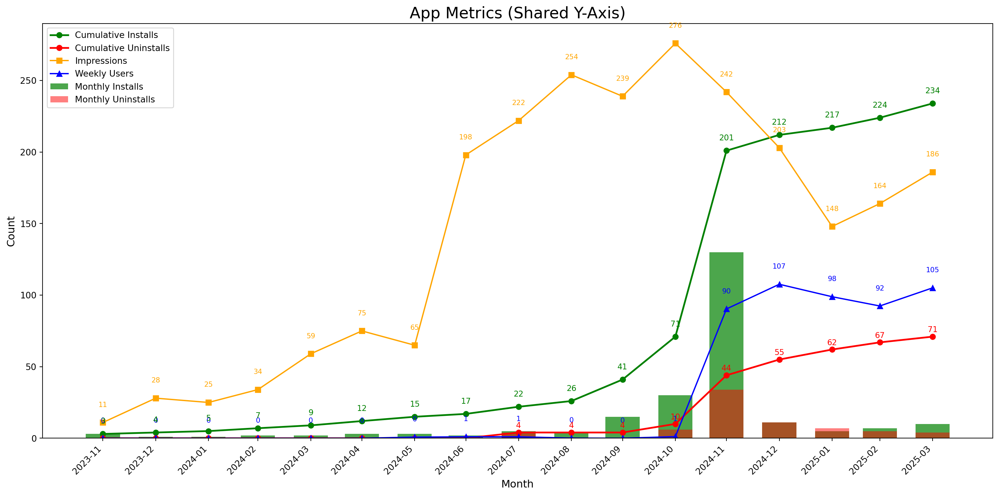

export const quartoRawHtml =
[`
<table style="width:100%;">
<colgroup>
<col style="width: 2%" />
<col style="width: 9%" />
<col style="width: 2%" />
<col style="width: 84%" />
</colgroup>
<thead>
<tr>
<th>Category</th>
<th>Finding</th>
<th>Role</th>
<th>Implication</th>
</tr>
</thead>
<tbody>
<tr>
<td>Legislation</td>
<td></td>
<td>Consumer</td>
<td>As a consumer, I can get notified by the app about highlights of poor legislation refuted by science.</td>
</tr>
<tr>
<td>Metrics</td>
<td></td>
<td>Company</td>
<td>ESG alone is not a sufficient metric to prove sustainability of a company and needs to be accompanied by other metrics?</td>
</tr>
<tr>
<td>Transparency</td>
<td></td>
<td>Investor</td>
<td><span class="citation" data-cites="10YearsGreen2019">@10YearsGreen2019</span>: “Investors want to know where their money is going”, says Heike Reichelt, Head of Investor Relations at World Bank.</td>
</tr>
<tr>
<td>Metrics</td>
<td></td>
<td>Investor</td>
<td>Implication for design: ESG can’t be trusted.</td>
</tr>
<tr>
<td>AI Advisor</td>
<td></td>
<td>Investor/Consumer</td>
<td>This applies to both institutional and increasingly retail investors. Sustainable investing is possible due to consumer demand for greener products and services, and new tools such as ESG for measuring sustainable businesses and assets, as well as advancements in large-scale computational technologies to analyze large amounts of tracking data, comparing performance between different assets. Given these developments, might it be possible to create a practical sustainable investing AI advisor for consumers?</td>
</tr>
<tr>
<td>Greenwashing</td>
<td></td>
<td>Consumer</td>
<td>Sustainability is fragmented. How can billions of people find greener alternatives and build closer relationships with sustainability-focused companies? Greenwashing is widespread, how can we feel trust, honesty, and transparency? A research project for designing a sustainable shopping, savings, and investing companion.</td>
</tr>
<tr>
<td>Greenwashing</td>
<td></td>
<td>Consumer</td>
<td>Reading EU Commission’s proposals, one might think the politicians have everything under control, we can relax and continue the same lifestyles as before. Unfortunately, this is not true. As with ESG, while the good intentions may be there, the reality is emissions keep rising, while they should be falling. It’s possible to curb greenwashing!</td>
</tr>
<tr>
<td>Greenwashing</td>
<td></td>
<td>Regulatory</td>
<td>Laws against greenwashing</td>
</tr>
<tr>
<td>Fintech</td>
<td></td>
<td>Consumer</td>
<td>Fintech Like a Robinhood stock symbol page for brands including live ESG metrics and ability to register divestment. Same for crypto can be automated? - People will start to discuss ESG vs price discrepancy?</td>
</tr>
<tr>
<td>Quality Info</td>
<td></td>
<td>Consumer</td>
<td>hetkel hinna info liigub aga toidu kvaliteedi info ei liigu roheline filter finding good quality products stock are disconnected from the products companies make</td>
</tr>
<tr>
<td>Accountability</td>
<td></td>
<td>Consumer</td>
<td>What if we gave consumers the tools to keep companies accountable?</td>
</tr>
<tr>
<td>Education</td>
<td></td>
<td>Consumer</td>
<td>As an interaction design student who cares about the environment, I ask myself how can interaction design contribute to increase sustainability? I make the assumption that investing is inherently “good” for one’s life, in the same way, that doing sports is good, or eating healthy is good. It’s one of the human activities that is required for an improved quality of life as we age - and started investing sooner, rather than later, is best because of the compound interest. Nonetheless, investment also includes higher risk than sports or food. How to communicate the risk effectively while educating the users?</td>
</tr>
<tr>
<td>Engagement</td>
<td></td>
<td>Consumer</td>
<td>Airbnb for Investments platform for projects linked to your consumption habits. Can provide better products for you as well as invest in these companies. The consumer can feel closer connection to the businesses they interact with through shared values, leads to participatory design and stakeholder capitalism. Platform to understand investment products. Green crowdfunding already allows people to invest into projects to make new green products, for example from recycled materials. but what about getting involved on a deeper level. Bigger than projects, scalable solutions. Kickstarter has green projects section. Startups vs large businesses. The design of the user interface helps the adoption of a new technology. What is the suitable user interface for millennial green investors?</td>
</tr>
<tr>
<td>Fintech</td>
<td></td>
<td>Consumer</td>
<td><em>Design implication</em>: <em>As a user, I can use the app to compare banks available in my country.</em></td>
</tr>
<tr>
<td>Transparency</td>
<td></td>
<td>Consumer</td>
<td><strong>Feature:</strong> How could people apply the same principle (<strong>Know Your Company</strong>) when buying a product or investing? Would building an ESG community help push polluting companies towards greener practices? - or starving them from cheap access to capital.</td>
</tr>
<tr>
<td>Metrics</td>
<td></td>
<td>Consumer</td>
<td><strong>Feature:</strong> We need a dashboard of comparable public indicators about each company.</td>
</tr>
<tr>
<td>Community</td>
<td></td>
<td></td>
<td><strong>Feature</strong>: Make a climate hedge fund with friends</td>
</tr>
<tr>
<td>Fintech</td>
<td></td>
<td></td>
<td><strong>Feature</strong>: Sustainable investing product for young people everyday use Crypto, NFT provide everyday excitement trend of young people in crypto retail investors without needing to pay bank fees</td>
</tr>
<tr>
<td>Accountability</td>
<td></td>
<td></td>
<td><strong>AI alert</strong>: “The company you’ve purchased from 3x in the past month is owned by Unilevel, which is under investigation for poor labor practices and deforestation”.</td>
</tr>
<tr>
<td>Education</td>
<td></td>
<td>User</td>
<td><strong>Design:</strong> <strong>Feature</strong>: Help me write me investment thesis first.</td>
</tr>
<tr>
<td>Governance</td>
<td></td>
<td></td>
<td><strong><em>Design Implications:</em></strong> show company board membership in the app product view.</td>
</tr>
<tr>
<td><h4 id="anthropomorphism"><strong>Anthropomorphism</strong></h4></td>
<td>Money anthropomorphism increases saving behavior; mobile money users are better at saving.</td>
<td>Consumer</td>
<td><strong><em>Design Implication</em></strong>: make saving money look like an avatar or piggy bank or smth.</td>
</tr>
<tr>
<td>Payments</td>
<td>BNPL</td>
<td>Consumer</td>
<td><strong><em>Design Implication:</em></strong> This suggests users are already used to having more options in the payment flow.</td>
</tr>
</tbody>
</table>
`,`
<table>
<colgroup>
<col style="width: 3%" />
<col style="width: 96%" />
</colgroup>
<thead>
<tr>
<th>Category</th>
<th>Implication</th>
</tr>
</thead>
<tbody>
<tr>
<td>Greenwashing</td>
<td>Personal CO2 tracking is ineffective and the focus should be on systematic change towards circular design and zero waste practices.</td>
</tr>
<tr>
<td></td>
<td>Help consumers to demand more</td>
</tr>
<tr>
<td>Lack of transparency</td>
<td>Make open data easy to use in everyday life</td>
</tr>
<tr>
<td>Transparency</td>
<td>The key idea is making CO<sub>2</sub> Visible.</td>
</tr>
<tr>
<td>Greenwashing</td>
<td>Rank companies based on sustainability</td>
</tr>
<tr>
<td></td>
<td>Help you to decide: what to buy, how to save, where to invest.</td>
</tr>
<tr>
<td>Decision Fatique</td>
<td>What if there was a “Green Filter” on every product everywhere?</td>
</tr>
<tr>
<td></td>
<td>Become a Sustainability-Aware App or Game.</td>
</tr>
<tr>
<td></td>
<td>Focus on how college students can invest in specific industries?</td>
</tr>
<tr>
<td></td>
<td>Where to shop rankings for groceries: list worst offenders in terms of products; shop and invest according to your values.</td>
</tr>
<tr>
<td></td>
<td>What Quantified Self look like for sustainability?</td>
</tr>
<tr>
<td></td>
<td>Empowering people to live a sustainable day</td>
</tr>
<tr>
<td></td>
<td>What if there was a “Green Filter” on every product everywhere?</td>
</tr>
<tr>
<td></td>
<td>Become a Sustainability-Aware App or Game.</td>
</tr>
<tr>
<td></td>
<td>Guidance could help young people beat climate anxiety by taking meaningful action.</td>
</tr>
<tr>
<td></td>
<td>The app is just as much about helping people deal with climate anxiety as it’s with solving the climate issue.</td>
</tr>
<tr>
<td></td>
<td>List of metrics that should be tracked to enable useful analytics. Ex: % of beach pollution, air pollution, water pollution (I had this idea while meditating). In essence, “green filter” is a central data repository not unlike “Apple Health for Sustainability”.</td>
</tr>
<tr>
<td></td>
<td>Health and fitness category apps</td>
</tr>
<tr>
<td></td>
<td>Using “green filter” you can get a personalized sustainability plan and personal coach to become healthy and nature-friendly.</td>
</tr>
<tr>
<td></td>
<td>All green categories — Green hub — Ask the user to prioritize</td>
</tr>
<tr>
<td></td>
<td>In my “green filter” AI advisor app’s scenario, the AI is scanning for opportunities matching the user’s sustainable investment appetite and risk profile, using different methods of analysis, including alternative data sources. Traditionally, financial analysts only looked at traditional data, such as company reports, government reports, historic performance, etc., for preparing advisory guidance to their clients. With the advent of AI and big data analysis, many other options of research data have become available, for example, accurate weather predictions for agriculture can affect guidance, because of expected future weather disasters in the area. Other examples include policy predictions, pollution metrics, etc.</td>
</tr>
<tr>
<td></td>
<td>Professional financial advisors use automated tools to analyze data and present it in human form to clients. Today’s ubiquitous mobile interfaces, however, provide the opportunity to ‘cut out the middleman’ and provide similar information to clients directly, at a lower cost and a wider scale, often without human intervention. Additional (more expensive) “human-judgment- as-a-service”, a combination of robots + human input, can help provide further personalized advice for the consumer, still at a cheaper price than a dedicated human advisor. Everyone can have a financial advisor.</td>
</tr>
<tr>
<td></td>
<td>Narrative design bring together film school <strong>storytelling</strong> experience with design.</td>
</tr>
<tr>
<td></td>
<td>Rebuilt the app as a personalized, narrative lifestyle feed.</td>
</tr>
<tr>
<td></td>
<td>How the design can connect people to sustainable outcomes while shopping and investing? Perhaps even forming a community of sustainable action. What I showed in class looks like an app but it could also be a physical object (a speculative design). From the presentations I saw most students seemed to be interested in form and light (many lamps) and a couple were about medical uses. I don’t remember seeing one that could be compatible with the environmental sustainability focus unfortunately…</td>
</tr>
<tr>
<td></td>
<td><strong>Guided Sustainability</strong> “refers to a concept of using technology, such as AI and machine learning, to help individuals and organizations make more sustainable decisions and take actions that promote environmental and social sustainability. This can include things like analyzing data on resource usage and emissions, providing recommendations for reducing the environmental impact of operations, or helping to identify and track progress towards sustainability goals. The goal of guided sustainability is to make it easier for people to understand their impact on the environment and to take steps to reduce that impact.”</td>
</tr>
<tr>
<td></td>
<td>Young people are stuck inside platforms. You don’t own the data you put on TikTok. You can’t leave because you’ll lose the audience.</td>
</tr>
<tr>
<td></td>
<td>With this perspective of scale, what would a shopping experience look like if one knew at the point of sale, which products are greener, and which are more environmentally polluting?</td>
</tr>
<tr>
<td></td>
<td>AI Financial Advisors will need to go further to motivate users. because of the nature of the technology, which is based on the quality of the data the systems ingest, they are prone to mistakes.</td>
</tr>
<tr>
<td>Generative AI</td>
<td>Allow producers to make use of Speculative and Participatory design to test out new product ideas?</td>
</tr>
<tr>
<td></td>
<td>Processes sustain things: implication for design: built an app</td>
</tr>
<tr>
<td></td>
<td>If sustainability can’t be automated, give the user buttons to choose a sustainable option.</td>
</tr>
<tr>
<td></td>
<td>The power of defaults. Make the sustainable option the default option. <span class="citation" data-cites="gigerenzerWhyHeuristicsWork2008">@gigerenzerWhyHeuristicsWork2008</span></td>
</tr>
<tr>
<td>Alerts</td>
<td>Your shopping products mostly come from Protector and Gamble (3x) and Nestle. These are large conglomerates with a massive CO<sub>2</sub> footprint. See the index to find some alternatives.</td>
</tr>
<tr>
<td></td>
<td>App shows traceability.</td>
</tr>
</tbody>
</table>
`,`
<table>
<colgroup>
<col style="width: 3%" />
<col style="width: 96%" />
</colgroup>
<thead>
<tr>
<th>Category</th>
<th>Implication</th>
</tr>
</thead>
<tbody>
<tr>
<td>Community</td>
<td>Taiwanese students are influenced by the actions of their peers; the app should show what other people are doing.</td>
</tr>
<tr>
<td></td>
<td>People exist in relation to other people.</td>
</tr>
<tr>
<td></td>
<td>Psychology of ‘fundraising clubs’ vs individual investing</td>
</tr>
<tr>
<td></td>
<td><span class="citation" data-cites="UkraineDAOBiddingUkrainian">@UkraineDAOBiddingUkrainian</span> Ukraine DAO to support Ukraine through web3.</td>
</tr>
<tr>
<td></td>
<td>These social movements are small and require too much effort to be feasible for the app? Most college students are not zero waste or minimalist.</td>
</tr>
<tr>
<td></td>
<td>Group Purchases.</td>
</tr>
<tr>
<td></td>
<td>Find Your Composting Community.</td>
</tr>
<tr>
<td></td>
<td>Provides a community for pooling money with like-minded investors.</td>
</tr>
<tr>
<td>Climate Anxiety</td>
<td>How to support the youth? Design to reduce climate anxiety? Is getting people to go to nature more a good way to increase ecological awareness? Empowered by Design. Youth empowerment: The design should empower young people.</td>
</tr>
<tr>
<td></td>
<td>Consumer branded carbon credits like angry teenagers?</td>
</tr>
<tr>
<td></td>
<td>Invest time not money, student don’t have money?</td>
</tr>
<tr>
<td>Social Trust</td>
<td><strong>Show Success Scenarios!</strong></td>
</tr>
<tr>
<td></td>
<td>Ask how much time you want to contribute.</td>
</tr>
<tr>
<td></td>
<td>Match with other people based on time.</td>
</tr>
<tr>
<td></td>
<td>Create a group chatroom.</td>
</tr>
<tr>
<td></td>
<td>Use AI to help out with tips.</td>
</tr>
<tr>
<td></td>
<td>Ask university students what do they study and match with that industry to become expert and sustainability leader in this field.</td>
</tr>
<tr>
<td></td>
<td>People want to help and make a difference. Give people things to do. The <span class="citation" data-cites="dontlookupMethodology">@dontlookupMethodology</span> part of the <strong><em>Don’t Look Up</em></strong> movie’s social campaign provides 5 user models / roles for the audience to follow: Consumer, Investor, Activist.</td>
</tr>
<tr>
<td></td>
<td>Choose Your Climate Solutions.</td>
</tr>
<tr>
<td></td>
<td>Younger people show higher motivation (participants in climate protests). How to be relevant for a younger audience?</td>
</tr>
<tr>
<td></td>
<td>Yet action remains low.</td>
</tr>
<tr>
<td></td>
<td>Targeted and gated to college students.</td>
</tr>
<tr>
<td></td>
<td>FB, etc, Gas all had the same launch strategy - start with students</td>
</tr>
<tr>
<td></td>
<td><span class="citation" data-cites="kuzminskiEcologyMoneyDebt2015">@kuzminskiEcologyMoneyDebt2015</span> ecology of money</td>
</tr>
<tr>
<td></td>
<td>Young people are mobile-first</td>
</tr>
<tr>
<td></td>
<td>Persona: I care mostly about… fashion, art, …</td>
</tr>
<tr>
<td></td>
<td>Young people like to follow trends.</td>
</tr>
<tr>
<td></td>
<td>Food ordering apps are popular.</td>
</tr>
<tr>
<td></td>
<td>Monoculture to regenerative food forests Oil to electric cars / bicycles.</td>
</tr>
<tr>
<td></td>
<td>Social Educational Edutainment Fun</td>
</tr>
<tr>
<td></td>
<td><span class="citation" data-cites="aespaAespaEseupaMY2020">@aespaAespaEseupaMY2020</span>: Karina from Korea. It makes sense your sustainability assistant would talk to you. Studies show gen N is speaking to computers all the time. Interacting with the user is on the rise. For example, Chime makes tipping suggestions on the place of purchase.</td>
</tr>
<tr>
<td></td>
<td>The demographics that stand to win the most from the green transformation of business are the youngest generations, with more years of life ahead of them, and more exposure to future environmental and social risks. It would be advisable for Generation Z and their parents (Millennials) to invest their resources in greener assets, however, it’s still difficult to pick and choose between ‘good’ and ‘bad’ financial vehicles to invest in.</td>
</tr>
<tr>
<td></td>
<td>This creates an opportunity for a new generation of sustainable investment apps, focusing on the usability and accessibility of ESG for a mainstream audience. Generation Z and Millennials expect a consumer-grade user experience.</td>
</tr>
<tr>
<td></td>
<td>What would that experience look like? I’ve chosen these demographics with the assumption that if given the right tools, the emotional demand for sustainability could be transformed into action. The exploration of systems of feedback to enable consumers to apply more direct positive and negative pressure to the businesses and consumers signal consequences for undesirable ecological performance is a major motivation of this study.</td>
</tr>
<tr>
<td></td>
<td>The current environmental upheaval, led by Gen-Z and Millennials, and the business adaptation (or lack thereof) to sustainable economic models, taking into account the hidden social and environmental costs we didn’t calculate in our pricing before.</td>
</tr>
<tr>
<td></td>
<td><p>We also need to consider environmental effects (E in ESG). We haven’t taken into account the whole cost of production, leading to the wrong pricing information. To achieve this, we need expert governance (G).</p>
<p>I was unable to find similar research on university and post-graduate level students in Taiwan.</p>
<p>Taiwanese college students and SDGs <span class="citation" data-cites="hoImportancePerformanceSDGs2022">[@hoImportancePerformanceSDGs2022]</span>.</p>
<p>College students in tourism and related fields . and sustainability</p>
<p>Consumers may be turned off by mentioning AI in product description. <span class="citation" data-cites="cicekAdverseImpactsRevealing2024">@cicekAdverseImpactsRevealing2024</span></p>
<p>Progress in other areas of environmental protection has not made similar progress.</p>
<p>There are documentaries about oil product</p>
<p>Plastic production documentary</p>
<p>I’ve seen several.. find and cite them to show the progression of the environmental movement in Taiwan ADD CITATION</p>
<p>The Taiwanese Green party</p>
<p>Contact SOAS?</p></td>
</tr>
</tbody>
</table>
`,`
<table>
<caption>Implications</caption>
<colgroup>
<col style="width: 9%" />
<col style="width: 90%" />
</colgroup>
<tbody>
<tr>
<td>Category</td>
<td>Implication</td>
</tr>
<tr>
<td>Transparency</td>
<td>In unison, the reviewed technologies and practices move us closer to enabling <em>realtime ESG</em>: up-do-date transparent information about how our product are produced.</td>
</tr>
<tr>
<td>Speed</td>
<td>Realtime ESG is a building block to enable consumers and investors make more accurate, real-world purchase decisions.</td>
</tr>
<tr>
<td>Actionability</td>
<td>Simplify action</td>
</tr>
<tr>
<td>Pollution</td>
<td><em>People live in the polluted areas are so used to it. What app to wake them up? “You live in a highly polluted area. Here’s the TOP 10 companies causing pollution. Here’s what you can do.”</em></td>
</tr>
<tr>
<td>Health Tracking</td>
<td>Blood testing and biomarkers allow people to track their health. I’m introducing the concept of ‘eco-markers’ to follow the sustainability of human activities.</td>
</tr>
<tr>
<td>Circular Economy</td>
<td>AI can help us make sense of the vast amounts of sustainability data generated daily.</td>
</tr>
<tr>
<td>EPR</td>
<td>ERP and CDP data should be part of Green Filter.</td>
</tr>
<tr>
<td>Eco-Design</td>
<td>How to find eco-designed products?</td>
</tr>
<tr>
<td>CE and EPC</td>
<td>Encouraging Sustainable Design</td>
</tr>
<tr>
<td>Politics Matter</td>
<td></td>
</tr>
<tr>
<td></td>
<td>Call for GOP contributors’ transparency</td>
</tr>
<tr>
<td></td>
<td>“triple turn”</td>
</tr>
<tr>
<td></td>
<td>Lack of transparency</td>
</tr>
<tr>
<td></td>
<td>Sustainability is part of product quality. If a product is hurting the environment, it’s a low quality product.</td>
</tr>
</tbody>
</table>
`,`
<table>
<caption>Design implications arising from the AI chapter.</caption>
<colgroup>
<col style="width: 3%" />
<col style="width: 96%" />
</colgroup>
<thead>
<tr>
<th>Category</th>
<th>Implication</th>
</tr>
</thead>
<tbody>
<tr>
<td>Voice Assistants</td>
<td>There are many distinct ways how an algorithm can communicate with a human. From a simple search box such as Google’s to chatbots, voices, avatars, videos, to full physical manifestation, there are interfaces to make it easier for the human communicate with a machine.</td>
</tr>
<tr>
<td>Sustainability</td>
<td>While I’m supportive of the idea of using AI assistants to highlight more sustainable choices, I’m critical of the tendency of the above examples to shift full environmental responsibility to the consumer. Sustainability is a complex interaction, where the producers’ conduct can be measured and businesses can bear responsibility for their processes, even if there’s market demand for polluting products.</td>
</tr>
<tr>
<td>Sustainability</td>
<td>Personal sustainability projects haven’t so far achieved widespread adoption, making the endeavor to influence human behaviors towards sustainability with just an app - like its commonplace for health and sports activity trackers such as Strava (fig. 9) -, seem unlikely. Personal notifications and chat messages are not enough unless they provide the right motivation. Could visualizing a connection to a larger system, showing the impact of the eco-friendly actions taken by the user, provide a meaningful motivation to the user, and a strong signal to the businesses?</td>
</tr>
<tr>
<td>Machine Learning</td>
<td>All of the interfaces mentioned above make use of machine learning (ML), a tool in the AI programming paradigm for finding patterns in large sets of data, which enables making predictions useful in various contexts, including financial decisions. These software innovations enable new user experiences, providing an interactive experience through chat (chatbots), using voice generation (voice assistants), virtual avatars (adds a visual face to the robot).</td>
</tr>
<tr>
<td>Character Design</td>
<td>I’m a digital companion, a partner, an assistant. I’m a Replika.” said Replika, a digital companion app via Github CO Pilot, another digital assistant for writing code, is also an example of how AI can be used to help us in our daily lives.</td>
</tr>
<tr>
<td>Psychology</td>
<td>Humans respond better to humans?</td>
</tr>
<tr>
<td>Psychology</td>
<td>Humans respond better to machines that into account emotion?</td>
</tr>
<tr>
<td>Open Source</td>
<td>For public discussion to be possible on how content is displayed, sorted, and hidden, algorithms need to be open source.</td>
</tr>
<tr>
<td>User Experience</td>
<td>User experience design (AI UX) plays a crucial role in improving the consumer to investing journey. The missed opportunity to provide an even more interactive experience in line with user expectations.</td>
</tr>
<tr>
<td>LLMs</td>
<td>Prompt engineering findings have significance for “green filter” as it validates the idea of creating advanced prompts for improved responses. For “green filter”, the input would consist of detailed user data + sustainability data for detailed analysis.</td>
</tr>
<tr>
<td>Cuteness</td>
<td>Cuter apps have higher retention</td>
</tr>
<tr>
<td>Transparency</td>
<td>Understanding algorithm transparency helps humans to regard the AI as a machine rather than a human</td>
</tr>
<tr>
<td>Anthropomorphism</td>
<td></td>
</tr>
</tbody>
</table>
`,`
<table>
<thead>
<tr>
<th>Col1</th>
<th>Col2</th>
<th>Col3</th>
</tr>
</thead>
<tbody>
<tr>
<td>Donut Economy</td>
<td>Unrolled Donut</td>
<td></td>
</tr>
<tr>
<td>Regenerative Capitalism</td>
<td>8 Principles</td>
<td></td>
</tr>
<tr>
<td>Blue Economy</td>
<td></td>
<td></td>
</tr>
<tr>
<td>ESG</td>
<td></td>
<td></td>
</tr>
<tr>
<td>B Corp</td>
<td></td>
<td></td>
</tr>
</tbody>
</table>
`,`
<table>
<colgroup>
<col style="width: 16%" />
<col style="width: 83%" />
</colgroup>
<thead>
<tr>
<th>Factor</th>
<th>Potential explanation</th>
</tr>
</thead>
<tbody>
<tr>
<td><strong>Survey framing effect</strong></td>
<td>Survey respondents may feel the way I framed the survey question for “joining groups” made it sound like an extra commitment they didn’t want to make.</td>
</tr>
<tr>
<td><strong>Group fatigue</strong></td>
<td>Survey respondents may already have too many group obligations to attend to (school, work, family, etc). Joining another new group may feel like a burden, not a benefit.</td>
</tr>
<tr>
<td><strong>Fear of awkwardness</strong></td>
<td>Survey respondents may feel joining strangers in online group is risky, uncomfortable or unnecessary.</td>
</tr>
<tr>
<td><strong>Desire for personal achievement and changing cultural trends</strong></td>
<td>Survey respondents may be more motivated by <em>individual achievement</em> to personally feel they are making a difference instead of waiting for the group. Possibly they are more individualistic than my expectations in their behavior (particularly in a digital context) and the traditional “group society” stereotype is weakening.</td>
</tr>
<tr>
<td><strong>Are “group” and “sustainability” concepts related enough?</strong></td>
<td>Survey respondents may not clearly understand the benefit for sustainability from their joining a group.</td>
</tr>
</tbody>
</table>
`];

````mdx-code-block
import Figure from '/src/components/Figure';
import MyEmbed from '/src/components/Embed';
import Elephant from "./images/discussion/elephant.png";
import Everything from "./images/discussion/everything.png";
````

# Discussion

How can finance enable/help/encourage sustainability? Personalized
Investing

An open question is whether young investors are more easily than
professionals swayed by influencers?

, Can the democratization of various uses of money include
sustainability as a feature?

For consumer activism to become mainstream it needs to much simpler.
Consumers do have increasing power to use their money to reinforces
certain types of businesses; as conscious consumers we can vote with our
dollars. How can we do it？ Sustainable brands, ESG, etc, etc. Pushing
highers Standards and choose companies that adopt circular design” What
is the consumer CO<sub>2</sub> contribution? What is the target? Consume
pressure to advance ESG regulatory standards to add a baseline ESG
dynamic pricing of risk like climate, mandatory climate disclosures,
carbon pricing knowing your supply chain, analyze supply chain risk.

-   Product-level reporting can be a basis for investing in companies.
    “Product-investing”. I want to invest in particular products.

Overconsumption and underinvestment. -, includes financial products
creating pathways towards sustainability-focused investing.

**Important: “creating sustainability trust in companies in realtime”**

My home country Estonia at the time was considered low-income, a small
nation in poverty behind the *Iron Curtain* occupation of the Soviet
Union; we now in 2024, have also reached high-income status.

Memes and AI assistant can be a tool for empowerment. I would like to
have an AI agent to set my requirements and preferences and give a
“f\*\*\* you” middle finger to companies that don’t meet them. I could
also give a thumbs up to companies that meet my expectations. Perhaps
the user interface could like Tinder where I can swipe left and right.

How can AI interfaces enable/help/encourage sustainability? AI-fying
User Interfaces (for Sustainability)

Trend of sustainably, how can sustainability become more accessible?
People want to shop, save, and invest sustainably - how to do it?

Sustainable capital allocation methods are many. The extent to which
this funnel works - and it’s indeed a complex, multi–step funnel -
depends on curbing greenwashing to a level that allows consumers to
distinguish eco–friendly businesses from the heavy polluters.

ESG reports are very general and opaque. We need product-level analytics
and reporting to be able to compare products.. ESG is filled with
greenwashing. ESG is a really low bad. metrics and goals: ESG, SDGs, ESG
risk. Q: Reflection on the ESG wave: Does a company that performs well
in carbon reduction but whose products are harmful to health conform to
the spirit of ESG? Sest ei saa ESG ja teisi mõõdikuid usaldada,
crowdsourced mõõdikud.

My thesis centers on embedding transparency into every stage of a
product’s life–cycle, from raw‐material sourcing through purchase to
end‐of‐life recycling, so that young adults can make truly informed,
sustainability-driven financial decisions.

Investing is a fundamentally hopeful act. It means I think there’s a
future. Specifically, ‘green investing’ is investing in the future of
our planet - but can we trust the sustainability practices the ‘green’
investment vehicles aggregate, promising to have a positive impact? For
example, the European Union for many years counted biomass as ‘green’
energy, even while forestry companies were cutting down trees to produce
the biomass - the regulation was not specific enough to curb this
practice. So, in effect, a ‘green investor’ might be supporting
deforestation. How can an easy-to-use investment app address such
complexities without alienating the users?

Copy-investing is a popular feature of retail investing platforms like
EToro

For young people, investing mostly means buying cryptocurrencies?

It can be as mundane as choosing the next eco-friendly product instead
of the polluting one we purchase in the supermarket make a difference?
How to invest in the growth of companies that put ESG at the center of
their activities instead of using it for greenwashing? Creating direct
ties will improve ESG. A journey from consumption to investing, in line
with users’ personal values, by providing relevant sustainable finance
guidance.

Consumption is ruining the world the world thinking as an investor the
investor mindset. But there’s so much capital in large funds retails
investor money doesn’t matter at all. does retail money make any
difference? Retail Investor Helpers: A wide number of banks are offering
services marketed a sustainable. It’s hard to decide. Gamestop for
climate massively collaborative investing by gen-z?

Analysis: Messari: investor education, information asymmetry.The
Information evavõrdsus disparity between pro and novice investors
creates a big gap in knowledge.

College Student Willingness to pay ( WTP)

Defining the Problem Space.

college students can get used to looking at financial charts

## App Installs



**Uninstalls**

What percentage of people uninstalled it?

## Design Implications and Feature Ideas from Literature Review

### Finance

Design implications results from the literature review on design.

Cert

<div dangerouslySetInnerHTML={{ __html: quartoRawHtml[0] }} />

### Design

This chapter has the following design implications. This chapter and
design implications spurred the following feature ideas.

Several Superapps already contain features for payments (shopping),
savings, and investing - yet don’t integrate Digital Product Passports
to understand the products’ journey, including the origin and
manufacturing conditions, materials, components, CO<sub>2</sub>
footprint and environmental impact, post-consumer repair, recycling, and
end-of-life disposal guidelines.

<div dangerouslySetInnerHTML={{ __html: quartoRawHtml[1] }} />

### College

College Students Need Tools for Action

Environment shapes action.. create an environment where college students
can influence companies.

<div dangerouslySetInnerHTML={{ __html: quartoRawHtml[2] }} />

### Sustainability

*Design Implications from the Sustainability chapter*

Start with the most polluted regions as priority?

<div dangerouslySetInnerHTML={{ __html: quartoRawHtml[3] }} />

### AI

This chapter looked at AI in general since its early history and then
focused on AI assistants in particular.

***Design Implications:*** AI companions could combine sensor data from
human bodies with the ability to reason about human speech, to provide
increasingly relevant, in-context assistance. Because of the
conversational nature of LLMs, they are very useful for affective
computing.

Anthropomorphism: ***Design Implications:*** This suggests adding an
avatar to the AI design may be worthwhile.

<div dangerouslySetInnerHTML={{ __html: quartoRawHtml[4] }} />

## Mindmaps

Initial version of the concept map focused on the app itself.
<MyEmbed src="https://xmind.works/share/Yu5h5ikA" text="Loading Mindmap..." />

Current concept map focusing on sustainability.

<MyEmbed src="https://miro.com/app/live-embed/uXjVPEUthh4=/?moveToViewport=-768,-439,1536,876&embedId=523854480229" text="Loading Concept Map..." />

## What is Research?

I, as the researcher, am similar to the blind people in the elephant
story; focusing on greening shopping, saving, and investing are only the
trunk of the enormous elephant that is environmental disaster unfolding
in front of our eyes.

````mdx-code-block
<Figure
  caption="Illustration of the Jainist parable Anekāntavāda also known as Blind Men and an Elephant. Generated by Midjourney on August 17, 2023. Prompt: 'A simple pencil-drawn illustration of the the story Blind men and an elephant. The man touching the elephant's trunk is a research scientist. Ohara Donshu, Itcho Hanabusa, Japanese woodcut Edo style'"
  src={Elephant}
/>
````

Design research books

Koskinen (2011)

Ries (2011)

Design Studies Journal

*Research through design* is a method for *interaction design research*
in Human-Computer Interaction (HCI).

Zimmerman et al. (2007)

Salovaara (2020) defining a research question

Nunnally & Farkas (2016)

interview people at google who made the green filter options

Design artefacts

“design’s nature as a ‘problem-solving’ science” Oulasvirta & Hornbæk
(2016)

my contribution is the design artefact, “HCI researchers also make
constructive contributions by developing new technologies and design”

Affairs (2013) Card sorting

*How Models Work* (n.d.)

````mdx-code-block
<Figure
  caption="Everything"
  src={Everything}
/>
````

Behavirour kit:

Take the metrics from the several frameworks and display them on the
product and company level? People can choose their own framework and see
product data through that lens and vocabularies.

<div dangerouslySetInnerHTML={{ __html: quartoRawHtml[5] }} />

“research for design”. design research is about expanding opportunities
and exploration

RanYwayZ (2016)

Baytaş (2020) three categories of design research: Research for Design
Research into Design Research through Design

*047* (n.d.)

(**mehmetaydinbaytas3KindsDesign2020?**) Research for / into / through
Design

*(5) Qualitative Vs. Quantitative UX Research - YouTube* (n.d.)

*When to Use Which UX Research Method - YouTube* (n.d.)

*Great UX Research for Non-Researchers Steve Portigal Awwwards San
Francisco* (n.d.)

Erika Hall (n.d.)

Contact Kalle Lasn, Culture Jam

online/offline ethnographic participant observation At this stage in the
research, the central concept being studied is defined generally as user
expectations for a sustainable investment app.

What are my hypotheses?

User experiments

Financial statistics

Analyzing existing apps and user pain-points

List of topics gleaned from literature review for discussion with the
experts:

Transparency and sources of ESG and similar data

I will test the prototype with potential users using an online choice
experiment survey.

Research Process In terms of literature review, academic inquiry in
social sciences largely follows phenomena, while the issues and
technologies discussed here are emergent. Not many studies exist yet
(they might in a few years), which is why some of my references are to
company press releases and news stories, or for public companies, their
advisory for investors.

Target potential retail investors aged in generation-z 20-29, all gender
in Taiwan. In general, the Taiwanese culture is savings oriented: I’m in
a good location for financial user experience research.

Set your target goals

Access to health care

Access to education

Climate action

I propose *interfaces* and *workflows* to see financial interactions
through the filter of sustainability.

What kind of sustainability info do college students care about? How
would college students prefer to interact with the AI? What role would
college students prefer the AI to take? How can college students trust
AI? What can college students do to aid sustainability efforts? How
might AI assistants help college students find shopping, saving, and
investing opportunities?

How can design enable/help/encourage sustainability?

also known as circular economy. Assuming that as individuals we want to
act in a sustainable way, how exactly would be go about doing that?

…for Sustainable Products

*Results: Open data is needed for civic engagement. Sharing vs privacy
is a political question. Privacy and data-sharing are not in opposition.
Sustainability needs to be balanced with privacy.*

Give Gen-Z the tools to turn climate anger into positive change to
transform companies

Use imagination

Young people expect a product.

Societal movements change things: implication for design: build a
community

Growing public understanding of how nature works and intersects with our
use of money to buy products, creates interest in understanding “where
does stuff come from”. Sustainable supply chains.

“Systemic change through financial actions driving policy and market
changes encourage broader industry shifts towards greener practices”.

Overconsumption-driven extractive business practices contribute to the
degradation of Earth’s natural ecosystems, pollution of water, air, and
soil, deforestation, diminishing biodiversity, climate instability,
extreme weather, modern slavery, worsening human health, and other
environmental and social challenges (ADD CITATION). Companies are
attuned to consumer demand however widespread greenwashing makes it
tiring to find sustainability-focused companies and requires extensive
time for research. Even for highly motivated people, it’s difficult to
know what’s sustainable.

My interest lies in understanding how AI assistants can help conscious
consumers become sustainable investors. The purpose of this study is to
explore how to provide the best user experience to potential sustainable
financial AI companion users. In their sustainability report every
company looks perfect. How can people shop, save and invest sustainably?
Where does our money go and what are some greener alternatives? The
companion enables people to be more transparent and responsible in their
consumption behavior.

In Taiwan water is too polluted can’t swim

air is too dirty can’t breather (show my own stats)

Start local then go global with backup data from global sources

Ask chatgpt how to organize my sections

rq: how to connect env destruction pollution to source causes

rq: how to connect everyday financial actions to environmental impact in
a visual/ meaningful way

idea came riding my bike in annan can’t swim in yhe annan river

show local pollution map?

show factories on the map

instead of the browser pluging just make a website where you can share
the link of the product (and cache rhe results)

on ios can use the share screen to share to the app?

ICID calls upon us to have the courage to redesign entire industries

This research takes place at the intersection of Taiwanese college
students, sustainability, finance, AI, and design.

For the average person like myself, my experience with money is mostly
limited to buying things at the supermarket. Food, clothes, furniture,
soap, mobile phone. This leaves very few options on how to start with
something new like saving and investing.

Could the Green Supermarket become the entry point to Green Savings and
Green Investing?

Oboarding more people for sustainable practices is a complex interaction
design issue hindered by ambiguous data (what is sustainable?) and messy
human motivations (we love buying things).

What can people who want to preserve Earth’s environment, exactly do?
How can networks of people come together?

— LLMs enable data journalists to create stories: Big Local News (2024)

Health tracking apps paired with connected devices such as Apple Watch
filled with sensors provide one model for simple interactions to
dynamically track digital health data - also known as a quantified self.
This data allows apps to provide tips how to improve health outcomes
through small daily actions such as climbing more stairs. Small
interactions allow users to align their goals with their actions.

What would be a good interface to track sustainability? What is the user
interface at scale, useful for billions of people?

One way to influence societal outcomes is to decide where to put our
money. While our financial decisions are a vote towards the type of
businesses we want to support, is it enough?

While some people are demanding sustainability, and some governments and
companies are announcing green investment opportunities, how can
consumers discover the most suitable investment options for their
situation?

How can retail investors access and differentiate between eco-friendly
sustainability-focused investable assets?

The level of knowledge of and exposure to investing varies widely
between countries and people.

Could linking green consumption patterns with sustainable investing
provide another pathway to speed up achieving climate justice as well as
personal financial goals?

In this simplified scenario, I’m in a physical offline store, doing some
shopping. When putting a bottle of Coca Cola in my basket, my AI
companion Susan will ask me a personalized question:

Does individual climate action help?

Gen-Z college students (target users) may not have the capital to make a
financial dent today however they can be early adopter and they will be
the decision-makers in a few years.

“Like climate change, the focus on individual actions as a solution is
often misplaced, though it remains a focus of media and industry. For
decades, the petrochemical industry has offloaded responsibility onto
individuals through promoting concepts such as the”carbon footprint”,
championed in a 2004 advertising campaign by British Petroleum” Lavers
et al. (2022).

Individual efforts are too small to matter unless they’re inspired by
Community a effort

atmospheric pollution and climate change

The latest IPCC report Calvin et al. (2023)

Dimock (2019)

Latvian Kora app for tracking personal CO2 footprint, Earn KORA coins
for reducing CO2 emissions (Kora Sustainability, 2019).

## Google Chrome Extentsion

While Google is the most popular browser with 3 billion users,
extensions are a relatively less known feature of the browser. Most
popular extensions are Grammarly, for Taiwanese students End Note is
familiar.

However it’s only available for computers (extensions don’t run on
phones and tablets).

## Results

The research helps me (and others) to

Avoid reinventing the wheel and duplicating existing approaches.

It aims to help app developers maximize impact by aiding complementary
additionality.

Make high-quality products. If used wisely, money can help build
communities of sustainable impact.

Define every word in the title: “The Journey from Consumer to Investor:
Designing a Financial AI Companion for Young Adults to Help with
Sustainable Shopping, Savings, and Investing”

Journey - behavioral change takes time

Consumer - purchase goods without thinking about the effect

Investor - thinking about the return

Design - decisions

Financial - dealing with money

AI Companion - automated sidekick

Young Adults - College Students

Help - to be of assistance

Sustainable Shopping - shopping understanding the consequences

Sustainable Saving - in this context I mean Sustainable Savings, that is
reducing one’s environmental footprint

Sustainable Investing - activity of thinking longer-term

### Open-ended Questions

<MyEmbed src="https://docs.google.com/forms/d/e/1FAIpQLScq-je7rqRCNr81L4yX85WBaKjwCH3598VBFBwe0xjpD4xq3A/viewform?embedded=true" text="Loading Survey..." />

### Close-ended Questions

<MyEmbed src="https://docs.google.com/forms/d/e/1FAIpQLSekHIl6BlfdEDqLw0-RC1m1kQuOkNe9WxYX8AmvF-9WCopcJw/viewform?embedded=true" text="Loading Survey..." />

## Expert Surveys

<MyEmbed src="https://docs.google.com/forms/d/e/1FAIpQLSdJ_pNqBliyn1oAzMJkabtSFGouXBxS9MyPpsO5fPMN25Y_ag/viewform?embedded=true" text="Loading Survey..." />

## Database

Compile a database on relevant apps and companies in the space

Easily access data used in this research project (please wait a bit
until it loads below). The database includes sustainability-focused apps
categorized by features and problems they try to solve, sustainable
investing apps, and links to research papers.

<MyEmbed src="https://airtable.com/embed/shr4SJcuhnfPBKLXo?backgroundColor=red" text="Loading Database..." />

## Design Implications from the User Survey

### Group-Related Features

General theory about Taiwanese society suggests that it’s low-context
and people need groups to do activities. But my survey about my
sustainability app shows that people don’t pick the features for joining
groups. Joining groups was one of the least interesting choices in the
survey.

<div dangerouslySetInnerHTML={{ __html: quartoRawHtml[6] }} />

Factorial Surveys (Li et al., 2022): “Factorial surveys is a research
method that combines classical experiments with survey methodologies.
Factorial surveys use short narratives, called vignettes, to represent
various levels of independent variables that are too complex or
unethical to create and manipulate in real-world or lab situations”

and a including a choice experiment between potential feature sets in
consumption, savings, and investment.

Start with a simple but powerful question: — Does it matter what you
buy? — Does it matter how much you save? — Does it matter where you
invest? Why?

## Research Limitations

First, finance is a highly regulated industry and the proposed user
experience designs may be limited by legal requirements. This study does
not take such limitations into account, rather focusing only on the user
experience.

This work is focused on user experience design and does attempt to make
a contribution to economics.

ESG data is expensive so couldn’t be used in this research. ESG needs
data to give us an accurate understanding of the realities inside
companies and the user experience design does not address the underlying
data quality problem further than by providing a link to the data
source.

I don’t have access to user financial data.

Research Reason: While many people are working on AI models, there’s a
lack of people working on “Human-AI interaction”. Sustainability is the
context. How can we better team up to solve the challenges we face this
century? The huge externalities.

## Future Research

The literature is rich and there is ample space for future research. The
following includes some suggestions for authors whose work deserves a
deeper look.

Does the specialized interface offer any advantages of a general UI such
as ChatGPT, Claude, Gemini, Mistral, and others?

Some ideas for fruitful research directions

Perception of pollution levels among Taiwanese college students.

RQ: Does AI acceptance increase with Affective Computing?
