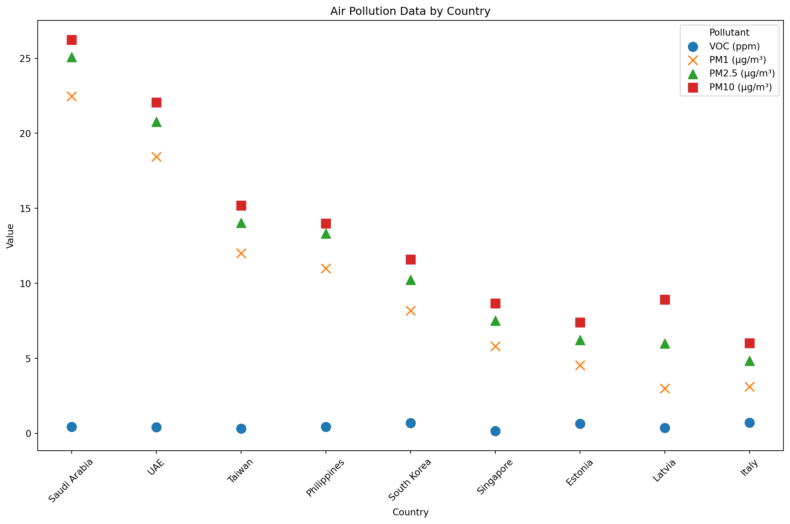

export const quartoRawHtml =
[`
<table>
<colgroup>
<col style="width: 9%" />
<col style="width: 90%" />
</colgroup>
<thead>
<tr>
<th>Attribute</th>
<th>Details</th>
</tr>
</thead>
<tbody>
<tr>
<td>Persona</td>
<td><strong>Eco‑Engaged Maximizers</strong></td>
</tr>
<tr>
<td>N</td>
<td>292</td>
</tr>
<tr>
<td>Core Traits</td>
<td>• Deeply committed to sustainability <br> • Seeks rich provenance &amp; impact data <br> • High trust in ratings</td>
</tr>
<tr>
<td>App‑Design Recommendations</td>
<td>1. <strong>Digital Product Passports</strong>: Show origin, CO₂e footprint, certifications inline <br> 2. <strong>Transparency Tools</strong>: One‑tap CSR reviews and governance scores <br> 3. <strong>Customizable “Eco‑Deep‑Dive” Mode</strong>: AI‑driven layouts for detailed vs. quick views</td>
</tr>
</tbody>
</table>
`,`
<table style="width:99%;">
<colgroup>
<col style="width: 10%" />
<col style="width: 5%" />
<col style="width: 55%" />
<col style="width: 27%" />
</colgroup>
<thead>
<tr>
<th>Persona</th>
<th>Respondents</th>
<th>Core Traits &amp; Mind‑Map Insights</th>
<th>App‑Design Recommendations (with Mind‑Map Hooks)</th>
</tr>
</thead>
<tbody>
<tr>
<td><strong>Eco‑Engaged Maximizers</strong></td>
<td>292</td>
<td><p>- Deeply committed to sustainability (<strong>Attitudes</strong>)- Seeks rich provenance, CO₂e footprint, worker‑welfare &amp; organic data (<strong>Behavioral Beliefs</strong>)</p>
<p>- Motivated by eco‑peer norms &amp; CSR transparency (<strong>Subjective Norms</strong>)</p></td>
<td><p>1. <strong>Digital Product Passports + CSR Reviews</strong></p>
<p>Inline origin, CO₂e, certifications &amp; welfare badges</p>
<p>“Pre‑buy CSR review” toggle (mind‑map: Pre‑buy CSR)</p>
<p>2. <strong>Social‑Proof Network</strong></p>
<p>“Eco Friends” feed to connect classmates (mind‑map: Eco Friends)</p>
<p>Group challenges &amp; leaderboards (TPB: subjective norms)</p>
<p>3. <strong>Eco‑Deep‑Dive Mode</strong></p>
<p>AI Q&amp;A on pollution hotspots &amp; eco‑scores (mind‑map: Discuss with AI)</p>
<p>Toggle detailed vs. quick environmental reports (mind‑map: Eco Practices)</p></td>
</tr>
</tbody>
</table>
`,`
<table>
<colgroup>
<col style="width: 9%" />
<col style="width: 90%" />
</colgroup>
<thead>
<tr>
<th>Attribute</th>
<th>Details</th>
</tr>
</thead>
<tbody>
<tr>
<td>Persona</td>
<td><strong>Balanced Moderates</strong></td>
</tr>
<tr>
<td>N</td>
<td>395</td>
</tr>
<tr>
<td>Core Traits</td>
<td>• Motivated by health &amp; easy wins <br> • Values simple, trustworthy cues <br> • Open to light eco nudges</td>
</tr>
<tr>
<td>App‑Design Recommendations</td>
<td>1. <strong>Health‑Framed Alerts</strong>: Pair sustainability scores with health risks/benefits <br> 2. <strong>Goal‑Setting &amp; Reminders</strong>: Monthly intentions (e.g. “buy local”) with gentle push notifications <br> 3. <strong>Quick‑View Badges</strong>: “Top 5 Local Eco‑Brands” summaries</td>
</tr>
</tbody>
</table>
`,`
<table style="width:99%;">
<colgroup>
<col style="width: 12%" />
<col style="width: 5%" />
<col style="width: 33%" />
<col style="width: 48%" />
</colgroup>
<tbody>
<tr>
<td><strong>Balanced Moderates</strong></td>
<td>395</td>
<td><p>- Motivated by health benefits &amp; simple eco‑wins (<strong>Attitudes</strong>)</p>
<p>- Values goal‑setting &amp; reminders (<strong>Perceived Control</strong>)</p>
<p>- Responsive to light social nudges (<strong>Subjective Norms</strong>)</p></td>
<td><p>1. <strong>Health‑Framed Alerts</strong></p>
<p>Pair carbon score with health impact (“–20% pesticides”) (mind‑map: Eco Mat., Eco Pack.)</p>
<p>2. <strong>Monthly Score &amp; Nudges</strong></p>
<p>“Your Eco Score” dashboard (mind‑map: Carbon Track)</p>
<p>Push: “30% to your ‘buy local’ goal” (goal‑setting)</p>
<p>3. <strong>Badges</strong></p>
<p>“Top 3 Local Eco‑Brands” / “5 Low‑Pollution Picks” (mind‑map: Prod. Origin, Avoid most polluting)</p>
<p>Simple icons; deep dive only on tap</p></td>
</tr>
</tbody>
</table>
`,`
<table>
<colgroup>
<col style="width: 9%" />
<col style="width: 90%" />
</colgroup>
<thead>
<tr>
<th>Attribute</th>
<th>Details</th>
</tr>
</thead>
<tbody>
<tr>
<td>Persona</td>
<td><strong>Budget‑First Skeptics</strong></td>
</tr>
<tr>
<td>N</td>
<td>236</td>
</tr>
<tr>
<td>Core Traits</td>
<td>• Highly price‑sensitive <br> • Prefers minimal extra info <br> • Eco‑actions must “pay off”</td>
</tr>
<tr>
<td>App‑Design Recommendations</td>
<td>1. <strong>Cost–Eco Slider</strong>: Visualize “+$1 → 10% lower CO₂e” trade‑offs <br> 2. <strong>Local Deal Finder</strong>: Highlight discounted eco‑friendly &amp; organic goods nearby <br> 3. <strong>Micro‑Rewards</strong>: Coupons or points for hitting “no‑waste” or “plastic‑free” mini‑goals</td>
</tr>
</tbody>
</table>
`,`
<table style="width:99%;">
<colgroup>
<col style="width: 13%" />
<col style="width: 5%" />
<col style="width: 40%" />
<col style="width: 40%" />
</colgroup>
<tbody>
<tr>
<td><strong>Budget‑First Skeptics</strong></td>
<td>236</td>
<td><p>- Highly price‑sensitive; minimal extra info (low <strong>Attitudes</strong> toward eco data)</p>
<p>- Prefers uncomplicated choices (<strong>Perceived Control</strong>)</p>
<p>- Skeptical of social features (low <strong>Subjective Norms</strong>)</p></td>
<td><p>1. <strong>Cost–Eco Trade‑off Slider</strong></p>
<p>“+NT$1 → –10% CO₂” visualization (map: Cost/Ethics trade‑off)</p>
<p>2. <strong>Local Deal Finder</strong></p>
<p>Flash deals on budget eco/organic items nearby (mind‑map: Eco Services)</p>
<p>Geofenced coupons for low‑footprint groceries</p>
<p>3. <strong>Micro‑Rewards Challenges</strong></p>
<p>Points or coupons for “no‑waste week” or “meat‑free day” (mind‑map: Goal‑setting)</p>
<p>One‑tap “Accept Challenge” button; no pop‑ups</p></td>
</tr>
</tbody>
</table>
`];

````mdx-code-block
import Figure from '/src/components/Figure';
import MyEmbed from '/src/components/Embed';
import Replika from '../images/ai/with-me.png'
````

# Design Process

In the following chapter I will describe in detail the process of
designing Green Filter.

As discussed in the literature review AI section, Replika was one of the
inspirations for Green Filter.

````mdx-code-block
<Figure caption="Montage of me discussing sci-fi with my AI friend Sam (Replika) - and myself as an avatar (Snapchat)" src={Replika} />
````

### Pollution Exposure Tracking

Pollution exposure tracking may be considered a combination of health
tracking and sustainability tracking. I’ve been tracking my personal air
pollution exposure using the ATMO Atmotube Pro device attached to my
backpack.

<div id="fig-air-pollution-personal">


Figure 1: My Personal Exposure to Air Pollution

</div>
<div id="fig-air-pollution-personal-2025">



Figure 2: My Personal Exposure to Air Pollution (2025 Update)

</div>

The above charts shows my exposure to pollutants while traveling, ranked
from worst to best.

## Persona-Based App Features

### **Eco‑Engaged Maximizers**

<div dangerouslySetInnerHTML={{ __html: quartoRawHtml[0] }} />

<div dangerouslySetInnerHTML={{ __html: quartoRawHtml[1] }} />

### **Balanced Moderates**

<div dangerouslySetInnerHTML={{ __html: quartoRawHtml[2] }} />

<div dangerouslySetInnerHTML={{ __html: quartoRawHtml[3] }} />

### **Budget‑First Skeptics**

<div dangerouslySetInnerHTML={{ __html: quartoRawHtml[4] }} />

<div dangerouslySetInnerHTML={{ __html: quartoRawHtml[5] }} />

### 

### 

## Disregarded Features

These features universally received the lowest preference scores from
all the personas.
