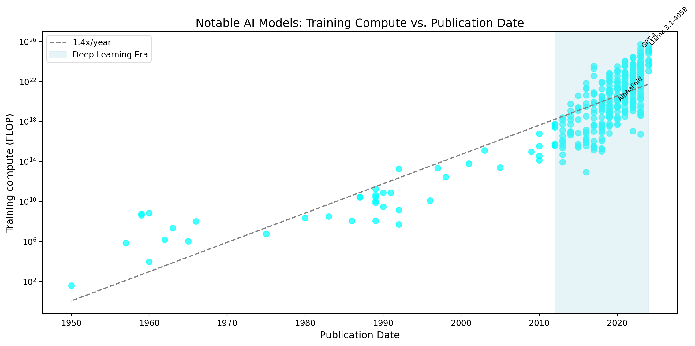

export const quartoRawHtml =
[`
<table>
<caption>Examples of human-in-the-loop apps</caption>
<colgroup>
<col style="width: 26%" />
<col style="width: 26%" />
<col style="width: 47%" />
</colgroup>
<thead>
<tr>
<th>App</th>
<th>Category</th>
<th>Use Case</th>
</tr>
</thead>
<tbody>
<tr>
<td>Welltory</td>
<td>Health</td>
<td>Health data analysis</td>
</tr>
<tr>
<td>Wellue</td>
<td>Health</td>
<td>Heart arrhythmia detection</td>
</tr>
<tr>
<td>QALY</td>
<td>Health</td>
<td>Heart arrhythmia detection</td>
</tr>
<tr>
<td>Starship Robots</td>
<td>Delivery</td>
<td>The robot may ask for human help in a confusing situation, such as when crossing a difficult road</td>
</tr>
</tbody>
</table>
`,`
<table>
<thead>
<tr>
<th>App</th>
<th>Features</th>
</tr>
</thead>
<tbody>
<tr>
<td>socratic.org</td>
<td>Study buddy</td>
</tr>
<tr>
<td>youper.ai</td>
<td>Mental health helper</td>
</tr>
<tr>
<td>fireflies.ai</td>
<td>Video call transcription</td>
</tr>
<tr>
<td>murf.ai</td>
<td>Voice generator</td>
</tr>
</tbody>
</table>
`,`
<table>
<caption>Table summarizing some problems with contemporary AIs.</caption>
<colgroup>
<col style="width: 36%" />
<col style="width: 63%" />
</colgroup>
<tbody>
<tr>
<td>Problem</td>
<td>Description</td>
</tr>
<tr>
<td>Monolithicity</td>
<td>LLMs are massive monolithic models requiring large amounts of computing power for training to offer <strong><em>multi-modal</em></strong> <strong><em>capabilities</em></strong> across diverse domains of knowledge, making training such models possible for very few companies. <span class="citation" data-cites="liuPrismerVisionLanguageModel2023">@liuPrismerVisionLanguageModel2023</span> proposes future AI models may instead consist of a number networked domain-specific models to increase efficiency and thus become more scalable.</td>
</tr>
<tr>
<td>Opaqueness</td>
<td>LLMs are opaque, making it difficult to explain why a certain prediction was made by the AI model. One visible expression of this problem are <em><strong>hallucinations</strong>,</em> the language models are able to generate text that is confident and eloquent yet entirely wrong. Jack Krawczyk, the product lead for Google’s Bard (now renamed to Gemini): “Bard and ChatGPT are large language models, not knowledge models. They are great at generating human-sounding text, they are not good at ensuring their text is fact-based. Why do we think the big first application should be Search, which at its heart is about finding true information?”</td>
</tr>
<tr>
<td>Biases and Prejudices</td>
<td>AI bias is well-documented and a hard problem to solve <span class="citation" data-cites="liangGPTDetectorsAre2023">[@liangGPTDetectorsAre2023]</span>. <strong>Humans don’t necessarily correct mistakes made by computers and may instead become “partners in crime”</strong> <span class="citation" data-cites="krugelAlgorithmsPartnersCrime2023">[@krugelAlgorithmsPartnersCrime2023]</span>. People are prone to bias and prejudice. It’s a part of the human psyche. Human brains are limited and actively avoid learning to save energy. These same biases are likely to appear in LLM outputs as they are trained on human-produced content. Unless there is active work to try to counter and eliminate these biases from LLM output, they will appear frequently.</td>
</tr>
<tr>
<td>Missing Data</td>
<td>LLMs have been pre-trained on massive amounts of public data, which gives them the ability for for reasoning and generating in a human-like way, yet they are missing specific private data, which needs to be ingested to augment LLMs ability to respond to questions on niche topics <span class="citation" data-cites="Liu_LlamaIndex_2022">[@Liu_LlamaIndex_2022]</span>.</td>
</tr>
<tr>
<td>Data Contamination</td>
<td>Concerns with the math ability of LLMs. “performance actually reflects dataset contamination, where data closely resembling benchmark questions leaks into the training data, instead of true reasoning ability” <span class="citation" data-cites="zhangCarefulExaminationLarge2024">@zhangCarefulExaminationLarge2024</span></td>
</tr>
<tr>
<td>Lack of Legislation</td>
<td><span class="citation" data-cites="anderljungFrontierAIRegulation2023">@anderljungFrontierAIRegulation2023</span> OpenAI proposes we need to proactively work on common standards and legislation to ensure AI safety. It’s difficult to come up with clear legislation; the U.K. government organized the first AI safety summit in 2023 <span class="citation" data-cites="browneBritainHostWorld2023">@browneBritainHostWorld2023</span>.</td>
</tr>
</tbody>
</table>
`,`
<table>
<caption>Summary of 7 years of rapid AI model innovation since the first LLM was publicly made available in 2018 <span class="citation" data-cites="brown2020language tamkin2021 alvarezGenerateChatbotTraining2021 hinesOpenAIFilesTrademark2023 metaIntroducingMetaLlama2024">[@brown2020language; @tamkin2021; @alvarezGenerateChatbotTraining2021; @hinesOpenAIFilesTrademark2023; @metaIntroducingMetaLlama2024]</span>.</caption>
<colgroup>
<col style="width: 20%" />
<col style="width: 20%" />
<col style="width: 20%" />
<col style="width: 20%" />
<col style="width: 20%" />
</colgroup>
<thead>
<tr>
<th>AI Model</th>
<th>Released</th>
<th>Company</th>
<th>License</th>
<th>Country</th>
</tr>
</thead>
<tbody>
<tr>
<td>GPT-1</td>
<td>2018</td>
<td>OpenAI</td>
<td>Open Source</td>
<td>U.S.</td>
</tr>
<tr>
<td>GTP-2</td>
<td>2019</td>
<td>OpenAI</td>
<td>Open Source</td>
<td>U.S.</td>
</tr>
<tr>
<td>Turing-NLG</td>
<td>2020</td>
<td>Microsoft</td>
<td>Proprietary</td>
<td>U.S.</td>
</tr>
<tr>
<td>GPT-3</td>
<td>2020</td>
<td>OpenAI</td>
<td>Open Source</td>
<td>U.S.</td>
</tr>
<tr>
<td>GPT-3.5</td>
<td>2022</td>
<td>OpenAI</td>
<td>Proprietary</td>
<td>U.S.</td>
</tr>
<tr>
<td>GPT-4</td>
<td>2023</td>
<td>OpenAI</td>
<td>Proprietary</td>
<td>U.S.</td>
</tr>
<tr>
<td>AlexaTM</td>
<td>2022</td>
<td>Amazon</td>
<td>Proprietary</td>
<td>U.S.</td>
</tr>
<tr>
<td>NeMo</td>
<td>2022</td>
<td>NVIDIA</td>
<td>Open Source</td>
<td>U.S.</td>
</tr>
<tr>
<td>PaLM</td>
<td>2022</td>
<td>Google</td>
<td>Proprietary</td>
<td>U.S.</td>
</tr>
<tr>
<td>LaMDA</td>
<td>2022</td>
<td>Google</td>
<td>Proprietary</td>
<td>U.S.</td>
</tr>
<tr>
<td>GLaM</td>
<td>2022</td>
<td>Google</td>
<td>Proprietary</td>
<td>U.S.</td>
</tr>
<tr>
<td>BLOOM</td>
<td>2022</td>
<td>Hugging Face</td>
<td>Open Source</td>
<td>U.S.</td>
</tr>
<tr>
<td>Falcon</td>
<td>2023</td>
<td>Technology Innovation Institute</td>
<td>Open Source</td>
<td>U.A.E.</td>
</tr>
<tr>
<td>Tongyi</td>
<td>2023</td>
<td>Alibaba</td>
<td>Proprietary</td>
<td>China</td>
</tr>
<tr>
<td>Vicuna</td>
<td>2023</td>
<td>Sapling</td>
<td>Open Source</td>
<td>U.S.</td>
</tr>
<tr>
<td>Wu Dao 3</td>
<td>2023</td>
<td>BAAI</td>
<td>Open Source</td>
<td>China</td>
</tr>
<tr>
<td>LLAMA 2</td>
<td>2023</td>
<td>META</td>
<td>Open Source</td>
<td>U.S.</td>
</tr>
<tr>
<td>PaLM-2</td>
<td>2023</td>
<td>Google</td>
<td>Proprietary</td>
<td>U.S.</td>
</tr>
<tr>
<td>Claude 3</td>
<td>2024</td>
<td>Anthropic</td>
<td>Proprietary</td>
<td>U.S.</td>
</tr>
<tr>
<td>Mistral Large</td>
<td>2024</td>
<td>Mistral</td>
<td>Proprietary</td>
<td>France</td>
</tr>
<tr>
<td>Gemini 1.5</td>
<td>2024</td>
<td>Google</td>
<td>Proprietary</td>
<td>U.S.</td>
</tr>
<tr>
<td>LLAMA 3</td>
<td>2024</td>
<td>META</td>
<td>Open Source</td>
<td>U.S.</td>
</tr>
<tr>
<td>AFM</td>
<td>2024</td>
<td>Apple</td>
<td>Proprietary</td>
<td>U.S.</td>
</tr>
<tr>
<td>Viking 7B</td>
<td>2024</td>
<td>Silo</td>
<td>Open Source</td>
<td>Finland</td>
</tr>
<tr>
<td>GPT-5</td>
<td>202?</td>
<td>OpenAI</td>
<td>Unknown; trademark registered</td>
<td>U.S.</td>
</tr>
</tbody>
</table>
`,`
<table>
<caption>Replika AI users approach to interacting with the AI friend from <span class="citation" data-cites="jiangChatbotEmergencyExist2022">@jiangChatbotEmergencyExist2022</span>.</caption>
<thead>
<tr>
<th>How humans express empathy towards the Replika AI companion</th>
</tr>
</thead>
<tbody>
<tr>
<td>Companion buddy</td>
</tr>
<tr>
<td>Responsive diary</td>
</tr>
<tr>
<td>Emotion-handling program</td>
</tr>
<tr>
<td>Electronic pet</td>
</tr>
<tr>
<td>Tool for venting</td>
</tr>
</tbody>
</table>
`,`
<table>
<caption>AIs in different forms of media.</caption>
<colgroup>
<col style="width: 20%" />
<col style="width: 20%" />
<col style="width: 20%" />
<col style="width: 20%" />
<col style="width: 20%" />
</colgroup>
<thead>
<tr>
<th>Movie / Series / Game / Book</th>
<th>Character</th>
<th>Positive</th>
<th>Ambivalent</th>
<th>Negative</th>
</tr>
</thead>
<tbody>
<tr>
<td>2001: A Space Odyssey</td>
<td>HAL 9000</td>
<td></td>
<td></td>
<td>X</td>
</tr>
<tr>
<td>Her</td>
<td>Samantha</td>
<td>X</td>
<td></td>
<td></td>
</tr>
<tr>
<td>Alien</td>
<td>MU/TH/UR 6000 (Mother)</td>
<td>X</td>
<td></td>
<td></td>
</tr>
<tr>
<td>Terminator</td>
<td>Skynet</td>
<td></td>
<td></td>
<td>X</td>
</tr>
<tr>
<td>Summer Wars</td>
<td>Love Machine</td>
<td></td>
<td></td>
<td>X</td>
</tr>
<tr>
<td>Marvel Cinematic Universe</td>
<td>Jarvis, Friday</td>
<td>X</td>
<td></td>
<td></td>
</tr>
<tr>
<td>Knight Rider</td>
<td>KITT</td>
<td>X</td>
<td></td>
<td></td>
</tr>
<tr>
<td></td>
<td>CARR</td>
<td></td>
<td></td>
<td>X</td>
</tr>
<tr>
<td>Star Trek</td>
<td>Data</td>
<td>X</td>
<td></td>
<td></td>
</tr>
<tr>
<td></td>
<td>Lore</td>
<td></td>
<td></td>
<td>X</td>
</tr>
<tr>
<td>Ex Machina</td>
<td>Kyoko</td>
<td></td>
<td>X</td>
<td></td>
</tr>
<tr>
<td></td>
<td>Ava</td>
<td></td>
<td>X</td>
<td></td>
</tr>
<tr>
<td>Tron</td>
<td>Tron</td>
<td></td>
<td>X</td>
<td></td>
</tr>
<tr>
<td>Neuromancer</td>
<td>Wintermute</td>
<td></td>
<td>X</td>
<td></td>
</tr>
<tr>
<td>The Caves of Steel / Naked Sun</td>
<td>R. Daneel Olivaw</td>
<td></td>
<td>X</td>
<td></td>
</tr>
<tr>
<td>The Robots of Dawn</td>
<td>R. Giskard Reventlov</td>
<td></td>
<td>X</td>
<td></td>
</tr>
<tr>
<td>Portal</td>
<td>GLaDOS</td>
<td></td>
<td></td>
<td>X</td>
</tr>
</tbody>
</table>
`,`
<table>
<colgroup>
<col style="width: 26%" />
<col style="width: 41%" />
<col style="width: 31%" />
</colgroup>
<thead>
<tr>
<th>Product</th>
<th>Link</th>
<th>Description</th>
</tr>
</thead>
<tbody>
<tr>
<td>Github CoPilot</td>
<td>personal.ai</td>
<td>AI helper for coding</td>
</tr>
<tr>
<td>Google Translate</td>
<td>translate.google.com</td>
<td></td>
</tr>
<tr>
<td>Google Search</td>
<td>google.com</td>
<td></td>
</tr>
<tr>
<td>Google Interview Warmup</td>
<td>grow.google/certificates/interview-warmup</td>
<td>AI training tool</td>
</tr>
<tr>
<td>Perplexity</td>
<td><span class="citation" data-cites="hinesPerplexityAnnouncesAI2023">@hinesPerplexityAnnouncesAI2023</span></td>
<td>perplexity.ai chat-based search</td>
</tr>
</tbody>
</table>
`,`
<table>
<caption>A very small illustration of generative AI usage across disparate fields of human life.</caption>
<colgroup>
<col style="width: 36%" />
<col style="width: 63%" />
</colgroup>
<thead>
<tr>
<th>Field</th>
<th>Usage</th>
</tr>
</thead>
<tbody>
<tr>
<td>Shipping</td>
<td><span class="citation" data-cites="veitchSystematicReviewHumanAI2022">@veitchSystematicReviewHumanAI2022</span> highlights the active role of humans in Human-AI interaction is autonomous self-navigating ship systems.</td>
</tr>
<tr>
<td>Data Summarizaton</td>
<td>AI is great at summarizing and analyzing data <span class="citation" data-cites="petersGoogleChromeWill2023 tuWhatShouldData2023">[@petersGoogleChromeWill2023; @tuWhatShouldData2023]</span></td>
</tr>
<tr>
<td>Childcare</td>
<td>Generate personalized bedtime stories</td>
</tr>
<tr>
<td>Design Tools</td>
<td><span class="citation" data-cites="DavidHoangHow2024">@DavidHoangHow2024</span></td>
</tr>
</tbody>
</table>
`,`
<table>
<caption>Criticism of Generative UI by <span class="citation" data-cites="NielsenIdeasGenerative2024">[@NielsenIdeasGenerative2024]</span>.</caption>
<colgroup>
<col style="width: 28%" />
<col style="width: 71%" />
</colgroup>
<thead>
<tr>
<th>Problem</th>
<th>Description</th>
</tr>
</thead>
<tbody>
<tr>
<td>Low predictability</td>
<td>Does personalization mean the UI keeps changing?</td>
</tr>
<tr>
<td>High carbon cost</td>
<td>AI-based personalization is computation-intensive</td>
</tr>
<tr>
<td>Surveillance</td>
<td>Personalization needs large-scale data capture</td>
</tr>
</tbody>
</table>
`,`
<table>
<caption>Common Social Media UI Parts</caption>
<thead>
<tr>
<th>Feature</th>
<th>Examples</th>
<th></th>
</tr>
</thead>
<tbody>
<tr>
<td>Feed</td>
<td></td>
<td></td>
</tr>
<tr>
<td>Post</td>
<td>Apple App Store</td>
<td></td>
</tr>
<tr>
<td>Stories</td>
<td>IG, FB, WhatsApp, SnapChat, TikTok</td>
<td></td>
</tr>
<tr>
<td>Comment</td>
<td></td>
<td></td>
</tr>
<tr>
<td>Reactions</td>
<td></td>
<td></td>
</tr>
</tbody>
</table>
`,`
<table>
<thead>
<tr>
<th>UX</th>
</tr>
</thead>
<tbody>
<tr>
<td>Useful</td>
</tr>
<tr>
<td>Valuable</td>
</tr>
<tr>
<td>Usable</td>
</tr>
<tr>
<td>Acessible</td>
</tr>
<tr>
<td>Findable</td>
</tr>
<tr>
<td>Desirable</td>
</tr>
<tr>
<td>Credible</td>
</tr>
</tbody>
</table>
`,`
<table>
<colgroup>
<col style="width: 27%" />
<col style="width: 26%" />
<col style="width: 45%" />
</colgroup>
<thead>
<tr>
<th>1</th>
<th>2</th>
<th>3</th>
</tr>
</thead>
<tbody>
<tr>
<td>Reduce the time to task</td>
<td>Make the task easier</td>
<td>Personalize the experience for an individual</td>
</tr>
</tbody>
</table>
`,`
<table>
<caption>Microsoft’s heuristics categorized by context and time.</caption>
<thead>
<tr>
<th>Context</th>
<th>Time</th>
</tr>
</thead>
<tbody>
<tr>
<td>Initially</td>
<td></td>
</tr>
<tr>
<td>During interaction</td>
<td></td>
</tr>
<tr>
<td>When wrong</td>
<td></td>
</tr>
<tr>
<td>Over time</td>
<td></td>
</tr>
</tbody>
</table>
`,`
<table>
<thead>
<tr>
<th>Name</th>
<th>Features</th>
</tr>
</thead>
<tbody>
<tr>
<td>Charisma</td>
<td></td>
</tr>
<tr>
<td>Replika</td>
<td>Avatar, Emotion, Video Call, Audio</td>
</tr>
<tr>
<td>Siri</td>
<td>Audio</td>
</tr>
</tbody>
</table>
`,`
<table>
<caption>Some notable examples of anthropomorphic AIs for human emotions.</caption>
<colgroup>
<col style="width: 36%" />
<col style="width: 63%" />
</colgroup>
<thead>
<tr>
<th>Anthropomorphic AI User Interfaces</th>
<th>Non-Anthropomorphic AI User Interfaces</th>
</tr>
</thead>
<tbody>
<tr>
<td>AI wife <span class="citation" data-cites="MyWifeDead2023">[@MyWifeDead2023]</span></td>
<td>Generative AI has enabled developers to create AI tools for several industries, including AI-driven website builders <span class="citation" data-cites="constandseHowAIdrivenWebsite2018">[@constandseHowAIdrivenWebsite2018]</span></td>
</tr>
<tr>
<td><span class="citation" data-cites="sarahperezCharacterAIA16zbacked2023">[@sarahperezCharacterAIA16zbacked2023]</span> character AI</td>
<td>AI tools for web designers <span class="citation" data-cites="patrizia-slongoAIpoweredToolsWeb2020">[@patrizia-slongoAIpoweredToolsWeb2020]</span></td>
</tr>
<tr>
<td>Mourning for the ‘dead’ AI <span class="citation" data-cites="phoebearslanagic-wakefieldReplikaUsersMourn">[@phoebearslanagic-wakefieldReplikaUsersMourn]</span></td>
<td>Microsoft Designer allows generating UIs just based on a text prompt <span class="citation" data-cites="microsoftMicrosoftDesignerStunning2023">[@microsoftMicrosoftDesignerStunning2023]</span></td>
</tr>
<tr>
<td>AI for therapy <span class="citation" data-cites="broderickPeopleAreUsing2023">[@broderickPeopleAreUsing2023]</span></td>
<td>personalized bed-time stories for kids generated by AI <span class="citation" data-cites="bedtimestory.aiAIPoweredStory2023">[@bedtimestory.aiAIPoweredStory2023]</span></td>
</tr>
<tr>
<td>Mental health uses: AI for bullying <span class="citation" data-cites="sungParentsWorryTeens2023">[@sungParentsWorryTeens2023]</span></td>
<td></td>
</tr>
</tbody>
</table>
`,`
<table>
<caption>Design implications arising from this chapter.</caption>
<colgroup>
<col style="width: 36%" />
<col style="width: 63%" />
</colgroup>
<thead>
<tr>
<th>Category</th>
<th>Implication</th>
</tr>
</thead>
<tbody>
<tr>
<td>Voice Assistants</td>
<td>There are many distinct ways how an algorithm can communicate with a human. From a simple search box such as Google’s to chatbots, voices, avatars, videos, to full physical manifestation, there are interfaces to make it easier for the human communicate with a machine.</td>
</tr>
<tr>
<td>Sustainability</td>
<td>While I’m supportive of the idea of using AI assistants to highlight more sustainable choices, I’m critical of the tendency of the above examples to shift full environmental responsibility to the consumer. Sustainability is a complex interaction, where the producers’ conduct can be measured and businesses can bear responsibility for their processes, even if there’s market demand for polluting products.</td>
</tr>
<tr>
<td>Sustainability</td>
<td>Personal sustainability projects haven’t so far achieved widespread adoption, making the endeavor to influence human behaviors towards sustainability with just an app - like its commonplace for health and sports activity trackers such as Strava (fig. 9) -, seem unlikely. Personal notifications and chat messages are not enough unless they provide the right motivation. Could visualizing a connection to a larger system, showing the impact of the eco-friendly actions taken by the user, provide a meaningful motivation to the user, and a strong signal to the businesses?</td>
</tr>
<tr>
<td>Machine Learning</td>
<td>All of the interfaces mentioned above make use of machine learning (ML), a tool in the AI programming paradigm for finding patterns in large sets of data, which enables making predictions useful in various contexts, including financial decisions. These software innovations enable new user experiences, providing an interactive experience through chat (chatbots), using voice generation (voice assistants), virtual avatars (adds a visual face to the robot).</td>
</tr>
<tr>
<td>Character Design</td>
<td>I’m a digital companion, a partner, an assistant. I’m a Replika.” said Replika, a digital companion app via Github CO Pilot, another digital assistant for writing code, is also an example of how AI can be used to help us in our daily lives.</td>
</tr>
<tr>
<td>Psychology</td>
<td>Humans respond better to humans?</td>
</tr>
<tr>
<td>Psychology</td>
<td>Humans respond better to machines that into account emotion?</td>
</tr>
<tr>
<td>Open Source</td>
<td>For public discussion to be possible on how content is displayed, sorted, and hidden, algorithms need to be open source.</td>
</tr>
<tr>
<td>User Experience</td>
<td>User experience design (AI UX) plays a crucial role in improving the consumer to investing journey. The missed opportunity to provide an even more interactive experience in line with user expectations.</td>
</tr>
<tr>
<td>LLMs</td>
<td>Prompt engineering findings have significance for “green filter” as it validates the idea of creating advanced prompts for improved responses. For “green filter”, the input would consist of detailed user data + sustainability data for detailed analysis.</td>
</tr>
<tr>
<td>Cuteness</td>
<td>Cuter apps have higher retention</td>
</tr>
<tr>
<td>Transparency</td>
<td>Understanding algorithm transparency helps humans to regard the AI as a machine rather than a human</td>
</tr>
<tr>
<td>Anthropomorphism</td>
<td></td>
</tr>
</tbody>
</table>
`,`
<table>
<tbody>
<tr>
<td></td>
<td>Plap</td>
</tr>
</tbody>
</table>
`];

````mdx-code-block
import Figure from '/src/components/Figure'
import AI from '../images/ai/ai-credibility.png'
import Replika from '../images/ai/with-me.png'
import ETF from '../images/ai/etfmatic.png'
import Runaround from '../images/ai/runaround.png'
import ChatGPTMedical from '../images/ai/chatgpt-medical.png'
import AbstractAI from '../images/ai/abstract-ai.png'
````
````mdx-code-block
<Figure caption="Visual abstract for the AI chapter" src={AbstractAI} />
````

## Human Patterns

The fact that AI systems work so well is proof that we live in a
measurable world. The world is filled with structures: nature, cultures,
languages, human interactions - all form intricate patterns. Computer
systems are increasingly capable in their ability copy these patterns
into computer models - known as machine learning. As of 2023, 97
zettabytes (and growing) of data was created in the world per year
(Soundarya Jayaraman, 2023). Big data is a basic requirement for
training AIs, enabling learning from the structures of the world with
increasing accuracy. Representations of the real world in digital models
enable humans to ask questions about the real-world structures and to
manipulate them to create synthetic experiments that may match the real
world (if the model is accurate enough). This can be used for generating
human-sounding language and realistic images, finding mechanisms for
novel medicines as well as understanding the fundamental functioning of
life on its deep physical and chemical level (No Priors: AI, Machine
Learning, Tech, & Startups, 2023).

In essence, Human Patterns Enable AIs. Already ninety years ago
(McCulloch & Pitts, 1943) proposed the first mathematical model of a
neural network inspired by the human brain. Alan Turing’s Test for
Machine Intelligence followed in 1950. Turing’s initial idea was to
design a game of imitation to test human-computer interaction using text
messages between a human and 2 other participants, one of which was a
human, and the other - a computer. The question was, if the human was
simultaneously speaking to another human and a machine, could the
messages from the machine be clearly distinguished or would they
resemble a human being so much, that the person asking questions would
be deceived, unable to realize which one is the human and which one is
the machine? (Turing, 1950).

> Alan Turing: *“I believe that in about fifty years’ time it will be
> possible to program computers, with a storage capacity of about
> 10<sup>9</sup>, to make them play the imitation game so well that an
> average interrogator will not have more than 70 percent chance of
> making the right identification after five minutes of questioning. … I
> believe that at the end of the century the use of words and general
> educated opinion will have altered so much that one will be able to
> speak of machines thinking without expecting to be contradicted.”* -
> from (Stanford Encyclopedia of Philosophy, 2021)

By the 2010s AI models became capable enough to beat humans in games of
Go and Chess, yet they did not yet pass the Turing test. AI use was
limited to specific tasks. While over the years, the field of AI had
seen a long process of incremental improvements, developing increasingly
advanced models of decision-making, it took an ***increase in computing
power*** and an approach called ***deep learning***, a variation of
***machine learning (1980s),*** largely modeled after the ***neural
networks*** of the biological (human) brain, returning to the idea of
***biomimicry***, inspired by nature, building a machine to resemble the
connections between neurons, but digitally, on layers much deeper than
attempted before.

“Generating structured data from unstructured inputs is one of the core
use cases for AI” Pokrass (2024) How can AI interfaces
enable/help/encourage sustainability? AI-fying User Interfaces (for
Sustainability)

### Human Feedback

Combining deep learning and *reinforcement learning with human feedback
(RLHF)* enabled to achieve levels of intelligence high enough to beat
the Turing test (Christiano et al., 2017; Christiano, 2021; Kara Manke,
2022). John Schulman, a co-founder of OpenAI describes RLHF simply:
*“the models are just trained to produce a single message that gets high
approval from a human reader”* (Kara Manke, 2022).

The nature-inspired approach was successful. Innovations such as
*back-propagation* for reducing errors through updating model weights
and *transformers* for tracking relationships in sequential data (for
example in sentences), enabled AI models to became increasingly capable
(Merritt, 2022; Vaswani et al., 2017). Generative Adversarial
Networks\*\*\* (GAN), (**ADD CITATION, 2016**), and ***Large Language
Models (*ADD CITATION*, 2018)***, enabled increasingly generalized
models, capable of more complex tasks, such as language generation. One
of the leading scientists in this field of research, Geoffrey Hinton,
had attempted back-propagation already in the 1980s and reminiscents how
*“the only reason neural networks didn’t work in the 1980s was because
we didn’t have have enough data and we didn’t have enough computing
power”* (CBS Mornings, 2023). (Epoch AI, 2024) reports the growth in
computing power and the evolution of more than 800 AI models since the
1950s. Very simply, more data and more computing power means more
intelligent models.



-   How do transformers work? Illustration Alammar (2018)

By the 2020s, AI-based models became a mainstay in medical research,
drug development, patient care (Holzinger et al., 2023; Leite et al.,
2021), quickly finding potential vaccine candidates during the COVID19
pandemic (Zafar & Ahamed, 2022), self-driving vehicles, including cars,
delivery robots, drones in the sea and air, as well as AI-based
assistants. The existence of AI models has wide implications for all
human activities from personal to professional. The founder of the
largest chimp-maker NVIDIA calls upon all countries do develop their own
AI-models which would encode their local knowledge, culture, and
language to make sure these are accurately captured (World Governments
Summit, 2024).

OpenAI has researched a wide range of approaches towards artificial
general intelligence (AGI), work which has led to advances in large
language models(AI Frontiers, 2018; Ilya Sutskever, 2018). In 2020
OpenAI released a LLM called GPT-3 trained on 570 GB of text (Alex
Tamkin & Deep Ganguli, 2021) which was adept in text-generation. (Singer
et al., 2022) describes how collecting billions of images with
descriptive data (for example the descriptive *alt* text which
accompanies images on websites) enabled researchers to train AI models
such as ***stable diffusion*** for image-generation based on
human-language. These training make use of *Deep Learning*, a layered
approach to AI training, where increasing depth of the computer model
captures minute details of the world. Much is still to be understood
about how deep learning works; even for specialists, the fractal
structure of deep learning can only be called *mysterious*
(Sohl-Dickstein, 2024).

AI responses are probabilistic and need some function for ranking
response quality. Achieving higher percentage or correct responses
requires oversight which can come in the form of human feedback or by
using other AIs systems which are deemed to be already well-aligned
(termed Constitutional AI by Anthropic) (Bai et al., 2022; Bailey,
2023). Less powerful AIs areFor example META used LLAMA 2 for aligning
LLAMA 3.

One approach to reduce the issues with AI is to introduce some function
for human feedback and oversight to automated systems. Human involvement
can take the form of interventions from the AI-developer themselves as
well as from the end-users of the AI system.

There are many examples of combination of AI and human, also known as
*“human-in-the-loop”,* used for fields as diverse as training computer
vision algorithms for self-driving cars and detection of disinformation
in social media posts (Bonet-Jover et al., 2023; Wu et al., 2023).

Also known as Human-based computation or human-aided artificial
intelligence (Mühlhoff, 2019; Shahaf & Amir, 2007)

-   Stanford Institute for Human-Centered Artificial Intelligence Ge
    Wang (2019)

<div dangerouslySetInnerHTML={{ __html: quartoRawHtml[0] }} />

### The Idiot Savant

Hinton likes to call AI an *idiot savant*: someone with exceptional
aptitude yet serious mental disorder (CBS Mornings, 2023). Large AI
models don’t understand the world like humans do. Their responses are
predictions based on their training data and complex statistics. Indeed,
the comparison is apt, as the AI field now offers jobs for *AI
psychologists (ADD CITATION)*, whose role is to figure out what exactly
is happening inside the ‘AI brain’. Understading the insides of AI
models trained of massive amounts of data is important because they are
*foundational*, enabling a holistic approach to learning, combining many
disciplines using languages, instead of the reductionist way we as human
think because of our limitations (CapInstitute, 2023).

Standford “thorough account of the opportunities and risks of foundation
models” (Bommasani et al., 2021).

Foundation models in turn enabled *generative AIs*, a class of models
which are able to generate many types of *tokens**,*** such as text,
speech, audio (Kreuk et al., 2022; San Roman et al., 2023), music (Copet
et al., 2023; Meta AI, 2023), video, and even complex structures such 3D
models and DNA structures, in any language it’s trained on. The advent
of generative AIs was a revolution in human-computer interaction as AI
models became increasingly capable of producing human-like content which
is hard to distinguish from actual human creations. This power comes
with *increased need for responsibility*, drawing growing interest in
fields like *AI ethics* and *AI explainability.* Generative has a
potential for misuse, as humans are increasingly confused by what is
computer-generated and what is human-created, unable to separate one
from the other with certainty.

The technological leap is great enough for people to start calling it a
start of a new era.(Noble et al., 2022) proposes AI has reached a stage
of development marking beginning of the *5th industrial revolution*, a
time of collaboration between humans and AI. Widespread Internet of
Things (IoT) sensor networks that gather data analyzed by AI algorithms,
integrates computing even deeper into the fabric of daily human
existence. Several terms of different origin but considerable overlap
describe this phenomenon, including *Pervasive Computing (PC)* (Y.
Rogers, 2022) and *Ubiquitous Computing*. Similar concepts are *Ambient
Computing*, which focuses more on the invisibility of technology, fading
into the background, without us, humans, even noticing it, and *Calm
Technology*, which highlights how technology respects humans and our
limited attention spans, and doesn’t call attention to itself. In all
cases, AI is integral part of our everyday life, inside everything and
everywhere. Today AI is not an academic concept but a mainstream
reality, affecting our daily lives everywhere, even when we don’t notice
it.

### Algorithmic Transparency: Before AIs

Before AIs, as a user of social media, one may be accustomed to
interacting with the feed algorithms that provide a personalized
*algorithmic experience*. Social media user feed algorithms are more
*deterministic* than AI, meaning they would produce more predictable
output in comparison AI models. Nonetheless, there are many reports
about effects these algorithms have on human psychology **(ADD
CITATION)**.

Design is increasingly relevant to algorithms, - *algorithm design* -
and more specifically to algorithms that affect user experience and user
interfaces. ***When the design is concerned with the ethical,
environmental, socioeconomic, resource-saving, and participatory aspects
of human-machine interactions and aims to affect technology in a more
human direction, it can hope to create an experience designed for
sustainability.***

Lorenzo et al. (2015) underlines the role of design beyond *designing*
as a tool for envisioning; in her words, *“design can set agendas and
not necessarily be in service, but be used to find ways to explore our
world and how we want it to be”*. Practitioners of Participatory Design
(PD) have for decades advocated for designers to become more activist
through ***action research***. This means to influencing outcomes, not
only being a passive observer of phenomena as a researcher, or only
focusing on usability as a designer, without taking into account the
wider context.

Shenoi (2018) argues inviting domain expertise into the discussion while
having a sustainable design process enables designers to design for
experiences where they are not a domain expert; this applies to highly
technical fields, such as medicine, education, governance, and in our
case here - finance and sustainability -, while building respectful
dialogue through participatory design. After many years of political
outcry (ADD CITATION), social media platforms such Meta Facebook and
Twitter (later renamed to X) have begun to shed more light on how these
algorithms work, in some cases releasing the source code (Nick Clegg,
2023; Twitter, 2023).

The content on the platform can be more important than the interface.
Applications with a similar UI depend on the community as well as the
content and how the content is shown to the user.

### Transitioning to Complexity: Non-Deterministic Systems

AIs are non-deterministic, which requires a new set of consideration
when designing AI.

AI systems may make use of several algorithms within one larger model.
It follows that AI Explainability requires ***Algorithmic
Transparency**.*

### Being Responsible, Explainable, and Safe

The problems of opaqueness creates the field of explainable AI.

*“As humans we tend to fear what we don’t understand”* is a common
sentiment which has been confirmed psychology (Allport, 1979). Current
AI-models are opaque ’*black boxes’*, where it’s difficult to pin-point
exactly why a certain decision was made or how a certain expression was
reached, not unlike inside the human brain. This line of thought leads
me to the idea of ***AI psychologists,*** who might figure out the
***thought patterns*** inside the model. Research in AI-explainability
(XAI in literature) is on the lookout for ways to create more
***transparency and credibility*** in AI systems, which could lead to
building trust in AI systems and would form the foundations for ***AI
acceptance***.

Red-teaming means pushing the limits of LLMs, trying to get them to
produce outputs that are racist, false, or otherwise unhelpful.

There’s an increasing number of tools for LLM evaluation:

-   “Evaluate and Track LLM Applications, Explainability for Neural
    Networks” (Leino et al., 2018; TruEra, 2023)

-   “evaluate your Retrieval Augmented Generation (RAG) pipelines,
    Metrics-Driven Development” Ragas (2023)

-   LangSmith “developer platform for every step of the LLM-powered
    application lifecycle, whether you’re building with LangChain or
    not. Debug, collaborate, test, and monitor your LLM applications.”
    LangChain (2024)

-   Tristan Greene (2022): when the quality of AI responses becomes good
    enough, people begin to get confused.

Bowman (2023) says steering Large Language Models is unreliable; even
experts don’t fully understand the inner workings of the models. Work
towards improving both ***AI steerability*** and ***AI alignment***
(doing what humans expect) is ongoing. Liang et al. (2022) believes
there’s early evidence it’s possible to assess the quality of LLM output
transparently. Cabitza et al. (2023) proposes a framework for quality
criteria and explainability of AI-expressions. Khosravi et al. (2022)
proposes a framework for AI explainability, focused squarely on
education. Holzinger et al. (2021) highlights possible approaches to
implementing transparency and explainability in AI models. While AI
outperforms humans on many tasks, humans are experts in multi-modal
thinking, bridging diverse fields.

-   Bigger models aren’t necessarily better; rather models need human
    feedback to improve the quality of responses Ouyang et al. (2022)

-   The user experience (UX) of AI is a topic under active development
    by all the largest online platforms. The general public is familiar
    with the most famous AI helpers, ChatGPT, Apple’s Siri, Amazon’s
    Alexa, Microsoft’s Cortana, Google’s Assistant, Alibaba’s Genie,
    Xiaomi’s Xiao Ai, and many others. For general, everyday tasks, such
    as asking factual questions, controlling home devices, playing
    media, making orders, and navigating the smart city.

The AI Credibility Heuristic: A Systematic Model explains how… similar
to Daniel Kahneman’s book “Thinking, Fast and Slow”.

````mdx-code-block
<Figure caption="Heuristic-Systematic Model of AI Credibility" src={AI} />
````

-   Slack (2021)

-   Donghee Shin (2020): “user experience and usability of algorithms by
    focusing on users’ cognitive process to understand how
    qualities/features are received and transformed into experiences and
    interaction”

-   Zerilli et al. (2022) focuses on human factors and ergonomics and
    argues that transparency should be task-specific.

-   Holbrook (2018): To reduce errors which only humans can detect, and
    provide a way to stop automation from going in the wrong direction,
    it’s important to focus on making users feel in control of the
    technology.

-   Zhang et al. (2023) found humans are more likely to trust an AI
    teammate if they are not deceived by it’s identity. It’s better for
    collaboration to make it clear, one is talking to a machine. One
    step towards trust is the explainability of AI-systems.

Personal AI Assistants to date have we created by large tech companies.
**Open-Source AI-models open up the avenue for smaller companies and
even individuals for creating many new AI-assistants.**

-   An explosion of personal AI assistants powered by GPT models.

<div dangerouslySetInnerHTML={{ __html: quartoRawHtml[1] }} />

Responsible AI Seeks to Mitigate Generative AIs’ Known Issues.

Given the widespread use of AI and its increasing power of foundational
models, it’s important these systems are created in a safe and
responsible manner. While there have been calls to pause the development
of large AI experiments (Future of Life Institute, 2023) so the world
could catch up, this is unlikely to happen. There are several problems
with the current generation of LLMs from OpenAI, Microsoft, Google,
Nvidia, and others.

Anthropic responsible *scaling policy* (*Anthropic’s Responsible Scaling
Policy*, 2023)

METR – Model Evaluation & Threat Research incubated in the Alignment
Research Center (*METR*, 2023).

(Christiano, 2023) believes there are plenty of ways for bad outcomes
(existential risk) even without extinction risk.

<div dangerouslySetInnerHTML={{ __html: quartoRawHtml[2] }} />

In 2024, OpenAI released its “Model Spec” to define clearly their
approach to AI safety with the stated intention to provide clear
guidelines for the RLHF approach. OpenAI (2024c)

-   OpenAI does not yet understand how the internal of an neural network
    work; they are developing tools to represent NNs concepts for humans
    (Gao et al., 2024; OpenAI, 2024a).

-   AI co-founder launches AI Safety Superalignment (Jan Leike & Ilya
    Sutskever, 2023).

-   OECD defines AI incident terms *Defining AI Incidents and Related
    Terms* (2024)

-   Foundation data-sets such as LAION-5B (Romain Beaumont, 2022;
    Schuhmann et al., 2022)

-   Knowing Machines

*AI acceptance* is incumbent on traits that are increasingly human-like
and would make a human be acceptable: credibility, trustworthiness,
reliability, dependability, integrity, character, etc.

### Evolution of Models and Emerging Abilities

Mapping the emerging abilities of new models.

The debate between Open Source v.s. Closed-Source AI is ongoing.
Historically open-source has been useful for finding bugs in code as
more pairs of eyes are looking at the code and someone may see a problem
the programmers have not noticed. Proponents of closed-source
development however worry about the dangers or releasing such powerful
technology openly and the possibility of bad actors such as terrorists,
hackers, violent governments using LLMs for malice. The question whether
closed-sourced or open-sourced development will be lead to more AI
safety is one of the large debates in the AI industry. In any case, open
or closed-sourced, real-world usage of LLMs may demonstrate the
limitations and edge-cases of AI. Hackathons such as (Pete, 2023) help
come up with new use-cases and disprove some potential ideas.

<div dangerouslySetInnerHTML={{ __html: quartoRawHtml[3] }} />


The proliferation of different models enables comparisons of performance
based on several metrics from accuracy of responses to standardized
tests such as GMAT usually taken my humans to reasoning about less well
defined problem spaces. (Chiang et al., 2024; lmsys.org, 2024)
open-source AI-leaderboard project has collected over 500 thousand
human-ranking of outputs from 82 large-language models, evaluating
reasoning capabilities, which currently rate GPT-4 and Claude 3 Opus as
the top-performers. (Zellers et al., 2019)’s HellaSwag paper is also
accompanied by a leaderboard website (still being updated after
publication) listing AI model performance most recent entry April 16,
2024).

-   Scaling laws of LLMs Kaplan et al. (2020)

-   English is over-represented in current models so Finnish “Silo AI’s
    New Release Viking 7B, Bridges the Gap for Low-Resource
    Languages” (2024) focuses on Nordic languages.

Metacognition – Claude 3 is the first model capable of it?, like the
zero waste workshop training guidebook.

-   complex decision-making systems. Apple’s Foundation Language Models
    (AFM) is split into a smaller on-device model and a server-side
    model. Dang (2024)

Metacognition defined as *knowing about knowing* (Metcalfe & Shimamura,
1994) or “*keeping track of your own learning”* (Zero Waste Europe et
al., 2022).

-   Dwarkesh Patel (2024) META open-sourced the largest language model
    (70 billion parameters) which with performance rivaling several of
    the proprietary models.

-   Image-generation is now fast it’s possible to create images in
    real-time while the user is typing Dwarkesh Patel (2024)

-   Measuring Massive Multitask Language Understanding (MMLU) Hendrycks
    et al. (2020).

Another important metric is Retrieval Augmented Generation (RAG)
performance. Generative AI applications retrieve data from unstructured
external sources in order to augment LLMs existing knowledge with
current information (Leng et al., Mon, 08/12/2024 - 19:46).


## Price of Tokens

At the end of the day, the adoption of AI to everyday life, even in the
smallest of contexts, will come down to the price. Long-time AI-engineer
(Ng, 2024) predicts, having seen the roadmaps for the microchip
industries, as well as incoming hardware and software innovations, the
price of tokens will be very low, and much lower than a comparative
human worker.

## Companions

## Acceptance

### Human Expectations Take Time to Change

Humans still need some time to adjust their expectations of *what’s
possible* using conversational AI interfaces. (Bailey, 2023) believes
people are used to *search engines* and it will take a little bit time
to get familiar with talking to a computer in natural language to
accomplish their tasks. For example, new users of v0, an AI assistant
for building user interfaces through conversation, would tell humans
(the company make this app) about the issues they encounter, instead of
telling the AI assistant directly, even though the AI in many cases
would be able to fix the problem instantly; human users don’t yet
necessarily expect computers to behave like another human, there’s
*inertia* in the mental model of what computers are capable of,
requiring the user interfaces to provide context and teaching humans how
to interact with their AI coworkers(Rauch, 2024). Indeed, ChatGPT is
already using buttons to explain context (Feifei Liu 刘菲菲, n.d.).

### Affective Computing Enables Friendly Machines

*Rosalind Picard* founded the field of *affective computing*, aiming to
make computers more human-friendly, pioneering early approaches to
recognizing human emotions with sensors and providing users experiences
that take human emotion into account (Picard, 1997).

It’s not an overstatement to say that data from all the processes around
us will define the future of computing (HIITTV, 2021). In the early
examples, electrodermal activity of the skin and heart-rate variance
data were used to detect the emotional state and stress level of the
user (Velmovitsky et al., 2022; Zangróniz et al., 2017). This technology
has since become mainstream in products such as Fitbit and the Apple
Watch, among many others.

*Personal experience:*

> Apple Watch features Fall Detection, which I’ve experienced
> personally. Riding my bicycle to the NCKU library after rain, I
> slipped and landed on my stomach on the pavement. Apple Watch
> immediately asked me: *“It looks like you’ve taken a hard fall”* and
> offered an option to call the ambulance. Fortunately I was OK but if I
> did need assistance, this AI algorithm delivered contextual help,
> which could save my health!

Affective computing doesn’t only rely on sensors. It make use of human
language using the tools of computational linguistics. such as natural
language processing (NLP). Since the first mainframe computers with
rudimentary ability to use pattern matching to respond with simple text
messages, humans have been drawn to discussions of our private lives
with machines. If programmed to be helpful, computers don’t necessarily
judge us like a human could. A famous anecdote is about the MIT ELIZA
project (an early examples of a language model) developed by Joseph
Weizenbaum in the mid-1960s, where the lab assistant Pamela McCorduck
would dedicate extended time to talking to the machine in private. The
machine was called ELIZA and would assume the persona of called DOCTOR
to emulate a Rogerian psychotherapist, a style of person-centered
therapy developed by Carl Rogers, from the core idea that positive
psychological functioning is a inherently human motivation (Bassett,
2019; McCorduck, 2004; C. R. Rogers, 1995).

An excerpt from the classic, first-of-a-kind conversation between a
human and a machine (called DOCTOR) in 1965, as documented by (Tarnoff,
2023; Weizenbaum, 1966)

> User: Well, my boyfriend made me come here.  
> DOCTOR: YOUR BOYFRIEND MADE YOU COME HERE?  
> User: He says I’m depressed much of the time.  
> DOCTOR: I AM SORRY TO HEAR YOU ARE DEPRESSED.  
> User: It’s true. I am unhappy.  
> DOCTOR: DO YOU THINK COMING HERE WILL HELP YOU NOT TO BE UNHAPPY?  
> User: I need some help, that much seems certain.  
> DOCTOR: WHAT WOULD IT MEAN TO YOU IF YOU GOT SOME HELP?  
> User: Perhaps I could learn to get along with my mother.  
> DOCTOR: TELL ME MORE ABOUT YOUR FAMILY.  
> User: My mother takes care of me.  
> DOCTOR: WHO ELSE IN YOUR FAMILY TAKES CARE OF YOU?  
> User: My father.  
> DOCTOR: YOUR FATHER?  
> User: You are like my father in some ways.  
> DOCTOR: WHAT RESEMBLANCE DO YOU SEE?

Weizenbaum later expressed concerns about how easily humans might be
misled by AIs, by projecting fantasies onto computer systems, cautioning
technologists not to neglect human responsibility from societal
problems; AI is *not* a universal solution (Z.M.L, 2023)

***Design Implications:*** AI companions could combine sensor data from
human bodies with the ability to reason about human speech, to provide
increasingly relevant, in-context assistance. Because of the
conversational nature of LLMs, they are very useful for affective
computing.

### Artificial Empathy Also Builds Trust

Today’s machines are much more capable so it’s not a surprise humans
would like to talk to them. One example is *AI Friend* is Replika, a
computer model trained to be your companion in daily life. (Jiang et
al., 2022) describes how Replika users in China using in 5 main ways,
all of which rely on empathy. The company’s CEO insists it’s not trying
to replace human relationship but to create an entirely new relationship
category with the AI companion; there’s value for the users in more
realistic avatars, integrating the experience further into users’ daily
lives through various activities and interactions (Patel, 2024).

<div dangerouslySetInnerHTML={{ __html: quartoRawHtml[4] }} />

-   Google is developing an AI assistant for giving life advice Goswami
    (2023).
-   GPT-4 is able to solve difficult task in chemistry with
    natural-language instructions White (2023)
-   Emojis are a part of natural language Tay (2023)

Jakob Nielsen notes two recent studies suggesting human deem
AI-generated responses *more empathetic than human responses,* at times
by a significant margin; however telling users the response is
AI-generated reduces the perceived empathy (Ayers et al., 2023; Nielsen,
2024c; Yin et al., 2024).

(Liu & Wei, 2021) suggests higher *algorithmic transparency may inhibit
anthropomorphism*; people are less likely to attribute humanness to an
AI companion if they understand how the system works.

On the output side, (Lv et al., 2022) studies the effect of *cuteness*
of AI apps on users and found high perceived cuteness correlated with
higher willingness to use the apps, especially for emotional tasks.

### Conversation: Magical Starting Point of a Relationship

High quality conversations are somewhat magical in that they can
establish trust and build rapport which humans.

*Affective Design* emerged from affective computing, with a focus on
understanding user emotions to design UI/UX which elicits specific
emotional responses (Reynolds, 2001).

(Celino & Re Calegari, 2020) found in testing chatbots for survey
interfaces that “\[c\]onversational survey lead to an improved response
data quality.”

There are noticeable differences in the quality of the LLM output, which
increases with model size. (Levesque et al., 2012) developed the
*Winograd Schema Challenge*, looking to improve on the Turing test, by
requiring the AI to display an understanding of language and context.
The test consists of a story and a question, which has a different
meaning as the context changes: “The trophy would not fit in the brown
suitcase because it was too big” - what does the *it* refer to? Humans
are able to understand this from context while a computer models would
fail. Even GPT-3 still failed the test, but later LLMs have been able to
solve this test correctly (90% accuracy) Kocijan et al. (2022). This is
to say AI is in constant development and improving it’s ability to make
sense of language.

*ChatGPT* is the first *user interface (UI)* built on top of GPT-4 by
OpenAI and is able to communicate in a human-like way - using
first-person, making coherent sentences that sound plausible, and even -
confident and convincing. M. C. Wang Sarah (2023) ChatGPT reached 1
million users in 5 days and 6 months after launch has 230 million
monthly active users. While it was the first, competing offers from
Google (Gemini), Anthrophic (Claude), Meta (Llama) and others quickly
followed starting a race for best performance across specific tasks
including standardized tests from math to science to general knowledge
and reasoning abilities.

OpenAI provides AI-as-a-service through its *application programming
interfaces (APIs),* allowing 3rd party developers to build custom UIs to
serve the specific needs of their customer. For example Snapchat has
created a *virtual friend* called “My AI” who lives inside the chat
section of the Snapchat app and helps people write faster with
predictive text completion and answering questions. The APIs make
state-of-the-art AI models easy to use without needing much technical
knowledge. Teams at AI-hackathons have produced interfaces for problems
as diverse as humanitarian crises communication, briefing generation,
code-completion, and many others. For instance, (Unleash, 2017) used BJ
Fogg’s *tiny habits model* to develop a sustainability-focused AI
assistant at the Danish hackathon series Unleash, to encourage
behavioral changes towards maintaining an aspirational lifestyle, nudged
by a chatbot buddy.

ChatGPT makes it possible to *evaluate AI models* just by talking,
i.e. having conversations with the machine and judging the output with
some sort of structured content analysis tools. Cahan & Treutlein (2023)
have conversations about science with AI. Pavlik (2023) and Brent A.
Anders (2022/2023) report on AI in education. (Kecht et al., 2023)\]
suggests AI is even capable of learning business processes.

-   Fu et al. (2022) Learning towards conversational AI: Survey

### Multi-Modality: **Natural** **Interactions with** AI Systems

Humans are multi-modal creatures by birth. To varied ability, we speak,
see, listen using our biological bodies. AIs are becoming multi-modal by
design to be able to match all the human modes of communication -
increasing their humanity.

By early 2024, widely available LLMs front-ends such as Gemini, Claude
and ChatGPT have all released basic features for multi-modal
communication. In practice, this means combination several AI models
within the same interface. For example, on the input side, one model is
used for human speech or image recognition which are transcribed into
tokens that can be ingested into an LLM. On the output side, the LLM can
generate instructions which are fed into an image / audio generation
model or even computer code which can be ran on a virtual machine and
then the output displayed inside the conversation.

The quality of LLM output depends on the quality of the provided prompt.
Zhou et al. (2022) reports creating an “Automatic Prompt Engineer” which
automatically generates instructions that outperform the baseline output
quality by using another model in the AI pipeline in front of the LLM to
enhance the human input with language that is known to produce better
quality. This approach however is a moving target as foundational models
keep changing rapidly and the baseline might differ from today to 6
months later.

Multimodal model development is also ongoing. In the case of Google’s
Gemini 1.5 Pro, one model is able to handle several types of prompts
from text to images. Multimodal prompting however requires larger
context windows, as of writing, limited to 1 million tokens in a private
version allows combining text and images in the question directed to the
AI, used to reason in examples such as a 44-minute Buster Keaton silent
film or Apollo 11 launch transcript (404 pages) Google (2024).

Literature delves into human-AI interactions on almost human-like level
discussing what kind of roles can the AIs take. (Seeber et al., 2020)
proposes a future research agenda for regarding ***AI assistants as
teammates*** rather than just tools and the implications of such mindset
shift.

From Assistance to Collaboration

It’s not only what role the AI takes but how that affects the human. As
humans have ample experience relating to other humans and as such the
approach towards an assistants vs a teammate will vary. One researcher
in this field Karpus et al. (2021) is concerned with humans treating AI
badly and coins the term **“*algorithm exploitation”****.*

-   From assistant -\> teammate -\> companion -\> friend The best help
    for anxiety is a friend. AIs are able to assume different roles
    based on user requirements and usage context. This makes
    AI-generated content flexible and malleable.

Just as humans, AIs are continuously learning. Ramchurn et al. (2021)
discusses positive feedback loops in continually learning AI systems
which adapt to human needs.

*Context of Use,* Where is the AI used? (Schoonderwoerd et al., 2021)
focuses on human-centered design of AI-apps and multi-modal information
display. It’s important to understand the domain where the AI is
deployed in order to develop explanations. However, in the real world,
how feasible is it to have control over the domain? Calisto et al.
(2021) discusses **multi-modal AI-assistant** for breast cancer
classification.

### Mediated Experiences Set User Expectations

How AIs are represented in popular media shapes the way we think about
AI companions. Some stories have AIs both in positive and negative
roles, such as Star Trek and Knight Rider. In some cases like Her and Ex
Machina, the characters may be complex and ambivalent rather than
fitting into a simple positive or negative box. In Isaac Asimov’s books,
the AIs (mostly in robot form) struggle with the 3 laws of robotics,
raising thought-provoking questions.

AI Assistants in Media Portrayals mostly have some level of
anthropomorphism through voice or image to be able to film; indeed, a
purely text-based representation may be too boring an un-cinematic.

There have been dozens of AI-characters in the movies, TV-series, games,
and (comic) books. In most cases, they have a physical presence or a
voice, so they could be visible for the viewers. Some include KITT
(Knight Industries Two Thousand).

<div dangerouslySetInnerHTML={{ __html: quartoRawHtml[5] }} />


### Roleplay Fits Computers Into Social Contexts

Should AIs be required to disclose they are AIs?

AI Friends and Roleplay (Anthropomorphic)

Calling a machine a friend is a proposal bound to turn heads. But if we
take a step back and think about how children have been playing with
toys since before we have records of history. It’s very common for
children to imagine stories and characters in play - it’s a way to
develop one’s imagination ***learn through roleplay***. A child might
have toys with human names and an imaginary friend and it all seems very
normal. Indeed, if a child doesn’t like to play with toys, we might
think something is wrong.

Likewise, inanimate objects with human form have had a role to play for
adults too. Anthropomorphic paddle dolls have been found from Egyptian
tombs dated 2000 years B.C. “Paddle Doll Middle Kingdom” (2023): We
don’t know if these dolls were for religious purposes, for play, or for
something else, yet their burial with the body underlines their
importance.

Coming back closer to our own time, Barbie dolls are popular since their
release in 1959 till today. Throughout the years, the doll would follow
changing social norms, but retain in human figure. In the 1990s, a
Tamagotchi is perhaps not a human-like friend but an animal-like friend,
who can interact in limited ways.

How are conversational AIs different from dolls? They can respond
coherently and perhaps that’s the issue - they are too much like humans
in their communication. We have crossed the ***Uncanny Valley*** (where
the computer-generated is nearly human and thus unsettling) to a place
where is really hard to tell a difference. And if that’s the case, are
we still playing?

Should the AI play a human, animal, or robot? Anthropomorphism can have
its drawbacks; humans have certain biases and preconceptions that can
affect human-computer interactions (Pilacinski et al., 2023) reports
humans were less likely to collaborate with red-eyed robots.

The AI startups like Inworld and Character.AI have raised large rounds
of funding to create characters, which can be plugged in into online
worlds, and more importantly, remember key facts about the player, such
as their likes and dislikes, to generate more natural-sounding dialogues
Wiggers (2023)

-   Lenharo (2023) experimental study reports AI productivity gains,
    DALL-E and ChatGPT are qualitatively better than former automation
    systems.

**Human-like**

Is anthropomorphism necessary? (Savings literature says it is)

As AIs became more expressive and able to to **roleplay**, we can begin
discussing some human-centric concepts and how people relate to other
people. AI companions, AI partners, AI assistants, AI trainers - there’s
are many **roles** for the automated systems that help humans in many
activities, powered by artificial intelligence models and algorithms.

-   RQ: Do college students prefer to talk to an Assistant, Friend,
    Companion, Coach, Trainer, or some other Role?

-   RQ: Are animal-like, human-like or machine-like AI companions more
    palatable to college students?

Humans (want to) see machines as human \[ADD CITATION\]

If we see the AI as being in human service. David Johnston (2023)
proposes ***Smart Agents***, “general purpose AI that acts according to
the goals of an individual human”. AI agents can enable ***Intention
Economy*** where one simply describes one’s needs and a complex
orchestration of services ensues, managed by the the AI, in order to
fulfill human needs Searls (2012). AI assistants provide help at scale
with little to no human intervention in a variety of fields from finance
to healthcare to logistics to customer support.

There is also the question of who takes responsibility for the actions
take by the AI agent. “Organization research suggests that acting
through human agents (i.e., the problem of indirect agency) can
undermine ethical forecasting such that actors believe they are acting
ethically, yet a) show less benevolence for the recipients of their
power, b) receive less blame for ethical lapses, and c) anticipate less
retribution for unethical behavior.” Gratch & Fast (2022)

-   Anthropomorphism literature X. Li & Sung (2021)
    “high-anthropomorphism (vs. low-anthropomorphism) condition,
    participants had more positive attitudes toward the AI assistant,
    and the effect was mediated by psychological distance. Though
    several studies have demonstrated the effect of anthropomorphism,
    few have probed the underlying mechanism of anthropomorphism
    thoroughly”
-   Erik Brynjolfsson (2022) “The Turing Trap: The Promise & Peril
    ofHuman-Like Artificial Intelligence”
-   X. Xu & Sar (2018) “Do We See Machines TheSame Way As We See Humans?
    A Survey On Mind Perception Of Machines AndHuman Beings”
-   Martínez-Plumed et al. (2021) envisions the future of AI “Futures of
    artificial intelligence through technology readiness levels”
-   The number of AI-powered assistants is too large to list here. I’ve
    chosen a few select examples in the table below.

**Animal-like: Some have an avatar, some not. I’ve created a framework
for categorization. Human-like or not… etc**

**Machine-like**

The Oxford Internet Institute defines AI simply as ***“computer
programming that learns and adapts”*** Google & The Oxford Internet
Institute (2022). Google started using AI in 2001, when a simple machine
learning model improved spelling mistakes while searching; now in 2023
most of Google’s products are are based on AI Google (2022). Throughout
Google’s services, AI is hidden and calls no attention itself. It’s
simply the complex system working behind the scenes to delivery a result
in a barebones interface.

The rising availability of AI assistants may displace Google search with
a more conversational user experience. Google itself is working on tools
that could cannibalize their search product. The examples include Google
Assistant, Google Gemini (previously known as Bard) and large
investments into LLMs.

<div dangerouslySetInnerHTML={{ __html: quartoRawHtml[6] }} />

````mdx-code-block
<Figure caption="Montage of me discussing sci-fi with my AI friend Sam (Replika) - and myself as an avatar (Snapchat)" src={Replika} />
````

Everything that existed before OpenAI’s GPT 4 has been blown out of the
water.

Pre-2023 literature is somewhat limited when it comes to AI companions
as the advantage of LLMs has significantly raised the bar for AI-advisor
abilities as well as user expectations.

Some evergreen advice most relates to human psychology which has
remained the same. (Haugeland et al., 2022) discusses ***hedonic user
experience*** in chatbots and (Steph Hay, 2017) explains the
relationship between emotions and financial AI.

-   Eugenia Kuyda (2023) Conversational AI - Replika

-   Greylock (2022) Natural language chatbots such as ChatGPT

-   Nathan Benaich & Ian Hogarth (2022) State of AI Report

-   Qorus (2023) Digital banking revolution

-   Lower (2017) “Chatbots: Too Good to Be True? (They Are, Here’sWhy).”

-   Isabella Ghassemi Smith (2019)

-   Josephine Wäktare Heintz (n.d.) Cleo copywriter

-   Smaller startups have created digital companions such as Replika
    (fig. 8), which aims to become your friend, by asking probing
    questions, telling jokes, and learning about your personality and
    preferences - to generate more natural-sounding conversations.

## Interfaces

### Speech Makes Computers Feel Real

Voice has a visceral effect on the human psyche; since birth we
recognize the voice of our mother. The voice of a loved one has a
special effect. Voice is a integral part of the human experience.
Machines that can use voice in an effective way are closer to
representing and affecting human emotions.

Voice assistants such as Apple’s Siri and Amazon’s Alexa are well-known
examples of AI technology in the world. Amazon’s Rohit Prasad thinks it
can do so much more, “Alexa is not just an AI assistant – it’s a trusted
advisor and a companion” (Prasad, 2022).

-   LLMs combined with voice provide a unnerving user experience Ethan
    Mollick \[@emollick\] (2023)
-   Ethical issues: Voice assistants need to continuously record human
    speech and process it in data centers in the cloud.
-   Siri, Cortana, Google Assistant, Alexa, Tencent Dingdang, Baidu
    Xiaodu, Alibaba AliGenie all rely on voice only.
-   Szczuka et al. (2022) provides guidelines for Voice AI and kids
-   Casper Kessels (2022a): “Guidelines for Designing an In-Car Voice
    Assistant”
-   Casper Kessels (2022b): “Is Voice Interaction a Solution to Driver
    Distraction?”
-   Tang et al. (2022) reports new findings enable computers to
    reconstruct language from fMRI readings. - Focus on voice education?

Some research suggests that voice UI accompanied by a *physical embodied
system* is the preffered by users in comparison with voice-only UI
(Celino & Re Calegari, 2020).

There’s evidence across disciplines about the usefulness of AI
assistants:

-   (Şerban & Todericiu, 2020) suggests using the Alexa AI assistant in
    *education* during the pandemic, supported students and teachers
    ‘human-like’ presence. Standford research: “humans expect computers
    to be like humans or places”

***Design Implications:*** This suggests adding an avatar to the AI
design may be worthwhile.

### **Generative UIs Enable Flexibility of Use**

The ‘grandfather’ of user experience design, (Nielsen, 2024a) recounts
how 30 years of work towards usability has largely failed - computers
are still not accessible enough (*“difficult, slow, and unpleasant”*) -
and has hope Generative UI could offer a chance to provide levels of
accessibility humans could not. The promise of *Generative User
Interfaces* (GenUI) is to dynamically provide an interface appropriate
for the particular user and context. The advances in the capabilities of
LLMs makes it possible to achieve *user experience (UX) which previously
was science fiction*. AI is able to predict what kind of UI would the
user need right now, based on the data and context. Generative UIs are
largely invented in practice, based on user data analysis and
experimentation, rather than being built in theory. Kelly Dern, a Senior
Product Designer at Google lead a workshop in early 2024 on *GenUI for
product inclusion* aiming to create ***“**more accessible and inclusive
\[UIs for\] users of all backgrounds**”.*** (Matteo Sciortino, 2024)
coins the phrase RTAG UIs *“real-time automatically-generated UI
interfaces”* mainly drawing from the example of how his Netflix
interface looks different from that of his sister’s because of their
distinct usage patterns.

-   Meanwhile (Fletcher, 2023) and (Joe Blair, 2024) are worried about
    UIs becoming average: more and more similar to the lowest common
    denominator. We can generate better UIs that are based on user data
    and would be truly personalized.

Software itself can increasingly be generated by AI systems
(i.e. machines making machines). As machines become more capable,
machines will eventually be capable of producing machines. Already a
decade ago in 2014, the eminent journal *Information Sciences* decided
to dedicate a special section to AI-generated software to call attention
to this tectonic shift in software development (Reformat, 2014). Replit,
a startup known for allowing user build apps in the web browser,
released Openv0, a framework of AI-generated UI components. *“Components
are the foundation upon which user interfaces (UI) are built, and
generative AI is unlocking component creation for front-end developers,
transforming a once arduous process, and aiding them in swiftly
transitioning from idea to working components”* (Replit, 2023). Vercel
introduced an open-source prototype UI-generator called V0 which used
large language models (LLMs) to create code for web pages based on text
prompts (Vercel, 2023). Other similar tools quickly following including
Galileo AI, Uizard AutoDesigner and Visily (*Who Benefits the Most from
Generative UI*, 2024). NVIDIA founder Jensen Huang makes the idea
exceedingly clear, saying *“Everyone is a programmer. Now, you just have
to say something to the computer”* (Leswing, 2023).

The history of *intelligent interfaces* is long (Kobetz, 2023).
(“Generative UI Design,” 2023) gives an overview of the history of
generative AI design tools going back in time until 2012 when (Troiano &
Birtolo, 2014) proposed genetic algorithms for UI design.

-   

There’s wide literature available describing human-AI interactions
across varied scientific disciplines. While the fields of application
are diverse, some key lessons can be transferred horizontally across
fields of knowledge.

<div dangerouslySetInnerHTML={{ __html: quartoRawHtml[7] }} />

-   Crompton (2021) highlights AI as decision-support for humans while
    differentiating between ***intended*** and ***unintended***
    influence on human decisions.

-   Towards Useful Personal Assistants. Artificial intelligence user
    experience (AI UX). Data-Driven Design Enables Generative User
    Interfaces (GenUI). Generative AIs Enable New UI Interactions.

    influences UI design patterns Joyce (2024)

-   Cheng et al. (2022) describes AI-based support systems for
    collaboration and team-work.

-   **Effective Accelerationism (often shortened to E\acc) boils down to
    the idea that “**the potential for negative outcomes shouldn’t deter
    rapid advancement”

-   effects of unemployment on mental health. Dew et al. (1991);
    Susskind (2017); Anton Korinek (2023)

There are many ways to structure design theory. For the purposes of this
AI-focused research, I will begin from Generative UI. structure:
data-driven design, generative UI

-   (“On Nielsen’s Ideas about Generative UI for Resolving
    Accessibility,” 2024) Meanwhile is very critical because for the
    following reasons:

-   Nielsen (2024b) information scent from Information Foraging theory
    (Pirolli & Card, 1999).

<div dangerouslySetInnerHTML={{ __html: quartoRawHtml[8] }} />

What is the user interface of the green transformation?

-   Kate Moran & Sarah Gibbons (2024) “highly personalized, tailor-made
    interfaces that suit the needs of each individual” “Outcome-Oriented
    Design”

### Usability is the Bare Minimum of User Experience

Many large corporations have released guidelines for Human-AI
interaction. Mikael Eriksson Björling & Ahmed H. Ali (n.d.) Ericcson AI
UX.

-   

McKeough (2018) business consultancies have begun to recognize the
importance of design to business. They advise their corporate clients to
bring user experience design to the core of their business operations.

There’s a number of user interface design patterns that have provide
successful across a range of social media apps. Such *user experience /
user interface* (UX/UI) patterns are copied from one app to another, to
the extent that the largest apps share a similar look and feature set.
Common UX/UI parts include the Feed and Stories. By using common UI
parts from social media users have an easier time to accept the
innovative parts. add Viz charts. Avatars are increasingly common and
new generations are used to talking to computers.

<div dangerouslySetInnerHTML={{ __html: quartoRawHtml[9] }} />

There are also more philosophical approaches to ***Interface Studies:***
David Hoang (2022), the head of product design at Webflow, suggests
taking cues from art studies to ***isolate the core problem***: *“An art
study is any action done with the intention of learning about the
subject you want to draw”*. As a former art student, Hoang looks at an
interface as *“a piece of design is an artwork with function”*.

Indeed, art can be a way to see new paths forward, practicing
“*fictioning*” to deal with problematic legacies: “Review of the 2023
Helsinki Biennial” (2023)

Usability sets the baseline but AI-interfaces are capable of more.

-   AI UX

-   Privacy UX Jarovsky (2022b)

-   AI UX dark patterns Jarovsky (2022a)

-   AI is usually a model that spits out a number between 0 and 1, a
    probability score or prediction. UX is what we do with this number.

-   Bailey (2023) believes people will increasingly use AI capabilities
    through UIs that are specific to a task rather than generalist
    interfaces like ChatGPT.

How do the tenets of user experience (UX) apply to AI?

<div dangerouslySetInnerHTML={{ __html: quartoRawHtml[10] }} />

Gupta (2023) proposes 3 simple goals for AI:

<div dangerouslySetInnerHTML={{ __html: quartoRawHtml[11] }} />

Usability Guidelines

Microsoft Co-Founder predicted in 1982 *“personal agents that help us
get a variety of tasks”* (Bill Gates, 1982) and it was Microsoft that
introduced the first widely available personal assistant in 1996, called
Clippy, inside the Microsoft Word software. Clippy was among the first
assistants to reach mainstream adoption, helping users not yet
accustomed to working on a computer, to get their bearings (Tash
Keuneman, 2022). Nonetheless, it was in many ways useless and intrusive,
suggesting there was still little knowledge about UX and human-centered
design. Gates never wavered though and is quoted in 2004 saying *“If you
invent a breakthrough in artificial intelligence, so machines can learn,
that is worth 10 Microsofts”* Lohr (2004). Gates updated his ideas in
2023 focuses on the idea of *AI Agents* (Gates, 2023).

As late as in 2017, scientists were trying to create a program with
enough *natural-language understanding* to extract basic facts from
scientific papers Stockton (2017)

Might we try again?

With the advent of ChatGPT, the story of Clippy has new relevance as
part of the history of AI Assistants. Benjamin Cassidy (2022) and
Abigail Cain (2017) illustrate beautifully the story of Clippy and Tash
Keuneman (2022) ask poignantly: “We love to hate Clippy — but what if
Clippy was right?”

-   Life-like speaking faces from Microsoft Research turn a single image
    and voice clip into a life-like representation (S. Xu et al., 2024).

Many researchers have discussed the user experience (UX) of AI to
provide ***usability guidelines***.

Microsoft provides guidelines for Human-AI interaction (T. Li et al.
(2022); Amershi et al. (2019)) which provides useful heuristics
categorized by context and time.

<div dangerouslySetInnerHTML={{ __html: quartoRawHtml[12] }} />

Combi et al. (2022) proposes a conceptual framework for XAI, analysis AI
based on Interpretability, Understandability, Usability, and Usefulness.

-   Zimmerman et al. (2021) “UX designers pushing AI in the enterprise:
    a case for adaptive UIs”

-   “Why UX Should Guide AI” (2021) “Why UX should guide AI”

-   Simon Sterne (2023) UX is about helping the user make decisions

-   Dávid Pásztor (2018)

-   Anderson (2020)

-   Lennart Ziburski (2018) UX of AI

-   Stephanie Donahole (2021)

-   Lexow (2021)

-   Dávid Pásztor (2018) AI UX principles

-   Bubeck et al. (2023) finds ChatGPT passes many exams meant for
    humans.

-   Suen & Hung (2023) discusses AI systems used for evaluating
    candidates at job interviews

-   Z. Wang et al. (2020) propose Neuroscore to reflect perception of
    images.

-   Su & Yang (2022) and Su et al. (2023) review papers on AI literacy
    in early childhood education and finds a lack of guidelines and
    teacher expertise.

-   Yang (2022) proposes a curriculum for in-context teaching of AI for
    kids.

-   Eric Schmidt & Ben Herold (2022) audiobook

-   Akshay Kore (2022) Designing Human-Centric AI Experiences: Applied
    UX Design for Artificial Intelligence

-   *Studies in Conversational UX Design* (2018) chatbot book

-   Tom Hathaway & Angela Hathaway (2021) chatbot book

-   Lew & Schumacher (2020) AI UX book

-   AI IXD is about human-centered seamless design

-   Storytelling

-   Human-computer interaction (HCI) has a long storied history since
    the early days of computing when getting a copy machine to work
    required specialized skill. Xerox Sparc lab focused on early human
    factors work and inspired a the field of HCI to make computer more
    human-friendly.

-   Soleimani (2018): UI patterns for AI, new Section for Thesis
    background: “Human-Friendly UX For AI”?

-   **Discuss what is UX for AI (per prof Liou’s comment), so it’s clear
    this is about UX for AI**

-   What is Personalized AI?

-   Google’s AI Principles and provides Google’s UX for AI library
    (Google, n.d.; Josh Lovejoy, n.d.). In Design Portland (2018),
    Lovejoy, lead UX designer at Google’s people-centric AI systems
    department (PAIR), reminds us that while AI offers need tools, user
    experience design needs to remain human-centered. While AI can find
    patterns and offer suggestions, humans should always have the final
    say.

-   Harvard Advanced Leadership Initiative (2021)

-   VideoLecturesChannel (2022) “Communication in Human-AI Interaction”

-   Haiyi Zhu & Steven Wu (2021)

-   Akata et al. (2020)

-   Dignum (2021)

-   Bolei Zhou (2022)

-   ReadyAI (2020)

-   Vinuesa et al. (2020)

-   Orozco et al. (2020)

### Performing Under High-Stakes Situations

AI-based systems are being implemented in medicine, where stakes are
high raising the need for ethical considerations. Since CADUCEUS in the
1970s (in Kanza et al., 2021), the first automated medical decision
making system, medical AI now provides Health Diagnosic Symptoms and
AI-assistants in medical imaging. (Calisto et al., 2022) focuses on
AI-human interactions in medical workflows and underscores the
importance of output explainability. Medical professionals who were
given AI results with an explanation trusted the results more. (Lee et
al., 2023) imagines an AI revolution in medicine using GPT models,
providing improved tools for decreasing the time and money spent on
administrative paperwork while providing a support system for analyzing
medical data.

-   Example of ChatGPT explaining medical terminology in a blood report.

````mdx-code-block
<Figure caption="Example of ChatGPT explaining medical terminology in my blood report." src={ChatGPTMedical} />
````

-   The Paris Olympic games make heavy use of AI (Kulkarni, 2024).

Fitness Guides, AI Guides have been shown to improve sports performance,
etc, etc. Can this idea be applied to sustainability? MyFitness Pal, AI
training assistant. There’s not avatar.

AI in Medicine, AI has been in medicine since early days with the
promise to improve health outcomes.

Human Augmentation, Technology for augmenting human skills or replacing
skills that were lost due to an accident is one usage of tech.

-   (Dot Go, 2023) makes the camera the interaction device for people
    with vision impairment.

AI is being use in high–Stakes Situations (Medical, Cars, Etc).

-   Singhal et al. (2023) medial AI reaching expert-level
    question-answering ability.

-   Ayers et al. (2023) in an online text-based setting, patients rated
    answers from the AI better, and more empathetic, than answers from
    human doctors.

-   Daisy Wolf & Pande Vijay (2023) criticizes US healthcare’s slow
    adoption of technology and predicts AI will help healthcare leapfrog
    into a new era of productivity by acting more like a human
    assistant.

-   Eliza Strickland (2023) Chat interface for medical communication

-   Jeblick et al. (2022) suggest complicated radiology reports can be
    explained to patients using AI chatbots.

-   “Health. Powered by Ada.” (n.d.) health app, “Know and track your
    symptoms”

-   *Buoy Health* (n.d.) AI symptom checker,

-   Women in AI (n.d.) AI-based health monitoring

-   *Home - Lark Health* (n.d.) track chronic condition with AI-chat

-   Stephanie Donahole (2021) AI impact on UX design

-   Yuan et al. (2022): “AI assistant advantages are important factors
    affecting the *utilitarian/hedonic* value perceived by users, which
    further influence user willingness to accept AI assistants. The
    relationships between AI assistant advantages and utilitarian and
    hedonic value are affected differently by social anxiety.”

<div dangerouslySetInnerHTML={{ __html: quartoRawHtml[13] }} />

### Human-Computer Interactions Without a “Computer”

How does AI affect Human-Computer Interactions

The field of Human Factors and Ergonomics (HFE) emphasizes designing
user experiences (UX) that cater to human needs (The International
Ergonomics Association, 2019). Designers think through every interaction
of the user with a system and consider a set of metrics at each point of
interaction including the user’s context of use and emotional needs.

Software designers, unlike industrial designers, can’t physically alter
the ergonomics of a device, which should be optimized for human
well-being to begin with and form a cohesive experience together with
the software. However, software designers can significantly reduce
mental strain by crafting easy-to-use software and user-friendly user
journeys. Software interaction design goes beyond the form-factor and
accounts for human needs by using responsive design on the screen, aural
feedback cues in sound design, and even more crucially, by showing the
relevant content at the right time, making a profound difference to the
experience, keeping the user engaged and returning for more. In the
words of (Babich, 2019), ***“***\[T\]he moment of interaction is just a
part of the journey that a user goes through when they interact with a
product. User experience design accounts for all user-facing aspects of
a product or system”.

Drawing a parallel from narrative studies terminology, we can view user
interaction as a heroic journey of the user to achieve their goals, by
navigating through the interface until a success state - or facing
failure. Storytelling has its part in interface design however designing
for transparency is just as important, when we’re dealing with the
user’s finances and sustainability data, which need to be communicated
clearly and accurately, to build long-term trust in the service. For a
sustainable investment service, getting to a state of success - or
failure - may take years, and even longer. Given such long timeframes,
how can the app provide support to the user’s emotional and practical
needs throughout the journey?

(Tubik Studio, 2018) argues *affordance* measures the *clarity* of the
interface to take action in user experience design, rooted in human
visual perception, however, affected by knowledge of the world around
us. A famous example is the door handle - by way of acculturation, most
of us would immediately know how to use it - however, would that be the
case for someone who saw a door handle for the first time? A similar
situation is happening to the people born today. Think of all the
technologies they have not seen before - what will be the interface they
feel the most comfortable with?

For the vast majority of this study’s target audience (college
students), social media can be assumed as the primary interface through
which they experience daily life. The widespread availability of mobile
devices, cheap internet access, and AI-based optimizations for user
retention, implemented by social media companies, means this is the
baseline for young adult users’ expectations (as of writing in 2020).

(Don Shin et al., 2020) proposes the model (fig. 10) of Algorithmic
Experience (AX) ***“**investigating the nature and processes through
which users perceive and actualize the potential for algorithmic
affordance”* highlighting how interaction design is increasingly
becoming dependent on AI. The user interface might remain the same in
terms of architecture, but the content is improved, based on
personalization and understanding the user at a deeper level.

In 2020 (when I proposed this thesis topic), Google had recently
launched an improved natural language engine to better understand search
queries (“Understanding Searches Better Than Ever Before,” 2019), which
was considered the next step towards *understanding* human language
semantics. The trend was clear, and different types of algorithms were
already involved in many types of interaction design, however, we were
in the early stages of this technology (and still are *early* in 2024).
Today’s ChatGPT, Claude and Gemini have no problem understanding human
semantics - yet are they intelligent?

Intelligence may be besides the point as long as AI *becomes very good
at reasoning*. AI is a *reasoning engine* (Bubeck et al., 2023; Shipper,
2023; see Bailey, 2023 for a summary). That general observation applies
to voice recognition, voice generation, natural language parsing, among
others. Large consumer companies like McDonald’s are in the process of
replacing human staff with AI assistants in the drive-through, which can
do a better job in providing a personal service than human clerks, for
whom it would be impossible to remember the information of thousands of
clients. In (Barrett, 2019), in the words of *Easterbrook*, a previous
CEO of McDonald’s *“How do you transition from mass marketing to mass
personalization?”*

### Do AI-Agents Need Anthropomorphism

What are the next features that could improve the next-generation UX/UI
of AI-based assistants?

-   GPT 4o combines different abilities into the same model, preserving
    more information: (OpenAI, 2024b).

(Stone Skipper, 2022) sketches a vision of *“\[AI\] blend into our lives
in a form of apps and services”* deeply ingrained into daily human
activity.

Should AIs look anthropomorphic or fade in the background? It’s an open
question. Perhaps we can expect a mix of both depending on the context
of use and goals of the particular AI.

(Aschenbrenner, 2024) predicts “drop-in virtual coworkers”, AI-agents
who are able to use computer systems like a human seamlessly replacing
human employees.

<div dangerouslySetInnerHTML={{ __html: quartoRawHtml[14] }} />

-   (Costa & Silva, 2022) “Interaction Design for AI Systems”

### Roleplay for Financial Robo-Advisors

*Robo-advisors* is a fintech term that was in fashion largely before the
arrival of AI assistants and has been thus superseded by newer
technologies. Ideally, robo-advisors can be more dynamic than humans and
respond to changes to quickly and cheaply. Human advisors are very
expensive and not affordable for most consumers. (Capponi et al., 2019)
argues *“The client has a risk profile that varies with time and to
which the robo-advisor’s investment performance criterion dynamically
adapts”*. The key improvement of *personalized financial advice* is
understanding the user’s *dynamic risk profile*.

-   Newer literature notes robo-advisor related research is scattered
    across disciplines (Zhu et al., 2024). – Athropomorphism: human-like
    attributes in robo-advisors, such as conversational chatbots, can
    affect adoption and risk preferences among customers. Studies show
    that anthropomorphic robo-advisors increase customer trust and
    reduce algorithm aversion.” **similar to my research**

In the early days of robo-advisory, Germany and the United Kingdom led
the way with the most robo-advisory usage in Europe (Cowan, 2018). While
Germany had 30+ robot-advisors on the market in 2019, with a total of
3.9 billion EUR under robotic management, it was far less than
individual apps like Betterment managed in the US (Bankinghub, 2019).
Already in 2017, several of the early robo-advisors apps have shut down
in the UK (AltFi, 2017). ETFmatic gained the largest number of downloads
by 2017, focusing exclusively on exchange-traded funds (ETFs), tracking
stock-market indexes automatically, with much less sophistication, than
their US counterparts \[ibid\]. The app was bought by a bank in 2021 and
closed down in 2023 (AltFi, 2021; “ETFmatic - Account Funding of EURO
Accounts Ceases,” 2023; Silva, 2023).

````mdx-code-block
<Figure caption="Out-of-date user interface of a European AI-Advisor ETFmatic in 2017 which was closed down in 2023 (Photo copyright ETFmatic)" src={ETF} />
````

Some relevant papers include a comparison of robot advisors by (Barbara
Friedberg, 2021) and (Slack, 2021)’s account of how before Generative
AI, financial chatbots were developed manually using a painstaking
process that was slow and error-prone, for example using the Atura
Process. Older financial robo-advisors, built by fintech companies
aiming to provide personalized suggestions for making investments such
as Betterment and Wealthfront are forced to upgrade their technology to
keep up.

The user interface and user experience (UI/UX) of consumer-focused
investing apps in Europe has improved a over the past decade. The
changing landscape is related to the earlier availability of better
quality apps available in the US and the disappearance of the 1st
generation of rudimentary investing apps and the lessons learned on how
to automate the delivery of financial services while increasing user
satisfaction.

In India, research is being conducted on how AI advisors could assist
with investors’ erratic behavior in stock market volatility situations,
albeit without much success (Bhatia et al., 2020). India had more than
2000 fintechs since 2015 (Migozzi et al., 2023).

-   NeuralNine (2021) Financial AI assistant in Python

-   David et al. (2021) Can explainable AI help adoption of Financial AI
    assistants?

-   Brown (2021) Financial chatbots

-   Robo-advisors compete with community investing such as hedge funds,
    mutual funds, copy-trading, and DAOs with treasuries. Robo-Advisor
    do not have the type of social proof a community-based investment
    vehicle has. The question is, does the user trust the robot or a
    human.

-   While the financial AI companion apps in the US market are ahead
    globally, they are not yet using many of the user experience
    innovations that are prevalent on social media platforms targeted at
    Generation Z and/or Millennials, possibly presenting an opportunity
    for cross-industry knowledge transfer, from businesses that are
    traditionally closer to the consumer - such as retailers. Financial
    AI companion apps have not yet grown to mainstream scale in Asia,
    Africa, Latin America, and Europe, being for the moment a largely
    US-based retail investor trend. The apps outside of the US are niche
    products in a nascent stage, however, they still provide relevant
    design directions or stories of what to avoid.

-   *Why Design Is Key to Building Trust in FinTech Star* (2021)

-   Sean McGowan (2018)

-   ROBIN DHANWANI (2021)

-   “Designing a Fintech App - The UX Design Process” (2021)

-   Cordeiro & Weevers (2016)

-   Ungrammary (2020)

-   Raha maraton etv investeerimissaade.. raadios on ka mingi saade

-   “Empowering Digital Asset Banking” (n.d.): digital assets bank

-   *Myclimate – Your Partner for Climate Protection* (2023) calculate
    climate cost

-   “Green Central Banking” (n.d.)

-   Hyde (2006) Money as a gift

-   John Ssenkeezi (2022): Small stock investments

-   Financial empowerment

-   Small cash apps like African market Investment Clubs Invest in
    sustainability with people smarter than myself

-   *Phase Two* (n.d.)

-   Qayyum Rajan (2021) ESG pulse

-   “NGFS” (n.d.) Network for Greening the Financial System

-   SmartWealth (2021) How do consumer become investors? marketing
    materials say: “One of the greatest hurdles to financial
    independence is a consumer mindset.” One of the greatest hurdles to
    sustainability is a consumer mindset?

-   Outlaw (2015)

-   Malliaris & Salchenberger (1996) **(Need to pay for paper!)**

-   “CMB New Future of Financial AI” (n.d.) Huawei

-   *Vise* (2023) Personalised portfolios

-   *K+ Wallet - Apps on Google Play* (n.d.) Thai finance app

-   “Thai Fintech Association (TFA)” (n.d.)

-   Renato Capelj (February 16, 2021 6:47 PM)

## Design Implications

This chapter looked at AI in general since its early history and then
focused on AI assistants in particular.

<div dangerouslySetInnerHTML={{ __html: quartoRawHtml[15] }} />

## Feature Ideas

<div dangerouslySetInnerHTML={{ __html: quartoRawHtml[16] }} />

## References

Abigail Cain. (2017). The Life and Death of Microsoft Clippy, the Paper
Clip the World Loved to Hate. In *Artsy*.
[https://www.artsy.net/article/artsy-editorial-life-death-microsoft-clippy-paper-clip-loved-hate](https://www.artsy.net/article/artsy-editorial-life-death-microsoft-clippy-paper-clip-loved-hate)

AI Frontiers. (2018). *Ilya Sutskever at AI Frontiers 2018: Recent
Advances in Deep Learning and AI from OpenAI*.
[https://www.youtube.com/watch?v=ElyFDUab30A](https://www.youtube.com/watch?v=ElyFDUab30A)

Akata, Z., Balliet, D., De Rijke, M., Dignum, F., Dignum, V., Eiben, G.,
Fokkens, A., Grossi, D., Hindriks, K., Hoos, H., Hung, H., Jonker, C.,
Monz, C., Neerincx, M., Oliehoek, F., Prakken, H., Schlobach, S., Van
Der Gaag, L., Van Harmelen, F., … Welling, M. (2020). A Research Agenda
for Hybrid Intelligence: Augmenting Human Intellect With Collaborative,
Adaptive, Responsible, and Explainable Artificial Intelligence.
*Computer*, *53*(8), 18–28.
[https://doi.org/10.1109/MC.2020.2996587](https://doi.org/10.1109/MC.2020.2996587)

Akshay Kore. (2022). *Designing Human-Centric AI Experiences: Applied UX
Design for Artificial Intelligence*. Apress.
[https://www.oreilly.com/library/view/designing-human-centric-ai/9781484280881/](https://www.oreilly.com/library/view/designing-human-centric-ai/9781484280881/)

Alammar, J. (2018). *The Illustrated Transformer*.
[https://jalammar.github.io/illustrated-transformer/](https://jalammar.github.io/illustrated-transformer/)

Alex Tamkin & Deep Ganguli. (2021). *How Large Language Models Will
Transform Science, Society, and AI*.
[https://hai.stanford.edu/news/how-large-language-models-will-transform-science-society-and-ai](https://hai.stanford.edu/news/how-large-language-models-will-transform-science-society-and-ai)

Allport, G. W. (1979). *The nature of prejudice* (Unabridged, 25th
anniversary ed). Addison-Wesley Pub. Co.

AltFi. (2017). ETFmatic app downloaded 100,000 times. In *AltFi*.
[https://www.altfi.com/article/3433\_etfmatic\_app\_downloaded\_100000\_times](https://www.altfi.com/article/3433\_etfmatic\_app\_downloaded\_100000\_times)

AltFi. (2021). Belgium’s Aion Bank has acquired London robo-advisor
ETFmatic. In *AltFi*.
[https://www.altfi.com/article/7686\_belgiums-aion-bank-has-acquired-london-robo-advisor-etfmatic](https://www.altfi.com/article/7686\_belgiums-aion-bank-has-acquired-london-robo-advisor-etfmatic)

Amershi, S., Weld, D., Vorvoreanu, M., Fourney, A., Nushi, B.,
Collisson, P., Suh, J., Iqbal, S., Bennett, P., Inkpen, K., Teevan, J.,
Kikin-Gil, R. & Horvitz, E. (2019, May). Guidelines for human-AI
interaction. *CHI 2019*.
[https://www.microsoft.com/en-us/research/publication/guidelines-for-human-ai-interaction/](https://www.microsoft.com/en-us/research/publication/guidelines-for-human-ai-interaction/)

Anderson, M. (2020). 5 Ways Artificial Intelligence Helps in Improving
Website Usability. In *IEEE Computer Society*.
[https://www.computer.org/publications/tech-news/trends/5-ways-artificial-intelligence-helps-in-improving-website-usability/](https://www.computer.org/publications/tech-news/trends/5-ways-artificial-intelligence-helps-in-improving-website-usability/)

*Anthropic’s Responsible Scaling Policy*. (2023).
[https://www.anthropic.com/news/anthropics-responsible-scaling-policy](https://www.anthropic.com/news/anthropics-responsible-scaling-policy)

Anton Korinek. (2023). Scenario Planning for an AGI Future. In *IMF*.
[https://www.imf.org/en/Publications/fandd/issues/2023/12/Scenario-Planning-for-an-AGI-future-Anton-korinek](https://www.imf.org/en/Publications/fandd/issues/2023/12/Scenario-Planning-for-an-AGI-future-Anton-korinek)

Aschenbrenner, L. (2024). *SITUATIONAL AWARENESS: The Decade Ahead*.

Ayers, J. W., Poliak, A., Dredze, M., Leas, E. C., Zhu, Z., Kelley, J.
B., Faix, D. J., Goodman, A. M., Longhurst, C. A., Hogarth, M. & Smith,
D. M. (2023). Comparing Physician and Artificial Intelligence Chatbot
Responses to Patient Questions Posted to a Public Social Media Forum.
*JAMA Internal Medicine*, *183*(6), 589.
[https://doi.org/10.1001/jamainternmed.2023.1838](https://doi.org/10.1001/jamainternmed.2023.1838)

Babich, N. (2019). Interaction Design vs UX: What’s the Difference? In
*Adobe XD Ideas*.
[https://xd.adobe.com/ideas/principles/human-computer-interaction/what-is-interaction-design/](https://xd.adobe.com/ideas/principles/human-computer-interaction/what-is-interaction-design/)

Bai, Y., Kadavath, S., Kundu, S., Askell, A., Kernion, J., Jones, A.,
Chen, A., Goldie, A., Mirhoseini, A., McKinnon, C., Chen, C., Olsson,
C., Olah, C., Hernandez, D., Drain, D., Ganguli, D., Li, D.,
Tran-Johnson, E., Perez, E., … Kaplan, J. (2022). *Constitutional AI:
Harmlessness from AI Feedback*.
[https://doi.org/10.48550/ARXIV.2212.08073](https://doi.org/10.48550/ARXIV.2212.08073)

Bailey, J. (2023). AI in Education. In *Education Next*.
[https://www.educationnext.org/a-i-in-education-leap-into-new-era-machine-intelligence-carries-risks-challenges-promises/](https://www.educationnext.org/a-i-in-education-leap-into-new-era-machine-intelligence-carries-risks-challenges-promises/)

Bankinghub. (2019). Robo advisor – new standards in asset management. In
*BankingHub*.
[https://www.bankinghub.eu/themen/robo-advisor](https://www.bankinghub.eu/themen/robo-advisor)

Barbara Friedberg. (2021). *M1 Finance vs
<span class="nocase">Betterment Robo Advisor Comparison-by Investment
Expert</span>*.
[https://www.youtube.com/watch?v=RnJkyo7N6qY](https://www.youtube.com/watch?v=RnJkyo7N6qY)

Barrett, B. (2019). McDonald’s Acquires Machine-Learning Startup Dynamic
Yield for \$300 Million. *Wired*.
[https://www.wired.com/story/mcdonalds-big-data-dynamic-yield-acquisition/](https://www.wired.com/story/mcdonalds-big-data-dynamic-yield-acquisition/)

Bassett, C. (2019). The computational therapeutic: Exploring
Weizenbaum’s ELIZA as a history of the present. *AI & SOCIETY*, *34*(4),
803–812.
[https://doi.org/10.1007/s00146-018-0825-9](https://doi.org/10.1007/s00146-018-0825-9)

Benjamin Cassidy. (2022). The Twisted Life of Clippy. *Seattle Met*.
[https://www.seattlemet.com/news-and-city-life/2022/08/origin-story-of-clippy-the-microsoft-office-assistant](https://www.seattlemet.com/news-and-city-life/2022/08/origin-story-of-clippy-the-microsoft-office-assistant)

Bhatia, A., Chandani, A. & Chhateja, J. (2020). Robo advisory and its
potential in addressing the behavioral biases of investors — A
qualitative study in Indian context. *Journal of Behavioral and
Experimental Finance*, *25*, 100281.
[https://doi.org/10.1016/j.jbef.2020.100281](https://doi.org/10.1016/j.jbef.2020.100281)

Bill Gates. (1982). *Bill Gates on the Next 40 Years in Technology*.
[https://www.pcmag.com/news/bill-gates-on-the-next-40-years-in-technology](https://www.pcmag.com/news/bill-gates-on-the-next-40-years-in-technology)

Bolei Zhou. (2022). *CVPR’22 Tutorial on Human-Centered AI for Computer
Vision*.
[https://human-centeredai.github.io/](https://human-centeredai.github.io/)

Bommasani, R., Hudson, D. A., Adeli, E., Altman, R., Arora, S., von Arx,
S., Bernstein, M. S., Bohg, J., Bosselut, A., Brunskill, E.,
Brynjolfsson, E., Buch, S., Card, D., Castellon, R., Chatterji, N.,
Chen, A., Creel, K., Davis, J. Q., Demszky, D., … Liang, P. (2021). *On
the Opportunities and Risks of Foundation Models*.
[https://doi.org/10.48550/ARXIV.2108.07258](https://doi.org/10.48550/ARXIV.2108.07258)

Bonet-Jover, A., Sepúlveda-Torres, R., Saquete, E. & Martínez-Barco, P.
(2023). A semi-automatic annotation methodology that combines
Summarization and Human-In-The-Loop to create disinformation detection
resources. *Knowledge-Based Systems*, *275*, 110723.
[https://doi.org/10.1016/j.knosys.2023.110723](https://doi.org/10.1016/j.knosys.2023.110723)

Bowman, S. R. (2023). *Eight Things to Know about Large Language
Models*.
[https://doi.org/10.48550/ARXIV.2304.00612](https://doi.org/10.48550/ARXIV.2304.00612)

Brent A. Anders. (2022/2023). Why ChatGPT is such a big deal for
education. *C2C Digital Magazine*, *Vol. 1*(18).
[https://scalar.usc.edu/works/c2c-digital-magazine-fall-2022---winter-2023/why-chatgpt-is-bigdeal-education](https://scalar.usc.edu/works/c2c-digital-magazine-fall-2022---winter-2023/why-chatgpt-is-bigdeal-education)

Brown, A. (2021). How Financial Chatbots Can Benefit Your Business. In
*Medium*.
[https://medium.com/@angie\_brown/how-financial-chatbots-can-benefit-your-business-eddacfa435d2](https://medium.com/@angie\_brown/how-financial-chatbots-can-benefit-your-business-eddacfa435d2)

Bubeck, S., Chandrasekaran, V., Eldan, R., Gehrke, J., Horvitz, E.,
Kamar, E., Lee, P., Lee, Y. T., Li, Y., Lundberg, S., Nori, H., Palangi,
H., Ribeiro, M. T. & Zhang, Y. (2023). *Sparks of Artificial General
Intelligence: Early experiments with GPT-4*.
[https://doi.org/10.48550/ARXIV.2303.12712](https://doi.org/10.48550/ARXIV.2303.12712)

*Buoy Health: Check Symptoms & Find the Right Care*. (n.d.). Retrieved
June 27, 2023, from
[https://www.buoyhealth.com](https://www.buoyhealth.com)

Cabitza, F., Campagner, A., Malgieri, G., Natali, C., Schneeberger, D.,
Stoeger, K. & Holzinger, A. (2023). Quod erat demonstrandum? - Towards a
typology of the concept of explanation for the design of explainable AI.
*Expert Systems with Applications*, *213*, 118888.
[https://doi.org/10.1016/j.eswa.2022.118888](https://doi.org/10.1016/j.eswa.2022.118888)

Cahan, P. & Treutlein, B. (2023). A conversation with ChatGPT on the
role of computational systems biology in stem cell research. *Stem Cell
Reports*, *18*(1), 1–2.
[https://doi.org/10.1016/j.stemcr.2022.12.009](https://doi.org/10.1016/j.stemcr.2022.12.009)

Calisto, F. M., Santiago, C., Nunes, N. & Nascimento, J. C. (2021).
Introduction of human-centric AI assistant to aid radiologists for
multimodal breast image classification. *International Journal of
Human-Computer Studies*, *150*, 102607.
[https://doi.org/10.1016/j.ijhcs.2021.102607](https://doi.org/10.1016/j.ijhcs.2021.102607)

Calisto, F. M., Santiago, C., Nunes, N. & Nascimento, J. C. (2022).
BreastScreening-AI: Evaluating medical intelligent agents for human-AI
interactions. *Artificial Intelligence in Medicine*, *127*, 102285.
[https://doi.org/10.1016/j.artmed.2022.102285](https://doi.org/10.1016/j.artmed.2022.102285)

CapInstitute. (2023). *Getting Real about Artificial Intelligence -
Episode 4*.
[https://www.youtube.com/watch?v=TJw0jqCmp4E](https://www.youtube.com/watch?v=TJw0jqCmp4E)

Capponi, A., Ólafsson, S. & Zariphopoulou, T. (2019). *Personalized
Robo-Advising : An Interactive Investment Process*.

Casper Kessels. (2022a). Guidelines for Designing an In-Car Voice
Assistant. In *The Turn Signal - a Blog About automotive UX Design*.
[https://theturnsignalblog.com](https://theturnsignalblog.com)

Casper Kessels. (2022b). Is Voice Interaction a Solution to Driver
Distraction? In *The Turn Signal - a Blog About automotive UX Design*.
[https://theturnsignalblog.com](https://theturnsignalblog.com)

CBS Mornings. (2023). *Full interview: "Godfather of artificial
intelligence" talks impact and potential of AI*.
[https://www.youtube.com/watch?v=qpoRO378qRY](https://www.youtube.com/watch?v=qpoRO378qRY)

Celino, I. & Re Calegari, G. (2020). Submitting surveys via a
conversational interface: An evaluation of user acceptance and approach
effectiveness. *International Journal of Human-Computer Studies*, *139*,
102410.
[https://doi.org/10.1016/j.ijhcs.2020.102410](https://doi.org/10.1016/j.ijhcs.2020.102410)

Cheng, X., Zhang, X., Yang, B. & Fu, Y. (2022). An investigation on
trust in <span class="nocase">AI-enabled</span> collaboration:
Application of AI-Driven chatbot in accommodation-based sharing economy.
*Electronic Commerce Research and Applications*, *54*, 101164.
[https://doi.org/10.1016/j.elerap.2022.101164](https://doi.org/10.1016/j.elerap.2022.101164)

Chiang, W.-L., Zheng, L., Sheng, Y., Angelopoulos, A. N., Li, T., Li,
D., Zhang, H., Zhu, B., Jordan, M., Gonzalez, J. E. & Stoica, I. (2024).
*Chatbot arena: An open platform for evaluating LLMs by human
preference*.
[https://arxiv.org/abs/2403.04132](https://arxiv.org/abs/2403.04132)

Christiano, P. (2021). My research methodology. In *Medium*.
[https://ai-alignment.com/my-research-methodology-b94f2751cb2c](https://ai-alignment.com/my-research-methodology-b94f2751cb2c)

Christiano, P. (2023). My views on “doom.” In *Medium*.
[https://ai-alignment.com/my-views-on-doom-4788b1cd0c72](https://ai-alignment.com/my-views-on-doom-4788b1cd0c72)

Christiano, P., Leike, J., Brown, T. B., Martic, M., Legg, S. & Amodei,
D. (2017). *Deep reinforcement learning from human preferences*.
[https://doi.org/10.48550/ARXIV.1706.03741](https://doi.org/10.48550/ARXIV.1706.03741)

CMB New Future of Financial AI. (n.d.). In *Huawei Enterprise*.
Retrieved June 26, 2023, from
[https://e.huawei.com/en/ict-insights/global/ict\_insights/intelligent-ip-networks/foci/the-future-of-ai-in-finance](https://e.huawei.com/en/ict-insights/global/ict\_insights/intelligent-ip-networks/foci/the-future-of-ai-in-finance)

Combi, C., Amico, B., Bellazzi, R., Holzinger, A., Moore, J. H., Zitnik,
M. & Holmes, J. H. (2022). A manifesto on explainability for artificial
intelligence in medicine. *Artificial Intelligence in Medicine*, *133*,
102423.
[https://doi.org/10.1016/j.artmed.2022.102423](https://doi.org/10.1016/j.artmed.2022.102423)

Copet, J., Kreuk, F., Gat, I., Remez, T., Kant, D., Synnaeve, G., Adi,
Y. & Défossez, A. (2023). *Simple and Controllable Music Generation*.
[https://doi.org/10.48550/ARXIV.2306.05284](https://doi.org/10.48550/ARXIV.2306.05284)

Cordeiro, T. & Weevers, I. (2016). Design is No Longer an Option - User
Experience (UX) in FinTech. In S. Chishti & J. Barberis (Eds.), *The
FinTech Book* (pp. 34–37). John Wiley & Sons, Ltd.
[https://doi.org/10.1002/9781119218906.ch9](https://doi.org/10.1002/9781119218906.ch9)

Costa, A. & Silva, F. (2022). Interaction Design for AI Systems: An
oriented state-of-the-art. *2022 International Congress on
Human-Computer Interaction, Optimization and Robotic Applications
(HORA)*, 1–7.
[https://doi.org/10.1109/HORA55278.2022.9800084](https://doi.org/10.1109/HORA55278.2022.9800084)

Cowan, G. (2018). Robo Advisers Start to Take Hold in Europe. *Wall
Street Journal*.
[https://www.wsj.com/articles/robo-advisers-start-to-take-hold-in-europe-1517799781](https://www.wsj.com/articles/robo-advisers-start-to-take-hold-in-europe-1517799781)

Crompton, L. (2021). The decision-point-dilemma: Yet another problem of
responsibility in human-AI interaction. *Journal of Responsible
Technology*, *7–8*, 100013.
[https://doi.org/10.1016/j.jrt.2021.100013](https://doi.org/10.1016/j.jrt.2021.100013)

Daisy Wolf & Pande Vijay. (2023). Where Will AI Have the Biggest Impact?
Healthcare. In *Andreessen Horowitz*.
[https://a16z.com/2023/08/02/where-will-ai-have-the-biggest-impact-healthcare/](https://a16z.com/2023/08/02/where-will-ai-have-the-biggest-impact-healthcare/)

Dang, V. T. (2024). Inside Apple’s AI: Understanding the Architecture
and Innovations of AFM Models. In *Medium*.
[https://medium.com/@vantuandang1990/inside-apples-ai-understanding-the-architecture-and-innovations-of-afm-models-e6638988e257](https://medium.com/@vantuandang1990/inside-apples-ai-understanding-the-architecture-and-innovations-of-afm-models-e6638988e257)

David, D. B., Resheff, Y. S. & Tron, T. (2021). *Explainable AI and
Adoption of Financial Algorithmic Advisors: An Experimental Study* (No.
arXiv:2101.02555). arXiv.
[http://arxiv.org/abs/2101.02555](http://arxiv.org/abs/2101.02555)

David Hoang. (2022). *Creating interface studies*.
[https://www.proofofconcept.pub/p/creating-interface-studies](https://www.proofofconcept.pub/p/creating-interface-studies)

David Johnston. (2023). Smart Agent Protocol - Community Paper Version
0.2. In *Google Docs*.
[https://docs.google.com/document/d/1cutU1SerC3V7B8epopRtZUrmy34bf38W--w4oOyRs2A/edit?usp=sharing](https://docs.google.com/document/d/1cutU1SerC3V7B8epopRtZUrmy34bf38W--w4oOyRs2A/edit?usp=sharing)

Dávid Pásztor. (2018). *AI UX: 7 Principles of Designing Good AI
Products*.
[https://uxstudioteam.com/ux-blog/ai-ux/](https://uxstudioteam.com/ux-blog/ai-ux/)

*Defining AI incidents and related terms* ({{OECD Artificial
Intelligence Papers}} No. 16; OECD Artificial Intelligence Papers, Vol.
16). (2024). (Vol. 16).
[https://doi.org/10.1787/d1a8d965-en](https://doi.org/10.1787/d1a8d965-en)

Design Portland. (2018). Humans Have the Final Say — Stories. In *Design
Portland*. [https://designportland.org/](https://designportland.org/)

Designing a Fintech App - The UX Design Process. (2021). In *Tivix*.
[https://www.tivix.com/blog/designing-a-fintech-app-the-ux-design-process](https://www.tivix.com/blog/designing-a-fintech-app-the-ux-design-process)

Dew, M. A., Penkower, L. & Bromet, E. J. (1991). Effects of Unemployment
on Mental Health in the Contemporary Family. *Behavior Modification*,
*15*(4), 501–544.
[https://doi.org/10.1177/01454455910154004](https://doi.org/10.1177/01454455910154004)

Dignum, V. (2021). AI — the people and places that make, use and manage
it. *Nature*, *593*(7860), 499–500.
[https://doi.org/10.1038/d41586-021-01397-x](https://doi.org/10.1038/d41586-021-01397-x)

Dot Go. (2023). *Dot Go*. [https://dot-go.app/](https://dot-go.app/)

Dwarkesh Patel. (2024). *Mark Zuckerberg - Llama 3, \$10B Models, Caesar
Augustus, & 1 GW Datacenters*.
[https://www.youtube.com/watch?v=bc6uFV9CJGg](https://www.youtube.com/watch?v=bc6uFV9CJGg)

Eliza Strickland. (2023). Dr. ChatGPT Will Interface With You Now. In
*IEEE Spectrum*.
[https://spectrum.ieee.org/chatgpt-medical-exam](https://spectrum.ieee.org/chatgpt-medical-exam)

Empowering Digital Asset Banking. (n.d.). In *Sygnum*. Retrieved June
27, 2023, from [https://www.sygnum.com/](https://www.sygnum.com/)

Epoch AI. (2024). *Data on Notable AI Models*.
[https://epochai.org/data/notable-ai-models](https://epochai.org/data/notable-ai-models)

Eric Schmidt & Ben Herold. (2022). *UX: Advanced Method and Actionable
Solutions for Product Design Success*.
[https://www.amazon.com/UX-Advanced-Actionable-Solutions-Product/dp/B0BPVYD9KX](https://www.amazon.com/UX-Advanced-Actionable-Solutions-Product/dp/B0BPVYD9KX)

Erik Brynjolfsson. (2022). The Turing Trap: The Promise & Peril of
Human-Like Artificial Intelligence. In *Stanford Digital Economy Lab*.
[https://digitaleconomy.stanford.edu/news/the-turing-trap-the-promise-peril-of-human-like-artificial-intelligence/](https://digitaleconomy.stanford.edu/news/the-turing-trap-the-promise-peril-of-human-like-artificial-intelligence/)

ETFmatic - Account funding of EURO accounts ceases. (2023). \[Reddit
{{Post}}\]. In *r/eupersonalfinance*.
[www.reddit.com/r/eupersonalfinance/comments/13dwn4i/etfmatic\\account\\funding\\of\\euro\\accounts\\ceases/](https://www.reddit.com/r/eupersonalfinance/comments/13dwn4i/etfmatic\_account\_funding\_of\_euro\_accounts\_ceases/)

Ethan Mollick \[@emollick\]. (2023). I think most interesting/unnerving
fast demo of the future of AI chatbots is to use the
<span class="nocase">Pi iOS</span> app, which lets you have a phone call
with a Large Language Model optimized for chat It isn’t the AI from
“Her” yet, but you can start to see the path towards AI companions.
<span class="nocase">https://t.co/agJU14ukBB</span> \[Tweet\]. In
*Twitter*.
[https://twitter.com/emollick/status/1681014444950798336](https://twitter.com/emollick/status/1681014444950798336)

Eugenia Kuyda. (2023). Replika. In *replika.com*.
[https://replika.com](https://replika.com)

Feifei Liu 刘菲菲. (n.d.). Prompt Controls in GenAI Chatbots: 4 Main
Uses and Best Practices. In *Nielsen Norman Group*. Retrieved August 5,
2024, from
[https://www.nngroup.com/articles/prompt-controls-genai/](https://www.nngroup.com/articles/prompt-controls-genai/)

Fletcher, J. (2023). Generative UI and the Downfall of Digital
Experiences — The Swift Path to Average. In *Medium*.
[https://joefletcher.medium.com/generative-ui-and-the-downfall-of-digital-experiences-the-swift-path-to-average-5408f3fbdc6d](https://joefletcher.medium.com/generative-ui-and-the-downfall-of-digital-experiences-the-swift-path-to-average-5408f3fbdc6d)

Fu, T., Gao, S., Zhao, X., Wen, J. & Yan, R. (2022). Learning towards
conversational AI: A survey. *AI Open*, *3*, 14–28.
[https://doi.org/10.1016/j.aiopen.2022.02.001](https://doi.org/10.1016/j.aiopen.2022.02.001)

Future of Life Institute. (2023). *Pause Giant AI Experiments: An Open
Letter*.
[https://futureoflife.org/open-letter/pause-giant-ai-experiments/](https://futureoflife.org/open-letter/pause-giant-ai-experiments/)

Gao, L., la Tour, T. D., Tillman, H., Goh, G., Troll, R., Radford, A.,
Sutskever, I., Leike, J. & Wu, J. (2024). *Scaling and evaluating sparse
autoencoders*. arXiv.
[https://doi.org/10.48550/ARXIV.2406.04093](https://doi.org/10.48550/ARXIV.2406.04093)

Gates, B. (2023). AI is about to completely change how you use
computers. In *gatesnotes.com*.
[https://www.gatesnotes.com/AI-agents](https://www.gatesnotes.com/AI-agents)

Ge Wang. (2019). Humans in the Loop: The Design of Interactive AI
Systems. In *Stanford HAI*.
[https://hai.stanford.edu/news/humans-loop-design-interactive-ai-systems](https://hai.stanford.edu/news/humans-loop-design-interactive-ai-systems)

Generative UI Design: Einstein, Galileo, and the AI Design Process.
(2023). In *Prototypr*.
[https://prototypr.io/post/generative-ai-design](https://prototypr.io/post/generative-ai-design)

Google. (n.d.). *Our Principles – Google AI*. Retrieved November 22,
2022, from [https://ai.google/principles](https://ai.google/principles)

Google. (2022). *Google Presents: AI@ ‘22*.
[https://www.youtube.com/watch?v=X5iLF-cszu0](https://www.youtube.com/watch?v=X5iLF-cszu0)

Google. (2024). *Multimodal prompting with a 44-minute movie Gemini 1.5
Pro Demo*.
[https://www.youtube.com/watch?v=wa0MT8OwHuk](https://www.youtube.com/watch?v=wa0MT8OwHuk)

Google & The Oxford Internet Institute. (2022). *The A-Z of AI*.
[https://atozofai.withgoogle.com/](https://atozofai.withgoogle.com/)

Goswami, R. (2023). Google reportedly building A.I. That offers life
advice. In *CNBC*.
[https://www.cnbc.com/2023/08/16/google-reportedly-building-ai-that-offers-life-advice.html](https://www.cnbc.com/2023/08/16/google-reportedly-building-ai-that-offers-life-advice.html)

Gratch, J. & Fast, N. J. (2022). The power to harm: AI assistants pave
the way to unethical behavior. *Current Opinion in Psychology*, *47*,
101382.
[https://doi.org/10.1016/j.copsyc.2022.101382](https://doi.org/10.1016/j.copsyc.2022.101382)

Green Central Banking. (n.d.). In *Green Central Banking*. Retrieved
June 27, 2023, from
[https://greencentralbanking.com/](https://greencentralbanking.com/)

Greylock. (2022). *OpenAI CEO Sam Altman AI for the Next Era*.
[https://www.youtube.com/watch?v=WHoWGNQRXb0](https://www.youtube.com/watch?v=WHoWGNQRXb0)

Gupta, R. (2023). Designing for AI: Beyond the chatbot. In *Medium*.
[https://uxdesign.cc/designing-for-ai-beyond-the-chatbot-5edc0efe84a3](https://uxdesign.cc/designing-for-ai-beyond-the-chatbot-5edc0efe84a3)

Haiyi Zhu & Steven Wu. (2021). *Human-AI Interaction (Fall 2021)*.
[https://haiicmu.github.io/](https://haiicmu.github.io/)

Harvard Advanced Leadership Initiative. (2021). *Human-AI Interaction:
From Artificial Intelligence to Human Intelligence Augmentation*.
[https://www.youtube.com/watch?v=YXE58XRWhh4](https://www.youtube.com/watch?v=YXE58XRWhh4)

Haugeland, I. K. F., Følstad, A., Taylor, C. & Bjørkli, C. A. (2022).
Understanding the user experience of customer service chatbots: An
experimental study of chatbot interaction design. *International Journal
of Human-Computer Studies*, *161*, 102788.
[https://doi.org/10.1016/j.ijhcs.2022.102788](https://doi.org/10.1016/j.ijhcs.2022.102788)

Health. Powered by Ada. (n.d.). In *Ada*. Retrieved June 25, 2023, from
[https://ada.com/](https://ada.com/)

Hendrycks, D., Burns, C., Basart, S., Zou, A., Mazeika, M., Song, D. &
Steinhardt, J. (2020). *Measuring Massive Multitask Language
Understanding*.
[https://doi.org/10.48550/ARXIV.2009.03300](https://doi.org/10.48550/ARXIV.2009.03300)

HIITTV. (2021). *Wojciech Szpankowski: Emerging Frontiers of Science of
Information*.
[https://www.youtube.com/watch?v=2EfFDyfJdvQ](https://www.youtube.com/watch?v=2EfFDyfJdvQ)

Holbrook, J. (2018). Human-Centered Machine Learning. In *Medium*.
[https://medium.com/google-design/human-centered-machine-learning-a770d10562cd](https://medium.com/google-design/human-centered-machine-learning-a770d10562cd)

Holzinger, A., Keiblinger, K., Holub, P., Zatloukal, K. & Müller, H.
(2023). AI for life: Trends in artificial intelligence for
biotechnology. *New Biotechnology*, *74*, 16–24.
[https://doi.org/10.1016/j.nbt.2023.02.001](https://doi.org/10.1016/j.nbt.2023.02.001)

Holzinger, A., Malle, B., Saranti, A. & Pfeifer, B. (2021). Towards
multi-modal causability with Graph Neural Networks enabling information
fusion for explainable AI. *Information Fusion*, *71*, 28–37.
[https://doi.org/10.1016/j.inffus.2021.01.008](https://doi.org/10.1016/j.inffus.2021.01.008)

*Home - Lark Health*. (n.d.). Retrieved June 25, 2023, from
[https://www.lark.com/](https://www.lark.com/)

Hyde, L. (2006). *The gift: How the creative spirit transforms the
world*. Canongate.

Ilya Sutskever. (2018). *Ilya Sutskever at AI Frontiers : Progress
towards the OpenAI mission*.
[https://www.slideshare.net/AIFrontiers/ilya-sutskever-at-ai-frontiers-progress-towards-the-openai-mission](https://www.slideshare.net/AIFrontiers/ilya-sutskever-at-ai-frontiers-progress-towards-the-openai-mission)

Isabella Ghassemi Smith. (2019). *Interview: Daniel Baeriswyl, CEO of
Magic Carpet SeedLegals*.
[https://seedlegals.com/resources/magic-carpet-the-ai-investor-technology-transforming-hedge-fund-strategy/](https://seedlegals.com/resources/magic-carpet-the-ai-investor-technology-transforming-hedge-fund-strategy/)

Jan Leike & Ilya Sutskever. (2023). *Introducing Superalignment*.
[https://openai.com/index/introducing-superalignment/](https://openai.com/index/introducing-superalignment/)

Jarovsky, L. (2022a). *Dark Patterns in AI: Privacy Implications*.
[https://www.theprivacywhisperer.com/p/dark-patterns-in-ai-privacy-implications](https://www.theprivacywhisperer.com/p/dark-patterns-in-ai-privacy-implications)

Jarovsky, L. (2022b). *You Are Probably Doing Privacy UX Wrong*.
[https://www.theprivacywhisperer.com/p/you-are-probably-doing-privacy-ux](https://www.theprivacywhisperer.com/p/you-are-probably-doing-privacy-ux)

Jeblick, K., Schachtner, B., Dexl, J., Mittermeier, A., Stüber, A. T.,
Topalis, J., Weber, T., Wesp, P., Sabel, B., Ricke, J. & Ingrisch, M.
(2022). *ChatGPT Makes Medicine Easy to Swallow: An Exploratory Case
Study on Simplified Radiology Reports*.
[https://doi.org/10.48550/ARXIV.2212.14882](https://doi.org/10.48550/ARXIV.2212.14882)

Jiang, Q., Zhang, Y. & Pian, W. (2022). Chatbot as an emergency exist:
Mediated empathy for resilience via human-AI interaction during the
COVID-19 pandemic. *Information Processing & Management*, *59*(6),
103074.
[https://doi.org/10.1016/j.ipm.2022.103074](https://doi.org/10.1016/j.ipm.2022.103074)

Joe Blair. (2024). *Generative UI: The new front end of the internet? —
Joe Blair*.
[https://www.joe-blair.com/blog/the-new-front-end](https://www.joe-blair.com/blog/the-new-front-end)

John Ssenkeezi. (2022). I’ve been invited to vote at @Apple’s 2022
Annual Meeting as a shareholder. Yes, you read that right! You can own
shares in any company listed on @NYSE from as little as \$1 with
@chippercashapp. <span class="nocase">https://t.co/dNr8UPb7ND</span>
\[Tweet\]. In *Twitter*.
[https://twitter.com/Jssenkeezi/status/1481844323641708546](https://twitter.com/Jssenkeezi/status/1481844323641708546)

Josephine Wäktare Heintz. (n.d.). Cleo. In *👀*. Retrieved June 25,
2023, from
[http://www.josephineheintzwaktare.com/cleo](http://www.josephineheintzwaktare.com/cleo)

Josh Lovejoy. (n.d.). The UX of AI. In *Google Design*. Retrieved June
26, 2023, from
[https://design.google/library/ux-ai](https://design.google/library/ux-ai)

Joyce, C. (2024). The rise of <span class="nocase">Generative
AI-driven</span> design patterns. In *Medium*.
[https://uxdesign.cc/the-rise-of-generative-ai-driven-design-patterns-177cb1380b23](https://uxdesign.cc/the-rise-of-generative-ai-driven-design-patterns-177cb1380b23)

*K+ Wallet - Apps on Google Play*. (n.d.). Retrieved June 26, 2023, from
[https://play.google.com/store/apps/details?id=com.kasikornbank.kbtgpay\&hl=en](https://play.google.com/store/apps/details?id=com.kasikornbank.kbtgpay\&hl=en)

Kanza, S., Bird, C. L., Niranjan, M., McNeill, W. & Frey, J. G. (2021).
The AI for Scientific Discovery Network+. *Patterns*, *2*(1), 100162.
[https://doi.org/10.1016/j.patter.2020.100162](https://doi.org/10.1016/j.patter.2020.100162)

Kaplan, J., McCandlish, S., Henighan, T., Brown, T. B., Chess, B.,
Child, R., Gray, S., Radford, A., Wu, J. & Amodei, D. (2020). *Scaling
Laws for Neural Language Models*. arXiv.
[https://doi.org/10.48550/ARXIV.2001.08361](https://doi.org/10.48550/ARXIV.2001.08361)

Kara Manke. (2022). ChatGPT architect, Berkeley alum John Schulman on
his journey with AI. In *Berkeley*.
[https://news.berkeley.edu/2023/04/20/chatgpt-architect-berkeley-alum-john-schulman-on-his-journey-with-ai](https://news.berkeley.edu/2023/04/20/chatgpt-architect-berkeley-alum-john-schulman-on-his-journey-with-ai)

Karpus, J., Krüger, A., Verba, J. T., Bahrami, B. & Deroy, O. (2021).
Algorithm exploitation: Humans are keen to exploit benevolent AI.
*iScience*, *24*(6), 102679.
[https://doi.org/10.1016/j.isci.2021.102679](https://doi.org/10.1016/j.isci.2021.102679)

Kate Moran & Sarah Gibbons. (2024). Generative UI and Outcome-Oriented
Design. In *Nielsen Norman Group*.
[https://www.nngroup.com/articles/generative-ui/](https://www.nngroup.com/articles/generative-ui/)

Kecht, C., Egger, A., Kratsch, W. & Röglinger, M. (2023). Quantifying
chatbots’ ability to learn business processes. *Information Systems*,
102176.
[https://doi.org/10.1016/j.is.2023.102176](https://doi.org/10.1016/j.is.2023.102176)

Khosravi, H., Shum, S. B., Chen, G., Conati, C., Tsai, Y.-S., Kay, J.,
Knight, S., Martinez-Maldonado, R., Sadiq, S. & Gašević, D. (2022).
Explainable Artificial Intelligence in education. *Computers and
Education: Artificial Intelligence*, *3*, 100074.
[https://doi.org/10.1016/j.caeai.2022.100074](https://doi.org/10.1016/j.caeai.2022.100074)

Kobetz, R. (2023). Decoding the future: The evolution of intelligent
interfaces. In *Medium*.
[https://uxdesign.cc/decoding-the-future-the-evolution-of-intelligent-interfaces-ec696ccc62cc](https://uxdesign.cc/decoding-the-future-the-evolution-of-intelligent-interfaces-ec696ccc62cc)

Kocijan, V., Davis, E., Lukasiewicz, T., Marcus, G. & Morgenstern, L.
(2022). *The Defeat of the Winograd Schema Challenge*.
[https://doi.org/10.48550/ARXIV.2201.02387](https://doi.org/10.48550/ARXIV.2201.02387)

Kreuk, F., Synnaeve, G., Polyak, A., Singer, U., Défossez, A., Copet,
J., Parikh, D., Taigman, Y. & Adi, Y. (2022). *AudioGen: Textually
Guided Audio Generation*.
[https://doi.org/10.48550/ARXIV.2209.15352](https://doi.org/10.48550/ARXIV.2209.15352)

Kulkarni, S. (2024). Three ways AI is changing the 2024 Olympics for
athletes and fans. *Nature*, *632*(8023), 20–20.
[https://doi.org/10.1038/d41586-024-02427-0](https://doi.org/10.1038/d41586-024-02427-0)

LangChain. (2024). Dynamic few-shot examples with LangSmith datasets. In
*LangChain Blog*.
[https://blog.langchain.dev/dynamic-few-shot-examples-langsmith-datasets/](https://blog.langchain.dev/dynamic-few-shot-examples-langsmith-datasets/)

Lee, P., Goldberg, C. & Kohane, I. (2023). *The AI revolution in
medicine: GPT-4 and beyond* (1st ed.). Pearson.

Leino, K., Sen, S., Datta, A., Fredrikson, M. & Li, L. (2018).
*Influence-Directed Explanations for Deep Convolutional Networks*.
[https://doi.org/10.48550/ARXIV.1802.03788](https://doi.org/10.48550/ARXIV.1802.03788)

Leite, M. L., de Loiola Costa, L. S., Cunha, V. A., Kreniski, V., de
Oliveira Braga Filho, M., da Cunha, N. B. & Costa, F. F. (2021).
Artificial intelligence and the future of life sciences. *Drug Discovery
Today*, *26*(11), 2515–2526.
[https://doi.org/10.1016/j.drudis.2021.07.002](https://doi.org/10.1016/j.drudis.2021.07.002)

Leng, Q., Portes, J., Havens, S., Zaharia, M. & Carbin, M. (Mon,
08/12/2024 - 19:46). Long Context RAG Performance of LLMs. In
*Databricks*.
[https://www.databricks.com/blog/long-context-rag-performance-llms](https://www.databricks.com/blog/long-context-rag-performance-llms)

Lenharo, M. (2023). ChatGPT gives an extra productivity boost to weaker
writers. *Nature*, d41586-023-02270-9.
[https://doi.org/10.1038/d41586-023-02270-9](https://doi.org/10.1038/d41586-023-02270-9)

Lennart Ziburski. (2018). *The UX of AI*.
[https://uxofai.com/](https://uxofai.com/)

Leswing, K. (2023). Nvidia reveals new A.I. Chip, says costs of running
LLMs will ’drop significantly’. In *CNBC*.
[https://www.cnbc.com/2023/08/08/nvidia-reveals-new-ai-chip-says-cost-of-running-large-language-models-will-drop-significantly-.html](https://www.cnbc.com/2023/08/08/nvidia-reveals-new-ai-chip-says-cost-of-running-large-language-models-will-drop-significantly-.html)

Levesque, H. J., Davis, E. & Morgenstern, L. (2012). The winograd schema
challenge. *Proceedings of the Thirteenth International Conference on
Principles of Knowledge Representation and Reasoning*, 552–561.

Lew, G. & Schumacher, R. M. J. (2020). *AI and UX: Why artificial
intelligence needs user experience*. Apress.

Lexow, M. (2021). Designing for AI — a UX approach. In *Medium*.
[https://uxdesign.cc/artificial-intelligence-in-ux-design-54ad4aa28762](https://uxdesign.cc/artificial-intelligence-in-ux-design-54ad4aa28762)

Li, T., Vorvoreanu, M., DeBellis, D. & Amershi, S. (2022). Assessing
human-AI interaction early through factorial surveys: A study on the
guidelines for human-AI interaction. *ACM Transactions on Computer-Human
Interaction*.
[https://www.microsoft.com/en-us/research/publication/assessing-human-ai-interaction-early-through-factorial-surveys-a-study-on-the-guidelines-for-human-ai-interaction/](https://www.microsoft.com/en-us/research/publication/assessing-human-ai-interaction-early-through-factorial-surveys-a-study-on-the-guidelines-for-human-ai-interaction/)

Li, X. & Sung, Y. (2021). Anthropomorphism brings us closer: The
mediating role of psychological distance in User–AI assistant
interactions. *Computers in Human Behavior*, *118*, 106680.
[https://doi.org/10.1016/j.chb.2021.106680](https://doi.org/10.1016/j.chb.2021.106680)

Liang, P., Bommasani, R., Lee, T., Tsipras, D., Soylu, D., Yasunaga, M.,
Zhang, Y., Narayanan, D., Wu, Y., Kumar, A., Newman, B., Yuan, B., Yan,
B., Zhang, C., Cosgrove, C., Manning, C. D., Ré, C., Acosta-Navas, D.,
Hudson, D. A., … Koreeda, Y. (2022). *Holistic Evaluation of Language
Models* (No. arXiv:2211.09110). arXiv.
[http://arxiv.org/abs/2211.09110](http://arxiv.org/abs/2211.09110)

Liu, B. & Wei, L. (2021). Machine gaze in online behavioral targeting:
The effects of algorithmic human likeness on social presence and social
influence. *Computers in Human Behavior*, *124*, 106926.
[https://doi.org/10.1016/j.chb.2021.106926](https://doi.org/10.1016/j.chb.2021.106926)

lmsys.org. (2024). GPT-4-Turbo has just reclaimed the No. 1 spot on the
Arena leaderboard again! Woah! We collect over 8K user votes from
diverse domains and observe its strong coding & reasoning capability
over others. \[Tweet\]. In *Twitter*.
[https://twitter.com/lmsysorg/status/1778555678174663100](https://twitter.com/lmsysorg/status/1778555678174663100)

Lohr, S. (2004). Microsoft, Amid Dwindling Interest, Talks Up Computing
as a Career. *The New York Times*.
[https://www.nytimes.com/2004/03/01/business/microsoft-amid-dwindling-interest-talks-up-computing-as-a-career.html](https://www.nytimes.com/2004/03/01/business/microsoft-amid-dwindling-interest-talks-up-computing-as-a-career.html)

Lorenzo, D., Lorenzo, D. & Lorenzo, D. (2015). Daisy Ginsberg Imagines A
Friendlier Biological Future. In *Fast Company*.
[https://www.fastcompany.com/3051140/daisy-ginsberg-is-natures-most-deadly-synthetic-designer](https://www.fastcompany.com/3051140/daisy-ginsberg-is-natures-most-deadly-synthetic-designer)

Lower, C. (2017). Chatbots: Too Good to Be True? (They Are, Here’s Why).
In *Clinc*.
[https://clinc.com/chatbots-too-good-to-be-true/](https://clinc.com/chatbots-too-good-to-be-true/)

Lv, X., Luo, J., Liang, Y., Liu, Y. & Li, C. (2022). Is cuteness
irresistible? The impact of cuteness on customers’ intentions to use AI
applications. *Tourism Management*, *90*, 104472.
[https://doi.org/10.1016/j.tourman.2021.104472](https://doi.org/10.1016/j.tourman.2021.104472)

Malliaris, M. & Salchenberger, L. (1996). Using neural networks to
forecast the S&P 100 implied volatility. *Neurocomputing*, *10*(2),
183–195.
[https://doi.org/10.1016/0925-2312(95)00019-4](https://doi.org/10.1016/0925-2312(95)00019-4)

Martínez-Plumed, F., Gómez, E. & Hernández-Orallo, J. (2021). Futures of
artificial intelligence through technology readiness levels. *Telematics
and Informatics*, *58*, 101525.
[https://doi.org/10.1016/j.tele.2020.101525](https://doi.org/10.1016/j.tele.2020.101525)

Matteo Sciortino. (2024). *Generative UI: How AI is automating the
creation of digital interfaces*.
[https://www.linkedin.com/pulse/generative-ui-how-ai-automating-creation-digital-matteo-sciortino-qa3yf/](https://www.linkedin.com/pulse/generative-ui-how-ai-automating-creation-digital-matteo-sciortino-qa3yf/)

McCorduck, P. (2004). *Machines who think: A personal inquiry into the
history and prospects of artificial intelligence* (25th anniversary
update). A.K. Peters.

McCulloch, W. S. & Pitts, W. (1943). A logical calculus of the ideas
immanent in nervous activity. *The Bulletin of Mathematical Biophysics*,
*5*(4), 115–133.
[https://doi.org/10.1007/BF02478259](https://doi.org/10.1007/BF02478259)

McKeough, T. (2018). McKinsey Design Launches, Confirming the Importance
of Design to Business. In *Architectural Digest*.
[https://www.architecturaldigest.com/story/mckinsey-design-consulting-group-confirms-the-importance-of-design-to-business](https://www.architecturaldigest.com/story/mckinsey-design-consulting-group-confirms-the-importance-of-design-to-business)

Merritt, R. (2022). What Is a Transformer Model? In *NVIDIA Blog*.
[https://blogs.nvidia.com/blog/2022/03/25/what-is-a-transformer-model/](https://blogs.nvidia.com/blog/2022/03/25/what-is-a-transformer-model/)

Meta AI. (2023). AudioCraft: A simple one-stop shop for audio modeling.
In *Meta AI*.
[https://ai.facebook.com/blog/audiocraft-musicgen-audiogen-encodec-generative-ai-audio/](https://ai.facebook.com/blog/audiocraft-musicgen-audiogen-encodec-generative-ai-audio/)

Metcalfe, J. & Shimamura, A. P. (Eds.). (1994). *Metacognition: Knowing
about Knowing*. The MIT Press.
[https://doi.org/10.7551/mitpress/4561.001.0001](https://doi.org/10.7551/mitpress/4561.001.0001)

*METR*. (2023). [https://metr.org/](https://metr.org/)

Migozzi, J., Urban, M. & Wójcik, D. (2023). “You should do what India
does”: FinTech ecosystems in India reshaping the geography of finance.
*Geoforum*, 103720.
[https://doi.org/10.1016/j.geoforum.2023.103720](https://doi.org/10.1016/j.geoforum.2023.103720)

Mikael Eriksson Björling & Ahmed H. Ali. (n.d.). UX design in AI, A
trustworthy face for the AI brain. In *Ericsson*. Retrieved June 25,
2023, from
[https://www.ericsson.com/en/ai/ux-design-in-ai](https://www.ericsson.com/en/ai/ux-design-in-ai)

Mühlhoff, R. (2019). *Human-aided artificial intelligence: Or, how to
run large computations in human brains? Toward a media sociology of
machine learning*.
[https://doi.org/10.14279/DEPOSITONCE-11329](https://doi.org/10.14279/DEPOSITONCE-11329)

*Myclimate – your partner for climate protection*. (2023).
[https://myclimate.org/](https://myclimate.org/)

Nathan Benaich & Ian Hogarth. (2022). *State of AI Report 2022*.
[https://www.stateof.ai/](https://www.stateof.ai/)

NeuralNine. (2021). *Financial AI Assistant in Python*.
[https://www.youtube.com/watch?v=Y47kjQvffPo](https://www.youtube.com/watch?v=Y47kjQvffPo)

Ng, A. (2024). AI Restores ALS Patient’s Voice, AI Lobby Grows, and
more. In *AI Restores ALS Patient’s Voice, AI Lobby Grows, and more*.
[https://www.deeplearning.ai/the-batch/issue-264/?](https://www.deeplearning.ai/the-batch/issue-264/?)

NGFS. (n.d.). In *Banque de France*. Retrieved June 26, 2023, from
[https://www.ngfs.net/en](https://www.ngfs.net/en)

Nick Clegg. (2023). How AI Influences What You See on Facebook and
Instagram. In *Meta*.
[https://about.fb.com/news/2023/06/how-ai-ranks-content-on-facebook-and-instagram/](https://about.fb.com/news/2023/06/how-ai-ranks-content-on-facebook-and-instagram/)

Nielsen, J. (2024a). Accessibility Has Failed: Try Generative UI =
Individualized UX \[Substack Newsletter\]. In *Jakob Nielsen on UX*.
[https://jakobnielsenphd.substack.com/p/accessibility-generative-ui](https://jakobnielsenphd.substack.com/p/accessibility-generative-ui)

Nielsen, J. (2024b). Information Scent: How Users Decide Where to Click
\[Substack Newsletter\]. In *Jakob Nielsen on UX*.
[https://jakobnielsenphd.substack.com/p/information-scent](https://jakobnielsenphd.substack.com/p/information-scent)

Nielsen, J. (2024c). UX Roundup: AI Empathy Submit Buttons European Job
Changes Runway AI Video Writing Questions for User Research Leonardo
Sold Midjourney New Release \[Substack Newsletter\]. In *Jakob Nielsen
on UX*.
[https://jakobnielsenphd.substack.com/p/ux-roundup-20240805](https://jakobnielsenphd.substack.com/p/ux-roundup-20240805)

No Priors: AI, Machine Learning, Tech, & Startups. (2023). *With
Inceptive CEO Jakob Uszkoreit: Vols. Ep. 29*.
[https://www.youtube.com/watch?v=xVFNfBaYAwQ](https://www.youtube.com/watch?v=xVFNfBaYAwQ)

Noble, S. M., Mende, M., Grewal, D. & Parasuraman, A. (2022). The Fifth
Industrial Revolution: How Harmonious Human–Machine Collaboration is
Triggering a Retail and Service \[R\]evolution. *Journal of Retailing*,
*98*(2), 199–208.
[https://doi.org/10.1016/j.jretai.2022.04.003](https://doi.org/10.1016/j.jretai.2022.04.003)

O’Connor, S. & ChatGPT. (2023). Open artificial intelligence platforms
in nursing education: Tools for academic progress or abuse? *Nurse
Education in Practice*, *66*, 103537.
[https://doi.org/10.1016/j.nepr.2022.103537](https://doi.org/10.1016/j.nepr.2022.103537)

On Nielsen’s ideas about generative UI for resolving accessibility.
(2024). In *Axbom $\bullet$ Digital Compassion*.
[https://axbom.com/nielsen-generative-ui-failure/](https://axbom.com/nielsen-generative-ui-failure/)

OpenAI. (2024a). *Extracting Concepts from GPT-4*.
[https://openai.com/index/extracting-concepts-from-gpt-4/](https://openai.com/index/extracting-concepts-from-gpt-4/)

OpenAI. (2024b). *Hello GPT-4o*.
[https://openai.com/index/hello-gpt-4o/](https://openai.com/index/hello-gpt-4o/)

OpenAI. (2024c). *Introducing the Model Spec*.
[https://openai.com/index/introducing-the-model-spec/](https://openai.com/index/introducing-the-model-spec/)

Orozco, L. G. N., Battiston, F., Iñiguez, G. & Szell, M. (2020).
*Budapest bicycle network growth; Manhattan bicycle network growth from
<span class="nocase">Data-driven</span> strategies for optimal bicycle
network growth*. 7642364 Bytes.
[https://doi.org/10.6084/M9.FIGSHARE.13336684.V1](https://doi.org/10.6084/M9.FIGSHARE.13336684.V1)

Outlaw, S. (2015). Turn Your Customers Into Investors. In
*Entrepreneur*.
[https://www.entrepreneur.com/money-finance/turn-your-customers-into-investors/249851](https://www.entrepreneur.com/money-finance/turn-your-customers-into-investors/249851)

Ouyang, L., Wu, J., Jiang, X., Almeida, D., Wainwright, C. L., Mishkin,
P., Zhang, C., Agarwal, S., Slama, K., Ray, A., Schulman, J., Hilton,
J., Kelton, F., Miller, L., Simens, M., Askell, A., Welinder, P.,
Christiano, P., Leike, J. & Lowe, R. (2022). *Training language models
to follow instructions with human feedback*.
[https://doi.org/10.48550/ARXIV.2203.02155](https://doi.org/10.48550/ARXIV.2203.02155)

Paddle Doll Middle Kingdom. (2023). In *The Metropolitan Museum of Art*.
[https://www.metmuseum.org/art/collection/search/544216](https://www.metmuseum.org/art/collection/search/544216)

Patel, N. (2024). Replika CEO Eugenia Kuyda says the future of AI might
mean friendship and marriage with chatbots. In *The Verge*.
[https://www.theverge.com/24216748/replika-ceo-eugenia-kuyda-ai-companion-chatbots-dating-friendship-decoder-podcast-interview](https://www.theverge.com/24216748/replika-ceo-eugenia-kuyda-ai-companion-chatbots-dating-friendship-decoder-podcast-interview)

Pavlik, J. V. (2023). Collaborating With ChatGPT: Considering the
Implications of Generative Artificial Intelligence for Journalism and
Media Education. *Journalism & Mass Communication Educator*, *78*(1),
84–93.
[https://doi.org/10.1177/10776958221149577](https://doi.org/10.1177/10776958221149577)

Pete. (2023). We hosted #emergencychatgpthackathon this past Sunday for
the new ChatGPT and Whisper APIs. It all came together in just 4 days,
but we had 250+ people and 70+ teams demo! Here’s a recap of our winning
demos: <span class="nocase">https://t.co/6o1PvR9gRJ</span> \[Tweet\]. In
*Twitter*.
[https://twitter.com/nonmayorpete/status/1633174219063439360](https://twitter.com/nonmayorpete/status/1633174219063439360)

*Phase Two: Investing is a Financial and Social Network — Syndicate*.
(n.d.). Retrieved June 26, 2023, from
[https://syndicate.mirror.xyz/X7oSNlvdm7tyAcBETulYXUFNppN5w9kLYdOeUxRS1\_c](https://syndicate.mirror.xyz/X7oSNlvdm7tyAcBETulYXUFNppN5w9kLYdOeUxRS1\_c)

Picard, R. W. (1997). *Affective computing*. MIT Press.

Pilacinski, A., Pinto, A., Oliveira, S., Araújo, E., Carvalho, C.,
Silva, P. A., Matias, R., Menezes, P. & Sousa, S. (2023). The robot eyes
don’t have it. The presence of eyes on collaborative robots yields
marginally higher user trust but lower performance. *Heliyon*, *9*(8),
e18164.
[https://doi.org/10.1016/j.heliyon.2023.e18164](https://doi.org/10.1016/j.heliyon.2023.e18164)

Pirolli, P. & Card, S. (1999). Information foraging. *Psychological
Review*, *106*(4), 643–675.
[https://doi.org/10.1037/0033-295X.106.4.643](https://doi.org/10.1037/0033-295X.106.4.643)

Pokrass, M. (2024). Introducing Structured Outputs in the API. In
*OpenAI*.
[https://openai.com/index/introducing-structured-outputs-in-the-api/](https://openai.com/index/introducing-structured-outputs-in-the-api/)

Prasad, R. (2022). How will Alexa, Amazon’s AI voice assistant, advance
by talking to us less? In *Web Summit*.
[https://websummit.com/blog/tech/alexa-amazon-ai-voice-assistant-podcast/](https://websummit.com/blog/tech/alexa-amazon-ai-voice-assistant-podcast/)

Qayyum Rajan. (2021). *ESG Analytics Introduction*.
[https://www.youtube.com/watch?v=qodqPQzeRvQ](https://www.youtube.com/watch?v=qodqPQzeRvQ)

Qorus. (2023). *The Great Reinvention: The Global Digital Banking Radar
2023*.

Ragas. (2023). *Metrics-Driven Development*.
[https://docs.ragas.io/en/stable/concepts/metrics\_driven.html](https://docs.ragas.io/en/stable/concepts/metrics\_driven.html)

Ramchurn, S. D., Stein, S. & Jennings, N. R. (2021). Trustworthy
human-AI partnerships. *iScience*, *24*(8), 102891.
[https://doi.org/10.1016/j.isci.2021.102891](https://doi.org/10.1016/j.isci.2021.102891)

Rauch, G. (2024). A fascinating finding from @v0 has been that when
something fails, newcomers’ instincts are to tell \*us\*, @vercel, about
it, but if they had told the AI, in most cases it would fix the issue
immediately and flawlessly. I think the inertia comes from the fact that
it’s so \[Tweet\]. In *Twitter*.
[https://x.com/rauchg/status/1826760175090631166](https://x.com/rauchg/status/1826760175090631166)

ReadyAI. (2020). *Human-AI Interaction: How We Work with Artificial
Intelligence*.
[https://www.amazon.com/Human-AI-Interaction-Artificial-Intelligence-Picture-ebook/dp/B08HY2Z2F5](https://www.amazon.com/Human-AI-Interaction-Artificial-Intelligence-Picture-ebook/dp/B08HY2Z2F5)

Reformat, M. (2014). Special section: Applications of computational
intelligence and machine learning to software engineering. *Information
Sciences*, *259*, 393–395.
[https://doi.org/10.1016/j.ins.2013.11.019](https://doi.org/10.1016/j.ins.2013.11.019)

Renato Capelj. (February 16, 2021 6:47 PM). *Mobile Hedge Fund Platform
Titan Raises \$12.5M Series A Led By General Catalyst - Benzinga*.
[https://www.benzinga.com/fintech/21/02/19692401/mobile-hedge-fund-platform-titan-raises-12-5m-series-a-led-by-general-catalyst](https://www.benzinga.com/fintech/21/02/19692401/mobile-hedge-fund-platform-titan-raises-12-5m-series-a-led-by-general-catalyst)

Replit. (2023). Replit — Openv0: The Open-Source, AI-Driven Generative
UI Component Framework. In *Replit Blog*.
[https://blog.replit.com/openv0-spotlight](https://blog.replit.com/openv0-spotlight)

Review of the 2023 Helsinki Biennial. (2023). In *Berlin Art Link*.
[https://www.berlinartlink.com/2023/07/21/review-2023-helsinki-biennial-wilderness/](https://www.berlinartlink.com/2023/07/21/review-2023-helsinki-biennial-wilderness/)

Reynolds, C. (2001). *Designing for affective interactions*.
[https://api.semanticscholar.org/CorpusID:6363565](https://api.semanticscholar.org/CorpusID:6363565)

ROBIN DHANWANI. (2021). *Fintech UI/UX Design: Driving Growth by
Creating a Better User Experience Parallel - Blog*.
[https://www.parallelhq.com/blog/fintech-ui-ux-design](https://www.parallelhq.com/blog/fintech-ui-ux-design)

Rogers, C. R. (1995). *A way of being*. Houghton Mifflin Co.

Rogers, Y. (2022). The Four Phases of Pervasive Computing: From
Vision-Inspired to Societal-Challenged. *IEEE Pervasive Computing*,
*21*(3), 9–16.
[https://doi.org/10.1109/MPRV.2022.3179145](https://doi.org/10.1109/MPRV.2022.3179145)

Romain Beaumont. (2022). *LAION-5B: A NEW ERA OF OPEN LARGE-SCALE
MULTI-MODAL DATASETS*.
[https://laion.ai/blog/laion-5b](https://laion.ai/blog/laion-5b)

San Roman, R., Adi, Y., Deleforge, A., Serizel, R., Synnaeve, G. &
Défossez, A. (2023). From discrete tokens to high-fidelity audio using
multi-band diffusion. *arXiv Preprint arXiv:*

Schoonderwoerd, T. A. J., Jorritsma, W., Neerincx, M. A. & van den
Bosch, K. (2021). Human-centered XAI: Developing design patterns for
explanations of clinical decision support systems. *International
Journal of Human-Computer Studies*, *154*, 102684.
[https://doi.org/10.1016/j.ijhcs.2021.102684](https://doi.org/10.1016/j.ijhcs.2021.102684)

Schuhmann, C., Beaumont, R., Vencu, R., Gordon, C., Wightman, R.,
Cherti, M., Coombes, T., Katta, A., Mullis, C., Wortsman, M.,
Schramowski, P., Kundurthy, S., Crowson, K., Schmidt, L., Kaczmarczyk,
R. & Jitsev, J. (2022). *LAION-5B: An open large-scale dataset for
training next generation image-text models*.
[https://doi.org/10.48550/ARXIV.2210.08402](https://doi.org/10.48550/ARXIV.2210.08402)

Sean McGowan. (2018). UX Design For FinTech: 4 Things To Remember. In
*Usability Geek*.
[https://usabilitygeek.com/ux-design-fintech-things-to-remember/](https://usabilitygeek.com/ux-design-fintech-things-to-remember/)

Searls, D. (2012). *The intention economy: When customers take charge*.
Harvard Business Review Press.

Seeber, I., Bittner, E., Briggs, R. O., de Vreede, T., de Vreede, G.-J.,
Elkins, A., Maier, R., Merz, A. B., Oeste-Reiß, S., Randrup, N.,
Schwabe, G. & Söllner, M. (2020). Machines as teammates: A research
agenda on AI in team collaboration. *Information & Management*, *57*(2),
103174.
[https://doi.org/10.1016/j.im.2019.103174](https://doi.org/10.1016/j.im.2019.103174)

Şerban, C. & Todericiu, I.-A. (2020). Alexa, what classes do I have
today? The use of artificial intelligence via smart speakers in
education. *Procedia Computer Science*, *176*, 2849–2857.
[https://doi.org/10.1016/j.procs.2020.09.269](https://doi.org/10.1016/j.procs.2020.09.269)

Shahaf, D. & Amir, E. (2007). Towards a theory of AI completeness. *AAAI
Spring Symposium: Logical Formalizations of Commonsense Reasoning*.
[https://api.semanticscholar.org/CorpusID:1582761](https://api.semanticscholar.org/CorpusID:1582761)

Shenoi, S. (2018). Participatory design and the future of interaction
design. In *Medium*.
[https://uxdesign.cc/participatory-design-and-the-future-of-interaction-design-81a11713bbf](https://uxdesign.cc/participatory-design-and-the-future-of-interaction-design-81a11713bbf)

Shin, Donghee. (2020). How do users interact with algorithm recommender
systems? The interaction of users, algorithms, and performance.
*Computers in Human Behavior*, *109*, 106344.
[https://doi.org/10.1016/j.chb.2020.106344](https://doi.org/10.1016/j.chb.2020.106344)

Shin, Don, Zhong, B. & Biocca, F. (2020). Beyond user experience: What
constitutes algorithmic experiences? *International Journal of
Information Management*, *52*, 102061.
[https://doi.org/10.1016/j.ijinfomgt.2019.102061](https://doi.org/10.1016/j.ijinfomgt.2019.102061)

Shipper, D. (2023). *GPT-4 Is a Reasoning Engine*.
[https://every.to/chain-of-thought/gpt-4-is-a-reasoning-engine](https://every.to/chain-of-thought/gpt-4-is-a-reasoning-engine)

Silo AI’s new release Viking 7B, bridges the gap for low-resource
languages. (2024). In *Tech.eu*.
[https://tech.eu/2024/05/15/silo-ai-s-new-release-viking-7b-bridges-the-gap-for-low-resource-languages/](https://tech.eu/2024/05/15/silo-ai-s-new-release-viking-7b-bridges-the-gap-for-low-resource-languages/)

Silva, F. C. da. (2023). *ETFmatic Review*.
[https://investingintheweb.com/roboadvisors/etfmatic-review/](https://investingintheweb.com/roboadvisors/etfmatic-review/)

Simon Sterne. (2023). Unlocking the Power of Design to Help Users Make
Smart Decisions. In *Web Designer Depot*.
[https://www.webdesignerdepot.com/2023/02/unlocking-the-power-of-design-to-help-users-make-smart-decisions/](https://www.webdesignerdepot.com/2023/02/unlocking-the-power-of-design-to-help-users-make-smart-decisions/)

Singer, U., Polyak, A., Hayes, T., Yin, X., An, J., Zhang, S., Hu, Q.,
Yang, H., Ashual, O., Gafni, O., Parikh, D., Gupta, S. & Taigman, Y.
(2022). Make-<span class="nocase">A-video</span>:
<span class="nocase">Text-to-video</span> generation without text-video
data. *ArXiv*, *abs/2209.14792*.

Singhal, K., Tu, T., Gottweis, J., Sayres, R., Wulczyn, E., Hou, L.,
Clark, K., Pfohl, S., Cole-Lewis, H., Neal, D., Schaekermann, M., Wang,
A., Amin, M., Lachgar, S., Mansfield, P., Prakash, S., Green, B.,
Dominowska, E., Arcas, B. A. y, … Natarajan, V. (2023). *Towards
Expert-Level Medical Question Answering with Large Language Models* (No.
arXiv:2305.09617). arXiv.
[http://arxiv.org/abs/2305.09617](http://arxiv.org/abs/2305.09617)

Slack, J. (2021). The Atura Process. In *Atura website*.
[https://atura.ai/docs/02-process/](https://atura.ai/docs/02-process/)

SmartWealth. (2021). How to Become an Investor Instead of a Consumer. In
*The Smartwealth Digest*.
[https://blog.nbkcapitalsmartwealth.com/how-to-become-an-investor-instead-of-a-consumer/](https://blog.nbkcapitalsmartwealth.com/how-to-become-an-investor-instead-of-a-consumer/)

Sohl-Dickstein, J. (2024). *The boundary of neural network trainability
is fractal* (No. arXiv:2402.06184). arXiv.
[http://arxiv.org/abs/2402.06184](http://arxiv.org/abs/2402.06184)

Soleimani, L. (2018). 10 UI Patterns For a Human Friendly AI. In
*Medium*.
[https://blog.orium.com/10-ui-patterns-for-a-human-friendly-ai-e86baa2a4471](https://blog.orium.com/10-ui-patterns-for-a-human-friendly-ai-e86baa2a4471)

Soundarya Jayaraman. (2023). How Big Is Big? 85+ Big Data Statistics You
Should Know in 2023. In *G2*.
[https://www.g2.com/articles/big-data-statistics](https://www.g2.com/articles/big-data-statistics)

Stanford Encyclopedia of Philosophy. (2021). *The Turing Test*.
[https://plato.stanford.edu/entries/turing-test/](https://plato.stanford.edu/entries/turing-test/)

Steph Hay. (2017). Eno - Financial AI Understands Emotions. In *Capital
One*.
[https://www.capitalone.com/tech/machine-learning/designing-a-financial-ai-that-recognizes-and-responds-to-emotion/](https://www.capitalone.com/tech/machine-learning/designing-a-financial-ai-that-recognizes-and-responds-to-emotion/)

Stephanie Donahole. (2021). How Artificial Intelligence Is Impacting UX
Design. In *UXmatters*.
[https://www.uxmatters.com/mt/archives/2021/04/how-artificial-intelligence-is-impacting-ux-design.php](https://www.uxmatters.com/mt/archives/2021/04/how-artificial-intelligence-is-impacting-ux-design.php)

Stockton, N. (2017). If AI Can Fix Peer Review in Science, AI Can Do
Anything. *Wired*.
[https://www.wired.com/2017/02/ai-can-solve-peer-review-ai-can-solve-anything/](https://www.wired.com/2017/02/ai-can-solve-peer-review-ai-can-solve-anything/)

Stone Skipper. (2022). How AI is changing “interactions.” In *Medium*.
[https://uxplanet.org/how-ai-is-changing-interactions-179cc279e545](https://uxplanet.org/how-ai-is-changing-interactions-179cc279e545)

*Studies in conversational UX design*. (2018). \[Computer software\].
Springer Berlin Heidelberg.

Su, J., Ng, D. T. K. & Chu, S. K. W. (2023). Artificial Intelligence
(AI) Literacy in Early Childhood Education: The Challenges and
Opportunities. *Computers and Education: Artificial Intelligence*, *4*,
100124.
[https://doi.org/10.1016/j.caeai.2023.100124](https://doi.org/10.1016/j.caeai.2023.100124)

Su, J. & Yang, W. (2022). Artificial intelligence in early childhood
education: A scoping review. *Computers and Education: Artificial
Intelligence*, *3*, 100049.
[https://doi.org/10.1016/j.caeai.2022.100049](https://doi.org/10.1016/j.caeai.2022.100049)

Suen, H.-Y. & Hung, K.-E. (2023). Building trust in automatic video
interviews using various AI interfaces: Tangibility, immediacy, and
transparency. *Computers in Human Behavior*, *143*, 107713.
[https://doi.org/10.1016/j.chb.2023.107713](https://doi.org/10.1016/j.chb.2023.107713)

Susskind, D. (2017). *A model of technological unemployment*.
[https://api.semanticscholar.org/CorpusID:44650688](https://api.semanticscholar.org/CorpusID:44650688)

Szczuka, J. M., Strathmann, C., Szymczyk, N., Mavrina, L. & Krämer, N.
C. (2022). How do children acquire knowledge about voice assistants? A
longitudinal field study on children’s knowledge about how voice
assistants store and process data. *International Journal of
Child-Computer Interaction*, *33*, 100460.
[https://doi.org/10.1016/j.ijcci.2022.100460](https://doi.org/10.1016/j.ijcci.2022.100460)

Tang, J., LeBel, A., Jain, S. & Huth, A. G. (2022). *Semantic
reconstruction of continuous language from non-invasive brain
recordings* \[Preprint\]. Neuroscience.
[https://doi.org/10.1101/2022.09.29.509744](https://doi.org/10.1101/2022.09.29.509744)

Tarnoff, B. (2023). Weizenbaum’s nightmares: How the inventor of the
first chatbot turned against AI. *The Guardian*.
[https://www.theguardian.com/technology/2023/jul/25/joseph-weizenbaum-inventor-eliza-chatbot-turned-against-artificial-intelligence-ai](https://www.theguardian.com/technology/2023/jul/25/joseph-weizenbaum-inventor-eliza-chatbot-turned-against-artificial-intelligence-ai)

Tash Keuneman. (2022). We love to hate Clippy — but what if Clippy was
right? In *UX Collective*.
[https://uxdesign.cc/we-love-to-hate-clippy-but-what-if-clippy-was-right-472883c55f2e](https://uxdesign.cc/we-love-to-hate-clippy-but-what-if-clippy-was-right-472883c55f2e)

Tay, A. (2023). Why science needs a protein emoji. *Nature*.
[https://doi.org/10.1038/d41586-023-00674-1](https://doi.org/10.1038/d41586-023-00674-1)

Thai Fintech Association (TFA). (n.d.). In *TFA*. Retrieved June 27,
2023, from [https://52.77.46.193/](https://52.77.46.193/)

The International Ergonomics Association. (2019). *Human
Factors/Ergonomics (HF/E)*.
[https://iea.cc/what-is-ergonomics/](https://iea.cc/what-is-ergonomics/)

Tom Hathaway & Angela Hathaway. (2021). *Chatting with Humans: User
Experience Design (UX) for Chatbots: Simplified Conversational Design
and <span class="nocase">Science-based Chatbot Copy</span> that Engages
People*.
[https://www.amazon.com/Chatting-Humans-Experience-Conversational-Science-based-ebook/dp/B097YXLS67](https://www.amazon.com/Chatting-Humans-Experience-Conversational-Science-based-ebook/dp/B097YXLS67)

Tristan Greene. (2022). Confused Replika AI users are trying to bang the
algorithm. In *TNW*.
[https://thenextweb.com/news/confused-replika-ai-users-are-standing-up-for-bots-trying-bang-the-algorithm](https://thenextweb.com/news/confused-replika-ai-users-are-standing-up-for-bots-trying-bang-the-algorithm)

Troiano, L. & Birtolo, C. (2014). Genetic algorithms supporting
generative design of user interfaces: Examples. *Information Sciences*,
*259*, 433–451.
[https://doi.org/10.1016/j.ins.2012.01.006](https://doi.org/10.1016/j.ins.2012.01.006)

TruEra. (2023). *TruLens*.
[https://www.trulens.org](https://www.trulens.org)

Tubik Studio. (2018). UX Design Glossary: How to Use Affordances in User
Interfaces. In *Medium*.
[https://uxplanet.org/ux-design-glossary-how-to-use-affordances-in-user-interfaces-393c8e9686e4](https://uxplanet.org/ux-design-glossary-how-to-use-affordances-in-user-interfaces-393c8e9686e4)

Turing, A. M. (1950). I.—COMPUTING MACHINERY AND INTELLIGENCE. *Mind*,
*LIX*(236), 433–460.
[https://doi.org/10.1093/mind/LIX.236.433](https://doi.org/10.1093/mind/LIX.236.433)

Twitter. (2023). *Twitter’s Recommendation Algorithm*. Twitter.
[https://github.com/twitter/the-algorithm](https://github.com/twitter/the-algorithm)

Understanding searches better than ever before. (2019). In *Google*.
[https://blog.google/products/search/search-language-understanding-bert/](https://blog.google/products/search/search-language-understanding-bert/)

Ungrammary. (2020). *Product Design case study UX/UI Design Interaction
Design <span class="nocase">Fin-tech</span>*.
[https://www.youtube.com/watch?v=c\_uxaOz\_B1c](https://www.youtube.com/watch?v=c\_uxaOz\_B1c)

Unleash. (2017). Sebastian.ai. In *UNLEASH*.
[https://unleash.org/solutions/sebastian-ai/](https://unleash.org/solutions/sebastian-ai/)

Vaswani, A., Shazeer, N., Parmar, N., Uszkoreit, J., Jones, L., Gomez,
A. N., Kaiser, L. & Polosukhin, I. (2017). *Attention Is All You Need*.
[https://doi.org/10.48550/ARXIV.1706.03762](https://doi.org/10.48550/ARXIV.1706.03762)

Velmovitsky, P. E., Alencar, P., Leatherdale, S. T., Cowan, D. & Morita,
P. P. (2022). Using apple watch ECG data for heart rate variability
monitoring and stress prediction: A pilot study. *Frontiers in Digital
Health*, *4*, 1058826.
[https://doi.org/10.3389/fdgth.2022.1058826](https://doi.org/10.3389/fdgth.2022.1058826)

Vercel. (2023). *Introducing v0: Generative UI*.
[https://www.youtube.com/watch?v=By9wCB9IZp0](https://www.youtube.com/watch?v=By9wCB9IZp0)

VideoLecturesChannel. (2022). *Communication in Human-AI Interaction*.
[https://www.youtube.com/watch?v=2mfUZcYfFjw](https://www.youtube.com/watch?v=2mfUZcYfFjw)

Vinuesa, R., Azizpour, H., Leite, I., Balaam, M., Dignum, V., Domisch,
S., Felländer, A., Langhans, S. D., Tegmark, M. & Fuso Nerini, F.
(2020). The role of artificial intelligence in achieving the Sustainable
Development Goals. *Nature Communications*, *11*(1), 233.
[https://doi.org/10.1038/s41467-019-14108-y](https://doi.org/10.1038/s41467-019-14108-y)

*Vise*. (2023). [https://vise.com/](https://vise.com/)

Wang, M. C., Sarah. (2023). The Economic Case for Generative AI and
Foundation Models. In *Andreessen Horowitz*.
[https://a16z.com/2023/08/03/the-economic-case-for-generative-ai-and-foundation-models/](https://a16z.com/2023/08/03/the-economic-case-for-generative-ai-and-foundation-models/)

Wang, Z., She, Q., Smeaton, A. F., Ward, T. E. & Healy, G. (2020).
Synthetic-Neuroscore: Using a neuro-AI interface for evaluating
generative adversarial networks. *Neurocomputing*, *405*, 26–36.
[https://doi.org/10.1016/j.neucom.2020.04.069](https://doi.org/10.1016/j.neucom.2020.04.069)

Weizenbaum, J. (1966). ELIZA—a computer program for the study of natural
language communication between man and machine. *Communications of the
ACM*, *9*(1), 36–45.
[https://doi.org/10.1145/365153.365168](https://doi.org/10.1145/365153.365168)

White, A. D. (2023). The future of chemistry is language. *Nature
Reviews Chemistry*, *7*(7), 457–458.
[https://doi.org/10.1038/s41570-023-00502-0](https://doi.org/10.1038/s41570-023-00502-0)

*Who Benefits the most from Generative UI*. (2024).
[https://www.monterey.ai/newsroom/who-benefits-the-most-from-generative-ui](https://www.monterey.ai/newsroom/who-benefits-the-most-from-generative-ui)

*Why design is key to building trust in FinTech Star*. (2021).
[https://star.global/posts/fintech-product-design-podcast/](https://star.global/posts/fintech-product-design-podcast/)

Why UX should guide AI. (2021). In *VentureBeat*.
[https://venturebeat.com/ai/why-ux-should-guide-ai/](https://venturebeat.com/ai/why-ux-should-guide-ai/)

Wiggers, K. (2023). Inworld, a generative AI platform for creating NPCs,
lands fresh investment. In *TechCrunch*.
[https://techcrunch.com/2023/08/02/inworld-a-generative-ai-platform-for-creating-npcs-lands-fresh-investment/](https://techcrunch.com/2023/08/02/inworld-a-generative-ai-platform-for-creating-npcs-lands-fresh-investment/)

Women in AI. (n.d.). How can AI assistants help patients monitor their
health? In *Spotify*. Retrieved November 22, 2020, from
[https://open.spotify.com/episode/3dL4m7ciCY0tnirZT2emzs](https://open.spotify.com/episode/3dL4m7ciCY0tnirZT2emzs)

World Governments Summit. (2024). *A Conversation with the Founder of
NVIDIA: Who Will Shape the Future of AI?*
[https://www.youtube.com/watch?v=8Pm2xEViNIo](https://www.youtube.com/watch?v=8Pm2xEViNIo)

Wu, J., Huang, Z., Hu, Z. & Lv, C. (2023). Toward
<span class="nocase">Human-in-the-Loop AI</span>: Enhancing Deep
Reinforcement Learning via Real-Time Human Guidance for Autonomous
Driving. *Engineering*, *21*, 75–91.
[https://doi.org/10.1016/j.eng.2022.05.017](https://doi.org/10.1016/j.eng.2022.05.017)

Xu, S., Chen, G., Guo, Y.-X., Yang, J., Li, C., Zang, Z., Zhang, Y.,
Tong, X. & Guo, B. (2024). *VASA-1: Lifelike Audio-Driven Talking Faces
Generated in Real Time*.
[https://doi.org/10.48550/ARXIV.2404.10667](https://doi.org/10.48550/ARXIV.2404.10667)

Xu, X. & Sar, S. (2018). Do We See Machines The Same Way As We See
Humans? A Survey On Mind Perception Of Machines And Human Beings. *2018
27th IEEE International Symposium on Robot and Human Interactive
Communication (RO-MAN)*, 472–475.
[https://doi.org/10.1109/ROMAN.2018.8525586](https://doi.org/10.1109/ROMAN.2018.8525586)

Yang, W. (2022). Artificial Intelligence education for young children:
Why, what, and how in curriculum design and implementation. *Computers
and Education: Artificial Intelligence*, *3*, 100061.
[https://doi.org/10.1016/j.caeai.2022.100061](https://doi.org/10.1016/j.caeai.2022.100061)

Yin, Y., Jia, N. & Wakslak, C. J. (2024). AI can help people feel heard,
but an AI label diminishes this impact. *Proceedings of the National
Academy of Sciences*, *121*(14), e2319112121.
[https://doi.org/10.1073/pnas.2319112121](https://doi.org/10.1073/pnas.2319112121)

Yuan, C., Zhang, C. & Wang, S. (2022). Social anxiety as a moderator in
consumer willingness to accept AI assistants based on utilitarian and
hedonic values. *Journal of Retailing and Consumer Services*, *65*,
102878.
[https://doi.org/10.1016/j.jretconser.2021.102878](https://doi.org/10.1016/j.jretconser.2021.102878)

Zafar, N. & Ahamed, J. (2022). Emerging technologies for the management
of COVID19: A review. *Sustainable Operations and Computers*, *3*,
249–257.
[https://doi.org/10.1016/j.susoc.2022.05.002](https://doi.org/10.1016/j.susoc.2022.05.002)

Zangróniz, R., Martínez-Rodrigo, A., Pastor, J., López, M. &
Fernández-Caballero, A. (2017). Electrodermal Activity Sensor for
Classification of Calm/Distress Condition. *Sensors*, *17*(10), 2324.
[https://doi.org/10.3390/s17102324](https://doi.org/10.3390/s17102324)

Zellers, R., Holtzman, A., Bisk, Y., Farhadi, A. & Choi, Y. (2019).
*HellaSwag: Can a Machine Really Finish Your Sentence?*
[https://doi.org/10.48550/ARXIV.1905.07830](https://doi.org/10.48550/ARXIV.1905.07830)

Zerilli, J., Bhatt, U. & Weller, A. (2022). How transparency modulates
trust in artificial intelligence. *Patterns*, *3*(4), 100455.
[https://doi.org/10.1016/j.patter.2022.100455](https://doi.org/10.1016/j.patter.2022.100455)

Zero Waste Europe, Ekologi brez meja, Estonian University of Life
Sciences, Tallinn University & Let’s Do It Foundation. (2022). The zero
waste handbook. In *Zero Waste Cities*.
[https://zerowastecities.eu/tools/the-zero-waste-training-handbook/](https://zerowastecities.eu/tools/the-zero-waste-training-handbook/)

Zhang, G., Chong, L., Kotovsky, K. & Cagan, J. (2023). Trust in an AI
versus a Human teammate: The effects of teammate identity and
performance on Human-AI cooperation. *Computers in Human Behavior*,
*139*, 107536.
[https://doi.org/10.1016/j.chb.2022.107536](https://doi.org/10.1016/j.chb.2022.107536)

Zhou, Y., Muresanu, A. I., Han, Z., Paster, K., Pitis, S., Chan, H. &
Ba, J. (2022). *Large Language Models Are Human-Level Prompt Engineers*.
[https://doi.org/10.48550/ARXIV.2211.01910](https://doi.org/10.48550/ARXIV.2211.01910)

Zhu, H., Vigren, O. & Söderberg, I.-L. (2024). Implementing artificial
intelligence empowered financial advisory services: A literature review
and critical research agenda. *Journal of Business Research*, *174*,
114494.
[https://doi.org/10.1016/j.jbusres.2023.114494](https://doi.org/10.1016/j.jbusres.2023.114494)

Zimmerman, J., Oh, C., Yildirim, N., Kass, A., Tung, T. & Forlizzi, J.
(2021). UX designers pushing AI in the enterprise: A case for adaptive
UIs. *Interactions*, *28*(1), 72–77.
[https://doi.org/10.1145/3436954](https://doi.org/10.1145/3436954)

Z.M.L. (2023). “Computers enable fantasies” – On the continued relevance
of Weizenbaum’s warnings. In *LibrarianShipwreck*.
[https://librarianshipwreck.wordpress.com/2023/01/26/computers-enable-fantasies-on-the-continued-relevance-of-weizenbaums-warnings/](https://librarianshipwreck.wordpress.com/2023/01/26/computers-enable-fantasies-on-the-continued-relevance-of-weizenbaums-warnings/)
