export const quartoRawHtml =
[`
<table>
<caption>1.2 million UN survey responses to the statement “Climate change is an emergency”. <span data-short-caption="UN Survey: 1.2 Million Responses to *Climate Change Is An Emergency*"></span></caption>
<tbody>
<tr>
<td>Age Group</td>
<td>Agree</td>
<td>Neutral or Disagree</td>
</tr>
<tr>
<td>18-35</td>
<td>65%</td>
<td>35%</td>
</tr>
<tr>
<td>36-59</td>
<td>66%</td>
<td>34%</td>
</tr>
<tr>
<td>Over 69</td>
<td>58%</td>
<td>42%</td>
</tr>
</tbody>
</table>
`,`
<table>
<caption>Examples of large industrial polluters in Taiwan as reported in academic papers and the media. <span data-short-caption="Large Industrial Polluters in Taiwan"></span></caption>
<colgroup>
<col style="width: 26%" />
<col style="width: 24%" />
<col style="width: 24%" />
<col style="width: 24%" />
</colgroup>
<thead>
<tr>
<th>Company</th>
<th style="text-align: right;">2023 Mt CO<sub>2</sub>eq</th>
<th>Notable Problems</th>
<th>Data Source</th>
</tr>
</thead>
<tbody>
<tr>
<td>台電 Taipower</td>
<td style="text-align: right;"><strong>93.33</strong></td>
<td>A single power plant in Taichung produces 26 Mt CO<sub>2</sub>eq</td>
<td><span class="citation" data-cites="JinZhouKanCOP29TaiZhong2024">@JinZhouKanCOP29TaiZhong2024</span></td>
</tr>
<tr>
<td>台塑化 (台塑集團) Formosa Petrochemical</td>
<td style="text-align: right;"><strong>24.23</strong></td>
<td>16 cases of fires and explosions between 2010 and 2020</td>
<td><span class="citation" data-cites="OuYuXiang2023">@OuYuXiang2023</span></td>
</tr>
<tr>
<td>中鋼 China Steel</td>
<td style="text-align: right;"><strong>18.07</strong></td>
<td>60% of theCO<sub>2</sub>eq emissions come from 1 steel mill in Kaohsiung</td>
<td><span class="citation" data-cites="XiaoTingFangKongQiPin2021">@XiaoTingFangKongQiPin2021</span>; <span class="citation" data-cites="HuanJingZiXunZhongXinJiZheZongT2022">@HuanJingZiXunZhongXinJiZheZongT2022</span></td>
</tr>
<tr>
<td>台積電 TSMC</td>
<td style="text-align: right;"><strong>11.42</strong></td>
<td>Extreme water consumption used 82.82 Mt of water in 2022, straining local reservoirs and requiring water-truck deliveries during droughts</td>
<td><span class="citation" data-cites="JinZhouKanCOP29TaiZhong2024">@JinZhouKanCOP29TaiZhong2024</span>; <span class="citation" data-cites="ShangShiGongSiYongShui2022">@ShangShiGongSiYongShui2022</span>; <span class="citation" data-cites="ZhongYangSheZhuKe5212021">@ZhongYangSheZhuKe5212021</span>; <span class="citation" data-cites="tscmShuiGuanLi2019">@tscmShuiGuanLi2019</span></td>
</tr>
<tr>
<td>台灣中油 CPC</td>
<td style="text-align: right;">N/A</td>
<td>From 2019 to 2023 paid government air pollution penalties 146 times; there were 4 fire incidents as well as 3 odor leakages in 2022</td>
<td><span class="citation" data-cites="LuSeGongMinXing2022">@LuSeGongMinXing2022</span>; <span class="citation" data-cites="2022NianKongShuiWu">@2022NianKongShuiWu</span></td>
</tr>
<tr>
<td>亞泥 Asia Cement (花蓮新城山礦場)</td>
<td style="text-align: right;">N/A</td>
<td>In 2023 a single mining operation in Hualian was responsible for 4.14 Mtof raw limestone extracted (assumed to have a very high emissions potential) however no CO<sub>2</sub>eq figure is reported by the company</td>
<td><span class="citation" data-cites="asiacementcorporationYaZhouShuiNiGu2023">@asiacementcorporationYaZhouShuiNiGu2023</span></td>
</tr>
<tr>
<td>可口可樂 Coca-Cola (TW)</td>
<td style="text-align: right;">N/A</td>
<td>2024 brand audit in river pollution found 7.6 % (n = 28481) of PET plastic bottles were from Coca-Cola</td>
<td><span class="citation" data-cites="greenpeaceKuaYueJiangJie2024">@greenpeaceKuaYueJiangJie2024</span></td>
</tr>
</tbody>
</table>
`,`
<table>
<caption>World’s Most Sustainable Companies; data from <span class="citation" data-cites="alanasemuelsWorldMostSustainable2024">[@alanasemuelsWorldMostSustainable2024]</span>. <span data-short-caption="World’s Most Sustainable Companies"></span></caption>
<colgroup>
<col style="width: 32%" />
<col style="width: 35%" />
<col style="width: 31%" />
</colgroup>
<thead>
<tr>
<th style="text-align: right;"><strong>Sustainability Rank</strong></th>
<th style="text-align: left;"><strong>Company</strong></th>
<th style="text-align: right;"><strong>Score (Out of 100)</strong></th>
</tr>
</thead>
<tbody>
<tr>
<td style="text-align: right;">24</td>
<td style="text-align: left;">Delta Electronics</td>
<td style="text-align: right;">77.18</td>
</tr>
<tr>
<td style="text-align: right;">63</td>
<td style="text-align: left;">Taishin Holdings</td>
<td style="text-align: right;">73.50</td>
</tr>
<tr>
<td style="text-align: right;">68</td>
<td style="text-align: left;">Fubon Financial</td>
<td style="text-align: right;">73.01</td>
</tr>
<tr>
<td style="text-align: right;">80</td>
<td style="text-align: left;">Chunghwa Telecom</td>
<td style="text-align: right;">71.69</td>
</tr>
<tr>
<td style="text-align: right;">91</td>
<td style="text-align: left;">Yuanta Financial Holdings</td>
<td style="text-align: right;">70.94</td>
</tr>
<tr>
<td style="text-align: right;">92</td>
<td style="text-align: left;">Cathay Financial Holdings</td>
<td style="text-align: right;">70.79</td>
</tr>
<tr>
<td style="text-align: right;">108</td>
<td style="text-align: left;">Taiwan Mobile</td>
<td style="text-align: right;">69.72</td>
</tr>
<tr>
<td style="text-align: right;">200</td>
<td style="text-align: left;">First Financial Holding</td>
<td style="text-align: right;">64.17</td>
</tr>
<tr>
<td style="text-align: right;">300</td>
<td style="text-align: left;">Far EasTone</td>
<td style="text-align: right;">60.04</td>
</tr>
<tr>
<td style="text-align: right;">301</td>
<td style="text-align: left;">SinoPac Holdings</td>
<td style="text-align: right;">60.04</td>
</tr>
<tr>
<td style="text-align: right;">344</td>
<td style="text-align: left;">Wistron</td>
<td style="text-align: right;">58.44</td>
</tr>
<tr>
<td style="text-align: right;">356</td>
<td style="text-align: left;">Acer</td>
<td style="text-align: right;">58.02</td>
</tr>
<tr>
<td style="text-align: right;">395</td>
<td style="text-align: left;">Nanya Technology</td>
<td style="text-align: right;">56.35</td>
</tr>
<tr>
<td style="text-align: right;">409</td>
<td style="text-align: left;">InnoLux</td>
<td style="text-align: right;">55.82</td>
</tr>
<tr>
<td style="text-align: right;">416</td>
<td style="text-align: left;">Wiwynn</td>
<td style="text-align: right;">55.67</td>
</tr>
<tr>
<td style="text-align: right;">421</td>
<td style="text-align: left;">Taiwan Cement</td>
<td style="text-align: right;">55.49</td>
</tr>
<tr>
<td style="text-align: right;">497</td>
<td style="text-align: left;">Advantech</td>
<td style="text-align: right;">53.14</td>
</tr>
</tbody>
</table>
`,`
<table>
<caption>Familiarity with financial products and preferred payment methods, as reported in <span class="citation" data-cites="LianHeXinWenWangTaiWan2025">[@LianHeXinWenWangTaiWan2025]</span>. <span data-short-caption="Taiwanese Financial Product Familiarity"></span></caption>
<thead>
<tr>
<th><u><strong>Banking</strong></u></th>
<th style="text-align: right;"><u>% of Respondents</u></th>
</tr>
</thead>
<tbody>
<tr>
<td>Have at least one financial account</td>
<td style="text-align: right;">80%</td>
</tr>
<tr>
<td><u><strong>Familiarity</strong></u></td>
<td style="text-align: right;"><u><strong>% Unfamiliar</strong></u></td>
</tr>
<tr>
<td>Savings accounts</td>
<td style="text-align: right;">70%</td>
</tr>
<tr>
<td>Mutual funds</td>
<td style="text-align: right;">63%</td>
</tr>
<tr>
<td>Stocks</td>
<td style="text-align: right;">46%</td>
</tr>
<tr>
<td>Deposit accounts</td>
<td style="text-align: right;">30%</td>
</tr>
<tr>
<td><u><strong>Payments</strong></u></td>
<td style="text-align: right;"><u><strong>% Preference</strong></u></td>
</tr>
<tr>
<td>Cash</td>
<td style="text-align: right;">47%</td>
</tr>
<tr>
<td>Family member pays</td>
<td style="text-align: right;">47%</td>
</tr>
<tr>
<td>EasyCard</td>
<td style="text-align: right;">4%</td>
</tr>
<tr>
<td>Mobile payments</td>
<td style="text-align: right;">1%</td>
</tr>
</tbody>
</table>
`,`
<table>
<caption>Financial literacy data from phone interviews, as reported in <span class="citation" data-cites="ZhongYangSheTaiWanJin2022">[@ZhongYangSheTaiWanJin2022]</span>. <span data-short-caption="Financial Literacy Data from Phone Interviews"></span></caption>
<colgroup>
<col style="width: 58%" />
<col style="width: 13%" />
<col style="width: 9%" />
<col style="width: 10%" />
<col style="width: 8%" />
</colgroup>
<thead>
<tr>
<th>Financial Literacy Among Taiwanese (2020)</th>
<th style="text-align: right;">Very Low</th>
<th style="text-align: right;">Low</th>
<th style="text-align: right;">Medium</th>
<th style="text-align: right;">High</th>
</tr>
</thead>
<tbody>
<tr>
<td>Overall financial literacy</td>
<td style="text-align: right;">43.2%</td>
<td style="text-align: right;">34.9%</td>
<td style="text-align: right;">19.4%</td>
<td style="text-align: right;">2.5%</td>
</tr>
<tr>
<td>Understanding products &amp; services</td>
<td style="text-align: right;">34.0%</td>
<td style="text-align: right;">38.6%</td>
<td style="text-align: right;">23.1%</td>
<td style="text-align: right;">4.3%</td>
</tr>
<tr>
<td>Confidence using products &amp; services</td>
<td style="text-align: right;">30.0%</td>
<td style="text-align: right;">26.8%</td>
<td style="text-align: right;">37.6%</td>
<td style="text-align: right;">5.6%</td>
</tr>
<tr>
<td>Seeking financial advice</td>
<td style="text-align: right;">71.0%</td>
<td style="text-align: right;">3.2%</td>
<td style="text-align: right;">17.8%</td>
<td style="text-align: right;">8.0%</td>
</tr>
<tr>
<td>Personal money management</td>
<td style="text-align: right;">21.8%</td>
<td style="text-align: right;">42.9%</td>
<td style="text-align: right;">28.4%</td>
<td style="text-align: right;">6.9%</td>
</tr>
</tbody>
</table>
`,`
<table>
<caption>Latest report from the 財金智慧FINLEA longitudinal study <span class="citation" data-cites="WangRuanGuFenYou2022">[@WangRuanGuFenYou2022]</span>. <span data-short-caption="Taiwanese FINLEA Longitudinal Study"></span></caption>
<colgroup>
<col style="width: 67%" />
<col style="width: 32%" />
</colgroup>
<thead>
<tr>
<th>Knowledge Gap (2022)</th>
<th style="text-align: right;">% Unaware</th>
</tr>
</thead>
<tbody>
<tr>
<td>Unsure that employers must contribute to the labor pension (and individuals can voluntarily contribute)</td>
<td style="text-align: right;">68%</td>
</tr>
<tr>
<td>Unsure which deductions (income tax, labor insurance, health insurance) reduce take-home pay</td>
<td style="text-align: right;">66%</td>
</tr>
<tr>
<td>Unsure how education level affects starting salary</td>
<td style="text-align: right;">61%</td>
</tr>
<tr>
<td>Unaware of methods to lower loan interest rates</td>
<td style="text-align: right;">59%</td>
</tr>
<tr>
<td>Cannot identify which auto insurance covers vehicle damage</td>
<td style="text-align: right;">55%</td>
</tr>
<tr>
<td>Unable to judge which life-insurance need is greatest</td>
<td style="text-align: right;">51%</td>
</tr>
<tr>
<td>Uncertain how to choose investment tools for maximum lifetime returns</td>
<td style="text-align: right;">63%</td>
</tr>
<tr>
<td>Unaware that business tax makes purchases more expensive</td>
<td style="text-align: right;">61%</td>
</tr>
</tbody>
</table>
`,`
<table>
<caption>Data from millennial investors <span class="citation" data-cites="calastoneMillennialsInvestingDetailed2020">[@calastoneMillennialsInvestingDetailed2020]</span>. <span data-short-caption="Millennial Investors"></span></caption>
<thead>
<tr>
<th>Place of Comparison</th>
<th>Financial Security Ownership</th>
</tr>
</thead>
<tbody>
<tr>
<td>Hong Kong</td>
<td>48%</td>
</tr>
<tr>
<td>France</td>
<td>10%</td>
</tr>
<tr>
<td></td>
<td></td>
</tr>
</tbody>
</table>
`,`
<table>
<caption>Taiwanese Internet Usage Statistics; data from <span class="citation" data-cites="TWNIC2023">[@TWNIC2023]</span>. <span data-short-caption="Taiwanese Internet Usage Statistics"></span></caption>
<thead>
<tr>
<th>Metric</th>
<th>18–29</th>
<th>30–39</th>
</tr>
</thead>
<tbody>
<tr>
<td>Daily Internet usage</td>
<td>98.79 %</td>
<td>98.40 %</td>
</tr>
<tr>
<td>Overall social-media usage</td>
<td>95.98 %</td>
<td>94.84 %</td>
</tr>
<tr>
<td>TikTok usage</td>
<td>33.03 %</td>
<td>24.28 %</td>
</tr>
</tbody>
</table>
`];

````mdx-code-block
import Figure from "/src/components/Figure";
import Geneve from "../images/college/geneve.jpg";
import FinancialLiteracyYouTube from "../images/college/taiwan-financial-literacy-youtube.png";
import Taipei from "../images/college/taipei.jpg";
````

# Young Adults and College Students

## Student Protests for Climate Justice: The World and Taiwan

In August 2018, Swedish high-school student Greta Thunberg skipped class
to start a climate justice strike in front of the Swedish parliament
Riksdag. In 2019, Time magazine named Thunberg person of the year for
*creating a global attitudinal shift* towards the environment (Deutsche
Welle, 2019). According to official statistics, 14 million participants
joined her *Fridays for Future* strikes and the movement expanded to
over 7,500 cities around the world (Fridays For Future, 2025). A survey
64 climate protesters from Norway, the UK, USA, and Canada, found the
climate-justice activists are non-homogeneous group, displaying
differing levels of factual knowledge about climate change, a broad
spectrum of emotions from anger to guilt and hope, with diverse
lifestyles, consumption habits, dietary shifts, and political leanings
(Martiskainen et al., 2020).

````mdx-code-block
<Figure
  caption="Climate protest in Geneva on 27th September, 2019 – 1 year after the start of Fridays for Future"
  src={Geneve}
  refURL="https://commons.wikimedia.org/wiki/File:Gr%C3%A8veClimatGen%C3%A8ve-27sept2019-041-RuesBasses.jpg"
  refTitle="Wikimedia Commons"
/>
````

In Indonesia, which had large protests at the time, now 7 years later
activists are expressing disillusionment and frustration with the lack
of progress and upholding environmental promises. (Dwi Tamara, 2025)
reports on a survey of 382 Gen-Z respondents in 5 areas of Jakarta, with
99.5% of the respondents having experienced extreme weather events
first-hand, highlighting how respondents were affected by
climate-related calamities, such as frequent flooding, which led to
students missing school days, - education which they are entitled to.
The Sharm El Sheikh climate policy implementation (UNFCCC, 2023) text
refers to “human right to a clean, healthy and sustainable environment”.
In Portugal, Estonia, and elsewhere young people have moved on from
strikes to actually taking legal action at the courts suing companies
for the environmental problems they have caused (Flor, 2024).

````mdx-code-block
<Figure
  caption="Climate protest in Taipei in May 2019 in front of the Democratic Progressive Party (DPP) headquarters"
  src={Taipei}
  refURL="https://newbloommag.net/2019/05/24/fridays-for-future-protest/"
  refTitle="New Bloom Magazine"
/>
````

Meanwhile, as the climate-justice protests unfolded around the world, in
Taiwan, the Fridays for Future protests were very small in scale, with
no more than 100-200 people (Hioe, 2019). Meanwhile 2000 Taiwanese
students joined the initative by participating in environmental
activities without protesting (Dai, 2019). This could in part be
explained by Taiwanese culture being deeply influenced by Confucianism,
valuing stability, hierarchical relationships, academic excellence,
effort, and the role of education in achieving social status (Xu, 2024).
(H.-C. Chang, 2022) goes a step further to say that Taiwanese youth are
effectively unable to stage formal “strikes” due to intersecting
cultural constraints: obsession with academic performance, low awareness
of legal strike rights, and parental intervention — so they instead
reframe actions as campus “climate actions,” exercising agency within
those limits. In addition, both Confucianism and Daoism, the prevalent
belief systems in Taiwan, affect education to be *teacher-centered*,
where traditionally the role of students is to listen and absorb
knowledge; in today’s society, there’s space to open opportunities for
revisiting *dialogue-based* education, where students would be
encouraged to take a more active role and gain ownership of their
education (C.-C. Chang et al., 2023).

## Taiwanese Educational System in Numbers

Taiwan has approximately 2 million young adults (Gen-Z, 18-26), and 73%
percent of them are students attending tertiary education as of 2023,
with a slow increase of enrollment over the past decade (Ministry of
Education of Taiwan, 2024b).

<div id="fig-tw-high-ed-enrollment">

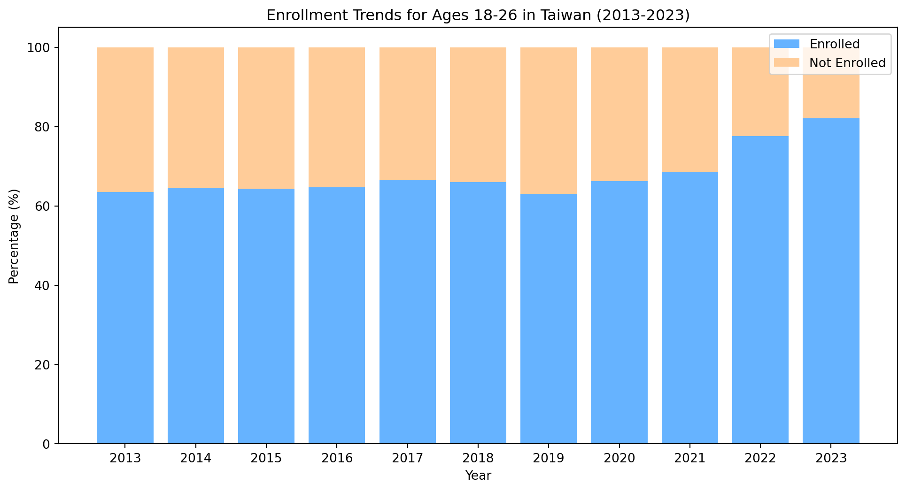

Figure 1: Enrollment in Taiwanese Higher Education

</div>

As of 2024, Taiwan has a total of 148 universities, colleges, and junior
colleges (Ministry of Education of Taiwan, 2024c). Education funding is
4.26% of Taiwan’s GDP in 2023-24 and has been on a decline for a decade
(Ministry of Education of Taiwan, 2024a). Taiwan has an aging population
and declining birth rates have forced several schools to close down
(Davidson & Chi-hui, 2024; Goh et al., 2023).

<div id="fig-tw-high-ed-funding">

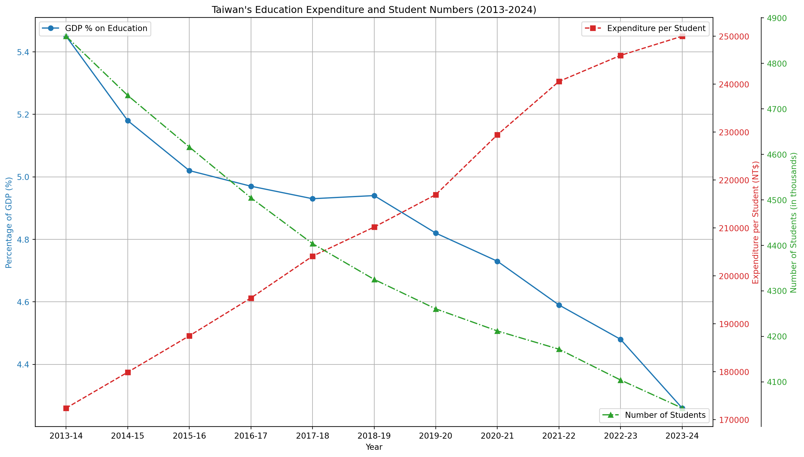

Figure 2: Funding for Taiwanese Higher Education

</div>

While the overall number of students is declining, the share of
international students is increasing.

<div id="fig-tw-high-ed">

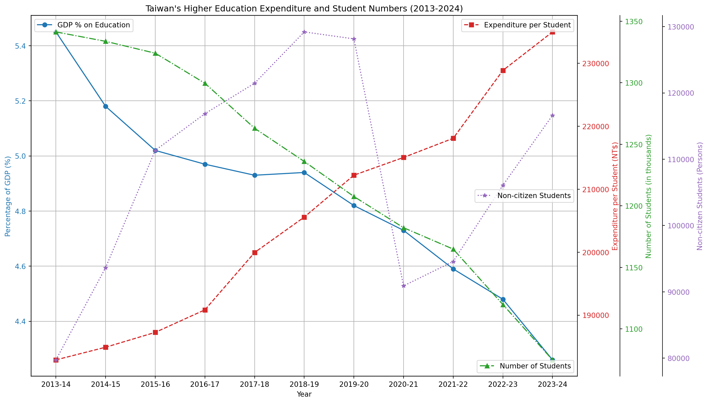

Figure 3: Demographics of Taiwanese Higher Education

</div>

## Designing for College Students: Developing Personas

Students in the Generation-Z age bracket (abbreviated as Gen-Z or
Zoomers) are born between 1997 and 2012 (Branka Vuleta, 2023). High
levels of technology adoption worldwide (Deyan Georgiev, 2023a). Over
98% of Gen-Z owns a smartphone while only 80% of the general world
population does (BankMyCell, 2022; Global Web Index, 2017).

Designing for College Students: Developing Personas. User research makes
extensive use of user *personas* to represent a group of people with
similar attributes. Designers use personas to *articulate assumptions,*
which, if used well, is useful for *user-centered design*, to create
better products. Personas help to reflect on what kind of *biases* might
exist in the design. Within the larger cohort of college students
several different personas could be defined, for example grouping people
by interests, knowledge, habits, levels of anxiety, and other
attributes. Humans have a long list of cognitive biases, which a good
design should take into account.

Many general observations can be made, however to create meaningful
personas, these should be backed up with data. Students ride bicycles
and scooters. Many circular economy service such as YouBike and
transport sharing platforms like Uber are available in Taiwan. Many
students live in dorms and shared housing, meaning their impact per
square meter is low.

## Taiwanese Youth in Global Context: Sustainability Attitudes From Eco-Friendly Diet to Climate Action

Addressing the Research Gap When it Comes to Taiwanese College Students.
There’s lack of scientific research when it comes to Taiwanese college
students, not only in English or other foreign languages, but also in
Chinese. Much of the research in Taiwan focuses on younger students,
particularly those in primary and secondary schools. With regards to
issues related to college students and sustainability, even less
research is available. My project hopes to shed some light to how
Taiwanese college students relate to sustainability.

(Kuo-Hua Chen, 2019) compares Taiwan to other countries in terms of
*Postmaterialist Index Comparison*, noting Taiwanese society is
materialistic.

<div id="fig-postmat-index">

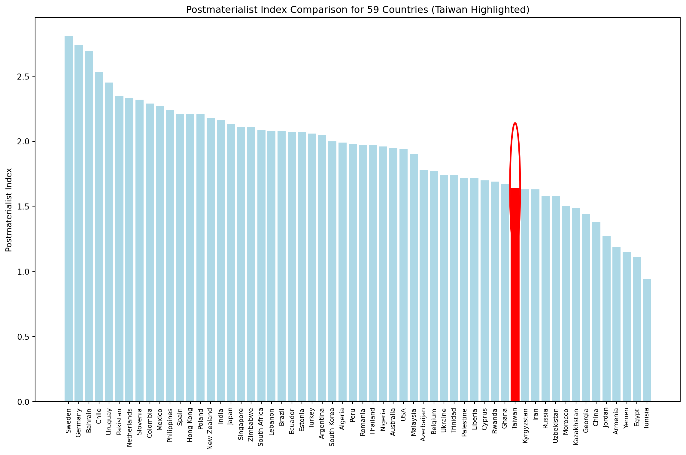

Figure 4: Postmaterialist Index across 59 countries (Taiwan highlighted)

</div>

World Values Survey

<div id="fig-world-values">

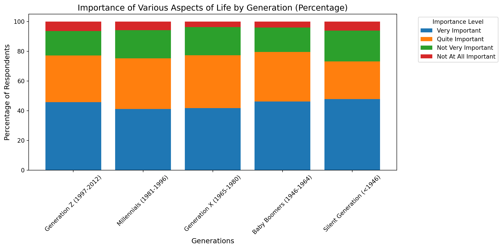

Figure 5: World Values Survey

</div>

(Franzen & Bahr, 2024) measures *“mean environmental concern”* to look
at decade-level changes in societal environmental attitudes across
countries. Taiwan’s general attitudes have stayed almost the same
(slight increase). The UK has had the largest jump in concern.
Curiously, South Korea has had a slight decrease in concern. Slovakia
and Russia were not very concerned with the environment a decade ago and
are even less concerned now.

A large, global-scale study by (Anthony Leiserowitz et al., 2022)
administered on Meta’s Facebook (n = 108946) reported people in Spain
(65%), Sweden (61%), and Taiwan (60%) believe *“climate change is mostly
caused by human activities”*.

<div id="fig-global-climate-attitudes">

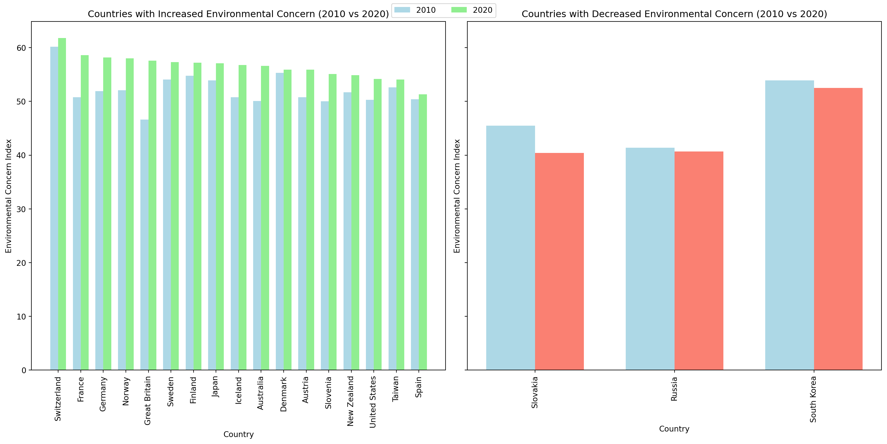

Figure 6: Global Attitudes Towards Climate Change

</div>

The largest study to date, conducted by the United Nations across 50
countries, surveying 1.2 million people, distributed through mobile game
ads, showed the majority of people agreeing climate change is an
“emergency” (UNDP, 2021).

<div dangerouslySetInnerHTML={{ __html: quartoRawHtml[0] }} />

At the pre-university level, Taiwanese government has been promoting
environmental education through a green school network; however surveys
at middle school and high school level suggest there is no impact on
*sustainability consciousness* among students in comparison with regular
schools (Olsson et al., 2019). Rather, Taiwanese students are influenced
towards environmental action by *group consciousness* (Yu et al., 2017).
In contrast,(陳珮英, 2003) reports *good knowledge of sustainable
development* topics among *junior high school students* in Da-an
District, Taipei City (n =596). (林建輝., 2009) similarly reports a
positive attitude and good knowledge of environmental sustainable
development among senior *high school students* towards in Taipei City
(n = 328). Several Taiwanese studies also focus on the physical
environment of school campuses, for example the sustainability of
elementary school campuses (潘智謙 & Pan, 2006). Elementary-school
teachers in Taichung (n = 536), have positive attitudes towards
environmental education are positive, proactive and demonstrate high
awareness; they have participated in many sustainability-related
workshops (Liao et al., 2022).

At the university level, (C.-L. Chen & Tsai, 2016) reports a *positive
attitude yet moderate knowledge* about *ocean sustainability* among
Taiwanese college students (n = 825). (C.-H. Liu et al., 2023) studied
sustainability behavior of Taiwanese University students, reporting the
COVID-19 pandemic, in addition to prevalence of health issues, also
spurred more attention on environmental topics. In a similar vein, the
devastating nuclear disaster in Fukushima, Japan, after 2011 earthquake,
had an effect on Taiwanese energy and sustainability education (姚 & 侯,
2011). Taiwanese government launched the Sustainable Council in 1997 to
promote of environmental and sustainable development; a survey of
university-level teachers (n = 100) in central Taiwan (Taichung,
Changhua, and Yunlin) shows a positive attitude toward environmental
sustainability among teachers however implementation of environmental
sustainability practices is from low to medium range (林美惠. & 莊,
2015). Taiwanese government has also launched funding for University
Social Responsibility (USR) programs to train college students in social
innovation and local revitalization (D. Chen & Chou, 2023; W.-H. Liu et
al., 2022). In general, it could be concluded, Taiwanese students and
teachers at all levels of education have a positive attitude towards
sustainability (Note: which is not a very actionable finding).

Comparing college students’ education for sustainable development (ESD)
in Taiwan (n = 617) and Sweden (n = 583) found Sweden has a long history
in environmental education while in Taiwan environment became a focus
area with the 1998 educational reform (Berglund et al., 2020).

<div id="fig-tw-swe">

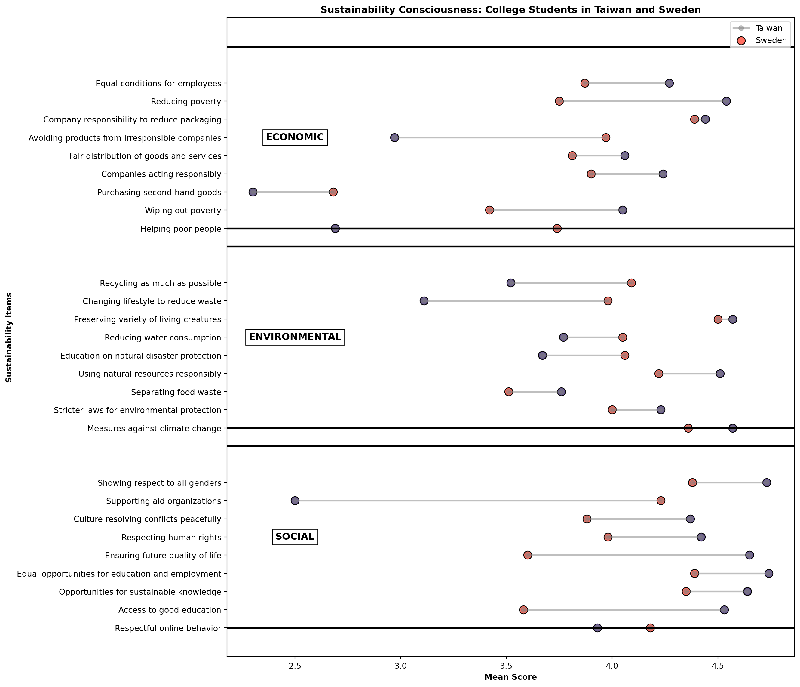

Figure 7: Comparing college students’ education for sustainable
development in Taiwan and Sweden

</div>

An older study in 5 university in Taipei and Taichung (n = 255) found
78.04% of respondents consumed beef in the month prior and were
concerned with food safety, freshness, and quality (J. L. Hsu et al.,
2014). (Thiagarajah & Kay, 2017) reports a general observation in their
abstract (I was unable to access the full study) that most college
students in all observed countries including Taiwan (n = 534) regarded
“*plant-based diets to have health benefits”*. A focus on a healthy and
sustainable diet is important, as the prevalent trend among Taiwanese
Gen-Z, is increasing obesity, with the latest data available from 2020;
the newest, 3rd wave national health survey results are still pending
(Chiu et al., 2022; 台灣營養師, 2022; 彭巧珍 et al., 2023). Recent
nationwide data show that 70% of common bottled drinks (n = 341)
marketed to youth in Taiwan exceed the warning threshold for *“high
sugar”* (\> 5 g/100 mL), and a single serving of 42% of the drinks (\>
25 g sugar per bottle) contained the entire daily sugar limit prescribed
by the World Health Organization (WHO) (Yen et al., 2022).

Internationally, there is extensive research on the attitudes of college
students towards climate change. (American Press Institute, 2022)
reports only 37% percent of U.S. Gen-Z and Millenials follow news
related to environmental issues. (Schwartz et al., 2022) reports some
adult U.S. students in a small study (18-35, n = 284) express feelings
of insignificance of their actions to achieve any meaningful impact.
(Thomaes et al., 2023) reports U.S. adolescents don’t find
sustainability relevant to their daily life. (Ross et al., 2016) says
most people in the U.S. don’t act on climate change. “Action on climate
change has been compromised by uncertainty, aspects of human
psychology”.

(Credit Suisse, 2022) suggests young consumers are more eco-friendly and
drive the speed of change. Yet the Economist has ran a few anonymous
articles calling gen-z green ideals into question (“How Gen Z and
Millennials Spend Their Money,” 2023; The Economist, 2023). (Wood, 2022)
suggests in the U.S. Gen-Z is willing to pay 10% more for ethically
goods, spend 24% more on sustainable products than Generation X and 75%
of Gen Z would prioritize sustainability over brand loyalty. Meanwhile
Gen-Z in the U.S. are heavy users of online fashion shopping, Chinese
cheap online store Shein overtakes Amazon as the most downloaded
shopping app, while clothes resale apps such as Depop and ThredUp grow
in popularity (Alex Reice, 2021). It worth noting, Taiwan is also a
growing market for luxury brands (Karatzas et al., 2019).

(Manchanda et al., 2023) survey (n = 726) administered at shopping malls
in New Delhi, India, found similar levels of sustainability
consciousness between Millenial (n = 206) and Generation-Z (n = 360) age
groups; people with high level of materialism were found to be less
sustainability-conscious; the effect of mindfulness on sustainability
was found to be stronger among females than males, supporting the
hypothesis of the moderating effect of gender.

## The Experience of Climate Change and Pollution Levels in Taiwan

Taiwan’s recent climate challenges with over 4 decades of droughts,
rising air temperatures, and shifting rainfall patterns, have impacted
both water security and the performance of its vital semiconductor
manufacturing industry ​(Vo & Liou, 2024). Offshore, marine heatwaves,
ocean acidification, and elevated sea surface temperatures are
intensifying coral bleaching around Taiwan (P.-C. Hsu et al., 2024). The
oceans are crucial for Taiwan to capture carbon emissions. Around 33% of
Taiwanese CO<sub>2</sub>eq emissions is captured by the marine carbon
sink, while the effect of forests in Taiwan needs further study (Hung et
al., 2024).

Similarly to how Northern Europe, including Estonia, is affected by the
Gulf Stream, making the climate warmer, Taiwan is affected by the
Kuroshio (黑潮) warm current of the Pacific Ocean, which helps regulate
the climate and marine ecosystem of the region. The strength and
trajectory of the Kuroshio is influenced by Rossby planetary waves,
driven by the Earth’s rotation are crucial to keeping the atmosphere in
balance by helping transfer tropical heat towards Earth’s poles and cold
air toward the tropics; interactions between oceanic currents, Rossby
waves and nonlinear *mesoscale eddies,* which form complex undulations,
and their effect on the climate are still not well understood (Belonenko
et al., 2023; Lin et al., 2022; S. Liu et al., 2024; Mensah et al.,
2014; Shen et al., 2014; US Department of Commerce, n.d.; Yin et al.,
2019). Going back on a larger time scale, biomarkers in the sediment
core around Taiwan are being used to study variations in climate over
past thousands of years (Wang et al., 2021).

In addition to climate extremes, Taiwanese college students are
subjected to high levels of pollution. University campuses are somewhat
healthier than other areas. There are several decades of research on
pollution levels in Taiwan, most with very scary correlations to health.
Taiwan air pollution, the worst (highest PM2.5 concentration) were found
in Changhua (24.5 µg/m³), Tainan (20.9 µg/m³), and Pingtong (20.7 µg/m³)
(**changhsiung-fengTaiwanAir45th2024?**).

There have been concerns about food safety in Taiwan, with prominent
cases reported in the media and documented in academic literature, where
organic toxins and chemical pollution have entered the food system (Lee,
2024; J.-H. Li & Ko, 2012; Yang et al., 2013).

A recent study demonstrate extreme industrial pollution in numerous
sites at the Hsinchu’s Xiang Shan wetland (香山濕地) in Northern Taiwan,
yet considers ecological risk threat to nature and wildlife to be
“moderate” (Salah-Tantawy et al., 2025). In contrast, (李桂媚, 2022)
reports Taiwan’s semiconductor industry employs undisclosed toxic
chemicals under trade-secret claims, which have not undergone
comprehensive health and environmental risk assessments. Previously,
(Y.-H. Liu et al., 2021) reported sediment analyses at the Xiang Shan
wetland found levels of gallium (Ga) ranging from 9,460 to 23,450 µg/kg
(severe contamination) and indium (In) from 4.77 to 37.1 µg/kg (moderate
contamination), amounts which are above natural baselines, indicating
industrial chemical runoff. Earlier studies of semiconductor wastewater
from waterways downstream of the Hsinchu Science Park (which houses over
450 companies’ manufacturing facilities) have shown high amounts of at
least 14 heavy metals, with levels of tungsten reaching 400 μg/L in
contrast to the average river concentration of \<0.1 μg/L (S.-C. Hsu et
al., 2011). The oldest study considered here also found high levers of
arsenic pollution in groundwater (H.-W. Chen, 2006). It’s safe to say,
in conclusion, the chemical runoff from manufacturing is a reality
documented by several studies, however the negative health effects have
not yet been clearly established - and studies of other, less prominent
industrial areas of Taiwan, are severely lacking.

The table below illustrates the types of emissions and environmental
impacts large corporations in Taiwan produce. It should be noted, some
of the corporations do buy carbon credits to offset their local adverse
impact; for instance, 台積電 TSCM has purchased carbon credits,
renewable energy, invested in the Taiwan Carbon Exchange to support
greener companies, and joined international reporting initiatives, such
as the Task Force on Climaterelated Financial Disclosures (TCFD) and
Taskforce on Nature-related Financial Disclosures (TNFD) (TSMC, 2023).

<div dangerouslySetInnerHTML={{ __html: quartoRawHtml[1] }} />

## Climate Anxiety Responses

A growing body of research shows climate anxiety is widespread among
young people, which emotionally can both hinder and motivate sustainable
action. A large worldwide study in (n = 10000, aged 16-25) by (Hickman
et al., 2021) provides evidence the youth is anxious about climate in 10
countries: Australia, Brazil, Finland, France, India, Nigeria,
Philippines, Portugal, the UK, and the USA. Similarly,
(**thompsonYoungPeopleClimate2021?**) finds young people around the
world have climate anxiety. (Whitmarsh et al., 2022) shows worry about
the climate in the UK is generally widespread (over 40% of the
respondents, n = 1332), while climate anxiety is highest among young
people and is a possible motivator for climate action. Additionally,
(Ogunbode et al., 2022) finds climate anxiety in 32 countries and also
supports the idea that climate anxiety leads to climate activism.
(Thibodeau, 2022): “In 2021, the BBC polled 1,000 people in Scotland to
understand the barriers to taking climate action. What they found was
even though many people were aware of actions needed to take to address
climate change, and had intentions to their behaviors didn’t change.
This is a phenomenon called the intention-action gap.”

(Osaka, 2023) argues *doomerism* is an excuse for climate in-action.
Hope is necessary for people to make changes in their habits (Marlon et
al., 2019). (Seabrook, 2020) suggests music therapy is useful in the era
of climate crisis, evolving to meet current needs of young people.
(Kjaergard et al., 2014) shows how *“understanding health and
sustainability as a duality, health both creates conditions and is
conditioned by sustainability, understood as economic, social and
environmental sustainability, while on the other hand sustainability
creates and is conditioned by human health”*.

A recent special issue of Behavioral Sciences magazine on Behavioral
Science for Climate Change (2025) provides further evidence. A review of
50 studies supports the idea that climate activism shifts public opinion
towards climate concern (Thomas-Walters et al., 2025). Climate change
negative affect braing health through heat, air pollution, extreme
weather; the study finds links to neurological, psychiatric, and
cognitive disorders (Todorova et al., 2025).

When disaster hits we need high levels of *social trust*. being part of
community of trust makes it easier to act in unison. Religion is a type
of community of trust. conversely, that can also have negative effects,
as in Taiwan the expected behaviour of burning joss sticks and paper
money, is a cause of air pollution (Tang & Pan, 2014)

Psychological factors influencing millennials to engage with
sustainability (Naderi & Van Steenburg, 2018)

<div id="fig-mil-psych-sust">

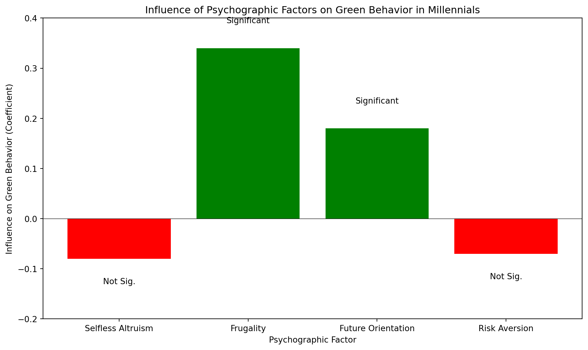

Figure 8: Psychological factors influencing millennials to engage with
sustainability

</div>

## Attitude-Behavior Gap

While people express eco-conscious ideas, it’s non-trivial to practice
sustainability in daily life. Translating eco-conscious attitudes into
concrete sustainable actions remains challenging. Empirical evidence
illustrates this gap between intention and behavior. (Park & Lin, 2020)
positive attitude towards sustainable products does not result in
purchase decisions, shows research of fashion in South Korea. In one
Australian study, green consumers still waste food similarly to the
baseline (McCarthy & Liu, 2017).

However, changing habits is important if technology alone is not the
solution. (Deyan Georgiev, 2023b) reports only 30% of people in the
Gen-Z age group believe technology can resolve all environmental
problems. Even with good intentions, (Munro et al., 2023) finds shoppers
who try to shop sustainably often fail to find sustainable product, in a
systemic literature review of 64 papers from South Korea, Australia, the
UK, the US, and elsewhere.

McKinsey’s *Talk is Cheap* study underscores the same paradox at scale:
more than 60% of global consumers say they are willing to pay extra for
sustainable products, yet in reality most wouldn’t pay a premium greater
than about 10% (**freundtHowMuchWill2024?**). A robust
willingness-to-pay (WTP) literature tells a similar story. A 2021
meta-analysis covering 80 studies finds the average stated premium for
sustainable food products is 29.5%; however, hypothetical surveys often
overstate WTP relative to real-purchase experiments (S. Li & Kallas,
2021). In contrast, PwC’s 2024 *Voice of the Consumer* survey, based on
20000 respondents in 31 countries, reports a far more modest mean
sustainability premium of 9.7% that consumers are willing to pay, once
inflation is factored in (PwC Global, 2024).

In short, people want eco-products but are largely price-sensitive.

## Sustainability in Taiwan: Garbage Trucks and Digital Receipts

Musical garbage truck are a success story of the environmental progress
in Taiwan (Helen Davidson & Chi Hui Lin, 2022). Indeed, they are a *user
interface innovation* and the main way how people in Taiwan interact
with sustainability issues.

The popular narrative about Taiwan recounts the story of the economic
and environmental transformation of the country. In the late 1980s
during the heights of an economic boom Taiwan became famous as the
Taiwanese Miracle (臺灣奇蹟) (Gold, 1986;
**tsaiExplainingTaiwanEconomic1999?**). By the early 1990s another less
flattering nickname appeared: *“garbage island”*, for the piles of trash
covering the streets and overflowing landfills (Ngo, 2020;
**rapidtransitionsallianceTaiwanTransitionGarbage2019?**). In the two
decades that followed, from 1998 to 2018, Taiwan made progress in
municipal waste management, rising to the status of a world-leader in
recycling (2nd *effective recycling rate* after Germany); in addition to
an effective recycling system, the average waste amount generated per
person by 700g (from 1140g to 400g) per day; nonetheless, industrial
recycling rates were less stellar, standing at 80% in 2020 and there
were unrealized opportunities in using industry 4.0 technologies, such
as internet of things (IoT) sensors for better waste tracking (Bui et
al., 2023; Wu et al., 2021).

Progress in sustainability is possible but achieving results takes time
and innovation.
(**rapidtransitionsallianceTaiwanTransitionGarbage2019?**) credits the
Taiwanese Homemakers United Foundation (財團法人主婦聯盟環境保護基金會)
for initiating the transformation in 1987, suggesting a small group of
people can have an outsized impact on the whole country. Their activity
didn’t stop there and (財團法人主婦聯盟環境保護基金會, 2020) recounts a
timeline of their achievements on their website until the present day.

(“獨家觀察－電子發票年減碳量 相當2,700座大安森林公園,” 2025) reports
54.03% of invoices in Taiwan are digital. Since 2021 digital receipts
are mandatory for all businesses. Taiwan’s longstanding receipt lottery
also has specific prizes available only for digital receipts
(*行動支付結合雲端發票 節能減碳最環保經理人*, 2018). Several other
countries, such as Singapore, South Korea, Japan, Sweden, Italy,
Portugal, Brazil, Mexico, have comparable systems in use.

## Trends in Taiwanese Industry and Online Shopping

In the intensifying competition of online shopping in Taiwan,
(聯合新聞網, 2024) predicts Momo and Coupang will compete for Taiwanese
market leadership, with Coupang increasingly stepping on Shopee’s and
MOMO’s toes, as per (“順風婦產科 순풍 산부인과 (@Followwindlover) on
Threads,” 2024).

Across online and offline, KANTAR reports Taiwan’s consumer spending on
fast-moving consumer-goods (FMCG) grew over 5% in 2024, speeding up
towards the end of the year: +2.5% in Q1, +4.1% in Q2, +5.7 % in Q3 and
+9.1% in Q4, with e-commerce crossing the 20 % share mark (traditionally
FMCG are purchased physical stores, as convenience stores are so readily
available all over Taiwan) (foodNEXT, 2024; Kantar Worldpanel, 2024;
動腦Brain.com.tw, 2024; 食力 foodNEXT, 2025).

Taiwan has been on a path of change, striving to become more
sustainable. Between 1970 and 2019, emitting CO<sub>2</sub>eq was
largely a prerequisite for economic growth in Taiwan (T. Chang et al.,
2023). Since the 1990s, Taiwan is a net CO<sub>2</sub>eq exporter
through emissions embedded in the industrial production oriented economy
(Huang et al., 2020). Starting in 2023, Taiwan’s Financial Supervisory
Commission’s (FSC) added “requirements for Taiwan’s corporates to
disclose their carbon emissions,” (Reformosatw, 2024). Most recently,
the Taiwanese environmental ministry has been cracking down on illegal
waste, with over 70 cases being prosecuted (環境部, 2025).

TIME Magazine and Statista collaborative *“World’s Most Sustainable
Companies Of 2024”* includes 17 Taiwanese companies
(**alanasemuelsWorldMostSustainable2024?**).

<div dangerouslySetInnerHTML={{ __html: quartoRawHtml[2] }} />

Meanwhile, Corporate Knights which has been ranking global sustainable
companies since 2005, including analysis of 7000 public companies with a
revenue over US\$1 billion, only includes TSMC in the top 100 (placed
20th in 2021 and 44th in 2022, dropping out in 2023) and Taiwan High
Speed Rail Corp (THSR) and Giant Manufacturing Co Ltd since 2023
(Corporate Knights, 2024; Staff, 2021). Meanwhile, earth.org’s list of
the world’s 50 most sustainable companies in 2022, only includes 1
Taiwanese company - TSMC (**earth.orgWorld50Most2022?**).

<div id="fig-tw-comp-rank">

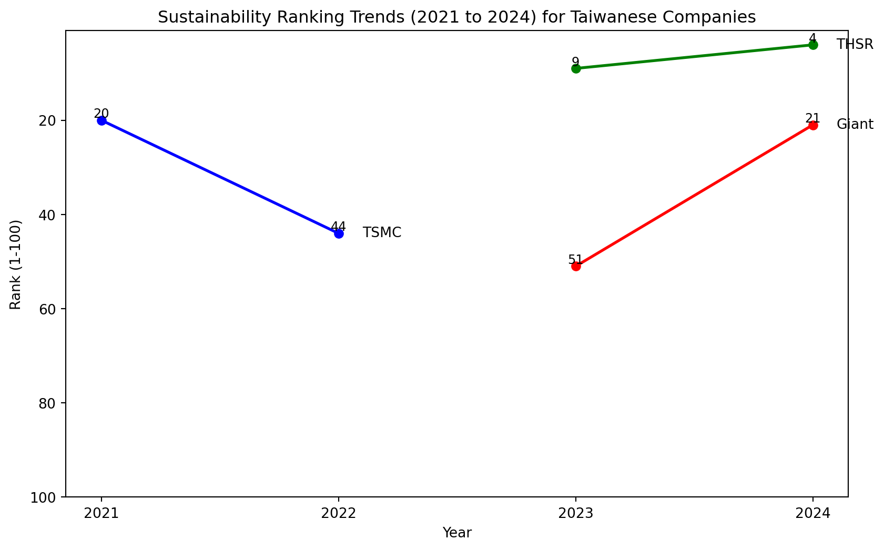

Figure 9: Taiwanese Company Ranking

</div>

Meanwhile, (Marc Lien, 2022) finds 4 millions British SMEs have no plan
for net-zero transition and (Ware, 2024) adds, British workers lack
skills for green transition, according to a 2024 National Environmental
Services Survey.

<div id="fig-br-comp-rank">

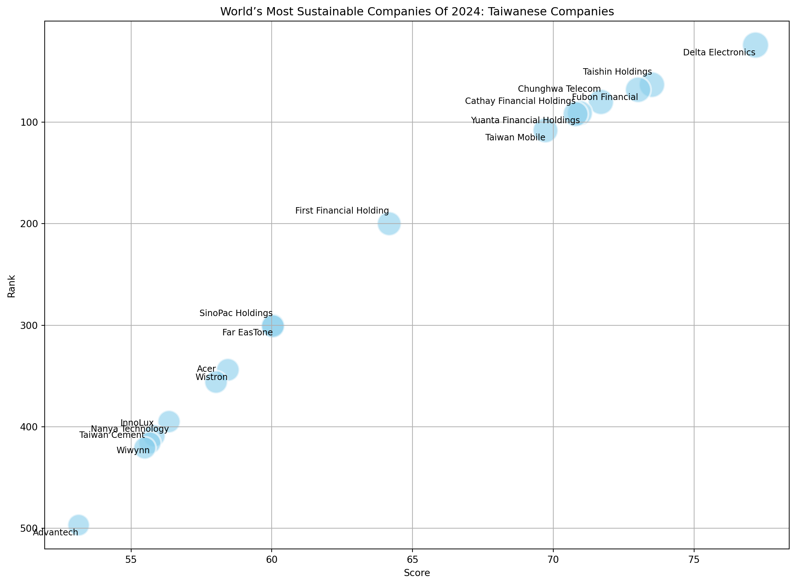

Figure 10: British Company Ranking

</div>

## Financial Literacy Worldwide and Among Taiwanese Youth

A recent nationwide study (n = 1997) titled Youth Financial Health
Basics (青少年財務健康基礎大調查) jointly conducted by the Taipei Fubon
Bank and the Parent-Child Innovation Center (親子天下教育創新中心)
between February 11 and March 9, 2025 found that over 65% of secondary
schools incorporated financial-literacy courses into their curricula
however 64% of Taiwanese youths (aged 15–18) exhibit low confidence and
understanding of financial products and face significant fraud risk,
with nearly 1/5 of the respondents encountering a scam in the past year,
while 18% suffered actual financial losses (江昭倫, 2025; 陳美君, n.d.).

<div dangerouslySetInnerHTML={{ __html: quartoRawHtml[3] }} />

Importantly for designing a financial app, while 80% of the survey
respondents had received financial education at school, 90% of the
students deemed the primary learning channel about financial knowledge
to be on social media; and only 15% remember to have learned about
credit-card usage (江昭倫, 2025).

In a much older study, I-Cheng Yeh (2009) analyzed usage data from
30,000 credit-card clients at an undisclosed major Taiwanese bank to
predict next-month defaults, using 6 data-mining techniques including
ANNs (AI Neural Networks) (Yeh & Lien, 2009). Because of the age of the
study there’s no Gen-Z data. People aged 18-26 at the time would be
Millenials or Gen-X by now. the data was donated by (Yeh, 2016) and
roughly 1 in 5 credit card clients (22.1%) of the dataset defaulted on
their payment in the next month. Among the 9,618 clients aged 18–29 at
the time of the study, 2,197 defaulted on their next‐month payment,
yielding a default rate of 22.8%, slightly higher than the overall
average. Meanwhile, among the 5,127 clients aged 18–26, 1,285 defaulted,
yielding a rate of 25.1%, considerable higher than their older
counterparts. Finally, among the 1,558 clients aged 18–23, 430
defaulted, a rate of 27.6%, pointing to a trend of younger people having
higher default rates.

A over-the-phone study (n = 3000) conducted in 2022, found Taiwanese
savings habits to have polarized, with over 60% either having no savings
whatsoever or saving more than 1/2 of their annual income; 27% of
respondents reported total savings below NT\$40,000; young adults’ (aged
20–29) were the only group whose financial risk worsened, with 43% of
the respondents having extremely low financial literacy, described as
金融文盲 (near “financial illiterate”) (中央社, 2022).

<div dangerouslySetInnerHTML={{ __html: quartoRawHtml[4] }} />

The Taiwanese Financial Literacy & Education Association 財金智慧FINLEA
is a non-profit with a stated goal of enhancing financial literacy among
Taiwanese. Their longtitudinal study, with the latest survey conducted
in 2022 (n = 2014; 1055 high-school; 959 university) rated financial
literacy among all youths 56.3 out of 100 (53.8 in 2016 and 56.7 in
2007), always below the benchmark score of 60, with high school and
vocational students averaging 49.26 and university students somewhat
higher averaged 64.03 score (網軟股份有限公司, n.d.).

<div dangerouslySetInnerHTML={{ __html: quartoRawHtml[5] }} />

財金智慧FINLEA does publish online videos targeted at young people,
however as of early 2025, they only have around 1000 subscribers on
YouTube (財金智慧FINLEA, 2020). Meanwhile the Taiwanese cryptocurrency
influencer Mr Block has over 100000 YouTube subscribers (mrblock
區塊先生, 2025).

````mdx-code-block
<Figure
  caption="財金智慧FINLEA YouTube Channel"
  src={FinancialLiteracyYouTube}
  refURL="https://www.youtube.com/@FINLEAorgtw/featured"
  refTitle="YouTube"
/>
````

Internationally, there’s evidence young people have money. In the United
States, the combined annual consumer spending of Gen-Z and Millennials
was over \$2.5 Trillion in 2020 (YPulse, 2020). Over the decade from
2020 to 2030, in the U.S., UK, and Australia, Millennials are projected
to inherit \$30 Trillion USD from their parents (Calastone, 2020).
(Steverman, 2022) puts the inheritance figure between 2022-2045 at an
higher \$73 Trillion USD. There’s also some evidence of investment
interest, however with a large geographic variance. According to a
(Calastone, 2020) study (n = 3000) surveying people in the millennial
age group between ages 23 and 35 in Europe (UK, France, Germany),
U.S.A., Hong Kong, and Australia, 48% of respondents located in Hong
Kong owned financial securities (such as stocks) while the figure was
just 10% in France.

<div dangerouslySetInnerHTML={{ __html: quartoRawHtml[6] }} />

## Social Media, Trends, Memes, and Youth Empowerment

The term “meme,” first coined by Richard Dawkins in 1976 in his book
“The Selfish Gene” to describe units of cultural evolution, analogous to
that of biological evolution, which may evolve by natural selection, and
now encompasses internet artifacts and even stocks. Beyond mere
entertainment, memes have emerged as an academic discipline, where memes
are sampled, coded, and analysed from cultural and ethical viewpoints,
among others (Zidani & Miltner, 2022). (Peters-Lazaro et al., 2020)
argues memes are no merely jokes but tools for communal critique and
collective visioning. suggesting that Taiwanese Gen-Z memes scaffold
deeper conversations about consumerism, climate action, and social
change. Memes from daily life, business to war, are relevant to
penetrating through the noise of the web.

In Taiwan, homegrown memes may start with global templates but quickly
take on a local flavor. (劉芸嘉, 2024)’s 2021 study of 150 Taiwanese
memes written in Mandarin shows most rely on friendly and indirect
humor: inside jokes and wordplay that bond peers together.
(朱映潔(Ying-Chieh Chu), 2021) surveyed 737 Taiwanese Facebook users and
discovered that a meme’s funniness, shareability, and shock value
“hellish gags” (地獄梗) drive people to post it for social approval.
(胡綺珍, 2024) collected 217 “tired of life” / “I’m just trash” meme
texts from Instagram and PTT, then interviewed 13 Gen-Z enthusiasts,
revealing how self-deprecating jokes help Gen Z cope with stress, feel
part of a group, and quietly push back against social pressure. Memes
have a long history, and even almost a decade ago in 2016, a casual news
comment—like the “canoing man” (泛舟哥) remark during a typhoon exploded
into LINE stickers and PTT threads, proving that Taiwanese can transform
everyday media moments into collective satire or tongue-in-cheek
commentary (黃意能 & 黃曉琪, 2016).

Internationally, the sustainability-focused topics “underconsumption”
and “deinfluencing” were trending on TikTok in 2024 however have since
subdued (TikTok, 2024b, 2024a; **faresHowTikTokUnderconsumption2024?**).
While this particular trend may be over, memes still hold potential for
communicating about sustainability to young Taiwanese. Still, looking at
older international data, (Zannettou et al., 2018) built a large-scale
machine-learning pipeline to trace the origin of memes in the US, with
160M images and 2.6B posts within about 1 year (July 2016-2017) from
Twitter, Reddit, 4chan and Gab, finding that often memes originate from
fringe communities and then spread across mainstream media, highlighting
how fringe communities can be surprising impactful.

In Taiwan, Internet usage among young people is nearly universal, with
over to 98% of 18–29 (roughly Gen-Z) year‐olds reporting they have gone
online at least once recently, and close to 96% of respondents aged
18-29 used some form of social media (財團法人台灣網路資訊中心 &
台灣資訊社會研究學會, 2023).

<div dangerouslySetInnerHTML={{ __html: quartoRawHtml[7] }} />

(林高賢, 2024) analyzed (n = 1175) Taiwanese high school students,
mostly aged Gen-Z, finding that Instagram (IG) dominates, used by close
to 85% percent of the respondents; they use IG for about 2 hours per
day, 5-6 days per week; moreover, respondents often feel anxious (1-2
days per week), and anxiety correlates with several motivations of using
IG, such as recording life moments, documenting travel, food, and
fitness with photos, was tied to higher anxiety, possibly related to the
photo-centric self-presentation on Instagram, why can be theorized to
heighten sensitivity to feedback and criticism. In contrast, (陳思凝,
2023) conducted a survey of 458 Taiwanese Gen Z Instagram users, finding
that higher Instagram use intensity is directly associated with greater
online subjective well-being; however, intense use also leads to
information overload and social comparison, which induce social media
fatigue and in turn erode well-being; moreover, users’ perceived
intimacy with the platform amplifies the link between use intensity and
social comparison frequency. An online survey by (廖柏雅, 2024) (where
the Gen-Z cohort n = 125) found respondents to be highly motivated by
social and entertainment use; the user’s fear of missing out (FoMO) was
found to be related to the motive; e.g. people with social and
entertainment drives experience greater FoMO than those motivated
primarily by information seeking. (Lasnik, 2018) surveys college
students at the National Dong Hwa University in Hualian (n = 300, a mix
of Taiwanese and international students), using the Liebowitz Social
Anxiety Scale (LSAS) and Taijin Kyofusho Scale (TKS) as research
instruments, finding Taiwanese students ranked higher on the Taijin
Kyofusho, suggesting the fear of offending or disturbing others is
stronger among local students.

A large-scale (n = 2075) representative face-to-face survey among people
aged 18 to 93 years in Taiwan (no age-based categorization was published
for Gen-Z specifically), found that in general sharing one’s thoughts
online (known academically as “self-disclosure”) boosts perceived social
support and significantly boosts bonding and bridging social capital,
which increases life satisfaction and lowers loneliness (樊一寧 et al.,
2024). Conversely, in Japan, while not directly comparable, Gen-Z
reports wanting privacy and 75% feel others overshare on social media
and 49 percent were concerned about their personal data (McKinsey &
Company, 2022).

## AI Use Among Taiwanese Students

A survey of college students in March 8–10, 2023 at the Chung Yuan
Christian University (n = 983) in Taoyuan (Northern Taiwan), yielded the
following results: 66% of the students had used ChatGPT, with the the
top use cases being summarization (31%), translation of articles (28%),
and writing reports (24%) (CYCU, 2023; 許維寧, 2023). However, in terms
of AI adoption, this data can be considered out-dated. ChatGPT was first
released to the public on November 30, 2022, so the students had had
only about 3 months to try it out (OpenAI, 2022). At the time, the
GPT-3.5 model was available; the revolutionary GPT‑4 was released to the
public on March 14, 2023, (OpenAI, 2023).

In a more recent large-scale survey focusing on AI literacy administered
to the general public (n = 2174) found that only 26% of the respondents
had used ChatGPT in the past 3 months (in comparison with the 25% from a
similar survey administered in the previous year); younger people had
higher usage patterns, 53% for 18-29 and 37% 30-39; meanwhile, 69% of
respondents believed they could tell the difference between AI-generated
and non-AI content and 73% supported some type of government regulations
for AI (HakkaNews, 2024).

A Chinese study from two authors at the Minzu University and Beijing
Normal University reports they recruited anonymous Taiwanese college
students (n = 916) on the Chinese Credamo platform from the Taiwanese
IP-space (ChatGPT is blocked in Mainland China, Macau, and Hong Kong) to
compare ChatGPT vs. Google for academic use among Taiwanese students:
their findings show a clear preference for ChatGPT overall, which
students deemed more flexible (meanwhile some older students still
preferred Google) and Random Forest and LightGBM-based modeling
predicted tool choice by three main factors: 1) GenAI fluency,
2)awareness of GenAI hallucinations, and 3) user age; their
recommendations include 1) support critical-thinking among users, and 2)
design hybrid chat+search user interfaces with higher reliability
(Kelly, 2024; Qiao & Lee, 2024; Zhang & Yang, 2024). In the US, an older
study of young adults (Millenials at the time) highlights how they *“use
Google as a reference point for ease of use and simplicity”,* (Kate
Moran, 2016). The web now has several generations of native users, and
some older usage patterns which older digital natives are used to, may
take time to change.

In Sweden, a large-scale (n = 5894) survey across several Swedish
universities showed college students’ attitudes towards AI assistants
(ChatGPT was by far the most prevalent app, 95 % of respondents had
heard of ChatGPT and 35 % used it regularly); 55.9% held a positive
attitude toward AIs; integrity was a hotly debated question, 62% calling
AI use in exams “cheating,” but 60% rejecting an outright ban, and 58%
saying it doesn’t violate the purpose of education (Stöhr et al., 2024).

<div id="fig-college-chatbot">

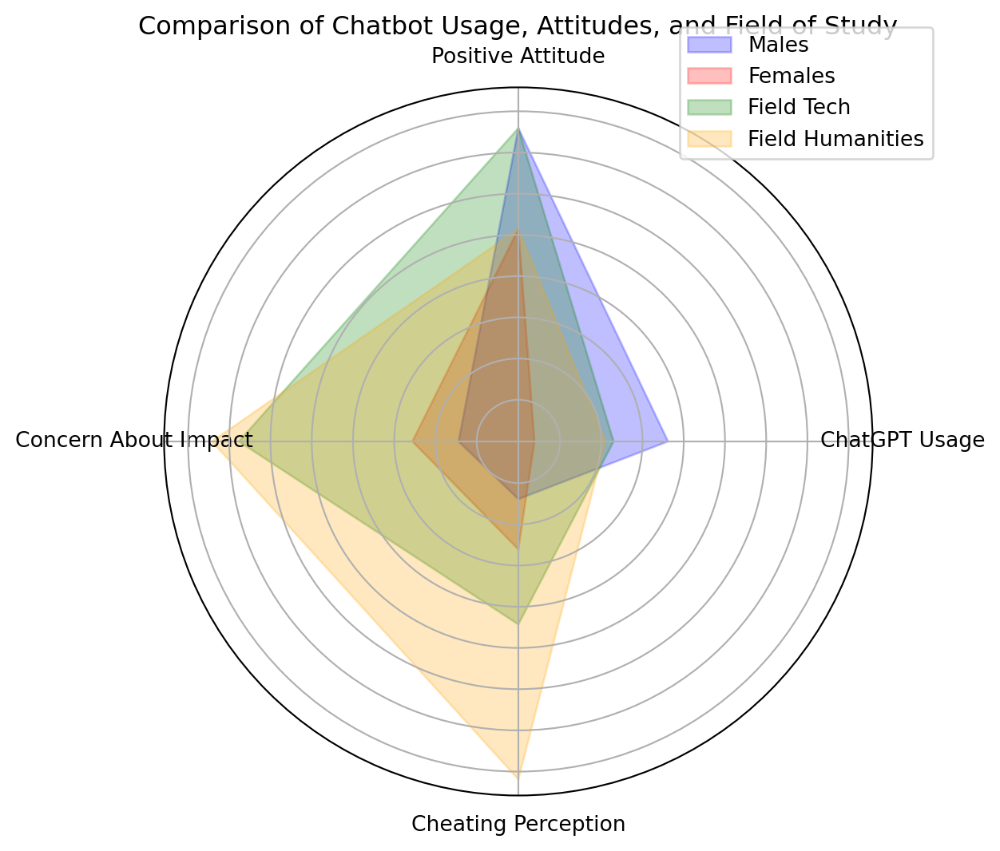

Figure 11: Swedish College Students’ Attitudes Towards AI Assistants

</div>

## References

Alex Reice. (2021). The most eco-conscious generation? Gen Z’s fashion
fixation suggests otherwise. In *The Week*.
https://theweek.com/culture/1007212/gen-zs-fast-fashion-hypocrisy.

American Press Institute. (2022). *Knowing the news: How Gen Z and
Millennials get information on essential topics*.

Anthony Leiserowitz, Jennifer Carman, Nicole Buttermore, Liz Neyens,
Seth Rosenthal, Jennifer Marlon, J.W. Schneider & Kelsey Mulcahy.
(2022). *International Public Opinion on Climate Change 2022*. Yale
Program on Climate Change Communication.

BankMyCell. (2022). *How Many People Have Smartphones Worldwide*.
https://www.bankmycell.com/blog/how-many-phones-are-in-the-world.

Belonenko, T. V., Sandalyuk, N. V. & Gnevyshev, V. G. (2023).
Interaction of Rossby waves with the Gulf Stream and Kuroshio using
altimetry in a framework of a vortex layer model. *Advances in Space
Research*, *71*(5), 2384–2393.
[https://doi.org/10.1016/j.asr.2022.10.042](https://doi.org/10.1016/j.asr.2022.10.042)

Berglund, T., Gericke, N., Boeve-de Pauw, J., Olsson, D. & Chang, T.-C.
(2020). A cross-cultural comparative study of sustainability
consciousness between students in Taiwan and Sweden. *Environment,
Development and Sustainability*, *22*(7), 6287–6313.
[https://doi.org/10.1007/s10668-019-00478-2](https://doi.org/10.1007/s10668-019-00478-2)

Branka Vuleta. (2023). Generation Z Statistics. In *99firms*.
https://99firms.com/blog/generation-z-statistics.

Bui, T.-D., Tseng, J.-W., Tseng, M.-L., Wu, K.-J. & Lim, M. K. (2023).
Municipal solid waste management technological barriers: A hierarchical
structure approach in Taiwan. *Resources, Conservation and Recycling*,
*190*, 106842.
[https://doi.org/10.1016/j.resconrec.2022.106842](https://doi.org/10.1016/j.resconrec.2022.106842)

Calastone. (2020). *Millennials and investing: A detailed look at
approaches and attitudes across the globe*.

Chang, C.-C., Wegerif, R. & Hennessy, S. (2023). Exploring dialogic
education used to teach historical thinking within the cultural context
of East Asia: A multiple-case study in Taiwanese classrooms. *Learning,
Culture and Social Interaction*, *41*, 100729.
[https://doi.org/10.1016/j.lcsi.2023.100729](https://doi.org/10.1016/j.lcsi.2023.100729)

Chang, H.-C. (2022). Climate strike or not? Intersectionality of age and
culture encountered by young climate activists in Taiwan. *Childhood*,
*29*(1), 7–23.
[https://doi.org/10.1177/09075682221074869](https://doi.org/10.1177/09075682221074869)

Chang, T., Hsu, C.-M., Chen, S.-T., Wang, M.-C. & Wu, C.-F. (2023).
Revisiting economic growth and CO2 emissions nexus in Taiwan using a
mixed-frequency VAR model. *Economic Analysis and Policy*, *79*,
319–342.
[https://doi.org/10.1016/j.eap.2023.05.022](https://doi.org/10.1016/j.eap.2023.05.022)

Chen, C.-L. & Tsai, C.-H. (2016). Marine environmental awareness among
university students in Taiwan: A potential signal for sustainability of
the oceans. *Environmental Education Research*, *22*(7), 958–977.
[https://doi.org/10.1080/13504622.2015.1054266](https://doi.org/10.1080/13504622.2015.1054266)

Chen, D. & Chou, M. (2023). Social Innovation in Taiwan: Theories and
Practices. *Innovation in the Social Sciences*, *1*(1), 5–43.
[https://doi.org/10.1163/27730611-bja10003](https://doi.org/10.1163/27730611-bja10003)

Chen, H.-W. (2006). Gallium, indium, and arsenic pollution of
groundwater from a semiconductor manufacturing area of Taiwan. *Bulletin
of Environmental Contamination and Toxicology*, *77*(2), 289–296.
[https://doi.org/10.1007/s00128-006-1062-3](https://doi.org/10.1007/s00128-006-1062-3)

Chiu, C., Wu, L. & Liu, T. (2022). Weight problems rise among Taiwanese.
*Taipei Times*.

Corporate Knights. (2024). *Global 100*. Corporate Knights.

Credit Suisse. (2022). *Young consumers may drive the speed of
environmental change*.

CYCU. (2023). 中原大學因應ChatGPT及AI之影響 進行全校師生問卷調查. In
*中原大學Chung Yuan Christian University*.

Dai, D. (2019). 全球學生氣候運動，臺灣學生走出自己的路. In *Greenpeace
綠色和平 臺灣*.

Davidson, H. & Chi-hui, L. (2024). Empty classrooms, silent halls:
Taiwan’s declining birthrate forces schools to close. *The Guardian*.

Deutsche Welle. (2019). *Fridays for Future global climate strike*.
https://www.dw.com/en/fridays-for-future-global-climate-strike-live-updates/a-50505537.

Deyan Georgiev. (2023a). *39+ Smartphone Statistics You Should Know in
2023*.

Deyan Georgiev. (2023b). *Gen Z Statistics - What We Know About the New
Generation*.

Dwi Tamara. (2025). Gen Z, climate justice and ’#IndonesiaGelap’ -
Academia. *The Jakarta Post*.

Flor, R. S., Aline. (2024). “Isto não acaba aqui,” garantem jovens
portugueses sobre decisão do Tribunal Europeu. In *PÚBLICO*.
https://www.publico.pt/2024/04/09/azul/noticia/nao-acaba-aqui-garantem-jovens-portugueses-decisao-tribunal-europeu-2086381.

foodNEXT, 食力. (2024). 2024年第二季台灣民生消費品市場年增4%
追求享樂精緻生活、零食和保健品花費提升. In *食力 foodNEXT*.
http://www.foodnext.net/column/columnist/paper/6111002417.

Franzen, A. & Bahr, S. (2024). The development of global environmental
concern during the last three decades. *Current Research in
Environmental Sustainability*, *8*, 100260.
[https://doi.org/10.1016/j.crsust.2024.100260](https://doi.org/10.1016/j.crsust.2024.100260)

Fridays For Future. (2025). Strike Statistics. In *Fridays For Future*.
https://fridaysforfuture.org/what-we-do/strike-statistics/.

Global Web Index. (2017). *98% of Gen Z Own a Smartphone*.
https://blog.gwi.com/chart-of-the-day/98-percent-of-gen-z-own-a-smartphone/.

Goh, S. K., Wong, K. N., McNown, R. & Chen, L.-J. (2023). Long-run
macroeconomic consequences of Taiwan’s aging labor force: An analysis of
policy options. *Journal of Policy Modeling*, *45*(1), 121–138.
[https://doi.org/10.1016/j.jpolmod.2023.01.006](https://doi.org/10.1016/j.jpolmod.2023.01.006)

Gold, T. B. (1986). *State and society in the Taiwan miracle*. Sharpe.

HakkaNews, 2024台灣網路報告／AI素養有明顯數位落差. 年齡、教育程度影響大.
(2024). 2024台灣網路報告／AI素養有明顯數位落差 年齡、教育程度影響大.
*客新聞 HakkaNews*.

Helen Davidson & Chi Hui Lin. (2022). *Classical trash: How Taiwan’s
musical bin lorries transformed “garbage island”*.
https://www.theguardian.com/world/2022/dec/26/classical-trash-how-taiwan-musical-truck-transformed-garbage-island.

Hickman, C., Marks, E., Pihkala, P., Clayton, S., Lewandowski, R. E.,
Mayall, E. E., Wray, B., Mellor, C. & Van Susteren, L. (2021). Climate
anxiety in children and young people and their beliefs about government
responses to climate change: A global survey. *The Lancet Planetary
Health*, *5*(12), e863–e873.
[https://doi.org/10.1016/S2542-5196(21)00278-3](https://doi.org/10.1016/S2542-5196(21)00278-3)

Hioe, B. (2019). “Fridays for Future” Protest Calling for Environmental
Action Held Outside Legislative Yuan. In *New Bloom Magazine*.
https://newbloommag.net/2019/05/24/fridays-for-future-protest/.

How Gen Z and millennials spend their money. (2023). *The Economist*.

Hsu, J. L., Lu, H. C.-H. & Chen, C. M.-L. (2014). The effect of family
beef taboos on beef consumption on young Taiwanese adults. *Food Quality
and Preference*, *34*, 45–49.
[https://doi.org/10.1016/j.foodqual.2013.12.008](https://doi.org/10.1016/j.foodqual.2013.12.008)

Hsu, P.-C., Macagga, R. A. T., Lu, C.-Y. & Lo, D. Y.-J. (2024).
Investigation of the <span class="nocase">Kuroshio-coastal</span>
current interaction and marine heatwave trends in the coral habitats of
Northeastern Taiwan. *Regional Studies in Marine Science*, *71*, 103431.
[https://doi.org/10.1016/j.rsma.2024.103431](https://doi.org/10.1016/j.rsma.2024.103431)

Hsu, S.-C., Hsieh, H.-L., Chen, C.-P., Tseng, C.-M., Huang, S.-C.,
Huang, C.-H., Huang, Y.-T., Radashevsky, V. & Lin, S.-H. (2011).
Tungsten and other heavy metal contamination in aquatic environments
receiving wastewater from semiconductor manufacturing. *Journal of
Hazardous Materials*, *189*(1-2), 193–202.
[https://doi.org/10.1016/j.jhazmat.2011.02.020](https://doi.org/10.1016/j.jhazmat.2011.02.020)

Huang, R., Lv, G. & Li, X. (2020). Taiwan has shifted to being a net CO2
exporter since the mid-1990s. *Journal of Environmental Management*,
*264*, 110484.
[https://doi.org/10.1016/j.jenvman.2020.110484](https://doi.org/10.1016/j.jenvman.2020.110484)

Hung, C.-C., Hsieh, H.-H., Chou, W.-C., Liu, E.-C., Chow, C. H., Chang,
Y., Lee, T.-M., Santschi, P. H., Ranatunga, R. R. M. K. P., Bacosa, H.
P. & Shih, Y.-Y. (2024). Assessing CO2 sources and sinks in and around
Taiwan: Implication for achieving regional carbon neutrality by 2050.
*Marine Pollution Bulletin*, *206*, 116664.
[https://doi.org/10.1016/j.marpolbul.2024.116664](https://doi.org/10.1016/j.marpolbul.2024.116664)

I-Cheng Yeh. (2009). *Default of Credit Card Clients*. UCI Machine
Learning Repository.
[https://doi.org/10.24432/C55S3H](https://doi.org/10.24432/C55S3H)

Kantar Worldpanel. (2024).
*FMCG消費者四項價值趨勢驅動市場：便利、健康、美妝與寵物陪伴 -
Taiwanese*.
https://www.kantarworldpanel.com/tw/News/2024-FMCG-market-trends.

Karatzas, S., Kapoulas, A. & Priporas, C. V. (2019). Consumers’
Perceptions on Complexity and Prospects of Ethical Luxury: Qualitative
Insights from Taiwan. *Australasian Marketing Journal*, *27*(4),
224–232.
[https://doi.org/10.1016/j.ausmj.2019.08.001](https://doi.org/10.1016/j.ausmj.2019.08.001)

Kate Moran. (2016). *Designing for Young Adults (Ages 18–25)*.
https://www.nngroup.com/articles/young-adults-ux/.

Kelly, S. M. (2024). *Apple’s new China problem: ChatGPT is banned there
CNN Business*.
https://edition.cnn.com/2024/06/21/tech/apple-ai-chatgpt-ban-china/.

Kjaergard, B., Land, B. & Bransholm Pedersen, K. (2014). Health and
sustainability. *Health Promotion International*, *29*(3), 558–568.
[https://doi.org/10.1093/heapro/das071](https://doi.org/10.1093/heapro/das071)

Kuo-Hua Chen. (2019). Transforming Environmental Values for a Younger
Generation in Taiwan: A Participatory Action Approach to Curriculum
Design. *Journal of Futures Studies*, *23*(4).
[https://doi.org/10.6531/JFS.201906_23(4).0008](https://doi.org/10.6531/JFS.201906_23(4).0008)

Lasnik, M. (2018). *Social anxiety and taijin kyofusho among taiwanese
university students in hualien: A cross cultural comparison of social
phobia symptoms* \[Master’s thesis\]. National Dong Hwa University.

Lee, I. (2024). Food poisoning scare limited to one restaurant. In
*Taipei Times*.
https://www.taipeitimes.com/News/front/archives/2024/04/01/2003815766.

Li, J.-H. & Ko, Y.-C. (2012). Plasticizer incident and its health
effects in Taiwan. *The Kaohsiung Journal of Medical Sciences*,
*28*(7S).
[https://doi.org/10.1016/j.kjms.2012.05.005](https://doi.org/10.1016/j.kjms.2012.05.005)

Li, S. & Kallas, Z. (2021). Meta-analysis of consumers’ willingness to
pay for sustainable food products. *Appetite*, *163*, 105239.
[https://doi.org/10.1016/j.appet.2021.105239](https://doi.org/10.1016/j.appet.2021.105239)

Liao, C.-W., Liao, Y.-H., Chen, B.-S., Tseng, Y.-J. & Ho, W.-S. (2022).
Elementary Teachers’ Environmental Education Cognition and Attitude: A
Case Study of the Second Largest City in Taiwan. *Sustainability*,
*14*(21), 14480.
[https://doi.org/10.3390/su142114480](https://doi.org/10.3390/su142114480)

Lin, J.-Y., Zheng, Z.-W., Zheng, Q., Wu, D.-R., Gopalakrishnan, G., Ho,
C.-R., Pan, J., Lin, Y.-C. & Xie, L.-L. (2022). Satellite observed new
mechanism of Kuroshio intrusion into the northern South China Sea.
*International Journal of Applied Earth Observation and Geoinformation*,
*115*, 103119.
[https://doi.org/10.1016/j.jag.2022.103119](https://doi.org/10.1016/j.jag.2022.103119)

Liu, C.-H., Horng, J.-S., Chou, S.-F., Yu, T.-Y., Lee, M.-T. & Lapuz, M.
C. B. (2023). Digital capability, digital learning, and sustainable
behaviour among university students in Taiwan: A comparison design of
integrated mediation-moderation models. *The International Journal of
Management Education*, *21*(3), 100835.
[https://doi.org/10.1016/j.ijme.2023.100835](https://doi.org/10.1016/j.ijme.2023.100835)

Liu, S., Zhang, Z., Yang, J., Zhao, Y., Zhang, X., Hu, B., Zhang, G.,
Yang, D., Sun, G., Wei, H., Wu, J., Guo, X., Zhang, Y., Li, S. & Zhu, J.
(2024). El
<span class="nocase">Ni<span class="nocase">ñ</span>o-Southern
Oscillation</span> and East Asian Monsoon controlled Kuroshio Current
evolution over the last 42 kyr. *Palaeogeography, Palaeoclimatology,
Palaeoecology*, *637*, 111981.
[https://doi.org/10.1016/j.palaeo.2023.111981](https://doi.org/10.1016/j.palaeo.2023.111981)

Liu, W.-H., Lee, H.-C., Sung, W.-Y. & Yang, T.-Y. (2022). The roles of
Taiwanese universities in coastal revitalization: A study of two case
projects. *Marine Policy*, *139*, 105050.
[https://doi.org/10.1016/j.marpol.2022.105050](https://doi.org/10.1016/j.marpol.2022.105050)

Liu, Y.-H., Shaheen, S. M., Rinklebe, J. & Hseu, Z.-Y. (2021).
Pedogeochemical distribution of gallium, indium and thallium, their
potential availability and associated risk in highly-weathered soil
profiles of Taiwan. *Environmental Research*, *197*, 110994.
[https://doi.org/10.1016/j.envres.2021.110994](https://doi.org/10.1016/j.envres.2021.110994)

Manchanda, P., Arora, N., Nazir, O. & Islam, J. U. (2023). Cultivating
sustainability consciousness through mindfulness: An application of
theory of mindful-consumption. *Journal of Retailing and Consumer
Services*, *75*, 103527.
[https://doi.org/10.1016/j.jretconser.2023.103527](https://doi.org/10.1016/j.jretconser.2023.103527)

Marc Lien. (2022). *How is the “green gap” affecting small businesses?*
https://www.lloydsbankinggroup.com/insights/how-is-the-green-gap-affecting-small-businesses.html.

Marlon, J. R., Bloodhart, B., Ballew, M. T., Rolfe-Redding, J.,
Roser-Renouf, C., Leiserowitz, A. & Maibach, E. (2019). How Hope and
Doubt Affect Climate Change Mobilization. *Frontiers in Communication*,
*4*, 20.
[https://doi.org/10.3389/fcomm.2019.00020](https://doi.org/10.3389/fcomm.2019.00020)

Martiskainen, M., Axon, S., Sovacool, B. K., Sareen, S., Furszyfer Del
Rio, D. & Axon, K. (2020). Contextualizing climate justice activism:
Knowledge, emotions, motivations, and actions among climate strikers in
six cities. *Global Environmental Change*, *65*, 102180.
[https://doi.org/10.1016/j.gloenvcha.2020.102180](https://doi.org/10.1016/j.gloenvcha.2020.102180)

McCarthy, B. & Liu, H. B. (2017). Food Waste and the “Green” Consumer.
*Australasian Marketing Journal*, *25*(2), 126–132.
[https://doi.org/10.1016/j.ausmj.2017.04.007](https://doi.org/10.1016/j.ausmj.2017.04.007)

McKinsey & Company. (2022). *Mind the Gap: What do Gen Zers in Asia
want?*
https://www.mckinsey.com//~/media/mckinsey/email/genz/2022/06/07/2022-06-07b.html.

Mensah, V., Jan, S., Chiou, M.-D., Kuo, T. H. & Lien, R.-C. (2014).
Evolution of the Kuroshio Tropical Water from the Luzon Strait to the
east of Taiwan. *Deep Sea Research Part I: Oceanographic Research
Papers*, *86*, 68–81.
[https://doi.org/10.1016/j.dsr.2014.01.005](https://doi.org/10.1016/j.dsr.2014.01.005)

Ministry of Education of Taiwan. (2024a). Main Education Statistical
Indicators. In *Statistical Indicators*.
https://english.moe.gov.tw/cp-86-18943-e698b-1.html.

Ministry of Education of Taiwan. (2024b). Net Enrollment Rate of
Tertiary Education. In *Statistical Indicators*.
https://english.moe.gov.tw/cp-86-18943-e698b-1.html.

Ministry of Education of Taiwan. (2024c). Universities, Colleges &
Junior Colleges. In *Statistical Indicators*.
https://english.moe.gov.tw/cp-86-18943-e698b-1.html.

mrblock 區塊先生. (2025). Mrblock 區塊先生. In *YouTube*.
https://www.youtube.com/channel/UCN2hSM8fBcvZBa8OOKc24eg.

Munro, P., Kapitan, S. & Wooliscroft, B. (2023). The sustainable
attitude-behavior gap dynamic when shopping at the supermarket: A
systematic literature review and framework for future research. *Journal
of Cleaner Production*, *426*, 138740.
[https://doi.org/10.1016/j.jclepro.2023.138740](https://doi.org/10.1016/j.jclepro.2023.138740)

Naderi, I. & Van Steenburg, E. (2018). Me first, then the environment:
Young Millennials as green consumers. *Young Consumers*, *19*(3),
280–295.
[https://doi.org/10.1108/YC-08-2017-00722](https://doi.org/10.1108/YC-08-2017-00722)

Ngo, H. (2020). *How getting rid of dustbins helped Taiwan clean up its
cities*.
https://www.bbc.com/future/article/20200526-how-taipei-became-an-unusually-clean-city.

Ogunbode, C. A., Doran, R., Hanss, D., Ojala, M., Salmela-Aro, K., van
den Broek, K. L., Bhullar, N., Aquino, S. D., Marot, T., Schermer, J.
A., Wlodarczyk, A., Lu, S., Jiang, F., Maran, D. A., Yadav, R., Ardi,
R., Chegeni, R., Ghanbarian, E., Zand, S., … Karasu, M. (2022). Climate
anxiety, wellbeing and pro-environmental action: Correlates of negative
emotional responses to climate change in 32 countries. *Journal of
Environmental Psychology*, *84*, 101887.
[https://doi.org/10.1016/j.jenvp.2022.101887](https://doi.org/10.1016/j.jenvp.2022.101887)

Olsson, D., Gericke, N., Boeve-de Pauw, J., Berglund, T. & Chang, T.
(2019). Green schools in Taiwan – Effects on student sustainability
consciousness. *Global Environmental Change*, *54*, 184–194.
[https://doi.org/10.1016/j.gloenvcha.2018.11.011](https://doi.org/10.1016/j.gloenvcha.2018.11.011)

OpenAI. (2022). *Introducing ChatGPT*.
https://openai.com/index/chatgpt/.

OpenAI. (2023). *GPT-4*. https://openai.com/index/gpt-4-research/.

Osaka, S. (2023). Why climate “doomers” are replacing climate “deniers.”
*Washington Post*.

Park, H. J. & Lin, L. M. (2020). Exploring attitude–behavior gap in
sustainable consumption: Comparison of recycled and upcycled fashion
products. *Journal of Business Research*, *117*, 623–628.
[https://doi.org/10.1016/j.jbusres.2018.08.025](https://doi.org/10.1016/j.jbusres.2018.08.025)

Peters-Lazaro, G., Shresthova, S. & Jenkins, H. (2020). *Popular culture
and the civic imagination: Case studies of creative social change*. New
York University Press.

PwC Global. (2024). *2024 voice of the consumer survey*.

Qiao, Q. & Lee, H. Y. (2024). OpenAI cuts off access to users in China,
Hong Kong and Macau. In *Radio Free Asia*.
https://www.rfa.org/english/news/china/openai-07102024145316.html.

Reformosatw. (2024). Anti-Greenwashing. In *Reformosa Taiwan*.
https://www.reformosa.org/anti-greenwashing.

Ross, L., Arrow, K., Cialdini, R., Diamond-Smith, N., Diamond, J.,
Dunne, J., Feldman, M., Horn, R., Kennedy, D., Murphy, C., Pirages, D.,
Smith, K., York, R. & Ehrlich, P. (2016). The Climate Change Challenge
and Barriers to the Exercise of Foresight Intelligence. *BioScience*,
*66*(5), 363–370.
[https://doi.org/10.1093/biosci/biw025](https://doi.org/10.1093/biosci/biw025)

Salah-Tantawy, A., Chang, C.-S. G., Young, S.-S. & Lee, C.-F. (2025).
Multivariate analyses to evaluate the contamination, ecological risk,
and source apportionment of heavy metals in the surface sediments of
Xiang-Shan wetland, Taiwan. *Frontiers in Public Health*, *13*, 1459060.
[https://doi.org/10.3389/fpubh.2025.1459060](https://doi.org/10.3389/fpubh.2025.1459060)

Schwartz, S. E. O., Benoit, L., Clayton, S., Parnes, M. F., Swenson, L.
& Lowe, S. R. (2022). Climate change anxiety and mental health:
Environmental activism as buffer. *Current Psychology*.
[https://doi.org/10.1007/s12144-022-02735-6](https://doi.org/10.1007/s12144-022-02735-6)

Seabrook, D. (2020). Music therapy in the era of climate crisis:
Evolving to meet current needs. *The Arts in Psychotherapy*, *68*,
101646.
[https://doi.org/10.1016/j.aip.2020.101646](https://doi.org/10.1016/j.aip.2020.101646)

Shen, M.-L., Tseng, Y.-H., Jan, S., Young, C.-C. & Chiou, M.-D. (2014).
Long-term variability of the Kuroshio transport east of Taiwan and the
climate it conveys. *Progress in Oceanography*, *121*, 60–73.
[https://doi.org/10.1016/j.pocean.2013.10.009](https://doi.org/10.1016/j.pocean.2013.10.009)

Staff, C. K. (2021). 2021 Global 100 ranking. In *Corporate Knights*.

Steverman, B. (2022). What the \$73 Trillion Great Wealth Transfer Means
for America’s Super Rich - Bloomberg. *Bloomberg*.

Stöhr, C., Ou, A. W. & Malmström, H. (2024). Perceptions and usage of AI
chatbots among students in higher education across genders, academic
levels and fields of study. *Computers and Education: Artificial
Intelligence*, *7*, 100259.
[https://doi.org/10.1016/j.caeai.2024.100259](https://doi.org/10.1016/j.caeai.2024.100259)

Tang, C. & Pan, J. (2014). *Ritual burning threatens health - Taipei
Times*.
https://www.taipeitimes.com/News/taiwan/archives/2014/08/10/2003597086.

The Economist. (2023). How to sell to the young. *The Economist*.

Thiagarajah, K. & Kay, N. S. (2017). Plant-based Diets! What Do College
Students in Taiwan, Thailand, and the USA Think? *Journal of Nutrition
Education and Behavior*, *49*(7), S74.
[https://doi.org/10.1016/j.jneb.2017.05.215](https://doi.org/10.1016/j.jneb.2017.05.215)

Thibodeau, T. (2022). Three Companies Closing the Climate Crisis
Intention-Action Gap. In *Medium*.

Thomaes, S., Grapsas, S., Van De Wetering, J., Spitzer, J. & Poorthuis,
A. (2023). Green teens: Understanding and promoting adolescents’
sustainable engagement. *One Earth*, *6*(4), 352–361.
[https://doi.org/10.1016/j.oneear.2023.02.006](https://doi.org/10.1016/j.oneear.2023.02.006)

Thomas-Walters, L., Scheuch, E. G., Ong, A. & Goldberg, M. H. (2025).
The impacts of climate activism. *Current Opinion in Behavioral
Sciences*, *63*, 101498.
[https://doi.org/10.1016/j.cobeha.2025.101498](https://doi.org/10.1016/j.cobeha.2025.101498)

TikTok. (2024a). *#Deinfluencing*.
https://www.tiktok.com/tag/deinfluencing.

TikTok. (2024b). *#Underconsumption*.
https://www.tiktok.com/tag/underconsumption.

Todorova, B., Steininger, M. O., Lamm, C. & Doell, K. C. (2025).
Neuroscience and climate action: Intersecting pathways for brain and
planetary health. *Current Opinion in Behavioral Sciences*, *63*,
101522.
[https://doi.org/10.1016/j.cobeha.2025.101522](https://doi.org/10.1016/j.cobeha.2025.101522)

TSMC. (2023). *氣候暨自然*. TSMC.

UNDP. (2021). *The Peoples’ Climate Vote*. United Nations Development
Programme.

UNFCCC. (2023). *Sharm el-Sheikh Implementation Plan*.

US Department of Commerce, N. O. and A. A. (n.d.). *What is a Rossby
wave?* https://oceanservice.noaa.gov/facts/rossby-wave.html.

Vo, T.-H. & Liou, Y.-A. (2024). Four-decade spring droughts in Taiwan.
*Journal of Hydrology: Regional Studies*, *54*, 101849.
[https://doi.org/10.1016/j.ejrh.2024.101849](https://doi.org/10.1016/j.ejrh.2024.101849)

Wang, Y., Song, J., Duan, L., Yuan, H., Li, X., Li, N., Wang, Q. &
Zhang, Q. (2021). Paleoproductivity and climate evolution in the
Kuroshio mainstream area over the past millennium. *Ecological
Indicators*, *121*, 107035.
[https://doi.org/10.1016/j.ecolind.2020.107035](https://doi.org/10.1016/j.ecolind.2020.107035)

Ware, D. (2024). Green skills gap threatens UK’s sustainability goals.
In *Water Magazine*.
https://www.watermagazine.co.uk/2024/07/03/green-skills-gap-threatens-uks-sustainability-goals/.

Whitmarsh, L., Player, L., Jiongco, A., James, M., Williams, M., Marks,
E. & Kennedy-Williams, P. (2022). Climate anxiety: What predicts it and
how is it related to climate action? *Journal of Environmental
Psychology*, *83*, 101866.
[https://doi.org/10.1016/j.jenvp.2022.101866](https://doi.org/10.1016/j.jenvp.2022.101866)

Wood, J. (2022). Gen Z cares about sustainability more than anyone else
– and is starting to make others feel the same way. In *World Economic
Forum*.
https://www.weforum.org/agenda/2022/03/generation-z-sustainability-lifestyle-buying-decisions/.

Wu, C.-Y., Hu, M.-C. & Ni, F.-C. (2021). Supporting a circular economy:
Insights from Taiwan’s plastic waste sector and lessons for developing
countries. *Sustainable Production and Consumption*, *26*, 228–238.
[https://doi.org/10.1016/j.spc.2020.10.009](https://doi.org/10.1016/j.spc.2020.10.009)

Xu, R.-H. (2024). Declined quality? A poststructural policy analysis of
the “quality problem” in Taiwanese higher education. *Journal of
Education Policy*, 1–20.
[https://doi.org/10.1080/02680939.2024.2355939](https://doi.org/10.1080/02680939.2024.2355939)

Yang, J., Hauser, R. & Goldman, R. H. (2013). Taiwan food scandal: The
illegal use of phthalates as a clouding agent and their contribution to
maternal exposure. *Food and Chemical Toxicology*, *58*, 362–368.
[https://doi.org/10.1016/j.fct.2013.05.010](https://doi.org/10.1016/j.fct.2013.05.010)

Yeh, I.-C. (2016). *Default of credit card clients*. UCI Machine
Learning Repository.

Yeh, I.-C. & Lien, C. (2009). The comparisons of data mining techniques
for the predictive accuracy of probability of default of credit card
clients. *Expert Systems with Applications*, *36*(2), 2473–2480.
[https://doi.org/10.1016/j.eswa.2007.12.020](https://doi.org/10.1016/j.eswa.2007.12.020)

Yen, C., Huang, Y.-L., Chung, M. & Chen, Y.-C. (2022). Sugar Content and
Warning Criteria Evaluation for Popular Sugar-Sweetened Beverages in
Taipei, Taiwan. *Nutrients*, *14*(16), 3339.
[https://doi.org/10.3390/nu14163339](https://doi.org/10.3390/nu14163339)

Yin, Y., Lin, X. & Hou, Y. (2019). Seasonality of the Kuroshio intensity
east of Taiwan modulated by mesoscale eddies. *Journal of Marine
Systems*, *193*, 84–93.
[https://doi.org/10.1016/j.jmarsys.2019.02.001](https://doi.org/10.1016/j.jmarsys.2019.02.001)

YPulse. (2020). *Millennials & Gen Z Teens’ Combined Spending Power Is
Nearly \$3 Trillion in 2020*.
https://www.ypulse.com/article/2020/01/09/millennials-gen-z-teens-combined-spending-power-is-nearly-3-trillion-in-2020/.

Yu, T.-Y., Yu, T.-K. & Chao, C.-M. (2017). Understanding Taiwanese
undergraduate students’ pro-environmental behavioral intention towards
green products in the fight against climate change. *Journal of Cleaner
Production*, *161*, 390–402.
[https://doi.org/10.1016/j.jclepro.2017.05.115](https://doi.org/10.1016/j.jclepro.2017.05.115)

Zannettou, S., Caulfield, T., Blackburn, J., De Cristofaro, E.,
Sirivianos, M., Stringhini, G. & Suarez-Tangil, G. (2018). *On the
Origins of Memes by Means of Fringe Web Communities*.
[https://doi.org/10.48550/ARXIV.1805.12512](https://doi.org/10.48550/ARXIV.1805.12512)

Zhang, M. & Yang, X. (2024). *Google or ChatGPT: Who is the Better
Helper for University Students*. arXiv.
[https://doi.org/10.48550/ARXIV.2405.00341](https://doi.org/10.48550/ARXIV.2405.00341)

Zidani, S. & Miltner, K. (2022). *How to Conduct Internet Meme
Research*. SAGE Publications, Ltd.
[https://doi.org/10.4135/9781529609714](https://doi.org/10.4135/9781529609714)

中央社. (2022). 台灣金融生活調查：27%儲蓄4萬元以下 逾4成近金融文盲. In
*商益*.
https://www.businessyee.com/article/614-taiwan-financial-lives-survey.

劉芸嘉. (2024). *臺灣華語幽默策略–網路迷因之語用研究與教學應用*.
國立臺灣師範大學學位論文.

動腦Brain.com.tw. (2024). *2024 年第三季台灣民生消費品市場景氣熱絡,年增
6%再創成長*. https://www.brain.com.tw/news/articlecontent?ID=52601.

台灣營養師. (2022).
*【統計懶人包】2017~2020年國民營養健康狀況變遷調查懶人包*.
https://www.xn–kpry1v09opmbp64h.com/2022/05/20172020.html.

姚品全. & 侯雪娟. (2011). 『能源科技與環境永續』之重要議題初探.
*大葉大學通識教育學報*, *8*, 133–146.

廖柏雅. (2024). *社群媒體使用與錯失恐懼之相關探討*.
國立臺灣師範大學學位論文.

彭巧珍, 劉美媛 & 何宗翰. (2023).
我國2013-2016年國民營養調查體位分析與常模建立－（I）身高、體重、身體質量指數.
*台灣營養學會雜誌*, *47*(3).
[https://doi.org/10.6691/NSJ.202309_47(3).0003](https://doi.org/10.6691/NSJ.202309_47(3).0003)

朱映潔(Ying-Chieh Chu). (2021). *你的梗圖，紅了嗎？
分享網路迷因行為意圖之研究*. 中原大學學位論文.

李桂媚. (2022).
*半導體業不能說的秘密：那些連專家都沒聽過的毒物，如何影響健康和環境？*.
http://bulletin.dyu.edu.tw/index.php?isHidden=1&msg_ID=57186&pool_ID=19.

林建輝. (2009).
高中學生環境永續發展行為意圖及其相關因素研究～以台北市某高中學生為例. In
*臺灣師範大學健康促進與衛生教育學系學位論文* (PhD thesis No. 2009年).
國立臺灣師範大學.

林美惠. & 莊財福. (2015). 教師對環境永續發展的態度與實踐之關聯性分析.
*明道學術論壇*, *9*(4), 45–90.

林高賢. (2024).
*「失控的焦慮世代？」：臺灣青少年的社群媒體使用與焦慮感受*.
中央研究院人社中心博士後研究員.

樊一寧, 羅文輝 & 張博翰. (2024).
與人分享，幸福提升：社群媒體自我表露對台灣民眾心理幸福感的影響.
*傳播與社會學刊*, *70*.
[https://doi.org/10.30180/CS.202410_(70).0008](https://doi.org/10.30180/CS.202410_(70).0008)

江昭倫. (2025). 調查：9成青少年透過社群媒體學習金融知識. In *Yahoo
News*.
https://tw.news.yahoo.com/%E8%AA%BF%E6%9F%A5-9%E6%88%90%E9%9D%92%E5%B0%91%E5%B9%B4%E9%80%8F%E9%81%8E%E7%A4%BE%E7%BE%A4%E5%AA%92%E9%AB%94%E5%AD%B8%E7%BF%92%E9%87%91%E8%9E%8D%E7%9F%A5%E8%AD%98-083644725.html.

潘智謙 & Pan, C.-C. (2006). *國民小學校園實質環境永續性評估之研究* \[PhD
thesis\].

獨家觀察－電子發票年減碳量 相當2,700座大安森林公園. (2025). In *Yahoo
Finance*.
https://tw.stock.yahoo.com/news/%E7%8D%A8%E5%AE%B6%E8%A7%80%E5%AF%9F-%E9%9B%BB%E5%AD%90%E7%99%BC%E7%A5%A8%E5%B9%B4%E6%B8%9B%E7%A2%B3%E9%87%8F-%E7%9B%B8%E7%95%B62-700%E5%BA%A7%E5%A4%A7%E5%AE%89%E6%A3%AE%E6%9E%97%E5%85%AC%E5%9C%92-201000730.html.

環境部. (2025).
*守國土護山河：榮耀查緝先鋒—國土保育跨部會共同查緝成果暨表揚大會*.

網軟股份有限公司. (n.d.). 2022全台青年財金素養調查. In
*社團法人中華民國財金智慧教育推廣協會*.
http://www.finlea.org.tw/OnePage.aspx?id=69&sn=908.

聯合新聞網. (2024). 電商教父何英圻預言：今年是 momo與Coupang
B2C龍頭爭霸年. In *聯合新聞網*. https://udn.com/news/story/7241/7679206.

胡綺珍. (2024). *當我們爛在一起：厭世迷因讀者的情感、認同與抵抗* \[PhD
thesis\]. 國立臺灣師範大學.

*行動支付結合雲端發票 節能減碳最環保經理人*. (2018).
https://www.managertoday.com.tw/articles/view/61387.

許維寧. (2023). 中原大學調查：七成學生認為無需訂定ChatGPT使用規範
大學研究所 文教 聯合新聞網. *聯合報*.

財團法人主婦聯盟環境保護基金會. (2020). 本會簡介. In
*主婦聯盟環境保護基金會*. https://www.huf.org.tw/page/91.

財團法人台灣網路資訊中心 & 台灣資訊社會研究學會. (2023). *2023
年台灣網路報告*. 財團法人台灣網路資訊中心.

財金智慧FINLEA. (2020). *財金智慧FINLEA - YouTube*.
https://www.youtube.com/channel/UC-K2ALyl_E5za5BTJdpQJOA.

陳思凝. (2023).
*探究臺灣Z世代的Instagram使用強度與社群媒體壓力源、社群媒體倦怠及線上主觀幸福感之關聯
學術產出 政大學術集成* \[PhD thesis\].

陳珮英. (2003).
國中學生永續發展行為意圖及其相關因素研究$\sim$以台北市大安區國中學生為例.
In *臺灣師範大學衛生教育學系學位論文* (PhD thesis No. 2003年).
國立臺灣師範大學.

陳美君. (n.d.). 台灣青少年金融素養落差調查結果出爐
近五分之一遇過金融詐騙. In *聯合新聞網*.
https://udn.com/news/story/7239/8691399.

順風婦產科 순풍 산부인과 (@followwindlover) on Threads. (2024). In
*Threads*.

食力 foodNEXT. (2025).
2024第4季台灣民生消費市場銷額年增9.1%、創疫後新高！食品飲料穩健成長、乳飲品止跌.
In *食力 foodNEXT*.
http://www.foodnext.net/column/columnist/paper/6611067669.

黃意能 & 黃曉琪. (2016). *臺灣傳播學會 Taiwan Communication Society*.
http://www.tcataiwan.org/paperdetail.asp?HP_ID=1777.
