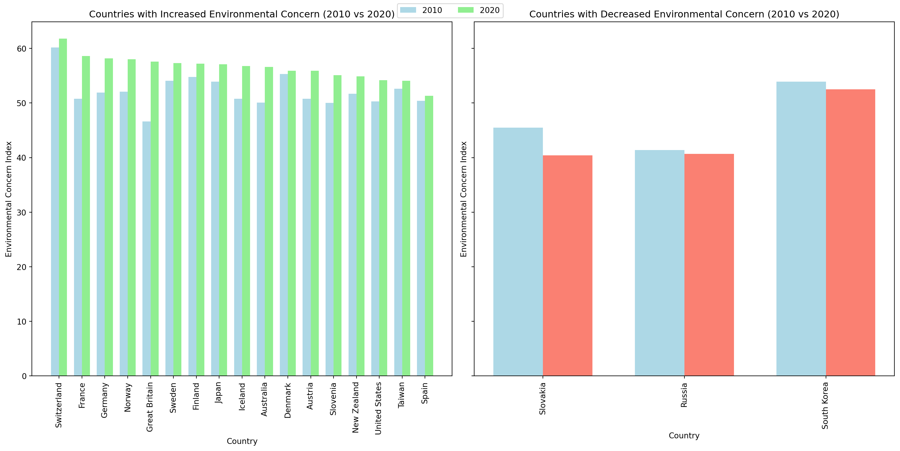
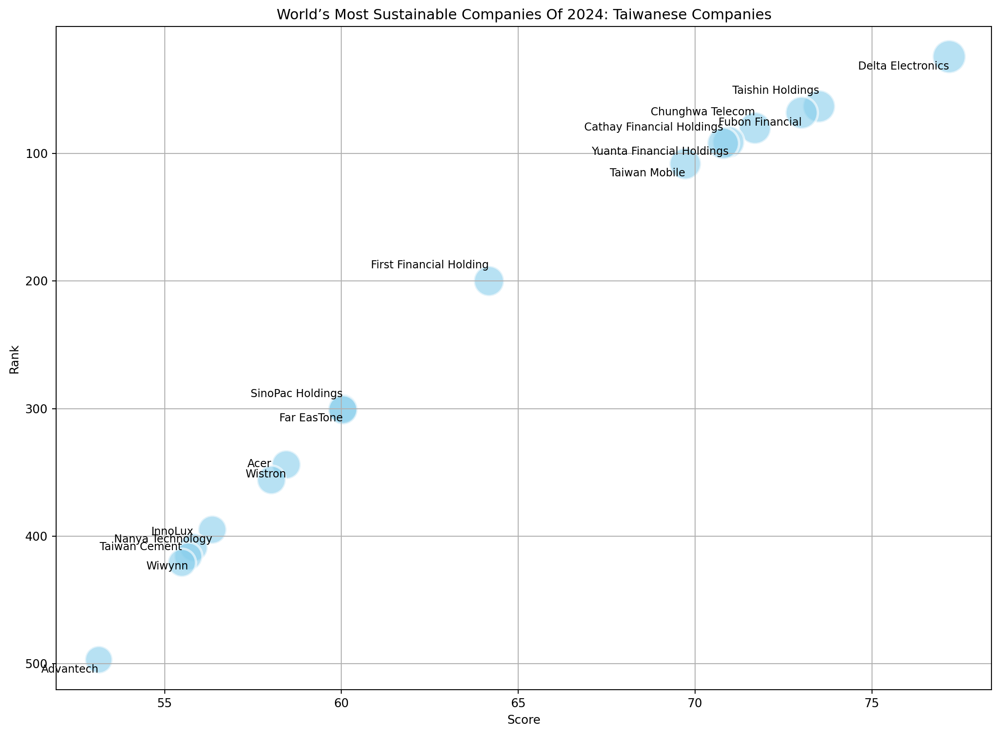
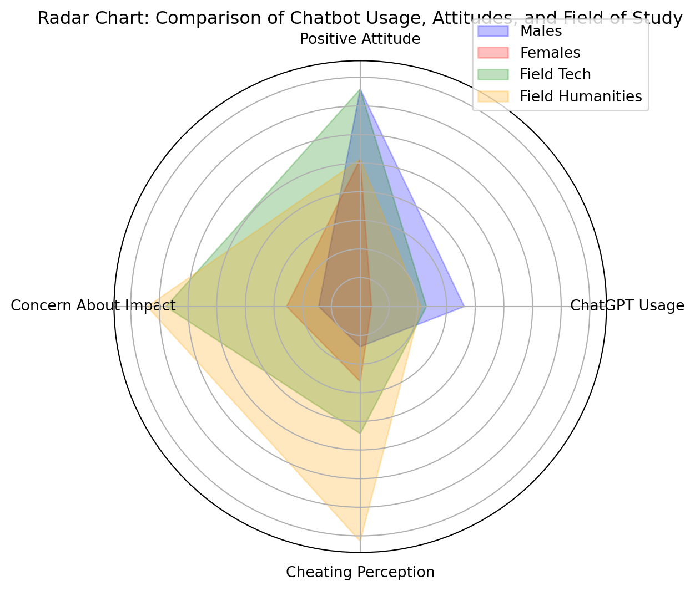

export const quartoRawHtml =
[`
<table>
<caption>1.2 million UN survey responses to the statement <em>“Climate change is an emergency”</em> <span class="citation" data-cites="undpPeoplesClimateVote2021">[@undpPeoplesClimateVote2021]</span>.</caption>
<tbody>
<tr>
<td>Age Group</td>
<td>Agree</td>
<td>Neutral or Disagree</td>
</tr>
<tr>
<td>18-35</td>
<td>65%</td>
<td>35%</td>
</tr>
<tr>
<td>36-59</td>
<td>66%</td>
<td>34%</td>
</tr>
<tr>
<td>Over 69</td>
<td>58%</td>
<td>42%</td>
</tr>
</tbody>
</table>
`,`
<table>
<caption>Data from <span class="citation" data-cites="alanasemuelsWorldMostSustainable2024">[@alanasemuelsWorldMostSustainable2024]</span>.</caption>
<thead>
<tr>
<th style="text-align: right;"><strong>Rank</strong></th>
<th style="text-align: left;"><strong>Company</strong></th>
<th style="text-align: right;"><strong>Score</strong></th>
</tr>
</thead>
<tbody>
<tr>
<td style="text-align: right;">24</td>
<td style="text-align: left;">Delta Electronics</td>
<td style="text-align: right;">77.18</td>
</tr>
<tr>
<td style="text-align: right;">63</td>
<td style="text-align: left;">Taishin Holdings</td>
<td style="text-align: right;">73.50</td>
</tr>
<tr>
<td style="text-align: right;">68</td>
<td style="text-align: left;">Fubon Financial</td>
<td style="text-align: right;">73.01</td>
</tr>
<tr>
<td style="text-align: right;">80</td>
<td style="text-align: left;">Chunghwa Telecom</td>
<td style="text-align: right;">71.69</td>
</tr>
<tr>
<td style="text-align: right;">91</td>
<td style="text-align: left;">Yuanta Financial Holdings</td>
<td style="text-align: right;">70.94</td>
</tr>
<tr>
<td style="text-align: right;">92</td>
<td style="text-align: left;">Cathay Financial Holdings</td>
<td style="text-align: right;">70.79</td>
</tr>
<tr>
<td style="text-align: right;">108</td>
<td style="text-align: left;">Taiwan Mobile</td>
<td style="text-align: right;">69.72</td>
</tr>
<tr>
<td style="text-align: right;">200</td>
<td style="text-align: left;">First Financial Holding</td>
<td style="text-align: right;">64.17</td>
</tr>
<tr>
<td style="text-align: right;">300</td>
<td style="text-align: left;">Far EasTone</td>
<td style="text-align: right;">60.04</td>
</tr>
<tr>
<td style="text-align: right;">301</td>
<td style="text-align: left;">SinoPac Holdings</td>
<td style="text-align: right;">60.04</td>
</tr>
<tr>
<td style="text-align: right;">344</td>
<td style="text-align: left;">Wistron</td>
<td style="text-align: right;">58.44</td>
</tr>
<tr>
<td style="text-align: right;">356</td>
<td style="text-align: left;">Acer</td>
<td style="text-align: right;">58.02</td>
</tr>
<tr>
<td style="text-align: right;">395</td>
<td style="text-align: left;">Nanya Technology</td>
<td style="text-align: right;">56.35</td>
</tr>
<tr>
<td style="text-align: right;">409</td>
<td style="text-align: left;">InnoLux</td>
<td style="text-align: right;">55.82</td>
</tr>
<tr>
<td style="text-align: right;">416</td>
<td style="text-align: left;">Wiwynn</td>
<td style="text-align: right;">55.67</td>
</tr>
<tr>
<td style="text-align: right;">421</td>
<td style="text-align: left;">Taiwan Cement</td>
<td style="text-align: right;">55.49</td>
</tr>
<tr>
<td style="text-align: right;">497</td>
<td style="text-align: left;">Advantech</td>
<td style="text-align: right;">53.14</td>
</tr>
</tbody>
</table>
`,`
<table>
<caption>Compiled table of respondent account ownership, familiarity with financial products, and preferred payment methods, as reported in <span class="citation" data-cites="LianHeXinWenWangTaiWan2025">[@LianHeXinWenWangTaiWan2025]</span>.</caption>
<thead>
<tr>
<th><u><strong>Banking</strong></u></th>
<th style="text-align: right;"><u>% of Respondents</u></th>
</tr>
</thead>
<tbody>
<tr>
<td>Have at least one financial account</td>
<td style="text-align: right;">80%</td>
</tr>
<tr>
<td><u><strong>Familiarity</strong></u></td>
<td style="text-align: right;"><u><strong>% Unfamiliar</strong></u></td>
</tr>
<tr>
<td>Savings accounts</td>
<td style="text-align: right;">70%</td>
</tr>
<tr>
<td>Mutual funds</td>
<td style="text-align: right;">63%</td>
</tr>
<tr>
<td>Stocks</td>
<td style="text-align: right;">46%</td>
</tr>
<tr>
<td>Deposit accounts</td>
<td style="text-align: right;">30%</td>
</tr>
<tr>
<td><u><strong>Payments</strong></u></td>
<td style="text-align: right;"><u><strong>% Preference</strong></u></td>
</tr>
<tr>
<td>Cash</td>
<td style="text-align: right;">47%</td>
</tr>
<tr>
<td>Family member pays</td>
<td style="text-align: right;">47%</td>
</tr>
<tr>
<td>EasyCard</td>
<td style="text-align: right;">4%</td>
</tr>
<tr>
<td>Mobile payments</td>
<td style="text-align: right;">1%</td>
</tr>
</tbody>
</table>
`,`
<table>
<caption>Financial literacy data from phone interviews, as reported in <span class="citation" data-cites="ZhongYangSheTaiWanJin2022">[@ZhongYangSheTaiWanJin2022]</span>.</caption>
<colgroup>
<col style="width: 58%" />
<col style="width: 13%" />
<col style="width: 9%" />
<col style="width: 10%" />
<col style="width: 8%" />
</colgroup>
<thead>
<tr>
<th>Financial Literacy Among Taiwanese (2020)</th>
<th style="text-align: right;">Very Low</th>
<th style="text-align: right;">Low</th>
<th style="text-align: right;">Medium</th>
<th style="text-align: right;">High</th>
</tr>
</thead>
<tbody>
<tr>
<td>Overall financial literacy</td>
<td style="text-align: right;">43.2%</td>
<td style="text-align: right;">34.9%</td>
<td style="text-align: right;">19.4%</td>
<td style="text-align: right;">2.5%</td>
</tr>
<tr>
<td>Understanding products &amp; services</td>
<td style="text-align: right;">34.0%</td>
<td style="text-align: right;">38.6%</td>
<td style="text-align: right;">23.1%</td>
<td style="text-align: right;">4.3%</td>
</tr>
<tr>
<td>Confidence using products &amp; services</td>
<td style="text-align: right;">30.0%</td>
<td style="text-align: right;">26.8%</td>
<td style="text-align: right;">37.6%</td>
<td style="text-align: right;">5.6%</td>
</tr>
<tr>
<td>Seeking financial advice</td>
<td style="text-align: right;">71.0%</td>
<td style="text-align: right;">3.2%</td>
<td style="text-align: right;">17.8%</td>
<td style="text-align: right;">8.0%</td>
</tr>
<tr>
<td>Personal money management</td>
<td style="text-align: right;">21.8%</td>
<td style="text-align: right;">42.9%</td>
<td style="text-align: right;">28.4%</td>
<td style="text-align: right;">6.9%</td>
</tr>
</tbody>
</table>
`,`
<table>
<caption>Latest report from the 財金智慧FINLEA longitudinal study <span class="citation" data-cites="WangRuanGuFenYou2022">[@WangRuanGuFenYou2022]</span>.</caption>
<colgroup>
<col style="width: 81%" />
<col style="width: 18%" />
</colgroup>
<thead>
<tr>
<th>Knowledge Gap (2022)</th>
<th style="text-align: right;">% Unaware</th>
</tr>
</thead>
<tbody>
<tr>
<td>Unsure that employers must contribute to the labor pension (and individuals can voluntarily contribute)</td>
<td style="text-align: right;">68%</td>
</tr>
<tr>
<td>Unsure which deductions (income tax, labor insurance, health insurance) reduce take-home pay</td>
<td style="text-align: right;">66%</td>
</tr>
<tr>
<td>Unsure how education level affects starting salary</td>
<td style="text-align: right;">61%</td>
</tr>
<tr>
<td>Unaware of methods to lower loan interest rates</td>
<td style="text-align: right;">59%</td>
</tr>
<tr>
<td>Cannot identify which auto insurance covers vehicle damage</td>
<td style="text-align: right;">55%</td>
</tr>
<tr>
<td>Unable to judge which life-insurance need is greatest</td>
<td style="text-align: right;">51%</td>
</tr>
<tr>
<td>Uncertain how to choose investment tools for maximum lifetime returns</td>
<td style="text-align: right;">63%</td>
</tr>
<tr>
<td>Unaware that business tax makes purchases more expensive</td>
<td style="text-align: right;">61%</td>
</tr>
</tbody>
</table>
`,`
<table>
<caption>From millennial investors <span class="citation" data-cites="calastoneMillennialsInvestingDetailed2020">[@calastoneMillennialsInvestingDetailed2020]</span>.</caption>
<thead>
<tr>
<th>Place of Comparison</th>
<th>Financial Security Ownership</th>
</tr>
</thead>
<tbody>
<tr>
<td>Hong Kong</td>
<td>48%</td>
</tr>
<tr>
<td>France</td>
<td>10%</td>
</tr>
<tr>
<td></td>
<td></td>
</tr>
</tbody>
</table>
`];

````mdx-code-block
import Figure from "/src/components/Figure";
import Geneve from "../images/college/geneve.jpg";
import FinancialLiteracyYouTube from "../images/college/taiwan-financial-literacy-youtube.png";
import Taipei from "../images/college/taipei.jpg";
````

# Young Adults and College Students

## Student Protests for Climate Change In Taiwan and Around the World

In August 2018, Swedish high-school student Greta Thunberg skipped class
to start a climate strike in front of the Swedish parliament Riksdag.
Millions of people around the world joined her *Fridays for Future*
protests. Time magazine named Thunberg person of the year for *creating
a global attitudinal shift.* (Deutsche Welle, 2019).

````mdx-code-block
<Figure
  caption="Climate protest in Geneva on 27th September, 2019 – 1 year after the start of Fridays for Future"
  src={Geneve}
  refURL="https://commons.wikimedia.org/wiki/File:Gr%C3%A8veClimatGen%C3%A8ve-27sept2019-041-RuesBasses.jpg"
  refTitle="Wikimedia Commons"
/>
````

In Taiwan, the Fridays for Future protests were small in scale, with no
more than 100-200 people (Hioe, 2019). Meanwhile 2000 Taiwanese students
joined the initative by participating in environmental activities
without protesting (Dai, 2019); Indonesia and Philippines, at the same
time, had large protests.

````mdx-code-block
<Figure
  caption="Climate protest in Taipei in May 2019 in front of the Democratic Progressive Party (DPP) headquarters"
  src={Taipei}
  refURL="https://newbloommag.net/2019/05/24/fridays-for-future-protest/"
  refTitle="New Bloom Magazine"
/>
````

This could in part be explained by Taiwanese culture being deeply
influenced by Confucianism, valuing academic excellence, effort, and the
role of education in achieving social status (Xu, 2024). Both
Confucianism and Daoism affect education to be *teacher-centered*, where
traditionally the role of students is to listen and absorb knowledge; in
today’s society, there’s space to open opportunities for revisiting
*dialogue-based* education, where students would be encouraged to take a
more active role and gain ownership of their education (C.-C. Chang et
al., 2023).

Taiwan has approximately 2 million young adults (Gen-Z, 18-26), and 73%
percent of them are students attending tertiary education as of 2023,
with a slow increase of enrollment over the past decade (Ministry of
Education of Taiwan, 2024b).


As of 2024, Taiwan has a total of 148 universities, colleges, and junior
colleges (Ministry of Education of Taiwan, 2024c). Education funding is
4.26% of Taiwan’s GDP in 2023-24 and has been on a decline for a decade
(Ministry of Education of Taiwan, 2024a). Taiwan has an aging population
and declining birth rates have forced several schools to close down
(Davidson & Chi-hui, 2024; Goh et al., 2023).


While the overall number of students is declining, the share of
international students is increasing.


## Designing for College Students: Developing Personas

Students in the Generation-Z age bracket (abbreviated as Gen-Z or
Zoomers) are born between 1997 and 2012 (Branka Vuleta, 2023). High
levels of technology adoption worldwide (Deyan Georgiev, 2023a). Over
98% of Gen-Z owns a smartphone while only 80% of the general world
population does (BankMyCell, 2022; Global Web Index, 2017).

Designing for College Students: Developing Personas. User research makes
extensive use of user *personas* to represent a group of people with
similar attributes. Designers use personas to *articulate assumptions,*
which, if used well, is useful for *user-centered design*, to create
better products. Personas help to reflect on what kind of *biases* might
exist in the design. Within the larger cohort of college students
several different personas could be defined, for example grouping people
by interests, knowledge, habits, levels of anxiety, and other
attributes. Humans have a long list of cognitive biases, which a good
design should take into account.

Many general observations can be made, however to create meaningful
personas, these should be backed up with data. Students ride bicycles
and scooters. Many circular economy service such as YouBike and
transport sharing platforms like Uber are available in Taiwan. Many
students live in dorms and shared housing, meaning their impact per
square meter is low.

## Taiwanese Youth in the Global Context: Global and Local Attitudes Towards Sustainability

Addressing the Research Gap When it Comes to Taiwanese College Students.
There’s lack of scientific research when it comes to Taiwanese college
students, not only in English or other foreign languages, but also in
Chinese. Much of the research in Taiwan focuses on younger students,
particularly those in primary and secondary schools. With regards to
issues related to college students and sustainability, even less
research is available. My project hopes to shed some light to how
Taiwanese college students relate to sustainability.

(Kuo-Hua Chen, 2019) compares Taiwan to other countries in terms of
Postmaterialist Index Comparison, noting Taiwanese society is
materialistic.


World Values Survey


(Franzen & Bahr, 2024) measures *“mean environmental concern”* to look
at decade-level changes in societal environmental attitudes across
countries. Taiwan’s general attitudes have stayed almost the same
(slight increase). The UK has had the largest jump in concern.
Curiously, South Korea has had a slight decrease in concern. Slovakia
and Russia were not very concerned with the environment a decade ago and
are even less concerned now.

A large-scale global study by (Anthony Leiserowitz et al., 2022)
administered on Meta’s Facebook (n=108946) reported people in Spain
(65%), Sweden (61%), and Taiwan (60%) believe *“climate change is mostly
caused by human activities”.*



The largest study to date, conducted by the United Nations across 50
countries, surveying 1.2 million people, distributed through mobile game
ads, showed the majority of people agreeing climate change is an
*“emergency”* (UNDP, 2021).

<div dangerouslySetInnerHTML={{ __html: quartoRawHtml[0] }} />

## Sustainability Attitudes from Eco-Friendly Diet to Climate Action

At the pre-university level, Taiwanese government has been promoting
environmental education through a green school network; however surveys
at middle school and high school level suggest there is no impact on
*sustainability consciousness* among students in comparison with regular
schools (Olsson et al., 2019). Rather, Taiwanese students are influenced
towards environmental action by *group consciousness* (Yu et al., 2017).
In contrast,(陳珮英, 2003) reports *good knowledge of sustainable
development* topics among *junior high school students* in Da-an
District, Taipei City (n=596). (林建輝., 2009) similarly reports a
positive attitude and good knowledge of environmental sustainable
development among senior *high school students* towards in Taipei City
(n=328). Several Taiwanese studies also focus on the physical
environment of school campuses, for example the sustainability of
elementary school campuses (潘智謙 & Pan, 2006). Elementary-school
teachers in Taichung (n=536), have positive attitudes towards
environmental education are positive, proactive and demonstrate high
awareness; they have participated in many sustainability-related
workshops (Liao et al., 2022).

At the university level, (C.-L. Chen & Tsai, 2016) reports a *positive
attitude yet moderate knowledge* about *ocean sustainability* among
Taiwanese college students (n=825). (C.-H. Liu et al., 2023) studied
sustainability behavior of Taiwanese University students, reporting the
COVID-19 pandemic, in addition to prevalence of health issues, also
spurred more attention on environmental topics. In a similar vein, the
devastating nuclear disaster in Fukushima, Japan, after 2011 earthquake,
had an effect on Taiwanese energy and sustainability education (姚 & 侯,
2011). Taiwanese government launched the Sustainable Council in 1997 to
promote of environmental and sustainable development; a survey of
university-level teachers (n=100) in central Taiwan (Taichung, Changhua,
and Yunlin) shows a positive attitude toward environmental
sustainability among teachers however implementation of environmental
sustainability practices is from low to medium range (林美惠. & 莊,
2015). Taiwanese government has also launched funding for University
Social Responsibility (USR) programs to train college students in social
innovation and local revitalization (D. Chen & Chou, 2023; W.-H. Liu et
al., 2022).

In general, it could concluded, Taiwanese students and teachers at all
levels of education have a positive attitude towards sustainability,
which is not a very actionable finding.

Comparing college students’ education for sustainable development (ESD)
in Taiwan (n=617) and Sweden (n=583) found Sweden has a long history in
environmental education while in Taiwan environment became a focus area
with the 1998 educational reform (Berglund et al., 2020).


An older study in 5 university in Taipei and Taichung (n=255) found
78.04% of respondents consumed beef in the month prior and were
concerned with food safety, freshness, and quality (J. L. Hsu et al.,
2014). (Thiagarajah & Kay, 2017) reports a general observation in their
abstract (I was unable to access the full study) that most college
students in all observed countries including Taiwan (n=534) regarded
“*plant-based diets to have health benefits”*.

Internationally, there is extensive research on the attitudes of U.S.
college students towards climate change. (American Press Institute,
2022) reports only 37% percent of U.S. Generation-Z and Millenials
follow news related to environmental issues. (Schwartz et al., 2022)
reports some adult US students in a small study (18-35, n = 284) express
feelings of insignificance of their actions to achieve any meaningful
impact. (Thomaes et al., 2023) reports U.S. adolescents don’t find
sustainability relevant to their daily life. (Ross et al., 2016) says
most people in the U.S. don’t act on climate change. “Action on climate
change has been compromised by uncertainty, aspects of human
psychology”. -

(Credit Suisse, 2022) suggests young consumers are more eco-friendly and
drive the speed of change. Yet the Economist has ran a few anonymous
articles calling gen-z green ideals into question (“How Gen Z and
Millennials Spend Their Money,” 2023; The Economist, 2023). - (Wood,
2022) suggests in the U.S. Gen-Z is willing to pay 10% more for
ethically goods, spend 24% more on sustainable products than Generation
X and 75% of Gen Z would prioritize sustainability over brand loyalty.
Meanwhile Gen-Z in the U.S. are heavy users of online fashion shopping,
Chinese cheap online store Shein overtakes Amazon as the most downloaded
shopping app, while clothes resale apps such as Depop and ThredUp grow
in popularity (Alex Reice, 2021).

-   In Portugal, Estonia, and elsewhere young people are suing companies
    for eco-problems: Flor (2024)

-   (Manchanda et al., 2023) survey (n=726) administered at shopping
    malls in New Delhi, India, found similar levels of sustainability
    consciousness between Millenial (n=206) and Generation-Z (n=360) age
    groups; people with high level of materialism were found to be less
    sustainability-conscious; the effect of mindfulness on
    sustainability was found to be stronger among females than males,
    supporting the hypothesis of the moderating effect of gender.

## The Experience of Climate Change and Pollution Levels in Taiwan

Taiwan has been affected by drought over 4 decades, rising temperatures
and altered rainfall patterns, impacting water security and
semiconductor manufacturing​(Vo & Liou, 2024). Corals surrounding Taiwan
are affected by marine heatwaves, ocean acidification and increased sea
surface temperature affects coral bleaching level (P.-C. Hsu et al.,
2024). Biomarkers in the sediment core around Taiwan are being used to
study variations in climate over past thousands of years (Wang et al.,
2021). Taiwan is affected by Kuroshio (黑潮) like Estonia is affected by
the Gulf Stream. Both oceanic currents help regulate the climates of
their respective regions and marine ecosystems. Kuroshio is a warm
current of the Pacific Ocean. Rossby planetary waves driven by the
Earth’s rotation are crucial to keeping the atmosphere in balance by
helping transfer tropical heat towards Earth’s poles and cold air toward
the tropics; interactions between oceanic currents, Rossby waves and
nonlinear *mesoscale eddies,* which form complex undulations, and their
effect on the climate are still not well understood (Belonenko et al.,
2023; Lin et al., 2022; S. Liu et al., 2024; Mensah et al., 2014; Shen
et al., 2014; US Department of Commerce, n.d.; Yin et al., 2019). Around
33% of Taiwanese CO2e emissions is captured by the marine carbon sink,
while the effect of forests in Taiwan needs further study (Hung et al.,
2024).

Taiwanese college students are subjected to high levels of pollution.
University campuses are somewhat healthier than other areas. There are
several decades of research on pollution levels in Taiwan, most with
very scary correlations to health.

-   Taiwan air pollution, the worst (highest PM2.5 concentration) were
    found in Changhua (24.5 µg/m³), Tainan (20.9 µg/m³), and Pingtong
    (20.7 µg/m³) (Chang Hsiung-feng et al., 2024).

-   There have been concerns about food safety in Taiwan.

-   When disaster hits we need high levels of *social trust*. being part
    of community of trust makes it easier to act in unison. Religion is
    a type of community of trust. conversely, that can also have
    negative effects, as in Taiwan the expected behaviour of burning
    joss sticks and paper money, is a cause of air pollution (Tang &
    Pan, 2014)

## Climate Anxiety

A growing body of research shows climate anxiety is widespread among
young people, which emotionally can both hinder and motivate sustainable
action.

A large worldwide study in (n=10000, age 16-25) by (Hickman et al.,
2021) provides evidence the youth is anxious about climate in 10
countries: Australia, Brazil, Finland, France, India, Nigeria,
Philippines, Portugal, the UK, and the USA. Similarly, (Thompson, 2021)
finds young people around the world have climate anxiety. (Whitmarsh et
al., 2022) shows worry about the climate in the UK is generally
widespread (over 40% of the respondents, n=1332), while climate anxiety
is highest among young people and is a possible motivator for climate
action. Additionally, (Ogunbode et al., 2022) finds climate anxiety in
32 countries and also supports the idea that climate anxiety leads to
climate activism. (Thibodeau, 2022): “In 2021, the BBC polled 1,000
people in Scotland to understand the barriers to taking climate action.
What they found was even though many people were aware of actions needed
to take to address climate change, and had intentions to their behaviors
didn’t change. This is a phenomenon called the intention-action gap.”

(Osaka, 2023) argues *doomerism* is an excuse for climate in-action.
Hope is necessary for people to make changes in their habits (Marlon et
al., 2019).

A recent special issue of Behavioral Sciences magazine on Behavioral
Science for Climate Change (2025) provides further evidence. A review of
50 studies supports the idea that climate activism shifts public opinion
towards climate concern (Thomas-Walters et al., 2025). Climate change
negative affect braing health through heat, air pollution, extreme
weather; the study finds links to neurological, psychiatric, and
cognitive disorders (Todorova et al., 2025).

-   Designing for Health and Sustainability: Health and sustainability
    are intrinsically connected. (Kjaergard et al., 2014) shows how
    “understanding health and sustainability as a duality, health both
    creates conditions and is conditioned by sustainability, understood
    as economic, social and environmental sustainability, while on the
    other hand sustainability creates and is conditioned by human
    health”

-   Design for Human Rights (UNFCCC, 2023) text refers to “human right
    to a clean, healthy and sustainable environment”.

-   Refi podcast: “people need agency”.

-   Martiskainen et al. (2020) (need access, ncku doesn’t subscribe)

-   Seabrook (2020) (need access)

-   Older research on young adults (Millenials at the time) highlights
    how Millenials “use Google as a reference point for ease of use and
    simplicity” (Kate Moran, 2016).

Psychological factors influencing millenials to engage with
sustainability (Naderi & Van Steenburg, 2018)


## The Attitude-Behavior Gap

While people express eco-conscious ideas, it’s non-trivial to practice
sustainability in daily life. Translating eco-conscious attitudes into
concrete sustainable actions remains challenging. Empirical evidence
illustrates this gap between intention and behavior. (Park & Lin, 2020)
positive attitude towards sustainable products does not result in
purchase decisions, shows research of fashion in South Korea. In one
Australian study, green consumers still waste food similarly to the
baseline (McCarthy & Liu, 2017).

However, changing habits is important if techonology alone is not the
solution. (Deyan Georgiev, 2023b) reports only 30% of people in the
Gen-Z age group believe technology can resolve all environmental
problems. Even with good intentions, (Munro et al., 2023) finds shoppers
who try to shop sustainably often fail to find sustainable product, in a
systemic literature review of 64 papers from South Korea, Australia, the
UK, the US, and elsewhere.

McKinsey says people want eco-products but aren’t willing to pay more.

Willingness to pay research.

## Sustainability Tools in the Taiwanese Context, Digital Sustainability: Taiwan’s Digital Receipt System

Musical garbage truck are a success story of the environmental progress
in Taiwan (Helen Davidson & Chi Hui Lin, 2022). Indeed, they are a *user
interface innovation* and the main way how people in Taiwan interact
with sustainability issues.

The popular narrative about Taiwan recounts the story of the economic
and environmental transformation of the country. In the late 1980s
during the heights of an economic boom Taiwan became famous as the
Taiwanese Miracle (臺灣奇蹟) (Gold, 1986; Tsai, 1999). By the early
1990s another less flattering nickname appeared: “garbage island”, for
the piles of trash covering the streets and overflowing landfills (Ngo,
2020; Rapid Transitions Alliance, 2019). In the two decades that
followed, from 1998 to 2018, Taiwan made progress in municipal waste
management, rising to the status of a world-leader in recycling (2nd
*effective recycling rate* after Germany); in addition to an effective
recycling system, the average waste amount generated per person by 700g
(from 1140g to 400g) per day; nonetheless, industrial recycling rates
were less stellar, standing at 80% in 2020 and there were unrealized
opportunities in using industry 4.0 technologies, such as internet of
things (IoT) sensors for better waste tracking (Bui et al., 2023; Wu et
al., 2021).

Progress in sustainability is possible but achieving results takes time
and innovation. (Rapid Transitions Alliance, 2019) credits the Taiwanese
Homemakers United Foundation (財團法人主婦聯盟環境保護基金會) for
initiating the transformation in 1987, suggesting a small group of
people can have an outsized impact on the whole country. Their activity
didn’t stop there and (財團法人主婦聯盟環境保護基金會, 2020) recounts a
timeline of their achievements on their website until the present day.

“獨家觀察－電子發票年減碳量 相當2,700座大安森林公園” (2025) reports
54.03% of invoices in Taiwan are digital. Since 2021 digital receiptts
are mandatory for all businesses. Taiwan’s longstanding receipt lottery
also hass specific prizes available only for digital receipts.
*行動支付結合雲端發票 節能減碳最環保經理人* (2018)

Several other countries, such as Singapore, South Korea, Japan, Sweden,
Italy, Portugal, Brazil, Mexico, have comparable systems in use.

## Trends in Taiwanese Companies from Industry to Online Shopping

Between 1970 and 2019 CO2e was a prerequisite of economic growth in
Taiwan (check this again) (T. Chang et al., 2023). Taiwan is a net CO2e
exporter since 1990s through emissions embedded in the industrial
production oriented economy (Huang et al., 2020).

-   “Taiwan’s Financial Supervisory Commission’s (FSC) requirements for
    Taiwan’s corporates to disclose their carbon emissions starting in
    2023,” Reformosatw (2024)

TIME Magazine and Statista collaborative *“World’s Most Sustainable
Companies Of 2024”* includes 17 Taiwanese companies (Alana Semuels,
2024).

<div dangerouslySetInnerHTML={{ __html: quartoRawHtml[1] }} />

Meanwhile, Corporate Knights which has been ranking global sustainable
companies since 2005, including analysis of 7000 public companies with a
revenue over US\$1 billion, only includes TSMC in the top 100 (placed
20th in 2021 and 44th in 2022, dropping out in 2023) and Taiwan High
Speed Rail Corp and Giant Manufacturing Co Ltd since 2023. (Corporate
Knights, 2024)



Meanwhile, Marc Lien (2022) Four millions British SMEs have no plan for
net-zero transition and Ware (2024) British workers lack skills for
green transition. (2024 National Environmental Services Survey)

-   In Online Shopping, (聯合新聞網, 2024 predicts Momo and Coupang will
    compete for Taiwanese market leadership).
-   intensifying competition, Coupang stepping on Shopee’s and MOMO’s
    toes “順風婦產科 순풍 산부인과 (@Followwindlover) on Threads” (2024)


## Financial Literacy Among Taiwanese Youth and Worldwide

A recent nationwide study (n=1997) titled Youth Financial Health Basics
(青少年財務健康基礎大調查) jointly conducted by the Taipei Fubon Bank
and the Parent-Child Innovation Center (親子天下教育創新中心) between
February 11 and March 9, 2025 found that over 65% of secondary schools
incorporated financial-literacy courses into their curricula however 64%
of Taiwanese youths (aged 15–18) exhibit low confidence and
understanding of financial products and face significant fraud risk,
with nearly 1/5 of the respondents encountering a scam in the past year,
while 18% suffered actual financial losses (江昭倫, 2025; 陳美君, n.d.).

<div dangerouslySetInnerHTML={{ __html: quartoRawHtml[2] }} />

Importantly for designing a financial app, while 80% of the survey
respondents had received financial education at school, 90% of the
students deemed the primary learning channel about financial knowledge
to be on social media; and only 15% remember to have learned about
credit-card usage (江昭倫, 2025).

In a much older study, I-Cheng Yeh (2009) analyzed usage data from
30,000 credit-card clients at an undisclosed major Taiwanese bank to
predict next-month defaults, using 6 data-mining techniques including
ANNs (AI Neural Networks) (Yeh & Lien, 2009). Because of the age of the
study there’s no Gen-Z data. People aged 18-26 at the time would be
Millenials or Gen-X by now. the data was donated by (Yeh, 2016) and
roughly 1 in 5 credit card clients (22.1%) of the dataset defaulted on
their payment in the next month. Among the 9,618 clients aged 18–29 at
the time of the study, 2,197 defaulted on their next‐month payment,
yielding a default rate of 22.8%, slightly higher than the overall
average. Meanwhile, among the 5,127 clients aged 18–26, 1,285 defaulted,
yielding a rate of 25.1%, considerable higher than their older
counterparts. Finally, among the 1,558 clients aged 18–23, 430
defaulted, a rate of 27.6%, pointing to a trend of younger people having
higher default rates.

A over-the-phone study (n=3000) conducted in 2022, found Taiwanese
savings habits to have polarized, with over 60% either having no savings
whatsoever or saving more than 1/2 of their annual income; 27% of
respondents reported total savings below NT\$40,000; young adults’ (aged
20–29) were the only group whose financial risk worsened, with 43% of
the respondents having extremely low financial literacy, described as
金融文盲 (near “financial illiterate”) (中央社, 2022).

<div dangerouslySetInnerHTML={{ __html: quartoRawHtml[3] }} />

The Taiwanese Financial Literacy & Education Association 財金智慧FINLEA
is a non-profit with a stated goal of enhancing financial literacy among
Taiwanese. Their longtitudinal study, with the latest survey conducted
in 2022 (n=2014; 1055 high-school; 959 university) rated financial
literacy among all youths 56.3 out of 100 (53.8 in 2016 and 56.7 in
2007), always below the benchmark score of 60, with high school and
vocational students averaging 49.26 and university students somewhat
higher averaged 64.03 score (網軟股份有限公司, n.d.).

<div dangerouslySetInnerHTML={{ __html: quartoRawHtml[4] }} />

財金智慧FINLEA does publish online videos targeted at young people,
however as of early 2025, they only have around 1000 subscribers on
YouTube (財金智慧FINLEA, 2020). Meanwhile the Taiwanese cryptocurrency
influencer Mr Block has over 100000 YouTube subscribers \[mrblock
區塊先生 (2025)\].

````mdx-code-block
<Figure
  caption="財金智慧FINLEA YouTube Channel"
  src={FinancialLiteracyYouTube}
  refURL="https://www.youtube.com/@FINLEAorgtw/featured"
  refTitle="YouTube"
/>
````

Internationally, there’s evidence young people have money. In the United
States, the combined annual consumer spending of Gen-Z and Millennials
was over 2.5 Trillion USD in 2020 (YPulse, 2020). Over the decade from
2020 to 2030, in the U.S., UK, and Australia, Millennials are projected
to inherit 30 trillion USD from their parents (Calastone, 2020). There’s
also some evidence of investment interest, however there’s large
geographic variance. According to a (Calastone, 2020) study (n=3000)
surveying people in the millennial age group between ages 23 and 35 in
Europe (UK, France, Germany), U.S.A., Hong Kong, and Australia, 48% of
respondents located in Hong Kong owned financial securities (such as
stocks) while the figure was just 10% in France.

<div dangerouslySetInnerHTML={{ __html: quartoRawHtml[5] }} />

### AI Usage

A large-scale (N=6000) survey of college students in Sweden showed these
attitudes towards AI assistants (ChatGPT was by far the most prevalent
app)



-   In Japan, Gen-Z wants privacy and 75% feel others overshare on
    social media and 49 percent were concerned about their personal data
    (McKinsey & Company, 2022).

### Empowerment

-   I would like to have an AI agent to set my requirements and
    preferences and give a “fuck you” middle finger to companies that
    don’t meet them. I could also give a thumbs up to companies that
    meet my expectations. Perhaps the user interface could like Tinder
    where I can swipe left and right.

## Trends, Memes, and Media Currents

The term “meme,” first coined by Richard Dawkins in 1976 in his book
“The Selfish Gene” to describe units of cultural evolution, analogous to
that of biological evolution, which may evolve by natural selection, and
now encompasses internet artifacts and even stocks. Beyond mere
entertainment, memes have emerged as an academic discipline, where memes
are sampled, coded, and analysed from cultural and ethical viewspoints,
among others (Zidani & Miltner, 2022). (Peters-Lazaro et al., 2020)
argues memes are no merely jokes but tools for communal critique and
collective visioning. suggesting that Taiwanese Gen-Z memes scaffold
deeper conversations about consumerism, climate action, and social
change. Memes from daily life, business to war, are relevant to
penetrating through the noise of the web.

In Taiwan, homegrown memes may start with global templates but quickly
take on a local flavor. (劉芸嘉, 2024)’s 2021 study of 150 Taiwanese
memes written in Mandarin shows most rely on friendly and indirect
humor: inside jokes and wordplay that bond peers together.
(朱映潔(Ying-Chieh Chu), 2021) surveyed 737 Taiwanese Facebook users and
discovered that a meme’s funniness, shareability, and shock value
“hellish gags” (地獄梗) drive people to post it for social approval.
(胡綺珍, 2024) collected 217 “tired of life” / “I’m just trash” meme
texts from Instagram and PTT, then interviewed 13 Gen-Z enthusiasts,
revealing how self-deprecating jokes help Gen Z cope with stress, feel
part of a group, and quietly push back against social pressure. Memes
have a long history, and even almost a decade ago in 2016, a casual news
comment—like the “canoing man” (泛舟哥) remark during a typhoon exploded
into LINE stickers and PTT threads, proving that Taiwanese can transform
everyday media moments into collective satire or tongue-in-cheek
commentary (黃意能 & 黃曉琪, 2016).

Internationally, the sustainability-focused topics “underconsumption”
and “deinfluencing” were trending on TikTok in 2024 however have since
subdued (Fares et al., 2024; TikTok, 2024b, 2024a). While this
particular trend may be over, memes still hold potential for
communicating about sustainability to young Taiwanese.

## References

Alana Semuels. (2024). *World’s Most Sustainable Companies of 2024*.

Alex Reice. (2021). The most eco-conscious generation? Gen Z’s fashion
fixation suggests otherwise. In *The Week*.
https://theweek.com/culture/1007212/gen-zs-fast-fashion-hypocrisy.

American Press Institute. (2022). *Knowing the news: How Gen Z and
Millennials get information on essential topics*.

Anthony Leiserowitz, Jennifer Carman, Nicole Buttermore, Liz Neyens,
Seth Rosenthal, Jennifer Marlon, J.W. Schneider & Kelsey Mulcahy.
(2022). *International Public Opinion on Climate Change 2022*. Yale
Program on Climate Change Communication.

BankMyCell. (2022). *How Many People Have Smartphones Worldwide*.
https://www.bankmycell.com/blog/how-many-phones-are-in-the-world.

Belonenko, T. V., Sandalyuk, N. V. & Gnevyshev, V. G. (2023).
Interaction of Rossby waves with the Gulf Stream and Kuroshio using
altimetry in a framework of a vortex layer model. *Advances in Space
Research*, *71*(5), 2384–2393.
[https://doi.org/10.1016/j.asr.2022.10.042](https://doi.org/10.1016/j.asr.2022.10.042)

Berglund, T., Gericke, N., Boeve-de Pauw, J., Olsson, D. & Chang, T.-C.
(2020). A cross-cultural comparative study of sustainability
consciousness between students in Taiwan and Sweden. *Environment,
Development and Sustainability*, *22*(7), 6287–6313.
[https://doi.org/10.1007/s10668-019-00478-2](https://doi.org/10.1007/s10668-019-00478-2)

Branka Vuleta. (2023). Generation Z Statistics. In *99firms*.
https://99firms.com/blog/generation-z-statistics.

Bui, T.-D., Tseng, J.-W., Tseng, M.-L., Wu, K.-J. & Lim, M. K. (2023).
Municipal solid waste management technological barriers: A hierarchical
structure approach in Taiwan. *Resources, Conservation and Recycling*,
*190*, 106842.
[https://doi.org/10.1016/j.resconrec.2022.106842](https://doi.org/10.1016/j.resconrec.2022.106842)

Calastone. (2020). *Millennials and investing: A detailed look at
approaches and attitudes across the globe*.

Chang, C.-C., Wegerif, R. & Hennessy, S. (2023). Exploring dialogic
education used to teach historical thinking within the cultural context
of East Asia: A multiple-case study in Taiwanese classrooms. *Learning,
Culture and Social Interaction*, *41*, 100729.
[https://doi.org/10.1016/j.lcsi.2023.100729](https://doi.org/10.1016/j.lcsi.2023.100729)

Chang Hsiung-feng, Wu Che-hao & Wu Kuan-hsien. (2024). Taiwan’s air 45th
most polluted in world, 3rd in East Asia - Focus Taiwan. In *Focus
Taiwan - CNA English News*. https://focustaiwan.tw/society/202403210013.

Chang, T., Hsu, C.-M., Chen, S.-T., Wang, M.-C. & Wu, C.-F. (2023).
Revisiting economic growth and CO2 emissions nexus in Taiwan using a
mixed-frequency VAR model. *Economic Analysis and Policy*, *79*,
319–342.
[https://doi.org/10.1016/j.eap.2023.05.022](https://doi.org/10.1016/j.eap.2023.05.022)

Chen, C.-L. & Tsai, C.-H. (2016). Marine environmental awareness among
university students in Taiwan: A potential signal for sustainability of
the oceans. *Environmental Education Research*, *22*(7), 958–977.
[https://doi.org/10.1080/13504622.2015.1054266](https://doi.org/10.1080/13504622.2015.1054266)

Chen, D. & Chou, M. (2023). Social Innovation in Taiwan: Theories and
Practices. *Innovation in the Social Sciences*, *1*(1), 5–43.
[https://doi.org/10.1163/27730611-bja10003](https://doi.org/10.1163/27730611-bja10003)

Corporate Knights. (2024). *Global 100*. Corporate Knights.

Credit Suisse. (2022). *Young consumers may drive the speed of
environmental change*.

Dai, D. (2019). 全球學生氣候運動，臺灣學生走出自己的路. In *Greenpeace
綠色和平 臺灣*.

Davidson, H. & Chi-hui, L. (2024). Empty classrooms, silent halls:
Taiwan’s declining birthrate forces schools to close. *The Guardian*.

Deutsche Welle. (2019). *Fridays for Future global climate strike*.
https://www.dw.com/en/fridays-for-future-global-climate-strike-live-updates/a-50505537.

Deyan Georgiev. (2023a). *39+ Smartphone Statistics You Should Know in
2023*.

Deyan Georgiev. (2023b). *Gen Z Statistics - What We Know About the New
Generation*.

Fares, O. H., Lee, S. H. & Lee, O. H. F. and S. H. (2024). How TikTok’s
“underconsumption core” trend is challenging consumerism. In *Corporate
Knights*.

Flor, R. S., Aline. (2024). “Isto não acaba aqui,” garantem jovens
portugueses sobre decisão do Tribunal Europeu. In *PÚBLICO*.
https://www.publico.pt/2024/04/09/azul/noticia/nao-acaba-aqui-garantem-jovens-portugueses-decisao-tribunal-europeu-2086381.

Franzen, A. & Bahr, S. (2024). The development of global environmental
concern during the last three decades. *Current Research in
Environmental Sustainability*, *8*, 100260.
[https://doi.org/10.1016/j.crsust.2024.100260](https://doi.org/10.1016/j.crsust.2024.100260)

Global Web Index. (2017). *98% of Gen Z Own a Smartphone*.
https://blog.gwi.com/chart-of-the-day/98-percent-of-gen-z-own-a-smartphone/.

Goh, S. K., Wong, K. N., McNown, R. & Chen, L.-J. (2023). Long-run
macroeconomic consequences of Taiwan’s aging labor force: An analysis of
policy options. *Journal of Policy Modeling*, *45*(1), 121–138.
[https://doi.org/10.1016/j.jpolmod.2023.01.006](https://doi.org/10.1016/j.jpolmod.2023.01.006)

Gold, T. B. (1986). *State and society in the Taiwan miracle*. Sharpe.

Helen Davidson & Chi Hui Lin. (2022). *Classical trash: How Taiwan’s
musical bin lorries transformed “garbage island”*.
https://www.theguardian.com/world/2022/dec/26/classical-trash-how-taiwan-musical-truck-transformed-garbage-island.

Hickman, C., Marks, E., Pihkala, P., Clayton, S., Lewandowski, R. E.,
Mayall, E. E., Wray, B., Mellor, C. & Van Susteren, L. (2021). Climate
anxiety in children and young people and their beliefs about government
responses to climate change: A global survey. *The Lancet Planetary
Health*, *5*(12), e863–e873.
[https://doi.org/10.1016/S2542-5196(21)00278-3](https://doi.org/10.1016/S2542-5196(21)00278-3)

Hioe, B. (2019). “Fridays for Future” Protest Calling for Environmental
Action Held Outside Legislative Yuan. In *New Bloom Magazine*.
https://newbloommag.net/2019/05/24/fridays-for-future-protest/.

How Gen Z and millennials spend their money. (2023). *The Economist*.

Hsu, J. L., Lu, H. C.-H. & Chen, C. M.-L. (2014). The effect of family
beef taboos on beef consumption on young Taiwanese adults. *Food Quality
and Preference*, *34*, 45–49.
[https://doi.org/10.1016/j.foodqual.2013.12.008](https://doi.org/10.1016/j.foodqual.2013.12.008)

Hsu, P.-C., Macagga, R. A. T., Lu, C.-Y. & Lo, D. Y.-J. (2024).
Investigation of the <span class="nocase">Kuroshio-coastal</span>
current interaction and marine heatwave trends in the coral habitats of
Northeastern Taiwan. *Regional Studies in Marine Science*, *71*, 103431.
[https://doi.org/10.1016/j.rsma.2024.103431](https://doi.org/10.1016/j.rsma.2024.103431)

Huang, R., Lv, G. & Li, X. (2020). Taiwan has shifted to being a net CO2
exporter since the mid-1990s. *Journal of Environmental Management*,
*264*, 110484.
[https://doi.org/10.1016/j.jenvman.2020.110484](https://doi.org/10.1016/j.jenvman.2020.110484)

Hung, C.-C., Hsieh, H.-H., Chou, W.-C., Liu, E.-C., Chow, C. H., Chang,
Y., Lee, T.-M., Santschi, P. H., Ranatunga, R. R. M. K. P., Bacosa, H.
P. & Shih, Y.-Y. (2024). Assessing CO2 sources and sinks in and around
Taiwan: Implication for achieving regional carbon neutrality by 2050.
*Marine Pollution Bulletin*, *206*, 116664.
[https://doi.org/10.1016/j.marpolbul.2024.116664](https://doi.org/10.1016/j.marpolbul.2024.116664)

I-Cheng Yeh. (2009). *Default of Credit Card Clients*. UCI Machine
Learning Repository.
[https://doi.org/10.24432/C55S3H](https://doi.org/10.24432/C55S3H)

Kate Moran. (2016). *Designing for Young Adults (Ages 18–25)*.
https://www.nngroup.com/articles/young-adults-ux/.

Kjaergard, B., Land, B. & Bransholm Pedersen, K. (2014). Health and
sustainability. *Health Promotion International*, *29*(3), 558–568.
[https://doi.org/10.1093/heapro/das071](https://doi.org/10.1093/heapro/das071)

Kuo-Hua Chen. (2019). Transforming Environmental Values for a Younger
Generation in Taiwan: A Participatory Action Approach to Curriculum
Design. *Journal of Futures Studies*, *23*(4).
[https://doi.org/10.6531/JFS.201906_23(4).0008](https://doi.org/10.6531/JFS.201906_23(4).0008)

Liao, C.-W., Liao, Y.-H., Chen, B.-S., Tseng, Y.-J. & Ho, W.-S. (2022).
Elementary Teachers’ Environmental Education Cognition and Attitude: A
Case Study of the Second Largest City in Taiwan. *Sustainability*,
*14*(21), 14480.
[https://doi.org/10.3390/su142114480](https://doi.org/10.3390/su142114480)

Lin, J.-Y., Zheng, Z.-W., Zheng, Q., Wu, D.-R., Gopalakrishnan, G., Ho,
C.-R., Pan, J., Lin, Y.-C. & Xie, L.-L. (2022). Satellite observed new
mechanism of Kuroshio intrusion into the northern South China Sea.
*International Journal of Applied Earth Observation and Geoinformation*,
*115*, 103119.
[https://doi.org/10.1016/j.jag.2022.103119](https://doi.org/10.1016/j.jag.2022.103119)

Liu, C.-H., Horng, J.-S., Chou, S.-F., Yu, T.-Y., Lee, M.-T. & Lapuz, M.
C. B. (2023). Digital capability, digital learning, and sustainable
behaviour among university students in Taiwan: A comparison design of
integrated mediation-moderation models. *The International Journal of
Management Education*, *21*(3), 100835.
[https://doi.org/10.1016/j.ijme.2023.100835](https://doi.org/10.1016/j.ijme.2023.100835)

Liu, S., Zhang, Z., Yang, J., Zhao, Y., Zhang, X., Hu, B., Zhang, G.,
Yang, D., Sun, G., Wei, H., Wu, J., Guo, X., Zhang, Y., Li, S. & Zhu, J.
(2024). El
<span class="nocase">Ni<span class="nocase">ñ</span>o-Southern
Oscillation</span> and East Asian Monsoon controlled Kuroshio Current
evolution over the last 42 kyr. *Palaeogeography, Palaeoclimatology,
Palaeoecology*, *637*, 111981.
[https://doi.org/10.1016/j.palaeo.2023.111981](https://doi.org/10.1016/j.palaeo.2023.111981)

Liu, W.-H., Lee, H.-C., Sung, W.-Y. & Yang, T.-Y. (2022). The roles of
Taiwanese universities in coastal revitalization: A study of two case
projects. *Marine Policy*, *139*, 105050.
[https://doi.org/10.1016/j.marpol.2022.105050](https://doi.org/10.1016/j.marpol.2022.105050)

Manchanda, P., Arora, N., Nazir, O. & Islam, J. U. (2023). Cultivating
sustainability consciousness through mindfulness: An application of
theory of mindful-consumption. *Journal of Retailing and Consumer
Services*, *75*, 103527.
[https://doi.org/10.1016/j.jretconser.2023.103527](https://doi.org/10.1016/j.jretconser.2023.103527)

Marc Lien. (2022). *How is the “green gap” affecting small businesses?*
https://www.lloydsbankinggroup.com/insights/how-is-the-green-gap-affecting-small-businesses.html.

Marlon, J. R., Bloodhart, B., Ballew, M. T., Rolfe-Redding, J.,
Roser-Renouf, C., Leiserowitz, A. & Maibach, E. (2019). How Hope and
Doubt Affect Climate Change Mobilization. *Frontiers in Communication*,
*4*, 20.
[https://doi.org/10.3389/fcomm.2019.00020](https://doi.org/10.3389/fcomm.2019.00020)

Martiskainen, M., Axon, S., Sovacool, B. K., Sareen, S., Furszyfer Del
Rio, D. & Axon, K. (2020). Contextualizing climate justice activism:
Knowledge, emotions, motivations, and actions among climate strikers in
six cities. *Global Environmental Change*, *65*, 102180.
[https://doi.org/10.1016/j.gloenvcha.2020.102180](https://doi.org/10.1016/j.gloenvcha.2020.102180)

McCarthy, B. & Liu, H. B. (2017). Food Waste and the “Green” Consumer.
*Australasian Marketing Journal*, *25*(2), 126–132.
[https://doi.org/10.1016/j.ausmj.2017.04.007](https://doi.org/10.1016/j.ausmj.2017.04.007)

McKinsey & Company. (2022). *Mind the Gap: What do Gen Zers in Asia
want?*
https://www.mckinsey.com//~/media/mckinsey/email/genz/2022/06/07/2022-06-07b.html.

Mensah, V., Jan, S., Chiou, M.-D., Kuo, T. H. & Lien, R.-C. (2014).
Evolution of the Kuroshio Tropical Water from the Luzon Strait to the
east of Taiwan. *Deep Sea Research Part I: Oceanographic Research
Papers*, *86*, 68–81.
[https://doi.org/10.1016/j.dsr.2014.01.005](https://doi.org/10.1016/j.dsr.2014.01.005)

Ministry of Education of Taiwan. (2024a). Main Education Statistical
Indicators. In *Statistical Indicators*.
https://english.moe.gov.tw/cp-86-18943-e698b-1.html.

Ministry of Education of Taiwan. (2024b). Net Enrollment Rate of
Tertiary Education. In *Statistical Indicators*.
https://english.moe.gov.tw/cp-86-18943-e698b-1.html.

Ministry of Education of Taiwan. (2024c). Universities, Colleges &
Junior Colleges. In *Statistical Indicators*.
https://english.moe.gov.tw/cp-86-18943-e698b-1.html.

mrblock 區塊先生. (2025). Mrblock 區塊先生. In *YouTube*.
https://www.youtube.com/channel/UCN2hSM8fBcvZBa8OOKc24eg.

Munro, P., Kapitan, S. & Wooliscroft, B. (2023). The sustainable
attitude-behavior gap dynamic when shopping at the supermarket: A
systematic literature review and framework for future research. *Journal
of Cleaner Production*, *426*, 138740.
[https://doi.org/10.1016/j.jclepro.2023.138740](https://doi.org/10.1016/j.jclepro.2023.138740)

Naderi, I. & Van Steenburg, E. (2018). Me first, then the environment:
Young Millennials as green consumers. *Young Consumers*, *19*(3),
280–295.
[https://doi.org/10.1108/YC-08-2017-00722](https://doi.org/10.1108/YC-08-2017-00722)

Ngo, H. (2020). *How getting rid of dustbins helped Taiwan clean up its
cities*.
https://www.bbc.com/future/article/20200526-how-taipei-became-an-unusually-clean-city.

Ogunbode, C. A., Doran, R., Hanss, D., Ojala, M., Salmela-Aro, K., van
den Broek, K. L., Bhullar, N., Aquino, S. D., Marot, T., Schermer, J.
A., Wlodarczyk, A., Lu, S., Jiang, F., Maran, D. A., Yadav, R., Ardi,
R., Chegeni, R., Ghanbarian, E., Zand, S., … Karasu, M. (2022). Climate
anxiety, wellbeing and pro-environmental action: Correlates of negative
emotional responses to climate change in 32 countries. *Journal of
Environmental Psychology*, *84*, 101887.
[https://doi.org/10.1016/j.jenvp.2022.101887](https://doi.org/10.1016/j.jenvp.2022.101887)

Olsson, D., Gericke, N., Boeve-de Pauw, J., Berglund, T. & Chang, T.
(2019). Green schools in Taiwan – Effects on student sustainability
consciousness. *Global Environmental Change*, *54*, 184–194.
[https://doi.org/10.1016/j.gloenvcha.2018.11.011](https://doi.org/10.1016/j.gloenvcha.2018.11.011)

Osaka, S. (2023). Why climate “doomers” are replacing climate “deniers.”
*Washington Post*.

Park, H. J. & Lin, L. M. (2020). Exploring attitude–behavior gap in
sustainable consumption: Comparison of recycled and upcycled fashion
products. *Journal of Business Research*, *117*, 623–628.
[https://doi.org/10.1016/j.jbusres.2018.08.025](https://doi.org/10.1016/j.jbusres.2018.08.025)

Peters-Lazaro, G., Shresthova, S. & Jenkins, H. (2020). *Popular culture
and the civic imagination: Case studies of creative social change*. New
York University Press.

Rapid Transitions Alliance. (2019). *Taiwan’s Transition – from Garbage
Island to Recycling Leader*.
https://rapidtransition.org/stories/taiwans-transition-from-garbage-island-to-recycling-leader/.

Reformosatw. (2024). Anti-Greenwashing. In *Reformosa Taiwan*.
https://www.reformosa.org/anti-greenwashing.

Ross, L., Arrow, K., Cialdini, R., Diamond-Smith, N., Diamond, J.,
Dunne, J., Feldman, M., Horn, R., Kennedy, D., Murphy, C., Pirages, D.,
Smith, K., York, R. & Ehrlich, P. (2016). The Climate Change Challenge
and Barriers to the Exercise of Foresight Intelligence. *BioScience*,
*66*(5), 363–370.
[https://doi.org/10.1093/biosci/biw025](https://doi.org/10.1093/biosci/biw025)

Schwartz, S. E. O., Benoit, L., Clayton, S., Parnes, M. F., Swenson, L.
& Lowe, S. R. (2022). Climate change anxiety and mental health:
Environmental activism as buffer. *Current Psychology*.
[https://doi.org/10.1007/s12144-022-02735-6](https://doi.org/10.1007/s12144-022-02735-6)

Seabrook, D. (2020). Music therapy in the era of climate crisis:
Evolving to meet current needs. *The Arts in Psychotherapy*, *68*,
101646.
[https://doi.org/10.1016/j.aip.2020.101646](https://doi.org/10.1016/j.aip.2020.101646)

Shen, M.-L., Tseng, Y.-H., Jan, S., Young, C.-C. & Chiou, M.-D. (2014).
Long-term variability of the Kuroshio transport east of Taiwan and the
climate it conveys. *Progress in Oceanography*, *121*, 60–73.
[https://doi.org/10.1016/j.pocean.2013.10.009](https://doi.org/10.1016/j.pocean.2013.10.009)

Tang, C. & Pan, J. (2014). *Ritual burning threatens health - Taipei
Times*.
https://www.taipeitimes.com/News/taiwan/archives/2014/08/10/2003597086.

The Economist. (2023). How to sell to the young. *The Economist*.

Thiagarajah, K. & Kay, N. S. (2017). Plant-based Diets! What Do College
Students in Taiwan, Thailand, and the USA Think? *Journal of Nutrition
Education and Behavior*, *49*(7), S74.
[https://doi.org/10.1016/j.jneb.2017.05.215](https://doi.org/10.1016/j.jneb.2017.05.215)

Thibodeau, T. (2022). Three Companies Closing the Climate Crisis
Intention-Action Gap. In *Medium*.

Thomaes, S., Grapsas, S., Van De Wetering, J., Spitzer, J. & Poorthuis,
A. (2023). Green teens: Understanding and promoting adolescents’
sustainable engagement. *One Earth*, *6*(4), 352–361.
[https://doi.org/10.1016/j.oneear.2023.02.006](https://doi.org/10.1016/j.oneear.2023.02.006)

Thomas-Walters, L., Scheuch, E. G., Ong, A. & Goldberg, M. H. (2025).
The impacts of climate activism. *Current Opinion in Behavioral
Sciences*, *63*, 101498.
[https://doi.org/10.1016/j.cobeha.2025.101498](https://doi.org/10.1016/j.cobeha.2025.101498)

Thompson, T. (2021). Young people’s climate anxiety revealed in landmark
survey. *Nature*, *597*(7878), 605–605.
[https://doi.org/10.1038/d41586-021-02582-8](https://doi.org/10.1038/d41586-021-02582-8)

TikTok. (2024a). *#Deinfluencing*.
https://www.tiktok.com/tag/deinfluencing.

TikTok. (2024b). *#Underconsumption*.
https://www.tiktok.com/tag/underconsumption.

Todorova, B., Steininger, M. O., Lamm, C. & Doell, K. C. (2025).
Neuroscience and climate action: Intersecting pathways for brain and
planetary health. *Current Opinion in Behavioral Sciences*, *63*,
101522.
[https://doi.org/10.1016/j.cobeha.2025.101522](https://doi.org/10.1016/j.cobeha.2025.101522)

Tsai, P.-L. (1999). Explaining Taiwan’s Economic Miracle: Are the
Revisionists Right? *Agenda: A Journal of Policy Analysis and Reform*,
*6*(1), 69–82.
[https://www.jstor.org/stable/43199017](https://www.jstor.org/stable/43199017)

UNDP. (2021). *The Peoples’ Climate Vote*. United Nations Development
Programme.

UNFCCC. (2023). *Sharm el-Sheikh Implementation Plan*.

US Department of Commerce, N. O. and A. A. (n.d.). *What is a Rossby
wave?* https://oceanservice.noaa.gov/facts/rossby-wave.html.

Vo, T.-H. & Liou, Y.-A. (2024). Four-decade spring droughts in Taiwan.
*Journal of Hydrology: Regional Studies*, *54*, 101849.
[https://doi.org/10.1016/j.ejrh.2024.101849](https://doi.org/10.1016/j.ejrh.2024.101849)

Wang, Y., Song, J., Duan, L., Yuan, H., Li, X., Li, N., Wang, Q. &
Zhang, Q. (2021). Paleoproductivity and climate evolution in the
Kuroshio mainstream area over the past millennium. *Ecological
Indicators*, *121*, 107035.
[https://doi.org/10.1016/j.ecolind.2020.107035](https://doi.org/10.1016/j.ecolind.2020.107035)

Ware, D. (2024). Green skills gap threatens UK’s sustainability goals.
In *Water Magazine*.
https://www.watermagazine.co.uk/2024/07/03/green-skills-gap-threatens-uks-sustainability-goals/.

Whitmarsh, L., Player, L., Jiongco, A., James, M., Williams, M., Marks,
E. & Kennedy-Williams, P. (2022). Climate anxiety: What predicts it and
how is it related to climate action? *Journal of Environmental
Psychology*, *83*, 101866.
[https://doi.org/10.1016/j.jenvp.2022.101866](https://doi.org/10.1016/j.jenvp.2022.101866)

Wood, J. (2022). Gen Z cares about sustainability more than anyone else
– and is starting to make others feel the same way. In *World Economic
Forum*.
https://www.weforum.org/agenda/2022/03/generation-z-sustainability-lifestyle-buying-decisions/.

Wu, C.-Y., Hu, M.-C. & Ni, F.-C. (2021). Supporting a circular economy:
Insights from Taiwan’s plastic waste sector and lessons for developing
countries. *Sustainable Production and Consumption*, *26*, 228–238.
[https://doi.org/10.1016/j.spc.2020.10.009](https://doi.org/10.1016/j.spc.2020.10.009)

Xu, R.-H. (2024). Declined quality? A poststructural policy analysis of
the “quality problem” in Taiwanese higher education. *Journal of
Education Policy*, 1–20.
[https://doi.org/10.1080/02680939.2024.2355939](https://doi.org/10.1080/02680939.2024.2355939)

Yeh, I.-C. (2016). *Default of credit card clients*. UCI Machine
Learning Repository.

Yeh, I.-C. & Lien, C. (2009). The comparisons of data mining techniques
for the predictive accuracy of probability of default of credit card
clients. *Expert Systems with Applications*, *36*(2), 2473–2480.
[https://doi.org/10.1016/j.eswa.2007.12.020](https://doi.org/10.1016/j.eswa.2007.12.020)

Yin, Y., Lin, X. & Hou, Y. (2019). Seasonality of the Kuroshio intensity
east of Taiwan modulated by mesoscale eddies. *Journal of Marine
Systems*, *193*, 84–93.
[https://doi.org/10.1016/j.jmarsys.2019.02.001](https://doi.org/10.1016/j.jmarsys.2019.02.001)

YPulse. (2020). *Millennials & Gen Z Teens’ Combined Spending Power Is
Nearly \$3 Trillion in 2020*.
https://www.ypulse.com/article/2020/01/09/millennials-gen-z-teens-combined-spending-power-is-nearly-3-trillion-in-2020/.

Yu, T.-Y., Yu, T.-K. & Chao, C.-M. (2017). Understanding Taiwanese
undergraduate students’ pro-environmental behavioral intention towards
green products in the fight against climate change. *Journal of Cleaner
Production*, *161*, 390–402.
[https://doi.org/10.1016/j.jclepro.2017.05.115](https://doi.org/10.1016/j.jclepro.2017.05.115)

Zidani, S. & Miltner, K. (2022). *How to Conduct Internet Meme
Research*. SAGE Publications, Ltd.
[https://doi.org/10.4135/9781529609714](https://doi.org/10.4135/9781529609714)

中央社. (2022). 台灣金融生活調查：27%儲蓄4萬元以下 逾4成近金融文盲. In
*商益*.
https://www.businessyee.com/article/614-taiwan-financial-lives-survey.

劉芸嘉. (2024). *臺灣華語幽默策略–網路迷因之語用研究與教學應用*.
國立臺灣師範大學學位論文.

姚品全. & 侯雪娟. (2011). 『能源科技與環境永續』之重要議題初探.
*大葉大學通識教育學報*, *8*, 133–146.

朱映潔(Ying-Chieh Chu). (2021). *你的梗圖，紅了嗎？
分享網路迷因行為意圖之研究*. 中原大學學位論文.

林建輝. (2009).
高中學生環境永續發展行為意圖及其相關因素研究～以台北市某高中學生為例. In
*臺灣師範大學健康促進與衛生教育學系學位論文* (PhD thesis No. 2009年).
國立臺灣師範大學.

林美惠. & 莊財福. (2015). 教師對環境永續發展的態度與實踐之關聯性分析.
*明道學術論壇*, *9*(4), 45–90.

江昭倫. (2025). 調查：9成青少年透過社群媒體學習金融知識. In *Yahoo
News*.
https://tw.news.yahoo.com/%E8%AA%BF%E6%9F%A5-9%E6%88%90%E9%9D%92%E5%B0%91%E5%B9%B4%E9%80%8F%E9%81%8E%E7%A4%BE%E7%BE%A4%E5%AA%92%E9%AB%94%E5%AD%B8%E7%BF%92%E9%87%91%E8%9E%8D%E7%9F%A5%E8%AD%98-083644725.html.

潘智謙 & Pan, C.-C. (2006). *國民小學校園實質環境永續性評估之研究* \[PhD
thesis\].

獨家觀察－電子發票年減碳量 相當2,700座大安森林公園. (2025). In *Yahoo
Finance*.
https://tw.stock.yahoo.com/news/%E7%8D%A8%E5%AE%B6%E8%A7%80%E5%AF%9F-%E9%9B%BB%E5%AD%90%E7%99%BC%E7%A5%A8%E5%B9%B4%E6%B8%9B%E7%A2%B3%E9%87%8F-%E7%9B%B8%E7%95%B62-700%E5%BA%A7%E5%A4%A7%E5%AE%89%E6%A3%AE%E6%9E%97%E5%85%AC%E5%9C%92-201000730.html.

網軟股份有限公司. (n.d.). 2022全台青年財金素養調查. In
*社團法人中華民國財金智慧教育推廣協會*.
http://www.finlea.org.tw/OnePage.aspx?id=69&sn=908.

聯合新聞網. (2024). 電商教父何英圻預言：今年是 momo與Coupang
B2C龍頭爭霸年. In *聯合新聞網*. https://udn.com/news/story/7241/7679206.

胡綺珍. (2024). *當我們爛在一起：厭世迷因讀者的情感、認同與抵抗* \[PhD
thesis\]. 國立臺灣師範大學.

*行動支付結合雲端發票 節能減碳最環保經理人*. (2018).
https://www.managertoday.com.tw/articles/view/61387.

財團法人主婦聯盟環境保護基金會. (2020). 本會簡介. In
*主婦聯盟環境保護基金會*. https://www.huf.org.tw/page/91.

財金智慧FINLEA. (2020). *財金智慧FINLEA - YouTube*.
https://www.youtube.com/channel/UC-K2ALyl_E5za5BTJdpQJOA.

陳珮英. (2003).
國中學生永續發展行為意圖及其相關因素研究$\sim$以台北市大安區國中學生為例.
In *臺灣師範大學衛生教育學系學位論文* (PhD thesis No. 2003年).
國立臺灣師範大學.

陳美君. (n.d.). 台灣青少年金融素養落差調查結果出爐
近五分之一遇過金融詐騙. In *聯合新聞網*.
https://udn.com/news/story/7239/8691399.

順風婦產科 순풍 산부인과 (@followwindlover) on Threads. (2024). In
*Threads*.

黃意能 & 黃曉琪. (2016). *臺灣傳播學會 Taiwan Communication Society*.
http://www.tcataiwan.org/paperdetail.asp?HP_ID=1777.
