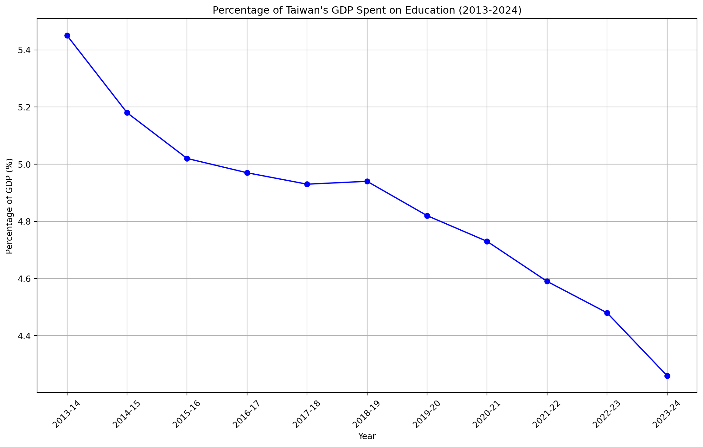
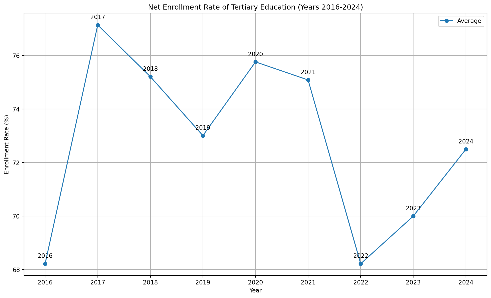
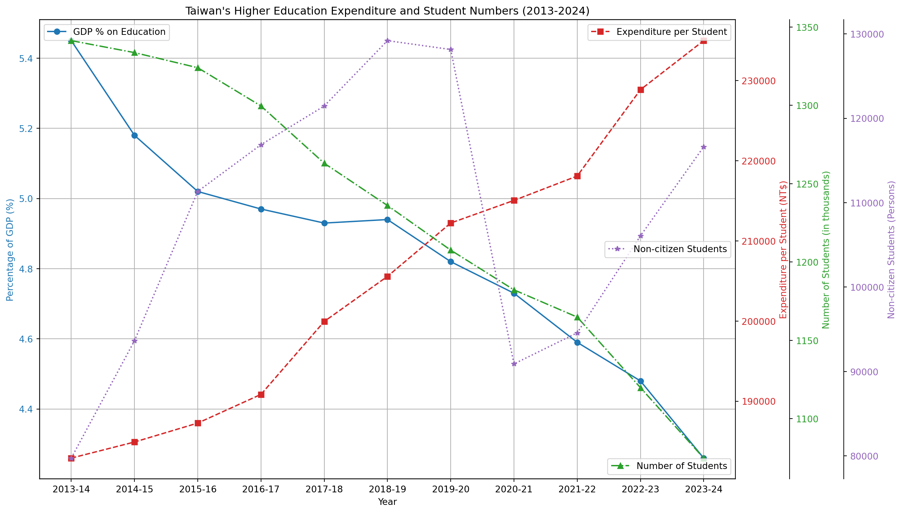
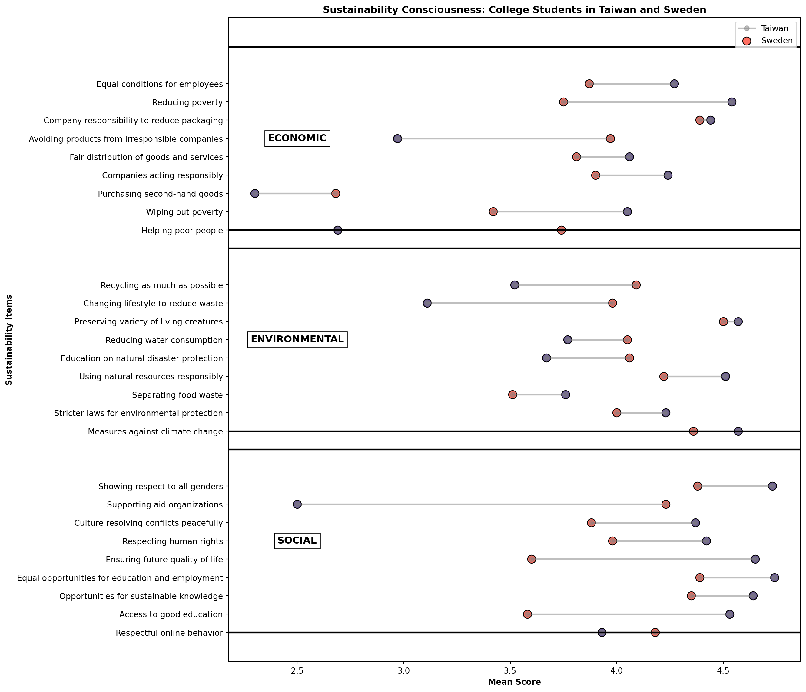
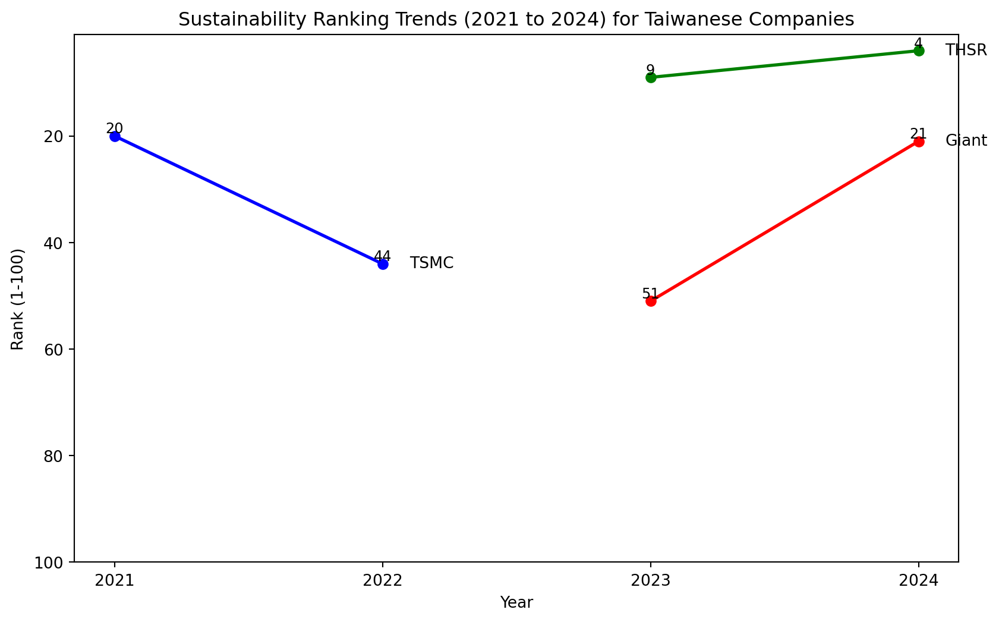

export const quartoRawHtml =
[`
<table>
<caption>1.2 million UN survey responses to the statement <em>“Climate change is an emergency”</em> <span class="citation" data-cites="undpPeoplesClimateVote2021">[@undpPeoplesClimateVote2021]</span>.</caption>
<tbody>
<tr class="odd">
<td>Age Group</td>
<td>Agree</td>
<td>Neutral or Disagree</td>
</tr>
<tr class="even">
<td>18-35</td>
<td>65%</td>
<td>35%</td>
</tr>
<tr class="odd">
<td>36-59</td>
<td>66%</td>
<td>34%</td>
</tr>
<tr class="even">
<td>Over 69</td>
<td>58%</td>
<td>42%</td>
</tr>
</tbody>
</table>
1.2 million UN survey responses to the statement *“Climate change is an emergency”* \[@undpPeoplesClimateVote2021\].
`,`
<table>
<caption>Data from <span class="citation" data-cites="alanasemuelsWorldMostSustainable2024">[@alanasemuelsWorldMostSustainable2024]</span>.</caption>
<thead>
<tr class="header">
<th style="text-align: right;"><strong>Rank</strong></th>
<th style="text-align: left;"><strong>Company</strong></th>
<th style="text-align: right;"><strong>Score</strong></th>
</tr>
</thead>
<tbody>
<tr class="odd">
<td style="text-align: right;">24</td>
<td style="text-align: left;">Delta Electronics</td>
<td style="text-align: right;">77.18</td>
</tr>
<tr class="even">
<td style="text-align: right;">63</td>
<td style="text-align: left;">Taishin Holdings</td>
<td style="text-align: right;">73.50</td>
</tr>
<tr class="odd">
<td style="text-align: right;">68</td>
<td style="text-align: left;">Fubon Financial</td>
<td style="text-align: right;">73.01</td>
</tr>
<tr class="even">
<td style="text-align: right;">80</td>
<td style="text-align: left;">Chunghwa Telecom</td>
<td style="text-align: right;">71.69</td>
</tr>
<tr class="odd">
<td style="text-align: right;">91</td>
<td style="text-align: left;">Yuanta Financial Holdings</td>
<td style="text-align: right;">70.94</td>
</tr>
<tr class="even">
<td style="text-align: right;">92</td>
<td style="text-align: left;">Cathay Financial Holdings</td>
<td style="text-align: right;">70.79</td>
</tr>
<tr class="odd">
<td style="text-align: right;">108</td>
<td style="text-align: left;">Taiwan Mobile</td>
<td style="text-align: right;">69.72</td>
</tr>
<tr class="even">
<td style="text-align: right;">200</td>
<td style="text-align: left;">First Financial Holding</td>
<td style="text-align: right;">64.17</td>
</tr>
<tr class="odd">
<td style="text-align: right;">300</td>
<td style="text-align: left;">Far EasTone</td>
<td style="text-align: right;">60.04</td>
</tr>
<tr class="even">
<td style="text-align: right;">301</td>
<td style="text-align: left;">SinoPac Holdings</td>
<td style="text-align: right;">60.04</td>
</tr>
<tr class="odd">
<td style="text-align: right;">344</td>
<td style="text-align: left;">Wistron</td>
<td style="text-align: right;">58.44</td>
</tr>
<tr class="even">
<td style="text-align: right;">356</td>
<td style="text-align: left;">Acer</td>
<td style="text-align: right;">58.02</td>
</tr>
<tr class="odd">
<td style="text-align: right;">395</td>
<td style="text-align: left;">Nanya Technology</td>
<td style="text-align: right;">56.35</td>
</tr>
<tr class="even">
<td style="text-align: right;">409</td>
<td style="text-align: left;">InnoLux</td>
<td style="text-align: right;">55.82</td>
</tr>
<tr class="odd">
<td style="text-align: right;">416</td>
<td style="text-align: left;">Wiwynn</td>
<td style="text-align: right;">55.67</td>
</tr>
<tr class="even">
<td style="text-align: right;">421</td>
<td style="text-align: left;">Taiwan Cement</td>
<td style="text-align: right;">55.49</td>
</tr>
<tr class="odd">
<td style="text-align: right;">497</td>
<td style="text-align: left;">Advantech</td>
<td style="text-align: right;">53.14</td>
</tr>
</tbody>
</table>
Data from \[@alanasemuelsWorldMostSustainable2024\].
`,`
<table>
<caption>From millennial investors <span class="citation" data-cites="calastoneMillennialsInvestingDetailed2020">[@calastoneMillennialsInvestingDetailed2020]</span>.</caption>
<thead>
<tr class="header">
<th>Place of Comparison</th>
<th>Financial Security Ownership</th>
</tr>
</thead>
<tbody>
<tr class="odd">
<td>Hong Kong</td>
<td>48%</td>
</tr>
<tr class="even">
<td>France</td>
<td>10%</td>
</tr>
<tr class="odd">
<td></td>
<td></td>
</tr>
</tbody>
</table>
From millennial investors \[@calastoneMillennialsInvestingDetailed2020\].
`,`
<table>
<caption>College Student Personas</caption>
<thead>
<tr class="header">
<th>Description</th>
<th>Name</th>
<th>Beliefs</th>
</tr>
</thead>
<tbody>
<tr class="odd">
<td>Climate Change Denier</td>
<td>Jake</td>
<td>Climate change doesn’t exist.</td>
</tr>
<tr class="even">
<td></td>
<td>Alice</td>
<td></td>
</tr>
<tr class="odd">
<td></td>
<td>Sam</td>
<td></td>
</tr>
</tbody>
</table>
College Student Personas
`,`
<table>
<colgroup>
<col style="width: 3%" />
<col style="width: 96%" />
</colgroup>
<thead>
<tr class="header">
<th>Category</th>
<th>Implication</th>
</tr>
</thead>
<tbody>
<tr class="odd">
<td>Community</td>
<td>Taiwanese students are influenced by the actions of their peers; the app should show what other people are doing.</td>
</tr>
<tr class="even">
<td></td>
<td>People exist in relation to other people.</td>
</tr>
<tr class="odd">
<td></td>
<td>Psychology of ‘fundraising clubs’ vs individual investing</td>
</tr>
<tr class="even">
<td></td>
<td><span class="citation" data-cites="UkraineDAOBiddingUkrainian">@UkraineDAOBiddingUkrainian</span> Ukraine DAO to support Ukraine through web3.</td>
</tr>
<tr class="odd">
<td></td>
<td>These social movements are small and require too much effort to be feasible for the app? Most college students are not zero waste or minimalist.</td>
</tr>
<tr class="even">
<td></td>
<td>Group Purchases.</td>
</tr>
<tr class="odd">
<td></td>
<td>Find Your Composting Community.</td>
</tr>
<tr class="even">
<td></td>
<td>Provides a community for pooling money with like-minded investors.</td>
</tr>
<tr class="odd">
<td>Climate Anxiety</td>
<td>How to support the youth? Design to reduce climate anxiety? Is getting people to go to nature more a good way to increase ecological awareness? Empowered by Design. Youth empowerment: The design should empower young people.</td>
</tr>
<tr class="even">
<td></td>
<td>Consumer branded carbon credits like angry teenagers?</td>
</tr>
<tr class="odd">
<td></td>
<td>Invest time not money, student don’t have money?</td>
</tr>
<tr class="even">
<td>Social Trust</td>
<td><strong>Show Success Scenarios!</strong></td>
</tr>
<tr class="odd">
<td></td>
<td>Ask how much time you want to contribute.</td>
</tr>
<tr class="even">
<td></td>
<td>Match with other people based on time.</td>
</tr>
<tr class="odd">
<td></td>
<td>Create a group chatroom.</td>
</tr>
<tr class="even">
<td></td>
<td>Use AI to help out with tips.</td>
</tr>
<tr class="odd">
<td></td>
<td>Ask university students what do they study and match with that industry to become expert and sustainability leader in this field.</td>
</tr>
<tr class="even">
<td></td>
<td>People want to help and make a difference. Give people things to do. The <span class="citation" data-cites="dontlookupMethodology">@dontlookupMethodology</span> part of the <strong><em>Don’t Look Up</em></strong> movie’s social campaign provides 5 user models / roles for the audience to follow: Consumer, Investor, Activist.</td>
</tr>
<tr class="odd">
<td></td>
<td>Choose Your Climate Solutions.</td>
</tr>
<tr class="even">
<td></td>
<td>Younger people show higher motivation (participants in climate protests). How to be relevant for a younger audience?</td>
</tr>
<tr class="odd">
<td></td>
<td>Yet action remains low.</td>
</tr>
<tr class="even">
<td></td>
<td>Targeted and gated to college students.</td>
</tr>
<tr class="odd">
<td></td>
<td>FB, etc, Gas all had the same launch strategy - start with students</td>
</tr>
<tr class="even">
<td></td>
<td><span class="citation" data-cites="kuzminskiEcologyMoneyDebt2015">@kuzminskiEcologyMoneyDebt2015</span> ecology of money</td>
</tr>
<tr class="odd">
<td></td>
<td>Young people are mobile-first</td>
</tr>
<tr class="even">
<td></td>
<td>Persona: I care mostly about… fashion, art, …</td>
</tr>
<tr class="odd">
<td></td>
<td>Young people like to follow trends.</td>
</tr>
<tr class="even">
<td></td>
<td>Food ordering apps are popular.</td>
</tr>
<tr class="odd">
<td></td>
<td>Monoculture to regenerative food forests Oil to electric cars / bicycles.</td>
</tr>
<tr class="even">
<td></td>
<td>Social Educational Edutainment Fun</td>
</tr>
<tr class="odd">
<td></td>
<td><span class="citation" data-cites="aespaAespaEseupaMY2020">@aespaAespaEseupaMY2020</span>: Karina from Korea. It makes sense your sustainability assistant would talk to you. Studies show gen N is speaking to computers all the time. Interacting with the user is on the rise. For example, Chime makes tipping suggestions on the place of purchase.</td>
</tr>
<tr class="even">
<td></td>
<td>The demographics that stand to win the most from the green transformation of business are the youngest generations, with more years of life ahead of them, and more exposure to future environmental and social risks. It would be advisable for Generation Z and their parents (Millennials) to invest their resources in greener assets, however, it’s still difficult to pick and choose between ‘good’ and ‘bad’ financial vehicles to invest in.</td>
</tr>
<tr class="odd">
<td></td>
<td>This creates an opportunity for a new generation of sustainable investment apps, focusing on the usability and accessibility of ESG for a mainstream audience. Generation Z and Millennials expect a consumer-grade user experience.</td>
</tr>
<tr class="even">
<td></td>
<td>What would that experience look like? I’ve chosen these demographics with the assumption that if given the right tools, the emotional demand for sustainability could be transformed into action. The exploration of systems of feedback to enable consumers to apply more direct positive and negative pressure to the businesses and consumers signal consequences for undesirable ecological performance is a major motivation of this study.</td>
</tr>
</tbody>
</table>
`,`
<table>
<colgroup>
<col style="width: 3%" />
<col style="width: 96%" />
</colgroup>
<tbody>
<tr class="odd">
<td></td>
<td>The current environmental upheaval, led by Gen-Z and Millennials, and the business adaptation (or lack thereof) to sustainable economic models, taking into account the hidden social and environmental costs we didn’t calculate in our pricing before.</td>
</tr>
<tr class="even">
<td></td>
<td><ul>
<li><p>We also need to consider environmental effects (E in ESG). We haven’t taken into account the whole cost of production, leading to the wrong pricing information. To achieve this, we need expert governance (G).</p></li>
<li><p>I was unable to find similar research on university and post-graduate level students in Taiwan.</p></li>
<li><p>Taiwanese college students and SDGs <span class="citation" data-cites="hoImportancePerformanceSDGs2022">[@hoImportancePerformanceSDGs2022]</span>.</p></li>
<li><p>College students in tourism and related fields . and sustainability</p></li>
<li><p>Consumers may be turned off by mentioning AI in product description. <span class="citation" data-cites="cicekAdverseImpactsRevealing2024">@cicekAdverseImpactsRevealing2024</span></p></li>
<li><p>Progress in other areas of environmental protection has not made similar progress.</p></li>
<li><p>There are documentaries about oil product</p></li>
<li><p>Plastic production documentary</p></li>
<li><p>I’ve seen several.. find and cite them to show the progression of the environmental movement in Taiwan ADD CITATION</p></li>
<li><p>The Taiwanese Green party</p></li>
<li><p>Contact SOAS?</p></li>
</ul></td>
</tr>
</tbody>
</table>
`];

````mdx-code-block
import Figure from "/src/components/Figure";
import Geneve from "../images/college/geneve.jpg";
````

# Students

## Student Protests Around the World

In August 2018, Swedish high-school student Greta Thunberg skipped class
to start a climate strike in front of the Swedish parliament Riksdag.
Millions of people around the world joined her *Fridays for Future*
protests. Time magazine named Thunberg person of the year for *creating
a global attitudinal shift.* (Deutsche Welle, 2019).

````mdx-code-block
<Figure
  caption="Climate protest in Geneva on 27th September, 2019 – 1 year after the start of Fridays for Future"
  src={Geneve}
  refURL="https://commons.wikimedia.org/wiki/File:Gr%C3%A8veClimatGen%C3%A8ve-27sept2019-041-RuesBasses.jpg"
  refTitle="Wikimedia Commons"
/>
````

The protest trend is subsiding.

McKinsey says people want eco-products but aren’t willing to pay more.

Willingness too pay research.

## The Attitude-Behavior Gap

A large-EUPolicyscale global study by (Anthony Leiserowitz et al., 2022)
on Meta’s Facebook (n=108946) reported people in Spain (65%), Sweden
(61%), and Taiwan (60%) believe *“climate change is mostly caused by
human activities”.* An even larger survey (n=1.2 million) by the United
Nations across 50 countries, distributed through mobile game ads, showed
the majority of people agreeing climate change is an “emergency” (UNDP,
2021). While people express eco-conscious ideas, it’s non-trivial to
practice sustainability in daily life. (Deyan Georgiev, 2023b) reports
only 30% of people in the Gen-Z age group believe technology can solve
all problems.

<div dangerouslySetInnerHTML={{ __html: quartoRawHtml[0] }} />

-   (Park & Lin, 2020) positive attitude towards sustainable products
    does not result in purchase decisions, shows research of fashion in
    South Korea. In one Australian study, green consumers still waste
    food similarly to the baseline (McCarthy & Liu, 2017).
-   Munro, Kapitan & Wooliscroft (2023) shoppers trying to shop
    sustainably often fail to find sustainable products.
-   Marc Lien (2022) Four millions British SMEs have no plan for
    net-zero transition.
-   Ware (2024) British workers lack skills for green transition. (2024
    National Environmental Services Survey)

## Credit Cards

-   an older study, I-Cheng Yeh (2009) provides data from credit card
    usage from an unnamed “important” bank in Taiwan. Because of the age
    of the study there’s no Gen-Z data. People aged 18-26 at the time
    would be Millenials or Gen-X by now.

data donated (Yeh, 2016).

https://www.semanticscholar.org/paper/The-comparisons-of-data-mining-techniques-for-the-Yeh-Lien/1cacac4f0ea9fdff3cd88c151c94115a9fddcf33

## Taiwanese Education System and Policy Environment

Taiwan has approximately 2 million young adults (Gen-Z, 18-26), and 73%
percent of them are students attending tertiary education (Ministry of
Education of Taiwan, 2024b).





As of 2024, Taiwan has a total of 148 universities, colleges, and junior
colleges (Ministry of Education of Taiwan, 2024c). Education funding is
4.26% of Taiwan’s GDP in 2023-24 and has been on a decline for a decade
(Ministry of Education of Taiwan, 2024a). Taiwan has an aging population
and declining birth rates have forced several schools to close down (Goh
et al., 2023; Davidson & Chi-hui, 2024).



While the overall number of students is declining, the share of
international students is increasing.


### Confucianism

Taiwanese culture is deeply influenced by Confucianism, valuing academic
excellence, effort, and the role of education in achieving social status
(Xu, 2024). Both Confucianism and Daoism affect education to be
*teacher-centered*, where traditionally the role of students is to
listen and absorb knowledge; in today’s society, there’s space to open
opportunities for revisiting *dialogue-based* education, where students
would be encouraged to take a more active role and gain ownership of
their education (Chang, Wegerif & Hennessy, 2023).

### Sustainability Attitudes

In general, Taiwanese teachers at all levels of education have a
positive attitude towards sustainability.

At the pre-university level, Taiwanese government has been promoting
environmental education through a green school network; however surveys
at middle school and high school level suggest there is no impact on
*sustainability consciousness* among students in comparison with regular
schools (Olsson et al., 2019). Rather, Taiwanese students are influenced
towards environmental action by *group consciousness* (Yu, Yu & Chao,
2017). In contrast,(陳珮英, 2003) reports *good knowledge of sustainable
development* topics among *junior high school students* in Da-an
District, Taipei City (n=596). (林, 2009) similarly reports a positive
attitude and good knowledge of environmental sustainable development
among senior *high school students* towards in Taipei City (n=328).
Several Taiwanese studies also focus on the physical environment of
school campuses, for example the sustainability of elementary school
campuses (潘智謙 & Chih-Chien, 2006). Elementary-school teachers in
Taichung (n=536), have positive attitudes towards environmental
education are positive, proactive and demonstrate high awareness; they
have participated in many sustainability-related workshops (Liao et al.,
2022).

At the university level, (Chen & Tsai, 2016) reports a *positive
attitude yet moderate knowledge* about *ocean sustainability* among
Taiwanese college students (n=825). (Liu et al., 2023) studied
sustainability behavior of Taiwanese University students, reporting the
COVID-19 pandemic, in addition to prevalence of health issues, also
spurred more attention on environmental topics. In a similar vein, the
devastating nuclear disaster in Fukushima, Japan, after 2011 earthquake,
had an effect on Taiwanese energy and sustainability education (姚 & 侯,
2011). Taiwanese government launched the Sustainable Council in 1997 to
promote of environmental and sustainable development; a survey of
university-level teachers (n=100) in central Taiwan (Taichung, Changhua,
and Yunlin) shows a positive attitude toward environmental
sustainability among teachers however implementation of environmental
sustainability practices is from low to medium range (林 & 莊, 2015).
Taiwanese government has also launched funding for University Social
Responsibility (USR) programs to train college students in social
innovation and local revitalization (Chen & Chou, 2023; Liu et al.,
2022).

Comparing college students’ education for sustainable development (ESD)
in Taiwan (n=617) and Sweden (n=583) found Sweden has a long history in
environmental education while in Taiwan environment became a focus area
with the 1998 educational reform (Berglund et al., 2020).


### Eco-Friendly Diet

An older study in 5 university in Taipei and Taichung (n=255) found
78.04% of respondents consumed beef in the month prior and were
concerned with food safety, freshness, and quality (Hsu, Lu & Chen,
2014). (Thiagarajah & Kay, 2017) reports a general observation in their
abstract (I was unable to access the full study) that most college
students in all observed countries including Taiwan (n=534) regarded
“*plant-based diets to have health benefits”*.

## The Effect of Climate Change on Taiwan

Taiwan has been affected by drought over 4 decades, rising temperatures
and altered rainfall patterns, impacting water security and
semiconductor manufacturing​(Vo & Liou, 2024). Corals surrounding Taiwan
are affected by marine heatwaves, ocean acidification and increased sea
surface temperature affects coral bleaching level (Hsu et al., 2024).
Biomarkers in the sediment core around Taiwan are being used to study
variations in climate over past thousands of years (Wang et al., 2021).
Taiwan is affected by Kuroshio (黑潮) like Estonia is affected by the
Gulf Stream. Both oceanic currents help regulate the climates of their
respective regions and marine ecosystems. Kuroshio is a warm current of
the Pacific Ocean. Rossby planetary waves driven by the Earth’s rotation
are crucial to keeping the atmosphere in balance by helping transfer
tropical heat towards Earth’s poles and cold air toward the tropics;
interactions between oceanic currents, Rossby waves and nonlinear
*mesoscale eddies,* which form complex undulations, and their effect on
the climate are still not well understood (US Department of Commerce,
n.d.; Belonenko, Sandalyuk & Gnevyshev, 2023; Liu et al., 2024; Lin et
al., 2022; Yin, Lin & Hou, 2019; Mensah et al., 2014; Shen et al.,
2014). Around 33% of Taiwanese CO2e emissions is captured by the marine
carbon sink, while the effect of forests in Taiwan needs further study
(Hung et al., 2024).

## Sustainability Tools in the Taiwanese Context

Musical garbage truck are a success story of the environmental progress
in Taiwan (Helen Davidson & Chi Hui Lin, 2022). Indeed, they are a *user
interface innovation* and the main way how people in Taiwan interact
with sustainability issues.

The popular narrative about Taiwan recounts the story of the economic
and environmental transformation of the country. In the late 1980s
during the heights of an economic boom Taiwan became famous as the
Taiwanese Miracle (臺灣奇蹟) (Gold, 1986; Tsai, 1999). By the early
1990s another less flattering nickname appeared: “garbage island”, for
the piles of trash covering the streets and overflowing landfills (Rapid
Transitions Alliance, 2019; Ngo, 2020). In the two decades that
followed, from 1998 to 2018, Taiwan made progress in municipal waste
management, rising to the status of a world-leader in recycling (2nd
*effective recycling rate* after Germany); in addition to an effective
recycling system, the average waste amount generated per person by 700g
(from 1140g to 400g) per day; nonetheless, industrial recycling rates
were less stellar, standing at 80% in 2020 and there were unrealized
opportunities in using industry 4.0 technologies, such as internet of
things (IoT) sensors for better waste tracking (Wu, Hu & Ni, 2021; Bui
et al., 2023).

Progress in sustainability is possible but achieving results takes time
and innovation. (Rapid Transitions Alliance, 2019) credits the Taiwanese
Homemakers United Foundation (財團法人主婦聯盟環境保護基金會) for
initiating the transformation in 1987, suggesting a small group of
people can have an outsized impact on the whole country. Their activity
didn’t stop there and (財團法人主婦聯盟環境保護基金會, 2020) recounts a
timeline of their achievements on their website until the present day.

## Trends in Taiwanese Companies

Between 1970 and 2019 CO2 was a prerequisite of economic growth in
Taiwan (check this again) (Chang et al., 2023). Taiwan is a net CO2
exporter since 1990s through emissions embedded in the industrial
production oriented economy (Huang, Lv & Li, 2020).

TIME Magazine and Statista collaborative *“World’s Most Sustainable
Companies Of 2024”* includes 17 Taiwanese companies (Alana Semuels,
2024).

<div dangerouslySetInnerHTML={{ __html: quartoRawHtml[1] }} />

Meanwhile, Corporate Knights which has been ranking global sustainable
companies since 2005, including analysis of 7000 public companies with a
revenue over US\$1 billion, only includes TSMC in the top 100 (placed
20th in 2021 and 44th in 2022, dropping out in 2023) and Taiwan High
Speed Rail Corp and Giant Manufacturing Co Ltd since 2023. (Corporate
Knights, 2024)

``` text
<function literature.charts.college.taiwanese_company_ranking_chart()>
```

## Online Shopping Trends in Taiwan

-   In Online Shopping, (聯合新聞網, 2024 predicts Momo and Coupang will
    compete for Taiwanese market leadership).
-   intsifying competition, Coupang stepping on Shopee’s and MOMO’s toes
    Anon (2024)



-   “Taiwan’s Financial Supervisory Commission’s (FSC) requirements for
    Taiwan’s corporates to disclose their carbon emissions starting in
    2023,” Reformosatw (2024)

### Gen-Z in Other Countries

-   In Japan, Gen-Z wants privacy and 75% feel others overshare on
    social media and 49 percent were concerned about their personal data
    https://www.mckinsey.com/~/media/mckinsey/email/genz/2022/06/07/2022-06-07b.html

-   (Manchanda et al., 2023) survey (n=726) administered at shopping
    malls in New Delhi, India, found similar levels of sustainability
    consciousness between Millenial (n=206) and Generation-Z (n=360) age
    groups; people with high level of materialism were found to be less
    sustainability-conscious; the effect of mindfulness on
    sustainability was found to be stronger among females than males,
    supporting the hypothesis of the moderating effect of gender.

**There’s evidence young people have money.** In the United States, the
combined annual consumer spending of Gen-Z and Millennials was over 2.5
Trillion USD in 2020 (YPulse, 2020). Over the decade from 2020 to 2030,
in the U.S., UK, and Australia, Millennials are projected to inherit 30
trillion USD from their parents (Calastone, 2020). There’s also some
evidence of investment interest, however there’s large geographic
variance. According to a (Calastone, 2020) study (n=3000) surveying
people in the millennial age group between ages 23 and 35 in Europe (UK,
France, Germany), U.S.A., Hong Kong, and Australia, 48% of respondents
located in Hong Kong owned financial securities (such as stocks) while
the figure was just 10% in France.

<div dangerouslySetInnerHTML={{ __html: quartoRawHtml[2] }} />

There is extensive research on the attitudes of U.S. college students
towards climate change. (American Press Institute, 2022) reports only
37% percent of U.S. Generation-Z and Millenials follow news related to
environmental issues. (Schwartz et al., 2022) reports some adult US
students in a small study (18-35, n = 284) express feelings of
insignificance of their actions to achieve any meaningful impact.
(Thomaes et al., 2023) reports U.S. adolescents don’t find
sustainability relevant to their daily life. (Ross et al., 2016) says
most people in the U.S. don’t act on climate change. “Action on climate
change has been compromised by uncertainty, aspects of human
psychology”.

-   In Portugal, Estonia, and elsewhere young people are suing companies
    for eco-problems: Flor (2024)

-   The En-ROADS climate change solutions simulator allows governments,
    organizations and individuals explore climate scenarios based on
    interactive changes in a visualization tool (Czaika & Selin, 2017;
    Creutzig & Kapmeier, 2020; Climate Interactive, 2023, n.d.).

-   “Research shows that showing people research doesn’t work,” John
    Sterman

## Pollution Levels

Taiwanese college students are subjected to high levels of pollution.
University campuses are somewhat healthier than other areas. There are
several decades of research on pollution levels in Taiwan, most with
very scary correlations to health.

-   Taiwan air pollution, the worst (highest PM2.5 concentration) were
    found in Changhua (24.5 µg/m³), Tainan (20.9 µg/m³), and Pingtong
    (20.7 µg/m³) (Chang Hsiung-feng, Wu Che-hao & Wu Kuan-hsien, 2024).

Religion plays a role in air pollution: Tang & Pan (2014)

## Developing Personas for College Students

User research makes extensive use of user *personas* to represent a
group of people with similar attributes. Designers use personas to
*articulate assumptions,* which, if used well, is useful for
*user-centered design*, to create better products. Personas help to
reflect on what kind of *biases* might exist in the design. Within the
larger cohort of college students several different personas could be
defined, for example grouping people by interests, knowledge, habits,
levels of anxiety, and other attributes.

There have been concerns about food safety in Taiwan.

Humans have a long list of cognitive biases, which a good design should
take into account.

Students ride bicycles and scooters. Many circular economy service such
as YouBike and transport sharing platforms like Uber are available.

Many students live in dorms and shared housing, meaning their impact per
square meter is low.

-   Students in the Generation-Z age bracket (abbreviated as Gen-Z or
    Zoomers) are born between 1997 and 2012 (Branka Vuleta, 2023). Over
    98% of Gen-Z owns a smartphone while only 80% of the general world
    population does (Global Web Index, 2017; BankMyCell, 2022).

-   High levels of technology adoption worldwide

-   (Credit Suisse, 2022) suggests young consumers are more eco-friendly
    and drive the speed of change. Yet the Economist has ran a few
    anonymous articles calling gen-z green ideals into question (The
    Economist, 2023; Anon, 2023).

-   Deyan Georgiev (2023a)

-   Alex Reice (2021)

-   (Wood, 2022) suggests in the U.S. Gen-Z is willing to pay 10% more
    for ethically goods, spend 24% more on sustainable products than
    Generation X and 75% of Gen Z would prioritize sustainability over
    brand loyalty.

The above studies give foundation for creating a persona of a U.S.
College Student who doesn’t follow environmental news and thinks climate
action doesn’t make a difference. This doesn’t necessarily mean this
group of people with similar ideas would deny climate change is
happening. Rather “Climate Denier” could be another persona, grouping
people into a cohort who thinks climate change is not real. Further
research would be needed to define relevant personas which have
meaningful predictive and generalizing power.

<div dangerouslySetInnerHTML={{ __html: quartoRawHtml[3] }} />

-   Crabb (2023)

Rooney-Varga et al. (2019) shows the effectiveness of ***The Climate
Action Simulation*** in educating users about **success scenarios**.

### Social Trust

-   When disaster hits we need high levels of social trust.

### Climate Anxiety

A large worldwide study (n=10000, age 16-25) by (Hickman et al., 2021)
provides evidence the youth is anxious about climate in Australia,
Brazil, Finland, France, India, Nigeria, Philippines, Portugal, the UK,
and the USA. Similarly, (Thompson, 2021) finds young people around the
world have climate anxiety. (Whitmarsh et al., 2022) shows worry about
the climate in the UK is generally widespread (over 40% of the
respondents, n=1332), while climate anxiety is highest among young
people and is a possible motivator for climate action. Additionally,
(Ogunbode et al., 2022) finds climate anxiety in 32 countries and also
supports the idea that climate anxiety leads to climate activism.
(Thibodeau, 2022): “In 2021, the BBC polled 1,000 people in Scotland to
understand the barriers to taking climate action. What they found was
even though many people were aware of actions needed to take to address
climate change, and had intentions to their behaviors didn’t change.
This is a phenomenon called the intention-action gap.”

-   (Osaka, 2023) argues *doomerism* is an excuse for climate in-action.
    Hope is necessary for people to make changes in their habits (Marlon
    et al., 2019).

-   Designing for Health and Sustainability: Health and sustainability
    are intrinsically connected. (Kjaergard, Land & Bransholm
    Pedersen, 2014) shows how “understanding health and sustainability
    as a duality, health both creates conditions and is conditioned by
    sustainability, understood as economic, social and environmental
    sustainability, while on the other hand sustainability creates and
    is conditioned by human health”

-   Design for Human Rights (UNFCCC, 2023)\] text refers to “human right
    to a clean, healthy and sustainable environment”.

-   Refi podcast: “people need agency”.

-   Martiskainen et al. (2020) (need access, ncku doesn’t subscribe)

-   Seabrook (2020) (need access)

-   Older research on young adults (Millenials at the time) highlights
    how Millenials “use Google as a reference point for ease of use and
    simplicity” (Kate Moran, 2016).

Psychological factors influencing millenials to engage with
sustainability (Naderi & Van Steenburg, 2018)



### Community

Humans working together are able to achieve more than single
individuals. “Any community on the internet should be able to come
together, with capital, and work towards any shared vision. That starts
with empowering creators and artists to create and own the culture
they’re creating. In the long term this moves to internet communities
taking on societal endeavors.”

-   Building a culture of sustainability? (Lakshmi Rebecca, 2018;
    Armstrong & Staff, 2021).

The focus on *group consciousness* suggests community-based
sustainability action may be effective.

***Zero Waste Lifestyle*** is the opposite of overconsumption. Zero
waste suggests people buy in bulk to save. Buying in bulk for more
savings and to reduce packaging. Through group purchases and community
investing while also reducing consumption. - Zero waste municipality in
Treviso

***Minimalism*** is a movement of people living a simple life. This is
always going to be a small percentage of people. (Costa, 2018): Finnish
socialists: minimalism. Tokyo (Tokyo Simple Eco Life, 2021). - consumers
choose to engage in becoming minimalist in a non-linear process with
overlapping stages (Oliveira De Mendonça, Coelho Rocha & Bogéa Da Costa
Tayt-son, 2021).

What are the building blocks of a thriving community?

***Luxury*** - Conversely, Taiwan is a growing market for luxury brands
(Karatzas, Kapoulas & Priporas, 2019).

### Empowerment

-   I would like to have an AI agent to set my requirements and
    preferences and give a “fuck you” middle finger to companies that
    don’t meet them. I could also give a thumbs up to companies that
    meet my expectations. Perhaps the user interface could like Tinder
    where I can swipe left and right.

### Trends and Memes

-   2024 “underconsumption” and “deinfluencing” are trends on TikTok
    Fares, Lee & Lee (2024)

-   [https://www.tiktok.com/search?q=underconsumption](https://www.tiktok.com/search?q=underconsumption)

-   [https://www.tiktok.com/search?q=deinfluence](https://www.tiktok.com/search?q=deinfluence)

-   [https://www.tiktok.com/tag/deinfluencing](https://www.tiktok.com/tag/deinfluencing)

-   [https://www.tiktok.com/tag/underconsumption](https://www.tiktok.com/tag/underconsumption)

-   Coined by Richard Dawkins in 1976 in the context of biology.

-   Internet memes and meme stocks

-   Memes from daily life, business to war, are relevant to penetrating
    through the noise of the web.

-   Memes and sustainability?

-   Meme research has become an academic discipline

-   Memes have become a popular communication tool..

-   Zidani (2021)

-   Zidani & Miltner (2022)

-   Irina Lyan, Limor Shifman & Sulafa Zidani (2015)

-   Zannettou et al. (2018)

-   Peters-Lazaro, Shresthova & Jenkins (2020)

## Design Implications

College Students Need Tools for Action

Environment shapes action.. create an environment where college students
can influence companies.

<div dangerouslySetInnerHTML={{ __html: quartoRawHtml[4] }} />

## Feature Ideas

<div dangerouslySetInnerHTML={{ __html: quartoRawHtml[5] }} />

## References
