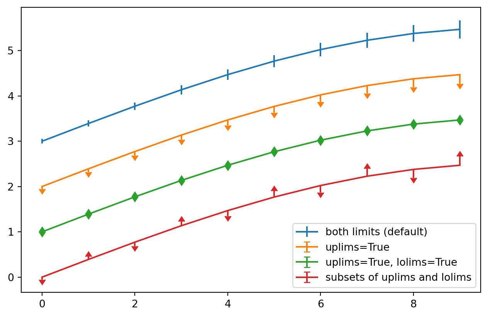
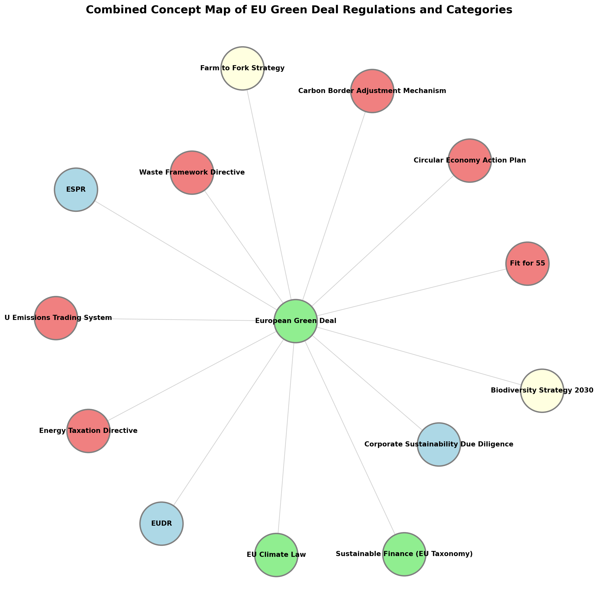
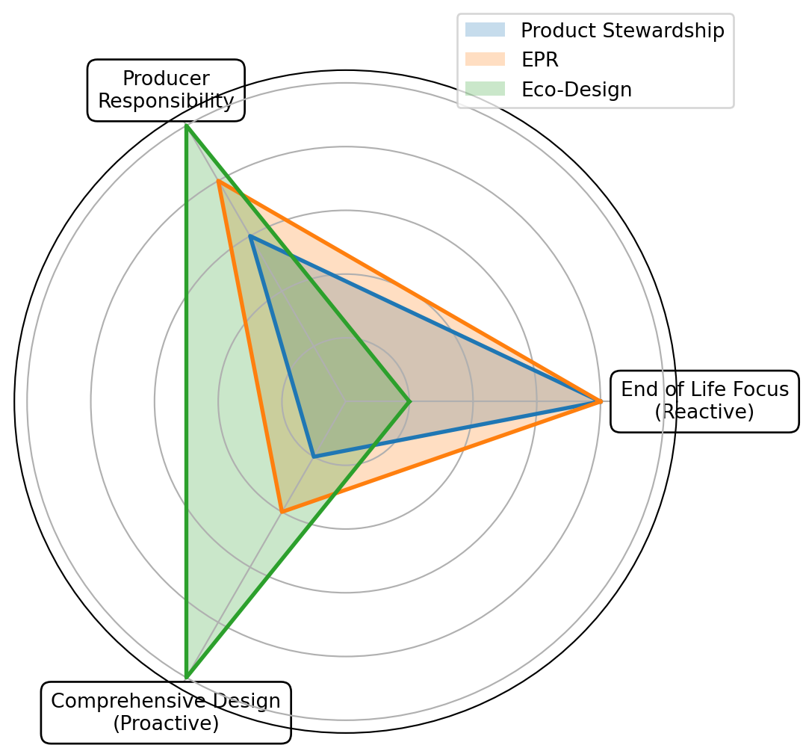
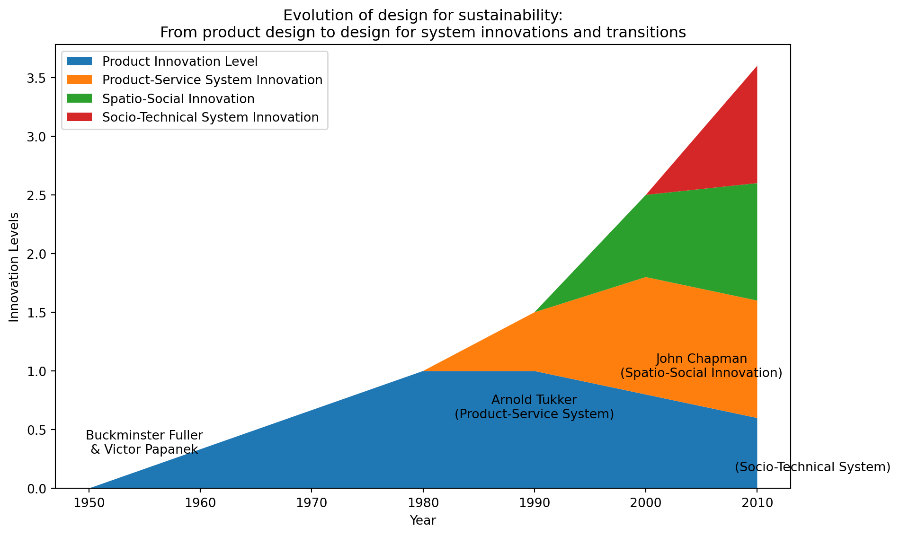
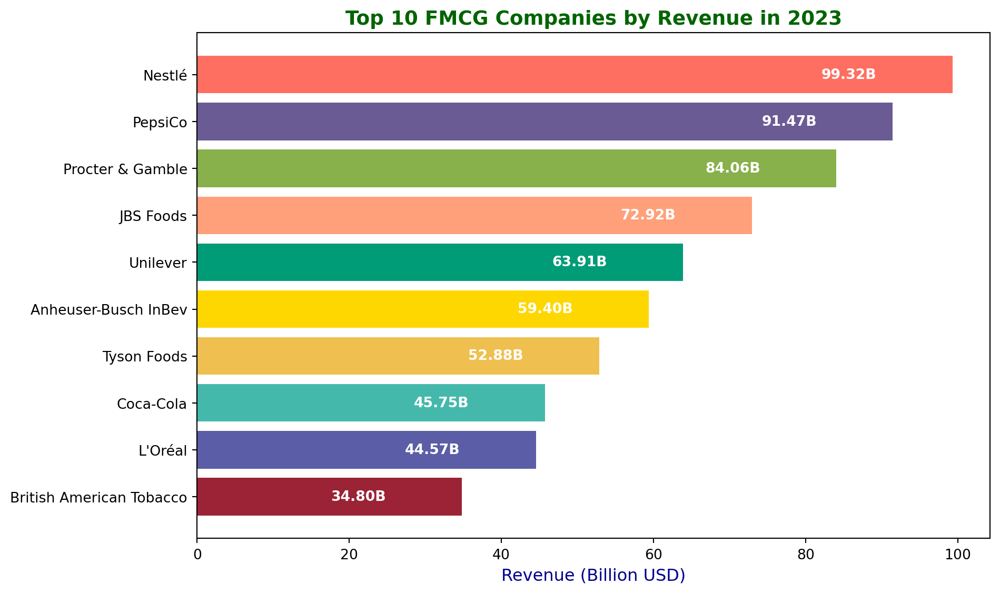

export const quartoRawHtml =
[`
<table style="width:100%;">
<colgroup>
<col style="width: 12%" />
<col style="width: 38%" />
<col style="width: 48%" />
</colgroup>
<thead>
<tr class="header">
<th>Enablers of Platform Economics</th>
<th>Pros</th>
<th>Cons</th>
</tr>
</thead>
<tbody>
<tr class="odd">
<td>Network effects</td>
<td>The more people use a platform, the more valuable it becomes both for the company and the user.</td>
<td>Data is not portable or difficult to migrate. You can’t leave because you’ll lose the audience. There’s a lock-in effect.</td>
</tr>
<tr class="even">
<td>Scalability</td>
<td></td>
<td></td>
</tr>
<tr class="odd">
<td>Data-driven Design</td>
<td></td>
<td></td>
</tr>
<tr class="even">
<td>Behaviour Design</td>
<td></td>
<td></td>
</tr>
</tbody>
</table>
`,`
<table style="width:99%;">
<caption>Examples of CO<sub>2</sub> visibility in Google’s products.</caption>
<colgroup>
<col style="width: 61%" />
<col style="width: 10%" />
<col style="width: 26%" />
</colgroup>
<thead>
<tr class="header">
<th>Feature</th>
<th>Product</th>
<th>Nudge</th>
</tr>
</thead>
<tbody>
<tr class="odd">
<td>Google Maps AI suggests more eco-friendly driving routes <span class="citation" data-cites="mohitmoondraNavigateMoreSustainably">@mohitmoondraNavigateMoreSustainably</span></td>
<td>Google Maps</td>
<td>Show routes with lower CO<sub>2</sub> emissions</td>
</tr>
<tr class="even">
<td>Google Flights suggests flights with lower CO<sub>2</sub> emissions</td>
<td>Google Flights</td>
<td>Show flights with lower CO<sub>2</sub> emissions</td>
</tr>
<tr class="odd">
<td>Wizzair Check carbon impact <span class="citation" data-cites="OffsetYourFlight">@OffsetYourFlight</span></td>
<td>WizzAir</td>
<td>Offset on Checkout</td>
</tr>
</tbody>
</table>
Examples of CO<sub>2</sub> visibility in Google’s products.
`,`
<table>
<caption>Types of nudge by <span class="citation" data-cites="WEE2021100364">@WEE2021100364</span></caption>
<colgroup>
<col style="width: 17%" />
<col style="width: 82%" />
</colgroup>
<thead>
<tr class="header">
<th>Name</th>
<th>Technique</th>
</tr>
</thead>
<tbody>
<tr class="odd">
<td>Prompting</td>
<td>Create cues and reminders to perform a certain behavior</td>
</tr>
<tr class="even">
<td>Sizing</td>
<td>Decrease or increase the size of items or portions</td>
</tr>
<tr class="odd">
<td>Proximity</td>
<td>Change the physical (or temporal) distance of options</td>
</tr>
<tr class="even">
<td>Presentation</td>
<td>Change the way items are displayed</td>
</tr>
<tr class="odd">
<td>Priming</td>
<td>Expose users to certain stimuli before decision-making</td>
</tr>
<tr class="even">
<td>Labelling</td>
<td>Provide labels to influence choice (for example CO<sub>2</sub> footprint labels)</td>
</tr>
<tr class="odd">
<td>Functional Design</td>
<td>Design the environment and choice architecture so the desired behavior is more convenient</td>
</tr>
</tbody>
</table>
Types of nudge by @WEE2021100364
`,`
<table style="width:98%;">
<caption>Table of Ant Forest assisted tree planting; data compiled from <span class="citation" data-cites="ZhuZiXun2017 yangSwitchingGreenLifestyles2018 unfcccAlipayAntForest2019 wangFuelingProEnvironmentalBehaviors2020 600MillionPeople2021 zhangPromoteProenvironmentalBehaviour2022 wangMotivationsInfluencingAlipay2022 zhouUnpackingEffectGamified2023 caoImpactArtificialIntelligence2023">[@ZhuZiXun2017; @yangSwitchingGreenLifestyles2018; @unfcccAlipayAntForest2019; @wangFuelingProEnvironmentalBehaviors2020; @600MillionPeople2021; @zhangPromoteProenvironmentalBehaviour2022; @wangMotivationsInfluencingAlipay2022; @zhouUnpackingEffectGamified2023; @caoImpactArtificialIntelligence2023]</span>.</caption>
<colgroup>
<col style="width: 15%" />
<col style="width: 17%" />
<col style="width: 17%" />
<col style="width: 47%" />
</colgroup>
<thead>
<tr class="header">
<th>Year</th>
<th>Users</th>
<th>Trees</th>
<th>Area</th>
</tr>
</thead>
<tbody>
<tr class="odd">
<td>2016</td>
<td>?</td>
<td>0</td>
<td></td>
</tr>
<tr class="even">
<td>2017</td>
<td>230 million</td>
<td>10 million</td>
<td></td>
</tr>
<tr class="odd">
<td>2018</td>
<td>350 million</td>
<td>55 million</td>
<td>6500 acres??</td>
</tr>
<tr class="even">
<td>2019</td>
<td>500 million</td>
<td>100 million</td>
<td>112,000 hectares / 66, 000 hectares?</td>
</tr>
<tr class="odd">
<td>2020</td>
<td>550 million</td>
<td>200 million</td>
<td>2,7 million acres?</td>
</tr>
<tr class="even">
<td>2021</td>
<td>600 million</td>
<td>326 million</td>
<td></td>
</tr>
<tr class="odd">
<td>2022</td>
<td>650 million</td>
<td>400 million</td>
<td>2 million hectares</td>
</tr>
<tr class="even">
<td></td>
<td></td>
<td></td>
<td></td>
</tr>
<tr class="odd">
<td></td>
<td></td>
<td></td>
<td></td>
</tr>
</tbody>
</table>
Table of Ant Forest assisted tree planting; data compiled from \[@ZhuZiXun2017; @yangSwitchingGreenLifestyles2018; @unfcccAlipayAntForest2019; @wangFuelingProEnvironmentalBehaviors2020; @600MillionPeople2021; @zhangPromoteProenvironmentalBehaviour2022; @wangMotivationsInfluencingAlipay2022; @zhouUnpackingEffectGamified2023; @caoImpactArtificialIntelligence2023\].
`,`
<table>
<caption>Examples of cities and countries that share data openly.</caption>
<thead>
<tr class="header">
<th>Country</th>
<th>Project</th>
<th>Reference</th>
</tr>
</thead>
<tbody>
<tr class="odd">
<td>Sweden</td>
<td>Swedish open data portal</td>
<td><span class="citation" data-cites="SverigesDataportal">@SverigesDataportal</span></td>
</tr>
<tr class="even">
<td></td>
<td></td>
<td></td>
</tr>
<tr class="odd">
<td></td>
<td></td>
<td></td>
</tr>
</tbody>
</table>
Examples of cities and countries that share data openly.
`,`
<table>
<colgroup>
<col style="width: 37%" />
<col style="width: 62%" />
</colgroup>
<thead>
<tr class="header">
<th>Type</th>
<th>Example</th>
</tr>
</thead>
<tbody>
<tr class="odd">
<td>Transparency Accountability Advocate</td>
<td></td>
</tr>
<tr class="even">
<td>Compliance Data Aggregator</td>
<td></td>
</tr>
<tr class="odd">
<td>Data Intelligence Hub</td>
<td></td>
</tr>
<tr class="even">
<td>Worker Voice Tool</td>
<td><span class="citation" data-cites="caravanstudiosStrengthenYourWorker2022">@caravanstudiosStrengthenYourWorker2022</span>: <strong>“Worker Connect”</strong></td>
</tr>
<tr class="odd">
<td>Traceability tool</td>
<td>trustrace.com</td>
</tr>
<tr class="even">
<td>Open data platform</td>
<td></td>
</tr>
<tr class="odd">
<td>Knowledge sharing platform</td>
<td>business-humanrights.org</td>
</tr>
</tbody>
</table>
`,`
<table>
<caption>A selection of personal sustainability apps. See <em>greenfilter.app</em> for an updated database.</caption>
<colgroup>
<col style="width: 31%" />
<col style="width: 68%" />
</colgroup>
<thead>
<tr class="header">
<th>App</th>
<th>Description</th>
</tr>
</thead>
<tbody>
<tr class="odd">
<td>Commons (Formerly Joro)</td>
<td>Finacial Sustainability Tracking + Sustainable Actions</td>
</tr>
<tr class="even">
<td>Klima</td>
<td>Offset Subscription</td>
</tr>
<tr class="odd">
<td>Wren</td>
<td>Offset Subscription</td>
</tr>
<tr class="even">
<td>JouleBug</td>
<td></td>
</tr>
<tr class="odd">
<td>eevie</td>
<td></td>
</tr>
<tr class="even">
<td>Aerial</td>
<td></td>
</tr>
<tr class="odd">
<td>EcoCRED</td>
<td></td>
</tr>
<tr class="even">
<td>Carbn</td>
<td></td>
</tr>
<tr class="odd">
<td>LiveGreen</td>
<td></td>
</tr>
<tr class="even">
<td>Earth Hero</td>
<td></td>
</tr>
<tr class="odd">
<td></td>
<td></td>
</tr>
</tbody>
</table>
A selection of personal sustainability apps. See *greenfilter.app* for an updated database.
`,`
<table>
<caption>Modes of interaction</caption>
<thead>
<tr class="header">
<th>Mode of Interaction</th>
<th></th>
</tr>
</thead>
<tbody>
<tr class="odd">
<td>Writing</td>
<td></td>
</tr>
<tr class="even">
<td>Speaking</td>
<td></td>
</tr>
<tr class="odd">
<td>Touching</td>
<td></td>
</tr>
<tr class="even">
<td>Moving</td>
<td></td>
</tr>
<tr class="odd">
<td></td>
<td></td>
</tr>
</tbody>
</table>
Modes of interaction
`,`
<table>
<caption>Food saving apps</caption>
<colgroup>
<col style="width: 14%" />
<col style="width: 85%" />
</colgroup>
<thead>
<tr class="header">
<th>Name</th>
<th></th>
</tr>
</thead>
<tbody>
<tr class="odd">
<td>Karma</td>
<td></td>
</tr>
<tr class="even">
<td>ResQ Club</td>
<td><span class="citation" data-cites="kristinakostapLEVITASONAUus2022">[@kristinakostapLEVITASONAUus2022]</span> ResQ Club in Finland and Estonia for reducing food waste by offering a 50% discount on left-over restaurant meals before they are thrown away.</td>
</tr>
<tr class="odd">
<td>Kuri</td>
<td><span class="citation" data-cites="hajejankampsKuriAppThat2022">@hajejankampsKuriAppThat2022</span> Less impact of food</td>
</tr>
<tr class="even">
<td>Social media groups (no app)</td>
<td></td>
</tr>
</tbody>
</table>
Food saving apps
`,`
<table>
<caption>Perspective on food systems in Sweden.</caption>
<colgroup>
<col style="width: 30%" />
<col style="width: 69%" />
</colgroup>
<thead>
<tr class="header">
<th>Perspective</th>
<th>Content</th>
</tr>
</thead>
<tbody>
<tr class="odd">
<td><em>“The diagnostic perspective”</em></td>
<td>“<em>All hands on deck to fix the climate”</em></td>
</tr>
<tr class="even">
<td><em>“The regenerative perspective”</em></td>
<td>“<em>Diversity, soil health and organic agriculture to the rescue”</em></td>
</tr>
<tr class="odd">
<td><em>“The fossil-free perspective”</em></td>
<td>“<em>Profitable Swedish companies to rid agriculture and the food chain of fossil fuel”</em></td>
</tr>
<tr class="even">
<td><em>“The consumer-driven perspective”</em></td>
<td><em>“A wish-list of healthy, high-quality and climate-friendly foods”</em></td>
</tr>
<tr class="odd">
<td>“The hands-on perspective”</td>
<td>“Tangible solutions within the reach of consumers and the food industry”</td>
</tr>
</tbody>
</table>
Perspective on food systems in Sweden.
`,`
<table style="width:99%;">
<caption>Blockchain supply chain companies as of summer 2023 include.</caption>
<colgroup>
<col style="width: 10%" />
<col style="width: 12%" />
<col style="width: 47%" />
<col style="width: 28%" />
</colgroup>
<thead>
<tr class="header">
<th>Company</th>
<th>Link</th>
<th>Literature</th>
<th>Comments</th>
</tr>
</thead>
<tbody>
<tr class="odd">
<td>Ocean Protocol</td>
<td>oceanprotocol.com</td>
<td></td>
<td></td>
</tr>
<tr class="even">
<td>Provenance</td>
<td>provenance.io</td>
<td></td>
<td></td>
</tr>
<tr class="odd">
<td>Ambrosius</td>
<td>ambrosus.io</td>
<td></td>
<td></td>
</tr>
<tr class="even">
<td>Modum</td>
<td>modum.io</td>
<td></td>
<td></td>
</tr>
<tr class="odd">
<td>OriginTrail</td>
<td>origintrail.io</td>
<td></td>
<td></td>
</tr>
<tr class="even">
<td>Everledger</td>
<td>everledger.io</td>
<td></td>
<td></td>
</tr>
<tr class="odd">
<td>VeChain</td>
<td>vechain.org</td>
<td></td>
<td></td>
</tr>
<tr class="even">
<td>Wabi</td>
<td>wabi.io</td>
<td></td>
<td></td>
</tr>
<tr class="odd">
<td>FairFood</td>
<td>fairfood.org</td>
<td></td>
<td></td>
</tr>
<tr class="even">
<td>Bext360</td>
<td>bext360.com</td>
<td></td>
<td></td>
</tr>
<tr class="odd">
<td>SUKU</td>
<td>suku.world</td>
<td><span class="citation" data-cites="millerCitizensReserveBuilding2019">@millerCitizensReserveBuilding2019</span> SUKU makes supply chains more transparent</td>
<td>Seems to have pivoted away from supply chains</td>
</tr>
</tbody>
</table>
Blockchain supply chain companies as of summer 2023 include.
`,`
<table>
<caption>Share of CO<sub>2</sub> of CO<sub>2</sub> emissions by type of transport globally <span class="citation" data-cites="statistaGlobalTransportCO22022">[@statistaGlobalTransportCO22022]</span>.</caption>
<thead>
<tr class="header">
<th>Type of Transport</th>
<th>Percentage</th>
</tr>
</thead>
<tbody>
<tr class="odd">
<td>Passenger cars</td>
<td>39%</td>
</tr>
<tr class="even">
<td><strong>Medium and heavy trucks</strong></td>
<td>23%</td>
</tr>
<tr class="odd">
<td><strong>Shipping</strong></td>
<td>11%</td>
</tr>
<tr class="even">
<td><strong>Aviation</strong></td>
<td>9%</td>
</tr>
<tr class="odd">
<td>Buses and minibuses</td>
<td>7%</td>
</tr>
<tr class="even">
<td>Light commercial vehicles</td>
<td>5%</td>
</tr>
<tr class="odd">
<td>Two/three-wheelers</td>
<td>3%</td>
</tr>
<tr class="even">
<td>Rail</td>
<td>3%</td>
</tr>
</tbody>
</table>
Share of CO<sub>2</sub> of CO<sub>2</sub> emissions by type of transport globally \[@statistaGlobalTransportCO22022\].
`,`
<table>
<caption>Companies with Carbon Labels <span class="citation" data-cites="briankatemanCarbonLabelsAre2020">[@briankatemanCarbonLabelsAre2020]</span></caption>
<thead>
<tr class="header">
<th>Company</th>
<th>Country</th>
</tr>
</thead>
<tbody>
<tr class="odd">
<td>Just Salad</td>
<td>U.S.A.</td>
</tr>
<tr class="even">
<td>Quorn</td>
<td>U.K.</td>
</tr>
<tr class="odd">
<td>Oatly</td>
<td>U.K.</td>
</tr>
<tr class="even">
<td>IKEA</td>
<td>Sweden</td>
</tr>
</tbody>
</table>
Companies with Carbon Labels \[@briankatemanCarbonLabelsAre2020\]
`,`
<table>
<caption>Organization to Certify Carbon Labels <span class="citation" data-cites="climatepartnerLabellingCarbonFootprint2020">[@climatepartnerLabellingCarbonFootprint2020]</span>.</caption>
<thead>
<tr class="header">
<th>Organization</th>
<th>Country</th>
<th>Number of Product Certified</th>
</tr>
</thead>
<tbody>
<tr class="odd">
<td>ClimatePartner</td>
<td></td>
<td></td>
</tr>
<tr class="even">
<td>Carbon Calories</td>
<td></td>
<td></td>
</tr>
<tr class="odd">
<td>Carbon Trust</td>
<td></td>
<td>27000</td>
</tr>
</tbody>
</table>
Organization to Certify Carbon Labels \[@climatepartnerLabellingCarbonFootprint2020\].
`,`
<table>
<caption>Digital Product Passport goals <span class="citation" data-cites="strettonDigitalProductPassports2022">@strettonDigitalProductPassports2022</span></caption>
<colgroup>
<col style="width: 81%" />
<col style="width: 18%" />
</colgroup>
<thead>
<tr class="header">
<th>Goal</th>
<th>Description</th>
</tr>
</thead>
<tbody>
<tr class="odd">
<td><strong>Sustainable Product Production</strong></td>
<td></td>
</tr>
<tr class="even">
<td><strong>Businesses to create value through Circular Business Models</strong></td>
<td></td>
</tr>
<tr class="odd">
<td><strong>Consumers to make more informed purchasing decisions</strong></td>
<td></td>
</tr>
<tr class="even">
<td><strong>Verify compliance with legal obligations</strong></td>
<td></td>
</tr>
</tbody>
</table>
Digital Product Passport goals @strettonDigitalProductPassports2022
`,`
<table>
<colgroup>
<col style="width: 3%" />
<col style="width: 96%" />
</colgroup>
<thead>
<tr class="header">
<th>Category</th>
<th>Implication</th>
</tr>
</thead>
<tbody>
<tr class="odd">
<td>Greenwashing</td>
<td>Personal CO2 tracking is ineffective and the focus should be on systematic change towards circular design and zero waste practices.</td>
</tr>
<tr class="even">
<td></td>
<td>Help consumers to demand more</td>
</tr>
<tr class="odd">
<td>Lack of transparency</td>
<td>Make open data easy to use in everyday life</td>
</tr>
<tr class="even">
<td>Transparency</td>
<td>The key idea is making CO<sub>2</sub> Visible.</td>
</tr>
<tr class="odd">
<td>Greenwashing</td>
<td>Rank companies based on sustainability</td>
</tr>
<tr class="even">
<td></td>
<td>Help you to decide: what to buy, how to save, where to invest.</td>
</tr>
<tr class="odd">
<td>Decision Fatique</td>
<td>What if there was a “Green Filter” on every product everywhere?</td>
</tr>
<tr class="even">
<td></td>
<td>Become a Sustainability-Aware App or Game.</td>
</tr>
<tr class="odd">
<td></td>
<td>Focus on how college students can invest in specific industries?</td>
</tr>
<tr class="even">
<td></td>
<td>Where to shop rankings for groceries: list worst offenders in terms of products; shop and invest according to your values.</td>
</tr>
<tr class="odd">
<td></td>
<td>What Quantified Self look like for sustainability?</td>
</tr>
<tr class="even">
<td></td>
<td>Empowering people to live a sustainable day</td>
</tr>
<tr class="odd">
<td></td>
<td>What if there was a “Green Filter” on every product everywhere?</td>
</tr>
<tr class="even">
<td></td>
<td>Become a Sustainability-Aware App or Game.</td>
</tr>
<tr class="odd">
<td></td>
<td>Guidance could help young people beat climate anxiety by taking meaningful action.</td>
</tr>
<tr class="even">
<td></td>
<td>The app is just as much about helping people deal with climate anxiety as it’s with solving the climate issue.</td>
</tr>
<tr class="odd">
<td></td>
<td>List of metrics that should be tracked to enable useful analytics. Ex: % of beach pollution, air pollution, water pollution (I had this idea while meditating). In essence, “green filter” is a central data repository not unlike “Apple Health for Sustainability”.</td>
</tr>
<tr class="even">
<td></td>
<td>Health and fitness category apps</td>
</tr>
<tr class="odd">
<td></td>
<td>Using “green filter” you can get a personalized sustainability plan and personal coach to become healthy and nature-friendly.</td>
</tr>
<tr class="even">
<td></td>
<td>All green categories — Green hub — Ask the user to prioritize</td>
</tr>
<tr class="odd">
<td></td>
<td>In my “green filter” AI advisor app’s scenario, the AI is scanning for opportunities matching the user’s sustainable investment appetite and risk profile, using different methods of analysis, including alternative data sources. Traditionally, financial analysts only looked at traditional data, such as company reports, government reports, historic performance, etc., for preparing advisory guidance to their clients. With the advent of AI and big data analysis, many other options of research data have become available, for example, accurate weather predictions for agriculture can affect guidance, because of expected future weather disasters in the area. Other examples include policy predictions, pollution metrics, etc.</td>
</tr>
<tr class="even">
<td></td>
<td>Professional financial advisors use automated tools to analyze data and present it in human form to clients. Today’s ubiquitous mobile interfaces, however, provide the opportunity to ‘cut out the middleman’ and provide similar information to clients directly, at a lower cost and a wider scale, often without human intervention. Additional (more expensive) “human-judgment- as-a-service”, a combination of robots + human input, can help provide further personalized advice for the consumer, still at a cheaper price than a dedicated human advisor. Everyone can have a financial advisor.</td>
</tr>
<tr class="odd">
<td></td>
<td>Narrative design bring together film school <strong>storytelling</strong> experience with design.</td>
</tr>
<tr class="even">
<td></td>
<td>Rebuilt the app as a personalized, narrative lifestyle feed.</td>
</tr>
<tr class="odd">
<td></td>
<td>How the design can connect people to sustainable outcomes while shopping and investing? Perhaps even forming a community of sustainable action. What I showed in class looks like an app but it could also be a physical object (a speculative design). From the presentations I saw most students seemed to be interested in form and light (many lamps) and a couple were about medical uses. I don’t remember seeing one that could be compatible with the environmental sustainability focus unfortunately…</td>
</tr>
<tr class="even">
<td></td>
<td><strong>Guided Sustainability</strong> “refers to a concept of using technology, such as AI and machine learning, to help individuals and organizations make more sustainable decisions and take actions that promote environmental and social sustainability. This can include things like analyzing data on resource usage and emissions, providing recommendations for reducing the environmental impact of operations, or helping to identify and track progress towards sustainability goals. The goal of guided sustainability is to make it easier for people to understand their impact on the environment and to take steps to reduce that impact.”</td>
</tr>
<tr class="odd">
<td></td>
<td>Young people are stuck inside platforms. You don’t own the data you put on TikTok. You can’t leave because you’ll lose the audience.</td>
</tr>
<tr class="even">
<td></td>
<td>With this perspective of scale, what would a shopping experience look like if one knew at the point of sale, which products are greener, and which are more environmentally polluting?</td>
</tr>
<tr class="odd">
<td></td>
<td>AI Financial Advisors will need to go further to motivate users. because of the nature of the technology, which is based on the quality of the data the systems ingest, they are prone to mistakes.</td>
</tr>
<tr class="even">
<td>Generative AI</td>
<td>Allow producers to make use of Speculative and Participatory design to test out new product ideas?</td>
</tr>
<tr class="odd">
<td></td>
<td><ul>
<li>Processes sustain things: implication for design: built an app</li>
</ul></td>
</tr>
<tr class="even">
<td></td>
<td><ul>
<li>If sustainability can’t be automated, give the user buttons to choose a sustainable option.</li>
</ul></td>
</tr>
<tr class="odd">
<td></td>
<td><ul>
<li>The power of defaults. Make the sustainable option the default option. <span class="citation" data-cites="gigerenzerWhyHeuristicsWork2008">@gigerenzerWhyHeuristicsWork2008</span></li>
</ul></td>
</tr>
</tbody>
</table>
`,`
<table>
<colgroup>
<col style="width: 5%" />
<col style="width: 94%" />
</colgroup>
<tbody>
<tr class="odd">
<td>Alerts</td>
<td>Your shopping products mostly come from Protector and Gamble (3x) and Nestle. These are large conglomerates with a massive CO<sub>2</sub> footprint. See the index to find some alternatives.</td>
</tr>
<tr class="even">
<td></td>
<td>App shows traceability.</td>
</tr>
</tbody>
</table>
`];

````mdx-code-block
import Figure from '/src/components/Figure'
import FlightEmissions from '../images/design/flight-emissions.png'
import Strava from '../images/design/strava.png'
import ResQClub from '../images/design/resq-club.png'
````

# Design

## Eco-Design: The Legislative Perspective

In Europe, *eco-design* has strong political support as part of the
European Union’s (EU) “Green Deal” legislation, aiming to transform
European economies towards sustainability. The Ecodesign for Sustainable
Products Regulation (ESPR) entered into force in the EU on July 18, 2024
(European Commission, 2024) following the (European Parliament, 2022)
proposal whereby the European Commission established a general framework
for *eco-design: “requirements for sustainable products, repealing rules
\[referring to the previous Eco-Design Directive (2009/125/EC)\]
currently in force which concentrate on energy-related products only,”*
setting up a level playing-field for the organizations operating on the
EU single market. Virginijus Sinkevičius, the EU Commissioner for the
Environment, Oceans and Fisheries, is quoted describing eco-design as
design that *“respects the boundaries of our planet”* (European
Commission, 2022).

Sustainable Products and EUDR (European Union Deforestation Regulation)
work hand-in-hand as part of EU’s legislative efforts to promote
sustainability.

EUDR applies to all products placed on the market from 30 December 2024
and 30 June 2025 for small businesses.

ESPR, EUDR

ESRS, CSRD

EU “Green Deal” legislative is comprehensive.

ESRS reporting standard to meet CSRD requirements.

Many other jurisdictions also have laws that aim to reduce the
environmental impact of products throughout their life cycles. For
instance Australia has a Product Stewardship (PS) scheme, which also
includes an investment fund targeted at increasing the recycling rates
of specific products (Australian Government, 2024). Australia, Japan,
and Taiwan all have Sustainable Procurement schemes prioritizing greener
products in public purchases \[ADD CITATION\]. While Taiwan doesn’t yet
have a specific eco-design law, there are various pieces of legislation
promoting circular economy \[ADD CITATION\]. Already in 1988 Taiwan
implemented an Extended Producer Responsibility (EPR) scheme, followed
by a recycling system (initially focused on electronic items) in 1998
(Chong et al., 2009). Eco-design initiatives in Taiwan started at least
as early as 1994, when Taiwanese companies and universities noticed
international sustainability trends and began to implement their own
sustainable design initiatives (Jahau Lewis Chen et al., 2005).

The key to comparing Product Stewardship, Extended Producer
Responsibility (EPR), and Eco-Design is the scope, as illustrated in the
chart below. While Product Stewardship (PS) and Extended Producer
Responsibility (EPR) deal mostly with the end of the product lifecycle
(they are *reactive*), including their disposal and recycling (EPR going
a step further than PS by shifting the responsibility to the producer),
Eco-Design moves sustainability up the design chain (being
*pro-active*), setting standards for making better products - in
essence, attempting to *design-out* the waste.



## How to Design for Sustainability: A Diversity of Approaches

*Designing for Sustainability* *(DfS)* has many names, with subtle
differences of emphasis and nuance. While the ESPR legislation chose
*Eco-Design* as the overarching title, researchers and practitioners
discuss and use *Circular Design*, *Cradle-to-Cradle Design*, *Green
Design*, *Regenerative Design*, *Climate-Responsive Design*,
*Life-Centered Design*, and many others.

In most cases, designing for sustainability makes use of *systems
thinking*, underlining the importance of looking at the entire lifecycle
of a product or service. Sustainable design encompasses all human
activities, making this pursuit an over-arching challenge across all
industries and all human activities with the complex interdependencies
contained within. (Ceschin & Gaziulusoy, 2016) gives a comprehensive
overview of the main themes of sustainable design and the main
contributions and limitations in the well–researched *“Evolution of
design for sustainability: From product design to design for system
innovations and transitions”*.

R. Buckminster Fuller “Operating Manual for Spaceship Earth”, Victor
Papanek “Design for the Real World”, Jonathan Chapman “Emotionally
Durable Design”, Carlo Vezzoli “Product-Service System Design for
Sustainability”, Ezio Manzini “Design, When Everybody Designs”.

*Service Design*, Ceschin & Gaziulusoy (2016) shows how design for
sustainability has expanded from a product focus to systems-thinking
focus placing the product inside a societal context of use. For example
Anon (n.d.d), recycled clothing maker FREITAG offers
sustainability-focused services such as cargo bikes so you can transport
your purchases and a network for *shopping without payment* = swapping
your items with other members, as well as repairs of their products.
Loaning terminology from *service design*, the user journey within an
app needs to consider each touchpoint on the way to a state of success.



As this research is *practice-oriented* (i.e., my goal here is to find
design approaches that could influence my prototype), I will focus on
some fields of design which I hope relevant, fruitful, or contextual to
my project.

I will start with *Human-Centered Design*, the grandfather of design
with attitude. There’s even an ISO standard for human-centered design,
with the designated code ISO9241-210, revised as ISO 9241-210:2019
titled *“Ergonomics of human-system interaction”* and up for revision
soon (ISO standards are reviewed every 5 years). Some of the key
takeaways include “Understanding and specifying the context of use”,
“Involving users throughout design and development”, “Specifying user
requirements”, “Evaluating designs”, “Multi-disciplinary Collaboration”,
“Iterative process” and “Continual Improvement”, and finally - usability
is not enough, the design should provide a user experience (UX) for
human “emotional responses and satisfaction” (ISO, 2019).

While *Human-Centered Design* focuses exactly on what it says - humans -
*Life-Centered Design* recognizes human impact on our surrounding
environment as well - making sure we include non-human animals among our
stakeholders. This is where we are getting on the *territory* of
sustainability. While *Human-Centered Design* is ever popular, the
effect humans are having on biodiversity is rarely considered when
designing. *“\[T\]he design phase of a physical product accounts for 80%
of its environmental impact”* notes(Borthwick, Tomitsch & Gaughwin,
2022) in their framework for life-centered design.

If we’re including *other* lifeforms among our stakeholders, what can we
learn from them? *Biomimicry* is about being inspired by nature while
*Biodesign* focuses on design involving biology in the design itself.
Janine Benyus, who coined the word *Biomimicry* (Benyus, 2009) looks at
very practical cases of innovation where engineers and biologist meet
and (Dicks, 2023) provides a much more philosophical account of
following the example of nature. Focusing on the financial sector,
(Thomas & Mantri, 2022)’s philosophical account advocates for an
“inside-out” design pattern, much like natural systems, starting from
the smallest structures to guarantee resilience and survival, instead of
trying to control their external environment.

In a similar vein, *Material Ecology* is the wording preferred by the
architect Neri Oxman based at the MIT Media Lab working with
biomaterials as a proponent of *Nature-Centric Design* that adheres to
the principles of ecological sustainability with both an ecologically
conscious mindset and practical toolset (Hencz, 2022). Language and our
mental concepts shape our reality, which makes language-creation an
important tool for sustainability. Neri Oxman’s expressions in her
(World Economic Forum, 2016) interview introduce some new vocabulary:
*“ecology-indifferent”*, *“naturing”*, *“mother naturing”*, *“design is
a practice of letting go of all that is unnecessary”*, *“nature should
be our single client”*, which reminds me how self-invented language
gives un child-like freedom to imagine new worlds.

*Speculative Design* can help us imagine *non-anthropocentric* (Hupkes &
Hedman, 2022; Edwards & Pettersen, 2023)as well as *dystopian* futures
(Pinto et al., 2021). First introduced by (Dunne & Raby, 2013) in their
seminal book, the field aims to question the intersection of *user
experience design* and *speculative fiction*. (Barendregt & Vaage, 2021)
explores the potential of speculative design to stimulate public
engagement; thought experiments can spur public debate on an issue
chosen by the designer. Phil Balagtas, founder of The Design Futures
Initiative at McKinsey, discusses the value of building future scenarios
at his talk at Google. His favorite example, the Apple Knowledge
Navigator, first appeared in an Apple vision video in 1987 and took two
decades to materialize in the real world. It was inspired by a similar
device first shown in a 1970s episode of Star Trek as a *magic device*
(a term from participatory design), which then inspired subsequent
consumer product development. It took another two decades, until the
launch of the iPhone in 2007 - a total of 40 years.

*Participatory Design* and *Speculative Design* can be complementary as
in the work of (Neuhoff, Simeone & Laursen, 2023), used together to
focus on engaging users deep in the design process to truly understand
their needs, contexts and interactions on a non-superficial level. For
both speculative and participatory design, the cost and makes it into a
niche activity. Generative AI holds the promise to allow designers to
dream up and prototype quicker. In order to build a future, it’s
relevant to imagine and critique a future. By being quickly generate
prototypes, once can test out ideas with the future users involving more
of the community and stakeholders. To be able to build something, one
first needs to imagine it; imagination is crucial for change.

*Speculative Design* helps us envision future scenarios

Massachusetts Institute of Technology (MIT) is a source of many
fantastic innovations, and another.

*Regenerative Design* suggests *de*materializing (digitizing) economies
is not enough to be sustainable (by reduction of physical impact).
Design should look beyond reducing harm and find avenues to *regenerate*
damaged or even completely destroyed natural systems – ecosystems,
biodiversity, land, forests, lakes, rivers - natural habitats.

Sufficiency

Moving from products and (digital) experiences towards the built
environment and architecture, *Climate-Responsive Design* embeds a
building within the environmental constraints of a place and looks for
opportunities use the land, wind, sun, local materials, and local
vernacular history and culture when considering a design. Architect
Susanne Brorson suggests sustainability should be considered in the
earlier phases of design instead of trying to fix problems later
discussing *climate-responsive design principles* (EVM maaarhitektuuri
keskus, 2019). The sentiment is echoed by (Lee & Doevendans, 2011) who
edited a volume on sustainable approaches of world-renowned architects:
*“The principles of sustainable design are rooted in the building’s
relationship to the site and its environmental conditions such as
topography, vegetation, and climate.”*

Architecture of the Well-Tempered Environment (Banham, 1999)

*Designing for Trust*, Weinschenk (2011) says *“People expect most
online interactions to follow the same social rules as person-to-person
interactions. It’s a shortcut that your brain uses to quickly evaluate
trustworthiness.”*

*Cradle-to-Cradle Design*, focusing on recyclability of products. Anon
(2021g) and 活動通 (n.d.) Cradle to Cradle Nordic circular design in
Taiwan

*Durability* is an important dimension for sustainability. High quality
durable products are more sustainable as they last longer and less
likely to be thrown away. Forming an emotional bond with the product
makes it feel more valuable (Zonneveld & Biggemann, 2014). (Chapman,
2009) argues in his seminal paper (and later in his book) for
*“Emotionally Durable Design”*, the simple idea that we hold to things
we value and thus they are sustainable. We don’t throw away a necklace
gifted to us by mom, indeed this object might be passed down for
centuries. (Rose, 2015) has a similar idea, where *“Enchanted Objects”*
become so interlinked with us, we’re unlikely to throw them away. This
has implications for sustainability as the object is less likely to be
thrown away.

As the above shows, there are many partially overlapping design words
created by different people for diverse purposes. Design vocabulary may
be created for distinguishing a particular type of design from another -
or to market oneself as the creator of the word. There are designers who
define / brand themselves by their design method. Design Studies, a
field that studies *design* as a subject.

Here I will use the lens of *sustainability* - another complex term - to
look at how design can contribute to eco-friendly products. I advocate
looking at design methods as a toolbox, where I can pick the tool
suitable for the problem set in front of me. Here I look at a small
number of design practices I find relevant to designing a sustainability
app for college students.

than traditional design methods. While AI allows us to look at a larger
number of design scenarios thank previously feasible, there are many
approaches looking for ways to design for sustainability. Designing for
Sustainability is fundamentally a hopeful act imbibed with the dream a
healthier world is possible.

### Future Scenarios: Avoiding the Worst Cases

In sustainability there are rarely good choices. Rather it’s a question
of avoiding the worst choices.

*Scenario-building* is a key tool for sustainability. Because
sustainability is so complex, sustainable design makes use of scenarios.

*Life Cycle Assessment* and *Environmental Impact Analysis* are needed
to provide eco-design scenarios (de Otazu et al., 2022).

user experience, iteration (Google Design, 2019)

## In Practice Sustainability Begins in Software

Designing user interfaces for sustainable interactions means
incorporating data and toolsets to enable designers to make decisions
which reduce emissions of their design. Companies like AutoDesk are
putting CO<sub>2</sub> calculations inside their design software,
helping designers reduce material usage, energy consumption,
CO<sub>2</sub> emissions, while increasing recyclability(Mike Haley,
2022). Software is key to building more sustainable products, already
for decades (Gupta et al., 2023). AI-assisted design enables design for
sustainability because the design process is where sustainability
begins. AI has the potential to provide the parameters for
sustainability. (Singh & Sarkar, 2023) proposes an AI tool for deciding
the suitable life cycle design parameters.

Design encompasses most everything in our daily lives. Humans live in
artificial environments where *most* *things* are designed by humans.
The *experiences* we take part in are increasingly created based on some
type of data.

-   Involving young HCI designers in AI-oriented workshops can show the
    future of UI/UX ? (Battistoni et al., 2023)

*Data is the interface* between idle resources and retail demand, which
makes *exchange of value* possible.

-   Different Gets Ignored Luke Wroblewski (2024)

*Digital Sustainability*, information pertaining to emissions would flow
through the economy not unlike the carbon cycle itself.

-   Pan & Nishant (2023) important

Interaction Design for Climate Change: how can we change common UIs so
they take into account sustainability?

-   UIA World Congress of Architects (2023) “Design for climate
    adaptation”
-   Andrew Chaisson (2019)
-   Dzigajev (2019)
-   Mankoff et al. (2007)
-   Borthwick, Tomitsch & Gaughwin (2022)
-   Lose (2023b) is worried about applying UX skills for Climate Change

AI-Assisted Design

**Tool vs Assistant? (Tools are mostly non-anthropomorphic?).** Tools do
not call attention to themselves. They don’t necessarily rely on
human-like representations that call attention to themselves but rather
are available in-context to help streamline specific tasks.

-   September 16, 2020 (2020) “What is AI-assisted Design?”
-   Clipdrop (n.d.) AI Design Assistants
-   Architechtures (2020) Architecture with the help of AI
-   Zakariya (2022) Canva image generator
-   Kore.ai (2023) Kore.ai developing custom AI-chatbots for business
    usage.
-   Anon (n.d.e) storytelling by AI

## Data-Driven Design: Sustainable Personalization at Scale

Data-Driven Design Enables Sustainability. Sustainability touches every
facet of human existence and is thus an enormous undertaking. Making
progress on sustainability is only possible if there’s a large-scale
coordinated effort by humans around the planet. For this to happen,
appropriate technological tools are required.

Data-driven design has limitations.

Coputer

One mode

-   Konings (2020)
-   “Digital sustainability principles”
-   Eminent journal Design Studies, 1st design journal
-   Part of digital product design are **design systems** to keep
    consistency across the experience. Create a design system to best to
    showcase my analytic skills:
    -   Design System:
        https://zeroheight.com/8bf57183c/p/82fe98-introduction
    -   Anon (n.d.a)
    -   Suarez et al. (n.d.)
    -   Anon (n.d.r)
    -   Anon (n.d.b)
-   Kolko & Connors (2010) and IxDF (n.d.) believe interaction design is
    still an emerging (and changing) field and there are many
    definitions. I prefer the simplest version: interaction design is
    about creating a conversation between the product and the user.
-   AI gives designers new tools. In AI development, design is called
    alignment. What is the role of an AI Designer? Linden (2021)
-   Anon (n.d.u)
-   Anon (n.d.o)
-   Parundekar (2021)
-   Richard Yang (2021) and Justin Baker (2018) say some of the tools
    used by interaction designers include
-   AI for design: Figma (2023)

The concept of *Social Objects*: People need something to gather around
and discuss. Sharing.Lab (2015): I’m interested in the concept of a
“social object”.

*Red Route Analysis* is an user experience optimization idea inspired by
the public transport system of London (Oviyam™, 2019; Anon, 2021c; Xuan,
2022).

-   Product marketers focus on the *stickiness* of the product, meaning
    low attrition, meaning people keep coming back.
-   What percent of all design is “sustainable design” ? Promoting
    sustainable design.
-   Josh Luber (2021) Trading cards are cool again
-   Jesse Einhorn (2020)
-   Connie Loizos (2021)
-   Natasha Mascarenhas (2021)
-   JEFF JOHN ROBERTS (April 23, 2020 at 2:00 PM GMT+3)

*Narrative Design,* Humans respond well to ***storytelling***, making
***character design*** and ***narrative design*** relevant to
interaction design. Large language models (LLMs) such as ChatGPT are
able to assume the personality of any character that exists inside of
its training data, creating opportunities for automated narrative
design.

-   The rising availability of AI assistants may displace Google search
    with a more conversational user experience. Google itself is working
    on tools that could cannibalize their search product. The examples
    include Google Assistant, Google Gemini (previously known as Bard)
    and large investments into LLMs.

-   Alethea AI (2021): discusses writing AI Characters, creating a
    personality.

-   Writing as training data? large language models. GTP3.

-   Stories start with a character.

### Designing for College Students

-   plap

### Personalization

-   Personal User Experience. social apps require personalization, trust
    and k-factors (sharing and inviting your friends). (Baron, 2023;
    Kim, 2023).

### Growth Design

-   For digital products (apps) the main application of interaction
    design is for *growth* in usage, how to get more people (user
    journey and conversion funnels) to use the product i.e user
    acquisition, retention, engagement, and monetization and keep using
    it (retention and engagement), often optimizing onboarding,
    features, and personalization (Steger, 2019; Kende, 2023).

-   Hypothesis and validation for iterating on features.

-   Total addressable market (TAM), serviceable addressable market
    (SAM), target audience (TA)

## Digital Platform Economy: Growth into Superapps

Superapps are the latter stage of the Digital Platform Economy.

Platform economy companies popularized and expanded Data-Driven Design
in the service of growth marketing (also known colloquially as growth
hacking). Capturing User Data was part of this strategy which enabled
improving the products. Digital Product Design is increasingly
data-driven. Digital platforms operate a *design as a process* in a
continuous feedback loop, where *measurements*, *experiments,*
predictive analytics and personalization form a data-drive design
culture. As we humans go about our daily business, governments and
companies track our activities using various technologies, which
produces massive amounts of user interaction data. Platform economy
companies are the capture and use large amounts of data from users. Data
is useful for designing better products. Designing for high retention
(users keep coming back). Network Effects, the more people use a
platform, the more valuable it becomes. Platforms that continuously add
features (provided consumer legislation allows it) may eventually evolve
into superapps, which are useful for providing services for a wide
category of human needs. Bundling many services under one super-brand.
Superapps are possible thanks to Nudge, Economies of Scale, Network
Effects, Behaviour Design. Large Digital Platforms have a very small
number of workers relative to the number of users they serve. This
creates the necessity for using automation for both understanding user
needs and providing the service itself. Creating a good product that’s
useful for the large majority of users depends on *Data-Driven Design.*

Design is as much about how it works as it’s about the interface.

Digital product design can be seen as a specific discipline under the
umbrella of Experience Design. In Michael Abrash (2017) Meta Oculus
augmented reality incubation general manager Laura Fryer: *“People buy
experiences, not technology.”*

Young people expect a product. Intelligent Interfaces use interaction
design to provide relevant and personalized information in the right
context and at the right time.

There are many approaches to design - from playful to practical to
critical and to data-driven. Nonetheless, many types of design share a
common goal designing for a good *user experience*. Simplifying.

*Personalization*: the largest businesses today (measured in number of
users) design the whole user experience.

*Scale,* Popular consumer platforms strive to design solutions that feel
personalized at every touchpoint on the user journey (to use the
language of service design) at the scale of hundreds of billions of
users.

Superapps are honeypots of data that is used for many types of behavior
modeling. (Suarez et al., 2021) suggests using alternative data from
super-apps to estimate user income levels, including 4 types of data:
Personal Information, Consumption Patterns, Payment Information, and
Financial services. (Roa et al., 2021) finds super-app alternative data
is especially useful for credit-scoring young, low-wealth individuals.
The massive amounts of data generated by these companies are used by
smart cities to re-design their physical environments.

Twitter (now X) is becoming a financial app.

Inspiration from WeChat.

How can the mobile devices which the majority of us are carrying with us
every day, help us make decisions about the businesses we engage with?
In terms of user experience, can personalized AI advisors empower our
financial actions from shopping to saving and investing?

<div dangerouslySetInnerHTML={{ __html: quartoRawHtml[0] }} />

-   *Platform Economy* marketplace companies like Airbnb, Uber among
    many others match optimize how our cities work.Superapps are
    prevalent in China and South-East Asia. (Giudice, 2020) finds WeChat
    has had a profound impact on changing China into a cashless society,
    underlining how one mobile app can transform social and financial
    interactions of an entire country. China is the home of many
    superapps and (Vecchi & Brennan, 2022) discusses the strategies
    Chinese apps are taking to expand to other markets. (Shabrina
    Nurqamarani et al., 2020) discusses the system consistency and
    quality of South-East Asian superapps Gojek and Grab.

-   Platform economy companies have been criticized for their lack of
    workers rights (ESG). (Anon, 2024b) uses portable air pollution
    tracking devices to documents how gig workers are subjected to
    pollution.

-   Uber is creating an all-purpose platform; only 4.1% of rides were
    electric (Levy, 2023).

-   X (formerly Twitter) is becoming a superapp?

Could there be Sustainability Superapps?

-   How to design sustainability superapps? Lots of options in a single
    app. (Fleet Management Weekly, 2022) “Sustainability and superapps
    top Gartner’s Top 10 2023 Trends List”. (Dave Wallace, 2021) “The
    rise of carbon-centric super apps”. (goodbag, 2023) “goodbag:
    Sustainable Super App”. What would a sustainable investment platform
    that matches green investments with the consumers look like, if one
    saw the side-by-side comparison of investment vehicles on their ESG
    performance? Also (Bernard, 2022).

-   Undheim (2024) Ecotech

-   Lori Perri (2022)

-   Anon (2022d)

-   Anon (2021f) PayPal dominance

-   Zeng (2015) **(need to pay for article!)**

-   Huang & Miao (2021) **(need to pay for article!)**

-   Anon (2022h)

-   (Cuppini, Frapporti & Pirone, 2022) historical overview of the
    development of capitalism from linear ***Fordism*** through platform
    economy and logistics’ revolution which allows for circular
    economies to happen in a city.

-   Adaptive AI

### Behavioral Design

For decades, marketers and researchers have been researching how to
affect human behavior towards increasing purchase decisions in commerce,
both offline and online, which is why the literature on behavioral
design is massive. One of the key concepts is *nudge*, first coined in
2008 by the Nobel-winning economist Richard Thaler; nudges are based on
a scientific understanding of human psychology and shortcuts and
triggers that human brains use and leverages that knowledge to influence
humans in small but powerful ways (Thaler & Sunstein, 2009).

The principles of nudge have also been applied to sustainability. For
example, a small study (n=33) in the Future Consumer Lab in Copenhagen
by (Perez-Cueto, 2021) found that designing a “dish-of-the-day” which
was prominently displayed helped to increase vegetarian food choice by
85%. Experiments by (Guath, Stikvoort & Juslin, 2022) focused on
environmentally friendly online purchases in Sweden (n=200) suggest
nudging can be effective in influencing online shopping behavior towards
more sustainable options. A study of behavior change in Australia at
large university setting (N = 156) by (Novoradovskaya et al., 2021)
found nudging behavioral change had a significant effect and the author
suggested it may help to avoid some of the *“16 billion paper coffee
cups are being thrown away every year”* globally (based on the
abstract - I was unable to access the full paper).

Google uses nudges in Google Flights and Google Maps, which allow
filtering flights and driving routes by the amount of CO<sub>2</sub>
emissions, as well as surfacing hotels with Green Key and EarthCheck
credentials, while promising new sustainability features across its
portfolio of products (Sundar Pichai, 2021). Such tools are small user
interface nudges which Google’s research calls *digital
decarbonization*, defined by (Implement Consulting Group, 2022) as
*“Maximising the enabling role of digital technologies by accelerating
already available digital solutions”*.

In (Kate Brandt & Matt Brittin, 2022), Google’s Chief Sustainability
Officer Kate Brandt set a target of “at least 20-25%” CO<sub>2</sub>
emission reductions in Europe to reach a net-zero economy and the global
announcement set a target of helping 1 billion people make more
sustainable choices around the world (Jeni Miles, 2022). In addition to
end–users, Google offers digital decarbonization software for
developers, including the Google Cloud Carbon Footprint tool and invests
in regenerative agriculture projects (Anon, 2021b; Google, 2023).

Google VERY IMPORTANTT Google (2021). Justine Calma (Oct 6, 2021, 10:01
AM GMT+3) Google UX eco features. Anon (2021a) Google green routes.
Sarah Perez (2022) shows how google added features to Flights and Maps
to filter more sustainable options. How CO2 is shown by Google starts
hiding emissions? Anon (2022b)

<div dangerouslySetInnerHTML={{ __html: quartoRawHtml[1] }} />

````mdx-code-block
<Figure caption="Google's view of flight emissions" src={FlightEmissions} refURL="https://www.google.com/travel/flights" refTitle="Copyright by Google 2023 referenced under fair use" />w
````

-   The founder of the Commons (Joro) consumer CO<sub>2</sub> tracking
    app recounts how people have a gut feeling about the 2000 calories
    one needs to eat daily and daily CO<sub>2</sub> tracking could
    develop a gut feeling about one’s carbon footprint (Jason Jacobs,
    2019).

Some notable examples:

-   Eriksson, Christensen & Malefors (2023) discusses best practices for
    reducing food waste in Sweden.
-   Acuti, Lemarié & Viglia (2023) makes the point that physical
    proximity to a drop-off point helps people participate in
    sustainability.
-   Wee, Choong & Low (2021) proposes types of nudging technique based
    on an overview of 37 papers in the field.

<div dangerouslySetInnerHTML={{ __html: quartoRawHtml[2] }} />

-   Bain et al. (2012) “Promoting pro-environmental action in climate
    change deniers” **(Need access!)**

-   Allcott (2011) “Social norms and energy conservation” **(Need
    access!, ncku doesn’t subscribe)**

-   Schuitema & Bergstad (2018) “Acceptability of Environmental
    Policies” **(Need access!)**

-   Nilsson et al. (2016) “The road to acceptance: Attitude change
    before and after the implementation of a congestion tax” **(Need
    access!)**

-   Berger, Lange & Stahl (2022) **(Need access!)**

-   Anon (2022g)

-   United Nations Conference on Trade and Development (last) (2023)

-   Climatiq (2023) Automate GHG emission calculations

-   EarthCheck (2023) sustainable tourism certification

-   LFCA (2023) corporate climate action

-   Greenhouse Gas Protocol (2023) standards to measure and manage
    emissions

-   Playing for the Planet Alliance (2021)

-   Aka Gamification. Gamification makes uses of nudges. Students in
    Indonesia enjoy using Kahoot and it’s gamification elements are
    perceived to have positive impact on individual learning outcomes so
    they are happy to continue using it (Wirani, Nabarian & Romadhon,
    2022).

-   Anon (n.d.w) game company going green

Alibaba’s Ant Forest (螞蟻森林) has shown the potential gamified nature
protection, simultaneously raising money for planting forests and
building loyalty and brand recognition for their sustainable action,
leading the company to consider further avenues for gamification and
eco-friendliness.

<div dangerouslySetInnerHTML={{ __html: quartoRawHtml[3] }} />



### Open Data Sharing

Open Data Enables Collaboration

-   Taiwan is a proponent of Open Gov OP-MSF OGP (Open Government
    Partnership, 2021; Lab, 2021)

Data-driven design requires access to data. making the movement towards
*open data sharing* very important. Some countries and cities are better
than others at sharing data openly.

<div dangerouslySetInnerHTML={{ __html: quartoRawHtml[4] }} />

-   When will Bolt show CO<sub>2</sub> emissions per every trip?
-   Sustainable finance data platform:
-   WikiRate (2021) WikiRate defines Data Sharing Archetypes

<div dangerouslySetInnerHTML={{ __html: quartoRawHtml[5] }} />

-   WikiRate is a tool for checking green credentials Transparency
-   Laureen van Breen et al. (2023)
-   Wikirate (2022a)
-   Anon (n.d.m)
-   Ray (2023) comprehensive overview of Web3.
-   Rehash: A Web3 Podcast (2022) human-centered web3

### Data Privacy

Sustainability needs to be balanced with privacy.

-   Sanchez et al. (2022) suggests tracking users using their
    smartphones and attributing points for actions deemed beneficial yet
    this has potentially privacy issues.

## Self-Monitoring

Research on *personal data tracking* also known as *quantified self* or
*self-monitoring* is abundant. Wearable devices including the Apple
Watch, Oura Ring, Fitbit and others, combined with apps, help users
track a variety of health metrics. Apart from health, wearable devices
have been used to track other metrics such as physiological parameters
of students at school to determine their learning efficiency (Giannakos
et al., 2020). Not only can health metrics be tracking, but exposure to
pollution as well as personal carbon footprint, are all to some extent
trackable (if not traceable).

### Carbon Tracking

Personal carbon footprint tracking apps (aka CO2 calculators) in a
mid-sized German city (N=216) helped overall emission reduction by 23%
correlating with feedback from the app specifically reducing emissions
from heating 26.9%, food 16.4%, household 34.7% reduction, and mobility
12%(Hoffmann et al., 2024).

We have a limited carbon budget so calculating CO2e-cost become
integrated into every activity.

-   CO2e calculations will be part of our everyday experience

-   Zhang’s Personal Carbon Economy conceptualized the idea of carbon as
    a currency used for buying and selling goods and services, as well
    as an individual carbon exchange to trade one’s carbon permits
    (Zhang, 2018).

Personal Carbon Trackers

Personal carbon footprint calculators have been released online, ranging
from those made by governments and companies to student projects.
Similar to personal health trackers, personal CO<sub>2</sub> trackers
help one track emissions and suggests sustainable actions.

<div dangerouslySetInnerHTML={{ __html: quartoRawHtml[6] }} />

### Pollution Exposure Tracking

My personal air pollution exposure tracked using the Atmotube device
attached to my backpack. Tracking air pollution and realizing how bad
the over in my grandma’s house is: add picture. Quantified Self is an
example of Digital Health. There is a parallel in health to
sustainability and indeed both are inextricably linked. Open Source code
for calculating air pollution exposure AQI (Atmotech, 2024).



### Health Tracking

EEG (electroencephalogram), ECG (Electrocardiogram), EDA (Electrodermal
Activity): tracking features of brain, heart and nervous system
activity. Brain Music Lab founder and brain researcher Grace Leslie:
“brain music sounds like a warm bathtub”. Tracking blood sugar with app
and patches. Blood sugar trackers. Blood glucose tracking is popular
even for people without diabetes, to optimize their activity (Anon,
2021d). Tracking urine consistency inside your toilet with WithThings.
Companies like NeuralLink are building devices to build meaningful
interactions from brain waves (EEG).

Apple is a leader in health tracking. In 2022 Apple outlined plans for
*“empowering people to live a healthier day”* and Apple’s HealthKit
provides a growing list of health metrics, which app developers can tap
into (Apple, 2022a, 2022b). Liu et al. (2019) tracks how wearable data
is used for tracking sleep improvements from exercise. Grigsby-Toussaint
et al. (2017) made use of sleep apps to construct humans behaviors also
known as *behavioral constructs*. The Oura ring is an example of *calm
technology*, providing helpful data without calling an attention to
itself (Phelan, 2024).

Use technology Wearables to be more aware of one’s health. Example of
quantified self device.

### Fitness Tracking

fitness metrics

Could one track personal sustainability in a similar fashion? (Shin et
al., 2019)’s synthesis review of 463 studies shows wearable devices have
potential to influence behavior change towards healthier lifestyles.
Saubade et al. (2016) finds health tracking is useful for motivating
physical activity. The urban environment has an influence on health.

While so of the behavior changes may sound simple - like switching from
driving to walking - and would have a large environmental effect, they
are hindered by factors from personal motivation to (lack of) suitable
urban architecture. (Delclòs-Alió et al., 2022) discusses walking in
Latin-American cities. Walking is the most sustainable method or
transport but requires the availability of city infrastructure, such as
sidewalks, which many cities still lack.

Personal data enables behavior change.

While the scale of climate change is too big for individual action to
make a difference, individual action can foster hope and a sense of
collective responsibility (Nature, 2020).

-   Kristian Steensen Nielsen (2022) **Individual climate action!!!**

-   The UN has been handing out Global Climate Action Awards since 2011
    for idea such as the Climate Credit Card in Switzerland, which
    automatically tracks emissions of purchases, creates emissions’
    reports for the user which can then be offset with investments in
    climate projects around the world (UNFCCC, 2023).

-   Give Gen-Z the tools to turn climate anger into positive change to
    transform companies

-   Echeverría, Gimenez-Nadal & Molina (2022) suggests greener modes of
    mobility.

-   Anon (2017)

-   Brantley (2021)

-   Contact Kalle Lasn, Culture Jam

-   “ESG Accessibility”, Large-scale accessibility to ESG,

-   increase ESG accessibility

-   Shop sustainability in Estonia (Lilleväli, 2022; Anon, n.d.j).
    Tarbimise jalajälg poes (Helen Saarmets, 2021). Offsets at the point
    of sale (Anon, n.d.l).

-   Green Finance Platform (2020) report predicts the rise of
    personalizing sustainable finance, because of its potential to grow
    customer loyalty, through improving the user experience. Similarly
    to good design, interacting with sustainable finance for the
    ‘green-minded’ demographics, providing a reliable green product is a
    way to build customer loyalty.

Another aspect is tracking one’s mental health. (Tyler, Boldi &
Cherubini, 2022) surveys the use of self-reflection apps in the UK
(n=998).

-   Popular Strava (100+ million users) sports assistant provides run
    tracking and feedback (Strava, 2022).

````mdx-code-block
<Figure caption="Popular Strava sports assistant provides run tracking and feedback" src={Strava} />
````

-   AI Financial Advisors will need to go further to motivate users.

-   DBS digibank app added a financial advisor named “Your Financial
    GPS” in 2018 DBS (2018)

-   “urban metabolism” (Anon, 2021h; Claire Moran, 2018), city in-out
    flows accounting method

-   Tsai et al. (2019)

-   Burger, White & Yearworth (2019)

-   Aromatario et al. (2019) behavior changes

-   Ayoola et al. (2018) wellbeing data

-   Godfrey et al. (2018)

-   Thomas et al. (2018)

-   Tonne et al. (2017)

-   Anselma, Mazzei & De Michieli (2017)

-   Forlano (2017) post-humanism and design

-   Greenbaum & Gerstein (2016)

-   Millings et al. (2015)

-   Reis et al. (2015)

-   Bower & Sturman (2015)

-   Fletcher (2022)

-   Ryan (2022) uses the “capability methodology” to evaluate if apps
    help people eat healthily.

-   Baptista et al. (2022) apps for sleep apnea

The small screen estate space of mobiles phones and smart watches
necessitates displaying content in a dynamic manner. Virtual reality
glasses (called AR/VR or XR in marketing speak) need dynamic content
because the user is able to move around the environment. These are
questions that interaction design is called upon to solve. Hoang (2022):
*“Dynamic interfaces might invoke a new design language for extended
reality”.*

Speaking is one mode of interaction that’s become increasingly possible
as machines learn to interpret human language.

<div dangerouslySetInnerHTML={{ __html: quartoRawHtml[7] }} />

## Re-Designing Industries for Circularity

Circular Economy

We’re in an industrial revolution. Many companies are investing into
transforming their processes. *“\[T\]ransition to a low carbon economy
presents challenges and potential economic benefits that are comparable
to those of previous industrial revolutions”* (Pearson & Foxon, 2012).
It’s possible to re-design entire industries and that is exactly the
expectation sustainability sets on businesses. Across all industries,
there’s a call for more transparency. Conversations about sustainability
are too general and one needs to look at the specific sustainability
metrics at specific industries to be able to design for meaningful
interaction. There’s plentiful domain-specific research showing how
varied industries can develop eco-designed products. I will here focus
on 3 industries that are relevant for college students.

Food and clothes (I’m omitting housing and transport here) are part of
the immediate environmental impact of college students.

-   5th industrial revolution, advanced robotics
-   6th industrial revolution, quantum computing, nanotechnology
    Chourasia et al. (2022)
-   7th industrial revolution futurists are looking at current trends
    and building scenarios for 2050 envisioning a world where the
    convergence of bio-based and mineral-based technologies, widespread
    sustainability and energy-abundance (Ruiz Estrada, 2024).

…for Provenance and Traceability

Companies like Qima provide inspection and certification services QIMA
(2024)

### Circular Economy

Circular economy is a tiny part of the world economy. (Circle Economy,
2022) reports only 8.6% of world economy is circular and *100B tonnes of
virgin materials* are sourced every year.

Encouraging Sustainable Design and Reducing Waste.

(Liu et al., 2023) reports, e-waste is growing 3%-5% every year,
globally. (Thukral & Singh, 2023) identifies several barriers to e-waste
management among producers including lack of awareness and
infrastructure, attitudinal barriers, existing *informal* e-waste
sector, and the need for an e-waste license.

-   McDonough & Braungart (2002) from Cradle to Grave book was released
    over 2 decades ago, change is slow.

-   McGinty (Thu, 08/06/2020 - 11:25): How to Build a Circular Economy

-   Dull (2021) book, many current technological hurdles can be overcome
    by supply chain professionals who are experts in connecting supply
    streams.

also known as circular economy. Assuming that as individuals we want to
act in a sustainable way, how exactly would be go about doing that?

…for Sustainable Products

How can design enable/help/encourage sustainability?

-   Use imagination

-   Societal movements change things: implication for design: build a
    community

-   Growing public understanding of how nature works and intersects with
    our use of money.

-   Hedberg & Šipka (2021) argues digitization and data sharing is a
    requirement for building a circular economy.

-   “Circular Petrochemicals” Lange (2021)

-   Supply chain transparency enables stakeholder accountability
    (Circularise, 2018; Doorey, 2011; Fox, 2007).

-   Recycling Critical Raw Materials, digitization of mining allows
    enhance the reliability of supply chains (CRM Alliance, 2020).

-   EIT RawMaterials

### Case: Fast-Moving Consumer Goods (FMCG)

Fast-Moving Consumer Goods (FMCG) also known as Consumer Packaged Goods
(CPG) are large global congloremates operating with low margins and high
volumes (Toh, 2024). The largest of them have several billions in
revenue (Kenton, 2024).



Rise of e-commerce has pushed logistics companies to increase delivery
efficiency to keep up with FMCG sales (Deliverect, 2024).

### Case: Fashion

Just like Fast-Moving Consumer Goods, fast fashion operates with low
margins and follows consumer trends. Young people are the largest
consumers of fast fashion (Anon, n.d.ab). (In European Environment
Agency, 2022 European Environment Agency (EEA)) estimates based on trade
and production data that EU27 citizens consumed an average 15kg of
textile products per person per year. The European Commission wants to
reduce the impact of fast fashion on EU market (ERR, 2022).
(Millward-Hopkins, Purnell & Baurley, 2023) shows how 50% of the textile
waste in the UK is exported to other countries.

“26 million tons of clothing end up in China’s landfills each year,
propelled by fast fashion” (Tian Macleod Ji, 2024).

Greenwashing is prevalent in the fashion industry. **Problem**: Emily
Chan (2022a) report says there’s not enough transparency in fashion.
Fashion Revolution Foundation (2022) Fashion transparency index.
(Wikirate, 2022b): “Among the Index’s main goals are to help different
stakeholders to better understand what data and information is being
disclosed by the world’s largest fashion brands and retailers, raise
public awareness, educate citizens about the social and environmental
challenges facing the global fashion industry and support people’s
activism”. Consumer understanding of sustainability is limited. Mabuza,
Sonnenberg & Marx-Pienaar (2023) shows consumer knowledge of apparel
coloration is very limited.

2.4 Trillion USD fashion industry contributing 2%-8% of total global GHG
emissions, 100B USD lost to lack of recycling, contributes 9% of
microplastics (Adamkiewicz et al., 2022). (Centobelli et al., 2022)
Fashion industry year uses 9B cubic meters of water, 1.7B tonnes of
CO<sub>2</sub>, 92 million tonnes of textile waste. Köhler et al. (2021)
Globally 87% of textile products are burned or landfilled after 1st
consumer use.

#### Towards Sustainable Clothes

-   There are local policy initiatives aiming to tackle the waste
    problem. For example the New Standard Institute’s proposed “Fashion
    Act” to require brands doing business in New York City to disclose
    sustainability data and set waste reduction targets (Emily Chan,
    2022b) .

-   (Leung & Luximon, 2021) There’s a growing know-how on how to produce
    sustainably and which materials to use. “Handbook of Footwear Design
    and Manufacture” Chapter 18 - Green design. Industry collaboration
    can raise the bar for everyone, such as the Better Cotton Initiative
    (Better Cotton, 2023).

-   Story of Patagonia (Chouinard, 2005)\].

Sustainable Fashion, Textile Design

-   There are signs of young Chinese consumers valuing experiences over
    possessions (Jiang, 2023).

Across industries, reports are saying there isn’t enough transparency.

-   (Hannah Ritchie, 2020; US EPA, 2016) GHG emission inventory by
    sector

-   Marrucci, Marchi & Daddi (2020) Italian retail supermarkets carbon
    footprint?

-   Gyabaah et al. (2023) research across several dumpsites across Ghana
    revealed up to 12% of the landfill consisted of textile waste.

-   imperfectidealist (2020) Fashion sustainability vs greenwashing

-   Anon (2023e) Ethical Shopping

-   Anon (2023c) Ethical brand?

-   Good On You (2023) Sustainable fashion company evaluations

-   Anon (n.d.p) Garment Worker’s rights

-   Emily Chan (2022c): fashion companies can’t be held accountable for
    their actions (or indeed, their lack of action).

-   WikiRate (2023)

-   Anon (2022c): “Political consumerism”, “Instant Gratification for
    Collective Awareness and Sustainable Consumerism”

-   FashionChecker (2023)

-   Eesti Disainikeskus I Estonian Design Centre (2021) Circular
    textiles

-   Eesti Kunstiakadeemia (2022) Sustainable Fashion education

-   Anon (n.d.f)

-   “The mainstream fashion industry is built upon the exploitation of
    labor, natural resources and the knowledge of historically
    marginalized peoples.”

-   Anon (n.d.z)

-   “Secrecy is the linchpin of abuse of power…its enabling force.
    Transparency is the only real antidote.” Glen Greenwald, Attorney
    and journalist.

-   Stand.earth (2023)

-   Anon (n.d.s)

-   Anon (n.d.c) Bangladesh Garment Manufacturers and Exporters
    Association

-   Minimize shopping, buy quality, save CO<sub>2</sub>, invest.

-   Textile Exchange (2023) Ethical fashion materials matter

-   Textile Exchange (2021): Policy request

-   Free clothes

-   Vanish UK (2021) “Generation rewear” documentary, sustainable
    fashion brands

-   Storbeck (2021) and Remington (2020): Zalando says Fast fashion must
    disappear

-   Infinited Fiber (2023)

-   Cleantech Group (2023) Global cleantech 100

-   Anon (2023d) Alterations and repairs made easy

-   Anon (2023b) Ethical brand ratings

### Case: Food

Re-designing industrial food systems for an increasing global population
is a challenge. Supply chain innovation in food industries may enable
more transparency. **provenance and traceability of food has
implications for sustainability and health.**

Global warming leading to droughts and extreme weather, wars and
conflicts increased volatility in food prices (Eshe Nelson, Ana Swanson
& Jeanna Smialek, 2023).

“The agricultural sector contributes to approximately 13.5% of the total
global anthropogenic greenhouse gas emissions and accounts for 25% of
the total CO<sub>2</sub> emission” (Nabipour Afrouzi et al., 2023).
Poore & Nemecek (2018) suggests 26% of carbon emissions come from food
production. Saner et al. (2015) reports dairy (46%) and meat and fish
(29%) products making up the largest GHG emission potential. Springmann
et al. (2021) proposes veganism is the most effective decision to reduce
personal CO<sub>2</sub> emissions.

*Farm to Fork* is a European Union policy to shorten the supply chain
from the producer to the consumer and add transparency to the system.
Patel et al. (2023) livestock products (meat) are 15% of agricultural
foods valued at €152 billion in 2018 globally.

-   Farm to Fork Financial Times (2022)

-   Fake honey, DNA-analysis to find real honey, synthetic honey can
    pass laboratorty tests (ERR, 2023)

-   China is the largest honey producer.

-   Food fraud

Anon (n.d.y)

Anon (n.d.t) app for nutrition and sustainability data

**Fishing**

-   75% of fishing is done using industrial Trawling, which has
    environmental impact

-   Bailey & Eggereide (2020) shows how the Norwegian government plans
    to increase salmon production 5x by 2050. How can this be
    sustainable? Mostly this means fish-farming

-   Complex supply chains make seafood (marine Bivalvia, mollusks)
    logistics prone to fraud, leading to financial losses and threats to
    consumer health (Santos et al., 2023). (Chang et al., 2021) *fish
    fraud* is a large global problem but it’s possible to use
    DNA-tracking to prove where the fish came from. In “2019, the 27
    KURA SUSHI branches in Taiwan sold more than 46 million plates of
    sushi. in Taiwan”. Illegal, unreported and unregulated fishing (IIU)
    fishing is widespread; the EU is adopting countermeasures (Kim &
    Lim, 2024). Muñoz et al. (2023) Is there such a thing as sustainable
    fishing? Bottom trawling is the worst and should be banned. Katie
    Gustafson (2022) proposes a **“Uniform traceability system for the
    entire supply chain”** for seafood. Mamede et al. (2022) proposes
    *Seafood tracing*: Fingerprinting of Sea Urchin.

-   The same is true for cocoa beans, which are at risk from food fraud
    (Fanning et al., 2023).

-   **Perennial Crops,** Multi-year crops reduce inputs of gasoline,
    labor, etc. (Aubrey Streit Krug & Yin Lu, 2023). Large agritech
    companies like Monsanto rely on selling seeds annually for profits
    putting them at odds with **Perennial crops**. Single-year seeds
    have led to farmer suicides when crops fail in poor communities.

-   Sustainability Accounting Standards Board, part of the International
    Financial Reporting Standards Foundation

-   Global Reporting Iniative

-   Anon (2022f)

-   Anon (2021e) “Real Time ESG Tracking From StockSnips”

-   Waters (2015) **(Need access!)**

-   Cawthorn & Hoffman (2016) **(Need access! ncku doesn’t subsribe)**

-   Gamborg & Jensen (2017) **(Need access!)**

-   Neethirajan & Kemp (2021) using biometric sensors to track livestock
    sustainability.

-   Inc (n.d.)

-   Tim Nicolle (2017)

-   EAT-Lancet diet

**Culture, Community, Cuisine, Storytelling**

-   Tsing (2015) mushrooms
-   Food is about enticing human imagination and taste buds. Potato used
    to be a newcomer and innovative crop in Europe, and now it’s so
    common, Europeans forget it’s no originally from Europe. Food is
    also about cuisine and culture; foods become popular if we hear
    stories and see cuisine around a particular crop (Aubrey Streit Krug
    & Yin Lu, 2023).
-   IARC warns aspartame (artificial sweetener found in many soft
    drinks) could cause cancer \[ADD CITATION\].
-   Yap et al. (2023) Singapore disposes of 900,000 tonnes of plastic
    waste out of which only 4% is recycled.
-   Kiessling et al. (2023) Single-use plastics make up 44-68% of all
    waste mapped by citizen scientists.

**Food Waste**

There are several initiatives to reduce food waste by helping people
consume food that would otherwise be throw away.

````mdx-code-block
<Figure caption="ResQ Club saves food waste by selling left-over foods cheaply" src={ResQClub} />
````
<div dangerouslySetInnerHTML={{ __html: quartoRawHtml[8] }} />

-   Röös et al. (2023) identified 5 perspectives in a small study
    (*n=106*) of views on the Swedish food system:

<div dangerouslySetInnerHTML={{ __html: quartoRawHtml[9] }} />

-   “regenag”, Václav Kurel, we need help consumers demand regenerative
    agriculture Baltic Sea Action Group (2023)

-   Kommenda et al. (2022) Carbon Food Labels

-   Food Sovereignty: “The global food sovereignty movement, which had
    been building momentum since its grassroots conception in the late
    ’90s, quickly gained traction with its focus on the rights of people
    everywhere to access healthy and sustainable food. One of the
    pillars of the movement lies in using local food systems to reduce
    the distance between producers and consumers.”

-   CAITLIN STALL-PAQUET (2021): “We can grow foods just as well in the
    inner city as we can out in the country because we’re agnostic to
    arable land,” says Woods. “Because we grow indoors and create our
    own weather, \[climate change\] doesn’t affect our produce.”

-   Renée Salmonsen (2018): Vertical farm in Taoyuan

-   Catherine Shu (2023): *Intensive Farming Practices vs* Farm to table

-   Akshat Rathi (2021) and Lowercarbon Capital (2023) climate startup
    funding.

-   Only make what is ordered.

### Circular Design

Circular design is only possible if supply chains become circular as
well.

It’s important in which structure data is stored, affecting the ability
to efficiently access and manage the data while guaranteeing a high
level of data integrity, security, as well as energy usage of said data.

The complexity of resource and delivery networks necessitates more
advanced tools to map supply chains (Knight et al., 2022). The COVID19
pandemic and resulting blockages in resource delivery highlighted the
need to have real-time visibility into supply chains (Finkenstadt &
Handfield, 2021).

Blockchains are a type of shared database where the data is stored in
several locations with a focus on making the data secure and very
difficult to modify after it’s been written to the database. Once data
is written to the blockchain, modifying it would require changing all
subsequent records in the chain and agreement of the majority of
validators who host a version of the database. Blockchain is the main
technology considered for accounting for the various inputs and complex
web of interactions between many participants inside the supply chain
networks. There are hundreds of paper researching blockchain use in
supply change operations since 2017 (Dutta et al., 2020). Blockchains
enable saving immutable records into distributed databases (also known
as ledgers). It’s not possible to (or extremely difficult) to change the
same record, only new records can be added on top of new ones.
Blockchains are useful for data sharing and auditing, as the time and
place of data input can be guaranteed, and it will be easier to conduct
a search on who inputted incorrect data; however the system still relies
on correct data input. As the saying goes, *“garbage in, garbage out”*.

There are several technologies for tracking goods across the supply
chain, from shipping to client delivery. Data entry is a combination of
manual data input and automated record-keeping facilitated by sensors
and integrated internet of things (IoT) capabilities. For example
(Ashraf & Heavey, 2023) describes using the Solana blockchain and Sigfox
internet of things (IoT) Integration for supply chain traceability where
Sigfox does not need direct access to internet but can send low powered
messages across long distances (for example shipping containers on the
ocean). (Van Wassenaer et al., 2023) compares use cases for blockchains
in enhancing traceability, transparency and cleaning up the supply chain
in agricultural products.

-   Several startups are using to track source material arriving to the
    factories and product movements from factories to markets.

-   Wagenvoort (2020) Self-driving supply chains.. (contact Japanese
    factory?)

<div dangerouslySetInnerHTML={{ __html: quartoRawHtml[10] }} />

-   Oikos Denktank (2021) circular material procurement requires new
    skills. How to reuse old paint? Small projects can have large social
    impact.
-   For example, Duriez et al. (2022) shows how simply by reducing
    material weight it’s possible to design more sustainable
    transportation.
-   Embodied Carbon
    -   “embodied carbon”
    -   Carbon Neutral Cities Alliance
    -   Builders for Climate Action (2021)

**Tracking Transport Supply Chains**

Products are made from resources distributed across the planet and
transported to clients around the world which currently causes high
levels (and increasing) of greenhouse gases. *“Transport greenhouse gas
emissions have increased every year since 2014”* (Anon, 2023a). Freight
(transport of goods by trucks, trains, planes, ships) accounts for 1.14
gigatons of CO<sub>2</sub> emissions as per 2015 data or 16% of total
international supply chain emissions (Wang et al., 2022).

<div dangerouslySetInnerHTML={{ __html: quartoRawHtml[11] }} />

-   Platzer (2023), a scientist working on the Apollo space program,
    calls for emergency action to develop *green aviation*.

-   The California Transparency in Supply Chains Act which came into
    effect in 2012 applies to large retailers and manufacturers focused
    on pushing companies to to eradicate human trafficking and slavery
    in their supply chains.

-   The German Supply Chain Act (Gesetz über die unternehmerischen
    Sorgfaltspflichten zur Vermeidung von Menschenrechtsverletzungen in
    Lieferketten) enacted in 2021 requires companies to monitor
    violations in their supply chains (Bundesministerium für
    wirtschaftliche Zusammenarbeit und Entwicklung, 2023; Stretton,
    2022b).

**Ethics & Cruelty**

Can data transparency provide tools for reducing cruelty.

-   Traceability and animal rights. Animal rights vs animal welfare.
    Ethereum blockchain and animal rights. “Blockchain can provide a
    transparent, immutable record of the provenance of products. This
    can be especially useful for verifying claims made about animal
    welfare. For example, products claiming to be”free-range,”
    “organic,” or “sustainably sourced” could have their entire
    lifecycle recorded on the blockchain, from birth to shelf, allowing
    consumers to verify these claims.”

-   Cruelty free brands

-   BCorp

-   ESG

-   Trash found in ocean / nature etc

-   Increase your investment point by matching with your contribution /.

-   Point of Sales integration (know the SKU you buy). Integrate to the
    financial eco footprint (no need to scan the product). What’s the
    name of the startup that does this?

-   Precision Fermentation and Cultivated Meat: Meat products without
    farm animals

**Factories Can Become More Transparent**

-   Regional supply chains for decarbonising steel: “co-locating
    manufacturing processes with renewable energy resources offers the
    highest energy efficiency and cost reduction” Japanese-Australia
    study (Devlin & Yang, 2022).

-   Transparency about the polluting factories where the products come
    from.. the product journey

-   virtual factories

-   Tracing emissions from factory pipes… what’s the app?

-   Factories should be local and make products that can be repaired.

-   Carbon-neutral factories “made in carbon-neutral factory” list of
    products

-   Stefan Klebert (2022)

-   VDI Zentrum Ressourceneffizienz (2020)

-   Anon (n.d.g) and Anon (n.d.n) CO<sub>2</sub> neutral factories?

-   (Anon, n.d.q; Anon, n.d.i) CO<sub>2</sub> neutral websites

-   Eric fogg (2020) Lights-Out Manufacturing

-   Mowbray (2018) “World’s first free digital map of apparel factories”

-   Anon (n.d.k) Factory compliance - Fair Factories

-   Planet Factory

-   Anon (n.d.aa) Plastic waste makers index, sources of plastic waste

### Extended Producer Responsibility

Extended Producer Responsibility Enables Companies to be Resposible.

Popular blogs such as (Kohli, 2019) and (Lose, 2023a) offer many
suggestions how designers can help people become more sustainable in
their daily lives yet focusing on the end-user neglects the producers’
responsibility (termed as Extended Producer Responsibility or ERP) in
waste management studies.

Extended Producer Responsibility (EPR) is a policy tool first proposed
by Thomas Lindhqvist in Sweden in 1990 \[ADD CITATION\], aimed to
encourage producers take responsibility for the entire life-cycle of
their products, thus leading to more eco-friendly products. Nonetheless,
EPR schemes do not guarantee circularity and may instead be designed
around fees to finance waste management in linear economy models
(Christiansen, Hasse & Tønder, 2021). The French EPR scheme was upgraded
in 2020 to become more circular (Jacques Vernier, 2021). In July 2024,
Latvia was the 4th EU country to join an textile-EPR scheme (Anon,
2024a).

In any case, strong consumer legislation (such as EPR) has a direct
influence on producers’ actions. For example, in HKTDC Research (2022),
the Hong Kong Trade Development Council notified textile producers in
July 2022 reminding factories to produce to French standards in order to
be able enter the EU market. Peng, Shi & Tong (2023) finds that the
***Carbon Disclosure Project*** has been a crucial tool to empower ERP
in Chinese auto-producers.

-   The success of EPR can vary per type of product. For car tires, the
    EPR scheme in the Netherlands claims a 100% recovery rate
    Campbell-Johnston et al. (2020).

One type of legislation that works?

-   (Steenmans & Ulfbeck, 2023) Argues for the need to engage companies
    through legislation and shift from waste-centered laws to product
    design regulations.

-   In Europe, there’s large variance between member states when in
    comes to textile recycling: while Estonia and France are the only EU
    countries where separate collection of textiles is required by law,
    in Estonia 100% of the textiles were burned in an incinerator in
    2018 while in France textiles are covered by an Extended Producer
    Responsibility (EPR) scheme leading to higher recovery rates (Ibid).

-   Greyparrot AI to increase recycling rates (Natasha Lomas, 2024).

Return, Repair, Reuse

-   There’s a growing number of companies providing re-use of existing
    items.
-   Anon (n.d.v) For example, Swap furniture in Estonia

Bring back your bottle and cup after use.

-   Ruiz-Pastor & Mesa (2023) proposes a **product repairability index
    (PRI)**
-   Formentini & Ramanujan (2023)
-   Recycling (Lenovo, 08-29-22) “rethinking product design and
    inspiring consumers to expect more from their devices”
-   “design is a tool to make complexity comprehensible” like the
    Helsinki chapel. there’s either or a priest or a social worker. it’s
    the perfect public service. “limit the barrier of entry for people
    to discover”. elegant.
-   Zeynep Falay von Flittner (n.d.)

Packaging is a rapidly growing industry which generates large amounts of
waste Ada et al. (2023). Bradley & Corsini (2023): “Over 161 million
tonnes of plastic packaging is produced annually.”

-   Anon (2022a)
-   Anon (2022e)
-   Anon (2010)
-   (Lerner, 2019) Coca Cola plastic pollution. ESG ratings have faced
    criticism for lack of standards and failing to account for the
    comprehensive impact a company is having. (Foley et al., 2024) notes
    how Coca Cola fails to account the supply chain water usage when
    reporting becoming “water neutral” and calls on companies to release
    more detailed information.
-   Anon (n.d.x)

### Digital Product Passports

Even though this topic belongs under Circular Economy, I’ve chose to
highlight *digital product passports* here as it’s the main design
implication from this chapter - an emerging technology which needs to be
designed for the user.

I will being with a bit of history to contextualize what has already
been tried. CO<sub>2e</sub> labeling initiatives are an early form of
communicating the environmental cost of each product. Using carbon
labels to communicate CO<sub>2e</sub> emission of consumer products has
been a topic of discussion for decades (Adam Corner, 2012). Academic
literature has looked at minute details such as color and positioning of
the label (Zhou et al., 2019). There’s some indication consumers are
willing to pay a small premium for low-CO<sub>2e</sub> products; all
else being equal, consumers choose the option with a lower
CO<sub>2e</sub> number (Xu & Lin, 2022; Carlsson, Kataria & Lampi,
2022). (Cohen & Vandenbergh, 2012) argues labeling the carbon footprint
of products does help inform consumer choice towards sustainability and
help promote a green economy. A large-scale study of UK university
students finds some evidence to suggest labeling low CO<sub>2e</sub>
food enables people to choose a *climatarian diet*, however the impact
of carbon labels on the market share of low-carbon meals is negligible
(Lohmann et al., 2022).

Labels alone are not enough. A study in Sweden underlines a negative
correlation between worrying about climate impact and interest in
climate information on products (Edenbrandt & Lagerkvist, 2022). This
latter finding may be interpreted to suggest a need for wider
environmental education programs among consumers. (Asioli et al., 2022)
found differences between countries, where Spanish and British consumers
chose meat products with *‘No antibiotics ever’* over a *Carbon Trust*
label, whereas French consumers chose CO<sub>2</sub> labeled meat
products.

however several studies show their effect is negligible. Nonetheless,
the idea of *Carbon Labelling* is yet to find mainstream adoption.

Carbon labeling is voluntary. Only a handful of companies practice
carbon-labeling but the number is growing. The U.S. restaurant chain
*Just Salad* , U.K.-based vegan meat-alternative *Quorn* and plant milk
*Oatly* are some example of companies that provide carbon labeling on
their products (Brian Kateman, 2020). (ClimatePartner, 2020): Companies
like ClimatePartner and Carbon Calories offers labeling consumer goods
with emission data as a service. (The Carbon Trust, n.d.): The Carbon
Trust reports it’s certified 27 thousand product footprints.

<div dangerouslySetInnerHTML={{ __html: quartoRawHtml[12] }} />

<div dangerouslySetInnerHTML={{ __html: quartoRawHtml[13] }} />

-   Digitalisation and digital transformation; Digital Receipts are one
    data source for tracking one’s carbon footprint (Anon, n.d.h).

-   Ivanova et al. (2020) “establish consumption options with a high
    mitigation potential measured in tonnes of CO<sub>2</sub> equivalent
    per capita per year.”

-   55% of emissions come from energy production.

-   1.7 trillion tons of CO2e emissions since the 1760s (start of the
    industrial revolution) (Global Carbon Budget, 2023; Marvel, 2023).

-   Carto (2023) Making advanced maps to convince people to make changes

-   similar to Nutritional Facts Labeling

Transitioning from simpler Carbon Labels to data-driven Digital Product
Passports requires comprehensive data collection, digital
infrastructure, industry collaboration, regulatory frameworks and
consumer engagement.

-   Circularise introduced an early blockchain-based sustainability
    system in 2016 aiming to improve transparency across several
    industries and is currently the market leader in providing *Digital
    Product Passports* (Stretton, 2022a) “Ecodesign for Sustainable
    Products Regulation (part of the Sustainable Products Initiative)
    and one of the key actions under the Circular Economy Action Plan
    (CEAP). The goal of this initiative is to lay the groundwork for a
    gradual introduction of a digital product passport in at least three
    key markets by 2024” “Connecting the Value Chain, One Product at a
    Time”. “Circularise aims to overcome the communication barrier that
    is limiting the transition to a circular economy with an open,
    distributed and secure communications protocol based on blockchain
    technology.”
-   product’s history, composition, and environmental impact.

<div dangerouslySetInnerHTML={{ __html: quartoRawHtml[14] }} />

Digital product passports are a further development of the idea of
carbon labels.

-   The European Commision has proposed a *Digital Product Passports* to
    help companies transfer environmental data (Nissinen, Seppälä &
    Heinonen, 2022). Carbon labels are needed for green transformation.

-   Reich et al. (2023) “Information gaps are identified as one of the
    major obstacles to realizing a circular economy.”

-   Jensen et al. (2023) “support decision-making throughout product
    life cycles in favor of a circular economy.”

-   King, Timms & Mountney (2023) “influence consumer behavior towards
    sustainable purchasing and responsible product ownership by making
    apparent sustainability aspects of a product life cycle.”

-   Berger et al. (2023c) “support Sustainable Product Management by
    gathering and containing product life cycle data. However, some life
    cycle data are considered sensitive by stakeholders, leading to a
    reluctance to share such data.”

-   Plociennik et al. (2022) “Digital Lifecycle Passport (DLCP) hosted
    on a cloud platform and can be accessed by producers, users,
    recyclers”

-   Berger et al. (2023b) challenges with Electric Vehicle Batterys.
    Berger et al. (2023a) proposes Digital Battery Passports

-   Van Capelleveen et al. (2023) literature overview

-   Sustainable Product Management: Korzhova (2020)

-   What data does a digital product passport hold? Tian Daphne & Chris
    Stretton (2023)

-   Gitcoin Passport — Sybil Defense. Made Simple.
    \[@gitcoinpassport\] (2023) discusses ow to build an antifragile
    scoring system (antifragile passport) inspired by Nassim Taleb’s
    popular book that discusses antifragile systems that get better in
    difficult situations (Taleb, 2012).

## Design Implications

This chapter has the following design implications.

<div dangerouslySetInnerHTML={{ __html: quartoRawHtml[15] }} />

## Feature Ideas

This chapter and design implications spurred the following feature
ideas.

<div dangerouslySetInnerHTML={{ __html: quartoRawHtml[16] }} />
