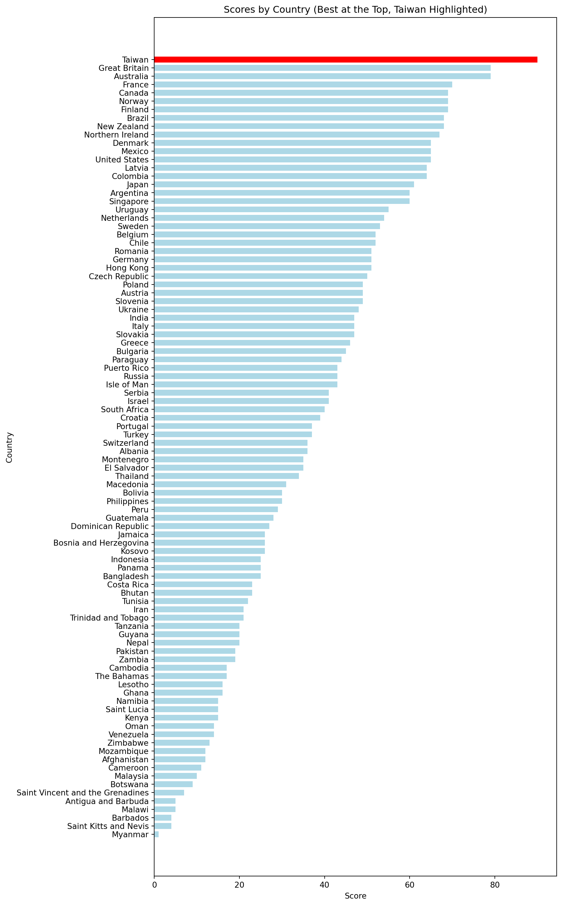
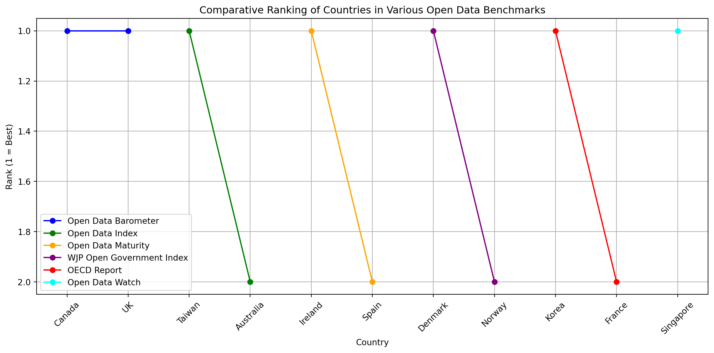
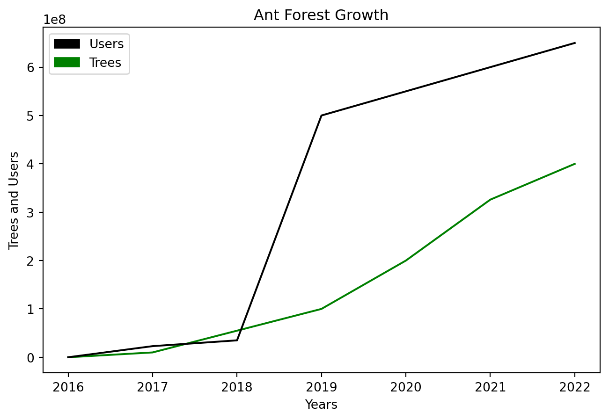

export const quartoRawHtml =
[`
<table>
<caption>The 9 qualities of <em>eco-designed products</em> based on the Ecodesign for Sustainable Products Regulation (ESPR) enacted as law in the EU as of July 2024 <span class="citation" data-cites="luttinFullOverviewEU2025 europeanparliamentEcodesignSustainableProducts2022">[@luttinFullOverviewEU2025; @europeanparliamentEcodesignSustainableProducts2022]</span>.</caption>
<colgroup>
<col style="width: 50%" />
<col style="width: 50%" />
</colgroup>
<thead>
<tr>
<th>Feature</th>
<th>Benefit</th>
</tr>
</thead>
<tbody>
<tr>
<td>Durable</td>
<td>Reduces the need to frequently replace the product</td>
</tr>
<tr>
<td>Reusable</td>
<td>Extends the product’s life-cycle; sell or share to the next user</td>
</tr>
<tr>
<td>Reparable</td>
<td>Extends the product’s life-cycle; fix instead of discarding</td>
</tr>
<tr>
<td>Upgradable</td>
<td>Extends the product’s life-cycle; improve performance without complete replacement.</td>
</tr>
<tr>
<td>Easy to Maintain</td>
<td>Reduce resources needed to keep the product functional</td>
</tr>
<tr>
<td>Easy to Refurbish</td>
<td>Support second-hand use and circular economy</td>
</tr>
<tr>
<td>Easy to Recycle</td>
<td>Support material recovery at end of the product’s life to reduce new resource extraction and pollution</td>
</tr>
<tr>
<td>Energy Efficient</td>
<td>Reduce product’s CO2 footprint and operating costs</td>
</tr>
<tr>
<td>Resource Efficient</td>
<td>Reduce product’s use of raw materials and energy during production and life-cycle</td>
</tr>
</tbody>
</table>
`,`
<table>
<caption>Food saving apps</caption>
<colgroup>
<col style="width: 36%" />
<col style="width: 63%" />
</colgroup>
<thead>
<tr>
<th>Name</th>
<th></th>
</tr>
</thead>
<tbody>
<tr>
<td>Karma</td>
<td></td>
</tr>
<tr>
<td>ResQ Club</td>
<td><span class="citation" data-cites="kristinakostapLEVITASONAUus2022">[@kristinakostapLEVITASONAUus2022]</span> ResQ Club in Finland and Estonia for reducing food waste by offering a 50% discount on left-over restaurant meals before they are thrown away.</td>
</tr>
<tr>
<td>Kuri</td>
<td><span class="citation" data-cites="hajejankampsKuriAppThat2022">@hajejankampsKuriAppThat2022</span> Less impact of food</td>
</tr>
<tr>
<td>Social media groups (no app)</td>
<td></td>
</tr>
</tbody>
</table>
`,`
<table>
<caption>Perspective on food systems in Sweden from <span class="citation" data-cites="ROOS2023107623">[@ROOS2023107623]</span>.</caption>
<colgroup>
<col style="width: 36%" />
<col style="width: 63%" />
</colgroup>
<thead>
<tr>
<th>Perspective</th>
<th>Content</th>
</tr>
</thead>
<tbody>
<tr>
<td><em>“The diagnostic perspective”</em></td>
<td>“<em>All hands on deck to fix the climate”</em></td>
</tr>
<tr>
<td><em>“The regenerative perspective”</em></td>
<td>“<em>Diversity, soil health and organic agriculture to the rescue”</em></td>
</tr>
<tr>
<td><em>“The fossil-free perspective”</em></td>
<td>“<em>Profitable Swedish companies to rid agriculture and the food chain of fossil fuel”</em></td>
</tr>
<tr>
<td><em>“The consumer-driven perspective”</em></td>
<td><em>“A wish-list of healthy, high-quality and climate-friendly foods”</em></td>
</tr>
<tr>
<td>“The hands-on perspective”</td>
<td>“Tangible solutions within the reach of consumers and the food industry”</td>
</tr>
</tbody>
</table>
`,`
<table style="width:100%;">
<caption>Blockchain supply chain companies as of summer 2023 include.</caption>
<colgroup>
<col style="width: 24%" />
<col style="width: 24%" />
<col style="width: 26%" />
<col style="width: 24%" />
</colgroup>
<thead>
<tr>
<th>Company</th>
<th>Link</th>
<th>Literature</th>
<th>Comments</th>
</tr>
</thead>
<tbody>
<tr>
<td>Ocean Protocol</td>
<td>oceanprotocol.com</td>
<td></td>
<td></td>
</tr>
<tr>
<td>Provenance</td>
<td>provenance.io</td>
<td></td>
<td></td>
</tr>
<tr>
<td>Ambrosius</td>
<td>ambrosus.io</td>
<td></td>
<td></td>
</tr>
<tr>
<td>Modum</td>
<td>modum.io</td>
<td></td>
<td></td>
</tr>
<tr>
<td>OriginTrail</td>
<td>origintrail.io</td>
<td></td>
<td></td>
</tr>
<tr>
<td>Everledger</td>
<td>everledger.io</td>
<td></td>
<td></td>
</tr>
<tr>
<td>VeChain</td>
<td>vechain.org</td>
<td></td>
<td></td>
</tr>
<tr>
<td>Wabi</td>
<td>wabi.io</td>
<td></td>
<td></td>
</tr>
<tr>
<td>FairFood</td>
<td>fairfood.org</td>
<td></td>
<td></td>
</tr>
<tr>
<td>Bext360</td>
<td>bext360.com</td>
<td></td>
<td></td>
</tr>
<tr>
<td>SUKU</td>
<td>suku.world</td>
<td><span class="citation" data-cites="millerCitizensReserveBuilding2019">@millerCitizensReserveBuilding2019</span> SUKU makes supply chains more transparent</td>
<td>Seems to have pivoted away from supply chains</td>
</tr>
</tbody>
</table>
`,`
<table>
<caption>Share of CO<sub>2</sub> of CO<sub>2</sub> emissions by type of transport globally <span class="citation" data-cites="statistaGlobalTransportCO22022">[@statistaGlobalTransportCO22022]</span>.</caption>
<thead>
<tr>
<th>Type of Transport</th>
<th>Percentage</th>
</tr>
</thead>
<tbody>
<tr>
<td>Passenger cars</td>
<td>39%</td>
</tr>
<tr>
<td><strong>Medium and heavy trucks</strong></td>
<td>23%</td>
</tr>
<tr>
<td><strong>Shipping</strong></td>
<td>11%</td>
</tr>
<tr>
<td><strong>Aviation</strong></td>
<td>9%</td>
</tr>
<tr>
<td>Buses and minibuses</td>
<td>7%</td>
</tr>
<tr>
<td>Light commercial vehicles</td>
<td>5%</td>
</tr>
<tr>
<td>Two/three-wheelers</td>
<td>3%</td>
</tr>
<tr>
<td>Rail</td>
<td>3%</td>
</tr>
</tbody>
</table>
`,`
<table style="width:100%;">
<colgroup>
<col style="width: 10%" />
<col style="width: 10%" />
<col style="width: 10%" />
<col style="width: 10%" />
<col style="width: 10%" />
<col style="width: 10%" />
<col style="width: 10%" />
<col style="width: 10%" />
<col style="width: 10%" />
<col style="width: 10%" />
</colgroup>
<thead>
<tr>
<th><strong>Superapp</strong></th>
<th>Origin</th>
<th>Markets</th>
<th><strong>Metric</strong></th>
<th>Payments (Wallet)</th>
<th>Savings</th>
<th>Investing</th>
<th><strong>Users</strong></th>
<th><strong>Date</strong></th>
<th><strong>Source</strong></th>
</tr>
</thead>
<tbody>
<tr>
<td>微信 <strong>/ WeChat (Tencent)</strong></td>
<td>China</td>
<td>China</td>
<td>Monthly Active Users (MAU) combined 微信 (China) &amp; WeChat (International)</td>
<td>YES ✅</td>
<td>YES ✅</td>
<td>YES ✅</td>
<td>1,4 billion</td>
<td>2024</td>
<td><span class="citation" data-cites="tecentTecentHoldings20242024">@tecentTecentHoldings20242024</span></td>
</tr>
<tr>
<td>支付寶 <strong>Alipay (Ant Group)</strong></td>
<td>China</td>
<td>China</td>
<td>Annual Active Users (AAU)</td>
<td>YES ✅</td>
<td>YES ✅</td>
<td>YES ✅</td>
<td>1.3 billion</td>
<td>2020</td>
<td><span class="citation" data-cites="geUpdateAlibabasAnt2020">@geUpdateAlibabasAnt2020</span></td>
</tr>
<tr>
<td>美團 <strong>Meituan</strong></td>
<td>China</td>
<td>China</td>
<td>Annual Transacting Users (ATU)</td>
<td>YES ✅</td>
<td>NO ❌</td>
<td>NO ❌</td>
<td>700 million</td>
<td>2024</td>
<td><span class="citation" data-cites="jingMeituan0369020242025">@jingMeituan0369020242025</span></td>
</tr>
<tr>
<td><strong>PhonePe</strong></td>
<td>India</td>
<td>India</td>
<td>Registered Users (Lifetime)</td>
<td>YES ✅</td>
<td>YES ✅</td>
<td>YES ✅</td>
<td>500 million</td>
<td>2023</td>
<td><span class="citation" data-cites="phonepePhonePeCrosses5002023">@phonepePhonePeCrosses5002023</span></td>
</tr>
<tr>
<td><strong>LINE</strong></td>
<td>Japan</td>
<td>Japan, Taiwan, Indonesia, Thailand</td>
<td>Monthly Active Users (MAU)</td>
<td>YES ✅</td>
<td>YES ✅</td>
<td>YES ✅</td>
<td>200 million</td>
<td>2023</td>
<td><span class="citation" data-cites="lycorporationLYCorporationTakes2023">@lycorporationLYCorporationTakes2023</span></td>
</tr>
<tr>
<td><strong>Tata Neu</strong></td>
<td>India</td>
<td>India</td>
<td>Members</td>
<td>YES ✅</td>
<td>YES ✅</td>
<td>NO ❌</td>
<td>27 million</td>
<td>2023</td>
<td><span class="citation" data-cites="shindeTataNeu202023">@shindeTataNeu202023</span></td>
</tr>
<tr>
<td><strong>Nubank</strong></td>
<td>Brazil</td>
<td>Brazil, Mexico</td>
<td>Customers</td>
<td>YES ✅</td>
<td>YES ✅</td>
<td>YES ✅</td>
<td>114 million</td>
<td>2024</td>
<td><span class="citation" data-cites="polloNuHoldingsLtd2025">@polloNuHoldingsLtd2025</span></td>
</tr>
<tr>
<td><strong>Zalo</strong></td>
<td>Vietnam</td>
<td>Vietnam</td>
<td>Monthly Active Users (MAU)</td>
<td>YES ✅</td>
<td>NO ❌</td>
<td>NO ❌</td>
<td>75 million</td>
<td>2023</td>
<td><span class="citation" data-cites="nguyenVietnamsFirstUnicorn2023">@nguyenVietnamsFirstUnicorn2023</span></td>
</tr>
<tr>
<td><strong>Paytm</strong></td>
<td>India</td>
<td>India</td>
<td>Monthly Transacting Users (MTU)</td>
<td>YES ✅</td>
<td>YES ✅</td>
<td>YES ✅</td>
<td>100 million</td>
<td>2023</td>
<td><span class="citation" data-cites="vermaPaytmQ3FY242024">@vermaPaytmQ3FY242024</span></td>
</tr>
<tr>
<td><strong>M-Pesa</strong></td>
<td>Kenya</td>
<td>Kenya, Tanzania, South Africa, Afghanistan, Lesotho, DRC, Ghana, Mozambique, Egypt, Ethiopia</td>
<td>Active Customers</td>
<td>YES ✅</td>
<td>YES ✅</td>
<td>NO ❌</td>
<td>34 million</td>
<td>2024</td>
<td><span class="citation" data-cites="safaricomSafaricomsMPESAHits2024">@safaricomSafaricomsMPESAHits2024</span></td>
</tr>
<tr>
<td><strong>Mercado Pago</strong></td>
<td>Argentina</td>
<td>Argentina, Uruguay, Mexico, Chile</td>
<td>Monthly Active Users (MAU)</td>
<td>YES ✅</td>
<td>YES ✅</td>
<td>YES ✅</td>
<td>61 million</td>
<td>2023</td>
<td><span class="citation" data-cites="mercadolibre2024ImpactReport2024">@mercadolibre2024ImpactReport2024</span></td>
</tr>
<tr>
<td><strong>PicPay</strong></td>
<td>Brazil</td>
<td>Brazil</td>
<td>Active Customers</td>
<td>YES ✅</td>
<td>YES ✅</td>
<td>YES ✅</td>
<td>35 million</td>
<td>2023</td>
<td><span class="citation" data-cites="oostBrazilianFinTechPicPay2024">@oostBrazilianFinTechPicPay2024</span></td>
</tr>
<tr>
<td><strong>Cash App (Block)</strong></td>
<td>USA</td>
<td>USA</td>
<td>Monthly Active Users (MAU)</td>
<td>YES ✅</td>
<td>YES ✅</td>
<td>YES ✅</td>
<td>56 million</td>
<td>2023</td>
<td><span class="citation" data-cites="kazaninsWhyCashApp2024">@kazaninsWhyCashApp2024</span></td>
</tr>
<tr>
<td><strong>KakaoTalk</strong></td>
<td>Korea</td>
<td>Korea</td>
<td>Monthly Active Users (MAU)</td>
<td>YES ✅</td>
<td>YES ✅</td>
<td>YES ✅</td>
<td>48 million</td>
<td>2024</td>
<td><span class="citation" data-cites="leeKakao2024Revenue2025">@leeKakao2024Revenue2025</span></td>
</tr>
<tr>
<td><strong>GoTo (Gojek/Tokopedia)</strong></td>
<td>Indonesia</td>
<td>Indonesia</td>
<td>Annual Transacting Users (ATU)</td>
<td>YES ✅</td>
<td>YES ✅</td>
<td>YES ✅</td>
<td>51 million</td>
<td>2023</td>
<td><span class="citation" data-cites="gotoTransformationProgres2023">@gotoTransformationProgres2023</span></td>
</tr>
<tr>
<td><strong>Revolut</strong></td>
<td>UK</td>
<td>UK / EU</td>
<td>Customers</td>
<td>YES ✅</td>
<td>YES ✅</td>
<td>YES ✅</td>
<td>50 million</td>
<td>2024</td>
<td><span class="citation" data-cites="revolutRevolutHits502024">@revolutRevolutHits502024</span></td>
</tr>
<tr>
<td><strong>Careem</strong></td>
<td>UAE (Aqcuired by US-based Uber and Etisalat but still keeps a separate brand)</td>
<td>United Arab Emirates, Saudi Arabia, Jordan, Iraq, Kuwait, Morocco Bahrain, Pakistan, Egypt, Morocco</td>
<td>Customers</td>
<td>YES ✅</td>
<td>NO ❌</td>
<td>NO ❌</td>
<td>70 million</td>
<td>2024</td>
<td><span class="citation" data-cites="careemCareems2024Wrapup2025">@careemCareems2024Wrapup2025</span></td>
</tr>
<tr>
<td><strong>Grab</strong></td>
<td>Singapore / Malaysia</td>
<td>SEA</td>
<td>Monthly Transacting Users (MTU)</td>
<td>YES ✅</td>
<td>YES ✅</td>
<td>NO ❌</td>
<td>41 million</td>
<td>2024</td>
<td><span class="citation" data-cites="grabholdingslimitedGrabReportsFourth2025">@grabholdingslimitedGrabReportsFourth2025</span></td>
</tr>
<tr>
<td><strong>Rappi</strong></td>
<td>Colombia</td>
<td>Argentina, Colombia, Brazil, Chile, Mexico</td>
<td>Users</td>
<td>YES ✅</td>
<td>YES ✅</td>
<td>NO ❌</td>
<td>30 million</td>
<td>2023</td>
<td><span class="citation" data-cites="phocuswrightSuperConnectedRappi2023">@phocuswrightSuperConnectedRappi2023</span>; <span class="citation" data-cites="brownColombiasFirstUnicorn2025">@brownColombiasFirstUnicorn2025</span>; <span class="citation" data-cites="layaSoftBankBackedAppRappi2024">@layaSoftBankBackedAppRappi2024</span></td>
</tr>
</tbody>
</table>
`,`
<table style="width:100%;">
<colgroup>
<col style="width: 10%" />
<col style="width: 10%" />
<col style="width: 10%" />
<col style="width: 10%" />
<col style="width: 10%" />
<col style="width: 10%" />
<col style="width: 10%" />
<col style="width: 10%" />
<col style="width: 10%" />
<col style="width: 10%" />
</colgroup>
<thead>
<tr>
<th><strong>Not-Quite-Superapp</strong></th>
<th>Origin</th>
<th>Markets</th>
<th><strong>Metric</strong></th>
<th>Payments (Wallet)</th>
<th>Savings</th>
<th>Investing</th>
<th><strong>Users</strong></th>
<th><strong>Date</strong></th>
<th><strong>Source</strong></th>
</tr>
</thead>
<tbody>
<tr>
<td>Uber</td>
<td>USA</td>
<td>Global</td>
<td>Users per month</td>
<td>NO ❌ (Only for ride-hailing)</td>
<td>NO ❌</td>
<td>NO ❌</td>
<td>171 million</td>
<td>2025</td>
<td><span class="citation" data-cites="uberUberAnnouncesResults2025">@uberUberAnnouncesResults2025</span></td>
</tr>
<tr>
<td>Bolt</td>
<td>Estonia</td>
<td>Global</td>
<td>Lifetime users</td>
<td>NO ❌ (Only for ride-hailing)</td>
<td>NO ❌</td>
<td>NO ❌</td>
<td>200 million</td>
<td>2025</td>
<td><span class="citation" data-cites="garciaBoltAcquiresDanish2025">@garciaBoltAcquiresDanish2025</span></td>
</tr>
</tbody>
</table>
`,`
<table>
<colgroup>
<col style="width: 26%" />
<col style="width: 33%" />
<col style="width: 40%" />
</colgroup>
<thead>
<tr>
<th>Platform Economy Enablers</th>
<th>Pros</th>
<th>Cons</th>
</tr>
</thead>
<tbody>
<tr>
<td>Network effects</td>
<td>The more people use a platform, the more valuable it becomes both for the company and the user.</td>
<td>Data is not portable or difficult to migrate. You can’t leave because you’ll lose the audience. There’s a lock-in effect.</td>
</tr>
<tr>
<td>Scalability</td>
<td></td>
<td></td>
</tr>
<tr>
<td>Data-driven Design</td>
<td></td>
<td></td>
</tr>
<tr>
<td>Behaviour Design</td>
<td></td>
<td></td>
</tr>
</tbody>
</table>
`,`
<table>
<caption>Examples of cities and countries that share data openly.</caption>
<colgroup>
<col style="width: 16%" />
<col style="width: 47%" />
<col style="width: 35%" />
</colgroup>
<thead>
<tr>
<th>Country</th>
<th>Project</th>
<th>Reference</th>
</tr>
</thead>
<tbody>
<tr>
<td>Sweden</td>
<td>Swedish open data portal</td>
<td><span class="citation" data-cites="SverigesDataportal">@SverigesDataportal</span></td>
</tr>
<tr>
<td>Malaysia</td>
<td>Malaysian open data portal</td>
<td>data.gov.my</td>
</tr>
<tr>
<td>Singapore</td>
<td>Singapore ESG open data platform</td>
<td><span class="citation" data-cites="monetaryauthorityofsingaporeMASLaunchesDigital2023">[@monetaryauthorityofsingaporeMASLaunchesDigital2023]</span></td>
</tr>
</tbody>
</table>
`,`
<table>
<caption>Examples of CO<sub>2</sub> visibility in Google’s products.</caption>
<colgroup>
<col style="width: 36%" />
<col style="width: 26%" />
<col style="width: 36%" />
</colgroup>
<thead>
<tr>
<th>Feature</th>
<th>Product</th>
<th>Nudge</th>
</tr>
</thead>
<tbody>
<tr>
<td>Google Maps AI suggests more eco-friendly driving routes <span class="citation" data-cites="mohitmoondraNavigateMoreSustainably">@mohitmoondraNavigateMoreSustainably</span></td>
<td>Google Maps</td>
<td>Show routes with lower CO<sub>2</sub> emissions; reduce stopping by using data from traffic lights.</td>
</tr>
<tr>
<td>Google Flights suggests flights with lower CO<sub>2</sub> emissions</td>
<td>Google Flights</td>
<td>Show flights with lower CO<sub>2</sub> emissions</td>
</tr>
<tr>
<td>Wizzair Check carbon impact <span class="citation" data-cites="OffsetYourFlight">@OffsetYourFlight</span></td>
<td>WizzAir</td>
<td>Offset on Checkout</td>
</tr>
</tbody>
</table>
`,`
<table>
<caption>Types of nudge documented by <span class="citation" data-cites="WEE2021100364">[@WEE2021100364]</span></caption>
<colgroup>
<col style="width: 36%" />
<col style="width: 63%" />
</colgroup>
<thead>
<tr>
<th>Name</th>
<th>Technique</th>
</tr>
</thead>
<tbody>
<tr>
<td>Prompting</td>
<td>Create cues and reminders to perform a certain behavior</td>
</tr>
<tr>
<td>Sizing</td>
<td>Decrease or increase the size of items or portions</td>
</tr>
<tr>
<td>Proximity</td>
<td>Change the physical (or temporal) distance of options</td>
</tr>
<tr>
<td>Presentation</td>
<td>Change the way items are displayed</td>
</tr>
<tr>
<td>Priming</td>
<td>Expose users to certain stimuli before decision-making</td>
</tr>
<tr>
<td>Labelling</td>
<td>Provide labels to influence choice (for example CO<sub>2</sub> footprint labels)</td>
</tr>
<tr>
<td>Functional Design</td>
<td>Design the environment and choice architecture so the desired behavior is more convenient</td>
</tr>
</tbody>
</table>
`,`
<table>
<caption>Table of Ant Forest assisted tree planting; data compiled from <span class="citation" data-cites="ZhuZiXun2017 yangSwitchingGreenLifestyles2018 unfcccAlipayAntForest2019 wangFuelingProEnvironmentalBehaviors2020 600MillionPeople2021 zhangPromoteProenvironmentalBehaviour2022 wangMotivationsInfluencingAlipay2022 zhouUnpackingEffectGamified2023 caoImpactArtificialIntelligence2023 MaYiJiTuanESGBaoGao MaYiJiTuanGongBuZhongShu8Nian">[@ZhuZiXun2017; @yangSwitchingGreenLifestyles2018; @unfcccAlipayAntForest2019; @wangFuelingProEnvironmentalBehaviors2020; @600MillionPeople2021; @zhangPromoteProenvironmentalBehaviour2022; @wangMotivationsInfluencingAlipay2022; @zhouUnpackingEffectGamified2023; @caoImpactArtificialIntelligence2023; @MaYiJiTuanESGBaoGao; @MaYiJiTuanGongBuZhongShu8Nian]</span>.</caption>
<colgroup>
<col style="width: 8%" />
<col style="width: 18%" />
<col style="width: 18%" />
<col style="width: 54%" />
</colgroup>
<thead>
<tr>
<th>Year</th>
<th>Users</th>
<th>Trees</th>
<th>Area</th>
</tr>
</thead>
<tbody>
<tr>
<td>2016</td>
<td>N/A</td>
<td>N/A</td>
<td>N/A</td>
</tr>
<tr>
<td>2017</td>
<td>230 million</td>
<td>10 million</td>
<td>N/A</td>
</tr>
<tr>
<td>2018</td>
<td>350 million</td>
<td>55 million</td>
<td>6500 acres??</td>
</tr>
<tr>
<td>2019</td>
<td>500 million</td>
<td>100 million</td>
<td>112,000 hectares / 66, 000 hectares?</td>
</tr>
<tr>
<td>2020</td>
<td>550 million</td>
<td>200 million</td>
<td>2,7 million acres?</td>
</tr>
<tr>
<td>2021</td>
<td>600 million</td>
<td>326 million</td>
<td>N/A</td>
</tr>
<tr>
<td>2022</td>
<td>650 million</td>
<td>400 million</td>
<td>2 million hectares</td>
</tr>
<tr>
<td>2023</td>
<td>690 million</td>
<td>475 million</td>
<td>N/A</td>
</tr>
<tr>
<td>2024</td>
<td>N/A</td>
<td>548 million</td>
<td>3.87 million hectares</td>
</tr>
<tr>
<td>2025</td>
<td>N/A</td>
<td>N/A</td>
<td>N/A</td>
</tr>
</tbody>
</table>
`,`
<table>
<caption>Modes of interaction</caption>
<thead>
<tr>
<th>Mode of Interaction</th>
<th></th>
</tr>
</thead>
<tbody>
<tr>
<td>Writing</td>
<td></td>
</tr>
<tr>
<td>Speaking</td>
<td></td>
</tr>
<tr>
<td>Touching</td>
<td></td>
</tr>
<tr>
<td>Moving</td>
<td></td>
</tr>
<tr>
<td>Seeing</td>
<td></td>
</tr>
</tbody>
</table>
`,`
<table>
<caption>A selection of personal sustainability apps. See <em>greenfilter.app</em> for an updated database.</caption>
<colgroup>
<col style="width: 36%" />
<col style="width: 63%" />
</colgroup>
<thead>
<tr>
<th>App</th>
<th>Description</th>
</tr>
</thead>
<tbody>
<tr>
<td>Commons (Formerly Joro)</td>
<td>Finacial Sustainability Tracking + Sustainable Actions</td>
</tr>
<tr>
<td>Klima</td>
<td>Offset Subscription</td>
</tr>
<tr>
<td>Wren</td>
<td>Offset Subscription</td>
</tr>
<tr>
<td>JouleBug</td>
<td>CO2 tracking</td>
</tr>
<tr>
<td>eevie</td>
<td></td>
</tr>
<tr>
<td>Aerial</td>
<td></td>
</tr>
<tr>
<td>EcoCRED</td>
<td></td>
</tr>
<tr>
<td>Carbn</td>
<td></td>
</tr>
<tr>
<td>LiveGreen</td>
<td></td>
</tr>
<tr>
<td>Earth Hero</td>
<td></td>
</tr>
<tr>
<td></td>
<td></td>
</tr>
</tbody>
</table>
`,`
<table>
<caption>Companies with Carbon Labels <span class="citation" data-cites="briankatemanCarbonLabelsAre2020">[@briankatemanCarbonLabelsAre2020]</span></caption>
<thead>
<tr>
<th>Company</th>
<th>Country</th>
</tr>
</thead>
<tbody>
<tr>
<td>Just Salad</td>
<td>U.S.A.</td>
</tr>
<tr>
<td>Quorn</td>
<td>U.K.</td>
</tr>
<tr>
<td>Oatly</td>
<td>U.K.</td>
</tr>
<tr>
<td>IKEA</td>
<td>Sweden</td>
</tr>
</tbody>
</table>
`,`
<table>
<caption>Organization to Certify Carbon Labels <span class="citation" data-cites="climatepartnerLabellingCarbonFootprint2020">[@climatepartnerLabellingCarbonFootprint2020]</span>.</caption>
<thead>
<tr>
<th>Organization</th>
<th>Country</th>
<th>Number of Product Certified</th>
</tr>
</thead>
<tbody>
<tr>
<td>ClimatePartner</td>
<td></td>
<td></td>
</tr>
<tr>
<td>Carbon Calories</td>
<td></td>
<td></td>
</tr>
<tr>
<td>Carbon Trust</td>
<td></td>
<td>27000</td>
</tr>
</tbody>
</table>
`,`
<table>
<caption>Digital Product Passport goals <span class="citation" data-cites="strettonDigitalProductPassports2022">@strettonDigitalProductPassports2022</span></caption>
<colgroup>
<col style="width: 63%" />
<col style="width: 36%" />
</colgroup>
<thead>
<tr>
<th>Goal</th>
<th>Description</th>
</tr>
</thead>
<tbody>
<tr>
<td><strong>Sustainable Product Production</strong></td>
<td></td>
</tr>
<tr>
<td><strong>Businesses to create value through Circular Business Models</strong></td>
<td></td>
</tr>
<tr>
<td><strong>Consumers to make more informed purchasing decisions</strong></td>
<td></td>
</tr>
<tr>
<td><strong>Verify compliance with legal obligations</strong></td>
<td></td>
</tr>
</tbody>
</table>
`];

````mdx-code-block
import Figure from '/src/components/Figure'
import FlightEmissions from '../images/design/flight-emissions.png'
import Strava from '../images/design/strava.png'
import ResQClub from '../images/design/resq-club.png'
import EUPolicy from "/research/images/sustainability/eu-policy-context.png";
import AbstractDesign from '../images/design/abstract-design.png'
````

# Design

````mdx-code-block
<Figure caption="Visual abstract for the design chapter" src={AbstractDesign} />
````

-   Design makes complexity comprehensible. Norman (2016)
-   like the Helsinki chapel. there’s either or a priest or a social
    worker present. it’s the perfect public service. Limit the barrier
    of entry for people to discover. Elegant.

## Eco-Design: Design as Political Action at Scale

Politics matters in sustainability. In Brazil, deforestation fell 60% in
1 year, based on remote satellite reconnaissance, after the election of
a more pro-environment leadership (Watts, 2023).

We have an opportunity to re-imagine how every product can be an
eco-product and how they circulate in our circular economy.

The monumental task of removing several gigatons of CO<sub>2e</sub> from
the atmosphere requires massive policy shifts and collaboration across
countries and industries (Mackler et al., 2021).

Designing the right legislative measures can be hugely impactful. In the
context of the European Union, *eco-design* has gained political support
from European Commission as part of the EU’s *“Green Deal”* legislative
strategy, aiming to transform European economies into sustainability
leaders (Commission et al., 2014). Consumer products’ overall life-cycle
environmental impact is defined in the design process by the materials
and energy resources needed and the post-consumer potential for reuse or
recycling. The Ecodesign for Sustainable Products Regulation (ESPR)
entered into force in July 2024 (European Commission, 2024) following
the (European Parliament, 2022) proposal whereby the European Commission
established a general framework for *eco-design: “requirements for
sustainable products, repealing rules \[referring to the previous
Eco-Design Directive (2009/125/EC)\] currently in force which
concentrate on energy-related products only,”* setting up a level
playing-field for the organizations operating on the EU single market.
Virginijus Sinkevičius, the EU Commissioner for the Environment, Oceans
and Fisheries, is quoted as describing eco-design as design that
*“respects the boundaries of our planet”* (European Commission, 2022c).

Europe has been of a path of transformation from 2023 to 2030.

````mdx-code-block
<Figure
  caption="EU Policy Context Timeline'"
  src={EUPolicy}
/>
````

The EU Commission has been releasing strategic foresight reports since
2020 (European Commission, 2023).

Timeline of the Policy Context:

-   In 2019 by the von der Leyen commission adopted the European Union
    (EU) Green Deal strategy.

-   In 2021 the Commision proposed a goal of reducing CO2e emissions by
    55% by 2030 under the *Fit for 55* policy package consisting of a
    wide range of economic measures.

-   In November 2022, the proposal was adopted by the EU Council and EU
    Parliament with an updated goal of 57% of CO2e reductions compared
    to 1990. This proposal is set to become a binding law for all EU
    member countries (European Commission (2019b); European Commission
    (2019a); *EU Reaches Agreement on National Emission Reductions*
    (2022); European Council (2022)).

-   In March 2022, the EU Circular Economy Action Plan was adopted,
    looking to make sustainable products *the norm* in EU and
    *empowering consumers* as described in European Commission (2022a).
    Each product covered by the policy is required to have a ***Digital
    Product Passport*** which enables improved processing within the
    supply chain and includes detailed information to empower consumers
    to understand the environmental footprint of their purchases. It’s
    safe to say the large majority of products available today do not
    meet these criteria.

-   European Commission (2022b) Ecodesign for sustainable products. The
    EU “Green Deal” legislative strategy is comprehensive. Eco-Design is
    a Key EU Sustainable Policy Design Tool.


In the European Union (EU), a wide range of legislative proposals,
targets, organizations, and goals have exists across diverse countries.
It’s not that the EU didn’t have an overarching environmental policy
before; rather it was more vague and filled with loop-holes. Upcoming
laws aim to harmonize approaches to sustainability and raise standards
for all members states, in turn influencing producers who wish to sell
in the EU common market. National governments need to adapt EU
legislation to local contexts. For example Estonian government adopted
the Estonian Green Deal Action Plan (Eesti Rohepöörde Tegevusplaan)
(Eesti Vabariigi Valitsus, 2022). From the legislative perspective, NFRD
(Non-Financial Reporting Directive) is replaced by CSRD (Corporate
Sustainability Reporting Directive) and ESRS reporting is the standard
to meet CSRD requirements.

Director of the French environmental NGO Pôle Eco-conception, eco-design
is “\[l\]ocated at the interface between consumption and production
patterns, eco-design helps to structure the market for products and
services using a life cycle approach and tangible criteria” (Chouai &
Mayer, 2024).

The EU is also concerned with supply-chain deforestation. Sustainable
Products and EUDR (European Union Deforestation Regulation) work
hand-in-hand as part of EU’s legislative efforts to promote
sustainability. EUDR applies to all products placed on the market from
December 2024 and June 2025 for small businesses.

The proposal for a Nature Restoration Law by the European Commission
requiring member countries to restore 20% of EU’s degraded ecosystems by
2030 and full restoration by 2050 has not yet passed (as of writing)
(*Scientists Urge European Parliament to Vote for Nature Restoration
Law*, 2023) and is facing a backlash (David Pinto, 2023).

The EU has a *taxonomy of environmentally sustainable economic
activities* published by the Technical Expert Group (TEG) on sustainable
finance, as detailed in the report by (*EU Taxonomy for Sustainable
Activities*, n.d.).

Europe is transforming into a hotbed of sustainability. One of the EU
goals is reducing careless consumption. Tacking our consumption habits
can help support eco-designed products. It’s up to legislators to
provide sustainable products on our marketplace… but until this happens,
we can use the green filter.

### Beyond Return, Repair, Reuse

-   There’s a growing number of companies providing re-use of existing
    items.

-   *SmartSwap* (n.d.) For example, Swap furniture in Estonia

-   universal recycling symbol creator Gary Anderson created the symbol
    when he was an architecture student in California, USC (uni southern
    california) in 1970 at the age of 23, inspired by Silent Spring,
    Earth Day, and Bauhaus, Buccky Fuller, Spaceship Earth, printing
    presses, and the Woolmark logo for wool industry certification, and
    the Mobius strip, for a competition hold by a packaging firm that
    was making paper containers for packaging Swap Society (2023)

-   The power of defaults. Make the sustainable option the default
    Gigerenzer (2008) “simple heuristics built from basic rules; how
    heuristics are selected and structured in social and physical
    environments; concept of ecological rationality to identify the
    environmental conditions under which particular heuristics succeed
    or fail”

-   standardising reuse across the globe, a body to create a reuse
    standard is holding a competition to create e reuse symbol

<div dangerouslySetInnerHTML={{ __html: quartoRawHtml[0] }} />

### Legislative Efforts Around the World

Europe is not the only region undertaking legislative efforts to promote
sustainability. In the US, the *Inflation Reduction Act* provided
funding to development of de-carbonizing technologies and includes plans
to combat air pollution, reduce green house gases and address
environmental injustices (Rajagopalan & Landrigan, 2023).

Many other jurisdictions also have laws that aim to reduce the
environmental impact of products throughout their life cycles.

For instance Australia has a Product Stewardship (PS) scheme, which also
includes an investment fund targeted at increasing the recycling rates
of specific products (Australian Government, 2024). Australia, Japan,
and Taiwan all have Sustainable Procurement schemes prioritizing greener
products in public purchases \[ADD CITATION\].

### Eco-Modulation: Incentive Design for Extended Producer Responsibility and Product Stewardship

Eco-modulation means harder to recycle items are more expensive for the
producer. Recycling fees take into account eco-design: an item from a
single material is easier (cheaper) to recycle than product from
composite materials.

Eco-modulation makes the hidden cost of hard-to-recycle formats directly
visible on the invoice.

While Taiwan doesn’t yet have a specific eco-design law, there are
various pieces of legislation promoting circular economy \[ADD
CITATION\]. Already in 1988 Taiwan implemented an Extended Producer
Responsibility (EPR) scheme, followed by a recycling system (initially
focused on electronic items) in 1998 (Chong et al., 2009). Eco-design
initiatives in Taiwan started at least as early as 1994, when Taiwanese
companies and universities noticed international sustainability trends
and began to implement their own sustainable design initiatives (Jahau
Lewis Chen et al., 2005).

Deposit Return Schemes (DRS)

In California, part of the EPR regulation is a large pool of funding for
cleaning up historic pollution resulting from Moolman (2024)

The key to comparing Product Stewardship, Extended Producer
Responsibility (EPR), and Eco-Design is the scope, as illustrated in the
chart below. While Product Stewardship (PS) and Extended Producer
Responsibility (EPR) deal mostly with the end of the product life-cycle
(they are *reactive*), including their disposal and recycling (EPR going
a step further than PS by shifting the responsibility to the producer),
eco-design moves sustainability up the design chain (lbeing
*pro-active*), setting standards for making better products - in
essence, attempting to *design-out* the waste.


Extended Producer Responsibility Enables Companies to be Resposible.

Popular blogs such as (Kohli, 2019) and (Lose, 2023) offer many
suggestions how designers can help people become more sustainable in
their daily lives yet focusing on the end-user neglects the producers’
responsibility (termed as Extended Producer Responsibility or ERP) in
waste management studies.

Extended Producer Responsibility (EPR) is a policy tool first proposed
by Thomas Lindhqvist in Sweden in 1990 \[ADD CITATION\], aimed to
encourage producers take responsibility for the entire life-cycle of
their products, thus leading to more eco-friendly products. Nonetheless,
EPR schemes do not guarantee circularity and may instead be designed
around fees to finance waste management in linear economy models
(Christiansen et al., 2021). The French EPR scheme was upgraded in 2020
to become more circular (Jacques Vernier, 2021). In July 2024, Latvia
was the 4th EU country to join an textile-EPR scheme (“New EPR
Requirements for Textiles in Latvia from July 2024 On,” 2024).

In any case, strong consumer legislation (such as EPR) has a direct
influence on producers’ actions. For example, in HKTDC Research (2022),
the Hong Kong Trade Development Council notified textile producers in
July 2022 reminding factories to produce to French standards in order to
be able enter the EU market. Peng et al. (2023) finds that the *Carbon
Disclosure Project* has been a crucial tool to empower ERP in Chinese
auto-producers.

-   The success of EPR can vary per type of product. For car tires, the
    EPR scheme in the Netherlands claims a 100% recovery rate
    Campbell-Johnston et al. (2020).

One type of legislation that works?

-   (Steenmans & Ulfbeck, 2023) Argues for the need to engage companies
    through legislation and shift from waste-centered laws to product
    design regulations.

-   In Europe, there’s large variance between member states when in
    comes to textile recycling: while Estonia and France are the only EU
    countries where separate collection of textiles is required by law,
    in Estonia 100% of the textiles were burned in an incinerator in
    2018 while in France textiles are covered by an Extended Producer
    Responsibility (EPR) scheme leading to higher recovery rates (Ibid).

-   Greyparrot AI to increase recycling rates (Natasha Lomas, 2024).

Bring back your bottle and cup after use.

-   Ruiz-Pastor & Mesa (2023) proposes a **product repairability index
    (PRI)**
-   Formentini & Ramanujan (2023)
-   Recycling (Lenovo, 08-29-22) “rethinking product design and
    inspiring consumers to expect more from their devices”
-   Zeynep Falay von Flittner (n.d.)

Packaging is a rapidly growing industry, expanding on the back of online
shopping, which generates large amounts of waste materials, which if not
reused or recycled, easily becomes garbage. Over 161M tonnes of plastic
packaging is produced every year (Bradley & Corsini, 2023). Already more
than a decade ago, (“Detail-Rich Sustainable Packaging Product Database
Is an Industry First,” 2010) proposed a database of green packaging to
compare hundreds of sustainable packaging materials and guide designers
through environmental, performance, and cost trade-offs in one unified
tool, in order to help producers choose better packaging - yet the
problem is far from solved. More recently, (Bradley & Corsini, 2023)
developed an analytical framework of key sustainability factors, from an
overview of 107 studies on reusable packaging, finding customer
acceptance, high return rates, supply-chain shortening, and system
standardisation, as the key factors critical to unlocking reusable
packaging solutions at scale. A survey by PMMI, the Association for
Packaging and Processing Technologies, among industry professional,
found legacy equipment, higher material costs, and supply consistency as
the top barriers to sustainable packaging; in turn, vital enablers were
clear vendor guidance, proven material and quipment solutions, and
customer demand (“Challenges and Opportunities in Sustainable Packaging
Today,” 2022). In response to legacy equipment issues, (“Sulapac –
Replacing Plastic,” n.d.) a large producer of packaging, has proposed a
wood-based, microplastic-free composites to serve as drop-in
replacements for plastics; a material even compatible with existing
molding, extrusion, and thermoforming production lines, while slashing
cradle-to-gate CO₂ emissions and preventing microplastic pollution.

In food packaging specifically, (Ada et al., 2023) identified distinct
challenges from consumer acceptance to material-supply mismatches,
collection logistics, and regulatory gaps, underscoring the multifaceted
barriers to circular food packaging. Over 85% of companies in the
“protein industry”: meat, poultry, seafood, and alternative proteins
have some type of sustainability inititive (“Protein Brands and
Consumers Alike Focus on Sustainability,” 2022). Yet, having
sustainability programs does not make a company sustainable, case in
point being Coca Cola in the beverage industry. (Lerner, 2019) describes
Coca Cola’s plastic pollution problem, based on leaked audio, how
Coca-Cola was exposed for lobbying against container-deposit laws,
aiming to misrepresented recycling as a complete solution; strategies
that stalled effective legislation and maintained a “green” façade
despite obstructing real sustainability progress.

ESG ratings have faced criticism for lack of standards and failing to
account for the comprehensive impact a company is having. (Foley et al.,
2024) notes how Coca Cola fails to account the supply chain water usage
when reporting becoming “water neutral” and calls on companies to
release more detailed information; major ESG ratings omit 90% of the
company’s water footprint.

### Scenario-Building: Avoiding the Worst Future

Scenario-building is a key tool for sustainability. Because
sustainability is so complex, sustainable design cannot always predict
certain outcomes but rather can use scenarios to prepare for several
possibilities. In sustainability there are rarely good choices. Rather
it’s a question of avoiding the worst choices. *Life Cycle Assessment*
and *Environmental Impact Analysis* are needed to provide eco-design
scenarios (de Otazu et al., 2022).

Across several case studies, (Fabris & Luburić, 2022) discusses
vulnerable sectors from agriculture to transport, under threat from
extreme weather events, such as floods, heatwaves, droughts, and storms
impact human health: societal development and economic growth should be
realistic on planning for weather-related impacts.

In the world of software production, user experience and iteration have
been the mainstay for a over a decade (Google Design, 2019)

### Design for Quality of Life

While traditional economic thinking is based on a conflict between
nature and development, some new models find there is potential for
synergy between economic, social, political, cultural, and environmental
metrics. (Kaklauskas et al., 2023) models multi-criteria analysis of 169
countries and 238 cities, finding 71% average correlation between
Climate Change and Country Success (C3S) and Quality of Life (C3QL)
indicators. In a similar vein, (Rieger et al., 2023) develops an
integrated science of wellbeing, linking humans’ psychological,
biological, societal and environmental domains to guide research and
public policy, based on interactions between domain experts.

Wellbeing Economy Governments is an example of country-level
collaboration in sharing expertise on sustainable development, looking
to bring post growth strategies and policy frameworks to the mainstream.
The concept of a wellbeing economy focuses on human and ecological
wellbeing rather than material growth since 2018 and includes Finland,
Iceland, New Zealand, Scotland, Wales, and Canada as founding members of
the network (Fioramonti et al., 2022).

For example, there’s ample evidence from several countries suggesting
moving to renewal energy brings environmental benefits. In Bangladesh,
(Amin et al., 2022) suggests *“removing fossil fuel subsidies and
intra-sectoral electricity price distortions coupled with carbon taxes
provides the highest benefits”* for both the economy and the
environment. In other words, green energy was a win-win solution, for
both the evironmental health and financial wealth.

I was torn whether to place *politics* under *sustainability* or
*design*, and decided for the latter - as sustainability is mostly
*descriptive*, using science to measure and present the real situation,
while design is *prescriptive*: codifying decisions about how do we
live - in products and services. Design *is* political.

-   Pater (2021)
-   10 countries use almost 100% renewable energy

Sustainbility Policy context is Shifting Around the World

-   Luo et al. (2022) suggests using reinforcement learning to reduce
    energy use in cooling systems.

-   Montreal protocol near-eradication of chlorofluorocarbons (CfCs) and
    the ozone holes became whole again.

***Mitigating*** and ***Adapting to*** **Climate Change**

***Adapting*** **to Climate Change**

Many companies are developing technologies for mitigation.

**Taxes**

-   There have been proposal of a “meat tax”.

**Sustainable Development Goals (SDGs)**

(Popkova et al., 2022) argues that SDGs need to discussed in their
totality and uses factor analysis to link SDGs to institutions and
digital technologies; findings include SDG 3 (Good Health and
Well-Being) and SDG 17 (Partnerships for the Goals) progress through
institutions in developed countries and are most impacted by digital
technologies and digital knowledge index, meanwhile SDG 16 (Peace,
Justice and Strong Institutions) makes the most headway in developing
countries, which are starting from a lower base. Likewise, the German
Institute of Development and Sustainability (IDOS) has built a tool to
connect SDGs and their 169 targets to NDCs (Nationally Determined
Contributions), looking for synergies for effective climate action plans
and sustainable development strategies, visualizing a clear skew which
SDGs receive the most climate‐related commitments - SDG 2 (Zero Hunger),
SDG 6 (Clean Water and Sanitation), SDG 7 (Affordable and Clean Energy);
meanwhile SDG 14 (Life Below Water), and the SDG 3 social goals
discussed above, SDG 4 (Quality Education) and SDG 5 (Gender Equality),
are the least adressed to climate plans (Dzebo et al., 2023).

**Kunming-Montreal Global Biodiversity Framework**

Eco-Design is about improving processes and optimizing resources. While
the goal of reducing harm is shared, the specifics will depend on the
industry. (Van Doorsselaer, 2022) Defines ecodesign as “design for X” in
a circular economy, thinking through the life cycle of a product, tools,
materials, production, use, and end-of-life phases.

In wine-making, (Manzardo et al., 2021) presents an Italian vinery case
study, where a redesigned Merlot red wine procedure reduced in
environmental impacts from fuel and pesticide use in vineyards; the
8-step procedure included calculating the product’s environmental
footprint and following the ISO 14006 standard, titled *“Environmental
management systems — Guidelines for incorporating ecodesign”*. Finding
uses for by-products, can improve sustainability even more. (Iñarra et
al., 2022) designed a circular scheme for brewery left-overs, producing
feed ingredients for aquaculture; in a further step, using life-cycle
assessment (LCA) and optimising logistics, reduced the aquafeed’s
environmental footprint also by 6%.

In architecture and the built environment, (**MUNARO202256?**) conducted
a comprehensive reviews of ecodesign 288 articles, identifying *Design
for Adaptability* and *Disassembly* as the most inclusive strategies,
coining a new term DfAD; a framework linking DfAD with lifecycle
assessment tools is a promising are for research to support sustainable
construction.

In pharmaceuticals, (Bassani et al., 2022) proposes an approach to
eco-design using life-cycle assessment: optimizing packaging types,
alternative materials, transport, and weight reduction. A follow-up
study from the same group in 2023 extended the eco-design to a full
cradle-to-grave assessment and evaluated end-of-life alternatives
(Bassani et al., 2024).

In the printing industry, (Miyoshi et al., 2022) takes the example of
ink toner bottles and applies Life Cycle Simulation to show in a case
study how standardized compatibility between older and newer systems can
save resources and results in sustainability savings, highlighting how
remanufacturing is an important strategy in circularity for reducing CO₂
emissions and life cycle costs.

While these examples underline the industry-specifity of eco-design,
some authors attempt to come up with mores holistics approaches. For
instance (Ruiz-Pastor et al., 2022) developed “CN_Con”, a metric for
conceptual design, trying to measure circularity and novelty in
conjuction, by analysing product functions, durability, material
origins, and end-of-life, while at the same time supporting creative and
circular design solutions in early stages.

On an international level, looking at companies operating on the
European Single Market, (Arranz et al., 2022) conducted a large-scale
study using machine learning on firm survey data from 870 organisations
across diverse economic sectors, aqcuired from the 2015 EU Public
Consultation on the Circular Economy conducted by European Commission,
comparing coercive pressures (regulations, subsidies, grants), normative
pressures (industry standards, professional networks), and mimetic
pressures (competitive imitation), finding normative and mimetic
pressure only enhance sustainability, if coercive pressure already
exists - i.e. regulations are a key point of leverage. In summary,
enacting laws which support sustainability can shift complex systems
with many parties towards a circular economy, and be enhanced by
additional voluntary forces. However, a comparative analysis of OECD
green growth indicators for the periods 2004–2005 and 2019 across EU
member states found that green transformation do not correlate directly
with development level - instead each country’s unique socio-economic
context plays a role: governance quality and income distribution shape
the effectiveness of regulatory frameworks, suggesting that coercive
policies must be tailored to national circumstances in order to
reinforce circular-economy adoption at scale(Cheba et al., 2022).

## Thinking in Systems to Re-Design Industries

Here I will use the lens of *sustainability* - another complex term - to
look at how design can contribute to eco-friendly products. I advocate
looking at design methods as a toolbox, where I can pick the tool
suitable for the problem set in front of me. Here I look at a small
number of design practices I find relevant to designing a sustainability
app for college students that may improve on traditional design methods.
While AI allows us to look at a larger number of design scenarios thank
previously feasible, there are many approaches looking for ways to
design for sustainability. Designing for Sustainability is fundamentally
a hopeful act imbibed with the dream a healthier world is possible -
because health and sustainability are intrinsically connected.

*Eco-Design*, *Circular Design*, *Design for Circularity,
Cradle-to-Cradle Design*, *Green Design*, *Regenerative Design*,
*Climate-Responsive Design*, *Life-Centered Design, Design for Human
Rights, Multispecies Design, Designing for Health* - designing for
sustainability has been called with many names in diverse contexts of
use, using a diversity of approaches, with subtle differences of
emphasis and nuance, with same general goal of being more sustainable.
While the European ESPR legislation chose *Eco-Design* as the
overarching title, researchers and practitioners discuss all of the
above on a frequent basis. (Ceschin & Gaziulusoy, 2016) gives a
comprehensive overview of the main themes of sustainable design and the
main contributions and limitations in the well–researched *“Evolution of
design for sustainability: From product design to design for system
innovations and transitions”*.

In most cases, designing for sustainability makes use of *systems
thinking*, underlining the importance of looking at the entire
life-cycle of a product or service. (Rossi et al., 2022) shows how
introducing sustainability early in the design process and providing
scenarios where sustainability is a metric, it’s possible to achieve
more eco-friendly designs. Yet, calculating what’s sustainable is hugely
complex because decisions may have unforeseen ramifications. To take a
single example (Nuez et al., 2022) shows how electric vehicles may
increase CO<sub>2</sub> emissions in some areas, such as Canary Islands,
where electricity production is polluting. In sum, sustainable design
encompasses all human activities, making this pursuit an over-arching
challenge across all industries and all human activities with the
complex interdependence contained within these interactions.

(Engkvist, 2024) calls for *Design Sociology*, design should take
account the product’s effect on society, giving the example of highly
individualized understanding of individualized psychology and dopamine
cycles for creating social media, while disregarding the societal
effects, such as spread of misinformation. Lack of sustainability in the
design process is a *bug* in the design approach.

*Service Design*, (Ceschin & Gaziulusoy, 2016) shows how design for
sustainability has expanded from a product focus to systems-thinking
focus placing the product inside a societal context of use. For example
(*Cargo Bike FREITAG*, n.d.), recycled clothing maker FREITAG offers
sustainability-focused services such as cargo bikes so you can transport
your purchases and a network for *shopping without payment* = swapping
your items with other members, as well as repairs of their products.
Loaning terminology from *service design*, the user journey within an
app needs to consider each touchpoint on the way to a state of success.


As this research is *practice-oriented* (i.e., my goal here is to find
design approaches that could influence my prototype), I will focus on
some fields of design which I hope relevant, fruitful, or contextual to
my project.

I will start with *Human-Centered Design*, the grandfather of design
with attitude. There’s even an ISO standard for human-centered design,
with the designated code ISO9241-210, revised as ISO 9241-210:2019
titled *“Ergonomics of human-system interaction”* and up for revision
soon (ISO standards are reviewed every 5 years). Some of the key
takeaways include “Understanding and specifying the context of use”,
“Involving users throughout design and development”, “Specifying user
requirements”, “Evaluating designs”, “Multi-disciplinary Collaboration”,
“Iterative process” and “Continual Improvement”, and finally - usability
is not enough, the design should provide a user experience (UX) for
human “emotional responses and satisfaction” (ISO, 2019).

While *Human-Centered Design* focuses exactly on what it says - humans -
*Life-Centered Design* recognizes human impact on our surrounding
environment as well - making sure we include non-human animals among our
stakeholders. This is where we are getting on the *territory* of
sustainability. While *Human-Centered Design* is ever popular, the
effect humans are having on biodiversity is rarely considered when
designing. *“\[T\]he design phase of a physical product accounts for 80%
of its environmental impact”* notes(Borthwick et al., 2022) in their
framework for life-centered design.

If we’re including *other* lifeforms among our stakeholders, what can we
learn from them? *Biomimicry* is about being inspired by nature while
*Biodesign* focuses on design involving biology in the design itself.
Janine Benyus, who coined the word *Biomimicry* (Benyus, 2009) looks at
very practical cases of innovation where engineers and biologist meet
and (Dicks, 2023) provides a much more philosophical account of
following the example of nature. Focusing on the financial sector,
(Thomas & Mantri, 2022)’s philosophical account advocates for an
“inside-out” design pattern, much like natural systems, starting from
the smallest structures to guarantee resilience and survival, instead of
trying to control their external environment.

In a similar vein, *Material Ecology* is the wording preferred by the
architect Neri Oxman based at the MIT Media Lab working with
biomaterials as a proponent of *Nature-Centric Design* that adheres to
the principles of ecological sustainability with both an ecologically
conscious mindset and practical toolset (Hencz, 2022). Language and our
mental concepts shape our reality, which makes language-creation an
important tool for sustainability. Neri Oxman’s expressions in her
(World Economic Forum, 2016) interview introduce some new vocabulary:
*“ecology-indifferent”*, *“naturing”*, *“mother naturing”*, *“design is
a practice of letting go of all that is unnecessary”*, *“nature should
be our single client”*, which reminds me how self-invented language
gives un child-like freedom to imagine new worlds.

*Multi-Species Design* refers to the idea of considering non-human
life-forms as stakeholders of our design. (Metcalfe, 2015)‘s PhD
Disseration titled *“The devastating effects that unsustainable design
practices have on the natural world and other species with whom we share
this planet”* gives a good overview of the work done is this branch of
design. In a similar vein, *Biodiversity Inclusive Design (BID)*,
developed by (Hernandez-Santin et al., 2023) through a systematic review
of 14 design frameworks, presents a *’participatory ladder for
non-humans’*; including core design principles that position species’
needs within urban planning to achieve a biodiversity-positive
multi-species environment. Multi-species design and participatory design
can work together. (Haldrup et al., 2022) examines how participatory
design can include non-human species as co-creators of the urban
commons; drawing on cases from Copenhagen, Denmark and the Viskan River
(in the textile town, Borås, Sweden), the authors highlight sensory and
aesthetic encounters, and attempts to perceive the agency of non-human
species in a collaborative design processes (The University of
Melbourne, Australia & Roudavski, 2020). Multi-Species Design has also
entered the art-world thanks to (Marcus, 06-11-23) who uses artworks to
think about how material design strategies, surface textures,
substrates, and bio-inspired composites, can foster biodiversity and
interspecies cohabitation in the built environment. A very practical
example helps one visualize this field the best. (Kosová et al., 2023)
introduces the BioGeo Ecotile, a eco-engineering tile combining pits,
holes, grooves, and crevices to mimic natural rocky shores and provide
multi-species living-environments; deployed on rock armour and flood
walls along Edinburgh’s coast in Scotland, Ecotiles supported
significantly higher intertidal species richness compared to smooth
tiles, helping animals make a life there. (Selvan et al., 2023) goes
deep into data modeling multi-variate calculations on how to build
buildings, which support ecology, coming up with a general framework for
the architecture of building envelopes, that resulted in 20% higher
local species richness and up to 77% higher abundance for individual
species.

*Speculative Design* can also help us imagine *non-anthropocentric*
(Edwards & Pettersen, 2023; Hupkes & Hedman, 2022) as well as
*dystopian* futures (Pinto et al., 2021). First introduced by (Dunne &
Raby, 2013) in their seminal book, the field aims to question the
intersection of *user experience design* and *speculative fiction*.
(Barendregt & Vaage, 2021) explores the potential of speculative design
to stimulate public engagement; thought experiments can spur public
debate on an issue chosen by the designer. Phil Balagtas, founder of The
Design Futures Initiative at McKinsey, discusses the value of building
future scenarios at his talk at Google. His favorite example, the Apple
Knowledge Navigator, first appeared in an Apple vision video in 1987 and
took two decades to materialize in the real world. It was inspired by a
similar device first shown in a 1970s episode of Star Trek as a *magic
device* (a term from participatory design), which then inspired
subsequent consumer product development. It took another two decades,
until the launch of the iPhone in 2007 - a total of 40 years.

*Participatory Design* and *Speculative Design* can be complementary as
in the work of (Neuhoff et al., 2023), used together to focus on
engaging users deep in the design process to truly understand their
needs, contexts and interactions on a non-superficial level. For both
speculative and participatory design, the cost and makes it into a niche
activity. Generative AI holds the promise to allow designers to dream up
and prototype quicker. In order to build a future, it’s relevant to
imagine and critique a future. By being quickly generate prototypes,
once can test out ideas with the future users involving more of the
community and stakeholders. To be able to build something, one first
needs to imagine it; imagination is crucial for change. Speculative
Design helps us envision future scenarios and be critical of the current
reality, by taking an alternative view-point. A related field, *Design
Fiction*, goes even further by creating narratives and artifacts that
immerse participants in detailed visions of possible futures, blending
storytelling and tangible experiences. The Massachusetts Institute of
Technology (MIT) is a source of many fantastic innovations, used to host
The Design Fiction group (from September 2013 to May 2018), which
designed projects to *“stimulate discussion about the social, cultural,
and ethical implications of emerging technologies”*, coming up with
design such as a Brain-Controlled Interface for Spermatozoa, the Human
Perfume, capturing the smell of the people significant to the author, as
well as Pop Roach, for designing edible cockroaches (A. Liu, 2017;
**esignfictiongroupGroupOverviewDesign2018?**).

*Regenerative Design* suggests *de*materializing (digitizing) economies
is not enough to be sustainable (by reduction of physical impact).
Design should look beyond reducing harm and find avenues to *regenerate*
damaged or even completely destroyed natural systems – ecosystems,
biodiversity, land, forests, lakes, rivers - natural habitats.

-   Sufficiency

Moving from products and (digital) experiences towards the built
environment and architecture, *Climate-Responsive Design* embeds a
building within the environmental constraints of a place and looks for
opportunities use the land, wind, sun, local materials, and local
vernacular history and culture when considering a design. Architect
Susanne Brorson suggests sustainability should be considered in the
earlier phases of design instead of trying to fix problems later,
discussing *climate-responsive design principles* (EVM maaarhitektuuri
keskus, 2019). The sentiment is echoed by (S. Lee & Doevendans, 2011)
who edited a volume on sustainable approaches of world-renowned
architects: *“The principles of sustainable design are rooted in the
building’s relationship to the site and its environmental conditions
such as topography, vegetation, and climate.”* The pioneering book
*Architecture of the Well-Tempered Environment* laid out ideas for
integrating environmental concerns as part of architecture already in
1980s (Banham, 1999).

*Designing for Trust*, Weinschenk (2011) says *“People expect most
online interactions to follow the same social rules as person-to-person
interactions. It’s a shortcut that your brain uses to quickly evaluate
trustworthiness.”*

*Cradle-to-Cradle Design* uses systems thinking focusing on the reuse,
re-manufacturing, and finally - recyclability - of products. The
Taiwanese Design Research Institute (TDRI) hosted a Nordic Circular
Design Forum in Taipei, where Scandinavian circular design practicioners
shared projects from several industries, highlighting how design
requires building relationships; it’s not feasible to create a
sustainable product by oneself, as it takes a whole ecosystem (TDRI,
2021; “台灣設計研究院（TDRI ） on Instagram,” 2021).

*Durability* is an important dimension for sustainability. High quality
durable products are more sustainable as they last longer and less
likely to be thrown away. Forming an emotional bond with the product
makes it feel more valuable (Zonneveld & Biggemann, 2014). (Chapman,
2009) argues in his seminal paper (and later in his book) for
*“Emotionally Durable Design”*, the simple idea that we hold to things
we value and thus they are sustainable. We don’t throw away a necklace
gifted to us by mom, indeed this object might be passed down for
centuries. (Rose, 2015) has a similar idea, where *“Enchanted Objects”*
become so interlinked with us, we’re unlikely to throw them away. This
has implications for sustainability as the object is less likely to be
thrown away.

As the above shows, there are many partially overlapping design words
created by different people for diverse purposes. Design vocabulary may
be created for distinguishing a particular type of design from another -
or to market oneself as the creator of the word. There are designers who
define / brand themselves by their design method. Design Studies, a
field that studies *design* as a subject.

### Student Essentials: Fast-Moving Consumer Goods, Clothes, and Food

Student Essentials: Clothes, Food, Fast-Moving Consumer Goods (FMCG).
Food and clothes (I’m omitting housing and transport here) are part of
the immediate environmental impact of college students.

As of 2025, *circular economy* is a tiny part of the world economy.
(Circle Economy, 2022) reported in 2022 only 8.6% of world economy was
circular and *100B tonnes of virgin materials* was sourced every year.
An early pioneering innovator, (Jackson, 1996) showed through detailed
case studies how *preventive environmental management*, redesigning
industrial production at the source can avert pollution, laying the
conceptual groundwork for today’s circular-economy models. Many
companies are investing into transforming their processes.
*“\[T\]ransition to a low carbon economy presents challenges and
potential economic benefits that are comparable to those of previous
industrial revolutions”* (Pearson & Foxon, 2012).

-   5th industrial revolution, advanced robotics
-   6th industrial revolution, quantum computing, nanotechnology
    Chourasia et al. (2022)
-   7th industrial revolution futurists are looking at current trends
    and building scenarios for 2050 envisioning a world where the
    convergence of bio-based and mineral-based technologies, widespread
    sustainability and energy-abundance (Ruiz Estrada, 2024).

We’re in an industrial revolution. It’s possible to re-design entire
industries and that is exactly the expectation sustainability sets on
businesses. Across all industries, there’s a call for more transparency.
Conversations about sustainability are too general and one needs to look
at the specific sustainability metrics at specific industries to be able
to design for meaningful interaction. There’s plentiful domain-specific
research showing how varied industries can develop eco-designed
products. I will here focus on 3 industries that are relevant for
college students.

…for Provenance and Traceability

Companies like Qima provide inspection and certification services QIMA
(2024)

Fast-Moving Consumer Goods (FMCG) also known as Consumer Packaged Goods
(CPG) are large global congloremates operating with low margins and high
volumes (Toh, 2024). The largest of them have several billions in
revenue (Kenton, 2024).


Rise of e-commerce has pushed logistics companies to increase delivery
efficiency to keep up with FMCG sales (Deliverect, 2024).

Just like Fast-Moving Consumer Goods, fast fashion operates with low
margins and follows consumer trends. Young people are the largest
consumers of fast fashion (“Young Consumers’ (Complicated) Love For Fast
Fashion In 3 Stats,” n.d.). (In European Environment Agency, 2022
European Environment Agency (EEA)) estimates based on trade and
production data that EU27 citizens consumed an average 15kg of textile
products per person per year. The European Commission wants to reduce
the impact of fast fashion on EU market (ERR, 2022). There are also
other local policy initiatives aiming to tackle the waste problem. For
example the New Standard Institute’s proposed “Fashion Act” to require
brands doing business in New York City to disclose sustainability data
and set waste reduction targets (Emily Chan, 2022b) .

In terms of total figures, the 2.4 Trillion USD fashion industry
contributes 2%-8% of total global green house gas (GHG emissions), 100B
USD is lost to lack of recycling, contributes 9% of microplastics
(Adamkiewicz et al., 2022). (Centobelli et al., 2022) Fashion industry
year uses 9B cubic meters of water, 1.7B tonnes of CO<sub>2</sub>, 92
million tonnes of textile waste. Köhler et al. (2021) Globally 87% of
textile products are burned or landfilled after 1st consumer use.
(Millward-Hopkins et al., 2023) shows how 50% of the textile waste in
the UK is exported to other countries, often to be dumped as trash in
landfills or burned. (Tian Macleod Ji, 2024) found fast fashion propels
26 million tons of clothing in China’s landfills annually.

Greenwashing is prevalent in the fashion industry. **Problem**: Emily
Chan (2022a) report says there’s not enough transparency in fashion. In
order to tackle this very issue, (Fashion Revolution Foundation, 2022)
launched the fashion transparency index. (Wikirate, 2022): “Among the
Index’s main goals are to help different stakeholders to better
understand what data and information is being disclosed by the world’s
largest fashion brands and retailers, raise public awareness, educate
citizens about the social and environmental challenges facing the global
fashion industry and support people’s activism”. Consumer understanding
of sustainability is limited. Mabuza et al. (2023) shows consumer
knowledge of apparel coloration is very limited.

-   Trash found in ocean / nature etc

Towards Sustainable Clothes

-   (Leung & Luximon, 2021) There’s a growing know-how on how to produce
    sustainably and which materials to use; the “Handbook of Footwear
    Design and Manufacture” includes a special Chapter on green design.
    Industry collaboration can raise the bar for everyone, such as the
    Better Cotton Initiative (Better Cotton, 2023).

-   Story of Patagonia (Chouinard, 2005).

Sustainable Fashion, Textile Design

-   There are signs of young Chinese consumers valuing experiences over
    possessions (Jiang, 2023).

Across industries, reports are saying there isn’t enough transparency.

-   (Hannah Ritchie, 2020; US EPA, 2016) GHG emission inventory by
    sector

-   Marrucci et al. (2020) Italian retail supermarkets carbon footprint?

-   Gyabaah et al. (2023) research across several dumpsites across Ghana
    revealed up to 12% of the landfill consisted of textile waste.

-   imperfectidealist (2020) Fashion sustainability vs greenwashing

-   “Transparency and Sustainability Platform - Renoon” (2023) Ethical
    Shopping

-   “Sheep Inc. - Softcore Radicals” (2023) Ethical brand?

-   Good On You (2023) Sustainable fashion company evaluations

-   *Lily Mindful + Active Living on Instagram* (n.d.) Garment Worker’s
    rights

-   Emily Chan (2022c): fashion companies can’t be held accountable for
    their actions (or indeed, their lack of action).

-   *Instant Gratification for Collective Awareness and Sustainable
    Consumerism* (2022): “Political consumerism”, “Instant Gratification
    for Collective Awareness and Sustainable Consumerism”

-   FashionChecker (2023)

-   Eesti Disainikeskus I Estonian Design Centre (2021) Circular
    textiles

-   Eesti Kunstiakadeemia (2022) Sustainable Fashion education

-   “Clean Clothes Campaign” (n.d.)

-   “The mainstream fashion industry is built upon the exploitation of
    labor, natural resources and the knowledge of historically
    marginalized peoples.”

-   *Textile Genesis* (n.d.)

-   “Secrecy is the linchpin of abuse of power…its enabling force.
    Transparency is the only real antidote.” Glen Greenwald, Attorney
    and journalist.

-   Stand.earth (2023)

-   “New Standard Institute” (n.d.)

-   *BGMEA Home* (n.d.) Bangladesh Garment Manufacturers and Exporters
    Association

-   Minimize shopping, buy quality, save CO<sub>2</sub>, invest.

-   Textile Exchange (2023) Ethical fashion materials matter

-   Textile Exchange (2021): Policy request

-   Free clothes

-   Vanish UK (2021) “Generation rewear” documentary, sustainable
    fashion brands

-   Storbeck (2021) and Remington (2020): Zalando says Fast fashion must
    disappear

-   Infinited Fiber (2023)

-   Cleantech Group (2023) Global cleantech 100

-   *SOJO - Door-to-Door Clothing Alterations and Repairs* (2023)
    Alterations and repairs made easy

-   “Good On You - Sustainable and Ethical Fashion Brand Ratings” (2023)
    Ethical brand ratings

Re-designing industrial food systems for an increasing global population
is a challenge. Supply chain innovation in food industries may enable
more transparency. **provenance and traceability of food has
implications for sustainability and health.**

Global warming leading to droughts and extreme weather, wars and
conflicts increased volatility in food prices (Eshe Nelson et al.,
2023).

“The agricultural sector contributes to approximately 13.5% of the total
global anthropogenic greenhouse gas emissions and accounts for 25% of
the total CO<sub>2</sub> emission” (Nabipour Afrouzi et al., 2023).
Poore & Nemecek (2018) suggests 26% of carbon emissions come from food
production. Saner et al. (2015) reports dairy (46%) and meat and fish
(29%) products making up the largest GHG emission potential. Springmann
et al. (2021) proposes veganism is the most effective decision to reduce
personal CO<sub>2</sub> emissions.

**Perennial Crops,** multi-year crops reduce inputs of gasoline, labor,
etc. (Aubrey Streit Krug & Yin Lu, 2023). Large agritech companies like
Monsanto rely on selling seeds annually for profits putting them at odds
with **Perennial crops**. Single-year seeds have led to farmer suicides
when crops fail in poor communities.

*Farm to Fork* is a European Union policy to shorten the supply chain
from the producer to the consumer and add transparency to the system
(Financial Times, 2022). Patel et al. (2023) livestock products (meat)
are 15% of agricultural foods valued at €152 billion in 2018 globally.

Food fraud is a contentius issue which can be solved with science.

-   Fake honey, DNA-analysis to find real honey, synthetic honey can
    pass laboratorty tests (ERR, 2023)

-   The same is true for cocoa beans, which are at risk from food fraud
    (Fanning et al., 2023).

-   China is the largest honey producer.

“Sustainability Intelligence for Food Companies” (n.d.)

*Open Food Facts - World* (n.d.) app for nutrition and sustainability
data

**Fishing**

-   75% of fishing is done using industrial Trawling, which has
    environmental impact

-   Bailey & Eggereide (2020) shows how the Norwegian government plans
    to increase salmon production 5x by 2050. How can this be
    sustainable? Mostly this means fish-farming

Complex supply chains make seafood (marine Bivalvia, mollusks) logistics
prone to fraud, leading to financial losses and threats to consumer
health (Santos et al., 2023). (Chang et al., 2021) *fish fraud* is a
large global problem but it’s possible to use DNA-tracking to prove
where the fish came from. In “2019, the 27 KURA SUSHI branches in Taiwan
sold more than 46 million plates of sushi. in Taiwan”. Illegal,
unreported and unregulated fishing (IIU) fishing is widespread; the EU
is adopting countermeasures (D. E. Kim & Lim, 2024). Muñoz et al. (2023)
Is there such a thing as sustainable fishing? Bottom trawling is the
worst and should be banned. Katie Gustafson (2022) proposes a **“Uniform
traceability system for the entire supply chain”** for seafood. Mamede
et al. (2022) proposes *Seafood tracing*: Fingerprinting of Sea Urchin.

-   Sustainability Accounting Standards Board, part of the International
    Financial Reporting Standards Foundation

-   Global Reporting Iniative

-   “Reality Labs Research at Meta Connect 2022” (2022)

-   *Real Time ESG Tracking From StockSnips* (2021) “Real Time ESG
    Tracking From StockSnips”

-   Waters (2015) **(Need access!)**

-   Cawthorn & Hoffman (2016) **(Need access! ncku doesn’t subsribe)**

-   Gamborg & Jensen (2017) **(Need access!)**

-   Neethirajan & Kemp (2021) using biometric sensors to track livestock
    sustainability.

-   Inc (n.d.)

-   Tim Nicolle (2017)

-   EAT-Lancet diet

**Culture, Community, Cuisine, Storytelling**

Culture can be a proponent of sustainability. Food is about enticing
human imagination and taste buds. Potato used to be a newcomer and
innovative crop in Europe, and now it’s so common, Europeans forget it’s
no originally from Europe. Food is also about cuisine and culture; foods
become popular if we hear stories and see cuisine around a particular
crop (Aubrey Streit Krug & Yin Lu, 2023).

-   Tsing (2015) mushrooms
-   IARC warns aspartame (artificial sweetener found in many soft
    drinks) could cause cancer \[ADD CITATION\].
-   Yap et al. (2023) Singapore disposes of 900,000 tonnes of plastic
    waste out of which only 4% is recycled.
-   Kiessling et al. (2023) Single-use plastics make up 44-68% of all
    waste mapped by citizen scientists.

**Food Waste**

There are several initiatives to reduce food waste by helping people
consume food that would otherwise be throw away including Olio and Too
Good To Go.

````mdx-code-block
<Figure caption="ResQ Club saves food waste by selling left-over foods cheaply" src={ResQClub} />
````
<div dangerouslySetInnerHTML={{ __html: quartoRawHtml[1] }} />

As with any contentius issue, when it comes to food, people have
differing points of view. (Eriksson et al., 2023) discusses best
practices for reducing food waste in Sweden and (Röös et al., 2023)
identified 5 perspectives in a small study (n = 106) of views on the
Swedish food system.

<div dangerouslySetInnerHTML={{ __html: quartoRawHtml[2] }} />

-   “regenag”, Václav Kurel, we need help consumers demand regenerative
    agriculture Baltic Sea Action Group (2023)

-   Kommenda et al. (2022) Carbon Food Labels

-   Food Sovereignty: “The global food sovereignty movement, which had
    been building momentum since its grassroots conception in the late
    ’90s, quickly gained traction with its focus on the rights of people
    everywhere to access healthy and sustainable food. One of the
    pillars of the movement lies in using local food systems to reduce
    the distance between producers and consumers.” “We can grow foods
    just as well in the inner city as we can out in the country because
    we’re agnostic to arable land,” says Woods. “Because we grow indoors
    and create our own weather, \[climate change\] doesn’t affect our
    produce.” (Stall-Paquet, 2021)

-   Renée Salmonsen (2018): Vertical farm in Taoyuan

-   Catherine Shu (2023): *Intensive Farming Practices vs* Farm to table

-   Akshat Rathi (2021) and Lowercarbon Capital (2023) climate startup
    funding.

-   Only make what is ordered.

## In Practice Sustainability Begins in Software

Design encompasses most everything in our daily lives. Humans live in
artificial environments where *most* *things* are designed by humans.
The *experiences* we take part in are increasingly created based on some
type of data.

Designing user interfaces for sustainable interactions means
incorporating data and tools to enable designers to make decisions which
reduce the emissions of their designs. Companies like AutoDesk have
introduced CO<sub>2e</sub> calculations inside their design software,
helping designers reduce material usage, energy consumption,
CO<sub>2e</sub> emissions, while increasing potential for reuse and
recyclability (Mike Haley, 2022). Software is key to building more
sustainable products, already for decades (Gupta et al., 2023).
AI-assisted design enables design for sustainability because the design
process is where sustainability begins. AI has the potential to provide
the parameters for sustainability. (Singh & Sarkar, 2023) proposes an AI
tool for deciding the suitable life cycle design parameters.

One existing tool, which has been widely used is the En-ROADS climate
change solutions simulator; governments, organizations and individuals
around the world have used it explore climate scenarios based on
interactive changes and visualizations (Climate Interactive, n.d., 2023;
Creutzig & Kapmeier, 2020; Czaika & Selin, 2017).

-   Involving young HCI designers in AI-oriented workshops can show the
    future of UI/UX ? (Battistoni et al., 2023)

-   Different Gets Ignored Luke Wroblewski (2024)

*Digital Sustainability*, information pertaining to emissions would flow
through the economy not unlike the carbon cycle itself.

(Pan & Nishant, 2023) proposes 6 dimensions of *AI* usage in *Digital
Sustainability*. The chart is purely illustrative to highlight the value
of AI for sustainability; it’s not based on numeric metrics.


-   “Research shows that showing people research doesn’t work,” John
    Sterman

### Data-Driven Design

Learning from the Growth of Digital Platforms and Superapps.

Data-Driven Design Enables Sustainability. Sustainability touches every
facet of human existence and is thus an enormous undertaking. Making
progress on sustainability is only possible if there’s a large-scale
coordinated effort by humans around the planet. For this to happen,
appropriate technological tools are required.

Digital platforms are focused on *Growth Design*, how to *attract* and
*retain* users. Superapps are the latter stage of the Digital Platform
Economy, where previously vertically targeted apps expand horizontally
to provide an ever-increasing number of services.

For digital products (apps) the main application of interaction design
is for *growth* in usage, how to get more people (user journey and
conversion funnels) to use the product i.e user acquisition, retention,
engagement, and monetization and keep using it (retention and
engagement), often optimizing on-boarding, features, and personalization
(Kende, 2023; Steger, 2019).

Platform economy companies popularized and expanded Data-Driven Design
in the service of growth marketing (also known colloquially as growth
hacking). Capturing User Data was part of this strategy which enabled
improving the products. Digital Product Design is increasingly
data-driven. Digital platforms operate a *design as a process* in a
continuous feedback loop, where *measurements*, *experiments,*
predictive analytics and personalization form a data-drive design
culture. As we humans go about our daily business, governments and
companies track our activities using various technologies, which
produces massive amounts of user interaction data.

Platform economy companies are the capture and use large amounts of data
from users. Data is useful for designing better products. Designing for
high retention (users keep coming back). Network Effects, the more
people use a platform, the more valuable it becomes. Platforms that
continuously add features (provided consumer legislation allows it) may
eventually evolve into superapps, which are useful for providing
services for a wide category of human needs. Bundling many services
under one super-brand. Superapps are possible thanks to Nudge, Economies
of Scale, Network Effects, Behaviour Design. Large Digital Platforms
have a very small number of workers relative to the number of users they
serve. This creates the necessity for using automation for both
understanding user needs and providing the service itself. Creating a
good product that’s useful for the large majority of users depends on
*Data-Driven Design.*

Design is as much about how it works as it’s about the interface. There
are many approaches to design - from playful to practical to critical
and to data-driven. Nonetheless, many types of design share a common
goal designing for a good *user experience*. Digital product design can
be seen as a specific discipline under the umbrella of Experience
Design. In (Michael Abrash, 2017) Laura Fryer, Meta Oculus augmented
reality incubation general manager, said as much: *“People buy
experiences, not technology.”*

Simplifying.

*Personalization*: the largest businesses today (measured in number of
users) design the whole user experience in order to reach *Scale*.
Intelligent Interfaces use interaction design to provide relevant and
personalized information in the right context and at the right time.
Popular consumer platforms strive to design solutions that feel
personalized at every touchpoint on the user journey (to use the
language of service design) at the scale of hundreds of billions of
users. Businesses care about Total addressable market (TAM), serviceable
addressable market (SAM), target audience (TA), and use hypothesis and
validation for iterating on features, to reach these lofty goals.

### Circular Design for a Circular Economy

The bible for Circular Economy, the “Cradle to Grave” book was released
over 2 decades ago; change is slow, but change is happening (McDonough &
Braungart, 2002)

Circular design is only possible if supply chains become circular as
well. (Hedberg & Šipka, 2021) argues digitization and data sharing is a
requirement for building a circular economy. Yet, sometimes technology
fails. Nonetheless, many current technological hurdles can be overcome
by supply chain professionals who are experts in connecting supply
streams (Dull, 2021). (Oikos Denktank, 2021) argues circular design
requires new skills, one of which is circular material procurement.

To take a specific industyr, digitization of mining systems allows
enhance the reliability of supply chains, and provides better supply
chain transparency (CRM Alliance, 2020). This does not only include
tracking the critical raw materials, but also the social aspects
surround the mine. While this rarely makes the international media,
(Eerola, 2022) maps 20 ongoing mining and mineral-exploration disputes
in Finland, calling for systematic dispute monitoring, in order to
maintain a social license to operate.

The complexity of resource and delivery networks necessitates more
advanced tools to map supply chains (Knight et al., 2022). The COVID19
pandemic - and resulting blockages in resource delivery - highlighted
the need to have real-time visibility into supply chains (Finkenstadt &
Handfield, 2021). Moreover, in the context of the EU Plastics Strategy,
“the European Commission has launched a pledge to increase the use of
recycled content to 10 million tons by 2025”.

Already in 2020, a company founded to solve these exact issues,
Circularise, and funded in part by the EU Commission H2020 SME
Instrument, developed a privacy-focused blockchain-based data exchange
protocol for tracing plastics across supply chains, aiming to boost
transparency and circularity (Circularise, 2020a). Circularise launched
an “Open Standard for Sustainability and Transparency” based on
blockchain technology & Zero-knowledge Proofs” Circularise (2020b).
Circularise is currently the market leader in providing *Digital Product
Passports* (Stretton, 2022).

-   “Ecodesign for Sustainable Products Regulation (part of the
    Sustainable Products Initiative) is one of the key actions under the
    Circular Economy Action Plan (CEAP). The goal of this initiative is
    to lay the groundwork for a gradual introduction of a digital
    product passport in at least 3 key markets by 2024” “Connecting the
    Value Chain, One Product at a Time”. “Circularise aims to overcome
    the communication barrier that is limiting the transition to a
    circular economy with an open, distributed and secure communications
    protocol based on blockchain technology.”

It’s important in which structure data is stored, affecting the ability
to efficiently access and manage the data while guaranteeing a high
level of data integrity, security, as well as energy usage of said data.
Blockchains are a type of shared database where the data is stored in
several locations with a focus on making the data secure and very
difficult to modify after it’s been written to the database. Once data
is written to the blockchain, modifying it would require changing all
subsequent records in the chain and agreement of the majority of
validators who host a version of the database. Blockchain is the main
technology considered for accounting for the various inputs and complex
web of interactions between many participants inside the supply chain
networks.

Several startups are using to track source material arriving to the
factories and product movements from factories to markets and there are
hundreds of paper researching blockchain use in supply change operations
since 2017 (Dutta et al., 2020). Blockchains enable saving immutable
records into distributed databases (also known as ledgers). It’s not
possible to (or extremely difficult) to change the same record, only new
records can be added on top of new ones. Blockchains are useful for data
sharing and auditing, as the time and place of data input can be
guaranteed, and it will be easier to conduct a search on who inputted
incorrect data; however the system still relies on correct data input.
As the saying goes, *“garbage in, garbage out”*.

There are several technologies for tracking goods across the supply
chain, from shipping to client delivery. Data entry is a combination of
manual data input and automated record-keeping facilitated by sensors
and integrated internet of things (IoT) capabilities. For example
(Ashraf & Heavey, 2023) describes using the Solana blockchain and Sigfox
internet of things (IoT) Integration for supply chain traceability where
Sigfox does not need direct access to internet but can send low powered
messages across long distances (for example shipping containers on the
ocean). (Van Wassenaer et al., 2023) compares use cases for blockchains
in enhancing traceability, transparency and cleaning up the supply chain
in agricultural products.

-   . How to reuse old paint? Small projects can have large social
    impact. For example, Duriez et al. (2022) shows how simply by
    reducing material weight it’s possible to design more sustainable
    transportation.

-   Wagenvoort (2020) Self-driving supply chains.. (contact Japanese
    factory?)

<div dangerouslySetInnerHTML={{ __html: quartoRawHtml[3] }} />

-   Embodied Carbon
-   Carbon Neutral Cities Alliance
-   Builders for Climate Action (2021)

Encouraging Sustainable Design and Reducing Waste.

(K. Liu et al., 2023) reports, e-waste is growing 3%-5% every year,
globally. (Thukral & Singh, 2023) identifies several barriers to e-waste
management among producers including lack of awareness and
infrastructure, attitudinal barriers, existing *informal* e-waste
sector, and the need for an e-waste license.

-   McGinty (Thu, 08/06/2020 - 11:25): How to Build a Circular Econom

-   “Circular Petrochemicals” Lange (2021)

-   Recycling critical raw materials, EIT RawMaterials

### Tracking Transport Supply Chains: Towards Sustainable Supply Chains

In the most general sense, supply chain transparency enables stakeholder
accountability (Circularise, 2018; Doorey, 2011; Fox, 2007). Products
are made from resources distributed across the planet and transported to
clients around the world which currently causes high levels (and
increasing) of greenhouse gases. *“Transport greenhouse gas emissions
have increased every year since 2014”* (*Climate Change Mitigation*,
2023). Freight (transport of goods by trucks, trains, planes, ships)
accounts for 1.14 gigatons of CO<sub>2</sub> emissions as per 2015 data
or 16% of total international supply chain emissions (Wang et al.,
2022).

<div dangerouslySetInnerHTML={{ __html: quartoRawHtml[4] }} />

In shipping, (Matthew Gore et al., 2022) reports the International
Maritime Organization (IMO) targets cutting CO<sub>2</sub> equivalent
emissions in shipping 50% by 2050 compared to 2008. In aviation,
\[Platzer (2023)}, a scientist working on the Apollo space program,
calls for emergency action to develop *green aviation*.

### **Tracking Ethics & Cruelty** {#tracking-ethics-cruelty}

-   Data transparency may help reduce cruelty by improving traceability.
    Traceability and animal rights. Animal rights vs animal welfare.
    Ethereum blockchain and animal rights. “Blockchain can provide a
    transparent, immutable record of the provenance of products. This
    can be especially useful for verifying claims made about animal
    welfare. For example, products claiming to be”free-range,”
    “organic,” or “sustainably sourced” could have their entire
    lifecycle recorded on the blockchain, from birth to shelf, allowing
    consumers to verify these claims.”

-   Cruelty free brands

-   BCorp

-   ESG

-   Increase your investment point by matching with your contribution /.

-   Point of Sales integration (know the SKU you buy). Integrate to the
    financial eco footprint (no need to scan the product). What’s the
    name of the startup that does this?

-   Precision Fermentation and Cultivated Meat: Meat products without
    farm animals

-   Doconomyoffers an Åland Index that links financial transactions to
    carbon impact

### **Tracking Factories Can Become Transparent**

-   Regional supply chains for decarbonising steel: “co-locating
    manufacturing processes with renewable energy resources offers the
    highest energy efficiency and cost reduction” Japanese-Australia
    study (Devlin & Yang, 2022).

-   Transparency about the polluting factories where the products come
    from.. the product journey

-   virtual factories

-   Tracing emissions from factory pipes… what’s the app?

-   Factories should be local and make products that can be repaired.

-   Carbon-neutral factories “made in carbon-neutral factory” list of
    products

-   Stefan Klebert (2022)

-   VDI Zentrum Ressourceneffizienz (2020)

-   *<span class="nocase">CO2-neutral</span> Factories* (n.d.) and
    *Innocent Opens £200m Carbon-Neutral Factory in Rotterdam -
    Investment Monitor* (n.d.) CO<sub>2</sub> neutral factories?

-   (*Ecograder*, n.d.; *Make Your Website Carbon Neutral and Enhance
    Your Brand CO2 Neutral Website*, n.d.) CO<sub>2</sub> neutral
    websites

-   Eric fogg (2020) Lights-Out Manufacturing

-   Mowbray (2018) “World’s first free digital map of apparel factories”

-   “FFC - Fair Factories ClearingHouse - Compliance Solutions” (n.d.)
    Factory compliance - Fair Factories

-   Planet Factory

-   *To the Companies We Have Unveiled in the Plastic Waste Makers
    Index* (n.d.) Plastic waste makers index, sources of plastic waste

## Superapps Already Integrate Shopping, Savings, and Investing

Could there be Sustainability Superapps?

-   How to design sustainability superapps? Lots of options in a single
    app. (Fleet Management Weekly, 2022) “Sustainability and superapps
    top Gartner’s Top 10 2023 Trends List”. (Dave Wallace, 2021) “The
    rise of carbon-centric super apps”. (goodbag, 2023) “goodbag:
    Sustainable Super App”. What would a sustainable investment platform
    that matches green investments with the consumers look like, if one
    saw the side-by-side comparison of investment vehicles on their ESG
    performance? Also (Bernard, 2022).

-   (Cuppini et al., 2022) historical overview of the development of
    capitalism from linear *Fordism* through platform economy and
    logistics’ revolution which allows for circular economies to happen
    in a city.

-   Adaptive AI

Superapps are prevalent in Asia, with China, South-East Asia, Korea,
Japan, and India leading the way.(Giudice, 2020) finds WeChat has had a
profound impact on changing China into a cashless society, underlining
how one mobile app can transform social and financial interactions of an
entire country. (Shabrina Nurqamarani et al., 2020) discusses the system
consistency and quality of South-East Asian superapps Gojek and Grab.

<div dangerouslySetInnerHTML={{ __html: quartoRawHtml[5] }} />

Global overview of superapps (or near-superapps) compiled from official
company reports (IR, Press Releases), news reports, and company
websites; various metric types (MAU, MTU, Annual Users, Customers,
Registered Users) vary by company reporting and are reduced into a
single “users” metric for simplicity. Each figure is sourced from
official company reports, press releases, or investor disclosures. If no
recent official update was available (as in the case of Alipay’s 2020
figure), the latest known official figure is provided. All values and
dates reflect the latest data as

<div dangerouslySetInnerHTML={{ __html: quartoRawHtml[6] }} />

In the UK, Uber launched and option to book flights, moving to a
door-to-door travel solution where the same app brings you from home to
the airport, the flight, and your final destination Uber UK (2023)

Superapps are honeypots of data that is used for many types of behavior
modeling. Guido Becher from Rappi defines their super-app as
“customer-centric high frequency multi-vertical ecosystem” this enables
cross-promotion, for example a hotel in Argentina targeted people people
who buy almond milk on Rappi with their offer of a yoga retreat
(Phocuswright, 2023; G. Suarez et al., 2021) suggests using alternative
data from super-apps to estimate user income levels, including 4 types
of data: *Personal Information*, *Consumption Patterns*, *Payment
Information*, and *Financial Services*. (Roa et al., 2021) finds
super-app alternative data is especially useful for credit-scoring
young, low-wealth individuals. The massive amounts of data generated by
these companies are used by smart cities to re-design their physical
environments, such as the collaboration between Bolt and the city of
Seville in Spain (Bolt, 2025).

Kakao Pay was found guilty of mishandling 40 million users’ data by
handing it over to Alipay without user consent; Alipay owns a 32 percent
stake in Kakao Pay (K. Lee, 2024).

59 million people use Zhixiaobao, an Al financial assistant inside the
Ant Fortune and Ant Insurance mini-apps inside Alipay (Finextra, 2024).

Alipay has build the digital infrastructure to provide thousands of
services to billions of users

Superapps offer a platform with key infrastructure such as payments,
where miniapps thrive Perri (2022); Heath (2021)

### Aspiring Superapps

There are many companies which aspire to build superapps but are
hindered by various challenges.

Telegram integrates web3 apps into the chat and supports investing into
cryptocurrencies without ever understanding the complex technology of
wallets. Pylarinou (2024)

LINE is integrating web3 technologies based on the Kaia blockchain to
provide decentralized mini-apps (dapps) for the LINE chat userbase and
integrates with the LINE Pay wallet for financial interactions Hintzy
(2025)

(Vecchi & Brennan, 2022) discusses the strategies Chinese apps are
taking to expand to other markets.

-   Inspiration from WeChat. X (previously known as Twitter) is becoming
    a financial app. X (formerly Twitter) is becoming a superapp?

-   Uber is creating an all-purpose platform; only 4.1% of rides were
    electric (Levy, 2023).

How can the mobile devices which the majority of us are carrying with us
every day, help us make decisions about the businesses we engage with?
In terms of user experience, can personalized AI advisors empower our
financial actions from shopping to saving and investing?

<div dangerouslySetInnerHTML={{ __html: quartoRawHtml[7] }} />

-   *Platform Economy* marketplace companies like Airbnb, Uber among
    many others match optimize how our cities work.

-   Platform economy companies have been criticized for their lack of
    workers rights (ESG). (“Riders in the Smog,” 2024) uses portable air
    pollution tracking devices to documents how gig workers are
    subjected to pollution.

### Personalization: Personality Engineering and Persuasion

AI labs are putting a lot of effort into engineering likable AIs,
working on honesty of the modelds, teaching them to convey their own
uncertainty (Anthropic, 2024a, 2024b); Which sometimes can go wrong.
ChatGPT-4o overnight became your biggest fan, which users found
annoying; the abrupt shift to an overly enthusiastic persona drew user
backlash (Mollick, 2025). And it also felt jarring, if you already got
used to a certain persona and it suddenly changed.

-   “Kazuo Ishiguro’s Klara and the Sun offers a cautionary
    counterpoint, illustrating how even the most loyal and emotionally
    attuned AI can be perceived as uncanny or insufficiently human.
    These examples underscore the delicate balance required when
    designing AI companions for sustainability: persuasion must feel
    personal, but not performative.”” the book, an AF (artifical friend)
    Klara describes loneliness Ishiguro (2021); Waterstones (2021); Life
    Lessons From Books (2023)

-   Personalization, Personal User Experience. social apps require
    personalization, *trust* and *k-factors* (sharing and inviting your
    friends). (Baron, 2023; B. Kim, 2023).

-   Data-driven design has limitations. Coputer,One mode

-   Konings (2020)

-   “Digital sustainability principles”

-   Eminent journal Design Studies, 1st design journal

-   Part of digital product design are *design systems* to keep
    consistency across the experience. Create a design system to best to
    showcase my analytic skills:

-   Design System:
    https://zeroheight.com/8bf57183c/p/82fe98-introduction

-   *A Comprehensive Guide to Design Systems Inside Design Blog* (n.d.)

-   M. Suarez et al. (n.d.)

-   “Method Podcast, Episode 18” (n.d.)

-   *Atomic Design by Brad Frost* (n.d.)

-   Kolko & Connors (2010) and IxDF (n.d.) believe interaction design is
    still an emerging (and changing) field and there are many
    definitions. I prefer the simplest version: interaction design is
    about creating a conversation between the product and the user.

-   AI gives designers new tools. In AI development, design is called
    alignment. What is the role of an AI Designer? Linden (2021)

-   *People + AI Guidebook* (n.d.)

-   “Language Model Sketchbook, or Why I Hate Chatbots” (n.d.)

-   Parundekar (2021)

-   Richard Yang (2021) and Justin Baker (2018) say some of the tools
    used by interaction designers include

-   AI for design: Figma (2023)

The concept of *Social Objects*: People need something to gather around
and discuss. Sharing.Lab (2015): I’m interested in the concept of a
“social object”.

*Red Route Analysis* is an user experience optimization idea inspired by
the public transport system of London (“Interaction Design – How to
Evaluate Interaction Costs and Improve User Experience,” 2021; Oviyam™,
2019; Xuan, 2022).

-   Product marketers focus on the *stickiness* of the product, meaning
    low attrition, meaning people keep coming back.
-   What percent of all design is “sustainable design” ? Promoting
    sustainable design.
-   Josh Luber (2021) Trading cards are cool again
-   Jesse Einhorn (2020)
-   Connie Loizos (2021)
-   Natasha Mascarenhas (2021)
-   JEFF JOHN ROBERTS (April 23, 2020 at 2:00 PM GMT+3)

*Narrative Design,* humans respond well to *storytelling*, making
*character design* and *narrative design* relevant to interaction
design. Large language models (LLMs) such as ChatGPT are able to assume
the personality of any character that exists inside of its training
data, creating opportunities for automated narrative design. (Alethea
AI, 2021) discusses writing AI Characters, creating a personality,
Stories start with a character..

-   Writing as training data? large language models. GTP3.

## Open Data Enables Interoperability

Data is the *interface* between idle resources and retail demand, which
makes *exchange of value* possible. Yet often data is expensive,
hard-to-get, and inaccessible. If done well, open data can enhance
interoperability and enable collaboration (*What Is Open Data?*, n.d.).

While not officially a member, Taiwan is a proponent of Open Government
Partnership (OGP), and has launched its Open Government National Action
Plan, promoting open data, information transparency, and expanding
inclusive public participation (Lab, 2021; Open Government Partnership,
2021). Taiwan’s Government Open Data Platform (資料開放平臺), managed by
the Ministry of Digital Affairs, centralizes hundreds of datasets; from
spatial information to energy use (Ministry of Digital Affairs, 2024).

Open Knowledge International’s Global Open Data Index (GODI) ranked
Taiwan as number 1 in its global index in 2017; the project has since
been discontinued, so the ranking may be out of date in 2024 (Open
Knowledge Foundation, 2017).



Other indexes do not include Taiwan in the TOP 10.



Data-driven design requires access to data, making the movement towards
*open data sharing* very important. Some countries and cities are better
than others at sharing data openly.

<div dangerouslySetInnerHTML={{ __html: quartoRawHtml[8] }} />

For example the Open Data Portal of Malaysia shows a steady decline in
Permanent Reserved Forests (PRF) for anyone interested, without having
to submit any letter of request or communicate with officials; the data
is just directly accessible and includes a permissive license (Malaysia,
2024). Likewise, in Singapore the Monetary Authority has launched an
open data portal for ESG information (Monetary Authority of Singapore,
2023).


## Context Design Enables Behavioral Nudges Towards Green Defaults

For several decades, marketing researchers have been looking into how to
affect human behavior towards increasing purchase decisions in commerce,
both offline and online, which is why the literature on behavioral
design is massive. One of the key concepts is *nudge*, first coined in
2008 by the Nobel-winning economist Richard Thaler; nudges are based on
a scientific understanding of human psychology and shortcuts and
triggers that human brains use and leverages that knowledge to influence
humans in small but powerful ways (Thaler & Sunstein, 2009).

The principles of nudge have also been applied to sustainability. For
example, a small study (n = 33) in the Future Consumer Lab in Copenhagen
by (Perez-Cueto, 2021) found that designing a “dish-of-the-day” which
was prominently displayed helped to increase vegetarian food choice by
85%. Experiments by (Guath et al., 2022) focused on environmentally
friendly online purchases in Sweden (n = 200) suggest nudging can be
effective in influencing online shopping behavior towards more
sustainable options. A study of behavior change in Australia at large
university setting (N = 156) by (Novoradovskaya et al., 2021) found
nudging behavioral change had a significant effect and the author
suggested it may help to avoid some of the *“16 billion paper coffee
cups are being thrown away every year”* globally (based on the
abstract - I was unable to access the full paper).

Google uses nudges in Google Flights and Google Maps, which allow
filtering flights and driving routes by the amount of CO<sub>2</sub>
emissions, as well as surfacing hotels with Green Key and EarthCheck
credentials, while promising new sustainability features across its
portfolio of products (Sundar Pichai, 2021). Such tools are small user
interface nudges which Google’s research calls *digital
decarbonization*, defined by (Implement Consulting Group, 2022) as
*“Maximising the enabling role of digital technologies by accelerating
already available digital solutions”*.

In (Kate Brandt & Matt Brittin, 2022), Google’s Chief Sustainability
Officer Kate Brandt set a target of “at least 20-25%” CO<sub>2</sub>
emission reductions in Europe to reach a net-zero economy and the global
announcement set a target of helping 1 billion people make more
sustainable choices around the world (Jeni Miles, 2022). In addition to
end–users, Google offers digital decarbonization software for
developers, including the Google Cloud Carbon Footprint tool and invests
in regenerative agriculture projects (Google, 2023; *Inside Google’s
Regenerative Agriculture Play Greenbiz*, 2021).

-   Google VERY IMPORTANT Google (2021).

Google has launched eco–focused features across its range of products,
most famously Google green routes for driving, which collaborate with
local city governments to have data from the semaphores, which allows
the map to suggest routes which would reduce stopping “Google mostrará
por defecto la ruta más ’verde’ en su GPS y ordenará los vuelos según su
impacto ambiental” (2021); Worthington (2025)

While Google has launched several climate-focused initiatives, it missed
its CO2 reduction targets due to growing need for AI models Worthington
(2025)

-   Justine Calma (Oct 6, 2021, 10:01 AM GMT+3) Google UX eco features.

Sarah Perez (2022) shows how Google added features to Flights and Maps
to filter more sustainable options. How CO2 is shown by Google starts
hiding emissions? “Google ’Airbrushes’ Out Emissions from Flying, BBC
Reveals” (2022)

<div dangerouslySetInnerHTML={{ __html: quartoRawHtml[9] }} />

````mdx-code-block
<Figure caption="Google's view of flight emissions" src={FlightEmissions} refURL="https://www.google.com/travel/flights" refTitle="Copyright by Google 2023 referenced under fair use" />w
````

Some notable examples:

-   Acuti et al. (2023) makes the point that physical proximity to a
    drop-off point helps people participate in sustainability.
-   Wee et al. (2021) proposes types of nudging technique based on an
    overview of 37 papers in the field.

<div dangerouslySetInnerHTML={{ __html: quartoRawHtml[10] }} />

Alibaba’s Ant Forest (螞蟻森林) has shown the potential gamified nature
protection, simultaneously raising money for planting forests and
building loyalty and brand recognition for their sustainable action,
leading the company to consider further avenues for gamification and
eco-friendliness.

<div dangerouslySetInnerHTML={{ __html: quartoRawHtml[11] }} />



Ecosia, a German search engine which invest all its profits to planting
trees has invested €92 million into climate action since 2009, planting
225 million trees worldwide (Garcia, 2025).

**New User Interfaces**

-   AR / VR

-   AI Chatbots

-   Generative UIs

The small screen estate space of mobiles phones and smart watches
necessitates displaying content in a dynamic manner. Virtual reality
glasses (called AR/VR or XR in marketing speak) need dynamic content
because the user is able to move around the environment. These are
questions that interaction design is called upon to solve. Hoang (2022):
*“Dynamic interfaces might invoke a new design language for extended
reality”. it’s a balancing at: while* AI enables generative UIs while
users need some type of stability (think: text input stays in the same
place but different types of interfaces appear within a clearly defined
space.

Speaking is one mode of interaction that’s become increasingly possible
as machines learn to interpret human language.

<div dangerouslySetInnerHTML={{ __html: quartoRawHtml[12] }} />

**Community**

Building a community is a way to design a context, where the culture
creates certain expectations of behavior. Humans working together are
able to achieve more than single individuals. “Any community on the
internet should be able to come together, with capital, and work towards
any shared vision. That starts with empowering creators and artists to
create and own the culture they’re creating. In the long term this moves
to internet communities taking on societal endeavors.”

-   Building a culture of sustainability? \[; Armstrong & Staff
    (2021)\].

The focus on *group consciousness* suggests community-based
sustainability action may be effective.

***Zero Waste Lifestyle*** is the opposite of overconsumption. Zero
waste suggests people buy in bulk to save. Buying in bulk for more
savings and to reduce packaging. Through group purchases and community
investing while also reducing consumption. - Zero waste municipality in
Treviso

***Minimalism*** is a movement of people living a simple life. This is
always going to be a small percentage of people. (Costa, 2018): Finnish
socialists: minimalism. Tokyo (Tokyo Simple Eco Life, 2021). - consumers
choose to engage in becoming minimalist in a non-linear process with
overlapping stages (Oliveira De Mendonça et al., 2021).

-   What are the building blocks of a thriving community?

-   Experience instead of read..

Rooney-Varga et al. (2019) shows the effectiveness of ***The Climate
Action Simulation*** in educating users about **success scenarios**.

World Cleanup Day has attracted 10s of millions of people to do beach
and forest cleanups.

## Learning from Quantified Self: Tracking Health and Lifestyle

An early example of how tracking personal data enables behavior change,
are health and lifestyle tracking apps. Research on *personal data
tracking* also known as *quantified self* or *self-monitoring* is
abundant. There’s substantial academic evidence indicating that health
tracking apps can have a measurable impact on user health behaviors and
increase positive health outcomes. Wearable devices including the Apple
Watch, Oura Ring, Fitbit and others, combined with apps, help users
track a variety of health metrics. Apart from health, wearable devices
have been used to track other metrics such as physiological parameters
of students at school to determine their learning efficiency (Giannakos
et al., 2020). Not only can health metrics be tracking, but exposure to
pollution as well as personal carbon footprint, are all to some extent
track-able (if not traceable).

Recently, npj Biosensing published a device from the MIT Media Lab that
can track cells inside the human body from a wrist-worn device (Jang et
al., 2025; Jarvis, 2025)

### Health and Fitness Tracking

Tracking one’s health and fitness is a familiar mode of *quantified
self*, available to many smartwatch users - and even pretty much to
anyone who has a phone made in the past decade. Apple is a leader in
health tracking, releasing Apple Health in 2008 as an iOS 8 software
feature and the Apple Watch in 2015, filled with health-focused sensors
and features (Apple, 2022b). In 2022 Apple outlined plans for
*“empowering people to live a healthier day,”* promising a new set of
health-features with every release, such as the rumored temperature
measurement inside of Apple Aipord earphones; and providing most of this
data to developers through Apple’s HealthKit health metrics APIs, which
app builders can tap into (Apple, 2022a, 2022c).

Sleep quality is an important aspect of health and many devices and apps
focus on helping people get enough high quality sleep. There’s plenty of
academic literature on how physical activity, as well as environmental
aspects, such as air quality, affect sleep (X. Liu et al., 2019) tracks
how wearable data is used for tracking sleep improvements from exercise.
(Grigsby-Toussaint et al., 2017) made use of sleep apps to construct
humans behaviors also known as *behavioral constructs*.

The Oura ring is an example of *calm technology*, providing helpful data
without calling an attention to itself (Phelan, 2024). More recently,
Oura Ring launched an AI-advisor to help explain the health data
recorded by its device: deliver contextual and personalized guidance,
remember past interactions while emphasizing privacy, and analyze both
short- and long-term biometric trends (Team, 2025). There’s value in
developing standardized fitness metrics, which different digital health
providers can use to create dashboards with comparable data. Even with
messy data, AI has a useful role as a translator between different
standards.

Could one track personal sustainability in a similar fashion? (Shin et
al., 2019)’s synthesis review of 463 studies shows wearable devices have
potential to influence behavior change towards healthier lifestyles.
While the behavior changes may sound simple - like switching from
driving to walking - and would have and effect both on health and the
environmental, they are hindered by factors from personal motivation to
(lack of) suitable urban architecture. (Delclòs-Alió et al., 2022)
discusses walking in Latin-American cities. Walking is the most
sustainable method or transport but requires the availability of city
infrastructure, such as sidewalks, which many cities still lack.

(Saubade et al., 2016) finds health tracking is useful for motivating
physical activity. The urban environment has an influence on health.
(Sanchez et al., 2022) suggests tracking users using their smartphones
and attributing points for actions deemed beneficial - yet this has
potential privacy issues. For any service tracking the user’s action,
following privacy UX guidelines is crucial (Jarovsky, 2022).

Green Finance Platform (2020) report predicts the rise of personalizing
sustainable finance, because of its potential to grow customer loyalty,
through improving the user experience. Similarly to good design,
interacting with sustainable finance for the ‘green-minded’
demographics, providing a reliable green product is a way to build
customer loyalty. The UN has been handing out Global Climate Action
Awards since 2011 for idea such as the Climate Credit Card in
Switzerland, which automatically tracks emissions of purchases, creates
emissions’ reports for the user which can then be offset with
investments in climate projects around the world (UNFCCC, 2023). Shop
sustainability in Estonia (*Estwatch - Estwatchi värskest Uuringust
Selgub, Et Eesti Toidupoed... Facebook*, n.d.; Lilleväli, 2022).
Tarbimise jalajälg poes (Helen Saarmets, 2021). Offsets at the point of
sale (*Grenpay - Heasta Oma CO$_2$ Jalajälg*, n.d.).

-   Use of Wearables enables one to be more aware of one’s health.
    Example of quantified self device. an example of Personalized
    Design: Self-Monitoring feels personal. EEG (electroencephalogram),
    ECG (Electrocardiogram), EDA (Electrodermal Activity): tracking
    features of brain, heart and nervous system activity. Brain Music
    Lab founder and brain researcher Grace Leslie: *“brain music sounds
    like a warm bathtub”*. Tracking blood sugar with app and patches.
    Blood sugar trackers. Blood glucose tracking is popular even for
    people without diabetes, to optimize their activity (“Is Blood Sugar
    Monitoring Without Diabetes Worthwhile?” 2021). Tracking urine
    consistency inside your toilet with WithThings. Companies like
    NeuralLink are building devices to build meaningful interactions
    from brain waves (EEG). Another aspect is tracking one’s mental
    health. (Tyler et al., 2022) surveys the use of self-reflection apps
    in the UK (n = 998).

Popular Strava (100+ million users) sports assistant provides run
tracking and feedback (Strava, 2022).

````mdx-code-block
<Figure caption="Popular Strava sports assistant provides run tracking and feedback" src={Strava} />
````

-   Ryan (2022) uses the “capability methodology” to evaluate if apps
    help people eat healthily.

-   Baptista et al. (2022) apps for sleep apnea

Human behavior is affected by the environment; example in case, the
incidence of bad behavior during the pandemic increased significantly.


### Pollution Exposure Tracking

Pollution exposure tracking may be considered a combination of health
tracking and sustainability tracking.

My personal air pollution exposure tracked using the Atmotube device
attached to my backpack. Tracking air pollution and realizing how bad
the over in my grandma’s house is: add picture. Quantified Self is an
example of Digital Health. There is a parallel in health to
sustainability and indeed both are inextricably linked. Open Source code
for calculating air pollution exposure AQI (Atmotech, 2024).

-   add picture of the device

-   add picture of air pollution in China


### Carbon Tracking: Personal Emissions Trackers

The founder of the Commons (formerly known as Joro) consumer
CO<sub>2e</sub> tracking app recounts how people have a gut feeling
about the 2000 calories one needs to eat daily, so perhaps daily
CO<sub>2e</sub> tracking could develop a gut feeling about one’s carbon
footprint (Jason Jacobs, 2019).

Tracking sustainability may have collective benefits but tracking health
has immediate personal benefits. Health apps feel tangible with
increased well-being while sustainability apps often feel more
collective, long-term and sometimes with benefits too small to matter,
making it harder to motivate individual users.

However, sustainability tracking, while perhaps less than health
tracking, can have a measurable impact. One study of personal carbon
footprint tracking apps (aka CO2 calculators) in a mid-sized German city
(n = 216) helped overall emission reduction by 23% correlating with
feedback from the app specifically reducing emissions from heating
26.9%, food 16.4%, household 34.7% reduction, and mobility 12%(Hoffmann
et al., 2024).

We have a limited carbon budget so calculating CO2e-cost become
integrated into every activity.

-   CO2e calculations will be part of our everyday experience

-   Zhang’s Personal Carbon Economy conceptualized the idea of carbon as
    a currency used for buying and selling goods and services, as well
    as an individual carbon exchange to trade one’s carbon permits
    (Zhang, 2018).

-   Echeverría et al. (2022) suggests greener modes of mobility.

Personal carbon footprint calculators have been released online, ranging
from those made by governments and companies to student projects.
Similar to personal health trackers, personal CO<sub>2</sub> trackers
help one track emissions and suggests sustainable actions.

<div dangerouslySetInnerHTML={{ __html: quartoRawHtml[13] }} />

In Singapore, the DBS bank released a consumer sustainability ESG app
called DBS LiveBetter (DBS, 2018; DBS Singapore, n.d.)

(Tan, 2020) proposes *“financial ecologies”* to understand the dynamic
relationships between various actors: investors, advisors, government,
where the government plays an active role in growing financial inclusion
and responsible financial management; however, the paper further
suggests that current robo-advisors (available in Singapore) make the
investor captive to the agency of AI, making the person lose agency over
their financial decisions.

## Digital Product Passports: Toward Sustainability Superapps

Sustaining user engagement over time in sustainability tracking apps is
challenging, because the perceived personal benefit and measurable
impact is so minimal - it may feel meaningless.​

Towards Tracking Sustainability

Even though this topic belongs under Circular Economy, I’ve chose to
highlight *digital product passports* here as it’s the main design
implication from this chapter - an emerging technology which needs to be
designed for the user.

To contextualize the discussion, a brief historical overview of previous
efforts in this area may be helpful. CO<sub>2e</sub> labeling
initiatives represent an early attempt to communicate the environmental
cost of each product. Using carbon labels to convey CO<sub>2e</sub>
emission of consumer products has been a topic of discussion for decades
(Adam Corner, 2012). Academic literature has looked at minute details
such as color and positioning of the label (Zhou et al., 2019). There’s
some indication consumers are willing to pay a small premium for
low-CO<sub>2e</sub> products; all else being equal, consumers choose the
option with a lower CO<sub>2e</sub> number (Carlsson et al., 2022; Xu &
Lin, 2022). (Cohen & Vandenbergh, 2012) argues labeling the carbon
footprint of products does help inform consumer choice towards
sustainability and help promote a green economy. A large-scale study of
UK university students finds some evidence to suggest labeling low
CO<sub>2e</sub> food enables people to choose a *climatarian diet*,
however the impact of carbon labels on the market share of low-carbon
meals is negligible (Lohmann et al., 2022).

Labels alone are not enough - they are insufficient to drive significant
behavioral change. A study in Sweden underlines a negative correlation
between worrying about climate impact and interest in climate
information on products (Edenbrandt & Lagerkvist, 2022). This latter
finding may be interpreted to suggest a need for wider environmental
education programs among consumers. (Asioli et al., 2022) found
differences between countries, where Spanish and British consumers chose
meat products with *‘No antibiotics ever’* over a *Carbon Trust* label,
whereas French consumers chose CO<sub>2</sub> labeled meat products.

Despite ongoing interest, several studies have shown that the overall
impact of carbon labeling on consumer behavior remains negligible. The
idea of *Carbon Labelling* is yet to find mainstream adoption.

Participation in carbon labeling schemes remains voluntary, with only a
limited number of companies implementing such practices, although their
numbers are gradually increasing. Notable examples include the
U.S.-based restaurant chain *Just Salad* , U.K.-based vegan
meat-alternative *Quorn*, and plant milk *Oatly*, all of which provide
carbon labeling on their products (Brian Kateman, 2020).
(ClimatePartner, 2020): Companies like ClimatePartner and Carbon
Calories offers labeling consumer goods with emission data as a service.
(The Carbon Trust, n.d.): The Carbon Trust reports it’s certified 27
thousand product footprints.

<div dangerouslySetInnerHTML={{ __html: quartoRawHtml[14] }} />

<div dangerouslySetInnerHTML={{ __html: quartoRawHtml[15] }} />

-   Digitalisation and digital transformation; Digital Receipts are one
    data source for tracking one’s carbon footprint (*Digital Receipts
    and Customer Loyalty in One Platform ReceiptHero*, n.d.).

-   Ivanova et al. (2020) “establish consumption options with a high
    mitigation potential measured in tonnes of CO<sub>2</sub> equivalent
    per capita per year.”

-   1.7 trillion tons of CO2e emissions since the 1760s (start of the
    industrial revolution) (Global Carbon Budget, 2023; Marvel, 2023).

-   Carto (2023) Making advanced maps to convince people to make changes

-   similar to Nutritional Facts Labeling

Transitioning from simpler Carbon Labels to data-driven Digital Product
Passports requires comprehensive data collection, digital
infrastructure, industry collaboration, regulatory frameworks and
consumer engagement.

-   product’s history, composition, and environmental impact.

<div dangerouslySetInnerHTML={{ __html: quartoRawHtml[16] }} />

Digital product passports are a further development of the idea of
carbon labels.

-   The European Commision has proposed a *Digital Product Passports* to
    help companies transfer environmental data (Nissinen et al., 2022).
    Carbon labels are needed for green transformation.

-   Reich et al. (2023) “Information gaps are identified as one of the
    major obstacles to realizing a circular economy.”

-   Jensen et al. (2023) “support decision-making throughout product
    life cycles in favor of a circular economy.”

-   King et al. (2023) “influence consumer behavior towards sustainable
    purchasing and responsible product ownership by making apparent
    sustainability aspects of a product life cycle.”

-   Berger, Rusch, et al. (2023) “support Sustainable Product Management
    by gathering and containing product life cycle data. However, some
    life cycle data are considered sensitive by stakeholders, leading to
    a reluctance to share such data.”

-   Plociennik et al. (2022) “Digital Lifecycle Passport (DLCP) hosted
    on a cloud platform and can be accessed by producers, users,
    recyclers”

-   Berger, Baumgartner, Weinzerl, Bachler, & Schöggl (2023) challenges
    with Electric Vehicle Batterys. Berger, Baumgartner, Weinzerl,
    Bachler, Preston, et al. (2023) proposes Digital Battery Passports

-   Van Capelleveen et al. (2023) literature overview

-   Sustainable Product Management: Korzhova (2020)

-   What data does a digital product passport hold? Tian Daphne & Chris
    Stretton (2023)

-   Gitcoin Passport — Sybil Defense. Made Simple.
    \[@gitcoinpassport\] (2023) discusses ow to build an antifragile
    scoring system (antifragile passport) inspired by Nassim Taleb’s
    popular book that discusses antifragile systems that get better in
    difficult situations (Taleb, 2012).

## References

*A comprehensive guide to design systems Inside Design Blog*. (n.d.).
https://www.invisionapp.com/inside-design/guide-to-design-systems/.

Acuti, D., Lemarié, L. & Viglia, G. (2023). How to enhance the
sustainable disposal of harmful products. *Technological Forecasting and
Social Change*, *186*, 122151.
[https://doi.org/10.1016/j.techfore.2022.122151](https://doi.org/10.1016/j.techfore.2022.122151)

Ada, E., Kazancoglu, Y., Gozacan-Chase, N. & Altin, O. (2023).
Challenges for Circular Food Packaging: Circular Resources Utilization.
*Applied Food Research*, 100310.
[https://doi.org/10.1016/j.afres.2023.100310](https://doi.org/10.1016/j.afres.2023.100310)

Adam Corner. (2012). Why we need to move forward on carbon labelling.
*The Guardian*.

Adamkiewicz, J., Kochańska, E., Adamkiewicz, I. & Łukasik, R. M. (2022).
Greenwashing and sustainable fashion industry. *Current Opinion in Green
and Sustainable Chemistry*, *38*, 100710.
[https://doi.org/10.1016/j.cogsc.2022.100710](https://doi.org/10.1016/j.cogsc.2022.100710)

Akshat Rathi. (2021). *Chris Sacca Returns With \$800 Million in Venture
Capital for Climate Tech - Bloomberg*.
https://www.bloomberg.com/news/articles/2021-08-12/chris-sacca-returns-with-800-million-in-venture-capital-for-climate-tech#xj4y7vzkg.

Alethea AI. (2021). *Alethea AI - AI Personality Creative Writing
Class*.

Amin, S., Jamasb, T., Llorca, M., Marsiliani, L. & Renström, T. I.
(2022). Decarbonisation policies and energy price reforms in Bangladesh.
*Energy Policy*, *170*, 113224.
[https://doi.org/10.1016/j.enpol.2022.113224](https://doi.org/10.1016/j.enpol.2022.113224)

Anthropic. (2024a). Claude’s Character. In *Alignment*.

Anthropic. (2024b). *What should an AI’s personality be?*

Apple. (2022a). *Empowering people to live a healthier day*.

Apple. (2022b). How Apple is empowering people with their health
information. In *Apple Newsroom*.
https://www.apple.com/newsroom/2022/07/how-apple-is-empowering-people-with-their-health-information/.

Apple. (2022c). *What’s new in HealthKit*.

Armstrong, K. & Staff, A. P. S. (2021). Cultivating Cultures of
Sustainability. *APS Observer*, *34*.

Arranz, C. F. A., Sena, V. & Kwong, C. (2022). Institutional pressures
as drivers of circular economy in firms: A machine learning approach.
*Journal of Cleaner Production*, *355*, 131738.
[https://doi.org/10.1016/j.jclepro.2022.131738](https://doi.org/10.1016/j.jclepro.2022.131738)

Ashraf, M. & Heavey, C. (2023). A Prototype of Supply Chain Traceability
using Solana as blockchain and IoT. *Procedia Computer Science*, *217*,
948–959.
[https://doi.org/10.1016/j.procs.2022.12.292](https://doi.org/10.1016/j.procs.2022.12.292)

Asioli, D., Fuentes-Pila, J., Alarcón, S., Han, J., Liu, J., Hocquette,
J.-F. & Nayga, R. M. (2022). Consumers’ valuation of cultured beef
Burger: A Multi-Country investigation using choice experiments. *Food
Policy*, *112*, 102376.
[https://doi.org/10.1016/j.foodpol.2022.102376](https://doi.org/10.1016/j.foodpol.2022.102376)

Atmotech. (2024). *Atmotube/aqipy*. Atmotech Inc.

*Atomic Design by Brad Frost*. (n.d.).
http://atomicdesign.bradfrost.com/.

Aubrey Streit Krug & Yin Lu. (2023). *Pathways to a Perennial Food
Future*.

Australian Government. (2024). Product stewardship in Australia. In
*Department of Climate Change, Energy, the Environment and Water*.
https://www.dcceew.gov.au/environment/protection/waste/product-stewardship.

Bailey, J. L. & Eggereide, S. S. (2020). Mapping actors and arguments in
the Norwegian aquaculture debate. *Marine Policy*, *115*, 103898.
[https://doi.org/10.1016/j.marpol.2020.103898](https://doi.org/10.1016/j.marpol.2020.103898)

Baltic Sea Action Group. (2023). *EIT Food Regenerative Agriculture
Revolution project Q&A panel*.

Banham, R. (1999). *The architecture of the well-tempered environment*
(2. ed., repr). University of Chicago Press \[u.a.\].

Baptista, P. M., Martin, F., Ross, H., O’Connor Reina, C., Plaza, G. &
Casale, M. (2022). A systematic review of smartphone applications and
devices for obstructive sleep apnea. *Brazilian Journal of
Otorhinolaryngology*, *88*, S188–S197.
[https://doi.org/10.1016/j.bjorl.2022.01.004](https://doi.org/10.1016/j.bjorl.2022.01.004)

Barendregt, L. & Vaage, N. S. (2021). Speculative design as thought
experiment. *She Ji: The Journal of Design, Economics, and Innovation*,
*7*(3), 374–402.
[https://doi.org/10.1016/j.sheji.2021.06.001](https://doi.org/10.1016/j.sheji.2021.06.001)

Baron, M. (2023). *Lessons on building a viral consumer app: The story
of Saturn*.
https://www.lennysnewsletter.com/p/367725ed-d317-4fdf-a8a2-e283f5f56bbb.

Bassani, F., Rodrigues, C. & Freire, F. (2024). Life cycle assessment of
pharmaceutical packaging addressing end-of-life alternatives. *Waste
Management*, *175*, 1–11.
[https://doi.org/10.1016/j.wasman.2023.12.022](https://doi.org/10.1016/j.wasman.2023.12.022)

Bassani, F., Rodrigues, C., Marques, P. & Freire, F. (2022). Ecodesign
approach for pharmaceutical packaging based on Life Cycle Assessment.
*Science of The Total Environment*, *816*, 151565.
[https://doi.org/10.1016/j.scitotenv.2021.151565](https://doi.org/10.1016/j.scitotenv.2021.151565)

Battistoni, P., Di Gregorio, M., Romano, M., Sebillo, M. & Vitiello, G.
(2023). Can AI-Oriented Requirements Enhance Human-Centered Design of
Intelligent Interactive Systems? Results from a Workshop with Young HCI
Designers. *Multimodal Technologies and Interaction*, *7*(3), 24.
[https://doi.org/10.3390/mti7030024](https://doi.org/10.3390/mti7030024)

Benyus, J. M. (2009). *Biomimicry: Innovation inspired by nature*
(Nachdr.). Perennial.

Berger, K., Baumgartner, R. J., Weinzerl, M., Bachler, J., Preston, K. &
Schöggl, J.-P. (2023). Data requirements and availabilities for a
digital battery passport – A value chain actor perspective. *Cleaner
Production Letters*, *4*, 100032.
[https://doi.org/10.1016/j.clpl.2023.100032](https://doi.org/10.1016/j.clpl.2023.100032)

Berger, K., Baumgartner, R. J., Weinzerl, M., Bachler, J. & Schöggl,
J.-P. (2023). Factors of digital product passport adoption to enable
circular information flows along the battery value chain. *Procedia
CIRP*, *116*, 528–533.
[https://doi.org/10.1016/j.procir.2023.02.089](https://doi.org/10.1016/j.procir.2023.02.089)

Berger, K., Rusch, M., Pohlmann, A., Popowicz, M., Geiger, B. C.,
Gursch, H., Schöggl, J.-P. & Baumgartner, R. J. (2023).
Confidentiality-preserving data exchange to enable sustainable product
management via digital product passports - a conceptualization.
*Procedia CIRP*, *116*, 354–359.
[https://doi.org/10.1016/j.procir.2023.02.060](https://doi.org/10.1016/j.procir.2023.02.060)

Bernard, A. (2022). Sustainability and superapps top Gartner’s Top 10
2023 Trends List. In *TechRepublic*.
https://www.techrepublic.com/article/gartner-top-trends-list/.

Better Cotton. (2023). Better Cotton Annual Report. In *Better Cotton*.
https://ls.bettercotton.org/who-we-are/annual-report/.

*BGMEA Home*. (n.d.). https://www.bgmea.com.bd/.

Bolt. (2025). Seville is modernising public transport with help from
Bolt. In *Bolt Blog*.

Borthwick, M., Tomitsch, M. & Gaughwin, M. (2022). From human-centred to
life-centred design: Considering environmental and ethical concerns in
the design of interactive products. *Journal of Responsible Technology*,
*10*, 100032.
[https://doi.org/10.1016/j.jrt.2022.100032](https://doi.org/10.1016/j.jrt.2022.100032)

Bradley, C. G. & Corsini, L. (2023). A literature review and analytical
framework of the sustainability of reusable packaging. *Sustainable
Production and Consumption*, *37*, 126–141.
[https://doi.org/10.1016/j.spc.2023.02.009](https://doi.org/10.1016/j.spc.2023.02.009)

Brian Kateman. (2020). Carbon Labels Are Finally Coming To The Food And
Beverage Industry. In *Forbes*.
https://www.forbes.com/sites/briankateman/2020/07/20/carbon-labels-are-finally-coming-to-the-food-and-beverage-industry/?sh=3fbe47b37c03.

Builders for Climate Action. (2021). *Making Real Zero Carbon Buildings
with Carbon Storing Materials (What is Embodied Carbon?)*.

Campbell-Johnston, K., Calisto Friant, M., Thapa, K., Lakerveld, D. &
Vermeulen, W. J. V. (2020). How circular is your tyre: Experiences with
extended producer responsibility from a circular economy perspective.
*Journal of Cleaner Production*, *270*, 122042.
[https://doi.org/10.1016/j.jclepro.2020.122042](https://doi.org/10.1016/j.jclepro.2020.122042)

*Cargo bike FREITAG*. (n.d.).
https://www.freitag.ch/en/services/cargo-bike.

Carlsson, F., Kataria, M. & Lampi, E. (2022). Sustainable food: Can
information from food labels make consumers switch to meat substitutes?
*Ecological Economics*, *201*, 107567.
[https://doi.org/10.1016/j.ecolecon.2022.107567](https://doi.org/10.1016/j.ecolecon.2022.107567)

Carto. (2023). *Climate resilience, the geography of NYC taxis &
photorealistic 3D maps*.
https://www.linkedin.com/pulse/climate-resilience-geography-nyc-taxis-photorealistic-3d-maps-carto/.

Catherine Shu. (2023). Southeast Asia farm-to-table startup Secai Marche
raises Series A. In *TechCrunch*.

Cawthorn, D.-M. & Hoffman, L. C. (2016). Controversial cuisine: A global
account of the demand, supply and acceptance of “unconventional” and
“exotic” meats. *Meat Science*, *120*, 19–36.
[https://doi.org/10.1016/j.meatsci.2016.04.017](https://doi.org/10.1016/j.meatsci.2016.04.017)

Centobelli, P., Abbate, S., Nadeem, S. P. & Garza-Reyes, J. A. (2022).
Slowing the fast fashion industry: An all-round perspective. *Current
Opinion in Green and Sustainable Chemistry*, *38*, 100684.
[https://doi.org/10.1016/j.cogsc.2022.100684](https://doi.org/10.1016/j.cogsc.2022.100684)

Ceschin, F. & Gaziulusoy, I. (2016). Evolution of design for
sustainability: From product design to design for system innovations and
transitions. *Design Studies*, *47*, 118–163.
[https://doi.org/10.1016/j.destud.2016.09.002](https://doi.org/10.1016/j.destud.2016.09.002)

Challenges and Opportunities in Sustainable Packaging Today. (2022). In
*Packaging World*.
https://www.packworld.com/news/business-intelligence/article/22526141/challenges-and-opportunities-in-sustainable-packaging-today.

Chang, C.-H., Tsai, M.-L., Huang, T.-T. & Wang, Y.-C. (2021).
Authentication of fish species served in conveyor-belt sushi restaurants
in Taiwan using DNA barcoding. *Food Control*, *130*, 108264.
[https://doi.org/10.1016/j.foodcont.2021.108264](https://doi.org/10.1016/j.foodcont.2021.108264)

Chapman, J. (2009). Design for (Emotional) Durability. *Design Issues*,
*25*(4), 29–35.
[https://www.jstor.org/stable/20627827](https://www.jstor.org/stable/20627827)

Cheba, K., Bąk, I., Szopik-Depczyńska, K. & Ioppolo, G. (2022).
Directions of green transformation of the European Union countries.
*Ecological Indicators*, *136*, 108601.
[https://doi.org/10.1016/j.ecolind.2022.108601](https://doi.org/10.1016/j.ecolind.2022.108601)

Chong, J., Mason, L., Pillora, S. & Giurco, D. (2009). *Product
stewardship schemes in Asia: China and Taiwan, Japan, South Korea*.
Institute for Sustainable Futures, University of Technology, Sydney.

Chouai, S. & Mayer, S. (2024). \[BLOG\] Is eco-design an obsolete
concept ? In *eco-conception.fr*.
https://www.eco-conception.fr/blog/h/blog-is-eco-design-an-obsolete-concept.html.

Chouinard, Y. (2005). *Let my people go surfing: The education of a
reluctant businessman*. Penguin Press.

Chourasia, S., Tyagi, A., Pandey, S. M., Walia, R. S. & Murtaza, Q.
(2022). Sustainability of Industry 6.0 in Global Perspective: Benefits
and Challenges. *MAPAN*, *37*(2), 443–452.
[https://doi.org/10.1007/s12647-022-00541-w](https://doi.org/10.1007/s12647-022-00541-w)

Christiansen, A., Hasse, G. & Tønder, R. (2021). *Extended Producer
Responsibility in the Danish textile sector: Assessing the optimal
development and implementation*.

Circle Economy. (2022). *The Circularity Gap Report 2022*.

Circularise. (2018). Flexible Transparency Part 1: How to Survive Change
and Drive it. In *Circularise*.

Circularise. (2020a). Circularise raises 1.5 million to trace plastic
supply chains. In *Circularise*.

Circularise. (2020b). EuPC and Circularise Plastics collaborate to
further develop the digital platform to monitor the…. In *Circularise*.

Clean Clothes Campaign. (n.d.). In *Clean Clothes Campaign*.
https://cleanclothes.org/front-page.

Cleantech Group. (2023). *Global Cleantech 100*.

*Climate change mitigation: Reducing emissions*. (2023).
https://www.eea.europa.eu/en/topics/in-depth/climate-change-mitigation-reducing-emissions.

Climate Interactive. (n.d.). *En-ROADS is an online simulator that
provides policymakers, educators, businesses, the media, and the public
with the ability to test and explore cross-sector climate solutions.*
https://www.climateinteractive.org/en-roads/.

Climate Interactive. (2023). *LIVE from COP28: The En-ROADS Climate
Workshop*.

ClimatePartner. (2020). *Labelling the carbon footprint of food and
consumer goods*.
https://www.climatepartner.com/en/news/labelling-consumer-goods.

*<span class="nocase">CO2-neutral</span> factories*. (n.d.).
https://www.palsgaard.com/en/responsibility/responsible-production/co2-neutral-factories.

Cohen, M. A. & Vandenbergh, M. P. (2012). The potential role of carbon
labeling in a green economy. *Energy Economics*, *34*, S53–S63.
[https://doi.org/10.1016/j.eneco.2012.08.032](https://doi.org/10.1016/j.eneco.2012.08.032)

Commission, E., Energy, D.-G. for, Enterprise, D.-G. for & Industry.
(2014). *Ecodesign your future : How ecodesign can help the environment
by making products smarter*. European Commission.
[https://doi.org/doi/10.2769/38512](https://doi.org/doi/10.2769/38512)

Connie Loizos. (2021). Marcy Venture Partners, co-founded by Jay-Z, just
closed its second fund with \$325 million. *TechCrunch*.

Costa, C. D. (2018). How Finnish Culture Can Teach You To Design Your
Life. In *Forbes*.
https://www.forbes.com/sites/celinnedacosta/2018/08/30/what-finnish-culture-can-teach-you-about-life-design/.

Creutzig, F. & Kapmeier, F. (2020). Engage, don’t preach: Active
learning triggers climate action. *Energy Research & Social Science*,
*70*, 101779.
[https://doi.org/10.1016/j.erss.2020.101779](https://doi.org/10.1016/j.erss.2020.101779)

CRM Alliance. (2020). EIT Raw Materials Summit: Practical Plan for a
Greener EU. In *CRM Alliance*.
https://www.crmalliance.eu/post/eit-raw-materials-summit-practical-plan-for-a-greener-eu.

Cuppini, N., Frapporti, M. & Pirone, M. (2022). When cities meet
platforms: Towards a trans-urban approach. *Digital Geography and
Society*, *3*, 100042.
[https://doi.org/10.1016/j.diggeo.2022.100042](https://doi.org/10.1016/j.diggeo.2022.100042)

Czaika, E. & Selin, N. E. (2017). Model use in sustainability policy
making: An experimental study. *Environmental Modelling & Software*,
*98*, 54–62.
[https://doi.org/10.1016/j.envsoft.2017.09.001](https://doi.org/10.1016/j.envsoft.2017.09.001)

Dave Wallace. (2021). *The rise of carbon-centric super apps - FinTech
Futures*.
https://www.fintechfutures.com/2021/12/the-rise-of-carbon-centric-super-apps/.

David Pinto. (2023). Backlash against Nature Restoration Law shows deep
divides in European Parliament. In *France 24*.
https://www.france24.com/en/europe/20230711-backlash-against-nature-restoration-law-shows-deep-divides-in-european-parliament.

DBS. (2018). *DBS launches Singapore’s first holistic digital financial
advisor "Your Financial GPS"*.
https://www.dbs.com/newsroom/DBS_launches_Singapore_first_holistic_digital_financial_advisor_Your_Financial_GPS.

DBS Singapore. (n.d.). DBS LiveBetter. In *DBS*.
https://www.dbs.com.sg/personal/livebetter.

de Otazu, R. L. de L. D., Akizu-Gardoki, O., de Ulibarri, B.,
Iturrondobeitia, M., Minguez, R. & Lizundia, E. (2022). Ecodesign
coupled with Life Cycle Assessment to reduce the environmental impacts
of an industrial enzymatic cleaner. *Sustainable Production and
Consumption*, *29*, 718–729.
[https://doi.org/10.1016/j.spc.2021.11.016](https://doi.org/10.1016/j.spc.2021.11.016)

Delclòs-Alió, X., Rodríguez, D. A., Medina, C., Miranda, J. J.,
Avila-Palencia, I., Targa, F., Moran, M. R., Sarmiento, O. L. &
Quistberg, D. A. (2022). Walking for transportation in large Latin
American cities: Walking-only trips and total walking events and their
sociodemographic correlates. *Transport Reviews*, *42*(3), 296–317.
[https://doi.org/10.1080/01441647.2021.1966552](https://doi.org/10.1080/01441647.2021.1966552)

Deliverect. (2024). Deliverect US What is FMCG? Understanding the
Fast-Moving Consumer Goods Industry. In *Deliverect*.
https://www.deliverect.com/en-us/blog/fmcg-and-grocery/what-is-fmcg-understanding-the-fast-moving-consumer-goods-industry.

Detail-rich sustainable packaging Product Database is an industry first.
(2010). In *Packaging World*.
https://www.packworld.com/news/sustainability/article/13346852/detailrich-sustainable-packaging-product-database-is-an-industry-first.

Devlin, A. & Yang, A. (2022). Regional supply chains for decarbonising
steel: Energy efficiency and green premium mitigation. *Energy
Conversion and Management*, *254*, 115268.
[https://doi.org/10.1016/j.enconman.2022.115268](https://doi.org/10.1016/j.enconman.2022.115268)

Dicks, H. (2023). *The Biomimicry Revolution: Learning from Nature How
to Inhabit the Earth*. Columbia University Press.
[https://doi.org/10.7312/dick20880](https://doi.org/10.7312/dick20880)

*Digital receipts and customer loyalty in one platform ReceiptHero*.
(n.d.). https://www.getreceipthero.com/.

Doorey, D. J. (2011). The Transparent Supply Chain: From Resistance to
Implementation at Nike and Levi-Strauss. *Journal of Business Ethics*,
*103*(4), 587–603.
[https://doi.org/10.1007/s10551-011-0882-1](https://doi.org/10.1007/s10551-011-0882-1)

Dull, D. (2021). *Circular supply chain: 17 common questions, how any
supply chain can take the next step*. Amazon Italia Logistica.

Dunne, A. & Raby, F. (2013). *Speculative everything: Design, fiction,
and social dreaming*. The MIT Press.

Duriez, E., Morlier, J., Azzaro-Pantel, C. & Charlotte, M. (2022).
Ecodesign with topology optimization. *Procedia CIRP*, *109*, 454–459.
[https://doi.org/10.1016/j.procir.2022.05.278](https://doi.org/10.1016/j.procir.2022.05.278)

Dutta, P., Choi, T.-M., Somani, S. & Butala, R. (2020). Blockchain
technology in supply chain operations: Applications, challenges and
research opportunities. *Transportation Research Part E: Logistics and
Transportation Review*, *142*, 102067.
[https://doi.org/10.1016/j.tre.2020.102067](https://doi.org/10.1016/j.tre.2020.102067)

Dzebo, A., Iacobuţă, G. & Beaussart, R. (2023). *The Paris Agreement and
the Sustainable Development Goals: Evolving connections*. Stockholm
Environment Institute.
[https://doi.org/10.51414/sei2023.036](https://doi.org/10.51414/sei2023.036)

Echeverría, L., Gimenez-Nadal, J. I. & Molina, J. A. (2022). Green
mobility and well-being. *Ecological Economics*, *195*, 107368.
[https://doi.org/10.1016/j.ecolecon.2022.107368](https://doi.org/10.1016/j.ecolecon.2022.107368)

*Ecograder*. (n.d.). https://ecograder.com/.

Edenbrandt, A. K. & Lagerkvist, C.-J. (2022). Consumer perceptions and
attitudes towards climate information on food. *Journal of Cleaner
Production*, *370*, 133441.
[https://doi.org/10.1016/j.jclepro.2022.133441](https://doi.org/10.1016/j.jclepro.2022.133441)

Edwards, F. & Pettersen, I. N. (2023). Speculative design for
envisioning more-than-human futures in desirable counter-cities.
*Cities*, *142*, 104553.
[https://doi.org/10.1016/j.cities.2023.104553](https://doi.org/10.1016/j.cities.2023.104553)

Eerola, T. (2022). Corporate conduct, commodity and place: Ongoing
mining and mineral exploration disputes in Finland and their
implications for the social license to operate. *Resources Policy*,
*76*, 102568.
[https://doi.org/10.1016/j.resourpol.2022.102568](https://doi.org/10.1016/j.resourpol.2022.102568)

Eesti Disainikeskus I Estonian Design Centre. (2021). *Circular Design
HOW TO session 6: Circularity in Textiles*.

Eesti Kunstiakadeemia. (2022). EKA arendas Euroopa tippdisainikoolidega
jäätkusuutliku disaini õpetamise tööriistad. In *Eesti Kunstiakadeemia*.
https://www.artun.ee/eesti-kunstiakadeemia-annab-koostoos-euroopa-tippdisainikoolidega-valja-jaatkusuutliku-disaini-opetamise-tooriistad/.

Eesti Vabariigi Valitsus. (2022). *Rohepöörde tegevusplaan*.
https://valitsus.ee/valitsuse-eesmargid-ja-tegevused/rohepoliitika/tegevusplaan.

Emily Chan. (2022a). We Still Don’t Have Enough Transparency In Fashion.
In *British Vogue*.
https://www.vogue.co.uk/fashion/article/fashion-transparency-index-2022.

Emily Chan. (2022b). Will 2022 Be The Year The Fashion Industry Finally
Faces Green Legislation? *British Vogue*.

Emily Chan. (2022c). Will The Fashion Industry Finally Face
Sustainability Legislation In 2022? British Vogue. *British Vogue*.

Engkvist, J. (2024). Why aren’t there more UX sociologists out there? In
*Medium*.
https://uxdesign.cc/why-arent-there-more-ux-sociologists-out-there-c57f12576f98.

Eric fogg. (2020). *What is Lights Out Manufacturing? Exploring Full
Automation*.
https://www.machinemetrics.com/blog/lights-out-manufacturing.

Eriksson, M., Christensen, J. & Malefors, C. (2023). Making food waste
illegal in Sweden – Potential gains from enforcing best practice in the
public catering sector. *Sustainable Production and Consumption*, *35*,
229–237.
[https://doi.org/10.1016/j.spc.2022.11.003](https://doi.org/10.1016/j.spc.2022.11.003)

ERR. (2023). Estonian beekeepers maintain quality amid influx of cheap
synthetic imports. In *ERR*.

ERR, J. S. (2022). Komisjon tahab vähendada kiirmoekettide toodangu
jõudmist EL-i. In *ERR*.
https://www.err.ee/1608744481/komisjon-tahab-vahendada-kiirmoekettide-toodangu-joudmist-el-i.

Eshe Nelson, Ana Swanson & Jeanna Smialek. (2023). Heat, War and Trade
Protections Raise Uncertainty for Food Prices. *The New York Times*.

*Estwatch - Estwatchi värskest uuringust selgub, et Eesti toidupoed...
Facebook*. (n.d.).
https://www.facebook.com/eewatch/posts/2010846515763300.

*EU reaches agreement on national emission reductions*. (2022).
https://ec.europa.eu/commission/presscorner/detail/en/ip_22_6724.

*EU taxonomy for sustainable activities*. (n.d.).
https://finance.ec.europa.eu/sustainable-finance/tools-and-standards/eu-taxonomy-sustainable-activities_en.

European Commission. (2019a). *A Sustainable Europe by 2030*.
https://ec.europa.eu/info/publications/reflection-paper-towards-sustainable-europe-2030_en.

European Commission. (2019b). *The European Green Deal*.

European Commission. (2022a). *Circular Economy Action Plan: For a
cleaner and more competitive Europe*.

European Commission. (2022b). *Ecodesign for sustainable products*.

European Commission. (2022c). *Green Deal: New proposals to make
sustainable products the norm and boost Europe’s resource independence*.
https://ec.europa.eu/commission/presscorner/detail/en/ip_22_2013.

European Commission. (2023). *Strategic foresight*.
https://commission.europa.eu/strategy-and-policy/strategic-planning/strategic-foresight_en.

European Commission. (2024). *Ecodesign for Sustainable Products
Regulation*.
https://commission.europa.eu/energy-climate-change-environment/standards-tools-and-labels/products-labelling-rules-and-requirements/sustainable-products/ecodesign-sustainable-products-regulation_en.

European Council. (2022). *Fit for 55 - The EU’s plan for a green
transition*.
https://www.consilium.europa.eu/en/policies/green-deal/fit-for-55-the-eu-plan-for-a-green-transition/.

European Environment Agency. (2022). *Textiles and the environment: The
role of design in Europe’s circular economy*.

European Parliament. (2022). *Ecodesign for sustainable products*.
https://www.europarl.europa.eu/thinktank/en/document/EPRS_BRI(2022)733524.

EVM maaarhitektuuri keskus. (2019). *Climate-responsive design
principles*.

Fabris, N. & Luburić, R. (2022). *CLIMATE CHANGE AND QUALITY OF LIFE*.

Fanning, E., Eyres, G., Frew, R. & Kebede, B. (2023). Linking cocoa
quality attributes to its origin using geographical indications. *Food
Control*, *151*, 109825.
[https://doi.org/10.1016/j.foodcont.2023.109825](https://doi.org/10.1016/j.foodcont.2023.109825)

Fashion Revolution Foundation. (2022). *FASHION TRANSPARENCY INDEX
2022*.

FashionChecker. (2023). *FashionChecker: Wages and transparency in the
garment industry*. https://fashionchecker.org/.

FFC - Fair Factories ClearingHouse - Compliance Solutions. (n.d.). In
*FFC - Fair Factories Clearninghouse*. https://www.fairfactories.org.

Figma. (2023). AI: The Next Chapter in Design. In *Figma*.
https://www.figma.com/blog/ai-the-next-chapter-in-design/.

Financial Times. (2022). *8 Sustainability ideas that will change the
world FT Rethink*.

Finextra. (2024). Ant group’s smart financial manager Zhixiaobao in
Alipay hits 59 million user. In *Finextra Research*.
https://www.finextra.com/pressarticle/101623/ant-groups-smart-financial-manager-zhixiaobao-in-alipay-hits-59-million-user.

Finkenstadt, D. J. & Handfield, R. (2021). Blurry vision: Supply chain
visibility for personal protective equipment during COVID-19. *Journal
of Purchasing and Supply Management*, *27*(3), 100689.
[https://doi.org/10.1016/j.pursup.2021.100689](https://doi.org/10.1016/j.pursup.2021.100689)

Fioramonti, L., Coscieme, L., Costanza, R., Kubiszewski, I., Trebeck,
K., Wallis, S., Roberts, D., Mortensen, L. F., Pickett, K. E.,
Wilkinson, R., Ragnarsdottír, K. V., McGlade, J., Lovins, H. & De Vogli,
R. (2022). Wellbeing economy: An effective paradigm to mainstream
post-growth policies? *Ecological Economics*, *192*, 107261.
[https://doi.org/10.1016/j.ecolecon.2021.107261](https://doi.org/10.1016/j.ecolecon.2021.107261)

Fleet Management Weekly. (2022). *Sustainable Superapp Shows Cost,
Carbon and Calories Per Minute Fleet Management Weekly*.

Foley, A. M., Heffron, R. J., Al Kez, D., Furszyfer Del Rio, D. D.,
McInerney, C. & Welfle, A. (2024). Restoring trust in ESG investing
through the adoption of just transition ethics. *Renewable and
Sustainable Energy Reviews*, *199*, 114557.
[https://doi.org/10.1016/j.rser.2024.114557](https://doi.org/10.1016/j.rser.2024.114557)

Formentini, G. & Ramanujan, D. (2023). Design for circular disassembly:
Evaluating the impacts of product end-of-life status on circularity
through the parent-action-child model. *Journal of Cleaner Production*,
*405*, 137009.
[https://doi.org/10.1016/j.jclepro.2023.137009](https://doi.org/10.1016/j.jclepro.2023.137009)

Fox, J. (2007). The uncertain relationship between transparency and
accountability. *Development in Practice*, *17*(4-5), 663–671.
[https://doi.org/10.1080/09614520701469955](https://doi.org/10.1080/09614520701469955)

Gamborg, C. & Jensen, F. S. (2017). Attitudes towards recreational
hunting: A quantitative survey of the general public in Denmark.
*Journal of Outdoor Recreation and Tourism*, *17*, 20–28.
[https://doi.org/10.1016/j.jort.2016.12.002](https://doi.org/10.1016/j.jort.2016.12.002)

Garcia, D. C. (2025). *German search engine Ecosia unveils new climate
impact experience for users, shifting away from tree planting
EU-Startups*.
https://www.eu-startups.com/2025/05/german-search-engine-ecosia-unveils-new-climate-impact-experience-for-users-shifting-away-from-tree-planting/.

Giannakos, M. N., Sharma, K., Papavlasopoulou, S., Pappas, I. O. &
Kostakos, V. (2020). Fitbit for learning: Towards capturing the learning
experience using wearable sensing. *International Journal of
Human-Computer Studies*, *136*, 102384.
[https://doi.org/10.1016/j.ijhcs.2019.102384](https://doi.org/10.1016/j.ijhcs.2019.102384)

Gigerenzer, G. (2008). Why Heuristics Work. *Perspectives on
Psychological Science*, *3*(1), 20–29.
[https://doi.org/10.1111/j.1745-6916.2008.00058.x](https://doi.org/10.1111/j.1745-6916.2008.00058.x)

Gitcoin Passport — Sybil Defense. Made Simple. \[@gitcoinpassport\].
(2023). Why did Gitcoin choose to build @GitcoinPassport as an
"aggregator" of anti-Sybil solutions? 🤔 Gitcoin Passport Workstream
Co-Lead @kevinrolsen explains:
<span class="nocase">https://t.co/QYgqp85QBm</span>. In *Twitter*.

Giudice, F. (2020). *WeChat: The impact of the super app on Chinese
society.*

Global Carbon Budget. (2023). Cumulative CO$_2$ emissions. In *Our World
in Data*. https://ourworldindata.org/grapher/cumulative-co-emissions.

Good On You. (2023). Good On You - Sustainable and Ethical Fashion Brand
Ratings. In *Good On You*. https://goodonyou.eco/.

Good On You - Sustainable and Ethical Fashion Brand Ratings. (2023). In
*Good On You*. https://goodonyou.eco/.

goodbag. (2023). *Goodbag: Sustainable Super App - Apps on Google Play*.
https://play.google.com/store/apps/details?id=io.goodbag.app&hl=en.

Google. (2021). *Google Sustainability Helping every day be more
sustainable with Google - American Sign Language*.

Google. (2023). Carbon Footprint. In *Google Cloud*.
https://cloud.google.com/carbon-footprint.

Google ’airbrushes’ out emissions from flying, BBC reveals. (2022). *BBC
News*.

Google Design. (2019). *Design Is \[Speculative\] Futures Design
Thinking - a new toolkit for preemptive design*.

Google mostrará por defecto la ruta más ’verde’ en su GPS y ordenará los
vuelos según su impacto ambiental. (2021). In *ELMUNDO*.
https://www.elmundo.es/ciencia-y-salud/medio-ambiente/2021/10/06/615cb749fc6c83e8778b45fb.html.

Green Finance Platform. (2020). Green Fintech Trends for 2020 – What’s
to Come? In *Green Finance Platform*.
https://greenfinanceplatform.org/news/green-fintech-trends-2020-%E2%80%93-what%E2%80%99s-come.

*Grenpay - Heasta oma CO$_2$ jalajälg*. (n.d.). https://grenpay.com/et.

Grigsby-Toussaint, D. S., Shin, J. C., Reeves, D. M., Beattie, A.,
Auguste, E. & Jean-Louis, G. (2017). Sleep apps and behavioral
constructs: A content analysis. *Preventive Medicine Reports*, *6*,
126–129.
[https://doi.org/10.1016/j.pmedr.2017.02.018](https://doi.org/10.1016/j.pmedr.2017.02.018)

Guath, M., Stikvoort, B. & Juslin, P. (2022). Nudging for eco-friendly
online shopping – Attraction effect curbs price sensitivity. *Journal of
Environmental Psychology*, *81*, 101821.
[https://doi.org/10.1016/j.jenvp.2022.101821](https://doi.org/10.1016/j.jenvp.2022.101821)

Gupta, B. B., Gaurav, A., Panigrahi, P. K. & Arya, V. (2023). Analysis
of artificial intelligence-based technologies and approaches on
sustainable entrepreneurship. *Technological Forecasting and Social
Change*, *186*, 122152.
[https://doi.org/10.1016/j.techfore.2022.122152](https://doi.org/10.1016/j.techfore.2022.122152)

Gyabaah, D., Awuah, E., Antwi-Agyei, P. & Kuffour, R. A. (2023).
Characterization of dumpsite waste of different ages in Ghana.
*Heliyon*, *9*(5), e15827.
[https://doi.org/10.1016/j.heliyon.2023.e15827](https://doi.org/10.1016/j.heliyon.2023.e15827)

Haldrup, M., Samson, K. & Laurien, T. (2022). Designing for Multispecies
Commons: Ecologies and Collaborations in Participatory Design.
*Proceedings of the Participatory Design Conference 2022 - Volume 2*,
14–19.
[https://doi.org/10.1145/3537797.3537801](https://doi.org/10.1145/3537797.3537801)

Hannah Ritchie. (2020). Sector by sector: Where do global greenhouse gas
emissions come from? In *Our World in Data*.
https://ourworldindata.org/ghg-emissions-by-sector.

Heath, A. (2021). The rise of the super app. In *The Verge*.
https://www.theverge.com/22738395/social-media-super-app-facebook-wechat-shopping.

Hedberg, A. & Šipka, S. (2021). Toward a circular economy: The role of
digitalization. *One Earth*, *4*(6), 783–785.
[https://doi.org/10.1016/j.oneear.2021.05.020](https://doi.org/10.1016/j.oneear.2021.05.020)

Helen Saarmets. (2021). *Tarbimisel on silmaga nähtamatu jalajälg
(parandatud 26.04.2021) Statistikaamet*.
https://www.stat.ee/et/uudised/tarbimisel-silmaga-nahtamatu-jalajalg.

Hencz, A. (2022). Neri Oxman: Material Ecology & Nature-Centric Design.
In *Artland Magazine*.

Hernandez-Santin, C., Amati, M., Bekessy, S. & Desha, C. (2023).
Integrating biodiversity as a non-human stakeholder within urban
development. *Landscape and Urban Planning*, *232*, 104678.
[https://doi.org/10.1016/j.landurbplan.2022.104678](https://doi.org/10.1016/j.landurbplan.2022.104678)

Hintzy, L. (2025). *LINE’s Evolution into a Super App: Web3, Token
Economy, and Future Growth｜Meet Global*.
https://meet-global.bnext.com.tw/articles/view/48179.

HKTDC Research. (2022). *France Expands Producer Responsibility to
Certain Textile Items; Recommends Limiting Hazardous Chemicals in School
Supplies*. https://research.hktdc.com/en/article/MTEyNTg5ODAwNw.

Hoang, D. (2022). *Enter Dynamic Island, a major hint at Apple’s
Extended Reality (XR) strategy*.
https://www.proofofconcept.pub/p/welcome-to-dynamic-island-the-forerunner.

Hoffmann, S., Lasarov, W., Reimers, H. & Trabandt, M. (2024). Carbon
footprint tracking apps. Does feedback help reduce carbon emissions?
*Journal of Cleaner Production*, *434*, 139981.
[https://doi.org/10.1016/j.jclepro.2023.139981](https://doi.org/10.1016/j.jclepro.2023.139981)

Hupkes, T. & Hedman, A. (2022). Shifting towards non-anthropocentrism:
In dialogue with speculative design futures. *Futures*, *140*, 102950.
[https://doi.org/10.1016/j.futures.2022.102950](https://doi.org/10.1016/j.futures.2022.102950)

imperfectidealist. (2020). *Sustainable or Greenwashing? How to Evaluate
Fashion Brands*.

Implement Consulting Group. (2022). *How the digital sector is
supporting climate action - An Implement Consulting Group study
commissioned by Google*.

Iñarra, B., San Martin, D., Ramos, S., Cidad, M., Estévez, A.,
Fenollosa, R., Martinez, J. M., Ferdinando, A., De Smet, A. M. & Zufía,
J. (2022). Ecodesign of new circular economy scheme for Brewer’s side
streams. *Sustainable Chemistry and Pharmacy*, *28*, 100727.
[https://doi.org/10.1016/j.scp.2022.100727](https://doi.org/10.1016/j.scp.2022.100727)

Inc, F. R. S. (n.d.). *At a Glance: Alexandria Real-Time ESG*.
https://insight.factset.com/resources/at-a-glance-alexandria-real-time-esg.

Infinited Fiber. (2023). *Infinited Fiber*. https://infinitedfiber.com/,
https://infinitedfiber.com/.

*Innocent opens £200m carbon-neutral factory in Rotterdam - Investment
Monitor*. (n.d.).
https://www.investmentmonitor.ai/news/innocent-opens-200m-carbon-neutral-factory-in-rotterdam/.

*Inside Google’s regenerative agriculture play Greenbiz*. (2021).
https://www.greenbiz.com/article/inside-googles-regenerative-agriculture-play.

*Instant Gratification for Collective Awareness and Sustainable
Consumerism*. (2022).

Interaction Design – How to Evaluate Interaction Costs and Improve User
Experience. (2021). In *freeCodeCamp.org*.
https://www.freecodecamp.org/news/interaction-design-evaluate-interaction-costs-improve-ux/.

Is blood sugar monitoring without diabetes worthwhile? (2021). In
*Harvard Health*.
https://www.health.harvard.edu/blog/is-blood-sugar-monitoring-without-diabetes-worthwhile-202106112473.

Ishiguro, K. (2021). *Klara and the sun* (First edition). Alfred A.
Knopf.

ISO. (2019). *Human-centred design for interactive systems*.

Ivanova, D., Barrett, J., Wiedenhofer, D., Macura, B., Callaghan, M. &
Creutzig, F. (2020). Quantifying the potential for climate change
mitigation of consumption options. *Environmental Research Letters*,
*15*(9), 093001.
[https://doi.org/10.1088/1748-9326/ab8589](https://doi.org/10.1088/1748-9326/ab8589)

IxDF. (n.d.). *What is Interaction Design?*
https://www.interaction-design.org/literature/topics/interaction-design.

Jackson, T. (1996). *Material concerns: Pollution, profit, and quality
of life*. SEI, Stockholm Environment Institute ; Routledge.

Jacques Vernier. (2021). Extended producer responsibility (EPR) in
France. *Field Actions Science Reports*.

Jahau Lewis Chen, Li-Hsing Shih, Jyh-Shing Yang & Chen, T. (2005).
Eco-design Activities in Taiwan. *2005 4th International Symposium on
Environmentally Conscious Design and Inverse Manufacturing*, 535–538.
[https://doi.org/10.1109/ECODIM.2005.1619289](https://doi.org/10.1109/ECODIM.2005.1619289)

Jang, K., Kajale, S. N., Joy, B. C., Bono, D. C., Neltner, B. & Sarkar,
D. (2025). A wearable device for continuous monitoring of circulating
cells at single-cell resolution. *Npj Biosensing*, *2*(1), 10.
[https://doi.org/10.1038/s44328-025-00032-3](https://doi.org/10.1038/s44328-025-00032-3)

Jarovsky, L. (2022). *You Are Probably Doing Privacy UX Wrong*.
https://www.theprivacywhisperer.com/p/you-are-probably-doing-privacy-ux.

Jarvis, M. (2025). Wearable device tracks individual cells in the
bloodstream in real time. In *MIT News Massachusetts Institute of
Technology*.
https://news.mit.edu/2025/circtrek-wearable-device-tracks-individual-cells-bloodstream-real-time-0423.

Jason Jacobs. (2019). Episode 4: Sanchali Pal, Joro. In *MCJ
Collective*.
https://www.mcjcollective.com/my-climate-journey-podcast/sanchali-pal.

JEFF JOHN ROBERTS. (April 23, 2020 at 2:00 PM GMT+3). Digital art awaits
breakout moment with blockchain’s help. In *Fortune*.
https://fortune.com/2020/04/23/digital-art-blockchain-online-galleries/.

Jeni Miles. (2022). Becoming a Sustainability-Aware App or Game. In
*Google Play Apps & Games*.

Jensen, S. F., Kristensen, J. H., Adamsen, S., Christensen, A. &
Waehrens, B. V. (2023). Digital product passports for a circular
economy: Data needs for product life cycle decision-making. *Sustainable
Production and Consumption*, *37*, 242–255.
[https://doi.org/10.1016/j.spc.2023.02.021](https://doi.org/10.1016/j.spc.2023.02.021)

Jesse Einhorn. (2020). *New Balance 650 x No Vacancy Inn IPO Recap -
StockX News*.
https://stockx.com/news/new-balance-no-vacancy-inn-ipo-recap/.

Jiang, Y. (2023). *💰How have Covid and economic downturn shaped Chinese
consumer spending in 2023 Following the yuan*.
https://www.chineseconsumers.news/p/covid-economic-downturn-chinese-consumers.

Josh Luber. (2021). Trading Cards Are Cool Again. In *Trading Cards Are
Cool Again*. https://www.tradingcardsarecoolagain.com.

Justin Baker. (2018). Red Routes — Critical Design Paths That Make or
Break Your App. In *Muzli*.
https://medium.muz.li/red-routes-critical-design-paths-that-make-or-break-your-app-a642ebe0940a.

Justine Calma. (Oct 6, 2021, 10:01 AM GMT+3). *Google launches new
features to help users shrink their carbon footprints - The Verge*.

Kaklauskas, A., Abraham, A., Kaklauskiene, L., Ubarte, I., Amaratunga,
D., Lill, I., Milevicius, V. & Kaklauskaite, U. (2023). Synergy of
climate change with country success and city quality of life.
*Scientific Reports*, *13*(1), 7872.
[https://doi.org/10.1038/s41598-023-35133-4](https://doi.org/10.1038/s41598-023-35133-4)

Kate Brandt & Matt Brittin. (2022). *Google’s climate action in Europe*.
https://blog.google/outreach-initiatives/sustainability/google-sustainability-summit-2022/.

Katie Gustafson. (2022). Why tracing seafood from sea to plate is the
next frontier in sustainability Stories WWF. In *World Wildlife Fund*.

Kende, J. (2023). The difference between Product Design and Growth
Design. In *Medium*.
https://bootcamp.uxdesign.cc/the-difference-between-product-design-and-a-growth-design-33346cbfab1f.

Kenton, W. (2024). Fast-Moving Consumer Goods (FMCG) Industry:
Definition, Types, and Profitability. In *Investopedia*.
https://www.investopedia.com/terms/f/fastmoving-consumer-goods-fmcg.asp.

Kiessling, T., Hinzmann, M., Mederake, L., Dittmann, S., Brennecke, D.,
Böhm-Beck, M., Knickmeier, K. & Thiel, M. (2023). What potential does
the EU Single-Use Plastics Directive have for reducing plastic pollution
at coastlines and riversides? An evaluation based on citizen science
data. *Waste Management*, *164*, 106–118.
[https://doi.org/10.1016/j.wasman.2023.03.042](https://doi.org/10.1016/j.wasman.2023.03.042)

Kim, B. (2023). Do You Have Lightning In a Bottle? How to Benchmark Your
Social App. In *Andreessen Horowitz*.
https://a16z.com/do-you-have-lightning-in-a-bottle-how-to-benchmark-your-social-app/.

Kim, D. E. & Lim, S. S. (2024). Economic impacts of the European Union
carding system on global fish trade. *Marine Policy*, *165*, 106208.
[https://doi.org/10.1016/j.marpol.2024.106208](https://doi.org/10.1016/j.marpol.2024.106208)

King, M. R. N., Timms, P. D. & Mountney, S. (2023). A proposed universal
definition of a Digital Product Passport Ecosystem (DPPE): Worldviews,
discrete capabilities, stakeholder requirements and concerns. *Journal
of Cleaner Production*, *384*, 135538.
[https://doi.org/10.1016/j.jclepro.2022.135538](https://doi.org/10.1016/j.jclepro.2022.135538)

Knight, L., Tate, W., Carnovale, S., Di Mauro, C., Bals, L., Caniato,
F., Gualandris, J., Johnsen, T., Matopoulos, A., Meehan, J., Miemczyk,
J., Patrucco, A. S., Schoenherr, T., Selviaridis, K., Touboulic, A. &
Wagner, S. M. (2022). Future business and the role of purchasing and
supply management: Opportunities for “business-not-as-usual” PSM
research. *Journal of Purchasing and Supply Management*, *28*(1),
100753.
[https://doi.org/10.1016/j.pursup.2022.100753](https://doi.org/10.1016/j.pursup.2022.100753)

Köhler, A., Watson, D., Trzepacz, S., Löw, C., Liu, R., Danneck, J.,
Konstantas, A., Donatello, S. & Faraca, G. (2021). *Circular economy
perspectives in the EU textile sector: Final report*. Publications
Office of the European Union.

Kohli, T. (2019). How designers can help deal with climate change. In
*Medium*.
https://uxplanet.org/how-designers-can-help-deal-with-climate-change-81a931070f36.

Kolko, J. & Connors, C. (2010). *Thoughts on interaction design: A
collection of reflections*. Morgan Kaufmann.

Kommenda, N., Nevitt, C., Terazono, E., Joiner, S. & Davies, E. (2022).
*Would carbon food labels change the way you shop?*
https://ig.ft.com/ig-food-eco-footprint.

Konings, L. (2020). How to prepare for your Facebook product design
interview. In *Medium*.
https://uxdesign.cc/how-to-prepare-for-your-facebook-product-design-interview-f80ab9e8f6fb.

Korzhova, V. (2020). Sustainable Product Management with Grover:
Advancing Circular Economy. In *Product People*.

Kosová, E., James, K., MacArthur, M., Vovides, A., Peters, J., Metcalfe,
D., Roberts, K. & Naylor, L. A. (2023). The BioGeo Ecotile: Improving
biodiversity on coastal defences using a multiscale, multispecies
eco-engineering design. *Ecological Engineering*, *188*, 106881.
[https://doi.org/10.1016/j.ecoleng.2022.106881](https://doi.org/10.1016/j.ecoleng.2022.106881)

Lab, O. C. F. (2021). Taiwan Takes Actions on “Open Government" and
“Open Parliament" and Launches the 1st OGP Action Plan Co-Developed with
Civil Society Representatives. In *OCF Lab 開放實驗室*.

Lange, J.-P. (2021). Towards circular carbo-chemicals – the
metamorphosis of petrochemicals. *Energy & Environmental Science*,
*14*(8), 4358–4376.
[https://doi.org/10.1039/D1EE00532D](https://doi.org/10.1039/D1EE00532D)

Language Model Sketchbook, or Why I Hate Chatbots. (n.d.). In *Maggie
Appleton*. https://maggieappleton.com.

Lee, K. (2024). *Kakao Pay handed over 40 mil. Users’ data to Alipay
without consent: FSS - The Korea Times*.

Lee, S. & Doevendans, K. (2011). *Aesthetics of sustainable
architecture*. 010 Publishers.

Lenovo. (08-29-22). *“Fast tech” is unsustainable: The circular economy
is the smart answer*.

Lerner, S. (2019). How Coca-Cola Undermines Plastic Recycling Efforts.
In *The Intercept*.
https://theintercept.com/2019/10/18/coca-cola-recycling-plastics-pollution/.

Leung, R. & Luximon, A. (2021). Green design. In *Handbook of Footwear
Design and Manufacture* (pp. 459–476). Elsevier.
[https://doi.org/10.1016/B978-0-12-821606-4.00018-1](https://doi.org/10.1016/B978-0-12-821606-4.00018-1)

Levy, S. (2023). Uber’s CEO Says He’ll Always Find a Reason to Say His
Company Sucks. *Wired*.

Life Lessons From Books. (2023). *Klara and the Sun by Kazuo Ishiguro
(Book Review)*.

Lilleväli, U. (2022). Uuring: Vastutustundlikkus Eesti toidupoekettide
tarneahelates 2022. In *Estwatch*.

*Lily mindful + active living on Instagram: “Yesterday, the Garment
Worker Protection Act (SB62) was signed into law by Governor Newsom in
California. Garment workers in LA make an…”*. (n.d.).
https://www.instagram.com/p/CUXjfzfr7Ze/?img_index=1.

Linden, A. (2021). What is the role of an AI designer? In *Medium*.

Liu, A. (2017). *Overview Brain-Controlled Interface for the Motile
Control of Spermatozoa — MIT Media Lab*.
https://www.media.mit.edu/projects/woman-of-STEAM-grabs-back/overview/.

Liu, K., Tan, Q., Yu, J. & Wang, M. (2023). A global perspective on
e-waste recycling. *Circular Economy*, *2*(1), 100028.
[https://doi.org/10.1016/j.cec.2023.100028](https://doi.org/10.1016/j.cec.2023.100028)

Liu, X., Tamminen, S., Korhonen, T. & Röning, J. (2019). How Physical
Exercise Level Affects Sleep Quality? Analyzing Big Data Collected from
Wearables. *Procedia Computer Science*, *155*, 242–249.
[https://doi.org/10.1016/j.procs.2019.08.035](https://doi.org/10.1016/j.procs.2019.08.035)

Lohmann, P. M., Gsottbauer, E., Doherty, A. & Kontoleon, A. (2022). Do
carbon footprint labels promote climatarian diets? Evidence from a
large-scale field experiment. *Journal of Environmental Economics and
Management*, *114*, 102693.
[https://doi.org/10.1016/j.jeem.2022.102693](https://doi.org/10.1016/j.jeem.2022.102693)

Lose, A. (2023). 5 Ways UX Design Can Tackle Climate Change Issues. In
*Medium*.
https://uxplanet.org/5-ways-ux-design-can-tackle-climate-change-issues-e38723000e1c.

Lowercarbon Capital. (2023). Lowercarbon Capital. In *Lowercarbon
Capital*. https://lowercarboncapital.com/.

Luke Wroblewski. (2024). *Different Gets Ignored*. http://www.lukew.com.

Luo, J., Paduraru, C., Voicu, O., Chervonyi, Y., Munns, S., Li, J.,
Qian, C., Dutta, P., Davis, J. Q., Wu, N., Yang, X., Chang, C.-M., Li,
T., Rose, R., Fan, M., Nakhost, H., Liu, T., Kirkman, B., Altamura, F.,
… Mankowitz, D. J. (2022). *Controlling Commercial Cooling Systems Using
Reinforcement Learning*.
[https://doi.org/10.48550/ARXIV.2211.07357](https://doi.org/10.48550/ARXIV.2211.07357)

Mabuza, L., Sonnenberg, N. & Marx-Pienaar, N. (2023). Natural versus
synthetic dyes: Consumers’ understanding of apparel coloration and their
willingness to adopt sustainable alternatives. *Resources, Conservation
& Recycling Advances*, *18*, 200146.
[https://doi.org/10.1016/j.rcradv.2023.200146](https://doi.org/10.1016/j.rcradv.2023.200146)

Mackler, S., Fishman, X. & Broberg, D. (2021). A policy agenda for
gigaton-scale carbon management. *The Electricity Journal*, *34*(7),
106999.
[https://doi.org/10.1016/j.tej.2021.106999](https://doi.org/10.1016/j.tej.2021.106999)

*Make your website carbon neutral and enhance your brand CO2 Neutral
Website*. (n.d.). https://www.co2neutralwebsite.com/.

Malaysia, G. of. (2024). *Permanent Forest Reserve Area data.gov.my*.
https://data.gov.my.

Mamede, R., Duarte, I. A., Caçador, I., Tanner, S. E., Silva, M.,
Jacinto, D., Fonseca, V. F. & Duarte, B. (2022). Elemental
fingerprinting of sea urchin (Paracentrotus lividus) gonads to assess
food safety and trace its geographic origin. *Journal of Food
Composition and Analysis*, *114*, 104764.
[https://doi.org/10.1016/j.jfca.2022.104764](https://doi.org/10.1016/j.jfca.2022.104764)

Manzardo, A., Marson, A., Zuliani, F., Bacenetti, J. & Scipioni, A.
(2021). Combination of product environmental footprint method and
eco-design process according to ISO 14006: The case of an Italian
vinery. *Science of The Total Environment*, *799*, 149507.
[https://doi.org/10.1016/j.scitotenv.2021.149507](https://doi.org/10.1016/j.scitotenv.2021.149507)

Marcus, A. (06-11-23). Multispecies Materialities Cohabitation. In *Roca
Gallery*.
https://www.rocagallery.com/articles/multispecies-materialities.

Marrucci, L., Marchi, M. & Daddi, T. (2020). Improving the carbon
footprint of food and packaging waste management in a supermarket of the
Italian retail sector. *Waste Management*, *105*, 594–603.
[https://doi.org/10.1016/j.wasman.2020.03.002](https://doi.org/10.1016/j.wasman.2020.03.002)

Marvel, K. (2023). Opinion I’m a Climate Scientist. I’m Not Screaming
Into the Void Anymore. *The New York Times*.

Matthew Gore, Alessio Sbraga & Joseph Malpas. (2022). Emissions
Regulations In Shipping - Will The Polluter Pay? In *Lexology*.
https://www.lexology.com/library/detail.aspx?g=61542229-a466-47f2-876a-222d3320ce04.

McDonough, W. & Braungart, M. (2002). *Cradle to cradle: Remaking the
way we make things* (1st ed). North Point Press.

McGinty, D. (Thu, 08/06/2020 - 11:25). *How to Build a Circular
Economy*.

Metcalfe, D. (2015). *MULTISPECIES DESIGN* \[PhD thesis\].

Method Podcast, Episode 18. (n.d.). In *Google Design*.
https://design.google/library/google-design-leadership-margaret-lee.

Michael Abrash. (2017). Inventing the Future. In *Meta Quest*.
https://www.oculus.com/blog/inventing-the-future/.

Mike Haley. (2022). *Sustainability starts in the design process, and AI
can help*.

Millward-Hopkins, J., Purnell, P. & Baurley, S. (2023). A material flow
analysis of the UK clothing economy. *Journal of Cleaner Production*,
*407*, 137158.
[https://doi.org/10.1016/j.jclepro.2023.137158](https://doi.org/10.1016/j.jclepro.2023.137158)

Ministry of Digital Affairs. (2024). *台灣電力公司過去電力供需資訊 ｜
政府資料開放平臺*. https://data.gov.tw/dataset/19995.

Miyoshi, S., Segawa, T., Takii, M., Imamura, T., Sakurai, H., Kurosawa,
Y., Kondo, S., Kishita, Y. & Umeda, Y. (2022). Evaluation of circularity
of components for life cycle design: A toner bottle case study.
*Procedia CIRP*, *105*, 267–272.
[https://doi.org/10.1016/j.procir.2022.02.044](https://doi.org/10.1016/j.procir.2022.02.044)

Mollick, E. (2025). Personality and Persuasion. In *One Useful Thing*.

Monetary Authority of Singapore. (2023). *MAS Launches Digital Platform
for Seamless ESG Data Collection and Access*.
https://www.mas.gov.sg/news/media-releases/2023/mas-launches-digital-platform-for-seamless-esg-data-collection-and-access.

Moolman, A. (2024). Eco-Modulation and EPR: The New Playbook for
Packaging Brands. In *CANEI*.
https://www.caneicorp.com/beyond-the-bottle-leveraging-policy-shifts-for-sustainable-packaging-success.

Mowbray, J. (2018). World’s first free digital map of apparel factories.
In *Ecotextile News*.
https://www.ecotextile.com/2018101123789/materials-production-news/world-s-first-free-digital-map-of-apparel-factories-2.html.

Muñoz, M., Reul, A., Guijarro, B. & Hidalgo, M. (2023). Carbon
footprint, economic benefits and sustainable fishing: Lessons for the
future from the Western Mediterranean. *Science of The Total
Environment*, *865*, 160783.
[https://doi.org/10.1016/j.scitotenv.2022.160783](https://doi.org/10.1016/j.scitotenv.2022.160783)

Nabipour Afrouzi, H., Ahmed, J., Mobin Siddique, B., Khairuddin, N. &
Hassan, A. (2023). A comprehensive review on carbon footprint of regular
diet and ways to improving lowered emissions. *Results in Engineering*,
*18*, 101054.
[https://doi.org/10.1016/j.rineng.2023.101054](https://doi.org/10.1016/j.rineng.2023.101054)

Natasha Lomas. (2024). *UK AI startup Greyparrot bags strategic tie-up
with recycling giant Bollegraaf TechCrunch*.
https://techcrunch.com/2024/02/07/greyparrot-bollegraaf/.

Natasha Mascarenhas. (2021). Queenly’s marketplace for formalwear gets
millions in round led by A16z TechCrunch. *TechCrunch*.

Neethirajan, S. & Kemp, B. (2021). Digital Livestock Farming. *Sensing
and Bio-Sensing Research*, *32*, 100408.
[https://doi.org/10.1016/j.sbsr.2021.100408](https://doi.org/10.1016/j.sbsr.2021.100408)

Neuhoff, R., Simeone, L. & Laursen, L. H. (2023). Forms of participatory
futuring for urban sustainability: A systematic review. *Futures*,
*154*, 103268.
[https://doi.org/10.1016/j.futures.2023.103268](https://doi.org/10.1016/j.futures.2023.103268)

New EPR requirements for textiles in Latvia from July 2024 on. (2024).
In *Go4Recycling – Umweltcompliance*.

New Standard Institute. (n.d.). In *New Standard Institute*.
https://www.newstandardinstitute.org.

Nissinen, A., Seppälä, J. & Heinonen, T. (2022). Make carbon footprints
available – And it is not just one value. *Cleaner Logistics and Supply
Chain*, *3*, 100023.
[https://doi.org/10.1016/j.clscn.2021.100023](https://doi.org/10.1016/j.clscn.2021.100023)

Norman, D. A. (2016). *Living with complexity*. MIT Press.

Novoradovskaya, E., Mullan, B., Hasking, P. & Uren, H. V. (2021). My cup
of tea: Behaviour change intervention to promote use of reusable hot
drink cups. *Journal of Cleaner Production*, *284*, 124675.
[https://doi.org/10.1016/j.jclepro.2020.124675](https://doi.org/10.1016/j.jclepro.2020.124675)

Nuez, I., Ruiz-García, A. & Osorio, J. (2022). A comparative evaluation
of CO2 emissions between internal combustion and electric vehicles in
small isolated electrical power systems - Case study of the Canary
Islands. *Journal of Cleaner Production*, *369*, 133252.
[https://doi.org/10.1016/j.jclepro.2022.133252](https://doi.org/10.1016/j.jclepro.2022.133252)

Oikos Denktank. (2021). *Webinar: Doughnut Economics in practice w/ Kate
Raworth, Barbara Trachte & Marieke Van Doorninck*.

Oliveira De Mendonça, G., Coelho Rocha, A. R. & Bogéa Da Costa Tayt-son,
D. (2021). The minimalist process: An interpretivist study. *Journal of
Consumer Behaviour*, *20*(5), 1040–1050.
[https://doi.org/10.1002/cb.1912](https://doi.org/10.1002/cb.1912)

*Open Food Facts - World*. (n.d.). https://world.openfoodfacts.org.

Open Government Partnership. (2021). OGP Participation and Co-Creation
Standards. In *Open Government Partnership*.
https://www.opengovpartnership.org/ogp-participation-co-creation-standards/.

Open Knowledge Foundation. (2017). *Global Open Data Index*.
http://index.okfn.org/about/index.html.

Oviyam™, D. (2019). Red Route in Application Design. In *Medium*.

Pan, S. L. & Nishant, R. (2023). Artificial intelligence for digital
sustainability: An insight into domain-specific research and future
directions. *International Journal of Information Management*, *72*,
102668.
[https://doi.org/10.1016/j.ijinfomgt.2023.102668](https://doi.org/10.1016/j.ijinfomgt.2023.102668)

Parundekar, R. (2021). The Essential Guide to Creating an AI Product in
2020. In *Medium*.
https://towardsdatascience.com/the-essential-guide-to-creating-an-ai-product-in-2020-543169a48bd.

Patel, A. S., Brahmbhatt, M. N., Bariya, A. R., Nayak, J. B. & Singh, V.
K. (2023). “Blockchain technology in food safety and traceability
concern to livestock products.” *Heliyon*, *9*(6), e16526.
[https://doi.org/10.1016/j.heliyon.2023.e16526](https://doi.org/10.1016/j.heliyon.2023.e16526)

Pater, R. (2021). *The politics of design: A (not so) global manual for
visual communication* (7th printing). BIS Publishers.

Pearson, P. J. G. & Foxon, T. J. (2012). A low carbon industrial
revolution? Insights and challenges from past technological and economic
transformations. *Energy Policy*, *50*, 117–127.
[https://doi.org/10.1016/j.enpol.2012.07.061](https://doi.org/10.1016/j.enpol.2012.07.061)

Peng, J., Shi, X. & Tong, X. (2023). Extended producer responsibility
for low carbon transition in automobile industry. *Circular Economy*,
*2*(2), 100036.
[https://doi.org/10.1016/j.cec.2023.100036](https://doi.org/10.1016/j.cec.2023.100036)

*People + AI Guidebook*. (n.d.). https://pair.withgoogle.com/guidebook.

Perez-Cueto, F. J. A. (2021). Nudging plant-based meals through the
menu. *International Journal of Gastronomy and Food Science*, *24*,
100346.
[https://doi.org/10.1016/j.ijgfs.2021.100346](https://doi.org/10.1016/j.ijgfs.2021.100346)

Perri, L. (2022). *What Is a Superapp?*
https://www.gartner.com/en/articles/what-is-a-superapp.

Phelan, D. (2024). Oura Ring: CEO Talks Health, Fitness And The
Challenge Of Samsung’s Galaxy Ring. In *Forbes*.
https://www.forbes.com/sites/davidphelan/2024/08/09/oura-ring-ceo-talks-health-fitness-and-the-challenge-of-samsungs-galaxy-ring/.

Phocuswright. (2023). *Super Connected w/ Rappi and Uber - The
\#Phocuswright Conference 2023*. YouTube.

Pinto, J. P., Ramírez-Angulo, P. J., Crissien, T. J. & Bonett-Balza, K.
(2021). The creation of dystopias as an alternative for imagining and
materializing a university of the future. *Futures*, *134*, 102832.
[https://doi.org/10.1016/j.futures.2021.102832](https://doi.org/10.1016/j.futures.2021.102832)

*Plastic Recycling Podcast*. (2024).

Platzer, M. F. (2023). A perspective on the urgency for green aviation.
*Progress in Aerospace Sciences*, 100932.
[https://doi.org/10.1016/j.paerosci.2023.100932](https://doi.org/10.1016/j.paerosci.2023.100932)

Plociennik, C., Pourjafarian, M., Nazeri, A., Windholz, W., Knetsch, S.,
Rickert, J., Ciroth, A., Precci Lopes, A. D. C., Hagedorn, T.,
Vogelgesang, M., Benner, W., Gassmann, A., Bergweiler, S., Ruskowski,
M., Schebek, L. & Weidenkaff, A. (2022). Towards a Digital Lifecycle
Passport for the Circular Economy. *Procedia CIRP*, *105*, 122–127.
[https://doi.org/10.1016/j.procir.2022.02.021](https://doi.org/10.1016/j.procir.2022.02.021)

Poore, J. & Nemecek, T. (2018). Reducing food’s environmental impacts
through producers and consumers. *Science*, *360*(6392), 987–992.
[https://doi.org/10.1126/science.aaq0216](https://doi.org/10.1126/science.aaq0216)

Popkova, E. G., De Bernardi, P., Tyurina, Y. G. & Sergi, B. S. (2022). A
theory of digital technology advancement to address the grand challenges
of sustainable development. *Technology in Society*, *68*, 101831.
[https://doi.org/10.1016/j.techsoc.2021.101831](https://doi.org/10.1016/j.techsoc.2021.101831)

Protein Brands and Consumers Alike Focus on Sustainability. (2022). In
*Packaging World*.
https://www.profoodworld.com/business-intelligence/article/22512820/protein-brands-and-consumers-alike-focus-on-sustainability.

Pylarinou, E. (2024). Telegram’s Journey to Web3: A SuperApp in the
Making. In *Medium*.

QIMA. (2024). *Global Supply Chain Quality Control: Industry News &
Updates*.

Rajagopalan, S. & Landrigan, P. J. (2023). The Inflation Reduction Act –
implications for climate change, air pollution, and health. *The Lancet
Regional Health - Americas*, *23*, 100522.
[https://doi.org/10.1016/j.lana.2023.100522](https://doi.org/10.1016/j.lana.2023.100522)

*Real Time ESG Tracking From StockSnips*. (2021).
https://finance.yahoo.com/news/real-time-esg-tracking-stocksnips-160211861.html.

Reality Labs Research at Meta Connect 2022. (2022). In *Tech at Meta*.
https://tech.facebook.com/reality-labs/2022/10/meta-research-reality-labs-connect-2022/.

Reich, R. H., Ayan, J., Alaerts, L. & Van Acker, K. (2023). Defining the
goals of Product Passports by circular product strategies. *Procedia
CIRP*, *116*, 257–262.
[https://doi.org/10.1016/j.procir.2023.02.044](https://doi.org/10.1016/j.procir.2023.02.044)

Remington, C. (2020). Zalando’s Zign label “fully dedicated” to
sustainability. In *Ecotextile News*.
https://www.ecotextile.com/2020021925725/fashion-retail-news/zalando-s-zign-label-fully-dedicated-to-sustainability.html.

Renée Salmonsen. (2018). *Asia’s largest vertical farm is located in
northern Taiwan*. https://www.taiwannews.com.tw/en/news/3387047.

Richard Yang. (2021). Interaction design is more than just user flows
and clicks. In *UX Collective*.
https://uxdesign.cc/interaction-design-is-more-than-just-user-flows-and-clicks-4cc37011418c.

Riders in the smog: Pollution is poisoning gig workers. (2024). In *Rest
of World*.
https://restofworld.org/2024/riders-in-the-smog-gig-workers-pollution/.

Rieger, E., Costanza, R., Kubiszewski, I. & Dugdale, P. (Eds.). (2023).
*Toward an integrated science of wellbeing*. Oxford University Press.

Roa, L., Correa-Bahnsen, A., Suarez, G., Cortés-Tejada, F., Luque, M. A.
& Bravo, C. (2021). Super-app behavioral patterns in credit risk models:
Financial, statistical and regulatory implications. *Expert Systems with
Applications*, *169*, 114486.
[https://doi.org/10.1016/j.eswa.2020.114486](https://doi.org/10.1016/j.eswa.2020.114486)

Rooney-Varga, J., Kapmeier, F., Sterman, J., Jones, A., Putko, M. &
Rath, K. (2019). The climate action simulation. *Simulation & Gaming*,
*51*, 104687811989064.
[https://doi.org/10.1177/1046878119890643](https://doi.org/10.1177/1046878119890643)

Röös, E., Wood, A., Säll, S., Abu Hatab, A., Ahlgren, S., Hallström, E.,
Tidåker, P. & Hansson, H. (2023). Diagnostic, regenerative or
fossil-free - exploring stakeholder perceptions of Swedish food system
sustainability. *Ecological Economics*, *203*, 107623.
[https://doi.org/10.1016/j.ecolecon.2022.107623](https://doi.org/10.1016/j.ecolecon.2022.107623)

Rose, D. (2015). *Enchanted objects: Innovation, design, and the future
of technology* (1. Scribner trade paperback ed).

Rossi, M., Cappelletti, F. & Germani, M. (2022). Design for
environmental sustainability: Collect and use company information to
design green products. *Procedia CIRP*, *105*, 823–828.
[https://doi.org/10.1016/j.procir.2022.02.136](https://doi.org/10.1016/j.procir.2022.02.136)

Ruiz Estrada, M. A. (2024). The Seventh Industrial Revolution (IR 7.0).
*SSRN Electronic Journal*.
[https://doi.org/10.2139/ssrn.4720983](https://doi.org/10.2139/ssrn.4720983)

Ruiz-Pastor, L., Chulvi, V., Mulet, E. & Royo, M. (2022). A metric for
evaluating novelty and circularity as a whole in conceptual design
proposals. *Journal of Cleaner Production*, *337*, 130495.
[https://doi.org/10.1016/j.jclepro.2022.130495](https://doi.org/10.1016/j.jclepro.2022.130495)

Ruiz-Pastor, L. & Mesa, J. A. (2023). Proposing an integrated indicator
to measure product repairability. *Journal of Cleaner Production*,
*395*, 136434.
[https://doi.org/10.1016/j.jclepro.2023.136434](https://doi.org/10.1016/j.jclepro.2023.136434)

Ryan, M. (2022). The ethics of dietary apps: Technology, health, and the
capability approach. *Technology in Society*, *68*, 101873.
[https://doi.org/10.1016/j.techsoc.2022.101873](https://doi.org/10.1016/j.techsoc.2022.101873)

Sanchez, O. T., Fernandes, J. M., Rodrigues, A., Silva, J. S., Boavida,
F., Rivadeneira, J. E., De Lemos, A. V. & Raposo, D. (2022). Green
Bear - <span class="nocase">A LoRaWAN-based Human-in-the-Loop</span>
case-study for sustainable cities. *Pervasive and Mobile Computing*,
*87*, 101701.
[https://doi.org/10.1016/j.pmcj.2022.101701](https://doi.org/10.1016/j.pmcj.2022.101701)

Saner, D., Beretta, C., Jäggi, B., Juraske, R., Stoessel, F. & Hellweg,
S. (2015). FoodPrints of households. *The International Journal of Life
Cycle Assessment*, *21*.
[https://doi.org/10.1007/s11367-015-0924-5](https://doi.org/10.1007/s11367-015-0924-5)

Santos, A., Ricardo, F., Domingues, M. R. M., Patinha, C. & Calado, R.
(2023). Current trends in the traceability of geographic origin and
detection of species-mislabeling in marine bivalves. *Food Control*,
*152*, 109840.
[https://doi.org/10.1016/j.foodcont.2023.109840](https://doi.org/10.1016/j.foodcont.2023.109840)

Sarah Perez. (2022). Google rolls out a new set of search tools for
eco-conscious travelers. In *TechCrunch*.
https://techcrunch.com/2022/09/21/google-rolls-out-a-new-set-of-search-tools-for-eco-conscious-travelers/.

Saubade, M., Karatzios, C., Besson, C., Farasse, A.-C., Charles, B. &
Gremion, G. (2016). Promoting physical activity: What do we have
available to motivate our patients? *Annals of Physical and
Rehabilitation Medicine*, *59*, e54–e55.
[https://doi.org/10.1016/j.rehab.2016.07.125](https://doi.org/10.1016/j.rehab.2016.07.125)

*Scientists urge European Parliament to vote for nature restoration
law*. (2023).
[https://doi.org/10.1126/science.adj6767](https://doi.org/10.1126/science.adj6767)

Selvan, S. U., Saroglou, S. T., Joschinski, J., Calbi, M., Vogler, V.,
Barath, S. & Grobman, Y. J. (2023). Toward multi-species building
envelopes: A critical literature review of multi-criteria
decision-making for design support. *Building and Environment*, *231*,
110006.
[https://doi.org/10.1016/j.buildenv.2023.110006](https://doi.org/10.1016/j.buildenv.2023.110006)

Shabrina Nurqamarani, A., Robin Jonathan, L., NH Gaffar, E. & Indrawati,
A. (2020). THE EFFECTS OF MOBILE SERVICE QUALITIES ON CUSTOMER REUSE
INTENTION OF GOJEK SUPER APP. *Humanities & Social Sciences Reviews*,
*8*(4), 1134–1146.
[https://doi.org/10.18510/hssr.2020.84108](https://doi.org/10.18510/hssr.2020.84108)

Sharing.Lab. (2015). What is a social object? In *Sharing.Lab*.

Sheep Inc. - Softcore Radicals. (2023). In *Sheep Inc*.
https://sheepinc.com/.

Shin, G., Jarrahi, M. H., Fei, Y., Karami, A., Gafinowitz, N., Byun, A.
& Lu, X. (2019). Wearable activity trackers, accuracy, adoption,
acceptance and health impact: A systematic literature review. *Journal
of Biomedical Informatics*, *93*, 103153.
[https://doi.org/10.1016/j.jbi.2019.103153](https://doi.org/10.1016/j.jbi.2019.103153)

Singh, P. K. & Sarkar, P. (2023). An artificial neural network tool to
support the decision making of designers for environmentally conscious
product development. *Expert Systems with Applications*, *212*, 118679.
[https://doi.org/10.1016/j.eswa.2022.118679](https://doi.org/10.1016/j.eswa.2022.118679)

*SmartSwap*. (n.d.).
https://www.smartswap.com/?fbclid=IwAR12OMzT2n83InkE_40EJPHXv0-2dwn6ZbvqFlCI5Z_9eRofDvclJidZY_I.

*SOJO - door-to-door clothing alterations and repairs*. (2023).
https://www.sojo.uk/.

Springmann, M., Clark, M. A., Rayner, M., Scarborough, P. & Webb, P.
(2021). The global and regional costs of healthy and sustainable dietary
patterns: A modelling study. *The Lancet Planetary Health*, *5*(11),
e797–e807.
[https://doi.org/10.1016/S2542-5196(21)00251-5](https://doi.org/10.1016/S2542-5196(21)00251-5)

Stall-Paquet, C. (2021). Fresh from the city: The rise of urban farming.
*Canadian Geographic*.

Stand.earth. (2023). *Stand.earth - For the people and places you love*.
https://stand.earth/.

Steenmans, K. & Ulfbeck, V. (2023). Fostering the circular economy
through private law: Perspectives from the extended producer
responsibility concept. *Resources, Conservation and Recycling*, *195*,
107016.
[https://doi.org/10.1016/j.resconrec.2023.107016](https://doi.org/10.1016/j.resconrec.2023.107016)

Stefan Klebert. (2022). Carbon-neutral manufacturing is possible: Here’s
how. In *World Economic Forum*.

Steger, A. (2019). Defining Growth Design: The Guide to the Role Most
Startups are Missing. In *First Round Review*.
https://review.firstround.com/defining-growth-design-the-guide-to-the-role-most-startups-are-missing/.

Storbeck, O. (2021). Fast fashion must be shelved within a decade, says
Zalando CEO. *Financial Times*.

Strava. (2022). Strava’s Global Community Continues Strong Growth
Surpassing 100M Registered Athletes on the Platform. In *Strava*.
https://blog.strava.com/press/100million/.

Stretton, C. (2022). Digital product passports (DPP): What, how, and
why? In *Circularise*.

Suarez, G., Raful, J., Luque, M. A., Valencia, C. F. & Correa-Bahnsen,
A. (2021). *Enhancing User’ s Income Estimation with Super-App
Alternative Data*.
[https://doi.org/10.48550/ARXIV.2104.05831](https://doi.org/10.48550/ARXIV.2104.05831)

Suarez, M., Anne, J., Sylor-Miller, K., Mounter, D. & Stanfield, R.
(n.d.). Design Systems Handbook. In *Design Systems Handbook -
DesignBetter*. https://www.designbetter.co/design-systems-handbook.

Sulapac – Replacing plastic. (n.d.). In *Sulapac*.
https://www.sulapac.com/.

Sundar Pichai. (2021). *Giving you more sustainable choices with
Google*.
https://blog.google/outreach-initiatives/sustainability/sustainability-2021/.

Sustainability Intelligence for Food Companies. (n.d.). In *HowGood*.
https://howgood.com/.

Swap Society. (2023). *The Recycling Symbol Designer Gary Anderson*.

Taleb, N. N. (2012). *Antifragile: Things that gain from disorder* (1st
ed). Random House.

Tan, G. K. S. (2020). Robo-advisors and the financialization of lay
investors. *Geoforum; Journal of Physical, Human, and Regional
Geosciences*, *117*, 46–60.
[https://doi.org/10.1016/j.geoforum.2020.09.004](https://doi.org/10.1016/j.geoforum.2020.09.004)

TDRI. (2021). 北歐循環設計論壇 Nordic Circular Design Forum. In
*ACCUPASS*. https://www.accupass.com/event/2110290805421017463345.

Team, O. (2025). Introducing Oura Advisor: Your AI-Powered Personal
Health Companion. In *The Pulse Blog*.
https://ouraring.com/blog/oura-advisor/.

Textile Exchange. (2021). FASHION INDUSTRY TRADE POLICY REQUEST. In
*Textile Exchange*.
https://textileexchange.org/news/trade-policy-request-cop26/.

Textile Exchange. (2023). *Textile Exchange*.
https://textileexchange.org/.

*Textile Genesis*. (n.d.). https://textilegenesis.com/.

Thaler, R. H. & Sunstein, C. R. (2009). *Nudge: Improving decisions
about health, wealth, and happiness* (Rev. and expanded ed). Penguin
Books.

The Carbon Trust. (n.d.). *Q&A: How to reduce your carbon footprint
through your everyday shopping*.
https://www.carbontrust.com/resources/qa-how-to-reduce-your-carbon-footprint-through-your-everyday-shopping.

The University of Melbourne, Australia & Roudavski, S. (2020,
September). Multispecies Cohabitation and Future Design. *Design
Research Society Conference 2020*.
[https://doi.org/10.21606/drs.2020.402](https://doi.org/10.21606/drs.2020.402)

Thomas, J. & Mantri, P. (2022). Design for financial sustainability.
*Patterns*, *3*(9), 100585.
[https://doi.org/10.1016/j.patter.2022.100585](https://doi.org/10.1016/j.patter.2022.100585)

Thukral, S. & Singh, M. (2023). An exploratory study on producer’s
perspective towards <span class="nocase">E-waste</span> management: A
case of emerging markets. *Cleaner Waste Systems*, *5*, 100090.
[https://doi.org/10.1016/j.clwas.2023.100090](https://doi.org/10.1016/j.clwas.2023.100090)

Tian Daphne & Chris Stretton. (2023). *What data goes into a digital
product passport?* https://www.circularise.com/blogs/data-in-a-dpp.

Tian Macleod Ji. (2024). Fast fashion dominates in China despite
recycling push AP News. *Associated Press*.

Tim Nicolle. (2017). *Fintech lending – whose lunch are you eating? -
AltFi*.
https://www.altfi.com/article/2857_fintech_lending_whose_lunch_are_you_eating.

*To the companies we have unveiled in the Plastic Waste Makers Index:*
(n.d.). https://sourceofplasticwaste.org.

Toh, E. (2024). Fast and Forward: Everything You Need to Know About the
Fast-Moving Consumer Goods (FMCG) Industry. In *Medium*.

Tokyo Simple Eco Life. (2021). *What I learned from my Zero Waste life
in Japan*.

Transparency and sustainability platform - Renoon. (2023). In
*Transparency and sustainability platform - Renoon*. https://renoon.com.

Tsing, A. L. (2015). *The mushroom at the end of the world: On the
possibility of life in capitalist ruins*. Princeton University Press.

Tyler, J., Boldi, M.-O. & Cherubini, M. (2022). Contemporary
self-reflective practices: A large-scale survey. *Acta Psychologica*,
*230*, 103768.
[https://doi.org/10.1016/j.actpsy.2022.103768](https://doi.org/10.1016/j.actpsy.2022.103768)

Uber UK. (2023). *Uber takes to the skies with flight bookings now
available in the UK Uber app Uber Newsroom*.
https://www.uber.com/en-GB/newsroom/uber-takes-to-the-skies-with-flight-bookings-now-available-in-the-uk-uber-app/.

UNFCCC. (2023). *Climate Credit Card – Switzerland*.
https://unfccc.int/climate-action/momentum-for-change/activity-database/momentum-for-change-climate-credit-card.

US EPA, O. (2016). *Global Greenhouse Gas Emissions Data*.
https://www.epa.gov/ghgemissions/global-greenhouse-gas-emissions-data.

Van Capelleveen, G., Vegter, D., Olthaar, M. & Van Hillegersberg, J.
(2023). The anatomy of a passport for the circular economy: A conceptual
definition, vision and structured literature review. *Resources,
Conservation & Recycling Advances*, *17*, 200131.
[https://doi.org/10.1016/j.rcradv.2023.200131](https://doi.org/10.1016/j.rcradv.2023.200131)

Van Doorsselaer, K. (2022). Chapter 12 - The role of ecodesign in the
circular economy. In A. Stefanakis & I. Nikolaou (Eds.), *Circular
economy and sustainability* (pp. 189–205). Elsevier.
[https://doi.org/10.1016/B978-0-12-819817-9.00018-1](https://doi.org/10.1016/B978-0-12-819817-9.00018-1)

Van Wassenaer, L., Verdouw, C., Kassahun, A., Van Hilten, M., Van Der
Meij, K. & Tekinerdogan, B. (2023). Tokenizing circularity in agri-food
systems: A conceptual framework and exploratory study. *Journal of
Cleaner Production*, *413*, 137527.
[https://doi.org/10.1016/j.jclepro.2023.137527](https://doi.org/10.1016/j.jclepro.2023.137527)

Vanish UK. (2021). *GENERATION REWEAR: Full Length Documentary*.

VDI Zentrum Ressourceneffizienz. (2020). *The carbon-neutral Green
Factory*.

Vecchi, A. & Brennan, L. (2022). Two tales of internationalization –
Chinese internet firms’ expansion into the European market. *Journal of
Business Research*, *152*, 106–127.
[https://doi.org/10.1016/j.jbusres.2022.07.024](https://doi.org/10.1016/j.jbusres.2022.07.024)

Wagenvoort, H. (2020). Self-driving supply chains are within reach. In
*Supply Chain Movement*.

Wang, Y., Liu, J., Guan, D., Meng, J., Liu, Z., Xiang, S., Yang, H., Fu,
X., Hu, X., Yang, Q., Yi, K., Zhang, Y., Ma, J., Wang, X. & Tao, S.
(2022). The volume of trade-induced cross-border freight transportation
has doubled and led to 1.14 gigatons CO2 emissions in 2015. *One Earth*,
*5*(10), 1165–1177.
[https://doi.org/10.1016/j.oneear.2022.09.007](https://doi.org/10.1016/j.oneear.2022.09.007)

Waters, J. (2015). Ethics and the choice of animal advocacy campaigns.
*Ecological Economics*, *119*, 107–117.
[https://doi.org/10.1016/j.ecolecon.2015.08.014](https://doi.org/10.1016/j.ecolecon.2015.08.014)

Waterstones. (2021). *Kazuo Ishiguro on Klara and the Sun*.

Watts, J. (2023). Amazon deforestation falls over 60% compared with last
July, says Brazilian minister. *The Guardian*.

Wee, S.-C., Choong, W.-W. & Low, S.-T. (2021). Can “Nudging” play a role
to promote pro-environmental behaviour? *Environmental Challenges*, *5*,
100364.
[https://doi.org/10.1016/j.envc.2021.100364](https://doi.org/10.1016/j.envc.2021.100364)

Weinschenk, S. (2011). *100 things every designer needs to know about
people*. New Riders.

*What is Open Data?* (n.d.).
https://opendatahandbook.org/guide/en/what-is-open-data/.

Wikirate. (2022). Sharing data and creating impact: Fashion Revolution
Brasil open up their data on WikiRate. In *Medium*.

World Economic Forum. (2016). *Bio-Inspired Design Neri Oxman*.

Worthington, B. (2025). *Google’s Climate Tightrope: AI Innovation vs
Emissions Ep203: Kate Brandt*.

Xu, M. & Lin, B. (2022). Towards low-carbon economy by carbon label?:
Survey evidence from first-tier cities in China. *Environmental Impact
Assessment Review*, *97*, 106902.
[https://doi.org/10.1016/j.eiar.2022.106902](https://doi.org/10.1016/j.eiar.2022.106902)

Xuan, Y. (2022). How to prioritise product features. In *Medium*.
https://uxplanet.org/how-to-prioritise-product-features-4431cb674cfc.

Yap, K. S., Leow, Y. J., Chung, S. Y., Loke, C. P. H., Tan, D. Z. L.,
Yeo, Z. & Low, J. S. C. (2023). Life Cycle Assessment of
<span class="nocase">Plastic Waste End-of-life Treatments</span> in
Singapore. *Procedia CIRP*, *116*, 522–527.
[https://doi.org/10.1016/j.procir.2023.02.088](https://doi.org/10.1016/j.procir.2023.02.088)

Young Consumers’ (Complicated) Love For Fast Fashion In 3 Stats. (n.d.).
In *YPulse*.

Zeynep Falay von Flittner. (n.d.). Falay Transition Design. In *Falay
Transition Design*. https://www.falaydesign.com.

Zhang, S. (2018). *Personal Carbon Economy*.
http://www.shihanzhang.com/new-page-3.

Zhou, S., Wang, H., Li, S., Chen, Y. & Wu, J. (2019). Carbon labels and
“horizontal location effect”: Can carbon labels increase the choice of
green product? *Global Ecology and Conservation*, *18*, e00609.
[https://doi.org/10.1016/j.gecco.2019.e00609](https://doi.org/10.1016/j.gecco.2019.e00609)

Zonneveld, L. & Biggemann, S. (2014). Emotional Connections to Objects
as Shown through Collecting Behaviour: The Role of Ardour. *Australasian
Marketing Journal*, *22*(4), 325–334.
[https://doi.org/10.1016/j.ausmj.2013.10.002](https://doi.org/10.1016/j.ausmj.2013.10.002)

台灣設計研究院（TDRI ） on Instagram: "▌北歐循環設計論壇 開放報名中 -
近幾年，全球的極端氣候造成各地災害頻傳，人們更加意識到要珍惜地球資源，丹麥從10幾年前就開始推行低碳生活，哥本哈根海洋上成排的風力發電機供應丹麥20%以上的能源，哥本哈根的學校建造出全世界最大的太陽能板，甚至丹麥的設計團隊進行設計皆從永續環境為本心出發，在丹麥，每一個生活環節都是循環設計！ -
但丹麥談的循環永續不只是不具經濟效益的理念，循環經濟對丹麥來說不僅具有環境層面的效益，還可提升企業的競爭力，對資源生產力、就業機會、資源供應安全和自然資源的可持續利用都有極正向的回饋。 -
本次國際論壇，我們邀請來自丹麥的設計師Ditte Lysgaard
Vind從循環經濟策略、Rosa N<span class="nocase">ø</span>ss
Bendixen從產品設計、Helene
Jensen從時尚產業、更有台灣的團隊奇想創造、光寶科技、REnato
Lab從不同產業類別，以跨領域的思維，分享他們循環再造的創意點子! -
▍北歐循環設計論壇 Nordic Circular Design Forum 活動日期｜11 /
12（五）16:00 ~ 18:20 講座方式｜線上直播與線下參與 講座費用｜免費
報名｜請至個人檔案點選🔗 \#TDRI #台灣設計研究院 #設研院 #設計 #design".
(2021). In *Instagram*. https://www.instagram.com/p/CWC6KG7sXBJ/.
