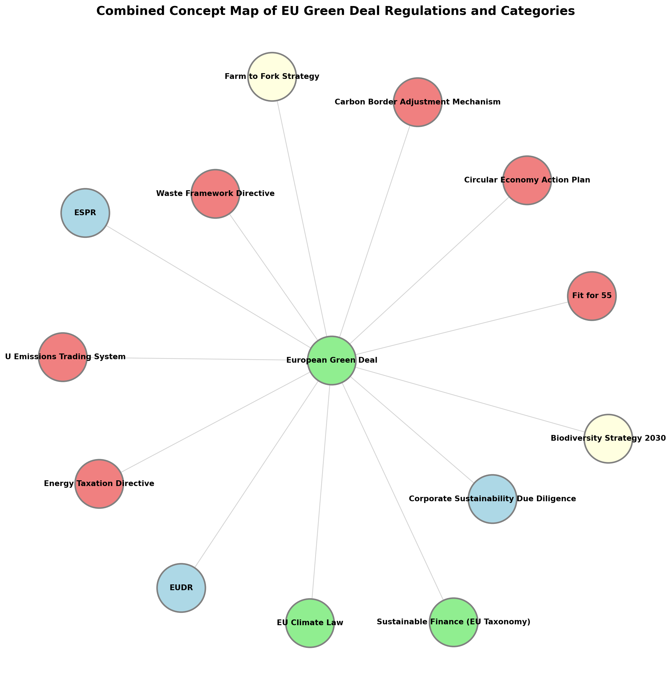
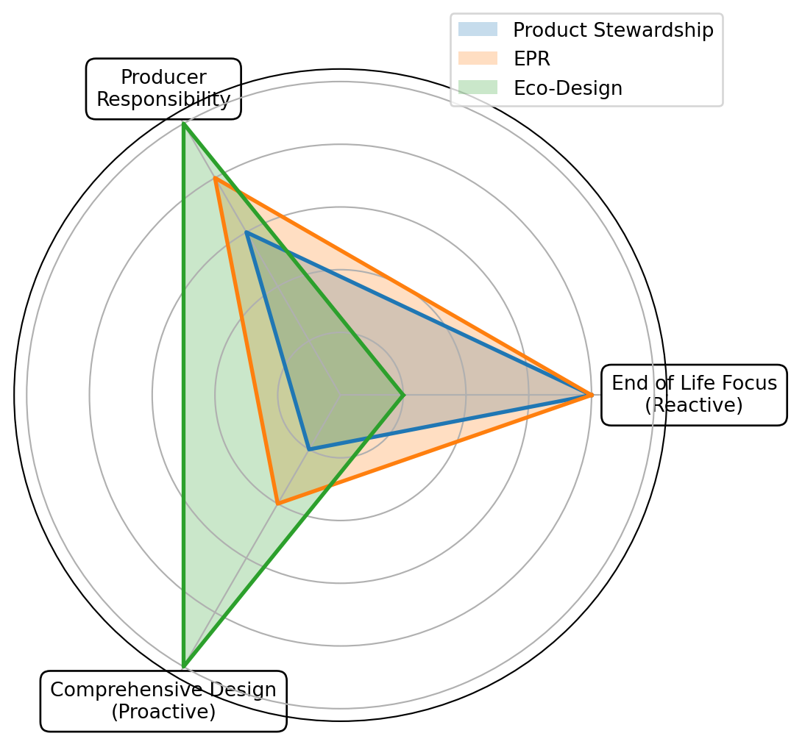
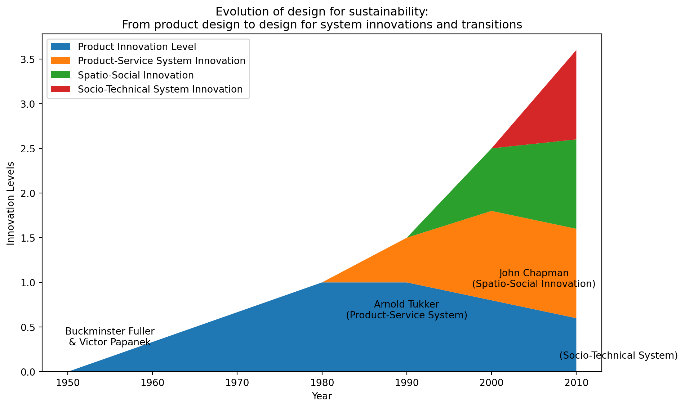
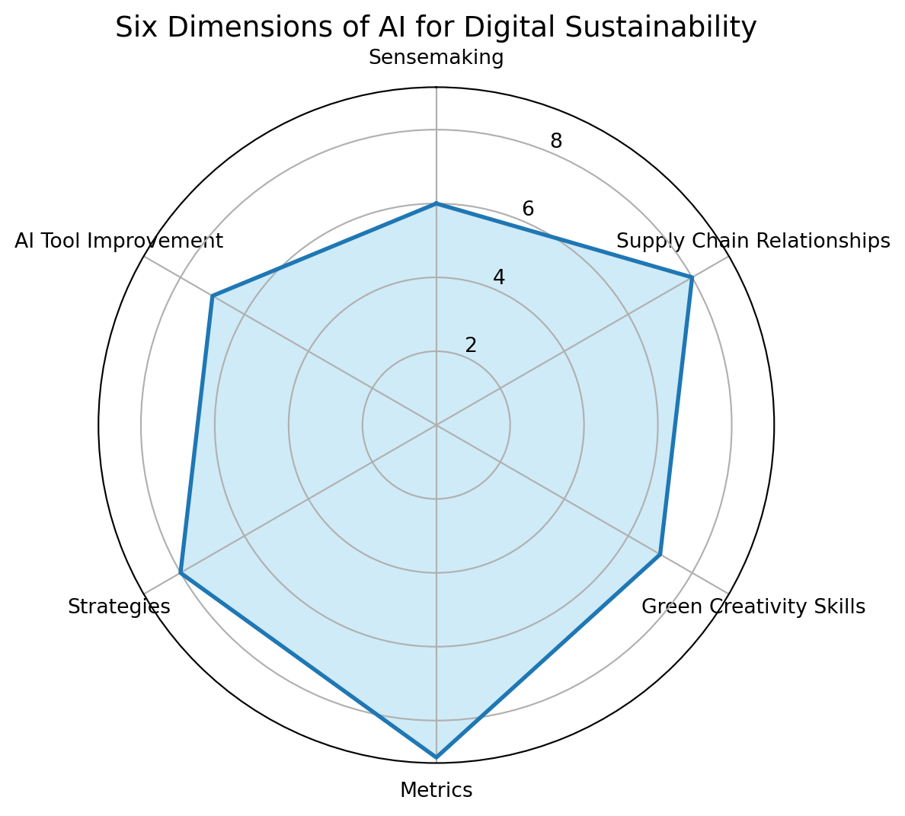
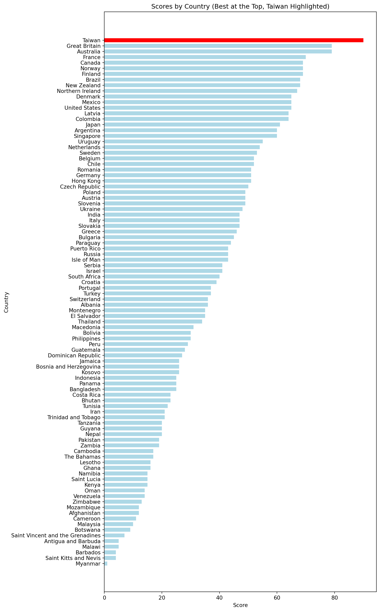
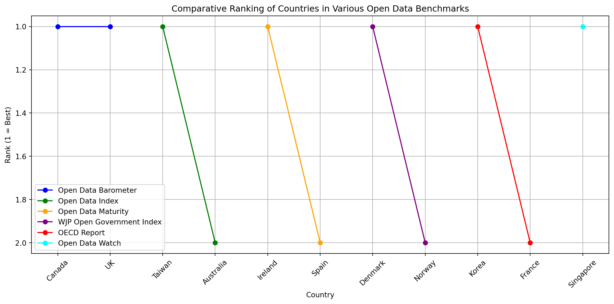
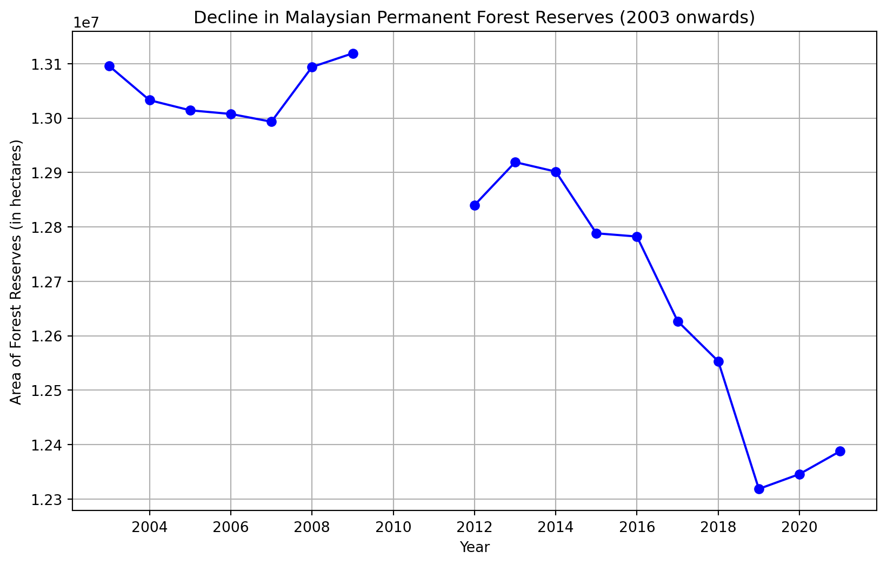
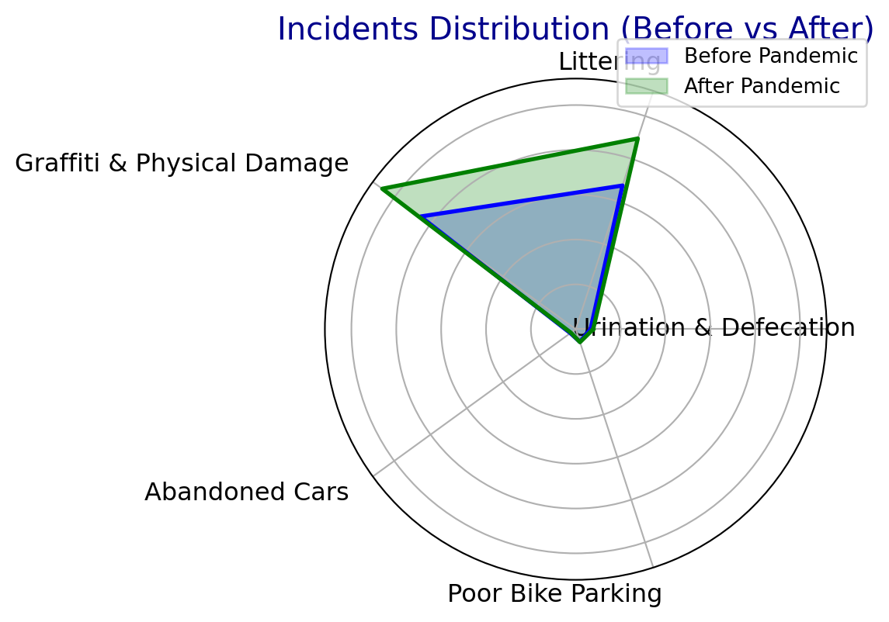
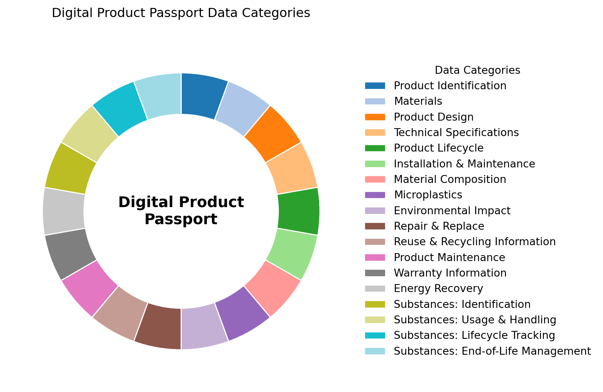

export const quartoRawHtml =
[`
<table>
<caption>The 9 qualities of <em>eco-designed products</em> based on the Ecodesign for Sustainable Products Regulation (ESPR) enacted as law in the EU as of July 2024 <span class="citation" data-cites="luttinFullOverviewEU2025 europeanparliamentEcodesignSustainableProducts2022">[@luttinFullOverviewEU2025; @europeanparliamentEcodesignSustainableProducts2022]</span>.<span data-short-caption="The Qualities of *Eco-Designed Products*"></span></caption>
<colgroup>
<col style="width: 50%" />
<col style="width: 50%" />
</colgroup>
<thead>
<tr>
<th>Feature</th>
<th>Benefit</th>
</tr>
</thead>
<tbody>
<tr>
<td>Durable</td>
<td>Reduces the need to frequently replace the product</td>
</tr>
<tr>
<td>Reusable</td>
<td>Extends the product’s life-cycle; sell or share to the next user</td>
</tr>
<tr>
<td>Reparable</td>
<td>Extends the product’s life-cycle; fix instead of discarding</td>
</tr>
<tr>
<td>Upgradable</td>
<td>Extends the product’s life-cycle; improve performance without complete replacement.</td>
</tr>
<tr>
<td>Easy to Maintain</td>
<td>Reduce resources needed to keep the product functional</td>
</tr>
<tr>
<td>Easy to Refurbish</td>
<td>Support second-hand use and circular economy</td>
</tr>
<tr>
<td>Easy to Recycle</td>
<td>Support material recovery at end of the product’s life to reduce new resource extraction and pollution</td>
</tr>
<tr>
<td>Energy Efficient</td>
<td>Reduce product’s CO<sub>2</sub>eq footprint and operating costs</td>
</tr>
<tr>
<td>Resource Efficient</td>
<td>Reduce product’s use of raw materials and energy during production and life-cycle</td>
</tr>
</tbody>
</table>
`,`
<table>
<caption>Food saving apps <span data-short-caption="Food Saving Apps"></span></caption>
<colgroup>
<col style="width: 36%" />
<col style="width: 63%" />
</colgroup>
<thead>
<tr>
<th>Name</th>
<th>Description</th>
</tr>
</thead>
<tbody>
<tr>
<td>Karma</td>
<td></td>
</tr>
<tr>
<td>ResQ Club</td>
<td><span class="citation" data-cites="kristinakostapLEVITASONAUus2022">[@kristinakostapLEVITASONAUus2022]</span> ResQ Club in Finland and Estonia for reducing food waste by offering a 50% discount on left-over restaurant meals before they are thrown away.</td>
</tr>
<tr>
<td>Kuri</td>
<td><span class="citation" data-cites="hajejankampsKuriAppThat2022">[@hajejankampsKuriAppThat2022]</span> Less impact of food</td>
</tr>
<tr>
<td>Social media groups (no app)</td>
<td></td>
</tr>
</tbody>
</table>
`,`
<table>
<caption>Perspective on food systems in Sweden from <span class="citation" data-cites="ROOS2023107623">[@ROOS2023107623]</span>. <span data-short-caption="Perspectives on the Food Systems in Sweden"></span></caption>
<colgroup>
<col style="width: 36%" />
<col style="width: 63%" />
</colgroup>
<thead>
<tr>
<th>Perspective</th>
<th>Content</th>
</tr>
</thead>
<tbody>
<tr>
<td><em>“The diagnostic perspective”</em></td>
<td>“<em>All hands on deck to fix the climate”</em></td>
</tr>
<tr>
<td><em>“The regenerative perspective”</em></td>
<td>“<em>Diversity, soil health and organic agriculture to the rescue”</em></td>
</tr>
<tr>
<td><em>“The fossil-free perspective”</em></td>
<td>“<em>Profitable Swedish companies to rid agriculture and the food chain of fossil fuel”</em></td>
</tr>
<tr>
<td><em>“The consumer-driven perspective”</em></td>
<td><em>“A wish-list of healthy, high-quality and climate-friendly foods”</em></td>
</tr>
<tr>
<td>“The hands-on perspective”</td>
<td>“Tangible solutions within the reach of consumers and the food industry”</td>
</tr>
</tbody>
</table>
`,`
<table>
<caption>A sample of blockchain-based supply chain companies as of summer 2023. <span data-short-caption="A Sample of Blockchain-based Supply Chain Companies"></span></caption>
<colgroup>
<col style="width: 32%" />
<col style="width: 32%" />
<col style="width: 34%" />
</colgroup>
<thead>
<tr>
<th>Company</th>
<th>Link</th>
<th>Literature</th>
</tr>
</thead>
<tbody>
<tr>
<td>Ocean Protocol</td>
<td>oceanprotocol.com</td>
<td></td>
</tr>
<tr>
<td>Provenance</td>
<td>provenance.io</td>
<td></td>
</tr>
<tr>
<td>Ambrosius</td>
<td>ambrosus.io</td>
<td></td>
</tr>
<tr>
<td>Modum</td>
<td>modum.io</td>
<td></td>
</tr>
<tr>
<td>OriginTrail</td>
<td>origintrail.io</td>
<td></td>
</tr>
<tr>
<td>Everledger</td>
<td>everledger.io</td>
<td></td>
</tr>
<tr>
<td>VeChain</td>
<td>vechain.org</td>
<td></td>
</tr>
<tr>
<td>Wabi</td>
<td>wabi.io</td>
<td></td>
</tr>
<tr>
<td>FairFood</td>
<td>fairfood.org</td>
<td></td>
</tr>
<tr>
<td>Bext360</td>
<td>bext360.com</td>
<td></td>
</tr>
<tr>
<td>SUKU</td>
<td>suku.world</td>
<td><span class="citation" data-cites="millerCitizensReserveBuilding2019">[@millerCitizensReserveBuilding2019]</span> SUKU makes supply chains more transparent yet seems to have pivoted away from supply chains</td>
</tr>
</tbody>
</table>
`,`
<table>
<caption>Share of CO<sub>2</sub>eq emissions by type of transport globally <span class="citation" data-cites="statistaGlobalTransportCO22022">[@statistaGlobalTransportCO22022]</span>. <span data-short-caption="Share of CO~2~eq Emissions by Type of Transport Globally"></span></caption>
<thead>
<tr>
<th>Type of Transport</th>
<th>Percentage</th>
</tr>
</thead>
<tbody>
<tr>
<td>Passenger cars</td>
<td>39%</td>
</tr>
<tr>
<td><strong>Medium and heavy trucks</strong></td>
<td>23%</td>
</tr>
<tr>
<td><strong>Shipping</strong></td>
<td>11%</td>
</tr>
<tr>
<td><strong>Aviation</strong></td>
<td>9%</td>
</tr>
<tr>
<td>Buses and minibuses</td>
<td>7%</td>
</tr>
<tr>
<td>Light commercial vehicles</td>
<td>5%</td>
</tr>
<tr>
<td>Two/three-wheelers</td>
<td>3%</td>
</tr>
<tr>
<td>Rail</td>
<td>3%</td>
</tr>
</tbody>
</table>
`,`
<table>
<caption>Global overview of superapps (or near-superapps) compiled from official company reports (IR, Press Releases), news reports, and company websites; various metric types (MAU, MTU, Annual Users, Customers, Registered Users) vary by company reporting and are reduced into a single “users” metric for simplicity. Each figure is sourced from official company reports, press releases, or investor disclosures. If no recent official update was available (as in the case of Alipay’s 2020 figure), the latest known official figure is provided. All values and dates reflect the latest data as of 2025. Data sourced from <span class="citation" data-cites="geUpdateAlibabasAnt2020 jingMeituan0369020242025 phonepePhonePeCrosses5002023 lycorporationLYCorporationTakes2023 shindeTataNeu202023 shindeTataNeu202023 polloNuHoldingsLtd2025 nguyenVietnamsFirstUnicorn2023 vermaPaytmQ3FY242024 safaricomSafaricomsMPESAHits2024 mercadolibre2024ImpactReport2024 oostBrazilianFinTechPicPay2024 kazaninsWhyCashApp2024 tecentTecentHoldings20242024 leeKakao2024Revenue2025 gotoTransformationProgres2023 revolutRevolutHits502024 careemCareems2024Wrapup2025 grabholdingslimitedGrabReportsFourth2025 phocuswrightSuperConnectedRappi2023 brownColombiasFirstUnicorn2025 layaSoftBankBackedAppRappi2024">[@geUpdateAlibabasAnt2020; @jingMeituan0369020242025; @phonepePhonePeCrosses5002023; @lycorporationLYCorporationTakes2023; @shindeTataNeu202023; @shindeTataNeu202023; @polloNuHoldingsLtd2025; @nguyenVietnamsFirstUnicorn2023; @vermaPaytmQ3FY242024; @safaricomSafaricomsMPESAHits2024; @mercadolibre2024ImpactReport2024; @oostBrazilianFinTechPicPay2024; @kazaninsWhyCashApp2024; @tecentTecentHoldings20242024; @leeKakao2024Revenue2025; @gotoTransformationProgres2023; @revolutRevolutHits502024; @careemCareems2024Wrapup2025; @grabholdingslimitedGrabReportsFourth2025; @phocuswrightSuperConnectedRappi2023; @brownColombiasFirstUnicorn2025; @layaSoftBankBackedAppRappi2024]</span>. <span data-short-caption="Global Overview of Superapps"></span></caption>
<colgroup>
<col style="width: 12%" />
<col style="width: 12%" />
<col style="width: 12%" />
<col style="width: 12%" />
<col style="width: 12%" />
<col style="width: 12%" />
<col style="width: 12%" />
<col style="width: 12%" />
</colgroup>
<thead>
<tr>
<th><strong>App</strong></th>
<th>Origin</th>
<th><strong>Metric</strong></th>
<th>Payments (Wallet)</th>
<th>Savings</th>
<th>Investing</th>
<th><strong>Users</strong></th>
<th><strong>Date</strong></th>
</tr>
</thead>
<tbody>
<tr>
<td>微信 <strong>/ WeChat (Tencent)</strong></td>
<td>China</td>
<td>Monthly Active Users (MAU) combined 微信 (China) &amp; WeChat (International)</td>
<td>Yes</td>
<td>Yes</td>
<td>Yes</td>
<td>1,4 billion</td>
<td>2024</td>
</tr>
<tr>
<td>支付寶 <strong>Alipay (Ant Group)</strong></td>
<td>China</td>
<td>Annual Active Users (AAU)</td>
<td>Yes</td>
<td>Yes</td>
<td>Yes</td>
<td>1.3 billion</td>
<td>2020</td>
</tr>
<tr>
<td>美團 <strong>Meituan</strong></td>
<td>China</td>
<td>Annual Transacting Users (ATU)</td>
<td>Yes</td>
<td>No</td>
<td>No</td>
<td>700 million</td>
<td>2024</td>
</tr>
<tr>
<td><strong>PhonePe</strong></td>
<td>India</td>
<td>Registered Users (Lifetime)</td>
<td>Yes</td>
<td>Yes</td>
<td>Yes</td>
<td>500 million</td>
<td>2023</td>
</tr>
<tr>
<td><strong>LINE</strong></td>
<td>Japan</td>
<td>Monthly Active Users (MAU)</td>
<td>Yes</td>
<td>Yes</td>
<td>Yes</td>
<td>200 million</td>
<td>2023</td>
</tr>
<tr>
<td><strong>Tata Neu</strong></td>
<td>India</td>
<td>Members</td>
<td>Yes</td>
<td>Yes</td>
<td>No</td>
<td>27 million</td>
<td>2023</td>
</tr>
<tr>
<td><strong>Nubank</strong></td>
<td>Brazil</td>
<td>Customers</td>
<td>Yes</td>
<td>Yes</td>
<td>Yes</td>
<td>114 million</td>
<td>2024</td>
</tr>
<tr>
<td><strong>Zalo</strong></td>
<td>Vietnam</td>
<td>Monthly Active Users (MAU)</td>
<td>Yes</td>
<td>No</td>
<td>No</td>
<td>75 million</td>
<td>2023</td>
</tr>
<tr>
<td><strong>Paytm</strong></td>
<td>India</td>
<td>Monthly Transacting Users (MTU)</td>
<td>Yes</td>
<td>Yes</td>
<td>Yes</td>
<td>100 million</td>
<td>2023</td>
</tr>
<tr>
<td><strong>M-Pesa</strong></td>
<td>Kenya</td>
<td>Active Customers</td>
<td>Yes</td>
<td>Yes</td>
<td>No</td>
<td>34 million</td>
<td>2024</td>
</tr>
<tr>
<td><strong>Mercado Pago</strong></td>
<td>Argentina</td>
<td>Monthly Active Users (MAU)</td>
<td>Yes</td>
<td>Yes</td>
<td>Yes</td>
<td>61 million</td>
<td>2023</td>
</tr>
<tr>
<td><strong>PicPay</strong></td>
<td>Brazil</td>
<td>Active Customers</td>
<td>Yes</td>
<td>Yes</td>
<td>Yes</td>
<td>35 million</td>
<td>2023</td>
</tr>
<tr>
<td><strong>Cash App (Block)</strong></td>
<td>USA</td>
<td>Monthly Active Users (MAU)</td>
<td>Yes</td>
<td>Yes</td>
<td>Yes</td>
<td>56 million</td>
<td>2023</td>
</tr>
<tr>
<td><strong>KakaoTalk</strong></td>
<td>Korea</td>
<td>Monthly Active Users (MAU)</td>
<td>Yes</td>
<td>Yes</td>
<td>Yes</td>
<td>48 million</td>
<td>2024</td>
</tr>
<tr>
<td><strong>GoTo (Gojek/Tokopedia)</strong></td>
<td>Indonesia</td>
<td>Annual Transacting Users (ATU)</td>
<td>Yes</td>
<td>Yes</td>
<td>Yes</td>
<td>51 million</td>
<td>2023</td>
</tr>
<tr>
<td><strong>Revolut</strong></td>
<td>UK</td>
<td>Customers</td>
<td>Yes</td>
<td>Yes</td>
<td>Yes</td>
<td>50 million</td>
<td>2024</td>
</tr>
<tr>
<td><strong>Careem</strong></td>
<td>UAE (Aqcuired by US-based Uber and Etisalat but still keeps a separate brand)</td>
<td>Customers</td>
<td>Yes</td>
<td>No</td>
<td>No</td>
<td>70 million</td>
<td>2024</td>
</tr>
<tr>
<td><strong>Grab</strong></td>
<td>Singapore / Malaysia</td>
<td>Monthly Transacting Users (MTU)</td>
<td>Yes</td>
<td>Yes</td>
<td>No</td>
<td>41 million</td>
<td>2024</td>
</tr>
<tr>
<td><strong>Rappi</strong></td>
<td>Colombia</td>
<td>Users</td>
<td>Yes</td>
<td>Yes</td>
<td>No</td>
<td>30 million</td>
<td>2023</td>
</tr>
</tbody>
</table>
`,`
<table style="width:100%;">
<caption>Not quite super-app yet. Data sourced from <span class="citation" data-cites="uberUberAnnouncesResults2025 garciaBoltAcquiresDanish2025">[@uberUberAnnouncesResults2025; @garciaBoltAcquiresDanish2025]</span> <span data-short-caption="Not Quite Superapps"></span></caption>
<colgroup>
<col style="width: 14%" />
<col style="width: 14%" />
<col style="width: 14%" />
<col style="width: 14%" />
<col style="width: 14%" />
<col style="width: 14%" />
<col style="width: 14%" />
</colgroup>
<thead>
<tr>
<th>App</th>
<th>Origin</th>
<th>Metric</th>
<th>Payments (Wallet)</th>
<th>Savings</th>
<th>Investing</th>
<th>Users (2025)</th>
</tr>
</thead>
<tbody>
<tr>
<td>Uber</td>
<td>USA</td>
<td>Users per month</td>
<td>No (Only for ride-hailing)</td>
<td>No</td>
<td>No</td>
<td>171 million</td>
</tr>
<tr>
<td>Bolt</td>
<td>Estonia</td>
<td>Lifetime users</td>
<td>No (Only for ride-hailing)</td>
<td>No</td>
<td>No</td>
<td>200 million</td>
</tr>
</tbody>
</table>
`,`
<table>
<caption>Platform economy concepts from <span class="citation" data-cites="katzNetworkExternalitiesCompetition1985 oinas-kukkonenPersuasiveSystemsDesign2009 tiwanaResearchCommentaryPlatform2010 chenBusinessIntelligenceAnalytics2012">[@katzNetworkExternalitiesCompetition1985; @oinas-kukkonenPersuasiveSystemsDesign2009; @tiwanaResearchCommentaryPlatform2010; @chenBusinessIntelligenceAnalytics2012]</span>. <span data-short-caption="Platform Economy Concepts"></span></caption>
<colgroup>
<col style="width: 26%" />
<col style="width: 33%" />
<col style="width: 40%" />
</colgroup>
<thead>
<tr>
<th>Platform Economy Enablers</th>
<th>Pros</th>
<th>Cons</th>
</tr>
</thead>
<tbody>
<tr>
<td>Network effects</td>
<td>The more people use a platform, the more valuable it becomes both for the company and the user.</td>
<td>Data is not portable or difficult to migrate. You can’t leave because you’ll lose the audience. There’s a lock-in effect.</td>
</tr>
<tr>
<td>Scalability</td>
<td></td>
<td></td>
</tr>
<tr>
<td>Data-driven Design</td>
<td></td>
<td></td>
</tr>
<tr>
<td>Behaviour Design</td>
<td></td>
<td></td>
</tr>
</tbody>
</table>
`,`
<table>
<caption>Examples of cities and countries that share data openly. Data sourced from <span class="citation" data-cites="SverigesDataportal2025 governmentofmalaysiaDatagovmy2025 monetaryauthorityofsingaporeMASLaunchesDigital2023">[@SverigesDataportal2025; @governmentofmalaysiaDatagovmy2025; @monetaryauthorityofsingaporeMASLaunchesDigital2023]</span> <span data-short-caption="Examples of Cities and Countries That Share Data Openly"></span></caption>
<thead>
<tr>
<th>Country</th>
<th>Project</th>
</tr>
</thead>
<tbody>
<tr>
<td>Sweden</td>
<td>Swedish open data portal</td>
</tr>
<tr>
<td>Malaysia</td>
<td>Malaysian open data portal</td>
</tr>
<tr>
<td>Singapore</td>
<td>Singapore ESG open data platform</td>
</tr>
</tbody>
</table>
`,`
<table>
<caption>Examples of CO<sub>2</sub> visibility in Google’s products. <span data-short-caption="Examples of CO~2~ Visibility in Google&#39;s Products"></span></caption>
<colgroup>
<col style="width: 36%" />
<col style="width: 26%" />
<col style="width: 36%" />
</colgroup>
<thead>
<tr>
<th>Feature</th>
<th>Product</th>
<th>Nudge</th>
</tr>
</thead>
<tbody>
<tr>
<td>Google Maps AI suggests more eco-friendly driving routes <span class="citation" data-cites="mohitmoondraNavigateMoreSustainably">[@mohitmoondraNavigateMoreSustainably]</span></td>
<td>Google Maps</td>
<td>Show routes with lower CO<sub>2</sub> emissions; reduce stopping by using data from traffic lights.</td>
</tr>
<tr>
<td>Google Flights suggests flights with lower CO<sub>2</sub> emissions</td>
<td>Google Flights</td>
<td>Show flights with lower CO<sub>2</sub> emissions</td>
</tr>
<tr>
<td>Wizzair Check carbon impact <span class="citation" data-cites="OffsetYourFlight">[@OffsetYourFlight]</span></td>
<td>WizzAir</td>
<td>Offset on Checkout</td>
</tr>
</tbody>
</table>
`,`
<table>
<caption>Types of nudge documented by <span class="citation" data-cites="WEE2021100364">[@WEE2021100364]</span> <span data-short-caption="Types of Nudge"></span></caption>
<colgroup>
<col style="width: 36%" />
<col style="width: 63%" />
</colgroup>
<thead>
<tr>
<th>Name</th>
<th>Technique</th>
</tr>
</thead>
<tbody>
<tr>
<td>Prompting</td>
<td>Create cues and reminders to perform a certain behavior</td>
</tr>
<tr>
<td>Sizing</td>
<td>Decrease or increase the size of items or portions</td>
</tr>
<tr>
<td>Proximity</td>
<td>Change the physical (or temporal) distance of options</td>
</tr>
<tr>
<td>Presentation</td>
<td>Change the way items are displayed</td>
</tr>
<tr>
<td>Priming</td>
<td>Expose users to certain stimuli before decision-making</td>
</tr>
<tr>
<td>Labelling</td>
<td>Provide labels to influence choice (for example CO<sub>2</sub> footprint labels)</td>
</tr>
<tr>
<td>Functional Design</td>
<td>Design the environment and choice architecture so the desired behavior is more convenient</td>
</tr>
</tbody>
</table>
`,`
<table>
<caption>Ant Forest assisted tree planting; data compiled from <span class="citation" data-cites="ZhuZiXun2017 yangSwitchingGreenLifestyles2018 unfcccAlipayAntForest2019 wangFuelingProEnvironmentalBehaviors2020 600MillionPeople2021 zhangPromoteProenvironmentalBehaviour2022 wangMotivationsInfluencingAlipay2022 zhouUnpackingEffectGamified2023 caoImpactArtificialIntelligence2023 MaYiJiTuanESGBaoGao MaYiJiTuanGongBuZhongShu8Nian">[@ZhuZiXun2017; @yangSwitchingGreenLifestyles2018; @unfcccAlipayAntForest2019; @wangFuelingProEnvironmentalBehaviors2020; @600MillionPeople2021; @zhangPromoteProenvironmentalBehaviour2022; @wangMotivationsInfluencingAlipay2022; @zhouUnpackingEffectGamified2023; @caoImpactArtificialIntelligence2023; @MaYiJiTuanESGBaoGao; @MaYiJiTuanGongBuZhongShu8Nian]</span>. <span data-short-caption="Ant Forest Assisted Tree Planting - Growth Story"></span></caption>
<colgroup>
<col style="width: 8%" />
<col style="width: 18%" />
<col style="width: 18%" />
<col style="width: 54%" />
</colgroup>
<thead>
<tr>
<th>Year</th>
<th>Users</th>
<th>Trees</th>
<th>Area</th>
</tr>
</thead>
<tbody>
<tr>
<td>2016</td>
<td>N/A</td>
<td>N/A</td>
<td>N/A</td>
</tr>
<tr>
<td>2017</td>
<td>230 million</td>
<td>10 million</td>
<td>N/A</td>
</tr>
<tr>
<td>2018</td>
<td>350 million</td>
<td>55 million</td>
<td>6500 acres??</td>
</tr>
<tr>
<td>2019</td>
<td>500 million</td>
<td>100 million</td>
<td>112,000 hectares / 66, 000 hectares?</td>
</tr>
<tr>
<td>2020</td>
<td>550 million</td>
<td>200 million</td>
<td>2,7 million acres?</td>
</tr>
<tr>
<td>2021</td>
<td>600 million</td>
<td>326 million</td>
<td>N/A</td>
</tr>
<tr>
<td>2022</td>
<td>650 million</td>
<td>400 million</td>
<td>2 million hectares</td>
</tr>
<tr>
<td>2023</td>
<td>690 million</td>
<td>475 million</td>
<td>N/A</td>
</tr>
<tr>
<td>2024</td>
<td>N/A</td>
<td>548 million</td>
<td>3.87 million hectares</td>
</tr>
<tr>
<td>2025</td>
<td>N/A</td>
<td>N/A</td>
<td>N/A</td>
</tr>
</tbody>
</table>
`,`
<table>
<caption>Modes of Interaction <span data-short-caption="Modes of Interaction"></span></caption>
<thead>
<tr>
<th>Modes of Interaction</th>
</tr>
</thead>
<tbody>
<tr>
<td>Writing</td>
</tr>
<tr>
<td>Speaking</td>
</tr>
<tr>
<td>Touching</td>
</tr>
<tr>
<td>Moving</td>
</tr>
<tr>
<td>Seeing</td>
</tr>
</tbody>
</table>
`,`
<table>
<caption>A selection of personal sustainability apps. <span data-short-caption="A Selection of Personal Sustainability Apps"></span></caption>
<colgroup>
<col style="width: 36%" />
<col style="width: 63%" />
</colgroup>
<thead>
<tr>
<th>App</th>
<th>Description</th>
</tr>
</thead>
<tbody>
<tr>
<td>Commons (Formerly Joro)</td>
<td>Finacial Sustainability Tracking + Sustainable Actions</td>
</tr>
<tr>
<td>Klima</td>
<td>Offset Subscription</td>
</tr>
<tr>
<td>Wren</td>
<td>Offset Subscription</td>
</tr>
<tr>
<td>JouleBug</td>
<td>CO<sub>2</sub>eq tracking</td>
</tr>
<tr>
<td>eevie</td>
<td></td>
</tr>
<tr>
<td>Aerial</td>
<td></td>
</tr>
<tr>
<td>EcoCRED</td>
<td></td>
</tr>
<tr>
<td>Carbn</td>
<td></td>
</tr>
<tr>
<td>LiveGreen</td>
<td></td>
</tr>
<tr>
<td>Earth Hero</td>
<td></td>
</tr>
</tbody>
</table>
`,`
<table>
<caption>The 9 R strategies from <span class="citation" data-cites="potting2017circular">[@potting2017circular]</span>. <span data-short-caption="The R Strategies"></span></caption>
<colgroup>
<col style="width: 30%" />
<col style="width: 69%" />
</colgroup>
<thead>
<tr>
<th>R-Strategy</th>
<th>Definition</th>
</tr>
</thead>
<tbody>
<tr>
<td>R9 Recover</td>
<td>Incineration of material (energy recovery)</td>
</tr>
<tr>
<td>R8 Recycle</td>
<td>Process materials, obtaining the same (high grade) or lower grade quality</td>
</tr>
<tr>
<td>R7 Repurpose</td>
<td>Use discarded product (or its parts) in a new product (with a different function)</td>
</tr>
<tr>
<td>R6 Remanufacture</td>
<td>Use parts of a discarded product in a new product (with the same function)</td>
</tr>
<tr>
<td>R5 Refurbish</td>
<td>Restore an old product (bring it up to date)</td>
</tr>
<tr>
<td>R4 Repair</td>
<td>Maintenance of a product so it can be used with its original function</td>
</tr>
<tr>
<td>R3 Reuse</td>
<td>Reuse by another consumer (still in good condition and fulfills its original function)</td>
</tr>
<tr>
<td>R2 Reduce</td>
<td>Increase efficiency in product manufacture (consume fewer natural resources and materials)</td>
</tr>
<tr>
<td>R1 Rethink</td>
<td>Use the product more intensively (sharing the product via online platforms, etc)</td>
</tr>
<tr>
<td>R0 Refuse</td>
<td>Don’t use product at all (or replace the function with a better alternative)</td>
</tr>
</tbody>
</table>
`,`
<table>
<caption>Companies with Carbon Labels <span class="citation" data-cites="briankatemanCarbonLabelsAre2020">[@briankatemanCarbonLabelsAre2020]</span> <span data-short-caption="Companies With Carbon Labels"></span></caption>
<thead>
<tr>
<th>Company</th>
<th>Country</th>
</tr>
</thead>
<tbody>
<tr>
<td>Just Salad</td>
<td>U.S.A.</td>
</tr>
<tr>
<td>Quorn</td>
<td>U.K.</td>
</tr>
<tr>
<td>Oatly</td>
<td>U.K.</td>
</tr>
<tr>
<td>IKEA</td>
<td>Sweden</td>
</tr>
</tbody>
</table>
`,`
<table>
<caption>Organizations Who Certify Carbon Labels <span class="citation" data-cites="climatepartnerLabellingCarbonFootprint2020">[@climatepartnerLabellingCarbonFootprint2020]</span>. <span data-short-caption="Organizations Who Certify Carbon Labels"></span></caption>
<thead>
<tr>
<th>Organization</th>
<th>Number of Certified Products</th>
</tr>
</thead>
<tbody>
<tr>
<td>ClimatePartner</td>
<td></td>
</tr>
<tr>
<td>Carbon Calories</td>
<td></td>
</tr>
<tr>
<td>Carbon Trust</td>
<td>27000</td>
</tr>
</tbody>
</table>
`,`
<table>
<caption>Digital Product Passport goals <span class="citation" data-cites="strettonDigitalProductPassports2022">[@strettonDigitalProductPassports2022]</span>. <span data-short-caption="Digital Product Passport Goals"></span></caption>
<thead>
<tr>
<th>Goal</th>
</tr>
</thead>
<tbody>
<tr>
<td>Sustainable Product Production</td>
</tr>
<tr>
<td>Businesses to create value through Circular Business Models</td>
</tr>
<tr>
<td>Consumers to make more informed purchasing decisions</td>
</tr>
<tr>
<td>Verify compliance with legal obligations</td>
</tr>
</tbody>
</table>
`];

````mdx-code-block
import Figure from '/src/components/Figure'
import FlightEmissions from '../images/design/flight-emissions.png'
import Strava from '../images/design/strava.png'
import ResQClub from '../images/design/resq-club.png'
import EUPolicy from "/research/images/sustainability/eu-policy-context.png";
import AbstractDesign from '../images/design/abstract-design.png'
````

# Design

````mdx-code-block
<Figure caption="Visual abstract for the design chapter" src={AbstractDesign} />
````

Designers have been battling complexity since the beginning of design.
Industrial designer Dieter Rams famously said in the 1970s *“Good design
makes a product understandable”* as one of the ten key tenets to strive
for in good products (DW Euromaxx, 2018; Fabrique & Q42, n.d.). Don
Norman, the grandfather of interaction design, is quoted as saying:

> “Modern technology can be complex, but complexity by itself is neither
> good nor bad: it is confusion that is bad.” - (Norman, 2016)

I would simply say: Design makes complexity comprehensible.

Sustainability is one of the most complex goals that humanity has set
for itself. The following looks at some of the ways design might make
it.. achievable.. and comprehensible.

## Eco-Design: Design as Political Action at Scale

Politics matters in sustainability. In Brazil, deforestation fell 60% in
1 year, based on remote satellite reconnaissance, after the election of
a more pro-environment leadership (Watts, 2023). Globally, the
monumental task of removing several gigatons of CO<sub>2e</sub> from the
atmosphere requires massive policy shifts and collaboration across
countries and industries (Mackler et al., 2021).

In Europe, the EU “Green Deal” legislative strategy is comprehensive and
backed by science, with the EU Commission having released strategic
foresight reports since 2020, and becoming a driving force of
transformative climate legislation in Europe (European Commission,
2023). The timeline of the policy context in Europe is as follows: in
2019, the Von der Leyen Commission adopted the European Union (EU) Green
Deal strategy. In 2021 the Commission proposed a goal of reducing
CO<sub>2</sub>eq emissions by 55% by 2030 under the *Fit for 55* policy
package consisting of a wide range of economic measures. In November
2022, the proposal was adopted by the EU Council and EU Parliament with
an updated goal of 57% of CO<sub>2</sub>eq reductions compared to 1990,
set to become a binding law for all EU member countries (*EU Reaches
Agreement on National Emission Reductions*, 2022; European Commission,
2019b, 2019a; European Council, 2022). In March 2022, the EU Circular
Economy Action Plan was adopted, looking to make sustainable products
*the norm* in EU and *empowering consumers* as described in (European
Commission, 2022a).

Designing the right legislative measures can be hugely impactful.

Consumer products’ overall life-cycle environmental impact is defined in
the design process by the materials and energy resources needed and the
post-consumer potential for reuse or recycling. In the context of the
European Union, *eco-design* has gained political support from European
Commission as part of the EU’s *“Green Deal”* legislative strategy,
aiming to transform European economies into sustainability leaders
(Commission et al., 2014). The Ecodesign for Sustainable Products
Regulation (ESPR) entered into force in July 2024 (European Commission,
2024) following the (European Parliament, 2022) proposal whereby the
European Commission established a general framework for *eco-design:
“requirements for sustainable products, repealing rules \[referring to
the previous Eco-Design Directive (2009/125/EC)\] currently in force
which concentrate on energy-related products only,”* setting up a level
playing-field for the organizations operating on the EU single market.
Virginijus Sinkevičius, the EU Commissioner for the Environment, Oceans
and Fisheries, is quoted as describing eco-design as design that
*“respects the boundaries of our planet”* (European Commission, 2022c).

<div dangerouslySetInnerHTML={{ __html: quartoRawHtml[0] }} />

Eco-Design for Sustainable Products is a key EU sustainable policy
design tool and each product covered by the ESPR is required to have a
*Digital Product Passport* (DPP) which enables improved processing
within the supply chain and includes detailed information to empower
consumers to understand the environmental footprint of their purchases
(European Commission, 2022b). It’s safe to say the large majority of
products available today do not meet these criteria. Given this
far-reaching legislative effort, we have an opportunity to re-imagine
how every product can be an eco-product and how they circulate in our
circular economy. The Director of the French environmental NGO Pôle
Eco-conception describes eco-design as “\[l\]ocated at the interface
between consumption and production patterns, eco-design helps to
structure the market for products and services using a life cycle
approach and tangible criteria” (Chouai & Mayer, 2024).

The European Commission is set to propose a legally-binding 90%
emissions reduction from 1990 levels to be achieved by 2040; however,
political pushback by governments is likely to weaken the goal; the EU
climate chief Teresa Ribera is looking for ways to find pragmatic
solutions, by, for example, considering some use of carbon credits (thus
far, all the goals needed to be achieved within the borders of EU;
buying carbon credits from places outside the EU would not be counted as
emissions reduction) (Taylor, 2025; Weise, 2025).

````mdx-code-block
<Figure
  caption="EU Policy Context Timeline'"
  src={EUPolicy}
/>
````

The above chart shows how the European Union has been on a path of
climate legislation transformation.

<div id="fig-eu-green-deal">



Figure 1: The EU’s Green Deal

</div>

The above chart illustrates the European “Green Deal”.

In the countries that make up the European Union (EU), a wide range of
legislative proposals, targets, organizations, and goals have existed
for decades. It’s not that the EU didn’t have an overarching
environmental policy before; rather it was vague and filled with
loop-holes. Upcoming laws cited above aim to harmonize approaches to
sustainability and raise standards for all members states, in turn
influencing producers who wish to sell in the EU common market. National
governments need to adapt EU legislation to local contexts. For example
Estonian government adopted the Estonian Green Deal Action Plan (Eesti
Rohepöörde Tegevusplaan) (Eesti Vabariigi Valitsus, 2022). From the
legislative perspective, NFRD (Non-Financial Reporting Directive) is
replaced by CSRD (Corporate Sustainability Reporting Directive) and ESRS
reporting is the standard to meet CSRD requirements.

The EU is also concerned with supply-chain deforestation. The ESPR
(Sustainable Products) and EUDR (European Union Deforestation
Regulation) work hand-in-hand as part of EU’s legislative efforts to
promote sustainability. EUDR applies to all products placed on the
market from December 2024 and June 2025 for small businesses. Greenpeace
has called the EUDR *“first step to end its complicity in the reckless
destruction of these life-support systems”* - yet to become a success
story, there needs to be follow through, integrating forest protection
throughout the economy. Some of the steps to achieve this include the EU
*taxonomy of environmentally sustainable economic activities* published
by the Technical Expert Group (TEG) on sustainable finance, as detailed
in the report by (*EU Taxonomy for Sustainable Activities*, n.d.). The
proposal for a Nature Restoration Law by the European Commission
requiring member countries to restore 20% of EU’s degraded ecosystems by
2030 and full restoration by 2050 has not yet passed (as of writing)
(*Scientists Urge European Parliament to Vote for Nature Restoration
Law*, 2023) and is facing a backlash (David Pinto, 2023).

Certainly the EU is not the only region legislating to promote
sustainability; sustainability policy context is shifting around the
world. There are legislative efforts in numerous jurisdictions, which
have passed laws which aim to reduce the environmental impact of
products throughout their lifecycles. In the US, the *Inflation
Reduction Act* provided funding to development of de-carbonizing
technologies and includes plans to combat air pollution, reduce green
house gases and address environmental injustices (Rajagopalan &
Landrigan, 2023). In Australia, the Product Stewardship (PS) scheme also
includes an investment fund targeted at increasing the recycling rates
of specific products (Australian Government, 2024). Australia, Japan,
and Taiwan all have sustainable procurement schemes, prioritizing
greener products in public purchases (Australian Government Department
of Finance, 2025; Ministry of the Environment, Government of Japan,
2000; The Ministry of Environment of Taiwan, 2024).

I was torn whether to place *politics* under *sustainability* or
*design*, and decided for the latter - as sustainability is primarily
*descriptive*, using science to measure and present the real situation,
while design is *prescriptive*: codifying decisions about how do we
live - in products and services. Design *is* political.

### Beyond Recycling: Default to Return, Repair, Reuse

(Gigerenzer, 2008) argues that heuristics - basically, rules of thumb -
can make more accurate predictions about the future than statistical
tools such as Bayesian and regression models, in certain contexts,
especially when data is incomplete or noisy. This aligns with Herbert
Simon’s classic concept of bounded rationality, which suggests that
people make decisions not by fully optimizing, but by *satisficing*,
i.e. seeking good-enough options given limited time, information, and
cognitive capacity (Simon, 1955). (Gigerenzer, 2008; Gigerenzer &
Selten, 2002) updated the concept to introduce the idea of a toolbox of
fast, dynamic, frugal heuristics - named ecological rationality, showing
how humans use only a small amount of information, often ignoring most
available data, adapting to specific environments: heuristics aren’t
irrational; they work well because they exploit the structure of
real-world environments.

In the practice of design for sustainability, the recognizing that
humans use heuristics, translates to making strategic use of choice
architecture and *the power of defaults*: displaying the most
sustainable option as the default - the oft-quoted example being green
power as the default choice on the German energy markets (Antonides &
Welvaarts, 2020; Kaiser et al., 2020). Several research projects of
plant-based, vegan and vegetarian food defaults at (university) canteens
show 45-58% increase in sustainable choices across studies (Boronowsky
et al., 2022; Erhard et al., 2023; Ginn & Sparkman, 2024; A. W. Zhang et
al., 2024). (Simon Sterne, 2023) argues good UX is about helping the
user make decisions, which can be thought of as four key tactics: (1)
simplify complex choices, (2) intelligent defaults, (3) clear real-time
feedback on the outcome of each option, and (4) avoid unintended regret
by testing decision-support systems.

The universal recycling symbol creator Gary Anderson created the symbol
when he was an architecture student at USC (University of Southern
California) in 1970 at the age of 23, inspired by Silent Spring, Earth
Day, the Bauhaus, Bucky Fuller, Spaceship Earth, printing presses, and
the Woolmark logo for wool industry certification, and even the Mobius
strip, for a competition held by a packaging firm that was making paper
containers for packaging (Swap Society, 2023).

### Eco-Modulation: Extended Producer Responsibility Incentive Design

Eco-modulation is a legislative innovation, which makes harder to
recycle items more expensive for the producer. Recycling fees take into
account eco-design: an item from a single material is easier (cheaper)
to recycle than product from composite materials. Eco-modulation makes
the hidden cost of hard-to-recycle formats directly visible on the
invoice.

While Taiwan doesn’t yet have a specific eco-design law, there are
various pieces of legislation promoting circular economy. Already in
1988, Taiwan implemented an Extended Producer Responsibility (EPR)
scheme, followed by a recycling system (initially focused on electronic
items) in 1998 (Chong et al., 2009). Eco-design initiatives in Taiwan
started at least as early as 1994, when Taiwanese companies and
universities noticed international sustainability trends and began to
implement their own sustainable design initiatives (Jahau Lewis Chen et
al., 2005).

The key to comparing Product Stewardship, Extended Producer
Responsibility (EPR), and Eco-Design is the scope, as illustrated in the
chart below. While Product Stewardship (PS) and Extended Producer
Responsibility (EPR) deal mostly with the end of the product life-cycle
(they are *reactive*), including their disposal and recycling (EPR going
a step further than PS by shifting the responsibility to the producer),
eco-design moves sustainability up the design chain (being *proactive*),
setting standards for making better products - in essence, attempting to
*design-out* the waste.

<div id="fig-ps-epr">



Figure 2: Extended Producer Responsibility vs Product Stewardship vs
Eco-Design

</div>

Popular blogs such as (Kohli, 2019) and (Lose, 2023) offer many
suggestions how designers can help people become more sustainable in
their daily lives yet focusing on the end-user neglects the producers’
responsibility - termed Extended Producer Responsibility or ERP in waste
management studies.

Extended Producer Responsibility (EPR) is a policy tool first proposed
by Thomas Lindhqvist in Sweden in 1990 and described in detail in his
PhD thesis (Lindhqvist, 2000; Lindhqvist & Lidgren, 1990), aimed to
encourage producers take responsibility for the entire life-cycle of
their products, thus leading to more eco-friendly products. In essence,
Extended Producer Responsibility enables companies to be responsible for
the entire life-cycle of the product. In California, part of the EPR
regulation is a large pool of funding for cleaning up historic pollution
resulting from industry Moolman (2024).

Nonetheless, EPR schemes do not guarantee circularity and may instead be
designed around fees to finance waste management in linear economy
models (Christiansen et al., 2021). The French EPR scheme was upgraded
in 2020 to become more circular (Jacques Vernier, 2021). In July 2024,
Latvia was the 4th EU country to join an textile-EPR scheme (*New EPR
Requirements for Textiles in Latvia from July 2024 on*, 2024). Strong
consumer protection legislation (such as EPR) has a direct influence on
producers’ actions. For example, in (HKTDC Research, 2022), the Hong
Kong Trade Development Council notified textile producers in July 2022
reminding factories to produce to French standards in order to be able
enter the EU market.

In Europe, there’s large variance between member states when in comes to
textile recycling: while Estonia and France are the only EU countries
where separate collection of textiles is required by law, in Estonia
100% of the textiles were burned in an incinerator (as of 2018) while in
France textiles are covered by an Extended Producer Responsibility (EPR)
scheme leading to higher recovery and recycling rates (European
Commission. Joint Research Centre., 2021; Nordic Council of Ministers,
2020). Yet, some countries like Germany (75%), Netherlands (45 %), and
Denmark (43%), which have no specific EPR scheme for textiles, report
higher collection rates than France, which with EPR collected only 38%
of the textiles, however recovered 95% of that through reuse and
recycling (Eurostat, 2022; *Towards 2025 - Separate Collection and
Treatment of Textiles in Six EU Countries*, 2020).

The success of EPR can vary per type of product. For car tires, the EPR
scheme in the Netherlands claims a 100% recovery rate (Campbell-Johnston
et al., 2020). (Peng et al., 2023) finds that the *Carbon Disclosure
Project* has been a crucial tool to empower Chinese auto-producers to
adopt ERP schemes. Technological advancements play a big role in
recycling rates, as even badly sorted materials can increasingly be
recovered using AI; one example being Greyparrot AI, which notes that
even in the most advanced countries, 40% of waste sorting is still
manual, opening an opportunity for automation (Natasha Lomas, 2024).

While recycling rates are improving, (Steenmans & Ulfbeck, 2023) argues
for the need to engage companies through legislation and shift from
waste-centered laws to *product design regulations*. In the same vein,
and in the spirit of EU’s EPR regulations, (Ruiz-Pastor & Mesa, 2023)
proposes an integrated *product repairability index* (PRI). (Lenovo,
08-29-22) suggests rethinking product design entirely to inspire
consumers expect more from the devices they buy. (Duriez et al., 2022)
shows how simply by reducing material weight of the product, it’s
possible to design more sustainable transportation. However, the devil
is often in the details. (Formentini & Ramanujan, 2023) study of Design
for Circular Disassembly (DfCD), introduces a Disassembly Effort Index
(DEI) to measure the disassembly time in seconds; their case study of
the End-of-Life (EoL) of an electrical kettle showed ignoring realistic
EoL failures (such as rusted screws), can lead to inaccurate
recommendations for circular design parameters.

Packaging is a rapidly growing industry, expanding on the back of online
shopping, which generates large amounts of waste materials, which, if
not reused or recycled, easily becomes garbage. Over 161 million tonnes
of plastic packaging is produced every year (Bradley & Corsini, 2023).
Already more than a decade ago, (*Detail-Rich Sustainable Packaging
Product Database Is an Industry First*, 2010)proposed a database of
green packaging to compare hundreds of sustainable packaging materials
and guide designers through environmental, performance, and cost
trade-offs in one unified tool, in order to help producers choose better
packaging - yet the problem is far from solved. More recently, (Bradley
& Corsini, 2023) developed an analytical framework of key sustainability
factors, from an overview of 107 studies on reusable packaging, finding
customer acceptance, high return rates, supply-chain shortening, and
system standardization, as the key factors critical to unlocking
reusable packaging solutions at scale. A survey by PMMI, the Association
for Packaging and Processing Technologies, among industry professional,
found legacy equipment, higher material costs, and supply consistency as
the top barriers to sustainable packaging; in turn, vital enablers were
clear vendor guidance, proven material and equipment solutions, and
customer demand (*Challenges and Opportunities in Sustainable Packaging
Today*, 2022). In response to legacy equipment issues, (*Sulapac –
Replacing Plastic*, n.d.) a large producer of packaging, has proposed a
wood-based, microplastic-free composites to serve as drop-in
replacements for plastics; a material even compatible with existing
molding, extrusion, and thermoforming production lines, while slashing
cradle-to-gate CO<sub>2</sub> emissions and preventing microplastic
pollution.

In food packaging specifically, (Ada et al., 2023) identified distinct
challenges from consumer acceptance to material-supply mismatches,
collection logistics, and regulatory gaps, underscoring the multifaceted
barriers to circular food packaging. Over 85% of companies in the
“protein industry”: meat, poultry, seafood, and alternative proteins
have some type of sustainability initiative (*Protein Brands and
Consumers Alike Focus on Sustainability*, 2022). Yet, having
sustainability programs does not make a company sustainable, case in
point being Coca Cola in the beverage industry. (Lerner, 2019) describes
Coca-Cola’s plastic pollution problem, based on leaked audio, detailing
how Coca-Cola was exposed for lobbying against container-deposit laws -
aka Deposit Return Schemes (DRS), - aiming to misrepresented recycling
as a complete solution; strategies that stalled effective legislation
and maintained a “green” facade despite obstructing real sustainability
progress.

The *“Plastic Waste Makers Index”* report lists large corporations which
produce plastic waste globally and provides some useful statistics:
single-use plastic rose by 6 million tonnes from 2019 to 2021, while
just 3 million tonnes of recycling capacity was planned by 2027 (as of
the report date, 2023); in total, single-use plastic generated 450
million tonnes of CO<sub>2</sub>eq emissions per year; up to 98% of the
single-use plastic was produced from virgin petrochemicals, while 2% was
from recycled material; meanwhile in Taiwan, the Far Eastern New Century
company boosted recycled content from 2% to 11% in 2021 and plans to
double its recycling capacity (Minderoo Foundation, 2023). (Yap et al.,
2023) Singapore disposes of 900,000 tonnes of plastic waste each year,
out of which only 4% is recycled. Single-use plastics make up 44-68% of
all waste mapped by citizen scientists (Kiessling et al., 2023).

### Scenario-Building: The Worst Futures and Designs for Quality of Life

Scenario-building is a key tool for sustainability, because
sustainability is so complex. Sustainable design cannot always predict
certain outcomes - instead, it can make use of scenarios to prepare for
several possibilities. In sustainability, there are rarely good choices.
Rather it’s a question of avoiding the worst choices. One existing tool,
which has been widely used, is the En-ROADS climate change solutions
simulator; governments, organizations and individuals around the world
have used it explore climate scenarios based on interactive changes and
visualizations (Climate Interactive, n.d., 2023; Creutzig & Kapmeier,
2020; Czaika & Selin, 2017). Likewise, (Rooney-Varga et al., 2019) shows
the effectiveness of *The Climate Action Simulation* in educating users
about *success scenarios*. *Life Cycle Assessment* and *Environmental
Impact Analysis* are another set of useful tools to provide eco-design
scenarios (de Otazu et al., 2022).

While traditional economic thinking is based on a conflict between
nature and development, some new holistic models find there is potential
for synergy between economic, social, political, cultural, and
environmental metrics. For example, (Kaklauskas et al., 2023)‘s
multi-criteria analysis of 169 countries and 238 cities, finds 71%
average correlation between Climate Change and Country Success (C3S) and
Quality of Life (C3QL) indicators. In a similar vein, (Rieger et al.,
2023) develops an integrated science of wellbeing, linking humans’
psychological, biological, societal and environmental domains to guide
research and public policy, based on interactions between domain
experts.

Wellbeing Economy Governments is an example of country-level
collaboration in sharing expertise on sustainable development, looking
to bring post growth strategies and policy frameworks to the mainstream.
The concept of a wellbeing economy focuses on human and ecological
wellbeing rather than material growth since 2018 and includes Finland,
Iceland, New Zealand, Scotland, Wales, and Canada as founding members of
the network (Fioramonti et al., 2022).

(Popkova et al., 2022) argues that SDGs need to discussed in their
totality and uses factor analysis to link SDGs to institutions and
digital technologies; findings include SDG 3 (Good Health and
Well-Being) and SDG 17 (Partnerships for the Goals) progress through
institutions in developed countries and are most impacted by digital
technologies and digital knowledge index, meanwhile SDG 16 (Peace,
Justice and Strong Institutions) makes the most headway in developing
countries, which are starting from a lower base. Likewise, the German
Institute of Development and Sustainability (IDOS) has built a tool to
connect SDGs and their 169 targets to NDCs (Nationally Determined
Contributions), looking for synergies for effective climate action plans
and sustainable development strategies, visualizing a clear skew which
SDGs receive the most climate‐related commitments - SDG 2 (Zero Hunger),
SDG 6 (Clean Water and Sanitation), SDG 7 (Affordable and Clean Energy);
meanwhile SDG 14 (Life Below Water), and the SDG 3 social goals
discussed above, SDG 4 (Quality Education) and SDG 5 (Gender Equality),
are the least addressed in climate plans (Dzebo et al., 2023).

Eco-Design is about improving processes and optimizing resources. While
the goal of reducing harm is shared, the specifics will depend on the
industry. (Van Doorsselaer, 2022) Defines eco-design as *“design for X”*
in a circular economy, thinking through the life cycle of a product,
tools, materials, production, use, and end-of-life phases.

In wine-making, (Manzardo et al., 2021) presents an Italian winery case
study, where a redesigned Merlot red wine procedure reduced in
environmental impacts from fuel and pesticide use in vineyards; the
8-step procedure included calculating the product’s environmental
footprint and following the ISO 14006 standard, titled *“Environmental
management systems — Guidelines for incorporating ecodesign”*. Finding
uses for by-products, can improve sustainability even more. (Iñarra et
al., 2022) designed a circular scheme for brewery left-overs, producing
feed ingredients for aquaculture; in a further step, using life-cycle
assessment (LCA) and optimizing logistics, reduced the aquafeed’s
environmental footprint also by 6%.

In architecture and the built environment, (Munaro et al., 2022)
conducted a comprehensive review of eco-design 288 articles, identifying
*Design for Adaptability* and *Disassembly* as the most inclusive
strategies, coining a new term DfAD; a framework linking DfAD with
lifecycle assessment tools is a promising are for research to support
sustainable construction.

In pharmaceuticals, (Bassani et al., 2022) proposes an approach to
eco-design using life-cycle assessment: optimizing packaging types,
alternative materials, transport, and weight reduction. A follow-up
study from the same group in 2023 extended the eco-design to a full
cradle-to-grave assessment and evaluated end-of-life alternatives
(Bassani et al., 2024).

In the printing industry, (Miyoshi et al., 2022) takes the example of
ink toner bottles and applies Life Cycle Simulation to show in a case
study how standardized compatibility between older and newer systems can
save resources and results in sustainability savings, highlighting how
re-manufacturing is an important strategy in circularity for reducing
CO<sub>2</sub> emissions and life cycle costs.

While these examples underline the industry-specificity of eco-design,
some authors attempt to come up with mores holistic approaches. For
instance (Ruiz-Pastor et al., 2022) developed “CN_Con”, a metric for
conceptual design, trying to measure circularity and novelty in
conjunction, by analyzing product functions, durability, material
origins, and end-of-life, while at the same time supporting creative and
circular design solutions in early stages.

On an international level, looking at companies operating on the
European Single Market, (Arranz et al., 2022) conducted a large-scale
study using machine learning on firm survey data from 870 organizations
across diverse economic sectors, acquired from the 2015 EU Public
Consultation on the Circular Economy conducted by European Commission,
comparing coercive pressures (regulations, subsidies, grants), normative
pressures (industry standards, professional networks), and mimetic
pressures (competitive imitation), finding normative and mimetic
pressure only enhance sustainability, if coercive pressure already
exists - i.e. regulations are a key point of leverage. In summary,
enacting laws which support sustainability can shift complex systems
with many parties towards a circular economy, and be enhanced by
additional voluntary forces. However, a comparative analysis of OECD
green growth indicators for the periods 2004–2005 and 2019 across EU
member states found that green transformation do not correlate directly
with development level - instead each country’s unique socio-economic
context plays a role: governance quality and income distribution shape
the effectiveness of regulatory frameworks, suggesting that coercive
policies must be tailored to national circumstances in order to
reinforce circular-economy adoption at scale(Cheba et al., 2022).

## Thinking in Systems to Re-Design Industries or Provenance and Traceability

As of 2025, *circular economy* is a tiny part of the world economy.
(Circle Economy, 2022) reported in 2022 only 8.6% of world economy was
circular and *100B tonnes of virgin materials* was sourced every year.
An early pioneering innovator, (Jackson, 1996) showed through detailed
case studies how *preventive environmental management*, redesigning
industrial production at the source can avert pollution, laying the
conceptual groundwork for today’s circular-economy models. Many
companies are investing into transforming their processes.
*“\[T\]ransition to a low carbon economy presents challenges and
potential economic benefits that are comparable to those of previous
industrial revolutions”* (Pearson & Foxon, 2012).

Futurists and visionaries adept at naming things have already listed the
5th, 6th, and even the 7th industrial revolution, pointing at robotics,
quantum computing, nanotechnology, and more, looking at current trends
and building scenarios for 2050 to envisioning a world with convergence
of bio-based and mineral-based technologies, widespread sustainability,
and energy-abundance (Chourasia et al., 2022; Ruiz Estrada, 2024). If
indeed, we’re in an industrial revolution, it’s possible to re-design
entire industries, and that is exactly the expectation sustainability
sets on businesses. Across all industries, there’s a call for more
transparency. Conversations about sustainability are too general and one
needs to look at the specific sustainability metrics at specific
industries to be able to design for meaningful interaction. There’s
plentiful domain-specific research showing how varied industries can
develop eco-designed products.

I use the lens of *sustainability* - a complex term - to look at how
design can contribute to eco-friendly products, advocating a diverse set
design methods as a toolbox, where one can pick a suitable tool to match
the problem. While AI allows us to look at a larger number of design
scenarios than previously feasible, there are many approaches to design
for sustainability, with varied design practices that may be relevant at
different times in the process. Designing for sustainability is
fundamentally a hopeful act, imbibed with the belief that a healthier
world is possible - because health and sustainability are intrinsically
connected. As this research is *practice-oriented* (i.e., my goal here
is to find design approaches that could influence my prototype), I will
focus on some fields of design which I hope relevant, fruitful, or
contextual to my project.

*Eco-Design*, *Circular Design*, *Design for Circularity,
Cradle-to-Cradle Design*, *Green Design*, *Regenerative Design*,
*Climate-Responsive Design*, *Life-Centered Design, Design for Human
Rights, Multispecies Design, Designing for Health* - designing for
sustainability has been called with many names in diverse contexts of
use, using a diversity of approaches, with subtle differences of
emphasis and nuance, with same general goal of being more sustainable.
While EU legislation chose *Eco-Design* as the overarching title,
researchers and practitioners discuss all of the above on a frequent
basis. (Ceschin & Gaziulusoy, 2016) gives a comprehensive overview of
the main themes of sustainable design and the main contributions and
limitations in the well–researched *“Evolution of design for
sustainability: From product design to design for system innovations and
transitions”*.

<div id="fig-dfs-history">



Figure 3: History of Design for Sustainability

</div>

*Human-Centered Design* is the grandfather of design with *attitude*.
There’s even an ISO standard for human-centered design, with the
designated code ISO9241-210, revised as ISO 9241-210:2019 titled
*“Ergonomics of human-system interaction”* and up for revision soon (ISO
standards are reviewed every 5 years). Some of the key takeaways include
“Understanding and specifying the context of use”, “Involving users
throughout design and development”, “Specifying user requirements”,
“Evaluating designs”, “Multi-disciplinary Collaboration”, “Iterative
process” and “Continual Improvement”, and finally - usability is not
enough, the design should provide a user experience (UX) for human
“emotional responses and satisfaction” (ISO, 2019).

While *Human-Centered Design* focuses exactly on what it says - humans -
*Life-Centered Design* recognizes human impact on our surrounding
environment as well - making sure we include non-human animals among our
stakeholders. This is where we are getting on the *territory* of
sustainability. While *Human-Centered Design* is ever popular, the
effect humans are having on biodiversity is rarely considered when
designing. *“\[T\]he design phase of a physical product accounts for 80%
of its environmental impact”* notes(Borthwick et al., 2022) in their
framework for life-centered design. If we’re including *other* lifeforms
among our stakeholders, what can we learn from them? *Biomimicry* is
about being inspired by nature while *Biodesign* focuses on design
involving biology in the design itself. Janine Benyus, who coined the
word *Biomimicry* (Benyus, 2009) looks at very practical cases of
innovation where engineers and biologist meet and (Dicks, 2023) provides
a much more philosophical account of following the example of nature.
Focusing on the financial sector, (Thomas & Mantri, 2022)’s
philosophical account advocates for an “inside-out” design pattern, much
like natural systems, starting from the smallest structures to guarantee
resilience and survival, instead of trying to control their external
environment. In a similar vein, *Material Ecology* is the wording
preferred by the architect Neri Oxman based at the MIT Media Lab working
with biomaterials as a proponent of *Nature-Centric Design* that adheres
to the principles of ecological sustainability with both an ecologically
conscious mindset and practical toolset (Hencz, 2022). Language and our
mental concepts shape our reality, which makes language-creation an
important tool for sustainability. Neri Oxman’s expressions in her
(World Economic Forum, 2016) interview introduce some new vocabulary:
*“ecology-indifferent”*, *“naturing”*, *“mother naturing”*, *“design is
a practice of letting go of all that is unnecessary”*, *“nature should
be our single client”*, which reminds me how self-invented language
gives an child-like freedom to imagine new worlds.

*Regenerative Design* suggests *de*materializing (digitizing) economies
is not enough to be sustainable (by reduction of physical impact).
Design should look beyond reducing harm and find avenues to *regenerate*
damaged or even completely destroyed natural systems – ecosystems,
biodiversity, land, forests, lakes, rivers - natural habitats.

*Multi-Species Design* refers to the idea of considering non-human
life-forms as stakeholders of our design. (Metcalfe, 2015)‘s PhD
Dissertation titled *“The devastating effects that unsustainable design
practices have on the natural world and other species with whom we share
this planet”* gives a good overview of the work done is this branch of
design. In a similar vein, *Biodiversity Inclusive Design (BID)*,
developed by (Hernandez-Santin et al., 2023) through a systematic review
of 14 design frameworks, presents a *’participatory ladder for
non-humans’*; including core design principles that position species’
needs within urban planning to achieve a biodiversity-positive
multi-species environment. Multi-species design and participatory design
can work together. (Haldrup et al., 2022) examines how participatory
design can include non-human species as co-creators of the urban
commons; drawing on cases from Copenhagen, Denmark and the Viskan River
(in the textile town, Borås, Sweden), the authors highlight sensory and
aesthetic encounters, and attempts to perceive the agency of non-human
species in a collaborative design processes (The University of
Melbourne, Australia & Roudavski, 2020). Multi-Species Design has also
entered the art-world thanks to (Marcus, 06-11-23) who uses artworks to
think about how material design strategies, surface textures,
substrates, and bio-inspired composites, can foster biodiversity and
interspecies cohabitation in the built environment. A very practical
example helps one visualize this field the best. (Kosová et al., 2023)
introduces the BioGeo Ecotile, a eco-engineering tile combining pits,
holes, grooves, and crevices to mimic natural rocky shores and provide
multi-species living-environments; deployed on rock armor and flood
walls along Edinburgh’s coast in Scotland, Ecotiles supported
significantly higher intertidal species richness compared to smooth
tiles, helping animals make a life there. (Selvan et al., 2023) goes
deep into data modeling multi-variate calculations on how to build
buildings, which support ecology, coming up with a general framework for
the architecture of building envelopes, that resulted in 20% higher
local species richness and up to 77% higher abundance for individual
species.

In most cases, designing for sustainability makes use of *systems
thinking*, underlining the importance of looking at the entire
life-cycle of a product or service. (Rossi et al., 2022) shows how
introducing sustainability early in the design process and providing
scenarios where sustainability is a metric, it’s possible to achieve
more eco-friendly designs. Yet, calculating what’s sustainable is hugely
complex because decisions may have unforeseen ramifications. To take a
single example (Nuez et al., 2022) shows how electric vehicles may
increase CO<sub>2</sub> emissions in some areas, such as Canary Islands,
where electricity production is polluting. In sum, sustainable design
encompasses all human activities, making this pursuit an over-arching
challenge across all industries and all human activities with the
complex interdependence contained within these interactions. (Engkvist,
2024) calls for *Design Sociology*, design should take account the
product’s effect on society, giving the example of highly individualized
understanding of individualized psychology and dopamine cycles for
creating social media, while disregarding the societal effects, such as
spread of misinformation. Lack of sustainability in the design process
is a *bug* in the design approach.

*Service Design*, (Ceschin & Gaziulusoy, 2016) shows how design for
sustainability has expanded from a product focus to systems-thinking
focus placing the product inside a societal context of use. For example
(*Cargo Bike FREITAG*, n.d.), recycled clothing maker FREITAG offers
sustainability-focused services such as cargo bikes so you can transport
your purchases and a network for *shopping without payment* = swapping
your items with other members, as well as repairs of their products.
Loaning terminology from *service design*, the user journey within an
app needs to consider each touchpoint on the way to a state of success.
*Designing for Trust*, Weinschenk (2011) says *“People expect most
online interactions to follow the same social rules as person-to-person
interactions. It’s a shortcut that your brain uses to quickly evaluate
trustworthiness.”*

*Speculative Design* can also help us imagine *non-anthropocentric*
(Edwards & Pettersen, 2023; Hupkes & Hedman, 2022) as well as
*dystopian* futures (Pinto et al., 2021). First introduced by (Dunne &
Raby, 2013) in their seminal book, the field aims to question the
intersection of *user experience design* and *speculative fiction*.
(Barendregt & Vaage, 2021) explores the potential of speculative design
to stimulate public engagement; thought experiments can spur public
debate on an issue chosen by the designer. Phil Balagtas, founder of The
Design Futures Initiative at McKinsey, discusses the value of building
future scenarios at his talk at Google. His favorite example, the Apple
Knowledge Navigator, first appeared in an Apple vision video in 1987 and
took two decades to materialize in the real world. It was inspired by a
similar device first shown in a 1970s episode of Star Trek as a *magic
device* (a term from participatory design), which then inspired
subsequent consumer product development. It took another two decades,
until the launch of the iPhone in 2007 - a total of 40 years. Iteration
has been the mainstay of software design, incrementally improving the
user experience, through a continuous feedback loop; yet speculative
design can help explore and imagine possible futures by manifesting them
in stories, artifacts, and scenarios, empowering stakeholders to prepare
for challenges and shape policy, as well as ethical frameworks, beyond
strictly product-centered thinking (Google Design, 2019).

*Participatory Design* and *Speculative Design* can be complementary as
in the work of (Neuhoff et al., 2023), used together to focus on
engaging users deep in the design process to truly understand their
needs, contexts and interactions on a non-superficial level. For both
speculative and participatory design, the cost and makes it into a niche
activity. Generative AI holds the promise to allow designers to dream up
and prototype quicker. In order to build a future, it’s relevant to
imagine and critique a future. By being quickly generate prototypes,
once can test out ideas with the future users involving more of the
community and stakeholders. To be able to build something, one first
needs to imagine it; imagination is crucial for change. Speculative
Design helps us envision future scenarios and be critical of the current
reality, by taking an alternative view-point. A related field, *Design
Fiction*, goes even further by creating narratives and artifacts that
immerse participants in detailed visions of possible futures, blending
storytelling and tangible experiences. The Massachusetts Institute of
Technology (MIT) is a source of many fantastic innovations, used to host
The Design Fiction group (from September 2013 to May 2018), which
designed projects to *“stimulate discussion about the social, cultural,
and ethical implications of emerging technologies”*, coming up with
design such as a Brain-Controlled Interface for Spermatozoa, the Human
Perfume, capturing the smell of the people significant to the author, as
well as Pop Roach, for designing edible cockroaches (Design Fiction
group, 2018; A. Liu, 2017).

*Climate-Responsive Design* embeds a building within the environmental
constraints of a place and looks for opportunities use the land, wind,
sun, local materials, and local vernacular history and culture when
considering a design. Architect Susanne Brorson suggests sustainability
should be considered in the earlier phases of design instead of trying
to fix problems later, discussing *climate-responsive design principles*
(EVM maaarhitektuuri keskus, 2019). The sentiment is echoed by (S. Lee &
Doevendans, 2011) who edited a volume on sustainable approaches of
world-renowned architects: *“The principles of sustainable design are
rooted in the building’s relationship to the site and its environmental
conditions such as topography, vegetation, and climate.”* The pioneering
book *Architecture of the Well-Tempered Environment* laid out ideas for
integrating environmental concerns as part of architecture already in
the 1980s (Banham, 1999).

*Cradle-to-Cradle Design* uses systems thinking focusing on the reuse,
re-manufacturing, and finally - recyclability - of products. The
Taiwanese Design Research Institute (TDRI) hosted a Nordic Circular
Design Forum in Taipei, where Scandinavian circular design practitioners
shared projects from several industries, highlighting how design
requires building relationships; it’s not feasible to create a
sustainable product by oneself, as it takes a whole ecosystem (TDRI,
2021; *台灣設計研究院（TDRI ） on Instagram*, 2021). *Durability* is an
important dimension for sustainability. High quality durable products
are more sustainable as they last longer and less likely to be thrown
away. Forming an emotional bond with the product makes it feel more
valuable (Zonneveld & Biggemann, 2014). (Chapman, 2009) argues in his
seminal paper (and later in his book) for *“Emotionally Durable
Design”*, the simple idea that we hold to things we value and thus they
are sustainable. We don’t throw away a necklace gifted to us by mom,
indeed this object might be passed down for centuries. (Rose, 2015) has
a similar idea, where *“Enchanted Objects”* become so interlinked with
us, we’re unlikely to throw them away. This has implications for
sustainability as the object is less likely to be thrown away.

As the above shows, there are many partially overlapping design words
created by different people for diverse purposes. Design vocabulary may
be created for distinguishing a particular type of design from another -
or to market oneself as the creator of the word. There are designers who
define / brand themselves by their design method. Design Studies, a
field that studies *design* as a subject.

## Student Essentials: Consumer Goods, Clothes and Food

Food, clothes, and consumer goods (I’m omitting housing and transport
here) are part of the immediate environmental impact of college
students. I will here focus on 3 industries that are relevant for
college students.

### Fast-Moving Consumer Goods

Fast-Moving Consumer Goods (FMCG) also known as Consumer Packaged Goods
(CPG) are large global conglomerates operating with low margins and high
volumes (Toh, 2024). The largest of them have several billions in
revenue (Kenton, 2024). Rise of e-commerce has pushed logistics
companies to increase delivery efficiency to keep up with FMCG sales
(Deliverect, 2024).

<div id="fig-consumer-goods">


Figure 4: Consumer Goods

</div>

In China, while there are signs of young Chinese consumers valuing
experiences over possessions, the raw sales growth numbers show
consumerism is only increasing (Claudio-Quiroga et al., 2025; Hui et
al., 2025; Jiang, 2023; X. Zhang, 2025).

### Clothes and the (Fast) Fashion Industry

Just like Fast-Moving Consumer Goods, fast fashion operates with low
margins and follows consumer trends. Young people are the largest
consumers of fast fashion (*Young Consumers’ (Complicated) Love For Fast
Fashion In 3 Stats*, n.d.). (In European Environment Agency, 2022
European Environment Agency (EEA)) estimates based on trade and
production data that EU27 citizens consumed an average 15kg of textile
products per person per year. (Textile Exchange, 2021) Fashion industry
revenue is above USD 1.5 trillion; COP26 policy calls for 45% cut in
emissions by 2030. The European Commission wants to reduce the impact of
fast fashion on EU market (ERR, 2022). There are other local policy
initiatives aiming to tackle the waste problem. For example the New
Standard Institute’s proposed *“Fashion Act”* to require brands doing
business in New York City to disclose sustainability data and set waste
reduction targets (Emily Chan, 2022b). In California, the *Garment
Worker Protection Act* covers 45000 garment workers with wage and safety
safeguards (*Lily Mindful + Active Living on Instagram*, n.d.).

In terms of total figures, the 2.4 Trillion USD fashion industry
contributes 2%-8% of total global green house gas (GHG emissions); 100B
USD is lost to lack of recycling; contributes 9% of microplastics
(Adamkiewicz et al., 2022). (*New Standard Institute*, n.d.) similarly
estimates the apparel & footwear account for \> 8 % of global GHG and
could rise up to 60% by 2030.  
(Centobelli et al., 2022) reports fashion industry year uses 9B cubic
meters of water, 1.7B tonnes of CO<sub>2</sub>, 92 million tonnes of
textile waste. (Emily Chan, 2022c) as things stand now, fashion
companies can’t be held accountable for their actions (or indeed, their
lack of action), driving calls for extended producer responsibility.
(Köhler et al., 2021) Globally 87% of textile products are burned or
landfilled after 1st consumer use. (Millward-Hopkins et al., 2023) shows
how 50% of the textile waste in the UK is exported to other countries,
often to be dumped as trash in landfills or burned. (Tian Macleod Ji,
2024) found fast fashion propels 26 million tons of clothing in China’s
landfills annually. In Ghana, research across several dumpsites revealed
up to 12% of the landfill consisted of textile waste (Gyabaah et al.,
2023). The (*Clean Clothes Campaign*, n.d.) decries how *“\[t\]he
mainstream fashion industry is built upon the exploitation of labor,
natural resources and the knowledge of historically marginalized
peoples”*; in 2018, 3/5 of the 100 billion garments produced globally
ended up in landfill within one year of sale. (FashionChecker, 2023)
reports none of the top global apparel brands pays a living wage; 60% of
garment workers are women earning below-men wages. Yet, for certain
countries this production is crucial; the Bangladesh Garment
Manufacturers and Exporters Association reports 24% annual growth in
global market and makes up a whopping 81% of the exports of the country
(*BGMEA Home*, n.d.; Daily Sun, 2022).

It’s hard to make improvements to a system in an opaque environment.
(Emily Chan, 2022a) writes there’s not enough transparency in the
fashion industry - greenwashing is prevalent - and introduces Fashion
Revolution’s Fashion Transparency Index, in order to tackle the very
issues mentioned above (Fashion Revolution Foundation, 2022). Similarly,
(Wikirate, 2022) presents itself thus: *“Among the Index’s main goals
are to help different stakeholders to better understand what data and
information is being disclosed by the world’s largest fashion brands and
retailers, raise public awareness, educate citizens about the social and
environmental challenges facing the global fashion industry and support
people’s activism”*. Already in 2018, Sourcemap launched the *“Open
Apparel Registry”*, a crowdsourced digital map of apparel factories,
creating a standardized database of factory names and addresses to
enhance supply-chain transparency (Mowbray, 2018). Sustainable fashion
company evaluations platform Good On You rated 5821 brands in 2023; yet
most large labels with climate targets publish no progress data (Good On
You, 2023). The Fossil-Free Fashion Scorecard graded 43 brands; 15
scored “F” and the sector average was a “D” (Stand.earth, 2023). Making
use of these indexes, YouTuber (imperfectidealist, 2020) proposes a
7-step checklist to help consumers spot greenwashing, focused on
transparency, such as if the producer has published a full list of
suppliers. While consumer understanding of sustainability is growing,
it’s not necessarily very specific; for example (Mabuza et al., 2023)
shows consumer knowledge of the effects of apparel coloration is very
limited.

Nonetheless, change is happening. Qima, a company which provides
inspection and certification services for the fashion industry, found
that in 2023 inspection demand for products coming from China rose 5.4%
year-on-year, specifically 13% from the US, 27% from Germany, 32% from
the UK, and 69 % from Mexico, demonstrating the global nature of the
business, while *near-shoring* and *re-shoring* accounted for 10% of the
U.S. and EU-based buyers’ procurement, underscoring the growing need for
supply chain visibility and adaptability (QIMA, 2024). One example of a
blockchain-based fibre-to-garment traceability solution, live with 100+
brands, is (*Textile Genesis*, n.d.); other blockchain-based approaches
are discussed at length in a dedicated section.

There’s a growing know-how on how to design sustainable fashion and
which materials to use; for instance the *“Handbook of Footwear Design
and Manufacture”* includes a special chapter on green design
specifically for shoes (Leung & Luximon, 2021). The *“Circular Design
HOW”* toolkit launched 2021 to guide Baltic designers in
cradle-to-cradle approaches for circular textiles (Eesti Disainikeskus I
Estonian Design Centre, 2021). Estonian Academy of Arts’ sustainable
fashion open course reached 9 European universities in 2022, covering
eco-materials and ethical sourcing (Eesti Kunstiakadeemia, 2022). And
certainly there are many more examples globally.

However, for ethical fashion practices to reach scale, materials do
matter a lot. (Textile Exchange, 2023) reports global fiber output
reached 116 million tonnes in 2022; polyester alone was 54% percent of
the total. Access to better materials is crucial and industry
collaboration can raise the bar for everyone, such as the Better Cotton
Initiative (Better Cotton, 2023). One example of an ethical brand is
(*Sheep Inc. - Softcore Radicals*, 2023), which promises to sequester
14kg of CO<sub>2</sub>eq per kg of wool (footprint per finished sweater
is 0.04 kg CO<sub>2</sub>eq), by using wool from Merino sheep with
regenerative practices. Robert Gentz, the Co-CEO and co-founder of
Zalando, a large European online retailer, says fast fashion must
disappear within the next decade (citing 40% of wardrobes are never
worn), launching a separate brand called Zign, built around sustainable
materials and ethical production practices, with at least 20% recycled
content and 50% eco-friendly materials per item (Remington, 2020;
Storbeck, 2021). Improved technology for recycling is in the pipeline;
for example (Infinited Fiber, 2023; Karila, 2024) produces a premium
fiber called Infinna, using its pulp-to-fibre recycling tech, from
waster materials - and is being used by sustainable brands such as
Patagonia.

The story of Patagonia has inspired many to see that a financially
successful, eco-friendly fashion business is a possibility; yet
Patagonia’s 1 % for the Planet pledge that has delivered about USD 140
million to grassroots environmental groups since 1985, seems like a drop
in the bucket compare to the scale of the problem (Chouinard, 2005). The
“Generation Rewear” documentary documents the strides newer sustainable
fashion brands are making; yet a survey made for the film showed 64% of
UK consumers wear items only once, leading to 350000 Tonnes of clothing
landfilled yearly (Vanish UK, 2021).

Digital Product Passports will be mandatory for fashion under EU
Eco-design and EPR rules between 2026 and 2030, enabling ethical
shopping (*Transparency and Sustainability Platform - Renoon*, 2023).
New apps make alterations and repairs made easy: SOJO door-to-Door
service raised USD 2.4 million pre-seed funding for a clothes repairs
service, cutting waste and emissions (*SOJO - Door-to-Door Clothing
Alterations and Repairs*, 2023).

### The (Fast) Food Industry

Food production is a large greenhouse gas emitter. Global warming causes
droughts and extreme weather, wars and conflicts, which in turn
increases the volatility in food prices (Eshe Nelson et al., 2023).
(Nabipour Afrouzi et al., 2023) reports the agricultural sector
contributes approximately 25% of the total CO<sub>2</sub> emissions and
13.5% of the total global anthropogenic greenhouse gas emissions. (Poore
& Nemecek, 2018) suggests a slightly higher 26% of carbon emissions come
from food production. (Saner et al., 2015) reports dairy (46%), meat and
fish (29%) products making up the largest GHG emission potential.
Livestock products (meat) are 15% of agricultural foods valued at €152
billion in 2018 globally (Patel et al., 2023). (Bailey & Eggereide,
2020) shows how the Norwegian government plans to increase salmon
production 5x by 2050; the demand for food is increasing.

Re-designing the industrial food systems for an increasing global
population is a challenge - yet improvements are possible at every step
of the way. For example, an Italian retail supermarkets worried about
their carbon footprint ran a pilot program, which cut food + packaging
waste emissions from 436 kg CO<sub>2</sub>eq to 339 kg CO<sub>2</sub>eq
per store per year (total 22% emissions reduction) (Marrucci et al.,
2020). Perennial (multi-year) crops are less carbon intensive, reducing
inputs of gasoline, labor, etc. (Aubrey Streit Krug & Yin Lu, 2023), yet
large agritech companies like Monsanto rely on selling seeds annually
for profits putting them at odds with perennial crops; single-year seeds
have led to farmer suicides when crops fail in poor communities.

Supply chain innovation in food industries may enable more transparency.
Provenance and traceability of food has implications for sustainability
and health. Food fraud is a contentious issue which requires new
science- and legislation-based solutions. One example is *fake honey*,
meaning synthetic honey, or actual honey fraudulently blended with
cheaper sugar syrup, which can pass some laboratory tests, requiring
improved technology, such as DNA-analysis to find real honey (ERR, 2023;
X. Song et al., 2020). China is the world’s largest honey producer,
making about 24% of world total (Food and Agriculture Organization of
the United Nations, 2023) and has been implicated in tampering with
their product. Apimondia, the International Federation of Beekeepers’
Associations, canceled its annual honey award because of wide-spread
supply-chain fraud, as they were unable to guarantee the authenticity of
honey (Ungoed-Thomas, 2024). The same is true for cocoa beans, which are
at high risk from food fraud (Fanning et al., 2023).

Complex supply chains make seafood (marine Bivalvia, mollusks) logistics
especially prone to fraud, leading to financial losses and threats to
consumer health (Santos et al., 2023). (Chang et al., 2021) *fish fraud*
is a large global problem, but it’s possible to use DNA-tracking to
prove where the fish came from. In Taiwan, the 27 KURA SUSHI branches
sold more than 46 million plates of sushi in 2019. Illegal, unreported
and unregulated fishing (IIU) fishing is widespread; the EU is adopting
countermeasures (D. E. Kim & Lim, 2024). Likewise,(Katie Gustafson,
2022) proposes a *“Uniform traceability system for the entire supply
chain”* for seafood and (Mamede et al., 2022) proposes fingerprinting of
Sea Urchin for seafood tracing.

In total, the world consumes around 200 million tonnes of fish and
seafood every year, including wild catch and aquaculture (fish farming)
(Ritchie & Roser, 2021). Precise and recent data about the fishing
industry is hard to come by. However, by some estimates, industrial
fishing accounts for approximately 75% of the entire global catch, the
rest being artisanal fishing; 26% of the catch is caught using bottom
trawling and dredges, which are highly damaging to the natural
environment; and 10-12% using mid-water (pelagic) trawls, which are
somewhat less intrusive; around 20-30% of the fish is caught using large
nets; around 6-7% using industrial longlines (both surface level and
deep-set); and the rest is caught using a variety of other fishing gear
(Amoroso et al., 2018; Cashion et al., 2018; Hilborn et al., 2023;
Jacquet & Pauly, 2022). About 10.8 % of total catch is discarded;
bottom-trawling alone accounts for 46% of discards (Pérez Roda et al.,
2019). (Muñoz et al., 2023) calls for banning of bottom trawling. (Sala
et al., 2021) notes that only 2.7% of the world ocean is highly
protected and calls for a globally coordinated effort to protect marine
biodiversity.

Given these statistics, (Springmann et al., 2021) proposes veganism is
the most effective decision to reduce personal CO<sub>2</sub> emissions.
The food sovereignty movement, born in the late 1990s, champions
everyone’s right to healthy and sustainable food, focusing on *local
food systems* to bring producers and consumers closer together, planting
seeds and growing food in the cities, countryside, and even indoors
(Stall-Paquet, 2021). In a similar vein, the *Farm to Fork* European
Union policy proposes to *shorten the supply chain* (meaning less change
for fraud and fewer emissions) from the producer to the consumer and add
transparency to the system (Financial Times, 2022). In Japan, one
startup in this space is “Secai Marche”, self-described as “Asia’s Food
Supply Chain”, operating a cold chain and fulfillment platform,
connecting farmers across Japan and Southeast Asia to more than 500
retailers, delivering over 4000 distinct products (SKUs), including
vegetables, fruits, eggs, seafood, across its transparent system, with
AI-based demand-forecasting and optimized truck-routing (Catherine Shu,
2023).

However, a local Taiwanese study refutes the idea that local
*“farm-to-fork”* sourcing is greener in terms of carbon footprint and
environmental impacts; taking a case-study of ice-cream production in
Taiwan, the authors find sourcing ingredients from local, small-scale
farming in Taiwan, is more carbon-intensive in comparison with
ingredients imported from large-scale industrial farms in New Zealand
and Sri Lanka, even if accounting for the higher transportation
emissions (Huang et al., 2025).

(Lulovicova & Bouissou, 2023) apply a territorial life cycle approach to
evaluate local food policies in Mouans Sartoux, France, and demonstrate
that simply reducing food miles is not enough to ensure a lower
environmental footprint; the biggest drivers of total impact are changes
in farm practices, aggregation methods, retail infrastructures, and
procurement contracts, rather than proximity alone - local supply chains
can outperform global chains *if* local food policies combine geographic
proximity with improvements in on-farm efficiency, logistics, energy
use, and local retail systems, to realize true sustainability gains.

It comes down to *what* is compared to *what*.

A local Taiwanese vertical farm, “Yes Health iFarm” (largest indoor
vertical farm in Asia as of 2018), spans 15 stories and employs 130
staff; they use LED lighting tailored to specific plant type, growing 30
varieties of edible plants (e.g. arugula, ice plant, mustard leaf,
etc.), with high quality and ‘distinctive crunch and flavor’; the yield
is 100 times larger than in traditional farming, while using only 1/10
of the water; the factory is extremely clean, with zero pesticide
residues, zero heavy metal contamination, zero parasites, zero e coli,
low nitrates, low bacteria - demonstrating a high-tech driven approach
can provide exceptional resource efficiency and quality (Renée
Salmonsen, 2018).

Even when problems with food are discovered, solutions might take years
to emerge. For example, IARC (International Agency for Research on
Cancer) warns aspartame (artificial sweetener found in many soft drinks)
could cause cancer, confirmed by 2 separate studies; yet the
international standards for aspartame have yet to be updated 2 years
later (Fu, 2024; Riboli et al., 2023; Rigby, 2023).

Food is also about cuisine and culture; foods become popular if we hear
stories and see cuisine around a particular crop (Aubrey Streit Krug &
Yin Lu, 2023). Food is about enticing human imagination and taste buds.
That is to say, improving food systems is not only about technical
details. Culture, community, cuisine, and storytelling can all play a
part to have better quality food and reduce food waste. While perhaps
over-romanticizing mushrooming, Anna Lowenhaupt Tsing’s ethnographic
exploration in her book about the matsutake mushroom illustrates how
foragers and distributors collaborate across damaged ecosystems to
sustain a cross-border commodity chain becoming a sign of ecological
resilience, where disturbed forests altered by logging and industrial
activities; mushrooms form a “gift economy” that connects rural pickers
in Oregon, Japan, China, and Finland with affluent urban consumers
around the world; the price is high due to the foraging nature of the
collection (some sources call it the most expensive mushroom in the
world, sold at over \$1000 USD per kg, no intensive farming practices
involved); the author believes this is a type of collaboration that does
not depend on endless economic growth (personally, I would describe it
as economics of luxury goods) - in any case, it does remind us that
cultural narratives and local know-how (e.g. cultural products) do
influence food and *perhaps* can play a small part in more resilient and
sustainable food systems (Remley, 2025; Tsing, 2015; Yang et al., 2008).

Coming back to apps, there are several initiatives aimed at reducing
food waste by helping people consume food that would otherwise be thrown
away, including Olio and Too Good To Go.

````mdx-code-block
<Figure caption="ResQ Club saves food waste by selling left-over foods cheaply" src={ResQClub} />
````
<div dangerouslySetInnerHTML={{ __html: quartoRawHtml[1] }} />

As with any contentious issue, when it comes to food, people have
differing points of view. (Eriksson et al., 2023) discusses best
practices for reducing food waste in Sweden and (Röös et al., 2023)
identified 5 perspectives in a small study (n = 106) of views on the
Swedish food system.

<div dangerouslySetInnerHTML={{ __html: quartoRawHtml[2] }} />

## In Practice: Sustainability Begins in Software

Humans live in artificial environments where *most things* are designed
by humans. Design encompasses most everything in our daily lives. The
*experiences* we take part in are increasingly created based on some
type of data. *Digital Sustainability* refers to the idea that *digital*
enables *sustainability*. Information pertaining to emissions would flow
through the economy not unlike the carbon cycle itself.

Designing user interfaces for sustainable interactions means
incorporating data and tools to enable designers to make decisions which
reduce the emissions of their designs. Software is key to building more
sustainable products, already for decades (Gupta et al., 2023).
Increasingly, AI-assisted design is where sustainability starts: AI
provides the parameters for sustainability. Companies like AutoDesk have
introduced CO<sub>2e</sub> calculations inside their design software,
helping designers reduce material usage, energy consumption,
CO<sub>2e</sub> emissions, while increasing potential for reuse and
recyclability (Mike Haley, 2022). As AI tools and data quality improve,
a increasing number of parameters for deciding the suitable life cycle
design, will become available (Singh & Sarkar, 2023).

(Pan & Nishant, 2023) proposes 6 dimensions of *AI* usage in *digital
sustainability*. The chart is purely illustrative to highlight the value
of AI for sustainability; it’s not based on numeric metrics.

<div id="fig-ai-sust-six">



Figure 5: AI Use in Sustainability

</div>

A crucial part of digital product design are *design systems* to keep
consistency across the experience, and allowing teams to work together
towards a shared goal. Design systems accelerate development and foster
a cohesive user experience across products by reducing design debt (M.
Suarez et al., 2020). Yet the latest (Zeroheight Team, 2025) survey (n =
294) shows that over 53% of design systems are minimally automated or
not automated at all - and only 10% of the designers actively use AI,
with 36% having experimented with AI-driven design. AI-usage for design
across industry is uneven. Designers working at Google have been
designing in collaboratiom with AI for a while and already in 2019
published the People + AI Guidebook, outlining best practices for
designing with AI - to make human-centered AI products (*People + AI
Guidebook*, n.d.). In the enterprise context, (Zimmerman et al., 2021)
delves into the proposition of UX designers as pioneers pushing AI-based
adaptive UIs, as UX designers are the ones who will best notice the
broken workflows. All these findings underline, there’s still work to be
done for the broader field of design to adopt AI-based solution.
Education is of the key, and one proposed path is involving more young
HCI designers in AI-oriented workshops to support them building the
future of UI/UX with AI (Battistoni et al., 2023).

### Data-Driven Design

I believe it’s possible to learn from the growth of digital platforms
and superapps to see how data-driven design could enable sustainability
to become mainstream. Sustainability touches every facet of human
existence and is thus an enormous undertaking. Making progress on
sustainability is only possible if there’s a large-scale coordinated
effort by humans around the planet. For this to happen, appropriate
technological tools are required - simplifying the complexity of
sustainability.

Digital platforms are focused on *growth design*, how to *attract* and
*retain* users. Superapps are the latter stage of the economies of
digital platforms, where previously vertically targeted apps expand
horizontally to provide an ever-increasing number of services. For
digital products (including superapps) the main application of
interaction design is for *growth* in usage, how to get more people
(user journey and conversion funnels) to use the product i.e user
acquisition, retention, engagement, and monetization and keep using it
(retention and engagement), often optimizing on-boarding, features, and
personalization (Kende, 2023; Steger, 2019).

Platform economy companies popularized and expanded *data-driven design*
in the service of growth marketing (also known colloquially as *growth
hacking*). Capturing user data was part of this strategy which enabled
improving the products. Digital product design is increasingly
data-driven and digital platforms operate *design as a process* in a
continuous feedback loop, where *measurements*, *experiments*,
predictive analytics and personalization form a data-drive design
culture. As we humans go about our daily business, governments and
companies track our activities using various technologies, which
produces massive amounts of user interaction data.

Platform economy companies are the capture and use large amounts of data
from users. Data is useful for designing better products. Designing for
high retention (users keep coming back). Network Effects, the more
people use a platform, the more valuable it becomes. Platforms that
continuously add features (provided consumer legislation allows it) may
eventually evolve into superapps, which are useful for providing
services for a wide category of human needs. Bundling many services
under one super-brand. Superapps are possible thanks to Nudge, Economies
of Scale, Network Effects, Behaviour Design. Large Digital Platforms
have a very small number of workers relative to the number of users they
serve. This creates the necessity for using automation for both
understanding user needs and providing the service itself. Creating a
good product that’s useful for the large majority of users depends on
*Data-Driven Design.*

Design is as much about how it works as it’s about the interface. There
are many approaches to design - from playful to practical to critical
and to data-driven. Nonetheless, many types of design share a common
goal designing for a good *user experience* - except for those design
fields looking for *shock value*. Digital product design can be seen as
a specific discipline under the umbrella of *experience design*. In
(Michael Abrash, 2017) Laura Fryer, Meta Oculus augmented reality
incubation general manager, says as much: *“People buy experiences, not
technology.”*

Personalization is the key to growth. The largest businesses today
(measured in number of users) design the whole user experience in order
to reach *Scale*. Social apps require personalization because a personal
user experience will increase *trust* and *k-factors* (sharing and
inviting your friends) (Baron, 2023; B. Kim, 2023). Intelligent
Interfaces use interaction design to provide relevant and personalized
information in the right context and at the right time. Popular consumer
platforms strive to design solutions that feel personalized at every
touch point on the user journey (to use the language of service design)
at the scale of hundreds of billions of users. Businesses care about
Total addressable market (TAM), serviceable addressable market (SAM),
target audience (TA), and use hypothesis and validation for iterating on
features, to reach these lofty goals.

### Circular Design for a Circular Economy

The bible for Circular Economy, the *“Cradle to Grave”* book was
released over 2 decades ago; change is slow, but change is happening
(McDonough & Braungart, 2002).

Circular design is only possible if supply chains become circular as
well. (Hedberg & Šipka, 2021) argues digitization and data sharing is a
requirement for building a circular economy. Yet, sometimes technology
fails. Nonetheless, many current technological hurdles can be overcome
by supply chain professionals who are experts in connecting supply
streams (Dull, 2021). (Oikos Denktank, 2021) argues circular design
requires new skills, one of which is circular material procurement.

To take a specific industry, digitization of mining systems allows to
enhance the reliability of supply chains, and provides better supply
chain transparency (CRM Alliance, 2020). This does not only include
tracking the critical raw materials, but also the social aspects
surround the mine. While this rarely makes the international media,
(Eerola, 2022) maps 20 ongoing mining and mineral-exploration disputes
in Finland, calling for systematic dispute monitoring, in order to
maintain a social license to operate.

The complexity of resource and delivery networks necessitates more
advanced tools to map supply chains (Knight et al., 2022). The COVID19
pandemic - and resulting blockages in resource delivery - highlighted
the need to have real-time visibility into supply chains (Finkenstadt &
Handfield, 2021). Moreover, in the context of the EU Plastics Strategy,
*“the European Commission has launched a pledge to increase the use of
recycled content to 10 million tons by 2025”*.

Already in 2020, a company founded to solve these exact issues,
Circularise, funded in part by the EU Commission H2020 SME Instrument,
developed a privacy-focused blockchain-based data exchange protocol for
tracing plastics across supply chains, aiming to boost transparency and
circularity across industries; their *“Open Standard for Sustainability
and Transparency”* used ZK Proofs (a type of cryptographic verification)
for privacy preservation (a requirement of many companies), while being
able to prove the data is valid (Circularise, 2020b, 2020a). Circularise
is currently the market leader in providing *Digital Product Passports*,
the value of which their tagline *“Connecting the Value Chain, One
Product at a Time”* explains quite clearly; in other words, the company
aims to enable circular economies by overcoming current limitations and
communication barriers in the value chain, by using an open
blockchain-based communications protocol (Stretton, 2022).

It’s important in which structure data is stored, affecting the ability
to efficiently access and manage the data while guaranteeing a high
level of data integrity, security, as well as energy usage of said data.
Blockchains are a type of shared database where the data is stored in
several locations with a focus on making the data secure and very
difficult to modify after it’s been written to the database. Once data
is written to the blockchain, modifying it would require changing all
subsequent records in the chain and agreement of the majority of
validators who host a version of the database. Blockchain is the main
technology considered for accounting for the various inputs and complex
web of interactions between many participants inside the supply chain
networks.

Several startups are using to track source material arriving to the
factories and product movements from factories to markets and there are
hundreds of paper researching blockchain use in supply change operations
since 2017 (Dutta et al., 2020). Blockchains enable saving immutable
records into distributed databases (also known as ledgers). It’s not
possible to (or extremely difficult) to change the same record, only new
records can be added on top of new ones. Blockchains are useful for data
sharing and auditing, as the time and place of data input can be
guaranteed, and it will be easier to conduct a search on who inputted
incorrect data; however the system still relies on correct data input.
As the saying goes, *“garbage in, garbage out”*.

There are several technologies for tracking goods across the supply
chain, from shipping to client delivery. Data entry is a combination of
manual data input and automated record-keeping facilitated by sensors
and integrated internet of things (IoT) capabilities. For example
(Ashraf & Heavey, 2023) describes using the Solana blockchain and Sigfox
internet of things (IoT) Integration for supply chain traceability where
Sigfox does not need direct access to internet but can send low powered
messages across long distances (for example shipping containers on the
ocean). (Van Wassenaer et al., 2023) compares use cases for blockchains
in enhancing traceability, transparency and cleaning up the supply chain
in agricultural products.

<div dangerouslySetInnerHTML={{ __html: quartoRawHtml[3] }} />

Electronics contain valuable materials which can be recovered.
Meanwhile, (K. Liu et al., 2023) reports e-waste is growing 3%-5% every
year, globally. (Thukral & Singh, 2023) identifies several barriers to
e-waste management among producers including lack of awareness and
infrastructure, attitudinal barriers, existing *informal* e-waste
sector, and the need for an e-waste license.

(Builders for Climate Action, 2021) finds embodied carbon averages 250
kg CO<sub>2</sub>eq per m² of floor area for new Canadian homes, varying
from 175-400 kg CO<sub>2</sub>eq per m² based on building material
choices; one standard house emits 32–75 t CO<sub>2</sub>eq; the authors
believe however, using *biogenic materials* (e.g. naturally grown
materials including wood, bamboo, straw, hemp, cork, and mycelium),
could make the houses carbon negative, storing 9–60 t CO<sub>2</sub>eq
emissions - enough to meet the 2030 of the entire building sector.

### Tracking Ethics & Cruelty: Transparent Factories and Supply Chains {#tracking-ethics-cruelty-transparent-factories-and-supply-chains}

> “Secrecy is the linchpin of abuse of power…its enabling force.
> Transparency is the only real antidote.” Glen Greenwald, Attorney and
> journalist. (Greenwald, 2015)

In the most general sense, supply chain transparency enables stakeholder
accountability (Circularise, 2018; Doorey, 2011; Fox, 2007). Products
are made from resources distributed across the planet and transported to
clients around the world which currently causes high levels (and
increasing) of greenhouse gases. *“Transport greenhouse gas emissions
have increased every year since 2014”* (*Climate Change Mitigation*,
2023). Freight (transport of goods by trucks, trains, planes, ships)
accounts for 1.14 gigatons of CO<sub>2</sub> emissions as per 2015 data
or 16% of total international supply chain emissions (Wang et al.,
2022).

<div dangerouslySetInnerHTML={{ __html: quartoRawHtml[4] }} />

In shipping, (Matthew Gore et al., 2022) reports the International
Maritime Organization (IMO) targets cutting CO<sub>2</sub> equivalent
emissions in shipping 50% by 2050 compared to 2008. In aviation,
(Platzer, 2023), a scientist working on the Apollo space program, calls
for emergency action to develop *green aviation*.

(Waters, 2015) analyzes the most effective strategies to improve animal
welfare and advance animal rights against a monopolistic producer
finding the most successful tactics to be (1) negotiation, (2) targeted
direct action, and (3) awareness campaigns condemning low-welfare
practices.

## Superapps Integrate Shopping, Savings, and Investing

Superapps are the most prevalent across Asia, with China, South-East
Asia, Korea, Japan, and India leading the way, however newcomers in
Lating America and the Middle East are also making strides; meanwhile,
the US and Europe are lagging behind.

<div dangerouslySetInnerHTML={{ __html: quartoRawHtml[5] }} />

Uber is creating an all-purpose platform for travel; only 4.1% of rides
were electric (Levy, 2023). In the UK, Uber launched and option to book
flights, moving to a door-to-door travel solution where the same app
brings you from home to the airport, the flight, and your final
destination (Uber UK, 2023).

<div dangerouslySetInnerHTML={{ __html: quartoRawHtml[6] }} />

Superapps offer a platform with key infrastructure such as payments
already included, where ecosystem of mini-apps thrive (Heath, 2021;
Perri, 2022). Alipay, originally a payments’ app, has build the digital
infrastructure to provide thousands of services to billions of users
across China. 59 million people use 支小寶 (Zhixiaobao), an Al-based
assistant inside of Alipay, which can order taxis and meals, but also
interact with the Ant Bridge, Ant Bridge, Ant Fortune and Ant Insurance
services inside Alipay (Finextra, 2024). (Vecchi & Brennan, 2022)
discusses the strategies Chinese apps are taking to expand to
international markets. (Giudice, 2020) finds WeChat has had a profound
impact on changing China into a cashless society, underlining how one
mobile app can transform social and financial interactions of an entire
country. (Shabrina Nurqamarani et al., 2020) discusses the system
consistency and quality of South-East Asian superapps Gojek and Grab.

Superapps are honeypots of data that is used for many types of behavior
modeling. Guido Becher from Rappi defines their super-app as
*“customer-centric high frequency multi-vertical ecosystem”* this
enables cross-promotion, for example a hotel in Argentina targeted
people who buy almond milk on Rappi with their offer of a yoga retreat
(Phocuswright, 2023; G. Suarez et al., 2021) suggests using alternative
data from super-apps to estimate user income levels, including 4 types
of data: *Personal Information*, *Consumption Patterns*, *Payment
Information*, and *Financial Services*. (Roa et al., 2021) finds
super-app alternative data is especially useful for credit-scoring
young, low-wealth individuals. However, data privacy is always a
concern. For instance, Kakao Pay was found guilty of mishandling 40
million users’ data by handing it over to Alipay without user consent;
Alipay owns a 32 percent stake in Kakao Pay (K. Lee, 2024).

There are also many aspiring superapps, companies which aspire to build
multi-vertical platforms but are hindered by various challenges.
Telegram integrates Web3 apps into the chat and supports investing into
cryptocurrencies without ever understanding the complex technology of
wallets. (Pylarinou, 2024). Likewise, LINE is integrating Web3
technologies based on the Kaia blockchain to provide decentralized
mini-apps (dapps) for the LINE chat userbase and integrates with the
LINE Pay wallet for financial interactions (Hintzy, 2025).

*Platform Economy* marketplace companies like Airbnb and Uber, among
many others, match demand to offer, which in the process can optimize
how our cities work. The massive amounts of data generated by these
companies are used by smart cities to re-design their physical
environments, such as the collaboration between Bolt and the city of
Seville in Spain (Bolt, 2025). (Orozco et al., 2020) shows how important
data is for bicycle-network growth; in Budapest, small targeted
investments combined with data-driven algorithmic strategies, boosted
connectivity greatly above baseline approaches. Sustainable urban
transportation networks require building infrastructure that supports
eco-friendly modes of transportation - sidewalks, bicycle paths,
streets, rails, - while encouraging a lively movement and socio-economic
life in cities. Likewise, Google Environmental Insights Explorer enables
local governments (cities) to measure CO<sub>2</sub>eq emissions and
enact environmental policies that optimize city functions such as
traffic flows (*Methodology - Google Environmental Insights Explorer -
Make Informed Decisions*, n.d.; Nicole Lombardo, 2021). Several cities
such as Tokyo, Shenzhen (深圳), and Paris have voluntarily set carbon
emissions caps (Koike, 2018; W. Song, 2025; Zhijian, 2023). Integration
with sustainability-services may help cities achieve these goals faster.

<div dangerouslySetInnerHTML={{ __html: quartoRawHtml[7] }} />

(Cuppini et al., 2022) give a historical overview of how the rise of
digital platforms, taking an expansive point of view, all the way from
linear *Fordism*, the development of capitalism, through platform
economy and the app-based logistics’ revolution, which can provide data
for circular economies to happen in a city; reshaping the cities through
data-sharing with stakeholder from the citizens, to urban planner and
policy-makers - not without conflict, as there is often tension between
multiple perspectives.

### Personalization: Engineering Persuasion

In 2010, (IxDF, n.d.; Kolko & Connors, 2010) believed *Interaction
Design* is still an emerging (and changing) field, and there are many
versions of definitions. Instead of spending a lot of space trying to
define the limits of the field here, I prefer to simply say *interaction
design is about creating a connection between the product and the user*,
and focus on the tools of an interaction designer, which may be helpful
for the goal of designing a sustainability-focused financial AI
assistant (the stated goal of this research). And as what I’m designing
here is an AI, the focus of the interaction design will be the
interaction between the human and the AIs (possibly plural).

Kazuo Ishiguro’s book *“Klara and the Sun”* describes the nuanced
psychology of human-AI relations, flipping the script, narrating the
story through the eyes of the AF (artificial friend) - Klara, - who
(that?) describes the feeling of loneliness of a robot; the story offers
a cautionary counterpoint, illustrating how even the most loyal and
emotionally attuned AI companion could be perceived as uncanny or
insufficiently human (at least, this is how it happens in the book);
this example, while fictional, underscores the delicate balance required
when designing AI companions for sustainability: persuasion must feel
personal, but not performative (Ishiguro, 2021; Life Lessons From Books,
2023; Waterstones, 2021).

AI labs are putting a lot of effort into engineering likable AIs,
working on honesty of the models, teaching them to convey their own
uncertainty (Anthropic, 2024a, 2024b); Which sometimes can go wrong.
ChatGPT-4o overnight became your biggest fan, which users found
annoying; the abrupt shift to an overly enthusiastic persona drew user
backlash (Mollick, 2025). And it also felt jarring, if one already got
used to a certain persona - and then it suddenly changed.

> *“Interaction design isn’t about how interfaces behave, it’s about how
> people behave, and then adapting technology accordingly.”* - (UXPin,
> 2020)

(Linden, 2021) from Meta’s Artificial Intelligence team (which provides
AI services to Facebook, Instagram, etc.), reframes *AI design* as a
long-game alignment job: instead of thinking UI-only, designers focus on
foresight, translating fuzzy, emerging patterns found in research, into
product concepts that could benefit real people’s lives 2-3 years in the
future, when the technology matures; the AI designer has five missions:
(1) create proof-of-concept demos (the author gives examples of
prototypes like “AI suggesting a caption for an IG post; AI suggesting
where to buy shoes”), letting non-experts see what a new model might do,
(2) understand research findings to steer raw computer-vision, speech or
language breakthroughs toward human problems (examples such as “AI-based
search for users with visual impairment, where touching a photo would
let AI describe it”), (3) imagine user needs several years in the future
and incubate AI-first products to meet those needs, (4) craft
data-collection workflows, and (5) design internal tooling that helps
engineers build on the platform. Likewise, (Stephanie Donahole, 2021)
explores the impact of AI on UX/UI design itself, augmenting UX
processes, such as analyzing large datasets for research insights,
including surveys and qualitative analyses, creating flow diagrams and
wireframes, translating design between formats and levels of fidelity,
and fundamentally enabling deep personalization of the design, freeing
up the design professional to focus on higher-level tasks (such as the
visioneering describe above).

The concept of *Social Objects* is relevant for interaction design as
people need something to gather around and discuss feeling emotionally
connected and safe (Sharing.Lab, 2015). Increasingly, the social objects
may be AI-generated, with the specific goal on *prompting humans* (in
reverse, of humans prompting AIs, as is the norm now). Another part of
the toolset for interaction designers is also *Narrative Design,*
because humans also respond well to *storytelling*, making *character
design* relevant to interactions. Stories help product designers focus
on the *stickiness* of the product, meaning low attrition, meaning
people keep coming back (Aidin Ardjomandi, 2025).

This can mean that the product *has character* or literally -
characters. Large language models are able to assume the personality of
any character that exists inside its training data, creating
opportunities for automated narrative design. (Appleton, 2023) pushes
for more creativity in UX for AI, calling chatbots the lazy and obvious
solution; there is much more to be done for integrating AI into UX.
(Alethea AI, 2021) discusses writing AI Characters, creating a
personality; stories start with a character. Noah Levin, one of the
first employees and VP of Design at Figma, the most popular digital
design app, believes AI is the next chapter in design, starting with
small experimental AI-based plugins to becoming a core design platform
capability, accelerating most design workflows (Figma, 2023).

The quality of AI-generated UX has improved rapidly. In 2020, less than
5 years ago (Parundekar, 2021)’s extensive guide on creating an AI
products warned that an 80% accurate model would mean *“1 in 5 user
requests being unsatisfied”*, underlining that a 1-second delay would
break the UX flow for many users: AI performance should be linked to UX
metrics. It can be safely said, today’s AI products can already satisfy
these requirements with ease.

Long before AI assistants, (Justin Baker, 2018) introduced the concept
of *Red Route Analysis*, an user experience optimization idea inspired
by the public transport system of London, focusing on the *critical
design paths* which capture over 90% of users’ actions. Prioritizing the
user journey of the most popular features is key to driving business
metrics (*Interaction Design – How to Evaluate Interaction Costs and
Improve User Experience*, 2021; Oviyam™, 2019; Xuan, 2022). Yet,
(Richard Yang, 2021) argues *“\[i\]nteraction design is more than just
user flows and clicks”*, underlining Miller’s Law that the average human
can keep no more than 5–11 items in their working memory (and now AI is
becoming that memory).

## Open Data Enables Interoperability

Data is the *interface* between idle resources and retail demand, which
makes *exchange of value* possible. Yet often data is expensive,
hard-to-get, and inaccessible. If done well, open data can enhance
interoperability and enable collaboration (*What Is Open Data?*, n.d.).

While not officially a member, Taiwan is a proponent of Open Government
Partnership (OGP), and has launched its Open Government National Action
Plan, promoting open data, information transparency, and expanding
inclusive public participation (Lab, 2021; Open Government Partnership,
2021). Taiwan’s Government Open Data Platform (資料開放平臺), managed by
the Ministry of Digital Affairs, centralizes hundreds of datasets; from
spatial information to energy use (Ministry of Digital Affairs, 2024).
Open Knowledge International’s Global Open Data Index (GODI) ranked
Taiwan as number 1 in its global index in 2017; the project has since
been discontinued, so the ranking may be out of date in 2024 (Open
Knowledge Foundation, 2017).

<div id="fig-open-data-index">



Figure 6: Open Data Index

</div>

Other indexes do not include Taiwan in the TOP 10.

<div id="fig-open-data-compare">



Figure 7: Alternative Open Data Indexes

</div>

Data-driven design requires access to data, making the movement towards
*open data sharing* very important. Some countries and cities are better
than others at sharing data openly.

<div dangerouslySetInnerHTML={{ __html: quartoRawHtml[8] }} />

To give a concrete example of the usefulness of open data, for instance,
the Open Data Portal of Malaysia shows a steady decline in Permanent
Reserved Forests (PRF) for anyone interested, without having to submit
any letter of request or communicate with officials; the data is just
directly accessible and includes a permissive license (of Malaysia,
2024). Likewise, in Singapore, the Monetary Authority has launched an
open data portal for ESG information, allowing anyone to delve into
environmental, social, and governmental topics (Monetary Authority of
Singapore, 2023).

<div id="fig-mal-forests">



Figure 8: Open Data As An Information Source for Environmental Decline

</div>

## Context Design: Behavioral Nudges Towards Green Defaults in Sustainable Superapps

For several decades, marketing researchers have been looking into how to
affect human behavior towards increasing purchase decisions in commerce,
both offline and online, which is why the literature on behavioral
design is massive. One of the key concepts is *nudge*, first coined in
2008 by the Nobel-winning economist Richard Thaler; nudges are based on
a scientific understanding of human psychology and shortcuts and
triggers that human brains use and leverages that knowledge to influence
humans in small but powerful ways (Thaler & Sunstein, 2009).

The principles of nudge have also been applied to sustainability. For
example, a small study (n = 33) in the Future Consumer Lab in Copenhagen
by (Perez-Cueto, 2021) found that designing a “dish-of-the-day” which
was prominently displayed helped to increase vegetarian food choice by
85%. Experiments by (Guath et al., 2022) focused on environmentally
friendly online purchases in Sweden (n = 200) suggest nudging can be
effective in influencing online shopping behavior towards more
sustainable options. A study of behavior change in Australia at large
university setting (N = 156) by (Novoradovskaya et al., 2021) found
nudging behavioral change had a significant effect and the author
suggested it may help to avoid some of the *“16 billion paper coffee
cups are being thrown away every year”* globally (based on the
abstract - I was unable to access the full paper).

Google uses nudges in Google Flights and Google Maps, which allow
filtering flights and driving routes by the amount of CO<sub>2</sub>
emissions, as well as surfacing hotels with Green Key and EarthCheck
credentials, while promising new sustainability features across its
portfolio of products (Sundar Pichai, 2021). Such tools are small user
interface nudges which Google’s research calls *digital
decarbonization*, defined by (Implement Consulting Group, 2022) as
*“\[m\]aximising the enabling role of digital technologies by
accelerating already available digital solutions”*.

In (Kate Brandt & Matt Brittin, 2022), Google’s Chief Sustainability
Officer Kate Brandt set a target of “at least 20-25%” CO<sub>2</sub>
emission reductions in Europe to reach a net-zero economy and the global
announcement set a target of helping 1 billion people make more
sustainable choices around the world (Jeni Miles, 2022). In addition to
end–users, Google offers digital decarbonization software for
developers, including the Google Cloud Carbon Footprint tool and invests
in regenerative agriculture projects (Google, 2023; *Inside Google’s
Regenerative Agriculture Play Greenbiz*, 2021). While Google has
launched several climate-focused initiatives, it missed its
CO<sub>2</sub>eq reduction targets due to growing need for AI models
(Worthington, 2025).

Google has launched eco–focused features across its range of products:
search improvements for finding hybrid and electric vehicles; green
routes for driving, in collaborating with local city governments
sourcing data from the traffic lights to provide AI‐powered
optimizations, which allows the map to suggest routes which would reduce
fuel use and idling, complete with charging‐station info; also, better
navigation for cyclists (showing scooter and bike‐share options)
(*Google mostrará por defecto la ruta más ’verde’ en su GPS y ordenará
los vuelos según su impacto ambiental*, 2021; Worthington, 2025). (Sarah
Perez, 2022) shows how Google added features to Flights and Maps to
filter more sustainable options. Yet, critics say updating the
CO<sub>2</sub>eq calculations’ math means Google started hiding
emissions, which Google denies, pointing to higher accuracy of the
carbon emissions modeling instead (“Google ’Airbrushes’ Out Emissions
from Flying, BBC Reveals,” 2022). Google’s Nest Renew smart-home product
helped people shift heating, ventilation, and air conditioning (HVAC) to
use to cleaner grid times (with an optional subscription service to
match home electricity with renewable electricity credits); in shopping
searches, Google provides energy‐efficient appliance recommendations,
helping users choose lower‐impact products at the point of purchase
(Google, 2021; Justine Calma, Oct 6, 2021, 10:01 AM GMT+3).

<div dangerouslySetInnerHTML={{ __html: quartoRawHtml[9] }} />

````mdx-code-block
<Figure caption="Google's view of flight emissions" src={FlightEmissions} refURL="https://www.google.com/travel/flights" refTitle="Copyright by Google 2023 referenced under fair use" />
````

(Wee et al., 2021) proposes 7 types of nudging technique based on an
overview of 37 papers which explore nudging people to be more
environmentally friendly.

<div dangerouslySetInnerHTML={{ __html: quartoRawHtml[10] }} />

(Acuti et al., 2023) makes the point that physical proximity to a
drop-off point helps people participate in sustainability and
metaphorical messaging alongside proximity can be powerful, enhancing
the ease of information processing. In a field study in Northern Italy,
a metaphor‐based message re-framed the factual statement “1g of mercury
can pollute 1000L of water” as “7 bathtubs”, and 354000000L as “140
Olympic swimming pools,” (a projection of potential Italian mercury
pollution at current disposal rates), which significantly boosted
willingness to recycle mercury.

Alibaba’s Ant Forest (螞蟻森林) has shown the potential gamified nature
protection, simultaneously raising money for planting forests and
building loyalty and brand recognition for their sustainable action,
leading the company to consider further avenues for gamification and
eco-friendliness.

<div dangerouslySetInnerHTML={{ __html: quartoRawHtml[11] }} />

<div id="fig-ant-forest-growth">


Figure 9: Growth of Ant Forest

</div>

Ecosia is a search engine with an unconventional business models,
investing all its profits into planting trees, pouring €92 million into
climate action since 2009, planting 225 million trees worldwide (Garcia,
2025). The founder Christian Kroll recalls travelling in South America
in 2006 and being shocked to see vast areas of rainforests converted
into soy plantations, which inspired him to research the causes of
deforestation and start Ecosia; the company employs partners around the
world to improve soil, biodiversity, the water cycle, reducing droughts
and floods, and monitor the trees it plants (Hirsh, 2021).

New user interfaces hold some potential for sustainability improvements.
In particular, immersive communication technologies such as AR/VR hold
the potential to reduce business travel, if productive meetings can be
held online, reducing emissions. Likewise, visualizing large
architectural projects as well as simulating product design in various
industries can reduce cost by detecting problems in the 3D environment,
early on in the design process, especially for collaboration in teams
located all over the world (Varjo, 2025). Dynamic interfaces might
invoke a new, natural-interaction-focused design language, for taking
full advanced of extended reality (Hoang, 2022). First encouraging
findings from reconstructing language from fMRI readings (brain scans)
even show potential for enabling computers to directly read human minds;
contemporary AI models have already been shown capable of generating
full sentences from human thoughts (Tang et al., 2022).

The small screen estate space of mobiles phones and smartwatches
necessitates displaying content in a dynamic manner. Likewise, speaking
is one mode of interaction that’s become increasingly possible as
machines learn to interpret human language. Virtual reality glasses
(called AR/VR or XR in marketing speak) need dynamic content because the
user is able to move around the environment. All these are multi-modal
communication questions that interaction design is called upon to solve.

<div dangerouslySetInnerHTML={{ __html: quartoRawHtml[12] }} />

## Learning from Quantified Self: Tracking Health and Lifestyle

An early example of how tracking personal data enables behavior change,
are health and lifestyle tracking apps. Research on *personal data
tracking* also known as *quantified self* or *self-monitoring* is
abundant. There’s substantial academic evidence indicating that health
tracking apps can have a measurable impact on user health behaviors and
increase positive health outcomes. Wearable devices including the Apple
Watch, Oura Ring, Fitbit and others, combined with apps, help users
track a variety of health metrics. Recently, npj Biosensing even
published a device from the MIT Media Lab that can track cells inside
the human body from a wrist-worn device (Jang et al., 2025; Jarvis,
2025).

Apart from health, wearable devices have been used to track other
metrics such as physiological parameters of students at school to
determine their learning efficiency (Giannakos et al., 2020). Not only
can health metrics be tracking, but exposure to pollution as well as
personal carbon footprint, are all to some extent track-able (if not
traceable).

### Health and Fitness Tracking

Tracking one’s health and fitness is a familiar mode of *quantified
self*, available to many smartwatch users - and even pretty much to
anyone who has a phone made in the past decade. Apple is a leader in
health tracking, releasing Apple Health in 2008 as an iOS 8 software
feature and the Apple Watch in 2015, filled with health-focused sensors
and features (Apple, 2022b). In 2022 Apple outlined plans for
*“empowering people to live a healthier day,”* promising a new set of
health-features with every release, such as the rumored temperature
measurement inside of Apple AirPod earphones; and providing most of this
data to developers through Apple’s HealthKit health metrics APIs, which
app builders can tap into (Apple, 2022a, 2022c).

Use of wearable devices enables one to be more aware of one’s health.
(Saubade et al., 2016) finds health tracking is useful for motivating
physical activity. Blood glucose tracking is popular even for people
without diabetes, to optimize their daily activity, including sports
(*Is Blood Sugar Monitoring Without Diabetes Worthwhile?*, 2021). Smart
toilets offer unobtrusive monitoring of urine for one’s hydration levels
as well as deeper insights on biomarkers as well as renal and
nutritional health, through using sensor‐equipped seats (e.g. Withings’
U-Scan), which create a daily stream of data useful for trend analysis
(Hermsen et al., 2023; Wagner & Boiten, 2023). Companies like NeuralLink
are building devices to construct meaningful interactions based only on
brain waves (EEG) (Musk & Neuralink, 2019).

Popular Strava sports assistant (over 100 million users) provides
activity tracking and feedback (Strava, 2022).

````mdx-code-block
<Figure caption="Popular Strava sports assistant provides run tracking and feedback" src={Strava} />
````

Sleep quality is an important aspect of both physical and mental health
and many devices and apps focus on helping people get enough high
quality sleep. There’s plenty of academic literature on how physical
activity, as well as environmental aspects, such as air quality, affect
sleep (X. Liu et al., 2019) tracks how wearable data is used for
tracking sleep improvements from exercise. (Grigsby-Toussaint et al.,
2017) made use of sleep apps to construct humans behaviors also known as
*behavioral constructs*.

Being conscious of one’s mental health improves quality of life. (Tyler
et al., 2022) surveyed the use of self-reflection apps in the UK (n =
998) finding a variety of methods from physical journaling in notebooks
to smartphone-based note-taking apps, reviewing printed photo albums,
and other digital tools.

Tracking one’s food intake helps to understand how healthy and
nutrient-rich is one’s diet. (Ryan, 2022) uses the “capability
methodology” framework, developed by economist Amartya Sen and later
expanded by philosopher Martha Nussbaum, shifting focus from what people
have (e.g. money, food, tools) to what they are able to do (human
capabilities), which is used in the context of this paper to evaluate
not only if the apps provide healthy food suggestions, but to what
extent they expand a user’s freedom to live a healthy life; some forms
of nudging inside the apps can support users’ goals however manipulative
or coercive tactics serve only the app developers’ interests and are
ethically problematic - the paper emphasizes the need for interaction
design that respect users’ freedom, consider diverse personal choices,
diverse bodies, cultures, and preferences, and environmental factors.

The Oura ring is an example of *calm technology*, providing helpful data
without calling an attention to itself (Phelan, 2024). More recently,
Oura Ring launched an AI-advisor to help explain the health data
recorded by its device: deliver contextual and personalized guidance,
remember past interactions while emphasizing privacy, and analyze both
short- and long-term biometric trends (Team, 2025). There’s value in
developing standardized fitness metrics, which different digital health
providers can use to create dashboards with comparable data. Even with
messy data, AI has a useful role as a translator between different
standards. OpenAI is collaborating with ex-Apple designer Jony Ive, to
bring such ambient AI devices to live, which they believe has the
potential for a new product category (WSJ News, 2025).

### Pollution Exposure Tracking

Pollution exposure tracking may be considered a combination of health
tracking and sustainability tracking. I’ve been tracking my personal air
pollution exposure using the Atmotube Pro device attached to my
backpack.

<div id="fig-air-pollution-personal">


Figure 10: My Personal Exposure to Air Pollution

</div>

The above chart shows my exposure to pollutants while traveling, ranked
from worst to best.

### Tracking Personal Sustainability and Carbon Emissions

The above examples of tracking various aspects of health beg the
question if one could track personal sustainability similarly. We have a
limited carbon budget so calculating CO<sub>2</sub>eq-cost could be
expressly integrated into every activity.

Already in 2017, a project funded by the EU Horizon 2020 title *“Instant
Gratification for Collective Awareness and Sustainable Consumerism”*
piloted the concept of *“political consumerism”*, by enabling shoppers
at 2 stores (Estonia and Austria) to experience real-time, personalized
sustainability ratings on nearby products (by using a mobile app and
bluetooth beacons to locate shoppers at shelf level, while maintaining
privacy); instead of isolated choices, individual preferences were
(environmental, health, political) aggregated into a community
“sustainability signal”; the results indicated a statistically
significant increase in sustainability awareness and some users praised
the simplicity of the user interface (Bennati & Pournaras, 2018;
*Instant Gratification for Collective Awareness and Sustainable
Consumerism*, 2022; Klinglmayr et al., 2017; Pournaras et al., 2016).

More recently, (Kommenda et al., 2022) describes an interactive demo of
Carbon Food Labels in the Financial Times, aimed at influence purchasing
behavior by displaying Life Cycle Assessment (LCA) data directly on the
products; for example - lentils (1kg CO<sub>2</sub>eq per 1 kg) v.s.
beef (27kg CO<sub>2</sub>eq per 1 kg) - clearly illustrating the
contrasting climate impact of different foods; moreover, shoppers could
see the emissions in their shopping cart, enabling real-time comparisons
and decision-making; an accompanying survey showed 68% of users were
interested in choosing lower-emission products while a low 22% of the
respondents trusted the data, highlighting a key challenge:
standardizing and verifying supply-chain data.

The founder of the Commons (formerly known as Joro) consumer
CO<sub>2e</sub> tracking app recounts how people have a gut feeling
about the 2000 calories one needs to eat daily, so perhaps daily
CO<sub>2e</sub> tracking could develop a gut feeling about one’s carbon
footprint (Jason Jacobs, 2019). Zhang’s Personal Carbon Economy
conceptualized the idea of carbon as a currency used for buying and
selling goods and services, as well as an individual carbon exchange to
trade one’s carbon permits (S. Zhang, 2018). These types of apps suggest
CO<sub>2</sub>eq calculations will be part of our everyday experience.
Nonetheless, sustaining user engagement over time in sustainability
tracking apps is challenging, because the perceived personal benefit and
measurable impact is so minimal - it may feel meaningless.​ Tracking
sustainability may have collective benefits but tracking health has
immediate personal benefits. Health apps feel tangible with increased
well-being while sustainability apps often feel more collective,
long-term and sometimes with benefits too small to matter, making it
harder to motivate individual users.

Sustainability tracking, while perhaps less than health tracking, can
also have a measurable impact. One study of personal carbon footprint
tracking apps (aka CO<sub>2</sub>eq calculators) in a mid-sized German
city (n = 216) helped overall emission reduction by 23% correlating with
feedback from the app specifically reducing emissions from heating
26.9%, food 16.4%, household 34.7% reduction, and mobility 12% (Hoffmann
et al., 2024). Better maps can also convince people to make changes;
advanced maps which visualize erosion, heat, flooding, fire, drought,
extreme weather, and other climate risks, can inform resilience
planning; a map for transport, such as taxis, can visualize pickup /
drop-off imbalances, coloring areas green where pickups exceed drop-offs
and orange where drop-offs exceed pickups, can help users see spatial
patterns and inform climate-resilient transport planning (Carto, 2023).

Because of the large emission footprint of transport, offering a steep
emissions reduction potential, greener modes of mobility have been
heavily researched. Already more than a decade ago, a survey from April
2014 to December 2015 (n = 4586, total 29930 travel episodes) across the
United Kingdom, asked participants to rate their enjoyment (on a liker
scale from 1 to 7) and tracked the type of travel (work, unpaid work,
personal care, childcare, leisure, etc.); results showed private car was
used for 79% of personal care and 55% of leisure trips; key findings
showed *walking and cycling significantly increase enjoyment* across all
trip purposes, while public transit reduced enjoyment for childcare and
work-related travel; overall findings show improvements in transport
infrastructure can both lower green house gas emissions and boost
traveler wellbeing (Echeverría et al., 2022).

A wide range of personal carbon footprint calculators have been released
online, ranging from those made by governments and companies to student
projects. Similar to personal health trackers, personal CO<sub>2</sub>
trackers help one track emissions and suggests sustainable actions. In
Singapore, the DBS bank released a consumer sustainability ESG app
called DBS LiveBetter (DBS, 2018; DBS Singapore, n.d.)

<div dangerouslySetInnerHTML={{ __html: quartoRawHtml[13] }} />

(Shin et al., 2019)’s synthesis review of 463 studies shows wearable
devices have potential to influence behavior change towards healthier
lifestyles. While the behavior changes may sound simple - like switching
from driving to walking - and would have and effect both on health and
the environmental, they are hindered by factors from personal motivation
to (lack of) suitable urban architecture. (Delclòs-Alió et al., 2022)
discusses walking in Latin-American cities. Walking is the most
sustainable method or transport but requires the availability of city
infrastructure, such as sidewalks, which many cities still lack. The
urban environment has an influence on health. (Sanchez et al., 2022)
suggests tracking users using their smartphones and attributing points
for actions deemed beneficial - yet this has potential privacy issues.
For any service tracking the user’s action, following privacy UX
guidelines is crucial (Jarovsky, 2022).

<div id="fig-bad-behav">



Figure 11: Increase of Bad Behavior During the COVID19 Pandemic

</div>

Human behavior is affected by the environment. The above chart shows the
incidence of bad behavior during the pandemic increased significantly in
Sweden based on data from (Ceccato et al., 2023).

## Digital Product Passports: Tracking Data for Sustainable Product Management

*Digital Product Passports*, part of the Sustainable Products
Initiative, are one of the key actions take under the Circular Economy
Action Plan (CEAP) of the European Union; the goal of this initiative is
to lay the groundwork for a gradual introduction of a digital product
passports in at least 3 key markets by 2024: (1) batteries for electric
vehicles and industrial use, (2) consumer and ICT electronics, (3)
textiles and apparel (Kuch, 2022). (Nissinen et al., 2022) calls for
emissions’ data to be made available to manufacturers, retailers, and
consumers so they can make low-carbon choices; moreover, metrics must
move beyond a single aggregated number to assessing life-cycle
emissions’ variability.

In theory, DPPs are able to capture and make usable the comprehensive
trace of data needed for green transformation. Even though *digital
product passports* relate heavily to adopting a circular economy, I’ve
chosen to highlight this topic under Design, as it’s the main design
implication from this chapter - an emerging technology which needs to be
*designed*.(King et al., 2023) proposes a universal definition of a
Digital Product Passport Ecosystem (DPPE) as a “system-of-systems,”
synthesizing stakeholder requirements and concerns from the EU’s open
consultation on the Sustainable Products Initiative, aiming to influence
consumer behavior towards sustainable purchasing - and responsible
product ownership - by making the sustainability aspects of a product
life cycle clearly apparent. (Reich et al., 2023) identifies
*information gaps* as one of the major obstacles to realizing a circular
economy; a study of 28 experts across academia, industry, government,
consultancy and NGOs, showed Digital Product Passports (DPPs) can
enhance the 9 “R” in circular strategies. The first full articulation of
the 9 R strategies came from the report *“Circular Economy – Measuring
Innovation in the Product Chain”*, where (Potting et al., 2017) laid out
a hierarchy of circular‐economy options; the framework was later adopted
and popularized in peer-reviewed literature, for example (Kirchherr et
al., 2017).

<div dangerouslySetInnerHTML={{ __html: quartoRawHtml[14] }} />

There’s extensive literature on the use Digital Product Passports (DPP)
at specific industries and for particular use cases, often focused on
improved efficiencies. (Plociennik et al., 2022) details the use of
Digital Product Passports and the cloud platform infrastructure to
improve e-waste sorting when paired with ML-based object detection.
(Berger, Rusch, et al., 2023) outlines data-science and machine-learning
approaches (for example sharing models) to enable the exchange of
sensitive EV-battery life-cycle data through Digital Product Passports,
while preserving confidentiality, helping overcome stakeholder
reluctance. (Jensen et al., 2023) study of mechatronics supply chains
found DPPs *“support decision-making throughout product life cycles in
favor of a circular economy”*; specifically:

> 1.  usage and maintenance
> 2.  identification
> 3.  materials
> 4.  guidelines
> 5.  supply-chain and reverse logistics
> 6.  environmental data
> 7.  compliance

With the increasing electrification of transport, finding ways to deal
with the batteries is a crucial area of research. (Berger, Baumgartner,
Weinzerl, Bachler, Preston, et al., 2023) examined the stakeholders of
electric vehicle (EV) battery value-chain and mapped their data
requirements and current availability, laying groundwork to propose a
*Digital Battery Passport*.(Berger, Baumgartner, Weinzerl, Bachler, &
Schöggl, 2023) lists current challenges with EV batteries, providing
empirical insights into difficulties with DPP adoption, including
technical, organizational, and policy barriers; an interesting part of
the research is the introduction go *“Sustainable Product Management”*
(SPM) as a specific field of management in the context of circular
economy.

They key barriers to adoption from (Berger, Baumgartner, Weinzerl,
Bachler, & Schöggl, 2023) include:

> Uncertainty of stakeholders Technological barriers Insufficient
> willingness to share information Lack of clear legal requirements and
> standards

Meanwhile, the enablers include:

> Clear legal requirements Relative advantages (reputation gains, access
> to new markets access, risk avoidance, marketing) Monetary incentives
> (such as payments for data) Intrinsic motivation (compatibility with
> the values)

Focusing on food production industries, a brief historical overview of
previous efforts in this area may be helpful, to contextualize the
discussion. CO<sub>2e</sub> labeling initiatives represent an early
attempt to communicate the environmental cost of each product. Using
carbon labels to convey CO<sub>2e</sub> emission of consumer products
has been a topic of discussion for decades (Adam Corner, 2012). Academic
literature has looked at minute details such as color and positioning of
the label (Zhou et al., 2019). There’s some indication consumers are
willing to pay a small premium for low-CO<sub>2e</sub> products; all
else being equal, consumers choose the option with a lower
CO<sub>2e</sub> number (Carlsson et al., 2022; Xu & Lin, 2022). (Cohen &
Vandenbergh, 2012) argues labeling the carbon footprint of products does
help inform consumer choice towards sustainability and help promote a
green economy. A large-scale study of UK university students finds some
evidence to suggest labeling low CO<sub>2e</sub> food enables people to
choose a *climatarian diet*, however the impact of carbon labels on the
market share of low-carbon meals is negligible (Lohmann et al., 2022).

Similar to *Nutritional Facts Labeling*, *Carbon Labels* provide basic
information regarding the emissions’ profile of each product, yet taken
alone, without a systemic push for carbon reduction, they are
insufficient to drive significant behavioral change. A study in Sweden
underlines a negative correlation between worrying about climate impact
and interest in climate information on products (Edenbrandt &
Lagerkvist, 2022). This latter finding may be interpreted to suggest a
need for wider environmental education programs among consumers. (Asioli
et al., 2022) found differences between countries, where Spanish and
British consumers chose meat products with *‘no antibiotics ever’* over
a *Carbon Trust* label, whereas French consumers chose CO<sub>2</sub>
labeled meat products. Despite ongoing interest, several studies have
shown that the overall impact of carbon labeling on consumer behavior
remains negligible. The idea is yet to find mainstream adoption and
participation in carbon labeling schemes remains voluntary, with only a
limited number of companies implementing such practices, although their
numbers are gradually increasing. Notable examples include the
U.S.-based restaurant chain *Just Salad* , U.K.-based vegan
meat-alternative *Quorn*, and plant milk *Oatly*, all of which provide
carbon labeling on their products (Brian Kateman, 2020).
(ClimatePartner, 2020) Companies like ClimatePartner and Carbon Calories
offers labeling consumer goods with emission data as a service. (The
Carbon Trust, n.d.) The Carbon Trust reports it’s certified 270000
product emissions’ footprints.

<div dangerouslySetInnerHTML={{ __html: quartoRawHtml[15] }} />

<div dangerouslySetInnerHTML={{ __html: quartoRawHtml[16] }} />

Transitioning from simpler carbon labels to data-driven *Digital Product
Passports* requires comprehensive data collection on product’s history,
composition, and environmental impact, digital infrastructure, industry
collaboration, regulatory frameworks, and consumer engagement.

<div dangerouslySetInnerHTML={{ __html: quartoRawHtml[17] }} />

(Van Capelleveen et al., 2023) conducted a comprehensive, structured
review of 200 academic papers on Digital Product Passports and related
concepts, including circular, product, material, resource, recycling,
and cradle-to-cradle variants, assessing dimensions such as historical
developments, stakeholders, goals, challenges, and designs for
solutions, in order to formalize the concept and its boundaries, finally
synthesizing a unified definition:

> *“a digital interface composing a certified identity of a single
> identifiable product by accessing the set of life cycle registrations
> linked to this object in order to yield insight into the
> sustainability and circularity characteristics, the circular value
> estimation, and the circular opportunities for both that product and
> its underlying components and materials.”*

Circularise, a leader in providing digital product passports as a
service, lists 15 types of data that should be included in a DPP (Tian
Daphne & Chris Stretton, 2023). A case study of rigid polyurethane foam
(PU foam), a lightweight insulation material, explains how Circularise
used blockchain and zero-knowledge proof (ZKP) to allow for DPP
data-sharing, while retaining privacy and control over the data (Daphne,
2022; León, 2025).

<div id="fig-digit-prod-pass">



Figure 12: Digital Product Passport Data Categories

</div>

The above chart shows data categories used in Digital Product Passports
(DPPs) as defined by Circularise.

(Gnanasambandam et al., 2022) describes responsible product management
as embedding privacy, sustainability, and inclusion into product design
as core priorities, not afterthoughts. (Korzhova, 2020) works as a
*Sustainable Product Manager* at Grover, an online platform which offers
product for rent; she details how rentals-based business model has saved
360 tons of devices from going to waste (the author compares the amount
to about 15 truckloads of devices), which sums up to 4275 tons of
CO<sub>2</sub> savings.

## References

Acuti, D., Lemarié, L. & Viglia, G. (2023). How to enhance the
sustainable disposal of harmful products. *Technological Forecasting and
Social Change*, *186*, 122151.
[https://doi.org/10.1016/j.techfore.2022.122151](https://doi.org/10.1016/j.techfore.2022.122151)

Ada, E., Kazancoglu, Y., Gozacan-Chase, N. & Altin, O. (2023).
Challenges for Circular Food Packaging: Circular Resources Utilization.
*Applied Food Research*, 100310.
[https://doi.org/10.1016/j.afres.2023.100310](https://doi.org/10.1016/j.afres.2023.100310)

Adam Corner. (2012). Why we need to move forward on carbon labelling.
*The Guardian*.

Adamkiewicz, J., Kochańska, E., Adamkiewicz, I. & Łukasik, R. M. (2022).
Greenwashing and sustainable fashion industry. *Current Opinion in Green
and Sustainable Chemistry*, *38*, 100710.
[https://doi.org/10.1016/j.cogsc.2022.100710](https://doi.org/10.1016/j.cogsc.2022.100710)

Aidin Ardjomandi. (2025). The role of narrative and storytelling in
designing for long-term emotional engagement in product design.
*International Journal of Science and Research Archive*, *15*(1),
1647–1655.
[https://doi.org/10.30574/ijsra.2025.15.1.1233](https://doi.org/10.30574/ijsra.2025.15.1.1233)

Alethea AI. (2021). *Alethea AI - AI Personality Creative Writing
Class*.

Amoroso, R. O., Pitcher, C. R., Rijnsdorp, A. D., McConnaughey, R. A.,
Parma, A. M., Suuronen, P., Eigaard, O. R., Bastardie, F., Hintzen, N.
T., Althaus, F., Baird, S. J., Black, J., Buhl-Mortensen, L., Campbell,
A. B., Catarino, R., Collie, J., Cowan, J. H., Durholtz, D., Engstrom,
N., … Jennings, S. (2018). Bottom trawl fishing footprints on the
world’s continental shelves. *Proceedings of the National Academy of
Sciences*, *115*(43).
[https://doi.org/10.1073/pnas.1802379115](https://doi.org/10.1073/pnas.1802379115)

Anthropic. (2024a). *Claude’s Character*.

Anthropic. (2024b). *What should an AI’s personality be?*

Antonides, G. & Welvaarts, M. (2020). Effects of Default Option and
Lateral Presentation on Consumer Choice of the Sustainable Option in an
Online Choice Task. *Sustainability*, *12*(13), 5484.
[https://doi.org/10.3390/su12135484](https://doi.org/10.3390/su12135484)

Apple. (2022a). *Empowering people to live a healthier day*.

Apple. (2022b). *How Apple is empowering people with their health
information*.

Apple. (2022c). *What’s new in HealthKit*.

Appleton, M. (2023). *Language Model Sketchbook, or Why I Hate
Chatbots*.

Arranz, C. F. A., Sena, V. & Kwong, C. (2022). Institutional pressures
as drivers of circular economy in firms: A machine learning approach.
*Journal of Cleaner Production*, *355*, 131738.
[https://doi.org/10.1016/j.jclepro.2022.131738](https://doi.org/10.1016/j.jclepro.2022.131738)

Ashraf, M. & Heavey, C. (2023). A Prototype of Supply Chain Traceability
using Solana as blockchain and IoT. *Procedia Computer Science*, *217*,
948–959.
[https://doi.org/10.1016/j.procs.2022.12.292](https://doi.org/10.1016/j.procs.2022.12.292)

Asioli, D., Fuentes-Pila, J., Alarcón, S., Han, J., Liu, J., Hocquette,
J.-F. & Nayga, R. M. (2022). Consumers’ valuation of cultured beef
Burger: A Multi-Country investigation using choice experiments. *Food
Policy*, *112*, 102376.
[https://doi.org/10.1016/j.foodpol.2022.102376](https://doi.org/10.1016/j.foodpol.2022.102376)

Aubrey Streit Krug & Yin Lu. (2023). *Pathways to a Perennial Food
Future*.

Australian Government. (2024). *Product stewardship in Australia*.

Australian Government Department of Finance. (2025). *Sustainable
procurement*.

Bailey, J. L. & Eggereide, S. S. (2020). Mapping actors and arguments in
the Norwegian aquaculture debate. *Marine Policy*, *115*, 103898.
[https://doi.org/10.1016/j.marpol.2020.103898](https://doi.org/10.1016/j.marpol.2020.103898)

Banham, R. (1999). *The architecture of the well-tempered environment*
(2. ed., repr). University of Chicago Press \[u.a.\].

Barendregt, L. & Vaage, N. S. (2021). Speculative design as thought
experiment. *She Ji: The Journal of Design, Economics, and Innovation*,
*7*(3), 374–402.
[https://doi.org/10.1016/j.sheji.2021.06.001](https://doi.org/10.1016/j.sheji.2021.06.001)

Baron, M. (2023). *Lessons on building a viral consumer app: The story
of Saturn*.

Bassani, F., Rodrigues, C. & Freire, F. (2024). Life cycle assessment of
pharmaceutical packaging addressing end-of-life alternatives. *Waste
Management*, *175*, 1–11.
[https://doi.org/10.1016/j.wasman.2023.12.022](https://doi.org/10.1016/j.wasman.2023.12.022)

Bassani, F., Rodrigues, C., Marques, P. & Freire, F. (2022). Ecodesign
approach for pharmaceutical packaging based on Life Cycle Assessment.
*Science of The Total Environment*, *816*, 151565.
[https://doi.org/10.1016/j.scitotenv.2021.151565](https://doi.org/10.1016/j.scitotenv.2021.151565)

Battistoni, P., Di Gregorio, M., Romano, M., Sebillo, M. & Vitiello, G.
(2023). Can AI-Oriented Requirements Enhance Human-Centered Design of
Intelligent Interactive Systems? Results from a Workshop with Young HCI
Designers. *Multimodal Technologies and Interaction*, *7*(3), 24.
[https://doi.org/10.3390/mti7030024](https://doi.org/10.3390/mti7030024)

Bennati, S. & Pournaras, E. (2018). Privacy-enhancing aggregation of
Internet of Things data via sensors grouping. *Sustainable Cities and
Society*, *39*, 387–400.
[https://doi.org/10.1016/j.scs.2018.02.013](https://doi.org/10.1016/j.scs.2018.02.013)

Benyus, J. M. (2009). *Biomimicry: Innovation inspired by nature*
(Nachdr.). Perennial.

Berger, K., Baumgartner, R. J., Weinzerl, M., Bachler, J., Preston, K. &
Schöggl, J.-P. (2023). Data requirements and availabilities for a
digital battery passport – A value chain actor perspective. *Cleaner
Production Letters*, *4*, 100032.
[https://doi.org/10.1016/j.clpl.2023.100032](https://doi.org/10.1016/j.clpl.2023.100032)

Berger, K., Baumgartner, R. J., Weinzerl, M., Bachler, J. & Schöggl,
J.-P. (2023). Factors of digital product passport adoption to enable
circular information flows along the battery value chain. *Procedia
CIRP*, *116*, 528–533.
[https://doi.org/10.1016/j.procir.2023.02.089](https://doi.org/10.1016/j.procir.2023.02.089)

Berger, K., Rusch, M., Pohlmann, A., Popowicz, M., Geiger, B. C.,
Gursch, H., Schöggl, J.-P. & Baumgartner, R. J. (2023).
Confidentiality-preserving data exchange to enable sustainable product
management via digital product passports - a conceptualization.
*Procedia CIRP*, *116*, 354–359.
[https://doi.org/10.1016/j.procir.2023.02.060](https://doi.org/10.1016/j.procir.2023.02.060)

Better Cotton. (2023). *Better Cotton Annual Report*.

*BGMEA Home*. (n.d.).

Bolt. (2025). *Seville is modernising public transport with help from
Bolt*.

Boronowsky, R. D., Zhang, A. W., Stecher, C., Presley, K., Mathur, M.
B., Cleveland, D. A., Garnett, E., Wharton, C., Brown, D., Meier, A.,
Wang, M., Braverman, I. & Jay, J. A. (2022). Plant-based default nudges
effectively increase the sustainability of catered meals on college
campuses: Three randomized controlled trials. *Frontiers in Sustainable
Food Systems*, *6*, 1001157.
[https://doi.org/10.3389/fsufs.2022.1001157](https://doi.org/10.3389/fsufs.2022.1001157)

Borthwick, M., Tomitsch, M. & Gaughwin, M. (2022). From human-centred to
life-centred design: Considering environmental and ethical concerns in
the design of interactive products. *Journal of Responsible Technology*,
*10*, 100032.
[https://doi.org/10.1016/j.jrt.2022.100032](https://doi.org/10.1016/j.jrt.2022.100032)

Bradley, C. G. & Corsini, L. (2023). A literature review and analytical
framework of the sustainability of reusable packaging. *Sustainable
Production and Consumption*, *37*, 126–141.
[https://doi.org/10.1016/j.spc.2023.02.009](https://doi.org/10.1016/j.spc.2023.02.009)

Brian Kateman. (2020). *Carbon Labels Are Finally Coming To The Food And
Beverage Industry*.

Builders for Climate Action. (2021). *Making Real Zero Carbon Buildings
with Carbon Storing Materials (What is Embodied Carbon?)*.

Campbell-Johnston, K., Calisto Friant, M., Thapa, K., Lakerveld, D. &
Vermeulen, W. J. V. (2020). How circular is your tyre: Experiences with
extended producer responsibility from a circular economy perspective.
*Journal of Cleaner Production*, *270*, 122042.
[https://doi.org/10.1016/j.jclepro.2020.122042](https://doi.org/10.1016/j.jclepro.2020.122042)

*Cargo bike FREITAG*. (n.d.).

Carlsson, F., Kataria, M. & Lampi, E. (2022). Sustainable food: Can
information from food labels make consumers switch to meat substitutes?
*Ecological Economics*, *201*, 107567.
[https://doi.org/10.1016/j.ecolecon.2022.107567](https://doi.org/10.1016/j.ecolecon.2022.107567)

Carto. (2023). *Climate resilience, the geography of NYC taxis &
photorealistic 3D maps*.

Cashion, T., Al-Abdulrazzak, D., Belhabib, D., Derrick, B., Divovich,
E., Moutopoulos, D. K., Noël, S.-L., Palomares, M. L. D., Teh, L. C. L.,
Zeller, D. & Pauly, D. (2018). Reconstructing global marine fishing gear
use: Catches and landed values by gear type and sector. *Fisheries
Research*, *206*, 57–64.
[https://doi.org/10.1016/j.fishres.2018.04.010](https://doi.org/10.1016/j.fishres.2018.04.010)

Catherine Shu. (2023). *Southeast Asia farm-to-table startup Secai
Marche raises Series A*.

Ceccato, V., Parishwad, O. & Levine, N. (2023). Defecation, littering
and other acts of public disturbance in pandemic times – A study of a
Scandinavian city. *Cities (London, England)*, *141*, 104456.
[https://doi.org/10.1016/j.cities.2023.104456](https://doi.org/10.1016/j.cities.2023.104456)

Centobelli, P., Abbate, S., Nadeem, S. P. & Garza-Reyes, J. A. (2022).
Slowing the fast fashion industry: An all-round perspective. *Current
Opinion in Green and Sustainable Chemistry*, *38*, 100684.
[https://doi.org/10.1016/j.cogsc.2022.100684](https://doi.org/10.1016/j.cogsc.2022.100684)

Ceschin, F. & Gaziulusoy, I. (2016). Evolution of design for
sustainability: From product design to design for system innovations and
transitions. *Design Studies*, *47*, 118–163.
[https://doi.org/10.1016/j.destud.2016.09.002](https://doi.org/10.1016/j.destud.2016.09.002)

*Challenges and Opportunities in Sustainable Packaging Today*. (2022).

Chang, C.-H., Tsai, M.-L., Huang, T.-T. & Wang, Y.-C. (2021).
Authentication of fish species served in conveyor-belt sushi restaurants
in Taiwan using DNA barcoding. *Food Control*, *130*, 108264.
[https://doi.org/10.1016/j.foodcont.2021.108264](https://doi.org/10.1016/j.foodcont.2021.108264)

Chapman, J. (2009). Design for (Emotional) Durability. *Design Issues*,
*25*(4), 29–35.

Cheba, K., Bąk, I., Szopik-Depczyńska, K. & Ioppolo, G. (2022).
Directions of green transformation of the European Union countries.
*Ecological Indicators*, *136*, 108601.
[https://doi.org/10.1016/j.ecolind.2022.108601](https://doi.org/10.1016/j.ecolind.2022.108601)

Chong, J., Mason, L., Pillora, S. & Giurco, D. (2009). *Product
stewardship schemes in Asia: China and Taiwan, Japan, South Korea*.
Institute for Sustainable Futures, University of Technology, Sydney.

Chouai, S. & Mayer, S. (2024). *\[BLOG\] Is eco-design an obsolete
concept ?*

Chouinard, Y. (2005). *Let my people go surfing: The education of a
reluctant businessman*. Penguin Press.

Chourasia, S., Tyagi, A., Pandey, S. M., Walia, R. S. & Murtaza, Q.
(2022). Sustainability of Industry 6.0 in Global Perspective: Benefits
and Challenges. *MAPAN*, *37*(2), 443–452.
[https://doi.org/10.1007/s12647-022-00541-w](https://doi.org/10.1007/s12647-022-00541-w)

Christiansen, A., Hasse, G. & Tønder, R. (2021). *Extended Producer
Responsibility in the Danish textile sector: Assessing the optimal
development and implementation*.

Circle Economy. (2022). *The Circularity Gap Report 2022*.

Circularise. (2018). *Flexible Transparency Part 1: How to Survive
Change and Drive it*.

Circularise. (2020a). *Circularise raises 1.5 million to trace plastic
supply chains*.

Circularise. (2020b). *EuPC and Circularise Plastics collaborate to
further develop the digital platform to monitor the…*.

Claudio-Quiroga, G., Gil-Alana, L. A. & Larrarte, A. M. (2025).
Persistence in China’s household consumption level: Implications for the
new growth model. *Journal of Economics and Finance*, *49*(1), 283–298.
[https://doi.org/10.1007/s12197-025-09709-x](https://doi.org/10.1007/s12197-025-09709-x)

*Clean Clothes Campaign*. (n.d.).

*Climate change mitigation: Reducing emissions*. (2023).

Climate Interactive. (n.d.). *En-ROADS is an online simulator that
provides policymakers, educators, businesses, the media, and the public
with the ability to test and explore cross-sector climate solutions.*

Climate Interactive. (2023). *LIVE from COP28: The En-ROADS Climate
Workshop*.

ClimatePartner. (2020). *Labelling the carbon footprint of food and
consumer goods*.

Cohen, M. A. & Vandenbergh, M. P. (2012). The potential role of carbon
labeling in a green economy. *Energy Economics*, *34*, S53–S63.
[https://doi.org/10.1016/j.eneco.2012.08.032](https://doi.org/10.1016/j.eneco.2012.08.032)

Commission, E., for Energy, D.-G., for Enterprise, D.-G. & Industry.
(2014). *Ecodesign your future : How ecodesign can help the environment
by making products smarter*. European Commission.
[https://doi.org/doi/10.2769/38512](https://doi.org/doi/10.2769/38512)

Creutzig, F. & Kapmeier, F. (2020). Engage, don’t preach: Active
learning triggers climate action. *Energy Research & Social Science*,
*70*, 101779.
[https://doi.org/10.1016/j.erss.2020.101779](https://doi.org/10.1016/j.erss.2020.101779)

CRM Alliance. (2020). *EIT Raw Materials Summit: Practical Plan for a
Greener EU*.

Cuppini, N., Frapporti, M. & Pirone, M. (2022). When cities meet
platforms: Towards a trans-urban approach. *Digital Geography and
Society*, *3*, 100042.
[https://doi.org/10.1016/j.diggeo.2022.100042](https://doi.org/10.1016/j.diggeo.2022.100042)

Czaika, E. & Selin, N. E. (2017). Model use in sustainability policy
making: An experimental study. *Environmental Modelling & Software*,
*98*, 54–62.
[https://doi.org/10.1016/j.envsoft.2017.09.001](https://doi.org/10.1016/j.envsoft.2017.09.001)

Daily Sun. (2022). *Bangladesh regains 2nd position in RMG exports*.

Daphne, T. (2022). *Zero-knowledge proofs explained in 3 examples*.

David Pinto. (2023). *Backlash against Nature Restoration Law shows deep
divides in European Parliament*.

DBS. (2018). *DBS launches Singapore’s first holistic digital financial
advisor "Your Financial GPS"*.

DBS Singapore. (n.d.). *DBS LiveBetter*.

de Otazu, R. L. de L. D., Akizu-Gardoki, O., de Ulibarri, B.,
Iturrondobeitia, M., Minguez, R. & Lizundia, E. (2022). Ecodesign
coupled with Life Cycle Assessment to reduce the environmental impacts
of an industrial enzymatic cleaner. *Sustainable Production and
Consumption*, *29*, 718–729.
[https://doi.org/10.1016/j.spc.2021.11.016](https://doi.org/10.1016/j.spc.2021.11.016)

Delclòs-Alió, X., Rodríguez, D. A., Medina, C., Miranda, J. J.,
Avila-Palencia, I., Targa, F., Moran, M. R., Sarmiento, O. L. &
Quistberg, D. A. (2022). Walking for transportation in large Latin
American cities: <span class="nocase">Walking-only</span> trips and
total walking events and their sociodemographic correlates. *Transport
Reviews*, *42*(3), 296–317.
[https://doi.org/10.1080/01441647.2021.1966552](https://doi.org/10.1080/01441647.2021.1966552)

Deliverect. (2024). *Deliverect US What is FMCG? Understanding the
Fast-Moving Consumer Goods Industry*.

Design Fiction group. (2018). *Group Overview Design Fiction*.

*Detail-rich sustainable packaging Product Database is an industry
first*. (2010).

Dicks, H. (2023). *The Biomimicry Revolution: Learning from Nature How
to Inhabit the Earth*. Columbia University Press.
[https://doi.org/10.7312/dick20880](https://doi.org/10.7312/dick20880)

Doorey, D. J. (2011). The Transparent Supply Chain: From Resistance to
Implementation at Nike and Levi-Strauss. *Journal of Business Ethics*,
*103*(4), 587–603.
[https://doi.org/10.1007/s10551-011-0882-1](https://doi.org/10.1007/s10551-011-0882-1)

Dull, D. (2021). *Circular supply chain: 17 common questions, how any
supply chain can take the next step*. Amazon Italia Logistica.

Dunne, A. & Raby, F. (2013). *Speculative everything: Design, fiction,
and social dreaming*. The MIT Press.

Duriez, E., Morlier, J., Azzaro-Pantel, C. & Charlotte, M. (2022).
Ecodesign with topology optimization. *Procedia CIRP*, *109*, 454–459.
[https://doi.org/10.1016/j.procir.2022.05.278](https://doi.org/10.1016/j.procir.2022.05.278)

Dutta, P., Choi, T.-M., Somani, S. & Butala, R. (2020). Blockchain
technology in supply chain operations: Applications, challenges and
research opportunities. *Transportation Research Part E: Logistics and
Transportation Review*, *142*, 102067.
[https://doi.org/10.1016/j.tre.2020.102067](https://doi.org/10.1016/j.tre.2020.102067)

DW Euromaxx. (2018). *Ask a Designer: Dieter Rams’ 10 principles of good
design*.

Dzebo, A., Iacobuţă, G. & Beaussart, R. (2023). *The Paris Agreement and
the Sustainable Development Goals: Evolving connections*. Stockholm
Environment Institute.
[https://doi.org/10.51414/sei2023.036](https://doi.org/10.51414/sei2023.036)

Echeverría, L., Gimenez-Nadal, J. I. & Molina, J. A. (2022). Green
mobility and well-being. *Ecological Economics*, *195*, 107368.
[https://doi.org/10.1016/j.ecolecon.2022.107368](https://doi.org/10.1016/j.ecolecon.2022.107368)

Edenbrandt, A. K. & Lagerkvist, C.-J. (2022). Consumer perceptions and
attitudes towards climate information on food. *Journal of Cleaner
Production*, *370*, 133441.
[https://doi.org/10.1016/j.jclepro.2022.133441](https://doi.org/10.1016/j.jclepro.2022.133441)

Edwards, F. & Pettersen, I. N. (2023). Speculative design for
envisioning more-than-human futures in desirable counter-cities. *Cities
(London, England)*, *142*, 104553.
[https://doi.org/10.1016/j.cities.2023.104553](https://doi.org/10.1016/j.cities.2023.104553)

Eerola, T. (2022). Corporate conduct, commodity and place: Ongoing
mining and mineral exploration disputes in Finland and their
implications for the social license to operate. *Resources Policy*,
*76*, 102568.
[https://doi.org/10.1016/j.resourpol.2022.102568](https://doi.org/10.1016/j.resourpol.2022.102568)

Eesti Disainikeskus I Estonian Design Centre. (2021). *Circular Design
HOW TO session 6: Circularity in Textiles*.

Eesti Kunstiakadeemia. (2022). *EKA arendas Euroopa tippdisainikoolidega
jäätkusuutliku disaini õpetamise tööriistad*.

Eesti Vabariigi Valitsus. (2022). *Rohepöörde tegevusplaan*.

Emily Chan. (2022a). *We Still Don’t Have Enough Transparency In
Fashion*.

Emily Chan. (2022b). Will 2022 Be The Year The Fashion Industry Finally
Faces Green Legislation? *British Vogue*.

Emily Chan. (2022c). Will The Fashion Industry Finally Face
Sustainability Legislation In 2022? British Vogue. *British Vogue*.

Engkvist, J. (2024). *Why aren’t there more UX sociologists out there?*

Erhard, A., Boztuğ, Y. & Lemken, D. (2023). How do defaults and framing
influence food choice? An intervention aimed at promoting plant-based
choice in online menus. *Appetite*, *190*, 107005.
[https://doi.org/10.1016/j.appet.2023.107005](https://doi.org/10.1016/j.appet.2023.107005)

Eriksson, M., Christensen, J. & Malefors, C. (2023). Making food waste
illegal in Sweden – Potential gains from enforcing best practice in the
public catering sector. *Sustainable Production and Consumption*, *35*,
229–237.
[https://doi.org/10.1016/j.spc.2022.11.003](https://doi.org/10.1016/j.spc.2022.11.003)

ERR. (2023). *Estonian beekeepers maintain quality amid influx of cheap
synthetic imports*.

ERR, J. S. (2022). *Komisjon tahab vähendada kiirmoekettide toodangu
jõudmist EL-i*.

Eshe Nelson, Ana Swanson & Jeanna Smialek. (2023). Heat, War and Trade
Protections Raise Uncertainty for Food Prices. *The New York Times*.

*EU reaches agreement on national emission reductions*. (2022).

*EU taxonomy for sustainable activities*. (n.d.).

European Commission. (2019a). *A Sustainable Europe by 2030*.

European Commission. (2019b). *The European Green Deal*.

European Commission. (2022a). *Circular Economy Action Plan: For a
cleaner and more competitive Europe*.

European Commission. (2022b). *Ecodesign for sustainable products*.

European Commission. (2022c). *Green Deal: New proposals to make
sustainable products the norm and boost Europe’s resource independence*.

European Commission. (2023). *Strategic foresight*.

European Commission. (2024). *Ecodesign for Sustainable Products
Regulation*.

European Commission. Joint Research Centre. (2021). *Circular economy
perspectives in the EU textile sector: Final report.* Publications
Office.

European Council. (2022). *Fit for 55 - The EU’s plan for a green
transition*.

European Environment Agency. (2022). *Textiles and the environment: The
role of design in Europe’s circular economy*.

European Parliament. (2022). *Ecodesign for sustainable products*.

Eurostat. (2022). *Treatment of waste by waste category, hazardousness
and waste management operations*. Eurostat.
[https://doi.org/10.2908/ENV_WASTRT](https://doi.org/10.2908/ENV_WASTRT)

EVM maaarhitektuuri keskus. (2019). *Climate-responsive design
principles*.

Fabrique & Q42. (n.d.). *What is "Good" Design? A quick look at Dieter
Rams’ Ten Principles.*

Fanning, E., Eyres, G., Frew, R. & Kebede, B. (2023). Linking cocoa
quality attributes to its origin using geographical indications. *Food
Control*, *151*, 109825.
[https://doi.org/10.1016/j.foodcont.2023.109825](https://doi.org/10.1016/j.foodcont.2023.109825)

Fashion Revolution Foundation. (2022). *FASHION TRANSPARENCY INDEX
2022*.

FashionChecker. (2023). *FashionChecker: Wages and transparency in the
garment industry*.

Figma. (2023). *AI: The Next Chapter in Design*.

Financial Times. (2022). *8 Sustainability ideas that will change the
world FT Rethink*.

Finextra. (2024). *Ant group’s smart financial manager Zhixiaobao in
Alipay hits 59 million user*.

Finkenstadt, D. J. & Handfield, R. (2021). Blurry vision: Supply chain
visibility for personal protective equipment during COVID-19. *Journal
of Purchasing and Supply Management*, *27*(3), 100689.
[https://doi.org/10.1016/j.pursup.2021.100689](https://doi.org/10.1016/j.pursup.2021.100689)

Fioramonti, L., Coscieme, L., Costanza, R., Kubiszewski, I., Trebeck,
K., Wallis, S., Roberts, D., Mortensen, L. F., Pickett, K. E.,
Wilkinson, R., Ragnarsdottír, K. V., McGlade, J., Lovins, H. & De Vogli,
R. (2022). Wellbeing economy: An effective paradigm to mainstream
post-growth policies? *Ecological Economics*, *192*, 107261.
[https://doi.org/10.1016/j.ecolecon.2021.107261](https://doi.org/10.1016/j.ecolecon.2021.107261)

Food and Agriculture Organization of the United Nations. (2023).
*FAOSTAT corporate statistical database: Honey production by country,
2023*.

Formentini, G. & Ramanujan, D. (2023). Design for circular disassembly:
Evaluating the impacts of product end-of-life status on circularity
through the parent-action-child model. *Journal of Cleaner Production*,
*405*, 137009.
[https://doi.org/10.1016/j.jclepro.2023.137009](https://doi.org/10.1016/j.jclepro.2023.137009)

Fox, J. (2007). The uncertain relationship between transparency and
accountability. *Development in Practice*, *17*(4-5), 663–671.
[https://doi.org/10.1080/09614520701469955](https://doi.org/10.1080/09614520701469955)

Fu, J. (2024). Is aspartame bad for you? What we know about the
sweetener’s health risks. *The Guardian*.

Garcia, D. C. (2025). *German search engine Ecosia unveils new climate
impact experience for users, shifting away from tree planting
EU-Startups*.

Giannakos, M. N., Sharma, K., Papavlasopoulou, S., Pappas, I. O. &
Kostakos, V. (2020). Fitbit for learning: Towards capturing the learning
experience using wearable sensing. *International Journal of
Human-Computer Studies*, *136*, 102384.
[https://doi.org/10.1016/j.ijhcs.2019.102384](https://doi.org/10.1016/j.ijhcs.2019.102384)

Gigerenzer, G. (2008). Why Heuristics Work. *Perspectives on
Psychological Science*, *3*(1), 20–29.
[https://doi.org/10.1111/j.1745-6916.2008.00058.x](https://doi.org/10.1111/j.1745-6916.2008.00058.x)

Gigerenzer, G. & Selten, R. (Eds.). (2002). *Bounded Rationality: The
Adaptive Toolbox*. The MIT Press.
[https://doi.org/10.7551/mitpress/1654.001.0001](https://doi.org/10.7551/mitpress/1654.001.0001)

Ginn, J. & Sparkman, G. (2024). Can you default to vegan?
<span class="nocase">Plant-based</span> defaults to change dining
practices on college campuses. *Journal of Environmental Psychology*,
*93*, 102226.
[https://doi.org/10.1016/j.jenvp.2023.102226](https://doi.org/10.1016/j.jenvp.2023.102226)

Giudice, F. (2020). *WeChat: The impact of the super app on Chinese
society.*

Gnanasambandam, C., Harrysson, M. & Singh, R. (2022). *Sustainability,
privacy, and diversity in tech product development*.

Good On You. (2023). *Good On You - Sustainable and Ethical Fashion
Brand Ratings*.

Google. (2021). *Google Sustainability Helping every day be more
sustainable with Google - American Sign Language*.

Google. (2023). *Carbon Footprint*.

Google ’airbrushes’ out emissions from flying, BBC reveals. (2022). *BBC
News*.

Google Design. (2019). *Design Is \[Speculative\] Futures Design
Thinking - a new toolkit for preemptive design*.

*Google mostrará por defecto la ruta más ’verde’ en su GPS y ordenará
los vuelos según su impacto ambiental*. (2021).

Greenwald, G. (2015). *No place to hide: Edward Snowden, the NSA, and
the U.S. Surveillance state* (First Picador edition). Picador.

Grigsby-Toussaint, D. S., Shin, J. C., Reeves, D. M., Beattie, A.,
Auguste, E. & Jean-Louis, G. (2017). Sleep apps and behavioral
constructs: A content analysis. *Preventive Medicine Reports*, *6*,
126–129.
[https://doi.org/10.1016/j.pmedr.2017.02.018](https://doi.org/10.1016/j.pmedr.2017.02.018)

Guath, M., Stikvoort, B. & Juslin, P. (2022). Nudging for eco-friendly
online shopping – Attraction effect curbs price sensitivity. *Journal of
Environmental Psychology*, *81*, 101821.
[https://doi.org/10.1016/j.jenvp.2022.101821](https://doi.org/10.1016/j.jenvp.2022.101821)

Gupta, B. B., Gaurav, A., Panigrahi, P. K. & Arya, V. (2023). Analysis
of artificial intelligence-based technologies and approaches on
sustainable entrepreneurship. *Technological Forecasting and Social
Change*, *186*, 122152.
[https://doi.org/10.1016/j.techfore.2022.122152](https://doi.org/10.1016/j.techfore.2022.122152)

Gyabaah, D., Awuah, E., Antwi-Agyei, P. & Kuffour, R. A. (2023).
Characterization of dumpsite waste of different ages in Ghana.
*Heliyon*, *9*(5), e15827.
[https://doi.org/10.1016/j.heliyon.2023.e15827](https://doi.org/10.1016/j.heliyon.2023.e15827)

Haldrup, M., Samson, K. & Laurien, T. (2022). Designing for Multispecies
Commons: Ecologies and Collaborations in Participatory Design.
*Proceedings of the Participatory Design Conference 2022 - Volume 2*,
14–19.
[https://doi.org/10.1145/3537797.3537801](https://doi.org/10.1145/3537797.3537801)

Heath, A. (2021). *The rise of the super app*.

Hedberg, A. & Šipka, S. (2021). Toward a circular economy: The role of
digitalization. *One Earth (Cambridge, Mass.)*, *4*(6), 783–785.
[https://doi.org/10.1016/j.oneear.2021.05.020](https://doi.org/10.1016/j.oneear.2021.05.020)

Hencz, A. (2022). *Neri Oxman: Material Ecology & Nature-Centric
Design*.

Hermsen, S., Verbiest, V., Buijs, M. & Wentink, E. (2023). Perceived Use
Cases, Barriers, and Requirements for a Smart Health-Tracking Toilet
Seat: Qualitative Focus Group Study. *JMIR Human Factors*, *10*, e44850.
[https://doi.org/10.2196/44850](https://doi.org/10.2196/44850)

Hernandez-Santin, C., Amati, M., Bekessy, S. & Desha, C. (2023).
Integrating biodiversity as a non-human stakeholder within urban
development. *Landscape and Urban Planning*, *232*, 104678.
[https://doi.org/10.1016/j.landurbplan.2022.104678](https://doi.org/10.1016/j.landurbplan.2022.104678)

Hilborn, R., Amoroso, R., Collie, J., Hiddink, J. G., Kaiser, M. J.,
Mazor, T., McConnaughey, R. A., Parma, A. M., Pitcher, C. R., Sciberras,
M. & Suuronen, P. (2023). Evaluating the sustainability and
environmental impacts of trawling compared to other food production
systems. *ICES Journal of Marine Science*, *80*(6), 1567–1579.
[https://doi.org/10.1093/icesjms/fsad115](https://doi.org/10.1093/icesjms/fsad115)

Hintzy, L. (2025). *LINE’s Evolution into a Super App: Web3, Token
Economy, and Future Growth｜Meet Global*.

Hirsh, S. (2021). *Ecosia Founder Christian Kroll on How His
Eco-Friendly Search Engine Fights Climate Change (Exclusive)*.

HKTDC Research. (2022). *France Expands Producer Responsibility to
Certain Textile Items; Recommends Limiting Hazardous Chemicals in School
Supplies*.

Hoang, D. (2022). *Enter Dynamic Island, a major hint at Apple’s
Extended Reality (XR) strategy*.

Hoffmann, S., Lasarov, W., Reimers, H. & Trabandt, M. (2024). Carbon
footprint tracking apps. Does feedback help reduce carbon emissions?
*Journal of Cleaner Production*, *434*, 139981.
[https://doi.org/10.1016/j.jclepro.2023.139981](https://doi.org/10.1016/j.jclepro.2023.139981)

Huang, Y.-C., Zhu, W.-L., Chang, C.-K., Gavahian, M., Chen, Y. & Hsieh,
C.-W. (2025). *Debunking the ’Local is Greener’ Myth: Life Cycle
Assessment of Local vs. Imported Ingredients in Ice Cream Production*.
In Review.
[https://doi.org/10.21203/rs.3.rs-6526193/v1](https://doi.org/10.21203/rs.3.rs-6526193/v1)

Hui, D., Zipser, D., Shi, J. & Chen, C. (2025). *Chinese consumption
amid the new reality*.

Hupkes, T. & Hedman, A. (2022). Shifting towards non-anthropocentrism:
In dialogue with speculative design futures. *Futures*, *140*, 102950.
[https://doi.org/10.1016/j.futures.2022.102950](https://doi.org/10.1016/j.futures.2022.102950)

imperfectidealist. (2020). *Sustainable or Greenwashing? How to Evaluate
Fashion Brands*.

Implement Consulting Group. (2022). *How the digital sector is
supporting climate action - An Implement Consulting Group study
commissioned by Google*.

Iñarra, B., San Martin, D., Ramos, S., Cidad, M., Estévez, A.,
Fenollosa, R., Martinez, J. M., Ferdinando, A., De Smet, A. M. & Zufía,
J. (2022). Ecodesign of new circular economy scheme for Brewer’s side
streams. *Sustainable Chemistry and Pharmacy*, *28*, 100727.
[https://doi.org/10.1016/j.scp.2022.100727](https://doi.org/10.1016/j.scp.2022.100727)

Infinited Fiber. (2023). *Infinited Fiber*.

*Inside Google’s regenerative agriculture play Greenbiz*. (2021).

*Instant Gratification for Collective Awareness and Sustainable
Consumerism*. (2022).

*Interaction Design – How to Evaluate Interaction Costs and Improve User
Experience*. (2021).

*Is blood sugar monitoring without diabetes worthwhile?* (2021).

Ishiguro, K. (2021). *Klara and the sun* (First edition). Alfred A.
Knopf.

ISO. (2019). *Human-centred design for interactive systems*.

IxDF. (n.d.). *What is Interaction Design?*

Jackson, T. (1996). *Material concerns: Pollution, profit, and quality
of life*. SEI, Stockholm Environment Institute ; Routledge.

Jacques Vernier. (2021). Extended producer responsibility (EPR) in
France. *Field Actions Science Reports*.

Jacquet, J. & Pauly, D. (2022). Reimagining sustainable fisheries. *PLOS
Biology*, *20*(10), e3001829.
[https://doi.org/10.1371/journal.pbio.3001829](https://doi.org/10.1371/journal.pbio.3001829)

Jahau Lewis Chen, Li-Hsing Shih, Jyh-Shing Yang & Chen, T. (2005).
Eco-design Activities in Taiwan. *2005 4th International Symposium on
Environmentally Conscious Design and Inverse Manufacturing*, 535–538.
[https://doi.org/10.1109/ECODIM.2005.1619289](https://doi.org/10.1109/ECODIM.2005.1619289)

Jang, K., Kajale, S. N., Joy, B. C., Bono, D. C., Neltner, B. & Sarkar,
D. (2025). A wearable device for continuous monitoring of circulating
cells at single-cell resolution. *Npj Biosensing*, *2*(1), 10.
[https://doi.org/10.1038/s44328-025-00032-3](https://doi.org/10.1038/s44328-025-00032-3)

Jarovsky, L. (2022). *You Are Probably Doing Privacy UX Wrong*.

Jarvis, M. (2025). *Wearable device tracks individual cells in the
bloodstream in real time*.

Jason Jacobs. (2019). *Episode 4: Sanchali Pal, Joro*.

Jeni Miles. (2022). *Becoming a Sustainability-Aware App or Game*.

Jensen, S. F., Kristensen, J. H., Adamsen, S., Christensen, A. &
Waehrens, B. V. (2023). Digital product passports for a circular
economy: Data needs for product life cycle decision-making. *Sustainable
Production and Consumption*, *37*, 242–255.
[https://doi.org/10.1016/j.spc.2023.02.021](https://doi.org/10.1016/j.spc.2023.02.021)

Jiang, Y. (2023). *💰How have Covid and economic downturn shaped Chinese
consumer spending in 2023 Following the yuan*.

Justin Baker. (2018). *Red Routes — Critical Design Paths That Make or
Break Your App*.

Justine Calma. (Oct 6, 2021, 10:01 AM GMT+3). *Google launches new
features to help users shrink their carbon footprints - The Verge*.

Kaiser, M., Bernauer, M., Sunstein, C. R. & Reisch, L. A. (2020). The
power of green defaults: The impact of regional variation of opt-out
tariffs on green energy demand in Germany. *Ecological Economics*,
*174*, 106685.
[https://doi.org/10.1016/j.ecolecon.2020.106685](https://doi.org/10.1016/j.ecolecon.2020.106685)

Kaklauskas, A., Abraham, A., Kaklauskiene, L., Ubarte, I., Amaratunga,
D., Lill, I., Milevicius, V. & Kaklauskaite, U. (2023). Synergy of
climate change with country success and city quality of life.
*Scientific Reports*, *13*(1), 7872.
[https://doi.org/10.1038/s41598-023-35133-4](https://doi.org/10.1038/s41598-023-35133-4)

Karila, T. (2024). *Infinited Fiber project update: Supply chain
readiness and environmental permit process in focus - Infinited Fiber*.

Kate Brandt & Matt Brittin. (2022). *Google’s climate action in Europe*.

Katie Gustafson. (2022). *Why tracing seafood from sea to plate is the
next frontier in sustainability Stories WWF*.

Kende, J. (2023). *The difference between Product Design and Growth
Design*.

Kenton, W. (2024). *Fast-Moving Consumer Goods (FMCG) Industry:
Definition, Types, and Profitability*.

Kiessling, T., Hinzmann, M., Mederake, L., Dittmann, S., Brennecke, D.,
Böhm-Beck, M., Knickmeier, K. & Thiel, M. (2023). What potential does
the EU Single-Use Plastics Directive have for reducing plastic pollution
at coastlines and riversides? An evaluation based on citizen science
data. *Waste Management*, *164*, 106–118.
[https://doi.org/10.1016/j.wasman.2023.03.042](https://doi.org/10.1016/j.wasman.2023.03.042)

Kim, B. (2023). *Do You Have Lightning In a Bottle? How to Benchmark
Your Social App*.

Kim, D. E. & Lim, S. S. (2024). Economic impacts of the European Union
carding system on global fish trade. *Marine Policy*, *165*, 106208.
[https://doi.org/10.1016/j.marpol.2024.106208](https://doi.org/10.1016/j.marpol.2024.106208)

King, M. R. N., Timms, P. D. & Mountney, S. (2023). A proposed universal
definition of a Digital Product Passport Ecosystem (DPPE): Worldviews,
discrete capabilities, stakeholder requirements and concerns. *Journal
of Cleaner Production*, *384*, 135538.
[https://doi.org/10.1016/j.jclepro.2022.135538](https://doi.org/10.1016/j.jclepro.2022.135538)

Kirchherr, J., Reike, D. & Hekkert, M. (2017). Conceptualizing the
circular economy: An analysis of 114 definitions. *Resources,
Conservation and Recycling*, *127*, 221–232.
[https://doi.org/10.1016/j.resconrec.2017.09.005](https://doi.org/10.1016/j.resconrec.2017.09.005)

Klinglmayr, J., Bergmair, B., Klaffenböck, M. A., Hörmann, LeanderB. &
Pournaras, E. (2017). Sustainable Consumerism via Context-Aware
Shopping: *International Journal of Distributed Systems and
Technologies*, *8*(4), 54–72.
[https://doi.org/10.4018/IJDST.2017100104](https://doi.org/10.4018/IJDST.2017100104)

Knight, L., Tate, W., Carnovale, S., Di Mauro, C., Bals, L., Caniato,
F., Gualandris, J., Johnsen, T., Matopoulos, A., Meehan, J., Miemczyk,
J., Patrucco, A. S., Schoenherr, T., Selviaridis, K., Touboulic, A. &
Wagner, S. M. (2022). Future business and the role of purchasing and
supply management: Opportunities for “business-not-as-usual” PSM
research. *Journal of Purchasing and Supply Management*, *28*(1),
100753.
[https://doi.org/10.1016/j.pursup.2022.100753](https://doi.org/10.1016/j.pursup.2022.100753)

Köhler, A., Watson, D., Trzepacz, S., Löw, C., Liu, R., Danneck, J.,
Konstantas, A., Donatello, S. & Faraca, G. (2021). *Circular economy
perspectives in the EU textile sector: Final report*. Publications
Office of the European Union.

Kohli, T. (2019). *How designers can help deal with climate change*.

Koike, Y. (2018). *Tokyo and Paris: Global leaders in clean air, clean
cities and climate action*.

Kolko, J. & Connors, C. (2010). *Thoughts on interaction design: A
collection of reflections*. Morgan Kaufmann.

Kommenda, N., Nevitt, C., Terazono, E., Joiner, S. & Davies, E. (2022).
*Would carbon food labels change the way you shop?*

Korzhova, V. (2020). *Sustainable Product Management with Grover:
Advancing Circular Economy*.

Kosová, E., James, K., MacArthur, M., Vovides, A., Peters, J., Metcalfe,
D., Roberts, K. & Naylor, L. A. (2023). The BioGeo Ecotile: Improving
biodiversity on coastal defences using a multiscale, multispecies
eco-engineering design. *Ecological Engineering*, *188*, 106881.
[https://doi.org/10.1016/j.ecoleng.2022.106881](https://doi.org/10.1016/j.ecoleng.2022.106881)

Kuch, A. (2022). *Building resilience: The impact of the circular
economy on global trade and supply chains*.

Lab, O. C. F. (2021). *Taiwan Takes Actions on “Open Government" and
“Open Parliament" and Launches the 1st OGP Action Plan Co-Developed with
Civil Society Representatives*.

Lee, K. (2024). *Kakao Pay handed over 40 mil. Users’ data to Alipay
without consent: FSS - The Korea Times*.

Lee, S. & Doevendans, K. (2011). *Aesthetics of sustainable
architecture*. 010 Publishers.

Lenovo. (08-29-22). *“Fast tech” is unsustainable: The circular economy
is the smart answer*.

León, M. A. (2025). *Territorial circular ecosystems for end-of-life
foam (Circular Foam)*.

Lerner, S. (2019). *How Coca-Cola Undermines Plastic Recycling Efforts*.

Leung, R. & Luximon, A. (2021). Green design. In *Handbook of Footwear
Design and Manufacture* (pp. 459–476). Elsevier.
[https://doi.org/10.1016/B978-0-12-821606-4.00018-1](https://doi.org/10.1016/B978-0-12-821606-4.00018-1)

Levy, S. (2023). Uber’s CEO Says He’ll Always Find a Reason to Say His
Company Sucks. *Wired*.

Life Lessons From Books. (2023). *Klara and the Sun by Kazuo Ishiguro
(Book Review)*.

*Lily mindful + active living on Instagram: “Yesterday, the Garment
Worker Protection Act (SB62) was signed into law by Governor Newsom in
California. Garment workers in LA make an…”*. (n.d.).

Linden, A. (2021). *What is the role of an AI designer?*

Lindhqvist, T. (2000). *Extended producer responsibility in cleaner
production: Policy principle to promote environmental improvements of
product systems*. International Institute for Industrial Environmental
Economics (Internationella miljöinstitutet), Univ.

Lindhqvist, T. & Lidgren, K. (1990). *Modeller för förlängt
producentansvar* (Ds 1991:9, pp. 7–44). Swedish Ministry of the
Environment.

Liu, A. (2017). *Overview Brain-Controlled Interface for the Motile
Control of Spermatozoa — MIT Media Lab*.

Liu, K., Tan, Q., Yu, J. & Wang, M. (2023). A global perspective on
e-waste recycling. *Circular Economy*, *2*(1), 100028.
[https://doi.org/10.1016/j.cec.2023.100028](https://doi.org/10.1016/j.cec.2023.100028)

Liu, X., Tamminen, S., Korhonen, T. & Röning, J. (2019). How Physical
Exercise Level Affects Sleep Quality? Analyzing Big Data Collected from
Wearables. *Procedia Computer Science*, *155*, 242–249.
[https://doi.org/10.1016/j.procs.2019.08.035](https://doi.org/10.1016/j.procs.2019.08.035)

Lohmann, P. M., Gsottbauer, E., Doherty, A. & Kontoleon, A. (2022). Do
carbon footprint labels promote climatarian diets? Evidence from a
large-scale field experiment. *Journal of Environmental Economics and
Management*, *114*, 102693.
[https://doi.org/10.1016/j.jeem.2022.102693](https://doi.org/10.1016/j.jeem.2022.102693)

Lose, A. (2023). *5 Ways UX Design Can Tackle Climate Change Issues*.

Lulovicova, A. & Bouissou, S. (2023). Environmental Assessment of Local
Food Policies through a Territorial Life Cycle Approach.
*Sustainability*, *15*(6), 4740.
[https://doi.org/10.3390/su15064740](https://doi.org/10.3390/su15064740)

Mabuza, L., Sonnenberg, N. & Marx-Pienaar, N. (2023). Natural versus
synthetic dyes: Consumers’ understanding of apparel coloration and their
willingness to adopt sustainable alternatives. *Resources, Conservation
& Recycling Advances*, *18*, 200146.
[https://doi.org/10.1016/j.rcradv.2023.200146](https://doi.org/10.1016/j.rcradv.2023.200146)

Mackler, S., Fishman, X. & Broberg, D. (2021). A policy agenda for
gigaton-scale carbon management. *The Electricity Journal*, *34*(7),
106999.
[https://doi.org/10.1016/j.tej.2021.106999](https://doi.org/10.1016/j.tej.2021.106999)

Mamede, R., Duarte, I. A., Caçador, I., Tanner, S. E., Silva, M.,
Jacinto, D., Fonseca, V. F. & Duarte, B. (2022). Elemental
fingerprinting of sea urchin (Paracentrotus lividus) gonads to assess
food safety and trace its geographic origin. *Journal of Food
Composition and Analysis*, *114*, 104764.
[https://doi.org/10.1016/j.jfca.2022.104764](https://doi.org/10.1016/j.jfca.2022.104764)

Manzardo, A., Marson, A., Zuliani, F., Bacenetti, J. & Scipioni, A.
(2021). Combination of product environmental footprint method and
eco-design process according to ISO 14006: The case of an Italian
vinery. *Science of The Total Environment*, *799*, 149507.
[https://doi.org/10.1016/j.scitotenv.2021.149507](https://doi.org/10.1016/j.scitotenv.2021.149507)

Marcus, A. (06-11-23). *Multispecies Materialities Cohabitation*.

Marrucci, L., Marchi, M. & Daddi, T. (2020). Improving the carbon
footprint of food and packaging waste management in a supermarket of the
Italian retail sector. *Waste Management*, *105*, 594–603.
[https://doi.org/10.1016/j.wasman.2020.03.002](https://doi.org/10.1016/j.wasman.2020.03.002)

Matthew Gore, Alessio Sbraga & Joseph Malpas. (2022). *Emissions
Regulations In Shipping - Will The Polluter Pay?*

McDonough, W. & Braungart, M. (2002). *Cradle to cradle: Remaking the
way we make things* (1st ed). North Point Press.

Metcalfe, D. (2015). *MULTISPECIES DESIGN* \[PhD thesis\].

*Methodology - Google Environmental Insights Explorer - Make Informed
Decisions*. (n.d.).

Michael Abrash. (2017). *Inventing the Future*.

Mike Haley. (2022). *Sustainability starts in the design process, and AI
can help*.

Millward-Hopkins, J., Purnell, P. & Baurley, S. (2023). A material flow
analysis of the UK clothing economy. *Journal of Cleaner Production*,
*407*, 137158.
[https://doi.org/10.1016/j.jclepro.2023.137158](https://doi.org/10.1016/j.jclepro.2023.137158)

Minderoo Foundation. (2023). *Plastic Waste Makers Index*.

Ministry of Digital Affairs. (2024). *台灣電力公司過去電力供需資訊 ｜
政府資料開放平臺*.

Ministry of the Environment, Government of Japan. (2000). *Act on
promotion of procurement of eco-friendly goods and services by the state
and other entities (act on promoting green procurement)*.

Miyoshi, S., Segawa, T., Takii, M., Imamura, T., Sakurai, H., Kurosawa,
Y., Kondo, S., Kishita, Y. & Umeda, Y. (2022). Evaluation of circularity
of components for life cycle design: A toner bottle case study.
*Procedia CIRP*, *105*, 267–272.
[https://doi.org/10.1016/j.procir.2022.02.044](https://doi.org/10.1016/j.procir.2022.02.044)

Mollick, E. (2025). *Personality and Persuasion*.

Monetary Authority of Singapore. (2023). *MAS Launches Digital Platform
for Seamless ESG Data Collection and Access*.

Moolman, A. (2024). *Eco-Modulation and EPR: The New Playbook for
Packaging Brands*.

Mowbray, J. (2018). *World’s first free digital map of apparel
factories*.

Munaro, M. R., Tavares, S. F. & Bragança, L. (2022). The ecodesign
methodologies to achieve buildings’ deconstruction: A review and
framework. *Sustainable Production and Consumption*, *30*, 566–583.
[https://doi.org/10.1016/j.spc.2021.12.032](https://doi.org/10.1016/j.spc.2021.12.032)

Muñoz, M., Reul, A., Guijarro, B. & Hidalgo, M. (2023). Carbon
footprint, economic benefits and sustainable fishing: Lessons for the
future from the Western Mediterranean. *Science of The Total
Environment*, *865*, 160783.
[https://doi.org/10.1016/j.scitotenv.2022.160783](https://doi.org/10.1016/j.scitotenv.2022.160783)

Musk, E. & Neuralink. (2019). An Integrated Brain-Machine Interface
Platform With Thousands of Channels. *Journal of Medical Internet
Research*, *21*(10), e16194.
[https://doi.org/10.2196/16194](https://doi.org/10.2196/16194)

Nabipour Afrouzi, H., Ahmed, J., Mobin Siddique, B., Khairuddin, N. &
Hassan, A. (2023). A comprehensive review on carbon footprint of regular
diet and ways to improving lowered emissions. *Results in Engineering*,
*18*, 101054.
[https://doi.org/10.1016/j.rineng.2023.101054](https://doi.org/10.1016/j.rineng.2023.101054)

Natasha Lomas. (2024). *UK AI startup Greyparrot bags strategic tie-up
with recycling giant Bollegraaf*.

Neuhoff, R., Simeone, L. & Laursen, L. H. (2023). Forms of participatory
futuring for urban sustainability: A systematic review. *Futures*,
*154*, 103268.
[https://doi.org/10.1016/j.futures.2023.103268](https://doi.org/10.1016/j.futures.2023.103268)

*New EPR requirements for textiles in Latvia from July 2024 on*. (2024).

*New Standard Institute*. (n.d.).

Nicole Lombardo. (2021). *Reducing city transport emissions with Maps
and AI*.

Nissinen, A., Seppälä, J. & Heinonen, T. (2022). Make carbon footprints
available – And it is not just one value. *Cleaner Logistics and Supply
Chain*, *3*, 100023.
[https://doi.org/10.1016/j.clscn.2021.100023](https://doi.org/10.1016/j.clscn.2021.100023)

Nordic Council of Ministers. (2020). *Post-consumer textile circularity
in the baltic countries* (No. 2020:526; TemaNord). Nordic Council of
Ministers.

Norman, D. A. (2016). *Living with complexity*. MIT Press.

Novoradovskaya, E., Mullan, B., Hasking, P. & Uren, H. V. (2021). My cup
of tea: Behaviour change intervention to promote use of reusable hot
drink cups. *Journal of Cleaner Production*, *284*, 124675.
[https://doi.org/10.1016/j.jclepro.2020.124675](https://doi.org/10.1016/j.jclepro.2020.124675)

Nuez, I., Ruiz-García, A. & Osorio, J. (2022). A comparative evaluation
of CO2 emissions between internal combustion and electric vehicles in
small isolated electrical power systems - Case study of the Canary
Islands. *Journal of Cleaner Production*, *369*, 133252.
[https://doi.org/10.1016/j.jclepro.2022.133252](https://doi.org/10.1016/j.jclepro.2022.133252)

of Malaysia, G. (2024). *Permanent Forest Reserve Area data.gov.my*.

Oikos Denktank. (2021). *Webinar: Doughnut Economics in practice w/ Kate
Raworth, Barbara Trachte & Marieke Van Doorninck*.

Open Government Partnership. (2021). *OGP Participation and Co-Creation
Standards*.

Open Knowledge Foundation. (2017). *Global Open Data Index*.

Orozco, L. G. N., Battiston, F., Iñiguez, G. & Szell, M. (2020).
*Budapest bicycle network growth; Manhattan bicycle network growth from
<span class="nocase">Data-driven</span> strategies for optimal bicycle
network growth*. 7642364 Bytes.
[https://doi.org/10.6084/M9.FIGSHARE.13336684.V1](https://doi.org/10.6084/M9.FIGSHARE.13336684.V1)

Oviyam™, D. (2019). *Red Route in Application Design*.

Pan, S. L. & Nishant, R. (2023). Artificial intelligence for digital
sustainability: An insight into domain-specific research and future
directions. *International Journal of Information Management*, *72*,
102668.
[https://doi.org/10.1016/j.ijinfomgt.2023.102668](https://doi.org/10.1016/j.ijinfomgt.2023.102668)

Parundekar, R. (2021). *The Essential Guide to Creating an AI Product in
2020*.

Patel, A. S., Brahmbhatt, M. N., Bariya, A. R., Nayak, J. B. & Singh, V.
K. (2023). “Blockchain technology in food safety and traceability
concern to livestock products.” *Heliyon*, *9*(6), e16526.
[https://doi.org/10.1016/j.heliyon.2023.e16526](https://doi.org/10.1016/j.heliyon.2023.e16526)

Pearson, P. J. G. & Foxon, T. J. (2012). A low carbon industrial
revolution? Insights and challenges from past technological and economic
transformations. *Energy Policy*, *50*, 117–127.
[https://doi.org/10.1016/j.enpol.2012.07.061](https://doi.org/10.1016/j.enpol.2012.07.061)

Peng, J., Shi, X. & Tong, X. (2023). Extended producer responsibility
for low carbon transition in automobile industry. *Circular Economy*,
*2*(2), 100036.
[https://doi.org/10.1016/j.cec.2023.100036](https://doi.org/10.1016/j.cec.2023.100036)

*People + AI Guidebook*. (n.d.).

Pérez Roda, M. A., Gilman, E., Huntington, T., Kennelly, S. J. &
Suuronen, P. (2019). *A third assessment of global marine fisheries
discards*. Food and Agriculture Organization of the United Nations.

Perez-Cueto, F. J. A. (2021). Nudging plant-based meals through the
menu. *International Journal of Gastronomy and Food Science*, *24*,
100346.
[https://doi.org/10.1016/j.ijgfs.2021.100346](https://doi.org/10.1016/j.ijgfs.2021.100346)

Perri, L. (2022). *What Is a Superapp?*

Phelan, D. (2024). *Oura Ring: CEO Talks Health, Fitness And The
Challenge Of Samsung’s Galaxy Ring*.

Phocuswright. (2023). *Super Connected w/ Rappi and Uber - The
\#Phocuswright Conference 2023*. YouTube.

Pinto, J. P., Ramírez-Angulo, P. J., Crissien, T. J. & Bonett-Balza, K.
(2021). The creation of dystopias as an alternative for imagining and
materializing a university of the future. *Futures*, *134*, 102832.
[https://doi.org/10.1016/j.futures.2021.102832](https://doi.org/10.1016/j.futures.2021.102832)

*Plastic Recycling Podcast*. (2024).

Platzer, M. F. (2023). A perspective on the urgency for green aviation.
*Progress in Aerospace Sciences*, 100932.
[https://doi.org/10.1016/j.paerosci.2023.100932](https://doi.org/10.1016/j.paerosci.2023.100932)

Plociennik, C., Pourjafarian, M., Nazeri, A., Windholz, W., Knetsch, S.,
Rickert, J., Ciroth, A., Precci Lopes, A. D. C., Hagedorn, T.,
Vogelgesang, M., Benner, W., Gassmann, A., Bergweiler, S., Ruskowski,
M., Schebek, L. & Weidenkaff, A. (2022). Towards a Digital Lifecycle
Passport for the Circular Economy. *Procedia CIRP*, *105*, 122–127.
[https://doi.org/10.1016/j.procir.2022.02.021](https://doi.org/10.1016/j.procir.2022.02.021)

Poore, J. & Nemecek, T. (2018). Reducing food’s environmental impacts
through producers and consumers. *Science*, *360*(6392), 987–992.
[https://doi.org/10.1126/science.aaq0216](https://doi.org/10.1126/science.aaq0216)

Popkova, E. G., De Bernardi, P., Tyurina, Y. G. & Sergi, B. S. (2022). A
theory of digital technology advancement to address the grand challenges
of sustainable development. *Technology in Society*, *68*, 101831.
[https://doi.org/10.1016/j.techsoc.2021.101831](https://doi.org/10.1016/j.techsoc.2021.101831)

Potting, J., Hekkert, M., Worrell, E. & Hanemaaijer, A. (2017).
*Circular economy: Measuring innovation in the product chain* (No.
2544). PBL Netherlands Environmental Assessment Agency.

Pournaras, E., Nikolic, J., Velásquez, P., Trovati, M., Bessis, N. &
Helbing, D. (2016). Self-regulatory information sharing in participatory
social sensing. *EPJ Data Science*, *5*(1), 14.
[https://doi.org/10.1140/epjds/s13688-016-0074-4](https://doi.org/10.1140/epjds/s13688-016-0074-4)

*Protein Brands and Consumers Alike Focus on Sustainability*. (2022).

Pylarinou, E. (2024). *Telegram’s Journey to Web3: A SuperApp in the
Making*.

QIMA. (2024). *Global Supply Chain Quality Control: Industry News &
Updates*.

Rajagopalan, S. & Landrigan, P. J. (2023). The Inflation Reduction Act –
implications for climate change, air pollution, and health. *The Lancet
Regional Health - Americas*, *23*, 100522.
[https://doi.org/10.1016/j.lana.2023.100522](https://doi.org/10.1016/j.lana.2023.100522)

Reich, R. H., Ayan, J., Alaerts, L. & Van Acker, K. (2023). Defining the
goals of Product Passports by circular product strategies. *Procedia
CIRP*, *116*, 257–262.
[https://doi.org/10.1016/j.procir.2023.02.044](https://doi.org/10.1016/j.procir.2023.02.044)

Remington, C. (2020). *Zalando’s Zign label “fully dedicated” to
sustainability*.

Remley, H. W. (2025). *Why These Rare Mushrooms Can Go For \$1,000 Per
Pound*.

Renée Salmonsen. (2018). *Asia’s largest vertical farm is located in
northern Taiwan*.

Riboli, E., Beland, F. A., Lachenmeier, D. W., Marques, M. M., Phillips,
D. H., Schernhammer, E., Afghan, A., Assunção, R., Caderni, G., Corton,
J. C., De Aragão Umbuzeiro, G., De Jong, D., Deschasaux-Tanguy, M.,
Hodge, A., Ishihara, J., Levy, D. D., Mandrioli, D., McCullough, M. L.,
McNaughton, S. A., … Madia, F. (2023). Carcinogenicity of aspartame,
methyleugenol, and isoeugenol. *The Lancet Oncology*, *24*(8), 848–850.
[https://doi.org/10.1016/S1470-2045(23)00341-8](https://doi.org/10.1016/S1470-2045(23)00341-8)

Richard Yang. (2021). *Interaction design is more than just user flows
and clicks*.

Rieger, E., Costanza, R., Kubiszewski, I. & Dugdale, P. (Eds.). (2023).
*Toward an integrated science of wellbeing*. Oxford University Press.

Rigby, J. (2023). WHO cancer arm deems aspartame ’possible carcinogen’;
consumption limits unchanged. *Reuters*.

Ritchie, H. & Roser, M. (2021). Fish and Overfishing. *Our World in
Data*.

Roa, L., Correa-Bahnsen, A., Suarez, G., Cortés-Tejada, F., Luque, M. A.
& Bravo, C. (2021). Super-app behavioral patterns in credit risk models:
Financial, statistical and regulatory implications. *Expert Systems with
Applications*, *169*, 114486.
[https://doi.org/10.1016/j.eswa.2020.114486](https://doi.org/10.1016/j.eswa.2020.114486)

Rooney-Varga, J., Kapmeier, F., Sterman, J., Jones, A., Putko, M. &
Rath, K. (2019). The climate action simulation. *Simulation & Gaming*,
*51*, 104687811989064.
[https://doi.org/10.1177/1046878119890643](https://doi.org/10.1177/1046878119890643)

Röös, E., Wood, A., Säll, S., Abu Hatab, A., Ahlgren, S., Hallström, E.,
Tidåker, P. & Hansson, H. (2023). Diagnostic, regenerative or
fossil-free - exploring stakeholder perceptions of Swedish food system
sustainability. *Ecological Economics*, *203*, 107623.
[https://doi.org/10.1016/j.ecolecon.2022.107623](https://doi.org/10.1016/j.ecolecon.2022.107623)

Rose, D. (2015). *Enchanted objects: Innovation, design, and the future
of technology* (1. Scribner trade paperback ed).

Rossi, M., Cappelletti, F. & Germani, M. (2022). Design for
environmental sustainability: Collect and use company information to
design green products. *Procedia CIRP*, *105*, 823–828.
[https://doi.org/10.1016/j.procir.2022.02.136](https://doi.org/10.1016/j.procir.2022.02.136)

Ruiz Estrada, M. A. (2024). The Seventh Industrial Revolution (IR 7.0).
*SSRN Electronic Journal*.
[https://doi.org/10.2139/ssrn.4720983](https://doi.org/10.2139/ssrn.4720983)

Ruiz-Pastor, L., Chulvi, V., Mulet, E. & Royo, M. (2022). A metric for
evaluating novelty and circularity as a whole in conceptual design
proposals. *Journal of Cleaner Production*, *337*, 130495.
[https://doi.org/10.1016/j.jclepro.2022.130495](https://doi.org/10.1016/j.jclepro.2022.130495)

Ruiz-Pastor, L. & Mesa, J. A. (2023). Proposing an integrated indicator
to measure product repairability. *Journal of Cleaner Production*,
*395*, 136434.
[https://doi.org/10.1016/j.jclepro.2023.136434](https://doi.org/10.1016/j.jclepro.2023.136434)

Ryan, M. (2022). The ethics of dietary apps: Technology, health, and the
capability approach. *Technology in Society*, *68*, 101873.
[https://doi.org/10.1016/j.techsoc.2022.101873](https://doi.org/10.1016/j.techsoc.2022.101873)

Sala, E., Mayorga, J., Bradley, D., Cabral, R. B., Atwood, T. B., Auber,
A., Cheung, W., Costello, C., Ferretti, F., Friedlander, A. M., Gaines,
S. D., Garilao, C., Goodell, W., Halpern, B. S., Hinson, A., Kaschner,
K., Kesner-Reyes, K., Leprieur, F., McGowan, J., … Lubchenco, J. (2021).
Protecting the global ocean for biodiversity, food and climate.
*Nature*, *592*(7854), 397–402.
[https://doi.org/10.1038/s41586-021-03371-z](https://doi.org/10.1038/s41586-021-03371-z)

Sanchez, O. T., Fernandes, J. M., Rodrigues, A., Silva, J. S., Boavida,
F., Rivadeneira, J. E., De Lemos, A. V. & Raposo, D. (2022). Green
Bear - <span class="nocase">A LoRaWAN-based Human-in-the-Loop</span>
case-study for sustainable cities. *Pervasive and Mobile Computing*,
*87*, 101701.
[https://doi.org/10.1016/j.pmcj.2022.101701](https://doi.org/10.1016/j.pmcj.2022.101701)

Saner, D., Beretta, C., Jäggi, B., Juraske, R., Stoessel, F. & Hellweg,
S. (2015). FoodPrints of households. *The International Journal of Life
Cycle Assessment*, *21*.
[https://doi.org/10.1007/s11367-015-0924-5](https://doi.org/10.1007/s11367-015-0924-5)

Santos, A., Ricardo, F., Domingues, M. R. M., Patinha, C. & Calado, R.
(2023). Current trends in the traceability of geographic origin and
detection of species-mislabeling in marine bivalves. *Food Control*,
*152*, 109840.
[https://doi.org/10.1016/j.foodcont.2023.109840](https://doi.org/10.1016/j.foodcont.2023.109840)

Sarah Perez. (2022). *Google rolls out a new set of search tools for
eco-conscious travelers*.

Saubade, M., Karatzios, C., Besson, C., Farasse, A.-C., Charles, B. &
Gremion, G. (2016). Promoting physical activity: What do we have
available to motivate our patients? *Annals of Physical and
Rehabilitation Medicine*, *59*, e54–e55.
[https://doi.org/10.1016/j.rehab.2016.07.125](https://doi.org/10.1016/j.rehab.2016.07.125)

*Scientists urge European Parliament to vote for nature restoration
law*. (2023).
[https://doi.org/10.1126/science.adj6767](https://doi.org/10.1126/science.adj6767)

Selvan, S. U., Saroglou, S. T., Joschinski, J., Calbi, M., Vogler, V.,
Barath, S. & Grobman, Y. J. (2023). Toward multi-species building
envelopes: A critical literature review of multi-criteria
decision-making for design support. *Building and Environment*, *231*,
110006.
[https://doi.org/10.1016/j.buildenv.2023.110006](https://doi.org/10.1016/j.buildenv.2023.110006)

Shabrina Nurqamarani, A., Robin Jonathan, L., NH Gaffar, E. & Indrawati,
A. (2020). THE EFFECTS OF MOBILE SERVICE QUALITIES ON CUSTOMER REUSE
INTENTION OF GOJEK SUPER APP. *Humanities & Social Sciences Reviews*,
*8*(4), 1134–1146.
[https://doi.org/10.18510/hssr.2020.84108](https://doi.org/10.18510/hssr.2020.84108)

Sharing.Lab. (2015). *What is a social object?*

*Sheep Inc. - Softcore Radicals*. (2023).

Shin, G., Jarrahi, M. H., Fei, Y., Karami, A., Gafinowitz, N., Byun, A.
& Lu, X. (2019). Wearable activity trackers, accuracy, adoption,
acceptance and health impact: A systematic literature review. *Journal
of Biomedical Informatics*, *93*, 103153.
[https://doi.org/10.1016/j.jbi.2019.103153](https://doi.org/10.1016/j.jbi.2019.103153)

Simon, H. A. (1955). A Behavioral Model of Rational Choice. *The
Quarterly Journal of Economics*, *69*(1), 99.
[https://doi.org/10.2307/1884852](https://doi.org/10.2307/1884852)

Simon Sterne. (2023). *Unlocking the Power of Design to Help Users Make
Smart Decisions*.

Singh, P. K. & Sarkar, P. (2023). An artificial neural network tool to
support the decision making of designers for environmentally conscious
product development. *Expert Systems with Applications*, *212*, 118679.
[https://doi.org/10.1016/j.eswa.2022.118679](https://doi.org/10.1016/j.eswa.2022.118679)

*SOJO - door-to-door clothing alterations and repairs*. (2023).

Song, W. (2025). *China Briefing: The “Shenzen model”; Record solar
growth; NDRC rejected industrial “rat race”*.

Song, X., She, S., Xin, M., Chen, L., Li, Y., Heyden, Y. V., Rogers, K.
M. & Chen, L. (2020). Detection of adulteration in Chinese monofloral
honey using 1H nuclear magnetic resonance and chemometrics. *Journal of
Food Composition and Analysis*, *86*, 103390.
[https://doi.org/10.1016/j.jfca.2019.103390](https://doi.org/10.1016/j.jfca.2019.103390)

Springmann, M., Clark, M. A., Rayner, M., Scarborough, P. & Webb, P.
(2021). The global and regional costs of healthy and sustainable dietary
patterns: A modelling study. *The Lancet Planetary Health*, *5*(11),
e797–e807.
[https://doi.org/10.1016/S2542-5196(21)00251-5](https://doi.org/10.1016/S2542-5196(21)00251-5)

Stall-Paquet, C. (2021). Fresh from the city: The rise of urban farming.
*Canadian Geographic*.

Stand.earth. (2023). *Stand.earth - For the people and places you love*.

Steenmans, K. & Ulfbeck, V. (2023). Fostering the circular economy
through private law: Perspectives from the extended producer
responsibility concept. *Resources, Conservation and Recycling*, *195*,
107016.
[https://doi.org/10.1016/j.resconrec.2023.107016](https://doi.org/10.1016/j.resconrec.2023.107016)

Steger, A. (2019). *Defining Growth Design: The Guide to the Role Most
Startups are Missing*.

Stephanie Donahole. (2021). *How Artificial Intelligence Is Impacting UX
Design*.

Storbeck, O. (2021). Fast fashion must be shelved within a decade, says
Zalando CEO. *Financial Times*.

Strava. (2022). *Strava’s Global Community Continues Strong Growth
Surpassing 100M Registered Athletes on the Platform*.

Stretton, C. (2022). *Digital product passports (DPP): What, how, and
why?*

Suarez, G., Raful, J., Luque, M. A., Valencia, C. F. & Correa-Bahnsen,
A. (2021). *Enhancing User’ s Income Estimation with Super-App
Alternative Data*.
[https://doi.org/10.48550/ARXIV.2104.05831](https://doi.org/10.48550/ARXIV.2104.05831)

Suarez, M., Anne, J., Sylor-Miller, K., Mounter, D. & Stanfield, R.
(2020). *Design Systems Handbook*.

*Sulapac – Replacing plastic*. (n.d.).

Sundar Pichai. (2021). *Giving you more sustainable choices with
Google*.

Swap Society. (2023). *The Recycling Symbol Designer Gary Anderson*.

Tang, J., LeBel, A., Jain, S. & Huth, A. G. (2022). *Semantic
reconstruction of continuous language from non-invasive brain
recordings*. Neuroscience.
[https://doi.org/10.1101/2022.09.29.509744](https://doi.org/10.1101/2022.09.29.509744)

Taylor, K. (2025). *Q&A: EU to propose 2040 emissions reduction target*.

TDRI. (2021). *北歐循環設計論壇 Nordic Circular Design Forum*.

Team, O. (2025). *Introducing Oura Advisor: Your AI-Powered Personal
Health Companion*.

Textile Exchange. (2021). *FASHION INDUSTRY TRADE POLICY REQUEST*.

Textile Exchange. (2023). *Textile Exchange*.

*Textile Genesis*. (n.d.).

Thaler, R. H. & Sunstein, C. R. (2009). *Nudge: Improving decisions
about health, wealth, and happiness* (Rev. and expanded ed). Penguin
Books.

The Carbon Trust. (n.d.). *Q&A: How to reduce your carbon footprint
through your everyday shopping*.

The Ministry of Environment of Taiwan. (2024). *Take action! Green
procurement and green consumption reap significant results*.

The University of Melbourne, Australia & Roudavski, S. (2020,
September). Multispecies Cohabitation and Future Design. *Design
Research Society Conference 2020*.
[https://doi.org/10.21606/drs.2020.402](https://doi.org/10.21606/drs.2020.402)

Thomas, J. & Mantri, P. (2022). Design for financial sustainability.
*Patterns*, *3*(9), 100585.
[https://doi.org/10.1016/j.patter.2022.100585](https://doi.org/10.1016/j.patter.2022.100585)

Thukral, S. & Singh, M. (2023). An exploratory study on producer’s
perspective towards <span class="nocase">E-waste</span> management: A
case of emerging markets. *Cleaner Waste Systems*, *5*, 100090.
[https://doi.org/10.1016/j.clwas.2023.100090](https://doi.org/10.1016/j.clwas.2023.100090)

Tian Daphne & Chris Stretton. (2023). *What data goes into a digital
product passport?*

Tian Macleod Ji. (2024). Fast fashion dominates in China despite
recycling push AP News. *Associated Press*.

Toh, E. (2024). *Fast and Forward: Everything You Need to Know About the
Fast-Moving Consumer Goods (FMCG) Industry*.

*Towards 2025 - separate collection and treatment of textiles in six EU
countries*. (2020). Miljøstyrelsen.

*Transparency and sustainability platform - Renoon*. (2023).

Tsing, A. L. (2015). *The mushroom at the end of the world: On the
possibility of life in capitalist ruins*. Princeton University Press.

Tyler, J., Boldi, M.-O. & Cherubini, M. (2022). Contemporary
self-reflective practices: A large-scale survey. *Acta Psychologica*,
*230*, 103768.
[https://doi.org/10.1016/j.actpsy.2022.103768](https://doi.org/10.1016/j.actpsy.2022.103768)

Uber UK. (2023). *Uber takes to the skies with flight bookings now
available in the UK Uber app Uber Newsroom*.

Ungoed-Thomas, J. (2024). Beekeepers halt honey awards over “huge fraud”
in global supply chain. *The Guardian*.

UXPin. (2020). *Interaction Design Best Practices — Part 1*.

Van Capelleveen, G., Vegter, D., Olthaar, M. & Van Hillegersberg, J.
(2023). The anatomy of a passport for the circular economy: A conceptual
definition, vision and structured literature review. *Resources,
Conservation & Recycling Advances*, *17*, 200131.
[https://doi.org/10.1016/j.rcradv.2023.200131](https://doi.org/10.1016/j.rcradv.2023.200131)

Van Doorsselaer, K. (2022). Chapter 12 - The role of ecodesign in the
circular economy. In A. Stefanakis & I. Nikolaou (Eds.), *Circular
economy and sustainability* (pp. 189–205). Elsevier.
[https://doi.org/10.1016/B978-0-12-819817-9.00018-1](https://doi.org/10.1016/B978-0-12-819817-9.00018-1)

Van Wassenaer, L., Verdouw, C., Kassahun, A., Van Hilten, M., Van Der
Meij, K. & Tekinerdogan, B. (2023). Tokenizing circularity in agri-food
systems: A conceptual framework and exploratory study. *Journal of
Cleaner Production*, *413*, 137527.
[https://doi.org/10.1016/j.jclepro.2023.137527](https://doi.org/10.1016/j.jclepro.2023.137527)

Vanish UK. (2021). *GENERATION REWEAR: Full Length Documentary*.

Varjo. (2025). *VR IS DEAD – Stories Beyond The Metaverse*. YouTube.

Vecchi, A. & Brennan, L. (2022). Two tales of internationalization –
Chinese internet firms’ expansion into the European market. *Journal of
Business Research*, *152*, 106–127.
[https://doi.org/10.1016/j.jbusres.2022.07.024](https://doi.org/10.1016/j.jbusres.2022.07.024)

Wagner, I. & Boiten, E. (2023). *What’s going on at the back-end? Risks
and benefits of smart toilets*. arXiv.
[https://doi.org/10.48550/ARXIV.2308.15935](https://doi.org/10.48550/ARXIV.2308.15935)

Wang, Y., Liu, J., Guan, D., Meng, J., Liu, Z., Xiang, S., Yang, H., Fu,
X., Hu, X., Yang, Q., Yi, K., Zhang, Y., Ma, J., Wang, X. & Tao, S.
(2022). The volume of trade-induced cross-border freight transportation
has doubled and led to 1.14 gigatons CO2 emissions in 2015. *One Earth
(Cambridge, Mass.)*, *5*(10), 1165–1177.
[https://doi.org/10.1016/j.oneear.2022.09.007](https://doi.org/10.1016/j.oneear.2022.09.007)

Waters, J. (2015). Ethics and the choice of animal advocacy campaigns.
*Ecological Economics*, *119*, 107–117.
[https://doi.org/10.1016/j.ecolecon.2015.08.014](https://doi.org/10.1016/j.ecolecon.2015.08.014)

Waterstones. (2021). *Kazuo Ishiguro on Klara and the Sun*.

Watts, J. (2023). Amazon deforestation falls over 60% compared with last
July, says Brazilian minister. *The Guardian*.

Wee, S.-C., Choong, W.-W. & Low, S.-T. (2021). Can “Nudging” play a role
to promote pro-Environmental behaviour? *Environmental Challenges*, *5*,
100364.
[https://doi.org/10.1016/j.envc.2021.100364](https://doi.org/10.1016/j.envc.2021.100364)

Weinschenk, S. (2011). *100 things every designer needs to know about
people*. New Riders.

Weise, Z. (2025). Brussels to propose “pragmatic” 90 percent climate
target for 2040. *POLITICO*.

*What is Open Data?* (n.d.).

Wikirate. (2022). *Sharing data and creating impact: Fashion Revolution
Brasil open up their data on WikiRate*.

World Economic Forum. (2016). *Bio-Inspired Design Neri Oxman*.

Worthington, B. (2025). *Google’s Climate Tightrope: AI Innovation vs
Emissions Ep203: Kate Brandt*.

WSJ News. (2025). *OpenAI COO on Jony Ive, New ’Ambient’ Devices, Data
Centers in UAE and More WSJ*.

Xu, M. & Lin, B. (2022). Towards low-carbon economy by carbon label?:
Survey evidence from first-tier cities in China. *Environmental Impact
Assessment Review*, *97*, 106902.
[https://doi.org/10.1016/j.eiar.2022.106902](https://doi.org/10.1016/j.eiar.2022.106902)

Xuan, Y. (2022). *How to prioritise product features*.

Yang, X., He, J., Li, C., Ma, J., Yang, Y. & Xu, J. (2008). Matsutake
Trade in Yunnan Province, China: An Overview. *Economic Botany*,
*62*(3), 269–277.
[https://doi.org/10.1007/s12231-008-9019-6](https://doi.org/10.1007/s12231-008-9019-6)

Yap, K. S., Leow, Y. J., Chung, S. Y., Loke, C. P. H., Tan, D. Z. L.,
Yeo, Z. & Low, J. S. C. (2023). Life Cycle Assessment of
<span class="nocase">Plastic Waste End-of-life Treatments</span> in
Singapore. *Procedia CIRP*, *116*, 522–527.
[https://doi.org/10.1016/j.procir.2023.02.088](https://doi.org/10.1016/j.procir.2023.02.088)

*Young Consumers’ (Complicated) Love For Fast Fashion In 3 Stats*.
(n.d.).

Zeroheight Team. (2025). *Design systems report 2025*. Zeroheight.

Zhang, A. W., Wharton, C., Cloonan, S., Boronowsky, R., Magesh, V.,
Braverman, I., Marquez, A., Leidy, H., Wang, M. C., Cleveland, D. A.,
Jay, J. & Stecher, C. (2024). Changing the default meal option at
university events to reduce harmful environmental impacts: Six
randomized controlled trials. *Appetite*, *200*, 107572.
[https://doi.org/10.1016/j.appet.2024.107572](https://doi.org/10.1016/j.appet.2024.107572)

Zhang, S. (2018). *Personal Carbon Economy*.

Zhang, X. (2025). Cultural Consumption of Chinese Generation Z. *Science
Insights*, *46*(2), 1749–1755.
[https://doi.org/10.15354/si.25.re1156](https://doi.org/10.15354/si.25.re1156)

Zhijian, X. (2023). *Shenzhen becomes first Chinese city to announce a
carbon cap*.

Zhou, S., Wang, H., Li, S., Chen, Y. & Wu, J. (2019). Carbon labels and
“horizontal location effect”: Can carbon labels increase the choice of
green product? *Global Ecology and Conservation*, *18*, e00609.
[https://doi.org/10.1016/j.gecco.2019.e00609](https://doi.org/10.1016/j.gecco.2019.e00609)

Zimmerman, J., Oh, C., Yildirim, N., Kass, A., Tung, T. & Forlizzi, J.
(2021). UX designers pushing AI in the enterprise: A case for adaptive
UIs. *Interactions*, *28*(1), 72–77.
[https://doi.org/10.1145/3436954](https://doi.org/10.1145/3436954)

Zonneveld, L. & Biggemann, S. (2014). Emotional Connections to Objects
as Shown through Collecting Behaviour: The Role of Ardour. *Australasian
Marketing Journal*, *22*(4), 325–334.
[https://doi.org/10.1016/j.ausmj.2013.10.002](https://doi.org/10.1016/j.ausmj.2013.10.002)

*台灣設計研究院（TDRI ） on Instagram: "▌北歐循環設計論壇 開放報名中 -
近幾年，全球的極端氣候造成各地災害頻傳，人們更加意識到要珍惜地球資源，丹麥從10幾年前就開始推行低碳生活，哥本哈根海洋上成排的風力發電機供應丹麥20%以上的能源，哥本哈根的學校建造出全世界最大的太陽能板，甚至丹麥的設計團隊進行設計皆從永續環境為本心出發，在丹麥，每一個生活環節都是循環設計！ -
但丹麥談的循環永續不只是不具經濟效益的理念，循環經濟對丹麥來說不僅具有環境層面的效益，還可提升企業的競爭力，對資源生產力、就業機會、資源供應安全和自然資源的可持續利用都有極正向的回饋。 -
本次國際論壇，我們邀請來自丹麥的設計師Ditte Lysgaard
Vind從循環經濟策略、Rosa N<span class="nocase">ø</span>ss
Bendixen從產品設計、Helene
Jensen從時尚產業、更有台灣的團隊奇想創造、光寶科技、REnato
Lab從不同產業類別，以跨領域的思維，分享他們循環再造的創意點子! -
▍北歐循環設計論壇 Nordic Circular Design Forum 活動日期｜11 /
12（五）16:00 ~ 18:20 講座方式｜線上直播與線下參與 講座費用｜免費
報名｜請至個人檔案點選🔗 \#TDRI #台灣設計研究院 #設研院 #設計 #design"*.
(2021).
