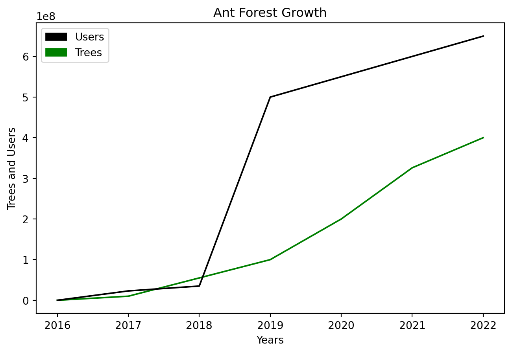

``` mdx-code-block
import Figure from '/src/components/Figure'
import FlightEmissions from '../images/flight-emissions.png'
import Strava from '../images/strava.png'
import ResQClub from '../images/resq-club.png'
```

## Data-Driven Design

Interaction Design for Climate Change: how can we change common UIs so
they take into account sustainability?

As we humans go about our daily business, we produce massive amounts of
data, which is useful for designing better products. There are many
approaches to design and the majority share the common goal of designing
for a good user experience.

## Interaction Design for Climate Change

Interaction Design for Climate Change: how can we change common UIs so
they take into account sustainability?

-   https://uxplanet.org/5-ways-ux-design-can-tackle-climate-change-issues-e38723000e1c
-   https://uxplanet.org/how-designers-can-help-deal-with-climate-change-81a931070f36
-   https://uia2023cph.org/design-for-climate-adaptation/
-   https://medium.com/r-g-strategic/fight-climate-change-with-great-ux-design-f766c6cc6601
-   https://sustainabledevelopment.un.org/content/documents/951013_Toolkit%20for%20Designing%20Climate%20Change%20Adaptation%20Initiatives.pdf
-   https://www.researchgate.net/publication/332130501_How_can_we_influence_human_behaviour_using_UX_to_accommodate_improvement_for_climate_change
-   https://www.researchgate.net/publication/221514572_Environmental_sustainability_and_interaction
-   https://www.sciencedirect.com/science/article/pii/S2666659622000099
-   https://www.oecd.org/environment/cc/policy-perspectives-climate-resilient-infrastructure.pdf
-   https://books.google.ee/books?id=71yYEAAAQBAJ&pg=PA41&lpg=PA41&dq=Interaction+Design+for+Climate+Change:+how+can+we+change+common+UIs+so+they+take+into+account+sustainability?&source=bl&ots=3SPcm5OnK9&sig=ACfU3U3IDa-ibvd8G7x3o8d6-Y08Z1GoZg&hl=en&sa=X&ved=2ahUKEwiDqNmruf2AAxWdFhAIHay5Cw0Q6AF6BAgmEAM#v=onepage&q=Interaction%20Design%20for%20Climate%20Change%3A%20how%20can%20we%20change%20common%20UIs%20so%20they%20take%20into%20account%20sustainability%3F&f=false

Climate Change UX

-   Lose (2023)

### **Interaction Design**

### Platform Economy

*Network Effects,* the more people use a platform, the more valuable it
becomes. Rise of the *platform economy* has created global marketplace
companies like Airbnb and Uber that match idle resources with retail
demand and optimize how our cities work.

By continuously adding features (and provided consumer legislation
allows it), platforms can evolve into superapps. Superapps are possible
thanks to **Nudge, Economies of Scale, Network Effects, Behaviour
Design.** The most successful businesses today (as measured in terms of
the number of users) look at the whole user experience. Popular consumer
platforms strive to design solutions that feel personalized at every
touchpoint on the user journey (to use the language of service design)
but doing so at the scale of hundreds of millions (or even billions) of
users - personalization at scale. Superapps are honeypots of data that
is used for many types of behavior modeling. For example Suarez, G. et
al. (2021) suggests using alternative data from super-apps to estimate
user income levels, including 4 types of data: Personal Information,
Consumption Patterns, Payment Information, and Financial services. Also
Roa et al. (2021) finds super-app alternative data is especially useful
for credit-scoring young, low-wealth individuals. The massive amounts of
data generated by these companies are used by smart cities to re-design
their physical environments.

| Enablers of Platform Economics | Good                                                          | Bad                                                                     |
|--------------------|--------------------------|--------------------------|
| Network effects                | The more people use a platform, the more valuable it becomes. | Data is not portable. You can’t leave because you’ll lose the audience. |
| Scalability                    |                                                               |                                                                         |
| Data-driven                    |                                                               |                                                                         |
| Behaviour Design               |                                                               |                                                                         |

-   Superapps are more prevalent in China and South-East Asia.
    Giudice (2020) argues WeChat has had a profound impact on changing
    China into a cashless society, underlining how one mobile app can
    transform social and financial interactions of an entire country.
    Vecchi and Brennan (2022) China is the home of many superapps and
    this paper discusses the strategies taken to expand to other
    markets. Shabrina Nurqamarani et al. (2020) discusses the system
    consistency and quality of South–East Asian superapps Gojek and
    Grab.

-   Uber is creating an all-purpopse platform; only 4.1% of rides were
    electric Levy (2023)

-   Twitter (X) is becoming a superapp.

Could there be Sustainability Superapps?

-   How to design sustainability superapps? Lots of options in a single
    app. Fleet Management Weekly (2022) “Sustainability and superapps
    top Gartner’s Top 10 2023 Trends List”. Dave Wallace (2021) “The
    rise of carbon-centric super apps”. goodbag (2023) “goodbag:
    Sustainable Super App”. What would a sustainable investment platform
    that matches green investments with the consumers look like, if one
    saw the side-by-side comparison of investment vehicles on their ESG
    performance? Also Bernard (2022).

-   Undheim (2024) Ecotech

-   Lori Perri (2022)

-   Anon. (2022a)

-   Anon. (2021a) PayPal dominance

-   Zeng (2015) **(need to pay for article!)**

-   Huang and Miao (2021) **(need to pay for article!)**

-   Anon. (2022b)

-   Cuppini, Frapporti and Pirone (2022) a historical overview of the
    development of capitalism from linear ***Fordism*** through platform
    economy and logistics’ revolution which allows for circular
    economies to happen in a city.

-   Adaptive AI

### Speculative Design

In order to build a future, it’s relevant to imagine and critique a
future.

Speculative design makes use of future scenarios to envision contexts
and interactions in future use. The term ***speculative design*** was
invented by Dunne and Raby (2013) in their seminal book to question the
intersection of user experience design and speculative fiction. For
example Barendregt and Vaage (2021) explores the potential of
speculative design to stimulate public engagement through thought
experiments that spur public debate on an issue chosen by the designer.

Phil Balagtas, founder of The Design Futures Initiative at McKinsey,
discusses the value of building future scenarios at his talk at Google.
One of his examples, the Apple Knowledge Navigator, from an Apple vision
video in 1987, took two decades to materialize in the real world. It was
inspired by a similar device first shown in a 1970s episode of Star Trek
as a **magic device** (a term from participatory design), which then
inspired subsequent consumer product development. It took another 2
decades, until the launch of the iPhone in 2007 - a total of 40 years.
Imagination is crucial for change (Google Design, 2019).

### Digital Health

-   Quantified Self is an example
-   Tracking air pollution and realizing how bad the over in my
    grandma’s house is: add picture

There is a lot of research on ***quantified self***. Wearable devices
like Apple Watch, Oura Ring, combined with apps help users track a
variety of health metrics. Apart from health, wearable devices have been
used to track other metrics. Giannakos et al. (2020) used wearable
devices to measured physiological parameters of students at school to
determine their learning efficiency. Could one track personal
sustainability in a similar fashion?

Shin et al. (2019) synthesis review of 463 studies shows wearable
devices have potential to influence behavior change towards healthier
lifestyles. Saubade et al. (2016) finds health tracking is useful for
motivating physical activity. Apple is a leader in health tracking.
Apple (2022a): In a 2022 report Apple outlines its plans to :
“Empowering people to live a healthier day”. Apple (2022b) Apple’s
HealthKit provides a growing list of health metrics. Liu et al. (2019)
tracks how wearable data is used for tracking sleep improvements from
exercise. Grigsby-Toussaint et al. (2017) Sleep apps and behavioral
constructs.

Blood sugar trackers. Bloog glucose tracking is popular even for people
without diabetes, to optimize their activity Anon. (2021b)

Another aspect is tracking one’s mental health. Tyler, Boldi and
Cherubini (2022) surveys the use of self-reflection apps in the UK
(n=998).

Use technology Wearables to be more aware of one’s health.

-   Popular Strava (100 million users) sports assistant provides run
    tracking and feedback (Strava, 2022).

``` mdx-code-block
<Figure caption="Popular Strava sports assistant provides run tracking and feedback" src={Strava} />
```

-   AI Financial Advisors will need to go further to motivate users.

-   There is a parallel in health to sustainability and indeed both are
    inextricably linked.

-   Tracking urine consistency inside your toilet with WithThings

-   Tracking blood sugar with app and patches

-   “urban metabolism” (Claire Moran, 2018; Shi et al., 2021), city
    in-out flows accounting method

-   The urban environment has an influence on health. Delclòs-Alió et
    al. (2022) discusses walking in Latin American cities. Walking is
    the most sustainable method or transport but requires the
    availability of city infrastructure, such as sidewalks, which many
    cities still lack.

-   Tsai et al. (2019)

-   Burger, White and Yearworth (2019)

-   Aromatario et al. (2019) behavior changes

-   Ayoola et al. (2018) wellbeing data

-   Godfrey et al. (2018)

-   Thomas et al. (2018)

-   Tonne et al. (2017)

-   Anselma, Mazzei and De Michieli (2017)

-   Forlano (2017) post-humanism and design

-   Greenbaum and Gerstein (2016)

-   Millings et al. (2015)

-   Reis et al. (2015)

-   Bower and Sturman (2015)

-   Fletcher (2022)

-   Ryan (2022) uses the “capability methodology” to evaluate if apps
    help people eat healthily.

-   Baptista et al. (2022) apps for sleep apnea

### Digital Sustainability

In digital sustainability, information pertaining to emissions would
flow through the economy not unlike the carbon cycle itself.

-   Pan and Nishant (2023) important

### Affective Design

### User Interfaces

What is the user interface of the green transformation?

McKeough (2018) business consultancies have begun to recognize the
importance of design to business. They advise their corporate clients to
bring user experience design to the core of their business operations.

There’s a number of user interface design patterns that have provide
successful across a range of social media apps. Such ***user experience
/ user interface*** (UX/UI) patterns are copied from one app to another,
to the extent that the largest apps share a similar look and feature
set. Common UX/UI parts include the Feed and Stories. By using common UI
parts from social media users have an easier time to accept the
innovative parts. add Viz charts. Avatars are increasingly common and
new generations are used to talking to computers.

| Feature   | Examples                           |     |
|-----------|------------------------------------|-----|
| Feed      |                                    |     |
| Post      | Apple App Store                    |     |
| Stories   | IG, FB, WhatsApp, SnapChat, TikTok |     |
| Comment   |                                    |     |
| Reactions |                                    |     |

Common Social Media UI Parts

There are also more philosophical approaches to ***Interface Studies:***
David Hoang (2022), the head of product design at Webflow, suggests
taking cues from art studies to ***isolate the core problem***. “An art
study is any action done with the intention of learning about the
subject you want to draw”. As a former art student, Hoang looks at an
interface as *“a piece of design is an artwork with function”*.

Indeed, art can be a way to see new paths forward, practicing
“fictioning” to deal with problematic legacies: Anon. (2023a)

### Personal Carbon Trackers

Similar to personal health trackers, personal CO<sub>2</sub> trackers
help one track emissions and suggests sustainable actions.

| App                     | Description                                            |
|-------------------------|-----------------------------------------------|
| Commons (Formerly Joro) | Finacial Sustainability Tracking + Sustainable Actions |
| Klima                   | Offset Subscription                                    |
| Wren                    | Offset Subscription                                    |
| JouleBug                |                                                        |
| eevie                   |                                                        |
| Aerial                  |                                                        |
| EcoCRED                 |                                                        |
| Carbn                   |                                                        |
| LiveGreen               |                                                        |
| Earth Hero              |                                                        |
|                         |                                                        |

A selection of personal sustainability apps. See *greenfilter.app* for
an updated database.

### Digital Product Design

Design is as much about how it works as it’s about the interface.

Digital product design can be seen as a specific discipline under the
umbrella of **Experience Design**. In Michael Abrash (2017) Meta Oculus
augmented reality incubation general manager Laura Fryer: “People buy
experiences, not technology.”

Young people expect a product. Intelligent Interfaces use interaction
design to provide relevant and personalized information in the right
context and at the right time.

Ceschin and Gaziulusoy (2016) shows how design for sustainability has
expanded from a product focus to systems-thinking focus placing the
product inside a societal context of use. For example Anon. (n.d.a),
Recycled clothing maker FREITAG offers sustainability-focused services
such ass cargo bikes so you can transport your purchases and a network
for *shopping without payment* = swapping your items with other members,
as well as repairs of their products. Loaning terminology from
***service design***, the user journey within an app needs to consider
each touchpoint on the way to a state of success.

Weinschenk (2011) says “People expect most online interactions to follow
the same social rules as person-to-person interactions. It’s a shortcut
that your brain uses to quickly evaluate trustworthiness.”

The small screen estate space of mobiles phones and smart watches
necessitates displaying content in a dynamic manner. Virtual reality
glasses (called AR/VR or XR in marketing speak) need dynamic content
because the user is able to move around the environment. Both are
questions that interaction design is called upon to solve. Hoang (2022):
“Dynamic interfaces might invoke a new design language for extended
reality”.

Speaking is one mode of interaction that’s become increasingly possible
as machines learn to interpret human language.

| Mode of Interaction |     |
|---------------------|-----|
| Writing             |     |
| Speaking            |     |
| Touching            |     |
| Moving              |     |
|                     |     |

Modes of interaction

Coputer

Humans respond well to ***storytelling***, making ***character design***
and ***narrative design*** relevant to interaction design. Large
language models (LLMs) such as ChatGPT are able to assume the
personality of any character that exists inside of its training data,
creating opportunities for automated narrative design.

One mode

-   Konings (2020)
-   “Digital sustainability principles”
-   Eminent journal Design Studies, 1st design journal
-   Part of digital product design are **design systems** to keep
    consistency across the experience. Create a design system to best to
    showcase my analytic skills:
    -   Anon. (n.d.b)
    -   Suarez, M. et al. (n.d.)
    -   Anon. (n.d.c)
    -   Anon. (n.d.d)
-   Kolko and Connors (2010) and IxDF (n.d.) believe interaction design
    is still an emerging (and changing) field and there are many
    definitions. I prefer the simplest version: interaction design is
    about creating a conversation between the product and the user.
-   AI gives designers new tools. In AI development, design is called
    alignment. What is the role of an AI Designer? Linden (2021)
-   Anon. (n.d.e)
-   Anon. (n.d.f)
-   Parundekar (2021)
-   Richard Yang (2021) and Justin Baker (2018) say some of the tools
    used by interaction designers include
-   AI for design: Figma (2023)

The concept of ***Social Objects*** is People need something to gather
around and discuss. Sharing.Lab (2015): I’m interested in the concept of
a “social object”.

***Red Route Analysis*** is an user experience optimization idea
inspired by the public transport system of London (Oviyam (2019); Anon.
(2021c) and Xuan (2022)).

Large Digital Platforms have a very small number of workers relative to
the number of users they serve. This creates the necessity for using
automation for both understanding user needs and providing the service
itself. Creating a good product that’s useful for the large majority of
users depends on ***Data-Driven Design.***

-   Product marketers focus on the ***stickiness*** of the product,
    meaning low attrition, meaning people keep coming back.
-   What percent of all design is “sustainable design” ? Promoting
    sustainable design.
-   Josh Luber (2021) Trading cards are cool again
-   Jesse Einhorn (2020)
-   Connie Loizos (2021)
-   Natasha Mascarenhas (2021)
-   JEFF JOHN ROBERTS (April 23, 2020 at 2:00 PM GMT+3)

### Narrative Design

-   The rising availability of AI assistants may displace Google search
    with a more conversational user experience. Google itself is working
    on tools that could cannibalize their search product. The examples
    include Google Assistant, Google Bard and large investments into
    LLMs.

-   Alethea AI (2021): discusses writing AI Characters, creating a
    personality.

-   Writing as training data? large language models. GTP3.

-   Stories start with a character.

### Behavioral Design

For decades, marketers and researchers have been researching how to
affect human behavior towards increasing purchase decisions in commerce,
both offline and online, which is why the literature on behavioral
design is massive. One of the key concepts is *nudge*, first coined in
2008 by the Nobel-winning economist Richard Thaler; nudges are based on
a scientific understanding of human psychology and shortcuts and
triggers that human brains use and leverages that knowledge to influence
humans in small but powerful ways (Thaler and Sunstein, 2009).

The principles of nudge have also been applied to sustainability. For
example, a small study (n=33) in the Future Consumer Lab in Copenhagen
by Perez-Cueto (2021) found that designing a “dish-of-the-day” which was
prominently displayed helped to increase vegetarian food choice by 85%.
Guath, Stikvoort and Juslin (2022) experiments (n=200) suggested nudging
can be effective in influencing online shopping behavior towards more
sustainable options. A larger scale study of behavior change in
Australia maps how to avoid “16 billion paper coffee cups are being
thrown away every year” (Novoradovskaya et al., 2021).

Google uses nudges in Google Flights and Google maps, which allow
filtering flights and driving routes by the amount of CO<sub>2</sub>
emissions, as well as surfacing hotels with Green Key and EarthCheck
credentials, while promising new sustainability features across its
portfolio of products Sundar Pichai (2021). Such tools are small user
interface nudges which Google’s research calls *digital
decarbonization*, defined by Implement Consulting Group (2022) as
“Maximising the enabling role of digital technologies by accelerating
already available digital solutions”.

In Kate Brandt and Matt Brittin (2022), Google’s Chief Sustainability
Officer Kate Brandt set a target of “at least 20-25%” CO<sub>2</sub>
emission reductions in Europe to reach a net-zero economy and the global
announcement set a target of helping 1 billion people make more
sustainable choices around the world (Jeni Miles, 2022). In addition to
end–users, Google offers digital decarbonization software for
developers, including the Google Cloud Carbon Footprint tool and invests
in regenerative agriculture projects (Anon., 2021d; Google, 2023).

Sarah Perez (2022) shows how google added features to Flights and Maps
to filter more sustainable options

Justine Calma (Oct 6, 2021, 10:01 AM GMT+3) Google UX eco features

How CO2 is shown by Google starts hiding emissions? Anon. (2022c)

Google VERY IMPORTANTT Google (2021)

Anon. (2021e) Google green routes

Wizzair Check carbon impact Anon. (n.d.g)

| Feature                                                                       | Product        | Nudge                                            |
|----------------------------------|-------------------|-------------------|
| Google Maps AI suggests more eco-friendly driving routes Mohit Moondra (n.d.) | Google Maps    | Show routes with lower CO<sub>2</sub> emissions  |
| Google Flights suggests flights with lower CO<sub>2</sub> emissions           | Google Flights | Show flights with lower CO<sub>2</sub> emissions |

Examples of CO<sub>2</sub> visibility in Google’s products.

``` mdx-code-block
<Figure caption="Google's view of flight emissions" src={FlightEmissions} refURL="https://www.google.com/travel/flights" refTitle="Copyright by Google 2023 referenced under fair use" />w
```

-   The founder of the Commons (Joro) consumer CO<sub>2</sub> tracking
    app recounts how people have a gut feeling about the 2000 calories
    one needs to eat daily and daily CO<sub>2</sub> tracking could
    develop a gut feeling about one’s carbon footprint (Jason Jacobs,
    2019).

Some notable examples:

-   Eriksson, Christensen and Malefors (2023) discusses best practices
    for reducing food waste in Sweden.
-   Acuti, Lemarié and Viglia (2023) makes the point that physical
    proximity to a drop-off point helps people participate in
    sustainability.
-   Wee, Choong and Low (2021) proposes types of nudging technique based
    on an overview of 37 papers in the field.

| Name              | Technique                                                                                 |
|--------------------------|----------------------------------------------|
| Prompting         | Create cues and reminders to perform a certain behavior                                   |
| Sizing            | Decrease or increase the size of items or portions                                        |
| Proximity         | Change the physical (or temporal) distance of options                                     |
| Presentation      | Change the way items are displayed                                                        |
| Priming           | Expose users to certain stimuli before decision-making                                    |
| Labelling         | Provide labels to influence choice (for example CO<sub>2</sub> footprint labels)          |
| Functional Design | Design the environment and choice architecture so the desired behavior is more convenient |

Types of nudge by Wee, Choong and Low (2021)

-   Bain et al. (2012) “Promoting pro-environmental action in climate
    change deniers” **(Need access!)**
-   Allcott (2011) “Social norms and energy conservation” **(Need
    access!)**
-   Schuitema and Bergstad (2018) “Acceptability of Environmental
    Policies” **(Need access!)**
-   Nilsson et al. (2016) “The road to acceptance: Attitude change
    before and after the implementation of a congestion tax” **(Need
    access!)**
-   Berger, M., Lange and Stahl (2022) **(Need access!)**
-   Anon. (2022d)
-   United Nations Conference on Trade and Development (last) (2023)
-   Climatiq (2023) Automate GHG emission calculations
-   EarthCheck (2023) sustainable tourism certification
-   LFCA (2023) corporate climate action
-   Greenhouse Gas Protocol (2023) standards to measure and manage
    emissions
-   Playing for the Planet Alliance (2021)

#### Gamification

-   Students in Indonesia enjoy using Kahoot and it’s gamification
    elements are perceived to have positive impact on individual
    learning outcomes so they are happy to continue using it (Wirani,
    Nabarian and Romadhon, 2022).
-   Anon. (n.d.h) game company going green
-   Ant Forest (螞蟻森林) is a success story of gamified nature
    protection. Success stories integrating previously distinct
    experiences with sustainability have shown positive results, for
    example, Alibaba’s Ant Forest simultaneously raising money for
    planting forests and building loyalty, leading the company to
    consider further avenues for gamification and eco-friendliness.
-   Gamification makes uses of nudges.

| Year | Users       | Trees       | Area                                 |
|------|-------------|-------------|--------------------------------------|
| 2016 | ?           | 0           |                                      |
| 2017 | 230 million | 10 million  |                                      |
| 2018 | 350 million | 55 million  | 6500 acres??                         |
| 2019 | 500 million | 100 million | 112,000 hectares / 66, 000 hectares? |
| 2020 | 550 million | 200 million | 2,7 million acres?                   |
| 2021 | 600 million | 326 million |                                      |
| 2022 | 650 million | 400 million | 2 million hectares                   |
|      |             |             |                                      |
|      |             |             |                                      |

Table of Ant Forest assisted tree planting. Data compiled from (李连环
and 姜舒译, 2017; Yang et al., 2018; UNFCCC, 2019; Wang, X. and Yao,
2020; Anon., 2021f; Wang, S., Ibrahiem and Li, 2022; Zhang, Hu and Gu,
2022; Cao and Liu, 2023; Zhou, F., Lin and Mou, 2023).

```python
# importing the modules
import numpy as np
import matplotlib.pyplot as plt
import matplotlib.patches as mpatches

# data to be plotted
x_years = [2016, 2017, 2018, 2019, 2020, 2021, 2022]
y_trees = [0, 10000000, 55000000, 100000000, 200000000, 326000000, 400000000]
y_users = [0, 23000000, 35000000, 500000000, 550000000, 600000000, 650000000]

# plotting
plt.title("Ant Forest Growth")
plt.xlabel("Years")
plt.ylabel("Trees and Users")
plt.plot(x_years, y_trees, color = "green")
plt.plot(x_years, y_users, color = "black")
plt.legend(handles=[mpatches.Patch(color='black', label='Users'), mpatches.Patch(color='green', label='Trees')])
plt.show()
```



## Design for Sustainability

### Life-Centered Design

While Human-Centered Design has become popular, the effect humans are
having on biodiversity leads to the idea of Life-Centered Design.
Borthwick, Tomitsch and Gaughwin (2022) proposes a framework for
life-centered design, “the design phase of a physical product accounts
for 80% of its environmental impact”.

Sustainability touches every facet of human existence and is thus an
enormous undertaking. Making progress on sustainability is only possible
if there’s a large-scale coordinated effort by humans around the planet.
For this to happen, some technological tools are helpful.

-   Sanchez et al. (2022) LoRaWAN

## Provenance & Traceability {#provenance-traceability}

-   Anon. (2022e)
-   Katie Gustafson (2022) proposes a **“Uniform traceability system for
    the entire supply chain”** for seafood
-   Muñoz et al. (2023) Is there such a thing as sustainable fishing?
    Bottom trawling is the worst and should be banned.
-   Anon. (2021g) “Real Time ESG Tracking From StockSnips”
-   Mamede et al. (2022) proposes *Seafood tracing*: Fingerprinting of
    Sea Urchin.
-   Waters (2015) **(Need access!)**
-   Cawthorn and Hoffman (2016) **(Need access!)**
-   Gamborg and Jensen (2017) **(Need access!)**
-   Neethirajan and Kemp (2021) using biometric sensors to track
    livestock sustainability.
-   Ray (2023) comprehensive overview of Web3.
-   Rehash: A Web3 Podcast (2022) human-centered web3
-   Patel et al. (2023) livestock products (meat) are 15% of
    agricultural foods valued at €152 billion in 2018.
-   Inc (n.d.)
-   Tim Nicolle (2017)

#### Supply Chains

Freight (transport of goods by trucks, trains, planes, ships) accounts
for 1.14 gigatons of CO<sub>2</sub> emissions as per 2015 data or 16% of
total international supply chain emissions (Wang, Y. et al., 2022).

-   Platzer (2023), a scientist working on the Apollo space programme,
    calls for emergency action to develop *green aviation*.

-   “Transport greenhouse gas emissions have increased every year since
    2014” Anon. (2023b)

<div dangerouslySetInnerHTML={{ __html: quartoRawHtml[0] }} />

-   Finkenstadt and Handfield (2021) COVID19 pandemic highlighted the
    need to have real-time visibility into supply chains.

| Type of Transport           | Percentage |
|-----------------------------|------------|
| Passenger cars              | 39%        |
| **Medium and heavy trucks** | 23%        |
| **Shipping**                | 11%        |
| **Aviation**                | 9%         |
| Buses and minibuses         | 7%         |
| Light commercial vehicles   | 5%         |
| Two/three-wheelers          | 3%         |
| Rail                        | 3%         |

Share of CO<sub>2</sub> of CO<sub>2</sub> emissions by type of transport
(Statista and IEA, 2022)

Circular design is possible if supply chains become circular.

-   Wagenvoort (2020) Self-driving supply chains.. (contact Japanese
    factory?)

-   California Transparency in Supply Chains Act

#### How to Trace Supply Chains?

-   Knight et al. (2022) new tools are needed to map supply chains.

-   Dutta et al. (2020) hundreds of paper researching blockchain use in
    supply change operations since 2017.

-   Van Wassenaer et al. (2023) Compares use cases for blockchains in
    enhancing traceability, transparency and cleaning up the supply
    chain. There are several technologies for tracking goods across the
    supply chain, from shipping to client delivery.

-   Ashraf and Heavey (2023) Solana blockchain and Sigfox internet of
    things (IoT) Integration for supply chain traceability.

-   Blockchain ledgers are useful for data sharing and auditing, as the
    time and place of data input can be guaranteed, and it will be
    easier to conduct a search on who inputted incorrect data, however
    the system still relies on correct data input. As the saying goes,
    “garbage in, garbage out”.

-   Several startups are using distributed ledgers (blockchains) to
    track source material arriving to the factories and product
    movements from factories to markets. While blockchains enable
    securely tracing data, which is immutable (no possible to change the
    same record, only add data in new records).

| Company        | Link              | Literature                                              | Comments                                      |
|------------------|------------------|-------------------|------------------|
| Ocean Protocol | oceanprotocol.com |                                                         |                                               |
| Provenance     | provenance.io     |                                                         |                                               |
| Ambrosius      | ambrosus.io       |                                                         |                                               |
| Modum          | modum.io          |                                                         |                                               |
| OriginTrail    | origintrail.io    |                                                         |                                               |
| Everledger     | everledger.io     |                                                         |                                               |
| VeChain        | vechain.org       |                                                         |                                               |
| Wabi           | wabi.io           |                                                         |                                               |
| FairFood       | fairfood.org      |                                                         |                                               |
| Bext360        | bext360.com       |                                                         |                                               |
| SUKU           | suku.world        | Miller (2019) SUKU makes supply chains more transparent | Seems to have pivoted away from supply chains |

Blockchain supply chain companies as of summer 2023 include.

#### Ethics & Cruelty {#ethics-cruelty}

Can data transparency provide tools for reducing cruelty.

-   Traceability and animal rights. Animal rights vs animal welfare.
    Ethereum blockchain and animal rights. “Blockchain can provide a
    transparent, immutable record of the provenance of products. This
    can be especially useful for verifying claims made about animal
    welfare. For example, products claiming to be”free-range,”
    “organic,” or “sustainably sourced” could have their entire
    lifecycle recorded on the blockchain, from birth to shelf, allowing
    consumers to verify these claims.”

-   Cruelty free brands

-   BCorp

-   ESG

-   Trash found in ocean / nature etc

-   Increase your investment point by matching with your contribution /.

-   Point of Sales integration (know the SKU you buy). Integrate to the
    financial eco footprint (no need to scan the product). What’s the
    name of the startup that does this?

-   Precision Fermentation and Cultivated Meat: Meat products without
    farm animals

#### Open Data

taiwan is a proponent of Open Gov OP-MSF OGP
https://www.opengovpartnership.org/ogp-participation-co-creation-standards/
https://lab.ocf.tw/2021/06/20/ogp_taiwan-en/

Data-driven design requires access to data, making the movement towards
*open data sharing* very important. Some countries and cities are better
than others at sharing data openly.

| Country | Project                  | Reference     |
|---------|--------------------------|---------------|
| Sweden  | Swedish open data portal | Anon. (n.d.i) |
|         |                          |               |
|         |                          |               |

Examples of cities and countries that share data openly.

-   When will Bolt show CO<sub>2</sub> emissions per every trip?
-   Sustainable finance data platform:
-   WikiRate (2021) WikiRate defines Data Sharing Archetypes

| Type                                 | Example                                      |
|----------------------------------|--------------------------------------|
| Transparency Accountability Advocate |                                              |
| Compliance Data Aggregator           |                                              |
| Data Intelligence Hub                |                                              |
| Worker Voice Tool                    | Caravan Studios (2022): **“Worker Connect”** |
| Traceability tool                    | trustrace.com                                |
| Open data platform                   |                                              |
| Knowledge sharing platform           | business-humanrights.org                     |

-   WikiRate is a tool for checking green credentials Transparency
-   Laureen van Breen et al. (2023)
-   Wikirate (2022a)
-   Anon. (n.d.j)

#### Taxes

-   There have been proposal of a “meat tax”.

#### Carbon Labels

Adding CO<sub>2</sub> labels for consumer products have been discussed
for decades (Adam Corner, 2012). Cohen and Vandenbergh (2012) argues
carbon labels do influence consumer choice towards sustainability.
Academic literature has looked at even minute detail such as color and
positioning of the label (Zhou, S. et al. (2019)). There is some
indication consumers are willing to pay a small premium for
low-CO<sub>2</sub> products (Xu and Lin (2022)). All else being equal,
consumers choose the option with a lower CO<sub>2</sub> number
(Carlsson, Kataria and Lampi (2022)). Nonetheless, the idea of *Carbon
Labelling* is yet to find mainstream adoption.

There’s some evidence to suggest labeling low CO<sub>2</sub> food
enables people to choose a *climatarian diet* in a large-scale study
Lohmann et al. (2022) of UK university students, however the impact of
carbon labels on the market share of low-carbon meals is negligible.
Labels alone are not enough. underlines Edenbrandt and Lagerkvist (2022)
in Sweden in a study which found a negative correlation between worrying
about climate impact and interest in climate information on products,
suggesting a need for wider environmental education programs. Asioli et
al. (2022) found differences between countries, where Spanish and
British consumers chose meat products with *‘No antibiotics ever’* over
a *Carbon Trust* label, whereas French consumers chose CO<sub>2</sub>
labeled meat products.

Carbon labeling is voluntary and practiced by only a handful of
companies. The U.S. restaurant chain *Just Salad* , U.K.-based vegan
meat-alternative *Quorn* and plant milk *Oatly* are some example of
companies that provide carbon labeling on their products (Brian Kateman,
2020). ClimatePartner (2020): Companies like ClimatePartner and Carbon
Calories offers labeling consumer goods with emission data as a service.
The Carbon Trust (n.d.): The Carbon Trust reports it’s certified 27
thousand product footprints.

| Company    | Country |
|------------|---------|
| Just Salad | U.S.A.  |
| Quorn      | U.K.    |
| Oatly      | U.K.    |

Companies with Carbon Labels (Brian Kateman, 2020)

| Organization    | Country | Number of Product Certified |
|-----------------|---------|-----------------------------|
| ClimatePartner  |         |                             |
| Carbon Calories |         |                             |
| Carbon Trust    |         | 27000                       |

Organization to Certify Carbon Labels (ClimatePartner, 2020).

-   Digitalisation and digital transformation; Digital Receipts are one
    data source for tracking one’s carbon footprint (Anon., n.d.k).

-   Ivanova et al. (2020) “establish consumption options with a high
    mitigation potential measured in tonnes of CO<sub>2</sub> equivalent
    per capita per year.”

-   55% of emissions come from energy production.

-   Carto (2023) Making advanced maps to convince people to make changes

#### Digital Product Passports

Digital product passports are a further development of the idea of
carbon labels.

-   The European Commision has proposed a *Digital Product Passports* to
    help companies transfer environmental data (Nissinen, Seppälä and
    Heinonen, 2022). Carbon labels are needed for green transformation.

-   Reich et al. (2023) “Information gaps are identified as one of the
    major obstacles to realizing a circular economy.”

-   Jensen et al. (2023) “support decision-making throughout product
    life cycles in favor of a circular economy.”

-   King, Timms and Mountney (2023) “influence consumer behavior towards
    sustainable purchasing and responsible product ownership by making
    apparent sustainability aspects of a product life cycle.”

-   Berger, K., Rusch, et al. (2023) “support Sustainable Product
    Management by gathering and containing product life cycle data.
    However, some life cycle data are considered sensitive by
    stakeholders, leading to a reluctance to share such data.”

-   Plociennik et al. (2022) “Digital Lifecycle Passport (DLCP) hosted
    on a cloud platform and can be accessed by producers, users,
    recyclers”

-   Berger, K., Baumgartner, Weinzerl, Bachler and Schöggl (2023)
    challenges with Electric Vehicle Batterys. Berger, K., Baumgartner,
    Weinzerl, Bachler, Preston, et al. (2023) proposes Digital Battery
    Passports

-   Van Capelleveen et al. (2023) literature overview

-   Sustainable Product Management: Korzhova (2020)

-   Gitcoin Passport Sybil Defense. Made Simple.
    \[@gitcoinpassport\] (2023) discusses ow to build an antifragile
    scoring system (antifragile passport) inspired by Nassim Taleb’s
    popular book that discusses antifragile systems that get better in
    difficult situations (Taleb, 2012).

## Designing Industries

It’s possible to re-design entire industries and that is exactly the
expectation sustainability sets on businesses. Across all industries,
there’s a call for more transparency. Conversations about sustainability
are too general and one needs to look at the specific sustainability
metrics at specific industries to be able to design for meaningful
interaction. There’s plentiful domain-specific research showing how
varied industries can develop eco-designed products. I will here focus
on 2 industries that are relevant for college students.

### Fashion

Young people are the largest consumers of fast fashion (Anon., n.d.l).
In European Environment Agency (2022), European Environment Agency (EEA)
estimates based on trade and production data that EU27 citizens consumed
an average 15kg of textile products per person per year.

Sustainable Fashion, Textile Design

-   There are signs of young Chinese consumers valuing experiences over
    possessions Jiang (2023).

-   Millward-Hopkins, Purnell and Baurley (2023) shows how half of the
    textile waste in the UK is exported to other countries.

-   Story of Patagonia Chouinard (2005)

Across industries, reports are saying there isn’t enough transparency.

-   US EPA (2016) GHG emission inventory by sector

-   **Problem**: Emily Chan (2022a) report says there’s not enough
    transparency in fashion:

-   Fashion greenwashing, fashion is 2%-8% of total GHG emissions, 2.4
    Trillion USD industry, 100B USD lost to lack of recycling,
    contributes 9% of microplastics: Adamkiewicz et al. (2022)

-   Centobelli et al. (2022) per year uses 9B cubic meters of water,
    1.7B tonnes of CO<sub>2</sub>, 92 million tonnes of textile waste.

-   Köhler et al. (2021): Globally 87% of textile products are burned or
    landfilled after 1st consumer use.

-   Marrucci, Marchi and Daddi (2020) Italian retail supermarkets carbon
    footprint?

-   Leung and Luximon (2021) There’s a growing know-how on how to
    produce sustainably and which materials to use. “Handbook of
    Footwear Design and Manufacture” Chapter 18 - Green design.

-   Emily Chan (2022b) New Standard Institute’s proposed “Fashion Act”
    to require brands doing business in New York City to disclose
    sustainability data and set waste reduction targets.

-   Wikirate (2022b): “Among the Index’s main goals are to help
    different stakeholders to better understand what data and
    information is being disclosed by the world’s largest fashion brands
    and retailers, raise public awareness, educate citizens about the
    social and environmental challenges facing the global fashion
    industry and support people’s activism.”

-   Mabuza, Sonnenberg and Marx-Pienaar (2023) shows consumer knowledge
    of apparel coloration is very limited.

-   Gyabaah et al. (2023) research across several dumpsites across Ghana
    revealed up to 12% of the landfill consisted of textile waste.

-   imperfectidealist (2020) Fashion sustainability vs greenwashing

-   Anon. (2023c) Ethical Shopping

-   Anon. (2023d) Ethical brand?

-   Good On You (2023) Sustainable fashion company evaluations

-   Anon. (n.d.m) Garment Worker’s rights

-   Emily Chan (2022c): fashion companies can’t be held accountable for
    their actions (or indeed, their lack of action).

-   WikiRate (2023)

-   Anon. (2022f): “Political consumerism”, “Instant Gratification for
    Collective Awareness and Sustainable Consumerism”

-   FashionChecker (2023)

-   Eesti Disainikeskus I Estonian Design Centre (2021) Circular
    textiles

-   Eesti Kunstiakadeemia (2022) Sustainable Fashion education

-   Fashion Revolution Foundation (2022) Fashion transparency index

-   Anon. (n.d.n)

-   “The mainstream fashion industry is built upon the exploitation of
    labor, natural resources and the knowledge of historically
    marginalized peoples.”

-   Anon. (n.d.o)

-   “Secrecy is the linchpin of abuse of power…its enabling force.
    Transparency is the only real antidote.” Glen Greenwald, Attorney
    and journalist.

-   Stand.earth (2023)

-   Anon. (n.d.p)

-   Anon. (n.d.q) Bangladesh Garment Manufacturers and Exporters
    Association

-   ERR (2022) European Commission wants to reduce the impact of fast
    fashion on EU market.

-   Minimize shopping, buy quality, save CO<sub>2</sub>, invest.

-   Textile Exchange (2023) Ethical fashion materials matter

-   Textile Exchange (2021): Policy request

-   Free clothes

-   Vanish UK (2021) “Generation rewear” documentary, sustainable
    fashion brands

-   Storbeck (2021) and Remington (2020): Zalando says Fast fashion must
    disappear

-   Infinited Fiber (2023)

-   Cleantech Group (2023) Global cleantech 100

-   Anon. (2023e) Alterations and repairs made easy

-   Anon. (2023f) Ethical brand ratings

### Food

-   EAT-Lancet diet

-   Eshe Nelson, Ana Swanson and Jeanna Smialek (2023) increased
    volatility in food prices

-   Chang et al. (2021) fish fraud is a large global problem but it’s
    possible to use DNA-tracking to prove where the fish came from. In
    “2019, the 27 KURA SUSHI branches in Taiwan sold more than 46
    million plates of sushi. in Taiwan”

#### Perennial Crops

-   Multi-year crops reduce inputs of gasoline, labor, etc. Aubrey
    Streit Krug and Yin Lu (2023)

-   Large agritech like Monsanto rely on selling seeds annualy for
    profits, which has lead to farmer suicides when crops fail.

#### Culture, Community, Cuisine, Storytelling

-   Tsing (2015) mushrooms

Food is about enticing human imagination and taste buds.

-   Potato used to be a newcomer and innovative crop in Europe, and not
    it’s so common, we forget it’s no originally from here.

-   Aubrey Streit Krug and Yin Lu (2023) food is also about cuisine and
    culture; foods become popular if we hear stories and see cuisine
    around a particular crop.

-   “The agricultural sector contributes to approximately 13.5% of the
    total global anthropogenic greenhouse gas emissions and accounts for
    25% of the total CO<sub>2</sub> emission” Nabipour Afrouzi et al.
    (2023). Poore and Nemecek (2018) suggests 26% of carbon emissions
    come from food production. Saner et al. (2015) reports dairy (46%)
    and meat and fish (29%) products making up the largest GHG emission
    potential. Springmann et al. (2021) proposes veganism is the most
    effective decision to reduce personal CO<sub>2</sub> emissions.

Complex supply chains make seafood (marine Bivalvia, mollusks) logistics
prone to fraud, leading to financial losses and threats to consumer
health (Santos et al., 2023). The same is true for cocoa beans, which
are at risk from food fraud (Fanning et al., 2023).

-   IARC warns aspartame (artificial sweetener found in many soft
    drinks) could cause cancer \[CITE\].

<div dangerouslySetInnerHTML={{ __html: quartoRawHtml[1] }} />

-   Yap et al. (2023) Singapore disposes of 900,000 tonnes of plastic
    waste out of which only 4% is recycled.
-   Kiessling et al. (2023) Single-use plastics make up 44-68% of all
    waste mapped by citizen scientists.

#### Food Waste

There are several initiatives to reduce food waste by helping people
consume food that would otherwise be throw away.

``` mdx-code-block
<Figure caption="ResQ Club saves food waste by selling left-over foods cheaply" src={ResQClub} />
```

| Name                         | Link                                                          |                                                                                                                                                                      |
|----------------------|-------------------------|-------------------------|
| Karma                        | apps.apple.com/us/app/karma-save-food-with-a-tap/id1087490062 |                                                                                                                                                                      |
| ResQ Club                    | resq-club.com                                                 | Kristina Kostap (2022) ResQ Club in Finland and Estonia for reducing food waste by offering a 50% discount on un-eaten restaurant meals before they are thrown away. |
| Kuri                         |                                                               | Haje Jan Kamps (2022) Less impact of food                                                                                                                            |
| Social media groups (no app) |                                                               |                                                                                                                                                                      |

Food saving apps

-   Röös et al. (2023) identified 5 perspectives in a small study
    (*n=106*) of views on the Swedish food system:

| Perspective                         | Content                                                                               |
|--------------------------|----------------------------------------------|
| *“The diagnostic perspective”*      | “*All hands on deck to fix the climate”*                                              |
| *“The regenerative perspective”*    | “*Diversity, soil health and organic agriculture to the rescue”*                      |
| *“The fossil-free perspective”*     | “*Profitable Swedish companies to rid agriculture and the food chain of fossil fuel”* |
| *“The consumer-driven perspective”* | *“A wish-list of healthy, high-quality and climate-friendly foods”*                   |
| “The hands-on perspective”          | “Tangible solutions within the reach of consumers and the food industry”              |

Perspective on food systems in Sweden.

-   “regenag”, Václav Kurel, we need help consumers demand regenerative
    agriculture Baltic Sea Action Group (2023)

-   Kommenda et al. (2022) Carbon Food Labels

-   Food Sovereignty: “The global food sovereignty movement, which had
    been building momentum since its grassroots conception in the late
    ’90s, quickly gained traction with its focus on the rights of people
    everywhere to access healthy and sustainable food. One of the
    pillars of the movement lies in using local food systems to reduce
    the distance between producers and consumers.”

-   CAITLIN STALL-PAQUET (2021): “We can grow foods just as well in the
    inner city as we can out in the country because we’re agnostic to
    arable land,” says Woods. “Because we grow indoors and create our
    own weather, \[climate change\] doesn’t affect our produce.”

-   Renée Salmonsen (2018): Vertical farm in Taoyuan

-   Catherine Shu (2023): *Intensive Farming Practices vs* Farm to table

-   Akshat Rathi (2021) and Lowercarbon Capital (2023) climate startup
    funding.

-   Only make what is ordered.

#### Farm to Fork

Farm to fork is a European Union policy to shorten the supply chain from
the producer to the consumer and add transparency to the system.

Supply chain innovation in agriculture.

-   Farm to Fork Financial Times (2022)

### Construction

-   According to Debnath et al. (2022) 39% of global CO<sub>2</sub>
    emissions comes from the building sector.
-   Construction is large emitter because of the use of concrete; super
    tall buildings are very CO<sub>2</sub> intensive (Zhao and Qin,
    2015).
-   embodied carbon
-   Oikos Denktank (2021) circular material procurement requires new
    skills. How to reuse old paint? Small projects can have large social
    impact.
-   For example, Duriez et al. (2022) shows how simply by reducing
    material weight it’s possible to design more sustainable
    transportation.

## *Design Implications*

-   App shows traceability.

-   Help consumers to demand more.

-   Make open data easy to use in everyday life.

-   The key idea is making CO<sub>2</sub> Visible.

-   Rank companies based on sustainability

-   Help you to decide: what to buy, how to save, where to invest.

-   What if there was a “Green Filter” on every product everywhere?

-   Become a Sustainability-Aware App or Game.

-   Focus on how college students can invest in specific industries?

-   Where to shop rankings for groceries: list worst offenders in terms
    of products; shop and invest according to your values.

-   What Quantified Self look like for sustainability?

-   Empowering people to live a sustainable day

-   What if there was a “Green Filter” on every product everywhere?

-   Become a Sustainability-Aware App or Game.

-   Guidance could help young people beat climate anxiety by taking
    meaningful action.

-   The app is just as much about helping people deal with climate
    anxiety as it’s with solving the climate issue.

-   List of metrics that should be tracked to enable useful analytics.
    Ex: % of beach pollution, air pollution, water pollution (I had this
    idea while meditating). In essence, “green filter” is a central data
    repository not unlike “Apple Health for Sustainability”.

-   Health and fitness category apps

-   Using “green filter” you can get a personalized sustainability plan
    and personal coach to become healthy and nature-friendly.

-   All green categories — Green hub — Ask the user to prioritize

-   In my “green filter” AI advisor app’s scenario, the AI is scanning
    for opportunities matching the user’s sustainable investment
    appetite and risk profile, using different methods of analysis,
    including alternative data sources. Traditionally, financial
    analysts only looked at traditional data, such as company reports,
    government reports, historic performance, etc., for preparing
    advisory guidance to their clients. With the advent of AI and big
    data analysis, many other options of research data have become
    available, for example, accurate weather predictions for agriculture
    can affect guidance, because of expected future weather disasters in
    the area. Other examples include policy predictions, pollution
    metrics, etc.

-   Professional financial advisors use automated tools to analyze data
    and present it in human form to clients. Today’s ubiquitous mobile
    interfaces, however, provide the opportunity to ‘cut out the
    middleman’ and provide similar information to clients directly, at a
    lower cost and a wider scale, often without human intervention.
    Additional (more expensive) “human-judgment- as-a-service”, a
    combination of robots + human input, can help provide further
    personalized advice for the consumer, still at a cheaper price than
    a dedicated human advisor. Everyone can have a financial advisor.

-   Narrative design bring together film school **storytelling**
    experience with design.

-   Rebuilt the app as a personalized, narrative lifestyle feed.

-   Your shopping products mostly come from Protector and Gamble (3x)
    and Nestle. These are large conglomerates with a massive
    CO<sub>2</sub> footprint. See the index to find some alternatives.

-   How the design can connect people to sustainable outcomes while
    shopping and investing? Perhaps even forming a community of
    sustainable action. What I showed in class looks like an app but it
    could also be a physical object (a speculative design). From the
    presentations I saw most students seemed to be interested in form
    and light (many lamps) and a couple were about medical uses. I don’t
    remember seeing one that could be compatible with the environmental
    sustainability focus unfortunately…

-   **Guided Sustainability** “refers to a concept of using technology,
    such as AI and machine learning, to help individuals and
    organizations make more sustainable decisions and take actions that
    promote environmental and social sustainability. This can include
    things like analyzing data on resource usage and emissions,
    providing recommendations for reducing the environmental impact of
    operations, or helping to identify and track progress towards
    sustainability goals. The goal of guided sustainability is to make
    it easier for people to understand their impact on the environment
    and to take steps to reduce that impact.”

-   Young people are stuck inside platforms. You don’t own the data you
    put on TikTok. You can’t leave because you’ll lose the audience.

-   With this perspective of scale, what would a shopping experience
    look like if one knew at the point of sale, which products are
    greener, and which are more environmentally polluting?

-   AI Financial Advisors will need to go further to motivate users.
    because of the nature of the technology, which is based on the
    quality of the data the systems ingest, they are prone to mistakes.
