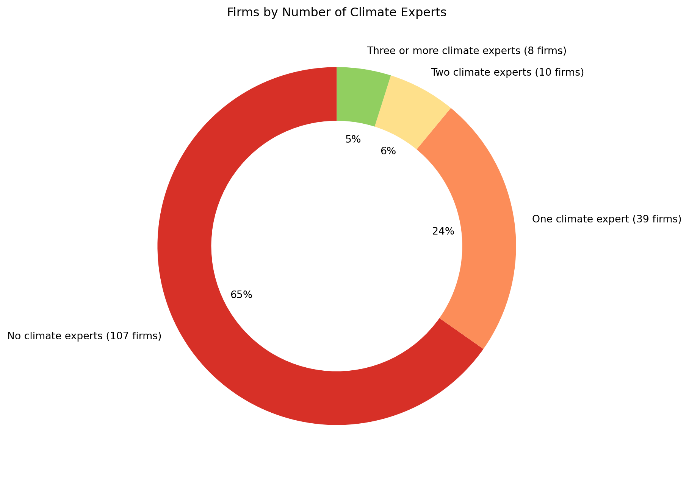
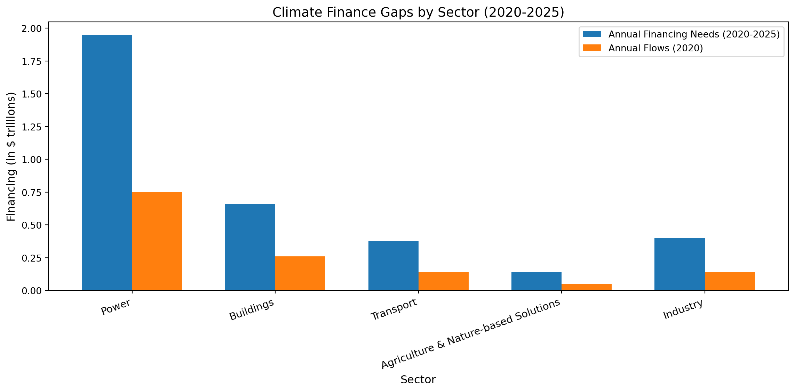
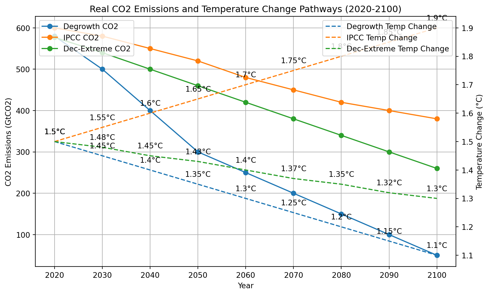
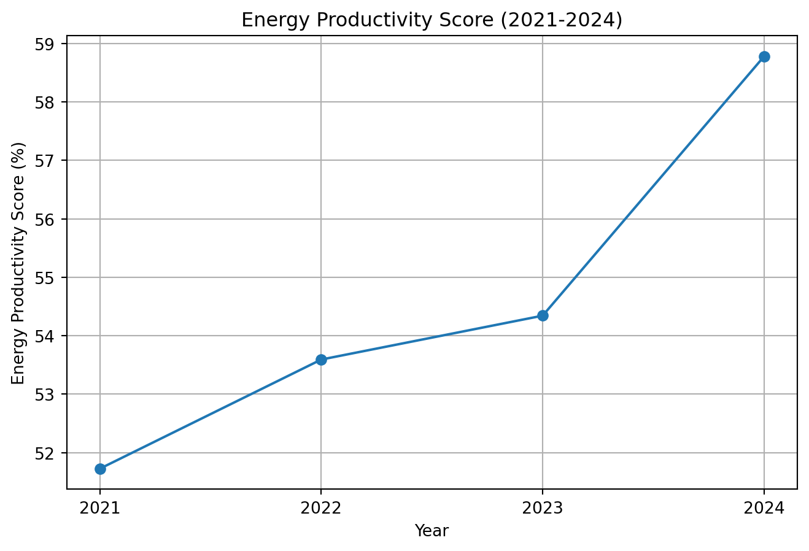
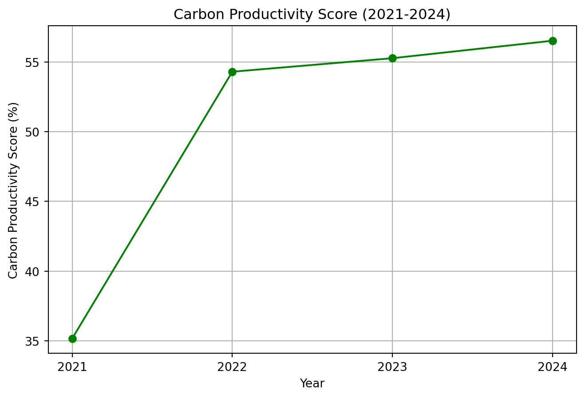

export const quartoRawHtml =
[`
<table>
<caption>Comparative data compiled from <span class="citation" data-cites="trahantInteractiveBrokersBuilt2022 gyuriczkiRevolutESGInvesting2025 interactivebrokersCommissionsStockAsiaPacific2025 lightyearFeesTaxes2025 revolutRevolutsTradingFees2025 revolutRevolutExplainsFractional2020 interactivebrokersIMPACTFeatures2025">[@trahantInteractiveBrokersBuilt2022; @gyuriczkiRevolutESGInvesting2025; @interactivebrokersCommissionsStockAsiaPacific2025; @lightyearFeesTaxes2025; @revolutRevolutsTradingFees2025; @revolutRevolutExplainsFractional2020; @interactivebrokersIMPACTFeatures2025]</span></caption>
<colgroup>
<col style="width: 24%" />
<col style="width: 25%" />
<col style="width: 24%" />
<col style="width: 25%" />
</colgroup>
<thead>
<tr>
<th>Feature</th>
<th><strong>IMPACT by Interactive Brokers</strong></th>
<th><strong>Lightyear</strong></th>
<th><strong>Revolut</strong></th>
</tr>
</thead>
<tbody>
<tr>
<td><strong>Target Audience</strong></td>
<td>Sustainability-focused investors; value-driven alignment</td>
<td>European retail investors</td>
<td>Everyday users with casual interest in investing</td>
</tr>
<tr>
<td><strong>Investment Products</strong></td>
<td>Stocks, ETFs, mutual funds, options, bonds, fractional shares</td>
<td>Stocks, ETFs, multi-currency accounts</td>
<td>US &amp; EU stocks, crypto, commodities, fractional shares</td>
</tr>
<tr>
<td><strong>Sustainability Focus</strong></td>
<td>Strong. Core to the app. Lets users filter companies by ESG values and track portfolio impact.</td>
<td>None. Focuses on transparency and low fees</td>
<td>Minimal. Some ESG ETFs; no impact tracking or custom filters</td>
</tr>
<tr>
<td><strong>Fees</strong></td>
<td>Very low (starting at $0 commissions, with some market/data fees)</td>
<td>Low, with no account fee; FX markup 0.35% outside base currency</td>
<td>Free plan has high spreads; paid tiers offer lower fees; several FX and withdrawal limits apply</td>
</tr>
<tr>
<td><strong>Currency Conversion (FX)</strong></td>
<td>Interbank FX rates; low spreads</td>
<td>0.35% FX fee</td>
<td>Free plan: 1% FX fee; better rates in Premium accounts</td>
</tr>
<tr>
<td><strong>Fractional Shares</strong></td>
<td>Yes</td>
<td>Yes</td>
<td>Yes</td>
</tr>
<tr>
<td><strong>Tax Documents</strong></td>
<td>Yes, detailed reports</td>
<td>Yes, supports Estonian tax system</td>
<td>Limited; may need to do manual tracking for taxes</td>
</tr>
<tr>
<td><strong>Mobile App Experience</strong></td>
<td>Professional, ESG-focused UI</td>
<td>Clean, simple, intuitive</td>
<td>Gamified, casual, integrated with other Revolut services</td>
</tr>
<tr>
<td><strong>Extra Features</strong></td>
<td>Voting rights, ethical filters, carbon impact metrics</td>
<td>Interest on cash (like a bank account); multi-currency accounts</td>
<td>Cashback, budgeting, crypto, P2P payments, travel perks</td>
</tr>
</tbody>
</table>
`,`
<table style="width:100%;">
<colgroup>
<col style="width: 16%" />
<col style="width: 16%" />
<col style="width: 16%" />
<col style="width: 16%" />
<col style="width: 16%" />
<col style="width: 16%" />
</colgroup>
<thead>
<tr>
<th>Region</th>
<th>Companies (n)</th>
<th>≥ 1 Climate Expert (%)</th>
<th>≥ 1 Expert (count)</th>
<th>No Experts (%)</th>
<th>No Experts (count)</th>
</tr>
</thead>
<tbody>
<tr>
<td><strong>EMEA</strong></td>
<td>52</td>
<td>48 %</td>
<td>25</td>
<td>52 %</td>
<td>27</td>
</tr>
<tr>
<td><strong>Americas</strong></td>
<td>61</td>
<td>36 %</td>
<td>22</td>
<td>64 %</td>
<td>39</td>
</tr>
<tr>
<td><strong>APAC</strong></td>
<td>51</td>
<td>20 %</td>
<td>10</td>
<td>80 %</td>
<td>41</td>
</tr>
</tbody>
</table>
`,`
<table>
<caption>Banking transformation strategies from <span class="citation" data-cites="jimboehmBetterRiskControls2021">[@jimboehmBetterRiskControls2021]</span></caption>
<colgroup>
<col style="width: 27%" />
<col style="width: 72%" />
</colgroup>
<thead>
<tr>
<th>Strategy</th>
<th>Description</th>
</tr>
</thead>
<tbody>
<tr>
<td>Enterprise-level Risk Taxonomy</td>
<td>A unified classification system that defines and categorizes all risk types across the entire organization.</td>
</tr>
<tr>
<td>Embedded Controls in Agile Delivery</td>
<td>Risk-and-compliance integration directly into agile development sprints (a type of management style in building software) to catch issues as code is written.</td>
</tr>
<tr>
<td>Cross-functional Risk–Business Collaboration</td>
<td>Joint ownership of risk by compliance teams and business units, ensuring controls are practical and business-aligned.</td>
</tr>
<tr>
<td>Metrics-driven Monitoring</td>
<td>Continuous tracking of key risk indicators through quantifiable metrics to spot trends and trigger alerts.</td>
</tr>
<tr>
<td>Proactive Remediation</td>
<td>Early detection and rapid resolution of control defects before they escalate into larger compliance or security gaps.</td>
</tr>
<tr>
<td>Continuous Capability Building</td>
<td>Ongoing training and tooling updates; best-practice sharing to keep risk-management skills and processes current.</td>
</tr>
</tbody>
</table>
`,`
<table>
<caption>GenAI usage for comprehensive risk management from cyber- to climate threats in modern banking as per <span class="citation" data-cites="rahulagarwalHowGenerativeAI2024">[@rahulagarwalHowGenerativeAI2024]</span>.</caption>
<colgroup>
<col style="width: 100%" />
</colgroup>
<tbody>
<tr>
<td><strong>GenAI Use Case</strong> | <strong>Description</strong> ============================+==================================================================================================================================================================+ Regulatory Compliance | Automate policy-document triage: draft regulatory-change summaries and flag emerging rules, then generate compliance manuals. |</td>
</tr>
<tr>
<td>Financial Crime | Generate suspicious-activity reports; streamline AML/KYC checks; identify anomalous transaction patterns. |</td>
</tr>
<tr>
<td>Credit Risk | Synthesizing credit-risk reports on demand by pulling together relevant financial data from a variety of sources, resulting in faster borrower risk assessments. |</td>
</tr>
<tr>
<td>Analytics and Modeling | Build and validate risk models; run scenario analysis; summarize complex data sets for insights. |</td>
</tr>
<tr>
<td>Cyber Risk | Monitor threat-intelligence feeds; draft incident-response reports; automatically search for, and possibly even patch security gaps. |</td>
</tr>
<tr>
<td>Climate Risk | Distill lengthy climate-scenario reports; visualize key metrics; accelerate enterprise-level climate-risk assessments. |</td>
</tr>
</tbody>
</table>
`,`
<table>
<caption>Data compiled from <span class="citation" data-cites="focustaiwanIPASSLaunchesQR2025 taiwannewsPXPay1stTaiwan2025 pxpayplusPXPayJPMorgan">[@focustaiwanIPASSLaunchesQR2025; @taiwannewsPXPay1stTaiwan2025; @pxpayplusPXPayJPMorgan]</span></caption>
<colgroup>
<col style="width: 18%" />
<col style="width: 45%" />
<col style="width: 18%" />
<col style="width: 18%" />
</colgroup>
<thead>
<tr>
<th style="text-align: left;">Payment App</th>
<th style="text-align: left;">Features</th>
<th style="text-align: left;">Users in Taiwan</th>
<th>Origin</th>
</tr>
</thead>
<tbody>
<tr>
<td style="text-align: left;"><strong>LINE Pay</strong></td>
<td style="text-align: left;">Most popular payment app accepted all over Taiwan. Works stand-alone and inside the LINE messenger. Supports both in-store and online shopping payments, also direct P2P transfers to contacts (requires LINE Bank). Displays a map of its merchant network with discounts and coupons; integrates iPASS MONEY.</td>
<td style="text-align: left;">&gt; 12 Million</td>
<td>Japan / Korea</td>
</tr>
<tr>
<td style="text-align: left;"><strong>JKOPay (街口支付)</strong></td>
<td style="text-align: left;">QR code payments and P2P transfers to contacts; paying for bills.</td>
<td style="text-align: left;">&gt; 7 Million</td>
<td>Taiwan</td>
</tr>
<tr>
<td style="text-align: left;"><strong>Taiwan Pay (台灣Pay)</strong></td>
<td style="text-align: left;">Official Taiwanese Government app in collaboration with Taiwanese banks. Supports payments directly from bank accounts (without the need for a card). Supports QR code payments, P2P transfers to contacts and paying bills. A unique feature is cash withdrawal from ATMs without the need for a bank card.</td>
<td style="text-align: left;">&gt; 6 Million</td>
<td>Taiwan</td>
</tr>
<tr>
<td style="text-align: left;"><strong>Apple Pay</strong></td>
<td style="text-align: left;">Requires an Apple iOS device; uses credit/debit cards via NFC, Secure, In-app &amp; web payments</td>
<td style="text-align: left;">?</td>
<td>USA</td>
</tr>
<tr>
<td style="text-align: left;"><strong>Google Pay</strong></td>
<td style="text-align: left;">Supports NFC and credit/debit cards, in-app and online payments as well as public transport.</td>
<td style="text-align: left;">?</td>
<td>USA</td>
</tr>
<tr>
<td style="text-align: left;"><strong>iPASS MONEY (一卡通MONEY)</strong></td>
<td style="text-align: left;">Digital version of the iPASS card which can be used for QR code payments, P2P transfers to contacts, paying bills and public transport.</td>
<td style="text-align: left;">?</td>
<td>Taiwan</td>
</tr>
<tr>
<td style="text-align: left;"><strong>E.Sun Wallet (玉山Wallet)</strong></td>
<td style="text-align: left;">Requires the Taiwanese E.Sun Bank and allows QR payments, P2P transfers to contacts and paying bills as well as financial management tools.</td>
<td style="text-align: left;">?</td>
<td>Taiwan</td>
</tr>
<tr>
<td style="text-align: left;"><strong>Pi Wallet (Pi 拍錢包)</strong></td>
<td style="text-align: left;">Payment app by the PChome online shop supporting in-store QR and online payments, and paying for bills a parking.</td>
<td style="text-align: left;">?</td>
<td>Taiwan</td>
</tr>
<tr>
<td style="text-align: left;"><strong>PXPay (全聯福利中心)</strong></td>
<td style="text-align: left;">Payment app by PX Mart, the largest domestic Taiwanese supermarket chain, supporting QR code payments, offering rewards and discounts and loyalty plans. Recently expanded to Korea quoting the interest of Taiwanese young people in Korean culture. <strong>In early 2025, PXPay began offering a saving and investing service called “Digital Hen” in collaboration with J.P Morgan Asset Management.</strong> According to the press release, the service aims to be a beginner-friendly financial innovation helping shoppers get into micro-investing.</td>
<td style="text-align: left;">?</td>
<td>Taiwan</td>
</tr>
<tr>
<td style="text-align: left;"><strong>Hami Pay (中華電信)</strong></td>
<td style="text-align: left;">Payment app by the largest phone company Chunghwa Telecom supporting NFC payments, public transport, and paying bills.</td>
<td style="text-align: left;">?</td>
<td>Taiwan</td>
</tr>
<tr>
<td style="text-align: left;"><strong>Samsung Pay (悠遊卡)</strong></td>
<td style="text-align: left;">Requires a Samsung device; uses NFC; integrates EasyCard and credit/debit cards; supports public transport.</td>
<td style="text-align: left;">?</td>
<td>Korea</td>
</tr>
</tbody>
</table>
`,`
<table>
<caption>Data compiled from <span class="citation" data-cites="ZigluFastSimple lightyearLightyearInvestingOwn SelmaYourFinances MosMoneyApp monzoOnlineBankingMade2023 NubankFinalmenteVoce">[@ZigluFastSimple; @lightyearLightyearInvestingOwn; @SelmaYourFinances; @MosMoneyApp; @monzoOnlineBankingMade2023; @NubankFinalmenteVoce]</span>.</caption>
<colgroup>
<col style="width: 23%" />
<col style="width: 53%" />
<col style="width: 23%" />
</colgroup>
<tbody>
<tr>
<td>Service</td>
<td>Features</td>
<td>Availability</td>
</tr>
<tr>
<td>Goodments</td>
<td>Matching investment vehicles to user’s environmental, social, ethical values</td>
<td>USA</td>
</tr>
<tr>
<td>Wealthsimple</td>
<td>AI-assisted saving &amp; investing for Millennials</td>
<td>USA, UK</td>
</tr>
<tr>
<td>Ellevest</td>
<td>AI-assisted robo-advisory focused on female investors and women-led business</td>
<td>USA</td>
</tr>
<tr>
<td>Betterment</td>
<td>AI-assisted cash management, savings, retirement, and investing</td>
<td>USA</td>
</tr>
<tr>
<td>Earthfolio</td>
<td>AI-assisted socially responsible investing</td>
<td>USA</td>
</tr>
<tr>
<td>Acorns</td>
<td>AI-assisted micro-investing</td>
<td>USA</td>
</tr>
<tr>
<td>Trine</td>
<td>Loans to eco-projects</td>
<td>USA</td>
</tr>
<tr>
<td>Single.Earth</td>
<td>Nature-back cryptocurrency</td>
<td>Global</td>
</tr>
<tr>
<td>Grünfin</td>
<td>Invest in funds</td>
<td>EU</td>
</tr>
<tr>
<td>M1 Finance</td>
<td>Finance Super App</td>
<td>US</td>
</tr>
<tr>
<td>Finimize</td>
<td>Investment research for anyone</td>
<td>US</td>
</tr>
<tr>
<td>NerdWallet</td>
<td>Financial clarity all in one place</td>
<td>US</td>
</tr>
<tr>
<td>Tomorrow Bank</td>
<td>Green Banking</td>
<td>EU</td>
</tr>
<tr>
<td>Marcus Invest</td>
<td>Robo-Advisor</td>
<td>US</td>
</tr>
<tr>
<td>Chipper</td>
<td>Digital cash app for African markets</td>
<td>Africa</td>
</tr>
<tr>
<td>Lightyear</td>
<td>Simple UI for Stocks, ETFs, interest from Estonia</td>
<td>EU</td>
</tr>
<tr>
<td>Ziglu</td>
<td>UK simple investing app</td>
<td>UK</td>
</tr>
<tr>
<td>Selma</td>
<td>Finnish investing app</td>
<td>EU</td>
</tr>
<tr>
<td>Monzo</td>
<td>Bank</td>
<td>UK</td>
</tr>
<tr>
<td>Nubank</td>
<td>Bank</td>
<td>Brazil</td>
</tr>
<tr>
<td>EToro</td>
<td>Investing and copy-investing</td>
<td>EU</td>
</tr>
<tr>
<td>Revolut</td>
<td>From payments to investing</td>
<td>UK, EU</td>
</tr>
<tr>
<td>Mos</td>
<td>Banking for students</td>
<td>US</td>
</tr>
<tr>
<td>Robinhood</td>
<td>Investing</td>
<td>US</td>
</tr>
<tr>
<td>Mintos</td>
<td>Buy bonds and loans</td>
<td>EU</td>
</tr>
</tbody>
</table>
`,`
<table style="width:100%;">
<caption>Established consumer payment giants, none of which has a specific sustainability focus.</caption>
<colgroup>
<col style="width: 16%" />
<col style="width: 16%" />
<col style="width: 16%" />
<col style="width: 16%" />
<col style="width: 16%" />
<col style="width: 16%" />
</colgroup>
<thead>
<tr>
<th style="text-align: left;">Service</th>
<th style="text-align: left;">Features</th>
<th style="text-align: left;">Users</th>
<th style="text-align: left;">Investing</th>
<th style="text-align: left;">Savings</th>
<th style="text-align: left;">Shopping (Payments)</th>
</tr>
</thead>
<tbody>
<tr>
<td style="text-align: left;">Alipay</td>
<td style="text-align: left;">Payments, banking, Yu’e Bao, Ant Fortune investing</td>
<td style="text-align: left;">1.3 billion</td>
<td style="text-align: left;">Yes</td>
<td style="text-align: left;">Yes</td>
<td style="text-align: left;">Yes</td>
</tr>
<tr>
<td style="text-align: left;">WeChat Pay</td>
<td style="text-align: left;">Payments, financial services, Licaitong investing</td>
<td style="text-align: left;">900 million</td>
<td style="text-align: left;">Yes</td>
<td style="text-align: left;">No</td>
<td style="text-align: left;">Yes</td>
</tr>
<tr>
<td style="text-align: left;">Apple Pay</td>
<td style="text-align: left;">Contactless payments</td>
<td style="text-align: left;">744 million</td>
<td style="text-align: left;">No</td>
<td style="text-align: left;">No</td>
<td style="text-align: left;">Yes</td>
</tr>
<tr>
<td style="text-align: left;">PhonePe</td>
<td style="text-align: left;">Payments, mutual funds, digital gold</td>
<td style="text-align: left;">590 million</td>
<td style="text-align: left;">Yes</td>
<td style="text-align: left;">Yes</td>
<td style="text-align: left;">Yes</td>
</tr>
<tr>
<td style="text-align: left;">Paytm</td>
<td style="text-align: left;">Payments, banking, Paytm Money for stock &amp; fund investing</td>
<td style="text-align: left;">350 million</td>
<td style="text-align: left;">Yes</td>
<td style="text-align: left;">Yes</td>
<td style="text-align: left;">Yes</td>
</tr>
<tr>
<td style="text-align: left;">Google Pay</td>
<td style="text-align: left;">Payments, loyalty, transit</td>
<td style="text-align: left;">150 million</td>
<td style="text-align: left;">No</td>
<td style="text-align: left;">No</td>
<td style="text-align: left;">Yes</td>
</tr>
<tr>
<td style="text-align: left;">Samsung Pay</td>
<td style="text-align: left;">Mobile payments</td>
<td style="text-align: left;">?</td>
<td style="text-align: left;">No</td>
<td style="text-align: left;">No</td>
<td style="text-align: left;">Yes</td>
</tr>
<tr>
<td style="text-align: left;">Zelle</td>
<td style="text-align: left;">Bank-to-bank P2P payments</td>
<td style="text-align: left;">?</td>
<td style="text-align: left;">No</td>
<td style="text-align: left;">Yes</td>
<td style="text-align: left;">Yes</td>
</tr>
<tr>
<td style="text-align: left;">Nubank</td>
<td style="text-align: left;">Full features of a traditional bank in a digital form</td>
<td style="text-align: left;">?</td>
<td style="text-align: left;">No</td>
<td style="text-align: left;">Yes</td>
<td style="text-align: left;">Yes</td>
</tr>
</tbody>
</table>
`,`
<table style="width:100%;">
<caption>Growth companies in fintech, none has a sustainability focus.</caption>
<colgroup>
<col style="width: 14%" />
<col style="width: 14%" />
<col style="width: 14%" />
<col style="width: 14%" />
<col style="width: 14%" />
<col style="width: 14%" />
<col style="width: 14%" />
</colgroup>
<thead>
<tr>
<th style="text-align: left;">Service</th>
<th style="text-align: left;">Features</th>
<th style="text-align: left;">Availability</th>
<th style="text-align: left;">User Base</th>
<th style="text-align: left;">Investing</th>
<th style="text-align: left;">Savings</th>
<th style="text-align: left;">Shopping (Payments)</th>
</tr>
</thead>
<tbody>
<tr>
<td style="text-align: left;">Venmo</td>
<td style="text-align: left;">P2P payments, crypto investing</td>
<td style="text-align: left;">USA</td>
<td style="text-align: left;">70 million</td>
<td style="text-align: left;">Yes</td>
<td style="text-align: left;">No</td>
<td style="text-align: left;">Yes</td>
</tr>
<tr>
<td style="text-align: left;">Cash App</td>
<td style="text-align: left;">P2P payments, stock &amp; Bitcoin investing</td>
<td style="text-align: left;">USA, UK</td>
<td style="text-align: left;">57 million</td>
<td style="text-align: left;">Yes</td>
<td style="text-align: left;">No</td>
<td style="text-align: left;">Yes</td>
</tr>
<tr>
<td style="text-align: left;">Chime</td>
<td style="text-align: left;">Online banking services including spending accounts, savings accounts</td>
<td style="text-align: left;">USA</td>
<td style="text-align: left;">22 million</td>
<td style="text-align: left;">No</td>
<td style="text-align: left;">Yes</td>
<td style="text-align: left;">Yes</td>
</tr>
<tr>
<td style="text-align: left;">MoneyLion</td>
<td style="text-align: left;">Banking, investing, credit-building loans, financial tracking tools</td>
<td style="text-align: left;">USA</td>
<td style="text-align: left;">20 million</td>
<td style="text-align: left;">Yes</td>
<td style="text-align: left;">Yes</td>
<td style="text-align: left;">Yes</td>
</tr>
<tr>
<td style="text-align: left;">NerdWallet</td>
<td style="text-align: left;">Financial clarity all in one place</td>
<td style="text-align: left;">USA</td>
<td style="text-align: left;">19 million</td>
<td style="text-align: left;">No</td>
<td style="text-align: left;">No</td>
<td style="text-align: left;">Yes</td>
</tr>
<tr>
<td style="text-align: left;">SoFi</td>
<td style="text-align: left;">Loans, banking, robo-investing, stock &amp; crypto</td>
<td style="text-align: left;">USA</td>
<td style="text-align: left;">10 million</td>
<td style="text-align: left;">Yes</td>
<td style="text-align: left;">Yes</td>
<td style="text-align: left;">Yes</td>
</tr>
<tr>
<td style="text-align: left;">Albert</td>
<td style="text-align: left;">Budgeting, saving, spending, investing, access to financial advisors</td>
<td style="text-align: left;">USA</td>
<td style="text-align: left;">10 million</td>
<td style="text-align: left;">Yes</td>
<td style="text-align: left;">Yes</td>
<td style="text-align: left;">No</td>
</tr>
<tr>
<td style="text-align: left;">Acorns</td>
<td style="text-align: left;">AI-assisted micro-investing</td>
<td style="text-align: left;">USA</td>
<td style="text-align: left;">5.7 million</td>
<td style="text-align: left;">Yes</td>
<td style="text-align: left;">No</td>
<td style="text-align: left;">No</td>
</tr>
<tr>
<td style="text-align: left;">Wealthsimple</td>
<td style="text-align: left;">AI-assisted saving &amp; investing for Millennials</td>
<td style="text-align: left;">Canada, USA, UK</td>
<td style="text-align: left;">2.6 million</td>
<td style="text-align: left;">Yes</td>
<td style="text-align: left;">Yes</td>
<td style="text-align: left;">No</td>
</tr>
<tr>
<td style="text-align: left;">Qapital</td>
<td style="text-align: left;">Saving and investing with gamification features</td>
<td style="text-align: left;">USA</td>
<td style="text-align: left;">2 million</td>
<td style="text-align: left;">Yes</td>
<td style="text-align: left;">Yes</td>
<td style="text-align: left;">No</td>
</tr>
<tr>
<td style="text-align: left;">M1 Finance</td>
<td style="text-align: left;">Finance Super App</td>
<td style="text-align: left;">USA</td>
<td style="text-align: left;">1 million</td>
<td style="text-align: left;">Yes</td>
<td style="text-align: left;">No</td>
<td style="text-align: left;">No</td>
</tr>
<tr>
<td style="text-align: left;">Finimize</td>
<td style="text-align: left;">Investment research for anyone</td>
<td style="text-align: left;">Global</td>
<td style="text-align: left;">1 million</td>
<td style="text-align: left;">Yes</td>
<td style="text-align: left;">No</td>
<td style="text-align: left;">No</td>
</tr>
<tr>
<td style="text-align: left;">Robinhood</td>
<td style="text-align: left;">Investing</td>
<td style="text-align: left;">US</td>
<td style="text-align: left;">?</td>
<td style="text-align: left;">Yes</td>
<td style="text-align: left;">No</td>
<td style="text-align: left;">No</td>
</tr>
<tr>
<td style="text-align: left;">Betterment</td>
<td style="text-align: left;">AI-assisted cash management, savings, retirement, and investing</td>
<td style="text-align: left;">USA</td>
<td style="text-align: left;">?</td>
<td style="text-align: left;">Yes</td>
<td style="text-align: left;">Yes</td>
<td style="text-align: left;">No</td>
</tr>
<tr>
<td style="text-align: left;">Revolut</td>
<td style="text-align: left;">From payments to investing</td>
<td style="text-align: left;">UK, EU</td>
<td style="text-align: left;">?</td>
<td style="text-align: left;">Yes</td>
<td style="text-align: left;">No</td>
<td style="text-align: left;">TRUE</td>
</tr>
<tr>
<td style="text-align: left;">Monzo</td>
<td style="text-align: left;">Bank</td>
<td style="text-align: left;">UK</td>
<td style="text-align: left;">?</td>
<td style="text-align: left;">No</td>
<td style="text-align: left;">Yes</td>
<td style="text-align: left;">No</td>
</tr>
<tr>
<td style="text-align: left;">eToro</td>
<td style="text-align: left;">Investing and copy-investing</td>
<td style="text-align: left;">EU</td>
<td style="text-align: left;">?</td>
<td style="text-align: left;">Yes</td>
<td style="text-align: left;">No</td>
<td style="text-align: left;">No</td>
</tr>
<tr>
<td style="text-align: left;">Marcus Invest</td>
<td style="text-align: left;">Robo-Advisor</td>
<td style="text-align: left;">USA</td>
<td style="text-align: left;">?</td>
<td style="text-align: left;">Yes</td>
<td style="text-align: left;">No</td>
<td style="text-align: left;">No</td>
</tr>
<tr>
<td style="text-align: left;">Varo Bank</td>
<td style="text-align: left;">Online banking services including checking and high-yield savings</td>
<td style="text-align: left;">USA</td>
<td style="text-align: left;">?</td>
<td style="text-align: left;">No</td>
<td style="text-align: left;">Yes</td>
<td style="text-align: left;">Yes</td>
</tr>
<tr>
<td style="text-align: left;">Stash</td>
<td style="text-align: left;">Micro-investing platform enabling small investments</td>
<td style="text-align: left;">USA</td>
<td style="text-align: left;">?</td>
<td style="text-align: left;">Yes</td>
<td style="text-align: left;">No</td>
<td style="text-align: left;">No</td>
</tr>
<tr>
<td style="text-align: left;">Mint (Ceased operations)</td>
<td style="text-align: left;">Budgeting tools, bill tracking, free credit score monitoring</td>
<td style="text-align: left;">USA</td>
<td style="text-align: left;">?</td>
<td style="text-align: left;">No</td>
<td style="text-align: left;">No</td>
<td style="text-align: left;">No</td>
</tr>
</tbody>
</table>
`,`
<table>
<caption>Among up-and-coming startups there are some examples of sustainability-focused apps.</caption>
<colgroup>
<col style="width: 12%" />
<col style="width: 12%" />
<col style="width: 12%" />
<col style="width: 12%" />
<col style="width: 12%" />
<col style="width: 12%" />
<col style="width: 12%" />
<col style="width: 12%" />
</colgroup>
<thead>
<tr>
<th style="text-align: left;">Service</th>
<th style="text-align: left;">Features</th>
<th style="text-align: left;">Availability</th>
<th style="text-align: left;">User Base</th>
<th style="text-align: left;">Investing</th>
<th style="text-align: left;">Savings</th>
<th style="text-align: left;">Shopping (Payments)</th>
<th style="text-align: left;">Sustainability Focus</th>
</tr>
</thead>
<tbody>
<tr>
<td style="text-align: left;">Chipper Cash</td>
<td style="text-align: left;">Digital cash app for African markets</td>
<td style="text-align: left;">Ghana, Nigeria, Uganda, USA</td>
<td style="text-align: left;">?</td>
<td style="text-align: left;">No</td>
<td style="text-align: left;">No</td>
<td style="text-align: left;">Yes</td>
<td style="text-align: left;">No</td>
</tr>
<tr>
<td style="text-align: left;">Douugh (Merged with Goodments)</td>
<td style="text-align: left;">AI financial wellness app, smart account, saving tools</td>
<td style="text-align: left;">USA, Australia</td>
<td style="text-align: left;">?</td>
<td style="text-align: left;">Yes</td>
<td style="text-align: left;">Yes</td>
<td style="text-align: left;">Yes</td>
<td style="text-align: left;">No</td>
</tr>
<tr>
<td style="text-align: left;">DUB</td>
<td style="text-align: left;">Copy-trading, mirror trades of notable figures</td>
<td style="text-align: left;">USA</td>
<td style="text-align: left;">1 million downloads</td>
<td style="text-align: left;">Yes</td>
<td style="text-align: left;">No</td>
<td style="text-align: left;">No</td>
<td style="text-align: left;">No</td>
</tr>
<tr>
<td style="text-align: left;">Earthfolio</td>
<td style="text-align: left;">AI-assisted socially responsible investing</td>
<td style="text-align: left;">USA</td>
<td style="text-align: left;">?</td>
<td style="text-align: left;">Yes</td>
<td style="text-align: left;">No</td>
<td style="text-align: left;">No</td>
<td style="text-align: left;">Yes</td>
</tr>
<tr>
<td style="text-align: left;">Ellevest</td>
<td style="text-align: left;">AI-assisted robo-advisory focused on female investors and women-led business</td>
<td style="text-align: left;">USA</td>
<td style="text-align: left;">?</td>
<td style="text-align: left;">Yes</td>
<td style="text-align: left;">No</td>
<td style="text-align: left;">No</td>
<td style="text-align: left;">No</td>
</tr>
<tr>
<td style="text-align: left;">Goodments (Merged with Douugh)</td>
<td style="text-align: left;">Matching investment vehicles to user’s environmental, social, ethical values</td>
<td style="text-align: left;">USA</td>
<td style="text-align: left;">?</td>
<td style="text-align: left;">Yes</td>
<td style="text-align: left;">No</td>
<td style="text-align: left;">No</td>
<td style="text-align: left;">Yes</td>
</tr>
<tr>
<td style="text-align: left;">Grünfin (Ceased operations)</td>
<td style="text-align: left;">Invest in funds</td>
<td style="text-align: left;">EU</td>
<td style="text-align: left;">?</td>
<td style="text-align: left;">Yes</td>
<td style="text-align: left;">Yes</td>
<td style="text-align: left;">No</td>
<td style="text-align: left;">No</td>
</tr>
<tr>
<td style="text-align: left;">Lightyear</td>
<td style="text-align: left;">Simple UI for Stocks, ETFs, interest from Estonia</td>
<td style="text-align: left;">EU</td>
<td style="text-align: left;">?</td>
<td style="text-align: left;">Yes</td>
<td style="text-align: left;">No</td>
<td style="text-align: left;">No</td>
<td style="text-align: left;">No</td>
</tr>
<tr>
<td style="text-align: left;">Mintos</td>
<td style="text-align: left;">Buy bonds and loans</td>
<td style="text-align: left;">EU</td>
<td style="text-align: left;">?</td>
<td style="text-align: left;">Yes</td>
<td style="text-align: left;">No</td>
<td style="text-align: left;">No</td>
<td style="text-align: left;">No</td>
</tr>
<tr>
<td style="text-align: left;">Mos</td>
<td style="text-align: left;">Banking for students</td>
<td style="text-align: left;">US</td>
<td style="text-align: left;">?</td>
<td style="text-align: left;">No</td>
<td style="text-align: left;">Yes</td>
<td style="text-align: left;">Yes</td>
<td style="text-align: left;">No</td>
</tr>
<tr>
<td style="text-align: left;">Selma</td>
<td style="text-align: left;">Finnish investing app</td>
<td style="text-align: left;">EU</td>
<td style="text-align: left;">?</td>
<td style="text-align: left;">Yes</td>
<td style="text-align: left;">No</td>
<td style="text-align: left;">No</td>
<td style="text-align: left;">No</td>
</tr>
<tr>
<td style="text-align: left;">Single.Earth</td>
<td style="text-align: left;">Nature-backed cryptocurrency</td>
<td style="text-align: left;">Global</td>
<td style="text-align: left;">?</td>
<td style="text-align: left;">Yes</td>
<td style="text-align: left;">No</td>
<td style="text-align: left;">No</td>
<td style="text-align: left;">Yes</td>
</tr>
<tr>
<td style="text-align: left;">Tomorrow Bank</td>
<td style="text-align: left;">Green Banking</td>
<td style="text-align: left;">EU</td>
<td style="text-align: left;">120,000</td>
<td style="text-align: left;">No</td>
<td style="text-align: left;">Yes</td>
<td style="text-align: left;">Yes</td>
<td style="text-align: left;">Yes</td>
</tr>
<tr>
<td style="text-align: left;">Trine</td>
<td style="text-align: left;">Loans to eco-projects</td>
<td style="text-align: left;">USA</td>
<td style="text-align: left;">?</td>
<td style="text-align: left;">Yes</td>
<td style="text-align: left;">No</td>
<td style="text-align: left;">No</td>
<td style="text-align: left;">Yes</td>
</tr>
<tr>
<td style="text-align: left;">Ziglu</td>
<td style="text-align: left;">UK simple investing app</td>
<td style="text-align: left;">UK</td>
<td style="text-align: left;">?</td>
<td style="text-align: left;">Yes</td>
<td style="text-align: left;">No</td>
<td style="text-align: left;">No</td>
<td style="text-align: left;">No</td>
</tr>
</tbody>
</table>
`,`
<table>
<caption>Example sustainable loyalty schemes</caption>
<thead>
<tr>
<th>Company</th>
<th>Scheme</th>
</tr>
</thead>
<tbody>
<tr>
<td><strong>Patagonia</strong></td>
<td>“Worn Wear” program</td>
</tr>
<tr>
<td><strong>H&amp;M</strong></td>
<td>Garment Collecting program</td>
</tr>
<tr>
<td><strong>The Body Shop</strong></td>
<td>Return, Recycle, Repeat</td>
</tr>
</tbody>
</table>
`,`
<table>
<caption>Comparative data on needed climate investment and other valuable assets; all figures in Trillions of USD <span class="citation" data-cites="s&amp;pglobalWorld100Largest2019 grandviewresearchRealEstateMarket2021 aarononeillGlobalGDP198520282023 imfWorldEconomicOutlook2023 stephanieaaronsonHowAppleBecame2023 statistaRetailMarketWorldwide2023 statistaGlobalRetailEcommerce2021 sifmaResearchQuarterlyEquities2023 ustreasuryFiscalDataExplains2023 raoVisualizing105Trillion2023 thinkingaheadinstituteGlobalPensionAssets2023 blockworksBitcoinPriceBTC2023 blockworksEthereumPriceETH2023 mckinsey&amp;companyMcKinseyGlobalPrivate2023 oguhBlackstoneReachesRecord2023 foxRetailInvestorsWill2023 trucostNaturalCapitalRisk2023">[@s&amp;pglobalWorld100Largest2019; @grandviewresearchRealEstateMarket2021; @aarononeillGlobalGDP198520282023; @imfWorldEconomicOutlook2023; @stephanieaaronsonHowAppleBecame2023; @statistaRetailMarketWorldwide2023; @statistaGlobalRetailEcommerce2021; @sifmaResearchQuarterlyEquities2023; @ustreasuryFiscalDataExplains2023; @raoVisualizing105Trillion2023; @thinkingaheadinstituteGlobalPensionAssets2023; @blockworksBitcoinPriceBTC2023; @blockworksEthereumPriceETH2023; @mckinsey&amp;companyMcKinseyGlobalPrivate2023; @oguhBlackstoneReachesRecord2023; @foxRetailInvestorsWill2023; @trucostNaturalCapitalRisk2023]</span></caption>
<colgroup>
<col style="width: 75%" />
<col style="width: 25%" />
</colgroup>
<thead>
<tr>
<th>High-Value Assets (Trillions of USD)</th>
<th></th>
</tr>
</thead>
<tbody>
<tr>
<td>Global Real Estate (2020, valuation)</td>
<td>$326T</td>
</tr>
<tr>
<td>Global Equity Markets (2023, valuation)</td>
<td>$108T</td>
</tr>
<tr>
<td>Global GDP (2024, estimated)</td>
<td>$110T</td>
</tr>
<tr>
<td>Global GDP (2023, per year)</td>
<td>$105T</td>
</tr>
<tr>
<td>Global GDP (2022, per year)</td>
<td>$100T</td>
</tr>
<tr>
<td><em>Global Pension Funds (2023, valuation)</em></td>
<td><em>$47.9T</em></td>
</tr>
<tr>
<td>U.S. Equity Markets (2023, valuation)</td>
<td>$46.2T</td>
</tr>
<tr>
<td>U.S. National Debt (2023, valuation)</td>
<td>$32.6T</td>
</tr>
<tr>
<td><em>Millennials Inheriting Money from Parents in the U.S., U.K. and Australia (2022-2032)</em></td>
<td><em>$30T</em></td>
</tr>
<tr>
<td>Global Retail Sales of Goods and Services to Consumers (2023, per year)</td>
<td>$28.2T</td>
</tr>
<tr>
<td>GDP of U.S.A. (2023, per year)</td>
<td>$26.8T</td>
</tr>
<tr>
<td>GDP of China (2023, per year)</td>
<td>$19.3T</td>
</tr>
<tr>
<td>Global Private Market Assets (2023, per year)</td>
<td>$11.7T</td>
</tr>
<tr>
<td><em>Unpriced Externalities (2023, per year)</em></td>
<td><em>$7.3T</em></td>
</tr>
<tr>
<td>Global E-Commerce Sales (2021, per year)</td>
<td>$5.2T</td>
</tr>
<tr>
<td><em>Missing Climate Invesment (2022, estimate per year)</em></td>
<td><em>$4.1T</em></td>
</tr>
<tr>
<td>Industrial &amp; Commercial Bank of China (2019, total assets)</td>
<td>$4T</td>
</tr>
<tr>
<td>Global Real Estate Sales (2021, per year)</td>
<td>$3.7T</td>
</tr>
<tr>
<td>Apple Computers (2024, market value)</td>
<td>$3.1T</td>
</tr>
<tr>
<td>GDP of Japan (2023, per year)</td>
<td>$4.5T</td>
</tr>
<tr>
<td>GDP of Germany (2023, per year)</td>
<td>$4.3T</td>
</tr>
<tr>
<td>GDP of India (2023, per year)</td>
<td>$3.7T</td>
</tr>
<tr>
<td>U.S. Gen-Z and Millennials Consumer Spending (2022, per year)</td>
<td>$2.5T</td>
</tr>
<tr>
<td>NVIDIA 英偉達 (2024, market value)</td>
<td>$2.5T</td>
</tr>
<tr>
<td><em>Retail Investors (2023, liquid assets)</em></td>
<td><em>$1.8T</em></td>
</tr>
<tr>
<td>Blackstone (2023, total assets)</td>
<td>$1T</td>
</tr>
<tr>
<td>Bitcoin (2024, market cap)</td>
<td>$1T</td>
</tr>
<tr>
<td>GDP of Taiwan (2023, per year)</td>
<td>$0.8T</td>
</tr>
<tr>
<td>GDP of Finland (2023)</td>
<td>$0.3T</td>
</tr>
<tr>
<td>Ethereum (2024, market cap)</td>
<td>$0.3T</td>
</tr>
<tr>
<td><em>Individual Climate Investors</em> (2020, per year)</td>
<td>$0.1T</td>
</tr>
<tr>
<td>GDP of Estonia (2023, per year)</td>
<td>$0.04T</td>
</tr>
</tbody>
</table>
`,`
<table>
<thead>
<tr>
<th>Investment Product</th>
</tr>
</thead>
<tbody>
<tr>
<td>Stocks</td>
</tr>
<tr>
<td>Bonds</td>
</tr>
<tr>
<td>Mutual Funds</td>
</tr>
<tr>
<td>ETFs</td>
</tr>
<tr>
<td>Insurance Products such as Variable Annuities</td>
</tr>
</tbody>
</table>
`,`
<table>
<colgroup>
<col style="width: 25%" />
<col style="width: 25%" />
<col style="width: 25%" />
<col style="width: 25%" />
</colgroup>
<thead>
<tr>
<th>Name</th>
<th>Description</th>
<th>Link</th>
<th>Sources</th>
</tr>
</thead>
<tbody>
<tr>
<td>Trine</td>
<td></td>
<td>trine.com</td>
<td></td>
</tr>
<tr>
<td>The Many</td>
<td></td>
<td>the-many.com</td>
<td></td>
</tr>
<tr>
<td>Sugi</td>
<td></td>
<td>sugi.earth</td>
<td></td>
</tr>
<tr>
<td>ClimateInvest</td>
<td></td>
<td>clim8invest.com</td>
<td></td>
</tr>
<tr>
<td>Circa5000</td>
<td></td>
<td>circa5000.com</td>
<td></td>
</tr>
<tr>
<td>FairOwn</td>
<td>Aims to use product subscriptions to simplify circular economy, instead of buy-throw-away culture.</td>
<td>fairown.com</td>
<td><span class="citation" data-cites="hankewitzEstonianFintechCompany2021">[@hankewitzEstonianFintechCompany2021]</span></td>
</tr>
</tbody>
</table>
`,`
<table>
<thead>
<tr>
<th>Shortening Food Chains in Amsterdam</th>
</tr>
</thead>
<tbody>
<tr>
<td>Spatial planning for food place-making in the city</td>
</tr>
<tr>
<td>Circular agriculture</td>
</tr>
<tr>
<td>Regionally produced food</td>
</tr>
<tr>
<td>Collaboration between chain members</td>
</tr>
<tr>
<td>Food education</td>
</tr>
</tbody>
</table>
`,`
<table>
<colgroup>
<col style="width: 36%" />
<col style="width: 26%" />
<col style="width: 36%" />
</colgroup>
<thead>
<tr>
<th>Climage Damage</th>
<th>Value</th>
<th>Context</th>
</tr>
</thead>
<tbody>
<tr>
<td>Climate damage per 1 °C warming (China)</td>
<td>≈ 1.5 % of China’s GDP</td>
<td>Average estimate across FUND, RICE and PAGE</td>
</tr>
<tr>
<td>Climate damage per 1 °C warming (global)</td>
<td>≈ 0.7 % of world GDP</td>
<td>Average estimate across FUND, RICE and PAGE</td>
</tr>
<tr>
<td>Average reduction in climate damage: 2 °C target (China)</td>
<td>93 % reduction</td>
<td>vs business-as-usual in average-case scenario</td>
</tr>
<tr>
<td>Average reduction in climate damage: 2 °C target (global)</td>
<td>87 % reduction</td>
<td>vs business-as-usual in average-case scenario</td>
</tr>
<tr>
<td>Worst-case reduction in climate damage: 2 °C target (China)</td>
<td>80 % reduction</td>
<td>vs business-as-usual in the worst-case damage scenario</td>
</tr>
<tr>
<td>Worst-case reduction in climate damage: 2 °C target (global)</td>
<td>84 % reduction</td>
<td>vs business-as-usual in the worst-case damage scenario</td>
</tr>
</tbody>
</table>
`,`
<table>
<colgroup>
<col style="width: 23%" />
<col style="width: 23%" />
<col style="width: 53%" />
</colgroup>
<thead>
<tr>
<th>Type</th>
<th>Rating System</th>
<th>What It Does?</th>
</tr>
</thead>
<tbody>
<tr>
<td>Certificate</td>
<td>B Corporation</td>
<td>B Impact Assessment</td>
</tr>
<tr>
<td></td>
<td>ESG</td>
<td></td>
</tr>
<tr>
<td>Certificate</td>
<td>Fair Trade</td>
<td></td>
</tr>
<tr>
<td>Ranking</td>
<td>Responsible Business Index</td>
<td>Responsible Business Index <span class="citation" data-cites="EstonianResponsibleBusiness">[@EstonianResponsibleBusiness]</span></td>
</tr>
<tr>
<td>Index</td>
<td>Greenly</td>
<td>Greenly Decarbonization Index <span class="citation" data-cites="greenlyGreenlyIntroducesClimate2023">[@greenlyGreenlyIntroducesClimate2023]</span></td>
</tr>
<tr>
<td></td>
<td>Science-Based Targets</td>
<td>Science-Based Targets initiative (SBTi) provides step-by-step guidance per economic sector to help companies get started with meeting climate criteria and emission reduction requirements.</td>
</tr>
<tr>
<td>Certificate</td>
<td>Green Web Foundation</td>
<td>The Green Web Foundation certifies how sustainable is the web hosting used by websites <span class="citation" data-cites="GreenWebFoundation2023">[@GreenWebFoundation2023]</span>. Also tests website CO<sub>2</sub> emissions <span class="citation" data-cites="wholegraindigitaHowDoesIt2023">[@wholegraindigitaHowDoesIt2023]</span>.</td>
</tr>
<tr>
<td></td>
<td>Leafscore for product</td>
<td>Sustainability rating for products <span class="citation" data-cites="leafscoreLeafScoreLeadingOnline2023">[@leafscoreLeafScoreLeadingOnline2023]</span></td>
</tr>
<tr>
<td>Rating</td>
<td>Ethical Consumer Ratings</td>
<td>Ethical shopping and sustainability criteria <span class="citation" data-cites="EthicalConsumerEthical2018">[@EthicalConsumerEthical2018]</span></td>
</tr>
<tr>
<td></td>
<td>1% For the Planet</td>
<td></td>
</tr>
<tr>
<td>Standard</td>
<td>Climate Neutral Certified Standard</td>
<td></td>
</tr>
<tr>
<td>Standard</td>
<td>The Conservation Alliance</td>
<td><span class="citation" data-cites="climateneutralcertifiedClimateNeutralStandards2023">[@climateneutralcertifiedClimateNeutralStandards2023]</span></td>
</tr>
<tr>
<td>Index</td>
<td>Impakter Sustainability Index</td>
<td></td>
</tr>
</tbody>
</table>
`,`
<table>
<colgroup>
<col style="width: 25%" />
<col style="width: 25%" />
<col style="width: 25%" />
<col style="width: 25%" />
</colgroup>
<thead>
<tr>
<th>Target</th>
<th>Category</th>
<th>Organizer</th>
<th>Launch</th>
</tr>
</thead>
<tbody>
<tr>
<td>Airbnb</td>
<td>Human Rights</td>
<td>BDS National Committee</td>
<td>2016</td>
</tr>
<tr>
<td>Amazon</td>
<td>Human Rights</td>
<td>BDS National Committee</td>
<td>2024</td>
</tr>
<tr>
<td>Amazon (tax-avoidance)</td>
<td>Tax Avoidance</td>
<td>Ethical Consumer</td>
<td>2012</td>
</tr>
<tr>
<td>AXA</td>
<td>Human Rights</td>
<td>BDS National Committee</td>
<td>2019</td>
</tr>
<tr>
<td>Barclays Bank</td>
<td>Human Rights</td>
<td>Palestine Solidarity Campaign</td>
<td>2024</td>
</tr>
<tr>
<td>Booking.com</td>
<td>Human Rights</td>
<td>BDS National Committee</td>
<td>2024</td>
</tr>
<tr>
<td>Burger King</td>
<td>Human Rights</td>
<td>BDS National Committee</td>
<td>2024</td>
</tr>
<tr>
<td>Chevron</td>
<td>Human Rights</td>
<td>BDS National Committee</td>
<td>2022</td>
</tr>
<tr>
<td>Coca-Cola</td>
<td>Human Rights</td>
<td>Friends of Al-Aqsa</td>
<td>2014</td>
</tr>
<tr>
<td>Coconut milk (from Thailand)</td>
<td>Animal Rights</td>
<td>PETA</td>
<td>2022</td>
</tr>
<tr>
<td>Crufts dog show</td>
<td>Animal Rights</td>
<td>PETA</td>
<td>2014</td>
</tr>
<tr>
<td>Disney / Marvel</td>
<td>Human Rights</td>
<td>BDS National Committee &amp; allies</td>
<td>2023</td>
</tr>
<tr>
<td>Ecover</td>
<td>Animal Testing</td>
<td>Naturewatch Foundation</td>
<td>2018</td>
</tr>
<tr>
<td>eToro</td>
<td>Human Rights</td>
<td>Tech for Palestine</td>
<td>2024</td>
</tr>
<tr>
<td>Expedia</td>
<td>Human Rights</td>
<td>BDS National Committee</td>
<td>2024</td>
</tr>
<tr>
<td>Get Your Guide</td>
<td>Animal Rights</td>
<td>World Animal Protection</td>
<td>2023</td>
</tr>
<tr>
<td>Google</td>
<td>Human Rights</td>
<td>BDS National Committee</td>
<td>2024</td>
</tr>
<tr>
<td>Groupon</td>
<td>Animal Rights</td>
<td>World Animal Protection</td>
<td>2023</td>
</tr>
<tr>
<td>Hewlett Packard Enterprise (HP)</td>
<td>Human Rights</td>
<td>BDS National Committee</td>
<td>2012</td>
</tr>
<tr>
<td>Israeli dates</td>
<td>Human Rights</td>
<td>American Muslims for Palestine</td>
<td>2012</td>
</tr>
<tr>
<td>Israeli produce in supermarkets</td>
<td>Human Rights</td>
<td>BDS National Committee</td>
<td>2005</td>
</tr>
<tr>
<td>JCB</td>
<td>Human Rights</td>
<td>BDS National Committee</td>
<td>2024</td>
</tr>
<tr>
<td>Kellogg’s</td>
<td>Environment</td>
<td>GMO-Free USA</td>
<td>2012</td>
</tr>
<tr>
<td>L’Oréal</td>
<td>Animal Testing</td>
<td>Naturewatch Foundation</td>
<td>2000</td>
</tr>
<tr>
<td>“Made in China” goods</td>
<td>Human Rights</td>
<td>Friends of Tibet &amp; others</td>
<td>2020</td>
</tr>
<tr>
<td>McDonald’s</td>
<td>Human Rights</td>
<td>BDS National Committee</td>
<td>2024</td>
</tr>
<tr>
<td>Method</td>
<td>Animal Testing</td>
<td>Naturewatch Foundation</td>
<td>2018</td>
</tr>
<tr>
<td>Mitie</td>
<td>Human Rights</td>
<td>Women for Refugee Women</td>
<td>2023</td>
</tr>
<tr>
<td>Nestlé (baby-milk)</td>
<td>Human Rights</td>
<td>Baby Milk Action</td>
<td>1977</td>
</tr>
<tr>
<td>Nestlé (water extraction)</td>
<td>Environment</td>
<td>Lakota People’s Law Project</td>
<td>2018</td>
</tr>
<tr>
<td>Papa John’s</td>
<td>Human Rights</td>
<td>BDS National Committee</td>
<td>2023</td>
</tr>
<tr>
<td>Pizza Hut</td>
<td>Human Rights</td>
<td>BDS National Committee</td>
<td>2023</td>
</tr>
<tr>
<td>Russia (national boycott)</td>
<td>Oppressive Regimes</td>
<td>Government of Ukraine</td>
<td>2022</td>
</tr>
<tr>
<td>Sabra Hummus</td>
<td>Human Rights</td>
<td>BDS National Committee</td>
<td>2010</td>
</tr>
<tr>
<td>Siemens</td>
<td>Human Rights</td>
<td>BDS National Committee</td>
<td>2022</td>
</tr>
<tr>
<td>SodaStream</td>
<td>Human Rights</td>
<td>BDS National Committee</td>
<td>2012</td>
</tr>
<tr>
<td>Starbucks</td>
<td>Habitats &amp; Resources</td>
<td>Lakota People’s Law Project</td>
<td>2023</td>
</tr>
<tr>
<td>Tesco Bank</td>
<td>Human Rights</td>
<td>Palestine Solidarity Campaign</td>
<td>2024</td>
</tr>
<tr>
<td>Texaco</td>
<td>Human Rights</td>
<td>BDS National Committee</td>
<td>2022</td>
</tr>
<tr>
<td>Trip.com</td>
<td>Animal Rights</td>
<td>World Animal Protection</td>
<td>2023</td>
</tr>
<tr>
<td>Tui</td>
<td>Animal Rights</td>
<td>World Animal Protection</td>
<td>2023</td>
</tr>
<tr>
<td>X / Twitter</td>
<td>Human Rights</td>
<td>Stop Toxic Twitter coalition</td>
<td>2022</td>
</tr>
<tr>
<td>Unilever (Russia operations)</td>
<td>Human Rights</td>
<td>B4Ukraine</td>
<td>2024</td>
</tr>
<tr>
<td>Volvo (AB Volvo trucks)</td>
<td>Human Rights</td>
<td>BDS National Committee</td>
<td>2024</td>
</tr>
<tr>
<td>Wendy’s</td>
<td>Workers’ Rights</td>
<td>Coalition of Immokalee Workers</td>
<td>2005</td>
</tr>
<tr>
<td>Wix</td>
<td>Human Rights</td>
<td>Tech for Palestine</td>
<td>2023</td>
</tr>
<tr>
<td>World Wildlife Fund (WWF)</td>
<td>Human Rights</td>
<td>WTF WWF coalition</td>
<td>2020</td>
</tr>
</tbody>
</table>
`,`
<table>
<colgroup>
<col style="width: 38%" />
<col style="width: 61%" />
</colgroup>
<thead>
<tr>
<th>Type</th>
<th>Example</th>
</tr>
</thead>
<tbody>
<tr>
<td>Transparency Accountability Advocate</td>
<td></td>
</tr>
<tr>
<td>Compliance Data Aggregator</td>
<td></td>
</tr>
<tr>
<td>Data Intelligence Hub</td>
<td></td>
</tr>
<tr>
<td>Worker Voice Tool</td>
<td><span class="citation" data-cites="caravanstudiosStrengthenYourWorker2022">@caravanstudiosStrengthenYourWorker2022</span>: <strong>“Worker Connect”</strong></td>
</tr>
<tr>
<td>Traceability tool</td>
<td>trustrace.com</td>
</tr>
<tr>
<td>Open data platform</td>
<td></td>
</tr>
<tr>
<td>Knowledge sharing platform</td>
<td>business-humanrights.org</td>
</tr>
</tbody>
</table>
`,`
<table>
<colgroup>
<col style="width: 25%" />
<col style="width: 33%" />
<col style="width: 41%" />
</colgroup>
<thead>
<tr>
<th>Bottleneck in VCM</th>
<th>BeZero</th>
<th>Carbonmark</th>
</tr>
</thead>
<tbody>
<tr>
<td>Hard to gauge quality and downside risk</td>
<td>Provides probabilistic ratings investors already understand</td>
<td>—</td>
</tr>
<tr>
<td>Fragmented, slow, OTC trading</td>
<td>—</td>
<td>Consolidates registries, offers 24/7 liquidity and smart-contract settlement</td>
</tr>
<tr>
<td>Need to move big capital fast</td>
<td>Gives financiers a common risk language</td>
<td>Cuts friction so large orders can clear quickly</td>
</tr>
</tbody>
</table>
`];

````mdx-code-block
import Figure from '/src/components/Figure'
import Bunq from '../images/finance/bunq.jpg'
import AbstractFinance from '../images/finance/abstract-finance.png'
````

# Money

````mdx-code-block
<Figure caption="Visual abstract for the finance chapter" src={AbstractFinance} />
````

## The Convergence of Money: One Wallet to Rule Shopping, Saving, and Investing

This chapter explores how money could incorporate sustainability as a
feature.

> “Money is information… it shouldn’t be more expensive or slower than
> sending an email.” (K. Käärmann, Co-Founder of the Wise , formerly
> known as Transferwise, money transfer platform), said in 2018
> (Käärmann, 2018)

*Money* itself is changing and the meaning of money is becoming more
diverse. Traditionally, money referred to the fiat money created by
governments by law, using central banks, which loan money to commercial
banks, that in turn make it available to the society. Now, we also have
new types of money created by companies and individuals using
blockchain-cryptography based distributed databases, which keep track of
transactions (who-paid-whom). We have various types of tokens of value,
such as cryptocurrencies, digital assets, loyalty points, etc, which can
all function as types of money. Whatever the method of creation, in
essence, money is a *system of trust* where *something* is used as a
*medium of value exchange* and accepted by *other people* as payment.

### Spurred by Fintech: The Democratization of Finance: A Precursor for Sustainable Superapps

Digital money in it’s various forms connects industries on popular
financial mobile apps, which makes digital money more accessible and
socially engaging, appealing to people who are active online. Because of
the *democratization of finance* enabled by digitization and financial
technologies*,* the journey from consumer to investor is becoming
increasingly simple*.* Consumer-oriented financial apps increasingly
enable new user interactions which blur boundaries between shopping,
saving, and investing - termed here *“money convergence”*. Empowering
consumers to access finance through digital technologies and delivering
a simple user experience is the fintech trend of the last decade.
Motivated by boosting user numbers, apps such as N26 and Revolut, that
started out with only payments-focused businesses, founded in 2013 and
2015, respectively, began making efforts to expand into all-in-one
financial superapps offering varied saving and investing services
(“Kickstart Your Investment Journey,” 2023; “Revolut Launches ETF
Trading Platform in Europe,” 2023).

While it took N26 and Revolut more than a decade to grow into global
businesses, fintechs can growth really fast. Just last year in Canada,
Neo Financial, which offers a mobile app and credit cards to consumers
featuring cashback rewards on payments, savings and investing, won
Canada’s fastest growing company award in 2024, posting a 3-year revenue
growth of 38,431%, earning between \$75M and \$100M USD in annual
revenue from 1.3 million customers (“Ranking Canada’s Top Growing
Companies of 2024,” 2024). (Qorus, 2023) a survey of 200 banking
executives worldwide, revealed we’re in a digital banking revolution,
with growing adoption of personalization, automation, and *embedded
finance* - the availability of savings, loans, insurance, debit cards,
and investment opportunities embedded within the apps of non-financial
platforms, like e-commerce or social media platforms.


### Financial Literacy and Education: Young Investors Follow Financial Influencers

Young investors are typically *retail investors*, investing small
amounts of money for themselves. (Unless they have inherited wealth or
are among the very few who work in institutions such as investment
firms, university endowments, pension funds or mutual funds, and have a
say in where to invest large amounts of other peoples’ money.) Retail
investors face many challenges in comparison with their institutional
counterparts. For instance, they may have much less time to do proper
research, face information asymmetries, where finding good information
is limited by time, ability, as well as financial literacy, whereas
professional investors have the tools, skills, time, and knowledge, to
make better investment decisions.

The common expectation is that young investors typically have less
understanding financial concepts. While consumers are beginning to
become more money-savvy, they still lag in both financial and
sustainability literacy. Financial and sustainability literacy are
intertwined. Integrating these literacies is essential, because a
financially informed public is better equipped to channel capital toward
environmentally beneficial uses. Media plays a significant role here,
with retail investing being heavily influenced by social media
influencers.

Popular financial blogger (Austin Ryder, 2020) believes a good starting
point is to ask the user to define their financial habits: are you
consumer or investor? This helps users recognize whether their spending
habits define them primarily as consumers or as investors. (SmartWealth,
2021) urges readers to *“consume knowledge, not products”*: for
financial health one should get rid of debt, automate tracking of
expenses and savings, and create a pathway for income to flow into
investments; consumer mindset is the main obstacle that keeps people
from financial independence and investing. Investing can intersect with
gender and race, as for example, during COVID-19, the financial advisor
Malaika Maphalala co-led the *“Invest in Black Economic Liberation”*
calling for racial justice investing to direct flows into sustainable
funds (naturalinvest, 2020). On TikTok, (lizlivingblue, n.d.) promotes
the IMPACT investing app by Interactive Brokers which is a mobile
trading platform focused on socially conscious investors interested in
sustainability (Trahant, 2022).

<div dangerouslySetInnerHTML={{ __html: quartoRawHtml[0] }} />

The next step is to provide frictionless digital pathways that let
everyday purchases morph into micro-investments with transparent
sustainability impacts. This user journey is a type of blended
learning-by-doing experience. Framing the problem as a dual journey:
first, helping users recognise whether their spending habits define them
primarily as consumers or as investors, then giving users exposure to
investment opportunities through familiar activities like shopping may
hold the potential to boost financial literacy levels, enticing
consumers to learn more about taking advantage of their financial
opportunities as well as understanding how to manage the types or risk
involved. Indeed, retail investor are the most vulnerable to
misinformation and speculative hype if educational scaffolding is
absent.

Financial superapps for shopping, saving, and investing are converging
on digital platforms, aiming to permeate our daily financial lives, with
features such banking, payments, transfers, rewards and cashback
programs (e.g. Rakuten), automated micro-investing round-up to next
dollar (e.g. Acorn, Stash, Swedbank, many others), retail investing
(Robinhood, Public, Lightyear), copy-trading (eToro) and offering
various investment vehicles, to name just a few: (fractional shares of)
stocks, derivatives like CFDs and futures, microloans (Kiva),
commodities and precious metals such as gold and silver (Revolut),
physical assets such as real estate, land, forest and digital assets
such as cryptocurrencies, NFTs, and many other alternative assets of
varied price, volatility, liquidity, and risk profile.


Community-based copy-trading apps live on the intersection of social
media and investing, enabling financial inclusion through letting
novice, inexperienced investors piggy-back on more sophisticated
investors by copying their investments. In some ways community-investing
competes with robo-advisors as communities can be led by professional
investors and followed by less sophisticated investors. Because of this
investing leadership aspect, investor communities can have the type of
*social proof*, which robo-advisor do not possess. eToro’s, Robinhood’s
and Dub’s copy trade feature turn portfolios, watch-lists and trade
votes into public content (dub, 2025). The visible social proof approach
can feel safer than robo-adviser; retail investors cite seeing what
others do an important trust trigger (Andraszewicz et al., 2023).

Evidence of a similar phenomenon of peer behavior measurably shifting
sustainability choices has been documented in the enterprise sector in
green financing of Chinese industries, albeit in a modest 1–2% increase
(incremental nudges); companies tend to invest green when they see when
other companies signal a green preference (Yang et al., 2022). In a
Swedish study, investors’ belief in sustainable investing was found to
be affected by other investors: an online coordination game with 559
private investors showed that 2nd-order pro-sustainable beliefs (*what
one thinks others care about*) also drove up sustainable asset
allocations, underlining the social dimension of ESG investing (Luz et
al., 2024).

Independent of what is the technology used, access to investing is about
financial empowerment. Ugandan investor John Ssenkeezi celebrated on X
(formerly known as Twitter) being able to vote at Apple’s 2022 AGM
stockholder meeting using stock investments app Chipper Cash, which
allows users by fractional‑shares, illustrating shareholder democracy
for emerging‑market users (John Ssenkeezi, 2022). AngelList was an early
pioneer in opening startup deal flow to retail users, offering access
once reserved for angel investors and VCs. Similarly, community-based
investment clubs could potentially enable everyday investors to pool
resources and back sustainability initiatives alongside more experienced
professionals.

Build a community can be lucrative. In Singapore, Chinese influencer
Yuqing “Irene” Zhao’s photos generated S\$7.5 million in 10 days as NFT
sales; she tokenized her selfies as non-fungible tokens (NFTs) via
IreneDAO, a decentralized version of OnlyFans, Discord, Twitch and
Patreon, arguing that Web3 empowers creators to earn directly from their
communities, turning fans into investors and aligning content creation
with tokenized membership rights — evidence that retail capital can flow
directly to media personalities through crypto communities (Irene Zhao,
2022; Yuqing Zhao, 2021). Similarly, in South Korea, media personalities
have become “investable,” through more traditional financial vehicles,
such as K-pop idols as the focus for “thematic” ETFs, including KPOP and
Korean Entertainment ETF and the Mirae Asset Global X K-pop and Culture
ETF, enabling fans and investors to financially participate in the
growth of the Korean entertainment and celebrity-driven cultural capital
(Darwyne, 2025).

Communities can be directed towards sustainability, by attracting people
of a similar mindset. For example, *minimalism* is a movement of people
living a simpler life; this probably always going to be a small
percentage of people, yet a growing life-style choice. According to one
study, consumers choose to engage in becoming minimalist in a non-linear
process with overlapping stages (Oliveira De Mendonça et al., 2021).
Yet, (Costa, 2018) Finnish socialists promote minimalism as part of
their mainstream policies. In Tokyo, a YouTuber shares their life and
the choices they made (Tokyo Simple Eco Life, 2021). *Zero Waste
Lifestyle* is the opposite of overconsumption. Zero Waste suggests
people buy in bulk for more savings and to reduce packaging. Through
group purchases and community investing while also reducing consumption.
Zero Waste municipality in Treviso is a whole region with a focus on
living green. While Minimalism and Zero Waste need an ongoing effort,
joining a one-day sustainability event is accessible for most people.
Started in Estonia, the World Cleanup Day movement has attracted tens of
millions of people to do beach and forest cleanups, all over the world.

Building a community is a way to design a context, where the culture
creates certain expectations of behavior. Humans working together are
able to achieve more than single individuals. *“Any community on the
internet should be able to come together, with capital, and work towards
any shared vision. \[…\] In the long term this moves to internet
communities taking on societal endeavors.”* (Panzarino, 2020).
(Armstrong & Staff, 2021) believes leveraging different personalities
and viewpoints can build more sustainable cultures; the focus on *group
consciousness* suggests community-based sustainability action may be
effective, when building a *culture of sustainability*, such as the
garbage trucks in Taiwan. A communal event is a key building block for a
thriving community, which can be directly experienced instead of just
reading about it or watching a video.

### New Rules of Money: Legislative Efforts Empowering Consumers to Deploy Capital in Sustainability

Regardless if it’s money spent on shopping or money saved and invested,
these are all consumers’ financial decisions of *capital allocation*. In
one way or another, people are giving their money to companies. The
critical question is: *do people choose to support
sustainability-focused companies* - companies which invest deeply into
green innovation and eco-friendly practices - or do people choose
companies that pay less attention to sustainability? While all financial
transactions support economic growth in the sense of being reflected in
the Gross Domestic Product (GDP), not all money flows equally support
sustainable economic growth.

Legislation is catching up with fintechs and setting higher standards
for consumer protection. For example the Directive 14 2014/65/EU, 2014
of The European Union fully recognizes the changing financial landscape
trending towards the democratization of investments: *“more investors
have become active in the financial markets and are offered an even more
complex wide-ranging set of services and instruments”* (European
Parliament, 2014). Some key legislation for investors has been put in
place recently, for example “MiFID II is a legislative framework
instituted by the European Union (EU) to regulate financial markets in
the bloc and improve protections for investors” (Kenton, 2020). MiFID II
and MiFIR will ensure fairer, safer and more efficient markets and
facilitate greater transparency for all participants” (European
Securities and Markets Authority, 2017).

(PWC, 2020) Changes to laws and regulations aimed at achieving climate
change mitigation is a key driver behind the wave of ESG adoption. The
goal of these laws, first adopted in the European Union, a
self-proclaimed leader in eco-friendliness, is to pressure unsustainable
companies to change towards greener practices, in fear of losing their
access to future capital, and to create a mechanism forcing entire
environmentally non-compliant business sectors to innovate towards
sustainability unless they want to suffer from financial penalties. On
the flip side of this stick and carrot fiscal strategy, ESG-compliant
companies will have incentives to access to cheaper capital and larger
investor demand from ESG-friendly investors.

Already in 2001, while still part of the EU, the UK government was
discussing ways to promote sustainable investment *“fundamental changes
in VAT or corporation taxes could be used to promote greener consumption
and investment”* (House of Commons, 2002). More recently, (HM Treasury,
2020) released a taxonomy of sustainable activities in the UK.

While the above trend is for governments to adapt to and work towards
their environmental climate commitments and public demand, the sovereign
risk remains an issue. For example, in the U.S. the policies supported
by President Donald Trump during his presidency ran counter to many
sustainability recommendations, including those directed at the
financial markets, helping legacy industries stay competitive for longer
through subsidies, and lack of regulation, or even regulation supporting
legacy technologies (Quinson, 2020).

Governments are powerful in passing legislation, with a strong positive
or negative ESG impact, and people do have a voice. Among the many
grassroots campaigns, one environmental success story is about success
story, asking that EU shops can’t sell deforestation products, gathering
over 100 thousand online signatures (WeMove Europe, 2022). Subsequently,
legislation banning products contributing to deforestation was passed by
the EU Parliament and Council in 2023 and came into effect in July 2024
(Abnett & Abnett, 2024; European Parliament, 2023).

## ESG Crisis and Opportunity

### Opaque Metrics and Lack of Standardization

ESG ratings have faced criticism for lack of standards and failing to
account for the comprehensive impact a company is having. (Foley et al.,
2024) notes how Coca Cola fails to account the supply chain water usage
when reporting becoming “water neutral” and calls on companies to
release more detailed information; major ESG ratings omit 90% of the
company’s water footprint. (Gemma Woodward, 2022) Identifies fundamental
problems in current ESG frameworks include (1) inconsistent data, and
(2) superficial rating schemes, and calls for a complete overhaul to
restore credibility in sustainable investing. (Margaryta Kirakosian &
Angus Foote, 2022) argues that ESG needs standardization of
methodologies as the disparity is one of the key hurdles in finding the
right sustainable strategy. This is supported by econometric analysis,
showing how inconsistent ESG scoring methodologies and greenwashing risk
can predict the yields of green bonds, meaning scoring variance could
materially affect bond pricing (Baldi & Pandimiglio, 2022). Likewise,
The Carbon Tracker Initiative finds that companies in the
highest-emitting sectors fail to explain how their greenhouse-gas
outputs translate into financial risk, based on an analysis of corporate
disclosures (Frances Schwartzkopff, 2022b).

Fortunately, there are some investment advisors rebuffing misleading ESG
claims made by asset managers. Prominent investment research firm
Morningstar conducted a forensic analysis of the industry, and
re-classified 1/5 of the tracked funds (over 1200 in total) or over \$1
trillion USD in total valuation, as non-ESG; Hortense Bioy,
Morningstar’s Head of Sustainability Research, commented these funds
don’t integrate ESG factors “in a determinative way for their investment
selection” (Schwartzkopff & Kishan, 2022).

In theory, *Socially Responsible Investing* (SRI) integrates ESG
criteria to screen out harmful industries and direct capital to
companies with positive social and environmental impacts for both
ethical and financial returns (“Socially Responsible Investing
Advisors,” n.d.). Nonetheless, a large-scale input–output life-cycle
assessment of 1340 European equity funds (11275 unique holdings)
including sustainable (SRI) funds, and found that 24% of the sampled SRI
funds actually show higher total CO<sub>2</sub>eq emissions exposure
within their assets than a conventional market index (Popescu et al.,
2023). (Amenc et al., 2023) reviewed ESG ratings from 3 major providers
(Moody’s Analytics, MSCI Inc., and Refinitiv), finding that *“well-rated
companies do not emit significantly less carbon than those with lower
scores”*.

(“ESG 浪潮反思：一間減碳表現優異、但產品有害健康的企業，符合 ESG
精神嗎？,” 2022) critiques leading ESG rating methodologies (e.g., MSCI,
Sustainalytics), showing they assess a company’s ability to withstand
ESG-related financial risk (not its actual environmental, social, or
governance performance), allowing firms like Philip Morris, which joined
the Dow Jones Sustainability Indices (DJSI) in 2020 despite selling 7
trillion cigarettes per year, to score highly, and calls for urgent
re-calibration of these frameworks.

The lack of rigor is creating a backlash against ESG reporting. (Yu,
2021) reports ESG is filled with greenwashing. (“Anti-ESG Crusade in US
Sweeps 15 States With More Laws in Works,” 2023) several US states are
introducing regulation for ESG to curb greenwashing. (Frances
Schwartzkopff, 2022a) suggests the ESMA and EU has strengthened
legislation to counter ESG greenwashing. (Shashwat Mohanty, 2022)
“sustainable funds don’t buy Zomato’s ESG narrative”. (Bindman et al.,
2024) reports large ESG funds managed by BlackRock and Vanguard are
investing into JBS, a meat-packing company which is linked to
deforestation of the Amazon rainforest through its supply chain.


(Sanjai Bhagat, 2022) argues that despite more than \$2.7 trillion in
ESG-rated AUM as of December 2021, (assets under management, the total
market value of all the investments including stocks, bonds, crypto,
etc.), that investment managers are looking after on behalf of their
clients (81% in Europe and 13% in U.S.), funds marketed as ‘sustainable’
fail to deliver improvements to environmental and social metrics; the
inconvenient truth is that ESG ratings don’t deliver better ESG
performance. In the face a crisis of underperformance and mounting
scandals, (James Phillipps, 2022) questions whether ESG is fundamentally
broken or simply misunderstood. (PIETRO CECERE, 2023) calls ESG labeling
confusing and arbitrary; fund selectors describe ESG labeling as “a
total mess,” pointing to confusing definitions, inconsistent
methodologies, and overlapping ratings that undermine clarity.
(“Financial Materiality Marks Next Big ESG Investing Battle,” 2023)
argues that the main challenge in credible ESG investing is defining
which sustainability factors are genuinely financially material; the
market is confused by inconsistent scoring methods and needs more
government-backed policies that create incentives to align short- and
long-term risk assessments. ESG-activist Georgia Elliott-Smith argues in
her TEDx talk that large corporations are using ESG for greenwashing -
but not changing their fundamental polluting practices (TEDx Talks,
2022).

ESG gave banks a new tool to market and sell environmentally conscious
opportunities to institutional investors, for example: universities. A
case in point being the partnership between HSBC and the University of
Edinburgh (Reid, 2020). Some banks even use tactics such as co-branding
with famous individuals. One of the largest private banks in
Switzerland, Lombard Odier & Co (LOIM), launched a thematic bio-economy
fund marketed using the words of The Prince of Wales, *“Building a
sustainable future is, in fact, the growth story of our time”*
(Kirakosian, Noveber 16, 2020). Investment can also be advertised in
media publications. In the United Emirates, the richest oil-drilling
region in the world, Mubadala, on of the state-owned sovereign wealth
funds of the government of Abu Dhabi with \$326 billion AUM, has taken
out sponsored content in Bloomberg to market their national ESG vision
and regulatory strategies to accelerate ESG investment growth toward
net-zero goals, including many green energy projects; the Abu Dhabi
funds together manage \$1.7 trillion AUM (Maccioni, 2025; “The Future of
ESG Investing,” n.d.).

Yet, the question remains, whether one can trust financial professional
to hold ESG to a high standard. (Agnew, 2022) Argues that ESG has become
a diluted corporate marketing label nearing the end of its usefulness,
and urges a pivot toward more substantive responsible-investment
practices beyond ticking the ESG checkbox. Banks are hiding emissions
related to capital markets, which is a major financing source for oil
and gas projects; the Partnership for Carbon Accounting Financials
(PCAF) working group voted to attribute only 33% of CO<sub>2</sub>eq
emissions from bond and equity underwriting to their own
financed-emissions footprints, effectively excluding and hiding 2/3 of
their carbon emissions (T. Wilkes, 2023). In the U.S., Blackrock, the
largest private investment fund in the world with \$10T USD under
management, released guidance reflecting their plans to shift their
investments to vehicles that are measured on ESG performance; however
they later backtracked from their decision (Posner, 2024). In the U.K.,
while promising to become sustainable, oil companies are increasing
production; Rishi Sunak, the Prime Minister of the UK at the time
announced 100 new licenses for oil drilling (Noor, 2023). In a sense
this strategy could be described as “have your cake and eat it too”,
with investing going to all types of energy, regardless of its
environmental footprint.

In early 2025, ESG investing saw \$8.6 billion in global outflows,
mainly due to political pushback in the U.S., including rollbacks of
climate and DEI policies under the Trump administration. U.S.
sustainable funds lost \$6.1 billion, and Europe saw its first net
outflow since 2018; ESG is shifting toward a more practical phase, with
less focus on branding and more on measurable outcomes (Bioy, 2025;
Johnson, 2025; Mitchell, 2025; Vosburg & Bioy, 2025).

### Modern Slavery Persists and ESG Falls Short in Protecting Workers’ Rights and Mitigating Environmental Harm

In 2023, an estimated 50 million people were in slavery around the
world; lack of supply chain visibility hides forced labor and
exploitation of undocumented migrants in agricultural work; 71% of
enslaved people are estimated to be women. (Borrelli et al., 2023; Kunz
et al., 2023). (Christ & V Helliar, 2021) estimates 20 million people
are *‘stuck inside corporate blockchains’*. The Global Slavery Index
measures the considerable *‘import risk’* of having slavery inside its
imports (Walk Free, 2023). (Hans van Leeuwen, 2023) slavery affects
industries from fashion to technology, including sustainability enablers
such as solar panels. The International Labor Organization (ILO)
estimates 236 billion USD are generated in illegal profits from forced
labor (International Labour Organization, 2024). On the global level,
the United Nations SDG target 8.7 targets to eliminate all forms of
slavery by 2025 however progress has been slow (The Minderoo Foundation
& Commonwealth Human Rights Initiative, 2020).

The California Transparency in Supply Chains Act which came into effect
in 2012 applies to large retailers and manufacturers focused on pushing
companies to to eradicate human trafficking and slavery in their supply
chains. Similarly, the German Supply Chain Act (Gesetz über die
unternehmerischen Sorgfaltspflichten zur Vermeidung von
Menschenrechtsverletzungen in Lieferketten) enacted in 2021 requires
companies to monitor violations in their supply chains
(Bundesministerium für wirtschaftliche Zusammenarbeit und Entwicklung,
2023; Stretton, 2022).

The Modern Slavery Act has been passed in several countries starting
with the U.K. in 2015, yet commodification of human beings is still
practiced worldwide (UK Parliament, 2024). (Mai et al., 2023) finds the
quality of the reporting remains low among FTSE 100 (index of highly
capitalized listings on the London Stock Exchange) companies. Not
everyone is in favor of more stringent labor practices either. Voters in
Switzerland rejected the responsible business initiative in 2020 while
the country is a global hub for trading commodities. *“Switzerland has a
hand in over 50% of the global trade in coffee and vegetable oils like
palm oil as well as 35% of the global volume of cocoa, according to
government estimates”* (Anand Chandrasekhar & Andreas Gefe, 2021)
begging the question can Swiss traders have more scrutiny over what they
trade.


Slavery is connected to environmental degradation, and climate change
(Decker Sparks et al., 2021). Enslaved people are used in environmental
crimes such as 40% of deforestation globally. Cobalt used in
technological products is in risk of being produced under forced labor
in the D.R. Congo (Sovacool, 2021). In India and Pakistan, forced labor
in brick kiln farms is possible to capture remotely from satellite
images (Boyd et al., 2018). In effect, the need for cheap labor turns
slavery into a *subsidy* keeping prices lower, and environmental
degradation happening.

While reducing slavery in the supply chain sets very low bar for ESG,
another aspect of supply tracing is the treatment of workers and working
conditions. Currently, one of the largest factory compliance platforms -
Fair Factories Clearinghouse (FFC) - covers 149 countries with
standardised auditing in the apparel and consumer goods industries,
monitoring over 40 thousand workplaces and facilitating over 100
thousand workplace assessments by its members (“FFC - Fair Factories
ClearingHouse - Compliance Solutions,” n.d.). At a similar scale, Sedex
spans 170 countries (Novotny, 2025). Nonetheless, with so much auditing
happening, there are still cases were people fall through the cracks.
Another wave of companies that create “worker voice apps”, intend to
*“give the supply chain a voice”* by connecting workers directly to the
consumer (even if anonymously, to protect the workers from retribution),
include CTMFile, Alexandria, and PrimaDollar (PrimaDollar Media, 2021;
Tim Nicolle, 2021; “Worker Voice,” 2022). If people working at the
factories can directly report working conditions to a safe and anonymous
tool, it could serve as a data source for further investigation of labor
issues. While there are certainly pitfalls to this approach, one could
imagine assigning each factory a social score based on the S-band of
their general ESG performance.

These issues do not pertain only to legacy industries. With the increase
of gig-work, platform economy companies have been criticized for their
lack of concerns for workers rights (S in ESG). In the absence of
continuous assessment, sometimes intrepid journalists come in to cover
the issues. One example is the coverage by (Siddiqui et al., 2024),
using portable Atmotube Pro air pollution tracking devices (the same
device I use myself) to document how gig workers across South Asia, from
India to Bangladesh to Pakistan are subjected to pollution, finding
PM2.5 exposure 10x over the WHO daily guideline, shortening lives
(according to the Air Quality Life Index) by 11.9 years in New Delhi,
8.1 years in Dhaka, and 7.5 years in Lahore, respectively. Air quality
varies dramatically between places, however taking the global average in
2022, if fine particulate pollution were reduced to meet the WHO
guideline, a person would have gained 1 year and 11 months of life
expectancy (Institute for Climate and Sustainable Growth, 2022).


The above charts shows a comparison of air quality trends in South Asia
vs Taiwan; while air pollution has increased in India, Bangladesh, and
Pakistan, Taiwan has returned to the pollution levels of 1990s.

### Environmental, Social, and Corporate Governance: Criteria for a Shared Language

Since the 1970s, international bodies, governments, and private
corporations have developed sustainability measurement metrics, the
prominent one being ESG (Environmental, Social, and Corporate
Governance) developed by the UN in 2005. This rating system has already
been implemented or is in the process of being adopted on stock markets
all over the world and has implications beyond the stock markets,
allowing analysts to measure companies’ performance on the triple bottom
line: the financial, social, and environmental metrics.

Taiwan has listed ESG stocks since 2017 and was hailed by Bloomberg as a
regional leader in ESG reporting (Grauer, 2017). In December 2017, the
*FTSE4Good TIP Taiwan ESG Index* was launched, which tracks ESG-rated
companies on the Taipei stock market (Taiwan Index, 2024). Nasdaq Nordic
introduced an ESG index in 2018, and Euronext, the largest stock market
in Europe, introduced an ESG index and a series of derivative
instruments in the summer of 2020 (Euronext, 2020).

(*The Importance of ESG Measurement and Canada’s Opportunity for
Improvement*, 2022) suggests ACWI ESG leaders outperform the non-ESG
screened ACWI based on comparing MSCI indexes. It’s notable that ACWI
ESG started to outperform the traditional ACWI only in the past few
years (evidence that capital markets are starting to price
sustainability, but still inconsistently). Nordic Climate Transparency
Leadership analysis of Nasdaq OMX Nordic 120 companies: *“companies with
higher quality climate reporting also provide higher returns”*. In
contrast, (D. Luo, 2022) found firms with a lower ESG score are more
profitable.


### Towards Green Transparency - But Who Does the Rating?

Trucost, a company launched in 2000 to calculate the hidden
environmental costs of large corporations and advance circular-economy
practices was acquired in 2016 by S&P Dow Jones Indices, which by 2019
became a part of its ESG product offering (Indices, Oct 03, 2016, 08:30
ET; Mike Hower, Dec 9, 2015 7am EST; “S&P Rolls Out Trucost ESG Data to
Its Customers,” 2019; Toffel & Sice, 2011). It’s parent company S&P
Global also acquired RobecoSAM’s ESG rating business, consolidating
S&P’s control of ESG ratings (George Geddes, 2019).


A meta-review of 136 research articles discovered the following
ESG-rating agencies.


Three frameworks for corporate to think about ESG compliance is to
position their company on the MEET, EXCEED, and LEAD scale based on the
size, complexity and available resources of the company.

Robeco’s survey of 300 large global investors totaling \$27T under
management found biodiversity-protection is increasingly a focus-point
of capital allocation (Robeco, 2023).

### ESG Success Depends on Good Governance: Boards, Policy, and Investor Pressure

Governance in ESG is the G that makes E and S happen - or put in another
way: governance drives social and environmental initiatives at
companies. Yet MSCI research finds company boards severely lacking in
climate experts; among the 164 large CO<sub>2</sub>eq emitters (1986
directors in total) benchmarked by the Climate Action 100+ alliance, 65%
have no board member with demonstrated climate expertise, highlighting a
major governance gap (Climate Action 100+, 2023; Sommer et al., 2024).

<div dangerouslySetInnerHTML={{ __html: quartoRawHtml[1] }} />




Most companies do not meet the criteria (Climate Action 100+, 2023).


Lack of leadership is a key challenge for sustainability. (Capgemini,
2022) *“Many business leaders see sustainability as costly obligation
rather than investment in the future”* was the finding from the
Capgemini Research Institute’s report “Why sustainability ambition is
not translating to action” surveyed 2,004 executives from 668 large
organizations; 53% of leaders view sustainability initiatives as a
financial burden, believing the costs outweigh the benefits, and only
21% agree that the business case for sustainability is clear,
underscoring a pervasive leadership gap that treats sustainability as a
costly obligation.

A systematic study of 153 peer-reviewed papers of ESG literature
published between 2006 and 2023 around the world reports the major
determinants of high ESG performance are board member diversity, firm
size, and CEO attributes; actively diversifying boards, especially
adding members with sustainability expertise, and aligning executive
compensation with ESG targets to translate strategic ambitions into
operational results, may boost ESG outcomes (Martiny et al., 2024).


The CEO of the Swedish clothing producer H&M - one of the largest
fast-fashion companies in the world -, recognized the potential impact
of *conscious consumers* as a threat (Hoikkala, 2019) and at the same
time launched a clothes repair service in partnership with the Norwegian
start-up Repairable, as reported by the Norwedgian Sustainability Hub (S
HUB, 2018). These kind of discrepancies are all over the place. While
Coca-Cola is the largest plastic polluter in the world, at the same time
it runs the “World Without Waste” program which supports packaging
recycling around the world, reporting achieving a global 90% recycling
rate for Coca-Cola packaging (Break Free From Plastic, 2024;
Simões-Coelho et al., 2023). Large corporations such as Coca Cola and
Nestle also support the biodiversity law, calling for a level playing
field for business limit biodiversity risk (Greens EFA, 2023).

Many large businesses have tried to find solutions by launching
climate-focused funding. (Korosec, 2021) reports that Amazon’s 2B USD to
a Climate Pledge Fund earmarked to fix climate problems is invested in
energy, logistics, and packaging startups, which will reduce material
waste. “Good intentions don’t work, mechanisms do,” Amazon’s founder
Bezos is quoted as saying in (Clifford, 2022). Walmart is taking a
similar approach, having launched a project in 2017 to set
CO<sub>2</sub> reduction targets in collaboration with its suppliers
(Walmart, 2023). These examples underline how money marketed as climate
funding by retail conglomerates means focus on reducing operational cost
of running their business through automation and material savings.

Shareholders can leverage their numbers and join forces in order to
affect the board members of large corporations. For example, the As Your
Sow NGO aims to champion CSR through building coalitions of shareholders
and taking legal action, including the Fossil Free Funds initiative
which researches and rates funds’ exposure to fossil fuels finance and
its sister project Invest in Your Values rates retirement plans offered
by employers (mostly US technology companies) (As You Sow, 2024a, 2024b)


Board diversity in the top 5 sustainable companies in 2024 based on
Corporate Knights rankings (Corporate Knights, 2024).

### ESG Success Depends on Digitization and GenAI

In the U.S. and European banking sector (Dicuonzo et al., 2024)
performed an analysis of 1551 banks, of which only 180 banks disclosed
sufficient ESG data for comparison, building an Fintech Adoption Index;
the key findings included a positive correlation between Fintech Index
and ESG Scores , suggesting the adoption of technology has a
statistically significant influence on better environmental stewardship,
social and governance quality. Even larger predictors of high ESG score
were than were Board Gender Diversity (Women on Board), the Size of the
Bank, and Board Independence (governance structures with more
independent directors could be more socially and environmentally
responsible).


The ability to build sustainability into the organization requires deep
understanding of how the complex structure works and what drives change
and innovation within business units. (Jim Boehm et al., 2021) distilled
key strategies from the banking sector to speed up digital
transformation, while improving risk management and compliance (see
table below).

<div dangerouslySetInnerHTML={{ __html: quartoRawHtml[2] }} />

These banking transformation strategies sit alongside strict regulatory
requirements, such as Know Your Customer (KYC), and emerging
technologies like generative AI, which is already reshaping compliance
workflows. (Rahul Agarwal et al., 2024) details how genAI is being used
for the purposed of compliance and *comprehensive risk assessment* in
modern banking.

<div dangerouslySetInnerHTML={{ __html: quartoRawHtml[3] }} />

In the context of China’s industrial modernization, (Lu & Li, 2023)
finds that *digitization* is the pathway to increased Environmental
Information Disclosure (EID) and Green Innovation, correlating with
increased numbers of green patents and sustainable R&D projects.

While ESG is riddled with problems, it has started a *common language* -
the advice consultancies are providing to banks make use this common
language to helps banks to sell strategical alignment for long-term
institutional sustainability in terms of environmental, social, and
governance performance. PWC suggests *“asset managers educate their
staff and client base. It will be critical to build stronger ESG
expertise among their employees by up-skilling existing staff on ESG
principles and strategically scout for and integrate more diverse and
ESG-trained talent”* (PWC, 2020).

In general, a futures contract is an agreement to buy or sell a market
index at a fixed price on a set date, locking in today’s price for the
future. The exchange’s clearinghouse guarantees the trade, so one
doesn’t have to worry about the other side not honoring the deal. ESG
futures specifically, are financial derivatives, standardized contracts,
which allow investors to hedge or speculate on the future performance of
ESG-compliant investments. Some ESG futures contracts include the E-mini
S&P 500 ESG futures (on the Chicago Mercantile Exchange, a large
derivatives exchange), which track the U.S. S&P 500, while skipping
companies with poor ESG scores, letting one bet on or hedge
“sustainable” American companies with large market capitalization;
notably, the index has recently been renamed to S&P 500 Scored &
Screened Index, without a specific mention of the acronym ESG, while
keeping the methodology unchanged, presumably for marketing purposes in
the changing political landscape (CME Group, 2025). In Europe, the STOXX
Europe 600 ESG-X futures (on the Eurex stock market) let one trade
Europe’s top ESG-screened companies, with cash settlement and the same
margin rules as regular (non-ESG) index futures (Deutsche Börse Group,
2025; Harding, 2019). Globally, the MSCI Sustainability and Climate
Change futures (on the Intercontinental Exchange) cover global and
regional ESG benchmarks, allowing one to take a position on low-carbon
or Paris Climate Agreement-aligned stock indices anywhere in the world
(Intercontinental Exchange, 2025). The CFI2Z4 Carbon Emissions Futures
tool tracks live coverage of ICE EU Allowance futures priced in EUR per
tonne, with real-time quotes as well as historical charts, enabling
traders to monitor and analyze the compliance-phase carbon market
(Investing.com, 2024). Specifically in Taiwan, the FTSE4Good TIP Taiwan
ESG futures (on TAIFEX, Taiwan Futures Exchange), launched in June 2020
to follow a basket of Taiwanese stocks that meet global ESG standards
(TAIFEX, 2025).

### ESG Accessibility: Curbing Corruption with Realtime Data Streams and Product Lifecycle Traceability

For AI-powered assistants to be able to provide guidance, metrics are
needed to evaluate sustainable assets, and ESG provides the current
state-of-the-art for this. The largest obstacle to eco-friendly
investing is greenwashing where companies and governments try to portray
an asset as green when in reality it’s not. A personal investing
assistant can provide an interface to focus on transparency,
highlighting data sources and limitations, to help users feel in control
of their investment decisions, and potentially even provide large-scale
consumer feedback on negative practices.

However, fundamentally, unless there is significant headway in curbing
greenwashing, companies today use ESG as a marketing tool - but it could
achieve much more. One of the key emerging issues is that ESG is an
annual report not real-time, actionable data. (Sahota, 2021) argues that
*“\[T\]hanks to other emerging technology like IoT sensors (to collect
ESG data) and blockchain (to track transactions), we have the
infrastructure to collect more data, particularly for machine
consumption. By measuring real-time energy usage, transportation routes,
manufacturing waste, and so forth, we have more quantifiable ways to
track corporations’ environmental performance without relying purely on
what they say.”*

For corporations to respond to the climate crisis, they are expected to
become more digital and data-driven. Requirements for ESG compliance has
given rise to a plethora of new monitoring tools. There’s a growing
number of companies helping businesses to measure CO<sub>2</sub>eq
emissions in through their entire product lifecycle. In order to improve
product *provenance*, blockchains offer transparency. Several enterprise
blockchain offerings from vendors such as Hyperledger Fabric and
ConsenSys use immutable supply‐chain ledgers to record origin,
certifications, and product movements end‐to‐end (“Blockchain Companies
Team Up To Track ESG Data,” 2021). Blockchain’s immutable data and
programmable incentives enable transparent ESG tracking, secure
carbon‐credit registries and tokenized rewards that align corporate
behavior with climate goals (Ganu, 2021). Sourcemap’s *supply chain
mapping* platform provides tooling to *know your suppliers’ suppliers*,
monitoring every tier of company supply chains, continuously collecting
and checking the integrity of supplier data, using 3-party registries
and watchlists, real-time transaction traceability, creating an audit
trail for instantly detecting fraud or non-compliance with effective
regulations and due-diligence laws (Sourcemap, 2025). The founder of
Sourcemap, Leonardo Bonanni, started out with doing product autopsy in
2015 to assess product sustainability (*\<\< Fast fashion \>\>*, 2023).

(Ratkovic, 2023; Tim Nicolle, 2021) believe that real-time ESG data is
more difficult to greenwash, because the supply chain data is a
significant source of ESG content; a fundamental breakthrough would be
surfacing real-time ESG data directly to individual consumers browsing
products - be it in physical shops or online, - allowing customers to
judge if they want to purchase from this business. (*Real Time ESG
Tracking From StockSnips*, 2021) built a tool - called Stocksnips - to
turn unstructured news into daily ESG sentiment signals, starting with
about 1000 companies; the sentiment signal show significant correlation
with expert ratings, offering an automated forward-looking gauge of
corporate ESG performance. Likewise, LSEG’s MarketPsych ESG Analytics
platform mines global news and social feeds for near‐real‐time
controversy alerts and ESG risk‐scores with historical data going back
to 1998 (LSEG, 2025). Envify aims to automate compliance with the
Corporate Sustainability Reporting Directive (CSRD), by providing a
suite of carbon accounting tools (Rajan, 2025). Flowit Estonia automated
real‐time CO<sub>2</sub>eq accounting in 2022 by combining invoices and
sensor data to generating instant per‐transaction emission footprints
(Indrek Kald, 2022). A startup called Makersite proposes instant
sustainability impact from supply chain, deep supply-chain data can
surface product–level environmental footprints in minutes instead of
months, which they call *“Product Lifecycle Intelligence”* (Kyle
Wiggers, 2022). More recently, Makersite has updated the language they
use for promoting their product, now calling it *Product Sustainability
Modeling* (Makersite, n.d.). Apart from product level analytics, there’s
sustainability data on source raw materials. CarbonChain rolled out
asset-level emissions ratings for individual mines: covering metals
including steel, aluminium, nickel, and copper - so product developers
can benchmark material sources’ carbon intensity against industry
averages (CarbonChain, n.d.).

## Payments

### Consumer Activits are a Small Minority

Recognition precedes protection, as the Estonian slogan goes: *“Õpetame
märkama, et oskaksime hoida” / “Learn to notice so we can preserve.”*
(Tartu loodusmaja, 2019). (Milne et al., 2020) coins the term *mindful
consumers*, who do research and are aware of the impact of their
shopping choices. Yet these types of *mindful consumers* and *conscious
consumers* only make up a small percentage of the entire consumer
public, which may make individual action seem close to meaningless.

For consumer activism to become mainstream it needs to much simpler.
Sustainable options must become effortless: we need one-click tools that
turn everyday spending into votes for circular design, transparent
supply chains and mandatory climate disclosures. By setting clear
CO<sub>2</sub>-reduction targets for products, embedding dynamic
ESG-risk pricing at point of sale, and harnessing our collective
purchasing power, we can push companies to embed sustainability at the
core of business, transforming vague ESG ideals into tangible market
incentives.

There is plenty of research on if and how sustainable shopping could be
possible. Already in 2016, (Klinglmayr et al., 2016) proposed a mobile
app to channel “political consumerism” into sustainable shopping through
self-regulation: personalized recommendations could be provided by
aggregating vast product datasets into distilled advice, empowering
individuals follow clear sustainable-shopping rules, discover
like-minded peers, and communicate concerns directly to retailers, in
theory turning vague ESG ideals into a transparent, data-driven,
community-backed approach to sustainable consumption - however the
Horizon 2020-funded was only deployed in 2 supermarkets (Estonia and
Spain) as a pilot project. In order to understand the needed changes to
shopping, (Fuentes et al., 2019) employed a shopping-as-practice
ethnography in a Swedish zero-waste grocery store to show that removing
packaging requires reinventing the shopping practice itself,
e.g. introducing reusable containers, new retail setups, and consumer
routines. (Weber, 2021) proposed a sustainable shopping guide in a study
which demonstrates that embedding eco-score rankings into a mobile
shopping app significantly increases consumers’ selection of low-impact
food products by improving decision support and reducing information
overload. Consumer psychology is complex and (van der Wal et al., 2016)
discusses how status motives make people publicly display sustainable
behavior, revealing that shoppers purchase branded reusable bags rather
than bring their own, exposing a “paradox of green to be seen” and its
hidden environmental costs.

Sustainable consumption relationships in Europe.


Make use of indexes to compare companies.

### Shopping’s Environmental Footprint: Increasingly Driven by Digital Platforms, Social Commerce, AI Assistants

It may seem impossible to turn the tide of consumerism, given the
projected growth in online shopping, Single’s day, etc (Forrester,
2024). However, importantly - more and more consumers are using AI
assistants to find alternative products, make shopping lists, which may
have an effect on *what type* of products are bought (Neuron, 2025;
Pandya, 2025; Pastore, 2025)


Double Eleven 11/11 celebrated on November 11 is the world’s largest
shopping festival (時代財經, 2023). In June 2023, 526 million people
watch e-commerce live-streams in China; online bargaining is a type of
ritual (Liu et al., 2024). According to (Igini, 2024) *“Asia is set to
account for 50% of the world’s total online retail sales”*. (The
Influencer Factory, 2021) China is the furthest ahead in *social
shopping*, the Chinese and U.S. market may be mature and growth will
come from emerging markets (SEA, Latin-America).


In the US, TikTok is the leader in social commerce (Loyst, 2024).

### The Evolution of Payments: The Entry Point for Personal Finance from Mobile Wallets to Buy Now Pay Later (BNPL) Services - Globally, and In Taiwan

Payments is one way consumers can take individual climate action. In the
words of a Canadian investment blogger, *“every dollar you spend or
invest is a vote for the companies and their ethical and sustainability
practices”* (Fotheringham, 2017). The combination of consumption and
investment is an access point to get the consumer thinking about
investing. Even if the amount are small, they are a starting point for a
thought process.

<div dangerouslySetInnerHTML={{ __html: quartoRawHtml[4] }} />

Banks and fintechs both are skilled at capturing user data and digital
payments are an important entry point for financial services and a
source of consumer action data, shopping data. Payments is the primary
way consumers use money. Is there a funnel From Payments to Investing?
ESG Shopping is about Changing our relationship with money. Make
commerce more transparent. Current shopping is quite superficial. One
barely knows the name of the company. You don’t know much about their
background. Building consumer feeling of ownership, create meaningful
connections between producers and consumers.

Digitalisation of payments creates lots of Point of Sale (PoS) data
that’s valuable to understand what people buy. Banks have access to each
person’s financial habits which makes it possible to model sustainable
behavior using big data analysis. Asian markets have shown the fastest
growth in the use of digital payments (McKinsey, 2020). In Macao,
contactless payments are becoming the most prevalent form of value
exchange, growing rapidly, up 40% from the prior year (“Contactless
Payments Prevalent in Macau - City’s de Facto Central Bank,” 2023). In
Europe, fintech is also one of the fastest-growing sectors, with 35% of
the fintech ecosystem is made up by giants like Klarna, Checkout.com and
Revolut and 65% belonging to new-comers; in general describe equally
strong consumer uptake and friendly regulators (*The European Fintechs
to Watch in 2022*, 2022). With the increasing number of financial
services available, open banking initiatives, which set standards for
financial data sharing, have the potential to improve the user
experience by allowing people to access their data across all the
different banking apps they use, seamlessly and securely, which improves
the flow of the entire customer journey.

(Green Finance Platform, 2020) report predicts the rise of personalizing
sustainable finance, because of its potential to grow customer loyalty,
through improving the user experience. Similarly to good design,
interacting with sustainable finance for the ‘green-minded’
demographics, providing a reliable green product is a way to build
customer loyalty. The UN has been handing out Global Climate Action
Awards since 2011 for idea such as the Climate Credit Card in
Switzerland, which automatically tracks emissions of purchases, creates
emissions’ reports for the user which can then be offset with
investments in climate projects around the world (UNFCCC, 2023).

Sustainability data is an important part of the customer journey which
digitalisation and digital transformation make increasingly accessible.
Digital receipts are one data source for tracking one’s carbon
footprint. In Taiwan, O Bank makes use of Mastercard’s data to calculate
each transaction’s CO<sub>2</sub> emissions and offer Taiwanese clients
*“Consumer Spending Carbon Calculator”* and *“Low-Carbon Lifestyle Debit
Card”* products (*Taiwan’s O-Bank Launches ’Consumer Spending Carbon
Calculator,’ Rewards Carbon Reduction*, 2022). This is based on
technology by Mastercard, which has developed a white-label service for
sustainability reports that banks can in turn offer to their clients
(Mastercard, 2021). Similarly, Commons, formerly known as Joro, an
independent app, analyses one’s personal financial data to estimate
their CO<sub>2</sub> footprint (Chant, 2022). ReceiptHero’s
digital-receipt platform records the CO<sub>2</sub>eq footprint for each
purchase, turning every transaction into a data point for tracking
individual emissions, promoting eco-awareness (*Digital Receipts and
Customer Loyalty in One Platform ReceiptHero*, n.d.). Another example is
the Dutch fintech company Bunq offers payment cards for sustainability,
provided by MasterCard, which connects everyday payments to green
projects, such as planting trees and donations to charities within the
same user interface (Bunq, 2020). However, arguably this could be
considered greenwashing as Bunq only plants 1 tree per every €1,000
spend with a Bunq card. The example marketed at students cites *8 trees
planted this month* while students scarcely would have €8,000 to spend
every month.

Sharing a similar goal to Alibaba’s Ant Forest, Bunq’s approach creates
a new interaction dynamic in a familiar context (card payments),
enabling customers to effortlessly contribute to sustainability.
However, it lacks the level of gamification which makes Alibaba’s
offering so addictive, while also not differentiating between the types
of purchases the consumer makes, in terms of the level of
eco-friendliness.

````mdx-code-block
<Figure caption="Bunq promises to combine banking and eco-friendly actions in the same user interface" src={Bunq} />
````

In Nigeria, (Emele Onu & Anthony Osae-Brown, 2022) reports how in order
to promote the eNaira digital currency use, the Nigerian government
limited the amount of cash that can be withdrawn from ATMs *“In
Nigeria’s largely informal economy, cash outside banks represents 85% of
currency in circulation and almost 40 million adults are without a bank
account.”* **\[E-Naira find papers\]**

In Kenya, M-Pesa started since 2007 for mobile payments, used by more
than 80% of farmers (Parlasca et al., 2022; Tyce, 2020). Using digital
payments instead of cash enables a new class of experiences, in terms of
personalization, and potentially, for sustainability. Buy Now Pay Later
(BNPL) is the biggest consumer payments / financing success story
innovated by Klarna in Sweden in 2005 and Afterpay in Australia in 2015
but with roots in Layaway Programs created during the 1930’s US Great
Depression (Kenton, 2023). By 2021, 44.1% of Gen-Z in the US had used
BNPL according to (EMarketer, 2021). Users in the Gen-Z demographic
mostly use BNPL to buy clothes (LHV, 2024).

People will be more likely to save and invest if it’s easy. In Sweden,
point of sales (PoS) lending (BNPL, as introduced above) is a common
practice, and one of the reasons for the success of Klarna, the Swedish
banking startup, which has managed to lend money to more consumers than
ever, through this improved user experience. Taking out loans for
consumption is a questionable personal financial strategy at best. Yet,
if people can loan money at the point of sales, why couldn’t there be
180 degrees opposite service - point of sales investing? And there is,
called “round-up apps”. (Next Generation Customer Experience, n.d.)
suggests *“Targeted at millennials, Acorns is the investing app that
rounds up purchases to the nearest dollar and invests the
difference.”* - and example of From Shopping to Investing. Likewise,
many banks have started offering a service to automatically save and
invest tiny amounts of money collected from shopping expenses. Every
purchase one makes contributes a small percentage - usually rounded up
to the nearest whole number - to one’s investment accounts. For example,
(Swedbank, 2022), the leading bank in the Estonian market, offers a
savings service where everyday payments made with one’s debit card are
rounded up to the next Euro, and this amount is transferred to a
separate savings account. Similarly, the Estonian bank (LHV, 2020)
offers micro-investing and micro-savings services, with an interesting
user experience innovation showing how for an average Estonian means
additional savings of about 400€ per year. User experience innovation
can improve accessibility and financial inclusion, while opening up a
new market which used to be underserved. For example, (Y Combinator,
2023) launched a bank inside of Whatsapp for the underbanked gig workers
in Latin America.

While the financial industry is highly digitized, plenty of banks are
still paper-oriented, running digital and offline processes
simultaneously, making them slower and less competitive, than startups.
Indeed, the new baseline for customer-facing finance is set by fintech,
taking cues from the successful mobile apps in a variety of sectors,
foregoing physical offices, and focusing on offering the best possible
online experience for a specific financial service, such as payments.

Traditional banks and fintechs are becoming more similar than ever. 39%
of Millenials are willing to leave their bank for a better fintech (n =
4282); innovation in payments helps retention (PYMNTS, 2023). The
European Central Bank describes fintech as improving the user experience
across the board, making interactions more convenient, user-friendly,
cheaper, and faster. “Fintech has had a more pronounced impact in the
payments market \[…\] where the incumbents have accumulated the most
glaring shortcomings, often resulting in inefficient and overpriced
products,” Yves Mersch, Member of the Executive Board of the ECB says in
European Central Bank (2019).

There are also people who are concerned with digital payments. There are
concerns digital currencies also help to *“democratize financial
surveillance”.* China was a money innovator introducing paper money in
the Tang Dynasty (618-907 AD) (“First Paper Money,” n.d.). Jeff Benson
(2022) is troubled by the “use the e-CNY network to increase financial
surveillance” (“Central Bank Digital Currency (CBDC) Tracker,” 2023)
believes digital currencies make tracking easier. Economist Eswar Prasad
argues that the era of “private” cryptocurrencies is coming to an end
down as they’ll be supplanted by government-backed central bank-issued
digital currencies that marry blockchain’s efficiency with legal
oversight (MARISA ADÁN GIL, 2022). The same author compares WeChat,
Alipay vs the digital yuan (Yahoo Finance, 2022).

There are many *neobanks*, or challenger banks, far too many to list.
The table only includes a small sample of banks and the landscape is
even larger if one includes the wider array of fintechs. Neo-banks often
use sustainability marketing. Legendary investor Warren Buffett’s
company Berkshire Hathaway invested \$1 Billion USD in Nubank, Brazilian
digital challenger Bank, while reducing its stakes in Mastercard and
Visa, signaling growing faith in digital banking platforms over
traditional card-issuers (Andrés Engler, 2022).

The following popular (totaling millions of users) robo-advisory apps
combine sustainability, personalization, ethics, and investing however,
they are mostly only available on the U.S. market.

<div dangerouslySetInnerHTML={{ __html: quartoRawHtml[5] }} />

Becoming a major payments player requires navigating the maze of global
directives, including legislation regarding finance, privacy, data
protection, money laundering, localized licensing regimes, and more. For
an example, Google Wallet’s privacy notice sheds some light on how a
unified payments profile links services under one’s Google account while
following its broader data‑use policies (Google, 2025).

Alipay is by far the largest payments super-app and provides two
investment services within it’s payments platform, first launching Yu’e
Bao (餘額寶) in 2013, which automatically invests small amounts on the
users’ accounts for returns typically above those of traditional banks’
saving accounts, and later in 2015 Ant Fortune (螞蟻財富), offering
access to thousands of investment products from partner companies
(KraneShares, 2020). Alibaba owns over 30% of Alipay and both companies
are pushing for increased use of AI within their services (“Chinese
Billionaire Jack Ma Sees AI Future for Ant Group, in Rare Appearance,”
2024).

Similary, both Line, through it’s Line Pay, Line Securities, and Line
Bank, and Naver, though Naver Pay, have been on a path for several years
evolving into comprehensive financial platforms (Anna J. Park, 2023;
LINE Corporation, 2019). None of these payment apps have a specific
focus on sustainability while Alipay does have a separate
sustainability-focused service called Ant Forest for planting trees.
Payment apps created by Apple and Google are less-feature rich focusing
on payments only, and are being challenged by new-comers. An Australian
fintech Douugh released it’s robo-advisor in 2024 (Paul, 2024). Douugh’s
tagline explain the ethos of a unified financial app simply: *“One app
to spend and grow your money”.* The newest generation of robo-advisors
are integrating large-language modules, for example Reuters highlights
the Chinese brokerage firm Tiger Brokers as one among 20 Chinese
companies integrating DeepSeek deeply into asset management from simple
chat functionality all the way to executing trades.

**Established Consumer Payment Giants**

<div dangerouslySetInnerHTML={{ __html: quartoRawHtml[6] }} />

**Growth Companies**

For human psychology, the fact that money on a Wise account will accrue
value while on Monese it’s just static, immediately makes Wise more
attractive, even if the amounts are small.

<div dangerouslySetInnerHTML={{ __html: quartoRawHtml[7] }} />

**Up-and-Coming Startups**

<div dangerouslySetInnerHTML={{ __html: quartoRawHtml[8] }} />

Considering AI assistant for ESG investing, (G. K. S. Tan, 2020)
proposes *“financial ecologies”* to understand the dynamic relationships
between various actors: investors, advisors, government, where the
government plays an active role in growing financial inclusion and
responsible financial management; however, the paper further suggests
that current robo-advisors (available in Singapore) make the investor
captive to the agency of AI, making the person lose agency over their
financial decisions.

### The Psychology Saving: Anthropomorphism and Loyalty Schemes

There are at least two ways to look at sustainable savings, however
related. In general, people will save nature if it also saves money.
This section looks at savings in the *financial* sense of the word.
Savings in the sense of CO<sub>2</sub>e emission and environmental cost
reductions have an entire separate chapter dedicated to them titled
‘*sustainability*’ however a short definition might be valuable here as
well.

> *Environmental Savings* means *“the credit incurred by a community
> that invests in environmental protection now instead of paying more
> for corrective action in the future*” (see Yale Center for
> Environmental Law & Policy, 2018) and (*Yale, Princeton, Stanford, MIT
> and Vanderbilt Students Take Legal Action to Try to Force Fossil Fuel
> Divestment - The Washington Post*, n.d., p. 33).

Savings in CO<sub>2</sub>e equivalent emissions: CO<sub>2</sub>e savings
are the amount of CO<sub>2</sub>e reduction one manages to achieve by
changing one’s behavior and influencing others (people, companies).
While the individual footprint is so small, the largest reduction will
come from influencing large groups of people, either by leadership,
role-model, or other means.

In theory, ethical savings accounts only finance businesses aligned with
the customers’ values: screening out problematic and potentially harmful
industries such as fossil fuels, tobacco, weapons, etc; in practice, one
should carefully evaluate a bank’s investment principles, environmental
policies and governance practices (*Ethical Savings*, 2023).

Pension funds are some of the largest asset holders and choosing where
to invest one’s pension can be a sustainable financial action. College
students might not have a pension fund yet, however their financial
savvy will influence their choices in the future. Savings and investing
are somewhat conflated because the large majority of savings that people
have are invested by their banks. Thus the question of *sustainable
savings* comes one of where exactly are they invested and what is the
impact of that investment of sustainability. Savings are the money one
has in a pension fund or managed by themselves. For the majority of
people, savings are invested by the bank and make up the largest
proportion on investments for the people who are not active investors
themselves. However, there are cases where people manage their pensions
themselves; for example due to a law change Estonian could take out
their entire accumulated pension and invest or spend them however they
wanted (Raido Tõnisson, 2022b). While many Estonians used the money for
consumption, some people invested their retirement funds in
crypto(Marten Põllumees, 2022).

Saving precedes investing. From building loyalty to building ownership,
the first step towards investing is to start saving money. How to
encourage savings in daily life and make it a part of the everyday
payments experience? Even starting with a small step, gathering a small
target amount per month for savings, has the potential to shift the
user’s way of thinking about money. The second step, choosing where to
invest these savings, will help us begin thinking like an investor. To
start noticing trends and looking into how finance shapes the world. One
experimental study showed people think about putting money in a “safe”
place and *money anthropomorphism* increased saving behavior by 18%(L.
Wang et al., 2023). Mobile money users are better at saving (Naito et
al., 2021). Nerdwallet’s (Tommy Tindall, 2023) suggests making
*financial commitment*s instead of resolutions, in order to successfully
save money.

Help consumers save money and business increase repeat business.
Building customer loyalty is a key part of repeat business and financial
predictability for any company. Large consumer brands like Starbucks
have for long ran successful rewards programs that encourage customers
to come back (Steinhoff & Zondag, 2021). Could loyalty schemes create a
pathway to investing in the company to a strengthen the feeling of
connection with the business even further? After all, I’m now a minority
owner! Yet in practice, many consumers lack the financial literacy for
investing and there are many legislative difficulties for turning
loyalty points into investments. It’s easier instead to create a
separate cryptocurrency or token program which users could collect and
redeem for some benefit.

<div dangerouslySetInnerHTML={{ __html: quartoRawHtml[9] }} />

Loyalty schemes can take a physical form. In Malaysia, Beebag shopping
bags made of recycled plastic bottles with a NFC ship that works in
conjunction with an app to provide rebates for customers (The Green
Factor, 2022).

### Sustainable Investing: Measuring the Eco-Investment Gap

By the latest estimates sustainability lacks several trillions of USD in
investment. Even with massive financing already in the pipeline, the
estimate for the global *financing gap* for low-carbon energy production
was 5.2 trillion USD as of 2016 (Earth Day, 2023; “Mapping the Gap,”
2016). Ray Dalio puts the needed climate investment at \$5T and believes
these financial goals won’t be met (Ray Dalio, 2023). A newer United
Nations Environmental Programme (UNEP) calculation lowered the world
needs an additional 4.1 Trillion USD of financing in nature-based
solutions by 2050 to meet climate change, biodiversity, and land
degradation reduction targets (UNEP, 2022). According to (The
Rockefeller Foundation, 2022) a slightly lower 2.5-3.2 Trillion USD
would be sufficient.


What if 10% of annual consumer spending – *ten percent is about
\$2,8T* - went towards protecting our climate. The theme for the 2023
Earth Day was *“Invest In Our Planet”*.



The needed investment doesn’t seem so large, around 5% of the global
GDP, if one compares it to the *per year* Global Gross Domestic Product
(GDP) estimated at around 100 Trillion USD in 2022 and growing to 105
Trillion USD in 2023 (Aaron O’Neill, 2023; IMF, 2023). In essence, the
estimated total investment gap in climate fits into the economic growth
of 1-2 years of the global economy. (OECD, 2024) projects steady
economic growth 3.1% in 2024 and 3.2% in 2025 while the (World Bank &
World Bank, 2024) is more conservative projecting 2.6% and 2.7%
respectively.

The lack of funding in green energy especially affects emerging
economies (“Mobilizing Capital Into Emerging Markets and Developing
Economies,” 2022). *“We can and must channel private capital into
nature-based solutions. This will require policy and regulatory support,
catalytic capital and financial innovation”* argued the CEO Green
Finance Institute, Dr Rhian-Mari Thomas, ahead of COP27 in Egypt (*Green
Finance Institute*, 2023). It’s not happening fast enough.


<div dangerouslySetInnerHTML={{ __html: quartoRawHtml[10] }} />

While these assets and GDP values reflect different aspects of the
global economy, the comparison illustrates that redirecting a relatively
small fraction of global wealth and economic activity towards
sustainable investments can close the investment gap. This perspective
should inspire confidence that the goal is achievable with coordinated
effort and policy support. Indeed, it would be easier for large
institutional investors to move their money to sustainable assets than
for retail investors to move their relatively small investments.

### Retail Investing Enables Financial Inclusion and Growing Money Sustainably

*Retail investing* can be seen as a form of financial inclusion. Ant
Group’s CEO Eric Jing remarked in (Turrin, 2021): *“The financial system
of the past 200 years was designed for the industrial era and served
only 20% of the population and organizations. As we enter the digital
age, we must better serve the remaining 80%”.*

Many ecologically-focused funds with different approaches have been
launched in recent years, with variations in asset mix and style of
management; thematic asset management is expected to grow, with
investors packaging opportunities based on consumer trends (Doorn,
2020). Among retail investors, there’s some appetite for sustainability
however investors are not sure how to separate sustainable assets from
less sustainable ones (Ho, 2019). While literature has been debating if
it’s possible to *“do well while doing good”*, latest research suggests
it’s possible to make investments that both make an attractive financial
return and adhere to sustainability goals (Y.-M. Tan et al., 2023).
*“sustainable investing is now part of mainstream financial strategy”*
(Morgan Stanley, 2019).

(T. Smith, 2019) suggests 74% of Chinese youth are looking for “positive
impact” and (Lingeswaran, 2019) philanthropy is on the rise in Asia in
general. (M. Li et al., 2022) believes retail investors are important
for innovation: *“investor attention can significantly improve
enterprises’ green innovation level”*.

Sweden is a country with highly developed financial markets and active
social campaigns demanding sustainability as well as well as the home
for several green fintech companies, including Doconomy and Trine (“Meet
the Fintechs Leading Sweden’s Green Revolution,” 2021). (Lagerkvist et
al., 2020) undertook a choice experiment “Preferences for sustainable
and responsible equity funds” with 559 Swedish private investors In
Sweden, and found that sustainability strategies and an environmental
focus carry more weight than fees, past performance or fund size.

(BlackRock, 2022) notes some ESG-oriented hedge funds can be “highly
engaged with management teams” in order to influence management towards
ESG practices in said companies. Barclays’ 2021 investor survey found
hedge‑fund LPs (limited partners) adding screening for ESG data and
willingness to start new “green alpha” funds if performance can be
proven by robust data (*ESG Hedge Funds Barclays Corporate & Investment
Bank*, 2021). High quality data is the key to unlocking this potential.
ESG Analytics founder Qayyum Rajan introduces a sentiment‑driven,
alternative‑data platform that maps real‑time ESG events to SASB topics
for deeper, faster screening (Qayyum Rajan, 2021). In addition to
finance being increasingly data-driven, it’s also increasingly
personalized, for example Vise showcases its AI‑powered
portfolio‑builder that lets RIAs customise, manage and explain client
portfolios at scale, pitching itself as the “Copilot for wealth
managers”, allowing creation of highly personalised portfolios (*Vise*,
2023). RavenPack provides an analysis tool tracking media and sentiment
to gauge capital flows driven by ESG (RavenPack, 2021).

Companies themselves need to better understand their emissions, giving
birth to the industry of climate accounting. The myclimate NGO is among
the many providers or detailed calculate climate cost calculators,
consulting and verified carbon‑offset projects aimed at helping firms
net‑zero targets (*Myclimate – Your Partner for Climate Protection*,
2023).

Institutional finance is highly linked and constantly learning from
each-other. For example, The Network for Greening the Financial System
(NGFS) is a coalition of over 140 central banks that publishes
scenarios, best‑practice guides and policy papers on climate‑related
financial risk (NGFS, 2023). In Thailand, the Thai Fintech Association
site lists its ecosystem map, events and membership tiers aimed at
fostering fintech innovation and regulatory dialogue in Thailand (“Thai
Fintech Association (TFA),” n.d.). Online news platforms such as (“Green
Central Banking,” n.d.) aggregate research and daily news on how central
banks integrate climate risk—scorecards, policy trackers and expert
commentary.

### Investable Asset Classes for Retail Investors: Increasing Exposure to Stocks, Bonds, Commodities, Real-Estate, Digital Tokens and Alternatives, Lending, Futures, Hedge Funds, Private Equity, and even Venture Capital

There are many asset classes with varying degree of access to a retail
investors. The main categories of investment products are, based on the
U.S. Securities and Exchange Commission categorization (U.S. Securities
and Exchange Commission, 2025).

<div dangerouslySetInnerHTML={{ __html: quartoRawHtml[11] }} />

There are also newer asset classes.


*Stocks* are the most popular assets class with a long history and
highly accessible to retail investor, albeit usually at the cost of a
trading fee. *Meme stocks* are another aspect of the
*entertainmenization* of investing. There are many groups of Twitter,
Reddit, and elsewhere, where investing trends start, causing more
volatility. Retail investing apps blend entertainment into the UX/UI of
investing. For example stock-trading app Robinhood uses game-like
features such as displaying a confetti animation to create a sense of
excitement around trading investing. Retail investing UI/UX is
simplified and gamified, which encourage impulsive short-term buying and
selling with a focus on speculation over fundamentals and cause FOMO
(fear of missing out).

*Bonds* are a form of debt investment also known as an fixed-income
asset where the principal is repaid at the maturation date of the bond
(usually in years) with an added premium. Individuals can’t emit bonds
but they can invest in them. It can be a way to invest locally in one’s
own city - or globally. For individuals, there’s access to some green
bond exposure through ETFs (exchange-traded funds) available on retail
investing apps. Access is not universal and availability depends on the
geography of the user and local legislation; for example Revolut, the
most downloaded finance app in the EU, only enabled bond investing for
European customers in summer 2024 (Revolut, 2024b, 2024a). Investing in
bonds is a form of *Passive Investing* and allows investors focus on
low-risk passive income instead of daily stock investing most popular on
Robinhood and Revolut - albeit with much less potential for returns.

*Lending* is an attractive assets class with a significant social
impacts providing opportunities to small farmers and other participants
in the money markets while offering the lender a return, all possible
through online apps and platforms. Retail investors can lend small
amounts of money (also known as MicroLending) on peer-to-peer (P2P)
lending platforms such as Twino. These loans and pooled and the risk is
borne in aggregate as a form of risk-management.

*Hedge funds* generally are not accessible to retail investors,
requiring a substantial minimum investment. However some Hedge Fund
based ETFs (exchange-traded funds) and Mutual Funds with Hedge Fund
Strategies may try to mimic hedge funds, investing in the same
underlying assets. While hedge funds used to be available for
professional investors, online platforms such as (Hedge, 2023) aim to
provide retail investors a social investing experience to “make a hedge
fund with your friends”, where people can come together and pool their
funds in “mini‑fund”, with social tools such as chat and voting on
trades built-in, aiming to democratize the hedge‑fund model for small
retail groups. It’s how many people in the world of venture capital
invest, investing together, or after a lead investor, who they trust. An
early entrant into the market, (Renato Capelj, February 16, 2021 6:47
PM) positions Titan as a *“mobile hedge‑fund”* app, which is actively
managed, with transparent fees, and a competitor to automated
robo‑advisors.

*Commodities* are increasingly investable, with retail investors can now
buy cold and silver as well as rare metals on financial platforms such
as Revolut. Democratization of commodity trading lowers the barriers and
allows individuals to diversify their portfolios beyond equities and
bonds.

*Real-estate* is increasingly available on co-investing platforms
allowing retail investors access into this asset class with a relatively
low starting price. Thus investing in sustainable architecture can be an
attractive proposal both from an environmental as from a financial st
andpoint, potentally providing a passive income stream in the form of
rent. According to (Debnath et al., 2022) 39% of global CO<sub>2</sub>
emissions comes from the building sector. Construction is large emitter
because of the use of concrete; super tall buildings are very
CO<sub>2</sub> intensive (Zhao & Qin, 2015). Building emissions can be
reduced by using sustainable design and materials, *digital twins* of
architecture enable pre-visualization of different designs (Panaro et
al., 2024) as well modeling the usage of the building, for example the
interior shop floors in commercial real-estate (Jia et al., 2023). In
housing development, there’s evidence of ‘green’ buildings achieving a
‘higher financial return than conventional buildings, both in terms of
rent and sale price’ (Oyedokun, 2017).

*Venture capital* largely remains inaccesible for retail investors, and
not only for its high capital requirements; groups like the Investment
Company Institute (ICI) pushing to increase retail access to private
markets are criticized for exposing retail investors to increased risk
(Langton, 2025). While value investors love rules-based screens such as
the Piotroski F-score, used to identify stocks that have strong
fundamentals, these measures break down for high-growth startups whose
financials are distorted by deliberate burn (Gurung et al., 2025).

*Thematic Capital* refers to choosing a clear investing thesis around a
topic and building a resilient strategy. For example, for ESG-themed
investments might pick Green Bonds, Sustainable Equities, and
ESG‑focused Mutual Funds and ETFs as the core, each screened through ESG
metrics integration to ensure material impact rather than superficial
marketing however although there is a wide range of investment products
marketed as sustainable, many are fake, so rigorous due‑diligence is
essential to weed out greenwashing and align holdings with authentic
sustainability outcomes. Just like there are “green shops” for buy
everyday products, there are also green investing platforms for
purchasing various types of investment products that have been rated on
some type of sustainability metric, for example green ETFs, green bonds,
and the like. All of these are essentially forms of green branding,
designed to make it easier for investors to find an investing product
they trust.

There are many investment platforms self-describe as green, but the
questions remains, who to trust.

<div dangerouslySetInnerHTML={{ __html: quartoRawHtml[12] }} />

Beyond the core, a diversified sustainable portfolio might incorporate
*Impact Investing*. I’ve listed a sample of existing platforms that
channels capital into mission‑driven ventures, Renewable Energy
Infrastructure (via ETFs or mutual funds) supporting wind, solar, and
hydro assets, and Sustainable Real Estate accessed through REITs or ETFs
that prioritize energy efficiency and low‑carbon construction. *Social
Bonds* expand the opportunity set by financing healthcare, education,
and affordable housing, while Carbon Credits (via ETFs or specialized
funds) and Sustainable Commodities (via ETFs or funds) offer exposure to
emissions‑reduction markets and responsibly sourced raw materials,
respectively. For deeper community impact, one might allocate some funds
to crowdfunding and crowd-loan platforms and to Sustainable
Infrastructure Funds (available as ETFs, bonds, and mutual funds) that
upgrade transport, water, and grid systems for a low‑carbon future. In
short, disciplined selection across various investment vehicles
increasingly available to retail investors, guided by a robust investing
thesis and aide by monitoring tools, in theory, would enable one to
align financial performance with genuine social and environmental
progress while avoiding the pitfalls of superficially labeled products.

### Green and Sustainability-Linked Bonds

*Green bonds* are released by companies, international organizations,
and cities to raise money for green transformation, usually for building
something to improve sustainability, tied to specific projects. There’s
a growing global trend in green bond emission, with 257 Billion USD
worth of green bonds issued in 2019, expected to reach 1 Trillion USD
annually by 2030 (MacAskill et al., 2021). That prediction was too low
with 870 Billion USD green bond emissions reached already in 2023;
currently Europe is the largest emitter of green bonds (Climate Bonds,
2023). China has the 2nd largest green bond market in the world and it’s
growing fast; buyers are looking for green bond certification to reduce
yield spread, meaning the price of the green bond is becoming more
similar to the price of a ‘regular’ bond (Q. Li et al., 2022; W. Peng &
Xiong, 2022). The Climate Bonds Initiative, which is working on greening
the entire short-term debt (bond) market, puts the size of the entire
market at \$55 trillion, underlining the relative percentage of green
bonds is tiny (“Climate Bonds Initiative Calls for Greening of \$55trn
Short-Term Debt Market,” 2022).

In 2017 the Malmö city in Sweden released green bonds to finance a
sustainable transition of the city (City of Malmö, 2017). An independent
analysis found bonds may not be emitted for financial reasons but to
improve the reputation and city image, lower interest rate (aptly named
*greenium*) with a similar in returns to traditional bonds - and have
their share of challenges, namely being difficult to certify, monitor,
report and measure impact of (Sjöström et al., 2020).

Making sure a green bond is truly supporting sustainability is a
challenge. For example, Aramco, the Saudi Arabian public petroleum and
natural gas company faced scrutiny for what critics deemed as ‘Fake
green bonds’ (Anthropocene Fixed Income Institute (AFII), 2022). Green
bonds can also be emitted on blockchains with the stated goal of
improving transparency. Hong Kong multi-currency green bond on the
blockchain. The issuer (Hong Kong government) hopes to reduce
greenwashing (Hall, 2024; Kitano, 2024). In the EU as well, there are
emerging tools for monitoring green bonds on blockchain (Christodoulou
et al., 2023). (Qin et al., 2023) finds evidence that the combination of
green bonds and blockchains are an enabler carbon neutrality in China.
The World Bank successfully raised 110 Million USD in Australia in
2018-19 and has since doubled the amount in a new 220 Million USD
emission in Switzerland using bonds on a blockchain ledger for
SDG-related projects (World Bank, 2018, 2019, 2024).


*Sustainability-Linked Bonds* are less stringent than green bonds; they
are not tied to specific projects but more broad sustainability targets
(Priscila Azevedo Rocha et al., 2022): “Sustainability-linked bonds let
companies borrow cheaply if they meet environmental, social, and
governance targets. A Bloomberg News analysis found those goals are
weak”. (Priscila Azevedo Rocha et al., 2022) suggests *“So far, most ESG
investing is in the stock market. But the the \$22 trillion corporate
bond market, where mature global companies such as Chanel go to borrow
money from investors, has a particularly powerful role to play.
Companies rely on debt much more than they do on stocks.”*

### Fusion of Traditional Finance and Decentralized Finance (DeFi)

Crypto-assets and digital tokens (known as decentralized finance or
DeFi) are a highly accessible yet risky asset class, offering investment
opportunities to anyone with a mobile phone and internet access. The low
entry barrier makes crypto among the most potentially inclusive forms of
investment, though bearing significant risks, as well as regulatory
challenges. Cryptocurrencies are popular among young people yet in many
ways crypto needs even more financial literacy than traditional
financial assets. Crypto investing removes most entry barriers while
having high risk.

(Statista, 2024) estimates over 860 million cryptocurrency users
worldwide by 2025, just shying away from 1 Billion users. A Brazilian
study (n = 573) found that crypto investors in Brazil are young, male,
and have a high risk tolerance, when compared to non-crypto investors
(Colombo & Yarovaya, 2024). “Brazil’s planned adoption of CBDC (Central
Bank Digital Currency).” “It finds that risk tolerance, economic
pessimism, and a belief in better investment acumen are significant
predictors of crypto investment.”

The large number of crypto users begs the question: what would investing
look like at the scale of 1 Billion people? The most popular use cases
for crypto have been NFTs, online smart contracts attached to some type
of asset, typically a picture. Social media is even bigger, with over 2
Billion users, so it’s not difficult to image the combination of
Social + Crypto (NFTs?) to become the largest retails investing
revolution, albeit a risky one, with many users losing their assets.
This is the vision behind Sandbox, a Metaverse cryptocurrency sold by
banks such as LHV in Estonia (Raido Tõnisson, 2022a).

Taiwan has an active market for crypto-assets while with some
limitations. In 2022, the Taiwan government banned buying
cryptocurrencies with credit card quoting the volatility makes it
similar to gambling (David Attlee, 2022; 廣編企劃, 2022). In January
2022, BlockTempo and OpenSea teamed up to mint the “Top Taiwan
Influencers” collection—21 unique, limited-edition Taiwanese digital
influencers as NFTs, depicting Taiwan’s leading blockchain figures,
designed to honor their industry contributions in digital art (OpenSea,
2022).

In general, crypto ownership can be divided into self-custody (you own
the keys to your wallet) and custodial ownership, where you trust
someone else (i.e. a centralized exchange or a bank) to hold the
cryptocurrency for you. Both have their risks (self-custody, losing your
keys; custodial: the exchange steals your tokens or goes bankrupt).
Centralized crypto exchanges are in essence loaning assets from the
user. *“The piece of the settlement aimed at getting important
information to customers is more understandable from a retail protection
standpoint. Customers who lend crypto assets to a company in exchange
for a promised return should get the information they need to assess the
risks against the rewards”* (Hester M. Peirce, 2022).

There’s also a large trend of fusion of decentralized finance (DeFi) and
traditional finance (TradFi), with the largest established investors,
such as BlackRock, launching tokenized funds (Matos, 2024; Sandor, 2024;
Securitize, 2024). Tokenization is similar financial securitization
which has been happening for a long time, with blockchains creating new
tools for securitization: for example art can be securitized and
tokenized (Masterworks, 2023). Blockchains makes this kind of financial
engineering easier as any developer can do it; one does not need to be a
bank.

In Switzerland, institutional funds entered crypto early. Licensed
already in 2019 by the Swiss Financial Market Supervisory Authority
(FINMA), AMINA, formerly known as SEBA Bank, was among the first
regulated cryptocurrency banks (AMINA Bank AG, 2023). The first crypto
fund was launched in September 2021, when FINMA approved Switzerland’s
first regulated crypto-asset fund—the “Crypto Market Index Fund” from
the same AMINA bank, giving investors access to a FINMA-supervised
vehicle that tracks a diversified basket of blockchain-based assets with
the AMINA Bank’s custody (FINMA, 2021). AMINA of course was not the only
bank interested in crypto, with “\[m\]ore than half” of Swiss banks
planning to offer digital assets services in the near future
(swissinfo.ch/urs, 2022). Banks launching Crypto ETFs (Exchange Traded
Funds) enable their clients to have exposure to crypto without ever
buying cryptocurrencies directly themselves. However, while owning
cryptocurrency directly allows one to use crypto tools to look at any
wallet balance, ETFs hide that transparency.

To put it very simply (knowingly oversimplifying), in traditional
finance legislation is an enabler of corruption as in the case of Swiss
privacy laws, where illegal funds can be hidden, while in
cryptocurrencies, the lack of clear and comprehensive regulation is an
enabler of corruption.

Pricing crypto is not based on any single fundamental metric, but comes
from tokenomics: a catch-all word for token design and internal
economics, such as supply schedules, emissions cuts, burns and staking
yields to frame the basic scarcity curve as well as demand side
narratives, and real world utility and user sentiment. Crypto enables
significant potential for financial engineering and innovation by anyone
with enough programming skills.

Bitcoin is by far the most popular cryptocurrency with it’s high price
volatility creating opportunities for high gains and high losses. While
bitcoin has been called a “digital gold” for store of value, its
volatility characteristics are very different from gold, as seen on this
chart.


The volatility of the markets has notably shifted crypto research
towards pricing theories (S. Peng et al., 2024). However volatility is
relative. Volatile national currencies lead people to find other assets
to hold. If one’s national currency is collapsing, one might find crypto
has a relative safe haven to keep one’s funds. People in Turkey losing
75% of the value of their assets when currency collapses, is one of the
reasons why people might buy crypto (Saba & Saba, 2022; T. R. Wilkes et
al., 2021).


For example, an index of major sustainability news can be compared with
crypto prices, which may have negative, positive, or no correlation with
the listed cryptocurrencies.

### Regenerative Finance (ReFi) and DAOs

> *“Would you rather buy a DogeCoin or a regenerative food forest
> token?”* Curve Labs founder Pat Rawson quotes Shiller (2019) in ReFi
> podcast about Kolektivo (ReFi DAO, 2022).

(Caio Jobim, 2022) believes Bitcoin has failed as a mainstream money but
blockchain technology in general will underpin the next-generation
digital-currency systems, ultimately replacing both cryptocurrencies and
cash. While Bitcoin uses proof-of-work, and protocol which is highly
energy intensive (and thus, unsustainable), later innovations such as
proof-of-stake enabled the creation of blockchains, which are
energy-efficient; an overview from 2023 details 23 low-carbon
blockchains (Alzoubi & Mishra, 2023). (Sepandar Kamvar, 2022) Sepandar
Kamvar, co-founder of Celo, famously calls “\[a\] blockchain is a
database without a database admin”. (dGen & PositiveBlockchain, 2021)
built a positive blockchain database of blockchain for good projects.
Some traditional green investors have started to take note. (Marquis,
2021) reports on RSF Social Finance’s shifting from impact investing to
regenerative finance, detailing its \$230 million under management and
community-pricing innovations. Blockchains are proliferating, with newer
blockchains being more energy efficient (and thus having better
sustainability properties); as of early 2025, there are nearly 2000
unique public blockchains in existence (Routescan Research Team, 2025;
Schwartz, n.d.).

Inspired by the decentralized finance (DeFi) Summer of 2020, when
projects like Compound, Yearn, and Uniswap demonstrated blockchain-based
financial tools could go viral, followed by COVID-19, which exposed
systemic fragility and served as a a wake-up call about global
interconnectedness and ecological risk, crypto pioneers attempted to use
their native tools for public good, instead of only financial goals,
giving birth to the regenerative Finance (ReFi) movement, applying
technology to carbon accounting, market development, and governance (B.
Smith, 2021). Innovating on the intersection of blockchains,
tokenization, nature-backed assets, and cryptocurrencies, ReFi leveraged
DeFi to create financial systems that aimed to restore ecosystems and
empower communities by prioritizing positive environmental and social
impact (“What Is ReFi Regenerative Finance Explained,” 2023).

Founded already in 2018, Regen Network built a blockchain for ecological
data and carbon credits, using the Cosmos blockchain SDK (Regen Network,
22 C.E., 2023). Another early example is the Celo proof-of-stake
blockchain, founded in 2020, which offsets carbon emissions at the
protocol level, automatically investing a small percentage of each
transaction into a reserve, which buys green assets, such as tokenized
carbon credits (e.g. Moss MCO<sub>2</sub>), laying the groundwork for a
regenerative financial system (“Celo and Regenerative Finance - Climate
and ReFi,” 2021). (“Planet of the Klimates - Luis Adaime - Founder & CEO
of MOSS.Earth,” n.d.) details the issuance and tokenization of
tropical-forest carbon credits (Moss.Earth MCO<sub>2</sub>) and
biodiversity tokens within the Celo ecosystem. Similarly, the
(“KlimaDAO,” 2023) KlimaDAO protocol, founded in 2021, tokenizes
real-world carbon assets into liquid Klima tokens, establishing a
DAO-governed, transparent market for carbon neutrality, which has \$4
billion in total transaction volume.

Social features has always been a weakness of Web3, and (Syndicate,
2022) contends that it’s not enough to build decentralized financial
rails to democratize wealth creation; crypto investing must also
redesign the social networks around capital. The Web3-based attempt to
achieve these goals is called DAO or Decentralised Autonomous
Organizations, which allow wallet holders to collaborate and vote on
issues. (BlockChannel, 2017) defines a DAO as a Decentralized Autonomous
Organization on blockchain, using smart contracts and token-weighted
voting to enable permissionless, community-driven governance. In the
world of Web3 and cryptocurrencies, smart contracts make it possible for
DAOs to also pool member resources for investing. Because of the
on-chain nature where transactions are visible to anyone, they may be
seen as more transparent. DAOs an be used in a similar way to Hedge
funds; a DAO can have a treasury, with a shared multi-sign wallet
(similar to a bank account) from which investments can be made together.
Typically DAOs have a voting system to make decision while Hedge Funds
may be more centrally controlled. A notable example, (Carra Wu & Chris
Dixon, 2021) details how the Friends With Benefits (FWB) DAO transformed
consumers into investors by requiring an application review and token
buy-in, granting members governance rights and meaningful ownership in a
token-gated community. With a specific sustainability focus, (“Trees for
the Future,” 2023) DAOs to enable concerted action towards climate goals
using the pooled resources in a treasury, a blockchain (on-chain),
similar to how hedge funds work.

(Ian Bezek, 2021) argues that DAOs and governance tokens could replace
stock exchanges and corporations by using programmable blockchains for
digital ownership and control of assets registered in on-chain
distributed databases. (Nathan Reiff, 2023) explains how DAOs use smart
contracts and cryptographic voting to manage organizations without a
central authority; some advantages include transparency and community
ownership, while existing challenges of being in a legal gray zones (one
still needs to register a legal entity) and risks of security hacks, are
real. (Rehash: A Web3 Podcast, 2022) insists that people and not just
code must be the north star in Web3 design frameworks to achieve a truly
human-centered Web3. Yet, the first wave of Web3 users were
privacy-conscious and wouldn’t answer questions, making it challenging
to create good personas, making design difficult (Crabb, 2023). While
somewhat out of date, (Ray, 2023) offers a comprehensive review mapping
the Web3 technology landscape which serves as a good introduction.
Finally, (“Empowering Digital Asset Banking,” n.d.) notes it’s not only
retail investor entering the crypto world, large institutions are doing
the same, with tokenisation, crypto custody and asset‑management
increasingly becoming a part of mainstream finance.

(Aikman, 2022) proposes using a DAO called OpenESG to cut opacity and
greenwashing, with a Decentralized Expert Council and Community Voting
to build transparent rating methodologies, while validator bounties
would incentivize crowdsourcing and verification of data, making every
scoring step is auditable; high scorers could gain direct access to
sustainable financing, turning ESG excellence into tangible regenerative
outcomes. While the ideas remain, the OpenESG organization itself has
defunct for unknown reasons, leaving one to wonder if these ideas are
workable.

A lot of financial tooling from traditional finance (called trad-fi in
crypto circles) has been replicated using blockchains and related
technologies. However, the legislation affecting Hedge Funds and DAOs
would be different as hedge funds are an older and more established
financial tool whereas DAOs still fall in somewhat of a gray area. For
example, in the U.S.a federal judge ruled that crypto collectives
(crypto investment clubs) like Lido DAO are general partnerships liable
for unregistered securities offerings (*Investment Clubs and Collectives
Deprecation FAQ*, n.d.). In order to overcome these legal hurdles,
VC-backed startups have launched platforms to support a new generation
of DAOs, providing regulatory navigation and smart-contract tooling that
broaden blockchain dependencies beyond DeFi protocols (Lucas Matney,
2022).

Oracles provide the intersection between finance and real world
sustainability data. A data oracle is the concept of a source of
real-world data which can be ingested through an application programming
interface (API) to a blockchain system. There are many databases of
sustainability information which could serve as an oracle for carbon
labeling, packaging, transportation, consumption, and waste. For
example, crypto crop insurance provided by IBISA Network uses blockchain
triggers and satellite data to offer transparent, automated payouts for
farmers facing weather-related risks (*IBISA Network – Enabling the Next
Generation of Insurance for Agriculture*, n.d.). While (Caldarelli et
al., 2020) notes it’s a challenge to ensure the accuracy and
trustworthiness of real-world data from Oracles, the largest Oracle
provider ChainLink founder Sergey Nazarov believes the collaboration of
oracles and blockchains can make carbon credits more trustworthy. (Brady
Dale, 2021; Chainlink, 2022).

### Divestment: Supporting Sustainability by Avoiding the Worst Polluting Companies

Divesting is the inverse of investing. If no sustainable alternative can
be found, at least taking one’s money out from polluting companies
signals one’s green preferences. “Sustainable development requires more
investment in sustainable companies and less in unsustainable firms.”
(Van Zanten & Rein, 2023). In institutional finance, the Norwegian
\$1.3T USD sovereign wealth fund (the world’s largest) started a
divestment trend in 2016 by divesting first from coal following by
divesting from oil, gas and coal extracting companies (Ben Martin, 2017;
Holger, 2019). Their plan to reach net zero CO<sub>2</sub>eq nonetheless
only targets 2050. Furthermore, who would be the counterpart for such
large transactions. The fund also announced divesting from Russia after
its invasion of Ukraine, however has yet to sell any shares citing lack
of buyers on the Moscow stock market. Even with divesting from oil and
has, Norway Government Pension Fund Global (GPFG) still adheres to the
Markowitz’s Modern Portfolio Theory (MPT), with enough diversification
between assets (Papaioannou & Rentsendorj, 2015).

University of California also followed suit with divestment of its
\$126B USD portfolio from oil and gas. Other large university
endowments, such as managed by Yale, Stanford and MIT are in decision
gridlock.

While divesting makes news headlines, even divestment by large
institutional investors, such as the Norwegian National Pension Fund
(GPFG), has a negligible effect on the heavy polluters’ business; by the
same logic, it can be deducted, the financial effect of retail investors
divesting, is meaningless. If retail investors act in aggregate, the
reputational effect needs further research. *“To halt climate change,
some investors have decided to divest from fossil fuel companies.
Reviewing the literature suggests that divestment from fossil fuel has
limited financial consequences; it slightly increases divested firms’
risk and their cost of capital, while reducing divested firms’ market
value,”* is the pessimistic conclusion by (Plantinga & Scholtens, 2024).

By extension, it may sound feasible that divesting could have a
meaningful impact on companies if a large numbers of retail investors
collaborate on ‘banning’ the company to send a message to the board, yet
in practice small individual divestments may be neglible to governance
decisions.

## The Economics of Decoupling: Attempts to Disconnect Economic Growth from Eco-Degradation

Is the “eco” in ecology and economy the same? Oîkos, the Greek word for
“household”, seeds two modern disciplines: ecology studies how the home
works; economy sets the rules for managing it. The two have drifted
apart: one guarding planetary health, the other chasing growth. This
chapter reunites them by asking: how do we measure prosperity without
wrecking our home?

### Post-AI Economics

People around the world are discussing how traditional economics can
adjust to the abundance provided by AI, known as *Post-AI, Post-Labor,
or even Post-Scarcity economics*. Last year, the Seoul AI Summit pushed
for voluntary safety standards to manage systemic risks while the French
AI Summit tackled energy consumption and environmental costs,
highlighting the need to embed AI sustainability into economic planning,
regulatory frameworks, and corporate accountability (Hern, 2024; Milmo,
2024). More recently, the Anthropic Economic Index tried to capture how
AI impacts human work and economics in general, noting that among
millions of work tasks submitted to Claude - studied as anonymized
conversations using a privacy-preserving clustering tool Clio,
separately described in (Tamkin et al., 2024) -, that 43% of the work
could be categorized as automation and 57% as augmentation of human
economic activities (Handa et al., 2025). At the same time, economists’
predictions of the future impact of AI are far from uniform, for
instance MIT economist Daron Acemoglu estimating that in the U.S. only
5% of the tasks can be profitably automated and AI will only contribute
a modest 1.1% to the GDP until 2035 (Acemoglu, 2024).

### Econometrics: The Many Ways to Measure an Economy

*Econometrics* is the science of measuring the economy.

> The creator of the Gross Domestic Product (GDP) metric in 1934 Simon
> Kuznets said: “The welfare of a nation can scarcely be inferred from a
> measurement of national income as defined by GDP…Goals for ‘more’
> growth should specify of what and for what” (United States. Bureau of
> Foreign and Domestic Commerce et al., 1934).

GDP was the culmination of previous work by many authors, beginning with
William Petty in the 17th century (Rockoff, 2020). This long journey
underlines how a metric about a complex system such as the economy is
continuous work in progress. There has been ongoing work to create
improved metrics such as the the Sustainable Development Goals (SDGs),
Human Development Index (HDI), Genuine Progress Indicator (GPI), Green
GDP, Inclusive Wealth Index, and others (Anielski, 2001; Bleys & Whitby,
2015; Kovacic & Giampietro, 2015).

Measuring wellbeing in addition to GDP and the metric should including
resiliency dashboards, to to visualize metrics beyond GDP and they are
an integral part of country reports (GreensEFA, 2023). Similarly, the
doughnut (donut) economics (more below) model calls for a *“dashboard of
indicators”* (TED, 2018).

The National Academies links public health outcomes (air quality, water
safety, and food systems) with sustainability actions, calling for an
integrated cross‐sector strategy to protect community well‐being
(*Public Health Linkages with Sustainability*, 2013).(Guidotti, 2015)
argues environmental quality foundational to public health and urges
embedding sustainability principles across healthcare systems and
policies; in order to have healthy communities, we need clean air, pure
water, and toxin‐free surroundings.

### The Evolution of Economic Metrics

Traditionally, the true cost of products is hidden. The work is hidden.
The first two decades of the 21st century have seen increasing economic
thinking, looking to challenge, improve and upgrade capitalism to match
our current environmental, social, and technological situation, often
called *New Economics.* Some of these include behavioral economics,
sustainable capitalism, regenerative capitalism, doughnut economics,
ecological economics, blue economy, degrowth, attention economy, gift
economy, intent economy, among others. There’s no lack of published
books on changing capitalism, which goes to show there’s readership for
these ideas. Build a new economic theory is out of scope for my thesis
design, however I’ll focus on the parts of economic theory I believe are
relevant for *interaction design*-ing for sustainability.


There are those looking for *new metrics*. One of the first innovators,
already in 1972, was Buthan, with the *Gross National Happiness Index
(GNH)*, which in turn inspired the UN, decades later, in 2012, to create
the International Wellbeing and Happiness Conference and the
International Happiness Day(Kamei et al., 2021; Ribeiro & Lemos Marinho,
2017). The World Bank talks about the comprehensive GDD+ metrics in its
Changing the Wealth of Nations report (World Bank, 2021).

The Wellbeing Economy Alliance (WEAll) countries (New Zealand, Iceland,
Finland, Scotland, Wales) as well as the EU and Canada, started the
coalition in 2018 looking to involve more broad-based metrics in
developing their societies (CEPR, 2022; David Suzuki Foundation, 2021;
Ellsmoor, 2019; Scottish Government, 2022; Wellbeing Economy Alliance,
2022). (Giacalone et al., 2022) looks at wellbeing of Italian
communities and proposes a new composite index. There’s also work
ongoing on macroeconomic modeling, aiming to create a *digital twin* of
the economy. Some of the most complex computer models of the economy
include the Global Integrated Monetary and Fiscal Model (GIMF) (Laxton
et al., 2010) and DSGE (Dynamic stochastic general equilibrium).

### Hidden Costs: Pricing Externalities

Markets misprice “home maintenance.”

Co-founder of Generation Capital with 50 Billion under management David
Blood “the most sifinifcat thing we can do as capital allocators is to
price in those difficult to price externalities” Liebreich (2025)

In the simplest sense, prices do not capture all costs. “Consumption,
production, and investment decisions of individuals, households, and
firms often affect people not directly involved in the transactions”
(Helbling, 2012). Externalities as an economic concept was implied by
Alfred Marshall, one of the founders of neoclassical economics, in his
1890 treatise “Principles of Economics,” and further developed by Arthur
Cecil Pigou in his 1920 book “The Economics of Welfare” (Marshall, 1997;
Pigou, 2002). As of 2023, the value of unpriced externalities which are
not included in the GDP is 7.3 trillion USD per year (Trucost & TEEB for
Business Coalition, 2023). The award-winning economist Mariana Mazzucato
argues in (Gupta, 2020) we should include more into how we value unpaid
labor, relating to the social (S in ESG) (Mazzucato, 2018) as part of
our metrics.

### Ecological Economics Builds Upon Classical Economics

While Adam Smith is most famous for his concept of the *invisible hand*
first appearing in *The Theory of Moral Sentiments* (1759) and further
developed in his seminal work *The Wealth of Nations*, published in
1776, his writings also highlight the interdependence of economic
actors, who through specialization increase productivity, but also
increasingly dependent on each another as well as the role of empathy in
individual actions (Atal et al., 2024).

Ecological economics doesn’t necessarily argue with the foundation of
classical economics, rather ecological economics finds the classical
economics model and by extension neoclassical economics are
*incomplete,* ignoring the physical limits of natural resources.
Ecological economics draws attention to the interdependence of economy
and the ecosystem; there are physical limits to economic growth on a
planet with finite resources.

The biggest point of contention is the necessity of *economic growth*.
The founder of ecological economics Herman Daly was talking about
*prosperity without growth* more than two decades ago, focusing on the
diminishing natural resources (Daly, 1997). Daly was teaching economics
to undergraduates at Louisina State University when he grew dissatisfied
with the standard model of the market, which didn’t include any inputs
(resources) or outputs (pollution), and later modeled his work by
placing the economy *within* the larger system of the ecosphere
(Ketcham, 2023). More recently.(Jackson, 2009, 2017) have expanded on
these ideas with recipes for a *post-growth* world, making the ideas
seem more tangible and precise, yet mostly untested in the real world.

Writing in 1973, E. F. Schumacher argued economics overlooks both
natural resource depletion and environmental degradation and draws on
religion (particularly Buddhism) to suggest a simpler way of life:

> *“Simplicity and non-violence are obviously closely related. The
> optimal pattern of consumption, producing a high degree of human
> satisfaction by means of a relatively low rate of consumption, allows
> people to live without great pressure and strain and to fulfil the
> primary injunction of Buddhist teaching: ‘Cease to do evil; try to do
> good.’”* (Schumacher, 1985)

New economic thinkers are asking how can economic growth and
sustainability be compatible. Some even ask if *economic growth* itself
is the wrong goal? (Diduch, 2020). Lewis Hyde’s book “The Gift” argues
creativity thrives in “gift economies”; reciprocity is more important
for creativity than market exchanges (Hyde, 2006).

(Yüksel et al., 2023) criticizes excessive financialization where the
real economy and financial markets disconnected, blaming it for the the
2008 economic crisis, proposing a new index for *participation finance*
aiming to ground the financial economy in the real economy; rooted in
Islamic banking, participation finance avoids highly speculative
activities, which are seen as exploitative, looking to promote
stability, transparency, and fairness.

Degrowth is the most famous contender in that branch of economics. Is
Decoupling Economic Growth and CO<sub>2</sub>eq Emissions Possible? Is
Green Growth an oxymoron? No-one knows as it hasn’t been done before.
Degrowth proponents are pessimistic it’s possible to decouple greenhouse
gas emissions from economic growth; historical data shows does not show
any decoupling (Vadén et al., 2020).

The original Ramsey model introduced by Frank P. Ramsey in 1928,
becoming foundational for traditional economic growth theory, does not
assume infinite economic growth (Attanasio, 2015). (Marc Germain, 2016)
has adopted the Ramsey Model and introduced constraints such as
pollution, distinguishing renewable and non-renewable capital.

(Jackson, 2017) limits to growth update shows that absolute decoupling
of GDP growth from environmental impact at the speed needed for climate
targets is effectively impossible; prosperity should be redefined around
wellbeing, sufficiency and resilience rather than perpetual economic
expansion.

### Doughnut Economics and Regenerative Capitalism

*Doughnut Economics*, introduced in the eponymous book uses a simple
visualization of a doughnut (donut in American English) to help us grasp
the big picture of the economy *embedded* inside the physical and social
worlds (Raworth, 2017). Raworth calls to move beyond GDP growth,
building economies that are regenerative and distributive by design,
fitting human needs within planetary limits (De Balie, 2018). The
Doughnut Economics model allows one to see the social shortfall and
ecological overshoot of nations at the same time (Fanning et al., 2021).
The doughnut concept is simple and deep at the same time, a useful as
social object to enable starting conversations with people from all
walks of life, independent of their politics leanings. As Raworth calls
it, it’s a *“self-portrait of humanity in the beginning of the 21st
century”**.*** Combining the *SDGs (Sustainable Development Goals)*
inside the doughnut and the *Planetary Boundaries* (Earth’s ecological
ceiling) outside the doughnut, leaves a space inside the donut
represents a state of equilibrium and balance on spaceship Earth.

In some ways this Doughnut Economics can be described as a movement.
Doughnut Action Labs enable local communities to build local donuts
customized to local problems. While the ideas have not yet been
implemented on a country-level, smaller scale doughnut economics’
success stories have inspired cities to take a comprehensive view of the
doughnut of their own city with several EU cities adopting the vision
(Jordan G. Teicher, 2021). While critics say doughnut economics would
expand the role of the government (Horwitz, 2017), doughnut
practitioners in Brussels believe everything can be adapted to the place
and context (BrusselsDonut, 2022; Oikos Denktank, 2021).

The city of Amsterdam is developing shorter food chains (which save
CO<sub>2e</sub>) and linking residents with food production and
reconnecting people to the food which foster collaboration in the
community (Circle Economy, 2021). Amsterdam has also built comprehensive
dashboards called the Circular Economy Monitor which makes it easy for
anyone to see the progress being made towards the Dutch goal to be a
circular economy by 2050 (Gemeente Amsterdam, 2022; Ministerie van
Infrastructuur en Waterstaat, 2019).

<div id="tbl-label">

Table 1: From (Circle Economy, 2021).

<div dangerouslySetInnerHTML={{ __html: quartoRawHtml[13] }} />

</div>

*In his 2015 paper Regenerative Capitalism*, John Fullerton, an investor
and a capital markets and derivatives expert, builds his economic theory
on the ideas of Club of Rome and the Limits to Growth (Meadows & Club of
Rome, 1972) as well as taking inspiration from R. Buckminster Fuller.

> *“Nature is a totally efficient, self-regenerating system. If we
> discover the laws that govern this system and live synergistically
> within them, sustainability will follow and humankind will be a
> success.”* (Fuller, 1983)

“\[H\]uman civilization is embedded in the biosphere,” Fullerton’s ideas
aim to balance efficiency with resiliency so the whole system doesn’t
become brittle and break (Confino, 2015; John Fullerton, 2011, 2022).
While regenerative capitalism recognizes the need for economic growth it
also deems “\[t\]he quality of growth matters” (“Regenerative
Capitalism,” 2023). For example, he cites the example of Triodos Bank
which already in the 1980s focused on sustainable banking championing
responsibility, transparency, and business ethics. A member of the
Global Alliance for Banking on Values, Triodos finances projects in
nature preservation and restoration (GABV, 2023).

### Decarbonization Scenarios

The possibility of decoupling economic growth from CO<sub>2</sub>e
emissions (also known as decarbonizing the economy or eco-economic
decoupling) or is hotly debated (pun intended) among scientists. (Keyßer
& Lenzen, 2021) provides several scenarios for low, medium, and high
levels of decoupling titled Degrowth, IPCC, and Dec-Extreme.



Looking a the United Kingdom, (harrisson, 2019) concludes UK’s
CO<sub>2e</sub> emissions have fallen 43% from 1990 to 2017 through the
use of less carbon-intensive energy sources and argues for moderate
policies in (Hausfather & Peters, 2020).


Meanwhile the cumulative CO<sub>2e</sub> emissions trend in the UK in
the same time-frame show the historic responsibility of UK (Global
Carbon Budget, 2023).

CO<sub>2</sub>e emissions and GDP growth per capita follow a similar
path in the BRICS countries (Brazil, Russia, India, China, South Africa)
as well as in Vietnam and Somalia (Raihan et al., 2024; Viana Espinosa
De Oliveira & Moutinho, 2022; Warsame et al., 2024).


In practice, there’s ample evidence from several countries suggesting
moving to renewal energy brings environmental benefits. In Bangladesh,
(Amin et al., 2022) suggests *“removing fossil fuel subsidies and
intra-sectoral electricity price distortions coupled with carbon taxes
provides the highest benefits”* for both the economy and the
environment. In other words, green energy is a win-win solution, for
both the evironmental health and financial wealth.

There are still low-hanging fruits to be picked in terms of energy
efficiency. (Devlin & Yang, 2022) analysed regional steel supply chains
between Australia and Japan, finding that co-locating steel
manufacturing with renewable energy sources would provide the highest
energy efficiency, reducing energy consumption by up to 45%; moreover, a
carbon tax of 43-123 USD per tonne of CO<sub>2</sub>eq would mitigate
the “green premium”. (Stefan Klebert, 2022) CEO of GEA, a large producer
of machinery and heat pumps, highlights that heating and cooling account
for between 50-90% of energy use in processing plants; deploying
state-of-the-art heat pump technology can half CO<sub>2</sub>eq
emissions; large-scale carbon-neutral manufacturing is already possible
with existing technologies.

One example is Innocent’s Rotterdam juice plant, which operates a
carbon-neutral facility (in terms or energy use for processing) by
integrating heat pumps to capture and reuse waste heat across the
production process; the article does not cover emissions from the juice
source materials (*Innocent Opens £200m Carbon-Neutral Factory in
Rotterdam - Investment Monitor*, n.d.). Palsgaard, a large producer of
emulsifiers and stabilisers for food industries, reports similar results
of carbon-neutral production, through using advanced heat-management and
green energy (hydro-power in Denmark) sources
(*<span class="nocase">CO2-neutral</span> Factories*, n.d.). The Green
Transition Denmark think-thank has published a report calculating that
the complete decarbonization of Denmark by 2040 would cost about 6.2
billion Danish krone (close to \$1 Billion USD) per year, achieving full
net-zero emissions, full electrification of road transport,
electrification of 75% of industry and 30% of heating, capping biomass
use at 10.5 PJ (petajoules) to boost forest carbon storage by 1.6 Mt
CO<sub>2</sub>, expand forests by 290 000 ha, and reduce farmland by
34%, while producing 90 PJ of green fuels (Møller & Tang, 2024).

Already in 2019, Alois Müller built an example “Green Factory” in
Ungerhausen, where a 1.1 MW rooftop photovoltaic system supplies 2/3 of
the electricity (feeding excess power to the grid), combined with a heat
and power boiler powered by biogas and pellets (note: pellets have
become very controversial as their sustainability highly depends on the
source material), a 100000 liter buffer tank for waste heat, and a 230
kWh lithium battery (VDI Zentrum Ressourceneffizienz, 2020).

Advances in sensors, AI, and robotics, increasingly enable *lights-out
manufacturing*, which leverages full automation, producing 24/7, with
minimal to no human interaction, while increasing productivity and
efficiency (Eric fogg, 2020).

### Reducing the Gap Between Climate Science and Climate Economics

William Nordhaus won a Nobel Prize in 2018 for attempting to combine
climate change and economics in a single, integrated assessment model,
named *Dynamic Integrated Climate-Economy (DICE)*, however his
predictions are considered inaccurate by climate scientists,
underestimating the risk of catastrophic warming, tippings points, and
the probability of higher temperatures leading to mass death (Jones &
Steffen, 2019; Kemp et al., 2022; Ketcham, 2023; Stern et al., 2022;
Stern, 2022; Xu & Ramanathan, 2017).

Energy and climate change economist Noah Kaufman says economists don’t
understand climate and climate scientists don’t understand economics;
and calls out economic calculations which try to estimate climate
damages over hundreds of years or find a price for climate equilibrium,
as nonsensical (dessler2, 2024). Instead, in a recent paper, co-written
with another Nobel prize-winning economist, Joseph Stiglitz, they argue
economics can solve climate change though a risk-management approach for
policy support, focusing on lowering climate risk by achieving net-zero
carbon emissions (Stiglitz et al., 2024).

While Nordhaus has been criticized for his numbers, the general idea of
his early book titled “The Climate Casino” doesn’t disagree. Nordhaus
himself likens the current trajectory of climate change to humanity
entering a “climate casino,” where we’re is gambling with the planet’s
future (Nordhaus, 2013). Written a decade later, Nordhaus asks if we can
still exit the casino, and is much more pessimistic than in his early
work (Institute of International and European Affairs (IIEA), 2023).

Although over 100 different scientific journals now publish work on
sustainability economics, the field remains highly fragmented, with
little interaction between research clusters. A bibliometric study of
1987–2013 publications found 11 largely self‑contained research
clusters, with minimal cross‑citation; for example the Nordhaus‑style
integrated‑assessment‑modeling literature had almost no overlap with
another prominent researcher, Elinor Ostrom, whose work focuses on
commons governance within sustainability economics (Drupp et al., 2020).

Kaufman decries the lack of real-world data in the economic-climate
models, and believes the simple assumptions should be replaced with much
more complex scientific analysis (dessler2, 2024).

(T.-P. Wang & Teng, 2022) conducted a systematic comparison of 3 leading
integrated assessment models (IAMs) to quantify climate change damages
globally and for China specifically, valued as percentage of GDP; the
models are as follows FUND (Framework for Uncertainty, Negotiation and
Distribution), RICE (Regional Integrated model of Climate and the
Economy) and PAGE (Policy Analysis of the Greenhouse Effect)

<div id="tbl-label">

Table 2: Quantifying climate damage scenarios using integrated
assessment models (T.-P. Wang & Teng, 2022).

<div dangerouslySetInnerHTML={{ __html: quartoRawHtml[14] }} />

</div>

## Efforts to Curb Greenwashing: Data-Driven Benchmarks and the Fight for Transparency

Because corporate hypocrisy is a blocker of sustainable action, both the
European Commission and the Chair of U.S. Securities and Exchange
Commission (SEC) Gary Gensler have called for more legislation to curb
business greenwashing practices. *“If it’s easy to tell if milk is
fat-free by just looking at the nutrition label, it might be time to
make it easier to tell if”green” or “sustainable” funds are really what
they say they are”* says Gensler (US Securities and Exchange Commission,
2022).

Upcoming EU greenwashing legislation hopes to curb misleading
communications by companies. The EU regulation for standardizing
sustainability reporting, called the Corporate Sustainability Reporting
Directive (CSRD) entered into force on 5 January 2023 and will be phased
in across fiscal years 2024 to 2026 (with reports due in 2025 through
2027), requiring companies to comply with the new European
Sustainability Reporting Standards for detailed environmental, social
and governance disclosures (Normative, 2025). Environmental information
legislation generally entitles all individuals to access environmental
data through environmental information disclosure (EID), and the notion
of “environmental information” spans a wide variety of topics (Oelkers,
2020).

EU’s Ecodesign Regulation for Sustainable Products (ESPR) requires
mandatory documentation of environmental impacts for all product
categories, bans self-declared green claims by, and sets out specific
design criteria, including durability, reparability, recycled content,
remanufacturing, lifecycle impacts, and waste prevention (Nastaraan
Vadoodi, 2022). Until new legislation is ramped up to shift from linear
to circular product development, building consumer awareness is crucial
as currently most emission-reduction programs are voluntary and thus
affected only by consumer demand (André & Valenciano-Salazar, 2022).
Greenwashing is widespread in company social media communications
(Geoffrey Supran, 2022). A number of new AI-based tools aim to find
instances of greenwashing. ClimateBert AI finds rampant greenwashing
(Bingler et al., 2021; Sahota, 2021).

> *“Make benchmark methodologies more transparent when it comes to ESG &
> put forward standards for the methodology of low-carbon and ESG
> benchmarks in EU”* (European Commission, 2019).

While the EU has proposed legislation to curb greenwashing, EU climate
policy itself has been criticized for greenwashing. Sometimes
greenwashing comes under legislative protection, due to oversight or
private business interests and lobbists (Frédéric Simon, 2020; Kira
Taylor, 2021). (Booth, 2022) describes how wood pellets may be counted
as an sustaiable energy source, even though they cause deforestation:

> *“A recent investigation shows illegal logging of protected areas in
> eastern European countries that supplies residential wood pellets in
> Italy. Belgium, Denmark, and the Netherlands are importing pellets
> from Estonia, where protected areas are logged for pellets and the
> country has lost its forest carbon sink, despite large-scale wood
> pellet plants being certified ‘sustainable’ by the Sustainable Biomass
> Program”* - (Booth, 2022).

While new EU legislation for deforestation-free products may eventually
solve this issue (or at least mitigate the worst outcomes), the
application of these laws is delayed as of writing (European Commission,
2024; Parrish, 2025). In the US, a large wood pellet producer Enviva
filed for bankruptcy protection after being sued for misleading the
public about the sustainability of its products, yet managed to survive
and is now again expanding its biomass business; likewise, Drax Group,
another large pellet producer managed continues business after a public
backlash (Catanoso, 2024; Diver, 2025; Millard, 2025).

In recycling systems,(Purkiss et al., 2022) highlights the confusion
between compostable and biodegradable plastics and public
misunderstanding what happens to these plastics when they reach the
landfill: “\[m\]ost plastics marketed as”home compostable” don’t
actually work, with as much as 60% failing to disintegrate after six
months”. Shopping bags marketed as *biodegradable* don’t show
deterioration after 3 years in salt-water sea environment (Napper &
Thompson, 2019).

Green investing only makes sense if it’s possible to distinguish
sustainable investments from not sustainable ones. If humans feel as if
choosing green is useless, they easily give up. Sustainabile investing
is firstly about changes in legislation which set stricter
sustainability standards on companies (as discussed above). Secondly,
increased transparency, new metrics, and new tools make it feasible to
differentiate more sustainable companies from less sustainable ones.

If I may conclude with a list:

-   Sustainable investing is based on data.
-   Greenwashing is a large detractor from environmental action as it’s
    difficult to know what is sustainable and what is not.
-   Greenwashing disturbs sustainable capital allocation.
-   Greenwashing erodes trust.
-   Greenwashing has a negative impact on credibility.

The promise of ESG is to counter misinformation with transparency.

### Anti-Greenwashing Efforts in Taiwan

The Taiwanese Financial Supervisory Commission, the Ministry of
Environment, the Ministry of Economic Affairs, the Ministry of
Transportation and Communications, and the Ministry of the Interior
collaborated on the *“Reference Guidelines for the Identification of
Sustainable Economic Activities” to encourage the financial industry to
assist enterprises in their transition to sustainable carbon reduction”*
(金管會 & Financial Supervisory Commission, 2022)

The Taiwanese Corporate Governance Sustainable Development Roadmap
published by the Corporate Governance Reform Task Force established by
the Executive Yuan (Taiwanese Government), identifies *lack of diversity
and independence in boards* and *insufficient ESG and financial
information transparency* as key issues (Taiwan Stock Exchange
Corporation, 2023).

The Taiwanese Green Citizens Action Alliance published a comprehensive
report in 2024 tracking Taiwanese Corporate Sustainability Reporting
focused directly at fighting corporate greenwashing (綠色公民行動聯盟,
2024).

### Product Databases as a Precursor for Traceability and Supply Chain Mapping

In order to consider the sustainability on a product level, there should
be a directory of all the world’s products - a world product database.
GS1 is the organization responsible for issuing EAN/UPC barcodes found
on most consumer products worldwide (GS1, n.d.). However, while the UPC
stands for Universal Product Code, there is no truly centralized,
authoritative database of all UPCs, which has led to duplication and
inconsistency across products sharing the same codes, especially with
the rise of e-commerce marketplaces (Semantics3, 2017). As early as
2016, (Håkon Bogen, 2016) raised questions whether a global database of
all EAN (European Article Number) barcoded products could be created.
Barcodes help identify products within supply chains and retail systems,
but they do not alone create a central product registry. On a basic
level, standardized product codes ensures product inventory,
traceability, automated checkout, and support global trade. All of the
world’s products already are subject to one or another standard and
although they are not uniform, some documentation does exist about every
product.

A number of specialized product databases have been created to fill
specific needs. The Open Product Database maintained by Datakick
(*Datakick*, n.d.) aimed to crowdsource product information but faced
limitations and is no longer widely active. WIPO GREEN, the global green
technology database, catalogs environmentally sustainable innovations
(*WIPO GREEN*, n.d.). The World Packaging Database provides detailed
information about product packaging worldwide, important for
understanding material impacts (“Packaging World,” n.d.).

In a similar vein, Konrad (n.d.) imagines the possibility of an
internet-wide directory of purchasable products, akin to how platforms
like Spotify have made nearly all of the world’s music easily searchable
and accessible. However, despite the obvious need, attempts to build
such directories have faced significant challenges. For example, the
Open Knowledge Foundation’s Open Product Data initiative (“Open Product
Data” (n.d.)) was eventually shut down, highlighting how difficult it is
to maintain open, comprehensive, and up-to-date product information at a
global scale.

While some infrastructure exists, including bar and QR-codes, standards,
and partial databases, the world still lacks a unified, reliable,
open-access product database. Building such a system could be improve
sustainability assessments, supply chain transparency, and informed
consumer choices at the global scale.

### Indices, Certifications and Sustainability Standards Enable Product Comparisons

Research shows certification does matter. In Europe, consumers are
willing to pay more for bio-based products *“72% of Europeans are
willing to pay more for environmentally friendly products. The study
identifies a”green premium” and a “certified green premium,” indicating
increased WTP for bio-based and certified bio-based products”* (Morone
et al., 2021). Particulary in Italy, a study of consumer awareness of
sustainable supply chains shows Italian consumers have a strong
preference for antibiotic-free meat (Mazzocchi et al., 2022).

Open ESG data platform Wikirate currently lists 4316 different metrics,
essentially questions which companies should answer (Wikirate, 2025).


Companies assess customer’s credit score to decide credit-worthiness,
however inversely, how can customers rate companies? Indices make
comparing companies possible. There are many-many indexes, scoring
systems, ratings, certifications, etc. Most sustainable companies. Make
a database?

Sustainability indices need transparency and standardization (Bolognesi
et al., 2024).

Based on Corporate Knights data (Corporate Knights, 2024)

Energy productivity and carbon productivity are a measures of how energy
intensive a product is per unit of productivity. There are people
working on improving efficiency; for example (J. Luo et al., 2022)
suggests using reinforcement learning to reduce energy use in cooling
systems.

Energy productivity



Carbon productivity



There are many standards. (International Trade Centre, 2022) currently
lists 334 different sustainability standards: “Towards a meaningful
economy” “The world’s largest database for sustainability standards”,
“We provide free, accessible, comprehensive, verified and transparent
information on over 300 standards for environmental protection, worker
and labor rights, economic development, quality and food safety, as well
as business ethics.”

<div dangerouslySetInnerHTML={{ __html: quartoRawHtml[15] }} />

There are many different certifications for sustainable brands. Existing
rankings include fashion brand ratings and ethical shopping. The Top 100
Consumer Brands report showing brands ranked by consumer sustainability
preferences from the largest consumer goods companies (“Top 100 Consumer
Goods Companies of 2021,” n.d.).

The Ethical Consumer Research Association active since 1989 publishes a
magazine and keeps an active list of boycotts, which currently (as of
May 15, 2025) includes 47 boycott campaigns (*About Ethical Consumer
Ethical Consumer*, 2018; *Boycotts List Ethical Consumer*, 2018).

<div dangerouslySetInnerHTML={{ __html: quartoRawHtml[16] }} />

OpenCorporates attempts to map all the companies around the world -
*“the largest open database of companies in the world,”* - as per their
tagline, launched a collaboration with the UNSD (United Nations
Statistics Division) and the OECD (Organisation for Economic
Co-operation and Development) to close the information gap on the 500
largest multinational enterprises (termed *MNEs*) to tackle the problem
(as per their tweet on X, formerly known as Twitter): *“Hidden data is a
big problem, and it’s limiting our understanding of the world’s largest
#Multinational enterprises”* (Communications, 2023; opencorporates
\[@opencorporates\], 2024)

WikiRate, started in 2010, is a tool for checking green credentials and
“\[t\]he largest open registry of corporate sustainability data in the
world” (Mills et al., 2016; WikiRate, 2023). Transparency is about
culture but also mechanisms and tools, which is why WikiRate defines
Data Sharing Archetypes (WikiRate, 2021).

<div id="tbl-label">

Table 3: Data Sharing Archetypes defined by WikiRate.

<div dangerouslySetInnerHTML={{ __html: quartoRawHtml[17] }} />

</div>

At the 2023 Scottish AI Summit, practitioners demoed how AI pipelines
can analyze modern slavery statements to flag missing disclosures,
suggesting how humans and machines can “scale corporate accountability”
like never before (Laureen van Breen et al., 2023). Meanwhile,
WikiRate’s Facility Checker uncovers living-wage gaps in real time for
advocacy organizations (Wikirate, 2022)

Certified B Corporations undergo a rigorous B Impact Assessment (only
those scoring 80 or above can earn the B Corp seal) and adhere to strict
sustainability practices, which gives as placement in the B Lab global
directory. Stakeholders can explore B Corps by country and industry,
complete with verified impact scores and performance details. This
digital platform is used by over 150 thousand businesses to manage their
ESG performance (B Corp, 2025).

Maintaining that trust matters. In 2017, Etsy lost the certification
after failing to convert a public company into a public benefit company
for fear of shareholder reaction (Alba, 2017; Silverman, 2017). Instead,
Etsy launched a campaign to focus on transparency, called “Made
Mistakes”, publicly sharing user-experience errors to build trust (“Etsy
Made Mistakes, but Its Commitment to Social Responsibility Wasn’t One of
Them,” 2017).

Citywealth’s “ESG branding with B-Corps” guide shows how companies can
leverage their B Corp status—using consistent logo placement,
stakeholder storytelling, and transparent impact data to avoid
greenwashing and attract impact-focused investors (Citywealth, 2021).
(“Social Enterprises, B Corps, Benefit Companies, ESG,” 2025) explains
how the true social and financial value of mission-driven enterprises
comes from aligning the documentation with the reality.

## Navigating Complexity with Data: Probabilistic Risk-Based Assessment of Sustainability

In order to make a difference in sustainability, with large capital
flowing into the environment at scale to deliver climate action, the
markets for ecosystem assets would need to scale urgently, starting with
carbon credits. BeZero is a startup innovating in the Voluntary Carbon
Credit Market (VCM) by providing *risk-scoring*, a language financial
professionals are accustomed to working with in other types of asset
classes (BeZero, 2022b; *Navigating Net Zero with
<span class="nocase">Co-founder</span> of BeZero Carbon,* 2023). The VCM
is limited by immature market structures, which means market
participants still struggle to price and manage risk properly; BeZero
ratings frames carbon credits in a probabilistic, risk-based language
familiar to large investors who oversee roughly 200 Trillion USD of
global assets (BeZero, 2022a).

> *“The challenge is to make these instruments as recognizable as
> tradable assets, as measurable as financial securities, and as
> investable as other asset classes. Efficient financial markets
> allocate and manage risk based on effective price mechanisms, and this
> relies on access to credible information.”* (BeZero, 2022b)

<div dangerouslySetInnerHTML={{ __html: quartoRawHtml[18] }} />

Sustainability is a complex web of interconnections. To treat nature as
commodity is a category mistake: it’s impossible to bring back already
destroyed biodiversity which took millennia to develop. Humans create
hugely complex systems using technology, instead of simply conserving
nature. In a sense, climate action as an asset-liability problem,
however the assets are non-fungible. They are rare and incredibly
valuable.

## References

*\<\< Fast fashion \>\> : \<\< L’ère de l’impunité des grands groupes
semble révolue \>\>*. (2023).

Aaron O’Neill. (2023). Global GDP 1985-2028. In *Statista*.
https://www.statista.com/statistics/268750/global-gross-domestic-product-gdp/.

Abnett, K. & Abnett, K. (2024). United States asks EU to delay
deforestation law, letter shows. *Reuters*.

*About Ethical Consumer Ethical Consumer*. (2018).
https://www.ethicalconsumer.org/about-us.

Acemoglu, D. (2024). *The Simple Macroeconomics of AI*.

Agnew, H. (2022). RIP ESG? *Financial Times*.

Aikman, D. (2022). ESG DAO is out of stealth: We’re on a mission to
re-think ESG ratings and accelerate ReFi. In *Medium*.
https://medium.com/openesg/esg-dao-is-out-of-stealth-were-on-a-mission-to-re-think-esg-ratings-and-accelerate-refi-4f255dbd2427.

Alba, D. (2017). Etsy Needs to Preserve Its Values to Preserve Its
Value. *WIRED*.

Alzoubi, Y. I. & Mishra, A. (2023). Green blockchain – A move towards
sustainability. *Journal of Cleaner Production*, *430*, 139541.
[https://doi.org/10.1016/j.jclepro.2023.139541](https://doi.org/10.1016/j.jclepro.2023.139541)

Amenc, N., Goltz, F. & Naly, A. (2023). *Green Dilution: How ESG Scores
Conflict with Climate Investing*. Scientific Beta.

Amin, S., Jamasb, T., Llorca, M., Marsiliani, L. & Renström, T. I.
(2022). Decarbonisation policies and energy price reforms in Bangladesh.
*Energy Policy*, *170*, 113224.
[https://doi.org/10.1016/j.enpol.2022.113224](https://doi.org/10.1016/j.enpol.2022.113224)

AMINA Bank AG. (2023). *SEBA Bank rebrands to AMINA Bank and continues
to write its success story*.

Anand Chandrasekhar & Andreas Gefe. (2021). Why Switzerland matters for
the tropical forests. In *SWI swissinfo.ch*.
https://www.swissinfo.ch/eng/why-little-switzerland-matters-for-the-survival-of-tropical-forests/45810264.

Andraszewicz, S., Kaszás, D., Zeisberger, S. & Hölscher, C. (2023). The
influence of upward social comparison on retail trading behaviour.
*Scientific Reports*, *13*(1), 22713.
[https://doi.org/10.1038/s41598-023-49648-3](https://doi.org/10.1038/s41598-023-49648-3)

André, F. J. & Valenciano-Salazar, J. A. (2022). Voluntary carbon
neutral programs. Adoption and firms’ strategies. *Journal of Cleaner
Production*, 135191.
[https://doi.org/10.1016/j.jclepro.2022.135191](https://doi.org/10.1016/j.jclepro.2022.135191)

Andrés Engler. (2022). *Berkshire Hathaway Invests \$1B in Brazilian
Digital Bank Nubank, Reduces Mastercard, Visa Positions*.

Anielski, M. (2001). *Measuring the Sustainability of Nations: The
Genuine Progress Indicator System of Sustainable Well Being Accounts*.

Anna J. Park. (2023). *Naver Pay to expand as comprehensive financial
platform beyond simple payment service - The Korea Times*.
https://www.koreatimes.co.kr/business/banking-finance/20230824/naver-pay-to-expand-as-comprehensive-financial-platform-beyond-simple-payment-service.

Anthropocene Fixed Income Institute (AFII). (2022). *AFII Aramco
replacement*. https://anthropocenefii.org/afii-aramco-replacement.

Anti-ESG Crusade in US Sweeps 15 States With More Laws in Works. (2023).
In *BloombergNEF*.

Armstrong, K. & Staff, A. P. S. (2021). Cultivating Cultures of
Sustainability. *APS Observer*, *34*.

As You Sow. (2024a). Fossil Free Funds. In *Fossil Free Funds*.
https://fossilfreefunds.org.

As You Sow. (2024b). Home - Invest Your Values. In *Home - Invest Your
Values*. https://investyourvalues.org.

Atal, M. R., Riach, K., Smith, C. & McMaster, R. (2024). Adam Smith: His
continuing relevance for contemporary management thought. *European
Management Journal*, *42*(1), 4–10.
[https://doi.org/10.1016/j.emj.2024.01.005](https://doi.org/10.1016/j.emj.2024.01.005)

Attanasio, O. P. (2015). Frank Ramsey’s a Mathematical Theory of Saving.
*The Economic Journal*, *125*(583), 269–294.
[https://doi.org/10.1111/ecoj.12229](https://doi.org/10.1111/ecoj.12229)

Austin Ryder. (2020). How to Become an Investor Instead of a Consumer.
In *Think Save Retire*.
https://thinksaveretire.com/how-to-become-an-investor/.

B Corp. (2025). *Find a B Corp*.
https://www.bcorporation.net/en-us/find-a-b-corp.

Baldi, F. & Pandimiglio, A. (2022). The role of ESG scoring and
greenwashing risk in explaining the yields of green bonds: A conceptual
framework and an econometric analysis. *Global Finance Journal*, *52*,
100711.
[https://doi.org/10.1016/j.gfj.2022.100711](https://doi.org/10.1016/j.gfj.2022.100711)

Ben Martin. (2017). World’s largest wealth fund ditches coal. In *Green
Economy Coalition*.
https://www.greeneconomycoalition.org/news-and-resources/worlds-largest-sovereign-wealth-fund-divests-from-coal.

BeZero. (2022a). Focus on Ratings. In *BeZero Carbon*.
https://bezerocarbon.com/insights/focus-on-ratings.

BeZero. (2022b). Scaling Carbon Markets. In *BeZero Carbon*.
https://bezerocarbon.com/insights/scaling-carbon-markets.

Bindman, P., Mendonca, E. & Mendonca, P. B. and E. (2024). ESG funds
funnel millions to meat company linked to deforestation. In *Corporate
Knights*.

Bingler, J. A., Kraus, M. & Leippold, M. (2021). Cheap Talk and
Cherry-Picking: What ClimateBert has to say on Corporate Climate Risk
Disclosures. *SSRN Electronic Journal*.
[https://doi.org/10.2139/ssrn.3796152](https://doi.org/10.2139/ssrn.3796152)

Bioy, H. (2025). Global ESG Funds Suffer Outflows in Q1 2025 Amid
Intensifying ESG Backlash. In *Morningstar*.
https://www.morningstar.com/sustainable-investing/global-esg-funds-suffer-outflows-q1-2025-amid-intensifying-esg-backlash.

BlackRock. (2022). *ESG investing in hedge funds*.
https://www.blackrock.com/institutions/en-us/insights/esg-investing-hedge-funds.

Bleys, B. & Whitby, A. (2015). Barriers and opportunities for
alternative measures of economic welfare. *Ecological Economics*, *117*,
162–172.
[https://doi.org/10.1016/j.ecolecon.2015.06.021](https://doi.org/10.1016/j.ecolecon.2015.06.021)

Blockchain Companies Team Up To Track ESG Data. (2021). In *JPT*.
https://jpt.spe.org/blockchain-companies-team-up-to-track-esg-data.

BlockChannel. (2017). What Is A “DAO”? How Do They Benefit Consumers? In
*BlockChannel*.

Bolognesi, E., Dreassi, A., Migliavacca, M. & Paltrinieri, A. (2024).
Mapping sustainable investing: Exploring ambiguities and consistencies
among sustainable indices. *Journal of Environmental Management*, *367*,
122081.
[https://doi.org/10.1016/j.jenvman.2024.122081](https://doi.org/10.1016/j.jenvman.2024.122081)

Booth, M. S. (2022). *Burning up the carbon sink: How the EU’s forest
biomass policy undermines climate mitigation, and how it can be
reformed*. Partnership for Policy Integrity.

Borrelli, S., Ramasamy, R., Wong, R. & Spiby, H. (2023). Care and
support during maternity for mothers affected by modern slavery: A
scoping review. *International Journal of Nursing Studies Advances*,
*5*, 100139.
[https://doi.org/10.1016/j.ijnsa.2023.100139](https://doi.org/10.1016/j.ijnsa.2023.100139)

*Boycotts List Ethical Consumer*. (2018).
https://www.ethicalconsumer.org/ethicalcampaigns/boycotts.

Boyd, D. S., Jackson, B., Wardlaw, J., Foody, G. M., Marsh, S. & Bales,
K. (2018). Slavery from Space: Demonstrating the role for satellite
remote sensing to inform evidence-based action related to UN SDG number
8. *ISPRS Journal of Photogrammetry and Remote Sensing*, *142*, 380–388.
[https://doi.org/10.1016/j.isprsjprs.2018.02.012](https://doi.org/10.1016/j.isprsjprs.2018.02.012)

Brady Dale. (2021). *Chainlink’s Founder Says DeFi and Oracles Can Help
Fight Climate Change*.

Break Free From Plastic. (2024). *2023 Global Brand Audit: The Coca-Cola
Company is once again the top global plastic polluter Break Free From
Plastic*.

BrusselsDonut. (2022). *Home (EN) - BrusselsDonut*.
https://donut.brussels/en/homepage/.

Bundesministerium für wirtschaftliche Zusammenarbeit und Entwicklung.
(2023). Lieferkettengesetz. In *Bundesministerium für wirtschaftliche
Zusammenarbeit und Entwicklung*.
https://www.bmz.de/de/themen/lieferkettengesetz.

Bunq. (2020). *Bunq*. https://www.bunq.com/benefits/metalcard.

Caio Jobim. (2022). *’Bitcoin falhou e criptomoedas vão acabar’, diz
autor de best-seller sobre futuro do dinheiro*.
https://br.cointelegraph.com/news/bitcoin-failed-and-cryptocurrencies-will-end-says-bestselling-author-on-future-of-money.

Caldarelli, G., Rossignoli, C. & Zardini, A. (2020). Overcoming the
Blockchain Oracle Problem in the Traceability of Non-Fungible Products.
*Sustainability*, *12*(6), 2391.
[https://doi.org/10.3390/su12062391](https://doi.org/10.3390/su12062391)

Capgemini. (2022). *A World in Balance – Why sustainability ambition is
not translating to action*.

CarbonChain. (n.d.). *CarbonChain Summer 2024 Product Release*.

Carra Wu & Chris Dixon. (2021). Investing in Friends With Benefits (a
DAO). In *a16z crypto*.
https://a16zcrypto.com/posts/announcement/investing-in-friends-with-benefits-a-dao/.

Catanoso, J. (2024). Enviva bankruptcy fallout ripples through biomass
industry, U.S. And EU. In *Mongabay*.
https://news.mongabay.com/2024/04/enviva-bankruptcy-fallout-ripples-through-biomass-industry-u-s-and-eu/.

Celo and Regenerative Finance - Climate and ReFi. (2021). In *Celo
Forum*. https://forum.celo.org/t/celo-and-regenerative-finance/1447.

Central Bank Digital Currency (CBDC) Tracker. (2023). In *Central Bank
Digital Currency (CBDC) Tracker*. https://cbdctracker.org/.

CEPR. (2022). A fair, sustainable, and prosperous Europe needs proper
navigation tools. In *CEPR*.
https://cepr.org/voxeu/columns/fair-sustainable-and-prosperous-europe-needs-proper-navigation-tools.

Chainlink. (2022). New Report: Blockchains and Oracles Are Redefining
the Energy Industry. In *Chainlink Blog*.

Chant, T. D. (2022). Personal carbon-cutting app Joro raises \$10M
Series A from Sequoia, Jay-Z’s Arrive. In *TechCrunch*.

Chinese billionaire Jack Ma sees AI future for Ant Group, in rare
appearance. (2024). *Reuters*.

Christ, K. L. & V Helliar, C. (2021). Blockchain technology and modern
slavery: Reducing deceptive recruitment in migrant worker populations.
*Journal of Business Research*, *131*, 112–120.
[https://doi.org/10.1016/j.jbusres.2021.03.065](https://doi.org/10.1016/j.jbusres.2021.03.065)

Christodoulou, P., Psillaki, M., Sklias, G. & Chatzichristofis, S. A.
(2023). A blockchain-based framework for effective monitoring of EU
Green Bonds. *Finance Research Letters*, *58*, 104397.
[https://doi.org/10.1016/j.frl.2023.104397](https://doi.org/10.1016/j.frl.2023.104397)

Circle Economy. (2021). *Keynote: Ilektra Kouloumpi at the Second
Utrecht Degrowth Symposium*.

City of Malmö. (2017). *Green Bond Framework*.

Citywealth. (2021). ESG branding with B-Corps? In *Citywealth*.

Clifford, C. (2022). How this popular Jeff Bezos quote drives Amazon’s
climate goals. In *CNBC*.
https://www.cnbc.com/2022/10/06/how-this-popular-jeff-bezos-quote-drives-amazons-climate-goals.html.

Climate Action 100+. (2023). Companies. In *Climate Action 100+*.
https://www.climateaction100.org/whos-involved/companies/.

Climate Bonds. (2023). Climate Bonds Interactive Data Platform. In
*Climate Bonds Initiative*. https://www.climatebonds.net/market/data.

Climate Bonds Initiative calls for greening of \$55trn short-term debt
market. (2022). In *The Global Treasurer*.
https://www.theglobaltreasurer.com/2022/08/05/climate-bonds-initiative-calls-for-greening-of-55trn-short-term-debt-market/.

CME Group. (2025). *E-mini S&P 500 ESG Index Futures Contract Specs*.
https://www.cmegroup.com/markets/equities/sp/e-mini-sandp-500-esg-index.contractSpecs.html.

*<span class="nocase">CO2-neutral</span> factories*. (n.d.).
https://www.palsgaard.com/en/responsibility/responsible-production/co2-neutral-factories.

Colombo, J. A. & Yarovaya, L. (2024). Are crypto and non-crypto
investors alike? Evidence from a comprehensive survey in Brazil.
*Technology in Society*, *76*, 102468.
[https://doi.org/10.1016/j.techsoc.2024.102468](https://doi.org/10.1016/j.techsoc.2024.102468)

Communications, O. (2023). UNSD & OECD use OpenCorporates’ data to help
the world understand multinational enterprises. In *OpenCorporates*.

Confino, J. (2015). Beyond capitalism and socialism: Could a new
economic approach save the planet? *The Guardian*.

Contactless payments prevalent in Macau - City’s de facto central bank.
(2023). In *Macau Business*.

Corporate Knights. (2024). *Global 100*. Corporate Knights.

Costa, C. D. (2018). How Finnish Culture Can Teach You To Design Your
Life. In *Forbes*.
https://www.forbes.com/sites/celinnedacosta/2018/08/30/what-finnish-culture-can-teach-you-about-life-design/.

Crabb, J. (2023). A rant about terrible personas. In *Medium*.
https://uxdesign.cc/web3-personas-in-2023-a-rant-about-terrible-personas-c951992cc0e6.

Daly, H. E. (1997). *Beyond growth: The economics of sustainable
development* (Nachdr.). Beacon Press.

Darwyne, A. (2025). Utilities, <span class="nocase">K-pop</span> and
dividend funds resilient amid global market rout. In *Fund Selector
Asia*.

*Datakick: The Open Product Database*. (n.d.). https://gtinsearch.org/.

David Attlee. (2022). *Buying crypto with credit cards is now indirectly
banned in Taiwan*.

David Suzuki Foundation. (2021). Well-being economies. In *David Suzuki
Foundation*. https://davidsuzuki.org/project/well-being-economies/.

De Balie. (2018). *Kate Raworth: Creating a 21st century economy -
Doughnut Economics*.

Debnath, R., Bardhan, R., Shah, D. U., Mohaddes, K., Ramage, M. H.,
Alvarez, R. M. & Sovacool, B. K. (2022). Social media enables
people-centric climate action in the hard-to-decarbonise building
sector. *Scientific Reports*, *12*(1), 19017.
[https://doi.org/10.1038/s41598-022-23624-9](https://doi.org/10.1038/s41598-022-23624-9)

Decker Sparks, J. L., Boyd, D. S., Jackson, B., Ives, C. D. & Bales, K.
(2021). Growing evidence of the interconnections between modern slavery,
environmental degradation, and climate change. *One Earth*, *4*(2),
181–191.
[https://doi.org/10.1016/j.oneear.2021.01.015](https://doi.org/10.1016/j.oneear.2021.01.015)

dessler2. (2024). *Climate economics with Noah Kaufman*.

Deutsche Börse Group. (2025). ESG Index Derivatives. In *EUREX*.
https://www.eurex.com/ex-en/markets/idx/equity-index-esg.

Devlin, A. & Yang, A. (2022). Regional supply chains for decarbonising
steel: Energy efficiency and green premium mitigation. *Energy
Conversion and Management*, *254*, 115268.
[https://doi.org/10.1016/j.enconman.2022.115268](https://doi.org/10.1016/j.enconman.2022.115268)

dGen & PositiveBlockchain. (2021). *Blockchain & the SDGs: How
Decentralisation Can Make a Difference*.

Dicuonzo, G., Palmaccio, M. & Shini, M. (2024). ESG, governance
variables and Fintech: An empirical analysis. *Research in International
Business and Finance*, *69*, 102205.
[https://doi.org/10.1016/j.ribaf.2023.102205](https://doi.org/10.1016/j.ribaf.2023.102205)

Diduch, M. (2020). Is Economic Growth the Wrong Goal? In *Freakonomics*.

*Digital receipts and customer loyalty in one platform ReceiptHero*.
(n.d.). https://www.getreceipthero.com/.

Diver, K. (2025). The Clear-Cut Truth Behind the Biomass Industry in the
U.S. Southeast. In *US Environmental Policy*.

Doorn, P. van. (2020). 5 stocks that should thrive as the digital
payments trend ramps up. In *MarketWatch*.
https://www.marketwatch.com/story/5-stocks-that-should-thrive-as-this-digital-trend-ramps-up-2020-07-30.

Drupp, M. A., Baumgärtner, S., Meyer, M., Quaas, M. F. & Von Wehrden, H.
(2020). Between Ostrom and Nordhaus: The research landscape of
sustainability economics. *Ecological Economics*, *172*, 106620.
[https://doi.org/10.1016/j.ecolecon.2020.106620](https://doi.org/10.1016/j.ecolecon.2020.106620)

dub. (2025). *Copy Trade Anyone on the App Store*.
https://apps.apple.com/us/app/dub-copy-trade-anyone/id1598920501?mt=8.

Earth Day. (2023). *Earth Day 2023*.
https://www.earthday.org/earth-day-2023/.

Ellsmoor, J. (2019). New Zealand Ditches GDP For Happiness And
Wellbeing. In *Forbes*.
https://www.forbes.com/sites/jamesellsmoor/2019/07/11/new-zealand-ditches-gdp-for-happiness-and-wellbeing/.

EMarketer. (2021). Almost 75% of BNPL users in the US are Gen Z or
millennials. In *EMARKETER*.
https://www.emarketer.com/content/almost-75-of-bnpl-users-us-gen-z-millennials.

Emele Onu & Anthony Osae-Brown. (2022). Nigeria Caps ATM Cash
Withdrawals at \$45 Daily to Push Digital Payments. *Bloomberg*.

Empowering Digital Asset Banking. (n.d.). In *Sygnum*.
https://www.sygnum.com/.

Eric fogg. (2020). *What is Lights Out Manufacturing? Exploring Full
Automation*.
https://www.machinemetrics.com/blog/lights-out-manufacturing.

*ESG hedge funds Barclays Corporate & Investment Bank*. (2021).
https://www.cib.barclays/our-insights/3-point-perspective/esg-gains-traction-among-hedge-fund-investors.html.

ESG 浪潮反思：一間減碳表現優異、但產品有害健康的企業，符合 ESG 精神嗎？.
(2022). In *社企流 華文界最具影響力的社會創新主題平台*.
https://www.seinsights.asia/article/8509.

*Ethical Savings: Everything You Need To Know Bloom Money*. (2023).
https://bloommoney.co/learning-hub/ethical-savings-everything-you-need-to-know.

Etsy made mistakes, but its commitment to social responsibility wasn’t
one of them. (2017). In *Quartz*.
https://qz.com/work/1146365/etsy-made-mistakes-from-which-other-b-corps-can-learn.

Euronext. (2020). *Euronext launches suite of ESG products and services
to empower sustainable growth*.
https://www.euronext.com/en/about/media/euronext-press-releases/euronext-launches-suite-esg-products-and-services-empower.

European Central Bank. (2019). Lending and payment systems in upheaval:
The fintech challenge. In *European Central Bank*.
https://www.ecb.europa.eu/press/key/date/2019/html/ecb.sp190226~d98d307ad4.en.html.

European Commission. (2019). *EU labels for benchmarks (climate, ESG)
and benchmarks’ ESG disclosures - European Commission*.
https://finance.ec.europa.eu/sustainable-finance/disclosures/eu-labels-benchmarks-climate-esg-and-benchmarks-esg-disclosures_en.

European Commission. (2024). Application of EUDR Regulation on
deforestation-free products delayed until December 2025. In
*Access2Markets*.
https://trade.ec.europa.eu/access-to-markets/en/news/application-eudr-regulation-deforestation-free-products-delayed-until-december-2025.

European Parliament. (2014). *Directive 2014/65/EU: Vols. OJ L* (No.
32014L0065).

European Parliament. (2023). *Regulation (EU) 2023/1115 of the European
Parliament and of the Council of 31 May 2023 on the making available on
the Union market and the export from the Union of certain commodities
and products associated with deforestation and forest degradation and
repealing Regulation (EU) No 995/2010 (Text with EEA relevance)*.

European Securities and Markets Authority. (2017). *MiFID II*.
https://www.esma.europa.eu/policy-rules/mifid-ii-and-mifir.

Fanning, A. L., O’Neill, D. W., Hickel, J. & Roux, N. (2021). The social
shortfall and ecological overshoot of nations. *Nature Sustainability*,
*5*(1), 26–36.
[https://doi.org/10.1038/s41893-021-00799-z](https://doi.org/10.1038/s41893-021-00799-z)

FFC - Fair Factories ClearingHouse - Compliance Solutions. (n.d.). In
*FFC - Fair Factories Clearninghouse*. https://www.fairfactories.org.

Financial Materiality Marks Next Big ESG Investing Battle. (2023). In
*BloombergNEF*.

FINMA, E. F. (2021). Approval of first Swiss crypto fund. In
*Eidgenössische Finanzmarktaufsicht FINMA*.
https://www.finma.ch/en/news/2021/09/20210929-mm-genehmigung-schweizer-kryptofonds/.

First paper money. (n.d.). In *Guinness World Records*.
https://www.guinnessworldrecords.com/world-records/first-paper-money.

Foley, A. M., Heffron, R. J., Al Kez, D., Furszyfer Del Rio, D. D.,
McInerney, C. & Welfle, A. (2024). Restoring trust in ESG investing
through the adoption of just transition ethics. *Renewable and
Sustainable Energy Reviews*, *199*, 114557.
[https://doi.org/10.1016/j.rser.2024.114557](https://doi.org/10.1016/j.rser.2024.114557)

Forrester. (2024). Forrester: Global Online Retail Sales To Grow 8.9%
Annually, Reaching \$6.8 Trillion In 2028. In *Forrester*.

Fotheringham, N. (2017). *How To Create A Greener Investment Portfolio*.
https://www.huffingtonpost.ca/nikki-fotheringham/green-investment-portfolio_b_15779446.html.

Frances Schwartzkopff. (2022a). EU Explores Tighter Rules for ESG Funds
Amid Greenwash Concerns. In *Bloomberg*.
https://www.bloomberg.com/news/articles/2022-11-18/eu-explores-tighter-rules-for-esg-funds-amid-greenwash-concerns#xj4y7vzkg.

Frances Schwartzkopff. (2022b). *Firms Aren’t Reporting Financial Risks
of Carbon Emissions, Study Finds - Bloomberg*.
https://www.bloomberg.com/news/articles/2022-10-05/firms-aren-t-reporting-financial-risks-of-emissions-study-finds.

Frédéric Simon. (2020). *Commission under fire for including “carbon
sinks” into EU climate goals*.
https://www.euractiv.com/section/climate-environment/news/commission-under-fire-for-including-carbon-sinks-into-eu-climate-goals/.

Fuentes, C., Enarsson, P. & Kristoffersson, L. (2019). Unpacking package
free shopping: Alternative retailing and the reinvention of the practice
of shopping. *Journal of Retailing and Consumer Services*, *50*,
258–265.
[https://doi.org/10.1016/j.jretconser.2019.05.016](https://doi.org/10.1016/j.jretconser.2019.05.016)

Fuller, R. B. (1983). *Grunch of giants* (1st ed). St. Martin’s Press.

GABV. (2023). Triodos Bank UK: Support for nature-based investment
projects. In *GABV - Global Alliance for Banking on Values*.

Ganu, J. B. and S., Dominic Okus. (2021). Why Blockchain Can Both
Promote ESG And Accelerate Climate Transition. In *ChiefExecutive.net*.
https://chiefexecutive.net/why-blockchain-can-both-promote-esg-and-accelerate-climate-transition/.

Gemeente Amsterdam. (2022). *The Circular Economy Monitor: An Outline
Website Onderzoek en Statistiek*.
https://onderzoek.amsterdam.nl/publicatie/the-circular-economy-monitor-an-outline.

Gemma Woodward. (2022). Good riddance ESG? 8 key problems that must be
fixed. In *New Model Adviser*.

Geoffrey Supran. (2022). Three Shades of Green (washing). *Algorithmic
Transparency Institute*.

George Geddes. (2019). S&P Global acquires RobecoSAM’s ESG rating
business. In *ETF Stream*.
https://www.etfstream.com/articles/sp-global-acquires-robecosam-s-esg-rating-business.

Giacalone, M., Mattera, R. & Nissi, E. (2022). Well-being analysis of
Italian provinces with spatial principal components. *Socio-Economic
Planning Sciences*, *84*, 101377.
[https://doi.org/10.1016/j.seps.2022.101377](https://doi.org/10.1016/j.seps.2022.101377)

Global Carbon Budget. (2023). Cumulative CO$_2$ emissions. In *Our World
in Data*. https://ourworldindata.org/grapher/cumulative-co-emissions.

Google. (2025). Google Payments Privacy Notice. In *Google Payments
Privacy Notice*.
https://payments.google.com/payments/apis-secure/u/0/get_legal_document?ldo=0&ldt=privacynotice.

Grauer, P. (2017). Taiwan leading the way in ESG disclosure. *Bloomberg
L.P.*

Green Central Banking. (n.d.). In *Green Central Banking*.
https://greencentralbanking.com/.

*Green Finance Institute*. (2023).
https://www.greenfinanceinstitute.co.uk.

Green Finance Platform. (2020). Green Fintech Trends for 2020 – What’s
to Come? In *Green Finance Platform*.
https://greenfinanceplatform.org/news/green-fintech-trends-2020-%E2%80%93-what%E2%80%99s-come.

Greens EFA. (2023). Nature vote a success for people, planet &
responsible politics. In *Greens/EFA*.
https://www.greens-efa.eu/en/article/press/nature-vote-a-success-for-people-planet-responsible-politics.

GreensEFA. (2023). *\#BeyondGrowth - Changing the goal: From GDP growth
to social prosperity*.

GS1. (n.d.). *EAN/UPC barcodes*.
https://www.gs1.org/standards/barcodes/ean-upc.

Guidotti, T. L. (2015). *Health and sustainability: An introduction*.
Oxford University Press.

Gupta, A. H. (2020). An “Electrifying” Economist’s Guide to the
Recovery. *The New York Times*.

Gurung, M., expertise:, Financial Journalism, currently:, Financial
Journalist and Content Contributor at Investing.com, education:, B.Tech
Jaypee University of Engineering and Technology, linkedin logo, See Full
Bio. (2025). Piotroski Score: Definition, Calculation, Importance &
Limitations. In *Investing.com*.

Håkon Bogen. (2016). Is there a global database of all products with EAN
13 barcodes? In *Open Data Stack Exchange*.

Hall, I. (2024). *HK breaks new ground with multi-currency digital green
bonds issuance*.
https://www.globalgovernmentfintech.com/hong-kong-multi-currency-digital-green-bonds/.

Handa, K., Tamkin, A., McCain, M., Huang, S., Durmus, E., Heck, S.,
Mueller, J., Hong, J., Ritchie, S., Belonax, T., Troy, K. K., Amodei,
D., Kaplan, J., Clark, J. & Ganguli, D. (2025). *Which Economic Tasks
are Performed with AI? Evidence from Millions of Claude Conversations*.
arXiv.
[https://doi.org/10.48550/ARXIV.2503.04761](https://doi.org/10.48550/ARXIV.2503.04761)

Hans van Leeuwen. (2023). *Modern slavery: Grace Forrest’s Walk Free
launches Global Slavery Index*.

Harding, E. P. (2019). *ESG futures catching on in Europe FIA*.
https://www.fia.org/marketvoice/articles/esg-futures-catching-europe.

harrisson, thomas. (2019). Analysis: Why the UK’s CO2 emissions have
fallen 38% since 1990. In *Carbon Brief*.
https://www.carbonbrief.org/analysis-why-the-uks-co2-emissions-have-fallen-38-since-1990/.

Hausfather, Z. & Peters, G. P. (2020). Emissions – the “business as
usual” story is misleading. *Nature*, *577*(7792), 618–620.
[https://doi.org/10.1038/d41586-020-00177-3](https://doi.org/10.1038/d41586-020-00177-3)

Hedge. (2023). *Hedge - Make a hedge fund with your friends*.
https://www.hedge.io/.

Helbling, T. (2012). *Externalities: Prices Do Not Capture All Costs*.
IMF.

Hern, A. (2024). TechScape: What we learned from the global AI summit in
South Korea. *The Guardian*.

Hester M. Peirce. (2022). *SEC.gov Statement on Settlement with BlockFi
Lending LLC*.
https://www.sec.gov/news/statement/peirce-blockfi-20220214.

HM Treasury. (2020). Chancellor sets out ambition for future of UK
financial services. In *GOV.UK*.
https://www.gov.uk/government/news/chancellor-sets-out-ambition-for-future-of-uk-financial-services.

Ho, S. (2019). Asian Investors Are Increasingly Looking To Do Good But
’Impact Washing’ Remains A Concern. In *Green Queen*.

Hoikkala, H. (2019). H&M CEO Sees “Terrible” Fallout as Consumer Shaming
Spreads. In *Bloomberg*.
https://www.bloomberg.com/news/articles/2019-10-27/h-m-ceo-sees-terrible-fallout-as-consumer-shaming-spreads.

Holger, D. (2019). Norway’s Sovereign-Wealth Fund Boosts Renewable
Energy, Divests Fossil Fuels. *Wall Street Journal*.

Horwitz, S. (2017). *There’s a Hole in the Middle of Doughnut Economics
Steven Horwitz*.
https://fee.org/articles/theres-a-hole-in-the-middle-of-doughnut-economics/.

House of Commons. (2002). *Environmental Audit - Second Report*.
https://publications.parliament.uk/pa/cm200102/cmselect/cmenvaud/363/363a17.htm.

Hyde, L. (2006). *The gift: How the creative spirit transforms the
world*. Canongate.

Ian Bezek. (2021). It’s Time Everyone Knows What DAOs Are. They May
Disrupt Exchanges and Corporations. In *US News & World Report*.
https://money.usnews.com/investing/articles/what-is-a-dao.

*IBISA Network – Enabling the Next Generation of Insurance for
Agriculture*. (n.d.). https://ibisa.network/.

Igini, M. (2024). The Environmental Impact of Online Shopping. In
*Earth.Org*.
https://earth.org/online-shopping-and-its-environmental-impact/.

IMF. (2023). *World Economic Outlook (April 2023) - GDP growth*.
International Monetary Fund.

Indices, S. D. J. (Oct 03, 2016, 08:30 ET). *S&P Dow Jones Indices
Acquires Trucost*.
https://www.prnewswire.com/news-releases/sp-dow-jones-indices-acquires-trucost-300337852.html.

Indrek Kald. (2022). *Eesti <span class="nocase">IT-firma</span>
automatiseeris Flowiti ja PwC toel süsiniku jalajälje kaardistamise.
<span class="nocase">S<span class="nocase">ä</span><span class="nocase">ä</span>st</span>
90% - ITuudised*.
https://www.ituudised.ee/uudised/2022/09/22/eesti-it-firma-automatiseeris-flowiti-ja-pwc-toel-susiniku-jalajalje-kaardistamise-saast-90.

*Innocent opens £200m carbon-neutral factory in Rotterdam - Investment
Monitor*. (n.d.).
https://www.investmentmonitor.ai/news/innocent-opens-200m-carbon-neutral-factory-in-rotterdam/.

Institute for Climate and Sustainable Growth. (2022). *The Air Quality
Life Index (AQLI)*. The University of Chicago.

Institute of International and European Affairs (IIEA). (2023). *Can the
World Still Exit the Climate Casino?*
https://www.iiea.com/events/can-the-world-still-exit-the-climate-casino/.

Intercontinental Exchange. (2025). *ICE MSCI Climate & ESG Index
Derivatives*.
https://www.ice.com/equity-index/msci/sustainable-derivatives.

International Labour Organization. (2024). *Profits and poverty: The
economics of forced labour*.

International Trade Centre. (2022). *StandardsMap*.
https://standardsmap.org.

Investing.com. (2024). *Carbon Emissions Futures Price Today*.
https://www.investing.com/commodities/carbon-emissions.

*Investment Clubs and Collectives Deprecation FAQ*. (n.d.).
https://guide.syndicate.io/en/announcement/investment-clubs-and-collectives-or-deprecation-faq.

Irene Zhao. (2022). Here’s why @0xIreneDao is not a fluke or as some may
have it, an Asian Fetish. They are missing the real deal. Something
bigger underlies the concept that is behind the IreneDao. 👇🏻🧵 Here’s
the story: In *Twitter*.

Jackson, T. (2009). *Prosperity without growth: Economics for a finite
planet*. Earthscan.

Jackson, T. (2017). *Prosperity without growth: Foundations for the
economy of tomorrow* (Second Edition). Routledge, Taylor & Francis
Group.

James Phillipps. (2022). Is ESG in crisis or just misunderstood? In
*Asia*.
https://citywire.com/asia/news/is-esg-in-crisis-or-just-misunderstood/a2398746.

Jeff Benson. (2022). China Releases Digital Yuan Wallet as Bitcoin
Crackdown Continues. In *Decrypt*.
https://decrypt.co/89761/china-releases-digital-yuan-wallet-bitcoin-crackdown-continues.

Jia, W., Wang, W. & Zhang, Z. (2023). From simple digital twin to
complex digital twin part II: <span class="nocase">Multi-scenario</span>
applications of digital twin shop floor. *Advanced Engineering
Informatics*, *56*, 101915.
[https://doi.org/10.1016/j.aei.2023.101915](https://doi.org/10.1016/j.aei.2023.101915)

Jim Boehm, Jan Shelly Brown, Lama Sabbagh & Karim Thomas. (2021). Better
risk controls to accelerate digital transformation. In *McKinsey*.
https://www.mckinsey.com/capabilities/mckinsey-digital/our-insights/lessons-from-banking-to-improve-risk-and-compliance-and-speed-up-digital-transformations.

John Fullerton. (2011). *John Fullerton: When Growth Bumps Into the
Biosphere*.

John Fullerton. (2022). *Regenerative Business Part 1 John Fullerton at
Planetiers World Gathering 2022*.
https://www.youtube.com/watch?v=7bTKLeinSBY.

John Ssenkeezi. (2022). I’ve been invited to vote at @Apple’s 2022
Annual Meeting as a shareholder. Yes, you read that right! You can own
shares in any company listed on @NYSE from as little as \$1 with
@chippercashapp. <span class="nocase">https://t.co/dNr8UPb7ND</span>. In
*Twitter*.

Johnson, S. (2025). ESG fund outflows hit record as sustainable
investing backlash grows. *Financial Times*.

Jones, A. & Steffen, W. (2019). Our climate is like reckless banking
before the crash – it’s time to talk about near-term collapse. In *The
Conversation*.
http://theconversation.com/our-climate-is-like-reckless-banking-before-the-crash-its-time-to-talk-about-near-term-collapse-128374.

Jordan G. Teicher. (2021). *Doughnut Economics Has a Hole at Its Core*.
https://jacobin.com/2021/09/doughnut-economics-raworth-amsterdam-capitalism-socialism.

Käärmann, K. (2018). *Why does TransferWise have fees?*

Kamei, M., Wangmo, T., Leibowicz, B. D. & Nishioka, S. (2021).
Urbanization, carbon neutrality, and Gross National Happiness:
Sustainable development pathways for Bhutan. *Cities*, *111*, 102972.
[https://doi.org/10.1016/j.cities.2020.102972](https://doi.org/10.1016/j.cities.2020.102972)

Kemp, L., Xu, C., Depledge, J., Ebi, K. L., Gibbins, G., Kohler, T. A.,
Rockström, J., Scheffer, M., Schellnhuber, H. J., Steffen, W. & Lenton,
T. M. (2022). Climate Endgame: Exploring catastrophic climate change
scenarios. *Proceedings of the National Academy of Sciences*, *119*(34),
e2108146119.
[https://doi.org/10.1073/pnas.2108146119](https://doi.org/10.1073/pnas.2108146119)

Kenton, W. (2020). MiFID II. In *Investopedia*.
https://www.investopedia.com/terms/m/mifid-ii.asp.

Kenton, W. (2023). What Is a Layaway Plan? History, and Which Companies
Offer Them. In *Investopedia*.
https://www.investopedia.com/terms/l/layaway.asp.

Ketcham, C. (2023). When Idiot Savants Do Climate Economics. In *The
Intercept*.
https://theintercept.com/2023/10/29/william-nordhaus-climate-economics/.

Keyßer, L. T. & Lenzen, M. (2021). 1.5 $^\circ$C degrowth scenarios
suggest the need for new mitigation pathways. *Nature Communications*,
*12*(1), 2676.
[https://doi.org/10.1038/s41467-021-22884-9](https://doi.org/10.1038/s41467-021-22884-9)

Kickstart your investment journey. (2023). In *Revolut Blog*.
https://blog.revolut.com/kickstart-your-investment-journey-from-just-1/.

Kira Taylor. (2021). *EU plan puts spotlight on carbon sinks to tackle
climate change*.
https://www.euractiv.com/section/climate-environment/news/eu-draft-puts-spotlight-on-improving-carbon-sinks-to-tackle-climate-change/.

Kirakosian, M. (Noveber 16, 2020). LOIM launches circular bioeconomy
fund inspired by Prince of Wales. In *Wealth Manager*.
http://citywireselector.com/news/loim-launches-circular-bioeconomy-fund-inspired-by-prince-of-wales/a1425493.

Kitano, Y. (2024). Hong Kong Harnesses Blockchain in Green Finance Push.
In *Nomura*.
https://www.nomuraconnects.com/focused-thinking-posts/hong-kong-harnesses-blockchain-in-green-finance-push/.

KlimaDAO. (2023). In *KlimaDAO*. https://www.klimadao.finance/.

Klinglmayr, J., Bergmair, B. & Pournaras, E. (2016). Sustainable
Consumerism via Self-Regulation. *2016 IEEE 1st International Workshops
on Foundations and Applications of Self\* Systems (FAS\*W)*, 138–142.
[https://doi.org/10.1109/FAS-W.2016.40](https://doi.org/10.1109/FAS-W.2016.40)

Konrad, A. (n.d.). A16z Crypto Leads \$14 Million Bet On Rye, New Web3
Commerce Startup From Justin Kan. In *Forbes*.
https://www.forbes.com/sites/alexkonrad/2022/10/11/a16z-crypto-web3-commerce-rye-justin-kan/.

Korosec, K. (2021). Amazon taps \$2B climate fund to invest in three
more startups. In *TechCrunch*.

Kovacic, Z. & Giampietro, M. (2015). Beyond “beyond GDP indicators:” The
need for reflexivity in science for governance. *Ecological Complexity*,
*21*, 53–61.
[https://doi.org/10.1016/j.ecocom.2014.11.007](https://doi.org/10.1016/j.ecocom.2014.11.007)

KraneShares. (2020). Ant Group 101. In *KraneShares*.
https://kraneshares.com/ant-group-101/.

Kunz, N., Chesney, T., Trautrims, A. & Gold, S. (2023). Adoption and
transferability of joint interventions to fight modern slavery in food
supply chains. *International Journal of Production Economics*, *258*,
108809.
[https://doi.org/10.1016/j.ijpe.2023.108809](https://doi.org/10.1016/j.ijpe.2023.108809)

Kyle Wiggers. (2022). Makersite lands \$18M to help companies manage
product supply chains. In *TechCrunch*.
https://techcrunch.com/2022/10/18/makersite-lands-18m-to-help-companies-manage-product-supply-chains/.

Lagerkvist, C. J., Edenbrandt, A. K., Tibbelin, I. & Wahlstedt, Y.
(2020). Preferences for sustainable and responsible equity funds - A
choice experiment with Swedish private investors. *Journal of Behavioral
and Experimental Finance*, *28*, 100406.
[https://doi.org/10.1016/j.jbef.2020.100406](https://doi.org/10.1016/j.jbef.2020.100406)

Langton, J. (2025). ICI wants more retail access to private markets.
*Investment Executive*.

Laureen van Breen, Aileen Robinson, Abigail Munroe & Adriana Bora.
(2023). Panel: Scaling Corporate Accountability: Humans and AI together
in the fight to \#EndSlavery. In *Scottish AI Summit*.
https://www.scottishaisummit.com/panel-scaling-corporate-accountability-humans-and-ai-together-in-the-fight-to-endslavery.

Laxton, D., DLaxton@imf.org, Mursula, S., SMursula@imf.org, Kumhof, M.,
MKumhof@imf.org, Muir, D. & DMuir@imf.org. (2010). The Global Integrated
Monetary and Fiscal Model (GIMF) Ï$\frac{1}{2}$ Theoretical Structure:
Theoretical Structure. *IMF Working Papers*, *10*(34), 1.
[https://doi.org/10.5089/9781451962734.001](https://doi.org/10.5089/9781451962734.001)

LHV. (2020). *Microinvestment with Growth Account*.

LHV. (2024). *“Buy now, pay later” option more popular than ever before
$\cdot$ LHV*.

Li, M., Li, N., Khan, M. A., Khaliq, N. & Rehman, F. U. (2022). Can
retail investors induce corporate green innovation? -Evidence from Baidu
Search Index. *Heliyon*, *8*(6), e09663.
[https://doi.org/10.1016/j.heliyon.2022.e09663](https://doi.org/10.1016/j.heliyon.2022.e09663)

Li, Q., Zhang, K. & Wang, L. (2022). Where’s the green bond premium?
Evidence from China. *Finance Research Letters*, *48*, 102950.
[https://doi.org/10.1016/j.frl.2022.102950](https://doi.org/10.1016/j.frl.2022.102950)

Liebreich, M. (2025). *Are Big Investors Abandoning Climate Progress?
Ep195: David Blood* (No. 195).

LINE Corporation. (2019). \[Japan\] Investment Made Easy— LINE
Securities, a New Mobile Investment Service, Launches Today LINE
Corporation News. In *LINE Corporation*.
https://linecorp.com/en/pr/news/en/2019/2890.

Lingeswaran, S. (2019). *Levelling up: Shattering myths about
philanthropy in Asia*.
https://www.campdenfb.com/article/levelling-shattering-myths-about-philanthropy-asia.

Liu, S., House, J. & Kádár, D. Z. (2024). Bargaining in Chinese
livestream sales events. *Discourse, Context & Media*, *60*, 100787.
[https://doi.org/10.1016/j.dcm.2024.100787](https://doi.org/10.1016/j.dcm.2024.100787)

lizlivingblue. (n.d.). *It’s so important we support companies making a
positive IMPACT in the #impactinvesting 💚💸
\#<span class="nocase">investwithIMPACT</span> #sustainabilitytok*.
https://www.tiktok.com/@lizlivingblue/video/7059421371851377926.

Loyst, M. (2024). *TikTok and the live shopping revolution*.
https://www.thetimes.com/business-money/entrepreneurs/article/tiktok-and-the-live-shopping-revolution-enterprise-network-n6z6f9mb0.

LSEG. (2025). *MarketPsych Analytics*.
https://www.lseg.com/en/data-analytics/financial-data/analytics/marketpsych-analytics.

Lu, Z. & Li, H. (2023). Does environmental information disclosure affect
green innovation? *Economic Analysis and Policy*, *80*, 47–59.
[https://doi.org/10.1016/j.eap.2023.07.011](https://doi.org/10.1016/j.eap.2023.07.011)

Lucas Matney. (2022). *<span class="nocase">VC-backed DAO</span>
startups are racing to define what DAOs actually are TechCrunch*.
https://techcrunch.com/2022/02/01/vc-backed-dao-startups-are-racing-to-define-what-daos-actually-are/.

Luo, D. (2022). ESG, liquidity, and stock returns. *Journal of
International Financial Markets, Institutions and Money*, *78*, 101526.
[https://doi.org/10.1016/j.intfin.2022.101526](https://doi.org/10.1016/j.intfin.2022.101526)

Luo, J., Paduraru, C., Voicu, O., Chervonyi, Y., Munns, S., Li, J.,
Qian, C., Dutta, P., Davis, J. Q., Wu, N., Yang, X., Chang, C.-M., Li,
T., Rose, R., Fan, M., Nakhost, H., Liu, T., Kirkman, B., Altamura, F.,
… Mankowitz, D. J. (2022). *Controlling Commercial Cooling Systems Using
Reinforcement Learning*.
[https://doi.org/10.48550/ARXIV.2211.07357](https://doi.org/10.48550/ARXIV.2211.07357)

Luz, V., Schauer, V. & Viehweger, M. (2024). Beyond preferences: Beliefs
in sustainable investing. *Journal of Economic Behavior & Organization*,
*220*, 584–607.
[https://doi.org/10.1016/j.jebo.2024.02.018](https://doi.org/10.1016/j.jebo.2024.02.018)

MacAskill, S., Roca, E., Liu, B., Stewart, R. A. & Sahin, O. (2021). Is
there a green premium in the green bond market? Systematic literature
review revealing premium determinants. *Journal of Cleaner Production*,
*280*, 124491.
[https://doi.org/10.1016/j.jclepro.2020.124491](https://doi.org/10.1016/j.jclepro.2020.124491)

Maccioni, F. (2025). *Abu Dhabi sovereign wealth fund Mubadala’s assets
jump 9% in 2024 Reuters*.
https://www.reuters.com/world/middle-east/abu-dhabi-wealth-fund-mubadalas-assets-under-management-rise-9-2024-2025-05-08/.

Mai, N., Vourvachis, P. & Grubnic, S. (2023). The impact of the UK’s
Modern Slavery Act (2015) on the disclosure of FTSE 100 companies. *The
British Accounting Review*, *55*(3), 101115.
[https://doi.org/10.1016/j.bar.2022.101115](https://doi.org/10.1016/j.bar.2022.101115)

Makersite. (n.d.). *Improve Your Product Sustainability With Makersite*.
https://makersite.io/product-sustainability/.

Mapping the Gap: The Road from Paris. (2016). In *BloombergNEF*.

Marc Germain. (2016). *A simple degrowth model* (No. 2016.21). FAERE -
French Association of Environmental and Resource Economists.

Margaryta Kirakosian & Angus Foote. (2022). *“Methodologies are all over
the place”: Banks name sectors lacking ESG funds*.
https://citywire.com/selector/news/methodologies-are-all-over-the-place-banks-name-sectors-lacking-esg-funds/a2399377?refea=1694078.

MARISA ADÁN GIL. (2022). *"As criptomoedas vão acabar - e o dinheiro
físico também", diz autor de best-seller - <span class="nocase">Época
Neg<span class="nocase">ó</span>cios</span> Futuro do Dinheiro*.
https://epocanegocios.globo.com/Futuro-do-Dinheiro/noticia/2022/02/criptomoedas-vao-acabar-e-o-dinheiro-fisico-tambem-diz-autor-de-best-seller.html.

Marquis, C. (2021). RSF Is Leading The Way In Moving From Impact
Investing To Regenerative Finance. In *Forbes*.
https://www.forbes.com/sites/christophermarquis/2021/09/07/rsf-is-leading-the-way-in-moving-from-impact-investing-to-regenerative-finance/.

Marshall, A. (1997). *Principles of economics*. Prometheus Books.

Marten Põllumees. (2022). *Kuhu investeeriti LHV Kasvukontoga IV
kvartalis 2021? - Kasvukonto - Uudised - LHV finantsportaal*.

Martiny, A., Taglialatela, J., Testa, F. & Iraldo, F. (2024).
Determinants of environmental social and governance (ESG) performance: A
systematic literature review. *Journal of Cleaner Production*, *456*,
142213.
[https://doi.org/10.1016/j.jclepro.2024.142213](https://doi.org/10.1016/j.jclepro.2024.142213)

Mastercard. (2021). *Mastercard Unveils New Carbon Calculator Tool for
Banks Globally, as Consumer Passion for the Environment Grows*.
https://www.mastercard.com/news/press/2021/april/mastercard-unveils-new-carbon-calculator-tool/.

Masterworks. (2023). *How It Works*. https://www.masterworks.com/.

Matos, G. (2024). Aave Labs unveils plan to stabilize GHO with
BlackRock’s BUIDL shares. In *CryptoSlate*.

Mazzocchi, C., Orsi, L., Zilia, F., Costantini, M. & Bacenetti, J.
(2022). Consumer awareness of sustainable supply chains: A choice
experiment on Parma ham PDO. *Science of The Total Environment*, *836*,
155602.
[https://doi.org/10.1016/j.scitotenv.2022.155602](https://doi.org/10.1016/j.scitotenv.2022.155602)

Mazzucato, M. (2018). *The value of everything: Making and taking in the
global economy*. Allen Lane, an imprint of Penguin Books.

McKinsey. (2020). *The next frontier in Asia payments*.
https://www.mckinsey.com/industries/financial-services/our-insights/the-next-frontier-in-asia-payments.

Meadows, D. H. & Club of Rome (Eds.). (1972). *The Limits to growth: A
report for the Club of Rome’s project on the predicament of mankind*.
Universe Books.

Meet the fintechs leading Sweden’s green revolution. (2021). In
*Sifted*. https://sifted.eu/articles/sweden-green-sustainable-fintech/.

Mike Hower. (Dec 9, 2015 7am EST). Trucost and TruValue Labs Partner to
Provide Enhanced ESG Data for Investors. In *Sustainable Brands*.
https://sustainablebrands.com/read/cleantech/trucost-and-truvalue-labs-partner-to-provide-enhanced-esg-data-for-investors.

Millard, R. (2025). Drax “misled government” over sourcing of wood for
biomass, says ex-lobbyist. *Financial Times*.

Mills, R., De Paoli, S., Diplaris, S., Gkatziaki, V., Papadopoulos, S.,
Prasad, S. R., McCutchen, E., Kapadia, V. & Hirche, P. (2016).
WikiRate.org – Leveraging Collective Awareness to Understand Companies’
Environmental, Social and Governance Performance. In F. Bagnoli, A.
Satsiou, I. Stavrakakis, P. Nesi, G. Pacini, Y. Welp, T. Tiropanis & D.
DiFranzo (Eds.), *Internet Science* (Vol. 9934, pp. 74–88). Springer
International Publishing.
[https://doi.org/10.1007/978-3-319-45982-0_7](https://doi.org/10.1007/978-3-319-45982-0_7)

Milmo, D. (2024). French AI summit to focus on environmental impact of
energy-hungry tech. *The Guardian*.

Milne, G. R., Villarroel Ordenes, F. & Kaplan, B. (2020). Mindful
Consumption: Three Consumer Segment Views. *Australasian Marketing
Journal*, *28*(1), 3–10.
[https://doi.org/10.1016/j.ausmj.2019.09.003](https://doi.org/10.1016/j.ausmj.2019.09.003)

Ministerie van Infrastructuur en Waterstaat. (2019). *Circular Dutch
economy by 2050 - Circular economy - Government.nl*.
https://www.government.nl/topics/circular-economy/circular-dutch-economy-by-2050;
Ministerie van Algemene Zaken.

Mitchell, J. (2025). *A Sustainable FutureHortense Bioy, Morningstar
Head of Research, on Sustainable Investing Under Trump 2.0 Man Group*.

Mobilizing Capital Into Emerging Markets and Developing Economies.
(2022). In *BloombergNEF*.

Møller, B. & Tang, E. (2024). Energy within planetary boundaries - Green
Transition Denmark. In *Rådet for Grøn Omstilling*.

Morgan Stanley. (2019). *Sustainable Signals: Individual Investor
Interest Driven by Impact, Conviction and Choice*.

Morone, P., Caferra, R., D’Adamo, I., Falcone, P. M., Imbert, E. &
Morone, A. (2021). Consumer willingness to pay for bio-based products:
Do certifications matter? *International Journal of Production
Economics*, *240*, 108248.
[https://doi.org/10.1016/j.ijpe.2021.108248](https://doi.org/10.1016/j.ijpe.2021.108248)

*Myclimate – your partner for climate protection*. (2023).
https://myclimate.org/.

Naito, H., Ismailov, A. & Kimaro, A. B. (2021). The effect of mobile
money on borrowing and saving: Evidence from Tanzania. *World
Development Perspectives*, *23*, 100342.
[https://doi.org/10.1016/j.wdp.2021.100342](https://doi.org/10.1016/j.wdp.2021.100342)

Napper, I. E. & Thompson, R. C. (2019). Environmental Deterioration of
Biodegradable, <span class="nocase">Oxo-biodegradable</span>,
Compostable, and Conventional Plastic Carrier Bags in the Sea, Soil, and
Open-Air Over a 3-Year Period. *Environmental Science & Technology*,
*53*(9), 4775–4783.
[https://doi.org/10.1021/acs.est.8b06984](https://doi.org/10.1021/acs.est.8b06984)

Nastaraan Vadoodi. (2022). *Ecodesign requirements to drive sustainable
product development*.
https://www.nemko.com/blog/ecodesign-requirements-to-drive-sustainable-product-development-0.

Nathan Reiff. (2023). Decentralized Autonomous Organization (DAO):
Definition, Purpose, and Example. In *Investopedia*.
https://www.investopedia.com/tech/what-dao/.

naturalinvest. (2020). *Malaika Maphalala - Natural Investments*.

*Navigating Net Zero with <span class="nocase">Co-founder</span> of
BeZero Carbon,*. (2023).

Neuron, T. (2025). 😺Get ready for your AI shopping spree... In *The
Neuron*.
https://www.theneurondaily.com/p/get-ready-for-your-ai-shopping-spree.

Next Generation Customer Experience. (n.d.). Acorns Targets Millennials
With Shopping as Investing. In *CXFS & NGCX 2023 Blog*.

NGFS. (2023). NGFS. In *Banque de France*. https://www.ngfs.net/en.

Noor, D. (2023). Big oil quietly walks back on climate pledges as global
heat records tumble. *The Guardian*.

Nordhaus, W. D. (2013). *The climate casino: Risk, uncertainty, and
economics for a warming world*. Yale University Press.

Normative. (2025). *Corporate Sustainability Reporting Directive (CSRD),
explained*. https://normative.io/insight/csrd-explained/.

Novotny, T. (2025). Human Rights Due Diligence (HRDD) in your Supply
Chain. In *Sedex*.

OECD. (2024). *OECD Economic Outlook, Volume 2024 Issue 1: Preliminary
version*. OECD.
[https://doi.org/10.1787/69a0c310-en](https://doi.org/10.1787/69a0c310-en)

Oelkers, K. (2020). The accessibility of data on environmental risk
assessment of pharmaceuticals – are environmental risk assessments
information on emissions with respect to international and European
environmental information law? *Regulatory Toxicology and Pharmacology*,
*111*, 104571.
[https://doi.org/10.1016/j.yrtph.2019.104571](https://doi.org/10.1016/j.yrtph.2019.104571)

Oikos Denktank. (2021). *Webinar: Doughnut Economics in practice w/ Kate
Raworth, Barbara Trachte & Marieke Van Doorninck*.

Oliveira De Mendonça, G., Coelho Rocha, A. R. & Bogéa Da Costa Tayt-son,
D. (2021). The minimalist process: An interpretivist study. *Journal of
Consumer Behaviour*, *20*(5), 1040–1050.
[https://doi.org/10.1002/cb.1912](https://doi.org/10.1002/cb.1912)

Open Product Data. (n.d.). In *Open Product Data*.
https://product.okfn.org/.

opencorporates \[@opencorporates\]. (2024). Hidden data is a big
problem, and it’s limiting our understanding of the world’s largest
\#Multinational enterprises. The \#UNSD and the @OECD have created the
MNE Information Platform to shine a light on this, with help from
@opencorporates data 👉
<span class="nocase">https://blog.opencorporates.com/2023/03/14/unsd-oecd-use-opencorporates-data-to-help-the-world-understand-multinational-enterprises/</span>
<span class="nocase">https://t.co/PWPfQRIVso</span>. In *Twitter*.

OpenSea. (2022). Top Taiwan Influencers - Collection. In *OpenSea*.
https://opensea.io/collection/top-taiwan-influencers.

Oyedokun, T. B. (2017). Green premium as a driver of green-labelled
commercial buildings in the developing countries: Lessons from the UK
and US. *International Journal of Sustainable Built Environment*,
*6*(2).
[https://doi.org/10.1016/j.ijsbe.2017.12.007](https://doi.org/10.1016/j.ijsbe.2017.12.007)

Packaging World. (n.d.). In *Packaging World*.
https://www.packworld.com/.

Panaro, P., Parlow, S. & Amman, F. (2024). How can pairing \#AI with
#digitaltwin technology help cut building #emissions? In *World Economic
Forum*.
https://www.weforum.org/agenda/2024/03/how-digital-twin-technology-can-work-with-ai-to-boost-buildings-emissions-reductions/.

Pandya, V. (2025). *Adobe Analytics: Traffic to U.S. Retail Websites
from Generative AI Sources Jumps 1,200 Percent Adobe Blog*.
https://blog.adobe.com/en/publish/2025/03/17/adobe-analytics-traffic-to-us-retail-websites-from-generative-ai-sources-jumps-1200-percent.

Panzarino, M. (2020). Crypto-driven marketplace Zora raises \$2M to
build a sustainable creator economy. In *TechCrunch*.
https://techcrunch.com/2020/10/16/crypto-driven-marketplace-zora-raises-2m-to-build-a-sustainable-creator-economy/.

Papaioannou, M. G. & Rentsendorj, B. (2015). Sovereign Wealth Fund Asset
Allocations—Some Stylized Facts on the Norway Pension Fund Global.
*Procedia Economics and Finance*, *29*, 195–199.
[https://doi.org/10.1016/S2212-5671(15)01122-3](https://doi.org/10.1016/S2212-5671(15)01122-3)

Parlasca, M. C., Johnen, C. & Qaim, M. (2022). Use of mobile financial
services among farmers in Africa: Insights from Kenya. *Global Food
Security*, *32*, 100590.
[https://doi.org/10.1016/j.gfs.2021.100590](https://doi.org/10.1016/j.gfs.2021.100590)

Parrish, B. (2025). *An Overview of the Updated EUDR Guidance:
Implications for Wood Exports*.
https://www.resourcewise.com/blog/an-overview-of-the-updated-eudr-guidance-implications-for-wood-exports.

Pastore, M. (2025). More consumers using
<span class="nocase">genAI</span> tools to research purchases: Adobe. In
*MarTech*.
https://martech.org/more-consumers-using-genai-tools-to-research-purchases-adobe/.

Paul, T. (2024). Douugh, a fintech budgeting app, launches a new
robo-advisor feature. In *CNBC*.

Peng, S., Prentice, C., Shams, S. & Sarker, T. (2024). A systematic
literature review on the determinants of cryptocurrency pricing. *China
Accounting and Finance Review*, *26*(1), 1–30.
[https://doi.org/10.1108/CAFR-05-2023-0053](https://doi.org/10.1108/CAFR-05-2023-0053)

Peng, W. & Xiong, L. (2022). Managing financing costs and fostering
green transition: The role of green financial policy in China. *Economic
Analysis and Policy*, *76*, 820–836.
[https://doi.org/10.1016/j.eap.2022.09.014](https://doi.org/10.1016/j.eap.2022.09.014)

PIETRO CECERE. (2023). “It’s a total mess”: Fund selectors don’t hold
back on ESG labelling. In *Selector*.
https://citywire.com/selector/news/it-s-a-total-mess-fund-selectors-don-t-hold-back-on-esg-labelling/a2420302.

Pigou, A. C. (2002). *The economics of welfare*. Transaction Pub.

Planet of the Klimates - Luis Adaime - Founder & CEO of MOSS.Earth.
(n.d.). In *RSS.com*. https://rss.com/podcasts/potk/367282/.

Plantinga, A. & Scholtens, B. (2024). The finance perspective on fossil
fuel divestment. *Current Opinion in Environmental Sustainability*,
*66*, 101394.
[https://doi.org/10.1016/j.cosust.2023.101394](https://doi.org/10.1016/j.cosust.2023.101394)

Popescu, I.-S., Gibon, T., Hitaj, C., Rubin, M. & Benetto, E. (2023).
Are SRI funds financing carbon emissions? An input-output life cycle
assessment of investment funds. *Ecological Economics*, *212*, 107918.
[https://doi.org/10.1016/j.ecolecon.2023.107918](https://doi.org/10.1016/j.ecolecon.2023.107918)

Posner, M. (2024). *How BlackRock Abandoned Social And Environmental
Engagement*.
https://www.forbes.com/sites/michaelposner/2024/09/04/how-blackrock-abandoned-social-and-environmental-engagement/.

PrimaDollar Media. (2021). *PrimaDollar - Giving the supply chain a
voice*.

Priscila Azevedo Rocha, Akshat Rathi & Todd Gillespie. (2022).
Greenwashing Enters a \$22 Trillion Debt Market, Derailing Climate
Goals. In *Bloomberg*.
https://www.bloomberg.com/news/features/2022-10-04/greenwashing-enters-a-22-trillion-debt-market-derailing-climate-goals#xj4y7vzkg.

*Public Health Linkages with Sustainability: Workshop Summary* (p.
18375). (2013). National Academies Press.
[https://doi.org/10.17226/18375](https://doi.org/10.17226/18375)

Purkiss, D., Allison, A. L., Lorencatto, F., Michie, S. & Miodownik, M.
(2022). The Big Compost Experiment: Using citizen science to assess the
impact and effectiveness of biodegradable and compostable plastics in UK
home composting. *Frontiers in Sustainability*, *3*, 942724.
[https://doi.org/10.3389/frsus.2022.942724](https://doi.org/10.3389/frsus.2022.942724)

PWC. (2020). 2022 - The growth opportunity of the century. In *PwC*.
https://www.pwc.lu/en/sustainable-finance/esg-report-the-growth-opportunity-of-the-century.html.

PYMNTS. (2023). *Staying Ahead Through Payments Innovation*.

Qayyum Rajan. (2021). *ESG Analytics Introduction*.

Qin, M., Zhang, X., Li, Y. & Badarcea, R. M. (2023). Blockchain market
and green finance: The enablers of carbon neutrality in China. *Energy
Economics*, *118*, 106501.
[https://doi.org/10.1016/j.eneco.2022.106501](https://doi.org/10.1016/j.eneco.2022.106501)

Qorus. (2023). *The Great Reinvention: The Global Digital Banking Radar
2023*.

Quinson, T. (2020). Trump Plan to Block Green 401(k)s Stirs Fund
Industry Fury. *Bloomberg*.

Rahul Agarwal, Ida Kristensen, Andreas Kremer & Angela Luget. (2024).
How generative AI can help banks manage risk and compliance McKinsey. In
*McKinsey*.
https://www.mckinsey.com/capabilities/risk-and-resilience/our-insights/how-generative-ai-can-help-banks-manage-risk-and-compliance.

Raido Tõnisson. (2022a). *LHV tõi klientideni uue metaversumi
krüptoraha*. https://fp.lhv.ee/news/newsView?locale=et&newsId=5617247.

Raido Tõnisson. (2022b). *Seda aktsionärid ostaksid - Artiklid -
Uudised - LHV finantsportaal*.
https://fp.lhv.ee/news/newsView?newsId=5616016.

Raihan, A., Hasan, Md. A., Voumik, L. C., Pattak, D. C., Akter, S. &
Ridwan, M. (2024). Sustainability in Vietnam: Examining economic growth,
energy, innovation, agriculture, and forests’ impact on CO2 emissions.
*World Development Sustainability*, *4*, 100164.
[https://doi.org/10.1016/j.wds.2024.100164](https://doi.org/10.1016/j.wds.2024.100164)

Rajan, Q. (2025). *‍The future of Sustainability Reporting: How Envify
supports SMEs with Enviromental Data Reporting*.
https://esganalytics.io/insights/the-future-of-sustainability-reporting-how-envify-supports-smes-with-enviromental-data-reporting.

Ranking Canada’s Top Growing Companies of 2024. (2024). *The Globe and
Mail*.

Ratkovic, M. (2023). *Leading the Way in Real-Time ESG Scoring: An
Overview of ESG Analytics*.

RavenPack. (2021). *The B Corp Movement and ESG*.

Raworth, K. (2017). *Doughnut economics: Seven ways to think like a 21st
century economist*. Chelsea Green Publishing.

Ray Dalio. (2023). The Fourth Big Force: Climate Change. In *LinkedIn*.

Ray, P. P. (2023). Web3: A comprehensive review on background,
technologies, applications, zero-trust architectures, challenges and
future directions. *Internet of Things and Cyber-Physical Systems*, *3*,
213–248.
[https://doi.org/10.1016/j.iotcps.2023.05.003](https://doi.org/10.1016/j.iotcps.2023.05.003)

*Real Time ESG Tracking From StockSnips*. (2021).
https://finance.yahoo.com/news/real-time-esg-tracking-stocksnips-160211861.html.

ReFi DAO. (2022). *ReFi Podcast S2E9: Kolektivo Framework with Luuk and
Pat*.

Regen Network. (22 C.E.). *Community Development Call 1/19/22*.

Regen Network. (2023). *Regen Network / Invest in high-integrity carbon
credits*. https://www.regen.network/.

Regenerative capitalism: A new era of economics. (2023). In *The RSA*.
https://www.thersa.org/blog/2023/05/regenerative-capitalism-new-era-of-economics.

Rehash: A Web3 Podcast. (2022). *Building a Human-Centered Web3 w/Paris
Rouzati S3 E14*.

Reid, S. (2020). *University of Edinburgh goes big on green investment
after HSBC tie-up*.
https://www.scotsman.com/business/university-edinburgh-goes-big-green-investment-after-hsbc-tie-3048001.

Renato Capelj. (February 16, 2021 6:47 PM). *Mobile Hedge Fund Platform
Titan Raises \$12.5M Series A Led By General Catalyst - Benzinga*.
https://www.benzinga.com/fintech/21/02/19692401/mobile-hedge-fund-platform-titan-raises-12-5m-series-a-led-by-general-catalyst.

Revolut. (2024a). Our 2023 Annual Report is here! (Thread) 🧵 1. Thanks
to your trust and support, Revolut is the most downloaded finance app in
the UK and Europe 🚀
<span class="nocase">https://t.co/wlQ9dgibOH</span>. In *Twitter*.

Revolut. (2024b). Revolut unlocks bonds investing market to customers in
EEA. In *Revolut*.
https://www.revolut.com/news/revolut_unlocks_bonds_investing_market_to_customers_in_eea.

Revolut launches ETF trading platform in Europe. (2023). In *ETF
Stream*.
https://www.etfstream.com/articles/revolut-launches-etf-trading-platform-in-europe.

Ribeiro, L. L. & Lemos Marinho, E. L. (2017). Gross National Happiness
in Brazil: An analysis of its determinants. *EconomiA*, *18*(2),
156–167.
[https://doi.org/10.1016/j.econ.2016.07.002](https://doi.org/10.1016/j.econ.2016.07.002)

Robeco. (2023). *2023 Global Climate Survey*.

Rockoff, H. (2020). *Off to a Good Start: The NBER and the Measurement
of National Income* (No. w26895; p. w26895). National Bureau of Economic
Research.
[https://doi.org/10.3386/w26895](https://doi.org/10.3386/w26895)

Routescan Research Team. (2025). *State of the market Q1 2025*.
Routescan.

S HUB. (2018). H&M invests in sustainable innovation from the Norwegian
company Repairable. In *Sustainability Hub Norway*.
http://www.sustainabilityhub.no/4/post/2018/09/hm-invests-in-sustainable-innovation-from-the-norwegian-company-repairable.html.

Saba, Y. & Saba, Y. (2022). MENA emerges as world’s fastest-growing
crypto adopter -study. *Reuters*.

Sahota, N. (2021). An AI analysis of 800 companies finds that
greenwashing is rampant. In *Fast Company*.
https://www.fastcompany.com/90656749/greenwashing-ai.

Sandor, H. B. and K. (2024). *Tokenized Treasury Funds Pass \$2B Market
Cap Amid BlackRock’s Explosive Growth*.
https://www.coindesk.com/markets/2024/08/26/tokenized-treasury-funds-pass-2b-market-cap-amid-blackrocks-explosive-growth/.

Sanjai Bhagat. (2022). *An Inconvenient Truth About ESG Investing*.
https://hbr.org/2022/03/an-inconvenient-truth-about-esg-investing.

Schumacher, E. F. (1985). *Small is beautiful: Economics as if people
mattered* (21. \[ed\]). Harper & Row.

Schwartz, L. (n.d.). Paradigm leads \$225 million round for Monad Labs,
which is building a layer 1 blockchain to take on Ethereum and Solana.
In *Fortune Crypto*.
https://fortune.com/crypto/2024/04/09/monad-paradigm-greenoaks-jump-crypto-funding-225-million/.

Schwartzkopff, F. & Kishan, S. (2022). ESG Funds Managing \$1 Trillion
Are Stripped of Sustainable Tag by Morningstar. *Bloomberg*.

Scottish Government. (2022). *Wellbeing Economy Governments (WEGo)*.
http://www.gov.scot/groups/wellbeing-economy-governments-wego/.

Securitize. (2024). *BlackRock Launches Its First Tokenized Fund, BUIDL,
on the Ethereum Network*.

Semantics3. (2017). Why the “U” in UPC doesn’t mean Universal. In *The
Ecommerce Intelligencer*.

Sepandar Kamvar. (2022). *Sep Kamvar from Celo & Mosaic*.

Shashwat Mohanty. (2022). Green push or greenwash: Sustainable funds
don’t buy Zomato’s ESG narrative. In *The Ken*.
https://the-ken.com/story/green-push-or-greenwash-sustainable-funds-dont-buy-zomatos-esg-narrative/?utm_source=daily_story&utm_medium=email&utm_campaign=daily_newsletter.

Shiller, R. J. (2019). *Narrative economics: How stories go viral &
drive major economic events*. Princeton University Press.

Siddiqui, Z., Sakunia, S. & Mahmud, F. (2024). Riders in the smog:
Pollution is poisoning gig workers. In *Rest of World*.
https://restofworld.org/2024/riders-in-the-smog-gig-workers-pollution/.

Silverman, J. (2017). Business as a Force for Good: Defining Etsy’s
Path. In *Etsy News*.
https://www.etsy.com/news/business-as-a-force-for-good-defining-etsys-path.

Simões-Coelho, M., Figueira, A. R. & Russo, E. (2023). Balancing global
corporate sustainability engagement in asymmetric markets: The Coca-Cola
Co. case. *Sustainable Production and Consumption*, *40*, 89–100.
[https://doi.org/10.1016/j.spc.2023.06.005](https://doi.org/10.1016/j.spc.2023.06.005)

Sjöström, E., Waltré, N., Nilsson, A., Carrion, A. R., Eriksson, A.,
Agerström, M. & Vanhuyse, F. (2020). *Financing sustainable city goals
in Sweden: Preliminary findings*. Stockholm Environment Institute.

SmartWealth. (2021). How to Become an Investor Instead of a Consumer. In
*The Smartwealth Digest*.

Smith, B. (2021). One year later: The path to carbon negative – a
progress report on our climate “moonshot.” In *The Official Microsoft
Blog*.
https://blogs.microsoft.com/blog/2021/01/28/one-year-later-the-path-to-carbon-negative-a-progress-report-on-our-climate-moonshot/.

Smith, T. (2019). For China’s Ultra Elite, Personal Growth is the New
Luxury. In *Jing Daily*.
https://jingdaily.com/chinas-ultra-elite-personal-growth-is-more-valuable-than-luxury-products/.

Social Enterprises, B Corps, Benefit Companies, ESG. (2025). In *Green
Economy Law Professional Corporation*.
https://www.greeneconomylaw.com/social-enterprises-b-corps-benefit-companies-esg.

Socially Responsible Investing Advisors. (n.d.). In *Natural
Investments*. https://naturalinvestments.com/.

Sommer, F., Demirtaş, G. & Muirhead, D. (2024). *Who’s the Climate
Expert on Board?*
https://www.msci.com/www/blog-posts/who-s-the-climate-expert-on/04872269201.

Sourcemap. (2025). *Supply Chain Mapping*.

Sovacool, B. K. (2021). When subterranean slavery supports
sustainability transitions? Power, patriarchy, and child labor in
artisanal Congolese cobalt mining. *The Extractive Industries and
Society*, *8*(1), 271–293.
[https://doi.org/10.1016/j.exis.2020.11.018](https://doi.org/10.1016/j.exis.2020.11.018)

S&P rolls out Trucost ESG data to its customers. (2019). In *Environment
Analyst Global*.
https://environment-analyst.com/80102/sp-rolls-out-trucost-esg-data-to-its-customers.

Statista. (2024). Cryptocurrencies - Worldwide Statista Market Forecast.
In *Statista*.
https://www.statista.com/outlook/dmo/fintech/digital-assets/cryptocurrencies/worldwide.

Stefan Klebert. (2022). Carbon-neutral manufacturing is possible: Here’s
how. In *World Economic Forum*.

Steinhoff, L. & Zondag, M. M. (2021). Loyalty programs as travel
companions: Complementary service features across customer journey
stages. *Journal of Business Research*, *129*, 70–82.
[https://doi.org/10.1016/j.jbusres.2021.02.016](https://doi.org/10.1016/j.jbusres.2021.02.016)

Stern, N. (2022). A Time for Action on Climate Change and a Time for
Change in Economics. *The Economic Journal*, *132*(644), 1259–1289.
[https://doi.org/10.1093/ej/ueac005](https://doi.org/10.1093/ej/ueac005)

Stern, N., Stiglitz, J. & Taylor, C. (2022). The economics of immense
risk, urgent action and radical change: Towards new approaches to the
economics of climate change. *Journal of Economic Methodology*, *29*(3),
181–216.
[https://doi.org/10.1080/1350178X.2022.2040740](https://doi.org/10.1080/1350178X.2022.2040740)

Stiglitz, J., Kaufman, N. & Barrett, S. (2024). *How Economics Can
Tackle the “Wicked Problem” of Climate Change*. Columbia Institute of
Global Politics.

Stretton, C. (2022). German Supply Chain Act: Due diligence obligations
explained. In *Circularise*.

Swedbank. (2022). *EasySaver*.

swissinfo.ch/urs. (2022). Swiss “Crypto Valley” boasts 14 ’unicorns’. In
*SWI swissinfo.ch*.
https://www.swissinfo.ch/eng/business/swiss–crypto-valley–boasts-14–unicorns-/47291870.

Syndicate. (2022). *Phase Two: Investing is a Financial and Social
Network*.

TAIFEX. (2025). *臺灣期貨交易所*.
https://www.taifex.com.tw/enl/eng2/e4F.

Taiwan Index. (2024). *TIP 臺灣指數公司*.
https://taiwanindex.com.tw/en/indexes/F4GTTE.

*Taiwan’s O-Bank launches ’Consumer Spending Carbon Calculator,’ rewards
carbon reduction*. (2022).
https://www.taiwannews.com.tw/en/news/4492308.

Taiwan Stock Exchange Corporation. (2023). *TWSE 公司治理中心*.

Tamkin, A., McCain, M., Handa, K., Durmus, E., Lovitt, L., Rathi, A.,
Huang, S., Mountfield, A., Hong, J., Ritchie, S., Stern, M., Clarke, B.,
Goldberg, L., Sumers, T. R., Mueller, J., McEachen, W., Mitchell, W.,
Carter, S., Clark, J., … Ganguli, D. (2024). *Clio: Privacy-Preserving
Insights into Real-World AI Use*. arXiv.
[https://doi.org/10.48550/ARXIV.2412.13678](https://doi.org/10.48550/ARXIV.2412.13678)

Tan, G. K. S. (2020). Robo-advisors and the financialization of lay
investors. *Geoforum; Journal of Physical, Human, and Regional
Geosciences*, *117*, 46–60.
[https://doi.org/10.1016/j.geoforum.2020.09.004](https://doi.org/10.1016/j.geoforum.2020.09.004)

Tan, Y.-M., Szulczyk, K. & Sii, Y.-H. (2023). Performance of
<span class="nocase">ESG-integrated</span> smart beta strategies in
Asia-Pacific stock markets. *Research in International Business and
Finance*, *66*, 102008.
[https://doi.org/10.1016/j.ribaf.2023.102008](https://doi.org/10.1016/j.ribaf.2023.102008)

Tartu loodusmaja. (2019). *Tartu loodusmajas avatakse homme
traditsiooniline seenenäitus ,,Seente mitu nägu“*.

TED. (2018). *A healthy economy should be designed to thrive, not grow
Kate Raworth*.

TEDx Talks. (2022). *A Disruptive New Model for Corporate Sustainability
and ESG Georgia Elliott-Smith TEDxUCL*.

Thai Fintech Association (TFA). (n.d.). In *TFA*. https://52.77.46.193/.

*The European fintechs to watch in 2022*. (2022).
https://sifted.eu/rankings/european-fintech-startups.

The Future of ESG Investing. (n.d.). In *Bloomberg*.
https://sponsored.bloomberg.com/article/mubadala/the-future-of-esg-Investing.

The Green Factor. (2022). *EP 62 Gamification in Sustainability with
Joshua Lim*.

*The importance of ESG measurement and Canada’s opportunity for
improvement*. (2022). PWC.

The Influencer Factory. (2021). *Status of Social Commerce Report*.

The Minderoo Foundation & Commonwealth Human Rights Initiative. (2020).
*Eradicating Modern Slavery*.

The Rockefeller Foundation. (2022). *What Gets Measured Gets Financed*.

Tim Nicolle. (2021). “<span class="nocase">Real-time ESG</span>” data on
supply chains, a breakthrough. *CTMfile*.

Toffel, M. & Sice, S. (2011). *Trucost: Valuing Corporate Environmental
Impacts*.

Tokyo Simple Eco Life. (2021). *What I learned from my Zero Waste life
in Japan*.

Tommy Tindall. (2023). Financial Actions Speak Louder Than Goals. In
*NerdWallet*.

Top 100 Consumer Goods Companies of 2021. (n.d.). In *Consumer Goods
Technology*.
https://consumergoods.com/top-100-consumer-goods-companies-2021.

Trahant, G. (2022). *Interactive Brokers Built an Innovative Mobile
Trading App for Socially Conscious Investors* (No. 39).

Trees for the Future. (2023). In *Trees for the Future*.
https://trees.org/.

Trucost & TEEB for Business Coalition. (2023). *Natural Capital at Risk:
The Top 100 Externalities of Business*.

Turrin, R. (2021). *Cashless: China’s digital currency revolution*.
Authority Publishing.

Tyce, M. (2020). Beyond the neoliberal-statist divide on the drivers of
innovation: A political settlements reading of Kenya’s M-Pesa success
story. *World Development*, *125*, 104621.
[https://doi.org/10.1016/j.worlddev.2019.104621](https://doi.org/10.1016/j.worlddev.2019.104621)

UK Parliament. (2024). *Modern Slavery Act 2015*. Statute Law Database.

UNEP. (2022). UNEP and Green Finance Institute partner on podcast series
for nature ahead of COP27. In *UN Environment*.
http://www.unep.org/news-and-stories/press-release/unep-and-green-finance-institute-partner-podcast-series-nature-ahead.

UNFCCC. (2023). *Climate Credit Card – Switzerland*.
https://unfccc.int/climate-action/momentum-for-change/activity-database/momentum-for-change-climate-credit-card.

United States. Bureau of Foreign and Domestic Commerce, Seventy-Third
Congress & Kuznets, Simon. (1934). *National Income, 1929-1932*. U.S.
Government Printing Office.

U.S. Securities and Exchange Commission. (2025). *Investment Products
Investor.gov*.
https://www.investor.gov/introduction-investing/investing-basics/investment-products.

US Securities and Exchange Commission. (2022). Office Hours with Gary
Gensler. In *Twitter*.
https://twitter.com/GaryGensler/status/1498708322677149700.

Vadén, T., Lähde, V., Majava, A., Järvensivu, P., Toivanen, T., Hakala,
E. & Eronen, J. T. (2020). Decoupling for ecological sustainability: A
categorisation and review of research literature. *Environmental Science
& Policy*, *112*, 236–244.
[https://doi.org/10.1016/j.envsci.2020.06.016](https://doi.org/10.1016/j.envsci.2020.06.016)

van der Wal, A. J., van Horen, F. & Grinstein, A. (2016). The paradox of
“green to be seen”: Green high-status shoppers excessively use (branded)
shopping bags. *International Journal of Research in Marketing*,
*33*(1), 216–219.
[https://doi.org/10.1016/j.ijresmar.2015.11.004](https://doi.org/10.1016/j.ijresmar.2015.11.004)

Van Zanten, J. A. & Rein, B. (2023). Who owns (un)sustainable companies?
Examining institutional determinants of sustainable investing. *Journal
of Cleaner Production*, *422*, 138542.
[https://doi.org/10.1016/j.jclepro.2023.138542](https://doi.org/10.1016/j.jclepro.2023.138542)

VDI Zentrum Ressourceneffizienz. (2020). *The carbon-neutral Green
Factory*.

Viana Espinosa De Oliveira, H. & Moutinho, V. (2022). Do renewable,
non-renewable energy, carbon emission and KOF globalization influencing
economic growth? Evidence from BRICS’ countries. *Energy Reports*, *8*,
48–53.
[https://doi.org/10.1016/j.egyr.2022.01.031](https://doi.org/10.1016/j.egyr.2022.01.031)

*Vise*. (2023). https://vise.com/.

Vosburg, K. & Bioy, H. (2025). What Do DEI Rollbacks Mean for Investors?
In *Morningstar*.
https://www.morningstar.com/sustainable-investing/what-do-dei-rollbacks-mean-investors.

Walk Free. (2023). Global Slavery Index Map. In *Walk Free*.
https://www.walkfree.org/global-slavery-index/map/.

Walmart. (2023). Project Gigaton. In *Project Gigaton*.
https://www.walmartsustainabilityhub.com/project-gigaton.

Wang, L., Kim, S. & Zhou, X. (2023). Money in a “Safe” place: Money
anthropomorphism increases saving behavior. *International Journal of
Research in Marketing*, *40*(1), 88–108.
[https://doi.org/10.1016/j.ijresmar.2022.02.001](https://doi.org/10.1016/j.ijresmar.2022.02.001)

Wang, T.-P. & Teng, F. (2022). A multi-model assessment of climate
change damage in China and the world. *Advances in Climate Change
Research*, *13*(3), 385–396.
[https://doi.org/10.1016/j.accre.2022.04.005](https://doi.org/10.1016/j.accre.2022.04.005)

Warsame, A. A., Mohamed, J. & Sarkodie, S. A. (2024). Natural disasters,
deforestation, and emissions affect economic growth in Somalia.
*Heliyon*, *10*(6), e28214.
[https://doi.org/10.1016/j.heliyon.2024.e28214](https://doi.org/10.1016/j.heliyon.2024.e28214)

Weber, A. (2021). Mobile apps as a sustainable shopping guide: The
effect of eco-score rankings on sustainable food choice. *Appetite*,
*167*, 105616.
[https://doi.org/10.1016/j.appet.2021.105616](https://doi.org/10.1016/j.appet.2021.105616)

Wellbeing Economy Alliance. (2022). *What is a Wellbeing Economy*.
http://weall.org/what-is-wellbeing-economy.

WeMove Europe. (2022). *Ban forest-killing products*.

What is ReFi Regenerative Finance explained. (2023). In *Toucan
Protocol*. https://blog.toucan.earth/what-is-refi-regenerative-finance/.

WikiRate. (2021). *Webinar: Envisioning and finding your place in an
integrated and open labor data ecosystem*.

Wikirate. (2022). Introducing the Facility Checker: A new search tool
uncovering living wage gaps in fashion supply…. In *Medium*.

WikiRate. (2023). WikiRate. In *WikiRate*. https://wikirate.org/Home.

Wikirate. (2025). Metrics Introduction. In *Wikirate, an Open ESG Data
Platform*. https://wikirate.org/Metrics_Introduction.

Wilkes, T. (2023). Exclusive: Banks vote to limit accounting of
emissions in bond and stock sales. *Reuters*.

Wilkes, T. R., Jones, M., Wilkes, T. R. & Jones, M. (2021). Turkey’s
lira dives back into crisis territory. *Reuters*.

*WIPO GREEN: The Global Marketplace for Sustainable Technology*. (n.d.).
https://www3.wipo.int/wipogreen.

Worker Voice. (2022). In *ES3G*. https://www.es3g.com/post/worker-voice.

World Bank. (2018). World Bank Prices First Global Blockchain Bond,
Raising A\$110 Million. In *World Bank*.
https://www.worldbank.org/en/news/press-release/2018/08/23/world-bank-prices-first-global-blockchain-bond-raising-a110-million.

World Bank. (2019). World Bank Issues Second Tranche of
<span class="nocase">Blockchain Bond Via Bond-i</span>. In *World Bank*.
https://www.worldbank.org/en/news/press-release/2019/08/16/world-bank-issues-second-tranche-of-blockchain-bond-via-bond-i.

World Bank. (2021). Changing Wealth of Nations (CWON). In *World Bank*.
https://www.worldbank.org/en/publication/changing-wealth-of-nations.

World Bank. (2024). World Bank partners with Swiss National Bank and SIX
Digital Exchange to advance digitalization in capital markets. In *World
Bank*.
https://www.worldbank.org/en/news/press-release/2024/05/15/world-bank-partners-with-swiss-national-bank-and-six-digital-exchange-to-advance-digitalization-in-capital-markets.

World Bank & World Bank. (2024). *Global Economic Prospects, January
2024*. World Bank.
[https://doi.org/10.1596/978-1-4648-2058-8](https://doi.org/10.1596/978-1-4648-2058-8)

Xu, Y. & Ramanathan, V. (2017). Well below 2 $^\circ$C: Mitigation
strategies for avoiding dangerous to catastrophic climate changes.
*Proceedings of the National Academy of Sciences*, *114*(39),
10315–10323.
[https://doi.org/10.1073/pnas.1618481114](https://doi.org/10.1073/pnas.1618481114)

Y Combinator. (2023). Kontigo: <span class="nocase">USDC-neobank</span>
for Latinos. (With a Bitcoin Piggy bank). In *Y Combinator*.
https://www.ycombinator.com/companies/kontigo.

Yahoo Finance. (2022). *The challenges facing China’s digital yuan,
economist explains*.

Yale Center for Environmental Law & Policy. (2018). *Environmental
Performance Index*. https://epi.yale.edu/epi-indicator-report/EPI.

*Yale, Princeton, Stanford, MIT and Vanderbilt students take legal
action to try to force fossil fuel divestment - The Washington Post*.
(n.d.).
https://www.washingtonpost.com/education/2022/02/16/college-fossil-fuel-divest-legal-action/.

Yang, S., Zhang, H., Zhang, Q. & Liu, T. (2022). Peer effects of
enterprise green financing behavior: Evidence from China. *Frontiers in
Environmental Science*, *10*, 1033868.
[https://doi.org/10.3389/fenvs.2022.1033868](https://doi.org/10.3389/fenvs.2022.1033868)

Yu, C. (2021). How AI can help instos spot green-washing. In
*AsianInvestor*.
https://www.asianinvestor.net/article/how-ai-can-help-instos-spot-green-washing/465973.

Yüksel, S., Kalyoncu, G. & Özdurak, C. (2023). Constructing an index for
participation finance. *Borsa Istanbul Review*, *23*(4), 895–905.
[https://doi.org/10.1016/j.bir.2023.03.003](https://doi.org/10.1016/j.bir.2023.03.003)

Yuqing Zhao. (2021). *2021总结：我离开传统金融全职做区块链啦*.

Zhao, X. & Qin, L. (2015). Embodied Carbon Based Integrated Optimal
Seismic Design for Super Tall Buildings with Viscoelastic Coupling
Dampers. *Procedia Engineering*, *118*, 223–231.
[https://doi.org/10.1016/j.proeng.2015.08.421](https://doi.org/10.1016/j.proeng.2015.08.421)

廣編企劃. (2022). *金管會下禁令，要求禁止信用卡買加密貨幣 - INSIDE*.

時代財經. (2023). 消費信心扭轉要靠年輕人. In *36氪*.
https://36kr.com/p/2496682013513602.

綠色公民行動聯盟. (2024). *打造反漂綠生態系：2024企業永續追蹤報告 -
綠色公民行動聯盟*. https://gcaa.org.tw/10468/.

金管會 & Financial Supervisory Commission. (2022).
*金融監督管理委員會-永續金融網*.
