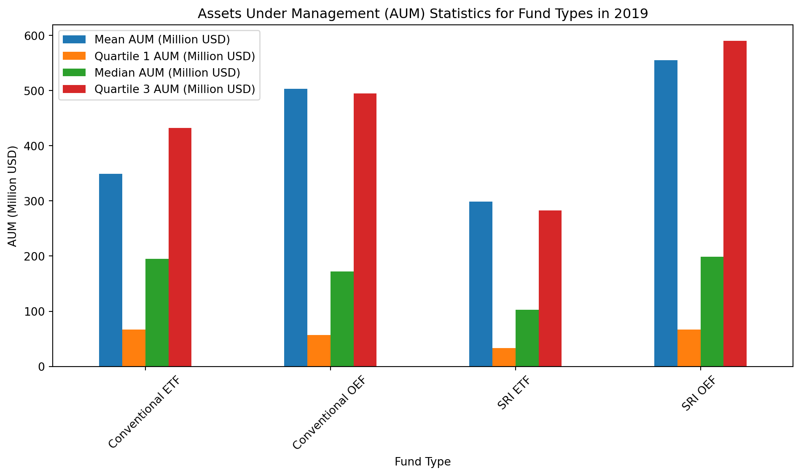
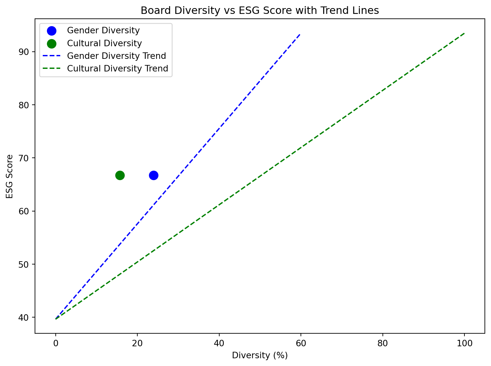
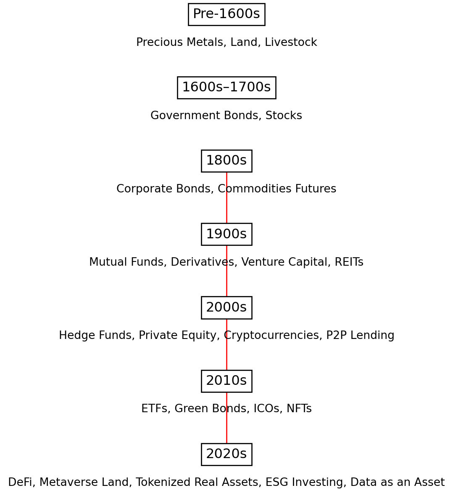

export const quartoRawHtml =
[`
<table style="width:100%;">
<caption>Data compiled from <span class="citation" data-cites="focustaiwanIPASSLaunchesQR2025 taiwannewsPXPay1stTaiwan2025 pxpayplusPXPayJPMorgan">[@focustaiwanIPASSLaunchesQR2025; @taiwannewsPXPay1stTaiwan2025; @pxpayplusPXPayJPMorgan]</span></caption>
<colgroup>
<col style="width: 5%" />
<col style="width: 88%" />
<col style="width: 3%" />
<col style="width: 2%" />
</colgroup>
<thead>
<tr>
<th style="text-align: left;">Payment App</th>
<th style="text-align: left;">Features</th>
<th style="text-align: left;">Users in Taiwan</th>
<th>Origin</th>
</tr>
</thead>
<tbody>
<tr>
<td style="text-align: left;"><strong>LINE Pay</strong></td>
<td style="text-align: left;">Most popular payment app accepted all over Taiwan. Works stand-alone and inside the LINE messenger. Supports both in-store and online shopping payments, also direct P2P transfers to contacts (requires LINE Bank). Displays a map of its merchant network with discounts and coupons; integrates iPASS MONEY.</td>
<td style="text-align: left;">&gt; 12 Million</td>
<td>Japan / Korea</td>
</tr>
<tr>
<td style="text-align: left;"><strong>JKOPay (街口支付)</strong></td>
<td style="text-align: left;">QR code payments and P2P transfers to contacts; paying for bills.</td>
<td style="text-align: left;">&gt; 7 Million</td>
<td>Taiwan</td>
</tr>
<tr>
<td style="text-align: left;"><strong>Taiwan Pay (台灣Pay)</strong></td>
<td style="text-align: left;">Official Taiwanese Government app in collaboration with Taiwanese banks. Supports payments directly from bank accounts (without the need for a card). Supports QR code payments, P2P transfers to contacts and paying bills. A unique feature is cash withdrawal from ATMs without the need for a bank card.</td>
<td style="text-align: left;">&gt; 6 Million</td>
<td>Taiwan</td>
</tr>
<tr>
<td style="text-align: left;"><strong>Apple Pay</strong></td>
<td style="text-align: left;">Requires an Apple iOS device; uses credit/debit cards via NFC, Secure, In-app &amp; web payments</td>
<td style="text-align: left;">?</td>
<td>USA</td>
</tr>
<tr>
<td style="text-align: left;"><strong>Google Pay</strong></td>
<td style="text-align: left;">Supports NFC and credit/debit cards, in-app and online payments as well as public transport.</td>
<td style="text-align: left;">?</td>
<td>USA</td>
</tr>
<tr>
<td style="text-align: left;"><strong>iPASS MONEY (一卡通MONEY)</strong></td>
<td style="text-align: left;">Digital version of the iPASS card which can be used for QR code payments, P2P transfers to contacts, paying bills and public transport.</td>
<td style="text-align: left;">?</td>
<td>Taiwan</td>
</tr>
<tr>
<td style="text-align: left;"><strong>E.Sun Wallet (玉山Wallet)</strong></td>
<td style="text-align: left;">Requires the Taiwanese E.Sun Bank and allows QR payments, P2P transfers to contacts and paying bills as well as financial management tools.</td>
<td style="text-align: left;">?</td>
<td>Taiwan</td>
</tr>
<tr>
<td style="text-align: left;"><strong>Pi Wallet (Pi 拍錢包)</strong></td>
<td style="text-align: left;">Payment app by the PChome online shop supporting in-store QR and online payments, and paying for bills a parking.</td>
<td style="text-align: left;">?</td>
<td>Taiwan</td>
</tr>
<tr>
<td style="text-align: left;"><strong>PXPay (全聯福利中心)</strong></td>
<td style="text-align: left;">Payment app by PX Mart, the largest domestic Taiwanese supermarket chain, supporting QR code payments, offering rewards and discounts and loyalty plans. Recently expanded to Korea quoting the interest of Taiwanese young people in Korean culture. <strong>In early 2025, PXPay began offering a saving and investing service called “Digital Hen” in collaboration with J.P Morgan Asset Management.</strong> According to the press release, the service aims to be a beginner-friendly financial innovation helping shoppers get into micro-investing.</td>
<td style="text-align: left;">?</td>
<td>Taiwan</td>
</tr>
<tr>
<td style="text-align: left;"><strong>Hami Pay (中華電信)</strong></td>
<td style="text-align: left;">Payment app by the largest phone company Chunghwa Telecom supporting NFC payments, public transport, and paying bills.</td>
<td style="text-align: left;">?</td>
<td>Taiwan</td>
</tr>
<tr>
<td style="text-align: left;"><strong>Samsung Pay (悠遊卡)</strong></td>
<td style="text-align: left;">Requires a Samsung device; uses NFC; integrates EasyCard and credit/debit cards; supports public transport.</td>
<td style="text-align: left;">?</td>
<td>Korea</td>
</tr>
</tbody>
</table>
`,`
<table style="width:99%;">
<caption>Data from <span class="citation" data-cites="ZigluFastSimple lightyearLightyearInvestingOwn SelmaYourFinances MosMoneyApp monzoOnlineBankingMade2023 NubankFinalmenteVoce">[@ZigluFastSimple; @lightyearLightyearInvestingOwn; @SelmaYourFinances; @MosMoneyApp; @monzoOnlineBankingMade2023; @NubankFinalmenteVoce]</span>. An up to date database (as of April 2025) is available at <a href="https://www.greenfilter.app/data">greenfilter.app/data</a>.</caption>
<colgroup>
<col style="width: 14%" />
<col style="width: 71%" />
<col style="width: 13%" />
</colgroup>
<tbody>
<tr>
<td>Service</td>
<td>Features</td>
<td>Availability</td>
</tr>
<tr>
<td>Goodments</td>
<td>Matching investment vehicles to user’s environmental, social, ethical values</td>
<td>USA</td>
</tr>
<tr>
<td>Wealthsimple</td>
<td>AI-assisted saving &amp; investing for Millennials</td>
<td>USA, UK</td>
</tr>
<tr>
<td>Ellevest</td>
<td>AI-assisted robo-advisory focused on female investors and women-led business</td>
<td>USA</td>
</tr>
<tr>
<td>Betterment</td>
<td>AI-assisted cash management, savings, retirement, and investing</td>
<td>USA</td>
</tr>
<tr>
<td>Earthfolio</td>
<td>AI-assisted socially responsible investing</td>
<td>USA</td>
</tr>
<tr>
<td>Acorns</td>
<td>AI-assisted micro-investing</td>
<td>USA</td>
</tr>
<tr>
<td>Trine</td>
<td>Loans to eco-projects</td>
<td>USA</td>
</tr>
<tr>
<td>Single.Earth</td>
<td>Nature-back cryptocurrency</td>
<td>Global</td>
</tr>
<tr>
<td>Grünfin</td>
<td>Invest in funds</td>
<td>EU</td>
</tr>
<tr>
<td>M1 Finance</td>
<td>Finance Super App</td>
<td>US</td>
</tr>
<tr>
<td>Finimize</td>
<td>Investment research for anyone</td>
<td>US</td>
</tr>
<tr>
<td>NerdWallet</td>
<td>Financial clarity all in one place</td>
<td>US</td>
</tr>
<tr>
<td>Tomorrow Bank</td>
<td>Green Banking</td>
<td>EU</td>
</tr>
<tr>
<td>Marcus Invest</td>
<td>Robo-Advisor</td>
<td>US</td>
</tr>
<tr>
<td>Chipper</td>
<td>Digital cash app for African markets</td>
<td>Africa</td>
</tr>
<tr>
<td>Lightyear</td>
<td>Simple UI for Stocks, ETFs, interest from Estonia</td>
<td>EU</td>
</tr>
<tr>
<td>Ziglu</td>
<td>UK simple investing app</td>
<td>UK</td>
</tr>
<tr>
<td>Selma</td>
<td>Finnish investing app</td>
<td>EU</td>
</tr>
<tr>
<td>Monzo</td>
<td>Bank</td>
<td>UK</td>
</tr>
<tr>
<td>Nubank</td>
<td>Bank</td>
<td>Brazil</td>
</tr>
<tr>
<td>EToro</td>
<td>Investing and copy-investing</td>
<td>EU</td>
</tr>
<tr>
<td>Revolut</td>
<td>From payments to investing</td>
<td>UK, EU</td>
</tr>
<tr>
<td>Mos</td>
<td>Banking for students</td>
<td>US</td>
</tr>
<tr>
<td>Robinhood</td>
<td>Investing</td>
<td>US</td>
</tr>
<tr>
<td>Mintos</td>
<td>Buy bonds and loans</td>
<td>EU</td>
</tr>
</tbody>
</table>
`,`
<table style="width:97%;">
<colgroup>
<col style="width: 6%" />
<col style="width: 28%" />
<col style="width: 10%" />
<col style="width: 12%" />
<col style="width: 6%" />
<col style="width: 5%" />
<col style="width: 4%" />
<col style="width: 10%" />
<col style="width: 10%" />
</colgroup>
<thead>
<tr>
<th style="text-align: left;">Service</th>
<th style="text-align: left;">Features</th>
<th style="text-align: left;">Website</th>
<th style="text-align: left;">Availability</th>
<th style="text-align: left;">Users</th>
<th style="text-align: left;">Investing</th>
<th style="text-align: left;">Savings</th>
<th style="text-align: left;">Shopping (Payments)</th>
<th style="text-align: left;">Sustainability Focus</th>
</tr>
</thead>
<tbody>
<tr>
<td style="text-align: left;">Alipay</td>
<td style="text-align: left;">Payments, banking, Yu’e Bao, Ant Fortune investing</td>
<td style="text-align: left;">alipay.com</td>
<td style="text-align: left;">China, Global (limited)</td>
<td style="text-align: left;">1.3 billion</td>
<td style="text-align: left;">Yes</td>
<td style="text-align: left;">Yes</td>
<td style="text-align: left;">Yes</td>
<td style="text-align: left;">No</td>
</tr>
<tr>
<td style="text-align: left;">WeChat Pay</td>
<td style="text-align: left;">Payments, financial services, Licaitong investing</td>
<td style="text-align: left;">wechat.com</td>
<td style="text-align: left;">China, Global (limited)</td>
<td style="text-align: left;">900 million</td>
<td style="text-align: left;">Yes</td>
<td style="text-align: left;">No</td>
<td style="text-align: left;">Yes</td>
<td style="text-align: left;">No</td>
</tr>
<tr>
<td style="text-align: left;">Apple Pay</td>
<td style="text-align: left;">Contactless payments</td>
<td style="text-align: left;">apple.com/apple-pay</td>
<td style="text-align: left;">Global</td>
<td style="text-align: left;">744 million</td>
<td style="text-align: left;">No</td>
<td style="text-align: left;">No</td>
<td style="text-align: left;">Yes</td>
<td style="text-align: left;">No</td>
</tr>
<tr>
<td style="text-align: left;">PhonePe</td>
<td style="text-align: left;">Payments, mutual funds, digital gold</td>
<td style="text-align: left;">phonepe.com</td>
<td style="text-align: left;">India</td>
<td style="text-align: left;">590 million</td>
<td style="text-align: left;">Yes</td>
<td style="text-align: left;">Yes</td>
<td style="text-align: left;">Yes</td>
<td style="text-align: left;">No</td>
</tr>
<tr>
<td style="text-align: left;">Paytm</td>
<td style="text-align: left;">Payments, banking, Paytm Money for stock &amp; fund investing</td>
<td style="text-align: left;">paytm.com</td>
<td style="text-align: left;">India</td>
<td style="text-align: left;">350 million</td>
<td style="text-align: left;">Yes</td>
<td style="text-align: left;">Yes</td>
<td style="text-align: left;">Yes</td>
<td style="text-align: left;">No</td>
</tr>
<tr>
<td style="text-align: left;">Google Pay</td>
<td style="text-align: left;">Payments, loyalty, transit</td>
<td style="text-align: left;">pay.google.com</td>
<td style="text-align: left;">Global</td>
<td style="text-align: left;">150 million</td>
<td style="text-align: left;">No</td>
<td style="text-align: left;">No</td>
<td style="text-align: left;">Yes</td>
<td style="text-align: left;">No</td>
</tr>
<tr>
<td style="text-align: left;">Samsung Pay</td>
<td style="text-align: left;">Mobile payments</td>
<td style="text-align: left;">samsung.com</td>
<td style="text-align: left;">Global</td>
<td style="text-align: left;">?</td>
<td style="text-align: left;">No</td>
<td style="text-align: left;">No</td>
<td style="text-align: left;">Yes</td>
<td style="text-align: left;">No</td>
</tr>
<tr>
<td style="text-align: left;">Zelle</td>
<td style="text-align: left;">Bank-to-bank P2P payments</td>
<td style="text-align: left;">zellepay.com</td>
<td style="text-align: left;">USA</td>
<td style="text-align: left;">?</td>
<td style="text-align: left;">No</td>
<td style="text-align: left;">Yes</td>
<td style="text-align: left;">Yes</td>
<td style="text-align: left;">No</td>
</tr>
<tr>
<td style="text-align: left;">Nubank</td>
<td style="text-align: left;">Bank</td>
<td style="text-align: left;">nubank.com.br</td>
<td style="text-align: left;">Brazil</td>
<td style="text-align: left;">?</td>
<td style="text-align: left;">No</td>
<td style="text-align: left;">Yes</td>
<td style="text-align: left;">Yes</td>
<td style="text-align: left;">No</td>
</tr>
</tbody>
</table>
`,`
<table style="width:100%;">
<colgroup>
<col style="width: 10%" />
<col style="width: 10%" />
<col style="width: 10%" />
<col style="width: 10%" />
<col style="width: 10%" />
<col style="width: 10%" />
<col style="width: 10%" />
<col style="width: 10%" />
<col style="width: 10%" />
<col style="width: 10%" />
</colgroup>
<thead>
<tr>
<th style="text-align: left;">Service</th>
<th style="text-align: left;">Features</th>
<th style="text-align: left;">Website</th>
<th style="text-align: left;">Availability</th>
<th style="text-align: left;">User Base</th>
<th style="text-align: left;">Investing</th>
<th style="text-align: left;">Savings</th>
<th style="text-align: left;">Shopping (Payments)</th>
<th style="text-align: left;">Sustainability Focus</th>
<th>Notes</th>
</tr>
</thead>
<tbody>
<tr>
<td style="text-align: left;">Venmo</td>
<td style="text-align: left;">P2P payments, crypto investing</td>
<td style="text-align: left;">venmo.com</td>
<td style="text-align: left;">USA</td>
<td style="text-align: left;">70 million</td>
<td style="text-align: left;">Yes</td>
<td style="text-align: left;">No</td>
<td style="text-align: left;">Yes</td>
<td style="text-align: left;">No</td>
<td></td>
</tr>
<tr>
<td style="text-align: left;">Cash App</td>
<td style="text-align: left;">P2P payments, stock &amp; Bitcoin investing</td>
<td style="text-align: left;">cash.app</td>
<td style="text-align: left;">USA, UK</td>
<td style="text-align: left;">57 million</td>
<td style="text-align: left;">Yes</td>
<td style="text-align: left;">No</td>
<td style="text-align: left;">Yes</td>
<td style="text-align: left;">No</td>
<td></td>
</tr>
<tr>
<td style="text-align: left;">Chime</td>
<td style="text-align: left;">Online banking services including spending accounts, savings accounts</td>
<td style="text-align: left;">chime.com</td>
<td style="text-align: left;">USA</td>
<td style="text-align: left;">22 million</td>
<td style="text-align: left;">No</td>
<td style="text-align: left;">Yes</td>
<td style="text-align: left;">Yes</td>
<td style="text-align: left;">No</td>
<td></td>
</tr>
<tr>
<td style="text-align: left;">MoneyLion</td>
<td style="text-align: left;">Banking, investing, credit-building loans, financial tracking tools</td>
<td style="text-align: left;">moneylion.com</td>
<td style="text-align: left;">USA</td>
<td style="text-align: left;">20 million</td>
<td style="text-align: left;">Yes</td>
<td style="text-align: left;">Yes</td>
<td style="text-align: left;">Yes</td>
<td style="text-align: left;">No</td>
<td></td>
</tr>
<tr>
<td style="text-align: left;">NerdWallet</td>
<td style="text-align: left;">Financial clarity all in one place</td>
<td style="text-align: left;">nerdwallet.com</td>
<td style="text-align: left;">USA</td>
<td style="text-align: left;">19 million</td>
<td style="text-align: left;">No</td>
<td style="text-align: left;">No</td>
<td style="text-align: left;">Yes</td>
<td style="text-align: left;">No</td>
<td></td>
</tr>
<tr>
<td style="text-align: left;">SoFi</td>
<td style="text-align: left;">Loans, banking, robo-investing, stock &amp; crypto</td>
<td style="text-align: left;">sofi.com</td>
<td style="text-align: left;">USA</td>
<td style="text-align: left;">10 million</td>
<td style="text-align: left;">Yes</td>
<td style="text-align: left;">Yes</td>
<td style="text-align: left;">Yes</td>
<td style="text-align: left;">No</td>
<td></td>
</tr>
<tr>
<td style="text-align: left;">Albert</td>
<td style="text-align: left;">Budgeting, saving, spending, investing, access to financial advisors</td>
<td style="text-align: left;">albert.com</td>
<td style="text-align: left;">USA</td>
<td style="text-align: left;">10 million</td>
<td style="text-align: left;">Yes</td>
<td style="text-align: left;">Yes</td>
<td style="text-align: left;">No</td>
<td style="text-align: left;">No</td>
<td></td>
</tr>
<tr>
<td style="text-align: left;">Acorns</td>
<td style="text-align: left;">AI-assisted micro-investing</td>
<td style="text-align: left;">acorns.com</td>
<td style="text-align: left;">USA</td>
<td style="text-align: left;">5.7 million</td>
<td style="text-align: left;">Yes</td>
<td style="text-align: left;">No</td>
<td style="text-align: left;">No</td>
<td style="text-align: left;">No</td>
<td></td>
</tr>
<tr>
<td style="text-align: left;">Wealthsimple</td>
<td style="text-align: left;">AI-assisted saving &amp; investing for Millennials</td>
<td style="text-align: left;">wealthsimple.com</td>
<td style="text-align: left;">Canada, USA, UK</td>
<td style="text-align: left;">2.6 million</td>
<td style="text-align: left;">Yes</td>
<td style="text-align: left;">Yes</td>
<td style="text-align: left;">No</td>
<td style="text-align: left;">No</td>
<td></td>
</tr>
<tr>
<td style="text-align: left;">Qapital</td>
<td style="text-align: left;">Saving and investing with gamification features</td>
<td style="text-align: left;">qapital.com</td>
<td style="text-align: left;">USA</td>
<td style="text-align: left;">2 million</td>
<td style="text-align: left;">Yes</td>
<td style="text-align: left;">Yes</td>
<td style="text-align: left;">No</td>
<td style="text-align: left;">No</td>
<td></td>
</tr>
<tr>
<td style="text-align: left;">M1 Finance</td>
<td style="text-align: left;">Finance Super App</td>
<td style="text-align: left;">m1.com</td>
<td style="text-align: left;">USA</td>
<td style="text-align: left;">1 million</td>
<td style="text-align: left;">Yes</td>
<td style="text-align: left;">No</td>
<td style="text-align: left;">No</td>
<td style="text-align: left;">No</td>
<td></td>
</tr>
<tr>
<td style="text-align: left;">Finimize</td>
<td style="text-align: left;">Investment research for anyone</td>
<td style="text-align: left;">finimize.com</td>
<td style="text-align: left;">Global</td>
<td style="text-align: left;">1 million</td>
<td style="text-align: left;">Yes</td>
<td style="text-align: left;">No</td>
<td style="text-align: left;">No</td>
<td style="text-align: left;">No</td>
<td></td>
</tr>
<tr>
<td style="text-align: left;">Robinhood</td>
<td style="text-align: left;">Investing</td>
<td style="text-align: left;">robinhood.com</td>
<td style="text-align: left;">US</td>
<td style="text-align: left;">?</td>
<td style="text-align: left;">Yes</td>
<td style="text-align: left;">No</td>
<td style="text-align: left;">No</td>
<td style="text-align: left;">No</td>
<td></td>
</tr>
<tr>
<td style="text-align: left;">Betterment</td>
<td style="text-align: left;">AI-assisted cash management, savings, retirement, and investing</td>
<td style="text-align: left;">betterment.com</td>
<td style="text-align: left;">USA</td>
<td style="text-align: left;">?</td>
<td style="text-align: left;">Yes</td>
<td style="text-align: left;">Yes</td>
<td style="text-align: left;">No</td>
<td style="text-align: left;">No</td>
<td></td>
</tr>
<tr>
<td style="text-align: left;">Revolut</td>
<td style="text-align: left;">From payments to investing</td>
<td style="text-align: left;">revolut.com</td>
<td style="text-align: left;">UK, EU</td>
<td style="text-align: left;">?</td>
<td style="text-align: left;">Yes</td>
<td style="text-align: left;">No</td>
<td style="text-align: left;">TRUE</td>
<td style="text-align: left;">No</td>
<td></td>
</tr>
<tr>
<td style="text-align: left;">Monzo</td>
<td style="text-align: left;">Bank</td>
<td style="text-align: left;">monzo.com</td>
<td style="text-align: left;">UK</td>
<td style="text-align: left;">?</td>
<td style="text-align: left;">No</td>
<td style="text-align: left;">Yes</td>
<td style="text-align: left;">No</td>
<td style="text-align: left;">No</td>
<td></td>
</tr>
<tr>
<td style="text-align: left;">eToro</td>
<td style="text-align: left;">Investing and copy-investing</td>
<td style="text-align: left;">etoro.com</td>
<td style="text-align: left;">EU</td>
<td style="text-align: left;">?</td>
<td style="text-align: left;">Yes</td>
<td style="text-align: left;">No</td>
<td style="text-align: left;">No</td>
<td style="text-align: left;">No</td>
<td></td>
</tr>
<tr>
<td style="text-align: left;">Marcus Invest</td>
<td style="text-align: left;">Robo-Advisor</td>
<td style="text-align: left;">marcusinvest.com</td>
<td style="text-align: left;">USA</td>
<td style="text-align: left;">?</td>
<td style="text-align: left;">Yes</td>
<td style="text-align: left;">No</td>
<td style="text-align: left;">No</td>
<td style="text-align: left;">No</td>
<td></td>
</tr>
<tr>
<td style="text-align: left;">Varo Bank</td>
<td style="text-align: left;">Online banking services including checking and high-yield savings</td>
<td style="text-align: left;">varomoney.com</td>
<td style="text-align: left;">USA</td>
<td style="text-align: left;">?</td>
<td style="text-align: left;">No</td>
<td style="text-align: left;">Yes</td>
<td style="text-align: left;">Yes</td>
<td style="text-align: left;">No</td>
<td></td>
</tr>
<tr>
<td style="text-align: left;">Stash</td>
<td style="text-align: left;">Micro-investing platform enabling small investments</td>
<td style="text-align: left;">stash.com</td>
<td style="text-align: left;">USA</td>
<td style="text-align: left;">?</td>
<td style="text-align: left;">Yes</td>
<td style="text-align: left;">No</td>
<td style="text-align: left;">No</td>
<td style="text-align: left;">No</td>
<td></td>
</tr>
<tr>
<td style="text-align: left;">Mint</td>
<td style="text-align: left;">Budgeting tools, bill tracking, free credit score monitoring</td>
<td style="text-align: left;">mint.com</td>
<td style="text-align: left;">USA</td>
<td style="text-align: left;">?</td>
<td style="text-align: left;">No</td>
<td style="text-align: left;">No</td>
<td style="text-align: left;">No</td>
<td style="text-align: left;">No</td>
<td>Ceased operations</td>
</tr>
</tbody>
</table>
`,`
<table style="width:100%;">
<colgroup>
<col style="width: 10%" />
<col style="width: 10%" />
<col style="width: 10%" />
<col style="width: 10%" />
<col style="width: 10%" />
<col style="width: 10%" />
<col style="width: 10%" />
<col style="width: 10%" />
<col style="width: 10%" />
<col style="width: 10%" />
</colgroup>
<thead>
<tr>
<th style="text-align: left;">Service</th>
<th style="text-align: left;">Features</th>
<th style="text-align: left;">Website</th>
<th style="text-align: left;">Availability</th>
<th style="text-align: left;">User Base</th>
<th style="text-align: left;">Investing</th>
<th style="text-align: left;">Savings</th>
<th style="text-align: left;">Shopping (Payments)</th>
<th style="text-align: left;">Sustainability Focus</th>
<th style="text-align: left;">Notes</th>
</tr>
</thead>
<tbody>
<tr>
<td style="text-align: left;">Chipper Cash</td>
<td style="text-align: left;">Digital cash app for African markets</td>
<td style="text-align: left;">chippercash.com</td>
<td style="text-align: left;">Ghana, Nigeria, Uganda, USA</td>
<td style="text-align: left;">?</td>
<td style="text-align: left;">No</td>
<td style="text-align: left;">No</td>
<td style="text-align: left;">Yes</td>
<td style="text-align: left;">No</td>
<td style="text-align: left;"></td>
</tr>
<tr>
<td style="text-align: left;">Douugh</td>
<td style="text-align: left;">AI financial wellness app, smart account, saving tools</td>
<td style="text-align: left;">douugh.com</td>
<td style="text-align: left;">USA, Australia</td>
<td style="text-align: left;">?</td>
<td style="text-align: left;">Yes</td>
<td style="text-align: left;">Yes</td>
<td style="text-align: left;">Yes</td>
<td style="text-align: left;">No</td>
<td style="text-align: left;">Merged with Goodments</td>
</tr>
<tr>
<td style="text-align: left;">DUB</td>
<td style="text-align: left;">Copy-trading, mirror trades of notable figures</td>
<td style="text-align: left;">dubapp.com</td>
<td style="text-align: left;">USA</td>
<td style="text-align: left;">1 million downloads</td>
<td style="text-align: left;">Yes</td>
<td style="text-align: left;">No</td>
<td style="text-align: left;">No</td>
<td style="text-align: left;">No</td>
<td style="text-align: left;"></td>
</tr>
<tr>
<td style="text-align: left;">Earthfolio</td>
<td style="text-align: left;">AI-assisted socially responsible investing</td>
<td style="text-align: left;">earthfolio.com</td>
<td style="text-align: left;">USA</td>
<td style="text-align: left;">?</td>
<td style="text-align: left;">Yes</td>
<td style="text-align: left;">No</td>
<td style="text-align: left;">No</td>
<td style="text-align: left;">Yes</td>
<td style="text-align: left;"></td>
</tr>
<tr>
<td style="text-align: left;">Ellevest</td>
<td style="text-align: left;">AI-assisted robo-advisory focused on female investors and women-led business</td>
<td style="text-align: left;">ellevest.com</td>
<td style="text-align: left;">USA</td>
<td style="text-align: left;">?</td>
<td style="text-align: left;">Yes</td>
<td style="text-align: left;">No</td>
<td style="text-align: left;">No</td>
<td style="text-align: left;">No</td>
<td style="text-align: left;"></td>
</tr>
<tr>
<td style="text-align: left;">Goodments</td>
<td style="text-align: left;">Matching investment vehicles to user’s environmental, social, ethical values</td>
<td style="text-align: left;">goodments.com</td>
<td style="text-align: left;">USA</td>
<td style="text-align: left;">?</td>
<td style="text-align: left;">Yes</td>
<td style="text-align: left;">No</td>
<td style="text-align: left;">No</td>
<td style="text-align: left;">Yes</td>
<td style="text-align: left;">Merged with Douugh</td>
</tr>
<tr>
<td style="text-align: left;">Grünfin</td>
<td style="text-align: left;">Invest in funds</td>
<td style="text-align: left;">grunfin.com</td>
<td style="text-align: left;">EU</td>
<td style="text-align: left;">?</td>
<td style="text-align: left;">Yes</td>
<td style="text-align: left;">Yes</td>
<td style="text-align: left;">No</td>
<td style="text-align: left;">No</td>
<td style="text-align: left;">Ceased operations</td>
</tr>
<tr>
<td style="text-align: left;">Lightyear</td>
<td style="text-align: left;">Simple UI for Stocks, ETFs, interest from Estonia</td>
<td style="text-align: left;">lightyear.com</td>
<td style="text-align: left;">EU</td>
<td style="text-align: left;">?</td>
<td style="text-align: left;">Yes</td>
<td style="text-align: left;">No</td>
<td style="text-align: left;">No</td>
<td style="text-align: left;">No</td>
<td style="text-align: left;"></td>
</tr>
<tr>
<td style="text-align: left;">Mintos</td>
<td style="text-align: left;">Buy bonds and loans</td>
<td style="text-align: left;">mintos.com</td>
<td style="text-align: left;">EU</td>
<td style="text-align: left;">?</td>
<td style="text-align: left;">Yes</td>
<td style="text-align: left;">No</td>
<td style="text-align: left;">No</td>
<td style="text-align: left;">No</td>
<td style="text-align: left;"></td>
</tr>
<tr>
<td style="text-align: left;">Mos</td>
<td style="text-align: left;">Banking for students</td>
<td style="text-align: left;">mos.com</td>
<td style="text-align: left;">US</td>
<td style="text-align: left;">?</td>
<td style="text-align: left;">No</td>
<td style="text-align: left;">Yes</td>
<td style="text-align: left;">Yes</td>
<td style="text-align: left;">No</td>
<td style="text-align: left;"></td>
</tr>
<tr>
<td style="text-align: left;">Selma</td>
<td style="text-align: left;">Finnish investing app</td>
<td style="text-align: left;">selma.com</td>
<td style="text-align: left;">EU</td>
<td style="text-align: left;">?</td>
<td style="text-align: left;">Yes</td>
<td style="text-align: left;">No</td>
<td style="text-align: left;">No</td>
<td style="text-align: left;">No</td>
<td style="text-align: left;"></td>
</tr>
<tr>
<td style="text-align: left;">Single.Earth</td>
<td style="text-align: left;">Nature-backed cryptocurrency</td>
<td style="text-align: left;">single.earth</td>
<td style="text-align: left;">Global</td>
<td style="text-align: left;">?</td>
<td style="text-align: left;">Yes</td>
<td style="text-align: left;">No</td>
<td style="text-align: left;">No</td>
<td style="text-align: left;">Yes</td>
<td style="text-align: left;"></td>
</tr>
<tr>
<td style="text-align: left;">Tomorrow Bank</td>
<td style="text-align: left;">Green Banking</td>
<td style="text-align: left;">tomorrow.one</td>
<td style="text-align: left;">EU</td>
<td style="text-align: left;">120,000</td>
<td style="text-align: left;">No</td>
<td style="text-align: left;">Yes</td>
<td style="text-align: left;">Yes</td>
<td style="text-align: left;">Yes</td>
<td style="text-align: left;"></td>
</tr>
<tr>
<td style="text-align: left;">Trine</td>
<td style="text-align: left;">Loans to eco-projects</td>
<td style="text-align: left;">trine.com</td>
<td style="text-align: left;">USA</td>
<td style="text-align: left;">?</td>
<td style="text-align: left;">Yes</td>
<td style="text-align: left;">No</td>
<td style="text-align: left;">No</td>
<td style="text-align: left;">Yes</td>
<td style="text-align: left;"></td>
</tr>
<tr>
<td style="text-align: left;">Ziglu</td>
<td style="text-align: left;">UK simple investing app</td>
<td style="text-align: left;">ziglu.io</td>
<td style="text-align: left;">UK</td>
<td style="text-align: left;">?</td>
<td style="text-align: left;">Yes</td>
<td style="text-align: left;">No</td>
<td style="text-align: left;">No</td>
<td style="text-align: left;">No</td>
<td style="text-align: left;"></td>
</tr>
</tbody>
</table>
`,`
<table>
<caption>Comparative data on needed climate investment and other valuable assets; all figures in Trillions of USD <span class="citation" data-cites="s&amp;pglobalWorld100Largest2019 grandviewresearchRealEstateMarket2021 aarononeillGlobalGDP198520282023 imfWorldEconomicOutlook2023 stephanieaaronsonHowAppleBecame2023 statistaRetailMarketWorldwide2023 statistaGlobalRetailEcommerce2021 sifmaResearchQuarterlyEquities2023 ustreasuryFiscalDataExplains2023 raoVisualizing105Trillion2023 thinkingaheadinstituteGlobalPensionAssets2023 blockworksBitcoinPriceBTC2023 blockworksEthereumPriceETH2023 mckinsey&amp;companyMcKinseyGlobalPrivate2023 oguhBlackstoneReachesRecord2023 foxRetailInvestorsWill2023 trucostNaturalCapitalRisk2023">[@s&amp;pglobalWorld100Largest2019; @grandviewresearchRealEstateMarket2021; @aarononeillGlobalGDP198520282023; @imfWorldEconomicOutlook2023; @stephanieaaronsonHowAppleBecame2023; @statistaRetailMarketWorldwide2023; @statistaGlobalRetailEcommerce2021; @sifmaResearchQuarterlyEquities2023; @ustreasuryFiscalDataExplains2023; @raoVisualizing105Trillion2023; @thinkingaheadinstituteGlobalPensionAssets2023; @blockworksBitcoinPriceBTC2023; @blockworksEthereumPriceETH2023; @mckinsey&amp;companyMcKinseyGlobalPrivate2023; @oguhBlackstoneReachesRecord2023; @foxRetailInvestorsWill2023; @trucostNaturalCapitalRisk2023]</span></caption>
<colgroup>
<col style="width: 87%" />
<col style="width: 12%" />
</colgroup>
<thead>
<tr>
<th>High-Value Assets (Trillions of USD)</th>
<th></th>
</tr>
</thead>
<tbody>
<tr>
<td>Global Real Estate (2020, valuation)</td>
<td>$326T</td>
</tr>
<tr>
<td>Global Equity Markets (2023, valuation)</td>
<td>$108T</td>
</tr>
<tr>
<td>Global GDP (2024, estimated)</td>
<td>$110T</td>
</tr>
<tr>
<td>Global GDP (2023, per year)</td>
<td>$105T</td>
</tr>
<tr>
<td>Global GDP (2022, per year)</td>
<td>$100T</td>
</tr>
<tr>
<td><em>Global Pension Funds (2023, valuation)</em></td>
<td><em>$47.9T</em></td>
</tr>
<tr>
<td>U.S. Equity Markets (2023, valuation)</td>
<td>$46.2T</td>
</tr>
<tr>
<td>U.S. National Debt (2023, valuation)</td>
<td>$32.6T</td>
</tr>
<tr>
<td><em>Millennials Inheriting Money from Parents in the U.S., U.K. and Australia (2022-2032)</em></td>
<td><em>$30T</em></td>
</tr>
<tr>
<td>Global Retail Sales of Goods and Services to Consumers (2023, per year)</td>
<td>$28.2T</td>
</tr>
<tr>
<td>GDP of U.S.A. (2023, per year)</td>
<td>$26.8T</td>
</tr>
<tr>
<td>GDP of China (2023, per year)</td>
<td>$19.3T</td>
</tr>
<tr>
<td>Global Private Market Assets (2023, per year)</td>
<td>$11.7T</td>
</tr>
<tr>
<td><em>Unpriced Externalities (2023, per year)</em></td>
<td><em>$7.3T</em></td>
</tr>
<tr>
<td>Global E-Commerce Sales (2021, per year)</td>
<td>$5.2T</td>
</tr>
<tr>
<td><em>Missing Climate Invesment (2022, estimate per year)</em></td>
<td><em>$4.1T</em></td>
</tr>
<tr>
<td>Industrial &amp; Commercial Bank of China (2019, total assets)</td>
<td>$4T</td>
</tr>
<tr>
<td>Global Real Estate Sales (2021, per year)</td>
<td>$3.7T</td>
</tr>
<tr>
<td>Apple Computers (2024, market value)</td>
<td>$3.1T</td>
</tr>
<tr>
<td>GDP of Japan (2023, per year)</td>
<td>$4.5T</td>
</tr>
<tr>
<td>GDP of Germany (2023, per year)</td>
<td>$4.3T</td>
</tr>
<tr>
<td>GDP of India (2023, per year)</td>
<td>$3.7T</td>
</tr>
<tr>
<td>U.S. Gen-Z and Millennials Consumer Spending (2022, per year)</td>
<td>$2.5T</td>
</tr>
<tr>
<td>NVIDIA 英偉達 (2024, market value)</td>
<td>$2.5T</td>
</tr>
<tr>
<td><em>Retail Investors (2023, liquid assets)</em></td>
<td><em>$1.8T</em></td>
</tr>
<tr>
<td>Blackstone (2023, total assets)</td>
<td>$1T</td>
</tr>
<tr>
<td>Bitcoin (2024, market cap)</td>
<td>$1T</td>
</tr>
<tr>
<td>GDP of Taiwan (2023, per year)</td>
<td>$0.8T</td>
</tr>
<tr>
<td>GDP of Finland (2023)</td>
<td>$0.3T</td>
</tr>
<tr>
<td>Ethereum (2024, market cap)</td>
<td>$0.3T</td>
</tr>
<tr>
<td><em>Individual Climate Investors</em> (2020, per year)</td>
<td>$0.1T</td>
</tr>
<tr>
<td>GDP of Estonia (2023, per year)</td>
<td>$0.04T</td>
</tr>
</tbody>
</table>
`,`
<table>
<thead>
<tr>
<th>Name</th>
<th>Description</th>
<th>Link</th>
</tr>
</thead>
<tbody>
<tr>
<td>Trine</td>
<td></td>
<td>trine.com</td>
</tr>
<tr>
<td>The Many</td>
<td></td>
<td>the-many.com</td>
</tr>
<tr>
<td>Sugi</td>
<td></td>
<td>sugi.earth</td>
</tr>
<tr>
<td>ClimateInvest</td>
<td></td>
<td>clim8invest.com</td>
</tr>
<tr>
<td>Circa5000</td>
<td></td>
<td>circa5000.com</td>
</tr>
<tr>
<td>FairOwn</td>
<td></td>
<td>fairown.com</td>
</tr>
</tbody>
</table>
`,`
<table>
<thead>
<tr>
<th>Investment Product</th>
</tr>
</thead>
<tbody>
<tr>
<td>Stocks</td>
</tr>
<tr>
<td>Bonds</td>
</tr>
<tr>
<td>Mutual Funds</td>
</tr>
<tr>
<td>ETFs</td>
</tr>
<tr>
<td>Insurance Products such as Variable Annuities</td>
</tr>
</tbody>
</table>
`,`
<table>
<caption>From <span class="citation" data-cites="circleeconomyKeynoteIlektraKouloumpi2021">[@circleeconomyKeynoteIlektraKouloumpi2021]</span>.</caption>
<thead>
<tr>
<th>Shortening Food Chains in Amsterdam</th>
</tr>
</thead>
<tbody>
<tr>
<td>Spatial planning for food place-making in the city</td>
</tr>
<tr>
<td>Circular agriculture</td>
</tr>
<tr>
<td>Regionally produced food</td>
</tr>
<tr>
<td>Collaboration between chain members</td>
</tr>
<tr>
<td>Food education</td>
</tr>
</tbody>
</table>
`,`
<table style="width:100%;">
<colgroup>
<col style="width: 5%" />
<col style="width: 15%" />
<col style="width: 78%" />
</colgroup>
<thead>
<tr>
<th>Type</th>
<th>Rating System</th>
<th>What it does</th>
</tr>
</thead>
<tbody>
<tr>
<td>Certificate</td>
<td>B Corporation</td>
<td>B Impact Assessment</td>
</tr>
<tr>
<td></td>
<td>ESG</td>
<td></td>
</tr>
<tr>
<td>Certificate</td>
<td>Fair Trade</td>
<td></td>
</tr>
<tr>
<td>Ranking</td>
<td>Responsible Business Index</td>
<td><span class="citation" data-cites="EstonianResponsibleBusiness">@EstonianResponsibleBusiness</span> Responsible business index</td>
</tr>
<tr>
<td>Index</td>
<td>Greenly</td>
<td>Greenly Decarborization Index <span class="citation" data-cites="greenlyGreenlyIntroducesClimate2023">@greenlyGreenlyIntroducesClimate2023</span></td>
</tr>
<tr>
<td></td>
<td>Science-Based Targets</td>
<td>Science-Based Targets initiative (SBTi) provides step-by–step guidance per economic sector help companies get started with meeting climate criteria and emission reduction requirements.</td>
</tr>
<tr>
<td>Certificate</td>
<td>Green Web Foundation</td>
<td><p><span class="citation" data-cites="GreenWebFoundation2023">@GreenWebFoundation2023</span> For example, the Green Web Foundation certifies how sustainable is the web hosting used by websites.</p>
<p>Testing website CO<sub>2</sub> emissions <span class="citation" data-cites="wholegraindigitaHowDoesIt2023">@wholegraindigitaHowDoesIt2023</span></p></td>
</tr>
<tr>
<td></td>
<td>Leafscore for product</td>
<td><span class="citation" data-cites="leafscoreLeafScoreLeadingOnline2023">@leafscoreLeafScoreLeadingOnline2023</span></td>
</tr>
<tr>
<td>Rating</td>
<td>Ethical consumer ratings</td>
<td><span class="citation" data-cites="EthicalConsumer">@EthicalConsumer</span></td>
</tr>
<tr>
<td></td>
<td>1% For the Planet</td>
<td></td>
</tr>
<tr>
<td>Standard</td>
<td>Climate Neutral Certified Standard</td>
<td></td>
</tr>
<tr>
<td>Standard</td>
<td>The Conservation Alliance</td>
<td><span class="citation" data-cites="climateneutralcertifiedClimateNeutralStandards2023">[@climateneutralcertifiedClimateNeutralStandards2023]</span>.</td>
</tr>
<tr>
<td>Index</td>
<td>Impakter Sustainability Inde</td>
<td></td>
</tr>
</tbody>
</table>
`,`
<table>
<colgroup>
<col style="width: 37%" />
<col style="width: 62%" />
</colgroup>
<thead>
<tr>
<th>Type</th>
<th>Example</th>
</tr>
</thead>
<tbody>
<tr>
<td>Transparency Accountability Advocate</td>
<td></td>
</tr>
<tr>
<td>Compliance Data Aggregator</td>
<td></td>
</tr>
<tr>
<td>Data Intelligence Hub</td>
<td></td>
</tr>
<tr>
<td>Worker Voice Tool</td>
<td><span class="citation" data-cites="caravanstudiosStrengthenYourWorker2022">@caravanstudiosStrengthenYourWorker2022</span>: <strong>“Worker Connect”</strong></td>
</tr>
<tr>
<td>Traceability tool</td>
<td>trustrace.com</td>
</tr>
<tr>
<td>Open data platform</td>
<td></td>
</tr>
<tr>
<td>Knowledge sharing platform</td>
<td>business-humanrights.org</td>
</tr>
</tbody>
</table>
`,`
<table>
<thead>
<tr>
<th>Problems</th>
<th></th>
<th></th>
</tr>
</thead>
<tbody>
<tr>
<td>ESG is an annual report not realtime</td>
<td></td>
<td></td>
</tr>
<tr>
<td></td>
<td></td>
<td></td>
</tr>
<tr>
<td></td>
<td></td>
<td></td>
</tr>
</tbody>
</table>
`];

````mdx-code-block
import Figure from '/src/components/Figure'
import Bunq from '../images/finance/bunq.jpg'
import AbstractFinance from '../images/finance/abstract-finance.png'
````

# Money

````mdx-code-block
<Figure caption="Visual abstract for the finance chapter" src={AbstractFinance} />
````

## Convergence of Money

Democratization of Finance

All-in-One Shopping, Saving, and Investing Superapps

### Sustainability-as-a-Feature

### Does the Democratization of Finance Create a Path for Sustainability in Superapps?

This chapter explores the growing trend of financial democratization,
which includes consumer apps that enable new user interactions which
increasingly blur boundaries between shopping, saving, and investing -
termed here *“money convergence”*. The efforts to boost user numbers
have driven apps that started out with only payments-focused
businesses - such as Revolut and N26 - branch out into offering savings
accounts and investing options.

While the journey from consumer to investor is increasingly simple
because of the *democratization of finance*, the critical question is:
do people choose to support sustainability-focused companies - companies
which invest deeply into green innovation and eco-friendly practices -
or do people choose companies that pay less attention to sustainability?

Shopping, saving, and investing are converging on digital platforms
(super-apps) that permeate our daily financial lives, with features such
basic banking, payments, transfers, as well as reward and cashback
programs (Rakuten), round-up to next dollar with automated
micro-investing (e.g. Acorn, Stash, Swedbank), and retail investing
(Robinhood, Public) and copy-trading (eToro) into various (fractional
shares of) stocks, derivatives like CFDs and futures, microloans (Kiva),
commodities and precious metals such as gold and silver (Revolut),
physical assets such as real estate, land, forest and digital assets
such as cryptocurrencies, NFTs, and other alternative assets.

Consumers are beginning to become more money-savvy yet are still missing
many key concepts from financial literacy. Giving users exposure to
investment opportunities through familiar activities like shopping may
have the potential to boost financial literacy levels and entice
consumers to learn more about taking advantage of their opportunities
financial markets - as well as how to manage the types or risk involved.

Money is becoming more diverse and the meaning of money itself is
changing. We have the fiat money created by governments by law, using
central banks, which loan money to commercial banks. And we also have
new types of money created by companies and individuals using
cryptographic blockchain-based distributed databases, which keep track
of transactions (who-paid-whom). Whatever the method of creation, in
essence, money is a *system of trust* where *something* is used as a
*medium of value exchange* and accepted by *other people* as payment.
Digital money in it’s various forms connects industries on the same
apps, which make investing more accessible and socially engaging,
appealing to younger people who are active in social media and online
shopping.

### Capital Allocation for Sustainability

Regardless of if it’s money spent on shopping or money saved and
invested, these are all financial decisions of *capital allocation*, and
in one way or another, we’re giving our money to companies pushing
economic growth. Empowering consumers to access finance through digital
technologies and delivering a simple UX (user experience) – i.e. the
fintech trend of the last 2 decades -, includes financial products
creating pathways towards sustainability-focused investing. Sustainable
capital allocation methods are many. The extent to which this funnel
works - and it’s indeed a complex, multi–step funnel - depends on
curbing greenwashing to a level that allows consumers to distinguish
eco–friendly businesses from the heavy polluters.

ESG (Environmental, Social, and Corporate Governance)

Trend of sustainably, how can sustainability become more accessible?
People want to shop, save, and invest sustainably - how to do it?


### Legislation

Legislation is Catching Up With Fintechs. Legislation sets higher
standards.

Directive 14 2014/65/EU, 2014: The European Union fully recognizes the
changing financial landscape trending towards the democratization of
investments: *“more investors have become active in the financial
markets and are offered an even more complex wide-ranging set of
services and instruments”* (European Parliament, 2014). Some key
legislation for investors has been put in place recently, for example
“MiFID II is a legislative framework instituted by the European Union
(EU) to regulate financial markets in the bloc and improve protections
for investors” (Kenton, 2020). MiFID II and MiFIR will ensure fairer,
safer and more efficient markets and facilitate greater transparency for
all participants” (European Securities and Markets Authority, 2017).

Already in 2001, while still part of the EU, the UK government was
discussing ways to promote sustainable investment *“fundamental changes
in VAT or corporation taxes could be used to promote greener consumption
and investment”* (House of Commons, 2002). More recently, (HM Treasury,
2020) released a taxonomy of sustainable activities in the UK.

Campain to ban polluting products campaign success story, EU shops can’t
sell deforestation products gathered over 100 thousand online signatures
(WeMove Europe, 2022). Legislation banning products contributing to
deforestation was passed by the EU Parliament and Council in 2023 and
came into effect in July 2024 (Abnett & Abnett, 2024; European
Parliament, 2023).

While the above trend is for governments to adapt to and work towards
their environmental climate commitments and public demand, the sovereign
risk remains an issue. For example, in the U.S. the policies supported
by President Donald Trump during his presidency ran counter to many
sustainability recommendations, including those directed at the
financial markets, helping legacy industries stay competitive for longer
through subsidies, and lack of regulation, or even regulation supporting
legacy technologies (Quinson, 2020).

(PWC, 2020) Changes to laws and regulations aimed at achieving climate
change mitigation is a key driver behind the wave of ESG adoption. The
goal of these laws, first adopted in the European Union, a
self-proclaimed leader in eco-friendliness, is to pressure unsustainable
companies to change towards greener practices, in fear of losing their
access to future capital, and to create a mechanism forcing entire
environmentally non-compliant business sectors to innovate towards
sustainability unless they want to suffer from financial penalties. On
the flip side of this stick and carrot fiscal strategy, ESG-compliant
companies will have incentives to access to cheaper capital and larger
investor demand from ESG-friendly investors.

### Shopping

#### Mobile Wallets In Taiwan

<div dangerouslySetInnerHTML={{ __html: quartoRawHtml[0] }} />

#### Shopping Environmental Footprint Driven by Social Commerce

Online Shopping impact. Single’s day, etc.

Double Eleven 11/11 celebrated on November 11 is the world’s largest
shopping festival (時代財經, 2023). In June 2023, 526 million people
watch e-commerce live-streams in China; online bargaining is a type of
ritual (Liu et al., 2024). According to (Igini, 2024) “Asia is set to
account for 50% of the world’s total online retail sales”.

It may seem impossible to turn the tide of consumerism, given the
projected growth in online shopping (Forrester, 2024)


(The Influencer Factory, 2021) China is the furthest ahead in *social
shopping*, the Chinese and U.S. market may be mature and growth will
come from emerging markets (SEA, Latin-America).


In the US, TikTok is the leader in social commerce Loyst (2024)

#### Shopping Driven by AI Assistants

important - more and more consumers using AI assistants to find
alternative products, make shopping lists, etc Pandya (2025); Pastore
(2025); Neuron (2025)

#### Consumer Activism

*Conscious consumers* make up a small percentage of the entire consumer
public. (Milne et al., 2020) coins the term *mindful consumers*, who do
research and are aware of the impact of their shopping choices.

-   Consume pressure to advance ESG regulatory standards to add a
    baseline ESG dynamic pricing of risk like climate, mandatory climate
    disclosures, carbon pricing knowing your supply chain, analyze
    supply chain risk

-   Is Sustainable Shopping possible? “Learn to notice so we can
    preserve”, “Õpetame märkama, et oskaksime hoida”. “Consumers have
    increasing power. Where we put our money reinforces certain types of
    businesses, as conscious consumers we can vote with our dollars. How
    can we do it？ Sustainable brands, ESG, etc, etc. Pushing highers
    Standards and choose companies that adopt circular design” What is
    the consumer CO<sub>2</sub> contribution? What is the target?

sustainable consumption relationships in Europe.


-   Sustainable Consumerism via Self-Regulation. 2M EUR project for the
    shopping app. (Klinglmayr et al., 2016)

Make use of indexes to compare companies.

-   Weber (2021) proposes a sustainable shopping guide.
-   Fuentes et al. (2019) discusses package free shopping.
-   van der Wal et al. (2016) discusses “status motives make people
    publicly display sustainable behavior”.

For consumer activism to become mainstream it needs to much simpler.

#### Payments

Banks and Fintechs Capture User Data. Payments are an Entry Point and
Source of Consumer Action Data, Shopping Data. Payments is the primary
way consumers use money. Is there a funnel From Payments to Investing?
ESG Shopping is about Changing our relationship with money. Make
commerce more transparent. Current shopping is like having a one-night
stand. you barely know the name of your company. You don’t know much
about their background. Building consumer feeling of ownership, create
meaningful connections between producers and consumers.

Payments is one way consumers can take individual climate action. In the
words of a Canadian investment blogger, *“every dollar you spend or
invest is a vote for the companies and their ethical and sustainability
practices”* (Fotheringham, 2017). The combination of consumption and
investment is an access point to get the consumer thinking about
investing. Even if the amount are small, they are a starting point for a
thought process.

Digitalisation of payments creates lots of Point of Sale (PoS) data
that’s valuable to understand what people buy. Banks have access to each
person’s financial habits which makes it possible to model sustainable
behavior using big data analysis. Asian markets have shown the fastest
growth in the use of digital payments (McKinsey, 2020).

In Taiwan, O Bank makes use of Mastercard’s data to calculate each
transaction’s CO<sub>2</sub> emissions and offer Taiwanese clients
“Consumer Spending Carbon Calculator” and “Low-Carbon Lifestyle Debit
Card” products (*Taiwan’s O-Bank Launches ’Consumer Spending Carbon
Calculator,’ Rewards Carbon Reduction*, 2022). Mastercard has developed
a service that banks can offer consumers sustainability reports
(Mastercard, 2021). Similarly, Commons, formerly known as Joro, an
independent app, analyses your personal financial data to estimate your
CO<sub>2</sub> footprint (Chant, 2022).

A Dutch fintech company Bunq offers payment cards for sustainability,
provided by MasterCard, which connects everyday payments to green
projects, such as planting trees and donations to charities within the
same user interface (Bunq, 2020). At the same time this can be
considered greenwashing as Bunq only plants 1 tree per every €1,000
spend with a Bunq card. The example marketed at students cites *8 trees
planted this month* while students scarcely would have €8,000 to spend
every month.

Sharing a similar goal to Alibaba’s Ant Forest, Bunq’s approach creates
a new interaction dynamic in a familiar context (card payments),
enabling customers to effortlessly contribute to sustainability.
However, it lacks the level of gamification which makes Alibaba’s
offering so addictive, while also not differentiating between the types
of purchases the consumer makes, in terms of the level of
eco-friendliness.

````mdx-code-block
<Figure caption="Bunq promises to combine banking and eco-friendly actions in the same user interface" src={Bunq} />
````

In Nigeria, (Emele Onu & Anthony Osae-Brown, 2022) reports how in order
to promote the eNaira digital currency use, the Nigerian government
limited the amount of cash that can be withdrawn from ATMs *“In
Nigeria’s largely informal economy, cash outside banks represents 85% of
currency in circulation and almost 40 million adults are without a bank
account.”* **\[E-Naira find papers\]**

In Kenya, M-Pesa started since 2007 for mobile payments, used by more
than 80% of farmers (Parlasca et al., 2022; Tyce, 2020). Using digital
payments instead of cash enables a new class of experiences, in terms of
personalization, and potentially, for sustainability.

In Sweden, point of sales (PoS) lending is a common practice, and one of
the reasons for the success of Klarna, the Swedish banking startup,
which has managed to lend money to more consumers than ever, through
this improved user experience. Taking out loans for consumption is a
questionable personal financial strategy at best. If people can loan
money at the point of sales, why couldn’t there be 180 degrees opposite
service - point of sales investing? And there is, called “round-up
apps”. Next Generation Customer Experience (n.d.) suggests *“Targeted at
millennials, Acorns is the investing app that rounds up purchases to the
nearest dollar and invests the difference.”* - and example of From
Shopping to Investing.

Many banks have started offering a service to automatically save and
invest tiny amounts of money collected from shopping expenses. Every
purchase one makes contributes a small percentage - usually rounded up
to the nearest whole number - to one’s investment accounts. For example,
Swedbank (2022), the leading bank in the Estonian market, offers a
savings service where everyday payments made with one’s debit card are
rounded up to the next Euro, and this amount is transferred to a
separate savings account. Similarly, the Estonian bank LHV (2020) offers
micro-investing and micro-savings services, with an interesting user
experience innovation showing how for an average Estonian means
additional savings of about 400€ per year.

-   Bank inside of Whatsapp for the underbanked gig workers in Latin
    America Y Combinator (2023)
-   Kirakosian (Noveber 16, 2020) Digital payments and circular
    bio-economy, even using tactics such as co-branding with famous
    individuals.

While the financial industry is highly digitized, plenty of banks are
still paper-oriented, running digital and offline processes
simultaneously, making them slower and less competitive, than startups.
Indeed, the new baseline for customer-facing finance is set by fintech,
taking cues from the successful mobile apps in a variety of sectors,
foregoing physical offices, and focusing on offering the best possible
online experience for a specific financial service, such as payments.

Banks and Fintech are becoming more similar than ever. 39% of Millenials
are willing to leave their bank for a better fintech (n=4,282);
innovation in payments helps retention (PYMNTS, 2023). The European
Central Bank describes fintech as improving the user experience across
the board, making interactions more convenient, user-friendly, cheaper,
and faster. “Fintech has had a more pronounced impact in the payments
market \[…\] where the incumbents have accumulated the most glaring
shortcomings, often resulting in inefficient and overpriced products,”
Yves Mersch, Member of the Executive Board of the ECB says in European
Central Bank (2019).

There are also people who are concerned with digital payments. There are
concerns digital currencies also help to *“democratize financial
surveillance”.* China was a money innovator introducing paper money in
the Tang Dynasty (618-907 AD) (“First Paper Money,” n.d.). Jeff Benson
(2022) “use the e-CNY network to increase financial surveillance.”
“Central Bank Digital Currency (CBDC) Tracker” (2023) Digital currencies
make tracking easier. Yahoo Finance (2022): WeChat, Alipay, vs digital
yuan by Eswar Prasad. “Contactless Payments Prevalent in Macau - City’s
de Facto Central Bank” (2023) in Macau Contactless Payments are
prevalent.

There are many *neobanks*, or challenger banks, far too many to list.
The table only includes a small sample of banks and the landscape is
even larger if one includes the wider array of fintechs. Neo-banks often
use sustainability marketing.

The following popular (totaling millions of users) robo-advisory apps
combine sustainability, personalization, ethics, and investing however,
they are mostly only available on the US market.

<div dangerouslySetInnerHTML={{ __html: quartoRawHtml[1] }} />

-   Andrés Engler (2022)
-   DUB, another copy-trading app available on the Apple app store: dub
    (2025)
-   Nubanks, also known as challenger banks.
-   MARISA ADÁN GIL (2022)
-   Caio Jobim (2022)
-   *The European Fintechs to Watch in 2022* (2022)
-   green transparency
-   fundamental analysis such as the Piotroski F-score is not effective
    for startups because of high capital burn rates.

An Australian fintech Douugh released it’s robo-advisor in 2024 (Paul,
2024). Douugh’s tagline explain the ethos of a unified financial app
simply: *“One app to spend and grow your money”.*

The newest generation of robo-advisors are integrating large-language
modules, for example Reuters highlights the Chinese brokerage firm Tiger
Brokers as one among 20 Chinese companies integrating DeepSeek deeply
into asset management from simple chat functionality all the way to
executing trades.

Alipay already provides two investment services within it’s payments
app, at first launching Yu’e Bao (餘額寶) in 2013, which automatially
invests small amounts on the users’ accounts for returns typically above
those of traditional banks’ saving accounts, and later in 2015 Ant
Fortune (螞蟻財富), offering access to thousands of investment products
from partner companies (**kranesharesAntGroup101202?**). Alibaba owns
over 30% of Alipay and both companies are pushing for increased use of
AI within their services (“Chinese Billionaire Jack Ma Sees AI Future
for Ant Group, in Rare Appearance,” 2024). Similary, both Line, through
it’s Line Pay, Line Securities, and Line Bank, and Naver, though Naver
Pay, have been on a path for several years evolving into comprehensive
financial platforms (Anna J. Park, 2023; LINE Corporation, 2019).

**Tier 1: Established Consumer Payment Giants**

Alipay is by far the largest payments super-app and provides two
investment services within it’s payments platform, first launching Yu’e
Bao (餘額寶) in 2013, which automatically invests small amounts on the
users’ accounts for returns typically above those of traditional banks’
saving accounts, and later in 2015 Ant Fortune (螞蟻財富), offering
access to thousands of investment products from partner companies
(**kranesharesAntGroup101202?**). Alibaba owns over 30% of Alipay and
both companies are pushing for increased use of AI within their services
(“Chinese Billionaire Jack Ma Sees AI Future for Ant Group, in Rare
Appearance,” 2024). Similary, both Line, through it’s Line Pay, Line
Securities, and Line Bank, and Naver, though Naver Pay, have been on a
path for several years evolving into comprehensive financial platforms
(Anna J. Park, 2023; LINE Corporation, 2019). Payment apps created by
Apple and Google are less-feature rich focusing on payments only. None
of the largest payment apps have a specific focus on sustainability
while Alipay does have a separate sustainability-focused service called
Ant Forest for planting treess.

<div dangerouslySetInnerHTML={{ __html: quartoRawHtml[2] }} />

**Tier 2: Established Growth Companies / Major Players**

-   The fact that money on a Wise account will accrue value while on
    Monese it’s just static, immediately makes Wise more attractive,
    even if the amounts are small.

<div dangerouslySetInnerHTML={{ __html: quartoRawHtml[3] }} />

**Tier 3: Up-and-Coming Startups & Niche Players**

<div dangerouslySetInnerHTML={{ __html: quartoRawHtml[4] }} />

#### Buy Now Pay Later

Buy Now Pay Later (BNPL) is the biggest consumer payments / financing
success story innovated by Klarna in Sweden in 2005 and Afterpay in
Australia in 2015 but with roots in Layaway Programs created during the
1930’s US Great Depression (Kenton, 2023). By 2021, 44.1% of Gen-Z in
the US had used BNPL according to (EMarketer, 2021). Gen-Z mostly use
BNPL to buy clothes (LHV, 2024).

-   ***Design Implication:*** This suggests users are already used to
    having more options in the payment flow.

### Saving

There are two ways to look at sustainable saving. This section is going
to look at savings in the financial sense of the word. Savings in the
sense of CO2e emission and environmental cost reductions have an entire
separate chapter dedicated to them titled ‘*sustainability*’ however a
short definition might be valuable here as well.

> *Environmental Savings* means *“the credit incurred by a community
> that invests in environmental protection now instead of paying more
> for corrective action in the future*” (see Yale Center for
> Environmental Law & Policy, 2018) and (*Yale, Princeton, Stanford, MIT
> and Vanderbilt Students Take Legal Action to Try to Force Fossil Fuel
> Divestment - The Washington Post*, n.d., p. 33).

#### Saving Money

Saving precedes investing. From building loyalty to building ownership,
the first step towards investing is to start saving money. How to
encourage savings in daily life and make it a part of the everyday
payments experience? Even starting with a small step, gathering a small
target amount per month for savings, has the potential to shift the
user’s way of thinking about money. The second step, choosing where to
invest these savings, will help us begin thinking like an investor. To
start noticing trends and looking into how finance shapes the world.

#### Psychology of Saving

Savings and investing are conflated because the large majority of
savings that people have are invested by their banks. Thus the question
of *sustainable savings* comes one of where exactly are they invested
and what is the impact of that investment of sustainability. Savings are
the money one has in a pension fund or managed by themselves. For the
majority of people, savings are invested by the bank and make up the
largest proportion on investments for the people who are not active
investors themselves.

Nerdwallet’s Tommy Tindall (2023) suggests making financial commitments
instead of resolutions.

People will only save nature if it also saves money.

-   Ethical Savings (*Ethical Savings*, 2023)

#### Anthropomorphism

-   Money in a “Safe” place: Money anthropomorphism increases saving
    behavior (Wang et al., 2023).

-   Mobile money users are better at saving (Naito et al., 2021).

-   ***Design Implication***: make saving money look like an avatar or
    piggy bank or smth.

#### Loyalty Schemes

help consumers save money and business increase repeat business.
Building customer loyalty is a key part of repeat business and financial
predictability for any company. Large consumer brands like Starbucks
have for long ran successful rewards programs that encourage customers
to come back (Steinhoff & Zondag, 2021). Could loyalty schemes create a
pathway to investing in the company to a strengthen the feeling of
connection with the business even further? After all, I’m now a minority
owner! Yet in practice, many consumers lack the financial literacy for
investing and there are many legislative difficulties for turning
loyalty points into investments. It’s easier instead to create a
separate cryptocurrency or token program which users could collect and
redeem for some benefit.

-   **Patagonia** “Worn Wear” program

-   **H&M** “Garment Collecting” program

-   **The Body Shop** “Return, Recycle, Repeat”

Loyalty schemes can take a physical form. In Malaysia, Beebag shopping
bags made of recycled plastic bottles with a NFC ship that works in
conjunction with an app to provide rebates for customers (The Green
Factor, 2022).

-   Savings in CO<sub>2</sub> Equivalent Emissions: CO<sub>2</sub>
    savings are the amount of CO2e reduction one manages to achieve by
    changing one’s behavior and influencing others (people, companies).
    While the individual footprint is so small, the largest reduction
    will come from influencing large groups of people, either by
    leadership, role-model, or other means. Pension funds are some of
    the largest asset holders and choosing where to invest one’s pension
    can be a sustainable financial action. College students might not
    have a pension fund yet.

#### Saving CO2

### Investing

#### Measuring the Eco-Investment Gap

By the latest estimates sustainability lacks several trillions of USD in
investment. Even with massive financing already in the pipeline, the
estimate for the global *financing gap* for low-carbon energy production
was 5.2 trillion USD as of 2016 (Earth Day, 2023; “Mapping the Gap,”
2016). Ray Dalio puts the needed climate investment at \$5T and believes
these financial goals won’t be met (Ray Dalio, 2023). A newer United
Nations Environmental Programme (UNEP) calculation lowered the world
needs an additional 4.1 Trillion USD of financing in nature-based
solutions by 2050 to meet climate change, biodiversity, and land
degradation reduction targets (UNEP, 2022).

According to (The Rockefeller Foundation, 2022) a slightly lower 2.5-3.2
Trillion USD would be sufficient.


What if 10% of annual consumer spending – *ten percent is about
\$2,8T* - went towards protecting our climate? The theme for the 2023
Earth Day was *“Invest In Our Planet”*.


The needed investment doesn’t seem so large, around 5% of the global
GDP, if one compares it to the *per year* Global Gross Domestic Product
(GDP) estimated at around 100 Trillion USD in 2022 and growing to 105
Trillion USD in 2023 (Aaron O’Neill, 2023;
**imfWorldEconomicOutlook2023GDPgrowth?**). In essence, the estimated
total investment gap in climate fits into the economic growth of 1 year
of the global economy.

Bad news. It would be easier for large institutional investors to move
their money to sustainable assets than for retail investors to move
their relatively small investments.

The lack of funding in green energy especially affects emerging
economies (“Mobilizing Capital Into Emerging Markets and Developing
Economies,” 2022). *“We can and must channel private capital into
nature-based solutions. This will require policy and regulatory support,
catalytic capital and financial innovation”* argued the CEO Green
Finance Institute, Dr Rhian-Mari Thomas, ahead of COP27 in Egypt (*Green
Finance Institute*, 2023). It’s not happening fast enough.


<div dangerouslySetInnerHTML={{ __html: quartoRawHtml[5] }} />

While these assets and GDP values reflect different aspects of the
global economy, the comparison illustrates that redirecting a relatively
small fraction of global wealth and economic activity towards
sustainable investments can close the investment gap. This perspective
should inspire confidence that the goal is achievable with coordinated
effort and policy support.

-   Robeco survey of 300 large global investors totaling \$27T under
    management found biodiversity-protection is increasingly a
    focus-point of capital allocation (Robeco, 2023).

-   Compliance and GenAI in banking: (Rahul Agarwal et al., 2024).

-   “Lessons from banking to improve risk and compliance and speed up
    digital transformations” (Jim Boehm et al., 2021).

-   OECD (2024) projects steady economic growth 3.1% in 2024 and 3.2% in
    2025 while the World Bank & World Bank (2024) is more conservative
    projecting 2.6% and 2.7% respectively.

#### Sustainable Investing

While literature has been debating if it’s possible to *“do well while
doing good”*, latest research suggests it’s possible to make investments
that both make an attractive financial return and adhere to
sustainability goals. Y.-M. Tan et al. (2023)

“sustainable investing is now part of mainstream financial strategy”
Morgan Stanley (2019)

“Sustainable development requires more investment in sustainable
companies and less in unsustainable firms.” (Van Zanten & Rein, 2023).

#### Young Investors Follow Financial Influencers

Young investors are typically *retail investors* investing small amounts
of money for themselves. (Unless they have inherited wealth or are among
the very few who work in an institution such as an investment firm,
university endowment, pension fund or mutual fund, and have a say in
where to invest large amounts of other peoples’ money.)

Retail investors face many challenges in comparison with their
institutional counterparts. For instance, they may have much less time
to do proper research, face information asymmetries, where finding good
information is limited by time, ability, as well as financial literacy,
whereas professional investors have the tools, skills, time, and
knowledge, to make better investment decisions.

-   *For young people, investing mostly means buying cryptocurrencies?*

-   Copy-investing is a popular feature of retail investing platforms
    like EToro

-   Investing is a fundamentally hopeful act. It means I think there’s a
    future. Specifically, ‘green investing’ is investing in the future
    of our planet - but can we trust the sustainability practices the
    ‘green’ investment vehicles aggregate, promising to have a positive
    impact? For example, the European Union for many years counted
    biomass as ‘green’ energy, even while forestry companies were
    cutting down trees to produce the biomass - the regulation was not
    specific enough to curb this practice. So, in effect, a ‘green
    investor’ might be supporting deforestation. How can an easy-to-use
    investment app address such complexities without alienating the
    users?


-   Information evavõrdsus disparity between pro and novice investors

Retail investing also heavily influenced by social media influencers.

Retail investing apps blend entertainment into the UX/UI of investing.
For example Robinhood uses game-like features such as displaying a
confetti animation to create a sense of excitement around trading
investing. Retail investing UI/UX is simplified and gamified, which
encourage impulsive short-term buying and selling with a focus on
speculation over fundamentals and cause FOMO (fear of missing out).

*Meme stocks* are another aspect of the *entertainmenization* of
investing. There are many groups of Twitter, Reddit, and elsewhere,
where investing trends start, causing more volatility.

Community Investing Enables Financial Inclusion

-   Inexperienced investor can copy other people when investing. You
    don’t know how to invest? Build an investing community? Can follow
    others and raise capital together. In some ways community-investing
    competes with robo-advisors as communities can be led by
    professional investors and followed by less sophisticated investors.
    Investor communities can have the type of *social proof*, which
    robo-advisor do not possess.
-   Investors’ belief in sustainable investing is affected by other
    investors (Luz et al., 2024).

In South Korea,

-   Koreans investing in influencers? Koreans investing into media
    personalities: Yuqing Zhao (2021)

-   An open question is whether young investors are more easily than
    professionals swayed by ***influencers***? Influencers are terrible
    for investing… but? Sustainable investing, kids watch TikTok
    (lizlivingblue, n.d.).

    Influencer - crypto twitter connections

-   Cryto influencers like combine beauty with investing Irene Zhao
    (2022)

#### Financial Literacy

-   Financial Literacy. Sustainability Literacy. Financial and
    Sustainability Literacy are intertwined. How can finance
    enable/help/encourage sustainability?
-   Austin Ryder (2020) Define your habits: are you consumer or
    investor?

Retail investors typically have less financial literacy.

#### Retail Investing Enables Financial Inclusion

*Retail investing* can be seen as a form of financial inclusion. Ant
Group’s CEO Eric Jing says in (Turrin, 2021): *“The financial system of
the past 200 years was designed for the industrial era and served only
20% of the population and organizations. As we enter the digital age, we
must better serve the remaining 80%”.*

Among retail investors, there’s some appetite for sustainability however
investors are not sure how to separate sustainable assets from less
sustainable ones (Ho, 2019).

-   Consumption is ruining the world the world thinking as an investor
    the investor mindset

Doorn (2020): Many ecologically focused funds with different approaches
have been launched in recent years, with variations in asset mix and
style of management. Thematic asset management is expected to grow, with
investors packaging opportunities based on consumer trends.

T. Smith (2019) suggests 74% of Chinese youth are looking for “positive
impact”.

-   Lingeswaran (2019) suggest philanthropy is on the rise in Asia
    however

-   M. Li et al. (2022) suggests retail “investor attention can
    significantly improve enterprises’ green innovation level”

-   But there’s so much capital in large funds retails investor money
    doesn’t matter at all. does retail money make any difference? Retail
    Investor Helpers: A wide number of banks are offering services
    marketed a sustainable. It’s hard to decide.

-   For example - In Sweden “Preferences for sustainable and responsible
    equity funds

-   Sweden is a in countries with highly developed financial markets and
    active social campaigns demanding sustainability (Sweden)

-   Lagerkvist et al. (2020) undertook a choice experiment with Swedish
    private investors.

-   “Meet the Fintechs Leading Sweden’s Green Revolution” (2021)
    ***Swedish green fintech (important article)***

-   Gov launching ESG funds.

-   Why is this important to research now? People in their twenties
    should invest in their future. Millennials and younger generations
    like services with a green, eco-conscious focus. Given our combined
    power (I’m a Millennial) with Generation Z, we are willing to pay
    more for sustainable products.

-   Personalized Investing

-   2022 saw a wave of new platforms aiming to make investing easier for
    retail investors

-   One example is Revolut, which expanded from a simple payments app to
    support varied saving and investment types (“Kickstart Your
    Investment Journey,” 2023; “Revolut Launches ETF Trading Platform in
    Europe,” 2023).

-   Gamestop for climate massively collaborative investing by gen-z?

#### Financial Ecologies

-   G. K. S. Tan (2020) proposes *“financial ecologies”* to understand
    the dynamic relationships between various actors: investors,
    advisors, government, where the government plays an active role in
    growing financial inclusion and responsible financial management.
    However, the paper further suggests that current robo-advisors
    (available in Singapore) make the investor captive to the agency of
    AI, making the person lose agency over their financial decisions.

-   ESG apps in Singapore:

-   DBS LiveBetter consumer sustainability app (DBS, 2018; DBS
    Singapore, n.d.)

-   Singapore ESG open data platform (Monetary Authority of Singapore,
    2023)

#### Green and Sustainability-Linked Bonds

Bonds are a form of debt investment also known as an fixed-income asset
where the principal is repaid at the maturation date of the bond
(usually in years) with an added premium. Individuals can’t emit bonds
but they can invest in them. It can be a way to invest locally in one’s
own city - or globally. For individuals, there’s access to some green
bond exposure through ETFs (exchange-traded funds) available on retail
investing apps.

Access is not universal and availability depends on the geography of the
user and local legislation; for example Revolut, the most downloaded
finance app in the EU, only enabled bond investing for European
customers in summer 2024 (Revolut, 2024b, 2024a). Investing in bonds is
a form of *Passive Investing* and allows investors focus on low-risk
passive income instead of daily stock investing most popular on
Robinhood and Revolut - albeit with much less potential for returns.

-   Climate Bonds Initiative is working on greening the \$55 trillion
    short-term debt (bond) market (“Climate Bonds Initiative Calls for
    Greening of \$55trn Short-Term Debt Market,” 2022).

*Green bonds* are released by companies, international organizations,
and cities to raise money for green transformation, usually for building
something to improve sustainability, tied to specific projects. There’s
a growing global trend in green bond emission, with 257 Billion USD
worth of green bonds issued in 2019, expected to reach 1 Trillion USD
annually by 2030 (MacAskill et al., 2021). That prediction was too low
with 870 Billion USD green bond emissions reached already in 2023;
currently Europe is the largest emitter of green bonds (Climate Bonds,
2023). China has the 2nd largest green bond market in the world and it’s
growing fast; buyers are looking for green bond certification to reduce
yield spread, meaning the price of the green bond is becoming more
similar to the price of a ‘regular’ bond (Q. Li et al., 2022; Peng &
Xiong, 2022).

In 2017 the Malmö city in Sweden released green bonds to finance a
sustainable transition of the city (City of Malmö, 2017). An independent
analysis found bonds may not be emitted for financial reasons but to
improve the reputation and city image, lower interest rate (aptly named
*greenium*) with a similar in returns to traditional bonds - and have
their share of challenges, namely being difficult to certify, monitor,
report and measure impact of (Sjöström et al., 2020).

Making sure a green bond is truly supporting sustainability is a
challenge. For example, Aramco, the Saudi Arabian public petroleum and
natural gas company faced scrutiny for what critics deemed as ‘Fake
green bonds’ (Anthropocene Fixed Income Institute (AFII), 2022). Green
bonds can also be emitted on blockchains with the stated goal of
improving transparency. Hong Kong multi-currency green bond on the
blockchain. The issuer (Hong Kong government) hopes to reduce
greenwashing (Hall, 2024; Kitano, 2024). In the EU as well, there are
emerging tools for monitoring green bonds on blockchain (Christodoulou
et al., 2023). (Qin et al., 2023) finds evidence that the combination of
green bonds and blockchains are an enabler carbon neutrality in China.
The World Bank successfully raised 110 Million USD in Australia in
2018-19 and has since doubled the amount in a new 220 Million USD
emission in Switzerland using bonds on a blockchain ledger for
SDG-related projects (World Bank, 2018, 2019, 2024).



Sustainability-Linked Bonds are less stringent than green bonds; they
are not tied to specific projects but more broad sustainability targets
(Priscila Azevedo Rocha et al., 2022): “Sustainability-linked bonds let
companies borrow cheaply if they meet environmental, social, and
governance targets. A Bloomberg News analysis found those goals are
weak”. (Priscila Azevedo Rocha et al., 2022) suggests *“So far, most ESG
investing is in the stock market. But the the \$22 trillion corporate
bond market, where mature global companies such as Chanel go to borrow
money from investors, has a particularly powerful role to play.
Companies rely on debt much more than they do on stocks.”*

#### Investment Platforms

“Green Bonds, Sustainable Equities, ESG-focused Mutual Funds and ETFs,
Impact Investing (through platforms), Renewable Energy Infrastructure
(via ETFs or mutual funds), Sustainable Real Estate (through REITs or
ETFs), Social Bonds, Carbon Credits (via ETFs or specialized funds),
Sustainable Commodities (via ETFs or funds), Community Investing
(through CDFIs or crowdfunding platforms), Sustainable Infrastructure
Funds (available as ETFs or mutual funds), Environmental, Social, and
Governance (ESG) Metrics Integration (through broad ESG-focused ETFs or
funds)”

Such as “green shops” there are green investing platforms, green ETFs,
etc. All of these are essentially forms of branding designed to make it
easier for investors to find an investing product they trust.

There are many ‘green investment platforms’ who to trust?

<div dangerouslySetInnerHTML={{ __html: quartoRawHtml[6] }} />

-   Hankewitz (2021)

-   Investing - Your investment fund’s ESG thesis investing thesis
    investing expert investing thesis research

-   Investing thesis

-   Open Banking: “Open Banking offers massive potential for improving
    online customer experience. That potential starts with the payment
    experience, which then generates a positive ripple effect through
    the entire customer journey. ” investing into good companies

#### Hedge Funds

Hedge funds generally are not accessible to retail investors, requiring
a substantial minimum investment. However some Hedge Fund ETFs and
Mutual Funds with Hedge Fund Strategies may try to mimic hedge fund
strategies investing in the same assets.

It’s how the wealthier people invest.

-   While hedge funds used to be available for professional investors,
    *smart contracts* make it possible to create decentralized
    organizations which pool member resources for investing.

(BlackRock, 2022) notes some ESG-oriented hedge funds can be “highly
engaged with management teams” in order to influence management towards
ESG practices in said companies.

-   Nathan Reiff (2023)

-   Ian Bezek (2021)

-   *ESG Hedge Funds Barclays Corporate & Investment Bank* (2021)

-   Hedge (2023): Make a hedge fund with your friends

-   Most successful investor invest together

-   Angelist

#### Investable Asset Classes: Growing Choice for Retail Investors

new asset classes


There are many asset classes only some of which would be accessible to a
retail investors.

-   The main categories of investment products are, based on the
    *Investment Products Investor.gov* (n.d.)

<div dangerouslySetInnerHTML={{ __html: quartoRawHtml[7] }} />

*Thematic Capital,* Build a thematic portfolio. There’s a wide range of
investment products marketed as *sustainable*, however many of them are
fake (**CITATION**).

-   Tokenization is similar financial securitization which has been
    happening for a long time. - Art can be securitized and tokenized
    Masterworks (2023) - Blockchain makes this kind of financial
    engineering easier as any developer can do it; one does not need to
    be a bank.

#### Assets: Nature-Backed Assets

-   single.earth etc

#### Assets: Commodities

-   Retail investors can now buy cold and silver.

#### Assets: Real Estate

According to (Debnath et al., 2022) 39% of global CO<sub>2</sub>
emissions comes from the building sector. Construction is large emitter
because of the use of concrete; super tall buildings are very
CO<sub>2</sub> intensive (Zhao & Qin, 2015). Building emissions can be
reduced by using sustainable design and materials, *digital twins* of
architecture enable pre-visualization of different designs (Panaro et
al., 2024) as well modeling the usage of the building, for example the
interior shop floors in commercial real-estate (Jia et al., 2023). In
housing development, there’s evidence of ‘green’ buildings achieving a
‘higher financial return than conventional buildings, both in terms of
rent and sale price’ (Oyedokun, 2017).

Investing into real-estate is increasingly available on co-investing
platforms allowing retail investors access into this asset class with a
relatively low starting price. Thus investing in sustainable
architecture can be an attractive proposal both from an environmental as
from a financial standpoint, also providing a passive income stream in
the form of rent.

#### Assets: Stocks

-   Most popular

#### Assets: Lending

Retail investors can lend small amounts of money (also known as
MicroLending) on peer-to-peer (P2P) lending platforms such as Twino.
These loans and pooled and the risk is borne in aggregate as a form of
risk-management.

#### Assets: Crypto

There’s a large trend of fusion of decentralized finance (DeFi) and
traditional finance (TradFi), with the largest established investors,
such as BlackRock, launching tokenized funds (Matos, 2024; Sandor, 2024;
Securitize, 2024).

Crypto investing removes most entry barriers while having high risk.
Cryptocurrencies are the most popular financial action among young
people (ADD CITATION) yet in some ways crypto needs even more financial
literacy than traditional financial assets.
(**statistaCryptocurrenciesWorldwideStatista2024?**) estimates over 860
million cryptocurrency users worldwide by 2025.

Brazilian (N=573 ) “Crypto investors in Brazil are generally younger,
male, and exhibit higher risk tolerance compared to non-crypto
investors.” Colombo & Yarovaya (2024) “Brazil’s planned adoption of CBDC
(Central Bank Digital Currency).” “It finds that risk tolerance,
economic pessimism, and a belief in better investment acumen are
significant predictors of crypto investment.”

-   “Lets Do DeFi - DeFi Guides Grandma Can Follow 👵🏻” (n.d.) Crypto
    DeFi education

-   OpenSea (2022) Taiwanese digital influencers as NFTs.

-   Crypto tools allow you to look at any wallet already

-   FINMA (2021) First crypto fund

-   Raido Tõnisson (2022b) due to a law change Estonian could take out
    their pensions and invest or spend them however they wanted.

**Centralized Crypto Exchanges vs Self-Wallets** - Centralized Crypto
Exchanges are in essence loaning assets from the user. “The piece of the
settlement aimed at getting important information to customers is more
understandable from a retail protection standpoint. Customers who lend
crypto assets to a company in exchange for a promised return should get
the information they need to assess the risks against the rewards”
(Hester M. Peirce, 2022).

**Financial Engineering** - Crypto enables financial innovation and
financial engineering by anyone with some programming skills.

**Pricing Crypto**

-   Taiwan bans buying cryptocurrencies with credit card because the
    volatility makes it similar to gambling (David Attlee, 2022;
    廣編企劃, 2022).

-   However volatility is relative. Volatile national currencies lead
    people to find other assets to hold. If your national currency is
    collapsing, you might find crypto has a relative safe haven to keep
    your funds.

-   People like Turkey losing 75% of the value of their assets when
    currency collapses, why people buy crypto.

-   Bitcoin is by far the most popular cryptocurrency with it’s high
    price volatility creating opportunities for high gains and high
    losses. While bitcoin has been called a “digital gold” for store of
    value, its volatility characteristics are very different from gold,
    as seen on this chart.


The volatility of the markets has notably shifted crypto research
towards pricing theories.


For example, in X research an index of major sustainability news was
compared with crypto prices, which may have negative, positive, or no
correlation with the following cryptocurrencies.

**Insitutional Funds Enter Crypto** Crypto ETFs enable people to have
exposure to crypto without ever buying cryptocurrencies directly
themselves. - swissinfo.ch/urs (2022) “More than half of the Swiss banks
plan to offer digital assets services over the next few years.” - *The
Bank for the New Economy* (n.d.): Crypto bank - Raido Tõnisson (2022a)
Estonian bank selling Metaverse cryptocurrency Sandbox

**DAOs**

DAOs (Decentralized Autonomous Organization) can be use in a similar way
to Hedge funds, a DAO can have a shared multi-sign wallet than is
invested together.

A lot of financial tooling and more than trad-fi has been replicated in
crypto.

Decentralized Autonomous Organizations (DAOs) which have an investable
treasury may be compare to Hedge Funds as a collective form of
investing. Because of the on-chain nature where transactions are visible
to anyone, they may be seen as more transparent. Typically DAOs have a
voting system to make decision while Hedge Funds may be more centrally
controlled. Also, the legislation affecting each would be different as
hedge funds are an older and more established financial tool whereas
DAOs still fall in somewhat of a gray area.

-   “Trees for the Future” (2023) DAOs to enable concerted action
    towards climate goals using the pooled resources in a treasury, a
    blockchain (on-chain), similar to how hedge funds work.

-   Carra Wu & Chris Dixon (2021) DAO consumer to investor

-   Lucas Matney (2022)

-   BlockChannel (2017)

-   *Investment Clubs and Collectives Deprecation FAQ* (n.d.): Crypto
    investment clubs canceled

-   *IBISA Network – Enabling the Next Generation of Insurance for
    Agriculture* (n.d.): Crypto crop insurance

-   Social + NFTs - What would investing look like at the scale of 1
    billion people

**Oracles for Sustainability Data**

Intersection with finance and Real World Data.

A data oracle is the concept of a source of real-world data which can be
ingested through an application programming interface (API) to a
blockchain system. There are many databases of sustainability
information which could serve as an oracle for carbon labeling,
packaging, transportation, consumption, and waste.

-   Ethereum (2023)

-   Caldarelli et al. (2020) notes it’s a challenge to ensure the
    accuracy and trustworthiness of real-world data from Oracles.

-   Brady Dale (2021) and Chainlink (2022): The largest Oracle provider
    ChainLink founder Sergey Nazarov believes the collaboration of
    oracles and blockchains can make carbon credits more trustworthy.

-   IPCI OpenLitterMap G.I.D Coin Regen Network

-   dGen & PositiveBlockchain (2021): Positive Blockchain Database of
    blockchain for good projects

**Regenerative Finance (REFI)**

Cryptocurrencies - Celo and Impact Market - Celo invests into ReFi on
the code level - Marten Põllumees (2022) retirement funds invested in
crypto

On the intersection of cryptocurrencies, blockchains, and nature-backed
assets.

-   Celo’s protocol invests in carbon credits on the protocol level:
    “Celo and Regenerative Finance - Climate and ReFi” (2021)
-   “What Is ReFi Regenerative Finance Explained” (2023): What is
    Reggenerative Finance (ReFi).
-   *“Would you rather buy a DogeCoin or a regenerative food forest
    token?”* Curve Labs founder Pat Rawson quotes Shiller (2019) in ReFi
    podcast about Kolektivo (ReFi DAO, 2022).
-   Regen Network (22 C.E.) and Regen Network (2023) regen network
-   B. Smith (2021)
-   “KlimaDAO” (2023) KlimaDAO
-   “Planet of the Klimates - Luis Adaime - Founder & CEO of MOSS.Earth”
    (n.d.) Moss.earth
-   “Socially Responsible Investing Advisors” (n.d.)
-   naturalinvest (2020)
-   Marquis (2021)

Efforts to connec carbon markets, carbonmark.com

“We believe that markets for ecosystem assets need to scale urgently,
starting with carbon markets. The challenge is to make these instruments
as recognizable as tradable assets, as measurable as financial
securities, and as investable as other asset classes. Capital must flow
into the environment at scale to deliver climate action.” “Efficient
financial markets allocate and manage risk based on effective price
mechanisms, and this relies on access to credible information.” BeZero
(2022b)

“Everyone in the market is struggling to effectively price and manage
risk.. the Voluntary Carbon Market (VCM); a rapidly recovering market,
forecasted to grow by as much as 100x, but constrained by a nascent
market structure.” “The BCR is a carbon-only expected return model. It
utilises a risk-based approach and seeks to give everyone a common
language of risk. One that is translatable to that used by the \$200
trillion of assets in global financial markets.” BeZero (2022a)

“climate action as an asset-liability problem”

-   overview of 23 low-carbon blockchains Alzoubi & Mishra (2023)

“Automate your carbon accounting. Make data-driven decisions, across
your entire supply chain.” Ratings for mines CarbonChain (n.d.)

#### Divesting

Divesting is the inverse of investing. Divesting may have a meaningful
impact on companies if large numbers of retail investors collaborate on
‘banning’ the company to send a message to the board. Small individual
divestment has no impact on the governance decisions.

In institutional finance, the Norwegian \$1.3T USD sovereign wealth fund
(the world’s largest) started a divestment trend in 2016 by divesting
first from coal following by divesting from oil, gas and coal extracting
companies (Ben Martin, 2017; Holger, 2019). Their plan to reach net zero
CO2e nonetheless only targets 2050. Furthermore, who would be the
counterpart for such large transactions. The fund also announced
divesting from Russia after its invasion of Ukraine, however has yet to
sell any shares citing lack of buyers on the Moscow stock market.

University of California also followed suit with divestment of its
\$126B USD portfolio from oil and gas.

While divesting makes news headlines, even divestment by large
institutional investors, such as the Norwegian National Pension Fund
(GPFG), has a negligible effect on the heavy polluters’ business; by the
same logic, it can be deducted, the financial effect of retail investors
divesting, is meaningless. If retail investors act in aggregate, the
reputational effect needs further research. *“To halt climate change,
some investors have decided to divest from fossil fuel companies.
Reviewing the literature suggests that divestment from fossil fuel has
limited financial consequences; it slightly increases divested firms’
risk and their cost of capital, while reducing divested firms’ market
value,”* is the pessimistic conclusion by(Plantinga & Scholtens, 2024)

-   Even with divesting from oil and has, Norway Government Pension Fund
    Global (GPFG) still adheres to the Markowitz’s Modern Portfolio
    Theory (MPT), with enough diversification between assets
    (Papaioannou & Rentsendorj, 2015)

## Econometrics: Decoupling Economic Growth from Environmental Degradation

#### The Many Ways to Measure an Economy

*Econometrics* is the science of measuring the economy.

> The creator of the Gross Domestic Product (GDP) metric in 1934 Simon
> Kuznets said: “The welfare of a nation can scarcely be inferred from a
> measurement of national income as defined by GDP…Goals for ‘more’
> growth should specify of what and for what” (United States. Bureau of
> Foreign and Domestic Commerce et al., 1934).

GDP was the culmination of previous work by many authors, beginning with
William Petty in the 17th century (Rockoff, 2020). This long journey
underlines how a metric about a complex system such as the economy is
continuous work in progress. There has been ongoing work to create
improved metrics such as the the Sustainable Development Goals (SDGs),
Human Development Index (HDI), Genuine Progress Indicator (GPI), Green
GDP, Inclusive Wealth Index, and others (Anielski, 2001; Bleys & Whitby,
2015; Kovacic & Giampietro, 2015).

Measuring wellbeing in addition to GDP and the metric should including
resiliency dashboards, to to visualize metrics beyond GDP and they are
an integral part of country reports (GreensEFA, 2023). Similarly, the
doughnut (donut) economics (more below) model calls for a *“dashboard of
indicators”* (TED, 2018).

-   The true cost of products is hidden. The work is hidden.

#### The Evolution of Economics: New Metrics

The first two decades of the 21st century have seen increasing economic
thinking, looking to challenge, improve and upgrade capitalism to match
our current environmental, social, and technological situation, often
called *New Economics.* Some of these include behavioral economics,
sustainable capitalism, regenerative capitalism, doughnut economics,
ecological economics, blue economy, degrowth, attention economy, gift
economy, intent economy, among others. There’s no lack of published
books on changing capitalism, which goes to show there’s readership for
these ideas. Build a new economic theory is out of scope for my thesis
design, however I’ll focus on the parts of economic theory I believe are
relevant for *interaction design*-ing for sustainability.


There are those looking for *new metrics*. One of the first innovators,
already in 1972, was Buthan, with the *Gross National Happiness Index
(GNH)*, which in turn inspired the UN, decades later, in 2012, to create
the International Wellbeing and Happiness Conference and the
International Happiness Day(Kamei et al., 2021; Ribeiro & Lemos Marinho,
2017). The World Bank talks about the comprehensive GDD+ metrics in its
Changing the Wealth of Nations report (World Bank, 2021).

The Wellbeing Economy Alliance (WEAll) countries (New Zealand, Iceland,
Finland, Scotland, Wales) as well as the EU and Canada, started the
coalition in 2018 looking to involve more broad-based metrics in
developing their societies(CEPR, 2022; David Suzuki Foundation, 2021;
Ellsmoor, 2019; Scottish Government, 2022; Wellbeing Economy Alliance,
2022).

Giacalone et al. (2022) looks at wellbeing of Italian communities and
proposes a new composite index.

There’s work ongoing on macroeconomic modeling, aiming to create a
*digital twin* of the economy. Some of the most complex computer models
of the economy include the Global Integrated Monetary and Fiscal Model
(GIMF) (Laxton et al., 2010) and DSGE (Dynamic stochastic general
equilibrium).

#### Pricing Externalities

In the simplest sense, prices do not capture all costs. “Consumption,
production, and investment decisions of individuals, households, and
firms often affect people not directly involved in the transactions”
(Helbling, 2012). Externalities as an economic concept was implied by
Alfred Marshall, one of the founders of neoclassical economics, in his
1890 treatise “Principles of Economics,” and further developed by Arthur
Cecil Pigou in his 1920 book “The Economics of Welfare” (Marshall, 1997;
Pigou, 2002). As of 2023, the value of unpriced externalities which are
not included in the GDP is 7.3 trillion USD per year (Trucost & TEEB for
Business Coalition, 2023). The award-winning economist Mariana Mazzucato
argues in (Gupta, 2020) we should include more into how we value unpaid
labor, relating to the social (S in ESG) (Mazzucato, 2018) as part of
our metrics.

#### Ecological Economics Builds Upon Classical Economics

While Adam Smith is most famous for his concept of the *invisible hand*
first appearing in *The Theory of Moral Sentiments* (1759) and further
developed in his seminal work *The Wealth of Nations*, published in
1776, his writings also highlight the interdependence of economic
actors, who through specialization increase productivity, but also
increasingly dependent on each another as well as the role of empathy in
individual actions (Atal et al., 2024).

Ecological economics doesn’t necessarily argue with the foundation of
classical economics, rather ecological economics finds the classical
economics model and by extension neoclassical economics are
*incomplete,* ignoring the physical limits of natural resources.
Ecological economics draws attention to the interdependence of economy
and the ecosystem; there are physical limits to economic growth on a
planet with finite resources.

The biggest point of contention is the necessity of *economic growth*.
The founder of ecological economics Herman Daly was talking about
*prosperity without growth* more than two decades ago, focusing on the
diminishing natural resources (Daly, 1997). Daly was teaching economics
to undergraduates at Louisina State University when he grew dissatisfied
with the standard model of the market, which didn’t include any inputs
(resources) or outputs (pollution), and later modeled his work by
placing the economy *within* the larger system of the ecosphere
(Ketcham, 2023). More recently.(Jackson, 2009, 2017) have expanded on
these ideas with recipes for a *post-growth* world, making the ideas
seem more tangible and precise, yet mostly untested in the real world.

Writing in 1973, E. F. Schumacher argued economics overlooks both
natural resource depletion and environmental degradation and draws on
religion (particularly Buddhism) to suggest a simpler way of life:

> *“Simplicity and non-violence are obviously closely related. The
> optimal pattern of consumption, producing a high degree of human
> satisfaction by means of a relatively low rate of consumption, allows
> people to live without great pressure and strain and to fulfil the
> primary injunction of Buddhist teaching: ‘Cease to do evil; try to do
> good.’”* (Schumacher, 1985)

New economic thinkers are asking how can economic growth and
sustainability be compatible. Some even ask if *economic growth* itself
is the wrong goal? (Diduch, 2020). Degrowth is the most famous contender
in that branch of economics. Is Decoupling Economic Growth and CO2e
Emissions Possible? Is Green Growth an oxymoron? No-one knows as it
hasn’t been done before. Degrowth proponents are pessimistic it’s
possible to decouple greenhouse gas emissions from economic growth;
historical data shows does not show any decoupling. Some data from China
shows decoupling?

The original Ramsey model introduced by Frank P. Ramsey in 1928,
becoming foundational for traditional economic growth theory, does not
assume infinite economic growth (Attanasio, 2015). (Marc Germain, 2016)
has adoped the Ramsey Model and introduced constraints such as
pollution, distinguishing renewable and non-renewable capital.

#### Doughnut Economics and Regenerative Capitalism

*Doughnut Economics*, introduced in the eponymous book uses a simple
visualization of a doughnut (donut) to help us grasp the big picture of
the economy *embedded* inside the physical and social worlds (Raworth,
2017). It allows one to see the social shortfall and ecological
overshoot of nations at the same time (Fanning et al., 2021). The
doughnut concept is simple and deep at the same time, a useful as social
object to enable starting conversations with people from all walks of
life, independent of their politics leanings. As Raworth calls it, it’s
a *“self-portrait of humanity in the beginning of the 21st
century”**.*** Combining the *SDGs (Sustainable Development Goals)*
inside the doughnut and the *Planetary Boundaries* (Earth’s ecological
ceiling) outside the doughnut, leaves a space inside the donut
represents a state of equilibrium and balance on spaceship Earth.

In some ways this Doughnut Economics can be described as a movement.
Doughnut Action Labs enable local communities to build local donuts
customized to local problems. While the ideas have not yet been
implemented on a country-level, smaller scale doughnut economics’
success stories have inspired cities to take a comprehensive view of the
doughnut of their own city with several EU cities adopting the vision
(Jordan G. Teicher, 2021). While critics say doughnut economics would
expand the role of the government (Horwitz, 2017), doughnut
practitioners in Brussels believe everything can be adapted to the place
and context (BrusselsDonut, 2022; Oikos Denktank, 2021).

The city of Amsterdam is developing shorter food chains (which save
CO<sub>2e</sub>) and linking residents with food production and
reconnecting people to the food which foster collaboration in the
community (Circle Economy, 2021). Amsterdam has also built comprehensive
dashboards called the Circular Economy Monitor which makes it easy for
anyone to see the progress being made towards the Dutch goal to be a
circular economy by 2050 (Gemeente Amsterdam, 2022; Waterstaat, 2019).

<div dangerouslySetInnerHTML={{ __html: quartoRawHtml[8] }} />

*In his 2015 paper Regenerative Capitalism*, John Fullerton, an investor
and a capital markets and derivatives expert, builds his economic theory
on the ideas of Club of Rome and the Limits to Growth (Meadows & Club of
Rome, 1972) as well as taking inspiration from R. Buckminster Fuller.

> *“Nature is a totally efficient, self-regenerating system. If we
> discover the laws that govern this system and live synergistically
> within them, sustainability will follow and humankind will be a
> success.”* (Fuller, 1983)

“\[H\]uman civilization is embedded in the biosphere,” Fullerton’s ideas
aim to balance efficiency with resiliency so the whole system doesn’t
become brittle and break (Confino, 2015; John Fullerton, 2011, 2022).
While regenerative capitalism recognizes the need for economic growth it
also deems “\[t\]he quality of growth matters” (“Regenerative
Capitalism,” 2023). For example, he cites the example of Triodos Bank
which already in the 1980s focused on sustainable banking championing
responsibility, transparency, and business ethics. A member of the
Global Alliance for Banking on Values, Triodos finances projects in
nature preservation and restoration (GABV, 2023).

### Decarbonization Scenarios

The possibility of decoupling economic growth from CO<sub>2e</sub>
emissions (also known as decarbonizing the economy or eco-economic
decoupling) or is hotly debated (pun intended) among scientists. (Keyßer
& Lenzen, 2021) provides several scenarios for low, medium, and high
levels of decoupling titled Degrowth, IPCC, and Dec-Extreme.



Looking a the United Kingdom, (harrisson, 2019) concludes UK’s
CO<sub>2e</sub> emissions have fallen 43% from 1990 to 2017 through the
use of less carbon-intensive energy sources and argues for moderate
policies in (Hausfather & Peters, 2020).


Meanwhile the cumulative CO<sub>2e</sub> emissions trend in the UK in
the same timeframe show the historic responsibility of UK (Global Carbon
Budget, 2023).

CO2e emissions and GDP growth per capita follow a similar path in the
BRICS countries (Brazil, Russia, India, China, South Africa) as well as
in Vietnam and Somalia (Raihan et al., 2024; Viana Espinosa De Oliveira
& Moutinho, 2022; Warsame et al., 2024).


#### Reducing the Gap Between Climate Science and Climate Economics

William Northaus won a Novel Prize in 2018 for attempting to combine
climate change and economics in a single, integrated assessment model,
named *Dynamic Integrated Climate-Economy (DICE)*, however his
predictions are considered inaccurate by climate scientists,
underestimating the risk of catastrophic warming, tipping point and the
probability of higher temperatures leading to mass death (Jones &
Steffen, 2019; Kemp et al., 2022; Stern et al., 2022; Stern, 2022; Xu &
Ramanathan, 2017; **etchamWhenIdiotSavants2023?**).

-   Nordhaus (2013)
-   Institute of International and European Affairs (IIEA) (2023)
-   While discussion of sustainability economics is spread out over 100
    different scientific journals, there’s little interaction between
    research clusters. Elinor Ostrom vs William Nordhaus Drupp et
    al. (2020) found their analysis of research published between 1987
    to 2013.

## Greenwashing: Data-Driven Benchmarks

### The Problem of Greenwashing

Corporate hypocrisy is an important blocker of sustainable action. Both
the European Commission and the Chair of U.S. Securities and Exchange
Commission (SEC) Gary Gensler have called for more legislation to curb
business greenwashing practices. *“If it’s easy to tell if milk is
fat-free by just looking at the nutrition label, it might be time to
make it easier to tell if”green” or “sustainable” funds are really what
they say they are”* says Gensler (US Securities and Exchange Commission,
2022). EU regulation for standardizing sustainability reporting is
called the Corporate Sustainability Reporting Directive (CSRD) entered
into force in 2023 as is being gradually ramped up until 2027.

Green investing only makes sense if it’s possible to distinguish
sustainable investments from not sustainable ones. Humans feel as if
choosing green is useless and give up. Sustainabile investing is firstly
about changes in legislation which set stricter sustainability standards
on companies (as discussed above). Secondly, increased transparency, new
metrics, and new tools make it feasible to differentiate more
sustainable companies from less sustainable ones.

Open ESG data platform Wikirate currently lists 4316 different metrics,
essentially questions which companies should answer (Wikirate, 2025).


Upcoming EU greenwashing legislation hopes to curb misleading
communications by companies. *“Make benchmark methodologies more
transparent when it comes to ESG & put forward standards for the
methodology of low-carbon and ESG benchmarks in EU”* (European
Commission, 2019). Until new legislation is ramped up (2030 in the EU),
building consumer awareness is crucial as currently most
emission-reduction programs are voluntary and thus affected only by
consumer demand (André & Valenciano-Salazar, 2022). Greenwashing is
widespread in company social media communications (Geoffrey Supran,
2022). A number of new AI-based tools aim to find instances of
greenwashing. ClimateBert AI finds rampant greenwashing (Bingler et al.,
2021; Sahota, 2021).

While the EU has proposed legislation to curb greenwashing, EU climate
policy itself has been criticized for greenwashing. Sometimes
greenwashing comes under legislative protection Kira Taylor (2021).
(Booth, 2022) describes how “A recent investigation shows illegal
logging of protected areas in eastern European countries that supplies
residential wood pellets in Italy. Belgium, Denmark, and the Netherlands
are importing pellets from Estonia, where protected areas are logged for
pellets and the country has lost its forest carbon sink, despite
large-scale wood pellet plants being certified ‘sustainable’ by the
Sustainable Biomass Program”.

In recycling systems,(Purkiss et al., 2022) highlights the confusion
between compostable and biodegradable plastics and public
misunderstanding what happens to these plastics when they reach the
landfill: “\[m\]ost plastics marketed as”home compostable” don’t
actually work, with as much as 60% failing to disintegrate after six
months”. Shopping bags marketed as *biodegradable* don’t show
deterioration after 3 years in salt-water sea environment (Napper &
Thompson, 2019).

### Sustainability Standards

(International Trade Centre, 2022) currently lists 334 different
sustainability standards: “Towards a meaningful economy” “The world’s
largest database for sustainability standards”, “We provide free,
accessible, comprehensive, verified and transparent information on over
300 standards for environmental protection, worker and labor rights,
economic development, quality and food safety, as well as business
ethics.”

-   There are many standards.

-   Most sustainable companies. Make a database?

### Anti-greenwashing efforts in Taiwan

The Taiwanese Green Citizens Action Alliance published a comprehensive
report in 2024 tracking Taiwanese Corporate Sustainability Reporting
focused directly at fighting corporate greenwashing (綠色公民行動聯盟,
2024).

The Taiwanese Corporate Governance 3.0 - Sustainable Development Roadmap
3.0, published by the Corporate Governance Reform Task Force established
by the Executive Yuan (Taiwanese Government), identifies *lack of
diversity and independence in boards* and *insufficient ESG and
financial information transparency* as key issues (Taiwan Stock Exchange
Corporation, 2023).

The Taiwanese Financial Supervisory Commission, the Ministry of
Environment, the Ministry of Economic Affairs, the Ministry of
Transportation and Communications, and the Ministry of the Interior
collaborated on the *“Reference Guidelines for the Identification of
Sustainable Economic Activities” to encourage the financial industry to
assist enterprises in their transition to sustainable carbon reduction”*
(金管會 & Financial Supervisory Commission, 2022)

### Traceability

Traceability

EU Deforestation Regulation (EUDR)

Know your suppliers’ suppliers (Sourcemap, 2025)

**The founder of Sourcemap** Leonardo Bonanni \*\*started with doing
product autopsy in 2015 to assess products

What data should be surfaced to the consumer?

Supply Chain Mapping

Transaction Traceability

### Corruption

To put it very simply (knowingly oversimplifying), in traditional
finance legislation is an enabler of corruption as in the case of Swiss
privacy laws, where illegal funds can be hidden, while in
cryptocurrencies, the lack of clear and comprehensive regulation is an
enabler of corruption.

### Product Databases

In order to consider the sustainability on a product level, there should
be a directory of all the world’s products - a world product database.
All of the world’s products are subject to one or another standard and
although they are not uniform, there’s some documentation existing about
every product. GS1 is the organization providing EAN/UPC barcodes on
most consumer products (GS1, n.d.). There are many existing specialized
databases, the open product database ((*Datakick*, n.d.)), the green
technology database ((*WIPO GREEN*, n.d.)), the world packaging database
((“Packaging World,” n.d.)), just to name a few.

-   Konrad (n.d.) “an internet-wide directory of purchasable products,
    reminiscent of how the much of the world’s music is made available
    on streaming platform Spotify.”

-   “Open Product Data” (n.d.): Open Knowledge Foundation’s Open Product
    Data website shut down

-   Håkon Bogen (2016): “Is there a global database of all products with
    EAN 13 barcodes?”

-   Semantics3 (2017)

### Financialization

(Yüksel et al., 2023) criticizes excessive financialization where the
real economy and financial markets disconnected, blaming it for the the
2008 economic crisis, proposing a new index for *participation finance*
aiming to ground the financial economy in the real economy; rooted in
Islamic banking, participation finance avoids highly speculative
activities, which are seen as exploitative, looking to promote
stability, transparency, and fairness.

### Credit-Scoring

Companies assess customer’s credit score to decide credit-worthiness,
however inversely, how can customers rate companies? Indexes make
comparing companies possible. There are many-many indexes, scoring
systems, ratings, certifications, etc.

### Risk-Based Assessment of Sustainability Credits

-   (Frances Schwartzkopff, 2022b) “Companies in industries with the
    biggest carbon footprints aren’t reporting how their emissions feed
    into financial risk, according to an analysis of corporate reports
    by the Carbon Tracker Initiative.”

-   BeZero is innovating in the voluntary carbon credit market (VCM) by
    providing risk-scoring, a language financial professionals are
    accustomed with (BeZero, 2022b;
    **tommyricketts77NavigatingNet2023?**)

### Indices

Sustainability indices need transparency and standardization (Bolognesi
et al., 2024).

Based on Corporate Knights data (Corporate Knights, 2024)

Energy productivity


Carbon productivity


### Certification

Research shows certification does matter. In Europe, consumers are
willing to pay more for bio-based products *“72% of Europeans are
willing to pay more for environmentally friendly products. The study
identifies a”green premium” and a “certified green premium,” indicating
increased WTP for bio-based and certified bio-based products”* (Morone
et al., 2021). Particulary in Italy, a study of consumer awareness of
sustainable supply chains shows Italian consumers have a strong
preference for antibiotic-free meat (Mazzocchi et al., 2022).

***Design Implications:*** Display certificates.

<div dangerouslySetInnerHTML={{ __html: quartoRawHtml[9] }} />

There are many different certifications

-   “Ethical Consumer” (n.d.)

-   sustainable brands

-   Product-level reporting can be a basis for investing in companies.
    “Product-investing”. I want to invest in particular products.

-   WikiRate, started in 2010, is a tool for checking green credentials
    and “\[t\]he largest open registry of corporate sustainability data
    in the world” (Mills et al., 2016; WikiRate, 2023).

-   Transparency is about culture but also mechanisms and tools, which
    is why WikiRate defines Data Sharing Archetypes (WikiRate, 2021).

-   OpenCorporates attempts to map all the companies around the world -
    *“the largest open database of companies in the world,”* - as per
    their tagline, launched a collaboration with the UNSD (United
    Nations Statistics Division) and the OECD (Organisation for Economic
    Co-operation and Development) to close the information gap on the
    500 largest multinational enterprises (termed *MNEs*) to tackle the
    problem (as per their tweet on X, formerly know as Twitter):
    *“Hidden data is a big problem, and it’s limiting our understanding
    of the world’s largest #Multinational enterprises”* (Communications,
    2023; opencorporates \[@opencorporates\], 2024)

<div dangerouslySetInnerHTML={{ __html: quartoRawHtml[10] }} />

-   Laureen van Breen et al. (2023)
-   Wikirate (2022)
-   *Home - ChainReact* (n.d.)
-   Ray (2023) comprehensive overview of Web3.
-   Rehash: A Web3 Podcast (2022) human-centered web3

Existing rankings

-   Earth.Org (2022)
-   Staff (2021)
-   Fashion brand ratings
-   Ethical Shopping
-   “Top 100 Consumer Goods Companies of 2021” (n.d.) Largest consumer
    goods companies

### B Corporations

B Corporations undergo strict assessment and adhere to stringent
sustainability practices.

-   B Impact Assessment

-   *Find a B Corp* (n.d.) BCorporation listings by country

-   “Etsy Made Mistakes, but Its Commitment to Social Responsibility
    Wasn’t One of Them” (2017)

-   Citywealth (2021)

-   “Social Enterprises, B Corps, Benefit Companies, ESG” (n.d.)

-   RavenPack (2021)

## ESG’s Promise: Countering Misinformation with Transparency

Since the 1970s, international bodies, governments, and private
corporations have developed sustainability measurement metrics, the
prominent one being ESG (Environmental, Social, and Corporate
Governance) developed by the UN in 2005. This rating system has already
been implemented or is in the process of being adopted on stock markets
all over the world and has implications beyond the stock markets,
allowing analysts to measure companies’ performance on the triple bottom
line: the financial, social, and environmental metrics.

ESG gives banks a new tool to market and sell environmentally conscious
opportunities to institutional investors, for example, universities - a
case in point being the recent partnership between HSBC and the
University of Edinburgh (Reid, 2020). Another recent example is one of
the largest private banks in Switzerland, Lombard Odier & Co, when they
launched a thematic bio-economy fund inspired by the words of The Prince
of Wales, ‘Building a sustainable future is, in fact, the growth story
of our time’ (Jersey Evening Post, 2020).

In Taiwan, the Taipei stock market has listed ESG stocks since 2017 and
was hailed by Bloomberg as a regional leader in ESG reporting (Grauer,
2017). In December 2017, the *FTSE4Good TIP Taiwan ESG Index* was
launched, which tracks ESG-rated companies on the Taipei stock market
(Taiwan Index, 2024). Nasdaq Nordic introduced an ESG index in 2018, and
Euronext, the largest stock market in Europe, introduced an ESG index
and a series of derivative instruments in the summer of 2020 (Euronext,
2020).

(*The Importance of ESG Measurement and Canada’s Opportunity for
Improvement*, 2022) suggests ACWI ESG leaders outperform the non-ESG
screened ACWI based on comparing MSCI indexes. It’s notable that ACWI
ESG starts to outperform the traditional ACWI only in the past few
years.


-   Nordic Climate Transparency Leadership analysis of Nasdaq OMX Nordic
    120 companies: *“companies with higher quality climate reporting
    also provide higher returns”*.
-   Trucost, a company launched in 2000 to calculate the hidden
    environmental costs of large corporations and advance
    circular-economy practices was acquired in 2016 by S&P Dow Jones
    Indices, which by 2019 became a part of its ESG product offering
    (Indices, Oct 03, 2016, 08:30 ET; Mike Hower, Dec 9, 2015 7am EST;
    “S&P Rolls Out Trucost ESG Data to Its Customers,” 2019; Toffel &
    Sice, 2011). It’s parent company S&P Global also acquired
    RobecoSAM’s ESG rating business, consolidating S&P’s control of ESG
    ratings (George Geddes, 2019).

Sustainable Investing is Based on Data. Greenwashing is a large
detractor from environmental action as it’s difficult to know what is
sustainable and what is not. Greenwashing Disturbs Sustainable Capital
Allocation. Greenwashing erodes trust. Greenwashing has a negative
Impact on Credibility.


-   Marketing - Sustainability Marketing

-   Environmental Information Disclosure (EID)

-   *Simply Wall St - Stock & Sector Analysis Made Simple* (n.d.): Sites
    like Simply Wallstreet provide in-depth analysis: Simply Wallstreet
    also same for crypto

-   Snowflake analysis like Simply Wallstreet

### ESG (Governance)

Governance drives social and environmental initiatives at companies.

MSCI research finds company boards severely lacking in climate experts;
among the 164 large CO2 emitters benchmarks by the *Climate Action 100+*
alliance (Climate Action 100+, 2023; Sommer et al., 2024).

(Climate Action 100+, 2023) tracks large emitters around the world with
combined market cap of \$10.3 Trillion USD.



A systematic meta-review of 153 research papers of ESG literature around
the world reports the major determinants of high ESG performance are
board member diversity, firm size, and CEO attributes (Martiny et al.,
2024).


Shareholders can leverage their numbers and join forces in order to
affect the board members of large corporations. For example, the As Your
Sow NGO aims to champion CSR through building coalitions of shareholders
and taking legal action, including the Fossil Free Funds initiative
which researches and rates funds’ exposure to fossil fuels finance and
its sister project Invest in Your Values rates retirement plans offered
by employers (mostly US technology companies) (As You Sow, 2024a, 2024b)

Majority of large emitters companies don’t have climate experts (Climate
Action 100+, 2023).


Most companies do not meet the criteria (Climate Action 100+, 2023).


Board diversity in the top 5 sustainable companies in 2024 based on
Corporate Knights rankings (Corporate Knights, 2024).

In the U.S. and European banking sector (Dicuonzo et al., 2024)
performed an analysis of 180 banks’ data. Fintech Index and ESG Scores
have a positive correlation, suggesting the adoption of technology has a
statistically significant influence on better environmental stewardship,
social and governance quality. Even larger predictors of high ESG score
were than were Board Gender Diversity (Women on Board), the Size of the
Bank, and Board Independence (governance structures with more
independent directors could be more socially and environmentally
responsible). On the flip side, out of the initial 1551 banks considered
the majority did not have ESG data available to be able to perform the
comparison.


In China, (Lu & Li, 2023) finds *digitization* is the pathway to
Environmental Information Disclosure (EID) and Green Innovation.

### ESG (Crisis)

The promise of ESG is to counter misinformation with transparency.

ESG companies don’t emit less CO2 than non-ESG companies.. ESG Criticism
“25 ESG ratings from three major providers (Moody’s Analytics, MSCI
Inc., and Refinitiv)” - *“well-rated companies do not emit significantly
less carbon than those with lower scores.”* (Amenc et al., 2023).

The lack of rigor is creating a backlash against ESG reporting.(Yu,
2021) reports ESG is filled with greenwashing. “Anti-ESG Crusade in US
Sweeps 15 States With More Laws in Works” (2023) several US states are
introducing regulation for ESGs to curb greenwashing. Frances
Schwartzkopff (2022a) suggests the ESMA and EU has strengthened
legislation to counter ESG greenwashing. Shashwat Mohanty (2022):
“sustainable funds don’t buy Zomato’s ESG narrative”. Bindman et al.
(2024) reports large ESG funds managed by BlackRock and Vanguard are
investing into JBS, a meat-packing company which is linked to
deforestation of the Amazon rainforest through it’s supply chain.

-   ESG greenwashing Baldi & Pandimiglio (2022)
-   Gemma Woodward (2022) 8 problems with ESG
-   Agnew (2022) RIP ESG
-   Luo (2022) found firms with a lower ESG score are more profitable.

(Popescu et al., 2023) shows SRI companies have a little bit smaller
carbon footprint.


-   ESG reports are very general and opaque. We need product-level
    analytics and reporting to be able to compare products.. ESG is
    filled with greenwashing. ESG is a really low bad. metrics and
    goals: ESG, SDGs, ESG risk. Q: Reflection on the ESG wave: Does a
    company that performs well in carbon reduction but whose products
    are harmful to health conform to the spirit of ESG? Sest ei saa ESG
    ja teisi mõõdikuid usaldada, crowdsourced mõõdikud.
    openesg.com/because you can’t trust ESG (Aikman, 2022) !


Three frameworks for corporate to think about ESG compliance is to
position their company on the MEET - EXCEED - LEAD scale based on the
size, complexity and available resources of the company.

### ESG (Methodologies)

-   ESG Needs Standardisation
-   Environmental, Social, and Corporate Governance (ESG)

A meta-review of 136 research articles discovered the following
ESG-rating agencies.


-   “Disparity between ESG methodologies was one of the key hurdles to
    finding the right sustainable strategy” (Margaryta Kirakosian &
    Angus Foote, 2022).

### ESG (Shared Language)

ESG Becomes a Shared Language.

The advice consultancies are providing to banks establishes a common
language and helps banks to sell strategical alignment for long-term
institutional sustainability in terms of environmental, social, and
governance performance. PWC suggests *“asset managers educate their
staff and client base. ‘It will be critical to build stronger ESG
expertise among their employees by up-skilling existing staff on ESG
principles and strategically scout for and integrate more diverse and
ESG-trained talent’”* (PWC, 2020)

While ESG is riddled with problems, it has started a common language and
there are many ways how to improve it

-   For AI-powered assistants to be able to provide guidance, metrics
    are needed to evaluate sustainable assets, and ESG provides the
    current state-of-the-art for this. The largest obstacle to
    eco-friendly investing is greenwashing where companies and
    governments try to portray an asset as green when in reality it’s
    not. A personal investing assistant can provide an interface to
    focus on transparency, highlighting data sources and limitations, to
    help users feel in control of their investment decisions, and
    potentially even provide large-scale consumer feedback on negative
    practices back to the business through infringement discovery.

-   Improving ESG Accessibility

-   Trading ESG futures?? because climate is slow it makes sense to
    trade de climate future

-   CFI2Z4 tracks Carbon Emissions Futures (Investing.com, 2024)

-   “ESG 浪潮反思：一間減碳表現優異、但產品有害健康的企業，符合 ESG
    精神嗎？” (2022)

-   While promising to become sustainable, oil companies are increasing
    production Noor (2023); Sunak, UK Primise Minister announced 100
    news licenses for oil drilling in the UK.

-   Other large university endowments, such as managed by Yale, Stanford
    and MIT are in decision gridlock\[^6\]. Blackrock, the largest
    private investment fund in the world with \$10T USD under
    management, released guidance reflecting their plans to shift their
    investments to vehicles that are measured on Environmental, Social,
    and Governance (ESG) performance \[^7\]. However they later
    backtracked from their decision.

-   Banks are required by law to apply the principle of Know Your
    Customer (KYC).

-   It can be as mundane as choosing the next eco-friendly product
    instead of the polluting one we purchase in the supermarket make a
    difference? How to invest in the growth of companies that put ESG at
    the center of their activities instead of using it for greenwashing?
    Creating direct ties will improve ESG. A journey from consumption to
    investing, in line with users’ personal values, by providing
    relevant sustainable finance guidance. x \#### ESG Crisis

-   James Phillipps (2022) and “Financial Materiality Marks Next Big ESG
    Investing Battle” (2023) ESG Not delivering on it’s hopes

-   TEDx Talks (2022) large corporations are using ESG for greenwashing
    by investing in token-projects but not changing their fundamental
    polluting practices.

-   Margaryta Kirakosian (2022)

-   Banks are hiding emissions related to capital markets, which is a
    major financing source for oil and gas projects Wilkes (2023)

-   Daily (2021) best ESG list

-   ESG UAE FutureESGInvesting

-   Sanjai Bhagat (2022): Not better environmental performance, ESG poor
    performance

-   Simões-Coelho et al. (2023) Coca Cola ESG

-   PIETRO CECERE (2023) calls ESG labeling confusing and arbitrary.

-   ESG is a Marketing Tool

-   Analysis: Messari: investor education, information asymmetry

<div dangerouslySetInnerHTML={{ __html: quartoRawHtml[11] }} />

### ESG (Data Streams): Realtime Reporting

“\[T\]hanks to other emerging technology like IoT sensors (to collect
ESG data) and blockchain (to track transactions), we have the
infrastructure to collect more data, particularly for machine
consumption. By measuring real-time energy usage, transportation routes,
manufacturing waste, and so forth, we have more quantifiable ways to
track corporations’ environmental performance without relying purely on
what they say.” (Sahota, 2021)

Google Environmental Insights Explorer enables local governments
(cities) to measure CO2 emissions and enact environmental policies that
optimize city functions such as traffic flows (*Methodology - Google
Environmental Insights Explorer - Make Informed Decisions*, n.d.; Nicole
Lombardo, 2021)

-   “But the real breakthrough is how we can surface that real-time ESG
    data directly to individuals in the shops and online, linked to the
    products that they are browsing and potentially buying. This means
    that ESG change will finally be driven by the ultimate judge of
    business success – the customer.” (Ratkovic, 2023)
-   
-   Improve product *provenance*, blockchains offer this transparency
-   Sepandar Kamvar (2022) “A blockchain is a database without a
    database admin”
-   “Blockchain Companies Team Up To Track ESG Data” (2021)
-   Ganu (2021)

There’s a growing number of companies helping businesses to measure CO2e
emissions in their product lifecycle.

-   Kyle Wiggers (2022) proposes makersite, instant sustainability
    impact from supply chain.

-   Makersite (n.d.) proposes ***product sustainability modeling***.

-   Tim Nicolle (2021) “Real-time ESG data is more difficult to
    greenwash”, “supply chain is a significant source of ESG content”

-   Automate CO<sub>2</sub> calculations real-time:

-   Indrek Kald (2022): FlowIT automate CO<sub>2</sub> counting

-   “Factory social score”.

-   People working at the factories can report conditions

-   *ESG Analytics <span class="nocase">Real-time ESG Scores</span> and
    Ratings for Companies Globally GHG Emission Data* (n.d.): Governance
    or Corporate Responsibility

How are large corporations responding to the climate crisis?

Lack of leadership. (Capgemini, 2022): “Many business leaders see
sustainability as costly obligation rather than investment in the
future”.

The CEO of the Swedish clothing producer H&M - one of the largest
fast-fashion in the world -, recognizes the potential impact of
*conscious consumers* as a threat (Hoikkala, 2019).

Many large businesses have tried to find solutions by launching
climate-focused funding. (Korosec, 2021) reports that Amazon’s 2B USD to
a Climate Pledge Fund earmarked to fix climate problems is invested in
energy, logistics, and packaging startups, which will reduce material
waste. “Good intentions don’t work, mechanisms do,” Amazon’s founder
Bezos is quoted as saying in (Clifford, 2022). Walmart is taking a
similar approach, having launched a project in 2017 to set
CO<sub>2</sub> reduction targets in collaboration with its suppliers
(Walmart, 2023). These examples underline how money marketed as climate
funding by retail conglomerates means focus on reducing operational cost
of running their business through automation and material savings.

Large corporations such as Nestle and Coca Cola support the biodiversity
law to have a level playing field for business (Greens EFA, 2023).

-   *Public Health Linkages with Sustainability* (2013)

-   Guidotti (2015)

-   “Sustainability is important for many reasons including:
    Environmental Quality – In order to have healthy communities, we
    need clean air, natural resources, and a nontoxic environment.”

-   Low et al. (2022) finds considerable uncertainty exists among
    experts which CO2 reduction methods among nature-based and
    technology-based are the most effective.

-   Pathways to drawdown

### ESG (Social): Slavery Still Exists and Worsens Sustainability

In 2023, an estimated 50 million people were in slavery around the
world; lack of supply chain visibility hides forced labor and
exploitation of undocumented migrants in agricultural work; 71% of
enslaved people are estimated to be women. (Borrelli et al., 2023; Kunz
et al., 2023). (Christ & V Helliar, 2021) estimates 20 million people
are *‘stuck inside corporate blockchains’*. The Global Slavery Index
measures the considerable *‘import risk’* of having slavery inside its
imports (Walk Free, 2023). (Hans van Leeuwen, 2023) slavery affects
industries from fashion to technology, including sustainability enablers
such as solar panels. ILO estimates 236 billion USD are generated in
illegal profits from forced labor (International Labour Organization,
2024).

The Modern Slavery Act has been passed in several countries starting
with the U.K. in 2015 (UK Parliament, 2024). (Mai et al., 2023) finds
the quality of the reporting remains low among FTSE 100 (index of highly
capitalized listings on the London Stock Exchange) companies.

On the global level, the United Nations SDG target 8.7 targets to
eliminate all forms of slavery by 2025 however progress has been slow
(The Minderoo Foundation & Commonwealth Human Rights Initiative, 2020).

Voters in Switzerland rejected the responsible business initiative in
2020 while the country is a global hub for trading commodities.
“Switzerland has a hand in over 50% of the global trade in coffee and
vegetable oils like palm oil as well as 35% of the global volume of
cocoa, according to government estimates”(Anand Chandrasekhar & Andreas
Gefe, 2021) begging the question can Swiss traders have more scrutiny
over what they trade?


Slavery is connected to environmental degradation, and climate change
(Decker Sparks et al., 2021). Enslaved people are used in environmental
crimes such as 40% of deforestation globally. Cobalt used in
technological products is in risk of being produced under forced labor
in the D.R. Congo (Sovacool, 2021). In India and Pakistan, forced labor
in brick kiln farms is possible to capture remotely from satellite
images (Boyd et al., 2018). In effect, the need for cheap labor turns
slavery into a *subsidy* keeping environmental degradation happening.

### ESG (Social): How to Trace Worker’s Rights

While reducing slavery in the supply chain sets very low bar for ESG,
another aspect of supply tracing is the treatment of workers and working
conditions.

-   “commodification of human beings”

-   Companies that intend to to give supply chain a voice” by connecting
    workers directly to the consumer (even in anonymously, to protect
    the workers from retribution), include *CTMFile* and *Alexandria*.

    -   “Worker Voice” (2022) Worker Voice apps.
    -   Tim Nicolle (2021) and PrimaDollar Media (2021) PrimaDollar
        Realtime ESG Give supply chain a voice by connecting workers
        directly to the consumer.

## References

Aaron O’Neill. (2023). Global GDP 1985-2028. In *Statista*.
https://www.statista.com/statistics/268750/global-gross-domestic-product-gdp/.

Abnett, K. & Abnett, K. (2024). United States asks EU to delay
deforestation law, letter shows. *Reuters*.

Agnew, H. (2022). RIP ESG? *Financial Times*.

Aikman, D. (2022). ESG DAO is out of stealth: We’re on a mission to
re-think ESG ratings and accelerate ReFi. In *Medium*.
https://medium.com/openesg/esg-dao-is-out-of-stealth-were-on-a-mission-to-re-think-esg-ratings-and-accelerate-refi-4f255dbd2427.

Alzoubi, Y. I. & Mishra, A. (2023). Green blockchain – A move towards
sustainability. *Journal of Cleaner Production*, *430*, 139541.
[https://doi.org/10.1016/j.jclepro.2023.139541](https://doi.org/10.1016/j.jclepro.2023.139541)

Amenc, N., Goltz, F. & Naly, A. (2023). *Green Dilution: How ESG Scores
Conflict with Climate Investing*. Scientific Beta.

Anand Chandrasekhar & Andreas Gefe. (2021). Why Switzerland matters for
the tropical forests. In *SWI swissinfo.ch*.
https://www.swissinfo.ch/eng/why-little-switzerland-matters-for-the-survival-of-tropical-forests/45810264.

André, F. J. & Valenciano-Salazar, J. A. (2022). Voluntary carbon
neutral programs. Adoption and firms’ strategies. *Journal of Cleaner
Production*, 135191.
[https://doi.org/10.1016/j.jclepro.2022.135191](https://doi.org/10.1016/j.jclepro.2022.135191)

Andrés Engler. (2022). *Berkshire Hathaway Invests \$1B in Brazilian
Digital Bank Nubank, Reduces Mastercard, Visa Positions*.

Anielski, M. (2001). *Measuring the Sustainability of Nations: The
Genuine Progress Indicator System of Sustainable Well Being Accounts*.

Anna J. Park. (2023). *Naver Pay to expand as comprehensive financial
platform beyond simple payment service - The Korea Times*.
https://www.koreatimes.co.kr/business/banking-finance/20230824/naver-pay-to-expand-as-comprehensive-financial-platform-beyond-simple-payment-service.

Anthropocene Fixed Income Institute (AFII). (2022). *AFII Aramco
replacement*. https://anthropocenefii.org/afii-aramco-replacement.

Anti-ESG Crusade in US Sweeps 15 States With More Laws in Works. (2023).
In *BloombergNEF*.

As You Sow. (2024a). Fossil Free Funds. In *Fossil Free Funds*.
https://fossilfreefunds.org.

As You Sow. (2024b). Home - Invest Your Values. In *Home - Invest Your
Values*. https://investyourvalues.org.

Atal, M. R., Riach, K., Smith, C. & McMaster, R. (2024). Adam Smith: His
continuing relevance for contemporary management thought. *European
Management Journal*, *42*(1), 4–10.
[https://doi.org/10.1016/j.emj.2024.01.005](https://doi.org/10.1016/j.emj.2024.01.005)

Attanasio, O. P. (2015). Frank Ramsey’s a Mathematical Theory of Saving.
*The Economic Journal*, *125*(583), 269–294.
[https://doi.org/10.1111/ecoj.12229](https://doi.org/10.1111/ecoj.12229)

Austin Ryder. (2020). How to Become an Investor Instead of a Consumer.
In *Think Save Retire*.
https://thinksaveretire.com/how-to-become-an-investor/.

Baldi, F. & Pandimiglio, A. (2022). The role of ESG scoring and
greenwashing risk in explaining the yields of green bonds: A conceptual
framework and an econometric analysis. *Global Finance Journal*, *52*,
100711.
[https://doi.org/10.1016/j.gfj.2022.100711](https://doi.org/10.1016/j.gfj.2022.100711)

Ben Martin. (2017). World’s largest wealth fund ditches coal. In *Green
Economy Coalition*.
https://www.greeneconomycoalition.org/news-and-resources/worlds-largest-sovereign-wealth-fund-divests-from-coal.

BeZero. (2022a). Focus on Ratings. In *BeZero Carbon*.
https://bezerocarbon.com/insights/focus-on-ratings.

BeZero. (2022b). Scaling Carbon Markets. In *BeZero Carbon*.
https://bezerocarbon.com/insights/scaling-carbon-markets.

Bindman, P., Mendonca, E. & Mendonca, P. B. and E. (2024). ESG funds
funnel millions to meat company linked to deforestation. In *Corporate
Knights*.

Bingler, J. A., Kraus, M. & Leippold, M. (2021). Cheap Talk and
Cherry-Picking: What ClimateBert has to say on Corporate Climate Risk
Disclosures. *SSRN Electronic Journal*.
[https://doi.org/10.2139/ssrn.3796152](https://doi.org/10.2139/ssrn.3796152)

BlackRock. (2022). *ESG investing in hedge funds*.
https://www.blackrock.com/institutions/en-us/insights/esg-investing-hedge-funds.

Bleys, B. & Whitby, A. (2015). Barriers and opportunities for
alternative measures of economic welfare. *Ecological Economics*, *117*,
162–172.
[https://doi.org/10.1016/j.ecolecon.2015.06.021](https://doi.org/10.1016/j.ecolecon.2015.06.021)

Blockchain Companies Team Up To Track ESG Data. (2021). In *JPT*.
https://jpt.spe.org/blockchain-companies-team-up-to-track-esg-data.

BlockChannel. (2017). What Is A “DAO”? How Do They Benefit Consumers? In
*BlockChannel*.

Bolognesi, E., Dreassi, A., Migliavacca, M. & Paltrinieri, A. (2024).
Mapping sustainable investing: Exploring ambiguities and consistencies
among sustainable indices. *Journal of Environmental Management*, *367*,
122081.
[https://doi.org/10.1016/j.jenvman.2024.122081](https://doi.org/10.1016/j.jenvman.2024.122081)

Booth, M. S. (2022). *Burning up the carbon sink: How the EU’s forest
biomass policy undermines climate mitigation, and how it can be
reformed*. Partnership for Policy Integrity.

Borrelli, S., Ramasamy, R., Wong, R. & Spiby, H. (2023). Care and
support during maternity for mothers affected by modern slavery: A
scoping review. *International Journal of Nursing Studies Advances*,
*5*, 100139.
[https://doi.org/10.1016/j.ijnsa.2023.100139](https://doi.org/10.1016/j.ijnsa.2023.100139)

Boyd, D. S., Jackson, B., Wardlaw, J., Foody, G. M., Marsh, S. & Bales,
K. (2018). Slavery from Space: Demonstrating the role for satellite
remote sensing to inform evidence-based action related to UN SDG number
8. *ISPRS Journal of Photogrammetry and Remote Sensing*, *142*, 380–388.
[https://doi.org/10.1016/j.isprsjprs.2018.02.012](https://doi.org/10.1016/j.isprsjprs.2018.02.012)

Brady Dale. (2021). *Chainlink’s Founder Says DeFi and Oracles Can Help
Fight Climate Change*.

BrusselsDonut. (2022). *Home (EN) - BrusselsDonut*.
https://donut.brussels/en/homepage/.

Bunq. (2020). *Bunq*. https://www.bunq.com/benefits/metalcard.

Caio Jobim. (2022). *’Bitcoin falhou e criptomoedas vão acabar’, diz
autor de best-seller sobre futuro do dinheiro*.
https://br.cointelegraph.com/news/bitcoin-failed-and-cryptocurrencies-will-end-says-bestselling-author-on-future-of-money.

Caldarelli, G., Rossignoli, C. & Zardini, A. (2020). Overcoming the
Blockchain Oracle Problem in the Traceability of Non-Fungible Products.
*Sustainability*, *12*(6), 2391.
[https://doi.org/10.3390/su12062391](https://doi.org/10.3390/su12062391)

Capgemini. (2022). *A World in Balance – Why sustainability ambition is
not translating to action*.

CarbonChain. (n.d.). *CarbonChain Summer 2024 Product Release*.

Carra Wu & Chris Dixon. (2021). Investing in Friends With Benefits (a
DAO). In *a16z crypto*.
https://a16zcrypto.com/posts/announcement/investing-in-friends-with-benefits-a-dao/.

Celo and Regenerative Finance - Climate and ReFi. (2021). In *Celo
Forum*. https://forum.celo.org/t/celo-and-regenerative-finance/1447.

Central Bank Digital Currency (CBDC) Tracker. (2023). In *Central Bank
Digital Currency (CBDC) Tracker*. https://cbdctracker.org/.

CEPR. (2022). A fair, sustainable, and prosperous Europe needs proper
navigation tools. In *CEPR*.
https://cepr.org/voxeu/columns/fair-sustainable-and-prosperous-europe-needs-proper-navigation-tools.

Chainlink. (2022). New Report: Blockchains and Oracles Are Redefining
the Energy Industry. In *Chainlink Blog*.

Chant, T. D. (2022). Personal carbon-cutting app Joro raises \$10M
Series A from Sequoia, Jay-Z’s Arrive. In *TechCrunch*.

Chinese billionaire Jack Ma sees AI future for Ant Group, in rare
appearance. (2024). *Reuters*.

Christ, K. L. & V Helliar, C. (2021). Blockchain technology and modern
slavery: Reducing deceptive recruitment in migrant worker populations.
*Journal of Business Research*, *131*, 112–120.
[https://doi.org/10.1016/j.jbusres.2021.03.065](https://doi.org/10.1016/j.jbusres.2021.03.065)

Christodoulou, P., Psillaki, M., Sklias, G. & Chatzichristofis, S. A.
(2023). A blockchain-based framework for effective monitoring of EU
Green Bonds. *Finance Research Letters*, *58*, 104397.
[https://doi.org/10.1016/j.frl.2023.104397](https://doi.org/10.1016/j.frl.2023.104397)

Circle Economy. (2021). *Keynote: Ilektra Kouloumpi at the Second
Utrecht Degrowth Symposium*.

City of Malmö. (2017). *Green Bond Framework*.

Citywealth. (2021). ESG branding with B-Corps? In *Citywealth*.

Clifford, C. (2022). How this popular Jeff Bezos quote drives Amazon’s
climate goals. In *CNBC*.
https://www.cnbc.com/2022/10/06/how-this-popular-jeff-bezos-quote-drives-amazons-climate-goals.html.

Climate Action 100+. (2023). Companies. In *Climate Action 100+*.
https://www.climateaction100.org/whos-involved/companies/.

Climate Bonds. (2023). Climate Bonds Interactive Data Platform. In
*Climate Bonds Initiative*. https://www.climatebonds.net/market/data.

Climate Bonds Initiative calls for greening of \$55trn short-term debt
market. (2022). In *The Global Treasurer*.
https://www.theglobaltreasurer.com/2022/08/05/climate-bonds-initiative-calls-for-greening-of-55trn-short-term-debt-market/.

Colombo, J. A. & Yarovaya, L. (2024). Are crypto and non-crypto
investors alike? Evidence from a comprehensive survey in Brazil.
*Technology in Society*, *76*, 102468.
[https://doi.org/10.1016/j.techsoc.2024.102468](https://doi.org/10.1016/j.techsoc.2024.102468)

Communications, O. (2023). UNSD & OECD use OpenCorporates’ data to help
the world understand multinational enterprises. In *OpenCorporates*.

Confino, J. (2015). Beyond capitalism and socialism: Could a new
economic approach save the planet? *The Guardian*.

Contactless payments prevalent in Macau - City’s de facto central bank.
(2023). In *Macau Business*.

Corporate Knights. (2024). *Global 100*. Corporate Knights.

Daily, I. B. (2021). Here’s Our List Of The 100 Best ESG Companies 2021.
In *Investor’s Business Daily*.
https://www.investors.com/news/esg-companies-list-2021-best-esg-stocks-environmental-social-governance-values-2/.

Daly, H. E. (1997). *Beyond growth: The economics of sustainable
development* (Nachdr.). Beacon Press.

*Datakick: The Open Product Database*. (n.d.). https://gtinsearch.org/.

David Attlee. (2022). *Buying crypto with credit cards is now indirectly
banned in Taiwan*.

David Suzuki Foundation. (2021). Well-being economies. In *David Suzuki
Foundation*. https://davidsuzuki.org/project/well-being-economies/.

DBS. (2018). *DBS launches Singapore’s first holistic digital financial
advisor "Your Financial GPS"*.
https://www.dbs.com/newsroom/DBS_launches_Singapore_first_holistic_digital_financial_advisor_Your_Financial_GPS.

DBS Singapore. (n.d.). DBS LiveBetter. In *DBS*.
https://www.dbs.com.sg/personal/livebetter.

Debnath, R., Bardhan, R., Shah, D. U., Mohaddes, K., Ramage, M. H.,
Alvarez, R. M. & Sovacool, B. K. (2022). Social media enables
people-centric climate action in the hard-to-decarbonise building
sector. *Scientific Reports*, *12*(1), 19017.
[https://doi.org/10.1038/s41598-022-23624-9](https://doi.org/10.1038/s41598-022-23624-9)

Decker Sparks, J. L., Boyd, D. S., Jackson, B., Ives, C. D. & Bales, K.
(2021). Growing evidence of the interconnections between modern slavery,
environmental degradation, and climate change. *One Earth*, *4*(2),
181–191.
[https://doi.org/10.1016/j.oneear.2021.01.015](https://doi.org/10.1016/j.oneear.2021.01.015)

dGen & PositiveBlockchain. (2021). *Blockchain & the SDGs: How
Decentralisation Can Make a Difference*.

Dicuonzo, G., Palmaccio, M. & Shini, M. (2024). ESG, governance
variables and Fintech: An empirical analysis. *Research in International
Business and Finance*, *69*, 102205.
[https://doi.org/10.1016/j.ribaf.2023.102205](https://doi.org/10.1016/j.ribaf.2023.102205)

Diduch, M. (2020). Is Economic Growth the Wrong Goal? In *Freakonomics*.

Doorn, P. van. (2020). 5 stocks that should thrive as the digital
payments trend ramps up. In *MarketWatch*.
https://www.marketwatch.com/story/5-stocks-that-should-thrive-as-this-digital-trend-ramps-up-2020-07-30.

Drupp, M. A., Baumgärtner, S., Meyer, M., Quaas, M. F. & Von Wehrden, H.
(2020). Between Ostrom and Nordhaus: The research landscape of
sustainability economics. *Ecological Economics*, *172*, 106620.
[https://doi.org/10.1016/j.ecolecon.2020.106620](https://doi.org/10.1016/j.ecolecon.2020.106620)

dub. (2025). *Copy Trade Anyone on the App Store*.
https://apps.apple.com/us/app/dub-copy-trade-anyone/id1598920501?mt=8.

Earth Day. (2023). *Earth Day 2023*.
https://www.earthday.org/earth-day-2023/.

Earth.Org. (2022). The World’s 50 Most Sustainable Companies in 2021. In
*Earth.Org*.
https://earth.org/worlds-most-sustainable-companies-in-2022/.

Ellsmoor, J. (2019). New Zealand Ditches GDP For Happiness And
Wellbeing. In *Forbes*.
https://www.forbes.com/sites/jamesellsmoor/2019/07/11/new-zealand-ditches-gdp-for-happiness-and-wellbeing/.

EMarketer. (2021). Almost 75% of BNPL users in the US are Gen Z or
millennials. In *EMARKETER*.
https://www.emarketer.com/content/almost-75-of-bnpl-users-us-gen-z-millennials.

Emele Onu & Anthony Osae-Brown. (2022). Nigeria Caps ATM Cash
Withdrawals at \$45 Daily to Push Digital Payments. *Bloomberg*.

*ESG Analytics <span class="nocase">Real-time ESG Scores</span> and
Ratings for Companies Globally GHG Emission data*. (n.d.).
https://esganalytics.io/.

*ESG hedge funds Barclays Corporate & Investment Bank*. (2021).
https://www.cib.barclays/our-insights/3-point-perspective/esg-gains-traction-among-hedge-fund-investors.html.

ESG 浪潮反思：一間減碳表現優異、但產品有害健康的企業，符合 ESG 精神嗎？.
(2022). In *社企流 華文界最具影響力的社會創新主題平台*.
https://www.seinsights.asia/article/8509.

Ethereum. (2023). Oracles. In *ethereum.org*. https://ethereum.org.

Ethical Consumer. (n.d.). In *Ethical Consumer*.
https://www.ethicalconsumer.org/.

*Ethical Savings: Everything You Need To Know Bloom Money*. (2023).
https://bloommoney.co/learning-hub/ethical-savings-everything-you-need-to-know.

Etsy made mistakes, but its commitment to social responsibility wasn’t
one of them. (2017). In *Quartz*.
https://qz.com/work/1146365/etsy-made-mistakes-from-which-other-b-corps-can-learn.

Euronext. (2020). *Euronext launches suite of ESG products and services
to empower sustainable growth*.
https://www.euronext.com/en/about/media/euronext-press-releases/euronext-launches-suite-esg-products-and-services-empower.

European Central Bank. (2019). Lending and payment systems in upheaval:
The fintech challenge. In *European Central Bank*.
https://www.ecb.europa.eu/press/key/date/2019/html/ecb.sp190226~d98d307ad4.en.html.

European Commission. (2019). *EU labels for benchmarks (climate, ESG)
and benchmarks’ ESG disclosures - European Commission*.
https://finance.ec.europa.eu/sustainable-finance/disclosures/eu-labels-benchmarks-climate-esg-and-benchmarks-esg-disclosures_en.

European Parliament. (2014). *Directive 2014/65/EU: Vols. OJ L* (No.
32014L0065).

European Parliament. (2023). *Regulation (EU) 2023/1115 of the European
Parliament and of the Council of 31 May 2023 on the making available on
the Union market and the export from the Union of certain commodities
and products associated with deforestation and forest degradation and
repealing Regulation (EU) No 995/2010 (Text with EEA relevance)*.

European Securities and Markets Authority. (2017). *MiFID II*.
https://www.esma.europa.eu/policy-rules/mifid-ii-and-mifir.

Fanning, A. L., O’Neill, D. W., Hickel, J. & Roux, N. (2021). The social
shortfall and ecological overshoot of nations. *Nature Sustainability*,
*5*(1), 26–36.
[https://doi.org/10.1038/s41893-021-00799-z](https://doi.org/10.1038/s41893-021-00799-z)

Financial Materiality Marks Next Big ESG Investing Battle. (2023). In
*BloombergNEF*.

*Find a B Corp*. (n.d.).
https://www.bcorporation.net/en-us/find-a-b-corp.

FINMA, E. F. (2021). Approval of first Swiss crypto fund. In
*Eidgenössische Finanzmarktaufsicht FINMA*.
https://www.finma.ch/en/news/2021/09/20210929-mm-genehmigung-schweizer-kryptofonds/.

First paper money. (n.d.). In *Guinness World Records*.
https://www.guinnessworldrecords.com/world-records/first-paper-money.

Forrester. (2024). Forrester: Global Online Retail Sales To Grow 8.9%
Annually, Reaching \$6.8 Trillion In 2028. In *Forrester*.

Fotheringham, N. (2017). *How To Create A Greener Investment Portfolio*.
https://www.huffingtonpost.ca/nikki-fotheringham/green-investment-portfolio_b_15779446.html.

Frances Schwartzkopff. (2022a). EU Explores Tighter Rules for ESG Funds
Amid Greenwash Concerns. In *Bloomberg*.
https://www.bloomberg.com/news/articles/2022-11-18/eu-explores-tighter-rules-for-esg-funds-amid-greenwash-concerns#xj4y7vzkg.

Frances Schwartzkopff. (2022b). *Firms Aren’t Reporting Financial Risks
of Carbon Emissions, Study Finds - Bloomberg*.
https://www.bloomberg.com/news/articles/2022-10-05/firms-aren-t-reporting-financial-risks-of-emissions-study-finds.

Frédéric Simon. (2020). *Commission under fire for including “carbon
sinks” into EU climate goals*.
https://www.euractiv.com/section/climate-environment/news/commission-under-fire-for-including-carbon-sinks-into-eu-climate-goals/.

Fuentes, C., Enarsson, P. & Kristoffersson, L. (2019). Unpacking package
free shopping: Alternative retailing and the reinvention of the practice
of shopping. *Journal of Retailing and Consumer Services*, *50*,
258–265.
[https://doi.org/10.1016/j.jretconser.2019.05.016](https://doi.org/10.1016/j.jretconser.2019.05.016)

Fuller, R. B. (1983). *Grunch of giants* (1st ed). St. Martin’s Press.

GABV. (2023). Triodos Bank UK: Support for nature-based investment
projects. In *GABV - Global Alliance for Banking on Values*.

Ganu, J. B. and S., Dominic Okus. (2021). Why Blockchain Can Both
Promote ESG And Accelerate Climate Transition. In *ChiefExecutive.net*.
https://chiefexecutive.net/why-blockchain-can-both-promote-esg-and-accelerate-climate-transition/.

Gemeente Amsterdam. (2022). *The Circular Economy Monitor: An Outline
Website Onderzoek en Statistiek*.
https://onderzoek.amsterdam.nl/publicatie/the-circular-economy-monitor-an-outline.

Gemma Woodward. (2022). Good riddance ESG? 8 key problems that must be
fixed. In *New Model Adviser*.

Geoffrey Supran. (2022). Three Shades of Green (washing). *Algorithmic
Transparency Institute*.

George Geddes. (2019). S&P Global acquires RobecoSAM’s ESG rating
business. In *ETF Stream*.
https://www.etfstream.com/articles/sp-global-acquires-robecosam-s-esg-rating-business.

Giacalone, M., Mattera, R. & Nissi, E. (2022). Well-being analysis of
Italian provinces with spatial principal components. *Socio-Economic
Planning Sciences*, *84*, 101377.
[https://doi.org/10.1016/j.seps.2022.101377](https://doi.org/10.1016/j.seps.2022.101377)

Global Carbon Budget. (2023). Cumulative CO$_2$ emissions. In *Our World
in Data*. https://ourworldindata.org/grapher/cumulative-co-emissions.

Grauer, P. (2017). Taiwan leading the way in ESG disclosure. *Bloomberg
L.P.*

*Green Finance Institute*. (2023).
https://www.greenfinanceinstitute.co.uk.

Greens EFA. (2023). Nature vote a success for people, planet &
responsible politics. In *Greens/EFA*.
https://www.greens-efa.eu/en/article/press/nature-vote-a-success-for-people-planet-responsible-politics.

GreensEFA. (2023). *\#BeyondGrowth - Changing the goal: From GDP growth
to social prosperity*.

GS1. (n.d.). *EAN/UPC barcodes*.
https://www.gs1.org/standards/barcodes/ean-upc.

Guidotti, T. L. (2015). *Health and sustainability: An introduction*.
Oxford University Press.

Gupta, A. H. (2020). An “Electrifying” Economist’s Guide to the
Recovery. *The New York Times*.

Håkon Bogen. (2016). Is there a global database of all products with EAN
13 barcodes? \[Forum Post\]. In *Open Data Stack Exchange*.

Hall, I. (2024). *HK breaks new ground with multi-currency digital green
bonds issuance*.
https://www.globalgovernmentfintech.com/hong-kong-multi-currency-digital-green-bonds/.

Hankewitz, S. (2021). Estonian fintech company Fairown secures a 4.2
million seed round, attempts to reduce waste. In *Estonian World*.

Hans van Leeuwen. (2023). *Modern slavery: Grace Forrest’s Walk Free
launches Global Slavery Index*.

harrisson, thomas. (2019). Analysis: Why the UK’s CO2 emissions have
fallen 38% since 1990. In *Carbon Brief*.
https://www.carbonbrief.org/analysis-why-the-uks-co2-emissions-have-fallen-38-since-1990/.

Hausfather, Z. & Peters, G. P. (2020). Emissions – the “business as
usual” story is misleading. *Nature*, *577*(7792), 618–620.
[https://doi.org/10.1038/d41586-020-00177-3](https://doi.org/10.1038/d41586-020-00177-3)

Hedge. (2023). *Hedge - Make a hedge fund with your friends*.
https://www.hedge.io/.

Helbling, T. (2012). *Externalities: Prices Do Not Capture All Costs*.
IMF.

Hester M. Peirce. (2022). *SEC.gov Statement on Settlement with BlockFi
Lending LLC*.
https://www.sec.gov/news/statement/peirce-blockfi-20220214.

HM Treasury. (2020). Chancellor sets out ambition for future of UK
financial services. In *GOV.UK*.
https://www.gov.uk/government/news/chancellor-sets-out-ambition-for-future-of-uk-financial-services.

Ho, S. (2019). Asian Investors Are Increasingly Looking To Do Good But
’Impact Washing’ Remains A Concern. In *Green Queen*.

Hoikkala, H. (2019). H&M CEO Sees “Terrible” Fallout as Consumer Shaming
Spreads \[Newspaper\]. In *Bloomberg*.
https://www.bloomberg.com/news/articles/2019-10-27/h-m-ceo-sees-terrible-fallout-as-consumer-shaming-spreads.

Holger, D. (2019). Norway’s Sovereign-Wealth Fund Boosts Renewable
Energy, Divests Fossil Fuels. *Wall Street Journal*.

*Home - ChainReact*. (n.d.). https://chainreact.org/.

Horwitz, S. (2017). *There’s a Hole in the Middle of Doughnut Economics
Steven Horwitz*.
https://fee.org/articles/theres-a-hole-in-the-middle-of-doughnut-economics/.

House of Commons. (2002). *Environmental Audit - Second Report*.
https://publications.parliament.uk/pa/cm200102/cmselect/cmenvaud/363/363a17.htm.

Ian Bezek. (2021). It’s Time Everyone Knows What DAOs Are. They May
Disrupt Exchanges and Corporations. In *US News & World Report*.
https://money.usnews.com/investing/articles/what-is-a-dao.

*IBISA Network – Enabling the Next Generation of Insurance for
Agriculture*. (n.d.). https://ibisa.network/.

Igini, M. (2024). The Environmental Impact of Online Shopping. In
*Earth.Org*.
https://earth.org/online-shopping-and-its-environmental-impact/.

Indices, S. D. J. (Oct 03, 2016, 08:30 ET). *S&P Dow Jones Indices
Acquires Trucost*.
https://www.prnewswire.com/news-releases/sp-dow-jones-indices-acquires-trucost-300337852.html.

Indrek Kald. (2022). *Eesti <span class="nocase">IT-firma</span>
automatiseeris Flowiti ja PwC toel süsiniku jalajälje kaardistamise.
<span class="nocase">S<span class="nocase">ä</span><span class="nocase">ä</span>st</span>
90% - ITuudised*.
https://www.ituudised.ee/uudised/2022/09/22/eesti-it-firma-automatiseeris-flowiti-ja-pwc-toel-susiniku-jalajalje-kaardistamise-saast-90.

Institute of International and European Affairs (IIEA). (2023). *Can the
World Still Exit the Climate Casino?*
https://www.iiea.com/events/can-the-world-still-exit-the-climate-casino/.

International Labour Organization. (2024). *Profits and poverty: The
economics of forced labour*.

International Trade Centre. (2022). *StandardsMap*.
https://standardsmap.org.

Investing.com. (2024). *Carbon Emissions Futures Price Today*.
https://www.investing.com/commodities/carbon-emissions.

*Investment Clubs and Collectives Deprecation FAQ*. (n.d.).
https://guide.syndicate.io/en/announcement/investment-clubs-and-collectives-or-deprecation-faq.

*Investment Products Investor.gov*. (n.d.).
https://www.investor.gov/introduction-investing/investing-basics/investment-products.

Irene Zhao. (2022). Here’s why @0xIreneDao is not a fluke or as some may
have it, an Asian Fetish. They are missing the real deal. Something
bigger underlies the concept that is behind the IreneDao. 👇🏻🧵 Here’s
the story: \[Tweet\]. In *Twitter*.

Jackson, T. (2009). *Prosperity without growth: Economics for a finite
planet*. Earthscan.

Jackson, T. (2017). *Prosperity without growth: Foundations for the
economy of tomorrow* (Second Edition). Routledge, Taylor & Francis
Group.

James Phillipps. (2022). Is ESG in crisis or just misunderstood? In
*Asia*.
https://citywire.com/asia/news/is-esg-in-crisis-or-just-misunderstood/a2398746.

Jeff Benson. (2022). China Releases Digital Yuan Wallet as Bitcoin
Crackdown Continues. In *Decrypt*.
https://decrypt.co/89761/china-releases-digital-yuan-wallet-bitcoin-crackdown-continues.

Jersey Evening Post. (2020). *Charles: Achieving sustainable future is
the “growth story of our time”*.
https://jerseyeveningpost.com/news/uk-news/2020/11/10/charles-achieving-sustainable-future-is-the-growth-story-of-our-time/.

Jia, W., Wang, W. & Zhang, Z. (2023). From simple digital twin to
complex digital twin part II: <span class="nocase">Multi-scenario</span>
applications of digital twin shop floor. *Advanced Engineering
Informatics*, *56*, 101915.
[https://doi.org/10.1016/j.aei.2023.101915](https://doi.org/10.1016/j.aei.2023.101915)

Jim Boehm, Jan Shelly Brown, Lama Sabbagh & Karim Thomas. (2021). Better
risk controls to accelerate digital transformation. In *McKinsey*.
https://www.mckinsey.com/capabilities/mckinsey-digital/our-insights/lessons-from-banking-to-improve-risk-and-compliance-and-speed-up-digital-transformations.

John Fullerton. (2011). *John Fullerton: When Growth Bumps Into the
Biosphere*.

John Fullerton. (2022). *Regenerative Business Part 1 John Fullerton at
Planetiers World Gathering 2022*.
https://www.youtube.com/watch?v=7bTKLeinSBY.

Jones, A. & Steffen, W. (2019). Our climate is like reckless banking
before the crash – it’s time to talk about near-term collapse. In *The
Conversation*.
http://theconversation.com/our-climate-is-like-reckless-banking-before-the-crash-its-time-to-talk-about-near-term-collapse-128374.

Jordan G. Teicher. (2021). *Doughnut Economics Has a Hole at Its Core*.
https://jacobin.com/2021/09/doughnut-economics-raworth-amsterdam-capitalism-socialism.

Kamei, M., Wangmo, T., Leibowicz, B. D. & Nishioka, S. (2021).
Urbanization, carbon neutrality, and Gross National Happiness:
Sustainable development pathways for Bhutan. *Cities*, *111*, 102972.
[https://doi.org/10.1016/j.cities.2020.102972](https://doi.org/10.1016/j.cities.2020.102972)

Kemp, L., Xu, C., Depledge, J., Ebi, K. L., Gibbins, G., Kohler, T. A.,
Rockström, J., Scheffer, M., Schellnhuber, H. J., Steffen, W. & Lenton,
T. M. (2022). Climate Endgame: Exploring catastrophic climate change
scenarios. *Proceedings of the National Academy of Sciences*, *119*(34),
e2108146119.
[https://doi.org/10.1073/pnas.2108146119](https://doi.org/10.1073/pnas.2108146119)

Kenton, W. (2020). MiFID II. In *Investopedia*.
https://www.investopedia.com/terms/m/mifid-ii.asp.

Kenton, W. (2023). What Is a Layaway Plan? History, and Which Companies
Offer Them. In *Investopedia*.
https://www.investopedia.com/terms/l/layaway.asp.

Ketcham, C. (2023). When Idiot Savants Do Climate Economics. In *The
Intercept*.
https://theintercept.com/2023/10/29/william-nordhaus-climate-economics/.

Keyßer, L. T. & Lenzen, M. (2021). 1.5 $^\circ$C degrowth scenarios
suggest the need for new mitigation pathways. *Nature Communications*,
*12*(1), 2676.
[https://doi.org/10.1038/s41467-021-22884-9](https://doi.org/10.1038/s41467-021-22884-9)

Kickstart your investment journey. (2023). In *Revolut Blog*.
https://blog.revolut.com/kickstart-your-investment-journey-from-just-1/.

Kira Taylor. (2021). *EU plan puts spotlight on carbon sinks to tackle
climate change*.
https://www.euractiv.com/section/climate-environment/news/eu-draft-puts-spotlight-on-improving-carbon-sinks-to-tackle-climate-change/.

Kirakosian, M. (Noveber 16, 2020). LOIM launches circular bioeconomy
fund inspired by Prince of Wales. In *Wealth Manager*.
http://citywireselector.com/news/loim-launches-circular-bioeconomy-fund-inspired-by-prince-of-wales/a1425493.

Kitano, Y. (2024). Hong Kong Harnesses Blockchain in Green Finance Push.
In *Nomura*.
https://www.nomuraconnects.com/focused-thinking-posts/hong-kong-harnesses-blockchain-in-green-finance-push/.

KlimaDAO. (2023). In *KlimaDAO*. https://www.klimadao.finance/.

Klinglmayr, J., Bergmair, B. & Pournaras, E. (2016). Sustainable
Consumerism via Self-Regulation. *2016 IEEE 1st International Workshops
on Foundations and Applications of Self\* Systems (FAS\*W)*, 138–142.
[https://doi.org/10.1109/FAS-W.2016.40](https://doi.org/10.1109/FAS-W.2016.40)

Konrad, A. (n.d.). A16z Crypto Leads \$14 Million Bet On Rye, New Web3
Commerce Startup From Justin Kan. In *Forbes*.
https://www.forbes.com/sites/alexkonrad/2022/10/11/a16z-crypto-web3-commerce-rye-justin-kan/.

Korosec, K. (2021). Amazon taps \$2B climate fund to invest in three
more startups. In *TechCrunch*.

Kovacic, Z. & Giampietro, M. (2015). Beyond “beyond GDP indicators:” The
need for reflexivity in science for governance. *Ecological Complexity*,
*21*, 53–61.
[https://doi.org/10.1016/j.ecocom.2014.11.007](https://doi.org/10.1016/j.ecocom.2014.11.007)

Kunz, N., Chesney, T., Trautrims, A. & Gold, S. (2023). Adoption and
transferability of joint interventions to fight modern slavery in food
supply chains. *International Journal of Production Economics*, *258*,
108809.
[https://doi.org/10.1016/j.ijpe.2023.108809](https://doi.org/10.1016/j.ijpe.2023.108809)

Kyle Wiggers. (2022). Makersite lands \$18M to help companies manage
product supply chains. In *TechCrunch*.
https://techcrunch.com/2022/10/18/makersite-lands-18m-to-help-companies-manage-product-supply-chains/.

Lagerkvist, C. J., Edenbrandt, A. K., Tibbelin, I. & Wahlstedt, Y.
(2020). Preferences for sustainable and responsible equity funds - A
choice experiment with Swedish private investors. *Journal of Behavioral
and Experimental Finance*, *28*, 100406.
[https://doi.org/10.1016/j.jbef.2020.100406](https://doi.org/10.1016/j.jbef.2020.100406)

Laureen van Breen, Aileen Robinson, Abigail Munroe & Adriana Bora.
(2023). Panel: Scaling Corporate Accountability: Humans and AI together
in the fight to \#EndSlavery. In *Scottish AI Summit*.
https://www.scottishaisummit.com/panel-scaling-corporate-accountability-humans-and-ai-together-in-the-fight-to-endslavery.

Laxton, D., DLaxton@imf.org, Mursula, S., SMursula@imf.org, Kumhof, M.,
MKumhof@imf.org, Muir, D. & DMuir@imf.org. (2010). The Global Integrated
Monetary and Fiscal Model (GIMF) Ï$\frac{1}{2}$ Theoretical Structure:
Theoretical Structure. *IMF Working Papers*, *10*(34), 1.
[https://doi.org/10.5089/9781451962734.001](https://doi.org/10.5089/9781451962734.001)

Lets Do DeFi - DeFi Guides Grandma Can Follow 👵🏻. (n.d.). In *Lets Do
DeFi - DeFi Guides Grandma Can Follow 👵🏻*. https://letsdodefi.com/.

LHV. (2020). *Microinvestment with Growth Account*.

LHV. (2024). *“Buy now, pay later” option more popular than ever before
$\cdot$ LHV*.

Li, M., Li, N., Khan, M. A., Khaliq, N. & Rehman, F. U. (2022). Can
retail investors induce corporate green innovation? -Evidence from Baidu
Search Index. *Heliyon*, *8*(6), e09663.
[https://doi.org/10.1016/j.heliyon.2022.e09663](https://doi.org/10.1016/j.heliyon.2022.e09663)

Li, Q., Zhang, K. & Wang, L. (2022). Where’s the green bond premium?
Evidence from China. *Finance Research Letters*, *48*, 102950.
[https://doi.org/10.1016/j.frl.2022.102950](https://doi.org/10.1016/j.frl.2022.102950)

LINE Corporation. (2019). \[Japan\] Investment Made Easy— LINE
Securities, a New Mobile Investment Service, Launches Today LINE
Corporation News. In *LINE Corporation*.
https://linecorp.com/en/pr/news/en/2019/2890.

Lingeswaran, S. (2019). *Levelling up: Shattering myths about
philanthropy in Asia*.
https://www.campdenfb.com/article/levelling-shattering-myths-about-philanthropy-asia.

Liu, S., House, J. & Kádár, D. Z. (2024). Bargaining in Chinese
livestream sales events. *Discourse, Context & Media*, *60*, 100787.
[https://doi.org/10.1016/j.dcm.2024.100787](https://doi.org/10.1016/j.dcm.2024.100787)

lizlivingblue. (n.d.). *It’s so important we support companies making a
positive IMPACT in the #impactinvesting 💚💸
\#<span class="nocase">investwithIMPACT</span> #sustainabilitytok*.
https://www.tiktok.com/@lizlivingblue/video/7059421371851377926.

Low, S., Baum, C. M. & Sovacool, B. K. (2022). Rethinking Net-Zero
systems, spaces, and societies: “Hard” versus “soft” alternatives for
nature-based and engineered carbon removal. *Global Environmental
Change*, *75*, 102530.
[https://doi.org/10.1016/j.gloenvcha.2022.102530](https://doi.org/10.1016/j.gloenvcha.2022.102530)

Loyst, M. (2024). *TikTok and the live shopping revolution*.
https://www.thetimes.com/business-money/entrepreneurs/article/tiktok-and-the-live-shopping-revolution-enterprise-network-n6z6f9mb0.

Lu, Z. & Li, H. (2023). Does environmental information disclosure affect
green innovation? *Economic Analysis and Policy*, *80*, 47–59.
[https://doi.org/10.1016/j.eap.2023.07.011](https://doi.org/10.1016/j.eap.2023.07.011)

Lucas Matney. (2022). *<span class="nocase">VC-backed DAO</span>
startups are racing to define what DAOs actually are TechCrunch*.
https://techcrunch.com/2022/02/01/vc-backed-dao-startups-are-racing-to-define-what-daos-actually-are/.

Luo, D. (2022). ESG, liquidity, and stock returns. *Journal of
International Financial Markets, Institutions and Money*, *78*, 101526.
[https://doi.org/10.1016/j.intfin.2022.101526](https://doi.org/10.1016/j.intfin.2022.101526)

Luz, V., Schauer, V. & Viehweger, M. (2024). Beyond preferences: Beliefs
in sustainable investing. *Journal of Economic Behavior & Organization*,
*220*, 584–607.
[https://doi.org/10.1016/j.jebo.2024.02.018](https://doi.org/10.1016/j.jebo.2024.02.018)

MacAskill, S., Roca, E., Liu, B., Stewart, R. A. & Sahin, O. (2021). Is
there a green premium in the green bond market? Systematic literature
review revealing premium determinants. *Journal of Cleaner Production*,
*280*, 124491.
[https://doi.org/10.1016/j.jclepro.2020.124491](https://doi.org/10.1016/j.jclepro.2020.124491)

Mai, N., Vourvachis, P. & Grubnic, S. (2023). The impact of the UK’s
Modern Slavery Act (2015) on the disclosure of FTSE 100 companies. *The
British Accounting Review*, *55*(3), 101115.
[https://doi.org/10.1016/j.bar.2022.101115](https://doi.org/10.1016/j.bar.2022.101115)

Makersite. (n.d.). *Improve Your Product Sustainability With Makersite*.
https://makersite.io/product-sustainability/.

Mapping the Gap: The Road from Paris. (2016). In *BloombergNEF*.

Marc Germain. (2016). *A simple degrowth model* (No. 2016.21). FAERE -
French Association of Environmental and Resource Economists.

Margaryta Kirakosian. (2022). Red flags private banks are looking out
for with ESG funds. In *Selector*.
https://citywire.com/selector/news/red-flags-private-banks-are-looking-out-for-with-esg-funds/a2398680.

Margaryta Kirakosian & Angus Foote. (2022). *“Methodologies are all over
the place”: Banks name sectors lacking ESG funds*.
https://citywire.com/selector/news/methodologies-are-all-over-the-place-banks-name-sectors-lacking-esg-funds/a2399377?refea=1694078.

MARISA ADÁN GIL. (2022). *"As criptomoedas vão acabar - e o dinheiro
físico também", diz autor de best-seller - <span class="nocase">Época
Neg<span class="nocase">ó</span>cios</span> Futuro do Dinheiro*.
https://epocanegocios.globo.com/Futuro-do-Dinheiro/noticia/2022/02/criptomoedas-vao-acabar-e-o-dinheiro-fisico-tambem-diz-autor-de-best-seller.html.

Marquis, C. (2021). RSF Is Leading The Way In Moving From Impact
Investing To Regenerative Finance. In *Forbes*.
https://www.forbes.com/sites/christophermarquis/2021/09/07/rsf-is-leading-the-way-in-moving-from-impact-investing-to-regenerative-finance/.

Marshall, A. (1997). *Principles of economics*. Prometheus Books.

Marten Põllumees. (2022). *Kuhu investeeriti LHV Kasvukontoga IV
kvartalis 2021? - Kasvukonto - Uudised - LHV finantsportaal*.

Martiny, A., Taglialatela, J., Testa, F. & Iraldo, F. (2024).
Determinants of environmental social and governance (ESG) performance: A
systematic literature review. *Journal of Cleaner Production*, *456*,
142213.
[https://doi.org/10.1016/j.jclepro.2024.142213](https://doi.org/10.1016/j.jclepro.2024.142213)

Mastercard. (2021). *Mastercard Unveils New Carbon Calculator Tool for
Banks Globally, as Consumer Passion for the Environment Grows*.
https://www.mastercard.com/news/press/2021/april/mastercard-unveils-new-carbon-calculator-tool/.

Masterworks. (2023). *How It Works*. https://www.masterworks.com/.

Matos, G. (2024). Aave Labs unveils plan to stabilize GHO with
BlackRock’s BUIDL shares. In *CryptoSlate*.

Mazzocchi, C., Orsi, L., Zilia, F., Costantini, M. & Bacenetti, J.
(2022). Consumer awareness of sustainable supply chains: A choice
experiment on Parma ham PDO. *Science of The Total Environment*, *836*,
155602.
[https://doi.org/10.1016/j.scitotenv.2022.155602](https://doi.org/10.1016/j.scitotenv.2022.155602)

Mazzucato, M. (2018). *The value of everything: Making and taking in the
global economy*. Allen Lane, an imprint of Penguin Books.

McKinsey. (2020). *The next frontier in Asia payments*.
https://www.mckinsey.com/industries/financial-services/our-insights/the-next-frontier-in-asia-payments.

Meadows, D. H. & Club of Rome (Eds.). (1972). *The Limits to growth: A
report for the Club of Rome’s project on the predicament of mankind*.
Universe Books.

Meet the fintechs leading Sweden’s green revolution. (2021). In
*Sifted*. https://sifted.eu/articles/sweden-green-sustainable-fintech/.

*Methodology - Google Environmental Insights Explorer - Make Informed
Decisions*. (n.d.).
https://insights.sustainability.google/methodology?hl=en_us.

Mike Hower. (Dec 9, 2015 7am EST). Trucost and TruValue Labs Partner to
Provide Enhanced ESG Data for Investors. In *Sustainable Brands*.
https://sustainablebrands.com/read/cleantech/trucost-and-truvalue-labs-partner-to-provide-enhanced-esg-data-for-investors.

Mills, R., De Paoli, S., Diplaris, S., Gkatziaki, V., Papadopoulos, S.,
Prasad, S. R., McCutchen, E., Kapadia, V. & Hirche, P. (2016).
WikiRate.org – Leveraging Collective Awareness to Understand Companies’
Environmental, Social and Governance Performance. In F. Bagnoli, A.
Satsiou, I. Stavrakakis, P. Nesi, G. Pacini, Y. Welp, T. Tiropanis & D.
DiFranzo (Eds.), *Internet Science* (Vol. 9934, pp. 74–88). Springer
International Publishing.
[https://doi.org/10.1007/978-3-319-45982-0_7](https://doi.org/10.1007/978-3-319-45982-0_7)

Milne, G. R., Villarroel Ordenes, F. & Kaplan, B. (2020). Mindful
Consumption: Three Consumer Segment Views. *Australasian Marketing
Journal*, *28*(1), 3–10.
[https://doi.org/10.1016/j.ausmj.2019.09.003](https://doi.org/10.1016/j.ausmj.2019.09.003)

Mobilizing Capital Into Emerging Markets and Developing Economies.
(2022). In *BloombergNEF*.

Monetary Authority of Singapore. (2023). *MAS Launches Digital Platform
for Seamless ESG Data Collection and Access*.
https://www.mas.gov.sg/news/media-releases/2023/mas-launches-digital-platform-for-seamless-esg-data-collection-and-access.

Morgan Stanley. (2019). *Sustainable Signals: Individual Investor
Interest Driven by Impact, Conviction and Choice*.

Morone, P., Caferra, R., D’Adamo, I., Falcone, P. M., Imbert, E. &
Morone, A. (2021). Consumer willingness to pay for bio-based products:
Do certifications matter? *International Journal of Production
Economics*, *240*, 108248.
[https://doi.org/10.1016/j.ijpe.2021.108248](https://doi.org/10.1016/j.ijpe.2021.108248)

Naito, H., Ismailov, A. & Kimaro, A. B. (2021). The effect of mobile
money on borrowing and saving: Evidence from Tanzania. *World
Development Perspectives*, *23*, 100342.
[https://doi.org/10.1016/j.wdp.2021.100342](https://doi.org/10.1016/j.wdp.2021.100342)

Napper, I. E. & Thompson, R. C. (2019). Environmental Deterioration of
Biodegradable, <span class="nocase">Oxo-biodegradable</span>,
Compostable, and Conventional Plastic Carrier Bags in the Sea, Soil, and
Open-Air Over a 3-Year Period. *Environmental Science & Technology*,
*53*(9), 4775–4783.
[https://doi.org/10.1021/acs.est.8b06984](https://doi.org/10.1021/acs.est.8b06984)

Nathan Reiff. (2023). Decentralized Autonomous Organization (DAO):
Definition, Purpose, and Example. In *Investopedia*.
https://www.investopedia.com/tech/what-dao/.

naturalinvest. (2020). *Malaika Maphalala - Natural Investments*.

Neuron, T. (2025). 😺Get ready for your AI shopping spree... In *The
Neuron*.
https://www.theneurondaily.com/p/get-ready-for-your-ai-shopping-spree.

Next Generation Customer Experience. (n.d.). Acorns Targets Millennials
With Shopping as Investing. In *CXFS & NGCX 2023 Blog*.

Nicole Lombardo. (2021). Reducing city transport emissions with Maps and
AI. In *Google*.
https://blog.google/products/maps/reducing-city-transport-emissions-maps-and-ai/.

Noor, D. (2023). Big oil quietly walks back on climate pledges as global
heat records tumble. *The Guardian*.

Nordhaus, W. D. (2013). *The climate casino: Risk, uncertainty, and
economics for a warming world*. Yale University Press.

OECD. (2024). *OECD Economic Outlook, Volume 2024 Issue 1: Preliminary
version*. OECD.
[https://doi.org/10.1787/69a0c310-en](https://doi.org/10.1787/69a0c310-en)

Oikos Denktank. (2021). *Webinar: Doughnut Economics in practice w/ Kate
Raworth, Barbara Trachte & Marieke Van Doorninck*.

Open Product Data. (n.d.). In *Open Product Data*.
https://product.okfn.org/.

opencorporates \[@opencorporates\]. (2024). Hidden data is a big
problem, and it’s limiting our understanding of the world’s largest
\#Multinational enterprises. The \#UNSD and the @OECD have created the
MNE Information Platform to shine a light on this, with help from
@opencorporates data 👉
<span class="nocase">https://blog.opencorporates.com/2023/03/14/unsd-oecd-use-opencorporates-data-to-help-the-world-understand-multinational-enterprises/</span>
<span class="nocase">https://t.co/PWPfQRIVso</span> \[Tweet\]. In
*Twitter*.

OpenSea. (2022). Top Taiwan Influencers - Collection. In *OpenSea*.
https://opensea.io/collection/top-taiwan-influencers.

Oyedokun, T. B. (2017). Green premium as a driver of green-labelled
commercial buildings in the developing countries: Lessons from the UK
and US. *International Journal of Sustainable Built Environment*,
*6*(2).
[https://doi.org/10.1016/j.ijsbe.2017.12.007](https://doi.org/10.1016/j.ijsbe.2017.12.007)

Packaging World. (n.d.). In *Packaging World*.
https://www.packworld.com/.

Panaro, P., Parlow, S. & Amman, F. (2024). How can pairing \#AI with
#digitaltwin technology help cut building #emissions? In *World Economic
Forum*.
https://www.weforum.org/agenda/2024/03/how-digital-twin-technology-can-work-with-ai-to-boost-buildings-emissions-reductions/.

Pandya, V. (2025). *Adobe Analytics: Traffic to U.S. Retail Websites
from Generative AI Sources Jumps 1,200 Percent Adobe Blog*.
https://blog.adobe.com/en/publish/2025/03/17/adobe-analytics-traffic-to-us-retail-websites-from-generative-ai-sources-jumps-1200-percent.

Papaioannou, M. G. & Rentsendorj, B. (2015). Sovereign Wealth Fund Asset
Allocations—Some Stylized Facts on the Norway Pension Fund Global.
*Procedia Economics and Finance*, *29*, 195–199.
[https://doi.org/10.1016/S2212-5671(15)01122-3](https://doi.org/10.1016/S2212-5671(15)01122-3)

Parlasca, M. C., Johnen, C. & Qaim, M. (2022). Use of mobile financial
services among farmers in Africa: Insights from Kenya. *Global Food
Security*, *32*, 100590.
[https://doi.org/10.1016/j.gfs.2021.100590](https://doi.org/10.1016/j.gfs.2021.100590)

Pastore, M. (2025). More consumers using
<span class="nocase">genAI</span> tools to research purchases: Adobe. In
*MarTech*.
https://martech.org/more-consumers-using-genai-tools-to-research-purchases-adobe/.

Paul, T. (2024). Douugh, a fintech budgeting app, launches a new
robo-advisor feature. In *CNBC*.

Peng, W. & Xiong, L. (2022). Managing financing costs and fostering
green transition: The role of green financial policy in China. *Economic
Analysis and Policy*, *76*, 820–836.
[https://doi.org/10.1016/j.eap.2022.09.014](https://doi.org/10.1016/j.eap.2022.09.014)

PIETRO CECERE. (2023). “It’s a total mess”: Fund selectors don’t hold
back on ESG labelling. In *Selector*.
https://citywire.com/selector/news/it-s-a-total-mess-fund-selectors-don-t-hold-back-on-esg-labelling/a2420302.

Pigou, A. C. (2002). *The economics of welfare*. Transaction Pub.

Planet of the Klimates - Luis Adaime - Founder & CEO of MOSS.Earth.
(n.d.). In *RSS.com*. https://rss.com/podcasts/potk/367282/.

Plantinga, A. & Scholtens, B. (2024). The finance perspective on fossil
fuel divestment. *Current Opinion in Environmental Sustainability*,
*66*, 101394.
[https://doi.org/10.1016/j.cosust.2023.101394](https://doi.org/10.1016/j.cosust.2023.101394)

Popescu, I.-S., Gibon, T., Hitaj, C., Rubin, M. & Benetto, E. (2023).
Are SRI funds financing carbon emissions? An input-output life cycle
assessment of investment funds. *Ecological Economics*, *212*, 107918.
[https://doi.org/10.1016/j.ecolecon.2023.107918](https://doi.org/10.1016/j.ecolecon.2023.107918)

PrimaDollar Media. (2021). *PrimaDollar - Giving the supply chain a
voice*.

Priscila Azevedo Rocha, Akshat Rathi & Todd Gillespie. (2022).
Greenwashing Enters a \$22 Trillion Debt Market, Derailing Climate
Goals. In *Bloomberg*.
https://www.bloomberg.com/news/features/2022-10-04/greenwashing-enters-a-22-trillion-debt-market-derailing-climate-goals#xj4y7vzkg.

*Public Health Linkages with Sustainability: Workshop Summary* (p.
18375). (2013). National Academies Press.
[https://doi.org/10.17226/18375](https://doi.org/10.17226/18375)

Purkiss, D., Allison, A. L., Lorencatto, F., Michie, S. & Miodownik, M.
(2022). The Big Compost Experiment: Using citizen science to assess the
impact and effectiveness of biodegradable and compostable plastics in UK
home composting. *Frontiers in Sustainability*, *3*, 942724.
[https://doi.org/10.3389/frsus.2022.942724](https://doi.org/10.3389/frsus.2022.942724)

PWC. (2020). 2022 - The growth opportunity of the century. In *PwC*.
https://www.pwc.lu/en/sustainable-finance/esg-report-the-growth-opportunity-of-the-century.html.

PYMNTS. (2023). *Staying Ahead Through Payments Innovation*.

Qin, M., Zhang, X., Li, Y. & Badarcea, R. M. (2023). Blockchain market
and green finance: The enablers of carbon neutrality in China. *Energy
Economics*, *118*, 106501.
[https://doi.org/10.1016/j.eneco.2022.106501](https://doi.org/10.1016/j.eneco.2022.106501)

Quinson, T. (2020). Trump Plan to Block Green 401(k)s Stirs Fund
Industry Fury. *Bloomberg*.

Rahul Agarwal, Ida Kristensen, Andreas Kremer & Angela Luget. (2024).
How generative AI can help banks manage risk and compliance McKinsey. In
*McKinsey*.
https://www.mckinsey.com/capabilities/risk-and-resilience/our-insights/how-generative-ai-can-help-banks-manage-risk-and-compliance.

Raido Tõnisson. (2022a). *LHV tõi klientideni uue metaversumi
krüptoraha*. https://fp.lhv.ee/news/newsView?locale=et&newsId=5617247.

Raido Tõnisson. (2022b). *Seda aktsionärid ostaksid - Artiklid -
Uudised - LHV finantsportaal*.
https://fp.lhv.ee/news/newsView?newsId=5616016.

Raihan, A., Hasan, Md. A., Voumik, L. C., Pattak, D. C., Akter, S. &
Ridwan, M. (2024). Sustainability in Vietnam: Examining economic growth,
energy, innovation, agriculture, and forests’ impact on CO2 emissions.
*World Development Sustainability*, *4*, 100164.
[https://doi.org/10.1016/j.wds.2024.100164](https://doi.org/10.1016/j.wds.2024.100164)

Ratkovic, M. (2023). *Leading the Way in Real-Time ESG Scoring: An
Overview of ESG Analytics*.

RavenPack. (2021). *The B Corp Movement and ESG*.

Raworth, K. (2017). *Doughnut economics: Seven ways to think like a 21st
century economist*. Chelsea Green Publishing.

Ray Dalio. (2023). The Fourth Big Force: Climate Change. In *LinkedIn*.

Ray, P. P. (2023). Web3: A comprehensive review on background,
technologies, applications, zero-trust architectures, challenges and
future directions. *Internet of Things and Cyber-Physical Systems*, *3*,
213–248.
[https://doi.org/10.1016/j.iotcps.2023.05.003](https://doi.org/10.1016/j.iotcps.2023.05.003)

ReFi DAO. (2022). *ReFi Podcast S2E9: Kolektivo Framework with Luuk and
Pat*.

Regen Network. (22 C.E.). *Community Development Call 1/19/22*.

Regen Network. (2023). *Regen Network / Invest in high-integrity carbon
credits*. https://www.regen.network/.

Regenerative capitalism: A new era of economics. (2023). In *The RSA*.
https://www.thersa.org/blog/2023/05/regenerative-capitalism-new-era-of-economics.

Rehash: A Web3 Podcast. (2022). *Building a Human-Centered Web3 w/Paris
Rouzati S3 E14*.

Reid, S. (2020). *University of Edinburgh goes big on green investment
after HSBC tie-up*.
https://www.scotsman.com/business/university-edinburgh-goes-big-green-investment-after-hsbc-tie-3048001.

Revolut. (2024a). Our 2023 Annual Report is here! (Thread) 🧵 1. Thanks
to your trust and support, Revolut is the most downloaded finance app in
the UK and Europe 🚀 <span class="nocase">https://t.co/wlQ9dgibOH</span>
\[Tweet\]. In *Twitter*.

Revolut. (2024b). Revolut unlocks bonds investing market to customers in
EEA. In *Revolut*.
https://www.revolut.com/news/revolut_unlocks_bonds_investing_market_to_customers_in_eea.

Revolut launches ETF trading platform in Europe. (2023). In *ETF
Stream*.
https://www.etfstream.com/articles/revolut-launches-etf-trading-platform-in-europe.

Ribeiro, L. L. & Lemos Marinho, E. L. (2017). Gross National Happiness
in Brazil: An analysis of its determinants. *EconomiA*, *18*(2),
156–167.
[https://doi.org/10.1016/j.econ.2016.07.002](https://doi.org/10.1016/j.econ.2016.07.002)

Robeco. (2023). *2023 Global Climate Survey*.

Rockoff, H. (2020). *Off to a Good Start: The NBER and the Measurement
of National Income* (No. w26895; p. w26895). National Bureau of Economic
Research.
[https://doi.org/10.3386/w26895](https://doi.org/10.3386/w26895)

Sahota, N. (2021). An AI analysis of 800 companies finds that
greenwashing is rampant. In *Fast Company*.
https://www.fastcompany.com/90656749/greenwashing-ai.

Sandor, H. B. and K. (2024). *Tokenized Treasury Funds Pass \$2B Market
Cap Amid BlackRock’s Explosive Growth*.
https://www.coindesk.com/markets/2024/08/26/tokenized-treasury-funds-pass-2b-market-cap-amid-blackrocks-explosive-growth/.

Sanjai Bhagat. (2022). *An Inconvenient Truth About ESG Investing*.
https://hbr.org/2022/03/an-inconvenient-truth-about-esg-investing.

Schumacher, E. F. (1985). *Small is beautiful: Economics as if people
mattered* (21. \[ed\]). Harper & Row.

Scottish Government. (2022). *Wellbeing Economy Governments (WEGo)*.
http://www.gov.scot/groups/wellbeing-economy-governments-wego/.

Securitize. (2024). *BlackRock Launches Its First Tokenized Fund, BUIDL,
on the Ethereum Network*.

Semantics3. (2017). Why the “U” in UPC doesn’t mean Universal. In *The
Ecommerce Intelligencer*.

Sepandar Kamvar. (2022). *Sep Kamvar from Celo & Mosaic*.

Shashwat Mohanty. (2022). Green push or greenwash: Sustainable funds
don’t buy Zomato’s ESG narrative. In *The Ken*.
https://the-ken.com/story/green-push-or-greenwash-sustainable-funds-dont-buy-zomatos-esg-narrative/?utm_source=daily_story&utm_medium=email&utm_campaign=daily_newsletter.

Shiller, R. J. (2019). *Narrative economics: How stories go viral &
drive major economic events*. Princeton University Press.

Simões-Coelho, M., Figueira, A. R. & Russo, E. (2023). Balancing global
corporate sustainability engagement in asymmetric markets: The Coca-Cola
Co. case. *Sustainable Production and Consumption*, *40*, 89–100.
[https://doi.org/10.1016/j.spc.2023.06.005](https://doi.org/10.1016/j.spc.2023.06.005)

*Simply Wall St - Stock & Sector Analysis Made Simple*. (n.d.).
https://simplywall.st/.

Sjöström, E., Waltré, N., Nilsson, A., Carrion, A. R., Eriksson, A.,
Agerström, M. & Vanhuyse, F. (2020). *Financing sustainable city goals
in Sweden: Preliminary findings*. Stockholm Environment Institute.

Smith, B. (2021). One year later: The path to carbon negative – a
progress report on our climate “moonshot.” In *The Official Microsoft
Blog*.
https://blogs.microsoft.com/blog/2021/01/28/one-year-later-the-path-to-carbon-negative-a-progress-report-on-our-climate-moonshot/.

Smith, T. (2019). For China’s Ultra Elite, Personal Growth is the New
Luxury. In *Jing Daily*.
https://jingdaily.com/chinas-ultra-elite-personal-growth-is-more-valuable-than-luxury-products/.

Social Enterprises, B Corps, Benefit Companies, ESG. (n.d.). In *Green
Economy Law Professional Corporation*.
https://www.greeneconomylaw.com/social-enterprises-b-corps-benefit-companies-esg.

Socially Responsible Investing Advisors. (n.d.). In *Natural
Investments*. https://naturalinvestments.com/.

Sommer, F., Demirtaş, G. & Muirhead, D. (2024). *Who’s the Climate
Expert on Board?*
https://www.msci.com/www/blog-posts/who-s-the-climate-expert-on/04872269201.

Sourcemap. (2025). *Supply Chain Mapping*.

Sovacool, B. K. (2021). When subterranean slavery supports
sustainability transitions? Power, patriarchy, and child labor in
artisanal Congolese cobalt mining. *The Extractive Industries and
Society*, *8*(1), 271–293.
[https://doi.org/10.1016/j.exis.2020.11.018](https://doi.org/10.1016/j.exis.2020.11.018)

S&P rolls out Trucost ESG data to its customers. (2019). In *Environment
Analyst Global*.
https://environment-analyst.com/80102/sp-rolls-out-trucost-esg-data-to-its-customers.

Staff, C. K. (2021). 2021 Global 100 ranking. In *Corporate Knights*.

Steinhoff, L. & Zondag, M. M. (2021). Loyalty programs as travel
companions: Complementary service features across customer journey
stages. *Journal of Business Research*, *129*, 70–82.
[https://doi.org/10.1016/j.jbusres.2021.02.016](https://doi.org/10.1016/j.jbusres.2021.02.016)

Stern, N. (2022). A Time for Action on Climate Change and a Time for
Change in Economics. *The Economic Journal*, *132*(644), 1259–1289.
[https://doi.org/10.1093/ej/ueac005](https://doi.org/10.1093/ej/ueac005)

Stern, N., Stiglitz, J. & Taylor, C. (2022). The economics of immense
risk, urgent action and radical change: Towards new approaches to the
economics of climate change. *Journal of Economic Methodology*, *29*(3),
181–216.
[https://doi.org/10.1080/1350178X.2022.2040740](https://doi.org/10.1080/1350178X.2022.2040740)

Swedbank. (2022). *EasySaver*.

swissinfo.ch/urs. (2022). Swiss “Crypto Valley” boasts 14 ’unicorns’. In
*SWI swissinfo.ch*.
https://www.swissinfo.ch/eng/business/swiss–crypto-valley–boasts-14–unicorns-/47291870.

Taiwan Index. (2024). *TIP 臺灣指數公司*.
https://taiwanindex.com.tw/en/indexes/F4GTTE.

*Taiwan’s O-Bank launches ’Consumer Spending Carbon Calculator,’ rewards
carbon reduction*. (2022).
https://www.taiwannews.com.tw/en/news/4492308.

Taiwan Stock Exchange Corporation. (2023). *TWSE 公司治理中心*.

Tan, G. K. S. (2020). Robo-advisors and the financialization of lay
investors. *Geoforum; Journal of Physical, Human, and Regional
Geosciences*, *117*, 46–60.
[https://doi.org/10.1016/j.geoforum.2020.09.004](https://doi.org/10.1016/j.geoforum.2020.09.004)

Tan, Y.-M., Szulczyk, K. & Sii, Y.-H. (2023). Performance of
<span class="nocase">ESG-integrated</span> smart beta strategies in
Asia-Pacific stock markets. *Research in International Business and
Finance*, *66*, 102008.
[https://doi.org/10.1016/j.ribaf.2023.102008](https://doi.org/10.1016/j.ribaf.2023.102008)

TED. (2018). *A healthy economy should be designed to thrive, not grow
Kate Raworth*.

TEDx Talks. (2022). *A Disruptive New Model for Corporate Sustainability
and ESG Georgia Elliott-Smith TEDxUCL*.

*The Bank for the New Economy*. (n.d.). https://www.seba.swiss/.

*The European fintechs to watch in 2022*. (2022).
https://sifted.eu/rankings/european-fintech-startups.

The Green Factor. (2022). *EP 62 Gamification in Sustainability with
Joshua Lim*.

*The importance of ESG measurement and Canada’s opportunity for
improvement*. (2022). PWC.

The Influencer Factory. (2021). *Status of Social Commerce Report*.

The Minderoo Foundation & Commonwealth Human Rights Initiative. (2020).
*Eradicating Modern Slavery*.

The Rockefeller Foundation. (2022). *What Gets Measured Gets Financed*.

Tim Nicolle. (2021). “<span class="nocase">Real-time ESG</span>” data on
supply chains, a breakthrough. *CTMfile*.

Toffel, M. & Sice, S. (2011). *Trucost: Valuing Corporate Environmental
Impacts*.

Tommy Tindall. (2023). Financial Actions Speak Louder Than Goals. In
*NerdWallet*.

Top 100 Consumer Goods Companies of 2021. (n.d.). In *Consumer Goods
Technology*.
https://consumergoods.com/top-100-consumer-goods-companies-2021.

Trees for the Future. (2023). In *Trees for the Future*.
https://trees.org/.

Trucost & TEEB for Business Coalition. (2023). *Natural Capital at Risk:
The Top 100 Externalities of Business*.

Turrin, R. (2021). *Cashless: China’s digital currency revolution*.
Authority Publishing.

Tyce, M. (2020). Beyond the neoliberal-statist divide on the drivers of
innovation: A political settlements reading of Kenya’s M-Pesa success
story. *World Development*, *125*, 104621.
[https://doi.org/10.1016/j.worlddev.2019.104621](https://doi.org/10.1016/j.worlddev.2019.104621)

UK Parliament. (2024). *Modern Slavery Act 2015*. Statute Law Database.

UNEP. (2022). UNEP and Green Finance Institute partner on podcast series
for nature ahead of COP27. In *UN Environment*.
http://www.unep.org/news-and-stories/press-release/unep-and-green-finance-institute-partner-podcast-series-nature-ahead.

United States. Bureau of Foreign and Domestic Commerce, Seventy-Third
Congress & Kuznets, Simon. (1934). *National Income, 1929-1932*. U.S.
Government Printing Office.

US Securities and Exchange Commission. (2022). Office Hours with Gary
Gensler. In *Twitter*.
https://twitter.com/GaryGensler/status/1498708322677149700.

van der Wal, A. J., van Horen, F. & Grinstein, A. (2016). The paradox of
“green to be seen”: Green high-status shoppers excessively use (branded)
shopping bags. *International Journal of Research in Marketing*,
*33*(1), 216–219.
[https://doi.org/10.1016/j.ijresmar.2015.11.004](https://doi.org/10.1016/j.ijresmar.2015.11.004)

Van Zanten, J. A. & Rein, B. (2023). Who owns (un)sustainable companies?
Examining institutional determinants of sustainable investing. *Journal
of Cleaner Production*, *422*, 138542.
[https://doi.org/10.1016/j.jclepro.2023.138542](https://doi.org/10.1016/j.jclepro.2023.138542)

Viana Espinosa De Oliveira, H. & Moutinho, V. (2022). Do renewable,
non-renewable energy, carbon emission and KOF globalization influencing
economic growth? Evidence from BRICS’ countries. *Energy Reports*, *8*,
48–53.
[https://doi.org/10.1016/j.egyr.2022.01.031](https://doi.org/10.1016/j.egyr.2022.01.031)

Walk Free. (2023). Global Slavery Index Map. In *Walk Free*.
https://www.walkfree.org/global-slavery-index/map/.

Walmart. (2023). Project Gigaton. In *Project Gigaton*.
https://www.walmartsustainabilityhub.com/project-gigaton.

Wang, L., Kim, S. & Zhou, X. (2023). Money in a “Safe” place: Money
anthropomorphism increases saving behavior. *International Journal of
Research in Marketing*, *40*(1), 88–108.
[https://doi.org/10.1016/j.ijresmar.2022.02.001](https://doi.org/10.1016/j.ijresmar.2022.02.001)

Warsame, A. A., Mohamed, J. & Sarkodie, S. A. (2024). Natural disasters,
deforestation, and emissions affect economic growth in Somalia.
*Heliyon*, *10*(6), e28214.
[https://doi.org/10.1016/j.heliyon.2024.e28214](https://doi.org/10.1016/j.heliyon.2024.e28214)

Waterstaat, M. van I. en. (2019). *Circular Dutch economy by 2050 -
Circular economy - Government.nl* \[Onderwerp\].
https://www.government.nl/topics/circular-economy/circular-dutch-economy-by-2050;
Ministerie van Algemene Zaken.

Weber, A. (2021). Mobile apps as a sustainable shopping guide: The
effect of eco-score rankings on sustainable food choice. *Appetite*,
*167*, 105616.
[https://doi.org/10.1016/j.appet.2021.105616](https://doi.org/10.1016/j.appet.2021.105616)

Wellbeing Economy Alliance. (2022). *What is a Wellbeing Economy*.
http://weall.org/what-is-wellbeing-economy.

WeMove Europe. (2022). *Ban forest-killing products*.

What is ReFi Regenerative Finance explained. (2023). In *Toucan
Protocol*. https://blog.toucan.earth/what-is-refi-regenerative-finance/.

WikiRate. (2021). *Webinar: Envisioning and finding your place in an
integrated and open labor data ecosystem*.

Wikirate. (2022). Introducing the Facility Checker: A new search tool
uncovering living wage gaps in fashion supply…. In *Medium*.

WikiRate. (2023). WikiRate. In *WikiRate*. https://wikirate.org/Home.

Wikirate. (2025). Metrics Introduction. In *Wikirate, an Open ESG Data
Platform*. https://wikirate.org/Metrics_Introduction.

Wilkes, T. (2023). Exclusive: Banks vote to limit accounting of
emissions in bond and stock sales. *Reuters*.

*WIPO GREEN: The Global Marketplace for Sustainable Technology*. (n.d.).
https://www3.wipo.int/wipogreen.

Worker Voice. (2022). In *ES3G*. https://www.es3g.com/post/worker-voice.

World Bank. (2018). World Bank Prices First Global Blockchain Bond,
Raising A\$110 Million \[Text/{{HTML}}\]. In *World Bank*.
https://www.worldbank.org/en/news/press-release/2018/08/23/world-bank-prices-first-global-blockchain-bond-raising-a110-million.

World Bank. (2019). World Bank Issues Second Tranche of
<span class="nocase">Blockchain Bond Via Bond-i</span>
\[Text/{{HTML}}\]. In *World Bank*.
https://www.worldbank.org/en/news/press-release/2019/08/16/world-bank-issues-second-tranche-of-blockchain-bond-via-bond-i.

World Bank. (2021). Changing Wealth of Nations (CWON) \[Text/{{HTML}}\].
In *World Bank*.
https://www.worldbank.org/en/publication/changing-wealth-of-nations.

World Bank. (2024). World Bank partners with Swiss National Bank and SIX
Digital Exchange to advance digitalization in capital markets
\[Text/{{HTML}}\]. In *World Bank*.
https://www.worldbank.org/en/news/press-release/2024/05/15/world-bank-partners-with-swiss-national-bank-and-six-digital-exchange-to-advance-digitalization-in-capital-markets.

World Bank & World Bank. (2024). *Global Economic Prospects, January
2024*. World Bank.
[https://doi.org/10.1596/978-1-4648-2058-8](https://doi.org/10.1596/978-1-4648-2058-8)

Xu, Y. & Ramanathan, V. (2017). Well below 2 $^\circ$C: Mitigation
strategies for avoiding dangerous to catastrophic climate changes.
*Proceedings of the National Academy of Sciences*, *114*(39),
10315–10323.
[https://doi.org/10.1073/pnas.1618481114](https://doi.org/10.1073/pnas.1618481114)

Y Combinator. (2023). Kontigo: <span class="nocase">USDC-neobank</span>
for Latinos. (With a Bitcoin Piggy bank). In *Y Combinator*.
https://www.ycombinator.com/companies/kontigo.

Yahoo Finance. (2022). *The challenges facing China’s digital yuan,
economist explains*.

Yale Center for Environmental Law & Policy. (2018). *Environmental
Performance Index*. https://epi.yale.edu/epi-indicator-report/EPI.

*Yale, Princeton, Stanford, MIT and Vanderbilt students take legal
action to try to force fossil fuel divestment - The Washington Post*.
(n.d.).
https://www.washingtonpost.com/education/2022/02/16/college-fossil-fuel-divest-legal-action/.

Yu, C. (2021). How AI can help instos spot green-washing. In
*AsianInvestor*.
https://www.asianinvestor.net/article/how-ai-can-help-instos-spot-green-washing/465973.

Yüksel, S., Kalyoncu, G. & Özdurak, C. (2023). Constructing an index for
participation finance. *Borsa Istanbul Review*, *23*(4), 895–905.
[https://doi.org/10.1016/j.bir.2023.03.003](https://doi.org/10.1016/j.bir.2023.03.003)

Yuqing Zhao. (2021). *2021总结：我离开传统金融全职做区块链啦*.

Zhao, X. & Qin, L. (2015). Embodied Carbon Based Integrated Optimal
Seismic Design for Super Tall Buildings with Viscoelastic Coupling
Dampers. *Procedia Engineering*, *118*, 223–231.
[https://doi.org/10.1016/j.proeng.2015.08.421](https://doi.org/10.1016/j.proeng.2015.08.421)

廣編企劃. (2022). *金管會下禁令，要求禁止信用卡買加密貨幣 - INSIDE*.

時代財經. (2023). 消費信心扭轉要靠年輕人. In *36氪*.
https://36kr.com/p/2496682013513602.

綠色公民行動聯盟. (2024). *打造反漂綠生態系：2024企業永續追蹤報告 -
綠色公民行動聯盟*. https://gcaa.org.tw/10468/.

金管會 & Financial Supervisory Commission. (2022).
*金融監督管理委員會-永續金融網*.
