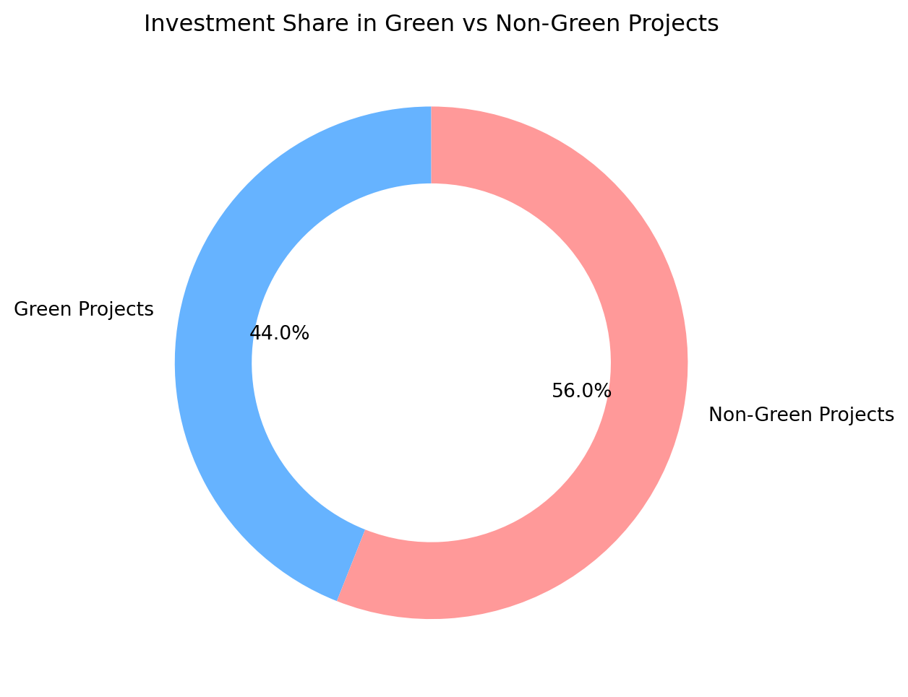
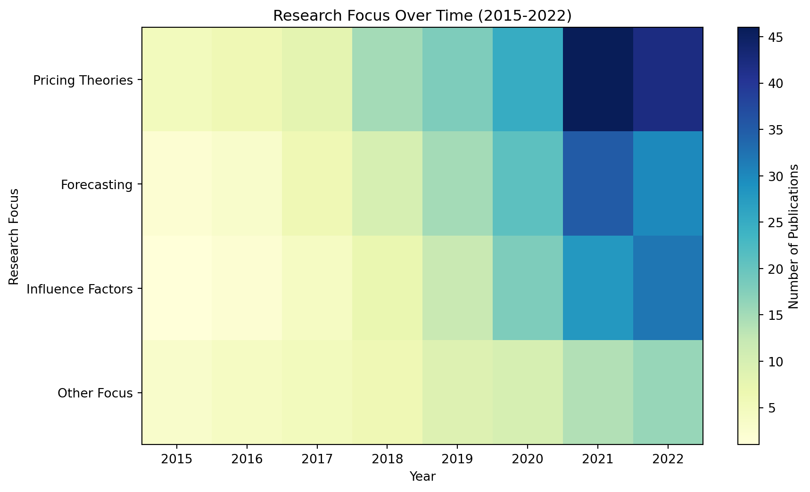

export const quartoRawHtml =
[`
<table style="width:99%;">
<caption>Data from <span class="citation" data-cites="ZigluFastSimple lightyearLightyearInvestingOwn SelmaYourFinances MosMoneyApp monzoOnlineBankingMade2023 NubankFinalmenteVoce">[@ZigluFastSimple; @lightyearLightyearInvestingOwn; @SelmaYourFinances; @MosMoneyApp; @monzoOnlineBankingMade2023; @NubankFinalmenteVoce]</span>. An updated database is available at <a href="https://www.greenfilter.app/database">greenfilter.app/database</a>.</caption>
<colgroup>
<col style="width: 14%" />
<col style="width: 71%" />
<col style="width: 13%" />
</colgroup>
<tbody>
<tr class="odd">
<td>Service</td>
<td>Features</td>
<td>Availability</td>
</tr>
<tr class="even">
<td>Goodments</td>
<td>Matching investment vehicles to user’s environmental, social, ethical values</td>
<td>USA</td>
</tr>
<tr class="odd">
<td>Wealthsimple</td>
<td>AI-assisted saving &amp; investing for Millennials</td>
<td>USA, UK</td>
</tr>
<tr class="even">
<td>Ellevest</td>
<td>AI-assisted robo-advisory focused on female investors and women-led business</td>
<td>USA</td>
</tr>
<tr class="odd">
<td>Betterment</td>
<td>AI-assisted cash management, savings, retirement, and investing</td>
<td>USA</td>
</tr>
<tr class="even">
<td>Earthfolio</td>
<td>AI-assisted socially responsible investing</td>
<td>USA</td>
</tr>
<tr class="odd">
<td>Acorns</td>
<td>AI-assisted micro-investing</td>
<td>USA</td>
</tr>
<tr class="even">
<td>Trine</td>
<td>Loans to eco-projects</td>
<td>USA</td>
</tr>
<tr class="odd">
<td>Single.Earth</td>
<td>Nature-back cryptocurrency</td>
<td>Global</td>
</tr>
<tr class="even">
<td>Grünfin</td>
<td>Invest in funds</td>
<td>EU</td>
</tr>
<tr class="odd">
<td>M1 Finance</td>
<td>Finance Super App</td>
<td>US</td>
</tr>
<tr class="even">
<td>Finimize</td>
<td>Investment research for anyone</td>
<td>US</td>
</tr>
<tr class="odd">
<td>NerdWallet</td>
<td>Financial clarity all in one place</td>
<td>US</td>
</tr>
<tr class="even">
<td>Tomorrow Bank</td>
<td>Green Banking</td>
<td>EU</td>
</tr>
<tr class="odd">
<td>Marcus Invest</td>
<td>Robo-Advisor</td>
<td>US</td>
</tr>
<tr class="even">
<td>Chipper</td>
<td>Digital cash app for African markets</td>
<td>Africa</td>
</tr>
<tr class="odd">
<td>Lightyear</td>
<td>Simple UI for Stocks, ETFs, interest from Estonia</td>
<td>EU</td>
</tr>
<tr class="even">
<td>Ziglu</td>
<td>UK simple investing app</td>
<td>UK</td>
</tr>
<tr class="odd">
<td>Selma</td>
<td>Finnish investing app</td>
<td>EU</td>
</tr>
<tr class="even">
<td>Monzo</td>
<td>Bank</td>
<td>UK</td>
</tr>
<tr class="odd">
<td>Nubank</td>
<td>Bank</td>
<td>Brazil</td>
</tr>
<tr class="even">
<td>EToro</td>
<td>Investing and copy-investing</td>
<td>EU</td>
</tr>
<tr class="odd">
<td>Revolut</td>
<td>From payments to investing</td>
<td>UK, EU</td>
</tr>
<tr class="even">
<td>Mos</td>
<td>Banking for students</td>
<td>US</td>
</tr>
<tr class="odd">
<td>Robinhood</td>
<td>Investing</td>
<td>US</td>
</tr>
<tr class="even">
<td>Mintos</td>
<td>Buy bonds and loans</td>
<td>EU</td>
</tr>
</tbody>
</table>
Data from \[@ZigluFastSimple; @lightyearLightyearInvestingOwn; @SelmaYourFinances; @MosMoneyApp; @monzoOnlineBankingMade2023; @NubankFinalmenteVoce\]. An updated database is available at [greenfilter.app/database](https://www.greenfilter.app/database).
`,`
<table>
<caption>Comparative data on needed climate investment and other valuable assets; all figures in Trillions of USD <span class="citation" data-cites="s&amp;pglobalWorld100Largest2019 grandviewresearchRealEstateMarket2021 aarononeillGlobalGDP198520282023 IMFWorldEconomicOutlook2023 stephanieaaronsonHowAppleBecame2023 statistaRetailMarketWorldwide2023 statistaGlobalRetailEcommerce2021 sifmaResearchQuarterlyEquities2023 ustreasuryFiscalDataExplains2023 raoVisualizing105Trillion2023 thinkingaheadinstituteGlobalPensionAssets2023 blockworksBitcoinPriceBTC2023 blockworksEthereumPriceETH2023 mckinsey&amp;companyMcKinseyGlobalPrivate2023 oguhBlackstoneReachesRecord2023 foxRetailInvestorsWill2023 trucostNaturalCapitalRisk2023">[@s&amp;pglobalWorld100Largest2019; @grandviewresearchRealEstateMarket2021; @aarononeillGlobalGDP198520282023; @IMFWorldEconomicOutlook2023; @stephanieaaronsonHowAppleBecame2023; @statistaRetailMarketWorldwide2023; @statistaGlobalRetailEcommerce2021; @sifmaResearchQuarterlyEquities2023; @ustreasuryFiscalDataExplains2023; @raoVisualizing105Trillion2023; @thinkingaheadinstituteGlobalPensionAssets2023; @blockworksBitcoinPriceBTC2023; @blockworksEthereumPriceETH2023; @mckinsey&amp;companyMcKinseyGlobalPrivate2023; @oguhBlackstoneReachesRecord2023; @foxRetailInvestorsWill2023; @trucostNaturalCapitalRisk2023]</span></caption>
<colgroup>
<col style="width: 87%" />
<col style="width: 12%" />
</colgroup>
<thead>
<tr class="header">
<th>High-Value Assets (Trillions of USD)</th>
<th></th>
</tr>
</thead>
<tbody>
<tr class="odd">
<td>Global Real Estate (2020, valuation)</td>
<td>$326T</td>
</tr>
<tr class="even">
<td>Global Equity Markets (2023, valuation)</td>
<td>$108T</td>
</tr>
<tr class="odd">
<td>Global GDP (2024, estimated)</td>
<td>$110T</td>
</tr>
<tr class="even">
<td>Global GDP (2023, per year)</td>
<td>$105T</td>
</tr>
<tr class="odd">
<td>Global GDP (2022, per year)</td>
<td>$100T</td>
</tr>
<tr class="even">
<td><em>Global Pension Funds (2023, valuation)</em></td>
<td><em>$47.9T</em></td>
</tr>
<tr class="odd">
<td>U.S. Equity Markets (2023, valuation)</td>
<td>$46.2T</td>
</tr>
<tr class="even">
<td>U.S. National Debt (2023, valuation)</td>
<td>$32.6T</td>
</tr>
<tr class="odd">
<td><em>Millennials Inheriting Money from Parents in the U.S., U.K. and Australia (2022-2032)</em></td>
<td><em>$30T</em></td>
</tr>
<tr class="even">
<td>Global Retail Sales of Goods and Services to Consumers (2023, per year)</td>
<td>$28.2T</td>
</tr>
<tr class="odd">
<td>GDP of U.S.A. (2023, per year)</td>
<td>$26.8T</td>
</tr>
<tr class="even">
<td>GDP of China (2023, per year)</td>
<td>$19.3T</td>
</tr>
<tr class="odd">
<td>Global Private Market Assets (2023, per year)</td>
<td>$11.7T</td>
</tr>
<tr class="even">
<td><em>Unpriced Externalities (2023, per year)</em></td>
<td><em>$7.3T</em></td>
</tr>
<tr class="odd">
<td>Global E-Commerce Sales (2021, per year)</td>
<td>$5.2T</td>
</tr>
<tr class="even">
<td><em>Missing Climate Invesment (2022, total)</em></td>
<td><em>$4.1T</em></td>
</tr>
<tr class="odd">
<td>Industrial &amp; Commercial Bank of China (2019, total assets)</td>
<td>$4T</td>
</tr>
<tr class="even">
<td>Global Real Estate Sales (2021, per year)</td>
<td>$3.7T</td>
</tr>
<tr class="odd">
<td>Apple Computers (2024, market value)</td>
<td>$3.1T</td>
</tr>
<tr class="even">
<td>GDP of Japan (2023, per year)</td>
<td>$4.5T</td>
</tr>
<tr class="odd">
<td>GDP of Germany (2023, per year)</td>
<td>$4.3T</td>
</tr>
<tr class="even">
<td>GDP of India (2023, per year)</td>
<td>$3.7T</td>
</tr>
<tr class="odd">
<td>U.S. Gen-Z and Millennials Consumer Spending (2022, per year)</td>
<td>$2.5T</td>
</tr>
<tr class="even">
<td>NVIDIA 英偉達 (2024, market value)</td>
<td>$2.5T</td>
</tr>
<tr class="odd">
<td><em>Retail Investors (2023, liquid assets)</em></td>
<td><em>$1.8T</em></td>
</tr>
<tr class="even">
<td>Blackstone (2023, total assets)</td>
<td>$1T</td>
</tr>
<tr class="odd">
<td>Bitcoin (2024, market cap)</td>
<td>$1T</td>
</tr>
<tr class="even">
<td>GDP of Taiwan (2023, per year)</td>
<td>$0.8T</td>
</tr>
<tr class="odd">
<td>GDP of Finland (2023)</td>
<td>$0.3T</td>
</tr>
<tr class="even">
<td>Ethereum (2024, market cap)</td>
<td>$0.3T</td>
</tr>
<tr class="odd">
<td><em>Individual Climate Investors</em> (2020, per year)</td>
<td>$0.1T</td>
</tr>
<tr class="even">
<td>GDP of Estonia (2023, per year)</td>
<td>$0.04T</td>
</tr>
</tbody>
</table>
Comparative data on needed climate investment and other valuable assets; all figures in Trillions of USD \[@s&pglobalWorld100Largest2019; @grandviewresearchRealEstateMarket2021; @aarononeillGlobalGDP198520282023; @IMFWorldEconomicOutlook2023; @stephanieaaronsonHowAppleBecame2023; @statistaRetailMarketWorldwide2023; @statistaGlobalRetailEcommerce2021; @sifmaResearchQuarterlyEquities2023; @ustreasuryFiscalDataExplains2023; @raoVisualizing105Trillion2023; @thinkingaheadinstituteGlobalPensionAssets2023; @blockworksBitcoinPriceBTC2023; @blockworksEthereumPriceETH2023; @mckinsey&companyMcKinseyGlobalPrivate2023; @oguhBlackstoneReachesRecord2023; @foxRetailInvestorsWill2023; @trucostNaturalCapitalRisk2023\]
`,`
<table>
<thead>
<tr class="header">
<th>Name</th>
<th>Description</th>
<th>Link</th>
</tr>
</thead>
<tbody>
<tr class="odd">
<td>Trine</td>
<td></td>
<td>trine.com</td>
</tr>
<tr class="even">
<td>The Many</td>
<td></td>
<td>the-many.com</td>
</tr>
<tr class="odd">
<td>Sugi</td>
<td></td>
<td>sugi.earth</td>
</tr>
<tr class="even">
<td>ClimateInvest</td>
<td></td>
<td>clim8invest.com</td>
</tr>
<tr class="odd">
<td>Circa5000</td>
<td></td>
<td>circa5000.com</td>
</tr>
<tr class="even">
<td>FairOwn</td>
<td></td>
<td>fairown.com</td>
</tr>
</tbody>
</table>
`,`
<table>
<thead>
<tr class="header">
<th>Investment Product</th>
</tr>
</thead>
<tbody>
<tr class="odd">
<td>Stocks</td>
</tr>
<tr class="even">
<td>Bonds</td>
</tr>
<tr class="odd">
<td>Mutual Funds</td>
</tr>
<tr class="even">
<td>ETFs</td>
</tr>
<tr class="odd">
<td>Insurance Products such as Variable Annuities</td>
</tr>
</tbody>
</table>
`,`
<table>
<caption>From <span class="citation" data-cites="circleeconomyKeynoteIlektraKouloumpi2021">[@circleeconomyKeynoteIlektraKouloumpi2021]</span>.</caption>
<thead>
<tr class="header">
<th>Shortening Food Chains in Amsterdam</th>
</tr>
</thead>
<tbody>
<tr class="odd">
<td>Spatial planning for food place-making in the city</td>
</tr>
<tr class="even">
<td>Circular agriculture</td>
</tr>
<tr class="odd">
<td>Regionally produced food</td>
</tr>
<tr class="even">
<td>Collaboration between chain members</td>
</tr>
<tr class="odd">
<td>Food education</td>
</tr>
</tbody>
</table>
From \[@circleeconomyKeynoteIlektraKouloumpi2021\].
`,`
<table style="width:100%;">
<colgroup>
<col style="width: 5%" />
<col style="width: 15%" />
<col style="width: 78%" />
</colgroup>
<thead>
<tr class="header">
<th>Type</th>
<th>Rating System</th>
<th>What it does</th>
</tr>
</thead>
<tbody>
<tr class="odd">
<td>Certificate</td>
<td>B Corporation</td>
<td>B Impact Assessment</td>
</tr>
<tr class="even">
<td></td>
<td>ESG</td>
<td></td>
</tr>
<tr class="odd">
<td>Certificate</td>
<td>Fair Trade</td>
<td></td>
</tr>
<tr class="even">
<td>Ranking</td>
<td>Responsible Business Index</td>
<td><span class="citation" data-cites="EstonianResponsibleBusiness">@EstonianResponsibleBusiness</span> Responsible business index</td>
</tr>
<tr class="odd">
<td>Index</td>
<td>Greenly</td>
<td>Greenly Decarborization Index <span class="citation" data-cites="greenlyGreenlyIntroducesClimate2023">@greenlyGreenlyIntroducesClimate2023</span></td>
</tr>
<tr class="even">
<td></td>
<td>Science-Based Targets</td>
<td>Science-Based Targets initiative (SBTi) provides step-by–step guidance per economic sector help companies get started with meeting climate criteria and emission reduction requirements.</td>
</tr>
<tr class="odd">
<td>Certificate</td>
<td>Green Web Foundation</td>
<td><p><span class="citation" data-cites="GreenWebFoundation2023">@GreenWebFoundation2023</span> For example, the Green Web Foundation certifies how sustainable is the web hosting used by websites.</p>
<p>Testing website CO<sub>2</sub> emissions <span class="citation" data-cites="wholegraindigitaHowDoesIt2023">@wholegraindigitaHowDoesIt2023</span></p></td>
</tr>
<tr class="even">
<td></td>
<td>Leafscore for product</td>
<td><span class="citation" data-cites="leafscoreLeafScoreLeadingOnline2023">@leafscoreLeafScoreLeadingOnline2023</span></td>
</tr>
<tr class="odd">
<td>Rating</td>
<td>Ethical consumer ratings</td>
<td><span class="citation" data-cites="EthicalConsumer">@EthicalConsumer</span></td>
</tr>
<tr class="even">
<td></td>
<td>1% For the Planet</td>
<td></td>
</tr>
<tr class="odd">
<td>Standard</td>
<td>Climate Neutral Certified Standard</td>
<td></td>
</tr>
<tr class="even">
<td>Standard</td>
<td>The Conservation Alliance</td>
<td><span class="citation" data-cites="climateneutralcertifiedClimateNeutralStandards2023">[@climateneutralcertifiedClimateNeutralStandards2023]</span>.</td>
</tr>
<tr class="odd">
<td>Index</td>
<td>Impakter Sustainability Inde</td>
<td></td>
</tr>
</tbody>
</table>
`,`<!-- -->`,`
<table>
<thead>
<tr class="header">
<th>Problems</th>
<th></th>
<th></th>
</tr>
</thead>
<tbody>
<tr class="odd">
<td>ESG is an annual report not realtime</td>
<td></td>
<td></td>
</tr>
<tr class="even">
<td></td>
<td></td>
<td></td>
</tr>
<tr class="odd">
<td></td>
<td></td>
<td></td>
</tr>
</tbody>
</table>
`,`
<table style="width:100%;">
<colgroup>
<col style="width: 2%" />
<col style="width: 1%" />
<col style="width: 96%" />
</colgroup>
<thead>
<tr class="header">
<th>Category</th>
<th>Role</th>
<th>Implication</th>
</tr>
</thead>
<tbody>
<tr class="odd">
<td></td>
<td>Consumer</td>
<td><em>As a consumer, I can get notified by the app about highlights of poor legislation refuted by science</em>.</td>
</tr>
<tr class="even">
<td></td>
<td>Company</td>
<td>ESG alone is not a sufficient metric to prove sustainability of a company and needs to be accompanied by other metrics.</td>
</tr>
<tr class="odd">
<td></td>
<td>Investor</td>
<td><span class="citation" data-cites="10YearsGreen2019">@10YearsGreen2019</span>: “Investors want to know where their money is going”, says Heike Reichelt, Head of Investor Relations at World Bank.</td>
</tr>
<tr class="even">
<td></td>
<td></td>
<td>Implication for design: ESG can’t be trusted.</td>
</tr>
<tr class="odd">
<td></td>
<td></td>
<td>This applies to both institutional and increasingly retail investors. Sustainable investing is possible due to consumer demand for greener products and services, and new tools such as ESG for measuring sustainable businesses and assets, as well as advancements in large-scale computational technologies to analyze large amounts of tracking data, comparing performance between different assets. Given these developments, might it be possible to create a practical sustainable investing AI advisor for consumers?</td>
</tr>
<tr class="even">
<td></td>
<td></td>
<td>Sustainability is fragmented. How can billions of people find greener alternatives and build closer relationships with sustainability-focused companies? Greenwashing is widespread, how can we feel trust, honesty, and transparency? A research project for designing a sustainable shopping, savings, and investing companion.</td>
</tr>
<tr class="odd">
<td></td>
<td></td>
<td><del>Reading EU Commission’s proposals, one might think the politicians have everything under control, we can relax and continue the same lifestyles as before. Unfortunately, this is not true. As with ESG, while the good intentions may be there, the reality is emissions keep rising, while they should be falling. It’s possible to curb greenwashing!</del></td>
</tr>
<tr class="even">
<td>Greenwashing</td>
<td></td>
<td>Laws against greenwashing</td>
</tr>
<tr class="odd">
<td></td>
<td></td>
<td>Fintech Like a Robinhood stock symbol page for brands including live ESG metrics and ability to register divestment. Same for crypto can be automated? - People will start to discuss ESG vs price discrepancy?</td>
</tr>
<tr class="even">
<td></td>
<td></td>
<td>hetkel hinna info liigub aga toidu kvaliteedi info ei liigu roheline filter finding good wuality products stock are disconnected from the products companies make</td>
</tr>
<tr class="odd">
<td>Accountability</td>
<td></td>
<td>What if we gave consumers the tools to keep companies accountable?</td>
</tr>
<tr class="even">
<td></td>
<td></td>
<td>As an interaction design student who cares about the environment, I ask myself how can interaction design contribute to increase sustainability? I make the assumption that investing is inherently “good” for one’s life, in the same way, that doing sports is good, or eating healthy is good. It’s one of the human activities that is required for an improved quality of life as we age - and started investing sooner, rather than later, is best because of the compound interest. Nonetheless, investment also includes higher risk than sports or food. How to communicate the risk effectively while educating the users?</td>
</tr>
<tr class="odd">
<td></td>
<td></td>
<td>Airbnb for Investments platform for projects linked to your consumption habits. Can provide better products for you as well as invest in these companies. The consumer can feel closer connection to the businesses they interact with through shared values, leads to participatory design and stakeholder capitalism. Platform to understand investment products. Green crowdfunding already allows people to invest into projects to make new green products, for example from recycled materials. but what about getting involved on a deeper level. Bigger than projects, scalable solutions. Kickstarter has green projects section. Startups vs large businesses. The design of the user interface helps the adoption of a new technology. What is the suitable user interface for millennial green investors?</td>
</tr>
<tr class="even">
<td></td>
<td></td>
<td>If corporate social responsibility (CSR) loyalty programs, driven by points systems are useful, can we go a step further, and create a pathway to enable the consumer to become an investor in the company they like to buy from? Could this strategy provide more meaning for the consumer, leading to higher customer retention, as well as financial returns?</td>
</tr>
<tr class="odd">
<td></td>
<td></td>
<td>Where to invest for green impact? Which investment vehicles are the most suitable for green investments? When a person wants to make a sustainable investment, where to put your money if you want to make the world greener? If young people are worried about climate, why are they not investing in green assets? To what extent can interaction design increase market participants’ engagement with sustainability? What are some suitable user interfaces for millennial green investors? Is design relevant to investing decisions? Direct investment AI assistant vs marketplace of existing investment products? But how to measure? Currently, there is no easy way to do it, and the UX of traditional banks is too cumbersome and old-fashioned.</td>
</tr>
<tr class="even">
<td></td>
<td></td>
<td>My research aims to find ways to enable a wider audience to access sustainable investment opportunities. This chapter gives an overview of the current (as of late 2020) sustainable investing landscape as well as future trends related to interaction design and user experience innovations (fig. 4).</td>
</tr>
<tr class="odd">
<td></td>
<td></td>
<td>This research is concerned with how billions of people might exclude polluting companies from their lives and elect to support companies that put sustainability in the core of their business instead. Why does it matter? Individual sacrifice is too small to have a meaningful impact. For societal change, we need to pool our resources.</td>
</tr>
<tr class="even">
<td>Accessibility</td>
<td></td>
<td><strong>How can ESG (environment, social, and governance) become accessible to our everyday experience, while avoiding greenwashing?</strong></td>
</tr>
<tr class="odd">
<td>Loyalty</td>
<td></td>
<td>Loyalty to investment. What are the standard conversations about money and savings that I would traditionally have with a financial advisor, that could be converted into a portable, mobile form, in my pocket every day?</td>
</tr>
<tr class="even">
<td></td>
<td></td>
<td>Live more sustainably with 10 minutes per day.</td>
</tr>
<tr class="odd">
<td>Saving</td>
<td></td>
<td>Anthropomorphism</td>
</tr>
<tr class="even">
<td></td>
<td></td>
<td><ul>
<li>Given the large number of fraud cases in finance, <em>trust</em> is the number one concern for users (ADD CITATION). Good design is crucial for creating transparency, and transparency leads to trust.</li>
</ul></td>
</tr>
<tr class="odd">
<td></td>
<td></td>
<td><ul>
<li>Shop CO2e emissions for each company who i buy from? “get rid of brands”!! cause they hide and lie</li>
</ul></td>
</tr>
<tr class="even">
<td></td>
<td></td>
<td><ul>
<li>Investing is a stronger signal to business than interactions on social media. Design Stakeholder capitalism. In future company every company should get a sustainability plan. this can be a push in that direction if companies with a sustainability plan become more competitive because of higher consumer demand.</li>
</ul></td>
</tr>
</tbody>
</table>
`,`
<table style="width:100%;">
<colgroup>
<col style="width: 5%" />
<col style="width: 3%" />
<col style="width: 90%" />
</colgroup>
<tbody>
<tr class="odd">
<td><strong>Category</strong></td>
<td><strong>Role</strong></td>
<td></td>
</tr>
<tr class="even">
<td></td>
<td>Consumer</td>
<td><ul>
<li><em>Design implication</em>: <em>As a user, I can use the app to compare banks available in my country</em></li>
</ul></td>
</tr>
<tr class="odd">
<td></td>
<td>Consumer</td>
<td><ul>
<li><strong>Feature:</strong> How could people apply the same principle (<strong>Know Your Company</strong>) when buying a product or investing? Would building an ESG community help push polluting companies towards greener practices? - or starving them from cheap access to capital.</li>
</ul></td>
</tr>
<tr class="even">
<td></td>
<td>Consumer</td>
<td><strong>Feature:</strong> We need a dashboard of comparable public indicators about each company.</td>
</tr>
<tr class="odd">
<td>Community</td>
<td></td>
<td><strong>Feature</strong>: Make a climate hedge fund with friends</td>
</tr>
<tr class="even">
<td></td>
<td></td>
<td><strong>Feature</strong>: Sustainable investing product for young people everyday use Crypto, NFT provide everyday excitement trend of young ppl in crypto retail investors without needing to pay bank fees</td>
</tr>
<tr class="odd">
<td></td>
<td></td>
<td><strong>AI alert</strong>: “The company you’ve purchased from 3x in the past month is owned by Unilevel, which is under investigation for poor labor practices and deforestation”.</td>
</tr>
<tr class="even">
<td></td>
<td>User</td>
<td><strong>Design:</strong> <strong>Feature</strong>: Help me write me investment thesis first.</td>
</tr>
<tr class="odd">
<td></td>
<td></td>
<td></td>
</tr>
<tr class="even">
<td>Governance</td>
<td></td>
<td><strong><em>Design Implications:</em></strong> show company board membership in the app product view.</td>
</tr>
<tr class="odd">
<td></td>
<td></td>
<td></td>
</tr>
<tr class="even">
<td></td>
<td></td>
<td></td>
</tr>
</tbody>
</table>
`];

````mdx-code-block
import Figure from '/src/components/Figure'
import Bunq from '../images/bunq.jpg'
````

# Sustainable Finance

## The Journey from Consumer to Investor: Democratization of Financial Markets

### Sustainable Capital Allocation Methods

Fintech (financial technologies) holds the potential to drive consumers
on a pathway towards ESG (Environmental, Social, and Corporate
Governance) investing. The extent to which this funnel works - and it’s
indeed a complex, multi–step funnel - depends on curbing greenwashing to
a level that allows consumers to distinguish eco–friendly businesses
from the heavy polluters - and delivering a simple UX (user experience).

This chapter explores the larger trend of *Democratization of Financial
Markets* through consumer-facing applications that enable new user
interactions which increasingly blur boundaries between shopping,
saving, and investing (SSI). The efforts to boost user numbers have
driven apps that started out with only payments-focused businesses -
such as Revolut and N26 - branch out into offering savings accounts and
investing options. Regardless of if it’s money spent on shopping or
money saved and invested, these are all financial decisions of *capital
allocation*, and in one way or another, we’re giving our money to
companies for continued economic growth. The critical question is: do we
choose to support sustainability-focused companies that invest deeply
into green innovation and eco-friendly practices - or those that pay
less attention to sustainability?

Consumers are beginning to become more money-savvy yet are still missing
many key concepts from financial literacy. Giving users exposure to
investment opportunities through familiar activities like shopping may
have the potential to boost financial literacy levels and entice
consumers to learn more about taking advantage of their opportunities
financial markets - as well as how to manage the types or risk involved.

Shopping, saving, and investing are converging on digital platforms
(superapps) that permeate our daily financial lives, with features such
basic banking, payments, transfers, as well as reward and cashback
programs (Rakuten), round-up to next dollar with automated
micro-investing (e.g. Acorn, Stash, Swedbank), and retail investing
(Robinhood, Public) and copy-trading (eToro) into various (fractional
shares of) stocks, derivatives like CFDs and futures, microloans (Kiva),
commodities and precious metals such as gold and silver (Revolut),
physical assets such as real estate, land, forest and digital assets
such as cryptocurrencies, NFTs, and other alternative assets.

Money is becoming more diverse and the meaning of money itself is
changing. We have the fiat money created by governments by law, using
central banks, which loan money to commercial banks. And we also have
new types of money created by companies and individuals using
cryptographic blockchain-based distributed databases, which keep track
of transactions (who-paid-whom). Whatever the method of creation, in
essence, money is a *system of trust* where *something* is used as a
*medium of value exchange* and accepted by *other people* as payment.
Digital money in it’s various forms connects industries on the same
apps, which make investing more accessible and socially engaging,
appealing to younger people who are active in social media and online
shopping.

Trend of sustainably, how can sustainability become more accessible?
People want to shop, save, and invest sustainably - how to do it?

```python
fintech_chart()
```


### Legislation

Legislation is Catching Up With Fintechs. Legislation sets higher
standards.

Directive 14 2014/65/EU, 2014: The European Union fully recognizes the
changing financial landscape trending towards the democratization of
investments: *“more investors have become active in the financial
markets and are offered an even more complex wide-ranging set of
services and instruments”* (European Parliament, 2014). Some key
legislation for investors has been put in place recently, for example
“MiFID II is a legislative framework instituted by the European Union
(EU) to regulate financial markets in the bloc and improve protections
for investors” (Kenton, 2020). MiFID II and MiFIR will ensure fairer,
safer and more efficient markets and facilitate greater transparency for
all participants” (European Securities and Markets Authority, 2017).

Already in 2001, while still part of the EU, the UK government was
discussing ways to promote sustainable investment *“fundamental changes
in VAT or corporation taxes could be used to promote greener consumption
and investment”* (House of Commons, 2002). More recently, (HM Treasury,
2020) released a taxonomy of sustainable activities in the UK.

Campain to ban polluting products campaign success story, EU shops can’t
sell deforestation products gathered over 100 thousand online signatures
(Anon, 2022c). Legislation banning products contributing to
deforestation was passed by the EU Parliament and Council in 2023 and
came into effect in July 2024 (European Parliament, 2023; Abnett &
Abnett, 2024)

While the above trend is for governments to adapt to and work towards
their environmental climate commitments and public demand, the sovereign
risk remains an issue. For example, in the U.S. the policies supported
by President Donald Trump during his presidency ran counter to many
sustainability recommendations, including those directed at the
financial markets, helping legacy industries stay competitive for longer
through subsidies, and lack of regulation, or even regulation supporting
legacy technologies (Quinson, 2020).

(PWC, 2020) Changes to laws and regulations aimed at achieving climate
change mitigation is a key driver behind the wave of ESG adoption. The
goal of these laws, first adopted in the European Union, a
self-proclaimed leader in eco-friendliness, is to pressure unsustainable
companies to change towards greener practices, in fear of losing their
access to future capital, and to create a mechanism forcing entire
environmentally non-compliant business sectors to innovate towards
sustainability unless they want to suffer from financial penalties. On
the flip side of this stick and carrot fiscal strategy, ESG-compliant
companies will have incentives to access to cheaper capital and larger
investor demand from ESG-friendly investors.

### Shopping

#### Shopping Footprint

Double Eleven 11/11 celebrated on November 11th is the world’s largest
shopping festival (時代財經, 2023). In June 2023, 526 million people
watch e-commerce live-streams in China; online bargaining is a type of
ritual (Liu, House & Kádár, 2024).

It may seem impossible to turn the tide of consumerism, given the
projected growth in online shopping (Forrester, 2024)

```python
shopping_growth()
```


-   Igini (2022) Online Shopping impact. Single’s day, etc.

-   “Asia is set to account for 50% of the world’s total online retail
    sales”

#### Consumer Activism

*Conscious consumers* make up a small percentage of the entire consumer
public. (Milne, Villarroel Ordenes & Kaplan, 2020) coins the term
*mindful consumers*, who do research and are aware of the impact of
their shopping choices.

-   Consume pressure to advance ESG regulatory standards to add a
    baseline ESG dynamic pricing of risk like climate, mandatory climate
    disclosures, carbon pricing knowing your supply chain, analyze
    supply chain risk

-   Is Sustainable Shopping possible? “Learn to notice so we can
    preserve”, “Õpetame märkama, et oskaksime hoida”. “Consumers have
    increasing power. Where we put our money reinforces certain types of
    businesses, as conscious consumers we can vote with our dollars. How
    can we do it？ Sustainable brands, ESG, etc, etc. Pushing highers
    Standards and choose companies that adopt circular design” What is
    the consumer CO<sub>2</sub> contribution? What is the target?

-   Sustainable Consumerism via Self-Regulation. 2M EUR project for the
    shopping app. (Klinglmayr, Bergmair & Pournaras, 2016)

Make use of indexes to compare companies.

-   Weber (2021) proposes a sustainable shopping guide.
-   Fuentes, Enarsson & Kristoffersson (2019) discusses package free
    shopping.
-   van der Wal, van Horen & Grinstein (2016) discusses “status motives
    make people publicly display sustainable behavior”.

For consumer activism to become mainstream it needs to much simpler.

#### Payments

Banks and Fintechs Capture User Data. Payments are an Entry Point and
Source of Consumer Action Data, Shopping Data. Payments is the primary
way consumers use money. Is there a funnel From Payments to Investing?
ESG Shopping is about Changing our relationship with money. Make
commerce more transparent. Current shopping is like having a one-night
stand. you barely know the name of your company. You don’t know much
about their background. Building consumer feeling of ownership, create
meaningful connections between producers and consumers.

Payments is one way consumers can take individual climate action. In the
words of a Canadian investment blogger, *“every dollar you spend or
invest is a vote for the companies and their ethical and sustainability
practices”* (Fotheringham, 2017). The combination of consumption and
investment is an access point to get the consumer thinking about
investing. Even if the amount are small, they are a starting point for a
thought process.

Digitalisation of payments creates lots of Point of Sale (PoS) data
that’s valuable to understand what people buy. Banks have access to each
person’s financial habits which makes it possible to model sustainable
behavior using big data analysis. Asian markets have shown the fastest
growth in the use of digital payments (McKinsey, 2020).

In Taiwan, O Bank makes use of Mastercard’s data to calculate each
transaction’s CO<sub>2</sub> emissions and offer Taiwanese clients
“Consumer Spending Carbon Calculator” and “Low-Carbon Lifestyle Debit
Card” products (Anon, 2022e). Mastercard has developed a service that
banks can offer consumers sustainability reports (Mastercard, 2021).
Similarly, Commons, formerly known as Joro, an independent app, analyses
your personal financial data to estimate your CO<sub>2</sub> footprint
(Chant, 2022).

A Dutch fintech company Bunq offers payment cards for sustainability,
provided by MasterCard, which connects everyday payments to green
projects, such as planting trees and donations to charities within the
same user interface (Bunq, 2020). At the same time this can be
considered greenwashing as Bunq only plants 1 tree per every €1,000
spend with a Bunq card. The example marketed at students cites *8 trees
planted this month* while students scarcely would have €8,000 to spend
every month.

Sharing a similar goal to Alibaba’s Ant Forest, Bunq’s approach creates
a new interaction dynamic in a familiar context (card payments),
enabling customers to effortlessly contribute to sustainability.
However, it lacks the level of gamification which makes Alibaba’s
offering so addictive, while also not differentiating between the types
of purchases the consumer makes, in terms of the level of
eco-friendliness.

````mdx-code-block
<Figure caption="Bunq promises to combine banking and eco-friendly actions in the same user interface" src={Bunq} />
````

In Nigeria, (Emele Onu & Anthony Osae-Brown, 2022) reports how in order
to promote the eNaira digital currency use, the Nigerian government
limited the amount of cash that can be withdrawn from ATMs *“In
Nigeria’s largely informal economy, cash outside banks represents 85% of
currency in circulation and almost 40 million adults are without a bank
account.”* **\[E-Naira find papers\]**

In Kenya, M-Pesa started since 2007 for mobile payments, used by more
than 80% of farmers (Tyce, 2020; Parlasca, Johnen & Qaim, 2022). Using
digital payments instead of cash enables a new class of experiences, in
terms of personalization, and potentially, for sustainability.

In Sweden, point of sales (PoS) lending is a common practice, and one of
the reasons for the success of Klarna, the Swedish banking startup,
which has managed to lend money to more consumers than ever, through
this improved user experience. Taking out loans for consumption is a
questionable personal financial strategy at best. If people can loan
money at the point of sales, why couldn’t there be 180 degrees opposite
service - point of sales investing? And there is, called “round-up
apps”. Next Generation Customer Experience (n.d.) suggests “Targeted at
millennials, Acorns is the investing app that rounds up purchases to the
nearest dollar and invests the difference.” - and example of From
Shopping to Investing.

Many banks have started offering a service to automatically save and
invest tiny amounts of money collected from shopping expenses. Every
purchase one makes contributes a small percentage - usually rounded up
to the nearest whole number - to one’s investment accounts. For example,
Swedbank (2022), the leading bank in the Estonian market, offers a
savings service where everyday payments made with one’s debit card are
rounded up to the next Euro, and this amount is transferred to a
separate savings account. Similarly, the Estonian bank LHV (2020) offers
micro-investing and micro-savings services, with an interesting user
experience innovation showing how for an average Estonian means
additional savings of about 400€ per year.

-   Bank inside of Whatsapp for the underbanked gig workers in Latin
    America Y Combinator (2023)
-   Kirakosian (Noveber 16, 2020) Digital payments and circular
    bio-economy, even using tactics such as co-branding with famous
    individuals.

While the financial industry is highly digitized, plenty of banks are
still paper-oriented, running digital and offline processes
simultaneously, making them slower and less competitive, than startups.
Indeed, the new baseline for customer-facing finance is set by fintech,
taking cues from the successful mobile apps in a variety of sectors,
foregoing physical offices, and focusing on offering the best possible
online experience for a specific financial service, such as payments.

Banks and Fintech are becoming more similar than ever. 39% of Millenials
are willing to leave their bank for a better fintech (n=4,282);
innovation in payments helps retention (PYMNTS, 2023). The European
Central Bank describes fintech as improving the user experience across
the board, making interactions more convenient, user-friendly, cheaper,
and faster. “Fintech has had a more pronounced impact in the payments
market \[…\] where the incumbents have accumulated the most glaring
shortcomings, often resulting in inefficient and overpriced products,”
Yves Mersch, Member of the Executive Board of the ECB says in European
Central Bank (2019).

There are also people who are concerned with digital payments. There are
concerns digital currencies also help to *“democratize financial
surveillance”.* China was a money innovator introducing paper money in
the Tang Dynasty (618-907 AD) (Anon, n.d.g). Jeff Benson (2022) “use the
e-CNY network to increase financial surveillance.” Anon (2023b) Digital
currencies make tracking easier. Yahoo Finance (2022): WeChat, Alipay,
vs digital yuan by Eswar Prasad. Anon (2023c) in Macau Contactless
Payments are prevalent.

There are many *neobanks*, or challenger banks, far too many to list.
The table only includes a small sample of banks and the landscape is
even larger if one includes the wider array of fintechs. Neo-banks often
use sustainability marketing.

The following popular (totaling millions of users) robo-advisory apps
combine sustainability, personalization, ethics, and investing however,
they are mostly only available on the US market.

<div dangerouslySetInnerHTML={{ __html: quartoRawHtml[0] }} />

-   Andrés Engler (2022)
-   Nubanks, also known as challenger banks.
-   MARISA ADÁN GIL (2022)
-   Caio Jobim (2022)
-   Anon (2022f)
-   green transparency
-   fundamental analysis such as the Piotroski F-score is not effective
    for startups because of high capital burn rates.

Does Individual Climate Action Matter?

#### Buy Now Pay Later

Buy Now Pay Later (BNPL) is the biggest consumer payments / financing
success story innovated by Klarna in Sweden in 2005 and Afterpay in
Australia in 2015 but with roots in Layaway Programs created during the
1930’s US Great Depression (Kenton, 2023). By 2021, 44.1% of Gen-Z in
the US had used BNPL according to (EMarketer, 2021). Gen-Z mostly use
BNPL to buy clothes (LHV, 2024).

-   ***Design Implication:*** This suggests users are already used to
    having more options in the payment flow.

#### Social Commerce

(The Influencer Factory, 2021) China is the furthest ahead in social
shopping, the Chinese and U.S. market may be mature and growth will come
from emerging markets (SEA, Latin-America).

```python
social_commerce_chart()
```



### Saving

There are two ways to look at sustainable saving. This section is going
to look at savings in the financial sense of the word. Savings in the
sense of CO2e emission and environmental cost reductions have an entire
separate chapter dedicated to them titled ‘*sustainability*’ however a
short definition might be valuable here as well.

> *Environmental Savings* means *“the credit incurred by a community
> that invests in environmental protection now instead of paying more
> for corrective action in the future*” (see Yale Center for
> Environmental Law & Policy, 2018) and (Anon, n.d.w:p.33).

#### Saving Money

Saving precedes investing. From building loyalty to building ownership,
the first step towards investing is to start saving money. How to
encourage savings in daily life and make it a part of the everyday
payments experience? Even starting with a small step, gathering a small
target amount per month for savings, has the potential to shift the
user’s way of thinking about money. The second step, choosing where to
invest these savings, will help us begin thinking like an investor. To
start noticing trends and looking into how finance shapes the world.

#### Psychology of Saving

People will only save nature if it also saves money.

-   Nerdwallet’s Tommy Tindall (2023) suggests making financial
    commitments instead of resolutions.

-   Savings and investing are conflated because the large majority of
    savings that people have are invested by their banks. Thus the
    question of *sustainable savings* comes one of where exactly are
    they invested and what is the impact of that investment of
    sustainability.

-   Savings are the money one has in a pension fund or managed by
    themselves. For the majority of people, savings are invested by the
    bank and make up the largest proportion on investments for the
    people who are not active investors themselves.

-   Ethical Savings (Anon, 2023d)

#### Anthropomorphism

-   Money in a “Safe” place: Money anthropomorphism increases saving
    behavior (Wang, Kim & Zhou, 2023).

-   Mobile money users are better at saving (Naito, Ismailov & Kimaro,
    2021).

-   Design Implication: make saving money look like an avatar or piggy
    bank or smth.

#### Loyalty Schemes

help consumers save money and business increase repeat business.
Building customer loyalty is a key part of repeat business and financial
predictability for any company. Large consumer brands like Starbucks
have for long ran successful rewards programs that encourage customers
to come back (Steinhoff & Zondag, 2021). Could loyalty schemes create a
pathway to investing in the company to a strengthen the feeling of
connection with the business even further? After all, I’m now a minority
owner! Yet in practice, many consumers lack the financial literacy for
investing and there are many legislative difficulties for turning
loyalty points into investments. It’s easier instead to create a
separate cryptocurrency or token program which users could collect and
redeem for some benefit.

-   **Patagonia** “Worn Wear” program

-   **H&M** “Garment Collecting” program

-   **The Body Shop** “Return, Recycle, Repeat”

Loyalty schemes can take a physical form. In Malaysia, Beebag shopping
bags made of recycled plastic bottles with a NFC ship that works in
conjunction with an app to provide rebates for customers (The Green
Factor, 2022).

-   Savings in CO<sub>2</sub> Equivalent Emissions: CO<sub>2</sub>
    savings are the amount of CO2e reduction one manages to achieve by
    changing one’s behavior and influencing others (people, companies).
    While the individual footprint is so small, the largest reduction
    will come from influencing large groups of people, either by
    leadership, role-model, or other means. Pension funds are some of
    the largest asset holders and choosing where to invest one’s pension
    can be a sustainable financial action. College students might not
    have a pension fund yet.

#### Saving CO2

### Investing

#### Measuring the Eco-Investment Gap

By the latest estimates sustainability lacks several trillions of USD in
investment. Even with massive financing already in the pipeline, the
estimate for the global *financing gap* for low-carbon energy production
was 5.2 trillion USD as of 2016 (Anon, 2016; Earth Day, 2023). Ray Dalio
puts the needed climate investment at \$5T and believes these financial
goals won’t be met (Ray Dalio, 2023). A newer United Nations
Environmental Programme (UNEP) calculation lowered the world needs an
additional 4.1 Trillion USD of financing in nature-based solutions by
2050 to meet climate change, biodiversity, and land degradation
reduction targets (UNEP, 2022).

According to (The Rockefeller Foundation, 2022) a slightly lower 2.5-3.2
Trillion USD would be sufficient.

```python
climate_finance_gap_sectors_timeline()
```


What if 10% of annual consumer spending – *ten percent is about
\$2,8T* - went towards protecting our climate? The theme for the 2023
Earth Day was *“Invest In Our Planet”*.

```python
climate_finance_gap_sectors()
```


The needed investment doesn’t seem so large, around 5% of the global
GDP, if one compares it to the *per year* Global Gross Domestic Product
(GDP) estimated at around 100 Trillion USD in 2022 and growing to 105
Trillion USD in 2023 (Aaron O’Neill, 2023; IMF, 2023). In essence, the
estimated total investment gap in climate fits into the economic growth
of 1 year of the global economy.

Bad news. It would be easier for large institutional investors to move
their money to sustainable assets than for retail investors to move
their relatively small investments.

The lack of funding in green energy especially affects emerging
economies (Anon, 2022d). *“We can and must channel private capital into
nature-based solutions. This will require policy and regulatory support,
catalytic capital and financial innovation”* argued the CEO Green
Finance Institute, Dr Rhian-Mari Thomas, ahead of COP27 in Egypt (Anon,
2023f). It’s not happening fast enough.

```python
money_chart()
```


<div dangerouslySetInnerHTML={{ __html: quartoRawHtml[1] }} />

While these assets and GDP values reflect different aspects of the
global economy, the comparison illustrates that redirecting a relatively
small fraction of global wealth and economic activity towards
sustainable investments can close the investment gap. This perspective
should inspire confidence that the goal is achievable with coordinated
effort and policy support.

-   Robeco survey of 300 large global investors totaling \$27T under
    management found biodiversity-protection is increasingly a
    focus-point of capital allocation (Robeco, 2023).

-   Compliance and GenAI in banking: (Rahul Agarwal et al., 2024).

-   “Lessons from banking to improve risk and compliance and speed up
    digital transformations” (Jim Boehm et al., 2021).

-   OECD (2024) projects steady economic growth 3.1% in 2024 and 3.2% in
    2025 while the World Bank & World Bank (2024) is more conservative
    projecting 2.6% and 2.7% respectively.

#### Sustainable Investing

While literature has been debating if it’s possible to *“do well while
doing good”*, latest research suggests it’s possible to make investments
that both make an attractive financial return and adhere to
sustainability goals. Tan, Szulczyk & Sii (2023)

“sustainable investing is now part of mainstream financial strategy”
Morgan Stanley (2019)

“Sustainable development requires more investment in sustainable
companies and less in unsustainable firms.” (Van Zanten & Rein, 2023).

#### Young Investors

Young investors are typically *retail investors* investing small amounts
of money for themselves. (Unless they have inherited wealth or are among
the very few who work in an institution such as an investment firm,
university endowment, pension fund or mutual fund, and have a say in
where to invest large amounts of other peoples’ money.)

Retail investors face many challenges in comparison with their
institutional counterparts. For instance, they may have much less time
to do proper research, face information asymmetries, where finding good
information is limited by time, ability, as well as financial literacy,
whereas professional investors have the tools, skills, time, and
knowledge, to make better investment decisions.

-   *For young people, investing mostly means buying cryptocurrencies?*

-   Copy-investing is a popular feature of retail investing platforms
    like EToro

-   Investing is a fundamentally hopeful act. It means I think there’s a
    future. Specifically, ‘green investing’ is investing in the future
    of our planet - but can we trust the sustainability practices the
    ‘green’ investment vehicles aggregate, promising to have a positive
    impact? For example, the European Union for many years counted
    biomass as ‘green’ energy, even while forestry companies were
    cutting down trees to produce the biomass - the regulation was not
    specific enough to curb this practice. So, in effect, a ‘green
    investor’ might be supporting deforestation. How can an easy-to-use
    investment app address such complexities without alienating the
    users?

```python
retail_green_vs_nongreen()
```


-   Information evavõrdsus disparity between pro and novice investors

#### Influencers

-   Koreans investing in influencers? Koreans investing into media
    personalities: Yuqing Zhao (2021)

-   An open question is whether young investors are more easily than
    professionals swayed by ***influencers***? Influencers are terrible
    for investing… but? Sustainable investing, kids watch TikTok
    lizlivingblue (n.d.)

    Influencer - crypto twitter connections

-   There are many groups of Twitter, Reddit, and elsewhere, where
    investing trends start, causing more volatility.

-   Entertainmenization of investing

-   Meme Stocks

-   Robinhood uses game-like features such as displaying a confetti
    animation to create a sense of excitement around trading investing.

-   Encourage impulsive short-term buying and selling with a focus on
    speculation over fundamentals.

-   Cause FOMO (fear of missing out)

-   Cryto influences Irene Zhao (2022)

#### Retail Investing Enables Financial Inclusion

*Retail investing* can be seen as a form of financial inclusion. Ant
Group’s CEO Eric Jing says in (Turrin, 2021): *“The financial system of
the past 200 years was designed for the industrial era and served only
20% of the population and organizations. As we enter the digital age, we
must better serve the remaining 80%”.*

Among retail investors, there’s some appetite for sustainability however
investors are not sure how to separate sustainable assets from less
sustainable ones (Ho, 2019).

-   Consumption is ruining the world the world thinking as an investor
    the investor mindset

Doorn (2020): Many ecologically focused funds with different approaches
have been launched in recent years, with variations in asset mix and
style of management. Thematic asset management is expected to grow, with
investors packaging opportunities based on consumer trends.

Smith (2019) suggests 74% of Chinese youth are looking for “positive
impact”.

-   Lingeswaran (2019) suggest philanthropy is on the rise in Asia
    however

-   Li et al. (2022) suggests retail “investor attention can
    significantly improve enterprises’ green innovation level”

-   But there’s so much capital in large funds retails investor money
    doesn’t matter at all. does retail money make any difference? Retail
    Investor Helpers: A wide number of banks are offering services
    marketed a sustainable. It’s hard to decide.

-   For example - In Sweden “Preferences for sustainable and responsible
    equity funds

-   Lagerkvist et al. (2020) undertook a choice experiment with Swedish
    private investors.

-   Anon (2021e) ***Swedish green fintech (important article)***

-   Gov launching ESG funds.

-   Why is this important to research now? People in their twenties
    should invest in their future. Millennials and younger generations
    like services with a green, eco-conscious focus. Given our combined
    power (I’m a Millennial) with Generation Z, we are willing to pay
    more for sustainable products.

-   Personalized Investing

-   2022 saw a wave of new platforms aiming to make investing easier for
    retail investors

-   One example is Revolut, which expanded from a simple payments app to
    support varied saving and investment types (Anon, 2023l, 2023g).

-   Gamestop for climate massively collaborative investing by gen-z?

#### Investment Communities

Community Investing Enables Financial Inclusion

-   Inexperienced investor can copy other people when investing. You
    don’t know how to invest? Build an investing community? Can follow
    others and raise capital together. In some ways community-investing
    competes with robo-advisors as communities can be led by
    professional investors and followed by less sophisticated investors.
    Investor communities can have the type of *social proof*, which
    robo-advisor do not possess.
-   Invetors’ belief in sustainable investing is affected by other
    investors (Luz, Schauer & Viehweger, 2024).

#### Financial Ecologies

-   Tan (2020) proposes *“financial ecologies”* to understand the
    dynamic relationships between various actors: investors, advisors,
    government, where the government plays an active role in growing
    financial inclusion and responsible financial management. However,
    the paper further suggests that current robo-advisors (available in
    Singapore) make the investor captive to the agency of AI, making the
    person lose agency over their financial decisions.

-   ESG apps in Singapore:

-   DBS LiveBetter consumer sustainability app (DBS Singapore, n.d.;
    DBS, 2018)

-   Singapore ESG open data platform (Monetary Authority of Singapore,
    2023)

#### Financial Literacy

-   Financial Literacy. Sustainability Literacy. Financial and
    Sustainability Literacy are intertwined. How can finance
    enable/help/encourage sustainability?
-   Austin Ryder (2020) Define your habits: are you consumer or
    investor?

#### Traditional Bonds

Bonds are a form of debt investment also known as an fixed-income asset
where the principal is repaid at the maturation date of the bond
(usually in years) with an added premium. Individuals can’t emit bonds
but they can invest in them. It can be a way to invest locally in one’s
own city - or globally. For individuals, there’s access to some green
bond exposure through ETFs (exchange-traded funds) available on retail
investing apps.

Access is not universal and availability depends on the geography of the
user and local legislation; for example Revolut, the most downloaded
finance app in the EU, only enabled bond investing for European
customers in summer 2024 (Revolut, 2024b, 2024a). Investing in bonds is
a form of *Passive Investing* and allows investors focus on low-risk
passive income instead of daily stock investing most popular on
Robinhood and Revolut - albeit with much less potential for returns.

-   Climate Bonds Initiative is working on greening the \$55 trillion
    short-term debt (bond) market (Anon, 2022a).

#### Green Bonds

*Green bonds* are released by companies, international organizations,
and cities to raise money for green transformation, usually for building
something to improve sustainability, tied to specific projects. There’s
a growing global trend in green bond emission, with 257 Billion USD
worth of green bonds issued in 2019, expected to reach 1 Trillion USD
annually by 2030 (MacAskill et al., 2021). That prediction was too low
with 870 Billion USD green bond emissions reached already in 2023;
currently Europe is the largest emitter of green bonds (Climate Bonds,
2023). China has the 2nd largest green bond market in the world and it’s
growing fast; buyers are looking for green bond certification to reduce
yield spread, meaning the price of the green bond is becoming more
similar to the price of a ‘regular’ bond (Peng & Xiong, 2022; Li, Zhang
& Wang, 2022).

In 2017 the Malmö city in Sweden released green bonds to finance a
sustainable transition of the city (City of Malmö, 2017). An independent
analysis found bonds may not be emitted for financial reasons but to
improve the reputation and city image, lower interest rate (aptly named
*greenium*) with a similar in returns to traditional bonds - and have
their share of challenges, namely being difficult to certify, monitor,
report and measure impact of (Sjöström et al., 2020).

Making sure a green bond is truly supporting sustainability is a
challenge. For example, Aramco, the Saudi Arabian public petroleum and
natural gas company faced scrutiny for what critics deemed as ‘Fake
green bonds’ (Anthropocene Fixed Income Institute (AFII), 2022). Green
bonds can also be emitted on blockchains with the stated goal of
improving transparency. Hong Kong multi-currency green bond on the
blockchain. The issuer (Hong Kong government) hopes to reduce
greenwashing (Hall, 2024; Kitano, 2024). In the EU as well, there are
emerging tools for monitoring green bonds on blockchain (Christodoulou
et al., 2023). (Qin et al., 2023) finds evidence that the combination of
green bonds and blockchains are an enabler carbon neutrality in China.
The World Bank successfully raised 110 Million USD in Australia in
2018-19 and has since doubled the amount in a new 220 Million USD
emission in Switzerland using bonds on a blockchain ledger for
SDG-related projects (World Bank, 2024, 2019, 2018).

```python
world_bank_bonds()
```


#### Sustainability-Linked Bonds

Sustainability-Linked Bonds are less stringent than green bonds; they
are not tied to specific projects but more broad sustainability targets
(Priscila Azevedo Rocha, Akshat Rathi & Todd Gillespie, 2022):
“Sustainability-linked bonds let companies borrow cheaply if they meet
environmental, social, and governance targets. A Bloomberg News analysis
found those goals are weak”. (Priscila Azevedo Rocha, Akshat Rathi &
Todd Gillespie, 2022) suggests *“So far, most ESG investing is in the
stock market. But the the \$22 trillion corporate bond market, where
mature global companies such as Chanel go to borrow money from
investors, has a particularly powerful role to play. Companies rely on
debt much more than they do on stocks.”*

#### Investment Platforms

“Green Bonds, Sustainable Equities, ESG-focused Mutual Funds and ETFs,
Impact Investing (through platforms), Renewable Energy Infrastructure
(via ETFs or mutual funds), Sustainable Real Estate (through REITs or
ETFs), Social Bonds, Carbon Credits (via ETFs or specialized funds),
Sustainable Commodities (via ETFs or funds), Community Investing
(through CDFIs or crowdfunding platforms), Sustainable Infrastructure
Funds (available as ETFs or mutual funds), Environmental, Social, and
Governance (ESG) Metrics Integration (through broad ESG-focused ETFs or
funds)”

Such as “green shops” there are green investing platforms, green ETFs,
etc. All of these are essentially forms of branding designed to make it
easier for investors to find an investing product they trust.

There are many ‘green investment platforms’ who to trust?

<div dangerouslySetInnerHTML={{ __html: quartoRawHtml[2] }} />

-   Hankewitz (2021)

-   Investing - Your investment fund’s ESG thesis investing thesis
    investing expert investing thesis research

-   Investing thesis

-   Open Banking: “Open Banking offers massive potential for improving
    online customer experience. That potential starts with the payment
    experience, which then generates a positive ripple effect through
    the entire customer journey. ” investing into good companies

#### Hedge Funds

Hedge funds generally are not accessible to retail investors, requiring
a substantial minimum investment. However some Hedge Fund ETFs and
Mutual Funds with Hedge Fund Strategies may try to mimic hedge fund
strategies investing in the same assets.

It’s how the wealthier people invest.

-   While hedge funds used to be available for professional investors,
    *smart contracts* make it possible to create decentralized
    organizations which pool member resources for investing.

(BlackRock, 2022) notes some ESG-oriented hedge funds can be “highly
engaged with management teams” in order to influence management towards
ESG practices in said companies.

-   Nathan Reiff (2023)

-   Ian Bezek (2021)

-   Anon (2021d)

-   Hedge (2023): Make a hedge fund with your friends

-   Most successful investor invest together

-   Angelist

#### Assets: Growing Choice of Asset Classes

new asset classes

```python
asset_classes()
```


There are many asset classes only some of which would be accessible to a
retail investors.

-   The main categories of investment products are, based on the Anon
    (n.d.j)

<div dangerouslySetInnerHTML={{ __html: quartoRawHtml[3] }} />

*Thematic Capital,* Build a thematic portfolio. There’s a wide range of
investment products marketed as *sustainable*, however many of them are
fake (**CITATION**).

-   Tokenization is similar financial securitization which has been
    happening for a long time. - Art can be securitized and tokenized
    Masterworks (2023) - Blockchain makes this kind of financial
    engineering easier as any developer can do it; one does not need to
    be a bank.

#### Assets: Nature-Backed Assets

-   single.earth etc

#### Assets: Commodities

-   Retail investors can now buy cold and silver.

#### Assets: Real Estate

According to (Debnath et al., 2022) 39% of global CO<sub>2</sub>
emissions comes from the building sector. Construction is large emitter
because of the use of concrete; super tall buildings are very
CO<sub>2</sub> intensive (Zhao & Qin, 2015). Building emissions can be
reduced by using sustainable design and materials, *digital twins* of
architecture enable pre-visualization of different designs (Panaro,
Parlow & Amman, 2024) as well modeling the usage of the building, for
example the interior shop floors in commercial real-estate (Jia, Wang &
Zhang, 2023). In housing development, there’s evidence of ‘green’
buildings achieving a ‘higher financial return than conventional
buildings, both in terms of rent and sale price’ (Oyedokun, 2017).

Investing into real-estate is increasingly available on co-investing
platforms allowing retail investors access into this asset class with a
relatively low starting price. Thus investing in sustainable
architecture can be an attractive proposal both from an environmental as
from a financial standpoint, also providing a passive income stream in
the form of rent.

#### Assets: Stocks

-   Most popular

#### Assets: Lending

Retail investors can lend small amounts of money (also known as
MicroLending) on peer-to-peer (P2P) lending platforms such as Twino.
These loans and pooled and the risk is borne in aggregate as a form of
risk-management.

#### Assets: Crypto

Crypto investing removes most entry barriers while having high risk.
Cryptocurrencies are the most popular financial action among young
people (ADD CITATION) yet in some ways crypto needs even more financial
literacy than traditional financial assets. Anon (n.d.a) estimates over
600 million cryptocurrency users worldwide.

Brazilian (N=573 ) “Crypto investors in Brazil are generally younger,
male, and exhibit higher risk tolerance compared to non-crypto
investors.” Colombo & Yarovaya (2024) “Brazil’s planned adoption of CBDC
(Central Bank Digital Currency).” “It finds that risk tolerance,
economic pessimism, and a belief in better investment acumen are
significant predictors of crypto investment.”

-   Anon (n.d.k) Crypto DeFi education

-   OpenSea (2022) Taiwanese digital influencers as NFTs.

-   Crypto tools allow you to look at any wallet already

-   FINMA (2021) First crypto fund

-   Raido Tõnisson (2022b) due to a law change Estonian could take out
    their pensions and invest or spend them however they wanted.

**Centralized Crypto Exchanges vs Self-Wallets** - Centralized Crypto
Exchanges are in essence loaning assets from the user. “The piece of the
settlement aimed at getting important information to customers is more
understandable from a retail protection standpoint. Customers who lend
crypto assets to a company in exchange for a promised return should get
the information they need to assess the risks against the rewards”
(Hester M. Peirce, 2022).

**Financial Engineering** - Crypto enables financial innovation and
financial engineering by anyone with some programming skills.

**Pricing Crypto**

-   Taiwan bans buying cryptocurrencies with credit card because the
    volatility makes it similar to gambling (David Attlee, 2022;
    廣編企劃, 2022).

-   However volatility is relative. Volatile national currencies lead
    people to find other assets to hold. If your national currency is
    collapsing, you might find crypto has a relative safe haven to keep
    your funds.

-   People like Turkey losing 75% of the value of their assets when
    currency collapses, why people buy crypto.

-   Bitcoin is by far the most popular crypocurrency with it’s high
    price volatility creating opportunities for high gains and high
    losses. While bitcoin has been called a “digital gold” for store of
    value, its volatility characteristics are very different from gold,
    as seen on this chart.

```python
bitcoin_vs_gold_futures()
```


The volatility of the markets has notably shifted crypto research
towards pricing theories.

```python
crypto_pricing_theories()
```


For example, in X research an index of major sustainability news was
compared with crypto prices, which may have negative, positive, or no
correlation with the following cryptocurrencies.

**Insitutional Funds Enter Crypto** Crypto ETFs enable people to have
exposure to crypto without ever buying cryptocurrencies directly
themselves. - swissinfo.ch/urs (2022) “More than half of the Swiss banks
plan to offer digital assets services over the next few years.” - Anon
(n.d.s): Crypto bank - Raido Tõnisson (2022a) Estonian bank selling
Metaverse cryptocurrency Sandbox

**DAOs**

DAOs (Decentralized Autonomous Organization) can be use in a similar way
to Hedge funds, a DAO can have a shared multi-sign wallet than is
invested together.

A lot of financial tooling and more than trad-fi has been replicated in
crypto.

Decentralized Autonomous Organizations (DAOs) which have an investable
treasury may be compare to Hedge Funds as a collective form of
investing. Because of the on-chain nature where transactions are visible
to anyone, they may be seen as more transparent. Typically DAOs have a
voting system to make decision while Hedge Funds may be more centrally
controlled. Also, the legislation affecting each would be different as
hedge funds are an older and more established financial tool whereas
DAOs still fall in somewhat of a gray area.

-   Anon (2023m) DAOs to enable concerted action towards climate goals
    using the pooled resources in a treasury, a blockchain (on-chain),
    similar to how hedge funds work.

-   Carra Wu & Chris Dixon (2021) DAO consumer to investor

-   Lucas Matney (2022)

-   BlockChannel (2017)

-   Anon (n.d.i): Crypto investment clubs canceled

-   Anon (n.d.h): Crypto crop insurance

-   Social + NFTs - What would investing look like at the scale of 1
    billion people

**Oracles for Sustainability Data**

Intersection with finance and Real World Data.

A data oracle is the concept of a source of real-world data which can be
ingested through an application programming interface (API) to a
blockchain system. There are many databases of sustainability
information which could serve as an oracle for carbon labeling,
packaging, transportation, consumption, and waste.

-   Ethereum (2023)

-   Caldarelli, Rossignoli & Zardini (2020) notes it’s a challenge to
    ensure the accuracy and trustworthiness of real-world data from
    Oracles.

-   Brady Dale (2021) and Chainlink (2022): The largest Oracle provider
    ChainLink founder Sergey Nazarov believes the collaboration of
    oracles and blockchains can make carbon credits more trustworthy.

-   IPCI OpenLitterMap G.I.D Coin Regen Network

-   dGen & PositiveBlockchain (2021): Positive Blockchain Database of
    blockchain for good projects

**Regenerative Finance (REFI)**

Cryptocurrencies - Celo and Impact Market - Celo invests into ReFi on
the code level - Marten Põllumees (2022) retirement funds invested in
crypto

On the intersection of cryptocurrencies, blockchains, and nature-backed
assets.

-   Celo’s protocol invests in carbon credits on the protocol level:
    Anon (2021b)
-   Anon (2023n): What is Reggenerative Finance (ReFi).
-   *“Would you rather buy a DogeCoin or a regenerative food forest
    token?”* Curve Labs founder Pat Rawson quotes Shiller (2019) in ReFi
    podcast about Kolektivo (ReFi DAO, 2022).
-   Regen Network (22AD) and Regen Network (2023) regen network
-   Smith (2021)
-   Anon (2023h) KlimaDAO
-   Anon (n.d.o) Moss.earth
-   Anon (n.d.r)
-   naturalinvest (2020)
-   Marquis (2021)

Efforts to connec carbon markets, carbonmark.com

“We believe that markets for ecosystem assets need to scale urgently,
starting with carbon markets. The challenge is to make these instruments
as recognizable as tradable assets, as measurable as financial
securities, and as investable as other asset classes. Capital must flow
into the environment at scale to deliver climate action.” “Efficient
financial markets allocate and manage risk based on effective price
mechanisms, and this relies on access to credible information.” BeZero
(2022b)

“Everyone in the market is struggling to effectively price and manage
risk.. the Voluntary Carbon Market (VCM); a rapidly recovering market,
forecasted to grow by as much as 100x, but constrained by a nascent
market structure.” “The BCR is a carbon-only expected return model. It
utilises a risk-based approach and seeks to give everyone a common
language of risk. One that is translatable to that used by the \$200
trillion of assets in global financial markets.” BeZero (2022a)

“climate action as an asset-liability problem”

-   overview of 23 low-carbon blockchains Alzoubi & Mishra (2023)

“Automate your carbon accounting. Make data-driven decisions, across
your entire supply chain.” Ratings for mines CarbonChain (n.d.)

#### Divesting

Divesting is the inverse of investing. Divesting may have a meaningful
impact on companies if large numbers of retail investors collaborate on
‘banning’ the company to send a message to the board. Small individual
divestment has no impact on the governance decisions.

In institutional finance, the Norwegian \$1.3T USD sovereign wealth fund
(the world’s largest) started a divestment trend in 2016 by divesting
first from coal following by divesting from oil, gas and coal extracting
companies (Ben Martin, 2017; Holger, 2019). Their plan to reach net zero
CO2e nonetheless only targets 2050. Furthermore, who would be the
counterpart for such large transactions. The fund also announced
divesting from Russia after its invasion of Ukraine, however has yet to
sell any shares citing lack of buyers on the Moscow stock market.

University of California also followed suit with divestment of its
\$126B USD portfolio from oil and gas.

-   [https://www.sciencedirect.com/science/article/pii/S2212567115011223](https://www.sciencedirect.com/science/article/pii/S2212567115011223)

-   [https://www.sciencedirect.com/science/article/pii/S1877343523001410](https://www.sciencedirect.com/science/article/pii/S1877343523001410)

#### Plap

-   There’s also a trend of investors looking for sustainability in
    addition to profits in a few countries.

-   Burkart (2022)

-   Assumptions: — where to put money makes a difference to
    sustainability. i.e. it matters what we buy, what we save, and where
    we invest

-   Hypothesis?

-   Anon (2023i)

-   Anon (n.d.c)

-   Anon (2019a)

-   Anon (n.d.t)

-   SPARQAN

-   Rupert Jones (Mon 7 Feb 2022 07.00 GMT)

-   Jackson (2020)

-   Stef (2019)

-   Anon (2023j)

-   Seeking Alpha (2020)

-   Marko (2022)

-   Consumer debt in the USA

-   The world will be very different in 30 years - it’s time to invest
    in services that make our societies resilient, able to robustly
    respond to rapid change. Research and product development go
    hand-in-hand; the outcome of this study can provide insights for new
    financial product and service development. Related to SDG 9: “Build
    resilient infrastructure, promote sustainable industrialization and
    foster innovation”. The complexity of the situation offers an
    opportunity for design to make it understandable for humans

-   In 2021 the Estonian government decided to free up mandatory
    retirement savings so people can exercise their own judgment on how
    to invest (or spend it). Financial analysts are worried the Estonian
    population will spend their retirement savings right away - instead
    of investing.

-   Gary Gensler (2022) Investor protection, making investing
    accessible, climate risk disclosure

-   Anon (2021c) Doconomy Business footprint

## Decoupling Economic Growth from Environmental Degradation

### Econometrics

#### How to Measure the Economy

*Econometrics* is the science of measuring the economy.

> The creator of the Gross Domestic Product (GDP) metric in 1934 Simon
> Kuznets said: “The welfare of a nation can scarcely be inferred from a
> measurement of national income as defined by GDP…Goals for ‘more’
> growth should specify of what and for what” (United States. Bureau of
> Foreign and Domestic Commerce, Seventy-Third Congress & Kuznets,
> Simon, 1934).

GDP was the culmination of previous work by many authors, beginning with
William Petty in the 17th century (Rockoff, 2020). This long journey
underlines how a metric about a complex system such as the economy is
continuous work in progress. There has been ongoing work to create
improved metrics such as the the Sustainable Development Goals (SDGs),
Human Development Index (HDI), Genuine Progress Indicator (GPI), Green
GDP, Inclusive Wealth Index, and others (Bleys & Whitby, 2015; Kovacic &
Giampietro, 2015; Anielski, 2001).

Measuring wellbeing in addition to GDP and the metric should including
resiliency dashboards, to to visualize metrics beyond GDP and they are
an integral part of country reports (GreensEFA, 2023). Similarly, the
doughnut (donut) economics (more below) model calls for a *“dashboard of
indicators”* (TED, 2018).

#### Evolution of Economics: New Metrics

The first two decades of the 21st century have seen increasing economic
thinking, looking to challenge, improve and upgrade capitalism to match
our current environmental, social, and technological situation, often
called *New Economics.* Some of these include behavioral economics,
sustainable capitalism, regenerative capitalism, doughnut economics,
ecological economics, blue economy, degrowth, attention economy, gift
economy, intent economy, among others. There’s no lack of published
books on changing capitalism, which goes to show there’s readership for
these ideas. Build a new economic theory is out of scope for my thesis
design, however I’ll focus on the parts of economic theory I believe are
relevant for *interaction design*-ing for sustainability.

```python
econ_history_chart()
```


There are those looking for *new metrics*. One of the first innovators,
already in 1972, was Buthan, with the *Gross National Happiness Index
(GNH)*, which in turn inspired the UN, decades later, in 2012, to create
the International Wellbeing and Happiness Conference and the
International Happiness Day(Ribeiro & Lemos Marinho, 2017; Kamei et al.,
2021). The World Bank talks about the comprehensive GDD+ metrics in its
Changing the Wealth of Nations report (World Bank, 2021).

The Wellbeing Economy Alliance (WEAll) countries (New Zealand, Iceland,
Finland, Scotland, Wales) as well as the EU and Canada, started the
coalition in 2018 looking to involve more broad-based metrics in
developing their societies(Ellsmoor, 2019; David Suzuki Foundation,
2021; CEPR, 2022; Scottish Government, 2022; Wellbeing Economy Alliance,
2022).

Giacalone, Mattera & Nissi (2022) looks at wellbeing of Italian
communities and proposes a new composite index.

There’s work ongoing on macroeconomic modeling, aiming to create a
*digital twin* of the economy. Some of the most complex computer models
of the economy include the Global Integrated Monetary and Fiscal Model
(GIMF) (Laxton et al., 2010) and DSGE (Dynamic stochastic general
equilibrium).

#### Pricing Externalities

In the simplest sense, prices do not capture all costs. “Consumption,
production, and investment decisions of individuals, households, and
firms often affect people not directly involved in the transactions”
(Helbling, 2012). Externalities as an economic concept was implied by
Alfred Marshall, one of the founders of neoclassical economics, in his
1890 treatise “Principles of Economics,” and further developed by Arthur
Cecil Pigou in his 1920 book “The Economics of Welfare” (Marshall, 1997;
Pigou, 2002). As of 2023, the value of unpriced externalities which are
not included in the GDP is 7.3 trillion USD per year (Trucost & TEEB for
Business Coalition, 2023). The award-winning economist Mariana Mazzucato
argues in (Gupta, 2020) we should include more into how we value unpaid
labor, relating to the social (S in ESG) (Mazzucato, 2018) as part of
our metrics.

#### Classical Economics vs Ecological Economics

While Adam Smith is most famous for his concept of the *invisible hand*
first appearing in *The Theory of Moral Sentiments* (1759) and further
developed in his seminal work *The Wealth of Nations*, published in
1776, his writings also highlight the interdependence of economic
actors, who through specialization increase productivity, but also
increasingly dependent on each another as well as the role of empathy in
individual actions (Atal et al., 2024).

Ecological economics doesn’t necessarily argue with the foundation of
classical economics, rather ecological economics finds the classical
economics model *incomplete,* ignoring the physical limits of natural
resources. Ecological economics draws attention to the interdependence
of economy and the ecosystem; there are physical limits to economic
growth on a planet with finite resources.

The biggest point of contention is the necessity of *economic growth*.
The founder of ecological economics Herman Daly was talking about
*prosperity without growth* more than two decades ago, focusing on the
diminishing natural resources (Daly, 1997). More recently.(Jackson,
2009, 2017) have expanded on these ideas with recipes for a
*post-growth* world, making the ideas seem more tangible and precise,
yet mostly untested in the real world.

New economic thinkers are asking how can economic growth and
sustainability be compatible. Some even ask if *economic growth* itself
is the wrong goal? (Diduch, 2020). Degrowth is the most famous contender
in that branch of economics. Is Decoupling Economic Growth and CO2e
Emissions Possible? Is Green Growth an oxymoron? No-one knows as it
hasn’t been done before. Degrowth proponents are pessimistic it’s
possible to decouple greenhouse gas emissions from economic growth;
historical data shows does not show any decoupling. Some data from China
shows decoupling?

#### Doughnut Economics and Regenerative Capitalism

*Doughnut Economics*, introduced in the eponymous book uses a simple
visualization of a doughnut (donut) to help us grasp the big picture of
the economy *embedded* inside the physical and social worlds (Raworth,
2017). It allows one to see the social shortfall and ecological
overshoot of nations at the same time (Fanning et al., 2021). The
doughnut concept is simple and deep at the same time, a useful as social
object to enable starting conversations with people from all walks of
life, independent of their politics leanings. As Raworth calls it, it’s
a *“self-portrait of humanity in the beginning of the 21st
century”**.*** Combining the *SDGs (Sustainable Development Goals)*
inside the doughnut and the *Planetary Boundaries* (Earth’s ecological
ceiling) outside the doughnut, leaves a space inside the donut
represents a state of equilibrium and balance on spaceship Earth.

In some ways this Doughnut Economics can be described as a movement.
Doughnut Action Labs enable local communities to build local donuts
customized to local problems. While the ideas have not yet been
implemented on a country-level, smaller scale doughnut economics’
success stories have inspired cities to take a comprehensive view of the
doughnut of their own city with several EU cities adopting the vision
(Jordan G. Teicher, 2021). While critics say doughnut economics would
expand the role of the government (Horwitz, 2017), doughnut
practitioners in Brussels believe everything can be adapted to the place
and context (Oikos Denktank, 2021; BrusselsDonut, 2022).

The city of Amsterdam is developing shorter food chains (which save
CO<sub>2e</sub>) and linking residents with food production and
reconnecting people to the food which foster collaboration in the
community (Circle Economy, 2021). Amsterdam has also built comprehensive
dashboards called the Circular Economy Monitor which makes it easy for
anyone to see the progress being made towards the Dutch goal to be a
circular economy by 2050 (Waterstaat, 2019; Gemeente Amsterdam, 2022).

<div dangerouslySetInnerHTML={{ __html: quartoRawHtml[4] }} />

*In his 2015 paper Regenerative Capitalism*, John Fullerton, an investor
and a capital markets and derivatives expert, builds his economic theory
on the ideas of Club of Rome and the Limits to Growth (Anon, 1972) as
well as taking inspiration from R. Buckminster Fuller.

> *“Nature is a totally efficient, self-regenerating system. If we
> discover the laws that govern this system and live synergistically
> within them, sustainability will follow and humankind will be a
> success.”* (Fuller, 1983)

“\[H\]uman civilization is embedded in the biosphere,” Fullerton’s ideas
aim to balance efficiency with resiliency so the whole system doesn’t
become brittle and break (John Fullerton, 2011, 2022; Confino, 2015).
While regenerative capitalism recognizes the need for economic growth it
also deems “\[t\]he quality of growth matters” (Anon, 2023k). For
example, he cites the example of Triodos Bank which already in the 1980s
focused on sustainable banking championing responsibility, transparency,
and business ethics. A member of the Global Alliance for Banking on
Values, Triodos finances projects in nature preservation and restoration
(GABV, 2023).

### Decarbonization Scenarios

The possibility of decoupling economic growth from CO<sub>2e</sub>
emissions (also known as decarbonizing the economy or eco-economic
decoupling) or is hotly debated (pun intended) among scientists. (Keyßer
& Lenzen, 2021) provides several scenarios for low, medium, and high
levels of decoupling titled Degrowth, IPCC, and Dec-Extreme.

```python
climate_scenarios_chart()
```


Looking a the United Kingdom, (harrisson, 2019) concludes UK’s
CO<sub>2e</sub> emissions have fallen 43% from 1990 to 2017 through the
use of less carbon-intensive energy sources and argues for moderate
policies in (Hausfather & Peters, 2020).

```python
uk_energy_emissions_trend()
```


Meanwhile the cumulative CO<sub>2e</sub> emissions trend in the UK in
the same timeframe show the historic responsibility of UK (Global Carbon
Budget, 2023).

CO2e emissions and GDP growth per capita follow a similar path in the
BRICS countries (Brazil, Russia, India, China, South Africa) as well as
in Vietnam and Somalia (Viana Espinosa De Oliveira & Moutinho, 2022;
Warsame, Mohamed & Sarkodie, 2024; Raihan et al., 2024).

```python
growth_brics()
```


## Reducing Greenwashing with Data-Driven Benchmarks

### The Problem of Greenwashing

Greenwashing is one of the largest blockers of sustainability. Both the
European Commission and the Chair of U.S. Securities and Exchange
Commission (SEC) Gary Gensler have called for more legislation to curb
business greenwashing practices. *“If it’s easy to tell if milk is
fat-free by just looking at the nutrition label, it might be time to
make it easier to tell if”green” or “sustainable” funds are really what
they say they are”* says Gensler (US Securities and Exchange Commission,
2022). EU regulation for standardizing sustainability reporting is
called the Corporate Sustainability Reporting Directive (CSRD) entered
into force in 2023 as is being gradually ramped up until 2027.

Green investing only makes sense if it’s possible to distinguish
sustainable investments from not sustainable ones. Humans feel as if
choosing green is useless and give up. Sustainabile investing is firstly
about changes in legislation which set stricter sustainability standards
on companies (as discussed above). Secondly, increased transparency, new
metrics, and new tools make it feasible to differentiate more
sustainable companies from less sustainable ones.

```python
csrd_timeline()
```


Upcoming EU greenwashing legislation hopes to curb misleading
communications by companies. *“Make benchmark methodologies more
transparent when it comes to ESG & put forward standards for the
methodology of low-carbon and ESG benchmarks in EU”* (European
Commission, 2019). Until new legislation is ramped up (2030 in the EU),
building consumer awareness is crucial as currently most
emission-reduction programs are voluntary and thus affected only by
consumer demand (André & Valenciano-Salazar, 2022). Greenwashing is
widespread in company social media communications (Geoffrey Supran,
2022). A number of new AI-based tools aim to find instances of
greenwashing. ClimateBert AI finds rampant greenwashing (Bingler, Kraus
& Leippold, 2021; Sahota, 2021).

While the EU has proposed legislation to curb greenwashing, EU climate
policy itself has been criticized for greenwashing. Sometimes
greenwashing comes under legislative protection Kira Taylor (2021).
(Booth, 2022) describes how “A recent investigation shows illegal
logging of protected areas in eastern European countries that supplies
residential wood pellets in Italy. Belgium, Denmark, and the Netherlands
are importing pellets from Estonia, where protected areas are logged for
pellets and the country has lost its forest carbon sink, despite
large-scale wood pellet plants being certified ‘sustainable’ by the
Sustainable Biomass Program”.

In recycling systems,(Purkiss et al., 2022) highlights the confusion
between compostable and biodegradable plastics and public
misunderstanding what happens to these plastics when they reach the
landfill: “\[m\]ost plastics marketed as”home compostable” don’t
actually work, with as much as 60% failing to disintegrate after six
months”. Shopping bags marketed as *biodegradable* don’t show
deterioration after 3 years in salt-water sea environment (Napper &
Thompson, 2019).

### Sustainability Standards

(International Trade Centre, 2022) currently lists 334 different
sustainability standards: “Towards a meaningful economy” “The world’s
largest database for sustainability standards”, “We provide free,
accessible, comprehensive, verified and transparent information on over
300 standards for environmental protection, worker and labor rights,
economic development, quality and food safety, as well as business
ethics.”

-   There are many standards.

-   Most sustainable companies. Make a database?

### Product Databases

In order to consider the sustainability on a product level, there should
be a directory of all the world’s products.

All of the world’s products are subject to one or another standard and
although they are not uniform, there’s some documentation existing about
every product. GS1 is the organization providing EAN/UPC barcodes on
most consumer products (GS1, n.d.).

-   Konrad (n.d.) “an internet-wide directory of purchasable products,
    reminiscent of how the much of the world’s music is made available
    on streaming platform Spotify.”

-   Anon (n.d.m): Open Knowledge Foundation’s Open Product Data website
    shut down

-   Håkon Bogen (2016): “Is there a global database of all products with
    EAN 13 barcodes?”

-   Semantics3 (2017)

-   World product database

    -   Anon (n.d.b): “open product database”

    -   Anon (n.d.v) green tech database

    -   Anon (n.d.n) packaging database

### Financialization

(Yüksel, Kalyoncu & Özdurak, 2023) criticizes excessive financialization
for the 2008 economic crisis where the real economy and financial
markets disconnected, proposing a new index for *participation finance*
aiming to ground the financial economy in the real economy; rooted in
Islamic banking, participation finance avoids highly speculative
activities, which are seen as exploitative, looking to promote
stability, transparency, and fairness.

### Credit-Scoring

Companies assess customer’s credit score to decide credit-worthiness,
however inversely, how can customers rate companies? Indexes make
comparing companies possible. There are many-many indexes, scoring
systems, ratings, certifications, etc.

### Risk-Based Assessment

-   Frances Schwartzkopff (2022b) “Companies in industries with the
    biggest carbon footprints aren’t reporting how their emissions feed
    into financial risk, according to an analysis of corporate reports
    by the Carbon Tracker Initiative.”

-   BeZero is innovating in the voluntary carbon credit market (VCM) by
    providing risk-scoring, a language financial professionals are
    accustomed with.

### **B Corporations**

B Corporations undergo strict assessment and adhere to stringent
sustainability practices.

-   B Impact Assessment
-   Anon (n.d.f) BCorporation listings by country
-   Anon (2017)
-   Citywealth (2021)
-   Anon (n.d.q)
-   RavenPack (2021)

### ESG Promise: Countering Misinformation with Transparency

Since the 1970s, international bodies, governments, and private
corporations have developed sustainability measurement metrics, the
prominent one being ESG (Environmental, Social, and Corporate
Governance) developed by the UN in 2005. This rating system has already
been implemented or is in the process of being adopted on stock markets
all over the world and has implications beyond the stock markets,
allowing analysts to measure companies’ performance on the triple bottom
line: the financial, social, and environmental metrics.

ESG gives banks a new tool to market and sell environmentally conscious
opportunities to institutional investors, for example, universities - a
case in point being the recent partnership between HSBC and the
University of Edinburgh (Reid, 2020). Another recent example is one of
the largest private banks in Switzerland, Lombard Odier & Co, when they
launched a thematic bio-economy fund inspired by the words of The Prince
of Wales, ‘Building a sustainable future is, in fact, the growth story
of our time’ (Jersey Evening Post, 2020).

In Taiwan, the Taipei stock market has listed ESG stocks since 2017 and
was hailed by Bloomberg as a regional leader in ESG reporting (Grauer,
2017). In December 2017, the *FTSE4Good TIP Taiwan ESG Index* was
launched, which tracks ESG-rated companies on the Taipei stock market
(Taiwan Index, 2024). Nasdaq Nordic introduced an ESG index in 2018, and
Euronext, the largest stock market in Europe, introduced an ESG index
and a series of derivative instruments in the summer of 2020 (Euronext,
2020).

(Anon, 2022g) suggests ACWI ESG leaders outperform the non-ESG screened
ACWI based on comparing MSCI indexes. It’s notable that ACWI ESG starts
to outperform the traditional ACWI only in the past few years.

```python
msci_esg_leaders()
```


-   Nordic Climate Transparency Leadership analysis of Nasdaq OMX Nordic
    120 companies: “companies with higher quality climate reporting also
    provide higher returns”
-   Trucost, a company launched in 2000 to calculate the hidden
    environmental costs of large corporations and advance
    circular-economy practices was acquired in 2016 by S&P Dow Jones
    Indices, which by 2019 became a part of its ESG product offering
    (Toffel & Sice, 2011; Mike Hower, Dec 9, 2015 7am EST; Indices, Oct
    03, 2016, 08:30 ET; Anon, 2019b). It’s parent company S&P Global
    also acquired RobecoSAM’s ESG rating business, consolidating S&P’s
    control of ESG ratings (George Geddes, 2019).

Sustainable Investing is Based on Data. Greenwashing is a large
detractor from environmental action as it’s difficult to know what is
sustainable and what is not. Greenwashing Disturbs Sustainable Capital
Allocation. Greenwashing erodes trust. Greenwashing has a negative
Impact on Credibility.

```python
companies_triple_perf()
```


-   Marketing - Sustainability Marketing

-   Environmental Information Disclosure (EID)

-   Anon (n.d.p): Sites like Simply Wallstreet provide in-depth
    analysis: Simply Wallstreet also same for crypto

-   Snowflake analysis like Simply Wallstreet

### ESG (Blockchains)

-   Improve product *provenance*, blockchains offer this transparency

### ESG (Tools)

“\[T\]hanks to other emerging technology like IoT sensors (to collect
ESG data) and blockchain (to track transactions), we have the
infrastructure to collect more data, particularly for machine
consumption. By measuring real-time energy usage, transportation routes,
manufacturing waste, and so forth, we have more quantifiable ways to
track corporations’ environmental performance without relying purely on
what they say.” (Sahota, 2021)

Google Environmental Insights Explorer enables local governments
(cities) to measure CO2 emissions and enact environmental policies that
optimize city functions such as traffic flows (Anon, n.d.l; Nicole
Lombardo, 2021)

### ESG (Fintech)

In the U.S. and European banking sector (Dicuonzo, Palmaccio & Shini,
2024) performed an analysis of 180 banks’ data. Fintech Index and ESG
Scores have a positive correlation, suggesting the adoption of
technology has a statistically significant influence on better
environmental stewardship, social and governance quality. Even larger
predictors of high ESG score were than were Board Gender Diversity
(Women on Board), the Size of the Bank, and Board Independence
(governance structures with more independent directors could be more
socially and environmentally responsible). On the flip side, out of the
initial 1551 banks considered the majority did not have ESG data
available to be able to perform the comparison.

```python
esg_fintech_heatmap()
```


In China, (Lu & Li, 2023) finds *digitization* is the pathway to
Environmental Information Disclosure (EID) and Green Innovation.

### ESG (Governance)

A systematic meta-review of 153 research papers of ESG literature around
the world reports the major determinants of high ESG performance are
board member diversity, firm size, and CEO attributes (Martiny et al.,
2024).

```python
esg_vs_board_diversity()
```


Board diversity in the TOP 5 companies based on Corporate Knights data
(Corporate Knights, 2024).

```python
ck_board_diversity()
```


Shareholders can leverage their numbers and join forces in order to
affect the board members of large corporations. For example, the As Your
Sow NGO aims to champion CSR through building coalitions of shareholders
and taking legal action, including the Fossil Free Funds initiative
which researches and rates funds’ exposure to fossil fuels finance and
its sister project Invest in Your Values rates retirement plans offered
by employers (mostly US technology companies) (As You Sow, 2024a, 2024b)

### Indices

Sustainability indices need transparency and standardization (Bolognesi
et al., 2024).

Based on Corporate Knights data (Corporate Knights, 2024)

Energy productivity

```python
ck_energy_productivity()
```


Carbon productivity

```python
ck_carbon_productivity()
```


### Certification

Research shows certification does matter. In Europe, consumers are
willing to pay more for bio-based products *“72% of Europeans are
willing to pay more for environmentally friendly products. The study
identifies a”green premium” and a “certified green premium,” indicating
increased WTP for bio-based and certified bio-based products”* (Morone
et al., 2021). Particulary in Italy, a study of consumer awareness of
sustainable supply chains shows Italian consumers have a strong
preference for antibiotic-free meat (Mazzocchi et al., 2022).

***Design Implications:*** Display certificates.

<div dangerouslySetInnerHTML={{ __html: quartoRawHtml[5] }} />

There are many different certifications

-   Anon (n.d.e)

-   sustainable brands

-   Product-level reporting can be a basis for investing in companies.
    “Product-investing”. I want to invest in particular products.

Existing rankings

-   Earth.Org (2022)
-   Staff (2021)
-   Fashion brand ratings
-   Ethical Shopping
-   Anon (n.d.u) Largest consumer goods companies

### ESG Crisis

-   ESG is filled with greenwashing. ESG is a really low bad.

-   Q: Reflection on the ESG wave: Does a company that performs well in
    carbon reduction but whose products are harmful to health conform to
    the spirit of ESG?

-   Sest ei saa ESG ja teisi mõõdikuid usaldada, crowdsourced mõõdikud.
    openesg.com/because you can’t trust ESG (Aikman, 2022) !

-   

<div dangerouslySetInnerHTML={{ __html: quartoRawHtml[6] }} />

-   metrics and goals: ESG, SDGs,

-   Bindman, Mendonca & Mendonca (2024) reports large ESG funds managed
    by BlackRock and Vanguard are investing into JBS, a meat-packing
    company which is linked to deforestation of the Amazon rainforest
    through it’s supply chain.

-   

-   Shashwat Mohanty (2022): “sustainable funds don’t buy Zomato’s ESG
    narrative”

```python
fund_types_chart()
```


-   ESG risk

-   

-   ESG greenwashing Baldi & Pandimiglio (2022)

-   ESG companies don’t emit less CO2 than non-ESG companies.. ESG
    Criticism “25 ESG ratings from three major providers (Moody’s
    Analytics, MSCI Inc., and Refinitiv)” - “well-rated companies do not
    emit significantly less carbon than those with lower scores.” Amenc,
    Goltz & Naly (2023)

(Popescu et al., 2023) shows SRI companies have a little bit smaller
carbon footprint.

```python
conventional_vs_sri_funds()
```


-   ESG reports are very general and opaque. We need product-level
    analytics and reporting to be able to compare products.

-   Yu (2021) ESG is filled with greenwashing. Anon (2023a) several US
    states are introducing regulation for ESGs to curb greenwashing.
    Frances Schwartzkopff (2022a) suggests the ESMA and EU has
    strengthened legislation to counter ESG greenwashing.

Three frameworks for corporates to think about ESG complicance is to
position their company on the MEET - EXCEED - LEAD scale based on the
size, complexity and available resources of the company.

### ESG Methodologies

-   ESG Needs Standardisation
-   Environmental, Social, and Corporate Governance (ESG)

A meta-review of 136 research articles discovered the following
ESG-rating agencies.

```python
esg_rating_agencies_chart()
```



-   “Disparity between ESG methodologies was one of the key hurdles to
    finding the right sustainable strategy” (Margaryta Kirakosian &
    Angus Foote, 2022).

### ESG Language

ESG Becomes a Shared Language.

The advice consultancies are providing to banks establishes a common
language and helps banks to sell strategical alignment for long-term
institutional sustainability in terms of environmental, social, and
governance performance. PWC suggests *“asset managers educate their
staff and client base. ‘It will be critical to build stronger ESG
expertise among their employees by up-skilling existing staff on ESG
principles and strategically scout for and integrate more diverse and
ESG-trained talent’”* (PWC, 2020)

While ESG is riddled with problems, it has started a common language and
there are many ways how to improve it

-   For AI-powered assistants to be able to provide guidance, metrics
    are needed to evaluate sustainable assets, and ESG provides the
    current state-of-the-art for this. The largest obstacle to
    eco-friendly investing is greenwashing where companies and
    governments try to portray an asset as green when in reality it’s
    not. A personal investing assistant can provide an interface to
    focus on transparency, highlighting data sources and limitations, to
    help users feel in control of their investment decisions, and
    potentially even provide large-scale consumer feedback on negative
    practices back to the business through infringement discovery.

-   Improving ESG Accessibility

-   Trading ESG futures?? because climate is slow it makes sense to
    trade de climate future

-   CFI2Z4 tracks Carbon Emissions Futures (Investing.com, 2024)

-   Anon (2022b)

-   While promising to become sustainable, oil companies are increasing
    production Noor (2023); Sunak, UK Primise Minister announced 100
    news licenses for oil drilling in the UK.

-   Other large university endowments, such as managed by Yale, Stanford
    and MIT are in decision gridlock\[^6\]. Blackrock, the largest
    private investment fund in the world with \$10T USD under
    management, released guidance reflecting their plans to shift their
    investments to vehicles that are measured on Environmental, Social,
    and Governance (ESG) performance \[^7\]. However they later
    backtracked from their decision.

-   Banks are required by law to apply the principle of Know Your
    Customer (KYC).

-   

-   It can be as mundane as choosing the next eco-friendly product
    instead of the polluting one we purchase in the supermarket make a
    difference? How to invest in the growth of companies that put ESG at
    the center of their activities instead of using it for greenwashing?
    Creating direct ties will improve ESG. A journey from consumption to
    investing, in line with users’ personal values, by providing
    relevant sustainable finance guidance. x \#### ESG Crisis

-   James Phillipps (2022) and Anon (2023e) ESG Not delivering on it’s
    hopes

-   TEDx Talks (2022) large corporations are using ESG for greenwashing
    by investing in token-projects but not changing their fundamental
    polluting practices.

-   Margaryta Kirakosian (2022)

-   Banks are hiding emissions related to capital markets, which is a
    major financing source for oil and gas projects Wilkes (2023)

-   Daily (2021) best ESG list

-   ESG UAE FutureESGInvesting

-   Sanjai Bhagat (2022): Not better environmental performance, ESG poor
    performance

-   Simões-Coelho, Figueira & Russo (2023) Coca Cola ESG

-   PIETRO CECERE (2023) calls ESG labeling confusing and arbitrary.

-   ESG is a Marketing Tool

    -   Gemma Woodward (2022) 8 problems with ESG
    -   Agnew (2022) RIP ESG
    -   Luo (2022) found firms with a lower ESG score are more
        profitable.

-   Analysis: Messari: investor education, information asymmetry

<div dangerouslySetInnerHTML={{ __html: quartoRawHtml[7] }} />

### ESG (Data Streams): Support Realtime Reporting

-   “But the real breakthrough is how we can surface that real-time ESG
    data directly to individuals in the shops and online, linked to the
    products that they are browsing and potentially buying. This means
    that ESG change will finally be driven by the ultimate judge of
    business success – the customer.” (Ratkovic, 2023)

There’s a growing number of companies helping businesses to measure CO2e
emissions in their product lifecycle.

-   Kyle Wiggers (2022) proposes makersite, instant sustainability
    impact from supply chain.

-   Makersite (n.d.) proposes ***product sustainability modeling***.

-   Tim Nicolle (2021) “Real-time ESG data is more difficult to
    greenwash”, “supply chain is a significant source of ESG content”

-   Automate CO<sub>2</sub> calculations realtime:

-   Indrek Kald (2022): FlowIT automate CO<sub>2</sub> counting

-   “Factory social score”.

-   People working at the factories can report conditions

-   Anon (n.d.d): Governance or Corporate Responsibility

How are large corporations responding to the climate crisis?

Lack of leadership. (Capgemini, 2022): “Many business leaders see
sustainability as costly obligation rather than investment in the
future”.

The CEO of the Swedish clothing producer H&M - one of the largest
fast-fashion in the world -, recognizes the potential impact of
*conscious consumers* as a threat (Hoikkala, 2019).

Many large businesses have tried to find solutions by launching
climate-focused funding. (Korosec, 2021) reports that Amazon’s 2B USD to
a Climate Pledge Fund earmarked to fix climate problems is invested in
energy, logistics, and packaging startups, which will reduce material
waste. “Good intentions don’t work, mechanisms do,” Amazon’s founder
Bezos is quoted as saying in (Clifford, 2022). Walmart is taking a
similar approach, having launched a project in 2017 to set
CO<sub>2</sub> reduction targets in collaboration with its suppliers
(Walmart, 2023). These examples underline how money marketed as climate
funding by retail conglomerates means focus on reducing operational cost
of running their business through automation and material savings.

Large corporations such as Nestle and Coca Cola support the biodiversity
law to have a level playing field for business (Greens EFA, 2023).

-   Anon (2013)

-   Guidotti (2015)

-   “Sustainability is important for many reasons including:
    Environmental Quality – In order to have healthy communities, we
    need clean air, natural resources, and a nontoxic environment.”

-   Low, Baum & Sovacool (2022) finds considerable uncertainty exists
    among experts which CO2 reduction methods among nature-based and
    technology-based are the most effective.

-   Pathways to drawdown

### ESG (Social): Slavery Still Exists and How to Trace Worker’s Rights

In 2023, an estimated 50 million people are still in slavery around the
world; lack of supply chain visibility hides forced labor and
exploitation of undocumented migrants in agricultural work; 71% of
enslaved people are estimated to be women. (Kunz et al., 2023; Borrelli
et al., 2023).

The UN SDG target 8.7 targets to eliminate all forms of slavery.

-   Modern Slavery Act.

Slavery is connected to environmental degradation and climate change
(Decker Sparks et al., 2021). Enslaved people are used in environmental
crimes such as 40% of deforestation globally. Cobalt used in
technological products is in risk of being produced under forced labor
in the D.R. Congo (Sovacool, 2021). In India and Pakistan, forced labor
in brick kiln farms is possible to capture remotely from satellite
images (Boyd et al., 2018). In effect, the need for cheap labor turns
slavery into a *subsidy* keeping environmental degradation happening.

-   Christ & V Helliar (2021) estimates 20 million people are stuck
    inside corporate blockchains. The Global Slavery Index measures the
    ***Import Risk*** of having slavery inside its imports Walk Free
    (2023).

-   Hans van Leeuwen (2023) slavery affects industries from fashion to
    technology, including sustainability enablers such as solar panels.

-   “commodification of human beings”

-   Anand Chandrasekhar & Andreas Gefe (2021): Trading commodities
    “Switzerland has a hand in over 50% of the global trade in coffee
    and vegetable oils like palm oil as well as 35% of the global volume
    of cocoa, according to government estimates.” Can traders have more
    scrutiny over what they trade?

-   

-   Another aspect of supply tracing is the treatment of workers and
    working conditions. Companies that intend to to give supply chain a
    voice” by connecting workers directly to the consumer (even in
    anonymously, to protect the workers from retribution), include
    *CTMFile* and *Alexandria*.

    -   Anon (2022h) Worker Voice apps.
    -   Tim Nicolle (2021) and PrimaDollar Media (2021) PrimaDollar
        Realtime ESG Give supply chain a voice by connecting workers
        directly to the consumer.

-   Sepandar Kamvar (2022) “A blockchain is a database without a
    database admin”

-   Anon (2021a)

-   Ganu (2021)

## Design Implications

<div dangerouslySetInnerHTML={{ __html: quartoRawHtml[8] }} />

Features

## Feature Ideas

<div dangerouslySetInnerHTML={{ __html: quartoRawHtml[9] }} />
