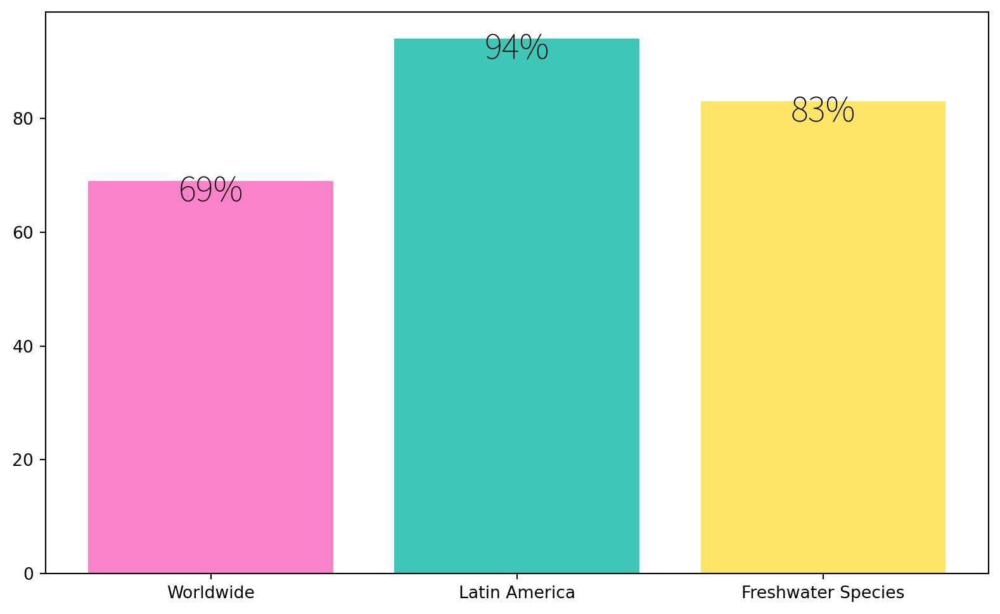
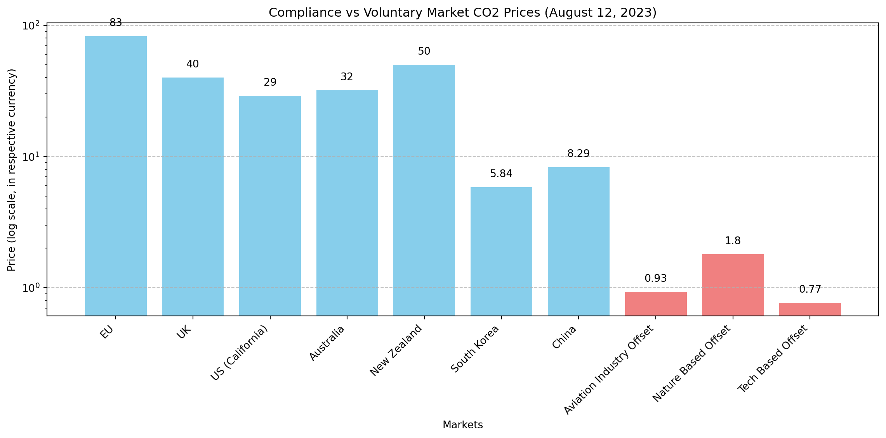

export const quartoRawHtml =
[`
<table>
<caption>Comparing highest per capita CO<sub>2e</sub> emissions (mostly from oil producers) vs regional average per capita CO<sub>2</sub> emissions vs total CO<sub>2</sub> emissions<span class="citation" data-cites="ivanovaQuantifyingPotentialClimate2020 worldresourcesinstituteCO2EmissionsMetric2020 europeancommission.jointresearchcentre.CO2EmissionsAll2022 crippaFossilCO2GHG2020 liuMonitoringGlobalCarbon2023">[@ivanovaQuantifyingPotentialClimate2020; @worldresourcesinstituteCO2EmissionsMetric2020; @europeancommission.jointresearchcentre.CO2EmissionsAll2022; @crippaFossilCO2GHG2020; @liuMonitoringGlobalCarbon2023]</span>.</caption>
<colgroup>
<col style="width: 38%" />
<col style="width: 31%" />
<col style="width: 29%" />
</colgroup>
<tbody>
<tr class="odd">
<td><strong>Regional Average Per Capita Emissions (2020)</strong></td>
<td><strong>Highest Per Capita Emissions (2021)</strong></td>
<td><strong>Highest Total Emissions (2021)</strong></td>
</tr>
<tr class="even">
<td>North America 13.4 CO<sub>2</sub>e tonnes</td>
<td>Palau</td>
<td>China</td>
</tr>
<tr class="odd">
<td>Europe 7.5 CO<sub>2</sub>e tonnes</td>
<td>Qatar</td>
<td>United States</td>
</tr>
<tr class="even">
<td>Global Average 4.1 CO<sub>2</sub>e tonnes</td>
<td>Kuwait</td>
<td>European Union</td>
</tr>
<tr class="odd">
<td>Africa and the Middle East 1.7 CO<sub>2</sub>e tonnes</td>
<td>Bahrain</td>
<td>India</td>
</tr>
<tr class="even">
<td></td>
<td>Trinidad and Tobago</td>
<td>Russia</td>
</tr>
<tr class="odd">
<td></td>
<td>New Caledonia</td>
<td>Japan</td>
</tr>
<tr class="even">
<td></td>
<td>United Arab Emirates</td>
<td>Iran</td>
</tr>
<tr class="odd">
<td></td>
<td>Gibraltar</td>
<td>Germany</td>
</tr>
<tr class="even">
<td></td>
<td>Falkland Islands</td>
<td>South Korea</td>
</tr>
<tr class="odd">
<td></td>
<td>Oman</td>
<td>Indonesia</td>
</tr>
<tr class="even">
<td></td>
<td>Saudi Arabia</td>
<td>Saudi Arabia</td>
</tr>
<tr class="odd">
<td></td>
<td>Brunei Darussalam</td>
<td>Canada</td>
</tr>
<tr class="even">
<td></td>
<td>Canada</td>
<td>Brazil</td>
</tr>
<tr class="odd">
<td></td>
<td>Australia</td>
<td>Turkey</td>
</tr>
<tr class="even">
<td></td>
<td>United States</td>
<td>South Africa</td>
</tr>
</tbody>
</table>
Comparing highest per capita CO<sub>2e</sub> emissions (mostly from oil producers) vs regional average per capita CO<sub>2</sub> emissions vs total CO<sub>2</sub> emissions\[@ivanovaQuantifyingPotentialClimate2020; @worldresourcesinstituteCO2EmissionsMetric2020; @europeancommission.jointresearchcentre.CO2EmissionsAll2022; @crippaFossilCO2GHG2020; @liuMonitoringGlobalCarbon2023\].
`,`
<table>
<caption>Definition of Emission Scopes From <span class="citation" data-cites="nationalpublicutilitiescouncilAnnualUtilityDecarbonization2022">[@nationalpublicutilitiescouncilAnnualUtilityDecarbonization2022]</span>.</caption>
<tbody>
<tr class="odd">
<td>Emission Scope</td>
<td>Emission Source</td>
</tr>
<tr class="even">
<td>Scope 1</td>
<td>Direct emissions</td>
</tr>
<tr class="odd">
<td>Scope 2</td>
<td>Indirect electricity emissions</td>
</tr>
<tr class="even">
<td>Scope 3</td>
<td>Value chain emissions</td>
</tr>
<tr class="odd">
<td>Scope 4</td>
<td>Avoided emissions</td>
</tr>
</tbody>
</table>
Definition of Emission Scopes From \[@nationalpublicutilitiescouncilAnnualUtilityDecarbonization2022\].
`,`
<table>
<caption>Climate Action Tracker’s country comparison of the 10 top polluters’ climate action.</caption>
<tbody>
<tr class="odd">
<td>Country or Region</td>
<td>NDC target</td>
</tr>
<tr class="even">
<td>China</td>
<td>Highly insufficient</td>
</tr>
<tr class="odd">
<td>Indonesia</td>
<td>Highly insufficient</td>
</tr>
<tr class="even">
<td>Russia</td>
<td>Critically insufficient</td>
</tr>
<tr class="odd">
<td>EU</td>
<td>Insufficient</td>
</tr>
<tr class="even">
<td>USA</td>
<td>Insufficient</td>
</tr>
<tr class="odd">
<td>United Arab Emirates</td>
<td>Highly insufficient</td>
</tr>
<tr class="even">
<td>Japan</td>
<td>Insufficient</td>
</tr>
<tr class="odd">
<td>South Korea</td>
<td>Highly insufficient</td>
</tr>
<tr class="even">
<td>Iran</td>
<td>Critically insufficient</td>
</tr>
<tr class="odd">
<td>Saudi Arabia</td>
<td>Highly insufficient</td>
</tr>
</tbody>
</table>
Climate Action Tracker’s country comparison of the 10 top polluters’ climate action.
`,`
<table>
<caption>CO<sub>2</sub> credit trading markets around the world from <span class="citation" data-cites="InternationalCarbonMarket">@InternationalCarbonMarket</span>.</caption>
<colgroup>
<col style="width: 26%" />
<col style="width: 26%" />
<col style="width: 47%" />
</colgroup>
<tbody>
<tr class="odd">
<td>CO<sub>2</sub> Market</td>
<td>Launch Date</td>
<td>Comments</td>
</tr>
<tr class="even">
<td>EU</td>
<td>2005</td>
<td>EU: <span class="citation" data-cites="araujoEuropeanUnionMembership2020">@araujoEuropeanUnionMembership2020</span></td>
</tr>
<tr class="odd">
<td>South Korea</td>
<td>2015</td>
<td></td>
</tr>
<tr class="even">
<td>China</td>
<td>2021</td>
<td>China’s national emissions trading scheme (ETS) started in 2021 priced at 48 yuan per tonne of CO<sub>2</sub>, averaged at 58 yuan in 2022 <span class="citation" data-cites="liuIndepthWillChina2021 ivyyinCommodities2023China2023">[@liuIndepthWillChina2021; @ivyyinCommodities2023China2023]</span>.</td>
</tr>
<tr class="odd">
<td>U.S.</td>
<td>2013</td>
<td>No country-wide market; local CO<sub>2</sub> markets in California, Connecticut, Delaware, Maine, Maryland, Massachusetts, New Hampshire, New York, Rhode Island, and Vermont</td>
</tr>
<tr class="even">
<td>New Zealand</td>
<td>2008</td>
<td>New Zealand <span class="citation" data-cites="rontardPoliticalConstructionCarbon2022">@rontardPoliticalConstructionCarbon2022</span> (need access, important ncku doesn’t subscribe)</td>
</tr>
<tr class="odd">
<td>Canada</td>
<td>2013</td>
<td></td>
</tr>
</tbody>
</table>
CO<sub>2</sub> credit trading markets around the world from @InternationalCarbonMarket.
`,`
<table>
<caption>Compliance market CO<sub>2</sub> prices on August 12, 2023; data from <span class="citation" data-cites="emberCarbonPriceTracker2023 tradingeconomicsEUCarbonPermits2023 carboncreditsLiveCarbonPrices2023">[@emberCarbonPriceTracker2023; @tradingeconomicsEUCarbonPermits2023; @carboncreditsLiveCarbonPrices2023]</span>.</caption>
<tbody>
<tr class="odd">
<td>Compliance Markets</td>
<td>Price (Tonne of CO<sub>2</sub>)</td>
</tr>
<tr class="even">
<td>EU</td>
<td>83 EUR</td>
</tr>
<tr class="odd">
<td>UK</td>
<td>40 Pounds</td>
</tr>
<tr class="even">
<td>US (California)</td>
<td>29 USD</td>
</tr>
<tr class="odd">
<td>Australia</td>
<td>32 USD</td>
</tr>
<tr class="even">
<td>New Zealand</td>
<td>50 USD</td>
</tr>
<tr class="odd">
<td>South Korea</td>
<td>5.84 USD</td>
</tr>
<tr class="even">
<td>China</td>
<td>8.29 USD</td>
</tr>
<tr class="odd">
<td></td>
<td></td>
</tr>
</tbody>
</table>
Compliance market CO<sub>2</sub> prices on August 12, 2023; data from \[@emberCarbonPriceTracker2023; @tradingeconomicsEUCarbonPermits2023; @carboncreditsLiveCarbonPrices2023\].
`,`
<table>
<caption>Voluntary market CO<sub>2</sub> prices on August 12, 2023; data from <span class="citation" data-cites="carboncreditsLiveCarbonPrices2023">[@carboncreditsLiveCarbonPrices2023]</span>.</caption>
<tbody>
<tr class="odd">
<td>Voluntary Markets</td>
<td>Price (Tonne of CO<sub>2</sub>)</td>
</tr>
<tr class="even">
<td>Aviation Industry Offset</td>
<td>$0.93</td>
</tr>
<tr class="odd">
<td>Nature Based Offset</td>
<td>$1.80</td>
</tr>
<tr class="even">
<td>Tech Based Offset</td>
<td>$0.77</td>
</tr>
</tbody>
</table>
Voluntary market CO<sub>2</sub> prices on August 12, 2023; data from \[@carboncreditsLiveCarbonPrices2023\].
`,`
<table>
<caption>1.2 million UN survey responses to the statement <em>“Climate change is an emergency”</em> <span class="citation" data-cites="undpPeoplesClimateVote2021">[@undpPeoplesClimateVote2021]</span>.</caption>
<tbody>
<tr class="odd">
<td>Age Group</td>
<td>Agree</td>
<td>Neutral or Disagree</td>
</tr>
<tr class="even">
<td>18-35</td>
<td>65%</td>
<td>35%</td>
</tr>
<tr class="odd">
<td>36-59</td>
<td>66%</td>
<td>34%</td>
</tr>
<tr class="even">
<td>Over 69</td>
<td>58%</td>
<td>42%</td>
</tr>
</tbody>
</table>
1.2 million UN survey responses to the statement *“Climate change is an emergency”* \[@undpPeoplesClimateVote2021\].
`,`
<table>
<caption>Daily human activities emission contribution on average in France, Germany, Norway and Sweden from <span class="citation" data-cites="mobergMobilityFoodHousing2019">@mobergMobilityFoodHousing2019</span>.</caption>
<tbody>
<tr class="odd">
<td>Emission Share</td>
<td>Category</td>
</tr>
<tr class="even">
<td>21%</td>
<td>Housing</td>
</tr>
<tr class="odd">
<td>30%</td>
<td>Food</td>
</tr>
<tr class="even">
<td>34%</td>
<td>Mobility</td>
</tr>
<tr class="odd">
<td>15%</td>
<td>Other</td>
</tr>
</tbody>
</table>
Daily human activities emission contribution on average in France, Germany, Norway and Sweden from @mobergMobilityFoodHousing2019.
`,`
<table>
<caption>From <span class="citation" data-cites="mayWhyShouldWe2011">@mayWhyShouldWe2011</span>.</caption>
<colgroup>
<col style="width: 36%" />
<col style="width: 63%" />
</colgroup>
<tbody>
<tr class="odd">
<td>View</td>
<td></td>
</tr>
<tr class="even">
<td>Narrowly Utilitarian</td>
<td>Biodiversity is a resource of genetic novelties for the biotech industry.</td>
</tr>
<tr class="odd">
<td>Broadly Utilitarian</td>
<td>Humans depend upon biodiverse ecosystems.</td>
</tr>
<tr class="even">
<td>Ethical</td>
<td>Humans have a responsibility to future generations to pass down a rich natural world.</td>
</tr>
</tbody>
</table>
From @mayWhyShouldWe2011.
`,`
<table>
<caption>From <span class="citation" data-cites="MonetaryValuationNature2023">[@MonetaryValuationNature2023]</span>.</caption>
<tbody>
<tr class="odd">
<td>9 Steps</td>
</tr>
<tr class="even">
<td>Identify ecosystem functions</td>
</tr>
<tr class="odd">
<td>Quantify ecosystem functions</td>
</tr>
<tr class="even">
<td>Identify ecosystem services</td>
</tr>
<tr class="odd">
<td>Quantify ecosystem services</td>
</tr>
<tr class="even">
<td>Quantify financial value of ecosystem services</td>
</tr>
<tr class="odd">
<td>Assign property rights</td>
</tr>
<tr class="even">
<td>Create ecosystem service markets</td>
</tr>
<tr class="odd">
<td>Commodify nature</td>
</tr>
</tbody>
</table>
From \[@MonetaryValuationNature2023\].
`,`
<table>
<colgroup>
<col style="width: 36%" />
<col style="width: 63%" />
</colgroup>
<tbody>
<tr class="odd">
<td>Economics of Nature Commodification</td>
<td>Measure and assign value to nature</td>
</tr>
<tr class="even">
<td>Economics of the Sacred</td>
<td>Nature is sacred - such as are religious holy places - and can’t be touched <span class="citation" data-cites="eisensteinSacredEconomicsMoney2011 eisensteinClimateNewStory2018">[@eisensteinSacredEconomicsMoney2011; @eisensteinClimateNewStory2018]</span></td>
</tr>
</tbody>
</table>
`,`
<table>
<caption>From <span class="citation" data-cites="hanEmbeddingNaturebasedSolutions2022">@hanEmbeddingNaturebasedSolutions2022</span></caption>
<thead>
<tr class="header">
<th>Non-Exhaustive list of</th>
</tr>
</thead>
<tbody>
<tr class="odd">
<td>Afforestation</td>
</tr>
<tr class="even">
<td>Wetland restoration</td>
</tr>
<tr class="odd">
<td></td>
</tr>
</tbody>
</table>
From @hanEmbeddingNaturebasedSolutions2022
`,`
<table>
<caption>Biodiversity loss data from <span class="citation" data-cites="bradshawUnderestimatingChallengesAvoiding2021">[@bradshawUnderestimatingChallengesAvoiding2021]</span>.</caption>
<colgroup>
<col style="width: 61%" />
<col style="width: 38%" />
</colgroup>
<tbody>
<tr class="odd">
<td>What Happened?</td>
<td>How Much?</td>
</tr>
<tr class="even">
<td>Vertebrate species population average decline</td>
<td>68% over the last 50 years</td>
</tr>
<tr class="odd">
<td>Land surface altered by humans</td>
<td>70% of Earth</td>
</tr>
<tr class="even">
<td>Vertebrate species extinct</td>
<td>700 in 500 years</td>
</tr>
<tr class="odd">
<td>Plant species extinct</td>
<td>600 in 500 years</td>
</tr>
<tr class="even">
<td>Species under threat of extinction</td>
<td>1 million</td>
</tr>
</tbody>
</table>
Biodiversity loss data from \[@bradshawUnderestimatingChallengesAvoiding2021\].
`,`
<table>
<caption>Eco-design framework proposes 9 values to strive for in high quality products.</caption>
<tbody>
<tr class="odd">
<td>Quality</td>
<td></td>
<td></td>
</tr>
<tr class="even">
<td>Durable</td>
<td>Reparable</td>
<td>Easy to recycle</td>
</tr>
<tr class="odd">
<td>Reusable</td>
<td>Easy to maintain</td>
<td>Energy efficient</td>
</tr>
<tr class="even">
<td>Upgradable</td>
<td>Easy to refurbish</td>
<td>Resource efficient</td>
</tr>
</tbody>
</table>
Eco-design framework proposes 9 values to strive for in high quality products.
`,`<!-- -->`,`
<table>
<caption>Implications</caption>
<colgroup>
<col style="width: 36%" />
<col style="width: 63%" />
</colgroup>
<tbody>
<tr class="odd">
<td>Category</td>
<td>Implication</td>
</tr>
<tr class="even">
<td>Transparency</td>
<td>In unison, the reviewed technologies and practices move us closer to enabling <em>realtime ESG</em>: up-do-date transparent information about how our product are produced.</td>
</tr>
<tr class="odd">
<td>Speed</td>
<td>Realtime ESG is a building block to enable consumers and investors make more accurate, real-world purchase decisions.</td>
</tr>
<tr class="even">
<td>Actionability</td>
<td>Simplify action</td>
</tr>
<tr class="odd">
<td>Pollution</td>
<td><em>People live in the polluted areas are so used to it. What app to wake them up? “You live in a highly polluted area. Here’s the TOP 10 companies causing pollution. Here’s what you can do.”</em></td>
</tr>
<tr class="even">
<td>Health Tracking</td>
<td>Blood testing and biomarkers allow people to track their health. I’m introducing the concept of ‘eco-markers’ to follow the sustainability of human activities.</td>
</tr>
<tr class="odd">
<td>Circular Economy</td>
<td>AI can help us make sense of the vast amounts of sustainability data generated daily.</td>
</tr>
<tr class="even">
<td>EPR</td>
<td>ERP and CDP data should be part of Green Filter.</td>
</tr>
<tr class="odd">
<td>Eco-Design</td>
<td>How to find eco-designed products?</td>
</tr>
<tr class="even">
<td>CE and EPC</td>
<td>Encouraging Sustainable Design</td>
</tr>
<tr class="odd">
<td>Politics Matter</td>
<td></td>
</tr>
<tr class="even">
<td></td>
<td>Call for GOP contributors’ transparency</td>
</tr>
<tr class="odd">
<td></td>
<td>“triple turn”</td>
</tr>
<tr class="even">
<td></td>
<td>Lack of transparency</td>
</tr>
<tr class="odd">
<td></td>
<td>Sustainability is part of product quality. If a product is hurting the environment, it’s a low quality product.</td>
</tr>
</tbody>
</table>
Implications
`,`
<table>
<tbody>
<tr class="odd">
<td></td>
<td>Plap</td>
</tr>
</tbody>
</table>
`];

````mdx-code-block
import Figure from '/src/components/Figure';
import Humboldt from '/research/images/humboldt.jpg';
import Boundaries from "/research/images/planetary-boundaries-2023.png";
import Carbon from "/research/images/co2-concentration.png";
import EUPolicy from "/research/images/eu-policy-context.png";
````

# Sustainability

*“Nachhaltigkeit”* - *sustainability* in German - was likely the first
use of the concept of preserving natural resources, conceived by a tax
accountant Hannß Carl von Carlowitz in 1713 in his seminal book on
forestry - *Sylvicultura oeconomica -*, referring to the goal of
achieving prudent forest management practices in his native Saxony in
Southeastern Germany, which at the time was under severe *deforestation*
pressure from mining, ship-building and agricultural production (Hannß
Carl von Carlowitz, 1713; Gottschlich & Friedrich, 2014). This
particular field of sustainability study is now known as *sustainable
yield of natural capital*. The *principal* of the natural resource being
managed, such as in fishing and forestry, shouldn’t be over-harvested in
order to maintain ***ecosystem services*** - a contemporary term from
the theory of *natural capital*, referring to benefits humans receive
from the stock of world’s natural resources (Peter Kareiva et al.,
2011).

Defining sustainability perhaps more poetically, the American wildlife
ecologist Aldo Leopold proposed the idea of *land ethics* in 1972 as
*“\[a\] thing is right when it tends to preserve the integrity,
stability, and beauty of the biotic community. It is wrong when it tends
otherwise”* in his landmark work *A Sand County Almanac* (Leopold,
1972). In a similar vein, the 1987 United Nations’ Brundtland Report
titled “*Our Common Future”* defined *sustainable development* as
*“Development that meets the needs of the present without compromising
the ability of future generations to meet their own needs”* (Anon,
1987). Given these varied ideas for over 300 years, I believe some
percentage of people have been concerned with our planet’s natural
environment and its preservation already for centuries. Yet, it is only
in the last 100 and so years that human activities have begun to affect
Earth’s systems on a previously unseen scale - termed *Anthropocene* -,
necessitating a deeper understanding of human-nature interactions, such
as in the case of climate change, which is rapidly changing the face of
our living environments.

## Measuring and Visualizing Earth’s Environment and Climate

Studies of Earth’s climate go back for over 200 years, starting with
Alexander von Humboldt,the founder of climatology, who revolutionized
cartography by inventing the first *isothermal maps* in 1816; these maps
showed areas with similar temperature, variations in altitude and
seasons in different colors (Honton, 2022) now available as 3D computer
models(Anon, 2023c). Already in 1896, the Nobel Prize winner Svante
Arrhenius first calculated how an increase in CO<sub>2</sub> levels
could have a warming effect on our global climate (Anderson, Hawkins &
Jones, 2016; Wulff, 2020). In 1938, Guy Stewart Callendar was the first
scientist to demonstrate the warming of Earth’s land surface as well as
linking the production of fossil fuels to increased CO<sub>2</sub>e and
changing climate (Hawkins & Jones, 2013). Early scientists pioneered
climate modeling by calculating the first climate interactions which
precede today’s complex computer-based *Earth System Models (ESMs)* that
integrate the various Earth systems and cycles run on supercomputers
(Anderson, Hawkins & Jones, 2016).

````mdx-code-block
<Figure caption="Humboldt's Naturgemälde, early data visualization of ecology, rain, temperature, elevation, etc" src={Humboldt} refURL="https://commons.wikimedia.org/wiki/File:Zentralbibliothek_Z%C3%BCrich_-_Ideen_zu_einer_Geographie_der_Pflanzen_nebst_einem_Naturgem%C3%A4lde_der_Tropenl%C3%A4nder_-_000012142.jpg" refTitle="Public Domain, WikiMedia Commons" />
````

Environmental activists have been calling attention to global warming
for decades, yet the world has been slow to act (McKibben, 1989). While
the scientific case for human-induced climate change was building, it
took 120 years after Arrhenius’ calculations, until the Paris Climate
Agreement in 2016, that countries came to an agreement on non-binding
targets on keeping CO<sub>2</sub> levels 1.5 °C below pre-industrial
levels (defined as 1850–1900)(United Nations, 2016). Even though
awareness of Earth’s warming climate was growing ever stronger, the
CO<sub>2</sub> emissions kept rising too. The hockey-stick growth of
CO<sub>2</sub> concentration since the industrial revolution is clear in
the data from 1958 onward, following a steady annual increase, called
the *Keeling Curve* (Keeling & Keeling, 2017). Written records of global
temperature measurements are available starting from the 1880s, when
temperatures began to be documented in ship logs (Brohan et al., 2012).
Finally, although perhaps less accurately, temperature estimations from
tree-trunks allow some comparisons with the climate as far back as 2000
years ago (Rubino et al., 2019).

````mdx-code-block
<Figure
  caption="CO2 concentration in the atmosphere"
  src={Carbon}
  refURL="https://keelingcurve.ucsd.edu/"
  refTitle="Scripps Institution of Oceanography at UC San Diego"
/>
````

The latest data from 2023 shows our current world population of 8
Billion people emitted 37.2 gigatonnes (i.e. billion metric tons) of
CO<sub>2</sub>e per year, the highest emissions recorded in history
(Statista, 2023). In order to limit global warming to 1.5 °C as agreed
by the world nations in Paris, removal of 5-20 gigatons of
CO<sub>2</sub>e per year would be needed according to reduction pathways
calculated by the Intergovernmental Panel on Climate Change (IPCC) (Wade
et al., 2023). Yet, most countries are missing the mark (Climate
Analytics & NewClimate Institute, 2023; United Nations Environment
Programme, 2023). The European Union’s Copernicus Climate Change Service
(C3S) reports 1.5 °C global warming has already been breached in 2024
temperatures (Anon, 2024b; Anon, 2024a). Given the current pace of
climate change action, the G7 countries (Canada, France, Germany, Italy,
Japan, United Kingdom, United States) are heading for 2.7 °C of warming
by 2050 (CDP, 2022).

Earth’s physical systems are very sensitive to small changes in
temperature, which was not understood until the 1970s(McKibben, 2006). A
comprehensive review of evidence from paleoclimate records until current
time, including ocean, atmosphere, and land surface of points towards
substantial climate change if high levels of greenhouse gas emissions
continue, termed by the authors as *climate sensitivity* (Sherwood et
al., 2020). Global warming may lead to the slowing down and complete
stop of the Atlantic meridional overturning circulation (AMOC) which
helps maintain climate stability (Ditlevsen & Ditlevsen, 2023).

The most complex computer models which attempt to capture ever more
interactions happening in the physical realm are called *digital twins.*
The EU is developing a digital twin of Earth to help sustainability
prediction and planning, integrating Earth’s various systems such as
climate, hydrology, ecology, etc, into a single model Anon (2023a). We
can use all the data being recorded to provide a digital twin of the
planet, nature, ecosystems and human actions to help us change our
behavior and optimize for planetary wellbeing.

### Biosphere

Earth’s biosphere is made up of 846 terrestrial ecoregions, which are
distributed across 14 major biomes and 8 biogeographical realms
(Dinerstein et al., 2017).

### Ecological Indicators

Sustainability can be measured using a variety of *ecological
indicators*.

Ecological indicators for Earth *- may I coin the name “ecomarkers” -*
are like *biomarkers* in human health. Many technological advances help
scientist better understand nature. Cutting edge research uses AI-based
voice recognition for listening to nature, assessing biodiversity based
on species’ sounds in the forest. Millions of detections of different
species with machine learning passive acoustic AI models, can also
assess species’ response to climate change (AI for Good, 2023; Guerrero
et al., 2023).

*Environmental DNA (eDNA)* helps scientists measure species abundance
without direct observation through detection of DNA on genetic materials
such as skin cells (Peter Andrey Smitharchive page, 2024). Cellular DNA
can be isolated from various sediment types (Ogram, Sayler & Barkay,
1987). Beyond scientific applications, eDNa is being used to generate
biodiversity credits by environmental asset rating companies such as
BeZero (Ojoatre & Atkinson, 2023).

AI is being used to map icebergs and measure the change in size
(European Space Agency, 2023).

-   Jackson (1996) *preventive environmental management*

### Pricing, Tracing and Trading CO<sub>2</sub>e Emissions

### Markets for Ecosystem Assets

While technology improves and measurements become more accurate,
CO<sub>2</sub>e emissions are not yet completely accounted for. (Crippa
et al., 2020) reports latest figures CO<sub>2</sub>e from the EU’s
Emissions Database for Global Atmospheric Research (EDGAR). The EU
Copernicus satellite system reveals new greenhouse emissions previously
undetected (Daniel Värjö, 2022). *Copernicus Climate Change Service
(C3S) provides “\[n\]ear-real time updates of key global climate
variables**“*** \*\*.

-   According to (Debnath et al., 2022) 39% of global CO<sub>2</sub>
    emissions comes from the building sector. Construction is large
    emitter because of the use of concrete; super tall buildings are
    very CO<sub>2</sub> intensive (Zhao & Qin, 2015). Building emissions
    can be reduced by using sustainable design and materials, *digital
    twins* of architecture enable pre-visualization of different designs
    (Panaro, Parlow & Amman, 2024) as well modeling the usage of the
    building, for example the interior shop floors in commercial
    real-estate (Jia, Wang & Zhang, 2023).

Emissions production is highly unequal. “The world’s top 1% of emitters
produce over 1000 times more CO2 than the bottom 1%” IEA (2023a)

CO<sub>2</sub>e emissions by region (per year).

<div dangerouslySetInnerHTML={{ __html: quartoRawHtml[0] }} />

**Scoping**

*Scoping* CO<sub>2e</sub> *emissions* into 4 main categories helps to
organize calculating CO<sub>2e</sub> emissions and corresponding
reduction targets by looking at direct and indirect emissions
separately. The U.S. National Public Utilities Council (NPUC)
decarbonization report provides a useful categorization of *emission
scopes* applicable to companies which helps organizing emission
reduction schemes (National Public Utilities Council, 2022) based on the
Greenhouse Gas Protocol defined in the 1990s (GHG Protocol, n.d.). For
example, for consumers in Australian states and territories in 2018, 83%
of the GHG emissions are Scope 3, meaning indirect emissions in the
value chain (Goodwin et al., 2023). A newer concept is Scope 4 emissions
also known as avoided emissions, proposed by the World Resources
Institute (WRI) in 2013 (Plan A, n.d.).

<div dangerouslySetInnerHTML={{ __html: quartoRawHtml[1] }} />

One’s scope 3 emissions are someone else’s scope 1 emissions.

-   Mapping pollution sources in China Xie et al. (2021)

Countries have agreed up CO<sub>2e</sub> Reduction Targets known as
Country-Level Nationally Determined Contributions (NDCs)

-   UNFCCC. Secretariat (2022) The State of Nationally Determined
    Contributions

While most countries have not reached their Nationally Determined
Contributions, the Climate Action Tracker data portal allows to compare
countries (Climate Analytics & NewClimate Institute, 2023).

<div dangerouslySetInnerHTML={{ __html: quartoRawHtml[2] }} />


```python
ndc_chart()
```



-   (Fransen et al., 2022) notes that the majority of Nationally
    Determined Contributions (NDCs) are dependent on financial
    assistance from the international community.

-   CO<sub>2e</sub> assigning a monetary value to carbon emissions.

Trading CO<sub>2e</sub> emissions can be divided into 2 categories -
*Compliance Carbon Markets* (CCM) and *Voluntary Carbon Markets* (VCM).

The legislative baseline for Compliance Carbon Markets is so low, people
want to retire more CO<sub>2e</sub>, which they can do through
*Voluntary Carbon Markets.*

For the individual person, there’s no direct access to CO<sub>2</sub>
markets. However, brokers do buy large amounts of carbon credits to
resell in smaller quantities to retail investors.

*“Carbon pricing is not there to punish people,”* says Lion Hirth Lion
Hirth (n.d.). *“It’s there to remind us, when we take travel, heating,
consumption decisions that the true cost of fossil fuels comprises not
only mining and processing, but also the damage done by the
CO<sub>2</sub> they release.”*

*Long term cost* of insufficient climate action is more than *short-term
gains* from delaying efforts to reduce carbon emissions.

-   The total size of carbon markets reached 949 billion USD in 2023,
    including Chinese, European, and North American CO<sub>2</sub>
    trading (LSEG & Susanna Twidale, 02/12/2024, 02:37 PM).

-   *The price of* CO<sub>2e</sub> *differs across markets.*
    (Stern, 2022) argues carbon-neutral economy needs higher
    CO<sub>2e</sub> prices and believes (Rennert et al., 2022)
    CO<sub>2e</sub> price per ton should be 3,6x higher that it is
    currently. Contrary, (Ritz, 2022) argues optimal CO<sub>2</sub>
    prices could be highly asymmetric, low in some countries and high
    (above the social cost of CO<sub>2e</sub>) in countries where
    production is very polluting.

-   iGenius (2020)

CO<sub>2</sub> credits has given rise to *Carbon Accounting industry.*

-   Watershed is a large carbon accounting company.

-   The legislation has created an industry of CO<sub>2</sub> accounting
    with many companies like Greenly, Sustaxo, etc.

-   Quatrini (2021) sustainability assessments are complex and may give
    flawed results.

-   Nonetheles, CO<sub>2</sub> emission reduction has the added positive
    effect of boosting corporate morale (Cao, Li & Hasan, 2023).

Compliance Carbon Markets

meet legal emission reduction targets

**Cap & Trade**

The share of CO<sub>2</sub> emissions among people around the world is
highly unequal across the world (referred to as ***Carbon
Inequality***). (Chancel, 2022) reports “one-tenth of the global
population is responsible for nearly half of all emissions, half of the
population emits less than 12%”.

-   One example is the ICT sector.

-   Bajarin (n.d.) Over 300 million PCs sold in 2022

    -   Anon (2021b) Estonian company “sustainable lifecycle management
        of IT equipment”
    -   Ärileht (23.09.2022, 12:53) Recycle your phone, FoxWay and
        Circular economy for PCs.
    -   Zhou et al. (2022) ICT is an example of inequality, while
        emerging economies bear 82% of the emissions, developed
        countries gain 58% of value.

**Emissions Trading Schemes**

From Carbon Offsets to Carbon Credits

-   “A carbon credit represents one tonne of carbon dioxide that has
    been prevented from entering or has been removed from the
    atmosphere” (Anna Watson, 2023, 2022).

Retiring CO<sub>2</sub> allowances

-   Facilitating citizens’ access to CO<sub>2</sub> emissions trading
    may be an efficient method to organize large-scale CO<sub>2</sub>
    retiring (Rousse, 2008).

As of 2024 there’s no single global CO<sub>2</sub> trading market but
rather several local markets as described in the table below.

<div dangerouslySetInnerHTML={{ __html: quartoRawHtml[3] }} />

Most of the world is not part of a CO<sub>2</sub> market.

-   (Sipthorpe et al., 2022) compares traditional and blockchain-based
    solutions to carbon trading.

-   “Blockchain solutions for carbon markets are nearing maturity” and
    offer many improvements. enhancing transparency, trust, and
    efficiency.

-   (United Nations Environment Programme (UNEP), 2021) report. “The
    Emissions Gap Report (EGR) 2021: The Heat Is On shows that new
    national climate pledges combined with other mitigation measures put
    the world on track for a global temperature rise of 2.7°C by the end
    of the century. That is well above the goals of the Paris climate
    agreement and would lead to catastrophic changes in the Earth’s
    climate. To keep global warming below 1.5°C this century, the
    aspirational goal of the Paris Agreement, the world needs to halve
    annual greenhouse gas emissions in the next eight years.

-   (United Nations Environment Programme (UNEP), 2021) report “If
    implemented effectively, net-zero emissions pledges could limit
    warming to 2.2°C, closer to the well-below 2°C goal of the Paris
    Agreement. However, many national climate plans delay action until
    after 2030. The reduction of methane emissions from the fossil fuel,
    waste and agriculture sectors could help close the emissions gap and
    reduce warming in the short term, the report finds. Carbon markets
    could also help slash emissions. But that would only happen if rules
    are clearly defined and target actual reductions in emissions, while
    being supported by arrangements to track progress and provide
    transparency.”

-   (United Nations Environment Programme, 2022) 2022 Emissions Gap
    report.

<div dangerouslySetInnerHTML={{ __html: quartoRawHtml[4] }} />

-   tree bark absorbs methane, (Gauci et al., 2024).

Voluntary Carbon Markets

Verified Carbon Standard (VCS) and the Gold Standard, Climate Action
Reserve (CAR)‍, American Carbon Registry (ACR)

“BeZero Carbon is a ratings agency for the Voluntary Carbon Market.”

https://bezerocarbonmarkets.com/

Voluntary Carbon Markets are …

Voluntary Carbon Markets (VCM) lack standardization and transparency
(Ela Khodai, 2023).

***Carbon Credits*** are useful for private companies who wish to claim
*carbon neutrality, climate positivity*, or other related claim, which
might be viewed in good light by their clients or allow the companies to
adhere to certain legislative requirements.

There are many companies which facilitate buy carbon credits as well as
a few organizations focused on carbon credit verification.

-   In Estonia, startups Arbonic and Single.Earth are trialing this
    approach in several forests.
-   Carbon Credit Retirement?
-   Methodologies: Anon (2022c)
-   KlimaDAO (2023) call for an open standard

<div dangerouslySetInnerHTML={{ __html: quartoRawHtml[5] }} />


```python
carbon_credits_chart()
```


### Consumerism \> Earth’s Boundaries {#consumerism-earths-boundaries}

Earth’s growing population reached 8 Billion people In November 2022 and
population projections by predict 8.5B people by 2030 and 9.7B by 2050
(The Economic Times, 2022; United Nations Department of Economic and
Social Affairs, Population Division, 2022). While population growth puts
higher pressure on Earth’s resources, some researchers propose the
effect is higher from wasteful lifestyles than the raw number of people
(Cardinale et al., 2012) while others such as (Cafaro, Hansson &
Götmark, 2022) believe *“Overpopulation is a major cause of biodiversity
loss and smaller human populations are necessary to preserve what is
left”* .

Making *anything* consumes natural resources, which are limited on
planet Earth.

Environmental risks from human activities are known as Anthropogenic
Threat Complexes (ATCs) (Bowler et al., 2020)*.*

-   Jackson (2017) limits to growth update

Consumer lifestyle - overconsumption - is one of the main drivers of
climate change and environmental destruction. “2/3 of global GHG
emissions are directly and indirectly linked to household consumption,
with a global average of about 6 tonnes CO<sub>2</sub> equivalent per
capita” (Renee Cho, 2020; Ivanova et al., 2020). (Hassoun et al., 2023)
forecasts increase of global food demand by 62% including impact of
climate change. According to (Ellen MacArthur Foundation, Material
Economics, 2019)’s models 45% of CO<sub>2</sub> equivalent emissions
come from our shopping; produced by companies to make the products we
consume.

Overconsumption is also one of the root causes of plastic pollution.
(Ford et al., 2022) and (Lavers, Bond & Rolsky, 2022) find strong links
between climate change and marine plastic pollution *“along with other
stressors that threaten the resilience of species and habitats sensitive
to both climate change and plastic pollution”*. (Lavers, Bond & Rolsky,
2022) plastic pollution is pervasive around the Earth and is
fundamentally linked to climate change.

A large scale study by Anthony Leiserowitz et al. (2022) on Meta’s
Facebook (n=108946) reported people in Spain (65%), Sweden (61%), and
Taiwan (60%) believe *“climate change is mostly caused by human
activities”.* An even larger survey (n=1.2 million) by the United
Nations across 50 countries, distributed through mobile game ads, showed
the majority of people agreeing climate change is an “emergency” (UNDP,
2021). While people express eco-conscious ideas, it’s non-trivial to
practice sustainability in daily life. (Deyan Georgiev, 2023) reports
only 30% of people in the Gen-Z age group believe technology can solve
all problems.

<div dangerouslySetInnerHTML={{ __html: quartoRawHtml[6] }} />

While the number on overconsumption are clear, the debate on
overconsumption is so polarized, it’s difficult to have a meaningful
discussion of the topic (Ianole & Cornescu, 2013).

-   Overconsumption and underinvestment.

-   Cities are responsible for 80% of the emissions Rosales Carreón &
    Worrell (2018)

-   Moberg et al. (2019) reports daily human activities emission
    contribution on average in four European countries (France, Germany,
    Norway and Sweden).

<div dangerouslySetInnerHTML={{ __html: quartoRawHtml[7] }} />

-   Armstrong McKay et al. (2022) discusses tipping points.

In addition to the enormity of over-reaching CO<sub>2</sub> emissions,
humanity is facing other massive environmental problems. The Stockholm
Resilience Centre reports we have already breached 4 out of our 9
*“planetary boundaries”:* in addition to climate change, biodiversity
loss (Extinctions per Million Species per Year aka E/MSY), land-system
change (deforestation, land degradation, etc), and biogeochemical flows
(cycles of carbon, nitrogen, phosphorus, etc); on a positive side, the
challenges of fresh water use, ocean acidification and stratospheric
ozone depletion are still within planetary limits (Persson et al.,
2022).

-   Ceballos, Ehrlich & Dirzo (2017) mass extinctions
-   IUCN Red List: 45,300 species (28% of all assessed) under threat of
    extinction IUCN (2024)

Atmospheric aerosol loading and the biodiversity intactness index (BII)
were quantified recently (ADD CITATION)

-   (Keeble, 1988) reported in April 1987 that *‘residents in
    high-income countries lead lifestyles incompatible with planetary
    boundaries’*.

My home country Estonia at the time was considered low-income, a small
nation in poverty behind the *Iron Curtain* occupation of the Soviet
Union, we now in 2024, have also reached high-income status. - De Balie
(2018) - Houdini (2018) - Haeggman, Moberg & Sandin (2018) - Richardson
et al. (2023)

````mdx-code-block
<Figure
  caption="Planetary Boundaries 2023 update"
  src={Boundaries}
  refURL="https://www.stockholmresilience.org/research/planetary-boundaries.html"
  refTitle="Azote for Stockholm Resilience Centre, based on analysis in Richardson et al 2023"
/>
````

In 1948, the International Union for Conservation of Nature (IUCN) was
founded, which in

LULUCF “Land Use, Land-Use Change, and Forestry” can both be a source of
greenhouse gas emissions - or a carbon sink (removing CO2 from the
atmosphere).

As long as humanity is a mono-planetary species, we have to come to
terms with the limitations of our home, Earth.

### Earth System Law, Planetary Health, and Social Cost of CO<sub>2</sub>

Cross-disciplinary scientists have been working on integrating Earth
systems and human society into cohesive frameworks. *Planetary Health*,
*Earth System Law, and* Social Cost of Carbon are 3 approaches to
address the complex interdependence of humans with our physical
environment.

Evolving Measurements from Planetary Boundaries to Planetary Health

-   Planetary health (Planetary Health Alliance, 2024a, 2024b)

-   Wardani et al. (2023) *“long-term human well-being is dependent on
    the well-being of the planet, including both biotic and abiotic
    systems. It recognizes interlinkages across environmental
    sustainability, public health, and socioeconomic development.”*

-   (Du Toit & Kotzé, 2022) describes *Earth System Law* as a framework
    for addressing interconnected environmental challenges.

Earth system science

Social Cost of Carbon Measures Compound CO<sub>2</sub> Impact.
Sustainability is filled with complexities. CO<sub>2</sub> emissions are
complicated by biodiversity loss, child labor, slavery, poverty,
chemical pollution, etc. - many issues become intertwined (TEDx Talks,
2020). One attempt to measure these complexities, is the *Social Cost of
Carbon* (SCC) which is defined as *“additional damage caused by an extra
unit of emissions”* (Kornek et al., 2021; Zhen, Tian & Ye, 2018). For
example the cost of damages caused by “one extra ton of carbon dioxide
emissions” (Stanford University, 2021). SCC variations exist between
countries (Tol, 2019) and regions (Wang, Ma & Wang, 2022).

-   As shown in the Phillipines by (Cheng & Han, 2022), with increasing
    extreme weather events, *“businesses are more likely to emerge in
    areas where infrastructure is resilient to climate hazards”*.
    (Jerrett, Jina & Marlier, 2022) says, In California, “Wildfires are
    the second most important source of emissions in 2020” and
    “Wildfires in 2020 negate reductions in greenhouse gas emissions
    from other sectors.”

-   (Lin et al., 2022) says, apart from CO<sub>2</sub>, reduction of
    other atmospheric pollutants, such as non-CO<sub>2</sub> greenhouse
    gases (GHGs) and short-lived climate pollutants (SLCPs) is required
    for climate stability.

-   (Wang & Teng, 2022): Quantifying climate damage proposes scenarios
    of climate damage.

## Quantifying Ecosystem Services

*Ecosystem services measure the benefits humans receive from the
biosphere.* Put most simply, *ecosystem services* enable human life on
Earth. While it can be assumed much of the flora and fauna are crucial
for Earth’s systems, science is still in the process of understanding
and quantifying its contributions. The history of the valuation of
nature’s services goes back to the 18th century when David Ricardo and
Jean Baptiste Say discussed nature’s *work*, however both considered it
should be free (Gómez-Baggethun et al., 2010). In 1997 (Anon, 1997)
proposed the idea of *ecosystem services* and (Costanza et al., 1997)
attempted to assess the amount of ecosystem services provided. (Le
Provost et al., 2022)’s study shows *biodiversity* as one key factor to
maintain delivery of ecosystem services. (Noriega et al., 2018) attempts
to quantify the ecosystem services (ES) provided by insects.

Why Protect Biodiversity?

May (2011) argues biodiversity loss is a concern for 3 points of views:

<div dangerouslySetInnerHTML={{ __html: quartoRawHtml[8] }} />

-   (Leverhulme Centre for Nature Recovery, 2023) asks should we put a
    price on nature?
-   Is it time to leave utilitarian environmentalism behind? Muradian &
    Gómez-Baggethun (2021)

<div dangerouslySetInnerHTML={{ __html: quartoRawHtml[9] }} />

There are 2 main approaches to protecting nature:

<div dangerouslySetInnerHTML={{ __html: quartoRawHtml[10] }} />

-   Han & Chen (2022) identifies nature-based solutions “land
    re-naturalization (such as afforestation and wetland restoration)”

<div dangerouslySetInnerHTML={{ __html: quartoRawHtml[11] }} />

-   Meanwhile the destruction pressure on ecosystems is rapidly
    increasing (ADD CITATION A B C).

-   Espinosa & Bazairi (2023) marine ecosystem services **(need access,
    ncku doesn’t sub)**

-   Chen et al. (2023) Ecosystem vulnerability **(need access)**

-   Zhang et al. (2023) Integrating ecosystem services conservation into
    urban planning **(need access)**

-   Li et al. (2023) tourism is a large industrial sector which relies
    on ecosystem services. In Taiwan, (Lee, Jan & Liu, 2021) developed a
    framework of indicators to assess sustainable tourism.

**Measuring Environmental Degradation**

### Biodiversity

(Almond, R.E.A. et al., 2022) reported, the number of species killed,
mass destruction of nature. “69% decline in the relative abundance of
monitored wildlife populations around the world between 1970 and 2018.
Latin America shows the greatest regional decline in average population
abundance (94%), while freshwater species populations have seen the
greatest overall global decline (83%).”

```python
biodiversity_chart()
```



Biodiversity loss is linked to overconsumption, weak legislation and
lack of oversight. (Crenna, Sinkko & Sala, 2019) recounts European Union
consumers’ negative impact on biodiversity in countries where it imports
food. WWF (2022) case study highlights how 4 biodiverse regions Cerrado
in Brazil, Chaco in Argentina, Sumatra in Indonesia, and the Cuvette
Centrale in Democratic Republic of Congo are experiencing rapid
destruction due to consumer demand in the European Union. While the
European Union (EU) has recently become a leader in sustainability
legislation, biodiversity protection measures among private companies is
very low Marco-Fondevila & Álvarez-Etxeberría (2023).

Meanwhile, there is some progress in biodiversity conservation. UEBT
(2022) reports “Biodiversity awareness is now at 72% or higher in all
countries sampled, compared to only 29% or higher across countries
sampled in 2009.”

**Convention on Biodiversity**

Similarly to climate protection, the UN has taken a leadership role in
biodiversity protection. Unit (2023): The history of the United Nations
Convention on Biodiversity goes back to 1988, when the working group was
founded. UNEP (Tue, 12/20/2022 - 07:44): The Convention on Biodiversity
2022 (COP15) adopted the first global biodiversity framework to
accompany climate goals.

Protecting biodiversity

<div dangerouslySetInnerHTML={{ __html: quartoRawHtml[12] }} />

**Marine Heatwaves**

-   Gelles & Andreoni (2023) describe how marine heatwaves threaten
    global biodiversity. Ocean warming leads to coral bleaching of the
    Great Barrier Reef in Queensland, east coast of Australia (Pfeiffer,
    2024).

### Deforestion

Around 27% of Earth’s land area is still covered by forests yet
deforestation is widespread all around the world; highest rates of
deforestation happened in the tropical rainforests of South America and
Africa, mainly caused by agricultural cropland expansion (50% of all
deforestation) and grazing land for farm animals to produce meat
(38,5%), totaling close to 90% of global deforestation (Anon, 2022b).
Forests are a crucial part of Earth’s carbon cycle and the main natural
CO<sub>2</sub> capture system; due to deforestation, Europe rapidly
losing its forest carbon sink (Frédéric Simon, 2022).

-   Global Forest Cover Change, Earth Engine Hansen et al. (2013)
-   Burning of biomass undermines carbon capture.

### Pollution

**Air Pollution**

Air pollution is widespread around the planet, with 99% of Earth’s human
population being affected by bad air quality that does not meet WHO air
quality guidelines, leading to health problems linked to 6.7 million
premature deaths every year (World Health Organization, 2022).
Grounbreaking research by (Lim et al., 2022) analyzed over 400000
individuals in England, South Korea and Taiwan establishes exposure to
2.5μm PM (PM2.5) air pollution as a cause for lung cancer. (Bouscasse et
al., 2022) finds strong health and economic benefits across the board
from air pollution reduction in France. In (Hannah Devlin, 2022),
professor Tony Mok, of the Chinese University of Hong Kong: *“We have
known about the link between pollution and lung cancer for a long time,
and we now have a possible explanation for it. As consumption of fossil
fuels goes hand in hand with pollution and carbon emissions, we have a
strong mandate for tackling these issues – for both environmental and
health reasons”*.

Health and sustainability are inextricably linked. “Human health is
central to all sustainability efforts.”, “All of these (food, housing,
power, and health care), and the stress that the lack of them generate,
play a huge role in our health” (Sarah Ludwig Rausch & Neha Pathak,
2021).

The main way to combat air pollution is through policy interventions.
(MARIA LUÍS FERNANDES, 2023) the EU has legislation in progress to curb
industrial emissions. If legislation is in place, causing bad air
quality can become bad for business. Gu et al. (2023) links air
pollution to credit interest rates for business loans in China;
companies with low environmental awareness and a history of
environmental penalties pay 12 percent higher interest rates.

Clean air is a requirement.

**Water Pollution**

-   Bioswales help catch storm debris and reduce water pollution.
-   Clean water and water pollution
-   Koch (2022) (**Need access! NYC times)**
-   Paris cleans Seine river for Paris Olympics

**Soil Pollution**

-   “Wild and ruderal plants as bioindicators of global urban pollution
    by air, water and soil in Riyadh and Abha, Saudi Arabia” (Picó et
    al., 2023) uses Wild and ruderal plants to detect pollution by air,
    water and soil. Bioindicators of anthropogenic pollution,
    Pharmaceuticals, pesticides, and other industrial chemicals. Both
    Abha and Riyadh showed notable levels of pollutants while Riyadh
    with more industry showed higher levels.

### Weather

Extreme Weather

-   (Anon, 2023b) The US Global Change Research Program comprehensive
    report to the US Congress links disaster-risk directly to global
    warming; for examples increased wildfires damage property, endanger
    life and reduces air quality, which in effect increases health
    challenges.
-   “Changes to tropical cyclone trajectories in Southeast Asia under a
    warming climate” intensifying storms forming near coastlines. Garner
    et al. (2024)
-   “Observed increases in North Atlantic tropical cyclone peak
    intensification rates” Garner (2023)
-   Flood risk mapping might lower property prices in at risk areas
    (Sherren, 2024).
-   In Taiwan disaster risk and hazard mapping, early warning systems,
    and comprehensive response save lives (Tsai et al., 2021).

Global warming increases the risk of disasters and extreme weather
events. As extreme temperatures are increasingly commonplace, there’s
increased risk of wildfires (Volkova, Roxburgh & Weston, 2021). Summers
of 2022 and 2023 were the hottest on record so far, with extreme heat
waves recorded in places around the world (Venturelli et al., 2023;
Serrano-Notivoli et al., 2023; Douglas, 2023; National Oceanic and
Atmospheric Administration (NOAA), U.S. Department of Commerce, 2023;
NOAA National Centers for Environmental Information, 2023; Falconer,
2023). As temperatures rise, certain cities may become uninhabitable for
humans (CBC Radio, 2021). The summer of 2023 saw extensive wildfires in
Spain, Canada, and elsewhere; rapidly moving fires destroyed the whole
city of Lāhainā in Hawaii \[ADD CITATION\]. The part of Earth where the
*human climate niche* is becoming smaller (McKibben, 2023). Some parts
of South America have seen summer heat in the winter, with heatwaves
with temperatures as high as 38 degrees (Livingston, 2023).

-   Observed changes in heatwaves (Perkins-Kirkpatrick & Green, 2023).
-   Word Economic Forums Global Risks Report 2024 paints a bleak picture
    of the future with expectations of increased turbulence across the
    board based on a survey of over 1400 topic experts World Economic
    Forum (n.d.)

Climate-related disasters can spur action as extreme weather becomes
visible to everyone. After large floods in South Korea in July 2023 with
many victims, president Joon promised to begin taking global warming
seriously and steer the country towards climate action Web (2023); AFP
(2023); Al Jazeera (2023). South Korea has a partnership with the
European Union European Commission (2023a).

The fossil energy production that’s a large part of global CO2 emissions
has caused several high-profile pollution events. Large ones that got
international news coverage include Exxon Valdez and Deepwater Horizon.

-   Chernobyl and Fukushima
-   the Great Pacific Garbage Patch
-   Lenton et al. (2023) quantifying human cost of global warming.
-   EJAtlas tracks environmental justice cases around the world Scheidel
    et al. (2020).
-   Disputes in Eerola (2022).

## Debating Financialization of Nature to Enable Sustainable Action

-   thread of commodification of nature. category mistake. impossible to
    bring back already destroyed biodiversity which took millennia to
    develop. humans create hugely complex systems instead of simply
    conserving nature.
-   The concept of how a public resource is over-used until breaking
    down as each user only bears a fraction of the cost - know as
    *tragedy of the commons* -was described by the ecologist Garrett
    Hardin in 1968 (Hardin, 1968; Meisinger, 2022; Lopez, Pastén &
    Gutiérrez Cubillos, 2022; Murase & Baek, 2018).

### Re-Forestation

-   1 billion tree project (Greenfield & @pgreenfielduk, 2021; Anon,
    2020; Bastin et al., 2019)

-   Bousfield et al. (2022) reports there’s evidence paying landowners
    for the ecosystem services their forests provide may reduce
    deforestation.

-   Afforestation is different from reforestation, which takes into
    account biodiversity.

-   Klosterman et al. (2022) using remote-sensing and machine-learning
    to assess reforestation potential; doesn’t take into account
    political realities.

nature-based solutions.

### Does Individual Climate Action Matter?

Does Individual Climate Action is Ineffective.

The effect of individual climate action is limited.

Regenerative Action

There is no single solution to the environmental crisis. Given the
enormity of environmental degradation, many different approaches are
needed. This chapter documents some of the ongoing work which a
sustainability companion could assist college students get involved
with.

### Restoration Ecology, Agroforestry & Permaculture {#restoration-ecology-agroforestry-permaculture}

Some argue sustainability is not enough and we should work on
*regeneration* of natural habitats.

The UN announced 2021-2030 the Decade on Ecosystem Restoration (Fischer
et al., 2021).

-   Agroecology Baltic Sea Action Group (2023)

Agroforestry plays an active role in achieving Sustainable Development
Goals (SDGs) (Ruba & Talucder, 2023);

-   Food forests for regenerative food systems.
-   Svalbard Seed Vault
-   Irwin et al. (2023)
-   Yadav et al. (2023)
-   Low, Dalhaus & Meuwissen (2023)
-   Ollinaho & Kröger (2023) “bioeconomy is not inherently sustainable
    and may pose considerable risks to biodiversity.”
-   De Queiroz-Stein & Siegel (2023)
-   Gamage et al. (2023) “Organic food and drink sales in 2019 totaled
    more than 106 billion euros worldwide.”

**Technology**

“Climatech”, Renewable Energy and Transforming Energy Production

Fossil fuels are what powers humanity as well as the largest source of
CO<sub>2</sub> emissions. IEA (2022) reports “Global CO<sub>2</sub>
emissions from energy combustion and industrial processes rebounded in
2021 to reach their highest ever annual level. A 6% increase from 2020
pushed emissions to 36.3 gigatonnes”. As on June 2023, fossil fuel based
energy makes up 82% of energy and is still growing Institute (2023). The
425 largest fossil fuel projects represent a total of over 1 gigatons in
CO<sub>2</sub> emissions, 40% of which were new projects Kühne et al.
(2022). Tilsted et al. (2023) expects the fossil fuel industry to
continue grow even faster. In July 2023, the U.K. granted hundreds of
new oil and gas of project licenses in the North Sea (Anon, 2023d).

Large technology conglomerates and newly founded startups focused on
climate solutions (often referred to as *climatech* by the media) have
proposed a range of approaches to CO<sub>2</sub> reduction in the
atmosphere. These technologies include several types of *carbon
capture*, directly from the air (direct air capture or DAC), from the
source of pollution, such as using high–performance filters on factory
chimneys, as well as nature-based solutions such as large scale tree
planting using drones.

Each technology has their own pros and cons. (Vitillo et al., 2022)
illustrates how direct air capture of CO<sub>2</sub> is difficult
because of low concentration and CO<sub>2</sub> capture at the source of
the emissions is more feasible.

-   (Gaure & Golombek, 2022) simulate a CO<sub>2</sub> free electricity
    generation system in the European Union where “98% of total
    electricity production is generated by wind power and solar; the
    remainder is covered by a backup technology.”. The authors stipulate
    it’s possible to power the EU without producing CO<sub>2</sub>
    emissions.

-   **Important: “creating sustainability trust in companies in
    realtime”**

-   Howard et al. (2017) argues Oceans play crucial role in carbon
    capture.

### Political Action

-   **10 countries use almost 100% renewable energy**

There’s ample evidence from several countries suggesting moving to
renewal energy brings environmental benefits:

-   Amin et al. (2022) suggests “removing fossil fuel subsidies and
    intra-sectoral electricity price distortions coupled with carbon
    taxes provides the highest benefits” for both the economy and the
    environment in Bangladesh.

-   Luo et al. (2022) suggests using reinforcement learning to reduce
    energy use in cooling systems.

-   The true cost of products is hidden. The work is hidden.

-   Montreal protocol eradicates CfCs and the ozone holes became whole
    again.

***Mitigating*** **Climate Change**

The monumental task of removing several gigatons of CO<sub>2</sub> from
the atmosphere requires massive policy shifts and collaboration across
countries and industries (Mackler, Fishman & Broberg, 2021).

Warming global climate has concrete effects on daily life. Warmer
climate helps viruses and fungi spread (Press, 2023). (Williams & Joshi,
2013) higher CO<sub>2</sub> concentrations in the air can cause more
turbulence for flights.

***Adapting*** **to Climate Change**

Many companies are developing technologies for mitigation.

In Brazil, deforestation fell 60% in 1 year, based on remote satellite
reconnaissance, after the election of a more pro-environment leadership
(Watts, 2023).

-   Eesti Vabariigi Valitsus (2022) Estonian Green Deal Action Plan
    (Eesti Rohepöörde Tegevusplaan).

Politics matters in sustainability.

In the European Union (EU), a wide range of legislative proposals,
targets, organizations, and goals already exists across diverse
countries. Upcoming laws aim to harmonize approaches to sustainability
and raise standards for all members states, in turn influencing
producers who wish to sell in the EU common market.

-   (Anon, n.d.) report: The EU has a ***taxonomy of environmentally
    sustainable economic activities*** published by the Technical Expert
    Group (TEG) on sustainable finance.

**Taxes**

-   There have been proposal of a “meat tax”.

**SDGs**

-   SDGs need to discussed in their totality Popkova et al. (2022).

-   German Institute of Development and Sustainability (IDOS) connects
    SDGs to NDCs. Dzebo, Iacobuţă & Beaussart (2023)

-   International Energy Agency (IEAs), Decarbonisation Enablers IEA
    (2023b)

Sustainbility Policy context is Shifting Around the World

-   “In the context of the EU Plastics Strategy, the European Commission
    has launched a pledge to increase the use of recycled content to 10
    million tons by 2025. To address this, Circularise Plastics Group
    launched an “Open Standard for Sustainability and Transparency”
    based on blockchain technology & Zero-knowledge Proofs” Circularise
    (2020b)

-   “data-exchange protocol with privacy at its heart” Circularise
    (2020a)

-   EU AI Law Lomas (2024)

**European Green Deal**

-   Anon (2021a)
-   Switch2Green (2023)

It’s up to legislators to provide sustainable products on our
marketplace… but until we do, use the green filter.

-   One of the EU goals is reducing consumption
-   Tacking our consumption habits
-   Europe is the hotbed of sustainability
-   Iman Ghosh (2020)
-   Lamoureux (2018) Florida sustainable companies
-   MICHAEL HOULIHAN & BONNIE HARVEY (2018) customers prefer sustainable
    companies
-   Rajagopalan & Landrigan (2023): In the US, the *Inflation Reduction
    Act* provides funding to development of de-carbonizing technologies
    and includes plans to combat air pollution, reduce green house gases
    and address environmental injustices.

**Kunming-Montreal Global Biodiversity Framework**

**Eco-Design is a Key EU Sustainable Policy Design Tool**

A large part of the proposal by (Commission et al., 2014) is
***eco-design***, as a large part of product lifecycle environmental
impact is defined in the design process.

<div dangerouslySetInnerHTML={{ __html: quartoRawHtml[13] }} />

-   The proposal for a Nature Restoration Law by the European Commission
    requiring member countries to restore 20% of EU’s degraded
    ecosystems by 2030 and full restoration by 2050 has not yet passed
    Anon (2023e) and is facing a backlash David Pinto (2023).

-   Manzardo et al. (2021) **(need access!)**

-   Iñarra et al. (2022) **(need access!)**

-   Munaro, Tavares & Bragança (2022) **(need access!)**

-   Bassani et al. (2022) **(need access!)**

-   Van Doorsselaer (2022) **(need access!)**

-   (Nuez, Ruiz-García & Osorio, 2022) shows how electric vehicles may
    increase CO<sub>2</sub> emissions in some areas, such as Canary
    Islands, where electricity production is polluting.

-   Rossi, Cappelletti & Germani (2022) shows how introducing
    sustainability early in the design process and providing scenarios
    where sustainability is a metric, it’s possible to achieve more
    eco-friendly designs.

-   Tiernan et al. (2022) microplastics are a real concern

-   Arranz, Sena & Kwong (2022) developing circular economy is really
    complex

-   Cheba et al. (2022)

-   Ruiz-Pastor et al. (2022)

-   Miyoshi et al. (2022) takes the example of ink toner bottles and
    shows in a case study how standardized compatibility between older
    and newer systems can save resources and results in sustainability
    savings.

-   Finding green products and supporting companies making them

-   Supporting legislative changes

-   Track you consumption, saving, investing. Shift balance towards
    saving and investing.

-   Nastaraan Vadoodi (2022)

-   European Commission (2022b) Ecodesign for sustainable products

**Europe From 2023 to 2030**

-   EU releases strategic foresight reports since 2020 (European
    Commission, 2023b).

````mdx-code-block
<Figure
  caption="EU Policy Context Timeline'"
  src={EUPolicy}
/>
````

We have an opportunity to re-imagine how every product can be an
eco-product and how they circulate in our circular economy.

Timeline of the Policy Context:

-   In 2019 by the von der Leyen commission adopted the European Union
    (EU) **Green Deal** strategy.

-   In 2021 the Commision proposed a goal of reducing CO2e emissions by
    55% by 2030 under the *Fit for 55* policy package consisting of a
    wide range of economic measures.

-   In November 2022, the proposal was adopted by the EU Council and EU
    Parliament with an updated goal of 57% of CO2e reductions compared
    to 1990. This proposal is set to become a binding law for all EU
    member countries (European Commission (2019b); European Commission
    (2019a); Anon (2022a); European Council (2022)).

-   In March 2022, the EU Circular Economy Action Plan was adopted,
    looking to make sustainable products *the norm* in EU and
    *empowering consumers* as described in European Commission (2022a).
    Each product covered by the policy is required to have a ***Digital
    Product Passport*** which enables improved processing within the
    supply chain and includes detailed information to empower consumers
    to understand the environmental footprint of their purchases. It’s
    safe to say the large majority of products available today do not
    meet these criteria.

**Quality of Life**

Wellbeing Economy Governments is an Example of Country-level
Collaboration

-   Finland, Iceland, New Zealand, Scotland, Wales, Canada (Fioramonti
    et al., 2022).

<div dangerouslySetInnerHTML={{ __html: quartoRawHtml[14] }} />

-   Kaklauskas et al. (2023)

-   Anon (2023f) Integrated science of wellbeing

-   Fabris & Luburić (2022)

-   

## Design Implications

<div dangerouslySetInnerHTML={{ __html: quartoRawHtml[15] }} />

## Feature Ideas

<div dangerouslySetInnerHTML={{ __html: quartoRawHtml[16] }} />
