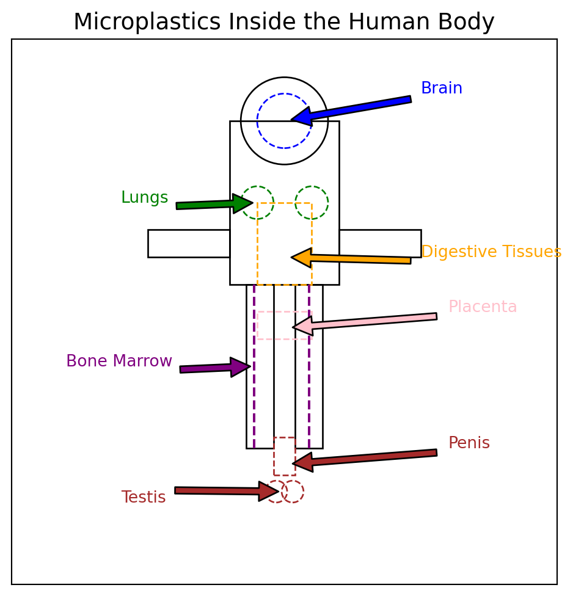
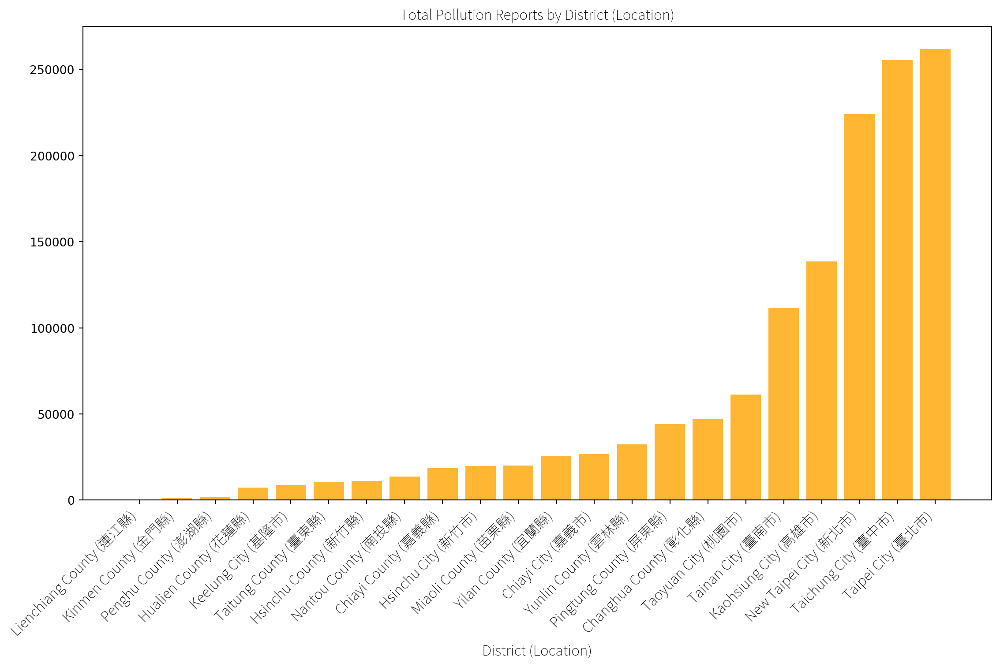
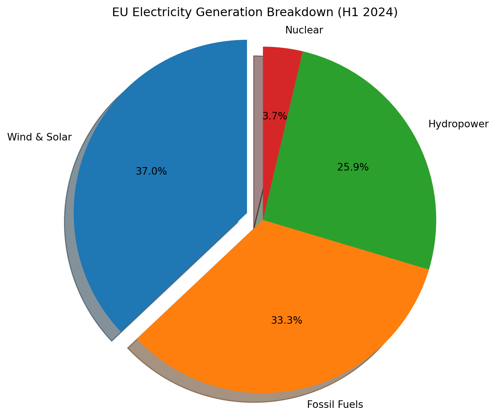

export const quartoRawHtml =
[`
<table>
<caption>Comparing highest per capita CO<sub>2e</sub> emissions (mostly from oil producers) vs regional average per capita CO<sub>2</sub> emissions vs total CO<sub>2</sub> emissions<span class="citation" data-cites="ivanovaQuantifyingPotentialClimate2020 worldresourcesinstituteCO2EmissionsMetric2020 europeancommission.jointresearchcentre.CO2EmissionsAll2022 crippaFossilCO2GHG2020 liuMonitoringGlobalCarbon2023">[@ivanovaQuantifyingPotentialClimate2020; @worldresourcesinstituteCO2EmissionsMetric2020; @europeancommission.jointresearchcentre.CO2EmissionsAll2022; @crippaFossilCO2GHG2020; @liuMonitoringGlobalCarbon2023]</span>.</caption>
<colgroup>
<col style="width: 38%" />
<col style="width: 31%" />
<col style="width: 29%" />
</colgroup>
<tbody>
<tr class="odd">
<td><strong>Regional Average Per Capita Emissions (2020)</strong></td>
<td><strong>Highest Per Capita Emissions (2021)</strong></td>
<td><strong>Highest Total Emissions (2021)</strong></td>
</tr>
<tr class="even">
<td>North America 13.4 CO<sub>2</sub>e tonnes</td>
<td>Palau</td>
<td>China</td>
</tr>
<tr class="odd">
<td>Europe 7.5 CO<sub>2</sub>e tonnes</td>
<td>Qatar</td>
<td>United States</td>
</tr>
<tr class="even">
<td>Global Average 4.1 CO<sub>2</sub>e tonnes</td>
<td>Kuwait</td>
<td>European Union</td>
</tr>
<tr class="odd">
<td>Africa and the Middle East 1.7 CO<sub>2</sub>e tonnes</td>
<td>Bahrain</td>
<td>India</td>
</tr>
<tr class="even">
<td></td>
<td>Trinidad and Tobago</td>
<td>Russia</td>
</tr>
<tr class="odd">
<td></td>
<td>New Caledonia</td>
<td>Japan</td>
</tr>
<tr class="even">
<td></td>
<td>United Arab Emirates</td>
<td>Iran</td>
</tr>
<tr class="odd">
<td></td>
<td>Gibraltar</td>
<td>Germany</td>
</tr>
<tr class="even">
<td></td>
<td>Falkland Islands</td>
<td>South Korea</td>
</tr>
<tr class="odd">
<td></td>
<td>Oman</td>
<td>Indonesia</td>
</tr>
<tr class="even">
<td></td>
<td>Saudi Arabia</td>
<td>Saudi Arabia</td>
</tr>
<tr class="odd">
<td></td>
<td>Brunei Darussalam</td>
<td>Canada</td>
</tr>
<tr class="even">
<td></td>
<td>Canada</td>
<td>Brazil</td>
</tr>
<tr class="odd">
<td></td>
<td>Australia</td>
<td>Turkey</td>
</tr>
<tr class="even">
<td></td>
<td>United States</td>
<td>South Africa</td>
</tr>
</tbody>
</table>
Comparing highest per capita CO<sub>2e</sub> emissions (mostly from oil producers) vs regional average per capita CO<sub>2</sub> emissions vs total CO<sub>2</sub> emissions\[@ivanovaQuantifyingPotentialClimate2020; @worldresourcesinstituteCO2EmissionsMetric2020; @europeancommission.jointresearchcentre.CO2EmissionsAll2022; @crippaFossilCO2GHG2020; @liuMonitoringGlobalCarbon2023\].
`,`
<table>
<caption>Definition of Emission Scopes From <span class="citation" data-cites="nationalpublicutilitiescouncilAnnualUtilityDecarbonization2022">[@nationalpublicutilitiescouncilAnnualUtilityDecarbonization2022]</span>.</caption>
<tbody>
<tr class="odd">
<td>Emission Scope</td>
<td>Emission Source</td>
</tr>
<tr class="even">
<td>Scope 1</td>
<td>Direct emissions</td>
</tr>
<tr class="odd">
<td>Scope 2</td>
<td>Indirect electricity emissions</td>
</tr>
<tr class="even">
<td>Scope 3</td>
<td>Value chain emissions</td>
</tr>
<tr class="odd">
<td>Scope 4</td>
<td>Avoided emissions</td>
</tr>
</tbody>
</table>
Definition of Emission Scopes From \[@nationalpublicutilitiescouncilAnnualUtilityDecarbonization2022\].
`,`
<table>
<caption>Climate Action Tracker’s country comparison of the 10 top polluters’ climate action.</caption>
<tbody>
<tr class="odd">
<td>Country or Region</td>
<td>NDC target</td>
</tr>
<tr class="even">
<td>China</td>
<td>Highly insufficient</td>
</tr>
<tr class="odd">
<td>Indonesia</td>
<td>Highly insufficient</td>
</tr>
<tr class="even">
<td>Russia</td>
<td>Critically insufficient</td>
</tr>
<tr class="odd">
<td>EU</td>
<td>Insufficient</td>
</tr>
<tr class="even">
<td>USA</td>
<td>Insufficient</td>
</tr>
<tr class="odd">
<td>United Arab Emirates</td>
<td>Highly insufficient</td>
</tr>
<tr class="even">
<td>Japan</td>
<td>Insufficient</td>
</tr>
<tr class="odd">
<td>South Korea</td>
<td>Highly insufficient</td>
</tr>
<tr class="even">
<td>Iran</td>
<td>Critically insufficient</td>
</tr>
<tr class="odd">
<td>Saudi Arabia</td>
<td>Highly insufficient</td>
</tr>
</tbody>
</table>
Climate Action Tracker’s country comparison of the 10 top polluters’ climate action.
`,`
<table>
<caption>Criteria for carbon credit projects.</caption>
<colgroup>
<col style="width: 50%" />
<col style="width: 50%" />
</colgroup>
<thead>
<tr class="header">
<th>Criteria</th>
<th>Description</th>
</tr>
</thead>
<tbody>
<tr class="odd">
<td>Baseline</td>
<td>Ecosystem carbon sequestration rate without the intervention (project)</td>
</tr>
<tr class="even">
<td>Additionality</td>
<td>New carbon capture or prevention of emissions</td>
</tr>
<tr class="odd">
<td>Permanence</td>
<td>Carbon storage time (should be long-term)</td>
</tr>
<tr class="even">
<td>Leakage</td>
<td>Risk of shift to causing emissions (for example because of deforestation)</td>
</tr>
</tbody>
</table>
Criteria for carbon credit projects.
`,`
<table>
<caption>CO<sub>2</sub> credit trading markets around the world from <span class="citation" data-cites="InternationalCarbonMarket">@InternationalCarbonMarket</span>.</caption>
<colgroup>
<col style="width: 26%" />
<col style="width: 26%" />
<col style="width: 47%" />
</colgroup>
<tbody>
<tr class="odd">
<td>CO<sub>2</sub> Market</td>
<td>Launch Date</td>
<td>Comments</td>
</tr>
<tr class="even">
<td>EU</td>
<td>2005</td>
<td>EU: <span class="citation" data-cites="araujoEuropeanUnionMembership2020">@araujoEuropeanUnionMembership2020</span></td>
</tr>
<tr class="odd">
<td>South Korea</td>
<td>2015</td>
<td></td>
</tr>
<tr class="even">
<td>China</td>
<td>2021</td>
<td>China’s national emissions trading scheme (ETS) started in 2021 priced at 48 yuan per tonne of CO<sub>2</sub>, averaged at 58 yuan in 2022 <span class="citation" data-cites="liuIndepthWillChina2021 ivyyinCommodities2023China2023">[@liuIndepthWillChina2021; @ivyyinCommodities2023China2023]</span>.</td>
</tr>
<tr class="odd">
<td>U.S.</td>
<td>2013</td>
<td>No country-wide market; local CO<sub>2</sub> markets in California, Connecticut, Delaware, Maine, Maryland, Massachusetts, New Hampshire, New York, Rhode Island, and Vermont</td>
</tr>
<tr class="even">
<td>New Zealand</td>
<td>2008</td>
<td>New Zealand <span class="citation" data-cites="rontardPoliticalConstructionCarbon2022">@rontardPoliticalConstructionCarbon2022</span> (need access, important ncku doesn’t subscribe)</td>
</tr>
<tr class="odd">
<td>Canada</td>
<td>2013</td>
<td></td>
</tr>
</tbody>
</table>
CO<sub>2</sub> credit trading markets around the world from @InternationalCarbonMarket.
`,`
<table>
<caption>Compliance market CO<sub>2</sub> prices on August 12, 2023; data from <span class="citation" data-cites="emberCarbonPriceTracker2023 tradingeconomicsEUCarbonPermits2023 carboncreditsLiveCarbonPrices2023">[@emberCarbonPriceTracker2023; @tradingeconomicsEUCarbonPermits2023; @carboncreditsLiveCarbonPrices2023]</span>.</caption>
<tbody>
<tr class="odd">
<td>Compliance Markets</td>
<td>Price (Tonne of CO<sub>2</sub>)</td>
</tr>
<tr class="even">
<td>EU</td>
<td>83 EUR</td>
</tr>
<tr class="odd">
<td>UK</td>
<td>40 Pounds</td>
</tr>
<tr class="even">
<td>US (California)</td>
<td>29 USD</td>
</tr>
<tr class="odd">
<td>Australia</td>
<td>32 USD</td>
</tr>
<tr class="even">
<td>New Zealand</td>
<td>50 USD</td>
</tr>
<tr class="odd">
<td>South Korea</td>
<td>5.84 USD</td>
</tr>
<tr class="even">
<td>China</td>
<td>8.29 USD</td>
</tr>
<tr class="odd">
<td></td>
<td></td>
</tr>
</tbody>
</table>
Compliance market CO<sub>2</sub> prices on August 12, 2023; data from \[@emberCarbonPriceTracker2023; @tradingeconomicsEUCarbonPermits2023; @carboncreditsLiveCarbonPrices2023\].
`,`
<table>
<caption>Voluntary market CO<sub>2</sub> prices on August 12, 2023; data from <span class="citation" data-cites="carboncreditsLiveCarbonPrices2023">[@carboncreditsLiveCarbonPrices2023]</span>.</caption>
<tbody>
<tr class="odd">
<td>Voluntary Markets</td>
<td>Price (Tonne of CO<sub>2</sub>)</td>
</tr>
<tr class="even">
<td>Aviation Industry Offset</td>
<td>$0.93</td>
</tr>
<tr class="odd">
<td>Nature Based Offset</td>
<td>$1.80</td>
</tr>
<tr class="even">
<td>Tech Based Offset</td>
<td>$0.77</td>
</tr>
</tbody>
</table>
Voluntary market CO<sub>2</sub> prices on August 12, 2023; data from \[@carboncreditsLiveCarbonPrices2023\].
`,`
<table>
<caption>Daily human activities emission contribution on average in France, Germany, Norway and Sweden from <span class="citation" data-cites="mobergMobilityFoodHousing2019">[@mobergMobilityFoodHousing2019]</span>.</caption>
<tbody>
<tr class="odd">
<td>Emission Share</td>
<td>Category</td>
</tr>
<tr class="even">
<td>21%</td>
<td>Housing</td>
</tr>
<tr class="odd">
<td>30%</td>
<td>Food</td>
</tr>
<tr class="even">
<td>34%</td>
<td>Mobility</td>
</tr>
<tr class="odd">
<td>15%</td>
<td>Other</td>
</tr>
</tbody>
</table>
Daily human activities emission contribution on average in France, Germany, Norway and Sweden from \[@mobergMobilityFoodHousing2019\].
`,`
<table>
<caption>From <span class="citation" data-cites="mayWhyShouldWe2011">[@mayWhyShouldWe2011]</span>.</caption>
<colgroup>
<col style="width: 36%" />
<col style="width: 63%" />
</colgroup>
<tbody>
<tr class="odd">
<td>View</td>
<td></td>
</tr>
<tr class="even">
<td>Narrowly Utilitarian</td>
<td>Biodiversity is a resource of genetic novelties for the biotech industry.</td>
</tr>
<tr class="odd">
<td>Broadly Utilitarian</td>
<td>Humans depend upon biodiverse ecosystems.</td>
</tr>
<tr class="even">
<td>Ethical</td>
<td>Humans have a responsibility to future generations to pass down a rich natural world.</td>
</tr>
</tbody>
</table>
From \[@mayWhyShouldWe2011\].
`,`
<table>
<caption>Biodiversity loss data from <span class="citation" data-cites="bradshawUnderestimatingChallengesAvoiding2021">[@bradshawUnderestimatingChallengesAvoiding2021]</span>.</caption>
<colgroup>
<col style="width: 61%" />
<col style="width: 38%" />
</colgroup>
<tbody>
<tr class="odd">
<td>What Happened?</td>
<td>How Much?</td>
</tr>
<tr class="even">
<td>Vertebrate species population average decline</td>
<td>68% over the last 50 years</td>
</tr>
<tr class="odd">
<td>Land surface altered by humans</td>
<td>70% of Earth</td>
</tr>
<tr class="even">
<td>Vertebrate species extinct</td>
<td>700 in 500 years</td>
</tr>
<tr class="odd">
<td>Plant species extinct</td>
<td>600 in 500 years</td>
</tr>
<tr class="even">
<td>Species under threat of extinction</td>
<td>1 million</td>
</tr>
</tbody>
</table>
Biodiversity loss data from \[@bradshawUnderestimatingChallengesAvoiding2021\].
`,`
<table>
<colgroup>
<col style="width: 36%" />
<col style="width: 63%" />
</colgroup>
<tbody>
<tr class="odd">
<td><strong>Economics of Nature Commodification</strong></td>
<td><strong>Economics of the Sacred</strong></td>
</tr>
<tr class="even">
<td>Measure and assign monetary value to nature.</td>
<td>Nature is Sacred - such as are religious holy places - and can’t be touched <span class="citation" data-cites="eisensteinSacredEconomicsMoney2011 eisensteinClimateNewStory2018">[@eisensteinSacredEconomicsMoney2011; @eisensteinClimateNewStory2018]</span></td>
</tr>
</tbody>
</table>
`,`
<table>
<caption>From <span class="citation" data-cites="MonetaryValuationNature2023">[@MonetaryValuationNature2023]</span>.</caption>
<tbody>
<tr class="odd">
<td>9 Steps</td>
</tr>
<tr class="even">
<td>Identify ecosystem functions</td>
</tr>
<tr class="odd">
<td>Quantify ecosystem functions</td>
</tr>
<tr class="even">
<td>Identify ecosystem services</td>
</tr>
<tr class="odd">
<td>Quantify ecosystem services</td>
</tr>
<tr class="even">
<td>Quantify financial value of ecosystem services</td>
</tr>
<tr class="odd">
<td>Assign property rights</td>
</tr>
<tr class="even">
<td>Create ecosystem service markets</td>
</tr>
<tr class="odd">
<td>Commodify nature</td>
</tr>
</tbody>
</table>
From \[@MonetaryValuationNature2023\].
`,`
<table>
<caption>From <span class="citation" data-cites="hanEmbeddingNaturebasedSolutions2022">@hanEmbeddingNaturebasedSolutions2022</span></caption>
<thead>
<tr class="header">
<th>Non-Exhaustive list of</th>
</tr>
</thead>
<tbody>
<tr class="odd">
<td>Afforestation</td>
</tr>
<tr class="even">
<td>Wetland restoration</td>
</tr>
<tr class="odd">
<td></td>
</tr>
</tbody>
</table>
From @hanEmbeddingNaturebasedSolutions2022
`,`
<table>
<caption>Implications</caption>
<colgroup>
<col style="width: 36%" />
<col style="width: 63%" />
</colgroup>
<tbody>
<tr class="odd">
<td>Category</td>
<td>Implication</td>
</tr>
<tr class="even">
<td>Transparency</td>
<td>In unison, the reviewed technologies and practices move us closer to enabling <em>realtime ESG</em>: up-do-date transparent information about how our product are produced.</td>
</tr>
<tr class="odd">
<td>Speed</td>
<td>Realtime ESG is a building block to enable consumers and investors make more accurate, real-world purchase decisions.</td>
</tr>
<tr class="even">
<td>Actionability</td>
<td>Simplify action</td>
</tr>
<tr class="odd">
<td>Pollution</td>
<td><em>People live in the polluted areas are so used to it. What app to wake them up? “You live in a highly polluted area. Here’s the TOP 10 companies causing pollution. Here’s what you can do.”</em></td>
</tr>
<tr class="even">
<td>Health Tracking</td>
<td>Blood testing and biomarkers allow people to track their health. I’m introducing the concept of ‘eco-markers’ to follow the sustainability of human activities.</td>
</tr>
<tr class="odd">
<td>Circular Economy</td>
<td>AI can help us make sense of the vast amounts of sustainability data generated daily.</td>
</tr>
<tr class="even">
<td>EPR</td>
<td>ERP and CDP data should be part of Green Filter.</td>
</tr>
<tr class="odd">
<td>Eco-Design</td>
<td>How to find eco-designed products?</td>
</tr>
<tr class="even">
<td>CE and EPC</td>
<td>Encouraging Sustainable Design</td>
</tr>
<tr class="odd">
<td>Politics Matter</td>
<td></td>
</tr>
<tr class="even">
<td></td>
<td>Call for GOP contributors’ transparency</td>
</tr>
<tr class="odd">
<td></td>
<td>“triple turn”</td>
</tr>
<tr class="even">
<td></td>
<td>Lack of transparency</td>
</tr>
<tr class="odd">
<td></td>
<td>Sustainability is part of product quality. If a product is hurting the environment, it’s a low quality product.</td>
</tr>
</tbody>
</table>
Implications
`,`
<table>
<tbody>
<tr class="odd">
<td><strong>Category</strong></td>
<td><strong>Idas</strong></td>
</tr>
<tr class="even">
<td></td>
<td></td>
</tr>
<tr class="odd">
<td></td>
<td></td>
</tr>
</tbody>
</table>
`];

````mdx-code-block
import Figure from '/src/components/Figure';
import Humboldt from '/research/images/sustainability/humboldt.jpg';
import Boundaries from "/research/images/sustainability/planetary-boundaries-2023.png";
import Carbon from "/research/images/sustainability/co2-concentration.png";
import AbstractSustainability from "/research/images/sustainability/abstract-sustainability.png";
````

# Sustainability

````mdx-code-block
<Figure caption="Visual abstract for the sustainability chapter" src={AbstractSustainability} />
````

## The Roots of Sustainability in Environmentalism

*“Nachhaltigkeit”* - *sustainability* in German - was likely the first
use of the concept of preserving natural resources, conceived by a tax
accountant Hannß Carl von Carlowitz in 1713 in his seminal book on
forestry - *Sylvicultura oeconomica -*, referring to the goal of
achieving prudent forest management practices in his native Saxony in
Southeastern Germany, which at the time was under severe *deforestation*
pressure from mining, ship-building and agricultural production (Hannß
Carl von Carlowitz, 1713; Gottschlich & Friedrich, 2014). This
particular field of sustainability study is now known as *sustainable
yield of natural capital*. The *principal* of the natural resource being
managed, such as in fishing and forestry, shouldn’t be over-harvested in
order to maintain ***ecosystem services*** - a contemporary term from
the theory of *natural capital*, referring to benefits humans receive
from the stock of world’s natural resources (Peter Kareiva et al.,
2011).

Defining sustainability perhaps more poetically, the American wildlife
ecologist Aldo Leopold proposed the idea of *land ethics* in 1972 as
*“\[a\] thing is right when it tends to preserve the integrity,
stability, and beauty of the biotic community. It is wrong when it tends
otherwise”* in his landmark work *A Sand County Almanac* (Leopold,
1972). In a similar vein, the 1987 United Nations’ Brundtland Report
titled “*Our Common Future”* defined *sustainable development* as
*“Development that meets the needs of the present without compromising
the ability of future generations to meet their own needs”* (Anon,
1987). Given these varied ideas for over 300 years, I believe some
percentage of people have been concerned with our planet’s natural
environment and its preservation already for centuries. Yet, it is only
in the last 100 and so years that human activities have begun to affect
Earth’s systems on a previously unseen scale - termed *Anthropocene* -,
necessitating a deeper understanding of human-nature interactions, such
as in the case of climate change, which is rapidly changing the face of
our living environments.

## Measuring, Visualizing Earth’s Climate

Studies of Earth’s climate go back for over 200 years, starting with
Alexander von Humboldt,the founder of climatology, who revolutionized
cartography by inventing the first *isothermal maps* in 1816; these maps
showed areas with similar temperature, variations in altitude and
seasons in different colors (Honton, 2022) now available as 3D computer
models(Anon, 2023c). Already in 1896, the Nobel Prize winner Svante
Arrhenius first calculated how an increase in CO<sub>2</sub> levels
could have a warming effect on our global climate (Anderson, Hawkins &
Jones, 2016; Wulff, 2020). In 1938, Guy Stewart Callendar was the first
scientist to demonstrate the warming of Earth’s land surface as well as
linking the production of fossil fuels to increased CO<sub>2</sub>e and
changing climate (Hawkins & Jones, 2013). Early scientists pioneered
climate modeling by calculating the first climate interactions which
precede today’s complex computer-based *Earth System Models (ESMs)* that
integrate the various Earth systems and cycles run on supercomputers
(Anderson, Hawkins & Jones, 2016).

````mdx-code-block
<Figure caption="Humboldt's Naturgemälde, early data visualization of ecology, rain, temperature, elevation, etc" src={Humboldt} refURL="https://commons.wikimedia.org/wiki/File:Zentralbibliothek_Z%C3%BCrich_-_Ideen_zu_einer_Geographie_der_Pflanzen_nebst_einem_Naturgem%C3%A4lde_der_Tropenl%C3%A4nder_-_000012142.jpg" refTitle="Public Domain, WikiMedia Commons" />
````

Environmental activists have been calling attention to global warming
for decades, yet the world has been slow to act (McKibben, 1989). While
the scientific case for human-induced climate change was building, it
took 120 years after Arrhenius’ calculations, until the Paris Climate
Agreement in 2016, that countries came to an agreement on non-binding
targets on keeping CO<sub>2</sub> levels 1.5 °C below pre-industrial
levels (defined as 1850–1900)(United Nations, 2016). Even though
awareness of Earth’s warming climate was growing ever stronger, the
CO<sub>2</sub> emissions kept rising too. The hockey-stick growth of
CO<sub>2</sub> concentration since the industrial revolution is clear in
the data from 1958 onward, following a steady annual increase, called
the *Keeling Curve* (Keeling & Keeling, 2017). Written records of global
temperature measurements are available starting from the 1880s, when
temperatures began to be documented in ship logs (Brohan et al., 2012).
Finally, although perhaps less accurately, temperature estimations from
tree-trunks allow some comparisons with the climate as far back as 2000
years ago (Rubino et al., 2019).

````mdx-code-block
<Figure
  caption="CO2 concentration in the atmosphere"
  src={Carbon}
  refURL="https://keelingcurve.ucsd.edu/"
  refTitle="Scripps Institution of Oceanography at UC San Diego"
/>
````

The latest data from 2023 shows our current world population of 8
Billion people emitted 37.2 gigatonnes (i.e. billion metric tons) of
CO<sub>2</sub>e per year, the highest emissions recorded in history
(Statista, 2023). In order to limit global warming to 1.5 °C as agreed
by the world nations in Paris, removal of 5-20 gigatons of
CO<sub>2</sub>e per year would be needed according to reduction pathways
calculated by the Intergovernmental Panel on Climate Change (IPCC) (Wade
et al., 2023). Yet, most countries are missing the mark (Climate
Analytics & NewClimate Institute, 2023; United Nations Environment
Programme, 2023). The European Union’s Copernicus Climate Change Service
(C3S) reports 1.5 °C global warming has already been breached in 2024
temperatures (Anon, 2024b; Anon, 2024a). Given the current pace of
climate change action, the G7 countries (Canada, France, Germany, Italy,
Japan, United Kingdom, United States) are heading for 2.7 °C of warming
by 2050 (CDP, 2022).

Earth’s physical systems are very sensitive to small changes in
temperature, which was not understood until the 1970s(McKibben, 2006). A
comprehensive review of evidence from paleoclimate records until current
time, including ocean, atmosphere, and land surface of points towards
substantial climate change if high levels of greenhouse gas emissions
continue, termed by the authors as *climate sensitivity* (Sherwood et
al., 2020). Global warming may lead to the slowing down and complete
stop of the Atlantic meridional overturning circulation (AMOC) which
helps maintain climate stability (Ditlevsen & Ditlevsen, 2023).

### Measuring CO<sub>2</sub>e Emissions

Technology improves and measurements have become more accurate yet
CO<sub>2</sub>e emissions are not yet completely accounted for. (Crippa
et al., 2020) reports the latest figures CO<sub>2</sub>e from the EU’s
Emissions Database for Global Atmospheric Research (EDGAR). The EU
Copernicus satellite system reveals new greenhouse emissions previously
undetected (Daniel Värjö, 2022). *Copernicus Climate Change Service
(C3S) provides “\[n\]ear-real time updates of key global climate
variables*”(The Copernicus Climate Change Service, 2024).

-   \[@matthewgoreEmissionsRegulationsShipping2022\] reports the
    International Maritime Organization (IMO) targets cutting
    CO<sub>2</sub> equivalent emissions in shipping 50% by 2050 compared
    to 2008.

Emissions production is highly unequal, with *“\[t\]he world’s top 1% of
emitters produce over 1000 times more CO2 than the bottom 1%”* (IEA,
2023)

CO<sub>2</sub>e emissions by region (per year).

<div dangerouslySetInnerHTML={{ __html: quartoRawHtml[0] }} />

*Scoping* CO<sub>2e</sub> *emissions* into 4 main categories helps to
organize calculating CO<sub>2e</sub> emissions and corresponding
reduction targets by looking at direct and indirect emissions
separately. The U.S. National Public Utilities Council (NPUC)
decarbonization report provides a useful categorization of *emission
scopes* applicable to companies which helps organizing emission
reduction schemes (National Public Utilities Council, 2022) based on the
Greenhouse Gas Protocol defined in the 1990s (GHG Protocol, n.d.). For
example, for consumers in Australian states and territories in 2018, 83%
of the GHG emissions are Scope 3, meaning indirect emissions in the
value chain (Goodwin et al., 2023). A newer concept is Scope 4 emissions
also known as avoided emissions, proposed by the World Resources
Institute (WRI) in 2013 (Plan A, n.d.).

<div dangerouslySetInnerHTML={{ __html: quartoRawHtml[1] }} />

One’s scope 3 emissions are someone else’s scope 1 emissions.

-   Mapping pollution sources in China Xie et al. (2021)

Countries have agreed up CO<sub>2e</sub> Reduction Targets known as
Country-Level Nationally Determined Contributions (NDCs)

-   UNFCCC. Secretariat (2022) The State of Nationally Determined
    Contributions

While most countries have not reached their Nationally Determined
Contributions, the Climate Action Tracker data portal allows to compare
countries (Climate Analytics & NewClimate Institute, 2023). (Fransen et
al., 2022) notes that the majority of Nationally Determined
Contributions (NDCs) are dependent on financial assistance from the
international community.

<div dangerouslySetInnerHTML={{ __html: quartoRawHtml[2] }} />


Fossil fuels are what powers humanity as well as the largest source of
CO<sub>2</sub> emissions. IEA (2022) reports “Global CO<sub>2</sub>
emissions from energy combustion and industrial processes rebounded in
2021 to reach their highest ever annual level. A 6% increase from 2020
pushed emissions to 36.3 gigatonnes”. As on June 2023, fossil fuel based
energy makes up 82% of energy and is still growing Institute (2023). The
425 largest fossil fuel projects represent a total of over 1 gigatons in
CO<sub>2</sub> emissions, 40% of which were new projects Kühne et al.
(2022). Tilsted et al. (2023) expects the fossil fuel industry to
continue grow even faster. In July 2023, the U.K. granted hundreds of
new oil and gas of project licenses in the North Sea (Anon, 2023d).

### Markets for Ecosystem Assets: Pricing, Tracing and Trading

Markets for ecosystems assets are centered around *carbon credits*, a
type of nature-backed financial derivative dependent on science-based
methodologies for measurement, reporting, and verification (MRV), which
are managed and regularly updated by certification organizations such as
Gold Standard, Verra, and others.

<div dangerouslySetInnerHTML={{ __html: quartoRawHtml[3] }} />

Verra updated their Agricultural Land Management methodology for
Verified Carbon Standard (VCS) last year (Verra, 2023). Gold Standard
recently release a methodology for Mangrove-based carbon credits \[ADD
CITATION\].

CO<sub>2e</sub> assigning a monetary value to carbon emissions.

Trading CO<sub>2e</sub> emissions can be divided into 2 categories -
*Compliance Carbon Markets* (CCM) and *Voluntary Carbon Markets* (VCM).

The legislative baseline for Compliance Carbon Markets is so low, people
want to retire more CO<sub>2e</sub>, which they can do through
*Voluntary Carbon Markets.*

For the individual person, there’s no direct access to CO<sub>2</sub>
markets. However, brokers do buy large amounts of carbon credits to
resell in smaller quantities to retail investors.

*“Carbon pricing is not there to punish people,”* says Lion Hirth Lion
Hirth (n.d.). *“It’s there to remind us, when we take travel, heating,
consumption decisions that the true cost of fossil fuels comprises not
only mining and processing, but also the damage done by the
CO<sub>2</sub> they release.”*

*Long term cost* of insufficient climate action is more than *short-term
gains* from delaying efforts to reduce carbon emissions.

-   The total size of carbon markets reached 949 billion USD in 2023,
    including Chinese, European, and North American CO<sub>2</sub>
    trading (LSEG & Susanna Twidale, 02/12/2024, 02:37 PM).

-   *The price of* CO<sub>2e</sub> *differs across markets.*
    (Stern, 2022) argues carbon-neutral economy needs higher
    CO<sub>2e</sub> prices and believes (Rennert et al., 2022)
    CO<sub>2e</sub> price per ton should be 3,6x higher that it is
    currently. Contrary, (Ritz, 2022) argues optimal CO<sub>2</sub>
    prices could be highly asymmetric, low in some countries and high
    (above the social cost of CO<sub>2e</sub>) in countries where
    production is very polluting.

-   iGenius (2020)

The fossil energy production that’s a large part of global CO2 emissions
has caused several high-profile pollution events. Large ones that got
international news coverage include Exxon Valdez and Deepwater Horizon.

-   Lenton et al. (2023) quantifying human cost of global warming.
-   

CO<sub>2e</sub> credits has given rise to *Carbon Accounting industry.*

-   Watershed is a large carbon accounting company.

-   The legislation has created an industry of CO<sub>2</sub> accounting
    with many companies like Greenly, Sustaxo, etc.

-   Quatrini (2021) sustainability assessments are complex and may give
    flawed results.

-   Nonetheles, CO<sub>2</sub> emission reduction has the added positive
    effect of boosting corporate morale (Cao, Li & Hasan, 2023).

Compliance Carbon Markets

meet legal emission reduction targets

**Cap & Trade**

The share of CO<sub>2</sub> emissions among people around the world is
highly unequal across the world (referred to as ***Carbon
Inequality***). (Chancel, 2022) reports “one-tenth of the global
population is responsible for nearly half of all emissions, half of the
population emits less than 12%”.

-   One example is the ICT sector.

-   Bajarin (n.d.) Over 300 million PCs sold in 2022

    -   Anon (2021) Estonian company “sustainable lifecycle management
        of IT equipment”
    -   Ärileht (23.09.2022, 12:53) Recycle your phone, FoxWay and
        Circular economy for PCs.
    -   Zhou et al. (2022) ICT is an example of inequality, while
        emerging economies bear 82% of the emissions, developed
        countries gain 58% of value.

**Emissions Trading Schemes**

From Carbon Offsets to Carbon Credits

-   “A carbon credit represents one tonne of carbon dioxide that has
    been prevented from entering or has been removed from the
    atmosphere” (Anna Watson, 2023, 2022).

Retiring CO<sub>2</sub> allowances

-   Facilitating citizens’ access to CO<sub>2</sub> emissions trading
    may be an efficient method to organize large-scale CO<sub>2</sub>
    retiring (Rousse, 2008).

As of 2024 there’s no single global CO<sub>2</sub> trading market but
rather several local markets as described in the table below.

<div dangerouslySetInnerHTML={{ __html: quartoRawHtml[4] }} />

Most of the world is not part of a CO<sub>2</sub> market.

-   (Sipthorpe et al., 2022) compares traditional and blockchain-based
    solutions to carbon trading.

-   “Blockchain solutions for carbon markets are nearing maturity” and
    offer many improvements. enhancing transparency, trust, and
    efficiency.

-   (United Nations Environment Programme (UNEP), 2021) report. “The
    Emissions Gap Report (EGR) 2021: The Heat Is On shows that new
    national climate pledges combined with other mitigation measures put
    the world on track for a global temperature rise of 2.7°C by the end
    of the century. That is well above the goals of the Paris climate
    agreement and would lead to catastrophic changes in the Earth’s
    climate. To keep global warming below 1.5°C this century, the
    aspirational goal of the Paris Agreement, the world needs to halve
    annual greenhouse gas emissions in the next eight years.

-   (United Nations Environment Programme (UNEP), 2021) report “If
    implemented effectively, net-zero emissions pledges could limit
    warming to 2.2°C, closer to the well-below 2°C goal of the Paris
    Agreement. However, many national climate plans delay action until
    after 2030. The reduction of methane emissions from the fossil fuel,
    waste and agriculture sectors could help close the emissions gap and
    reduce warming in the short term, the report finds. Carbon markets
    could also help slash emissions. But that would only happen if rules
    are clearly defined and target actual reductions in emissions, while
    being supported by arrangements to track progress and provide
    transparency.”

-   (United Nations Environment Programme, 2022) 2022 Emissions Gap
    report.

<div dangerouslySetInnerHTML={{ __html: quartoRawHtml[5] }} />

-   tree bark absorbs methane, (Gauci et al., 2024).

Voluntary Carbon Markets

Verified Carbon Standard (VCS) and the Gold Standard, Climate Action
Reserve (CAR)‍, American Carbon Registry (ACR)

“BeZero Carbon is a ratings agency for the Voluntary Carbon Market.”

https://bezerocarbonmarkets.com/

Voluntary Carbon Markets are …

Voluntary Carbon Markets (VCM) lack standardization and transparency
(Ela Khodai, 2023).

*Carbon Credits* are useful for private companies who wish to claim
*carbon neutrality, climate positivity*, or other related claim, which
might be viewed in good light by their clients or allow the companies to
adhere to certain legislative requirements.

There are many companies which facilitate buy carbon credits as well as
a few organizations focused on carbon credit verification.

-   In Estonia, startups Arbonic and Single.Earth are trialing this
    approach in several forests.
-   For example Flickr invested 3000 USD in carbon credits and got a
    carbon-neutral rating (?!).
-   Carbon Credit Retirement?
-   Methodologies: Anon (2022b)
-   KlimaDAO (2023) call for an open standard

<div dangerouslySetInnerHTML={{ __html: quartoRawHtml[6] }} />


### Overconsumption \> Earth’s Boundaries {#overconsumption-earths-boundaries}

Excessive consumer lifestyle - *overconsumption* - is one of the main
drivers of climate change and environmental destruction, with *“2/3 of
global GHG emissions are directly and indirectly linked to household
consumption, with a global average of about 6 tonnes CO<sub>2</sub>
equivalent per capita”* , according to (Renee Cho, 2020; Ivanova et al.,
2020). An older study put the number as high as 60% percent (Ivanova et
al., 2016) while (Ellen MacArthur Foundation, Material Economics,
2019)’s models 45% show of CO<sub>2</sub> equivalent emissions come from
our shopping; produced by companies to make the products we consume.

With the trend of urbanization, it’s not surprising (people living in)
cities are responsible for 80% of the emissions (Rosales Carreón &
Worrell, 2018). (Moberg et al., 2019) reports daily human activities
emission contribution on average in four European countries (France,
Germany, Norway and Sweden).

<div dangerouslySetInnerHTML={{ __html: quartoRawHtml[7] }} />

Earth’s growing population reached 8 Billion people In November 2022 and
population projections by predict 8.5B people by 2030 and 9.7B by 2050
(The Economic Times, 2022; United Nations Department of Economic and
Social Affairs, Population Division, 2022). Indeed, making *anything*
consumes natural resources, which are limited on planet Earth. (Hassoun
et al., 2023) forecasts increase of global food demand by 62% driven by
the impact of climate change. Yet, while population growth puts higher
pressure on Earth’s resources, some researchers propose the effect is
higher from wasteful lifestyles than the raw number of people (Cardinale
et al., 2012). Meanwhile others, such as (Cafaro, Hansson & Götmark,
2022), believe *\[o\]verpopulation is a major cause of biodiversity loss
and smaller human populations are necessary to preserve what is left.”*

While the numbers on overconsumption are clear, the debate on
overconsumption is so polarized, it’s difficult to have a meaningful
discussion of the topic (Ianole & Cornescu, 2013). Environmental risks
from human activities are known as Anthropogenic Threat Complexes (ATCs)
(Bowler et al., 2020)*.* As long as humanity is a mono-planetary
species, we have to come to terms with the limitations of our home,
Earth.

#### Plastic Pollution

Overconsumption is also one of the root causes of plastic pollution.
(Ford et al., 2022) and (Lavers, Bond & Rolsky, 2022) find strong links
between climate change and marine plastic pollution *“along with other
stressors that threaten the resilience of species and habitats sensitive
to both climate change and plastic pollution”*.

Plastic pollution is pervasive around the Earth and is fundamentally
linked to climate change, while microplastics are increasingly a real
concern (Tiernan et al., 2022; Lavers, Bond & Rolsky, 2022). Several
international studies report recent findings of microplastics everywhere
in human bodies: the brain, lungs, digestive tissues, bone marrow,
penis, testis, seminal fluid (semen), and placenta - causing serious
health and reproductive concerns (Main, 2024; Guo et al., 2024; Hu et
al., 2024; Codrington et al., 2024; Li et al., 2024; Montano et al.,
2023; Garcia et al., 2024; Zhu et al., 2024)



-   Jackson (2017) limits to growth update
-   (Keeble, 1988) reported in April 1987 that *‘residents in
    high-income countries lead lifestyles incompatible with planetary
    boundaries’*.
-   Overconsumption and underinvestment.

**tipping points** - Armstrong McKay et al. (2022) discusses tipping
points. - TED (2024)

In addition to the enormity of over-reaching CO<sub>2</sub> emissions,
humanity is facing other massive environmental problems. The Stockholm
Resilience Centre reports we have already breached 4 out of our 9
*“planetary boundaries”:* in addition to climate change, biodiversity
loss (Extinctions per Million Species per Year aka E/MSY), land-system
change (deforestation, land degradation, etc), and biogeochemical flows
(cycles of carbon, nitrogen, phosphorus, etc); on a positive side, the
challenges of fresh water use, ocean acidification and stratospheric
ozone depletion are still within planetary limits (Persson et al.,
2022).

-   Ceballos, Ehrlich & Dirzo (2017) mass extinctions
-   IUCN Red List: 45,300 species (28% of all assessed) under threat of
    extinction IUCN (2024)

Atmospheric aerosol loading and the biodiversity intactness index (BII)
were quantified recently (ADD CITATION)

My home country Estonia at the time was considered low-income, a small
nation in poverty behind the *Iron Curtain* occupation of the Soviet
Union, we now in 2024, have also reached high-income status.

-   De Balie (2018)

-   Houdini (2018)

-   Haeggman, Moberg & Sandin (2018)

-   Richardson et al. (2023)

````mdx-code-block
<Figure
  caption="Planetary Boundaries 2023 update"
  src={Boundaries}
  refURL="https://www.stockholmresilience.org/research/planetary-boundaries.html"
  refTitle="Azote for Stockholm Resilience Centre, based on analysis in Richardson et al 2023"
/>
````

In 1948, the International Union for Conservation of Nature (IUCN) was
founded, which in

LULUCF “Land Use, Land-Use Change, and Forestry” can both be a source of
greenhouse gas emissions - or a carbon sink (removing CO2 from the
atmosphere).

### Earth System Law, Planetary Health, and Social Cost of CO<sub>2</sub>

*Planetary Health*, *Earth System Law, and* Social Cost of Carbon are 3
approaches to address the complex interdependence of humans with our
physical environment.

Scientists in cross-disciplinary teams have been working on integrating
Earth systems and human society into cohesive frameworks.

Evolving Measurements from Planetary Boundaries to Planetary Health

-   Planetary health (Planetary Health Alliance, 2024a, 2024b)

-   Wardani et al. (2023) *“long-term human well-being is dependent on
    the well-being of the planet, including both biotic and abiotic
    systems. It recognizes interlinkages across environmental
    sustainability, public health, and socioeconomic development.”*

*Earth System Law* is a framework for addressing interconnected
environmental challenges (Du Toit & Kotzé, 2022).

*Social Cost of Carbon* attempts to measures the compound impact of
CO<sub>2e</sub> emissions on society. Sustainability is filled with
complexities. CO<sub>2e</sub> emissions are complicated by biodiversity
loss, child labor, slavery, poverty, chemical pollution, etc. - many
issues become intertwined (TEDx Talks, 2020). One attempt to measure
these complexities, is the *Social Cost of Carbon* (SCC) which is
defined as *“additional damage caused by an extra unit of emissions”*
(Kornek et al., 2021; Zhen, Tian & Ye, 2018). For example the cost of
damages caused by “one extra ton of carbon dioxide emissions” (Stanford
University, 2021). SCC variations exist between countries (Tol, 2019)
and regions (Wang, Ma & Wang, 2022).

-   

-   (Lin et al., 2022) says, apart from CO<sub>2</sub>, reduction of
    other atmospheric pollutants, such as non-CO<sub>2</sub> greenhouse
    gases (GHGs) and short-lived climate pollutants (SLCPs) is required
    for climate stability.

-   (Wang & Teng, 2022): Quantifying climate damage proposes scenarios
    of climate damage.

## Ecosystem Services: Quantifying Human Benefits from Nature

*Ecosystem services measure the benefits humans receive from the
biosphere.* Put most simply, *ecosystem services* enable human life on
Earth. While it can be assumed much of the flora and fauna are crucial
for Earth’s systems, science is still in the process of understanding
and quantifying its contributions. The history of the valuation of
nature’s services goes back to the 18th century when David Ricardo and
Jean Baptiste Say discussed nature’s *work*, however both considered it
should be free (Gómez-Baggethun et al., 2010). In 1997 (Anon, 1997)
proposed the idea of *ecosystem services* and (Costanza et al., 1997)
attempted to assess the amount of ecosystem services provided. (Le
Provost et al., 2022)’s study shows *biodiversity* as one key factor to
maintain delivery of ecosystem services. (Noriega et al., 2018) attempts
to quantify the ecosystem services (ES) provided by insects.

The most complex computer models which attempt to capture ever more
interactions happening in the physical realm are called *digital twins.*
The EU is developing a digital twin of Earth to help sustainability
prediction and planning, integrating Earth’s various systems such as
climate, hydrology, ecology, etc, into a single model Anon (2023a). We
can use all the data being recorded to provide a digital twin of the
planet, nature, ecosystems and human actions to help us change our
behavior and optimize for planetary wellbeing.

-   Jackson (1996) *preventive environmental management*

### Biosphere

Earth’s biosphere is made up of 846 terrestrial ecoregions, which are
distributed across 14 major biomes and 8 biogeographical realms
(Dinerstein et al., 2017).

### Ecological Indicators

Sustainability can be measured using a variety of *ecological
indicators*.

Ecological indicators for Earth *- I would like to coin the word
“ecomarkers” -* are like *biomarkers* in human health.

Technological advances help scientist better understand nature. Cutting
edge research uses AI-based voice recognition for listening to nature,
assessing biodiversity based on species’ sounds in the forest. Millions
of detections of different species with machine learning passive
acoustic AI models, can also assess species’ response to climate change
(AI for Good, 2023; Guerrero et al., 2023).

*Environmental DNA (eDNA)* helps scientists measure species abundance
without direct observation through detection of DNA on genetic materials
such as skin cells (Peter Andrey Smitharchive page, 2024). Cellular DNA
can be isolated from various sediment types (Ogram, Sayler & Barkay,
1987). Beyond scientific applications, eDNa is being used to generate
biodiversity credits by environmental asset rating companies such as
BeZero (Ojoatre & Atkinson, 2023).

AI is being used to map icebergs and measure the change in size
(European Space Agency, 2023).

### Biodiversity

Why Protect Biodiversity?

(May, 2011) argues biodiversity loss is a concern for 3 points of views:

<div dangerouslySetInnerHTML={{ __html: quartoRawHtml[8] }} />

-   

-   Meanwhile the destruction pressure on ecosystems is rapidly
    increasing (ADD CITATION A B C).

-   Chen et al. (2023) Ecosystem vulnerability **(need access)**

-   Zhang et al. (2023) Integrating ecosystem services conservation into
    urban planning **(need access)**

-   Li et al. (2023) tourism is a large industrial sector which relies
    on ecosystem services. In Taiwan, (Lee, Jan & Liu, 2021) developed a
    framework of indicators to assess sustainable tourism.

**Measuring Environmental Degradation**

(Almond, R.E.A. et al., 2022) reported, the number of species killed,
mass destruction of nature. “69% decline in the relative abundance of
monitored wildlife populations around the world between 1970 and 2018.
Latin America shows the greatest regional decline in average population
abundance (94%), while freshwater species populations have seen the
greatest overall global decline (83%).”


Biodiversity loss is linked to overconsumption, weak legislation and
lack of oversight. (Crenna, Sinkko & Sala, 2019) recounts European Union
consumers’ negative impact on biodiversity in countries where it imports
food. WWF (2022) case study highlights how 4 biodiverse regions Cerrado
in Brazil, Chaco in Argentina, Sumatra in Indonesia, and the Cuvette
Centrale in Democratic Republic of Congo are experiencing rapid
destruction due to consumer demand in the European Union. While the
European Union (EU) has recently become a leader in sustainability
legislation, biodiversity protection measures among private companies is
very low Marco-Fondevila & Álvarez-Etxeberría (2023).

Meanwhile, there is some progress in biodiversity conservation as
“\[\*b\]iodiversity awareness is now at 72% or higher in all countries
sampled, compared to only 29% or higher across countries sampled in
2009”\* (UEBT, 2022)

**Convention on Biodiversity**

Similarly to climate protection, the UN has taken a leadership role in
biodiversity protection. Unit (2023): The history of the United Nations
Convention on Biodiversity goes back to 1988, when the working group was
founded. UNEP (Tue, 12/20/2022 - 07:44): The Convention on Biodiversity
2022 (COP15) adopted the first global biodiversity framework to
accompany climate goals.

Protecting biodiversity

<div dangerouslySetInnerHTML={{ __html: quartoRawHtml[9] }} />

### Oceans

Blue carbon.

**Marine Heatwaves**

-   Gelles & Andreoni (2023) describe how marine heatwaves threaten
    global biodiversity. Ocean warming leads to coral bleaching of the
    Great Barrier Reef in Queensland, east coast of Australia (Pfeiffer,
    2024).
-   Espinosa & Bazairi (2023) marine ecosystem services **(need access,
    ncku doesn’t sub)**
-   Howard et al. (2017) argues Oceans play crucial role in carbon
    capture.

### Forest

Forests are a crucial part of Earth’s carbon cycle and the main natural
CO<sub>2</sub> capture system; due to deforestation, Europe rapidly
losing its forest carbon sink (Frédéric Simon, 2022). Around 27% of
Earth’s land area is still covered by forests yet *deforestation* is
widespread all around the world; highest rates of deforestation happened
in the tropical rainforests of South America and Africa, mainly caused
by agricultural cropland expansion (50% of all deforestation) and
grazing land for farm animals to produce meat (38,5%), totaling close to
90% of global deforestation (Anon, 2022a). The global forest cover
change is visible on Google’s Earth Engine (Hansen et al., 2013).

Around the world, there are many initiatives to increase forest cover,
for example the *1 billion tree project* (Greenfield & @pgreenfielduk,
2021; Anon, 2020; Bastin et al., 2019). However, it’s important to not
planting trees (*afforestation)* is not the full solution, as
*afforestation* is different from *reforestation*, which takes into
account biodiversity. Also, while using remote-sensing and
machine-learning to assess reforestation potential (see Klosterman et
al., 2022), it doesn’t take into account local political realities.

-   Burning of biomass undermines carbon capture.
-   Bousfield et al. (2022) reports there’s evidence paying landowners
    for the ecosystem services their forests provide may reduce
    deforestation.
-   nature-based solutions.

### Pollution

Health and sustainability are inextricably linked. “Human health is
central to all sustainability efforts.”, *“All of these (food, housing,
power, and health care), and the stress that the lack of them generate,
play a huge role in our health”* (Sarah Ludwig Rausch & Neha Pathak,
2021).

**Air Pollution**

Clean air is a proposed as a *human right* (Baroness Jones of
Moulsecoomb & Caroline Lucas, 2023) yet air pollution is widespread
around the planet, with 99% of Earth’s human population being affected
by bad air quality that does not meet WHO air quality guidelines,
leading to health problems linked to 6.7 million *premature deaths*
every year (World Health Organization, 2022).

Air pollution is linked to cancer incidence. In Taiwan, South Korea, and
England, groundbreaking research by (Lim et al., 2022) analyzed over
400000 individuals establishes exposure to 2.5μm PM (PM2.5) air
pollution as a *cause for lung cancer.* In (Hannah Devlin, 2022),
professor Tony Mok, of the Chinese University of Hong Kong: *“We have
known about the link between pollution and lung cancer for a long time,
and we now have a possible explanation for it. As consumption of fossil
fuels goes hand in hand with pollution and carbon emissions, we have a
strong mandate for tackling these issues – for both environmental and
health reasons.”*

The main way to combat air pollution is through policy interventions.
(MARIA LUÍS FERNANDES, 2023) the EU has legislation in progress to curb
industrial emissions. If legislation is in place, causing bad air
quality can become bad for business. In China, (Gu et al., 2023) links
air pollution to credit interest rates for business loans; companies
with low environmental awareness and a history of environmental
penalties pay 12 percent higher interest rates. In France, (Bouscasse et
al., 2022) finds strong health and economic benefits across the board
from air pollution reduction.

**Water Pollution**

Globally, 4.4 billion people only have access to water that’s not safe
for drinking (Soliman, 2024).

-   Bioswales help catch storm debris and reduce water pollution.

-   Clean water and water pollution

-   Koch (2022) (**Need access! NYC times)**

-   Paris cleans Seine river for Paris Olympics

**Soil Pollution**

-   *“Wild and ruderal plants as bioindicators of global urban pollution
    by air, water and soil in Riyadh and Abha, Saudi Arabia”* (Picó et
    al., 2023) uses wild and ruderal plants to detect pollution by air,
    water and soil.
-   Bioindicators of anthropogenic pollution, pharmaceuticals,
    pesticides, and other industrial chemicals.
-   Both Abha and Riyadh showed notable levels of pollutants while
    Riyadh with more industry showed higher levels.

### Ready for Disaster

The Word Economic Forums Global Risks Report 2024 paints a bleak picture
of the future with expectations of increased turbulence across the board
based on a survey of over 1400 topic experts (World Economic Forum,
n.d.).

### Weather

Global warming increases the risk of disasters and extreme weather
events.

(Anon, 2023b) The US Global Change Research Program presented a
comprehensive report to the US Congress, which links disaster-risk
directly to global warming; for examples increased wildfires damage
property, endanger life and reduces *air quality,* which in effect
increases health challenges. As extreme temperatures are increasingly
commonplace, with observed changes in heatwaves, there’s increased risk
of wildfires (Volkova, Roxburgh & Weston, 2021; Perkins-Kirkpatrick &
Green, 2023), while flood risk mapping might lower property prices in at
risk areas (Sherren, 2024). Summers of 2022 and 2023 were the hottest on
record so far, with extreme heat waves recorded in places around the
world (Venturelli et al., 2023; Serrano-Notivoli et al., 2023; Douglas,
2023; National Oceanic and Atmospheric Administration (NOAA), U.S.
Department of Commerce, 2023; NOAA National Centers for Environmental
Information, 2023; Falconer, 2023).

The part of Earth where the *human climate niche* is becoming smaller
(McKibben, 2023). As temperatures rise, certain cities may become
uninhabitable for humans (CBC Radio, 2021). The summer of 2023 saw
extensive wildfires in Spain, Canada, and elsewhere; rapidly moving
fires destroyed the whole city of Lāhainā in Hawaii \[ADD CITATION\]. In
California, (Jerrett, Jina & Marlier, 2022) says, *“\[w\]ildfires are
the second most important source of emissions in 2020”* and *“negate
reductions in greenhouse gas emissions from other sectors.”* Some parts
of South America have seen summer heat *in the winter*, with heatwaves
with temperatures as high as 38 degrees (Livingston, 2023).

In Taiwan disaster risk and hazard mapping is well-developed, with early
warning systems, and comprehensive response preparedness - and painful
experiences - instrumental to saving lives (Tsai et al., 2021).
Intensifying storms forming near coastlines, can be expected with
*“\[c\]hanges to tropical cyclone trajectories in Southeast Asia under a
warming climate”* (Garner et al., 2024). The situation on the Pacific
and Atlantic oceans is not dissimilar, with *“\[o\]bserved increases in
North Atlantic tropical cyclone peak intensification rates”* (Garner,
2023).

In the Phillipines, with increasing extreme weather events, *“businesses
are more likely to emerge in areas where infrastructure is resilient to
climate hazards”* (Cheng & Han, 2022).

Climate-related disasters can spur action as extreme weather becomes
visible to everyone. After large floods in South Korea in July 2023 with
many victims, president Joon promised to begin taking global warming
seriously and steer the country towards climate action (Web, 2023; AFP,
2023; Al Jazeera, 2023). South Korea has a partnership with the European
Union (European Commission, 2023).

-   Chernobyl and Fukushima
-   the Great Pacific Garbage Patch
-   Disputes in Eerola (2022).

## Financialization of Nature vs Nature is Sacred: Scaling Up Sustainable Action:

There are 2 main approaches to protecting nature:

<div dangerouslySetInnerHTML={{ __html: quartoRawHtml[10] }} />

-   (Leverhulme Centre for Nature Recovery, 2023) asks should we put a
    price on nature?
-   Is it time to leave utilitarian environmentalism behind? Muradian &
    Gómez-Baggethun (2021)

<div dangerouslySetInnerHTML={{ __html: quartoRawHtml[11] }} />

### Individual Action

Sometimes individual environmental (climate) action *does matter* and
can come at great personal cost, even loss of life. EJAtlas tracks
environmental justice cases around the world, where human stakes are
very high Scheidel et al. (2020).

However, for most of us individual climate action is *ineffective*. The
effect of individual climate action such as *choosing a more sustainable
product* is so limited to be next to meaningless. For individual
consumer choices to make a difference, they need to be *aggregated* into
a movement, collective action with scale, influence, and visibility.

There is no single solution to the environmental crisis. Given the
enormity of environmental degradation, many different approaches are
needed. This chapter documents some of the ongoing work which a
sustainability companion could assist college students get involved
with.

### Restoration

Regenerative Action

-   (Han & Chen, 2022) identifies nature-based solutions “land
    re-naturalization (such as afforestation and wetland restoration)”

<div dangerouslySetInnerHTML={{ __html: quartoRawHtml[12] }} />

Ecology, Agroforestry & Permaculture

Some argue sustainability is not enough and we should work on
*regeneration* of natural habitats.

The UN announced 2021-2030 the Decade on Ecosystem Restoration (Fischer
et al., 2021).

-   Agroecology Baltic Sea Action Group (2023)

Agroforestry plays an active role in achieving Sustainable Development
Goals (SDGs) (Ruba & Talucder, 2023);

-   Food forests for regenerative food systems.
-   Svalbard Seed Vault
-   Irwin et al. (2023)
-   Yadav et al. (2023)
-   Low, Dalhaus & Meuwissen (2023)
-   Ollinaho & Kröger (2023) “bioeconomy is not inherently sustainable
    and may pose considerable risks to biodiversity.”
-   De Queiroz-Stein & Siegel (2023)
-   Gamage et al. (2023) “Organic food and drink sales in 2019 totaled
    more than 106 billion euros worldwide.”

Geopolitical situations can affect technology adoption; after Russia’s
war in Ukraine, Europe needed to quickly reduce consuming cheap Russan
fossil fuel energy (in the form of gas) (Bonasia, 2024). In 2024, for
first time in Europe, renewables in the form of wind and solar energy
surged past production of fossil fuels (Graham & Fulghum, 2024; Beer,
2024)

EU energy mix in 2024



Wind and solar energy overtook fossil energy.


Meanwhile reduction in coal-power was also possible. Coal is a large CO2
emitter.



“Climatech”, Renewable Energy and Transforming Energy Production

Large technology conglomerates and newly founded startups working in
climate solutions space (often referred to as *climatech* by the media)
have proposed a range of approaches to CO<sub>2</sub> reduction in
Earth’s atmosphere. These technologies include several types of *carbon
capture*, directly from the air (direct air capture or DAC), from the
source of pollution, such as using high–performance filters on factory
chimneys, as well as nature-based solutions such as large scale tree
planting using drones.

Each technology has their own pros and cons. (Vitillo et al., 2022)
illustrates how direct air capture of CO<sub>2</sub> is difficult
because of low concentration and CO<sub>2</sub> capture at the source of
the emissions is more feasible.

-   (Gaure & Golombek, 2022) simulate a CO<sub>2</sub> free electricity
    generation system in the European Union where “98% of total
    electricity production is generated by wind power and solar; the
    remainder is covered by a backup technology.”. The authors stipulate
    it’s possible to power the EU without producing CO<sub>2</sub>
    emissions.

-   **Important: “creating sustainability trust in companies in
    realtime”**

## Complexity: Towards Probabilistic Risk-Based Assessment

Sustainability is a complex web of interconnections.

-   thread of commodification of nature. category mistake. impossible to
    bring back already destroyed biodiversity which took millennia to
    develop. humans create hugely complex systems instead of simply
    conserving nature.

-   The concept of how a public resource is over-used until breaking
    down as each user only bears a fraction of the cost - know as
    *tragedy of the commons* -was described by the ecologist Garrett
    Hardin in 1968 (Hardin, 1968; Meisinger, 2022; Lopez, Pastén &
    Gutiérrez Cubillos, 2022; Murase & Baek, 2018).

## Design Implications

<div dangerouslySetInnerHTML={{ __html: quartoRawHtml[13] }} />

## Feature Ideas

<div dangerouslySetInnerHTML={{ __html: quartoRawHtml[14] }} />

## References

AFP (2023) *S. Korea President Vows ’Complete Overhaul’ Of Approach To
Extreme Weather Barron’s*.
[https://www.barrons.com/news/s-korea-president-vows-complete-overhaul-of-approach-to-extreme-weather-6972b747](https://www.barrons.com/news/s-korea-president-vows-complete-overhaul-of-approach-to-extreme-weather-6972b747).

AI for Good (2023) *Listening to Nature: Harnessing AI and Acoustics for
Biodiversity Conservation*.
[https://www.youtube.com/watch?v=LX549n6UnXU](https://www.youtube.com/watch?v=LX549n6UnXU).

Al Jazeera (2023) *Death toll from S Korea rains hits 39; Yoon orders
all-out effort*.
[https://www.aljazeera.com/news/2023/7/17/yoon-orders-all-out-effort-after-heavy-rains-kill-39-in-s-korea](https://www.aljazeera.com/news/2023/7/17/yoon-orders-all-out-effort-after-heavy-rains-kill-39-in-s-korea).

Almond, R.E.A., Grooten, M., Juffe Bignoli, D. & Petersen & T. (Eds).
(2022) *Living Planet Report 2022 – Building a Naturepositive Society*.

Anderson, T.R., Hawkins, E. & Jones, P.D. (2016) CO2, the greenhouse
effect and global warming: From the pioneering work of Arrhenius and
Callendar to today’s Earth System Models. *Endeavour*. 40 (3), 178–187.
doi:[10.1016/j.endeavour.2016.07.002](https://doi.org/10.1016/j.endeavour.2016.07.002).

Anna Watson (2023) Carbon credit retirements explained Climate Action.
*Toucan Protocol*.
[https://blog.toucan.earth/carbon-credit-retirement/](https://blog.toucan.earth/carbon-credit-retirement/).

Anna Watson (2022) Carbon dioxide removal solutions. *Toucan Protocol*.
[https://blog.toucan.earth/deep-dive-carbon-removal-solutions/](https://blog.toucan.earth/deep-dive-carbon-removal-solutions/).

Anon (2023a) *Destination Earth Shaping Europe’s digital future*.
[https://digital-strategy.ec.europa.eu/en/policies/destination-earth](https://digital-strategy.ec.europa.eu/en/policies/destination-earth).

Anon (2020) Erratum for the Report: ‘The global tree restoration
potential’ by J.-F. Bastin, Y. Finegold, C. Garcia, D. Mollicone, M.
Rezende, D. Routh, C. M. Zohner, T. W. Crowther and for the Technical
Response ‘Response to Comments on “The global tree restoration
potential”’ by J.-F. Bastin, Y. Finegold, C. Garcia, N. Gellie, A. Lowe,
D. Mollicone, M. Rezende, D. Routh, M. Sacande, B. Sparrow, C. M.
Zohner, T. W. Crowther. 368 (6494), eabc8905.
doi:[10.1126/science.abc8905](https://doi.org/10.1126/science.abc8905).

Anon (2023b) *Fifth National Climate Assessment*.
doi:[10.7930/NCA5.2023](https://doi.org/10.7930/NCA5.2023).

Anon (2024a) First time world exceeds 1.5C warming limit over 12-month
period. *Al Jazeera*.
[https://www.aljazeera.com/news/2024/2/8/first-time-world-exceeds-1-5c-warming-limit-over-12-month-period](https://www.aljazeera.com/news/2024/2/8/first-time-world-exceeds-1-5c-warming-limit-over-12-month-period).

Anon (2022a) *FRA 2020 Remote Sensing Survey*. FAO.
doi:[10.4060/cb9970en](https://doi.org/10.4060/cb9970en).

Anon (2021) *GreenDice - Reinventing the idea of a computer-related tech
purchase*. [https://greendice.com/](https://greendice.com/).

Anon (2023c) *Isotherms.simply.earth Average temperatures of the world
in 1838*.
[https://isotherms.simply.earth/](https://isotherms.simply.earth/).

Anon (2022b) *Methodology for GHG & Co-Benefits in Grazing Systems*.
[https://registry.regen.network/v/methodology-library/](https://registry.regen.network/v/methodology-library/).

Anon (2023d) Rishi Sunak to green-light hundreds of new oil and gas
licenses in North Sea. *POLITICO*.
[https://www.politico.eu/article/rishi-sunak-oil-gas-licenses-north-sea/](https://www.politico.eu/article/rishi-sunak-oil-gas-licenses-north-sea/).

Anon (2024b) *World’s first year-long breach of key 1.5C warming limit*.
[https://www.bbc.com/news/science-environment-68110310](https://www.bbc.com/news/science-environment-68110310).

Ärileht (23.09.2022, 12:53) *Kestlikkuse suunanäitajad saadavad teisele
ringile maja ja mobiiltelefoni - <span class="nocase">Ärileht</span>*.
[https://arileht.delfi.ee/artikkel/120071926/kestlikkuse-suunanaitajad-saadavad-teisele-ringile-maja-ja-mobiiltelefoni](https://arileht.delfi.ee/artikkel/120071926/kestlikkuse-suunanaitajad-saadavad-teisele-ringile-maja-ja-mobiiltelefoni).

Armstrong McKay, D.I., Staal, A., Abrams, J.F., Winkelmann, R.,
Sakschewski, B., Loriani, S., Fetzer, I., Cornell, S.E., Rockström, J. &
Lenton, T.M. (2022) Exceeding 1.5$^\circ$C global warming could trigger
multiple climate tipping points. *Science*. 377 (6611), eabn7950.
doi:[10.1126/science.abn7950](https://doi.org/10.1126/science.abn7950).

Bajarin, T. (n.d.) PC Sales Are Off 12% In 2022 - When Can We Expect
Them To Grow Again? *Forbes*.
[https://www.forbes.com/sites/timbajarin/2022/09/20/pc-sales-are-off-12-in-2022when-can-we-expect-them-to-grow-again/](https://www.forbes.com/sites/timbajarin/2022/09/20/pc-sales-are-off-12-in-2022when-can-we-expect-them-to-grow-again/).

Baltic Sea Action Group (2023) *EIT Food Regenerative Agriculture
Revolution project Q&A panel*.
[https://www.youtube.com/watch?v=7y5uPN8F0Jg](https://www.youtube.com/watch?v=7y5uPN8F0Jg).

Baroness Jones of Moulsecoomb & Caroline Lucas (2023) Clean Air (Human
Rights) Bill \[House of Lords\]. *Parliamentary Bills - UK Parliament*.
[https://bills.parliament.uk/bills/3161](https://bills.parliament.uk/bills/3161).

Bastin, J.-F., Finegold, Y., Garcia, C., Mollicone, D., Rezende, M.,
Routh, D., Zohner, C.M. & Crowther, T.W. (2019) The global tree
restoration potential. *Science*. 365 (6448), 76–79.
doi:[10.1126/science.aax0848](https://doi.org/10.1126/science.aax0848).

Beer, M. (2024) Wind and Solar Overtake Fossil Fuels in ‘Historic Shift’
for EU. *The Energy Mix*.
[https://www.theenergymix.com/wind-and-solar-overtake-fossil-fuels-in-historic-shift-for-the-eu/](https://www.theenergymix.com/wind-and-solar-overtake-fossil-fuels-in-historic-shift-for-the-eu/).

Bonasia, C. (2024) Wind and solar energy surge past fossil fuels for
first time in Europe. *Corporate Knights*.
[https://www.corporateknights.com/energy/wind-solar-energy-surpasses-fossil-fuels-eu/](https://www.corporateknights.com/energy/wind-solar-energy-surpasses-fossil-fuels-eu/).

Bouscasse, H., Gabet, S., Kerneis, G., Provent, A., Rieux, C., Ben
Salem, N., Dupont, H., Troude, F., Mathy, S. & Slama, R. (2022)
Designing local air pollution policies focusing on mobility and heating
to avoid a targeted number of pollution-related deaths: Forward and
backward approaches combining air pollution modeling, health impact
assessment and cost-benefit analysis. *Environment International*. 159,
107030.
doi:[10.1016/j.envint.2021.107030](https://doi.org/10.1016/j.envint.2021.107030).

Bousfield, C.G., Massam, M.R., Peres, C.A. & Edwards, D.P. (2022) Carbon
payments can cost-effectively improve logging sustainability in the
Amazon. *Journal of Environmental Management*. 314, 115094.
doi:[10.1016/j.jenvman.2022.115094](https://doi.org/10.1016/j.jenvman.2022.115094).

Bowler, D.E., Bjorkman, A.D., Dornelas, M., Myers-Smith, I.H., Navarro,
L.M., et al. (2020) Mapping human pressures on biodiversity across the
planet uncovers anthropogenic threat complexes R. Fish (ed.). *People
and Nature*. 2 (2), 380–394.
doi:[10.1002/pan3.10071](https://doi.org/10.1002/pan3.10071).

Brohan, P., Allan, R., Freeman, E., Wheeler, D., Wilkinson, C. &
Williamson, F. (2012) Constraining the temperature history of the past
millennium using early instrumental observations. *Climate of the Past*.
8 (5), 1551–1563.
doi:[10.5194/cp-8-1551-2012](https://doi.org/10.5194/cp-8-1551-2012).

Cafaro, P., Hansson, P. & Götmark, F. (2022) Overpopulation is a major
cause of biodiversity loss and smaller human populations are necessary
to preserve what is left. *Biological Conservation*. 272, 109646.
doi:[10.1016/j.biocon.2022.109646](https://doi.org/10.1016/j.biocon.2022.109646).

Cao, J., Li, W. & Hasan, I. (2023) The impact of lowering carbon
emissions on corporate labour investment: A quasi-natural experiment.
*Energy Economics*. 121, 106653.
doi:[10.1016/j.eneco.2023.106653](https://doi.org/10.1016/j.eneco.2023.106653).

Cardinale, B.J., Duffy, J.E., Gonzalez, A., Hooper, D.U., Perrings, C.,
Venail, P., Narwani, A., Mace, G.M., Tilman, D., Wardle, D.A., Kinzig,
A.P., Daily, G.C., Loreau, M., Grace, J.B., Larigauderie, A.,
Srivastava, D.S. & Naeem, S. (2012) Biodiversity loss and its impact on
humanity. *Nature*. 486 (7401), 59–67.
doi:[10.1038/nature11148](https://doi.org/10.1038/nature11148).

CBC Radio (2021) Extreme heat could make Athens uninhabitable, warns
city’s chief heat officer. *CBC*.
[https://www.cbc.ca/radio/thecurrent/the-current-for-aug-4-2021-1.6128943/extreme-heat-could-make-athens-uninhabitable-warns-city-s-chief-heat-officer-1.6129268](https://www.cbc.ca/radio/thecurrent/the-current-for-aug-4-2021-1.6128943/extreme-heat-could-make-athens-uninhabitable-warns-city-s-chief-heat-officer-1.6129268).

CDP (2022) *Missing the Mark: CDP temperature ratings - 2022 analysis*.

Ceballos, G., Ehrlich, P.R. & Dirzo, R. (2017) Biological annihilation
via the ongoing sixth mass extinction signaled by vertebrate population
losses and declines. *Proceedings of the National Academy of Sciences*.
114 (30).
doi:[10.1073/pnas.1704949114](https://doi.org/10.1073/pnas.1704949114).

Chancel, L. (2022) Global carbon inequality over 1990–2019. *Nature
Sustainability*. 5 (11), 931–938.
doi:[10.1038/s41893-022-00955-z](https://doi.org/10.1038/s41893-022-00955-z).

Chen, Y., Duo, L., Zhao, D., Zeng, Y. & Guo, X. (2023) The response of
ecosystem vulnerability to climate change and human activities in the
Poyang lake city group, China. *Environmental Research*. 233, 116473.
doi:[10.1016/j.envres.2023.116473](https://doi.org/10.1016/j.envres.2023.116473).

Cheng, Y. & Han, X. (2022) Assessing the economic loss due to natural
disasters from outer space. *Climate Services*. 26, 100286.
doi:[10.1016/j.cliser.2022.100286](https://doi.org/10.1016/j.cliser.2022.100286).

Climate Analytics & NewClimate Institute (2023) *Climate Action
Tracker*.
[https://climateactiontracker.org/](https://climateactiontracker.org/).

Codrington, J., Varnum, A.A., Hildebrandt, L., Pröfrock, D., Bidhan, J.,
et al. (2024) Detection of microplastics in the human penis.
*International Journal of Impotence Research*.
doi:[10.1038/s41443-024-00930-6](https://doi.org/10.1038/s41443-024-00930-6).

Costanza, R., d’Arge, R., De Groot, R., Farber, S., Grasso, M., Hannon,
B., Limburg, K., Naeem, S., O’Neill, R.V., Paruelo, J., Raskin, R.G.,
Sutton, P. & Van Den Belt, M. (1997) The value of the world’s ecosystem
services and natural capital. *Nature*. 387 (6630), 253–260.
doi:[10.1038/387253a0](https://doi.org/10.1038/387253a0).

Crenna, E., Sinkko, T. & Sala, S. (2019) Biodiversity impacts due to
food consumption in Europe. *Journal of Cleaner Production*. 227,
378–391.
doi:[10.1016/j.jclepro.2019.04.054](https://doi.org/10.1016/j.jclepro.2019.04.054).

Crippa, M., Guizzardi, D., Muntean, M., Schaaf, E., Solazzo, E.,
Monforti-Ferrario, F., Olivier, J. & Vignati, E. (2020) *Fossil CO2 and
GHG emissions of all world countries – 2020 report*. Publications
Office.

G.C. Daily (ed.) (1997) *Nature’s services: Societal dependence on
natural ecosystems*. Washington, DC, Island Press.

Daniel Värjö (2022) *Nya satelliter avslöjar dolda utsläpp av
växthusgaser*.
[https://sverigesradio.se/avsnitt/nya-satelliter-avslojar-dolda-utslapp-av-vaxthusgaser](https://sverigesradio.se/avsnitt/nya-satelliter-avslojar-dolda-utslapp-av-vaxthusgaser).

De Balie (2018) *Kate Raworth: Creating a 21st century economy -
Doughnut Economics*.
[https://www.youtube.com/watch?v=U86VB28KYZg](https://www.youtube.com/watch?v=U86VB28KYZg).

De Queiroz-Stein, G. & Siegel, K.M. (2023) Possibilities for
mainstreaming biodiversity? Two perspectives on the concept of
bioeconomy. *Earth System Governance*. 17, 100181.
doi:[10.1016/j.esg.2023.100181](https://doi.org/10.1016/j.esg.2023.100181).

Dinerstein, E., Olson, D., Joshi, A., Vynne, C., Burgess, N.D., et al.
(2017) An Ecoregion-Based Approach to Protecting Half the Terrestrial
Realm. *BioScience*. 67 (6), 534–545.
doi:[10.1093/biosci/bix014](https://doi.org/10.1093/biosci/bix014).

Ditlevsen, P. & Ditlevsen, S. (2023) Warning of a forthcoming collapse
of the Atlantic meridional overturning circulation. *Nature
Communications*. 14 (1), 4254.
doi:[10.1038/s41467-023-39810-w](https://doi.org/10.1038/s41467-023-39810-w).

Douglas, E. (2023) This summer is on track to be among Texas’ most
extreme. *The Texas Tribune*.
[https://www.texastribune.org/2023/07/18/texas-heat-summer-extreme-weather/](https://www.texastribune.org/2023/07/18/texas-heat-summer-extreme-weather/).

Du Toit, L. & Kotzé, L.J. (2022) Reimagining international environmental
law for the Anthropocene: An earth system law perspective. *Earth System
Governance*. 11, 100132.
doi:[10.1016/j.esg.2022.100132](https://doi.org/10.1016/j.esg.2022.100132).

Eerola, T. (2022) Corporate conduct, commodity and place: Ongoing mining
and mineral exploration disputes in Finland and their implications for
the social license to operate. *Resources Policy*. 76, 102568.
doi:[10.1016/j.resourpol.2022.102568](https://doi.org/10.1016/j.resourpol.2022.102568).

Ela Khodai (2023) Why the VCM needs more transparency. *Toucan
Protocol*.
[https://blog.toucan.earth/transparency-in-the-vcm/](https://blog.toucan.earth/transparency-in-the-vcm/).

Ellen MacArthur Foundation, Material Economics (2019) *Completing the
picture: How the circular economy tackles climate change*.
[https://circulareconomy.europa.eu/platform/en/knowledge/completing-picture-how-circular-economy-tackles-climate-change](https://circulareconomy.europa.eu/platform/en/knowledge/completing-picture-how-circular-economy-tackles-climate-change).

Espinosa, F. & Bazairi, H. (2023) Impacts, evolution, and changes of
pressure on marine ecosystems in recent times. Toward new emerging and
unforeseen impacts within a changing world. In: *Coastal Habitat
Conservation*. Elsevier. pp. 1–16.
doi:[10.1016/B978-0-323-85613-3.00004-9](https://doi.org/10.1016/B978-0-323-85613-3.00004-9).

European Commission (2023) EU and Republic of Korea - Green Partnership.
*European Commission - European Commission*.
[https://ec.europa.eu/commission/presscorner/detail/en/ip_23_2816](https://ec.europa.eu/commission/presscorner/detail/en/ip_23_2816).

European Space Agency (2023) *AI maps icebergs 10,000 times faster than
humans*.
[https://www.esa.int/Applications/Observing_the_Earth/Copernicus/Sentinel-1/AI_maps_icebergs_10_000_times_faster_than_humans](https://www.esa.int/Applications/Observing_the_Earth/Copernicus/Sentinel-1/AI_maps_icebergs_10_000_times_faster_than_humans).

Falconer, R. (2023) Over 123 million under heat alerts as intensifying
heat wave spreads across U.S. *Axios*.
[https://www.axios.com/2023/07/21/us-heat-wave-temperatures](https://www.axios.com/2023/07/21/us-heat-wave-temperatures).

Fischer, J., Riechers, M., Loos, J., Martin-Lopez, B. & Temperton, V.M.
(2021) Making the UN Decade on Ecosystem Restoration a Social-Ecological
Endeavour. *Trends in Ecology & Evolution*. 36 (1), 20–28.
doi:[10.1016/j.tree.2020.08.018](https://doi.org/10.1016/j.tree.2020.08.018).

Ford, H.V., Jones, N.H., Davies, A.J., Godley, B.J., Jambeck, J.R.,
Napper, I.E., Suckling, C.C., Williams, G.J., Woodall, L.C. & Koldewey,
H.J. (2022) The fundamental links between climate change and marine
plastic pollution. *Science of The Total Environment*. 806, 150392.
doi:[10.1016/j.scitotenv.2021.150392](https://doi.org/10.1016/j.scitotenv.2021.150392).

Fransen, T., Henderson, C., O’Connor, R., Alayza, N., Caldwell, M.,
Chakrabarty, S., Dixit, A., Finch, M., Kustar, A., Langer, P., Stolle,
F., Walls, G. & Welle, B. (2022) The State of Nationally Determined
Contributions: 2022. *World Resources Institute*.
doi:[10.46830/wrirpt.22.00043](https://doi.org/10.46830/wrirpt.22.00043).

Frédéric Simon (2022) Europe rapidly losing its forest carbon sink,
study shows. *www.euractiv.com*.
[https://www.euractiv.com/section/climate-environment/news/europe-rapidly-losing-its-forest-carbon-sink-study-shows/](https://www.euractiv.com/section/climate-environment/news/europe-rapidly-losing-its-forest-carbon-sink-study-shows/).

Gamage, A., Gangahagedara, R., Gamage, J., Jayasinghe, N., Kodikara, N.,
Suraweera, P. & Merah, O. (2023) Role of organic farming for achieving
sustainability in agriculture. *Farming System*. 1 (1), 100005.
doi:[10.1016/j.farsys.2023.100005](https://doi.org/10.1016/j.farsys.2023.100005).

Garcia, M.A., Liu, R., Nihart, A., El Hayek, E., Castillo, E., Barrozo,
E.R., Suter, M.A., Bleske, B., Scott, J., Forsythe, K.,
Gonzalez-Estrella, J., Aagaard, K.M. & Campen, M.J. (2024) Quantitation
and identification of microplastics accumulation in human placental
specimens using pyrolysis gas chromatography mass spectrometry.
*Toxicological Sciences*. 199 (1), 81–88.
doi:[10.1093/toxsci/kfae021](https://doi.org/10.1093/toxsci/kfae021).

Garner, A.J. (2023) Observed increases in North Atlantic tropical
cyclone peak intensification rates. *Scientific Reports*. 13 (1), 16299.
doi:[10.1038/s41598-023-42669-y](https://doi.org/10.1038/s41598-023-42669-y).

Garner, A.J., Samanta, D., Weaver, M.M. & Horton, B.P. (2024) Changes to
tropical cyclone trajectories in Southeast Asia under a warming climate.
*npj Climate and Atmospheric Science*. 7 (1), 156.
doi:[10.1038/s41612-024-00707-0](https://doi.org/10.1038/s41612-024-00707-0).

Gauci, V., Pangala, S.R., Shenkin, A., Barba, J., Bastviken, D.,
Figueiredo, V., Gomez, C., Enrich-Prast, A., Sayer, E., Stauffer, T.,
Welch, B., Elias, D., McNamara, N., Allen, M. & Malhi, Y. (2024) Global
atmospheric methane uptake by upland tree woody surfaces. *Nature*. 631
(8022), 796–800.
doi:[10.1038/s41586-024-07592-w](https://doi.org/10.1038/s41586-024-07592-w).

Gaure, S. & Golombek, R. (2022) True or not true: CO2 free electricity
generation is possible. *Energy*. 259, 124998.
doi:[10.1016/j.energy.2022.124998](https://doi.org/10.1016/j.energy.2022.124998).

Gelles, D. & Andreoni, M. (2023) The Ocean’s Dire Message. *The New York
Times*.
[https://www.nytimes.com/2023/08/03/climate/the-oceans-dire-message.html](https://www.nytimes.com/2023/08/03/climate/the-oceans-dire-message.html).

GHG Protocol (n.d.) *About Us GHG Protocol*.
[https://ghgprotocol.org/about-us](https://ghgprotocol.org/about-us).

Gómez-Baggethun, E., De Groot, R., Lomas, P.L. & Montes, C. (2010) The
history of ecosystem services in economic theory and practice: From
early notions to markets and payment schemes. *Ecological Economics*. 69
(6), 1209–1218.
doi:[10.1016/j.ecolecon.2009.11.007](https://doi.org/10.1016/j.ecolecon.2009.11.007).

Goodwin, K., Allen, C., Teh, S.H., Li, M., Fry, J., Lenzen, M.,
Farrelly, S., Leon, C., Lewis, S., Chen, G., Schandl, H. & Wiedmann, T.
(2023) Targeting 1.5 degrees with the global carbon footprint of the
Australian Capital Territory. *Environmental Science & Policy*. 144,
137–150.
doi:[10.1016/j.envsci.2023.03.006](https://doi.org/10.1016/j.envsci.2023.03.006).

Gottschlich, D. & Friedrich, B. (2014) The Legacy of Sylvicultura
oeconomica. A Critical Reflection on the Notion of Sustainability.
*Gaia: Okologische Perspektiven in Natur-, Geistes- und
Wirtschaftswissenschaften*. 23, 23–29.

Graham, E. & Fulghum, N. (2024) *Wind and solar overtake EU fossil fuels
in the first half of 2024*.
[https://ember-climate.org/insights/research/eu-wind-and-solar-overtake-fossil-fuels](https://ember-climate.org/insights/research/eu-wind-and-solar-overtake-fossil-fuels).

Greenfield, P. & @pgreenfielduk (2021) ‘I’ve never said we should plant
a trillion trees’: What ecopreneur Thomas Crowther did next. *The
Guardian*.
[https://www.theguardian.com/environment/2021/sep/01/ive-never-said-we-should-plant-a-trillion-trees-what-ecopreneur-thomas-crowther-did-next-aoe](https://www.theguardian.com/environment/2021/sep/01/ive-never-said-we-should-plant-a-trillion-trees-what-ecopreneur-thomas-crowther-did-next-aoe).

Gu, L., Peng, Y., Vigne, S.A. & Wang, Y. (2023) Hidden costs of
non-green performance? The impact of air pollution awareness on loan
rates for Chinese firms. *Journal of Economic Behavior & Organization*.
213, 233–250.
doi:[10.1016/j.jebo.2023.07.014](https://doi.org/10.1016/j.jebo.2023.07.014).

Guerrero, M.J., Bedoya, C.L., López, J.D., Daza, J.M. & Isaza, C. (2023)
Acoustic animal identification using unsupervised learning. *Methods in
Ecology and Evolution*. 14 (6), 1500–1514.
doi:[10.1111/2041-210X.14103](https://doi.org/10.1111/2041-210X.14103).

Guo, X., Wang, L., Wang, X., Li, D., Wang, H., Xu, H., Liu, Y., Kang,
R., Chen, Q., Zheng, L., Wu, S., Guo, Z. & Zhang, S. (2024) Discovery
and analysis of microplastics in human bone marrow. *Journal of
Hazardous Materials*. 477, 135266.
doi:[10.1016/j.jhazmat.2024.135266](https://doi.org/10.1016/j.jhazmat.2024.135266).

Haeggman, M., Moberg, F. & Sandin, G. (2018) *Planetary Boundaries
analysis for Houdini Sportswear–a Pilot Study: Assessment of company
performance from a planetary boundaries perspective*.

Han, W. & Chen, W.Y. (2022) Embedding nature-based solutions into the
social cost of carbon. *Environment International*. 167, 107431.
doi:[10.1016/j.envint.2022.107431](https://doi.org/10.1016/j.envint.2022.107431).

Hannah Devlin (2022) Cancer breakthrough is a ‘wake-up’ call on danger
of air pollution. *The Guardian*.
[https://www.theguardian.com/science/2022/sep/10/cancer-breakthrough-is-a-wake-up-call-on-danger-of-air-pollution](https://www.theguardian.com/science/2022/sep/10/cancer-breakthrough-is-a-wake-up-call-on-danger-of-air-pollution).

Hannß Carl von Carlowitz (1713) *Sylvicultura oeconomica, oder
haußwirthliche Nachricht und Naturmäßige Anweisung zur wilden
Baum-Zucht*. Leipzig, Braun.
[https://www.digitale-sammlungen.de/en/view/bsb10214444](https://www.digitale-sammlungen.de/en/view/bsb10214444).

Hansen, M.C., Potapov, P.V., Moore, R., Hancher, M., Turubanova, S.A.,
Tyukavina, A., Thau, D., Stehman, S.V., Goetz, S.J., Loveland, T.R.,
Kommareddy, A., Egorov, A., Chini, L., Justice, C.O. & Townshend, J.R.G.
(2013) High-Resolution Global Maps of 21st-Century Forest Cover Change.
*Science*. 342 (6160), 850–853.
doi:[10.1126/science.1244693](https://doi.org/10.1126/science.1244693).

Hardin, G. (1968) The Tragedy of the Commons: The population problem has
no technical solution; it requires a fundamental extension in morality.
*Science*. 162 (3859), 1243–1248.
doi:[10.1126/science.162.3859.1243](https://doi.org/10.1126/science.162.3859.1243).

Hassoun, A., Jagtap, S., Trollman, H., Garcia-Garcia, G., Abdullah,
N.A., Goksen, G., Bader, F., Ozogul, F., Barba, F.J., Cropotova, J.,
Munekata, P.E.S. & Lorenzo, J.M. (2023) Food processing 4.0: Current and
future developments spurred by the fourth industrial revolution. *Food
Control*. 145, 109507.
doi:[10.1016/j.foodcont.2022.109507](https://doi.org/10.1016/j.foodcont.2022.109507).

Hawkins, E. & Jones, Phil.D. (2013) On increasing global temperatures:
75 years after Callendar: On increasing global temperatures. *Quarterly
Journal of the Royal Meteorological Society*. 139 (677), 1961–1963.
doi:[10.1002/qj.2178](https://doi.org/10.1002/qj.2178).

Hoffmann, J., Bauer, P., Sandu, I., Wedi, N., Geenen, T. & Thiemert, D.
(2023) Destination Earth – A digital twin in support of climate
services. *Climate Services*. 30, 100394.
doi:[10.1016/j.cliser.2023.100394](https://doi.org/10.1016/j.cliser.2023.100394).

Honton, J. (2022) The Forgotten Father of Climatology. *Climate
Conscious*.
[https://medium.com/climate-conscious/2021-047-the-forgotten-father-of-climatology-7c1e709bfcec](https://medium.com/climate-conscious/2021-047-the-forgotten-father-of-climatology-7c1e709bfcec).

Houdini (2018) Planetary Boundaries Assessment. *Houdini Sportswear*.
[https://houdinisportswear.com/en-eu/sustainability/planetary-boundaries-assessment](https://houdinisportswear.com/en-eu/sustainability/planetary-boundaries-assessment).

Howard, J., McLeod, E., Thomas, S., Eastwood, E., Fox, M., Wenzel, L. &
Pidgeon, E. (2017) The potential to integrate blue carbon into MPA
design and management. *Aquatic Conservation: Marine and Freshwater
Ecosystems*. 27, 100–115.
doi:[10.1002/aqc.2809](https://doi.org/10.1002/aqc.2809).

Hu, C.J., Garcia, M.A., Nihart, A., Liu, R., Yin, L., Adolphi, N.,
Gallego, D.F., Kang, H., Campen, M.J. & Yu, X. (2024) Microplastic
presence in dog and human testis and its potential association with
sperm count and weights of testis and epididymis. *Toxicological
Sciences*. 200 (2), 235–240.
doi:[10.1093/toxsci/kfae060](https://doi.org/10.1093/toxsci/kfae060).

Ianole, R. & Cornescu, V. (2013) Overconsumption Society through the
<span class="nocase">Looking-glass</span> of Behavioral Economics.
*Procedia Economics and Finance*. 6, 66–72.
doi:[10.1016/S2212-5671(13)00115-9](https://doi.org/10.1016/S2212-5671(13)00115-9).

IEA (2022) *Global Energy Review: CO2 Emissions in 2021*.
[https://www.iea.org/reports/global-energy-review-co2-emissions-in-2021-2](https://www.iea.org/reports/global-energy-review-co2-emissions-in-2021-2).

IEA (2023) *The world’s top 1% of emitters produce over 1000 times more
CO2 than the bottom 1% – Analysis*.
[https://www.iea.org/commentaries/the-world-s-top-1-of-emitters-produce-over-1000-times-more-co2-than-the-bottom-1](https://www.iea.org/commentaries/the-world-s-top-1-of-emitters-produce-over-1000-times-more-co2-than-the-bottom-1).

iGenius (2020) Let’s talk about sustainable AI. *Ideas @ iGenius*.
[https://medium.com/ideas-at-igenius/lets-talk-about-sustainable-ai-d4ae4650493e](https://medium.com/ideas-at-igenius/lets-talk-about-sustainable-ai-d4ae4650493e).

Institute, E. (2023) Energy system struggles in face of geopolitical and
environmental crises. *Energy Institute*.
[https://www.energyinst.org/exploring-energy/resources/news-centre/media-releases/ei-statistical-review-of-world-energy-energy-system-struggles-in-face-of-geopolitical-and-environmental-crises](https://www.energyinst.org/exploring-energy/resources/news-centre/media-releases/ei-statistical-review-of-world-energy-energy-system-struggles-in-face-of-geopolitical-and-environmental-crises).

Irwin, R., Short, I., Mohammadrezaei, M. & Dhubháin, Á.N. (2023)
Increasing tree cover on Irish dairy and drystock farms: The main
attitudes, influential bodies and barriers that affect agroforestry
uptake. *Environmental Science & Policy*. 146, 76–89.
doi:[10.1016/j.envsci.2023.03.022](https://doi.org/10.1016/j.envsci.2023.03.022).

IUCN (2024) *The IUCN Red List of Threatened Species. Version 2024-1.*
[https://www.iucnredlist.org/](https://www.iucnredlist.org/).

Ivanova, D., Barrett, J., Wiedenhofer, D., Macura, B., Callaghan, M. &
Creutzig, F. (2020) Quantifying the potential for climate change
mitigation of consumption options. *Environmental Research Letters*. 15
(9), 093001.
doi:[10.1088/1748-9326/ab8589](https://doi.org/10.1088/1748-9326/ab8589).

Ivanova, D., Stadler, K., Steen-Olsen, K., Wood, R., Vita, G., Tukker,
A. & Hertwich, E.G. (2016) Environmental Impact Assessment of Household
Consumption. *Journal of Industrial Ecology*. 20 (3), 526–536.
doi:[10.1111/jiec.12371](https://doi.org/10.1111/jiec.12371).

Jackson, T. (1996) *Material concerns: Pollution, profit, and quality of
life*. \[Stockholm, Sweden\] : London ; New York, SEI, Stockholm
Environment Institute ; Routledge.

Jackson, T. (2017) *Prosperity without growth: Foundations for the
economy of tomorrow*. Second Edition. London ; New York, Routledge,
Taylor & Francis Group.

Jerrett, M., Jina, A.S. & Marlier, M.E. (2022) Up in smoke: California’s
greenhouse gas reductions could be wiped out by 2020 wildfires.
*Environmental Pollution*. 310, 119888.
doi:[10.1016/j.envpol.2022.119888](https://doi.org/10.1016/j.envpol.2022.119888).

Keeble, B.R. (1988) The Brundtland Report: ’Our Common Future’.
*Medicine and War*. 4 (1), 17–25.
[http://www.jstor.org/stable/45353161](http://www.jstor.org/stable/45353161).

Keeling, R.F. & Keeling, C.D. (2017) *Atmospheric Monthly In Situ CO2
Data - Mauna Loa Observatory, Hawaii. In Scripps CO2 Program Data*.
doi:[10.6075/J08W3BHW](https://doi.org/10.6075/J08W3BHW).

KlimaDAO (2023) An open call for alternative carbon standards.
*KlimaDAO*.
[https://www.klimadao.finance/blog/an-open-call-for-alternative-carbon-standards](https://www.klimadao.finance/blog/an-open-call-for-alternative-carbon-standards).

Klosterman, S., Masson-Forsythe, M., Keenan, T.F., Guzder-Williams,
B.P., Staccone, A., Piffer, P.R. & Hughes, M.J. (2022) Mapping the
global potential of reforestation projects using ground observations,
remote sensing, and machine learning. In: *Fall Meeting 2022*. December
2022 AGU.
[https://agu.confex.com/agu/fm22/meetingapp.cgi/Paper/1185690](https://agu.confex.com/agu/fm22/meetingapp.cgi/Paper/1185690).

Koch, N. (2022) Opinion Arizona Is in a Race to the Bottom of Its Water
Wells, With Saudi Arabia’s Help. *The New York Times*.
[https://www.nytimes.com/2022/12/26/opinion/arizona-water-colorado-river-saudi-arabia.html](https://www.nytimes.com/2022/12/26/opinion/arizona-water-colorado-river-saudi-arabia.html).

Kornek, U., Klenert, D., Edenhofer, O. & Fleurbaey, M. (2021) The social
cost of carbon and inequality: When local redistribution shapes global
carbon prices. *Journal of Environmental Economics and Management*. 107,
102450.
doi:[10.1016/j.jeem.2021.102450](https://doi.org/10.1016/j.jeem.2021.102450).

Kühne, K., Bartsch, N., Tate, R.D., Higson, J. & Habet, A. (2022)
‘Carbon Bombs’ - Mapping key fossil fuel projects. *Energy Policy*. 166,
112950.
doi:[10.1016/j.enpol.2022.112950](https://doi.org/10.1016/j.enpol.2022.112950).

Lavers, J.L., Bond, A.L. & Rolsky, C. (2022) Far from a distraction:
Plastic pollution and the planetary emergency. *Biological
Conservation*. 272, 109655.
doi:[10.1016/j.biocon.2022.109655](https://doi.org/10.1016/j.biocon.2022.109655).

Le Provost, G., Schenk, N.V., Penone, C., Thiele, J., Westphal, C., et
al. (2022) The supply of multiple ecosystem services requires
biodiversity across spatial scales. *Nature Ecology & Evolution*.
doi:[10.1038/s41559-022-01918-5](https://doi.org/10.1038/s41559-022-01918-5).

Lee, T.H., Jan, F.-H. & Liu, J.-T. (2021) Developing an indicator
framework for assessing sustainable tourism: Evidence from a Taiwan
ecological resort. *Ecological Indicators*. 125, 107596.
doi:[10.1016/j.ecolind.2021.107596](https://doi.org/10.1016/j.ecolind.2021.107596).

Lenton, T.M., Xu, C., Abrams, J.F., Ghadiali, A., Loriani, S.,
Sakschewski, B., Zimm, C., Ebi, K.L., Dunn, R.R., Svenning, J.-C. &
Scheffer, M. (2023) Quantifying the human cost of global warming.
*Nature Sustainability*.
doi:[10.1038/s41893-023-01132-6](https://doi.org/10.1038/s41893-023-01132-6).

Leopold, A. (1972) *A Sand county almanac and sketches here and there*.
New York usw, OUP.

Leverhulme Centre for Nature Recovery (2023) *Monetary valuation of
nature Pragmatic conservation of unhelpful commodification of nature*.
[https://www.youtube.com/watch?v=p1KCMrae6Rc](https://www.youtube.com/watch?v=p1KCMrae6Rc).

Li, L., Feng, R., Xi, J., Huijbens, E.H. & Gao, Y. (2023) Distinguishing
the impact of tourism development on ecosystem service trade-offs in
ecological functional zone. *Journal of Environmental Management*. 342,
118183.
doi:[10.1016/j.jenvman.2023.118183](https://doi.org/10.1016/j.jenvman.2023.118183).

Li, N., Yang, H., Dong, Y., Wei, B., Liang, L., Yun, X., Tian, J.,
Zheng, Y., Duan, S. & Zhang, L. (2024) Prevalence and implications of
microplastic contaminants in general human seminal fluid: A Raman
spectroscopic study. *Science of The Total Environment*. 937, 173522.
doi:[10.1016/j.scitotenv.2024.173522](https://doi.org/10.1016/j.scitotenv.2024.173522).

Lim, E., Hill, W., Lee, C., Weeden, C.E., Augustine, M., et al. (2022)
1MO Air pollution-induced non-small cell lung cancer: Towards molecular
cancer prevention. *Annals of Oncology*. 33, S1383.
doi:[10.1016/j.annonc.2022.09.002](https://doi.org/10.1016/j.annonc.2022.09.002).

Lin, J., Khanna, N., Liu, X., Wang, W., Gordon, J. & Dai, F. (2022)
Opportunities to tackle short-lived climate pollutants and other
greenhouse gases for China. *Science of The Total Environment*. 842,
156842.
doi:[10.1016/j.scitotenv.2022.156842](https://doi.org/10.1016/j.scitotenv.2022.156842).

Lion Hirth (n.d.) *Lion Hirth on Twitter: "Carbon pricing is not there
to punish people. It’s there to remind us, when we take travel, heating,
consumption decisions that the true cost of fossil fuels comprises not
only mining and processing, but also the damage done by the CO2 they
release. Very simple." / Twitter*.
[https://twitter.com/LionHirth/status/1605617664444878848](https://twitter.com/LionHirth/status/1605617664444878848).

Livingston, I. (2023) It’s midwinter, but it’s over 100 degrees in South
America. *Washington Post*.
[https://www.washingtonpost.com/weather/2023/08/02/southamerica-record-winter-heat-argentina-chile/](https://www.washingtonpost.com/weather/2023/08/02/southamerica-record-winter-heat-argentina-chile/).

Lopez, R.E., Pastén, R. & Gutiérrez Cubillos, P. (2022) Climate change
in times of economic uncertainty: A perverse tragedy of the commons?
*Economic Analysis and Policy*. 75, 209–225.
doi:[10.1016/j.eap.2022.05.005](https://doi.org/10.1016/j.eap.2022.05.005).

Low, G., Dalhaus, T. & Meuwissen, M.P.M. (2023) Mixed farming and
agroforestry systems: A systematic review on value chain implications.
*Agricultural Systems*. 206, 103606.
doi:[10.1016/j.agsy.2023.103606](https://doi.org/10.1016/j.agsy.2023.103606).

LSEG & Susanna Twidale (02/12/2024, 02:37 PM) Global carbon markets
value hit record \$949 billion last year. *Investing.com*.
[https://www.investing.com/news/commodities-news/global-carbon-markets-value-hit-record-949-billion-last-year--lseg-3300756](https://www.investing.com/news/commodities-news/global-carbon-markets-value-hit-record-949-billion-last-year--lseg-3300756).

Main, D. (2024) Microplastics are infiltrating brain tissue, studies
show: ‘There’s nowhere left untouched’. *The Guardian*.
[https://www.theguardian.com/environment/article/2024/aug/21/microplastics-brain-pollution-health](https://www.theguardian.com/environment/article/2024/aug/21/microplastics-brain-pollution-health).

Marco-Fondevila, M. & Álvarez-Etxeberría, I. (2023) Trends in private
sector engagement with biodiversity: EU listed companies’ disclosure and
indicators. *Ecological Economics*. 210, 107864.
doi:[10.1016/j.ecolecon.2023.107864](https://doi.org/10.1016/j.ecolecon.2023.107864).

MARIA LUÍS FERNANDES (2023) *A Reality Check on the Industrial Emissions
Directive  - META*.
[https://meta.eeb.org/2023/06/22/a-reality-check-on-the-industrial-emissions-directive/](https://meta.eeb.org/2023/06/22/a-reality-check-on-the-industrial-emissions-directive/).

Martinez-Alier, J. (2021) Mapping ecological distribution conflicts: The
EJAtlas. *The Extractive Industries and Society*. 8 (4), 100883.
doi:[10.1016/j.exis.2021.02.003](https://doi.org/10.1016/j.exis.2021.02.003).

Martinez-Alier, J., Neyra, R. & Rincón, M.A.P. (2022) Reply to Orihuela
et al’s ‘Extractivism of the poor’. *The Extractive Industries and
Society*. 10, 101065.
doi:[10.1016/j.exis.2022.101065](https://doi.org/10.1016/j.exis.2022.101065).

May, R.M. (2011) Why should we be concerned about loss of biodiversity.
*Comptes Rendus Biologies*. 334 (5-6), 346–350.
doi:[10.1016/j.crvi.2010.12.002](https://doi.org/10.1016/j.crvi.2010.12.002).

McKibben, B. (1989) *The end of nature*. 1st ed. New York, Random House.

McKibben, B. (2006) *The end of nature*. Random House trade pbk. ed. New
York, Random House Trade Paperbacks.

McKibben, B. (2023) ’Where Should I Live?’. *The Crucial Years*.
[https://billmckibben.substack.com/p/where-should-i-live?publication_id=438146&isFreemail=true](https://billmckibben.substack.com/p/where-should-i-live?publication_id=438146&isFreemail=true).

Meisinger, N. (2022) A tragedy of intangible commons: Riding the
socioecological wave. *Ecological Economics*. 193, 107298.
doi:[10.1016/j.ecolecon.2021.107298](https://doi.org/10.1016/j.ecolecon.2021.107298).

Moberg, K.R., Aall, C., Dorner, F., Reimerson, E., Ceron, J.-P., Sköld,
B., Sovacool, B.K. & Piana, V. (2019) Mobility, food and housing:
Responsibility, individual consumption and demand-side policies in
European deep decarbonisation pathways. *Energy Efficiency*. 12 (2),
497–519.
doi:[10.1007/s12053-018-9708-7](https://doi.org/10.1007/s12053-018-9708-7).

Montano, L., Giorgini, E., Notarstefano, V., Notari, T., Ricciardi, M.,
Piscopo, M. & Motta, O. (2023) Raman Microspectroscopy evidence of
microplastics in human semen. *Science of The Total Environment*. 901,
165922.
doi:[10.1016/j.scitotenv.2023.165922](https://doi.org/10.1016/j.scitotenv.2023.165922).

Muradian, R. & Gómez-Baggethun, E. (2021) Beyond ecosystem services and
nature’s contributions: Is it time to leave utilitarian environmentalism
behind? *Ecological Economics*. 185, 107038.
doi:[10.1016/j.ecolecon.2021.107038](https://doi.org/10.1016/j.ecolecon.2021.107038).

Murase, Y. & Baek, S.K. (2018) Seven rules to avoid the tragedy of the
commons. *Journal of Theoretical Biology*. 449, 94–102.
doi:[10.1016/j.jtbi.2018.04.027](https://doi.org/10.1016/j.jtbi.2018.04.027).

National Oceanic and Atmospheric Administration (NOAA), U.S. Department
of Commerce (2023) *Earth just had its hottest June on record*.
[https://www.noaa.gov/news/earth-just-had-its-hottest-june-on-record](https://www.noaa.gov/news/earth-just-had-its-hottest-june-on-record).

National Public Utilities Council (2022) *Annual Utility Decarbonization
Report*.
[https://www.motive-power.com/national-public-utilities-council/](https://www.motive-power.com/national-public-utilities-council/).

NOAA National Centers for Environmental Information (2023) *Monthly
Global Climate Report for June 2023*.

Noriega, J.A., Hortal, J., Azcárate, F.M., Berg, M.P., Bonada, N.,
Briones, M.J.I., Del Toro, I., Goulson, D., Ibanez, S., Landis, D.A.,
Moretti, M., Potts, S.G., Slade, E.M., Stout, J.C., Ulyshen, M.D.,
Wackers, F.L., Woodcock, B.A. & Santos, A.M.C. (2018) Research trends in
ecosystem services provided by insects. *Basic and Applied Ecology*. 26,
8–23.
doi:[10.1016/j.baae.2017.09.006](https://doi.org/10.1016/j.baae.2017.09.006).

Ogram, A., Sayler, G.S. & Barkay, T. (1987) The extraction and
purification of microbial DNA from sediments. *Journal of
Microbiological Methods*. 7 (2-3), 57–66.
doi:[10.1016/0167-7012(87)90025-X](https://doi.org/10.1016/0167-7012(87)90025-X).

Ojoatre, S. & Atkinson, N. (2023) Trialling
<span class="nocase">eDNA</span> for biodiversity measurement. *BeZero
Carbon*.
[https://bezerocarbon.com/insights/trialling-edna-for-biodiversity-measurement](https://bezerocarbon.com/insights/trialling-edna-for-biodiversity-measurement).

Ollinaho, O.I. & Kröger, M. (2023) Separating the two faces of
‘bioeconomy’: Plantation economy and sociobiodiverse economy in Brazil.
*Forest Policy and Economics*. 149, 102932.
doi:[10.1016/j.forpol.2023.102932](https://doi.org/10.1016/j.forpol.2023.102932).

Perkins-Kirkpatrick, S. & Green, D. (2023) Extreme heat and climate
change. In: *Heat Exposure and Human Health in the Context of Climate
Change*. Elsevier. pp. 5–36.
doi:[10.1016/B978-0-12-819080-7.00006-9](https://doi.org/10.1016/B978-0-12-819080-7.00006-9).

Persson, L., Carney Almroth, B.M., Collins, C.D., Cornell, S., de Wit,
C.A., Diamond, M.L., Fantke, P., Hassellöv, M., MacLeod, M., Ryberg,
M.W., Søgaard Jørgensen, P., Villarrubia-Gómez, P., Wang, Z. &
Hauschild, M.Z. (2022) Outside the Safe Operating Space of the Planetary
Boundary for Novel Entities. *Environmental Science & Technology*. 56
(3), 1510–1521.
doi:[10.1021/acs.est.1c04158](https://doi.org/10.1021/acs.est.1c04158).

Peter Andrey Smitharchive page (2024) How environmental DNA is giving
scientists a new way to understand our world. *MIT Technology Review*.
[https://www.technologyreview.com/2024/02/13/1088000/how-environmental-dna-is-giving-scientists-a-new-way-to-understand-our-world/](https://www.technologyreview.com/2024/02/13/1088000/how-environmental-dna-is-giving-scientists-a-new-way-to-understand-our-world/).

Peter Kareiva, Heather Tallis, Taylor H. Ricketts, Gretchen C. Daily &
Stephen Polasky (2011) *Natural Capital:Theory and Practice of Mapping
Ecosystem Services*. Oxford University Press.
[https://www.amazon.com/Natural-Capital-Practice-Ecosystem-Services-ebook/dp/B005LNKI8U/](https://www.amazon.com/Natural-Capital-Practice-Ecosystem-Services-ebook/dp/B005LNKI8U/).

Pfeiffer, M. (2024) Coral giants sound the alarm for the Great Barrier
Reef. *Nature*. 632 (8024), 265–266.
doi:[10.1038/d41586-024-02329-1](https://doi.org/10.1038/d41586-024-02329-1).

Picó, Y., Campo, J., Alfarhan, A.H., El-Sheikh, M.A. & Barceló, D.
(2023) Wild and ruderal plants as bioindicators of global urban
pollution by air, water and soil in Riyadh and Abha, Saudi Arabia.
*Science of The Total Environment*. 888, 164166.
doi:[10.1016/j.scitotenv.2023.164166](https://doi.org/10.1016/j.scitotenv.2023.164166).

Plan A (n.d.) What are Scope 4 emissions? *Plan A*.
[https://plana.earth/glossary/scope-4-emissions](https://plana.earth/glossary/scope-4-emissions).

Planetary Health Alliance (2024a) Planetary Health. *Planetary Health
Alliance*.
[https://www.planetaryhealthalliance.org/planetary-health](https://www.planetaryhealthalliance.org/planetary-health).

Planetary Health Alliance (2024b) *The Planetary Health Roadmap and
Action Plan*.
[https://www.planetaryhealthalliance.org/roadmap](https://www.planetaryhealthalliance.org/roadmap).

Quatrini, S. (2021) Challenges and opportunities to scale up sustainable
finance after the COVID-19 crisis: Lessons and promising innovations
from science and practice. *Ecosystem Services*. 48, 101240.
doi:[10.1016/j.ecoser.2020.101240](https://doi.org/10.1016/j.ecoser.2020.101240).

Renee Cho (2020) How Buying Stuff Drives Climate Change. *State of the
Planet*.
[https://news.climate.columbia.edu/2020/12/16/buying-stuff-drives-climate-change/](https://news.climate.columbia.edu/2020/12/16/buying-stuff-drives-climate-change/).

Rennert, K., Errickson, F., Prest, B.C., Rennels, L., Newell, R.G., et
al. (2022) Comprehensive evidence implies a higher social cost of CO2.
*Nature*. 610 (7933), 687–692.
doi:[10.1038/s41586-022-05224-9](https://doi.org/10.1038/s41586-022-05224-9).

Richardson, K., Steffen, W., Lucht, W., Bendtsen, J., Cornell, S.E., et
al. (2023) Earth beyond six of nine planetary boundaries. *Science
Advances*. 9 (37), eadh2458.
doi:[10.1126/sciadv.adh2458](https://doi.org/10.1126/sciadv.adh2458).

Ritz, R.A. (2022) Global carbon price asymmetry. *Journal of
Environmental Economics and Management*. 114, 102687.
doi:[10.1016/j.jeem.2022.102687](https://doi.org/10.1016/j.jeem.2022.102687).

Rosales Carreón, J. & Worrell, E. (2018) Urban energy systems within the
transition to sustainable development. A research agenda for urban
metabolism. *Resources, Conservation and Recycling*. 132, 258–266.
doi:[10.1016/j.resconrec.2017.08.004](https://doi.org/10.1016/j.resconrec.2017.08.004).

Rousse, O. (2008) Environmental and economic benefits resulting from
citizens’ participation in CO2 emissions trading: An efficient
alternative solution to the voluntary compensation of CO2 emissions.
*Energy Policy*. 36 (1), 388–397.
doi:[10.1016/j.enpol.2007.09.019](https://doi.org/10.1016/j.enpol.2007.09.019).

Ruba, U.B. & Talucder, M.S.A. (2023) Potentiality of homestead
agroforestry for achieving sustainable development goals: Bangladesh
perspectives. *Heliyon*. 9 (3), e14541.
doi:[10.1016/j.heliyon.2023.e14541](https://doi.org/10.1016/j.heliyon.2023.e14541).

Rubino, M., Etheridge, D., Thornton, D., Allison, C., Francey, R.,
Langenfelds, R., Steele, P., Trudinger, C., Spencer, D., Curran, M., Van
Ommen, T. & Smith, A. (2019) *Law Dome Ice Core 2000-Year CO2, CH4, N2O
and <span class="nocase">d13C-CO2</span>*.pp.255.62 KB.
doi:[10.25919/5BFE29FF807FB](https://doi.org/10.25919/5BFE29FF807FB).

Sarah Ludwig Rausch & Neha Pathak (2021) Sustainability and Your Health.
*WebMD*.
[https://www.webmd.com/a-to-z-guides/features/sustainability-health](https://www.webmd.com/a-to-z-guides/features/sustainability-health).

Scheidel, A., Del Bene, D., Liu, J., Navas, G., Mingorría, S., Demaria,
F., Avila, S., Roy, B., Ertör, I., Temper, L. & Martínez-Alier, J.
(2020) Environmental conflicts and defenders: A global overview. *Global
Environmental Change*. 63, 102104.
doi:[10.1016/j.gloenvcha.2020.102104](https://doi.org/10.1016/j.gloenvcha.2020.102104).

Serrano-Notivoli, R., Tejedor, E., Sarricolea, P., Meseguer-Ruiz, O., De
Luis, M., Saz, M.Á., Longares, L.A. & Olcina, J. (2023) Unprecedented
warmth: A look at Spain’s exceptional summer of 2022. *Atmospheric
Research*. 106931.
doi:[10.1016/j.atmosres.2023.106931](https://doi.org/10.1016/j.atmosres.2023.106931).

Sherren, K. (2024) Flood risk mapping is a public good, so why the
public resistance in Canada? Lessons from Nova Scotia. *The
Conversation*.
[http://theconversation.com/flood-risk-mapping-is-a-public-good-so-why-the-public-resistance-in-canada-lessons-from-nova-scotia-224902](http://theconversation.com/flood-risk-mapping-is-a-public-good-so-why-the-public-resistance-in-canada-lessons-from-nova-scotia-224902).

Sherwood, S.C., Webb, M.J., Annan, J.D., Armour, K.C., Forster, P.M., et
al. (2020) An Assessment of Earth’s Climate Sensitivity Using Multiple
Lines of Evidence. *Reviews of Geophysics*. 58 (4), e2019RG000678.
doi:[10.1029/2019RG000678](https://doi.org/10.1029/2019RG000678).

Sipthorpe, A., Brink, S., Van Leeuwen, T. & Staffell, I. (2022)
Blockchain solutions for carbon markets are nearing maturity. *One
Earth*. 5 (7), 779–791.
doi:[10.1016/j.oneear.2022.06.004](https://doi.org/10.1016/j.oneear.2022.06.004).

Smale, D.A., Wernberg, T., Oliver, E.C.J., Thomsen, M., Harvey, B.P.,
Straub, S.C., Burrows, M.T., Alexander, L.V., Benthuysen, J.A., Donat,
M.G., Feng, M., Hobday, A.J., Holbrook, N.J., Perkins-Kirkpatrick, S.E.,
Scannell, H.A., Sen Gupta, A., Payne, B.L. & Moore, P.J. (2019) Marine
heatwaves threaten global biodiversity and the provision of ecosystem
services. *Nature Climate Change*. 9 (4), 306–312.
doi:[10.1038/s41558-019-0412-1](https://doi.org/10.1038/s41558-019-0412-1).

Soliman, A. (2024) ‘Unacceptable’: A staggering 4.4 billion people lack
safe drinking water, study finds. *Nature*. d41586-024-02621-0.
doi:[10.1038/d41586-024-02621-0](https://doi.org/10.1038/d41586-024-02621-0).

Stanford University (2021) Professors explain the social cost of carbon.
*Stanford News*.
[https://news.stanford.edu/2021/06/07/professors-explain-social-cost-carbon/](https://news.stanford.edu/2021/06/07/professors-explain-social-cost-carbon/).

Statista (2023) Annual CO2 emissions worldwide 1940-2022. *Statista*.
[https://www.statista.com/statistics/276629/global-co2-emissions/](https://www.statista.com/statistics/276629/global-co2-emissions/).

Stern, N. (2022) Towards a carbon neutral economy: How government should
respond to market failures and market absence. *Journal of Government
and Economics*. 6, 100036.
doi:[10.1016/j.jge.2022.100036](https://doi.org/10.1016/j.jge.2022.100036).

TED (2024) *The Tipping Points of Climate Change — and Where We Stand
<span class="nocase">Johan Rockstr<span class="nocase">ö</span>m</span>
TED*.
[https://www.youtube.com/watch?v=Vl6VhCAeEfQ](https://www.youtube.com/watch?v=Vl6VhCAeEfQ).

TEDx Talks (2020) *Sustainable Business Frank Wijen
TEDxErasmusUniversityRotterdam*.
[https://www.youtube.com/watch?v=Y5fR_KAVRMo](https://www.youtube.com/watch?v=Y5fR_KAVRMo).

The Copernicus Climate Change Service (2024) *Climate Pulse*.
[https://pulse.climate.copernicus.eu/](https://pulse.climate.copernicus.eu/).

The Economic Times (2022) *Climate change: Earth at 8 billion:
Consumption not crowd is key to climate*.
[https://economictimes.indiatimes.com/industry/renewables/earth-at-8-billion-consumption-not-crowd-is-key-to-climate/articleshow/95526684.cms](https://economictimes.indiatimes.com/industry/renewables/earth-at-8-billion-consumption-not-crowd-is-key-to-climate/articleshow/95526684.cms).

Tiernan, H., Friedman, S., Clube, R.K.M., Burgman, M.A., Castillo, A.C.,
Stettler, Marc.E.J., Kazarian, S.G., Wright, S. & De Nazelle, A. (2022)
Implementation of a structured decision-making framework to evaluate and
advance understanding of airborne microplastics. *Environmental Science
& Policy*. 135, 169–181.
doi:[10.1016/j.envsci.2022.05.005](https://doi.org/10.1016/j.envsci.2022.05.005).

Tilsted, J.P., Bauer, F., Deere Birkbeck, C., Skovgaard, J. & Rootzén,
J. (2023) Ending fossil-based growth: Confronting the political economy
of petrochemical plastics. *One Earth*. 6 (6), 607–619.
doi:[10.1016/j.oneear.2023.05.018](https://doi.org/10.1016/j.oneear.2023.05.018).

Tol, R.S.J. (2019) A social cost of carbon for (almost) every country.
*Energy Economics*. 83, 555–566.
doi:[10.1016/j.eneco.2019.07.006](https://doi.org/10.1016/j.eneco.2019.07.006).

Tsai, Y.-J., Syu, F.-T., Shieh, C.-L., Chung, C.-R., Lin, S.-S. & Yin,
H.-Y. (2021) Framework of Emergency Response System for Potential
Large-Scale Landslide in Taiwan. *Water*. 13 (5), 712.
doi:[10.3390/w13050712](https://doi.org/10.3390/w13050712).

UEBT (2022) *Biodiversity Barometer*.
[http://www.biodiversitybarometer.org/](http://www.biodiversitybarometer.org/).

UNEP (Tue, 12/20/2022 - 07:44) COP15 ends with landmark biodiversity
agreement. *UNEP*.
[http://www.unep.org/news-and-stories/story/cop15-ends-landmark-biodiversity-agreement](http://www.unep.org/news-and-stories/story/cop15-ends-landmark-biodiversity-agreement).

UNFCCC. Secretariat (2022) *Nationally determined contributions under
the Paris Agreement. Synthesis report by the secretariat*.

Unit, B. (2023) *History of the Convention*.
[https://www.cbd.int/history/](https://www.cbd.int/history/).

United Nations (2016) The Paris Agreement. *United Nations*.
[https://www.un.org/en/climatechange/paris-agreement](https://www.un.org/en/climatechange/paris-agreement).

United Nations Department of Economic and Social Affairs, Population
Division (2022) *World Population Prospects 2022: Summary of Results*.
New York, United Nations.

United Nations Environment Programme (2022) *Emissions Gap Report 2022:
The Closing Window — Climate crisis calls for rapid transformation of
societies*.
[https://www.unep.org/resources/emissions-gap-report-2022](https://www.unep.org/resources/emissions-gap-report-2022).

United Nations Environment Programme (2023) *Emissions Gap Report 2023:
Broken Record – Temperatures hit new highs, yet world fails to cut
emissions (again)*. United Nations Environment Programme.
doi:[10.59117/20.500.11822/43922](https://doi.org/10.59117/20.500.11822/43922).

United Nations Environment Programme (UNEP) (2021) *Emissions Gap Report
2021: The Heat Is On – A World of Climate Promises Not Yet Delivered*.
[https://library.unccd.int/Details/fullCatalogue/1792](https://library.unccd.int/Details/fullCatalogue/1792).

Venturelli, F., Mancuso, P., Vicentini, M., Ottone, M., Storchi, C.,
Roncaglia, F., Bisaccia, E., Ferrarini, C., Pezzotti, P. & Giorgi Rossi,
P. (2023) High temperature, COVID-19, and mortality excess in the 2022
summer: A cohort study on data from Italian surveillances. *Science of
The Total Environment*. 887, 164104.
doi:[10.1016/j.scitotenv.2023.164104](https://doi.org/10.1016/j.scitotenv.2023.164104).

Verra (2023) Verra Releases Revised Methodology for Improved
Agricultural Land Management. *Verra*.
[https://verra.org/verra-releases-revised-methodology-for-improved-agricultural-land-management/](https://verra.org/verra-releases-revised-methodology-for-improved-agricultural-land-management/).

Vitillo, J.G., Eisaman, M.D., Aradóttir, E.S.P., Passarini, F., Wang, T.
& Sheehan, S.W. (2022) The role of carbon capture, utilization, and
storage for economic pathways that limit global warming to below
1.5$^\circ$C. *iScience*. 25 (5), 104237.
doi:[10.1016/j.isci.2022.104237](https://doi.org/10.1016/j.isci.2022.104237).

Volkova, L., Roxburgh, S.H. & Weston, C.J. (2021) Effects of prescribed
fire frequency on wildfire emissions and carbon sequestration in a fire
adapted ecosystem using a comprehensive carbon model. *Journal of
Environmental Management*. 290, 112673.
doi:[10.1016/j.jenvman.2021.112673](https://doi.org/10.1016/j.jenvman.2021.112673).

Wade, J.L., Lopez Marques, H., Wang, W., Flory, J. & Freeman, B. (2023)
Moisture-driven CO2 pump for direct air capture. *Journal of Membrane
Science*. 685, 121954.
doi:[10.1016/j.memsci.2023.121954](https://doi.org/10.1016/j.memsci.2023.121954).

Wang, T.-P. & Teng, F. (2022) A multi-model assessment of climate change
damage in China and the world. *Advances in Climate Change Research*. 13
(3), 385–396.
doi:[10.1016/j.accre.2022.04.005](https://doi.org/10.1016/j.accre.2022.04.005).

Wang, Y., Ma, Y. & Wang, T. (2022) Measurement of China’s provincial
social cost of carbon under the integrated socioeconomic-climate
framework. *Journal of Environmental Management*. 321, 115993.
doi:[10.1016/j.jenvman.2022.115993](https://doi.org/10.1016/j.jenvman.2022.115993).

Wardani, J., Bos, J.J. (Annette), Ramirez-Lovering, D. & Capon, A.G.
(2023) Boundaries as Spaces of Knowledge Integration: Learning from
transdisciplinary collaboration on planetary health in Indonesia. *The
Journal of Climate Change and Health*. 11, 100242.
doi:[10.1016/j.joclim.2023.100242](https://doi.org/10.1016/j.joclim.2023.100242).

Web, M. (2023) South Korea president vows climate change response after
deadly monsoon rains. *Minute Mirror*.
[https://minutemirror.com.pk/south-korea-president-vows-climate-change-response-after-deadly-monsoon-rains/](https://minutemirror.com.pk/south-korea-president-vows-climate-change-response-after-deadly-monsoon-rains/).

World Commission on Environment and Development (ed.) (1987) *Our common
future*. Oxford paperbacks. Oxford ; New York, Oxford University Press.

World Economic Forum (n.d.) *Global Risks Report 2024*.

World Health Organization (2022) *Ambient (outdoor) air pollution*.
[https://www.who.int/news-room/fact-sheets/detail/ambient-(outdoor)-air-quality-and-health](https://www.who.int/news-room/fact-sheets/detail/ambient-(outdoor)-air-quality-and-health).

Wulff, P. (2020) The climate legacy of svante arrhenius. *Icon*. 25 (2),
163–169.
[https://www.jstor.org/stable/26983759](https://www.jstor.org/stable/26983759).

WWF (2022) *Beyond Forests: Reducing the EU’s footprint on all natural
ecosystems*.

Xie, M., Duan, H., Kang, P., Qiao, Q. & Bai, L. (2021) Toward an
Ecological Civilization: China’s Progress as Documented by the Second
National General Survey of Pollution Sources. *Engineering*. 7 (9),
1336–1341.
doi:[10.1016/j.eng.2020.11.003](https://doi.org/10.1016/j.eng.2020.11.003).

Yadav, S.P.S., Lahutiya, V., Ghimire, N.P., Yadav, B. & Paudel, P.
(2023) Exploring innovation for sustainable agriculture: A systematic
case study of permaculture in Nepal. *Heliyon*. 9 (5), e15899.
doi:[10.1016/j.heliyon.2023.e15899](https://doi.org/10.1016/j.heliyon.2023.e15899).

Zhang, Z., Shen, Z., Liu, L., Zhang, Y., Yu, C., Cui, L. & Gao, Y.
(2023) Integrating ecosystem services conservation into the optimization
of urban planning policies in eco-fragile areas: A scenario-based case
study. *Cities*. 134, 104200.
doi:[10.1016/j.cities.2023.104200](https://doi.org/10.1016/j.cities.2023.104200).

Zhen, Z., Tian, L. & Ye, Q. (2018) A simple estimate for the social cost
of carbon. *Energy Procedia*. 152, 768–773.
doi:[10.1016/j.egypro.2018.09.243](https://doi.org/10.1016/j.egypro.2018.09.243).

Zhou, X., Hang, Y., Zhou, D., Ang, B.W., Wang, Q., Su, B. & Zhou, P.
(2022) Carbon-economic inequality in global ICT trade. *iScience*. 25
(12), 105604.
doi:[10.1016/j.isci.2022.105604](https://doi.org/10.1016/j.isci.2022.105604).

Zhu, L., Kang, Y., Ma, M., Wu, Z., Zhang, L., Hu, R., Xu, Q., Zhu, J.,
Gu, X. & An, L. (2024) Tissue accumulation of microplastics and
potential health risks in human. *Science of The Total Environment*.
915, 170004.
doi:[10.1016/j.scitotenv.2024.170004](https://doi.org/10.1016/j.scitotenv.2024.170004).
