export const quartoRawHtml =
[`
<table>
<caption>CO<sub>2</sub> Emissions Comparison <span class="citation" data-cites="ivanovaQuantifyingPotentialClimate2020 worldresourcesinstituteCO2EmissionsMetric2020 europeancommission.jointresearchcentre.CO2EmissionsAll2022 crippaFossilCO2GHG2020 liuMonitoringGlobalCarbon2023">[@ivanovaQuantifyingPotentialClimate2020; @worldresourcesinstituteCO2EmissionsMetric2020; @europeancommission.jointresearchcentre.CO2EmissionsAll2022; @crippaFossilCO2GHG2020; @liuMonitoringGlobalCarbon2023]</span>. <span data-short-caption="Regional CO~2~ Emissions Comparison"></span></caption>
<colgroup>
<col style="width: 38%" />
<col style="width: 31%" />
<col style="width: 29%" />
</colgroup>
<tbody>
<tr>
<td><strong>Regional Average Per Capita Emissions (2020)</strong></td>
<td><strong>Highest Per Capita Emissions (2021)</strong></td>
<td><strong>Highest Total Emissions (2021)</strong></td>
</tr>
<tr>
<td>North America 13.4 CO<sub>2</sub>e tonnes</td>
<td>Palau</td>
<td>China</td>
</tr>
<tr>
<td>Europe 7.5 CO<sub>2</sub>e tonnes</td>
<td>Qatar</td>
<td>United States</td>
</tr>
<tr>
<td>Global Average 4.1 CO<sub>2</sub>e tonnes</td>
<td>Kuwait</td>
<td>European Union</td>
</tr>
<tr>
<td>Africa and the Middle East 1.7 CO<sub>2</sub>e tonnes</td>
<td>Bahrain</td>
<td>India</td>
</tr>
<tr>
<td></td>
<td>Trinidad and Tobago</td>
<td>Russia</td>
</tr>
<tr>
<td></td>
<td>New Caledonia</td>
<td>Japan</td>
</tr>
<tr>
<td></td>
<td>United Arab Emirates</td>
<td>Iran</td>
</tr>
<tr>
<td></td>
<td>Gibraltar</td>
<td>Germany</td>
</tr>
<tr>
<td></td>
<td>Falkland Islands</td>
<td>South Korea</td>
</tr>
<tr>
<td></td>
<td>Oman</td>
<td>Indonesia</td>
</tr>
<tr>
<td></td>
<td>Saudi Arabia</td>
<td>Saudi Arabia</td>
</tr>
<tr>
<td></td>
<td>Brunei Darussalam</td>
<td>Canada</td>
</tr>
<tr>
<td></td>
<td>Canada</td>
<td>Brazil</td>
</tr>
<tr>
<td></td>
<td>Australia</td>
<td>Turkey</td>
</tr>
<tr>
<td></td>
<td>United States</td>
<td>South Africa</td>
</tr>
</tbody>
</table>
`,`
<table>
<caption>Definition of Emission Scopes From <span class="citation" data-cites="nationalpublicutilitiescouncilAnnualUtilityDecarbonization2022">[@nationalpublicutilitiescouncilAnnualUtilityDecarbonization2022]</span>. One’s scope 3 emissions are someone else’s scope 1 emissions. <span data-short-caption="Definition of Emission Scopes"></span></caption>
<tbody>
<tr>
<td>Emission Scope</td>
<td>Emission Source</td>
</tr>
<tr>
<td>Scope 1</td>
<td>Direct emissions</td>
</tr>
<tr>
<td>Scope 2</td>
<td>Indirect electricity emissions</td>
</tr>
<tr>
<td>Scope 3</td>
<td>Value chain emissions</td>
</tr>
<tr>
<td>Scope 4</td>
<td>Avoided emissions</td>
</tr>
</tbody>
</table>
`,`
<table>
<caption>Climate Action Tracker’s country comparison of the 10 top polluters’ climate action <span class="citation" data-cites="climateanalyticsClimateActionTracker2023">[@climateanalyticsClimateActionTracker2023]</span>. <span data-short-caption="Top Polluters"></span></caption>
<tbody>
<tr>
<td>Country or Region</td>
<td>NDC target</td>
</tr>
<tr>
<td>China</td>
<td>Highly insufficient</td>
</tr>
<tr>
<td>Indonesia</td>
<td>Highly insufficient</td>
</tr>
<tr>
<td>Russia</td>
<td>Critically insufficient</td>
</tr>
<tr>
<td>EU</td>
<td>Insufficient</td>
</tr>
<tr>
<td>USA</td>
<td>Insufficient</td>
</tr>
<tr>
<td>United Arab Emirates</td>
<td>Highly insufficient</td>
</tr>
<tr>
<td>Japan</td>
<td>Insufficient</td>
</tr>
<tr>
<td>South Korea</td>
<td>Highly insufficient</td>
</tr>
<tr>
<td>Iran</td>
<td>Critically insufficient</td>
</tr>
<tr>
<td>Saudi Arabia</td>
<td>Highly insufficient</td>
</tr>
</tbody>
</table>
`,`
<table>
<caption>CO<sub>2</sub> credit trading markets around the world from <span class="citation" data-cites="InternationalCarbonMarket">[@InternationalCarbonMarket]</span>. <span data-short-caption="CO~2~ Credit Trading Markets"></span></caption>
<colgroup>
<col style="width: 26%" />
<col style="width: 26%" />
<col style="width: 47%" />
</colgroup>
<tbody>
<tr>
<td>CO<sub>2</sub> Market</td>
<td>Launch Date</td>
<td>Comments</td>
</tr>
<tr>
<td>EU</td>
<td>2005</td>
<td>EU: <span class="citation" data-cites="araujoEuropeanUnionMembership2020">[@araujoEuropeanUnionMembership2020]</span></td>
</tr>
<tr>
<td>South Korea</td>
<td>2015</td>
<td></td>
</tr>
<tr>
<td>China</td>
<td>2021</td>
<td>China’s national emissions trading scheme (ETS) started in 2021 priced at 48 yuan per tonne of CO<sub>2</sub>, averaged at 58 yuan in 2022 <span class="citation" data-cites="liuIndepthWillChina2021 ivyyinCommodities2023China2023">[@liuIndepthWillChina2021; @ivyyinCommodities2023China2023]</span>.</td>
</tr>
<tr>
<td>U.S.</td>
<td>2013</td>
<td>No country-wide market; local CO<sub>2</sub> markets in California, Connecticut, Delaware, Maine, Maryland, Massachusetts, New Hampshire, New York, Rhode Island, and Vermont</td>
</tr>
<tr>
<td>New Zealand</td>
<td>2008</td>
<td>New Zealand <span class="citation" data-cites="rontardPoliticalConstructionCarbon2022">[@rontardPoliticalConstructionCarbon2022]</span> (need access, important NCKU doesn’t subscribe)</td>
</tr>
<tr>
<td>Canada</td>
<td>2013</td>
<td></td>
</tr>
</tbody>
</table>
`,`
<table>
<caption>Compliance market CO<sub>2</sub> prices on August 12, 2023; data from <span class="citation" data-cites="emberCarbonPriceTracker2023 tradingeconomicsEUCarbonPermits2023 carboncreditsLiveCarbonPrices2023">[@emberCarbonPriceTracker2023; @tradingeconomicsEUCarbonPermits2023; @carboncreditsLiveCarbonPrices2023]</span>. <span data-short-caption="Compliance Market CO~2~ Prices"></span></caption>
<tbody>
<tr>
<td>Compliance Carbon Markets</td>
<td>Price (Tonne of CO<sub>2</sub>)</td>
</tr>
<tr>
<td>EU</td>
<td>83 EUR</td>
</tr>
<tr>
<td>UK</td>
<td>40 Pounds</td>
</tr>
<tr>
<td>US (California)</td>
<td>29 USD</td>
</tr>
<tr>
<td>Australia</td>
<td>32 USD</td>
</tr>
<tr>
<td>New Zealand</td>
<td>50 USD</td>
</tr>
<tr>
<td>South Korea</td>
<td>5.84 USD</td>
</tr>
<tr>
<td>China</td>
<td>8.29 USD</td>
</tr>
</tbody>
</table>
`,`
<table>
<caption>Voluntary market CO<sub>2</sub> prices on August 12, 2023; data from <span class="citation" data-cites="carboncreditsLiveCarbonPrices2023">[@carboncreditsLiveCarbonPrices2023]</span>. <span data-short-caption="Voluntary Market CO~2~ Prices"></span></caption>
<tbody>
<tr>
<td>Voluntary Carbon Markets</td>
<td>Price (Tonne of CO<sub>2</sub>)</td>
</tr>
<tr>
<td>Aviation Industry Offset</td>
<td>$0.93</td>
</tr>
<tr>
<td>Nature Based Offset</td>
<td>$1.80</td>
</tr>
<tr>
<td>Tech Based Offset</td>
<td>$0.77</td>
</tr>
</tbody>
</table>
`,`
<table>
<caption>Criteria for carbon credit projects from <span class="citation" data-cites="verraVerraReleasesRevised2023">[@verraVerraReleasesRevised2023]</span>. <span data-short-caption="Criteria for Carbon Credit Projects"></span></caption>
<colgroup>
<col style="width: 50%" />
<col style="width: 50%" />
</colgroup>
<thead>
<tr>
<th>Criteria</th>
<th>Description</th>
</tr>
</thead>
<tbody>
<tr>
<td>Baseline</td>
<td>Ecosystem carbon sequestration rate without the intervention (project)</td>
</tr>
<tr>
<td>Additionality</td>
<td>New carbon capture or prevention of emissions</td>
</tr>
<tr>
<td>Permanence</td>
<td>Carbon storage time (should be long-term)</td>
</tr>
<tr>
<td>Leakage</td>
<td>Risk of shift to causing emissions (for example because of deforestation)</td>
</tr>
</tbody>
</table>
`,`
<table>
<caption>Types of nature-backed assets and tradeable ecosystem services <span class="citation" data-cites="fiegenbaumComplementingCarbonCredits2024 rossbergMetricTradableBiodiversity2024 deloitteDecarbonizingH2OFinancing2024 pwcCanFinancialInnovation2025 borgesStandingForestCoin2022 secNACListing2023">[@fiegenbaumComplementingCarbonCredits2024; @rossbergMetricTradableBiodiversity2024; @deloitteDecarbonizingH2OFinancing2024; @pwcCanFinancialInnovation2025; @borgesStandingForestCoin2022; @secNACListing2023]</span> <span data-short-caption="Types of Nature-Backed Assets and Tradeable Ecosystem Services"></span></caption>
<colgroup>
<col style="width: 31%" />
<col style="width: 68%" />
</colgroup>
<thead>
<tr>
<th><strong>Asset Type</strong></th>
<th><strong>Description</strong></th>
</tr>
</thead>
<tbody>
<tr>
<td>Carbon Credits and Offsets</td>
<td>Represent avoided or removed CO<sub>2</sub>eq emissions through reforestation, soil health improvements, regenerative farming practices that sequester carbon, etc</td>
</tr>
<tr>
<td>Biodiversity Credits</td>
<td>Represent conservation and restoration of species or ecosystems quantified by some standard or criteria such as provided by Verra and Gold Standard</td>
</tr>
<tr>
<td>Water Rights and Wetland Credits</td>
<td>Represent rights to access water or preserve/restore wetlands which can be traded</td>
</tr>
<tr>
<td>Conservation Finance Instruments</td>
<td>Represent bonds or funds that protect forests, coral reefs, or species habitats</td>
</tr>
<tr>
<td>Natural Asset Companies (NACs)</td>
<td>Represents a SEC-backed structure allowing public trading of ecosystem ownership rights</td>
</tr>
<tr>
<td>Tokenized Natural Resources</td>
<td>Represent blockchain-based representations of nature (e.g., tokenized forest)</td>
</tr>
</tbody>
</table>
`,`
<table>
<caption>Daily human activities emission contribution, on average, in France, Germany, Norway and Sweden from <span class="citation" data-cites="mobergMobilityFoodHousing2019">[@mobergMobilityFoodHousing2019]</span>. <span data-short-caption="Daily Human Activities&#39; Emission Contribution"></span></caption>
<tbody>
<tr>
<td>Emission Share</td>
<td>Category</td>
</tr>
<tr>
<td>21%</td>
<td>Housing</td>
</tr>
<tr>
<td>30%</td>
<td>Food</td>
</tr>
<tr>
<td>34%</td>
<td>Mobility</td>
</tr>
<tr>
<td>15%</td>
<td>Other</td>
</tr>
</tbody>
</table>
`,`
<table>
<caption>Industrial Emissions <span class="citation" data-cites="hannahritchieSectorSectorWhere2020 usepaGlobalGreenhouseGas2016">[@hannahritchieSectorSectorWhere2020; @usepaGlobalGreenhouseGas2016]</span>. <span data-short-caption="Industrial Emissions"></span></caption>
<colgroup>
<col style="width: 22%" />
<col style="width: 22%" />
<col style="width: 55%" />
</colgroup>
<thead>
<tr>
<th>Sector</th>
<th style="text-align: right;">Share</th>
<th>Description</th>
</tr>
</thead>
<tbody>
<tr>
<td>Energy Use (inc. electricity, heat and transport)</td>
<td style="text-align: right;">73.2 %</td>
<td>Total CO<sub>2</sub>eq emissions from all fuel combustion and related fugitive losses. Energy use in industry (24.2%) in processing metals (iron and steel), chemicals and petrochemicals, food and tobacco, non ferrous metals, paper, machinery, other industry; transport (16.2%) road, aviation, shipping, rail; buildings (17.5%) including residential and commercial; fugitive emissions (5.8%) such as methane leaks from oil and gas exploitation and coal mining; plus other, unallocated fuel combustion related emissions (7.8%)</td>
</tr>
<tr>
<td>Direct Industrial Processes</td>
<td style="text-align: right;">5.2 %</td>
<td>Direct CO<sub>2</sub>eq emissions from chemical reactions in cement and in chemicals and petrochemicals.</td>
</tr>
<tr>
<td>Waste</td>
<td style="text-align: right;">3.2 %</td>
<td>Wastewater methane and NO2 emissions; landfill methane.</td>
</tr>
<tr>
<td>Agriculture + LULUCF (Land Use, Land-Use Change &amp; Forestry)</td>
<td style="text-align: right;">18.4 %</td>
<td>Emissions from grassland, cropland, deforestation, crop burning, rice cultivation, agricultural soils, livestock and manure.</td>
</tr>
</tbody>
</table>
`,`
<table>
<caption>Biodiversity loss data from <span class="citation" data-cites="bradshawUnderestimatingChallengesAvoiding2021">[@bradshawUnderestimatingChallengesAvoiding2021]</span>. <span data-short-caption="Biodiversity Loss"></span></caption>
<colgroup>
<col style="width: 61%" />
<col style="width: 38%" />
</colgroup>
<tbody>
<tr>
<td>What Happened?</td>
<td>How Much?</td>
</tr>
<tr>
<td>Vertebrate species population average decline</td>
<td>68% over the last 50 years</td>
</tr>
<tr>
<td>Land surface altered by humans</td>
<td>70% of Earth</td>
</tr>
<tr>
<td>Vertebrate species extinct</td>
<td>700 in 500 years</td>
</tr>
<tr>
<td>Plant species extinct</td>
<td>600 in 500 years</td>
</tr>
<tr>
<td>Species under threat of extinction</td>
<td>1 million</td>
</tr>
</tbody>
</table>
`,`
<table>
<caption>Ethical and Utilitarian Concepts of Biodiversity Protection from <span class="citation" data-cites="mayWhyShouldWe2011">[@mayWhyShouldWe2011]</span>. <span data-short-caption="Ethical and Utilitarian Concepts of Biodiversity Protection"></span></caption>
<colgroup>
<col style="width: 36%" />
<col style="width: 63%" />
</colgroup>
<tbody>
<tr>
<td>Point of View</td>
<td>Description</td>
</tr>
<tr>
<td>Narrowly Utilitarian</td>
<td>Biodiversity is a resource of genetic novelties for the biotech industry.</td>
</tr>
<tr>
<td>Broadly Utilitarian</td>
<td>Humans depend upon biodiverse ecosystems.</td>
</tr>
<tr>
<td>Ethical</td>
<td>Humans have a responsibility to future generations to pass down a rich natural world.</td>
</tr>
</tbody>
</table>
`,`
<table>
<caption>Economics of Nature Commodification vs Sacred Economics <span data-short-caption="Economics of Nature Commodification vs Sacred Economics"></span></caption>
<colgroup>
<col style="width: 36%" />
<col style="width: 63%" />
</colgroup>
<tbody>
<tr>
<td><strong>Economics of Nature Commodification</strong></td>
<td><strong>Economics of the Sacred</strong></td>
</tr>
<tr>
<td>Measure and assign monetary value to nature.</td>
<td>Nature is Sacred - such as are religious holy places - and can’t be touched <span class="citation" data-cites="eisensteinSacredEconomicsMoney2011 eisensteinClimateNewStory2018">[@eisensteinSacredEconomicsMoney2011; @eisensteinClimateNewStory2018]</span></td>
</tr>
</tbody>
</table>
`,`
<table>
<caption>Defining Ecosystem Services Concepts from <span class="citation" data-cites="MonetaryValuationNature2023">[@MonetaryValuationNature2023]</span> <span data-short-caption="Defining Ecosystem Services Concepts"></span></caption>
<tbody>
<tr>
<td>9 Steps Towards Defining Ecosystem Services</td>
</tr>
<tr>
<td>Identify ecosystem functions</td>
</tr>
<tr>
<td>Quantify ecosystem functions</td>
</tr>
<tr>
<td>Identify ecosystem services</td>
</tr>
<tr>
<td>Quantify ecosystem services</td>
</tr>
<tr>
<td>Quantify financial value of ecosystem services</td>
</tr>
<tr>
<td>Assign property rights</td>
</tr>
<tr>
<td>Create ecosystem service markets</td>
</tr>
<tr>
<td>Commodify nature</td>
</tr>
</tbody>
</table>
`,`
<table>
<caption>Non-Exhaustive list of Regenerative Actions from <span class="citation" data-cites="hanEmbeddingNaturebasedSolutions2022">[@hanEmbeddingNaturebasedSolutions2022]</span> <span data-short-caption="Regenerative Actions"></span></caption>
<thead>
<tr>
<th>Non-Exhaustive list of Regenerative Actions</th>
</tr>
</thead>
<tbody>
<tr>
<td>Afforestation</td>
</tr>
<tr>
<td>Wetland restoration</td>
</tr>
<tr>
<td></td>
</tr>
</tbody>
</table>
`];

````mdx-code-block
import Figure from '/src/components/Figure';
import Humboldt from '/research/images/sustainability/humboldt.jpg';
import Boundaries from "/research/images/sustainability/planetary-boundaries-2023.png";
import Carbon from "/research/images/sustainability/co2-concentration.png";
import AbstractSustainability from "/research/images/sustainability/abstract-sustainability.png";
````

# Sustainability

````mdx-code-block
<Figure caption="Visual abstract for the sustainability chapter" src={AbstractSustainability} />
````

## The Roots of Sustainability in Environmentalism

*“Nachhaltigkeit”* - *sustainability* in German - was likely the first
use of the concept of preserving natural resources, conceived by a tax
accountant Hannß Carl von Carlowitz in 1713 in his seminal book on
forestry - *Sylvicultura oeconomica -*, referring to the goal of
achieving prudent forest management practices in his native Saxony in
Southeastern Germany, which at the time was under severe *deforestation*
pressure from mining, ship-building and agricultural production
(Gottschlich & Friedrich, 2014; Hannß Carl von Carlowitz, 1713). This
particular field of sustainability study is now known as *sustainable
yield of natural capital*. The *principal* of the natural resource being
managed, such as in fishing and forestry, shouldn’t be over-harvested in
order to maintain ***ecosystem services*** - a contemporary term from
the theory of *natural capital*, referring to benefits humans receive
from the stock of world’s natural resources (Peter Kareiva et al.,
2011).

Defining sustainability perhaps more poetically, the American wildlife
ecologist Aldo Leopold proposed the idea of *land ethics* in 1972 as
*“\[a\] thing is right when it tends to preserve the integrity,
stability, and beauty of the biotic community. It is wrong when it tends
otherwise”* in his landmark work *A Sand County Almanac* (Leopold,
1972). In a similar vein, the 1987 United Nations’ Brundtland Report
titled “*Our Common Future”* defined *sustainable development* as
*“Development that meets the needs of the present without compromising
the ability of future generations to meet their own needs”* (World
Commission on Environment and Development, 1987). Given these varied
ideas for over 300 years, I believe some percentage of people have been
concerned with our planet’s natural environment and its preservation
already for centuries. Yet, it is only in the last 100 and so years that
human activities have begun to affect Earth’s systems on a previously
unseen scale - termed *Anthropocene* -, necessitating a deeper
understanding of human-nature interactions, such as in the case of
climate change, which is rapidly changing the face of our living
environments.

## Measuring and Visualizing Earth’s Climate Systems

Studies of Earth’s climate go back for over 200 years, starting with
Alexander von Humboldt, the founder of climatology, who revolutionized
cartography by inventing the first *isothermal maps* in 1816; these maps
showed areas with similar temperature, variations in altitude and
seasons in different colors (Honton, 2022) now available as 3D computer
models (*Alexander von Humboldt’s Original Isotherms Circa 1838*, 2023).
Already in 1896, the Nobel Prize winner Svante Arrhenius first
calculated how an increase in CO<sub>2</sub> levels could have a warming
effect on our global climate (Anderson et al., 2016; Wulff, 2020). In
1938, Guy Stewart Callendar was the first scientist to demonstrate the
warming of Earth’s land surface as well as linking the production of
fossil fuels to increased CO<sub>2</sub>e and changing climate (Hawkins
& Jones, 2013). Early scientists pioneered climate modeling by
calculating the first climate interactions which precede today’s complex
computer-based *Earth System Models (ESMs)* that integrate the various
Earth systems and cycles run on supercomputers (Anderson et al., 2016).

````mdx-code-block
<Figure caption="Humboldt's Naturgemälde, early data visualization of ecology, rain, temperature, elevation, etc" src={Humboldt} refURL="https://commons.wikimedia.org/wiki/File:Zentralbibliothek_Z%C3%BCrich_-_Ideen_zu_einer_Geographie_der_Pflanzen_nebst_einem_Naturgem%C3%A4lde_der_Tropenl%C3%A4nder_-_000012142.jpg" refTitle="Public Domain, WikiMedia Commons" />
````

Environmental activists have been calling attention to global warming
for decades, yet the world has been slow to act (McKibben, 1989). While
the scientific case for human-induced climate change was building, it
took 120 years after Arrhenius’ calculations, until the Paris Climate
Agreement in 2016, that countries came to an agreement on non-binding
targets on keeping CO<sub>2</sub> levels 1.5 °C below pre-industrial
levels (defined as 1850–1900)(United Nations, 2016). Even though
awareness of Earth’s warming climate was growing ever stronger, the
CO<sub>2</sub> emissions kept rising too. The hockey-stick growth of
CO<sub>2</sub> concentration since the industrial revolution is clear in
the data from 1958 onward, following a steady annual increase, called
the *Keeling Curve* (Keeling & Keeling, 2017). Written records of global
temperature measurements are available starting from the 1880s, when
temperatures began to be documented in ship logs (Brohan et al., 2012).
Finally, although perhaps less accurately, temperature estimations from
tree-trunks allow some comparisons with the climate as far back as 2000
years ago (Rubino et al., 2019).

April 2025 was Earth’s 2nd-warmest April on record, with global
temperatures reaching 1.32°C above the 20th-century average, driven by
persistent El Niño conditions and record-high ocean temperatures
(Masters, 2025). This warming aligns with growing concerns about Earth’s
energy imbalance, which recent satellite data suggest has nearly doubled
since 2005; more heat is being trapped in the climate system than is
being radiated back to space (Mauritsen et al., 2025). Compounding the
issue, 3 key NASA climate satellites responsible for monitoring Earth’s
energy budget are nearing the end of their operational life with no
replacement missions currently planned, raising alarms about the
continuity and reliability of future climate data (Harvey, 2025).
Likewise, funding for the Scripps Institute, responsible for the Keeling
Curve, is under threat, according to its caretaker, Ralph Keeling.

The Keeling Curve apparatus measures absorption of infrared light, which
allows one to detect the amount of CO<sub>2</sub>eq in the air. It also
has an advanced calibration system where it makes measurements in air
with a known quantity of gases (Worthington, 2025).

````mdx-code-block
<Figure
  caption="CO~2~ concentration in the atmosphere"
  src={Carbon}
  refURL="https://keelingcurve.ucsd.edu/"
  refTitle="Scripps Institution of Oceanography at UC San Diego"
/>
````

The latest data from 2023 shows our current world population of 8
Billion people emitted 37.2 gigatonnes (i.e. billion metric tons) of
CO<sub>2</sub>e per year, the highest emissions recorded in history
(Statista, 2023). Since 1751, cumulative CO<sub>2</sub>eq emissions have
exceeded 1.5 trillion tonnes globally or when expressed in
CO<sub>2</sub>eq for all green house gases, total historic emissions
would reach roughly 1.7 trillion tonnes CO<sub>2</sub>eq since the start
of the Industrial Revolution.(Global Carbon Budget, 2023; Marvel, 2023).
In order to limit global warming to 1.5 °C as agreed by the world
nations in Paris, removal of 5-20 gigatons of CO<sub>2</sub>e per year
would be needed according to reduction pathways calculated by the
Intergovernmental Panel on Climate Change (IPCC) (UNFCCC. Secretariat,
2022; Wade et al., 2023). Yet, most countries are missing the mark
(Climate Analytics & NewClimate Institute, 2023; United Nations
Environment Programme, 2023). The European Union’s Copernicus Climate
Change Service (C3S) reports 1.5 °C global warming has already been
breached in 2024 temperatures (*First Time World Exceeds 1.5C Warming
Limit over 12-Month Period*, 2024; *World’s First Year-Long Breach of
Key 1.5C Warming Limit*, 2024). Given the current pace of climate change
action, the G7 countries (Canada, France, Germany, Italy, Japan, United
Kingdom, United States) are heading for 2.7 °C of warming by 2050 (CDP,
2022).

(United Nations Environment Programme (UNEP), 2021) reported as of 2021
updated national climate pledges (NDCs) and other mitigation measures
are projected to lead to a global temperature increase of approximately
2.7°C by 2100, significantly surpassing the Paris Agreement’s
aspirational goal to keep global warming below 1.5°C this century;
effective implementation of net-zero emissions pledges could still keep
warming around 2.2°C (approaching the Paris Agreement’s goal of below
2°C), if countries cut methane emissions from fossil fuel, waste, and
agricultural sectors, bridging the current emissions gap - and carbon
markets might significantly cut emissions, if they are governed by clear
rules ensuring genuine emission reductions, alongside transparent
systems for monitoring and tracking progress - however, numerous
national climate strategies postpone substantial action until after
2030. A year later, the 2022 Emissions Gap report showed a somewhat
worsening situation, with existing national pledges leading the world
for around 2.8 °C of warming by 2100 (United Nations Environment
Programme, 2022)

Earth’s physical systems are very sensitive to small changes in
temperature, which was not understood until the 1970s(McKibben, 2006). A
comprehensive review of evidence from paleoclimate records until current
time, including ocean, atmosphere, and land surface of points towards
substantial climate change if high levels of greenhouse gas emissions
continue, termed by the authors as *climate sensitivity* (Sherwood et
al., 2020). Global warming may lead to the slowing down and complete
stop of the Atlantic meridional overturning circulation (AMOC) which
helps maintain climate stability (Ditlevsen & Ditlevsen, 2023). Apart
from CO<sub>2</sub>, reduction of other atmospheric pollutants, such as
non-CO<sub>2</sub> greenhouse gases (GHGs) and short-lived climate
pollutants (SLCPs) is required for climate stability (Lin et al., 2022).

(Armstrong McKay et al., 2022a; TED, 2024) warns that climate is not a
linear system, rather there are several non-linear climate tipping
points, where change accelerates: at the current warming ice‐sheet
collapse, permafrost thaw, Amazon dieback and coral‐reef loss are likely
to tip between 1.5 °C and 2 °C, underscoring that the Paris Agreement
range is far from a safe limit. (Armstrong McKay et al., 2022b)
synthesize paleoclimate records, observations, and model projections to
revise and rank both global “core” and regional “impact” climate tipping
elements by their warming thresholds, visualized in the chart below.

<div id="fig-climate-tip">

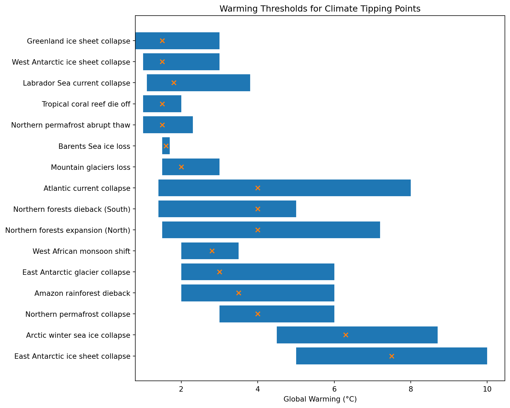

Figure 1: Climate Tipping Points

</div>

### Measuring CO<sub>2</sub>e Emissions

Technology improves and measurements have become more accurate yet
CO<sub>2</sub>e emissions are not yet completely accounted for. (Crippa
et al., 2020) reports the latest figures CO<sub>2</sub>e from the EU’s
Emissions Database for Global Atmospheric Research (EDGAR). The EU
Copernicus satellite system reveals new greenhouse emissions previously
undetected (Daniel Värjö, 2022). *Copernicus Climate Change Service
(C3S) provides “\[n\]ear-real time updates of key global climate
variables*”(The Copernicus Climate Change Service, 2024). Using simple
python code and freely available images from online datasets, it’s
increasingly possible for anyone to detect deforestation, as in this
example of geospatial analysis from Amazon AWS (AWS, 2022; Patel, 2025).

One major cross-cutting category the IPCC tracks separately is LULUCF
(Land Use, Land-Use Change, and Forestry). Depending on whether forests
are being cleared or restored, LULUCF can act as a net greenhouse-gas
source or as a powerful carbon sink that removes CO<sub>2</sub> from the
atmosphere. LULUCF also links to biodiversity protection. (Chen et al.,
2023) looked at the Poyang Lake in China between 2010-2020, finding
ecosystem vulnerability rose by 18% with human activities (land-use
change, urban expansion, components of LULUCF, also reported in
international media, see (Scarr & Sharma, 2021) for images) as the
dominant driver, followed by climate factors. (Xie et al., 2021) mapped
pollution sources in 14 vulnerable areas in China, including the Poyang
Lake, and underlined the need for real-time monitoring of ecosystem
health.

Emissions production is highly unequal, with *“\[t\]he world’s top 1% of
emitters produce over 1000 times more CO<sub>2</sub>eq than the bottom
1%”* (IEA, 2023a). The share of CO<sub>2</sub> emissions among people
around the world is highly unequal across the world (referred to as
*Carbon Inequality*). (Chancel, 2022) reports “one-tenth of the global
population is responsible for nearly half of all emissions, half of the
population emits less than 12%”. Information and communications
technology (ICT) sector is an example of carbon inequality, where
emerging economies bear 82% of the emissions, developed countries gain
58% of value, of the over 300 million PCs sold per year (Bajarin, 2022;
Zhou et al., 2022).

CO<sub>2</sub>e emissions by region (per year), comparing highest per
capita CO<sub>2e</sub> emissions (mostly from oil producers) vs regional
average per capita CO<sub>2</sub> emissions vs total CO<sub>2</sub>
emissions.

<div dangerouslySetInnerHTML={{ __html: quartoRawHtml[0] }} />

*Scoping* CO<sub>2e</sub> *emissions* into 4 main categories helps to
organize calculating CO<sub>2e</sub> emissions and corresponding
reduction targets by looking at direct and indirect emissions
separately. The U.S. National Public Utilities Council (NPUC)
decarbonization report provides a useful categorization of *emission
scopes* applicable to companies which helps organize emission reduction
schemes (National Public Utilities Council, 2022) based on the
Greenhouse Gas Protocol defined in the 1990s (GHG Protocol, n.d.). For
example, for consumers in Australian states and territories in 2018, 83%
of the GHG emissions are Scope 3, meaning indirect emissions in the
value chain (Goodwin et al., 2023). A newer concept is Scope 4 emissions
also known as avoided emissions, proposed by the World Resources
Institute (WRI) in 2013 (Plan A, n.d.).

<div dangerouslySetInnerHTML={{ __html: quartoRawHtml[1] }} />

Countries have agreed up CO<sub>2e</sub> Reduction Targets known as
Country-Level Nationally Determined Contributions (NDCs). While most
countries have not reached their Nationally Determined Contributions,
the Climate Action Tracker data portal allows comparing countries by
their NDC performance (Climate Analytics & NewClimate Institute, 2023).
(Fransen et al., 2022) notes that the majority of Nationally Determined
Contributions (NDCs) are dependent on financial assistance from the
international community.

<div dangerouslySetInnerHTML={{ __html: quartoRawHtml[2] }} />

<div id="fig-ndcs">

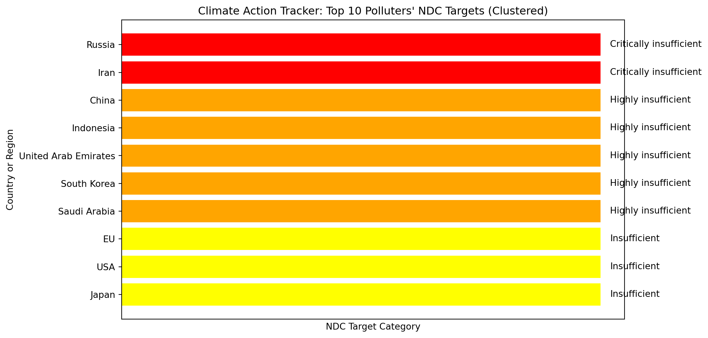

Figure 2: Nationally Determined Contributions (NDCs)

</div>

Fossil fuels are what powers humanity as well as the largest source of
CO<sub>2</sub> emissions. (IEA, 2022) reports “Global CO<sub>2</sub>
emissions from energy combustion and industrial processes rebounded in
2021 to reach their highest ever annual level. A 6% increase from 2020
pushed emissions to 36.3 gigatonnes”. As on June 2023, fossil fuel based
energy makes up 82% of energy and is still growing (Institute, 2023).
The 425 largest fossil fuel projects represent a total of over 1 gigaton
in CO<sub>2</sub> emissions, 40% of which were new projects Kühne et al.
(2022). Tilsted et al. (2023) expects the fossil fuel industry to
continue to grow even faster. In July 2023, the U.K. granted hundreds of
new oil and gas of project licenses in the North Sea (*Rishi Sunak to
Green-Light Hundreds of New Oil and Gas Licenses in North Sea*, 2023).

(Ember, 2025) Ember’s Electricity Data Explorer shows Taiwanese energy
usage based on data from Taiwanese government, visualizing the growth in
gas, wind, and solar, and decline of coal and nuclear power; however,
while declining, coal remains the leading power source for Taiwan.
Climate pledges made by international companies present in Taiwan mean
they need large amounts of green energy to meet their sustainability
goals. For instance, Google worked with the government of Taiwan to
change the laws to allow direct power procurement by foreign companies;
the current plan being to install 1 gigawatt of solar power fully
pre-purchased by the newly formed company created by BlackRock and
Google for boosting AI development as reported by (Chiang, 2024; Jessop
et al., 2024; 永鑫能源 New Green Power, 2022). More recently, Google
also purchased 10MW of geothermal energy for its Taiwanese AI chip
projects, doubling current Taiwanese geothermal capacity
(Hagström-Ilievska, Apr. 17, 2025 18:00; Potter, 2025; Wu & Thompson,
2025). Geothermal energy provides 24/7 clean energy from the Earth’s
core, however is limited due to lack of access; Taiwan happens to be in
geologically active spot on the ring of fire, where drilling for
geothermal energy is more feasible (Chang & Hsiao, 2025; L, 2025b).

### Carbon Accounting, Emissions Trading Schemes

Trading CO<sub>2e</sub> emissions can be divided into 2 categories,
namely *Compliance Carbon Markets* (CCM) and *Voluntary Carbon Markets*
(VCM). The legislative baseline for Compliance Carbon Markets is so low,
people want to retire more CO<sub>2e</sub>, which they can do through
*Voluntary Carbon Markets.*

As of 2024 there’s no single global CO<sub>2</sub> trading market but
rather several local markets as described in the table below. Most of
the world is not part of a CO<sub>2</sub> market.

<div dangerouslySetInnerHTML={{ __html: quartoRawHtml[3] }} />

The price of CO<sub>2e</sub> differs across markets, as assigning a
monetary value to reducing CO<sub>2e</sub> emissions depends on several
variables. (Stern, 2022) argues carbon-neutral economy needs higher
CO<sub>2e</sub> prices and believes (Rennert et al., 2022)
CO<sub>2e</sub> price per ton should be 3,6x higher that it is
currently. Contrary, (Ritz, 2022) argues optimal CO<sub>2</sub> prices
could be highly asymmetric, low in some countries and high (above the
social cost of CO<sub>2e</sub>) in countries where production is very
polluting. The total size of carbon markets reached 949 billion USD in
2023, including Chinese, European, and North American CO<sub>2</sub>
trading (LSEG & Susanna Twidale, 02/12/2024, 02:37 PM).

The prices between compliance and voluntary markets differ
substantially.

<div dangerouslySetInnerHTML={{ __html: quartoRawHtml[4] }} />

<div dangerouslySetInnerHTML={{ __html: quartoRawHtml[5] }} />

<div id="fig-carbon-cred">

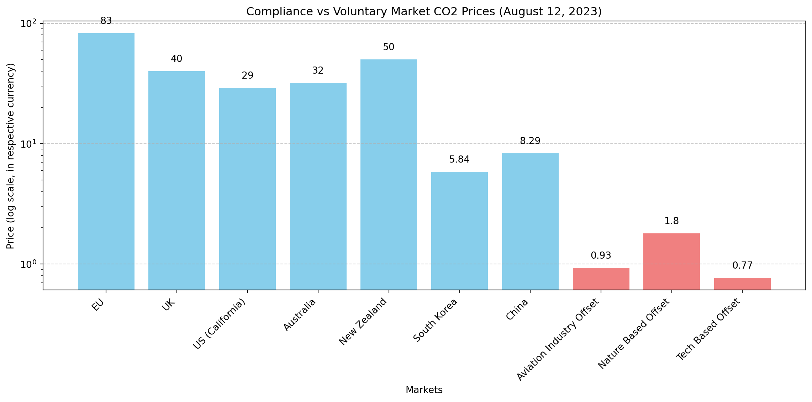

Figure 3: Carbon Credits

</div>

Voluntary Carbon Markets are a decentralized system where private
entities voluntarily buy and sell carbon credits (ICVCM, 2025). Carbon
credits are useful for private companies who wish to claim *carbon
neutrality, climate positivity*, or other related claim, which might be
viewed in good light by their clients or allow the companies to adhere
to certain legislative requirements. In the simplest terms, a carbon
credit represents 1T of CO<sub>2</sub>eq that has been prevented from
entering the atmosphere - or has been removed from circulation (aka
Carbon Credit Retirement) (Anna Watson, 2022, 2023). However it’s
important to look at the details of these deal as Voluntary Carbon
Markets (VCM) lack standardization and transparency (Ela Khodai, 2023).
For example, Flickr only invested around 3000 USD in carbon credits and
got a carbon-neutral rating, which hardly seems enough for an
organization of its size (Climate Neutral, 2024).

Markets are centered around carbon credits, nature-backed financial
derivatives dependent on science-based methodologies for measurement,
reporting, and verification (MRV), which are managed and regularly
updated by certification organizations such as Gold Standard, Verra, and
others. Some standards released in the past few years include the Verra
Agricultural Land Management methodology for Verified Carbon Standard
(VCS) (Verra, 2023). Gold Standard recently released a methodology for
Mangrove-based carbon credits (Gold Standard, 2024). Regen Network
released a methodology for regenerative grazing systems, proposing
remote-sensing analysis with field-sampled soil carbon data, quantifying
GHG sequestration and ecological co-benefits (biodiversity,
water-infiltration, etc.) for robust MRV and carbon-credit issuance
(*Methodology for GHG & Co-Benefits in Grazing Systems*, 2022).
KlimaDAO, unhappy with the current standards, published “An open call
for alternative carbon standards” inviting carbon-credit issuers and
communities to propose next-generation registry frameworks and leverage
blockchain for transparency, liquidity and interoperability in the
voluntary carbon market (KlimaDAO, 2023).

<div dangerouslySetInnerHTML={{ __html: quartoRawHtml[6] }} />

For the individual person, there’s no direct access to CO<sub>2</sub>
markets. However, brokers do buy large amounts of carbon credits to
resell in smaller quantities to retail investors. Facilitating citizens’
access to CO<sub>2</sub> emissions trading may be an efficient method to
organize large-scale CO<sub>2</sub> retiring (Rousse, 2008). (Sipthorpe
et al., 2022) compares traditional and blockchain-based solutions to
carbon trading, arguing that blockchain solutions for CO<sub>2</sub>eq
markets are nearing maturity, and offer many improvements, such as
enhancing transparency, trust, and efficiency.

CO<sub>2e</sub> credits have given rise to the Carbon Accounting
industry, to help companies meet legal emissions reduction targets in
Compliance Carbon Markets, with many companies like Watershed, Greenly,
and Sustaxo providing services. (Quatrini, 2021) admits sustainability
assessments are often complex and may give flawed results. Nonetheless,
CO<sub>2</sub> emission reduction has the added positive effect of
boosting corporate morale (Cao et al., 2023).

There are many companies which facilitate buy carbon credits as well as
a few organizations focused on carbon credit verification. In Estonia,
startups Arbonics and Single.Earth are trialing this approach in several
forests. The most established certifiers or carbon credits include the
Verified Carbon Standard (VCS), the Gold Standard, Climate Action
Reserve (CAR)‍, and the American Carbon Registry (ACR).

*“Carbon pricing is not there to punish people,”* says Lion Hirth (Lion
Hirth, n.d.). *“It’s there to remind us, when we take travel, heating,
consumption decisions that the true cost of fossil fuels comprises not
only mining and processing, but also the damage done by the
CO<sub>2</sub> they release.”* Long term cost of insufficient climate
action is more than short-term gains from delaying efforts to reduce
carbon emissions. In addition to the damages from global warming, the
fossil energy production that’s a large part of global CO<sub>2</sub>eq
emissions has caused several high-profile pollution events. Large ones
that got international news coverage include Exxon Valdez and Deepwater
Horizon.

Carbon credit prices should reflect the quality of the carbon reduction.
Nature-based carbon removal solutions (for example, forest-backed carbon
credits) rank among the top solutions for mitigating climate change but
require price signals that reflect their true value; Pachama’s (an
AI-based carbon removal company) calculation from bottom up cost
modeling across more than 150 reforestation projects indicate that high
quality forest carbon removal credits must trade at a minimum of USD
50-82 per tonne of CO<sub>2</sub>eq to be competitive with alternative
land uses (IPCC AR6 guidance sets the price spread wider, from USD
50-200); reduced land-use change (basically this means not cutting down
forests, IPCC groups together as LULUCF, Land Use, Land-Use Change and
Forestry) ranks 2nd to solar energy in terms of carbon reduction
potential (Luik, 2025; Pachama, 2023).

### Markets Financialize the Natural World: Pricing, Tracing, and Trading Ecosystem Services and Nature-backed Assets

Similarly to carbon markets, markets for nature-backed assets and
ecosystem services are centered around different types of credits.

<div dangerouslySetInnerHTML={{ __html: quartoRawHtml[7] }} />

### Overconsumption \> Earth’s Boundaries {#overconsumption-earths-boundaries}

Excessive consumer lifestyle - *overconsumption* - is one of the main
drivers of climate change and environmental destruction, with *“2/3 of
global GHG emissions are directly and indirectly linked to household
consumption, with a global average of about 6 tonnes CO<sub>2</sub>
equivalent per capita”* , according to (Ivanova et al., 2020; Renee Cho,
2020). An older study put the number as high as 60% percent (Ivanova et
al., 2016) while (Ellen MacArthur Foundation, Material Economics,
2019)’s models 45% show of CO<sub>2</sub> equivalent emissions come from
our shopping; produced by companies to make the products we consume.
(Keeble, 1988) reported in April 1987 that *‘residents in high-income
countries lead lifestyles incompatible with planetary boundaries’*.
(Ivanova et al., 2020) reports the average footprint in North America
and Europe is 13.4 t CO<sub>2</sub>eq, in Africa and the Middle East
1.7t CO<sub>2</sub>eq; consumption options with a high mitigation
potential measured in tonnes of CO<sub>2</sub> equivalent per capita per
year include *“living car-free”* and avoiding flying, which could each
save upwards of 1.7t CO<sub>2</sub>eq per person annually.

While the numbers on overconsumption are clear, the debate on
overconsumption is so polarized, it’s difficult to have a meaningful
discussion of the topic (Ianole & Cornescu, 2013). Environmental risks
from human activities are known as Anthropogenic Threat Complexes (ATCs)
(Bowler et al., 2020). With the trend of urbanization, it’s not
surprising (people living in) cities are responsible for 80% of the
emissions (Rosales Carreón & Worrell, 2018). (Moberg et al., 2019)
reports daily human activities emission contribution on average in four
European countries (France, Germany, Norway and Sweden).

<div dangerouslySetInnerHTML={{ __html: quartoRawHtml[8] }} />

Taking a broader view, (Hannah Ritchie, 2020; US EPA, 2016) dissect GHG
emissions inventory by sector and put the blame squarely on the type of
energy used.

<div dangerouslySetInnerHTML={{ __html: quartoRawHtml[9] }} />

Earth’s growing population reached 8 Billion people In November 2022 and
population projections by predict 8.5B people by 2030 and 9.7B by 2050
(The Economic Times, 2022; United Nations Department of Economic and
Social Affairs, Population Division, 2022). Indeed, making *anything*
consumes natural resources, which are limited on planet Earth. (Hassoun
et al., 2023) forecasts increase of global food demand by 62% driven by
the impact of climate change. Yet, while population growth puts higher
pressure on Earth’s resources, some researchers propose the effect is
higher from wasteful lifestyles than the raw number of people (Cardinale
et al., 2012). Meanwhile, others, such as (Cafaro et al., 2022), believe
*\[o\]verpopulation is a major cause of biodiversity loss and smaller
human populations are necessary to preserve what is left.”*

### Plastic Pollution

Overconsumption is also one of the root causes of plastic pollution.
(Ford et al., 2022) and (Lavers et al., 2022) find strong links between
climate change and marine plastic pollution *“along with other stressors
that threaten the resilience of species and habitats sensitive to both
climate change and plastic pollution”*.

Plastic pollution is pervasive around the Earth and is fundamentally
linked to climate change, while microplastics are increasingly a real
concern (Lavers et al., 2022; Tiernan et al., 2022). Several
international studies report recent findings of microplastics everywhere
in human bodies: the brain, lungs, digestive tissues, bone marrow,
penis, testis, seminal fluid (semen), and placenta - causing serious
health and reproductive concerns (Codrington et al., 2024; Garcia et
al., 2024; Guo et al., 2024; Hu et al., 2024; N. Li et al., 2024; Main,
2024; Montano et al., 2023; L. Zhu et al., 2024)

<div id="fig-microplastics">


Figure 4: Microplastics in the Human Body

</div>

In addition to the enormity of over-reaching CO<sub>2</sub> emissions,
humanity is facing other massive environmental problems. The Stockholm
Resilience Centre report in 2022 we have already breached 4 out of our 9
*“planetary boundaries”:* in addition to climate change, biodiversity
loss (Extinctions per Million Species per Year aka E/MSY), land-system
change (deforestation, land degradation, etc), and biogeochemical flows
(cycles of carbon, nitrogen, phosphorus, etc); on a positive side, the
challenges of fresh water use, ocean acidification and stratospheric
ozone depletion are still within planetary limits (Persson et al.,
2022).

An update to the planetary boundaries framework a year later found the
actual number to be 6 of 9 boundaries (climate, biosphere integrity,
land use, biogeochemical flows, freshwater use, novel entities) already
transgressed, with ocean acidification nearing its limit and only
stratospheric ozone recovering; atmospheric aerosol loading and the
biodiversity intactness index (BII), which belongs under biodiversity
loss and measures how depleted are the species that are still around
(but not yet extinct), were quantified recently (Newbold et al., 2016;
Richardson et al., 2023).

In the biosphere, mass extinctions are underway. An analysis of
population trends for 27600 terrestrial vertebrate species (including a
detailed sample of 177 mammals), found 32% (8851 species) are undergoing
severe range contractions; the authors name this “biological
annihilation” to signal Earth’s ongoing 6 mass extinction and call for
immediate conservation action (Ceballos et al., 2017). As of last year,
the Red List curated by the International Union for Conservation of
Nature (IUCN), includes 45,300 species (28% of all assessed, since IUCN
was founded in 1948), under threat of extinction (IUCN, 2024).

Responding to the crisis, the Guardian newspaper in the UK has taken a
clear stance, covering stories of extinction; the *Area de Conservación
Guanacaste* is one of the protected areas listed by the UNESCO World
Heritage Centre, providing data on the State of Conservation (SOC) by
year (Centre, 1999; McClure, 2025)

````mdx-code-block
<Figure
  caption="Planetary Boundaries 2023 update"
  src={Boundaries}
  refURL="https://www.stockholmresilience.org/research/planetary-boundaries.html"
  refTitle="Azote for Stockholm Resilience Centre, based on analysis in Richardson et al 2023"
/>
````

In 2018 Swedish Sportswear brand Houdini launched the first corporate
planetary boundaries’ assessment in partnership with Albaeco and
Stockholm Resilience Centre to establish a baseline for its “impact
positive” ambition (Houdini, 2018). While it’s a pilot study, it
demonstrates how companies can integrate system-level science into
sustainability reporting (Haeggman et al., 2018). At the 2024 update for
the report, Houdini invited, Johan Rockström, a renown conservation and
climate scientist, envisions a global dashboard of the development of
the economy and the state of the planetary boundaries, with high
resolution maps, to help visualize Earth’s situation in real-time
(Houdini Sportswear, 2024).

### Evolving Measurements from Planetary Health to Earth System Law, and Social Cost of Carbon

Scientists in cross-disciplinary teams have been working on integrating
Earth systems and human society into cohesive frameworks. (Wardani et
al., 2023) stresses that every facet of Earth’s life-support
system—living biota and the “abiotic” foundations of climate, water,
soils, and geology—co-produces the conditions for civilization:
*“long-term human well-being is dependent on the well-being of the
planet, including both biotic and abiotic systems. It recognizes
interlinkages across environmental sustainability, public health, and
socioeconomic development.”*

There are 3 approaches that address the complex interdependence of
humans with our physical environment, that have the potential to be
complementary - *Planetary Health*, *Social Cost of Carbon*, and *Earth
System Law*.

*Planetary Health* is a framework rooted in public health sciences and
medicine; what if public health leveled-up to planetary scale, concerned
with the health of ecological life-support systems: clean air, food, and
a safe climate, so they can support human flourishing; in practice the
framework focuses on evidence, education, governance, and business
(Planetary Health Alliance, 2024a, 2024b).

*Social Cost of Carbon* attempts to measure the compound impact of
CO<sub>2e</sub> emissions on society. Sustainability is filled with
complexities. CO<sub>2e</sub> emissions are complicated by biodiversity
loss, child labor, slavery, poverty, chemical pollution, etc. - many
issues become intertwined (TEDx Talks, 2020). One attempt to measure
these complexities, is the *Social Cost of Carbon* (SCC) which is
defined as *“additional damage caused by an extra unit of emissions”*
(Kornek et al., 2021; Zhen et al., 2018). For example the cost of
damages caused by “one extra ton of carbon dioxide emissions” (Stanford
University, 2021). SCC variations exist between countries (Tol, 2019)
and regions (Wang et al., 2022).

*Earth System Law* is a framework rooted in the legal sciences for
addressing interconnected environmental challenges in a hyper-connected
Earth, where climate feedbacks, and environmental thresholds don’t
respect country borders; in practice, this line of thinking helps to
develop carbon-budget clauses inside trade deals and biodiversity
“safety brakes” that trigger when monitoring data shows an Earth
boundary overshoot, potentially acting as the legal scaffolding that
lets Planetary Health prescriptions and Social Cost of Carbon price
signals be effective (Du Toit & Kotzé, 2022).

More recently, because of the complex interdependence, (J. Zhang et al.,
2025) proposes a new sustainability index that systematically considers
pertinent indicators of interdependencies and interactions across
different dimensions of sustainability. Moreover, (Lenton et al., 2023)
proposed a new innovative way to quantify the “cost” of global warming
in human terms by counting the number of people forced outside the
“human climate niche” (temperatures historically occupied by most
humanity); climate change has already exposed ≈9% of today’s population
(\>600 million) unprecedented heat stress, risking increased mortality,
morbidity and displacement; if current trends continue by 2100, ~2.7 °C,
21–39 % or 2–4 billion people will be exposed by 2080–2100.

## Quantifying Human Benefits from the Biosphere: Ecosystem Services

*Ecosystem services measure the benefits humans receive from the
biosphere.* Put simply, *ecosystem services* enable human life on
Earth - we are, in a very real sense, - dependent on nature. The
biosphere is Earth’s life support system. Earth’s biosphere is made up
of 846 terrestrial ecoregions, which are distributed across 14 major
biomes and 8 biogeographical realms (Dinerstein et al., 2017).

While it can be assumed much of the flora and fauna are crucial for
Earth’s systems, science is still in the process of understanding and
quantifying its contributions. The history of the valuation of nature’s
services goes back to the 18th century when David Ricardo and Jean
Baptiste Say discussed nature’s *work*, however both considered it
should be free (Gómez-Baggethun et al., 2010). In 1997 (Daily, 1997)
proposed the idea of *ecosystem services* and (Costanza et al., 1997)
attempted to assess the amount of ecosystem services provided. (Le
Provost et al., 2022)’s study shows *biodiversity* as one key factor to
maintain delivery of ecosystem services. (Noriega et al., 2018) attempts
to quantify the ecosystem services (ES) provided by insects.

The most complex computer models which attempt to capture ever more
interactions happening in the physical realm are called *digital twins.*
The EU is developing a digital twin of Earth to help sustainability
prediction and planning, integrating Earth’s various systems such as
climate, hydrology, ecology, etc., into a single model (*Destination
Earth Shaping Europe’s Digital Future*, 2023; Hoffmann et al., 2023).
For instance, AI is being used to map icebergs and measure the change in
size (European Space Agency, 2023). We can use all the data being
recorded to provide a digital twin of the planet, nature, ecosystems and
human actions to help us change our behavior and optimize for planetary
wellbeing.

### Ecological Indicators to Track Environmental Health

### Measuring Biodiversity Loss, Ecological Indicators and Environmental Degradation

Sustainability can be measured using a variety of *ecological
indicators*. Ecological indicators for Earth *- I would like to coin the
word “ecomarkers” -* are like *biomarkers* in human health.
Technological advances help scientist better understand nature. Cutting
edge research uses AI-based voice recognition for listening to nature,
assessing biodiversity based on species’ sounds in the forest. Millions
of detections of different species with machine learning passive
acoustic AI models, can also assess species’ response to climate change
(AI for Good, 2023; Guerrero et al., 2023).

Around the world, pressure on ecosystems is rapidly increasing, with
biodiversity destruction ever prevalent, making protecting biodiversity
as urgent as protecting the climate. (Almond, R.E.A. et al., 2022)
reported, the number of species killed, mass destruction of nature:

> *“69% decline in the relative abundance of monitored wildlife
> populations around the world between 1970 and 2018. Latin America
> shows the greatest regional decline in average population abundance
> (94%), while freshwater species populations have seen the greatest
> overall global decline (83%).”*

In Europe, as of 2025, none of the evaluated biodiversity targets are on
track; agricultural targets, such as reducing soil nutrient losses, and
reducing fertilizer use, are particularly lagging (European Commission,
2025).

*Environmental DNA (eDNA)* helps scientists measure species abundance
without direct observation through detection of DNA on genetic materials
such as skin cells (Peter Andrey Smitharchive page, 2024). Cellular DNA
can be isolated from various sediment types (Ogram et al., 1987). Beyond
scientific applications, eDNA is being used to generate biodiversity
credits by environmental asset rating companies such as BeZero, a
ratings’ agency for the Voluntary Carbon Market (Ojoatre & Atkinson,
2023).

Similarly to climate protection, the UN has taken a leadership role in
biodiversity protection, by organizing an annual Convention on
Biodiversity. The history of the United Nations Convention on
Biodiversity goes back to 1988, when the working group was founded
(Unit, 2023). The Convention on Biodiversity 2022 (COP15) adopted the
first global biodiversity framework to accompany climate goals (UNEP,
Tue, 12/20/2022 - 07:44).

<div dangerouslySetInnerHTML={{ __html: quartoRawHtml[10] }} />

<div id="fig-biod-loss">

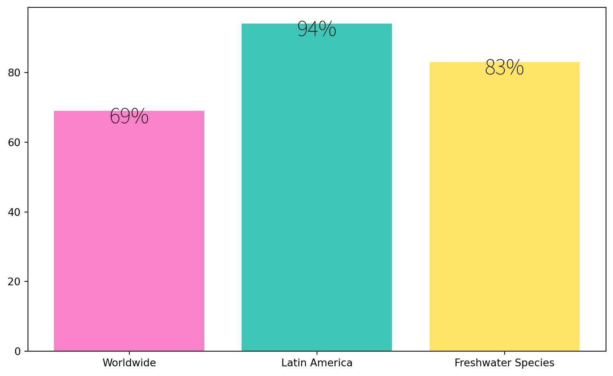

Figure 5: Biodiversity Loss

</div>

Biodiversity loss is linked to overconsumption, weak legislation and
lack of oversight. (Crenna et al., 2019) recounts European Union
consumers’ negative impact on biodiversity in countries where it imports
food. (WWF, 2022) case study highlights how 4 biodiverse regions Cerrado
in Brazil, Chaco in Argentina, Sumatra in Indonesia, and the Cuvette
Centrale in Democratic Republic of Congo are experiencing rapid
destruction due to consumer demand in the European Union. While the
European Union (EU) has recently become a leader in sustainability
legislation, biodiversity protection measures among private companies is
very low Marco-Fondevila & Álvarez-Etxeberría (2023).

Starting with the simple question: why protect biodiversity. (May, 2011)
argues biodiversity loss is a concern for 3 points of views:

<div dangerouslySetInnerHTML={{ __html: quartoRawHtml[11] }} />

There is some progress in biodiversity conservation as
“\[\*b\]iodiversity awareness is now at 72% or higher in all countries
sampled, compared to only 29% or higher across countries sampled in
2009”\* (UEBT, 2022)

### Oceans and Marine Ecosystem Sustainability

Marine heatwaves are intensifying under climate change, threatening
species diversity and the ocean’s capacity to supply critical services
from fisheries to carbon sequestration (Smale et al., 2019).
Accelerating ocean warming, evidenced by record-breaking sea-surface
temperatures, has triggered widespread coral bleaching, clearly visible
at the Great Barrier Reef in Queensland, East Coast of Australia, loss
of marine habitat complexity, and cascading threats to coastal economies
and food security; the authors call for integrated climate–ocean policy
action, stressing that without urgent emissions cuts and ecosystem-based
adaptation, the ocean’s capacity to regulate climate and sustain
biodiversity will collapse (Gelles & Andreoni, 2023; Pfeiffer, 2024).
Cumulative pressures: climate extremes, pollution, and
overexploitation - have driven evolutionary shifts in marine life and
unpredictably altered ecosystem-service delivery (Espinosa & Bazairi,
2023).

Some earlier studies, such as (Howard et al., 2017) demonstrate how
integrating blue carbon habitats into Marine Protected Area (MPA) design
can both mitigate carbon emissions and enhance ecosystem resilience.
Meta-analyses across 121 sites in 87 MPAs globally show that most
well-designed and managed MPAs achieve significant ecological gains: on
average, fish biomass inside no-take zones can double to triple compared
with outside areas, and species richness likewise increases by 20–30 %
within 5–10 years of enforcement (Rudd, 2015). However, Marine Protected
Areas cover only 8% of the world’s oceans and only 2.8% is effectively
protected (Igini, 2024). The UN’s 30x30 target (set under the Convention
on Biological Diversity) aims to protect 30% of the world’s oceans by
2030, however is not on track to achieve this goal (Mouterde, 2024).

### Forests: Carbon Sinks and Biodiversity Reservoirs

Forests are a crucial part of Earth’s carbon cycle and the main natural
CO<sub>2</sub> capture system; due to deforestation, Europe rapidly
losing its forest carbon sink (Frédéric Simon, 2022). Beyond their role
in locking away carbon, recent field work shows forest actively scrub
methane from the air as tree bark absorbs methane (Gauci et al., 2024).
Around 27% of Earth’s land area is still covered by forests, yet
*deforestation* is widespread all around the world; highest rates of
deforestation happened in the tropical rainforests of South America and
Africa, mainly caused by agricultural cropland expansion (50% of all
deforestation) and grazing land for farm animals to produce meat
(38.5%), totaling close to 90% of global deforestation (*FRA 2020 Remote
Sensing Survey*, 2022). The global forest cover change is visible on
Google’s Earth Engine (Hansen et al., 2013).

Around the world, there are many initiatives to increase forest cover,
for example the *1 billion tree project* (Bastin et al., 2019; “Erratum
for the Report,” 2020; Greenfield & @pgreenfielduk, 2021). However, it’s
important to not planting trees (*afforestation)* is not the full
solution, as *afforestation* is different from *reforestation*, which
takes into account biodiversity. Also, while using remote-sensing and
machine-learning to assess reforestation potential (see Klosterman et
al., 2022), it doesn’t take into account local political realities, and
socioeconomic issues such as education, poverty and access to green
jobs. Taking these aspects into account may be beneficial, for example
(Bousfield et al., 2022) reports there’s evidence paying landowners for
the ecosystem services their forests provide may reduce deforestation.

### Pollution: Air, Water, and Soil Degradation

In Taiwan, this is the ranking of pollution reports by citizens
(Ministry of Digital Affairs, 2024):

<div id="fig-tw-poll-reports">

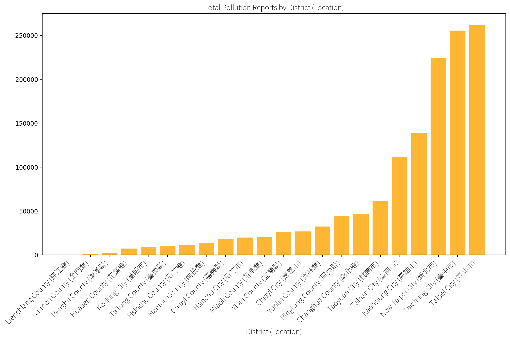

Figure 6: Pollution Reports in Taiwan by County

</div>

Pollution Reports in Taiwan by District.

<div id="fig-tw-poll-reports-stack">

<div id="fig-tw-poll-reports-stack-1">

``` text
<Figure size 1152x768 with 0 Axes>
```

(a) Pollution Reports in Taiwan by District

</div>

<div id="fig-tw-poll-reports-stack-2">

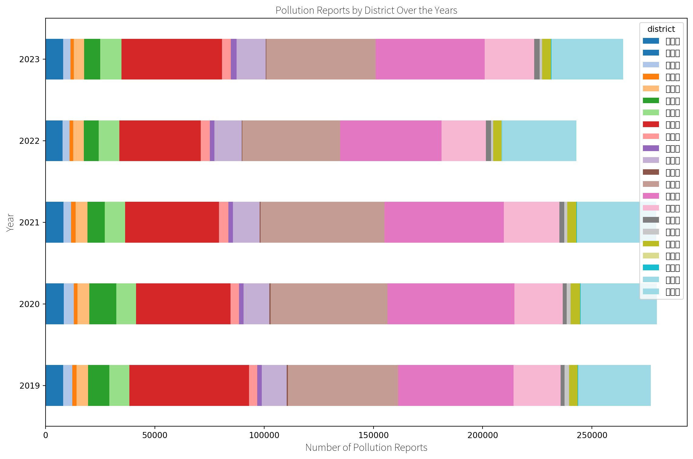

(b)

</div>

Figure 7

</div>

Health and sustainability are inextricably linked. “Human health is
central to all sustainability efforts.”, *“All of these (food, housing,
power, and health care), and the stress that the lack of them generate,
play a huge role in our health”* (Sarah Ludwig Rausch & Neha Pathak,
2021).

(Abu El Kheir-Mataria & Chun, 2025) finds warming climate in the MENA
region (Middle East and North Africa) increases cancer risk in women,
mediated through air pollution and other environmental stressors.

Clean air is a proposed as a *human right* (Baroness Jones of
Moulsecoomb & Caroline Lucas, 2023), yet air pollution is widespread
around the planet, with 99% of Earth’s human population being affected
by bad air quality that does not meet WHO air quality guidelines,
leading to health problems linked to 6.7 million *premature deaths*
every year (World Health Organization, 2022). Air pollution is linked to
cancer incidence. In Taiwan, South Korea, and England, groundbreaking
research by (Lim et al., 2022) analyzed over 400000 individuals
establishes exposure to 2.5μm PM (PM2.5) air pollution as a *cause for
lung cancer.* In (Hannah Devlin, 2022), professor Tony Mok, of the
Chinese University of Hong Kong explains it plainly, which I want to
quote here in verbatim:

> *“We have known about the link between pollution and lung cancer for a
> long time, and we now have a possible explanation for it. As
> consumption of fossil fuels goes hand in hand with pollution and
> carbon emissions, we have a strong mandate for tackling these issues –
> for both environmental and health reasons.”* - (Hannah Devlin, 2022)

The main way to combat air pollution is through policy interventions.
(MARIA LUÍS FERNANDES, 2023) the EU has legislation in progress to curb
industrial emissions. If legislation is in place, causing bad air
quality can become bad for business. In China, (Gu et al., 2023) links
air pollution to credit interest rates for business loans; companies
with low environmental awareness and a history of environmental
penalties pay 12 percent higher interest rates. In France, (Bouscasse et
al., 2022) finds strong health and economic benefits across the board
from air pollution reduction.

Likewise to the lack of clean air, lack of access to sufficient clean
water and water pollution are issues in several places around the world;
globally, 4.4 billion people only have access to water that’s not safe
for drinking (Soliman, 2024). Even in wealthy countries like the US,
with increasing situations of water scarcity and drought due to climate
change, issues of water ownership become increasingly dire. (Koch, 2022;
Naishadham, 2023b) describes a fight in the US over water usage rights
in Arizona, where Fondomonte, a subsidiary of a Saudi Arabian company
that grows a water-hungry crop alfalfa, exacerbating the local water
crisis by using large amounts of public water, leading to public outcry
and being sued for “public nuisance” for its excessive groundwater
pumping, and finally cessation of its lease and operations on state
land; but still continuing operations on private land (Naishadham,
2023a; “Saudi Firm That Grows Hay in California and Arizona to Lose Farm
Leases over Water Issue,” 2023).

Water quality is highly dependent on competent governance. For example,
in the U.S., the national government recently rolled back rules for
water safety, which had only been implemented last year, to protect the
consumer from per- and polyfluoroalkyl substances (PFAS) (Trager, 2025).
Once pollution is in the environment, cleaning it up is very expensive.
For instance, in France, where storm water washed pollution into the
waterways feeding into the Seine river, making it unsuitable for
swimming, the city of Paris invested 1.4 Billion Euros to create a
massive underground reservoir and a water cleaning system by the opening
of the Paris Olympics in 2024 - and still the water quality would be
variable based on rain incidence (Walt, 2023).

Water and soil pollution are highly connected, as water flows through
soil. In Saudi Arabia, (Picó et al., 2023) used wild and ruderal plants
as bioindicators to detect pollution of air, water and soil,
specifically anthropogenic pollution, pharmaceuticals, pesticides, and
other industrial chemicals, concluding both Abha and Riyadh showed
notable levels of pollutants while Riyadh (a city with more industry)
showed higher levels of pollution.

Improved farming practices directly improve soil structure (reducing
runoff and contamination) and water retention, thereby mitigating both
soil degradation and water pollution. Participants in the 2023 Baltic
Sea Action Group for the EIT Food Regenerative Agriculture project
(which so far has trained over 1200 farmers and 160 farmers advisory
groups in regenerative practices), highlighted practical
soil‐restoration methods in their respective countries: applying
*biochar* on pilot plots in the Czech Republic increased water retention
by up to 20%, no‐tilling and cover‐cropping practices in Hungary boosted
insect‐species counts by 15 points, and adopting regenerative crop
rotations in Bulgaria cut synthetic fertilizer use by 25%; one of the
challenges remains consumer awareness: only 12% of consumers in Central
and Eastern Europe currently recognize the “regenerative” label -
awareness must grow to drive demand (Baltic Sea Action Group, 2023).

A practical example of the interconnection between water pollution,
agriculture, architecture, and extreme weather, are bioswales, which
help catch storm debris and reduce water pollution. In Taiwan, (劉大正,
2010) showed that grass swales increase infiltration, reduce runoff, and
improve downstream water quality, helping stabilize slopes via enhanced
drainage (Taiwanese landscape is very mountainous, with); in a follow-up
field trial at a National Highway in Gangshan, grass swales consistently
trapped sediments and adsorbed heavy metals from highway runoff before
those pollutants could reach nearby waterways.

The above examples from around the world suggest that *“regenerative”*
is not just a buzzword or wishful thinking - instead, it maps to a set
of concrete practices and approaches to improve the condition of the
living environment under threat from pollution.

### Climate Disaster Preparedness: Extreme Weather Resilience

The Word Economic Forums Global Risks Report 2024 paints a bleak picture
of the future with expectations of increased turbulence across the board
based on a survey of over 1400 topic experts (World Economic Forum,
n.d.). Global warming specifically increases the risk of disasters and
extreme weather events; the US Global Change Research Program presented
a comprehensive report to the US Congress, which links disaster-risk
directly to global warming; for examples increased wildfires damage
property, endanger life and reduces *air quality,* which in effect
increases health challenges (*Fifth National Climate Assessment*, 2023).
Warming global climate has concrete effects on daily life. Warmer
climate helps viruses and fungi spread (Press, 2023). (Williams & Joshi,
2013) higher CO<sub>2</sub>eq concentrations in the air can cause more
turbulence for flights. As extreme temperatures are increasingly
commonplace, with observed changes in heatwaves, there’s increased risk
of wildfires (Perkins-Kirkpatrick & Green, 2023; Volkova et al., 2021),
while flood risk mapping might lower property prices in at risk areas
(Sherren, 2024). Summers of 2022 and 2023 were the hottest on record so
far, with extreme heat waves recorded in places around the world
(Douglas, 2023; Falconer, 2023; National Oceanic and Atmospheric
Administration (NOAA), U.S. Department of Commerce, 2023; NOAA National
Centers for Environmental Information, 2023; Serrano-Notivoli et al.,
2023; Venturelli et al., 2023).

The part of Earth where the *human climate niche* is becoming smaller
(McKibben, 2023). As temperatures rise, certain cities may become
uninhabitable for humans (CBC Radio, 2021). The summer of 2023 saw
extensive wildfires in Spain, Canada, and elsewhere; rapidly moving
fires destroyed the whole city of Lāhainā in Hawaii (Anguiano, 2023). In
California, (Jerrett et al., 2022) says, *“\[w\]ildfires are the second
most important source of emissions in 2020”* and *“negate reductions in
greenhouse gas emissions from other sectors.”* Some parts of South
America have seen summer heat *in the winter*, with heatwaves with
temperatures as high as 38 degrees (Livingston, 2023).

In Taiwan disaster risk and hazard mapping is well-developed, with early
warning systems, and comprehensive response preparedness - and painful
experiences - instrumental to saving lives (Tsai et al., 2021).
Intensifying storms forming near coastlines, can be expected with
*“\[c\]hanges to tropical cyclone trajectories in Southeast Asia under a
warming climate”* (Garner et al., 2024). The situation on the Pacific
and Atlantic oceans is not dissimilar, with *“\[o\]bserved increases in
North Atlantic tropical cyclone peak intensification rates”* (Garner,
2023).

In the Philippines, with increasing extreme weather events, *“businesses
are more likely to emerge in areas where infrastructure is resilient to
climate hazards”* (Cheng & Han, 2022). Across several case studies,
(Fabris & Luburić, 2022) discusses vulnerable sectors from agriculture
to transport, under threat from extreme weather events, such as floods,
heatwaves, droughts, and storms impact human health: societal
development and economic growth should be realistic on planning for
weather-related impacts.

Climate-related disasters can spur action as extreme weather becomes
visible to everyone. After large floods in South Korea in July 2023 with
many victims, president Joon promised to begin taking global warming
seriously and steer the country towards climate action (AFP, 2023; Al
Jazeera, 2023; Web, 2023). South Korea has a partnership with the
European Union (European Commission, 2023).

## Financialization of Nature vs Sacred Value: Scaling Up Sustainable Action

There are 2 main approaches to protecting nature:

<div dangerouslySetInnerHTML={{ __html: quartoRawHtml[12] }} />

Whether we should put a price on nature (or is it time to leave
utilitarian environmentalism behind?) is still openly debated, with
pro-financialization voices arguing assigning monetary figures to
nature’s benefits legible to policymakers and markets, channeling large
sums into conservation (e.g. carbon/biodiversity credits), while critics
argue monetary metrics flatten relational, cultural and intrinsic values
of ecosystems into exchange-value and commoditize nature, which may
legitimize offsetting schemes that displace rather than prevent damage
(Leverhulme Centre for Nature Recovery, 2023).

Ecosystem services literature defines a “Nature’s Contributions to
People” framework, originally proposed by the Intergovernmental
Science-Policy Platform on Biodiversity and Ecosystem Services (IPBES).
(Díaz et al., 2018). (Muradian & Gómez-Baggethun, 2021) critically
assesses the framework, arguing utilitarian and anthropocentric views of
the ecosystem services concept perpetuates problematic dualisms (humans
and nature are separate) - and call for a new approach centered on
ecology.

<div dangerouslySetInnerHTML={{ __html: quartoRawHtml[13] }} />

A practical example of ecosystem services becoming a common language
comes from (Z. Zhang et al., 2023) who proposes integrating ecosystem
services conservation into urban planning, so biodiversity could become
part of city planning. Another example is tourism, a large industrial
sector which relies on ecosystem services (L. Li et al., 2023). In
Taiwan, (Lee et al., 2021) developed a framework of indicators to assess
sustainable tourism.

### Ecological Restoration: Damaged Ecosystems, Agroforestry & Permaculture {#ecological-restoration-damaged-ecosystems-agroforestry-permaculture}

The concept of how a public resource is over-used until breaking down as
each user only bears a fraction of the cost - know as *tragedy of the
commons* - was described by the ecologist Garrett Hardin in 1968
(Hardin, 1968; Lopez et al., 2022; Meisinger, 2022; Murase & Baek,
2018). When so many systems are broken, some argue sustainability is not
enough and we should work on *regeneration* of natural habitat. The UN
announced 2021-2030 the Decade on Ecosystem Restoration, which includes
a wide range of regenerative action (Fischer et al., 2021). For
instance, (Han & Chen, 2022) identifies nature-based solutions “land
re-naturalization (such as afforestation and wetland restoration)”

<div dangerouslySetInnerHTML={{ __html: quartoRawHtml[14] }} />

The organic food and drink market is growing worldwide, with gross sales
in 2019 totaling over 106 billion euros, albeit being a small percentage
of total food industry (Gamage et al., 2023). Growing organic food poses
many challenges, which farmers need to adapt to, in order to participate
in regenerative food systems. One approach is growing food forests, also
known as agroforestry, which integrates farming into natural
environments, achieving CO<sub>2</sub>eq storage in the soil through
agriculture and forestry using agroecological practices.

In Ireland, (Irwin et al., 2023) studied dairy farmers’ willingness to
plant trees to increase vegetation cover on their land, finding that
economic incentives alone are insufficient, and support in the form of
advisory and education is needed. Similarly, in the Brazilian Amazon
rainforest (Yadav et al., 2023) finds the active participation of the
local community in planning permaculture practices, enhances their
acceptance and effectiveness. In Bangladesh, (Ruba & Talucder, 2023)
found agroforestry plays an active role in achieving the country’s
Sustainable Development Goals (SDGs), including zero hunger, climate
action, mitigating climate change impacts through CO<sub>2</sub>eq
sequestration, life on land through biodiversity conservation and
improving soil fertility, yet is hindered by the lack of policy support
and educational level of the farmers. In the Baltic Sea region in
North-Eastern Europe and Central Europe face similar challenges, (Baltic
Sea Action Group, 2023) pointing out farmers’ traditional mindset as the
biggest obstacle, describing the paradigm shift from extractive farming
to regenerative agriculture, using techniques such as no-till farming,
which reduces soil erosion and improve soil health by reducing synhetic
imputs; yet, it’s not only a single practice that is enough,
regenerative agriculture is a holistic approach and agroecology
education programmes need to be comprehehnsive.

(G. Low et al., 2023) further studies how agroforestry deep integration
into food value chains unlocks opportunities for recognition and rewards
from economic actors in the network, underlining how complex and
knowledge-heavy nature of value-capture, calling for further
standardization of practices to reward sustainability practices and
ecosystem services. The challenge lies in that bioeconomy is not
inherently sustainable and may put biodiversity at risk, depending on
the level of industrialization of agriculture and specific practices,
which require deep knowledge and understanding of natural and artificial
interactions the ecological systems; the authors advocate for a precise
distinction between extractive and regenerative practices in
*“bioeconomy”* (Ollinaho & Kröger, 2023). Finally, taking Brazil as and
example, (De Queiroz-Stein & Siegel, 2023) argues for an integration of
competing and conflicting bioeconomy policies, in order to achieve the
goals of a sustainable bioeconomy.

Svalbard Seed Vault is an example of seed conservation to safeguard
biodiversity by storing backup seeds of plants from around the world in
cold storage (Asdal & Guarino, 2018; Westengen et al., 2013). Since its
opening in 2008, the storage solution provided by the Norwegian
government has stored seeds from 123 gene banks in 85 countries around
the world (“Arctic Doomsday Seed Vault Gets More Than 14,000 New
Samples,” 2025; The Norwegian Ministry of Agriculture and Food, 2025).
(Vitaletti, 2025) proposes using a blockchain-based lottery system to
storage seeds in local refrigerators, in order to enhance resilience and
ensure survival of seeds, by storing seeds in many locations.

### Energy: Climatech, Renewables, and Decarbonization Pathways

Globally, 34% of all emissions come from energy production (US EPA,
2016), making it the key sector to require innovate for reducing carbon
emissions. The International Energy Agency’s (IEAs), *“Tracking Clean
Energy Progress”* report on 50 distinct decarbonization enablers and
finds that only 3 components - solar PV, PV electric vehicles, and
building lighting - are on track with the net-zero by 2050 scenarios,
while 28 need more effort and 22 are “not on track” (IEA, 2023b).

Geopolitical situations can affect technology adoption; after Russia’s
war in Ukraine, Europe needed to quickly reduce consuming cheap Russian
fossil fuel energy (in the form of gas) (Bonasia, 2024). In 2024, for
first time in Europe, renewables in the form of wind and solar energy
surged past production of fossil fuels (Beer, 2024; Graham & Fulghum,
2024). Meanwhile, China is experiencing a solar installation rush before
a deadline set by a new renewable pricing policy; from January to April
2025, a record-breaking 105 gigawatts (GW) of solar capacity was
installed, bringing the total solar power close to 1 Terawatt, predicted
to make solar power China’s main energy source in 2026(Carrie Xiao,
2025; L, 2025a; Redazione, 2025; Weaver, 2023; Y. Zhu, 2023).

(Gaure & Golombek, 2022) simulate a CO<sub>2</sub> free electricity
generation system in the European Union where *“98% of total electricity
production is generated by wind power and solar; the remainder is
covered by a backup technology.”* The authors stipulate it’s possible to
power the EU without producing CO<sub>2</sub> emissions.

EU’s energy mix in 2024:

<div id="fig-eu-energy-brakdown">

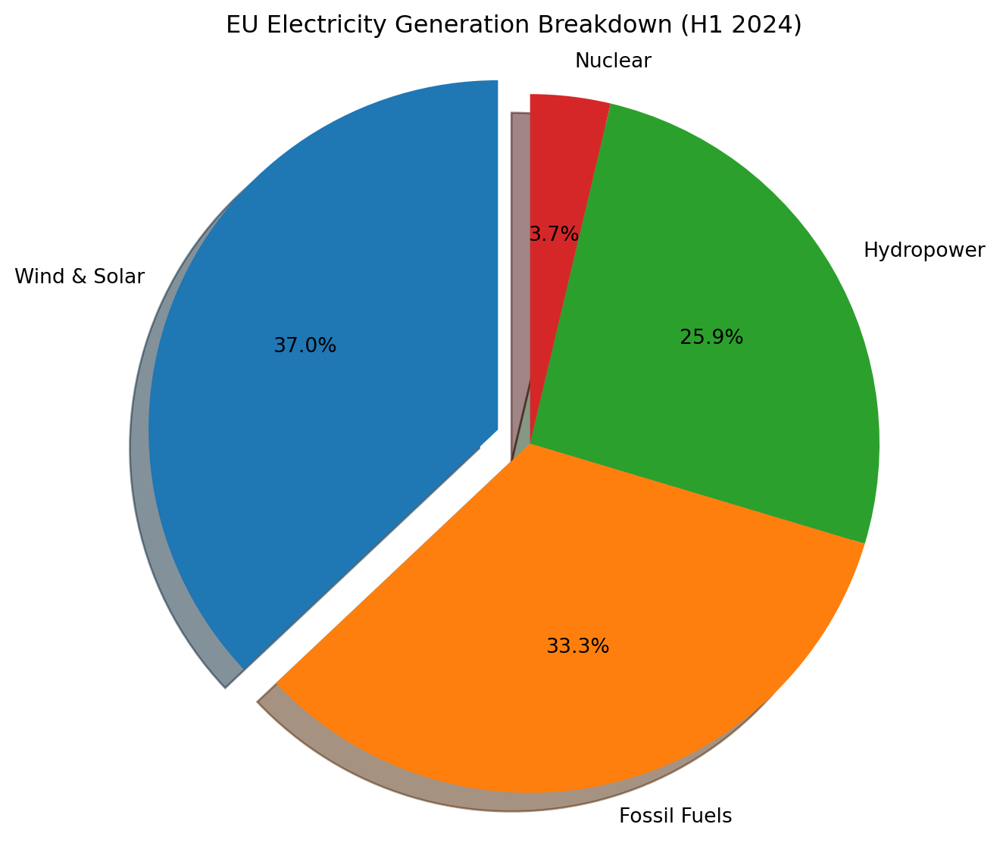

Figure 8: The EU’s Energy Production Breakdown

</div>

Wind and solar energy overtook fossil energy in Europe:

<div id="fig-eu-renew-vs-fossil">

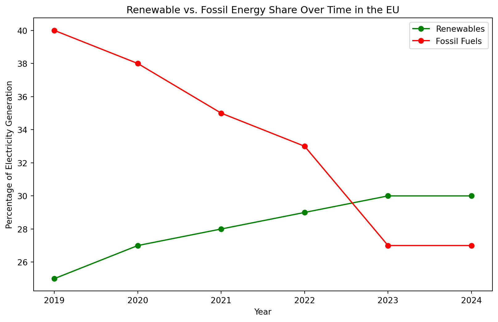

Figure 9: The EU’s Renewables vs Fossil Energy

</div>

Globally, renewables also overtook fossil fuels (IEA, 2024):

<div id="fig-global-renew-vs-fossil">

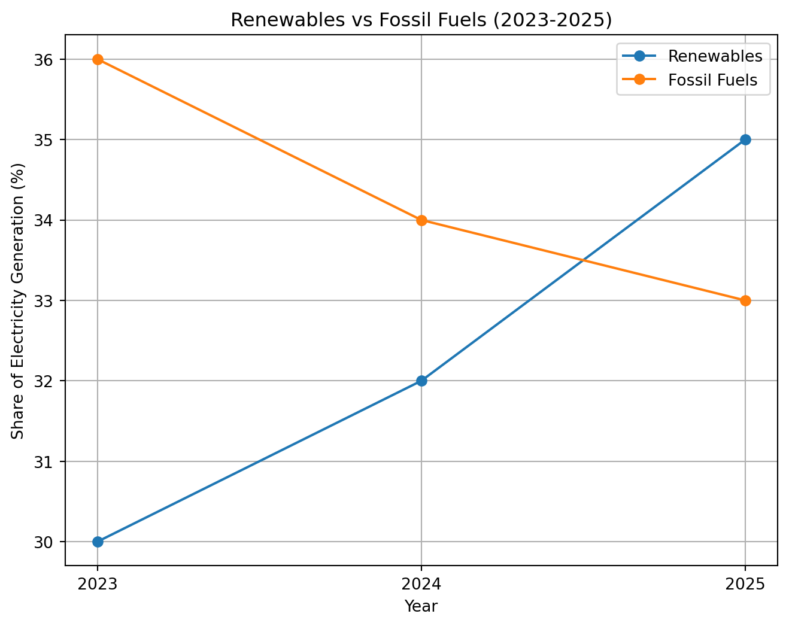

Figure 10: Global Renewables vs Fossil Energy

</div>

Meanwhile, reduction in coal-power was also possible. Coal is a large
CO<sub>2</sub>eq emitter.

<div id="fig-renew-vs-fossil">

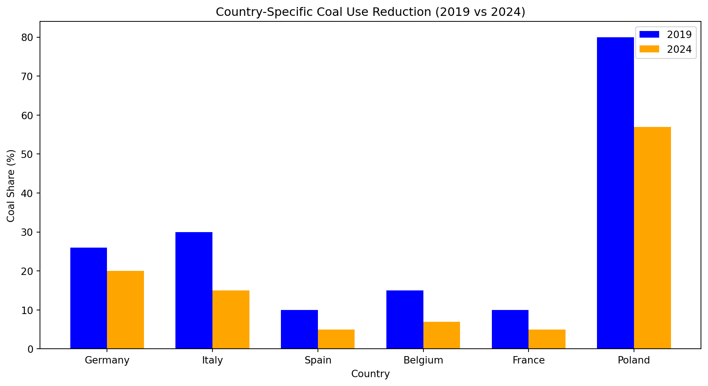

Figure 11: The EU’s Reduction of Coal Energy

</div>
<div id="fig-tw-energy-prod">

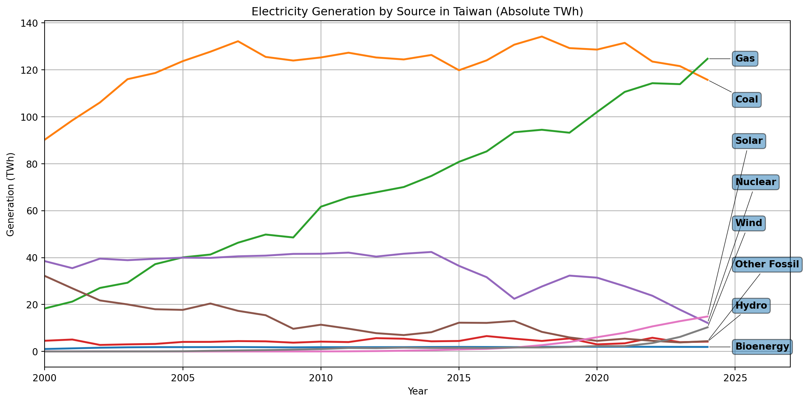

Figure 12: Taiwanese Energy Production

</div>

Beyond electricity and heat, the chemical sector is a massive
CO<sub>2</sub>eq source. (Lange, 2021) reports the petrochemical
industry uses about 10% of global fossil carbon as feedstock and another
7% to power its processes, producing some 400Mt of base chemicals each
year, 36% of which becomes packaging; the cradle-to-gate
CO<sub>2</sub>eq emissions for base chemicals are roughly 1–2.5kg
CO<sub>2</sub>eq per kg or 5t CO<sub>2</sub>eq per tonne of plastic,
when including use and end-of-life, the entire lifecycle emissions are
1.7Gt CO<sub>2</sub>eq (∼4% of all anthropogenic emissions) per year; a
true circular-carbon economy would require renewable carbon feedstocks
(e.g. biomass or CO<sub>2</sub>-derived monomers), electrified green
heat, closed-loop catalytic recycling of molecular building blocks, and
modular low-temperature reactors to slash energy demand.

Large technology conglomerates and newly founded startups alike are
working in the climate solutions space (often referred to as *climatech*
by the media), have proposed a range of approaches to CO<sub>2</sub>
reduction in the Earth’s atmosphere. These technologies include several
types of *carbon capture*, directly from the air (direct air capture or
DAC), from the source of pollution, such as using high–performance
filters on factory chimneys, as well as nature-based solutions such as
large scale tree planting using drones. Each technology has their own
pros and cons. For instance, (Vitillo et al., 2022) illustrates how
direct air capture of CO<sub>2</sub> is difficult because of low
concentration and CO<sub>2</sub> capture at the source of the emissions
is more feasible. (Cleantech Group, 2023) profiles 100 innovators across
agriculture, food, energy, mobility, and waste that Cleantech Group
judges most likely to enable a future with sub-2 degrees warming.
Overall, considering pathways to carbon drawdown finds considerable
uncertainty exists among experts which CO<sub>2</sub>eq reduction among
nature- and technology-based methods are the most effective (S. Low et
al., 2022).

### Individual Action

Sometimes individual environmental (climate) action *does matter* and
can come at great personal cost, even loss of life. EJAtlas tracks
environmental justice cases around the world, where human stakes are
very high. See (Joan Martinez-Alier, 2021; J. Martinez-Alier et al.,
2022; Scheidel et al., 2020) for coverage of extreme cases of risk
environmental activists must endure.

However, for most of us individual climate action is *ineffective*. The
effect of individual climate action such as *choosing a more sustainable
product* is so limited to be next to meaningless. For individual
consumer choices to make a difference, they need to be *aggregated* into
a movement, collective action with scale, influence, and visibility.

There is no single solution to the environmental crisis. Given the
enormity of environmental degradation, many different approaches are
needed. This chapter documents some of the ongoing work which a
sustainability companion could assist college students get involved
with.

While the scale of climate change is too big for individual action to
make a difference, individual action can foster hope and a sense of
collective responsibility (Nature, 2020).

## References

Abu El Kheir-Mataria, W. & Chun, S. (2025). Climate change and women’s
cancer in the MENA region: Assessing temperature-related health impacts.
*Frontiers in Public Health*, *13*, 1529706.
[https://doi.org/10.3389/fpubh.2025.1529706](https://doi.org/10.3389/fpubh.2025.1529706)

AFP. (2023). *S. Korea President Vows ’Complete Overhaul’ Of Approach To
Extreme Weather Barron’s*.

AI for Good. (2023). *Listening to Nature: Harnessing AI and Acoustics
for Biodiversity Conservation*.

Al Jazeera. (2023). *Death toll from S Korea rains hits 39; Yoon orders
all-out effort*.

Almond, R.E.A., Grooten, M., Juffe Bignoli, D. & Petersen & T. (Eds).
(2022). *Living Planet Report 2022 – Building a Naturepositive Society*.
WWF (World Wide Fund for Nature).

Anderson, T. R., Hawkins, E. & Jones, P. D. (2016). CO2, the greenhouse
effect and global warming: From the pioneering work of Arrhenius and
Callendar to today’s Earth System Models. *Endeavour*, *40*(3), 178–187.
[https://doi.org/10.1016/j.endeavour.2016.07.002](https://doi.org/10.1016/j.endeavour.2016.07.002)

Anguiano, D. (2023). Hawaii wildfires: How did the deadly Maui fire
start and what caused it? *The Guardian*.

Anna Watson. (2022). *Carbon dioxide removal solutions*.

Anna Watson. (2023). *Carbon credit retirements explained Climate
Action*.

Arctic doomsday seed vault gets more than 14,000 new samples. (2025).
*Reuters*.

Armstrong McKay, D. I., Staal, A., Abrams, J. F., Winkelmann, R.,
Sakschewski, B., Loriani, S., Fetzer, I., Cornell, S. E., Rockström, J.
& Lenton, T. M. (2022b). Exceeding 1.5$^\circ$C global warming could
trigger multiple climate tipping points. *Science*, *377*(6611),
eabn7950.
[https://doi.org/10.1126/science.abn7950](https://doi.org/10.1126/science.abn7950)

Armstrong McKay, D. I., Staal, A., Abrams, J. F., Winkelmann, R.,
Sakschewski, B., Loriani, S., Fetzer, I., Cornell, S. E., Rockström, J.
& Lenton, T. M. (2022a). Exceeding 1.5$^\circ$C global warming could
trigger multiple climate tipping points. *Science*, *377*(6611),
eabn7950.
[https://doi.org/10.1126/science.abn7950](https://doi.org/10.1126/science.abn7950)

Asdal, Å. & Guarino, L. (2018). The Svalbard Global Seed Vault: 10
Years—1 Million Samples. *Biopreservation and Biobanking*, *16*(5),
391–392.
[https://doi.org/10.1089/bio.2018.0025](https://doi.org/10.1089/bio.2018.0025)

AWS. (2022). *SageMaker Studio Lab*.

Bajarin, T. (2022). *PC Sales Are Off 12% In 2022 - When Can We Expect
Them To Grow Again?*

Baltic Sea Action Group. (2023). *EIT Food Regenerative Agriculture
Revolution project Q&A panel*.

Baroness Jones of Moulsecoomb & Caroline Lucas. (2023). *Clean Air
(Human Rights) Bill \[House of Lords\]*.

Bastin, J.-F., Finegold, Y., Garcia, C., Mollicone, D., Rezende, M.,
Routh, D., Zohner, C. M. & Crowther, T. W. (2019). The global tree
restoration potential. *Science*, *365*(6448), 76–79.
[https://doi.org/10.1126/science.aax0848](https://doi.org/10.1126/science.aax0848)

Beer, M. (2024). *Wind and Solar Overtake Fossil Fuels in “Historic
Shift” for EU*.

Bonasia, C. (2024). *Wind and solar energy surge past fossil fuels for
first time in Europe*.

Bouscasse, H., Gabet, S., Kerneis, G., Provent, A., Rieux, C., Ben
Salem, N., Dupont, H., Troude, F., Mathy, S. & Slama, R. (2022).
Designing local air pollution policies focusing on mobility and heating
to avoid a targeted number of pollution-related deaths: Forward and
backward approaches combining air pollution modeling, health impact
assessment and cost-benefit analysis. *Environment International*,
*159*, 107030.
[https://doi.org/10.1016/j.envint.2021.107030](https://doi.org/10.1016/j.envint.2021.107030)

Bousfield, C. G., Massam, M. R., Peres, C. A. & Edwards, D. P. (2022).
Carbon payments can cost-effectively improve logging sustainability in
the Amazon. *Journal of Environmental Management*, *314*, 115094.
[https://doi.org/10.1016/j.jenvman.2022.115094](https://doi.org/10.1016/j.jenvman.2022.115094)

Bowler, D. E., Bjorkman, A. D., Dornelas, M., Myers-Smith, I. H.,
Navarro, L. M., Niamir, A., Supp, S. R., Waldock, C., Winter, M.,
Vellend, M., Blowes, S. A., Böhning-Gaese, K., Bruelheide, H., Elahi,
R., Antão, L. H., Hines, J., Isbell, F., Jones, H. P., Magurran, A. E.,
… Bates, A. E. (2020). Mapping human pressures on biodiversity across
the planet uncovers anthropogenic threat complexes. *People and Nature*,
*2*(2), 380–394.
[https://doi.org/10.1002/pan3.10071](https://doi.org/10.1002/pan3.10071)

Brohan, P., Allan, R., Freeman, E., Wheeler, D., Wilkinson, C. &
Williamson, F. (2012). Constraining the temperature history of the past
millennium using early instrumental observations. *Climate of the Past*,
*8*(5), 1551–1563.
[https://doi.org/10.5194/cp-8-1551-2012](https://doi.org/10.5194/cp-8-1551-2012)

Cafaro, P., Hansson, P. & Götmark, F. (2022). Overpopulation is a major
cause of biodiversity loss and smaller human populations are necessary
to preserve what is left. *Biological Conservation*, *272*, 109646.
[https://doi.org/10.1016/j.biocon.2022.109646](https://doi.org/10.1016/j.biocon.2022.109646)

Cao, J., Li, W. & Hasan, I. (2023). The impact of lowering carbon
emissions on corporate labour investment: A quasi-natural experiment.
*Energy Economics*, *121*, 106653.
[https://doi.org/10.1016/j.eneco.2023.106653](https://doi.org/10.1016/j.eneco.2023.106653)

Cardinale, B. J., Duffy, J. E., Gonzalez, A., Hooper, D. U., Perrings,
C., Venail, P., Narwani, A., Mace, G. M., Tilman, D., Wardle, D. A.,
Kinzig, A. P., Daily, G. C., Loreau, M., Grace, J. B., Larigauderie, A.,
Srivastava, D. S. & Naeem, S. (2012). Biodiversity loss and its impact
on humanity. *Nature*, *486*(7401), 59–67.
[https://doi.org/10.1038/nature11148](https://doi.org/10.1038/nature11148)

Carrie Xiao. (2025). *China adds record 105GW solar PV in first four
months of 2025*.

CBC Radio. (2021). *Extreme heat could make Athens uninhabitable, warns
city’s chief heat officer*.

CDP. (2022). *Missing the Mark: CDP temperature ratings - 2022
analysis*.

Ceballos, G., Ehrlich, P. R. & Dirzo, R. (2017). Biological annihilation
via the ongoing sixth mass extinction signaled by vertebrate population
losses and declines. *Proceedings of the National Academy of Sciences*,
*114*(30).
[https://doi.org/10.1073/pnas.1704949114](https://doi.org/10.1073/pnas.1704949114)

Centre, U. W. H. (1999). *Area de Conservaci&oacute;n Guanacaste*.

Chancel, L. (2022). Global carbon inequality over 1990–2019. *Nature
Sustainability*, *5*(11), 931–938.
[https://doi.org/10.1038/s41893-022-00955-z](https://doi.org/10.1038/s41893-022-00955-z)

Chang, M. & Hsiao, I.-C. (2025). *Our first geothermal energy deal in
Asia*.

Chen, Y., Duo, L., Zhao, D., Zeng, Y. & Guo, X. (2023). The response of
ecosystem vulnerability to climate change and human activities in the
Poyang lake city group, China. *Environmental Research*, *233*, 116473.
[https://doi.org/10.1016/j.envres.2023.116473](https://doi.org/10.1016/j.envres.2023.116473)

Cheng, Y. & Han, X. (2022). Assessing the economic loss due to natural
disasters from outer space. *Climate Services*, *26*, 100286.
[https://doi.org/10.1016/j.cliser.2022.100286](https://doi.org/10.1016/j.cliser.2022.100286)

Chiang, S. (2024). *Google invests in
<span class="nocase">BlackRock-backed Taiwanese</span> solar developer
to boost energy capacity amid AI boom*.

Cleantech Group. (2023). *Global Cleantech 100*.

Climate Analytics & NewClimate Institute. (2023). *Climate Action
Tracker*.

Climate Neutral. (2024). *Flickr A Climate Label Certified Brand*.

Codrington, J., Varnum, A. A., Hildebrandt, L., Pröfrock, D., Bidhan,
J., Khodamoradi, K., Höhme, A.-L., Held, M., Evans, A., Velasquez, D.,
Yarborough, C. C., Ghane-Motlagh, B., Agarwal, A., Achua, J., Pozzi, E.,
Mesquita, F., Petrella, F., Miller, D. & Ramasamy, R. (2024). Detection
of microplastics in the human penis. *International Journal of Impotence
Research*.
[https://doi.org/10.1038/s41443-024-00930-6](https://doi.org/10.1038/s41443-024-00930-6)

Costanza, R., d’Arge, R., De Groot, R., Farber, S., Grasso, M., Hannon,
B., Limburg, K., Naeem, S., O’Neill, R. V., Paruelo, J., Raskin, R. G.,
Sutton, P. & Van Den Belt, M. (1997). The value of the world’s ecosystem
services and natural capital. *Nature*, *387*(6630), 253–260.
[https://doi.org/10.1038/387253a0](https://doi.org/10.1038/387253a0)

Crenna, E., Sinkko, T. & Sala, S. (2019). Biodiversity impacts due to
food consumption in Europe. *Journal of Cleaner Production*, *227*,
378–391.
[https://doi.org/10.1016/j.jclepro.2019.04.054](https://doi.org/10.1016/j.jclepro.2019.04.054)

Crippa, M., Guizzardi, D., Muntean, M., Schaaf, E., Solazzo, E.,
Monforti-Ferrario, F., Olivier, J. & Vignati, E. (2020). *Fossil CO2 and
GHG emissions of all world countries – 2020 report*. Publications
Office.

Daily, G. C. (Ed.). (1997). *Nature’s services: Societal dependence on
natural ecosystems*. Island Press.

Daniel Värjö. (2022). *Nya satelliter avslöjar dolda utsläpp av
växthusgaser*. Sveriges Radio.

De Queiroz-Stein, G. & Siegel, K. M. (2023). Possibilities for
mainstreaming biodiversity? Two perspectives on the concept of
bioeconomy. *Earth System Governance*, *17*, 100181.
[https://doi.org/10.1016/j.esg.2023.100181](https://doi.org/10.1016/j.esg.2023.100181)

*Destination Earth Shaping Europe’s digital future*. (2023).

Díaz, S., Pascual, U., Stenseke, M., Martín-López, B., Watson, R. T.,
Molnár, Z., Hill, R., Chan, K. M. A., Baste, I. A., Brauman, K. A.,
Polasky, S., Church, A., Lonsdale, M., Larigauderie, A., Leadley, P. W.,
Van Oudenhoven, A. P. E., Van Der Plaat, F., Schröter, M., Lavorel, S.,
… Shirayama, Y. (2018). Assessing nature’s contributions to people.
*Science*, *359*(6373), 270–272.
[https://doi.org/10.1126/science.aap8826](https://doi.org/10.1126/science.aap8826)

Dinerstein, E., Olson, D., Joshi, A., Vynne, C., Burgess, N. D.,
Wikramanayake, E., Hahn, N., Palminteri, S., Hedao, P., Noss, R.,
Hansen, M., Locke, H., Ellis, E. C., Jones, B., Barber, C. V., Hayes,
R., Kormos, C., Martin, V., Crist, E., … Saleem, M. (2017). An
Ecoregion-Based Approach to Protecting Half the Terrestrial Realm.
*BioScience*, *67*(6), 534–545.
[https://doi.org/10.1093/biosci/bix014](https://doi.org/10.1093/biosci/bix014)

Ditlevsen, P. & Ditlevsen, S. (2023). Warning of a forthcoming collapse
of the Atlantic meridional overturning circulation. *Nature
Communications*, *14*(1), 4254.
[https://doi.org/10.1038/s41467-023-39810-w](https://doi.org/10.1038/s41467-023-39810-w)

Douglas, E. (2023). *This summer is on track to be among Texas’ most
extreme*.

Du Toit, L. & Kotzé, L. J. (2022). Reimagining international
environmental law for the Anthropocene: An earth system law perspective.
*Earth System Governance*, *11*, 100132.
[https://doi.org/10.1016/j.esg.2022.100132](https://doi.org/10.1016/j.esg.2022.100132)

Ela Khodai. (2023). *Why the VCM needs more transparency*.

Ellen MacArthur Foundation, Material Economics. (2019). *Completing the
picture: How the circular economy tackles climate change*.

Ember. (2025). *Electricity Data Explorer*.

Erratum for the Report: “The global tree restoration potential” by J.-F.
Bastin, Y. Finegold, C. Garcia, D. Mollicone, M. Rezende, D. Routh, C.
M. Zohner, T. W. Crowther and for the Technical Response “Response to
Comments on ‘The global tree restoration potential’” by J.-F. Bastin, Y.
Finegold, C. Garcia, N. Gellie, A. Lowe, D. Mollicone, M. Rezende, D.
Routh, M. Sacande, B. Sparrow, C. M. Zohner, T. W. Crowther. (2020).
*Science*, *368*(6494), eabc8905.
[https://doi.org/10.1126/science.abc8905](https://doi.org/10.1126/science.abc8905)

Espinosa, F. & Bazairi, H. (2023). Impacts, evolution, and changes of
pressure on marine ecosystems in recent times. Toward new emerging and
unforeseen impacts within a changing world. In *Coastal Habitat
Conservation* (pp. 1–16). Elsevier.
[https://doi.org/10.1016/B978-0-323-85613-3.00004-9](https://doi.org/10.1016/B978-0-323-85613-3.00004-9)

European Commission. (2023). *EU and Republic of Korea - Green
Partnership*.

European Commission. (2025). *Protecting ecosystems: Almost half of EU
Biodiversity Strategy recommendations now in place*.

European Space Agency. (2023). *AI maps icebergs 10,000 times faster
than humans*.

Fabris, N. & Luburić, R. (2022). *CLIMATE CHANGE AND QUALITY OF LIFE*.

Falconer, R. (2023). *Over 123 million under heat alerts as intensifying
heat wave spreads across U.S.*

*Fifth National Climate Assessment*. (2023). U.S. Global Change Research
Program.
[https://doi.org/10.7930/NCA5.2023](https://doi.org/10.7930/NCA5.2023)

*First time world exceeds 1.5C warming limit over 12-month period*.
(2024).

Fischer, J., Riechers, M., Loos, J., Martin-Lopez, B. & Temperton, V. M.
(2021). Making the UN Decade on Ecosystem Restoration a
Social-Ecological Endeavour. *Trends in Ecology & Evolution*, *36*(1),
20–28.
[https://doi.org/10.1016/j.tree.2020.08.018](https://doi.org/10.1016/j.tree.2020.08.018)

Ford, H. V., Jones, N. H., Davies, A. J., Godley, B. J., Jambeck, J. R.,
Napper, I. E., Suckling, C. C., Williams, G. J., Woodall, L. C. &
Koldewey, H. J. (2022). The fundamental links between climate change and
marine plastic pollution. *Science of The Total Environment*, *806*,
150392.
[https://doi.org/10.1016/j.scitotenv.2021.150392](https://doi.org/10.1016/j.scitotenv.2021.150392)

*FRA 2020 Remote Sensing Survey*. (2022). FAO.
[https://doi.org/10.4060/cb9970en](https://doi.org/10.4060/cb9970en)

Fransen, T., Henderson, C., O’Connor, R., Alayza, N., Caldwell, M.,
Chakrabarty, S., Dixit, A., Finch, M., Kustar, A., Langer, P., Stolle,
F., Walls, G. & Welle, B. (2022). The State of Nationally Determined
Contributions: 2022. *World Resources Institute*.
[https://doi.org/10.46830/wrirpt.22.00043](https://doi.org/10.46830/wrirpt.22.00043)

Frédéric Simon. (2022). *Europe rapidly losing its forest carbon sink,
study shows*.

Gamage, A., Gangahagedara, R., Gamage, J., Jayasinghe, N., Kodikara, N.,
Suraweera, P. & Merah, O. (2023). Role of organic farming for achieving
sustainability in agriculture. *Farming System*, *1*(1), 100005.
[https://doi.org/10.1016/j.farsys.2023.100005](https://doi.org/10.1016/j.farsys.2023.100005)

Garcia, M. A., Liu, R., Nihart, A., El Hayek, E., Castillo, E., Barrozo,
E. R., Suter, M. A., Bleske, B., Scott, J., Forsythe, K.,
Gonzalez-Estrella, J., Aagaard, K. M. & Campen, M. J. (2024).
Quantitation and identification of microplastics accumulation in human
placental specimens using pyrolysis gas chromatography mass
spectrometry. *Toxicological Sciences*, *199*(1), 81–88.
[https://doi.org/10.1093/toxsci/kfae021](https://doi.org/10.1093/toxsci/kfae021)

Garner, A. J. (2023). Observed increases in North Atlantic tropical
cyclone peak intensification rates. *Scientific Reports*, *13*(1),
16299.
[https://doi.org/10.1038/s41598-023-42669-y](https://doi.org/10.1038/s41598-023-42669-y)

Garner, A. J., Samanta, D., Weaver, M. M. & Horton, B. P. (2024).
Changes to tropical cyclone trajectories in Southeast Asia under a
warming climate. *Npj Climate and Atmospheric Science*, *7*(1), 156.
[https://doi.org/10.1038/s41612-024-00707-0](https://doi.org/10.1038/s41612-024-00707-0)

Gauci, V., Pangala, S. R., Shenkin, A., Barba, J., Bastviken, D.,
Figueiredo, V., Gomez, C., Enrich-Prast, A., Sayer, E., Stauffer, T.,
Welch, B., Elias, D., McNamara, N., Allen, M. & Malhi, Y. (2024). Global
atmospheric methane uptake by upland tree woody surfaces. *Nature*,
*631*(8022), 796–800.
[https://doi.org/10.1038/s41586-024-07592-w](https://doi.org/10.1038/s41586-024-07592-w)

Gaure, S. & Golombek, R. (2022). True or not true: CO2 free electricity
generation is possible. *Energy*, *259*, 124998.
[https://doi.org/10.1016/j.energy.2022.124998](https://doi.org/10.1016/j.energy.2022.124998)

Gelles, D. & Andreoni, M. (2023). The Ocean’s Dire Message. *The New
York Times*.

GHG Protocol. (n.d.). *About Us GHG Protocol*.

Global Carbon Budget. (2023). *Cumulative CO$_2$ emissions*.

Gold Standard. (2024). *Sustainable Mangrove Management Methodology*.

Gómez-Baggethun, E., De Groot, R., Lomas, P. L. & Montes, C. (2010). The
history of ecosystem services in economic theory and practice: From
early notions to markets and payment schemes. *Ecological Economics*,
*69*(6), 1209–1218.
[https://doi.org/10.1016/j.ecolecon.2009.11.007](https://doi.org/10.1016/j.ecolecon.2009.11.007)

Goodwin, K., Allen, C., Teh, S. H., Li, M., Fry, J., Lenzen, M.,
Farrelly, S., Leon, C., Lewis, S., Chen, G., Schandl, H. & Wiedmann, T.
(2023). Targeting 1.5 degrees with the global carbon footprint of the
Australian Capital Territory. *Environmental Science & Policy*, *144*,
137–150.
[https://doi.org/10.1016/j.envsci.2023.03.006](https://doi.org/10.1016/j.envsci.2023.03.006)

Gottschlich, D. & Friedrich, B. (2014). The Legacy of Sylvicultura
oeconomica. A Critical Reflection on the Notion of Sustainability.
*Gaia: Okologische Perspektiven in Natur-, Geistes- Und
Wirtschaftswissenschaften*, *23*, 23–29.

Graham, E. & Fulghum, N. (2024). *Wind and solar overtake EU fossil
fuels in the first half of 2024*.

Greenfield, P. & @pgreenfielduk. (2021). “I’ve never said we should
plant a trillion trees”: What ecopreneur Thomas Crowther did next. *The
Guardian*.

Gu, L., Peng, Y., Vigne, S. A. & Wang, Y. (2023). Hidden costs of
non-green performance? The impact of air pollution awareness on loan
rates for Chinese firms. *Journal of Economic Behavior & Organization*,
*213*, 233–250.
[https://doi.org/10.1016/j.jebo.2023.07.014](https://doi.org/10.1016/j.jebo.2023.07.014)

Guerrero, M. J., Bedoya, C. L., López, J. D., Daza, J. M. & Isaza, C.
(2023). Acoustic animal identification using unsupervised learning.
*Methods in Ecology and Evolution*, *14*(6), 1500–1514.
[https://doi.org/10.1111/2041-210X.14103](https://doi.org/10.1111/2041-210X.14103)

Guo, X., Wang, L., Wang, X., Li, D., Wang, H., Xu, H., Liu, Y., Kang,
R., Chen, Q., Zheng, L., Wu, S., Guo, Z. & Zhang, S. (2024). Discovery
and analysis of microplastics in human bone marrow. *Journal of
Hazardous Materials*, *477*, 135266.
[https://doi.org/10.1016/j.jhazmat.2024.135266](https://doi.org/10.1016/j.jhazmat.2024.135266)

Haeggman, M., Moberg, F. & Sandin, G. (2018). *Planetary Boundaries
analysis for Houdini Sportswear–a Pilot Study: Assessment of company
performance from a planetary boundaries perspective*.

Hagström-Ilievska, K. (Apr. 17, 2025 18:00). *Major step for geothermal
energy in Asia - Baseload Capital and Google forge corporate PPA’*.

Han, W. & Chen, W. Y. (2022). Embedding nature-based solutions into the
social cost of carbon. *Environment International*, *167*, 107431.
[https://doi.org/10.1016/j.envint.2022.107431](https://doi.org/10.1016/j.envint.2022.107431)

Hannah Devlin. (2022). *Cancer breakthrough is a “wake-up” call on
danger of air pollution*.

Hannah Ritchie. (2020). *Sector by sector: Where do global greenhouse
gas emissions come from?*

Hannß Carl von Carlowitz. (1713). *Sylvicultura oeconomica, oder
haußwirthliche Nachricht und Naturmäßige Anweisung zur wilden
Baum-Zucht*. Braun.

Hansen, M. C., Potapov, P. V., Moore, R., Hancher, M., Turubanova, S.
A., Tyukavina, A., Thau, D., Stehman, S. V., Goetz, S. J., Loveland, T.
R., Kommareddy, A., Egorov, A., Chini, L., Justice, C. O. & Townshend,
J. R. G. (2013). High-Resolution Global Maps of 21st-Century Forest
Cover Change. *Science*, *342*(6160), 850–853.
[https://doi.org/10.1126/science.1244693](https://doi.org/10.1126/science.1244693)

Hardin, G. (1968). The Tragedy of the Commons: The population problem
has no technical solution; it requires a fundamental extension in
morality. *Science*, *162*(3859), 1243–1248.
[https://doi.org/10.1126/science.162.3859.1243](https://doi.org/10.1126/science.162.3859.1243)

Harvey, C. (2025). *Three NASA Climate Satellites Are Dying. There’s No
Plan to Replace Them*.

Hassoun, A., Jagtap, S., Trollman, H., Garcia-Garcia, G., Abdullah, N.
A., Goksen, G., Bader, F., Ozogul, F., Barba, F. J., Cropotova, J.,
Munekata, P. E. S. & Lorenzo, J. M. (2023). Food processing 4.0: Current
and future developments spurred by the fourth industrial revolution.
*Food Control*, *145*, 109507.
[https://doi.org/10.1016/j.foodcont.2022.109507](https://doi.org/10.1016/j.foodcont.2022.109507)

Hawkins, E. & Jones, Phil. D. (2013). On increasing global temperatures:
75 years after Callendar: On increasing global temperatures. *Quarterly
Journal of the Royal Meteorological Society*, *139*(677), 1961–1963.
[https://doi.org/10.1002/qj.2178](https://doi.org/10.1002/qj.2178)

Hoffmann, J., Bauer, P., Sandu, I., Wedi, N., Geenen, T. & Thiemert, D.
(2023). Destination Earth – A digital twin in support of climate
services. *Climate Services*, *30*, 100394.
[https://doi.org/10.1016/j.cliser.2023.100394](https://doi.org/10.1016/j.cliser.2023.100394)

Honton, J. (2022). *The Forgotten Father of Climatology*.

Houdini. (2018). *Planetary Boundaries Assessment*.

Houdini Sportswear. (2024). *2024 Planetary Boundaries Assessment
Houdini Sportswear*.

Howard, J., McLeod, E., Thomas, S., Eastwood, E., Fox, M., Wenzel, L. &
Pidgeon, E. (2017). The potential to integrate blue carbon into MPA
design and management. *Aquatic Conservation: Marine and Freshwater
Ecosystems*, *27*, 100–115.
[https://doi.org/10.1002/aqc.2809](https://doi.org/10.1002/aqc.2809)

Hu, C. J., Garcia, M. A., Nihart, A., Liu, R., Yin, L., Adolphi, N.,
Gallego, D. F., Kang, H., Campen, M. J. & Yu, X. (2024). Microplastic
presence in dog and human testis and its potential association with
sperm count and weights of testis and epididymis. *Toxicological
Sciences*, *200*(2), 235–240.
[https://doi.org/10.1093/toxsci/kfae060](https://doi.org/10.1093/toxsci/kfae060)

Ianole, R. & Cornescu, V. (2013). Overconsumption Society through the
<span class="nocase">Looking-glass</span> of Behavioral Economics.
*Procedia Economics and Finance*, *6*, 66–72.
[https://doi.org/10.1016/S2212-5671(13)00115-9](https://doi.org/10.1016/S2212-5671(13)00115-9)

ICVCM. (2025). *The Voluntary Carbon Market explore*.

IEA. (2022). *Global Energy Review: CO2 Emissions in 2021*.

IEA. (2023a). *The world’s top 1% of emitters produce over 1000 times
more CO2 than the bottom 1% – Analysis*.

IEA. (2023b). *Tracking Clean Energy Progress 2023*.

IEA. (2024). *Electricity Mid-Year Update*.

Igini, M. (2024). *Just 2.8% of the World’s Ocean Is ’Effectively’
Protected: Report*.

Institute, E. (2023). *Energy system struggles in face of geopolitical
and environmental crises*.

Irwin, R., Short, I., Mohammadrezaei, M. & Dhubháin, Á. N. (2023).
Increasing tree cover on Irish dairy and drystock farms: The main
attitudes, influential bodies and barriers that affect agroforestry
uptake. *Environmental Science & Policy*, *146*, 76–89.
[https://doi.org/10.1016/j.envsci.2023.03.022](https://doi.org/10.1016/j.envsci.2023.03.022)

*Isotherms.simply.earth Average temperatures of the world in 1838*.
(2023).

IUCN. (2024). *The IUCN Red List of Threatened Species. Version 2024-1.*

Ivanova, D., Barrett, J., Wiedenhofer, D., Macura, B., Callaghan, M. &
Creutzig, F. (2020). Quantifying the potential for climate change
mitigation of consumption options. *Environmental Research Letters*,
*15*(9), 093001.
[https://doi.org/10.1088/1748-9326/ab8589](https://doi.org/10.1088/1748-9326/ab8589)

Ivanova, D., Stadler, K., Steen-Olsen, K., Wood, R., Vita, G., Tukker,
A. & Hertwich, E. G. (2016). Environmental Impact Assessment of
Household Consumption. *Journal of Industrial Ecology*, *20*(3),
526–536.
[https://doi.org/10.1111/jiec.12371](https://doi.org/10.1111/jiec.12371)

Jerrett, M., Jina, A. S. & Marlier, M. E. (2022). Up in smoke:
California’s greenhouse gas reductions could be wiped out by 2020
wildfires. *Environmental Pollution*, *310*, 119888.
[https://doi.org/10.1016/j.envpol.2022.119888](https://doi.org/10.1016/j.envpol.2022.119888)

Jessop, S., Twidale, S. & Jessop, S. (2024). Google buys stake in Taiwan
solar power firm owned by BlackRock. *Reuters*.

Keeble, B. R. (1988). The Brundtland Report: ’Our Common Future’.
*Medicine and War*, *4*(1), 17–25.

Keeling, R. F. & Keeling, C. D. (2017). *Atmospheric Monthly In Situ CO2
Data - Mauna Loa Observatory, Hawaii. In Scripps CO2 Program Data*. UC
San Diego Library Digital Collections.
[https://doi.org/10.6075/J08W3BHW](https://doi.org/10.6075/J08W3BHW)

KlimaDAO. (2023). *An open call for alternative carbon standards*.

Klosterman, S., Masson-Forsythe, M., Keenan, T. F., Guzder-Williams, B.
P., Staccone, A., Piffer, P. R. & Hughes, M. J. (2022, December).
Mapping the global potential of reforestation projects using ground
observations, remote sensing, and machine learning. *Fall Meeting 2022*.

Koch, N. (2022). Opinion Arizona Is in a Race to the Bottom of Its Water
Wells, With Saudi Arabia’s Help. *The New York Times*.

Kornek, U., Klenert, D., Edenhofer, O. & Fleurbaey, M. (2021). The
social cost of carbon and inequality: When local redistribution shapes
global carbon prices. *Journal of Environmental Economics and
Management*, *107*, 102450.
[https://doi.org/10.1016/j.jeem.2021.102450](https://doi.org/10.1016/j.jeem.2021.102450)

Kühne, K., Bartsch, N., Tate, R. D., Higson, J. & Habet, A. (2022).
“Carbon Bombs” - Mapping key fossil fuel projects. *Energy Policy*,
*166*, 112950.
[https://doi.org/10.1016/j.enpol.2022.112950](https://doi.org/10.1016/j.enpol.2022.112950)

L, J. (2025a). *China’s Renewable Energy Boom: A Record-Breaking Shift
or Still Chained to Coal?*

L, J. (2025b). *Google Ignites Taiwan’s First Corporate Geothermal Deal
for 24/7 Clean Energy*.

Lange, J.-P. (2021). Towards circular carbo-chemicals – the
metamorphosis of petrochemicals. *Energy & Environmental Science*,
*14*(8), 4358–4376.
[https://doi.org/10.1039/D1EE00532D](https://doi.org/10.1039/D1EE00532D)

Lavers, J. L., Bond, A. L. & Rolsky, C. (2022). Far from a distraction:
Plastic pollution and the planetary emergency. *Biological
Conservation*, *272*, 109655.
[https://doi.org/10.1016/j.biocon.2022.109655](https://doi.org/10.1016/j.biocon.2022.109655)

Le Provost, G., Schenk, N. V., Penone, C., Thiele, J., Westphal, C.,
Allan, E., Ayasse, M., Blüthgen, N., Boeddinghaus, R. S., Boesing, A.
L., Bolliger, R., Busch, V., Fischer, M., Gossner, M. M., Hölzel, N.,
Jung, K., Kandeler, E., Klaus, V. H., Kleinebecker, T., … Manning, P.
(2022). The supply of multiple ecosystem services requires biodiversity
across spatial scales. *Nature Ecology & Evolution*.
[https://doi.org/10.1038/s41559-022-01918-5](https://doi.org/10.1038/s41559-022-01918-5)

Lee, T. H., Jan, F.-H. & Liu, J.-T. (2021). Developing an indicator
framework for assessing sustainable tourism: Evidence from a Taiwan
ecological resort. *Ecological Indicators*, *125*, 107596.
[https://doi.org/10.1016/j.ecolind.2021.107596](https://doi.org/10.1016/j.ecolind.2021.107596)

Lenton, T. M., Xu, C., Abrams, J. F., Ghadiali, A., Loriani, S.,
Sakschewski, B., Zimm, C., Ebi, K. L., Dunn, R. R., Svenning, J.-C. &
Scheffer, M. (2023). Quantifying the human cost of global warming.
*Nature Sustainability*.
[https://doi.org/10.1038/s41893-023-01132-6](https://doi.org/10.1038/s41893-023-01132-6)

Leopold, A. (1972). *A Sand county almanac and sketches here and there*.
OUP.

Leverhulme Centre for Nature Recovery. (2023). *Monetary valuation of
nature Pragmatic conservation of unhelpful commodification of nature*.

Li, L., Feng, R., Xi, J., Huijbens, E. H. & Gao, Y. (2023).
Distinguishing the impact of tourism development on ecosystem service
trade-offs in ecological functional zone. *Journal of Environmental
Management*, *342*, 118183.
[https://doi.org/10.1016/j.jenvman.2023.118183](https://doi.org/10.1016/j.jenvman.2023.118183)

Li, N., Yang, H., Dong, Y., Wei, B., Liang, L., Yun, X., Tian, J.,
Zheng, Y., Duan, S. & Zhang, L. (2024). Prevalence and implications of
microplastic contaminants in general human seminal fluid: A Raman
spectroscopic study. *Science of The Total Environment*, *937*, 173522.
[https://doi.org/10.1016/j.scitotenv.2024.173522](https://doi.org/10.1016/j.scitotenv.2024.173522)

Lim, E., Hill, W., Lee, C., Weeden, C. E., Augustine, M., Chen, K.,
Kuan, F. C., Marongiu, F., Evans, E., Moore, D., Ryu, M. H.,
Luchtenborg, M., Lavelle, K., Carlsten, C., Malanchi, I., Hackshaw, A.,
Litchfield, K. R., Degregori, J., Jamal-Hanjani, M. & Swanton, C.
(2022). 1MO Air pollution-induced non-small cell lung cancer: Towards
molecular cancer prevention. *Annals of Oncology*, *33*, S1383.
[https://doi.org/10.1016/j.annonc.2022.09.002](https://doi.org/10.1016/j.annonc.2022.09.002)

Lin, J., Khanna, N., Liu, X., Wang, W., Gordon, J. & Dai, F. (2022).
Opportunities to tackle short-lived climate pollutants and other
greenhouse gases for China. *Science of The Total Environment*, *842*,
156842.
[https://doi.org/10.1016/j.scitotenv.2022.156842](https://doi.org/10.1016/j.scitotenv.2022.156842)

Lion Hirth. (n.d.). *Lion Hirth on Twitter: "Carbon pricing is not there
to punish people. It’s there to remind us, when we take travel, heating,
consumption decisions that the true cost of fossil fuels comprises not
only mining and processing, but also the damage done by the CO2 they
release. Very simple." / Twitter*.

Livingston, I. (2023). It’s midwinter, but it’s over 100 degrees in
South America. *Washington Post (Washington, D.C. : 1974)*.

Lopez, R. E., Pastén, R. & Gutiérrez Cubillos, P. (2022). Climate change
in times of economic uncertainty: A perverse tragedy of the commons?
*Economic Analysis and Policy*, *75*, 209–225.
[https://doi.org/10.1016/j.eap.2022.05.005](https://doi.org/10.1016/j.eap.2022.05.005)

Low, G., Dalhaus, T. & Meuwissen, M. P. M. (2023). Mixed farming and
agroforestry systems: A systematic review on value chain implications.
*Agricultural Systems*, *206*, 103606.
[https://doi.org/10.1016/j.agsy.2023.103606](https://doi.org/10.1016/j.agsy.2023.103606)

Low, S., Baum, C. M. & Sovacool, B. K. (2022). Rethinking Net-Zero
systems, spaces, and societies: “Hard” versus “soft” alternatives for
nature-based and engineered carbon removal. *Global Environmental
Change*, *75*, 102530.
[https://doi.org/10.1016/j.gloenvcha.2022.102530](https://doi.org/10.1016/j.gloenvcha.2022.102530)

LSEG & Susanna Twidale. (02/12/2024, 02:37 PM). Global carbon markets
value hit record \$949 billion last year. *Investing.com*.

Luik, L. (2025). *Where does the carbon credit price come from?*
\[Substack {{Newsletter}}\].

Main, D. (2024). Microplastics are infiltrating brain tissue, studies
show: “There’s nowhere left untouched.” *The Guardian*.

Marco-Fondevila, M. & Álvarez-Etxeberría, I. (2023). Trends in private
sector engagement with biodiversity: EU listed companies’ disclosure and
indicators. *Ecological Economics*, *210*, 107864.
[https://doi.org/10.1016/j.ecolecon.2023.107864](https://doi.org/10.1016/j.ecolecon.2023.107864)

MARIA LUÍS FERNANDES. (2023). *A Reality Check on the Industrial
Emissions Directive - META*.

Martinez-Alier, Joan. (2021). Mapping ecological distribution conflicts:
The EJAtlas. *The Extractive Industries and Society*, *8*(4), 100883.
[https://doi.org/10.1016/j.exis.2021.02.003](https://doi.org/10.1016/j.exis.2021.02.003)

Martinez-Alier, J., Neyra, R. & Rincón, M. A. P. (2022). Reply to
Orihuela et al’s “Extractivism of the Poor.” *The Extractive Industries
and Society*, *10*, 101065.
[https://doi.org/10.1016/j.exis.2022.101065](https://doi.org/10.1016/j.exis.2022.101065)

Marvel, K. (2023). Opinion I’m a Climate Scientist. I’m Not Screaming
Into the Void Anymore. *The New York Times*.

Masters, J. (2025). *April 2025 was the planet’s 2nd-warmest April on
record \>\> Yale Climate Connections*.

Mauritsen, T., Tsushima, Y., Meyssignac, B., Loeb, N. G., Hakuba, M.,
Pilewskie, P., Cole, J., Suzuki, K., Ackerman, T. P., Allan, R. P.,
Andrews, T., Bender, F. A.-M., Bloch-Johnson, J., Bodas-Salcedo, A.,
Brookshaw, A., Ceppi, P., Clerbaux, N., Dessler, A. E., Donohoe, A., …
Zelinka, M. D. (2025). Earth’s Energy Imbalance More Than Doubled in
Recent Decades. *AGU Advances*, *6*(3), e2024AV001636.
[https://doi.org/10.1029/2024AV001636](https://doi.org/10.1029/2024AV001636)

May, R. M. (2011). Why should we be concerned about loss of
biodiversity. *Comptes Rendus Biologies*, *334*(5-6), 346–350.
[https://doi.org/10.1016/j.crvi.2010.12.002](https://doi.org/10.1016/j.crvi.2010.12.002)

McClure, T. (2025). *“Half the tree of life”: Ecologists’ horror as
nature reserves are emptied of insects*.

McKibben, B. (1989). *The end of nature* (1st ed). Random House.

McKibben, B. (2006). *The end of nature* (Random House trade pbk. ed).
Random House Trade Paperbacks.

McKibben, B. (2023). *’Where Should I Live?’*.

Meisinger, N. (2022). A tragedy of intangible commons: Riding the
socioecological wave. *Ecological Economics*, *193*, 107298.
[https://doi.org/10.1016/j.ecolecon.2021.107298](https://doi.org/10.1016/j.ecolecon.2021.107298)

*Methodology for GHG & Co-Benefits in Grazing Systems*. (2022).

Ministry of Digital Affairs. (2024). *政府資料開放平臺*.

Moberg, K. R., Aall, C., Dorner, F., Reimerson, E., Ceron, J.-P., Sköld,
B., Sovacool, B. K. & Piana, V. (2019). Mobility, food and housing:
Responsibility, individual consumption and demand-side policies in
European deep decarbonisation pathways. *Energy Efficiency*, *12*(2),
497–519.
[https://doi.org/10.1007/s12053-018-9708-7](https://doi.org/10.1007/s12053-018-9708-7)

Montano, L., Giorgini, E., Notarstefano, V., Notari, T., Ricciardi, M.,
Piscopo, M. & Motta, O. (2023). Raman Microspectroscopy evidence of
microplastics in human semen. *Science of The Total Environment*, *901*,
165922.
[https://doi.org/10.1016/j.scitotenv.2023.165922](https://doi.org/10.1016/j.scitotenv.2023.165922)

Mouterde, P. (2024). *Biodiversity: The world is not on track to protect
30% of land and sea by 2030*.

Muradian, R. & Gómez-Baggethun, E. (2021). Beyond ecosystem services and
nature’s contributions: Is it time to leave utilitarian environmentalism
behind? *Ecological Economics*, *185*, 107038.
[https://doi.org/10.1016/j.ecolecon.2021.107038](https://doi.org/10.1016/j.ecolecon.2021.107038)

Murase, Y. & Baek, S. K. (2018). Seven rules to avoid the tragedy of the
commons. *Journal of Theoretical Biology*, *449*, 94–102.
[https://doi.org/10.1016/j.jtbi.2018.04.027](https://doi.org/10.1016/j.jtbi.2018.04.027)

Naishadham, S. (2023a). Arizona to cancel leases allowing
<span class="nocase">Saudi-owned</span> farm access to state’s
groundwater. *AP News*.

Naishadham, S. (2023b). In drought-stricken Arizona, fresh scrutiny of
<span class="nocase">Saudi Arabia-owned</span> farm’s water use. *PBS
News*.

National Oceanic and Atmospheric Administration (NOAA), U.S. Department
of Commerce. (2023). *Earth just had its hottest June on record*.

National Public Utilities Council. (2022). *Annual Utility
Decarbonization Report*.

Nature, R. C. by S. (2020). *Individual action versus systemic change:
Lessons from COVID19 for climate change*.

Newbold, T., Hudson, L. N., Arnell, A. P., Contu, S., De Palma, A.,
Ferrier, S., Hill, S. L. L., Hoskins, A. J., Lysenko, I., Phillips, H.
R. P., Burton, V. J., Chng, C. W. T., Emerson, S., Gao, D., Pask-Hale,
G., Hutton, J., Jung, M., Sanchez-Ortiz, K., Simmons, B. I., … Purvis,
A. (2016). Has land use pushed terrestrial biodiversity beyond the
planetary boundary? A global assessment. *Science*, *353*(6296),
288–291.
[https://doi.org/10.1126/science.aaf2201](https://doi.org/10.1126/science.aaf2201)

NOAA National Centers for Environmental Information. (2023). *Monthly
Global Climate Report for June 2023*.

Noriega, J. A., Hortal, J., Azcárate, F. M., Berg, M. P., Bonada, N.,
Briones, M. J. I., Del Toro, I., Goulson, D., Ibanez, S., Landis, D. A.,
Moretti, M., Potts, S. G., Slade, E. M., Stout, J. C., Ulyshen, M. D.,
Wackers, F. L., Woodcock, B. A. & Santos, A. M. C. (2018). Research
trends in ecosystem services provided by insects. *Basic and Applied
Ecology*, *26*, 8–23.
[https://doi.org/10.1016/j.baae.2017.09.006](https://doi.org/10.1016/j.baae.2017.09.006)

Ogram, A., Sayler, G. S. & Barkay, T. (1987). The extraction and
purification of microbial DNA from sediments. *Journal of
Microbiological Methods*, *7*(2-3), 57–66.
[https://doi.org/10.1016/0167-7012(87)90025-X](https://doi.org/10.1016/0167-7012(87)90025-X)

Ojoatre, S. & Atkinson, N. (2023). *Trialling
<span class="nocase">eDNA</span> for biodiversity measurement*.

Ollinaho, O. I. & Kröger, M. (2023). Separating the two faces of
“bioeconomy”: Plantation economy and sociobiodiverse economy in Brazil.
*Forest Policy and Economics*, *149*, 102932.
[https://doi.org/10.1016/j.forpol.2023.102932](https://doi.org/10.1016/j.forpol.2023.102932)

Pachama. (2023). *How much should reforestation cost?*

Patel, P. (2025).
*Aws-samples/aws-smsl-geospatial-analysis-deforestation*. AWS Samples.

Perkins-Kirkpatrick, S. & Green, D. (2023). Extreme heat and climate
change. In *Heat Exposure and Human Health in the Context of Climate
Change* (pp. 5–36). Elsevier.
[https://doi.org/10.1016/B978-0-12-819080-7.00006-9](https://doi.org/10.1016/B978-0-12-819080-7.00006-9)

Persson, L., Carney Almroth, B. M., Collins, C. D., Cornell, S., de Wit,
C. A., Diamond, M. L., Fantke, P., Hassellöv, M., MacLeod, M., Ryberg,
M. W., Søgaard Jørgensen, P., Villarrubia-Gómez, P., Wang, Z. &
Hauschild, M. Z. (2022). Outside the Safe Operating Space of the
Planetary Boundary for Novel Entities. *Environmental Science &
Technology*, *56*(3), 1510–1521.
[https://doi.org/10.1021/acs.est.1c04158](https://doi.org/10.1021/acs.est.1c04158)

Peter Andrey Smitharchive page. (2024). *How environmental DNA is giving
scientists a new way to understand our world*.

Peter Kareiva, Heather Tallis, Taylor H. Ricketts, Gretchen C. Daily &
Stephen Polasky. (2011). *Natural Capital:Theory and Practice of Mapping
Ecosystem Services*. Oxford University Press.

Pfeiffer, M. (2024). Coral giants sound the alarm for the Great Barrier
Reef. *Nature*, *632*(8024), 265–266.
[https://doi.org/10.1038/d41586-024-02329-1](https://doi.org/10.1038/d41586-024-02329-1)

Picó, Y., Campo, J., Alfarhan, A. H., El-Sheikh, M. A. & Barceló, D.
(2023). Wild and ruderal plants as bioindicators of global urban
pollution by air, water and soil in Riyadh and Abha, Saudi Arabia.
*Science of The Total Environment*, *888*, 164166.
[https://doi.org/10.1016/j.scitotenv.2023.164166](https://doi.org/10.1016/j.scitotenv.2023.164166)

Plan A. (n.d.). *What are Scope 4 emissions?*

Planetary Health Alliance. (2024a). *Planetary Health*.

Planetary Health Alliance. (2024b). *The Planetary Health Roadmap and
Action Plan*.

Potter, R. (2025). *“Google Just Flipped the Switch”: 10MW Geothermal
Energy Will Power Massive AI Chip Expansion in Taiwan, Igniting Green
Tech Revolution*.

Press, C. F.-A. (2023). *A fungal disease is rapidly spreading across
the U.S. Scientists are alarmed*.

Quatrini, S. (2021). Challenges and opportunities to scale up
sustainable finance after the COVID-19 crisis: Lessons and promising
innovations from science and practice. *Ecosystem Services*, *48*,
101240.
[https://doi.org/10.1016/j.ecoser.2020.101240](https://doi.org/10.1016/j.ecoser.2020.101240)

Redazione, L. (2025). *Solar power in China hits 60 GW in Q1 2025*.

Renee Cho. (2020). *How Buying Stuff Drives Climate Change*.

Rennert, K., Errickson, F., Prest, B. C., Rennels, L., Newell, R. G.,
Pizer, W., Kingdon, C., Wingenroth, J., Cooke, R., Parthum, B., Smith,
D., Cromar, K., Diaz, D., Moore, F. C., Müller, U. K., Plevin, R. J.,
Raftery, A. E., Ševčíková, H., Sheets, H., … Anthoff, D. (2022).
Comprehensive evidence implies a higher social cost of CO2. *Nature*,
*610*(7933), 687–692.
[https://doi.org/10.1038/s41586-022-05224-9](https://doi.org/10.1038/s41586-022-05224-9)

Richardson, K., Steffen, W., Lucht, W., Bendtsen, J., Cornell, S. E.,
Donges, J. F., Drüke, M., Fetzer, I., Bala, G., Von Bloh, W., Feulner,
G., Fiedler, S., Gerten, D., Gleeson, T., Hofmann, M., Huiskamp, W.,
Kummu, M., Mohan, C., Nogués-Bravo, D., … Rockström, J. (2023). Earth
beyond six of nine planetary boundaries. *Science Advances*, *9*(37),
eadh2458.
[https://doi.org/10.1126/sciadv.adh2458](https://doi.org/10.1126/sciadv.adh2458)

*Rishi Sunak to green-light hundreds of new oil and gas licenses in
North Sea*. (2023).

Ritz, R. A. (2022). Global carbon price asymmetry. *Journal of
Environmental Economics and Management*, *114*, 102687.
[https://doi.org/10.1016/j.jeem.2022.102687](https://doi.org/10.1016/j.jeem.2022.102687)

Rosales Carreón, J. & Worrell, E. (2018). Urban energy systems within
the transition to sustainable development. A research agenda for urban
metabolism. *Resources, Conservation and Recycling*, *132*, 258–266.
[https://doi.org/10.1016/j.resconrec.2017.08.004](https://doi.org/10.1016/j.resconrec.2017.08.004)

Rousse, O. (2008). Environmental and economic benefits resulting from
citizens’ participation in CO2 emissions trading: An efficient
alternative solution to the voluntary compensation of CO2 emissions.
*Energy Policy*, *36*(1), 388–397.
[https://doi.org/10.1016/j.enpol.2007.09.019](https://doi.org/10.1016/j.enpol.2007.09.019)

Ruba, U. B. & Talucder, M. S. A. (2023). Potentiality of homestead
agroforestry for achieving sustainable development goals: Bangladesh
perspectives. *Heliyon*, *9*(3), e14541.
[https://doi.org/10.1016/j.heliyon.2023.e14541](https://doi.org/10.1016/j.heliyon.2023.e14541)

Rubino, M., Etheridge, D., Thornton, D., Allison, C., Francey, R.,
Langenfelds, R., Steele, P., Trudinger, C., Spencer, D., Curran, M., Van
Ommen, T. & Smith, A. (2019). *Law Dome Ice Core 2000-Year CO2, CH4, N2O
and <span class="nocase">d13C-CO2</span>* (pp. 255.62 KB). CSIRO.
[https://doi.org/10.25919/5BFE29FF807FB](https://doi.org/10.25919/5BFE29FF807FB)

Rudd, M. A. (2015). Pathways from marine protected area design and
management to ecological success. *PeerJ*, *3*, e1424.
[https://doi.org/10.7717/peerj.1424](https://doi.org/10.7717/peerj.1424)

Sarah Ludwig Rausch & Neha Pathak. (2021). *Sustainability and Your
Health*.

Saudi firm that grows hay in California and Arizona to lose farm leases
over water issue. (2023). *The Los Angeles Times*.

Scarr, S. & Sharma, M. (2021). Devoured. *Reuters*.

Scheidel, A., Del Bene, D., Liu, J., Navas, G., Mingorría, S., Demaria,
F., Avila, S., Roy, B., Ertör, I., Temper, L. & Martínez-Alier, J.
(2020). Environmental conflicts and defenders: A global overview.
*Global Environmental Change*, *63*, 102104.
[https://doi.org/10.1016/j.gloenvcha.2020.102104](https://doi.org/10.1016/j.gloenvcha.2020.102104)

Serrano-Notivoli, R., Tejedor, E., Sarricolea, P., Meseguer-Ruiz, O., De
Luis, M., Saz, M. Á., Longares, L. A. & Olcina, J. (2023). Unprecedented
warmth: A look at Spain’s exceptional summer of 2022. *Atmospheric
Research*, 106931.
[https://doi.org/10.1016/j.atmosres.2023.106931](https://doi.org/10.1016/j.atmosres.2023.106931)

Sherren, K. (2024). *Flood risk mapping is a public good, so why the
public resistance in Canada? Lessons from Nova Scotia*.

Sherwood, S. C., Webb, M. J., Annan, J. D., Armour, K. C., Forster, P.
M., Hargreaves, J. C., Hegerl, G., Klein, S. A., Marvel, K. D., Rohling,
E. J., Watanabe, M., Andrews, T., Braconnot, P., Bretherton, C. S.,
Foster, G. L., Hausfather, Z., Von Der Heydt, A. S., Knutti, R.,
Mauritsen, T., … Zelinka, M. D. (2020). An Assessment of Earth’s Climate
Sensitivity Using Multiple Lines of Evidence. *Reviews of Geophysics*,
*58*(4), e2019RG000678.
[https://doi.org/10.1029/2019RG000678](https://doi.org/10.1029/2019RG000678)

Sipthorpe, A., Brink, S., Van Leeuwen, T. & Staffell, I. (2022).
Blockchain solutions for carbon markets are nearing maturity. *One Earth
(Cambridge, Mass.)*, *5*(7), 779–791.
[https://doi.org/10.1016/j.oneear.2022.06.004](https://doi.org/10.1016/j.oneear.2022.06.004)

Smale, D. A., Wernberg, T., Oliver, E. C. J., Thomsen, M., Harvey, B.
P., Straub, S. C., Burrows, M. T., Alexander, L. V., Benthuysen, J. A.,
Donat, M. G., Feng, M., Hobday, A. J., Holbrook, N. J.,
Perkins-Kirkpatrick, S. E., Scannell, H. A., Sen Gupta, A., Payne, B. L.
& Moore, P. J. (2019). Marine heatwaves threaten global biodiversity and
the provision of ecosystem services. *Nature Climate Change*, *9*(4),
306–312.
[https://doi.org/10.1038/s41558-019-0412-1](https://doi.org/10.1038/s41558-019-0412-1)

Soliman, A. (2024). “Unacceptable”: A staggering 4.4 billion people lack
safe drinking water, study finds. *Nature*, d41586-024-02621-0.
[https://doi.org/10.1038/d41586-024-02621-0](https://doi.org/10.1038/d41586-024-02621-0)

Stanford University. (2021). *Professors explain the social cost of
carbon*.

Statista. (2023). *Annual CO2 emissions worldwide 1940-2022*.

Stern, N. (2022). Towards a carbon neutral economy: How government
should respond to market failures and market absence. *Journal of
Government and Economics*, *6*, 100036.
[https://doi.org/10.1016/j.jge.2022.100036](https://doi.org/10.1016/j.jge.2022.100036)

TED. (2024). *The Tipping Points of Climate Change — and Where We Stand
<span class="nocase">Johan Rockstr<span class="nocase">ö</span>m</span>
TED*.

TEDx Talks. (2020). *Sustainable Business Frank Wijen
TEDxErasmusUniversityRotterdam*.

The Copernicus Climate Change Service. (2024). *Climate Pulse*.

The Economic Times. (2022). *Climate change: Earth at 8 billion:
Consumption not crowd is key to climate*.

The Norwegian Ministry of Agriculture and Food. (2025). *New seed
samples deposited in Svalbard Global Seed Vault*. regjeringen.no.

Tiernan, H., Friedman, S., Clube, R. K. M., Burgman, M. A., Castillo, A.
C., Stettler, Marc. E. J., Kazarian, S. G., Wright, S. & De Nazelle, A.
(2022). Implementation of a structured decision-making framework to
evaluate and advance understanding of airborne microplastics.
*Environmental Science & Policy*, *135*, 169–181.
[https://doi.org/10.1016/j.envsci.2022.05.005](https://doi.org/10.1016/j.envsci.2022.05.005)

Tilsted, J. P., Bauer, F., Deere Birkbeck, C., Skovgaard, J. & Rootzén,
J. (2023). Ending fossil-based growth: Confronting the political economy
of petrochemical plastics. *One Earth (Cambridge, Mass.)*, *6*(6),
607–619.
[https://doi.org/10.1016/j.oneear.2023.05.018](https://doi.org/10.1016/j.oneear.2023.05.018)

Tol, R. S. J. (2019). A social cost of carbon for (almost) every
country. *Energy Economics*, *83*, 555–566.
[https://doi.org/10.1016/j.eneco.2019.07.006](https://doi.org/10.1016/j.eneco.2019.07.006)

Trager, R. (2025). *PFAS regulations for US drinking water are being
dismantled after just a year*.

Tsai, Y.-J., Syu, F.-T., Shieh, C.-L., Chung, C.-R., Lin, S.-S. & Yin,
H.-Y. (2021). Framework of Emergency Response System for Potential
Large-Scale Landslide in Taiwan. *Water*, *13*(5), 712.
[https://doi.org/10.3390/w13050712](https://doi.org/10.3390/w13050712)

UEBT. (2022). *Biodiversity Barometer*.

UNEP. (Tue, 12/20/2022 - 07:44). *COP15 ends with landmark biodiversity
agreement*.

UNFCCC. Secretariat. (2022). *Nationally determined contributions under
the Paris Agreement. Synthesis report by the secretariat*. UNFCCC.

Unit, B. (2023). *History of the Convention*. Secretariat of the
Convention on Biological Diversity.

United Nations. (2016). *The Paris Agreement*. United Nations.

United Nations Department of Economic and Social Affairs, Population
Division. (2022). *World Population Prospects 2022: Summary of Results*.
United Nations.

United Nations Environment Programme. (2022). *Emissions Gap Report
2022: The Closing Window — Climate crisis calls for rapid transformation
of societies*.

United Nations Environment Programme. (2023). *Emissions Gap Report
2023: Broken Record – Temperatures hit new highs, yet world fails to cut
emissions (again)*. United Nations Environment Programme.
[https://doi.org/10.59117/20.500.11822/43922](https://doi.org/10.59117/20.500.11822/43922)

United Nations Environment Programme (UNEP). (2021). *Emissions Gap
Report 2021: The Heat Is On – A World of Climate Promises Not Yet
Delivered*.

US EPA, O. (2016). *Global Greenhouse Gas Emissions Data*.

Venturelli, F., Mancuso, P., Vicentini, M., Ottone, M., Storchi, C.,
Roncaglia, F., Bisaccia, E., Ferrarini, C., Pezzotti, P. & Giorgi Rossi,
P. (2023). High temperature, COVID-19, and mortality excess in the 2022
summer: A cohort study on data from Italian surveillances. *Science of
The Total Environment*, *887*, 164104.
[https://doi.org/10.1016/j.scitotenv.2023.164104](https://doi.org/10.1016/j.scitotenv.2023.164104)

Verra. (2023). *Verra Releases Revised Methodology for Improved
Agricultural Land Management*.

Vitaletti, A. (2025). *Share a Tiny Space of Your Freezer to Preserve
Seed Diversity*. arXiv.
[https://doi.org/10.48550/ARXIV.2501.15962](https://doi.org/10.48550/ARXIV.2501.15962)

Vitillo, J. G., Eisaman, M. D., Aradóttir, E. S. P., Passarini, F.,
Wang, T. & Sheehan, S. W. (2022). The role of carbon capture,
utilization, and storage for economic pathways that limit global warming
to below 1.5$^\circ$C. *iScience*, *25*(5), 104237.
[https://doi.org/10.1016/j.isci.2022.104237](https://doi.org/10.1016/j.isci.2022.104237)

Volkova, L., Roxburgh, S. H. & Weston, C. J. (2021). Effects of
prescribed fire frequency on wildfire emissions and carbon sequestration
in a fire adapted ecosystem using a comprehensive carbon model. *Journal
of Environmental Management*, *290*, 112673.
[https://doi.org/10.1016/j.jenvman.2021.112673](https://doi.org/10.1016/j.jenvman.2021.112673)

Wade, J. L., Lopez Marques, H., Wang, W., Flory, J. & Freeman, B.
(2023). Moisture-driven CO2 pump for direct air capture. *Journal of
Membrane Science*, *685*, 121954.
[https://doi.org/10.1016/j.memsci.2023.121954](https://doi.org/10.1016/j.memsci.2023.121954)

Walt, V. (2023). Inside the Billion-Dollar Effort to Clean Up the Seine.
*TIME*.

Wang, Y., Ma, Y. & Wang, T. (2022). Measurement of China’s provincial
social cost of carbon under the integrated socioeconomic-climate
framework. *Journal of Environmental Management*, *321*, 115993.
[https://doi.org/10.1016/j.jenvman.2022.115993](https://doi.org/10.1016/j.jenvman.2022.115993)

Wardani, J., Bos, J. J. (Annette), Ramirez-Lovering, D. & Capon, A. G.
(2023). Boundaries as Spaces of Knowledge Integration: Learning from
transdisciplinary collaboration on planetary health in Indonesia. *The
Journal of Climate Change and Health*, *11*, 100242.
[https://doi.org/10.1016/j.joclim.2023.100242](https://doi.org/10.1016/j.joclim.2023.100242)

Weaver, 2025. J. F. (2023). *A terawatt of solar module capacity
expected within 16 months*.

Web, M. (2023). *South Korea president vows climate change response
after deadly monsoon rains*.

Westengen, O. T., Jeppson, S. & Guarino, L. (2013). Global Ex-Situ Crop
Diversity Conservation and the Svalbard Global Seed Vault: Assessing the
Current Status. *PLoS ONE*, *8*(5), e64146.
[https://doi.org/10.1371/journal.pone.0064146](https://doi.org/10.1371/journal.pone.0064146)

Williams, P. D. & Joshi, M. M. (2013). Intensification of winter
transatlantic aviation turbulence in response to climate change. *Nature
Climate Change*, *3*(7), 644–648.
[https://doi.org/10.1038/nclimate1866](https://doi.org/10.1038/nclimate1866)

World Commission on Environment and Development (Ed.). (1987). *Our
common future*. Oxford University Press.

World Economic Forum. (n.d.). *Global Risks Report 2024*.

World Health Organization. (2022). *Ambient (outdoor) air pollution*.

*World’s first year-long breach of key 1.5C warming limit*. (2024).

Worthington, B. (2025). *Making America Dumb Again: The Stakes of
Slashing Climate Science — Ep200: Ralph Keeling & Ray Weiss*.

Wu, J. & Thompson, J. (2025). *Google announces ’milestone’ deal to
purchase Taiwan geothermal energy - Focus Taiwan*.

Wulff, P. (2020). The climate legacy of svante arrhenius. *Icon*,
*25*(2), 163–169.

WWF. (2022). *Beyond Forests: Reducing the EU’s footprint on all natural
ecosystems*. World Wide Fund For Nature.

Xie, M., Duan, H., Kang, P., Qiao, Q. & Bai, L. (2021). Toward an
Ecological Civilization: China’s Progress as Documented by the Second
National General Survey of Pollution Sources. *Engineering*, *7*(9),
1336–1341.
[https://doi.org/10.1016/j.eng.2020.11.003](https://doi.org/10.1016/j.eng.2020.11.003)

Yadav, S. P. S., Lahutiya, V., Ghimire, N. P., Yadav, B. & Paudel, P.
(2023). Exploring innovation for sustainable agriculture: A systematic
case study of permaculture in Nepal. *Heliyon*, *9*(5), e15899.
[https://doi.org/10.1016/j.heliyon.2023.e15899](https://doi.org/10.1016/j.heliyon.2023.e15899)

Zhang, J., Skene, K. R., Wang, S., Ji, Q., Zheng, H., Zhou, C., Tian,
K., Pradhan, P., Meadows, M. E. & Fu, B. (2025). Beyond borders:
Assessing global sustainability through interconnected systems.
*Sustainable Development*, *33*(2), 1909–1920.
[https://doi.org/10.1002/sd.3218](https://doi.org/10.1002/sd.3218)

Zhang, Z., Shen, Z., Liu, L., Zhang, Y., Yu, C., Cui, L. & Gao, Y.
(2023). Integrating ecosystem services conservation into the
optimization of urban planning policies in eco-fragile areas: A
scenario-based case study. *Cities (London, England)*, *134*, 104200.
[https://doi.org/10.1016/j.cities.2023.104200](https://doi.org/10.1016/j.cities.2023.104200)

Zhen, Z., Tian, L. & Ye, Q. (2018). A simple estimate for the social
cost of carbon. *Energy Procedia*, *152*, 768–773.
[https://doi.org/10.1016/j.egypro.2018.09.243](https://doi.org/10.1016/j.egypro.2018.09.243)

Zhou, X., Hang, Y., Zhou, D., Ang, B. W., Wang, Q., Su, B. & Zhou, P.
(2022). Carbon-economic inequality in global ICT trade. *iScience*,
*25*(12), 105604.
[https://doi.org/10.1016/j.isci.2022.105604](https://doi.org/10.1016/j.isci.2022.105604)

Zhu, L., Kang, Y., Ma, M., Wu, Z., Zhang, L., Hu, R., Xu, Q., Zhu, J.,
Gu, X. & An, L. (2024). Tissue accumulation of microplastics and
potential health risks in human. *Science of The Total Environment*,
*915*, 170004.
[https://doi.org/10.1016/j.scitotenv.2024.170004](https://doi.org/10.1016/j.scitotenv.2024.170004)

Zhu, Y. (2023). *China’s solar capacity surges; predicted to top 1 TW by
2026*.

劉大正. (2010).
*環境永續：草溝及生態型滯洪設施配置，以涵養水源減免坡地災害* \[PhD
thesis\]. National Taiwan University.

永鑫能源 New Green Power. (2022). *BlackRock to acquire 100% of
Taiwanese New Green Power.*
