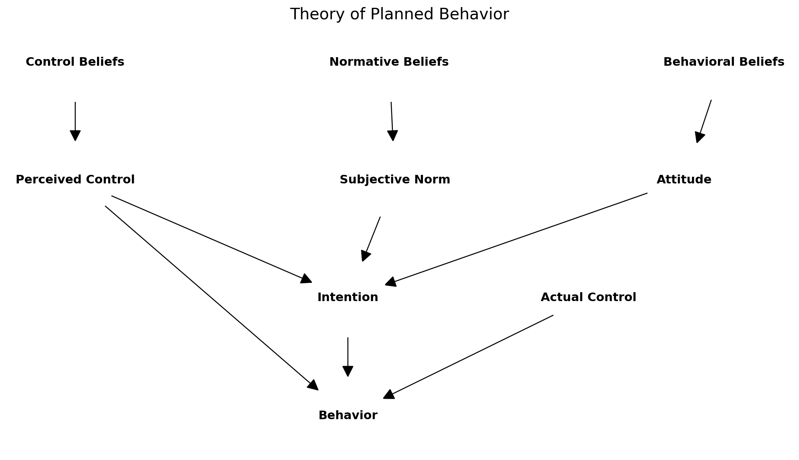

export const quartoRawHtml =
[`
<table>
<caption>Theoretical lenses found in my research.</caption>
<colgroup>
<col style="width: 24%" />
<col style="width: 37%" />
<col style="width: 38%" />
</colgroup>
<thead>
<tr>
<th>Theory / Framework</th>
<th>Key Contribution</th>
<th>Sections Where Used</th>
</tr>
</thead>
<tbody>
<tr>
<td>Theory of Planned Behaviour (TPB)</td>
<td>Core explanatory model linking attitudes, norms, control and intention to sustainable finance behaviour</td>
<td>Overall</td>
</tr>
<tr>
<td>Planetary Boundaries</td>
<td>Situates individual financial choices within global ecological thresholds</td>
<td>Sustainability</td>
</tr>
<tr>
<td>Circular Economy</td>
<td>Provides closed-loop design principles for product-passport features</td>
<td>Design / Money</td>
</tr>
<tr>
<td>Triple Bottom Line (TBL)</td>
<td>Connects profit, people and planet in ESG analysis</td>
<td>Money</td>
</tr>
<tr>
<td>Technology Acceptance Model (TAM)</td>
<td>Explains perceived usefulness / ease of use for AI companion</td>
<td>AI</td>
</tr>
<tr>
<td>Fogg Behaviour Model (FBM)</td>
<td>Maps motivation-ability-trigger nudges in UI</td>
<td>Design</td>
</tr>
<tr>
<td>Heuristic–Systematic Model (HSM)</td>
<td>Explains quick credibility heuristics vs. deep cues</td>
<td>AI</td>
</tr>
<tr>
<td>Algorithmic Experience (AX) model</td>
<td>Describes how users form mental models of opaque AI</td>
<td>AI</td>
</tr>
<tr>
<td>Choice Architecture / Behavioural Nudges</td>
<td>Frames defaults and eco-filter prompts in super-app context</td>
<td>Design</td>
</tr>
<tr>
<td>Systems Thinking</td>
<td>Positions app interventions within broader supply-chain loops</td>
<td>Design</td>
</tr>
<tr>
<td>Ecological &amp; Doughnut Economics</td>
<td>Critiques GDP-only metrics; motivates regenerative finance lens</td>
<td>Money</td>
</tr>
<tr>
<td>Participatory / Multi-species Design</td>
<td>Broadens stakeholder set to non-human actors</td>
<td>Design</td>
</tr>
<tr>
<td>Service Design for Sustainability</td>
<td>Maps end-to-end user journey (repair, swap, delivery)</td>
<td>Design</td>
</tr>
<tr>
<td>Earth-System Law</td>
<td>Links micro-level nudges to macro-level legal frameworks</td>
<td>Sustainability</td>
</tr>
</tbody>
</table>
`,`
<table>
<thead>
<tr>
<th>Group</th>
<th>Task</th>
</tr>
</thead>
<tbody>
<tr>
<td>Experts (Finance)</td>
<td>Interview</td>
</tr>
<tr>
<td>Experts (Design)</td>
<td>Interview</td>
</tr>
<tr>
<td>Experts (Sustainability)</td>
<td>Interview</td>
</tr>
<tr>
<td>Target Audience (College Students)</td>
<td>Survey</td>
</tr>
<tr>
<td>Target Audience (College Students)</td>
<td>Prototype Testing</td>
</tr>
</tbody>
</table>
`,`
<table>
<colgroup>
<col style="width: 30%" />
<col style="width: 27%" />
<col style="width: 17%" />
<col style="width: 25%" />
</colgroup>
<thead>
<tr>
<th>Interview Mode</th>
<th>Number of Experts</th>
<th>Language</th>
<th>Recording Method</th>
</tr>
</thead>
<tbody>
<tr>
<td>Video Call</td>
<td>5</td>
<td>English</td>
<td>Audio &amp; Video</td>
</tr>
<tr>
<td>Face-to-Face</td>
<td>1</td>
<td>English</td>
<td>Audio &amp; Video</td>
</tr>
<tr>
<td>WhatsApp Voice Msgs</td>
<td>1</td>
<td>Portuguese</td>
<td>Audio</td>
</tr>
</tbody>
</table>
`,`
<table>
<colgroup>
<col style="width: 79%" />
<col style="width: 20%" />
</colgroup>
<thead>
<tr>
<th>Question</th>
<th>Category</th>
</tr>
</thead>
<tbody>
<tr>
<td>How do industry experts describe their design and sustainability principles?</td>
<td>Design Principles</td>
</tr>
<tr>
<td>What AI and technology strategies do industry experts employ?</td>
<td>AI Strategies</td>
</tr>
<tr>
<td>What common language emerges between design, sustainability, finance, and AI?</td>
<td>Common Language</td>
</tr>
<tr>
<td>How do experts link systems thinking across design, sustainability, AI, and finance?</td>
<td>System Thinking</td>
</tr>
<tr>
<td>In what ways do experts emphasize transparency in their discussions on design, sustainability, AI, and finance?</td>
<td>Transparency</td>
</tr>
<tr>
<td>How is simplicity articulated by experts in relation to design, sustainability, AI, and finance?</td>
<td>Simplicity</td>
</tr>
<tr>
<td>What role do feedback loops play in the experts’ frameworks for design, sustainability, AI, and finance?</td>
<td>Feedback Loops</td>
</tr>
<tr>
<td>How do experts define long term impact in the context of design, sustainability, AI, and finance?</td>
<td>Long term Impact</td>
</tr>
</tbody>
</table>
`,`
<table>
<caption>36 Likert Fields included in the survey</caption>
<colgroup>
<col style="width: 47%" />
<col style="width: 52%" />
</colgroup>
<thead>
<tr>
<th>Original Question in Chinese</th>
<th>English Translation</th>
</tr>
</thead>
<tbody>
<tr>
<td>如果你/妳懷疑你/妳要買的番茄可能是由強迫勞工（現代奴隸）採摘的，你/妳仍然會買它嗎？</td>
<td>If you suspect that the tomatoes you are going to buy may have been picked by forced labor (modern slaves), would you still buy them?</td>
</tr>
<tr>
<td>你/妳關心食安嗎？</td>
<td>Do you care about food safety?</td>
</tr>
<tr>
<td>你/妳7年內買車嗎？🚘</td>
<td>Will you buy a car within 7 years? 🚘</td>
</tr>
<tr>
<td>你/妳7年內買房嗎？🏡</td>
<td>Will you buy a house within 7 years? 🏡</td>
</tr>
<tr>
<td>你/妳購物時知道產品環保嗎？</td>
<td>Do you know if the products are environmentally friendly when you shop?</td>
</tr>
<tr>
<td>你/妳覺得認證環保的公司更好嗎？</td>
<td>Do you think companies certified as environmentally friendly are better?</td>
</tr>
<tr>
<td>你/妳支持肉稅嗎？</td>
<td>Do you support a meat tax?</td>
</tr>
<tr>
<td>你/妳關心食用雞的生活嗎？</td>
<td>Do you care about the lives of chickens raised for food?</td>
</tr>
<tr>
<td>你/妳避免吃肉嗎？</td>
<td>Do you avoid eating meat?</td>
</tr>
<tr>
<td>你/妳覺得你/妳花錢會影響環境嗎？</td>
<td>Do you think your spending affects the environment?</td>
</tr>
<tr>
<td>你/妳會對金錢感到焦慮嗎？</td>
<td>Do you feel anxious about money?</td>
</tr>
<tr>
<td>你/妳會對金錢很節儉嗎？</td>
<td>Are you very frugal with money?</td>
</tr>
<tr>
<td>你/妳會經常存錢嗎？</td>
<td>Do you often save money?</td>
</tr>
<tr>
<td>你/妳對自己的財務知識滿意嗎？</td>
<td>Are you satisfied with your financial knowledge?</td>
</tr>
<tr>
<td>你/妳投資會考慮環保嗎？</td>
<td>Do you consider environmental protection when investing?</td>
</tr>
<tr>
<td>你/妳覺得台灣的經濟目標是增長嗎？</td>
<td>Do you think Taiwan’s economic goal is growth?</td>
</tr>
<tr>
<td>你/妳覺台灣的得環境退化是台灣的經濟增長的前提嗎？</td>
<td>Do you think environmental degradation in Taiwan is a prerequisite for Taiwan’s economic growth?</td>
</tr>
<tr>
<td>你/妳覺得台灣的經濟增長有助於保護環境嗎？</td>
<td>Do you think Taiwan’s economic growth helps protect the environment?</td>
</tr>
<tr>
<td>你/妳覺得經濟能不排CO<sub>2</sub>eq也增長嗎？</td>
<td>Do you think the economy can grow without emitting CO<sub>2</sub>eq?</td>
</tr>
<tr>
<td>你/妳覺得經濟增長有物質限制嗎？</td>
<td>Do you think there are material limits to economic growth?</td>
</tr>
<tr>
<td>你/妳會每天都用AI嗎？</td>
<td>Do you use AI every day?</td>
</tr>
<tr>
<td>你/妳會信任AI嗎？</td>
<td>Do you trust AI?</td>
</tr>
<tr>
<td>你/妳想要AI有個造型嗎？</td>
<td>Do you want AI to have a specific appearance?</td>
</tr>
<tr>
<td>你/妳喜歡待在大自然嗎？</td>
<td>Do you like being in nature?</td>
</tr>
<tr>
<td>你/妳擔心氣候變化嗎？</td>
<td>Are you worried about climate change?</td>
</tr>
<tr>
<td>你/妳對環境污染情況會感到焦慮嗎？</td>
<td>Do you feel anxious about environmental pollution?</td>
</tr>
<tr>
<td>你/妳知道許多植物和動物的名字嗎？</td>
<td>Do you know the names of many plants and animals?</td>
</tr>
<tr>
<td>你/妳感覺自己和大自然很接近嗎？</td>
<td>Do you feel close to nature?</td>
</tr>
<tr>
<td>你/妳努力實踐低碳生活嗎？</td>
<td>Do you strive to live a low-carbon lifestyle?</td>
</tr>
<tr>
<td>你/妳想做更多環保事嗎？</td>
<td>Do you want to do more for environmental protection?</td>
</tr>
<tr>
<td>你/妳對環境相關政治議題有興趣嗎？</td>
<td>Are you interested in environmental political issues?</td>
</tr>
<tr>
<td>你/妳信任碳排放抵消額度嗎？</td>
<td>Do you trust carbon offset credits?</td>
</tr>
<tr>
<td>你/妳的環保行動對環境保護有效果嗎？</td>
<td>Do your environmental actions have an effect on environmental protection?</td>
</tr>
<tr>
<td>你/妳想在行業內推環保嗎？</td>
<td>Do you want to promote environmental protection within your industry?</td>
</tr>
<tr>
<td>你/妳得自己對新觀念開放嗎？</td>
<td>Are you open to new ideas?</td>
</tr>
<tr>
<td>你/妳的大學對可環保性支持嗎？</td>
<td>Does your university support environmental sustainability?</td>
</tr>
</tbody>
</table>
`,`
<table>
<colgroup>
<col style="width: 26%" />
<col style="width: 36%" />
<col style="width: 36%" />
</colgroup>
<tbody>
<tr>
<td>Region</td>
<td>University</td>
<td>No of Testees</td>
</tr>
<tr>
<td>Taichung</td>
<td>國立中興大學 National Chung Hsing University (NCHU)</td>
<td>7</td>
</tr>
<tr>
<td>Chiayi</td>
<td>國立中正大學 National Chung Cheng University (CCU)</td>
<td>5</td>
</tr>
<tr>
<td>Tainan</td>
<td>國立成功大學 National Cheng Kung University (NCKU)</td>
<td>6</td>
</tr>
<tr>
<td>Tainan</td>
<td>國立臺南藝術大學 Tainan National University of the Arts (TNNUA)</td>
<td>2</td>
</tr>
<tr>
<td>Tainan</td>
<td>長榮大學 Chang Jung Christian University (CJCU)</td>
<td>5</td>
</tr>
<tr>
<td>Tainan</td>
<td>南臺科技大學 Southern Taiwan University of Science and Technology (STUST)</td>
<td>5</td>
</tr>
<tr>
<td>Pingtung</td>
<td>國立屏東科技大學 National Pingtung University of Science and Technology (NPUST)</td>
<td>2</td>
</tr>
</tbody>
</table>
`];

````mdx-code-block
import MyEmbed from '/src/components/Embed'
import Figure from '/src/components/Figure'
import Concepts from '../images/methodology/concept-map.png'
import Methodology from '../images/methodology/research-methodology.png'
import Everything from "../images/discussion/everything.png";
import AppTestingFlow from '../images/testing/app-testing-flow.png'
import Elephant from '../images/discussion/elephant.png'
````

# Methodology

## Research Design

(Baytaş, 2020) categorizes design research into three modes: (1)
conducting research to inform design decisions, (2) studying designs to
generate knowledge, and (3) using design itself as a means of inquiry.
My research is of the 1st category, aiming to make better design
decisions for my sustainability-focused financial app. When developing
my research design, I relied on the advice of (Christian Rohrer, 2022)
to decide when to choose which user experience research methods.

To knit together the themes of youth finance and sustainability, with
the help of interaction design and AI, this study adopts the *Theory of
Planned Behavior* (TPB) as its primary analytic frame used to organize
the overall results from a theoretical point of view. TPB states that
the strength of a person’s intention depends on three belief clusters:
(1) a cognitive and affective attitude toward the act, (2) perceived
social norms, and (3) perceived behavioral control (Ajzen, 1991).

By foregrounding TPB I can interpret both the adoption of a financial AI
companion and the subsequent shift toward sustainable shopping, saving,
and investing with a single set of constructs. (Hagger & Hamilton, 2025)
extensive meta-meta-study (study of several underlying meta-studies)
summarize 40 years of TPB research, showing strong, consistent effects
of *attitude*, *subjective norm*, and *perceived behavioral control* on
*intentions*, and of intentions on behavior; the effect is found to be
robust across various behaviors, populations, and study designs.

The graph below shows the basic structure of TPB.

<div id="fig-plan-beh">



Figure 1: Theory of Planned Behaviour

</div>

Additional theoretical lenses used in my work include the following.

<div dangerouslySetInnerHTML={{ __html: quartoRawHtml[0] }} />

## Research Methods

Overview of research methods.

<div dangerouslySetInnerHTML={{ __html: quartoRawHtml[1] }} />

This mixed-method research design is divided into three stages.

### Phase One - Qualitative Research

My purpose for the first qualitative stage is to explore the general
themes arising from the literature review related to the design of AI
advisors for investing. I identified specific user experience factors,
through interviewing experts in financial technology and user experience
design and reviewing existing applications on the marketplace. At this
stage in the research, the central concept being studied was defined
generally as expectations towards a sustainable investment AI advisor.

I started with literature review, which led into expert interviews
(there were many questions arising from the literature). I identified
key concepts from expert discussions and gained exposure to their
industry insights.

The qualitative research methods employed in the first stage of the
research design enables me to explore concepts arising for literature
review further, using a more open approach, without limiting the
conversation only to pre-ascribed notions. The strength of the
qualitative approach in the first stage is to encourage the discovery of
new ideas, not yet common in literature and potential user experience
factors related to sustainable investing and user experience.

#### Sampling

My qualitative sampling structure used non-probability snowball
sampling, with the following criteria: targeting financial industry,
fintech, design, and sustainability experts; located everywhere.

#### Methods

I conducted exploratory research in English using semi-structured
interviews recorded online and offline. I talked to 5 experts over video
call, 1 expert face-to-face, and 1 expert over WhatsApp voice messages;
6 interviews were conducted in English and 1 in Portuguese. I recorded
audio and video, transcribed the conversations. I used OpenAI’s o3 model
to translate the Portuguese interview to English. I then performed
thematic analysis across all the contents, leading to a *wish list* of
features.

<div dangerouslySetInnerHTML={{ __html: quartoRawHtml[2] }} />

Thematic analysis coding was developed using Atlas.ti “Intentional AI
Coding” feature, using the following prompt:

> “How do industry experts describe their design and sustainability
> principles, AI and technology strategies? What common language emerges
> between design, sustainability, finance, and AI? Identify passages
> where experts link system thinking, transparency, simplicity, feedback
> loops, and long term impact across design, sustainability, AI, and
> finance.” - Prompt for Atlas.ti “Intentional AI Coding”

Specific questions generated by Atlast.ti from the prompt, which guide
the AI coding.

<div dangerouslySetInnerHTML={{ __html: quartoRawHtml[3] }} />

#### Conceptual Framework

The conceptual framework map presents the key concepts arising from the
literature review thus far in the research process. I’m using these
concepts when developing interview strategies for phase one of the
research, developing the survey questionnaire for phase two, as well as
for building the Green Filter AI Companion for young adults at the final
stage of the process. However, I expect the conceptual framework to
further evolve with additional findings while conducting my research.

````mdx-code-block
<Figure caption="Concept map" src={Concepts} />
````

Conceptual Model

Initial version of the concept map focused on the app itself.
<MyEmbed src="https://xmind.works/share/Yu5h5ikA" text="Loading Mindmap..." />

Current concept map focusing on sustainability:

<MyEmbed src="https://miro.com/app/live-embed/uXjVPEUthh4=/?moveToViewport=-768,-439,1536,876&embedId=523854480229" text="Loading Concept Map..." />

````mdx-code-block
<Figure
  caption="Overall Concept Map"
  src={Everything}
/>
````

### Phase Two - Quantitative Research

I then proceeded to the second, quantitative stage, informed by the
previously identified factors, and prepared a survey to understand
potential users’ preferences, including a Likert scale, a choice
experiment, and a selection of proposed features, focusing on the
preferences of the potential users in Gen-Z, aged 18-29, living in
Taiwan.

#### Sampling

My quantitative sampling structure uses a judgmental criterion: adults
aged in Gen-Z (18-29), located in Taiwan, surveyed using a
Chinese-language online survey.

#### Methods

Likert: The survey includes a Likert scale between 1 to 5 to validate
key findings from the first stage of the research by assessing responses
to statements regarding the app’s design, features, and other criteria
that may still emerge.

Choice Experiment: The survey includes a *choice experiment* between
different sets of potential features available when communicating with
the sustainable finance AI companion.

#### Survey Development and Expected Findings

In December 2020, in preparation for the final version of the survey, I
ran a preliminary questionnaire, testing open-ended and close-ended
questions, as way to prepare for the proposal of this research. I
conducted a preliminary round of face-to-face interviews using 21
open-ended, probing questions and a convenience sampling of NCKU foreign
students (n = 12) on campus between ages 19 and 29. The interviews were
conducted in English and lasted between 9 and 21 minutes; they gave me
some initial feedback on my research idea, the respondents’ daily
routines, app usage, and feelings towards financial questions, including
investing, relationship with nature, and environmental sustainability

This preliminary version of the survey was only used to develop the
questionnaire itself and the data collected (even though the recorded
audio was transcribed), is not part of the research results. These
preliminary conversations led me to emphasize more on the financial
journey of the user, i.e. to consider the importance of the shopping,
savings, and payments, with the apps students already use daily, serving
as an entry point to becoming an investor (this approach later became
known as embedded finance). I expected my future research findings to
confirm this initial idea and to offer diverse ways and examples of what
that path could look like in practice.

I then proceeded to change my target audience to Taiwanese students and
developed the survey to include more specific questions, including more
close-ended multiple-choice varieties.

#### Final Survey: Data Collection

For the actual survey, I developed 63 close-ended and open-ended
questions. For survey distribution, I adopted a face-to-face method to
increase response rates, distributing flyers to students on college
campuses, canteens, and classrooms, getting verbal permission from
educators in their classrooms to distribute the survey flyer. Similarly
to the approach take by (Liu et al., 2023), I distributed the survey
flyer at universities located in the Northern, Soutern, Central, and
East regions of Taiwan. The flyer included a colorful AI-generated
visual with a futuristic game-like female figure, and the title “climate
anxiety survey” in Chinese, as well as a website link (ziran.tw) and
scannable QR-code.

The survey only included questions and descriptions in Chinese. I have
used the Claude 3 Opus model to translate them to English for this
table.

<div dangerouslySetInnerHTML={{ __html: quartoRawHtml[4] }} />

Respondents who remained outside the survey parameters were allowed to
answer the survey however their responses were disregarded from the data
analysis. References were stored in the Zotero paid version with 6 GB
storage. Bibtex and Better Bibtex were used to export the references to
the .bib format consumable by the Quarto scientific writing system.

### Phase Three - Qualitative Research

In the third and last phase, I returned to qualitative methods, to
further validate the quantitative findings from stage two, by building a
prototype of the sustainable investing AI companion, taking into account
insights gathered in the previous stage. Here my focus was on
operationalizing the gathered insights into a prototype that users can
experiment with. I designed and refined a prototype of the personal
sustainable finance AI assistant. I used face-to-face interviews to
discuss the prototype, and conducted a thematic analysis of the
discussions’ recordings, leading to further validation of previously
gathered data and changes in the prototype. The gained insights,
accompanied by the app prototype, which embodies my findings, are the
final outcome of my research.

#### Sampling

The phase three sampling structure used a judgmental criterion:

-   Age Gen-Z cohort
-   Located in Taiwan
-   Using Chinese for discussion.

Individual face-to-face interviews were organized at universities around
Taiwan. Because in-person presence is required in this stage, the
prototype will only be tested by potential users physically present in
Taiwan. To avoid convenience sampling, I posted online ads in Chinese
and reach out to varied student clubs to invite people who I don’t know
personally, to participate in a “sustainable AI application testing”
(wording may change).

#### Methods

Face-to-face prototype testing. The strength of in-person is the ability
to observe potential users, where knowledge can be exchanged directly.
The interviews were recorded and transcribed. Finally, I performed a
thematic analysis of the interview transcriptions in order to validate
previous findings, and open avenues for future research.

````mdx-code-block
<Figure caption="Overview of research methodology" src={Methodology} />
````

Interview transcripts from Descript and Google Speech-to-Text model were
combined using Gemini 2.5 Pro Experimental 03-25
(gemini-2.5-pro-exp-03-25) model.

#### Prototype Testing

Does the prototype match user needs?

Testing was the most difficult part of the thesis process.

-   Testing with random people found at the university.

-   Testing with experts.

-   Testing with unknown people in the target audience.

App Testing Flow

````mdx-code-block
<Figure caption="App Testing Flow" src={AppTestingFlow} />
````

#### 1st Wave of (Preliminary) Prototype Testing (Spring 2024) {#st-wave-of-preliminary-prototype-testing-spring-2024}

The 1st wave of preliminary testing took place during 1 month from 2024
April 2 to May 2, 2024 at the NCKU campus. I found 8 anonymous
participants at different NCKU locations, such as the student canteens
and the medical library, confirmed the people I approached were
Taiwanese students studying at NCKU, and then simply asked them to test
my app, using my own laptop. I made use of *participant observation* and
took notes myself. There was no audio or video recording.

#### 2nd Wave of (In Production) Prototype Testing (Autumn 2024 - Spring 2025) {#nd-wave-of-in-production-prototype-testing-autumn-2024---spring-2025}

The 2nd wave of testing took place from Autumn 2024 to Spring 2025 and
was more comprehensive. I conducted in-person face-to-face testing
individually with 32 students at 7 universities. Interviews were
conducted in Chinese and transcribed and translated to English using
Google Voice to Text AI as well as Describe AI.

<div dangerouslySetInnerHTML={{ __html: quartoRawHtml[5] }} />
