export const quartoRawHtml =
[`<div>
<style scoped>
    .dataframe tbody tr th:only-of-type {
        vertical-align: middle;
    }
    .dataframe tbody tr th {
        vertical-align: top;
    }
    .dataframe thead th {
        text-align: right;
    }
</style>
`,`
</div>`,`<div>
<style scoped>
    .dataframe tbody tr th:only-of-type {
        vertical-align: middle;
    }
    .dataframe tbody tr th {
        vertical-align: top;
    }
    .dataframe thead th {
        text-align: right;
    }
</style>
`,`
</div>`,`<div>
<style scoped>
    .dataframe tbody tr th:only-of-type {
        vertical-align: middle;
    }
    .dataframe tbody tr th {
        vertical-align: top;
    }
    .dataframe thead th {
        text-align: right;
    }
</style>
`,`
</div>`,`<div>
<style scoped>
    .dataframe tbody tr th:only-of-type {
        vertical-align: middle;
    }
    .dataframe tbody tr th {
        vertical-align: top;
    }
    .dataframe thead th {
        text-align: right;
    }
</style>
`,`
<p>319 rows × 2 columns</p>
</div>`,`<div>
<style scoped>
    .dataframe tbody tr th:only-of-type {
        vertical-align: middle;
    }
    .dataframe tbody tr th {
        vertical-align: top;
    }
    .dataframe thead th {
        text-align: right;
    }
</style>
`,`
</div>`];

# Results

## Expected Findings

-   During the preparation of this research proposal, I conducted a
    preliminary round of face-to-face interviews using 21 open-ended
    probing questions using a convenience sampling of NCKU students on
    campus between ages 19 and 29, a total of 12 respondents. The
    interviews lasted between 9 and 21 minutes and were conducted to get
    some initial feedback on my research idea, the respondents’ daily
    routines, app usage, feelings towards financial questions, including
    investing, relationship with nature, and environmental
    sustainability. These preliminary conversations led me to emphasize
    more on the financial journey, i.e., to consider the importance of
    the shopping, savings, and payments apps students already use daily,
    which could serve as an entry point to becoming an investor. I
    expect my future research findings to confirm this initial idea and
    offer diverse ways and examples of what that path could look like in
    practice.

## Survey Overview / import from Ziran {#survey-overview-import-from-ziran}

A survey of Taiwanese college students (excludes overseas
Chinese-speaking students as well as foreign students) covering
attitudes towards shopping, saving, investing, economy, nature,
sustainability, and AI.

Survey Oct. 13th - Nov. 3rd, 2023

2000 cards with a QR code printed out

Distribution conducted at 8 universities (handing out the cards)

1289 people started the survey, 518 quit

771 people completed the whole survey

Data after filtering: 675 people aged 18-26 (Gen-Z), Taiwanese, current
students in BA (large majority), MA (small minority) or PhD level (very
few respondents)

36 likert fields (5-point scale) used for clustering the students into 3
personas with K-means clustering

14 product features (multiple-choice) used for K-modes clustering

4 choice experiments

2 option ranking questions

10 text fields used to enrich the personas

## Respondent Demographics

### University

Universities with the most respondents are those where flyers were
distributed.

<div dangerouslySetInnerHTML={{ __html: quartoRawHtml[0] }} />

|     | University                                                 | Number of Respondents |
|-----|------------------------------------------------------------|-----------------------|
| 0   | 國立成功大學 National Cheng Kung University (NCKU)         | 180                   |
| 1   | 輔仁大學 Fu Jen Catholic University (FJU)                  | 158                   |
| 2   | 銘傳大學 Ming Chuan University (MCU)                       | 133                   |
| 3   | 國立臺灣大學 National Taiwan University (NTU)              | 93                    |
| 4   | 國立東華大學 National Dong Hwa University (NDHU)           | 45                    |
| 5   | 南臺科技大學 Southern Taiwan University of Science a...    | 18                    |
| 6   | 國立臺南大學 National University of Tainan (NUTN)          | 17                    |
| 7   | 國立臺灣科技大學 National Taiwan University of Science...  | 4                     |
| 8   | 國立中央大學 National Central University (NCU)             | 3                     |
| 9   | 國立臺灣師範大學 National Taiwan Normal University (NTNU)  | 3                     |
| 10  | 國立清華大學 National Tsing Hua University (NTHU)          | 2                     |
| 11  | 臺北醫學大學 Taipei Medical University (TMU)               | 2                     |
| 12  | 長榮大學 Chang Jung Christian University (CJCU)            | 2                     |
| 13  | 臺南應用科技大學 Tainan University of Technology (TUT)     | 1                     |
| 14  | 中華醫事科技大學 Chung Hwa University of Medical Techn...  | 1                     |
| 15  | 國立臺北大學 National Taipei University (NTPU)             | 1                     |
| 16  | 東吳大學 Soochow University (SCU)                          | 1                     |
| 17  | 玉山神學院\tYu-Shan Theological College and Seminary       | 1                     |
| 18  | 國立屏東科技大學 National Pingtung University of Scien...  | 1                     |
| 19  | 明道大學 MingDao University (MDU)                          | 1                     |
| 20  | 國立政治大學 National Chengchi University (NCCU)           | 1                     |
| 21  | 國立高雄科技大學 National Kaohsiung University of Scie...  | 1                     |
| 22  | 國立臺南藝術大學 Tainan National University of the Art...  | 1                     |
| 23  | 國立嘉義大學 National Chiayi University (NCYU)             | 1                     |
| 24  | 國立虎尾科技大學 National Formosa University (NFU)         | 1                     |
| 25  | 國立中興大學 National Chung Hsing University (NCHU)        | 1                     |
| 26  | 國立雲林科技大學 National Yunlin University of Science...  | 1                     |
| 27  | 東海大學 Tunghai University (THU)                          | 1                     |
| 28  | 經國管理暨健康學院 Ching Kuo Institute of Management an... | 1                     |
| 29  | 國立中正大學 National Chung Cheng University (CCU)         | 1                     |
| 30  | 國立臺北科技大學 National Taipei University of Technol...  | 1                     |
| 31  | 元智大學 Yuan Ze University (YZU)                          | 1                     |
| 32  | 國立臺東專科學校 National Taitung Junior College (NTC)     | 1                     |
| 33  | 逢甲大學 Feng Chia University (FCU)                        | 1                     |

<div dangerouslySetInnerHTML={{ __html: quartoRawHtml[1] }} />

### Study Level

<div dangerouslySetInnerHTML={{ __html: quartoRawHtml[2] }} />

|     | Study Level | Number of Students |
|-----|-------------|--------------------|
| 0   | 學士        | 603                |
| 1   | 碩士        | 73                 |
| 2   | 博士        | 5                  |

<div dangerouslySetInnerHTML={{ __html: quartoRawHtml[3] }} />

### Age Distribution

<div dangerouslySetInnerHTML={{ __html: quartoRawHtml[4] }} />

|     | Age | Number of Students |
|-----|-----|--------------------|
| 0   | 18  | 180                |
| 1   | 21  | 130                |
| 2   | 19  | 117                |
| 3   | 20  | 108                |
| 4   | 22  | 67                 |
| 5   | 23  | 40                 |
| 6   | 24  | 19                 |
| 7   | 25  | 15                 |
| 8   | 26  | 5                  |

<div dangerouslySetInnerHTML={{ __html: quartoRawHtml[5] }} />

### Field of Study

These fields of study have not been normalized (different names for the
same field of study may exist)

<div dangerouslySetInnerHTML={{ __html: quartoRawHtml[6] }} />

|     | Field of Study | Number of Students |
|-----|----------------|--------------------|
| 0   | 犯罪防治學系   | 26                 |
| 1   | 影像傳播學系   | 20                 |
| 2   | 影像傳播       | 17                 |
| 3   | 商品設計學系   | 11                 |
| 4   | 外文系         | 11                 |
| ... | ...            | ...                |
| 314 | 英語學系       | 1                  |
| 315 | 土木           | 1                  |
| 316 | 牙醫學系       | 1                  |
| 317 | 物治           | 1                  |
| 318 | 創新產品設計系 | 1                  |

<div dangerouslySetInnerHTML={{ __html: quartoRawHtml[7] }} />

### Personality Type

<div dangerouslySetInnerHTML={{ __html: quartoRawHtml[8] }} />

|     | MBTI Type                                      | Number of Students |
|-----|------------------------------------------------|--------------------|
| 0   | INFP                                           | 91                 |
| 1   | INFJ                                           | 72                 |
| 2   | ENFP                                           | 51                 |
| 3   | 不知道                                         | 43                 |
| 4   | ISFJ                                           | 43                 |
| 5   | ENFJ                                           | 26                 |
| 6   | INTP                                           | 25                 |
| 7   | ISFP                                           | 23                 |
| 8   | ENTP                                           | 23                 |
| 9   | ESFJ                                           | 19                 |
| 10  | ESFP                                           | 16                 |
| 11  | INTJ                                           | 15                 |
| 12  | ESTJ                                           | 15                 |
| 13  | ISTJ                                           | 12                 |
| 14  | ENTJ                                           | 7                  |
| 15  | ISTP                                           | 7                  |
| 16  | ESTP                                           | 5                  |
| 17  | INFP, INTP                                     | 2                  |
| 18  | INTJ, INFJ                                     | 2                  |
| 19  | ESFJ, ENFJ                                     | 1                  |
| 20  | INFJ, ISFP, INFP                               | 1                  |
| 21  | ISFJ, ESFJ                                     | 1                  |
| 22  | ESTJ, ENFP, ENTP, ESFJ, ESTP, ESFP, INTP, INFP | 1                  |
| 23  | ISFJ, INFP                                     | 1                  |
| 24  | ENTP, ENFP                                     | 1                  |
| 25  | INFP, ENFP                                     | 1                  |
| 26  | INFP, ISFP                                     | 1                  |
| 27  | ESFP, ENFP                                     | 1                  |
| 28  | ISTJ, 不知道                                   | 1                  |

<div dangerouslySetInnerHTML={{ __html: quartoRawHtml[9] }} />

## Environment

Attitudes towards the environment.

### Ranking Experiment

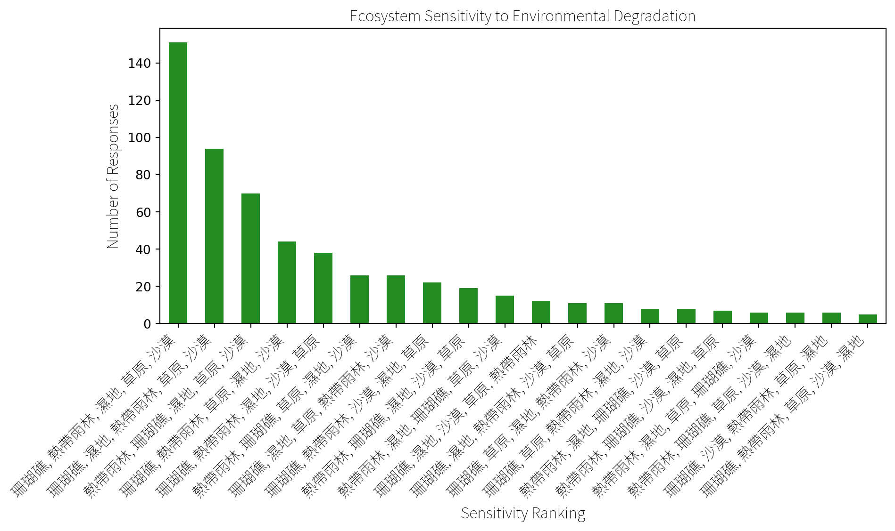

## Investing

### Investing Experience (Overall)

``` text
/Users/krishaamer/Desktop/current/thesis/green-filter-research/research/data/investing.py:17: FutureWarning: 

Passing `palette` without assigning `hue` is deprecated and will be removed in v0.14.0. Assign the `x` variable to `hue` and set `legend=False` for the same effect.

  barplot = sns.barplot(x='Investment', y='Count', data=investment_count, palette='viridis')
/Users/krishaamer/Desktop/current/thesis/green-filter-research/research/data/investing.py:19: UserWarning: set_ticklabels() should only be used with a fixed number of ticks, i.e. after set_ticks() or using a FixedLocator.
  ax.set_xticklabels(ax.get_xticklabels(), fontproperties=chinese_font)
```


### Choice Experiment

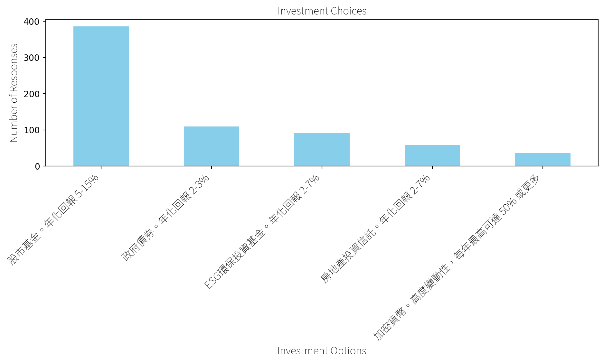

## Attitudes

These are student attitudes across all 36 likert fields without
clustering. Clustered results are available under the Personas sectioon.

### Student Attitudes (Overall)

``` text
2024-02-17 22:35:53.371 
  Warning: to view this Streamlit app on a browser, run it with the following
  command:

    streamlit run /Library/Frameworks/Python.framework/Versions/3.12/lib/python3.12/site-packages/ipykernel_launcher.py [ARGUMENTS]
/Users/krishaamer/Desktop/current/thesis/green-filter-research/research/data/attitudes.py:44: FutureWarning: 

Passing `palette` without assigning `hue` is deprecated and will be removed in v0.14.0. Assign the `x` variable to `hue` and set `legend=False` for the same effect.

  sns.countplot(
/Users/krishaamer/Desktop/current/thesis/green-filter-research/research/data/attitudes.py:44: UserWarning: The palette list has more values (10) than needed (5), which may not be intended.
  sns.countplot(
/Users/krishaamer/Desktop/current/thesis/green-filter-research/research/data/attitudes.py:44: FutureWarning: 

Passing `palette` without assigning `hue` is deprecated and will be removed in v0.14.0. Assign the `x` variable to `hue` and set `legend=False` for the same effect.

  sns.countplot(
/Users/krishaamer/Desktop/current/thesis/green-filter-research/research/data/attitudes.py:44: UserWarning: The palette list has more values (10) than needed (5), which may not be intended.
  sns.countplot(
/Users/krishaamer/Desktop/current/thesis/green-filter-research/research/data/attitudes.py:44: FutureWarning: 

Passing `palette` without assigning `hue` is deprecated and will be removed in v0.14.0. Assign the `x` variable to `hue` and set `legend=False` for the same effect.

  sns.countplot(
/Users/krishaamer/Desktop/current/thesis/green-filter-research/research/data/attitudes.py:44: UserWarning: The palette list has more values (10) than needed (5), which may not be intended.
  sns.countplot(
/Users/krishaamer/Desktop/current/thesis/green-filter-research/research/data/attitudes.py:44: FutureWarning: 

Passing `palette` without assigning `hue` is deprecated and will be removed in v0.14.0. Assign the `x` variable to `hue` and set `legend=False` for the same effect.

  sns.countplot(
/Users/krishaamer/Desktop/current/thesis/green-filter-research/research/data/attitudes.py:44: UserWarning: The palette list has more values (10) than needed (5), which may not be intended.
  sns.countplot(
/Users/krishaamer/Desktop/current/thesis/green-filter-research/research/data/attitudes.py:44: FutureWarning: 

Passing `palette` without assigning `hue` is deprecated and will be removed in v0.14.0. Assign the `x` variable to `hue` and set `legend=False` for the same effect.

  sns.countplot(
/Users/krishaamer/Desktop/current/thesis/green-filter-research/research/data/attitudes.py:44: UserWarning: The palette list has more values (10) than needed (5), which may not be intended.
  sns.countplot(
/Users/krishaamer/Desktop/current/thesis/green-filter-research/research/data/attitudes.py:44: FutureWarning: 

Passing `palette` without assigning `hue` is deprecated and will be removed in v0.14.0. Assign the `x` variable to `hue` and set `legend=False` for the same effect.

  sns.countplot(
/Users/krishaamer/Desktop/current/thesis/green-filter-research/research/data/attitudes.py:44: UserWarning: The palette list has more values (10) than needed (5), which may not be intended.
  sns.countplot(
/Users/krishaamer/Desktop/current/thesis/green-filter-research/research/data/attitudes.py:44: FutureWarning: 

Passing `palette` without assigning `hue` is deprecated and will be removed in v0.14.0. Assign the `x` variable to `hue` and set `legend=False` for the same effect.

  sns.countplot(
/Users/krishaamer/Desktop/current/thesis/green-filter-research/research/data/attitudes.py:44: UserWarning: The palette list has more values (10) than needed (5), which may not be intended.
  sns.countplot(
/Users/krishaamer/Desktop/current/thesis/green-filter-research/research/data/attitudes.py:44: FutureWarning: 

Passing `palette` without assigning `hue` is deprecated and will be removed in v0.14.0. Assign the `x` variable to `hue` and set `legend=False` for the same effect.

  sns.countplot(
/Users/krishaamer/Desktop/current/thesis/green-filter-research/research/data/attitudes.py:44: UserWarning: The palette list has more values (10) than needed (5), which may not be intended.
  sns.countplot(
/Users/krishaamer/Desktop/current/thesis/green-filter-research/research/data/attitudes.py:44: FutureWarning: 

Passing `palette` without assigning `hue` is deprecated and will be removed in v0.14.0. Assign the `x` variable to `hue` and set `legend=False` for the same effect.

  sns.countplot(
/Users/krishaamer/Desktop/current/thesis/green-filter-research/research/data/attitudes.py:44: UserWarning: The palette list has more values (10) than needed (5), which may not be intended.
  sns.countplot(
/Users/krishaamer/Desktop/current/thesis/green-filter-research/research/data/attitudes.py:44: FutureWarning: 

Passing `palette` without assigning `hue` is deprecated and will be removed in v0.14.0. Assign the `x` variable to `hue` and set `legend=False` for the same effect.

  sns.countplot(
/Users/krishaamer/Desktop/current/thesis/green-filter-research/research/data/attitudes.py:44: UserWarning: The palette list has more values (10) than needed (5), which may not be intended.
  sns.countplot(
/Library/Frameworks/Python.framework/Versions/3.12/lib/python3.12/site-packages/IPython/core/pylabtools.py:152: UserWarning: Glyph 128664 (\N{ONCOMING AUTOMOBILE}) missing from current font.
  fig.canvas.print_figure(bytes_io, **kw)
/Library/Frameworks/Python.framework/Versions/3.12/lib/python3.12/site-packages/IPython/core/pylabtools.py:152: UserWarning: Glyph 127969 (\N{HOUSE WITH GARDEN}) missing from current font.
  fig.canvas.print_figure(bytes_io, **kw)
/Users/krishaamer/Desktop/current/thesis/green-filter-research/research/data/attitudes.py:44: FutureWarning: 

Passing `palette` without assigning `hue` is deprecated and will be removed in v0.14.0. Assign the `x` variable to `hue` and set `legend=False` for the same effect.

  sns.countplot(
/Users/krishaamer/Desktop/current/thesis/green-filter-research/research/data/attitudes.py:44: UserWarning: The palette list has more values (10) than needed (5), which may not be intended.
  sns.countplot(
/Users/krishaamer/Desktop/current/thesis/green-filter-research/research/data/attitudes.py:44: FutureWarning: 

Passing `palette` without assigning `hue` is deprecated and will be removed in v0.14.0. Assign the `x` variable to `hue` and set `legend=False` for the same effect.

  sns.countplot(
/Users/krishaamer/Desktop/current/thesis/green-filter-research/research/data/attitudes.py:44: UserWarning: The palette list has more values (10) than needed (5), which may not be intended.
  sns.countplot(
/Users/krishaamer/Desktop/current/thesis/green-filter-research/research/data/attitudes.py:44: FutureWarning: 

Passing `palette` without assigning `hue` is deprecated and will be removed in v0.14.0. Assign the `x` variable to `hue` and set `legend=False` for the same effect.

  sns.countplot(
/Users/krishaamer/Desktop/current/thesis/green-filter-research/research/data/attitudes.py:44: UserWarning: The palette list has more values (10) than needed (5), which may not be intended.
  sns.countplot(
/Users/krishaamer/Desktop/current/thesis/green-filter-research/research/data/attitudes.py:44: FutureWarning: 

Passing `palette` without assigning `hue` is deprecated and will be removed in v0.14.0. Assign the `x` variable to `hue` and set `legend=False` for the same effect.

  sns.countplot(
/Users/krishaamer/Desktop/current/thesis/green-filter-research/research/data/attitudes.py:44: UserWarning: The palette list has more values (10) than needed (5), which may not be intended.
  sns.countplot(
/Users/krishaamer/Desktop/current/thesis/green-filter-research/research/data/attitudes.py:44: FutureWarning: 

Passing `palette` without assigning `hue` is deprecated and will be removed in v0.14.0. Assign the `x` variable to `hue` and set `legend=False` for the same effect.

  sns.countplot(
/Users/krishaamer/Desktop/current/thesis/green-filter-research/research/data/attitudes.py:44: UserWarning: The palette list has more values (10) than needed (5), which may not be intended.
  sns.countplot(
/Users/krishaamer/Desktop/current/thesis/green-filter-research/research/data/attitudes.py:44: FutureWarning: 

Passing `palette` without assigning `hue` is deprecated and will be removed in v0.14.0. Assign the `x` variable to `hue` and set `legend=False` for the same effect.

  sns.countplot(
/Users/krishaamer/Desktop/current/thesis/green-filter-research/research/data/attitudes.py:44: UserWarning: The palette list has more values (10) than needed (5), which may not be intended.
  sns.countplot(
/Users/krishaamer/Desktop/current/thesis/green-filter-research/research/data/attitudes.py:44: FutureWarning: 

Passing `palette` without assigning `hue` is deprecated and will be removed in v0.14.0. Assign the `x` variable to `hue` and set `legend=False` for the same effect.

  sns.countplot(
/Users/krishaamer/Desktop/current/thesis/green-filter-research/research/data/attitudes.py:44: UserWarning: The palette list has more values (10) than needed (5), which may not be intended.
  sns.countplot(
/Users/krishaamer/Desktop/current/thesis/green-filter-research/research/data/attitudes.py:44: FutureWarning: 

Passing `palette` without assigning `hue` is deprecated and will be removed in v0.14.0. Assign the `x` variable to `hue` and set `legend=False` for the same effect.

  sns.countplot(
/Users/krishaamer/Desktop/current/thesis/green-filter-research/research/data/attitudes.py:44: UserWarning: The palette list has more values (10) than needed (5), which may not be intended.
  sns.countplot(
/Users/krishaamer/Desktop/current/thesis/green-filter-research/research/data/attitudes.py:44: FutureWarning: 

Passing `palette` without assigning `hue` is deprecated and will be removed in v0.14.0. Assign the `x` variable to `hue` and set `legend=False` for the same effect.

  sns.countplot(
/Users/krishaamer/Desktop/current/thesis/green-filter-research/research/data/attitudes.py:44: UserWarning: The palette list has more values (10) than needed (5), which may not be intended.
  sns.countplot(
/Users/krishaamer/Desktop/current/thesis/green-filter-research/research/data/attitudes.py:44: FutureWarning: 

Passing `palette` without assigning `hue` is deprecated and will be removed in v0.14.0. Assign the `x` variable to `hue` and set `legend=False` for the same effect.

  sns.countplot(
/Users/krishaamer/Desktop/current/thesis/green-filter-research/research/data/attitudes.py:44: UserWarning: The palette list has more values (10) than needed (5), which may not be intended.
  sns.countplot(
/Users/krishaamer/Desktop/current/thesis/green-filter-research/research/data/attitudes.py:44: FutureWarning: 

Passing `palette` without assigning `hue` is deprecated and will be removed in v0.14.0. Assign the `x` variable to `hue` and set `legend=False` for the same effect.

  sns.countplot(
/Users/krishaamer/Desktop/current/thesis/green-filter-research/research/data/attitudes.py:44: UserWarning: The palette list has more values (10) than needed (5), which may not be intended.
  sns.countplot(
/Users/krishaamer/Desktop/current/thesis/green-filter-research/research/data/attitudes.py:44: FutureWarning: 

Passing `palette` without assigning `hue` is deprecated and will be removed in v0.14.0. Assign the `x` variable to `hue` and set `legend=False` for the same effect.

  sns.countplot(
/Users/krishaamer/Desktop/current/thesis/green-filter-research/research/data/attitudes.py:44: UserWarning: The palette list has more values (10) than needed (5), which may not be intended.
  sns.countplot(
/Users/krishaamer/Desktop/current/thesis/green-filter-research/research/data/attitudes.py:44: FutureWarning: 

Passing `palette` without assigning `hue` is deprecated and will be removed in v0.14.0. Assign the `x` variable to `hue` and set `legend=False` for the same effect.

  sns.countplot(
/Users/krishaamer/Desktop/current/thesis/green-filter-research/research/data/attitudes.py:44: UserWarning: The palette list has more values (10) than needed (5), which may not be intended.
  sns.countplot(
/Users/krishaamer/Desktop/current/thesis/green-filter-research/research/data/attitudes.py:44: FutureWarning: 

Passing `palette` without assigning `hue` is deprecated and will be removed in v0.14.0. Assign the `x` variable to `hue` and set `legend=False` for the same effect.

  sns.countplot(
/Users/krishaamer/Desktop/current/thesis/green-filter-research/research/data/attitudes.py:44: UserWarning: The palette list has more values (10) than needed (5), which may not be intended.
  sns.countplot(
/Users/krishaamer/Desktop/current/thesis/green-filter-research/research/data/attitudes.py:44: FutureWarning: 

Passing `palette` without assigning `hue` is deprecated and will be removed in v0.14.0. Assign the `x` variable to `hue` and set `legend=False` for the same effect.

  sns.countplot(
/Users/krishaamer/Desktop/current/thesis/green-filter-research/research/data/attitudes.py:44: UserWarning: The palette list has more values (10) than needed (5), which may not be intended.
  sns.countplot(
/Users/krishaamer/Desktop/current/thesis/green-filter-research/research/data/attitudes.py:44: FutureWarning: 

Passing `palette` without assigning `hue` is deprecated and will be removed in v0.14.0. Assign the `x` variable to `hue` and set `legend=False` for the same effect.

  sns.countplot(
/Users/krishaamer/Desktop/current/thesis/green-filter-research/research/data/attitudes.py:44: UserWarning: The palette list has more values (10) than needed (5), which may not be intended.
  sns.countplot(
/Users/krishaamer/Desktop/current/thesis/green-filter-research/research/data/attitudes.py:44: FutureWarning: 

Passing `palette` without assigning `hue` is deprecated and will be removed in v0.14.0. Assign the `x` variable to `hue` and set `legend=False` for the same effect.

  sns.countplot(
/Users/krishaamer/Desktop/current/thesis/green-filter-research/research/data/attitudes.py:44: UserWarning: The palette list has more values (10) than needed (5), which may not be intended.
  sns.countplot(
/Users/krishaamer/Desktop/current/thesis/green-filter-research/research/data/attitudes.py:44: FutureWarning: 

Passing `palette` without assigning `hue` is deprecated and will be removed in v0.14.0. Assign the `x` variable to `hue` and set `legend=False` for the same effect.

  sns.countplot(
/Users/krishaamer/Desktop/current/thesis/green-filter-research/research/data/attitudes.py:44: UserWarning: The palette list has more values (10) than needed (5), which may not be intended.
  sns.countplot(
/Users/krishaamer/Desktop/current/thesis/green-filter-research/research/data/attitudes.py:44: FutureWarning: 

Passing `palette` without assigning `hue` is deprecated and will be removed in v0.14.0. Assign the `x` variable to `hue` and set `legend=False` for the same effect.

  sns.countplot(
/Users/krishaamer/Desktop/current/thesis/green-filter-research/research/data/attitudes.py:44: UserWarning: The palette list has more values (10) than needed (5), which may not be intended.
  sns.countplot(
/Users/krishaamer/Desktop/current/thesis/green-filter-research/research/data/attitudes.py:44: FutureWarning: 

Passing `palette` without assigning `hue` is deprecated and will be removed in v0.14.0. Assign the `x` variable to `hue` and set `legend=False` for the same effect.

  sns.countplot(
/Users/krishaamer/Desktop/current/thesis/green-filter-research/research/data/attitudes.py:44: UserWarning: The palette list has more values (10) than needed (5), which may not be intended.
  sns.countplot(
/Users/krishaamer/Desktop/current/thesis/green-filter-research/research/data/attitudes.py:44: FutureWarning: 

Passing `palette` without assigning `hue` is deprecated and will be removed in v0.14.0. Assign the `x` variable to `hue` and set `legend=False` for the same effect.

  sns.countplot(
/Users/krishaamer/Desktop/current/thesis/green-filter-research/research/data/attitudes.py:44: UserWarning: The palette list has more values (10) than needed (5), which may not be intended.
  sns.countplot(
/Users/krishaamer/Desktop/current/thesis/green-filter-research/research/data/attitudes.py:44: FutureWarning: 

Passing `palette` without assigning `hue` is deprecated and will be removed in v0.14.0. Assign the `x` variable to `hue` and set `legend=False` for the same effect.

  sns.countplot(
/Users/krishaamer/Desktop/current/thesis/green-filter-research/research/data/attitudes.py:44: UserWarning: The palette list has more values (10) than needed (5), which may not be intended.
  sns.countplot(
/Users/krishaamer/Desktop/current/thesis/green-filter-research/research/data/attitudes.py:44: FutureWarning: 

Passing `palette` without assigning `hue` is deprecated and will be removed in v0.14.0. Assign the `x` variable to `hue` and set `legend=False` for the same effect.

  sns.countplot(
/Users/krishaamer/Desktop/current/thesis/green-filter-research/research/data/attitudes.py:44: UserWarning: The palette list has more values (10) than needed (5), which may not be intended.
  sns.countplot(
/Users/krishaamer/Desktop/current/thesis/green-filter-research/research/data/attitudes.py:44: FutureWarning: 

Passing `palette` without assigning `hue` is deprecated and will be removed in v0.14.0. Assign the `x` variable to `hue` and set `legend=False` for the same effect.

  sns.countplot(
/Users/krishaamer/Desktop/current/thesis/green-filter-research/research/data/attitudes.py:44: UserWarning: The palette list has more values (10) than needed (5), which may not be intended.
  sns.countplot(
/Users/krishaamer/Desktop/current/thesis/green-filter-research/research/data/attitudes.py:44: FutureWarning: 

Passing `palette` without assigning `hue` is deprecated and will be removed in v0.14.0. Assign the `x` variable to `hue` and set `legend=False` for the same effect.

  sns.countplot(
/Users/krishaamer/Desktop/current/thesis/green-filter-research/research/data/attitudes.py:44: UserWarning: The palette list has more values (10) than needed (5), which may not be intended.
  sns.countplot(
/Users/krishaamer/Desktop/current/thesis/green-filter-research/research/data/attitudes.py:44: FutureWarning: 

Passing `palette` without assigning `hue` is deprecated and will be removed in v0.14.0. Assign the `x` variable to `hue` and set `legend=False` for the same effect.

  sns.countplot(
/Users/krishaamer/Desktop/current/thesis/green-filter-research/research/data/attitudes.py:44: UserWarning: The palette list has more values (10) than needed (5), which may not be intended.
  sns.countplot(
```

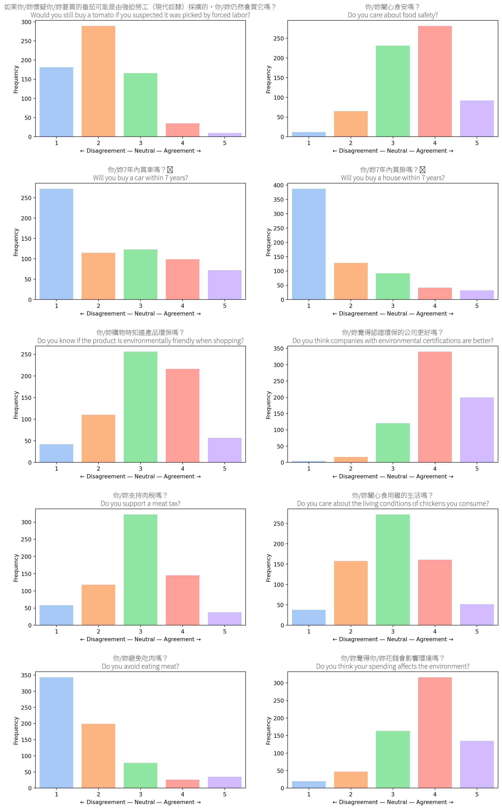

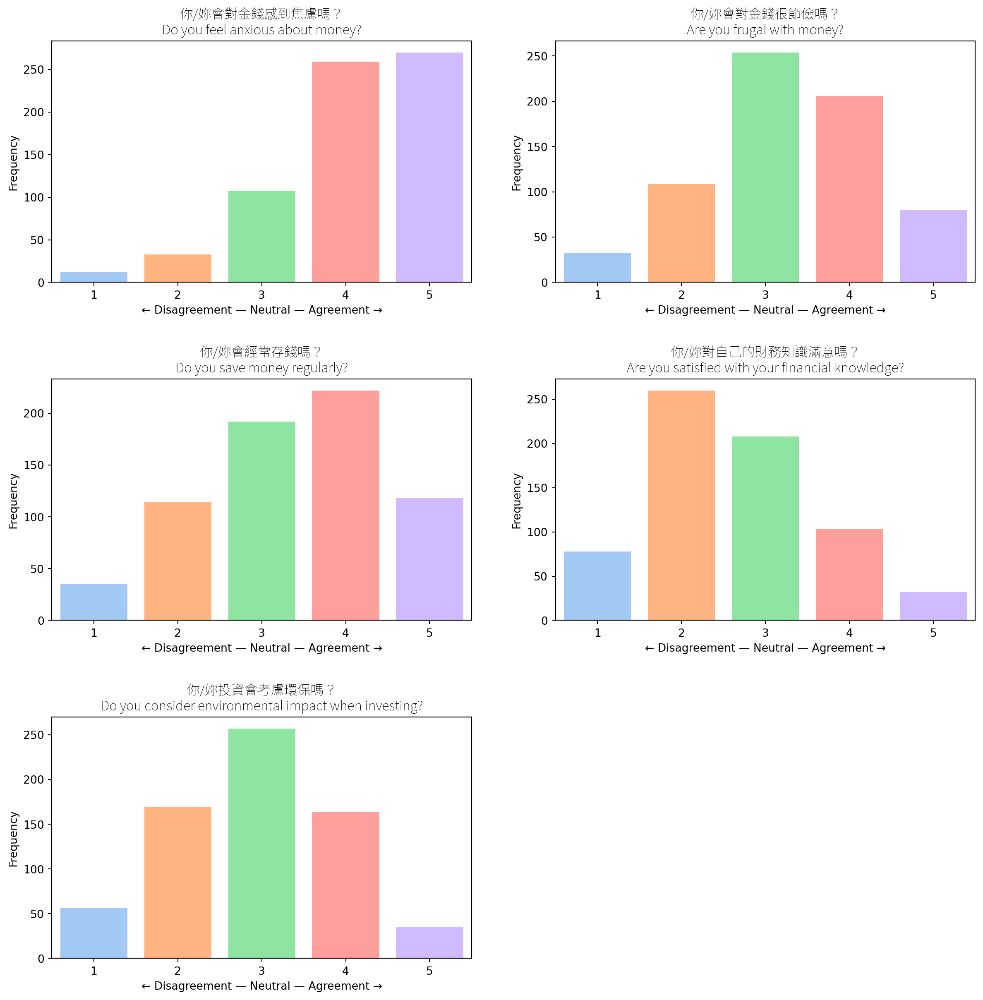

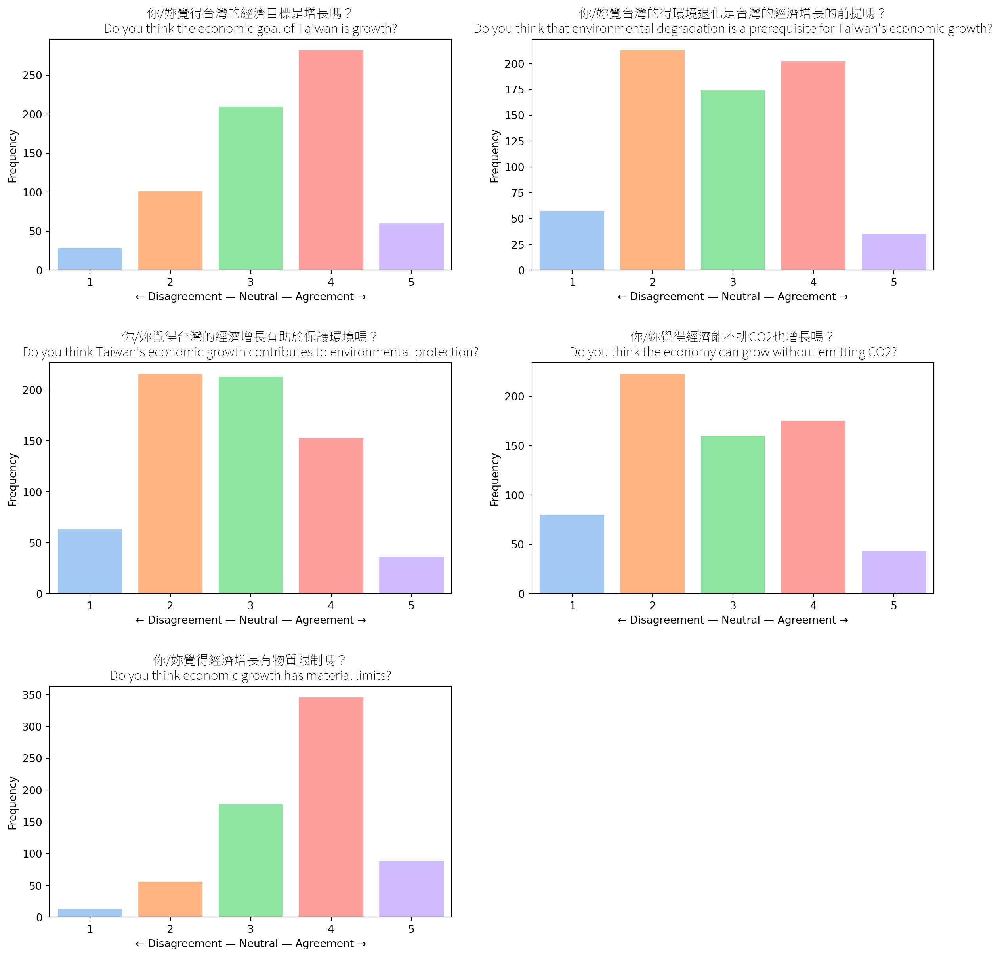


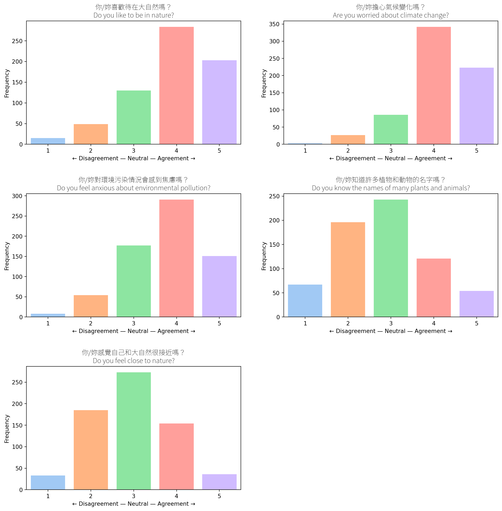


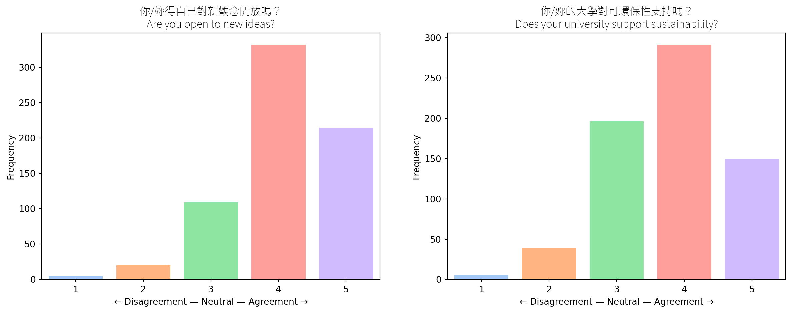

### Correlations Between Fields

``` text
/Library/Frameworks/Python.framework/Versions/3.12/lib/python3.12/site-packages/IPython/core/pylabtools.py:152: UserWarning: Glyph 127969 (\N{HOUSE WITH GARDEN}) missing from current font.
  fig.canvas.print_figure(bytes_io, **kw)
/Library/Frameworks/Python.framework/Versions/3.12/lib/python3.12/site-packages/IPython/core/pylabtools.py:152: UserWarning: Glyph 128664 (\N{ONCOMING AUTOMOBILE}) missing from current font.
  fig.canvas.print_figure(bytes_io, **kw)
```

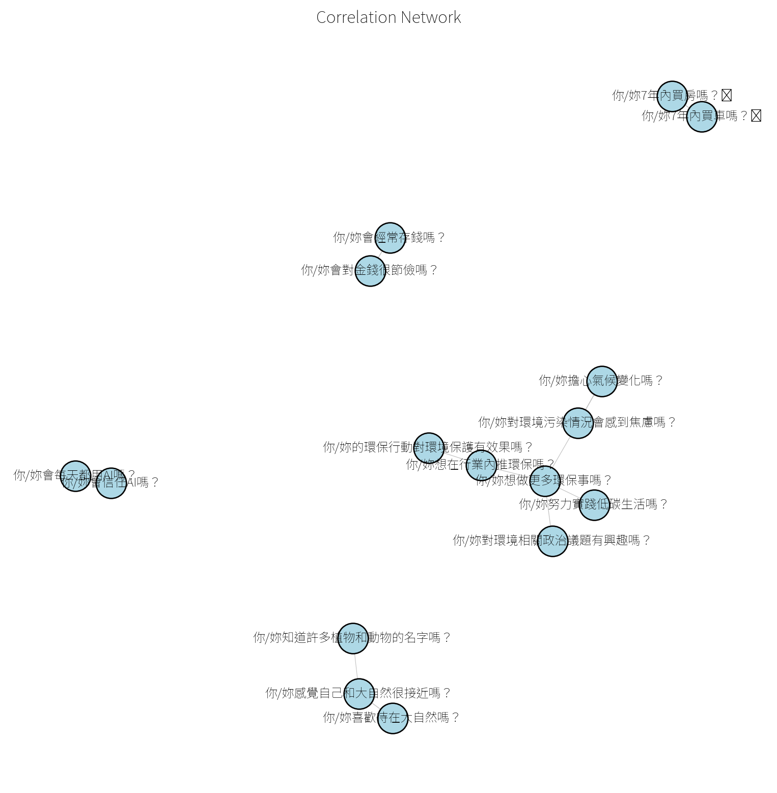

## AI Companion

### Likert-Based Clustering

AI-assistant feature choices per Likert-based Personas

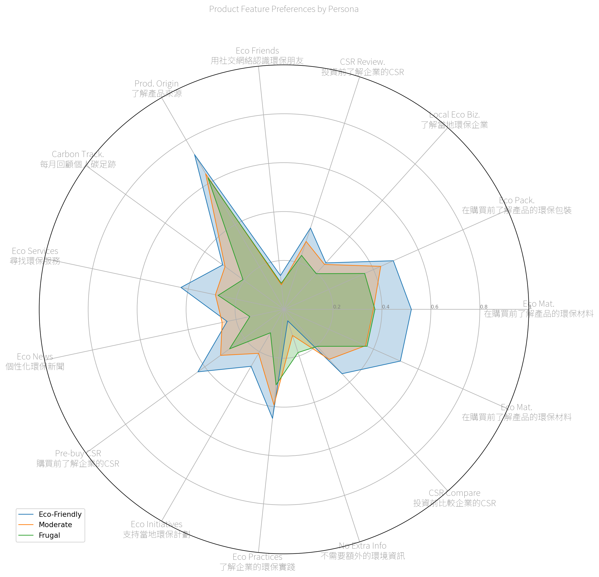

### Feature-Based Clustering

Clustering students based on AI-assistant feature choices

``` text
Init: initializing centroids
Init: initializing clusters
Starting iterations...
Run 1, iteration: 1/100, moves: 178, cost: 2121.0
Run 1, iteration: 2/100, moves: 5, cost: 2121.0
Init: initializing centroids
Init: initializing clusters
Starting iterations...
Run 2, iteration: 1/100, moves: 90, cost: 2012.0
Init: initializing centroids
Init: initializing clusters
Starting iterations...
Run 3, iteration: 1/100, moves: 274, cost: 1951.0
Run 3, iteration: 2/100, moves: 59, cost: 1924.0
Run 3, iteration: 3/100, moves: 17, cost: 1924.0
Init: initializing centroids
Init: initializing clusters
Starting iterations...
Run 4, iteration: 1/100, moves: 219, cost: 2180.0
Run 4, iteration: 2/100, moves: 86, cost: 2180.0
Init: initializing centroids
Init: initializing clusters
Starting iterations...
Run 5, iteration: 1/100, moves: 43, cost: 1979.0
Best run was number 3
```

``` text
{2:     Submission ID         Submitted at 選擇一種動物來代表你/妳自己（什麼都可以）：  \
 0          OA4NdR  2023-10-14 08:59:10                      狗   
 1          VZPeMJ  2023-10-15 05:30:06                    小粉豬   
 3          aB22jX  2023-10-15 11:41:25                     烏龜   
 4          1r9lRM  2023-10-15 13:02:37                     松鼠   
 6          RzDOJ9  2023-10-16 02:14:04                      狼   
 ..            ...                  ...                    ...   
 673        NA994W  2023-10-29 15:49:50                      貓   
 675        1rzOqg  2023-10-30 06:28:26                      狼   
 676        AlY9PD  2023-10-30 16:17:38                      貓   
 677        24d9gV  2023-10-31 08:55:54                      牛   
 680        6dBZke  2023-11-01 15:14:52                    薩摩耶   
 
                                            你/妳在哪所大學念書？ 你/妳的學習階段：   你/妳的學習科系：  \
 0          國立清華大學 National Tsing Hua University (NTHU)        學士        運動科學   
 1                        東吳大學 Soochow University (SCU)        學士  財務工程與精算數學系   
 3                        東海大學 Tunghai University (THU)        學士          美術   
 4    國立雲林科技大學 National Yunlin University of Science...        學士    國際管理學士學程   
 6         國立成功大學 National Cheng Kung University (NCKU)        學士      機械工程學系   
 ..                                                 ...       ...         ...   
 673        國立臺南大學 National University of Tainan (NUTN)        學士          材料   
 675       國立成功大學 National Cheng Kung University (NCKU)        碩士         航太系   
 676                    逢甲大學 Feng Chia University (FCU)        學士    自動控制工程學系   
 677       國立成功大學 National Cheng Kung University (NCKU)        碩士          航太   
 680  南臺科技大學 Southern Taiwan University of Science a...        學士     創新產品設計系   
 
     你/妳現在的學歷狀態是什麼？  你/妳來自哪個國家？  你/妳幾歲？  \
 0           我還在就讀！  我是台灣人啊 🇹🇼！      18   
 1           我還在就讀！  我是台灣人啊 🇹🇼！      18   
 3           我還在就讀！  我是台灣人啊 🇹🇼！      19   
 4           我還在就讀！  我是台灣人啊 🇹🇼！      18   
 6           我還在就讀！  我是台灣人啊 🇹🇼！      19   
 ..             ...         ...     ...   
 673         我還在就讀！  我是台灣人啊 🇹🇼！      18   
 675         我還在就讀！  我是台灣人啊 🇹🇼！      25   
 676         我還在就讀！  我是台灣人啊 🇹🇼！      18   
 677         我還在就讀！  我是台灣人啊 🇹🇼！      23   
 680         我還在就讀！  我是台灣人啊 🇹🇼！      21   
 
      如果你/妳懷疑你/妳要買的番茄可能是由強迫勞工（現代奴隸）採摘的，你/妳仍然會買它嗎？  ... 你/妳的環保行動對環境保護有效果嗎？  \
 0                                              3  ...                  4   
 1                                              2  ...                  3   
 3                                              2  ...                  2   
 4                                              2  ...                  3   
 6                                              2  ...                  1   
 ..                                           ...  ...                ...   
 673                                            5  ...                  4   
 675                                            3  ...                  3   
 676                                            2  ...                  3   
 677                                            3  ...                  3   
 680                                            3  ...                  3   
 
      你/妳想在行業內推環保嗎？ 你/妳得自己對新觀念開放嗎？ 你/妳的大學對可環保性支持嗎？  你/妳覺得大學生如何影響公司的可持續行為？  \
 0                2              4               4                      無   
 1                3              4               4                   沒有想法   
 3                2              3               3                    不知道   
 4                3              4               4                  做報告分析   
 6                1              5               3                   消費頻率   
 ..             ...            ...             ...                    ...   
 673              2              5               4              偏好購買環保的產品   
 675              3              4               3                    不知道   
 676              2              3               3                    不確定   
 677              2              4               4                    不清楚   
 680              4              4               3                   比賽成績   
 
      你/妳有加入過什麼學生社團嗎？（選填）  你/妳最擔心什麼？（任何問題都可以，選填） 啟發你/妳的是？（什麼都可以，選填）  \
 0                    NaN                    NaN                NaN   
 1                    NaN                氣候變得不分明                NaN   
 3                      無                     電費                NaN   
 4                   羽毛球                     NaN                NaN   
 6                   成大山協            氣候失控、地緣政治風險              戰爭、氣候   
 ..                   ...                    ...                ...   
 673                   沒有             大一就學期成績不及格               自我探索   
 675                  NaN                    NaN                NaN   
 676                  NaN                    NaN                NaN   
 677                  NaN                    NaN                NaN   
 680                  NaN                   動物消失              可愛的動物   
 
      你/妳的MBTI？（選填）  Cluster  
 0              NaN        2  
 1              NaN        2  
 3             INTP        2  
 4             ENFJ        2  
 6              不知道        2  
 ..             ...      ...  
 673            不知道        2  
 675           ISTJ        2  
 676            NaN        2  
 677      ISTJ, 不知道        2  
 680           INTJ        2  
 
 [316 rows x 85 columns],
 0:     Submission ID         Submitted at 選擇一種動物來代表你/妳自己（什麼都可以）：  \
 2          zKMV58  2023-10-15 06:52:36                      貓   
 5          BGxMaQ  2023-10-16 01:58:04                     燕子   
 12         1rVWKW  2023-10-16 04:23:06                     貓咪   
 13         24PjJA  2023-10-16 04:28:10                    土撥鼠   
 15         24PNMe  2023-10-16 06:43:43                      熊   
 ..            ...                  ...                    ...   
 665        jBpWO1  2023-10-27 11:05:01                      貓   
 667        ylGzr0  2023-10-27 13:10:19                    殺人鯨   
 671        AlGbMy  2023-10-28 16:50:57                      貓   
 672        24gAeD  2023-10-29 06:09:35                     熊貓   
 679        blQd81  2023-11-01 01:04:55                      狗   
 
                                            你/妳在哪所大學念書？ 你/妳的學習階段：  你/妳的學習科系：  \
 2    經國管理暨健康學院 Ching Kuo Institute of Management an...        學士         護理   
 5         國立成功大學 National Cheng Kung University (NCKU)        碩士       生命科學   
 12          國立虎尾科技大學 National Formosa University (NFU)        學士      應用外語系   
 13      臺南應用科技大學 Tainan University of Technology (TUT)        學士      商品設計系   
 15        國立成功大學 National Cheng Kung University (NCKU)        學士     外國語文學系   
 ..                                                 ...       ...        ...   
 665            國立臺灣大學 National Taiwan University (NTU)        碩士         財金   
 667  國立臺北科技大學 National Taipei University of Technol...        碩士       電子工程   
 671         國立東華大學 National Dong Hwa University (NDHU)        學士  族群關係與文化學系   
 672  南臺科技大學 Southern Taiwan University of Science a...        學士   行銷與流通管理系   
 679                   銘傳大學 Ming Chuan University (MCU)        學士     商業設計學系   
 
     你/妳現在的學歷狀態是什麼？  你/妳來自哪個國家？  你/妳幾歲？  \
 2           我還在就讀！  我是台灣人啊 🇹🇼！      19   
 5           我還在就讀！  我是台灣人啊 🇹🇼！      25   
 12          我還在就讀！  我是台灣人啊 🇹🇼！      19   
 13          我還在就讀！  我是台灣人啊 🇹🇼！      22   
 15          我還在就讀！  我是台灣人啊 🇹🇼！      19   
 ..             ...         ...     ...   
 665         我還在就讀！  我是台灣人啊 🇹🇼！      26   
 667         我還在就讀！  我是台灣人啊 🇹🇼！      24   
 671         我還在就讀！  我是台灣人啊 🇹🇼！      22   
 672         我還在就讀！  我是台灣人啊 🇹🇼！      19   
 679         我還在就讀！  我是台灣人啊 🇹🇼！      21   
 
      如果你/妳懷疑你/妳要買的番茄可能是由強迫勞工（現代奴隸）採摘的，你/妳仍然會買它嗎？  ... 你/妳的環保行動對環境保護有效果嗎？  \
 2                                              2  ...                  4   
 5                                              2  ...                  2   
 12                                             1  ...                  2   
 13                                             1  ...                  5   
 15                                             3  ...                  4   
 ..                                           ...  ...                ...   
 665                                            1  ...                  3   
 667                                            3  ...                  4   
 671                                            2  ...                  2   
 672                                            3  ...                  4   
 679                                            1  ...                  2   
 
      你/妳想在行業內推環保嗎？ 你/妳得自己對新觀念開放嗎？ 你/妳的大學對可環保性支持嗎？  你/妳覺得大學生如何影響公司的可持續行為？  \
 2                4              4               4    提供有效方案，以及大眾可接受的新穎提議   
 5                4              4               4                 改變消費行為   
 12               3              2               3                     能力   
 13               5              5               5                   多樣想法   
 15               3              2               4                 透過消費行為   
 ..             ...            ...             ...                    ...   
 665              3              5               4               幫忙舉辦講座宣傳   
 667              4              5               4                 做好資源回收   
 671              2              4               3                     抵制   
 672              4              4               4                 同心協力進行   
 679              2              4               2           從自己做起 影響身邊的人   
 
      你/妳有加入過什麼學生社團嗎？（選填）  你/妳最擔心什麼？（任何問題都可以，選填） 啟發你/妳的是？（什麼都可以，選填）  \
 2                      無                  核電廠爆掉                  ？   
 5                    NaN                    NaN                NaN   
 12                   系學會                    NaN                NaN   
 13                   學生會                   擔心環保               外在世界   
 15                   NaN                    NaN                NaN   
 ..                   ...                    ...                ...   
 665                  攝影社                    NaN                NaN   
 667                  NaN                 疫情再次爆發                NaN   
 671                  NaN                    NaN                NaN   
 672                  NaN                    NaN                NaN   
 679                  NaN                    NaN                NaN   
 
      你/妳的MBTI？（選填）  Cluster  
 2             INTJ        0  
 5             ENFP        0  
 12             NaN        0  
 13            INFJ        0  
 15            ENFJ        0  
 ..             ...      ...  
 665           ESTJ        0  
 667           ESTJ        0  
 671           INFP        0  
 672           INFP        0  
 679            NaN        0  
 
 [214 rows x 85 columns],
 1:     Submission ID         Submitted at 選擇一種動物來代表你/妳自己（什麼都可以）：  \
 8          PAzab0  2023-10-16 02:33:40                      貓   
 9          5dZyP6  2023-10-16 02:48:33                     海豚   
 11         42r4Bk  2023-10-16 03:48:25                    北極熊   
 18         42reyd  2023-10-16 14:51:32                     黑豹   
 23         PA5VO5  2023-10-17 04:42:43                     猴子   
 ..            ...                  ...                    ...   
 659        9daDyK  2023-10-27 09:19:43                     猴子   
 663        5dQdGv  2023-10-27 10:10:58                     兔子   
 670        1ryKWb  2023-10-28 15:01:29                     刺蝟   
 674        g5pqZP  2023-10-29 17:30:47                     蝸牛   
 678        vN8NMv  2023-10-31 13:46:38                      狗   
 
                                            你/妳在哪所大學念書？ 你/妳的學習階段：    你/妳的學習科系：  \
 8         國立成功大學 National Cheng Kung University (NCKU)        學士       電機工程學系   
 9         國立成功大學 National Cheng Kung University (NCKU)        博士        工業設計所   
 11        國立成功大學 National Cheng Kung University (NCKU)        學士       企業管理學系   
 18        國立成功大學 National Cheng Kung University (NCKU)        學士           材料   
 23        國立成功大學 National Cheng Kung University (NCKU)        學士           經濟   
 ..                                                 ...       ...          ...   
 659       國立成功大學 National Cheng Kung University (NCKU)        學士      水利系X航太系   
 663  南臺科技大學 Southern Taiwan University of Science a...        學士        財務金融系   
 670                   銘傳大學 Ming Chuan University (MCU)        學士       商業設計學系   
 674  南臺科技大學 Southern Taiwan University of Science a...        學士  多媒體與電腦娛樂科學系   
 678              輔仁大學 Fu Jen Catholic University (FJU)        學士       影像傳播學系   
 
     你/妳現在的學歷狀態是什麼？  你/妳來自哪個國家？  你/妳幾歲？  \
 8           我還在就讀！  我是台灣人啊 🇹🇼！      18   
 9           我還在就讀！  我是台灣人啊 🇹🇼！      25   
 11          我還在就讀！  我是台灣人啊 🇹🇼！      21   
 18          我還在就讀！  我是台灣人啊 🇹🇼！      18   
 23          我還在就讀！  我是台灣人啊 🇹🇼！      18   
 ..             ...         ...     ...   
 659         我還在就讀！  我是台灣人啊 🇹🇼！      20   
 663         我還在就讀！  我是台灣人啊 🇹🇼！      20   
 670         我還在就讀！  我是台灣人啊 🇹🇼！      18   
 674         我還在就讀！  我是台灣人啊 🇹🇼！      21   
 678         我還在就讀！  我是台灣人啊 🇹🇼！      19   
 
      如果你/妳懷疑你/妳要買的番茄可能是由強迫勞工（現代奴隸）採摘的，你/妳仍然會買它嗎？  ... 你/妳的環保行動對環境保護有效果嗎？  \
 8                                              2  ...                  4   
 9                                              1  ...                  4   
 11                                             2  ...                  3   
 18                                             2  ...                  3   
 23                                             1  ...                  3   
 ..                                           ...  ...                ...   
 659                                            3  ...                  2   
 663                                            3  ...                  4   
 670                                            2  ...                  3   
 674                                            2  ...                  3   
 678                                            2  ...                  4   
 
      你/妳想在行業內推環保嗎？ 你/妳得自己對新觀念開放嗎？ 你/妳的大學對可環保性支持嗎？  你/妳覺得大學生如何影響公司的可持續行為？  \
 8                5              5               3         持續輸入新血，營造環保新環境   
 9                5              5               3                     社群   
 11               3              5               4             小額投資/社群影響力   
 18               4              5               5                   改變消費   
 23               3              5               3                購買或抵制商品   
 ..             ...            ...             ...                    ...   
 659              2              5               5                   消費行為   
 663              3              4               3                     創意   
 670              4              4               3                   抗議行動   
 674              3              3               4                  成為股東？   
 678              3              4               3           可以透過學生會的力量推動   
 
      你/妳有加入過什麼學生社團嗎？（選填）      你/妳最擔心什麼？（任何問題都可以，選填） 啟發你/妳的是？（什麼都可以，選填）  \
 8                     攝影                       塑膠微粒               新聞媒體   
 9           系學會、攝影社，衛保義工                        NaN           人跟人之間的對談   
 11                   NaN                        NaN                NaN   
 18                   合唱團                        NaN                NaN   
 23                    沒有                      會不會被當             朋友同學居多   
 ..                   ...                        ...                ...   
 659                  NaN                        NaN                NaN   
 663         桌球社、青年社、手工藝社  未來工作逐漸被AI給取代，造成台灣更多年輕人口外流          如何提升自己的能力   
 670                   沒有                       全球暖化                NaN   
 674                  NaN                        NaN                NaN   
 678                  NaN    海洋充滿塑膠垃圾、一次性塑膠袋和餐具持續被使用           台灣綠色環保組織   
 
      你/妳的MBTI？（選填）  Cluster  
 8              NaN        1  
 9             ENFJ        1  
 11             NaN        1  
 18            ENTJ        1  
 23            ISTP        1  
 ..             ...      ...  
 659           ESFJ        1  
 663           ESFJ        1  
 670           ENFJ        1  
 674           INFP        1  
 678           ISFJ        1  
 
 [151 rows x 85 columns]}
```

### Feature Preferences (Overall)

``` text
Init: initializing centroids
Init: initializing clusters
Starting iterations...
Run 1, iteration: 1/100, moves: 73, cost: 1976.0
Run 1, iteration: 2/100, moves: 12, cost: 1976.0
Init: initializing centroids
Init: initializing clusters
Starting iterations...
Run 2, iteration: 1/100, moves: 138, cost: 2043.0
Init: initializing centroids
Init: initializing clusters
Starting iterations...
Run 3, iteration: 1/100, moves: 142, cost: 2083.0
Init: initializing centroids
Init: initializing clusters
Starting iterations...
Run 4, iteration: 1/100, moves: 75, cost: 2025.0
Init: initializing centroids
Init: initializing clusters
Starting iterations...
Run 5, iteration: 1/100, moves: 103, cost: 2249.0
Best run was number 1
```

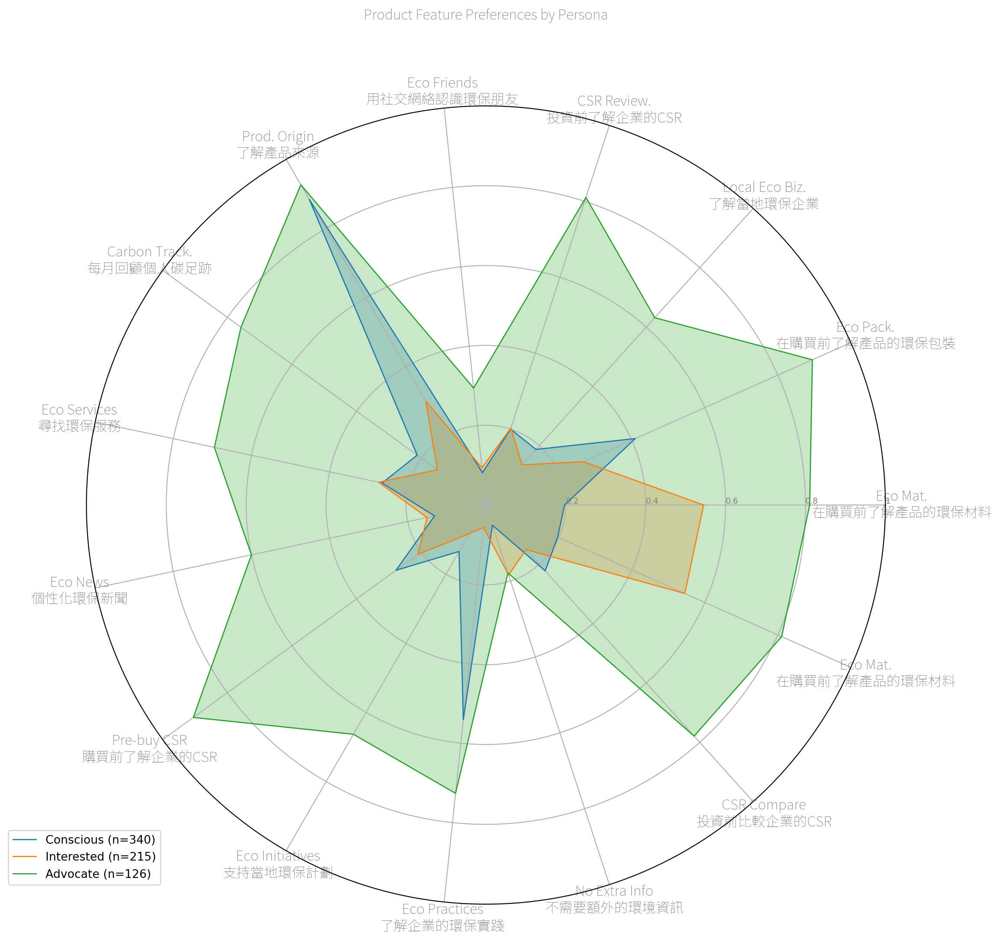

### Feature Preferences (By Cluster)

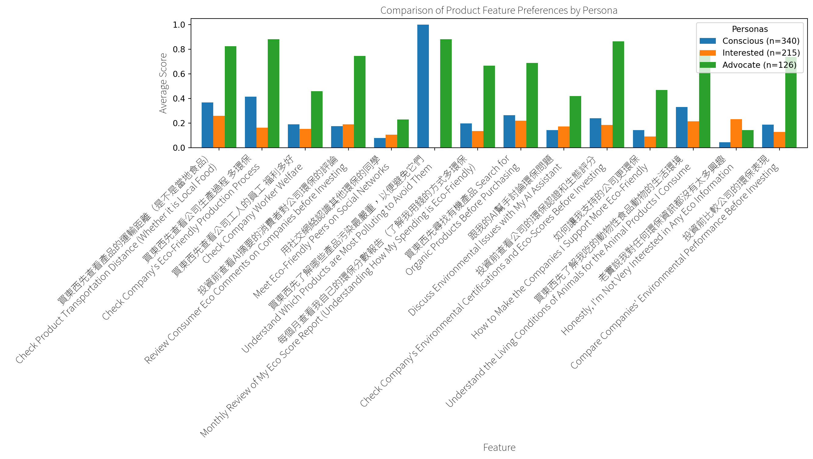

### Preferred AI Roles (Overall)


## Shopping

### Boycott Count (Overall)

``` text
/Users/krishaamer/Desktop/current/thesis/green-filter-research/research/data/shopping.py:20: FutureWarning: 

Passing `palette` without assigning `hue` is deprecated and will be removed in v0.14.0. Assign the `x` variable to `hue` and set `legend=False` for the same effect.

  barplot = sns.barplot(x='Boycott', y='Count', data=boycott_count, palette='viridis')
/Users/krishaamer/Desktop/current/thesis/green-filter-research/research/data/shopping.py:22: UserWarning: set_ticklabels() should only be used with a fixed number of ticks, i.e. after set_ticks() or using a FixedLocator.
  ax.set_xticklabels(ax.get_xticklabels(), fontproperties=chinese_font)
```

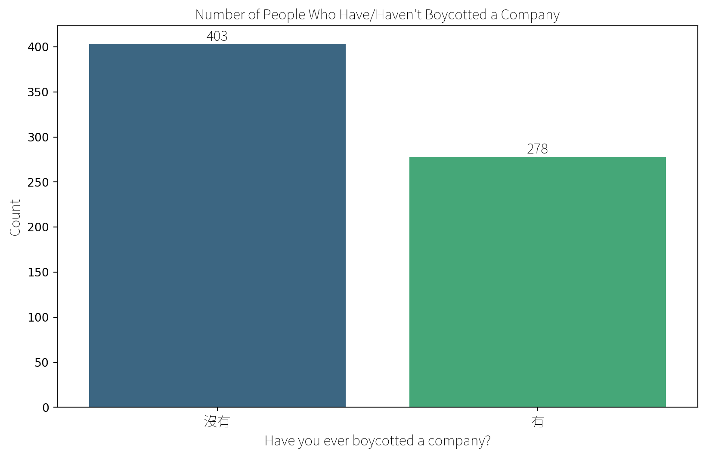

### Why Boycott

``` text
為什麼抵制？
食安問題                               33
地溝油                                10
黑心油                                 8
食安                                  5
政治因素                                4
                                   ..
因為有出新聞                              1
此公司危害食安，以抵制這種行為讓公司更能意識到執行此行為的後果     1
地溝油啊                                1
不認同理念                               1
因為這家公司壓榨員工                          1
Name: count, Length: 187, dtype: int64
```

### Trusted Brands

``` text
你/妳有信任的品牌嗎？
No trusted brand          329
Have but not specified    110
義美                         42
Apple                       9
光泉                          7
                         ... 
自家種植                        1
Casetify                    1
Adidas                      1
麥當勞                         1
淨毒五郎                        1
Name: count, Length: 195, dtype: int64
```

### Choice Experiments

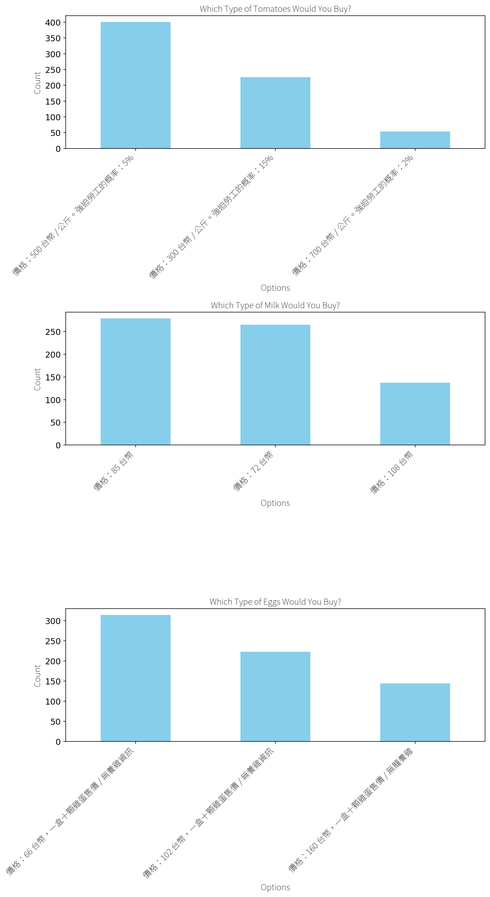

## Personas from Clusters

Personas are created using K-means clustering, an unsupervised machine
learning algorithm, which clusters college students based on their
responses across 36 Likert-scale fields in the online survey. Clusters
are visualized using Principal Component Analysis (PCA), where the
principal component loadings on the X and Y axes represent the weights
of the original Likert-scale fields, transformed into the principal
components that capture the most variance.

-   There is some similarity between clusters. All 3 personas report a
    high level of financial anxiety and below-average satisfaction with
    their financial literacy.

### Clustering Students to Build 3 Personas

# Old

## Findings

-   Literature: AI assistants should integrate with Digital Product
    Passports
-   Literature: AI assistants should show carbon label data.
-   Literature: AI assistants should avoid taking ESG at face value
    (because it’s a really low bar) and integrate other metrics such as
    B Corp.
-   Literature: AI assistants should
-   Literature: Do not make another investing app, make a sustainability
    filter for excisting investing platforms.
-   Literature: College students can support extended producer
    responsibility

### RQ 1

**How might AI assistants empower regenerative shopping, saving, and
investing?**

Display the ESG, EPR, B-Corp, etc, etc credentials for each product and
investment.

EPR and B-Corp are success stories which shoul be highlighted while ESG
is largely discredited.

There are many existing and ongoing approaches to sustainability. The
best approach might be to plug into excisting system and communities and
legislation to support and empower them.

### RQ 2

**How might one design an intuitive sustainable shopping, saving,
investing app?**

Apple Watch app

### RQ 3

**What app features might college students rate as the highest
priority?**

Autopilot

### RQ 4

**How might one visualize ecological impact in digital product design?**

Accuracy is more imprttant for hhuman trust tthan actual impact

## Ideas for Interfaces

Show all the different prototypes just likes architects do. And then
defent why I chose the one I did.

For NW make a Loom with the interfaces and talk about them?
