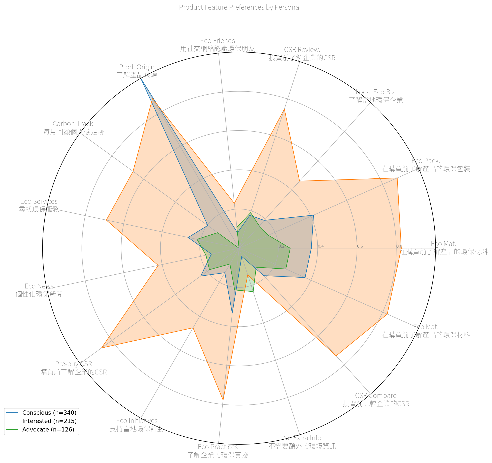

## AI Companion

### Likert-Based Clustering

AI-assistant feature choices per Likert-based Personas


### Feature-Based Clustering

Clustering students based on AI-assistant feature choices

``` text
Init: initializing centroids
Init: initializing clusters
Starting iterations...
Run 1, iteration: 1/100, moves: 153, cost: 1978.0
Run 1, iteration: 2/100, moves: 28, cost: 1978.0
Init: initializing centroids
Init: initializing clusters
Starting iterations...
Run 2, iteration: 1/100, moves: 85, cost: 1977.0
Init: initializing centroids
Init: initializing clusters
Starting iterations...
Run 3, iteration: 1/100, moves: 127, cost: 2018.0
Run 3, iteration: 2/100, moves: 4, cost: 2018.0
Init: initializing centroids
Init: initializing clusters
Starting iterations...
Run 4, iteration: 1/100, moves: 238, cost: 1997.0
Run 4, iteration: 2/100, moves: 7, cost: 1997.0
Init: initializing centroids
Init: initializing clusters
Starting iterations...
Run 5, iteration: 1/100, moves: 125, cost: 1893.0
Best run was number 5
```

``` text
{1:     Submission ID         Submitted at 選擇一種動物來代表你/妳自己（什麼都可以）：  \
 0          OA4NdR  2023-10-14 08:59:10                      狗   
 3          aB22jX  2023-10-15 11:41:25                     烏龜   
 4          1r9lRM  2023-10-15 13:02:37                     松鼠   
 6          RzDOJ9  2023-10-16 02:14:04                      狼   
 7          42KeMB  2023-10-16 02:16:58                     狐狸   
 ..            ...                  ...                    ...   
 664        GrkZpj  2023-10-27 10:36:18                     老虎   
 666        WAg1XJ  2023-10-27 13:07:03                     獅子   
 668        YZgG1v  2023-10-27 13:26:43                     刺蝟   
 673        NA994W  2023-10-29 15:49:50                      貓   
 677        24d9gV  2023-10-31 08:55:54                      牛   
 
                                            你/妳在哪所大學念書？ 你/妳的學習階段： 你/妳的學習科系：  \
 0          國立清華大學 National Tsing Hua University (NTHU)        學士      運動科學   
 3                        東海大學 Tunghai University (THU)        學士        美術   
 4    國立雲林科技大學 National Yunlin University of Science...        學士  國際管理學士學程   
 6         國立成功大學 National Cheng Kung University (NCKU)        學士    機械工程學系   
 7         國立成功大學 National Cheng Kung University (NCKU)        學士     資訊工程系   
 ..                                                 ...       ...       ...   
 664        國立臺南大學 National University of Tainan (NUTN)        學士     生物科技系   
 666       國立成功大學 National Cheng Kung University (NCKU)        碩士      科技藝術   
 668  南臺科技大學 Southern Taiwan University of Science a...        學士   視覺傳達設計系   
 673        國立臺南大學 National University of Tainan (NUTN)        學士        材料   
 677       國立成功大學 National Cheng Kung University (NCKU)        碩士        航太   
 
     你/妳現在的學歷狀態是什麼？  你/妳來自哪個國家？  你/妳幾歲？  \
 0           我還在就讀！  我是台灣人啊 🇹🇼！      18   
 3           我還在就讀！  我是台灣人啊 🇹🇼！      19   
 4           我還在就讀！  我是台灣人啊 🇹🇼！      18   
 6           我還在就讀！  我是台灣人啊 🇹🇼！      19   
 7           我還在就讀！  我是台灣人啊 🇹🇼！      20   
 ..             ...         ...     ...   
 664         我還在就讀！  我是台灣人啊 🇹🇼！      21   
 666         我還在就讀！  我是台灣人啊 🇹🇼！      24   
 668         我還在就讀！  我是台灣人啊 🇹🇼！      21   
 673         我還在就讀！  我是台灣人啊 🇹🇼！      18   
 677         我還在就讀！  我是台灣人啊 🇹🇼！      23   
 
      如果你/妳懷疑你/妳要買的番茄可能是由強迫勞工（現代奴隸）採摘的，你/妳仍然會買它嗎？  ... 你/妳的環保行動對環境保護有效果嗎？  \
 0                                              3  ...                  4   
 3                                              2  ...                  2   
 4                                              2  ...                  3   
 6                                              2  ...                  1   
 7                                              1  ...                  3   
 ..                                           ...  ...                ...   
 664                                            3  ...                  2   
 666                                            4  ...                  4   
 668                                            3  ...                  3   
 673                                            5  ...                  4   
 677                                            3  ...                  3   
 
      你/妳想在行業內推環保嗎？ 你/妳得自己對新觀念開放嗎？ 你/妳的大學對可環保性支持嗎？  你/妳覺得大學生如何影響公司的可持續行為？  \
 0                2              4               4                      無   
 3                2              3               3                    不知道   
 4                3              4               4                  做報告分析   
 6                1              5               3                   消費頻率   
 7                2              4               3                     沒有   
 ..             ...            ...             ...                    ...   
 664              3              3               3                  提升競爭力   
 666              3              4               3                 改變原有觀念   
 668              3              4               4                  人多力量大   
 673              2              5               4              偏好購買環保的產品   
 677              2              4               4                    不清楚   
 
      你/妳有加入過什麼學生社團嗎？（選填）  你/妳最擔心什麼？（任何問題都可以，選填） 啟發你/妳的是？（什麼都可以，選填）  \
 0                    NaN                    NaN                NaN   
 3                      無                     電費                NaN   
 4                   羽毛球                     NaN                NaN   
 6                   成大山協            氣候失控、地緣政治風險              戰爭、氣候   
 7                    NaN                    NaN                NaN   
 ..                   ...                    ...                ...   
 664                  NaN                    NaN                NaN   
 666                  熱舞社              心愛的家人朋友離去                 文章   
 668                視傳系學會                     沒錢                  無   
 673                   沒有             大一就學期成績不及格               自我探索   
 677                  NaN                    NaN                NaN   
 
      你/妳的MBTI？（選填）  Cluster  
 0              NaN        1  
 3             INTP        1  
 4             ENFJ        1  
 6              不知道        1  
 7              NaN        1  
 ..             ...      ...  
 664           ENTP        1  
 666           ENFJ        1  
 668           INFJ        1  
 673            不知道        1  
 677      ISTJ, 不知道        1  
 
 [206 rows x 85 columns],
 2:     Submission ID         Submitted at 選擇一種動物來代表你/妳自己（什麼都可以）：  \
 1          VZPeMJ  2023-10-15 05:30:06                    小粉豬   
 2          zKMV58  2023-10-15 06:52:36                      貓   
 5          BGxMaQ  2023-10-16 01:58:04                     燕子   
 14         bldxO0  2023-10-16 06:30:24                     樹懶   
 15         24PNMe  2023-10-16 06:43:43                      熊   
 ..            ...                  ...                    ...   
 675        1rzOqg  2023-10-30 06:28:26                      狼   
 676        AlY9PD  2023-10-30 16:17:38                      貓   
 678        vN8NMv  2023-10-31 13:46:38                      狗   
 679        blQd81  2023-11-01 01:04:55                      狗   
 680        6dBZke  2023-11-01 15:14:52                    薩摩耶   
 
                                            你/妳在哪所大學念書？ 你/妳的學習階段：   你/妳的學習科系：  \
 1                        東吳大學 Soochow University (SCU)        學士  財務工程與精算數學系   
 2    經國管理暨健康學院 Ching Kuo Institute of Management an...        學士          護理   
 5         國立成功大學 National Cheng Kung University (NCKU)        碩士        生命科學   
 14        國立成功大學 National Cheng Kung University (NCKU)        學士       台灣文學系   
 15        國立成功大學 National Cheng Kung University (NCKU)        學士      外國語文學系   
 ..                                                 ...       ...         ...   
 675       國立成功大學 National Cheng Kung University (NCKU)        碩士         航太系   
 676                    逢甲大學 Feng Chia University (FCU)        學士    自動控制工程學系   
 678              輔仁大學 Fu Jen Catholic University (FJU)        學士      影像傳播學系   
 679                   銘傳大學 Ming Chuan University (MCU)        學士      商業設計學系   
 680  南臺科技大學 Southern Taiwan University of Science a...        學士     創新產品設計系   
 
     你/妳現在的學歷狀態是什麼？  你/妳來自哪個國家？  你/妳幾歲？  \
 1           我還在就讀！  我是台灣人啊 🇹🇼！      18   
 2           我還在就讀！  我是台灣人啊 🇹🇼！      19   
 5           我還在就讀！  我是台灣人啊 🇹🇼！      25   
 14          我還在就讀！  我是台灣人啊 🇹🇼！      18   
 15          我還在就讀！  我是台灣人啊 🇹🇼！      19   
 ..             ...         ...     ...   
 675         我還在就讀！  我是台灣人啊 🇹🇼！      25   
 676         我還在就讀！  我是台灣人啊 🇹🇼！      18   
 678         我還在就讀！  我是台灣人啊 🇹🇼！      19   
 679         我還在就讀！  我是台灣人啊 🇹🇼！      21   
 680         我還在就讀！  我是台灣人啊 🇹🇼！      21   
 
      如果你/妳懷疑你/妳要買的番茄可能是由強迫勞工（現代奴隸）採摘的，你/妳仍然會買它嗎？  ... 你/妳的環保行動對環境保護有效果嗎？  \
 1                                              2  ...                  3   
 2                                              2  ...                  4   
 5                                              2  ...                  2   
 14                                             2  ...                  4   
 15                                             3  ...                  4   
 ..                                           ...  ...                ...   
 675                                            3  ...                  3   
 676                                            2  ...                  3   
 678                                            2  ...                  4   
 679                                            1  ...                  2   
 680                                            3  ...                  3   
 
      你/妳想在行業內推環保嗎？ 你/妳得自己對新觀念開放嗎？ 你/妳的大學對可環保性支持嗎？  你/妳覺得大學生如何影響公司的可持續行為？  \
 1                3              4               4                   沒有想法   
 2                4              4               4    提供有效方案，以及大眾可接受的新穎提議   
 5                4              4               4                 改變消費行為   
 14               3              4               4                     消費   
 15               3              2               4                 透過消費行為   
 ..             ...            ...             ...                    ...   
 675              3              4               3                    不知道   
 676              2              3               3                    不確定   
 678              3              4               3           可以透過學生會的力量推動   
 679              2              4               2           從自己做起 影響身邊的人   
 680              4              4               3                   比賽成績   
 
      你/妳有加入過什麼學生社團嗎？（選填）    你/妳最擔心什麼？（任何問題都可以，選填） 啟發你/妳的是？（什麼都可以，選填）  \
 1                    NaN                  氣候變得不分明                NaN   
 2                      無                    核電廠爆掉                  ？   
 5                    NaN                      NaN                NaN   
 14                    吉他               冰山融化，海平面上升                紀錄片   
 15                   NaN                      NaN                NaN   
 ..                   ...                      ...                ...   
 675                  NaN                      NaN                NaN   
 676                  NaN                      NaN                NaN   
 678                  NaN  海洋充滿塑膠垃圾、一次性塑膠袋和餐具持續被使用           台灣綠色環保組織   
 679                  NaN                      NaN                NaN   
 680                  NaN                     動物消失              可愛的動物   
 
      你/妳的MBTI？（選填）  Cluster  
 1              NaN        2  
 2             INTJ        2  
 5             ENFP        2  
 14            INFP        2  
 15            ENFJ        2  
 ..             ...      ...  
 675           ISTJ        2  
 676            NaN        2  
 678           ISFJ        2  
 679            NaN        2  
 680           INTJ        2  
 
 [299 rows x 85 columns],
 0:     Submission ID         Submitted at 選擇一種動物來代表你/妳自己（什麼都可以）：  \
 8          PAzab0  2023-10-16 02:33:40                      貓   
 9          5dZyP6  2023-10-16 02:48:33                     海豚   
 11         42r4Bk  2023-10-16 03:48:25                    北極熊   
 12         1rVWKW  2023-10-16 04:23:06                     貓咪   
 13         24PjJA  2023-10-16 04:28:10                    土撥鼠   
 ..            ...                  ...                    ...   
 663        5dQdGv  2023-10-27 10:10:58                     兔子   
 665        jBpWO1  2023-10-27 11:05:01                      貓   
 670        1ryKWb  2023-10-28 15:01:29                     刺蝟   
 672        24gAeD  2023-10-29 06:09:35                     熊貓   
 674        g5pqZP  2023-10-29 17:30:47                     蝸牛   
 
                                            你/妳在哪所大學念書？ 你/妳的學習階段：    你/妳的學習科系：  \
 8         國立成功大學 National Cheng Kung University (NCKU)        學士       電機工程學系   
 9         國立成功大學 National Cheng Kung University (NCKU)        博士        工業設計所   
 11        國立成功大學 National Cheng Kung University (NCKU)        學士       企業管理學系   
 12          國立虎尾科技大學 National Formosa University (NFU)        學士        應用外語系   
 13      臺南應用科技大學 Tainan University of Technology (TUT)        學士        商品設計系   
 ..                                                 ...       ...          ...   
 663  南臺科技大學 Southern Taiwan University of Science a...        學士        財務金融系   
 665            國立臺灣大學 National Taiwan University (NTU)        碩士           財金   
 670                   銘傳大學 Ming Chuan University (MCU)        學士       商業設計學系   
 672  南臺科技大學 Southern Taiwan University of Science a...        學士     行銷與流通管理系   
 674  南臺科技大學 Southern Taiwan University of Science a...        學士  多媒體與電腦娛樂科學系   
 
     你/妳現在的學歷狀態是什麼？  你/妳來自哪個國家？  你/妳幾歲？  \
 8           我還在就讀！  我是台灣人啊 🇹🇼！      18   
 9           我還在就讀！  我是台灣人啊 🇹🇼！      25   
 11          我還在就讀！  我是台灣人啊 🇹🇼！      21   
 12          我還在就讀！  我是台灣人啊 🇹🇼！      19   
 13          我還在就讀！  我是台灣人啊 🇹🇼！      22   
 ..             ...         ...     ...   
 663         我還在就讀！  我是台灣人啊 🇹🇼！      20   
 665         我還在就讀！  我是台灣人啊 🇹🇼！      26   
 670         我還在就讀！  我是台灣人啊 🇹🇼！      18   
 672         我還在就讀！  我是台灣人啊 🇹🇼！      19   
 674         我還在就讀！  我是台灣人啊 🇹🇼！      21   
 
      如果你/妳懷疑你/妳要買的番茄可能是由強迫勞工（現代奴隸）採摘的，你/妳仍然會買它嗎？  ... 你/妳的環保行動對環境保護有效果嗎？  \
 8                                              2  ...                  4   
 9                                              1  ...                  4   
 11                                             2  ...                  3   
 12                                             1  ...                  2   
 13                                             1  ...                  5   
 ..                                           ...  ...                ...   
 663                                            3  ...                  4   
 665                                            1  ...                  3   
 670                                            2  ...                  3   
 672                                            3  ...                  4   
 674                                            2  ...                  3   
 
      你/妳想在行業內推環保嗎？ 你/妳得自己對新觀念開放嗎？ 你/妳的大學對可環保性支持嗎？  你/妳覺得大學生如何影響公司的可持續行為？  \
 8                5              5               3         持續輸入新血，營造環保新環境   
 9                5              5               3                     社群   
 11               3              5               4             小額投資/社群影響力   
 12               3              2               3                     能力   
 13               5              5               5                   多樣想法   
 ..             ...            ...             ...                    ...   
 663              3              4               3                     創意   
 665              3              5               4               幫忙舉辦講座宣傳   
 670              4              4               3                   抗議行動   
 672              4              4               4                 同心協力進行   
 674              3              3               4                  成為股東？   
 
      你/妳有加入過什麼學生社團嗎？（選填）      你/妳最擔心什麼？（任何問題都可以，選填） 啟發你/妳的是？（什麼都可以，選填）  \
 8                     攝影                       塑膠微粒               新聞媒體   
 9           系學會、攝影社，衛保義工                        NaN           人跟人之間的對談   
 11                   NaN                        NaN                NaN   
 12                   系學會                        NaN                NaN   
 13                   學生會                       擔心環保               外在世界   
 ..                   ...                        ...                ...   
 663         桌球社、青年社、手工藝社  未來工作逐漸被AI給取代，造成台灣更多年輕人口外流          如何提升自己的能力   
 665                  攝影社                        NaN                NaN   
 670                   沒有                       全球暖化                NaN   
 672                  NaN                        NaN                NaN   
 674                  NaN                        NaN                NaN   
 
      你/妳的MBTI？（選填）  Cluster  
 8              NaN        0  
 9             ENFJ        0  
 11             NaN        0  
 12             NaN        0  
 13            INFJ        0  
 ..             ...      ...  
 663           ESFJ        0  
 665           ESTJ        0  
 670           ENFJ        0  
 672           INFP        0  
 674           INFP        0  
 
 [176 rows x 85 columns]}
```

### Feature Preferences (Overall)

``` text
Init: initializing centroids
Init: initializing clusters
Starting iterations...
Run 1, iteration: 1/100, moves: 52, cost: 2039.0
Init: initializing centroids
Init: initializing clusters
Starting iterations...
Run 2, iteration: 1/100, moves: 122, cost: 2008.0
Run 2, iteration: 2/100, moves: 82, cost: 1947.0
Run 2, iteration: 3/100, moves: 42, cost: 1893.0
Run 2, iteration: 4/100, moves: 16, cost: 1893.0
Init: initializing centroids
Init: initializing clusters
Starting iterations...
Run 3, iteration: 1/100, moves: 111, cost: 2055.0
Run 3, iteration: 2/100, moves: 66, cost: 2020.0
Run 3, iteration: 3/100, moves: 0, cost: 2020.0
Init: initializing centroids
Init: initializing clusters
Starting iterations...
Run 4, iteration: 1/100, moves: 156, cost: 1983.0
Run 4, iteration: 2/100, moves: 12, cost: 1983.0
Init: initializing centroids
Init: initializing clusters
Starting iterations...
Run 5, iteration: 1/100, moves: 178, cost: 1987.0
Run 5, iteration: 2/100, moves: 21, cost: 1987.0
Best run was number 2
```



### Feature Preferences (By Cluster)


### Preferred AI Roles (Overall)


