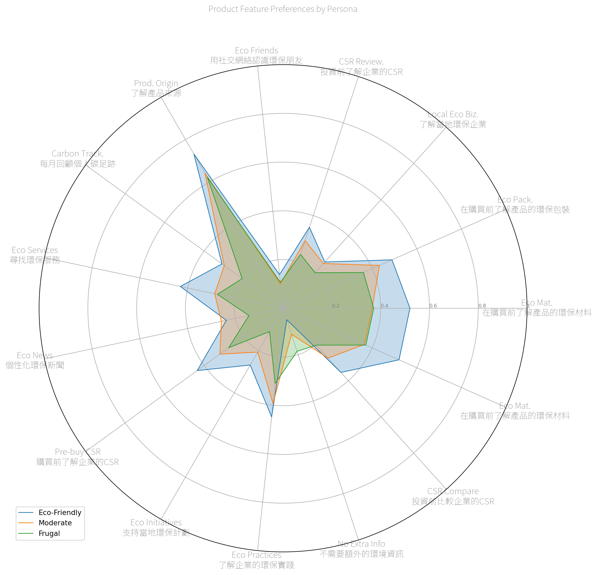
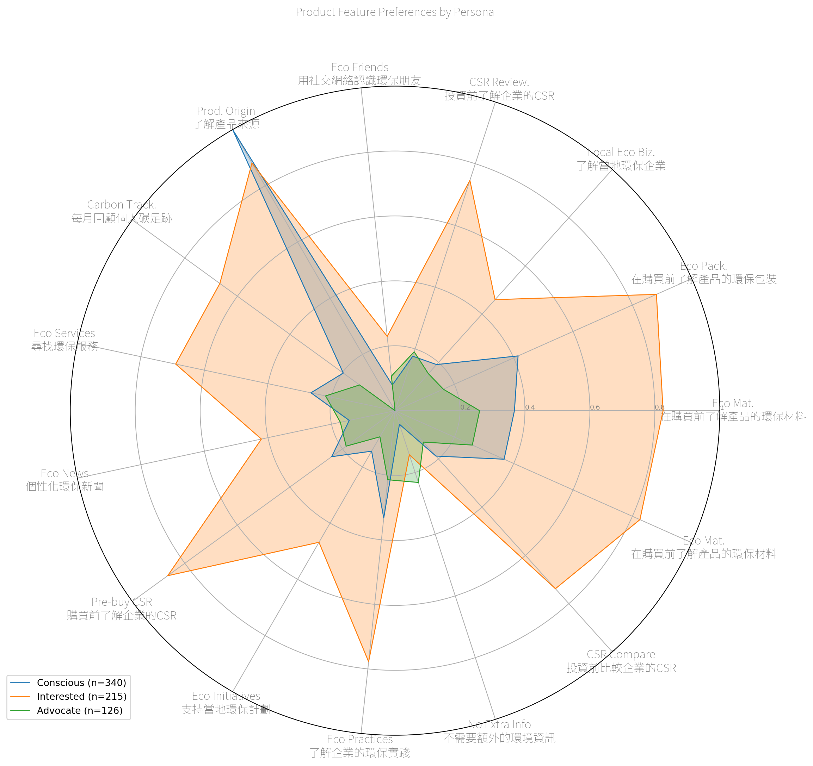
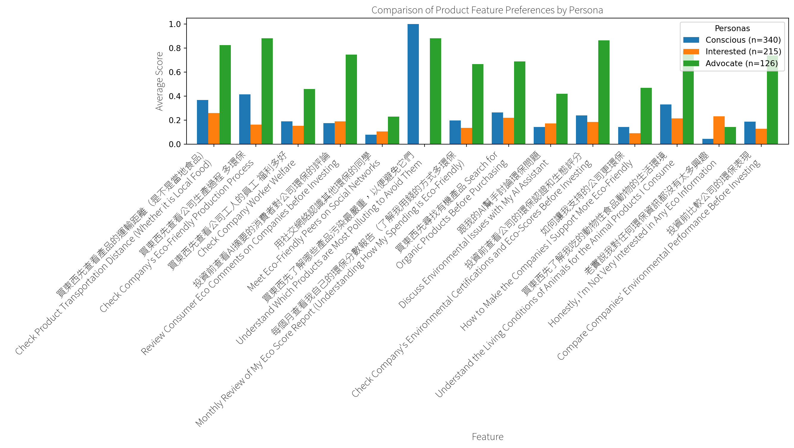
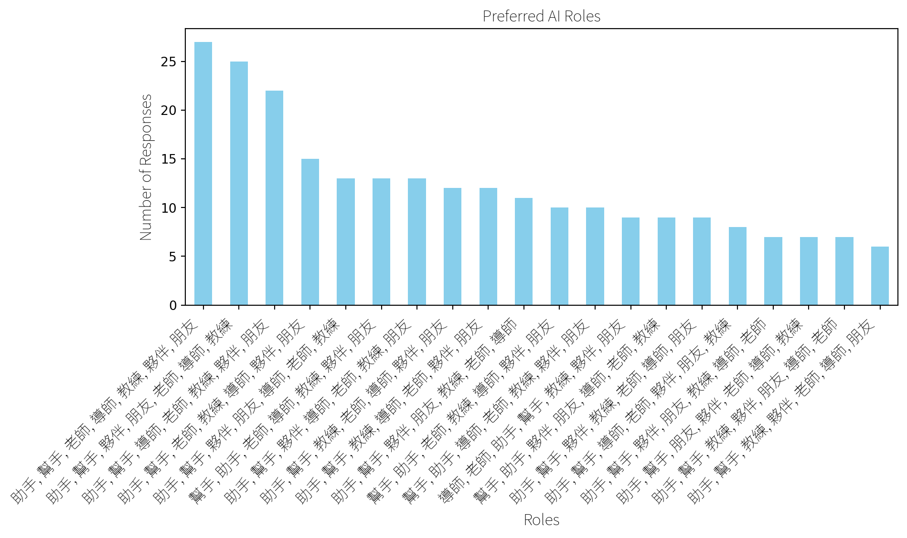

------------------------------------------------------------------------

title: AI Companion sidebar_position: 1 editor: render-on-save: false

------------------------------------------------------------------------

## AI Companion

### Likert-Based Clustering

AI-assistant feature choices per Likert-based Personas

Want: - Product origin - Product materials - Product packaging

Don’t Want: - News - Carbon tracking - Eco-friends - …

## Feature-Based Clustering

Clustering students based on AI-assistant feature choices.

Want: - Product origin - Product materials - Product packaging - Eco
services

### Feature Preferences (Overall)

## Feature Preferences (By Cluster)

## Preferred AI Roles (Overall)

