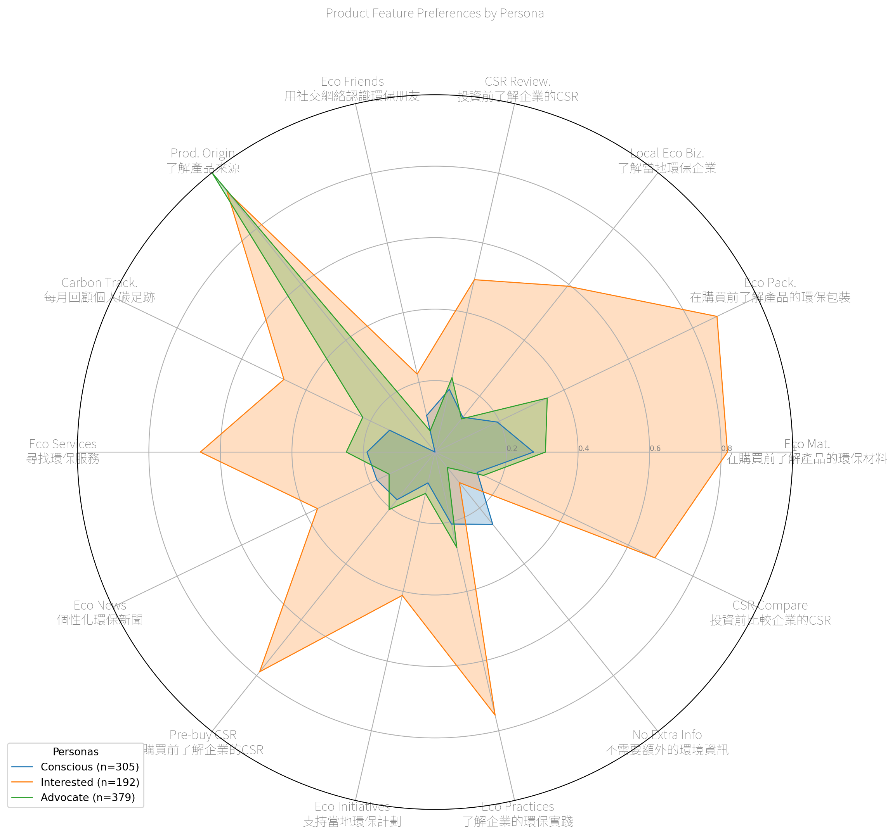

## AI Companion

### Likert-Based Clustering

AI-assistant feature choices per Likert-based Personas

Figure 1: AI-Assistant Feature Choices per Likert-based Personas

This chart visualizes three distinct personas based on 36 Likert
answers: Eco-Friendly (n=340), Moderate (n=215), and Frugal (n=126)
based on their overall sentiment profiles.

Want: - Product origin - Product materials - Product packaging

Don’t Want: - News - Carbon tracking - Eco-friends - …

## Feature-Based Clustering

Clustering students based on AI-assistant feature choices.

Want: - Product origin - Product materials - Product packaging - Eco
services

### Feature Preferences (Overall)

Figure 2: AI-Assistant Feature Preferences (Overall)

## Feature Preferences (By Cluster)

Figure 3: AI-Assistant Feature Preferences (By Cluster)

## Preferred AI Roles (Overall)

Figure 4: AI-Assistant Role Preferences

