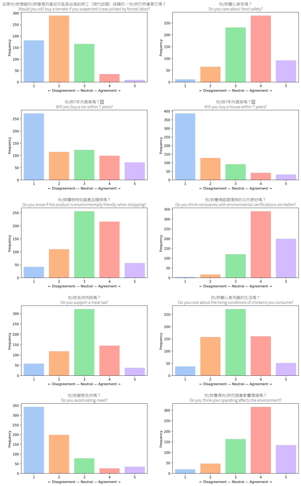
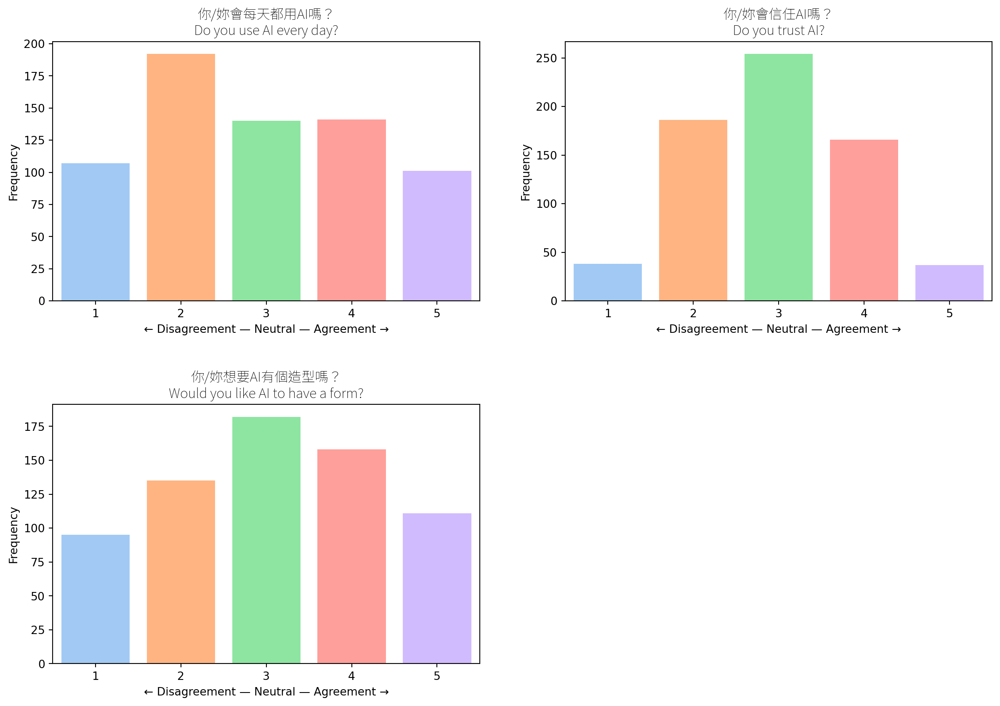
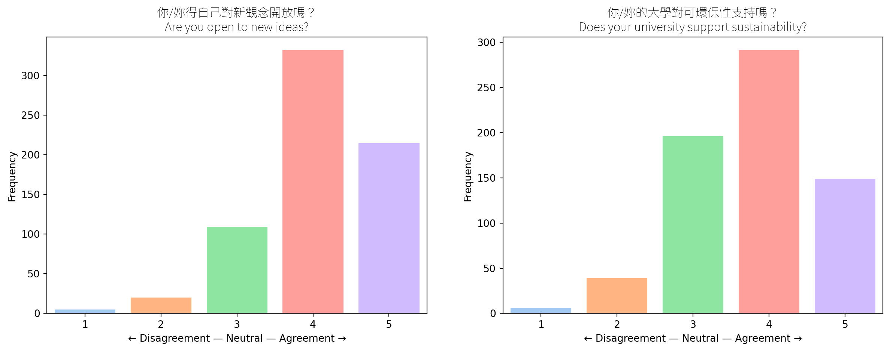
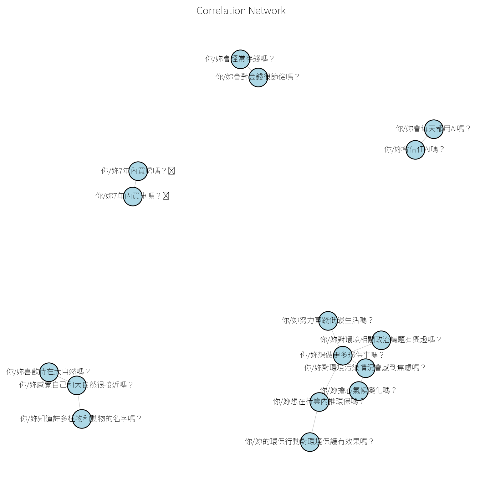

## Attitudes

These are student attitudes across all 36 likert fields without
clustering. Clustered results are available under the Personas sectioon.

### Student Attitudes (Overall)

``` text
## Shopping
## Saving and Investing
## Economy
## AI Usage
## Nature
## Environmental Protection
## Learning Environment
```

``` text
/Users/krishaamer/Desktop/current/thesis/green-filter-research/research/results/data/attitudes.py:45: UserWarning: The palette list has more values (10) than needed (5), which may not be intended.
  sns.countplot(
/Users/krishaamer/Desktop/current/thesis/green-filter-research/research/results/data/attitudes.py:45: UserWarning: The palette list has more values (10) than needed (5), which may not be intended.
  sns.countplot(
/Users/krishaamer/Desktop/current/thesis/green-filter-research/research/results/data/attitudes.py:45: UserWarning: The palette list has more values (10) than needed (5), which may not be intended.
  sns.countplot(
/Users/krishaamer/Desktop/current/thesis/green-filter-research/research/results/data/attitudes.py:45: UserWarning: The palette list has more values (10) than needed (5), which may not be intended.
  sns.countplot(
/Users/krishaamer/Desktop/current/thesis/green-filter-research/research/results/data/attitudes.py:45: UserWarning: The palette list has more values (10) than needed (5), which may not be intended.
  sns.countplot(
/Users/krishaamer/Desktop/current/thesis/green-filter-research/research/results/data/attitudes.py:45: UserWarning: The palette list has more values (10) than needed (5), which may not be intended.
  sns.countplot(
/Users/krishaamer/Desktop/current/thesis/green-filter-research/research/results/data/attitudes.py:45: UserWarning: The palette list has more values (10) than needed (5), which may not be intended.
  sns.countplot(
/Users/krishaamer/Desktop/current/thesis/green-filter-research/research/results/data/attitudes.py:45: UserWarning: The palette list has more values (10) than needed (5), which may not be intended.
  sns.countplot(
/Users/krishaamer/Desktop/current/thesis/green-filter-research/research/results/data/attitudes.py:45: UserWarning: The palette list has more values (10) than needed (5), which may not be intended.
  sns.countplot(
/Users/krishaamer/Desktop/current/thesis/green-filter-research/research/results/data/attitudes.py:45: UserWarning: The palette list has more values (10) than needed (5), which may not be intended.
  sns.countplot(
/Library/Frameworks/Python.framework/Versions/3.12/lib/python3.12/site-packages/IPython/core/pylabtools.py:152: UserWarning: Glyph 128664 (\N{ONCOMING AUTOMOBILE}) missing from current font.
  fig.canvas.print_figure(bytes_io, **kw)
/Library/Frameworks/Python.framework/Versions/3.12/lib/python3.12/site-packages/IPython/core/pylabtools.py:152: UserWarning: Glyph 127969 (\N{HOUSE WITH GARDEN}) missing from current font.
  fig.canvas.print_figure(bytes_io, **kw)
/Users/krishaamer/Desktop/current/thesis/green-filter-research/research/results/data/attitudes.py:45: UserWarning: The palette list has more values (10) than needed (5), which may not be intended.
  sns.countplot(
/Users/krishaamer/Desktop/current/thesis/green-filter-research/research/results/data/attitudes.py:45: UserWarning: The palette list has more values (10) than needed (5), which may not be intended.
  sns.countplot(
/Users/krishaamer/Desktop/current/thesis/green-filter-research/research/results/data/attitudes.py:45: UserWarning: The palette list has more values (10) than needed (5), which may not be intended.
  sns.countplot(
/Users/krishaamer/Desktop/current/thesis/green-filter-research/research/results/data/attitudes.py:45: UserWarning: The palette list has more values (10) than needed (5), which may not be intended.
  sns.countplot(
/Users/krishaamer/Desktop/current/thesis/green-filter-research/research/results/data/attitudes.py:45: UserWarning: The palette list has more values (10) than needed (5), which may not be intended.
  sns.countplot(
/Users/krishaamer/Desktop/current/thesis/green-filter-research/research/results/data/attitudes.py:45: UserWarning: The palette list has more values (10) than needed (5), which may not be intended.
  sns.countplot(
/Users/krishaamer/Desktop/current/thesis/green-filter-research/research/results/data/attitudes.py:45: UserWarning: The palette list has more values (10) than needed (5), which may not be intended.
  sns.countplot(
/Users/krishaamer/Desktop/current/thesis/green-filter-research/research/results/data/attitudes.py:45: UserWarning: The palette list has more values (10) than needed (5), which may not be intended.
  sns.countplot(
/Users/krishaamer/Desktop/current/thesis/green-filter-research/research/results/data/attitudes.py:45: UserWarning: The palette list has more values (10) than needed (5), which may not be intended.
  sns.countplot(
/Users/krishaamer/Desktop/current/thesis/green-filter-research/research/results/data/attitudes.py:45: UserWarning: The palette list has more values (10) than needed (5), which may not be intended.
  sns.countplot(
/Users/krishaamer/Desktop/current/thesis/green-filter-research/research/results/data/attitudes.py:45: UserWarning: The palette list has more values (10) than needed (5), which may not be intended.
  sns.countplot(
/Users/krishaamer/Desktop/current/thesis/green-filter-research/research/results/data/attitudes.py:45: UserWarning: The palette list has more values (10) than needed (5), which may not be intended.
  sns.countplot(
/Users/krishaamer/Desktop/current/thesis/green-filter-research/research/results/data/attitudes.py:45: UserWarning: The palette list has more values (10) than needed (5), which may not be intended.
  sns.countplot(
/Users/krishaamer/Desktop/current/thesis/green-filter-research/research/results/data/attitudes.py:45: UserWarning: The palette list has more values (10) than needed (5), which may not be intended.
  sns.countplot(
/Users/krishaamer/Desktop/current/thesis/green-filter-research/research/results/data/attitudes.py:45: UserWarning: The palette list has more values (10) than needed (5), which may not be intended.
  sns.countplot(
/Users/krishaamer/Desktop/current/thesis/green-filter-research/research/results/data/attitudes.py:45: UserWarning: The palette list has more values (10) than needed (5), which may not be intended.
  sns.countplot(
/Users/krishaamer/Desktop/current/thesis/green-filter-research/research/results/data/attitudes.py:45: UserWarning: The palette list has more values (10) than needed (5), which may not be intended.
  sns.countplot(
/Users/krishaamer/Desktop/current/thesis/green-filter-research/research/results/data/attitudes.py:45: UserWarning: The palette list has more values (10) than needed (5), which may not be intended.
  sns.countplot(
/Users/krishaamer/Desktop/current/thesis/green-filter-research/research/results/data/attitudes.py:45: UserWarning: The palette list has more values (10) than needed (5), which may not be intended.
  sns.countplot(
/Users/krishaamer/Desktop/current/thesis/green-filter-research/research/results/data/attitudes.py:45: UserWarning: The palette list has more values (10) than needed (5), which may not be intended.
  sns.countplot(
/Users/krishaamer/Desktop/current/thesis/green-filter-research/research/results/data/attitudes.py:45: UserWarning: The palette list has more values (10) than needed (5), which may not be intended.
  sns.countplot(
/Users/krishaamer/Desktop/current/thesis/green-filter-research/research/results/data/attitudes.py:45: UserWarning: The palette list has more values (10) than needed (5), which may not be intended.
  sns.countplot(
/Users/krishaamer/Desktop/current/thesis/green-filter-research/research/results/data/attitudes.py:45: UserWarning: The palette list has more values (10) than needed (5), which may not be intended.
  sns.countplot(
/Users/krishaamer/Desktop/current/thesis/green-filter-research/research/results/data/attitudes.py:45: UserWarning: The palette list has more values (10) than needed (5), which may not be intended.
  sns.countplot(
/Users/krishaamer/Desktop/current/thesis/green-filter-research/research/results/data/attitudes.py:45: UserWarning: The palette list has more values (10) than needed (5), which may not be intended.
  sns.countplot(
/Users/krishaamer/Desktop/current/thesis/green-filter-research/research/results/data/attitudes.py:45: UserWarning: The palette list has more values (10) than needed (5), which may not be intended.
  sns.countplot(
```








### Correlations Between Fields

``` text
/Library/Frameworks/Python.framework/Versions/3.12/lib/python3.12/site-packages/IPython/core/pylabtools.py:152: UserWarning: Glyph 127969 (\N{HOUSE WITH GARDEN}) missing from current font.
  fig.canvas.print_figure(bytes_io, **kw)
/Library/Frameworks/Python.framework/Versions/3.12/lib/python3.12/site-packages/IPython/core/pylabtools.py:152: UserWarning: Glyph 128664 (\N{ONCOMING AUTOMOBILE}) missing from current font.
  fig.canvas.print_figure(bytes_io, **kw)
```


