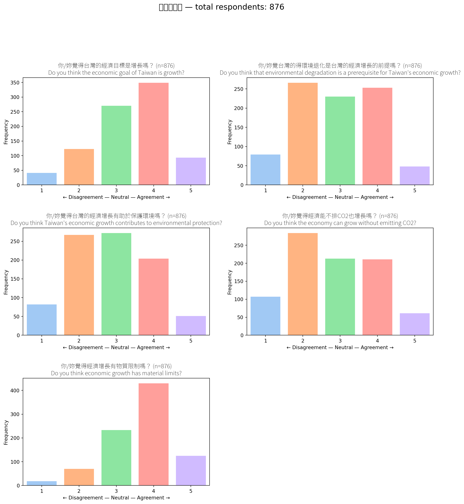
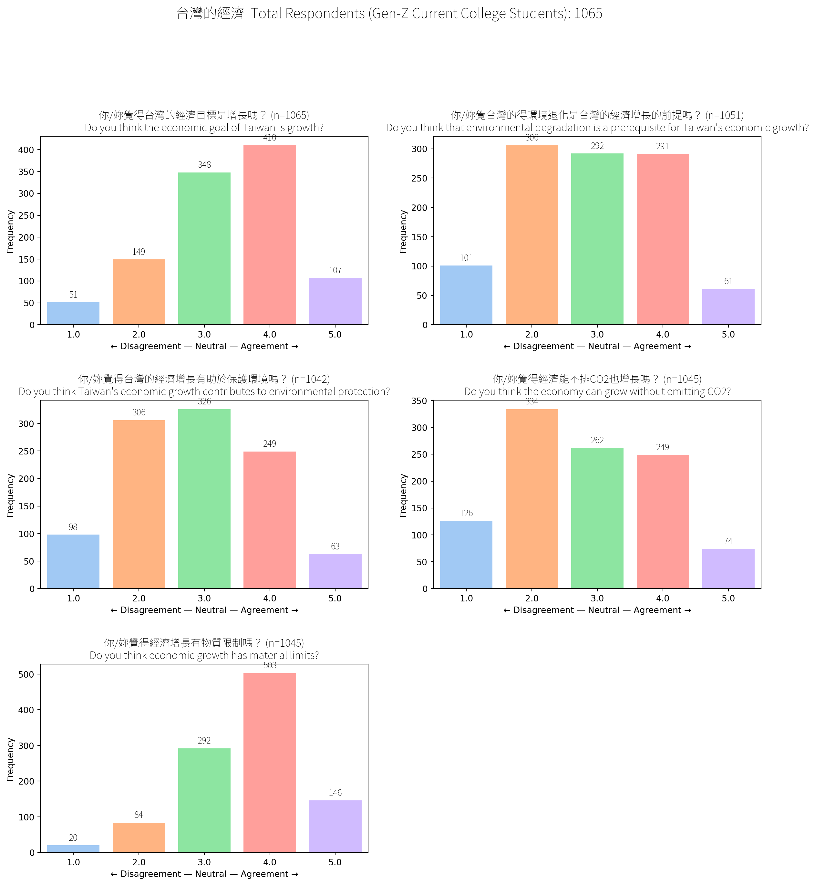
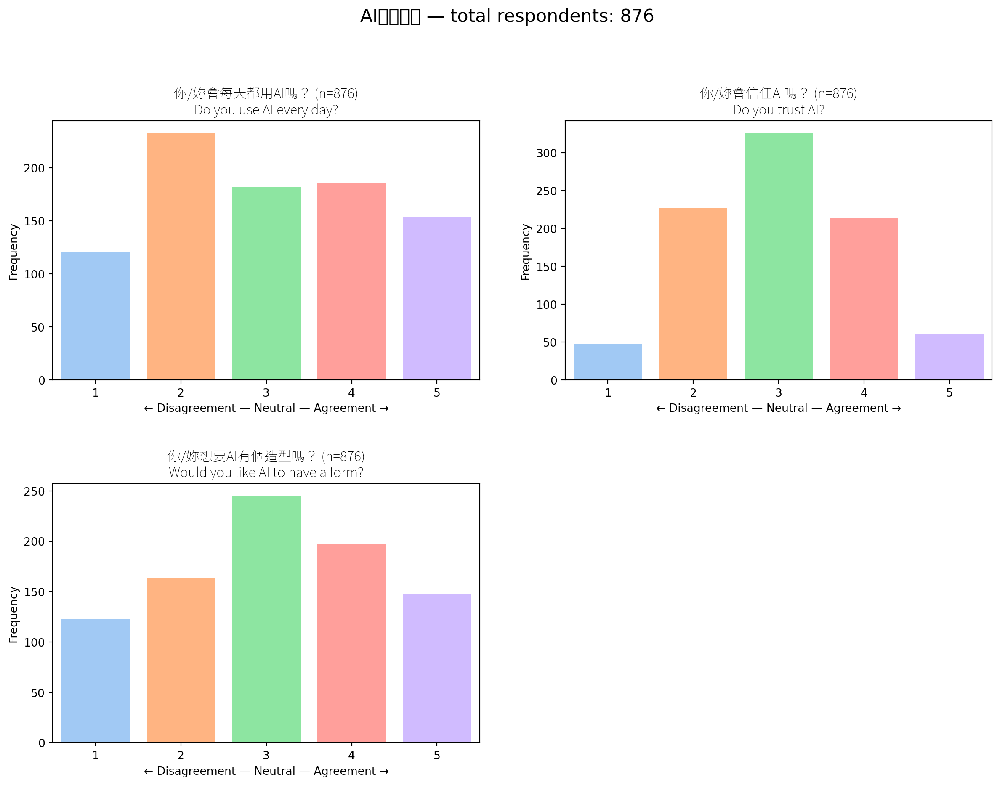
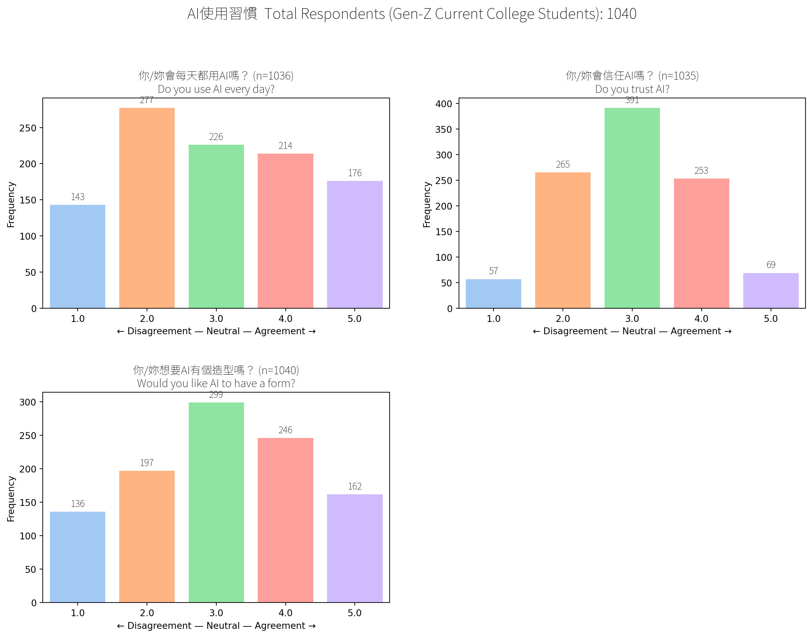
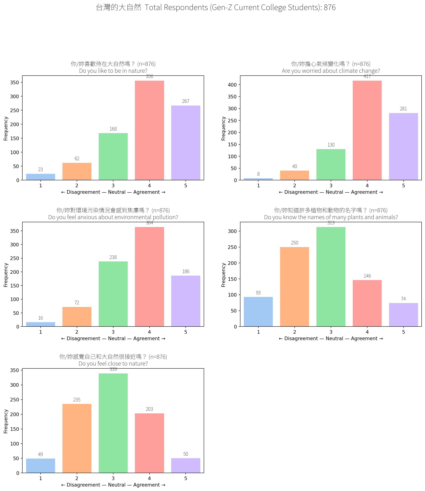
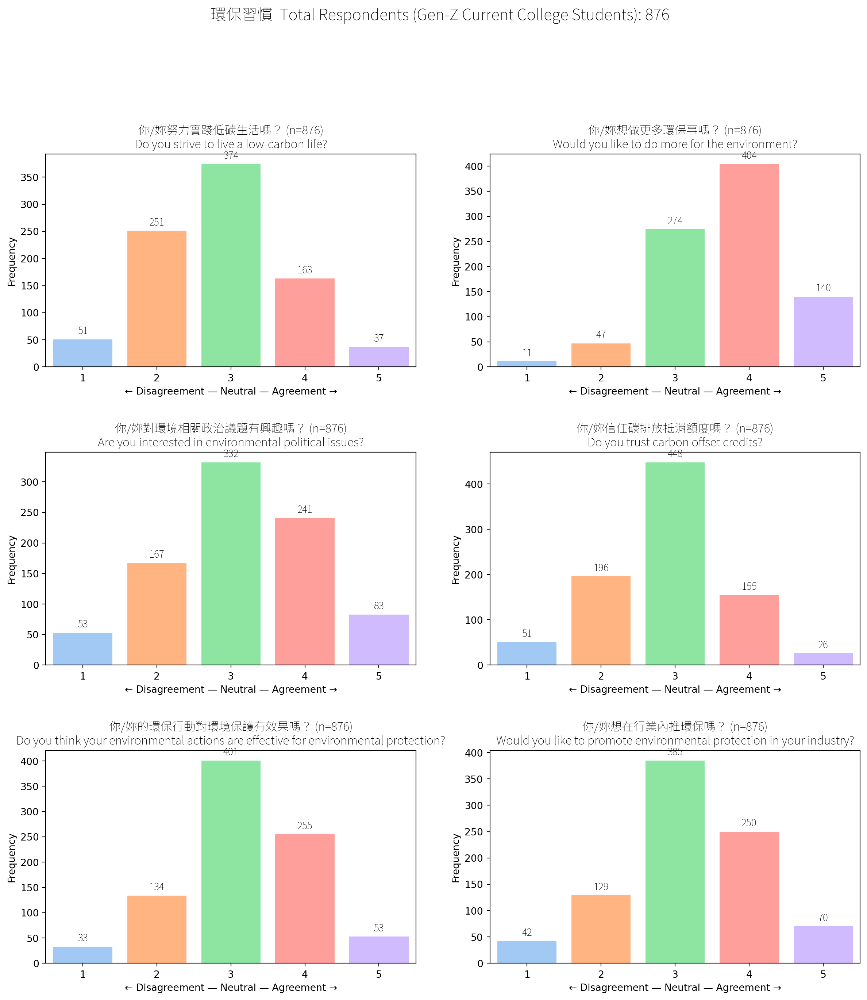
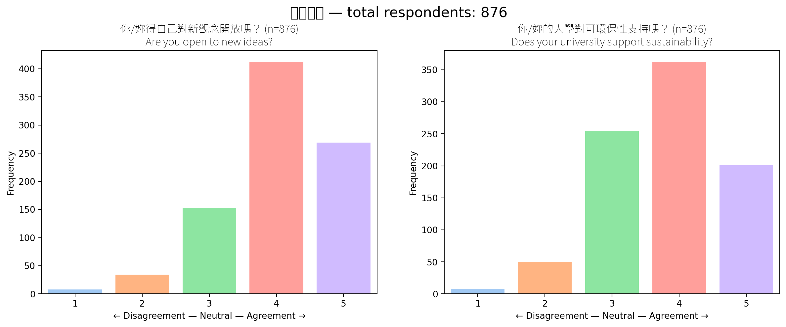
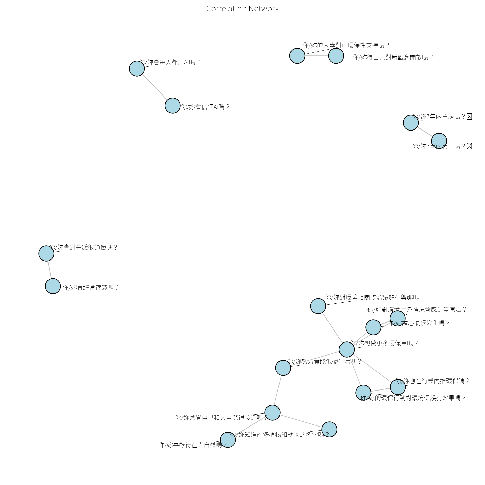
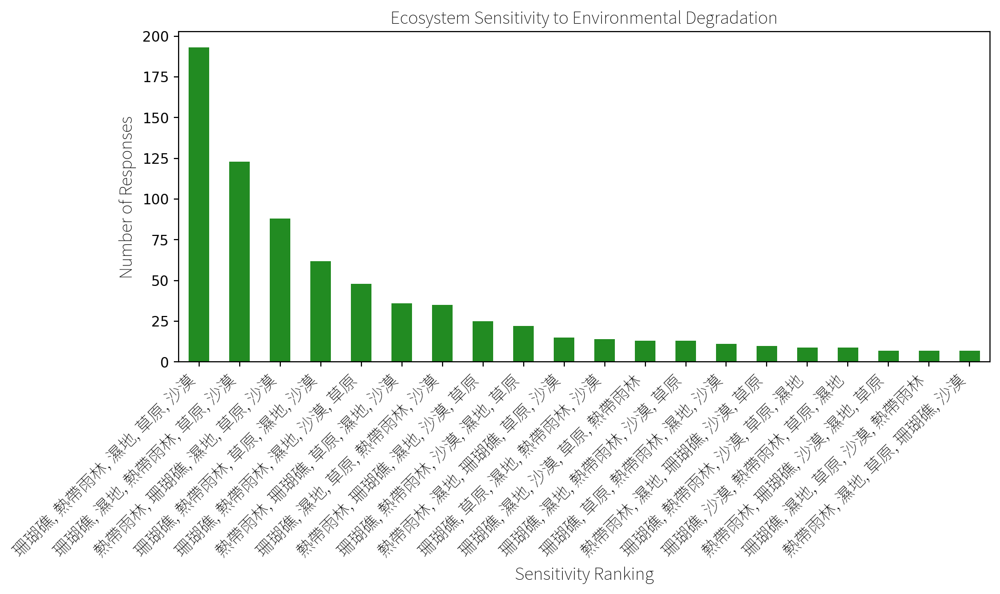

export const quartoRawHtml =
[`
<table style="width:99%;">
<caption>Interpreting the economic attitudes of college students.</caption>
<colgroup>
<col style="width: 27%" />
<col style="width: 6%" />
<col style="width: 4%" />
<col style="width: 4%" />
<col style="width: 55%" />
</colgroup>
<thead>
<tr>
<th>Question</th>
<th>Disagree 1-2</th>
<th>Neutral 3</th>
<th>Agree 4-5</th>
<th>Interpretation</th>
</tr>
</thead>
<tbody>
<tr>
<td><em>“Taiwan’s economic goal is growth.”</em></td>
<td>19%</td>
<td>31%</td>
<td><strong>50%</strong></td>
<td>Half the college students see GDP growth as the main national KPI.</td>
</tr>
<tr>
<td><em>“Environmental degradation is a prerequisite for that growth.”</em></td>
<td><strong>39%</strong></td>
<td>26%</td>
<td>34%</td>
<td>Split opinions: a large percentage of the respondents rejects this trade-off, but 1/3 thinks wrecking nature is the price of progress.</td>
</tr>
<tr>
<td><em>“Taiwan’s growth helps protect the environment.”</em></td>
<td><strong>40%</strong></td>
<td>31%</td>
<td>29%</td>
<td>Skeptic mode: more students <em>disagree</em> than buy the “growth = green” story.</td>
</tr>
<tr>
<td><em>“The economy can keep growing without emitting CO₂.”</em></td>
<td><strong>45%</strong></td>
<td>24%</td>
<td>28%</td>
<td>Decoupling doubters outnumber believers almost 2:1.</td>
</tr>
<tr>
<td><em>“Economic growth has material limits.”</em></td>
<td>10%</td>
<td>26%</td>
<td><strong>64%</strong></td>
<td>Clear majority says “Planet &gt; infinite GDP” - limits are real.</td>
</tr>
</tbody>
</table>
`,`
<table style="width:100%;">
<colgroup>
<col style="width: 12%" />
<col style="width: 31%" />
<col style="width: 56%" />
</colgroup>
<thead>
<tr>
<th><strong>Cluster</strong></th>
<th><strong>Key Questions</strong></th>
<th><strong>Interpretation</strong></th>
</tr>
</thead>
<tbody>
<tr>
<td><strong>Green Engagement</strong></td>
<td>
- 你/妳想做更多環保的事嗎？<em>Would you like to do more for the environment?</em>

- 你/妳的環保行動對於環境保護有成效嗎？<em>Do you think your actions help the environment?</em>

- 你/妳努力才讓低碳生活嗎？<em>Do you strive to live a low-carbon life?</em>

- 你/妳對環境污染流露出焦慮嗎？<em>Do you feel anxious about environmental pollution?</em>

- 你/妳對環境相關政治議題有興趣嗎？<em>Are you interested in environmental politics?</em>
</td>
<td>Core “green mindset” cluster. Students who feel climate anxiety are also motivated and politically curious. Likely early adopters of sustainable tools.</td>
</tr>
<tr>
<td><strong>Nature Identity</strong></td>
<td>
- 你/妳喜歡待在大自然嗎？<em>Do you like being in nature?</em>

- 你/妳覺得自己和大自然很接近嗎？<em>Do you feel close to nature?</em>

- 你/妳知道許多植物和動物的名字嗎？<em>Do you know many species?</em>
</td>
<td>Emotionally grounded, biodiversity-aware students. More connected to <em>nature as place</em>, not just “climate change” as a concept. Great for nature-learning features.</td>
</tr>
<tr>
<td><strong>Tech &amp; System Trust</strong></td>
<td>
- 你/妳相信碳排放抵換機制嗎？<em>Do you trust carbon offset credits?</em>

- 你/妳相信AI嗎？<em>Do you trust AI?</em>
</td>
<td>Openness to abstract or institutional systems (AI, offsets). Users here are more likely to accept algorithmic tools or fintech solutions.</td>
</tr>
<tr>
<td><strong>Changemaker Confidence Cluster</strong></td>
<td>
- 你/妳覺得自己創新想法會被採用嗎？<em>Do you believe your ideas will be adopted?</em>

- 你/妳的⼤學可⽀援你性支持嗎？<em>Does your university support you?</em>
</td>
<td>Belief in innovation and institutional support. A smaller but important group—ideal for leadership roles or student-led sustainability challenges.</td>
</tr>
<tr>
<td><strong>Financial Habits</strong></td>
<td>
- 你/妳會省錢嗎？<em>Do you save money?</em>

- 你/妳會在意錢嗎？<em>Do you care about money?</em>
</td>
<td>Practical, price-sensitive users. Likely to respond to cost-saving sustainability nudges (e.g. “eco ≠ expensive” framing).</td>
</tr>
</tbody>
</table>
`,`
<table>
<colgroup>
<col style="width: 14%" />
<col style="width: 17%" />
<col style="width: 11%" />
<col style="width: 56%" />
</colgroup>
<thead>
<tr>
<th>Rank (most-to-least chosen)</th>
<th>Ecosystem that sits at that rank</th>
<th>≈ Share of all answers</th>
<th>Take-away</th>
</tr>
</thead>
<tbody>
<tr>
<td>1</td>
<td><strong>珊瑚礁 (Coral reefs)</strong></td>
<td><strong>≈ 68 %</strong> (599 votes)</td>
<td>Reefs are the textbook fragile ecosystem in students’ minds. Think bleaching clips all over IG and TikTok.</td>
</tr>
<tr>
<td>2</td>
<td><strong>熱帶雨林 (Tropical rain-forests)</strong></td>
<td>≈ 26 % (225)</td>
<td>Deforestation stories keep rain-forests firmly in the spotlight.</td>
</tr>
<tr>
<td>3</td>
<td><strong>沙漠 (Deserts)</strong></td>
<td>≈ 2.4 % (21)</td>
<td>Only a small crew sees deserts as sensitive – lots of folks still picture them as “already tough”.</td>
</tr>
<tr>
<td>4</td>
<td><strong>濕地 (Wetlands)</strong></td>
<td>≈ 2.4 % (21)</td>
<td>Same low share as deserts. Wetlands might be off the radar unless you’re into birdwatching or flood news.</td>
</tr>
<tr>
<td>5</td>
<td><strong>草原 / 草地 (Grasslands)</strong></td>
<td>≈ 1.1 % (10)</td>
<td>Grasslands barely register, even though they store heaps of carbon. Room for awareness-boosting.</td>
</tr>
<tr>
<td>6 +</td>
<td>Other rankings or blanks</td>
<td>&lt; 1 % each</td>
<td>Everything outside the top five is statistical noise in this data set.</td>
</tr>
</tbody>
</table>
`];

## Taiwanese College Student Attitudes (Overall)

These are student attitudes across all 36 likert fields without
clustering. Clustered results are available under the Personas section.

### Economy

Figure 1: Student Attitudes Towards Economics Issues

Data from partial surveys.

Figure 2: Partial: Student Attitudes Towards Economics Issues

### AI Use

Figure 3: Student Attitudes Towards AI Use

Data from partial surveys.

Figure 4: Partial: Student Attitudes Towards AI Use

### Nature

Figure 5: Student Attitudes Towards Nature

### Environmental Protection

Figure 6: Student Attitudes Towards Environmental Protection

### Learning Environment

Figure 7: Students’ Learning Environment

### Correlations Between Fields

Correlations between fields allow clustering similar groups of students.

Figure 8: Correlations Between Student Attitudes

### Environmental Knowledge Ranking Experiment

Testing student knowledge about the environment. College students see
coral reefs, tropical rainforests, and wetlands as the most sensitive
ecosystems, aligning with global climate narratives. However, the long
tail of unique combos suggests mixed ecological knowledge and a strong
opportunity to educate and personalize ecosystem awareness, especially
in a Taiwanese context.

Figure 9: Students’ Environmental Knowledge

In summary, reefs dominate students mind share, with nearly 7 in 10
students putting coral reefs in the pole position. Rain-forests still
matter. One quarter see them as the next-most fragile, a solid silver
medal. Everything else is background noise. Deserts, wetlands, and
grasslands together grab \< 6 %. That’s a massive perception gap I could
tackle in outreach or app content.
