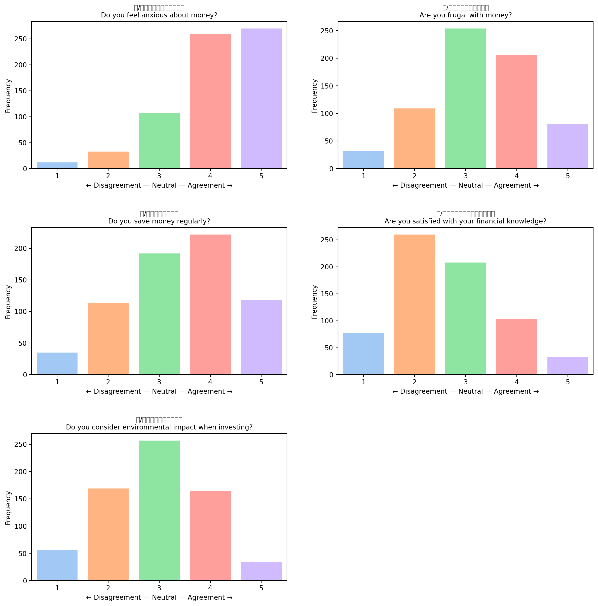

## Attitudes

These are student attitudes across all 36 likert fields without
clustering. Clustered results are available under the Personas sectioon.

### Student Attitudes (Overall)

``` text
## Shopping
## Saving and Investing
## Economy
## AI Usage
## Nature
## Environmental Protection
## Learning Environment
```




### Correlations Between Fields


