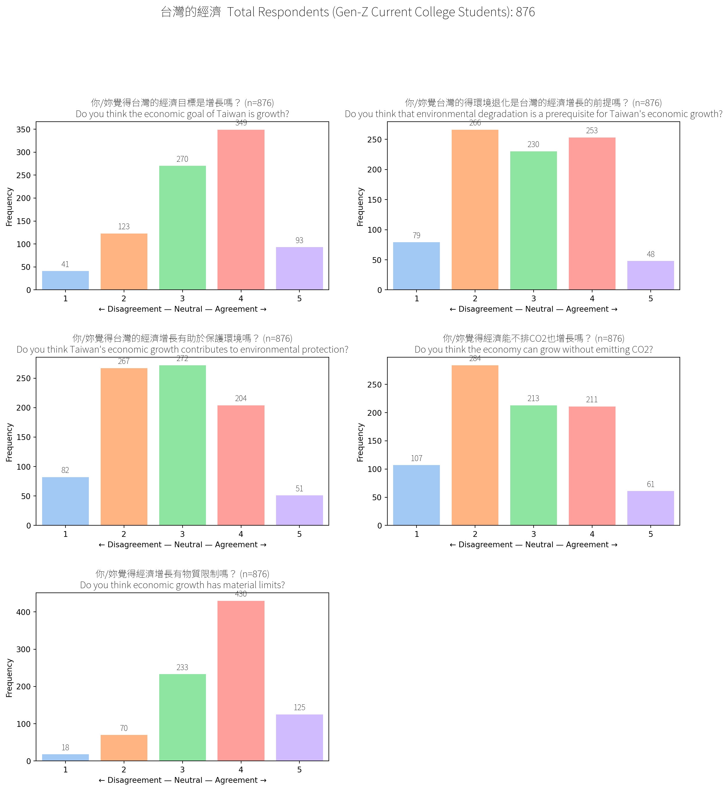
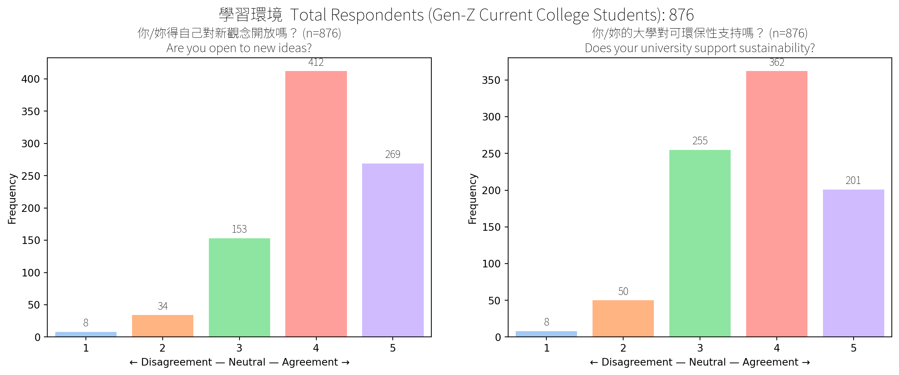
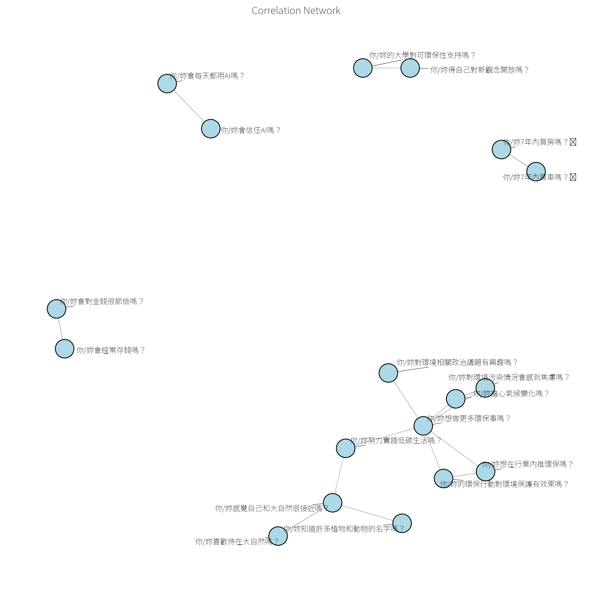

## Taiwanese College Student Attitudes (Overall)

These are student attitudes across all 36 likert fields without
clustering. Clustered results are available under the Personas section.

### Economy

Figure 1: Student Attitudes Towards Economics Issues

### AI Use

Figure 2: Student Attitudes Towards AI Use

### Nature

Figure 3: Student Attitudes Towards Nature

### Environmental Protection

Figure 4: Student Attitudes Towards Environmental Protection

### Learning Environment

Figure 5: Students’ Learning Environment

### Correlations Between Fields

Figure 6: Correlations Between Student Attitudes

### Environmental Knowledge Ranking Experiment

Test knowledge about the environment.

Figure 7: Students’ Environmental Knowledge

Design implications: - A majority of the respondents don’t plan to buy a
house or car within 7 years: don’t focus on these categories - Majority
don’t fly much: don’t focus on flights.
