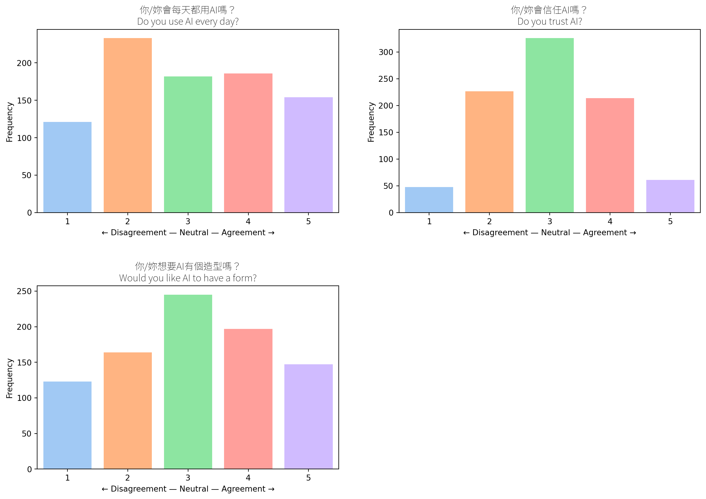
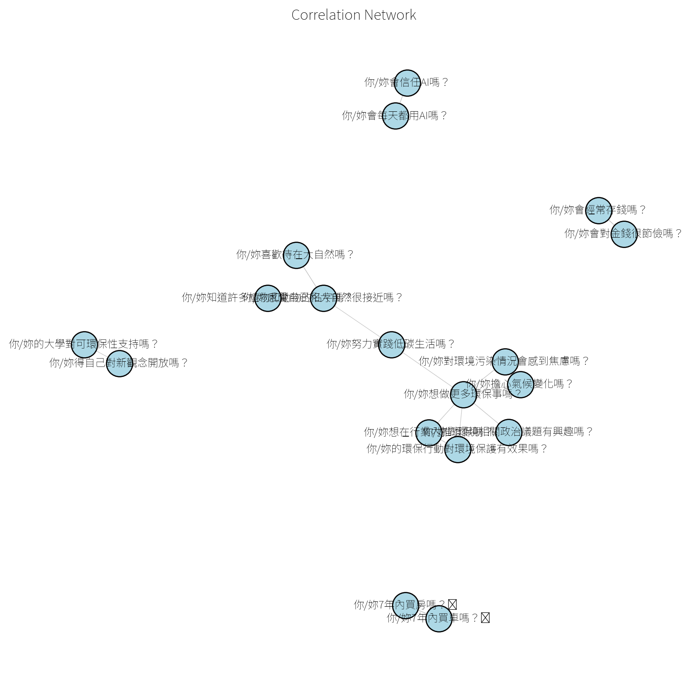

# College Student Attitudes (Overall)

These are student attitudes across all 36 likert fields without
clustering. Clustered results are available under the Personas section.

## Shopping

## Saving and Investing

## Economy

## AI Usage

## Nature

## Environmental Protection

## Learning Environment

## Correlations Between Fields

## Environmental Knowledge Ranking Experiment

Test knowledge about the environment.

