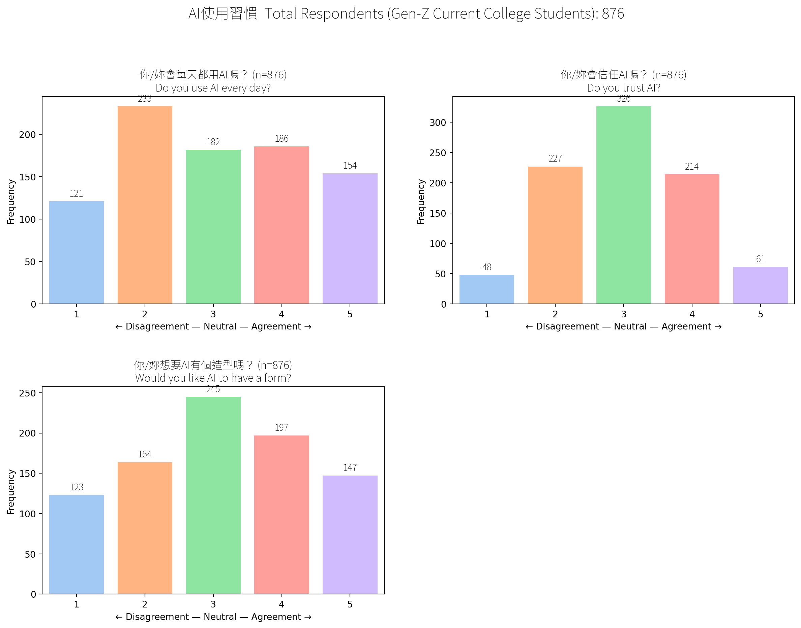

export const quartoRawHtml =
[`
<table style="width:100%;">
<caption>Interpreting the economic attitudes of college students.</caption>
<colgroup>
<col style="width: 19%" />
<col style="width: 13%" />
<col style="width: 13%" />
<col style="width: 13%" />
<col style="width: 41%" />
</colgroup>
<thead>
<tr>
<th>Question</th>
<th>Disagree 1-2</th>
<th>Neutral 3</th>
<th>Agree 4-5</th>
<th>Interpretation</th>
</tr>
</thead>
<tbody>
<tr>
<td><em>“Taiwan’s economic goal is growth.”</em></td>
<td>19%</td>
<td>31%</td>
<td><strong>50%</strong></td>
<td>Half the college students see GDP growth as the main national KPI.</td>
</tr>
<tr>
<td><em>“Environmental degradation is a prerequisite for that growth.”</em></td>
<td><strong>39%</strong></td>
<td>26%</td>
<td>34%</td>
<td>Split opinions: a large percentage of the respondents rejects this trade-off, but 1/3 thinks wrecking nature is the price of progress.</td>
</tr>
<tr>
<td><em>“Taiwan’s growth helps protect the environment.”</em></td>
<td><strong>40%</strong></td>
<td>31%</td>
<td>29%</td>
<td>Skeptic mode: more students <em>disagree</em> than buy the “growth = green” story.</td>
</tr>
<tr>
<td><em>“The economy can keep growing without emitting CO₂.”</em></td>
<td><strong>45%</strong></td>
<td>24%</td>
<td>28%</td>
<td>Decoupling doubters outnumber believers almost 2:1.</td>
</tr>
<tr>
<td><em>“Economic growth has material limits.”</em></td>
<td>10%</td>
<td>26%</td>
<td><strong>64%</strong></td>
<td>Clear majority says “Planet &gt; infinite GDP” - limits are real.</td>
</tr>
</tbody>
</table>
`];

## Taiwanese College Student Attitudes (Overall)

These are student attitudes across all 36 likert fields without
clustering. Clustered results are available under the Personas section.

### Economy

Figure 1: Student Attitudes Towards Economics Issues

### AI Use

Figure 2: Student Attitudes Towards AI Use

### Nature

Figure 3: Student Attitudes Towards Nature

### Environmental Protection

Figure 4: Student Attitudes Towards Environmental Protection

### Learning Environment

Figure 5: Students’ Learning Environment

### Correlations Between Fields

Figure 6: Correlations Between Student Attitudes

### Environmental Knowledge Ranking Experiment

Test knowledge about the environment.

Figure 7: Students’ Environmental Knowledge

Design implications: - A majority of the respondents don’t plan to buy a
house or car within 7 years: don’t focus on these categories - Majority
don’t fly much: don’t focus on flights.
