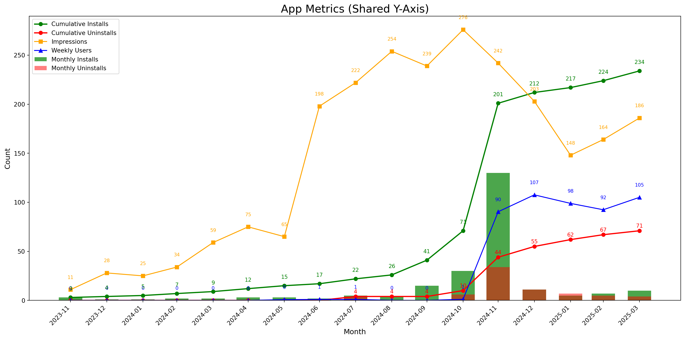

````mdx-code-block
import MyEmbed from '/src/components/Embed'
import Figure from '/src/components/Figure'
import Watch from '../images/prototypes/ai-watch.png'
import Susan from '../images/prototypes/susan-pink-app.png'
````

## Prototype Development

The interactive prototype is publicy available at the Google Chrome
extensions store and separately at the website: https://ai.ziran.tw/

-   Google Chrome has 3.45 billion users “Google Chrome Statistics for
    2024” (2023)
-   Retrieval-Augmented Generation (RAG) to enhance AI content with
    domain-spefic (close-to realtime) knowledge. A technique first
    proposed by researchers at META (Lewis et al., 2020) some RAG
    benefits include “make contextual decisions on-the-fly, thereby
    opening up a more dynamic and responsive way to handle knowledge
    search tasks” (Dewy, 2024; Gao et al., 2023)

Prototype architecture

-   Google Chrome browser extension

-   API microservice

-   Ziran AI

-   AI backend

-   Ratings API

-   Redis testing ai results

-   Redis Page cache / from page / separate scraping service

-   documentation: GreenFilter: thesis website / github

-   AI API got / claude

-   Stock ratings API

-   Community ratings api

70 Questions - use report ID to do anonymois teating - page tracking to
track the usage - 7 app questions - 63 personality questions

Other Tools Used: - QR generator in Canva - Postman for API testing

## Google Chrome Extentsion App Installs

While Google is the most popular browser with 3 billion users,
extensions are a relatively less known feature of the browser. Most
popular extensions are Grammarly, for Taiwanese students End Note is
familiar.

However it’s only available for computers (extensions don’t run on
phones and tablets).



**Uninstalls**

What percentage of people uninstalled the Green Filter AI assistant?
