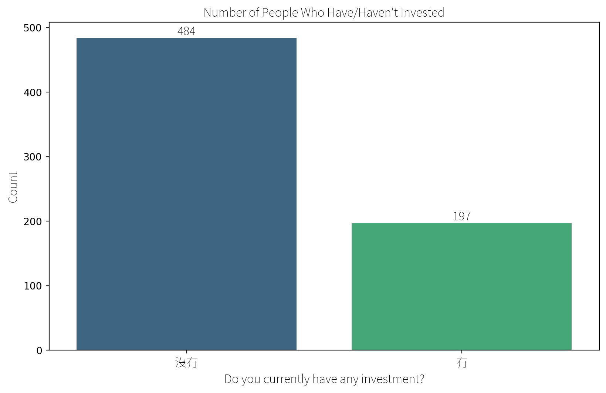

## Investing

### Investing Experience (Overall)

``` text
/Users/krishaamer/Desktop/current/thesis/green-filter-research/research/results/data/investing.py:17: FutureWarning: 

Passing `palette` without assigning `hue` is deprecated and will be removed in v0.14.0. Assign the `x` variable to `hue` and set `legend=False` for the same effect.

  barplot = sns.barplot(x='Investment', y='Count', data=investment_count, palette='viridis')
/Users/krishaamer/Desktop/current/thesis/green-filter-research/research/results/data/investing.py:19: UserWarning: set_ticklabels() should only be used with a fixed number of ticks, i.e. after set_ticks() or using a FixedLocator.
  ax.set_xticklabels(ax.get_xticklabels(), fontproperties=chinese_font)
```



### Choice Experiment


