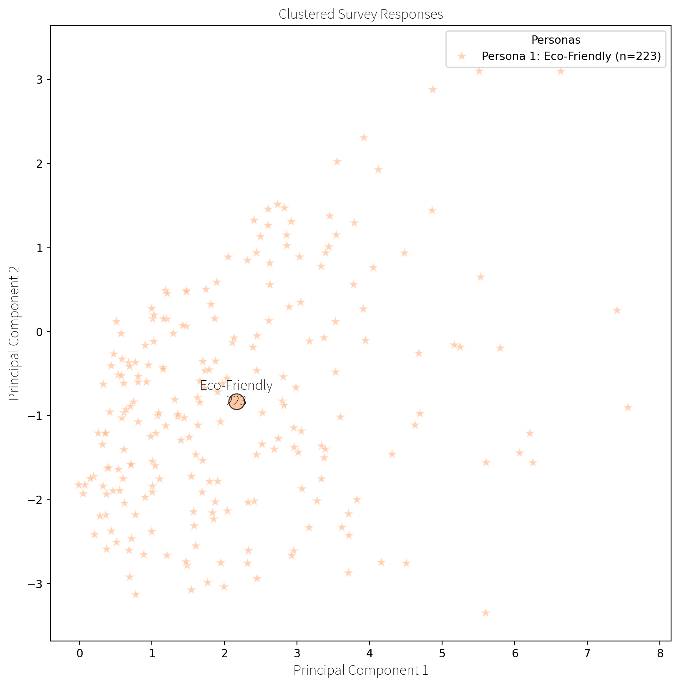
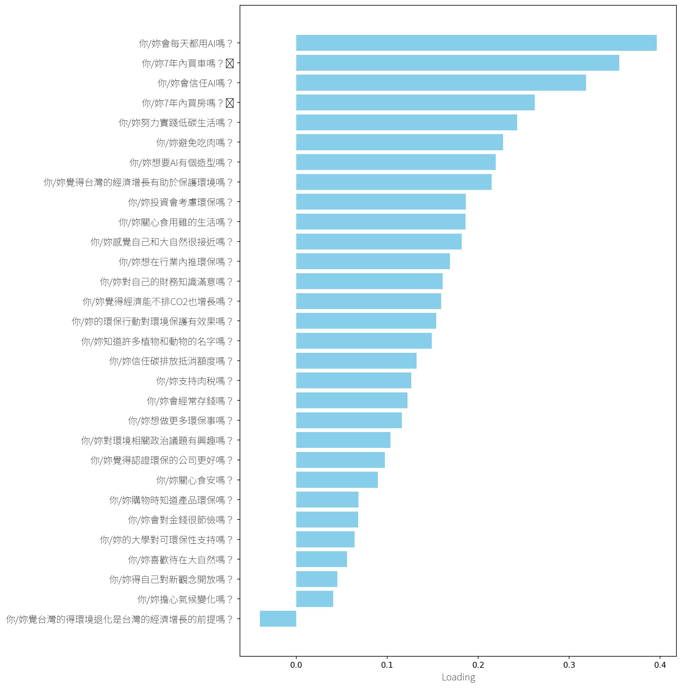
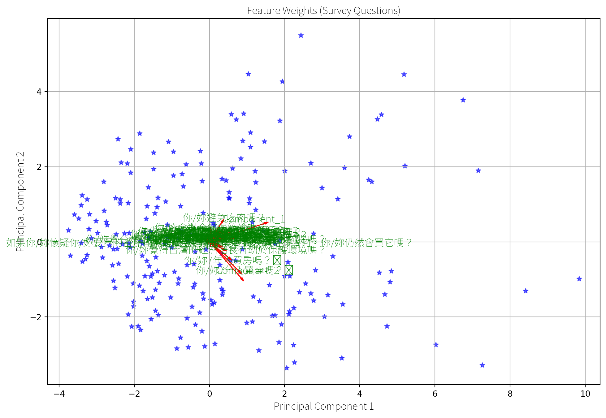
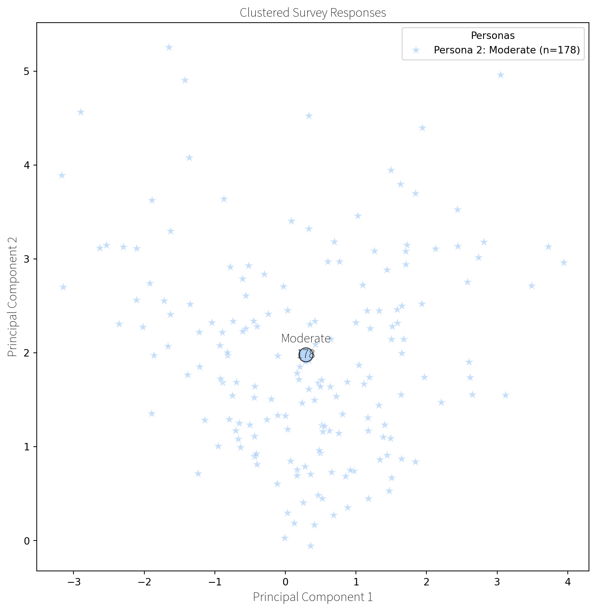
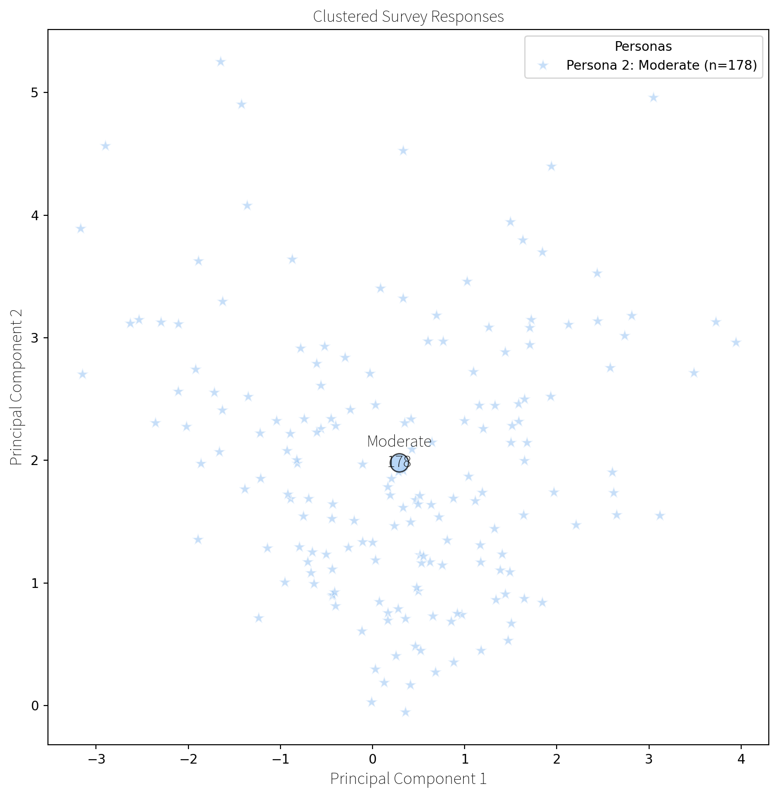
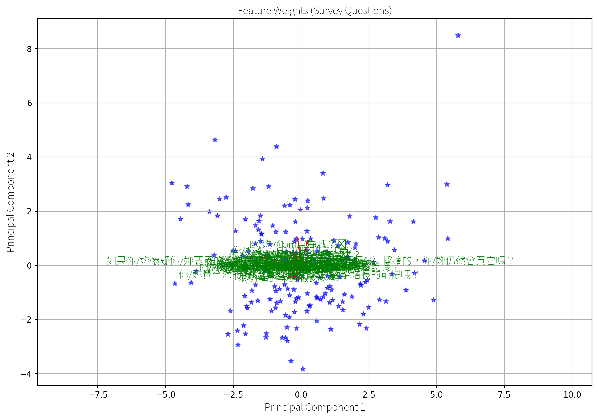
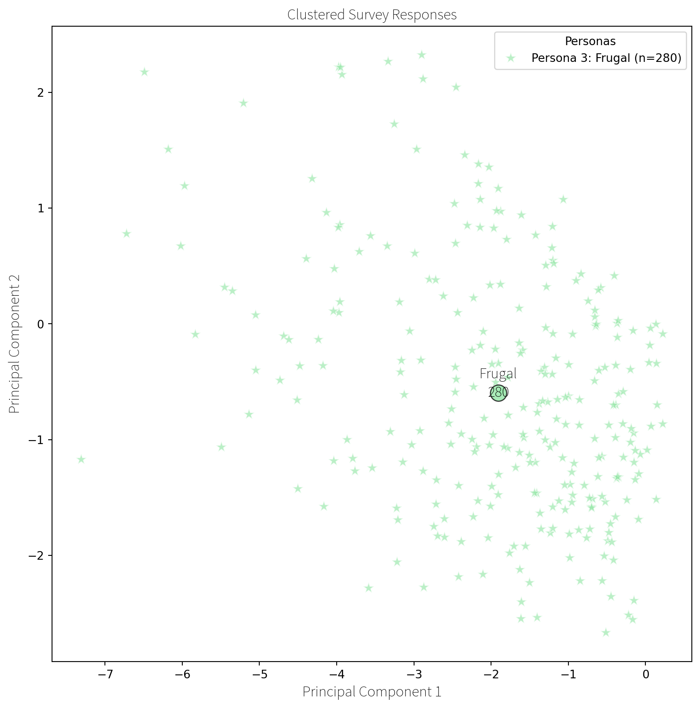
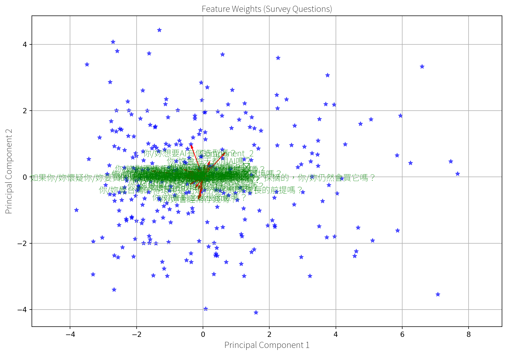
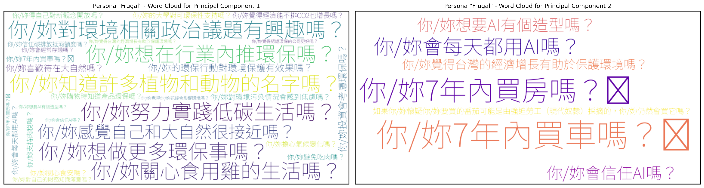

Personas are created using K-means clustering, an unsupervised machine
learning algorithm, which clusters college students based on their
responses across 36 Likert-scale fields in the online survey. Clusters
are visualized using Principal Component Analysis (PCA), where the
principal component loadings on the X and Y axes represent the weights
of the original Likert-scale fields, transformed into the principal
components that capture the most variance.

## Clustering Students to Build 3 Personas


``` text
<h2 style="text-align: center;">Persona 1: "Eco-Friendly"</h2>

<h3 style="text-align: center;">Questions Most Affecting Persona Creation</h3>
<h2 style="text-align: center;">Persona 2: "Moderate"</h2>

<h3 style="text-align: center;">Questions Most Affecting Persona Creation</h3>
<h2 style="text-align: center;">Persona 3: "Frugal"</h2>

<h3 style="text-align: center;">Questions Most Affecting Persona Creation</h3>
<h2 style='text-align: center;'>Mean Answer Scores</h2>
Mean response values for each likert question in each cluster:
   Cluster  如果你/妳懷疑你/妳要買的番茄可能是由強迫勞工（現代奴隸）採摘的，你/妳仍然會買它嗎？  你/妳關心食安嗎？  \
0        0                                     2.026906   3.991031   
1        1                                     2.106742   3.516854   
2        2                                     2.214286   3.225000   

   你/妳7年內買車嗎？🚘  你/妳7年內買房嗎？🏡  你/妳購物時知道產品環保嗎？  你/妳覺得認證環保的公司更好嗎？  你/妳支持肉稅嗎？  \
0     2.206278     1.663677        3.681614          4.300448   3.434978   
1     3.898876     2.904494        3.140449          4.028090   2.943820   
2     1.575000     1.282143        2.853571          3.864286   2.642857   

   你/妳關心食用雞的生活嗎？  你/妳避免吃肉嗎？  ...  你/妳知道許多植物和動物的名字嗎？  你/妳感覺自己和大自然很接近嗎？  \
0       3.533632   2.269058  ...           3.381166          3.457399   
1       3.117978   1.685393  ...           2.814607          3.039326   
2       2.610714   1.600000  ...           2.453571          2.521429   

   你/妳努力實踐低碳生活嗎？  你/妳想做更多環保事嗎？  你/妳對環境相關政治議題有興趣嗎？  你/妳信任碳排放抵消額度嗎？  \
0       3.426009      4.264574           3.820628        3.210762   
1       2.808989      3.679775           3.101124        2.865169   
2       2.446429      3.364286           2.739286        2.664286   

   你/妳的環保行動對環境保護有效果嗎？  你/妳想在行業內推環保嗎？  你/妳得自己對新觀念開放嗎？  你/妳的大學對可環保性支持嗎？  
0            3.645740       3.730942        4.403587         4.210762  
1            3.202247       3.117978        4.016854         3.719101  
2            2.792857       2.878571        3.850000         3.500000  

[3 rows x 37 columns]
<h2 style='text-align: center;'>Agreement between personas</h2>
```
























### Persona 1: “Eco-Friendly”

Questions Most Affecting Persona Creation

### Persona 2: “Moderate”

Questions Most Affecting Persona Creation

### Persona 3: “Frugal”

Questions Most Affecting Persona Creation

### Mean Answer Scores

Agreement between personas


