export const quartoRawHtml =
[`

`,`
<table class="dataframe" data-quarto-postprocess="true" data-border="1">
<thead>
<tr class="header" style="text-align: right;">
<th data-quarto-table-cell-role="th"></th>
<th data-quarto-table-cell-role="th">Cluster</th>
<th data-quarto-table-cell-role="th">如果你/妳懷疑你/妳要買的番茄可能是由強迫勞工（現代奴隸）採摘的，你/妳仍然會買它嗎？</th>
<th data-quarto-table-cell-role="th">你/妳關心食安嗎？</th>
<th data-quarto-table-cell-role="th">你/妳7年內買車嗎？🚘</th>
<th data-quarto-table-cell-role="th">你/妳7年內買房嗎？🏡</th>
<th data-quarto-table-cell-role="th">你/妳購物時知道產品環保嗎？</th>
<th data-quarto-table-cell-role="th">你/妳覺得認證環保的公司更好嗎？</th>
<th data-quarto-table-cell-role="th">你/妳支持肉稅嗎？</th>
<th data-quarto-table-cell-role="th">你/妳關心食用雞的生活嗎？</th>
<th data-quarto-table-cell-role="th">你/妳避免吃肉嗎？</th>
<th data-quarto-table-cell-role="th">...</th>
<th data-quarto-table-cell-role="th">你/妳知道許多植物和動物的名字嗎？</th>
<th data-quarto-table-cell-role="th">你/妳感覺自己和大自然很接近嗎？</th>
<th data-quarto-table-cell-role="th">你/妳努力實踐低碳生活嗎？</th>
<th data-quarto-table-cell-role="th">你/妳想做更多環保事嗎？</th>
<th data-quarto-table-cell-role="th">你/妳對環境相關政治議題有興趣嗎？</th>
<th data-quarto-table-cell-role="th">你/妳信任碳排放抵消額度嗎？</th>
<th data-quarto-table-cell-role="th">你/妳的環保行動對環境保護有效果嗎？</th>
<th data-quarto-table-cell-role="th">你/妳想在行業內推環保嗎？</th>
<th data-quarto-table-cell-role="th">你/妳得自己對新觀念開放嗎？</th>
<th data-quarto-table-cell-role="th">你/妳的大學對可環保性支持嗎？</th>
</tr>
</thead>
<tbody>
<tr class="odd">
<td data-quarto-table-cell-role="th">0</td>
<td>0</td>
<td>2.026906</td>
<td>3.991031</td>
<td>2.206278</td>
<td>1.663677</td>
<td>3.681614</td>
<td>4.300448</td>
<td>3.434978</td>
<td>3.533632</td>
<td>2.269058</td>
<td>...</td>
<td>3.381166</td>
<td>3.457399</td>
<td>3.426009</td>
<td>4.264574</td>
<td>3.820628</td>
<td>3.210762</td>
<td>3.645740</td>
<td>3.730942</td>
<td>4.403587</td>
<td>4.210762</td>
</tr>
<tr class="even">
<td data-quarto-table-cell-role="th">1</td>
<td>1</td>
<td>2.106742</td>
<td>3.516854</td>
<td>3.898876</td>
<td>2.904494</td>
<td>3.140449</td>
<td>4.028090</td>
<td>2.943820</td>
<td>3.117978</td>
<td>1.685393</td>
<td>...</td>
<td>2.814607</td>
<td>3.039326</td>
<td>2.808989</td>
<td>3.679775</td>
<td>3.101124</td>
<td>2.865169</td>
<td>3.202247</td>
<td>3.117978</td>
<td>4.016854</td>
<td>3.719101</td>
</tr>
<tr class="odd">
<td data-quarto-table-cell-role="th">2</td>
<td>2</td>
<td>2.214286</td>
<td>3.225000</td>
<td>1.575000</td>
<td>1.282143</td>
<td>2.853571</td>
<td>3.864286</td>
<td>2.642857</td>
<td>2.610714</td>
<td>1.600000</td>
<td>...</td>
<td>2.453571</td>
<td>2.521429</td>
<td>2.446429</td>
<td>3.364286</td>
<td>2.739286</td>
<td>2.664286</td>
<td>2.792857</td>
<td>2.878571</td>
<td>3.850000</td>
<td>3.500000</td>
</tr>
</tbody>
</table>
`,`

3 rows × 37 columns

`];

------------------------------------------------------------------------

title: Personas sidebar_position: 1 editor: render-on-save: false

------------------------------------------------------------------------

# Personas

### Clustering Students to Build 3 Personas

Personas are created using K-means clustering, an unsupervised machine
learning algorithm, which clusters college students based on their
responses across 36 Likert-scale fields in the online survey. Clusters
are visualized using Principal Component Analysis (PCA), where the
principal component loadings on the X and Y axes represent the weights
of the original Likert-scale fields, transformed into the principal
components that capture the most variance.

-   There is some similarity between clusters. All 3 personas report a
    high level of financial anxiety and below-average satisfaction with
    their financial literacy.

-   Principal Component Analysis (PCA) is used to convert data to lower
    dimension space. This is a predecessor of embeddings.

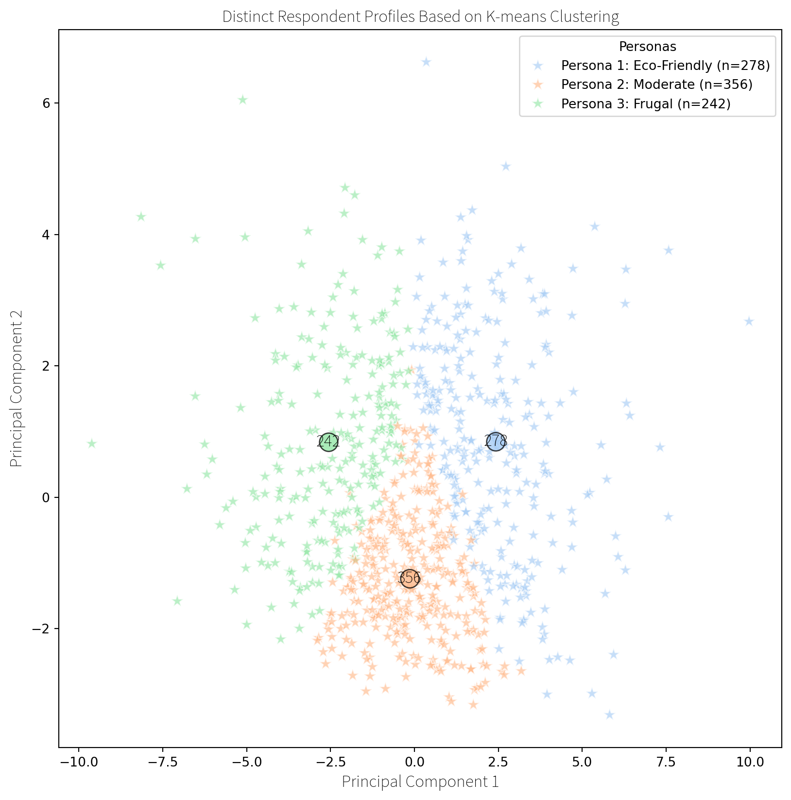

### Persona 1: “Eco-Friendly”

Questions Most Affecting Persona Creation include…

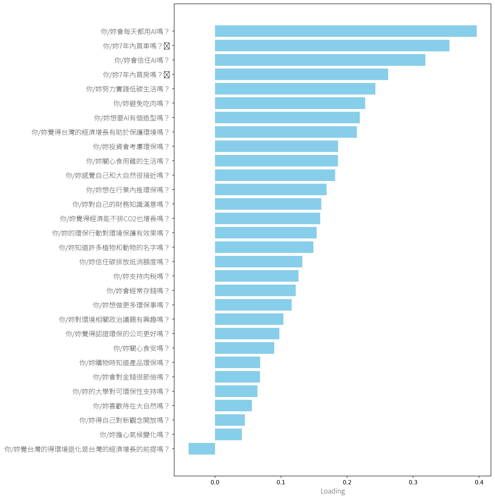

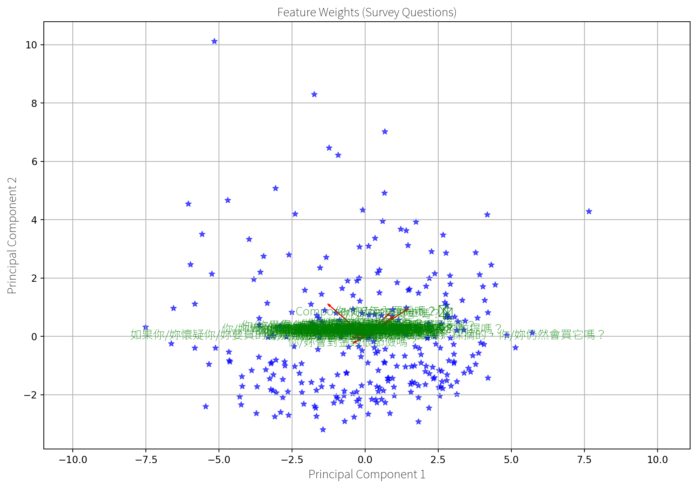

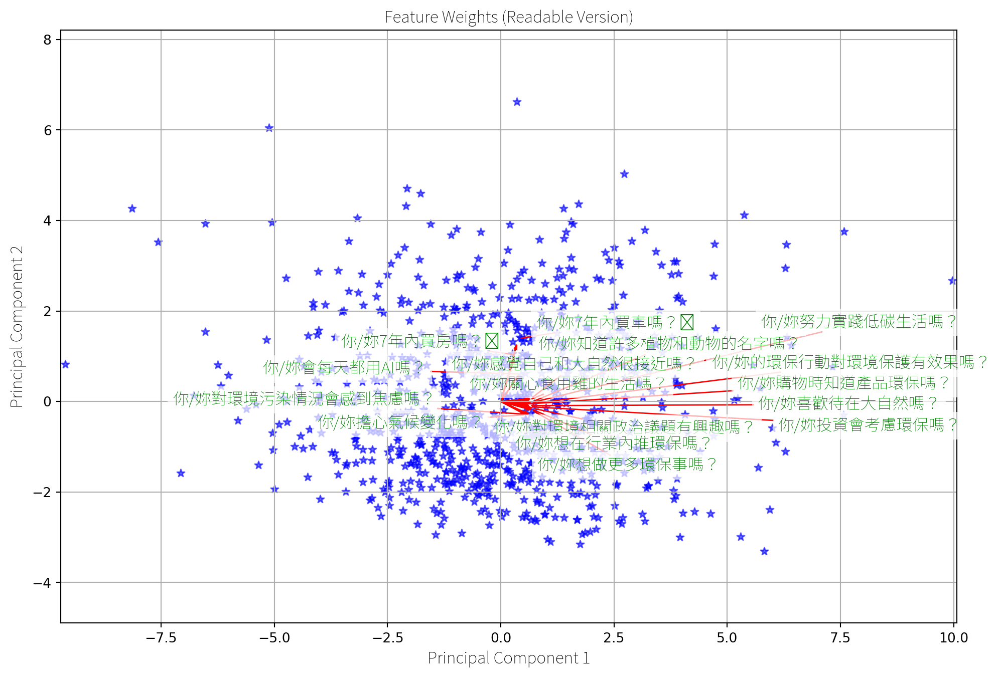

### Persona 2: “Moderate”

Questions Most Affecting Persona Creation include…

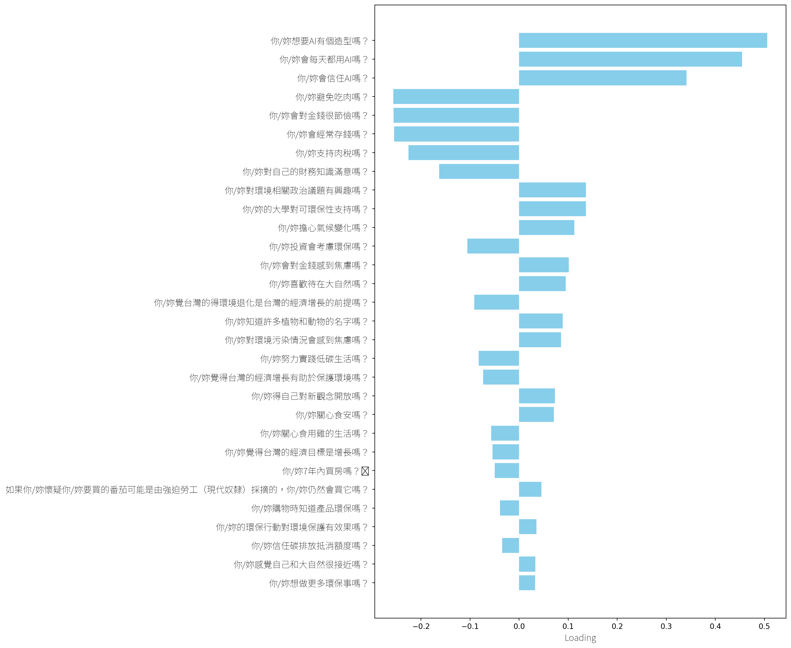

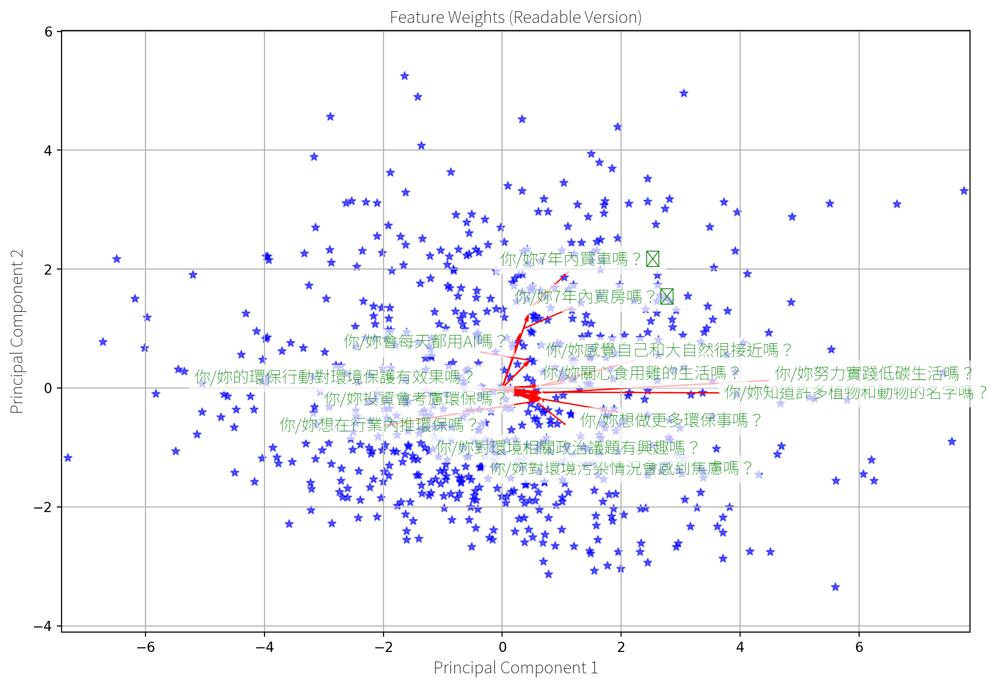

### Persona 3: “Frugal”

Questions Most Affecting Persona Creation include…

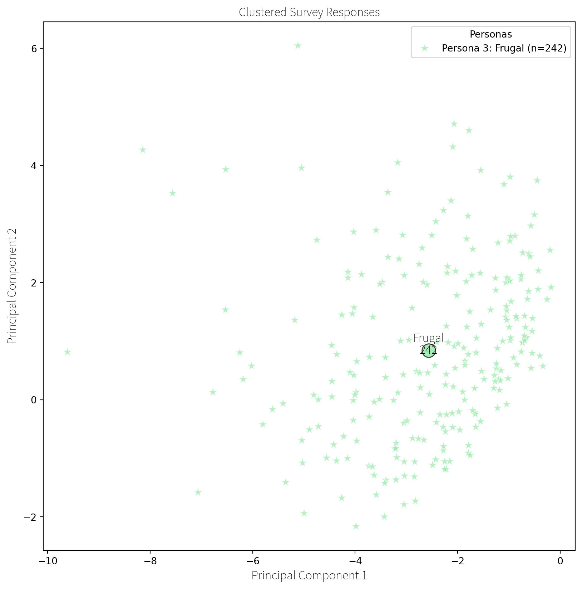

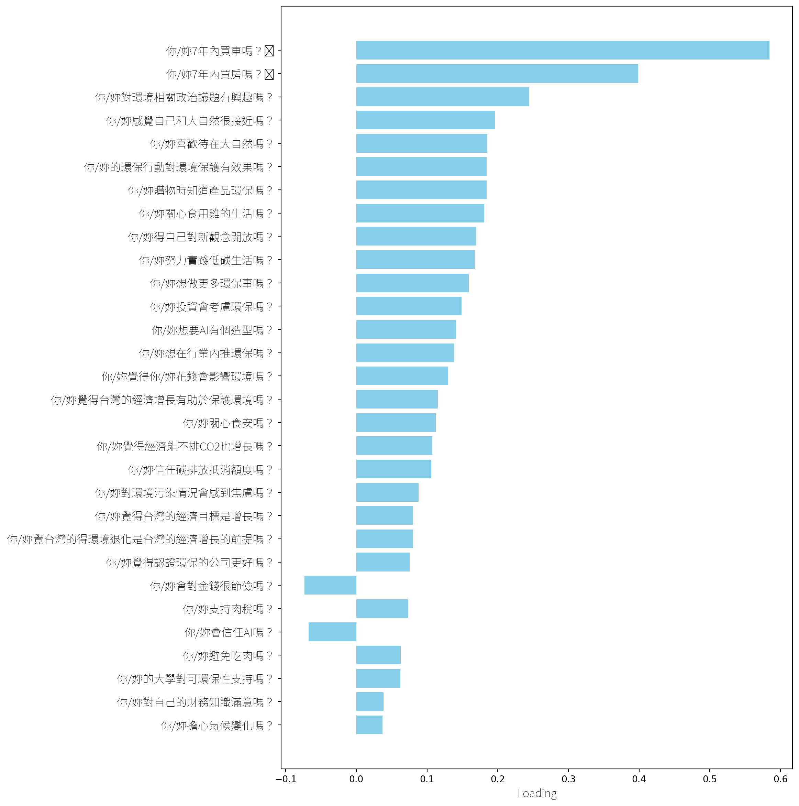

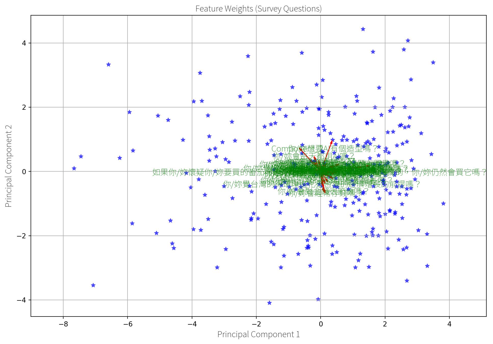

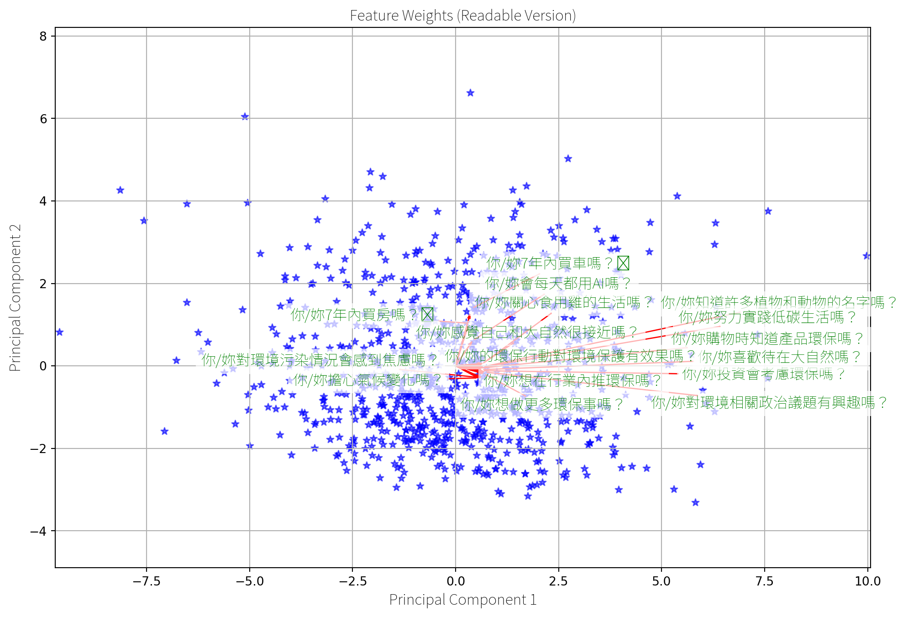

## Clustering Heatmap

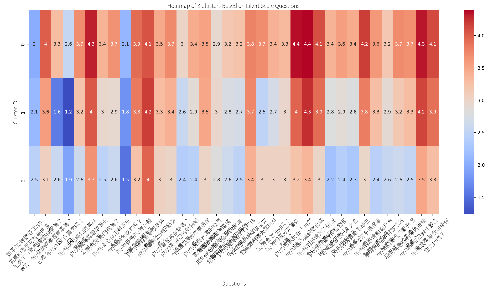

## Mean Answer Scores

Mean response values for each Likert question in each cluster:

## Agreement between personas

Highest agreement between personas is about health, safety, pollution
and climate concerns.

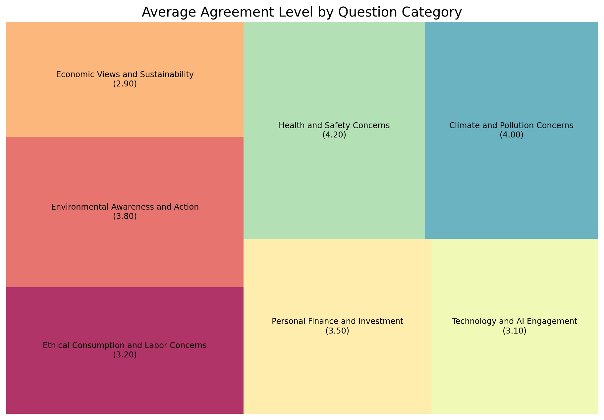
