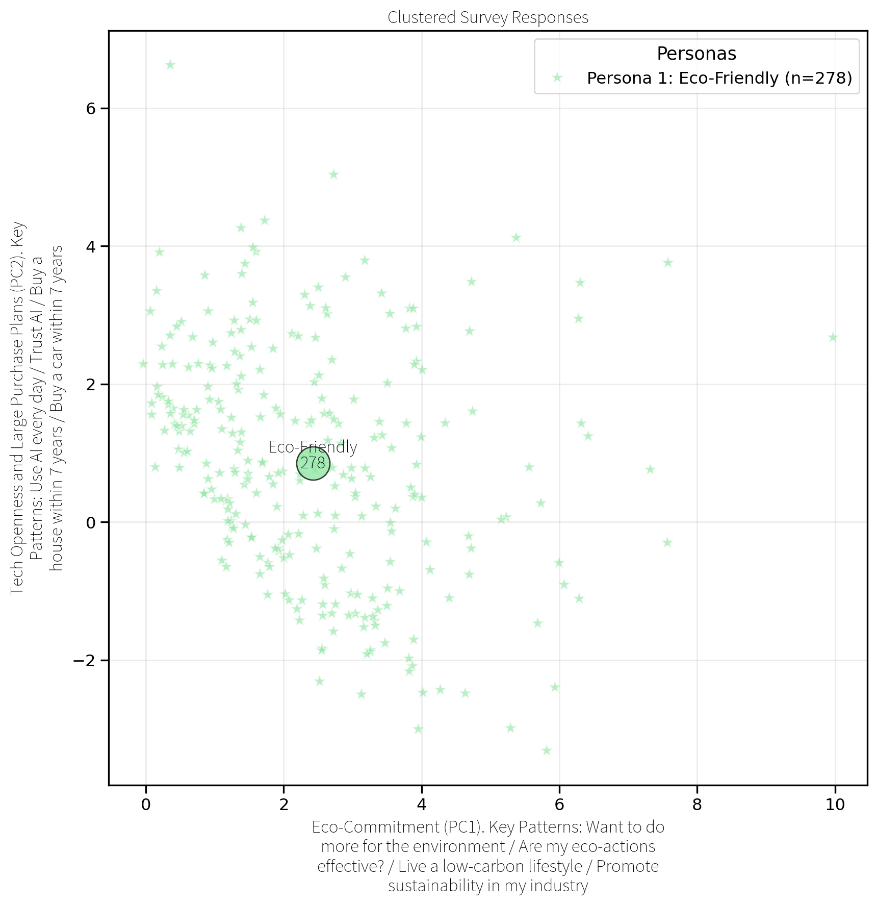
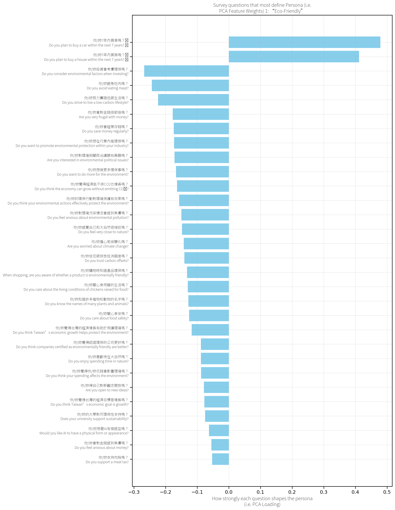
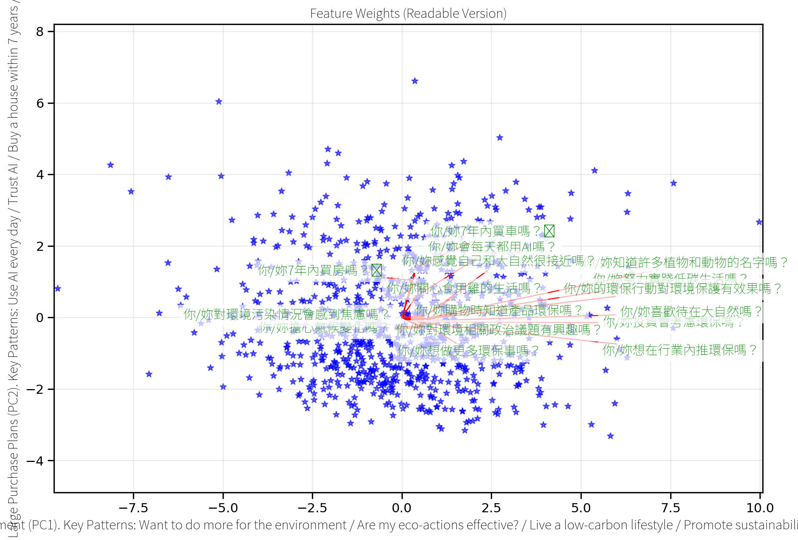
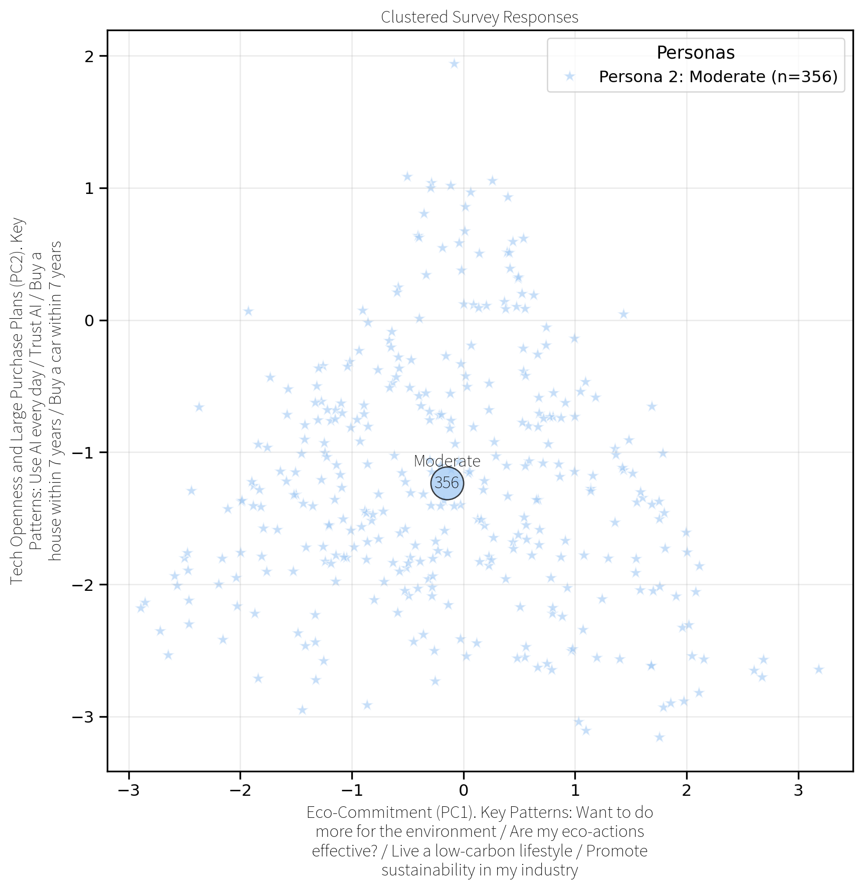
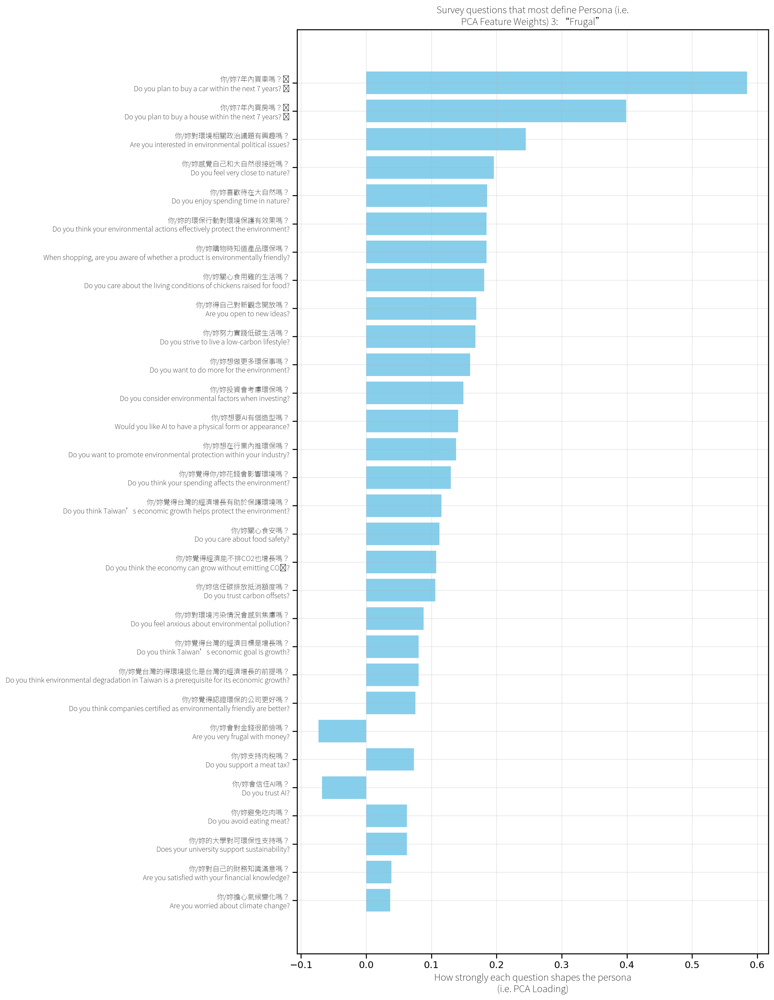

export const quartoRawHtml =
[`
<table>
<colgroup>
<col style="width: 15%" />
<col style="width: 15%" />
<col style="width: 38%" />
<col style="width: 15%" />
<col style="width: 15%" />
</colgroup>
<thead>
<tr>
<th>Persona</th>
<th>Color/marker</th>
<th>Rough <strong>attitude signal</strong> along PC 1</th>
<th>Cluster Centre (PC 1, PC 2)</th>
<th>Size</th>
</tr>
</thead>
<tbody>
<tr>
<td><strong>1. Eco-Friendly</strong></td>
<td>blue ★</td>
<td>Leans pro-environment, willing to pay or act for green goals</td>
<td>(~ +2.2, +0.7)</td>
<td>n = 278</td>
</tr>
<tr>
<td><strong>2. Moderate</strong></td>
<td>orange ★</td>
<td>Sits in the middle, balanced or undecided on most trade-offs</td>
<td>(~ 0.0, –1.5)</td>
<td>n = 356</td>
</tr>
<tr>
<td><strong>3. Frugal</strong></td>
<td>green ★</td>
<td>Cost-first, cautious about spending for eco causes</td>
<td>(~ –2.0, +0.8)</td>
<td>n = 242</td>
</tr>
</tbody>
</table>
`,`
`,`
<table id="T_8f3c3" data-quarto-postprocess="true">
<thead>
<tr>
<th class="blank level0" data-quarto-table-cell-role="th"> </th>
<th id="T_8f3c3_level0_col0" class="col_heading level0 col0" data-quarto-table-cell-role="th">Cluster</th>
<th id="T_8f3c3_level0_col1" class="col_heading level0 col1" data-quarto-table-cell-role="th">如果你/妳懷疑你/妳要買的番茄可能是由強 迫勞工（現代奴隸）採摘的，你/妳仍然會買 它嗎？ If you suspected the tomatoes you were about to buy were picked by forced labor (modern slavery), would you still buy them?</th>
<th id="T_8f3c3_level0_col2" class="col_heading level0 col2" data-quarto-table-cell-role="th">你/妳關心食安嗎？ Do you care about food safety?</th>
<th id="T_8f3c3_level0_col3" class="col_heading level0 col3" data-quarto-table-cell-role="th">你/妳7年內買車嗎？🚘 Do you plan to buy a car within the next 7 years? 🚘</th>
<th id="T_8f3c3_level0_col4" class="col_heading level0 col4" data-quarto-table-cell-role="th">你/妳7年內買房嗎？🏡 Do you plan to buy a house within the next 7 years? 🏡</th>
<th id="T_8f3c3_level0_col5" class="col_heading level0 col5" data-quarto-table-cell-role="th">你/妳購物時知道產品環保嗎？ When shopping, are you aware of whether a product is environmentally friendly?</th>
<th id="T_8f3c3_level0_col6" class="col_heading level0 col6" data-quarto-table-cell-role="th">你/妳覺得認證環保的公司更好嗎？ Do you think companies certified as environmentally friendly are better?</th>
<th id="T_8f3c3_level0_col7" class="col_heading level0 col7" data-quarto-table-cell-role="th">你/妳支持肉稅嗎？ Do you support a meat tax?</th>
<th id="T_8f3c3_level0_col8" class="col_heading level0 col8" data-quarto-table-cell-role="th">你/妳關心食用雞的生活嗎？ Do you care about the living conditions of chickens raised for food?</th>
<th id="T_8f3c3_level0_col9" class="col_heading level0 col9" data-quarto-table-cell-role="th">你/妳避免吃肉嗎？ Do you avoid eating meat?</th>
<th id="T_8f3c3_level0_col10" class="col_heading level0 col10" data-quarto-table-cell-role="th">你/妳覺得你/妳花錢會影響環境嗎？ Do you think your spending affects the environment?</th>
<th id="T_8f3c3_level0_col11" class="col_heading level0 col11" data-quarto-table-cell-role="th">你/妳會對金錢感到焦慮嗎？ Do you feel anxious about money?</th>
<th id="T_8f3c3_level0_col12" class="col_heading level0 col12" data-quarto-table-cell-role="th">你/妳會對金錢很節儉嗎？ Are you very frugal with money?</th>
<th id="T_8f3c3_level0_col13" class="col_heading level0 col13" data-quarto-table-cell-role="th">你/妳會經常存錢嗎？ Do you save money regularly?</th>
<th id="T_8f3c3_level0_col14" class="col_heading level0 col14" data-quarto-table-cell-role="th">你/妳對自己的財務知識滿意嗎？ Are you satisfied with your financial knowledge?</th>
<th id="T_8f3c3_level0_col15" class="col_heading level0 col15" data-quarto-table-cell-role="th">你/妳投資會考慮環保嗎？ Do you consider environmental factors when investing?</th>
<th id="T_8f3c3_level0_col16" class="col_heading level0 col16" data-quarto-table-cell-role="th">你/妳覺得台灣的經濟目標是增長嗎？ Do you think Taiwan’s economic goal is growth?</th>
<th id="T_8f3c3_level0_col17" class="col_heading level0 col17" data-quarto-table-cell-role="th">你/妳覺台灣的得環境退化是台灣的經濟增長 的前提嗎？ Do you think environmental degradation in Taiwan is a prerequisite for its economic growth?</th>
<th id="T_8f3c3_level0_col18" class="col_heading level0 col18" data-quarto-table-cell-role="th">你/妳覺得台灣的經濟增長有助於保護環境嗎 ？ Do you think Taiwan’s economic growth helps protect the environment?</th>
<th id="T_8f3c3_level0_col19" class="col_heading level0 col19" data-quarto-table-cell-role="th">你/妳覺得經濟能不排CO2也增長嗎？ Do you think the economy can grow without emitting CO₂?</th>
<th id="T_8f3c3_level0_col20" class="col_heading level0 col20" data-quarto-table-cell-role="th">你/妳覺得經濟增長有物質限制嗎？ Do you think economic growth has physical limits?</th>
<th id="T_8f3c3_level0_col21" class="col_heading level0 col21" data-quarto-table-cell-role="th">你/妳會每天都用AI嗎？ Do you use AI every day?</th>
<th id="T_8f3c3_level0_col22" class="col_heading level0 col22" data-quarto-table-cell-role="th">你/妳會信任AI嗎？ Do you trust AI?</th>
<th id="T_8f3c3_level0_col23" class="col_heading level0 col23" data-quarto-table-cell-role="th">你/妳想要AI有個造型嗎？ Would you like AI to have a physical form or appearance?</th>
<th id="T_8f3c3_level0_col24" class="col_heading level0 col24" data-quarto-table-cell-role="th">你/妳喜歡待在大自然嗎？ Do you enjoy spending time in nature?</th>
<th id="T_8f3c3_level0_col25" class="col_heading level0 col25" data-quarto-table-cell-role="th">你/妳擔心氣候變化嗎？ Are you worried about climate change?</th>
<th id="T_8f3c3_level0_col26" class="col_heading level0 col26" data-quarto-table-cell-role="th">你/妳對環境污染情況會感到焦慮嗎？ Do you feel anxious about environmental pollution?</th>
<th id="T_8f3c3_level0_col27" class="col_heading level0 col27" data-quarto-table-cell-role="th">你/妳知道許多植物和動物的名字嗎？ Do you know the names of many plants and animals?</th>
<th id="T_8f3c3_level0_col28" class="col_heading level0 col28" data-quarto-table-cell-role="th">你/妳感覺自己和大自然很接近嗎？ Do you feel very close to nature?</th>
<th id="T_8f3c3_level0_col29" class="col_heading level0 col29" data-quarto-table-cell-role="th">你/妳努力實踐低碳生活嗎？ Do you strive to live a low-carbon lifestyle?</th>
<th id="T_8f3c3_level0_col30" class="col_heading level0 col30" data-quarto-table-cell-role="th">你/妳想做更多環保事嗎？ Do you want to do more for the environment?</th>
<th id="T_8f3c3_level0_col31" class="col_heading level0 col31" data-quarto-table-cell-role="th">你/妳對環境相關政治議題有興趣嗎？ Are you interested in environmental political issues?</th>
<th id="T_8f3c3_level0_col32" class="col_heading level0 col32" data-quarto-table-cell-role="th">你/妳信任碳排放抵消額度嗎？ Do you trust carbon offsets?</th>
<th id="T_8f3c3_level0_col33" class="col_heading level0 col33" data-quarto-table-cell-role="th">你/妳的環保行動對環境保護有效果嗎？ Do you think your environmental actions effectively protect the environment?</th>
<th id="T_8f3c3_level0_col34" class="col_heading level0 col34" data-quarto-table-cell-role="th">你/妳想在行業內推環保嗎？ Do you want to promote environmental protection within your industry?</th>
<th id="T_8f3c3_level0_col35" class="col_heading level0 col35" data-quarto-table-cell-role="th">你/妳得自己對新觀念開放嗎？ Are you open to new ideas?</th>
<th id="T_8f3c3_level0_col36" class="col_heading level0 col36" data-quarto-table-cell-role="th">你/妳的大學對可環保性支持嗎？ Does your university support sustainability?</th>
</tr>
</thead>
<tbody>
<tr>
<td id="T_8f3c3_level0_row0" class="row_heading level0 row0" data-quarto-table-cell-role="th">0</td>
<td id="T_8f3c3_row0_col0" class="data row0 col0">0.00</td>
<td id="T_8f3c3_row0_col1" class="data row0 col1">2.01</td>
<td id="T_8f3c3_row0_col2" class="data row0 col2">4.00</td>
<td id="T_8f3c3_row0_col3" class="data row0 col3">3.29</td>
<td id="T_8f3c3_row0_col4" class="data row0 col4">2.55</td>
<td id="T_8f3c3_row0_col5" class="data row0 col5">3.69</td>
<td id="T_8f3c3_row0_col6" class="data row0 col6">4.31</td>
<td id="T_8f3c3_row0_col7" class="data row0 col7">3.38</td>
<td id="T_8f3c3_row0_col8" class="data row0 col8">3.65</td>
<td id="T_8f3c3_row0_col9" class="data row0 col9">2.11</td>
<td id="T_8f3c3_row0_col10" class="data row0 col10">3.91</td>
<td id="T_8f3c3_row0_col11" class="data row0 col11">4.07</td>
<td id="T_8f3c3_row0_col12" class="data row0 col12">3.47</td>
<td id="T_8f3c3_row0_col13" class="data row0 col13">3.72</td>
<td id="T_8f3c3_row0_col14" class="data row0 col14">3.00</td>
<td id="T_8f3c3_row0_col15" class="data row0 col15">3.44</td>
<td id="T_8f3c3_row0_col16" class="data row0 col16">3.54</td>
<td id="T_8f3c3_row0_col17" class="data row0 col17">2.93</td>
<td id="T_8f3c3_row0_col18" class="data row0 col18">3.18</td>
<td id="T_8f3c3_row0_col19" class="data row0 col19">3.23</td>
<td id="T_8f3c3_row0_col20" class="data row0 col20">3.77</td>
<td id="T_8f3c3_row0_col21" class="data row0 col21">3.69</td>
<td id="T_8f3c3_row0_col22" class="data row0 col22">3.40</td>
<td id="T_8f3c3_row0_col23" class="data row0 col23">3.31</td>
<td id="T_8f3c3_row0_col24" class="data row0 col24">4.36</td>
<td id="T_8f3c3_row0_col25" class="data row0 col25">4.39</td>
<td id="T_8f3c3_row0_col26" class="data row0 col26">4.10</td>
<td id="T_8f3c3_row0_col27" class="data row0 col27">3.39</td>
<td id="T_8f3c3_row0_col28" class="data row0 col28">3.56</td>
<td id="T_8f3c3_row0_col29" class="data row0 col29">3.45</td>
<td id="T_8f3c3_row0_col30" class="data row0 col30">4.19</td>
<td id="T_8f3c3_row0_col31" class="data row0 col31">3.61</td>
<td id="T_8f3c3_row0_col32" class="data row0 col32">3.18</td>
<td id="T_8f3c3_row0_col33" class="data row0 col33">3.71</td>
<td id="T_8f3c3_row0_col34" class="data row0 col34">3.67</td>
<td id="T_8f3c3_row0_col35" class="data row0 col35">4.33</td>
<td id="T_8f3c3_row0_col36" class="data row0 col36">4.13</td>
</tr>
<tr>
<td id="T_8f3c3_level0_row1" class="row_heading level0 row1" data-quarto-table-cell-role="th">1</td>
<td id="T_8f3c3_row1_col0" class="data row1 col0">1.00</td>
<td id="T_8f3c3_row1_col1" class="data row1 col1">2.14</td>
<td id="T_8f3c3_row1_col2" class="data row1 col2">3.57</td>
<td id="T_8f3c3_row1_col3" class="data row1 col3">1.59</td>
<td id="T_8f3c3_row1_col4" class="data row1 col4">1.24</td>
<td id="T_8f3c3_row1_col5" class="data row1 col5">3.22</td>
<td id="T_8f3c3_row1_col6" class="data row1 col6">4.04</td>
<td id="T_8f3c3_row1_col7" class="data row1 col7">2.96</td>
<td id="T_8f3c3_row1_col8" class="data row1 col8">2.93</td>
<td id="T_8f3c3_row1_col9" class="data row1 col9">1.78</td>
<td id="T_8f3c3_row1_col10" class="data row1 col10">3.83</td>
<td id="T_8f3c3_row1_col11" class="data row1 col11">4.19</td>
<td id="T_8f3c3_row1_col12" class="data row1 col12">3.30</td>
<td id="T_8f3c3_row1_col13" class="data row1 col13">3.41</td>
<td id="T_8f3c3_row1_col14" class="data row1 col14">2.58</td>
<td id="T_8f3c3_row1_col15" class="data row1 col15">2.88</td>
<td id="T_8f3c3_row1_col16" class="data row1 col16">3.50</td>
<td id="T_8f3c3_row1_col17" class="data row1 col17">2.96</td>
<td id="T_8f3c3_row1_col18" class="data row1 col18">2.76</td>
<td id="T_8f3c3_row1_col19" class="data row1 col19">2.71</td>
<td id="T_8f3c3_row1_col20" class="data row1 col20">3.74</td>
<td id="T_8f3c3_row1_col21" class="data row1 col21">2.49</td>
<td id="T_8f3c3_row1_col22" class="data row1 col22">2.71</td>
<td id="T_8f3c3_row1_col23" class="data row1 col23">2.97</td>
<td id="T_8f3c3_row1_col24" class="data row1 col24">3.98</td>
<td id="T_8f3c3_row1_col25" class="data row1 col25">4.26</td>
<td id="T_8f3c3_row1_col26" class="data row1 col26">3.92</td>
<td id="T_8f3c3_row1_col27" class="data row1 col27">2.81</td>
<td id="T_8f3c3_row1_col28" class="data row1 col28">2.88</td>
<td id="T_8f3c3_row1_col29" class="data row1 col29">2.79</td>
<td id="T_8f3c3_row1_col30" class="data row1 col30">3.81</td>
<td id="T_8f3c3_row1_col31" class="data row1 col31">3.28</td>
<td id="T_8f3c3_row1_col32" class="data row1 col32">2.91</td>
<td id="T_8f3c3_row1_col33" class="data row1 col33">3.16</td>
<td id="T_8f3c3_row1_col34" class="data row1 col34">3.28</td>
<td id="T_8f3c3_row1_col35" class="data row1 col35">4.15</td>
<td id="T_8f3c3_row1_col36" class="data row1 col36">3.89</td>
</tr>
<tr>
<td id="T_8f3c3_level0_row2" class="row_heading level0 row2" data-quarto-table-cell-role="th">2</td>
<td id="T_8f3c3_row2_col0" class="data row2 col0">2.00</td>
<td id="T_8f3c3_row2_col1" class="data row2 col1">2.45</td>
<td id="T_8f3c3_row2_col2" class="data row2 col2">3.07</td>
<td id="T_8f3c3_row2_col3" class="data row2 col3">2.58</td>
<td id="T_8f3c3_row2_col4" class="data row2 col4">1.93</td>
<td id="T_8f3c3_row2_col5" class="data row2 col5">2.63</td>
<td id="T_8f3c3_row2_col6" class="data row2 col6">3.66</td>
<td id="T_8f3c3_row2_col7" class="data row2 col7">2.46</td>
<td id="T_8f3c3_row2_col8" class="data row2 col8">2.60</td>
<td id="T_8f3c3_row2_col9" class="data row2 col9">1.53</td>
<td id="T_8f3c3_row2_col10" class="data row2 col10">3.24</td>
<td id="T_8f3c3_row2_col11" class="data row2 col11">3.98</td>
<td id="T_8f3c3_row2_col12" class="data row2 col12">3.05</td>
<td id="T_8f3c3_row2_col13" class="data row2 col13">3.00</td>
<td id="T_8f3c3_row2_col14" class="data row2 col14">2.39</td>
<td id="T_8f3c3_row2_col15" class="data row2 col15">2.43</td>
<td id="T_8f3c3_row2_col16" class="data row2 col16">3.01</td>
<td id="T_8f3c3_row2_col17" class="data row2 col17">2.82</td>
<td id="T_8f3c3_row2_col18" class="data row2 col18">2.64</td>
<td id="T_8f3c3_row2_col19" class="data row2 col19">2.48</td>
<td id="T_8f3c3_row2_col20" class="data row2 col20">3.41</td>
<td id="T_8f3c3_row2_col21" class="data row2 col21">3.03</td>
<td id="T_8f3c3_row2_col22" class="data row2 col22">3.03</td>
<td id="T_8f3c3_row2_col23" class="data row2 col23">3.02</td>
<td id="T_8f3c3_row2_col24" class="data row2 col24">3.22</td>
<td id="T_8f3c3_row2_col25" class="data row2 col25">3.36</td>
<td id="T_8f3c3_row2_col26" class="data row2 col26">2.99</td>
<td id="T_8f3c3_row2_col27" class="data row2 col27">2.24</td>
<td id="T_8f3c3_row2_col28" class="data row2 col28">2.41</td>
<td id="T_8f3c3_row2_col29" class="data row2 col29">2.31</td>
<td id="T_8f3c3_row2_col30" class="data row2 col30">2.98</td>
<td id="T_8f3c3_row2_col31" class="data row2 col31">2.44</td>
<td id="T_8f3c3_row2_col32" class="data row2 col32">2.56</td>
<td id="T_8f3c3_row2_col33" class="data row2 col33">2.61</td>
<td id="T_8f3c3_row2_col34" class="data row2 col34">2.54</td>
<td id="T_8f3c3_row2_col35" class="data row2 col35">3.50</td>
<td id="T_8f3c3_row2_col36" class="data row2 col36">3.28</td>
</tr>
</tbody>
</table>
`,`
<table>
<colgroup>
<col style="width: 17%" />
<col style="width: 17%" />
<col style="width: 31%" />
<col style="width: 33%" />
</colgroup>
<thead>
<tr>
<th>Rank</th>
<th>Category (Mean¹)</th>
<th>Why the take mostly holds</th>
<th>Any nuance to note</th>
</tr>
</thead>
<tbody>
<tr>
<td>1</td>
<td><strong>Health &amp; Safety (4.20)</strong></td>
<td>Highest average → students <em>actively</em> click with personal well-being.</td>
<td>The spread is tight; nearly everyone agrees, so messaging can be broad.</td>
</tr>
<tr>
<td>2</td>
<td><strong>Climate &amp; Pollution (4.00)</strong></td>
<td>Strong support for big-picture environmental stakes.</td>
<td>Scores cluster a hair lower than #1, but difference isn’t huge.</td>
</tr>
<tr>
<td>3</td>
<td><strong>Env. Awareness &amp; Action (3.80)</strong></td>
<td>They <em>like</em> the idea of acting green, just slightly less pumped than broad “save the planet” statements.</td>
<td>Some questions in this bucket may have asked for concrete effort (reuse cups, etc.), which drags the mean a bit.</td>
</tr>
<tr>
<td>4</td>
<td><strong>Personal Finance &amp; Investment (3.50)</strong></td>
<td>Mid-3s says “interested, not obsessed.” Your “money talk sits mid-tier” line is spot-on.</td>
<td>Variance is wider; a sub-segment rates it high, others shrug.</td>
</tr>
<tr>
<td>5</td>
<td><strong>Ethical Consumption &amp; Labor (3.20)</strong></td>
<td>Agreement exists but lags — real people far away feel abstract.</td>
<td>If you spotlight specific worker stories, expect this score to climb.</td>
</tr>
<tr>
<td>6</td>
<td><strong>Tech &amp; AI Engagement (3.10)</strong></td>
<td>Curiosity tempered by caution, exactly as you wrote.</td>
<td>The topic is newer, so opinions are still forming.</td>
</tr>
<tr>
<td>7</td>
<td><strong>Economic Growth vs Sustainability (2.90)</strong></td>
<td>Lowest mean = hardest sell; “trade-off” framing pushes folks to neutral/disagree.</td>
<td>If you rephrase questions to show win-win economics, this block can leap upward.</td>
</tr>
</tbody>
</table>
`,`
<table>
<colgroup>
<col style="width: 26%" />
<col style="width: 48%" />
<col style="width: 25%" />
</colgroup>
<thead>
<tr>
<th><strong>Original Quote (Chinese)</strong></th>
<th><strong>English Translation</strong></th>
<th><strong>Category</strong></th>
</tr>
</thead>
<tbody>
<tr>
<td>黑心商品不健康或老闆品德不佳</td>
<td>“Black-hearted products are unhealthy, and the boss has poor morals.”</td>
<td>Opinionated/Emotional</td>
</tr>
<tr>
<td>因為味全以前使用黑心油所以再也不買他們家的產品</td>
<td>“Because Wei Chuan used gutter oil in the past, I will never buy their products again.”</td>
<td>Emotional</td>
</tr>
<tr>
<td>有食安問題、政治立場不同</td>
<td>“They have food safety issues and [hold] different political stances.”</td>
<td>Thematic (Food safety/Political)</td>
</tr>
<tr>
<td>對環境造成破壞或是對人不健康</td>
<td>“It causes damage to the environment or is unhealthy for people.”</td>
<td>Thematic/Opinionated</td>
</tr>
<tr>
<td>公司使用地溝油來製造產品</td>
<td>“The company uses gutter oil to manufacture its products.”</td>
<td>Thematic (Food safety)</td>
</tr>
<tr>
<td>分享心情，提供建議，像是跟朋友聊天，但不用擔心秘密被知道</td>
<td>“Share feelings and give advice, like chatting with a friend, but without worrying that secrets will be revealed.”</td>
<td>Emotional</td>
</tr>
<tr>
<td>一個指令一個動作即可。太厲害的反應會擔心哪一天被反撲取代</td>
<td>“One command at a time is enough. If its responses become too powerful, I worry it could one day turn against us and replace us.”</td>
<td>Unique perspective / Fearful</td>
</tr>
<tr>
<td>支持致力於永續環保的企業，抵制不具環保意識的公司。</td>
<td>“Support companies committed to sustainability and environmental protection, and boycott those lacking environmental awareness.”</td>
<td>Thematic</td>
</tr>
<tr>
<td>很多大學會有產學合作課程，公司在招募人才的時候應該也希望聽到年輕人對現當代行業的想法，所以我認為本來就會有一定的影響！</td>
<td>“Many universities have industry–school cooperation programs. When companies recruit talent, they likely want to hear young people’s ideas about modern industries, so I believe there will inherently be some influence!”</td>
<td>Thematic / Optimistic</td>
</tr>
<tr>
<td>老實說影響力可能很有限，不過可能可以透過有前景的提案或是具有經濟價值的行動</td>
<td>“Honestly, our influence might be very limited, but perhaps we can act through promising proposals or actions with economic value.”</td>
<td>Realistic / Opinion</td>
</tr>
<tr>
<td>網路上理性發表意見，影響到社交圈，藉由輿論改變公司方針</td>
<td>“Post opinions rationally online, influence your social circle, and change company policy through public opinion.”</td>
<td>Thematic (Activism)</td>
</tr>
<tr>
<td>戰爭、人們不再相愛、世界末日</td>
<td>“War, people not loving each other anymore, the end of the world.”</td>
<td>Emotional (Dramatic fear)</td>
</tr>
<tr>
<td>核電廠爆掉</td>
<td>“A nuclear power plant explodes.”</td>
<td>Emotional/Fearful</td>
</tr>
<tr>
<td>氣候失控、地緣政治風險</td>
<td>“Uncontrolled climate and geopolitical risks.”</td>
<td>Thematic (Climate/Politics)</td>
</tr>
<tr>
<td>冰山融化，海平面上升</td>
<td>“Icebergs melting and sea levels rising.”</td>
<td>Thematic (Climate)</td>
</tr>
<tr>
<td>小時候爸爸出門都會跟我們說要帶購物袋，並重複利用，就算髒了也可以再拿去當垃圾袋。</td>
<td>“When I was little, my dad would always tell us to bring our own shopping bags and reuse them; even if they got dirty, we could still use them as trash bags.”</td>
<td>Nostalgic / Moral</td>
</tr>
<tr>
<td>Podcast:百靈果的每個禮拜的國際新聞與來賓訪談，他們用有趣的方式讓我知道好多好多事</td>
<td>“Podcast: ‘Bailingguo’ does weekly international news and guest interviews – they let me learn so much in such an interesting way.”</td>
<td>Unique / Memorable</td>
</tr>
<tr>
<td>愛因斯坦相對論，特別是在談視界（event horizon），這顯著影響我的哲學思考。</td>
<td>“Einstein’s theory of relativity, especially discussing event horizons, has significantly influenced my philosophical thinking.”</td>
<td>Intellectual Inspiration</td>
</tr>
<tr>
<td>高中老師努力推行環保，跟我們分享台灣的珊瑚礁有多寶貴，然後現在面臨什麼樣的風險。</td>
<td>“My high school teacher worked hard to promote environmental protection, sharing with us how precious Taiwan’s coral reefs are and what risks they currently face.”</td>
<td>Inspirational/Educational</td>
</tr>
<tr>
<td>我認為要人民注重環保的先決條件是經濟狀況，假如一個家庭的經濟收入非常拮据，他們優先考慮的通常不是環保而是吃飽。</td>
<td>“I think the prerequisite for people to care about the environment is their economic situation. If a family’s income is very tight, their priority is usually not the environment but having enough to eat.”</td>
<td>Thematic (Socioeconomic)</td>
</tr>
<tr>
<td>以屏科大為例，它宣揚自己是全國綠色大學第一名，並且發展許多環保或綠色議題的研究，但就細節而言，實際上學生的環保觀念並無太大提升，即便這個環境一直在宣傳環保議題，可是學生餐廳內仍然充斥著許多環保筷、塑膠湯匙等用具。</td>
<td>“For example, Pingtung University of Science and Technology promotes itself as the country’s top green university and conducts much environmental research. But in detail, students’ environmental awareness hasn’t really improved; even though the campus constantly promotes green issues, the cafeteria is still filled with many disposable chopsticks and plastic spoons.”</td>
<td>Opinionated (Campus vs. Practice)</td>
</tr>
</tbody>
</table>
`];

## Personas

### Clustering Students to Build Personas

Customer segmentation

Personas are created using K-means clustering, an unsupervised machine
learning algorithm, which clusters college students based on their
responses across 36 Likert scale fields in the online survey. Clusters
are visualized using Principal Component Analysis (PCA), where the
principal component loadings on the X and Y axes represent the weights
of the original Likert scale fields, transformed into the principal
components that capture the most variance.

The Likert scale is a psychometric scale developed by Rensis Likert
already in the 1930s, and it’s commonly used to this day in
questionnaires to measure respondents’ attitudes, opinions, and
perceptions (Sullivan & Artino, 2013). K-Means, K-Modes, and
K-Prototypes are unsupervised machine learning algorithms, used for
finding patterns in the data. Here I’ve opted to use K-Means and
Principal Component Analysis (PCA), which is used to convert data to
lower dimension space (this is a simpler predecessor of *embeddings*
used in large-language models).

Figure 1: College Student Personas

### Persona 1: “Eco-Friendly”

Questions Most Affecting Persona Creation include…

(a) Persona 1 - Eco-Friendly

(b)

(c)

(d)

Figure 2

### Persona 2: “Moderate”

Questions Most Affecting Persona Creation include…

(a) Persona 2 - Moderate

(b)

(c)

(d)

Figure 3

### Persona 3: “Frugal”

Questions Most Affecting Persona Creation include…

(a) Persona 3 - Frugal

(b)

(c)

(d)

Figure 4

## Clustering Heatmap

Figure 5: College Students’ Clustering Heatmap

## Mean Answer Scores

Mean response values for each Likert question in each cluster:

Figure 6: Mean Values of Survey Responses

## Agreement Between Personas

There is some similarity between clusters. All 3 personas report a high
level of financial anxiety and below-average satisfaction with their
financial literacy. Highest agreement between personas is about health,
safety, pollution and climate concerns.

Figure 7: Topics With Highest Agreement Between Personas

In summary, *Safety \> Planet \> Personal Eco-action*. Students first
protect themselves (food safety, health), then the planet, then think
about their habits. Money talk sits mid-tier. Finance topics aren’t
ignored (3.5 / 5) but aren’t hype either. Ethical labor & AI still feel
abstract. Sweat-shop worries and AI curiosity land in the low-3’s.
Economic trade-offs are the hardest sell. When sustainability sounds
like “sacrifice growth,” support tanks (\< 3).

*Design Implications*: Frame eco-features around personal health wins to
boost engagement. App idea: Link sustainable investing to tangible
health or climate outcomes to lift enthusiasm. Communications angle:
Storytelling about real human impact behind labor issues and show AI as
a practical helper, not sci-fi. Policy framing: Highlight win-win
scenarios (green jobs, savings) instead of “growth vs. green” rhetoric.

## Notable Quotes from the Survey

The survey also included textual fields where college students could
express their ideas in their owns words. Here are some quotes, which
show the attitudes and feelings of the students.

