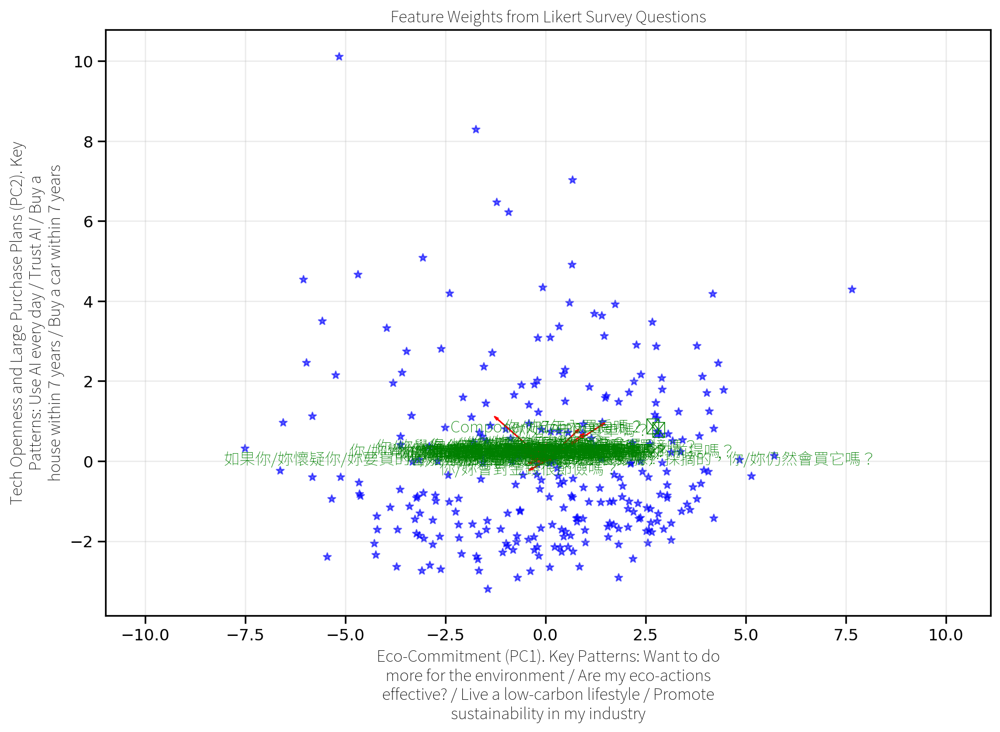
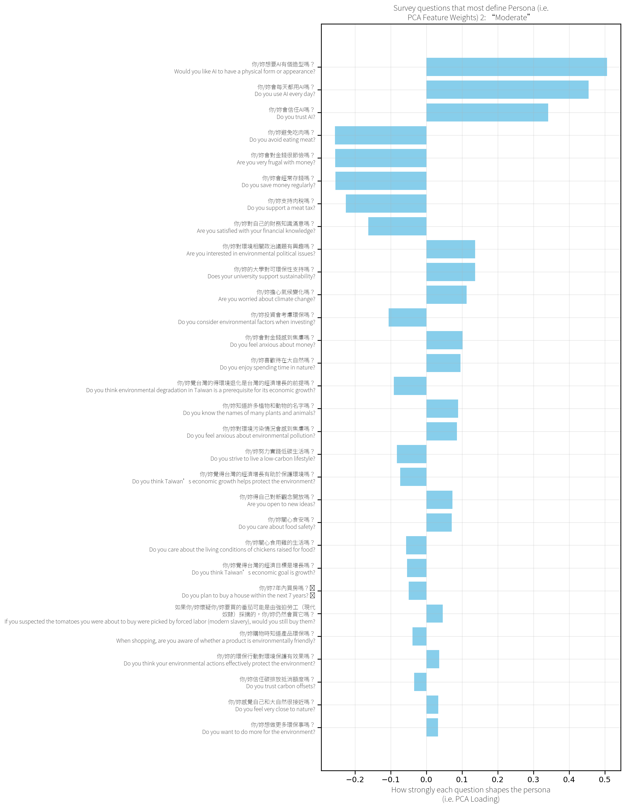

export const quartoRawHtml =
[`

`,`
<table class="dataframe" data-quarto-postprocess="true" data-border="1">
<thead>
<tr style="text-align: right;">
<th data-quarto-table-cell-role="th"></th>
<th data-quarto-table-cell-role="th">Cluster</th>
<th data-quarto-table-cell-role="th">如果你/妳懷疑你/妳要買的番茄可能是由強迫勞工（現代奴隸）採摘的，你/妳仍然會買它嗎？</th>
<th data-quarto-table-cell-role="th">你/妳關心食安嗎？</th>
<th data-quarto-table-cell-role="th">你/妳7年內買車嗎？🚘</th>
<th data-quarto-table-cell-role="th">你/妳7年內買房嗎？🏡</th>
<th data-quarto-table-cell-role="th">你/妳購物時知道產品環保嗎？</th>
<th data-quarto-table-cell-role="th">你/妳覺得認證環保的公司更好嗎？</th>
<th data-quarto-table-cell-role="th">你/妳支持肉稅嗎？</th>
<th data-quarto-table-cell-role="th">你/妳關心食用雞的生活嗎？</th>
<th data-quarto-table-cell-role="th">你/妳避免吃肉嗎？</th>
<th data-quarto-table-cell-role="th">...</th>
<th data-quarto-table-cell-role="th">你/妳知道許多植物和動物的名字嗎？</th>
<th data-quarto-table-cell-role="th">你/妳感覺自己和大自然很接近嗎？</th>
<th data-quarto-table-cell-role="th">你/妳努力實踐低碳生活嗎？</th>
<th data-quarto-table-cell-role="th">你/妳想做更多環保事嗎？</th>
<th data-quarto-table-cell-role="th">你/妳對環境相關政治議題有興趣嗎？</th>
<th data-quarto-table-cell-role="th">你/妳信任碳排放抵消額度嗎？</th>
<th data-quarto-table-cell-role="th">你/妳的環保行動對環境保護有效果嗎？</th>
<th data-quarto-table-cell-role="th">你/妳想在行業內推環保嗎？</th>
<th data-quarto-table-cell-role="th">你/妳得自己對新觀念開放嗎？</th>
<th data-quarto-table-cell-role="th">你/妳的大學對可環保性支持嗎？</th>
</tr>
</thead>
<tbody>
<tr>
<td data-quarto-table-cell-role="th">0</td>
<td>0</td>
<td>2.014388</td>
<td>4.003597</td>
<td>3.291367</td>
<td>2.550360</td>
<td>3.694245</td>
<td>4.312950</td>
<td>3.381295</td>
<td>3.651079</td>
<td>2.107914</td>
<td>...</td>
<td>3.392086</td>
<td>3.561151</td>
<td>3.446043</td>
<td>4.190647</td>
<td>3.611511</td>
<td>3.176259</td>
<td>3.708633</td>
<td>3.672662</td>
<td>4.330935</td>
<td>4.129496</td>
</tr>
<tr>
<td data-quarto-table-cell-role="th">1</td>
<td>1</td>
<td>2.137640</td>
<td>3.573034</td>
<td>1.592697</td>
<td>1.241573</td>
<td>3.219101</td>
<td>4.036517</td>
<td>2.955056</td>
<td>2.926966</td>
<td>1.778090</td>
<td>...</td>
<td>2.814607</td>
<td>2.879213</td>
<td>2.794944</td>
<td>3.808989</td>
<td>3.280899</td>
<td>2.907303</td>
<td>3.162921</td>
<td>3.283708</td>
<td>4.151685</td>
<td>3.887640</td>
</tr>
<tr>
<td data-quarto-table-cell-role="th">2</td>
<td>2</td>
<td>2.450413</td>
<td>3.070248</td>
<td>2.582645</td>
<td>1.925620</td>
<td>2.628099</td>
<td>3.661157</td>
<td>2.458678</td>
<td>2.603306</td>
<td>1.533058</td>
<td>...</td>
<td>2.235537</td>
<td>2.409091</td>
<td>2.309917</td>
<td>2.983471</td>
<td>2.438017</td>
<td>2.557851</td>
<td>2.611570</td>
<td>2.541322</td>
<td>3.495868</td>
<td>3.280992</td>
</tr>
</tbody>
</table>
`,`

3 rows × 37 columns

`];

## Personas

### Clustering Students to Build Personas

Customer segmentation

Personas are created using K-means clustering, an unsupervised machine
learning algorithm, which clusters college students based on their
responses across 36 Likert scale fields in the online survey. Clusters
are visualized using Principal Component Analysis (PCA), where the
principal component loadings on the X and Y axes represent the weights
of the original Likert scale fields, transformed into the principal
components that capture the most variance.

The Likert scale is a psychometric scale developed by Rensis Likert
already in the 1930s, and it’s commonly used to this day in
questionnaires to measure respondents’ attitudes, opinions, and
perceptions (Sullivan & Artino, 2013).

K-prototypes combines K-mean and K-modes unsupervised machine learning
algorithms.

-   There is some similarity between clusters. All 3 personas report a
    high level of financial anxiety and below-average satisfaction with
    their financial literacy.

-   Principal Component Analysis (PCA) is used to convert data to lower
    dimension space. This is a predecessor of embeddings.

Figure 1: College Student Personas

### Persona 1: “Eco-Friendly”

Questions Most Affecting Persona Creation include…

(a) Persona 1 - Eco-Friendly

(b)

(c)

(d)

Figure 2

### Persona 2: “Moderate”

Questions Most Affecting Persona Creation include…

(a) Persona 2 - Moderate

(b)

(c)

(d)

Figure 3

### Persona 3: “Frugal”

Questions Most Affecting Persona Creation include…

(a) Persona 3 - Frugal

(b)

(c)

(d)

Figure 4

## Clustering Heatmap

Figure 5: College Students’ Clustering Heatmap

## Mean Answer Scores

Mean response values for each Likert question in each cluster:

Figure 6: Mean Values of Survey Responses

## Agreement Between Personas

Highest agreement between personas is about health, safety, pollution
and climate concerns.

Figure 7: Topics With Highest Agreement Between Personas

