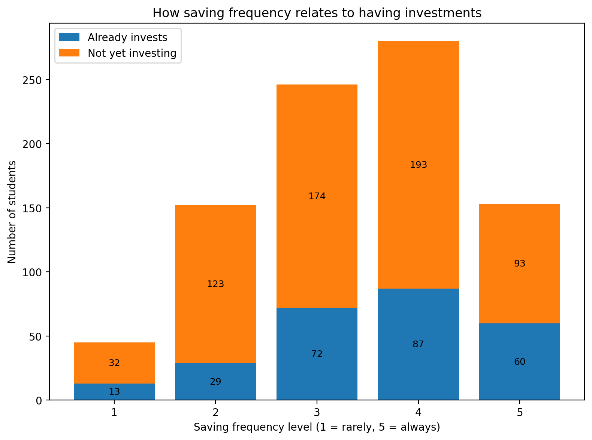
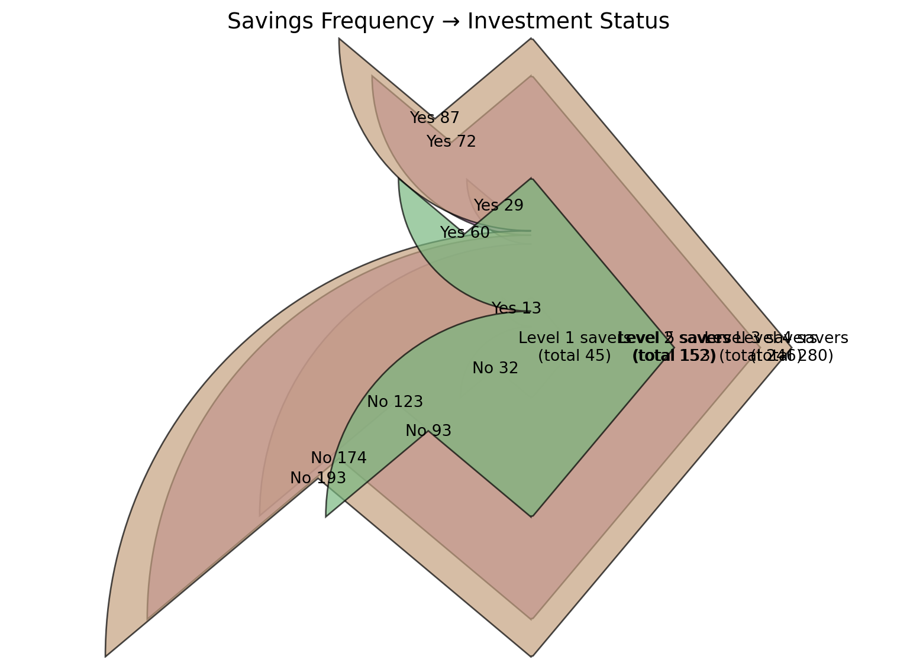

## Saving

The following charts are based on the 你/妳覺得目前有任何投資嗎？ and
你/妳覺得目前有任何投資嗎？ boolean (Yes / No) fields. The data shows
correlation between saving levels and investing: the students with
higher level of saving invest more.

Figure 1: Correlation Between Saving Levels and Investing (Sankey)

The same data plotted as a Sankey chart.

Figure 2: Correlation Between Saving Levels and Investing (Sankey)

