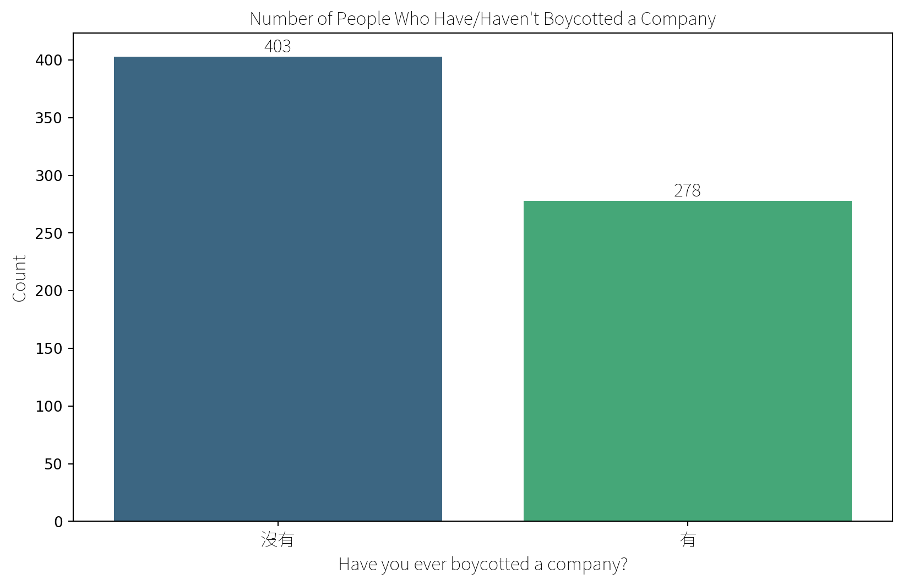
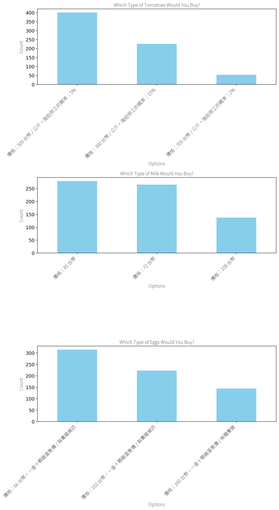

## Shopping

### Boycott Count (Overall)

``` text
/Users/krishaamer/Desktop/current/thesis/green-filter-research/research/results/data/shopping.py:20: FutureWarning: 

Passing `palette` without assigning `hue` is deprecated and will be removed in v0.14.0. Assign the `x` variable to `hue` and set `legend=False` for the same effect.

  barplot = sns.barplot(x='Boycott', y='Count', data=boycott_count, palette='viridis')
/Users/krishaamer/Desktop/current/thesis/green-filter-research/research/results/data/shopping.py:22: UserWarning: set_ticklabels() should only be used with a fixed number of ticks, i.e. after set_ticks() or using a FixedLocator.
  ax.set_xticklabels(ax.get_xticklabels(), fontproperties=chinese_font)
```



### Why Boycott

``` text
2024-02-18 10:45:39.700 
  Warning: to view this Streamlit app on a browser, run it with the following
  command:

    streamlit run /Library/Frameworks/Python.framework/Versions/3.12/lib/python3.12/site-packages/ipykernel_launcher.py [ARGUMENTS]
```

``` text
為什麼抵制？
食安問題                               33
地溝油                                10
黑心油                                 8
食安                                  5
政治因素                                4
                                   ..
因為有出新聞                              1
此公司危害食安，以抵制這種行為讓公司更能意識到執行此行為的後果     1
地溝油啊                                1
不認同理念                               1
因為這家公司壓榨員工                          1
Name: count, Length: 187, dtype: int64
```

### Trusted Brands

``` text
你/妳有信任的品牌嗎？
No trusted brand          329
Have but not specified    110
義美                         42
Apple                       9
光泉                          7
                         ... 
自家種植                        1
Casetify                    1
Adidas                      1
麥當勞                         1
淨毒五郎                        1
Name: count, Length: 195, dtype: int64
```

### Choice Experiments



## Personas from Clusters

Personas are created using K-means clustering, an unsupervised machine
learning algorithm, which clusters college students based on their
responses across 36 Likert-scale fields in the online survey. Clusters
are visualized using Principal Component Analysis (PCA), where the
principal component loadings on the X and Y axes represent the weights
of the original Likert-scale fields, transformed into the principal
components that capture the most variance.

-   There is some similarity between clusters. All 3 personas report a
    high level of financial anxiety and below-average satisfaction with
    their financial literacy.

### Clustering Students to Build 3 Personas
