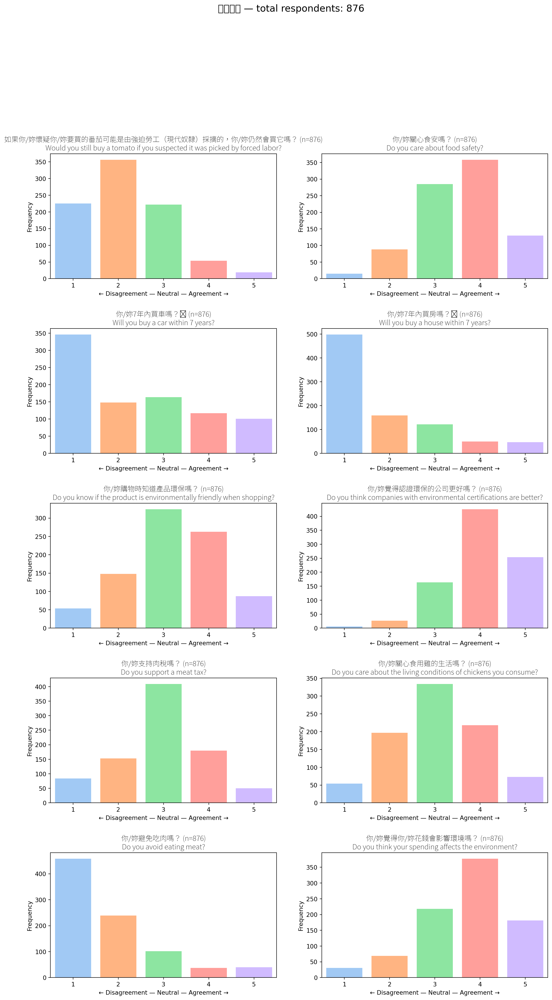
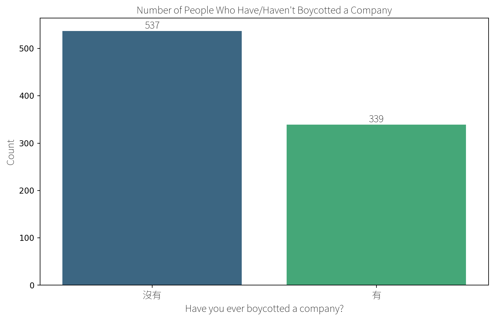
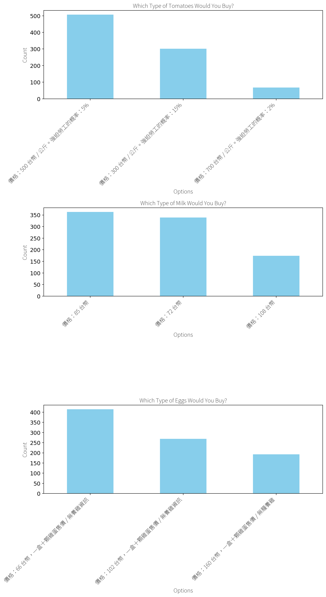

export const quartoRawHtml =
[`
<table>
<colgroup>
<col style="width: 23%" />
<col style="width: 23%" />
<col style="width: 52%" />
</colgroup>
<thead>
<tr>
<th>#</th>
<th>Question</th>
<th>Interpretation</th>
</tr>
</thead>
<tbody>
<tr>
<td>1</td>
<td><em>Would you still buy a tomato if you suspected it was picked by forced labor?</em></td>
<td>Most respondents chose <strong>2</strong> or <strong>1</strong> which I interpret as <em>“Nope, I wouldn’t buy it.”</em> - only a small fraction of the respondents choosing 4-5 would ignore the labor issue.</td>
</tr>
<tr>
<td>2</td>
<td><em>Do you care about food safety?</em></td>
<td>The choices peaks at <strong>4</strong>, then <strong>5</strong>. Nearly everyone is on the caring side; indifference and denial are tiny.</td>
</tr>
<tr>
<td>3</td>
<td><em>Will you buy a car within 7 years?</em></td>
<td>The mode is <strong>1</strong>, plus decent counts at <strong>2</strong>. A clear majority of respondents do <strong>not</strong> expect to purchase a car soon. My interpretation: maybe they’re fine with their scooter (!= car, see the question about how they arrive to school), use public transit or are just broke students.</td>
</tr>
<tr>
<td>4</td>
<td><em>Will you buy a house within 7 years?</em></td>
<td>Even more lopsided: a mountain at <strong>1</strong>. Housing feels out of reach for the respondents.</td>
</tr>
<tr>
<td>5</td>
<td><em>Do you know if a product is environmentally friendly when shopping?</em></td>
<td>Bell-ish curve peaking at <strong>3-4</strong>. People feel <strong>some</strong> awareness, but confidence isn’t universal. This might also reflect they don’t fully understand the question.</td>
</tr>
<tr>
<td>6</td>
<td><em>Do you think companies with environmental certifications are better?</em></td>
<td>Strong skew right: bars climb from 3 → 4 → 5. The badge matters and most respondents see certified firms as the good guys.</td>
</tr>
<tr>
<td>7</td>
<td><em>Do you support a meat tax?</em></td>
<td>Centered on <strong>3</strong>, with noticeable flanks at 2 and 4. Opinion is split; lots are neutral, some yay, some nay. Again, this might indicate respondents don’t fully understand the question.</td>
</tr>
<tr>
<td>8</td>
<td><em>Do you care about the living conditions of chickens you consume?</em></td>
<td>Mode at <strong>3</strong>, healthy bump at <strong>4</strong>. People lean caring, but not super strongly.</td>
</tr>
<tr>
<td>9</td>
<td><em>Do you avoid eating meat?</em></td>
<td>Tall stack on <strong>1</strong>, smaller on <strong>2</strong>. So most <strong>do not</strong> avoid meat; only a sliver sits at 4-5.</td>
</tr>
<tr>
<td>10</td>
<td><em>Do you think your spending affects the environment?</em></td>
<td>Big jump at <strong>4</strong>, next at <strong>5</strong>, tiny left tail. Consensus: “My wallet choices matter.” This is an important finding to justify <em>Green Filter</em>.</td>
</tr>
</tbody>
</table>
`,`
<table>
<thead>
<tr>
<th>Option</th>
<th>Count</th>
<th>Share of sample</th>
</tr>
</thead>
<tbody>
<tr>
<td><strong>沒 有</strong> – <em>Never boycotted</em></td>
<td><strong>537</strong></td>
<td>~61 %</td>
</tr>
<tr>
<td><strong>有</strong> – <em>Have boycotted</em></td>
<td><strong>339</strong></td>
<td>~39 %</td>
</tr>
</tbody>
</table>
`,`

`,`
<table class="dataframe" data-quarto-postprocess="true" data-border="1">
<thead>
<tr style="text-align: right;">
<th data-quarto-table-cell-role="th"></th>
<th data-quarto-table-cell-role="th">Reason</th>
<th data-quarto-table-cell-role="th">Count</th>
</tr>
</thead>
<tbody>
<tr>
<td data-quarto-table-cell-role="th">0</td>
<td>食安問題</td>
<td>40</td>
</tr>
<tr>
<td data-quarto-table-cell-role="th">1</td>
<td>地溝油</td>
<td>12</td>
</tr>
<tr>
<td data-quarto-table-cell-role="th">2</td>
<td>黑心油</td>
<td>10</td>
</tr>
<tr>
<td data-quarto-table-cell-role="th">3</td>
<td>食安</td>
<td>8</td>
</tr>
<tr>
<td data-quarto-table-cell-role="th">4</td>
<td>政治因素</td>
<td>4</td>
</tr>
<tr>
<td data-quarto-table-cell-role="th">...</td>
<td>...</td>
<td>...</td>
</tr>
<tr>
<td data-quarto-table-cell-role="th">219</td>
<td>喜好問題</td>
<td>1</td>
</tr>
<tr>
<td data-quarto-table-cell-role="th">220</td>
<td>因為我覺得它們不好</td>
<td>1</td>
</tr>
<tr>
<td data-quarto-table-cell-role="th">221</td>
<td>沒有社會企業良心</td>
<td>1</td>
</tr>
<tr>
<td data-quarto-table-cell-role="th">222</td>
<td>因為黑心</td>
<td>1</td>
</tr>
<tr>
<td data-quarto-table-cell-role="th">223</td>
<td>有食安問題，避免自己吃了出事</td>
<td>1</td>
</tr>
</tbody>
</table>
`,`

224 rows × 2 columns

`,`

`,`
<table class="dataframe" data-quarto-postprocess="true" data-border="1">
<thead>
<tr style="text-align: right;">
<th data-quarto-table-cell-role="th"></th>
<th data-quarto-table-cell-role="th">Brand</th>
<th data-quarto-table-cell-role="th">Count</th>
</tr>
</thead>
<tbody>
<tr>
<td data-quarto-table-cell-role="th">246</td>
<td>No trusted brand</td>
<td>421</td>
</tr>
<tr>
<td data-quarto-table-cell-role="th">247</td>
<td>Have but not specified</td>
<td>68</td>
</tr>
<tr>
<td data-quarto-table-cell-role="th">0</td>
<td>義美</td>
<td>48</td>
</tr>
<tr>
<td data-quarto-table-cell-role="th">1</td>
<td>Apple</td>
<td>14</td>
</tr>
<tr>
<td data-quarto-table-cell-role="th">2</td>
<td>光泉</td>
<td>9</td>
</tr>
<tr>
<td data-quarto-table-cell-role="th">...</td>
<td>...</td>
<td>...</td>
</tr>
<tr>
<td data-quarto-table-cell-role="th">109</td>
<td>garena</td>
<td>1</td>
</tr>
<tr>
<td data-quarto-table-cell-role="th">110</td>
<td>Lego</td>
<td>1</td>
</tr>
<tr>
<td data-quarto-table-cell-role="th">111</td>
<td>Canon</td>
<td>1</td>
</tr>
<tr>
<td data-quarto-table-cell-role="th">112</td>
<td>統一企業</td>
<td>1</td>
</tr>
<tr>
<td data-quarto-table-cell-role="th">124</td>
<td>muji</td>
<td>1</td>
</tr>
</tbody>
</table>
`,`

248 rows × 2 columns

`,`
<table>
<colgroup>
<col style="width: 58%" />
<col style="width: 20%" />
<col style="width: 20%" />
</colgroup>
<thead>
<tr>
<th>Response category</th>
<th>Count</th>
<th>Share of all students</th>
</tr>
</thead>
<tbody>
<tr>
<td><strong>No trusted brand</strong> (any variant of “none / don’t have / can’t think of one”)</td>
<td><strong>421</strong></td>
<td><strong>48 %</strong></td>
</tr>
<tr>
<td><strong>Have trust but didn’t name it</strong> (e.g., “有”)</td>
<td>68</td>
<td>8 %</td>
</tr>
<tr>
<td><strong>Named a specific brand</strong></td>
<td>387</td>
<td>44 %</td>
</tr>
<tr>
<td><em>Total</em></td>
<td>876</td>
<td>100 %</td>
</tr>
</tbody>
</table>
`,`
<table>
<thead>
<tr>
<th>Rank</th>
<th>Brand</th>
<th>Count</th>
<th>% of all 876</th>
</tr>
</thead>
<tbody>
<tr>
<td>1</td>
<td><strong>義美 (I-Mei Foods)</strong></td>
<td>48</td>
<td>5.5 %</td>
</tr>
<tr>
<td>2</td>
<td><strong>Apple</strong></td>
<td>27</td>
<td>3.1 %</td>
</tr>
<tr>
<td>3</td>
<td>MUJI</td>
<td>14</td>
<td>1.6 %</td>
</tr>
<tr>
<td>4</td>
<td>Nike</td>
<td>11</td>
<td>1.3 %</td>
</tr>
<tr>
<td>5</td>
<td>光泉 (Kuang Chuan Dairy)</td>
<td>9</td>
<td>1.0 %</td>
</tr>
<tr>
<td>6</td>
<td>統一 (Uni-President)</td>
<td>7</td>
<td>0.8 %</td>
</tr>
<tr>
<td>7</td>
<td>里仁 (LiRen organic)</td>
<td>6</td>
<td>0.7 %</td>
</tr>
<tr>
<td>8</td>
<td>NET (Taiwanese fashion chain)</td>
<td>5</td>
<td>0.6 %</td>
</tr>
<tr>
<td>9</td>
<td>主婦聯盟 (Moms in Union co-op)</td>
<td>5</td>
<td>0.6 %</td>
</tr>
<tr>
<td>10</td>
<td>全聯 (PX Mart)</td>
<td>4</td>
<td>0.5 %</td>
</tr>
</tbody>
</table>
`,`
<table>
<colgroup>
<col style="width: 19%" />
<col style="width: 19%" />
<col style="width: 19%" />
<col style="width: 15%" />
<col style="width: 26%" />
</colgroup>
<thead>
<tr>
<th>Product &amp; Attributes</th>
<th>Choices</th>
<th>Respondents</th>
<th>Share</th>
<th>Interpretation</th>
</tr>
</thead>
<tbody>
<tr>
<td><strong>Tomatoes</strong> (Price × Forced-labor Risk)</td>
<td>500 TWD/kg (5% risk)</td>
<td><strong>507</strong></td>
<td><strong>58%</strong></td>
<td><strong>Sweet-spot:</strong> most college students accept a mid price if risk is &lt; 10%.</td>
</tr>
<tr>
<td></td>
<td>300 TWD/kg (15% risk)</td>
<td>301</td>
<td>34%</td>
<td><strong>Price-first:</strong> about 1/3 of the respondents sacrifice ethics for a 40% discount.</td>
</tr>
<tr>
<td></td>
<td>700 TWD/kg (2% risk)</td>
<td>68</td>
<td>8%</td>
<td><strong>Ethical Premium:</strong> fewer than 1/10 of the respondents will pay +40% for the safest pick.</td>
</tr>
<tr>
<td><strong>Milk</strong> (Price Only)</td>
<td>85 TWD</td>
<td><strong>363</strong></td>
<td><strong>41%</strong></td>
<td>Slightly higher-priced carton wins; may signal perceived quality.</td>
</tr>
<tr>
<td></td>
<td>72 TWD</td>
<td>339</td>
<td>39%</td>
<td>Hardcore bargain hunters—pure price play.</td>
</tr>
<tr>
<td></td>
<td>108 TWD</td>
<td>174</td>
<td>20%</td>
<td>Small niche is fine paying +27 % (brand / organic cue?).</td>
</tr>
<tr>
<td><strong>Eggs</strong> (Price × Animal-welfare Label)</td>
<td>66 TWD / 10 eggs (no hen-welfare info)</td>
<td><strong>414</strong></td>
<td><strong>47%</strong></td>
<td>Baseline: half of the respondents choose the cheapest “unknown welfare” tray.</td>
</tr>
<tr>
<td></td>
<td>102 TWD / 10 eggs (no hen-welfare info)</td>
<td>269</td>
<td>31%</td>
<td>Some will pay +54% even without extra welfare signal (brand/quality?)</td>
</tr>
<tr>
<td></td>
<td>160 TWD / 10 eggs (cage-free label)</td>
<td>193</td>
<td>22%</td>
<td>About 1/5 of the respondents would pay +142% when hen welfare is certified.</td>
</tr>
</tbody>
</table>
`];

## Shopping Attitudes

Figure 1: College Student Attitudes Towards Shopping

Interpreting the findings.

### Boycott Count (Overall)

Figure 2: College Students Boycott Experience

About 2 out of 5 college students have actively refused to buy from at
least one brand, while a clear majority hasn’t taken that step.

### Why Boycott?

Figure 3: College Students Boycott Reasons

Top motives among the 339 “Yes” answers.

-   Food-safety scandals (\>70 mentions: 食安問題, 地溝油, 黑心油…)

-   General ethics / “黑心” distrust (~30)

-   Political stance / human-rights issues (~10)

-   Environmental harm (~8)

-   Personal dislike (taste, price, service) (individual cases)

### Trusted Brands

Figure 4: College Student Trusted Brands

The following responses were counted as “no brand”: “無”, “沒有”,
“沒有特別”, “🈚️”, “目前沒有”, “No”, “沒”, “沒有特別關注”,
“沒有特別信任的”, “不知道”, “無特別選擇”, “目前沒有完全信任的”,
“沒有特定的”, “沒有特定”, “沒有特別研究”, “目前沒有特別關注的品牌”,“N”,
“none”, “無特別”, “目前無”, “沒有特別想到”, “沒有固定的”, “x”, “沒在買”,
“nope”, “一時想不到…”, “沒有特別注意”, “無特別的品牌”,
“無絕對信任的品牌”, “不確定你說的範圍”, “還沒有”

Top-10 mentioned brands (after normalising obvious duplicates). After
the top three, the distribution flattens quickly; in total, 248
different brand names were entered. High “no-brand” rate (48 %):
Students are sceptical and reserve trust; they need a strong
safety/ethics signal before committing loyalty.

## Choice Experiments

Figure 5: College Student Shopping Choice Experiment

