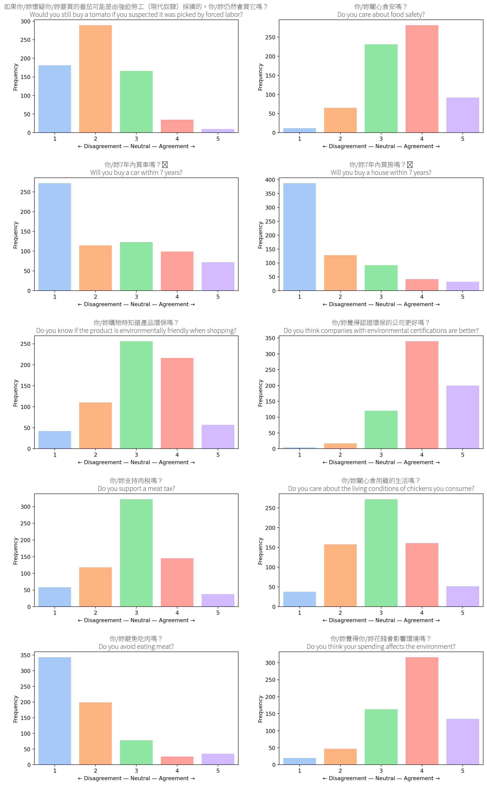
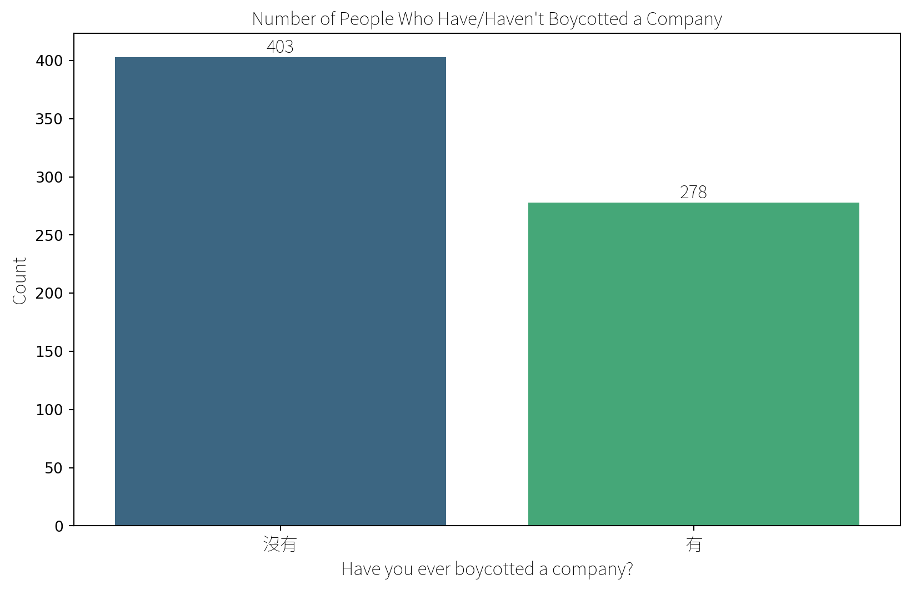
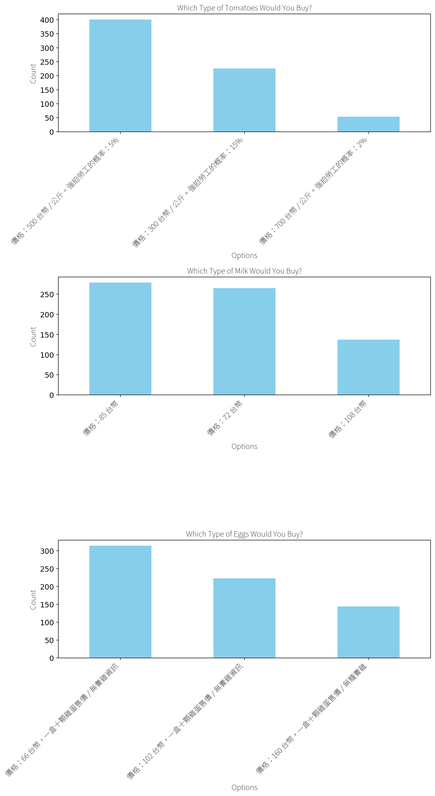

export const quartoRawHtml =
[`

`,`
<table class="dataframe" data-quarto-postprocess="true" data-border="1">
<thead>
<tr style="text-align: right;">
<th data-quarto-table-cell-role="th"></th>
<th data-quarto-table-cell-role="th">Reason</th>
<th data-quarto-table-cell-role="th">Count</th>
</tr>
</thead>
<tbody>
<tr>
<td data-quarto-table-cell-role="th">0</td>
<td>食安問題</td>
<td>33</td>
</tr>
<tr>
<td data-quarto-table-cell-role="th">1</td>
<td>地溝油</td>
<td>10</td>
</tr>
<tr>
<td data-quarto-table-cell-role="th">2</td>
<td>黑心油</td>
<td>8</td>
</tr>
<tr>
<td data-quarto-table-cell-role="th">3</td>
<td>食安</td>
<td>5</td>
</tr>
<tr>
<td data-quarto-table-cell-role="th">4</td>
<td>政治因素</td>
<td>4</td>
</tr>
<tr>
<td data-quarto-table-cell-role="th">...</td>
<td>...</td>
<td>...</td>
</tr>
<tr>
<td data-quarto-table-cell-role="th">182</td>
<td>因為有出新聞</td>
<td>1</td>
</tr>
<tr>
<td data-quarto-table-cell-role="th">183</td>
<td>此公司危害食安，以抵制這種行為讓公司更能意識到執行此行為的後果</td>
<td>1</td>
</tr>
<tr>
<td data-quarto-table-cell-role="th">184</td>
<td>地溝油啊</td>
<td>1</td>
</tr>
<tr>
<td data-quarto-table-cell-role="th">185</td>
<td>不認同理念</td>
<td>1</td>
</tr>
<tr>
<td data-quarto-table-cell-role="th">186</td>
<td>因為這家公司壓榨員工</td>
<td>1</td>
</tr>
</tbody>
</table>
`,`

187 rows × 2 columns

`,`

`,`
<table class="dataframe" data-quarto-postprocess="true" data-border="1">
<thead>
<tr style="text-align: right;">
<th data-quarto-table-cell-role="th"></th>
<th data-quarto-table-cell-role="th">Brand</th>
<th data-quarto-table-cell-role="th">Count</th>
</tr>
</thead>
<tbody>
<tr>
<td data-quarto-table-cell-role="th">193</td>
<td>No trusted brand</td>
<td>329</td>
</tr>
<tr>
<td data-quarto-table-cell-role="th">194</td>
<td>Have but not specified</td>
<td>56</td>
</tr>
<tr>
<td data-quarto-table-cell-role="th">0</td>
<td>義美</td>
<td>42</td>
</tr>
<tr>
<td data-quarto-table-cell-role="th">1</td>
<td>Apple</td>
<td>9</td>
</tr>
<tr>
<td data-quarto-table-cell-role="th">2</td>
<td>光泉</td>
<td>7</td>
</tr>
<tr>
<td data-quarto-table-cell-role="th">...</td>
<td>...</td>
<td>...</td>
</tr>
<tr>
<td data-quarto-table-cell-role="th">83</td>
<td>自家種植</td>
<td>1</td>
</tr>
<tr>
<td data-quarto-table-cell-role="th">84</td>
<td>Casetify</td>
<td>1</td>
</tr>
<tr>
<td data-quarto-table-cell-role="th">85</td>
<td>Adidas</td>
<td>1</td>
</tr>
<tr>
<td data-quarto-table-cell-role="th">86</td>
<td>麥當勞</td>
<td>1</td>
</tr>
<tr>
<td data-quarto-table-cell-role="th">97</td>
<td>淨毒五郎</td>
<td>1</td>
</tr>
</tbody>
</table>
`,`

195 rows × 2 columns

`];

## Shopping

### Boycott Count (Overall)

### Why Boycott

### Trusted Brands

The following responses were counted as “no brand”: “無”, “沒有”,
“沒有特別”, “🈚️”, “目前沒有”, “No”, “沒”, “沒有特別關注”,
“沒有特別信任的”, “不知道”, “無特別選擇”, “目前沒有完全信任的”,
“沒有特定的”, “沒有特定”, “沒有特別研究”, “目前沒有特別關注的品牌”,“N”,
“none”, “無特別”, “目前無”, “沒有特別想到”, “沒有固定的”, “x”, “沒在買”,
“nope”, “一時想不到…”, “沒有特別注意”, “無特別的品牌”,
“無絕對信任的品牌”, “不確定你說的範圍”, “還沒有”

## Choice Experiments

