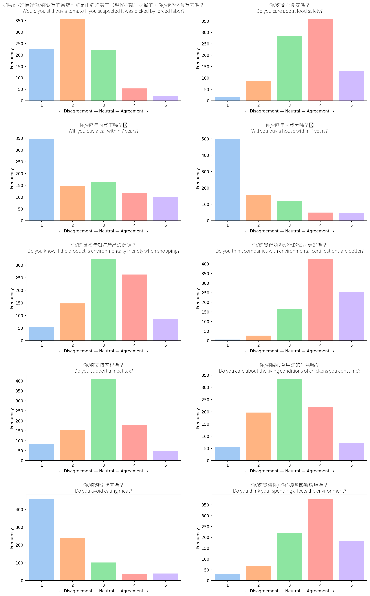

export const quartoRawHtml =
[`

`,`

187 rows × 2 columns

`,`

`,`

195 rows × 2 columns

`];

## Shopping

### Boycott Count (Overall)

### Why Boycott

|     | Reason                                                         | Count |
|-----|----------------------------------------------------------------|-------|
| 0   | 食安問題                                                       | 33    |
| 1   | 地溝油                                                         | 10    |
| 2   | 黑心油                                                         | 8     |
| 3   | 食安                                                           | 5     |
| 4   | 政治因素                                                       | 4     |
| ... | ...                                                            | ...   |
| 182 | 因為有出新聞                                                   | 1     |
| 183 | 此公司危害食安，以抵制這種行為讓公司更能意識到執行此行為的後果 | 1     |
| 184 | 地溝油啊                                                       | 1     |
| 185 | 不認同理念                                                     | 1     |
| 186 | 因為這家公司壓榨員工                                           | 1     |

### Trusted Brands

|     | Brand                  | Count |
|-----|------------------------|-------|
| 193 | No trusted brand       | 329   |
| 194 | Have but not specified | 56    |
| 0   | 義美                   | 42    |
| 1   | Apple                  | 9     |
| 2   | 光泉                   | 7     |
| ... | ...                    | ...   |
| 83  | 自家種植               | 1     |
| 84  | Casetify               | 1     |
| 85  | Adidas                 | 1     |
| 86  | 麥當勞                 | 1     |
| 97  | 淨毒五郎               | 1     |

The following responses were counted as “no brand”: “無”, “沒有”,
“沒有特別”, “🈚️”, “目前沒有”, “No”, “沒”, “沒有特別關注”,
“沒有特別信任的”, “不知道”, “無特別選擇”, “目前沒有完全信任的”,
“沒有特定的”, “沒有特定”, “沒有特別研究”, “目前沒有特別關注的品牌”,“N”,
“none”, “無特別”, “目前無”, “沒有特別想到”, “沒有固定的”, “x”, “沒在買”,
“nope”, “一時想不到…”, “沒有特別注意”, “無特別的品牌”,
“無絕對信任的品牌”, “不確定你說的範圍”, “還沒有”

### Choice Experiments

## Personas from Clusters

Personas are created using K-means clustering, an unsupervised machine
learning algorithm, which clusters college students based on their
responses across 36 Likert-scale fields in the online survey. Clusters
are visualized using Principal Component Analysis (PCA), where the
principal component loadings on the X and Y axes represent the weights
of the original Likert-scale fields, transformed into the principal
components that capture the most variance.

-   There is some similarity between clusters. All 3 personas report a
    high level of financial anxiety and below-average satisfaction with
    their financial literacy.

### Clustering Students to Build 3 Personas
